cola Report for Hierarchical Partitioning - 'MuraroPancreas'
==================

**Date**: 2021-07-26 10:58:13 CEST, **cola version**: 1.9.4

----------------------------------------------------------------

<style type='text/css'>

body, td, th {
   font-family: Arial,Helvetica,sans-serif;
   background-color: white;
   font-size: 13px;
  max-width: 800px;
  margin: auto;
  margin-left:210px;
  padding: 0px 10px 0px 10px;
  border-left: 1px solid #EEEEEE;
  line-height: 150%;
}

tt, code, pre {
   font-family: 'DejaVu Sans Mono', 'Droid Sans Mono', 'Lucida Console', Consolas, Monaco, 

monospace;
}

h1 {
   font-size:2.2em;
}

h2 {
   font-size:1.8em;
}

h3 {
   font-size:1.4em;
}

h4 {
   font-size:1.0em;
}

h5 {
   font-size:0.9em;
}

h6 {
   font-size:0.8em;
}

a {
  text-decoration: none;
  color: #0366d6;
}

a:hover {
  text-decoration: underline;
}

a:visited {
   color: #0366d6;
}

pre, img {
  max-width: 100%;
}
pre {
  overflow-x: auto;
}
pre code {
   display: block; padding: 0.5em;
}

code {
  font-size: 92%;
  border: 1px solid #ccc;
}

code[class] {
  background-color: #F8F8F8;
}

table, td, th {
  border: 1px solid #ccc;
}

blockquote {
   color:#666666;
   margin:0;
   padding-left: 1em;
   border-left: 0.5em #EEE solid;
}

hr {
   height: 0px;
   border-bottom: none;
   border-top-width: thin;
   border-top-style: dotted;
   border-top-color: #999999;
}

@media print {
   * {
      background: transparent !important;
      color: black !important;
      filter:none !important;
      -ms-filter: none !important;
   }

   body {
      font-size:12pt;
      max-width:100%;
   }

   a, a:visited {
      text-decoration: underline;
   }

   hr {
      visibility: hidden;
      page-break-before: always;
   }

   pre, blockquote {
      padding-right: 1em;
      page-break-inside: avoid;
   }

   tr, img {
      page-break-inside: avoid;
   }

   img {
      max-width: 100% !important;
   }

   @page :left {
      margin: 15mm 20mm 15mm 10mm;
   }

   @page :right {
      margin: 15mm 10mm 15mm 20mm;
   }

   p, h2, h3 {
      orphans: 3; widows: 3;
   }

   h2, h3 {
      page-break-after: avoid;
   }
}
</style>


## Summary


First the variable is renamed to `res_rh`.


```r
res_rh = rh
```


The partition hierarchy and all available functions which can be applied to `res_rh` object.


```r
res_rh
```

```
#> A 'HierarchicalPartition' object with 'ATC:skmeans' method.
#>   On a matrix with 11351 rows and 3072 columns.
#>   Performed in total 8250 partitions.
#>   There are 37 groups under the following parameters:
#>     - min_samples: 31
#>     - mean_silhouette_cutoff: 0.9
#>     - min_n_signatures: 454 (signatures are selected based on:)
#>       - fdr_cutoff: 0.05
#>       - group_diff (scaled values): 0.5
#> 
#> Hierarchy of the partition:
#>   0, 3072 cols
#>   |-- 01, 1135 cols, 4594 signatures
#>   |   |-- 011, 636 cols, 3 signatures (c)
#>   |   |-- 012, 341 cols, 1328 signatures
#>   |   |   |-- 0121, 116 cols, 59 signatures (c)
#>   |   |   |-- 0122, 77 cols, 247 signatures (c)
#>   |   |   |-- 0123, 101 cols, 135 signatures (c)
#>   |   |   `-- 0124, 47 cols (b)
#>   |   |-- 013, 65 cols, 1318 signatures
#>   |   |   |-- 0131, 30 cols (b)
#>   |   |   |-- 0132, 25 cols (b)
#>   |   |   `-- 0133, 10 cols (b)
#>   |   `-- 014, 93 cols, 294 signatures (c)
#>   `-- 02, 1937 cols, 9887 signatures
#>       |-- 021, 830 cols, 2412 signatures
#>       |   |-- 0211, 244 cols, 118 signatures (c)
#>       |   |-- 0212, 190 cols, 1564 signatures
#>       |   |   |-- 02121, 86 cols, 166 signatures (c)
#>       |   |   |-- 02122, 63 cols, 27 signatures (c)
#>       |   |   `-- 02123, 41 cols (b)
#>       |   |-- 0213, 209 cols, 369 signatures (c)
#>       |   `-- 0214, 187 cols, 2175 signatures
#>       |       |-- 02141, 54 cols (b)
#>       |       |-- 02142, 67 cols, 54 signatures (c)
#>       |       |-- 02143, 38 cols (b)
#>       |       `-- 02144, 28 cols (b)
#>       |-- 022, 447 cols, 8988 signatures
#>       |   |-- 0221, 184 cols, 7210 signatures
#>       |   |   |-- 02211, 81 cols, 714 signatures
#>       |   |   |   |-- 022111, 44 cols (b)
#>       |   |   |   `-- 022112, 37 cols (b)
#>       |   |   |-- 02212, 53 cols (b)
#>       |   |   `-- 02213, 50 cols (b)
#>       |   |-- 0222, 199 cols, 3899 signatures
#>       |   |   |-- 02221, 66 cols, 348 signatures (c)
#>       |   |   |-- 02222, 72 cols, 166 signatures (c)
#>       |   |   `-- 02223, 61 cols (b)
#>       |   `-- 0223, 64 cols, 358 signatures (c)
#>       |-- 023, 461 cols, 7954 signatures
#>       |   |-- 0231, 91 cols, 3531 signatures
#>       |   |   |-- 02311, 42 cols (b)
#>       |   |   `-- 02312, 49 cols (b)
#>       |   |-- 0232, 150 cols, 716 signatures
#>       |   |   |-- 02321, 109 cols, 146 signatures (c)
#>       |   |   `-- 02322, 41 cols (b)
#>       |   |-- 0233, 137 cols, 106 signatures (c)
#>       |   `-- 0234, 83 cols, 330 signatures (c)
#>       `-- 024, 199 cols, 4645 signatures
#>           |-- 0241, 84 cols, 521 signatures
#>           |   |-- 02411, 42 cols (b)
#>           |   `-- 02412, 42 cols (b)
#>           |-- 0242, 76 cols, 852 signatures
#>           |   |-- 02421, 42 cols (b)
#>           |   `-- 02422, 34 cols (b)
#>           `-- 0243, 39 cols (b)
#> Stop reason:
#>   b) Subgroup had too few columns.
#>   c) There were too few signatures.
#> 
#> Following methods can be applied to this 'HierarchicalPartition' object:
#>  [1] "all_leaves"            "all_nodes"             "cola_report"           "collect_classes"      
#>  [5] "colnames"              "compare_signatures"    "dimension_reduction"   "functional_enrichment"
#>  [9] "get_anno_col"          "get_anno"              "get_children_nodes"    "get_classes"          
#> [13] "get_matrix"            "get_signatures"        "is_leaf_node"          "max_depth"            
#> [17] "merge_node"            "ncol"                  "node_info"             "node_level"           
#> [21] "nrow"                  "rownames"              "show"                  "split_node"           
#> [25] "suggest_best_k"        "test_to_known_factors" "top_rows_heatmap"      "top_rows_overlap"     
#> 
#> You can get result for a single node by e.g. object["01"]
```

The call of `hierarchical_partition()` was:


```
#> hierarchical_partition(data = lt$mat, anno = lt$anno, subset = 500, cores = 4)
```

Dimension of the input matrix:


```r
mat = get_matrix(res_rh)
dim(mat)
```

```
#> [1] 11351  3072
```

All the methods that were tried:


```r
res_rh@param$combination_method
```

```
#> [[1]]
#> [1] "ATC"     "skmeans"
```

### Density distribution

The density distribution for each sample is visualized as one column in the following heatmap.
The clustering is based on the distance which is the Kolmogorov-Smirnov statistic between two distributions.


```r
library(ComplexHeatmap)
densityHeatmap(mat, top_annotation = HeatmapAnnotation(df = get_anno(res_rh), 
    col = get_anno_col(res_rh)), ylab = "value", cluster_columns = TRUE, show_column_names = FALSE,
    mc.cores = 1)
```

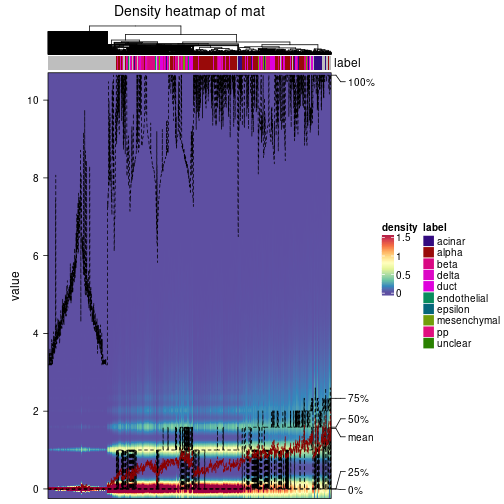


Some values about the hierarchy:


```r
all_nodes(res_rh)
```

```
#>  [1] "0"      "01"     "011"    "012"    "0121"   "0122"   "0123"   "0124"   "013"    "0131"  
#> [11] "0132"   "0133"   "014"    "02"     "021"    "0211"   "0212"   "02121"  "02122"  "02123" 
#> [21] "0213"   "0214"   "02141"  "02142"  "02143"  "02144"  "022"    "0221"   "02211"  "022111"
#> [31] "022112" "02212"  "02213"  "0222"   "02221"  "02222"  "02223"  "0223"   "023"    "0231"  
#> [41] "02311"  "02312"  "0232"   "02321"  "02322"  "0233"   "0234"   "024"    "0241"   "02411" 
#> [51] "02412"  "0242"   "02421"  "02422"  "0243"
```

```r
all_leaves(res_rh)
```

```
#>  [1] "011"    "0121"   "0122"   "0123"   "0124"   "0131"   "0132"   "0133"   "014"    "0211"  
#> [11] "02121"  "02122"  "02123"  "0213"   "02141"  "02142"  "02143"  "02144"  "022111" "022112"
#> [21] "02212"  "02213"  "02221"  "02222"  "02223"  "0223"   "02311"  "02312"  "02321"  "02322" 
#> [31] "0233"   "0234"   "02411"  "02412"  "02421"  "02422"  "0243"
```

```r
node_info(res_rh)
```

```
#>        id best_method depth best_k n_columns n_signatures p_signatures is_leaf
#> 1       0 ATC:skmeans     1      2      3072         9090     0.800811   FALSE
#> 2      01 ATC:skmeans     2      4      1135         4594     0.404722   FALSE
#> 3     011 ATC:skmeans     3      2       636            3     0.000264    TRUE
#> 4     012 ATC:skmeans     3      4       341         1328     0.116994   FALSE
#> 5    0121 ATC:skmeans     4      2       116           59     0.005198    TRUE
#> 6    0122 ATC:skmeans     4      2        77          247     0.021760    TRUE
#> 7    0123 ATC:skmeans     4      2       101          135     0.011893    TRUE
#> 8    0124 not applied     4     NA        47           NA           NA    TRUE
#> 9     013 ATC:skmeans     3      3        65         1318     0.116113   FALSE
#> 10   0131 not applied     4     NA        30           NA           NA    TRUE
#> 11   0132 not applied     4     NA        25           NA           NA    TRUE
#> 12   0133 not applied     4     NA        10           NA           NA    TRUE
#> 13    014 ATC:skmeans     3      2        93          294     0.025901    TRUE
#> 14     02 ATC:skmeans     2      4      1937         9887     0.871025   FALSE
#> 15    021 ATC:skmeans     3      4       830         2412     0.212492   FALSE
#> 16   0211 ATC:skmeans     4      2       244          118     0.010396    TRUE
#> 17   0212 ATC:skmeans     4      3       190         1564     0.137785   FALSE
#> 18  02121 ATC:skmeans     5      2        86          166     0.014624    TRUE
#> 19  02122 ATC:skmeans     5      2        63           27     0.002379    TRUE
#> 20  02123 not applied     5     NA        41           NA           NA    TRUE
#> 21   0213 ATC:skmeans     4      3       209          369     0.032508    TRUE
#> 22   0214 ATC:skmeans     4      4       187         2175     0.191613   FALSE
#> 23  02141 not applied     5     NA        54           NA           NA    TRUE
#> 24  02142 ATC:skmeans     5      2        67           54     0.004757    TRUE
#> 25  02143 not applied     5     NA        38           NA           NA    TRUE
#> 26  02144 not applied     5     NA        28           NA           NA    TRUE
#> 27    022 ATC:skmeans     3      3       447         8988     0.791825   FALSE
#> 28   0221 ATC:skmeans     4      3       184         7210     0.635186   FALSE
#> 29  02211 ATC:skmeans     5      2        81          714     0.062902   FALSE
#> 30 022111 not applied     6     NA        44           NA           NA    TRUE
#> 31 022112 not applied     6     NA        37           NA           NA    TRUE
#> 32  02212 not applied     5     NA        53           NA           NA    TRUE
#> 33  02213 not applied     5     NA        50           NA           NA    TRUE
#> 34   0222 ATC:skmeans     4      3       199         3899     0.343494   FALSE
#> 35  02221 ATC:skmeans     5      2        66          348     0.030658    TRUE
#> 36  02222 ATC:skmeans     5      2        72          166     0.014624    TRUE
#> 37  02223 not applied     5     NA        61           NA           NA    TRUE
#> 38   0223 ATC:skmeans     4      2        64          358     0.031539    TRUE
#> 39    023 ATC:skmeans     3      4       461         7954     0.700731   FALSE
#> 40   0231 ATC:skmeans     4      2        91         3531     0.311074   FALSE
#> 41  02311 not applied     5     NA        42           NA           NA    TRUE
#> 42  02312 not applied     5     NA        49           NA           NA    TRUE
#> 43   0232 ATC:skmeans     4      2       150          716     0.063078   FALSE
#> 44  02321 ATC:skmeans     5      2       109          146     0.012862    TRUE
#> 45  02322 not applied     5     NA        41           NA           NA    TRUE
#> 46   0233 ATC:skmeans     4      2       137          106     0.009338    TRUE
#> 47   0234 ATC:skmeans     4      2        83          330     0.029072    TRUE
#> 48    024 ATC:skmeans     3      3       199         4645     0.409215   FALSE
#> 49   0241 ATC:skmeans     4      2        84          521     0.045899   FALSE
#> 50  02411 not applied     5     NA        42           NA           NA    TRUE
#> 51  02412 not applied     5     NA        42           NA           NA    TRUE
#> 52   0242 ATC:skmeans     4      2        76          852     0.075059   FALSE
#> 53  02421 not applied     5     NA        42           NA           NA    TRUE
#> 54  02422 not applied     5     NA        34           NA           NA    TRUE
#> 55   0243 not applied     4     NA        39           NA           NA    TRUE
```

In the output from `node_info()`, there are the following columns:

- `id`: The node id.
- `best_method`: The best method selected.
- `depth`: Depth of the node in the hierarchy.
- `best_k`: Best number of groups of the partition on that node.
- `n_columns`: Number of columns in the submatrix.
- `n_signatures`: Number of signatures with the `best_k`.
- `p_signatures`: Proportion of hte signatures in total number of rows in the matrix.
- `is_leaf`: Whether the node is a leaf.

Labels of nodes are encoded in a special way. The number of digits
correspond to the depth of the node in the hierarchy and the value of the
digits correspond to the index of the subgroup in the current node, E.g. a label
of “012” means the node is the second subgroup of the partition which is the
first subgroup of the root node.

### Suggest the best k


Following table shows the best `k` (number of partitions) for each node in the
partition hierarchy. Clicking on the node name in the table goes to the
corresponding section for the partitioning on that node.

[The cola vignette](https://jokergoo.github.io/cola_vignettes/cola.html#toc_13)
explains the definition of the metrics used for determining the best
number of partitions.


```r
suggest_best_k(res_rh)
```


|Node                    |Best method                                         |Is leaf   |Best k |1-PAC |Mean silhouette |Concordance | #samples|   |
|:-----------------------|:---------------------------------------------------|:---------|:------|:-----|:---------------|:-----------|--------:|:--|
|[Node0](#Node0)         |ATC:skmeans                                         |          |3      |0.99  |0.95            |0.98        |     3072|** |
|[Node01](#Node01)       |ATC:skmeans                                         |          |4      |0.95  |0.97            |0.98        |     1135|** |
|Node011-leaf            |ATC:skmeans                                         |✓ (&#99;) |2      |0.92  |0.94            |0.97        |      636|*  |
|[Node012](#Node012)     |ATC:skmeans                                         |          |4      |0.92  |0.95            |0.97        |      341|*  |
|Node0121-leaf           |ATC:skmeans                                         |✓ (&#99;) |2      |0.91  |0.92            |0.97        |      116|*  |
|Node0122-leaf           |ATC:skmeans                                         |✓ (&#99;) |2      |1.00  |1.00            |1.00        |       77|** |
|Node0123-leaf           |ATC:skmeans                                         |✓ (&#99;) |2      |1.00  |0.96            |0.98        |      101|** |
|Node0124-leaf           |<span style='color:grey;'><i>not applied</i></span> |✓ (b)     |       |      |                |            |       47|   |
|[Node013](#Node013)     |ATC:skmeans                                         |          |3      |1.00  |1.00            |1.00        |       65|** |
|Node0131-leaf           |<span style='color:grey;'><i>not applied</i></span> |✓ (b)     |       |      |                |            |       30|   |
|Node0132-leaf           |<span style='color:grey;'><i>not applied</i></span> |✓ (b)     |       |      |                |            |       25|   |
|Node0133-leaf           |<span style='color:grey;'><i>not applied</i></span> |✓ (b)     |       |      |                |            |       10|   |
|Node014-leaf            |ATC:skmeans                                         |✓ (&#99;) |3      |0.94  |0.93            |0.97        |       93|*  |
|[Node02](#Node02)       |ATC:skmeans                                         |          |4      |1.00  |0.96            |0.98        |     1937|** |
|[Node021](#Node021)     |ATC:skmeans                                         |          |4      |1.00  |0.97            |0.99        |      830|** |
|Node0211-leaf           |ATC:skmeans                                         |✓ (&#99;) |3      |0.94  |0.93            |0.97        |      244|*  |
|[Node0212](#Node0212)   |ATC:skmeans                                         |          |3      |0.98  |0.96            |0.98        |      190|** |
|Node02121-leaf          |ATC:skmeans                                         |✓ (&#99;) |2      |0.88  |0.91            |0.97        |       86|   |
|Node02122-leaf          |ATC:skmeans                                         |✓ (&#99;) |2      |0.93  |0.92            |0.97        |       63|*  |
|Node02123-leaf          |<span style='color:grey;'><i>not applied</i></span> |✓ (b)     |       |      |                |            |       41|   |
|Node0213-leaf           |ATC:skmeans                                         |✓ (&#99;) |3      |0.95  |0.93            |0.97        |      209|*  |
|[Node0214](#Node0214)   |ATC:skmeans                                         |          |4      |1.00  |0.98            |0.98        |      187|** |
|Node02141-leaf          |<span style='color:grey;'><i>not applied</i></span> |✓ (b)     |       |      |                |            |       54|   |
|Node02142-leaf          |ATC:skmeans                                         |✓ (&#99;) |2      |1.00  |0.96            |0.99        |       67|** |
|Node02143-leaf          |<span style='color:grey;'><i>not applied</i></span> |✓ (b)     |       |      |                |            |       38|   |
|Node02144-leaf          |<span style='color:grey;'><i>not applied</i></span> |✓ (b)     |       |      |                |            |       28|   |
|[Node022](#Node022)     |ATC:skmeans                                         |          |4      |0.96  |0.91            |0.96        |      447|** |
|[Node0221](#Node0221)   |ATC:skmeans                                         |          |3      |1.00  |0.99            |0.99        |      184|** |
|[Node02211](#Node02211) |ATC:skmeans                                         |          |2      |1.00  |0.99            |1.00        |       81|** |
|Node022111-leaf         |<span style='color:grey;'><i>not applied</i></span> |✓ (b)     |       |      |                |            |       44|   |
|Node022112-leaf         |<span style='color:grey;'><i>not applied</i></span> |✓ (b)     |       |      |                |            |       37|   |
|Node02212-leaf          |<span style='color:grey;'><i>not applied</i></span> |✓ (b)     |       |      |                |            |       53|   |
|Node02213-leaf          |<span style='color:grey;'><i>not applied</i></span> |✓ (b)     |       |      |                |            |       50|   |
|[Node0222](#Node0222)   |ATC:skmeans                                         |          |3      |1.00  |0.97            |0.99        |      199|** |
|Node02221-leaf          |ATC:skmeans                                         |✓ (&#99;) |2      |1.00  |0.97            |0.99        |       66|** |
|Node02222-leaf          |ATC:skmeans                                         |✓ (&#99;) |2      |1.00  |0.98            |0.99        |       72|** |
|Node02223-leaf          |<span style='color:grey;'><i>not applied</i></span> |✓ (b)     |       |      |                |            |       61|   |
|Node0223-leaf           |ATC:skmeans                                         |✓ (&#99;) |2      |1.00  |0.97            |0.99        |       64|** |
|[Node023](#Node023)     |ATC:skmeans                                         |          |4      |1.00  |0.97            |0.99        |      461|** |
|[Node0231](#Node0231)   |ATC:skmeans                                         |          |2      |1.00  |0.97            |0.99        |       91|** |
|Node02311-leaf          |<span style='color:grey;'><i>not applied</i></span> |✓ (b)     |       |      |                |            |       42|   |
|Node02312-leaf          |<span style='color:grey;'><i>not applied</i></span> |✓ (b)     |       |      |                |            |       49|   |
|[Node0232](#Node0232)   |ATC:skmeans                                         |          |4      |0.91  |0.90            |0.95        |      150|*  |
|Node02321-leaf          |ATC:skmeans                                         |✓ (&#99;) |2      |0.94  |0.95            |0.98        |      109|*  |
|Node02322-leaf          |<span style='color:grey;'><i>not applied</i></span> |✓ (b)     |       |      |                |            |       41|   |
|Node0233-leaf           |ATC:skmeans                                         |✓ (&#99;) |2      |0.98  |0.95            |0.98        |      137|** |
|Node0234-leaf           |ATC:skmeans                                         |✓ (&#99;) |2      |1.00  |0.98            |0.99        |       83|** |
|[Node024](#Node024)     |ATC:skmeans                                         |          |4      |0.98  |0.95            |0.98        |      199|** |
|[Node0241](#Node0241)   |ATC:skmeans                                         |          |3      |0.91  |0.90            |0.95        |       84|*  |
|Node02411-leaf          |<span style='color:grey;'><i>not applied</i></span> |✓ (b)     |       |      |                |            |       42|   |
|Node02412-leaf          |<span style='color:grey;'><i>not applied</i></span> |✓ (b)     |       |      |                |            |       42|   |
|[Node0242](#Node0242)   |ATC:skmeans                                         |          |2      |1.00  |0.98            |0.99        |       76|** |
|Node02421-leaf          |<span style='color:grey;'><i>not applied</i></span> |✓ (b)     |       |      |                |            |       42|   |
|Node02422-leaf          |<span style='color:grey;'><i>not applied</i></span> |✓ (b)     |       |      |                |            |       34|   |
|Node0243-leaf           |<span style='color:grey;'><i>not applied</i></span> |✓ (b)     |       |      |                |            |       39|   |


Stop reason: b) Subgroup had too few columns. c) There were too few signatures. 

\*\*: 1-PAC > 0.95, \*: 1-PAC > 0.9


### Partition hierarchy

The nodes of the hierarchy can be merged by setting the `merge_node` parameters. Here we 
control the hierarchy with the `min_n_signatures` parameter. The value of `min_n_signatures` is
from `node_info()`.


<style type='text/css'>


.ui-helper-hidden {
	display: none;
}
.ui-helper-hidden-accessible {
	border: 0;
	clip: rect(0 0 0 0);
	height: 1px;
	margin: -1px;
	overflow: hidden;
	padding: 0;
	position: absolute;
	width: 1px;
}
.ui-helper-reset {
	margin: 0;
	padding: 0;
	border: 0;
	outline: 0;
	line-height: 1.3;
	text-decoration: none;
	font-size: 100%;
	list-style: none;
}
.ui-helper-clearfix:before,
.ui-helper-clearfix:after {
	content: "";
	display: table;
	border-collapse: collapse;
}
.ui-helper-clearfix:after {
	clear: both;
}
.ui-helper-zfix {
	width: 100%;
	height: 100%;
	top: 0;
	left: 0;
	position: absolute;
	opacity: 0;
	filter:Alpha(Opacity=0); 
}

.ui-front {
	z-index: 100;
}


.ui-state-disabled {
	cursor: default !important;
	pointer-events: none;
}


.ui-icon {
	display: inline-block;
	vertical-align: middle;
	margin-top: -.25em;
	position: relative;
	text-indent: -99999px;
	overflow: hidden;
	background-repeat: no-repeat;
}

.ui-widget-icon-block {
	left: 50%;
	margin-left: -8px;
	display: block;
}


.ui-widget-overlay {
	position: fixed;
	top: 0;
	left: 0;
	width: 100%;
	height: 100%;
}
.ui-accordion .ui-accordion-header {
	display: block;
	cursor: pointer;
	position: relative;
	margin: 2px 0 0 0;
	padding: .5em .5em .5em .7em;
	font-size: 100%;
}
.ui-accordion .ui-accordion-content {
	padding: 1em 2.2em;
	border-top: 0;
	overflow: auto;
}
.ui-autocomplete {
	position: absolute;
	top: 0;
	left: 0;
	cursor: default;
}
.ui-menu {
	list-style: none;
	padding: 0;
	margin: 0;
	display: block;
	outline: 0;
}
.ui-menu .ui-menu {
	position: absolute;
}
.ui-menu .ui-menu-item {
	margin: 0;
	cursor: pointer;
	
	list-style-image: url("data:image/gif;base64,R0lGODlhAQABAIAAAAAAAP///yH5BAEAAAAALAAAAAABAAEAAAIBRAA7");
}
.ui-menu .ui-menu-item-wrapper {
	position: relative;
	padding: 3px 1em 3px .4em;
}
.ui-menu .ui-menu-divider {
	margin: 5px 0;
	height: 0;
	font-size: 0;
	line-height: 0;
	border-width: 1px 0 0 0;
}
.ui-menu .ui-state-focus,
.ui-menu .ui-state-active {
	margin: -1px;
}


.ui-menu-icons {
	position: relative;
}
.ui-menu-icons .ui-menu-item-wrapper {
	padding-left: 2em;
}


.ui-menu .ui-icon {
	position: absolute;
	top: 0;
	bottom: 0;
	left: .2em;
	margin: auto 0;
}


.ui-menu .ui-menu-icon {
	left: auto;
	right: 0;
}
.ui-button {
	padding: .4em 1em;
	display: inline-block;
	position: relative;
	line-height: normal;
	margin-right: .1em;
	cursor: pointer;
	vertical-align: middle;
	text-align: center;
	-webkit-user-select: none;
	-moz-user-select: none;
	-ms-user-select: none;
	user-select: none;

	
	overflow: visible;
}

.ui-button,
.ui-button:link,
.ui-button:visited,
.ui-button:hover,
.ui-button:active {
	text-decoration: none;
}


.ui-button-icon-only {
	width: 2em;
	box-sizing: border-box;
	text-indent: -9999px;
	white-space: nowrap;
}


input.ui-button.ui-button-icon-only {
	text-indent: 0;
}


.ui-button-icon-only .ui-icon {
	position: absolute;
	top: 50%;
	left: 50%;
	margin-top: -8px;
	margin-left: -8px;
}

.ui-button.ui-icon-notext .ui-icon {
	padding: 0;
	width: 2.1em;
	height: 2.1em;
	text-indent: -9999px;
	white-space: nowrap;

}

input.ui-button.ui-icon-notext .ui-icon {
	width: auto;
	height: auto;
	text-indent: 0;
	white-space: normal;
	padding: .4em 1em;
}


input.ui-button::-moz-focus-inner,
button.ui-button::-moz-focus-inner {
	border: 0;
	padding: 0;
}
.ui-controlgroup {
	vertical-align: middle;
	display: inline-block;
}
.ui-controlgroup > .ui-controlgroup-item {
	float: left;
	margin-left: 0;
	margin-right: 0;
}
.ui-controlgroup > .ui-controlgroup-item:focus,
.ui-controlgroup > .ui-controlgroup-item.ui-visual-focus {
	z-index: 9999;
}
.ui-controlgroup-vertical > .ui-controlgroup-item {
	display: block;
	float: none;
	width: 100%;
	margin-top: 0;
	margin-bottom: 0;
	text-align: left;
}
.ui-controlgroup-vertical .ui-controlgroup-item {
	box-sizing: border-box;
}
.ui-controlgroup .ui-controlgroup-label {
	padding: .4em 1em;
}
.ui-controlgroup .ui-controlgroup-label span {
	font-size: 80%;
}
.ui-controlgroup-horizontal .ui-controlgroup-label + .ui-controlgroup-item {
	border-left: none;
}
.ui-controlgroup-vertical .ui-controlgroup-label + .ui-controlgroup-item {
	border-top: none;
}
.ui-controlgroup-horizontal .ui-controlgroup-label.ui-widget-content {
	border-right: none;
}
.ui-controlgroup-vertical .ui-controlgroup-label.ui-widget-content {
	border-bottom: none;
}


.ui-controlgroup-vertical .ui-spinner-input {

	
	width: 75%;
	width: calc( 100% - 2.4em );
}
.ui-controlgroup-vertical .ui-spinner .ui-spinner-up {
	border-top-style: solid;
}

.ui-checkboxradio-label .ui-icon-background {
	box-shadow: inset 1px 1px 1px #ccc;
	border-radius: .12em;
	border: none;
}
.ui-checkboxradio-radio-label .ui-icon-background {
	width: 16px;
	height: 16px;
	border-radius: 1em;
	overflow: visible;
	border: none;
}
.ui-checkboxradio-radio-label.ui-checkboxradio-checked .ui-icon,
.ui-checkboxradio-radio-label.ui-checkboxradio-checked:hover .ui-icon {
	background-image: none;
	width: 8px;
	height: 8px;
	border-width: 4px;
	border-style: solid;
}
.ui-checkboxradio-disabled {
	pointer-events: none;
}
.ui-datepicker {
	width: 17em;
	padding: .2em .2em 0;
	display: none;
}
.ui-datepicker .ui-datepicker-header {
	position: relative;
	padding: .2em 0;
}
.ui-datepicker .ui-datepicker-prev,
.ui-datepicker .ui-datepicker-next {
	position: absolute;
	top: 2px;
	width: 1.8em;
	height: 1.8em;
}
.ui-datepicker .ui-datepicker-prev-hover,
.ui-datepicker .ui-datepicker-next-hover {
	top: 1px;
}
.ui-datepicker .ui-datepicker-prev {
	left: 2px;
}
.ui-datepicker .ui-datepicker-next {
	right: 2px;
}
.ui-datepicker .ui-datepicker-prev-hover {
	left: 1px;
}
.ui-datepicker .ui-datepicker-next-hover {
	right: 1px;
}
.ui-datepicker .ui-datepicker-prev span,
.ui-datepicker .ui-datepicker-next span {
	display: block;
	position: absolute;
	left: 50%;
	margin-left: -8px;
	top: 50%;
	margin-top: -8px;
}
.ui-datepicker .ui-datepicker-title {
	margin: 0 2.3em;
	line-height: 1.8em;
	text-align: center;
}
.ui-datepicker .ui-datepicker-title select {
	font-size: 1em;
	margin: 1px 0;
}
.ui-datepicker select.ui-datepicker-month,
.ui-datepicker select.ui-datepicker-year {
	width: 45%;
}
.ui-datepicker table {
	width: 100%;
	font-size: .9em;
	border-collapse: collapse;
	margin: 0 0 .4em;
}
.ui-datepicker th {
	padding: .7em .3em;
	text-align: center;
	font-weight: bold;
	border: 0;
}
.ui-datepicker td {
	border: 0;
	padding: 1px;
}
.ui-datepicker td span,
.ui-datepicker td a {
	display: block;
	padding: .2em;
	text-align: right;
	text-decoration: none;
}
.ui-datepicker .ui-datepicker-buttonpane {
	background-image: none;
	margin: .7em 0 0 0;
	padding: 0 .2em;
	border-left: 0;
	border-right: 0;
	border-bottom: 0;
}
.ui-datepicker .ui-datepicker-buttonpane button {
	float: right;
	margin: .5em .2em .4em;
	cursor: pointer;
	padding: .2em .6em .3em .6em;
	width: auto;
	overflow: visible;
}
.ui-datepicker .ui-datepicker-buttonpane button.ui-datepicker-current {
	float: left;
}


.ui-datepicker.ui-datepicker-multi {
	width: auto;
}
.ui-datepicker-multi .ui-datepicker-group {
	float: left;
}
.ui-datepicker-multi .ui-datepicker-group table {
	width: 95%;
	margin: 0 auto .4em;
}
.ui-datepicker-multi-2 .ui-datepicker-group {
	width: 50%;
}
.ui-datepicker-multi-3 .ui-datepicker-group {
	width: 33.3%;
}
.ui-datepicker-multi-4 .ui-datepicker-group {
	width: 25%;
}
.ui-datepicker-multi .ui-datepicker-group-last .ui-datepicker-header,
.ui-datepicker-multi .ui-datepicker-group-middle .ui-datepicker-header {
	border-left-width: 0;
}
.ui-datepicker-multi .ui-datepicker-buttonpane {
	clear: left;
}
.ui-datepicker-row-break {
	clear: both;
	width: 100%;
	font-size: 0;
}


.ui-datepicker-rtl {
	direction: rtl;
}
.ui-datepicker-rtl .ui-datepicker-prev {
	right: 2px;
	left: auto;
}
.ui-datepicker-rtl .ui-datepicker-next {
	left: 2px;
	right: auto;
}
.ui-datepicker-rtl .ui-datepicker-prev:hover {
	right: 1px;
	left: auto;
}
.ui-datepicker-rtl .ui-datepicker-next:hover {
	left: 1px;
	right: auto;
}
.ui-datepicker-rtl .ui-datepicker-buttonpane {
	clear: right;
}
.ui-datepicker-rtl .ui-datepicker-buttonpane button {
	float: left;
}
.ui-datepicker-rtl .ui-datepicker-buttonpane button.ui-datepicker-current,
.ui-datepicker-rtl .ui-datepicker-group {
	float: right;
}
.ui-datepicker-rtl .ui-datepicker-group-last .ui-datepicker-header,
.ui-datepicker-rtl .ui-datepicker-group-middle .ui-datepicker-header {
	border-right-width: 0;
	border-left-width: 1px;
}


.ui-datepicker .ui-icon {
	display: block;
	text-indent: -99999px;
	overflow: hidden;
	background-repeat: no-repeat;
	left: .5em;
	top: .3em;
}
.ui-dialog {
	position: absolute;
	top: 0;
	left: 0;
	padding: .2em;
	outline: 0;
}
.ui-dialog .ui-dialog-titlebar {
	padding: .4em 1em;
	position: relative;
}
.ui-dialog .ui-dialog-title {
	float: left;
	margin: .1em 0;
	white-space: nowrap;
	width: 90%;
	overflow: hidden;
	text-overflow: ellipsis;
}
.ui-dialog .ui-dialog-titlebar-close {
	position: absolute;
	right: .3em;
	top: 50%;
	width: 20px;
	margin: -10px 0 0 0;
	padding: 1px;
	height: 20px;
}
.ui-dialog .ui-dialog-content {
	position: relative;
	border: 0;
	padding: .5em 1em;
	background: none;
	overflow: auto;
}
.ui-dialog .ui-dialog-buttonpane {
	text-align: left;
	border-width: 1px 0 0 0;
	background-image: none;
	margin-top: .5em;
	padding: .3em 1em .5em .4em;
}
.ui-dialog .ui-dialog-buttonpane .ui-dialog-buttonset {
	float: right;
}
.ui-dialog .ui-dialog-buttonpane button {
	margin: .5em .4em .5em 0;
	cursor: pointer;
}
.ui-dialog .ui-resizable-n {
	height: 2px;
	top: 0;
}
.ui-dialog .ui-resizable-e {
	width: 2px;
	right: 0;
}
.ui-dialog .ui-resizable-s {
	height: 2px;
	bottom: 0;
}
.ui-dialog .ui-resizable-w {
	width: 2px;
	left: 0;
}
.ui-dialog .ui-resizable-se,
.ui-dialog .ui-resizable-sw,
.ui-dialog .ui-resizable-ne,
.ui-dialog .ui-resizable-nw {
	width: 7px;
	height: 7px;
}
.ui-dialog .ui-resizable-se {
	right: 0;
	bottom: 0;
}
.ui-dialog .ui-resizable-sw {
	left: 0;
	bottom: 0;
}
.ui-dialog .ui-resizable-ne {
	right: 0;
	top: 0;
}
.ui-dialog .ui-resizable-nw {
	left: 0;
	top: 0;
}
.ui-draggable .ui-dialog-titlebar {
	cursor: move;
}
.ui-draggable-handle {
	-ms-touch-action: none;
	touch-action: none;
}
.ui-resizable {
	position: relative;
}
.ui-resizable-handle {
	position: absolute;
	font-size: 0.1px;
	display: block;
	-ms-touch-action: none;
	touch-action: none;
}
.ui-resizable-disabled .ui-resizable-handle,
.ui-resizable-autohide .ui-resizable-handle {
	display: none;
}
.ui-resizable-n {
	cursor: n-resize;
	height: 7px;
	width: 100%;
	top: -5px;
	left: 0;
}
.ui-resizable-s {
	cursor: s-resize;
	height: 7px;
	width: 100%;
	bottom: -5px;
	left: 0;
}
.ui-resizable-e {
	cursor: e-resize;
	width: 7px;
	right: -5px;
	top: 0;
	height: 100%;
}
.ui-resizable-w {
	cursor: w-resize;
	width: 7px;
	left: -5px;
	top: 0;
	height: 100%;
}
.ui-resizable-se {
	cursor: se-resize;
	width: 12px;
	height: 12px;
	right: 1px;
	bottom: 1px;
}
.ui-resizable-sw {
	cursor: sw-resize;
	width: 9px;
	height: 9px;
	left: -5px;
	bottom: -5px;
}
.ui-resizable-nw {
	cursor: nw-resize;
	width: 9px;
	height: 9px;
	left: -5px;
	top: -5px;
}
.ui-resizable-ne {
	cursor: ne-resize;
	width: 9px;
	height: 9px;
	right: -5px;
	top: -5px;
}
.ui-progressbar {
	height: 2em;
	text-align: left;
	overflow: hidden;
}
.ui-progressbar .ui-progressbar-value {
	margin: -1px;
	height: 100%;
}
.ui-progressbar .ui-progressbar-overlay {
	background: url("");
	height: 100%;
	filter: alpha(opacity=25); 
	opacity: 0.25;
}
.ui-progressbar-indeterminate .ui-progressbar-value {
	background-image: none;
}
.ui-selectable {
	-ms-touch-action: none;
	touch-action: none;
}
.ui-selectable-helper {
	position: absolute;
	z-index: 100;
	border: 1px dotted black;
}
.ui-selectmenu-menu {
	padding: 0;
	margin: 0;
	position: absolute;
	top: 0;
	left: 0;
	display: none;
}
.ui-selectmenu-menu .ui-menu {
	overflow: auto;
	overflow-x: hidden;
	padding-bottom: 1px;
}
.ui-selectmenu-menu .ui-menu .ui-selectmenu-optgroup {
	font-size: 1em;
	font-weight: bold;
	line-height: 1.5;
	padding: 2px 0.4em;
	margin: 0.5em 0 0 0;
	height: auto;
	border: 0;
}
.ui-selectmenu-open {
	display: block;
}
.ui-selectmenu-text {
	display: block;
	margin-right: 20px;
	overflow: hidden;
	text-overflow: ellipsis;
}
.ui-selectmenu-button.ui-button {
	text-align: left;
	white-space: nowrap;
	width: 14em;
}
.ui-selectmenu-icon.ui-icon {
	float: right;
	margin-top: 0;
}
.ui-slider {
	position: relative;
	text-align: left;
}
.ui-slider .ui-slider-handle {
	position: absolute;
	z-index: 2;
	width: 1.2em;
	height: 1.2em;
	cursor: default;
	-ms-touch-action: none;
	touch-action: none;
}
.ui-slider .ui-slider-range {
	position: absolute;
	z-index: 1;
	font-size: .7em;
	display: block;
	border: 0;
	background-position: 0 0;
}


.ui-slider.ui-state-disabled .ui-slider-handle,
.ui-slider.ui-state-disabled .ui-slider-range {
	filter: inherit;
}

.ui-slider-horizontal {
	height: .8em;
}
.ui-slider-horizontal .ui-slider-handle {
	top: -.3em;
	margin-left: -.6em;
}
.ui-slider-horizontal .ui-slider-range {
	top: 0;
	height: 100%;
}
.ui-slider-horizontal .ui-slider-range-min {
	left: 0;
}
.ui-slider-horizontal .ui-slider-range-max {
	right: 0;
}

.ui-slider-vertical {
	width: .8em;
	height: 100px;
}
.ui-slider-vertical .ui-slider-handle {
	left: -.3em;
	margin-left: 0;
	margin-bottom: -.6em;
}
.ui-slider-vertical .ui-slider-range {
	left: 0;
	width: 100%;
}
.ui-slider-vertical .ui-slider-range-min {
	bottom: 0;
}
.ui-slider-vertical .ui-slider-range-max {
	top: 0;
}
.ui-sortable-handle {
	-ms-touch-action: none;
	touch-action: none;
}
.ui-spinner {
	position: relative;
	display: inline-block;
	overflow: hidden;
	padding: 0;
	vertical-align: middle;
}
.ui-spinner-input {
	border: none;
	background: none;
	color: inherit;
	padding: .222em 0;
	margin: .2em 0;
	vertical-align: middle;
	margin-left: .4em;
	margin-right: 2em;
}
.ui-spinner-button {
	width: 1.6em;
	height: 50%;
	font-size: .5em;
	padding: 0;
	margin: 0;
	text-align: center;
	position: absolute;
	cursor: default;
	display: block;
	overflow: hidden;
	right: 0;
}

.ui-spinner a.ui-spinner-button {
	border-top-style: none;
	border-bottom-style: none;
	border-right-style: none;
}
.ui-spinner-up {
	top: 0;
}
.ui-spinner-down {
	bottom: 0;
}
.ui-tabs {
	position: relative;
	padding: .2em;
}
.ui-tabs .ui-tabs-nav {
	margin: 0;
	padding: .2em .2em 0;
}
.ui-tabs .ui-tabs-nav li {
	list-style: none;
	float: left;
	position: relative;
	top: 0;
	margin: 1px .2em 0 0;
	border-bottom-width: 0;
	padding: 0;
	white-space: nowrap;
}
.ui-tabs .ui-tabs-nav .ui-tabs-anchor {
	float: left;
	padding: .5em 1em;
	text-decoration: none;
}
.ui-tabs .ui-tabs-nav li.ui-tabs-active {
	margin-bottom: -1px;
	padding-bottom: 1px;
}
.ui-tabs .ui-tabs-nav li.ui-tabs-active .ui-tabs-anchor,
.ui-tabs .ui-tabs-nav li.ui-state-disabled .ui-tabs-anchor,
.ui-tabs .ui-tabs-nav li.ui-tabs-loading .ui-tabs-anchor {
	cursor: text;
}
.ui-tabs-collapsible .ui-tabs-nav li.ui-tabs-active .ui-tabs-anchor {
	cursor: pointer;
}
.ui-tabs .ui-tabs-panel {
	display: block;
	border-width: 0;
	padding: 1em 1.4em;
	background: none;
}
.ui-tooltip {
	padding: 8px;
	position: absolute;
	z-index: 9999;
	max-width: 300px;
}
body .ui-tooltip {
	border-width: 2px;
}

.ui-widget {
	font-family: Arial,Helvetica,sans-serif;
	font-size: 1em;
}
.ui-widget .ui-widget {
	font-size: 1em;
}
.ui-widget input,
.ui-widget select,
.ui-widget textarea,
.ui-widget button {
	font-family: Arial,Helvetica,sans-serif;
	font-size: 1em;
}
.ui-widget.ui-widget-content {
	border: 1px solid #c5c5c5;
}
.ui-widget-content {
	border: 1px solid #dddddd;
	background: #ffffff;
	color: #333333;
}
.ui-widget-content a {
	color: #333333;
}
.ui-widget-header {
	border: 1px solid #dddddd;
	background: #e9e9e9;
	color: #333333;
	font-weight: bold;
}
.ui-widget-header a {
	color: #333333;
}


.ui-state-default,
.ui-widget-content .ui-state-default,
.ui-widget-header .ui-state-default,
.ui-button,


html .ui-button.ui-state-disabled:hover,
html .ui-button.ui-state-disabled:active {
	border: 1px solid #c5c5c5;
	background: #f6f6f6;
	font-weight: normal;
	color: #454545;
}
.ui-state-default a,
.ui-state-default a:link,
.ui-state-default a:visited,
a.ui-button,
a:link.ui-button,
a:visited.ui-button,
.ui-button {
	color: #454545;
	text-decoration: none;
}
.ui-state-hover,
.ui-widget-content .ui-state-hover,
.ui-widget-header .ui-state-hover,
.ui-state-focus,
.ui-widget-content .ui-state-focus,
.ui-widget-header .ui-state-focus,
.ui-button:hover,
.ui-button:focus {
	border: 1px solid #cccccc;
	background: #ededed;
	font-weight: normal;
	color: #2b2b2b;
}
.ui-state-hover a,
.ui-state-hover a:hover,
.ui-state-hover a:link,
.ui-state-hover a:visited,
.ui-state-focus a,
.ui-state-focus a:hover,
.ui-state-focus a:link,
.ui-state-focus a:visited,
a.ui-button:hover,
a.ui-button:focus {
	color: #2b2b2b;
	text-decoration: none;
}

.ui-visual-focus {
	box-shadow: 0 0 3px 1px rgb(94, 158, 214);
}
.ui-state-active,
.ui-widget-content .ui-state-active,
.ui-widget-header .ui-state-active,
a.ui-button:active,
.ui-button:active,
.ui-button.ui-state-active:hover {
	border: 1px solid #003eff;
	background: #007fff;
	font-weight: normal;
	color: #ffffff;
}
.ui-icon-background,
.ui-state-active .ui-icon-background {
	border: #003eff;
	background-color: #ffffff;
}
.ui-state-active a,
.ui-state-active a:link,
.ui-state-active a:visited {
	color: #ffffff;
	text-decoration: none;
}


.ui-state-highlight,
.ui-widget-content .ui-state-highlight,
.ui-widget-header .ui-state-highlight {
	border: 1px solid #dad55e;
	background: #fffa90;
	color: #777620;
}
.ui-state-checked {
	border: 1px solid #dad55e;
	background: #fffa90;
}
.ui-state-highlight a,
.ui-widget-content .ui-state-highlight a,
.ui-widget-header .ui-state-highlight a {
	color: #777620;
}
.ui-state-error,
.ui-widget-content .ui-state-error,
.ui-widget-header .ui-state-error {
	border: 1px solid #f1a899;
	background: #fddfdf;
	color: #5f3f3f;
}
.ui-state-error a,
.ui-widget-content .ui-state-error a,
.ui-widget-header .ui-state-error a {
	color: #5f3f3f;
}
.ui-state-error-text,
.ui-widget-content .ui-state-error-text,
.ui-widget-header .ui-state-error-text {
	color: #5f3f3f;
}
.ui-priority-primary,
.ui-widget-content .ui-priority-primary,
.ui-widget-header .ui-priority-primary {
	font-weight: bold;
}
.ui-priority-secondary,
.ui-widget-content .ui-priority-secondary,
.ui-widget-header .ui-priority-secondary {
	opacity: .7;
	filter:Alpha(Opacity=70); 
	font-weight: normal;
}
.ui-state-disabled,
.ui-widget-content .ui-state-disabled,
.ui-widget-header .ui-state-disabled {
	opacity: .35;
	filter:Alpha(Opacity=35); 
	background-image: none;
}
.ui-state-disabled .ui-icon {
	filter:Alpha(Opacity=35); 
}


.ui-icon {
	width: 16px;
	height: 16px;
}
.ui-icon,
.ui-widget-content .ui-icon {
	background-image: url("images/ui-icons_444444_256x240.png");
}
.ui-widget-header .ui-icon {
	background-image: url("images/ui-icons_444444_256x240.png");
}
.ui-state-hover .ui-icon,
.ui-state-focus .ui-icon,
.ui-button:hover .ui-icon,
.ui-button:focus .ui-icon {
	background-image: url("images/ui-icons_555555_256x240.png");
}
.ui-state-active .ui-icon,
.ui-button:active .ui-icon {
	background-image: url("images/ui-icons_ffffff_256x240.png");
}
.ui-state-highlight .ui-icon,
.ui-button .ui-state-highlight.ui-icon {
	background-image: url("images/ui-icons_777620_256x240.png");
}
.ui-state-error .ui-icon,
.ui-state-error-text .ui-icon {
	background-image: url("images/ui-icons_cc0000_256x240.png");
}
.ui-button .ui-icon {
	background-image: url("images/ui-icons_777777_256x240.png");
}


.ui-icon-blank { background-position: 16px 16px; }
.ui-icon-caret-1-n { background-position: 0 0; }
.ui-icon-caret-1-ne { background-position: -16px 0; }
.ui-icon-caret-1-e { background-position: -32px 0; }
.ui-icon-caret-1-se { background-position: -48px 0; }
.ui-icon-caret-1-s { background-position: -65px 0; }
.ui-icon-caret-1-sw { background-position: -80px 0; }
.ui-icon-caret-1-w { background-position: -96px 0; }
.ui-icon-caret-1-nw { background-position: -112px 0; }
.ui-icon-caret-2-n-s { background-position: -128px 0; }
.ui-icon-caret-2-e-w { background-position: -144px 0; }
.ui-icon-triangle-1-n { background-position: 0 -16px; }
.ui-icon-triangle-1-ne { background-position: -16px -16px; }
.ui-icon-triangle-1-e { background-position: -32px -16px; }
.ui-icon-triangle-1-se { background-position: -48px -16px; }
.ui-icon-triangle-1-s { background-position: -65px -16px; }
.ui-icon-triangle-1-sw { background-position: -80px -16px; }
.ui-icon-triangle-1-w { background-position: -96px -16px; }
.ui-icon-triangle-1-nw { background-position: -112px -16px; }
.ui-icon-triangle-2-n-s { background-position: -128px -16px; }
.ui-icon-triangle-2-e-w { background-position: -144px -16px; }
.ui-icon-arrow-1-n { background-position: 0 -32px; }
.ui-icon-arrow-1-ne { background-position: -16px -32px; }
.ui-icon-arrow-1-e { background-position: -32px -32px; }
.ui-icon-arrow-1-se { background-position: -48px -32px; }
.ui-icon-arrow-1-s { background-position: -65px -32px; }
.ui-icon-arrow-1-sw { background-position: -80px -32px; }
.ui-icon-arrow-1-w { background-position: -96px -32px; }
.ui-icon-arrow-1-nw { background-position: -112px -32px; }
.ui-icon-arrow-2-n-s { background-position: -128px -32px; }
.ui-icon-arrow-2-ne-sw { background-position: -144px -32px; }
.ui-icon-arrow-2-e-w { background-position: -160px -32px; }
.ui-icon-arrow-2-se-nw { background-position: -176px -32px; }
.ui-icon-arrowstop-1-n { background-position: -192px -32px; }
.ui-icon-arrowstop-1-e { background-position: -208px -32px; }
.ui-icon-arrowstop-1-s { background-position: -224px -32px; }
.ui-icon-arrowstop-1-w { background-position: -240px -32px; }
.ui-icon-arrowthick-1-n { background-position: 1px -48px; }
.ui-icon-arrowthick-1-ne { background-position: -16px -48px; }
.ui-icon-arrowthick-1-e { background-position: -32px -48px; }
.ui-icon-arrowthick-1-se { background-position: -48px -48px; }
.ui-icon-arrowthick-1-s { background-position: -64px -48px; }
.ui-icon-arrowthick-1-sw { background-position: -80px -48px; }
.ui-icon-arrowthick-1-w { background-position: -96px -48px; }
.ui-icon-arrowthick-1-nw { background-position: -112px -48px; }
.ui-icon-arrowthick-2-n-s { background-position: -128px -48px; }
.ui-icon-arrowthick-2-ne-sw { background-position: -144px -48px; }
.ui-icon-arrowthick-2-e-w { background-position: -160px -48px; }
.ui-icon-arrowthick-2-se-nw { background-position: -176px -48px; }
.ui-icon-arrowthickstop-1-n { background-position: -192px -48px; }
.ui-icon-arrowthickstop-1-e { background-position: -208px -48px; }
.ui-icon-arrowthickstop-1-s { background-position: -224px -48px; }
.ui-icon-arrowthickstop-1-w { background-position: -240px -48px; }
.ui-icon-arrowreturnthick-1-w { background-position: 0 -64px; }
.ui-icon-arrowreturnthick-1-n { background-position: -16px -64px; }
.ui-icon-arrowreturnthick-1-e { background-position: -32px -64px; }
.ui-icon-arrowreturnthick-1-s { background-position: -48px -64px; }
.ui-icon-arrowreturn-1-w { background-position: -64px -64px; }
.ui-icon-arrowreturn-1-n { background-position: -80px -64px; }
.ui-icon-arrowreturn-1-e { background-position: -96px -64px; }
.ui-icon-arrowreturn-1-s { background-position: -112px -64px; }
.ui-icon-arrowrefresh-1-w { background-position: -128px -64px; }
.ui-icon-arrowrefresh-1-n { background-position: -144px -64px; }
.ui-icon-arrowrefresh-1-e { background-position: -160px -64px; }
.ui-icon-arrowrefresh-1-s { background-position: -176px -64px; }
.ui-icon-arrow-4 { background-position: 0 -80px; }
.ui-icon-arrow-4-diag { background-position: -16px -80px; }
.ui-icon-extlink { background-position: -32px -80px; }
.ui-icon-newwin { background-position: -48px -80px; }
.ui-icon-refresh { background-position: -64px -80px; }
.ui-icon-shuffle { background-position: -80px -80px; }
.ui-icon-transfer-e-w { background-position: -96px -80px; }
.ui-icon-transferthick-e-w { background-position: -112px -80px; }
.ui-icon-folder-collapsed { background-position: 0 -96px; }
.ui-icon-folder-open { background-position: -16px -96px; }
.ui-icon-document { background-position: -32px -96px; }
.ui-icon-document-b { background-position: -48px -96px; }
.ui-icon-note { background-position: -64px -96px; }
.ui-icon-mail-closed { background-position: -80px -96px; }
.ui-icon-mail-open { background-position: -96px -96px; }
.ui-icon-suitcase { background-position: -112px -96px; }
.ui-icon-comment { background-position: -128px -96px; }
.ui-icon-person { background-position: -144px -96px; }
.ui-icon-print { background-position: -160px -96px; }
.ui-icon-trash { background-position: -176px -96px; }
.ui-icon-locked { background-position: -192px -96px; }
.ui-icon-unlocked { background-position: -208px -96px; }
.ui-icon-bookmark { background-position: -224px -96px; }
.ui-icon-tag { background-position: -240px -96px; }
.ui-icon-home { background-position: 0 -112px; }
.ui-icon-flag { background-position: -16px -112px; }
.ui-icon-calendar { background-position: -32px -112px; }
.ui-icon-cart { background-position: -48px -112px; }
.ui-icon-pencil { background-position: -64px -112px; }
.ui-icon-clock { background-position: -80px -112px; }
.ui-icon-disk { background-position: -96px -112px; }
.ui-icon-calculator { background-position: -112px -112px; }
.ui-icon-zoomin { background-position: -128px -112px; }
.ui-icon-zoomout { background-position: -144px -112px; }
.ui-icon-search { background-position: -160px -112px; }
.ui-icon-wrench { background-position: -176px -112px; }
.ui-icon-gear { background-position: -192px -112px; }
.ui-icon-heart { background-position: -208px -112px; }
.ui-icon-star { background-position: -224px -112px; }
.ui-icon-link { background-position: -240px -112px; }
.ui-icon-cancel { background-position: 0 -128px; }
.ui-icon-plus { background-position: -16px -128px; }
.ui-icon-plusthick { background-position: -32px -128px; }
.ui-icon-minus { background-position: -48px -128px; }
.ui-icon-minusthick { background-position: -64px -128px; }
.ui-icon-close { background-position: -80px -128px; }
.ui-icon-closethick { background-position: -96px -128px; }
.ui-icon-key { background-position: -112px -128px; }
.ui-icon-lightbulb { background-position: -128px -128px; }
.ui-icon-scissors { background-position: -144px -128px; }
.ui-icon-clipboard { background-position: -160px -128px; }
.ui-icon-copy { background-position: -176px -128px; }
.ui-icon-contact { background-position: -192px -128px; }
.ui-icon-image { background-position: -208px -128px; }
.ui-icon-video { background-position: -224px -128px; }
.ui-icon-script { background-position: -240px -128px; }
.ui-icon-alert { background-position: 0 -144px; }
.ui-icon-info { background-position: -16px -144px; }
.ui-icon-notice { background-position: -32px -144px; }
.ui-icon-help { background-position: -48px -144px; }
.ui-icon-check { background-position: -64px -144px; }
.ui-icon-bullet { background-position: -80px -144px; }
.ui-icon-radio-on { background-position: -96px -144px; }
.ui-icon-radio-off { background-position: -112px -144px; }
.ui-icon-pin-w { background-position: -128px -144px; }
.ui-icon-pin-s { background-position: -144px -144px; }
.ui-icon-play { background-position: 0 -160px; }
.ui-icon-pause { background-position: -16px -160px; }
.ui-icon-seek-next { background-position: -32px -160px; }
.ui-icon-seek-prev { background-position: -48px -160px; }
.ui-icon-seek-end { background-position: -64px -160px; }
.ui-icon-seek-start { background-position: -80px -160px; }

.ui-icon-seek-first { background-position: -80px -160px; }
.ui-icon-stop { background-position: -96px -160px; }
.ui-icon-eject { background-position: -112px -160px; }
.ui-icon-volume-off { background-position: -128px -160px; }
.ui-icon-volume-on { background-position: -144px -160px; }
.ui-icon-power { background-position: 0 -176px; }
.ui-icon-signal-diag { background-position: -16px -176px; }
.ui-icon-signal { background-position: -32px -176px; }
.ui-icon-battery-0 { background-position: -48px -176px; }
.ui-icon-battery-1 { background-position: -64px -176px; }
.ui-icon-battery-2 { background-position: -80px -176px; }
.ui-icon-battery-3 { background-position: -96px -176px; }
.ui-icon-circle-plus { background-position: 0 -192px; }
.ui-icon-circle-minus { background-position: -16px -192px; }
.ui-icon-circle-close { background-position: -32px -192px; }
.ui-icon-circle-triangle-e { background-position: -48px -192px; }
.ui-icon-circle-triangle-s { background-position: -64px -192px; }
.ui-icon-circle-triangle-w { background-position: -80px -192px; }
.ui-icon-circle-triangle-n { background-position: -96px -192px; }
.ui-icon-circle-arrow-e { background-position: -112px -192px; }
.ui-icon-circle-arrow-s { background-position: -128px -192px; }
.ui-icon-circle-arrow-w { background-position: -144px -192px; }
.ui-icon-circle-arrow-n { background-position: -160px -192px; }
.ui-icon-circle-zoomin { background-position: -176px -192px; }
.ui-icon-circle-zoomout { background-position: -192px -192px; }
.ui-icon-circle-check { background-position: -208px -192px; }
.ui-icon-circlesmall-plus { background-position: 0 -208px; }
.ui-icon-circlesmall-minus { background-position: -16px -208px; }
.ui-icon-circlesmall-close { background-position: -32px -208px; }
.ui-icon-squaresmall-plus { background-position: -48px -208px; }
.ui-icon-squaresmall-minus { background-position: -64px -208px; }
.ui-icon-squaresmall-close { background-position: -80px -208px; }
.ui-icon-grip-dotted-vertical { background-position: 0 -224px; }
.ui-icon-grip-dotted-horizontal { background-position: -16px -224px; }
.ui-icon-grip-solid-vertical { background-position: -32px -224px; }
.ui-icon-grip-solid-horizontal { background-position: -48px -224px; }
.ui-icon-gripsmall-diagonal-se { background-position: -64px -224px; }
.ui-icon-grip-diagonal-se { background-position: -80px -224px; }


.ui-corner-all,
.ui-corner-top,
.ui-corner-left,
.ui-corner-tl {
	border-top-left-radius: 3px;
}
.ui-corner-all,
.ui-corner-top,
.ui-corner-right,
.ui-corner-tr {
	border-top-right-radius: 3px;
}
.ui-corner-all,
.ui-corner-bottom,
.ui-corner-left,
.ui-corner-bl {
	border-bottom-left-radius: 3px;
}
.ui-corner-all,
.ui-corner-bottom,
.ui-corner-right,
.ui-corner-br {
	border-bottom-right-radius: 3px;
}


.ui-widget-overlay {
	background: #aaaaaa;
	opacity: .3;
	filter: Alpha(Opacity=30); 
}
.ui-widget-shadow {
	-webkit-box-shadow: 0px 0px 5px #666666;
	box-shadow: 0px 0px 5px #666666;
} 
</style>
<script src='js/jquery-1.12.4.js'></script>
<script src='js/jquery-ui.js'></script>

<script>
$( function() {
	$( '#tabs-collect-classes-from-hierarchical-partition' ).tabs();
} );
</script>
<div id='tabs-collect-classes-from-hierarchical-partition'>
<ul>
<li><a href='#tab-collect-classes-from-hierarchical-partition-1'>n_signatures ≥ 521</a></li>
<li><a href='#tab-collect-classes-from-hierarchical-partition-2'>n_signatures ≥ 714</a></li>
<li><a href='#tab-collect-classes-from-hierarchical-partition-3'>n_signatures ≥ 716</a></li>
<li><a href='#tab-collect-classes-from-hierarchical-partition-4'>n_signatures ≥ 852</a></li>
<li><a href='#tab-collect-classes-from-hierarchical-partition-5'>n_signatures ≥ 1318</a></li>
<li><a href='#tab-collect-classes-from-hierarchical-partition-6'>n_signatures ≥ 1328</a></li>
<li><a href='#tab-collect-classes-from-hierarchical-partition-7'>n_signatures ≥ 1564</a></li>
<li><a href='#tab-collect-classes-from-hierarchical-partition-8'>n_signatures ≥ 2175</a></li>
<li><a href='#tab-collect-classes-from-hierarchical-partition-9'>n_signatures ≥ 2412</a></li>
<li><a href='#tab-collect-classes-from-hierarchical-partition-10'>n_signatures ≥ 3531</a></li>
<li><a href='#tab-collect-classes-from-hierarchical-partition-11'>n_signatures ≥ 3899</a></li>
<li><a href='#tab-collect-classes-from-hierarchical-partition-12'>n_signatures ≥ 4594</a></li>
<li><a href='#tab-collect-classes-from-hierarchical-partition-13'>n_signatures ≥ 4645</a></li>
<li><a href='#tab-collect-classes-from-hierarchical-partition-14'>n_signatures ≥ 7210</a></li>
<li><a href='#tab-collect-classes-from-hierarchical-partition-15'>n_signatures ≥ 7954</a></li>
<li><a href='#tab-collect-classes-from-hierarchical-partition-16'>n_signatures ≥ 8988</a></li>
<li><a href='#tab-collect-classes-from-hierarchical-partition-17'>n_signatures ≥ 9090</a></li>
<li><a href='#tab-collect-classes-from-hierarchical-partition-18'>n_signatures ≥ 9887</a></li>
</ul>
<div id='tab-collect-classes-from-hierarchical-partition-1'>
<pre><code class="r">collect_classes(res_rh, merge_node = merge_node_param(min_n_signatures = 521))
</code></pre>

<pre><code>#&gt; Error in dimnames(x) &lt;- dn: length of &#39;dimnames&#39; [2] not equal to array extent
</code></pre>

</div>
<div id='tab-collect-classes-from-hierarchical-partition-2'>
<pre><code class="r">collect_classes(res_rh, merge_node = merge_node_param(min_n_signatures = 714))
</code></pre>

<pre><code>#&gt; Error in dimnames(x) &lt;- dn: length of &#39;dimnames&#39; [2] not equal to array extent
</code></pre>

</div>
<div id='tab-collect-classes-from-hierarchical-partition-3'>
<pre><code class="r">collect_classes(res_rh, merge_node = merge_node_param(min_n_signatures = 716))
</code></pre>

<pre><code>#&gt; Error in dimnames(x) &lt;- dn: length of &#39;dimnames&#39; [2] not equal to array extent
</code></pre>

</div>
<div id='tab-collect-classes-from-hierarchical-partition-4'>
<pre><code class="r">collect_classes(res_rh, merge_node = merge_node_param(min_n_signatures = 852))
</code></pre>

<pre><code>#&gt; Error in dimnames(x) &lt;- dn: length of &#39;dimnames&#39; [2] not equal to array extent
</code></pre>

</div>
<div id='tab-collect-classes-from-hierarchical-partition-5'>
<pre><code class="r">collect_classes(res_rh, merge_node = merge_node_param(min_n_signatures = 1318))
</code></pre>

<pre><code>#&gt; Error in dimnames(x) &lt;- dn: length of &#39;dimnames&#39; [2] not equal to array extent
</code></pre>

</div>
<div id='tab-collect-classes-from-hierarchical-partition-6'>
<pre><code class="r">collect_classes(res_rh, merge_node = merge_node_param(min_n_signatures = 1328))
</code></pre>

<pre><code>#&gt; Error in dimnames(x) &lt;- dn: length of &#39;dimnames&#39; [2] not equal to array extent
</code></pre>

</div>
<div id='tab-collect-classes-from-hierarchical-partition-7'>
<pre><code class="r">collect_classes(res_rh, merge_node = merge_node_param(min_n_signatures = 1564))
</code></pre>

<pre><code>#&gt; Error in dimnames(x) &lt;- dn: length of &#39;dimnames&#39; [2] not equal to array extent
</code></pre>

</div>
<div id='tab-collect-classes-from-hierarchical-partition-8'>
<pre><code class="r">collect_classes(res_rh, merge_node = merge_node_param(min_n_signatures = 2175))
</code></pre>

<pre><code>#&gt; Error in dimnames(x) &lt;- dn: length of &#39;dimnames&#39; [2] not equal to array extent
</code></pre>

</div>
<div id='tab-collect-classes-from-hierarchical-partition-9'>
<pre><code class="r">collect_classes(res_rh, merge_node = merge_node_param(min_n_signatures = 2412))
</code></pre>

<pre><code>#&gt; Error in dimnames(x) &lt;- dn: length of &#39;dimnames&#39; [2] not equal to array extent
</code></pre>

</div>
<div id='tab-collect-classes-from-hierarchical-partition-10'>
<pre><code class="r">collect_classes(res_rh, merge_node = merge_node_param(min_n_signatures = 3531))
</code></pre>

<pre><code>#&gt; Error in dimnames(x) &lt;- dn: length of &#39;dimnames&#39; [2] not equal to array extent
</code></pre>

</div>
<div id='tab-collect-classes-from-hierarchical-partition-11'>
<pre><code class="r">collect_classes(res_rh, merge_node = merge_node_param(min_n_signatures = 3899))
</code></pre>

<pre><code>#&gt; Error in dimnames(x) &lt;- dn: length of &#39;dimnames&#39; [2] not equal to array extent
</code></pre>

</div>
<div id='tab-collect-classes-from-hierarchical-partition-12'>
<pre><code class="r">collect_classes(res_rh, merge_node = merge_node_param(min_n_signatures = 4594))
</code></pre>

<pre><code>#&gt; Error in dimnames(x) &lt;- dn: length of &#39;dimnames&#39; [2] not equal to array extent
</code></pre>

</div>
<div id='tab-collect-classes-from-hierarchical-partition-13'>
<pre><code class="r">collect_classes(res_rh, merge_node = merge_node_param(min_n_signatures = 4645))
</code></pre>

<pre><code>#&gt; Error in dimnames(x) &lt;- dn: length of &#39;dimnames&#39; [2] not equal to array extent
</code></pre>

</div>
<div id='tab-collect-classes-from-hierarchical-partition-14'>
<pre><code class="r">collect_classes(res_rh, merge_node = merge_node_param(min_n_signatures = 7210))
</code></pre>

<pre><code>#&gt; Error in dimnames(x) &lt;- dn: length of &#39;dimnames&#39; [2] not equal to array extent
</code></pre>

</div>
<div id='tab-collect-classes-from-hierarchical-partition-15'>
<pre><code class="r">collect_classes(res_rh, merge_node = merge_node_param(min_n_signatures = 7954))
</code></pre>

<pre><code>#&gt; Error in dimnames(x) &lt;- dn: length of &#39;dimnames&#39; [2] not equal to array extent
</code></pre>

</div>
<div id='tab-collect-classes-from-hierarchical-partition-16'>
<pre><code class="r">collect_classes(res_rh, merge_node = merge_node_param(min_n_signatures = 8988))
</code></pre>

<pre><code>#&gt; Error in dimnames(x) &lt;- dn: length of &#39;dimnames&#39; [2] not equal to array extent
</code></pre>

</div>
<div id='tab-collect-classes-from-hierarchical-partition-17'>
<pre><code class="r">collect_classes(res_rh, merge_node = merge_node_param(min_n_signatures = 9090))
</code></pre>

<pre><code>#&gt; Error in dimnames(x) &lt;- dn: length of &#39;dimnames&#39; [2] not equal to array extent
</code></pre>

</div>
<div id='tab-collect-classes-from-hierarchical-partition-18'>
<pre><code class="r">collect_classes(res_rh, merge_node = merge_node_param(min_n_signatures = 9887))
</code></pre>

<pre><code>#&gt; Error in dimnames(x) &lt;- dn: length of &#39;dimnames&#39; [2] not equal to array extent
</code></pre>

</div>
</div>

Following shows the table of the partitions (You need to click the **show/hide
code output** link to see it).


<script>
$( function() {
	$( '#tabs-get-classes-from-hierarchical-partition' ).tabs();
} );
</script>
<div id='tabs-get-classes-from-hierarchical-partition'>
<ul>
<li><a href='#tab-get-classes-from-hierarchical-partition-1'>n_signatures ≥ 521</a></li>
<li><a href='#tab-get-classes-from-hierarchical-partition-2'>n_signatures ≥ 714</a></li>
<li><a href='#tab-get-classes-from-hierarchical-partition-3'>n_signatures ≥ 716</a></li>
<li><a href='#tab-get-classes-from-hierarchical-partition-4'>n_signatures ≥ 852</a></li>
<li><a href='#tab-get-classes-from-hierarchical-partition-5'>n_signatures ≥ 1318</a></li>
<li><a href='#tab-get-classes-from-hierarchical-partition-6'>n_signatures ≥ 1328</a></li>
<li><a href='#tab-get-classes-from-hierarchical-partition-7'>n_signatures ≥ 1564</a></li>
<li><a href='#tab-get-classes-from-hierarchical-partition-8'>n_signatures ≥ 2175</a></li>
<li><a href='#tab-get-classes-from-hierarchical-partition-9'>n_signatures ≥ 2412</a></li>
<li><a href='#tab-get-classes-from-hierarchical-partition-10'>n_signatures ≥ 3531</a></li>
<li><a href='#tab-get-classes-from-hierarchical-partition-11'>n_signatures ≥ 3899</a></li>
<li><a href='#tab-get-classes-from-hierarchical-partition-12'>n_signatures ≥ 4594</a></li>
<li><a href='#tab-get-classes-from-hierarchical-partition-13'>n_signatures ≥ 4645</a></li>
<li><a href='#tab-get-classes-from-hierarchical-partition-14'>n_signatures ≥ 7210</a></li>
<li><a href='#tab-get-classes-from-hierarchical-partition-15'>n_signatures ≥ 7954</a></li>
<li><a href='#tab-get-classes-from-hierarchical-partition-16'>n_signatures ≥ 8988</a></li>
<li><a href='#tab-get-classes-from-hierarchical-partition-17'>n_signatures ≥ 9090</a></li>
<li><a href='#tab-get-classes-from-hierarchical-partition-18'>n_signatures ≥ 9887</a></li>
</ul>

<div id='tab-get-classes-from-hierarchical-partition-1'>
<p><a id='tab-get-classes-from-hierarchical-partition-1-a' style='color:#0366d6' href='#'>show/hide code output</a></p>
<pre><code class="r">get_classes(res_rh, merge_node = merge_node_param(min_n_signatures = 521))
</code></pre>

<pre><code>#&gt;  D28-1_1  D28-1_2  D28-1_3  D28-1_4  D28-1_5  D28-1_6  D28-1_7  D28-1_8  D28-1_9 D28-1_10 D28-1_11 
#&gt;   &quot;0211&quot;   &quot;0223&quot;  &quot;02142&quot;  &quot;02312&quot;  &quot;02422&quot;    &quot;011&quot;    &quot;011&quot;    &quot;011&quot;    &quot;011&quot;    &quot;011&quot;    &quot;011&quot; 
#&gt; D28-1_12 D28-1_13 D28-1_14 D28-1_15 D28-1_16 D28-1_17 D28-1_18 D28-1_19 D28-1_20 D28-1_21 D28-1_22 
#&gt;    &quot;011&quot;  &quot;02412&quot;    &quot;011&quot;   &quot;0233&quot;    &quot;011&quot;   &quot;0213&quot;    &quot;011&quot;    &quot;011&quot;    &quot;011&quot;    &quot;011&quot;    &quot;011&quot; 
#&gt; D28-1_23 D28-1_24 D28-1_25 D28-1_26 D28-1_27 D28-1_28 D28-1_29 D28-1_30 D28-1_31 D28-1_32 D28-1_33 
#&gt;    &quot;011&quot;    &quot;011&quot;    &quot;011&quot;   &quot;0243&quot;    &quot;011&quot;    &quot;011&quot;   &quot;0234&quot;   &quot;0233&quot;    &quot;011&quot;    &quot;011&quot;    &quot;011&quot; 
#&gt; D28-1_34 D28-1_35 D28-1_36 D28-1_37 D28-1_38 D28-1_39 D28-1_40 D28-1_41 D28-1_42 D28-1_43 D28-1_44 
#&gt;    &quot;011&quot;    &quot;011&quot;    &quot;011&quot;  &quot;02221&quot;  &quot;02212&quot;   &quot;0123&quot;   &quot;0211&quot;   &quot;0234&quot;    &quot;011&quot;  &quot;02121&quot;    &quot;011&quot; 
#&gt; D28-1_45 D28-1_46 D28-1_47 D28-1_48 D28-1_49 D28-1_50 D28-1_51 D28-1_52 D28-1_53 D28-1_54 D28-1_55 
#&gt;    &quot;011&quot;    &quot;011&quot;    &quot;011&quot;    &quot;011&quot;  &quot;02213&quot; &quot;022112&quot;   &quot;0211&quot;  &quot;02212&quot;    &quot;011&quot;    &quot;011&quot; &quot;022111&quot; 
#&gt; D28-1_56 D28-1_57 D28-1_58 D28-1_59 D28-1_60 D28-1_61 D28-1_62 D28-1_63 D28-1_64 D28-1_65 D28-1_66 
#&gt;    &quot;011&quot;    &quot;011&quot;    &quot;011&quot;    &quot;011&quot;    &quot;011&quot;  &quot;02322&quot; &quot;022112&quot;   &quot;0211&quot;   &quot;0131&quot;  &quot;02311&quot;  &quot;02213&quot; 
#&gt; D28-1_67 D28-1_68 D28-1_69 D28-1_70 D28-1_71 D28-1_72 D28-1_73 D28-1_74 D28-1_75 D28-1_76 D28-1_77 
#&gt; &quot;022111&quot; &quot;022112&quot;    &quot;011&quot;    &quot;011&quot;    &quot;011&quot;    &quot;011&quot;  &quot;02212&quot;   &quot;0234&quot;   &quot;0233&quot;   &quot;0123&quot;  &quot;02213&quot; 
#&gt; D28-1_78 D28-1_79 D28-1_80 D28-1_81 D28-1_82 D28-1_83 D28-1_84 D28-1_85 D28-1_86 D28-1_87 D28-1_88 
#&gt;    &quot;011&quot;    &quot;011&quot;  &quot;02222&quot;    &quot;011&quot;    &quot;011&quot;    &quot;011&quot;    &quot;011&quot;  &quot;02312&quot;  &quot;02213&quot; &quot;022112&quot;   &quot;0211&quot; 
#&gt; D28-1_89 D28-1_90 D28-1_91 D28-1_92 D28-1_93 D28-1_94 D28-1_95 D28-1_96  D28-2_1  D28-2_2  D28-2_3 
#&gt;  &quot;02322&quot;  &quot;02213&quot;  &quot;02213&quot;    &quot;011&quot;    &quot;011&quot;    &quot;011&quot;    &quot;011&quot;    &quot;011&quot; &quot;022112&quot;   &quot;0234&quot;    &quot;011&quot; 
#&gt;  D28-2_4  D28-2_5  D28-2_6  D28-2_7  D28-2_8  D28-2_9 D28-2_10 D28-2_11 D28-2_12 D28-2_13 D28-2_14 
#&gt;  &quot;02221&quot;   &quot;0211&quot;    &quot;011&quot;    &quot;011&quot;    &quot;011&quot;    &quot;011&quot;    &quot;011&quot;    &quot;011&quot;    &quot;011&quot;  &quot;02422&quot;    &quot;011&quot; 
#&gt; D28-2_15 D28-2_16 D28-2_17 D28-2_18 D28-2_19 D28-2_20 D28-2_21 D28-2_22 D28-2_23 D28-2_24 D28-2_25 
#&gt;  &quot;02221&quot;  &quot;02222&quot;  &quot;02222&quot;  &quot;02223&quot;    &quot;014&quot;    &quot;011&quot;    &quot;011&quot;    &quot;011&quot;    &quot;011&quot;    &quot;011&quot;    &quot;011&quot; 
#&gt; D28-2_26 D28-2_27 D28-2_28 D28-2_29 D28-2_30 D28-2_31 D28-2_32 D28-2_33 D28-2_34 D28-2_35 D28-2_36 
#&gt;  &quot;02412&quot;    &quot;011&quot;   &quot;0211&quot;  &quot;02213&quot;    &quot;011&quot;    &quot;011&quot;    &quot;011&quot;    &quot;011&quot;    &quot;011&quot;    &quot;011&quot;    &quot;011&quot; 
#&gt; D28-2_37 D28-2_38 D28-2_39 D28-2_40 D28-2_41 D28-2_42 D28-2_43 D28-2_44 D28-2_45 D28-2_46 D28-2_47 
#&gt;  &quot;02311&quot;  &quot;02321&quot; &quot;022112&quot;  &quot;02222&quot;  &quot;02212&quot; &quot;022112&quot;   &quot;0233&quot;    &quot;011&quot;    &quot;011&quot;    &quot;011&quot;    &quot;011&quot; 
#&gt; D28-2_48 D28-2_49 D28-2_50 D28-2_51 D28-2_52 D28-2_53 D28-2_54 D28-2_55 D28-2_56 D28-2_57 D28-2_58 
#&gt;    &quot;011&quot; &quot;022111&quot;    &quot;011&quot;   &quot;0233&quot;   &quot;0234&quot; &quot;022111&quot;    &quot;014&quot;    &quot;011&quot;    &quot;011&quot;    &quot;011&quot;    &quot;011&quot; 
#&gt; D28-2_59 D28-2_60 D28-2_61 D28-2_62 D28-2_63 D28-2_64 D28-2_65 D28-2_66 D28-2_67 D28-2_68 D28-2_69 
#&gt;    &quot;011&quot;    &quot;011&quot; &quot;022112&quot;    &quot;011&quot;  &quot;02123&quot;  &quot;02222&quot;   &quot;0234&quot;  &quot;02422&quot;    &quot;011&quot;   &quot;0213&quot;    &quot;011&quot; 
#&gt; D28-2_70 D28-2_71 D28-2_72 D28-2_73 D28-2_74 D28-2_75 D28-2_76 D28-2_77 D28-2_78 D28-2_79 D28-2_80 
#&gt;    &quot;011&quot;    &quot;011&quot;    &quot;011&quot;  &quot;02311&quot; &quot;022111&quot; &quot;022111&quot;   &quot;0243&quot;    &quot;011&quot;  &quot;02213&quot;  &quot;02212&quot;    &quot;011&quot; 
#&gt; D28-2_81 D28-2_82 D28-2_83 D28-2_84 D28-2_85 D28-2_86 D28-2_87 D28-2_88 D28-2_89 D28-2_90 D28-2_91 
#&gt;    &quot;011&quot;    &quot;011&quot;    &quot;011&quot;    &quot;011&quot;   &quot;0233&quot; &quot;022112&quot;  &quot;02221&quot;    &quot;011&quot;  &quot;02221&quot;   &quot;0213&quot;  &quot;02322&quot; 
#&gt; D28-2_92 D28-2_93 D28-2_94 D28-2_95 D28-2_96  D28-3_1  D28-3_2  D28-3_3  D28-3_4  D28-3_5  D28-3_6 
#&gt;    &quot;011&quot;    &quot;011&quot;    &quot;011&quot;    &quot;011&quot;    &quot;011&quot;   &quot;0131&quot;    &quot;011&quot;   &quot;0211&quot; &quot;022111&quot;   &quot;0233&quot;  &quot;02321&quot; 
#&gt;  D28-3_7  D28-3_8  D28-3_9 D28-3_10 D28-3_11 D28-3_12 D28-3_13 D28-3_14 D28-3_15 D28-3_16 D28-3_17 
#&gt;   &quot;0233&quot;   &quot;0213&quot;    &quot;011&quot;    &quot;011&quot;    &quot;011&quot;    &quot;011&quot;   &quot;0121&quot;  &quot;02143&quot;   &quot;0211&quot;  &quot;02322&quot;  &quot;02144&quot; 
#&gt; D28-3_18 D28-3_19 D28-3_20 D28-3_21 D28-3_22 D28-3_23 D28-3_24 D28-3_25 D28-3_26 D28-3_27 D28-3_28 
#&gt;   &quot;0122&quot;    &quot;011&quot;    &quot;011&quot;    &quot;011&quot;    &quot;011&quot;    &quot;011&quot;    &quot;011&quot;  &quot;02221&quot;  &quot;02221&quot;  &quot;02123&quot;  &quot;02221&quot; 
#&gt; D28-3_29 D28-3_30 D28-3_31 D28-3_32 D28-3_33 D28-3_34 D28-3_35 D28-3_36 D28-3_37 D28-3_38 D28-3_39 
#&gt;  &quot;02412&quot;  &quot;02321&quot;  &quot;02421&quot;    &quot;011&quot;    &quot;011&quot;    &quot;011&quot;    &quot;011&quot;    &quot;011&quot;  &quot;02123&quot;   &quot;0211&quot;    &quot;011&quot; 
#&gt; D28-3_40 D28-3_41 D28-3_42 D28-3_43 D28-3_44 D28-3_45 D28-3_46 D28-3_47 D28-3_48 D28-3_49 D28-3_50 
#&gt; &quot;022112&quot;  &quot;02212&quot;   &quot;0234&quot;   &quot;0243&quot;  &quot;02223&quot;    &quot;011&quot;    &quot;011&quot;    &quot;011&quot;    &quot;011&quot;   &quot;0132&quot; &quot;022111&quot; 
#&gt; D28-3_51 D28-3_52 D28-3_53 D28-3_54 D28-3_55 D28-3_56 D28-3_57 D28-3_58 D28-3_59 D28-3_60 D28-3_61 
#&gt; &quot;022112&quot; &quot;022111&quot;  &quot;02222&quot;  &quot;02412&quot;   &quot;0211&quot;    &quot;011&quot;    &quot;011&quot;    &quot;011&quot;    &quot;011&quot;    &quot;011&quot;  &quot;02322&quot; 
#&gt; D28-3_62 D28-3_63 D28-3_64 D28-3_65 D28-3_66 D28-3_67 D28-3_68 D28-3_69 D28-3_70 D28-3_71 D28-3_72 
#&gt;  &quot;02221&quot;  &quot;02222&quot;   &quot;0234&quot;  &quot;02221&quot;    &quot;011&quot;    &quot;011&quot;   &quot;0211&quot;   &quot;0234&quot;    &quot;011&quot;    &quot;011&quot;    &quot;011&quot; 
#&gt; D28-3_73 D28-3_74 D28-3_75 D28-3_76 D28-3_77 D28-3_78 D28-3_79 D28-3_80 D28-3_81 D28-3_82 D28-3_83 
#&gt;  &quot;02212&quot;    &quot;011&quot;  &quot;02221&quot;   &quot;0233&quot;  &quot;02221&quot;  &quot;02142&quot;   &quot;0211&quot;    &quot;011&quot;    &quot;011&quot;    &quot;011&quot;    &quot;011&quot; 
#&gt; D28-3_84 D28-3_85 D28-3_86 D28-3_87 D28-3_88 D28-3_89 D28-3_90 D28-3_91 D28-3_92 D28-3_93 D28-3_94 
#&gt;    &quot;011&quot;  &quot;02421&quot;  &quot;02222&quot;    &quot;011&quot;   &quot;0243&quot;  &quot;02212&quot;  &quot;02421&quot;  &quot;02221&quot;   &quot;0233&quot;    &quot;011&quot;    &quot;011&quot; 
#&gt; D28-3_95 D28-3_96  D28-4_1  D28-4_2  D28-4_3  D28-4_4  D28-4_5  D28-4_6  D28-4_7  D28-4_8  D28-4_9 
#&gt;    &quot;011&quot;    &quot;011&quot;  &quot;02144&quot;    &quot;011&quot;  &quot;02322&quot;  &quot;02212&quot;    &quot;011&quot;    &quot;011&quot;    &quot;011&quot;    &quot;011&quot;    &quot;011&quot; 
#&gt; D28-4_10 D28-4_11 D28-4_12 D28-4_13 D28-4_14 D28-4_15 D28-4_16 D28-4_17 D28-4_18 D28-4_19 D28-4_20 
#&gt;    &quot;011&quot;    &quot;011&quot;    &quot;011&quot;   &quot;0234&quot;  &quot;02223&quot;   &quot;0211&quot;    &quot;011&quot; &quot;022112&quot;    &quot;011&quot;    &quot;011&quot;    &quot;011&quot; 
#&gt; D28-4_21 D28-4_22 D28-4_23 D28-4_24 D28-4_25 D28-4_26 D28-4_27 D28-4_28 D28-4_29 D28-4_30 D28-4_31 
#&gt;    &quot;011&quot;  &quot;02412&quot;    &quot;011&quot;    &quot;011&quot;    &quot;011&quot;  &quot;02143&quot;   &quot;0211&quot;  &quot;02412&quot;   &quot;0233&quot;   &quot;0213&quot;  &quot;02311&quot; 
#&gt; D28-4_32 D28-4_33 D28-4_34 D28-4_35 D28-4_36 D28-4_37 D28-4_38 D28-4_39 D28-4_40 D28-4_41 D28-4_42 
#&gt;    &quot;011&quot;    &quot;011&quot;    &quot;011&quot;    &quot;011&quot;    &quot;011&quot;   &quot;0233&quot;  &quot;02143&quot;   &quot;0233&quot;  &quot;02221&quot;   &quot;0234&quot;    &quot;014&quot; 
#&gt; D28-4_43 D28-4_44 D28-4_45 D28-4_46 D28-4_47 D28-4_48 D28-4_49 D28-4_50 D28-4_51 D28-4_52 D28-4_53 
#&gt;  &quot;02222&quot;    &quot;011&quot;    &quot;011&quot;    &quot;011&quot;    &quot;011&quot;    &quot;011&quot; &quot;022111&quot;  &quot;02222&quot;  &quot;02223&quot;  &quot;02411&quot;  &quot;02422&quot; 
#&gt; D28-4_54 D28-4_55 D28-4_56 D28-4_57 D28-4_58 D28-4_59 D28-4_60 D28-4_61 D28-4_62 D28-4_63 D28-4_64 
#&gt; &quot;022111&quot;  &quot;02222&quot;   &quot;0233&quot;    &quot;011&quot;    &quot;011&quot;    &quot;011&quot;    &quot;011&quot;  &quot;02221&quot;   &quot;0234&quot;  &quot;02221&quot;   &quot;0131&quot; 
#&gt; D28-4_65 D28-4_66 D28-4_67 D28-4_68 D28-4_69 D28-4_70 D28-4_71 D28-4_72 D28-4_73 D28-4_74 D28-4_75 
#&gt;   &quot;0233&quot;    &quot;011&quot; &quot;022112&quot;    &quot;011&quot;    &quot;011&quot;    &quot;011&quot;    &quot;011&quot;    &quot;011&quot;  &quot;02222&quot;  &quot;02222&quot; &quot;022111&quot; 
#&gt; D28-4_76 D28-4_77 D28-4_78 D28-4_79 D28-4_80 D28-4_81 D28-4_82 D28-4_83 D28-4_84 D28-4_85 D28-4_86 
#&gt;   &quot;0234&quot;  &quot;02312&quot;  &quot;02212&quot;    &quot;014&quot;    &quot;011&quot;    &quot;011&quot;    &quot;011&quot;    &quot;011&quot;    &quot;011&quot;  &quot;02421&quot;  &quot;02221&quot; 
#&gt; D28-4_87 D28-4_88 D28-4_89 D28-4_90 D28-4_91 D28-4_92 D28-4_93 D28-4_94 D28-4_95 D28-4_96  D28-5_1 
#&gt;   &quot;0234&quot;  &quot;02212&quot; &quot;022111&quot;  &quot;02123&quot;  &quot;02222&quot;    &quot;011&quot;    &quot;011&quot;    &quot;011&quot;    &quot;011&quot;    &quot;011&quot;  &quot;02312&quot; 
#&gt;  D28-5_2  D28-5_3  D28-5_4  D28-5_5  D28-5_6  D28-5_7  D28-5_8  D28-5_9 D28-5_10 D28-5_11 D28-5_12 
#&gt;  &quot;02143&quot;  &quot;02221&quot;  &quot;02213&quot;  &quot;02321&quot;    &quot;011&quot;    &quot;011&quot;    &quot;011&quot;    &quot;011&quot;    &quot;011&quot;    &quot;011&quot;    &quot;011&quot; 
#&gt; D28-5_13 D28-5_14 D28-5_15 D28-5_16 D28-5_17 D28-5_18 D28-5_19 D28-5_20 D28-5_21 D28-5_22 D28-5_23 
#&gt;   &quot;0211&quot;   &quot;0234&quot;   &quot;0213&quot;  &quot;02412&quot;  &quot;02221&quot;    &quot;011&quot;    &quot;011&quot;    &quot;011&quot;    &quot;011&quot;    &quot;011&quot;    &quot;011&quot; 
#&gt; D28-5_24 D28-5_25 D28-5_26 D28-5_27 D28-5_28 D28-5_29 D28-5_30 D28-5_31 D28-5_32 D28-5_33 D28-5_34 
#&gt;    &quot;011&quot;  &quot;02212&quot;   &quot;0132&quot;  &quot;02221&quot;   &quot;0223&quot;  &quot;02212&quot;  &quot;02212&quot;   &quot;0233&quot;    &quot;011&quot;    &quot;011&quot;    &quot;011&quot; 
#&gt; D28-5_35 D28-5_36 D28-5_37 D28-5_38 D28-5_39 D28-5_40 D28-5_41 D28-5_42 D28-5_43 D28-5_44 D28-5_45 
#&gt;    &quot;011&quot;    &quot;011&quot;  &quot;02223&quot; &quot;022111&quot;   &quot;0223&quot;   &quot;0123&quot;   &quot;0213&quot;  &quot;02221&quot;    &quot;011&quot;    &quot;011&quot;    &quot;011&quot; 
#&gt; D28-5_46 D28-5_47 D28-5_48 D28-5_49 D28-5_50 D28-5_51 D28-5_52 D28-5_53 D28-5_54 D28-5_55 D28-5_56 
#&gt;    &quot;011&quot;    &quot;011&quot;    &quot;011&quot;  &quot;02312&quot;   &quot;0234&quot;   &quot;0223&quot;   &quot;0234&quot;  &quot;02212&quot; &quot;022112&quot;   &quot;0123&quot;   &quot;0223&quot; 
#&gt; D28-5_57 D28-5_58 D28-5_59 D28-5_60 D28-5_61 D28-5_62 D28-5_63 D28-5_64 D28-5_65 D28-5_66 D28-5_67 
#&gt;    &quot;011&quot;    &quot;011&quot;    &quot;011&quot;    &quot;011&quot;  &quot;02213&quot; &quot;022111&quot; &quot;022111&quot;   &quot;0233&quot;   &quot;0233&quot;  &quot;02422&quot;    &quot;011&quot; 
#&gt; D28-5_68 D28-5_69 D28-5_70 D28-5_71 D28-5_72 D28-5_73 D28-5_74 D28-5_75 D28-5_76 D28-5_77 D28-5_78 
#&gt;    &quot;011&quot;    &quot;011&quot;    &quot;011&quot;    &quot;011&quot;    &quot;011&quot;  &quot;02311&quot;   &quot;0233&quot;  &quot;02213&quot;  &quot;02311&quot; &quot;022112&quot; &quot;022111&quot; 
#&gt; D28-5_79 D28-5_80 D28-5_81 D28-5_82 D28-5_83 D28-5_84 D28-5_85 D28-5_86 D28-5_87 D28-5_88 D28-5_89 
#&gt;    &quot;011&quot;    &quot;011&quot;    &quot;011&quot;    &quot;011&quot;    &quot;011&quot;    &quot;011&quot;   &quot;0123&quot;   &quot;0211&quot;   &quot;0234&quot;   &quot;0243&quot;   &quot;0223&quot; 
#&gt; D28-5_90 D28-5_91 D28-5_92 D28-5_93 D28-5_94 D28-5_95 D28-5_96  D28-6_1  D28-6_2  D28-6_3  D28-6_4 
#&gt;    &quot;011&quot;    &quot;011&quot;    &quot;011&quot;    &quot;011&quot;    &quot;011&quot;    &quot;011&quot;    &quot;011&quot;  &quot;02212&quot; &quot;022112&quot;  &quot;02321&quot; &quot;022111&quot; 
#&gt;  D28-6_5  D28-6_6  D28-6_7  D28-6_8  D28-6_9 D28-6_10 D28-6_11 D28-6_12 D28-6_13 D28-6_14 D28-6_15 
#&gt;    &quot;011&quot;    &quot;011&quot;    &quot;011&quot;    &quot;011&quot;    &quot;011&quot;    &quot;011&quot;    &quot;011&quot;    &quot;011&quot;   &quot;0233&quot;  &quot;02222&quot;   &quot;0133&quot; 
#&gt; D28-6_16 D28-6_17 D28-6_18 D28-6_19 D28-6_20 D28-6_21 D28-6_22 D28-6_23 D28-6_24 D28-6_25 D28-6_26 
#&gt;  &quot;02213&quot;  &quot;02422&quot;    &quot;011&quot;  &quot;02223&quot;    &quot;011&quot;    &quot;011&quot;    &quot;011&quot;    &quot;011&quot;    &quot;011&quot;    &quot;011&quot;  &quot;02142&quot; 
#&gt; D28-6_27 D28-6_28 D28-6_29 D28-6_30 D28-6_31 D28-6_32 D28-6_33 D28-6_34 D28-6_35 D28-6_36 D28-6_37 
#&gt;    &quot;011&quot;    &quot;011&quot;  &quot;02311&quot;   &quot;0123&quot;    &quot;011&quot;    &quot;011&quot;    &quot;011&quot;    &quot;011&quot;    &quot;011&quot;    &quot;011&quot;   &quot;0211&quot; 
#&gt; D28-6_38 D28-6_39 D28-6_40 D28-6_41 D28-6_42 D28-6_43 D28-6_44 D28-6_45 D28-6_46 D28-6_47 D28-6_48 
#&gt; &quot;022111&quot;  &quot;02422&quot;   &quot;0243&quot; &quot;022111&quot; &quot;022112&quot;   &quot;0223&quot;    &quot;011&quot;    &quot;011&quot;    &quot;011&quot;    &quot;011&quot;    &quot;011&quot; 
#&gt; D28-6_49 D28-6_50 D28-6_51 D28-6_52 D28-6_53 D28-6_54 D28-6_55 D28-6_56 D28-6_57 D28-6_58 D28-6_59 
#&gt;  &quot;02212&quot; &quot;022111&quot;  &quot;02221&quot;   &quot;0234&quot;  &quot;02311&quot;    &quot;011&quot;    &quot;011&quot;    &quot;014&quot;    &quot;011&quot;    &quot;011&quot;    &quot;011&quot; 
#&gt; D28-6_60 D28-6_61 D28-6_62 D28-6_63 D28-6_64 D28-6_65 D28-6_66 D28-6_67 D28-6_68 D28-6_69 D28-6_70 
#&gt;    &quot;011&quot;  &quot;02223&quot; &quot;022111&quot; &quot;022112&quot;   &quot;0223&quot;   &quot;0233&quot; &quot;022111&quot;    &quot;011&quot;    &quot;011&quot;    &quot;011&quot;    &quot;011&quot; 
#&gt; D28-6_71 D28-6_72 D28-6_73 D28-6_74 D28-6_75 D28-6_76 D28-6_77 D28-6_78 D28-6_79 D28-6_80 D28-6_81 
#&gt;    &quot;011&quot;    &quot;011&quot; &quot;022111&quot; &quot;022112&quot;  &quot;02412&quot; &quot;022112&quot;   &quot;0233&quot;    &quot;011&quot;    &quot;011&quot;    &quot;011&quot;    &quot;011&quot; 
#&gt; D28-6_82 D28-6_83 D28-6_84 D28-6_85 D28-6_86 D28-6_87 D28-6_88 D28-6_89 D28-6_90 D28-6_91 D28-6_92 
#&gt;    &quot;011&quot;    &quot;011&quot;    &quot;011&quot;    &quot;011&quot;  &quot;02312&quot;  &quot;02212&quot;   &quot;0121&quot; &quot;022111&quot;    &quot;011&quot;    &quot;011&quot;    &quot;011&quot; 
#&gt; D28-6_93 D28-6_94 D28-6_95 D28-6_96  D28-7_1  D28-7_2  D28-7_3  D28-7_4  D28-7_5  D28-7_6  D28-7_7 
#&gt;    &quot;011&quot;    &quot;011&quot;    &quot;011&quot;    &quot;011&quot; &quot;022111&quot;    &quot;011&quot;   &quot;0233&quot;  &quot;02311&quot;   &quot;0213&quot;    &quot;011&quot;   &quot;0234&quot; 
#&gt;  D28-7_8  D28-7_9 D28-7_10 D28-7_11 D28-7_12 D28-7_13 D28-7_14 D28-7_15 D28-7_16 D28-7_17 D28-7_18 
#&gt;    &quot;011&quot;    &quot;011&quot;    &quot;011&quot;    &quot;011&quot;    &quot;011&quot;   &quot;0211&quot;    &quot;011&quot;  &quot;02222&quot;   &quot;0211&quot;    &quot;014&quot;   &quot;0132&quot; 
#&gt; D28-7_19 D28-7_20 D28-7_21 D28-7_22 D28-7_23 D28-7_24 D28-7_25 D28-7_26 D28-7_27 D28-7_28 D28-7_29 
#&gt;   &quot;0234&quot;    &quot;011&quot;    &quot;011&quot;    &quot;011&quot;    &quot;011&quot;    &quot;011&quot;    &quot;011&quot;    &quot;011&quot;    &quot;011&quot;    &quot;011&quot;    &quot;011&quot; 
#&gt; D28-7_30 D28-7_31 D28-7_32 D28-7_33 D28-7_34 D28-7_35 D28-7_36 D28-7_37 D28-7_38 D28-7_39 D28-7_40 
#&gt;    &quot;011&quot;    &quot;011&quot;    &quot;011&quot;    &quot;011&quot;    &quot;011&quot;    &quot;011&quot;    &quot;011&quot; &quot;022112&quot;  &quot;02322&quot; &quot;022112&quot;  &quot;02322&quot; 
#&gt; D28-7_41 D28-7_42 D28-7_43 D28-7_44 D28-7_45 D28-7_46 D28-7_47 D28-7_48 D28-7_49 D28-7_50 D28-7_51 
#&gt; &quot;022112&quot;  &quot;02213&quot;    &quot;011&quot;    &quot;011&quot;    &quot;011&quot;    &quot;011&quot;    &quot;011&quot;    &quot;011&quot;   &quot;0234&quot;  &quot;02412&quot; &quot;022111&quot; 
#&gt; D28-7_52 D28-7_53 D28-7_54 D28-7_55 D28-7_56 D28-7_57 D28-7_58 D28-7_59 D28-7_60 D28-7_61 D28-7_62 
#&gt; &quot;022112&quot;   &quot;0211&quot;    &quot;011&quot;    &quot;011&quot;    &quot;014&quot;    &quot;011&quot;    &quot;011&quot;    &quot;011&quot;    &quot;011&quot;   &quot;0234&quot; &quot;022111&quot; 
#&gt; D28-7_63 D28-7_64 D28-7_65 D28-7_66 D28-7_67 D28-7_68 D28-7_69 D28-7_70 D28-7_71 D28-7_72 D28-7_73 
#&gt;   &quot;0211&quot; &quot;022111&quot;  &quot;02312&quot;   &quot;0213&quot;    &quot;011&quot;   &quot;0243&quot;    &quot;011&quot;    &quot;011&quot;    &quot;011&quot;    &quot;011&quot;  &quot;02311&quot; 
#&gt; D28-7_74 D28-7_75 D28-7_76 D28-7_77 D28-7_78 D28-7_79 D28-7_80 D28-7_81 D28-7_82 D28-7_83 D28-7_84 
#&gt;   &quot;0223&quot;  &quot;02221&quot;  &quot;02422&quot;   &quot;0234&quot;  &quot;02221&quot;    &quot;011&quot;    &quot;011&quot;    &quot;011&quot;    &quot;011&quot;    &quot;011&quot;    &quot;011&quot; 
#&gt; D28-7_85 D28-7_86 D28-7_87 D28-7_88 D28-7_89 D28-7_90 D28-7_91 D28-7_92 D28-7_93 D28-7_94 D28-7_95 
#&gt;  &quot;02212&quot;   &quot;0223&quot;  &quot;02222&quot;  &quot;02212&quot;  &quot;02222&quot;    &quot;011&quot;    &quot;011&quot;    &quot;011&quot;    &quot;011&quot;    &quot;011&quot;    &quot;011&quot; 
#&gt; D28-7_96  D28-8_1  D28-8_2  D28-8_3  D28-8_4  D28-8_5  D28-8_6  D28-8_7  D28-8_8  D28-8_9 D28-8_10 
#&gt;    &quot;011&quot;  &quot;02222&quot;   &quot;0234&quot;    &quot;011&quot;  &quot;02223&quot;   &quot;0211&quot;  &quot;02221&quot;    &quot;011&quot;    &quot;011&quot;    &quot;011&quot;    &quot;011&quot; 
#&gt; D28-8_11 D28-8_12 D28-8_13 D28-8_14 D28-8_15 D28-8_16 D28-8_17 D28-8_18 D28-8_19 D28-8_20 D28-8_21 
#&gt;    &quot;011&quot;    &quot;011&quot;    &quot;011&quot;   &quot;0211&quot;   &quot;0213&quot;   &quot;0223&quot;    &quot;011&quot;   &quot;0211&quot;    &quot;011&quot;    &quot;011&quot;    &quot;011&quot; 
#&gt; D28-8_22 D28-8_23 D28-8_24 D28-8_25 D28-8_26 D28-8_27 D28-8_28 D28-8_29 D28-8_30 D28-8_31 D28-8_32 
#&gt;    &quot;011&quot;    &quot;011&quot;    &quot;011&quot;   &quot;0211&quot;  &quot;02322&quot;   &quot;0233&quot;  &quot;02213&quot;  &quot;02311&quot;    &quot;011&quot;  &quot;02213&quot;    &quot;011&quot; 
#&gt; D28-8_33 D28-8_34 D28-8_35 D28-8_36 D28-8_37 D28-8_38 D28-8_39 D28-8_40 D28-8_41 D28-8_42 D28-8_43 
#&gt;    &quot;011&quot;    &quot;011&quot;    &quot;011&quot;    &quot;011&quot;  &quot;02212&quot;  &quot;02123&quot; &quot;022112&quot;    &quot;011&quot;   &quot;0211&quot;  &quot;02422&quot;    &quot;011&quot; 
#&gt; D28-8_44 D28-8_45 D28-8_46 D28-8_47 D28-8_48 D28-8_49 D28-8_50 D28-8_51 D28-8_52 D28-8_53 D28-8_54 
#&gt;    &quot;011&quot;    &quot;011&quot;    &quot;011&quot;    &quot;011&quot;    &quot;011&quot;  &quot;02421&quot;   &quot;0243&quot;   &quot;0132&quot;  &quot;02212&quot; &quot;022111&quot;    &quot;011&quot; 
#&gt; D28-8_55 D28-8_56 D28-8_57 D28-8_58 D28-8_59 D28-8_60 D28-8_61 D28-8_62 D28-8_63 D28-8_64 D28-8_65 
#&gt;  &quot;02213&quot;    &quot;014&quot;    &quot;011&quot;    &quot;011&quot;    &quot;011&quot;    &quot;011&quot;  &quot;02322&quot;  &quot;02213&quot; &quot;022111&quot;    &quot;011&quot;  &quot;02212&quot; 
#&gt; D28-8_66 D28-8_67 D28-8_68 D28-8_69 D28-8_70 D28-8_71 D28-8_72 D28-8_73 D28-8_74 D28-8_75 D28-8_76 
#&gt;  &quot;02212&quot;    &quot;011&quot;    &quot;011&quot;    &quot;011&quot;    &quot;011&quot;    &quot;011&quot;    &quot;011&quot;   &quot;0223&quot;   &quot;0213&quot;  &quot;02221&quot;    &quot;011&quot; 
#&gt; D28-8_77 D28-8_78 D28-8_79 D28-8_80 D28-8_81 D28-8_82 D28-8_83 D28-8_84 D28-8_85 D28-8_86 D28-8_87 
#&gt; &quot;022112&quot;  &quot;02212&quot;    &quot;011&quot;    &quot;011&quot;    &quot;011&quot;    &quot;011&quot;    &quot;011&quot;    &quot;011&quot;  &quot;02312&quot;  &quot;02312&quot;  &quot;02213&quot; 
#&gt; D28-8_88 D28-8_89 D28-8_90 D28-8_91 D28-8_92 D28-8_93 D28-8_94 D28-8_95 D28-8_96  D29-1_1  D29-1_2 
#&gt;  &quot;02312&quot;    &quot;014&quot;  &quot;02422&quot;    &quot;011&quot;    &quot;011&quot;    &quot;011&quot;    &quot;011&quot;    &quot;011&quot;    &quot;011&quot;   &quot;0233&quot;   &quot;0243&quot; 
#&gt;  D29-1_3  D29-1_4  D29-1_5  D29-1_6  D29-1_7  D29-1_8  D29-1_9 D29-1_10 D29-1_11 D29-1_12 D29-1_13 
#&gt;  &quot;02142&quot;   &quot;0123&quot;    &quot;011&quot;   &quot;0213&quot;   &quot;0121&quot;  &quot;02122&quot;    &quot;011&quot;    &quot;011&quot;   &quot;0211&quot;   &quot;0122&quot;   &quot;0121&quot; 
#&gt; D29-1_14 D29-1_15 D29-1_16 D29-1_17 D29-1_18 D29-1_19 D29-1_20 D29-1_21 D29-1_22 D29-1_23 D29-1_24 
#&gt;    &quot;014&quot;   &quot;0123&quot;  &quot;02142&quot;   &quot;0213&quot;   &quot;0121&quot;   &quot;0211&quot;   &quot;0211&quot;  &quot;02122&quot;    &quot;011&quot;    &quot;011&quot;   &quot;0124&quot; 
#&gt; D29-1_25 D29-1_26 D29-1_27 D29-1_28 D29-1_29 D29-1_30 D29-1_31 D29-1_32 D29-1_33 D29-1_34 D29-1_35 
#&gt;    &quot;011&quot;   &quot;0123&quot;   &quot;0211&quot;    &quot;011&quot;   &quot;0213&quot;   &quot;0123&quot;    &quot;011&quot;   &quot;0211&quot;   &quot;0122&quot;   &quot;0211&quot;   &quot;0122&quot; 
#&gt; D29-1_36 D29-1_37 D29-1_38 D29-1_39 D29-1_40 D29-1_41 D29-1_42 D29-1_43 D29-1_44 D29-1_45 D29-1_46 
#&gt;  &quot;02144&quot;   &quot;0211&quot;   &quot;0121&quot;   &quot;0124&quot;   &quot;0124&quot;   &quot;0233&quot;  &quot;02142&quot;    &quot;011&quot;   &quot;0211&quot;   &quot;0122&quot;   &quot;0213&quot; 
#&gt; D29-1_47 D29-1_48 D29-1_49 D29-1_50 D29-1_51 D29-1_52 D29-1_53 D29-1_54 D29-1_55 D29-1_56 D29-1_57 
#&gt;   &quot;0211&quot;  &quot;02321&quot;  &quot;02322&quot;   &quot;0234&quot;   &quot;0213&quot;  &quot;02321&quot;  &quot;02321&quot;  &quot;02213&quot;   &quot;0234&quot;  &quot;02142&quot;  &quot;02312&quot; 
#&gt; D29-1_58 D29-1_59 D29-1_60 D29-1_61 D29-1_62 D29-1_63 D29-1_64 D29-1_65 D29-1_66 D29-1_67 D29-1_68 
#&gt;  &quot;02143&quot;   &quot;0211&quot;   &quot;0233&quot;  &quot;02212&quot;   &quot;0121&quot;    &quot;011&quot;    &quot;011&quot;  &quot;02411&quot;   &quot;0122&quot;  &quot;02143&quot;  &quot;02223&quot; 
#&gt; D29-1_69 D29-1_70 D29-1_71 D29-1_72 D29-1_73 D29-1_74 D29-1_75 D29-1_76 D29-1_77 D29-1_78 D29-1_79 
#&gt;   &quot;0233&quot;  &quot;02321&quot;  &quot;02143&quot;  &quot;02143&quot;   &quot;0122&quot;   &quot;0122&quot;  &quot;02141&quot;   &quot;0211&quot;  &quot;02121&quot;  &quot;02321&quot;  &quot;02322&quot; 
#&gt; D29-1_80 D29-1_81 D29-1_82 D29-1_83 D29-1_84 D29-1_85 D29-1_86 D29-1_87 D29-1_88 D29-1_89 D29-1_90 
#&gt;   &quot;0233&quot;  &quot;02122&quot;  &quot;02122&quot;  &quot;02142&quot;  &quot;02122&quot;    &quot;011&quot;  &quot;02143&quot;   &quot;0121&quot;  &quot;02122&quot;   &quot;0233&quot;  &quot;02143&quot; 
#&gt; D29-1_91 D29-1_92 D29-1_93 D29-1_94 D29-1_95 D29-1_96  D29-2_1  D29-2_2  D29-2_3  D29-2_4  D29-2_5 
#&gt;    &quot;011&quot;  &quot;02122&quot;  &quot;02142&quot;   &quot;0124&quot;    &quot;011&quot;    &quot;011&quot;   &quot;0223&quot;    &quot;011&quot;   &quot;0211&quot;  &quot;02142&quot;  &quot;02122&quot; 
#&gt;  D29-2_6  D29-2_7  D29-2_8  D29-2_9 D29-2_10 D29-2_11 D29-2_12 D29-2_13 D29-2_14 D29-2_15 D29-2_16 
#&gt;   &quot;0211&quot;  &quot;02422&quot;   &quot;0211&quot;  &quot;02142&quot;  &quot;02142&quot;  &quot;02141&quot;  &quot;02222&quot;   &quot;0211&quot;    &quot;011&quot;   &quot;0121&quot;  &quot;02142&quot; 
#&gt; D29-2_17 D29-2_18 D29-2_19 D29-2_20 D29-2_21 D29-2_22 D29-2_23 D29-2_24 D29-2_25 D29-2_26 D29-2_27 
#&gt;    &quot;011&quot;  &quot;02122&quot;   &quot;0122&quot;  &quot;02321&quot;    &quot;011&quot;   &quot;0211&quot;    &quot;011&quot;   &quot;0123&quot;   &quot;0213&quot;  &quot;02121&quot;  &quot;02122&quot; 
#&gt; D29-2_28 D29-2_29 D29-2_30 D29-2_31 D29-2_32 D29-2_33 D29-2_34 D29-2_35 D29-2_36 D29-2_37 D29-2_38 
#&gt;   &quot;0211&quot;    &quot;011&quot;  &quot;02141&quot;   &quot;0121&quot;    &quot;011&quot;   &quot;0211&quot;  &quot;02142&quot;   &quot;0213&quot;    &quot;011&quot;   &quot;0211&quot;   &quot;0211&quot; 
#&gt; D29-2_39 D29-2_40 D29-2_41 D29-2_42 D29-2_43 D29-2_44 D29-2_45 D29-2_46 D29-2_47 D29-2_48 D29-2_49 
#&gt;   &quot;0211&quot;    &quot;011&quot;   &quot;0211&quot;   &quot;0122&quot;   &quot;0122&quot;    &quot;011&quot;   &quot;0211&quot;  &quot;02142&quot;   &quot;0122&quot;   &quot;0211&quot;  &quot;02422&quot; 
#&gt; D29-2_50 D29-2_51 D29-2_52 D29-2_53 D29-2_54 D29-2_55 D29-2_56 D29-2_57 D29-2_58 D29-2_59 D29-2_60 
#&gt;  &quot;02122&quot;   &quot;0213&quot;   &quot;0211&quot;  &quot;02321&quot;  &quot;02144&quot;   &quot;0131&quot;  &quot;02321&quot;  &quot;02213&quot;  &quot;02143&quot;   &quot;0122&quot;  &quot;02122&quot; 
#&gt; D29-2_61 D29-2_62 D29-2_63 D29-2_64 D29-2_65 D29-2_66 D29-2_67 D29-2_68 D29-2_69 D29-2_70 D29-2_71 
#&gt;  &quot;02411&quot;  &quot;02322&quot;  &quot;02222&quot;  &quot;02143&quot;  &quot;02412&quot;  &quot;02321&quot;   &quot;0211&quot;  &quot;02123&quot;   &quot;0233&quot;  &quot;02122&quot;   &quot;0211&quot; 
#&gt; D29-2_72 D29-2_73 D29-2_74 D29-2_75 D29-2_76 D29-2_77 D29-2_78 D29-2_79 D29-2_80 D29-2_81 D29-2_82 
#&gt;  &quot;02122&quot;   &quot;0124&quot;   &quot;0121&quot;   &quot;0211&quot;   &quot;0213&quot;    &quot;014&quot;   &quot;0122&quot;  &quot;02121&quot;  &quot;02122&quot;  &quot;02122&quot;  &quot;02142&quot; 
#&gt; D29-2_83 D29-2_84 D29-2_85 D29-2_86 D29-2_87 D29-2_88 D29-2_89 D29-2_90 D29-2_91 D29-2_92 D29-2_93 
#&gt;    &quot;014&quot;   &quot;0213&quot;    &quot;011&quot;    &quot;011&quot;  &quot;02123&quot;  &quot;02422&quot;  &quot;02321&quot;   &quot;0121&quot;   &quot;0211&quot;   &quot;0123&quot;   &quot;0211&quot; 
#&gt; D29-2_94 D29-2_95 D29-2_96  D29-3_1  D29-3_2  D29-3_3  D29-3_4  D29-3_5  D29-3_6  D29-3_7  D29-3_8 
#&gt;   &quot;0213&quot;    &quot;011&quot;    &quot;011&quot;   &quot;0123&quot;    &quot;011&quot;   &quot;0121&quot;    &quot;011&quot;  &quot;02141&quot;   &quot;0131&quot;   &quot;0124&quot;   &quot;0122&quot; 
#&gt;  D29-3_9 D29-3_10 D29-3_11 D29-3_12 D29-3_13 D29-3_14 D29-3_15 D29-3_16 D29-3_17 D29-3_18 D29-3_19 
#&gt;   &quot;0122&quot;    &quot;011&quot;  &quot;02142&quot;  &quot;02422&quot;   &quot;0122&quot;    &quot;011&quot;   &quot;0122&quot;   &quot;0123&quot;  &quot;02222&quot;   &quot;0213&quot;    &quot;011&quot; 
#&gt; D29-3_20 D29-3_21 D29-3_22 D29-3_23 D29-3_24 D29-3_25 D29-3_26 D29-3_27 D29-3_28 D29-3_29 D29-3_30 
#&gt;    &quot;011&quot;  &quot;02121&quot;   &quot;0213&quot;  &quot;02122&quot;  &quot;02141&quot;   &quot;0123&quot;    &quot;011&quot;    &quot;011&quot;   &quot;0124&quot;   &quot;0211&quot;   &quot;0121&quot; 
#&gt; D29-3_31 D29-3_32 D29-3_33 D29-3_34 D29-3_35 D29-3_36 D29-3_37 D29-3_38 D29-3_39 D29-3_40 D29-3_41 
#&gt;   &quot;0121&quot;   &quot;0122&quot;   &quot;0211&quot;   &quot;0213&quot;   &quot;0131&quot;   &quot;0124&quot;  &quot;02121&quot;   &quot;0211&quot;  &quot;02122&quot;   &quot;0121&quot;   &quot;0123&quot; 
#&gt; D29-3_42 D29-3_43 D29-3_44 D29-3_45 D29-3_46 D29-3_47 D29-3_48 D29-3_49 D29-3_50 D29-3_51 D29-3_52 
#&gt;   &quot;0211&quot;  &quot;02142&quot;   &quot;0122&quot;  &quot;02123&quot;    &quot;011&quot;   &quot;0233&quot;  &quot;02121&quot;   &quot;0211&quot;   &quot;0132&quot;  &quot;02141&quot;  &quot;02122&quot; 
#&gt; D29-3_53 D29-3_54 D29-3_55 D29-3_56 D29-3_57 D29-3_58 D29-3_59 D29-3_60 D29-3_61 D29-3_62 D29-3_63 
#&gt;   &quot;0213&quot;   &quot;0211&quot;    &quot;011&quot;   &quot;0211&quot;  &quot;02142&quot;  &quot;02142&quot;  &quot;02122&quot;   &quot;0213&quot;  &quot;02321&quot;    &quot;011&quot;    &quot;011&quot; 
#&gt; D29-3_64 D29-3_65 D29-3_66 D29-3_67 D29-3_68 D29-3_69 D29-3_70 D29-3_71 D29-3_72 D29-3_73 D29-3_74 
#&gt;  &quot;02121&quot;    &quot;014&quot;   &quot;0211&quot;    &quot;011&quot;   &quot;0123&quot;  &quot;02123&quot;    &quot;011&quot;   &quot;0122&quot;   &quot;0213&quot;   &quot;0223&quot;   &quot;0213&quot; 
#&gt; D29-3_75 D29-3_76 D29-3_77 D29-3_78 D29-3_79 D29-3_80 D29-3_81 D29-3_82 D29-3_83 D29-3_84 D29-3_85 
#&gt;   &quot;0123&quot;   &quot;0211&quot;   &quot;0211&quot;  &quot;02122&quot;   &quot;0211&quot;    &quot;011&quot;   &quot;0211&quot;   &quot;0122&quot;   &quot;0124&quot;   &quot;0213&quot;   &quot;0122&quot; 
#&gt; D29-3_86 D29-3_87 D29-3_88 D29-3_89 D29-3_90 D29-3_91 D29-3_92 D29-3_93 D29-3_94 D29-3_95 D29-3_96 
#&gt;  &quot;02122&quot;   &quot;0124&quot;   &quot;0131&quot;    &quot;011&quot;    &quot;011&quot;    &quot;011&quot;   &quot;0233&quot;   &quot;0211&quot;  &quot;02141&quot;    &quot;011&quot;    &quot;011&quot; 
#&gt;  D29-4_1  D29-4_2  D29-4_3  D29-4_4  D29-4_5  D29-4_6  D29-4_7  D29-4_8  D29-4_9 D29-4_10 D29-4_11 
#&gt;    &quot;011&quot;   &quot;0213&quot;   &quot;0123&quot;   &quot;0122&quot;   &quot;0213&quot;   &quot;0123&quot;    &quot;011&quot;   &quot;0243&quot;   &quot;0123&quot;    &quot;014&quot;    &quot;014&quot; 
#&gt; D29-4_12 D29-4_13 D29-4_14 D29-4_15 D29-4_16 D29-4_17 D29-4_18 D29-4_19 D29-4_20 D29-4_21 D29-4_22 
#&gt;   &quot;0213&quot;   &quot;0121&quot;    &quot;011&quot;   &quot;0121&quot;   &quot;0121&quot;   &quot;0122&quot;   &quot;0213&quot;  &quot;02144&quot;   &quot;0123&quot;    &quot;011&quot;   &quot;0213&quot; 
#&gt; D29-4_23 D29-4_24 D29-4_25 D29-4_26 D29-4_27 D29-4_28 D29-4_29 D29-4_30 D29-4_31 D29-4_32 D29-4_33 
#&gt;  &quot;02121&quot;    &quot;011&quot;   &quot;0213&quot;   &quot;0213&quot;  &quot;02121&quot;   &quot;0213&quot;   &quot;0213&quot;   &quot;0123&quot;   &quot;0124&quot;   &quot;0123&quot;   &quot;0213&quot; 
#&gt; D29-4_34 D29-4_35 D29-4_36 D29-4_37 D29-4_38 D29-4_39 D29-4_40 D29-4_41 D29-4_42 D29-4_43 D29-4_44 
#&gt;   &quot;0213&quot;   &quot;0213&quot;    &quot;011&quot;    &quot;011&quot;   &quot;0213&quot;  &quot;02121&quot;    &quot;011&quot;  &quot;02142&quot;  &quot;02121&quot;  &quot;02142&quot;  &quot;02121&quot; 
#&gt; D29-4_45 D29-4_46 D29-4_47 D29-4_48 D29-4_49 D29-4_50 D29-4_51 D29-4_52 D29-4_53 D29-4_54 D29-4_55 
#&gt;  &quot;02222&quot;   &quot;0234&quot;  &quot;02222&quot;  &quot;02143&quot;   &quot;0211&quot;   &quot;0211&quot;   &quot;0213&quot;  &quot;02121&quot;   &quot;0211&quot;    &quot;011&quot;   &quot;0234&quot; 
#&gt; D29-4_56 D29-4_57 D29-4_58 D29-4_59 D29-4_60 D29-4_61 D29-4_62 D29-4_63 D29-4_64 D29-4_65 D29-4_66 
#&gt;   &quot;0213&quot;   &quot;0211&quot;   &quot;0213&quot;  &quot;02122&quot;   &quot;0211&quot;   &quot;0233&quot;   &quot;0233&quot;  &quot;02123&quot;  &quot;02142&quot;   &quot;0211&quot;   &quot;0211&quot; 
#&gt; D29-4_67 D29-4_68 D29-4_69 D29-4_70 D29-4_71 D29-4_72 D29-4_73 D29-4_74 D29-4_75 D29-4_76 D29-4_77 
#&gt;  &quot;02144&quot;   &quot;0213&quot;    &quot;011&quot;   &quot;0213&quot;    &quot;011&quot;   &quot;0213&quot;  &quot;02122&quot;   &quot;0121&quot;   &quot;0121&quot;    &quot;011&quot;   &quot;0213&quot; 
#&gt; D29-4_78 D29-4_79 D29-4_80 D29-4_81 D29-4_82 D29-4_83 D29-4_84 D29-4_85 D29-4_86 D29-4_87 D29-4_88 
#&gt;    &quot;011&quot;   &quot;0124&quot;   &quot;0213&quot;   &quot;0122&quot;  &quot;02212&quot;   &quot;0122&quot;   &quot;0123&quot;   &quot;0211&quot;   &quot;0122&quot;    &quot;014&quot;  &quot;02121&quot; 
#&gt; D29-4_89 D29-4_90 D29-4_91 D29-4_92 D29-4_93 D29-4_94 D29-4_95 D29-4_96  D29-5_1  D29-5_2  D29-5_3 
#&gt;    &quot;011&quot;   &quot;0122&quot;    &quot;011&quot;  &quot;02122&quot;   &quot;0211&quot;  &quot;02321&quot;    &quot;011&quot;    &quot;011&quot;    &quot;014&quot;    &quot;014&quot;   &quot;0211&quot; 
#&gt;  D29-5_4  D29-5_5  D29-5_6  D29-5_7  D29-5_8  D29-5_9 D29-5_10 D29-5_11 D29-5_12 D29-5_13 D29-5_14 
#&gt;    &quot;011&quot;   &quot;0123&quot;  &quot;02123&quot;   &quot;0123&quot;   &quot;0211&quot;    &quot;011&quot;  &quot;02122&quot;   &quot;0211&quot;  &quot;02122&quot;    &quot;014&quot;  &quot;02121&quot; 
#&gt; D29-5_15 D29-5_16 D29-5_17 D29-5_18 D29-5_19 D29-5_20 D29-5_21 D29-5_22 D29-5_23 D29-5_24 D29-5_25 
#&gt;    &quot;014&quot;    &quot;011&quot;   &quot;0213&quot;   &quot;0213&quot;   &quot;0211&quot;  &quot;02321&quot;  &quot;02121&quot;  &quot;02121&quot;  &quot;02321&quot;   &quot;0213&quot;    &quot;014&quot; 
#&gt; D29-5_26 D29-5_27 D29-5_28 D29-5_29 D29-5_30 D29-5_31 D29-5_32 D29-5_33 D29-5_34 D29-5_35 D29-5_36 
#&gt;    &quot;014&quot;    &quot;014&quot;    &quot;014&quot;    &quot;011&quot;  &quot;02141&quot;   &quot;0213&quot;  &quot;02123&quot;   &quot;0233&quot;  &quot;02121&quot;   &quot;0211&quot;  &quot;02142&quot; 
#&gt; D29-5_37 D29-5_38 D29-5_39 D29-5_40 D29-5_41 D29-5_42 D29-5_43 D29-5_44 D29-5_45 D29-5_46 D29-5_47 
#&gt;   &quot;0124&quot;    &quot;011&quot;   &quot;0213&quot;   &quot;0124&quot;    &quot;011&quot;    &quot;011&quot;   &quot;0233&quot;   &quot;0121&quot;    &quot;011&quot;   &quot;0211&quot;  &quot;02142&quot; 
#&gt; D29-5_48 D29-5_49 D29-5_50 D29-5_51 D29-5_52 D29-5_53 D29-5_54 D29-5_55 D29-5_56 D29-5_57 D29-5_58 
#&gt;  &quot;02321&quot;   &quot;0234&quot;    &quot;014&quot;   &quot;0122&quot;  &quot;02122&quot;  &quot;02122&quot;   &quot;0234&quot;  &quot;02311&quot;   &quot;0211&quot;   &quot;0213&quot;  &quot;02122&quot; 
#&gt; D29-5_59 D29-5_60 D29-5_61 D29-5_62 D29-5_63 D29-5_64 D29-5_65 D29-5_66 D29-5_67 D29-5_68 D29-5_69 
#&gt;   &quot;0211&quot;  &quot;02312&quot;   &quot;0124&quot;  &quot;02122&quot;  &quot;02122&quot;  &quot;02212&quot;   &quot;0211&quot;   &quot;0122&quot;   &quot;0123&quot;   &quot;0234&quot;  &quot;02321&quot; 
#&gt; D29-5_70 D29-5_71 D29-5_72 D29-5_73 D29-5_74 D29-5_75 D29-5_76 D29-5_77 D29-5_78 D29-5_79 D29-5_80 
#&gt;  &quot;02122&quot;   &quot;0211&quot;    &quot;011&quot;   &quot;0131&quot;    &quot;014&quot;   &quot;0213&quot;   &quot;0123&quot;  &quot;02142&quot;  &quot;02421&quot;   &quot;0122&quot;    &quot;011&quot; 
#&gt; D29-5_81 D29-5_82 D29-5_83 D29-5_84 D29-5_85 D29-5_86 D29-5_87 D29-5_88 D29-5_89 D29-5_90 D29-5_91 
#&gt;    &quot;014&quot;   &quot;0233&quot;   &quot;0122&quot;   &quot;0123&quot;    &quot;014&quot;  &quot;02321&quot;   &quot;0234&quot;    &quot;011&quot;  &quot;02222&quot;    &quot;014&quot;  &quot;02122&quot; 
#&gt; D29-5_92 D29-5_93 D29-5_94 D29-5_95 D29-5_96  D29-6_1  D29-6_2  D29-6_3  D29-6_4  D29-6_5  D29-6_6 
#&gt;   &quot;0211&quot;    &quot;011&quot;    &quot;014&quot;    &quot;011&quot;    &quot;011&quot;   &quot;0213&quot;    &quot;011&quot;  &quot;02122&quot;  &quot;02143&quot;    &quot;011&quot;  &quot;02143&quot; 
#&gt;  D29-6_7  D29-6_8  D29-6_9 D29-6_10 D29-6_11 D29-6_12 D29-6_13 D29-6_14 D29-6_15 D29-6_16 D29-6_17 
#&gt;    &quot;014&quot;   &quot;0211&quot;   &quot;0122&quot;   &quot;0123&quot;   &quot;0123&quot;    &quot;014&quot;   &quot;0123&quot;    &quot;011&quot;    &quot;011&quot;  &quot;02141&quot;   &quot;0213&quot; 
#&gt; D29-6_18 D29-6_19 D29-6_20 D29-6_21 D29-6_22 D29-6_23 D29-6_24 D29-6_25 D29-6_26 D29-6_27 D29-6_28 
#&gt;    &quot;011&quot;   &quot;0211&quot;    &quot;011&quot;   &quot;0211&quot;   &quot;0123&quot;    &quot;014&quot;   &quot;0211&quot;    &quot;011&quot;   &quot;0121&quot;   &quot;0121&quot;  &quot;02141&quot; 
#&gt; D29-6_29 D29-6_30 D29-6_31 D29-6_32 D29-6_33 D29-6_34 D29-6_35 D29-6_36 D29-6_37 D29-6_38 D29-6_39 
#&gt;   &quot;0213&quot;  &quot;02123&quot;    &quot;014&quot;  &quot;02122&quot;   &quot;0123&quot;   &quot;0233&quot;    &quot;011&quot;    &quot;011&quot;    &quot;011&quot;   &quot;0213&quot;  &quot;02141&quot; 
#&gt; D29-6_40 D29-6_41 D29-6_42 D29-6_43 D29-6_44 D29-6_45 D29-6_46 D29-6_47 D29-6_48 D29-6_49 D29-6_50 
#&gt;   &quot;0121&quot;   &quot;0233&quot;  &quot;02144&quot;  &quot;02321&quot;  &quot;02142&quot;    &quot;011&quot;   &quot;0123&quot;    &quot;011&quot;   &quot;0234&quot;    &quot;011&quot;  &quot;02321&quot; 
#&gt; D29-6_51 D29-6_52 D29-6_53 D29-6_54 D29-6_55 D29-6_56 D29-6_57 D29-6_58 D29-6_59 D29-6_60 D29-6_61 
#&gt;   &quot;0121&quot;   &quot;0121&quot;   &quot;0213&quot;   &quot;0213&quot;   &quot;0122&quot;  &quot;02122&quot;   &quot;0211&quot;   &quot;0213&quot;  &quot;02122&quot;   &quot;0211&quot;    &quot;011&quot; 
#&gt; D29-6_62 D29-6_63 D29-6_64 D29-6_65 D29-6_66 D29-6_67 D29-6_68 D29-6_69 D29-6_70 D29-6_71 D29-6_72 
#&gt;  &quot;02141&quot;  &quot;02142&quot;   &quot;0233&quot;   &quot;0211&quot;  &quot;02123&quot;  &quot;02122&quot;    &quot;011&quot;   &quot;0211&quot;  &quot;02321&quot;    &quot;011&quot;  &quot;02122&quot; 
#&gt; D29-6_73 D29-6_74 D29-6_75 D29-6_76 D29-6_77 D29-6_78 D29-6_79 D29-6_80 D29-6_81 D29-6_82 D29-6_83 
#&gt;    &quot;011&quot;    &quot;011&quot;    &quot;011&quot;    &quot;011&quot;  &quot;02311&quot;   &quot;0211&quot;  &quot;02122&quot;  &quot;02321&quot;    &quot;011&quot;   &quot;0211&quot;   &quot;0123&quot; 
#&gt; D29-6_84 D29-6_85 D29-6_86 D29-6_87 D29-6_88 D29-6_89 D29-6_90 D29-6_91 D29-6_92 D29-6_93 D29-6_94 
#&gt;   &quot;0213&quot;    &quot;011&quot;   &quot;0123&quot;   &quot;0122&quot;   &quot;0123&quot;   &quot;0234&quot;   &quot;0121&quot;   &quot;0213&quot;    &quot;011&quot;    &quot;011&quot;   &quot;0121&quot; 
#&gt; D29-6_95 D29-6_96  D29-7_1  D29-7_2  D29-7_3  D29-7_4  D29-7_5  D29-7_6  D29-7_7  D29-7_8  D29-7_9 
#&gt;    &quot;011&quot;    &quot;011&quot;   &quot;0211&quot;  &quot;02122&quot;  &quot;02141&quot;   &quot;0122&quot;  &quot;02421&quot;   &quot;0213&quot;    &quot;011&quot;   &quot;0123&quot;    &quot;014&quot; 
#&gt; D29-7_10 D29-7_11 D29-7_12 D29-7_13 D29-7_14 D29-7_15 D29-7_16 D29-7_17 D29-7_18 D29-7_19 D29-7_20 
#&gt;    &quot;011&quot;    &quot;011&quot;  &quot;02122&quot;    &quot;011&quot;  &quot;02121&quot;    &quot;011&quot;    &quot;011&quot;  &quot;02122&quot;   &quot;0133&quot;   &quot;0122&quot;  &quot;02422&quot; 
#&gt; D29-7_21 D29-7_22 D29-7_23 D29-7_24 D29-7_25 D29-7_26 D29-7_27 D29-7_28 D29-7_29 D29-7_30 D29-7_31 
#&gt;  &quot;02142&quot;    &quot;011&quot;  &quot;02143&quot;    &quot;011&quot;   &quot;0213&quot;    &quot;011&quot;    &quot;014&quot;   &quot;0122&quot;    &quot;011&quot;  &quot;02143&quot;   &quot;0124&quot; 
#&gt; D29-7_32 D29-7_33 D29-7_34 D29-7_35 D29-7_36 D29-7_37 D29-7_38 D29-7_39 D29-7_40 D29-7_41 D29-7_42 
#&gt;   &quot;0213&quot;   &quot;0121&quot;  &quot;02143&quot;  &quot;02143&quot;   &quot;0122&quot;  &quot;02321&quot;   &quot;0121&quot;  &quot;02141&quot;   &quot;0122&quot;  &quot;02312&quot;  &quot;02121&quot; 
#&gt; D29-7_43 D29-7_44 D29-7_45 D29-7_46 D29-7_47 D29-7_48 D29-7_49 D29-7_50 D29-7_51 D29-7_52 D29-7_53 
#&gt;   &quot;0211&quot;   &quot;0211&quot;  &quot;02122&quot;   &quot;0211&quot;   &quot;0211&quot;  &quot;02122&quot;  &quot;02221&quot;   &quot;0211&quot;   &quot;0211&quot;  &quot;02122&quot;    &quot;011&quot; 
#&gt; D29-7_54 D29-7_55 D29-7_56 D29-7_57 D29-7_58 D29-7_59 D29-7_60 D29-7_61 D29-7_62 D29-7_63 D29-7_64 
#&gt;  &quot;02123&quot;   &quot;0213&quot;   &quot;0234&quot;   &quot;0233&quot;  &quot;02312&quot;   &quot;0213&quot;  &quot;02143&quot;  &quot;02143&quot;  &quot;02144&quot;   &quot;0122&quot;   &quot;0233&quot; 
#&gt; D29-7_65 D29-7_66 D29-7_67 D29-7_68 D29-7_69 D29-7_70 D29-7_71 D29-7_72 D29-7_73 D29-7_74 D29-7_75 
#&gt;   &quot;0213&quot;    &quot;011&quot;    &quot;011&quot;  &quot;02311&quot;  &quot;02122&quot;   &quot;0234&quot;  &quot;02143&quot;   &quot;0233&quot;   &quot;0213&quot;  &quot;02122&quot;  &quot;02122&quot; 
#&gt; D29-7_76 D29-7_77 D29-7_78 D29-7_79 D29-7_80 D29-7_81 D29-7_82 D29-7_83 D29-7_84 D29-7_85 D29-7_86 
#&gt;   &quot;0233&quot;   &quot;0122&quot;   &quot;0122&quot;  &quot;02123&quot;   &quot;0211&quot;   &quot;0122&quot;   &quot;0211&quot;    &quot;014&quot;   &quot;0211&quot;   &quot;0211&quot;  &quot;02122&quot; 
#&gt; D29-7_87 D29-7_88 D29-7_89 D29-7_90 D29-7_91 D29-7_92 D29-7_93 D29-7_94 D29-7_95 D29-7_96  D29-8_1 
#&gt;  &quot;02321&quot;    &quot;011&quot;    &quot;014&quot;   &quot;0121&quot;    &quot;014&quot;   &quot;0211&quot;  &quot;02143&quot;  &quot;02143&quot;    &quot;011&quot;    &quot;011&quot;    &quot;011&quot; 
#&gt;  D29-8_2  D29-8_3  D29-8_4  D29-8_5  D29-8_6  D29-8_7  D29-8_8  D29-8_9 D29-8_10 D29-8_11 D29-8_12 
#&gt;   &quot;0213&quot;   &quot;0123&quot;   &quot;0223&quot;    &quot;014&quot;    &quot;014&quot;   &quot;0213&quot;   &quot;0124&quot;    &quot;011&quot;  &quot;02142&quot;   &quot;0124&quot;   &quot;0124&quot; 
#&gt; D29-8_13 D29-8_14 D29-8_15 D29-8_16 D29-8_17 D29-8_18 D29-8_19 D29-8_20 D29-8_21 D29-8_22 D29-8_23 
#&gt;   &quot;0122&quot;   &quot;0121&quot;   &quot;0213&quot;   &quot;0123&quot;    &quot;011&quot;   &quot;0121&quot;   &quot;0122&quot;   &quot;0121&quot;   &quot;0131&quot;    &quot;011&quot;  &quot;02121&quot; 
#&gt; D29-8_24 D29-8_25 D29-8_26 D29-8_27 D29-8_28 D29-8_29 D29-8_30 D29-8_31 D29-8_32 D29-8_33 D29-8_34 
#&gt;   &quot;0123&quot;   &quot;0121&quot;   &quot;0123&quot;   &quot;0121&quot;   &quot;0123&quot;   &quot;0213&quot;   &quot;0121&quot;   &quot;0123&quot;   &quot;0213&quot;   &quot;0121&quot;   &quot;0124&quot; 
#&gt; D29-8_35 D29-8_36 D29-8_37 D29-8_38 D29-8_39 D29-8_40 D29-8_41 D29-8_42 D29-8_43 D29-8_44 D29-8_45 
#&gt;   &quot;0123&quot;    &quot;011&quot;   &quot;0123&quot;    &quot;011&quot;   &quot;0211&quot;   &quot;0123&quot;    &quot;014&quot;   &quot;0123&quot;   &quot;0123&quot;    &quot;014&quot;   &quot;0213&quot; 
#&gt; D29-8_46 D29-8_47 D29-8_48 D29-8_49 D29-8_50 D29-8_51 D29-8_52 D29-8_53 D29-8_54 D29-8_55 D29-8_56 
#&gt;   &quot;0122&quot;    &quot;014&quot;   &quot;0123&quot;  &quot;02121&quot;  &quot;02141&quot;   &quot;0213&quot;   &quot;0223&quot;   &quot;0131&quot;  &quot;02142&quot;   &quot;0121&quot;   &quot;0121&quot; 
#&gt; D29-8_57 D29-8_58 D29-8_59 D29-8_60 D29-8_61 D29-8_62 D29-8_63 D29-8_64 D29-8_65 D29-8_66 D29-8_67 
#&gt;    &quot;011&quot;    &quot;011&quot;   &quot;0121&quot;   &quot;0213&quot;    &quot;011&quot;  &quot;02123&quot;  &quot;02222&quot;   &quot;0213&quot;   &quot;0213&quot;   &quot;0213&quot;   &quot;0133&quot; 
#&gt; D29-8_68 D29-8_69 D29-8_70 D29-8_71 D29-8_72 D29-8_73 D29-8_74 D29-8_75 D29-8_76 D29-8_77 D29-8_78 
#&gt;   &quot;0123&quot;    &quot;011&quot;    &quot;011&quot;    &quot;011&quot;   &quot;0123&quot;   &quot;0122&quot;   &quot;0124&quot;  &quot;02412&quot;   &quot;0213&quot;   &quot;0213&quot;    &quot;011&quot; 
#&gt; D29-8_79 D29-8_80 D29-8_81 D29-8_82 D29-8_83 D29-8_84 D29-8_85 D29-8_86 D29-8_87 D29-8_88 D29-8_89 
#&gt;   &quot;0122&quot;  &quot;02142&quot;   &quot;0122&quot;   &quot;0211&quot;   &quot;0122&quot;   &quot;0211&quot;   &quot;0123&quot;  &quot;02144&quot;  &quot;02121&quot;  &quot;02411&quot;    &quot;011&quot; 
#&gt; D29-8_90 D29-8_91 D29-8_92 D29-8_93 D29-8_94 D29-8_95 D29-8_96  D31-1_1  D31-1_2  D31-1_3  D31-1_4 
#&gt;   &quot;0124&quot;   &quot;0124&quot;    &quot;011&quot;    &quot;011&quot;  &quot;02141&quot;    &quot;011&quot;    &quot;011&quot;  &quot;02141&quot;   &quot;0211&quot;    &quot;011&quot;   &quot;0213&quot; 
#&gt;  D31-1_5  D31-1_6  D31-1_7  D31-1_8  D31-1_9 D31-1_10 D31-1_11 D31-1_12 D31-1_13 D31-1_14 D31-1_15 
#&gt;  &quot;02221&quot;   &quot;0122&quot;  &quot;02421&quot;   &quot;0211&quot; &quot;022111&quot;   &quot;0124&quot;   &quot;0132&quot;  &quot;02222&quot;   &quot;0131&quot;  &quot;02121&quot;  &quot;02144&quot; 
#&gt; D31-1_16 D31-1_17 D31-1_18 D31-1_19 D31-1_20 D31-1_21 D31-1_22 D31-1_23 D31-1_24 D31-1_25 D31-1_26 
#&gt;  &quot;02422&quot;   &quot;0211&quot;    &quot;014&quot; &quot;022112&quot;  &quot;02121&quot;  &quot;02221&quot;  &quot;02223&quot;   &quot;0223&quot;   &quot;0213&quot;   &quot;0132&quot;  &quot;02141&quot; 
#&gt; D31-1_27 D31-1_28 D31-1_29 D31-1_30 D31-1_31 D31-1_32 D31-1_33 D31-1_34 D31-1_35 D31-1_36 D31-1_37 
#&gt;  &quot;02421&quot;  &quot;02144&quot;  &quot;02144&quot;    &quot;014&quot;   &quot;0123&quot;   &quot;0213&quot;  &quot;02142&quot;  &quot;02144&quot;   &quot;0213&quot;   &quot;0243&quot;   &quot;0131&quot; 
#&gt; D31-1_38 D31-1_39 D31-1_40 D31-1_41 D31-1_42 D31-1_43 D31-1_44 D31-1_45 D31-1_46 D31-1_47 D31-1_48 
#&gt;  &quot;02141&quot;   &quot;0124&quot;   &quot;0121&quot;   &quot;0243&quot;   &quot;0213&quot;   &quot;0123&quot;  &quot;02223&quot; &quot;022112&quot;   &quot;0233&quot;  &quot;02321&quot;  &quot;02221&quot; 
#&gt; D31-1_49 D31-1_50 D31-1_51 D31-1_52 D31-1_53 D31-1_54 D31-1_55 D31-1_56 D31-1_57 D31-1_58 D31-1_59 
#&gt;   &quot;0121&quot;  &quot;02411&quot;  &quot;02421&quot;   &quot;0121&quot;  &quot;02321&quot;  &quot;02321&quot;  &quot;02212&quot;  &quot;02144&quot;   &quot;0123&quot;  &quot;02221&quot;   &quot;0211&quot; 
#&gt; D31-1_60 D31-1_61 D31-1_62 D31-1_63 D31-1_64 D31-1_65 D31-1_66 D31-1_67 D31-1_68 D31-1_69 D31-1_70 
#&gt;   &quot;0234&quot;   &quot;0121&quot;  &quot;02412&quot;  &quot;02121&quot;   &quot;0233&quot;   &quot;0211&quot;   &quot;0234&quot;   &quot;0233&quot;  &quot;02321&quot;   &quot;0233&quot;  &quot;02223&quot; 
#&gt; D31-1_71 D31-1_72 D31-1_73 D31-1_74 D31-1_75 D31-1_76 D31-1_77 D31-1_78 D31-1_79 D31-1_80 D31-1_81 
#&gt;    &quot;014&quot;  &quot;02411&quot;  &quot;02121&quot;  &quot;02144&quot;   &quot;0211&quot;  &quot;02213&quot;  &quot;02222&quot;   &quot;0211&quot;  &quot;02322&quot;  &quot;02143&quot;   &quot;0122&quot; 
#&gt; D31-1_82 D31-1_83 D31-1_84 D31-1_85 D31-1_86 D31-1_87 D31-1_88 D31-1_89 D31-1_90 D31-1_91 D31-1_92 
#&gt;  &quot;02411&quot;  &quot;02422&quot;  &quot;02411&quot;   &quot;0211&quot;  &quot;02321&quot;   &quot;0234&quot; &quot;022112&quot;   &quot;0233&quot;  &quot;02422&quot;   &quot;0233&quot;   &quot;0211&quot; 
#&gt; D31-1_93 D31-1_94 D31-1_95 D31-1_96  D31-2_1  D31-2_2  D31-2_3  D31-2_4  D31-2_5  D31-2_6  D31-2_7 
#&gt;  &quot;02222&quot;   &quot;0123&quot;    &quot;011&quot;    &quot;011&quot;  &quot;02144&quot;   &quot;0234&quot;  &quot;02121&quot;   &quot;0243&quot;  &quot;02142&quot;  &quot;02221&quot;   &quot;0213&quot; 
#&gt;  D31-2_8  D31-2_9 D31-2_10 D31-2_11 D31-2_12 D31-2_13 D31-2_14 D31-2_15 D31-2_16 D31-2_17 D31-2_18 
#&gt;    &quot;014&quot;   &quot;0233&quot;  &quot;02213&quot;   &quot;0213&quot;   &quot;0122&quot;   &quot;0121&quot;   &quot;0121&quot;  &quot;02223&quot;    &quot;014&quot;  &quot;02222&quot;  &quot;02421&quot; 
#&gt; D31-2_19 D31-2_20 D31-2_21 D31-2_22 D31-2_23 D31-2_24 D31-2_25 D31-2_26 D31-2_27 D31-2_28 D31-2_29 
#&gt;   &quot;0223&quot;  &quot;02411&quot;  &quot;02412&quot;   &quot;0213&quot;  &quot;02321&quot;   &quot;0223&quot;    &quot;014&quot;  &quot;02421&quot;  &quot;02121&quot;  &quot;02144&quot;  &quot;02142&quot; 
#&gt; D31-2_30 D31-2_31 D31-2_32 D31-2_33 D31-2_34 D31-2_35 D31-2_36 D31-2_37 D31-2_38 D31-2_39 D31-2_40 
#&gt;  &quot;02221&quot;   &quot;0213&quot;   &quot;0213&quot;   &quot;0213&quot;  &quot;02321&quot;  &quot;02222&quot;  &quot;02142&quot;  &quot;02411&quot;  &quot;02221&quot;   &quot;0211&quot;  &quot;02411&quot; 
#&gt; D31-2_41 D31-2_42 D31-2_43 D31-2_44 D31-2_45 D31-2_46 D31-2_47 D31-2_48 D31-2_49 D31-2_50 D31-2_51 
#&gt;  &quot;02213&quot;   &quot;0131&quot;  &quot;02322&quot;   &quot;0213&quot;   &quot;0233&quot;  &quot;02321&quot;  &quot;02121&quot;  &quot;02321&quot;  &quot;02144&quot;   &quot;0211&quot;    &quot;014&quot; 
#&gt; D31-2_52 D31-2_53 D31-2_54 D31-2_55 D31-2_56 D31-2_57 D31-2_58 D31-2_59 D31-2_60 D31-2_61 D31-2_62 
#&gt;  &quot;02321&quot; &quot;022111&quot;  &quot;02412&quot;  &quot;02143&quot;   &quot;0233&quot;   &quot;0121&quot;  &quot;02122&quot;  &quot;02411&quot;   &quot;0122&quot; &quot;022112&quot;  &quot;02412&quot; 
#&gt; D31-2_63 D31-2_64 D31-2_65 D31-2_66 D31-2_67 D31-2_68 D31-2_69 D31-2_70 D31-2_71 D31-2_72 D31-2_73 
#&gt;   &quot;0233&quot;   &quot;0211&quot;  &quot;02121&quot;  &quot;02321&quot;   &quot;0213&quot;  &quot;02213&quot; &quot;022112&quot;  &quot;02123&quot;  &quot;02321&quot;  &quot;02321&quot;  &quot;02213&quot; 
#&gt; D31-2_74 D31-2_75 D31-2_76 D31-2_77 D31-2_78 D31-2_79 D31-2_80 D31-2_81 D31-2_82 D31-2_83 D31-2_84 
#&gt;   &quot;0213&quot;  &quot;02223&quot;  &quot;02222&quot;  &quot;02422&quot;  &quot;02412&quot;  &quot;02322&quot;   &quot;0223&quot;   &quot;0213&quot;   &quot;0234&quot;  &quot;02223&quot;  &quot;02411&quot; 
#&gt; D31-2_85 D31-2_86 D31-2_87 D31-2_88 D31-2_89 D31-2_90 D31-2_91 D31-2_92 D31-2_93 D31-2_94 D31-2_95 
#&gt;   &quot;0223&quot;  &quot;02223&quot;  &quot;02222&quot;    &quot;014&quot;   &quot;0213&quot;    &quot;014&quot;   &quot;0223&quot;  &quot;02312&quot;   &quot;0121&quot;  &quot;02422&quot;    &quot;011&quot; 
#&gt; D31-2_96  D31-3_1  D31-3_2  D31-3_3  D31-3_4  D31-3_5  D31-3_6  D31-3_7  D31-3_8  D31-3_9 D31-3_10 
#&gt;    &quot;011&quot;  &quot;02221&quot;   &quot;0213&quot;   &quot;0213&quot;  &quot;02121&quot;   &quot;0213&quot;    &quot;011&quot;    &quot;011&quot;    &quot;011&quot;    &quot;014&quot;  &quot;02144&quot; 
#&gt; D31-3_11 D31-3_12 D31-3_13 D31-3_14 D31-3_15 D31-3_16 D31-3_17 D31-3_18 D31-3_19 D31-3_20 D31-3_21 
#&gt;   &quot;0131&quot;  &quot;02222&quot;   &quot;0213&quot;  &quot;02221&quot;  &quot;02223&quot;   &quot;0122&quot;  &quot;02121&quot;   &quot;0121&quot;   &quot;0121&quot;    &quot;011&quot;  &quot;02213&quot; 
#&gt; D31-3_22 D31-3_23 D31-3_24 D31-3_25 D31-3_26 D31-3_27 D31-3_28 D31-3_29 D31-3_30 D31-3_31 D31-3_32 
#&gt;  &quot;02123&quot;  &quot;02421&quot;   &quot;0213&quot;  &quot;02223&quot;  &quot;02223&quot;   &quot;0213&quot;   &quot;0213&quot;   &quot;0213&quot;  &quot;02143&quot;   &quot;0124&quot;   &quot;0123&quot; 
#&gt; D31-3_33 D31-3_34 D31-3_35 D31-3_36 D31-3_37 D31-3_38 D31-3_39 D31-3_40 D31-3_41 D31-3_42 D31-3_43 
#&gt;  &quot;02121&quot;    &quot;014&quot;   &quot;0121&quot;  &quot;02221&quot;  &quot;02213&quot;   &quot;0123&quot;   &quot;0213&quot;  &quot;02223&quot;  &quot;02142&quot;  &quot;02322&quot;  &quot;02141&quot; 
#&gt; D31-3_44 D31-3_45 D31-3_46 D31-3_47 D31-3_48 D31-3_49 D31-3_50 D31-3_51 D31-3_52 D31-3_53 D31-3_54 
#&gt;    &quot;011&quot;   &quot;0213&quot;   &quot;0233&quot;  &quot;02223&quot;  &quot;02221&quot;    &quot;011&quot;  &quot;02121&quot;   &quot;0123&quot;   &quot;0213&quot;  &quot;02223&quot;   &quot;0122&quot; 
#&gt; D31-3_55 D31-3_56 D31-3_57 D31-3_58 D31-3_59 D31-3_60 D31-3_61 D31-3_62 D31-3_63 D31-3_64 D31-3_65 
#&gt;   &quot;0211&quot;   &quot;0213&quot;   &quot;0211&quot;    &quot;014&quot;   &quot;0243&quot;  &quot;02223&quot;   &quot;0123&quot;  &quot;02142&quot;  &quot;02223&quot;  &quot;02221&quot;  &quot;02411&quot; 
#&gt; D31-3_66 D31-3_67 D31-3_68 D31-3_69 D31-3_70 D31-3_71 D31-3_72 D31-3_73 D31-3_74 D31-3_75 D31-3_76 
#&gt;  &quot;02312&quot;  &quot;02142&quot;  &quot;02321&quot;  &quot;02223&quot;   &quot;0213&quot;   &quot;0243&quot;  &quot;02143&quot;  &quot;02223&quot;   &quot;0131&quot;  &quot;02121&quot;   &quot;0233&quot; 
#&gt; D31-3_77 D31-3_78 D31-3_79 D31-3_80 D31-3_81 D31-3_82 D31-3_83 D31-3_84 D31-3_85 D31-3_86 D31-3_87 
#&gt;  &quot;02123&quot;  &quot;02412&quot;   &quot;0121&quot;  &quot;02144&quot;  &quot;02411&quot;  &quot;02222&quot;  &quot;02121&quot;   &quot;0121&quot;   &quot;0211&quot; &quot;022112&quot;  &quot;02121&quot; 
#&gt; D31-3_88 D31-3_89 D31-3_90 D31-3_91 D31-3_92 D31-3_93 D31-3_94 D31-3_95 D31-3_96  D31-4_1  D31-4_2 
#&gt;  &quot;02123&quot;  &quot;02221&quot;   &quot;0211&quot;   &quot;0124&quot;  &quot;02321&quot;    &quot;014&quot;   &quot;0211&quot;    &quot;011&quot;    &quot;011&quot;   &quot;0233&quot;   &quot;0122&quot; 
#&gt;  D31-4_3  D31-4_4  D31-4_5  D31-4_6  D31-4_7  D31-4_8  D31-4_9 D31-4_10 D31-4_11 D31-4_12 D31-4_13 
#&gt;    &quot;014&quot;   &quot;0123&quot;   &quot;0211&quot;   &quot;0123&quot;   &quot;0213&quot;   &quot;0123&quot;  &quot;02421&quot;  &quot;02122&quot;   &quot;0213&quot;   &quot;0124&quot;  &quot;02221&quot; 
#&gt; D31-4_14 D31-4_15 D31-4_16 D31-4_17 D31-4_18 D31-4_19 D31-4_20 D31-4_21 D31-4_22 D31-4_23 D31-4_24 
#&gt;   &quot;0132&quot;  &quot;02143&quot;   &quot;0223&quot;  &quot;02321&quot;   &quot;0211&quot;  &quot;02122&quot;   &quot;0211&quot;  &quot;02321&quot;   &quot;0213&quot;   &quot;0213&quot;   &quot;0211&quot; 
#&gt; D31-4_25 D31-4_26 D31-4_27 D31-4_28 D31-4_29 D31-4_30 D31-4_31 D31-4_32 D31-4_33 D31-4_34 D31-4_35 
#&gt;  &quot;02121&quot;   &quot;0123&quot;   &quot;0213&quot;  &quot;02123&quot;   &quot;0233&quot;   &quot;0213&quot;   &quot;0213&quot;   &quot;0211&quot;  &quot;02222&quot;  &quot;02321&quot;  &quot;02411&quot; 
#&gt; D31-4_36 D31-4_37 D31-4_38 D31-4_39 D31-4_40 D31-4_41 D31-4_42 D31-4_43 D31-4_44 D31-4_45 D31-4_46 
#&gt;  &quot;02221&quot;  &quot;02143&quot;  &quot;02222&quot;   &quot;0124&quot;   &quot;0122&quot;  &quot;02221&quot;   &quot;0211&quot;  &quot;02223&quot;  &quot;02321&quot;  &quot;02321&quot;  &quot;02322&quot; 
#&gt; D31-4_47 D31-4_48 D31-4_49 D31-4_50 D31-4_51 D31-4_52 D31-4_53 D31-4_54 D31-4_55 D31-4_56 D31-4_57 
#&gt;   &quot;0211&quot; &quot;022111&quot;  &quot;02311&quot;   &quot;0211&quot;  &quot;02312&quot;   &quot;0211&quot;   &quot;0233&quot;   &quot;0234&quot; &quot;022111&quot;  &quot;02412&quot;  &quot;02222&quot; 
#&gt; D31-4_58 D31-4_59 D31-4_60 D31-4_61 D31-4_62 D31-4_63 D31-4_64 D31-4_65 D31-4_66 D31-4_67 D31-4_68 
#&gt;  &quot;02321&quot;   &quot;0211&quot;  &quot;02312&quot;   &quot;0233&quot;   &quot;0122&quot;  &quot;02321&quot;  &quot;02312&quot;  &quot;02321&quot;  &quot;02312&quot;  &quot;02212&quot;  &quot;02213&quot; 
#&gt; D31-4_69 D31-4_70 D31-4_71 D31-4_72 D31-4_73 D31-4_74 D31-4_75 D31-4_76 D31-4_77 D31-4_78 D31-4_79 
#&gt;  &quot;02222&quot; &quot;022111&quot;  &quot;02213&quot;  &quot;02223&quot;  &quot;02213&quot;  &quot;02321&quot;  &quot;02121&quot;  &quot;02422&quot;  &quot;02212&quot;  &quot;02123&quot;  &quot;02223&quot; 
#&gt; D31-4_80 D31-4_81 D31-4_82 D31-4_83 D31-4_84 D31-4_85 D31-4_86 D31-4_87 D31-4_88 D31-4_89 D31-4_90 
#&gt;   &quot;0213&quot;   &quot;0123&quot;  &quot;02312&quot;  &quot;02321&quot;   &quot;0233&quot;  &quot;02321&quot;    &quot;011&quot;   &quot;0234&quot;    &quot;014&quot;   &quot;0213&quot;  &quot;02421&quot; 
#&gt; D31-4_91 D31-4_92 D31-4_93 D31-4_94 D31-4_95 D31-4_96  D31-5_1  D31-5_2  D31-5_3  D31-5_4  D31-5_5 
#&gt;  &quot;02421&quot;  &quot;02141&quot;  &quot;02221&quot;  &quot;02321&quot;    &quot;011&quot;    &quot;011&quot;  &quot;02223&quot;   &quot;0123&quot;  &quot;02121&quot;  &quot;02421&quot;  &quot;02141&quot; 
#&gt;  D31-5_6  D31-5_7  D31-5_8  D31-5_9 D31-5_10 D31-5_11 D31-5_12 D31-5_13 D31-5_14 D31-5_15 D31-5_16 
#&gt;    &quot;014&quot;    &quot;011&quot;   &quot;0123&quot;  &quot;02141&quot;   &quot;0213&quot;   &quot;0123&quot;   &quot;0121&quot;  &quot;02411&quot;  &quot;02411&quot;  &quot;02141&quot;  &quot;02223&quot; 
#&gt; D31-5_17 D31-5_18 D31-5_19 D31-5_20 D31-5_21 D31-5_22 D31-5_23 D31-5_24 D31-5_25 D31-5_26 D31-5_27 
#&gt;   &quot;0211&quot;   &quot;0122&quot;  &quot;02411&quot;   &quot;0121&quot;  &quot;02144&quot;  &quot;02141&quot;  &quot;02144&quot;   &quot;0121&quot;   &quot;0121&quot;  &quot;02121&quot;  &quot;02141&quot; 
#&gt; D31-5_28 D31-5_29 D31-5_30 D31-5_31 D31-5_32 D31-5_33 D31-5_34 D31-5_35 D31-5_36 D31-5_37 D31-5_38 
#&gt;    &quot;011&quot;  &quot;02141&quot;   &quot;0124&quot;   &quot;0123&quot;  &quot;02141&quot;   &quot;0123&quot;  &quot;02421&quot;   &quot;0213&quot;   &quot;0121&quot;  &quot;02222&quot;  &quot;02141&quot; 
#&gt; D31-5_39 D31-5_40 D31-5_41 D31-5_42 D31-5_43 D31-5_44 D31-5_45 D31-5_46 D31-5_47 D31-5_48 D31-5_49 
#&gt;  &quot;02421&quot;    &quot;014&quot;  &quot;02411&quot;  &quot;02142&quot;    &quot;011&quot;   &quot;0211&quot;  &quot;02223&quot;  &quot;02322&quot;   &quot;0243&quot;  &quot;02223&quot;   &quot;0233&quot; 
#&gt; D31-5_50 D31-5_51 D31-5_52 D31-5_53 D31-5_54 D31-5_55 D31-5_56 D31-5_57 D31-5_58 D31-5_59 D31-5_60 
#&gt;   &quot;0213&quot;  &quot;02411&quot;  &quot;02121&quot;   &quot;0211&quot;   &quot;0121&quot;  &quot;02123&quot;   &quot;0123&quot;  &quot;02421&quot;   &quot;0211&quot;   &quot;0213&quot;  &quot;02421&quot; 
#&gt; D31-5_61 D31-5_62 D31-5_63 D31-5_64 D31-5_65 D31-5_66 D31-5_67 D31-5_68 D31-5_69 D31-5_70 D31-5_71 
#&gt;  &quot;02121&quot;   &quot;0233&quot;   &quot;0213&quot;  &quot;02422&quot;  &quot;02412&quot;  &quot;02322&quot;   &quot;0233&quot;   &quot;0213&quot;  &quot;02221&quot;  &quot;02221&quot;  &quot;02312&quot; 
#&gt; D31-5_72 D31-5_73 D31-5_74 D31-5_75 D31-5_76 D31-5_77 D31-5_78 D31-5_79 D31-5_80 D31-5_81 D31-5_82 
#&gt;   &quot;0131&quot;  &quot;02422&quot;  &quot;02121&quot;  &quot;02421&quot;   &quot;0213&quot;   &quot;0243&quot;  &quot;02223&quot;   &quot;0131&quot;  &quot;02121&quot;  &quot;02422&quot;   &quot;0223&quot; 
#&gt; D31-5_83 D31-5_84 D31-5_85 D31-5_86 D31-5_87 D31-5_88 D31-5_89 D31-5_90 D31-5_91 D31-5_92 D31-5_93 
#&gt;   &quot;0243&quot;  &quot;02322&quot;  &quot;02141&quot;   &quot;0213&quot;   &quot;0234&quot;   &quot;0121&quot;  &quot;02421&quot;   &quot;0121&quot;  &quot;02213&quot;  &quot;02221&quot;   &quot;0121&quot; 
#&gt; D31-5_94 D31-5_95 D31-5_96  D31-6_1  D31-6_2  D31-6_3  D31-6_4  D31-6_5  D31-6_6  D31-6_7  D31-6_8 
#&gt;  &quot;02121&quot;    &quot;011&quot;    &quot;011&quot;   &quot;0133&quot;   &quot;0121&quot;    &quot;014&quot;   &quot;0132&quot;   &quot;0123&quot;   &quot;0243&quot;   &quot;0124&quot;    &quot;011&quot; 
#&gt;  D31-6_9 D31-6_10 D31-6_11 D31-6_12 D31-6_13 D31-6_14 D31-6_15 D31-6_16 D31-6_17 D31-6_18 D31-6_19 
#&gt;  &quot;02221&quot;   &quot;0213&quot;  &quot;02421&quot;  &quot;02123&quot;  &quot;02223&quot;    &quot;011&quot;  &quot;02141&quot;  &quot;02141&quot;    &quot;011&quot;   &quot;0211&quot;  &quot;02321&quot; 
#&gt; D31-6_20 D31-6_21 D31-6_22 D31-6_23 D31-6_24 D31-6_25 D31-6_26 D31-6_27 D31-6_28 D31-6_29 D31-6_30 
#&gt;  &quot;02141&quot;  &quot;02421&quot;  &quot;02121&quot;   &quot;0243&quot;  &quot;02421&quot;   &quot;0122&quot;    &quot;014&quot;  &quot;02412&quot;  &quot;02412&quot;  &quot;02421&quot;   &quot;0121&quot; 
#&gt; D31-6_31 D31-6_32 D31-6_33 D31-6_34 D31-6_35 D31-6_36 D31-6_37 D31-6_38 D31-6_39 D31-6_40 D31-6_41 
#&gt;   &quot;0124&quot;   &quot;0122&quot;   &quot;0132&quot;  &quot;02422&quot;   &quot;0121&quot;   &quot;0121&quot;  &quot;02411&quot;   &quot;0122&quot;  &quot;02223&quot;  &quot;02421&quot;  &quot;02412&quot; 
#&gt; D31-6_42 D31-6_43 D31-6_44 D31-6_45 D31-6_46 D31-6_47 D31-6_48 D31-6_49 D31-6_50 D31-6_51 D31-6_52 
#&gt;  &quot;02144&quot;  &quot;02223&quot;  &quot;02222&quot;   &quot;0213&quot;   &quot;0123&quot;  &quot;02121&quot;   &quot;0211&quot;  &quot;02321&quot;  &quot;02222&quot;   &quot;0132&quot;  &quot;02421&quot; 
#&gt; D31-6_53 D31-6_54 D31-6_55 D31-6_56 D31-6_57 D31-6_58 D31-6_59 D31-6_60 D31-6_61 D31-6_62 D31-6_63 
#&gt;  &quot;02223&quot;   &quot;0121&quot;   &quot;0213&quot;   &quot;0211&quot;   &quot;0131&quot;  &quot;02321&quot;   &quot;0123&quot;   &quot;0124&quot;  &quot;02221&quot;  &quot;02421&quot;   &quot;0213&quot; 
#&gt; D31-6_64 D31-6_65 D31-6_66 D31-6_67 D31-6_68 D31-6_69 D31-6_70 D31-6_71 D31-6_72 D31-6_73 D31-6_74 
#&gt;   &quot;0123&quot;  &quot;02321&quot;  &quot;02223&quot;  &quot;02122&quot;  &quot;02222&quot;  &quot;02223&quot;   &quot;0243&quot;  &quot;02143&quot;  &quot;02412&quot;   &quot;0243&quot;   &quot;0213&quot; 
#&gt; D31-6_75 D31-6_76 D31-6_77 D31-6_78 D31-6_79 D31-6_80 D31-6_81 D31-6_82 D31-6_83 D31-6_84 D31-6_85 
#&gt;  &quot;02421&quot;  &quot;02321&quot;   &quot;0121&quot;    &quot;014&quot;  &quot;02422&quot;  &quot;02121&quot;  &quot;02223&quot;  &quot;02222&quot;   &quot;0121&quot;   &quot;0223&quot;  &quot;02321&quot; 
#&gt; D31-6_86 D31-6_87 D31-6_88 D31-6_89 D31-6_90 D31-6_91 D31-6_92 D31-6_93 D31-6_94 D31-6_95 D31-6_96 
#&gt;  &quot;02221&quot;  &quot;02321&quot;   &quot;0213&quot;   &quot;0123&quot;   &quot;0213&quot;   &quot;0213&quot;  &quot;02121&quot;  &quot;02222&quot;   &quot;0213&quot;    &quot;011&quot;    &quot;011&quot; 
#&gt;  D31-7_1  D31-7_2  D31-7_3  D31-7_4  D31-7_5  D31-7_6  D31-7_7  D31-7_8  D31-7_9 D31-7_10 D31-7_11 
#&gt;  &quot;02121&quot;   &quot;0213&quot;  &quot;02121&quot;   &quot;0243&quot;    &quot;014&quot;   &quot;0211&quot;   &quot;0123&quot;   &quot;0121&quot;  &quot;02421&quot;   &quot;0132&quot;  &quot;02421&quot; 
#&gt; D31-7_12 D31-7_13 D31-7_14 D31-7_15 D31-7_16 D31-7_17 D31-7_18 D31-7_19 D31-7_20 D31-7_21 D31-7_22 
#&gt;   &quot;0131&quot;   &quot;0123&quot;   &quot;0121&quot;   &quot;0123&quot;  &quot;02222&quot;   &quot;0121&quot;   &quot;0132&quot;   &quot;0213&quot;   &quot;0243&quot;  &quot;02421&quot;  &quot;02121&quot; 
#&gt; D31-7_23 D31-7_24 D31-7_25 D31-7_26 D31-7_27 D31-7_28 D31-7_29 D31-7_30 D31-7_31 D31-7_32 D31-7_33 
#&gt;  &quot;02412&quot;    &quot;011&quot;   &quot;0213&quot;  &quot;02422&quot;   &quot;0123&quot;   &quot;0121&quot;  &quot;02411&quot;   &quot;0121&quot;   &quot;0133&quot;   &quot;0133&quot;   &quot;0213&quot; 
#&gt; D31-7_34 D31-7_35 D31-7_36 D31-7_37 D31-7_38 D31-7_39 D31-7_40 D31-7_41 D31-7_42 D31-7_43 D31-7_44 
#&gt;   &quot;0124&quot;   &quot;0213&quot;   &quot;0213&quot;   &quot;0213&quot;  &quot;02223&quot;  &quot;02321&quot;   &quot;0124&quot;   &quot;0213&quot;   &quot;0132&quot;   &quot;0131&quot;   &quot;0213&quot; 
#&gt; D31-7_45 D31-7_46 D31-7_47 D31-7_48 D31-7_49 D31-7_50 D31-7_51 D31-7_52 D31-7_53 D31-7_54 D31-7_55 
#&gt;  &quot;02121&quot;  &quot;02123&quot;  &quot;02121&quot;   &quot;0223&quot;   &quot;0121&quot;   &quot;0121&quot;   &quot;0213&quot;   &quot;0131&quot;  &quot;02121&quot;   &quot;0213&quot;  &quot;02141&quot; 
#&gt; D31-7_56 D31-7_57 D31-7_58 D31-7_59 D31-7_60 D31-7_61 D31-7_62 D31-7_63 D31-7_64 D31-7_65 D31-7_66 
#&gt;  &quot;02213&quot;  &quot;02222&quot;  &quot;02422&quot;  &quot;02121&quot;  &quot;02121&quot;   &quot;0233&quot;   &quot;0213&quot;  &quot;02223&quot;   &quot;0121&quot;   &quot;0213&quot;  &quot;02142&quot; 
#&gt; D31-7_67 D31-7_68 D31-7_69 D31-7_70 D31-7_71 D31-7_72 D31-7_73 D31-7_74 D31-7_75 D31-7_76 D31-7_77 
#&gt;  &quot;02121&quot;   &quot;0123&quot;  &quot;02321&quot;  &quot;02223&quot;   &quot;0213&quot;  &quot;02121&quot;  &quot;02412&quot;  &quot;02141&quot;   &quot;0123&quot;  &quot;02321&quot;  &quot;02223&quot; 
#&gt; D31-7_78 D31-7_79 D31-7_80 D31-7_81 D31-7_82 D31-7_83 D31-7_84 D31-7_85 D31-7_86 D31-7_87 D31-7_88 
#&gt;    &quot;014&quot;  &quot;02143&quot;   &quot;0213&quot;   &quot;0122&quot;    &quot;011&quot;   &quot;0123&quot;  &quot;02121&quot;  &quot;02121&quot;    &quot;014&quot;  &quot;02321&quot;    &quot;014&quot; 
#&gt; D31-7_89 D31-7_90 D31-7_91 D31-7_92 D31-7_93 D31-7_94 D31-7_95 D31-7_96  D31-8_1  D31-8_2  D31-8_3 
#&gt;  &quot;02412&quot;   &quot;0123&quot;  &quot;02121&quot;  &quot;02143&quot;   &quot;0233&quot;   &quot;0124&quot;    &quot;011&quot;    &quot;011&quot;  &quot;02142&quot;   &quot;0213&quot;  &quot;02321&quot; 
#&gt;  D31-8_4  D31-8_5  D31-8_6  D31-8_7  D31-8_8  D31-8_9 D31-8_10 D31-8_11 D31-8_12 D31-8_13 D31-8_14 
#&gt;  &quot;02221&quot;   &quot;0211&quot;   &quot;0233&quot;  &quot;02421&quot;  &quot;02121&quot;   &quot;0121&quot;   &quot;0123&quot;  &quot;02223&quot;   &quot;0213&quot;  &quot;02144&quot;   &quot;0213&quot; 
#&gt; D31-8_15 D31-8_16 D31-8_17 D31-8_18 D31-8_19 D31-8_20 D31-8_21 D31-8_22 D31-8_23 D31-8_24 D31-8_25 
#&gt;   &quot;0122&quot;   &quot;0123&quot;  &quot;02142&quot;   &quot;0223&quot;  &quot;02411&quot;   &quot;0132&quot;  &quot;02121&quot;    &quot;011&quot;  &quot;02222&quot;   &quot;0211&quot;  &quot;02143&quot; 
#&gt; D31-8_26 D31-8_27 D31-8_28 D31-8_29 D31-8_30 D31-8_31 D31-8_32 D31-8_33 D31-8_34 D31-8_35 D31-8_36 
#&gt;   &quot;0122&quot;  &quot;02223&quot;  &quot;02142&quot;   &quot;0124&quot;  &quot;02411&quot;  &quot;02121&quot;    &quot;014&quot;   &quot;0213&quot;   &quot;0122&quot;    &quot;014&quot;   &quot;0122&quot; 
#&gt; D31-8_37 D31-8_38 D31-8_39 D31-8_40 D31-8_41 D31-8_42 D31-8_43 D31-8_44 D31-8_45 D31-8_46 D31-8_47 
#&gt;  &quot;02411&quot;   &quot;0213&quot;   &quot;0133&quot;  &quot;02421&quot;  &quot;02312&quot;  &quot;02144&quot;  &quot;02321&quot;   &quot;0123&quot;  &quot;02412&quot;   &quot;0211&quot;   &quot;0133&quot; 
#&gt; D31-8_48 D31-8_49 D31-8_50 D31-8_51 D31-8_52 D31-8_53 D31-8_54 D31-8_55 D31-8_56 D31-8_57 D31-8_58 
#&gt;  &quot;02321&quot;  &quot;02321&quot;  &quot;02144&quot;    &quot;011&quot;   &quot;0233&quot;  &quot;02223&quot;    &quot;014&quot;    &quot;014&quot;   &quot;0243&quot;   &quot;0121&quot;  &quot;02222&quot; 
#&gt; D31-8_59 D31-8_60 D31-8_61 D31-8_62 D31-8_63 D31-8_64 D31-8_65 D31-8_66 D31-8_67 D31-8_68 D31-8_69 
#&gt;   &quot;0131&quot;  &quot;02321&quot;   &quot;0211&quot;   &quot;0211&quot; &quot;022111&quot;  &quot;02321&quot;   &quot;0233&quot;  &quot;02322&quot;  &quot;02143&quot;    &quot;014&quot;  &quot;02142&quot; 
#&gt; D31-8_70 D31-8_71 D31-8_72 D31-8_73 D31-8_74 D31-8_75 D31-8_76 D31-8_77 D31-8_78 D31-8_79 D31-8_80 
#&gt;  &quot;02143&quot;   &quot;0122&quot;    &quot;011&quot;  &quot;02121&quot;  &quot;02144&quot;  &quot;02411&quot;  &quot;02123&quot;  &quot;02213&quot;  &quot;02321&quot;    &quot;011&quot;  &quot;02411&quot; 
#&gt; D31-8_81 D31-8_82 D31-8_83 D31-8_84 D31-8_85 D31-8_86 D31-8_87 D31-8_88 D31-8_89 D31-8_90 D31-8_91 
#&gt;   &quot;0132&quot;   &quot;0121&quot;  &quot;02141&quot;  &quot;02321&quot;  &quot;02412&quot;   &quot;0234&quot;  &quot;02143&quot;  &quot;02321&quot; &quot;022112&quot;  &quot;02422&quot;  &quot;02221&quot; 
#&gt; D31-8_92 D31-8_93 D31-8_94 D31-8_95 D31-8_96  D30-1_1  D30-1_2  D30-1_3  D30-1_4  D30-1_5  D30-1_6 
#&gt;   &quot;0223&quot;   &quot;0121&quot;  &quot;02412&quot;    &quot;011&quot;    &quot;011&quot;  &quot;02223&quot;   &quot;0131&quot;    &quot;014&quot;  &quot;02322&quot;   &quot;0122&quot;  &quot;02142&quot; 
#&gt;  D30-1_7  D30-1_8  D30-1_9 D30-1_10 D30-1_11 D30-1_12 D30-1_13 D30-1_14 D30-1_15 D30-1_16 D30-1_17 
#&gt;   &quot;0121&quot;    &quot;014&quot;   &quot;0213&quot;   &quot;0121&quot;    &quot;011&quot;    &quot;011&quot;  &quot;02222&quot;   &quot;0124&quot;   &quot;0121&quot;   &quot;0121&quot;   &quot;0121&quot; 
#&gt; D30-1_18 D30-1_19 D30-1_20 D30-1_21 D30-1_22 D30-1_23 D30-1_24 D30-1_25 D30-1_26 D30-1_27 D30-1_28 
#&gt;    &quot;014&quot;  &quot;02223&quot;  &quot;02144&quot;   &quot;0213&quot;   &quot;0223&quot;   &quot;0211&quot;   &quot;0121&quot;   &quot;0243&quot;   &quot;0124&quot;   &quot;0121&quot;   &quot;0123&quot; 
#&gt; D30-1_29 D30-1_30 D30-1_31 D30-1_32 D30-1_33 D30-1_34 D30-1_35 D30-1_36 D30-1_37 D30-1_38 D30-1_39 
#&gt;  &quot;02421&quot;  &quot;02223&quot;   &quot;0132&quot;   &quot;0124&quot;   &quot;0124&quot;    &quot;011&quot;   &quot;0121&quot;   &quot;0132&quot;   &quot;0121&quot;   &quot;0121&quot;   &quot;0124&quot; 
#&gt; D30-1_40 D30-1_41 D30-1_42 D30-1_43 D30-1_44 D30-1_45 D30-1_46 D30-1_47 D30-1_48 D30-1_49 D30-1_50 
#&gt;   &quot;0121&quot;  &quot;02312&quot;  &quot;02411&quot;  &quot;02222&quot;   &quot;0133&quot;  &quot;02141&quot;  &quot;02411&quot;   &quot;0121&quot;    &quot;011&quot;   &quot;0123&quot;    &quot;011&quot; 
#&gt; D30-1_51 D30-1_52 D30-1_53 D30-1_54 D30-1_55 D30-1_56 D30-1_57 D30-1_58 D30-1_59 D30-1_60 D30-1_61 
#&gt;   &quot;0124&quot;  &quot;02312&quot;  &quot;02321&quot;   &quot;0121&quot;   &quot;0132&quot;   &quot;0234&quot;  &quot;02122&quot;   &quot;0233&quot;   &quot;0121&quot;   &quot;0211&quot;  &quot;02221&quot; 
#&gt; D30-1_62 D30-1_63 D30-1_64 D30-1_65 D30-1_66 D30-1_67 D30-1_68 D30-1_69 D30-1_70 D30-1_71 D30-1_72 
#&gt;   &quot;0123&quot;  &quot;02422&quot;   &quot;0211&quot;  &quot;02141&quot;  &quot;02311&quot;  &quot;02121&quot;    &quot;014&quot;   &quot;0124&quot;   &quot;0243&quot;   &quot;0213&quot;  &quot;02221&quot; 
#&gt; D30-1_73 D30-1_74 D30-1_75 D30-1_76 D30-1_77 D30-1_78 D30-1_79 D30-1_80 D30-1_81 D30-1_82 D30-1_83 
#&gt;   &quot;0121&quot;   &quot;0124&quot;   &quot;0233&quot;    &quot;011&quot;   &quot;0133&quot;  &quot;02422&quot;   &quot;0223&quot;    &quot;014&quot;   &quot;0213&quot;   &quot;0213&quot;   &quot;0122&quot; 
#&gt; D30-1_84 D30-1_85 D30-1_86 D30-1_87 D30-1_88 D30-1_89 D30-1_90 D30-1_91 D30-1_92 D30-1_93 D30-1_94 
#&gt;   &quot;0211&quot;  &quot;02141&quot;   &quot;0211&quot;   &quot;0211&quot;  &quot;02411&quot;  &quot;02141&quot;   &quot;0121&quot;  &quot;02421&quot;    &quot;011&quot;  &quot;02141&quot;  &quot;02121&quot; 
#&gt; D30-1_95 D30-1_96  D30-2_1  D30-2_2  D30-2_3  D30-2_4  D30-2_5  D30-2_6  D30-2_7  D30-2_8  D30-2_9 
#&gt;    &quot;011&quot;    &quot;011&quot; &quot;022112&quot;   &quot;0211&quot;  &quot;02322&quot;  &quot;02213&quot;  &quot;02311&quot;   &quot;0223&quot;  &quot;02311&quot;  &quot;02123&quot;  &quot;02222&quot; 
#&gt; D30-2_10 D30-2_11 D30-2_12 D30-2_13 D30-2_14 D30-2_15 D30-2_16 D30-2_17 D30-2_18 D30-2_19 D30-2_20 
#&gt;   &quot;0123&quot;  &quot;02213&quot;   &quot;0123&quot;  &quot;02311&quot;   &quot;0213&quot;   &quot;0211&quot;   &quot;0234&quot; &quot;022111&quot;   &quot;0211&quot;   &quot;0211&quot;  &quot;02142&quot; 
#&gt; D30-2_21 D30-2_22 D30-2_23 D30-2_24 D30-2_25 D30-2_26 D30-2_27 D30-2_28 D30-2_29 D30-2_30 D30-2_31 
#&gt;   &quot;0234&quot;  &quot;02322&quot;   &quot;0234&quot;   &quot;0121&quot;   &quot;0211&quot;  &quot;02142&quot;  &quot;02221&quot;   &quot;0233&quot;   &quot;0223&quot;  &quot;02322&quot;   &quot;0124&quot; 
#&gt; D30-2_32 D30-2_33 D30-2_34 D30-2_35 D30-2_36 D30-2_37 D30-2_38 D30-2_39 D30-2_40 D30-2_41 D30-2_42 
#&gt;  &quot;02321&quot;  &quot;02321&quot;   &quot;0121&quot;  &quot;02213&quot;    &quot;014&quot;   &quot;0233&quot;   &quot;0131&quot;   &quot;0131&quot;  &quot;02212&quot;  &quot;02212&quot;  &quot;02221&quot; 
#&gt; D30-2_43 D30-2_44 D30-2_45 D30-2_46 D30-2_47 D30-2_48 D30-2_49 D30-2_50 D30-2_51 D30-2_52 D30-2_53 
#&gt; &quot;022112&quot;  &quot;02312&quot;  &quot;02223&quot;  &quot;02321&quot;   &quot;0211&quot;  &quot;02311&quot;  &quot;02311&quot;  &quot;02411&quot; &quot;022112&quot;  &quot;02312&quot;  &quot;02213&quot; 
#&gt; D30-2_54 D30-2_55 D30-2_56 D30-2_57 D30-2_58 D30-2_59 D30-2_60 D30-2_61 D30-2_62 D30-2_63 D30-2_64 
#&gt;  &quot;02322&quot;  &quot;02311&quot; &quot;022112&quot;  &quot;02311&quot;  &quot;02412&quot;   &quot;0223&quot;  &quot;02212&quot;  &quot;02123&quot;   &quot;0233&quot;    &quot;011&quot;    &quot;014&quot; 
#&gt; D30-2_65 D30-2_66 D30-2_67 D30-2_68 D30-2_69 D30-2_70 D30-2_71 D30-2_72 D30-2_73 D30-2_74 D30-2_75 
#&gt;   &quot;0233&quot;    &quot;014&quot;   &quot;0211&quot;   &quot;0211&quot;    &quot;011&quot;   &quot;0211&quot;  &quot;02212&quot;   &quot;0234&quot;   &quot;0213&quot;  &quot;02212&quot;  &quot;02311&quot; 
#&gt; D30-2_76 D30-2_77 D30-2_78 D30-2_79 D30-2_80 D30-2_81 D30-2_82 D30-2_83 D30-2_84 D30-2_85 D30-2_86 
#&gt;  &quot;02221&quot;   &quot;0223&quot;   &quot;0233&quot;   &quot;0243&quot;   &quot;0211&quot;   &quot;0233&quot;  &quot;02311&quot;  &quot;02311&quot;  &quot;02212&quot;   &quot;0233&quot;   &quot;0213&quot; 
#&gt; D30-2_87 D30-2_88 D30-2_89 D30-2_90 D30-2_91 D30-2_92 D30-2_93 D30-2_94 D30-2_95 D30-2_96  D30-3_1 
#&gt;  &quot;02321&quot;   &quot;0213&quot;  &quot;02123&quot;  &quot;02312&quot;   &quot;0211&quot;   &quot;0223&quot;   &quot;0223&quot;   &quot;0121&quot;    &quot;011&quot;    &quot;011&quot;   &quot;0211&quot; 
#&gt;  D30-3_2  D30-3_3  D30-3_4  D30-3_5  D30-3_6  D30-3_7  D30-3_8  D30-3_9 D30-3_10 D30-3_11 D30-3_12 
#&gt;  &quot;02213&quot;  &quot;02321&quot;   &quot;0233&quot;   &quot;0211&quot;   &quot;0223&quot;   &quot;0223&quot;   &quot;0132&quot;  &quot;02121&quot;  &quot;02122&quot;   &quot;0213&quot;   &quot;0123&quot; 
#&gt; D30-3_13 D30-3_14 D30-3_15 D30-3_16 D30-3_17 D30-3_18 D30-3_19 D30-3_20 D30-3_21 D30-3_22 D30-3_23 
#&gt;  &quot;02312&quot;  &quot;02121&quot;  &quot;02143&quot;   &quot;0233&quot;  &quot;02222&quot;  &quot;02142&quot;   &quot;0211&quot;   &quot;0121&quot;   &quot;0122&quot;  &quot;02123&quot;  &quot;02312&quot; 
#&gt; D30-3_24 D30-3_25 D30-3_26 D30-3_27 D30-3_28 D30-3_29 D30-3_30 D30-3_31 D30-3_32 D30-3_33 D30-3_34 
#&gt;  &quot;02212&quot;   &quot;0234&quot;   &quot;0213&quot;   &quot;0213&quot;   &quot;0213&quot;   &quot;0213&quot;   &quot;0211&quot;   &quot;0211&quot;  &quot;02411&quot;   &quot;0211&quot;   &quot;0213&quot; 
#&gt; D30-3_35 D30-3_36 D30-3_37 D30-3_38 D30-3_39 D30-3_40 D30-3_41 D30-3_42 D30-3_43 D30-3_44 D30-3_45 
#&gt;   &quot;0233&quot;  &quot;02141&quot;   &quot;0211&quot;  &quot;02321&quot;   &quot;0223&quot;   &quot;0121&quot;   &quot;0233&quot;   &quot;0211&quot;  &quot;02123&quot;   &quot;0211&quot;  &quot;02221&quot; 
#&gt; D30-3_46 D30-3_47 D30-3_48 D30-3_49 D30-3_50 D30-3_51 D30-3_52 D30-3_53 D30-3_54 D30-3_55 D30-3_56 
#&gt;   &quot;0234&quot;   &quot;0233&quot;   &quot;0211&quot;  &quot;02213&quot;   &quot;0233&quot;  &quot;02121&quot;  &quot;02321&quot;  &quot;02311&quot;  &quot;02311&quot;  &quot;02321&quot;  &quot;02212&quot; 
#&gt; D30-3_57 D30-3_58 D30-3_59 D30-3_60 D30-3_61 D30-3_62 D30-3_63 D30-3_64 D30-3_65 D30-3_66 D30-3_67 
#&gt;  &quot;02311&quot;  &quot;02321&quot;   &quot;0223&quot;   &quot;0233&quot;   &quot;0223&quot;  &quot;02312&quot;  &quot;02221&quot;   &quot;0233&quot;   &quot;0234&quot;    &quot;014&quot;  &quot;02321&quot; 
#&gt; D30-3_68 D30-3_69 D30-3_70 D30-3_71 D30-3_72 D30-3_73 D30-3_74 D30-3_75 D30-3_76 D30-3_77 D30-3_78 
#&gt;   &quot;0233&quot;  &quot;02312&quot;   &quot;0233&quot;  &quot;02311&quot;   &quot;0223&quot;  &quot;02311&quot;   &quot;0211&quot;  &quot;02142&quot;  &quot;02123&quot;  &quot;02311&quot;  &quot;02312&quot; 
#&gt; D30-3_79 D30-3_80 D30-3_81 D30-3_82 D30-3_83 D30-3_84 D30-3_85 D30-3_86 D30-3_87 D30-3_88 D30-3_89 
#&gt;   &quot;0234&quot;   &quot;0234&quot;  &quot;02122&quot;  &quot;02123&quot;    &quot;011&quot;   &quot;0131&quot;    &quot;011&quot;   &quot;0233&quot;  &quot;02123&quot;   &quot;0233&quot;  &quot;02312&quot; 
#&gt; D30-3_90 D30-3_91 D30-3_92 D30-3_93 D30-3_94 D30-3_95 D30-3_96  D30-4_1  D30-4_2  D30-4_3  D30-4_4 
#&gt;  &quot;02411&quot;  &quot;02421&quot;   &quot;0213&quot;   &quot;0233&quot;   &quot;0243&quot;    &quot;011&quot;    &quot;011&quot;  &quot;02311&quot;  &quot;02121&quot;   &quot;0211&quot;    &quot;014&quot; 
#&gt;  D30-4_5  D30-4_6  D30-4_7  D30-4_8  D30-4_9 D30-4_10 D30-4_11 D30-4_12 D30-4_13 D30-4_14 D30-4_15 
#&gt;  &quot;02142&quot;   &quot;0211&quot;  &quot;02222&quot;  &quot;02141&quot;  &quot;02121&quot;   &quot;0223&quot;   &quot;0233&quot;   &quot;0213&quot;  &quot;02222&quot;  &quot;02142&quot;  &quot;02311&quot; 
#&gt; D30-4_16 D30-4_17 D30-4_18 D30-4_19 D30-4_20 D30-4_21 D30-4_22 D30-4_23 D30-4_24 D30-4_25 D30-4_26 
#&gt;  &quot;02213&quot;  &quot;02123&quot;  &quot;02221&quot;   &quot;0233&quot;   &quot;0233&quot;   &quot;0233&quot;  &quot;02123&quot;  &quot;02212&quot;   &quot;0213&quot;   &quot;0213&quot;  &quot;02142&quot; 
#&gt; D30-4_27 D30-4_28 D30-4_29 D30-4_30 D30-4_31 D30-4_32 D30-4_33 D30-4_34 D30-4_35 D30-4_36 D30-4_37 
#&gt;  &quot;02411&quot;  &quot;02142&quot;   &quot;0213&quot;   &quot;0243&quot;  &quot;02411&quot;  &quot;02311&quot;  &quot;02321&quot;  &quot;02121&quot;   &quot;0223&quot;   &quot;0211&quot;   &quot;0233&quot; 
#&gt; D30-4_38 D30-4_39 D30-4_40 D30-4_41 D30-4_42 D30-4_43 D30-4_44 D30-4_45 D30-4_46 D30-4_47 D30-4_48 
#&gt;  &quot;02213&quot;   &quot;0233&quot;   &quot;0233&quot;   &quot;0233&quot;  &quot;02412&quot;   &quot;0211&quot;  &quot;02213&quot;    &quot;011&quot;  &quot;02212&quot;   &quot;0211&quot;  &quot;02321&quot; 
#&gt; D30-4_49 D30-4_50 D30-4_51 D30-4_52 D30-4_53 D30-4_54 D30-4_55 D30-4_56 D30-4_57 D30-4_58 D30-4_59 
#&gt;   &quot;0234&quot;   &quot;0234&quot;  &quot;02212&quot;   &quot;0234&quot;  &quot;02213&quot;   &quot;0213&quot;   &quot;0223&quot;    &quot;014&quot;    &quot;011&quot;  &quot;02212&quot;  &quot;02311&quot; 
#&gt; D30-4_60 D30-4_61 D30-4_62 D30-4_63 D30-4_64 D30-4_65 D30-4_66 D30-4_67 D30-4_68 D30-4_69 D30-4_70 
#&gt;   &quot;0233&quot;  &quot;02311&quot;  &quot;02221&quot;  &quot;02311&quot;   &quot;0223&quot;  &quot;02222&quot;  &quot;02311&quot;  &quot;02121&quot;   &quot;0211&quot;   &quot;0234&quot;   &quot;0123&quot; 
#&gt; D30-4_71 D30-4_72 D30-4_73 D30-4_74 D30-4_75 D30-4_76 D30-4_77 D30-4_78 D30-4_79 D30-4_80 D30-4_81 
#&gt;  &quot;02312&quot;    &quot;011&quot;   &quot;0234&quot;   &quot;0211&quot;   &quot;0211&quot;  &quot;02321&quot;   &quot;0211&quot;   &quot;0223&quot;  &quot;02321&quot;  &quot;02123&quot;  &quot;02421&quot; 
#&gt; D30-4_82 D30-4_83 D30-4_84 D30-4_85 D30-4_86 D30-4_87 D30-4_88 D30-4_89 D30-4_90 D30-4_91 D30-4_92 
#&gt;  &quot;02212&quot;  &quot;02121&quot;    &quot;011&quot;   &quot;0211&quot;   &quot;0234&quot;   &quot;0234&quot;   &quot;0211&quot;    &quot;011&quot;  &quot;02121&quot;  &quot;02222&quot;  &quot;02212&quot; 
#&gt; D30-4_93 D30-4_94 D30-4_95 D30-4_96  D30-5_1  D30-5_2  D30-5_3  D30-5_4  D30-5_5  D30-5_6  D30-5_7 
#&gt;  &quot;02212&quot;   &quot;0234&quot;    &quot;011&quot;    &quot;011&quot;    &quot;011&quot;    &quot;011&quot;   &quot;0243&quot;  &quot;02223&quot;   &quot;0132&quot;    &quot;011&quot;  &quot;02141&quot; 
#&gt;  D30-5_8  D30-5_9 D30-5_10 D30-5_11 D30-5_12 D30-5_13 D30-5_14 D30-5_15 D30-5_16 D30-5_17 D30-5_18 
#&gt;   &quot;0211&quot;  &quot;02411&quot;   &quot;0213&quot;  &quot;02312&quot;  &quot;02142&quot;   &quot;0121&quot;   &quot;0213&quot;   &quot;0243&quot;    &quot;014&quot;  &quot;02322&quot;  &quot;02322&quot; 
#&gt; D30-5_19 D30-5_20 D30-5_21 D30-5_22 D30-5_23 D30-5_24 D30-5_25 D30-5_26 D30-5_27 D30-5_28 D30-5_29 
#&gt;    &quot;011&quot;   &quot;0211&quot;  &quot;02121&quot;  &quot;02123&quot;   &quot;0233&quot;   &quot;0121&quot;   &quot;0123&quot;   &quot;0121&quot;   &quot;0213&quot;   &quot;0121&quot;   &quot;0223&quot; 
#&gt; D30-5_30 D30-5_31 D30-5_32 D30-5_33 D30-5_34 D30-5_35 D30-5_36 D30-5_37 D30-5_38 D30-5_39 D30-5_40 
#&gt;    &quot;014&quot;  &quot;02412&quot;  &quot;02141&quot;   &quot;0213&quot;  &quot;02412&quot;  &quot;02142&quot;  &quot;02213&quot;   &quot;0211&quot;  &quot;02222&quot;   &quot;0213&quot;  &quot;02141&quot; 
#&gt; D30-5_41 D30-5_42 D30-5_43 D30-5_44 D30-5_45 D30-5_46 D30-5_47 D30-5_48 D30-5_49 D30-5_50 D30-5_51 
#&gt;  &quot;02422&quot;  &quot;02412&quot;   &quot;0211&quot;   &quot;0132&quot;  &quot;02221&quot;  &quot;02222&quot;    &quot;014&quot;   &quot;0121&quot;  &quot;02321&quot;  &quot;02412&quot;   &quot;0121&quot; 
#&gt; D30-5_52 D30-5_53 D30-5_54 D30-5_55 D30-5_56 D30-5_57 D30-5_58 D30-5_59 D30-5_60 D30-5_61 D30-5_62 
#&gt;    &quot;011&quot;   &quot;0211&quot;   &quot;0211&quot;   &quot;0213&quot;  &quot;02121&quot;  &quot;02321&quot;  &quot;02222&quot;   &quot;0223&quot;    &quot;014&quot;  &quot;02411&quot;   &quot;0234&quot; 
#&gt; D30-5_63 D30-5_64 D30-5_65 D30-5_66 D30-5_67 D30-5_68 D30-5_69 D30-5_70 D30-5_71 D30-5_72 D30-5_73 
#&gt;   &quot;0211&quot;  &quot;02222&quot;   &quot;0213&quot;   &quot;0233&quot;   &quot;0213&quot;    &quot;011&quot;  &quot;02321&quot;   &quot;0233&quot;   &quot;0233&quot;  &quot;02223&quot;   &quot;0211&quot; 
#&gt; D30-5_74 D30-5_75 D30-5_76 D30-5_77 D30-5_78 D30-5_79 D30-5_80 D30-5_81 D30-5_82 D30-5_83 D30-5_84 
#&gt;   &quot;0123&quot;   &quot;0213&quot;  &quot;02142&quot;    &quot;011&quot;  &quot;02222&quot;  &quot;02213&quot;   &quot;0223&quot;  &quot;02222&quot;  &quot;02322&quot;   &quot;0213&quot;   &quot;0213&quot; 
#&gt; D30-5_85 D30-5_86 D30-5_87 D30-5_88 D30-5_89 D30-5_90 D30-5_91 D30-5_92 D30-5_93 D30-5_94 D30-5_95 
#&gt;  &quot;02142&quot;    &quot;014&quot;    &quot;014&quot;   &quot;0211&quot;  &quot;02223&quot;   &quot;0243&quot;  &quot;02142&quot;   &quot;0211&quot;   &quot;0211&quot;   &quot;0211&quot;    &quot;011&quot; 
#&gt; D30-5_96  D30-6_1  D30-6_2  D30-6_3  D30-6_4  D30-6_5  D30-6_6  D30-6_7  D30-6_8  D30-6_9 D30-6_10 
#&gt;    &quot;011&quot;   &quot;0233&quot;   &quot;0211&quot;   &quot;0223&quot;   &quot;0233&quot;  &quot;02421&quot;  &quot;02142&quot;   &quot;0121&quot;    &quot;011&quot;   &quot;0123&quot;   &quot;0243&quot; 
#&gt; D30-6_11 D30-6_12 D30-6_13 D30-6_14 D30-6_15 D30-6_16 D30-6_17 D30-6_18 D30-6_19 D30-6_20 D30-6_21 
#&gt;  &quot;02141&quot;  &quot;02412&quot;  &quot;02142&quot;  &quot;02321&quot;  &quot;02121&quot;   &quot;0213&quot;   &quot;0223&quot;  &quot;02141&quot;   &quot;0211&quot;  &quot;02411&quot;  &quot;02321&quot; 
#&gt; D30-6_22 D30-6_23 D30-6_24 D30-6_25 D30-6_26 D30-6_27 D30-6_28 D30-6_29 D30-6_30 D30-6_31 D30-6_32 
#&gt;   &quot;0211&quot;   &quot;0223&quot;   &quot;0213&quot;  &quot;02411&quot;   &quot;0211&quot;   &quot;0223&quot;  &quot;02212&quot;    &quot;011&quot;   &quot;0211&quot;   &quot;0213&quot;   &quot;0233&quot; 
#&gt; D30-6_33 D30-6_34 D30-6_35 D30-6_36 D30-6_37 D30-6_38 D30-6_39 D30-6_40 D30-6_41 D30-6_42 D30-6_43 
#&gt;   &quot;0234&quot;  &quot;02222&quot;  &quot;02322&quot;   &quot;0213&quot;  &quot;02222&quot;  &quot;02121&quot;   &quot;0211&quot;  &quot;02223&quot;   &quot;0211&quot;   &quot;0233&quot;    &quot;011&quot; 
#&gt; D30-6_44 D30-6_45 D30-6_46 D30-6_47 D30-6_48 D30-6_49 D30-6_50 D30-6_51 D30-6_52 D30-6_53 D30-6_54 
#&gt;  &quot;02223&quot;   &quot;0213&quot;   &quot;0233&quot;  &quot;02122&quot;  &quot;02213&quot;  &quot;02312&quot;   &quot;0211&quot;   &quot;0211&quot;  &quot;02222&quot;  &quot;02312&quot;  &quot;02322&quot; 
#&gt; D30-6_55 D30-6_56 D30-6_57 D30-6_58 D30-6_59 D30-6_60 D30-6_61 D30-6_62 D30-6_63 D30-6_64 D30-6_65 
#&gt;   &quot;0233&quot;  &quot;02321&quot;  &quot;02412&quot;  &quot;02142&quot;  &quot;02321&quot;  &quot;02321&quot;  &quot;02412&quot;   &quot;0233&quot;   &quot;0211&quot;  &quot;02222&quot;   &quot;0121&quot; 
#&gt; D30-6_66 D30-6_67 D30-6_68 D30-6_69 D30-6_70 D30-6_71 D30-6_72 D30-6_73 D30-6_74 D30-6_75 D30-6_76 
#&gt;   &quot;0233&quot;   &quot;0234&quot;  &quot;02321&quot;  &quot;02222&quot;   &quot;0211&quot;   &quot;0213&quot;   &quot;0234&quot;    &quot;011&quot;   &quot;0211&quot;   &quot;0211&quot;  &quot;02322&quot; 
#&gt; D30-6_77 D30-6_78 D30-6_79 D30-6_80 D30-6_81 D30-6_82 D30-6_83 D30-6_84 D30-6_85 D30-6_86 D30-6_87 
#&gt;  &quot;02222&quot;  &quot;02412&quot;  &quot;02321&quot; &quot;022111&quot;   &quot;0211&quot;   &quot;0233&quot;  &quot;02141&quot;  &quot;02212&quot;   &quot;0233&quot;  &quot;02412&quot;   &quot;0233&quot; 
#&gt; D30-6_88 D30-6_89 D30-6_90 D30-6_91 D30-6_92 D30-6_93 D30-6_94 D30-6_95 D30-6_96  D30-7_1  D30-7_2 
#&gt;   &quot;0211&quot;   &quot;0233&quot;   &quot;0122&quot;   &quot;0211&quot;  &quot;02322&quot;   &quot;0243&quot;  &quot;02321&quot;    &quot;011&quot;    &quot;011&quot; &quot;022111&quot;   &quot;0234&quot; 
#&gt;  D30-7_3  D30-7_4  D30-7_5  D30-7_6  D30-7_7  D30-7_8  D30-7_9 D30-7_10 D30-7_11 D30-7_12 D30-7_13 
#&gt;  &quot;02321&quot;  &quot;02322&quot;   &quot;0213&quot;   &quot;0233&quot;  &quot;02123&quot;   &quot;0213&quot;   &quot;0233&quot;   &quot;0213&quot; &quot;022111&quot;   &quot;0121&quot;  &quot;02312&quot; 
#&gt; D30-7_14 D30-7_15 D30-7_16 D30-7_17 D30-7_18 D30-7_19 D30-7_20 D30-7_21 D30-7_22 D30-7_23 D30-7_24 
#&gt;   &quot;0211&quot;  &quot;02212&quot;   &quot;0211&quot;  &quot;02411&quot;   &quot;0234&quot;    &quot;011&quot;  &quot;02221&quot;  &quot;02321&quot;  &quot;02141&quot;  &quot;02322&quot;  &quot;02421&quot; 
#&gt; D30-7_25 D30-7_26 D30-7_27 D30-7_28 D30-7_29 D30-7_30 D30-7_31 D30-7_32 D30-7_33 D30-7_34 D30-7_35 
#&gt;   &quot;0213&quot;   &quot;0213&quot;    &quot;011&quot;  &quot;02223&quot;  &quot;02142&quot;   &quot;0223&quot;  &quot;02142&quot;  &quot;02142&quot;   &quot;0223&quot;   &quot;0131&quot;  &quot;02213&quot; 
#&gt; D30-7_36 D30-7_37 D30-7_38 D30-7_39 D30-7_40 D30-7_41 D30-7_42 D30-7_43 D30-7_44 D30-7_45 D30-7_46 
#&gt;   &quot;0123&quot;    &quot;011&quot;   &quot;0223&quot;  &quot;02221&quot;   &quot;0211&quot;   &quot;0234&quot;   &quot;0234&quot;   &quot;0211&quot;  &quot;02322&quot;   &quot;0211&quot;   &quot;0132&quot; 
#&gt; D30-7_47 D30-7_48 D30-7_49 D30-7_50 D30-7_51 D30-7_52 D30-7_53 D30-7_54 D30-7_55 D30-7_56 D30-7_57 
#&gt;   &quot;0234&quot;  &quot;02141&quot;   &quot;0234&quot;    &quot;011&quot;  &quot;02222&quot;   &quot;0234&quot;  &quot;02312&quot;  &quot;02312&quot;  &quot;02322&quot;  &quot;02312&quot;   &quot;0234&quot; 
#&gt; D30-7_58 D30-7_59 D30-7_60 D30-7_61 D30-7_62 D30-7_63 D30-7_64 D30-7_65 D30-7_66 D30-7_67 D30-7_68 
#&gt;    &quot;011&quot;    &quot;011&quot;   &quot;0121&quot;   &quot;0211&quot;  &quot;02321&quot;  &quot;02321&quot;   &quot;0233&quot;   &quot;0233&quot;   &quot;0234&quot;   &quot;0213&quot;   &quot;0234&quot; 
#&gt; D30-7_69 D30-7_70 D30-7_71 D30-7_72 D30-7_73 D30-7_74 D30-7_75 D30-7_76 D30-7_77 D30-7_78 D30-7_79 
#&gt;    &quot;014&quot;  &quot;02121&quot;   &quot;0234&quot;  &quot;02223&quot;   &quot;0233&quot;  &quot;02412&quot;   &quot;0233&quot;  &quot;02311&quot;   &quot;0211&quot;   &quot;0233&quot;  &quot;02311&quot; 
#&gt; D30-7_80 D30-7_81 D30-7_82 D30-7_83 D30-7_84 D30-7_85 D30-7_86 D30-7_87 D30-7_88 D30-7_89 D30-7_90 
#&gt;  &quot;02312&quot;   &quot;0223&quot;  &quot;02141&quot;  &quot;02222&quot;   &quot;0223&quot;  &quot;02213&quot;  &quot;02212&quot;   &quot;0211&quot;  &quot;02422&quot;  &quot;02142&quot;   &quot;0243&quot; 
#&gt; D30-7_91 D30-7_92 D30-7_93 D30-7_94 D30-7_95 D30-7_96  D30-8_1  D30-8_2  D30-8_3  D30-8_4  D30-8_5 
#&gt;  &quot;02212&quot;   &quot;0233&quot;   &quot;0233&quot;  &quot;02312&quot;    &quot;011&quot;    &quot;011&quot;   &quot;0211&quot;   &quot;0233&quot;   &quot;0122&quot;  &quot;02411&quot;   &quot;0211&quot; 
#&gt;  D30-8_6  D30-8_7  D30-8_8  D30-8_9 D30-8_10 D30-8_11 D30-8_12 D30-8_13 D30-8_14 D30-8_15 D30-8_16 
#&gt;  &quot;02122&quot;   &quot;0233&quot;  &quot;02422&quot;  &quot;02142&quot;   &quot;0211&quot;   &quot;0233&quot;  &quot;02141&quot;   &quot;0211&quot;  &quot;02322&quot;   &quot;0223&quot;   &quot;0132&quot; 
#&gt; D30-8_17 D30-8_18 D30-8_19 D30-8_20 D30-8_21 D30-8_22 D30-8_23 D30-8_24 D30-8_25 D30-8_26 D30-8_27 
#&gt;  &quot;02122&quot;   &quot;0223&quot;   &quot;0233&quot;   &quot;0211&quot;   &quot;0131&quot;    &quot;014&quot;   &quot;0211&quot;   &quot;0131&quot;  &quot;02223&quot;   &quot;0211&quot;   &quot;0124&quot; 
#&gt; D30-8_28 D30-8_29 D30-8_30 D30-8_31 D30-8_32 D30-8_33 D30-8_34 D30-8_35 D30-8_36 D30-8_37 D30-8_38 
#&gt;   &quot;0213&quot;  &quot;02213&quot;    &quot;014&quot;   &quot;0213&quot;  &quot;02322&quot;  &quot;02223&quot;   &quot;0243&quot;  &quot;02121&quot;   &quot;0132&quot;  &quot;02221&quot;  &quot;02222&quot; 
#&gt; D30-8_39 D30-8_40 D30-8_41 D30-8_42 D30-8_43 D30-8_44 D30-8_45 D30-8_46 D30-8_47 D30-8_48 D30-8_49 
#&gt;   &quot;0213&quot;   &quot;0122&quot;    &quot;011&quot;    &quot;011&quot;   &quot;0233&quot;   &quot;0233&quot;  &quot;02312&quot;  &quot;02141&quot;   &quot;0211&quot;   &quot;0121&quot;  &quot;02321&quot; 
#&gt; D30-8_50 D30-8_51 D30-8_52 D30-8_53 D30-8_54 D30-8_55 D30-8_56 D30-8_57 D30-8_58 D30-8_59 D30-8_60 
#&gt;  &quot;02212&quot;  &quot;02122&quot;   &quot;0234&quot;   &quot;0234&quot;   &quot;0233&quot;  &quot;02322&quot;    &quot;011&quot;   &quot;0223&quot;    &quot;011&quot;  &quot;02312&quot;   &quot;0243&quot; 
#&gt; D30-8_61 D30-8_62 D30-8_63 D30-8_64 D30-8_65 D30-8_66 D30-8_67 D30-8_68 D30-8_69 D30-8_70 D30-8_71 
#&gt;    &quot;011&quot;  &quot;02321&quot; &quot;022111&quot;   &quot;0234&quot; &quot;022111&quot;  &quot;02311&quot;   &quot;0234&quot;  &quot;02312&quot;  &quot;02212&quot;   &quot;0211&quot;   &quot;0233&quot; 
#&gt; D30-8_72 D30-8_73 D30-8_74 D30-8_75 D30-8_76 D30-8_77 D30-8_78 D30-8_79 D30-8_80 D30-8_81 D30-8_82 
#&gt;   &quot;0131&quot;  &quot;02321&quot;  &quot;02122&quot;   &quot;0211&quot;   &quot;0211&quot;   &quot;0233&quot;   &quot;0233&quot;   &quot;0121&quot;  &quot;02321&quot;  &quot;02221&quot;  &quot;02412&quot; 
#&gt; D30-8_83 D30-8_84 D30-8_85 D30-8_86 D30-8_87 D30-8_88 D30-8_89 D30-8_90 D30-8_91 D30-8_92 D30-8_93 
#&gt;   &quot;0211&quot; &quot;022111&quot;  &quot;02312&quot;  &quot;02312&quot;   &quot;0243&quot;  &quot;02123&quot;   &quot;0211&quot;   &quot;0211&quot;   &quot;0223&quot;   &quot;0233&quot;  &quot;02213&quot; 
#&gt; D30-8_94 D30-8_95 D30-8_96 
#&gt;   &quot;0223&quot;    &quot;011&quot;    &quot;011&quot;
</code></pre>

<script>
$('#tab-get-classes-from-hierarchical-partition-1-a').parent().next().next().hide();
$('#tab-get-classes-from-hierarchical-partition-1-a').click(function(){
  $('#tab-get-classes-from-hierarchical-partition-1-a').parent().next().next().toggle();
  return(false);
});
</script>
</div>

<div id='tab-get-classes-from-hierarchical-partition-2'>
<p><a id='tab-get-classes-from-hierarchical-partition-2-a' style='color:#0366d6' href='#'>show/hide code output</a></p>
<pre><code class="r">get_classes(res_rh, merge_node = merge_node_param(min_n_signatures = 714))
</code></pre>

<pre><code>#&gt;  D28-1_1  D28-1_2  D28-1_3  D28-1_4  D28-1_5  D28-1_6  D28-1_7  D28-1_8  D28-1_9 D28-1_10 D28-1_11 
#&gt;   &quot;0211&quot;   &quot;0223&quot;  &quot;02142&quot;  &quot;02312&quot;  &quot;02422&quot;    &quot;011&quot;    &quot;011&quot;    &quot;011&quot;    &quot;011&quot;    &quot;011&quot;    &quot;011&quot; 
#&gt; D28-1_12 D28-1_13 D28-1_14 D28-1_15 D28-1_16 D28-1_17 D28-1_18 D28-1_19 D28-1_20 D28-1_21 D28-1_22 
#&gt;    &quot;011&quot;   &quot;0241&quot;    &quot;011&quot;   &quot;0233&quot;    &quot;011&quot;   &quot;0213&quot;    &quot;011&quot;    &quot;011&quot;    &quot;011&quot;    &quot;011&quot;    &quot;011&quot; 
#&gt; D28-1_23 D28-1_24 D28-1_25 D28-1_26 D28-1_27 D28-1_28 D28-1_29 D28-1_30 D28-1_31 D28-1_32 D28-1_33 
#&gt;    &quot;011&quot;    &quot;011&quot;    &quot;011&quot;   &quot;0243&quot;    &quot;011&quot;    &quot;011&quot;   &quot;0234&quot;   &quot;0233&quot;    &quot;011&quot;    &quot;011&quot;    &quot;011&quot; 
#&gt; D28-1_34 D28-1_35 D28-1_36 D28-1_37 D28-1_38 D28-1_39 D28-1_40 D28-1_41 D28-1_42 D28-1_43 D28-1_44 
#&gt;    &quot;011&quot;    &quot;011&quot;    &quot;011&quot;  &quot;02221&quot;  &quot;02212&quot;   &quot;0123&quot;   &quot;0211&quot;   &quot;0234&quot;    &quot;011&quot;  &quot;02121&quot;    &quot;011&quot; 
#&gt; D28-1_45 D28-1_46 D28-1_47 D28-1_48 D28-1_49 D28-1_50 D28-1_51 D28-1_52 D28-1_53 D28-1_54 D28-1_55 
#&gt;    &quot;011&quot;    &quot;011&quot;    &quot;011&quot;    &quot;011&quot;  &quot;02213&quot; &quot;022112&quot;   &quot;0211&quot;  &quot;02212&quot;    &quot;011&quot;    &quot;011&quot; &quot;022111&quot; 
#&gt; D28-1_56 D28-1_57 D28-1_58 D28-1_59 D28-1_60 D28-1_61 D28-1_62 D28-1_63 D28-1_64 D28-1_65 D28-1_66 
#&gt;    &quot;011&quot;    &quot;011&quot;    &quot;011&quot;    &quot;011&quot;    &quot;011&quot;  &quot;02322&quot; &quot;022112&quot;   &quot;0211&quot;   &quot;0131&quot;  &quot;02311&quot;  &quot;02213&quot; 
#&gt; D28-1_67 D28-1_68 D28-1_69 D28-1_70 D28-1_71 D28-1_72 D28-1_73 D28-1_74 D28-1_75 D28-1_76 D28-1_77 
#&gt; &quot;022111&quot; &quot;022112&quot;    &quot;011&quot;    &quot;011&quot;    &quot;011&quot;    &quot;011&quot;  &quot;02212&quot;   &quot;0234&quot;   &quot;0233&quot;   &quot;0123&quot;  &quot;02213&quot; 
#&gt; D28-1_78 D28-1_79 D28-1_80 D28-1_81 D28-1_82 D28-1_83 D28-1_84 D28-1_85 D28-1_86 D28-1_87 D28-1_88 
#&gt;    &quot;011&quot;    &quot;011&quot;  &quot;02222&quot;    &quot;011&quot;    &quot;011&quot;    &quot;011&quot;    &quot;011&quot;  &quot;02312&quot;  &quot;02213&quot; &quot;022112&quot;   &quot;0211&quot; 
#&gt; D28-1_89 D28-1_90 D28-1_91 D28-1_92 D28-1_93 D28-1_94 D28-1_95 D28-1_96  D28-2_1  D28-2_2  D28-2_3 
#&gt;  &quot;02322&quot;  &quot;02213&quot;  &quot;02213&quot;    &quot;011&quot;    &quot;011&quot;    &quot;011&quot;    &quot;011&quot;    &quot;011&quot; &quot;022112&quot;   &quot;0234&quot;    &quot;011&quot; 
#&gt;  D28-2_4  D28-2_5  D28-2_6  D28-2_7  D28-2_8  D28-2_9 D28-2_10 D28-2_11 D28-2_12 D28-2_13 D28-2_14 
#&gt;  &quot;02221&quot;   &quot;0211&quot;    &quot;011&quot;    &quot;011&quot;    &quot;011&quot;    &quot;011&quot;    &quot;011&quot;    &quot;011&quot;    &quot;011&quot;  &quot;02422&quot;    &quot;011&quot; 
#&gt; D28-2_15 D28-2_16 D28-2_17 D28-2_18 D28-2_19 D28-2_20 D28-2_21 D28-2_22 D28-2_23 D28-2_24 D28-2_25 
#&gt;  &quot;02221&quot;  &quot;02222&quot;  &quot;02222&quot;  &quot;02223&quot;    &quot;014&quot;    &quot;011&quot;    &quot;011&quot;    &quot;011&quot;    &quot;011&quot;    &quot;011&quot;    &quot;011&quot; 
#&gt; D28-2_26 D28-2_27 D28-2_28 D28-2_29 D28-2_30 D28-2_31 D28-2_32 D28-2_33 D28-2_34 D28-2_35 D28-2_36 
#&gt;   &quot;0241&quot;    &quot;011&quot;   &quot;0211&quot;  &quot;02213&quot;    &quot;011&quot;    &quot;011&quot;    &quot;011&quot;    &quot;011&quot;    &quot;011&quot;    &quot;011&quot;    &quot;011&quot; 
#&gt; D28-2_37 D28-2_38 D28-2_39 D28-2_40 D28-2_41 D28-2_42 D28-2_43 D28-2_44 D28-2_45 D28-2_46 D28-2_47 
#&gt;  &quot;02311&quot;  &quot;02321&quot; &quot;022112&quot;  &quot;02222&quot;  &quot;02212&quot; &quot;022112&quot;   &quot;0233&quot;    &quot;011&quot;    &quot;011&quot;    &quot;011&quot;    &quot;011&quot; 
#&gt; D28-2_48 D28-2_49 D28-2_50 D28-2_51 D28-2_52 D28-2_53 D28-2_54 D28-2_55 D28-2_56 D28-2_57 D28-2_58 
#&gt;    &quot;011&quot; &quot;022111&quot;    &quot;011&quot;   &quot;0233&quot;   &quot;0234&quot; &quot;022111&quot;    &quot;014&quot;    &quot;011&quot;    &quot;011&quot;    &quot;011&quot;    &quot;011&quot; 
#&gt; D28-2_59 D28-2_60 D28-2_61 D28-2_62 D28-2_63 D28-2_64 D28-2_65 D28-2_66 D28-2_67 D28-2_68 D28-2_69 
#&gt;    &quot;011&quot;    &quot;011&quot; &quot;022112&quot;    &quot;011&quot;  &quot;02123&quot;  &quot;02222&quot;   &quot;0234&quot;  &quot;02422&quot;    &quot;011&quot;   &quot;0213&quot;    &quot;011&quot; 
#&gt; D28-2_70 D28-2_71 D28-2_72 D28-2_73 D28-2_74 D28-2_75 D28-2_76 D28-2_77 D28-2_78 D28-2_79 D28-2_80 
#&gt;    &quot;011&quot;    &quot;011&quot;    &quot;011&quot;  &quot;02311&quot; &quot;022111&quot; &quot;022111&quot;   &quot;0243&quot;    &quot;011&quot;  &quot;02213&quot;  &quot;02212&quot;    &quot;011&quot; 
#&gt; D28-2_81 D28-2_82 D28-2_83 D28-2_84 D28-2_85 D28-2_86 D28-2_87 D28-2_88 D28-2_89 D28-2_90 D28-2_91 
#&gt;    &quot;011&quot;    &quot;011&quot;    &quot;011&quot;    &quot;011&quot;   &quot;0233&quot; &quot;022112&quot;  &quot;02221&quot;    &quot;011&quot;  &quot;02221&quot;   &quot;0213&quot;  &quot;02322&quot; 
#&gt; D28-2_92 D28-2_93 D28-2_94 D28-2_95 D28-2_96  D28-3_1  D28-3_2  D28-3_3  D28-3_4  D28-3_5  D28-3_6 
#&gt;    &quot;011&quot;    &quot;011&quot;    &quot;011&quot;    &quot;011&quot;    &quot;011&quot;   &quot;0131&quot;    &quot;011&quot;   &quot;0211&quot; &quot;022111&quot;   &quot;0233&quot;  &quot;02321&quot; 
#&gt;  D28-3_7  D28-3_8  D28-3_9 D28-3_10 D28-3_11 D28-3_12 D28-3_13 D28-3_14 D28-3_15 D28-3_16 D28-3_17 
#&gt;   &quot;0233&quot;   &quot;0213&quot;    &quot;011&quot;    &quot;011&quot;    &quot;011&quot;    &quot;011&quot;   &quot;0121&quot;  &quot;02143&quot;   &quot;0211&quot;  &quot;02322&quot;  &quot;02144&quot; 
#&gt; D28-3_18 D28-3_19 D28-3_20 D28-3_21 D28-3_22 D28-3_23 D28-3_24 D28-3_25 D28-3_26 D28-3_27 D28-3_28 
#&gt;   &quot;0122&quot;    &quot;011&quot;    &quot;011&quot;    &quot;011&quot;    &quot;011&quot;    &quot;011&quot;    &quot;011&quot;  &quot;02221&quot;  &quot;02221&quot;  &quot;02123&quot;  &quot;02221&quot; 
#&gt; D28-3_29 D28-3_30 D28-3_31 D28-3_32 D28-3_33 D28-3_34 D28-3_35 D28-3_36 D28-3_37 D28-3_38 D28-3_39 
#&gt;   &quot;0241&quot;  &quot;02321&quot;  &quot;02421&quot;    &quot;011&quot;    &quot;011&quot;    &quot;011&quot;    &quot;011&quot;    &quot;011&quot;  &quot;02123&quot;   &quot;0211&quot;    &quot;011&quot; 
#&gt; D28-3_40 D28-3_41 D28-3_42 D28-3_43 D28-3_44 D28-3_45 D28-3_46 D28-3_47 D28-3_48 D28-3_49 D28-3_50 
#&gt; &quot;022112&quot;  &quot;02212&quot;   &quot;0234&quot;   &quot;0243&quot;  &quot;02223&quot;    &quot;011&quot;    &quot;011&quot;    &quot;011&quot;    &quot;011&quot;   &quot;0132&quot; &quot;022111&quot; 
#&gt; D28-3_51 D28-3_52 D28-3_53 D28-3_54 D28-3_55 D28-3_56 D28-3_57 D28-3_58 D28-3_59 D28-3_60 D28-3_61 
#&gt; &quot;022112&quot; &quot;022111&quot;  &quot;02222&quot;   &quot;0241&quot;   &quot;0211&quot;    &quot;011&quot;    &quot;011&quot;    &quot;011&quot;    &quot;011&quot;    &quot;011&quot;  &quot;02322&quot; 
#&gt; D28-3_62 D28-3_63 D28-3_64 D28-3_65 D28-3_66 D28-3_67 D28-3_68 D28-3_69 D28-3_70 D28-3_71 D28-3_72 
#&gt;  &quot;02221&quot;  &quot;02222&quot;   &quot;0234&quot;  &quot;02221&quot;    &quot;011&quot;    &quot;011&quot;   &quot;0211&quot;   &quot;0234&quot;    &quot;011&quot;    &quot;011&quot;    &quot;011&quot; 
#&gt; D28-3_73 D28-3_74 D28-3_75 D28-3_76 D28-3_77 D28-3_78 D28-3_79 D28-3_80 D28-3_81 D28-3_82 D28-3_83 
#&gt;  &quot;02212&quot;    &quot;011&quot;  &quot;02221&quot;   &quot;0233&quot;  &quot;02221&quot;  &quot;02142&quot;   &quot;0211&quot;    &quot;011&quot;    &quot;011&quot;    &quot;011&quot;    &quot;011&quot; 
#&gt; D28-3_84 D28-3_85 D28-3_86 D28-3_87 D28-3_88 D28-3_89 D28-3_90 D28-3_91 D28-3_92 D28-3_93 D28-3_94 
#&gt;    &quot;011&quot;  &quot;02421&quot;  &quot;02222&quot;    &quot;011&quot;   &quot;0243&quot;  &quot;02212&quot;  &quot;02421&quot;  &quot;02221&quot;   &quot;0233&quot;    &quot;011&quot;    &quot;011&quot; 
#&gt; D28-3_95 D28-3_96  D28-4_1  D28-4_2  D28-4_3  D28-4_4  D28-4_5  D28-4_6  D28-4_7  D28-4_8  D28-4_9 
#&gt;    &quot;011&quot;    &quot;011&quot;  &quot;02144&quot;    &quot;011&quot;  &quot;02322&quot;  &quot;02212&quot;    &quot;011&quot;    &quot;011&quot;    &quot;011&quot;    &quot;011&quot;    &quot;011&quot; 
#&gt; D28-4_10 D28-4_11 D28-4_12 D28-4_13 D28-4_14 D28-4_15 D28-4_16 D28-4_17 D28-4_18 D28-4_19 D28-4_20 
#&gt;    &quot;011&quot;    &quot;011&quot;    &quot;011&quot;   &quot;0234&quot;  &quot;02223&quot;   &quot;0211&quot;    &quot;011&quot; &quot;022112&quot;    &quot;011&quot;    &quot;011&quot;    &quot;011&quot; 
#&gt; D28-4_21 D28-4_22 D28-4_23 D28-4_24 D28-4_25 D28-4_26 D28-4_27 D28-4_28 D28-4_29 D28-4_30 D28-4_31 
#&gt;    &quot;011&quot;   &quot;0241&quot;    &quot;011&quot;    &quot;011&quot;    &quot;011&quot;  &quot;02143&quot;   &quot;0211&quot;   &quot;0241&quot;   &quot;0233&quot;   &quot;0213&quot;  &quot;02311&quot; 
#&gt; D28-4_32 D28-4_33 D28-4_34 D28-4_35 D28-4_36 D28-4_37 D28-4_38 D28-4_39 D28-4_40 D28-4_41 D28-4_42 
#&gt;    &quot;011&quot;    &quot;011&quot;    &quot;011&quot;    &quot;011&quot;    &quot;011&quot;   &quot;0233&quot;  &quot;02143&quot;   &quot;0233&quot;  &quot;02221&quot;   &quot;0234&quot;    &quot;014&quot; 
#&gt; D28-4_43 D28-4_44 D28-4_45 D28-4_46 D28-4_47 D28-4_48 D28-4_49 D28-4_50 D28-4_51 D28-4_52 D28-4_53 
#&gt;  &quot;02222&quot;    &quot;011&quot;    &quot;011&quot;    &quot;011&quot;    &quot;011&quot;    &quot;011&quot; &quot;022111&quot;  &quot;02222&quot;  &quot;02223&quot;   &quot;0241&quot;  &quot;02422&quot; 
#&gt; D28-4_54 D28-4_55 D28-4_56 D28-4_57 D28-4_58 D28-4_59 D28-4_60 D28-4_61 D28-4_62 D28-4_63 D28-4_64 
#&gt; &quot;022111&quot;  &quot;02222&quot;   &quot;0233&quot;    &quot;011&quot;    &quot;011&quot;    &quot;011&quot;    &quot;011&quot;  &quot;02221&quot;   &quot;0234&quot;  &quot;02221&quot;   &quot;0131&quot; 
#&gt; D28-4_65 D28-4_66 D28-4_67 D28-4_68 D28-4_69 D28-4_70 D28-4_71 D28-4_72 D28-4_73 D28-4_74 D28-4_75 
#&gt;   &quot;0233&quot;    &quot;011&quot; &quot;022112&quot;    &quot;011&quot;    &quot;011&quot;    &quot;011&quot;    &quot;011&quot;    &quot;011&quot;  &quot;02222&quot;  &quot;02222&quot; &quot;022111&quot; 
#&gt; D28-4_76 D28-4_77 D28-4_78 D28-4_79 D28-4_80 D28-4_81 D28-4_82 D28-4_83 D28-4_84 D28-4_85 D28-4_86 
#&gt;   &quot;0234&quot;  &quot;02312&quot;  &quot;02212&quot;    &quot;014&quot;    &quot;011&quot;    &quot;011&quot;    &quot;011&quot;    &quot;011&quot;    &quot;011&quot;  &quot;02421&quot;  &quot;02221&quot; 
#&gt; D28-4_87 D28-4_88 D28-4_89 D28-4_90 D28-4_91 D28-4_92 D28-4_93 D28-4_94 D28-4_95 D28-4_96  D28-5_1 
#&gt;   &quot;0234&quot;  &quot;02212&quot; &quot;022111&quot;  &quot;02123&quot;  &quot;02222&quot;    &quot;011&quot;    &quot;011&quot;    &quot;011&quot;    &quot;011&quot;    &quot;011&quot;  &quot;02312&quot; 
#&gt;  D28-5_2  D28-5_3  D28-5_4  D28-5_5  D28-5_6  D28-5_7  D28-5_8  D28-5_9 D28-5_10 D28-5_11 D28-5_12 
#&gt;  &quot;02143&quot;  &quot;02221&quot;  &quot;02213&quot;  &quot;02321&quot;    &quot;011&quot;    &quot;011&quot;    &quot;011&quot;    &quot;011&quot;    &quot;011&quot;    &quot;011&quot;    &quot;011&quot; 
#&gt; D28-5_13 D28-5_14 D28-5_15 D28-5_16 D28-5_17 D28-5_18 D28-5_19 D28-5_20 D28-5_21 D28-5_22 D28-5_23 
#&gt;   &quot;0211&quot;   &quot;0234&quot;   &quot;0213&quot;   &quot;0241&quot;  &quot;02221&quot;    &quot;011&quot;    &quot;011&quot;    &quot;011&quot;    &quot;011&quot;    &quot;011&quot;    &quot;011&quot; 
#&gt; D28-5_24 D28-5_25 D28-5_26 D28-5_27 D28-5_28 D28-5_29 D28-5_30 D28-5_31 D28-5_32 D28-5_33 D28-5_34 
#&gt;    &quot;011&quot;  &quot;02212&quot;   &quot;0132&quot;  &quot;02221&quot;   &quot;0223&quot;  &quot;02212&quot;  &quot;02212&quot;   &quot;0233&quot;    &quot;011&quot;    &quot;011&quot;    &quot;011&quot; 
#&gt; D28-5_35 D28-5_36 D28-5_37 D28-5_38 D28-5_39 D28-5_40 D28-5_41 D28-5_42 D28-5_43 D28-5_44 D28-5_45 
#&gt;    &quot;011&quot;    &quot;011&quot;  &quot;02223&quot; &quot;022111&quot;   &quot;0223&quot;   &quot;0123&quot;   &quot;0213&quot;  &quot;02221&quot;    &quot;011&quot;    &quot;011&quot;    &quot;011&quot; 
#&gt; D28-5_46 D28-5_47 D28-5_48 D28-5_49 D28-5_50 D28-5_51 D28-5_52 D28-5_53 D28-5_54 D28-5_55 D28-5_56 
#&gt;    &quot;011&quot;    &quot;011&quot;    &quot;011&quot;  &quot;02312&quot;   &quot;0234&quot;   &quot;0223&quot;   &quot;0234&quot;  &quot;02212&quot; &quot;022112&quot;   &quot;0123&quot;   &quot;0223&quot; 
#&gt; D28-5_57 D28-5_58 D28-5_59 D28-5_60 D28-5_61 D28-5_62 D28-5_63 D28-5_64 D28-5_65 D28-5_66 D28-5_67 
#&gt;    &quot;011&quot;    &quot;011&quot;    &quot;011&quot;    &quot;011&quot;  &quot;02213&quot; &quot;022111&quot; &quot;022111&quot;   &quot;0233&quot;   &quot;0233&quot;  &quot;02422&quot;    &quot;011&quot; 
#&gt; D28-5_68 D28-5_69 D28-5_70 D28-5_71 D28-5_72 D28-5_73 D28-5_74 D28-5_75 D28-5_76 D28-5_77 D28-5_78 
#&gt;    &quot;011&quot;    &quot;011&quot;    &quot;011&quot;    &quot;011&quot;    &quot;011&quot;  &quot;02311&quot;   &quot;0233&quot;  &quot;02213&quot;  &quot;02311&quot; &quot;022112&quot; &quot;022111&quot; 
#&gt; D28-5_79 D28-5_80 D28-5_81 D28-5_82 D28-5_83 D28-5_84 D28-5_85 D28-5_86 D28-5_87 D28-5_88 D28-5_89 
#&gt;    &quot;011&quot;    &quot;011&quot;    &quot;011&quot;    &quot;011&quot;    &quot;011&quot;    &quot;011&quot;   &quot;0123&quot;   &quot;0211&quot;   &quot;0234&quot;   &quot;0243&quot;   &quot;0223&quot; 
#&gt; D28-5_90 D28-5_91 D28-5_92 D28-5_93 D28-5_94 D28-5_95 D28-5_96  D28-6_1  D28-6_2  D28-6_3  D28-6_4 
#&gt;    &quot;011&quot;    &quot;011&quot;    &quot;011&quot;    &quot;011&quot;    &quot;011&quot;    &quot;011&quot;    &quot;011&quot;  &quot;02212&quot; &quot;022112&quot;  &quot;02321&quot; &quot;022111&quot; 
#&gt;  D28-6_5  D28-6_6  D28-6_7  D28-6_8  D28-6_9 D28-6_10 D28-6_11 D28-6_12 D28-6_13 D28-6_14 D28-6_15 
#&gt;    &quot;011&quot;    &quot;011&quot;    &quot;011&quot;    &quot;011&quot;    &quot;011&quot;    &quot;011&quot;    &quot;011&quot;    &quot;011&quot;   &quot;0233&quot;  &quot;02222&quot;   &quot;0133&quot; 
#&gt; D28-6_16 D28-6_17 D28-6_18 D28-6_19 D28-6_20 D28-6_21 D28-6_22 D28-6_23 D28-6_24 D28-6_25 D28-6_26 
#&gt;  &quot;02213&quot;  &quot;02422&quot;    &quot;011&quot;  &quot;02223&quot;    &quot;011&quot;    &quot;011&quot;    &quot;011&quot;    &quot;011&quot;    &quot;011&quot;    &quot;011&quot;  &quot;02142&quot; 
#&gt; D28-6_27 D28-6_28 D28-6_29 D28-6_30 D28-6_31 D28-6_32 D28-6_33 D28-6_34 D28-6_35 D28-6_36 D28-6_37 
#&gt;    &quot;011&quot;    &quot;011&quot;  &quot;02311&quot;   &quot;0123&quot;    &quot;011&quot;    &quot;011&quot;    &quot;011&quot;    &quot;011&quot;    &quot;011&quot;    &quot;011&quot;   &quot;0211&quot; 
#&gt; D28-6_38 D28-6_39 D28-6_40 D28-6_41 D28-6_42 D28-6_43 D28-6_44 D28-6_45 D28-6_46 D28-6_47 D28-6_48 
#&gt; &quot;022111&quot;  &quot;02422&quot;   &quot;0243&quot; &quot;022111&quot; &quot;022112&quot;   &quot;0223&quot;    &quot;011&quot;    &quot;011&quot;    &quot;011&quot;    &quot;011&quot;    &quot;011&quot; 
#&gt; D28-6_49 D28-6_50 D28-6_51 D28-6_52 D28-6_53 D28-6_54 D28-6_55 D28-6_56 D28-6_57 D28-6_58 D28-6_59 
#&gt;  &quot;02212&quot; &quot;022111&quot;  &quot;02221&quot;   &quot;0234&quot;  &quot;02311&quot;    &quot;011&quot;    &quot;011&quot;    &quot;014&quot;    &quot;011&quot;    &quot;011&quot;    &quot;011&quot; 
#&gt; D28-6_60 D28-6_61 D28-6_62 D28-6_63 D28-6_64 D28-6_65 D28-6_66 D28-6_67 D28-6_68 D28-6_69 D28-6_70 
#&gt;    &quot;011&quot;  &quot;02223&quot; &quot;022111&quot; &quot;022112&quot;   &quot;0223&quot;   &quot;0233&quot; &quot;022111&quot;    &quot;011&quot;    &quot;011&quot;    &quot;011&quot;    &quot;011&quot; 
#&gt; D28-6_71 D28-6_72 D28-6_73 D28-6_74 D28-6_75 D28-6_76 D28-6_77 D28-6_78 D28-6_79 D28-6_80 D28-6_81 
#&gt;    &quot;011&quot;    &quot;011&quot; &quot;022111&quot; &quot;022112&quot;   &quot;0241&quot; &quot;022112&quot;   &quot;0233&quot;    &quot;011&quot;    &quot;011&quot;    &quot;011&quot;    &quot;011&quot; 
#&gt; D28-6_82 D28-6_83 D28-6_84 D28-6_85 D28-6_86 D28-6_87 D28-6_88 D28-6_89 D28-6_90 D28-6_91 D28-6_92 
#&gt;    &quot;011&quot;    &quot;011&quot;    &quot;011&quot;    &quot;011&quot;  &quot;02312&quot;  &quot;02212&quot;   &quot;0121&quot; &quot;022111&quot;    &quot;011&quot;    &quot;011&quot;    &quot;011&quot; 
#&gt; D28-6_93 D28-6_94 D28-6_95 D28-6_96  D28-7_1  D28-7_2  D28-7_3  D28-7_4  D28-7_5  D28-7_6  D28-7_7 
#&gt;    &quot;011&quot;    &quot;011&quot;    &quot;011&quot;    &quot;011&quot; &quot;022111&quot;    &quot;011&quot;   &quot;0233&quot;  &quot;02311&quot;   &quot;0213&quot;    &quot;011&quot;   &quot;0234&quot; 
#&gt;  D28-7_8  D28-7_9 D28-7_10 D28-7_11 D28-7_12 D28-7_13 D28-7_14 D28-7_15 D28-7_16 D28-7_17 D28-7_18 
#&gt;    &quot;011&quot;    &quot;011&quot;    &quot;011&quot;    &quot;011&quot;    &quot;011&quot;   &quot;0211&quot;    &quot;011&quot;  &quot;02222&quot;   &quot;0211&quot;    &quot;014&quot;   &quot;0132&quot; 
#&gt; D28-7_19 D28-7_20 D28-7_21 D28-7_22 D28-7_23 D28-7_24 D28-7_25 D28-7_26 D28-7_27 D28-7_28 D28-7_29 
#&gt;   &quot;0234&quot;    &quot;011&quot;    &quot;011&quot;    &quot;011&quot;    &quot;011&quot;    &quot;011&quot;    &quot;011&quot;    &quot;011&quot;    &quot;011&quot;    &quot;011&quot;    &quot;011&quot; 
#&gt; D28-7_30 D28-7_31 D28-7_32 D28-7_33 D28-7_34 D28-7_35 D28-7_36 D28-7_37 D28-7_38 D28-7_39 D28-7_40 
#&gt;    &quot;011&quot;    &quot;011&quot;    &quot;011&quot;    &quot;011&quot;    &quot;011&quot;    &quot;011&quot;    &quot;011&quot; &quot;022112&quot;  &quot;02322&quot; &quot;022112&quot;  &quot;02322&quot; 
#&gt; D28-7_41 D28-7_42 D28-7_43 D28-7_44 D28-7_45 D28-7_46 D28-7_47 D28-7_48 D28-7_49 D28-7_50 D28-7_51 
#&gt; &quot;022112&quot;  &quot;02213&quot;    &quot;011&quot;    &quot;011&quot;    &quot;011&quot;    &quot;011&quot;    &quot;011&quot;    &quot;011&quot;   &quot;0234&quot;   &quot;0241&quot; &quot;022111&quot; 
#&gt; D28-7_52 D28-7_53 D28-7_54 D28-7_55 D28-7_56 D28-7_57 D28-7_58 D28-7_59 D28-7_60 D28-7_61 D28-7_62 
#&gt; &quot;022112&quot;   &quot;0211&quot;    &quot;011&quot;    &quot;011&quot;    &quot;014&quot;    &quot;011&quot;    &quot;011&quot;    &quot;011&quot;    &quot;011&quot;   &quot;0234&quot; &quot;022111&quot; 
#&gt; D28-7_63 D28-7_64 D28-7_65 D28-7_66 D28-7_67 D28-7_68 D28-7_69 D28-7_70 D28-7_71 D28-7_72 D28-7_73 
#&gt;   &quot;0211&quot; &quot;022111&quot;  &quot;02312&quot;   &quot;0213&quot;    &quot;011&quot;   &quot;0243&quot;    &quot;011&quot;    &quot;011&quot;    &quot;011&quot;    &quot;011&quot;  &quot;02311&quot; 
#&gt; D28-7_74 D28-7_75 D28-7_76 D28-7_77 D28-7_78 D28-7_79 D28-7_80 D28-7_81 D28-7_82 D28-7_83 D28-7_84 
#&gt;   &quot;0223&quot;  &quot;02221&quot;  &quot;02422&quot;   &quot;0234&quot;  &quot;02221&quot;    &quot;011&quot;    &quot;011&quot;    &quot;011&quot;    &quot;011&quot;    &quot;011&quot;    &quot;011&quot; 
#&gt; D28-7_85 D28-7_86 D28-7_87 D28-7_88 D28-7_89 D28-7_90 D28-7_91 D28-7_92 D28-7_93 D28-7_94 D28-7_95 
#&gt;  &quot;02212&quot;   &quot;0223&quot;  &quot;02222&quot;  &quot;02212&quot;  &quot;02222&quot;    &quot;011&quot;    &quot;011&quot;    &quot;011&quot;    &quot;011&quot;    &quot;011&quot;    &quot;011&quot; 
#&gt; D28-7_96  D28-8_1  D28-8_2  D28-8_3  D28-8_4  D28-8_5  D28-8_6  D28-8_7  D28-8_8  D28-8_9 D28-8_10 
#&gt;    &quot;011&quot;  &quot;02222&quot;   &quot;0234&quot;    &quot;011&quot;  &quot;02223&quot;   &quot;0211&quot;  &quot;02221&quot;    &quot;011&quot;    &quot;011&quot;    &quot;011&quot;    &quot;011&quot; 
#&gt; D28-8_11 D28-8_12 D28-8_13 D28-8_14 D28-8_15 D28-8_16 D28-8_17 D28-8_18 D28-8_19 D28-8_20 D28-8_21 
#&gt;    &quot;011&quot;    &quot;011&quot;    &quot;011&quot;   &quot;0211&quot;   &quot;0213&quot;   &quot;0223&quot;    &quot;011&quot;   &quot;0211&quot;    &quot;011&quot;    &quot;011&quot;    &quot;011&quot; 
#&gt; D28-8_22 D28-8_23 D28-8_24 D28-8_25 D28-8_26 D28-8_27 D28-8_28 D28-8_29 D28-8_30 D28-8_31 D28-8_32 
#&gt;    &quot;011&quot;    &quot;011&quot;    &quot;011&quot;   &quot;0211&quot;  &quot;02322&quot;   &quot;0233&quot;  &quot;02213&quot;  &quot;02311&quot;    &quot;011&quot;  &quot;02213&quot;    &quot;011&quot; 
#&gt; D28-8_33 D28-8_34 D28-8_35 D28-8_36 D28-8_37 D28-8_38 D28-8_39 D28-8_40 D28-8_41 D28-8_42 D28-8_43 
#&gt;    &quot;011&quot;    &quot;011&quot;    &quot;011&quot;    &quot;011&quot;  &quot;02212&quot;  &quot;02123&quot; &quot;022112&quot;    &quot;011&quot;   &quot;0211&quot;  &quot;02422&quot;    &quot;011&quot; 
#&gt; D28-8_44 D28-8_45 D28-8_46 D28-8_47 D28-8_48 D28-8_49 D28-8_50 D28-8_51 D28-8_52 D28-8_53 D28-8_54 
#&gt;    &quot;011&quot;    &quot;011&quot;    &quot;011&quot;    &quot;011&quot;    &quot;011&quot;  &quot;02421&quot;   &quot;0243&quot;   &quot;0132&quot;  &quot;02212&quot; &quot;022111&quot;    &quot;011&quot; 
#&gt; D28-8_55 D28-8_56 D28-8_57 D28-8_58 D28-8_59 D28-8_60 D28-8_61 D28-8_62 D28-8_63 D28-8_64 D28-8_65 
#&gt;  &quot;02213&quot;    &quot;014&quot;    &quot;011&quot;    &quot;011&quot;    &quot;011&quot;    &quot;011&quot;  &quot;02322&quot;  &quot;02213&quot; &quot;022111&quot;    &quot;011&quot;  &quot;02212&quot; 
#&gt; D28-8_66 D28-8_67 D28-8_68 D28-8_69 D28-8_70 D28-8_71 D28-8_72 D28-8_73 D28-8_74 D28-8_75 D28-8_76 
#&gt;  &quot;02212&quot;    &quot;011&quot;    &quot;011&quot;    &quot;011&quot;    &quot;011&quot;    &quot;011&quot;    &quot;011&quot;   &quot;0223&quot;   &quot;0213&quot;  &quot;02221&quot;    &quot;011&quot; 
#&gt; D28-8_77 D28-8_78 D28-8_79 D28-8_80 D28-8_81 D28-8_82 D28-8_83 D28-8_84 D28-8_85 D28-8_86 D28-8_87 
#&gt; &quot;022112&quot;  &quot;02212&quot;    &quot;011&quot;    &quot;011&quot;    &quot;011&quot;    &quot;011&quot;    &quot;011&quot;    &quot;011&quot;  &quot;02312&quot;  &quot;02312&quot;  &quot;02213&quot; 
#&gt; D28-8_88 D28-8_89 D28-8_90 D28-8_91 D28-8_92 D28-8_93 D28-8_94 D28-8_95 D28-8_96  D29-1_1  D29-1_2 
#&gt;  &quot;02312&quot;    &quot;014&quot;  &quot;02422&quot;    &quot;011&quot;    &quot;011&quot;    &quot;011&quot;    &quot;011&quot;    &quot;011&quot;    &quot;011&quot;   &quot;0233&quot;   &quot;0243&quot; 
#&gt;  D29-1_3  D29-1_4  D29-1_5  D29-1_6  D29-1_7  D29-1_8  D29-1_9 D29-1_10 D29-1_11 D29-1_12 D29-1_13 
#&gt;  &quot;02142&quot;   &quot;0123&quot;    &quot;011&quot;   &quot;0213&quot;   &quot;0121&quot;  &quot;02122&quot;    &quot;011&quot;    &quot;011&quot;   &quot;0211&quot;   &quot;0122&quot;   &quot;0121&quot; 
#&gt; D29-1_14 D29-1_15 D29-1_16 D29-1_17 D29-1_18 D29-1_19 D29-1_20 D29-1_21 D29-1_22 D29-1_23 D29-1_24 
#&gt;    &quot;014&quot;   &quot;0123&quot;  &quot;02142&quot;   &quot;0213&quot;   &quot;0121&quot;   &quot;0211&quot;   &quot;0211&quot;  &quot;02122&quot;    &quot;011&quot;    &quot;011&quot;   &quot;0124&quot; 
#&gt; D29-1_25 D29-1_26 D29-1_27 D29-1_28 D29-1_29 D29-1_30 D29-1_31 D29-1_32 D29-1_33 D29-1_34 D29-1_35 
#&gt;    &quot;011&quot;   &quot;0123&quot;   &quot;0211&quot;    &quot;011&quot;   &quot;0213&quot;   &quot;0123&quot;    &quot;011&quot;   &quot;0211&quot;   &quot;0122&quot;   &quot;0211&quot;   &quot;0122&quot; 
#&gt; D29-1_36 D29-1_37 D29-1_38 D29-1_39 D29-1_40 D29-1_41 D29-1_42 D29-1_43 D29-1_44 D29-1_45 D29-1_46 
#&gt;  &quot;02144&quot;   &quot;0211&quot;   &quot;0121&quot;   &quot;0124&quot;   &quot;0124&quot;   &quot;0233&quot;  &quot;02142&quot;    &quot;011&quot;   &quot;0211&quot;   &quot;0122&quot;   &quot;0213&quot; 
#&gt; D29-1_47 D29-1_48 D29-1_49 D29-1_50 D29-1_51 D29-1_52 D29-1_53 D29-1_54 D29-1_55 D29-1_56 D29-1_57 
#&gt;   &quot;0211&quot;  &quot;02321&quot;  &quot;02322&quot;   &quot;0234&quot;   &quot;0213&quot;  &quot;02321&quot;  &quot;02321&quot;  &quot;02213&quot;   &quot;0234&quot;  &quot;02142&quot;  &quot;02312&quot; 
#&gt; D29-1_58 D29-1_59 D29-1_60 D29-1_61 D29-1_62 D29-1_63 D29-1_64 D29-1_65 D29-1_66 D29-1_67 D29-1_68 
#&gt;  &quot;02143&quot;   &quot;0211&quot;   &quot;0233&quot;  &quot;02212&quot;   &quot;0121&quot;    &quot;011&quot;    &quot;011&quot;   &quot;0241&quot;   &quot;0122&quot;  &quot;02143&quot;  &quot;02223&quot; 
#&gt; D29-1_69 D29-1_70 D29-1_71 D29-1_72 D29-1_73 D29-1_74 D29-1_75 D29-1_76 D29-1_77 D29-1_78 D29-1_79 
#&gt;   &quot;0233&quot;  &quot;02321&quot;  &quot;02143&quot;  &quot;02143&quot;   &quot;0122&quot;   &quot;0122&quot;  &quot;02141&quot;   &quot;0211&quot;  &quot;02121&quot;  &quot;02321&quot;  &quot;02322&quot; 
#&gt; D29-1_80 D29-1_81 D29-1_82 D29-1_83 D29-1_84 D29-1_85 D29-1_86 D29-1_87 D29-1_88 D29-1_89 D29-1_90 
#&gt;   &quot;0233&quot;  &quot;02122&quot;  &quot;02122&quot;  &quot;02142&quot;  &quot;02122&quot;    &quot;011&quot;  &quot;02143&quot;   &quot;0121&quot;  &quot;02122&quot;   &quot;0233&quot;  &quot;02143&quot; 
#&gt; D29-1_91 D29-1_92 D29-1_93 D29-1_94 D29-1_95 D29-1_96  D29-2_1  D29-2_2  D29-2_3  D29-2_4  D29-2_5 
#&gt;    &quot;011&quot;  &quot;02122&quot;  &quot;02142&quot;   &quot;0124&quot;    &quot;011&quot;    &quot;011&quot;   &quot;0223&quot;    &quot;011&quot;   &quot;0211&quot;  &quot;02142&quot;  &quot;02122&quot; 
#&gt;  D29-2_6  D29-2_7  D29-2_8  D29-2_9 D29-2_10 D29-2_11 D29-2_12 D29-2_13 D29-2_14 D29-2_15 D29-2_16 
#&gt;   &quot;0211&quot;  &quot;02422&quot;   &quot;0211&quot;  &quot;02142&quot;  &quot;02142&quot;  &quot;02141&quot;  &quot;02222&quot;   &quot;0211&quot;    &quot;011&quot;   &quot;0121&quot;  &quot;02142&quot; 
#&gt; D29-2_17 D29-2_18 D29-2_19 D29-2_20 D29-2_21 D29-2_22 D29-2_23 D29-2_24 D29-2_25 D29-2_26 D29-2_27 
#&gt;    &quot;011&quot;  &quot;02122&quot;   &quot;0122&quot;  &quot;02321&quot;    &quot;011&quot;   &quot;0211&quot;    &quot;011&quot;   &quot;0123&quot;   &quot;0213&quot;  &quot;02121&quot;  &quot;02122&quot; 
#&gt; D29-2_28 D29-2_29 D29-2_30 D29-2_31 D29-2_32 D29-2_33 D29-2_34 D29-2_35 D29-2_36 D29-2_37 D29-2_38 
#&gt;   &quot;0211&quot;    &quot;011&quot;  &quot;02141&quot;   &quot;0121&quot;    &quot;011&quot;   &quot;0211&quot;  &quot;02142&quot;   &quot;0213&quot;    &quot;011&quot;   &quot;0211&quot;   &quot;0211&quot; 
#&gt; D29-2_39 D29-2_40 D29-2_41 D29-2_42 D29-2_43 D29-2_44 D29-2_45 D29-2_46 D29-2_47 D29-2_48 D29-2_49 
#&gt;   &quot;0211&quot;    &quot;011&quot;   &quot;0211&quot;   &quot;0122&quot;   &quot;0122&quot;    &quot;011&quot;   &quot;0211&quot;  &quot;02142&quot;   &quot;0122&quot;   &quot;0211&quot;  &quot;02422&quot; 
#&gt; D29-2_50 D29-2_51 D29-2_52 D29-2_53 D29-2_54 D29-2_55 D29-2_56 D29-2_57 D29-2_58 D29-2_59 D29-2_60 
#&gt;  &quot;02122&quot;   &quot;0213&quot;   &quot;0211&quot;  &quot;02321&quot;  &quot;02144&quot;   &quot;0131&quot;  &quot;02321&quot;  &quot;02213&quot;  &quot;02143&quot;   &quot;0122&quot;  &quot;02122&quot; 
#&gt; D29-2_61 D29-2_62 D29-2_63 D29-2_64 D29-2_65 D29-2_66 D29-2_67 D29-2_68 D29-2_69 D29-2_70 D29-2_71 
#&gt;   &quot;0241&quot;  &quot;02322&quot;  &quot;02222&quot;  &quot;02143&quot;   &quot;0241&quot;  &quot;02321&quot;   &quot;0211&quot;  &quot;02123&quot;   &quot;0233&quot;  &quot;02122&quot;   &quot;0211&quot; 
#&gt; D29-2_72 D29-2_73 D29-2_74 D29-2_75 D29-2_76 D29-2_77 D29-2_78 D29-2_79 D29-2_80 D29-2_81 D29-2_82 
#&gt;  &quot;02122&quot;   &quot;0124&quot;   &quot;0121&quot;   &quot;0211&quot;   &quot;0213&quot;    &quot;014&quot;   &quot;0122&quot;  &quot;02121&quot;  &quot;02122&quot;  &quot;02122&quot;  &quot;02142&quot; 
#&gt; D29-2_83 D29-2_84 D29-2_85 D29-2_86 D29-2_87 D29-2_88 D29-2_89 D29-2_90 D29-2_91 D29-2_92 D29-2_93 
#&gt;    &quot;014&quot;   &quot;0213&quot;    &quot;011&quot;    &quot;011&quot;  &quot;02123&quot;  &quot;02422&quot;  &quot;02321&quot;   &quot;0121&quot;   &quot;0211&quot;   &quot;0123&quot;   &quot;0211&quot; 
#&gt; D29-2_94 D29-2_95 D29-2_96  D29-3_1  D29-3_2  D29-3_3  D29-3_4  D29-3_5  D29-3_6  D29-3_7  D29-3_8 
#&gt;   &quot;0213&quot;    &quot;011&quot;    &quot;011&quot;   &quot;0123&quot;    &quot;011&quot;   &quot;0121&quot;    &quot;011&quot;  &quot;02141&quot;   &quot;0131&quot;   &quot;0124&quot;   &quot;0122&quot; 
#&gt;  D29-3_9 D29-3_10 D29-3_11 D29-3_12 D29-3_13 D29-3_14 D29-3_15 D29-3_16 D29-3_17 D29-3_18 D29-3_19 
#&gt;   &quot;0122&quot;    &quot;011&quot;  &quot;02142&quot;  &quot;02422&quot;   &quot;0122&quot;    &quot;011&quot;   &quot;0122&quot;   &quot;0123&quot;  &quot;02222&quot;   &quot;0213&quot;    &quot;011&quot; 
#&gt; D29-3_20 D29-3_21 D29-3_22 D29-3_23 D29-3_24 D29-3_25 D29-3_26 D29-3_27 D29-3_28 D29-3_29 D29-3_30 
#&gt;    &quot;011&quot;  &quot;02121&quot;   &quot;0213&quot;  &quot;02122&quot;  &quot;02141&quot;   &quot;0123&quot;    &quot;011&quot;    &quot;011&quot;   &quot;0124&quot;   &quot;0211&quot;   &quot;0121&quot; 
#&gt; D29-3_31 D29-3_32 D29-3_33 D29-3_34 D29-3_35 D29-3_36 D29-3_37 D29-3_38 D29-3_39 D29-3_40 D29-3_41 
#&gt;   &quot;0121&quot;   &quot;0122&quot;   &quot;0211&quot;   &quot;0213&quot;   &quot;0131&quot;   &quot;0124&quot;  &quot;02121&quot;   &quot;0211&quot;  &quot;02122&quot;   &quot;0121&quot;   &quot;0123&quot; 
#&gt; D29-3_42 D29-3_43 D29-3_44 D29-3_45 D29-3_46 D29-3_47 D29-3_48 D29-3_49 D29-3_50 D29-3_51 D29-3_52 
#&gt;   &quot;0211&quot;  &quot;02142&quot;   &quot;0122&quot;  &quot;02123&quot;    &quot;011&quot;   &quot;0233&quot;  &quot;02121&quot;   &quot;0211&quot;   &quot;0132&quot;  &quot;02141&quot;  &quot;02122&quot; 
#&gt; D29-3_53 D29-3_54 D29-3_55 D29-3_56 D29-3_57 D29-3_58 D29-3_59 D29-3_60 D29-3_61 D29-3_62 D29-3_63 
#&gt;   &quot;0213&quot;   &quot;0211&quot;    &quot;011&quot;   &quot;0211&quot;  &quot;02142&quot;  &quot;02142&quot;  &quot;02122&quot;   &quot;0213&quot;  &quot;02321&quot;    &quot;011&quot;    &quot;011&quot; 
#&gt; D29-3_64 D29-3_65 D29-3_66 D29-3_67 D29-3_68 D29-3_69 D29-3_70 D29-3_71 D29-3_72 D29-3_73 D29-3_74 
#&gt;  &quot;02121&quot;    &quot;014&quot;   &quot;0211&quot;    &quot;011&quot;   &quot;0123&quot;  &quot;02123&quot;    &quot;011&quot;   &quot;0122&quot;   &quot;0213&quot;   &quot;0223&quot;   &quot;0213&quot; 
#&gt; D29-3_75 D29-3_76 D29-3_77 D29-3_78 D29-3_79 D29-3_80 D29-3_81 D29-3_82 D29-3_83 D29-3_84 D29-3_85 
#&gt;   &quot;0123&quot;   &quot;0211&quot;   &quot;0211&quot;  &quot;02122&quot;   &quot;0211&quot;    &quot;011&quot;   &quot;0211&quot;   &quot;0122&quot;   &quot;0124&quot;   &quot;0213&quot;   &quot;0122&quot; 
#&gt; D29-3_86 D29-3_87 D29-3_88 D29-3_89 D29-3_90 D29-3_91 D29-3_92 D29-3_93 D29-3_94 D29-3_95 D29-3_96 
#&gt;  &quot;02122&quot;   &quot;0124&quot;   &quot;0131&quot;    &quot;011&quot;    &quot;011&quot;    &quot;011&quot;   &quot;0233&quot;   &quot;0211&quot;  &quot;02141&quot;    &quot;011&quot;    &quot;011&quot; 
#&gt;  D29-4_1  D29-4_2  D29-4_3  D29-4_4  D29-4_5  D29-4_6  D29-4_7  D29-4_8  D29-4_9 D29-4_10 D29-4_11 
#&gt;    &quot;011&quot;   &quot;0213&quot;   &quot;0123&quot;   &quot;0122&quot;   &quot;0213&quot;   &quot;0123&quot;    &quot;011&quot;   &quot;0243&quot;   &quot;0123&quot;    &quot;014&quot;    &quot;014&quot; 
#&gt; D29-4_12 D29-4_13 D29-4_14 D29-4_15 D29-4_16 D29-4_17 D29-4_18 D29-4_19 D29-4_20 D29-4_21 D29-4_22 
#&gt;   &quot;0213&quot;   &quot;0121&quot;    &quot;011&quot;   &quot;0121&quot;   &quot;0121&quot;   &quot;0122&quot;   &quot;0213&quot;  &quot;02144&quot;   &quot;0123&quot;    &quot;011&quot;   &quot;0213&quot; 
#&gt; D29-4_23 D29-4_24 D29-4_25 D29-4_26 D29-4_27 D29-4_28 D29-4_29 D29-4_30 D29-4_31 D29-4_32 D29-4_33 
#&gt;  &quot;02121&quot;    &quot;011&quot;   &quot;0213&quot;   &quot;0213&quot;  &quot;02121&quot;   &quot;0213&quot;   &quot;0213&quot;   &quot;0123&quot;   &quot;0124&quot;   &quot;0123&quot;   &quot;0213&quot; 
#&gt; D29-4_34 D29-4_35 D29-4_36 D29-4_37 D29-4_38 D29-4_39 D29-4_40 D29-4_41 D29-4_42 D29-4_43 D29-4_44 
#&gt;   &quot;0213&quot;   &quot;0213&quot;    &quot;011&quot;    &quot;011&quot;   &quot;0213&quot;  &quot;02121&quot;    &quot;011&quot;  &quot;02142&quot;  &quot;02121&quot;  &quot;02142&quot;  &quot;02121&quot; 
#&gt; D29-4_45 D29-4_46 D29-4_47 D29-4_48 D29-4_49 D29-4_50 D29-4_51 D29-4_52 D29-4_53 D29-4_54 D29-4_55 
#&gt;  &quot;02222&quot;   &quot;0234&quot;  &quot;02222&quot;  &quot;02143&quot;   &quot;0211&quot;   &quot;0211&quot;   &quot;0213&quot;  &quot;02121&quot;   &quot;0211&quot;    &quot;011&quot;   &quot;0234&quot; 
#&gt; D29-4_56 D29-4_57 D29-4_58 D29-4_59 D29-4_60 D29-4_61 D29-4_62 D29-4_63 D29-4_64 D29-4_65 D29-4_66 
#&gt;   &quot;0213&quot;   &quot;0211&quot;   &quot;0213&quot;  &quot;02122&quot;   &quot;0211&quot;   &quot;0233&quot;   &quot;0233&quot;  &quot;02123&quot;  &quot;02142&quot;   &quot;0211&quot;   &quot;0211&quot; 
#&gt; D29-4_67 D29-4_68 D29-4_69 D29-4_70 D29-4_71 D29-4_72 D29-4_73 D29-4_74 D29-4_75 D29-4_76 D29-4_77 
#&gt;  &quot;02144&quot;   &quot;0213&quot;    &quot;011&quot;   &quot;0213&quot;    &quot;011&quot;   &quot;0213&quot;  &quot;02122&quot;   &quot;0121&quot;   &quot;0121&quot;    &quot;011&quot;   &quot;0213&quot; 
#&gt; D29-4_78 D29-4_79 D29-4_80 D29-4_81 D29-4_82 D29-4_83 D29-4_84 D29-4_85 D29-4_86 D29-4_87 D29-4_88 
#&gt;    &quot;011&quot;   &quot;0124&quot;   &quot;0213&quot;   &quot;0122&quot;  &quot;02212&quot;   &quot;0122&quot;   &quot;0123&quot;   &quot;0211&quot;   &quot;0122&quot;    &quot;014&quot;  &quot;02121&quot; 
#&gt; D29-4_89 D29-4_90 D29-4_91 D29-4_92 D29-4_93 D29-4_94 D29-4_95 D29-4_96  D29-5_1  D29-5_2  D29-5_3 
#&gt;    &quot;011&quot;   &quot;0122&quot;    &quot;011&quot;  &quot;02122&quot;   &quot;0211&quot;  &quot;02321&quot;    &quot;011&quot;    &quot;011&quot;    &quot;014&quot;    &quot;014&quot;   &quot;0211&quot; 
#&gt;  D29-5_4  D29-5_5  D29-5_6  D29-5_7  D29-5_8  D29-5_9 D29-5_10 D29-5_11 D29-5_12 D29-5_13 D29-5_14 
#&gt;    &quot;011&quot;   &quot;0123&quot;  &quot;02123&quot;   &quot;0123&quot;   &quot;0211&quot;    &quot;011&quot;  &quot;02122&quot;   &quot;0211&quot;  &quot;02122&quot;    &quot;014&quot;  &quot;02121&quot; 
#&gt; D29-5_15 D29-5_16 D29-5_17 D29-5_18 D29-5_19 D29-5_20 D29-5_21 D29-5_22 D29-5_23 D29-5_24 D29-5_25 
#&gt;    &quot;014&quot;    &quot;011&quot;   &quot;0213&quot;   &quot;0213&quot;   &quot;0211&quot;  &quot;02321&quot;  &quot;02121&quot;  &quot;02121&quot;  &quot;02321&quot;   &quot;0213&quot;    &quot;014&quot; 
#&gt; D29-5_26 D29-5_27 D29-5_28 D29-5_29 D29-5_30 D29-5_31 D29-5_32 D29-5_33 D29-5_34 D29-5_35 D29-5_36 
#&gt;    &quot;014&quot;    &quot;014&quot;    &quot;014&quot;    &quot;011&quot;  &quot;02141&quot;   &quot;0213&quot;  &quot;02123&quot;   &quot;0233&quot;  &quot;02121&quot;   &quot;0211&quot;  &quot;02142&quot; 
#&gt; D29-5_37 D29-5_38 D29-5_39 D29-5_40 D29-5_41 D29-5_42 D29-5_43 D29-5_44 D29-5_45 D29-5_46 D29-5_47 
#&gt;   &quot;0124&quot;    &quot;011&quot;   &quot;0213&quot;   &quot;0124&quot;    &quot;011&quot;    &quot;011&quot;   &quot;0233&quot;   &quot;0121&quot;    &quot;011&quot;   &quot;0211&quot;  &quot;02142&quot; 
#&gt; D29-5_48 D29-5_49 D29-5_50 D29-5_51 D29-5_52 D29-5_53 D29-5_54 D29-5_55 D29-5_56 D29-5_57 D29-5_58 
#&gt;  &quot;02321&quot;   &quot;0234&quot;    &quot;014&quot;   &quot;0122&quot;  &quot;02122&quot;  &quot;02122&quot;   &quot;0234&quot;  &quot;02311&quot;   &quot;0211&quot;   &quot;0213&quot;  &quot;02122&quot; 
#&gt; D29-5_59 D29-5_60 D29-5_61 D29-5_62 D29-5_63 D29-5_64 D29-5_65 D29-5_66 D29-5_67 D29-5_68 D29-5_69 
#&gt;   &quot;0211&quot;  &quot;02312&quot;   &quot;0124&quot;  &quot;02122&quot;  &quot;02122&quot;  &quot;02212&quot;   &quot;0211&quot;   &quot;0122&quot;   &quot;0123&quot;   &quot;0234&quot;  &quot;02321&quot; 
#&gt; D29-5_70 D29-5_71 D29-5_72 D29-5_73 D29-5_74 D29-5_75 D29-5_76 D29-5_77 D29-5_78 D29-5_79 D29-5_80 
#&gt;  &quot;02122&quot;   &quot;0211&quot;    &quot;011&quot;   &quot;0131&quot;    &quot;014&quot;   &quot;0213&quot;   &quot;0123&quot;  &quot;02142&quot;  &quot;02421&quot;   &quot;0122&quot;    &quot;011&quot; 
#&gt; D29-5_81 D29-5_82 D29-5_83 D29-5_84 D29-5_85 D29-5_86 D29-5_87 D29-5_88 D29-5_89 D29-5_90 D29-5_91 
#&gt;    &quot;014&quot;   &quot;0233&quot;   &quot;0122&quot;   &quot;0123&quot;    &quot;014&quot;  &quot;02321&quot;   &quot;0234&quot;    &quot;011&quot;  &quot;02222&quot;    &quot;014&quot;  &quot;02122&quot; 
#&gt; D29-5_92 D29-5_93 D29-5_94 D29-5_95 D29-5_96  D29-6_1  D29-6_2  D29-6_3  D29-6_4  D29-6_5  D29-6_6 
#&gt;   &quot;0211&quot;    &quot;011&quot;    &quot;014&quot;    &quot;011&quot;    &quot;011&quot;   &quot;0213&quot;    &quot;011&quot;  &quot;02122&quot;  &quot;02143&quot;    &quot;011&quot;  &quot;02143&quot; 
#&gt;  D29-6_7  D29-6_8  D29-6_9 D29-6_10 D29-6_11 D29-6_12 D29-6_13 D29-6_14 D29-6_15 D29-6_16 D29-6_17 
#&gt;    &quot;014&quot;   &quot;0211&quot;   &quot;0122&quot;   &quot;0123&quot;   &quot;0123&quot;    &quot;014&quot;   &quot;0123&quot;    &quot;011&quot;    &quot;011&quot;  &quot;02141&quot;   &quot;0213&quot; 
#&gt; D29-6_18 D29-6_19 D29-6_20 D29-6_21 D29-6_22 D29-6_23 D29-6_24 D29-6_25 D29-6_26 D29-6_27 D29-6_28 
#&gt;    &quot;011&quot;   &quot;0211&quot;    &quot;011&quot;   &quot;0211&quot;   &quot;0123&quot;    &quot;014&quot;   &quot;0211&quot;    &quot;011&quot;   &quot;0121&quot;   &quot;0121&quot;  &quot;02141&quot; 
#&gt; D29-6_29 D29-6_30 D29-6_31 D29-6_32 D29-6_33 D29-6_34 D29-6_35 D29-6_36 D29-6_37 D29-6_38 D29-6_39 
#&gt;   &quot;0213&quot;  &quot;02123&quot;    &quot;014&quot;  &quot;02122&quot;   &quot;0123&quot;   &quot;0233&quot;    &quot;011&quot;    &quot;011&quot;    &quot;011&quot;   &quot;0213&quot;  &quot;02141&quot; 
#&gt; D29-6_40 D29-6_41 D29-6_42 D29-6_43 D29-6_44 D29-6_45 D29-6_46 D29-6_47 D29-6_48 D29-6_49 D29-6_50 
#&gt;   &quot;0121&quot;   &quot;0233&quot;  &quot;02144&quot;  &quot;02321&quot;  &quot;02142&quot;    &quot;011&quot;   &quot;0123&quot;    &quot;011&quot;   &quot;0234&quot;    &quot;011&quot;  &quot;02321&quot; 
#&gt; D29-6_51 D29-6_52 D29-6_53 D29-6_54 D29-6_55 D29-6_56 D29-6_57 D29-6_58 D29-6_59 D29-6_60 D29-6_61 
#&gt;   &quot;0121&quot;   &quot;0121&quot;   &quot;0213&quot;   &quot;0213&quot;   &quot;0122&quot;  &quot;02122&quot;   &quot;0211&quot;   &quot;0213&quot;  &quot;02122&quot;   &quot;0211&quot;    &quot;011&quot; 
#&gt; D29-6_62 D29-6_63 D29-6_64 D29-6_65 D29-6_66 D29-6_67 D29-6_68 D29-6_69 D29-6_70 D29-6_71 D29-6_72 
#&gt;  &quot;02141&quot;  &quot;02142&quot;   &quot;0233&quot;   &quot;0211&quot;  &quot;02123&quot;  &quot;02122&quot;    &quot;011&quot;   &quot;0211&quot;  &quot;02321&quot;    &quot;011&quot;  &quot;02122&quot; 
#&gt; D29-6_73 D29-6_74 D29-6_75 D29-6_76 D29-6_77 D29-6_78 D29-6_79 D29-6_80 D29-6_81 D29-6_82 D29-6_83 
#&gt;    &quot;011&quot;    &quot;011&quot;    &quot;011&quot;    &quot;011&quot;  &quot;02311&quot;   &quot;0211&quot;  &quot;02122&quot;  &quot;02321&quot;    &quot;011&quot;   &quot;0211&quot;   &quot;0123&quot; 
#&gt; D29-6_84 D29-6_85 D29-6_86 D29-6_87 D29-6_88 D29-6_89 D29-6_90 D29-6_91 D29-6_92 D29-6_93 D29-6_94 
#&gt;   &quot;0213&quot;    &quot;011&quot;   &quot;0123&quot;   &quot;0122&quot;   &quot;0123&quot;   &quot;0234&quot;   &quot;0121&quot;   &quot;0213&quot;    &quot;011&quot;    &quot;011&quot;   &quot;0121&quot; 
#&gt; D29-6_95 D29-6_96  D29-7_1  D29-7_2  D29-7_3  D29-7_4  D29-7_5  D29-7_6  D29-7_7  D29-7_8  D29-7_9 
#&gt;    &quot;011&quot;    &quot;011&quot;   &quot;0211&quot;  &quot;02122&quot;  &quot;02141&quot;   &quot;0122&quot;  &quot;02421&quot;   &quot;0213&quot;    &quot;011&quot;   &quot;0123&quot;    &quot;014&quot; 
#&gt; D29-7_10 D29-7_11 D29-7_12 D29-7_13 D29-7_14 D29-7_15 D29-7_16 D29-7_17 D29-7_18 D29-7_19 D29-7_20 
#&gt;    &quot;011&quot;    &quot;011&quot;  &quot;02122&quot;    &quot;011&quot;  &quot;02121&quot;    &quot;011&quot;    &quot;011&quot;  &quot;02122&quot;   &quot;0133&quot;   &quot;0122&quot;  &quot;02422&quot; 
#&gt; D29-7_21 D29-7_22 D29-7_23 D29-7_24 D29-7_25 D29-7_26 D29-7_27 D29-7_28 D29-7_29 D29-7_30 D29-7_31 
#&gt;  &quot;02142&quot;    &quot;011&quot;  &quot;02143&quot;    &quot;011&quot;   &quot;0213&quot;    &quot;011&quot;    &quot;014&quot;   &quot;0122&quot;    &quot;011&quot;  &quot;02143&quot;   &quot;0124&quot; 
#&gt; D29-7_32 D29-7_33 D29-7_34 D29-7_35 D29-7_36 D29-7_37 D29-7_38 D29-7_39 D29-7_40 D29-7_41 D29-7_42 
#&gt;   &quot;0213&quot;   &quot;0121&quot;  &quot;02143&quot;  &quot;02143&quot;   &quot;0122&quot;  &quot;02321&quot;   &quot;0121&quot;  &quot;02141&quot;   &quot;0122&quot;  &quot;02312&quot;  &quot;02121&quot; 
#&gt; D29-7_43 D29-7_44 D29-7_45 D29-7_46 D29-7_47 D29-7_48 D29-7_49 D29-7_50 D29-7_51 D29-7_52 D29-7_53 
#&gt;   &quot;0211&quot;   &quot;0211&quot;  &quot;02122&quot;   &quot;0211&quot;   &quot;0211&quot;  &quot;02122&quot;  &quot;02221&quot;   &quot;0211&quot;   &quot;0211&quot;  &quot;02122&quot;    &quot;011&quot; 
#&gt; D29-7_54 D29-7_55 D29-7_56 D29-7_57 D29-7_58 D29-7_59 D29-7_60 D29-7_61 D29-7_62 D29-7_63 D29-7_64 
#&gt;  &quot;02123&quot;   &quot;0213&quot;   &quot;0234&quot;   &quot;0233&quot;  &quot;02312&quot;   &quot;0213&quot;  &quot;02143&quot;  &quot;02143&quot;  &quot;02144&quot;   &quot;0122&quot;   &quot;0233&quot; 
#&gt; D29-7_65 D29-7_66 D29-7_67 D29-7_68 D29-7_69 D29-7_70 D29-7_71 D29-7_72 D29-7_73 D29-7_74 D29-7_75 
#&gt;   &quot;0213&quot;    &quot;011&quot;    &quot;011&quot;  &quot;02311&quot;  &quot;02122&quot;   &quot;0234&quot;  &quot;02143&quot;   &quot;0233&quot;   &quot;0213&quot;  &quot;02122&quot;  &quot;02122&quot; 
#&gt; D29-7_76 D29-7_77 D29-7_78 D29-7_79 D29-7_80 D29-7_81 D29-7_82 D29-7_83 D29-7_84 D29-7_85 D29-7_86 
#&gt;   &quot;0233&quot;   &quot;0122&quot;   &quot;0122&quot;  &quot;02123&quot;   &quot;0211&quot;   &quot;0122&quot;   &quot;0211&quot;    &quot;014&quot;   &quot;0211&quot;   &quot;0211&quot;  &quot;02122&quot; 
#&gt; D29-7_87 D29-7_88 D29-7_89 D29-7_90 D29-7_91 D29-7_92 D29-7_93 D29-7_94 D29-7_95 D29-7_96  D29-8_1 
#&gt;  &quot;02321&quot;    &quot;011&quot;    &quot;014&quot;   &quot;0121&quot;    &quot;014&quot;   &quot;0211&quot;  &quot;02143&quot;  &quot;02143&quot;    &quot;011&quot;    &quot;011&quot;    &quot;011&quot; 
#&gt;  D29-8_2  D29-8_3  D29-8_4  D29-8_5  D29-8_6  D29-8_7  D29-8_8  D29-8_9 D29-8_10 D29-8_11 D29-8_12 
#&gt;   &quot;0213&quot;   &quot;0123&quot;   &quot;0223&quot;    &quot;014&quot;    &quot;014&quot;   &quot;0213&quot;   &quot;0124&quot;    &quot;011&quot;  &quot;02142&quot;   &quot;0124&quot;   &quot;0124&quot; 
#&gt; D29-8_13 D29-8_14 D29-8_15 D29-8_16 D29-8_17 D29-8_18 D29-8_19 D29-8_20 D29-8_21 D29-8_22 D29-8_23 
#&gt;   &quot;0122&quot;   &quot;0121&quot;   &quot;0213&quot;   &quot;0123&quot;    &quot;011&quot;   &quot;0121&quot;   &quot;0122&quot;   &quot;0121&quot;   &quot;0131&quot;    &quot;011&quot;  &quot;02121&quot; 
#&gt; D29-8_24 D29-8_25 D29-8_26 D29-8_27 D29-8_28 D29-8_29 D29-8_30 D29-8_31 D29-8_32 D29-8_33 D29-8_34 
#&gt;   &quot;0123&quot;   &quot;0121&quot;   &quot;0123&quot;   &quot;0121&quot;   &quot;0123&quot;   &quot;0213&quot;   &quot;0121&quot;   &quot;0123&quot;   &quot;0213&quot;   &quot;0121&quot;   &quot;0124&quot; 
#&gt; D29-8_35 D29-8_36 D29-8_37 D29-8_38 D29-8_39 D29-8_40 D29-8_41 D29-8_42 D29-8_43 D29-8_44 D29-8_45 
#&gt;   &quot;0123&quot;    &quot;011&quot;   &quot;0123&quot;    &quot;011&quot;   &quot;0211&quot;   &quot;0123&quot;    &quot;014&quot;   &quot;0123&quot;   &quot;0123&quot;    &quot;014&quot;   &quot;0213&quot; 
#&gt; D29-8_46 D29-8_47 D29-8_48 D29-8_49 D29-8_50 D29-8_51 D29-8_52 D29-8_53 D29-8_54 D29-8_55 D29-8_56 
#&gt;   &quot;0122&quot;    &quot;014&quot;   &quot;0123&quot;  &quot;02121&quot;  &quot;02141&quot;   &quot;0213&quot;   &quot;0223&quot;   &quot;0131&quot;  &quot;02142&quot;   &quot;0121&quot;   &quot;0121&quot; 
#&gt; D29-8_57 D29-8_58 D29-8_59 D29-8_60 D29-8_61 D29-8_62 D29-8_63 D29-8_64 D29-8_65 D29-8_66 D29-8_67 
#&gt;    &quot;011&quot;    &quot;011&quot;   &quot;0121&quot;   &quot;0213&quot;    &quot;011&quot;  &quot;02123&quot;  &quot;02222&quot;   &quot;0213&quot;   &quot;0213&quot;   &quot;0213&quot;   &quot;0133&quot; 
#&gt; D29-8_68 D29-8_69 D29-8_70 D29-8_71 D29-8_72 D29-8_73 D29-8_74 D29-8_75 D29-8_76 D29-8_77 D29-8_78 
#&gt;   &quot;0123&quot;    &quot;011&quot;    &quot;011&quot;    &quot;011&quot;   &quot;0123&quot;   &quot;0122&quot;   &quot;0124&quot;   &quot;0241&quot;   &quot;0213&quot;   &quot;0213&quot;    &quot;011&quot; 
#&gt; D29-8_79 D29-8_80 D29-8_81 D29-8_82 D29-8_83 D29-8_84 D29-8_85 D29-8_86 D29-8_87 D29-8_88 D29-8_89 
#&gt;   &quot;0122&quot;  &quot;02142&quot;   &quot;0122&quot;   &quot;0211&quot;   &quot;0122&quot;   &quot;0211&quot;   &quot;0123&quot;  &quot;02144&quot;  &quot;02121&quot;   &quot;0241&quot;    &quot;011&quot; 
#&gt; D29-8_90 D29-8_91 D29-8_92 D29-8_93 D29-8_94 D29-8_95 D29-8_96  D31-1_1  D31-1_2  D31-1_3  D31-1_4 
#&gt;   &quot;0124&quot;   &quot;0124&quot;    &quot;011&quot;    &quot;011&quot;  &quot;02141&quot;    &quot;011&quot;    &quot;011&quot;  &quot;02141&quot;   &quot;0211&quot;    &quot;011&quot;   &quot;0213&quot; 
#&gt;  D31-1_5  D31-1_6  D31-1_7  D31-1_8  D31-1_9 D31-1_10 D31-1_11 D31-1_12 D31-1_13 D31-1_14 D31-1_15 
#&gt;  &quot;02221&quot;   &quot;0122&quot;  &quot;02421&quot;   &quot;0211&quot; &quot;022111&quot;   &quot;0124&quot;   &quot;0132&quot;  &quot;02222&quot;   &quot;0131&quot;  &quot;02121&quot;  &quot;02144&quot; 
#&gt; D31-1_16 D31-1_17 D31-1_18 D31-1_19 D31-1_20 D31-1_21 D31-1_22 D31-1_23 D31-1_24 D31-1_25 D31-1_26 
#&gt;  &quot;02422&quot;   &quot;0211&quot;    &quot;014&quot; &quot;022112&quot;  &quot;02121&quot;  &quot;02221&quot;  &quot;02223&quot;   &quot;0223&quot;   &quot;0213&quot;   &quot;0132&quot;  &quot;02141&quot; 
#&gt; D31-1_27 D31-1_28 D31-1_29 D31-1_30 D31-1_31 D31-1_32 D31-1_33 D31-1_34 D31-1_35 D31-1_36 D31-1_37 
#&gt;  &quot;02421&quot;  &quot;02144&quot;  &quot;02144&quot;    &quot;014&quot;   &quot;0123&quot;   &quot;0213&quot;  &quot;02142&quot;  &quot;02144&quot;   &quot;0213&quot;   &quot;0243&quot;   &quot;0131&quot; 
#&gt; D31-1_38 D31-1_39 D31-1_40 D31-1_41 D31-1_42 D31-1_43 D31-1_44 D31-1_45 D31-1_46 D31-1_47 D31-1_48 
#&gt;  &quot;02141&quot;   &quot;0124&quot;   &quot;0121&quot;   &quot;0243&quot;   &quot;0213&quot;   &quot;0123&quot;  &quot;02223&quot; &quot;022112&quot;   &quot;0233&quot;  &quot;02321&quot;  &quot;02221&quot; 
#&gt; D31-1_49 D31-1_50 D31-1_51 D31-1_52 D31-1_53 D31-1_54 D31-1_55 D31-1_56 D31-1_57 D31-1_58 D31-1_59 
#&gt;   &quot;0121&quot;   &quot;0241&quot;  &quot;02421&quot;   &quot;0121&quot;  &quot;02321&quot;  &quot;02321&quot;  &quot;02212&quot;  &quot;02144&quot;   &quot;0123&quot;  &quot;02221&quot;   &quot;0211&quot; 
#&gt; D31-1_60 D31-1_61 D31-1_62 D31-1_63 D31-1_64 D31-1_65 D31-1_66 D31-1_67 D31-1_68 D31-1_69 D31-1_70 
#&gt;   &quot;0234&quot;   &quot;0121&quot;   &quot;0241&quot;  &quot;02121&quot;   &quot;0233&quot;   &quot;0211&quot;   &quot;0234&quot;   &quot;0233&quot;  &quot;02321&quot;   &quot;0233&quot;  &quot;02223&quot; 
#&gt; D31-1_71 D31-1_72 D31-1_73 D31-1_74 D31-1_75 D31-1_76 D31-1_77 D31-1_78 D31-1_79 D31-1_80 D31-1_81 
#&gt;    &quot;014&quot;   &quot;0241&quot;  &quot;02121&quot;  &quot;02144&quot;   &quot;0211&quot;  &quot;02213&quot;  &quot;02222&quot;   &quot;0211&quot;  &quot;02322&quot;  &quot;02143&quot;   &quot;0122&quot; 
#&gt; D31-1_82 D31-1_83 D31-1_84 D31-1_85 D31-1_86 D31-1_87 D31-1_88 D31-1_89 D31-1_90 D31-1_91 D31-1_92 
#&gt;   &quot;0241&quot;  &quot;02422&quot;   &quot;0241&quot;   &quot;0211&quot;  &quot;02321&quot;   &quot;0234&quot; &quot;022112&quot;   &quot;0233&quot;  &quot;02422&quot;   &quot;0233&quot;   &quot;0211&quot; 
#&gt; D31-1_93 D31-1_94 D31-1_95 D31-1_96  D31-2_1  D31-2_2  D31-2_3  D31-2_4  D31-2_5  D31-2_6  D31-2_7 
#&gt;  &quot;02222&quot;   &quot;0123&quot;    &quot;011&quot;    &quot;011&quot;  &quot;02144&quot;   &quot;0234&quot;  &quot;02121&quot;   &quot;0243&quot;  &quot;02142&quot;  &quot;02221&quot;   &quot;0213&quot; 
#&gt;  D31-2_8  D31-2_9 D31-2_10 D31-2_11 D31-2_12 D31-2_13 D31-2_14 D31-2_15 D31-2_16 D31-2_17 D31-2_18 
#&gt;    &quot;014&quot;   &quot;0233&quot;  &quot;02213&quot;   &quot;0213&quot;   &quot;0122&quot;   &quot;0121&quot;   &quot;0121&quot;  &quot;02223&quot;    &quot;014&quot;  &quot;02222&quot;  &quot;02421&quot; 
#&gt; D31-2_19 D31-2_20 D31-2_21 D31-2_22 D31-2_23 D31-2_24 D31-2_25 D31-2_26 D31-2_27 D31-2_28 D31-2_29 
#&gt;   &quot;0223&quot;   &quot;0241&quot;   &quot;0241&quot;   &quot;0213&quot;  &quot;02321&quot;   &quot;0223&quot;    &quot;014&quot;  &quot;02421&quot;  &quot;02121&quot;  &quot;02144&quot;  &quot;02142&quot; 
#&gt; D31-2_30 D31-2_31 D31-2_32 D31-2_33 D31-2_34 D31-2_35 D31-2_36 D31-2_37 D31-2_38 D31-2_39 D31-2_40 
#&gt;  &quot;02221&quot;   &quot;0213&quot;   &quot;0213&quot;   &quot;0213&quot;  &quot;02321&quot;  &quot;02222&quot;  &quot;02142&quot;   &quot;0241&quot;  &quot;02221&quot;   &quot;0211&quot;   &quot;0241&quot; 
#&gt; D31-2_41 D31-2_42 D31-2_43 D31-2_44 D31-2_45 D31-2_46 D31-2_47 D31-2_48 D31-2_49 D31-2_50 D31-2_51 
#&gt;  &quot;02213&quot;   &quot;0131&quot;  &quot;02322&quot;   &quot;0213&quot;   &quot;0233&quot;  &quot;02321&quot;  &quot;02121&quot;  &quot;02321&quot;  &quot;02144&quot;   &quot;0211&quot;    &quot;014&quot; 
#&gt; D31-2_52 D31-2_53 D31-2_54 D31-2_55 D31-2_56 D31-2_57 D31-2_58 D31-2_59 D31-2_60 D31-2_61 D31-2_62 
#&gt;  &quot;02321&quot; &quot;022111&quot;   &quot;0241&quot;  &quot;02143&quot;   &quot;0233&quot;   &quot;0121&quot;  &quot;02122&quot;   &quot;0241&quot;   &quot;0122&quot; &quot;022112&quot;   &quot;0241&quot; 
#&gt; D31-2_63 D31-2_64 D31-2_65 D31-2_66 D31-2_67 D31-2_68 D31-2_69 D31-2_70 D31-2_71 D31-2_72 D31-2_73 
#&gt;   &quot;0233&quot;   &quot;0211&quot;  &quot;02121&quot;  &quot;02321&quot;   &quot;0213&quot;  &quot;02213&quot; &quot;022112&quot;  &quot;02123&quot;  &quot;02321&quot;  &quot;02321&quot;  &quot;02213&quot; 
#&gt; D31-2_74 D31-2_75 D31-2_76 D31-2_77 D31-2_78 D31-2_79 D31-2_80 D31-2_81 D31-2_82 D31-2_83 D31-2_84 
#&gt;   &quot;0213&quot;  &quot;02223&quot;  &quot;02222&quot;  &quot;02422&quot;   &quot;0241&quot;  &quot;02322&quot;   &quot;0223&quot;   &quot;0213&quot;   &quot;0234&quot;  &quot;02223&quot;   &quot;0241&quot; 
#&gt; D31-2_85 D31-2_86 D31-2_87 D31-2_88 D31-2_89 D31-2_90 D31-2_91 D31-2_92 D31-2_93 D31-2_94 D31-2_95 
#&gt;   &quot;0223&quot;  &quot;02223&quot;  &quot;02222&quot;    &quot;014&quot;   &quot;0213&quot;    &quot;014&quot;   &quot;0223&quot;  &quot;02312&quot;   &quot;0121&quot;  &quot;02422&quot;    &quot;011&quot; 
#&gt; D31-2_96  D31-3_1  D31-3_2  D31-3_3  D31-3_4  D31-3_5  D31-3_6  D31-3_7  D31-3_8  D31-3_9 D31-3_10 
#&gt;    &quot;011&quot;  &quot;02221&quot;   &quot;0213&quot;   &quot;0213&quot;  &quot;02121&quot;   &quot;0213&quot;    &quot;011&quot;    &quot;011&quot;    &quot;011&quot;    &quot;014&quot;  &quot;02144&quot; 
#&gt; D31-3_11 D31-3_12 D31-3_13 D31-3_14 D31-3_15 D31-3_16 D31-3_17 D31-3_18 D31-3_19 D31-3_20 D31-3_21 
#&gt;   &quot;0131&quot;  &quot;02222&quot;   &quot;0213&quot;  &quot;02221&quot;  &quot;02223&quot;   &quot;0122&quot;  &quot;02121&quot;   &quot;0121&quot;   &quot;0121&quot;    &quot;011&quot;  &quot;02213&quot; 
#&gt; D31-3_22 D31-3_23 D31-3_24 D31-3_25 D31-3_26 D31-3_27 D31-3_28 D31-3_29 D31-3_30 D31-3_31 D31-3_32 
#&gt;  &quot;02123&quot;  &quot;02421&quot;   &quot;0213&quot;  &quot;02223&quot;  &quot;02223&quot;   &quot;0213&quot;   &quot;0213&quot;   &quot;0213&quot;  &quot;02143&quot;   &quot;0124&quot;   &quot;0123&quot; 
#&gt; D31-3_33 D31-3_34 D31-3_35 D31-3_36 D31-3_37 D31-3_38 D31-3_39 D31-3_40 D31-3_41 D31-3_42 D31-3_43 
#&gt;  &quot;02121&quot;    &quot;014&quot;   &quot;0121&quot;  &quot;02221&quot;  &quot;02213&quot;   &quot;0123&quot;   &quot;0213&quot;  &quot;02223&quot;  &quot;02142&quot;  &quot;02322&quot;  &quot;02141&quot; 
#&gt; D31-3_44 D31-3_45 D31-3_46 D31-3_47 D31-3_48 D31-3_49 D31-3_50 D31-3_51 D31-3_52 D31-3_53 D31-3_54 
#&gt;    &quot;011&quot;   &quot;0213&quot;   &quot;0233&quot;  &quot;02223&quot;  &quot;02221&quot;    &quot;011&quot;  &quot;02121&quot;   &quot;0123&quot;   &quot;0213&quot;  &quot;02223&quot;   &quot;0122&quot; 
#&gt; D31-3_55 D31-3_56 D31-3_57 D31-3_58 D31-3_59 D31-3_60 D31-3_61 D31-3_62 D31-3_63 D31-3_64 D31-3_65 
#&gt;   &quot;0211&quot;   &quot;0213&quot;   &quot;0211&quot;    &quot;014&quot;   &quot;0243&quot;  &quot;02223&quot;   &quot;0123&quot;  &quot;02142&quot;  &quot;02223&quot;  &quot;02221&quot;   &quot;0241&quot; 
#&gt; D31-3_66 D31-3_67 D31-3_68 D31-3_69 D31-3_70 D31-3_71 D31-3_72 D31-3_73 D31-3_74 D31-3_75 D31-3_76 
#&gt;  &quot;02312&quot;  &quot;02142&quot;  &quot;02321&quot;  &quot;02223&quot;   &quot;0213&quot;   &quot;0243&quot;  &quot;02143&quot;  &quot;02223&quot;   &quot;0131&quot;  &quot;02121&quot;   &quot;0233&quot; 
#&gt; D31-3_77 D31-3_78 D31-3_79 D31-3_80 D31-3_81 D31-3_82 D31-3_83 D31-3_84 D31-3_85 D31-3_86 D31-3_87 
#&gt;  &quot;02123&quot;   &quot;0241&quot;   &quot;0121&quot;  &quot;02144&quot;   &quot;0241&quot;  &quot;02222&quot;  &quot;02121&quot;   &quot;0121&quot;   &quot;0211&quot; &quot;022112&quot;  &quot;02121&quot; 
#&gt; D31-3_88 D31-3_89 D31-3_90 D31-3_91 D31-3_92 D31-3_93 D31-3_94 D31-3_95 D31-3_96  D31-4_1  D31-4_2 
#&gt;  &quot;02123&quot;  &quot;02221&quot;   &quot;0211&quot;   &quot;0124&quot;  &quot;02321&quot;    &quot;014&quot;   &quot;0211&quot;    &quot;011&quot;    &quot;011&quot;   &quot;0233&quot;   &quot;0122&quot; 
#&gt;  D31-4_3  D31-4_4  D31-4_5  D31-4_6  D31-4_7  D31-4_8  D31-4_9 D31-4_10 D31-4_11 D31-4_12 D31-4_13 
#&gt;    &quot;014&quot;   &quot;0123&quot;   &quot;0211&quot;   &quot;0123&quot;   &quot;0213&quot;   &quot;0123&quot;  &quot;02421&quot;  &quot;02122&quot;   &quot;0213&quot;   &quot;0124&quot;  &quot;02221&quot; 
#&gt; D31-4_14 D31-4_15 D31-4_16 D31-4_17 D31-4_18 D31-4_19 D31-4_20 D31-4_21 D31-4_22 D31-4_23 D31-4_24 
#&gt;   &quot;0132&quot;  &quot;02143&quot;   &quot;0223&quot;  &quot;02321&quot;   &quot;0211&quot;  &quot;02122&quot;   &quot;0211&quot;  &quot;02321&quot;   &quot;0213&quot;   &quot;0213&quot;   &quot;0211&quot; 
#&gt; D31-4_25 D31-4_26 D31-4_27 D31-4_28 D31-4_29 D31-4_30 D31-4_31 D31-4_32 D31-4_33 D31-4_34 D31-4_35 
#&gt;  &quot;02121&quot;   &quot;0123&quot;   &quot;0213&quot;  &quot;02123&quot;   &quot;0233&quot;   &quot;0213&quot;   &quot;0213&quot;   &quot;0211&quot;  &quot;02222&quot;  &quot;02321&quot;   &quot;0241&quot; 
#&gt; D31-4_36 D31-4_37 D31-4_38 D31-4_39 D31-4_40 D31-4_41 D31-4_42 D31-4_43 D31-4_44 D31-4_45 D31-4_46 
#&gt;  &quot;02221&quot;  &quot;02143&quot;  &quot;02222&quot;   &quot;0124&quot;   &quot;0122&quot;  &quot;02221&quot;   &quot;0211&quot;  &quot;02223&quot;  &quot;02321&quot;  &quot;02321&quot;  &quot;02322&quot; 
#&gt; D31-4_47 D31-4_48 D31-4_49 D31-4_50 D31-4_51 D31-4_52 D31-4_53 D31-4_54 D31-4_55 D31-4_56 D31-4_57 
#&gt;   &quot;0211&quot; &quot;022111&quot;  &quot;02311&quot;   &quot;0211&quot;  &quot;02312&quot;   &quot;0211&quot;   &quot;0233&quot;   &quot;0234&quot; &quot;022111&quot;   &quot;0241&quot;  &quot;02222&quot; 
#&gt; D31-4_58 D31-4_59 D31-4_60 D31-4_61 D31-4_62 D31-4_63 D31-4_64 D31-4_65 D31-4_66 D31-4_67 D31-4_68 
#&gt;  &quot;02321&quot;   &quot;0211&quot;  &quot;02312&quot;   &quot;0233&quot;   &quot;0122&quot;  &quot;02321&quot;  &quot;02312&quot;  &quot;02321&quot;  &quot;02312&quot;  &quot;02212&quot;  &quot;02213&quot; 
#&gt; D31-4_69 D31-4_70 D31-4_71 D31-4_72 D31-4_73 D31-4_74 D31-4_75 D31-4_76 D31-4_77 D31-4_78 D31-4_79 
#&gt;  &quot;02222&quot; &quot;022111&quot;  &quot;02213&quot;  &quot;02223&quot;  &quot;02213&quot;  &quot;02321&quot;  &quot;02121&quot;  &quot;02422&quot;  &quot;02212&quot;  &quot;02123&quot;  &quot;02223&quot; 
#&gt; D31-4_80 D31-4_81 D31-4_82 D31-4_83 D31-4_84 D31-4_85 D31-4_86 D31-4_87 D31-4_88 D31-4_89 D31-4_90 
#&gt;   &quot;0213&quot;   &quot;0123&quot;  &quot;02312&quot;  &quot;02321&quot;   &quot;0233&quot;  &quot;02321&quot;    &quot;011&quot;   &quot;0234&quot;    &quot;014&quot;   &quot;0213&quot;  &quot;02421&quot; 
#&gt; D31-4_91 D31-4_92 D31-4_93 D31-4_94 D31-4_95 D31-4_96  D31-5_1  D31-5_2  D31-5_3  D31-5_4  D31-5_5 
#&gt;  &quot;02421&quot;  &quot;02141&quot;  &quot;02221&quot;  &quot;02321&quot;    &quot;011&quot;    &quot;011&quot;  &quot;02223&quot;   &quot;0123&quot;  &quot;02121&quot;  &quot;02421&quot;  &quot;02141&quot; 
#&gt;  D31-5_6  D31-5_7  D31-5_8  D31-5_9 D31-5_10 D31-5_11 D31-5_12 D31-5_13 D31-5_14 D31-5_15 D31-5_16 
#&gt;    &quot;014&quot;    &quot;011&quot;   &quot;0123&quot;  &quot;02141&quot;   &quot;0213&quot;   &quot;0123&quot;   &quot;0121&quot;   &quot;0241&quot;   &quot;0241&quot;  &quot;02141&quot;  &quot;02223&quot; 
#&gt; D31-5_17 D31-5_18 D31-5_19 D31-5_20 D31-5_21 D31-5_22 D31-5_23 D31-5_24 D31-5_25 D31-5_26 D31-5_27 
#&gt;   &quot;0211&quot;   &quot;0122&quot;   &quot;0241&quot;   &quot;0121&quot;  &quot;02144&quot;  &quot;02141&quot;  &quot;02144&quot;   &quot;0121&quot;   &quot;0121&quot;  &quot;02121&quot;  &quot;02141&quot; 
#&gt; D31-5_28 D31-5_29 D31-5_30 D31-5_31 D31-5_32 D31-5_33 D31-5_34 D31-5_35 D31-5_36 D31-5_37 D31-5_38 
#&gt;    &quot;011&quot;  &quot;02141&quot;   &quot;0124&quot;   &quot;0123&quot;  &quot;02141&quot;   &quot;0123&quot;  &quot;02421&quot;   &quot;0213&quot;   &quot;0121&quot;  &quot;02222&quot;  &quot;02141&quot; 
#&gt; D31-5_39 D31-5_40 D31-5_41 D31-5_42 D31-5_43 D31-5_44 D31-5_45 D31-5_46 D31-5_47 D31-5_48 D31-5_49 
#&gt;  &quot;02421&quot;    &quot;014&quot;   &quot;0241&quot;  &quot;02142&quot;    &quot;011&quot;   &quot;0211&quot;  &quot;02223&quot;  &quot;02322&quot;   &quot;0243&quot;  &quot;02223&quot;   &quot;0233&quot; 
#&gt; D31-5_50 D31-5_51 D31-5_52 D31-5_53 D31-5_54 D31-5_55 D31-5_56 D31-5_57 D31-5_58 D31-5_59 D31-5_60 
#&gt;   &quot;0213&quot;   &quot;0241&quot;  &quot;02121&quot;   &quot;0211&quot;   &quot;0121&quot;  &quot;02123&quot;   &quot;0123&quot;  &quot;02421&quot;   &quot;0211&quot;   &quot;0213&quot;  &quot;02421&quot; 
#&gt; D31-5_61 D31-5_62 D31-5_63 D31-5_64 D31-5_65 D31-5_66 D31-5_67 D31-5_68 D31-5_69 D31-5_70 D31-5_71 
#&gt;  &quot;02121&quot;   &quot;0233&quot;   &quot;0213&quot;  &quot;02422&quot;   &quot;0241&quot;  &quot;02322&quot;   &quot;0233&quot;   &quot;0213&quot;  &quot;02221&quot;  &quot;02221&quot;  &quot;02312&quot; 
#&gt; D31-5_72 D31-5_73 D31-5_74 D31-5_75 D31-5_76 D31-5_77 D31-5_78 D31-5_79 D31-5_80 D31-5_81 D31-5_82 
#&gt;   &quot;0131&quot;  &quot;02422&quot;  &quot;02121&quot;  &quot;02421&quot;   &quot;0213&quot;   &quot;0243&quot;  &quot;02223&quot;   &quot;0131&quot;  &quot;02121&quot;  &quot;02422&quot;   &quot;0223&quot; 
#&gt; D31-5_83 D31-5_84 D31-5_85 D31-5_86 D31-5_87 D31-5_88 D31-5_89 D31-5_90 D31-5_91 D31-5_92 D31-5_93 
#&gt;   &quot;0243&quot;  &quot;02322&quot;  &quot;02141&quot;   &quot;0213&quot;   &quot;0234&quot;   &quot;0121&quot;  &quot;02421&quot;   &quot;0121&quot;  &quot;02213&quot;  &quot;02221&quot;   &quot;0121&quot; 
#&gt; D31-5_94 D31-5_95 D31-5_96  D31-6_1  D31-6_2  D31-6_3  D31-6_4  D31-6_5  D31-6_6  D31-6_7  D31-6_8 
#&gt;  &quot;02121&quot;    &quot;011&quot;    &quot;011&quot;   &quot;0133&quot;   &quot;0121&quot;    &quot;014&quot;   &quot;0132&quot;   &quot;0123&quot;   &quot;0243&quot;   &quot;0124&quot;    &quot;011&quot; 
#&gt;  D31-6_9 D31-6_10 D31-6_11 D31-6_12 D31-6_13 D31-6_14 D31-6_15 D31-6_16 D31-6_17 D31-6_18 D31-6_19 
#&gt;  &quot;02221&quot;   &quot;0213&quot;  &quot;02421&quot;  &quot;02123&quot;  &quot;02223&quot;    &quot;011&quot;  &quot;02141&quot;  &quot;02141&quot;    &quot;011&quot;   &quot;0211&quot;  &quot;02321&quot; 
#&gt; D31-6_20 D31-6_21 D31-6_22 D31-6_23 D31-6_24 D31-6_25 D31-6_26 D31-6_27 D31-6_28 D31-6_29 D31-6_30 
#&gt;  &quot;02141&quot;  &quot;02421&quot;  &quot;02121&quot;   &quot;0243&quot;  &quot;02421&quot;   &quot;0122&quot;    &quot;014&quot;   &quot;0241&quot;   &quot;0241&quot;  &quot;02421&quot;   &quot;0121&quot; 
#&gt; D31-6_31 D31-6_32 D31-6_33 D31-6_34 D31-6_35 D31-6_36 D31-6_37 D31-6_38 D31-6_39 D31-6_40 D31-6_41 
#&gt;   &quot;0124&quot;   &quot;0122&quot;   &quot;0132&quot;  &quot;02422&quot;   &quot;0121&quot;   &quot;0121&quot;   &quot;0241&quot;   &quot;0122&quot;  &quot;02223&quot;  &quot;02421&quot;   &quot;0241&quot; 
#&gt; D31-6_42 D31-6_43 D31-6_44 D31-6_45 D31-6_46 D31-6_47 D31-6_48 D31-6_49 D31-6_50 D31-6_51 D31-6_52 
#&gt;  &quot;02144&quot;  &quot;02223&quot;  &quot;02222&quot;   &quot;0213&quot;   &quot;0123&quot;  &quot;02121&quot;   &quot;0211&quot;  &quot;02321&quot;  &quot;02222&quot;   &quot;0132&quot;  &quot;02421&quot; 
#&gt; D31-6_53 D31-6_54 D31-6_55 D31-6_56 D31-6_57 D31-6_58 D31-6_59 D31-6_60 D31-6_61 D31-6_62 D31-6_63 
#&gt;  &quot;02223&quot;   &quot;0121&quot;   &quot;0213&quot;   &quot;0211&quot;   &quot;0131&quot;  &quot;02321&quot;   &quot;0123&quot;   &quot;0124&quot;  &quot;02221&quot;  &quot;02421&quot;   &quot;0213&quot; 
#&gt; D31-6_64 D31-6_65 D31-6_66 D31-6_67 D31-6_68 D31-6_69 D31-6_70 D31-6_71 D31-6_72 D31-6_73 D31-6_74 
#&gt;   &quot;0123&quot;  &quot;02321&quot;  &quot;02223&quot;  &quot;02122&quot;  &quot;02222&quot;  &quot;02223&quot;   &quot;0243&quot;  &quot;02143&quot;   &quot;0241&quot;   &quot;0243&quot;   &quot;0213&quot; 
#&gt; D31-6_75 D31-6_76 D31-6_77 D31-6_78 D31-6_79 D31-6_80 D31-6_81 D31-6_82 D31-6_83 D31-6_84 D31-6_85 
#&gt;  &quot;02421&quot;  &quot;02321&quot;   &quot;0121&quot;    &quot;014&quot;  &quot;02422&quot;  &quot;02121&quot;  &quot;02223&quot;  &quot;02222&quot;   &quot;0121&quot;   &quot;0223&quot;  &quot;02321&quot; 
#&gt; D31-6_86 D31-6_87 D31-6_88 D31-6_89 D31-6_90 D31-6_91 D31-6_92 D31-6_93 D31-6_94 D31-6_95 D31-6_96 
#&gt;  &quot;02221&quot;  &quot;02321&quot;   &quot;0213&quot;   &quot;0123&quot;   &quot;0213&quot;   &quot;0213&quot;  &quot;02121&quot;  &quot;02222&quot;   &quot;0213&quot;    &quot;011&quot;    &quot;011&quot; 
#&gt;  D31-7_1  D31-7_2  D31-7_3  D31-7_4  D31-7_5  D31-7_6  D31-7_7  D31-7_8  D31-7_9 D31-7_10 D31-7_11 
#&gt;  &quot;02121&quot;   &quot;0213&quot;  &quot;02121&quot;   &quot;0243&quot;    &quot;014&quot;   &quot;0211&quot;   &quot;0123&quot;   &quot;0121&quot;  &quot;02421&quot;   &quot;0132&quot;  &quot;02421&quot; 
#&gt; D31-7_12 D31-7_13 D31-7_14 D31-7_15 D31-7_16 D31-7_17 D31-7_18 D31-7_19 D31-7_20 D31-7_21 D31-7_22 
#&gt;   &quot;0131&quot;   &quot;0123&quot;   &quot;0121&quot;   &quot;0123&quot;  &quot;02222&quot;   &quot;0121&quot;   &quot;0132&quot;   &quot;0213&quot;   &quot;0243&quot;  &quot;02421&quot;  &quot;02121&quot; 
#&gt; D31-7_23 D31-7_24 D31-7_25 D31-7_26 D31-7_27 D31-7_28 D31-7_29 D31-7_30 D31-7_31 D31-7_32 D31-7_33 
#&gt;   &quot;0241&quot;    &quot;011&quot;   &quot;0213&quot;  &quot;02422&quot;   &quot;0123&quot;   &quot;0121&quot;   &quot;0241&quot;   &quot;0121&quot;   &quot;0133&quot;   &quot;0133&quot;   &quot;0213&quot; 
#&gt; D31-7_34 D31-7_35 D31-7_36 D31-7_37 D31-7_38 D31-7_39 D31-7_40 D31-7_41 D31-7_42 D31-7_43 D31-7_44 
#&gt;   &quot;0124&quot;   &quot;0213&quot;   &quot;0213&quot;   &quot;0213&quot;  &quot;02223&quot;  &quot;02321&quot;   &quot;0124&quot;   &quot;0213&quot;   &quot;0132&quot;   &quot;0131&quot;   &quot;0213&quot; 
#&gt; D31-7_45 D31-7_46 D31-7_47 D31-7_48 D31-7_49 D31-7_50 D31-7_51 D31-7_52 D31-7_53 D31-7_54 D31-7_55 
#&gt;  &quot;02121&quot;  &quot;02123&quot;  &quot;02121&quot;   &quot;0223&quot;   &quot;0121&quot;   &quot;0121&quot;   &quot;0213&quot;   &quot;0131&quot;  &quot;02121&quot;   &quot;0213&quot;  &quot;02141&quot; 
#&gt; D31-7_56 D31-7_57 D31-7_58 D31-7_59 D31-7_60 D31-7_61 D31-7_62 D31-7_63 D31-7_64 D31-7_65 D31-7_66 
#&gt;  &quot;02213&quot;  &quot;02222&quot;  &quot;02422&quot;  &quot;02121&quot;  &quot;02121&quot;   &quot;0233&quot;   &quot;0213&quot;  &quot;02223&quot;   &quot;0121&quot;   &quot;0213&quot;  &quot;02142&quot; 
#&gt; D31-7_67 D31-7_68 D31-7_69 D31-7_70 D31-7_71 D31-7_72 D31-7_73 D31-7_74 D31-7_75 D31-7_76 D31-7_77 
#&gt;  &quot;02121&quot;   &quot;0123&quot;  &quot;02321&quot;  &quot;02223&quot;   &quot;0213&quot;  &quot;02121&quot;   &quot;0241&quot;  &quot;02141&quot;   &quot;0123&quot;  &quot;02321&quot;  &quot;02223&quot; 
#&gt; D31-7_78 D31-7_79 D31-7_80 D31-7_81 D31-7_82 D31-7_83 D31-7_84 D31-7_85 D31-7_86 D31-7_87 D31-7_88 
#&gt;    &quot;014&quot;  &quot;02143&quot;   &quot;0213&quot;   &quot;0122&quot;    &quot;011&quot;   &quot;0123&quot;  &quot;02121&quot;  &quot;02121&quot;    &quot;014&quot;  &quot;02321&quot;    &quot;014&quot; 
#&gt; D31-7_89 D31-7_90 D31-7_91 D31-7_92 D31-7_93 D31-7_94 D31-7_95 D31-7_96  D31-8_1  D31-8_2  D31-8_3 
#&gt;   &quot;0241&quot;   &quot;0123&quot;  &quot;02121&quot;  &quot;02143&quot;   &quot;0233&quot;   &quot;0124&quot;    &quot;011&quot;    &quot;011&quot;  &quot;02142&quot;   &quot;0213&quot;  &quot;02321&quot; 
#&gt;  D31-8_4  D31-8_5  D31-8_6  D31-8_7  D31-8_8  D31-8_9 D31-8_10 D31-8_11 D31-8_12 D31-8_13 D31-8_14 
#&gt;  &quot;02221&quot;   &quot;0211&quot;   &quot;0233&quot;  &quot;02421&quot;  &quot;02121&quot;   &quot;0121&quot;   &quot;0123&quot;  &quot;02223&quot;   &quot;0213&quot;  &quot;02144&quot;   &quot;0213&quot; 
#&gt; D31-8_15 D31-8_16 D31-8_17 D31-8_18 D31-8_19 D31-8_20 D31-8_21 D31-8_22 D31-8_23 D31-8_24 D31-8_25 
#&gt;   &quot;0122&quot;   &quot;0123&quot;  &quot;02142&quot;   &quot;0223&quot;   &quot;0241&quot;   &quot;0132&quot;  &quot;02121&quot;    &quot;011&quot;  &quot;02222&quot;   &quot;0211&quot;  &quot;02143&quot; 
#&gt; D31-8_26 D31-8_27 D31-8_28 D31-8_29 D31-8_30 D31-8_31 D31-8_32 D31-8_33 D31-8_34 D31-8_35 D31-8_36 
#&gt;   &quot;0122&quot;  &quot;02223&quot;  &quot;02142&quot;   &quot;0124&quot;   &quot;0241&quot;  &quot;02121&quot;    &quot;014&quot;   &quot;0213&quot;   &quot;0122&quot;    &quot;014&quot;   &quot;0122&quot; 
#&gt; D31-8_37 D31-8_38 D31-8_39 D31-8_40 D31-8_41 D31-8_42 D31-8_43 D31-8_44 D31-8_45 D31-8_46 D31-8_47 
#&gt;   &quot;0241&quot;   &quot;0213&quot;   &quot;0133&quot;  &quot;02421&quot;  &quot;02312&quot;  &quot;02144&quot;  &quot;02321&quot;   &quot;0123&quot;   &quot;0241&quot;   &quot;0211&quot;   &quot;0133&quot; 
#&gt; D31-8_48 D31-8_49 D31-8_50 D31-8_51 D31-8_52 D31-8_53 D31-8_54 D31-8_55 D31-8_56 D31-8_57 D31-8_58 
#&gt;  &quot;02321&quot;  &quot;02321&quot;  &quot;02144&quot;    &quot;011&quot;   &quot;0233&quot;  &quot;02223&quot;    &quot;014&quot;    &quot;014&quot;   &quot;0243&quot;   &quot;0121&quot;  &quot;02222&quot; 
#&gt; D31-8_59 D31-8_60 D31-8_61 D31-8_62 D31-8_63 D31-8_64 D31-8_65 D31-8_66 D31-8_67 D31-8_68 D31-8_69 
#&gt;   &quot;0131&quot;  &quot;02321&quot;   &quot;0211&quot;   &quot;0211&quot; &quot;022111&quot;  &quot;02321&quot;   &quot;0233&quot;  &quot;02322&quot;  &quot;02143&quot;    &quot;014&quot;  &quot;02142&quot; 
#&gt; D31-8_70 D31-8_71 D31-8_72 D31-8_73 D31-8_74 D31-8_75 D31-8_76 D31-8_77 D31-8_78 D31-8_79 D31-8_80 
#&gt;  &quot;02143&quot;   &quot;0122&quot;    &quot;011&quot;  &quot;02121&quot;  &quot;02144&quot;   &quot;0241&quot;  &quot;02123&quot;  &quot;02213&quot;  &quot;02321&quot;    &quot;011&quot;   &quot;0241&quot; 
#&gt; D31-8_81 D31-8_82 D31-8_83 D31-8_84 D31-8_85 D31-8_86 D31-8_87 D31-8_88 D31-8_89 D31-8_90 D31-8_91 
#&gt;   &quot;0132&quot;   &quot;0121&quot;  &quot;02141&quot;  &quot;02321&quot;   &quot;0241&quot;   &quot;0234&quot;  &quot;02143&quot;  &quot;02321&quot; &quot;022112&quot;  &quot;02422&quot;  &quot;02221&quot; 
#&gt; D31-8_92 D31-8_93 D31-8_94 D31-8_95 D31-8_96  D30-1_1  D30-1_2  D30-1_3  D30-1_4  D30-1_5  D30-1_6 
#&gt;   &quot;0223&quot;   &quot;0121&quot;   &quot;0241&quot;    &quot;011&quot;    &quot;011&quot;  &quot;02223&quot;   &quot;0131&quot;    &quot;014&quot;  &quot;02322&quot;   &quot;0122&quot;  &quot;02142&quot; 
#&gt;  D30-1_7  D30-1_8  D30-1_9 D30-1_10 D30-1_11 D30-1_12 D30-1_13 D30-1_14 D30-1_15 D30-1_16 D30-1_17 
#&gt;   &quot;0121&quot;    &quot;014&quot;   &quot;0213&quot;   &quot;0121&quot;    &quot;011&quot;    &quot;011&quot;  &quot;02222&quot;   &quot;0124&quot;   &quot;0121&quot;   &quot;0121&quot;   &quot;0121&quot; 
#&gt; D30-1_18 D30-1_19 D30-1_20 D30-1_21 D30-1_22 D30-1_23 D30-1_24 D30-1_25 D30-1_26 D30-1_27 D30-1_28 
#&gt;    &quot;014&quot;  &quot;02223&quot;  &quot;02144&quot;   &quot;0213&quot;   &quot;0223&quot;   &quot;0211&quot;   &quot;0121&quot;   &quot;0243&quot;   &quot;0124&quot;   &quot;0121&quot;   &quot;0123&quot; 
#&gt; D30-1_29 D30-1_30 D30-1_31 D30-1_32 D30-1_33 D30-1_34 D30-1_35 D30-1_36 D30-1_37 D30-1_38 D30-1_39 
#&gt;  &quot;02421&quot;  &quot;02223&quot;   &quot;0132&quot;   &quot;0124&quot;   &quot;0124&quot;    &quot;011&quot;   &quot;0121&quot;   &quot;0132&quot;   &quot;0121&quot;   &quot;0121&quot;   &quot;0124&quot; 
#&gt; D30-1_40 D30-1_41 D30-1_42 D30-1_43 D30-1_44 D30-1_45 D30-1_46 D30-1_47 D30-1_48 D30-1_49 D30-1_50 
#&gt;   &quot;0121&quot;  &quot;02312&quot;   &quot;0241&quot;  &quot;02222&quot;   &quot;0133&quot;  &quot;02141&quot;   &quot;0241&quot;   &quot;0121&quot;    &quot;011&quot;   &quot;0123&quot;    &quot;011&quot; 
#&gt; D30-1_51 D30-1_52 D30-1_53 D30-1_54 D30-1_55 D30-1_56 D30-1_57 D30-1_58 D30-1_59 D30-1_60 D30-1_61 
#&gt;   &quot;0124&quot;  &quot;02312&quot;  &quot;02321&quot;   &quot;0121&quot;   &quot;0132&quot;   &quot;0234&quot;  &quot;02122&quot;   &quot;0233&quot;   &quot;0121&quot;   &quot;0211&quot;  &quot;02221&quot; 
#&gt; D30-1_62 D30-1_63 D30-1_64 D30-1_65 D30-1_66 D30-1_67 D30-1_68 D30-1_69 D30-1_70 D30-1_71 D30-1_72 
#&gt;   &quot;0123&quot;  &quot;02422&quot;   &quot;0211&quot;  &quot;02141&quot;  &quot;02311&quot;  &quot;02121&quot;    &quot;014&quot;   &quot;0124&quot;   &quot;0243&quot;   &quot;0213&quot;  &quot;02221&quot; 
#&gt; D30-1_73 D30-1_74 D30-1_75 D30-1_76 D30-1_77 D30-1_78 D30-1_79 D30-1_80 D30-1_81 D30-1_82 D30-1_83 
#&gt;   &quot;0121&quot;   &quot;0124&quot;   &quot;0233&quot;    &quot;011&quot;   &quot;0133&quot;  &quot;02422&quot;   &quot;0223&quot;    &quot;014&quot;   &quot;0213&quot;   &quot;0213&quot;   &quot;0122&quot; 
#&gt; D30-1_84 D30-1_85 D30-1_86 D30-1_87 D30-1_88 D30-1_89 D30-1_90 D30-1_91 D30-1_92 D30-1_93 D30-1_94 
#&gt;   &quot;0211&quot;  &quot;02141&quot;   &quot;0211&quot;   &quot;0211&quot;   &quot;0241&quot;  &quot;02141&quot;   &quot;0121&quot;  &quot;02421&quot;    &quot;011&quot;  &quot;02141&quot;  &quot;02121&quot; 
#&gt; D30-1_95 D30-1_96  D30-2_1  D30-2_2  D30-2_3  D30-2_4  D30-2_5  D30-2_6  D30-2_7  D30-2_8  D30-2_9 
#&gt;    &quot;011&quot;    &quot;011&quot; &quot;022112&quot;   &quot;0211&quot;  &quot;02322&quot;  &quot;02213&quot;  &quot;02311&quot;   &quot;0223&quot;  &quot;02311&quot;  &quot;02123&quot;  &quot;02222&quot; 
#&gt; D30-2_10 D30-2_11 D30-2_12 D30-2_13 D30-2_14 D30-2_15 D30-2_16 D30-2_17 D30-2_18 D30-2_19 D30-2_20 
#&gt;   &quot;0123&quot;  &quot;02213&quot;   &quot;0123&quot;  &quot;02311&quot;   &quot;0213&quot;   &quot;0211&quot;   &quot;0234&quot; &quot;022111&quot;   &quot;0211&quot;   &quot;0211&quot;  &quot;02142&quot; 
#&gt; D30-2_21 D30-2_22 D30-2_23 D30-2_24 D30-2_25 D30-2_26 D30-2_27 D30-2_28 D30-2_29 D30-2_30 D30-2_31 
#&gt;   &quot;0234&quot;  &quot;02322&quot;   &quot;0234&quot;   &quot;0121&quot;   &quot;0211&quot;  &quot;02142&quot;  &quot;02221&quot;   &quot;0233&quot;   &quot;0223&quot;  &quot;02322&quot;   &quot;0124&quot; 
#&gt; D30-2_32 D30-2_33 D30-2_34 D30-2_35 D30-2_36 D30-2_37 D30-2_38 D30-2_39 D30-2_40 D30-2_41 D30-2_42 
#&gt;  &quot;02321&quot;  &quot;02321&quot;   &quot;0121&quot;  &quot;02213&quot;    &quot;014&quot;   &quot;0233&quot;   &quot;0131&quot;   &quot;0131&quot;  &quot;02212&quot;  &quot;02212&quot;  &quot;02221&quot; 
#&gt; D30-2_43 D30-2_44 D30-2_45 D30-2_46 D30-2_47 D30-2_48 D30-2_49 D30-2_50 D30-2_51 D30-2_52 D30-2_53 
#&gt; &quot;022112&quot;  &quot;02312&quot;  &quot;02223&quot;  &quot;02321&quot;   &quot;0211&quot;  &quot;02311&quot;  &quot;02311&quot;   &quot;0241&quot; &quot;022112&quot;  &quot;02312&quot;  &quot;02213&quot; 
#&gt; D30-2_54 D30-2_55 D30-2_56 D30-2_57 D30-2_58 D30-2_59 D30-2_60 D30-2_61 D30-2_62 D30-2_63 D30-2_64 
#&gt;  &quot;02322&quot;  &quot;02311&quot; &quot;022112&quot;  &quot;02311&quot;   &quot;0241&quot;   &quot;0223&quot;  &quot;02212&quot;  &quot;02123&quot;   &quot;0233&quot;    &quot;011&quot;    &quot;014&quot; 
#&gt; D30-2_65 D30-2_66 D30-2_67 D30-2_68 D30-2_69 D30-2_70 D30-2_71 D30-2_72 D30-2_73 D30-2_74 D30-2_75 
#&gt;   &quot;0233&quot;    &quot;014&quot;   &quot;0211&quot;   &quot;0211&quot;    &quot;011&quot;   &quot;0211&quot;  &quot;02212&quot;   &quot;0234&quot;   &quot;0213&quot;  &quot;02212&quot;  &quot;02311&quot; 
#&gt; D30-2_76 D30-2_77 D30-2_78 D30-2_79 D30-2_80 D30-2_81 D30-2_82 D30-2_83 D30-2_84 D30-2_85 D30-2_86 
#&gt;  &quot;02221&quot;   &quot;0223&quot;   &quot;0233&quot;   &quot;0243&quot;   &quot;0211&quot;   &quot;0233&quot;  &quot;02311&quot;  &quot;02311&quot;  &quot;02212&quot;   &quot;0233&quot;   &quot;0213&quot; 
#&gt; D30-2_87 D30-2_88 D30-2_89 D30-2_90 D30-2_91 D30-2_92 D30-2_93 D30-2_94 D30-2_95 D30-2_96  D30-3_1 
#&gt;  &quot;02321&quot;   &quot;0213&quot;  &quot;02123&quot;  &quot;02312&quot;   &quot;0211&quot;   &quot;0223&quot;   &quot;0223&quot;   &quot;0121&quot;    &quot;011&quot;    &quot;011&quot;   &quot;0211&quot; 
#&gt;  D30-3_2  D30-3_3  D30-3_4  D30-3_5  D30-3_6  D30-3_7  D30-3_8  D30-3_9 D30-3_10 D30-3_11 D30-3_12 
#&gt;  &quot;02213&quot;  &quot;02321&quot;   &quot;0233&quot;   &quot;0211&quot;   &quot;0223&quot;   &quot;0223&quot;   &quot;0132&quot;  &quot;02121&quot;  &quot;02122&quot;   &quot;0213&quot;   &quot;0123&quot; 
#&gt; D30-3_13 D30-3_14 D30-3_15 D30-3_16 D30-3_17 D30-3_18 D30-3_19 D30-3_20 D30-3_21 D30-3_22 D30-3_23 
#&gt;  &quot;02312&quot;  &quot;02121&quot;  &quot;02143&quot;   &quot;0233&quot;  &quot;02222&quot;  &quot;02142&quot;   &quot;0211&quot;   &quot;0121&quot;   &quot;0122&quot;  &quot;02123&quot;  &quot;02312&quot; 
#&gt; D30-3_24 D30-3_25 D30-3_26 D30-3_27 D30-3_28 D30-3_29 D30-3_30 D30-3_31 D30-3_32 D30-3_33 D30-3_34 
#&gt;  &quot;02212&quot;   &quot;0234&quot;   &quot;0213&quot;   &quot;0213&quot;   &quot;0213&quot;   &quot;0213&quot;   &quot;0211&quot;   &quot;0211&quot;   &quot;0241&quot;   &quot;0211&quot;   &quot;0213&quot; 
#&gt; D30-3_35 D30-3_36 D30-3_37 D30-3_38 D30-3_39 D30-3_40 D30-3_41 D30-3_42 D30-3_43 D30-3_44 D30-3_45 
#&gt;   &quot;0233&quot;  &quot;02141&quot;   &quot;0211&quot;  &quot;02321&quot;   &quot;0223&quot;   &quot;0121&quot;   &quot;0233&quot;   &quot;0211&quot;  &quot;02123&quot;   &quot;0211&quot;  &quot;02221&quot; 
#&gt; D30-3_46 D30-3_47 D30-3_48 D30-3_49 D30-3_50 D30-3_51 D30-3_52 D30-3_53 D30-3_54 D30-3_55 D30-3_56 
#&gt;   &quot;0234&quot;   &quot;0233&quot;   &quot;0211&quot;  &quot;02213&quot;   &quot;0233&quot;  &quot;02121&quot;  &quot;02321&quot;  &quot;02311&quot;  &quot;02311&quot;  &quot;02321&quot;  &quot;02212&quot; 
#&gt; D30-3_57 D30-3_58 D30-3_59 D30-3_60 D30-3_61 D30-3_62 D30-3_63 D30-3_64 D30-3_65 D30-3_66 D30-3_67 
#&gt;  &quot;02311&quot;  &quot;02321&quot;   &quot;0223&quot;   &quot;0233&quot;   &quot;0223&quot;  &quot;02312&quot;  &quot;02221&quot;   &quot;0233&quot;   &quot;0234&quot;    &quot;014&quot;  &quot;02321&quot; 
#&gt; D30-3_68 D30-3_69 D30-3_70 D30-3_71 D30-3_72 D30-3_73 D30-3_74 D30-3_75 D30-3_76 D30-3_77 D30-3_78 
#&gt;   &quot;0233&quot;  &quot;02312&quot;   &quot;0233&quot;  &quot;02311&quot;   &quot;0223&quot;  &quot;02311&quot;   &quot;0211&quot;  &quot;02142&quot;  &quot;02123&quot;  &quot;02311&quot;  &quot;02312&quot; 
#&gt; D30-3_79 D30-3_80 D30-3_81 D30-3_82 D30-3_83 D30-3_84 D30-3_85 D30-3_86 D30-3_87 D30-3_88 D30-3_89 
#&gt;   &quot;0234&quot;   &quot;0234&quot;  &quot;02122&quot;  &quot;02123&quot;    &quot;011&quot;   &quot;0131&quot;    &quot;011&quot;   &quot;0233&quot;  &quot;02123&quot;   &quot;0233&quot;  &quot;02312&quot; 
#&gt; D30-3_90 D30-3_91 D30-3_92 D30-3_93 D30-3_94 D30-3_95 D30-3_96  D30-4_1  D30-4_2  D30-4_3  D30-4_4 
#&gt;   &quot;0241&quot;  &quot;02421&quot;   &quot;0213&quot;   &quot;0233&quot;   &quot;0243&quot;    &quot;011&quot;    &quot;011&quot;  &quot;02311&quot;  &quot;02121&quot;   &quot;0211&quot;    &quot;014&quot; 
#&gt;  D30-4_5  D30-4_6  D30-4_7  D30-4_8  D30-4_9 D30-4_10 D30-4_11 D30-4_12 D30-4_13 D30-4_14 D30-4_15 
#&gt;  &quot;02142&quot;   &quot;0211&quot;  &quot;02222&quot;  &quot;02141&quot;  &quot;02121&quot;   &quot;0223&quot;   &quot;0233&quot;   &quot;0213&quot;  &quot;02222&quot;  &quot;02142&quot;  &quot;02311&quot; 
#&gt; D30-4_16 D30-4_17 D30-4_18 D30-4_19 D30-4_20 D30-4_21 D30-4_22 D30-4_23 D30-4_24 D30-4_25 D30-4_26 
#&gt;  &quot;02213&quot;  &quot;02123&quot;  &quot;02221&quot;   &quot;0233&quot;   &quot;0233&quot;   &quot;0233&quot;  &quot;02123&quot;  &quot;02212&quot;   &quot;0213&quot;   &quot;0213&quot;  &quot;02142&quot; 
#&gt; D30-4_27 D30-4_28 D30-4_29 D30-4_30 D30-4_31 D30-4_32 D30-4_33 D30-4_34 D30-4_35 D30-4_36 D30-4_37 
#&gt;   &quot;0241&quot;  &quot;02142&quot;   &quot;0213&quot;   &quot;0243&quot;   &quot;0241&quot;  &quot;02311&quot;  &quot;02321&quot;  &quot;02121&quot;   &quot;0223&quot;   &quot;0211&quot;   &quot;0233&quot; 
#&gt; D30-4_38 D30-4_39 D30-4_40 D30-4_41 D30-4_42 D30-4_43 D30-4_44 D30-4_45 D30-4_46 D30-4_47 D30-4_48 
#&gt;  &quot;02213&quot;   &quot;0233&quot;   &quot;0233&quot;   &quot;0233&quot;   &quot;0241&quot;   &quot;0211&quot;  &quot;02213&quot;    &quot;011&quot;  &quot;02212&quot;   &quot;0211&quot;  &quot;02321&quot; 
#&gt; D30-4_49 D30-4_50 D30-4_51 D30-4_52 D30-4_53 D30-4_54 D30-4_55 D30-4_56 D30-4_57 D30-4_58 D30-4_59 
#&gt;   &quot;0234&quot;   &quot;0234&quot;  &quot;02212&quot;   &quot;0234&quot;  &quot;02213&quot;   &quot;0213&quot;   &quot;0223&quot;    &quot;014&quot;    &quot;011&quot;  &quot;02212&quot;  &quot;02311&quot; 
#&gt; D30-4_60 D30-4_61 D30-4_62 D30-4_63 D30-4_64 D30-4_65 D30-4_66 D30-4_67 D30-4_68 D30-4_69 D30-4_70 
#&gt;   &quot;0233&quot;  &quot;02311&quot;  &quot;02221&quot;  &quot;02311&quot;   &quot;0223&quot;  &quot;02222&quot;  &quot;02311&quot;  &quot;02121&quot;   &quot;0211&quot;   &quot;0234&quot;   &quot;0123&quot; 
#&gt; D30-4_71 D30-4_72 D30-4_73 D30-4_74 D30-4_75 D30-4_76 D30-4_77 D30-4_78 D30-4_79 D30-4_80 D30-4_81 
#&gt;  &quot;02312&quot;    &quot;011&quot;   &quot;0234&quot;   &quot;0211&quot;   &quot;0211&quot;  &quot;02321&quot;   &quot;0211&quot;   &quot;0223&quot;  &quot;02321&quot;  &quot;02123&quot;  &quot;02421&quot; 
#&gt; D30-4_82 D30-4_83 D30-4_84 D30-4_85 D30-4_86 D30-4_87 D30-4_88 D30-4_89 D30-4_90 D30-4_91 D30-4_92 
#&gt;  &quot;02212&quot;  &quot;02121&quot;    &quot;011&quot;   &quot;0211&quot;   &quot;0234&quot;   &quot;0234&quot;   &quot;0211&quot;    &quot;011&quot;  &quot;02121&quot;  &quot;02222&quot;  &quot;02212&quot; 
#&gt; D30-4_93 D30-4_94 D30-4_95 D30-4_96  D30-5_1  D30-5_2  D30-5_3  D30-5_4  D30-5_5  D30-5_6  D30-5_7 
#&gt;  &quot;02212&quot;   &quot;0234&quot;    &quot;011&quot;    &quot;011&quot;    &quot;011&quot;    &quot;011&quot;   &quot;0243&quot;  &quot;02223&quot;   &quot;0132&quot;    &quot;011&quot;  &quot;02141&quot; 
#&gt;  D30-5_8  D30-5_9 D30-5_10 D30-5_11 D30-5_12 D30-5_13 D30-5_14 D30-5_15 D30-5_16 D30-5_17 D30-5_18 
#&gt;   &quot;0211&quot;   &quot;0241&quot;   &quot;0213&quot;  &quot;02312&quot;  &quot;02142&quot;   &quot;0121&quot;   &quot;0213&quot;   &quot;0243&quot;    &quot;014&quot;  &quot;02322&quot;  &quot;02322&quot; 
#&gt; D30-5_19 D30-5_20 D30-5_21 D30-5_22 D30-5_23 D30-5_24 D30-5_25 D30-5_26 D30-5_27 D30-5_28 D30-5_29 
#&gt;    &quot;011&quot;   &quot;0211&quot;  &quot;02121&quot;  &quot;02123&quot;   &quot;0233&quot;   &quot;0121&quot;   &quot;0123&quot;   &quot;0121&quot;   &quot;0213&quot;   &quot;0121&quot;   &quot;0223&quot; 
#&gt; D30-5_30 D30-5_31 D30-5_32 D30-5_33 D30-5_34 D30-5_35 D30-5_36 D30-5_37 D30-5_38 D30-5_39 D30-5_40 
#&gt;    &quot;014&quot;   &quot;0241&quot;  &quot;02141&quot;   &quot;0213&quot;   &quot;0241&quot;  &quot;02142&quot;  &quot;02213&quot;   &quot;0211&quot;  &quot;02222&quot;   &quot;0213&quot;  &quot;02141&quot; 
#&gt; D30-5_41 D30-5_42 D30-5_43 D30-5_44 D30-5_45 D30-5_46 D30-5_47 D30-5_48 D30-5_49 D30-5_50 D30-5_51 
#&gt;  &quot;02422&quot;   &quot;0241&quot;   &quot;0211&quot;   &quot;0132&quot;  &quot;02221&quot;  &quot;02222&quot;    &quot;014&quot;   &quot;0121&quot;  &quot;02321&quot;   &quot;0241&quot;   &quot;0121&quot; 
#&gt; D30-5_52 D30-5_53 D30-5_54 D30-5_55 D30-5_56 D30-5_57 D30-5_58 D30-5_59 D30-5_60 D30-5_61 D30-5_62 
#&gt;    &quot;011&quot;   &quot;0211&quot;   &quot;0211&quot;   &quot;0213&quot;  &quot;02121&quot;  &quot;02321&quot;  &quot;02222&quot;   &quot;0223&quot;    &quot;014&quot;   &quot;0241&quot;   &quot;0234&quot; 
#&gt; D30-5_63 D30-5_64 D30-5_65 D30-5_66 D30-5_67 D30-5_68 D30-5_69 D30-5_70 D30-5_71 D30-5_72 D30-5_73 
#&gt;   &quot;0211&quot;  &quot;02222&quot;   &quot;0213&quot;   &quot;0233&quot;   &quot;0213&quot;    &quot;011&quot;  &quot;02321&quot;   &quot;0233&quot;   &quot;0233&quot;  &quot;02223&quot;   &quot;0211&quot; 
#&gt; D30-5_74 D30-5_75 D30-5_76 D30-5_77 D30-5_78 D30-5_79 D30-5_80 D30-5_81 D30-5_82 D30-5_83 D30-5_84 
#&gt;   &quot;0123&quot;   &quot;0213&quot;  &quot;02142&quot;    &quot;011&quot;  &quot;02222&quot;  &quot;02213&quot;   &quot;0223&quot;  &quot;02222&quot;  &quot;02322&quot;   &quot;0213&quot;   &quot;0213&quot; 
#&gt; D30-5_85 D30-5_86 D30-5_87 D30-5_88 D30-5_89 D30-5_90 D30-5_91 D30-5_92 D30-5_93 D30-5_94 D30-5_95 
#&gt;  &quot;02142&quot;    &quot;014&quot;    &quot;014&quot;   &quot;0211&quot;  &quot;02223&quot;   &quot;0243&quot;  &quot;02142&quot;   &quot;0211&quot;   &quot;0211&quot;   &quot;0211&quot;    &quot;011&quot; 
#&gt; D30-5_96  D30-6_1  D30-6_2  D30-6_3  D30-6_4  D30-6_5  D30-6_6  D30-6_7  D30-6_8  D30-6_9 D30-6_10 
#&gt;    &quot;011&quot;   &quot;0233&quot;   &quot;0211&quot;   &quot;0223&quot;   &quot;0233&quot;  &quot;02421&quot;  &quot;02142&quot;   &quot;0121&quot;    &quot;011&quot;   &quot;0123&quot;   &quot;0243&quot; 
#&gt; D30-6_11 D30-6_12 D30-6_13 D30-6_14 D30-6_15 D30-6_16 D30-6_17 D30-6_18 D30-6_19 D30-6_20 D30-6_21 
#&gt;  &quot;02141&quot;   &quot;0241&quot;  &quot;02142&quot;  &quot;02321&quot;  &quot;02121&quot;   &quot;0213&quot;   &quot;0223&quot;  &quot;02141&quot;   &quot;0211&quot;   &quot;0241&quot;  &quot;02321&quot; 
#&gt; D30-6_22 D30-6_23 D30-6_24 D30-6_25 D30-6_26 D30-6_27 D30-6_28 D30-6_29 D30-6_30 D30-6_31 D30-6_32 
#&gt;   &quot;0211&quot;   &quot;0223&quot;   &quot;0213&quot;   &quot;0241&quot;   &quot;0211&quot;   &quot;0223&quot;  &quot;02212&quot;    &quot;011&quot;   &quot;0211&quot;   &quot;0213&quot;   &quot;0233&quot; 
#&gt; D30-6_33 D30-6_34 D30-6_35 D30-6_36 D30-6_37 D30-6_38 D30-6_39 D30-6_40 D30-6_41 D30-6_42 D30-6_43 
#&gt;   &quot;0234&quot;  &quot;02222&quot;  &quot;02322&quot;   &quot;0213&quot;  &quot;02222&quot;  &quot;02121&quot;   &quot;0211&quot;  &quot;02223&quot;   &quot;0211&quot;   &quot;0233&quot;    &quot;011&quot; 
#&gt; D30-6_44 D30-6_45 D30-6_46 D30-6_47 D30-6_48 D30-6_49 D30-6_50 D30-6_51 D30-6_52 D30-6_53 D30-6_54 
#&gt;  &quot;02223&quot;   &quot;0213&quot;   &quot;0233&quot;  &quot;02122&quot;  &quot;02213&quot;  &quot;02312&quot;   &quot;0211&quot;   &quot;0211&quot;  &quot;02222&quot;  &quot;02312&quot;  &quot;02322&quot; 
#&gt; D30-6_55 D30-6_56 D30-6_57 D30-6_58 D30-6_59 D30-6_60 D30-6_61 D30-6_62 D30-6_63 D30-6_64 D30-6_65 
#&gt;   &quot;0233&quot;  &quot;02321&quot;   &quot;0241&quot;  &quot;02142&quot;  &quot;02321&quot;  &quot;02321&quot;   &quot;0241&quot;   &quot;0233&quot;   &quot;0211&quot;  &quot;02222&quot;   &quot;0121&quot; 
#&gt; D30-6_66 D30-6_67 D30-6_68 D30-6_69 D30-6_70 D30-6_71 D30-6_72 D30-6_73 D30-6_74 D30-6_75 D30-6_76 
#&gt;   &quot;0233&quot;   &quot;0234&quot;  &quot;02321&quot;  &quot;02222&quot;   &quot;0211&quot;   &quot;0213&quot;   &quot;0234&quot;    &quot;011&quot;   &quot;0211&quot;   &quot;0211&quot;  &quot;02322&quot; 
#&gt; D30-6_77 D30-6_78 D30-6_79 D30-6_80 D30-6_81 D30-6_82 D30-6_83 D30-6_84 D30-6_85 D30-6_86 D30-6_87 
#&gt;  &quot;02222&quot;   &quot;0241&quot;  &quot;02321&quot; &quot;022111&quot;   &quot;0211&quot;   &quot;0233&quot;  &quot;02141&quot;  &quot;02212&quot;   &quot;0233&quot;   &quot;0241&quot;   &quot;0233&quot; 
#&gt; D30-6_88 D30-6_89 D30-6_90 D30-6_91 D30-6_92 D30-6_93 D30-6_94 D30-6_95 D30-6_96  D30-7_1  D30-7_2 
#&gt;   &quot;0211&quot;   &quot;0233&quot;   &quot;0122&quot;   &quot;0211&quot;  &quot;02322&quot;   &quot;0243&quot;  &quot;02321&quot;    &quot;011&quot;    &quot;011&quot; &quot;022111&quot;   &quot;0234&quot; 
#&gt;  D30-7_3  D30-7_4  D30-7_5  D30-7_6  D30-7_7  D30-7_8  D30-7_9 D30-7_10 D30-7_11 D30-7_12 D30-7_13 
#&gt;  &quot;02321&quot;  &quot;02322&quot;   &quot;0213&quot;   &quot;0233&quot;  &quot;02123&quot;   &quot;0213&quot;   &quot;0233&quot;   &quot;0213&quot; &quot;022111&quot;   &quot;0121&quot;  &quot;02312&quot; 
#&gt; D30-7_14 D30-7_15 D30-7_16 D30-7_17 D30-7_18 D30-7_19 D30-7_20 D30-7_21 D30-7_22 D30-7_23 D30-7_24 
#&gt;   &quot;0211&quot;  &quot;02212&quot;   &quot;0211&quot;   &quot;0241&quot;   &quot;0234&quot;    &quot;011&quot;  &quot;02221&quot;  &quot;02321&quot;  &quot;02141&quot;  &quot;02322&quot;  &quot;02421&quot; 
#&gt; D30-7_25 D30-7_26 D30-7_27 D30-7_28 D30-7_29 D30-7_30 D30-7_31 D30-7_32 D30-7_33 D30-7_34 D30-7_35 
#&gt;   &quot;0213&quot;   &quot;0213&quot;    &quot;011&quot;  &quot;02223&quot;  &quot;02142&quot;   &quot;0223&quot;  &quot;02142&quot;  &quot;02142&quot;   &quot;0223&quot;   &quot;0131&quot;  &quot;02213&quot; 
#&gt; D30-7_36 D30-7_37 D30-7_38 D30-7_39 D30-7_40 D30-7_41 D30-7_42 D30-7_43 D30-7_44 D30-7_45 D30-7_46 
#&gt;   &quot;0123&quot;    &quot;011&quot;   &quot;0223&quot;  &quot;02221&quot;   &quot;0211&quot;   &quot;0234&quot;   &quot;0234&quot;   &quot;0211&quot;  &quot;02322&quot;   &quot;0211&quot;   &quot;0132&quot; 
#&gt; D30-7_47 D30-7_48 D30-7_49 D30-7_50 D30-7_51 D30-7_52 D30-7_53 D30-7_54 D30-7_55 D30-7_56 D30-7_57 
#&gt;   &quot;0234&quot;  &quot;02141&quot;   &quot;0234&quot;    &quot;011&quot;  &quot;02222&quot;   &quot;0234&quot;  &quot;02312&quot;  &quot;02312&quot;  &quot;02322&quot;  &quot;02312&quot;   &quot;0234&quot; 
#&gt; D30-7_58 D30-7_59 D30-7_60 D30-7_61 D30-7_62 D30-7_63 D30-7_64 D30-7_65 D30-7_66 D30-7_67 D30-7_68 
#&gt;    &quot;011&quot;    &quot;011&quot;   &quot;0121&quot;   &quot;0211&quot;  &quot;02321&quot;  &quot;02321&quot;   &quot;0233&quot;   &quot;0233&quot;   &quot;0234&quot;   &quot;0213&quot;   &quot;0234&quot; 
#&gt; D30-7_69 D30-7_70 D30-7_71 D30-7_72 D30-7_73 D30-7_74 D30-7_75 D30-7_76 D30-7_77 D30-7_78 D30-7_79 
#&gt;    &quot;014&quot;  &quot;02121&quot;   &quot;0234&quot;  &quot;02223&quot;   &quot;0233&quot;   &quot;0241&quot;   &quot;0233&quot;  &quot;02311&quot;   &quot;0211&quot;   &quot;0233&quot;  &quot;02311&quot; 
#&gt; D30-7_80 D30-7_81 D30-7_82 D30-7_83 D30-7_84 D30-7_85 D30-7_86 D30-7_87 D30-7_88 D30-7_89 D30-7_90 
#&gt;  &quot;02312&quot;   &quot;0223&quot;  &quot;02141&quot;  &quot;02222&quot;   &quot;0223&quot;  &quot;02213&quot;  &quot;02212&quot;   &quot;0211&quot;  &quot;02422&quot;  &quot;02142&quot;   &quot;0243&quot; 
#&gt; D30-7_91 D30-7_92 D30-7_93 D30-7_94 D30-7_95 D30-7_96  D30-8_1  D30-8_2  D30-8_3  D30-8_4  D30-8_5 
#&gt;  &quot;02212&quot;   &quot;0233&quot;   &quot;0233&quot;  &quot;02312&quot;    &quot;011&quot;    &quot;011&quot;   &quot;0211&quot;   &quot;0233&quot;   &quot;0122&quot;   &quot;0241&quot;   &quot;0211&quot; 
#&gt;  D30-8_6  D30-8_7  D30-8_8  D30-8_9 D30-8_10 D30-8_11 D30-8_12 D30-8_13 D30-8_14 D30-8_15 D30-8_16 
#&gt;  &quot;02122&quot;   &quot;0233&quot;  &quot;02422&quot;  &quot;02142&quot;   &quot;0211&quot;   &quot;0233&quot;  &quot;02141&quot;   &quot;0211&quot;  &quot;02322&quot;   &quot;0223&quot;   &quot;0132&quot; 
#&gt; D30-8_17 D30-8_18 D30-8_19 D30-8_20 D30-8_21 D30-8_22 D30-8_23 D30-8_24 D30-8_25 D30-8_26 D30-8_27 
#&gt;  &quot;02122&quot;   &quot;0223&quot;   &quot;0233&quot;   &quot;0211&quot;   &quot;0131&quot;    &quot;014&quot;   &quot;0211&quot;   &quot;0131&quot;  &quot;02223&quot;   &quot;0211&quot;   &quot;0124&quot; 
#&gt; D30-8_28 D30-8_29 D30-8_30 D30-8_31 D30-8_32 D30-8_33 D30-8_34 D30-8_35 D30-8_36 D30-8_37 D30-8_38 
#&gt;   &quot;0213&quot;  &quot;02213&quot;    &quot;014&quot;   &quot;0213&quot;  &quot;02322&quot;  &quot;02223&quot;   &quot;0243&quot;  &quot;02121&quot;   &quot;0132&quot;  &quot;02221&quot;  &quot;02222&quot; 
#&gt; D30-8_39 D30-8_40 D30-8_41 D30-8_42 D30-8_43 D30-8_44 D30-8_45 D30-8_46 D30-8_47 D30-8_48 D30-8_49 
#&gt;   &quot;0213&quot;   &quot;0122&quot;    &quot;011&quot;    &quot;011&quot;   &quot;0233&quot;   &quot;0233&quot;  &quot;02312&quot;  &quot;02141&quot;   &quot;0211&quot;   &quot;0121&quot;  &quot;02321&quot; 
#&gt; D30-8_50 D30-8_51 D30-8_52 D30-8_53 D30-8_54 D30-8_55 D30-8_56 D30-8_57 D30-8_58 D30-8_59 D30-8_60 
#&gt;  &quot;02212&quot;  &quot;02122&quot;   &quot;0234&quot;   &quot;0234&quot;   &quot;0233&quot;  &quot;02322&quot;    &quot;011&quot;   &quot;0223&quot;    &quot;011&quot;  &quot;02312&quot;   &quot;0243&quot; 
#&gt; D30-8_61 D30-8_62 D30-8_63 D30-8_64 D30-8_65 D30-8_66 D30-8_67 D30-8_68 D30-8_69 D30-8_70 D30-8_71 
#&gt;    &quot;011&quot;  &quot;02321&quot; &quot;022111&quot;   &quot;0234&quot; &quot;022111&quot;  &quot;02311&quot;   &quot;0234&quot;  &quot;02312&quot;  &quot;02212&quot;   &quot;0211&quot;   &quot;0233&quot; 
#&gt; D30-8_72 D30-8_73 D30-8_74 D30-8_75 D30-8_76 D30-8_77 D30-8_78 D30-8_79 D30-8_80 D30-8_81 D30-8_82 
#&gt;   &quot;0131&quot;  &quot;02321&quot;  &quot;02122&quot;   &quot;0211&quot;   &quot;0211&quot;   &quot;0233&quot;   &quot;0233&quot;   &quot;0121&quot;  &quot;02321&quot;  &quot;02221&quot;   &quot;0241&quot; 
#&gt; D30-8_83 D30-8_84 D30-8_85 D30-8_86 D30-8_87 D30-8_88 D30-8_89 D30-8_90 D30-8_91 D30-8_92 D30-8_93 
#&gt;   &quot;0211&quot; &quot;022111&quot;  &quot;02312&quot;  &quot;02312&quot;   &quot;0243&quot;  &quot;02123&quot;   &quot;0211&quot;   &quot;0211&quot;   &quot;0223&quot;   &quot;0233&quot;  &quot;02213&quot; 
#&gt; D30-8_94 D30-8_95 D30-8_96 
#&gt;   &quot;0223&quot;    &quot;011&quot;    &quot;011&quot;
</code></pre>

<script>
$('#tab-get-classes-from-hierarchical-partition-2-a').parent().next().next().hide();
$('#tab-get-classes-from-hierarchical-partition-2-a').click(function(){
  $('#tab-get-classes-from-hierarchical-partition-2-a').parent().next().next().toggle();
  return(false);
});
</script>
</div>

<div id='tab-get-classes-from-hierarchical-partition-3'>
<p><a id='tab-get-classes-from-hierarchical-partition-3-a' style='color:#0366d6' href='#'>show/hide code output</a></p>
<pre><code class="r">get_classes(res_rh, merge_node = merge_node_param(min_n_signatures = 716))
</code></pre>

<pre><code>#&gt;  D28-1_1  D28-1_2  D28-1_3  D28-1_4  D28-1_5  D28-1_6  D28-1_7  D28-1_8  D28-1_9 D28-1_10 D28-1_11 
#&gt;   &quot;0211&quot;   &quot;0223&quot;  &quot;02142&quot;  &quot;02312&quot;  &quot;02422&quot;    &quot;011&quot;    &quot;011&quot;    &quot;011&quot;    &quot;011&quot;    &quot;011&quot;    &quot;011&quot; 
#&gt; D28-1_12 D28-1_13 D28-1_14 D28-1_15 D28-1_16 D28-1_17 D28-1_18 D28-1_19 D28-1_20 D28-1_21 D28-1_22 
#&gt;    &quot;011&quot;   &quot;0241&quot;    &quot;011&quot;   &quot;0233&quot;    &quot;011&quot;   &quot;0213&quot;    &quot;011&quot;    &quot;011&quot;    &quot;011&quot;    &quot;011&quot;    &quot;011&quot; 
#&gt; D28-1_23 D28-1_24 D28-1_25 D28-1_26 D28-1_27 D28-1_28 D28-1_29 D28-1_30 D28-1_31 D28-1_32 D28-1_33 
#&gt;    &quot;011&quot;    &quot;011&quot;    &quot;011&quot;   &quot;0243&quot;    &quot;011&quot;    &quot;011&quot;   &quot;0234&quot;   &quot;0233&quot;    &quot;011&quot;    &quot;011&quot;    &quot;011&quot; 
#&gt; D28-1_34 D28-1_35 D28-1_36 D28-1_37 D28-1_38 D28-1_39 D28-1_40 D28-1_41 D28-1_42 D28-1_43 D28-1_44 
#&gt;    &quot;011&quot;    &quot;011&quot;    &quot;011&quot;  &quot;02221&quot;  &quot;02212&quot;   &quot;0123&quot;   &quot;0211&quot;   &quot;0234&quot;    &quot;011&quot;  &quot;02121&quot;    &quot;011&quot; 
#&gt; D28-1_45 D28-1_46 D28-1_47 D28-1_48 D28-1_49 D28-1_50 D28-1_51 D28-1_52 D28-1_53 D28-1_54 D28-1_55 
#&gt;    &quot;011&quot;    &quot;011&quot;    &quot;011&quot;    &quot;011&quot;  &quot;02213&quot;  &quot;02211&quot;   &quot;0211&quot;  &quot;02212&quot;    &quot;011&quot;    &quot;011&quot;  &quot;02211&quot; 
#&gt; D28-1_56 D28-1_57 D28-1_58 D28-1_59 D28-1_60 D28-1_61 D28-1_62 D28-1_63 D28-1_64 D28-1_65 D28-1_66 
#&gt;    &quot;011&quot;    &quot;011&quot;    &quot;011&quot;    &quot;011&quot;    &quot;011&quot;  &quot;02322&quot;  &quot;02211&quot;   &quot;0211&quot;   &quot;0131&quot;  &quot;02311&quot;  &quot;02213&quot; 
#&gt; D28-1_67 D28-1_68 D28-1_69 D28-1_70 D28-1_71 D28-1_72 D28-1_73 D28-1_74 D28-1_75 D28-1_76 D28-1_77 
#&gt;  &quot;02211&quot;  &quot;02211&quot;    &quot;011&quot;    &quot;011&quot;    &quot;011&quot;    &quot;011&quot;  &quot;02212&quot;   &quot;0234&quot;   &quot;0233&quot;   &quot;0123&quot;  &quot;02213&quot; 
#&gt; D28-1_78 D28-1_79 D28-1_80 D28-1_81 D28-1_82 D28-1_83 D28-1_84 D28-1_85 D28-1_86 D28-1_87 D28-1_88 
#&gt;    &quot;011&quot;    &quot;011&quot;  &quot;02222&quot;    &quot;011&quot;    &quot;011&quot;    &quot;011&quot;    &quot;011&quot;  &quot;02312&quot;  &quot;02213&quot;  &quot;02211&quot;   &quot;0211&quot; 
#&gt; D28-1_89 D28-1_90 D28-1_91 D28-1_92 D28-1_93 D28-1_94 D28-1_95 D28-1_96  D28-2_1  D28-2_2  D28-2_3 
#&gt;  &quot;02322&quot;  &quot;02213&quot;  &quot;02213&quot;    &quot;011&quot;    &quot;011&quot;    &quot;011&quot;    &quot;011&quot;    &quot;011&quot;  &quot;02211&quot;   &quot;0234&quot;    &quot;011&quot; 
#&gt;  D28-2_4  D28-2_5  D28-2_6  D28-2_7  D28-2_8  D28-2_9 D28-2_10 D28-2_11 D28-2_12 D28-2_13 D28-2_14 
#&gt;  &quot;02221&quot;   &quot;0211&quot;    &quot;011&quot;    &quot;011&quot;    &quot;011&quot;    &quot;011&quot;    &quot;011&quot;    &quot;011&quot;    &quot;011&quot;  &quot;02422&quot;    &quot;011&quot; 
#&gt; D28-2_15 D28-2_16 D28-2_17 D28-2_18 D28-2_19 D28-2_20 D28-2_21 D28-2_22 D28-2_23 D28-2_24 D28-2_25 
#&gt;  &quot;02221&quot;  &quot;02222&quot;  &quot;02222&quot;  &quot;02223&quot;    &quot;014&quot;    &quot;011&quot;    &quot;011&quot;    &quot;011&quot;    &quot;011&quot;    &quot;011&quot;    &quot;011&quot; 
#&gt; D28-2_26 D28-2_27 D28-2_28 D28-2_29 D28-2_30 D28-2_31 D28-2_32 D28-2_33 D28-2_34 D28-2_35 D28-2_36 
#&gt;   &quot;0241&quot;    &quot;011&quot;   &quot;0211&quot;  &quot;02213&quot;    &quot;011&quot;    &quot;011&quot;    &quot;011&quot;    &quot;011&quot;    &quot;011&quot;    &quot;011&quot;    &quot;011&quot; 
#&gt; D28-2_37 D28-2_38 D28-2_39 D28-2_40 D28-2_41 D28-2_42 D28-2_43 D28-2_44 D28-2_45 D28-2_46 D28-2_47 
#&gt;  &quot;02311&quot;  &quot;02321&quot;  &quot;02211&quot;  &quot;02222&quot;  &quot;02212&quot;  &quot;02211&quot;   &quot;0233&quot;    &quot;011&quot;    &quot;011&quot;    &quot;011&quot;    &quot;011&quot; 
#&gt; D28-2_48 D28-2_49 D28-2_50 D28-2_51 D28-2_52 D28-2_53 D28-2_54 D28-2_55 D28-2_56 D28-2_57 D28-2_58 
#&gt;    &quot;011&quot;  &quot;02211&quot;    &quot;011&quot;   &quot;0233&quot;   &quot;0234&quot;  &quot;02211&quot;    &quot;014&quot;    &quot;011&quot;    &quot;011&quot;    &quot;011&quot;    &quot;011&quot; 
#&gt; D28-2_59 D28-2_60 D28-2_61 D28-2_62 D28-2_63 D28-2_64 D28-2_65 D28-2_66 D28-2_67 D28-2_68 D28-2_69 
#&gt;    &quot;011&quot;    &quot;011&quot;  &quot;02211&quot;    &quot;011&quot;  &quot;02123&quot;  &quot;02222&quot;   &quot;0234&quot;  &quot;02422&quot;    &quot;011&quot;   &quot;0213&quot;    &quot;011&quot; 
#&gt; D28-2_70 D28-2_71 D28-2_72 D28-2_73 D28-2_74 D28-2_75 D28-2_76 D28-2_77 D28-2_78 D28-2_79 D28-2_80 
#&gt;    &quot;011&quot;    &quot;011&quot;    &quot;011&quot;  &quot;02311&quot;  &quot;02211&quot;  &quot;02211&quot;   &quot;0243&quot;    &quot;011&quot;  &quot;02213&quot;  &quot;02212&quot;    &quot;011&quot; 
#&gt; D28-2_81 D28-2_82 D28-2_83 D28-2_84 D28-2_85 D28-2_86 D28-2_87 D28-2_88 D28-2_89 D28-2_90 D28-2_91 
#&gt;    &quot;011&quot;    &quot;011&quot;    &quot;011&quot;    &quot;011&quot;   &quot;0233&quot;  &quot;02211&quot;  &quot;02221&quot;    &quot;011&quot;  &quot;02221&quot;   &quot;0213&quot;  &quot;02322&quot; 
#&gt; D28-2_92 D28-2_93 D28-2_94 D28-2_95 D28-2_96  D28-3_1  D28-3_2  D28-3_3  D28-3_4  D28-3_5  D28-3_6 
#&gt;    &quot;011&quot;    &quot;011&quot;    &quot;011&quot;    &quot;011&quot;    &quot;011&quot;   &quot;0131&quot;    &quot;011&quot;   &quot;0211&quot;  &quot;02211&quot;   &quot;0233&quot;  &quot;02321&quot; 
#&gt;  D28-3_7  D28-3_8  D28-3_9 D28-3_10 D28-3_11 D28-3_12 D28-3_13 D28-3_14 D28-3_15 D28-3_16 D28-3_17 
#&gt;   &quot;0233&quot;   &quot;0213&quot;    &quot;011&quot;    &quot;011&quot;    &quot;011&quot;    &quot;011&quot;   &quot;0121&quot;  &quot;02143&quot;   &quot;0211&quot;  &quot;02322&quot;  &quot;02144&quot; 
#&gt; D28-3_18 D28-3_19 D28-3_20 D28-3_21 D28-3_22 D28-3_23 D28-3_24 D28-3_25 D28-3_26 D28-3_27 D28-3_28 
#&gt;   &quot;0122&quot;    &quot;011&quot;    &quot;011&quot;    &quot;011&quot;    &quot;011&quot;    &quot;011&quot;    &quot;011&quot;  &quot;02221&quot;  &quot;02221&quot;  &quot;02123&quot;  &quot;02221&quot; 
#&gt; D28-3_29 D28-3_30 D28-3_31 D28-3_32 D28-3_33 D28-3_34 D28-3_35 D28-3_36 D28-3_37 D28-3_38 D28-3_39 
#&gt;   &quot;0241&quot;  &quot;02321&quot;  &quot;02421&quot;    &quot;011&quot;    &quot;011&quot;    &quot;011&quot;    &quot;011&quot;    &quot;011&quot;  &quot;02123&quot;   &quot;0211&quot;    &quot;011&quot; 
#&gt; D28-3_40 D28-3_41 D28-3_42 D28-3_43 D28-3_44 D28-3_45 D28-3_46 D28-3_47 D28-3_48 D28-3_49 D28-3_50 
#&gt;  &quot;02211&quot;  &quot;02212&quot;   &quot;0234&quot;   &quot;0243&quot;  &quot;02223&quot;    &quot;011&quot;    &quot;011&quot;    &quot;011&quot;    &quot;011&quot;   &quot;0132&quot;  &quot;02211&quot; 
#&gt; D28-3_51 D28-3_52 D28-3_53 D28-3_54 D28-3_55 D28-3_56 D28-3_57 D28-3_58 D28-3_59 D28-3_60 D28-3_61 
#&gt;  &quot;02211&quot;  &quot;02211&quot;  &quot;02222&quot;   &quot;0241&quot;   &quot;0211&quot;    &quot;011&quot;    &quot;011&quot;    &quot;011&quot;    &quot;011&quot;    &quot;011&quot;  &quot;02322&quot; 
#&gt; D28-3_62 D28-3_63 D28-3_64 D28-3_65 D28-3_66 D28-3_67 D28-3_68 D28-3_69 D28-3_70 D28-3_71 D28-3_72 
#&gt;  &quot;02221&quot;  &quot;02222&quot;   &quot;0234&quot;  &quot;02221&quot;    &quot;011&quot;    &quot;011&quot;   &quot;0211&quot;   &quot;0234&quot;    &quot;011&quot;    &quot;011&quot;    &quot;011&quot; 
#&gt; D28-3_73 D28-3_74 D28-3_75 D28-3_76 D28-3_77 D28-3_78 D28-3_79 D28-3_80 D28-3_81 D28-3_82 D28-3_83 
#&gt;  &quot;02212&quot;    &quot;011&quot;  &quot;02221&quot;   &quot;0233&quot;  &quot;02221&quot;  &quot;02142&quot;   &quot;0211&quot;    &quot;011&quot;    &quot;011&quot;    &quot;011&quot;    &quot;011&quot; 
#&gt; D28-3_84 D28-3_85 D28-3_86 D28-3_87 D28-3_88 D28-3_89 D28-3_90 D28-3_91 D28-3_92 D28-3_93 D28-3_94 
#&gt;    &quot;011&quot;  &quot;02421&quot;  &quot;02222&quot;    &quot;011&quot;   &quot;0243&quot;  &quot;02212&quot;  &quot;02421&quot;  &quot;02221&quot;   &quot;0233&quot;    &quot;011&quot;    &quot;011&quot; 
#&gt; D28-3_95 D28-3_96  D28-4_1  D28-4_2  D28-4_3  D28-4_4  D28-4_5  D28-4_6  D28-4_7  D28-4_8  D28-4_9 
#&gt;    &quot;011&quot;    &quot;011&quot;  &quot;02144&quot;    &quot;011&quot;  &quot;02322&quot;  &quot;02212&quot;    &quot;011&quot;    &quot;011&quot;    &quot;011&quot;    &quot;011&quot;    &quot;011&quot; 
#&gt; D28-4_10 D28-4_11 D28-4_12 D28-4_13 D28-4_14 D28-4_15 D28-4_16 D28-4_17 D28-4_18 D28-4_19 D28-4_20 
#&gt;    &quot;011&quot;    &quot;011&quot;    &quot;011&quot;   &quot;0234&quot;  &quot;02223&quot;   &quot;0211&quot;    &quot;011&quot;  &quot;02211&quot;    &quot;011&quot;    &quot;011&quot;    &quot;011&quot; 
#&gt; D28-4_21 D28-4_22 D28-4_23 D28-4_24 D28-4_25 D28-4_26 D28-4_27 D28-4_28 D28-4_29 D28-4_30 D28-4_31 
#&gt;    &quot;011&quot;   &quot;0241&quot;    &quot;011&quot;    &quot;011&quot;    &quot;011&quot;  &quot;02143&quot;   &quot;0211&quot;   &quot;0241&quot;   &quot;0233&quot;   &quot;0213&quot;  &quot;02311&quot; 
#&gt; D28-4_32 D28-4_33 D28-4_34 D28-4_35 D28-4_36 D28-4_37 D28-4_38 D28-4_39 D28-4_40 D28-4_41 D28-4_42 
#&gt;    &quot;011&quot;    &quot;011&quot;    &quot;011&quot;    &quot;011&quot;    &quot;011&quot;   &quot;0233&quot;  &quot;02143&quot;   &quot;0233&quot;  &quot;02221&quot;   &quot;0234&quot;    &quot;014&quot; 
#&gt; D28-4_43 D28-4_44 D28-4_45 D28-4_46 D28-4_47 D28-4_48 D28-4_49 D28-4_50 D28-4_51 D28-4_52 D28-4_53 
#&gt;  &quot;02222&quot;    &quot;011&quot;    &quot;011&quot;    &quot;011&quot;    &quot;011&quot;    &quot;011&quot;  &quot;02211&quot;  &quot;02222&quot;  &quot;02223&quot;   &quot;0241&quot;  &quot;02422&quot; 
#&gt; D28-4_54 D28-4_55 D28-4_56 D28-4_57 D28-4_58 D28-4_59 D28-4_60 D28-4_61 D28-4_62 D28-4_63 D28-4_64 
#&gt;  &quot;02211&quot;  &quot;02222&quot;   &quot;0233&quot;    &quot;011&quot;    &quot;011&quot;    &quot;011&quot;    &quot;011&quot;  &quot;02221&quot;   &quot;0234&quot;  &quot;02221&quot;   &quot;0131&quot; 
#&gt; D28-4_65 D28-4_66 D28-4_67 D28-4_68 D28-4_69 D28-4_70 D28-4_71 D28-4_72 D28-4_73 D28-4_74 D28-4_75 
#&gt;   &quot;0233&quot;    &quot;011&quot;  &quot;02211&quot;    &quot;011&quot;    &quot;011&quot;    &quot;011&quot;    &quot;011&quot;    &quot;011&quot;  &quot;02222&quot;  &quot;02222&quot;  &quot;02211&quot; 
#&gt; D28-4_76 D28-4_77 D28-4_78 D28-4_79 D28-4_80 D28-4_81 D28-4_82 D28-4_83 D28-4_84 D28-4_85 D28-4_86 
#&gt;   &quot;0234&quot;  &quot;02312&quot;  &quot;02212&quot;    &quot;014&quot;    &quot;011&quot;    &quot;011&quot;    &quot;011&quot;    &quot;011&quot;    &quot;011&quot;  &quot;02421&quot;  &quot;02221&quot; 
#&gt; D28-4_87 D28-4_88 D28-4_89 D28-4_90 D28-4_91 D28-4_92 D28-4_93 D28-4_94 D28-4_95 D28-4_96  D28-5_1 
#&gt;   &quot;0234&quot;  &quot;02212&quot;  &quot;02211&quot;  &quot;02123&quot;  &quot;02222&quot;    &quot;011&quot;    &quot;011&quot;    &quot;011&quot;    &quot;011&quot;    &quot;011&quot;  &quot;02312&quot; 
#&gt;  D28-5_2  D28-5_3  D28-5_4  D28-5_5  D28-5_6  D28-5_7  D28-5_8  D28-5_9 D28-5_10 D28-5_11 D28-5_12 
#&gt;  &quot;02143&quot;  &quot;02221&quot;  &quot;02213&quot;  &quot;02321&quot;    &quot;011&quot;    &quot;011&quot;    &quot;011&quot;    &quot;011&quot;    &quot;011&quot;    &quot;011&quot;    &quot;011&quot; 
#&gt; D28-5_13 D28-5_14 D28-5_15 D28-5_16 D28-5_17 D28-5_18 D28-5_19 D28-5_20 D28-5_21 D28-5_22 D28-5_23 
#&gt;   &quot;0211&quot;   &quot;0234&quot;   &quot;0213&quot;   &quot;0241&quot;  &quot;02221&quot;    &quot;011&quot;    &quot;011&quot;    &quot;011&quot;    &quot;011&quot;    &quot;011&quot;    &quot;011&quot; 
#&gt; D28-5_24 D28-5_25 D28-5_26 D28-5_27 D28-5_28 D28-5_29 D28-5_30 D28-5_31 D28-5_32 D28-5_33 D28-5_34 
#&gt;    &quot;011&quot;  &quot;02212&quot;   &quot;0132&quot;  &quot;02221&quot;   &quot;0223&quot;  &quot;02212&quot;  &quot;02212&quot;   &quot;0233&quot;    &quot;011&quot;    &quot;011&quot;    &quot;011&quot; 
#&gt; D28-5_35 D28-5_36 D28-5_37 D28-5_38 D28-5_39 D28-5_40 D28-5_41 D28-5_42 D28-5_43 D28-5_44 D28-5_45 
#&gt;    &quot;011&quot;    &quot;011&quot;  &quot;02223&quot;  &quot;02211&quot;   &quot;0223&quot;   &quot;0123&quot;   &quot;0213&quot;  &quot;02221&quot;    &quot;011&quot;    &quot;011&quot;    &quot;011&quot; 
#&gt; D28-5_46 D28-5_47 D28-5_48 D28-5_49 D28-5_50 D28-5_51 D28-5_52 D28-5_53 D28-5_54 D28-5_55 D28-5_56 
#&gt;    &quot;011&quot;    &quot;011&quot;    &quot;011&quot;  &quot;02312&quot;   &quot;0234&quot;   &quot;0223&quot;   &quot;0234&quot;  &quot;02212&quot;  &quot;02211&quot;   &quot;0123&quot;   &quot;0223&quot; 
#&gt; D28-5_57 D28-5_58 D28-5_59 D28-5_60 D28-5_61 D28-5_62 D28-5_63 D28-5_64 D28-5_65 D28-5_66 D28-5_67 
#&gt;    &quot;011&quot;    &quot;011&quot;    &quot;011&quot;    &quot;011&quot;  &quot;02213&quot;  &quot;02211&quot;  &quot;02211&quot;   &quot;0233&quot;   &quot;0233&quot;  &quot;02422&quot;    &quot;011&quot; 
#&gt; D28-5_68 D28-5_69 D28-5_70 D28-5_71 D28-5_72 D28-5_73 D28-5_74 D28-5_75 D28-5_76 D28-5_77 D28-5_78 
#&gt;    &quot;011&quot;    &quot;011&quot;    &quot;011&quot;    &quot;011&quot;    &quot;011&quot;  &quot;02311&quot;   &quot;0233&quot;  &quot;02213&quot;  &quot;02311&quot;  &quot;02211&quot;  &quot;02211&quot; 
#&gt; D28-5_79 D28-5_80 D28-5_81 D28-5_82 D28-5_83 D28-5_84 D28-5_85 D28-5_86 D28-5_87 D28-5_88 D28-5_89 
#&gt;    &quot;011&quot;    &quot;011&quot;    &quot;011&quot;    &quot;011&quot;    &quot;011&quot;    &quot;011&quot;   &quot;0123&quot;   &quot;0211&quot;   &quot;0234&quot;   &quot;0243&quot;   &quot;0223&quot; 
#&gt; D28-5_90 D28-5_91 D28-5_92 D28-5_93 D28-5_94 D28-5_95 D28-5_96  D28-6_1  D28-6_2  D28-6_3  D28-6_4 
#&gt;    &quot;011&quot;    &quot;011&quot;    &quot;011&quot;    &quot;011&quot;    &quot;011&quot;    &quot;011&quot;    &quot;011&quot;  &quot;02212&quot;  &quot;02211&quot;  &quot;02321&quot;  &quot;02211&quot; 
#&gt;  D28-6_5  D28-6_6  D28-6_7  D28-6_8  D28-6_9 D28-6_10 D28-6_11 D28-6_12 D28-6_13 D28-6_14 D28-6_15 
#&gt;    &quot;011&quot;    &quot;011&quot;    &quot;011&quot;    &quot;011&quot;    &quot;011&quot;    &quot;011&quot;    &quot;011&quot;    &quot;011&quot;   &quot;0233&quot;  &quot;02222&quot;   &quot;0133&quot; 
#&gt; D28-6_16 D28-6_17 D28-6_18 D28-6_19 D28-6_20 D28-6_21 D28-6_22 D28-6_23 D28-6_24 D28-6_25 D28-6_26 
#&gt;  &quot;02213&quot;  &quot;02422&quot;    &quot;011&quot;  &quot;02223&quot;    &quot;011&quot;    &quot;011&quot;    &quot;011&quot;    &quot;011&quot;    &quot;011&quot;    &quot;011&quot;  &quot;02142&quot; 
#&gt; D28-6_27 D28-6_28 D28-6_29 D28-6_30 D28-6_31 D28-6_32 D28-6_33 D28-6_34 D28-6_35 D28-6_36 D28-6_37 
#&gt;    &quot;011&quot;    &quot;011&quot;  &quot;02311&quot;   &quot;0123&quot;    &quot;011&quot;    &quot;011&quot;    &quot;011&quot;    &quot;011&quot;    &quot;011&quot;    &quot;011&quot;   &quot;0211&quot; 
#&gt; D28-6_38 D28-6_39 D28-6_40 D28-6_41 D28-6_42 D28-6_43 D28-6_44 D28-6_45 D28-6_46 D28-6_47 D28-6_48 
#&gt;  &quot;02211&quot;  &quot;02422&quot;   &quot;0243&quot;  &quot;02211&quot;  &quot;02211&quot;   &quot;0223&quot;    &quot;011&quot;    &quot;011&quot;    &quot;011&quot;    &quot;011&quot;    &quot;011&quot; 
#&gt; D28-6_49 D28-6_50 D28-6_51 D28-6_52 D28-6_53 D28-6_54 D28-6_55 D28-6_56 D28-6_57 D28-6_58 D28-6_59 
#&gt;  &quot;02212&quot;  &quot;02211&quot;  &quot;02221&quot;   &quot;0234&quot;  &quot;02311&quot;    &quot;011&quot;    &quot;011&quot;    &quot;014&quot;    &quot;011&quot;    &quot;011&quot;    &quot;011&quot; 
#&gt; D28-6_60 D28-6_61 D28-6_62 D28-6_63 D28-6_64 D28-6_65 D28-6_66 D28-6_67 D28-6_68 D28-6_69 D28-6_70 
#&gt;    &quot;011&quot;  &quot;02223&quot;  &quot;02211&quot;  &quot;02211&quot;   &quot;0223&quot;   &quot;0233&quot;  &quot;02211&quot;    &quot;011&quot;    &quot;011&quot;    &quot;011&quot;    &quot;011&quot; 
#&gt; D28-6_71 D28-6_72 D28-6_73 D28-6_74 D28-6_75 D28-6_76 D28-6_77 D28-6_78 D28-6_79 D28-6_80 D28-6_81 
#&gt;    &quot;011&quot;    &quot;011&quot;  &quot;02211&quot;  &quot;02211&quot;   &quot;0241&quot;  &quot;02211&quot;   &quot;0233&quot;    &quot;011&quot;    &quot;011&quot;    &quot;011&quot;    &quot;011&quot; 
#&gt; D28-6_82 D28-6_83 D28-6_84 D28-6_85 D28-6_86 D28-6_87 D28-6_88 D28-6_89 D28-6_90 D28-6_91 D28-6_92 
#&gt;    &quot;011&quot;    &quot;011&quot;    &quot;011&quot;    &quot;011&quot;  &quot;02312&quot;  &quot;02212&quot;   &quot;0121&quot;  &quot;02211&quot;    &quot;011&quot;    &quot;011&quot;    &quot;011&quot; 
#&gt; D28-6_93 D28-6_94 D28-6_95 D28-6_96  D28-7_1  D28-7_2  D28-7_3  D28-7_4  D28-7_5  D28-7_6  D28-7_7 
#&gt;    &quot;011&quot;    &quot;011&quot;    &quot;011&quot;    &quot;011&quot;  &quot;02211&quot;    &quot;011&quot;   &quot;0233&quot;  &quot;02311&quot;   &quot;0213&quot;    &quot;011&quot;   &quot;0234&quot; 
#&gt;  D28-7_8  D28-7_9 D28-7_10 D28-7_11 D28-7_12 D28-7_13 D28-7_14 D28-7_15 D28-7_16 D28-7_17 D28-7_18 
#&gt;    &quot;011&quot;    &quot;011&quot;    &quot;011&quot;    &quot;011&quot;    &quot;011&quot;   &quot;0211&quot;    &quot;011&quot;  &quot;02222&quot;   &quot;0211&quot;    &quot;014&quot;   &quot;0132&quot; 
#&gt; D28-7_19 D28-7_20 D28-7_21 D28-7_22 D28-7_23 D28-7_24 D28-7_25 D28-7_26 D28-7_27 D28-7_28 D28-7_29 
#&gt;   &quot;0234&quot;    &quot;011&quot;    &quot;011&quot;    &quot;011&quot;    &quot;011&quot;    &quot;011&quot;    &quot;011&quot;    &quot;011&quot;    &quot;011&quot;    &quot;011&quot;    &quot;011&quot; 
#&gt; D28-7_30 D28-7_31 D28-7_32 D28-7_33 D28-7_34 D28-7_35 D28-7_36 D28-7_37 D28-7_38 D28-7_39 D28-7_40 
#&gt;    &quot;011&quot;    &quot;011&quot;    &quot;011&quot;    &quot;011&quot;    &quot;011&quot;    &quot;011&quot;    &quot;011&quot;  &quot;02211&quot;  &quot;02322&quot;  &quot;02211&quot;  &quot;02322&quot; 
#&gt; D28-7_41 D28-7_42 D28-7_43 D28-7_44 D28-7_45 D28-7_46 D28-7_47 D28-7_48 D28-7_49 D28-7_50 D28-7_51 
#&gt;  &quot;02211&quot;  &quot;02213&quot;    &quot;011&quot;    &quot;011&quot;    &quot;011&quot;    &quot;011&quot;    &quot;011&quot;    &quot;011&quot;   &quot;0234&quot;   &quot;0241&quot;  &quot;02211&quot; 
#&gt; D28-7_52 D28-7_53 D28-7_54 D28-7_55 D28-7_56 D28-7_57 D28-7_58 D28-7_59 D28-7_60 D28-7_61 D28-7_62 
#&gt;  &quot;02211&quot;   &quot;0211&quot;    &quot;011&quot;    &quot;011&quot;    &quot;014&quot;    &quot;011&quot;    &quot;011&quot;    &quot;011&quot;    &quot;011&quot;   &quot;0234&quot;  &quot;02211&quot; 
#&gt; D28-7_63 D28-7_64 D28-7_65 D28-7_66 D28-7_67 D28-7_68 D28-7_69 D28-7_70 D28-7_71 D28-7_72 D28-7_73 
#&gt;   &quot;0211&quot;  &quot;02211&quot;  &quot;02312&quot;   &quot;0213&quot;    &quot;011&quot;   &quot;0243&quot;    &quot;011&quot;    &quot;011&quot;    &quot;011&quot;    &quot;011&quot;  &quot;02311&quot; 
#&gt; D28-7_74 D28-7_75 D28-7_76 D28-7_77 D28-7_78 D28-7_79 D28-7_80 D28-7_81 D28-7_82 D28-7_83 D28-7_84 
#&gt;   &quot;0223&quot;  &quot;02221&quot;  &quot;02422&quot;   &quot;0234&quot;  &quot;02221&quot;    &quot;011&quot;    &quot;011&quot;    &quot;011&quot;    &quot;011&quot;    &quot;011&quot;    &quot;011&quot; 
#&gt; D28-7_85 D28-7_86 D28-7_87 D28-7_88 D28-7_89 D28-7_90 D28-7_91 D28-7_92 D28-7_93 D28-7_94 D28-7_95 
#&gt;  &quot;02212&quot;   &quot;0223&quot;  &quot;02222&quot;  &quot;02212&quot;  &quot;02222&quot;    &quot;011&quot;    &quot;011&quot;    &quot;011&quot;    &quot;011&quot;    &quot;011&quot;    &quot;011&quot; 
#&gt; D28-7_96  D28-8_1  D28-8_2  D28-8_3  D28-8_4  D28-8_5  D28-8_6  D28-8_7  D28-8_8  D28-8_9 D28-8_10 
#&gt;    &quot;011&quot;  &quot;02222&quot;   &quot;0234&quot;    &quot;011&quot;  &quot;02223&quot;   &quot;0211&quot;  &quot;02221&quot;    &quot;011&quot;    &quot;011&quot;    &quot;011&quot;    &quot;011&quot; 
#&gt; D28-8_11 D28-8_12 D28-8_13 D28-8_14 D28-8_15 D28-8_16 D28-8_17 D28-8_18 D28-8_19 D28-8_20 D28-8_21 
#&gt;    &quot;011&quot;    &quot;011&quot;    &quot;011&quot;   &quot;0211&quot;   &quot;0213&quot;   &quot;0223&quot;    &quot;011&quot;   &quot;0211&quot;    &quot;011&quot;    &quot;011&quot;    &quot;011&quot; 
#&gt; D28-8_22 D28-8_23 D28-8_24 D28-8_25 D28-8_26 D28-8_27 D28-8_28 D28-8_29 D28-8_30 D28-8_31 D28-8_32 
#&gt;    &quot;011&quot;    &quot;011&quot;    &quot;011&quot;   &quot;0211&quot;  &quot;02322&quot;   &quot;0233&quot;  &quot;02213&quot;  &quot;02311&quot;    &quot;011&quot;  &quot;02213&quot;    &quot;011&quot; 
#&gt; D28-8_33 D28-8_34 D28-8_35 D28-8_36 D28-8_37 D28-8_38 D28-8_39 D28-8_40 D28-8_41 D28-8_42 D28-8_43 
#&gt;    &quot;011&quot;    &quot;011&quot;    &quot;011&quot;    &quot;011&quot;  &quot;02212&quot;  &quot;02123&quot;  &quot;02211&quot;    &quot;011&quot;   &quot;0211&quot;  &quot;02422&quot;    &quot;011&quot; 
#&gt; D28-8_44 D28-8_45 D28-8_46 D28-8_47 D28-8_48 D28-8_49 D28-8_50 D28-8_51 D28-8_52 D28-8_53 D28-8_54 
#&gt;    &quot;011&quot;    &quot;011&quot;    &quot;011&quot;    &quot;011&quot;    &quot;011&quot;  &quot;02421&quot;   &quot;0243&quot;   &quot;0132&quot;  &quot;02212&quot;  &quot;02211&quot;    &quot;011&quot; 
#&gt; D28-8_55 D28-8_56 D28-8_57 D28-8_58 D28-8_59 D28-8_60 D28-8_61 D28-8_62 D28-8_63 D28-8_64 D28-8_65 
#&gt;  &quot;02213&quot;    &quot;014&quot;    &quot;011&quot;    &quot;011&quot;    &quot;011&quot;    &quot;011&quot;  &quot;02322&quot;  &quot;02213&quot;  &quot;02211&quot;    &quot;011&quot;  &quot;02212&quot; 
#&gt; D28-8_66 D28-8_67 D28-8_68 D28-8_69 D28-8_70 D28-8_71 D28-8_72 D28-8_73 D28-8_74 D28-8_75 D28-8_76 
#&gt;  &quot;02212&quot;    &quot;011&quot;    &quot;011&quot;    &quot;011&quot;    &quot;011&quot;    &quot;011&quot;    &quot;011&quot;   &quot;0223&quot;   &quot;0213&quot;  &quot;02221&quot;    &quot;011&quot; 
#&gt; D28-8_77 D28-8_78 D28-8_79 D28-8_80 D28-8_81 D28-8_82 D28-8_83 D28-8_84 D28-8_85 D28-8_86 D28-8_87 
#&gt;  &quot;02211&quot;  &quot;02212&quot;    &quot;011&quot;    &quot;011&quot;    &quot;011&quot;    &quot;011&quot;    &quot;011&quot;    &quot;011&quot;  &quot;02312&quot;  &quot;02312&quot;  &quot;02213&quot; 
#&gt; D28-8_88 D28-8_89 D28-8_90 D28-8_91 D28-8_92 D28-8_93 D28-8_94 D28-8_95 D28-8_96  D29-1_1  D29-1_2 
#&gt;  &quot;02312&quot;    &quot;014&quot;  &quot;02422&quot;    &quot;011&quot;    &quot;011&quot;    &quot;011&quot;    &quot;011&quot;    &quot;011&quot;    &quot;011&quot;   &quot;0233&quot;   &quot;0243&quot; 
#&gt;  D29-1_3  D29-1_4  D29-1_5  D29-1_6  D29-1_7  D29-1_8  D29-1_9 D29-1_10 D29-1_11 D29-1_12 D29-1_13 
#&gt;  &quot;02142&quot;   &quot;0123&quot;    &quot;011&quot;   &quot;0213&quot;   &quot;0121&quot;  &quot;02122&quot;    &quot;011&quot;    &quot;011&quot;   &quot;0211&quot;   &quot;0122&quot;   &quot;0121&quot; 
#&gt; D29-1_14 D29-1_15 D29-1_16 D29-1_17 D29-1_18 D29-1_19 D29-1_20 D29-1_21 D29-1_22 D29-1_23 D29-1_24 
#&gt;    &quot;014&quot;   &quot;0123&quot;  &quot;02142&quot;   &quot;0213&quot;   &quot;0121&quot;   &quot;0211&quot;   &quot;0211&quot;  &quot;02122&quot;    &quot;011&quot;    &quot;011&quot;   &quot;0124&quot; 
#&gt; D29-1_25 D29-1_26 D29-1_27 D29-1_28 D29-1_29 D29-1_30 D29-1_31 D29-1_32 D29-1_33 D29-1_34 D29-1_35 
#&gt;    &quot;011&quot;   &quot;0123&quot;   &quot;0211&quot;    &quot;011&quot;   &quot;0213&quot;   &quot;0123&quot;    &quot;011&quot;   &quot;0211&quot;   &quot;0122&quot;   &quot;0211&quot;   &quot;0122&quot; 
#&gt; D29-1_36 D29-1_37 D29-1_38 D29-1_39 D29-1_40 D29-1_41 D29-1_42 D29-1_43 D29-1_44 D29-1_45 D29-1_46 
#&gt;  &quot;02144&quot;   &quot;0211&quot;   &quot;0121&quot;   &quot;0124&quot;   &quot;0124&quot;   &quot;0233&quot;  &quot;02142&quot;    &quot;011&quot;   &quot;0211&quot;   &quot;0122&quot;   &quot;0213&quot; 
#&gt; D29-1_47 D29-1_48 D29-1_49 D29-1_50 D29-1_51 D29-1_52 D29-1_53 D29-1_54 D29-1_55 D29-1_56 D29-1_57 
#&gt;   &quot;0211&quot;  &quot;02321&quot;  &quot;02322&quot;   &quot;0234&quot;   &quot;0213&quot;  &quot;02321&quot;  &quot;02321&quot;  &quot;02213&quot;   &quot;0234&quot;  &quot;02142&quot;  &quot;02312&quot; 
#&gt; D29-1_58 D29-1_59 D29-1_60 D29-1_61 D29-1_62 D29-1_63 D29-1_64 D29-1_65 D29-1_66 D29-1_67 D29-1_68 
#&gt;  &quot;02143&quot;   &quot;0211&quot;   &quot;0233&quot;  &quot;02212&quot;   &quot;0121&quot;    &quot;011&quot;    &quot;011&quot;   &quot;0241&quot;   &quot;0122&quot;  &quot;02143&quot;  &quot;02223&quot; 
#&gt; D29-1_69 D29-1_70 D29-1_71 D29-1_72 D29-1_73 D29-1_74 D29-1_75 D29-1_76 D29-1_77 D29-1_78 D29-1_79 
#&gt;   &quot;0233&quot;  &quot;02321&quot;  &quot;02143&quot;  &quot;02143&quot;   &quot;0122&quot;   &quot;0122&quot;  &quot;02141&quot;   &quot;0211&quot;  &quot;02121&quot;  &quot;02321&quot;  &quot;02322&quot; 
#&gt; D29-1_80 D29-1_81 D29-1_82 D29-1_83 D29-1_84 D29-1_85 D29-1_86 D29-1_87 D29-1_88 D29-1_89 D29-1_90 
#&gt;   &quot;0233&quot;  &quot;02122&quot;  &quot;02122&quot;  &quot;02142&quot;  &quot;02122&quot;    &quot;011&quot;  &quot;02143&quot;   &quot;0121&quot;  &quot;02122&quot;   &quot;0233&quot;  &quot;02143&quot; 
#&gt; D29-1_91 D29-1_92 D29-1_93 D29-1_94 D29-1_95 D29-1_96  D29-2_1  D29-2_2  D29-2_3  D29-2_4  D29-2_5 
#&gt;    &quot;011&quot;  &quot;02122&quot;  &quot;02142&quot;   &quot;0124&quot;    &quot;011&quot;    &quot;011&quot;   &quot;0223&quot;    &quot;011&quot;   &quot;0211&quot;  &quot;02142&quot;  &quot;02122&quot; 
#&gt;  D29-2_6  D29-2_7  D29-2_8  D29-2_9 D29-2_10 D29-2_11 D29-2_12 D29-2_13 D29-2_14 D29-2_15 D29-2_16 
#&gt;   &quot;0211&quot;  &quot;02422&quot;   &quot;0211&quot;  &quot;02142&quot;  &quot;02142&quot;  &quot;02141&quot;  &quot;02222&quot;   &quot;0211&quot;    &quot;011&quot;   &quot;0121&quot;  &quot;02142&quot; 
#&gt; D29-2_17 D29-2_18 D29-2_19 D29-2_20 D29-2_21 D29-2_22 D29-2_23 D29-2_24 D29-2_25 D29-2_26 D29-2_27 
#&gt;    &quot;011&quot;  &quot;02122&quot;   &quot;0122&quot;  &quot;02321&quot;    &quot;011&quot;   &quot;0211&quot;    &quot;011&quot;   &quot;0123&quot;   &quot;0213&quot;  &quot;02121&quot;  &quot;02122&quot; 
#&gt; D29-2_28 D29-2_29 D29-2_30 D29-2_31 D29-2_32 D29-2_33 D29-2_34 D29-2_35 D29-2_36 D29-2_37 D29-2_38 
#&gt;   &quot;0211&quot;    &quot;011&quot;  &quot;02141&quot;   &quot;0121&quot;    &quot;011&quot;   &quot;0211&quot;  &quot;02142&quot;   &quot;0213&quot;    &quot;011&quot;   &quot;0211&quot;   &quot;0211&quot; 
#&gt; D29-2_39 D29-2_40 D29-2_41 D29-2_42 D29-2_43 D29-2_44 D29-2_45 D29-2_46 D29-2_47 D29-2_48 D29-2_49 
#&gt;   &quot;0211&quot;    &quot;011&quot;   &quot;0211&quot;   &quot;0122&quot;   &quot;0122&quot;    &quot;011&quot;   &quot;0211&quot;  &quot;02142&quot;   &quot;0122&quot;   &quot;0211&quot;  &quot;02422&quot; 
#&gt; D29-2_50 D29-2_51 D29-2_52 D29-2_53 D29-2_54 D29-2_55 D29-2_56 D29-2_57 D29-2_58 D29-2_59 D29-2_60 
#&gt;  &quot;02122&quot;   &quot;0213&quot;   &quot;0211&quot;  &quot;02321&quot;  &quot;02144&quot;   &quot;0131&quot;  &quot;02321&quot;  &quot;02213&quot;  &quot;02143&quot;   &quot;0122&quot;  &quot;02122&quot; 
#&gt; D29-2_61 D29-2_62 D29-2_63 D29-2_64 D29-2_65 D29-2_66 D29-2_67 D29-2_68 D29-2_69 D29-2_70 D29-2_71 
#&gt;   &quot;0241&quot;  &quot;02322&quot;  &quot;02222&quot;  &quot;02143&quot;   &quot;0241&quot;  &quot;02321&quot;   &quot;0211&quot;  &quot;02123&quot;   &quot;0233&quot;  &quot;02122&quot;   &quot;0211&quot; 
#&gt; D29-2_72 D29-2_73 D29-2_74 D29-2_75 D29-2_76 D29-2_77 D29-2_78 D29-2_79 D29-2_80 D29-2_81 D29-2_82 
#&gt;  &quot;02122&quot;   &quot;0124&quot;   &quot;0121&quot;   &quot;0211&quot;   &quot;0213&quot;    &quot;014&quot;   &quot;0122&quot;  &quot;02121&quot;  &quot;02122&quot;  &quot;02122&quot;  &quot;02142&quot; 
#&gt; D29-2_83 D29-2_84 D29-2_85 D29-2_86 D29-2_87 D29-2_88 D29-2_89 D29-2_90 D29-2_91 D29-2_92 D29-2_93 
#&gt;    &quot;014&quot;   &quot;0213&quot;    &quot;011&quot;    &quot;011&quot;  &quot;02123&quot;  &quot;02422&quot;  &quot;02321&quot;   &quot;0121&quot;   &quot;0211&quot;   &quot;0123&quot;   &quot;0211&quot; 
#&gt; D29-2_94 D29-2_95 D29-2_96  D29-3_1  D29-3_2  D29-3_3  D29-3_4  D29-3_5  D29-3_6  D29-3_7  D29-3_8 
#&gt;   &quot;0213&quot;    &quot;011&quot;    &quot;011&quot;   &quot;0123&quot;    &quot;011&quot;   &quot;0121&quot;    &quot;011&quot;  &quot;02141&quot;   &quot;0131&quot;   &quot;0124&quot;   &quot;0122&quot; 
#&gt;  D29-3_9 D29-3_10 D29-3_11 D29-3_12 D29-3_13 D29-3_14 D29-3_15 D29-3_16 D29-3_17 D29-3_18 D29-3_19 
#&gt;   &quot;0122&quot;    &quot;011&quot;  &quot;02142&quot;  &quot;02422&quot;   &quot;0122&quot;    &quot;011&quot;   &quot;0122&quot;   &quot;0123&quot;  &quot;02222&quot;   &quot;0213&quot;    &quot;011&quot; 
#&gt; D29-3_20 D29-3_21 D29-3_22 D29-3_23 D29-3_24 D29-3_25 D29-3_26 D29-3_27 D29-3_28 D29-3_29 D29-3_30 
#&gt;    &quot;011&quot;  &quot;02121&quot;   &quot;0213&quot;  &quot;02122&quot;  &quot;02141&quot;   &quot;0123&quot;    &quot;011&quot;    &quot;011&quot;   &quot;0124&quot;   &quot;0211&quot;   &quot;0121&quot; 
#&gt; D29-3_31 D29-3_32 D29-3_33 D29-3_34 D29-3_35 D29-3_36 D29-3_37 D29-3_38 D29-3_39 D29-3_40 D29-3_41 
#&gt;   &quot;0121&quot;   &quot;0122&quot;   &quot;0211&quot;   &quot;0213&quot;   &quot;0131&quot;   &quot;0124&quot;  &quot;02121&quot;   &quot;0211&quot;  &quot;02122&quot;   &quot;0121&quot;   &quot;0123&quot; 
#&gt; D29-3_42 D29-3_43 D29-3_44 D29-3_45 D29-3_46 D29-3_47 D29-3_48 D29-3_49 D29-3_50 D29-3_51 D29-3_52 
#&gt;   &quot;0211&quot;  &quot;02142&quot;   &quot;0122&quot;  &quot;02123&quot;    &quot;011&quot;   &quot;0233&quot;  &quot;02121&quot;   &quot;0211&quot;   &quot;0132&quot;  &quot;02141&quot;  &quot;02122&quot; 
#&gt; D29-3_53 D29-3_54 D29-3_55 D29-3_56 D29-3_57 D29-3_58 D29-3_59 D29-3_60 D29-3_61 D29-3_62 D29-3_63 
#&gt;   &quot;0213&quot;   &quot;0211&quot;    &quot;011&quot;   &quot;0211&quot;  &quot;02142&quot;  &quot;02142&quot;  &quot;02122&quot;   &quot;0213&quot;  &quot;02321&quot;    &quot;011&quot;    &quot;011&quot; 
#&gt; D29-3_64 D29-3_65 D29-3_66 D29-3_67 D29-3_68 D29-3_69 D29-3_70 D29-3_71 D29-3_72 D29-3_73 D29-3_74 
#&gt;  &quot;02121&quot;    &quot;014&quot;   &quot;0211&quot;    &quot;011&quot;   &quot;0123&quot;  &quot;02123&quot;    &quot;011&quot;   &quot;0122&quot;   &quot;0213&quot;   &quot;0223&quot;   &quot;0213&quot; 
#&gt; D29-3_75 D29-3_76 D29-3_77 D29-3_78 D29-3_79 D29-3_80 D29-3_81 D29-3_82 D29-3_83 D29-3_84 D29-3_85 
#&gt;   &quot;0123&quot;   &quot;0211&quot;   &quot;0211&quot;  &quot;02122&quot;   &quot;0211&quot;    &quot;011&quot;   &quot;0211&quot;   &quot;0122&quot;   &quot;0124&quot;   &quot;0213&quot;   &quot;0122&quot; 
#&gt; D29-3_86 D29-3_87 D29-3_88 D29-3_89 D29-3_90 D29-3_91 D29-3_92 D29-3_93 D29-3_94 D29-3_95 D29-3_96 
#&gt;  &quot;02122&quot;   &quot;0124&quot;   &quot;0131&quot;    &quot;011&quot;    &quot;011&quot;    &quot;011&quot;   &quot;0233&quot;   &quot;0211&quot;  &quot;02141&quot;    &quot;011&quot;    &quot;011&quot; 
#&gt;  D29-4_1  D29-4_2  D29-4_3  D29-4_4  D29-4_5  D29-4_6  D29-4_7  D29-4_8  D29-4_9 D29-4_10 D29-4_11 
#&gt;    &quot;011&quot;   &quot;0213&quot;   &quot;0123&quot;   &quot;0122&quot;   &quot;0213&quot;   &quot;0123&quot;    &quot;011&quot;   &quot;0243&quot;   &quot;0123&quot;    &quot;014&quot;    &quot;014&quot; 
#&gt; D29-4_12 D29-4_13 D29-4_14 D29-4_15 D29-4_16 D29-4_17 D29-4_18 D29-4_19 D29-4_20 D29-4_21 D29-4_22 
#&gt;   &quot;0213&quot;   &quot;0121&quot;    &quot;011&quot;   &quot;0121&quot;   &quot;0121&quot;   &quot;0122&quot;   &quot;0213&quot;  &quot;02144&quot;   &quot;0123&quot;    &quot;011&quot;   &quot;0213&quot; 
#&gt; D29-4_23 D29-4_24 D29-4_25 D29-4_26 D29-4_27 D29-4_28 D29-4_29 D29-4_30 D29-4_31 D29-4_32 D29-4_33 
#&gt;  &quot;02121&quot;    &quot;011&quot;   &quot;0213&quot;   &quot;0213&quot;  &quot;02121&quot;   &quot;0213&quot;   &quot;0213&quot;   &quot;0123&quot;   &quot;0124&quot;   &quot;0123&quot;   &quot;0213&quot; 
#&gt; D29-4_34 D29-4_35 D29-4_36 D29-4_37 D29-4_38 D29-4_39 D29-4_40 D29-4_41 D29-4_42 D29-4_43 D29-4_44 
#&gt;   &quot;0213&quot;   &quot;0213&quot;    &quot;011&quot;    &quot;011&quot;   &quot;0213&quot;  &quot;02121&quot;    &quot;011&quot;  &quot;02142&quot;  &quot;02121&quot;  &quot;02142&quot;  &quot;02121&quot; 
#&gt; D29-4_45 D29-4_46 D29-4_47 D29-4_48 D29-4_49 D29-4_50 D29-4_51 D29-4_52 D29-4_53 D29-4_54 D29-4_55 
#&gt;  &quot;02222&quot;   &quot;0234&quot;  &quot;02222&quot;  &quot;02143&quot;   &quot;0211&quot;   &quot;0211&quot;   &quot;0213&quot;  &quot;02121&quot;   &quot;0211&quot;    &quot;011&quot;   &quot;0234&quot; 
#&gt; D29-4_56 D29-4_57 D29-4_58 D29-4_59 D29-4_60 D29-4_61 D29-4_62 D29-4_63 D29-4_64 D29-4_65 D29-4_66 
#&gt;   &quot;0213&quot;   &quot;0211&quot;   &quot;0213&quot;  &quot;02122&quot;   &quot;0211&quot;   &quot;0233&quot;   &quot;0233&quot;  &quot;02123&quot;  &quot;02142&quot;   &quot;0211&quot;   &quot;0211&quot; 
#&gt; D29-4_67 D29-4_68 D29-4_69 D29-4_70 D29-4_71 D29-4_72 D29-4_73 D29-4_74 D29-4_75 D29-4_76 D29-4_77 
#&gt;  &quot;02144&quot;   &quot;0213&quot;    &quot;011&quot;   &quot;0213&quot;    &quot;011&quot;   &quot;0213&quot;  &quot;02122&quot;   &quot;0121&quot;   &quot;0121&quot;    &quot;011&quot;   &quot;0213&quot; 
#&gt; D29-4_78 D29-4_79 D29-4_80 D29-4_81 D29-4_82 D29-4_83 D29-4_84 D29-4_85 D29-4_86 D29-4_87 D29-4_88 
#&gt;    &quot;011&quot;   &quot;0124&quot;   &quot;0213&quot;   &quot;0122&quot;  &quot;02212&quot;   &quot;0122&quot;   &quot;0123&quot;   &quot;0211&quot;   &quot;0122&quot;    &quot;014&quot;  &quot;02121&quot; 
#&gt; D29-4_89 D29-4_90 D29-4_91 D29-4_92 D29-4_93 D29-4_94 D29-4_95 D29-4_96  D29-5_1  D29-5_2  D29-5_3 
#&gt;    &quot;011&quot;   &quot;0122&quot;    &quot;011&quot;  &quot;02122&quot;   &quot;0211&quot;  &quot;02321&quot;    &quot;011&quot;    &quot;011&quot;    &quot;014&quot;    &quot;014&quot;   &quot;0211&quot; 
#&gt;  D29-5_4  D29-5_5  D29-5_6  D29-5_7  D29-5_8  D29-5_9 D29-5_10 D29-5_11 D29-5_12 D29-5_13 D29-5_14 
#&gt;    &quot;011&quot;   &quot;0123&quot;  &quot;02123&quot;   &quot;0123&quot;   &quot;0211&quot;    &quot;011&quot;  &quot;02122&quot;   &quot;0211&quot;  &quot;02122&quot;    &quot;014&quot;  &quot;02121&quot; 
#&gt; D29-5_15 D29-5_16 D29-5_17 D29-5_18 D29-5_19 D29-5_20 D29-5_21 D29-5_22 D29-5_23 D29-5_24 D29-5_25 
#&gt;    &quot;014&quot;    &quot;011&quot;   &quot;0213&quot;   &quot;0213&quot;   &quot;0211&quot;  &quot;02321&quot;  &quot;02121&quot;  &quot;02121&quot;  &quot;02321&quot;   &quot;0213&quot;    &quot;014&quot; 
#&gt; D29-5_26 D29-5_27 D29-5_28 D29-5_29 D29-5_30 D29-5_31 D29-5_32 D29-5_33 D29-5_34 D29-5_35 D29-5_36 
#&gt;    &quot;014&quot;    &quot;014&quot;    &quot;014&quot;    &quot;011&quot;  &quot;02141&quot;   &quot;0213&quot;  &quot;02123&quot;   &quot;0233&quot;  &quot;02121&quot;   &quot;0211&quot;  &quot;02142&quot; 
#&gt; D29-5_37 D29-5_38 D29-5_39 D29-5_40 D29-5_41 D29-5_42 D29-5_43 D29-5_44 D29-5_45 D29-5_46 D29-5_47 
#&gt;   &quot;0124&quot;    &quot;011&quot;   &quot;0213&quot;   &quot;0124&quot;    &quot;011&quot;    &quot;011&quot;   &quot;0233&quot;   &quot;0121&quot;    &quot;011&quot;   &quot;0211&quot;  &quot;02142&quot; 
#&gt; D29-5_48 D29-5_49 D29-5_50 D29-5_51 D29-5_52 D29-5_53 D29-5_54 D29-5_55 D29-5_56 D29-5_57 D29-5_58 
#&gt;  &quot;02321&quot;   &quot;0234&quot;    &quot;014&quot;   &quot;0122&quot;  &quot;02122&quot;  &quot;02122&quot;   &quot;0234&quot;  &quot;02311&quot;   &quot;0211&quot;   &quot;0213&quot;  &quot;02122&quot; 
#&gt; D29-5_59 D29-5_60 D29-5_61 D29-5_62 D29-5_63 D29-5_64 D29-5_65 D29-5_66 D29-5_67 D29-5_68 D29-5_69 
#&gt;   &quot;0211&quot;  &quot;02312&quot;   &quot;0124&quot;  &quot;02122&quot;  &quot;02122&quot;  &quot;02212&quot;   &quot;0211&quot;   &quot;0122&quot;   &quot;0123&quot;   &quot;0234&quot;  &quot;02321&quot; 
#&gt; D29-5_70 D29-5_71 D29-5_72 D29-5_73 D29-5_74 D29-5_75 D29-5_76 D29-5_77 D29-5_78 D29-5_79 D29-5_80 
#&gt;  &quot;02122&quot;   &quot;0211&quot;    &quot;011&quot;   &quot;0131&quot;    &quot;014&quot;   &quot;0213&quot;   &quot;0123&quot;  &quot;02142&quot;  &quot;02421&quot;   &quot;0122&quot;    &quot;011&quot; 
#&gt; D29-5_81 D29-5_82 D29-5_83 D29-5_84 D29-5_85 D29-5_86 D29-5_87 D29-5_88 D29-5_89 D29-5_90 D29-5_91 
#&gt;    &quot;014&quot;   &quot;0233&quot;   &quot;0122&quot;   &quot;0123&quot;    &quot;014&quot;  &quot;02321&quot;   &quot;0234&quot;    &quot;011&quot;  &quot;02222&quot;    &quot;014&quot;  &quot;02122&quot; 
#&gt; D29-5_92 D29-5_93 D29-5_94 D29-5_95 D29-5_96  D29-6_1  D29-6_2  D29-6_3  D29-6_4  D29-6_5  D29-6_6 
#&gt;   &quot;0211&quot;    &quot;011&quot;    &quot;014&quot;    &quot;011&quot;    &quot;011&quot;   &quot;0213&quot;    &quot;011&quot;  &quot;02122&quot;  &quot;02143&quot;    &quot;011&quot;  &quot;02143&quot; 
#&gt;  D29-6_7  D29-6_8  D29-6_9 D29-6_10 D29-6_11 D29-6_12 D29-6_13 D29-6_14 D29-6_15 D29-6_16 D29-6_17 
#&gt;    &quot;014&quot;   &quot;0211&quot;   &quot;0122&quot;   &quot;0123&quot;   &quot;0123&quot;    &quot;014&quot;   &quot;0123&quot;    &quot;011&quot;    &quot;011&quot;  &quot;02141&quot;   &quot;0213&quot; 
#&gt; D29-6_18 D29-6_19 D29-6_20 D29-6_21 D29-6_22 D29-6_23 D29-6_24 D29-6_25 D29-6_26 D29-6_27 D29-6_28 
#&gt;    &quot;011&quot;   &quot;0211&quot;    &quot;011&quot;   &quot;0211&quot;   &quot;0123&quot;    &quot;014&quot;   &quot;0211&quot;    &quot;011&quot;   &quot;0121&quot;   &quot;0121&quot;  &quot;02141&quot; 
#&gt; D29-6_29 D29-6_30 D29-6_31 D29-6_32 D29-6_33 D29-6_34 D29-6_35 D29-6_36 D29-6_37 D29-6_38 D29-6_39 
#&gt;   &quot;0213&quot;  &quot;02123&quot;    &quot;014&quot;  &quot;02122&quot;   &quot;0123&quot;   &quot;0233&quot;    &quot;011&quot;    &quot;011&quot;    &quot;011&quot;   &quot;0213&quot;  &quot;02141&quot; 
#&gt; D29-6_40 D29-6_41 D29-6_42 D29-6_43 D29-6_44 D29-6_45 D29-6_46 D29-6_47 D29-6_48 D29-6_49 D29-6_50 
#&gt;   &quot;0121&quot;   &quot;0233&quot;  &quot;02144&quot;  &quot;02321&quot;  &quot;02142&quot;    &quot;011&quot;   &quot;0123&quot;    &quot;011&quot;   &quot;0234&quot;    &quot;011&quot;  &quot;02321&quot; 
#&gt; D29-6_51 D29-6_52 D29-6_53 D29-6_54 D29-6_55 D29-6_56 D29-6_57 D29-6_58 D29-6_59 D29-6_60 D29-6_61 
#&gt;   &quot;0121&quot;   &quot;0121&quot;   &quot;0213&quot;   &quot;0213&quot;   &quot;0122&quot;  &quot;02122&quot;   &quot;0211&quot;   &quot;0213&quot;  &quot;02122&quot;   &quot;0211&quot;    &quot;011&quot; 
#&gt; D29-6_62 D29-6_63 D29-6_64 D29-6_65 D29-6_66 D29-6_67 D29-6_68 D29-6_69 D29-6_70 D29-6_71 D29-6_72 
#&gt;  &quot;02141&quot;  &quot;02142&quot;   &quot;0233&quot;   &quot;0211&quot;  &quot;02123&quot;  &quot;02122&quot;    &quot;011&quot;   &quot;0211&quot;  &quot;02321&quot;    &quot;011&quot;  &quot;02122&quot; 
#&gt; D29-6_73 D29-6_74 D29-6_75 D29-6_76 D29-6_77 D29-6_78 D29-6_79 D29-6_80 D29-6_81 D29-6_82 D29-6_83 
#&gt;    &quot;011&quot;    &quot;011&quot;    &quot;011&quot;    &quot;011&quot;  &quot;02311&quot;   &quot;0211&quot;  &quot;02122&quot;  &quot;02321&quot;    &quot;011&quot;   &quot;0211&quot;   &quot;0123&quot; 
#&gt; D29-6_84 D29-6_85 D29-6_86 D29-6_87 D29-6_88 D29-6_89 D29-6_90 D29-6_91 D29-6_92 D29-6_93 D29-6_94 
#&gt;   &quot;0213&quot;    &quot;011&quot;   &quot;0123&quot;   &quot;0122&quot;   &quot;0123&quot;   &quot;0234&quot;   &quot;0121&quot;   &quot;0213&quot;    &quot;011&quot;    &quot;011&quot;   &quot;0121&quot; 
#&gt; D29-6_95 D29-6_96  D29-7_1  D29-7_2  D29-7_3  D29-7_4  D29-7_5  D29-7_6  D29-7_7  D29-7_8  D29-7_9 
#&gt;    &quot;011&quot;    &quot;011&quot;   &quot;0211&quot;  &quot;02122&quot;  &quot;02141&quot;   &quot;0122&quot;  &quot;02421&quot;   &quot;0213&quot;    &quot;011&quot;   &quot;0123&quot;    &quot;014&quot; 
#&gt; D29-7_10 D29-7_11 D29-7_12 D29-7_13 D29-7_14 D29-7_15 D29-7_16 D29-7_17 D29-7_18 D29-7_19 D29-7_20 
#&gt;    &quot;011&quot;    &quot;011&quot;  &quot;02122&quot;    &quot;011&quot;  &quot;02121&quot;    &quot;011&quot;    &quot;011&quot;  &quot;02122&quot;   &quot;0133&quot;   &quot;0122&quot;  &quot;02422&quot; 
#&gt; D29-7_21 D29-7_22 D29-7_23 D29-7_24 D29-7_25 D29-7_26 D29-7_27 D29-7_28 D29-7_29 D29-7_30 D29-7_31 
#&gt;  &quot;02142&quot;    &quot;011&quot;  &quot;02143&quot;    &quot;011&quot;   &quot;0213&quot;    &quot;011&quot;    &quot;014&quot;   &quot;0122&quot;    &quot;011&quot;  &quot;02143&quot;   &quot;0124&quot; 
#&gt; D29-7_32 D29-7_33 D29-7_34 D29-7_35 D29-7_36 D29-7_37 D29-7_38 D29-7_39 D29-7_40 D29-7_41 D29-7_42 
#&gt;   &quot;0213&quot;   &quot;0121&quot;  &quot;02143&quot;  &quot;02143&quot;   &quot;0122&quot;  &quot;02321&quot;   &quot;0121&quot;  &quot;02141&quot;   &quot;0122&quot;  &quot;02312&quot;  &quot;02121&quot; 
#&gt; D29-7_43 D29-7_44 D29-7_45 D29-7_46 D29-7_47 D29-7_48 D29-7_49 D29-7_50 D29-7_51 D29-7_52 D29-7_53 
#&gt;   &quot;0211&quot;   &quot;0211&quot;  &quot;02122&quot;   &quot;0211&quot;   &quot;0211&quot;  &quot;02122&quot;  &quot;02221&quot;   &quot;0211&quot;   &quot;0211&quot;  &quot;02122&quot;    &quot;011&quot; 
#&gt; D29-7_54 D29-7_55 D29-7_56 D29-7_57 D29-7_58 D29-7_59 D29-7_60 D29-7_61 D29-7_62 D29-7_63 D29-7_64 
#&gt;  &quot;02123&quot;   &quot;0213&quot;   &quot;0234&quot;   &quot;0233&quot;  &quot;02312&quot;   &quot;0213&quot;  &quot;02143&quot;  &quot;02143&quot;  &quot;02144&quot;   &quot;0122&quot;   &quot;0233&quot; 
#&gt; D29-7_65 D29-7_66 D29-7_67 D29-7_68 D29-7_69 D29-7_70 D29-7_71 D29-7_72 D29-7_73 D29-7_74 D29-7_75 
#&gt;   &quot;0213&quot;    &quot;011&quot;    &quot;011&quot;  &quot;02311&quot;  &quot;02122&quot;   &quot;0234&quot;  &quot;02143&quot;   &quot;0233&quot;   &quot;0213&quot;  &quot;02122&quot;  &quot;02122&quot; 
#&gt; D29-7_76 D29-7_77 D29-7_78 D29-7_79 D29-7_80 D29-7_81 D29-7_82 D29-7_83 D29-7_84 D29-7_85 D29-7_86 
#&gt;   &quot;0233&quot;   &quot;0122&quot;   &quot;0122&quot;  &quot;02123&quot;   &quot;0211&quot;   &quot;0122&quot;   &quot;0211&quot;    &quot;014&quot;   &quot;0211&quot;   &quot;0211&quot;  &quot;02122&quot; 
#&gt; D29-7_87 D29-7_88 D29-7_89 D29-7_90 D29-7_91 D29-7_92 D29-7_93 D29-7_94 D29-7_95 D29-7_96  D29-8_1 
#&gt;  &quot;02321&quot;    &quot;011&quot;    &quot;014&quot;   &quot;0121&quot;    &quot;014&quot;   &quot;0211&quot;  &quot;02143&quot;  &quot;02143&quot;    &quot;011&quot;    &quot;011&quot;    &quot;011&quot; 
#&gt;  D29-8_2  D29-8_3  D29-8_4  D29-8_5  D29-8_6  D29-8_7  D29-8_8  D29-8_9 D29-8_10 D29-8_11 D29-8_12 
#&gt;   &quot;0213&quot;   &quot;0123&quot;   &quot;0223&quot;    &quot;014&quot;    &quot;014&quot;   &quot;0213&quot;   &quot;0124&quot;    &quot;011&quot;  &quot;02142&quot;   &quot;0124&quot;   &quot;0124&quot; 
#&gt; D29-8_13 D29-8_14 D29-8_15 D29-8_16 D29-8_17 D29-8_18 D29-8_19 D29-8_20 D29-8_21 D29-8_22 D29-8_23 
#&gt;   &quot;0122&quot;   &quot;0121&quot;   &quot;0213&quot;   &quot;0123&quot;    &quot;011&quot;   &quot;0121&quot;   &quot;0122&quot;   &quot;0121&quot;   &quot;0131&quot;    &quot;011&quot;  &quot;02121&quot; 
#&gt; D29-8_24 D29-8_25 D29-8_26 D29-8_27 D29-8_28 D29-8_29 D29-8_30 D29-8_31 D29-8_32 D29-8_33 D29-8_34 
#&gt;   &quot;0123&quot;   &quot;0121&quot;   &quot;0123&quot;   &quot;0121&quot;   &quot;0123&quot;   &quot;0213&quot;   &quot;0121&quot;   &quot;0123&quot;   &quot;0213&quot;   &quot;0121&quot;   &quot;0124&quot; 
#&gt; D29-8_35 D29-8_36 D29-8_37 D29-8_38 D29-8_39 D29-8_40 D29-8_41 D29-8_42 D29-8_43 D29-8_44 D29-8_45 
#&gt;   &quot;0123&quot;    &quot;011&quot;   &quot;0123&quot;    &quot;011&quot;   &quot;0211&quot;   &quot;0123&quot;    &quot;014&quot;   &quot;0123&quot;   &quot;0123&quot;    &quot;014&quot;   &quot;0213&quot; 
#&gt; D29-8_46 D29-8_47 D29-8_48 D29-8_49 D29-8_50 D29-8_51 D29-8_52 D29-8_53 D29-8_54 D29-8_55 D29-8_56 
#&gt;   &quot;0122&quot;    &quot;014&quot;   &quot;0123&quot;  &quot;02121&quot;  &quot;02141&quot;   &quot;0213&quot;   &quot;0223&quot;   &quot;0131&quot;  &quot;02142&quot;   &quot;0121&quot;   &quot;0121&quot; 
#&gt; D29-8_57 D29-8_58 D29-8_59 D29-8_60 D29-8_61 D29-8_62 D29-8_63 D29-8_64 D29-8_65 D29-8_66 D29-8_67 
#&gt;    &quot;011&quot;    &quot;011&quot;   &quot;0121&quot;   &quot;0213&quot;    &quot;011&quot;  &quot;02123&quot;  &quot;02222&quot;   &quot;0213&quot;   &quot;0213&quot;   &quot;0213&quot;   &quot;0133&quot; 
#&gt; D29-8_68 D29-8_69 D29-8_70 D29-8_71 D29-8_72 D29-8_73 D29-8_74 D29-8_75 D29-8_76 D29-8_77 D29-8_78 
#&gt;   &quot;0123&quot;    &quot;011&quot;    &quot;011&quot;    &quot;011&quot;   &quot;0123&quot;   &quot;0122&quot;   &quot;0124&quot;   &quot;0241&quot;   &quot;0213&quot;   &quot;0213&quot;    &quot;011&quot; 
#&gt; D29-8_79 D29-8_80 D29-8_81 D29-8_82 D29-8_83 D29-8_84 D29-8_85 D29-8_86 D29-8_87 D29-8_88 D29-8_89 
#&gt;   &quot;0122&quot;  &quot;02142&quot;   &quot;0122&quot;   &quot;0211&quot;   &quot;0122&quot;   &quot;0211&quot;   &quot;0123&quot;  &quot;02144&quot;  &quot;02121&quot;   &quot;0241&quot;    &quot;011&quot; 
#&gt; D29-8_90 D29-8_91 D29-8_92 D29-8_93 D29-8_94 D29-8_95 D29-8_96  D31-1_1  D31-1_2  D31-1_3  D31-1_4 
#&gt;   &quot;0124&quot;   &quot;0124&quot;    &quot;011&quot;    &quot;011&quot;  &quot;02141&quot;    &quot;011&quot;    &quot;011&quot;  &quot;02141&quot;   &quot;0211&quot;    &quot;011&quot;   &quot;0213&quot; 
#&gt;  D31-1_5  D31-1_6  D31-1_7  D31-1_8  D31-1_9 D31-1_10 D31-1_11 D31-1_12 D31-1_13 D31-1_14 D31-1_15 
#&gt;  &quot;02221&quot;   &quot;0122&quot;  &quot;02421&quot;   &quot;0211&quot;  &quot;02211&quot;   &quot;0124&quot;   &quot;0132&quot;  &quot;02222&quot;   &quot;0131&quot;  &quot;02121&quot;  &quot;02144&quot; 
#&gt; D31-1_16 D31-1_17 D31-1_18 D31-1_19 D31-1_20 D31-1_21 D31-1_22 D31-1_23 D31-1_24 D31-1_25 D31-1_26 
#&gt;  &quot;02422&quot;   &quot;0211&quot;    &quot;014&quot;  &quot;02211&quot;  &quot;02121&quot;  &quot;02221&quot;  &quot;02223&quot;   &quot;0223&quot;   &quot;0213&quot;   &quot;0132&quot;  &quot;02141&quot; 
#&gt; D31-1_27 D31-1_28 D31-1_29 D31-1_30 D31-1_31 D31-1_32 D31-1_33 D31-1_34 D31-1_35 D31-1_36 D31-1_37 
#&gt;  &quot;02421&quot;  &quot;02144&quot;  &quot;02144&quot;    &quot;014&quot;   &quot;0123&quot;   &quot;0213&quot;  &quot;02142&quot;  &quot;02144&quot;   &quot;0213&quot;   &quot;0243&quot;   &quot;0131&quot; 
#&gt; D31-1_38 D31-1_39 D31-1_40 D31-1_41 D31-1_42 D31-1_43 D31-1_44 D31-1_45 D31-1_46 D31-1_47 D31-1_48 
#&gt;  &quot;02141&quot;   &quot;0124&quot;   &quot;0121&quot;   &quot;0243&quot;   &quot;0213&quot;   &quot;0123&quot;  &quot;02223&quot;  &quot;02211&quot;   &quot;0233&quot;  &quot;02321&quot;  &quot;02221&quot; 
#&gt; D31-1_49 D31-1_50 D31-1_51 D31-1_52 D31-1_53 D31-1_54 D31-1_55 D31-1_56 D31-1_57 D31-1_58 D31-1_59 
#&gt;   &quot;0121&quot;   &quot;0241&quot;  &quot;02421&quot;   &quot;0121&quot;  &quot;02321&quot;  &quot;02321&quot;  &quot;02212&quot;  &quot;02144&quot;   &quot;0123&quot;  &quot;02221&quot;   &quot;0211&quot; 
#&gt; D31-1_60 D31-1_61 D31-1_62 D31-1_63 D31-1_64 D31-1_65 D31-1_66 D31-1_67 D31-1_68 D31-1_69 D31-1_70 
#&gt;   &quot;0234&quot;   &quot;0121&quot;   &quot;0241&quot;  &quot;02121&quot;   &quot;0233&quot;   &quot;0211&quot;   &quot;0234&quot;   &quot;0233&quot;  &quot;02321&quot;   &quot;0233&quot;  &quot;02223&quot; 
#&gt; D31-1_71 D31-1_72 D31-1_73 D31-1_74 D31-1_75 D31-1_76 D31-1_77 D31-1_78 D31-1_79 D31-1_80 D31-1_81 
#&gt;    &quot;014&quot;   &quot;0241&quot;  &quot;02121&quot;  &quot;02144&quot;   &quot;0211&quot;  &quot;02213&quot;  &quot;02222&quot;   &quot;0211&quot;  &quot;02322&quot;  &quot;02143&quot;   &quot;0122&quot; 
#&gt; D31-1_82 D31-1_83 D31-1_84 D31-1_85 D31-1_86 D31-1_87 D31-1_88 D31-1_89 D31-1_90 D31-1_91 D31-1_92 
#&gt;   &quot;0241&quot;  &quot;02422&quot;   &quot;0241&quot;   &quot;0211&quot;  &quot;02321&quot;   &quot;0234&quot;  &quot;02211&quot;   &quot;0233&quot;  &quot;02422&quot;   &quot;0233&quot;   &quot;0211&quot; 
#&gt; D31-1_93 D31-1_94 D31-1_95 D31-1_96  D31-2_1  D31-2_2  D31-2_3  D31-2_4  D31-2_5  D31-2_6  D31-2_7 
#&gt;  &quot;02222&quot;   &quot;0123&quot;    &quot;011&quot;    &quot;011&quot;  &quot;02144&quot;   &quot;0234&quot;  &quot;02121&quot;   &quot;0243&quot;  &quot;02142&quot;  &quot;02221&quot;   &quot;0213&quot; 
#&gt;  D31-2_8  D31-2_9 D31-2_10 D31-2_11 D31-2_12 D31-2_13 D31-2_14 D31-2_15 D31-2_16 D31-2_17 D31-2_18 
#&gt;    &quot;014&quot;   &quot;0233&quot;  &quot;02213&quot;   &quot;0213&quot;   &quot;0122&quot;   &quot;0121&quot;   &quot;0121&quot;  &quot;02223&quot;    &quot;014&quot;  &quot;02222&quot;  &quot;02421&quot; 
#&gt; D31-2_19 D31-2_20 D31-2_21 D31-2_22 D31-2_23 D31-2_24 D31-2_25 D31-2_26 D31-2_27 D31-2_28 D31-2_29 
#&gt;   &quot;0223&quot;   &quot;0241&quot;   &quot;0241&quot;   &quot;0213&quot;  &quot;02321&quot;   &quot;0223&quot;    &quot;014&quot;  &quot;02421&quot;  &quot;02121&quot;  &quot;02144&quot;  &quot;02142&quot; 
#&gt; D31-2_30 D31-2_31 D31-2_32 D31-2_33 D31-2_34 D31-2_35 D31-2_36 D31-2_37 D31-2_38 D31-2_39 D31-2_40 
#&gt;  &quot;02221&quot;   &quot;0213&quot;   &quot;0213&quot;   &quot;0213&quot;  &quot;02321&quot;  &quot;02222&quot;  &quot;02142&quot;   &quot;0241&quot;  &quot;02221&quot;   &quot;0211&quot;   &quot;0241&quot; 
#&gt; D31-2_41 D31-2_42 D31-2_43 D31-2_44 D31-2_45 D31-2_46 D31-2_47 D31-2_48 D31-2_49 D31-2_50 D31-2_51 
#&gt;  &quot;02213&quot;   &quot;0131&quot;  &quot;02322&quot;   &quot;0213&quot;   &quot;0233&quot;  &quot;02321&quot;  &quot;02121&quot;  &quot;02321&quot;  &quot;02144&quot;   &quot;0211&quot;    &quot;014&quot; 
#&gt; D31-2_52 D31-2_53 D31-2_54 D31-2_55 D31-2_56 D31-2_57 D31-2_58 D31-2_59 D31-2_60 D31-2_61 D31-2_62 
#&gt;  &quot;02321&quot;  &quot;02211&quot;   &quot;0241&quot;  &quot;02143&quot;   &quot;0233&quot;   &quot;0121&quot;  &quot;02122&quot;   &quot;0241&quot;   &quot;0122&quot;  &quot;02211&quot;   &quot;0241&quot; 
#&gt; D31-2_63 D31-2_64 D31-2_65 D31-2_66 D31-2_67 D31-2_68 D31-2_69 D31-2_70 D31-2_71 D31-2_72 D31-2_73 
#&gt;   &quot;0233&quot;   &quot;0211&quot;  &quot;02121&quot;  &quot;02321&quot;   &quot;0213&quot;  &quot;02213&quot;  &quot;02211&quot;  &quot;02123&quot;  &quot;02321&quot;  &quot;02321&quot;  &quot;02213&quot; 
#&gt; D31-2_74 D31-2_75 D31-2_76 D31-2_77 D31-2_78 D31-2_79 D31-2_80 D31-2_81 D31-2_82 D31-2_83 D31-2_84 
#&gt;   &quot;0213&quot;  &quot;02223&quot;  &quot;02222&quot;  &quot;02422&quot;   &quot;0241&quot;  &quot;02322&quot;   &quot;0223&quot;   &quot;0213&quot;   &quot;0234&quot;  &quot;02223&quot;   &quot;0241&quot; 
#&gt; D31-2_85 D31-2_86 D31-2_87 D31-2_88 D31-2_89 D31-2_90 D31-2_91 D31-2_92 D31-2_93 D31-2_94 D31-2_95 
#&gt;   &quot;0223&quot;  &quot;02223&quot;  &quot;02222&quot;    &quot;014&quot;   &quot;0213&quot;    &quot;014&quot;   &quot;0223&quot;  &quot;02312&quot;   &quot;0121&quot;  &quot;02422&quot;    &quot;011&quot; 
#&gt; D31-2_96  D31-3_1  D31-3_2  D31-3_3  D31-3_4  D31-3_5  D31-3_6  D31-3_7  D31-3_8  D31-3_9 D31-3_10 
#&gt;    &quot;011&quot;  &quot;02221&quot;   &quot;0213&quot;   &quot;0213&quot;  &quot;02121&quot;   &quot;0213&quot;    &quot;011&quot;    &quot;011&quot;    &quot;011&quot;    &quot;014&quot;  &quot;02144&quot; 
#&gt; D31-3_11 D31-3_12 D31-3_13 D31-3_14 D31-3_15 D31-3_16 D31-3_17 D31-3_18 D31-3_19 D31-3_20 D31-3_21 
#&gt;   &quot;0131&quot;  &quot;02222&quot;   &quot;0213&quot;  &quot;02221&quot;  &quot;02223&quot;   &quot;0122&quot;  &quot;02121&quot;   &quot;0121&quot;   &quot;0121&quot;    &quot;011&quot;  &quot;02213&quot; 
#&gt; D31-3_22 D31-3_23 D31-3_24 D31-3_25 D31-3_26 D31-3_27 D31-3_28 D31-3_29 D31-3_30 D31-3_31 D31-3_32 
#&gt;  &quot;02123&quot;  &quot;02421&quot;   &quot;0213&quot;  &quot;02223&quot;  &quot;02223&quot;   &quot;0213&quot;   &quot;0213&quot;   &quot;0213&quot;  &quot;02143&quot;   &quot;0124&quot;   &quot;0123&quot; 
#&gt; D31-3_33 D31-3_34 D31-3_35 D31-3_36 D31-3_37 D31-3_38 D31-3_39 D31-3_40 D31-3_41 D31-3_42 D31-3_43 
#&gt;  &quot;02121&quot;    &quot;014&quot;   &quot;0121&quot;  &quot;02221&quot;  &quot;02213&quot;   &quot;0123&quot;   &quot;0213&quot;  &quot;02223&quot;  &quot;02142&quot;  &quot;02322&quot;  &quot;02141&quot; 
#&gt; D31-3_44 D31-3_45 D31-3_46 D31-3_47 D31-3_48 D31-3_49 D31-3_50 D31-3_51 D31-3_52 D31-3_53 D31-3_54 
#&gt;    &quot;011&quot;   &quot;0213&quot;   &quot;0233&quot;  &quot;02223&quot;  &quot;02221&quot;    &quot;011&quot;  &quot;02121&quot;   &quot;0123&quot;   &quot;0213&quot;  &quot;02223&quot;   &quot;0122&quot; 
#&gt; D31-3_55 D31-3_56 D31-3_57 D31-3_58 D31-3_59 D31-3_60 D31-3_61 D31-3_62 D31-3_63 D31-3_64 D31-3_65 
#&gt;   &quot;0211&quot;   &quot;0213&quot;   &quot;0211&quot;    &quot;014&quot;   &quot;0243&quot;  &quot;02223&quot;   &quot;0123&quot;  &quot;02142&quot;  &quot;02223&quot;  &quot;02221&quot;   &quot;0241&quot; 
#&gt; D31-3_66 D31-3_67 D31-3_68 D31-3_69 D31-3_70 D31-3_71 D31-3_72 D31-3_73 D31-3_74 D31-3_75 D31-3_76 
#&gt;  &quot;02312&quot;  &quot;02142&quot;  &quot;02321&quot;  &quot;02223&quot;   &quot;0213&quot;   &quot;0243&quot;  &quot;02143&quot;  &quot;02223&quot;   &quot;0131&quot;  &quot;02121&quot;   &quot;0233&quot; 
#&gt; D31-3_77 D31-3_78 D31-3_79 D31-3_80 D31-3_81 D31-3_82 D31-3_83 D31-3_84 D31-3_85 D31-3_86 D31-3_87 
#&gt;  &quot;02123&quot;   &quot;0241&quot;   &quot;0121&quot;  &quot;02144&quot;   &quot;0241&quot;  &quot;02222&quot;  &quot;02121&quot;   &quot;0121&quot;   &quot;0211&quot;  &quot;02211&quot;  &quot;02121&quot; 
#&gt; D31-3_88 D31-3_89 D31-3_90 D31-3_91 D31-3_92 D31-3_93 D31-3_94 D31-3_95 D31-3_96  D31-4_1  D31-4_2 
#&gt;  &quot;02123&quot;  &quot;02221&quot;   &quot;0211&quot;   &quot;0124&quot;  &quot;02321&quot;    &quot;014&quot;   &quot;0211&quot;    &quot;011&quot;    &quot;011&quot;   &quot;0233&quot;   &quot;0122&quot; 
#&gt;  D31-4_3  D31-4_4  D31-4_5  D31-4_6  D31-4_7  D31-4_8  D31-4_9 D31-4_10 D31-4_11 D31-4_12 D31-4_13 
#&gt;    &quot;014&quot;   &quot;0123&quot;   &quot;0211&quot;   &quot;0123&quot;   &quot;0213&quot;   &quot;0123&quot;  &quot;02421&quot;  &quot;02122&quot;   &quot;0213&quot;   &quot;0124&quot;  &quot;02221&quot; 
#&gt; D31-4_14 D31-4_15 D31-4_16 D31-4_17 D31-4_18 D31-4_19 D31-4_20 D31-4_21 D31-4_22 D31-4_23 D31-4_24 
#&gt;   &quot;0132&quot;  &quot;02143&quot;   &quot;0223&quot;  &quot;02321&quot;   &quot;0211&quot;  &quot;02122&quot;   &quot;0211&quot;  &quot;02321&quot;   &quot;0213&quot;   &quot;0213&quot;   &quot;0211&quot; 
#&gt; D31-4_25 D31-4_26 D31-4_27 D31-4_28 D31-4_29 D31-4_30 D31-4_31 D31-4_32 D31-4_33 D31-4_34 D31-4_35 
#&gt;  &quot;02121&quot;   &quot;0123&quot;   &quot;0213&quot;  &quot;02123&quot;   &quot;0233&quot;   &quot;0213&quot;   &quot;0213&quot;   &quot;0211&quot;  &quot;02222&quot;  &quot;02321&quot;   &quot;0241&quot; 
#&gt; D31-4_36 D31-4_37 D31-4_38 D31-4_39 D31-4_40 D31-4_41 D31-4_42 D31-4_43 D31-4_44 D31-4_45 D31-4_46 
#&gt;  &quot;02221&quot;  &quot;02143&quot;  &quot;02222&quot;   &quot;0124&quot;   &quot;0122&quot;  &quot;02221&quot;   &quot;0211&quot;  &quot;02223&quot;  &quot;02321&quot;  &quot;02321&quot;  &quot;02322&quot; 
#&gt; D31-4_47 D31-4_48 D31-4_49 D31-4_50 D31-4_51 D31-4_52 D31-4_53 D31-4_54 D31-4_55 D31-4_56 D31-4_57 
#&gt;   &quot;0211&quot;  &quot;02211&quot;  &quot;02311&quot;   &quot;0211&quot;  &quot;02312&quot;   &quot;0211&quot;   &quot;0233&quot;   &quot;0234&quot;  &quot;02211&quot;   &quot;0241&quot;  &quot;02222&quot; 
#&gt; D31-4_58 D31-4_59 D31-4_60 D31-4_61 D31-4_62 D31-4_63 D31-4_64 D31-4_65 D31-4_66 D31-4_67 D31-4_68 
#&gt;  &quot;02321&quot;   &quot;0211&quot;  &quot;02312&quot;   &quot;0233&quot;   &quot;0122&quot;  &quot;02321&quot;  &quot;02312&quot;  &quot;02321&quot;  &quot;02312&quot;  &quot;02212&quot;  &quot;02213&quot; 
#&gt; D31-4_69 D31-4_70 D31-4_71 D31-4_72 D31-4_73 D31-4_74 D31-4_75 D31-4_76 D31-4_77 D31-4_78 D31-4_79 
#&gt;  &quot;02222&quot;  &quot;02211&quot;  &quot;02213&quot;  &quot;02223&quot;  &quot;02213&quot;  &quot;02321&quot;  &quot;02121&quot;  &quot;02422&quot;  &quot;02212&quot;  &quot;02123&quot;  &quot;02223&quot; 
#&gt; D31-4_80 D31-4_81 D31-4_82 D31-4_83 D31-4_84 D31-4_85 D31-4_86 D31-4_87 D31-4_88 D31-4_89 D31-4_90 
#&gt;   &quot;0213&quot;   &quot;0123&quot;  &quot;02312&quot;  &quot;02321&quot;   &quot;0233&quot;  &quot;02321&quot;    &quot;011&quot;   &quot;0234&quot;    &quot;014&quot;   &quot;0213&quot;  &quot;02421&quot; 
#&gt; D31-4_91 D31-4_92 D31-4_93 D31-4_94 D31-4_95 D31-4_96  D31-5_1  D31-5_2  D31-5_3  D31-5_4  D31-5_5 
#&gt;  &quot;02421&quot;  &quot;02141&quot;  &quot;02221&quot;  &quot;02321&quot;    &quot;011&quot;    &quot;011&quot;  &quot;02223&quot;   &quot;0123&quot;  &quot;02121&quot;  &quot;02421&quot;  &quot;02141&quot; 
#&gt;  D31-5_6  D31-5_7  D31-5_8  D31-5_9 D31-5_10 D31-5_11 D31-5_12 D31-5_13 D31-5_14 D31-5_15 D31-5_16 
#&gt;    &quot;014&quot;    &quot;011&quot;   &quot;0123&quot;  &quot;02141&quot;   &quot;0213&quot;   &quot;0123&quot;   &quot;0121&quot;   &quot;0241&quot;   &quot;0241&quot;  &quot;02141&quot;  &quot;02223&quot; 
#&gt; D31-5_17 D31-5_18 D31-5_19 D31-5_20 D31-5_21 D31-5_22 D31-5_23 D31-5_24 D31-5_25 D31-5_26 D31-5_27 
#&gt;   &quot;0211&quot;   &quot;0122&quot;   &quot;0241&quot;   &quot;0121&quot;  &quot;02144&quot;  &quot;02141&quot;  &quot;02144&quot;   &quot;0121&quot;   &quot;0121&quot;  &quot;02121&quot;  &quot;02141&quot; 
#&gt; D31-5_28 D31-5_29 D31-5_30 D31-5_31 D31-5_32 D31-5_33 D31-5_34 D31-5_35 D31-5_36 D31-5_37 D31-5_38 
#&gt;    &quot;011&quot;  &quot;02141&quot;   &quot;0124&quot;   &quot;0123&quot;  &quot;02141&quot;   &quot;0123&quot;  &quot;02421&quot;   &quot;0213&quot;   &quot;0121&quot;  &quot;02222&quot;  &quot;02141&quot; 
#&gt; D31-5_39 D31-5_40 D31-5_41 D31-5_42 D31-5_43 D31-5_44 D31-5_45 D31-5_46 D31-5_47 D31-5_48 D31-5_49 
#&gt;  &quot;02421&quot;    &quot;014&quot;   &quot;0241&quot;  &quot;02142&quot;    &quot;011&quot;   &quot;0211&quot;  &quot;02223&quot;  &quot;02322&quot;   &quot;0243&quot;  &quot;02223&quot;   &quot;0233&quot; 
#&gt; D31-5_50 D31-5_51 D31-5_52 D31-5_53 D31-5_54 D31-5_55 D31-5_56 D31-5_57 D31-5_58 D31-5_59 D31-5_60 
#&gt;   &quot;0213&quot;   &quot;0241&quot;  &quot;02121&quot;   &quot;0211&quot;   &quot;0121&quot;  &quot;02123&quot;   &quot;0123&quot;  &quot;02421&quot;   &quot;0211&quot;   &quot;0213&quot;  &quot;02421&quot; 
#&gt; D31-5_61 D31-5_62 D31-5_63 D31-5_64 D31-5_65 D31-5_66 D31-5_67 D31-5_68 D31-5_69 D31-5_70 D31-5_71 
#&gt;  &quot;02121&quot;   &quot;0233&quot;   &quot;0213&quot;  &quot;02422&quot;   &quot;0241&quot;  &quot;02322&quot;   &quot;0233&quot;   &quot;0213&quot;  &quot;02221&quot;  &quot;02221&quot;  &quot;02312&quot; 
#&gt; D31-5_72 D31-5_73 D31-5_74 D31-5_75 D31-5_76 D31-5_77 D31-5_78 D31-5_79 D31-5_80 D31-5_81 D31-5_82 
#&gt;   &quot;0131&quot;  &quot;02422&quot;  &quot;02121&quot;  &quot;02421&quot;   &quot;0213&quot;   &quot;0243&quot;  &quot;02223&quot;   &quot;0131&quot;  &quot;02121&quot;  &quot;02422&quot;   &quot;0223&quot; 
#&gt; D31-5_83 D31-5_84 D31-5_85 D31-5_86 D31-5_87 D31-5_88 D31-5_89 D31-5_90 D31-5_91 D31-5_92 D31-5_93 
#&gt;   &quot;0243&quot;  &quot;02322&quot;  &quot;02141&quot;   &quot;0213&quot;   &quot;0234&quot;   &quot;0121&quot;  &quot;02421&quot;   &quot;0121&quot;  &quot;02213&quot;  &quot;02221&quot;   &quot;0121&quot; 
#&gt; D31-5_94 D31-5_95 D31-5_96  D31-6_1  D31-6_2  D31-6_3  D31-6_4  D31-6_5  D31-6_6  D31-6_7  D31-6_8 
#&gt;  &quot;02121&quot;    &quot;011&quot;    &quot;011&quot;   &quot;0133&quot;   &quot;0121&quot;    &quot;014&quot;   &quot;0132&quot;   &quot;0123&quot;   &quot;0243&quot;   &quot;0124&quot;    &quot;011&quot; 
#&gt;  D31-6_9 D31-6_10 D31-6_11 D31-6_12 D31-6_13 D31-6_14 D31-6_15 D31-6_16 D31-6_17 D31-6_18 D31-6_19 
#&gt;  &quot;02221&quot;   &quot;0213&quot;  &quot;02421&quot;  &quot;02123&quot;  &quot;02223&quot;    &quot;011&quot;  &quot;02141&quot;  &quot;02141&quot;    &quot;011&quot;   &quot;0211&quot;  &quot;02321&quot; 
#&gt; D31-6_20 D31-6_21 D31-6_22 D31-6_23 D31-6_24 D31-6_25 D31-6_26 D31-6_27 D31-6_28 D31-6_29 D31-6_30 
#&gt;  &quot;02141&quot;  &quot;02421&quot;  &quot;02121&quot;   &quot;0243&quot;  &quot;02421&quot;   &quot;0122&quot;    &quot;014&quot;   &quot;0241&quot;   &quot;0241&quot;  &quot;02421&quot;   &quot;0121&quot; 
#&gt; D31-6_31 D31-6_32 D31-6_33 D31-6_34 D31-6_35 D31-6_36 D31-6_37 D31-6_38 D31-6_39 D31-6_40 D31-6_41 
#&gt;   &quot;0124&quot;   &quot;0122&quot;   &quot;0132&quot;  &quot;02422&quot;   &quot;0121&quot;   &quot;0121&quot;   &quot;0241&quot;   &quot;0122&quot;  &quot;02223&quot;  &quot;02421&quot;   &quot;0241&quot; 
#&gt; D31-6_42 D31-6_43 D31-6_44 D31-6_45 D31-6_46 D31-6_47 D31-6_48 D31-6_49 D31-6_50 D31-6_51 D31-6_52 
#&gt;  &quot;02144&quot;  &quot;02223&quot;  &quot;02222&quot;   &quot;0213&quot;   &quot;0123&quot;  &quot;02121&quot;   &quot;0211&quot;  &quot;02321&quot;  &quot;02222&quot;   &quot;0132&quot;  &quot;02421&quot; 
#&gt; D31-6_53 D31-6_54 D31-6_55 D31-6_56 D31-6_57 D31-6_58 D31-6_59 D31-6_60 D31-6_61 D31-6_62 D31-6_63 
#&gt;  &quot;02223&quot;   &quot;0121&quot;   &quot;0213&quot;   &quot;0211&quot;   &quot;0131&quot;  &quot;02321&quot;   &quot;0123&quot;   &quot;0124&quot;  &quot;02221&quot;  &quot;02421&quot;   &quot;0213&quot; 
#&gt; D31-6_64 D31-6_65 D31-6_66 D31-6_67 D31-6_68 D31-6_69 D31-6_70 D31-6_71 D31-6_72 D31-6_73 D31-6_74 
#&gt;   &quot;0123&quot;  &quot;02321&quot;  &quot;02223&quot;  &quot;02122&quot;  &quot;02222&quot;  &quot;02223&quot;   &quot;0243&quot;  &quot;02143&quot;   &quot;0241&quot;   &quot;0243&quot;   &quot;0213&quot; 
#&gt; D31-6_75 D31-6_76 D31-6_77 D31-6_78 D31-6_79 D31-6_80 D31-6_81 D31-6_82 D31-6_83 D31-6_84 D31-6_85 
#&gt;  &quot;02421&quot;  &quot;02321&quot;   &quot;0121&quot;    &quot;014&quot;  &quot;02422&quot;  &quot;02121&quot;  &quot;02223&quot;  &quot;02222&quot;   &quot;0121&quot;   &quot;0223&quot;  &quot;02321&quot; 
#&gt; D31-6_86 D31-6_87 D31-6_88 D31-6_89 D31-6_90 D31-6_91 D31-6_92 D31-6_93 D31-6_94 D31-6_95 D31-6_96 
#&gt;  &quot;02221&quot;  &quot;02321&quot;   &quot;0213&quot;   &quot;0123&quot;   &quot;0213&quot;   &quot;0213&quot;  &quot;02121&quot;  &quot;02222&quot;   &quot;0213&quot;    &quot;011&quot;    &quot;011&quot; 
#&gt;  D31-7_1  D31-7_2  D31-7_3  D31-7_4  D31-7_5  D31-7_6  D31-7_7  D31-7_8  D31-7_9 D31-7_10 D31-7_11 
#&gt;  &quot;02121&quot;   &quot;0213&quot;  &quot;02121&quot;   &quot;0243&quot;    &quot;014&quot;   &quot;0211&quot;   &quot;0123&quot;   &quot;0121&quot;  &quot;02421&quot;   &quot;0132&quot;  &quot;02421&quot; 
#&gt; D31-7_12 D31-7_13 D31-7_14 D31-7_15 D31-7_16 D31-7_17 D31-7_18 D31-7_19 D31-7_20 D31-7_21 D31-7_22 
#&gt;   &quot;0131&quot;   &quot;0123&quot;   &quot;0121&quot;   &quot;0123&quot;  &quot;02222&quot;   &quot;0121&quot;   &quot;0132&quot;   &quot;0213&quot;   &quot;0243&quot;  &quot;02421&quot;  &quot;02121&quot; 
#&gt; D31-7_23 D31-7_24 D31-7_25 D31-7_26 D31-7_27 D31-7_28 D31-7_29 D31-7_30 D31-7_31 D31-7_32 D31-7_33 
#&gt;   &quot;0241&quot;    &quot;011&quot;   &quot;0213&quot;  &quot;02422&quot;   &quot;0123&quot;   &quot;0121&quot;   &quot;0241&quot;   &quot;0121&quot;   &quot;0133&quot;   &quot;0133&quot;   &quot;0213&quot; 
#&gt; D31-7_34 D31-7_35 D31-7_36 D31-7_37 D31-7_38 D31-7_39 D31-7_40 D31-7_41 D31-7_42 D31-7_43 D31-7_44 
#&gt;   &quot;0124&quot;   &quot;0213&quot;   &quot;0213&quot;   &quot;0213&quot;  &quot;02223&quot;  &quot;02321&quot;   &quot;0124&quot;   &quot;0213&quot;   &quot;0132&quot;   &quot;0131&quot;   &quot;0213&quot; 
#&gt; D31-7_45 D31-7_46 D31-7_47 D31-7_48 D31-7_49 D31-7_50 D31-7_51 D31-7_52 D31-7_53 D31-7_54 D31-7_55 
#&gt;  &quot;02121&quot;  &quot;02123&quot;  &quot;02121&quot;   &quot;0223&quot;   &quot;0121&quot;   &quot;0121&quot;   &quot;0213&quot;   &quot;0131&quot;  &quot;02121&quot;   &quot;0213&quot;  &quot;02141&quot; 
#&gt; D31-7_56 D31-7_57 D31-7_58 D31-7_59 D31-7_60 D31-7_61 D31-7_62 D31-7_63 D31-7_64 D31-7_65 D31-7_66 
#&gt;  &quot;02213&quot;  &quot;02222&quot;  &quot;02422&quot;  &quot;02121&quot;  &quot;02121&quot;   &quot;0233&quot;   &quot;0213&quot;  &quot;02223&quot;   &quot;0121&quot;   &quot;0213&quot;  &quot;02142&quot; 
#&gt; D31-7_67 D31-7_68 D31-7_69 D31-7_70 D31-7_71 D31-7_72 D31-7_73 D31-7_74 D31-7_75 D31-7_76 D31-7_77 
#&gt;  &quot;02121&quot;   &quot;0123&quot;  &quot;02321&quot;  &quot;02223&quot;   &quot;0213&quot;  &quot;02121&quot;   &quot;0241&quot;  &quot;02141&quot;   &quot;0123&quot;  &quot;02321&quot;  &quot;02223&quot; 
#&gt; D31-7_78 D31-7_79 D31-7_80 D31-7_81 D31-7_82 D31-7_83 D31-7_84 D31-7_85 D31-7_86 D31-7_87 D31-7_88 
#&gt;    &quot;014&quot;  &quot;02143&quot;   &quot;0213&quot;   &quot;0122&quot;    &quot;011&quot;   &quot;0123&quot;  &quot;02121&quot;  &quot;02121&quot;    &quot;014&quot;  &quot;02321&quot;    &quot;014&quot; 
#&gt; D31-7_89 D31-7_90 D31-7_91 D31-7_92 D31-7_93 D31-7_94 D31-7_95 D31-7_96  D31-8_1  D31-8_2  D31-8_3 
#&gt;   &quot;0241&quot;   &quot;0123&quot;  &quot;02121&quot;  &quot;02143&quot;   &quot;0233&quot;   &quot;0124&quot;    &quot;011&quot;    &quot;011&quot;  &quot;02142&quot;   &quot;0213&quot;  &quot;02321&quot; 
#&gt;  D31-8_4  D31-8_5  D31-8_6  D31-8_7  D31-8_8  D31-8_9 D31-8_10 D31-8_11 D31-8_12 D31-8_13 D31-8_14 
#&gt;  &quot;02221&quot;   &quot;0211&quot;   &quot;0233&quot;  &quot;02421&quot;  &quot;02121&quot;   &quot;0121&quot;   &quot;0123&quot;  &quot;02223&quot;   &quot;0213&quot;  &quot;02144&quot;   &quot;0213&quot; 
#&gt; D31-8_15 D31-8_16 D31-8_17 D31-8_18 D31-8_19 D31-8_20 D31-8_21 D31-8_22 D31-8_23 D31-8_24 D31-8_25 
#&gt;   &quot;0122&quot;   &quot;0123&quot;  &quot;02142&quot;   &quot;0223&quot;   &quot;0241&quot;   &quot;0132&quot;  &quot;02121&quot;    &quot;011&quot;  &quot;02222&quot;   &quot;0211&quot;  &quot;02143&quot; 
#&gt; D31-8_26 D31-8_27 D31-8_28 D31-8_29 D31-8_30 D31-8_31 D31-8_32 D31-8_33 D31-8_34 D31-8_35 D31-8_36 
#&gt;   &quot;0122&quot;  &quot;02223&quot;  &quot;02142&quot;   &quot;0124&quot;   &quot;0241&quot;  &quot;02121&quot;    &quot;014&quot;   &quot;0213&quot;   &quot;0122&quot;    &quot;014&quot;   &quot;0122&quot; 
#&gt; D31-8_37 D31-8_38 D31-8_39 D31-8_40 D31-8_41 D31-8_42 D31-8_43 D31-8_44 D31-8_45 D31-8_46 D31-8_47 
#&gt;   &quot;0241&quot;   &quot;0213&quot;   &quot;0133&quot;  &quot;02421&quot;  &quot;02312&quot;  &quot;02144&quot;  &quot;02321&quot;   &quot;0123&quot;   &quot;0241&quot;   &quot;0211&quot;   &quot;0133&quot; 
#&gt; D31-8_48 D31-8_49 D31-8_50 D31-8_51 D31-8_52 D31-8_53 D31-8_54 D31-8_55 D31-8_56 D31-8_57 D31-8_58 
#&gt;  &quot;02321&quot;  &quot;02321&quot;  &quot;02144&quot;    &quot;011&quot;   &quot;0233&quot;  &quot;02223&quot;    &quot;014&quot;    &quot;014&quot;   &quot;0243&quot;   &quot;0121&quot;  &quot;02222&quot; 
#&gt; D31-8_59 D31-8_60 D31-8_61 D31-8_62 D31-8_63 D31-8_64 D31-8_65 D31-8_66 D31-8_67 D31-8_68 D31-8_69 
#&gt;   &quot;0131&quot;  &quot;02321&quot;   &quot;0211&quot;   &quot;0211&quot;  &quot;02211&quot;  &quot;02321&quot;   &quot;0233&quot;  &quot;02322&quot;  &quot;02143&quot;    &quot;014&quot;  &quot;02142&quot; 
#&gt; D31-8_70 D31-8_71 D31-8_72 D31-8_73 D31-8_74 D31-8_75 D31-8_76 D31-8_77 D31-8_78 D31-8_79 D31-8_80 
#&gt;  &quot;02143&quot;   &quot;0122&quot;    &quot;011&quot;  &quot;02121&quot;  &quot;02144&quot;   &quot;0241&quot;  &quot;02123&quot;  &quot;02213&quot;  &quot;02321&quot;    &quot;011&quot;   &quot;0241&quot; 
#&gt; D31-8_81 D31-8_82 D31-8_83 D31-8_84 D31-8_85 D31-8_86 D31-8_87 D31-8_88 D31-8_89 D31-8_90 D31-8_91 
#&gt;   &quot;0132&quot;   &quot;0121&quot;  &quot;02141&quot;  &quot;02321&quot;   &quot;0241&quot;   &quot;0234&quot;  &quot;02143&quot;  &quot;02321&quot;  &quot;02211&quot;  &quot;02422&quot;  &quot;02221&quot; 
#&gt; D31-8_92 D31-8_93 D31-8_94 D31-8_95 D31-8_96  D30-1_1  D30-1_2  D30-1_3  D30-1_4  D30-1_5  D30-1_6 
#&gt;   &quot;0223&quot;   &quot;0121&quot;   &quot;0241&quot;    &quot;011&quot;    &quot;011&quot;  &quot;02223&quot;   &quot;0131&quot;    &quot;014&quot;  &quot;02322&quot;   &quot;0122&quot;  &quot;02142&quot; 
#&gt;  D30-1_7  D30-1_8  D30-1_9 D30-1_10 D30-1_11 D30-1_12 D30-1_13 D30-1_14 D30-1_15 D30-1_16 D30-1_17 
#&gt;   &quot;0121&quot;    &quot;014&quot;   &quot;0213&quot;   &quot;0121&quot;    &quot;011&quot;    &quot;011&quot;  &quot;02222&quot;   &quot;0124&quot;   &quot;0121&quot;   &quot;0121&quot;   &quot;0121&quot; 
#&gt; D30-1_18 D30-1_19 D30-1_20 D30-1_21 D30-1_22 D30-1_23 D30-1_24 D30-1_25 D30-1_26 D30-1_27 D30-1_28 
#&gt;    &quot;014&quot;  &quot;02223&quot;  &quot;02144&quot;   &quot;0213&quot;   &quot;0223&quot;   &quot;0211&quot;   &quot;0121&quot;   &quot;0243&quot;   &quot;0124&quot;   &quot;0121&quot;   &quot;0123&quot; 
#&gt; D30-1_29 D30-1_30 D30-1_31 D30-1_32 D30-1_33 D30-1_34 D30-1_35 D30-1_36 D30-1_37 D30-1_38 D30-1_39 
#&gt;  &quot;02421&quot;  &quot;02223&quot;   &quot;0132&quot;   &quot;0124&quot;   &quot;0124&quot;    &quot;011&quot;   &quot;0121&quot;   &quot;0132&quot;   &quot;0121&quot;   &quot;0121&quot;   &quot;0124&quot; 
#&gt; D30-1_40 D30-1_41 D30-1_42 D30-1_43 D30-1_44 D30-1_45 D30-1_46 D30-1_47 D30-1_48 D30-1_49 D30-1_50 
#&gt;   &quot;0121&quot;  &quot;02312&quot;   &quot;0241&quot;  &quot;02222&quot;   &quot;0133&quot;  &quot;02141&quot;   &quot;0241&quot;   &quot;0121&quot;    &quot;011&quot;   &quot;0123&quot;    &quot;011&quot; 
#&gt; D30-1_51 D30-1_52 D30-1_53 D30-1_54 D30-1_55 D30-1_56 D30-1_57 D30-1_58 D30-1_59 D30-1_60 D30-1_61 
#&gt;   &quot;0124&quot;  &quot;02312&quot;  &quot;02321&quot;   &quot;0121&quot;   &quot;0132&quot;   &quot;0234&quot;  &quot;02122&quot;   &quot;0233&quot;   &quot;0121&quot;   &quot;0211&quot;  &quot;02221&quot; 
#&gt; D30-1_62 D30-1_63 D30-1_64 D30-1_65 D30-1_66 D30-1_67 D30-1_68 D30-1_69 D30-1_70 D30-1_71 D30-1_72 
#&gt;   &quot;0123&quot;  &quot;02422&quot;   &quot;0211&quot;  &quot;02141&quot;  &quot;02311&quot;  &quot;02121&quot;    &quot;014&quot;   &quot;0124&quot;   &quot;0243&quot;   &quot;0213&quot;  &quot;02221&quot; 
#&gt; D30-1_73 D30-1_74 D30-1_75 D30-1_76 D30-1_77 D30-1_78 D30-1_79 D30-1_80 D30-1_81 D30-1_82 D30-1_83 
#&gt;   &quot;0121&quot;   &quot;0124&quot;   &quot;0233&quot;    &quot;011&quot;   &quot;0133&quot;  &quot;02422&quot;   &quot;0223&quot;    &quot;014&quot;   &quot;0213&quot;   &quot;0213&quot;   &quot;0122&quot; 
#&gt; D30-1_84 D30-1_85 D30-1_86 D30-1_87 D30-1_88 D30-1_89 D30-1_90 D30-1_91 D30-1_92 D30-1_93 D30-1_94 
#&gt;   &quot;0211&quot;  &quot;02141&quot;   &quot;0211&quot;   &quot;0211&quot;   &quot;0241&quot;  &quot;02141&quot;   &quot;0121&quot;  &quot;02421&quot;    &quot;011&quot;  &quot;02141&quot;  &quot;02121&quot; 
#&gt; D30-1_95 D30-1_96  D30-2_1  D30-2_2  D30-2_3  D30-2_4  D30-2_5  D30-2_6  D30-2_7  D30-2_8  D30-2_9 
#&gt;    &quot;011&quot;    &quot;011&quot;  &quot;02211&quot;   &quot;0211&quot;  &quot;02322&quot;  &quot;02213&quot;  &quot;02311&quot;   &quot;0223&quot;  &quot;02311&quot;  &quot;02123&quot;  &quot;02222&quot; 
#&gt; D30-2_10 D30-2_11 D30-2_12 D30-2_13 D30-2_14 D30-2_15 D30-2_16 D30-2_17 D30-2_18 D30-2_19 D30-2_20 
#&gt;   &quot;0123&quot;  &quot;02213&quot;   &quot;0123&quot;  &quot;02311&quot;   &quot;0213&quot;   &quot;0211&quot;   &quot;0234&quot;  &quot;02211&quot;   &quot;0211&quot;   &quot;0211&quot;  &quot;02142&quot; 
#&gt; D30-2_21 D30-2_22 D30-2_23 D30-2_24 D30-2_25 D30-2_26 D30-2_27 D30-2_28 D30-2_29 D30-2_30 D30-2_31 
#&gt;   &quot;0234&quot;  &quot;02322&quot;   &quot;0234&quot;   &quot;0121&quot;   &quot;0211&quot;  &quot;02142&quot;  &quot;02221&quot;   &quot;0233&quot;   &quot;0223&quot;  &quot;02322&quot;   &quot;0124&quot; 
#&gt; D30-2_32 D30-2_33 D30-2_34 D30-2_35 D30-2_36 D30-2_37 D30-2_38 D30-2_39 D30-2_40 D30-2_41 D30-2_42 
#&gt;  &quot;02321&quot;  &quot;02321&quot;   &quot;0121&quot;  &quot;02213&quot;    &quot;014&quot;   &quot;0233&quot;   &quot;0131&quot;   &quot;0131&quot;  &quot;02212&quot;  &quot;02212&quot;  &quot;02221&quot; 
#&gt; D30-2_43 D30-2_44 D30-2_45 D30-2_46 D30-2_47 D30-2_48 D30-2_49 D30-2_50 D30-2_51 D30-2_52 D30-2_53 
#&gt;  &quot;02211&quot;  &quot;02312&quot;  &quot;02223&quot;  &quot;02321&quot;   &quot;0211&quot;  &quot;02311&quot;  &quot;02311&quot;   &quot;0241&quot;  &quot;02211&quot;  &quot;02312&quot;  &quot;02213&quot; 
#&gt; D30-2_54 D30-2_55 D30-2_56 D30-2_57 D30-2_58 D30-2_59 D30-2_60 D30-2_61 D30-2_62 D30-2_63 D30-2_64 
#&gt;  &quot;02322&quot;  &quot;02311&quot;  &quot;02211&quot;  &quot;02311&quot;   &quot;0241&quot;   &quot;0223&quot;  &quot;02212&quot;  &quot;02123&quot;   &quot;0233&quot;    &quot;011&quot;    &quot;014&quot; 
#&gt; D30-2_65 D30-2_66 D30-2_67 D30-2_68 D30-2_69 D30-2_70 D30-2_71 D30-2_72 D30-2_73 D30-2_74 D30-2_75 
#&gt;   &quot;0233&quot;    &quot;014&quot;   &quot;0211&quot;   &quot;0211&quot;    &quot;011&quot;   &quot;0211&quot;  &quot;02212&quot;   &quot;0234&quot;   &quot;0213&quot;  &quot;02212&quot;  &quot;02311&quot; 
#&gt; D30-2_76 D30-2_77 D30-2_78 D30-2_79 D30-2_80 D30-2_81 D30-2_82 D30-2_83 D30-2_84 D30-2_85 D30-2_86 
#&gt;  &quot;02221&quot;   &quot;0223&quot;   &quot;0233&quot;   &quot;0243&quot;   &quot;0211&quot;   &quot;0233&quot;  &quot;02311&quot;  &quot;02311&quot;  &quot;02212&quot;   &quot;0233&quot;   &quot;0213&quot; 
#&gt; D30-2_87 D30-2_88 D30-2_89 D30-2_90 D30-2_91 D30-2_92 D30-2_93 D30-2_94 D30-2_95 D30-2_96  D30-3_1 
#&gt;  &quot;02321&quot;   &quot;0213&quot;  &quot;02123&quot;  &quot;02312&quot;   &quot;0211&quot;   &quot;0223&quot;   &quot;0223&quot;   &quot;0121&quot;    &quot;011&quot;    &quot;011&quot;   &quot;0211&quot; 
#&gt;  D30-3_2  D30-3_3  D30-3_4  D30-3_5  D30-3_6  D30-3_7  D30-3_8  D30-3_9 D30-3_10 D30-3_11 D30-3_12 
#&gt;  &quot;02213&quot;  &quot;02321&quot;   &quot;0233&quot;   &quot;0211&quot;   &quot;0223&quot;   &quot;0223&quot;   &quot;0132&quot;  &quot;02121&quot;  &quot;02122&quot;   &quot;0213&quot;   &quot;0123&quot; 
#&gt; D30-3_13 D30-3_14 D30-3_15 D30-3_16 D30-3_17 D30-3_18 D30-3_19 D30-3_20 D30-3_21 D30-3_22 D30-3_23 
#&gt;  &quot;02312&quot;  &quot;02121&quot;  &quot;02143&quot;   &quot;0233&quot;  &quot;02222&quot;  &quot;02142&quot;   &quot;0211&quot;   &quot;0121&quot;   &quot;0122&quot;  &quot;02123&quot;  &quot;02312&quot; 
#&gt; D30-3_24 D30-3_25 D30-3_26 D30-3_27 D30-3_28 D30-3_29 D30-3_30 D30-3_31 D30-3_32 D30-3_33 D30-3_34 
#&gt;  &quot;02212&quot;   &quot;0234&quot;   &quot;0213&quot;   &quot;0213&quot;   &quot;0213&quot;   &quot;0213&quot;   &quot;0211&quot;   &quot;0211&quot;   &quot;0241&quot;   &quot;0211&quot;   &quot;0213&quot; 
#&gt; D30-3_35 D30-3_36 D30-3_37 D30-3_38 D30-3_39 D30-3_40 D30-3_41 D30-3_42 D30-3_43 D30-3_44 D30-3_45 
#&gt;   &quot;0233&quot;  &quot;02141&quot;   &quot;0211&quot;  &quot;02321&quot;   &quot;0223&quot;   &quot;0121&quot;   &quot;0233&quot;   &quot;0211&quot;  &quot;02123&quot;   &quot;0211&quot;  &quot;02221&quot; 
#&gt; D30-3_46 D30-3_47 D30-3_48 D30-3_49 D30-3_50 D30-3_51 D30-3_52 D30-3_53 D30-3_54 D30-3_55 D30-3_56 
#&gt;   &quot;0234&quot;   &quot;0233&quot;   &quot;0211&quot;  &quot;02213&quot;   &quot;0233&quot;  &quot;02121&quot;  &quot;02321&quot;  &quot;02311&quot;  &quot;02311&quot;  &quot;02321&quot;  &quot;02212&quot; 
#&gt; D30-3_57 D30-3_58 D30-3_59 D30-3_60 D30-3_61 D30-3_62 D30-3_63 D30-3_64 D30-3_65 D30-3_66 D30-3_67 
#&gt;  &quot;02311&quot;  &quot;02321&quot;   &quot;0223&quot;   &quot;0233&quot;   &quot;0223&quot;  &quot;02312&quot;  &quot;02221&quot;   &quot;0233&quot;   &quot;0234&quot;    &quot;014&quot;  &quot;02321&quot; 
#&gt; D30-3_68 D30-3_69 D30-3_70 D30-3_71 D30-3_72 D30-3_73 D30-3_74 D30-3_75 D30-3_76 D30-3_77 D30-3_78 
#&gt;   &quot;0233&quot;  &quot;02312&quot;   &quot;0233&quot;  &quot;02311&quot;   &quot;0223&quot;  &quot;02311&quot;   &quot;0211&quot;  &quot;02142&quot;  &quot;02123&quot;  &quot;02311&quot;  &quot;02312&quot; 
#&gt; D30-3_79 D30-3_80 D30-3_81 D30-3_82 D30-3_83 D30-3_84 D30-3_85 D30-3_86 D30-3_87 D30-3_88 D30-3_89 
#&gt;   &quot;0234&quot;   &quot;0234&quot;  &quot;02122&quot;  &quot;02123&quot;    &quot;011&quot;   &quot;0131&quot;    &quot;011&quot;   &quot;0233&quot;  &quot;02123&quot;   &quot;0233&quot;  &quot;02312&quot; 
#&gt; D30-3_90 D30-3_91 D30-3_92 D30-3_93 D30-3_94 D30-3_95 D30-3_96  D30-4_1  D30-4_2  D30-4_3  D30-4_4 
#&gt;   &quot;0241&quot;  &quot;02421&quot;   &quot;0213&quot;   &quot;0233&quot;   &quot;0243&quot;    &quot;011&quot;    &quot;011&quot;  &quot;02311&quot;  &quot;02121&quot;   &quot;0211&quot;    &quot;014&quot; 
#&gt;  D30-4_5  D30-4_6  D30-4_7  D30-4_8  D30-4_9 D30-4_10 D30-4_11 D30-4_12 D30-4_13 D30-4_14 D30-4_15 
#&gt;  &quot;02142&quot;   &quot;0211&quot;  &quot;02222&quot;  &quot;02141&quot;  &quot;02121&quot;   &quot;0223&quot;   &quot;0233&quot;   &quot;0213&quot;  &quot;02222&quot;  &quot;02142&quot;  &quot;02311&quot; 
#&gt; D30-4_16 D30-4_17 D30-4_18 D30-4_19 D30-4_20 D30-4_21 D30-4_22 D30-4_23 D30-4_24 D30-4_25 D30-4_26 
#&gt;  &quot;02213&quot;  &quot;02123&quot;  &quot;02221&quot;   &quot;0233&quot;   &quot;0233&quot;   &quot;0233&quot;  &quot;02123&quot;  &quot;02212&quot;   &quot;0213&quot;   &quot;0213&quot;  &quot;02142&quot; 
#&gt; D30-4_27 D30-4_28 D30-4_29 D30-4_30 D30-4_31 D30-4_32 D30-4_33 D30-4_34 D30-4_35 D30-4_36 D30-4_37 
#&gt;   &quot;0241&quot;  &quot;02142&quot;   &quot;0213&quot;   &quot;0243&quot;   &quot;0241&quot;  &quot;02311&quot;  &quot;02321&quot;  &quot;02121&quot;   &quot;0223&quot;   &quot;0211&quot;   &quot;0233&quot; 
#&gt; D30-4_38 D30-4_39 D30-4_40 D30-4_41 D30-4_42 D30-4_43 D30-4_44 D30-4_45 D30-4_46 D30-4_47 D30-4_48 
#&gt;  &quot;02213&quot;   &quot;0233&quot;   &quot;0233&quot;   &quot;0233&quot;   &quot;0241&quot;   &quot;0211&quot;  &quot;02213&quot;    &quot;011&quot;  &quot;02212&quot;   &quot;0211&quot;  &quot;02321&quot; 
#&gt; D30-4_49 D30-4_50 D30-4_51 D30-4_52 D30-4_53 D30-4_54 D30-4_55 D30-4_56 D30-4_57 D30-4_58 D30-4_59 
#&gt;   &quot;0234&quot;   &quot;0234&quot;  &quot;02212&quot;   &quot;0234&quot;  &quot;02213&quot;   &quot;0213&quot;   &quot;0223&quot;    &quot;014&quot;    &quot;011&quot;  &quot;02212&quot;  &quot;02311&quot; 
#&gt; D30-4_60 D30-4_61 D30-4_62 D30-4_63 D30-4_64 D30-4_65 D30-4_66 D30-4_67 D30-4_68 D30-4_69 D30-4_70 
#&gt;   &quot;0233&quot;  &quot;02311&quot;  &quot;02221&quot;  &quot;02311&quot;   &quot;0223&quot;  &quot;02222&quot;  &quot;02311&quot;  &quot;02121&quot;   &quot;0211&quot;   &quot;0234&quot;   &quot;0123&quot; 
#&gt; D30-4_71 D30-4_72 D30-4_73 D30-4_74 D30-4_75 D30-4_76 D30-4_77 D30-4_78 D30-4_79 D30-4_80 D30-4_81 
#&gt;  &quot;02312&quot;    &quot;011&quot;   &quot;0234&quot;   &quot;0211&quot;   &quot;0211&quot;  &quot;02321&quot;   &quot;0211&quot;   &quot;0223&quot;  &quot;02321&quot;  &quot;02123&quot;  &quot;02421&quot; 
#&gt; D30-4_82 D30-4_83 D30-4_84 D30-4_85 D30-4_86 D30-4_87 D30-4_88 D30-4_89 D30-4_90 D30-4_91 D30-4_92 
#&gt;  &quot;02212&quot;  &quot;02121&quot;    &quot;011&quot;   &quot;0211&quot;   &quot;0234&quot;   &quot;0234&quot;   &quot;0211&quot;    &quot;011&quot;  &quot;02121&quot;  &quot;02222&quot;  &quot;02212&quot; 
#&gt; D30-4_93 D30-4_94 D30-4_95 D30-4_96  D30-5_1  D30-5_2  D30-5_3  D30-5_4  D30-5_5  D30-5_6  D30-5_7 
#&gt;  &quot;02212&quot;   &quot;0234&quot;    &quot;011&quot;    &quot;011&quot;    &quot;011&quot;    &quot;011&quot;   &quot;0243&quot;  &quot;02223&quot;   &quot;0132&quot;    &quot;011&quot;  &quot;02141&quot; 
#&gt;  D30-5_8  D30-5_9 D30-5_10 D30-5_11 D30-5_12 D30-5_13 D30-5_14 D30-5_15 D30-5_16 D30-5_17 D30-5_18 
#&gt;   &quot;0211&quot;   &quot;0241&quot;   &quot;0213&quot;  &quot;02312&quot;  &quot;02142&quot;   &quot;0121&quot;   &quot;0213&quot;   &quot;0243&quot;    &quot;014&quot;  &quot;02322&quot;  &quot;02322&quot; 
#&gt; D30-5_19 D30-5_20 D30-5_21 D30-5_22 D30-5_23 D30-5_24 D30-5_25 D30-5_26 D30-5_27 D30-5_28 D30-5_29 
#&gt;    &quot;011&quot;   &quot;0211&quot;  &quot;02121&quot;  &quot;02123&quot;   &quot;0233&quot;   &quot;0121&quot;   &quot;0123&quot;   &quot;0121&quot;   &quot;0213&quot;   &quot;0121&quot;   &quot;0223&quot; 
#&gt; D30-5_30 D30-5_31 D30-5_32 D30-5_33 D30-5_34 D30-5_35 D30-5_36 D30-5_37 D30-5_38 D30-5_39 D30-5_40 
#&gt;    &quot;014&quot;   &quot;0241&quot;  &quot;02141&quot;   &quot;0213&quot;   &quot;0241&quot;  &quot;02142&quot;  &quot;02213&quot;   &quot;0211&quot;  &quot;02222&quot;   &quot;0213&quot;  &quot;02141&quot; 
#&gt; D30-5_41 D30-5_42 D30-5_43 D30-5_44 D30-5_45 D30-5_46 D30-5_47 D30-5_48 D30-5_49 D30-5_50 D30-5_51 
#&gt;  &quot;02422&quot;   &quot;0241&quot;   &quot;0211&quot;   &quot;0132&quot;  &quot;02221&quot;  &quot;02222&quot;    &quot;014&quot;   &quot;0121&quot;  &quot;02321&quot;   &quot;0241&quot;   &quot;0121&quot; 
#&gt; D30-5_52 D30-5_53 D30-5_54 D30-5_55 D30-5_56 D30-5_57 D30-5_58 D30-5_59 D30-5_60 D30-5_61 D30-5_62 
#&gt;    &quot;011&quot;   &quot;0211&quot;   &quot;0211&quot;   &quot;0213&quot;  &quot;02121&quot;  &quot;02321&quot;  &quot;02222&quot;   &quot;0223&quot;    &quot;014&quot;   &quot;0241&quot;   &quot;0234&quot; 
#&gt; D30-5_63 D30-5_64 D30-5_65 D30-5_66 D30-5_67 D30-5_68 D30-5_69 D30-5_70 D30-5_71 D30-5_72 D30-5_73 
#&gt;   &quot;0211&quot;  &quot;02222&quot;   &quot;0213&quot;   &quot;0233&quot;   &quot;0213&quot;    &quot;011&quot;  &quot;02321&quot;   &quot;0233&quot;   &quot;0233&quot;  &quot;02223&quot;   &quot;0211&quot; 
#&gt; D30-5_74 D30-5_75 D30-5_76 D30-5_77 D30-5_78 D30-5_79 D30-5_80 D30-5_81 D30-5_82 D30-5_83 D30-5_84 
#&gt;   &quot;0123&quot;   &quot;0213&quot;  &quot;02142&quot;    &quot;011&quot;  &quot;02222&quot;  &quot;02213&quot;   &quot;0223&quot;  &quot;02222&quot;  &quot;02322&quot;   &quot;0213&quot;   &quot;0213&quot; 
#&gt; D30-5_85 D30-5_86 D30-5_87 D30-5_88 D30-5_89 D30-5_90 D30-5_91 D30-5_92 D30-5_93 D30-5_94 D30-5_95 
#&gt;  &quot;02142&quot;    &quot;014&quot;    &quot;014&quot;   &quot;0211&quot;  &quot;02223&quot;   &quot;0243&quot;  &quot;02142&quot;   &quot;0211&quot;   &quot;0211&quot;   &quot;0211&quot;    &quot;011&quot; 
#&gt; D30-5_96  D30-6_1  D30-6_2  D30-6_3  D30-6_4  D30-6_5  D30-6_6  D30-6_7  D30-6_8  D30-6_9 D30-6_10 
#&gt;    &quot;011&quot;   &quot;0233&quot;   &quot;0211&quot;   &quot;0223&quot;   &quot;0233&quot;  &quot;02421&quot;  &quot;02142&quot;   &quot;0121&quot;    &quot;011&quot;   &quot;0123&quot;   &quot;0243&quot; 
#&gt; D30-6_11 D30-6_12 D30-6_13 D30-6_14 D30-6_15 D30-6_16 D30-6_17 D30-6_18 D30-6_19 D30-6_20 D30-6_21 
#&gt;  &quot;02141&quot;   &quot;0241&quot;  &quot;02142&quot;  &quot;02321&quot;  &quot;02121&quot;   &quot;0213&quot;   &quot;0223&quot;  &quot;02141&quot;   &quot;0211&quot;   &quot;0241&quot;  &quot;02321&quot; 
#&gt; D30-6_22 D30-6_23 D30-6_24 D30-6_25 D30-6_26 D30-6_27 D30-6_28 D30-6_29 D30-6_30 D30-6_31 D30-6_32 
#&gt;   &quot;0211&quot;   &quot;0223&quot;   &quot;0213&quot;   &quot;0241&quot;   &quot;0211&quot;   &quot;0223&quot;  &quot;02212&quot;    &quot;011&quot;   &quot;0211&quot;   &quot;0213&quot;   &quot;0233&quot; 
#&gt; D30-6_33 D30-6_34 D30-6_35 D30-6_36 D30-6_37 D30-6_38 D30-6_39 D30-6_40 D30-6_41 D30-6_42 D30-6_43 
#&gt;   &quot;0234&quot;  &quot;02222&quot;  &quot;02322&quot;   &quot;0213&quot;  &quot;02222&quot;  &quot;02121&quot;   &quot;0211&quot;  &quot;02223&quot;   &quot;0211&quot;   &quot;0233&quot;    &quot;011&quot; 
#&gt; D30-6_44 D30-6_45 D30-6_46 D30-6_47 D30-6_48 D30-6_49 D30-6_50 D30-6_51 D30-6_52 D30-6_53 D30-6_54 
#&gt;  &quot;02223&quot;   &quot;0213&quot;   &quot;0233&quot;  &quot;02122&quot;  &quot;02213&quot;  &quot;02312&quot;   &quot;0211&quot;   &quot;0211&quot;  &quot;02222&quot;  &quot;02312&quot;  &quot;02322&quot; 
#&gt; D30-6_55 D30-6_56 D30-6_57 D30-6_58 D30-6_59 D30-6_60 D30-6_61 D30-6_62 D30-6_63 D30-6_64 D30-6_65 
#&gt;   &quot;0233&quot;  &quot;02321&quot;   &quot;0241&quot;  &quot;02142&quot;  &quot;02321&quot;  &quot;02321&quot;   &quot;0241&quot;   &quot;0233&quot;   &quot;0211&quot;  &quot;02222&quot;   &quot;0121&quot; 
#&gt; D30-6_66 D30-6_67 D30-6_68 D30-6_69 D30-6_70 D30-6_71 D30-6_72 D30-6_73 D30-6_74 D30-6_75 D30-6_76 
#&gt;   &quot;0233&quot;   &quot;0234&quot;  &quot;02321&quot;  &quot;02222&quot;   &quot;0211&quot;   &quot;0213&quot;   &quot;0234&quot;    &quot;011&quot;   &quot;0211&quot;   &quot;0211&quot;  &quot;02322&quot; 
#&gt; D30-6_77 D30-6_78 D30-6_79 D30-6_80 D30-6_81 D30-6_82 D30-6_83 D30-6_84 D30-6_85 D30-6_86 D30-6_87 
#&gt;  &quot;02222&quot;   &quot;0241&quot;  &quot;02321&quot;  &quot;02211&quot;   &quot;0211&quot;   &quot;0233&quot;  &quot;02141&quot;  &quot;02212&quot;   &quot;0233&quot;   &quot;0241&quot;   &quot;0233&quot; 
#&gt; D30-6_88 D30-6_89 D30-6_90 D30-6_91 D30-6_92 D30-6_93 D30-6_94 D30-6_95 D30-6_96  D30-7_1  D30-7_2 
#&gt;   &quot;0211&quot;   &quot;0233&quot;   &quot;0122&quot;   &quot;0211&quot;  &quot;02322&quot;   &quot;0243&quot;  &quot;02321&quot;    &quot;011&quot;    &quot;011&quot;  &quot;02211&quot;   &quot;0234&quot; 
#&gt;  D30-7_3  D30-7_4  D30-7_5  D30-7_6  D30-7_7  D30-7_8  D30-7_9 D30-7_10 D30-7_11 D30-7_12 D30-7_13 
#&gt;  &quot;02321&quot;  &quot;02322&quot;   &quot;0213&quot;   &quot;0233&quot;  &quot;02123&quot;   &quot;0213&quot;   &quot;0233&quot;   &quot;0213&quot;  &quot;02211&quot;   &quot;0121&quot;  &quot;02312&quot; 
#&gt; D30-7_14 D30-7_15 D30-7_16 D30-7_17 D30-7_18 D30-7_19 D30-7_20 D30-7_21 D30-7_22 D30-7_23 D30-7_24 
#&gt;   &quot;0211&quot;  &quot;02212&quot;   &quot;0211&quot;   &quot;0241&quot;   &quot;0234&quot;    &quot;011&quot;  &quot;02221&quot;  &quot;02321&quot;  &quot;02141&quot;  &quot;02322&quot;  &quot;02421&quot; 
#&gt; D30-7_25 D30-7_26 D30-7_27 D30-7_28 D30-7_29 D30-7_30 D30-7_31 D30-7_32 D30-7_33 D30-7_34 D30-7_35 
#&gt;   &quot;0213&quot;   &quot;0213&quot;    &quot;011&quot;  &quot;02223&quot;  &quot;02142&quot;   &quot;0223&quot;  &quot;02142&quot;  &quot;02142&quot;   &quot;0223&quot;   &quot;0131&quot;  &quot;02213&quot; 
#&gt; D30-7_36 D30-7_37 D30-7_38 D30-7_39 D30-7_40 D30-7_41 D30-7_42 D30-7_43 D30-7_44 D30-7_45 D30-7_46 
#&gt;   &quot;0123&quot;    &quot;011&quot;   &quot;0223&quot;  &quot;02221&quot;   &quot;0211&quot;   &quot;0234&quot;   &quot;0234&quot;   &quot;0211&quot;  &quot;02322&quot;   &quot;0211&quot;   &quot;0132&quot; 
#&gt; D30-7_47 D30-7_48 D30-7_49 D30-7_50 D30-7_51 D30-7_52 D30-7_53 D30-7_54 D30-7_55 D30-7_56 D30-7_57 
#&gt;   &quot;0234&quot;  &quot;02141&quot;   &quot;0234&quot;    &quot;011&quot;  &quot;02222&quot;   &quot;0234&quot;  &quot;02312&quot;  &quot;02312&quot;  &quot;02322&quot;  &quot;02312&quot;   &quot;0234&quot; 
#&gt; D30-7_58 D30-7_59 D30-7_60 D30-7_61 D30-7_62 D30-7_63 D30-7_64 D30-7_65 D30-7_66 D30-7_67 D30-7_68 
#&gt;    &quot;011&quot;    &quot;011&quot;   &quot;0121&quot;   &quot;0211&quot;  &quot;02321&quot;  &quot;02321&quot;   &quot;0233&quot;   &quot;0233&quot;   &quot;0234&quot;   &quot;0213&quot;   &quot;0234&quot; 
#&gt; D30-7_69 D30-7_70 D30-7_71 D30-7_72 D30-7_73 D30-7_74 D30-7_75 D30-7_76 D30-7_77 D30-7_78 D30-7_79 
#&gt;    &quot;014&quot;  &quot;02121&quot;   &quot;0234&quot;  &quot;02223&quot;   &quot;0233&quot;   &quot;0241&quot;   &quot;0233&quot;  &quot;02311&quot;   &quot;0211&quot;   &quot;0233&quot;  &quot;02311&quot; 
#&gt; D30-7_80 D30-7_81 D30-7_82 D30-7_83 D30-7_84 D30-7_85 D30-7_86 D30-7_87 D30-7_88 D30-7_89 D30-7_90 
#&gt;  &quot;02312&quot;   &quot;0223&quot;  &quot;02141&quot;  &quot;02222&quot;   &quot;0223&quot;  &quot;02213&quot;  &quot;02212&quot;   &quot;0211&quot;  &quot;02422&quot;  &quot;02142&quot;   &quot;0243&quot; 
#&gt; D30-7_91 D30-7_92 D30-7_93 D30-7_94 D30-7_95 D30-7_96  D30-8_1  D30-8_2  D30-8_3  D30-8_4  D30-8_5 
#&gt;  &quot;02212&quot;   &quot;0233&quot;   &quot;0233&quot;  &quot;02312&quot;    &quot;011&quot;    &quot;011&quot;   &quot;0211&quot;   &quot;0233&quot;   &quot;0122&quot;   &quot;0241&quot;   &quot;0211&quot; 
#&gt;  D30-8_6  D30-8_7  D30-8_8  D30-8_9 D30-8_10 D30-8_11 D30-8_12 D30-8_13 D30-8_14 D30-8_15 D30-8_16 
#&gt;  &quot;02122&quot;   &quot;0233&quot;  &quot;02422&quot;  &quot;02142&quot;   &quot;0211&quot;   &quot;0233&quot;  &quot;02141&quot;   &quot;0211&quot;  &quot;02322&quot;   &quot;0223&quot;   &quot;0132&quot; 
#&gt; D30-8_17 D30-8_18 D30-8_19 D30-8_20 D30-8_21 D30-8_22 D30-8_23 D30-8_24 D30-8_25 D30-8_26 D30-8_27 
#&gt;  &quot;02122&quot;   &quot;0223&quot;   &quot;0233&quot;   &quot;0211&quot;   &quot;0131&quot;    &quot;014&quot;   &quot;0211&quot;   &quot;0131&quot;  &quot;02223&quot;   &quot;0211&quot;   &quot;0124&quot; 
#&gt; D30-8_28 D30-8_29 D30-8_30 D30-8_31 D30-8_32 D30-8_33 D30-8_34 D30-8_35 D30-8_36 D30-8_37 D30-8_38 
#&gt;   &quot;0213&quot;  &quot;02213&quot;    &quot;014&quot;   &quot;0213&quot;  &quot;02322&quot;  &quot;02223&quot;   &quot;0243&quot;  &quot;02121&quot;   &quot;0132&quot;  &quot;02221&quot;  &quot;02222&quot; 
#&gt; D30-8_39 D30-8_40 D30-8_41 D30-8_42 D30-8_43 D30-8_44 D30-8_45 D30-8_46 D30-8_47 D30-8_48 D30-8_49 
#&gt;   &quot;0213&quot;   &quot;0122&quot;    &quot;011&quot;    &quot;011&quot;   &quot;0233&quot;   &quot;0233&quot;  &quot;02312&quot;  &quot;02141&quot;   &quot;0211&quot;   &quot;0121&quot;  &quot;02321&quot; 
#&gt; D30-8_50 D30-8_51 D30-8_52 D30-8_53 D30-8_54 D30-8_55 D30-8_56 D30-8_57 D30-8_58 D30-8_59 D30-8_60 
#&gt;  &quot;02212&quot;  &quot;02122&quot;   &quot;0234&quot;   &quot;0234&quot;   &quot;0233&quot;  &quot;02322&quot;    &quot;011&quot;   &quot;0223&quot;    &quot;011&quot;  &quot;02312&quot;   &quot;0243&quot; 
#&gt; D30-8_61 D30-8_62 D30-8_63 D30-8_64 D30-8_65 D30-8_66 D30-8_67 D30-8_68 D30-8_69 D30-8_70 D30-8_71 
#&gt;    &quot;011&quot;  &quot;02321&quot;  &quot;02211&quot;   &quot;0234&quot;  &quot;02211&quot;  &quot;02311&quot;   &quot;0234&quot;  &quot;02312&quot;  &quot;02212&quot;   &quot;0211&quot;   &quot;0233&quot; 
#&gt; D30-8_72 D30-8_73 D30-8_74 D30-8_75 D30-8_76 D30-8_77 D30-8_78 D30-8_79 D30-8_80 D30-8_81 D30-8_82 
#&gt;   &quot;0131&quot;  &quot;02321&quot;  &quot;02122&quot;   &quot;0211&quot;   &quot;0211&quot;   &quot;0233&quot;   &quot;0233&quot;   &quot;0121&quot;  &quot;02321&quot;  &quot;02221&quot;   &quot;0241&quot; 
#&gt; D30-8_83 D30-8_84 D30-8_85 D30-8_86 D30-8_87 D30-8_88 D30-8_89 D30-8_90 D30-8_91 D30-8_92 D30-8_93 
#&gt;   &quot;0211&quot;  &quot;02211&quot;  &quot;02312&quot;  &quot;02312&quot;   &quot;0243&quot;  &quot;02123&quot;   &quot;0211&quot;   &quot;0211&quot;   &quot;0223&quot;   &quot;0233&quot;  &quot;02213&quot; 
#&gt; D30-8_94 D30-8_95 D30-8_96 
#&gt;   &quot;0223&quot;    &quot;011&quot;    &quot;011&quot;
</code></pre>

<script>
$('#tab-get-classes-from-hierarchical-partition-3-a').parent().next().next().hide();
$('#tab-get-classes-from-hierarchical-partition-3-a').click(function(){
  $('#tab-get-classes-from-hierarchical-partition-3-a').parent().next().next().toggle();
  return(false);
});
</script>
</div>

<div id='tab-get-classes-from-hierarchical-partition-4'>
<p><a id='tab-get-classes-from-hierarchical-partition-4-a' style='color:#0366d6' href='#'>show/hide code output</a></p>
<pre><code class="r">get_classes(res_rh, merge_node = merge_node_param(min_n_signatures = 852))
</code></pre>

<pre><code>#&gt;  D28-1_1  D28-1_2  D28-1_3  D28-1_4  D28-1_5  D28-1_6  D28-1_7  D28-1_8  D28-1_9 D28-1_10 D28-1_11 
#&gt;   &quot;0211&quot;   &quot;0223&quot;  &quot;02142&quot;  &quot;02312&quot;  &quot;02422&quot;    &quot;011&quot;    &quot;011&quot;    &quot;011&quot;    &quot;011&quot;    &quot;011&quot;    &quot;011&quot; 
#&gt; D28-1_12 D28-1_13 D28-1_14 D28-1_15 D28-1_16 D28-1_17 D28-1_18 D28-1_19 D28-1_20 D28-1_21 D28-1_22 
#&gt;    &quot;011&quot;   &quot;0241&quot;    &quot;011&quot;   &quot;0233&quot;    &quot;011&quot;   &quot;0213&quot;    &quot;011&quot;    &quot;011&quot;    &quot;011&quot;    &quot;011&quot;    &quot;011&quot; 
#&gt; D28-1_23 D28-1_24 D28-1_25 D28-1_26 D28-1_27 D28-1_28 D28-1_29 D28-1_30 D28-1_31 D28-1_32 D28-1_33 
#&gt;    &quot;011&quot;    &quot;011&quot;    &quot;011&quot;   &quot;0243&quot;    &quot;011&quot;    &quot;011&quot;   &quot;0234&quot;   &quot;0233&quot;    &quot;011&quot;    &quot;011&quot;    &quot;011&quot; 
#&gt; D28-1_34 D28-1_35 D28-1_36 D28-1_37 D28-1_38 D28-1_39 D28-1_40 D28-1_41 D28-1_42 D28-1_43 D28-1_44 
#&gt;    &quot;011&quot;    &quot;011&quot;    &quot;011&quot;  &quot;02221&quot;  &quot;02212&quot;   &quot;0123&quot;   &quot;0211&quot;   &quot;0234&quot;    &quot;011&quot;  &quot;02121&quot;    &quot;011&quot; 
#&gt; D28-1_45 D28-1_46 D28-1_47 D28-1_48 D28-1_49 D28-1_50 D28-1_51 D28-1_52 D28-1_53 D28-1_54 D28-1_55 
#&gt;    &quot;011&quot;    &quot;011&quot;    &quot;011&quot;    &quot;011&quot;  &quot;02213&quot;  &quot;02211&quot;   &quot;0211&quot;  &quot;02212&quot;    &quot;011&quot;    &quot;011&quot;  &quot;02211&quot; 
#&gt; D28-1_56 D28-1_57 D28-1_58 D28-1_59 D28-1_60 D28-1_61 D28-1_62 D28-1_63 D28-1_64 D28-1_65 D28-1_66 
#&gt;    &quot;011&quot;    &quot;011&quot;    &quot;011&quot;    &quot;011&quot;    &quot;011&quot;   &quot;0232&quot;  &quot;02211&quot;   &quot;0211&quot;   &quot;0131&quot;  &quot;02311&quot;  &quot;02213&quot; 
#&gt; D28-1_67 D28-1_68 D28-1_69 D28-1_70 D28-1_71 D28-1_72 D28-1_73 D28-1_74 D28-1_75 D28-1_76 D28-1_77 
#&gt;  &quot;02211&quot;  &quot;02211&quot;    &quot;011&quot;    &quot;011&quot;    &quot;011&quot;    &quot;011&quot;  &quot;02212&quot;   &quot;0234&quot;   &quot;0233&quot;   &quot;0123&quot;  &quot;02213&quot; 
#&gt; D28-1_78 D28-1_79 D28-1_80 D28-1_81 D28-1_82 D28-1_83 D28-1_84 D28-1_85 D28-1_86 D28-1_87 D28-1_88 
#&gt;    &quot;011&quot;    &quot;011&quot;  &quot;02222&quot;    &quot;011&quot;    &quot;011&quot;    &quot;011&quot;    &quot;011&quot;  &quot;02312&quot;  &quot;02213&quot;  &quot;02211&quot;   &quot;0211&quot; 
#&gt; D28-1_89 D28-1_90 D28-1_91 D28-1_92 D28-1_93 D28-1_94 D28-1_95 D28-1_96  D28-2_1  D28-2_2  D28-2_3 
#&gt;   &quot;0232&quot;  &quot;02213&quot;  &quot;02213&quot;    &quot;011&quot;    &quot;011&quot;    &quot;011&quot;    &quot;011&quot;    &quot;011&quot;  &quot;02211&quot;   &quot;0234&quot;    &quot;011&quot; 
#&gt;  D28-2_4  D28-2_5  D28-2_6  D28-2_7  D28-2_8  D28-2_9 D28-2_10 D28-2_11 D28-2_12 D28-2_13 D28-2_14 
#&gt;  &quot;02221&quot;   &quot;0211&quot;    &quot;011&quot;    &quot;011&quot;    &quot;011&quot;    &quot;011&quot;    &quot;011&quot;    &quot;011&quot;    &quot;011&quot;  &quot;02422&quot;    &quot;011&quot; 
#&gt; D28-2_15 D28-2_16 D28-2_17 D28-2_18 D28-2_19 D28-2_20 D28-2_21 D28-2_22 D28-2_23 D28-2_24 D28-2_25 
#&gt;  &quot;02221&quot;  &quot;02222&quot;  &quot;02222&quot;  &quot;02223&quot;    &quot;014&quot;    &quot;011&quot;    &quot;011&quot;    &quot;011&quot;    &quot;011&quot;    &quot;011&quot;    &quot;011&quot; 
#&gt; D28-2_26 D28-2_27 D28-2_28 D28-2_29 D28-2_30 D28-2_31 D28-2_32 D28-2_33 D28-2_34 D28-2_35 D28-2_36 
#&gt;   &quot;0241&quot;    &quot;011&quot;   &quot;0211&quot;  &quot;02213&quot;    &quot;011&quot;    &quot;011&quot;    &quot;011&quot;    &quot;011&quot;    &quot;011&quot;    &quot;011&quot;    &quot;011&quot; 
#&gt; D28-2_37 D28-2_38 D28-2_39 D28-2_40 D28-2_41 D28-2_42 D28-2_43 D28-2_44 D28-2_45 D28-2_46 D28-2_47 
#&gt;  &quot;02311&quot;   &quot;0232&quot;  &quot;02211&quot;  &quot;02222&quot;  &quot;02212&quot;  &quot;02211&quot;   &quot;0233&quot;    &quot;011&quot;    &quot;011&quot;    &quot;011&quot;    &quot;011&quot; 
#&gt; D28-2_48 D28-2_49 D28-2_50 D28-2_51 D28-2_52 D28-2_53 D28-2_54 D28-2_55 D28-2_56 D28-2_57 D28-2_58 
#&gt;    &quot;011&quot;  &quot;02211&quot;    &quot;011&quot;   &quot;0233&quot;   &quot;0234&quot;  &quot;02211&quot;    &quot;014&quot;    &quot;011&quot;    &quot;011&quot;    &quot;011&quot;    &quot;011&quot; 
#&gt; D28-2_59 D28-2_60 D28-2_61 D28-2_62 D28-2_63 D28-2_64 D28-2_65 D28-2_66 D28-2_67 D28-2_68 D28-2_69 
#&gt;    &quot;011&quot;    &quot;011&quot;  &quot;02211&quot;    &quot;011&quot;  &quot;02123&quot;  &quot;02222&quot;   &quot;0234&quot;  &quot;02422&quot;    &quot;011&quot;   &quot;0213&quot;    &quot;011&quot; 
#&gt; D28-2_70 D28-2_71 D28-2_72 D28-2_73 D28-2_74 D28-2_75 D28-2_76 D28-2_77 D28-2_78 D28-2_79 D28-2_80 
#&gt;    &quot;011&quot;    &quot;011&quot;    &quot;011&quot;  &quot;02311&quot;  &quot;02211&quot;  &quot;02211&quot;   &quot;0243&quot;    &quot;011&quot;  &quot;02213&quot;  &quot;02212&quot;    &quot;011&quot; 
#&gt; D28-2_81 D28-2_82 D28-2_83 D28-2_84 D28-2_85 D28-2_86 D28-2_87 D28-2_88 D28-2_89 D28-2_90 D28-2_91 
#&gt;    &quot;011&quot;    &quot;011&quot;    &quot;011&quot;    &quot;011&quot;   &quot;0233&quot;  &quot;02211&quot;  &quot;02221&quot;    &quot;011&quot;  &quot;02221&quot;   &quot;0213&quot;   &quot;0232&quot; 
#&gt; D28-2_92 D28-2_93 D28-2_94 D28-2_95 D28-2_96  D28-3_1  D28-3_2  D28-3_3  D28-3_4  D28-3_5  D28-3_6 
#&gt;    &quot;011&quot;    &quot;011&quot;    &quot;011&quot;    &quot;011&quot;    &quot;011&quot;   &quot;0131&quot;    &quot;011&quot;   &quot;0211&quot;  &quot;02211&quot;   &quot;0233&quot;   &quot;0232&quot; 
#&gt;  D28-3_7  D28-3_8  D28-3_9 D28-3_10 D28-3_11 D28-3_12 D28-3_13 D28-3_14 D28-3_15 D28-3_16 D28-3_17 
#&gt;   &quot;0233&quot;   &quot;0213&quot;    &quot;011&quot;    &quot;011&quot;    &quot;011&quot;    &quot;011&quot;   &quot;0121&quot;  &quot;02143&quot;   &quot;0211&quot;   &quot;0232&quot;  &quot;02144&quot; 
#&gt; D28-3_18 D28-3_19 D28-3_20 D28-3_21 D28-3_22 D28-3_23 D28-3_24 D28-3_25 D28-3_26 D28-3_27 D28-3_28 
#&gt;   &quot;0122&quot;    &quot;011&quot;    &quot;011&quot;    &quot;011&quot;    &quot;011&quot;    &quot;011&quot;    &quot;011&quot;  &quot;02221&quot;  &quot;02221&quot;  &quot;02123&quot;  &quot;02221&quot; 
#&gt; D28-3_29 D28-3_30 D28-3_31 D28-3_32 D28-3_33 D28-3_34 D28-3_35 D28-3_36 D28-3_37 D28-3_38 D28-3_39 
#&gt;   &quot;0241&quot;   &quot;0232&quot;  &quot;02421&quot;    &quot;011&quot;    &quot;011&quot;    &quot;011&quot;    &quot;011&quot;    &quot;011&quot;  &quot;02123&quot;   &quot;0211&quot;    &quot;011&quot; 
#&gt; D28-3_40 D28-3_41 D28-3_42 D28-3_43 D28-3_44 D28-3_45 D28-3_46 D28-3_47 D28-3_48 D28-3_49 D28-3_50 
#&gt;  &quot;02211&quot;  &quot;02212&quot;   &quot;0234&quot;   &quot;0243&quot;  &quot;02223&quot;    &quot;011&quot;    &quot;011&quot;    &quot;011&quot;    &quot;011&quot;   &quot;0132&quot;  &quot;02211&quot; 
#&gt; D28-3_51 D28-3_52 D28-3_53 D28-3_54 D28-3_55 D28-3_56 D28-3_57 D28-3_58 D28-3_59 D28-3_60 D28-3_61 
#&gt;  &quot;02211&quot;  &quot;02211&quot;  &quot;02222&quot;   &quot;0241&quot;   &quot;0211&quot;    &quot;011&quot;    &quot;011&quot;    &quot;011&quot;    &quot;011&quot;    &quot;011&quot;   &quot;0232&quot; 
#&gt; D28-3_62 D28-3_63 D28-3_64 D28-3_65 D28-3_66 D28-3_67 D28-3_68 D28-3_69 D28-3_70 D28-3_71 D28-3_72 
#&gt;  &quot;02221&quot;  &quot;02222&quot;   &quot;0234&quot;  &quot;02221&quot;    &quot;011&quot;    &quot;011&quot;   &quot;0211&quot;   &quot;0234&quot;    &quot;011&quot;    &quot;011&quot;    &quot;011&quot; 
#&gt; D28-3_73 D28-3_74 D28-3_75 D28-3_76 D28-3_77 D28-3_78 D28-3_79 D28-3_80 D28-3_81 D28-3_82 D28-3_83 
#&gt;  &quot;02212&quot;    &quot;011&quot;  &quot;02221&quot;   &quot;0233&quot;  &quot;02221&quot;  &quot;02142&quot;   &quot;0211&quot;    &quot;011&quot;    &quot;011&quot;    &quot;011&quot;    &quot;011&quot; 
#&gt; D28-3_84 D28-3_85 D28-3_86 D28-3_87 D28-3_88 D28-3_89 D28-3_90 D28-3_91 D28-3_92 D28-3_93 D28-3_94 
#&gt;    &quot;011&quot;  &quot;02421&quot;  &quot;02222&quot;    &quot;011&quot;   &quot;0243&quot;  &quot;02212&quot;  &quot;02421&quot;  &quot;02221&quot;   &quot;0233&quot;    &quot;011&quot;    &quot;011&quot; 
#&gt; D28-3_95 D28-3_96  D28-4_1  D28-4_2  D28-4_3  D28-4_4  D28-4_5  D28-4_6  D28-4_7  D28-4_8  D28-4_9 
#&gt;    &quot;011&quot;    &quot;011&quot;  &quot;02144&quot;    &quot;011&quot;   &quot;0232&quot;  &quot;02212&quot;    &quot;011&quot;    &quot;011&quot;    &quot;011&quot;    &quot;011&quot;    &quot;011&quot; 
#&gt; D28-4_10 D28-4_11 D28-4_12 D28-4_13 D28-4_14 D28-4_15 D28-4_16 D28-4_17 D28-4_18 D28-4_19 D28-4_20 
#&gt;    &quot;011&quot;    &quot;011&quot;    &quot;011&quot;   &quot;0234&quot;  &quot;02223&quot;   &quot;0211&quot;    &quot;011&quot;  &quot;02211&quot;    &quot;011&quot;    &quot;011&quot;    &quot;011&quot; 
#&gt; D28-4_21 D28-4_22 D28-4_23 D28-4_24 D28-4_25 D28-4_26 D28-4_27 D28-4_28 D28-4_29 D28-4_30 D28-4_31 
#&gt;    &quot;011&quot;   &quot;0241&quot;    &quot;011&quot;    &quot;011&quot;    &quot;011&quot;  &quot;02143&quot;   &quot;0211&quot;   &quot;0241&quot;   &quot;0233&quot;   &quot;0213&quot;  &quot;02311&quot; 
#&gt; D28-4_32 D28-4_33 D28-4_34 D28-4_35 D28-4_36 D28-4_37 D28-4_38 D28-4_39 D28-4_40 D28-4_41 D28-4_42 
#&gt;    &quot;011&quot;    &quot;011&quot;    &quot;011&quot;    &quot;011&quot;    &quot;011&quot;   &quot;0233&quot;  &quot;02143&quot;   &quot;0233&quot;  &quot;02221&quot;   &quot;0234&quot;    &quot;014&quot; 
#&gt; D28-4_43 D28-4_44 D28-4_45 D28-4_46 D28-4_47 D28-4_48 D28-4_49 D28-4_50 D28-4_51 D28-4_52 D28-4_53 
#&gt;  &quot;02222&quot;    &quot;011&quot;    &quot;011&quot;    &quot;011&quot;    &quot;011&quot;    &quot;011&quot;  &quot;02211&quot;  &quot;02222&quot;  &quot;02223&quot;   &quot;0241&quot;  &quot;02422&quot; 
#&gt; D28-4_54 D28-4_55 D28-4_56 D28-4_57 D28-4_58 D28-4_59 D28-4_60 D28-4_61 D28-4_62 D28-4_63 D28-4_64 
#&gt;  &quot;02211&quot;  &quot;02222&quot;   &quot;0233&quot;    &quot;011&quot;    &quot;011&quot;    &quot;011&quot;    &quot;011&quot;  &quot;02221&quot;   &quot;0234&quot;  &quot;02221&quot;   &quot;0131&quot; 
#&gt; D28-4_65 D28-4_66 D28-4_67 D28-4_68 D28-4_69 D28-4_70 D28-4_71 D28-4_72 D28-4_73 D28-4_74 D28-4_75 
#&gt;   &quot;0233&quot;    &quot;011&quot;  &quot;02211&quot;    &quot;011&quot;    &quot;011&quot;    &quot;011&quot;    &quot;011&quot;    &quot;011&quot;  &quot;02222&quot;  &quot;02222&quot;  &quot;02211&quot; 
#&gt; D28-4_76 D28-4_77 D28-4_78 D28-4_79 D28-4_80 D28-4_81 D28-4_82 D28-4_83 D28-4_84 D28-4_85 D28-4_86 
#&gt;   &quot;0234&quot;  &quot;02312&quot;  &quot;02212&quot;    &quot;014&quot;    &quot;011&quot;    &quot;011&quot;    &quot;011&quot;    &quot;011&quot;    &quot;011&quot;  &quot;02421&quot;  &quot;02221&quot; 
#&gt; D28-4_87 D28-4_88 D28-4_89 D28-4_90 D28-4_91 D28-4_92 D28-4_93 D28-4_94 D28-4_95 D28-4_96  D28-5_1 
#&gt;   &quot;0234&quot;  &quot;02212&quot;  &quot;02211&quot;  &quot;02123&quot;  &quot;02222&quot;    &quot;011&quot;    &quot;011&quot;    &quot;011&quot;    &quot;011&quot;    &quot;011&quot;  &quot;02312&quot; 
#&gt;  D28-5_2  D28-5_3  D28-5_4  D28-5_5  D28-5_6  D28-5_7  D28-5_8  D28-5_9 D28-5_10 D28-5_11 D28-5_12 
#&gt;  &quot;02143&quot;  &quot;02221&quot;  &quot;02213&quot;   &quot;0232&quot;    &quot;011&quot;    &quot;011&quot;    &quot;011&quot;    &quot;011&quot;    &quot;011&quot;    &quot;011&quot;    &quot;011&quot; 
#&gt; D28-5_13 D28-5_14 D28-5_15 D28-5_16 D28-5_17 D28-5_18 D28-5_19 D28-5_20 D28-5_21 D28-5_22 D28-5_23 
#&gt;   &quot;0211&quot;   &quot;0234&quot;   &quot;0213&quot;   &quot;0241&quot;  &quot;02221&quot;    &quot;011&quot;    &quot;011&quot;    &quot;011&quot;    &quot;011&quot;    &quot;011&quot;    &quot;011&quot; 
#&gt; D28-5_24 D28-5_25 D28-5_26 D28-5_27 D28-5_28 D28-5_29 D28-5_30 D28-5_31 D28-5_32 D28-5_33 D28-5_34 
#&gt;    &quot;011&quot;  &quot;02212&quot;   &quot;0132&quot;  &quot;02221&quot;   &quot;0223&quot;  &quot;02212&quot;  &quot;02212&quot;   &quot;0233&quot;    &quot;011&quot;    &quot;011&quot;    &quot;011&quot; 
#&gt; D28-5_35 D28-5_36 D28-5_37 D28-5_38 D28-5_39 D28-5_40 D28-5_41 D28-5_42 D28-5_43 D28-5_44 D28-5_45 
#&gt;    &quot;011&quot;    &quot;011&quot;  &quot;02223&quot;  &quot;02211&quot;   &quot;0223&quot;   &quot;0123&quot;   &quot;0213&quot;  &quot;02221&quot;    &quot;011&quot;    &quot;011&quot;    &quot;011&quot; 
#&gt; D28-5_46 D28-5_47 D28-5_48 D28-5_49 D28-5_50 D28-5_51 D28-5_52 D28-5_53 D28-5_54 D28-5_55 D28-5_56 
#&gt;    &quot;011&quot;    &quot;011&quot;    &quot;011&quot;  &quot;02312&quot;   &quot;0234&quot;   &quot;0223&quot;   &quot;0234&quot;  &quot;02212&quot;  &quot;02211&quot;   &quot;0123&quot;   &quot;0223&quot; 
#&gt; D28-5_57 D28-5_58 D28-5_59 D28-5_60 D28-5_61 D28-5_62 D28-5_63 D28-5_64 D28-5_65 D28-5_66 D28-5_67 
#&gt;    &quot;011&quot;    &quot;011&quot;    &quot;011&quot;    &quot;011&quot;  &quot;02213&quot;  &quot;02211&quot;  &quot;02211&quot;   &quot;0233&quot;   &quot;0233&quot;  &quot;02422&quot;    &quot;011&quot; 
#&gt; D28-5_68 D28-5_69 D28-5_70 D28-5_71 D28-5_72 D28-5_73 D28-5_74 D28-5_75 D28-5_76 D28-5_77 D28-5_78 
#&gt;    &quot;011&quot;    &quot;011&quot;    &quot;011&quot;    &quot;011&quot;    &quot;011&quot;  &quot;02311&quot;   &quot;0233&quot;  &quot;02213&quot;  &quot;02311&quot;  &quot;02211&quot;  &quot;02211&quot; 
#&gt; D28-5_79 D28-5_80 D28-5_81 D28-5_82 D28-5_83 D28-5_84 D28-5_85 D28-5_86 D28-5_87 D28-5_88 D28-5_89 
#&gt;    &quot;011&quot;    &quot;011&quot;    &quot;011&quot;    &quot;011&quot;    &quot;011&quot;    &quot;011&quot;   &quot;0123&quot;   &quot;0211&quot;   &quot;0234&quot;   &quot;0243&quot;   &quot;0223&quot; 
#&gt; D28-5_90 D28-5_91 D28-5_92 D28-5_93 D28-5_94 D28-5_95 D28-5_96  D28-6_1  D28-6_2  D28-6_3  D28-6_4 
#&gt;    &quot;011&quot;    &quot;011&quot;    &quot;011&quot;    &quot;011&quot;    &quot;011&quot;    &quot;011&quot;    &quot;011&quot;  &quot;02212&quot;  &quot;02211&quot;   &quot;0232&quot;  &quot;02211&quot; 
#&gt;  D28-6_5  D28-6_6  D28-6_7  D28-6_8  D28-6_9 D28-6_10 D28-6_11 D28-6_12 D28-6_13 D28-6_14 D28-6_15 
#&gt;    &quot;011&quot;    &quot;011&quot;    &quot;011&quot;    &quot;011&quot;    &quot;011&quot;    &quot;011&quot;    &quot;011&quot;    &quot;011&quot;   &quot;0233&quot;  &quot;02222&quot;   &quot;0133&quot; 
#&gt; D28-6_16 D28-6_17 D28-6_18 D28-6_19 D28-6_20 D28-6_21 D28-6_22 D28-6_23 D28-6_24 D28-6_25 D28-6_26 
#&gt;  &quot;02213&quot;  &quot;02422&quot;    &quot;011&quot;  &quot;02223&quot;    &quot;011&quot;    &quot;011&quot;    &quot;011&quot;    &quot;011&quot;    &quot;011&quot;    &quot;011&quot;  &quot;02142&quot; 
#&gt; D28-6_27 D28-6_28 D28-6_29 D28-6_30 D28-6_31 D28-6_32 D28-6_33 D28-6_34 D28-6_35 D28-6_36 D28-6_37 
#&gt;    &quot;011&quot;    &quot;011&quot;  &quot;02311&quot;   &quot;0123&quot;    &quot;011&quot;    &quot;011&quot;    &quot;011&quot;    &quot;011&quot;    &quot;011&quot;    &quot;011&quot;   &quot;0211&quot; 
#&gt; D28-6_38 D28-6_39 D28-6_40 D28-6_41 D28-6_42 D28-6_43 D28-6_44 D28-6_45 D28-6_46 D28-6_47 D28-6_48 
#&gt;  &quot;02211&quot;  &quot;02422&quot;   &quot;0243&quot;  &quot;02211&quot;  &quot;02211&quot;   &quot;0223&quot;    &quot;011&quot;    &quot;011&quot;    &quot;011&quot;    &quot;011&quot;    &quot;011&quot; 
#&gt; D28-6_49 D28-6_50 D28-6_51 D28-6_52 D28-6_53 D28-6_54 D28-6_55 D28-6_56 D28-6_57 D28-6_58 D28-6_59 
#&gt;  &quot;02212&quot;  &quot;02211&quot;  &quot;02221&quot;   &quot;0234&quot;  &quot;02311&quot;    &quot;011&quot;    &quot;011&quot;    &quot;014&quot;    &quot;011&quot;    &quot;011&quot;    &quot;011&quot; 
#&gt; D28-6_60 D28-6_61 D28-6_62 D28-6_63 D28-6_64 D28-6_65 D28-6_66 D28-6_67 D28-6_68 D28-6_69 D28-6_70 
#&gt;    &quot;011&quot;  &quot;02223&quot;  &quot;02211&quot;  &quot;02211&quot;   &quot;0223&quot;   &quot;0233&quot;  &quot;02211&quot;    &quot;011&quot;    &quot;011&quot;    &quot;011&quot;    &quot;011&quot; 
#&gt; D28-6_71 D28-6_72 D28-6_73 D28-6_74 D28-6_75 D28-6_76 D28-6_77 D28-6_78 D28-6_79 D28-6_80 D28-6_81 
#&gt;    &quot;011&quot;    &quot;011&quot;  &quot;02211&quot;  &quot;02211&quot;   &quot;0241&quot;  &quot;02211&quot;   &quot;0233&quot;    &quot;011&quot;    &quot;011&quot;    &quot;011&quot;    &quot;011&quot; 
#&gt; D28-6_82 D28-6_83 D28-6_84 D28-6_85 D28-6_86 D28-6_87 D28-6_88 D28-6_89 D28-6_90 D28-6_91 D28-6_92 
#&gt;    &quot;011&quot;    &quot;011&quot;    &quot;011&quot;    &quot;011&quot;  &quot;02312&quot;  &quot;02212&quot;   &quot;0121&quot;  &quot;02211&quot;    &quot;011&quot;    &quot;011&quot;    &quot;011&quot; 
#&gt; D28-6_93 D28-6_94 D28-6_95 D28-6_96  D28-7_1  D28-7_2  D28-7_3  D28-7_4  D28-7_5  D28-7_6  D28-7_7 
#&gt;    &quot;011&quot;    &quot;011&quot;    &quot;011&quot;    &quot;011&quot;  &quot;02211&quot;    &quot;011&quot;   &quot;0233&quot;  &quot;02311&quot;   &quot;0213&quot;    &quot;011&quot;   &quot;0234&quot; 
#&gt;  D28-7_8  D28-7_9 D28-7_10 D28-7_11 D28-7_12 D28-7_13 D28-7_14 D28-7_15 D28-7_16 D28-7_17 D28-7_18 
#&gt;    &quot;011&quot;    &quot;011&quot;    &quot;011&quot;    &quot;011&quot;    &quot;011&quot;   &quot;0211&quot;    &quot;011&quot;  &quot;02222&quot;   &quot;0211&quot;    &quot;014&quot;   &quot;0132&quot; 
#&gt; D28-7_19 D28-7_20 D28-7_21 D28-7_22 D28-7_23 D28-7_24 D28-7_25 D28-7_26 D28-7_27 D28-7_28 D28-7_29 
#&gt;   &quot;0234&quot;    &quot;011&quot;    &quot;011&quot;    &quot;011&quot;    &quot;011&quot;    &quot;011&quot;    &quot;011&quot;    &quot;011&quot;    &quot;011&quot;    &quot;011&quot;    &quot;011&quot; 
#&gt; D28-7_30 D28-7_31 D28-7_32 D28-7_33 D28-7_34 D28-7_35 D28-7_36 D28-7_37 D28-7_38 D28-7_39 D28-7_40 
#&gt;    &quot;011&quot;    &quot;011&quot;    &quot;011&quot;    &quot;011&quot;    &quot;011&quot;    &quot;011&quot;    &quot;011&quot;  &quot;02211&quot;   &quot;0232&quot;  &quot;02211&quot;   &quot;0232&quot; 
#&gt; D28-7_41 D28-7_42 D28-7_43 D28-7_44 D28-7_45 D28-7_46 D28-7_47 D28-7_48 D28-7_49 D28-7_50 D28-7_51 
#&gt;  &quot;02211&quot;  &quot;02213&quot;    &quot;011&quot;    &quot;011&quot;    &quot;011&quot;    &quot;011&quot;    &quot;011&quot;    &quot;011&quot;   &quot;0234&quot;   &quot;0241&quot;  &quot;02211&quot; 
#&gt; D28-7_52 D28-7_53 D28-7_54 D28-7_55 D28-7_56 D28-7_57 D28-7_58 D28-7_59 D28-7_60 D28-7_61 D28-7_62 
#&gt;  &quot;02211&quot;   &quot;0211&quot;    &quot;011&quot;    &quot;011&quot;    &quot;014&quot;    &quot;011&quot;    &quot;011&quot;    &quot;011&quot;    &quot;011&quot;   &quot;0234&quot;  &quot;02211&quot; 
#&gt; D28-7_63 D28-7_64 D28-7_65 D28-7_66 D28-7_67 D28-7_68 D28-7_69 D28-7_70 D28-7_71 D28-7_72 D28-7_73 
#&gt;   &quot;0211&quot;  &quot;02211&quot;  &quot;02312&quot;   &quot;0213&quot;    &quot;011&quot;   &quot;0243&quot;    &quot;011&quot;    &quot;011&quot;    &quot;011&quot;    &quot;011&quot;  &quot;02311&quot; 
#&gt; D28-7_74 D28-7_75 D28-7_76 D28-7_77 D28-7_78 D28-7_79 D28-7_80 D28-7_81 D28-7_82 D28-7_83 D28-7_84 
#&gt;   &quot;0223&quot;  &quot;02221&quot;  &quot;02422&quot;   &quot;0234&quot;  &quot;02221&quot;    &quot;011&quot;    &quot;011&quot;    &quot;011&quot;    &quot;011&quot;    &quot;011&quot;    &quot;011&quot; 
#&gt; D28-7_85 D28-7_86 D28-7_87 D28-7_88 D28-7_89 D28-7_90 D28-7_91 D28-7_92 D28-7_93 D28-7_94 D28-7_95 
#&gt;  &quot;02212&quot;   &quot;0223&quot;  &quot;02222&quot;  &quot;02212&quot;  &quot;02222&quot;    &quot;011&quot;    &quot;011&quot;    &quot;011&quot;    &quot;011&quot;    &quot;011&quot;    &quot;011&quot; 
#&gt; D28-7_96  D28-8_1  D28-8_2  D28-8_3  D28-8_4  D28-8_5  D28-8_6  D28-8_7  D28-8_8  D28-8_9 D28-8_10 
#&gt;    &quot;011&quot;  &quot;02222&quot;   &quot;0234&quot;    &quot;011&quot;  &quot;02223&quot;   &quot;0211&quot;  &quot;02221&quot;    &quot;011&quot;    &quot;011&quot;    &quot;011&quot;    &quot;011&quot; 
#&gt; D28-8_11 D28-8_12 D28-8_13 D28-8_14 D28-8_15 D28-8_16 D28-8_17 D28-8_18 D28-8_19 D28-8_20 D28-8_21 
#&gt;    &quot;011&quot;    &quot;011&quot;    &quot;011&quot;   &quot;0211&quot;   &quot;0213&quot;   &quot;0223&quot;    &quot;011&quot;   &quot;0211&quot;    &quot;011&quot;    &quot;011&quot;    &quot;011&quot; 
#&gt; D28-8_22 D28-8_23 D28-8_24 D28-8_25 D28-8_26 D28-8_27 D28-8_28 D28-8_29 D28-8_30 D28-8_31 D28-8_32 
#&gt;    &quot;011&quot;    &quot;011&quot;    &quot;011&quot;   &quot;0211&quot;   &quot;0232&quot;   &quot;0233&quot;  &quot;02213&quot;  &quot;02311&quot;    &quot;011&quot;  &quot;02213&quot;    &quot;011&quot; 
#&gt; D28-8_33 D28-8_34 D28-8_35 D28-8_36 D28-8_37 D28-8_38 D28-8_39 D28-8_40 D28-8_41 D28-8_42 D28-8_43 
#&gt;    &quot;011&quot;    &quot;011&quot;    &quot;011&quot;    &quot;011&quot;  &quot;02212&quot;  &quot;02123&quot;  &quot;02211&quot;    &quot;011&quot;   &quot;0211&quot;  &quot;02422&quot;    &quot;011&quot; 
#&gt; D28-8_44 D28-8_45 D28-8_46 D28-8_47 D28-8_48 D28-8_49 D28-8_50 D28-8_51 D28-8_52 D28-8_53 D28-8_54 
#&gt;    &quot;011&quot;    &quot;011&quot;    &quot;011&quot;    &quot;011&quot;    &quot;011&quot;  &quot;02421&quot;   &quot;0243&quot;   &quot;0132&quot;  &quot;02212&quot;  &quot;02211&quot;    &quot;011&quot; 
#&gt; D28-8_55 D28-8_56 D28-8_57 D28-8_58 D28-8_59 D28-8_60 D28-8_61 D28-8_62 D28-8_63 D28-8_64 D28-8_65 
#&gt;  &quot;02213&quot;    &quot;014&quot;    &quot;011&quot;    &quot;011&quot;    &quot;011&quot;    &quot;011&quot;   &quot;0232&quot;  &quot;02213&quot;  &quot;02211&quot;    &quot;011&quot;  &quot;02212&quot; 
#&gt; D28-8_66 D28-8_67 D28-8_68 D28-8_69 D28-8_70 D28-8_71 D28-8_72 D28-8_73 D28-8_74 D28-8_75 D28-8_76 
#&gt;  &quot;02212&quot;    &quot;011&quot;    &quot;011&quot;    &quot;011&quot;    &quot;011&quot;    &quot;011&quot;    &quot;011&quot;   &quot;0223&quot;   &quot;0213&quot;  &quot;02221&quot;    &quot;011&quot; 
#&gt; D28-8_77 D28-8_78 D28-8_79 D28-8_80 D28-8_81 D28-8_82 D28-8_83 D28-8_84 D28-8_85 D28-8_86 D28-8_87 
#&gt;  &quot;02211&quot;  &quot;02212&quot;    &quot;011&quot;    &quot;011&quot;    &quot;011&quot;    &quot;011&quot;    &quot;011&quot;    &quot;011&quot;  &quot;02312&quot;  &quot;02312&quot;  &quot;02213&quot; 
#&gt; D28-8_88 D28-8_89 D28-8_90 D28-8_91 D28-8_92 D28-8_93 D28-8_94 D28-8_95 D28-8_96  D29-1_1  D29-1_2 
#&gt;  &quot;02312&quot;    &quot;014&quot;  &quot;02422&quot;    &quot;011&quot;    &quot;011&quot;    &quot;011&quot;    &quot;011&quot;    &quot;011&quot;    &quot;011&quot;   &quot;0233&quot;   &quot;0243&quot; 
#&gt;  D29-1_3  D29-1_4  D29-1_5  D29-1_6  D29-1_7  D29-1_8  D29-1_9 D29-1_10 D29-1_11 D29-1_12 D29-1_13 
#&gt;  &quot;02142&quot;   &quot;0123&quot;    &quot;011&quot;   &quot;0213&quot;   &quot;0121&quot;  &quot;02122&quot;    &quot;011&quot;    &quot;011&quot;   &quot;0211&quot;   &quot;0122&quot;   &quot;0121&quot; 
#&gt; D29-1_14 D29-1_15 D29-1_16 D29-1_17 D29-1_18 D29-1_19 D29-1_20 D29-1_21 D29-1_22 D29-1_23 D29-1_24 
#&gt;    &quot;014&quot;   &quot;0123&quot;  &quot;02142&quot;   &quot;0213&quot;   &quot;0121&quot;   &quot;0211&quot;   &quot;0211&quot;  &quot;02122&quot;    &quot;011&quot;    &quot;011&quot;   &quot;0124&quot; 
#&gt; D29-1_25 D29-1_26 D29-1_27 D29-1_28 D29-1_29 D29-1_30 D29-1_31 D29-1_32 D29-1_33 D29-1_34 D29-1_35 
#&gt;    &quot;011&quot;   &quot;0123&quot;   &quot;0211&quot;    &quot;011&quot;   &quot;0213&quot;   &quot;0123&quot;    &quot;011&quot;   &quot;0211&quot;   &quot;0122&quot;   &quot;0211&quot;   &quot;0122&quot; 
#&gt; D29-1_36 D29-1_37 D29-1_38 D29-1_39 D29-1_40 D29-1_41 D29-1_42 D29-1_43 D29-1_44 D29-1_45 D29-1_46 
#&gt;  &quot;02144&quot;   &quot;0211&quot;   &quot;0121&quot;   &quot;0124&quot;   &quot;0124&quot;   &quot;0233&quot;  &quot;02142&quot;    &quot;011&quot;   &quot;0211&quot;   &quot;0122&quot;   &quot;0213&quot; 
#&gt; D29-1_47 D29-1_48 D29-1_49 D29-1_50 D29-1_51 D29-1_52 D29-1_53 D29-1_54 D29-1_55 D29-1_56 D29-1_57 
#&gt;   &quot;0211&quot;   &quot;0232&quot;   &quot;0232&quot;   &quot;0234&quot;   &quot;0213&quot;   &quot;0232&quot;   &quot;0232&quot;  &quot;02213&quot;   &quot;0234&quot;  &quot;02142&quot;  &quot;02312&quot; 
#&gt; D29-1_58 D29-1_59 D29-1_60 D29-1_61 D29-1_62 D29-1_63 D29-1_64 D29-1_65 D29-1_66 D29-1_67 D29-1_68 
#&gt;  &quot;02143&quot;   &quot;0211&quot;   &quot;0233&quot;  &quot;02212&quot;   &quot;0121&quot;    &quot;011&quot;    &quot;011&quot;   &quot;0241&quot;   &quot;0122&quot;  &quot;02143&quot;  &quot;02223&quot; 
#&gt; D29-1_69 D29-1_70 D29-1_71 D29-1_72 D29-1_73 D29-1_74 D29-1_75 D29-1_76 D29-1_77 D29-1_78 D29-1_79 
#&gt;   &quot;0233&quot;   &quot;0232&quot;  &quot;02143&quot;  &quot;02143&quot;   &quot;0122&quot;   &quot;0122&quot;  &quot;02141&quot;   &quot;0211&quot;  &quot;02121&quot;   &quot;0232&quot;   &quot;0232&quot; 
#&gt; D29-1_80 D29-1_81 D29-1_82 D29-1_83 D29-1_84 D29-1_85 D29-1_86 D29-1_87 D29-1_88 D29-1_89 D29-1_90 
#&gt;   &quot;0233&quot;  &quot;02122&quot;  &quot;02122&quot;  &quot;02142&quot;  &quot;02122&quot;    &quot;011&quot;  &quot;02143&quot;   &quot;0121&quot;  &quot;02122&quot;   &quot;0233&quot;  &quot;02143&quot; 
#&gt; D29-1_91 D29-1_92 D29-1_93 D29-1_94 D29-1_95 D29-1_96  D29-2_1  D29-2_2  D29-2_3  D29-2_4  D29-2_5 
#&gt;    &quot;011&quot;  &quot;02122&quot;  &quot;02142&quot;   &quot;0124&quot;    &quot;011&quot;    &quot;011&quot;   &quot;0223&quot;    &quot;011&quot;   &quot;0211&quot;  &quot;02142&quot;  &quot;02122&quot; 
#&gt;  D29-2_6  D29-2_7  D29-2_8  D29-2_9 D29-2_10 D29-2_11 D29-2_12 D29-2_13 D29-2_14 D29-2_15 D29-2_16 
#&gt;   &quot;0211&quot;  &quot;02422&quot;   &quot;0211&quot;  &quot;02142&quot;  &quot;02142&quot;  &quot;02141&quot;  &quot;02222&quot;   &quot;0211&quot;    &quot;011&quot;   &quot;0121&quot;  &quot;02142&quot; 
#&gt; D29-2_17 D29-2_18 D29-2_19 D29-2_20 D29-2_21 D29-2_22 D29-2_23 D29-2_24 D29-2_25 D29-2_26 D29-2_27 
#&gt;    &quot;011&quot;  &quot;02122&quot;   &quot;0122&quot;   &quot;0232&quot;    &quot;011&quot;   &quot;0211&quot;    &quot;011&quot;   &quot;0123&quot;   &quot;0213&quot;  &quot;02121&quot;  &quot;02122&quot; 
#&gt; D29-2_28 D29-2_29 D29-2_30 D29-2_31 D29-2_32 D29-2_33 D29-2_34 D29-2_35 D29-2_36 D29-2_37 D29-2_38 
#&gt;   &quot;0211&quot;    &quot;011&quot;  &quot;02141&quot;   &quot;0121&quot;    &quot;011&quot;   &quot;0211&quot;  &quot;02142&quot;   &quot;0213&quot;    &quot;011&quot;   &quot;0211&quot;   &quot;0211&quot; 
#&gt; D29-2_39 D29-2_40 D29-2_41 D29-2_42 D29-2_43 D29-2_44 D29-2_45 D29-2_46 D29-2_47 D29-2_48 D29-2_49 
#&gt;   &quot;0211&quot;    &quot;011&quot;   &quot;0211&quot;   &quot;0122&quot;   &quot;0122&quot;    &quot;011&quot;   &quot;0211&quot;  &quot;02142&quot;   &quot;0122&quot;   &quot;0211&quot;  &quot;02422&quot; 
#&gt; D29-2_50 D29-2_51 D29-2_52 D29-2_53 D29-2_54 D29-2_55 D29-2_56 D29-2_57 D29-2_58 D29-2_59 D29-2_60 
#&gt;  &quot;02122&quot;   &quot;0213&quot;   &quot;0211&quot;   &quot;0232&quot;  &quot;02144&quot;   &quot;0131&quot;   &quot;0232&quot;  &quot;02213&quot;  &quot;02143&quot;   &quot;0122&quot;  &quot;02122&quot; 
#&gt; D29-2_61 D29-2_62 D29-2_63 D29-2_64 D29-2_65 D29-2_66 D29-2_67 D29-2_68 D29-2_69 D29-2_70 D29-2_71 
#&gt;   &quot;0241&quot;   &quot;0232&quot;  &quot;02222&quot;  &quot;02143&quot;   &quot;0241&quot;   &quot;0232&quot;   &quot;0211&quot;  &quot;02123&quot;   &quot;0233&quot;  &quot;02122&quot;   &quot;0211&quot; 
#&gt; D29-2_72 D29-2_73 D29-2_74 D29-2_75 D29-2_76 D29-2_77 D29-2_78 D29-2_79 D29-2_80 D29-2_81 D29-2_82 
#&gt;  &quot;02122&quot;   &quot;0124&quot;   &quot;0121&quot;   &quot;0211&quot;   &quot;0213&quot;    &quot;014&quot;   &quot;0122&quot;  &quot;02121&quot;  &quot;02122&quot;  &quot;02122&quot;  &quot;02142&quot; 
#&gt; D29-2_83 D29-2_84 D29-2_85 D29-2_86 D29-2_87 D29-2_88 D29-2_89 D29-2_90 D29-2_91 D29-2_92 D29-2_93 
#&gt;    &quot;014&quot;   &quot;0213&quot;    &quot;011&quot;    &quot;011&quot;  &quot;02123&quot;  &quot;02422&quot;   &quot;0232&quot;   &quot;0121&quot;   &quot;0211&quot;   &quot;0123&quot;   &quot;0211&quot; 
#&gt; D29-2_94 D29-2_95 D29-2_96  D29-3_1  D29-3_2  D29-3_3  D29-3_4  D29-3_5  D29-3_6  D29-3_7  D29-3_8 
#&gt;   &quot;0213&quot;    &quot;011&quot;    &quot;011&quot;   &quot;0123&quot;    &quot;011&quot;   &quot;0121&quot;    &quot;011&quot;  &quot;02141&quot;   &quot;0131&quot;   &quot;0124&quot;   &quot;0122&quot; 
#&gt;  D29-3_9 D29-3_10 D29-3_11 D29-3_12 D29-3_13 D29-3_14 D29-3_15 D29-3_16 D29-3_17 D29-3_18 D29-3_19 
#&gt;   &quot;0122&quot;    &quot;011&quot;  &quot;02142&quot;  &quot;02422&quot;   &quot;0122&quot;    &quot;011&quot;   &quot;0122&quot;   &quot;0123&quot;  &quot;02222&quot;   &quot;0213&quot;    &quot;011&quot; 
#&gt; D29-3_20 D29-3_21 D29-3_22 D29-3_23 D29-3_24 D29-3_25 D29-3_26 D29-3_27 D29-3_28 D29-3_29 D29-3_30 
#&gt;    &quot;011&quot;  &quot;02121&quot;   &quot;0213&quot;  &quot;02122&quot;  &quot;02141&quot;   &quot;0123&quot;    &quot;011&quot;    &quot;011&quot;   &quot;0124&quot;   &quot;0211&quot;   &quot;0121&quot; 
#&gt; D29-3_31 D29-3_32 D29-3_33 D29-3_34 D29-3_35 D29-3_36 D29-3_37 D29-3_38 D29-3_39 D29-3_40 D29-3_41 
#&gt;   &quot;0121&quot;   &quot;0122&quot;   &quot;0211&quot;   &quot;0213&quot;   &quot;0131&quot;   &quot;0124&quot;  &quot;02121&quot;   &quot;0211&quot;  &quot;02122&quot;   &quot;0121&quot;   &quot;0123&quot; 
#&gt; D29-3_42 D29-3_43 D29-3_44 D29-3_45 D29-3_46 D29-3_47 D29-3_48 D29-3_49 D29-3_50 D29-3_51 D29-3_52 
#&gt;   &quot;0211&quot;  &quot;02142&quot;   &quot;0122&quot;  &quot;02123&quot;    &quot;011&quot;   &quot;0233&quot;  &quot;02121&quot;   &quot;0211&quot;   &quot;0132&quot;  &quot;02141&quot;  &quot;02122&quot; 
#&gt; D29-3_53 D29-3_54 D29-3_55 D29-3_56 D29-3_57 D29-3_58 D29-3_59 D29-3_60 D29-3_61 D29-3_62 D29-3_63 
#&gt;   &quot;0213&quot;   &quot;0211&quot;    &quot;011&quot;   &quot;0211&quot;  &quot;02142&quot;  &quot;02142&quot;  &quot;02122&quot;   &quot;0213&quot;   &quot;0232&quot;    &quot;011&quot;    &quot;011&quot; 
#&gt; D29-3_64 D29-3_65 D29-3_66 D29-3_67 D29-3_68 D29-3_69 D29-3_70 D29-3_71 D29-3_72 D29-3_73 D29-3_74 
#&gt;  &quot;02121&quot;    &quot;014&quot;   &quot;0211&quot;    &quot;011&quot;   &quot;0123&quot;  &quot;02123&quot;    &quot;011&quot;   &quot;0122&quot;   &quot;0213&quot;   &quot;0223&quot;   &quot;0213&quot; 
#&gt; D29-3_75 D29-3_76 D29-3_77 D29-3_78 D29-3_79 D29-3_80 D29-3_81 D29-3_82 D29-3_83 D29-3_84 D29-3_85 
#&gt;   &quot;0123&quot;   &quot;0211&quot;   &quot;0211&quot;  &quot;02122&quot;   &quot;0211&quot;    &quot;011&quot;   &quot;0211&quot;   &quot;0122&quot;   &quot;0124&quot;   &quot;0213&quot;   &quot;0122&quot; 
#&gt; D29-3_86 D29-3_87 D29-3_88 D29-3_89 D29-3_90 D29-3_91 D29-3_92 D29-3_93 D29-3_94 D29-3_95 D29-3_96 
#&gt;  &quot;02122&quot;   &quot;0124&quot;   &quot;0131&quot;    &quot;011&quot;    &quot;011&quot;    &quot;011&quot;   &quot;0233&quot;   &quot;0211&quot;  &quot;02141&quot;    &quot;011&quot;    &quot;011&quot; 
#&gt;  D29-4_1  D29-4_2  D29-4_3  D29-4_4  D29-4_5  D29-4_6  D29-4_7  D29-4_8  D29-4_9 D29-4_10 D29-4_11 
#&gt;    &quot;011&quot;   &quot;0213&quot;   &quot;0123&quot;   &quot;0122&quot;   &quot;0213&quot;   &quot;0123&quot;    &quot;011&quot;   &quot;0243&quot;   &quot;0123&quot;    &quot;014&quot;    &quot;014&quot; 
#&gt; D29-4_12 D29-4_13 D29-4_14 D29-4_15 D29-4_16 D29-4_17 D29-4_18 D29-4_19 D29-4_20 D29-4_21 D29-4_22 
#&gt;   &quot;0213&quot;   &quot;0121&quot;    &quot;011&quot;   &quot;0121&quot;   &quot;0121&quot;   &quot;0122&quot;   &quot;0213&quot;  &quot;02144&quot;   &quot;0123&quot;    &quot;011&quot;   &quot;0213&quot; 
#&gt; D29-4_23 D29-4_24 D29-4_25 D29-4_26 D29-4_27 D29-4_28 D29-4_29 D29-4_30 D29-4_31 D29-4_32 D29-4_33 
#&gt;  &quot;02121&quot;    &quot;011&quot;   &quot;0213&quot;   &quot;0213&quot;  &quot;02121&quot;   &quot;0213&quot;   &quot;0213&quot;   &quot;0123&quot;   &quot;0124&quot;   &quot;0123&quot;   &quot;0213&quot; 
#&gt; D29-4_34 D29-4_35 D29-4_36 D29-4_37 D29-4_38 D29-4_39 D29-4_40 D29-4_41 D29-4_42 D29-4_43 D29-4_44 
#&gt;   &quot;0213&quot;   &quot;0213&quot;    &quot;011&quot;    &quot;011&quot;   &quot;0213&quot;  &quot;02121&quot;    &quot;011&quot;  &quot;02142&quot;  &quot;02121&quot;  &quot;02142&quot;  &quot;02121&quot; 
#&gt; D29-4_45 D29-4_46 D29-4_47 D29-4_48 D29-4_49 D29-4_50 D29-4_51 D29-4_52 D29-4_53 D29-4_54 D29-4_55 
#&gt;  &quot;02222&quot;   &quot;0234&quot;  &quot;02222&quot;  &quot;02143&quot;   &quot;0211&quot;   &quot;0211&quot;   &quot;0213&quot;  &quot;02121&quot;   &quot;0211&quot;    &quot;011&quot;   &quot;0234&quot; 
#&gt; D29-4_56 D29-4_57 D29-4_58 D29-4_59 D29-4_60 D29-4_61 D29-4_62 D29-4_63 D29-4_64 D29-4_65 D29-4_66 
#&gt;   &quot;0213&quot;   &quot;0211&quot;   &quot;0213&quot;  &quot;02122&quot;   &quot;0211&quot;   &quot;0233&quot;   &quot;0233&quot;  &quot;02123&quot;  &quot;02142&quot;   &quot;0211&quot;   &quot;0211&quot; 
#&gt; D29-4_67 D29-4_68 D29-4_69 D29-4_70 D29-4_71 D29-4_72 D29-4_73 D29-4_74 D29-4_75 D29-4_76 D29-4_77 
#&gt;  &quot;02144&quot;   &quot;0213&quot;    &quot;011&quot;   &quot;0213&quot;    &quot;011&quot;   &quot;0213&quot;  &quot;02122&quot;   &quot;0121&quot;   &quot;0121&quot;    &quot;011&quot;   &quot;0213&quot; 
#&gt; D29-4_78 D29-4_79 D29-4_80 D29-4_81 D29-4_82 D29-4_83 D29-4_84 D29-4_85 D29-4_86 D29-4_87 D29-4_88 
#&gt;    &quot;011&quot;   &quot;0124&quot;   &quot;0213&quot;   &quot;0122&quot;  &quot;02212&quot;   &quot;0122&quot;   &quot;0123&quot;   &quot;0211&quot;   &quot;0122&quot;    &quot;014&quot;  &quot;02121&quot; 
#&gt; D29-4_89 D29-4_90 D29-4_91 D29-4_92 D29-4_93 D29-4_94 D29-4_95 D29-4_96  D29-5_1  D29-5_2  D29-5_3 
#&gt;    &quot;011&quot;   &quot;0122&quot;    &quot;011&quot;  &quot;02122&quot;   &quot;0211&quot;   &quot;0232&quot;    &quot;011&quot;    &quot;011&quot;    &quot;014&quot;    &quot;014&quot;   &quot;0211&quot; 
#&gt;  D29-5_4  D29-5_5  D29-5_6  D29-5_7  D29-5_8  D29-5_9 D29-5_10 D29-5_11 D29-5_12 D29-5_13 D29-5_14 
#&gt;    &quot;011&quot;   &quot;0123&quot;  &quot;02123&quot;   &quot;0123&quot;   &quot;0211&quot;    &quot;011&quot;  &quot;02122&quot;   &quot;0211&quot;  &quot;02122&quot;    &quot;014&quot;  &quot;02121&quot; 
#&gt; D29-5_15 D29-5_16 D29-5_17 D29-5_18 D29-5_19 D29-5_20 D29-5_21 D29-5_22 D29-5_23 D29-5_24 D29-5_25 
#&gt;    &quot;014&quot;    &quot;011&quot;   &quot;0213&quot;   &quot;0213&quot;   &quot;0211&quot;   &quot;0232&quot;  &quot;02121&quot;  &quot;02121&quot;   &quot;0232&quot;   &quot;0213&quot;    &quot;014&quot; 
#&gt; D29-5_26 D29-5_27 D29-5_28 D29-5_29 D29-5_30 D29-5_31 D29-5_32 D29-5_33 D29-5_34 D29-5_35 D29-5_36 
#&gt;    &quot;014&quot;    &quot;014&quot;    &quot;014&quot;    &quot;011&quot;  &quot;02141&quot;   &quot;0213&quot;  &quot;02123&quot;   &quot;0233&quot;  &quot;02121&quot;   &quot;0211&quot;  &quot;02142&quot; 
#&gt; D29-5_37 D29-5_38 D29-5_39 D29-5_40 D29-5_41 D29-5_42 D29-5_43 D29-5_44 D29-5_45 D29-5_46 D29-5_47 
#&gt;   &quot;0124&quot;    &quot;011&quot;   &quot;0213&quot;   &quot;0124&quot;    &quot;011&quot;    &quot;011&quot;   &quot;0233&quot;   &quot;0121&quot;    &quot;011&quot;   &quot;0211&quot;  &quot;02142&quot; 
#&gt; D29-5_48 D29-5_49 D29-5_50 D29-5_51 D29-5_52 D29-5_53 D29-5_54 D29-5_55 D29-5_56 D29-5_57 D29-5_58 
#&gt;   &quot;0232&quot;   &quot;0234&quot;    &quot;014&quot;   &quot;0122&quot;  &quot;02122&quot;  &quot;02122&quot;   &quot;0234&quot;  &quot;02311&quot;   &quot;0211&quot;   &quot;0213&quot;  &quot;02122&quot; 
#&gt; D29-5_59 D29-5_60 D29-5_61 D29-5_62 D29-5_63 D29-5_64 D29-5_65 D29-5_66 D29-5_67 D29-5_68 D29-5_69 
#&gt;   &quot;0211&quot;  &quot;02312&quot;   &quot;0124&quot;  &quot;02122&quot;  &quot;02122&quot;  &quot;02212&quot;   &quot;0211&quot;   &quot;0122&quot;   &quot;0123&quot;   &quot;0234&quot;   &quot;0232&quot; 
#&gt; D29-5_70 D29-5_71 D29-5_72 D29-5_73 D29-5_74 D29-5_75 D29-5_76 D29-5_77 D29-5_78 D29-5_79 D29-5_80 
#&gt;  &quot;02122&quot;   &quot;0211&quot;    &quot;011&quot;   &quot;0131&quot;    &quot;014&quot;   &quot;0213&quot;   &quot;0123&quot;  &quot;02142&quot;  &quot;02421&quot;   &quot;0122&quot;    &quot;011&quot; 
#&gt; D29-5_81 D29-5_82 D29-5_83 D29-5_84 D29-5_85 D29-5_86 D29-5_87 D29-5_88 D29-5_89 D29-5_90 D29-5_91 
#&gt;    &quot;014&quot;   &quot;0233&quot;   &quot;0122&quot;   &quot;0123&quot;    &quot;014&quot;   &quot;0232&quot;   &quot;0234&quot;    &quot;011&quot;  &quot;02222&quot;    &quot;014&quot;  &quot;02122&quot; 
#&gt; D29-5_92 D29-5_93 D29-5_94 D29-5_95 D29-5_96  D29-6_1  D29-6_2  D29-6_3  D29-6_4  D29-6_5  D29-6_6 
#&gt;   &quot;0211&quot;    &quot;011&quot;    &quot;014&quot;    &quot;011&quot;    &quot;011&quot;   &quot;0213&quot;    &quot;011&quot;  &quot;02122&quot;  &quot;02143&quot;    &quot;011&quot;  &quot;02143&quot; 
#&gt;  D29-6_7  D29-6_8  D29-6_9 D29-6_10 D29-6_11 D29-6_12 D29-6_13 D29-6_14 D29-6_15 D29-6_16 D29-6_17 
#&gt;    &quot;014&quot;   &quot;0211&quot;   &quot;0122&quot;   &quot;0123&quot;   &quot;0123&quot;    &quot;014&quot;   &quot;0123&quot;    &quot;011&quot;    &quot;011&quot;  &quot;02141&quot;   &quot;0213&quot; 
#&gt; D29-6_18 D29-6_19 D29-6_20 D29-6_21 D29-6_22 D29-6_23 D29-6_24 D29-6_25 D29-6_26 D29-6_27 D29-6_28 
#&gt;    &quot;011&quot;   &quot;0211&quot;    &quot;011&quot;   &quot;0211&quot;   &quot;0123&quot;    &quot;014&quot;   &quot;0211&quot;    &quot;011&quot;   &quot;0121&quot;   &quot;0121&quot;  &quot;02141&quot; 
#&gt; D29-6_29 D29-6_30 D29-6_31 D29-6_32 D29-6_33 D29-6_34 D29-6_35 D29-6_36 D29-6_37 D29-6_38 D29-6_39 
#&gt;   &quot;0213&quot;  &quot;02123&quot;    &quot;014&quot;  &quot;02122&quot;   &quot;0123&quot;   &quot;0233&quot;    &quot;011&quot;    &quot;011&quot;    &quot;011&quot;   &quot;0213&quot;  &quot;02141&quot; 
#&gt; D29-6_40 D29-6_41 D29-6_42 D29-6_43 D29-6_44 D29-6_45 D29-6_46 D29-6_47 D29-6_48 D29-6_49 D29-6_50 
#&gt;   &quot;0121&quot;   &quot;0233&quot;  &quot;02144&quot;   &quot;0232&quot;  &quot;02142&quot;    &quot;011&quot;   &quot;0123&quot;    &quot;011&quot;   &quot;0234&quot;    &quot;011&quot;   &quot;0232&quot; 
#&gt; D29-6_51 D29-6_52 D29-6_53 D29-6_54 D29-6_55 D29-6_56 D29-6_57 D29-6_58 D29-6_59 D29-6_60 D29-6_61 
#&gt;   &quot;0121&quot;   &quot;0121&quot;   &quot;0213&quot;   &quot;0213&quot;   &quot;0122&quot;  &quot;02122&quot;   &quot;0211&quot;   &quot;0213&quot;  &quot;02122&quot;   &quot;0211&quot;    &quot;011&quot; 
#&gt; D29-6_62 D29-6_63 D29-6_64 D29-6_65 D29-6_66 D29-6_67 D29-6_68 D29-6_69 D29-6_70 D29-6_71 D29-6_72 
#&gt;  &quot;02141&quot;  &quot;02142&quot;   &quot;0233&quot;   &quot;0211&quot;  &quot;02123&quot;  &quot;02122&quot;    &quot;011&quot;   &quot;0211&quot;   &quot;0232&quot;    &quot;011&quot;  &quot;02122&quot; 
#&gt; D29-6_73 D29-6_74 D29-6_75 D29-6_76 D29-6_77 D29-6_78 D29-6_79 D29-6_80 D29-6_81 D29-6_82 D29-6_83 
#&gt;    &quot;011&quot;    &quot;011&quot;    &quot;011&quot;    &quot;011&quot;  &quot;02311&quot;   &quot;0211&quot;  &quot;02122&quot;   &quot;0232&quot;    &quot;011&quot;   &quot;0211&quot;   &quot;0123&quot; 
#&gt; D29-6_84 D29-6_85 D29-6_86 D29-6_87 D29-6_88 D29-6_89 D29-6_90 D29-6_91 D29-6_92 D29-6_93 D29-6_94 
#&gt;   &quot;0213&quot;    &quot;011&quot;   &quot;0123&quot;   &quot;0122&quot;   &quot;0123&quot;   &quot;0234&quot;   &quot;0121&quot;   &quot;0213&quot;    &quot;011&quot;    &quot;011&quot;   &quot;0121&quot; 
#&gt; D29-6_95 D29-6_96  D29-7_1  D29-7_2  D29-7_3  D29-7_4  D29-7_5  D29-7_6  D29-7_7  D29-7_8  D29-7_9 
#&gt;    &quot;011&quot;    &quot;011&quot;   &quot;0211&quot;  &quot;02122&quot;  &quot;02141&quot;   &quot;0122&quot;  &quot;02421&quot;   &quot;0213&quot;    &quot;011&quot;   &quot;0123&quot;    &quot;014&quot; 
#&gt; D29-7_10 D29-7_11 D29-7_12 D29-7_13 D29-7_14 D29-7_15 D29-7_16 D29-7_17 D29-7_18 D29-7_19 D29-7_20 
#&gt;    &quot;011&quot;    &quot;011&quot;  &quot;02122&quot;    &quot;011&quot;  &quot;02121&quot;    &quot;011&quot;    &quot;011&quot;  &quot;02122&quot;   &quot;0133&quot;   &quot;0122&quot;  &quot;02422&quot; 
#&gt; D29-7_21 D29-7_22 D29-7_23 D29-7_24 D29-7_25 D29-7_26 D29-7_27 D29-7_28 D29-7_29 D29-7_30 D29-7_31 
#&gt;  &quot;02142&quot;    &quot;011&quot;  &quot;02143&quot;    &quot;011&quot;   &quot;0213&quot;    &quot;011&quot;    &quot;014&quot;   &quot;0122&quot;    &quot;011&quot;  &quot;02143&quot;   &quot;0124&quot; 
#&gt; D29-7_32 D29-7_33 D29-7_34 D29-7_35 D29-7_36 D29-7_37 D29-7_38 D29-7_39 D29-7_40 D29-7_41 D29-7_42 
#&gt;   &quot;0213&quot;   &quot;0121&quot;  &quot;02143&quot;  &quot;02143&quot;   &quot;0122&quot;   &quot;0232&quot;   &quot;0121&quot;  &quot;02141&quot;   &quot;0122&quot;  &quot;02312&quot;  &quot;02121&quot; 
#&gt; D29-7_43 D29-7_44 D29-7_45 D29-7_46 D29-7_47 D29-7_48 D29-7_49 D29-7_50 D29-7_51 D29-7_52 D29-7_53 
#&gt;   &quot;0211&quot;   &quot;0211&quot;  &quot;02122&quot;   &quot;0211&quot;   &quot;0211&quot;  &quot;02122&quot;  &quot;02221&quot;   &quot;0211&quot;   &quot;0211&quot;  &quot;02122&quot;    &quot;011&quot; 
#&gt; D29-7_54 D29-7_55 D29-7_56 D29-7_57 D29-7_58 D29-7_59 D29-7_60 D29-7_61 D29-7_62 D29-7_63 D29-7_64 
#&gt;  &quot;02123&quot;   &quot;0213&quot;   &quot;0234&quot;   &quot;0233&quot;  &quot;02312&quot;   &quot;0213&quot;  &quot;02143&quot;  &quot;02143&quot;  &quot;02144&quot;   &quot;0122&quot;   &quot;0233&quot; 
#&gt; D29-7_65 D29-7_66 D29-7_67 D29-7_68 D29-7_69 D29-7_70 D29-7_71 D29-7_72 D29-7_73 D29-7_74 D29-7_75 
#&gt;   &quot;0213&quot;    &quot;011&quot;    &quot;011&quot;  &quot;02311&quot;  &quot;02122&quot;   &quot;0234&quot;  &quot;02143&quot;   &quot;0233&quot;   &quot;0213&quot;  &quot;02122&quot;  &quot;02122&quot; 
#&gt; D29-7_76 D29-7_77 D29-7_78 D29-7_79 D29-7_80 D29-7_81 D29-7_82 D29-7_83 D29-7_84 D29-7_85 D29-7_86 
#&gt;   &quot;0233&quot;   &quot;0122&quot;   &quot;0122&quot;  &quot;02123&quot;   &quot;0211&quot;   &quot;0122&quot;   &quot;0211&quot;    &quot;014&quot;   &quot;0211&quot;   &quot;0211&quot;  &quot;02122&quot; 
#&gt; D29-7_87 D29-7_88 D29-7_89 D29-7_90 D29-7_91 D29-7_92 D29-7_93 D29-7_94 D29-7_95 D29-7_96  D29-8_1 
#&gt;   &quot;0232&quot;    &quot;011&quot;    &quot;014&quot;   &quot;0121&quot;    &quot;014&quot;   &quot;0211&quot;  &quot;02143&quot;  &quot;02143&quot;    &quot;011&quot;    &quot;011&quot;    &quot;011&quot; 
#&gt;  D29-8_2  D29-8_3  D29-8_4  D29-8_5  D29-8_6  D29-8_7  D29-8_8  D29-8_9 D29-8_10 D29-8_11 D29-8_12 
#&gt;   &quot;0213&quot;   &quot;0123&quot;   &quot;0223&quot;    &quot;014&quot;    &quot;014&quot;   &quot;0213&quot;   &quot;0124&quot;    &quot;011&quot;  &quot;02142&quot;   &quot;0124&quot;   &quot;0124&quot; 
#&gt; D29-8_13 D29-8_14 D29-8_15 D29-8_16 D29-8_17 D29-8_18 D29-8_19 D29-8_20 D29-8_21 D29-8_22 D29-8_23 
#&gt;   &quot;0122&quot;   &quot;0121&quot;   &quot;0213&quot;   &quot;0123&quot;    &quot;011&quot;   &quot;0121&quot;   &quot;0122&quot;   &quot;0121&quot;   &quot;0131&quot;    &quot;011&quot;  &quot;02121&quot; 
#&gt; D29-8_24 D29-8_25 D29-8_26 D29-8_27 D29-8_28 D29-8_29 D29-8_30 D29-8_31 D29-8_32 D29-8_33 D29-8_34 
#&gt;   &quot;0123&quot;   &quot;0121&quot;   &quot;0123&quot;   &quot;0121&quot;   &quot;0123&quot;   &quot;0213&quot;   &quot;0121&quot;   &quot;0123&quot;   &quot;0213&quot;   &quot;0121&quot;   &quot;0124&quot; 
#&gt; D29-8_35 D29-8_36 D29-8_37 D29-8_38 D29-8_39 D29-8_40 D29-8_41 D29-8_42 D29-8_43 D29-8_44 D29-8_45 
#&gt;   &quot;0123&quot;    &quot;011&quot;   &quot;0123&quot;    &quot;011&quot;   &quot;0211&quot;   &quot;0123&quot;    &quot;014&quot;   &quot;0123&quot;   &quot;0123&quot;    &quot;014&quot;   &quot;0213&quot; 
#&gt; D29-8_46 D29-8_47 D29-8_48 D29-8_49 D29-8_50 D29-8_51 D29-8_52 D29-8_53 D29-8_54 D29-8_55 D29-8_56 
#&gt;   &quot;0122&quot;    &quot;014&quot;   &quot;0123&quot;  &quot;02121&quot;  &quot;02141&quot;   &quot;0213&quot;   &quot;0223&quot;   &quot;0131&quot;  &quot;02142&quot;   &quot;0121&quot;   &quot;0121&quot; 
#&gt; D29-8_57 D29-8_58 D29-8_59 D29-8_60 D29-8_61 D29-8_62 D29-8_63 D29-8_64 D29-8_65 D29-8_66 D29-8_67 
#&gt;    &quot;011&quot;    &quot;011&quot;   &quot;0121&quot;   &quot;0213&quot;    &quot;011&quot;  &quot;02123&quot;  &quot;02222&quot;   &quot;0213&quot;   &quot;0213&quot;   &quot;0213&quot;   &quot;0133&quot; 
#&gt; D29-8_68 D29-8_69 D29-8_70 D29-8_71 D29-8_72 D29-8_73 D29-8_74 D29-8_75 D29-8_76 D29-8_77 D29-8_78 
#&gt;   &quot;0123&quot;    &quot;011&quot;    &quot;011&quot;    &quot;011&quot;   &quot;0123&quot;   &quot;0122&quot;   &quot;0124&quot;   &quot;0241&quot;   &quot;0213&quot;   &quot;0213&quot;    &quot;011&quot; 
#&gt; D29-8_79 D29-8_80 D29-8_81 D29-8_82 D29-8_83 D29-8_84 D29-8_85 D29-8_86 D29-8_87 D29-8_88 D29-8_89 
#&gt;   &quot;0122&quot;  &quot;02142&quot;   &quot;0122&quot;   &quot;0211&quot;   &quot;0122&quot;   &quot;0211&quot;   &quot;0123&quot;  &quot;02144&quot;  &quot;02121&quot;   &quot;0241&quot;    &quot;011&quot; 
#&gt; D29-8_90 D29-8_91 D29-8_92 D29-8_93 D29-8_94 D29-8_95 D29-8_96  D31-1_1  D31-1_2  D31-1_3  D31-1_4 
#&gt;   &quot;0124&quot;   &quot;0124&quot;    &quot;011&quot;    &quot;011&quot;  &quot;02141&quot;    &quot;011&quot;    &quot;011&quot;  &quot;02141&quot;   &quot;0211&quot;    &quot;011&quot;   &quot;0213&quot; 
#&gt;  D31-1_5  D31-1_6  D31-1_7  D31-1_8  D31-1_9 D31-1_10 D31-1_11 D31-1_12 D31-1_13 D31-1_14 D31-1_15 
#&gt;  &quot;02221&quot;   &quot;0122&quot;  &quot;02421&quot;   &quot;0211&quot;  &quot;02211&quot;   &quot;0124&quot;   &quot;0132&quot;  &quot;02222&quot;   &quot;0131&quot;  &quot;02121&quot;  &quot;02144&quot; 
#&gt; D31-1_16 D31-1_17 D31-1_18 D31-1_19 D31-1_20 D31-1_21 D31-1_22 D31-1_23 D31-1_24 D31-1_25 D31-1_26 
#&gt;  &quot;02422&quot;   &quot;0211&quot;    &quot;014&quot;  &quot;02211&quot;  &quot;02121&quot;  &quot;02221&quot;  &quot;02223&quot;   &quot;0223&quot;   &quot;0213&quot;   &quot;0132&quot;  &quot;02141&quot; 
#&gt; D31-1_27 D31-1_28 D31-1_29 D31-1_30 D31-1_31 D31-1_32 D31-1_33 D31-1_34 D31-1_35 D31-1_36 D31-1_37 
#&gt;  &quot;02421&quot;  &quot;02144&quot;  &quot;02144&quot;    &quot;014&quot;   &quot;0123&quot;   &quot;0213&quot;  &quot;02142&quot;  &quot;02144&quot;   &quot;0213&quot;   &quot;0243&quot;   &quot;0131&quot; 
#&gt; D31-1_38 D31-1_39 D31-1_40 D31-1_41 D31-1_42 D31-1_43 D31-1_44 D31-1_45 D31-1_46 D31-1_47 D31-1_48 
#&gt;  &quot;02141&quot;   &quot;0124&quot;   &quot;0121&quot;   &quot;0243&quot;   &quot;0213&quot;   &quot;0123&quot;  &quot;02223&quot;  &quot;02211&quot;   &quot;0233&quot;   &quot;0232&quot;  &quot;02221&quot; 
#&gt; D31-1_49 D31-1_50 D31-1_51 D31-1_52 D31-1_53 D31-1_54 D31-1_55 D31-1_56 D31-1_57 D31-1_58 D31-1_59 
#&gt;   &quot;0121&quot;   &quot;0241&quot;  &quot;02421&quot;   &quot;0121&quot;   &quot;0232&quot;   &quot;0232&quot;  &quot;02212&quot;  &quot;02144&quot;   &quot;0123&quot;  &quot;02221&quot;   &quot;0211&quot; 
#&gt; D31-1_60 D31-1_61 D31-1_62 D31-1_63 D31-1_64 D31-1_65 D31-1_66 D31-1_67 D31-1_68 D31-1_69 D31-1_70 
#&gt;   &quot;0234&quot;   &quot;0121&quot;   &quot;0241&quot;  &quot;02121&quot;   &quot;0233&quot;   &quot;0211&quot;   &quot;0234&quot;   &quot;0233&quot;   &quot;0232&quot;   &quot;0233&quot;  &quot;02223&quot; 
#&gt; D31-1_71 D31-1_72 D31-1_73 D31-1_74 D31-1_75 D31-1_76 D31-1_77 D31-1_78 D31-1_79 D31-1_80 D31-1_81 
#&gt;    &quot;014&quot;   &quot;0241&quot;  &quot;02121&quot;  &quot;02144&quot;   &quot;0211&quot;  &quot;02213&quot;  &quot;02222&quot;   &quot;0211&quot;   &quot;0232&quot;  &quot;02143&quot;   &quot;0122&quot; 
#&gt; D31-1_82 D31-1_83 D31-1_84 D31-1_85 D31-1_86 D31-1_87 D31-1_88 D31-1_89 D31-1_90 D31-1_91 D31-1_92 
#&gt;   &quot;0241&quot;  &quot;02422&quot;   &quot;0241&quot;   &quot;0211&quot;   &quot;0232&quot;   &quot;0234&quot;  &quot;02211&quot;   &quot;0233&quot;  &quot;02422&quot;   &quot;0233&quot;   &quot;0211&quot; 
#&gt; D31-1_93 D31-1_94 D31-1_95 D31-1_96  D31-2_1  D31-2_2  D31-2_3  D31-2_4  D31-2_5  D31-2_6  D31-2_7 
#&gt;  &quot;02222&quot;   &quot;0123&quot;    &quot;011&quot;    &quot;011&quot;  &quot;02144&quot;   &quot;0234&quot;  &quot;02121&quot;   &quot;0243&quot;  &quot;02142&quot;  &quot;02221&quot;   &quot;0213&quot; 
#&gt;  D31-2_8  D31-2_9 D31-2_10 D31-2_11 D31-2_12 D31-2_13 D31-2_14 D31-2_15 D31-2_16 D31-2_17 D31-2_18 
#&gt;    &quot;014&quot;   &quot;0233&quot;  &quot;02213&quot;   &quot;0213&quot;   &quot;0122&quot;   &quot;0121&quot;   &quot;0121&quot;  &quot;02223&quot;    &quot;014&quot;  &quot;02222&quot;  &quot;02421&quot; 
#&gt; D31-2_19 D31-2_20 D31-2_21 D31-2_22 D31-2_23 D31-2_24 D31-2_25 D31-2_26 D31-2_27 D31-2_28 D31-2_29 
#&gt;   &quot;0223&quot;   &quot;0241&quot;   &quot;0241&quot;   &quot;0213&quot;   &quot;0232&quot;   &quot;0223&quot;    &quot;014&quot;  &quot;02421&quot;  &quot;02121&quot;  &quot;02144&quot;  &quot;02142&quot; 
#&gt; D31-2_30 D31-2_31 D31-2_32 D31-2_33 D31-2_34 D31-2_35 D31-2_36 D31-2_37 D31-2_38 D31-2_39 D31-2_40 
#&gt;  &quot;02221&quot;   &quot;0213&quot;   &quot;0213&quot;   &quot;0213&quot;   &quot;0232&quot;  &quot;02222&quot;  &quot;02142&quot;   &quot;0241&quot;  &quot;02221&quot;   &quot;0211&quot;   &quot;0241&quot; 
#&gt; D31-2_41 D31-2_42 D31-2_43 D31-2_44 D31-2_45 D31-2_46 D31-2_47 D31-2_48 D31-2_49 D31-2_50 D31-2_51 
#&gt;  &quot;02213&quot;   &quot;0131&quot;   &quot;0232&quot;   &quot;0213&quot;   &quot;0233&quot;   &quot;0232&quot;  &quot;02121&quot;   &quot;0232&quot;  &quot;02144&quot;   &quot;0211&quot;    &quot;014&quot; 
#&gt; D31-2_52 D31-2_53 D31-2_54 D31-2_55 D31-2_56 D31-2_57 D31-2_58 D31-2_59 D31-2_60 D31-2_61 D31-2_62 
#&gt;   &quot;0232&quot;  &quot;02211&quot;   &quot;0241&quot;  &quot;02143&quot;   &quot;0233&quot;   &quot;0121&quot;  &quot;02122&quot;   &quot;0241&quot;   &quot;0122&quot;  &quot;02211&quot;   &quot;0241&quot; 
#&gt; D31-2_63 D31-2_64 D31-2_65 D31-2_66 D31-2_67 D31-2_68 D31-2_69 D31-2_70 D31-2_71 D31-2_72 D31-2_73 
#&gt;   &quot;0233&quot;   &quot;0211&quot;  &quot;02121&quot;   &quot;0232&quot;   &quot;0213&quot;  &quot;02213&quot;  &quot;02211&quot;  &quot;02123&quot;   &quot;0232&quot;   &quot;0232&quot;  &quot;02213&quot; 
#&gt; D31-2_74 D31-2_75 D31-2_76 D31-2_77 D31-2_78 D31-2_79 D31-2_80 D31-2_81 D31-2_82 D31-2_83 D31-2_84 
#&gt;   &quot;0213&quot;  &quot;02223&quot;  &quot;02222&quot;  &quot;02422&quot;   &quot;0241&quot;   &quot;0232&quot;   &quot;0223&quot;   &quot;0213&quot;   &quot;0234&quot;  &quot;02223&quot;   &quot;0241&quot; 
#&gt; D31-2_85 D31-2_86 D31-2_87 D31-2_88 D31-2_89 D31-2_90 D31-2_91 D31-2_92 D31-2_93 D31-2_94 D31-2_95 
#&gt;   &quot;0223&quot;  &quot;02223&quot;  &quot;02222&quot;    &quot;014&quot;   &quot;0213&quot;    &quot;014&quot;   &quot;0223&quot;  &quot;02312&quot;   &quot;0121&quot;  &quot;02422&quot;    &quot;011&quot; 
#&gt; D31-2_96  D31-3_1  D31-3_2  D31-3_3  D31-3_4  D31-3_5  D31-3_6  D31-3_7  D31-3_8  D31-3_9 D31-3_10 
#&gt;    &quot;011&quot;  &quot;02221&quot;   &quot;0213&quot;   &quot;0213&quot;  &quot;02121&quot;   &quot;0213&quot;    &quot;011&quot;    &quot;011&quot;    &quot;011&quot;    &quot;014&quot;  &quot;02144&quot; 
#&gt; D31-3_11 D31-3_12 D31-3_13 D31-3_14 D31-3_15 D31-3_16 D31-3_17 D31-3_18 D31-3_19 D31-3_20 D31-3_21 
#&gt;   &quot;0131&quot;  &quot;02222&quot;   &quot;0213&quot;  &quot;02221&quot;  &quot;02223&quot;   &quot;0122&quot;  &quot;02121&quot;   &quot;0121&quot;   &quot;0121&quot;    &quot;011&quot;  &quot;02213&quot; 
#&gt; D31-3_22 D31-3_23 D31-3_24 D31-3_25 D31-3_26 D31-3_27 D31-3_28 D31-3_29 D31-3_30 D31-3_31 D31-3_32 
#&gt;  &quot;02123&quot;  &quot;02421&quot;   &quot;0213&quot;  &quot;02223&quot;  &quot;02223&quot;   &quot;0213&quot;   &quot;0213&quot;   &quot;0213&quot;  &quot;02143&quot;   &quot;0124&quot;   &quot;0123&quot; 
#&gt; D31-3_33 D31-3_34 D31-3_35 D31-3_36 D31-3_37 D31-3_38 D31-3_39 D31-3_40 D31-3_41 D31-3_42 D31-3_43 
#&gt;  &quot;02121&quot;    &quot;014&quot;   &quot;0121&quot;  &quot;02221&quot;  &quot;02213&quot;   &quot;0123&quot;   &quot;0213&quot;  &quot;02223&quot;  &quot;02142&quot;   &quot;0232&quot;  &quot;02141&quot; 
#&gt; D31-3_44 D31-3_45 D31-3_46 D31-3_47 D31-3_48 D31-3_49 D31-3_50 D31-3_51 D31-3_52 D31-3_53 D31-3_54 
#&gt;    &quot;011&quot;   &quot;0213&quot;   &quot;0233&quot;  &quot;02223&quot;  &quot;02221&quot;    &quot;011&quot;  &quot;02121&quot;   &quot;0123&quot;   &quot;0213&quot;  &quot;02223&quot;   &quot;0122&quot; 
#&gt; D31-3_55 D31-3_56 D31-3_57 D31-3_58 D31-3_59 D31-3_60 D31-3_61 D31-3_62 D31-3_63 D31-3_64 D31-3_65 
#&gt;   &quot;0211&quot;   &quot;0213&quot;   &quot;0211&quot;    &quot;014&quot;   &quot;0243&quot;  &quot;02223&quot;   &quot;0123&quot;  &quot;02142&quot;  &quot;02223&quot;  &quot;02221&quot;   &quot;0241&quot; 
#&gt; D31-3_66 D31-3_67 D31-3_68 D31-3_69 D31-3_70 D31-3_71 D31-3_72 D31-3_73 D31-3_74 D31-3_75 D31-3_76 
#&gt;  &quot;02312&quot;  &quot;02142&quot;   &quot;0232&quot;  &quot;02223&quot;   &quot;0213&quot;   &quot;0243&quot;  &quot;02143&quot;  &quot;02223&quot;   &quot;0131&quot;  &quot;02121&quot;   &quot;0233&quot; 
#&gt; D31-3_77 D31-3_78 D31-3_79 D31-3_80 D31-3_81 D31-3_82 D31-3_83 D31-3_84 D31-3_85 D31-3_86 D31-3_87 
#&gt;  &quot;02123&quot;   &quot;0241&quot;   &quot;0121&quot;  &quot;02144&quot;   &quot;0241&quot;  &quot;02222&quot;  &quot;02121&quot;   &quot;0121&quot;   &quot;0211&quot;  &quot;02211&quot;  &quot;02121&quot; 
#&gt; D31-3_88 D31-3_89 D31-3_90 D31-3_91 D31-3_92 D31-3_93 D31-3_94 D31-3_95 D31-3_96  D31-4_1  D31-4_2 
#&gt;  &quot;02123&quot;  &quot;02221&quot;   &quot;0211&quot;   &quot;0124&quot;   &quot;0232&quot;    &quot;014&quot;   &quot;0211&quot;    &quot;011&quot;    &quot;011&quot;   &quot;0233&quot;   &quot;0122&quot; 
#&gt;  D31-4_3  D31-4_4  D31-4_5  D31-4_6  D31-4_7  D31-4_8  D31-4_9 D31-4_10 D31-4_11 D31-4_12 D31-4_13 
#&gt;    &quot;014&quot;   &quot;0123&quot;   &quot;0211&quot;   &quot;0123&quot;   &quot;0213&quot;   &quot;0123&quot;  &quot;02421&quot;  &quot;02122&quot;   &quot;0213&quot;   &quot;0124&quot;  &quot;02221&quot; 
#&gt; D31-4_14 D31-4_15 D31-4_16 D31-4_17 D31-4_18 D31-4_19 D31-4_20 D31-4_21 D31-4_22 D31-4_23 D31-4_24 
#&gt;   &quot;0132&quot;  &quot;02143&quot;   &quot;0223&quot;   &quot;0232&quot;   &quot;0211&quot;  &quot;02122&quot;   &quot;0211&quot;   &quot;0232&quot;   &quot;0213&quot;   &quot;0213&quot;   &quot;0211&quot; 
#&gt; D31-4_25 D31-4_26 D31-4_27 D31-4_28 D31-4_29 D31-4_30 D31-4_31 D31-4_32 D31-4_33 D31-4_34 D31-4_35 
#&gt;  &quot;02121&quot;   &quot;0123&quot;   &quot;0213&quot;  &quot;02123&quot;   &quot;0233&quot;   &quot;0213&quot;   &quot;0213&quot;   &quot;0211&quot;  &quot;02222&quot;   &quot;0232&quot;   &quot;0241&quot; 
#&gt; D31-4_36 D31-4_37 D31-4_38 D31-4_39 D31-4_40 D31-4_41 D31-4_42 D31-4_43 D31-4_44 D31-4_45 D31-4_46 
#&gt;  &quot;02221&quot;  &quot;02143&quot;  &quot;02222&quot;   &quot;0124&quot;   &quot;0122&quot;  &quot;02221&quot;   &quot;0211&quot;  &quot;02223&quot;   &quot;0232&quot;   &quot;0232&quot;   &quot;0232&quot; 
#&gt; D31-4_47 D31-4_48 D31-4_49 D31-4_50 D31-4_51 D31-4_52 D31-4_53 D31-4_54 D31-4_55 D31-4_56 D31-4_57 
#&gt;   &quot;0211&quot;  &quot;02211&quot;  &quot;02311&quot;   &quot;0211&quot;  &quot;02312&quot;   &quot;0211&quot;   &quot;0233&quot;   &quot;0234&quot;  &quot;02211&quot;   &quot;0241&quot;  &quot;02222&quot; 
#&gt; D31-4_58 D31-4_59 D31-4_60 D31-4_61 D31-4_62 D31-4_63 D31-4_64 D31-4_65 D31-4_66 D31-4_67 D31-4_68 
#&gt;   &quot;0232&quot;   &quot;0211&quot;  &quot;02312&quot;   &quot;0233&quot;   &quot;0122&quot;   &quot;0232&quot;  &quot;02312&quot;   &quot;0232&quot;  &quot;02312&quot;  &quot;02212&quot;  &quot;02213&quot; 
#&gt; D31-4_69 D31-4_70 D31-4_71 D31-4_72 D31-4_73 D31-4_74 D31-4_75 D31-4_76 D31-4_77 D31-4_78 D31-4_79 
#&gt;  &quot;02222&quot;  &quot;02211&quot;  &quot;02213&quot;  &quot;02223&quot;  &quot;02213&quot;   &quot;0232&quot;  &quot;02121&quot;  &quot;02422&quot;  &quot;02212&quot;  &quot;02123&quot;  &quot;02223&quot; 
#&gt; D31-4_80 D31-4_81 D31-4_82 D31-4_83 D31-4_84 D31-4_85 D31-4_86 D31-4_87 D31-4_88 D31-4_89 D31-4_90 
#&gt;   &quot;0213&quot;   &quot;0123&quot;  &quot;02312&quot;   &quot;0232&quot;   &quot;0233&quot;   &quot;0232&quot;    &quot;011&quot;   &quot;0234&quot;    &quot;014&quot;   &quot;0213&quot;  &quot;02421&quot; 
#&gt; D31-4_91 D31-4_92 D31-4_93 D31-4_94 D31-4_95 D31-4_96  D31-5_1  D31-5_2  D31-5_3  D31-5_4  D31-5_5 
#&gt;  &quot;02421&quot;  &quot;02141&quot;  &quot;02221&quot;   &quot;0232&quot;    &quot;011&quot;    &quot;011&quot;  &quot;02223&quot;   &quot;0123&quot;  &quot;02121&quot;  &quot;02421&quot;  &quot;02141&quot; 
#&gt;  D31-5_6  D31-5_7  D31-5_8  D31-5_9 D31-5_10 D31-5_11 D31-5_12 D31-5_13 D31-5_14 D31-5_15 D31-5_16 
#&gt;    &quot;014&quot;    &quot;011&quot;   &quot;0123&quot;  &quot;02141&quot;   &quot;0213&quot;   &quot;0123&quot;   &quot;0121&quot;   &quot;0241&quot;   &quot;0241&quot;  &quot;02141&quot;  &quot;02223&quot; 
#&gt; D31-5_17 D31-5_18 D31-5_19 D31-5_20 D31-5_21 D31-5_22 D31-5_23 D31-5_24 D31-5_25 D31-5_26 D31-5_27 
#&gt;   &quot;0211&quot;   &quot;0122&quot;   &quot;0241&quot;   &quot;0121&quot;  &quot;02144&quot;  &quot;02141&quot;  &quot;02144&quot;   &quot;0121&quot;   &quot;0121&quot;  &quot;02121&quot;  &quot;02141&quot; 
#&gt; D31-5_28 D31-5_29 D31-5_30 D31-5_31 D31-5_32 D31-5_33 D31-5_34 D31-5_35 D31-5_36 D31-5_37 D31-5_38 
#&gt;    &quot;011&quot;  &quot;02141&quot;   &quot;0124&quot;   &quot;0123&quot;  &quot;02141&quot;   &quot;0123&quot;  &quot;02421&quot;   &quot;0213&quot;   &quot;0121&quot;  &quot;02222&quot;  &quot;02141&quot; 
#&gt; D31-5_39 D31-5_40 D31-5_41 D31-5_42 D31-5_43 D31-5_44 D31-5_45 D31-5_46 D31-5_47 D31-5_48 D31-5_49 
#&gt;  &quot;02421&quot;    &quot;014&quot;   &quot;0241&quot;  &quot;02142&quot;    &quot;011&quot;   &quot;0211&quot;  &quot;02223&quot;   &quot;0232&quot;   &quot;0243&quot;  &quot;02223&quot;   &quot;0233&quot; 
#&gt; D31-5_50 D31-5_51 D31-5_52 D31-5_53 D31-5_54 D31-5_55 D31-5_56 D31-5_57 D31-5_58 D31-5_59 D31-5_60 
#&gt;   &quot;0213&quot;   &quot;0241&quot;  &quot;02121&quot;   &quot;0211&quot;   &quot;0121&quot;  &quot;02123&quot;   &quot;0123&quot;  &quot;02421&quot;   &quot;0211&quot;   &quot;0213&quot;  &quot;02421&quot; 
#&gt; D31-5_61 D31-5_62 D31-5_63 D31-5_64 D31-5_65 D31-5_66 D31-5_67 D31-5_68 D31-5_69 D31-5_70 D31-5_71 
#&gt;  &quot;02121&quot;   &quot;0233&quot;   &quot;0213&quot;  &quot;02422&quot;   &quot;0241&quot;   &quot;0232&quot;   &quot;0233&quot;   &quot;0213&quot;  &quot;02221&quot;  &quot;02221&quot;  &quot;02312&quot; 
#&gt; D31-5_72 D31-5_73 D31-5_74 D31-5_75 D31-5_76 D31-5_77 D31-5_78 D31-5_79 D31-5_80 D31-5_81 D31-5_82 
#&gt;   &quot;0131&quot;  &quot;02422&quot;  &quot;02121&quot;  &quot;02421&quot;   &quot;0213&quot;   &quot;0243&quot;  &quot;02223&quot;   &quot;0131&quot;  &quot;02121&quot;  &quot;02422&quot;   &quot;0223&quot; 
#&gt; D31-5_83 D31-5_84 D31-5_85 D31-5_86 D31-5_87 D31-5_88 D31-5_89 D31-5_90 D31-5_91 D31-5_92 D31-5_93 
#&gt;   &quot;0243&quot;   &quot;0232&quot;  &quot;02141&quot;   &quot;0213&quot;   &quot;0234&quot;   &quot;0121&quot;  &quot;02421&quot;   &quot;0121&quot;  &quot;02213&quot;  &quot;02221&quot;   &quot;0121&quot; 
#&gt; D31-5_94 D31-5_95 D31-5_96  D31-6_1  D31-6_2  D31-6_3  D31-6_4  D31-6_5  D31-6_6  D31-6_7  D31-6_8 
#&gt;  &quot;02121&quot;    &quot;011&quot;    &quot;011&quot;   &quot;0133&quot;   &quot;0121&quot;    &quot;014&quot;   &quot;0132&quot;   &quot;0123&quot;   &quot;0243&quot;   &quot;0124&quot;    &quot;011&quot; 
#&gt;  D31-6_9 D31-6_10 D31-6_11 D31-6_12 D31-6_13 D31-6_14 D31-6_15 D31-6_16 D31-6_17 D31-6_18 D31-6_19 
#&gt;  &quot;02221&quot;   &quot;0213&quot;  &quot;02421&quot;  &quot;02123&quot;  &quot;02223&quot;    &quot;011&quot;  &quot;02141&quot;  &quot;02141&quot;    &quot;011&quot;   &quot;0211&quot;   &quot;0232&quot; 
#&gt; D31-6_20 D31-6_21 D31-6_22 D31-6_23 D31-6_24 D31-6_25 D31-6_26 D31-6_27 D31-6_28 D31-6_29 D31-6_30 
#&gt;  &quot;02141&quot;  &quot;02421&quot;  &quot;02121&quot;   &quot;0243&quot;  &quot;02421&quot;   &quot;0122&quot;    &quot;014&quot;   &quot;0241&quot;   &quot;0241&quot;  &quot;02421&quot;   &quot;0121&quot; 
#&gt; D31-6_31 D31-6_32 D31-6_33 D31-6_34 D31-6_35 D31-6_36 D31-6_37 D31-6_38 D31-6_39 D31-6_40 D31-6_41 
#&gt;   &quot;0124&quot;   &quot;0122&quot;   &quot;0132&quot;  &quot;02422&quot;   &quot;0121&quot;   &quot;0121&quot;   &quot;0241&quot;   &quot;0122&quot;  &quot;02223&quot;  &quot;02421&quot;   &quot;0241&quot; 
#&gt; D31-6_42 D31-6_43 D31-6_44 D31-6_45 D31-6_46 D31-6_47 D31-6_48 D31-6_49 D31-6_50 D31-6_51 D31-6_52 
#&gt;  &quot;02144&quot;  &quot;02223&quot;  &quot;02222&quot;   &quot;0213&quot;   &quot;0123&quot;  &quot;02121&quot;   &quot;0211&quot;   &quot;0232&quot;  &quot;02222&quot;   &quot;0132&quot;  &quot;02421&quot; 
#&gt; D31-6_53 D31-6_54 D31-6_55 D31-6_56 D31-6_57 D31-6_58 D31-6_59 D31-6_60 D31-6_61 D31-6_62 D31-6_63 
#&gt;  &quot;02223&quot;   &quot;0121&quot;   &quot;0213&quot;   &quot;0211&quot;   &quot;0131&quot;   &quot;0232&quot;   &quot;0123&quot;   &quot;0124&quot;  &quot;02221&quot;  &quot;02421&quot;   &quot;0213&quot; 
#&gt; D31-6_64 D31-6_65 D31-6_66 D31-6_67 D31-6_68 D31-6_69 D31-6_70 D31-6_71 D31-6_72 D31-6_73 D31-6_74 
#&gt;   &quot;0123&quot;   &quot;0232&quot;  &quot;02223&quot;  &quot;02122&quot;  &quot;02222&quot;  &quot;02223&quot;   &quot;0243&quot;  &quot;02143&quot;   &quot;0241&quot;   &quot;0243&quot;   &quot;0213&quot; 
#&gt; D31-6_75 D31-6_76 D31-6_77 D31-6_78 D31-6_79 D31-6_80 D31-6_81 D31-6_82 D31-6_83 D31-6_84 D31-6_85 
#&gt;  &quot;02421&quot;   &quot;0232&quot;   &quot;0121&quot;    &quot;014&quot;  &quot;02422&quot;  &quot;02121&quot;  &quot;02223&quot;  &quot;02222&quot;   &quot;0121&quot;   &quot;0223&quot;   &quot;0232&quot; 
#&gt; D31-6_86 D31-6_87 D31-6_88 D31-6_89 D31-6_90 D31-6_91 D31-6_92 D31-6_93 D31-6_94 D31-6_95 D31-6_96 
#&gt;  &quot;02221&quot;   &quot;0232&quot;   &quot;0213&quot;   &quot;0123&quot;   &quot;0213&quot;   &quot;0213&quot;  &quot;02121&quot;  &quot;02222&quot;   &quot;0213&quot;    &quot;011&quot;    &quot;011&quot; 
#&gt;  D31-7_1  D31-7_2  D31-7_3  D31-7_4  D31-7_5  D31-7_6  D31-7_7  D31-7_8  D31-7_9 D31-7_10 D31-7_11 
#&gt;  &quot;02121&quot;   &quot;0213&quot;  &quot;02121&quot;   &quot;0243&quot;    &quot;014&quot;   &quot;0211&quot;   &quot;0123&quot;   &quot;0121&quot;  &quot;02421&quot;   &quot;0132&quot;  &quot;02421&quot; 
#&gt; D31-7_12 D31-7_13 D31-7_14 D31-7_15 D31-7_16 D31-7_17 D31-7_18 D31-7_19 D31-7_20 D31-7_21 D31-7_22 
#&gt;   &quot;0131&quot;   &quot;0123&quot;   &quot;0121&quot;   &quot;0123&quot;  &quot;02222&quot;   &quot;0121&quot;   &quot;0132&quot;   &quot;0213&quot;   &quot;0243&quot;  &quot;02421&quot;  &quot;02121&quot; 
#&gt; D31-7_23 D31-7_24 D31-7_25 D31-7_26 D31-7_27 D31-7_28 D31-7_29 D31-7_30 D31-7_31 D31-7_32 D31-7_33 
#&gt;   &quot;0241&quot;    &quot;011&quot;   &quot;0213&quot;  &quot;02422&quot;   &quot;0123&quot;   &quot;0121&quot;   &quot;0241&quot;   &quot;0121&quot;   &quot;0133&quot;   &quot;0133&quot;   &quot;0213&quot; 
#&gt; D31-7_34 D31-7_35 D31-7_36 D31-7_37 D31-7_38 D31-7_39 D31-7_40 D31-7_41 D31-7_42 D31-7_43 D31-7_44 
#&gt;   &quot;0124&quot;   &quot;0213&quot;   &quot;0213&quot;   &quot;0213&quot;  &quot;02223&quot;   &quot;0232&quot;   &quot;0124&quot;   &quot;0213&quot;   &quot;0132&quot;   &quot;0131&quot;   &quot;0213&quot; 
#&gt; D31-7_45 D31-7_46 D31-7_47 D31-7_48 D31-7_49 D31-7_50 D31-7_51 D31-7_52 D31-7_53 D31-7_54 D31-7_55 
#&gt;  &quot;02121&quot;  &quot;02123&quot;  &quot;02121&quot;   &quot;0223&quot;   &quot;0121&quot;   &quot;0121&quot;   &quot;0213&quot;   &quot;0131&quot;  &quot;02121&quot;   &quot;0213&quot;  &quot;02141&quot; 
#&gt; D31-7_56 D31-7_57 D31-7_58 D31-7_59 D31-7_60 D31-7_61 D31-7_62 D31-7_63 D31-7_64 D31-7_65 D31-7_66 
#&gt;  &quot;02213&quot;  &quot;02222&quot;  &quot;02422&quot;  &quot;02121&quot;  &quot;02121&quot;   &quot;0233&quot;   &quot;0213&quot;  &quot;02223&quot;   &quot;0121&quot;   &quot;0213&quot;  &quot;02142&quot; 
#&gt; D31-7_67 D31-7_68 D31-7_69 D31-7_70 D31-7_71 D31-7_72 D31-7_73 D31-7_74 D31-7_75 D31-7_76 D31-7_77 
#&gt;  &quot;02121&quot;   &quot;0123&quot;   &quot;0232&quot;  &quot;02223&quot;   &quot;0213&quot;  &quot;02121&quot;   &quot;0241&quot;  &quot;02141&quot;   &quot;0123&quot;   &quot;0232&quot;  &quot;02223&quot; 
#&gt; D31-7_78 D31-7_79 D31-7_80 D31-7_81 D31-7_82 D31-7_83 D31-7_84 D31-7_85 D31-7_86 D31-7_87 D31-7_88 
#&gt;    &quot;014&quot;  &quot;02143&quot;   &quot;0213&quot;   &quot;0122&quot;    &quot;011&quot;   &quot;0123&quot;  &quot;02121&quot;  &quot;02121&quot;    &quot;014&quot;   &quot;0232&quot;    &quot;014&quot; 
#&gt; D31-7_89 D31-7_90 D31-7_91 D31-7_92 D31-7_93 D31-7_94 D31-7_95 D31-7_96  D31-8_1  D31-8_2  D31-8_3 
#&gt;   &quot;0241&quot;   &quot;0123&quot;  &quot;02121&quot;  &quot;02143&quot;   &quot;0233&quot;   &quot;0124&quot;    &quot;011&quot;    &quot;011&quot;  &quot;02142&quot;   &quot;0213&quot;   &quot;0232&quot; 
#&gt;  D31-8_4  D31-8_5  D31-8_6  D31-8_7  D31-8_8  D31-8_9 D31-8_10 D31-8_11 D31-8_12 D31-8_13 D31-8_14 
#&gt;  &quot;02221&quot;   &quot;0211&quot;   &quot;0233&quot;  &quot;02421&quot;  &quot;02121&quot;   &quot;0121&quot;   &quot;0123&quot;  &quot;02223&quot;   &quot;0213&quot;  &quot;02144&quot;   &quot;0213&quot; 
#&gt; D31-8_15 D31-8_16 D31-8_17 D31-8_18 D31-8_19 D31-8_20 D31-8_21 D31-8_22 D31-8_23 D31-8_24 D31-8_25 
#&gt;   &quot;0122&quot;   &quot;0123&quot;  &quot;02142&quot;   &quot;0223&quot;   &quot;0241&quot;   &quot;0132&quot;  &quot;02121&quot;    &quot;011&quot;  &quot;02222&quot;   &quot;0211&quot;  &quot;02143&quot; 
#&gt; D31-8_26 D31-8_27 D31-8_28 D31-8_29 D31-8_30 D31-8_31 D31-8_32 D31-8_33 D31-8_34 D31-8_35 D31-8_36 
#&gt;   &quot;0122&quot;  &quot;02223&quot;  &quot;02142&quot;   &quot;0124&quot;   &quot;0241&quot;  &quot;02121&quot;    &quot;014&quot;   &quot;0213&quot;   &quot;0122&quot;    &quot;014&quot;   &quot;0122&quot; 
#&gt; D31-8_37 D31-8_38 D31-8_39 D31-8_40 D31-8_41 D31-8_42 D31-8_43 D31-8_44 D31-8_45 D31-8_46 D31-8_47 
#&gt;   &quot;0241&quot;   &quot;0213&quot;   &quot;0133&quot;  &quot;02421&quot;  &quot;02312&quot;  &quot;02144&quot;   &quot;0232&quot;   &quot;0123&quot;   &quot;0241&quot;   &quot;0211&quot;   &quot;0133&quot; 
#&gt; D31-8_48 D31-8_49 D31-8_50 D31-8_51 D31-8_52 D31-8_53 D31-8_54 D31-8_55 D31-8_56 D31-8_57 D31-8_58 
#&gt;   &quot;0232&quot;   &quot;0232&quot;  &quot;02144&quot;    &quot;011&quot;   &quot;0233&quot;  &quot;02223&quot;    &quot;014&quot;    &quot;014&quot;   &quot;0243&quot;   &quot;0121&quot;  &quot;02222&quot; 
#&gt; D31-8_59 D31-8_60 D31-8_61 D31-8_62 D31-8_63 D31-8_64 D31-8_65 D31-8_66 D31-8_67 D31-8_68 D31-8_69 
#&gt;   &quot;0131&quot;   &quot;0232&quot;   &quot;0211&quot;   &quot;0211&quot;  &quot;02211&quot;   &quot;0232&quot;   &quot;0233&quot;   &quot;0232&quot;  &quot;02143&quot;    &quot;014&quot;  &quot;02142&quot; 
#&gt; D31-8_70 D31-8_71 D31-8_72 D31-8_73 D31-8_74 D31-8_75 D31-8_76 D31-8_77 D31-8_78 D31-8_79 D31-8_80 
#&gt;  &quot;02143&quot;   &quot;0122&quot;    &quot;011&quot;  &quot;02121&quot;  &quot;02144&quot;   &quot;0241&quot;  &quot;02123&quot;  &quot;02213&quot;   &quot;0232&quot;    &quot;011&quot;   &quot;0241&quot; 
#&gt; D31-8_81 D31-8_82 D31-8_83 D31-8_84 D31-8_85 D31-8_86 D31-8_87 D31-8_88 D31-8_89 D31-8_90 D31-8_91 
#&gt;   &quot;0132&quot;   &quot;0121&quot;  &quot;02141&quot;   &quot;0232&quot;   &quot;0241&quot;   &quot;0234&quot;  &quot;02143&quot;   &quot;0232&quot;  &quot;02211&quot;  &quot;02422&quot;  &quot;02221&quot; 
#&gt; D31-8_92 D31-8_93 D31-8_94 D31-8_95 D31-8_96  D30-1_1  D30-1_2  D30-1_3  D30-1_4  D30-1_5  D30-1_6 
#&gt;   &quot;0223&quot;   &quot;0121&quot;   &quot;0241&quot;    &quot;011&quot;    &quot;011&quot;  &quot;02223&quot;   &quot;0131&quot;    &quot;014&quot;   &quot;0232&quot;   &quot;0122&quot;  &quot;02142&quot; 
#&gt;  D30-1_7  D30-1_8  D30-1_9 D30-1_10 D30-1_11 D30-1_12 D30-1_13 D30-1_14 D30-1_15 D30-1_16 D30-1_17 
#&gt;   &quot;0121&quot;    &quot;014&quot;   &quot;0213&quot;   &quot;0121&quot;    &quot;011&quot;    &quot;011&quot;  &quot;02222&quot;   &quot;0124&quot;   &quot;0121&quot;   &quot;0121&quot;   &quot;0121&quot; 
#&gt; D30-1_18 D30-1_19 D30-1_20 D30-1_21 D30-1_22 D30-1_23 D30-1_24 D30-1_25 D30-1_26 D30-1_27 D30-1_28 
#&gt;    &quot;014&quot;  &quot;02223&quot;  &quot;02144&quot;   &quot;0213&quot;   &quot;0223&quot;   &quot;0211&quot;   &quot;0121&quot;   &quot;0243&quot;   &quot;0124&quot;   &quot;0121&quot;   &quot;0123&quot; 
#&gt; D30-1_29 D30-1_30 D30-1_31 D30-1_32 D30-1_33 D30-1_34 D30-1_35 D30-1_36 D30-1_37 D30-1_38 D30-1_39 
#&gt;  &quot;02421&quot;  &quot;02223&quot;   &quot;0132&quot;   &quot;0124&quot;   &quot;0124&quot;    &quot;011&quot;   &quot;0121&quot;   &quot;0132&quot;   &quot;0121&quot;   &quot;0121&quot;   &quot;0124&quot; 
#&gt; D30-1_40 D30-1_41 D30-1_42 D30-1_43 D30-1_44 D30-1_45 D30-1_46 D30-1_47 D30-1_48 D30-1_49 D30-1_50 
#&gt;   &quot;0121&quot;  &quot;02312&quot;   &quot;0241&quot;  &quot;02222&quot;   &quot;0133&quot;  &quot;02141&quot;   &quot;0241&quot;   &quot;0121&quot;    &quot;011&quot;   &quot;0123&quot;    &quot;011&quot; 
#&gt; D30-1_51 D30-1_52 D30-1_53 D30-1_54 D30-1_55 D30-1_56 D30-1_57 D30-1_58 D30-1_59 D30-1_60 D30-1_61 
#&gt;   &quot;0124&quot;  &quot;02312&quot;   &quot;0232&quot;   &quot;0121&quot;   &quot;0132&quot;   &quot;0234&quot;  &quot;02122&quot;   &quot;0233&quot;   &quot;0121&quot;   &quot;0211&quot;  &quot;02221&quot; 
#&gt; D30-1_62 D30-1_63 D30-1_64 D30-1_65 D30-1_66 D30-1_67 D30-1_68 D30-1_69 D30-1_70 D30-1_71 D30-1_72 
#&gt;   &quot;0123&quot;  &quot;02422&quot;   &quot;0211&quot;  &quot;02141&quot;  &quot;02311&quot;  &quot;02121&quot;    &quot;014&quot;   &quot;0124&quot;   &quot;0243&quot;   &quot;0213&quot;  &quot;02221&quot; 
#&gt; D30-1_73 D30-1_74 D30-1_75 D30-1_76 D30-1_77 D30-1_78 D30-1_79 D30-1_80 D30-1_81 D30-1_82 D30-1_83 
#&gt;   &quot;0121&quot;   &quot;0124&quot;   &quot;0233&quot;    &quot;011&quot;   &quot;0133&quot;  &quot;02422&quot;   &quot;0223&quot;    &quot;014&quot;   &quot;0213&quot;   &quot;0213&quot;   &quot;0122&quot; 
#&gt; D30-1_84 D30-1_85 D30-1_86 D30-1_87 D30-1_88 D30-1_89 D30-1_90 D30-1_91 D30-1_92 D30-1_93 D30-1_94 
#&gt;   &quot;0211&quot;  &quot;02141&quot;   &quot;0211&quot;   &quot;0211&quot;   &quot;0241&quot;  &quot;02141&quot;   &quot;0121&quot;  &quot;02421&quot;    &quot;011&quot;  &quot;02141&quot;  &quot;02121&quot; 
#&gt; D30-1_95 D30-1_96  D30-2_1  D30-2_2  D30-2_3  D30-2_4  D30-2_5  D30-2_6  D30-2_7  D30-2_8  D30-2_9 
#&gt;    &quot;011&quot;    &quot;011&quot;  &quot;02211&quot;   &quot;0211&quot;   &quot;0232&quot;  &quot;02213&quot;  &quot;02311&quot;   &quot;0223&quot;  &quot;02311&quot;  &quot;02123&quot;  &quot;02222&quot; 
#&gt; D30-2_10 D30-2_11 D30-2_12 D30-2_13 D30-2_14 D30-2_15 D30-2_16 D30-2_17 D30-2_18 D30-2_19 D30-2_20 
#&gt;   &quot;0123&quot;  &quot;02213&quot;   &quot;0123&quot;  &quot;02311&quot;   &quot;0213&quot;   &quot;0211&quot;   &quot;0234&quot;  &quot;02211&quot;   &quot;0211&quot;   &quot;0211&quot;  &quot;02142&quot; 
#&gt; D30-2_21 D30-2_22 D30-2_23 D30-2_24 D30-2_25 D30-2_26 D30-2_27 D30-2_28 D30-2_29 D30-2_30 D30-2_31 
#&gt;   &quot;0234&quot;   &quot;0232&quot;   &quot;0234&quot;   &quot;0121&quot;   &quot;0211&quot;  &quot;02142&quot;  &quot;02221&quot;   &quot;0233&quot;   &quot;0223&quot;   &quot;0232&quot;   &quot;0124&quot; 
#&gt; D30-2_32 D30-2_33 D30-2_34 D30-2_35 D30-2_36 D30-2_37 D30-2_38 D30-2_39 D30-2_40 D30-2_41 D30-2_42 
#&gt;   &quot;0232&quot;   &quot;0232&quot;   &quot;0121&quot;  &quot;02213&quot;    &quot;014&quot;   &quot;0233&quot;   &quot;0131&quot;   &quot;0131&quot;  &quot;02212&quot;  &quot;02212&quot;  &quot;02221&quot; 
#&gt; D30-2_43 D30-2_44 D30-2_45 D30-2_46 D30-2_47 D30-2_48 D30-2_49 D30-2_50 D30-2_51 D30-2_52 D30-2_53 
#&gt;  &quot;02211&quot;  &quot;02312&quot;  &quot;02223&quot;   &quot;0232&quot;   &quot;0211&quot;  &quot;02311&quot;  &quot;02311&quot;   &quot;0241&quot;  &quot;02211&quot;  &quot;02312&quot;  &quot;02213&quot; 
#&gt; D30-2_54 D30-2_55 D30-2_56 D30-2_57 D30-2_58 D30-2_59 D30-2_60 D30-2_61 D30-2_62 D30-2_63 D30-2_64 
#&gt;   &quot;0232&quot;  &quot;02311&quot;  &quot;02211&quot;  &quot;02311&quot;   &quot;0241&quot;   &quot;0223&quot;  &quot;02212&quot;  &quot;02123&quot;   &quot;0233&quot;    &quot;011&quot;    &quot;014&quot; 
#&gt; D30-2_65 D30-2_66 D30-2_67 D30-2_68 D30-2_69 D30-2_70 D30-2_71 D30-2_72 D30-2_73 D30-2_74 D30-2_75 
#&gt;   &quot;0233&quot;    &quot;014&quot;   &quot;0211&quot;   &quot;0211&quot;    &quot;011&quot;   &quot;0211&quot;  &quot;02212&quot;   &quot;0234&quot;   &quot;0213&quot;  &quot;02212&quot;  &quot;02311&quot; 
#&gt; D30-2_76 D30-2_77 D30-2_78 D30-2_79 D30-2_80 D30-2_81 D30-2_82 D30-2_83 D30-2_84 D30-2_85 D30-2_86 
#&gt;  &quot;02221&quot;   &quot;0223&quot;   &quot;0233&quot;   &quot;0243&quot;   &quot;0211&quot;   &quot;0233&quot;  &quot;02311&quot;  &quot;02311&quot;  &quot;02212&quot;   &quot;0233&quot;   &quot;0213&quot; 
#&gt; D30-2_87 D30-2_88 D30-2_89 D30-2_90 D30-2_91 D30-2_92 D30-2_93 D30-2_94 D30-2_95 D30-2_96  D30-3_1 
#&gt;   &quot;0232&quot;   &quot;0213&quot;  &quot;02123&quot;  &quot;02312&quot;   &quot;0211&quot;   &quot;0223&quot;   &quot;0223&quot;   &quot;0121&quot;    &quot;011&quot;    &quot;011&quot;   &quot;0211&quot; 
#&gt;  D30-3_2  D30-3_3  D30-3_4  D30-3_5  D30-3_6  D30-3_7  D30-3_8  D30-3_9 D30-3_10 D30-3_11 D30-3_12 
#&gt;  &quot;02213&quot;   &quot;0232&quot;   &quot;0233&quot;   &quot;0211&quot;   &quot;0223&quot;   &quot;0223&quot;   &quot;0132&quot;  &quot;02121&quot;  &quot;02122&quot;   &quot;0213&quot;   &quot;0123&quot; 
#&gt; D30-3_13 D30-3_14 D30-3_15 D30-3_16 D30-3_17 D30-3_18 D30-3_19 D30-3_20 D30-3_21 D30-3_22 D30-3_23 
#&gt;  &quot;02312&quot;  &quot;02121&quot;  &quot;02143&quot;   &quot;0233&quot;  &quot;02222&quot;  &quot;02142&quot;   &quot;0211&quot;   &quot;0121&quot;   &quot;0122&quot;  &quot;02123&quot;  &quot;02312&quot; 
#&gt; D30-3_24 D30-3_25 D30-3_26 D30-3_27 D30-3_28 D30-3_29 D30-3_30 D30-3_31 D30-3_32 D30-3_33 D30-3_34 
#&gt;  &quot;02212&quot;   &quot;0234&quot;   &quot;0213&quot;   &quot;0213&quot;   &quot;0213&quot;   &quot;0213&quot;   &quot;0211&quot;   &quot;0211&quot;   &quot;0241&quot;   &quot;0211&quot;   &quot;0213&quot; 
#&gt; D30-3_35 D30-3_36 D30-3_37 D30-3_38 D30-3_39 D30-3_40 D30-3_41 D30-3_42 D30-3_43 D30-3_44 D30-3_45 
#&gt;   &quot;0233&quot;  &quot;02141&quot;   &quot;0211&quot;   &quot;0232&quot;   &quot;0223&quot;   &quot;0121&quot;   &quot;0233&quot;   &quot;0211&quot;  &quot;02123&quot;   &quot;0211&quot;  &quot;02221&quot; 
#&gt; D30-3_46 D30-3_47 D30-3_48 D30-3_49 D30-3_50 D30-3_51 D30-3_52 D30-3_53 D30-3_54 D30-3_55 D30-3_56 
#&gt;   &quot;0234&quot;   &quot;0233&quot;   &quot;0211&quot;  &quot;02213&quot;   &quot;0233&quot;  &quot;02121&quot;   &quot;0232&quot;  &quot;02311&quot;  &quot;02311&quot;   &quot;0232&quot;  &quot;02212&quot; 
#&gt; D30-3_57 D30-3_58 D30-3_59 D30-3_60 D30-3_61 D30-3_62 D30-3_63 D30-3_64 D30-3_65 D30-3_66 D30-3_67 
#&gt;  &quot;02311&quot;   &quot;0232&quot;   &quot;0223&quot;   &quot;0233&quot;   &quot;0223&quot;  &quot;02312&quot;  &quot;02221&quot;   &quot;0233&quot;   &quot;0234&quot;    &quot;014&quot;   &quot;0232&quot; 
#&gt; D30-3_68 D30-3_69 D30-3_70 D30-3_71 D30-3_72 D30-3_73 D30-3_74 D30-3_75 D30-3_76 D30-3_77 D30-3_78 
#&gt;   &quot;0233&quot;  &quot;02312&quot;   &quot;0233&quot;  &quot;02311&quot;   &quot;0223&quot;  &quot;02311&quot;   &quot;0211&quot;  &quot;02142&quot;  &quot;02123&quot;  &quot;02311&quot;  &quot;02312&quot; 
#&gt; D30-3_79 D30-3_80 D30-3_81 D30-3_82 D30-3_83 D30-3_84 D30-3_85 D30-3_86 D30-3_87 D30-3_88 D30-3_89 
#&gt;   &quot;0234&quot;   &quot;0234&quot;  &quot;02122&quot;  &quot;02123&quot;    &quot;011&quot;   &quot;0131&quot;    &quot;011&quot;   &quot;0233&quot;  &quot;02123&quot;   &quot;0233&quot;  &quot;02312&quot; 
#&gt; D30-3_90 D30-3_91 D30-3_92 D30-3_93 D30-3_94 D30-3_95 D30-3_96  D30-4_1  D30-4_2  D30-4_3  D30-4_4 
#&gt;   &quot;0241&quot;  &quot;02421&quot;   &quot;0213&quot;   &quot;0233&quot;   &quot;0243&quot;    &quot;011&quot;    &quot;011&quot;  &quot;02311&quot;  &quot;02121&quot;   &quot;0211&quot;    &quot;014&quot; 
#&gt;  D30-4_5  D30-4_6  D30-4_7  D30-4_8  D30-4_9 D30-4_10 D30-4_11 D30-4_12 D30-4_13 D30-4_14 D30-4_15 
#&gt;  &quot;02142&quot;   &quot;0211&quot;  &quot;02222&quot;  &quot;02141&quot;  &quot;02121&quot;   &quot;0223&quot;   &quot;0233&quot;   &quot;0213&quot;  &quot;02222&quot;  &quot;02142&quot;  &quot;02311&quot; 
#&gt; D30-4_16 D30-4_17 D30-4_18 D30-4_19 D30-4_20 D30-4_21 D30-4_22 D30-4_23 D30-4_24 D30-4_25 D30-4_26 
#&gt;  &quot;02213&quot;  &quot;02123&quot;  &quot;02221&quot;   &quot;0233&quot;   &quot;0233&quot;   &quot;0233&quot;  &quot;02123&quot;  &quot;02212&quot;   &quot;0213&quot;   &quot;0213&quot;  &quot;02142&quot; 
#&gt; D30-4_27 D30-4_28 D30-4_29 D30-4_30 D30-4_31 D30-4_32 D30-4_33 D30-4_34 D30-4_35 D30-4_36 D30-4_37 
#&gt;   &quot;0241&quot;  &quot;02142&quot;   &quot;0213&quot;   &quot;0243&quot;   &quot;0241&quot;  &quot;02311&quot;   &quot;0232&quot;  &quot;02121&quot;   &quot;0223&quot;   &quot;0211&quot;   &quot;0233&quot; 
#&gt; D30-4_38 D30-4_39 D30-4_40 D30-4_41 D30-4_42 D30-4_43 D30-4_44 D30-4_45 D30-4_46 D30-4_47 D30-4_48 
#&gt;  &quot;02213&quot;   &quot;0233&quot;   &quot;0233&quot;   &quot;0233&quot;   &quot;0241&quot;   &quot;0211&quot;  &quot;02213&quot;    &quot;011&quot;  &quot;02212&quot;   &quot;0211&quot;   &quot;0232&quot; 
#&gt; D30-4_49 D30-4_50 D30-4_51 D30-4_52 D30-4_53 D30-4_54 D30-4_55 D30-4_56 D30-4_57 D30-4_58 D30-4_59 
#&gt;   &quot;0234&quot;   &quot;0234&quot;  &quot;02212&quot;   &quot;0234&quot;  &quot;02213&quot;   &quot;0213&quot;   &quot;0223&quot;    &quot;014&quot;    &quot;011&quot;  &quot;02212&quot;  &quot;02311&quot; 
#&gt; D30-4_60 D30-4_61 D30-4_62 D30-4_63 D30-4_64 D30-4_65 D30-4_66 D30-4_67 D30-4_68 D30-4_69 D30-4_70 
#&gt;   &quot;0233&quot;  &quot;02311&quot;  &quot;02221&quot;  &quot;02311&quot;   &quot;0223&quot;  &quot;02222&quot;  &quot;02311&quot;  &quot;02121&quot;   &quot;0211&quot;   &quot;0234&quot;   &quot;0123&quot; 
#&gt; D30-4_71 D30-4_72 D30-4_73 D30-4_74 D30-4_75 D30-4_76 D30-4_77 D30-4_78 D30-4_79 D30-4_80 D30-4_81 
#&gt;  &quot;02312&quot;    &quot;011&quot;   &quot;0234&quot;   &quot;0211&quot;   &quot;0211&quot;   &quot;0232&quot;   &quot;0211&quot;   &quot;0223&quot;   &quot;0232&quot;  &quot;02123&quot;  &quot;02421&quot; 
#&gt; D30-4_82 D30-4_83 D30-4_84 D30-4_85 D30-4_86 D30-4_87 D30-4_88 D30-4_89 D30-4_90 D30-4_91 D30-4_92 
#&gt;  &quot;02212&quot;  &quot;02121&quot;    &quot;011&quot;   &quot;0211&quot;   &quot;0234&quot;   &quot;0234&quot;   &quot;0211&quot;    &quot;011&quot;  &quot;02121&quot;  &quot;02222&quot;  &quot;02212&quot; 
#&gt; D30-4_93 D30-4_94 D30-4_95 D30-4_96  D30-5_1  D30-5_2  D30-5_3  D30-5_4  D30-5_5  D30-5_6  D30-5_7 
#&gt;  &quot;02212&quot;   &quot;0234&quot;    &quot;011&quot;    &quot;011&quot;    &quot;011&quot;    &quot;011&quot;   &quot;0243&quot;  &quot;02223&quot;   &quot;0132&quot;    &quot;011&quot;  &quot;02141&quot; 
#&gt;  D30-5_8  D30-5_9 D30-5_10 D30-5_11 D30-5_12 D30-5_13 D30-5_14 D30-5_15 D30-5_16 D30-5_17 D30-5_18 
#&gt;   &quot;0211&quot;   &quot;0241&quot;   &quot;0213&quot;  &quot;02312&quot;  &quot;02142&quot;   &quot;0121&quot;   &quot;0213&quot;   &quot;0243&quot;    &quot;014&quot;   &quot;0232&quot;   &quot;0232&quot; 
#&gt; D30-5_19 D30-5_20 D30-5_21 D30-5_22 D30-5_23 D30-5_24 D30-5_25 D30-5_26 D30-5_27 D30-5_28 D30-5_29 
#&gt;    &quot;011&quot;   &quot;0211&quot;  &quot;02121&quot;  &quot;02123&quot;   &quot;0233&quot;   &quot;0121&quot;   &quot;0123&quot;   &quot;0121&quot;   &quot;0213&quot;   &quot;0121&quot;   &quot;0223&quot; 
#&gt; D30-5_30 D30-5_31 D30-5_32 D30-5_33 D30-5_34 D30-5_35 D30-5_36 D30-5_37 D30-5_38 D30-5_39 D30-5_40 
#&gt;    &quot;014&quot;   &quot;0241&quot;  &quot;02141&quot;   &quot;0213&quot;   &quot;0241&quot;  &quot;02142&quot;  &quot;02213&quot;   &quot;0211&quot;  &quot;02222&quot;   &quot;0213&quot;  &quot;02141&quot; 
#&gt; D30-5_41 D30-5_42 D30-5_43 D30-5_44 D30-5_45 D30-5_46 D30-5_47 D30-5_48 D30-5_49 D30-5_50 D30-5_51 
#&gt;  &quot;02422&quot;   &quot;0241&quot;   &quot;0211&quot;   &quot;0132&quot;  &quot;02221&quot;  &quot;02222&quot;    &quot;014&quot;   &quot;0121&quot;   &quot;0232&quot;   &quot;0241&quot;   &quot;0121&quot; 
#&gt; D30-5_52 D30-5_53 D30-5_54 D30-5_55 D30-5_56 D30-5_57 D30-5_58 D30-5_59 D30-5_60 D30-5_61 D30-5_62 
#&gt;    &quot;011&quot;   &quot;0211&quot;   &quot;0211&quot;   &quot;0213&quot;  &quot;02121&quot;   &quot;0232&quot;  &quot;02222&quot;   &quot;0223&quot;    &quot;014&quot;   &quot;0241&quot;   &quot;0234&quot; 
#&gt; D30-5_63 D30-5_64 D30-5_65 D30-5_66 D30-5_67 D30-5_68 D30-5_69 D30-5_70 D30-5_71 D30-5_72 D30-5_73 
#&gt;   &quot;0211&quot;  &quot;02222&quot;   &quot;0213&quot;   &quot;0233&quot;   &quot;0213&quot;    &quot;011&quot;   &quot;0232&quot;   &quot;0233&quot;   &quot;0233&quot;  &quot;02223&quot;   &quot;0211&quot; 
#&gt; D30-5_74 D30-5_75 D30-5_76 D30-5_77 D30-5_78 D30-5_79 D30-5_80 D30-5_81 D30-5_82 D30-5_83 D30-5_84 
#&gt;   &quot;0123&quot;   &quot;0213&quot;  &quot;02142&quot;    &quot;011&quot;  &quot;02222&quot;  &quot;02213&quot;   &quot;0223&quot;  &quot;02222&quot;   &quot;0232&quot;   &quot;0213&quot;   &quot;0213&quot; 
#&gt; D30-5_85 D30-5_86 D30-5_87 D30-5_88 D30-5_89 D30-5_90 D30-5_91 D30-5_92 D30-5_93 D30-5_94 D30-5_95 
#&gt;  &quot;02142&quot;    &quot;014&quot;    &quot;014&quot;   &quot;0211&quot;  &quot;02223&quot;   &quot;0243&quot;  &quot;02142&quot;   &quot;0211&quot;   &quot;0211&quot;   &quot;0211&quot;    &quot;011&quot; 
#&gt; D30-5_96  D30-6_1  D30-6_2  D30-6_3  D30-6_4  D30-6_5  D30-6_6  D30-6_7  D30-6_8  D30-6_9 D30-6_10 
#&gt;    &quot;011&quot;   &quot;0233&quot;   &quot;0211&quot;   &quot;0223&quot;   &quot;0233&quot;  &quot;02421&quot;  &quot;02142&quot;   &quot;0121&quot;    &quot;011&quot;   &quot;0123&quot;   &quot;0243&quot; 
#&gt; D30-6_11 D30-6_12 D30-6_13 D30-6_14 D30-6_15 D30-6_16 D30-6_17 D30-6_18 D30-6_19 D30-6_20 D30-6_21 
#&gt;  &quot;02141&quot;   &quot;0241&quot;  &quot;02142&quot;   &quot;0232&quot;  &quot;02121&quot;   &quot;0213&quot;   &quot;0223&quot;  &quot;02141&quot;   &quot;0211&quot;   &quot;0241&quot;   &quot;0232&quot; 
#&gt; D30-6_22 D30-6_23 D30-6_24 D30-6_25 D30-6_26 D30-6_27 D30-6_28 D30-6_29 D30-6_30 D30-6_31 D30-6_32 
#&gt;   &quot;0211&quot;   &quot;0223&quot;   &quot;0213&quot;   &quot;0241&quot;   &quot;0211&quot;   &quot;0223&quot;  &quot;02212&quot;    &quot;011&quot;   &quot;0211&quot;   &quot;0213&quot;   &quot;0233&quot; 
#&gt; D30-6_33 D30-6_34 D30-6_35 D30-6_36 D30-6_37 D30-6_38 D30-6_39 D30-6_40 D30-6_41 D30-6_42 D30-6_43 
#&gt;   &quot;0234&quot;  &quot;02222&quot;   &quot;0232&quot;   &quot;0213&quot;  &quot;02222&quot;  &quot;02121&quot;   &quot;0211&quot;  &quot;02223&quot;   &quot;0211&quot;   &quot;0233&quot;    &quot;011&quot; 
#&gt; D30-6_44 D30-6_45 D30-6_46 D30-6_47 D30-6_48 D30-6_49 D30-6_50 D30-6_51 D30-6_52 D30-6_53 D30-6_54 
#&gt;  &quot;02223&quot;   &quot;0213&quot;   &quot;0233&quot;  &quot;02122&quot;  &quot;02213&quot;  &quot;02312&quot;   &quot;0211&quot;   &quot;0211&quot;  &quot;02222&quot;  &quot;02312&quot;   &quot;0232&quot; 
#&gt; D30-6_55 D30-6_56 D30-6_57 D30-6_58 D30-6_59 D30-6_60 D30-6_61 D30-6_62 D30-6_63 D30-6_64 D30-6_65 
#&gt;   &quot;0233&quot;   &quot;0232&quot;   &quot;0241&quot;  &quot;02142&quot;   &quot;0232&quot;   &quot;0232&quot;   &quot;0241&quot;   &quot;0233&quot;   &quot;0211&quot;  &quot;02222&quot;   &quot;0121&quot; 
#&gt; D30-6_66 D30-6_67 D30-6_68 D30-6_69 D30-6_70 D30-6_71 D30-6_72 D30-6_73 D30-6_74 D30-6_75 D30-6_76 
#&gt;   &quot;0233&quot;   &quot;0234&quot;   &quot;0232&quot;  &quot;02222&quot;   &quot;0211&quot;   &quot;0213&quot;   &quot;0234&quot;    &quot;011&quot;   &quot;0211&quot;   &quot;0211&quot;   &quot;0232&quot; 
#&gt; D30-6_77 D30-6_78 D30-6_79 D30-6_80 D30-6_81 D30-6_82 D30-6_83 D30-6_84 D30-6_85 D30-6_86 D30-6_87 
#&gt;  &quot;02222&quot;   &quot;0241&quot;   &quot;0232&quot;  &quot;02211&quot;   &quot;0211&quot;   &quot;0233&quot;  &quot;02141&quot;  &quot;02212&quot;   &quot;0233&quot;   &quot;0241&quot;   &quot;0233&quot; 
#&gt; D30-6_88 D30-6_89 D30-6_90 D30-6_91 D30-6_92 D30-6_93 D30-6_94 D30-6_95 D30-6_96  D30-7_1  D30-7_2 
#&gt;   &quot;0211&quot;   &quot;0233&quot;   &quot;0122&quot;   &quot;0211&quot;   &quot;0232&quot;   &quot;0243&quot;   &quot;0232&quot;    &quot;011&quot;    &quot;011&quot;  &quot;02211&quot;   &quot;0234&quot; 
#&gt;  D30-7_3  D30-7_4  D30-7_5  D30-7_6  D30-7_7  D30-7_8  D30-7_9 D30-7_10 D30-7_11 D30-7_12 D30-7_13 
#&gt;   &quot;0232&quot;   &quot;0232&quot;   &quot;0213&quot;   &quot;0233&quot;  &quot;02123&quot;   &quot;0213&quot;   &quot;0233&quot;   &quot;0213&quot;  &quot;02211&quot;   &quot;0121&quot;  &quot;02312&quot; 
#&gt; D30-7_14 D30-7_15 D30-7_16 D30-7_17 D30-7_18 D30-7_19 D30-7_20 D30-7_21 D30-7_22 D30-7_23 D30-7_24 
#&gt;   &quot;0211&quot;  &quot;02212&quot;   &quot;0211&quot;   &quot;0241&quot;   &quot;0234&quot;    &quot;011&quot;  &quot;02221&quot;   &quot;0232&quot;  &quot;02141&quot;   &quot;0232&quot;  &quot;02421&quot; 
#&gt; D30-7_25 D30-7_26 D30-7_27 D30-7_28 D30-7_29 D30-7_30 D30-7_31 D30-7_32 D30-7_33 D30-7_34 D30-7_35 
#&gt;   &quot;0213&quot;   &quot;0213&quot;    &quot;011&quot;  &quot;02223&quot;  &quot;02142&quot;   &quot;0223&quot;  &quot;02142&quot;  &quot;02142&quot;   &quot;0223&quot;   &quot;0131&quot;  &quot;02213&quot; 
#&gt; D30-7_36 D30-7_37 D30-7_38 D30-7_39 D30-7_40 D30-7_41 D30-7_42 D30-7_43 D30-7_44 D30-7_45 D30-7_46 
#&gt;   &quot;0123&quot;    &quot;011&quot;   &quot;0223&quot;  &quot;02221&quot;   &quot;0211&quot;   &quot;0234&quot;   &quot;0234&quot;   &quot;0211&quot;   &quot;0232&quot;   &quot;0211&quot;   &quot;0132&quot; 
#&gt; D30-7_47 D30-7_48 D30-7_49 D30-7_50 D30-7_51 D30-7_52 D30-7_53 D30-7_54 D30-7_55 D30-7_56 D30-7_57 
#&gt;   &quot;0234&quot;  &quot;02141&quot;   &quot;0234&quot;    &quot;011&quot;  &quot;02222&quot;   &quot;0234&quot;  &quot;02312&quot;  &quot;02312&quot;   &quot;0232&quot;  &quot;02312&quot;   &quot;0234&quot; 
#&gt; D30-7_58 D30-7_59 D30-7_60 D30-7_61 D30-7_62 D30-7_63 D30-7_64 D30-7_65 D30-7_66 D30-7_67 D30-7_68 
#&gt;    &quot;011&quot;    &quot;011&quot;   &quot;0121&quot;   &quot;0211&quot;   &quot;0232&quot;   &quot;0232&quot;   &quot;0233&quot;   &quot;0233&quot;   &quot;0234&quot;   &quot;0213&quot;   &quot;0234&quot; 
#&gt; D30-7_69 D30-7_70 D30-7_71 D30-7_72 D30-7_73 D30-7_74 D30-7_75 D30-7_76 D30-7_77 D30-7_78 D30-7_79 
#&gt;    &quot;014&quot;  &quot;02121&quot;   &quot;0234&quot;  &quot;02223&quot;   &quot;0233&quot;   &quot;0241&quot;   &quot;0233&quot;  &quot;02311&quot;   &quot;0211&quot;   &quot;0233&quot;  &quot;02311&quot; 
#&gt; D30-7_80 D30-7_81 D30-7_82 D30-7_83 D30-7_84 D30-7_85 D30-7_86 D30-7_87 D30-7_88 D30-7_89 D30-7_90 
#&gt;  &quot;02312&quot;   &quot;0223&quot;  &quot;02141&quot;  &quot;02222&quot;   &quot;0223&quot;  &quot;02213&quot;  &quot;02212&quot;   &quot;0211&quot;  &quot;02422&quot;  &quot;02142&quot;   &quot;0243&quot; 
#&gt; D30-7_91 D30-7_92 D30-7_93 D30-7_94 D30-7_95 D30-7_96  D30-8_1  D30-8_2  D30-8_3  D30-8_4  D30-8_5 
#&gt;  &quot;02212&quot;   &quot;0233&quot;   &quot;0233&quot;  &quot;02312&quot;    &quot;011&quot;    &quot;011&quot;   &quot;0211&quot;   &quot;0233&quot;   &quot;0122&quot;   &quot;0241&quot;   &quot;0211&quot; 
#&gt;  D30-8_6  D30-8_7  D30-8_8  D30-8_9 D30-8_10 D30-8_11 D30-8_12 D30-8_13 D30-8_14 D30-8_15 D30-8_16 
#&gt;  &quot;02122&quot;   &quot;0233&quot;  &quot;02422&quot;  &quot;02142&quot;   &quot;0211&quot;   &quot;0233&quot;  &quot;02141&quot;   &quot;0211&quot;   &quot;0232&quot;   &quot;0223&quot;   &quot;0132&quot; 
#&gt; D30-8_17 D30-8_18 D30-8_19 D30-8_20 D30-8_21 D30-8_22 D30-8_23 D30-8_24 D30-8_25 D30-8_26 D30-8_27 
#&gt;  &quot;02122&quot;   &quot;0223&quot;   &quot;0233&quot;   &quot;0211&quot;   &quot;0131&quot;    &quot;014&quot;   &quot;0211&quot;   &quot;0131&quot;  &quot;02223&quot;   &quot;0211&quot;   &quot;0124&quot; 
#&gt; D30-8_28 D30-8_29 D30-8_30 D30-8_31 D30-8_32 D30-8_33 D30-8_34 D30-8_35 D30-8_36 D30-8_37 D30-8_38 
#&gt;   &quot;0213&quot;  &quot;02213&quot;    &quot;014&quot;   &quot;0213&quot;   &quot;0232&quot;  &quot;02223&quot;   &quot;0243&quot;  &quot;02121&quot;   &quot;0132&quot;  &quot;02221&quot;  &quot;02222&quot; 
#&gt; D30-8_39 D30-8_40 D30-8_41 D30-8_42 D30-8_43 D30-8_44 D30-8_45 D30-8_46 D30-8_47 D30-8_48 D30-8_49 
#&gt;   &quot;0213&quot;   &quot;0122&quot;    &quot;011&quot;    &quot;011&quot;   &quot;0233&quot;   &quot;0233&quot;  &quot;02312&quot;  &quot;02141&quot;   &quot;0211&quot;   &quot;0121&quot;   &quot;0232&quot; 
#&gt; D30-8_50 D30-8_51 D30-8_52 D30-8_53 D30-8_54 D30-8_55 D30-8_56 D30-8_57 D30-8_58 D30-8_59 D30-8_60 
#&gt;  &quot;02212&quot;  &quot;02122&quot;   &quot;0234&quot;   &quot;0234&quot;   &quot;0233&quot;   &quot;0232&quot;    &quot;011&quot;   &quot;0223&quot;    &quot;011&quot;  &quot;02312&quot;   &quot;0243&quot; 
#&gt; D30-8_61 D30-8_62 D30-8_63 D30-8_64 D30-8_65 D30-8_66 D30-8_67 D30-8_68 D30-8_69 D30-8_70 D30-8_71 
#&gt;    &quot;011&quot;   &quot;0232&quot;  &quot;02211&quot;   &quot;0234&quot;  &quot;02211&quot;  &quot;02311&quot;   &quot;0234&quot;  &quot;02312&quot;  &quot;02212&quot;   &quot;0211&quot;   &quot;0233&quot; 
#&gt; D30-8_72 D30-8_73 D30-8_74 D30-8_75 D30-8_76 D30-8_77 D30-8_78 D30-8_79 D30-8_80 D30-8_81 D30-8_82 
#&gt;   &quot;0131&quot;   &quot;0232&quot;  &quot;02122&quot;   &quot;0211&quot;   &quot;0211&quot;   &quot;0233&quot;   &quot;0233&quot;   &quot;0121&quot;   &quot;0232&quot;  &quot;02221&quot;   &quot;0241&quot; 
#&gt; D30-8_83 D30-8_84 D30-8_85 D30-8_86 D30-8_87 D30-8_88 D30-8_89 D30-8_90 D30-8_91 D30-8_92 D30-8_93 
#&gt;   &quot;0211&quot;  &quot;02211&quot;  &quot;02312&quot;  &quot;02312&quot;   &quot;0243&quot;  &quot;02123&quot;   &quot;0211&quot;   &quot;0211&quot;   &quot;0223&quot;   &quot;0233&quot;  &quot;02213&quot; 
#&gt; D30-8_94 D30-8_95 D30-8_96 
#&gt;   &quot;0223&quot;    &quot;011&quot;    &quot;011&quot;
</code></pre>

<script>
$('#tab-get-classes-from-hierarchical-partition-4-a').parent().next().next().hide();
$('#tab-get-classes-from-hierarchical-partition-4-a').click(function(){
  $('#tab-get-classes-from-hierarchical-partition-4-a').parent().next().next().toggle();
  return(false);
});
</script>
</div>

<div id='tab-get-classes-from-hierarchical-partition-5'>
<p><a id='tab-get-classes-from-hierarchical-partition-5-a' style='color:#0366d6' href='#'>show/hide code output</a></p>
<pre><code class="r">get_classes(res_rh, merge_node = merge_node_param(min_n_signatures = 1318))
</code></pre>

<pre><code>#&gt;  D28-1_1  D28-1_2  D28-1_3  D28-1_4  D28-1_5  D28-1_6  D28-1_7  D28-1_8  D28-1_9 D28-1_10 D28-1_11 
#&gt;   &quot;0211&quot;   &quot;0223&quot;  &quot;02142&quot;  &quot;02312&quot;   &quot;0242&quot;    &quot;011&quot;    &quot;011&quot;    &quot;011&quot;    &quot;011&quot;    &quot;011&quot;    &quot;011&quot; 
#&gt; D28-1_12 D28-1_13 D28-1_14 D28-1_15 D28-1_16 D28-1_17 D28-1_18 D28-1_19 D28-1_20 D28-1_21 D28-1_22 
#&gt;    &quot;011&quot;   &quot;0241&quot;    &quot;011&quot;   &quot;0233&quot;    &quot;011&quot;   &quot;0213&quot;    &quot;011&quot;    &quot;011&quot;    &quot;011&quot;    &quot;011&quot;    &quot;011&quot; 
#&gt; D28-1_23 D28-1_24 D28-1_25 D28-1_26 D28-1_27 D28-1_28 D28-1_29 D28-1_30 D28-1_31 D28-1_32 D28-1_33 
#&gt;    &quot;011&quot;    &quot;011&quot;    &quot;011&quot;   &quot;0243&quot;    &quot;011&quot;    &quot;011&quot;   &quot;0234&quot;   &quot;0233&quot;    &quot;011&quot;    &quot;011&quot;    &quot;011&quot; 
#&gt; D28-1_34 D28-1_35 D28-1_36 D28-1_37 D28-1_38 D28-1_39 D28-1_40 D28-1_41 D28-1_42 D28-1_43 D28-1_44 
#&gt;    &quot;011&quot;    &quot;011&quot;    &quot;011&quot;  &quot;02221&quot;  &quot;02212&quot;   &quot;0123&quot;   &quot;0211&quot;   &quot;0234&quot;    &quot;011&quot;  &quot;02121&quot;    &quot;011&quot; 
#&gt; D28-1_45 D28-1_46 D28-1_47 D28-1_48 D28-1_49 D28-1_50 D28-1_51 D28-1_52 D28-1_53 D28-1_54 D28-1_55 
#&gt;    &quot;011&quot;    &quot;011&quot;    &quot;011&quot;    &quot;011&quot;  &quot;02213&quot;  &quot;02211&quot;   &quot;0211&quot;  &quot;02212&quot;    &quot;011&quot;    &quot;011&quot;  &quot;02211&quot; 
#&gt; D28-1_56 D28-1_57 D28-1_58 D28-1_59 D28-1_60 D28-1_61 D28-1_62 D28-1_63 D28-1_64 D28-1_65 D28-1_66 
#&gt;    &quot;011&quot;    &quot;011&quot;    &quot;011&quot;    &quot;011&quot;    &quot;011&quot;   &quot;0232&quot;  &quot;02211&quot;   &quot;0211&quot;   &quot;0131&quot;  &quot;02311&quot;  &quot;02213&quot; 
#&gt; D28-1_67 D28-1_68 D28-1_69 D28-1_70 D28-1_71 D28-1_72 D28-1_73 D28-1_74 D28-1_75 D28-1_76 D28-1_77 
#&gt;  &quot;02211&quot;  &quot;02211&quot;    &quot;011&quot;    &quot;011&quot;    &quot;011&quot;    &quot;011&quot;  &quot;02212&quot;   &quot;0234&quot;   &quot;0233&quot;   &quot;0123&quot;  &quot;02213&quot; 
#&gt; D28-1_78 D28-1_79 D28-1_80 D28-1_81 D28-1_82 D28-1_83 D28-1_84 D28-1_85 D28-1_86 D28-1_87 D28-1_88 
#&gt;    &quot;011&quot;    &quot;011&quot;  &quot;02222&quot;    &quot;011&quot;    &quot;011&quot;    &quot;011&quot;    &quot;011&quot;  &quot;02312&quot;  &quot;02213&quot;  &quot;02211&quot;   &quot;0211&quot; 
#&gt; D28-1_89 D28-1_90 D28-1_91 D28-1_92 D28-1_93 D28-1_94 D28-1_95 D28-1_96  D28-2_1  D28-2_2  D28-2_3 
#&gt;   &quot;0232&quot;  &quot;02213&quot;  &quot;02213&quot;    &quot;011&quot;    &quot;011&quot;    &quot;011&quot;    &quot;011&quot;    &quot;011&quot;  &quot;02211&quot;   &quot;0234&quot;    &quot;011&quot; 
#&gt;  D28-2_4  D28-2_5  D28-2_6  D28-2_7  D28-2_8  D28-2_9 D28-2_10 D28-2_11 D28-2_12 D28-2_13 D28-2_14 
#&gt;  &quot;02221&quot;   &quot;0211&quot;    &quot;011&quot;    &quot;011&quot;    &quot;011&quot;    &quot;011&quot;    &quot;011&quot;    &quot;011&quot;    &quot;011&quot;   &quot;0242&quot;    &quot;011&quot; 
#&gt; D28-2_15 D28-2_16 D28-2_17 D28-2_18 D28-2_19 D28-2_20 D28-2_21 D28-2_22 D28-2_23 D28-2_24 D28-2_25 
#&gt;  &quot;02221&quot;  &quot;02222&quot;  &quot;02222&quot;  &quot;02223&quot;    &quot;014&quot;    &quot;011&quot;    &quot;011&quot;    &quot;011&quot;    &quot;011&quot;    &quot;011&quot;    &quot;011&quot; 
#&gt; D28-2_26 D28-2_27 D28-2_28 D28-2_29 D28-2_30 D28-2_31 D28-2_32 D28-2_33 D28-2_34 D28-2_35 D28-2_36 
#&gt;   &quot;0241&quot;    &quot;011&quot;   &quot;0211&quot;  &quot;02213&quot;    &quot;011&quot;    &quot;011&quot;    &quot;011&quot;    &quot;011&quot;    &quot;011&quot;    &quot;011&quot;    &quot;011&quot; 
#&gt; D28-2_37 D28-2_38 D28-2_39 D28-2_40 D28-2_41 D28-2_42 D28-2_43 D28-2_44 D28-2_45 D28-2_46 D28-2_47 
#&gt;  &quot;02311&quot;   &quot;0232&quot;  &quot;02211&quot;  &quot;02222&quot;  &quot;02212&quot;  &quot;02211&quot;   &quot;0233&quot;    &quot;011&quot;    &quot;011&quot;    &quot;011&quot;    &quot;011&quot; 
#&gt; D28-2_48 D28-2_49 D28-2_50 D28-2_51 D28-2_52 D28-2_53 D28-2_54 D28-2_55 D28-2_56 D28-2_57 D28-2_58 
#&gt;    &quot;011&quot;  &quot;02211&quot;    &quot;011&quot;   &quot;0233&quot;   &quot;0234&quot;  &quot;02211&quot;    &quot;014&quot;    &quot;011&quot;    &quot;011&quot;    &quot;011&quot;    &quot;011&quot; 
#&gt; D28-2_59 D28-2_60 D28-2_61 D28-2_62 D28-2_63 D28-2_64 D28-2_65 D28-2_66 D28-2_67 D28-2_68 D28-2_69 
#&gt;    &quot;011&quot;    &quot;011&quot;  &quot;02211&quot;    &quot;011&quot;  &quot;02123&quot;  &quot;02222&quot;   &quot;0234&quot;   &quot;0242&quot;    &quot;011&quot;   &quot;0213&quot;    &quot;011&quot; 
#&gt; D28-2_70 D28-2_71 D28-2_72 D28-2_73 D28-2_74 D28-2_75 D28-2_76 D28-2_77 D28-2_78 D28-2_79 D28-2_80 
#&gt;    &quot;011&quot;    &quot;011&quot;    &quot;011&quot;  &quot;02311&quot;  &quot;02211&quot;  &quot;02211&quot;   &quot;0243&quot;    &quot;011&quot;  &quot;02213&quot;  &quot;02212&quot;    &quot;011&quot; 
#&gt; D28-2_81 D28-2_82 D28-2_83 D28-2_84 D28-2_85 D28-2_86 D28-2_87 D28-2_88 D28-2_89 D28-2_90 D28-2_91 
#&gt;    &quot;011&quot;    &quot;011&quot;    &quot;011&quot;    &quot;011&quot;   &quot;0233&quot;  &quot;02211&quot;  &quot;02221&quot;    &quot;011&quot;  &quot;02221&quot;   &quot;0213&quot;   &quot;0232&quot; 
#&gt; D28-2_92 D28-2_93 D28-2_94 D28-2_95 D28-2_96  D28-3_1  D28-3_2  D28-3_3  D28-3_4  D28-3_5  D28-3_6 
#&gt;    &quot;011&quot;    &quot;011&quot;    &quot;011&quot;    &quot;011&quot;    &quot;011&quot;   &quot;0131&quot;    &quot;011&quot;   &quot;0211&quot;  &quot;02211&quot;   &quot;0233&quot;   &quot;0232&quot; 
#&gt;  D28-3_7  D28-3_8  D28-3_9 D28-3_10 D28-3_11 D28-3_12 D28-3_13 D28-3_14 D28-3_15 D28-3_16 D28-3_17 
#&gt;   &quot;0233&quot;   &quot;0213&quot;    &quot;011&quot;    &quot;011&quot;    &quot;011&quot;    &quot;011&quot;   &quot;0121&quot;  &quot;02143&quot;   &quot;0211&quot;   &quot;0232&quot;  &quot;02144&quot; 
#&gt; D28-3_18 D28-3_19 D28-3_20 D28-3_21 D28-3_22 D28-3_23 D28-3_24 D28-3_25 D28-3_26 D28-3_27 D28-3_28 
#&gt;   &quot;0122&quot;    &quot;011&quot;    &quot;011&quot;    &quot;011&quot;    &quot;011&quot;    &quot;011&quot;    &quot;011&quot;  &quot;02221&quot;  &quot;02221&quot;  &quot;02123&quot;  &quot;02221&quot; 
#&gt; D28-3_29 D28-3_30 D28-3_31 D28-3_32 D28-3_33 D28-3_34 D28-3_35 D28-3_36 D28-3_37 D28-3_38 D28-3_39 
#&gt;   &quot;0241&quot;   &quot;0232&quot;   &quot;0242&quot;    &quot;011&quot;    &quot;011&quot;    &quot;011&quot;    &quot;011&quot;    &quot;011&quot;  &quot;02123&quot;   &quot;0211&quot;    &quot;011&quot; 
#&gt; D28-3_40 D28-3_41 D28-3_42 D28-3_43 D28-3_44 D28-3_45 D28-3_46 D28-3_47 D28-3_48 D28-3_49 D28-3_50 
#&gt;  &quot;02211&quot;  &quot;02212&quot;   &quot;0234&quot;   &quot;0243&quot;  &quot;02223&quot;    &quot;011&quot;    &quot;011&quot;    &quot;011&quot;    &quot;011&quot;   &quot;0132&quot;  &quot;02211&quot; 
#&gt; D28-3_51 D28-3_52 D28-3_53 D28-3_54 D28-3_55 D28-3_56 D28-3_57 D28-3_58 D28-3_59 D28-3_60 D28-3_61 
#&gt;  &quot;02211&quot;  &quot;02211&quot;  &quot;02222&quot;   &quot;0241&quot;   &quot;0211&quot;    &quot;011&quot;    &quot;011&quot;    &quot;011&quot;    &quot;011&quot;    &quot;011&quot;   &quot;0232&quot; 
#&gt; D28-3_62 D28-3_63 D28-3_64 D28-3_65 D28-3_66 D28-3_67 D28-3_68 D28-3_69 D28-3_70 D28-3_71 D28-3_72 
#&gt;  &quot;02221&quot;  &quot;02222&quot;   &quot;0234&quot;  &quot;02221&quot;    &quot;011&quot;    &quot;011&quot;   &quot;0211&quot;   &quot;0234&quot;    &quot;011&quot;    &quot;011&quot;    &quot;011&quot; 
#&gt; D28-3_73 D28-3_74 D28-3_75 D28-3_76 D28-3_77 D28-3_78 D28-3_79 D28-3_80 D28-3_81 D28-3_82 D28-3_83 
#&gt;  &quot;02212&quot;    &quot;011&quot;  &quot;02221&quot;   &quot;0233&quot;  &quot;02221&quot;  &quot;02142&quot;   &quot;0211&quot;    &quot;011&quot;    &quot;011&quot;    &quot;011&quot;    &quot;011&quot; 
#&gt; D28-3_84 D28-3_85 D28-3_86 D28-3_87 D28-3_88 D28-3_89 D28-3_90 D28-3_91 D28-3_92 D28-3_93 D28-3_94 
#&gt;    &quot;011&quot;   &quot;0242&quot;  &quot;02222&quot;    &quot;011&quot;   &quot;0243&quot;  &quot;02212&quot;   &quot;0242&quot;  &quot;02221&quot;   &quot;0233&quot;    &quot;011&quot;    &quot;011&quot; 
#&gt; D28-3_95 D28-3_96  D28-4_1  D28-4_2  D28-4_3  D28-4_4  D28-4_5  D28-4_6  D28-4_7  D28-4_8  D28-4_9 
#&gt;    &quot;011&quot;    &quot;011&quot;  &quot;02144&quot;    &quot;011&quot;   &quot;0232&quot;  &quot;02212&quot;    &quot;011&quot;    &quot;011&quot;    &quot;011&quot;    &quot;011&quot;    &quot;011&quot; 
#&gt; D28-4_10 D28-4_11 D28-4_12 D28-4_13 D28-4_14 D28-4_15 D28-4_16 D28-4_17 D28-4_18 D28-4_19 D28-4_20 
#&gt;    &quot;011&quot;    &quot;011&quot;    &quot;011&quot;   &quot;0234&quot;  &quot;02223&quot;   &quot;0211&quot;    &quot;011&quot;  &quot;02211&quot;    &quot;011&quot;    &quot;011&quot;    &quot;011&quot; 
#&gt; D28-4_21 D28-4_22 D28-4_23 D28-4_24 D28-4_25 D28-4_26 D28-4_27 D28-4_28 D28-4_29 D28-4_30 D28-4_31 
#&gt;    &quot;011&quot;   &quot;0241&quot;    &quot;011&quot;    &quot;011&quot;    &quot;011&quot;  &quot;02143&quot;   &quot;0211&quot;   &quot;0241&quot;   &quot;0233&quot;   &quot;0213&quot;  &quot;02311&quot; 
#&gt; D28-4_32 D28-4_33 D28-4_34 D28-4_35 D28-4_36 D28-4_37 D28-4_38 D28-4_39 D28-4_40 D28-4_41 D28-4_42 
#&gt;    &quot;011&quot;    &quot;011&quot;    &quot;011&quot;    &quot;011&quot;    &quot;011&quot;   &quot;0233&quot;  &quot;02143&quot;   &quot;0233&quot;  &quot;02221&quot;   &quot;0234&quot;    &quot;014&quot; 
#&gt; D28-4_43 D28-4_44 D28-4_45 D28-4_46 D28-4_47 D28-4_48 D28-4_49 D28-4_50 D28-4_51 D28-4_52 D28-4_53 
#&gt;  &quot;02222&quot;    &quot;011&quot;    &quot;011&quot;    &quot;011&quot;    &quot;011&quot;    &quot;011&quot;  &quot;02211&quot;  &quot;02222&quot;  &quot;02223&quot;   &quot;0241&quot;   &quot;0242&quot; 
#&gt; D28-4_54 D28-4_55 D28-4_56 D28-4_57 D28-4_58 D28-4_59 D28-4_60 D28-4_61 D28-4_62 D28-4_63 D28-4_64 
#&gt;  &quot;02211&quot;  &quot;02222&quot;   &quot;0233&quot;    &quot;011&quot;    &quot;011&quot;    &quot;011&quot;    &quot;011&quot;  &quot;02221&quot;   &quot;0234&quot;  &quot;02221&quot;   &quot;0131&quot; 
#&gt; D28-4_65 D28-4_66 D28-4_67 D28-4_68 D28-4_69 D28-4_70 D28-4_71 D28-4_72 D28-4_73 D28-4_74 D28-4_75 
#&gt;   &quot;0233&quot;    &quot;011&quot;  &quot;02211&quot;    &quot;011&quot;    &quot;011&quot;    &quot;011&quot;    &quot;011&quot;    &quot;011&quot;  &quot;02222&quot;  &quot;02222&quot;  &quot;02211&quot; 
#&gt; D28-4_76 D28-4_77 D28-4_78 D28-4_79 D28-4_80 D28-4_81 D28-4_82 D28-4_83 D28-4_84 D28-4_85 D28-4_86 
#&gt;   &quot;0234&quot;  &quot;02312&quot;  &quot;02212&quot;    &quot;014&quot;    &quot;011&quot;    &quot;011&quot;    &quot;011&quot;    &quot;011&quot;    &quot;011&quot;   &quot;0242&quot;  &quot;02221&quot; 
#&gt; D28-4_87 D28-4_88 D28-4_89 D28-4_90 D28-4_91 D28-4_92 D28-4_93 D28-4_94 D28-4_95 D28-4_96  D28-5_1 
#&gt;   &quot;0234&quot;  &quot;02212&quot;  &quot;02211&quot;  &quot;02123&quot;  &quot;02222&quot;    &quot;011&quot;    &quot;011&quot;    &quot;011&quot;    &quot;011&quot;    &quot;011&quot;  &quot;02312&quot; 
#&gt;  D28-5_2  D28-5_3  D28-5_4  D28-5_5  D28-5_6  D28-5_7  D28-5_8  D28-5_9 D28-5_10 D28-5_11 D28-5_12 
#&gt;  &quot;02143&quot;  &quot;02221&quot;  &quot;02213&quot;   &quot;0232&quot;    &quot;011&quot;    &quot;011&quot;    &quot;011&quot;    &quot;011&quot;    &quot;011&quot;    &quot;011&quot;    &quot;011&quot; 
#&gt; D28-5_13 D28-5_14 D28-5_15 D28-5_16 D28-5_17 D28-5_18 D28-5_19 D28-5_20 D28-5_21 D28-5_22 D28-5_23 
#&gt;   &quot;0211&quot;   &quot;0234&quot;   &quot;0213&quot;   &quot;0241&quot;  &quot;02221&quot;    &quot;011&quot;    &quot;011&quot;    &quot;011&quot;    &quot;011&quot;    &quot;011&quot;    &quot;011&quot; 
#&gt; D28-5_24 D28-5_25 D28-5_26 D28-5_27 D28-5_28 D28-5_29 D28-5_30 D28-5_31 D28-5_32 D28-5_33 D28-5_34 
#&gt;    &quot;011&quot;  &quot;02212&quot;   &quot;0132&quot;  &quot;02221&quot;   &quot;0223&quot;  &quot;02212&quot;  &quot;02212&quot;   &quot;0233&quot;    &quot;011&quot;    &quot;011&quot;    &quot;011&quot; 
#&gt; D28-5_35 D28-5_36 D28-5_37 D28-5_38 D28-5_39 D28-5_40 D28-5_41 D28-5_42 D28-5_43 D28-5_44 D28-5_45 
#&gt;    &quot;011&quot;    &quot;011&quot;  &quot;02223&quot;  &quot;02211&quot;   &quot;0223&quot;   &quot;0123&quot;   &quot;0213&quot;  &quot;02221&quot;    &quot;011&quot;    &quot;011&quot;    &quot;011&quot; 
#&gt; D28-5_46 D28-5_47 D28-5_48 D28-5_49 D28-5_50 D28-5_51 D28-5_52 D28-5_53 D28-5_54 D28-5_55 D28-5_56 
#&gt;    &quot;011&quot;    &quot;011&quot;    &quot;011&quot;  &quot;02312&quot;   &quot;0234&quot;   &quot;0223&quot;   &quot;0234&quot;  &quot;02212&quot;  &quot;02211&quot;   &quot;0123&quot;   &quot;0223&quot; 
#&gt; D28-5_57 D28-5_58 D28-5_59 D28-5_60 D28-5_61 D28-5_62 D28-5_63 D28-5_64 D28-5_65 D28-5_66 D28-5_67 
#&gt;    &quot;011&quot;    &quot;011&quot;    &quot;011&quot;    &quot;011&quot;  &quot;02213&quot;  &quot;02211&quot;  &quot;02211&quot;   &quot;0233&quot;   &quot;0233&quot;   &quot;0242&quot;    &quot;011&quot; 
#&gt; D28-5_68 D28-5_69 D28-5_70 D28-5_71 D28-5_72 D28-5_73 D28-5_74 D28-5_75 D28-5_76 D28-5_77 D28-5_78 
#&gt;    &quot;011&quot;    &quot;011&quot;    &quot;011&quot;    &quot;011&quot;    &quot;011&quot;  &quot;02311&quot;   &quot;0233&quot;  &quot;02213&quot;  &quot;02311&quot;  &quot;02211&quot;  &quot;02211&quot; 
#&gt; D28-5_79 D28-5_80 D28-5_81 D28-5_82 D28-5_83 D28-5_84 D28-5_85 D28-5_86 D28-5_87 D28-5_88 D28-5_89 
#&gt;    &quot;011&quot;    &quot;011&quot;    &quot;011&quot;    &quot;011&quot;    &quot;011&quot;    &quot;011&quot;   &quot;0123&quot;   &quot;0211&quot;   &quot;0234&quot;   &quot;0243&quot;   &quot;0223&quot; 
#&gt; D28-5_90 D28-5_91 D28-5_92 D28-5_93 D28-5_94 D28-5_95 D28-5_96  D28-6_1  D28-6_2  D28-6_3  D28-6_4 
#&gt;    &quot;011&quot;    &quot;011&quot;    &quot;011&quot;    &quot;011&quot;    &quot;011&quot;    &quot;011&quot;    &quot;011&quot;  &quot;02212&quot;  &quot;02211&quot;   &quot;0232&quot;  &quot;02211&quot; 
#&gt;  D28-6_5  D28-6_6  D28-6_7  D28-6_8  D28-6_9 D28-6_10 D28-6_11 D28-6_12 D28-6_13 D28-6_14 D28-6_15 
#&gt;    &quot;011&quot;    &quot;011&quot;    &quot;011&quot;    &quot;011&quot;    &quot;011&quot;    &quot;011&quot;    &quot;011&quot;    &quot;011&quot;   &quot;0233&quot;  &quot;02222&quot;   &quot;0133&quot; 
#&gt; D28-6_16 D28-6_17 D28-6_18 D28-6_19 D28-6_20 D28-6_21 D28-6_22 D28-6_23 D28-6_24 D28-6_25 D28-6_26 
#&gt;  &quot;02213&quot;   &quot;0242&quot;    &quot;011&quot;  &quot;02223&quot;    &quot;011&quot;    &quot;011&quot;    &quot;011&quot;    &quot;011&quot;    &quot;011&quot;    &quot;011&quot;  &quot;02142&quot; 
#&gt; D28-6_27 D28-6_28 D28-6_29 D28-6_30 D28-6_31 D28-6_32 D28-6_33 D28-6_34 D28-6_35 D28-6_36 D28-6_37 
#&gt;    &quot;011&quot;    &quot;011&quot;  &quot;02311&quot;   &quot;0123&quot;    &quot;011&quot;    &quot;011&quot;    &quot;011&quot;    &quot;011&quot;    &quot;011&quot;    &quot;011&quot;   &quot;0211&quot; 
#&gt; D28-6_38 D28-6_39 D28-6_40 D28-6_41 D28-6_42 D28-6_43 D28-6_44 D28-6_45 D28-6_46 D28-6_47 D28-6_48 
#&gt;  &quot;02211&quot;   &quot;0242&quot;   &quot;0243&quot;  &quot;02211&quot;  &quot;02211&quot;   &quot;0223&quot;    &quot;011&quot;    &quot;011&quot;    &quot;011&quot;    &quot;011&quot;    &quot;011&quot; 
#&gt; D28-6_49 D28-6_50 D28-6_51 D28-6_52 D28-6_53 D28-6_54 D28-6_55 D28-6_56 D28-6_57 D28-6_58 D28-6_59 
#&gt;  &quot;02212&quot;  &quot;02211&quot;  &quot;02221&quot;   &quot;0234&quot;  &quot;02311&quot;    &quot;011&quot;    &quot;011&quot;    &quot;014&quot;    &quot;011&quot;    &quot;011&quot;    &quot;011&quot; 
#&gt; D28-6_60 D28-6_61 D28-6_62 D28-6_63 D28-6_64 D28-6_65 D28-6_66 D28-6_67 D28-6_68 D28-6_69 D28-6_70 
#&gt;    &quot;011&quot;  &quot;02223&quot;  &quot;02211&quot;  &quot;02211&quot;   &quot;0223&quot;   &quot;0233&quot;  &quot;02211&quot;    &quot;011&quot;    &quot;011&quot;    &quot;011&quot;    &quot;011&quot; 
#&gt; D28-6_71 D28-6_72 D28-6_73 D28-6_74 D28-6_75 D28-6_76 D28-6_77 D28-6_78 D28-6_79 D28-6_80 D28-6_81 
#&gt;    &quot;011&quot;    &quot;011&quot;  &quot;02211&quot;  &quot;02211&quot;   &quot;0241&quot;  &quot;02211&quot;   &quot;0233&quot;    &quot;011&quot;    &quot;011&quot;    &quot;011&quot;    &quot;011&quot; 
#&gt; D28-6_82 D28-6_83 D28-6_84 D28-6_85 D28-6_86 D28-6_87 D28-6_88 D28-6_89 D28-6_90 D28-6_91 D28-6_92 
#&gt;    &quot;011&quot;    &quot;011&quot;    &quot;011&quot;    &quot;011&quot;  &quot;02312&quot;  &quot;02212&quot;   &quot;0121&quot;  &quot;02211&quot;    &quot;011&quot;    &quot;011&quot;    &quot;011&quot; 
#&gt; D28-6_93 D28-6_94 D28-6_95 D28-6_96  D28-7_1  D28-7_2  D28-7_3  D28-7_4  D28-7_5  D28-7_6  D28-7_7 
#&gt;    &quot;011&quot;    &quot;011&quot;    &quot;011&quot;    &quot;011&quot;  &quot;02211&quot;    &quot;011&quot;   &quot;0233&quot;  &quot;02311&quot;   &quot;0213&quot;    &quot;011&quot;   &quot;0234&quot; 
#&gt;  D28-7_8  D28-7_9 D28-7_10 D28-7_11 D28-7_12 D28-7_13 D28-7_14 D28-7_15 D28-7_16 D28-7_17 D28-7_18 
#&gt;    &quot;011&quot;    &quot;011&quot;    &quot;011&quot;    &quot;011&quot;    &quot;011&quot;   &quot;0211&quot;    &quot;011&quot;  &quot;02222&quot;   &quot;0211&quot;    &quot;014&quot;   &quot;0132&quot; 
#&gt; D28-7_19 D28-7_20 D28-7_21 D28-7_22 D28-7_23 D28-7_24 D28-7_25 D28-7_26 D28-7_27 D28-7_28 D28-7_29 
#&gt;   &quot;0234&quot;    &quot;011&quot;    &quot;011&quot;    &quot;011&quot;    &quot;011&quot;    &quot;011&quot;    &quot;011&quot;    &quot;011&quot;    &quot;011&quot;    &quot;011&quot;    &quot;011&quot; 
#&gt; D28-7_30 D28-7_31 D28-7_32 D28-7_33 D28-7_34 D28-7_35 D28-7_36 D28-7_37 D28-7_38 D28-7_39 D28-7_40 
#&gt;    &quot;011&quot;    &quot;011&quot;    &quot;011&quot;    &quot;011&quot;    &quot;011&quot;    &quot;011&quot;    &quot;011&quot;  &quot;02211&quot;   &quot;0232&quot;  &quot;02211&quot;   &quot;0232&quot; 
#&gt; D28-7_41 D28-7_42 D28-7_43 D28-7_44 D28-7_45 D28-7_46 D28-7_47 D28-7_48 D28-7_49 D28-7_50 D28-7_51 
#&gt;  &quot;02211&quot;  &quot;02213&quot;    &quot;011&quot;    &quot;011&quot;    &quot;011&quot;    &quot;011&quot;    &quot;011&quot;    &quot;011&quot;   &quot;0234&quot;   &quot;0241&quot;  &quot;02211&quot; 
#&gt; D28-7_52 D28-7_53 D28-7_54 D28-7_55 D28-7_56 D28-7_57 D28-7_58 D28-7_59 D28-7_60 D28-7_61 D28-7_62 
#&gt;  &quot;02211&quot;   &quot;0211&quot;    &quot;011&quot;    &quot;011&quot;    &quot;014&quot;    &quot;011&quot;    &quot;011&quot;    &quot;011&quot;    &quot;011&quot;   &quot;0234&quot;  &quot;02211&quot; 
#&gt; D28-7_63 D28-7_64 D28-7_65 D28-7_66 D28-7_67 D28-7_68 D28-7_69 D28-7_70 D28-7_71 D28-7_72 D28-7_73 
#&gt;   &quot;0211&quot;  &quot;02211&quot;  &quot;02312&quot;   &quot;0213&quot;    &quot;011&quot;   &quot;0243&quot;    &quot;011&quot;    &quot;011&quot;    &quot;011&quot;    &quot;011&quot;  &quot;02311&quot; 
#&gt; D28-7_74 D28-7_75 D28-7_76 D28-7_77 D28-7_78 D28-7_79 D28-7_80 D28-7_81 D28-7_82 D28-7_83 D28-7_84 
#&gt;   &quot;0223&quot;  &quot;02221&quot;   &quot;0242&quot;   &quot;0234&quot;  &quot;02221&quot;    &quot;011&quot;    &quot;011&quot;    &quot;011&quot;    &quot;011&quot;    &quot;011&quot;    &quot;011&quot; 
#&gt; D28-7_85 D28-7_86 D28-7_87 D28-7_88 D28-7_89 D28-7_90 D28-7_91 D28-7_92 D28-7_93 D28-7_94 D28-7_95 
#&gt;  &quot;02212&quot;   &quot;0223&quot;  &quot;02222&quot;  &quot;02212&quot;  &quot;02222&quot;    &quot;011&quot;    &quot;011&quot;    &quot;011&quot;    &quot;011&quot;    &quot;011&quot;    &quot;011&quot; 
#&gt; D28-7_96  D28-8_1  D28-8_2  D28-8_3  D28-8_4  D28-8_5  D28-8_6  D28-8_7  D28-8_8  D28-8_9 D28-8_10 
#&gt;    &quot;011&quot;  &quot;02222&quot;   &quot;0234&quot;    &quot;011&quot;  &quot;02223&quot;   &quot;0211&quot;  &quot;02221&quot;    &quot;011&quot;    &quot;011&quot;    &quot;011&quot;    &quot;011&quot; 
#&gt; D28-8_11 D28-8_12 D28-8_13 D28-8_14 D28-8_15 D28-8_16 D28-8_17 D28-8_18 D28-8_19 D28-8_20 D28-8_21 
#&gt;    &quot;011&quot;    &quot;011&quot;    &quot;011&quot;   &quot;0211&quot;   &quot;0213&quot;   &quot;0223&quot;    &quot;011&quot;   &quot;0211&quot;    &quot;011&quot;    &quot;011&quot;    &quot;011&quot; 
#&gt; D28-8_22 D28-8_23 D28-8_24 D28-8_25 D28-8_26 D28-8_27 D28-8_28 D28-8_29 D28-8_30 D28-8_31 D28-8_32 
#&gt;    &quot;011&quot;    &quot;011&quot;    &quot;011&quot;   &quot;0211&quot;   &quot;0232&quot;   &quot;0233&quot;  &quot;02213&quot;  &quot;02311&quot;    &quot;011&quot;  &quot;02213&quot;    &quot;011&quot; 
#&gt; D28-8_33 D28-8_34 D28-8_35 D28-8_36 D28-8_37 D28-8_38 D28-8_39 D28-8_40 D28-8_41 D28-8_42 D28-8_43 
#&gt;    &quot;011&quot;    &quot;011&quot;    &quot;011&quot;    &quot;011&quot;  &quot;02212&quot;  &quot;02123&quot;  &quot;02211&quot;    &quot;011&quot;   &quot;0211&quot;   &quot;0242&quot;    &quot;011&quot; 
#&gt; D28-8_44 D28-8_45 D28-8_46 D28-8_47 D28-8_48 D28-8_49 D28-8_50 D28-8_51 D28-8_52 D28-8_53 D28-8_54 
#&gt;    &quot;011&quot;    &quot;011&quot;    &quot;011&quot;    &quot;011&quot;    &quot;011&quot;   &quot;0242&quot;   &quot;0243&quot;   &quot;0132&quot;  &quot;02212&quot;  &quot;02211&quot;    &quot;011&quot; 
#&gt; D28-8_55 D28-8_56 D28-8_57 D28-8_58 D28-8_59 D28-8_60 D28-8_61 D28-8_62 D28-8_63 D28-8_64 D28-8_65 
#&gt;  &quot;02213&quot;    &quot;014&quot;    &quot;011&quot;    &quot;011&quot;    &quot;011&quot;    &quot;011&quot;   &quot;0232&quot;  &quot;02213&quot;  &quot;02211&quot;    &quot;011&quot;  &quot;02212&quot; 
#&gt; D28-8_66 D28-8_67 D28-8_68 D28-8_69 D28-8_70 D28-8_71 D28-8_72 D28-8_73 D28-8_74 D28-8_75 D28-8_76 
#&gt;  &quot;02212&quot;    &quot;011&quot;    &quot;011&quot;    &quot;011&quot;    &quot;011&quot;    &quot;011&quot;    &quot;011&quot;   &quot;0223&quot;   &quot;0213&quot;  &quot;02221&quot;    &quot;011&quot; 
#&gt; D28-8_77 D28-8_78 D28-8_79 D28-8_80 D28-8_81 D28-8_82 D28-8_83 D28-8_84 D28-8_85 D28-8_86 D28-8_87 
#&gt;  &quot;02211&quot;  &quot;02212&quot;    &quot;011&quot;    &quot;011&quot;    &quot;011&quot;    &quot;011&quot;    &quot;011&quot;    &quot;011&quot;  &quot;02312&quot;  &quot;02312&quot;  &quot;02213&quot; 
#&gt; D28-8_88 D28-8_89 D28-8_90 D28-8_91 D28-8_92 D28-8_93 D28-8_94 D28-8_95 D28-8_96  D29-1_1  D29-1_2 
#&gt;  &quot;02312&quot;    &quot;014&quot;   &quot;0242&quot;    &quot;011&quot;    &quot;011&quot;    &quot;011&quot;    &quot;011&quot;    &quot;011&quot;    &quot;011&quot;   &quot;0233&quot;   &quot;0243&quot; 
#&gt;  D29-1_3  D29-1_4  D29-1_5  D29-1_6  D29-1_7  D29-1_8  D29-1_9 D29-1_10 D29-1_11 D29-1_12 D29-1_13 
#&gt;  &quot;02142&quot;   &quot;0123&quot;    &quot;011&quot;   &quot;0213&quot;   &quot;0121&quot;  &quot;02122&quot;    &quot;011&quot;    &quot;011&quot;   &quot;0211&quot;   &quot;0122&quot;   &quot;0121&quot; 
#&gt; D29-1_14 D29-1_15 D29-1_16 D29-1_17 D29-1_18 D29-1_19 D29-1_20 D29-1_21 D29-1_22 D29-1_23 D29-1_24 
#&gt;    &quot;014&quot;   &quot;0123&quot;  &quot;02142&quot;   &quot;0213&quot;   &quot;0121&quot;   &quot;0211&quot;   &quot;0211&quot;  &quot;02122&quot;    &quot;011&quot;    &quot;011&quot;   &quot;0124&quot; 
#&gt; D29-1_25 D29-1_26 D29-1_27 D29-1_28 D29-1_29 D29-1_30 D29-1_31 D29-1_32 D29-1_33 D29-1_34 D29-1_35 
#&gt;    &quot;011&quot;   &quot;0123&quot;   &quot;0211&quot;    &quot;011&quot;   &quot;0213&quot;   &quot;0123&quot;    &quot;011&quot;   &quot;0211&quot;   &quot;0122&quot;   &quot;0211&quot;   &quot;0122&quot; 
#&gt; D29-1_36 D29-1_37 D29-1_38 D29-1_39 D29-1_40 D29-1_41 D29-1_42 D29-1_43 D29-1_44 D29-1_45 D29-1_46 
#&gt;  &quot;02144&quot;   &quot;0211&quot;   &quot;0121&quot;   &quot;0124&quot;   &quot;0124&quot;   &quot;0233&quot;  &quot;02142&quot;    &quot;011&quot;   &quot;0211&quot;   &quot;0122&quot;   &quot;0213&quot; 
#&gt; D29-1_47 D29-1_48 D29-1_49 D29-1_50 D29-1_51 D29-1_52 D29-1_53 D29-1_54 D29-1_55 D29-1_56 D29-1_57 
#&gt;   &quot;0211&quot;   &quot;0232&quot;   &quot;0232&quot;   &quot;0234&quot;   &quot;0213&quot;   &quot;0232&quot;   &quot;0232&quot;  &quot;02213&quot;   &quot;0234&quot;  &quot;02142&quot;  &quot;02312&quot; 
#&gt; D29-1_58 D29-1_59 D29-1_60 D29-1_61 D29-1_62 D29-1_63 D29-1_64 D29-1_65 D29-1_66 D29-1_67 D29-1_68 
#&gt;  &quot;02143&quot;   &quot;0211&quot;   &quot;0233&quot;  &quot;02212&quot;   &quot;0121&quot;    &quot;011&quot;    &quot;011&quot;   &quot;0241&quot;   &quot;0122&quot;  &quot;02143&quot;  &quot;02223&quot; 
#&gt; D29-1_69 D29-1_70 D29-1_71 D29-1_72 D29-1_73 D29-1_74 D29-1_75 D29-1_76 D29-1_77 D29-1_78 D29-1_79 
#&gt;   &quot;0233&quot;   &quot;0232&quot;  &quot;02143&quot;  &quot;02143&quot;   &quot;0122&quot;   &quot;0122&quot;  &quot;02141&quot;   &quot;0211&quot;  &quot;02121&quot;   &quot;0232&quot;   &quot;0232&quot; 
#&gt; D29-1_80 D29-1_81 D29-1_82 D29-1_83 D29-1_84 D29-1_85 D29-1_86 D29-1_87 D29-1_88 D29-1_89 D29-1_90 
#&gt;   &quot;0233&quot;  &quot;02122&quot;  &quot;02122&quot;  &quot;02142&quot;  &quot;02122&quot;    &quot;011&quot;  &quot;02143&quot;   &quot;0121&quot;  &quot;02122&quot;   &quot;0233&quot;  &quot;02143&quot; 
#&gt; D29-1_91 D29-1_92 D29-1_93 D29-1_94 D29-1_95 D29-1_96  D29-2_1  D29-2_2  D29-2_3  D29-2_4  D29-2_5 
#&gt;    &quot;011&quot;  &quot;02122&quot;  &quot;02142&quot;   &quot;0124&quot;    &quot;011&quot;    &quot;011&quot;   &quot;0223&quot;    &quot;011&quot;   &quot;0211&quot;  &quot;02142&quot;  &quot;02122&quot; 
#&gt;  D29-2_6  D29-2_7  D29-2_8  D29-2_9 D29-2_10 D29-2_11 D29-2_12 D29-2_13 D29-2_14 D29-2_15 D29-2_16 
#&gt;   &quot;0211&quot;   &quot;0242&quot;   &quot;0211&quot;  &quot;02142&quot;  &quot;02142&quot;  &quot;02141&quot;  &quot;02222&quot;   &quot;0211&quot;    &quot;011&quot;   &quot;0121&quot;  &quot;02142&quot; 
#&gt; D29-2_17 D29-2_18 D29-2_19 D29-2_20 D29-2_21 D29-2_22 D29-2_23 D29-2_24 D29-2_25 D29-2_26 D29-2_27 
#&gt;    &quot;011&quot;  &quot;02122&quot;   &quot;0122&quot;   &quot;0232&quot;    &quot;011&quot;   &quot;0211&quot;    &quot;011&quot;   &quot;0123&quot;   &quot;0213&quot;  &quot;02121&quot;  &quot;02122&quot; 
#&gt; D29-2_28 D29-2_29 D29-2_30 D29-2_31 D29-2_32 D29-2_33 D29-2_34 D29-2_35 D29-2_36 D29-2_37 D29-2_38 
#&gt;   &quot;0211&quot;    &quot;011&quot;  &quot;02141&quot;   &quot;0121&quot;    &quot;011&quot;   &quot;0211&quot;  &quot;02142&quot;   &quot;0213&quot;    &quot;011&quot;   &quot;0211&quot;   &quot;0211&quot; 
#&gt; D29-2_39 D29-2_40 D29-2_41 D29-2_42 D29-2_43 D29-2_44 D29-2_45 D29-2_46 D29-2_47 D29-2_48 D29-2_49 
#&gt;   &quot;0211&quot;    &quot;011&quot;   &quot;0211&quot;   &quot;0122&quot;   &quot;0122&quot;    &quot;011&quot;   &quot;0211&quot;  &quot;02142&quot;   &quot;0122&quot;   &quot;0211&quot;   &quot;0242&quot; 
#&gt; D29-2_50 D29-2_51 D29-2_52 D29-2_53 D29-2_54 D29-2_55 D29-2_56 D29-2_57 D29-2_58 D29-2_59 D29-2_60 
#&gt;  &quot;02122&quot;   &quot;0213&quot;   &quot;0211&quot;   &quot;0232&quot;  &quot;02144&quot;   &quot;0131&quot;   &quot;0232&quot;  &quot;02213&quot;  &quot;02143&quot;   &quot;0122&quot;  &quot;02122&quot; 
#&gt; D29-2_61 D29-2_62 D29-2_63 D29-2_64 D29-2_65 D29-2_66 D29-2_67 D29-2_68 D29-2_69 D29-2_70 D29-2_71 
#&gt;   &quot;0241&quot;   &quot;0232&quot;  &quot;02222&quot;  &quot;02143&quot;   &quot;0241&quot;   &quot;0232&quot;   &quot;0211&quot;  &quot;02123&quot;   &quot;0233&quot;  &quot;02122&quot;   &quot;0211&quot; 
#&gt; D29-2_72 D29-2_73 D29-2_74 D29-2_75 D29-2_76 D29-2_77 D29-2_78 D29-2_79 D29-2_80 D29-2_81 D29-2_82 
#&gt;  &quot;02122&quot;   &quot;0124&quot;   &quot;0121&quot;   &quot;0211&quot;   &quot;0213&quot;    &quot;014&quot;   &quot;0122&quot;  &quot;02121&quot;  &quot;02122&quot;  &quot;02122&quot;  &quot;02142&quot; 
#&gt; D29-2_83 D29-2_84 D29-2_85 D29-2_86 D29-2_87 D29-2_88 D29-2_89 D29-2_90 D29-2_91 D29-2_92 D29-2_93 
#&gt;    &quot;014&quot;   &quot;0213&quot;    &quot;011&quot;    &quot;011&quot;  &quot;02123&quot;   &quot;0242&quot;   &quot;0232&quot;   &quot;0121&quot;   &quot;0211&quot;   &quot;0123&quot;   &quot;0211&quot; 
#&gt; D29-2_94 D29-2_95 D29-2_96  D29-3_1  D29-3_2  D29-3_3  D29-3_4  D29-3_5  D29-3_6  D29-3_7  D29-3_8 
#&gt;   &quot;0213&quot;    &quot;011&quot;    &quot;011&quot;   &quot;0123&quot;    &quot;011&quot;   &quot;0121&quot;    &quot;011&quot;  &quot;02141&quot;   &quot;0131&quot;   &quot;0124&quot;   &quot;0122&quot; 
#&gt;  D29-3_9 D29-3_10 D29-3_11 D29-3_12 D29-3_13 D29-3_14 D29-3_15 D29-3_16 D29-3_17 D29-3_18 D29-3_19 
#&gt;   &quot;0122&quot;    &quot;011&quot;  &quot;02142&quot;   &quot;0242&quot;   &quot;0122&quot;    &quot;011&quot;   &quot;0122&quot;   &quot;0123&quot;  &quot;02222&quot;   &quot;0213&quot;    &quot;011&quot; 
#&gt; D29-3_20 D29-3_21 D29-3_22 D29-3_23 D29-3_24 D29-3_25 D29-3_26 D29-3_27 D29-3_28 D29-3_29 D29-3_30 
#&gt;    &quot;011&quot;  &quot;02121&quot;   &quot;0213&quot;  &quot;02122&quot;  &quot;02141&quot;   &quot;0123&quot;    &quot;011&quot;    &quot;011&quot;   &quot;0124&quot;   &quot;0211&quot;   &quot;0121&quot; 
#&gt; D29-3_31 D29-3_32 D29-3_33 D29-3_34 D29-3_35 D29-3_36 D29-3_37 D29-3_38 D29-3_39 D29-3_40 D29-3_41 
#&gt;   &quot;0121&quot;   &quot;0122&quot;   &quot;0211&quot;   &quot;0213&quot;   &quot;0131&quot;   &quot;0124&quot;  &quot;02121&quot;   &quot;0211&quot;  &quot;02122&quot;   &quot;0121&quot;   &quot;0123&quot; 
#&gt; D29-3_42 D29-3_43 D29-3_44 D29-3_45 D29-3_46 D29-3_47 D29-3_48 D29-3_49 D29-3_50 D29-3_51 D29-3_52 
#&gt;   &quot;0211&quot;  &quot;02142&quot;   &quot;0122&quot;  &quot;02123&quot;    &quot;011&quot;   &quot;0233&quot;  &quot;02121&quot;   &quot;0211&quot;   &quot;0132&quot;  &quot;02141&quot;  &quot;02122&quot; 
#&gt; D29-3_53 D29-3_54 D29-3_55 D29-3_56 D29-3_57 D29-3_58 D29-3_59 D29-3_60 D29-3_61 D29-3_62 D29-3_63 
#&gt;   &quot;0213&quot;   &quot;0211&quot;    &quot;011&quot;   &quot;0211&quot;  &quot;02142&quot;  &quot;02142&quot;  &quot;02122&quot;   &quot;0213&quot;   &quot;0232&quot;    &quot;011&quot;    &quot;011&quot; 
#&gt; D29-3_64 D29-3_65 D29-3_66 D29-3_67 D29-3_68 D29-3_69 D29-3_70 D29-3_71 D29-3_72 D29-3_73 D29-3_74 
#&gt;  &quot;02121&quot;    &quot;014&quot;   &quot;0211&quot;    &quot;011&quot;   &quot;0123&quot;  &quot;02123&quot;    &quot;011&quot;   &quot;0122&quot;   &quot;0213&quot;   &quot;0223&quot;   &quot;0213&quot; 
#&gt; D29-3_75 D29-3_76 D29-3_77 D29-3_78 D29-3_79 D29-3_80 D29-3_81 D29-3_82 D29-3_83 D29-3_84 D29-3_85 
#&gt;   &quot;0123&quot;   &quot;0211&quot;   &quot;0211&quot;  &quot;02122&quot;   &quot;0211&quot;    &quot;011&quot;   &quot;0211&quot;   &quot;0122&quot;   &quot;0124&quot;   &quot;0213&quot;   &quot;0122&quot; 
#&gt; D29-3_86 D29-3_87 D29-3_88 D29-3_89 D29-3_90 D29-3_91 D29-3_92 D29-3_93 D29-3_94 D29-3_95 D29-3_96 
#&gt;  &quot;02122&quot;   &quot;0124&quot;   &quot;0131&quot;    &quot;011&quot;    &quot;011&quot;    &quot;011&quot;   &quot;0233&quot;   &quot;0211&quot;  &quot;02141&quot;    &quot;011&quot;    &quot;011&quot; 
#&gt;  D29-4_1  D29-4_2  D29-4_3  D29-4_4  D29-4_5  D29-4_6  D29-4_7  D29-4_8  D29-4_9 D29-4_10 D29-4_11 
#&gt;    &quot;011&quot;   &quot;0213&quot;   &quot;0123&quot;   &quot;0122&quot;   &quot;0213&quot;   &quot;0123&quot;    &quot;011&quot;   &quot;0243&quot;   &quot;0123&quot;    &quot;014&quot;    &quot;014&quot; 
#&gt; D29-4_12 D29-4_13 D29-4_14 D29-4_15 D29-4_16 D29-4_17 D29-4_18 D29-4_19 D29-4_20 D29-4_21 D29-4_22 
#&gt;   &quot;0213&quot;   &quot;0121&quot;    &quot;011&quot;   &quot;0121&quot;   &quot;0121&quot;   &quot;0122&quot;   &quot;0213&quot;  &quot;02144&quot;   &quot;0123&quot;    &quot;011&quot;   &quot;0213&quot; 
#&gt; D29-4_23 D29-4_24 D29-4_25 D29-4_26 D29-4_27 D29-4_28 D29-4_29 D29-4_30 D29-4_31 D29-4_32 D29-4_33 
#&gt;  &quot;02121&quot;    &quot;011&quot;   &quot;0213&quot;   &quot;0213&quot;  &quot;02121&quot;   &quot;0213&quot;   &quot;0213&quot;   &quot;0123&quot;   &quot;0124&quot;   &quot;0123&quot;   &quot;0213&quot; 
#&gt; D29-4_34 D29-4_35 D29-4_36 D29-4_37 D29-4_38 D29-4_39 D29-4_40 D29-4_41 D29-4_42 D29-4_43 D29-4_44 
#&gt;   &quot;0213&quot;   &quot;0213&quot;    &quot;011&quot;    &quot;011&quot;   &quot;0213&quot;  &quot;02121&quot;    &quot;011&quot;  &quot;02142&quot;  &quot;02121&quot;  &quot;02142&quot;  &quot;02121&quot; 
#&gt; D29-4_45 D29-4_46 D29-4_47 D29-4_48 D29-4_49 D29-4_50 D29-4_51 D29-4_52 D29-4_53 D29-4_54 D29-4_55 
#&gt;  &quot;02222&quot;   &quot;0234&quot;  &quot;02222&quot;  &quot;02143&quot;   &quot;0211&quot;   &quot;0211&quot;   &quot;0213&quot;  &quot;02121&quot;   &quot;0211&quot;    &quot;011&quot;   &quot;0234&quot; 
#&gt; D29-4_56 D29-4_57 D29-4_58 D29-4_59 D29-4_60 D29-4_61 D29-4_62 D29-4_63 D29-4_64 D29-4_65 D29-4_66 
#&gt;   &quot;0213&quot;   &quot;0211&quot;   &quot;0213&quot;  &quot;02122&quot;   &quot;0211&quot;   &quot;0233&quot;   &quot;0233&quot;  &quot;02123&quot;  &quot;02142&quot;   &quot;0211&quot;   &quot;0211&quot; 
#&gt; D29-4_67 D29-4_68 D29-4_69 D29-4_70 D29-4_71 D29-4_72 D29-4_73 D29-4_74 D29-4_75 D29-4_76 D29-4_77 
#&gt;  &quot;02144&quot;   &quot;0213&quot;    &quot;011&quot;   &quot;0213&quot;    &quot;011&quot;   &quot;0213&quot;  &quot;02122&quot;   &quot;0121&quot;   &quot;0121&quot;    &quot;011&quot;   &quot;0213&quot; 
#&gt; D29-4_78 D29-4_79 D29-4_80 D29-4_81 D29-4_82 D29-4_83 D29-4_84 D29-4_85 D29-4_86 D29-4_87 D29-4_88 
#&gt;    &quot;011&quot;   &quot;0124&quot;   &quot;0213&quot;   &quot;0122&quot;  &quot;02212&quot;   &quot;0122&quot;   &quot;0123&quot;   &quot;0211&quot;   &quot;0122&quot;    &quot;014&quot;  &quot;02121&quot; 
#&gt; D29-4_89 D29-4_90 D29-4_91 D29-4_92 D29-4_93 D29-4_94 D29-4_95 D29-4_96  D29-5_1  D29-5_2  D29-5_3 
#&gt;    &quot;011&quot;   &quot;0122&quot;    &quot;011&quot;  &quot;02122&quot;   &quot;0211&quot;   &quot;0232&quot;    &quot;011&quot;    &quot;011&quot;    &quot;014&quot;    &quot;014&quot;   &quot;0211&quot; 
#&gt;  D29-5_4  D29-5_5  D29-5_6  D29-5_7  D29-5_8  D29-5_9 D29-5_10 D29-5_11 D29-5_12 D29-5_13 D29-5_14 
#&gt;    &quot;011&quot;   &quot;0123&quot;  &quot;02123&quot;   &quot;0123&quot;   &quot;0211&quot;    &quot;011&quot;  &quot;02122&quot;   &quot;0211&quot;  &quot;02122&quot;    &quot;014&quot;  &quot;02121&quot; 
#&gt; D29-5_15 D29-5_16 D29-5_17 D29-5_18 D29-5_19 D29-5_20 D29-5_21 D29-5_22 D29-5_23 D29-5_24 D29-5_25 
#&gt;    &quot;014&quot;    &quot;011&quot;   &quot;0213&quot;   &quot;0213&quot;   &quot;0211&quot;   &quot;0232&quot;  &quot;02121&quot;  &quot;02121&quot;   &quot;0232&quot;   &quot;0213&quot;    &quot;014&quot; 
#&gt; D29-5_26 D29-5_27 D29-5_28 D29-5_29 D29-5_30 D29-5_31 D29-5_32 D29-5_33 D29-5_34 D29-5_35 D29-5_36 
#&gt;    &quot;014&quot;    &quot;014&quot;    &quot;014&quot;    &quot;011&quot;  &quot;02141&quot;   &quot;0213&quot;  &quot;02123&quot;   &quot;0233&quot;  &quot;02121&quot;   &quot;0211&quot;  &quot;02142&quot; 
#&gt; D29-5_37 D29-5_38 D29-5_39 D29-5_40 D29-5_41 D29-5_42 D29-5_43 D29-5_44 D29-5_45 D29-5_46 D29-5_47 
#&gt;   &quot;0124&quot;    &quot;011&quot;   &quot;0213&quot;   &quot;0124&quot;    &quot;011&quot;    &quot;011&quot;   &quot;0233&quot;   &quot;0121&quot;    &quot;011&quot;   &quot;0211&quot;  &quot;02142&quot; 
#&gt; D29-5_48 D29-5_49 D29-5_50 D29-5_51 D29-5_52 D29-5_53 D29-5_54 D29-5_55 D29-5_56 D29-5_57 D29-5_58 
#&gt;   &quot;0232&quot;   &quot;0234&quot;    &quot;014&quot;   &quot;0122&quot;  &quot;02122&quot;  &quot;02122&quot;   &quot;0234&quot;  &quot;02311&quot;   &quot;0211&quot;   &quot;0213&quot;  &quot;02122&quot; 
#&gt; D29-5_59 D29-5_60 D29-5_61 D29-5_62 D29-5_63 D29-5_64 D29-5_65 D29-5_66 D29-5_67 D29-5_68 D29-5_69 
#&gt;   &quot;0211&quot;  &quot;02312&quot;   &quot;0124&quot;  &quot;02122&quot;  &quot;02122&quot;  &quot;02212&quot;   &quot;0211&quot;   &quot;0122&quot;   &quot;0123&quot;   &quot;0234&quot;   &quot;0232&quot; 
#&gt; D29-5_70 D29-5_71 D29-5_72 D29-5_73 D29-5_74 D29-5_75 D29-5_76 D29-5_77 D29-5_78 D29-5_79 D29-5_80 
#&gt;  &quot;02122&quot;   &quot;0211&quot;    &quot;011&quot;   &quot;0131&quot;    &quot;014&quot;   &quot;0213&quot;   &quot;0123&quot;  &quot;02142&quot;   &quot;0242&quot;   &quot;0122&quot;    &quot;011&quot; 
#&gt; D29-5_81 D29-5_82 D29-5_83 D29-5_84 D29-5_85 D29-5_86 D29-5_87 D29-5_88 D29-5_89 D29-5_90 D29-5_91 
#&gt;    &quot;014&quot;   &quot;0233&quot;   &quot;0122&quot;   &quot;0123&quot;    &quot;014&quot;   &quot;0232&quot;   &quot;0234&quot;    &quot;011&quot;  &quot;02222&quot;    &quot;014&quot;  &quot;02122&quot; 
#&gt; D29-5_92 D29-5_93 D29-5_94 D29-5_95 D29-5_96  D29-6_1  D29-6_2  D29-6_3  D29-6_4  D29-6_5  D29-6_6 
#&gt;   &quot;0211&quot;    &quot;011&quot;    &quot;014&quot;    &quot;011&quot;    &quot;011&quot;   &quot;0213&quot;    &quot;011&quot;  &quot;02122&quot;  &quot;02143&quot;    &quot;011&quot;  &quot;02143&quot; 
#&gt;  D29-6_7  D29-6_8  D29-6_9 D29-6_10 D29-6_11 D29-6_12 D29-6_13 D29-6_14 D29-6_15 D29-6_16 D29-6_17 
#&gt;    &quot;014&quot;   &quot;0211&quot;   &quot;0122&quot;   &quot;0123&quot;   &quot;0123&quot;    &quot;014&quot;   &quot;0123&quot;    &quot;011&quot;    &quot;011&quot;  &quot;02141&quot;   &quot;0213&quot; 
#&gt; D29-6_18 D29-6_19 D29-6_20 D29-6_21 D29-6_22 D29-6_23 D29-6_24 D29-6_25 D29-6_26 D29-6_27 D29-6_28 
#&gt;    &quot;011&quot;   &quot;0211&quot;    &quot;011&quot;   &quot;0211&quot;   &quot;0123&quot;    &quot;014&quot;   &quot;0211&quot;    &quot;011&quot;   &quot;0121&quot;   &quot;0121&quot;  &quot;02141&quot; 
#&gt; D29-6_29 D29-6_30 D29-6_31 D29-6_32 D29-6_33 D29-6_34 D29-6_35 D29-6_36 D29-6_37 D29-6_38 D29-6_39 
#&gt;   &quot;0213&quot;  &quot;02123&quot;    &quot;014&quot;  &quot;02122&quot;   &quot;0123&quot;   &quot;0233&quot;    &quot;011&quot;    &quot;011&quot;    &quot;011&quot;   &quot;0213&quot;  &quot;02141&quot; 
#&gt; D29-6_40 D29-6_41 D29-6_42 D29-6_43 D29-6_44 D29-6_45 D29-6_46 D29-6_47 D29-6_48 D29-6_49 D29-6_50 
#&gt;   &quot;0121&quot;   &quot;0233&quot;  &quot;02144&quot;   &quot;0232&quot;  &quot;02142&quot;    &quot;011&quot;   &quot;0123&quot;    &quot;011&quot;   &quot;0234&quot;    &quot;011&quot;   &quot;0232&quot; 
#&gt; D29-6_51 D29-6_52 D29-6_53 D29-6_54 D29-6_55 D29-6_56 D29-6_57 D29-6_58 D29-6_59 D29-6_60 D29-6_61 
#&gt;   &quot;0121&quot;   &quot;0121&quot;   &quot;0213&quot;   &quot;0213&quot;   &quot;0122&quot;  &quot;02122&quot;   &quot;0211&quot;   &quot;0213&quot;  &quot;02122&quot;   &quot;0211&quot;    &quot;011&quot; 
#&gt; D29-6_62 D29-6_63 D29-6_64 D29-6_65 D29-6_66 D29-6_67 D29-6_68 D29-6_69 D29-6_70 D29-6_71 D29-6_72 
#&gt;  &quot;02141&quot;  &quot;02142&quot;   &quot;0233&quot;   &quot;0211&quot;  &quot;02123&quot;  &quot;02122&quot;    &quot;011&quot;   &quot;0211&quot;   &quot;0232&quot;    &quot;011&quot;  &quot;02122&quot; 
#&gt; D29-6_73 D29-6_74 D29-6_75 D29-6_76 D29-6_77 D29-6_78 D29-6_79 D29-6_80 D29-6_81 D29-6_82 D29-6_83 
#&gt;    &quot;011&quot;    &quot;011&quot;    &quot;011&quot;    &quot;011&quot;  &quot;02311&quot;   &quot;0211&quot;  &quot;02122&quot;   &quot;0232&quot;    &quot;011&quot;   &quot;0211&quot;   &quot;0123&quot; 
#&gt; D29-6_84 D29-6_85 D29-6_86 D29-6_87 D29-6_88 D29-6_89 D29-6_90 D29-6_91 D29-6_92 D29-6_93 D29-6_94 
#&gt;   &quot;0213&quot;    &quot;011&quot;   &quot;0123&quot;   &quot;0122&quot;   &quot;0123&quot;   &quot;0234&quot;   &quot;0121&quot;   &quot;0213&quot;    &quot;011&quot;    &quot;011&quot;   &quot;0121&quot; 
#&gt; D29-6_95 D29-6_96  D29-7_1  D29-7_2  D29-7_3  D29-7_4  D29-7_5  D29-7_6  D29-7_7  D29-7_8  D29-7_9 
#&gt;    &quot;011&quot;    &quot;011&quot;   &quot;0211&quot;  &quot;02122&quot;  &quot;02141&quot;   &quot;0122&quot;   &quot;0242&quot;   &quot;0213&quot;    &quot;011&quot;   &quot;0123&quot;    &quot;014&quot; 
#&gt; D29-7_10 D29-7_11 D29-7_12 D29-7_13 D29-7_14 D29-7_15 D29-7_16 D29-7_17 D29-7_18 D29-7_19 D29-7_20 
#&gt;    &quot;011&quot;    &quot;011&quot;  &quot;02122&quot;    &quot;011&quot;  &quot;02121&quot;    &quot;011&quot;    &quot;011&quot;  &quot;02122&quot;   &quot;0133&quot;   &quot;0122&quot;   &quot;0242&quot; 
#&gt; D29-7_21 D29-7_22 D29-7_23 D29-7_24 D29-7_25 D29-7_26 D29-7_27 D29-7_28 D29-7_29 D29-7_30 D29-7_31 
#&gt;  &quot;02142&quot;    &quot;011&quot;  &quot;02143&quot;    &quot;011&quot;   &quot;0213&quot;    &quot;011&quot;    &quot;014&quot;   &quot;0122&quot;    &quot;011&quot;  &quot;02143&quot;   &quot;0124&quot; 
#&gt; D29-7_32 D29-7_33 D29-7_34 D29-7_35 D29-7_36 D29-7_37 D29-7_38 D29-7_39 D29-7_40 D29-7_41 D29-7_42 
#&gt;   &quot;0213&quot;   &quot;0121&quot;  &quot;02143&quot;  &quot;02143&quot;   &quot;0122&quot;   &quot;0232&quot;   &quot;0121&quot;  &quot;02141&quot;   &quot;0122&quot;  &quot;02312&quot;  &quot;02121&quot; 
#&gt; D29-7_43 D29-7_44 D29-7_45 D29-7_46 D29-7_47 D29-7_48 D29-7_49 D29-7_50 D29-7_51 D29-7_52 D29-7_53 
#&gt;   &quot;0211&quot;   &quot;0211&quot;  &quot;02122&quot;   &quot;0211&quot;   &quot;0211&quot;  &quot;02122&quot;  &quot;02221&quot;   &quot;0211&quot;   &quot;0211&quot;  &quot;02122&quot;    &quot;011&quot; 
#&gt; D29-7_54 D29-7_55 D29-7_56 D29-7_57 D29-7_58 D29-7_59 D29-7_60 D29-7_61 D29-7_62 D29-7_63 D29-7_64 
#&gt;  &quot;02123&quot;   &quot;0213&quot;   &quot;0234&quot;   &quot;0233&quot;  &quot;02312&quot;   &quot;0213&quot;  &quot;02143&quot;  &quot;02143&quot;  &quot;02144&quot;   &quot;0122&quot;   &quot;0233&quot; 
#&gt; D29-7_65 D29-7_66 D29-7_67 D29-7_68 D29-7_69 D29-7_70 D29-7_71 D29-7_72 D29-7_73 D29-7_74 D29-7_75 
#&gt;   &quot;0213&quot;    &quot;011&quot;    &quot;011&quot;  &quot;02311&quot;  &quot;02122&quot;   &quot;0234&quot;  &quot;02143&quot;   &quot;0233&quot;   &quot;0213&quot;  &quot;02122&quot;  &quot;02122&quot; 
#&gt; D29-7_76 D29-7_77 D29-7_78 D29-7_79 D29-7_80 D29-7_81 D29-7_82 D29-7_83 D29-7_84 D29-7_85 D29-7_86 
#&gt;   &quot;0233&quot;   &quot;0122&quot;   &quot;0122&quot;  &quot;02123&quot;   &quot;0211&quot;   &quot;0122&quot;   &quot;0211&quot;    &quot;014&quot;   &quot;0211&quot;   &quot;0211&quot;  &quot;02122&quot; 
#&gt; D29-7_87 D29-7_88 D29-7_89 D29-7_90 D29-7_91 D29-7_92 D29-7_93 D29-7_94 D29-7_95 D29-7_96  D29-8_1 
#&gt;   &quot;0232&quot;    &quot;011&quot;    &quot;014&quot;   &quot;0121&quot;    &quot;014&quot;   &quot;0211&quot;  &quot;02143&quot;  &quot;02143&quot;    &quot;011&quot;    &quot;011&quot;    &quot;011&quot; 
#&gt;  D29-8_2  D29-8_3  D29-8_4  D29-8_5  D29-8_6  D29-8_7  D29-8_8  D29-8_9 D29-8_10 D29-8_11 D29-8_12 
#&gt;   &quot;0213&quot;   &quot;0123&quot;   &quot;0223&quot;    &quot;014&quot;    &quot;014&quot;   &quot;0213&quot;   &quot;0124&quot;    &quot;011&quot;  &quot;02142&quot;   &quot;0124&quot;   &quot;0124&quot; 
#&gt; D29-8_13 D29-8_14 D29-8_15 D29-8_16 D29-8_17 D29-8_18 D29-8_19 D29-8_20 D29-8_21 D29-8_22 D29-8_23 
#&gt;   &quot;0122&quot;   &quot;0121&quot;   &quot;0213&quot;   &quot;0123&quot;    &quot;011&quot;   &quot;0121&quot;   &quot;0122&quot;   &quot;0121&quot;   &quot;0131&quot;    &quot;011&quot;  &quot;02121&quot; 
#&gt; D29-8_24 D29-8_25 D29-8_26 D29-8_27 D29-8_28 D29-8_29 D29-8_30 D29-8_31 D29-8_32 D29-8_33 D29-8_34 
#&gt;   &quot;0123&quot;   &quot;0121&quot;   &quot;0123&quot;   &quot;0121&quot;   &quot;0123&quot;   &quot;0213&quot;   &quot;0121&quot;   &quot;0123&quot;   &quot;0213&quot;   &quot;0121&quot;   &quot;0124&quot; 
#&gt; D29-8_35 D29-8_36 D29-8_37 D29-8_38 D29-8_39 D29-8_40 D29-8_41 D29-8_42 D29-8_43 D29-8_44 D29-8_45 
#&gt;   &quot;0123&quot;    &quot;011&quot;   &quot;0123&quot;    &quot;011&quot;   &quot;0211&quot;   &quot;0123&quot;    &quot;014&quot;   &quot;0123&quot;   &quot;0123&quot;    &quot;014&quot;   &quot;0213&quot; 
#&gt; D29-8_46 D29-8_47 D29-8_48 D29-8_49 D29-8_50 D29-8_51 D29-8_52 D29-8_53 D29-8_54 D29-8_55 D29-8_56 
#&gt;   &quot;0122&quot;    &quot;014&quot;   &quot;0123&quot;  &quot;02121&quot;  &quot;02141&quot;   &quot;0213&quot;   &quot;0223&quot;   &quot;0131&quot;  &quot;02142&quot;   &quot;0121&quot;   &quot;0121&quot; 
#&gt; D29-8_57 D29-8_58 D29-8_59 D29-8_60 D29-8_61 D29-8_62 D29-8_63 D29-8_64 D29-8_65 D29-8_66 D29-8_67 
#&gt;    &quot;011&quot;    &quot;011&quot;   &quot;0121&quot;   &quot;0213&quot;    &quot;011&quot;  &quot;02123&quot;  &quot;02222&quot;   &quot;0213&quot;   &quot;0213&quot;   &quot;0213&quot;   &quot;0133&quot; 
#&gt; D29-8_68 D29-8_69 D29-8_70 D29-8_71 D29-8_72 D29-8_73 D29-8_74 D29-8_75 D29-8_76 D29-8_77 D29-8_78 
#&gt;   &quot;0123&quot;    &quot;011&quot;    &quot;011&quot;    &quot;011&quot;   &quot;0123&quot;   &quot;0122&quot;   &quot;0124&quot;   &quot;0241&quot;   &quot;0213&quot;   &quot;0213&quot;    &quot;011&quot; 
#&gt; D29-8_79 D29-8_80 D29-8_81 D29-8_82 D29-8_83 D29-8_84 D29-8_85 D29-8_86 D29-8_87 D29-8_88 D29-8_89 
#&gt;   &quot;0122&quot;  &quot;02142&quot;   &quot;0122&quot;   &quot;0211&quot;   &quot;0122&quot;   &quot;0211&quot;   &quot;0123&quot;  &quot;02144&quot;  &quot;02121&quot;   &quot;0241&quot;    &quot;011&quot; 
#&gt; D29-8_90 D29-8_91 D29-8_92 D29-8_93 D29-8_94 D29-8_95 D29-8_96  D31-1_1  D31-1_2  D31-1_3  D31-1_4 
#&gt;   &quot;0124&quot;   &quot;0124&quot;    &quot;011&quot;    &quot;011&quot;  &quot;02141&quot;    &quot;011&quot;    &quot;011&quot;  &quot;02141&quot;   &quot;0211&quot;    &quot;011&quot;   &quot;0213&quot; 
#&gt;  D31-1_5  D31-1_6  D31-1_7  D31-1_8  D31-1_9 D31-1_10 D31-1_11 D31-1_12 D31-1_13 D31-1_14 D31-1_15 
#&gt;  &quot;02221&quot;   &quot;0122&quot;   &quot;0242&quot;   &quot;0211&quot;  &quot;02211&quot;   &quot;0124&quot;   &quot;0132&quot;  &quot;02222&quot;   &quot;0131&quot;  &quot;02121&quot;  &quot;02144&quot; 
#&gt; D31-1_16 D31-1_17 D31-1_18 D31-1_19 D31-1_20 D31-1_21 D31-1_22 D31-1_23 D31-1_24 D31-1_25 D31-1_26 
#&gt;   &quot;0242&quot;   &quot;0211&quot;    &quot;014&quot;  &quot;02211&quot;  &quot;02121&quot;  &quot;02221&quot;  &quot;02223&quot;   &quot;0223&quot;   &quot;0213&quot;   &quot;0132&quot;  &quot;02141&quot; 
#&gt; D31-1_27 D31-1_28 D31-1_29 D31-1_30 D31-1_31 D31-1_32 D31-1_33 D31-1_34 D31-1_35 D31-1_36 D31-1_37 
#&gt;   &quot;0242&quot;  &quot;02144&quot;  &quot;02144&quot;    &quot;014&quot;   &quot;0123&quot;   &quot;0213&quot;  &quot;02142&quot;  &quot;02144&quot;   &quot;0213&quot;   &quot;0243&quot;   &quot;0131&quot; 
#&gt; D31-1_38 D31-1_39 D31-1_40 D31-1_41 D31-1_42 D31-1_43 D31-1_44 D31-1_45 D31-1_46 D31-1_47 D31-1_48 
#&gt;  &quot;02141&quot;   &quot;0124&quot;   &quot;0121&quot;   &quot;0243&quot;   &quot;0213&quot;   &quot;0123&quot;  &quot;02223&quot;  &quot;02211&quot;   &quot;0233&quot;   &quot;0232&quot;  &quot;02221&quot; 
#&gt; D31-1_49 D31-1_50 D31-1_51 D31-1_52 D31-1_53 D31-1_54 D31-1_55 D31-1_56 D31-1_57 D31-1_58 D31-1_59 
#&gt;   &quot;0121&quot;   &quot;0241&quot;   &quot;0242&quot;   &quot;0121&quot;   &quot;0232&quot;   &quot;0232&quot;  &quot;02212&quot;  &quot;02144&quot;   &quot;0123&quot;  &quot;02221&quot;   &quot;0211&quot; 
#&gt; D31-1_60 D31-1_61 D31-1_62 D31-1_63 D31-1_64 D31-1_65 D31-1_66 D31-1_67 D31-1_68 D31-1_69 D31-1_70 
#&gt;   &quot;0234&quot;   &quot;0121&quot;   &quot;0241&quot;  &quot;02121&quot;   &quot;0233&quot;   &quot;0211&quot;   &quot;0234&quot;   &quot;0233&quot;   &quot;0232&quot;   &quot;0233&quot;  &quot;02223&quot; 
#&gt; D31-1_71 D31-1_72 D31-1_73 D31-1_74 D31-1_75 D31-1_76 D31-1_77 D31-1_78 D31-1_79 D31-1_80 D31-1_81 
#&gt;    &quot;014&quot;   &quot;0241&quot;  &quot;02121&quot;  &quot;02144&quot;   &quot;0211&quot;  &quot;02213&quot;  &quot;02222&quot;   &quot;0211&quot;   &quot;0232&quot;  &quot;02143&quot;   &quot;0122&quot; 
#&gt; D31-1_82 D31-1_83 D31-1_84 D31-1_85 D31-1_86 D31-1_87 D31-1_88 D31-1_89 D31-1_90 D31-1_91 D31-1_92 
#&gt;   &quot;0241&quot;   &quot;0242&quot;   &quot;0241&quot;   &quot;0211&quot;   &quot;0232&quot;   &quot;0234&quot;  &quot;02211&quot;   &quot;0233&quot;   &quot;0242&quot;   &quot;0233&quot;   &quot;0211&quot; 
#&gt; D31-1_93 D31-1_94 D31-1_95 D31-1_96  D31-2_1  D31-2_2  D31-2_3  D31-2_4  D31-2_5  D31-2_6  D31-2_7 
#&gt;  &quot;02222&quot;   &quot;0123&quot;    &quot;011&quot;    &quot;011&quot;  &quot;02144&quot;   &quot;0234&quot;  &quot;02121&quot;   &quot;0243&quot;  &quot;02142&quot;  &quot;02221&quot;   &quot;0213&quot; 
#&gt;  D31-2_8  D31-2_9 D31-2_10 D31-2_11 D31-2_12 D31-2_13 D31-2_14 D31-2_15 D31-2_16 D31-2_17 D31-2_18 
#&gt;    &quot;014&quot;   &quot;0233&quot;  &quot;02213&quot;   &quot;0213&quot;   &quot;0122&quot;   &quot;0121&quot;   &quot;0121&quot;  &quot;02223&quot;    &quot;014&quot;  &quot;02222&quot;   &quot;0242&quot; 
#&gt; D31-2_19 D31-2_20 D31-2_21 D31-2_22 D31-2_23 D31-2_24 D31-2_25 D31-2_26 D31-2_27 D31-2_28 D31-2_29 
#&gt;   &quot;0223&quot;   &quot;0241&quot;   &quot;0241&quot;   &quot;0213&quot;   &quot;0232&quot;   &quot;0223&quot;    &quot;014&quot;   &quot;0242&quot;  &quot;02121&quot;  &quot;02144&quot;  &quot;02142&quot; 
#&gt; D31-2_30 D31-2_31 D31-2_32 D31-2_33 D31-2_34 D31-2_35 D31-2_36 D31-2_37 D31-2_38 D31-2_39 D31-2_40 
#&gt;  &quot;02221&quot;   &quot;0213&quot;   &quot;0213&quot;   &quot;0213&quot;   &quot;0232&quot;  &quot;02222&quot;  &quot;02142&quot;   &quot;0241&quot;  &quot;02221&quot;   &quot;0211&quot;   &quot;0241&quot; 
#&gt; D31-2_41 D31-2_42 D31-2_43 D31-2_44 D31-2_45 D31-2_46 D31-2_47 D31-2_48 D31-2_49 D31-2_50 D31-2_51 
#&gt;  &quot;02213&quot;   &quot;0131&quot;   &quot;0232&quot;   &quot;0213&quot;   &quot;0233&quot;   &quot;0232&quot;  &quot;02121&quot;   &quot;0232&quot;  &quot;02144&quot;   &quot;0211&quot;    &quot;014&quot; 
#&gt; D31-2_52 D31-2_53 D31-2_54 D31-2_55 D31-2_56 D31-2_57 D31-2_58 D31-2_59 D31-2_60 D31-2_61 D31-2_62 
#&gt;   &quot;0232&quot;  &quot;02211&quot;   &quot;0241&quot;  &quot;02143&quot;   &quot;0233&quot;   &quot;0121&quot;  &quot;02122&quot;   &quot;0241&quot;   &quot;0122&quot;  &quot;02211&quot;   &quot;0241&quot; 
#&gt; D31-2_63 D31-2_64 D31-2_65 D31-2_66 D31-2_67 D31-2_68 D31-2_69 D31-2_70 D31-2_71 D31-2_72 D31-2_73 
#&gt;   &quot;0233&quot;   &quot;0211&quot;  &quot;02121&quot;   &quot;0232&quot;   &quot;0213&quot;  &quot;02213&quot;  &quot;02211&quot;  &quot;02123&quot;   &quot;0232&quot;   &quot;0232&quot;  &quot;02213&quot; 
#&gt; D31-2_74 D31-2_75 D31-2_76 D31-2_77 D31-2_78 D31-2_79 D31-2_80 D31-2_81 D31-2_82 D31-2_83 D31-2_84 
#&gt;   &quot;0213&quot;  &quot;02223&quot;  &quot;02222&quot;   &quot;0242&quot;   &quot;0241&quot;   &quot;0232&quot;   &quot;0223&quot;   &quot;0213&quot;   &quot;0234&quot;  &quot;02223&quot;   &quot;0241&quot; 
#&gt; D31-2_85 D31-2_86 D31-2_87 D31-2_88 D31-2_89 D31-2_90 D31-2_91 D31-2_92 D31-2_93 D31-2_94 D31-2_95 
#&gt;   &quot;0223&quot;  &quot;02223&quot;  &quot;02222&quot;    &quot;014&quot;   &quot;0213&quot;    &quot;014&quot;   &quot;0223&quot;  &quot;02312&quot;   &quot;0121&quot;   &quot;0242&quot;    &quot;011&quot; 
#&gt; D31-2_96  D31-3_1  D31-3_2  D31-3_3  D31-3_4  D31-3_5  D31-3_6  D31-3_7  D31-3_8  D31-3_9 D31-3_10 
#&gt;    &quot;011&quot;  &quot;02221&quot;   &quot;0213&quot;   &quot;0213&quot;  &quot;02121&quot;   &quot;0213&quot;    &quot;011&quot;    &quot;011&quot;    &quot;011&quot;    &quot;014&quot;  &quot;02144&quot; 
#&gt; D31-3_11 D31-3_12 D31-3_13 D31-3_14 D31-3_15 D31-3_16 D31-3_17 D31-3_18 D31-3_19 D31-3_20 D31-3_21 
#&gt;   &quot;0131&quot;  &quot;02222&quot;   &quot;0213&quot;  &quot;02221&quot;  &quot;02223&quot;   &quot;0122&quot;  &quot;02121&quot;   &quot;0121&quot;   &quot;0121&quot;    &quot;011&quot;  &quot;02213&quot; 
#&gt; D31-3_22 D31-3_23 D31-3_24 D31-3_25 D31-3_26 D31-3_27 D31-3_28 D31-3_29 D31-3_30 D31-3_31 D31-3_32 
#&gt;  &quot;02123&quot;   &quot;0242&quot;   &quot;0213&quot;  &quot;02223&quot;  &quot;02223&quot;   &quot;0213&quot;   &quot;0213&quot;   &quot;0213&quot;  &quot;02143&quot;   &quot;0124&quot;   &quot;0123&quot; 
#&gt; D31-3_33 D31-3_34 D31-3_35 D31-3_36 D31-3_37 D31-3_38 D31-3_39 D31-3_40 D31-3_41 D31-3_42 D31-3_43 
#&gt;  &quot;02121&quot;    &quot;014&quot;   &quot;0121&quot;  &quot;02221&quot;  &quot;02213&quot;   &quot;0123&quot;   &quot;0213&quot;  &quot;02223&quot;  &quot;02142&quot;   &quot;0232&quot;  &quot;02141&quot; 
#&gt; D31-3_44 D31-3_45 D31-3_46 D31-3_47 D31-3_48 D31-3_49 D31-3_50 D31-3_51 D31-3_52 D31-3_53 D31-3_54 
#&gt;    &quot;011&quot;   &quot;0213&quot;   &quot;0233&quot;  &quot;02223&quot;  &quot;02221&quot;    &quot;011&quot;  &quot;02121&quot;   &quot;0123&quot;   &quot;0213&quot;  &quot;02223&quot;   &quot;0122&quot; 
#&gt; D31-3_55 D31-3_56 D31-3_57 D31-3_58 D31-3_59 D31-3_60 D31-3_61 D31-3_62 D31-3_63 D31-3_64 D31-3_65 
#&gt;   &quot;0211&quot;   &quot;0213&quot;   &quot;0211&quot;    &quot;014&quot;   &quot;0243&quot;  &quot;02223&quot;   &quot;0123&quot;  &quot;02142&quot;  &quot;02223&quot;  &quot;02221&quot;   &quot;0241&quot; 
#&gt; D31-3_66 D31-3_67 D31-3_68 D31-3_69 D31-3_70 D31-3_71 D31-3_72 D31-3_73 D31-3_74 D31-3_75 D31-3_76 
#&gt;  &quot;02312&quot;  &quot;02142&quot;   &quot;0232&quot;  &quot;02223&quot;   &quot;0213&quot;   &quot;0243&quot;  &quot;02143&quot;  &quot;02223&quot;   &quot;0131&quot;  &quot;02121&quot;   &quot;0233&quot; 
#&gt; D31-3_77 D31-3_78 D31-3_79 D31-3_80 D31-3_81 D31-3_82 D31-3_83 D31-3_84 D31-3_85 D31-3_86 D31-3_87 
#&gt;  &quot;02123&quot;   &quot;0241&quot;   &quot;0121&quot;  &quot;02144&quot;   &quot;0241&quot;  &quot;02222&quot;  &quot;02121&quot;   &quot;0121&quot;   &quot;0211&quot;  &quot;02211&quot;  &quot;02121&quot; 
#&gt; D31-3_88 D31-3_89 D31-3_90 D31-3_91 D31-3_92 D31-3_93 D31-3_94 D31-3_95 D31-3_96  D31-4_1  D31-4_2 
#&gt;  &quot;02123&quot;  &quot;02221&quot;   &quot;0211&quot;   &quot;0124&quot;   &quot;0232&quot;    &quot;014&quot;   &quot;0211&quot;    &quot;011&quot;    &quot;011&quot;   &quot;0233&quot;   &quot;0122&quot; 
#&gt;  D31-4_3  D31-4_4  D31-4_5  D31-4_6  D31-4_7  D31-4_8  D31-4_9 D31-4_10 D31-4_11 D31-4_12 D31-4_13 
#&gt;    &quot;014&quot;   &quot;0123&quot;   &quot;0211&quot;   &quot;0123&quot;   &quot;0213&quot;   &quot;0123&quot;   &quot;0242&quot;  &quot;02122&quot;   &quot;0213&quot;   &quot;0124&quot;  &quot;02221&quot; 
#&gt; D31-4_14 D31-4_15 D31-4_16 D31-4_17 D31-4_18 D31-4_19 D31-4_20 D31-4_21 D31-4_22 D31-4_23 D31-4_24 
#&gt;   &quot;0132&quot;  &quot;02143&quot;   &quot;0223&quot;   &quot;0232&quot;   &quot;0211&quot;  &quot;02122&quot;   &quot;0211&quot;   &quot;0232&quot;   &quot;0213&quot;   &quot;0213&quot;   &quot;0211&quot; 
#&gt; D31-4_25 D31-4_26 D31-4_27 D31-4_28 D31-4_29 D31-4_30 D31-4_31 D31-4_32 D31-4_33 D31-4_34 D31-4_35 
#&gt;  &quot;02121&quot;   &quot;0123&quot;   &quot;0213&quot;  &quot;02123&quot;   &quot;0233&quot;   &quot;0213&quot;   &quot;0213&quot;   &quot;0211&quot;  &quot;02222&quot;   &quot;0232&quot;   &quot;0241&quot; 
#&gt; D31-4_36 D31-4_37 D31-4_38 D31-4_39 D31-4_40 D31-4_41 D31-4_42 D31-4_43 D31-4_44 D31-4_45 D31-4_46 
#&gt;  &quot;02221&quot;  &quot;02143&quot;  &quot;02222&quot;   &quot;0124&quot;   &quot;0122&quot;  &quot;02221&quot;   &quot;0211&quot;  &quot;02223&quot;   &quot;0232&quot;   &quot;0232&quot;   &quot;0232&quot; 
#&gt; D31-4_47 D31-4_48 D31-4_49 D31-4_50 D31-4_51 D31-4_52 D31-4_53 D31-4_54 D31-4_55 D31-4_56 D31-4_57 
#&gt;   &quot;0211&quot;  &quot;02211&quot;  &quot;02311&quot;   &quot;0211&quot;  &quot;02312&quot;   &quot;0211&quot;   &quot;0233&quot;   &quot;0234&quot;  &quot;02211&quot;   &quot;0241&quot;  &quot;02222&quot; 
#&gt; D31-4_58 D31-4_59 D31-4_60 D31-4_61 D31-4_62 D31-4_63 D31-4_64 D31-4_65 D31-4_66 D31-4_67 D31-4_68 
#&gt;   &quot;0232&quot;   &quot;0211&quot;  &quot;02312&quot;   &quot;0233&quot;   &quot;0122&quot;   &quot;0232&quot;  &quot;02312&quot;   &quot;0232&quot;  &quot;02312&quot;  &quot;02212&quot;  &quot;02213&quot; 
#&gt; D31-4_69 D31-4_70 D31-4_71 D31-4_72 D31-4_73 D31-4_74 D31-4_75 D31-4_76 D31-4_77 D31-4_78 D31-4_79 
#&gt;  &quot;02222&quot;  &quot;02211&quot;  &quot;02213&quot;  &quot;02223&quot;  &quot;02213&quot;   &quot;0232&quot;  &quot;02121&quot;   &quot;0242&quot;  &quot;02212&quot;  &quot;02123&quot;  &quot;02223&quot; 
#&gt; D31-4_80 D31-4_81 D31-4_82 D31-4_83 D31-4_84 D31-4_85 D31-4_86 D31-4_87 D31-4_88 D31-4_89 D31-4_90 
#&gt;   &quot;0213&quot;   &quot;0123&quot;  &quot;02312&quot;   &quot;0232&quot;   &quot;0233&quot;   &quot;0232&quot;    &quot;011&quot;   &quot;0234&quot;    &quot;014&quot;   &quot;0213&quot;   &quot;0242&quot; 
#&gt; D31-4_91 D31-4_92 D31-4_93 D31-4_94 D31-4_95 D31-4_96  D31-5_1  D31-5_2  D31-5_3  D31-5_4  D31-5_5 
#&gt;   &quot;0242&quot;  &quot;02141&quot;  &quot;02221&quot;   &quot;0232&quot;    &quot;011&quot;    &quot;011&quot;  &quot;02223&quot;   &quot;0123&quot;  &quot;02121&quot;   &quot;0242&quot;  &quot;02141&quot; 
#&gt;  D31-5_6  D31-5_7  D31-5_8  D31-5_9 D31-5_10 D31-5_11 D31-5_12 D31-5_13 D31-5_14 D31-5_15 D31-5_16 
#&gt;    &quot;014&quot;    &quot;011&quot;   &quot;0123&quot;  &quot;02141&quot;   &quot;0213&quot;   &quot;0123&quot;   &quot;0121&quot;   &quot;0241&quot;   &quot;0241&quot;  &quot;02141&quot;  &quot;02223&quot; 
#&gt; D31-5_17 D31-5_18 D31-5_19 D31-5_20 D31-5_21 D31-5_22 D31-5_23 D31-5_24 D31-5_25 D31-5_26 D31-5_27 
#&gt;   &quot;0211&quot;   &quot;0122&quot;   &quot;0241&quot;   &quot;0121&quot;  &quot;02144&quot;  &quot;02141&quot;  &quot;02144&quot;   &quot;0121&quot;   &quot;0121&quot;  &quot;02121&quot;  &quot;02141&quot; 
#&gt; D31-5_28 D31-5_29 D31-5_30 D31-5_31 D31-5_32 D31-5_33 D31-5_34 D31-5_35 D31-5_36 D31-5_37 D31-5_38 
#&gt;    &quot;011&quot;  &quot;02141&quot;   &quot;0124&quot;   &quot;0123&quot;  &quot;02141&quot;   &quot;0123&quot;   &quot;0242&quot;   &quot;0213&quot;   &quot;0121&quot;  &quot;02222&quot;  &quot;02141&quot; 
#&gt; D31-5_39 D31-5_40 D31-5_41 D31-5_42 D31-5_43 D31-5_44 D31-5_45 D31-5_46 D31-5_47 D31-5_48 D31-5_49 
#&gt;   &quot;0242&quot;    &quot;014&quot;   &quot;0241&quot;  &quot;02142&quot;    &quot;011&quot;   &quot;0211&quot;  &quot;02223&quot;   &quot;0232&quot;   &quot;0243&quot;  &quot;02223&quot;   &quot;0233&quot; 
#&gt; D31-5_50 D31-5_51 D31-5_52 D31-5_53 D31-5_54 D31-5_55 D31-5_56 D31-5_57 D31-5_58 D31-5_59 D31-5_60 
#&gt;   &quot;0213&quot;   &quot;0241&quot;  &quot;02121&quot;   &quot;0211&quot;   &quot;0121&quot;  &quot;02123&quot;   &quot;0123&quot;   &quot;0242&quot;   &quot;0211&quot;   &quot;0213&quot;   &quot;0242&quot; 
#&gt; D31-5_61 D31-5_62 D31-5_63 D31-5_64 D31-5_65 D31-5_66 D31-5_67 D31-5_68 D31-5_69 D31-5_70 D31-5_71 
#&gt;  &quot;02121&quot;   &quot;0233&quot;   &quot;0213&quot;   &quot;0242&quot;   &quot;0241&quot;   &quot;0232&quot;   &quot;0233&quot;   &quot;0213&quot;  &quot;02221&quot;  &quot;02221&quot;  &quot;02312&quot; 
#&gt; D31-5_72 D31-5_73 D31-5_74 D31-5_75 D31-5_76 D31-5_77 D31-5_78 D31-5_79 D31-5_80 D31-5_81 D31-5_82 
#&gt;   &quot;0131&quot;   &quot;0242&quot;  &quot;02121&quot;   &quot;0242&quot;   &quot;0213&quot;   &quot;0243&quot;  &quot;02223&quot;   &quot;0131&quot;  &quot;02121&quot;   &quot;0242&quot;   &quot;0223&quot; 
#&gt; D31-5_83 D31-5_84 D31-5_85 D31-5_86 D31-5_87 D31-5_88 D31-5_89 D31-5_90 D31-5_91 D31-5_92 D31-5_93 
#&gt;   &quot;0243&quot;   &quot;0232&quot;  &quot;02141&quot;   &quot;0213&quot;   &quot;0234&quot;   &quot;0121&quot;   &quot;0242&quot;   &quot;0121&quot;  &quot;02213&quot;  &quot;02221&quot;   &quot;0121&quot; 
#&gt; D31-5_94 D31-5_95 D31-5_96  D31-6_1  D31-6_2  D31-6_3  D31-6_4  D31-6_5  D31-6_6  D31-6_7  D31-6_8 
#&gt;  &quot;02121&quot;    &quot;011&quot;    &quot;011&quot;   &quot;0133&quot;   &quot;0121&quot;    &quot;014&quot;   &quot;0132&quot;   &quot;0123&quot;   &quot;0243&quot;   &quot;0124&quot;    &quot;011&quot; 
#&gt;  D31-6_9 D31-6_10 D31-6_11 D31-6_12 D31-6_13 D31-6_14 D31-6_15 D31-6_16 D31-6_17 D31-6_18 D31-6_19 
#&gt;  &quot;02221&quot;   &quot;0213&quot;   &quot;0242&quot;  &quot;02123&quot;  &quot;02223&quot;    &quot;011&quot;  &quot;02141&quot;  &quot;02141&quot;    &quot;011&quot;   &quot;0211&quot;   &quot;0232&quot; 
#&gt; D31-6_20 D31-6_21 D31-6_22 D31-6_23 D31-6_24 D31-6_25 D31-6_26 D31-6_27 D31-6_28 D31-6_29 D31-6_30 
#&gt;  &quot;02141&quot;   &quot;0242&quot;  &quot;02121&quot;   &quot;0243&quot;   &quot;0242&quot;   &quot;0122&quot;    &quot;014&quot;   &quot;0241&quot;   &quot;0241&quot;   &quot;0242&quot;   &quot;0121&quot; 
#&gt; D31-6_31 D31-6_32 D31-6_33 D31-6_34 D31-6_35 D31-6_36 D31-6_37 D31-6_38 D31-6_39 D31-6_40 D31-6_41 
#&gt;   &quot;0124&quot;   &quot;0122&quot;   &quot;0132&quot;   &quot;0242&quot;   &quot;0121&quot;   &quot;0121&quot;   &quot;0241&quot;   &quot;0122&quot;  &quot;02223&quot;   &quot;0242&quot;   &quot;0241&quot; 
#&gt; D31-6_42 D31-6_43 D31-6_44 D31-6_45 D31-6_46 D31-6_47 D31-6_48 D31-6_49 D31-6_50 D31-6_51 D31-6_52 
#&gt;  &quot;02144&quot;  &quot;02223&quot;  &quot;02222&quot;   &quot;0213&quot;   &quot;0123&quot;  &quot;02121&quot;   &quot;0211&quot;   &quot;0232&quot;  &quot;02222&quot;   &quot;0132&quot;   &quot;0242&quot; 
#&gt; D31-6_53 D31-6_54 D31-6_55 D31-6_56 D31-6_57 D31-6_58 D31-6_59 D31-6_60 D31-6_61 D31-6_62 D31-6_63 
#&gt;  &quot;02223&quot;   &quot;0121&quot;   &quot;0213&quot;   &quot;0211&quot;   &quot;0131&quot;   &quot;0232&quot;   &quot;0123&quot;   &quot;0124&quot;  &quot;02221&quot;   &quot;0242&quot;   &quot;0213&quot; 
#&gt; D31-6_64 D31-6_65 D31-6_66 D31-6_67 D31-6_68 D31-6_69 D31-6_70 D31-6_71 D31-6_72 D31-6_73 D31-6_74 
#&gt;   &quot;0123&quot;   &quot;0232&quot;  &quot;02223&quot;  &quot;02122&quot;  &quot;02222&quot;  &quot;02223&quot;   &quot;0243&quot;  &quot;02143&quot;   &quot;0241&quot;   &quot;0243&quot;   &quot;0213&quot; 
#&gt; D31-6_75 D31-6_76 D31-6_77 D31-6_78 D31-6_79 D31-6_80 D31-6_81 D31-6_82 D31-6_83 D31-6_84 D31-6_85 
#&gt;   &quot;0242&quot;   &quot;0232&quot;   &quot;0121&quot;    &quot;014&quot;   &quot;0242&quot;  &quot;02121&quot;  &quot;02223&quot;  &quot;02222&quot;   &quot;0121&quot;   &quot;0223&quot;   &quot;0232&quot; 
#&gt; D31-6_86 D31-6_87 D31-6_88 D31-6_89 D31-6_90 D31-6_91 D31-6_92 D31-6_93 D31-6_94 D31-6_95 D31-6_96 
#&gt;  &quot;02221&quot;   &quot;0232&quot;   &quot;0213&quot;   &quot;0123&quot;   &quot;0213&quot;   &quot;0213&quot;  &quot;02121&quot;  &quot;02222&quot;   &quot;0213&quot;    &quot;011&quot;    &quot;011&quot; 
#&gt;  D31-7_1  D31-7_2  D31-7_3  D31-7_4  D31-7_5  D31-7_6  D31-7_7  D31-7_8  D31-7_9 D31-7_10 D31-7_11 
#&gt;  &quot;02121&quot;   &quot;0213&quot;  &quot;02121&quot;   &quot;0243&quot;    &quot;014&quot;   &quot;0211&quot;   &quot;0123&quot;   &quot;0121&quot;   &quot;0242&quot;   &quot;0132&quot;   &quot;0242&quot; 
#&gt; D31-7_12 D31-7_13 D31-7_14 D31-7_15 D31-7_16 D31-7_17 D31-7_18 D31-7_19 D31-7_20 D31-7_21 D31-7_22 
#&gt;   &quot;0131&quot;   &quot;0123&quot;   &quot;0121&quot;   &quot;0123&quot;  &quot;02222&quot;   &quot;0121&quot;   &quot;0132&quot;   &quot;0213&quot;   &quot;0243&quot;   &quot;0242&quot;  &quot;02121&quot; 
#&gt; D31-7_23 D31-7_24 D31-7_25 D31-7_26 D31-7_27 D31-7_28 D31-7_29 D31-7_30 D31-7_31 D31-7_32 D31-7_33 
#&gt;   &quot;0241&quot;    &quot;011&quot;   &quot;0213&quot;   &quot;0242&quot;   &quot;0123&quot;   &quot;0121&quot;   &quot;0241&quot;   &quot;0121&quot;   &quot;0133&quot;   &quot;0133&quot;   &quot;0213&quot; 
#&gt; D31-7_34 D31-7_35 D31-7_36 D31-7_37 D31-7_38 D31-7_39 D31-7_40 D31-7_41 D31-7_42 D31-7_43 D31-7_44 
#&gt;   &quot;0124&quot;   &quot;0213&quot;   &quot;0213&quot;   &quot;0213&quot;  &quot;02223&quot;   &quot;0232&quot;   &quot;0124&quot;   &quot;0213&quot;   &quot;0132&quot;   &quot;0131&quot;   &quot;0213&quot; 
#&gt; D31-7_45 D31-7_46 D31-7_47 D31-7_48 D31-7_49 D31-7_50 D31-7_51 D31-7_52 D31-7_53 D31-7_54 D31-7_55 
#&gt;  &quot;02121&quot;  &quot;02123&quot;  &quot;02121&quot;   &quot;0223&quot;   &quot;0121&quot;   &quot;0121&quot;   &quot;0213&quot;   &quot;0131&quot;  &quot;02121&quot;   &quot;0213&quot;  &quot;02141&quot; 
#&gt; D31-7_56 D31-7_57 D31-7_58 D31-7_59 D31-7_60 D31-7_61 D31-7_62 D31-7_63 D31-7_64 D31-7_65 D31-7_66 
#&gt;  &quot;02213&quot;  &quot;02222&quot;   &quot;0242&quot;  &quot;02121&quot;  &quot;02121&quot;   &quot;0233&quot;   &quot;0213&quot;  &quot;02223&quot;   &quot;0121&quot;   &quot;0213&quot;  &quot;02142&quot; 
#&gt; D31-7_67 D31-7_68 D31-7_69 D31-7_70 D31-7_71 D31-7_72 D31-7_73 D31-7_74 D31-7_75 D31-7_76 D31-7_77 
#&gt;  &quot;02121&quot;   &quot;0123&quot;   &quot;0232&quot;  &quot;02223&quot;   &quot;0213&quot;  &quot;02121&quot;   &quot;0241&quot;  &quot;02141&quot;   &quot;0123&quot;   &quot;0232&quot;  &quot;02223&quot; 
#&gt; D31-7_78 D31-7_79 D31-7_80 D31-7_81 D31-7_82 D31-7_83 D31-7_84 D31-7_85 D31-7_86 D31-7_87 D31-7_88 
#&gt;    &quot;014&quot;  &quot;02143&quot;   &quot;0213&quot;   &quot;0122&quot;    &quot;011&quot;   &quot;0123&quot;  &quot;02121&quot;  &quot;02121&quot;    &quot;014&quot;   &quot;0232&quot;    &quot;014&quot; 
#&gt; D31-7_89 D31-7_90 D31-7_91 D31-7_92 D31-7_93 D31-7_94 D31-7_95 D31-7_96  D31-8_1  D31-8_2  D31-8_3 
#&gt;   &quot;0241&quot;   &quot;0123&quot;  &quot;02121&quot;  &quot;02143&quot;   &quot;0233&quot;   &quot;0124&quot;    &quot;011&quot;    &quot;011&quot;  &quot;02142&quot;   &quot;0213&quot;   &quot;0232&quot; 
#&gt;  D31-8_4  D31-8_5  D31-8_6  D31-8_7  D31-8_8  D31-8_9 D31-8_10 D31-8_11 D31-8_12 D31-8_13 D31-8_14 
#&gt;  &quot;02221&quot;   &quot;0211&quot;   &quot;0233&quot;   &quot;0242&quot;  &quot;02121&quot;   &quot;0121&quot;   &quot;0123&quot;  &quot;02223&quot;   &quot;0213&quot;  &quot;02144&quot;   &quot;0213&quot; 
#&gt; D31-8_15 D31-8_16 D31-8_17 D31-8_18 D31-8_19 D31-8_20 D31-8_21 D31-8_22 D31-8_23 D31-8_24 D31-8_25 
#&gt;   &quot;0122&quot;   &quot;0123&quot;  &quot;02142&quot;   &quot;0223&quot;   &quot;0241&quot;   &quot;0132&quot;  &quot;02121&quot;    &quot;011&quot;  &quot;02222&quot;   &quot;0211&quot;  &quot;02143&quot; 
#&gt; D31-8_26 D31-8_27 D31-8_28 D31-8_29 D31-8_30 D31-8_31 D31-8_32 D31-8_33 D31-8_34 D31-8_35 D31-8_36 
#&gt;   &quot;0122&quot;  &quot;02223&quot;  &quot;02142&quot;   &quot;0124&quot;   &quot;0241&quot;  &quot;02121&quot;    &quot;014&quot;   &quot;0213&quot;   &quot;0122&quot;    &quot;014&quot;   &quot;0122&quot; 
#&gt; D31-8_37 D31-8_38 D31-8_39 D31-8_40 D31-8_41 D31-8_42 D31-8_43 D31-8_44 D31-8_45 D31-8_46 D31-8_47 
#&gt;   &quot;0241&quot;   &quot;0213&quot;   &quot;0133&quot;   &quot;0242&quot;  &quot;02312&quot;  &quot;02144&quot;   &quot;0232&quot;   &quot;0123&quot;   &quot;0241&quot;   &quot;0211&quot;   &quot;0133&quot; 
#&gt; D31-8_48 D31-8_49 D31-8_50 D31-8_51 D31-8_52 D31-8_53 D31-8_54 D31-8_55 D31-8_56 D31-8_57 D31-8_58 
#&gt;   &quot;0232&quot;   &quot;0232&quot;  &quot;02144&quot;    &quot;011&quot;   &quot;0233&quot;  &quot;02223&quot;    &quot;014&quot;    &quot;014&quot;   &quot;0243&quot;   &quot;0121&quot;  &quot;02222&quot; 
#&gt; D31-8_59 D31-8_60 D31-8_61 D31-8_62 D31-8_63 D31-8_64 D31-8_65 D31-8_66 D31-8_67 D31-8_68 D31-8_69 
#&gt;   &quot;0131&quot;   &quot;0232&quot;   &quot;0211&quot;   &quot;0211&quot;  &quot;02211&quot;   &quot;0232&quot;   &quot;0233&quot;   &quot;0232&quot;  &quot;02143&quot;    &quot;014&quot;  &quot;02142&quot; 
#&gt; D31-8_70 D31-8_71 D31-8_72 D31-8_73 D31-8_74 D31-8_75 D31-8_76 D31-8_77 D31-8_78 D31-8_79 D31-8_80 
#&gt;  &quot;02143&quot;   &quot;0122&quot;    &quot;011&quot;  &quot;02121&quot;  &quot;02144&quot;   &quot;0241&quot;  &quot;02123&quot;  &quot;02213&quot;   &quot;0232&quot;    &quot;011&quot;   &quot;0241&quot; 
#&gt; D31-8_81 D31-8_82 D31-8_83 D31-8_84 D31-8_85 D31-8_86 D31-8_87 D31-8_88 D31-8_89 D31-8_90 D31-8_91 
#&gt;   &quot;0132&quot;   &quot;0121&quot;  &quot;02141&quot;   &quot;0232&quot;   &quot;0241&quot;   &quot;0234&quot;  &quot;02143&quot;   &quot;0232&quot;  &quot;02211&quot;   &quot;0242&quot;  &quot;02221&quot; 
#&gt; D31-8_92 D31-8_93 D31-8_94 D31-8_95 D31-8_96  D30-1_1  D30-1_2  D30-1_3  D30-1_4  D30-1_5  D30-1_6 
#&gt;   &quot;0223&quot;   &quot;0121&quot;   &quot;0241&quot;    &quot;011&quot;    &quot;011&quot;  &quot;02223&quot;   &quot;0131&quot;    &quot;014&quot;   &quot;0232&quot;   &quot;0122&quot;  &quot;02142&quot; 
#&gt;  D30-1_7  D30-1_8  D30-1_9 D30-1_10 D30-1_11 D30-1_12 D30-1_13 D30-1_14 D30-1_15 D30-1_16 D30-1_17 
#&gt;   &quot;0121&quot;    &quot;014&quot;   &quot;0213&quot;   &quot;0121&quot;    &quot;011&quot;    &quot;011&quot;  &quot;02222&quot;   &quot;0124&quot;   &quot;0121&quot;   &quot;0121&quot;   &quot;0121&quot; 
#&gt; D30-1_18 D30-1_19 D30-1_20 D30-1_21 D30-1_22 D30-1_23 D30-1_24 D30-1_25 D30-1_26 D30-1_27 D30-1_28 
#&gt;    &quot;014&quot;  &quot;02223&quot;  &quot;02144&quot;   &quot;0213&quot;   &quot;0223&quot;   &quot;0211&quot;   &quot;0121&quot;   &quot;0243&quot;   &quot;0124&quot;   &quot;0121&quot;   &quot;0123&quot; 
#&gt; D30-1_29 D30-1_30 D30-1_31 D30-1_32 D30-1_33 D30-1_34 D30-1_35 D30-1_36 D30-1_37 D30-1_38 D30-1_39 
#&gt;   &quot;0242&quot;  &quot;02223&quot;   &quot;0132&quot;   &quot;0124&quot;   &quot;0124&quot;    &quot;011&quot;   &quot;0121&quot;   &quot;0132&quot;   &quot;0121&quot;   &quot;0121&quot;   &quot;0124&quot; 
#&gt; D30-1_40 D30-1_41 D30-1_42 D30-1_43 D30-1_44 D30-1_45 D30-1_46 D30-1_47 D30-1_48 D30-1_49 D30-1_50 
#&gt;   &quot;0121&quot;  &quot;02312&quot;   &quot;0241&quot;  &quot;02222&quot;   &quot;0133&quot;  &quot;02141&quot;   &quot;0241&quot;   &quot;0121&quot;    &quot;011&quot;   &quot;0123&quot;    &quot;011&quot; 
#&gt; D30-1_51 D30-1_52 D30-1_53 D30-1_54 D30-1_55 D30-1_56 D30-1_57 D30-1_58 D30-1_59 D30-1_60 D30-1_61 
#&gt;   &quot;0124&quot;  &quot;02312&quot;   &quot;0232&quot;   &quot;0121&quot;   &quot;0132&quot;   &quot;0234&quot;  &quot;02122&quot;   &quot;0233&quot;   &quot;0121&quot;   &quot;0211&quot;  &quot;02221&quot; 
#&gt; D30-1_62 D30-1_63 D30-1_64 D30-1_65 D30-1_66 D30-1_67 D30-1_68 D30-1_69 D30-1_70 D30-1_71 D30-1_72 
#&gt;   &quot;0123&quot;   &quot;0242&quot;   &quot;0211&quot;  &quot;02141&quot;  &quot;02311&quot;  &quot;02121&quot;    &quot;014&quot;   &quot;0124&quot;   &quot;0243&quot;   &quot;0213&quot;  &quot;02221&quot; 
#&gt; D30-1_73 D30-1_74 D30-1_75 D30-1_76 D30-1_77 D30-1_78 D30-1_79 D30-1_80 D30-1_81 D30-1_82 D30-1_83 
#&gt;   &quot;0121&quot;   &quot;0124&quot;   &quot;0233&quot;    &quot;011&quot;   &quot;0133&quot;   &quot;0242&quot;   &quot;0223&quot;    &quot;014&quot;   &quot;0213&quot;   &quot;0213&quot;   &quot;0122&quot; 
#&gt; D30-1_84 D30-1_85 D30-1_86 D30-1_87 D30-1_88 D30-1_89 D30-1_90 D30-1_91 D30-1_92 D30-1_93 D30-1_94 
#&gt;   &quot;0211&quot;  &quot;02141&quot;   &quot;0211&quot;   &quot;0211&quot;   &quot;0241&quot;  &quot;02141&quot;   &quot;0121&quot;   &quot;0242&quot;    &quot;011&quot;  &quot;02141&quot;  &quot;02121&quot; 
#&gt; D30-1_95 D30-1_96  D30-2_1  D30-2_2  D30-2_3  D30-2_4  D30-2_5  D30-2_6  D30-2_7  D30-2_8  D30-2_9 
#&gt;    &quot;011&quot;    &quot;011&quot;  &quot;02211&quot;   &quot;0211&quot;   &quot;0232&quot;  &quot;02213&quot;  &quot;02311&quot;   &quot;0223&quot;  &quot;02311&quot;  &quot;02123&quot;  &quot;02222&quot; 
#&gt; D30-2_10 D30-2_11 D30-2_12 D30-2_13 D30-2_14 D30-2_15 D30-2_16 D30-2_17 D30-2_18 D30-2_19 D30-2_20 
#&gt;   &quot;0123&quot;  &quot;02213&quot;   &quot;0123&quot;  &quot;02311&quot;   &quot;0213&quot;   &quot;0211&quot;   &quot;0234&quot;  &quot;02211&quot;   &quot;0211&quot;   &quot;0211&quot;  &quot;02142&quot; 
#&gt; D30-2_21 D30-2_22 D30-2_23 D30-2_24 D30-2_25 D30-2_26 D30-2_27 D30-2_28 D30-2_29 D30-2_30 D30-2_31 
#&gt;   &quot;0234&quot;   &quot;0232&quot;   &quot;0234&quot;   &quot;0121&quot;   &quot;0211&quot;  &quot;02142&quot;  &quot;02221&quot;   &quot;0233&quot;   &quot;0223&quot;   &quot;0232&quot;   &quot;0124&quot; 
#&gt; D30-2_32 D30-2_33 D30-2_34 D30-2_35 D30-2_36 D30-2_37 D30-2_38 D30-2_39 D30-2_40 D30-2_41 D30-2_42 
#&gt;   &quot;0232&quot;   &quot;0232&quot;   &quot;0121&quot;  &quot;02213&quot;    &quot;014&quot;   &quot;0233&quot;   &quot;0131&quot;   &quot;0131&quot;  &quot;02212&quot;  &quot;02212&quot;  &quot;02221&quot; 
#&gt; D30-2_43 D30-2_44 D30-2_45 D30-2_46 D30-2_47 D30-2_48 D30-2_49 D30-2_50 D30-2_51 D30-2_52 D30-2_53 
#&gt;  &quot;02211&quot;  &quot;02312&quot;  &quot;02223&quot;   &quot;0232&quot;   &quot;0211&quot;  &quot;02311&quot;  &quot;02311&quot;   &quot;0241&quot;  &quot;02211&quot;  &quot;02312&quot;  &quot;02213&quot; 
#&gt; D30-2_54 D30-2_55 D30-2_56 D30-2_57 D30-2_58 D30-2_59 D30-2_60 D30-2_61 D30-2_62 D30-2_63 D30-2_64 
#&gt;   &quot;0232&quot;  &quot;02311&quot;  &quot;02211&quot;  &quot;02311&quot;   &quot;0241&quot;   &quot;0223&quot;  &quot;02212&quot;  &quot;02123&quot;   &quot;0233&quot;    &quot;011&quot;    &quot;014&quot; 
#&gt; D30-2_65 D30-2_66 D30-2_67 D30-2_68 D30-2_69 D30-2_70 D30-2_71 D30-2_72 D30-2_73 D30-2_74 D30-2_75 
#&gt;   &quot;0233&quot;    &quot;014&quot;   &quot;0211&quot;   &quot;0211&quot;    &quot;011&quot;   &quot;0211&quot;  &quot;02212&quot;   &quot;0234&quot;   &quot;0213&quot;  &quot;02212&quot;  &quot;02311&quot; 
#&gt; D30-2_76 D30-2_77 D30-2_78 D30-2_79 D30-2_80 D30-2_81 D30-2_82 D30-2_83 D30-2_84 D30-2_85 D30-2_86 
#&gt;  &quot;02221&quot;   &quot;0223&quot;   &quot;0233&quot;   &quot;0243&quot;   &quot;0211&quot;   &quot;0233&quot;  &quot;02311&quot;  &quot;02311&quot;  &quot;02212&quot;   &quot;0233&quot;   &quot;0213&quot; 
#&gt; D30-2_87 D30-2_88 D30-2_89 D30-2_90 D30-2_91 D30-2_92 D30-2_93 D30-2_94 D30-2_95 D30-2_96  D30-3_1 
#&gt;   &quot;0232&quot;   &quot;0213&quot;  &quot;02123&quot;  &quot;02312&quot;   &quot;0211&quot;   &quot;0223&quot;   &quot;0223&quot;   &quot;0121&quot;    &quot;011&quot;    &quot;011&quot;   &quot;0211&quot; 
#&gt;  D30-3_2  D30-3_3  D30-3_4  D30-3_5  D30-3_6  D30-3_7  D30-3_8  D30-3_9 D30-3_10 D30-3_11 D30-3_12 
#&gt;  &quot;02213&quot;   &quot;0232&quot;   &quot;0233&quot;   &quot;0211&quot;   &quot;0223&quot;   &quot;0223&quot;   &quot;0132&quot;  &quot;02121&quot;  &quot;02122&quot;   &quot;0213&quot;   &quot;0123&quot; 
#&gt; D30-3_13 D30-3_14 D30-3_15 D30-3_16 D30-3_17 D30-3_18 D30-3_19 D30-3_20 D30-3_21 D30-3_22 D30-3_23 
#&gt;  &quot;02312&quot;  &quot;02121&quot;  &quot;02143&quot;   &quot;0233&quot;  &quot;02222&quot;  &quot;02142&quot;   &quot;0211&quot;   &quot;0121&quot;   &quot;0122&quot;  &quot;02123&quot;  &quot;02312&quot; 
#&gt; D30-3_24 D30-3_25 D30-3_26 D30-3_27 D30-3_28 D30-3_29 D30-3_30 D30-3_31 D30-3_32 D30-3_33 D30-3_34 
#&gt;  &quot;02212&quot;   &quot;0234&quot;   &quot;0213&quot;   &quot;0213&quot;   &quot;0213&quot;   &quot;0213&quot;   &quot;0211&quot;   &quot;0211&quot;   &quot;0241&quot;   &quot;0211&quot;   &quot;0213&quot; 
#&gt; D30-3_35 D30-3_36 D30-3_37 D30-3_38 D30-3_39 D30-3_40 D30-3_41 D30-3_42 D30-3_43 D30-3_44 D30-3_45 
#&gt;   &quot;0233&quot;  &quot;02141&quot;   &quot;0211&quot;   &quot;0232&quot;   &quot;0223&quot;   &quot;0121&quot;   &quot;0233&quot;   &quot;0211&quot;  &quot;02123&quot;   &quot;0211&quot;  &quot;02221&quot; 
#&gt; D30-3_46 D30-3_47 D30-3_48 D30-3_49 D30-3_50 D30-3_51 D30-3_52 D30-3_53 D30-3_54 D30-3_55 D30-3_56 
#&gt;   &quot;0234&quot;   &quot;0233&quot;   &quot;0211&quot;  &quot;02213&quot;   &quot;0233&quot;  &quot;02121&quot;   &quot;0232&quot;  &quot;02311&quot;  &quot;02311&quot;   &quot;0232&quot;  &quot;02212&quot; 
#&gt; D30-3_57 D30-3_58 D30-3_59 D30-3_60 D30-3_61 D30-3_62 D30-3_63 D30-3_64 D30-3_65 D30-3_66 D30-3_67 
#&gt;  &quot;02311&quot;   &quot;0232&quot;   &quot;0223&quot;   &quot;0233&quot;   &quot;0223&quot;  &quot;02312&quot;  &quot;02221&quot;   &quot;0233&quot;   &quot;0234&quot;    &quot;014&quot;   &quot;0232&quot; 
#&gt; D30-3_68 D30-3_69 D30-3_70 D30-3_71 D30-3_72 D30-3_73 D30-3_74 D30-3_75 D30-3_76 D30-3_77 D30-3_78 
#&gt;   &quot;0233&quot;  &quot;02312&quot;   &quot;0233&quot;  &quot;02311&quot;   &quot;0223&quot;  &quot;02311&quot;   &quot;0211&quot;  &quot;02142&quot;  &quot;02123&quot;  &quot;02311&quot;  &quot;02312&quot; 
#&gt; D30-3_79 D30-3_80 D30-3_81 D30-3_82 D30-3_83 D30-3_84 D30-3_85 D30-3_86 D30-3_87 D30-3_88 D30-3_89 
#&gt;   &quot;0234&quot;   &quot;0234&quot;  &quot;02122&quot;  &quot;02123&quot;    &quot;011&quot;   &quot;0131&quot;    &quot;011&quot;   &quot;0233&quot;  &quot;02123&quot;   &quot;0233&quot;  &quot;02312&quot; 
#&gt; D30-3_90 D30-3_91 D30-3_92 D30-3_93 D30-3_94 D30-3_95 D30-3_96  D30-4_1  D30-4_2  D30-4_3  D30-4_4 
#&gt;   &quot;0241&quot;   &quot;0242&quot;   &quot;0213&quot;   &quot;0233&quot;   &quot;0243&quot;    &quot;011&quot;    &quot;011&quot;  &quot;02311&quot;  &quot;02121&quot;   &quot;0211&quot;    &quot;014&quot; 
#&gt;  D30-4_5  D30-4_6  D30-4_7  D30-4_8  D30-4_9 D30-4_10 D30-4_11 D30-4_12 D30-4_13 D30-4_14 D30-4_15 
#&gt;  &quot;02142&quot;   &quot;0211&quot;  &quot;02222&quot;  &quot;02141&quot;  &quot;02121&quot;   &quot;0223&quot;   &quot;0233&quot;   &quot;0213&quot;  &quot;02222&quot;  &quot;02142&quot;  &quot;02311&quot; 
#&gt; D30-4_16 D30-4_17 D30-4_18 D30-4_19 D30-4_20 D30-4_21 D30-4_22 D30-4_23 D30-4_24 D30-4_25 D30-4_26 
#&gt;  &quot;02213&quot;  &quot;02123&quot;  &quot;02221&quot;   &quot;0233&quot;   &quot;0233&quot;   &quot;0233&quot;  &quot;02123&quot;  &quot;02212&quot;   &quot;0213&quot;   &quot;0213&quot;  &quot;02142&quot; 
#&gt; D30-4_27 D30-4_28 D30-4_29 D30-4_30 D30-4_31 D30-4_32 D30-4_33 D30-4_34 D30-4_35 D30-4_36 D30-4_37 
#&gt;   &quot;0241&quot;  &quot;02142&quot;   &quot;0213&quot;   &quot;0243&quot;   &quot;0241&quot;  &quot;02311&quot;   &quot;0232&quot;  &quot;02121&quot;   &quot;0223&quot;   &quot;0211&quot;   &quot;0233&quot; 
#&gt; D30-4_38 D30-4_39 D30-4_40 D30-4_41 D30-4_42 D30-4_43 D30-4_44 D30-4_45 D30-4_46 D30-4_47 D30-4_48 
#&gt;  &quot;02213&quot;   &quot;0233&quot;   &quot;0233&quot;   &quot;0233&quot;   &quot;0241&quot;   &quot;0211&quot;  &quot;02213&quot;    &quot;011&quot;  &quot;02212&quot;   &quot;0211&quot;   &quot;0232&quot; 
#&gt; D30-4_49 D30-4_50 D30-4_51 D30-4_52 D30-4_53 D30-4_54 D30-4_55 D30-4_56 D30-4_57 D30-4_58 D30-4_59 
#&gt;   &quot;0234&quot;   &quot;0234&quot;  &quot;02212&quot;   &quot;0234&quot;  &quot;02213&quot;   &quot;0213&quot;   &quot;0223&quot;    &quot;014&quot;    &quot;011&quot;  &quot;02212&quot;  &quot;02311&quot; 
#&gt; D30-4_60 D30-4_61 D30-4_62 D30-4_63 D30-4_64 D30-4_65 D30-4_66 D30-4_67 D30-4_68 D30-4_69 D30-4_70 
#&gt;   &quot;0233&quot;  &quot;02311&quot;  &quot;02221&quot;  &quot;02311&quot;   &quot;0223&quot;  &quot;02222&quot;  &quot;02311&quot;  &quot;02121&quot;   &quot;0211&quot;   &quot;0234&quot;   &quot;0123&quot; 
#&gt; D30-4_71 D30-4_72 D30-4_73 D30-4_74 D30-4_75 D30-4_76 D30-4_77 D30-4_78 D30-4_79 D30-4_80 D30-4_81 
#&gt;  &quot;02312&quot;    &quot;011&quot;   &quot;0234&quot;   &quot;0211&quot;   &quot;0211&quot;   &quot;0232&quot;   &quot;0211&quot;   &quot;0223&quot;   &quot;0232&quot;  &quot;02123&quot;   &quot;0242&quot; 
#&gt; D30-4_82 D30-4_83 D30-4_84 D30-4_85 D30-4_86 D30-4_87 D30-4_88 D30-4_89 D30-4_90 D30-4_91 D30-4_92 
#&gt;  &quot;02212&quot;  &quot;02121&quot;    &quot;011&quot;   &quot;0211&quot;   &quot;0234&quot;   &quot;0234&quot;   &quot;0211&quot;    &quot;011&quot;  &quot;02121&quot;  &quot;02222&quot;  &quot;02212&quot; 
#&gt; D30-4_93 D30-4_94 D30-4_95 D30-4_96  D30-5_1  D30-5_2  D30-5_3  D30-5_4  D30-5_5  D30-5_6  D30-5_7 
#&gt;  &quot;02212&quot;   &quot;0234&quot;    &quot;011&quot;    &quot;011&quot;    &quot;011&quot;    &quot;011&quot;   &quot;0243&quot;  &quot;02223&quot;   &quot;0132&quot;    &quot;011&quot;  &quot;02141&quot; 
#&gt;  D30-5_8  D30-5_9 D30-5_10 D30-5_11 D30-5_12 D30-5_13 D30-5_14 D30-5_15 D30-5_16 D30-5_17 D30-5_18 
#&gt;   &quot;0211&quot;   &quot;0241&quot;   &quot;0213&quot;  &quot;02312&quot;  &quot;02142&quot;   &quot;0121&quot;   &quot;0213&quot;   &quot;0243&quot;    &quot;014&quot;   &quot;0232&quot;   &quot;0232&quot; 
#&gt; D30-5_19 D30-5_20 D30-5_21 D30-5_22 D30-5_23 D30-5_24 D30-5_25 D30-5_26 D30-5_27 D30-5_28 D30-5_29 
#&gt;    &quot;011&quot;   &quot;0211&quot;  &quot;02121&quot;  &quot;02123&quot;   &quot;0233&quot;   &quot;0121&quot;   &quot;0123&quot;   &quot;0121&quot;   &quot;0213&quot;   &quot;0121&quot;   &quot;0223&quot; 
#&gt; D30-5_30 D30-5_31 D30-5_32 D30-5_33 D30-5_34 D30-5_35 D30-5_36 D30-5_37 D30-5_38 D30-5_39 D30-5_40 
#&gt;    &quot;014&quot;   &quot;0241&quot;  &quot;02141&quot;   &quot;0213&quot;   &quot;0241&quot;  &quot;02142&quot;  &quot;02213&quot;   &quot;0211&quot;  &quot;02222&quot;   &quot;0213&quot;  &quot;02141&quot; 
#&gt; D30-5_41 D30-5_42 D30-5_43 D30-5_44 D30-5_45 D30-5_46 D30-5_47 D30-5_48 D30-5_49 D30-5_50 D30-5_51 
#&gt;   &quot;0242&quot;   &quot;0241&quot;   &quot;0211&quot;   &quot;0132&quot;  &quot;02221&quot;  &quot;02222&quot;    &quot;014&quot;   &quot;0121&quot;   &quot;0232&quot;   &quot;0241&quot;   &quot;0121&quot; 
#&gt; D30-5_52 D30-5_53 D30-5_54 D30-5_55 D30-5_56 D30-5_57 D30-5_58 D30-5_59 D30-5_60 D30-5_61 D30-5_62 
#&gt;    &quot;011&quot;   &quot;0211&quot;   &quot;0211&quot;   &quot;0213&quot;  &quot;02121&quot;   &quot;0232&quot;  &quot;02222&quot;   &quot;0223&quot;    &quot;014&quot;   &quot;0241&quot;   &quot;0234&quot; 
#&gt; D30-5_63 D30-5_64 D30-5_65 D30-5_66 D30-5_67 D30-5_68 D30-5_69 D30-5_70 D30-5_71 D30-5_72 D30-5_73 
#&gt;   &quot;0211&quot;  &quot;02222&quot;   &quot;0213&quot;   &quot;0233&quot;   &quot;0213&quot;    &quot;011&quot;   &quot;0232&quot;   &quot;0233&quot;   &quot;0233&quot;  &quot;02223&quot;   &quot;0211&quot; 
#&gt; D30-5_74 D30-5_75 D30-5_76 D30-5_77 D30-5_78 D30-5_79 D30-5_80 D30-5_81 D30-5_82 D30-5_83 D30-5_84 
#&gt;   &quot;0123&quot;   &quot;0213&quot;  &quot;02142&quot;    &quot;011&quot;  &quot;02222&quot;  &quot;02213&quot;   &quot;0223&quot;  &quot;02222&quot;   &quot;0232&quot;   &quot;0213&quot;   &quot;0213&quot; 
#&gt; D30-5_85 D30-5_86 D30-5_87 D30-5_88 D30-5_89 D30-5_90 D30-5_91 D30-5_92 D30-5_93 D30-5_94 D30-5_95 
#&gt;  &quot;02142&quot;    &quot;014&quot;    &quot;014&quot;   &quot;0211&quot;  &quot;02223&quot;   &quot;0243&quot;  &quot;02142&quot;   &quot;0211&quot;   &quot;0211&quot;   &quot;0211&quot;    &quot;011&quot; 
#&gt; D30-5_96  D30-6_1  D30-6_2  D30-6_3  D30-6_4  D30-6_5  D30-6_6  D30-6_7  D30-6_8  D30-6_9 D30-6_10 
#&gt;    &quot;011&quot;   &quot;0233&quot;   &quot;0211&quot;   &quot;0223&quot;   &quot;0233&quot;   &quot;0242&quot;  &quot;02142&quot;   &quot;0121&quot;    &quot;011&quot;   &quot;0123&quot;   &quot;0243&quot; 
#&gt; D30-6_11 D30-6_12 D30-6_13 D30-6_14 D30-6_15 D30-6_16 D30-6_17 D30-6_18 D30-6_19 D30-6_20 D30-6_21 
#&gt;  &quot;02141&quot;   &quot;0241&quot;  &quot;02142&quot;   &quot;0232&quot;  &quot;02121&quot;   &quot;0213&quot;   &quot;0223&quot;  &quot;02141&quot;   &quot;0211&quot;   &quot;0241&quot;   &quot;0232&quot; 
#&gt; D30-6_22 D30-6_23 D30-6_24 D30-6_25 D30-6_26 D30-6_27 D30-6_28 D30-6_29 D30-6_30 D30-6_31 D30-6_32 
#&gt;   &quot;0211&quot;   &quot;0223&quot;   &quot;0213&quot;   &quot;0241&quot;   &quot;0211&quot;   &quot;0223&quot;  &quot;02212&quot;    &quot;011&quot;   &quot;0211&quot;   &quot;0213&quot;   &quot;0233&quot; 
#&gt; D30-6_33 D30-6_34 D30-6_35 D30-6_36 D30-6_37 D30-6_38 D30-6_39 D30-6_40 D30-6_41 D30-6_42 D30-6_43 
#&gt;   &quot;0234&quot;  &quot;02222&quot;   &quot;0232&quot;   &quot;0213&quot;  &quot;02222&quot;  &quot;02121&quot;   &quot;0211&quot;  &quot;02223&quot;   &quot;0211&quot;   &quot;0233&quot;    &quot;011&quot; 
#&gt; D30-6_44 D30-6_45 D30-6_46 D30-6_47 D30-6_48 D30-6_49 D30-6_50 D30-6_51 D30-6_52 D30-6_53 D30-6_54 
#&gt;  &quot;02223&quot;   &quot;0213&quot;   &quot;0233&quot;  &quot;02122&quot;  &quot;02213&quot;  &quot;02312&quot;   &quot;0211&quot;   &quot;0211&quot;  &quot;02222&quot;  &quot;02312&quot;   &quot;0232&quot; 
#&gt; D30-6_55 D30-6_56 D30-6_57 D30-6_58 D30-6_59 D30-6_60 D30-6_61 D30-6_62 D30-6_63 D30-6_64 D30-6_65 
#&gt;   &quot;0233&quot;   &quot;0232&quot;   &quot;0241&quot;  &quot;02142&quot;   &quot;0232&quot;   &quot;0232&quot;   &quot;0241&quot;   &quot;0233&quot;   &quot;0211&quot;  &quot;02222&quot;   &quot;0121&quot; 
#&gt; D30-6_66 D30-6_67 D30-6_68 D30-6_69 D30-6_70 D30-6_71 D30-6_72 D30-6_73 D30-6_74 D30-6_75 D30-6_76 
#&gt;   &quot;0233&quot;   &quot;0234&quot;   &quot;0232&quot;  &quot;02222&quot;   &quot;0211&quot;   &quot;0213&quot;   &quot;0234&quot;    &quot;011&quot;   &quot;0211&quot;   &quot;0211&quot;   &quot;0232&quot; 
#&gt; D30-6_77 D30-6_78 D30-6_79 D30-6_80 D30-6_81 D30-6_82 D30-6_83 D30-6_84 D30-6_85 D30-6_86 D30-6_87 
#&gt;  &quot;02222&quot;   &quot;0241&quot;   &quot;0232&quot;  &quot;02211&quot;   &quot;0211&quot;   &quot;0233&quot;  &quot;02141&quot;  &quot;02212&quot;   &quot;0233&quot;   &quot;0241&quot;   &quot;0233&quot; 
#&gt; D30-6_88 D30-6_89 D30-6_90 D30-6_91 D30-6_92 D30-6_93 D30-6_94 D30-6_95 D30-6_96  D30-7_1  D30-7_2 
#&gt;   &quot;0211&quot;   &quot;0233&quot;   &quot;0122&quot;   &quot;0211&quot;   &quot;0232&quot;   &quot;0243&quot;   &quot;0232&quot;    &quot;011&quot;    &quot;011&quot;  &quot;02211&quot;   &quot;0234&quot; 
#&gt;  D30-7_3  D30-7_4  D30-7_5  D30-7_6  D30-7_7  D30-7_8  D30-7_9 D30-7_10 D30-7_11 D30-7_12 D30-7_13 
#&gt;   &quot;0232&quot;   &quot;0232&quot;   &quot;0213&quot;   &quot;0233&quot;  &quot;02123&quot;   &quot;0213&quot;   &quot;0233&quot;   &quot;0213&quot;  &quot;02211&quot;   &quot;0121&quot;  &quot;02312&quot; 
#&gt; D30-7_14 D30-7_15 D30-7_16 D30-7_17 D30-7_18 D30-7_19 D30-7_20 D30-7_21 D30-7_22 D30-7_23 D30-7_24 
#&gt;   &quot;0211&quot;  &quot;02212&quot;   &quot;0211&quot;   &quot;0241&quot;   &quot;0234&quot;    &quot;011&quot;  &quot;02221&quot;   &quot;0232&quot;  &quot;02141&quot;   &quot;0232&quot;   &quot;0242&quot; 
#&gt; D30-7_25 D30-7_26 D30-7_27 D30-7_28 D30-7_29 D30-7_30 D30-7_31 D30-7_32 D30-7_33 D30-7_34 D30-7_35 
#&gt;   &quot;0213&quot;   &quot;0213&quot;    &quot;011&quot;  &quot;02223&quot;  &quot;02142&quot;   &quot;0223&quot;  &quot;02142&quot;  &quot;02142&quot;   &quot;0223&quot;   &quot;0131&quot;  &quot;02213&quot; 
#&gt; D30-7_36 D30-7_37 D30-7_38 D30-7_39 D30-7_40 D30-7_41 D30-7_42 D30-7_43 D30-7_44 D30-7_45 D30-7_46 
#&gt;   &quot;0123&quot;    &quot;011&quot;   &quot;0223&quot;  &quot;02221&quot;   &quot;0211&quot;   &quot;0234&quot;   &quot;0234&quot;   &quot;0211&quot;   &quot;0232&quot;   &quot;0211&quot;   &quot;0132&quot; 
#&gt; D30-7_47 D30-7_48 D30-7_49 D30-7_50 D30-7_51 D30-7_52 D30-7_53 D30-7_54 D30-7_55 D30-7_56 D30-7_57 
#&gt;   &quot;0234&quot;  &quot;02141&quot;   &quot;0234&quot;    &quot;011&quot;  &quot;02222&quot;   &quot;0234&quot;  &quot;02312&quot;  &quot;02312&quot;   &quot;0232&quot;  &quot;02312&quot;   &quot;0234&quot; 
#&gt; D30-7_58 D30-7_59 D30-7_60 D30-7_61 D30-7_62 D30-7_63 D30-7_64 D30-7_65 D30-7_66 D30-7_67 D30-7_68 
#&gt;    &quot;011&quot;    &quot;011&quot;   &quot;0121&quot;   &quot;0211&quot;   &quot;0232&quot;   &quot;0232&quot;   &quot;0233&quot;   &quot;0233&quot;   &quot;0234&quot;   &quot;0213&quot;   &quot;0234&quot; 
#&gt; D30-7_69 D30-7_70 D30-7_71 D30-7_72 D30-7_73 D30-7_74 D30-7_75 D30-7_76 D30-7_77 D30-7_78 D30-7_79 
#&gt;    &quot;014&quot;  &quot;02121&quot;   &quot;0234&quot;  &quot;02223&quot;   &quot;0233&quot;   &quot;0241&quot;   &quot;0233&quot;  &quot;02311&quot;   &quot;0211&quot;   &quot;0233&quot;  &quot;02311&quot; 
#&gt; D30-7_80 D30-7_81 D30-7_82 D30-7_83 D30-7_84 D30-7_85 D30-7_86 D30-7_87 D30-7_88 D30-7_89 D30-7_90 
#&gt;  &quot;02312&quot;   &quot;0223&quot;  &quot;02141&quot;  &quot;02222&quot;   &quot;0223&quot;  &quot;02213&quot;  &quot;02212&quot;   &quot;0211&quot;   &quot;0242&quot;  &quot;02142&quot;   &quot;0243&quot; 
#&gt; D30-7_91 D30-7_92 D30-7_93 D30-7_94 D30-7_95 D30-7_96  D30-8_1  D30-8_2  D30-8_3  D30-8_4  D30-8_5 
#&gt;  &quot;02212&quot;   &quot;0233&quot;   &quot;0233&quot;  &quot;02312&quot;    &quot;011&quot;    &quot;011&quot;   &quot;0211&quot;   &quot;0233&quot;   &quot;0122&quot;   &quot;0241&quot;   &quot;0211&quot; 
#&gt;  D30-8_6  D30-8_7  D30-8_8  D30-8_9 D30-8_10 D30-8_11 D30-8_12 D30-8_13 D30-8_14 D30-8_15 D30-8_16 
#&gt;  &quot;02122&quot;   &quot;0233&quot;   &quot;0242&quot;  &quot;02142&quot;   &quot;0211&quot;   &quot;0233&quot;  &quot;02141&quot;   &quot;0211&quot;   &quot;0232&quot;   &quot;0223&quot;   &quot;0132&quot; 
#&gt; D30-8_17 D30-8_18 D30-8_19 D30-8_20 D30-8_21 D30-8_22 D30-8_23 D30-8_24 D30-8_25 D30-8_26 D30-8_27 
#&gt;  &quot;02122&quot;   &quot;0223&quot;   &quot;0233&quot;   &quot;0211&quot;   &quot;0131&quot;    &quot;014&quot;   &quot;0211&quot;   &quot;0131&quot;  &quot;02223&quot;   &quot;0211&quot;   &quot;0124&quot; 
#&gt; D30-8_28 D30-8_29 D30-8_30 D30-8_31 D30-8_32 D30-8_33 D30-8_34 D30-8_35 D30-8_36 D30-8_37 D30-8_38 
#&gt;   &quot;0213&quot;  &quot;02213&quot;    &quot;014&quot;   &quot;0213&quot;   &quot;0232&quot;  &quot;02223&quot;   &quot;0243&quot;  &quot;02121&quot;   &quot;0132&quot;  &quot;02221&quot;  &quot;02222&quot; 
#&gt; D30-8_39 D30-8_40 D30-8_41 D30-8_42 D30-8_43 D30-8_44 D30-8_45 D30-8_46 D30-8_47 D30-8_48 D30-8_49 
#&gt;   &quot;0213&quot;   &quot;0122&quot;    &quot;011&quot;    &quot;011&quot;   &quot;0233&quot;   &quot;0233&quot;  &quot;02312&quot;  &quot;02141&quot;   &quot;0211&quot;   &quot;0121&quot;   &quot;0232&quot; 
#&gt; D30-8_50 D30-8_51 D30-8_52 D30-8_53 D30-8_54 D30-8_55 D30-8_56 D30-8_57 D30-8_58 D30-8_59 D30-8_60 
#&gt;  &quot;02212&quot;  &quot;02122&quot;   &quot;0234&quot;   &quot;0234&quot;   &quot;0233&quot;   &quot;0232&quot;    &quot;011&quot;   &quot;0223&quot;    &quot;011&quot;  &quot;02312&quot;   &quot;0243&quot; 
#&gt; D30-8_61 D30-8_62 D30-8_63 D30-8_64 D30-8_65 D30-8_66 D30-8_67 D30-8_68 D30-8_69 D30-8_70 D30-8_71 
#&gt;    &quot;011&quot;   &quot;0232&quot;  &quot;02211&quot;   &quot;0234&quot;  &quot;02211&quot;  &quot;02311&quot;   &quot;0234&quot;  &quot;02312&quot;  &quot;02212&quot;   &quot;0211&quot;   &quot;0233&quot; 
#&gt; D30-8_72 D30-8_73 D30-8_74 D30-8_75 D30-8_76 D30-8_77 D30-8_78 D30-8_79 D30-8_80 D30-8_81 D30-8_82 
#&gt;   &quot;0131&quot;   &quot;0232&quot;  &quot;02122&quot;   &quot;0211&quot;   &quot;0211&quot;   &quot;0233&quot;   &quot;0233&quot;   &quot;0121&quot;   &quot;0232&quot;  &quot;02221&quot;   &quot;0241&quot; 
#&gt; D30-8_83 D30-8_84 D30-8_85 D30-8_86 D30-8_87 D30-8_88 D30-8_89 D30-8_90 D30-8_91 D30-8_92 D30-8_93 
#&gt;   &quot;0211&quot;  &quot;02211&quot;  &quot;02312&quot;  &quot;02312&quot;   &quot;0243&quot;  &quot;02123&quot;   &quot;0211&quot;   &quot;0211&quot;   &quot;0223&quot;   &quot;0233&quot;  &quot;02213&quot; 
#&gt; D30-8_94 D30-8_95 D30-8_96 
#&gt;   &quot;0223&quot;    &quot;011&quot;    &quot;011&quot;
</code></pre>

<script>
$('#tab-get-classes-from-hierarchical-partition-5-a').parent().next().next().hide();
$('#tab-get-classes-from-hierarchical-partition-5-a').click(function(){
  $('#tab-get-classes-from-hierarchical-partition-5-a').parent().next().next().toggle();
  return(false);
});
</script>
</div>

<div id='tab-get-classes-from-hierarchical-partition-6'>
<p><a id='tab-get-classes-from-hierarchical-partition-6-a' style='color:#0366d6' href='#'>show/hide code output</a></p>
<pre><code class="r">get_classes(res_rh, merge_node = merge_node_param(min_n_signatures = 1328))
</code></pre>

<pre><code>#&gt;  D28-1_1  D28-1_2  D28-1_3  D28-1_4  D28-1_5  D28-1_6  D28-1_7  D28-1_8  D28-1_9 D28-1_10 D28-1_11 
#&gt;   &quot;0211&quot;   &quot;0223&quot;  &quot;02142&quot;  &quot;02312&quot;   &quot;0242&quot;    &quot;011&quot;    &quot;011&quot;    &quot;011&quot;    &quot;011&quot;    &quot;011&quot;    &quot;011&quot; 
#&gt; D28-1_12 D28-1_13 D28-1_14 D28-1_15 D28-1_16 D28-1_17 D28-1_18 D28-1_19 D28-1_20 D28-1_21 D28-1_22 
#&gt;    &quot;011&quot;   &quot;0241&quot;    &quot;011&quot;   &quot;0233&quot;    &quot;011&quot;   &quot;0213&quot;    &quot;011&quot;    &quot;011&quot;    &quot;011&quot;    &quot;011&quot;    &quot;011&quot; 
#&gt; D28-1_23 D28-1_24 D28-1_25 D28-1_26 D28-1_27 D28-1_28 D28-1_29 D28-1_30 D28-1_31 D28-1_32 D28-1_33 
#&gt;    &quot;011&quot;    &quot;011&quot;    &quot;011&quot;   &quot;0243&quot;    &quot;011&quot;    &quot;011&quot;   &quot;0234&quot;   &quot;0233&quot;    &quot;011&quot;    &quot;011&quot;    &quot;011&quot; 
#&gt; D28-1_34 D28-1_35 D28-1_36 D28-1_37 D28-1_38 D28-1_39 D28-1_40 D28-1_41 D28-1_42 D28-1_43 D28-1_44 
#&gt;    &quot;011&quot;    &quot;011&quot;    &quot;011&quot;  &quot;02221&quot;  &quot;02212&quot;   &quot;0123&quot;   &quot;0211&quot;   &quot;0234&quot;    &quot;011&quot;  &quot;02121&quot;    &quot;011&quot; 
#&gt; D28-1_45 D28-1_46 D28-1_47 D28-1_48 D28-1_49 D28-1_50 D28-1_51 D28-1_52 D28-1_53 D28-1_54 D28-1_55 
#&gt;    &quot;011&quot;    &quot;011&quot;    &quot;011&quot;    &quot;011&quot;  &quot;02213&quot;  &quot;02211&quot;   &quot;0211&quot;  &quot;02212&quot;    &quot;011&quot;    &quot;011&quot;  &quot;02211&quot; 
#&gt; D28-1_56 D28-1_57 D28-1_58 D28-1_59 D28-1_60 D28-1_61 D28-1_62 D28-1_63 D28-1_64 D28-1_65 D28-1_66 
#&gt;    &quot;011&quot;    &quot;011&quot;    &quot;011&quot;    &quot;011&quot;    &quot;011&quot;   &quot;0232&quot;  &quot;02211&quot;   &quot;0211&quot;    &quot;013&quot;  &quot;02311&quot;  &quot;02213&quot; 
#&gt; D28-1_67 D28-1_68 D28-1_69 D28-1_70 D28-1_71 D28-1_72 D28-1_73 D28-1_74 D28-1_75 D28-1_76 D28-1_77 
#&gt;  &quot;02211&quot;  &quot;02211&quot;    &quot;011&quot;    &quot;011&quot;    &quot;011&quot;    &quot;011&quot;  &quot;02212&quot;   &quot;0234&quot;   &quot;0233&quot;   &quot;0123&quot;  &quot;02213&quot; 
#&gt; D28-1_78 D28-1_79 D28-1_80 D28-1_81 D28-1_82 D28-1_83 D28-1_84 D28-1_85 D28-1_86 D28-1_87 D28-1_88 
#&gt;    &quot;011&quot;    &quot;011&quot;  &quot;02222&quot;    &quot;011&quot;    &quot;011&quot;    &quot;011&quot;    &quot;011&quot;  &quot;02312&quot;  &quot;02213&quot;  &quot;02211&quot;   &quot;0211&quot; 
#&gt; D28-1_89 D28-1_90 D28-1_91 D28-1_92 D28-1_93 D28-1_94 D28-1_95 D28-1_96  D28-2_1  D28-2_2  D28-2_3 
#&gt;   &quot;0232&quot;  &quot;02213&quot;  &quot;02213&quot;    &quot;011&quot;    &quot;011&quot;    &quot;011&quot;    &quot;011&quot;    &quot;011&quot;  &quot;02211&quot;   &quot;0234&quot;    &quot;011&quot; 
#&gt;  D28-2_4  D28-2_5  D28-2_6  D28-2_7  D28-2_8  D28-2_9 D28-2_10 D28-2_11 D28-2_12 D28-2_13 D28-2_14 
#&gt;  &quot;02221&quot;   &quot;0211&quot;    &quot;011&quot;    &quot;011&quot;    &quot;011&quot;    &quot;011&quot;    &quot;011&quot;    &quot;011&quot;    &quot;011&quot;   &quot;0242&quot;    &quot;011&quot; 
#&gt; D28-2_15 D28-2_16 D28-2_17 D28-2_18 D28-2_19 D28-2_20 D28-2_21 D28-2_22 D28-2_23 D28-2_24 D28-2_25 
#&gt;  &quot;02221&quot;  &quot;02222&quot;  &quot;02222&quot;  &quot;02223&quot;    &quot;014&quot;    &quot;011&quot;    &quot;011&quot;    &quot;011&quot;    &quot;011&quot;    &quot;011&quot;    &quot;011&quot; 
#&gt; D28-2_26 D28-2_27 D28-2_28 D28-2_29 D28-2_30 D28-2_31 D28-2_32 D28-2_33 D28-2_34 D28-2_35 D28-2_36 
#&gt;   &quot;0241&quot;    &quot;011&quot;   &quot;0211&quot;  &quot;02213&quot;    &quot;011&quot;    &quot;011&quot;    &quot;011&quot;    &quot;011&quot;    &quot;011&quot;    &quot;011&quot;    &quot;011&quot; 
#&gt; D28-2_37 D28-2_38 D28-2_39 D28-2_40 D28-2_41 D28-2_42 D28-2_43 D28-2_44 D28-2_45 D28-2_46 D28-2_47 
#&gt;  &quot;02311&quot;   &quot;0232&quot;  &quot;02211&quot;  &quot;02222&quot;  &quot;02212&quot;  &quot;02211&quot;   &quot;0233&quot;    &quot;011&quot;    &quot;011&quot;    &quot;011&quot;    &quot;011&quot; 
#&gt; D28-2_48 D28-2_49 D28-2_50 D28-2_51 D28-2_52 D28-2_53 D28-2_54 D28-2_55 D28-2_56 D28-2_57 D28-2_58 
#&gt;    &quot;011&quot;  &quot;02211&quot;    &quot;011&quot;   &quot;0233&quot;   &quot;0234&quot;  &quot;02211&quot;    &quot;014&quot;    &quot;011&quot;    &quot;011&quot;    &quot;011&quot;    &quot;011&quot; 
#&gt; D28-2_59 D28-2_60 D28-2_61 D28-2_62 D28-2_63 D28-2_64 D28-2_65 D28-2_66 D28-2_67 D28-2_68 D28-2_69 
#&gt;    &quot;011&quot;    &quot;011&quot;  &quot;02211&quot;    &quot;011&quot;  &quot;02123&quot;  &quot;02222&quot;   &quot;0234&quot;   &quot;0242&quot;    &quot;011&quot;   &quot;0213&quot;    &quot;011&quot; 
#&gt; D28-2_70 D28-2_71 D28-2_72 D28-2_73 D28-2_74 D28-2_75 D28-2_76 D28-2_77 D28-2_78 D28-2_79 D28-2_80 
#&gt;    &quot;011&quot;    &quot;011&quot;    &quot;011&quot;  &quot;02311&quot;  &quot;02211&quot;  &quot;02211&quot;   &quot;0243&quot;    &quot;011&quot;  &quot;02213&quot;  &quot;02212&quot;    &quot;011&quot; 
#&gt; D28-2_81 D28-2_82 D28-2_83 D28-2_84 D28-2_85 D28-2_86 D28-2_87 D28-2_88 D28-2_89 D28-2_90 D28-2_91 
#&gt;    &quot;011&quot;    &quot;011&quot;    &quot;011&quot;    &quot;011&quot;   &quot;0233&quot;  &quot;02211&quot;  &quot;02221&quot;    &quot;011&quot;  &quot;02221&quot;   &quot;0213&quot;   &quot;0232&quot; 
#&gt; D28-2_92 D28-2_93 D28-2_94 D28-2_95 D28-2_96  D28-3_1  D28-3_2  D28-3_3  D28-3_4  D28-3_5  D28-3_6 
#&gt;    &quot;011&quot;    &quot;011&quot;    &quot;011&quot;    &quot;011&quot;    &quot;011&quot;    &quot;013&quot;    &quot;011&quot;   &quot;0211&quot;  &quot;02211&quot;   &quot;0233&quot;   &quot;0232&quot; 
#&gt;  D28-3_7  D28-3_8  D28-3_9 D28-3_10 D28-3_11 D28-3_12 D28-3_13 D28-3_14 D28-3_15 D28-3_16 D28-3_17 
#&gt;   &quot;0233&quot;   &quot;0213&quot;    &quot;011&quot;    &quot;011&quot;    &quot;011&quot;    &quot;011&quot;   &quot;0121&quot;  &quot;02143&quot;   &quot;0211&quot;   &quot;0232&quot;  &quot;02144&quot; 
#&gt; D28-3_18 D28-3_19 D28-3_20 D28-3_21 D28-3_22 D28-3_23 D28-3_24 D28-3_25 D28-3_26 D28-3_27 D28-3_28 
#&gt;   &quot;0122&quot;    &quot;011&quot;    &quot;011&quot;    &quot;011&quot;    &quot;011&quot;    &quot;011&quot;    &quot;011&quot;  &quot;02221&quot;  &quot;02221&quot;  &quot;02123&quot;  &quot;02221&quot; 
#&gt; D28-3_29 D28-3_30 D28-3_31 D28-3_32 D28-3_33 D28-3_34 D28-3_35 D28-3_36 D28-3_37 D28-3_38 D28-3_39 
#&gt;   &quot;0241&quot;   &quot;0232&quot;   &quot;0242&quot;    &quot;011&quot;    &quot;011&quot;    &quot;011&quot;    &quot;011&quot;    &quot;011&quot;  &quot;02123&quot;   &quot;0211&quot;    &quot;011&quot; 
#&gt; D28-3_40 D28-3_41 D28-3_42 D28-3_43 D28-3_44 D28-3_45 D28-3_46 D28-3_47 D28-3_48 D28-3_49 D28-3_50 
#&gt;  &quot;02211&quot;  &quot;02212&quot;   &quot;0234&quot;   &quot;0243&quot;  &quot;02223&quot;    &quot;011&quot;    &quot;011&quot;    &quot;011&quot;    &quot;011&quot;    &quot;013&quot;  &quot;02211&quot; 
#&gt; D28-3_51 D28-3_52 D28-3_53 D28-3_54 D28-3_55 D28-3_56 D28-3_57 D28-3_58 D28-3_59 D28-3_60 D28-3_61 
#&gt;  &quot;02211&quot;  &quot;02211&quot;  &quot;02222&quot;   &quot;0241&quot;   &quot;0211&quot;    &quot;011&quot;    &quot;011&quot;    &quot;011&quot;    &quot;011&quot;    &quot;011&quot;   &quot;0232&quot; 
#&gt; D28-3_62 D28-3_63 D28-3_64 D28-3_65 D28-3_66 D28-3_67 D28-3_68 D28-3_69 D28-3_70 D28-3_71 D28-3_72 
#&gt;  &quot;02221&quot;  &quot;02222&quot;   &quot;0234&quot;  &quot;02221&quot;    &quot;011&quot;    &quot;011&quot;   &quot;0211&quot;   &quot;0234&quot;    &quot;011&quot;    &quot;011&quot;    &quot;011&quot; 
#&gt; D28-3_73 D28-3_74 D28-3_75 D28-3_76 D28-3_77 D28-3_78 D28-3_79 D28-3_80 D28-3_81 D28-3_82 D28-3_83 
#&gt;  &quot;02212&quot;    &quot;011&quot;  &quot;02221&quot;   &quot;0233&quot;  &quot;02221&quot;  &quot;02142&quot;   &quot;0211&quot;    &quot;011&quot;    &quot;011&quot;    &quot;011&quot;    &quot;011&quot; 
#&gt; D28-3_84 D28-3_85 D28-3_86 D28-3_87 D28-3_88 D28-3_89 D28-3_90 D28-3_91 D28-3_92 D28-3_93 D28-3_94 
#&gt;    &quot;011&quot;   &quot;0242&quot;  &quot;02222&quot;    &quot;011&quot;   &quot;0243&quot;  &quot;02212&quot;   &quot;0242&quot;  &quot;02221&quot;   &quot;0233&quot;    &quot;011&quot;    &quot;011&quot; 
#&gt; D28-3_95 D28-3_96  D28-4_1  D28-4_2  D28-4_3  D28-4_4  D28-4_5  D28-4_6  D28-4_7  D28-4_8  D28-4_9 
#&gt;    &quot;011&quot;    &quot;011&quot;  &quot;02144&quot;    &quot;011&quot;   &quot;0232&quot;  &quot;02212&quot;    &quot;011&quot;    &quot;011&quot;    &quot;011&quot;    &quot;011&quot;    &quot;011&quot; 
#&gt; D28-4_10 D28-4_11 D28-4_12 D28-4_13 D28-4_14 D28-4_15 D28-4_16 D28-4_17 D28-4_18 D28-4_19 D28-4_20 
#&gt;    &quot;011&quot;    &quot;011&quot;    &quot;011&quot;   &quot;0234&quot;  &quot;02223&quot;   &quot;0211&quot;    &quot;011&quot;  &quot;02211&quot;    &quot;011&quot;    &quot;011&quot;    &quot;011&quot; 
#&gt; D28-4_21 D28-4_22 D28-4_23 D28-4_24 D28-4_25 D28-4_26 D28-4_27 D28-4_28 D28-4_29 D28-4_30 D28-4_31 
#&gt;    &quot;011&quot;   &quot;0241&quot;    &quot;011&quot;    &quot;011&quot;    &quot;011&quot;  &quot;02143&quot;   &quot;0211&quot;   &quot;0241&quot;   &quot;0233&quot;   &quot;0213&quot;  &quot;02311&quot; 
#&gt; D28-4_32 D28-4_33 D28-4_34 D28-4_35 D28-4_36 D28-4_37 D28-4_38 D28-4_39 D28-4_40 D28-4_41 D28-4_42 
#&gt;    &quot;011&quot;    &quot;011&quot;    &quot;011&quot;    &quot;011&quot;    &quot;011&quot;   &quot;0233&quot;  &quot;02143&quot;   &quot;0233&quot;  &quot;02221&quot;   &quot;0234&quot;    &quot;014&quot; 
#&gt; D28-4_43 D28-4_44 D28-4_45 D28-4_46 D28-4_47 D28-4_48 D28-4_49 D28-4_50 D28-4_51 D28-4_52 D28-4_53 
#&gt;  &quot;02222&quot;    &quot;011&quot;    &quot;011&quot;    &quot;011&quot;    &quot;011&quot;    &quot;011&quot;  &quot;02211&quot;  &quot;02222&quot;  &quot;02223&quot;   &quot;0241&quot;   &quot;0242&quot; 
#&gt; D28-4_54 D28-4_55 D28-4_56 D28-4_57 D28-4_58 D28-4_59 D28-4_60 D28-4_61 D28-4_62 D28-4_63 D28-4_64 
#&gt;  &quot;02211&quot;  &quot;02222&quot;   &quot;0233&quot;    &quot;011&quot;    &quot;011&quot;    &quot;011&quot;    &quot;011&quot;  &quot;02221&quot;   &quot;0234&quot;  &quot;02221&quot;    &quot;013&quot; 
#&gt; D28-4_65 D28-4_66 D28-4_67 D28-4_68 D28-4_69 D28-4_70 D28-4_71 D28-4_72 D28-4_73 D28-4_74 D28-4_75 
#&gt;   &quot;0233&quot;    &quot;011&quot;  &quot;02211&quot;    &quot;011&quot;    &quot;011&quot;    &quot;011&quot;    &quot;011&quot;    &quot;011&quot;  &quot;02222&quot;  &quot;02222&quot;  &quot;02211&quot; 
#&gt; D28-4_76 D28-4_77 D28-4_78 D28-4_79 D28-4_80 D28-4_81 D28-4_82 D28-4_83 D28-4_84 D28-4_85 D28-4_86 
#&gt;   &quot;0234&quot;  &quot;02312&quot;  &quot;02212&quot;    &quot;014&quot;    &quot;011&quot;    &quot;011&quot;    &quot;011&quot;    &quot;011&quot;    &quot;011&quot;   &quot;0242&quot;  &quot;02221&quot; 
#&gt; D28-4_87 D28-4_88 D28-4_89 D28-4_90 D28-4_91 D28-4_92 D28-4_93 D28-4_94 D28-4_95 D28-4_96  D28-5_1 
#&gt;   &quot;0234&quot;  &quot;02212&quot;  &quot;02211&quot;  &quot;02123&quot;  &quot;02222&quot;    &quot;011&quot;    &quot;011&quot;    &quot;011&quot;    &quot;011&quot;    &quot;011&quot;  &quot;02312&quot; 
#&gt;  D28-5_2  D28-5_3  D28-5_4  D28-5_5  D28-5_6  D28-5_7  D28-5_8  D28-5_9 D28-5_10 D28-5_11 D28-5_12 
#&gt;  &quot;02143&quot;  &quot;02221&quot;  &quot;02213&quot;   &quot;0232&quot;    &quot;011&quot;    &quot;011&quot;    &quot;011&quot;    &quot;011&quot;    &quot;011&quot;    &quot;011&quot;    &quot;011&quot; 
#&gt; D28-5_13 D28-5_14 D28-5_15 D28-5_16 D28-5_17 D28-5_18 D28-5_19 D28-5_20 D28-5_21 D28-5_22 D28-5_23 
#&gt;   &quot;0211&quot;   &quot;0234&quot;   &quot;0213&quot;   &quot;0241&quot;  &quot;02221&quot;    &quot;011&quot;    &quot;011&quot;    &quot;011&quot;    &quot;011&quot;    &quot;011&quot;    &quot;011&quot; 
#&gt; D28-5_24 D28-5_25 D28-5_26 D28-5_27 D28-5_28 D28-5_29 D28-5_30 D28-5_31 D28-5_32 D28-5_33 D28-5_34 
#&gt;    &quot;011&quot;  &quot;02212&quot;    &quot;013&quot;  &quot;02221&quot;   &quot;0223&quot;  &quot;02212&quot;  &quot;02212&quot;   &quot;0233&quot;    &quot;011&quot;    &quot;011&quot;    &quot;011&quot; 
#&gt; D28-5_35 D28-5_36 D28-5_37 D28-5_38 D28-5_39 D28-5_40 D28-5_41 D28-5_42 D28-5_43 D28-5_44 D28-5_45 
#&gt;    &quot;011&quot;    &quot;011&quot;  &quot;02223&quot;  &quot;02211&quot;   &quot;0223&quot;   &quot;0123&quot;   &quot;0213&quot;  &quot;02221&quot;    &quot;011&quot;    &quot;011&quot;    &quot;011&quot; 
#&gt; D28-5_46 D28-5_47 D28-5_48 D28-5_49 D28-5_50 D28-5_51 D28-5_52 D28-5_53 D28-5_54 D28-5_55 D28-5_56 
#&gt;    &quot;011&quot;    &quot;011&quot;    &quot;011&quot;  &quot;02312&quot;   &quot;0234&quot;   &quot;0223&quot;   &quot;0234&quot;  &quot;02212&quot;  &quot;02211&quot;   &quot;0123&quot;   &quot;0223&quot; 
#&gt; D28-5_57 D28-5_58 D28-5_59 D28-5_60 D28-5_61 D28-5_62 D28-5_63 D28-5_64 D28-5_65 D28-5_66 D28-5_67 
#&gt;    &quot;011&quot;    &quot;011&quot;    &quot;011&quot;    &quot;011&quot;  &quot;02213&quot;  &quot;02211&quot;  &quot;02211&quot;   &quot;0233&quot;   &quot;0233&quot;   &quot;0242&quot;    &quot;011&quot; 
#&gt; D28-5_68 D28-5_69 D28-5_70 D28-5_71 D28-5_72 D28-5_73 D28-5_74 D28-5_75 D28-5_76 D28-5_77 D28-5_78 
#&gt;    &quot;011&quot;    &quot;011&quot;    &quot;011&quot;    &quot;011&quot;    &quot;011&quot;  &quot;02311&quot;   &quot;0233&quot;  &quot;02213&quot;  &quot;02311&quot;  &quot;02211&quot;  &quot;02211&quot; 
#&gt; D28-5_79 D28-5_80 D28-5_81 D28-5_82 D28-5_83 D28-5_84 D28-5_85 D28-5_86 D28-5_87 D28-5_88 D28-5_89 
#&gt;    &quot;011&quot;    &quot;011&quot;    &quot;011&quot;    &quot;011&quot;    &quot;011&quot;    &quot;011&quot;   &quot;0123&quot;   &quot;0211&quot;   &quot;0234&quot;   &quot;0243&quot;   &quot;0223&quot; 
#&gt; D28-5_90 D28-5_91 D28-5_92 D28-5_93 D28-5_94 D28-5_95 D28-5_96  D28-6_1  D28-6_2  D28-6_3  D28-6_4 
#&gt;    &quot;011&quot;    &quot;011&quot;    &quot;011&quot;    &quot;011&quot;    &quot;011&quot;    &quot;011&quot;    &quot;011&quot;  &quot;02212&quot;  &quot;02211&quot;   &quot;0232&quot;  &quot;02211&quot; 
#&gt;  D28-6_5  D28-6_6  D28-6_7  D28-6_8  D28-6_9 D28-6_10 D28-6_11 D28-6_12 D28-6_13 D28-6_14 D28-6_15 
#&gt;    &quot;011&quot;    &quot;011&quot;    &quot;011&quot;    &quot;011&quot;    &quot;011&quot;    &quot;011&quot;    &quot;011&quot;    &quot;011&quot;   &quot;0233&quot;  &quot;02222&quot;    &quot;013&quot; 
#&gt; D28-6_16 D28-6_17 D28-6_18 D28-6_19 D28-6_20 D28-6_21 D28-6_22 D28-6_23 D28-6_24 D28-6_25 D28-6_26 
#&gt;  &quot;02213&quot;   &quot;0242&quot;    &quot;011&quot;  &quot;02223&quot;    &quot;011&quot;    &quot;011&quot;    &quot;011&quot;    &quot;011&quot;    &quot;011&quot;    &quot;011&quot;  &quot;02142&quot; 
#&gt; D28-6_27 D28-6_28 D28-6_29 D28-6_30 D28-6_31 D28-6_32 D28-6_33 D28-6_34 D28-6_35 D28-6_36 D28-6_37 
#&gt;    &quot;011&quot;    &quot;011&quot;  &quot;02311&quot;   &quot;0123&quot;    &quot;011&quot;    &quot;011&quot;    &quot;011&quot;    &quot;011&quot;    &quot;011&quot;    &quot;011&quot;   &quot;0211&quot; 
#&gt; D28-6_38 D28-6_39 D28-6_40 D28-6_41 D28-6_42 D28-6_43 D28-6_44 D28-6_45 D28-6_46 D28-6_47 D28-6_48 
#&gt;  &quot;02211&quot;   &quot;0242&quot;   &quot;0243&quot;  &quot;02211&quot;  &quot;02211&quot;   &quot;0223&quot;    &quot;011&quot;    &quot;011&quot;    &quot;011&quot;    &quot;011&quot;    &quot;011&quot; 
#&gt; D28-6_49 D28-6_50 D28-6_51 D28-6_52 D28-6_53 D28-6_54 D28-6_55 D28-6_56 D28-6_57 D28-6_58 D28-6_59 
#&gt;  &quot;02212&quot;  &quot;02211&quot;  &quot;02221&quot;   &quot;0234&quot;  &quot;02311&quot;    &quot;011&quot;    &quot;011&quot;    &quot;014&quot;    &quot;011&quot;    &quot;011&quot;    &quot;011&quot; 
#&gt; D28-6_60 D28-6_61 D28-6_62 D28-6_63 D28-6_64 D28-6_65 D28-6_66 D28-6_67 D28-6_68 D28-6_69 D28-6_70 
#&gt;    &quot;011&quot;  &quot;02223&quot;  &quot;02211&quot;  &quot;02211&quot;   &quot;0223&quot;   &quot;0233&quot;  &quot;02211&quot;    &quot;011&quot;    &quot;011&quot;    &quot;011&quot;    &quot;011&quot; 
#&gt; D28-6_71 D28-6_72 D28-6_73 D28-6_74 D28-6_75 D28-6_76 D28-6_77 D28-6_78 D28-6_79 D28-6_80 D28-6_81 
#&gt;    &quot;011&quot;    &quot;011&quot;  &quot;02211&quot;  &quot;02211&quot;   &quot;0241&quot;  &quot;02211&quot;   &quot;0233&quot;    &quot;011&quot;    &quot;011&quot;    &quot;011&quot;    &quot;011&quot; 
#&gt; D28-6_82 D28-6_83 D28-6_84 D28-6_85 D28-6_86 D28-6_87 D28-6_88 D28-6_89 D28-6_90 D28-6_91 D28-6_92 
#&gt;    &quot;011&quot;    &quot;011&quot;    &quot;011&quot;    &quot;011&quot;  &quot;02312&quot;  &quot;02212&quot;   &quot;0121&quot;  &quot;02211&quot;    &quot;011&quot;    &quot;011&quot;    &quot;011&quot; 
#&gt; D28-6_93 D28-6_94 D28-6_95 D28-6_96  D28-7_1  D28-7_2  D28-7_3  D28-7_4  D28-7_5  D28-7_6  D28-7_7 
#&gt;    &quot;011&quot;    &quot;011&quot;    &quot;011&quot;    &quot;011&quot;  &quot;02211&quot;    &quot;011&quot;   &quot;0233&quot;  &quot;02311&quot;   &quot;0213&quot;    &quot;011&quot;   &quot;0234&quot; 
#&gt;  D28-7_8  D28-7_9 D28-7_10 D28-7_11 D28-7_12 D28-7_13 D28-7_14 D28-7_15 D28-7_16 D28-7_17 D28-7_18 
#&gt;    &quot;011&quot;    &quot;011&quot;    &quot;011&quot;    &quot;011&quot;    &quot;011&quot;   &quot;0211&quot;    &quot;011&quot;  &quot;02222&quot;   &quot;0211&quot;    &quot;014&quot;    &quot;013&quot; 
#&gt; D28-7_19 D28-7_20 D28-7_21 D28-7_22 D28-7_23 D28-7_24 D28-7_25 D28-7_26 D28-7_27 D28-7_28 D28-7_29 
#&gt;   &quot;0234&quot;    &quot;011&quot;    &quot;011&quot;    &quot;011&quot;    &quot;011&quot;    &quot;011&quot;    &quot;011&quot;    &quot;011&quot;    &quot;011&quot;    &quot;011&quot;    &quot;011&quot; 
#&gt; D28-7_30 D28-7_31 D28-7_32 D28-7_33 D28-7_34 D28-7_35 D28-7_36 D28-7_37 D28-7_38 D28-7_39 D28-7_40 
#&gt;    &quot;011&quot;    &quot;011&quot;    &quot;011&quot;    &quot;011&quot;    &quot;011&quot;    &quot;011&quot;    &quot;011&quot;  &quot;02211&quot;   &quot;0232&quot;  &quot;02211&quot;   &quot;0232&quot; 
#&gt; D28-7_41 D28-7_42 D28-7_43 D28-7_44 D28-7_45 D28-7_46 D28-7_47 D28-7_48 D28-7_49 D28-7_50 D28-7_51 
#&gt;  &quot;02211&quot;  &quot;02213&quot;    &quot;011&quot;    &quot;011&quot;    &quot;011&quot;    &quot;011&quot;    &quot;011&quot;    &quot;011&quot;   &quot;0234&quot;   &quot;0241&quot;  &quot;02211&quot; 
#&gt; D28-7_52 D28-7_53 D28-7_54 D28-7_55 D28-7_56 D28-7_57 D28-7_58 D28-7_59 D28-7_60 D28-7_61 D28-7_62 
#&gt;  &quot;02211&quot;   &quot;0211&quot;    &quot;011&quot;    &quot;011&quot;    &quot;014&quot;    &quot;011&quot;    &quot;011&quot;    &quot;011&quot;    &quot;011&quot;   &quot;0234&quot;  &quot;02211&quot; 
#&gt; D28-7_63 D28-7_64 D28-7_65 D28-7_66 D28-7_67 D28-7_68 D28-7_69 D28-7_70 D28-7_71 D28-7_72 D28-7_73 
#&gt;   &quot;0211&quot;  &quot;02211&quot;  &quot;02312&quot;   &quot;0213&quot;    &quot;011&quot;   &quot;0243&quot;    &quot;011&quot;    &quot;011&quot;    &quot;011&quot;    &quot;011&quot;  &quot;02311&quot; 
#&gt; D28-7_74 D28-7_75 D28-7_76 D28-7_77 D28-7_78 D28-7_79 D28-7_80 D28-7_81 D28-7_82 D28-7_83 D28-7_84 
#&gt;   &quot;0223&quot;  &quot;02221&quot;   &quot;0242&quot;   &quot;0234&quot;  &quot;02221&quot;    &quot;011&quot;    &quot;011&quot;    &quot;011&quot;    &quot;011&quot;    &quot;011&quot;    &quot;011&quot; 
#&gt; D28-7_85 D28-7_86 D28-7_87 D28-7_88 D28-7_89 D28-7_90 D28-7_91 D28-7_92 D28-7_93 D28-7_94 D28-7_95 
#&gt;  &quot;02212&quot;   &quot;0223&quot;  &quot;02222&quot;  &quot;02212&quot;  &quot;02222&quot;    &quot;011&quot;    &quot;011&quot;    &quot;011&quot;    &quot;011&quot;    &quot;011&quot;    &quot;011&quot; 
#&gt; D28-7_96  D28-8_1  D28-8_2  D28-8_3  D28-8_4  D28-8_5  D28-8_6  D28-8_7  D28-8_8  D28-8_9 D28-8_10 
#&gt;    &quot;011&quot;  &quot;02222&quot;   &quot;0234&quot;    &quot;011&quot;  &quot;02223&quot;   &quot;0211&quot;  &quot;02221&quot;    &quot;011&quot;    &quot;011&quot;    &quot;011&quot;    &quot;011&quot; 
#&gt; D28-8_11 D28-8_12 D28-8_13 D28-8_14 D28-8_15 D28-8_16 D28-8_17 D28-8_18 D28-8_19 D28-8_20 D28-8_21 
#&gt;    &quot;011&quot;    &quot;011&quot;    &quot;011&quot;   &quot;0211&quot;   &quot;0213&quot;   &quot;0223&quot;    &quot;011&quot;   &quot;0211&quot;    &quot;011&quot;    &quot;011&quot;    &quot;011&quot; 
#&gt; D28-8_22 D28-8_23 D28-8_24 D28-8_25 D28-8_26 D28-8_27 D28-8_28 D28-8_29 D28-8_30 D28-8_31 D28-8_32 
#&gt;    &quot;011&quot;    &quot;011&quot;    &quot;011&quot;   &quot;0211&quot;   &quot;0232&quot;   &quot;0233&quot;  &quot;02213&quot;  &quot;02311&quot;    &quot;011&quot;  &quot;02213&quot;    &quot;011&quot; 
#&gt; D28-8_33 D28-8_34 D28-8_35 D28-8_36 D28-8_37 D28-8_38 D28-8_39 D28-8_40 D28-8_41 D28-8_42 D28-8_43 
#&gt;    &quot;011&quot;    &quot;011&quot;    &quot;011&quot;    &quot;011&quot;  &quot;02212&quot;  &quot;02123&quot;  &quot;02211&quot;    &quot;011&quot;   &quot;0211&quot;   &quot;0242&quot;    &quot;011&quot; 
#&gt; D28-8_44 D28-8_45 D28-8_46 D28-8_47 D28-8_48 D28-8_49 D28-8_50 D28-8_51 D28-8_52 D28-8_53 D28-8_54 
#&gt;    &quot;011&quot;    &quot;011&quot;    &quot;011&quot;    &quot;011&quot;    &quot;011&quot;   &quot;0242&quot;   &quot;0243&quot;    &quot;013&quot;  &quot;02212&quot;  &quot;02211&quot;    &quot;011&quot; 
#&gt; D28-8_55 D28-8_56 D28-8_57 D28-8_58 D28-8_59 D28-8_60 D28-8_61 D28-8_62 D28-8_63 D28-8_64 D28-8_65 
#&gt;  &quot;02213&quot;    &quot;014&quot;    &quot;011&quot;    &quot;011&quot;    &quot;011&quot;    &quot;011&quot;   &quot;0232&quot;  &quot;02213&quot;  &quot;02211&quot;    &quot;011&quot;  &quot;02212&quot; 
#&gt; D28-8_66 D28-8_67 D28-8_68 D28-8_69 D28-8_70 D28-8_71 D28-8_72 D28-8_73 D28-8_74 D28-8_75 D28-8_76 
#&gt;  &quot;02212&quot;    &quot;011&quot;    &quot;011&quot;    &quot;011&quot;    &quot;011&quot;    &quot;011&quot;    &quot;011&quot;   &quot;0223&quot;   &quot;0213&quot;  &quot;02221&quot;    &quot;011&quot; 
#&gt; D28-8_77 D28-8_78 D28-8_79 D28-8_80 D28-8_81 D28-8_82 D28-8_83 D28-8_84 D28-8_85 D28-8_86 D28-8_87 
#&gt;  &quot;02211&quot;  &quot;02212&quot;    &quot;011&quot;    &quot;011&quot;    &quot;011&quot;    &quot;011&quot;    &quot;011&quot;    &quot;011&quot;  &quot;02312&quot;  &quot;02312&quot;  &quot;02213&quot; 
#&gt; D28-8_88 D28-8_89 D28-8_90 D28-8_91 D28-8_92 D28-8_93 D28-8_94 D28-8_95 D28-8_96  D29-1_1  D29-1_2 
#&gt;  &quot;02312&quot;    &quot;014&quot;   &quot;0242&quot;    &quot;011&quot;    &quot;011&quot;    &quot;011&quot;    &quot;011&quot;    &quot;011&quot;    &quot;011&quot;   &quot;0233&quot;   &quot;0243&quot; 
#&gt;  D29-1_3  D29-1_4  D29-1_5  D29-1_6  D29-1_7  D29-1_8  D29-1_9 D29-1_10 D29-1_11 D29-1_12 D29-1_13 
#&gt;  &quot;02142&quot;   &quot;0123&quot;    &quot;011&quot;   &quot;0213&quot;   &quot;0121&quot;  &quot;02122&quot;    &quot;011&quot;    &quot;011&quot;   &quot;0211&quot;   &quot;0122&quot;   &quot;0121&quot; 
#&gt; D29-1_14 D29-1_15 D29-1_16 D29-1_17 D29-1_18 D29-1_19 D29-1_20 D29-1_21 D29-1_22 D29-1_23 D29-1_24 
#&gt;    &quot;014&quot;   &quot;0123&quot;  &quot;02142&quot;   &quot;0213&quot;   &quot;0121&quot;   &quot;0211&quot;   &quot;0211&quot;  &quot;02122&quot;    &quot;011&quot;    &quot;011&quot;   &quot;0124&quot; 
#&gt; D29-1_25 D29-1_26 D29-1_27 D29-1_28 D29-1_29 D29-1_30 D29-1_31 D29-1_32 D29-1_33 D29-1_34 D29-1_35 
#&gt;    &quot;011&quot;   &quot;0123&quot;   &quot;0211&quot;    &quot;011&quot;   &quot;0213&quot;   &quot;0123&quot;    &quot;011&quot;   &quot;0211&quot;   &quot;0122&quot;   &quot;0211&quot;   &quot;0122&quot; 
#&gt; D29-1_36 D29-1_37 D29-1_38 D29-1_39 D29-1_40 D29-1_41 D29-1_42 D29-1_43 D29-1_44 D29-1_45 D29-1_46 
#&gt;  &quot;02144&quot;   &quot;0211&quot;   &quot;0121&quot;   &quot;0124&quot;   &quot;0124&quot;   &quot;0233&quot;  &quot;02142&quot;    &quot;011&quot;   &quot;0211&quot;   &quot;0122&quot;   &quot;0213&quot; 
#&gt; D29-1_47 D29-1_48 D29-1_49 D29-1_50 D29-1_51 D29-1_52 D29-1_53 D29-1_54 D29-1_55 D29-1_56 D29-1_57 
#&gt;   &quot;0211&quot;   &quot;0232&quot;   &quot;0232&quot;   &quot;0234&quot;   &quot;0213&quot;   &quot;0232&quot;   &quot;0232&quot;  &quot;02213&quot;   &quot;0234&quot;  &quot;02142&quot;  &quot;02312&quot; 
#&gt; D29-1_58 D29-1_59 D29-1_60 D29-1_61 D29-1_62 D29-1_63 D29-1_64 D29-1_65 D29-1_66 D29-1_67 D29-1_68 
#&gt;  &quot;02143&quot;   &quot;0211&quot;   &quot;0233&quot;  &quot;02212&quot;   &quot;0121&quot;    &quot;011&quot;    &quot;011&quot;   &quot;0241&quot;   &quot;0122&quot;  &quot;02143&quot;  &quot;02223&quot; 
#&gt; D29-1_69 D29-1_70 D29-1_71 D29-1_72 D29-1_73 D29-1_74 D29-1_75 D29-1_76 D29-1_77 D29-1_78 D29-1_79 
#&gt;   &quot;0233&quot;   &quot;0232&quot;  &quot;02143&quot;  &quot;02143&quot;   &quot;0122&quot;   &quot;0122&quot;  &quot;02141&quot;   &quot;0211&quot;  &quot;02121&quot;   &quot;0232&quot;   &quot;0232&quot; 
#&gt; D29-1_80 D29-1_81 D29-1_82 D29-1_83 D29-1_84 D29-1_85 D29-1_86 D29-1_87 D29-1_88 D29-1_89 D29-1_90 
#&gt;   &quot;0233&quot;  &quot;02122&quot;  &quot;02122&quot;  &quot;02142&quot;  &quot;02122&quot;    &quot;011&quot;  &quot;02143&quot;   &quot;0121&quot;  &quot;02122&quot;   &quot;0233&quot;  &quot;02143&quot; 
#&gt; D29-1_91 D29-1_92 D29-1_93 D29-1_94 D29-1_95 D29-1_96  D29-2_1  D29-2_2  D29-2_3  D29-2_4  D29-2_5 
#&gt;    &quot;011&quot;  &quot;02122&quot;  &quot;02142&quot;   &quot;0124&quot;    &quot;011&quot;    &quot;011&quot;   &quot;0223&quot;    &quot;011&quot;   &quot;0211&quot;  &quot;02142&quot;  &quot;02122&quot; 
#&gt;  D29-2_6  D29-2_7  D29-2_8  D29-2_9 D29-2_10 D29-2_11 D29-2_12 D29-2_13 D29-2_14 D29-2_15 D29-2_16 
#&gt;   &quot;0211&quot;   &quot;0242&quot;   &quot;0211&quot;  &quot;02142&quot;  &quot;02142&quot;  &quot;02141&quot;  &quot;02222&quot;   &quot;0211&quot;    &quot;011&quot;   &quot;0121&quot;  &quot;02142&quot; 
#&gt; D29-2_17 D29-2_18 D29-2_19 D29-2_20 D29-2_21 D29-2_22 D29-2_23 D29-2_24 D29-2_25 D29-2_26 D29-2_27 
#&gt;    &quot;011&quot;  &quot;02122&quot;   &quot;0122&quot;   &quot;0232&quot;    &quot;011&quot;   &quot;0211&quot;    &quot;011&quot;   &quot;0123&quot;   &quot;0213&quot;  &quot;02121&quot;  &quot;02122&quot; 
#&gt; D29-2_28 D29-2_29 D29-2_30 D29-2_31 D29-2_32 D29-2_33 D29-2_34 D29-2_35 D29-2_36 D29-2_37 D29-2_38 
#&gt;   &quot;0211&quot;    &quot;011&quot;  &quot;02141&quot;   &quot;0121&quot;    &quot;011&quot;   &quot;0211&quot;  &quot;02142&quot;   &quot;0213&quot;    &quot;011&quot;   &quot;0211&quot;   &quot;0211&quot; 
#&gt; D29-2_39 D29-2_40 D29-2_41 D29-2_42 D29-2_43 D29-2_44 D29-2_45 D29-2_46 D29-2_47 D29-2_48 D29-2_49 
#&gt;   &quot;0211&quot;    &quot;011&quot;   &quot;0211&quot;   &quot;0122&quot;   &quot;0122&quot;    &quot;011&quot;   &quot;0211&quot;  &quot;02142&quot;   &quot;0122&quot;   &quot;0211&quot;   &quot;0242&quot; 
#&gt; D29-2_50 D29-2_51 D29-2_52 D29-2_53 D29-2_54 D29-2_55 D29-2_56 D29-2_57 D29-2_58 D29-2_59 D29-2_60 
#&gt;  &quot;02122&quot;   &quot;0213&quot;   &quot;0211&quot;   &quot;0232&quot;  &quot;02144&quot;    &quot;013&quot;   &quot;0232&quot;  &quot;02213&quot;  &quot;02143&quot;   &quot;0122&quot;  &quot;02122&quot; 
#&gt; D29-2_61 D29-2_62 D29-2_63 D29-2_64 D29-2_65 D29-2_66 D29-2_67 D29-2_68 D29-2_69 D29-2_70 D29-2_71 
#&gt;   &quot;0241&quot;   &quot;0232&quot;  &quot;02222&quot;  &quot;02143&quot;   &quot;0241&quot;   &quot;0232&quot;   &quot;0211&quot;  &quot;02123&quot;   &quot;0233&quot;  &quot;02122&quot;   &quot;0211&quot; 
#&gt; D29-2_72 D29-2_73 D29-2_74 D29-2_75 D29-2_76 D29-2_77 D29-2_78 D29-2_79 D29-2_80 D29-2_81 D29-2_82 
#&gt;  &quot;02122&quot;   &quot;0124&quot;   &quot;0121&quot;   &quot;0211&quot;   &quot;0213&quot;    &quot;014&quot;   &quot;0122&quot;  &quot;02121&quot;  &quot;02122&quot;  &quot;02122&quot;  &quot;02142&quot; 
#&gt; D29-2_83 D29-2_84 D29-2_85 D29-2_86 D29-2_87 D29-2_88 D29-2_89 D29-2_90 D29-2_91 D29-2_92 D29-2_93 
#&gt;    &quot;014&quot;   &quot;0213&quot;    &quot;011&quot;    &quot;011&quot;  &quot;02123&quot;   &quot;0242&quot;   &quot;0232&quot;   &quot;0121&quot;   &quot;0211&quot;   &quot;0123&quot;   &quot;0211&quot; 
#&gt; D29-2_94 D29-2_95 D29-2_96  D29-3_1  D29-3_2  D29-3_3  D29-3_4  D29-3_5  D29-3_6  D29-3_7  D29-3_8 
#&gt;   &quot;0213&quot;    &quot;011&quot;    &quot;011&quot;   &quot;0123&quot;    &quot;011&quot;   &quot;0121&quot;    &quot;011&quot;  &quot;02141&quot;    &quot;013&quot;   &quot;0124&quot;   &quot;0122&quot; 
#&gt;  D29-3_9 D29-3_10 D29-3_11 D29-3_12 D29-3_13 D29-3_14 D29-3_15 D29-3_16 D29-3_17 D29-3_18 D29-3_19 
#&gt;   &quot;0122&quot;    &quot;011&quot;  &quot;02142&quot;   &quot;0242&quot;   &quot;0122&quot;    &quot;011&quot;   &quot;0122&quot;   &quot;0123&quot;  &quot;02222&quot;   &quot;0213&quot;    &quot;011&quot; 
#&gt; D29-3_20 D29-3_21 D29-3_22 D29-3_23 D29-3_24 D29-3_25 D29-3_26 D29-3_27 D29-3_28 D29-3_29 D29-3_30 
#&gt;    &quot;011&quot;  &quot;02121&quot;   &quot;0213&quot;  &quot;02122&quot;  &quot;02141&quot;   &quot;0123&quot;    &quot;011&quot;    &quot;011&quot;   &quot;0124&quot;   &quot;0211&quot;   &quot;0121&quot; 
#&gt; D29-3_31 D29-3_32 D29-3_33 D29-3_34 D29-3_35 D29-3_36 D29-3_37 D29-3_38 D29-3_39 D29-3_40 D29-3_41 
#&gt;   &quot;0121&quot;   &quot;0122&quot;   &quot;0211&quot;   &quot;0213&quot;    &quot;013&quot;   &quot;0124&quot;  &quot;02121&quot;   &quot;0211&quot;  &quot;02122&quot;   &quot;0121&quot;   &quot;0123&quot; 
#&gt; D29-3_42 D29-3_43 D29-3_44 D29-3_45 D29-3_46 D29-3_47 D29-3_48 D29-3_49 D29-3_50 D29-3_51 D29-3_52 
#&gt;   &quot;0211&quot;  &quot;02142&quot;   &quot;0122&quot;  &quot;02123&quot;    &quot;011&quot;   &quot;0233&quot;  &quot;02121&quot;   &quot;0211&quot;    &quot;013&quot;  &quot;02141&quot;  &quot;02122&quot; 
#&gt; D29-3_53 D29-3_54 D29-3_55 D29-3_56 D29-3_57 D29-3_58 D29-3_59 D29-3_60 D29-3_61 D29-3_62 D29-3_63 
#&gt;   &quot;0213&quot;   &quot;0211&quot;    &quot;011&quot;   &quot;0211&quot;  &quot;02142&quot;  &quot;02142&quot;  &quot;02122&quot;   &quot;0213&quot;   &quot;0232&quot;    &quot;011&quot;    &quot;011&quot; 
#&gt; D29-3_64 D29-3_65 D29-3_66 D29-3_67 D29-3_68 D29-3_69 D29-3_70 D29-3_71 D29-3_72 D29-3_73 D29-3_74 
#&gt;  &quot;02121&quot;    &quot;014&quot;   &quot;0211&quot;    &quot;011&quot;   &quot;0123&quot;  &quot;02123&quot;    &quot;011&quot;   &quot;0122&quot;   &quot;0213&quot;   &quot;0223&quot;   &quot;0213&quot; 
#&gt; D29-3_75 D29-3_76 D29-3_77 D29-3_78 D29-3_79 D29-3_80 D29-3_81 D29-3_82 D29-3_83 D29-3_84 D29-3_85 
#&gt;   &quot;0123&quot;   &quot;0211&quot;   &quot;0211&quot;  &quot;02122&quot;   &quot;0211&quot;    &quot;011&quot;   &quot;0211&quot;   &quot;0122&quot;   &quot;0124&quot;   &quot;0213&quot;   &quot;0122&quot; 
#&gt; D29-3_86 D29-3_87 D29-3_88 D29-3_89 D29-3_90 D29-3_91 D29-3_92 D29-3_93 D29-3_94 D29-3_95 D29-3_96 
#&gt;  &quot;02122&quot;   &quot;0124&quot;    &quot;013&quot;    &quot;011&quot;    &quot;011&quot;    &quot;011&quot;   &quot;0233&quot;   &quot;0211&quot;  &quot;02141&quot;    &quot;011&quot;    &quot;011&quot; 
#&gt;  D29-4_1  D29-4_2  D29-4_3  D29-4_4  D29-4_5  D29-4_6  D29-4_7  D29-4_8  D29-4_9 D29-4_10 D29-4_11 
#&gt;    &quot;011&quot;   &quot;0213&quot;   &quot;0123&quot;   &quot;0122&quot;   &quot;0213&quot;   &quot;0123&quot;    &quot;011&quot;   &quot;0243&quot;   &quot;0123&quot;    &quot;014&quot;    &quot;014&quot; 
#&gt; D29-4_12 D29-4_13 D29-4_14 D29-4_15 D29-4_16 D29-4_17 D29-4_18 D29-4_19 D29-4_20 D29-4_21 D29-4_22 
#&gt;   &quot;0213&quot;   &quot;0121&quot;    &quot;011&quot;   &quot;0121&quot;   &quot;0121&quot;   &quot;0122&quot;   &quot;0213&quot;  &quot;02144&quot;   &quot;0123&quot;    &quot;011&quot;   &quot;0213&quot; 
#&gt; D29-4_23 D29-4_24 D29-4_25 D29-4_26 D29-4_27 D29-4_28 D29-4_29 D29-4_30 D29-4_31 D29-4_32 D29-4_33 
#&gt;  &quot;02121&quot;    &quot;011&quot;   &quot;0213&quot;   &quot;0213&quot;  &quot;02121&quot;   &quot;0213&quot;   &quot;0213&quot;   &quot;0123&quot;   &quot;0124&quot;   &quot;0123&quot;   &quot;0213&quot; 
#&gt; D29-4_34 D29-4_35 D29-4_36 D29-4_37 D29-4_38 D29-4_39 D29-4_40 D29-4_41 D29-4_42 D29-4_43 D29-4_44 
#&gt;   &quot;0213&quot;   &quot;0213&quot;    &quot;011&quot;    &quot;011&quot;   &quot;0213&quot;  &quot;02121&quot;    &quot;011&quot;  &quot;02142&quot;  &quot;02121&quot;  &quot;02142&quot;  &quot;02121&quot; 
#&gt; D29-4_45 D29-4_46 D29-4_47 D29-4_48 D29-4_49 D29-4_50 D29-4_51 D29-4_52 D29-4_53 D29-4_54 D29-4_55 
#&gt;  &quot;02222&quot;   &quot;0234&quot;  &quot;02222&quot;  &quot;02143&quot;   &quot;0211&quot;   &quot;0211&quot;   &quot;0213&quot;  &quot;02121&quot;   &quot;0211&quot;    &quot;011&quot;   &quot;0234&quot; 
#&gt; D29-4_56 D29-4_57 D29-4_58 D29-4_59 D29-4_60 D29-4_61 D29-4_62 D29-4_63 D29-4_64 D29-4_65 D29-4_66 
#&gt;   &quot;0213&quot;   &quot;0211&quot;   &quot;0213&quot;  &quot;02122&quot;   &quot;0211&quot;   &quot;0233&quot;   &quot;0233&quot;  &quot;02123&quot;  &quot;02142&quot;   &quot;0211&quot;   &quot;0211&quot; 
#&gt; D29-4_67 D29-4_68 D29-4_69 D29-4_70 D29-4_71 D29-4_72 D29-4_73 D29-4_74 D29-4_75 D29-4_76 D29-4_77 
#&gt;  &quot;02144&quot;   &quot;0213&quot;    &quot;011&quot;   &quot;0213&quot;    &quot;011&quot;   &quot;0213&quot;  &quot;02122&quot;   &quot;0121&quot;   &quot;0121&quot;    &quot;011&quot;   &quot;0213&quot; 
#&gt; D29-4_78 D29-4_79 D29-4_80 D29-4_81 D29-4_82 D29-4_83 D29-4_84 D29-4_85 D29-4_86 D29-4_87 D29-4_88 
#&gt;    &quot;011&quot;   &quot;0124&quot;   &quot;0213&quot;   &quot;0122&quot;  &quot;02212&quot;   &quot;0122&quot;   &quot;0123&quot;   &quot;0211&quot;   &quot;0122&quot;    &quot;014&quot;  &quot;02121&quot; 
#&gt; D29-4_89 D29-4_90 D29-4_91 D29-4_92 D29-4_93 D29-4_94 D29-4_95 D29-4_96  D29-5_1  D29-5_2  D29-5_3 
#&gt;    &quot;011&quot;   &quot;0122&quot;    &quot;011&quot;  &quot;02122&quot;   &quot;0211&quot;   &quot;0232&quot;    &quot;011&quot;    &quot;011&quot;    &quot;014&quot;    &quot;014&quot;   &quot;0211&quot; 
#&gt;  D29-5_4  D29-5_5  D29-5_6  D29-5_7  D29-5_8  D29-5_9 D29-5_10 D29-5_11 D29-5_12 D29-5_13 D29-5_14 
#&gt;    &quot;011&quot;   &quot;0123&quot;  &quot;02123&quot;   &quot;0123&quot;   &quot;0211&quot;    &quot;011&quot;  &quot;02122&quot;   &quot;0211&quot;  &quot;02122&quot;    &quot;014&quot;  &quot;02121&quot; 
#&gt; D29-5_15 D29-5_16 D29-5_17 D29-5_18 D29-5_19 D29-5_20 D29-5_21 D29-5_22 D29-5_23 D29-5_24 D29-5_25 
#&gt;    &quot;014&quot;    &quot;011&quot;   &quot;0213&quot;   &quot;0213&quot;   &quot;0211&quot;   &quot;0232&quot;  &quot;02121&quot;  &quot;02121&quot;   &quot;0232&quot;   &quot;0213&quot;    &quot;014&quot; 
#&gt; D29-5_26 D29-5_27 D29-5_28 D29-5_29 D29-5_30 D29-5_31 D29-5_32 D29-5_33 D29-5_34 D29-5_35 D29-5_36 
#&gt;    &quot;014&quot;    &quot;014&quot;    &quot;014&quot;    &quot;011&quot;  &quot;02141&quot;   &quot;0213&quot;  &quot;02123&quot;   &quot;0233&quot;  &quot;02121&quot;   &quot;0211&quot;  &quot;02142&quot; 
#&gt; D29-5_37 D29-5_38 D29-5_39 D29-5_40 D29-5_41 D29-5_42 D29-5_43 D29-5_44 D29-5_45 D29-5_46 D29-5_47 
#&gt;   &quot;0124&quot;    &quot;011&quot;   &quot;0213&quot;   &quot;0124&quot;    &quot;011&quot;    &quot;011&quot;   &quot;0233&quot;   &quot;0121&quot;    &quot;011&quot;   &quot;0211&quot;  &quot;02142&quot; 
#&gt; D29-5_48 D29-5_49 D29-5_50 D29-5_51 D29-5_52 D29-5_53 D29-5_54 D29-5_55 D29-5_56 D29-5_57 D29-5_58 
#&gt;   &quot;0232&quot;   &quot;0234&quot;    &quot;014&quot;   &quot;0122&quot;  &quot;02122&quot;  &quot;02122&quot;   &quot;0234&quot;  &quot;02311&quot;   &quot;0211&quot;   &quot;0213&quot;  &quot;02122&quot; 
#&gt; D29-5_59 D29-5_60 D29-5_61 D29-5_62 D29-5_63 D29-5_64 D29-5_65 D29-5_66 D29-5_67 D29-5_68 D29-5_69 
#&gt;   &quot;0211&quot;  &quot;02312&quot;   &quot;0124&quot;  &quot;02122&quot;  &quot;02122&quot;  &quot;02212&quot;   &quot;0211&quot;   &quot;0122&quot;   &quot;0123&quot;   &quot;0234&quot;   &quot;0232&quot; 
#&gt; D29-5_70 D29-5_71 D29-5_72 D29-5_73 D29-5_74 D29-5_75 D29-5_76 D29-5_77 D29-5_78 D29-5_79 D29-5_80 
#&gt;  &quot;02122&quot;   &quot;0211&quot;    &quot;011&quot;    &quot;013&quot;    &quot;014&quot;   &quot;0213&quot;   &quot;0123&quot;  &quot;02142&quot;   &quot;0242&quot;   &quot;0122&quot;    &quot;011&quot; 
#&gt; D29-5_81 D29-5_82 D29-5_83 D29-5_84 D29-5_85 D29-5_86 D29-5_87 D29-5_88 D29-5_89 D29-5_90 D29-5_91 
#&gt;    &quot;014&quot;   &quot;0233&quot;   &quot;0122&quot;   &quot;0123&quot;    &quot;014&quot;   &quot;0232&quot;   &quot;0234&quot;    &quot;011&quot;  &quot;02222&quot;    &quot;014&quot;  &quot;02122&quot; 
#&gt; D29-5_92 D29-5_93 D29-5_94 D29-5_95 D29-5_96  D29-6_1  D29-6_2  D29-6_3  D29-6_4  D29-6_5  D29-6_6 
#&gt;   &quot;0211&quot;    &quot;011&quot;    &quot;014&quot;    &quot;011&quot;    &quot;011&quot;   &quot;0213&quot;    &quot;011&quot;  &quot;02122&quot;  &quot;02143&quot;    &quot;011&quot;  &quot;02143&quot; 
#&gt;  D29-6_7  D29-6_8  D29-6_9 D29-6_10 D29-6_11 D29-6_12 D29-6_13 D29-6_14 D29-6_15 D29-6_16 D29-6_17 
#&gt;    &quot;014&quot;   &quot;0211&quot;   &quot;0122&quot;   &quot;0123&quot;   &quot;0123&quot;    &quot;014&quot;   &quot;0123&quot;    &quot;011&quot;    &quot;011&quot;  &quot;02141&quot;   &quot;0213&quot; 
#&gt; D29-6_18 D29-6_19 D29-6_20 D29-6_21 D29-6_22 D29-6_23 D29-6_24 D29-6_25 D29-6_26 D29-6_27 D29-6_28 
#&gt;    &quot;011&quot;   &quot;0211&quot;    &quot;011&quot;   &quot;0211&quot;   &quot;0123&quot;    &quot;014&quot;   &quot;0211&quot;    &quot;011&quot;   &quot;0121&quot;   &quot;0121&quot;  &quot;02141&quot; 
#&gt; D29-6_29 D29-6_30 D29-6_31 D29-6_32 D29-6_33 D29-6_34 D29-6_35 D29-6_36 D29-6_37 D29-6_38 D29-6_39 
#&gt;   &quot;0213&quot;  &quot;02123&quot;    &quot;014&quot;  &quot;02122&quot;   &quot;0123&quot;   &quot;0233&quot;    &quot;011&quot;    &quot;011&quot;    &quot;011&quot;   &quot;0213&quot;  &quot;02141&quot; 
#&gt; D29-6_40 D29-6_41 D29-6_42 D29-6_43 D29-6_44 D29-6_45 D29-6_46 D29-6_47 D29-6_48 D29-6_49 D29-6_50 
#&gt;   &quot;0121&quot;   &quot;0233&quot;  &quot;02144&quot;   &quot;0232&quot;  &quot;02142&quot;    &quot;011&quot;   &quot;0123&quot;    &quot;011&quot;   &quot;0234&quot;    &quot;011&quot;   &quot;0232&quot; 
#&gt; D29-6_51 D29-6_52 D29-6_53 D29-6_54 D29-6_55 D29-6_56 D29-6_57 D29-6_58 D29-6_59 D29-6_60 D29-6_61 
#&gt;   &quot;0121&quot;   &quot;0121&quot;   &quot;0213&quot;   &quot;0213&quot;   &quot;0122&quot;  &quot;02122&quot;   &quot;0211&quot;   &quot;0213&quot;  &quot;02122&quot;   &quot;0211&quot;    &quot;011&quot; 
#&gt; D29-6_62 D29-6_63 D29-6_64 D29-6_65 D29-6_66 D29-6_67 D29-6_68 D29-6_69 D29-6_70 D29-6_71 D29-6_72 
#&gt;  &quot;02141&quot;  &quot;02142&quot;   &quot;0233&quot;   &quot;0211&quot;  &quot;02123&quot;  &quot;02122&quot;    &quot;011&quot;   &quot;0211&quot;   &quot;0232&quot;    &quot;011&quot;  &quot;02122&quot; 
#&gt; D29-6_73 D29-6_74 D29-6_75 D29-6_76 D29-6_77 D29-6_78 D29-6_79 D29-6_80 D29-6_81 D29-6_82 D29-6_83 
#&gt;    &quot;011&quot;    &quot;011&quot;    &quot;011&quot;    &quot;011&quot;  &quot;02311&quot;   &quot;0211&quot;  &quot;02122&quot;   &quot;0232&quot;    &quot;011&quot;   &quot;0211&quot;   &quot;0123&quot; 
#&gt; D29-6_84 D29-6_85 D29-6_86 D29-6_87 D29-6_88 D29-6_89 D29-6_90 D29-6_91 D29-6_92 D29-6_93 D29-6_94 
#&gt;   &quot;0213&quot;    &quot;011&quot;   &quot;0123&quot;   &quot;0122&quot;   &quot;0123&quot;   &quot;0234&quot;   &quot;0121&quot;   &quot;0213&quot;    &quot;011&quot;    &quot;011&quot;   &quot;0121&quot; 
#&gt; D29-6_95 D29-6_96  D29-7_1  D29-7_2  D29-7_3  D29-7_4  D29-7_5  D29-7_6  D29-7_7  D29-7_8  D29-7_9 
#&gt;    &quot;011&quot;    &quot;011&quot;   &quot;0211&quot;  &quot;02122&quot;  &quot;02141&quot;   &quot;0122&quot;   &quot;0242&quot;   &quot;0213&quot;    &quot;011&quot;   &quot;0123&quot;    &quot;014&quot; 
#&gt; D29-7_10 D29-7_11 D29-7_12 D29-7_13 D29-7_14 D29-7_15 D29-7_16 D29-7_17 D29-7_18 D29-7_19 D29-7_20 
#&gt;    &quot;011&quot;    &quot;011&quot;  &quot;02122&quot;    &quot;011&quot;  &quot;02121&quot;    &quot;011&quot;    &quot;011&quot;  &quot;02122&quot;    &quot;013&quot;   &quot;0122&quot;   &quot;0242&quot; 
#&gt; D29-7_21 D29-7_22 D29-7_23 D29-7_24 D29-7_25 D29-7_26 D29-7_27 D29-7_28 D29-7_29 D29-7_30 D29-7_31 
#&gt;  &quot;02142&quot;    &quot;011&quot;  &quot;02143&quot;    &quot;011&quot;   &quot;0213&quot;    &quot;011&quot;    &quot;014&quot;   &quot;0122&quot;    &quot;011&quot;  &quot;02143&quot;   &quot;0124&quot; 
#&gt; D29-7_32 D29-7_33 D29-7_34 D29-7_35 D29-7_36 D29-7_37 D29-7_38 D29-7_39 D29-7_40 D29-7_41 D29-7_42 
#&gt;   &quot;0213&quot;   &quot;0121&quot;  &quot;02143&quot;  &quot;02143&quot;   &quot;0122&quot;   &quot;0232&quot;   &quot;0121&quot;  &quot;02141&quot;   &quot;0122&quot;  &quot;02312&quot;  &quot;02121&quot; 
#&gt; D29-7_43 D29-7_44 D29-7_45 D29-7_46 D29-7_47 D29-7_48 D29-7_49 D29-7_50 D29-7_51 D29-7_52 D29-7_53 
#&gt;   &quot;0211&quot;   &quot;0211&quot;  &quot;02122&quot;   &quot;0211&quot;   &quot;0211&quot;  &quot;02122&quot;  &quot;02221&quot;   &quot;0211&quot;   &quot;0211&quot;  &quot;02122&quot;    &quot;011&quot; 
#&gt; D29-7_54 D29-7_55 D29-7_56 D29-7_57 D29-7_58 D29-7_59 D29-7_60 D29-7_61 D29-7_62 D29-7_63 D29-7_64 
#&gt;  &quot;02123&quot;   &quot;0213&quot;   &quot;0234&quot;   &quot;0233&quot;  &quot;02312&quot;   &quot;0213&quot;  &quot;02143&quot;  &quot;02143&quot;  &quot;02144&quot;   &quot;0122&quot;   &quot;0233&quot; 
#&gt; D29-7_65 D29-7_66 D29-7_67 D29-7_68 D29-7_69 D29-7_70 D29-7_71 D29-7_72 D29-7_73 D29-7_74 D29-7_75 
#&gt;   &quot;0213&quot;    &quot;011&quot;    &quot;011&quot;  &quot;02311&quot;  &quot;02122&quot;   &quot;0234&quot;  &quot;02143&quot;   &quot;0233&quot;   &quot;0213&quot;  &quot;02122&quot;  &quot;02122&quot; 
#&gt; D29-7_76 D29-7_77 D29-7_78 D29-7_79 D29-7_80 D29-7_81 D29-7_82 D29-7_83 D29-7_84 D29-7_85 D29-7_86 
#&gt;   &quot;0233&quot;   &quot;0122&quot;   &quot;0122&quot;  &quot;02123&quot;   &quot;0211&quot;   &quot;0122&quot;   &quot;0211&quot;    &quot;014&quot;   &quot;0211&quot;   &quot;0211&quot;  &quot;02122&quot; 
#&gt; D29-7_87 D29-7_88 D29-7_89 D29-7_90 D29-7_91 D29-7_92 D29-7_93 D29-7_94 D29-7_95 D29-7_96  D29-8_1 
#&gt;   &quot;0232&quot;    &quot;011&quot;    &quot;014&quot;   &quot;0121&quot;    &quot;014&quot;   &quot;0211&quot;  &quot;02143&quot;  &quot;02143&quot;    &quot;011&quot;    &quot;011&quot;    &quot;011&quot; 
#&gt;  D29-8_2  D29-8_3  D29-8_4  D29-8_5  D29-8_6  D29-8_7  D29-8_8  D29-8_9 D29-8_10 D29-8_11 D29-8_12 
#&gt;   &quot;0213&quot;   &quot;0123&quot;   &quot;0223&quot;    &quot;014&quot;    &quot;014&quot;   &quot;0213&quot;   &quot;0124&quot;    &quot;011&quot;  &quot;02142&quot;   &quot;0124&quot;   &quot;0124&quot; 
#&gt; D29-8_13 D29-8_14 D29-8_15 D29-8_16 D29-8_17 D29-8_18 D29-8_19 D29-8_20 D29-8_21 D29-8_22 D29-8_23 
#&gt;   &quot;0122&quot;   &quot;0121&quot;   &quot;0213&quot;   &quot;0123&quot;    &quot;011&quot;   &quot;0121&quot;   &quot;0122&quot;   &quot;0121&quot;    &quot;013&quot;    &quot;011&quot;  &quot;02121&quot; 
#&gt; D29-8_24 D29-8_25 D29-8_26 D29-8_27 D29-8_28 D29-8_29 D29-8_30 D29-8_31 D29-8_32 D29-8_33 D29-8_34 
#&gt;   &quot;0123&quot;   &quot;0121&quot;   &quot;0123&quot;   &quot;0121&quot;   &quot;0123&quot;   &quot;0213&quot;   &quot;0121&quot;   &quot;0123&quot;   &quot;0213&quot;   &quot;0121&quot;   &quot;0124&quot; 
#&gt; D29-8_35 D29-8_36 D29-8_37 D29-8_38 D29-8_39 D29-8_40 D29-8_41 D29-8_42 D29-8_43 D29-8_44 D29-8_45 
#&gt;   &quot;0123&quot;    &quot;011&quot;   &quot;0123&quot;    &quot;011&quot;   &quot;0211&quot;   &quot;0123&quot;    &quot;014&quot;   &quot;0123&quot;   &quot;0123&quot;    &quot;014&quot;   &quot;0213&quot; 
#&gt; D29-8_46 D29-8_47 D29-8_48 D29-8_49 D29-8_50 D29-8_51 D29-8_52 D29-8_53 D29-8_54 D29-8_55 D29-8_56 
#&gt;   &quot;0122&quot;    &quot;014&quot;   &quot;0123&quot;  &quot;02121&quot;  &quot;02141&quot;   &quot;0213&quot;   &quot;0223&quot;    &quot;013&quot;  &quot;02142&quot;   &quot;0121&quot;   &quot;0121&quot; 
#&gt; D29-8_57 D29-8_58 D29-8_59 D29-8_60 D29-8_61 D29-8_62 D29-8_63 D29-8_64 D29-8_65 D29-8_66 D29-8_67 
#&gt;    &quot;011&quot;    &quot;011&quot;   &quot;0121&quot;   &quot;0213&quot;    &quot;011&quot;  &quot;02123&quot;  &quot;02222&quot;   &quot;0213&quot;   &quot;0213&quot;   &quot;0213&quot;    &quot;013&quot; 
#&gt; D29-8_68 D29-8_69 D29-8_70 D29-8_71 D29-8_72 D29-8_73 D29-8_74 D29-8_75 D29-8_76 D29-8_77 D29-8_78 
#&gt;   &quot;0123&quot;    &quot;011&quot;    &quot;011&quot;    &quot;011&quot;   &quot;0123&quot;   &quot;0122&quot;   &quot;0124&quot;   &quot;0241&quot;   &quot;0213&quot;   &quot;0213&quot;    &quot;011&quot; 
#&gt; D29-8_79 D29-8_80 D29-8_81 D29-8_82 D29-8_83 D29-8_84 D29-8_85 D29-8_86 D29-8_87 D29-8_88 D29-8_89 
#&gt;   &quot;0122&quot;  &quot;02142&quot;   &quot;0122&quot;   &quot;0211&quot;   &quot;0122&quot;   &quot;0211&quot;   &quot;0123&quot;  &quot;02144&quot;  &quot;02121&quot;   &quot;0241&quot;    &quot;011&quot; 
#&gt; D29-8_90 D29-8_91 D29-8_92 D29-8_93 D29-8_94 D29-8_95 D29-8_96  D31-1_1  D31-1_2  D31-1_3  D31-1_4 
#&gt;   &quot;0124&quot;   &quot;0124&quot;    &quot;011&quot;    &quot;011&quot;  &quot;02141&quot;    &quot;011&quot;    &quot;011&quot;  &quot;02141&quot;   &quot;0211&quot;    &quot;011&quot;   &quot;0213&quot; 
#&gt;  D31-1_5  D31-1_6  D31-1_7  D31-1_8  D31-1_9 D31-1_10 D31-1_11 D31-1_12 D31-1_13 D31-1_14 D31-1_15 
#&gt;  &quot;02221&quot;   &quot;0122&quot;   &quot;0242&quot;   &quot;0211&quot;  &quot;02211&quot;   &quot;0124&quot;    &quot;013&quot;  &quot;02222&quot;    &quot;013&quot;  &quot;02121&quot;  &quot;02144&quot; 
#&gt; D31-1_16 D31-1_17 D31-1_18 D31-1_19 D31-1_20 D31-1_21 D31-1_22 D31-1_23 D31-1_24 D31-1_25 D31-1_26 
#&gt;   &quot;0242&quot;   &quot;0211&quot;    &quot;014&quot;  &quot;02211&quot;  &quot;02121&quot;  &quot;02221&quot;  &quot;02223&quot;   &quot;0223&quot;   &quot;0213&quot;    &quot;013&quot;  &quot;02141&quot; 
#&gt; D31-1_27 D31-1_28 D31-1_29 D31-1_30 D31-1_31 D31-1_32 D31-1_33 D31-1_34 D31-1_35 D31-1_36 D31-1_37 
#&gt;   &quot;0242&quot;  &quot;02144&quot;  &quot;02144&quot;    &quot;014&quot;   &quot;0123&quot;   &quot;0213&quot;  &quot;02142&quot;  &quot;02144&quot;   &quot;0213&quot;   &quot;0243&quot;    &quot;013&quot; 
#&gt; D31-1_38 D31-1_39 D31-1_40 D31-1_41 D31-1_42 D31-1_43 D31-1_44 D31-1_45 D31-1_46 D31-1_47 D31-1_48 
#&gt;  &quot;02141&quot;   &quot;0124&quot;   &quot;0121&quot;   &quot;0243&quot;   &quot;0213&quot;   &quot;0123&quot;  &quot;02223&quot;  &quot;02211&quot;   &quot;0233&quot;   &quot;0232&quot;  &quot;02221&quot; 
#&gt; D31-1_49 D31-1_50 D31-1_51 D31-1_52 D31-1_53 D31-1_54 D31-1_55 D31-1_56 D31-1_57 D31-1_58 D31-1_59 
#&gt;   &quot;0121&quot;   &quot;0241&quot;   &quot;0242&quot;   &quot;0121&quot;   &quot;0232&quot;   &quot;0232&quot;  &quot;02212&quot;  &quot;02144&quot;   &quot;0123&quot;  &quot;02221&quot;   &quot;0211&quot; 
#&gt; D31-1_60 D31-1_61 D31-1_62 D31-1_63 D31-1_64 D31-1_65 D31-1_66 D31-1_67 D31-1_68 D31-1_69 D31-1_70 
#&gt;   &quot;0234&quot;   &quot;0121&quot;   &quot;0241&quot;  &quot;02121&quot;   &quot;0233&quot;   &quot;0211&quot;   &quot;0234&quot;   &quot;0233&quot;   &quot;0232&quot;   &quot;0233&quot;  &quot;02223&quot; 
#&gt; D31-1_71 D31-1_72 D31-1_73 D31-1_74 D31-1_75 D31-1_76 D31-1_77 D31-1_78 D31-1_79 D31-1_80 D31-1_81 
#&gt;    &quot;014&quot;   &quot;0241&quot;  &quot;02121&quot;  &quot;02144&quot;   &quot;0211&quot;  &quot;02213&quot;  &quot;02222&quot;   &quot;0211&quot;   &quot;0232&quot;  &quot;02143&quot;   &quot;0122&quot; 
#&gt; D31-1_82 D31-1_83 D31-1_84 D31-1_85 D31-1_86 D31-1_87 D31-1_88 D31-1_89 D31-1_90 D31-1_91 D31-1_92 
#&gt;   &quot;0241&quot;   &quot;0242&quot;   &quot;0241&quot;   &quot;0211&quot;   &quot;0232&quot;   &quot;0234&quot;  &quot;02211&quot;   &quot;0233&quot;   &quot;0242&quot;   &quot;0233&quot;   &quot;0211&quot; 
#&gt; D31-1_93 D31-1_94 D31-1_95 D31-1_96  D31-2_1  D31-2_2  D31-2_3  D31-2_4  D31-2_5  D31-2_6  D31-2_7 
#&gt;  &quot;02222&quot;   &quot;0123&quot;    &quot;011&quot;    &quot;011&quot;  &quot;02144&quot;   &quot;0234&quot;  &quot;02121&quot;   &quot;0243&quot;  &quot;02142&quot;  &quot;02221&quot;   &quot;0213&quot; 
#&gt;  D31-2_8  D31-2_9 D31-2_10 D31-2_11 D31-2_12 D31-2_13 D31-2_14 D31-2_15 D31-2_16 D31-2_17 D31-2_18 
#&gt;    &quot;014&quot;   &quot;0233&quot;  &quot;02213&quot;   &quot;0213&quot;   &quot;0122&quot;   &quot;0121&quot;   &quot;0121&quot;  &quot;02223&quot;    &quot;014&quot;  &quot;02222&quot;   &quot;0242&quot; 
#&gt; D31-2_19 D31-2_20 D31-2_21 D31-2_22 D31-2_23 D31-2_24 D31-2_25 D31-2_26 D31-2_27 D31-2_28 D31-2_29 
#&gt;   &quot;0223&quot;   &quot;0241&quot;   &quot;0241&quot;   &quot;0213&quot;   &quot;0232&quot;   &quot;0223&quot;    &quot;014&quot;   &quot;0242&quot;  &quot;02121&quot;  &quot;02144&quot;  &quot;02142&quot; 
#&gt; D31-2_30 D31-2_31 D31-2_32 D31-2_33 D31-2_34 D31-2_35 D31-2_36 D31-2_37 D31-2_38 D31-2_39 D31-2_40 
#&gt;  &quot;02221&quot;   &quot;0213&quot;   &quot;0213&quot;   &quot;0213&quot;   &quot;0232&quot;  &quot;02222&quot;  &quot;02142&quot;   &quot;0241&quot;  &quot;02221&quot;   &quot;0211&quot;   &quot;0241&quot; 
#&gt; D31-2_41 D31-2_42 D31-2_43 D31-2_44 D31-2_45 D31-2_46 D31-2_47 D31-2_48 D31-2_49 D31-2_50 D31-2_51 
#&gt;  &quot;02213&quot;    &quot;013&quot;   &quot;0232&quot;   &quot;0213&quot;   &quot;0233&quot;   &quot;0232&quot;  &quot;02121&quot;   &quot;0232&quot;  &quot;02144&quot;   &quot;0211&quot;    &quot;014&quot; 
#&gt; D31-2_52 D31-2_53 D31-2_54 D31-2_55 D31-2_56 D31-2_57 D31-2_58 D31-2_59 D31-2_60 D31-2_61 D31-2_62 
#&gt;   &quot;0232&quot;  &quot;02211&quot;   &quot;0241&quot;  &quot;02143&quot;   &quot;0233&quot;   &quot;0121&quot;  &quot;02122&quot;   &quot;0241&quot;   &quot;0122&quot;  &quot;02211&quot;   &quot;0241&quot; 
#&gt; D31-2_63 D31-2_64 D31-2_65 D31-2_66 D31-2_67 D31-2_68 D31-2_69 D31-2_70 D31-2_71 D31-2_72 D31-2_73 
#&gt;   &quot;0233&quot;   &quot;0211&quot;  &quot;02121&quot;   &quot;0232&quot;   &quot;0213&quot;  &quot;02213&quot;  &quot;02211&quot;  &quot;02123&quot;   &quot;0232&quot;   &quot;0232&quot;  &quot;02213&quot; 
#&gt; D31-2_74 D31-2_75 D31-2_76 D31-2_77 D31-2_78 D31-2_79 D31-2_80 D31-2_81 D31-2_82 D31-2_83 D31-2_84 
#&gt;   &quot;0213&quot;  &quot;02223&quot;  &quot;02222&quot;   &quot;0242&quot;   &quot;0241&quot;   &quot;0232&quot;   &quot;0223&quot;   &quot;0213&quot;   &quot;0234&quot;  &quot;02223&quot;   &quot;0241&quot; 
#&gt; D31-2_85 D31-2_86 D31-2_87 D31-2_88 D31-2_89 D31-2_90 D31-2_91 D31-2_92 D31-2_93 D31-2_94 D31-2_95 
#&gt;   &quot;0223&quot;  &quot;02223&quot;  &quot;02222&quot;    &quot;014&quot;   &quot;0213&quot;    &quot;014&quot;   &quot;0223&quot;  &quot;02312&quot;   &quot;0121&quot;   &quot;0242&quot;    &quot;011&quot; 
#&gt; D31-2_96  D31-3_1  D31-3_2  D31-3_3  D31-3_4  D31-3_5  D31-3_6  D31-3_7  D31-3_8  D31-3_9 D31-3_10 
#&gt;    &quot;011&quot;  &quot;02221&quot;   &quot;0213&quot;   &quot;0213&quot;  &quot;02121&quot;   &quot;0213&quot;    &quot;011&quot;    &quot;011&quot;    &quot;011&quot;    &quot;014&quot;  &quot;02144&quot; 
#&gt; D31-3_11 D31-3_12 D31-3_13 D31-3_14 D31-3_15 D31-3_16 D31-3_17 D31-3_18 D31-3_19 D31-3_20 D31-3_21 
#&gt;    &quot;013&quot;  &quot;02222&quot;   &quot;0213&quot;  &quot;02221&quot;  &quot;02223&quot;   &quot;0122&quot;  &quot;02121&quot;   &quot;0121&quot;   &quot;0121&quot;    &quot;011&quot;  &quot;02213&quot; 
#&gt; D31-3_22 D31-3_23 D31-3_24 D31-3_25 D31-3_26 D31-3_27 D31-3_28 D31-3_29 D31-3_30 D31-3_31 D31-3_32 
#&gt;  &quot;02123&quot;   &quot;0242&quot;   &quot;0213&quot;  &quot;02223&quot;  &quot;02223&quot;   &quot;0213&quot;   &quot;0213&quot;   &quot;0213&quot;  &quot;02143&quot;   &quot;0124&quot;   &quot;0123&quot; 
#&gt; D31-3_33 D31-3_34 D31-3_35 D31-3_36 D31-3_37 D31-3_38 D31-3_39 D31-3_40 D31-3_41 D31-3_42 D31-3_43 
#&gt;  &quot;02121&quot;    &quot;014&quot;   &quot;0121&quot;  &quot;02221&quot;  &quot;02213&quot;   &quot;0123&quot;   &quot;0213&quot;  &quot;02223&quot;  &quot;02142&quot;   &quot;0232&quot;  &quot;02141&quot; 
#&gt; D31-3_44 D31-3_45 D31-3_46 D31-3_47 D31-3_48 D31-3_49 D31-3_50 D31-3_51 D31-3_52 D31-3_53 D31-3_54 
#&gt;    &quot;011&quot;   &quot;0213&quot;   &quot;0233&quot;  &quot;02223&quot;  &quot;02221&quot;    &quot;011&quot;  &quot;02121&quot;   &quot;0123&quot;   &quot;0213&quot;  &quot;02223&quot;   &quot;0122&quot; 
#&gt; D31-3_55 D31-3_56 D31-3_57 D31-3_58 D31-3_59 D31-3_60 D31-3_61 D31-3_62 D31-3_63 D31-3_64 D31-3_65 
#&gt;   &quot;0211&quot;   &quot;0213&quot;   &quot;0211&quot;    &quot;014&quot;   &quot;0243&quot;  &quot;02223&quot;   &quot;0123&quot;  &quot;02142&quot;  &quot;02223&quot;  &quot;02221&quot;   &quot;0241&quot; 
#&gt; D31-3_66 D31-3_67 D31-3_68 D31-3_69 D31-3_70 D31-3_71 D31-3_72 D31-3_73 D31-3_74 D31-3_75 D31-3_76 
#&gt;  &quot;02312&quot;  &quot;02142&quot;   &quot;0232&quot;  &quot;02223&quot;   &quot;0213&quot;   &quot;0243&quot;  &quot;02143&quot;  &quot;02223&quot;    &quot;013&quot;  &quot;02121&quot;   &quot;0233&quot; 
#&gt; D31-3_77 D31-3_78 D31-3_79 D31-3_80 D31-3_81 D31-3_82 D31-3_83 D31-3_84 D31-3_85 D31-3_86 D31-3_87 
#&gt;  &quot;02123&quot;   &quot;0241&quot;   &quot;0121&quot;  &quot;02144&quot;   &quot;0241&quot;  &quot;02222&quot;  &quot;02121&quot;   &quot;0121&quot;   &quot;0211&quot;  &quot;02211&quot;  &quot;02121&quot; 
#&gt; D31-3_88 D31-3_89 D31-3_90 D31-3_91 D31-3_92 D31-3_93 D31-3_94 D31-3_95 D31-3_96  D31-4_1  D31-4_2 
#&gt;  &quot;02123&quot;  &quot;02221&quot;   &quot;0211&quot;   &quot;0124&quot;   &quot;0232&quot;    &quot;014&quot;   &quot;0211&quot;    &quot;011&quot;    &quot;011&quot;   &quot;0233&quot;   &quot;0122&quot; 
#&gt;  D31-4_3  D31-4_4  D31-4_5  D31-4_6  D31-4_7  D31-4_8  D31-4_9 D31-4_10 D31-4_11 D31-4_12 D31-4_13 
#&gt;    &quot;014&quot;   &quot;0123&quot;   &quot;0211&quot;   &quot;0123&quot;   &quot;0213&quot;   &quot;0123&quot;   &quot;0242&quot;  &quot;02122&quot;   &quot;0213&quot;   &quot;0124&quot;  &quot;02221&quot; 
#&gt; D31-4_14 D31-4_15 D31-4_16 D31-4_17 D31-4_18 D31-4_19 D31-4_20 D31-4_21 D31-4_22 D31-4_23 D31-4_24 
#&gt;    &quot;013&quot;  &quot;02143&quot;   &quot;0223&quot;   &quot;0232&quot;   &quot;0211&quot;  &quot;02122&quot;   &quot;0211&quot;   &quot;0232&quot;   &quot;0213&quot;   &quot;0213&quot;   &quot;0211&quot; 
#&gt; D31-4_25 D31-4_26 D31-4_27 D31-4_28 D31-4_29 D31-4_30 D31-4_31 D31-4_32 D31-4_33 D31-4_34 D31-4_35 
#&gt;  &quot;02121&quot;   &quot;0123&quot;   &quot;0213&quot;  &quot;02123&quot;   &quot;0233&quot;   &quot;0213&quot;   &quot;0213&quot;   &quot;0211&quot;  &quot;02222&quot;   &quot;0232&quot;   &quot;0241&quot; 
#&gt; D31-4_36 D31-4_37 D31-4_38 D31-4_39 D31-4_40 D31-4_41 D31-4_42 D31-4_43 D31-4_44 D31-4_45 D31-4_46 
#&gt;  &quot;02221&quot;  &quot;02143&quot;  &quot;02222&quot;   &quot;0124&quot;   &quot;0122&quot;  &quot;02221&quot;   &quot;0211&quot;  &quot;02223&quot;   &quot;0232&quot;   &quot;0232&quot;   &quot;0232&quot; 
#&gt; D31-4_47 D31-4_48 D31-4_49 D31-4_50 D31-4_51 D31-4_52 D31-4_53 D31-4_54 D31-4_55 D31-4_56 D31-4_57 
#&gt;   &quot;0211&quot;  &quot;02211&quot;  &quot;02311&quot;   &quot;0211&quot;  &quot;02312&quot;   &quot;0211&quot;   &quot;0233&quot;   &quot;0234&quot;  &quot;02211&quot;   &quot;0241&quot;  &quot;02222&quot; 
#&gt; D31-4_58 D31-4_59 D31-4_60 D31-4_61 D31-4_62 D31-4_63 D31-4_64 D31-4_65 D31-4_66 D31-4_67 D31-4_68 
#&gt;   &quot;0232&quot;   &quot;0211&quot;  &quot;02312&quot;   &quot;0233&quot;   &quot;0122&quot;   &quot;0232&quot;  &quot;02312&quot;   &quot;0232&quot;  &quot;02312&quot;  &quot;02212&quot;  &quot;02213&quot; 
#&gt; D31-4_69 D31-4_70 D31-4_71 D31-4_72 D31-4_73 D31-4_74 D31-4_75 D31-4_76 D31-4_77 D31-4_78 D31-4_79 
#&gt;  &quot;02222&quot;  &quot;02211&quot;  &quot;02213&quot;  &quot;02223&quot;  &quot;02213&quot;   &quot;0232&quot;  &quot;02121&quot;   &quot;0242&quot;  &quot;02212&quot;  &quot;02123&quot;  &quot;02223&quot; 
#&gt; D31-4_80 D31-4_81 D31-4_82 D31-4_83 D31-4_84 D31-4_85 D31-4_86 D31-4_87 D31-4_88 D31-4_89 D31-4_90 
#&gt;   &quot;0213&quot;   &quot;0123&quot;  &quot;02312&quot;   &quot;0232&quot;   &quot;0233&quot;   &quot;0232&quot;    &quot;011&quot;   &quot;0234&quot;    &quot;014&quot;   &quot;0213&quot;   &quot;0242&quot; 
#&gt; D31-4_91 D31-4_92 D31-4_93 D31-4_94 D31-4_95 D31-4_96  D31-5_1  D31-5_2  D31-5_3  D31-5_4  D31-5_5 
#&gt;   &quot;0242&quot;  &quot;02141&quot;  &quot;02221&quot;   &quot;0232&quot;    &quot;011&quot;    &quot;011&quot;  &quot;02223&quot;   &quot;0123&quot;  &quot;02121&quot;   &quot;0242&quot;  &quot;02141&quot; 
#&gt;  D31-5_6  D31-5_7  D31-5_8  D31-5_9 D31-5_10 D31-5_11 D31-5_12 D31-5_13 D31-5_14 D31-5_15 D31-5_16 
#&gt;    &quot;014&quot;    &quot;011&quot;   &quot;0123&quot;  &quot;02141&quot;   &quot;0213&quot;   &quot;0123&quot;   &quot;0121&quot;   &quot;0241&quot;   &quot;0241&quot;  &quot;02141&quot;  &quot;02223&quot; 
#&gt; D31-5_17 D31-5_18 D31-5_19 D31-5_20 D31-5_21 D31-5_22 D31-5_23 D31-5_24 D31-5_25 D31-5_26 D31-5_27 
#&gt;   &quot;0211&quot;   &quot;0122&quot;   &quot;0241&quot;   &quot;0121&quot;  &quot;02144&quot;  &quot;02141&quot;  &quot;02144&quot;   &quot;0121&quot;   &quot;0121&quot;  &quot;02121&quot;  &quot;02141&quot; 
#&gt; D31-5_28 D31-5_29 D31-5_30 D31-5_31 D31-5_32 D31-5_33 D31-5_34 D31-5_35 D31-5_36 D31-5_37 D31-5_38 
#&gt;    &quot;011&quot;  &quot;02141&quot;   &quot;0124&quot;   &quot;0123&quot;  &quot;02141&quot;   &quot;0123&quot;   &quot;0242&quot;   &quot;0213&quot;   &quot;0121&quot;  &quot;02222&quot;  &quot;02141&quot; 
#&gt; D31-5_39 D31-5_40 D31-5_41 D31-5_42 D31-5_43 D31-5_44 D31-5_45 D31-5_46 D31-5_47 D31-5_48 D31-5_49 
#&gt;   &quot;0242&quot;    &quot;014&quot;   &quot;0241&quot;  &quot;02142&quot;    &quot;011&quot;   &quot;0211&quot;  &quot;02223&quot;   &quot;0232&quot;   &quot;0243&quot;  &quot;02223&quot;   &quot;0233&quot; 
#&gt; D31-5_50 D31-5_51 D31-5_52 D31-5_53 D31-5_54 D31-5_55 D31-5_56 D31-5_57 D31-5_58 D31-5_59 D31-5_60 
#&gt;   &quot;0213&quot;   &quot;0241&quot;  &quot;02121&quot;   &quot;0211&quot;   &quot;0121&quot;  &quot;02123&quot;   &quot;0123&quot;   &quot;0242&quot;   &quot;0211&quot;   &quot;0213&quot;   &quot;0242&quot; 
#&gt; D31-5_61 D31-5_62 D31-5_63 D31-5_64 D31-5_65 D31-5_66 D31-5_67 D31-5_68 D31-5_69 D31-5_70 D31-5_71 
#&gt;  &quot;02121&quot;   &quot;0233&quot;   &quot;0213&quot;   &quot;0242&quot;   &quot;0241&quot;   &quot;0232&quot;   &quot;0233&quot;   &quot;0213&quot;  &quot;02221&quot;  &quot;02221&quot;  &quot;02312&quot; 
#&gt; D31-5_72 D31-5_73 D31-5_74 D31-5_75 D31-5_76 D31-5_77 D31-5_78 D31-5_79 D31-5_80 D31-5_81 D31-5_82 
#&gt;    &quot;013&quot;   &quot;0242&quot;  &quot;02121&quot;   &quot;0242&quot;   &quot;0213&quot;   &quot;0243&quot;  &quot;02223&quot;    &quot;013&quot;  &quot;02121&quot;   &quot;0242&quot;   &quot;0223&quot; 
#&gt; D31-5_83 D31-5_84 D31-5_85 D31-5_86 D31-5_87 D31-5_88 D31-5_89 D31-5_90 D31-5_91 D31-5_92 D31-5_93 
#&gt;   &quot;0243&quot;   &quot;0232&quot;  &quot;02141&quot;   &quot;0213&quot;   &quot;0234&quot;   &quot;0121&quot;   &quot;0242&quot;   &quot;0121&quot;  &quot;02213&quot;  &quot;02221&quot;   &quot;0121&quot; 
#&gt; D31-5_94 D31-5_95 D31-5_96  D31-6_1  D31-6_2  D31-6_3  D31-6_4  D31-6_5  D31-6_6  D31-6_7  D31-6_8 
#&gt;  &quot;02121&quot;    &quot;011&quot;    &quot;011&quot;    &quot;013&quot;   &quot;0121&quot;    &quot;014&quot;    &quot;013&quot;   &quot;0123&quot;   &quot;0243&quot;   &quot;0124&quot;    &quot;011&quot; 
#&gt;  D31-6_9 D31-6_10 D31-6_11 D31-6_12 D31-6_13 D31-6_14 D31-6_15 D31-6_16 D31-6_17 D31-6_18 D31-6_19 
#&gt;  &quot;02221&quot;   &quot;0213&quot;   &quot;0242&quot;  &quot;02123&quot;  &quot;02223&quot;    &quot;011&quot;  &quot;02141&quot;  &quot;02141&quot;    &quot;011&quot;   &quot;0211&quot;   &quot;0232&quot; 
#&gt; D31-6_20 D31-6_21 D31-6_22 D31-6_23 D31-6_24 D31-6_25 D31-6_26 D31-6_27 D31-6_28 D31-6_29 D31-6_30 
#&gt;  &quot;02141&quot;   &quot;0242&quot;  &quot;02121&quot;   &quot;0243&quot;   &quot;0242&quot;   &quot;0122&quot;    &quot;014&quot;   &quot;0241&quot;   &quot;0241&quot;   &quot;0242&quot;   &quot;0121&quot; 
#&gt; D31-6_31 D31-6_32 D31-6_33 D31-6_34 D31-6_35 D31-6_36 D31-6_37 D31-6_38 D31-6_39 D31-6_40 D31-6_41 
#&gt;   &quot;0124&quot;   &quot;0122&quot;    &quot;013&quot;   &quot;0242&quot;   &quot;0121&quot;   &quot;0121&quot;   &quot;0241&quot;   &quot;0122&quot;  &quot;02223&quot;   &quot;0242&quot;   &quot;0241&quot; 
#&gt; D31-6_42 D31-6_43 D31-6_44 D31-6_45 D31-6_46 D31-6_47 D31-6_48 D31-6_49 D31-6_50 D31-6_51 D31-6_52 
#&gt;  &quot;02144&quot;  &quot;02223&quot;  &quot;02222&quot;   &quot;0213&quot;   &quot;0123&quot;  &quot;02121&quot;   &quot;0211&quot;   &quot;0232&quot;  &quot;02222&quot;    &quot;013&quot;   &quot;0242&quot; 
#&gt; D31-6_53 D31-6_54 D31-6_55 D31-6_56 D31-6_57 D31-6_58 D31-6_59 D31-6_60 D31-6_61 D31-6_62 D31-6_63 
#&gt;  &quot;02223&quot;   &quot;0121&quot;   &quot;0213&quot;   &quot;0211&quot;    &quot;013&quot;   &quot;0232&quot;   &quot;0123&quot;   &quot;0124&quot;  &quot;02221&quot;   &quot;0242&quot;   &quot;0213&quot; 
#&gt; D31-6_64 D31-6_65 D31-6_66 D31-6_67 D31-6_68 D31-6_69 D31-6_70 D31-6_71 D31-6_72 D31-6_73 D31-6_74 
#&gt;   &quot;0123&quot;   &quot;0232&quot;  &quot;02223&quot;  &quot;02122&quot;  &quot;02222&quot;  &quot;02223&quot;   &quot;0243&quot;  &quot;02143&quot;   &quot;0241&quot;   &quot;0243&quot;   &quot;0213&quot; 
#&gt; D31-6_75 D31-6_76 D31-6_77 D31-6_78 D31-6_79 D31-6_80 D31-6_81 D31-6_82 D31-6_83 D31-6_84 D31-6_85 
#&gt;   &quot;0242&quot;   &quot;0232&quot;   &quot;0121&quot;    &quot;014&quot;   &quot;0242&quot;  &quot;02121&quot;  &quot;02223&quot;  &quot;02222&quot;   &quot;0121&quot;   &quot;0223&quot;   &quot;0232&quot; 
#&gt; D31-6_86 D31-6_87 D31-6_88 D31-6_89 D31-6_90 D31-6_91 D31-6_92 D31-6_93 D31-6_94 D31-6_95 D31-6_96 
#&gt;  &quot;02221&quot;   &quot;0232&quot;   &quot;0213&quot;   &quot;0123&quot;   &quot;0213&quot;   &quot;0213&quot;  &quot;02121&quot;  &quot;02222&quot;   &quot;0213&quot;    &quot;011&quot;    &quot;011&quot; 
#&gt;  D31-7_1  D31-7_2  D31-7_3  D31-7_4  D31-7_5  D31-7_6  D31-7_7  D31-7_8  D31-7_9 D31-7_10 D31-7_11 
#&gt;  &quot;02121&quot;   &quot;0213&quot;  &quot;02121&quot;   &quot;0243&quot;    &quot;014&quot;   &quot;0211&quot;   &quot;0123&quot;   &quot;0121&quot;   &quot;0242&quot;    &quot;013&quot;   &quot;0242&quot; 
#&gt; D31-7_12 D31-7_13 D31-7_14 D31-7_15 D31-7_16 D31-7_17 D31-7_18 D31-7_19 D31-7_20 D31-7_21 D31-7_22 
#&gt;    &quot;013&quot;   &quot;0123&quot;   &quot;0121&quot;   &quot;0123&quot;  &quot;02222&quot;   &quot;0121&quot;    &quot;013&quot;   &quot;0213&quot;   &quot;0243&quot;   &quot;0242&quot;  &quot;02121&quot; 
#&gt; D31-7_23 D31-7_24 D31-7_25 D31-7_26 D31-7_27 D31-7_28 D31-7_29 D31-7_30 D31-7_31 D31-7_32 D31-7_33 
#&gt;   &quot;0241&quot;    &quot;011&quot;   &quot;0213&quot;   &quot;0242&quot;   &quot;0123&quot;   &quot;0121&quot;   &quot;0241&quot;   &quot;0121&quot;    &quot;013&quot;    &quot;013&quot;   &quot;0213&quot; 
#&gt; D31-7_34 D31-7_35 D31-7_36 D31-7_37 D31-7_38 D31-7_39 D31-7_40 D31-7_41 D31-7_42 D31-7_43 D31-7_44 
#&gt;   &quot;0124&quot;   &quot;0213&quot;   &quot;0213&quot;   &quot;0213&quot;  &quot;02223&quot;   &quot;0232&quot;   &quot;0124&quot;   &quot;0213&quot;    &quot;013&quot;    &quot;013&quot;   &quot;0213&quot; 
#&gt; D31-7_45 D31-7_46 D31-7_47 D31-7_48 D31-7_49 D31-7_50 D31-7_51 D31-7_52 D31-7_53 D31-7_54 D31-7_55 
#&gt;  &quot;02121&quot;  &quot;02123&quot;  &quot;02121&quot;   &quot;0223&quot;   &quot;0121&quot;   &quot;0121&quot;   &quot;0213&quot;    &quot;013&quot;  &quot;02121&quot;   &quot;0213&quot;  &quot;02141&quot; 
#&gt; D31-7_56 D31-7_57 D31-7_58 D31-7_59 D31-7_60 D31-7_61 D31-7_62 D31-7_63 D31-7_64 D31-7_65 D31-7_66 
#&gt;  &quot;02213&quot;  &quot;02222&quot;   &quot;0242&quot;  &quot;02121&quot;  &quot;02121&quot;   &quot;0233&quot;   &quot;0213&quot;  &quot;02223&quot;   &quot;0121&quot;   &quot;0213&quot;  &quot;02142&quot; 
#&gt; D31-7_67 D31-7_68 D31-7_69 D31-7_70 D31-7_71 D31-7_72 D31-7_73 D31-7_74 D31-7_75 D31-7_76 D31-7_77 
#&gt;  &quot;02121&quot;   &quot;0123&quot;   &quot;0232&quot;  &quot;02223&quot;   &quot;0213&quot;  &quot;02121&quot;   &quot;0241&quot;  &quot;02141&quot;   &quot;0123&quot;   &quot;0232&quot;  &quot;02223&quot; 
#&gt; D31-7_78 D31-7_79 D31-7_80 D31-7_81 D31-7_82 D31-7_83 D31-7_84 D31-7_85 D31-7_86 D31-7_87 D31-7_88 
#&gt;    &quot;014&quot;  &quot;02143&quot;   &quot;0213&quot;   &quot;0122&quot;    &quot;011&quot;   &quot;0123&quot;  &quot;02121&quot;  &quot;02121&quot;    &quot;014&quot;   &quot;0232&quot;    &quot;014&quot; 
#&gt; D31-7_89 D31-7_90 D31-7_91 D31-7_92 D31-7_93 D31-7_94 D31-7_95 D31-7_96  D31-8_1  D31-8_2  D31-8_3 
#&gt;   &quot;0241&quot;   &quot;0123&quot;  &quot;02121&quot;  &quot;02143&quot;   &quot;0233&quot;   &quot;0124&quot;    &quot;011&quot;    &quot;011&quot;  &quot;02142&quot;   &quot;0213&quot;   &quot;0232&quot; 
#&gt;  D31-8_4  D31-8_5  D31-8_6  D31-8_7  D31-8_8  D31-8_9 D31-8_10 D31-8_11 D31-8_12 D31-8_13 D31-8_14 
#&gt;  &quot;02221&quot;   &quot;0211&quot;   &quot;0233&quot;   &quot;0242&quot;  &quot;02121&quot;   &quot;0121&quot;   &quot;0123&quot;  &quot;02223&quot;   &quot;0213&quot;  &quot;02144&quot;   &quot;0213&quot; 
#&gt; D31-8_15 D31-8_16 D31-8_17 D31-8_18 D31-8_19 D31-8_20 D31-8_21 D31-8_22 D31-8_23 D31-8_24 D31-8_25 
#&gt;   &quot;0122&quot;   &quot;0123&quot;  &quot;02142&quot;   &quot;0223&quot;   &quot;0241&quot;    &quot;013&quot;  &quot;02121&quot;    &quot;011&quot;  &quot;02222&quot;   &quot;0211&quot;  &quot;02143&quot; 
#&gt; D31-8_26 D31-8_27 D31-8_28 D31-8_29 D31-8_30 D31-8_31 D31-8_32 D31-8_33 D31-8_34 D31-8_35 D31-8_36 
#&gt;   &quot;0122&quot;  &quot;02223&quot;  &quot;02142&quot;   &quot;0124&quot;   &quot;0241&quot;  &quot;02121&quot;    &quot;014&quot;   &quot;0213&quot;   &quot;0122&quot;    &quot;014&quot;   &quot;0122&quot; 
#&gt; D31-8_37 D31-8_38 D31-8_39 D31-8_40 D31-8_41 D31-8_42 D31-8_43 D31-8_44 D31-8_45 D31-8_46 D31-8_47 
#&gt;   &quot;0241&quot;   &quot;0213&quot;    &quot;013&quot;   &quot;0242&quot;  &quot;02312&quot;  &quot;02144&quot;   &quot;0232&quot;   &quot;0123&quot;   &quot;0241&quot;   &quot;0211&quot;    &quot;013&quot; 
#&gt; D31-8_48 D31-8_49 D31-8_50 D31-8_51 D31-8_52 D31-8_53 D31-8_54 D31-8_55 D31-8_56 D31-8_57 D31-8_58 
#&gt;   &quot;0232&quot;   &quot;0232&quot;  &quot;02144&quot;    &quot;011&quot;   &quot;0233&quot;  &quot;02223&quot;    &quot;014&quot;    &quot;014&quot;   &quot;0243&quot;   &quot;0121&quot;  &quot;02222&quot; 
#&gt; D31-8_59 D31-8_60 D31-8_61 D31-8_62 D31-8_63 D31-8_64 D31-8_65 D31-8_66 D31-8_67 D31-8_68 D31-8_69 
#&gt;    &quot;013&quot;   &quot;0232&quot;   &quot;0211&quot;   &quot;0211&quot;  &quot;02211&quot;   &quot;0232&quot;   &quot;0233&quot;   &quot;0232&quot;  &quot;02143&quot;    &quot;014&quot;  &quot;02142&quot; 
#&gt; D31-8_70 D31-8_71 D31-8_72 D31-8_73 D31-8_74 D31-8_75 D31-8_76 D31-8_77 D31-8_78 D31-8_79 D31-8_80 
#&gt;  &quot;02143&quot;   &quot;0122&quot;    &quot;011&quot;  &quot;02121&quot;  &quot;02144&quot;   &quot;0241&quot;  &quot;02123&quot;  &quot;02213&quot;   &quot;0232&quot;    &quot;011&quot;   &quot;0241&quot; 
#&gt; D31-8_81 D31-8_82 D31-8_83 D31-8_84 D31-8_85 D31-8_86 D31-8_87 D31-8_88 D31-8_89 D31-8_90 D31-8_91 
#&gt;    &quot;013&quot;   &quot;0121&quot;  &quot;02141&quot;   &quot;0232&quot;   &quot;0241&quot;   &quot;0234&quot;  &quot;02143&quot;   &quot;0232&quot;  &quot;02211&quot;   &quot;0242&quot;  &quot;02221&quot; 
#&gt; D31-8_92 D31-8_93 D31-8_94 D31-8_95 D31-8_96  D30-1_1  D30-1_2  D30-1_3  D30-1_4  D30-1_5  D30-1_6 
#&gt;   &quot;0223&quot;   &quot;0121&quot;   &quot;0241&quot;    &quot;011&quot;    &quot;011&quot;  &quot;02223&quot;    &quot;013&quot;    &quot;014&quot;   &quot;0232&quot;   &quot;0122&quot;  &quot;02142&quot; 
#&gt;  D30-1_7  D30-1_8  D30-1_9 D30-1_10 D30-1_11 D30-1_12 D30-1_13 D30-1_14 D30-1_15 D30-1_16 D30-1_17 
#&gt;   &quot;0121&quot;    &quot;014&quot;   &quot;0213&quot;   &quot;0121&quot;    &quot;011&quot;    &quot;011&quot;  &quot;02222&quot;   &quot;0124&quot;   &quot;0121&quot;   &quot;0121&quot;   &quot;0121&quot; 
#&gt; D30-1_18 D30-1_19 D30-1_20 D30-1_21 D30-1_22 D30-1_23 D30-1_24 D30-1_25 D30-1_26 D30-1_27 D30-1_28 
#&gt;    &quot;014&quot;  &quot;02223&quot;  &quot;02144&quot;   &quot;0213&quot;   &quot;0223&quot;   &quot;0211&quot;   &quot;0121&quot;   &quot;0243&quot;   &quot;0124&quot;   &quot;0121&quot;   &quot;0123&quot; 
#&gt; D30-1_29 D30-1_30 D30-1_31 D30-1_32 D30-1_33 D30-1_34 D30-1_35 D30-1_36 D30-1_37 D30-1_38 D30-1_39 
#&gt;   &quot;0242&quot;  &quot;02223&quot;    &quot;013&quot;   &quot;0124&quot;   &quot;0124&quot;    &quot;011&quot;   &quot;0121&quot;    &quot;013&quot;   &quot;0121&quot;   &quot;0121&quot;   &quot;0124&quot; 
#&gt; D30-1_40 D30-1_41 D30-1_42 D30-1_43 D30-1_44 D30-1_45 D30-1_46 D30-1_47 D30-1_48 D30-1_49 D30-1_50 
#&gt;   &quot;0121&quot;  &quot;02312&quot;   &quot;0241&quot;  &quot;02222&quot;    &quot;013&quot;  &quot;02141&quot;   &quot;0241&quot;   &quot;0121&quot;    &quot;011&quot;   &quot;0123&quot;    &quot;011&quot; 
#&gt; D30-1_51 D30-1_52 D30-1_53 D30-1_54 D30-1_55 D30-1_56 D30-1_57 D30-1_58 D30-1_59 D30-1_60 D30-1_61 
#&gt;   &quot;0124&quot;  &quot;02312&quot;   &quot;0232&quot;   &quot;0121&quot;    &quot;013&quot;   &quot;0234&quot;  &quot;02122&quot;   &quot;0233&quot;   &quot;0121&quot;   &quot;0211&quot;  &quot;02221&quot; 
#&gt; D30-1_62 D30-1_63 D30-1_64 D30-1_65 D30-1_66 D30-1_67 D30-1_68 D30-1_69 D30-1_70 D30-1_71 D30-1_72 
#&gt;   &quot;0123&quot;   &quot;0242&quot;   &quot;0211&quot;  &quot;02141&quot;  &quot;02311&quot;  &quot;02121&quot;    &quot;014&quot;   &quot;0124&quot;   &quot;0243&quot;   &quot;0213&quot;  &quot;02221&quot; 
#&gt; D30-1_73 D30-1_74 D30-1_75 D30-1_76 D30-1_77 D30-1_78 D30-1_79 D30-1_80 D30-1_81 D30-1_82 D30-1_83 
#&gt;   &quot;0121&quot;   &quot;0124&quot;   &quot;0233&quot;    &quot;011&quot;    &quot;013&quot;   &quot;0242&quot;   &quot;0223&quot;    &quot;014&quot;   &quot;0213&quot;   &quot;0213&quot;   &quot;0122&quot; 
#&gt; D30-1_84 D30-1_85 D30-1_86 D30-1_87 D30-1_88 D30-1_89 D30-1_90 D30-1_91 D30-1_92 D30-1_93 D30-1_94 
#&gt;   &quot;0211&quot;  &quot;02141&quot;   &quot;0211&quot;   &quot;0211&quot;   &quot;0241&quot;  &quot;02141&quot;   &quot;0121&quot;   &quot;0242&quot;    &quot;011&quot;  &quot;02141&quot;  &quot;02121&quot; 
#&gt; D30-1_95 D30-1_96  D30-2_1  D30-2_2  D30-2_3  D30-2_4  D30-2_5  D30-2_6  D30-2_7  D30-2_8  D30-2_9 
#&gt;    &quot;011&quot;    &quot;011&quot;  &quot;02211&quot;   &quot;0211&quot;   &quot;0232&quot;  &quot;02213&quot;  &quot;02311&quot;   &quot;0223&quot;  &quot;02311&quot;  &quot;02123&quot;  &quot;02222&quot; 
#&gt; D30-2_10 D30-2_11 D30-2_12 D30-2_13 D30-2_14 D30-2_15 D30-2_16 D30-2_17 D30-2_18 D30-2_19 D30-2_20 
#&gt;   &quot;0123&quot;  &quot;02213&quot;   &quot;0123&quot;  &quot;02311&quot;   &quot;0213&quot;   &quot;0211&quot;   &quot;0234&quot;  &quot;02211&quot;   &quot;0211&quot;   &quot;0211&quot;  &quot;02142&quot; 
#&gt; D30-2_21 D30-2_22 D30-2_23 D30-2_24 D30-2_25 D30-2_26 D30-2_27 D30-2_28 D30-2_29 D30-2_30 D30-2_31 
#&gt;   &quot;0234&quot;   &quot;0232&quot;   &quot;0234&quot;   &quot;0121&quot;   &quot;0211&quot;  &quot;02142&quot;  &quot;02221&quot;   &quot;0233&quot;   &quot;0223&quot;   &quot;0232&quot;   &quot;0124&quot; 
#&gt; D30-2_32 D30-2_33 D30-2_34 D30-2_35 D30-2_36 D30-2_37 D30-2_38 D30-2_39 D30-2_40 D30-2_41 D30-2_42 
#&gt;   &quot;0232&quot;   &quot;0232&quot;   &quot;0121&quot;  &quot;02213&quot;    &quot;014&quot;   &quot;0233&quot;    &quot;013&quot;    &quot;013&quot;  &quot;02212&quot;  &quot;02212&quot;  &quot;02221&quot; 
#&gt; D30-2_43 D30-2_44 D30-2_45 D30-2_46 D30-2_47 D30-2_48 D30-2_49 D30-2_50 D30-2_51 D30-2_52 D30-2_53 
#&gt;  &quot;02211&quot;  &quot;02312&quot;  &quot;02223&quot;   &quot;0232&quot;   &quot;0211&quot;  &quot;02311&quot;  &quot;02311&quot;   &quot;0241&quot;  &quot;02211&quot;  &quot;02312&quot;  &quot;02213&quot; 
#&gt; D30-2_54 D30-2_55 D30-2_56 D30-2_57 D30-2_58 D30-2_59 D30-2_60 D30-2_61 D30-2_62 D30-2_63 D30-2_64 
#&gt;   &quot;0232&quot;  &quot;02311&quot;  &quot;02211&quot;  &quot;02311&quot;   &quot;0241&quot;   &quot;0223&quot;  &quot;02212&quot;  &quot;02123&quot;   &quot;0233&quot;    &quot;011&quot;    &quot;014&quot; 
#&gt; D30-2_65 D30-2_66 D30-2_67 D30-2_68 D30-2_69 D30-2_70 D30-2_71 D30-2_72 D30-2_73 D30-2_74 D30-2_75 
#&gt;   &quot;0233&quot;    &quot;014&quot;   &quot;0211&quot;   &quot;0211&quot;    &quot;011&quot;   &quot;0211&quot;  &quot;02212&quot;   &quot;0234&quot;   &quot;0213&quot;  &quot;02212&quot;  &quot;02311&quot; 
#&gt; D30-2_76 D30-2_77 D30-2_78 D30-2_79 D30-2_80 D30-2_81 D30-2_82 D30-2_83 D30-2_84 D30-2_85 D30-2_86 
#&gt;  &quot;02221&quot;   &quot;0223&quot;   &quot;0233&quot;   &quot;0243&quot;   &quot;0211&quot;   &quot;0233&quot;  &quot;02311&quot;  &quot;02311&quot;  &quot;02212&quot;   &quot;0233&quot;   &quot;0213&quot; 
#&gt; D30-2_87 D30-2_88 D30-2_89 D30-2_90 D30-2_91 D30-2_92 D30-2_93 D30-2_94 D30-2_95 D30-2_96  D30-3_1 
#&gt;   &quot;0232&quot;   &quot;0213&quot;  &quot;02123&quot;  &quot;02312&quot;   &quot;0211&quot;   &quot;0223&quot;   &quot;0223&quot;   &quot;0121&quot;    &quot;011&quot;    &quot;011&quot;   &quot;0211&quot; 
#&gt;  D30-3_2  D30-3_3  D30-3_4  D30-3_5  D30-3_6  D30-3_7  D30-3_8  D30-3_9 D30-3_10 D30-3_11 D30-3_12 
#&gt;  &quot;02213&quot;   &quot;0232&quot;   &quot;0233&quot;   &quot;0211&quot;   &quot;0223&quot;   &quot;0223&quot;    &quot;013&quot;  &quot;02121&quot;  &quot;02122&quot;   &quot;0213&quot;   &quot;0123&quot; 
#&gt; D30-3_13 D30-3_14 D30-3_15 D30-3_16 D30-3_17 D30-3_18 D30-3_19 D30-3_20 D30-3_21 D30-3_22 D30-3_23 
#&gt;  &quot;02312&quot;  &quot;02121&quot;  &quot;02143&quot;   &quot;0233&quot;  &quot;02222&quot;  &quot;02142&quot;   &quot;0211&quot;   &quot;0121&quot;   &quot;0122&quot;  &quot;02123&quot;  &quot;02312&quot; 
#&gt; D30-3_24 D30-3_25 D30-3_26 D30-3_27 D30-3_28 D30-3_29 D30-3_30 D30-3_31 D30-3_32 D30-3_33 D30-3_34 
#&gt;  &quot;02212&quot;   &quot;0234&quot;   &quot;0213&quot;   &quot;0213&quot;   &quot;0213&quot;   &quot;0213&quot;   &quot;0211&quot;   &quot;0211&quot;   &quot;0241&quot;   &quot;0211&quot;   &quot;0213&quot; 
#&gt; D30-3_35 D30-3_36 D30-3_37 D30-3_38 D30-3_39 D30-3_40 D30-3_41 D30-3_42 D30-3_43 D30-3_44 D30-3_45 
#&gt;   &quot;0233&quot;  &quot;02141&quot;   &quot;0211&quot;   &quot;0232&quot;   &quot;0223&quot;   &quot;0121&quot;   &quot;0233&quot;   &quot;0211&quot;  &quot;02123&quot;   &quot;0211&quot;  &quot;02221&quot; 
#&gt; D30-3_46 D30-3_47 D30-3_48 D30-3_49 D30-3_50 D30-3_51 D30-3_52 D30-3_53 D30-3_54 D30-3_55 D30-3_56 
#&gt;   &quot;0234&quot;   &quot;0233&quot;   &quot;0211&quot;  &quot;02213&quot;   &quot;0233&quot;  &quot;02121&quot;   &quot;0232&quot;  &quot;02311&quot;  &quot;02311&quot;   &quot;0232&quot;  &quot;02212&quot; 
#&gt; D30-3_57 D30-3_58 D30-3_59 D30-3_60 D30-3_61 D30-3_62 D30-3_63 D30-3_64 D30-3_65 D30-3_66 D30-3_67 
#&gt;  &quot;02311&quot;   &quot;0232&quot;   &quot;0223&quot;   &quot;0233&quot;   &quot;0223&quot;  &quot;02312&quot;  &quot;02221&quot;   &quot;0233&quot;   &quot;0234&quot;    &quot;014&quot;   &quot;0232&quot; 
#&gt; D30-3_68 D30-3_69 D30-3_70 D30-3_71 D30-3_72 D30-3_73 D30-3_74 D30-3_75 D30-3_76 D30-3_77 D30-3_78 
#&gt;   &quot;0233&quot;  &quot;02312&quot;   &quot;0233&quot;  &quot;02311&quot;   &quot;0223&quot;  &quot;02311&quot;   &quot;0211&quot;  &quot;02142&quot;  &quot;02123&quot;  &quot;02311&quot;  &quot;02312&quot; 
#&gt; D30-3_79 D30-3_80 D30-3_81 D30-3_82 D30-3_83 D30-3_84 D30-3_85 D30-3_86 D30-3_87 D30-3_88 D30-3_89 
#&gt;   &quot;0234&quot;   &quot;0234&quot;  &quot;02122&quot;  &quot;02123&quot;    &quot;011&quot;    &quot;013&quot;    &quot;011&quot;   &quot;0233&quot;  &quot;02123&quot;   &quot;0233&quot;  &quot;02312&quot; 
#&gt; D30-3_90 D30-3_91 D30-3_92 D30-3_93 D30-3_94 D30-3_95 D30-3_96  D30-4_1  D30-4_2  D30-4_3  D30-4_4 
#&gt;   &quot;0241&quot;   &quot;0242&quot;   &quot;0213&quot;   &quot;0233&quot;   &quot;0243&quot;    &quot;011&quot;    &quot;011&quot;  &quot;02311&quot;  &quot;02121&quot;   &quot;0211&quot;    &quot;014&quot; 
#&gt;  D30-4_5  D30-4_6  D30-4_7  D30-4_8  D30-4_9 D30-4_10 D30-4_11 D30-4_12 D30-4_13 D30-4_14 D30-4_15 
#&gt;  &quot;02142&quot;   &quot;0211&quot;  &quot;02222&quot;  &quot;02141&quot;  &quot;02121&quot;   &quot;0223&quot;   &quot;0233&quot;   &quot;0213&quot;  &quot;02222&quot;  &quot;02142&quot;  &quot;02311&quot; 
#&gt; D30-4_16 D30-4_17 D30-4_18 D30-4_19 D30-4_20 D30-4_21 D30-4_22 D30-4_23 D30-4_24 D30-4_25 D30-4_26 
#&gt;  &quot;02213&quot;  &quot;02123&quot;  &quot;02221&quot;   &quot;0233&quot;   &quot;0233&quot;   &quot;0233&quot;  &quot;02123&quot;  &quot;02212&quot;   &quot;0213&quot;   &quot;0213&quot;  &quot;02142&quot; 
#&gt; D30-4_27 D30-4_28 D30-4_29 D30-4_30 D30-4_31 D30-4_32 D30-4_33 D30-4_34 D30-4_35 D30-4_36 D30-4_37 
#&gt;   &quot;0241&quot;  &quot;02142&quot;   &quot;0213&quot;   &quot;0243&quot;   &quot;0241&quot;  &quot;02311&quot;   &quot;0232&quot;  &quot;02121&quot;   &quot;0223&quot;   &quot;0211&quot;   &quot;0233&quot; 
#&gt; D30-4_38 D30-4_39 D30-4_40 D30-4_41 D30-4_42 D30-4_43 D30-4_44 D30-4_45 D30-4_46 D30-4_47 D30-4_48 
#&gt;  &quot;02213&quot;   &quot;0233&quot;   &quot;0233&quot;   &quot;0233&quot;   &quot;0241&quot;   &quot;0211&quot;  &quot;02213&quot;    &quot;011&quot;  &quot;02212&quot;   &quot;0211&quot;   &quot;0232&quot; 
#&gt; D30-4_49 D30-4_50 D30-4_51 D30-4_52 D30-4_53 D30-4_54 D30-4_55 D30-4_56 D30-4_57 D30-4_58 D30-4_59 
#&gt;   &quot;0234&quot;   &quot;0234&quot;  &quot;02212&quot;   &quot;0234&quot;  &quot;02213&quot;   &quot;0213&quot;   &quot;0223&quot;    &quot;014&quot;    &quot;011&quot;  &quot;02212&quot;  &quot;02311&quot; 
#&gt; D30-4_60 D30-4_61 D30-4_62 D30-4_63 D30-4_64 D30-4_65 D30-4_66 D30-4_67 D30-4_68 D30-4_69 D30-4_70 
#&gt;   &quot;0233&quot;  &quot;02311&quot;  &quot;02221&quot;  &quot;02311&quot;   &quot;0223&quot;  &quot;02222&quot;  &quot;02311&quot;  &quot;02121&quot;   &quot;0211&quot;   &quot;0234&quot;   &quot;0123&quot; 
#&gt; D30-4_71 D30-4_72 D30-4_73 D30-4_74 D30-4_75 D30-4_76 D30-4_77 D30-4_78 D30-4_79 D30-4_80 D30-4_81 
#&gt;  &quot;02312&quot;    &quot;011&quot;   &quot;0234&quot;   &quot;0211&quot;   &quot;0211&quot;   &quot;0232&quot;   &quot;0211&quot;   &quot;0223&quot;   &quot;0232&quot;  &quot;02123&quot;   &quot;0242&quot; 
#&gt; D30-4_82 D30-4_83 D30-4_84 D30-4_85 D30-4_86 D30-4_87 D30-4_88 D30-4_89 D30-4_90 D30-4_91 D30-4_92 
#&gt;  &quot;02212&quot;  &quot;02121&quot;    &quot;011&quot;   &quot;0211&quot;   &quot;0234&quot;   &quot;0234&quot;   &quot;0211&quot;    &quot;011&quot;  &quot;02121&quot;  &quot;02222&quot;  &quot;02212&quot; 
#&gt; D30-4_93 D30-4_94 D30-4_95 D30-4_96  D30-5_1  D30-5_2  D30-5_3  D30-5_4  D30-5_5  D30-5_6  D30-5_7 
#&gt;  &quot;02212&quot;   &quot;0234&quot;    &quot;011&quot;    &quot;011&quot;    &quot;011&quot;    &quot;011&quot;   &quot;0243&quot;  &quot;02223&quot;    &quot;013&quot;    &quot;011&quot;  &quot;02141&quot; 
#&gt;  D30-5_8  D30-5_9 D30-5_10 D30-5_11 D30-5_12 D30-5_13 D30-5_14 D30-5_15 D30-5_16 D30-5_17 D30-5_18 
#&gt;   &quot;0211&quot;   &quot;0241&quot;   &quot;0213&quot;  &quot;02312&quot;  &quot;02142&quot;   &quot;0121&quot;   &quot;0213&quot;   &quot;0243&quot;    &quot;014&quot;   &quot;0232&quot;   &quot;0232&quot; 
#&gt; D30-5_19 D30-5_20 D30-5_21 D30-5_22 D30-5_23 D30-5_24 D30-5_25 D30-5_26 D30-5_27 D30-5_28 D30-5_29 
#&gt;    &quot;011&quot;   &quot;0211&quot;  &quot;02121&quot;  &quot;02123&quot;   &quot;0233&quot;   &quot;0121&quot;   &quot;0123&quot;   &quot;0121&quot;   &quot;0213&quot;   &quot;0121&quot;   &quot;0223&quot; 
#&gt; D30-5_30 D30-5_31 D30-5_32 D30-5_33 D30-5_34 D30-5_35 D30-5_36 D30-5_37 D30-5_38 D30-5_39 D30-5_40 
#&gt;    &quot;014&quot;   &quot;0241&quot;  &quot;02141&quot;   &quot;0213&quot;   &quot;0241&quot;  &quot;02142&quot;  &quot;02213&quot;   &quot;0211&quot;  &quot;02222&quot;   &quot;0213&quot;  &quot;02141&quot; 
#&gt; D30-5_41 D30-5_42 D30-5_43 D30-5_44 D30-5_45 D30-5_46 D30-5_47 D30-5_48 D30-5_49 D30-5_50 D30-5_51 
#&gt;   &quot;0242&quot;   &quot;0241&quot;   &quot;0211&quot;    &quot;013&quot;  &quot;02221&quot;  &quot;02222&quot;    &quot;014&quot;   &quot;0121&quot;   &quot;0232&quot;   &quot;0241&quot;   &quot;0121&quot; 
#&gt; D30-5_52 D30-5_53 D30-5_54 D30-5_55 D30-5_56 D30-5_57 D30-5_58 D30-5_59 D30-5_60 D30-5_61 D30-5_62 
#&gt;    &quot;011&quot;   &quot;0211&quot;   &quot;0211&quot;   &quot;0213&quot;  &quot;02121&quot;   &quot;0232&quot;  &quot;02222&quot;   &quot;0223&quot;    &quot;014&quot;   &quot;0241&quot;   &quot;0234&quot; 
#&gt; D30-5_63 D30-5_64 D30-5_65 D30-5_66 D30-5_67 D30-5_68 D30-5_69 D30-5_70 D30-5_71 D30-5_72 D30-5_73 
#&gt;   &quot;0211&quot;  &quot;02222&quot;   &quot;0213&quot;   &quot;0233&quot;   &quot;0213&quot;    &quot;011&quot;   &quot;0232&quot;   &quot;0233&quot;   &quot;0233&quot;  &quot;02223&quot;   &quot;0211&quot; 
#&gt; D30-5_74 D30-5_75 D30-5_76 D30-5_77 D30-5_78 D30-5_79 D30-5_80 D30-5_81 D30-5_82 D30-5_83 D30-5_84 
#&gt;   &quot;0123&quot;   &quot;0213&quot;  &quot;02142&quot;    &quot;011&quot;  &quot;02222&quot;  &quot;02213&quot;   &quot;0223&quot;  &quot;02222&quot;   &quot;0232&quot;   &quot;0213&quot;   &quot;0213&quot; 
#&gt; D30-5_85 D30-5_86 D30-5_87 D30-5_88 D30-5_89 D30-5_90 D30-5_91 D30-5_92 D30-5_93 D30-5_94 D30-5_95 
#&gt;  &quot;02142&quot;    &quot;014&quot;    &quot;014&quot;   &quot;0211&quot;  &quot;02223&quot;   &quot;0243&quot;  &quot;02142&quot;   &quot;0211&quot;   &quot;0211&quot;   &quot;0211&quot;    &quot;011&quot; 
#&gt; D30-5_96  D30-6_1  D30-6_2  D30-6_3  D30-6_4  D30-6_5  D30-6_6  D30-6_7  D30-6_8  D30-6_9 D30-6_10 
#&gt;    &quot;011&quot;   &quot;0233&quot;   &quot;0211&quot;   &quot;0223&quot;   &quot;0233&quot;   &quot;0242&quot;  &quot;02142&quot;   &quot;0121&quot;    &quot;011&quot;   &quot;0123&quot;   &quot;0243&quot; 
#&gt; D30-6_11 D30-6_12 D30-6_13 D30-6_14 D30-6_15 D30-6_16 D30-6_17 D30-6_18 D30-6_19 D30-6_20 D30-6_21 
#&gt;  &quot;02141&quot;   &quot;0241&quot;  &quot;02142&quot;   &quot;0232&quot;  &quot;02121&quot;   &quot;0213&quot;   &quot;0223&quot;  &quot;02141&quot;   &quot;0211&quot;   &quot;0241&quot;   &quot;0232&quot; 
#&gt; D30-6_22 D30-6_23 D30-6_24 D30-6_25 D30-6_26 D30-6_27 D30-6_28 D30-6_29 D30-6_30 D30-6_31 D30-6_32 
#&gt;   &quot;0211&quot;   &quot;0223&quot;   &quot;0213&quot;   &quot;0241&quot;   &quot;0211&quot;   &quot;0223&quot;  &quot;02212&quot;    &quot;011&quot;   &quot;0211&quot;   &quot;0213&quot;   &quot;0233&quot; 
#&gt; D30-6_33 D30-6_34 D30-6_35 D30-6_36 D30-6_37 D30-6_38 D30-6_39 D30-6_40 D30-6_41 D30-6_42 D30-6_43 
#&gt;   &quot;0234&quot;  &quot;02222&quot;   &quot;0232&quot;   &quot;0213&quot;  &quot;02222&quot;  &quot;02121&quot;   &quot;0211&quot;  &quot;02223&quot;   &quot;0211&quot;   &quot;0233&quot;    &quot;011&quot; 
#&gt; D30-6_44 D30-6_45 D30-6_46 D30-6_47 D30-6_48 D30-6_49 D30-6_50 D30-6_51 D30-6_52 D30-6_53 D30-6_54 
#&gt;  &quot;02223&quot;   &quot;0213&quot;   &quot;0233&quot;  &quot;02122&quot;  &quot;02213&quot;  &quot;02312&quot;   &quot;0211&quot;   &quot;0211&quot;  &quot;02222&quot;  &quot;02312&quot;   &quot;0232&quot; 
#&gt; D30-6_55 D30-6_56 D30-6_57 D30-6_58 D30-6_59 D30-6_60 D30-6_61 D30-6_62 D30-6_63 D30-6_64 D30-6_65 
#&gt;   &quot;0233&quot;   &quot;0232&quot;   &quot;0241&quot;  &quot;02142&quot;   &quot;0232&quot;   &quot;0232&quot;   &quot;0241&quot;   &quot;0233&quot;   &quot;0211&quot;  &quot;02222&quot;   &quot;0121&quot; 
#&gt; D30-6_66 D30-6_67 D30-6_68 D30-6_69 D30-6_70 D30-6_71 D30-6_72 D30-6_73 D30-6_74 D30-6_75 D30-6_76 
#&gt;   &quot;0233&quot;   &quot;0234&quot;   &quot;0232&quot;  &quot;02222&quot;   &quot;0211&quot;   &quot;0213&quot;   &quot;0234&quot;    &quot;011&quot;   &quot;0211&quot;   &quot;0211&quot;   &quot;0232&quot; 
#&gt; D30-6_77 D30-6_78 D30-6_79 D30-6_80 D30-6_81 D30-6_82 D30-6_83 D30-6_84 D30-6_85 D30-6_86 D30-6_87 
#&gt;  &quot;02222&quot;   &quot;0241&quot;   &quot;0232&quot;  &quot;02211&quot;   &quot;0211&quot;   &quot;0233&quot;  &quot;02141&quot;  &quot;02212&quot;   &quot;0233&quot;   &quot;0241&quot;   &quot;0233&quot; 
#&gt; D30-6_88 D30-6_89 D30-6_90 D30-6_91 D30-6_92 D30-6_93 D30-6_94 D30-6_95 D30-6_96  D30-7_1  D30-7_2 
#&gt;   &quot;0211&quot;   &quot;0233&quot;   &quot;0122&quot;   &quot;0211&quot;   &quot;0232&quot;   &quot;0243&quot;   &quot;0232&quot;    &quot;011&quot;    &quot;011&quot;  &quot;02211&quot;   &quot;0234&quot; 
#&gt;  D30-7_3  D30-7_4  D30-7_5  D30-7_6  D30-7_7  D30-7_8  D30-7_9 D30-7_10 D30-7_11 D30-7_12 D30-7_13 
#&gt;   &quot;0232&quot;   &quot;0232&quot;   &quot;0213&quot;   &quot;0233&quot;  &quot;02123&quot;   &quot;0213&quot;   &quot;0233&quot;   &quot;0213&quot;  &quot;02211&quot;   &quot;0121&quot;  &quot;02312&quot; 
#&gt; D30-7_14 D30-7_15 D30-7_16 D30-7_17 D30-7_18 D30-7_19 D30-7_20 D30-7_21 D30-7_22 D30-7_23 D30-7_24 
#&gt;   &quot;0211&quot;  &quot;02212&quot;   &quot;0211&quot;   &quot;0241&quot;   &quot;0234&quot;    &quot;011&quot;  &quot;02221&quot;   &quot;0232&quot;  &quot;02141&quot;   &quot;0232&quot;   &quot;0242&quot; 
#&gt; D30-7_25 D30-7_26 D30-7_27 D30-7_28 D30-7_29 D30-7_30 D30-7_31 D30-7_32 D30-7_33 D30-7_34 D30-7_35 
#&gt;   &quot;0213&quot;   &quot;0213&quot;    &quot;011&quot;  &quot;02223&quot;  &quot;02142&quot;   &quot;0223&quot;  &quot;02142&quot;  &quot;02142&quot;   &quot;0223&quot;    &quot;013&quot;  &quot;02213&quot; 
#&gt; D30-7_36 D30-7_37 D30-7_38 D30-7_39 D30-7_40 D30-7_41 D30-7_42 D30-7_43 D30-7_44 D30-7_45 D30-7_46 
#&gt;   &quot;0123&quot;    &quot;011&quot;   &quot;0223&quot;  &quot;02221&quot;   &quot;0211&quot;   &quot;0234&quot;   &quot;0234&quot;   &quot;0211&quot;   &quot;0232&quot;   &quot;0211&quot;    &quot;013&quot; 
#&gt; D30-7_47 D30-7_48 D30-7_49 D30-7_50 D30-7_51 D30-7_52 D30-7_53 D30-7_54 D30-7_55 D30-7_56 D30-7_57 
#&gt;   &quot;0234&quot;  &quot;02141&quot;   &quot;0234&quot;    &quot;011&quot;  &quot;02222&quot;   &quot;0234&quot;  &quot;02312&quot;  &quot;02312&quot;   &quot;0232&quot;  &quot;02312&quot;   &quot;0234&quot; 
#&gt; D30-7_58 D30-7_59 D30-7_60 D30-7_61 D30-7_62 D30-7_63 D30-7_64 D30-7_65 D30-7_66 D30-7_67 D30-7_68 
#&gt;    &quot;011&quot;    &quot;011&quot;   &quot;0121&quot;   &quot;0211&quot;   &quot;0232&quot;   &quot;0232&quot;   &quot;0233&quot;   &quot;0233&quot;   &quot;0234&quot;   &quot;0213&quot;   &quot;0234&quot; 
#&gt; D30-7_69 D30-7_70 D30-7_71 D30-7_72 D30-7_73 D30-7_74 D30-7_75 D30-7_76 D30-7_77 D30-7_78 D30-7_79 
#&gt;    &quot;014&quot;  &quot;02121&quot;   &quot;0234&quot;  &quot;02223&quot;   &quot;0233&quot;   &quot;0241&quot;   &quot;0233&quot;  &quot;02311&quot;   &quot;0211&quot;   &quot;0233&quot;  &quot;02311&quot; 
#&gt; D30-7_80 D30-7_81 D30-7_82 D30-7_83 D30-7_84 D30-7_85 D30-7_86 D30-7_87 D30-7_88 D30-7_89 D30-7_90 
#&gt;  &quot;02312&quot;   &quot;0223&quot;  &quot;02141&quot;  &quot;02222&quot;   &quot;0223&quot;  &quot;02213&quot;  &quot;02212&quot;   &quot;0211&quot;   &quot;0242&quot;  &quot;02142&quot;   &quot;0243&quot; 
#&gt; D30-7_91 D30-7_92 D30-7_93 D30-7_94 D30-7_95 D30-7_96  D30-8_1  D30-8_2  D30-8_3  D30-8_4  D30-8_5 
#&gt;  &quot;02212&quot;   &quot;0233&quot;   &quot;0233&quot;  &quot;02312&quot;    &quot;011&quot;    &quot;011&quot;   &quot;0211&quot;   &quot;0233&quot;   &quot;0122&quot;   &quot;0241&quot;   &quot;0211&quot; 
#&gt;  D30-8_6  D30-8_7  D30-8_8  D30-8_9 D30-8_10 D30-8_11 D30-8_12 D30-8_13 D30-8_14 D30-8_15 D30-8_16 
#&gt;  &quot;02122&quot;   &quot;0233&quot;   &quot;0242&quot;  &quot;02142&quot;   &quot;0211&quot;   &quot;0233&quot;  &quot;02141&quot;   &quot;0211&quot;   &quot;0232&quot;   &quot;0223&quot;    &quot;013&quot; 
#&gt; D30-8_17 D30-8_18 D30-8_19 D30-8_20 D30-8_21 D30-8_22 D30-8_23 D30-8_24 D30-8_25 D30-8_26 D30-8_27 
#&gt;  &quot;02122&quot;   &quot;0223&quot;   &quot;0233&quot;   &quot;0211&quot;    &quot;013&quot;    &quot;014&quot;   &quot;0211&quot;    &quot;013&quot;  &quot;02223&quot;   &quot;0211&quot;   &quot;0124&quot; 
#&gt; D30-8_28 D30-8_29 D30-8_30 D30-8_31 D30-8_32 D30-8_33 D30-8_34 D30-8_35 D30-8_36 D30-8_37 D30-8_38 
#&gt;   &quot;0213&quot;  &quot;02213&quot;    &quot;014&quot;   &quot;0213&quot;   &quot;0232&quot;  &quot;02223&quot;   &quot;0243&quot;  &quot;02121&quot;    &quot;013&quot;  &quot;02221&quot;  &quot;02222&quot; 
#&gt; D30-8_39 D30-8_40 D30-8_41 D30-8_42 D30-8_43 D30-8_44 D30-8_45 D30-8_46 D30-8_47 D30-8_48 D30-8_49 
#&gt;   &quot;0213&quot;   &quot;0122&quot;    &quot;011&quot;    &quot;011&quot;   &quot;0233&quot;   &quot;0233&quot;  &quot;02312&quot;  &quot;02141&quot;   &quot;0211&quot;   &quot;0121&quot;   &quot;0232&quot; 
#&gt; D30-8_50 D30-8_51 D30-8_52 D30-8_53 D30-8_54 D30-8_55 D30-8_56 D30-8_57 D30-8_58 D30-8_59 D30-8_60 
#&gt;  &quot;02212&quot;  &quot;02122&quot;   &quot;0234&quot;   &quot;0234&quot;   &quot;0233&quot;   &quot;0232&quot;    &quot;011&quot;   &quot;0223&quot;    &quot;011&quot;  &quot;02312&quot;   &quot;0243&quot; 
#&gt; D30-8_61 D30-8_62 D30-8_63 D30-8_64 D30-8_65 D30-8_66 D30-8_67 D30-8_68 D30-8_69 D30-8_70 D30-8_71 
#&gt;    &quot;011&quot;   &quot;0232&quot;  &quot;02211&quot;   &quot;0234&quot;  &quot;02211&quot;  &quot;02311&quot;   &quot;0234&quot;  &quot;02312&quot;  &quot;02212&quot;   &quot;0211&quot;   &quot;0233&quot; 
#&gt; D30-8_72 D30-8_73 D30-8_74 D30-8_75 D30-8_76 D30-8_77 D30-8_78 D30-8_79 D30-8_80 D30-8_81 D30-8_82 
#&gt;    &quot;013&quot;   &quot;0232&quot;  &quot;02122&quot;   &quot;0211&quot;   &quot;0211&quot;   &quot;0233&quot;   &quot;0233&quot;   &quot;0121&quot;   &quot;0232&quot;  &quot;02221&quot;   &quot;0241&quot; 
#&gt; D30-8_83 D30-8_84 D30-8_85 D30-8_86 D30-8_87 D30-8_88 D30-8_89 D30-8_90 D30-8_91 D30-8_92 D30-8_93 
#&gt;   &quot;0211&quot;  &quot;02211&quot;  &quot;02312&quot;  &quot;02312&quot;   &quot;0243&quot;  &quot;02123&quot;   &quot;0211&quot;   &quot;0211&quot;   &quot;0223&quot;   &quot;0233&quot;  &quot;02213&quot; 
#&gt; D30-8_94 D30-8_95 D30-8_96 
#&gt;   &quot;0223&quot;    &quot;011&quot;    &quot;011&quot;
</code></pre>

<script>
$('#tab-get-classes-from-hierarchical-partition-6-a').parent().next().next().hide();
$('#tab-get-classes-from-hierarchical-partition-6-a').click(function(){
  $('#tab-get-classes-from-hierarchical-partition-6-a').parent().next().next().toggle();
  return(false);
});
</script>
</div>

<div id='tab-get-classes-from-hierarchical-partition-7'>
<p><a id='tab-get-classes-from-hierarchical-partition-7-a' style='color:#0366d6' href='#'>show/hide code output</a></p>
<pre><code class="r">get_classes(res_rh, merge_node = merge_node_param(min_n_signatures = 1564))
</code></pre>

<pre><code>#&gt;  D28-1_1  D28-1_2  D28-1_3  D28-1_4  D28-1_5  D28-1_6  D28-1_7  D28-1_8  D28-1_9 D28-1_10 D28-1_11 
#&gt;   &quot;0211&quot;   &quot;0223&quot;  &quot;02142&quot;  &quot;02312&quot;   &quot;0242&quot;    &quot;011&quot;    &quot;011&quot;    &quot;011&quot;    &quot;011&quot;    &quot;011&quot;    &quot;011&quot; 
#&gt; D28-1_12 D28-1_13 D28-1_14 D28-1_15 D28-1_16 D28-1_17 D28-1_18 D28-1_19 D28-1_20 D28-1_21 D28-1_22 
#&gt;    &quot;011&quot;   &quot;0241&quot;    &quot;011&quot;   &quot;0233&quot;    &quot;011&quot;   &quot;0213&quot;    &quot;011&quot;    &quot;011&quot;    &quot;011&quot;    &quot;011&quot;    &quot;011&quot; 
#&gt; D28-1_23 D28-1_24 D28-1_25 D28-1_26 D28-1_27 D28-1_28 D28-1_29 D28-1_30 D28-1_31 D28-1_32 D28-1_33 
#&gt;    &quot;011&quot;    &quot;011&quot;    &quot;011&quot;   &quot;0243&quot;    &quot;011&quot;    &quot;011&quot;   &quot;0234&quot;   &quot;0233&quot;    &quot;011&quot;    &quot;011&quot;    &quot;011&quot; 
#&gt; D28-1_34 D28-1_35 D28-1_36 D28-1_37 D28-1_38 D28-1_39 D28-1_40 D28-1_41 D28-1_42 D28-1_43 D28-1_44 
#&gt;    &quot;011&quot;    &quot;011&quot;    &quot;011&quot;  &quot;02221&quot;  &quot;02212&quot;    &quot;012&quot;   &quot;0211&quot;   &quot;0234&quot;    &quot;011&quot;  &quot;02121&quot;    &quot;011&quot; 
#&gt; D28-1_45 D28-1_46 D28-1_47 D28-1_48 D28-1_49 D28-1_50 D28-1_51 D28-1_52 D28-1_53 D28-1_54 D28-1_55 
#&gt;    &quot;011&quot;    &quot;011&quot;    &quot;011&quot;    &quot;011&quot;  &quot;02213&quot;  &quot;02211&quot;   &quot;0211&quot;  &quot;02212&quot;    &quot;011&quot;    &quot;011&quot;  &quot;02211&quot; 
#&gt; D28-1_56 D28-1_57 D28-1_58 D28-1_59 D28-1_60 D28-1_61 D28-1_62 D28-1_63 D28-1_64 D28-1_65 D28-1_66 
#&gt;    &quot;011&quot;    &quot;011&quot;    &quot;011&quot;    &quot;011&quot;    &quot;011&quot;   &quot;0232&quot;  &quot;02211&quot;   &quot;0211&quot;    &quot;013&quot;  &quot;02311&quot;  &quot;02213&quot; 
#&gt; D28-1_67 D28-1_68 D28-1_69 D28-1_70 D28-1_71 D28-1_72 D28-1_73 D28-1_74 D28-1_75 D28-1_76 D28-1_77 
#&gt;  &quot;02211&quot;  &quot;02211&quot;    &quot;011&quot;    &quot;011&quot;    &quot;011&quot;    &quot;011&quot;  &quot;02212&quot;   &quot;0234&quot;   &quot;0233&quot;    &quot;012&quot;  &quot;02213&quot; 
#&gt; D28-1_78 D28-1_79 D28-1_80 D28-1_81 D28-1_82 D28-1_83 D28-1_84 D28-1_85 D28-1_86 D28-1_87 D28-1_88 
#&gt;    &quot;011&quot;    &quot;011&quot;  &quot;02222&quot;    &quot;011&quot;    &quot;011&quot;    &quot;011&quot;    &quot;011&quot;  &quot;02312&quot;  &quot;02213&quot;  &quot;02211&quot;   &quot;0211&quot; 
#&gt; D28-1_89 D28-1_90 D28-1_91 D28-1_92 D28-1_93 D28-1_94 D28-1_95 D28-1_96  D28-2_1  D28-2_2  D28-2_3 
#&gt;   &quot;0232&quot;  &quot;02213&quot;  &quot;02213&quot;    &quot;011&quot;    &quot;011&quot;    &quot;011&quot;    &quot;011&quot;    &quot;011&quot;  &quot;02211&quot;   &quot;0234&quot;    &quot;011&quot; 
#&gt;  D28-2_4  D28-2_5  D28-2_6  D28-2_7  D28-2_8  D28-2_9 D28-2_10 D28-2_11 D28-2_12 D28-2_13 D28-2_14 
#&gt;  &quot;02221&quot;   &quot;0211&quot;    &quot;011&quot;    &quot;011&quot;    &quot;011&quot;    &quot;011&quot;    &quot;011&quot;    &quot;011&quot;    &quot;011&quot;   &quot;0242&quot;    &quot;011&quot; 
#&gt; D28-2_15 D28-2_16 D28-2_17 D28-2_18 D28-2_19 D28-2_20 D28-2_21 D28-2_22 D28-2_23 D28-2_24 D28-2_25 
#&gt;  &quot;02221&quot;  &quot;02222&quot;  &quot;02222&quot;  &quot;02223&quot;    &quot;014&quot;    &quot;011&quot;    &quot;011&quot;    &quot;011&quot;    &quot;011&quot;    &quot;011&quot;    &quot;011&quot; 
#&gt; D28-2_26 D28-2_27 D28-2_28 D28-2_29 D28-2_30 D28-2_31 D28-2_32 D28-2_33 D28-2_34 D28-2_35 D28-2_36 
#&gt;   &quot;0241&quot;    &quot;011&quot;   &quot;0211&quot;  &quot;02213&quot;    &quot;011&quot;    &quot;011&quot;    &quot;011&quot;    &quot;011&quot;    &quot;011&quot;    &quot;011&quot;    &quot;011&quot; 
#&gt; D28-2_37 D28-2_38 D28-2_39 D28-2_40 D28-2_41 D28-2_42 D28-2_43 D28-2_44 D28-2_45 D28-2_46 D28-2_47 
#&gt;  &quot;02311&quot;   &quot;0232&quot;  &quot;02211&quot;  &quot;02222&quot;  &quot;02212&quot;  &quot;02211&quot;   &quot;0233&quot;    &quot;011&quot;    &quot;011&quot;    &quot;011&quot;    &quot;011&quot; 
#&gt; D28-2_48 D28-2_49 D28-2_50 D28-2_51 D28-2_52 D28-2_53 D28-2_54 D28-2_55 D28-2_56 D28-2_57 D28-2_58 
#&gt;    &quot;011&quot;  &quot;02211&quot;    &quot;011&quot;   &quot;0233&quot;   &quot;0234&quot;  &quot;02211&quot;    &quot;014&quot;    &quot;011&quot;    &quot;011&quot;    &quot;011&quot;    &quot;011&quot; 
#&gt; D28-2_59 D28-2_60 D28-2_61 D28-2_62 D28-2_63 D28-2_64 D28-2_65 D28-2_66 D28-2_67 D28-2_68 D28-2_69 
#&gt;    &quot;011&quot;    &quot;011&quot;  &quot;02211&quot;    &quot;011&quot;  &quot;02123&quot;  &quot;02222&quot;   &quot;0234&quot;   &quot;0242&quot;    &quot;011&quot;   &quot;0213&quot;    &quot;011&quot; 
#&gt; D28-2_70 D28-2_71 D28-2_72 D28-2_73 D28-2_74 D28-2_75 D28-2_76 D28-2_77 D28-2_78 D28-2_79 D28-2_80 
#&gt;    &quot;011&quot;    &quot;011&quot;    &quot;011&quot;  &quot;02311&quot;  &quot;02211&quot;  &quot;02211&quot;   &quot;0243&quot;    &quot;011&quot;  &quot;02213&quot;  &quot;02212&quot;    &quot;011&quot; 
#&gt; D28-2_81 D28-2_82 D28-2_83 D28-2_84 D28-2_85 D28-2_86 D28-2_87 D28-2_88 D28-2_89 D28-2_90 D28-2_91 
#&gt;    &quot;011&quot;    &quot;011&quot;    &quot;011&quot;    &quot;011&quot;   &quot;0233&quot;  &quot;02211&quot;  &quot;02221&quot;    &quot;011&quot;  &quot;02221&quot;   &quot;0213&quot;   &quot;0232&quot; 
#&gt; D28-2_92 D28-2_93 D28-2_94 D28-2_95 D28-2_96  D28-3_1  D28-3_2  D28-3_3  D28-3_4  D28-3_5  D28-3_6 
#&gt;    &quot;011&quot;    &quot;011&quot;    &quot;011&quot;    &quot;011&quot;    &quot;011&quot;    &quot;013&quot;    &quot;011&quot;   &quot;0211&quot;  &quot;02211&quot;   &quot;0233&quot;   &quot;0232&quot; 
#&gt;  D28-3_7  D28-3_8  D28-3_9 D28-3_10 D28-3_11 D28-3_12 D28-3_13 D28-3_14 D28-3_15 D28-3_16 D28-3_17 
#&gt;   &quot;0233&quot;   &quot;0213&quot;    &quot;011&quot;    &quot;011&quot;    &quot;011&quot;    &quot;011&quot;    &quot;012&quot;  &quot;02143&quot;   &quot;0211&quot;   &quot;0232&quot;  &quot;02144&quot; 
#&gt; D28-3_18 D28-3_19 D28-3_20 D28-3_21 D28-3_22 D28-3_23 D28-3_24 D28-3_25 D28-3_26 D28-3_27 D28-3_28 
#&gt;    &quot;012&quot;    &quot;011&quot;    &quot;011&quot;    &quot;011&quot;    &quot;011&quot;    &quot;011&quot;    &quot;011&quot;  &quot;02221&quot;  &quot;02221&quot;  &quot;02123&quot;  &quot;02221&quot; 
#&gt; D28-3_29 D28-3_30 D28-3_31 D28-3_32 D28-3_33 D28-3_34 D28-3_35 D28-3_36 D28-3_37 D28-3_38 D28-3_39 
#&gt;   &quot;0241&quot;   &quot;0232&quot;   &quot;0242&quot;    &quot;011&quot;    &quot;011&quot;    &quot;011&quot;    &quot;011&quot;    &quot;011&quot;  &quot;02123&quot;   &quot;0211&quot;    &quot;011&quot; 
#&gt; D28-3_40 D28-3_41 D28-3_42 D28-3_43 D28-3_44 D28-3_45 D28-3_46 D28-3_47 D28-3_48 D28-3_49 D28-3_50 
#&gt;  &quot;02211&quot;  &quot;02212&quot;   &quot;0234&quot;   &quot;0243&quot;  &quot;02223&quot;    &quot;011&quot;    &quot;011&quot;    &quot;011&quot;    &quot;011&quot;    &quot;013&quot;  &quot;02211&quot; 
#&gt; D28-3_51 D28-3_52 D28-3_53 D28-3_54 D28-3_55 D28-3_56 D28-3_57 D28-3_58 D28-3_59 D28-3_60 D28-3_61 
#&gt;  &quot;02211&quot;  &quot;02211&quot;  &quot;02222&quot;   &quot;0241&quot;   &quot;0211&quot;    &quot;011&quot;    &quot;011&quot;    &quot;011&quot;    &quot;011&quot;    &quot;011&quot;   &quot;0232&quot; 
#&gt; D28-3_62 D28-3_63 D28-3_64 D28-3_65 D28-3_66 D28-3_67 D28-3_68 D28-3_69 D28-3_70 D28-3_71 D28-3_72 
#&gt;  &quot;02221&quot;  &quot;02222&quot;   &quot;0234&quot;  &quot;02221&quot;    &quot;011&quot;    &quot;011&quot;   &quot;0211&quot;   &quot;0234&quot;    &quot;011&quot;    &quot;011&quot;    &quot;011&quot; 
#&gt; D28-3_73 D28-3_74 D28-3_75 D28-3_76 D28-3_77 D28-3_78 D28-3_79 D28-3_80 D28-3_81 D28-3_82 D28-3_83 
#&gt;  &quot;02212&quot;    &quot;011&quot;  &quot;02221&quot;   &quot;0233&quot;  &quot;02221&quot;  &quot;02142&quot;   &quot;0211&quot;    &quot;011&quot;    &quot;011&quot;    &quot;011&quot;    &quot;011&quot; 
#&gt; D28-3_84 D28-3_85 D28-3_86 D28-3_87 D28-3_88 D28-3_89 D28-3_90 D28-3_91 D28-3_92 D28-3_93 D28-3_94 
#&gt;    &quot;011&quot;   &quot;0242&quot;  &quot;02222&quot;    &quot;011&quot;   &quot;0243&quot;  &quot;02212&quot;   &quot;0242&quot;  &quot;02221&quot;   &quot;0233&quot;    &quot;011&quot;    &quot;011&quot; 
#&gt; D28-3_95 D28-3_96  D28-4_1  D28-4_2  D28-4_3  D28-4_4  D28-4_5  D28-4_6  D28-4_7  D28-4_8  D28-4_9 
#&gt;    &quot;011&quot;    &quot;011&quot;  &quot;02144&quot;    &quot;011&quot;   &quot;0232&quot;  &quot;02212&quot;    &quot;011&quot;    &quot;011&quot;    &quot;011&quot;    &quot;011&quot;    &quot;011&quot; 
#&gt; D28-4_10 D28-4_11 D28-4_12 D28-4_13 D28-4_14 D28-4_15 D28-4_16 D28-4_17 D28-4_18 D28-4_19 D28-4_20 
#&gt;    &quot;011&quot;    &quot;011&quot;    &quot;011&quot;   &quot;0234&quot;  &quot;02223&quot;   &quot;0211&quot;    &quot;011&quot;  &quot;02211&quot;    &quot;011&quot;    &quot;011&quot;    &quot;011&quot; 
#&gt; D28-4_21 D28-4_22 D28-4_23 D28-4_24 D28-4_25 D28-4_26 D28-4_27 D28-4_28 D28-4_29 D28-4_30 D28-4_31 
#&gt;    &quot;011&quot;   &quot;0241&quot;    &quot;011&quot;    &quot;011&quot;    &quot;011&quot;  &quot;02143&quot;   &quot;0211&quot;   &quot;0241&quot;   &quot;0233&quot;   &quot;0213&quot;  &quot;02311&quot; 
#&gt; D28-4_32 D28-4_33 D28-4_34 D28-4_35 D28-4_36 D28-4_37 D28-4_38 D28-4_39 D28-4_40 D28-4_41 D28-4_42 
#&gt;    &quot;011&quot;    &quot;011&quot;    &quot;011&quot;    &quot;011&quot;    &quot;011&quot;   &quot;0233&quot;  &quot;02143&quot;   &quot;0233&quot;  &quot;02221&quot;   &quot;0234&quot;    &quot;014&quot; 
#&gt; D28-4_43 D28-4_44 D28-4_45 D28-4_46 D28-4_47 D28-4_48 D28-4_49 D28-4_50 D28-4_51 D28-4_52 D28-4_53 
#&gt;  &quot;02222&quot;    &quot;011&quot;    &quot;011&quot;    &quot;011&quot;    &quot;011&quot;    &quot;011&quot;  &quot;02211&quot;  &quot;02222&quot;  &quot;02223&quot;   &quot;0241&quot;   &quot;0242&quot; 
#&gt; D28-4_54 D28-4_55 D28-4_56 D28-4_57 D28-4_58 D28-4_59 D28-4_60 D28-4_61 D28-4_62 D28-4_63 D28-4_64 
#&gt;  &quot;02211&quot;  &quot;02222&quot;   &quot;0233&quot;    &quot;011&quot;    &quot;011&quot;    &quot;011&quot;    &quot;011&quot;  &quot;02221&quot;   &quot;0234&quot;  &quot;02221&quot;    &quot;013&quot; 
#&gt; D28-4_65 D28-4_66 D28-4_67 D28-4_68 D28-4_69 D28-4_70 D28-4_71 D28-4_72 D28-4_73 D28-4_74 D28-4_75 
#&gt;   &quot;0233&quot;    &quot;011&quot;  &quot;02211&quot;    &quot;011&quot;    &quot;011&quot;    &quot;011&quot;    &quot;011&quot;    &quot;011&quot;  &quot;02222&quot;  &quot;02222&quot;  &quot;02211&quot; 
#&gt; D28-4_76 D28-4_77 D28-4_78 D28-4_79 D28-4_80 D28-4_81 D28-4_82 D28-4_83 D28-4_84 D28-4_85 D28-4_86 
#&gt;   &quot;0234&quot;  &quot;02312&quot;  &quot;02212&quot;    &quot;014&quot;    &quot;011&quot;    &quot;011&quot;    &quot;011&quot;    &quot;011&quot;    &quot;011&quot;   &quot;0242&quot;  &quot;02221&quot; 
#&gt; D28-4_87 D28-4_88 D28-4_89 D28-4_90 D28-4_91 D28-4_92 D28-4_93 D28-4_94 D28-4_95 D28-4_96  D28-5_1 
#&gt;   &quot;0234&quot;  &quot;02212&quot;  &quot;02211&quot;  &quot;02123&quot;  &quot;02222&quot;    &quot;011&quot;    &quot;011&quot;    &quot;011&quot;    &quot;011&quot;    &quot;011&quot;  &quot;02312&quot; 
#&gt;  D28-5_2  D28-5_3  D28-5_4  D28-5_5  D28-5_6  D28-5_7  D28-5_8  D28-5_9 D28-5_10 D28-5_11 D28-5_12 
#&gt;  &quot;02143&quot;  &quot;02221&quot;  &quot;02213&quot;   &quot;0232&quot;    &quot;011&quot;    &quot;011&quot;    &quot;011&quot;    &quot;011&quot;    &quot;011&quot;    &quot;011&quot;    &quot;011&quot; 
#&gt; D28-5_13 D28-5_14 D28-5_15 D28-5_16 D28-5_17 D28-5_18 D28-5_19 D28-5_20 D28-5_21 D28-5_22 D28-5_23 
#&gt;   &quot;0211&quot;   &quot;0234&quot;   &quot;0213&quot;   &quot;0241&quot;  &quot;02221&quot;    &quot;011&quot;    &quot;011&quot;    &quot;011&quot;    &quot;011&quot;    &quot;011&quot;    &quot;011&quot; 
#&gt; D28-5_24 D28-5_25 D28-5_26 D28-5_27 D28-5_28 D28-5_29 D28-5_30 D28-5_31 D28-5_32 D28-5_33 D28-5_34 
#&gt;    &quot;011&quot;  &quot;02212&quot;    &quot;013&quot;  &quot;02221&quot;   &quot;0223&quot;  &quot;02212&quot;  &quot;02212&quot;   &quot;0233&quot;    &quot;011&quot;    &quot;011&quot;    &quot;011&quot; 
#&gt; D28-5_35 D28-5_36 D28-5_37 D28-5_38 D28-5_39 D28-5_40 D28-5_41 D28-5_42 D28-5_43 D28-5_44 D28-5_45 
#&gt;    &quot;011&quot;    &quot;011&quot;  &quot;02223&quot;  &quot;02211&quot;   &quot;0223&quot;    &quot;012&quot;   &quot;0213&quot;  &quot;02221&quot;    &quot;011&quot;    &quot;011&quot;    &quot;011&quot; 
#&gt; D28-5_46 D28-5_47 D28-5_48 D28-5_49 D28-5_50 D28-5_51 D28-5_52 D28-5_53 D28-5_54 D28-5_55 D28-5_56 
#&gt;    &quot;011&quot;    &quot;011&quot;    &quot;011&quot;  &quot;02312&quot;   &quot;0234&quot;   &quot;0223&quot;   &quot;0234&quot;  &quot;02212&quot;  &quot;02211&quot;    &quot;012&quot;   &quot;0223&quot; 
#&gt; D28-5_57 D28-5_58 D28-5_59 D28-5_60 D28-5_61 D28-5_62 D28-5_63 D28-5_64 D28-5_65 D28-5_66 D28-5_67 
#&gt;    &quot;011&quot;    &quot;011&quot;    &quot;011&quot;    &quot;011&quot;  &quot;02213&quot;  &quot;02211&quot;  &quot;02211&quot;   &quot;0233&quot;   &quot;0233&quot;   &quot;0242&quot;    &quot;011&quot; 
#&gt; D28-5_68 D28-5_69 D28-5_70 D28-5_71 D28-5_72 D28-5_73 D28-5_74 D28-5_75 D28-5_76 D28-5_77 D28-5_78 
#&gt;    &quot;011&quot;    &quot;011&quot;    &quot;011&quot;    &quot;011&quot;    &quot;011&quot;  &quot;02311&quot;   &quot;0233&quot;  &quot;02213&quot;  &quot;02311&quot;  &quot;02211&quot;  &quot;02211&quot; 
#&gt; D28-5_79 D28-5_80 D28-5_81 D28-5_82 D28-5_83 D28-5_84 D28-5_85 D28-5_86 D28-5_87 D28-5_88 D28-5_89 
#&gt;    &quot;011&quot;    &quot;011&quot;    &quot;011&quot;    &quot;011&quot;    &quot;011&quot;    &quot;011&quot;    &quot;012&quot;   &quot;0211&quot;   &quot;0234&quot;   &quot;0243&quot;   &quot;0223&quot; 
#&gt; D28-5_90 D28-5_91 D28-5_92 D28-5_93 D28-5_94 D28-5_95 D28-5_96  D28-6_1  D28-6_2  D28-6_3  D28-6_4 
#&gt;    &quot;011&quot;    &quot;011&quot;    &quot;011&quot;    &quot;011&quot;    &quot;011&quot;    &quot;011&quot;    &quot;011&quot;  &quot;02212&quot;  &quot;02211&quot;   &quot;0232&quot;  &quot;02211&quot; 
#&gt;  D28-6_5  D28-6_6  D28-6_7  D28-6_8  D28-6_9 D28-6_10 D28-6_11 D28-6_12 D28-6_13 D28-6_14 D28-6_15 
#&gt;    &quot;011&quot;    &quot;011&quot;    &quot;011&quot;    &quot;011&quot;    &quot;011&quot;    &quot;011&quot;    &quot;011&quot;    &quot;011&quot;   &quot;0233&quot;  &quot;02222&quot;    &quot;013&quot; 
#&gt; D28-6_16 D28-6_17 D28-6_18 D28-6_19 D28-6_20 D28-6_21 D28-6_22 D28-6_23 D28-6_24 D28-6_25 D28-6_26 
#&gt;  &quot;02213&quot;   &quot;0242&quot;    &quot;011&quot;  &quot;02223&quot;    &quot;011&quot;    &quot;011&quot;    &quot;011&quot;    &quot;011&quot;    &quot;011&quot;    &quot;011&quot;  &quot;02142&quot; 
#&gt; D28-6_27 D28-6_28 D28-6_29 D28-6_30 D28-6_31 D28-6_32 D28-6_33 D28-6_34 D28-6_35 D28-6_36 D28-6_37 
#&gt;    &quot;011&quot;    &quot;011&quot;  &quot;02311&quot;    &quot;012&quot;    &quot;011&quot;    &quot;011&quot;    &quot;011&quot;    &quot;011&quot;    &quot;011&quot;    &quot;011&quot;   &quot;0211&quot; 
#&gt; D28-6_38 D28-6_39 D28-6_40 D28-6_41 D28-6_42 D28-6_43 D28-6_44 D28-6_45 D28-6_46 D28-6_47 D28-6_48 
#&gt;  &quot;02211&quot;   &quot;0242&quot;   &quot;0243&quot;  &quot;02211&quot;  &quot;02211&quot;   &quot;0223&quot;    &quot;011&quot;    &quot;011&quot;    &quot;011&quot;    &quot;011&quot;    &quot;011&quot; 
#&gt; D28-6_49 D28-6_50 D28-6_51 D28-6_52 D28-6_53 D28-6_54 D28-6_55 D28-6_56 D28-6_57 D28-6_58 D28-6_59 
#&gt;  &quot;02212&quot;  &quot;02211&quot;  &quot;02221&quot;   &quot;0234&quot;  &quot;02311&quot;    &quot;011&quot;    &quot;011&quot;    &quot;014&quot;    &quot;011&quot;    &quot;011&quot;    &quot;011&quot; 
#&gt; D28-6_60 D28-6_61 D28-6_62 D28-6_63 D28-6_64 D28-6_65 D28-6_66 D28-6_67 D28-6_68 D28-6_69 D28-6_70 
#&gt;    &quot;011&quot;  &quot;02223&quot;  &quot;02211&quot;  &quot;02211&quot;   &quot;0223&quot;   &quot;0233&quot;  &quot;02211&quot;    &quot;011&quot;    &quot;011&quot;    &quot;011&quot;    &quot;011&quot; 
#&gt; D28-6_71 D28-6_72 D28-6_73 D28-6_74 D28-6_75 D28-6_76 D28-6_77 D28-6_78 D28-6_79 D28-6_80 D28-6_81 
#&gt;    &quot;011&quot;    &quot;011&quot;  &quot;02211&quot;  &quot;02211&quot;   &quot;0241&quot;  &quot;02211&quot;   &quot;0233&quot;    &quot;011&quot;    &quot;011&quot;    &quot;011&quot;    &quot;011&quot; 
#&gt; D28-6_82 D28-6_83 D28-6_84 D28-6_85 D28-6_86 D28-6_87 D28-6_88 D28-6_89 D28-6_90 D28-6_91 D28-6_92 
#&gt;    &quot;011&quot;    &quot;011&quot;    &quot;011&quot;    &quot;011&quot;  &quot;02312&quot;  &quot;02212&quot;    &quot;012&quot;  &quot;02211&quot;    &quot;011&quot;    &quot;011&quot;    &quot;011&quot; 
#&gt; D28-6_93 D28-6_94 D28-6_95 D28-6_96  D28-7_1  D28-7_2  D28-7_3  D28-7_4  D28-7_5  D28-7_6  D28-7_7 
#&gt;    &quot;011&quot;    &quot;011&quot;    &quot;011&quot;    &quot;011&quot;  &quot;02211&quot;    &quot;011&quot;   &quot;0233&quot;  &quot;02311&quot;   &quot;0213&quot;    &quot;011&quot;   &quot;0234&quot; 
#&gt;  D28-7_8  D28-7_9 D28-7_10 D28-7_11 D28-7_12 D28-7_13 D28-7_14 D28-7_15 D28-7_16 D28-7_17 D28-7_18 
#&gt;    &quot;011&quot;    &quot;011&quot;    &quot;011&quot;    &quot;011&quot;    &quot;011&quot;   &quot;0211&quot;    &quot;011&quot;  &quot;02222&quot;   &quot;0211&quot;    &quot;014&quot;    &quot;013&quot; 
#&gt; D28-7_19 D28-7_20 D28-7_21 D28-7_22 D28-7_23 D28-7_24 D28-7_25 D28-7_26 D28-7_27 D28-7_28 D28-7_29 
#&gt;   &quot;0234&quot;    &quot;011&quot;    &quot;011&quot;    &quot;011&quot;    &quot;011&quot;    &quot;011&quot;    &quot;011&quot;    &quot;011&quot;    &quot;011&quot;    &quot;011&quot;    &quot;011&quot; 
#&gt; D28-7_30 D28-7_31 D28-7_32 D28-7_33 D28-7_34 D28-7_35 D28-7_36 D28-7_37 D28-7_38 D28-7_39 D28-7_40 
#&gt;    &quot;011&quot;    &quot;011&quot;    &quot;011&quot;    &quot;011&quot;    &quot;011&quot;    &quot;011&quot;    &quot;011&quot;  &quot;02211&quot;   &quot;0232&quot;  &quot;02211&quot;   &quot;0232&quot; 
#&gt; D28-7_41 D28-7_42 D28-7_43 D28-7_44 D28-7_45 D28-7_46 D28-7_47 D28-7_48 D28-7_49 D28-7_50 D28-7_51 
#&gt;  &quot;02211&quot;  &quot;02213&quot;    &quot;011&quot;    &quot;011&quot;    &quot;011&quot;    &quot;011&quot;    &quot;011&quot;    &quot;011&quot;   &quot;0234&quot;   &quot;0241&quot;  &quot;02211&quot; 
#&gt; D28-7_52 D28-7_53 D28-7_54 D28-7_55 D28-7_56 D28-7_57 D28-7_58 D28-7_59 D28-7_60 D28-7_61 D28-7_62 
#&gt;  &quot;02211&quot;   &quot;0211&quot;    &quot;011&quot;    &quot;011&quot;    &quot;014&quot;    &quot;011&quot;    &quot;011&quot;    &quot;011&quot;    &quot;011&quot;   &quot;0234&quot;  &quot;02211&quot; 
#&gt; D28-7_63 D28-7_64 D28-7_65 D28-7_66 D28-7_67 D28-7_68 D28-7_69 D28-7_70 D28-7_71 D28-7_72 D28-7_73 
#&gt;   &quot;0211&quot;  &quot;02211&quot;  &quot;02312&quot;   &quot;0213&quot;    &quot;011&quot;   &quot;0243&quot;    &quot;011&quot;    &quot;011&quot;    &quot;011&quot;    &quot;011&quot;  &quot;02311&quot; 
#&gt; D28-7_74 D28-7_75 D28-7_76 D28-7_77 D28-7_78 D28-7_79 D28-7_80 D28-7_81 D28-7_82 D28-7_83 D28-7_84 
#&gt;   &quot;0223&quot;  &quot;02221&quot;   &quot;0242&quot;   &quot;0234&quot;  &quot;02221&quot;    &quot;011&quot;    &quot;011&quot;    &quot;011&quot;    &quot;011&quot;    &quot;011&quot;    &quot;011&quot; 
#&gt; D28-7_85 D28-7_86 D28-7_87 D28-7_88 D28-7_89 D28-7_90 D28-7_91 D28-7_92 D28-7_93 D28-7_94 D28-7_95 
#&gt;  &quot;02212&quot;   &quot;0223&quot;  &quot;02222&quot;  &quot;02212&quot;  &quot;02222&quot;    &quot;011&quot;    &quot;011&quot;    &quot;011&quot;    &quot;011&quot;    &quot;011&quot;    &quot;011&quot; 
#&gt; D28-7_96  D28-8_1  D28-8_2  D28-8_3  D28-8_4  D28-8_5  D28-8_6  D28-8_7  D28-8_8  D28-8_9 D28-8_10 
#&gt;    &quot;011&quot;  &quot;02222&quot;   &quot;0234&quot;    &quot;011&quot;  &quot;02223&quot;   &quot;0211&quot;  &quot;02221&quot;    &quot;011&quot;    &quot;011&quot;    &quot;011&quot;    &quot;011&quot; 
#&gt; D28-8_11 D28-8_12 D28-8_13 D28-8_14 D28-8_15 D28-8_16 D28-8_17 D28-8_18 D28-8_19 D28-8_20 D28-8_21 
#&gt;    &quot;011&quot;    &quot;011&quot;    &quot;011&quot;   &quot;0211&quot;   &quot;0213&quot;   &quot;0223&quot;    &quot;011&quot;   &quot;0211&quot;    &quot;011&quot;    &quot;011&quot;    &quot;011&quot; 
#&gt; D28-8_22 D28-8_23 D28-8_24 D28-8_25 D28-8_26 D28-8_27 D28-8_28 D28-8_29 D28-8_30 D28-8_31 D28-8_32 
#&gt;    &quot;011&quot;    &quot;011&quot;    &quot;011&quot;   &quot;0211&quot;   &quot;0232&quot;   &quot;0233&quot;  &quot;02213&quot;  &quot;02311&quot;    &quot;011&quot;  &quot;02213&quot;    &quot;011&quot; 
#&gt; D28-8_33 D28-8_34 D28-8_35 D28-8_36 D28-8_37 D28-8_38 D28-8_39 D28-8_40 D28-8_41 D28-8_42 D28-8_43 
#&gt;    &quot;011&quot;    &quot;011&quot;    &quot;011&quot;    &quot;011&quot;  &quot;02212&quot;  &quot;02123&quot;  &quot;02211&quot;    &quot;011&quot;   &quot;0211&quot;   &quot;0242&quot;    &quot;011&quot; 
#&gt; D28-8_44 D28-8_45 D28-8_46 D28-8_47 D28-8_48 D28-8_49 D28-8_50 D28-8_51 D28-8_52 D28-8_53 D28-8_54 
#&gt;    &quot;011&quot;    &quot;011&quot;    &quot;011&quot;    &quot;011&quot;    &quot;011&quot;   &quot;0242&quot;   &quot;0243&quot;    &quot;013&quot;  &quot;02212&quot;  &quot;02211&quot;    &quot;011&quot; 
#&gt; D28-8_55 D28-8_56 D28-8_57 D28-8_58 D28-8_59 D28-8_60 D28-8_61 D28-8_62 D28-8_63 D28-8_64 D28-8_65 
#&gt;  &quot;02213&quot;    &quot;014&quot;    &quot;011&quot;    &quot;011&quot;    &quot;011&quot;    &quot;011&quot;   &quot;0232&quot;  &quot;02213&quot;  &quot;02211&quot;    &quot;011&quot;  &quot;02212&quot; 
#&gt; D28-8_66 D28-8_67 D28-8_68 D28-8_69 D28-8_70 D28-8_71 D28-8_72 D28-8_73 D28-8_74 D28-8_75 D28-8_76 
#&gt;  &quot;02212&quot;    &quot;011&quot;    &quot;011&quot;    &quot;011&quot;    &quot;011&quot;    &quot;011&quot;    &quot;011&quot;   &quot;0223&quot;   &quot;0213&quot;  &quot;02221&quot;    &quot;011&quot; 
#&gt; D28-8_77 D28-8_78 D28-8_79 D28-8_80 D28-8_81 D28-8_82 D28-8_83 D28-8_84 D28-8_85 D28-8_86 D28-8_87 
#&gt;  &quot;02211&quot;  &quot;02212&quot;    &quot;011&quot;    &quot;011&quot;    &quot;011&quot;    &quot;011&quot;    &quot;011&quot;    &quot;011&quot;  &quot;02312&quot;  &quot;02312&quot;  &quot;02213&quot; 
#&gt; D28-8_88 D28-8_89 D28-8_90 D28-8_91 D28-8_92 D28-8_93 D28-8_94 D28-8_95 D28-8_96  D29-1_1  D29-1_2 
#&gt;  &quot;02312&quot;    &quot;014&quot;   &quot;0242&quot;    &quot;011&quot;    &quot;011&quot;    &quot;011&quot;    &quot;011&quot;    &quot;011&quot;    &quot;011&quot;   &quot;0233&quot;   &quot;0243&quot; 
#&gt;  D29-1_3  D29-1_4  D29-1_5  D29-1_6  D29-1_7  D29-1_8  D29-1_9 D29-1_10 D29-1_11 D29-1_12 D29-1_13 
#&gt;  &quot;02142&quot;    &quot;012&quot;    &quot;011&quot;   &quot;0213&quot;    &quot;012&quot;  &quot;02122&quot;    &quot;011&quot;    &quot;011&quot;   &quot;0211&quot;    &quot;012&quot;    &quot;012&quot; 
#&gt; D29-1_14 D29-1_15 D29-1_16 D29-1_17 D29-1_18 D29-1_19 D29-1_20 D29-1_21 D29-1_22 D29-1_23 D29-1_24 
#&gt;    &quot;014&quot;    &quot;012&quot;  &quot;02142&quot;   &quot;0213&quot;    &quot;012&quot;   &quot;0211&quot;   &quot;0211&quot;  &quot;02122&quot;    &quot;011&quot;    &quot;011&quot;    &quot;012&quot; 
#&gt; D29-1_25 D29-1_26 D29-1_27 D29-1_28 D29-1_29 D29-1_30 D29-1_31 D29-1_32 D29-1_33 D29-1_34 D29-1_35 
#&gt;    &quot;011&quot;    &quot;012&quot;   &quot;0211&quot;    &quot;011&quot;   &quot;0213&quot;    &quot;012&quot;    &quot;011&quot;   &quot;0211&quot;    &quot;012&quot;   &quot;0211&quot;    &quot;012&quot; 
#&gt; D29-1_36 D29-1_37 D29-1_38 D29-1_39 D29-1_40 D29-1_41 D29-1_42 D29-1_43 D29-1_44 D29-1_45 D29-1_46 
#&gt;  &quot;02144&quot;   &quot;0211&quot;    &quot;012&quot;    &quot;012&quot;    &quot;012&quot;   &quot;0233&quot;  &quot;02142&quot;    &quot;011&quot;   &quot;0211&quot;    &quot;012&quot;   &quot;0213&quot; 
#&gt; D29-1_47 D29-1_48 D29-1_49 D29-1_50 D29-1_51 D29-1_52 D29-1_53 D29-1_54 D29-1_55 D29-1_56 D29-1_57 
#&gt;   &quot;0211&quot;   &quot;0232&quot;   &quot;0232&quot;   &quot;0234&quot;   &quot;0213&quot;   &quot;0232&quot;   &quot;0232&quot;  &quot;02213&quot;   &quot;0234&quot;  &quot;02142&quot;  &quot;02312&quot; 
#&gt; D29-1_58 D29-1_59 D29-1_60 D29-1_61 D29-1_62 D29-1_63 D29-1_64 D29-1_65 D29-1_66 D29-1_67 D29-1_68 
#&gt;  &quot;02143&quot;   &quot;0211&quot;   &quot;0233&quot;  &quot;02212&quot;    &quot;012&quot;    &quot;011&quot;    &quot;011&quot;   &quot;0241&quot;    &quot;012&quot;  &quot;02143&quot;  &quot;02223&quot; 
#&gt; D29-1_69 D29-1_70 D29-1_71 D29-1_72 D29-1_73 D29-1_74 D29-1_75 D29-1_76 D29-1_77 D29-1_78 D29-1_79 
#&gt;   &quot;0233&quot;   &quot;0232&quot;  &quot;02143&quot;  &quot;02143&quot;    &quot;012&quot;    &quot;012&quot;  &quot;02141&quot;   &quot;0211&quot;  &quot;02121&quot;   &quot;0232&quot;   &quot;0232&quot; 
#&gt; D29-1_80 D29-1_81 D29-1_82 D29-1_83 D29-1_84 D29-1_85 D29-1_86 D29-1_87 D29-1_88 D29-1_89 D29-1_90 
#&gt;   &quot;0233&quot;  &quot;02122&quot;  &quot;02122&quot;  &quot;02142&quot;  &quot;02122&quot;    &quot;011&quot;  &quot;02143&quot;    &quot;012&quot;  &quot;02122&quot;   &quot;0233&quot;  &quot;02143&quot; 
#&gt; D29-1_91 D29-1_92 D29-1_93 D29-1_94 D29-1_95 D29-1_96  D29-2_1  D29-2_2  D29-2_3  D29-2_4  D29-2_5 
#&gt;    &quot;011&quot;  &quot;02122&quot;  &quot;02142&quot;    &quot;012&quot;    &quot;011&quot;    &quot;011&quot;   &quot;0223&quot;    &quot;011&quot;   &quot;0211&quot;  &quot;02142&quot;  &quot;02122&quot; 
#&gt;  D29-2_6  D29-2_7  D29-2_8  D29-2_9 D29-2_10 D29-2_11 D29-2_12 D29-2_13 D29-2_14 D29-2_15 D29-2_16 
#&gt;   &quot;0211&quot;   &quot;0242&quot;   &quot;0211&quot;  &quot;02142&quot;  &quot;02142&quot;  &quot;02141&quot;  &quot;02222&quot;   &quot;0211&quot;    &quot;011&quot;    &quot;012&quot;  &quot;02142&quot; 
#&gt; D29-2_17 D29-2_18 D29-2_19 D29-2_20 D29-2_21 D29-2_22 D29-2_23 D29-2_24 D29-2_25 D29-2_26 D29-2_27 
#&gt;    &quot;011&quot;  &quot;02122&quot;    &quot;012&quot;   &quot;0232&quot;    &quot;011&quot;   &quot;0211&quot;    &quot;011&quot;    &quot;012&quot;   &quot;0213&quot;  &quot;02121&quot;  &quot;02122&quot; 
#&gt; D29-2_28 D29-2_29 D29-2_30 D29-2_31 D29-2_32 D29-2_33 D29-2_34 D29-2_35 D29-2_36 D29-2_37 D29-2_38 
#&gt;   &quot;0211&quot;    &quot;011&quot;  &quot;02141&quot;    &quot;012&quot;    &quot;011&quot;   &quot;0211&quot;  &quot;02142&quot;   &quot;0213&quot;    &quot;011&quot;   &quot;0211&quot;   &quot;0211&quot; 
#&gt; D29-2_39 D29-2_40 D29-2_41 D29-2_42 D29-2_43 D29-2_44 D29-2_45 D29-2_46 D29-2_47 D29-2_48 D29-2_49 
#&gt;   &quot;0211&quot;    &quot;011&quot;   &quot;0211&quot;    &quot;012&quot;    &quot;012&quot;    &quot;011&quot;   &quot;0211&quot;  &quot;02142&quot;    &quot;012&quot;   &quot;0211&quot;   &quot;0242&quot; 
#&gt; D29-2_50 D29-2_51 D29-2_52 D29-2_53 D29-2_54 D29-2_55 D29-2_56 D29-2_57 D29-2_58 D29-2_59 D29-2_60 
#&gt;  &quot;02122&quot;   &quot;0213&quot;   &quot;0211&quot;   &quot;0232&quot;  &quot;02144&quot;    &quot;013&quot;   &quot;0232&quot;  &quot;02213&quot;  &quot;02143&quot;    &quot;012&quot;  &quot;02122&quot; 
#&gt; D29-2_61 D29-2_62 D29-2_63 D29-2_64 D29-2_65 D29-2_66 D29-2_67 D29-2_68 D29-2_69 D29-2_70 D29-2_71 
#&gt;   &quot;0241&quot;   &quot;0232&quot;  &quot;02222&quot;  &quot;02143&quot;   &quot;0241&quot;   &quot;0232&quot;   &quot;0211&quot;  &quot;02123&quot;   &quot;0233&quot;  &quot;02122&quot;   &quot;0211&quot; 
#&gt; D29-2_72 D29-2_73 D29-2_74 D29-2_75 D29-2_76 D29-2_77 D29-2_78 D29-2_79 D29-2_80 D29-2_81 D29-2_82 
#&gt;  &quot;02122&quot;    &quot;012&quot;    &quot;012&quot;   &quot;0211&quot;   &quot;0213&quot;    &quot;014&quot;    &quot;012&quot;  &quot;02121&quot;  &quot;02122&quot;  &quot;02122&quot;  &quot;02142&quot; 
#&gt; D29-2_83 D29-2_84 D29-2_85 D29-2_86 D29-2_87 D29-2_88 D29-2_89 D29-2_90 D29-2_91 D29-2_92 D29-2_93 
#&gt;    &quot;014&quot;   &quot;0213&quot;    &quot;011&quot;    &quot;011&quot;  &quot;02123&quot;   &quot;0242&quot;   &quot;0232&quot;    &quot;012&quot;   &quot;0211&quot;    &quot;012&quot;   &quot;0211&quot; 
#&gt; D29-2_94 D29-2_95 D29-2_96  D29-3_1  D29-3_2  D29-3_3  D29-3_4  D29-3_5  D29-3_6  D29-3_7  D29-3_8 
#&gt;   &quot;0213&quot;    &quot;011&quot;    &quot;011&quot;    &quot;012&quot;    &quot;011&quot;    &quot;012&quot;    &quot;011&quot;  &quot;02141&quot;    &quot;013&quot;    &quot;012&quot;    &quot;012&quot; 
#&gt;  D29-3_9 D29-3_10 D29-3_11 D29-3_12 D29-3_13 D29-3_14 D29-3_15 D29-3_16 D29-3_17 D29-3_18 D29-3_19 
#&gt;    &quot;012&quot;    &quot;011&quot;  &quot;02142&quot;   &quot;0242&quot;    &quot;012&quot;    &quot;011&quot;    &quot;012&quot;    &quot;012&quot;  &quot;02222&quot;   &quot;0213&quot;    &quot;011&quot; 
#&gt; D29-3_20 D29-3_21 D29-3_22 D29-3_23 D29-3_24 D29-3_25 D29-3_26 D29-3_27 D29-3_28 D29-3_29 D29-3_30 
#&gt;    &quot;011&quot;  &quot;02121&quot;   &quot;0213&quot;  &quot;02122&quot;  &quot;02141&quot;    &quot;012&quot;    &quot;011&quot;    &quot;011&quot;    &quot;012&quot;   &quot;0211&quot;    &quot;012&quot; 
#&gt; D29-3_31 D29-3_32 D29-3_33 D29-3_34 D29-3_35 D29-3_36 D29-3_37 D29-3_38 D29-3_39 D29-3_40 D29-3_41 
#&gt;    &quot;012&quot;    &quot;012&quot;   &quot;0211&quot;   &quot;0213&quot;    &quot;013&quot;    &quot;012&quot;  &quot;02121&quot;   &quot;0211&quot;  &quot;02122&quot;    &quot;012&quot;    &quot;012&quot; 
#&gt; D29-3_42 D29-3_43 D29-3_44 D29-3_45 D29-3_46 D29-3_47 D29-3_48 D29-3_49 D29-3_50 D29-3_51 D29-3_52 
#&gt;   &quot;0211&quot;  &quot;02142&quot;    &quot;012&quot;  &quot;02123&quot;    &quot;011&quot;   &quot;0233&quot;  &quot;02121&quot;   &quot;0211&quot;    &quot;013&quot;  &quot;02141&quot;  &quot;02122&quot; 
#&gt; D29-3_53 D29-3_54 D29-3_55 D29-3_56 D29-3_57 D29-3_58 D29-3_59 D29-3_60 D29-3_61 D29-3_62 D29-3_63 
#&gt;   &quot;0213&quot;   &quot;0211&quot;    &quot;011&quot;   &quot;0211&quot;  &quot;02142&quot;  &quot;02142&quot;  &quot;02122&quot;   &quot;0213&quot;   &quot;0232&quot;    &quot;011&quot;    &quot;011&quot; 
#&gt; D29-3_64 D29-3_65 D29-3_66 D29-3_67 D29-3_68 D29-3_69 D29-3_70 D29-3_71 D29-3_72 D29-3_73 D29-3_74 
#&gt;  &quot;02121&quot;    &quot;014&quot;   &quot;0211&quot;    &quot;011&quot;    &quot;012&quot;  &quot;02123&quot;    &quot;011&quot;    &quot;012&quot;   &quot;0213&quot;   &quot;0223&quot;   &quot;0213&quot; 
#&gt; D29-3_75 D29-3_76 D29-3_77 D29-3_78 D29-3_79 D29-3_80 D29-3_81 D29-3_82 D29-3_83 D29-3_84 D29-3_85 
#&gt;    &quot;012&quot;   &quot;0211&quot;   &quot;0211&quot;  &quot;02122&quot;   &quot;0211&quot;    &quot;011&quot;   &quot;0211&quot;    &quot;012&quot;    &quot;012&quot;   &quot;0213&quot;    &quot;012&quot; 
#&gt; D29-3_86 D29-3_87 D29-3_88 D29-3_89 D29-3_90 D29-3_91 D29-3_92 D29-3_93 D29-3_94 D29-3_95 D29-3_96 
#&gt;  &quot;02122&quot;    &quot;012&quot;    &quot;013&quot;    &quot;011&quot;    &quot;011&quot;    &quot;011&quot;   &quot;0233&quot;   &quot;0211&quot;  &quot;02141&quot;    &quot;011&quot;    &quot;011&quot; 
#&gt;  D29-4_1  D29-4_2  D29-4_3  D29-4_4  D29-4_5  D29-4_6  D29-4_7  D29-4_8  D29-4_9 D29-4_10 D29-4_11 
#&gt;    &quot;011&quot;   &quot;0213&quot;    &quot;012&quot;    &quot;012&quot;   &quot;0213&quot;    &quot;012&quot;    &quot;011&quot;   &quot;0243&quot;    &quot;012&quot;    &quot;014&quot;    &quot;014&quot; 
#&gt; D29-4_12 D29-4_13 D29-4_14 D29-4_15 D29-4_16 D29-4_17 D29-4_18 D29-4_19 D29-4_20 D29-4_21 D29-4_22 
#&gt;   &quot;0213&quot;    &quot;012&quot;    &quot;011&quot;    &quot;012&quot;    &quot;012&quot;    &quot;012&quot;   &quot;0213&quot;  &quot;02144&quot;    &quot;012&quot;    &quot;011&quot;   &quot;0213&quot; 
#&gt; D29-4_23 D29-4_24 D29-4_25 D29-4_26 D29-4_27 D29-4_28 D29-4_29 D29-4_30 D29-4_31 D29-4_32 D29-4_33 
#&gt;  &quot;02121&quot;    &quot;011&quot;   &quot;0213&quot;   &quot;0213&quot;  &quot;02121&quot;   &quot;0213&quot;   &quot;0213&quot;    &quot;012&quot;    &quot;012&quot;    &quot;012&quot;   &quot;0213&quot; 
#&gt; D29-4_34 D29-4_35 D29-4_36 D29-4_37 D29-4_38 D29-4_39 D29-4_40 D29-4_41 D29-4_42 D29-4_43 D29-4_44 
#&gt;   &quot;0213&quot;   &quot;0213&quot;    &quot;011&quot;    &quot;011&quot;   &quot;0213&quot;  &quot;02121&quot;    &quot;011&quot;  &quot;02142&quot;  &quot;02121&quot;  &quot;02142&quot;  &quot;02121&quot; 
#&gt; D29-4_45 D29-4_46 D29-4_47 D29-4_48 D29-4_49 D29-4_50 D29-4_51 D29-4_52 D29-4_53 D29-4_54 D29-4_55 
#&gt;  &quot;02222&quot;   &quot;0234&quot;  &quot;02222&quot;  &quot;02143&quot;   &quot;0211&quot;   &quot;0211&quot;   &quot;0213&quot;  &quot;02121&quot;   &quot;0211&quot;    &quot;011&quot;   &quot;0234&quot; 
#&gt; D29-4_56 D29-4_57 D29-4_58 D29-4_59 D29-4_60 D29-4_61 D29-4_62 D29-4_63 D29-4_64 D29-4_65 D29-4_66 
#&gt;   &quot;0213&quot;   &quot;0211&quot;   &quot;0213&quot;  &quot;02122&quot;   &quot;0211&quot;   &quot;0233&quot;   &quot;0233&quot;  &quot;02123&quot;  &quot;02142&quot;   &quot;0211&quot;   &quot;0211&quot; 
#&gt; D29-4_67 D29-4_68 D29-4_69 D29-4_70 D29-4_71 D29-4_72 D29-4_73 D29-4_74 D29-4_75 D29-4_76 D29-4_77 
#&gt;  &quot;02144&quot;   &quot;0213&quot;    &quot;011&quot;   &quot;0213&quot;    &quot;011&quot;   &quot;0213&quot;  &quot;02122&quot;    &quot;012&quot;    &quot;012&quot;    &quot;011&quot;   &quot;0213&quot; 
#&gt; D29-4_78 D29-4_79 D29-4_80 D29-4_81 D29-4_82 D29-4_83 D29-4_84 D29-4_85 D29-4_86 D29-4_87 D29-4_88 
#&gt;    &quot;011&quot;    &quot;012&quot;   &quot;0213&quot;    &quot;012&quot;  &quot;02212&quot;    &quot;012&quot;    &quot;012&quot;   &quot;0211&quot;    &quot;012&quot;    &quot;014&quot;  &quot;02121&quot; 
#&gt; D29-4_89 D29-4_90 D29-4_91 D29-4_92 D29-4_93 D29-4_94 D29-4_95 D29-4_96  D29-5_1  D29-5_2  D29-5_3 
#&gt;    &quot;011&quot;    &quot;012&quot;    &quot;011&quot;  &quot;02122&quot;   &quot;0211&quot;   &quot;0232&quot;    &quot;011&quot;    &quot;011&quot;    &quot;014&quot;    &quot;014&quot;   &quot;0211&quot; 
#&gt;  D29-5_4  D29-5_5  D29-5_6  D29-5_7  D29-5_8  D29-5_9 D29-5_10 D29-5_11 D29-5_12 D29-5_13 D29-5_14 
#&gt;    &quot;011&quot;    &quot;012&quot;  &quot;02123&quot;    &quot;012&quot;   &quot;0211&quot;    &quot;011&quot;  &quot;02122&quot;   &quot;0211&quot;  &quot;02122&quot;    &quot;014&quot;  &quot;02121&quot; 
#&gt; D29-5_15 D29-5_16 D29-5_17 D29-5_18 D29-5_19 D29-5_20 D29-5_21 D29-5_22 D29-5_23 D29-5_24 D29-5_25 
#&gt;    &quot;014&quot;    &quot;011&quot;   &quot;0213&quot;   &quot;0213&quot;   &quot;0211&quot;   &quot;0232&quot;  &quot;02121&quot;  &quot;02121&quot;   &quot;0232&quot;   &quot;0213&quot;    &quot;014&quot; 
#&gt; D29-5_26 D29-5_27 D29-5_28 D29-5_29 D29-5_30 D29-5_31 D29-5_32 D29-5_33 D29-5_34 D29-5_35 D29-5_36 
#&gt;    &quot;014&quot;    &quot;014&quot;    &quot;014&quot;    &quot;011&quot;  &quot;02141&quot;   &quot;0213&quot;  &quot;02123&quot;   &quot;0233&quot;  &quot;02121&quot;   &quot;0211&quot;  &quot;02142&quot; 
#&gt; D29-5_37 D29-5_38 D29-5_39 D29-5_40 D29-5_41 D29-5_42 D29-5_43 D29-5_44 D29-5_45 D29-5_46 D29-5_47 
#&gt;    &quot;012&quot;    &quot;011&quot;   &quot;0213&quot;    &quot;012&quot;    &quot;011&quot;    &quot;011&quot;   &quot;0233&quot;    &quot;012&quot;    &quot;011&quot;   &quot;0211&quot;  &quot;02142&quot; 
#&gt; D29-5_48 D29-5_49 D29-5_50 D29-5_51 D29-5_52 D29-5_53 D29-5_54 D29-5_55 D29-5_56 D29-5_57 D29-5_58 
#&gt;   &quot;0232&quot;   &quot;0234&quot;    &quot;014&quot;    &quot;012&quot;  &quot;02122&quot;  &quot;02122&quot;   &quot;0234&quot;  &quot;02311&quot;   &quot;0211&quot;   &quot;0213&quot;  &quot;02122&quot; 
#&gt; D29-5_59 D29-5_60 D29-5_61 D29-5_62 D29-5_63 D29-5_64 D29-5_65 D29-5_66 D29-5_67 D29-5_68 D29-5_69 
#&gt;   &quot;0211&quot;  &quot;02312&quot;    &quot;012&quot;  &quot;02122&quot;  &quot;02122&quot;  &quot;02212&quot;   &quot;0211&quot;    &quot;012&quot;    &quot;012&quot;   &quot;0234&quot;   &quot;0232&quot; 
#&gt; D29-5_70 D29-5_71 D29-5_72 D29-5_73 D29-5_74 D29-5_75 D29-5_76 D29-5_77 D29-5_78 D29-5_79 D29-5_80 
#&gt;  &quot;02122&quot;   &quot;0211&quot;    &quot;011&quot;    &quot;013&quot;    &quot;014&quot;   &quot;0213&quot;    &quot;012&quot;  &quot;02142&quot;   &quot;0242&quot;    &quot;012&quot;    &quot;011&quot; 
#&gt; D29-5_81 D29-5_82 D29-5_83 D29-5_84 D29-5_85 D29-5_86 D29-5_87 D29-5_88 D29-5_89 D29-5_90 D29-5_91 
#&gt;    &quot;014&quot;   &quot;0233&quot;    &quot;012&quot;    &quot;012&quot;    &quot;014&quot;   &quot;0232&quot;   &quot;0234&quot;    &quot;011&quot;  &quot;02222&quot;    &quot;014&quot;  &quot;02122&quot; 
#&gt; D29-5_92 D29-5_93 D29-5_94 D29-5_95 D29-5_96  D29-6_1  D29-6_2  D29-6_3  D29-6_4  D29-6_5  D29-6_6 
#&gt;   &quot;0211&quot;    &quot;011&quot;    &quot;014&quot;    &quot;011&quot;    &quot;011&quot;   &quot;0213&quot;    &quot;011&quot;  &quot;02122&quot;  &quot;02143&quot;    &quot;011&quot;  &quot;02143&quot; 
#&gt;  D29-6_7  D29-6_8  D29-6_9 D29-6_10 D29-6_11 D29-6_12 D29-6_13 D29-6_14 D29-6_15 D29-6_16 D29-6_17 
#&gt;    &quot;014&quot;   &quot;0211&quot;    &quot;012&quot;    &quot;012&quot;    &quot;012&quot;    &quot;014&quot;    &quot;012&quot;    &quot;011&quot;    &quot;011&quot;  &quot;02141&quot;   &quot;0213&quot; 
#&gt; D29-6_18 D29-6_19 D29-6_20 D29-6_21 D29-6_22 D29-6_23 D29-6_24 D29-6_25 D29-6_26 D29-6_27 D29-6_28 
#&gt;    &quot;011&quot;   &quot;0211&quot;    &quot;011&quot;   &quot;0211&quot;    &quot;012&quot;    &quot;014&quot;   &quot;0211&quot;    &quot;011&quot;    &quot;012&quot;    &quot;012&quot;  &quot;02141&quot; 
#&gt; D29-6_29 D29-6_30 D29-6_31 D29-6_32 D29-6_33 D29-6_34 D29-6_35 D29-6_36 D29-6_37 D29-6_38 D29-6_39 
#&gt;   &quot;0213&quot;  &quot;02123&quot;    &quot;014&quot;  &quot;02122&quot;    &quot;012&quot;   &quot;0233&quot;    &quot;011&quot;    &quot;011&quot;    &quot;011&quot;   &quot;0213&quot;  &quot;02141&quot; 
#&gt; D29-6_40 D29-6_41 D29-6_42 D29-6_43 D29-6_44 D29-6_45 D29-6_46 D29-6_47 D29-6_48 D29-6_49 D29-6_50 
#&gt;    &quot;012&quot;   &quot;0233&quot;  &quot;02144&quot;   &quot;0232&quot;  &quot;02142&quot;    &quot;011&quot;    &quot;012&quot;    &quot;011&quot;   &quot;0234&quot;    &quot;011&quot;   &quot;0232&quot; 
#&gt; D29-6_51 D29-6_52 D29-6_53 D29-6_54 D29-6_55 D29-6_56 D29-6_57 D29-6_58 D29-6_59 D29-6_60 D29-6_61 
#&gt;    &quot;012&quot;    &quot;012&quot;   &quot;0213&quot;   &quot;0213&quot;    &quot;012&quot;  &quot;02122&quot;   &quot;0211&quot;   &quot;0213&quot;  &quot;02122&quot;   &quot;0211&quot;    &quot;011&quot; 
#&gt; D29-6_62 D29-6_63 D29-6_64 D29-6_65 D29-6_66 D29-6_67 D29-6_68 D29-6_69 D29-6_70 D29-6_71 D29-6_72 
#&gt;  &quot;02141&quot;  &quot;02142&quot;   &quot;0233&quot;   &quot;0211&quot;  &quot;02123&quot;  &quot;02122&quot;    &quot;011&quot;   &quot;0211&quot;   &quot;0232&quot;    &quot;011&quot;  &quot;02122&quot; 
#&gt; D29-6_73 D29-6_74 D29-6_75 D29-6_76 D29-6_77 D29-6_78 D29-6_79 D29-6_80 D29-6_81 D29-6_82 D29-6_83 
#&gt;    &quot;011&quot;    &quot;011&quot;    &quot;011&quot;    &quot;011&quot;  &quot;02311&quot;   &quot;0211&quot;  &quot;02122&quot;   &quot;0232&quot;    &quot;011&quot;   &quot;0211&quot;    &quot;012&quot; 
#&gt; D29-6_84 D29-6_85 D29-6_86 D29-6_87 D29-6_88 D29-6_89 D29-6_90 D29-6_91 D29-6_92 D29-6_93 D29-6_94 
#&gt;   &quot;0213&quot;    &quot;011&quot;    &quot;012&quot;    &quot;012&quot;    &quot;012&quot;   &quot;0234&quot;    &quot;012&quot;   &quot;0213&quot;    &quot;011&quot;    &quot;011&quot;    &quot;012&quot; 
#&gt; D29-6_95 D29-6_96  D29-7_1  D29-7_2  D29-7_3  D29-7_4  D29-7_5  D29-7_6  D29-7_7  D29-7_8  D29-7_9 
#&gt;    &quot;011&quot;    &quot;011&quot;   &quot;0211&quot;  &quot;02122&quot;  &quot;02141&quot;    &quot;012&quot;   &quot;0242&quot;   &quot;0213&quot;    &quot;011&quot;    &quot;012&quot;    &quot;014&quot; 
#&gt; D29-7_10 D29-7_11 D29-7_12 D29-7_13 D29-7_14 D29-7_15 D29-7_16 D29-7_17 D29-7_18 D29-7_19 D29-7_20 
#&gt;    &quot;011&quot;    &quot;011&quot;  &quot;02122&quot;    &quot;011&quot;  &quot;02121&quot;    &quot;011&quot;    &quot;011&quot;  &quot;02122&quot;    &quot;013&quot;    &quot;012&quot;   &quot;0242&quot; 
#&gt; D29-7_21 D29-7_22 D29-7_23 D29-7_24 D29-7_25 D29-7_26 D29-7_27 D29-7_28 D29-7_29 D29-7_30 D29-7_31 
#&gt;  &quot;02142&quot;    &quot;011&quot;  &quot;02143&quot;    &quot;011&quot;   &quot;0213&quot;    &quot;011&quot;    &quot;014&quot;    &quot;012&quot;    &quot;011&quot;  &quot;02143&quot;    &quot;012&quot; 
#&gt; D29-7_32 D29-7_33 D29-7_34 D29-7_35 D29-7_36 D29-7_37 D29-7_38 D29-7_39 D29-7_40 D29-7_41 D29-7_42 
#&gt;   &quot;0213&quot;    &quot;012&quot;  &quot;02143&quot;  &quot;02143&quot;    &quot;012&quot;   &quot;0232&quot;    &quot;012&quot;  &quot;02141&quot;    &quot;012&quot;  &quot;02312&quot;  &quot;02121&quot; 
#&gt; D29-7_43 D29-7_44 D29-7_45 D29-7_46 D29-7_47 D29-7_48 D29-7_49 D29-7_50 D29-7_51 D29-7_52 D29-7_53 
#&gt;   &quot;0211&quot;   &quot;0211&quot;  &quot;02122&quot;   &quot;0211&quot;   &quot;0211&quot;  &quot;02122&quot;  &quot;02221&quot;   &quot;0211&quot;   &quot;0211&quot;  &quot;02122&quot;    &quot;011&quot; 
#&gt; D29-7_54 D29-7_55 D29-7_56 D29-7_57 D29-7_58 D29-7_59 D29-7_60 D29-7_61 D29-7_62 D29-7_63 D29-7_64 
#&gt;  &quot;02123&quot;   &quot;0213&quot;   &quot;0234&quot;   &quot;0233&quot;  &quot;02312&quot;   &quot;0213&quot;  &quot;02143&quot;  &quot;02143&quot;  &quot;02144&quot;    &quot;012&quot;   &quot;0233&quot; 
#&gt; D29-7_65 D29-7_66 D29-7_67 D29-7_68 D29-7_69 D29-7_70 D29-7_71 D29-7_72 D29-7_73 D29-7_74 D29-7_75 
#&gt;   &quot;0213&quot;    &quot;011&quot;    &quot;011&quot;  &quot;02311&quot;  &quot;02122&quot;   &quot;0234&quot;  &quot;02143&quot;   &quot;0233&quot;   &quot;0213&quot;  &quot;02122&quot;  &quot;02122&quot; 
#&gt; D29-7_76 D29-7_77 D29-7_78 D29-7_79 D29-7_80 D29-7_81 D29-7_82 D29-7_83 D29-7_84 D29-7_85 D29-7_86 
#&gt;   &quot;0233&quot;    &quot;012&quot;    &quot;012&quot;  &quot;02123&quot;   &quot;0211&quot;    &quot;012&quot;   &quot;0211&quot;    &quot;014&quot;   &quot;0211&quot;   &quot;0211&quot;  &quot;02122&quot; 
#&gt; D29-7_87 D29-7_88 D29-7_89 D29-7_90 D29-7_91 D29-7_92 D29-7_93 D29-7_94 D29-7_95 D29-7_96  D29-8_1 
#&gt;   &quot;0232&quot;    &quot;011&quot;    &quot;014&quot;    &quot;012&quot;    &quot;014&quot;   &quot;0211&quot;  &quot;02143&quot;  &quot;02143&quot;    &quot;011&quot;    &quot;011&quot;    &quot;011&quot; 
#&gt;  D29-8_2  D29-8_3  D29-8_4  D29-8_5  D29-8_6  D29-8_7  D29-8_8  D29-8_9 D29-8_10 D29-8_11 D29-8_12 
#&gt;   &quot;0213&quot;    &quot;012&quot;   &quot;0223&quot;    &quot;014&quot;    &quot;014&quot;   &quot;0213&quot;    &quot;012&quot;    &quot;011&quot;  &quot;02142&quot;    &quot;012&quot;    &quot;012&quot; 
#&gt; D29-8_13 D29-8_14 D29-8_15 D29-8_16 D29-8_17 D29-8_18 D29-8_19 D29-8_20 D29-8_21 D29-8_22 D29-8_23 
#&gt;    &quot;012&quot;    &quot;012&quot;   &quot;0213&quot;    &quot;012&quot;    &quot;011&quot;    &quot;012&quot;    &quot;012&quot;    &quot;012&quot;    &quot;013&quot;    &quot;011&quot;  &quot;02121&quot; 
#&gt; D29-8_24 D29-8_25 D29-8_26 D29-8_27 D29-8_28 D29-8_29 D29-8_30 D29-8_31 D29-8_32 D29-8_33 D29-8_34 
#&gt;    &quot;012&quot;    &quot;012&quot;    &quot;012&quot;    &quot;012&quot;    &quot;012&quot;   &quot;0213&quot;    &quot;012&quot;    &quot;012&quot;   &quot;0213&quot;    &quot;012&quot;    &quot;012&quot; 
#&gt; D29-8_35 D29-8_36 D29-8_37 D29-8_38 D29-8_39 D29-8_40 D29-8_41 D29-8_42 D29-8_43 D29-8_44 D29-8_45 
#&gt;    &quot;012&quot;    &quot;011&quot;    &quot;012&quot;    &quot;011&quot;   &quot;0211&quot;    &quot;012&quot;    &quot;014&quot;    &quot;012&quot;    &quot;012&quot;    &quot;014&quot;   &quot;0213&quot; 
#&gt; D29-8_46 D29-8_47 D29-8_48 D29-8_49 D29-8_50 D29-8_51 D29-8_52 D29-8_53 D29-8_54 D29-8_55 D29-8_56 
#&gt;    &quot;012&quot;    &quot;014&quot;    &quot;012&quot;  &quot;02121&quot;  &quot;02141&quot;   &quot;0213&quot;   &quot;0223&quot;    &quot;013&quot;  &quot;02142&quot;    &quot;012&quot;    &quot;012&quot; 
#&gt; D29-8_57 D29-8_58 D29-8_59 D29-8_60 D29-8_61 D29-8_62 D29-8_63 D29-8_64 D29-8_65 D29-8_66 D29-8_67 
#&gt;    &quot;011&quot;    &quot;011&quot;    &quot;012&quot;   &quot;0213&quot;    &quot;011&quot;  &quot;02123&quot;  &quot;02222&quot;   &quot;0213&quot;   &quot;0213&quot;   &quot;0213&quot;    &quot;013&quot; 
#&gt; D29-8_68 D29-8_69 D29-8_70 D29-8_71 D29-8_72 D29-8_73 D29-8_74 D29-8_75 D29-8_76 D29-8_77 D29-8_78 
#&gt;    &quot;012&quot;    &quot;011&quot;    &quot;011&quot;    &quot;011&quot;    &quot;012&quot;    &quot;012&quot;    &quot;012&quot;   &quot;0241&quot;   &quot;0213&quot;   &quot;0213&quot;    &quot;011&quot; 
#&gt; D29-8_79 D29-8_80 D29-8_81 D29-8_82 D29-8_83 D29-8_84 D29-8_85 D29-8_86 D29-8_87 D29-8_88 D29-8_89 
#&gt;    &quot;012&quot;  &quot;02142&quot;    &quot;012&quot;   &quot;0211&quot;    &quot;012&quot;   &quot;0211&quot;    &quot;012&quot;  &quot;02144&quot;  &quot;02121&quot;   &quot;0241&quot;    &quot;011&quot; 
#&gt; D29-8_90 D29-8_91 D29-8_92 D29-8_93 D29-8_94 D29-8_95 D29-8_96  D31-1_1  D31-1_2  D31-1_3  D31-1_4 
#&gt;    &quot;012&quot;    &quot;012&quot;    &quot;011&quot;    &quot;011&quot;  &quot;02141&quot;    &quot;011&quot;    &quot;011&quot;  &quot;02141&quot;   &quot;0211&quot;    &quot;011&quot;   &quot;0213&quot; 
#&gt;  D31-1_5  D31-1_6  D31-1_7  D31-1_8  D31-1_9 D31-1_10 D31-1_11 D31-1_12 D31-1_13 D31-1_14 D31-1_15 
#&gt;  &quot;02221&quot;    &quot;012&quot;   &quot;0242&quot;   &quot;0211&quot;  &quot;02211&quot;    &quot;012&quot;    &quot;013&quot;  &quot;02222&quot;    &quot;013&quot;  &quot;02121&quot;  &quot;02144&quot; 
#&gt; D31-1_16 D31-1_17 D31-1_18 D31-1_19 D31-1_20 D31-1_21 D31-1_22 D31-1_23 D31-1_24 D31-1_25 D31-1_26 
#&gt;   &quot;0242&quot;   &quot;0211&quot;    &quot;014&quot;  &quot;02211&quot;  &quot;02121&quot;  &quot;02221&quot;  &quot;02223&quot;   &quot;0223&quot;   &quot;0213&quot;    &quot;013&quot;  &quot;02141&quot; 
#&gt; D31-1_27 D31-1_28 D31-1_29 D31-1_30 D31-1_31 D31-1_32 D31-1_33 D31-1_34 D31-1_35 D31-1_36 D31-1_37 
#&gt;   &quot;0242&quot;  &quot;02144&quot;  &quot;02144&quot;    &quot;014&quot;    &quot;012&quot;   &quot;0213&quot;  &quot;02142&quot;  &quot;02144&quot;   &quot;0213&quot;   &quot;0243&quot;    &quot;013&quot; 
#&gt; D31-1_38 D31-1_39 D31-1_40 D31-1_41 D31-1_42 D31-1_43 D31-1_44 D31-1_45 D31-1_46 D31-1_47 D31-1_48 
#&gt;  &quot;02141&quot;    &quot;012&quot;    &quot;012&quot;   &quot;0243&quot;   &quot;0213&quot;    &quot;012&quot;  &quot;02223&quot;  &quot;02211&quot;   &quot;0233&quot;   &quot;0232&quot;  &quot;02221&quot; 
#&gt; D31-1_49 D31-1_50 D31-1_51 D31-1_52 D31-1_53 D31-1_54 D31-1_55 D31-1_56 D31-1_57 D31-1_58 D31-1_59 
#&gt;    &quot;012&quot;   &quot;0241&quot;   &quot;0242&quot;    &quot;012&quot;   &quot;0232&quot;   &quot;0232&quot;  &quot;02212&quot;  &quot;02144&quot;    &quot;012&quot;  &quot;02221&quot;   &quot;0211&quot; 
#&gt; D31-1_60 D31-1_61 D31-1_62 D31-1_63 D31-1_64 D31-1_65 D31-1_66 D31-1_67 D31-1_68 D31-1_69 D31-1_70 
#&gt;   &quot;0234&quot;    &quot;012&quot;   &quot;0241&quot;  &quot;02121&quot;   &quot;0233&quot;   &quot;0211&quot;   &quot;0234&quot;   &quot;0233&quot;   &quot;0232&quot;   &quot;0233&quot;  &quot;02223&quot; 
#&gt; D31-1_71 D31-1_72 D31-1_73 D31-1_74 D31-1_75 D31-1_76 D31-1_77 D31-1_78 D31-1_79 D31-1_80 D31-1_81 
#&gt;    &quot;014&quot;   &quot;0241&quot;  &quot;02121&quot;  &quot;02144&quot;   &quot;0211&quot;  &quot;02213&quot;  &quot;02222&quot;   &quot;0211&quot;   &quot;0232&quot;  &quot;02143&quot;    &quot;012&quot; 
#&gt; D31-1_82 D31-1_83 D31-1_84 D31-1_85 D31-1_86 D31-1_87 D31-1_88 D31-1_89 D31-1_90 D31-1_91 D31-1_92 
#&gt;   &quot;0241&quot;   &quot;0242&quot;   &quot;0241&quot;   &quot;0211&quot;   &quot;0232&quot;   &quot;0234&quot;  &quot;02211&quot;   &quot;0233&quot;   &quot;0242&quot;   &quot;0233&quot;   &quot;0211&quot; 
#&gt; D31-1_93 D31-1_94 D31-1_95 D31-1_96  D31-2_1  D31-2_2  D31-2_3  D31-2_4  D31-2_5  D31-2_6  D31-2_7 
#&gt;  &quot;02222&quot;    &quot;012&quot;    &quot;011&quot;    &quot;011&quot;  &quot;02144&quot;   &quot;0234&quot;  &quot;02121&quot;   &quot;0243&quot;  &quot;02142&quot;  &quot;02221&quot;   &quot;0213&quot; 
#&gt;  D31-2_8  D31-2_9 D31-2_10 D31-2_11 D31-2_12 D31-2_13 D31-2_14 D31-2_15 D31-2_16 D31-2_17 D31-2_18 
#&gt;    &quot;014&quot;   &quot;0233&quot;  &quot;02213&quot;   &quot;0213&quot;    &quot;012&quot;    &quot;012&quot;    &quot;012&quot;  &quot;02223&quot;    &quot;014&quot;  &quot;02222&quot;   &quot;0242&quot; 
#&gt; D31-2_19 D31-2_20 D31-2_21 D31-2_22 D31-2_23 D31-2_24 D31-2_25 D31-2_26 D31-2_27 D31-2_28 D31-2_29 
#&gt;   &quot;0223&quot;   &quot;0241&quot;   &quot;0241&quot;   &quot;0213&quot;   &quot;0232&quot;   &quot;0223&quot;    &quot;014&quot;   &quot;0242&quot;  &quot;02121&quot;  &quot;02144&quot;  &quot;02142&quot; 
#&gt; D31-2_30 D31-2_31 D31-2_32 D31-2_33 D31-2_34 D31-2_35 D31-2_36 D31-2_37 D31-2_38 D31-2_39 D31-2_40 
#&gt;  &quot;02221&quot;   &quot;0213&quot;   &quot;0213&quot;   &quot;0213&quot;   &quot;0232&quot;  &quot;02222&quot;  &quot;02142&quot;   &quot;0241&quot;  &quot;02221&quot;   &quot;0211&quot;   &quot;0241&quot; 
#&gt; D31-2_41 D31-2_42 D31-2_43 D31-2_44 D31-2_45 D31-2_46 D31-2_47 D31-2_48 D31-2_49 D31-2_50 D31-2_51 
#&gt;  &quot;02213&quot;    &quot;013&quot;   &quot;0232&quot;   &quot;0213&quot;   &quot;0233&quot;   &quot;0232&quot;  &quot;02121&quot;   &quot;0232&quot;  &quot;02144&quot;   &quot;0211&quot;    &quot;014&quot; 
#&gt; D31-2_52 D31-2_53 D31-2_54 D31-2_55 D31-2_56 D31-2_57 D31-2_58 D31-2_59 D31-2_60 D31-2_61 D31-2_62 
#&gt;   &quot;0232&quot;  &quot;02211&quot;   &quot;0241&quot;  &quot;02143&quot;   &quot;0233&quot;    &quot;012&quot;  &quot;02122&quot;   &quot;0241&quot;    &quot;012&quot;  &quot;02211&quot;   &quot;0241&quot; 
#&gt; D31-2_63 D31-2_64 D31-2_65 D31-2_66 D31-2_67 D31-2_68 D31-2_69 D31-2_70 D31-2_71 D31-2_72 D31-2_73 
#&gt;   &quot;0233&quot;   &quot;0211&quot;  &quot;02121&quot;   &quot;0232&quot;   &quot;0213&quot;  &quot;02213&quot;  &quot;02211&quot;  &quot;02123&quot;   &quot;0232&quot;   &quot;0232&quot;  &quot;02213&quot; 
#&gt; D31-2_74 D31-2_75 D31-2_76 D31-2_77 D31-2_78 D31-2_79 D31-2_80 D31-2_81 D31-2_82 D31-2_83 D31-2_84 
#&gt;   &quot;0213&quot;  &quot;02223&quot;  &quot;02222&quot;   &quot;0242&quot;   &quot;0241&quot;   &quot;0232&quot;   &quot;0223&quot;   &quot;0213&quot;   &quot;0234&quot;  &quot;02223&quot;   &quot;0241&quot; 
#&gt; D31-2_85 D31-2_86 D31-2_87 D31-2_88 D31-2_89 D31-2_90 D31-2_91 D31-2_92 D31-2_93 D31-2_94 D31-2_95 
#&gt;   &quot;0223&quot;  &quot;02223&quot;  &quot;02222&quot;    &quot;014&quot;   &quot;0213&quot;    &quot;014&quot;   &quot;0223&quot;  &quot;02312&quot;    &quot;012&quot;   &quot;0242&quot;    &quot;011&quot; 
#&gt; D31-2_96  D31-3_1  D31-3_2  D31-3_3  D31-3_4  D31-3_5  D31-3_6  D31-3_7  D31-3_8  D31-3_9 D31-3_10 
#&gt;    &quot;011&quot;  &quot;02221&quot;   &quot;0213&quot;   &quot;0213&quot;  &quot;02121&quot;   &quot;0213&quot;    &quot;011&quot;    &quot;011&quot;    &quot;011&quot;    &quot;014&quot;  &quot;02144&quot; 
#&gt; D31-3_11 D31-3_12 D31-3_13 D31-3_14 D31-3_15 D31-3_16 D31-3_17 D31-3_18 D31-3_19 D31-3_20 D31-3_21 
#&gt;    &quot;013&quot;  &quot;02222&quot;   &quot;0213&quot;  &quot;02221&quot;  &quot;02223&quot;    &quot;012&quot;  &quot;02121&quot;    &quot;012&quot;    &quot;012&quot;    &quot;011&quot;  &quot;02213&quot; 
#&gt; D31-3_22 D31-3_23 D31-3_24 D31-3_25 D31-3_26 D31-3_27 D31-3_28 D31-3_29 D31-3_30 D31-3_31 D31-3_32 
#&gt;  &quot;02123&quot;   &quot;0242&quot;   &quot;0213&quot;  &quot;02223&quot;  &quot;02223&quot;   &quot;0213&quot;   &quot;0213&quot;   &quot;0213&quot;  &quot;02143&quot;    &quot;012&quot;    &quot;012&quot; 
#&gt; D31-3_33 D31-3_34 D31-3_35 D31-3_36 D31-3_37 D31-3_38 D31-3_39 D31-3_40 D31-3_41 D31-3_42 D31-3_43 
#&gt;  &quot;02121&quot;    &quot;014&quot;    &quot;012&quot;  &quot;02221&quot;  &quot;02213&quot;    &quot;012&quot;   &quot;0213&quot;  &quot;02223&quot;  &quot;02142&quot;   &quot;0232&quot;  &quot;02141&quot; 
#&gt; D31-3_44 D31-3_45 D31-3_46 D31-3_47 D31-3_48 D31-3_49 D31-3_50 D31-3_51 D31-3_52 D31-3_53 D31-3_54 
#&gt;    &quot;011&quot;   &quot;0213&quot;   &quot;0233&quot;  &quot;02223&quot;  &quot;02221&quot;    &quot;011&quot;  &quot;02121&quot;    &quot;012&quot;   &quot;0213&quot;  &quot;02223&quot;    &quot;012&quot; 
#&gt; D31-3_55 D31-3_56 D31-3_57 D31-3_58 D31-3_59 D31-3_60 D31-3_61 D31-3_62 D31-3_63 D31-3_64 D31-3_65 
#&gt;   &quot;0211&quot;   &quot;0213&quot;   &quot;0211&quot;    &quot;014&quot;   &quot;0243&quot;  &quot;02223&quot;    &quot;012&quot;  &quot;02142&quot;  &quot;02223&quot;  &quot;02221&quot;   &quot;0241&quot; 
#&gt; D31-3_66 D31-3_67 D31-3_68 D31-3_69 D31-3_70 D31-3_71 D31-3_72 D31-3_73 D31-3_74 D31-3_75 D31-3_76 
#&gt;  &quot;02312&quot;  &quot;02142&quot;   &quot;0232&quot;  &quot;02223&quot;   &quot;0213&quot;   &quot;0243&quot;  &quot;02143&quot;  &quot;02223&quot;    &quot;013&quot;  &quot;02121&quot;   &quot;0233&quot; 
#&gt; D31-3_77 D31-3_78 D31-3_79 D31-3_80 D31-3_81 D31-3_82 D31-3_83 D31-3_84 D31-3_85 D31-3_86 D31-3_87 
#&gt;  &quot;02123&quot;   &quot;0241&quot;    &quot;012&quot;  &quot;02144&quot;   &quot;0241&quot;  &quot;02222&quot;  &quot;02121&quot;    &quot;012&quot;   &quot;0211&quot;  &quot;02211&quot;  &quot;02121&quot; 
#&gt; D31-3_88 D31-3_89 D31-3_90 D31-3_91 D31-3_92 D31-3_93 D31-3_94 D31-3_95 D31-3_96  D31-4_1  D31-4_2 
#&gt;  &quot;02123&quot;  &quot;02221&quot;   &quot;0211&quot;    &quot;012&quot;   &quot;0232&quot;    &quot;014&quot;   &quot;0211&quot;    &quot;011&quot;    &quot;011&quot;   &quot;0233&quot;    &quot;012&quot; 
#&gt;  D31-4_3  D31-4_4  D31-4_5  D31-4_6  D31-4_7  D31-4_8  D31-4_9 D31-4_10 D31-4_11 D31-4_12 D31-4_13 
#&gt;    &quot;014&quot;    &quot;012&quot;   &quot;0211&quot;    &quot;012&quot;   &quot;0213&quot;    &quot;012&quot;   &quot;0242&quot;  &quot;02122&quot;   &quot;0213&quot;    &quot;012&quot;  &quot;02221&quot; 
#&gt; D31-4_14 D31-4_15 D31-4_16 D31-4_17 D31-4_18 D31-4_19 D31-4_20 D31-4_21 D31-4_22 D31-4_23 D31-4_24 
#&gt;    &quot;013&quot;  &quot;02143&quot;   &quot;0223&quot;   &quot;0232&quot;   &quot;0211&quot;  &quot;02122&quot;   &quot;0211&quot;   &quot;0232&quot;   &quot;0213&quot;   &quot;0213&quot;   &quot;0211&quot; 
#&gt; D31-4_25 D31-4_26 D31-4_27 D31-4_28 D31-4_29 D31-4_30 D31-4_31 D31-4_32 D31-4_33 D31-4_34 D31-4_35 
#&gt;  &quot;02121&quot;    &quot;012&quot;   &quot;0213&quot;  &quot;02123&quot;   &quot;0233&quot;   &quot;0213&quot;   &quot;0213&quot;   &quot;0211&quot;  &quot;02222&quot;   &quot;0232&quot;   &quot;0241&quot; 
#&gt; D31-4_36 D31-4_37 D31-4_38 D31-4_39 D31-4_40 D31-4_41 D31-4_42 D31-4_43 D31-4_44 D31-4_45 D31-4_46 
#&gt;  &quot;02221&quot;  &quot;02143&quot;  &quot;02222&quot;    &quot;012&quot;    &quot;012&quot;  &quot;02221&quot;   &quot;0211&quot;  &quot;02223&quot;   &quot;0232&quot;   &quot;0232&quot;   &quot;0232&quot; 
#&gt; D31-4_47 D31-4_48 D31-4_49 D31-4_50 D31-4_51 D31-4_52 D31-4_53 D31-4_54 D31-4_55 D31-4_56 D31-4_57 
#&gt;   &quot;0211&quot;  &quot;02211&quot;  &quot;02311&quot;   &quot;0211&quot;  &quot;02312&quot;   &quot;0211&quot;   &quot;0233&quot;   &quot;0234&quot;  &quot;02211&quot;   &quot;0241&quot;  &quot;02222&quot; 
#&gt; D31-4_58 D31-4_59 D31-4_60 D31-4_61 D31-4_62 D31-4_63 D31-4_64 D31-4_65 D31-4_66 D31-4_67 D31-4_68 
#&gt;   &quot;0232&quot;   &quot;0211&quot;  &quot;02312&quot;   &quot;0233&quot;    &quot;012&quot;   &quot;0232&quot;  &quot;02312&quot;   &quot;0232&quot;  &quot;02312&quot;  &quot;02212&quot;  &quot;02213&quot; 
#&gt; D31-4_69 D31-4_70 D31-4_71 D31-4_72 D31-4_73 D31-4_74 D31-4_75 D31-4_76 D31-4_77 D31-4_78 D31-4_79 
#&gt;  &quot;02222&quot;  &quot;02211&quot;  &quot;02213&quot;  &quot;02223&quot;  &quot;02213&quot;   &quot;0232&quot;  &quot;02121&quot;   &quot;0242&quot;  &quot;02212&quot;  &quot;02123&quot;  &quot;02223&quot; 
#&gt; D31-4_80 D31-4_81 D31-4_82 D31-4_83 D31-4_84 D31-4_85 D31-4_86 D31-4_87 D31-4_88 D31-4_89 D31-4_90 
#&gt;   &quot;0213&quot;    &quot;012&quot;  &quot;02312&quot;   &quot;0232&quot;   &quot;0233&quot;   &quot;0232&quot;    &quot;011&quot;   &quot;0234&quot;    &quot;014&quot;   &quot;0213&quot;   &quot;0242&quot; 
#&gt; D31-4_91 D31-4_92 D31-4_93 D31-4_94 D31-4_95 D31-4_96  D31-5_1  D31-5_2  D31-5_3  D31-5_4  D31-5_5 
#&gt;   &quot;0242&quot;  &quot;02141&quot;  &quot;02221&quot;   &quot;0232&quot;    &quot;011&quot;    &quot;011&quot;  &quot;02223&quot;    &quot;012&quot;  &quot;02121&quot;   &quot;0242&quot;  &quot;02141&quot; 
#&gt;  D31-5_6  D31-5_7  D31-5_8  D31-5_9 D31-5_10 D31-5_11 D31-5_12 D31-5_13 D31-5_14 D31-5_15 D31-5_16 
#&gt;    &quot;014&quot;    &quot;011&quot;    &quot;012&quot;  &quot;02141&quot;   &quot;0213&quot;    &quot;012&quot;    &quot;012&quot;   &quot;0241&quot;   &quot;0241&quot;  &quot;02141&quot;  &quot;02223&quot; 
#&gt; D31-5_17 D31-5_18 D31-5_19 D31-5_20 D31-5_21 D31-5_22 D31-5_23 D31-5_24 D31-5_25 D31-5_26 D31-5_27 
#&gt;   &quot;0211&quot;    &quot;012&quot;   &quot;0241&quot;    &quot;012&quot;  &quot;02144&quot;  &quot;02141&quot;  &quot;02144&quot;    &quot;012&quot;    &quot;012&quot;  &quot;02121&quot;  &quot;02141&quot; 
#&gt; D31-5_28 D31-5_29 D31-5_30 D31-5_31 D31-5_32 D31-5_33 D31-5_34 D31-5_35 D31-5_36 D31-5_37 D31-5_38 
#&gt;    &quot;011&quot;  &quot;02141&quot;    &quot;012&quot;    &quot;012&quot;  &quot;02141&quot;    &quot;012&quot;   &quot;0242&quot;   &quot;0213&quot;    &quot;012&quot;  &quot;02222&quot;  &quot;02141&quot; 
#&gt; D31-5_39 D31-5_40 D31-5_41 D31-5_42 D31-5_43 D31-5_44 D31-5_45 D31-5_46 D31-5_47 D31-5_48 D31-5_49 
#&gt;   &quot;0242&quot;    &quot;014&quot;   &quot;0241&quot;  &quot;02142&quot;    &quot;011&quot;   &quot;0211&quot;  &quot;02223&quot;   &quot;0232&quot;   &quot;0243&quot;  &quot;02223&quot;   &quot;0233&quot; 
#&gt; D31-5_50 D31-5_51 D31-5_52 D31-5_53 D31-5_54 D31-5_55 D31-5_56 D31-5_57 D31-5_58 D31-5_59 D31-5_60 
#&gt;   &quot;0213&quot;   &quot;0241&quot;  &quot;02121&quot;   &quot;0211&quot;    &quot;012&quot;  &quot;02123&quot;    &quot;012&quot;   &quot;0242&quot;   &quot;0211&quot;   &quot;0213&quot;   &quot;0242&quot; 
#&gt; D31-5_61 D31-5_62 D31-5_63 D31-5_64 D31-5_65 D31-5_66 D31-5_67 D31-5_68 D31-5_69 D31-5_70 D31-5_71 
#&gt;  &quot;02121&quot;   &quot;0233&quot;   &quot;0213&quot;   &quot;0242&quot;   &quot;0241&quot;   &quot;0232&quot;   &quot;0233&quot;   &quot;0213&quot;  &quot;02221&quot;  &quot;02221&quot;  &quot;02312&quot; 
#&gt; D31-5_72 D31-5_73 D31-5_74 D31-5_75 D31-5_76 D31-5_77 D31-5_78 D31-5_79 D31-5_80 D31-5_81 D31-5_82 
#&gt;    &quot;013&quot;   &quot;0242&quot;  &quot;02121&quot;   &quot;0242&quot;   &quot;0213&quot;   &quot;0243&quot;  &quot;02223&quot;    &quot;013&quot;  &quot;02121&quot;   &quot;0242&quot;   &quot;0223&quot; 
#&gt; D31-5_83 D31-5_84 D31-5_85 D31-5_86 D31-5_87 D31-5_88 D31-5_89 D31-5_90 D31-5_91 D31-5_92 D31-5_93 
#&gt;   &quot;0243&quot;   &quot;0232&quot;  &quot;02141&quot;   &quot;0213&quot;   &quot;0234&quot;    &quot;012&quot;   &quot;0242&quot;    &quot;012&quot;  &quot;02213&quot;  &quot;02221&quot;    &quot;012&quot; 
#&gt; D31-5_94 D31-5_95 D31-5_96  D31-6_1  D31-6_2  D31-6_3  D31-6_4  D31-6_5  D31-6_6  D31-6_7  D31-6_8 
#&gt;  &quot;02121&quot;    &quot;011&quot;    &quot;011&quot;    &quot;013&quot;    &quot;012&quot;    &quot;014&quot;    &quot;013&quot;    &quot;012&quot;   &quot;0243&quot;    &quot;012&quot;    &quot;011&quot; 
#&gt;  D31-6_9 D31-6_10 D31-6_11 D31-6_12 D31-6_13 D31-6_14 D31-6_15 D31-6_16 D31-6_17 D31-6_18 D31-6_19 
#&gt;  &quot;02221&quot;   &quot;0213&quot;   &quot;0242&quot;  &quot;02123&quot;  &quot;02223&quot;    &quot;011&quot;  &quot;02141&quot;  &quot;02141&quot;    &quot;011&quot;   &quot;0211&quot;   &quot;0232&quot; 
#&gt; D31-6_20 D31-6_21 D31-6_22 D31-6_23 D31-6_24 D31-6_25 D31-6_26 D31-6_27 D31-6_28 D31-6_29 D31-6_30 
#&gt;  &quot;02141&quot;   &quot;0242&quot;  &quot;02121&quot;   &quot;0243&quot;   &quot;0242&quot;    &quot;012&quot;    &quot;014&quot;   &quot;0241&quot;   &quot;0241&quot;   &quot;0242&quot;    &quot;012&quot; 
#&gt; D31-6_31 D31-6_32 D31-6_33 D31-6_34 D31-6_35 D31-6_36 D31-6_37 D31-6_38 D31-6_39 D31-6_40 D31-6_41 
#&gt;    &quot;012&quot;    &quot;012&quot;    &quot;013&quot;   &quot;0242&quot;    &quot;012&quot;    &quot;012&quot;   &quot;0241&quot;    &quot;012&quot;  &quot;02223&quot;   &quot;0242&quot;   &quot;0241&quot; 
#&gt; D31-6_42 D31-6_43 D31-6_44 D31-6_45 D31-6_46 D31-6_47 D31-6_48 D31-6_49 D31-6_50 D31-6_51 D31-6_52 
#&gt;  &quot;02144&quot;  &quot;02223&quot;  &quot;02222&quot;   &quot;0213&quot;    &quot;012&quot;  &quot;02121&quot;   &quot;0211&quot;   &quot;0232&quot;  &quot;02222&quot;    &quot;013&quot;   &quot;0242&quot; 
#&gt; D31-6_53 D31-6_54 D31-6_55 D31-6_56 D31-6_57 D31-6_58 D31-6_59 D31-6_60 D31-6_61 D31-6_62 D31-6_63 
#&gt;  &quot;02223&quot;    &quot;012&quot;   &quot;0213&quot;   &quot;0211&quot;    &quot;013&quot;   &quot;0232&quot;    &quot;012&quot;    &quot;012&quot;  &quot;02221&quot;   &quot;0242&quot;   &quot;0213&quot; 
#&gt; D31-6_64 D31-6_65 D31-6_66 D31-6_67 D31-6_68 D31-6_69 D31-6_70 D31-6_71 D31-6_72 D31-6_73 D31-6_74 
#&gt;    &quot;012&quot;   &quot;0232&quot;  &quot;02223&quot;  &quot;02122&quot;  &quot;02222&quot;  &quot;02223&quot;   &quot;0243&quot;  &quot;02143&quot;   &quot;0241&quot;   &quot;0243&quot;   &quot;0213&quot; 
#&gt; D31-6_75 D31-6_76 D31-6_77 D31-6_78 D31-6_79 D31-6_80 D31-6_81 D31-6_82 D31-6_83 D31-6_84 D31-6_85 
#&gt;   &quot;0242&quot;   &quot;0232&quot;    &quot;012&quot;    &quot;014&quot;   &quot;0242&quot;  &quot;02121&quot;  &quot;02223&quot;  &quot;02222&quot;    &quot;012&quot;   &quot;0223&quot;   &quot;0232&quot; 
#&gt; D31-6_86 D31-6_87 D31-6_88 D31-6_89 D31-6_90 D31-6_91 D31-6_92 D31-6_93 D31-6_94 D31-6_95 D31-6_96 
#&gt;  &quot;02221&quot;   &quot;0232&quot;   &quot;0213&quot;    &quot;012&quot;   &quot;0213&quot;   &quot;0213&quot;  &quot;02121&quot;  &quot;02222&quot;   &quot;0213&quot;    &quot;011&quot;    &quot;011&quot; 
#&gt;  D31-7_1  D31-7_2  D31-7_3  D31-7_4  D31-7_5  D31-7_6  D31-7_7  D31-7_8  D31-7_9 D31-7_10 D31-7_11 
#&gt;  &quot;02121&quot;   &quot;0213&quot;  &quot;02121&quot;   &quot;0243&quot;    &quot;014&quot;   &quot;0211&quot;    &quot;012&quot;    &quot;012&quot;   &quot;0242&quot;    &quot;013&quot;   &quot;0242&quot; 
#&gt; D31-7_12 D31-7_13 D31-7_14 D31-7_15 D31-7_16 D31-7_17 D31-7_18 D31-7_19 D31-7_20 D31-7_21 D31-7_22 
#&gt;    &quot;013&quot;    &quot;012&quot;    &quot;012&quot;    &quot;012&quot;  &quot;02222&quot;    &quot;012&quot;    &quot;013&quot;   &quot;0213&quot;   &quot;0243&quot;   &quot;0242&quot;  &quot;02121&quot; 
#&gt; D31-7_23 D31-7_24 D31-7_25 D31-7_26 D31-7_27 D31-7_28 D31-7_29 D31-7_30 D31-7_31 D31-7_32 D31-7_33 
#&gt;   &quot;0241&quot;    &quot;011&quot;   &quot;0213&quot;   &quot;0242&quot;    &quot;012&quot;    &quot;012&quot;   &quot;0241&quot;    &quot;012&quot;    &quot;013&quot;    &quot;013&quot;   &quot;0213&quot; 
#&gt; D31-7_34 D31-7_35 D31-7_36 D31-7_37 D31-7_38 D31-7_39 D31-7_40 D31-7_41 D31-7_42 D31-7_43 D31-7_44 
#&gt;    &quot;012&quot;   &quot;0213&quot;   &quot;0213&quot;   &quot;0213&quot;  &quot;02223&quot;   &quot;0232&quot;    &quot;012&quot;   &quot;0213&quot;    &quot;013&quot;    &quot;013&quot;   &quot;0213&quot; 
#&gt; D31-7_45 D31-7_46 D31-7_47 D31-7_48 D31-7_49 D31-7_50 D31-7_51 D31-7_52 D31-7_53 D31-7_54 D31-7_55 
#&gt;  &quot;02121&quot;  &quot;02123&quot;  &quot;02121&quot;   &quot;0223&quot;    &quot;012&quot;    &quot;012&quot;   &quot;0213&quot;    &quot;013&quot;  &quot;02121&quot;   &quot;0213&quot;  &quot;02141&quot; 
#&gt; D31-7_56 D31-7_57 D31-7_58 D31-7_59 D31-7_60 D31-7_61 D31-7_62 D31-7_63 D31-7_64 D31-7_65 D31-7_66 
#&gt;  &quot;02213&quot;  &quot;02222&quot;   &quot;0242&quot;  &quot;02121&quot;  &quot;02121&quot;   &quot;0233&quot;   &quot;0213&quot;  &quot;02223&quot;    &quot;012&quot;   &quot;0213&quot;  &quot;02142&quot; 
#&gt; D31-7_67 D31-7_68 D31-7_69 D31-7_70 D31-7_71 D31-7_72 D31-7_73 D31-7_74 D31-7_75 D31-7_76 D31-7_77 
#&gt;  &quot;02121&quot;    &quot;012&quot;   &quot;0232&quot;  &quot;02223&quot;   &quot;0213&quot;  &quot;02121&quot;   &quot;0241&quot;  &quot;02141&quot;    &quot;012&quot;   &quot;0232&quot;  &quot;02223&quot; 
#&gt; D31-7_78 D31-7_79 D31-7_80 D31-7_81 D31-7_82 D31-7_83 D31-7_84 D31-7_85 D31-7_86 D31-7_87 D31-7_88 
#&gt;    &quot;014&quot;  &quot;02143&quot;   &quot;0213&quot;    &quot;012&quot;    &quot;011&quot;    &quot;012&quot;  &quot;02121&quot;  &quot;02121&quot;    &quot;014&quot;   &quot;0232&quot;    &quot;014&quot; 
#&gt; D31-7_89 D31-7_90 D31-7_91 D31-7_92 D31-7_93 D31-7_94 D31-7_95 D31-7_96  D31-8_1  D31-8_2  D31-8_3 
#&gt;   &quot;0241&quot;    &quot;012&quot;  &quot;02121&quot;  &quot;02143&quot;   &quot;0233&quot;    &quot;012&quot;    &quot;011&quot;    &quot;011&quot;  &quot;02142&quot;   &quot;0213&quot;   &quot;0232&quot; 
#&gt;  D31-8_4  D31-8_5  D31-8_6  D31-8_7  D31-8_8  D31-8_9 D31-8_10 D31-8_11 D31-8_12 D31-8_13 D31-8_14 
#&gt;  &quot;02221&quot;   &quot;0211&quot;   &quot;0233&quot;   &quot;0242&quot;  &quot;02121&quot;    &quot;012&quot;    &quot;012&quot;  &quot;02223&quot;   &quot;0213&quot;  &quot;02144&quot;   &quot;0213&quot; 
#&gt; D31-8_15 D31-8_16 D31-8_17 D31-8_18 D31-8_19 D31-8_20 D31-8_21 D31-8_22 D31-8_23 D31-8_24 D31-8_25 
#&gt;    &quot;012&quot;    &quot;012&quot;  &quot;02142&quot;   &quot;0223&quot;   &quot;0241&quot;    &quot;013&quot;  &quot;02121&quot;    &quot;011&quot;  &quot;02222&quot;   &quot;0211&quot;  &quot;02143&quot; 
#&gt; D31-8_26 D31-8_27 D31-8_28 D31-8_29 D31-8_30 D31-8_31 D31-8_32 D31-8_33 D31-8_34 D31-8_35 D31-8_36 
#&gt;    &quot;012&quot;  &quot;02223&quot;  &quot;02142&quot;    &quot;012&quot;   &quot;0241&quot;  &quot;02121&quot;    &quot;014&quot;   &quot;0213&quot;    &quot;012&quot;    &quot;014&quot;    &quot;012&quot; 
#&gt; D31-8_37 D31-8_38 D31-8_39 D31-8_40 D31-8_41 D31-8_42 D31-8_43 D31-8_44 D31-8_45 D31-8_46 D31-8_47 
#&gt;   &quot;0241&quot;   &quot;0213&quot;    &quot;013&quot;   &quot;0242&quot;  &quot;02312&quot;  &quot;02144&quot;   &quot;0232&quot;    &quot;012&quot;   &quot;0241&quot;   &quot;0211&quot;    &quot;013&quot; 
#&gt; D31-8_48 D31-8_49 D31-8_50 D31-8_51 D31-8_52 D31-8_53 D31-8_54 D31-8_55 D31-8_56 D31-8_57 D31-8_58 
#&gt;   &quot;0232&quot;   &quot;0232&quot;  &quot;02144&quot;    &quot;011&quot;   &quot;0233&quot;  &quot;02223&quot;    &quot;014&quot;    &quot;014&quot;   &quot;0243&quot;    &quot;012&quot;  &quot;02222&quot; 
#&gt; D31-8_59 D31-8_60 D31-8_61 D31-8_62 D31-8_63 D31-8_64 D31-8_65 D31-8_66 D31-8_67 D31-8_68 D31-8_69 
#&gt;    &quot;013&quot;   &quot;0232&quot;   &quot;0211&quot;   &quot;0211&quot;  &quot;02211&quot;   &quot;0232&quot;   &quot;0233&quot;   &quot;0232&quot;  &quot;02143&quot;    &quot;014&quot;  &quot;02142&quot; 
#&gt; D31-8_70 D31-8_71 D31-8_72 D31-8_73 D31-8_74 D31-8_75 D31-8_76 D31-8_77 D31-8_78 D31-8_79 D31-8_80 
#&gt;  &quot;02143&quot;    &quot;012&quot;    &quot;011&quot;  &quot;02121&quot;  &quot;02144&quot;   &quot;0241&quot;  &quot;02123&quot;  &quot;02213&quot;   &quot;0232&quot;    &quot;011&quot;   &quot;0241&quot; 
#&gt; D31-8_81 D31-8_82 D31-8_83 D31-8_84 D31-8_85 D31-8_86 D31-8_87 D31-8_88 D31-8_89 D31-8_90 D31-8_91 
#&gt;    &quot;013&quot;    &quot;012&quot;  &quot;02141&quot;   &quot;0232&quot;   &quot;0241&quot;   &quot;0234&quot;  &quot;02143&quot;   &quot;0232&quot;  &quot;02211&quot;   &quot;0242&quot;  &quot;02221&quot; 
#&gt; D31-8_92 D31-8_93 D31-8_94 D31-8_95 D31-8_96  D30-1_1  D30-1_2  D30-1_3  D30-1_4  D30-1_5  D30-1_6 
#&gt;   &quot;0223&quot;    &quot;012&quot;   &quot;0241&quot;    &quot;011&quot;    &quot;011&quot;  &quot;02223&quot;    &quot;013&quot;    &quot;014&quot;   &quot;0232&quot;    &quot;012&quot;  &quot;02142&quot; 
#&gt;  D30-1_7  D30-1_8  D30-1_9 D30-1_10 D30-1_11 D30-1_12 D30-1_13 D30-1_14 D30-1_15 D30-1_16 D30-1_17 
#&gt;    &quot;012&quot;    &quot;014&quot;   &quot;0213&quot;    &quot;012&quot;    &quot;011&quot;    &quot;011&quot;  &quot;02222&quot;    &quot;012&quot;    &quot;012&quot;    &quot;012&quot;    &quot;012&quot; 
#&gt; D30-1_18 D30-1_19 D30-1_20 D30-1_21 D30-1_22 D30-1_23 D30-1_24 D30-1_25 D30-1_26 D30-1_27 D30-1_28 
#&gt;    &quot;014&quot;  &quot;02223&quot;  &quot;02144&quot;   &quot;0213&quot;   &quot;0223&quot;   &quot;0211&quot;    &quot;012&quot;   &quot;0243&quot;    &quot;012&quot;    &quot;012&quot;    &quot;012&quot; 
#&gt; D30-1_29 D30-1_30 D30-1_31 D30-1_32 D30-1_33 D30-1_34 D30-1_35 D30-1_36 D30-1_37 D30-1_38 D30-1_39 
#&gt;   &quot;0242&quot;  &quot;02223&quot;    &quot;013&quot;    &quot;012&quot;    &quot;012&quot;    &quot;011&quot;    &quot;012&quot;    &quot;013&quot;    &quot;012&quot;    &quot;012&quot;    &quot;012&quot; 
#&gt; D30-1_40 D30-1_41 D30-1_42 D30-1_43 D30-1_44 D30-1_45 D30-1_46 D30-1_47 D30-1_48 D30-1_49 D30-1_50 
#&gt;    &quot;012&quot;  &quot;02312&quot;   &quot;0241&quot;  &quot;02222&quot;    &quot;013&quot;  &quot;02141&quot;   &quot;0241&quot;    &quot;012&quot;    &quot;011&quot;    &quot;012&quot;    &quot;011&quot; 
#&gt; D30-1_51 D30-1_52 D30-1_53 D30-1_54 D30-1_55 D30-1_56 D30-1_57 D30-1_58 D30-1_59 D30-1_60 D30-1_61 
#&gt;    &quot;012&quot;  &quot;02312&quot;   &quot;0232&quot;    &quot;012&quot;    &quot;013&quot;   &quot;0234&quot;  &quot;02122&quot;   &quot;0233&quot;    &quot;012&quot;   &quot;0211&quot;  &quot;02221&quot; 
#&gt; D30-1_62 D30-1_63 D30-1_64 D30-1_65 D30-1_66 D30-1_67 D30-1_68 D30-1_69 D30-1_70 D30-1_71 D30-1_72 
#&gt;    &quot;012&quot;   &quot;0242&quot;   &quot;0211&quot;  &quot;02141&quot;  &quot;02311&quot;  &quot;02121&quot;    &quot;014&quot;    &quot;012&quot;   &quot;0243&quot;   &quot;0213&quot;  &quot;02221&quot; 
#&gt; D30-1_73 D30-1_74 D30-1_75 D30-1_76 D30-1_77 D30-1_78 D30-1_79 D30-1_80 D30-1_81 D30-1_82 D30-1_83 
#&gt;    &quot;012&quot;    &quot;012&quot;   &quot;0233&quot;    &quot;011&quot;    &quot;013&quot;   &quot;0242&quot;   &quot;0223&quot;    &quot;014&quot;   &quot;0213&quot;   &quot;0213&quot;    &quot;012&quot; 
#&gt; D30-1_84 D30-1_85 D30-1_86 D30-1_87 D30-1_88 D30-1_89 D30-1_90 D30-1_91 D30-1_92 D30-1_93 D30-1_94 
#&gt;   &quot;0211&quot;  &quot;02141&quot;   &quot;0211&quot;   &quot;0211&quot;   &quot;0241&quot;  &quot;02141&quot;    &quot;012&quot;   &quot;0242&quot;    &quot;011&quot;  &quot;02141&quot;  &quot;02121&quot; 
#&gt; D30-1_95 D30-1_96  D30-2_1  D30-2_2  D30-2_3  D30-2_4  D30-2_5  D30-2_6  D30-2_7  D30-2_8  D30-2_9 
#&gt;    &quot;011&quot;    &quot;011&quot;  &quot;02211&quot;   &quot;0211&quot;   &quot;0232&quot;  &quot;02213&quot;  &quot;02311&quot;   &quot;0223&quot;  &quot;02311&quot;  &quot;02123&quot;  &quot;02222&quot; 
#&gt; D30-2_10 D30-2_11 D30-2_12 D30-2_13 D30-2_14 D30-2_15 D30-2_16 D30-2_17 D30-2_18 D30-2_19 D30-2_20 
#&gt;    &quot;012&quot;  &quot;02213&quot;    &quot;012&quot;  &quot;02311&quot;   &quot;0213&quot;   &quot;0211&quot;   &quot;0234&quot;  &quot;02211&quot;   &quot;0211&quot;   &quot;0211&quot;  &quot;02142&quot; 
#&gt; D30-2_21 D30-2_22 D30-2_23 D30-2_24 D30-2_25 D30-2_26 D30-2_27 D30-2_28 D30-2_29 D30-2_30 D30-2_31 
#&gt;   &quot;0234&quot;   &quot;0232&quot;   &quot;0234&quot;    &quot;012&quot;   &quot;0211&quot;  &quot;02142&quot;  &quot;02221&quot;   &quot;0233&quot;   &quot;0223&quot;   &quot;0232&quot;    &quot;012&quot; 
#&gt; D30-2_32 D30-2_33 D30-2_34 D30-2_35 D30-2_36 D30-2_37 D30-2_38 D30-2_39 D30-2_40 D30-2_41 D30-2_42 
#&gt;   &quot;0232&quot;   &quot;0232&quot;    &quot;012&quot;  &quot;02213&quot;    &quot;014&quot;   &quot;0233&quot;    &quot;013&quot;    &quot;013&quot;  &quot;02212&quot;  &quot;02212&quot;  &quot;02221&quot; 
#&gt; D30-2_43 D30-2_44 D30-2_45 D30-2_46 D30-2_47 D30-2_48 D30-2_49 D30-2_50 D30-2_51 D30-2_52 D30-2_53 
#&gt;  &quot;02211&quot;  &quot;02312&quot;  &quot;02223&quot;   &quot;0232&quot;   &quot;0211&quot;  &quot;02311&quot;  &quot;02311&quot;   &quot;0241&quot;  &quot;02211&quot;  &quot;02312&quot;  &quot;02213&quot; 
#&gt; D30-2_54 D30-2_55 D30-2_56 D30-2_57 D30-2_58 D30-2_59 D30-2_60 D30-2_61 D30-2_62 D30-2_63 D30-2_64 
#&gt;   &quot;0232&quot;  &quot;02311&quot;  &quot;02211&quot;  &quot;02311&quot;   &quot;0241&quot;   &quot;0223&quot;  &quot;02212&quot;  &quot;02123&quot;   &quot;0233&quot;    &quot;011&quot;    &quot;014&quot; 
#&gt; D30-2_65 D30-2_66 D30-2_67 D30-2_68 D30-2_69 D30-2_70 D30-2_71 D30-2_72 D30-2_73 D30-2_74 D30-2_75 
#&gt;   &quot;0233&quot;    &quot;014&quot;   &quot;0211&quot;   &quot;0211&quot;    &quot;011&quot;   &quot;0211&quot;  &quot;02212&quot;   &quot;0234&quot;   &quot;0213&quot;  &quot;02212&quot;  &quot;02311&quot; 
#&gt; D30-2_76 D30-2_77 D30-2_78 D30-2_79 D30-2_80 D30-2_81 D30-2_82 D30-2_83 D30-2_84 D30-2_85 D30-2_86 
#&gt;  &quot;02221&quot;   &quot;0223&quot;   &quot;0233&quot;   &quot;0243&quot;   &quot;0211&quot;   &quot;0233&quot;  &quot;02311&quot;  &quot;02311&quot;  &quot;02212&quot;   &quot;0233&quot;   &quot;0213&quot; 
#&gt; D30-2_87 D30-2_88 D30-2_89 D30-2_90 D30-2_91 D30-2_92 D30-2_93 D30-2_94 D30-2_95 D30-2_96  D30-3_1 
#&gt;   &quot;0232&quot;   &quot;0213&quot;  &quot;02123&quot;  &quot;02312&quot;   &quot;0211&quot;   &quot;0223&quot;   &quot;0223&quot;    &quot;012&quot;    &quot;011&quot;    &quot;011&quot;   &quot;0211&quot; 
#&gt;  D30-3_2  D30-3_3  D30-3_4  D30-3_5  D30-3_6  D30-3_7  D30-3_8  D30-3_9 D30-3_10 D30-3_11 D30-3_12 
#&gt;  &quot;02213&quot;   &quot;0232&quot;   &quot;0233&quot;   &quot;0211&quot;   &quot;0223&quot;   &quot;0223&quot;    &quot;013&quot;  &quot;02121&quot;  &quot;02122&quot;   &quot;0213&quot;    &quot;012&quot; 
#&gt; D30-3_13 D30-3_14 D30-3_15 D30-3_16 D30-3_17 D30-3_18 D30-3_19 D30-3_20 D30-3_21 D30-3_22 D30-3_23 
#&gt;  &quot;02312&quot;  &quot;02121&quot;  &quot;02143&quot;   &quot;0233&quot;  &quot;02222&quot;  &quot;02142&quot;   &quot;0211&quot;    &quot;012&quot;    &quot;012&quot;  &quot;02123&quot;  &quot;02312&quot; 
#&gt; D30-3_24 D30-3_25 D30-3_26 D30-3_27 D30-3_28 D30-3_29 D30-3_30 D30-3_31 D30-3_32 D30-3_33 D30-3_34 
#&gt;  &quot;02212&quot;   &quot;0234&quot;   &quot;0213&quot;   &quot;0213&quot;   &quot;0213&quot;   &quot;0213&quot;   &quot;0211&quot;   &quot;0211&quot;   &quot;0241&quot;   &quot;0211&quot;   &quot;0213&quot; 
#&gt; D30-3_35 D30-3_36 D30-3_37 D30-3_38 D30-3_39 D30-3_40 D30-3_41 D30-3_42 D30-3_43 D30-3_44 D30-3_45 
#&gt;   &quot;0233&quot;  &quot;02141&quot;   &quot;0211&quot;   &quot;0232&quot;   &quot;0223&quot;    &quot;012&quot;   &quot;0233&quot;   &quot;0211&quot;  &quot;02123&quot;   &quot;0211&quot;  &quot;02221&quot; 
#&gt; D30-3_46 D30-3_47 D30-3_48 D30-3_49 D30-3_50 D30-3_51 D30-3_52 D30-3_53 D30-3_54 D30-3_55 D30-3_56 
#&gt;   &quot;0234&quot;   &quot;0233&quot;   &quot;0211&quot;  &quot;02213&quot;   &quot;0233&quot;  &quot;02121&quot;   &quot;0232&quot;  &quot;02311&quot;  &quot;02311&quot;   &quot;0232&quot;  &quot;02212&quot; 
#&gt; D30-3_57 D30-3_58 D30-3_59 D30-3_60 D30-3_61 D30-3_62 D30-3_63 D30-3_64 D30-3_65 D30-3_66 D30-3_67 
#&gt;  &quot;02311&quot;   &quot;0232&quot;   &quot;0223&quot;   &quot;0233&quot;   &quot;0223&quot;  &quot;02312&quot;  &quot;02221&quot;   &quot;0233&quot;   &quot;0234&quot;    &quot;014&quot;   &quot;0232&quot; 
#&gt; D30-3_68 D30-3_69 D30-3_70 D30-3_71 D30-3_72 D30-3_73 D30-3_74 D30-3_75 D30-3_76 D30-3_77 D30-3_78 
#&gt;   &quot;0233&quot;  &quot;02312&quot;   &quot;0233&quot;  &quot;02311&quot;   &quot;0223&quot;  &quot;02311&quot;   &quot;0211&quot;  &quot;02142&quot;  &quot;02123&quot;  &quot;02311&quot;  &quot;02312&quot; 
#&gt; D30-3_79 D30-3_80 D30-3_81 D30-3_82 D30-3_83 D30-3_84 D30-3_85 D30-3_86 D30-3_87 D30-3_88 D30-3_89 
#&gt;   &quot;0234&quot;   &quot;0234&quot;  &quot;02122&quot;  &quot;02123&quot;    &quot;011&quot;    &quot;013&quot;    &quot;011&quot;   &quot;0233&quot;  &quot;02123&quot;   &quot;0233&quot;  &quot;02312&quot; 
#&gt; D30-3_90 D30-3_91 D30-3_92 D30-3_93 D30-3_94 D30-3_95 D30-3_96  D30-4_1  D30-4_2  D30-4_3  D30-4_4 
#&gt;   &quot;0241&quot;   &quot;0242&quot;   &quot;0213&quot;   &quot;0233&quot;   &quot;0243&quot;    &quot;011&quot;    &quot;011&quot;  &quot;02311&quot;  &quot;02121&quot;   &quot;0211&quot;    &quot;014&quot; 
#&gt;  D30-4_5  D30-4_6  D30-4_7  D30-4_8  D30-4_9 D30-4_10 D30-4_11 D30-4_12 D30-4_13 D30-4_14 D30-4_15 
#&gt;  &quot;02142&quot;   &quot;0211&quot;  &quot;02222&quot;  &quot;02141&quot;  &quot;02121&quot;   &quot;0223&quot;   &quot;0233&quot;   &quot;0213&quot;  &quot;02222&quot;  &quot;02142&quot;  &quot;02311&quot; 
#&gt; D30-4_16 D30-4_17 D30-4_18 D30-4_19 D30-4_20 D30-4_21 D30-4_22 D30-4_23 D30-4_24 D30-4_25 D30-4_26 
#&gt;  &quot;02213&quot;  &quot;02123&quot;  &quot;02221&quot;   &quot;0233&quot;   &quot;0233&quot;   &quot;0233&quot;  &quot;02123&quot;  &quot;02212&quot;   &quot;0213&quot;   &quot;0213&quot;  &quot;02142&quot; 
#&gt; D30-4_27 D30-4_28 D30-4_29 D30-4_30 D30-4_31 D30-4_32 D30-4_33 D30-4_34 D30-4_35 D30-4_36 D30-4_37 
#&gt;   &quot;0241&quot;  &quot;02142&quot;   &quot;0213&quot;   &quot;0243&quot;   &quot;0241&quot;  &quot;02311&quot;   &quot;0232&quot;  &quot;02121&quot;   &quot;0223&quot;   &quot;0211&quot;   &quot;0233&quot; 
#&gt; D30-4_38 D30-4_39 D30-4_40 D30-4_41 D30-4_42 D30-4_43 D30-4_44 D30-4_45 D30-4_46 D30-4_47 D30-4_48 
#&gt;  &quot;02213&quot;   &quot;0233&quot;   &quot;0233&quot;   &quot;0233&quot;   &quot;0241&quot;   &quot;0211&quot;  &quot;02213&quot;    &quot;011&quot;  &quot;02212&quot;   &quot;0211&quot;   &quot;0232&quot; 
#&gt; D30-4_49 D30-4_50 D30-4_51 D30-4_52 D30-4_53 D30-4_54 D30-4_55 D30-4_56 D30-4_57 D30-4_58 D30-4_59 
#&gt;   &quot;0234&quot;   &quot;0234&quot;  &quot;02212&quot;   &quot;0234&quot;  &quot;02213&quot;   &quot;0213&quot;   &quot;0223&quot;    &quot;014&quot;    &quot;011&quot;  &quot;02212&quot;  &quot;02311&quot; 
#&gt; D30-4_60 D30-4_61 D30-4_62 D30-4_63 D30-4_64 D30-4_65 D30-4_66 D30-4_67 D30-4_68 D30-4_69 D30-4_70 
#&gt;   &quot;0233&quot;  &quot;02311&quot;  &quot;02221&quot;  &quot;02311&quot;   &quot;0223&quot;  &quot;02222&quot;  &quot;02311&quot;  &quot;02121&quot;   &quot;0211&quot;   &quot;0234&quot;    &quot;012&quot; 
#&gt; D30-4_71 D30-4_72 D30-4_73 D30-4_74 D30-4_75 D30-4_76 D30-4_77 D30-4_78 D30-4_79 D30-4_80 D30-4_81 
#&gt;  &quot;02312&quot;    &quot;011&quot;   &quot;0234&quot;   &quot;0211&quot;   &quot;0211&quot;   &quot;0232&quot;   &quot;0211&quot;   &quot;0223&quot;   &quot;0232&quot;  &quot;02123&quot;   &quot;0242&quot; 
#&gt; D30-4_82 D30-4_83 D30-4_84 D30-4_85 D30-4_86 D30-4_87 D30-4_88 D30-4_89 D30-4_90 D30-4_91 D30-4_92 
#&gt;  &quot;02212&quot;  &quot;02121&quot;    &quot;011&quot;   &quot;0211&quot;   &quot;0234&quot;   &quot;0234&quot;   &quot;0211&quot;    &quot;011&quot;  &quot;02121&quot;  &quot;02222&quot;  &quot;02212&quot; 
#&gt; D30-4_93 D30-4_94 D30-4_95 D30-4_96  D30-5_1  D30-5_2  D30-5_3  D30-5_4  D30-5_5  D30-5_6  D30-5_7 
#&gt;  &quot;02212&quot;   &quot;0234&quot;    &quot;011&quot;    &quot;011&quot;    &quot;011&quot;    &quot;011&quot;   &quot;0243&quot;  &quot;02223&quot;    &quot;013&quot;    &quot;011&quot;  &quot;02141&quot; 
#&gt;  D30-5_8  D30-5_9 D30-5_10 D30-5_11 D30-5_12 D30-5_13 D30-5_14 D30-5_15 D30-5_16 D30-5_17 D30-5_18 
#&gt;   &quot;0211&quot;   &quot;0241&quot;   &quot;0213&quot;  &quot;02312&quot;  &quot;02142&quot;    &quot;012&quot;   &quot;0213&quot;   &quot;0243&quot;    &quot;014&quot;   &quot;0232&quot;   &quot;0232&quot; 
#&gt; D30-5_19 D30-5_20 D30-5_21 D30-5_22 D30-5_23 D30-5_24 D30-5_25 D30-5_26 D30-5_27 D30-5_28 D30-5_29 
#&gt;    &quot;011&quot;   &quot;0211&quot;  &quot;02121&quot;  &quot;02123&quot;   &quot;0233&quot;    &quot;012&quot;    &quot;012&quot;    &quot;012&quot;   &quot;0213&quot;    &quot;012&quot;   &quot;0223&quot; 
#&gt; D30-5_30 D30-5_31 D30-5_32 D30-5_33 D30-5_34 D30-5_35 D30-5_36 D30-5_37 D30-5_38 D30-5_39 D30-5_40 
#&gt;    &quot;014&quot;   &quot;0241&quot;  &quot;02141&quot;   &quot;0213&quot;   &quot;0241&quot;  &quot;02142&quot;  &quot;02213&quot;   &quot;0211&quot;  &quot;02222&quot;   &quot;0213&quot;  &quot;02141&quot; 
#&gt; D30-5_41 D30-5_42 D30-5_43 D30-5_44 D30-5_45 D30-5_46 D30-5_47 D30-5_48 D30-5_49 D30-5_50 D30-5_51 
#&gt;   &quot;0242&quot;   &quot;0241&quot;   &quot;0211&quot;    &quot;013&quot;  &quot;02221&quot;  &quot;02222&quot;    &quot;014&quot;    &quot;012&quot;   &quot;0232&quot;   &quot;0241&quot;    &quot;012&quot; 
#&gt; D30-5_52 D30-5_53 D30-5_54 D30-5_55 D30-5_56 D30-5_57 D30-5_58 D30-5_59 D30-5_60 D30-5_61 D30-5_62 
#&gt;    &quot;011&quot;   &quot;0211&quot;   &quot;0211&quot;   &quot;0213&quot;  &quot;02121&quot;   &quot;0232&quot;  &quot;02222&quot;   &quot;0223&quot;    &quot;014&quot;   &quot;0241&quot;   &quot;0234&quot; 
#&gt; D30-5_63 D30-5_64 D30-5_65 D30-5_66 D30-5_67 D30-5_68 D30-5_69 D30-5_70 D30-5_71 D30-5_72 D30-5_73 
#&gt;   &quot;0211&quot;  &quot;02222&quot;   &quot;0213&quot;   &quot;0233&quot;   &quot;0213&quot;    &quot;011&quot;   &quot;0232&quot;   &quot;0233&quot;   &quot;0233&quot;  &quot;02223&quot;   &quot;0211&quot; 
#&gt; D30-5_74 D30-5_75 D30-5_76 D30-5_77 D30-5_78 D30-5_79 D30-5_80 D30-5_81 D30-5_82 D30-5_83 D30-5_84 
#&gt;    &quot;012&quot;   &quot;0213&quot;  &quot;02142&quot;    &quot;011&quot;  &quot;02222&quot;  &quot;02213&quot;   &quot;0223&quot;  &quot;02222&quot;   &quot;0232&quot;   &quot;0213&quot;   &quot;0213&quot; 
#&gt; D30-5_85 D30-5_86 D30-5_87 D30-5_88 D30-5_89 D30-5_90 D30-5_91 D30-5_92 D30-5_93 D30-5_94 D30-5_95 
#&gt;  &quot;02142&quot;    &quot;014&quot;    &quot;014&quot;   &quot;0211&quot;  &quot;02223&quot;   &quot;0243&quot;  &quot;02142&quot;   &quot;0211&quot;   &quot;0211&quot;   &quot;0211&quot;    &quot;011&quot; 
#&gt; D30-5_96  D30-6_1  D30-6_2  D30-6_3  D30-6_4  D30-6_5  D30-6_6  D30-6_7  D30-6_8  D30-6_9 D30-6_10 
#&gt;    &quot;011&quot;   &quot;0233&quot;   &quot;0211&quot;   &quot;0223&quot;   &quot;0233&quot;   &quot;0242&quot;  &quot;02142&quot;    &quot;012&quot;    &quot;011&quot;    &quot;012&quot;   &quot;0243&quot; 
#&gt; D30-6_11 D30-6_12 D30-6_13 D30-6_14 D30-6_15 D30-6_16 D30-6_17 D30-6_18 D30-6_19 D30-6_20 D30-6_21 
#&gt;  &quot;02141&quot;   &quot;0241&quot;  &quot;02142&quot;   &quot;0232&quot;  &quot;02121&quot;   &quot;0213&quot;   &quot;0223&quot;  &quot;02141&quot;   &quot;0211&quot;   &quot;0241&quot;   &quot;0232&quot; 
#&gt; D30-6_22 D30-6_23 D30-6_24 D30-6_25 D30-6_26 D30-6_27 D30-6_28 D30-6_29 D30-6_30 D30-6_31 D30-6_32 
#&gt;   &quot;0211&quot;   &quot;0223&quot;   &quot;0213&quot;   &quot;0241&quot;   &quot;0211&quot;   &quot;0223&quot;  &quot;02212&quot;    &quot;011&quot;   &quot;0211&quot;   &quot;0213&quot;   &quot;0233&quot; 
#&gt; D30-6_33 D30-6_34 D30-6_35 D30-6_36 D30-6_37 D30-6_38 D30-6_39 D30-6_40 D30-6_41 D30-6_42 D30-6_43 
#&gt;   &quot;0234&quot;  &quot;02222&quot;   &quot;0232&quot;   &quot;0213&quot;  &quot;02222&quot;  &quot;02121&quot;   &quot;0211&quot;  &quot;02223&quot;   &quot;0211&quot;   &quot;0233&quot;    &quot;011&quot; 
#&gt; D30-6_44 D30-6_45 D30-6_46 D30-6_47 D30-6_48 D30-6_49 D30-6_50 D30-6_51 D30-6_52 D30-6_53 D30-6_54 
#&gt;  &quot;02223&quot;   &quot;0213&quot;   &quot;0233&quot;  &quot;02122&quot;  &quot;02213&quot;  &quot;02312&quot;   &quot;0211&quot;   &quot;0211&quot;  &quot;02222&quot;  &quot;02312&quot;   &quot;0232&quot; 
#&gt; D30-6_55 D30-6_56 D30-6_57 D30-6_58 D30-6_59 D30-6_60 D30-6_61 D30-6_62 D30-6_63 D30-6_64 D30-6_65 
#&gt;   &quot;0233&quot;   &quot;0232&quot;   &quot;0241&quot;  &quot;02142&quot;   &quot;0232&quot;   &quot;0232&quot;   &quot;0241&quot;   &quot;0233&quot;   &quot;0211&quot;  &quot;02222&quot;    &quot;012&quot; 
#&gt; D30-6_66 D30-6_67 D30-6_68 D30-6_69 D30-6_70 D30-6_71 D30-6_72 D30-6_73 D30-6_74 D30-6_75 D30-6_76 
#&gt;   &quot;0233&quot;   &quot;0234&quot;   &quot;0232&quot;  &quot;02222&quot;   &quot;0211&quot;   &quot;0213&quot;   &quot;0234&quot;    &quot;011&quot;   &quot;0211&quot;   &quot;0211&quot;   &quot;0232&quot; 
#&gt; D30-6_77 D30-6_78 D30-6_79 D30-6_80 D30-6_81 D30-6_82 D30-6_83 D30-6_84 D30-6_85 D30-6_86 D30-6_87 
#&gt;  &quot;02222&quot;   &quot;0241&quot;   &quot;0232&quot;  &quot;02211&quot;   &quot;0211&quot;   &quot;0233&quot;  &quot;02141&quot;  &quot;02212&quot;   &quot;0233&quot;   &quot;0241&quot;   &quot;0233&quot; 
#&gt; D30-6_88 D30-6_89 D30-6_90 D30-6_91 D30-6_92 D30-6_93 D30-6_94 D30-6_95 D30-6_96  D30-7_1  D30-7_2 
#&gt;   &quot;0211&quot;   &quot;0233&quot;    &quot;012&quot;   &quot;0211&quot;   &quot;0232&quot;   &quot;0243&quot;   &quot;0232&quot;    &quot;011&quot;    &quot;011&quot;  &quot;02211&quot;   &quot;0234&quot; 
#&gt;  D30-7_3  D30-7_4  D30-7_5  D30-7_6  D30-7_7  D30-7_8  D30-7_9 D30-7_10 D30-7_11 D30-7_12 D30-7_13 
#&gt;   &quot;0232&quot;   &quot;0232&quot;   &quot;0213&quot;   &quot;0233&quot;  &quot;02123&quot;   &quot;0213&quot;   &quot;0233&quot;   &quot;0213&quot;  &quot;02211&quot;    &quot;012&quot;  &quot;02312&quot; 
#&gt; D30-7_14 D30-7_15 D30-7_16 D30-7_17 D30-7_18 D30-7_19 D30-7_20 D30-7_21 D30-7_22 D30-7_23 D30-7_24 
#&gt;   &quot;0211&quot;  &quot;02212&quot;   &quot;0211&quot;   &quot;0241&quot;   &quot;0234&quot;    &quot;011&quot;  &quot;02221&quot;   &quot;0232&quot;  &quot;02141&quot;   &quot;0232&quot;   &quot;0242&quot; 
#&gt; D30-7_25 D30-7_26 D30-7_27 D30-7_28 D30-7_29 D30-7_30 D30-7_31 D30-7_32 D30-7_33 D30-7_34 D30-7_35 
#&gt;   &quot;0213&quot;   &quot;0213&quot;    &quot;011&quot;  &quot;02223&quot;  &quot;02142&quot;   &quot;0223&quot;  &quot;02142&quot;  &quot;02142&quot;   &quot;0223&quot;    &quot;013&quot;  &quot;02213&quot; 
#&gt; D30-7_36 D30-7_37 D30-7_38 D30-7_39 D30-7_40 D30-7_41 D30-7_42 D30-7_43 D30-7_44 D30-7_45 D30-7_46 
#&gt;    &quot;012&quot;    &quot;011&quot;   &quot;0223&quot;  &quot;02221&quot;   &quot;0211&quot;   &quot;0234&quot;   &quot;0234&quot;   &quot;0211&quot;   &quot;0232&quot;   &quot;0211&quot;    &quot;013&quot; 
#&gt; D30-7_47 D30-7_48 D30-7_49 D30-7_50 D30-7_51 D30-7_52 D30-7_53 D30-7_54 D30-7_55 D30-7_56 D30-7_57 
#&gt;   &quot;0234&quot;  &quot;02141&quot;   &quot;0234&quot;    &quot;011&quot;  &quot;02222&quot;   &quot;0234&quot;  &quot;02312&quot;  &quot;02312&quot;   &quot;0232&quot;  &quot;02312&quot;   &quot;0234&quot; 
#&gt; D30-7_58 D30-7_59 D30-7_60 D30-7_61 D30-7_62 D30-7_63 D30-7_64 D30-7_65 D30-7_66 D30-7_67 D30-7_68 
#&gt;    &quot;011&quot;    &quot;011&quot;    &quot;012&quot;   &quot;0211&quot;   &quot;0232&quot;   &quot;0232&quot;   &quot;0233&quot;   &quot;0233&quot;   &quot;0234&quot;   &quot;0213&quot;   &quot;0234&quot; 
#&gt; D30-7_69 D30-7_70 D30-7_71 D30-7_72 D30-7_73 D30-7_74 D30-7_75 D30-7_76 D30-7_77 D30-7_78 D30-7_79 
#&gt;    &quot;014&quot;  &quot;02121&quot;   &quot;0234&quot;  &quot;02223&quot;   &quot;0233&quot;   &quot;0241&quot;   &quot;0233&quot;  &quot;02311&quot;   &quot;0211&quot;   &quot;0233&quot;  &quot;02311&quot; 
#&gt; D30-7_80 D30-7_81 D30-7_82 D30-7_83 D30-7_84 D30-7_85 D30-7_86 D30-7_87 D30-7_88 D30-7_89 D30-7_90 
#&gt;  &quot;02312&quot;   &quot;0223&quot;  &quot;02141&quot;  &quot;02222&quot;   &quot;0223&quot;  &quot;02213&quot;  &quot;02212&quot;   &quot;0211&quot;   &quot;0242&quot;  &quot;02142&quot;   &quot;0243&quot; 
#&gt; D30-7_91 D30-7_92 D30-7_93 D30-7_94 D30-7_95 D30-7_96  D30-8_1  D30-8_2  D30-8_3  D30-8_4  D30-8_5 
#&gt;  &quot;02212&quot;   &quot;0233&quot;   &quot;0233&quot;  &quot;02312&quot;    &quot;011&quot;    &quot;011&quot;   &quot;0211&quot;   &quot;0233&quot;    &quot;012&quot;   &quot;0241&quot;   &quot;0211&quot; 
#&gt;  D30-8_6  D30-8_7  D30-8_8  D30-8_9 D30-8_10 D30-8_11 D30-8_12 D30-8_13 D30-8_14 D30-8_15 D30-8_16 
#&gt;  &quot;02122&quot;   &quot;0233&quot;   &quot;0242&quot;  &quot;02142&quot;   &quot;0211&quot;   &quot;0233&quot;  &quot;02141&quot;   &quot;0211&quot;   &quot;0232&quot;   &quot;0223&quot;    &quot;013&quot; 
#&gt; D30-8_17 D30-8_18 D30-8_19 D30-8_20 D30-8_21 D30-8_22 D30-8_23 D30-8_24 D30-8_25 D30-8_26 D30-8_27 
#&gt;  &quot;02122&quot;   &quot;0223&quot;   &quot;0233&quot;   &quot;0211&quot;    &quot;013&quot;    &quot;014&quot;   &quot;0211&quot;    &quot;013&quot;  &quot;02223&quot;   &quot;0211&quot;    &quot;012&quot; 
#&gt; D30-8_28 D30-8_29 D30-8_30 D30-8_31 D30-8_32 D30-8_33 D30-8_34 D30-8_35 D30-8_36 D30-8_37 D30-8_38 
#&gt;   &quot;0213&quot;  &quot;02213&quot;    &quot;014&quot;   &quot;0213&quot;   &quot;0232&quot;  &quot;02223&quot;   &quot;0243&quot;  &quot;02121&quot;    &quot;013&quot;  &quot;02221&quot;  &quot;02222&quot; 
#&gt; D30-8_39 D30-8_40 D30-8_41 D30-8_42 D30-8_43 D30-8_44 D30-8_45 D30-8_46 D30-8_47 D30-8_48 D30-8_49 
#&gt;   &quot;0213&quot;    &quot;012&quot;    &quot;011&quot;    &quot;011&quot;   &quot;0233&quot;   &quot;0233&quot;  &quot;02312&quot;  &quot;02141&quot;   &quot;0211&quot;    &quot;012&quot;   &quot;0232&quot; 
#&gt; D30-8_50 D30-8_51 D30-8_52 D30-8_53 D30-8_54 D30-8_55 D30-8_56 D30-8_57 D30-8_58 D30-8_59 D30-8_60 
#&gt;  &quot;02212&quot;  &quot;02122&quot;   &quot;0234&quot;   &quot;0234&quot;   &quot;0233&quot;   &quot;0232&quot;    &quot;011&quot;   &quot;0223&quot;    &quot;011&quot;  &quot;02312&quot;   &quot;0243&quot; 
#&gt; D30-8_61 D30-8_62 D30-8_63 D30-8_64 D30-8_65 D30-8_66 D30-8_67 D30-8_68 D30-8_69 D30-8_70 D30-8_71 
#&gt;    &quot;011&quot;   &quot;0232&quot;  &quot;02211&quot;   &quot;0234&quot;  &quot;02211&quot;  &quot;02311&quot;   &quot;0234&quot;  &quot;02312&quot;  &quot;02212&quot;   &quot;0211&quot;   &quot;0233&quot; 
#&gt; D30-8_72 D30-8_73 D30-8_74 D30-8_75 D30-8_76 D30-8_77 D30-8_78 D30-8_79 D30-8_80 D30-8_81 D30-8_82 
#&gt;    &quot;013&quot;   &quot;0232&quot;  &quot;02122&quot;   &quot;0211&quot;   &quot;0211&quot;   &quot;0233&quot;   &quot;0233&quot;    &quot;012&quot;   &quot;0232&quot;  &quot;02221&quot;   &quot;0241&quot; 
#&gt; D30-8_83 D30-8_84 D30-8_85 D30-8_86 D30-8_87 D30-8_88 D30-8_89 D30-8_90 D30-8_91 D30-8_92 D30-8_93 
#&gt;   &quot;0211&quot;  &quot;02211&quot;  &quot;02312&quot;  &quot;02312&quot;   &quot;0243&quot;  &quot;02123&quot;   &quot;0211&quot;   &quot;0211&quot;   &quot;0223&quot;   &quot;0233&quot;  &quot;02213&quot; 
#&gt; D30-8_94 D30-8_95 D30-8_96 
#&gt;   &quot;0223&quot;    &quot;011&quot;    &quot;011&quot;
</code></pre>

<script>
$('#tab-get-classes-from-hierarchical-partition-7-a').parent().next().next().hide();
$('#tab-get-classes-from-hierarchical-partition-7-a').click(function(){
  $('#tab-get-classes-from-hierarchical-partition-7-a').parent().next().next().toggle();
  return(false);
});
</script>
</div>

<div id='tab-get-classes-from-hierarchical-partition-8'>
<p><a id='tab-get-classes-from-hierarchical-partition-8-a' style='color:#0366d6' href='#'>show/hide code output</a></p>
<pre><code class="r">get_classes(res_rh, merge_node = merge_node_param(min_n_signatures = 2175))
</code></pre>

<pre><code>#&gt;  D28-1_1  D28-1_2  D28-1_3  D28-1_4  D28-1_5  D28-1_6  D28-1_7  D28-1_8  D28-1_9 D28-1_10 D28-1_11 
#&gt;   &quot;0211&quot;   &quot;0223&quot;  &quot;02142&quot;  &quot;02312&quot;   &quot;0242&quot;    &quot;011&quot;    &quot;011&quot;    &quot;011&quot;    &quot;011&quot;    &quot;011&quot;    &quot;011&quot; 
#&gt; D28-1_12 D28-1_13 D28-1_14 D28-1_15 D28-1_16 D28-1_17 D28-1_18 D28-1_19 D28-1_20 D28-1_21 D28-1_22 
#&gt;    &quot;011&quot;   &quot;0241&quot;    &quot;011&quot;   &quot;0233&quot;    &quot;011&quot;   &quot;0213&quot;    &quot;011&quot;    &quot;011&quot;    &quot;011&quot;    &quot;011&quot;    &quot;011&quot; 
#&gt; D28-1_23 D28-1_24 D28-1_25 D28-1_26 D28-1_27 D28-1_28 D28-1_29 D28-1_30 D28-1_31 D28-1_32 D28-1_33 
#&gt;    &quot;011&quot;    &quot;011&quot;    &quot;011&quot;   &quot;0243&quot;    &quot;011&quot;    &quot;011&quot;   &quot;0234&quot;   &quot;0233&quot;    &quot;011&quot;    &quot;011&quot;    &quot;011&quot; 
#&gt; D28-1_34 D28-1_35 D28-1_36 D28-1_37 D28-1_38 D28-1_39 D28-1_40 D28-1_41 D28-1_42 D28-1_43 D28-1_44 
#&gt;    &quot;011&quot;    &quot;011&quot;    &quot;011&quot;  &quot;02221&quot;  &quot;02212&quot;    &quot;012&quot;   &quot;0211&quot;   &quot;0234&quot;    &quot;011&quot;   &quot;0212&quot;    &quot;011&quot; 
#&gt; D28-1_45 D28-1_46 D28-1_47 D28-1_48 D28-1_49 D28-1_50 D28-1_51 D28-1_52 D28-1_53 D28-1_54 D28-1_55 
#&gt;    &quot;011&quot;    &quot;011&quot;    &quot;011&quot;    &quot;011&quot;  &quot;02213&quot;  &quot;02211&quot;   &quot;0211&quot;  &quot;02212&quot;    &quot;011&quot;    &quot;011&quot;  &quot;02211&quot; 
#&gt; D28-1_56 D28-1_57 D28-1_58 D28-1_59 D28-1_60 D28-1_61 D28-1_62 D28-1_63 D28-1_64 D28-1_65 D28-1_66 
#&gt;    &quot;011&quot;    &quot;011&quot;    &quot;011&quot;    &quot;011&quot;    &quot;011&quot;   &quot;0232&quot;  &quot;02211&quot;   &quot;0211&quot;    &quot;013&quot;  &quot;02311&quot;  &quot;02213&quot; 
#&gt; D28-1_67 D28-1_68 D28-1_69 D28-1_70 D28-1_71 D28-1_72 D28-1_73 D28-1_74 D28-1_75 D28-1_76 D28-1_77 
#&gt;  &quot;02211&quot;  &quot;02211&quot;    &quot;011&quot;    &quot;011&quot;    &quot;011&quot;    &quot;011&quot;  &quot;02212&quot;   &quot;0234&quot;   &quot;0233&quot;    &quot;012&quot;  &quot;02213&quot; 
#&gt; D28-1_78 D28-1_79 D28-1_80 D28-1_81 D28-1_82 D28-1_83 D28-1_84 D28-1_85 D28-1_86 D28-1_87 D28-1_88 
#&gt;    &quot;011&quot;    &quot;011&quot;  &quot;02222&quot;    &quot;011&quot;    &quot;011&quot;    &quot;011&quot;    &quot;011&quot;  &quot;02312&quot;  &quot;02213&quot;  &quot;02211&quot;   &quot;0211&quot; 
#&gt; D28-1_89 D28-1_90 D28-1_91 D28-1_92 D28-1_93 D28-1_94 D28-1_95 D28-1_96  D28-2_1  D28-2_2  D28-2_3 
#&gt;   &quot;0232&quot;  &quot;02213&quot;  &quot;02213&quot;    &quot;011&quot;    &quot;011&quot;    &quot;011&quot;    &quot;011&quot;    &quot;011&quot;  &quot;02211&quot;   &quot;0234&quot;    &quot;011&quot; 
#&gt;  D28-2_4  D28-2_5  D28-2_6  D28-2_7  D28-2_8  D28-2_9 D28-2_10 D28-2_11 D28-2_12 D28-2_13 D28-2_14 
#&gt;  &quot;02221&quot;   &quot;0211&quot;    &quot;011&quot;    &quot;011&quot;    &quot;011&quot;    &quot;011&quot;    &quot;011&quot;    &quot;011&quot;    &quot;011&quot;   &quot;0242&quot;    &quot;011&quot; 
#&gt; D28-2_15 D28-2_16 D28-2_17 D28-2_18 D28-2_19 D28-2_20 D28-2_21 D28-2_22 D28-2_23 D28-2_24 D28-2_25 
#&gt;  &quot;02221&quot;  &quot;02222&quot;  &quot;02222&quot;  &quot;02223&quot;    &quot;014&quot;    &quot;011&quot;    &quot;011&quot;    &quot;011&quot;    &quot;011&quot;    &quot;011&quot;    &quot;011&quot; 
#&gt; D28-2_26 D28-2_27 D28-2_28 D28-2_29 D28-2_30 D28-2_31 D28-2_32 D28-2_33 D28-2_34 D28-2_35 D28-2_36 
#&gt;   &quot;0241&quot;    &quot;011&quot;   &quot;0211&quot;  &quot;02213&quot;    &quot;011&quot;    &quot;011&quot;    &quot;011&quot;    &quot;011&quot;    &quot;011&quot;    &quot;011&quot;    &quot;011&quot; 
#&gt; D28-2_37 D28-2_38 D28-2_39 D28-2_40 D28-2_41 D28-2_42 D28-2_43 D28-2_44 D28-2_45 D28-2_46 D28-2_47 
#&gt;  &quot;02311&quot;   &quot;0232&quot;  &quot;02211&quot;  &quot;02222&quot;  &quot;02212&quot;  &quot;02211&quot;   &quot;0233&quot;    &quot;011&quot;    &quot;011&quot;    &quot;011&quot;    &quot;011&quot; 
#&gt; D28-2_48 D28-2_49 D28-2_50 D28-2_51 D28-2_52 D28-2_53 D28-2_54 D28-2_55 D28-2_56 D28-2_57 D28-2_58 
#&gt;    &quot;011&quot;  &quot;02211&quot;    &quot;011&quot;   &quot;0233&quot;   &quot;0234&quot;  &quot;02211&quot;    &quot;014&quot;    &quot;011&quot;    &quot;011&quot;    &quot;011&quot;    &quot;011&quot; 
#&gt; D28-2_59 D28-2_60 D28-2_61 D28-2_62 D28-2_63 D28-2_64 D28-2_65 D28-2_66 D28-2_67 D28-2_68 D28-2_69 
#&gt;    &quot;011&quot;    &quot;011&quot;  &quot;02211&quot;    &quot;011&quot;   &quot;0212&quot;  &quot;02222&quot;   &quot;0234&quot;   &quot;0242&quot;    &quot;011&quot;   &quot;0213&quot;    &quot;011&quot; 
#&gt; D28-2_70 D28-2_71 D28-2_72 D28-2_73 D28-2_74 D28-2_75 D28-2_76 D28-2_77 D28-2_78 D28-2_79 D28-2_80 
#&gt;    &quot;011&quot;    &quot;011&quot;    &quot;011&quot;  &quot;02311&quot;  &quot;02211&quot;  &quot;02211&quot;   &quot;0243&quot;    &quot;011&quot;  &quot;02213&quot;  &quot;02212&quot;    &quot;011&quot; 
#&gt; D28-2_81 D28-2_82 D28-2_83 D28-2_84 D28-2_85 D28-2_86 D28-2_87 D28-2_88 D28-2_89 D28-2_90 D28-2_91 
#&gt;    &quot;011&quot;    &quot;011&quot;    &quot;011&quot;    &quot;011&quot;   &quot;0233&quot;  &quot;02211&quot;  &quot;02221&quot;    &quot;011&quot;  &quot;02221&quot;   &quot;0213&quot;   &quot;0232&quot; 
#&gt; D28-2_92 D28-2_93 D28-2_94 D28-2_95 D28-2_96  D28-3_1  D28-3_2  D28-3_3  D28-3_4  D28-3_5  D28-3_6 
#&gt;    &quot;011&quot;    &quot;011&quot;    &quot;011&quot;    &quot;011&quot;    &quot;011&quot;    &quot;013&quot;    &quot;011&quot;   &quot;0211&quot;  &quot;02211&quot;   &quot;0233&quot;   &quot;0232&quot; 
#&gt;  D28-3_7  D28-3_8  D28-3_9 D28-3_10 D28-3_11 D28-3_12 D28-3_13 D28-3_14 D28-3_15 D28-3_16 D28-3_17 
#&gt;   &quot;0233&quot;   &quot;0213&quot;    &quot;011&quot;    &quot;011&quot;    &quot;011&quot;    &quot;011&quot;    &quot;012&quot;  &quot;02143&quot;   &quot;0211&quot;   &quot;0232&quot;  &quot;02144&quot; 
#&gt; D28-3_18 D28-3_19 D28-3_20 D28-3_21 D28-3_22 D28-3_23 D28-3_24 D28-3_25 D28-3_26 D28-3_27 D28-3_28 
#&gt;    &quot;012&quot;    &quot;011&quot;    &quot;011&quot;    &quot;011&quot;    &quot;011&quot;    &quot;011&quot;    &quot;011&quot;  &quot;02221&quot;  &quot;02221&quot;   &quot;0212&quot;  &quot;02221&quot; 
#&gt; D28-3_29 D28-3_30 D28-3_31 D28-3_32 D28-3_33 D28-3_34 D28-3_35 D28-3_36 D28-3_37 D28-3_38 D28-3_39 
#&gt;   &quot;0241&quot;   &quot;0232&quot;   &quot;0242&quot;    &quot;011&quot;    &quot;011&quot;    &quot;011&quot;    &quot;011&quot;    &quot;011&quot;   &quot;0212&quot;   &quot;0211&quot;    &quot;011&quot; 
#&gt; D28-3_40 D28-3_41 D28-3_42 D28-3_43 D28-3_44 D28-3_45 D28-3_46 D28-3_47 D28-3_48 D28-3_49 D28-3_50 
#&gt;  &quot;02211&quot;  &quot;02212&quot;   &quot;0234&quot;   &quot;0243&quot;  &quot;02223&quot;    &quot;011&quot;    &quot;011&quot;    &quot;011&quot;    &quot;011&quot;    &quot;013&quot;  &quot;02211&quot; 
#&gt; D28-3_51 D28-3_52 D28-3_53 D28-3_54 D28-3_55 D28-3_56 D28-3_57 D28-3_58 D28-3_59 D28-3_60 D28-3_61 
#&gt;  &quot;02211&quot;  &quot;02211&quot;  &quot;02222&quot;   &quot;0241&quot;   &quot;0211&quot;    &quot;011&quot;    &quot;011&quot;    &quot;011&quot;    &quot;011&quot;    &quot;011&quot;   &quot;0232&quot; 
#&gt; D28-3_62 D28-3_63 D28-3_64 D28-3_65 D28-3_66 D28-3_67 D28-3_68 D28-3_69 D28-3_70 D28-3_71 D28-3_72 
#&gt;  &quot;02221&quot;  &quot;02222&quot;   &quot;0234&quot;  &quot;02221&quot;    &quot;011&quot;    &quot;011&quot;   &quot;0211&quot;   &quot;0234&quot;    &quot;011&quot;    &quot;011&quot;    &quot;011&quot; 
#&gt; D28-3_73 D28-3_74 D28-3_75 D28-3_76 D28-3_77 D28-3_78 D28-3_79 D28-3_80 D28-3_81 D28-3_82 D28-3_83 
#&gt;  &quot;02212&quot;    &quot;011&quot;  &quot;02221&quot;   &quot;0233&quot;  &quot;02221&quot;  &quot;02142&quot;   &quot;0211&quot;    &quot;011&quot;    &quot;011&quot;    &quot;011&quot;    &quot;011&quot; 
#&gt; D28-3_84 D28-3_85 D28-3_86 D28-3_87 D28-3_88 D28-3_89 D28-3_90 D28-3_91 D28-3_92 D28-3_93 D28-3_94 
#&gt;    &quot;011&quot;   &quot;0242&quot;  &quot;02222&quot;    &quot;011&quot;   &quot;0243&quot;  &quot;02212&quot;   &quot;0242&quot;  &quot;02221&quot;   &quot;0233&quot;    &quot;011&quot;    &quot;011&quot; 
#&gt; D28-3_95 D28-3_96  D28-4_1  D28-4_2  D28-4_3  D28-4_4  D28-4_5  D28-4_6  D28-4_7  D28-4_8  D28-4_9 
#&gt;    &quot;011&quot;    &quot;011&quot;  &quot;02144&quot;    &quot;011&quot;   &quot;0232&quot;  &quot;02212&quot;    &quot;011&quot;    &quot;011&quot;    &quot;011&quot;    &quot;011&quot;    &quot;011&quot; 
#&gt; D28-4_10 D28-4_11 D28-4_12 D28-4_13 D28-4_14 D28-4_15 D28-4_16 D28-4_17 D28-4_18 D28-4_19 D28-4_20 
#&gt;    &quot;011&quot;    &quot;011&quot;    &quot;011&quot;   &quot;0234&quot;  &quot;02223&quot;   &quot;0211&quot;    &quot;011&quot;  &quot;02211&quot;    &quot;011&quot;    &quot;011&quot;    &quot;011&quot; 
#&gt; D28-4_21 D28-4_22 D28-4_23 D28-4_24 D28-4_25 D28-4_26 D28-4_27 D28-4_28 D28-4_29 D28-4_30 D28-4_31 
#&gt;    &quot;011&quot;   &quot;0241&quot;    &quot;011&quot;    &quot;011&quot;    &quot;011&quot;  &quot;02143&quot;   &quot;0211&quot;   &quot;0241&quot;   &quot;0233&quot;   &quot;0213&quot;  &quot;02311&quot; 
#&gt; D28-4_32 D28-4_33 D28-4_34 D28-4_35 D28-4_36 D28-4_37 D28-4_38 D28-4_39 D28-4_40 D28-4_41 D28-4_42 
#&gt;    &quot;011&quot;    &quot;011&quot;    &quot;011&quot;    &quot;011&quot;    &quot;011&quot;   &quot;0233&quot;  &quot;02143&quot;   &quot;0233&quot;  &quot;02221&quot;   &quot;0234&quot;    &quot;014&quot; 
#&gt; D28-4_43 D28-4_44 D28-4_45 D28-4_46 D28-4_47 D28-4_48 D28-4_49 D28-4_50 D28-4_51 D28-4_52 D28-4_53 
#&gt;  &quot;02222&quot;    &quot;011&quot;    &quot;011&quot;    &quot;011&quot;    &quot;011&quot;    &quot;011&quot;  &quot;02211&quot;  &quot;02222&quot;  &quot;02223&quot;   &quot;0241&quot;   &quot;0242&quot; 
#&gt; D28-4_54 D28-4_55 D28-4_56 D28-4_57 D28-4_58 D28-4_59 D28-4_60 D28-4_61 D28-4_62 D28-4_63 D28-4_64 
#&gt;  &quot;02211&quot;  &quot;02222&quot;   &quot;0233&quot;    &quot;011&quot;    &quot;011&quot;    &quot;011&quot;    &quot;011&quot;  &quot;02221&quot;   &quot;0234&quot;  &quot;02221&quot;    &quot;013&quot; 
#&gt; D28-4_65 D28-4_66 D28-4_67 D28-4_68 D28-4_69 D28-4_70 D28-4_71 D28-4_72 D28-4_73 D28-4_74 D28-4_75 
#&gt;   &quot;0233&quot;    &quot;011&quot;  &quot;02211&quot;    &quot;011&quot;    &quot;011&quot;    &quot;011&quot;    &quot;011&quot;    &quot;011&quot;  &quot;02222&quot;  &quot;02222&quot;  &quot;02211&quot; 
#&gt; D28-4_76 D28-4_77 D28-4_78 D28-4_79 D28-4_80 D28-4_81 D28-4_82 D28-4_83 D28-4_84 D28-4_85 D28-4_86 
#&gt;   &quot;0234&quot;  &quot;02312&quot;  &quot;02212&quot;    &quot;014&quot;    &quot;011&quot;    &quot;011&quot;    &quot;011&quot;    &quot;011&quot;    &quot;011&quot;   &quot;0242&quot;  &quot;02221&quot; 
#&gt; D28-4_87 D28-4_88 D28-4_89 D28-4_90 D28-4_91 D28-4_92 D28-4_93 D28-4_94 D28-4_95 D28-4_96  D28-5_1 
#&gt;   &quot;0234&quot;  &quot;02212&quot;  &quot;02211&quot;   &quot;0212&quot;  &quot;02222&quot;    &quot;011&quot;    &quot;011&quot;    &quot;011&quot;    &quot;011&quot;    &quot;011&quot;  &quot;02312&quot; 
#&gt;  D28-5_2  D28-5_3  D28-5_4  D28-5_5  D28-5_6  D28-5_7  D28-5_8  D28-5_9 D28-5_10 D28-5_11 D28-5_12 
#&gt;  &quot;02143&quot;  &quot;02221&quot;  &quot;02213&quot;   &quot;0232&quot;    &quot;011&quot;    &quot;011&quot;    &quot;011&quot;    &quot;011&quot;    &quot;011&quot;    &quot;011&quot;    &quot;011&quot; 
#&gt; D28-5_13 D28-5_14 D28-5_15 D28-5_16 D28-5_17 D28-5_18 D28-5_19 D28-5_20 D28-5_21 D28-5_22 D28-5_23 
#&gt;   &quot;0211&quot;   &quot;0234&quot;   &quot;0213&quot;   &quot;0241&quot;  &quot;02221&quot;    &quot;011&quot;    &quot;011&quot;    &quot;011&quot;    &quot;011&quot;    &quot;011&quot;    &quot;011&quot; 
#&gt; D28-5_24 D28-5_25 D28-5_26 D28-5_27 D28-5_28 D28-5_29 D28-5_30 D28-5_31 D28-5_32 D28-5_33 D28-5_34 
#&gt;    &quot;011&quot;  &quot;02212&quot;    &quot;013&quot;  &quot;02221&quot;   &quot;0223&quot;  &quot;02212&quot;  &quot;02212&quot;   &quot;0233&quot;    &quot;011&quot;    &quot;011&quot;    &quot;011&quot; 
#&gt; D28-5_35 D28-5_36 D28-5_37 D28-5_38 D28-5_39 D28-5_40 D28-5_41 D28-5_42 D28-5_43 D28-5_44 D28-5_45 
#&gt;    &quot;011&quot;    &quot;011&quot;  &quot;02223&quot;  &quot;02211&quot;   &quot;0223&quot;    &quot;012&quot;   &quot;0213&quot;  &quot;02221&quot;    &quot;011&quot;    &quot;011&quot;    &quot;011&quot; 
#&gt; D28-5_46 D28-5_47 D28-5_48 D28-5_49 D28-5_50 D28-5_51 D28-5_52 D28-5_53 D28-5_54 D28-5_55 D28-5_56 
#&gt;    &quot;011&quot;    &quot;011&quot;    &quot;011&quot;  &quot;02312&quot;   &quot;0234&quot;   &quot;0223&quot;   &quot;0234&quot;  &quot;02212&quot;  &quot;02211&quot;    &quot;012&quot;   &quot;0223&quot; 
#&gt; D28-5_57 D28-5_58 D28-5_59 D28-5_60 D28-5_61 D28-5_62 D28-5_63 D28-5_64 D28-5_65 D28-5_66 D28-5_67 
#&gt;    &quot;011&quot;    &quot;011&quot;    &quot;011&quot;    &quot;011&quot;  &quot;02213&quot;  &quot;02211&quot;  &quot;02211&quot;   &quot;0233&quot;   &quot;0233&quot;   &quot;0242&quot;    &quot;011&quot; 
#&gt; D28-5_68 D28-5_69 D28-5_70 D28-5_71 D28-5_72 D28-5_73 D28-5_74 D28-5_75 D28-5_76 D28-5_77 D28-5_78 
#&gt;    &quot;011&quot;    &quot;011&quot;    &quot;011&quot;    &quot;011&quot;    &quot;011&quot;  &quot;02311&quot;   &quot;0233&quot;  &quot;02213&quot;  &quot;02311&quot;  &quot;02211&quot;  &quot;02211&quot; 
#&gt; D28-5_79 D28-5_80 D28-5_81 D28-5_82 D28-5_83 D28-5_84 D28-5_85 D28-5_86 D28-5_87 D28-5_88 D28-5_89 
#&gt;    &quot;011&quot;    &quot;011&quot;    &quot;011&quot;    &quot;011&quot;    &quot;011&quot;    &quot;011&quot;    &quot;012&quot;   &quot;0211&quot;   &quot;0234&quot;   &quot;0243&quot;   &quot;0223&quot; 
#&gt; D28-5_90 D28-5_91 D28-5_92 D28-5_93 D28-5_94 D28-5_95 D28-5_96  D28-6_1  D28-6_2  D28-6_3  D28-6_4 
#&gt;    &quot;011&quot;    &quot;011&quot;    &quot;011&quot;    &quot;011&quot;    &quot;011&quot;    &quot;011&quot;    &quot;011&quot;  &quot;02212&quot;  &quot;02211&quot;   &quot;0232&quot;  &quot;02211&quot; 
#&gt;  D28-6_5  D28-6_6  D28-6_7  D28-6_8  D28-6_9 D28-6_10 D28-6_11 D28-6_12 D28-6_13 D28-6_14 D28-6_15 
#&gt;    &quot;011&quot;    &quot;011&quot;    &quot;011&quot;    &quot;011&quot;    &quot;011&quot;    &quot;011&quot;    &quot;011&quot;    &quot;011&quot;   &quot;0233&quot;  &quot;02222&quot;    &quot;013&quot; 
#&gt; D28-6_16 D28-6_17 D28-6_18 D28-6_19 D28-6_20 D28-6_21 D28-6_22 D28-6_23 D28-6_24 D28-6_25 D28-6_26 
#&gt;  &quot;02213&quot;   &quot;0242&quot;    &quot;011&quot;  &quot;02223&quot;    &quot;011&quot;    &quot;011&quot;    &quot;011&quot;    &quot;011&quot;    &quot;011&quot;    &quot;011&quot;  &quot;02142&quot; 
#&gt; D28-6_27 D28-6_28 D28-6_29 D28-6_30 D28-6_31 D28-6_32 D28-6_33 D28-6_34 D28-6_35 D28-6_36 D28-6_37 
#&gt;    &quot;011&quot;    &quot;011&quot;  &quot;02311&quot;    &quot;012&quot;    &quot;011&quot;    &quot;011&quot;    &quot;011&quot;    &quot;011&quot;    &quot;011&quot;    &quot;011&quot;   &quot;0211&quot; 
#&gt; D28-6_38 D28-6_39 D28-6_40 D28-6_41 D28-6_42 D28-6_43 D28-6_44 D28-6_45 D28-6_46 D28-6_47 D28-6_48 
#&gt;  &quot;02211&quot;   &quot;0242&quot;   &quot;0243&quot;  &quot;02211&quot;  &quot;02211&quot;   &quot;0223&quot;    &quot;011&quot;    &quot;011&quot;    &quot;011&quot;    &quot;011&quot;    &quot;011&quot; 
#&gt; D28-6_49 D28-6_50 D28-6_51 D28-6_52 D28-6_53 D28-6_54 D28-6_55 D28-6_56 D28-6_57 D28-6_58 D28-6_59 
#&gt;  &quot;02212&quot;  &quot;02211&quot;  &quot;02221&quot;   &quot;0234&quot;  &quot;02311&quot;    &quot;011&quot;    &quot;011&quot;    &quot;014&quot;    &quot;011&quot;    &quot;011&quot;    &quot;011&quot; 
#&gt; D28-6_60 D28-6_61 D28-6_62 D28-6_63 D28-6_64 D28-6_65 D28-6_66 D28-6_67 D28-6_68 D28-6_69 D28-6_70 
#&gt;    &quot;011&quot;  &quot;02223&quot;  &quot;02211&quot;  &quot;02211&quot;   &quot;0223&quot;   &quot;0233&quot;  &quot;02211&quot;    &quot;011&quot;    &quot;011&quot;    &quot;011&quot;    &quot;011&quot; 
#&gt; D28-6_71 D28-6_72 D28-6_73 D28-6_74 D28-6_75 D28-6_76 D28-6_77 D28-6_78 D28-6_79 D28-6_80 D28-6_81 
#&gt;    &quot;011&quot;    &quot;011&quot;  &quot;02211&quot;  &quot;02211&quot;   &quot;0241&quot;  &quot;02211&quot;   &quot;0233&quot;    &quot;011&quot;    &quot;011&quot;    &quot;011&quot;    &quot;011&quot; 
#&gt; D28-6_82 D28-6_83 D28-6_84 D28-6_85 D28-6_86 D28-6_87 D28-6_88 D28-6_89 D28-6_90 D28-6_91 D28-6_92 
#&gt;    &quot;011&quot;    &quot;011&quot;    &quot;011&quot;    &quot;011&quot;  &quot;02312&quot;  &quot;02212&quot;    &quot;012&quot;  &quot;02211&quot;    &quot;011&quot;    &quot;011&quot;    &quot;011&quot; 
#&gt; D28-6_93 D28-6_94 D28-6_95 D28-6_96  D28-7_1  D28-7_2  D28-7_3  D28-7_4  D28-7_5  D28-7_6  D28-7_7 
#&gt;    &quot;011&quot;    &quot;011&quot;    &quot;011&quot;    &quot;011&quot;  &quot;02211&quot;    &quot;011&quot;   &quot;0233&quot;  &quot;02311&quot;   &quot;0213&quot;    &quot;011&quot;   &quot;0234&quot; 
#&gt;  D28-7_8  D28-7_9 D28-7_10 D28-7_11 D28-7_12 D28-7_13 D28-7_14 D28-7_15 D28-7_16 D28-7_17 D28-7_18 
#&gt;    &quot;011&quot;    &quot;011&quot;    &quot;011&quot;    &quot;011&quot;    &quot;011&quot;   &quot;0211&quot;    &quot;011&quot;  &quot;02222&quot;   &quot;0211&quot;    &quot;014&quot;    &quot;013&quot; 
#&gt; D28-7_19 D28-7_20 D28-7_21 D28-7_22 D28-7_23 D28-7_24 D28-7_25 D28-7_26 D28-7_27 D28-7_28 D28-7_29 
#&gt;   &quot;0234&quot;    &quot;011&quot;    &quot;011&quot;    &quot;011&quot;    &quot;011&quot;    &quot;011&quot;    &quot;011&quot;    &quot;011&quot;    &quot;011&quot;    &quot;011&quot;    &quot;011&quot; 
#&gt; D28-7_30 D28-7_31 D28-7_32 D28-7_33 D28-7_34 D28-7_35 D28-7_36 D28-7_37 D28-7_38 D28-7_39 D28-7_40 
#&gt;    &quot;011&quot;    &quot;011&quot;    &quot;011&quot;    &quot;011&quot;    &quot;011&quot;    &quot;011&quot;    &quot;011&quot;  &quot;02211&quot;   &quot;0232&quot;  &quot;02211&quot;   &quot;0232&quot; 
#&gt; D28-7_41 D28-7_42 D28-7_43 D28-7_44 D28-7_45 D28-7_46 D28-7_47 D28-7_48 D28-7_49 D28-7_50 D28-7_51 
#&gt;  &quot;02211&quot;  &quot;02213&quot;    &quot;011&quot;    &quot;011&quot;    &quot;011&quot;    &quot;011&quot;    &quot;011&quot;    &quot;011&quot;   &quot;0234&quot;   &quot;0241&quot;  &quot;02211&quot; 
#&gt; D28-7_52 D28-7_53 D28-7_54 D28-7_55 D28-7_56 D28-7_57 D28-7_58 D28-7_59 D28-7_60 D28-7_61 D28-7_62 
#&gt;  &quot;02211&quot;   &quot;0211&quot;    &quot;011&quot;    &quot;011&quot;    &quot;014&quot;    &quot;011&quot;    &quot;011&quot;    &quot;011&quot;    &quot;011&quot;   &quot;0234&quot;  &quot;02211&quot; 
#&gt; D28-7_63 D28-7_64 D28-7_65 D28-7_66 D28-7_67 D28-7_68 D28-7_69 D28-7_70 D28-7_71 D28-7_72 D28-7_73 
#&gt;   &quot;0211&quot;  &quot;02211&quot;  &quot;02312&quot;   &quot;0213&quot;    &quot;011&quot;   &quot;0243&quot;    &quot;011&quot;    &quot;011&quot;    &quot;011&quot;    &quot;011&quot;  &quot;02311&quot; 
#&gt; D28-7_74 D28-7_75 D28-7_76 D28-7_77 D28-7_78 D28-7_79 D28-7_80 D28-7_81 D28-7_82 D28-7_83 D28-7_84 
#&gt;   &quot;0223&quot;  &quot;02221&quot;   &quot;0242&quot;   &quot;0234&quot;  &quot;02221&quot;    &quot;011&quot;    &quot;011&quot;    &quot;011&quot;    &quot;011&quot;    &quot;011&quot;    &quot;011&quot; 
#&gt; D28-7_85 D28-7_86 D28-7_87 D28-7_88 D28-7_89 D28-7_90 D28-7_91 D28-7_92 D28-7_93 D28-7_94 D28-7_95 
#&gt;  &quot;02212&quot;   &quot;0223&quot;  &quot;02222&quot;  &quot;02212&quot;  &quot;02222&quot;    &quot;011&quot;    &quot;011&quot;    &quot;011&quot;    &quot;011&quot;    &quot;011&quot;    &quot;011&quot; 
#&gt; D28-7_96  D28-8_1  D28-8_2  D28-8_3  D28-8_4  D28-8_5  D28-8_6  D28-8_7  D28-8_8  D28-8_9 D28-8_10 
#&gt;    &quot;011&quot;  &quot;02222&quot;   &quot;0234&quot;    &quot;011&quot;  &quot;02223&quot;   &quot;0211&quot;  &quot;02221&quot;    &quot;011&quot;    &quot;011&quot;    &quot;011&quot;    &quot;011&quot; 
#&gt; D28-8_11 D28-8_12 D28-8_13 D28-8_14 D28-8_15 D28-8_16 D28-8_17 D28-8_18 D28-8_19 D28-8_20 D28-8_21 
#&gt;    &quot;011&quot;    &quot;011&quot;    &quot;011&quot;   &quot;0211&quot;   &quot;0213&quot;   &quot;0223&quot;    &quot;011&quot;   &quot;0211&quot;    &quot;011&quot;    &quot;011&quot;    &quot;011&quot; 
#&gt; D28-8_22 D28-8_23 D28-8_24 D28-8_25 D28-8_26 D28-8_27 D28-8_28 D28-8_29 D28-8_30 D28-8_31 D28-8_32 
#&gt;    &quot;011&quot;    &quot;011&quot;    &quot;011&quot;   &quot;0211&quot;   &quot;0232&quot;   &quot;0233&quot;  &quot;02213&quot;  &quot;02311&quot;    &quot;011&quot;  &quot;02213&quot;    &quot;011&quot; 
#&gt; D28-8_33 D28-8_34 D28-8_35 D28-8_36 D28-8_37 D28-8_38 D28-8_39 D28-8_40 D28-8_41 D28-8_42 D28-8_43 
#&gt;    &quot;011&quot;    &quot;011&quot;    &quot;011&quot;    &quot;011&quot;  &quot;02212&quot;   &quot;0212&quot;  &quot;02211&quot;    &quot;011&quot;   &quot;0211&quot;   &quot;0242&quot;    &quot;011&quot; 
#&gt; D28-8_44 D28-8_45 D28-8_46 D28-8_47 D28-8_48 D28-8_49 D28-8_50 D28-8_51 D28-8_52 D28-8_53 D28-8_54 
#&gt;    &quot;011&quot;    &quot;011&quot;    &quot;011&quot;    &quot;011&quot;    &quot;011&quot;   &quot;0242&quot;   &quot;0243&quot;    &quot;013&quot;  &quot;02212&quot;  &quot;02211&quot;    &quot;011&quot; 
#&gt; D28-8_55 D28-8_56 D28-8_57 D28-8_58 D28-8_59 D28-8_60 D28-8_61 D28-8_62 D28-8_63 D28-8_64 D28-8_65 
#&gt;  &quot;02213&quot;    &quot;014&quot;    &quot;011&quot;    &quot;011&quot;    &quot;011&quot;    &quot;011&quot;   &quot;0232&quot;  &quot;02213&quot;  &quot;02211&quot;    &quot;011&quot;  &quot;02212&quot; 
#&gt; D28-8_66 D28-8_67 D28-8_68 D28-8_69 D28-8_70 D28-8_71 D28-8_72 D28-8_73 D28-8_74 D28-8_75 D28-8_76 
#&gt;  &quot;02212&quot;    &quot;011&quot;    &quot;011&quot;    &quot;011&quot;    &quot;011&quot;    &quot;011&quot;    &quot;011&quot;   &quot;0223&quot;   &quot;0213&quot;  &quot;02221&quot;    &quot;011&quot; 
#&gt; D28-8_77 D28-8_78 D28-8_79 D28-8_80 D28-8_81 D28-8_82 D28-8_83 D28-8_84 D28-8_85 D28-8_86 D28-8_87 
#&gt;  &quot;02211&quot;  &quot;02212&quot;    &quot;011&quot;    &quot;011&quot;    &quot;011&quot;    &quot;011&quot;    &quot;011&quot;    &quot;011&quot;  &quot;02312&quot;  &quot;02312&quot;  &quot;02213&quot; 
#&gt; D28-8_88 D28-8_89 D28-8_90 D28-8_91 D28-8_92 D28-8_93 D28-8_94 D28-8_95 D28-8_96  D29-1_1  D29-1_2 
#&gt;  &quot;02312&quot;    &quot;014&quot;   &quot;0242&quot;    &quot;011&quot;    &quot;011&quot;    &quot;011&quot;    &quot;011&quot;    &quot;011&quot;    &quot;011&quot;   &quot;0233&quot;   &quot;0243&quot; 
#&gt;  D29-1_3  D29-1_4  D29-1_5  D29-1_6  D29-1_7  D29-1_8  D29-1_9 D29-1_10 D29-1_11 D29-1_12 D29-1_13 
#&gt;  &quot;02142&quot;    &quot;012&quot;    &quot;011&quot;   &quot;0213&quot;    &quot;012&quot;   &quot;0212&quot;    &quot;011&quot;    &quot;011&quot;   &quot;0211&quot;    &quot;012&quot;    &quot;012&quot; 
#&gt; D29-1_14 D29-1_15 D29-1_16 D29-1_17 D29-1_18 D29-1_19 D29-1_20 D29-1_21 D29-1_22 D29-1_23 D29-1_24 
#&gt;    &quot;014&quot;    &quot;012&quot;  &quot;02142&quot;   &quot;0213&quot;    &quot;012&quot;   &quot;0211&quot;   &quot;0211&quot;   &quot;0212&quot;    &quot;011&quot;    &quot;011&quot;    &quot;012&quot; 
#&gt; D29-1_25 D29-1_26 D29-1_27 D29-1_28 D29-1_29 D29-1_30 D29-1_31 D29-1_32 D29-1_33 D29-1_34 D29-1_35 
#&gt;    &quot;011&quot;    &quot;012&quot;   &quot;0211&quot;    &quot;011&quot;   &quot;0213&quot;    &quot;012&quot;    &quot;011&quot;   &quot;0211&quot;    &quot;012&quot;   &quot;0211&quot;    &quot;012&quot; 
#&gt; D29-1_36 D29-1_37 D29-1_38 D29-1_39 D29-1_40 D29-1_41 D29-1_42 D29-1_43 D29-1_44 D29-1_45 D29-1_46 
#&gt;  &quot;02144&quot;   &quot;0211&quot;    &quot;012&quot;    &quot;012&quot;    &quot;012&quot;   &quot;0233&quot;  &quot;02142&quot;    &quot;011&quot;   &quot;0211&quot;    &quot;012&quot;   &quot;0213&quot; 
#&gt; D29-1_47 D29-1_48 D29-1_49 D29-1_50 D29-1_51 D29-1_52 D29-1_53 D29-1_54 D29-1_55 D29-1_56 D29-1_57 
#&gt;   &quot;0211&quot;   &quot;0232&quot;   &quot;0232&quot;   &quot;0234&quot;   &quot;0213&quot;   &quot;0232&quot;   &quot;0232&quot;  &quot;02213&quot;   &quot;0234&quot;  &quot;02142&quot;  &quot;02312&quot; 
#&gt; D29-1_58 D29-1_59 D29-1_60 D29-1_61 D29-1_62 D29-1_63 D29-1_64 D29-1_65 D29-1_66 D29-1_67 D29-1_68 
#&gt;  &quot;02143&quot;   &quot;0211&quot;   &quot;0233&quot;  &quot;02212&quot;    &quot;012&quot;    &quot;011&quot;    &quot;011&quot;   &quot;0241&quot;    &quot;012&quot;  &quot;02143&quot;  &quot;02223&quot; 
#&gt; D29-1_69 D29-1_70 D29-1_71 D29-1_72 D29-1_73 D29-1_74 D29-1_75 D29-1_76 D29-1_77 D29-1_78 D29-1_79 
#&gt;   &quot;0233&quot;   &quot;0232&quot;  &quot;02143&quot;  &quot;02143&quot;    &quot;012&quot;    &quot;012&quot;  &quot;02141&quot;   &quot;0211&quot;   &quot;0212&quot;   &quot;0232&quot;   &quot;0232&quot; 
#&gt; D29-1_80 D29-1_81 D29-1_82 D29-1_83 D29-1_84 D29-1_85 D29-1_86 D29-1_87 D29-1_88 D29-1_89 D29-1_90 
#&gt;   &quot;0233&quot;   &quot;0212&quot;   &quot;0212&quot;  &quot;02142&quot;   &quot;0212&quot;    &quot;011&quot;  &quot;02143&quot;    &quot;012&quot;   &quot;0212&quot;   &quot;0233&quot;  &quot;02143&quot; 
#&gt; D29-1_91 D29-1_92 D29-1_93 D29-1_94 D29-1_95 D29-1_96  D29-2_1  D29-2_2  D29-2_3  D29-2_4  D29-2_5 
#&gt;    &quot;011&quot;   &quot;0212&quot;  &quot;02142&quot;    &quot;012&quot;    &quot;011&quot;    &quot;011&quot;   &quot;0223&quot;    &quot;011&quot;   &quot;0211&quot;  &quot;02142&quot;   &quot;0212&quot; 
#&gt;  D29-2_6  D29-2_7  D29-2_8  D29-2_9 D29-2_10 D29-2_11 D29-2_12 D29-2_13 D29-2_14 D29-2_15 D29-2_16 
#&gt;   &quot;0211&quot;   &quot;0242&quot;   &quot;0211&quot;  &quot;02142&quot;  &quot;02142&quot;  &quot;02141&quot;  &quot;02222&quot;   &quot;0211&quot;    &quot;011&quot;    &quot;012&quot;  &quot;02142&quot; 
#&gt; D29-2_17 D29-2_18 D29-2_19 D29-2_20 D29-2_21 D29-2_22 D29-2_23 D29-2_24 D29-2_25 D29-2_26 D29-2_27 
#&gt;    &quot;011&quot;   &quot;0212&quot;    &quot;012&quot;   &quot;0232&quot;    &quot;011&quot;   &quot;0211&quot;    &quot;011&quot;    &quot;012&quot;   &quot;0213&quot;   &quot;0212&quot;   &quot;0212&quot; 
#&gt; D29-2_28 D29-2_29 D29-2_30 D29-2_31 D29-2_32 D29-2_33 D29-2_34 D29-2_35 D29-2_36 D29-2_37 D29-2_38 
#&gt;   &quot;0211&quot;    &quot;011&quot;  &quot;02141&quot;    &quot;012&quot;    &quot;011&quot;   &quot;0211&quot;  &quot;02142&quot;   &quot;0213&quot;    &quot;011&quot;   &quot;0211&quot;   &quot;0211&quot; 
#&gt; D29-2_39 D29-2_40 D29-2_41 D29-2_42 D29-2_43 D29-2_44 D29-2_45 D29-2_46 D29-2_47 D29-2_48 D29-2_49 
#&gt;   &quot;0211&quot;    &quot;011&quot;   &quot;0211&quot;    &quot;012&quot;    &quot;012&quot;    &quot;011&quot;   &quot;0211&quot;  &quot;02142&quot;    &quot;012&quot;   &quot;0211&quot;   &quot;0242&quot; 
#&gt; D29-2_50 D29-2_51 D29-2_52 D29-2_53 D29-2_54 D29-2_55 D29-2_56 D29-2_57 D29-2_58 D29-2_59 D29-2_60 
#&gt;   &quot;0212&quot;   &quot;0213&quot;   &quot;0211&quot;   &quot;0232&quot;  &quot;02144&quot;    &quot;013&quot;   &quot;0232&quot;  &quot;02213&quot;  &quot;02143&quot;    &quot;012&quot;   &quot;0212&quot; 
#&gt; D29-2_61 D29-2_62 D29-2_63 D29-2_64 D29-2_65 D29-2_66 D29-2_67 D29-2_68 D29-2_69 D29-2_70 D29-2_71 
#&gt;   &quot;0241&quot;   &quot;0232&quot;  &quot;02222&quot;  &quot;02143&quot;   &quot;0241&quot;   &quot;0232&quot;   &quot;0211&quot;   &quot;0212&quot;   &quot;0233&quot;   &quot;0212&quot;   &quot;0211&quot; 
#&gt; D29-2_72 D29-2_73 D29-2_74 D29-2_75 D29-2_76 D29-2_77 D29-2_78 D29-2_79 D29-2_80 D29-2_81 D29-2_82 
#&gt;   &quot;0212&quot;    &quot;012&quot;    &quot;012&quot;   &quot;0211&quot;   &quot;0213&quot;    &quot;014&quot;    &quot;012&quot;   &quot;0212&quot;   &quot;0212&quot;   &quot;0212&quot;  &quot;02142&quot; 
#&gt; D29-2_83 D29-2_84 D29-2_85 D29-2_86 D29-2_87 D29-2_88 D29-2_89 D29-2_90 D29-2_91 D29-2_92 D29-2_93 
#&gt;    &quot;014&quot;   &quot;0213&quot;    &quot;011&quot;    &quot;011&quot;   &quot;0212&quot;   &quot;0242&quot;   &quot;0232&quot;    &quot;012&quot;   &quot;0211&quot;    &quot;012&quot;   &quot;0211&quot; 
#&gt; D29-2_94 D29-2_95 D29-2_96  D29-3_1  D29-3_2  D29-3_3  D29-3_4  D29-3_5  D29-3_6  D29-3_7  D29-3_8 
#&gt;   &quot;0213&quot;    &quot;011&quot;    &quot;011&quot;    &quot;012&quot;    &quot;011&quot;    &quot;012&quot;    &quot;011&quot;  &quot;02141&quot;    &quot;013&quot;    &quot;012&quot;    &quot;012&quot; 
#&gt;  D29-3_9 D29-3_10 D29-3_11 D29-3_12 D29-3_13 D29-3_14 D29-3_15 D29-3_16 D29-3_17 D29-3_18 D29-3_19 
#&gt;    &quot;012&quot;    &quot;011&quot;  &quot;02142&quot;   &quot;0242&quot;    &quot;012&quot;    &quot;011&quot;    &quot;012&quot;    &quot;012&quot;  &quot;02222&quot;   &quot;0213&quot;    &quot;011&quot; 
#&gt; D29-3_20 D29-3_21 D29-3_22 D29-3_23 D29-3_24 D29-3_25 D29-3_26 D29-3_27 D29-3_28 D29-3_29 D29-3_30 
#&gt;    &quot;011&quot;   &quot;0212&quot;   &quot;0213&quot;   &quot;0212&quot;  &quot;02141&quot;    &quot;012&quot;    &quot;011&quot;    &quot;011&quot;    &quot;012&quot;   &quot;0211&quot;    &quot;012&quot; 
#&gt; D29-3_31 D29-3_32 D29-3_33 D29-3_34 D29-3_35 D29-3_36 D29-3_37 D29-3_38 D29-3_39 D29-3_40 D29-3_41 
#&gt;    &quot;012&quot;    &quot;012&quot;   &quot;0211&quot;   &quot;0213&quot;    &quot;013&quot;    &quot;012&quot;   &quot;0212&quot;   &quot;0211&quot;   &quot;0212&quot;    &quot;012&quot;    &quot;012&quot; 
#&gt; D29-3_42 D29-3_43 D29-3_44 D29-3_45 D29-3_46 D29-3_47 D29-3_48 D29-3_49 D29-3_50 D29-3_51 D29-3_52 
#&gt;   &quot;0211&quot;  &quot;02142&quot;    &quot;012&quot;   &quot;0212&quot;    &quot;011&quot;   &quot;0233&quot;   &quot;0212&quot;   &quot;0211&quot;    &quot;013&quot;  &quot;02141&quot;   &quot;0212&quot; 
#&gt; D29-3_53 D29-3_54 D29-3_55 D29-3_56 D29-3_57 D29-3_58 D29-3_59 D29-3_60 D29-3_61 D29-3_62 D29-3_63 
#&gt;   &quot;0213&quot;   &quot;0211&quot;    &quot;011&quot;   &quot;0211&quot;  &quot;02142&quot;  &quot;02142&quot;   &quot;0212&quot;   &quot;0213&quot;   &quot;0232&quot;    &quot;011&quot;    &quot;011&quot; 
#&gt; D29-3_64 D29-3_65 D29-3_66 D29-3_67 D29-3_68 D29-3_69 D29-3_70 D29-3_71 D29-3_72 D29-3_73 D29-3_74 
#&gt;   &quot;0212&quot;    &quot;014&quot;   &quot;0211&quot;    &quot;011&quot;    &quot;012&quot;   &quot;0212&quot;    &quot;011&quot;    &quot;012&quot;   &quot;0213&quot;   &quot;0223&quot;   &quot;0213&quot; 
#&gt; D29-3_75 D29-3_76 D29-3_77 D29-3_78 D29-3_79 D29-3_80 D29-3_81 D29-3_82 D29-3_83 D29-3_84 D29-3_85 
#&gt;    &quot;012&quot;   &quot;0211&quot;   &quot;0211&quot;   &quot;0212&quot;   &quot;0211&quot;    &quot;011&quot;   &quot;0211&quot;    &quot;012&quot;    &quot;012&quot;   &quot;0213&quot;    &quot;012&quot; 
#&gt; D29-3_86 D29-3_87 D29-3_88 D29-3_89 D29-3_90 D29-3_91 D29-3_92 D29-3_93 D29-3_94 D29-3_95 D29-3_96 
#&gt;   &quot;0212&quot;    &quot;012&quot;    &quot;013&quot;    &quot;011&quot;    &quot;011&quot;    &quot;011&quot;   &quot;0233&quot;   &quot;0211&quot;  &quot;02141&quot;    &quot;011&quot;    &quot;011&quot; 
#&gt;  D29-4_1  D29-4_2  D29-4_3  D29-4_4  D29-4_5  D29-4_6  D29-4_7  D29-4_8  D29-4_9 D29-4_10 D29-4_11 
#&gt;    &quot;011&quot;   &quot;0213&quot;    &quot;012&quot;    &quot;012&quot;   &quot;0213&quot;    &quot;012&quot;    &quot;011&quot;   &quot;0243&quot;    &quot;012&quot;    &quot;014&quot;    &quot;014&quot; 
#&gt; D29-4_12 D29-4_13 D29-4_14 D29-4_15 D29-4_16 D29-4_17 D29-4_18 D29-4_19 D29-4_20 D29-4_21 D29-4_22 
#&gt;   &quot;0213&quot;    &quot;012&quot;    &quot;011&quot;    &quot;012&quot;    &quot;012&quot;    &quot;012&quot;   &quot;0213&quot;  &quot;02144&quot;    &quot;012&quot;    &quot;011&quot;   &quot;0213&quot; 
#&gt; D29-4_23 D29-4_24 D29-4_25 D29-4_26 D29-4_27 D29-4_28 D29-4_29 D29-4_30 D29-4_31 D29-4_32 D29-4_33 
#&gt;   &quot;0212&quot;    &quot;011&quot;   &quot;0213&quot;   &quot;0213&quot;   &quot;0212&quot;   &quot;0213&quot;   &quot;0213&quot;    &quot;012&quot;    &quot;012&quot;    &quot;012&quot;   &quot;0213&quot; 
#&gt; D29-4_34 D29-4_35 D29-4_36 D29-4_37 D29-4_38 D29-4_39 D29-4_40 D29-4_41 D29-4_42 D29-4_43 D29-4_44 
#&gt;   &quot;0213&quot;   &quot;0213&quot;    &quot;011&quot;    &quot;011&quot;   &quot;0213&quot;   &quot;0212&quot;    &quot;011&quot;  &quot;02142&quot;   &quot;0212&quot;  &quot;02142&quot;   &quot;0212&quot; 
#&gt; D29-4_45 D29-4_46 D29-4_47 D29-4_48 D29-4_49 D29-4_50 D29-4_51 D29-4_52 D29-4_53 D29-4_54 D29-4_55 
#&gt;  &quot;02222&quot;   &quot;0234&quot;  &quot;02222&quot;  &quot;02143&quot;   &quot;0211&quot;   &quot;0211&quot;   &quot;0213&quot;   &quot;0212&quot;   &quot;0211&quot;    &quot;011&quot;   &quot;0234&quot; 
#&gt; D29-4_56 D29-4_57 D29-4_58 D29-4_59 D29-4_60 D29-4_61 D29-4_62 D29-4_63 D29-4_64 D29-4_65 D29-4_66 
#&gt;   &quot;0213&quot;   &quot;0211&quot;   &quot;0213&quot;   &quot;0212&quot;   &quot;0211&quot;   &quot;0233&quot;   &quot;0233&quot;   &quot;0212&quot;  &quot;02142&quot;   &quot;0211&quot;   &quot;0211&quot; 
#&gt; D29-4_67 D29-4_68 D29-4_69 D29-4_70 D29-4_71 D29-4_72 D29-4_73 D29-4_74 D29-4_75 D29-4_76 D29-4_77 
#&gt;  &quot;02144&quot;   &quot;0213&quot;    &quot;011&quot;   &quot;0213&quot;    &quot;011&quot;   &quot;0213&quot;   &quot;0212&quot;    &quot;012&quot;    &quot;012&quot;    &quot;011&quot;   &quot;0213&quot; 
#&gt; D29-4_78 D29-4_79 D29-4_80 D29-4_81 D29-4_82 D29-4_83 D29-4_84 D29-4_85 D29-4_86 D29-4_87 D29-4_88 
#&gt;    &quot;011&quot;    &quot;012&quot;   &quot;0213&quot;    &quot;012&quot;  &quot;02212&quot;    &quot;012&quot;    &quot;012&quot;   &quot;0211&quot;    &quot;012&quot;    &quot;014&quot;   &quot;0212&quot; 
#&gt; D29-4_89 D29-4_90 D29-4_91 D29-4_92 D29-4_93 D29-4_94 D29-4_95 D29-4_96  D29-5_1  D29-5_2  D29-5_3 
#&gt;    &quot;011&quot;    &quot;012&quot;    &quot;011&quot;   &quot;0212&quot;   &quot;0211&quot;   &quot;0232&quot;    &quot;011&quot;    &quot;011&quot;    &quot;014&quot;    &quot;014&quot;   &quot;0211&quot; 
#&gt;  D29-5_4  D29-5_5  D29-5_6  D29-5_7  D29-5_8  D29-5_9 D29-5_10 D29-5_11 D29-5_12 D29-5_13 D29-5_14 
#&gt;    &quot;011&quot;    &quot;012&quot;   &quot;0212&quot;    &quot;012&quot;   &quot;0211&quot;    &quot;011&quot;   &quot;0212&quot;   &quot;0211&quot;   &quot;0212&quot;    &quot;014&quot;   &quot;0212&quot; 
#&gt; D29-5_15 D29-5_16 D29-5_17 D29-5_18 D29-5_19 D29-5_20 D29-5_21 D29-5_22 D29-5_23 D29-5_24 D29-5_25 
#&gt;    &quot;014&quot;    &quot;011&quot;   &quot;0213&quot;   &quot;0213&quot;   &quot;0211&quot;   &quot;0232&quot;   &quot;0212&quot;   &quot;0212&quot;   &quot;0232&quot;   &quot;0213&quot;    &quot;014&quot; 
#&gt; D29-5_26 D29-5_27 D29-5_28 D29-5_29 D29-5_30 D29-5_31 D29-5_32 D29-5_33 D29-5_34 D29-5_35 D29-5_36 
#&gt;    &quot;014&quot;    &quot;014&quot;    &quot;014&quot;    &quot;011&quot;  &quot;02141&quot;   &quot;0213&quot;   &quot;0212&quot;   &quot;0233&quot;   &quot;0212&quot;   &quot;0211&quot;  &quot;02142&quot; 
#&gt; D29-5_37 D29-5_38 D29-5_39 D29-5_40 D29-5_41 D29-5_42 D29-5_43 D29-5_44 D29-5_45 D29-5_46 D29-5_47 
#&gt;    &quot;012&quot;    &quot;011&quot;   &quot;0213&quot;    &quot;012&quot;    &quot;011&quot;    &quot;011&quot;   &quot;0233&quot;    &quot;012&quot;    &quot;011&quot;   &quot;0211&quot;  &quot;02142&quot; 
#&gt; D29-5_48 D29-5_49 D29-5_50 D29-5_51 D29-5_52 D29-5_53 D29-5_54 D29-5_55 D29-5_56 D29-5_57 D29-5_58 
#&gt;   &quot;0232&quot;   &quot;0234&quot;    &quot;014&quot;    &quot;012&quot;   &quot;0212&quot;   &quot;0212&quot;   &quot;0234&quot;  &quot;02311&quot;   &quot;0211&quot;   &quot;0213&quot;   &quot;0212&quot; 
#&gt; D29-5_59 D29-5_60 D29-5_61 D29-5_62 D29-5_63 D29-5_64 D29-5_65 D29-5_66 D29-5_67 D29-5_68 D29-5_69 
#&gt;   &quot;0211&quot;  &quot;02312&quot;    &quot;012&quot;   &quot;0212&quot;   &quot;0212&quot;  &quot;02212&quot;   &quot;0211&quot;    &quot;012&quot;    &quot;012&quot;   &quot;0234&quot;   &quot;0232&quot; 
#&gt; D29-5_70 D29-5_71 D29-5_72 D29-5_73 D29-5_74 D29-5_75 D29-5_76 D29-5_77 D29-5_78 D29-5_79 D29-5_80 
#&gt;   &quot;0212&quot;   &quot;0211&quot;    &quot;011&quot;    &quot;013&quot;    &quot;014&quot;   &quot;0213&quot;    &quot;012&quot;  &quot;02142&quot;   &quot;0242&quot;    &quot;012&quot;    &quot;011&quot; 
#&gt; D29-5_81 D29-5_82 D29-5_83 D29-5_84 D29-5_85 D29-5_86 D29-5_87 D29-5_88 D29-5_89 D29-5_90 D29-5_91 
#&gt;    &quot;014&quot;   &quot;0233&quot;    &quot;012&quot;    &quot;012&quot;    &quot;014&quot;   &quot;0232&quot;   &quot;0234&quot;    &quot;011&quot;  &quot;02222&quot;    &quot;014&quot;   &quot;0212&quot; 
#&gt; D29-5_92 D29-5_93 D29-5_94 D29-5_95 D29-5_96  D29-6_1  D29-6_2  D29-6_3  D29-6_4  D29-6_5  D29-6_6 
#&gt;   &quot;0211&quot;    &quot;011&quot;    &quot;014&quot;    &quot;011&quot;    &quot;011&quot;   &quot;0213&quot;    &quot;011&quot;   &quot;0212&quot;  &quot;02143&quot;    &quot;011&quot;  &quot;02143&quot; 
#&gt;  D29-6_7  D29-6_8  D29-6_9 D29-6_10 D29-6_11 D29-6_12 D29-6_13 D29-6_14 D29-6_15 D29-6_16 D29-6_17 
#&gt;    &quot;014&quot;   &quot;0211&quot;    &quot;012&quot;    &quot;012&quot;    &quot;012&quot;    &quot;014&quot;    &quot;012&quot;    &quot;011&quot;    &quot;011&quot;  &quot;02141&quot;   &quot;0213&quot; 
#&gt; D29-6_18 D29-6_19 D29-6_20 D29-6_21 D29-6_22 D29-6_23 D29-6_24 D29-6_25 D29-6_26 D29-6_27 D29-6_28 
#&gt;    &quot;011&quot;   &quot;0211&quot;    &quot;011&quot;   &quot;0211&quot;    &quot;012&quot;    &quot;014&quot;   &quot;0211&quot;    &quot;011&quot;    &quot;012&quot;    &quot;012&quot;  &quot;02141&quot; 
#&gt; D29-6_29 D29-6_30 D29-6_31 D29-6_32 D29-6_33 D29-6_34 D29-6_35 D29-6_36 D29-6_37 D29-6_38 D29-6_39 
#&gt;   &quot;0213&quot;   &quot;0212&quot;    &quot;014&quot;   &quot;0212&quot;    &quot;012&quot;   &quot;0233&quot;    &quot;011&quot;    &quot;011&quot;    &quot;011&quot;   &quot;0213&quot;  &quot;02141&quot; 
#&gt; D29-6_40 D29-6_41 D29-6_42 D29-6_43 D29-6_44 D29-6_45 D29-6_46 D29-6_47 D29-6_48 D29-6_49 D29-6_50 
#&gt;    &quot;012&quot;   &quot;0233&quot;  &quot;02144&quot;   &quot;0232&quot;  &quot;02142&quot;    &quot;011&quot;    &quot;012&quot;    &quot;011&quot;   &quot;0234&quot;    &quot;011&quot;   &quot;0232&quot; 
#&gt; D29-6_51 D29-6_52 D29-6_53 D29-6_54 D29-6_55 D29-6_56 D29-6_57 D29-6_58 D29-6_59 D29-6_60 D29-6_61 
#&gt;    &quot;012&quot;    &quot;012&quot;   &quot;0213&quot;   &quot;0213&quot;    &quot;012&quot;   &quot;0212&quot;   &quot;0211&quot;   &quot;0213&quot;   &quot;0212&quot;   &quot;0211&quot;    &quot;011&quot; 
#&gt; D29-6_62 D29-6_63 D29-6_64 D29-6_65 D29-6_66 D29-6_67 D29-6_68 D29-6_69 D29-6_70 D29-6_71 D29-6_72 
#&gt;  &quot;02141&quot;  &quot;02142&quot;   &quot;0233&quot;   &quot;0211&quot;   &quot;0212&quot;   &quot;0212&quot;    &quot;011&quot;   &quot;0211&quot;   &quot;0232&quot;    &quot;011&quot;   &quot;0212&quot; 
#&gt; D29-6_73 D29-6_74 D29-6_75 D29-6_76 D29-6_77 D29-6_78 D29-6_79 D29-6_80 D29-6_81 D29-6_82 D29-6_83 
#&gt;    &quot;011&quot;    &quot;011&quot;    &quot;011&quot;    &quot;011&quot;  &quot;02311&quot;   &quot;0211&quot;   &quot;0212&quot;   &quot;0232&quot;    &quot;011&quot;   &quot;0211&quot;    &quot;012&quot; 
#&gt; D29-6_84 D29-6_85 D29-6_86 D29-6_87 D29-6_88 D29-6_89 D29-6_90 D29-6_91 D29-6_92 D29-6_93 D29-6_94 
#&gt;   &quot;0213&quot;    &quot;011&quot;    &quot;012&quot;    &quot;012&quot;    &quot;012&quot;   &quot;0234&quot;    &quot;012&quot;   &quot;0213&quot;    &quot;011&quot;    &quot;011&quot;    &quot;012&quot; 
#&gt; D29-6_95 D29-6_96  D29-7_1  D29-7_2  D29-7_3  D29-7_4  D29-7_5  D29-7_6  D29-7_7  D29-7_8  D29-7_9 
#&gt;    &quot;011&quot;    &quot;011&quot;   &quot;0211&quot;   &quot;0212&quot;  &quot;02141&quot;    &quot;012&quot;   &quot;0242&quot;   &quot;0213&quot;    &quot;011&quot;    &quot;012&quot;    &quot;014&quot; 
#&gt; D29-7_10 D29-7_11 D29-7_12 D29-7_13 D29-7_14 D29-7_15 D29-7_16 D29-7_17 D29-7_18 D29-7_19 D29-7_20 
#&gt;    &quot;011&quot;    &quot;011&quot;   &quot;0212&quot;    &quot;011&quot;   &quot;0212&quot;    &quot;011&quot;    &quot;011&quot;   &quot;0212&quot;    &quot;013&quot;    &quot;012&quot;   &quot;0242&quot; 
#&gt; D29-7_21 D29-7_22 D29-7_23 D29-7_24 D29-7_25 D29-7_26 D29-7_27 D29-7_28 D29-7_29 D29-7_30 D29-7_31 
#&gt;  &quot;02142&quot;    &quot;011&quot;  &quot;02143&quot;    &quot;011&quot;   &quot;0213&quot;    &quot;011&quot;    &quot;014&quot;    &quot;012&quot;    &quot;011&quot;  &quot;02143&quot;    &quot;012&quot; 
#&gt; D29-7_32 D29-7_33 D29-7_34 D29-7_35 D29-7_36 D29-7_37 D29-7_38 D29-7_39 D29-7_40 D29-7_41 D29-7_42 
#&gt;   &quot;0213&quot;    &quot;012&quot;  &quot;02143&quot;  &quot;02143&quot;    &quot;012&quot;   &quot;0232&quot;    &quot;012&quot;  &quot;02141&quot;    &quot;012&quot;  &quot;02312&quot;   &quot;0212&quot; 
#&gt; D29-7_43 D29-7_44 D29-7_45 D29-7_46 D29-7_47 D29-7_48 D29-7_49 D29-7_50 D29-7_51 D29-7_52 D29-7_53 
#&gt;   &quot;0211&quot;   &quot;0211&quot;   &quot;0212&quot;   &quot;0211&quot;   &quot;0211&quot;   &quot;0212&quot;  &quot;02221&quot;   &quot;0211&quot;   &quot;0211&quot;   &quot;0212&quot;    &quot;011&quot; 
#&gt; D29-7_54 D29-7_55 D29-7_56 D29-7_57 D29-7_58 D29-7_59 D29-7_60 D29-7_61 D29-7_62 D29-7_63 D29-7_64 
#&gt;   &quot;0212&quot;   &quot;0213&quot;   &quot;0234&quot;   &quot;0233&quot;  &quot;02312&quot;   &quot;0213&quot;  &quot;02143&quot;  &quot;02143&quot;  &quot;02144&quot;    &quot;012&quot;   &quot;0233&quot; 
#&gt; D29-7_65 D29-7_66 D29-7_67 D29-7_68 D29-7_69 D29-7_70 D29-7_71 D29-7_72 D29-7_73 D29-7_74 D29-7_75 
#&gt;   &quot;0213&quot;    &quot;011&quot;    &quot;011&quot;  &quot;02311&quot;   &quot;0212&quot;   &quot;0234&quot;  &quot;02143&quot;   &quot;0233&quot;   &quot;0213&quot;   &quot;0212&quot;   &quot;0212&quot; 
#&gt; D29-7_76 D29-7_77 D29-7_78 D29-7_79 D29-7_80 D29-7_81 D29-7_82 D29-7_83 D29-7_84 D29-7_85 D29-7_86 
#&gt;   &quot;0233&quot;    &quot;012&quot;    &quot;012&quot;   &quot;0212&quot;   &quot;0211&quot;    &quot;012&quot;   &quot;0211&quot;    &quot;014&quot;   &quot;0211&quot;   &quot;0211&quot;   &quot;0212&quot; 
#&gt; D29-7_87 D29-7_88 D29-7_89 D29-7_90 D29-7_91 D29-7_92 D29-7_93 D29-7_94 D29-7_95 D29-7_96  D29-8_1 
#&gt;   &quot;0232&quot;    &quot;011&quot;    &quot;014&quot;    &quot;012&quot;    &quot;014&quot;   &quot;0211&quot;  &quot;02143&quot;  &quot;02143&quot;    &quot;011&quot;    &quot;011&quot;    &quot;011&quot; 
#&gt;  D29-8_2  D29-8_3  D29-8_4  D29-8_5  D29-8_6  D29-8_7  D29-8_8  D29-8_9 D29-8_10 D29-8_11 D29-8_12 
#&gt;   &quot;0213&quot;    &quot;012&quot;   &quot;0223&quot;    &quot;014&quot;    &quot;014&quot;   &quot;0213&quot;    &quot;012&quot;    &quot;011&quot;  &quot;02142&quot;    &quot;012&quot;    &quot;012&quot; 
#&gt; D29-8_13 D29-8_14 D29-8_15 D29-8_16 D29-8_17 D29-8_18 D29-8_19 D29-8_20 D29-8_21 D29-8_22 D29-8_23 
#&gt;    &quot;012&quot;    &quot;012&quot;   &quot;0213&quot;    &quot;012&quot;    &quot;011&quot;    &quot;012&quot;    &quot;012&quot;    &quot;012&quot;    &quot;013&quot;    &quot;011&quot;   &quot;0212&quot; 
#&gt; D29-8_24 D29-8_25 D29-8_26 D29-8_27 D29-8_28 D29-8_29 D29-8_30 D29-8_31 D29-8_32 D29-8_33 D29-8_34 
#&gt;    &quot;012&quot;    &quot;012&quot;    &quot;012&quot;    &quot;012&quot;    &quot;012&quot;   &quot;0213&quot;    &quot;012&quot;    &quot;012&quot;   &quot;0213&quot;    &quot;012&quot;    &quot;012&quot; 
#&gt; D29-8_35 D29-8_36 D29-8_37 D29-8_38 D29-8_39 D29-8_40 D29-8_41 D29-8_42 D29-8_43 D29-8_44 D29-8_45 
#&gt;    &quot;012&quot;    &quot;011&quot;    &quot;012&quot;    &quot;011&quot;   &quot;0211&quot;    &quot;012&quot;    &quot;014&quot;    &quot;012&quot;    &quot;012&quot;    &quot;014&quot;   &quot;0213&quot; 
#&gt; D29-8_46 D29-8_47 D29-8_48 D29-8_49 D29-8_50 D29-8_51 D29-8_52 D29-8_53 D29-8_54 D29-8_55 D29-8_56 
#&gt;    &quot;012&quot;    &quot;014&quot;    &quot;012&quot;   &quot;0212&quot;  &quot;02141&quot;   &quot;0213&quot;   &quot;0223&quot;    &quot;013&quot;  &quot;02142&quot;    &quot;012&quot;    &quot;012&quot; 
#&gt; D29-8_57 D29-8_58 D29-8_59 D29-8_60 D29-8_61 D29-8_62 D29-8_63 D29-8_64 D29-8_65 D29-8_66 D29-8_67 
#&gt;    &quot;011&quot;    &quot;011&quot;    &quot;012&quot;   &quot;0213&quot;    &quot;011&quot;   &quot;0212&quot;  &quot;02222&quot;   &quot;0213&quot;   &quot;0213&quot;   &quot;0213&quot;    &quot;013&quot; 
#&gt; D29-8_68 D29-8_69 D29-8_70 D29-8_71 D29-8_72 D29-8_73 D29-8_74 D29-8_75 D29-8_76 D29-8_77 D29-8_78 
#&gt;    &quot;012&quot;    &quot;011&quot;    &quot;011&quot;    &quot;011&quot;    &quot;012&quot;    &quot;012&quot;    &quot;012&quot;   &quot;0241&quot;   &quot;0213&quot;   &quot;0213&quot;    &quot;011&quot; 
#&gt; D29-8_79 D29-8_80 D29-8_81 D29-8_82 D29-8_83 D29-8_84 D29-8_85 D29-8_86 D29-8_87 D29-8_88 D29-8_89 
#&gt;    &quot;012&quot;  &quot;02142&quot;    &quot;012&quot;   &quot;0211&quot;    &quot;012&quot;   &quot;0211&quot;    &quot;012&quot;  &quot;02144&quot;   &quot;0212&quot;   &quot;0241&quot;    &quot;011&quot; 
#&gt; D29-8_90 D29-8_91 D29-8_92 D29-8_93 D29-8_94 D29-8_95 D29-8_96  D31-1_1  D31-1_2  D31-1_3  D31-1_4 
#&gt;    &quot;012&quot;    &quot;012&quot;    &quot;011&quot;    &quot;011&quot;  &quot;02141&quot;    &quot;011&quot;    &quot;011&quot;  &quot;02141&quot;   &quot;0211&quot;    &quot;011&quot;   &quot;0213&quot; 
#&gt;  D31-1_5  D31-1_6  D31-1_7  D31-1_8  D31-1_9 D31-1_10 D31-1_11 D31-1_12 D31-1_13 D31-1_14 D31-1_15 
#&gt;  &quot;02221&quot;    &quot;012&quot;   &quot;0242&quot;   &quot;0211&quot;  &quot;02211&quot;    &quot;012&quot;    &quot;013&quot;  &quot;02222&quot;    &quot;013&quot;   &quot;0212&quot;  &quot;02144&quot; 
#&gt; D31-1_16 D31-1_17 D31-1_18 D31-1_19 D31-1_20 D31-1_21 D31-1_22 D31-1_23 D31-1_24 D31-1_25 D31-1_26 
#&gt;   &quot;0242&quot;   &quot;0211&quot;    &quot;014&quot;  &quot;02211&quot;   &quot;0212&quot;  &quot;02221&quot;  &quot;02223&quot;   &quot;0223&quot;   &quot;0213&quot;    &quot;013&quot;  &quot;02141&quot; 
#&gt; D31-1_27 D31-1_28 D31-1_29 D31-1_30 D31-1_31 D31-1_32 D31-1_33 D31-1_34 D31-1_35 D31-1_36 D31-1_37 
#&gt;   &quot;0242&quot;  &quot;02144&quot;  &quot;02144&quot;    &quot;014&quot;    &quot;012&quot;   &quot;0213&quot;  &quot;02142&quot;  &quot;02144&quot;   &quot;0213&quot;   &quot;0243&quot;    &quot;013&quot; 
#&gt; D31-1_38 D31-1_39 D31-1_40 D31-1_41 D31-1_42 D31-1_43 D31-1_44 D31-1_45 D31-1_46 D31-1_47 D31-1_48 
#&gt;  &quot;02141&quot;    &quot;012&quot;    &quot;012&quot;   &quot;0243&quot;   &quot;0213&quot;    &quot;012&quot;  &quot;02223&quot;  &quot;02211&quot;   &quot;0233&quot;   &quot;0232&quot;  &quot;02221&quot; 
#&gt; D31-1_49 D31-1_50 D31-1_51 D31-1_52 D31-1_53 D31-1_54 D31-1_55 D31-1_56 D31-1_57 D31-1_58 D31-1_59 
#&gt;    &quot;012&quot;   &quot;0241&quot;   &quot;0242&quot;    &quot;012&quot;   &quot;0232&quot;   &quot;0232&quot;  &quot;02212&quot;  &quot;02144&quot;    &quot;012&quot;  &quot;02221&quot;   &quot;0211&quot; 
#&gt; D31-1_60 D31-1_61 D31-1_62 D31-1_63 D31-1_64 D31-1_65 D31-1_66 D31-1_67 D31-1_68 D31-1_69 D31-1_70 
#&gt;   &quot;0234&quot;    &quot;012&quot;   &quot;0241&quot;   &quot;0212&quot;   &quot;0233&quot;   &quot;0211&quot;   &quot;0234&quot;   &quot;0233&quot;   &quot;0232&quot;   &quot;0233&quot;  &quot;02223&quot; 
#&gt; D31-1_71 D31-1_72 D31-1_73 D31-1_74 D31-1_75 D31-1_76 D31-1_77 D31-1_78 D31-1_79 D31-1_80 D31-1_81 
#&gt;    &quot;014&quot;   &quot;0241&quot;   &quot;0212&quot;  &quot;02144&quot;   &quot;0211&quot;  &quot;02213&quot;  &quot;02222&quot;   &quot;0211&quot;   &quot;0232&quot;  &quot;02143&quot;    &quot;012&quot; 
#&gt; D31-1_82 D31-1_83 D31-1_84 D31-1_85 D31-1_86 D31-1_87 D31-1_88 D31-1_89 D31-1_90 D31-1_91 D31-1_92 
#&gt;   &quot;0241&quot;   &quot;0242&quot;   &quot;0241&quot;   &quot;0211&quot;   &quot;0232&quot;   &quot;0234&quot;  &quot;02211&quot;   &quot;0233&quot;   &quot;0242&quot;   &quot;0233&quot;   &quot;0211&quot; 
#&gt; D31-1_93 D31-1_94 D31-1_95 D31-1_96  D31-2_1  D31-2_2  D31-2_3  D31-2_4  D31-2_5  D31-2_6  D31-2_7 
#&gt;  &quot;02222&quot;    &quot;012&quot;    &quot;011&quot;    &quot;011&quot;  &quot;02144&quot;   &quot;0234&quot;   &quot;0212&quot;   &quot;0243&quot;  &quot;02142&quot;  &quot;02221&quot;   &quot;0213&quot; 
#&gt;  D31-2_8  D31-2_9 D31-2_10 D31-2_11 D31-2_12 D31-2_13 D31-2_14 D31-2_15 D31-2_16 D31-2_17 D31-2_18 
#&gt;    &quot;014&quot;   &quot;0233&quot;  &quot;02213&quot;   &quot;0213&quot;    &quot;012&quot;    &quot;012&quot;    &quot;012&quot;  &quot;02223&quot;    &quot;014&quot;  &quot;02222&quot;   &quot;0242&quot; 
#&gt; D31-2_19 D31-2_20 D31-2_21 D31-2_22 D31-2_23 D31-2_24 D31-2_25 D31-2_26 D31-2_27 D31-2_28 D31-2_29 
#&gt;   &quot;0223&quot;   &quot;0241&quot;   &quot;0241&quot;   &quot;0213&quot;   &quot;0232&quot;   &quot;0223&quot;    &quot;014&quot;   &quot;0242&quot;   &quot;0212&quot;  &quot;02144&quot;  &quot;02142&quot; 
#&gt; D31-2_30 D31-2_31 D31-2_32 D31-2_33 D31-2_34 D31-2_35 D31-2_36 D31-2_37 D31-2_38 D31-2_39 D31-2_40 
#&gt;  &quot;02221&quot;   &quot;0213&quot;   &quot;0213&quot;   &quot;0213&quot;   &quot;0232&quot;  &quot;02222&quot;  &quot;02142&quot;   &quot;0241&quot;  &quot;02221&quot;   &quot;0211&quot;   &quot;0241&quot; 
#&gt; D31-2_41 D31-2_42 D31-2_43 D31-2_44 D31-2_45 D31-2_46 D31-2_47 D31-2_48 D31-2_49 D31-2_50 D31-2_51 
#&gt;  &quot;02213&quot;    &quot;013&quot;   &quot;0232&quot;   &quot;0213&quot;   &quot;0233&quot;   &quot;0232&quot;   &quot;0212&quot;   &quot;0232&quot;  &quot;02144&quot;   &quot;0211&quot;    &quot;014&quot; 
#&gt; D31-2_52 D31-2_53 D31-2_54 D31-2_55 D31-2_56 D31-2_57 D31-2_58 D31-2_59 D31-2_60 D31-2_61 D31-2_62 
#&gt;   &quot;0232&quot;  &quot;02211&quot;   &quot;0241&quot;  &quot;02143&quot;   &quot;0233&quot;    &quot;012&quot;   &quot;0212&quot;   &quot;0241&quot;    &quot;012&quot;  &quot;02211&quot;   &quot;0241&quot; 
#&gt; D31-2_63 D31-2_64 D31-2_65 D31-2_66 D31-2_67 D31-2_68 D31-2_69 D31-2_70 D31-2_71 D31-2_72 D31-2_73 
#&gt;   &quot;0233&quot;   &quot;0211&quot;   &quot;0212&quot;   &quot;0232&quot;   &quot;0213&quot;  &quot;02213&quot;  &quot;02211&quot;   &quot;0212&quot;   &quot;0232&quot;   &quot;0232&quot;  &quot;02213&quot; 
#&gt; D31-2_74 D31-2_75 D31-2_76 D31-2_77 D31-2_78 D31-2_79 D31-2_80 D31-2_81 D31-2_82 D31-2_83 D31-2_84 
#&gt;   &quot;0213&quot;  &quot;02223&quot;  &quot;02222&quot;   &quot;0242&quot;   &quot;0241&quot;   &quot;0232&quot;   &quot;0223&quot;   &quot;0213&quot;   &quot;0234&quot;  &quot;02223&quot;   &quot;0241&quot; 
#&gt; D31-2_85 D31-2_86 D31-2_87 D31-2_88 D31-2_89 D31-2_90 D31-2_91 D31-2_92 D31-2_93 D31-2_94 D31-2_95 
#&gt;   &quot;0223&quot;  &quot;02223&quot;  &quot;02222&quot;    &quot;014&quot;   &quot;0213&quot;    &quot;014&quot;   &quot;0223&quot;  &quot;02312&quot;    &quot;012&quot;   &quot;0242&quot;    &quot;011&quot; 
#&gt; D31-2_96  D31-3_1  D31-3_2  D31-3_3  D31-3_4  D31-3_5  D31-3_6  D31-3_7  D31-3_8  D31-3_9 D31-3_10 
#&gt;    &quot;011&quot;  &quot;02221&quot;   &quot;0213&quot;   &quot;0213&quot;   &quot;0212&quot;   &quot;0213&quot;    &quot;011&quot;    &quot;011&quot;    &quot;011&quot;    &quot;014&quot;  &quot;02144&quot; 
#&gt; D31-3_11 D31-3_12 D31-3_13 D31-3_14 D31-3_15 D31-3_16 D31-3_17 D31-3_18 D31-3_19 D31-3_20 D31-3_21 
#&gt;    &quot;013&quot;  &quot;02222&quot;   &quot;0213&quot;  &quot;02221&quot;  &quot;02223&quot;    &quot;012&quot;   &quot;0212&quot;    &quot;012&quot;    &quot;012&quot;    &quot;011&quot;  &quot;02213&quot; 
#&gt; D31-3_22 D31-3_23 D31-3_24 D31-3_25 D31-3_26 D31-3_27 D31-3_28 D31-3_29 D31-3_30 D31-3_31 D31-3_32 
#&gt;   &quot;0212&quot;   &quot;0242&quot;   &quot;0213&quot;  &quot;02223&quot;  &quot;02223&quot;   &quot;0213&quot;   &quot;0213&quot;   &quot;0213&quot;  &quot;02143&quot;    &quot;012&quot;    &quot;012&quot; 
#&gt; D31-3_33 D31-3_34 D31-3_35 D31-3_36 D31-3_37 D31-3_38 D31-3_39 D31-3_40 D31-3_41 D31-3_42 D31-3_43 
#&gt;   &quot;0212&quot;    &quot;014&quot;    &quot;012&quot;  &quot;02221&quot;  &quot;02213&quot;    &quot;012&quot;   &quot;0213&quot;  &quot;02223&quot;  &quot;02142&quot;   &quot;0232&quot;  &quot;02141&quot; 
#&gt; D31-3_44 D31-3_45 D31-3_46 D31-3_47 D31-3_48 D31-3_49 D31-3_50 D31-3_51 D31-3_52 D31-3_53 D31-3_54 
#&gt;    &quot;011&quot;   &quot;0213&quot;   &quot;0233&quot;  &quot;02223&quot;  &quot;02221&quot;    &quot;011&quot;   &quot;0212&quot;    &quot;012&quot;   &quot;0213&quot;  &quot;02223&quot;    &quot;012&quot; 
#&gt; D31-3_55 D31-3_56 D31-3_57 D31-3_58 D31-3_59 D31-3_60 D31-3_61 D31-3_62 D31-3_63 D31-3_64 D31-3_65 
#&gt;   &quot;0211&quot;   &quot;0213&quot;   &quot;0211&quot;    &quot;014&quot;   &quot;0243&quot;  &quot;02223&quot;    &quot;012&quot;  &quot;02142&quot;  &quot;02223&quot;  &quot;02221&quot;   &quot;0241&quot; 
#&gt; D31-3_66 D31-3_67 D31-3_68 D31-3_69 D31-3_70 D31-3_71 D31-3_72 D31-3_73 D31-3_74 D31-3_75 D31-3_76 
#&gt;  &quot;02312&quot;  &quot;02142&quot;   &quot;0232&quot;  &quot;02223&quot;   &quot;0213&quot;   &quot;0243&quot;  &quot;02143&quot;  &quot;02223&quot;    &quot;013&quot;   &quot;0212&quot;   &quot;0233&quot; 
#&gt; D31-3_77 D31-3_78 D31-3_79 D31-3_80 D31-3_81 D31-3_82 D31-3_83 D31-3_84 D31-3_85 D31-3_86 D31-3_87 
#&gt;   &quot;0212&quot;   &quot;0241&quot;    &quot;012&quot;  &quot;02144&quot;   &quot;0241&quot;  &quot;02222&quot;   &quot;0212&quot;    &quot;012&quot;   &quot;0211&quot;  &quot;02211&quot;   &quot;0212&quot; 
#&gt; D31-3_88 D31-3_89 D31-3_90 D31-3_91 D31-3_92 D31-3_93 D31-3_94 D31-3_95 D31-3_96  D31-4_1  D31-4_2 
#&gt;   &quot;0212&quot;  &quot;02221&quot;   &quot;0211&quot;    &quot;012&quot;   &quot;0232&quot;    &quot;014&quot;   &quot;0211&quot;    &quot;011&quot;    &quot;011&quot;   &quot;0233&quot;    &quot;012&quot; 
#&gt;  D31-4_3  D31-4_4  D31-4_5  D31-4_6  D31-4_7  D31-4_8  D31-4_9 D31-4_10 D31-4_11 D31-4_12 D31-4_13 
#&gt;    &quot;014&quot;    &quot;012&quot;   &quot;0211&quot;    &quot;012&quot;   &quot;0213&quot;    &quot;012&quot;   &quot;0242&quot;   &quot;0212&quot;   &quot;0213&quot;    &quot;012&quot;  &quot;02221&quot; 
#&gt; D31-4_14 D31-4_15 D31-4_16 D31-4_17 D31-4_18 D31-4_19 D31-4_20 D31-4_21 D31-4_22 D31-4_23 D31-4_24 
#&gt;    &quot;013&quot;  &quot;02143&quot;   &quot;0223&quot;   &quot;0232&quot;   &quot;0211&quot;   &quot;0212&quot;   &quot;0211&quot;   &quot;0232&quot;   &quot;0213&quot;   &quot;0213&quot;   &quot;0211&quot; 
#&gt; D31-4_25 D31-4_26 D31-4_27 D31-4_28 D31-4_29 D31-4_30 D31-4_31 D31-4_32 D31-4_33 D31-4_34 D31-4_35 
#&gt;   &quot;0212&quot;    &quot;012&quot;   &quot;0213&quot;   &quot;0212&quot;   &quot;0233&quot;   &quot;0213&quot;   &quot;0213&quot;   &quot;0211&quot;  &quot;02222&quot;   &quot;0232&quot;   &quot;0241&quot; 
#&gt; D31-4_36 D31-4_37 D31-4_38 D31-4_39 D31-4_40 D31-4_41 D31-4_42 D31-4_43 D31-4_44 D31-4_45 D31-4_46 
#&gt;  &quot;02221&quot;  &quot;02143&quot;  &quot;02222&quot;    &quot;012&quot;    &quot;012&quot;  &quot;02221&quot;   &quot;0211&quot;  &quot;02223&quot;   &quot;0232&quot;   &quot;0232&quot;   &quot;0232&quot; 
#&gt; D31-4_47 D31-4_48 D31-4_49 D31-4_50 D31-4_51 D31-4_52 D31-4_53 D31-4_54 D31-4_55 D31-4_56 D31-4_57 
#&gt;   &quot;0211&quot;  &quot;02211&quot;  &quot;02311&quot;   &quot;0211&quot;  &quot;02312&quot;   &quot;0211&quot;   &quot;0233&quot;   &quot;0234&quot;  &quot;02211&quot;   &quot;0241&quot;  &quot;02222&quot; 
#&gt; D31-4_58 D31-4_59 D31-4_60 D31-4_61 D31-4_62 D31-4_63 D31-4_64 D31-4_65 D31-4_66 D31-4_67 D31-4_68 
#&gt;   &quot;0232&quot;   &quot;0211&quot;  &quot;02312&quot;   &quot;0233&quot;    &quot;012&quot;   &quot;0232&quot;  &quot;02312&quot;   &quot;0232&quot;  &quot;02312&quot;  &quot;02212&quot;  &quot;02213&quot; 
#&gt; D31-4_69 D31-4_70 D31-4_71 D31-4_72 D31-4_73 D31-4_74 D31-4_75 D31-4_76 D31-4_77 D31-4_78 D31-4_79 
#&gt;  &quot;02222&quot;  &quot;02211&quot;  &quot;02213&quot;  &quot;02223&quot;  &quot;02213&quot;   &quot;0232&quot;   &quot;0212&quot;   &quot;0242&quot;  &quot;02212&quot;   &quot;0212&quot;  &quot;02223&quot; 
#&gt; D31-4_80 D31-4_81 D31-4_82 D31-4_83 D31-4_84 D31-4_85 D31-4_86 D31-4_87 D31-4_88 D31-4_89 D31-4_90 
#&gt;   &quot;0213&quot;    &quot;012&quot;  &quot;02312&quot;   &quot;0232&quot;   &quot;0233&quot;   &quot;0232&quot;    &quot;011&quot;   &quot;0234&quot;    &quot;014&quot;   &quot;0213&quot;   &quot;0242&quot; 
#&gt; D31-4_91 D31-4_92 D31-4_93 D31-4_94 D31-4_95 D31-4_96  D31-5_1  D31-5_2  D31-5_3  D31-5_4  D31-5_5 
#&gt;   &quot;0242&quot;  &quot;02141&quot;  &quot;02221&quot;   &quot;0232&quot;    &quot;011&quot;    &quot;011&quot;  &quot;02223&quot;    &quot;012&quot;   &quot;0212&quot;   &quot;0242&quot;  &quot;02141&quot; 
#&gt;  D31-5_6  D31-5_7  D31-5_8  D31-5_9 D31-5_10 D31-5_11 D31-5_12 D31-5_13 D31-5_14 D31-5_15 D31-5_16 
#&gt;    &quot;014&quot;    &quot;011&quot;    &quot;012&quot;  &quot;02141&quot;   &quot;0213&quot;    &quot;012&quot;    &quot;012&quot;   &quot;0241&quot;   &quot;0241&quot;  &quot;02141&quot;  &quot;02223&quot; 
#&gt; D31-5_17 D31-5_18 D31-5_19 D31-5_20 D31-5_21 D31-5_22 D31-5_23 D31-5_24 D31-5_25 D31-5_26 D31-5_27 
#&gt;   &quot;0211&quot;    &quot;012&quot;   &quot;0241&quot;    &quot;012&quot;  &quot;02144&quot;  &quot;02141&quot;  &quot;02144&quot;    &quot;012&quot;    &quot;012&quot;   &quot;0212&quot;  &quot;02141&quot; 
#&gt; D31-5_28 D31-5_29 D31-5_30 D31-5_31 D31-5_32 D31-5_33 D31-5_34 D31-5_35 D31-5_36 D31-5_37 D31-5_38 
#&gt;    &quot;011&quot;  &quot;02141&quot;    &quot;012&quot;    &quot;012&quot;  &quot;02141&quot;    &quot;012&quot;   &quot;0242&quot;   &quot;0213&quot;    &quot;012&quot;  &quot;02222&quot;  &quot;02141&quot; 
#&gt; D31-5_39 D31-5_40 D31-5_41 D31-5_42 D31-5_43 D31-5_44 D31-5_45 D31-5_46 D31-5_47 D31-5_48 D31-5_49 
#&gt;   &quot;0242&quot;    &quot;014&quot;   &quot;0241&quot;  &quot;02142&quot;    &quot;011&quot;   &quot;0211&quot;  &quot;02223&quot;   &quot;0232&quot;   &quot;0243&quot;  &quot;02223&quot;   &quot;0233&quot; 
#&gt; D31-5_50 D31-5_51 D31-5_52 D31-5_53 D31-5_54 D31-5_55 D31-5_56 D31-5_57 D31-5_58 D31-5_59 D31-5_60 
#&gt;   &quot;0213&quot;   &quot;0241&quot;   &quot;0212&quot;   &quot;0211&quot;    &quot;012&quot;   &quot;0212&quot;    &quot;012&quot;   &quot;0242&quot;   &quot;0211&quot;   &quot;0213&quot;   &quot;0242&quot; 
#&gt; D31-5_61 D31-5_62 D31-5_63 D31-5_64 D31-5_65 D31-5_66 D31-5_67 D31-5_68 D31-5_69 D31-5_70 D31-5_71 
#&gt;   &quot;0212&quot;   &quot;0233&quot;   &quot;0213&quot;   &quot;0242&quot;   &quot;0241&quot;   &quot;0232&quot;   &quot;0233&quot;   &quot;0213&quot;  &quot;02221&quot;  &quot;02221&quot;  &quot;02312&quot; 
#&gt; D31-5_72 D31-5_73 D31-5_74 D31-5_75 D31-5_76 D31-5_77 D31-5_78 D31-5_79 D31-5_80 D31-5_81 D31-5_82 
#&gt;    &quot;013&quot;   &quot;0242&quot;   &quot;0212&quot;   &quot;0242&quot;   &quot;0213&quot;   &quot;0243&quot;  &quot;02223&quot;    &quot;013&quot;   &quot;0212&quot;   &quot;0242&quot;   &quot;0223&quot; 
#&gt; D31-5_83 D31-5_84 D31-5_85 D31-5_86 D31-5_87 D31-5_88 D31-5_89 D31-5_90 D31-5_91 D31-5_92 D31-5_93 
#&gt;   &quot;0243&quot;   &quot;0232&quot;  &quot;02141&quot;   &quot;0213&quot;   &quot;0234&quot;    &quot;012&quot;   &quot;0242&quot;    &quot;012&quot;  &quot;02213&quot;  &quot;02221&quot;    &quot;012&quot; 
#&gt; D31-5_94 D31-5_95 D31-5_96  D31-6_1  D31-6_2  D31-6_3  D31-6_4  D31-6_5  D31-6_6  D31-6_7  D31-6_8 
#&gt;   &quot;0212&quot;    &quot;011&quot;    &quot;011&quot;    &quot;013&quot;    &quot;012&quot;    &quot;014&quot;    &quot;013&quot;    &quot;012&quot;   &quot;0243&quot;    &quot;012&quot;    &quot;011&quot; 
#&gt;  D31-6_9 D31-6_10 D31-6_11 D31-6_12 D31-6_13 D31-6_14 D31-6_15 D31-6_16 D31-6_17 D31-6_18 D31-6_19 
#&gt;  &quot;02221&quot;   &quot;0213&quot;   &quot;0242&quot;   &quot;0212&quot;  &quot;02223&quot;    &quot;011&quot;  &quot;02141&quot;  &quot;02141&quot;    &quot;011&quot;   &quot;0211&quot;   &quot;0232&quot; 
#&gt; D31-6_20 D31-6_21 D31-6_22 D31-6_23 D31-6_24 D31-6_25 D31-6_26 D31-6_27 D31-6_28 D31-6_29 D31-6_30 
#&gt;  &quot;02141&quot;   &quot;0242&quot;   &quot;0212&quot;   &quot;0243&quot;   &quot;0242&quot;    &quot;012&quot;    &quot;014&quot;   &quot;0241&quot;   &quot;0241&quot;   &quot;0242&quot;    &quot;012&quot; 
#&gt; D31-6_31 D31-6_32 D31-6_33 D31-6_34 D31-6_35 D31-6_36 D31-6_37 D31-6_38 D31-6_39 D31-6_40 D31-6_41 
#&gt;    &quot;012&quot;    &quot;012&quot;    &quot;013&quot;   &quot;0242&quot;    &quot;012&quot;    &quot;012&quot;   &quot;0241&quot;    &quot;012&quot;  &quot;02223&quot;   &quot;0242&quot;   &quot;0241&quot; 
#&gt; D31-6_42 D31-6_43 D31-6_44 D31-6_45 D31-6_46 D31-6_47 D31-6_48 D31-6_49 D31-6_50 D31-6_51 D31-6_52 
#&gt;  &quot;02144&quot;  &quot;02223&quot;  &quot;02222&quot;   &quot;0213&quot;    &quot;012&quot;   &quot;0212&quot;   &quot;0211&quot;   &quot;0232&quot;  &quot;02222&quot;    &quot;013&quot;   &quot;0242&quot; 
#&gt; D31-6_53 D31-6_54 D31-6_55 D31-6_56 D31-6_57 D31-6_58 D31-6_59 D31-6_60 D31-6_61 D31-6_62 D31-6_63 
#&gt;  &quot;02223&quot;    &quot;012&quot;   &quot;0213&quot;   &quot;0211&quot;    &quot;013&quot;   &quot;0232&quot;    &quot;012&quot;    &quot;012&quot;  &quot;02221&quot;   &quot;0242&quot;   &quot;0213&quot; 
#&gt; D31-6_64 D31-6_65 D31-6_66 D31-6_67 D31-6_68 D31-6_69 D31-6_70 D31-6_71 D31-6_72 D31-6_73 D31-6_74 
#&gt;    &quot;012&quot;   &quot;0232&quot;  &quot;02223&quot;   &quot;0212&quot;  &quot;02222&quot;  &quot;02223&quot;   &quot;0243&quot;  &quot;02143&quot;   &quot;0241&quot;   &quot;0243&quot;   &quot;0213&quot; 
#&gt; D31-6_75 D31-6_76 D31-6_77 D31-6_78 D31-6_79 D31-6_80 D31-6_81 D31-6_82 D31-6_83 D31-6_84 D31-6_85 
#&gt;   &quot;0242&quot;   &quot;0232&quot;    &quot;012&quot;    &quot;014&quot;   &quot;0242&quot;   &quot;0212&quot;  &quot;02223&quot;  &quot;02222&quot;    &quot;012&quot;   &quot;0223&quot;   &quot;0232&quot; 
#&gt; D31-6_86 D31-6_87 D31-6_88 D31-6_89 D31-6_90 D31-6_91 D31-6_92 D31-6_93 D31-6_94 D31-6_95 D31-6_96 
#&gt;  &quot;02221&quot;   &quot;0232&quot;   &quot;0213&quot;    &quot;012&quot;   &quot;0213&quot;   &quot;0213&quot;   &quot;0212&quot;  &quot;02222&quot;   &quot;0213&quot;    &quot;011&quot;    &quot;011&quot; 
#&gt;  D31-7_1  D31-7_2  D31-7_3  D31-7_4  D31-7_5  D31-7_6  D31-7_7  D31-7_8  D31-7_9 D31-7_10 D31-7_11 
#&gt;   &quot;0212&quot;   &quot;0213&quot;   &quot;0212&quot;   &quot;0243&quot;    &quot;014&quot;   &quot;0211&quot;    &quot;012&quot;    &quot;012&quot;   &quot;0242&quot;    &quot;013&quot;   &quot;0242&quot; 
#&gt; D31-7_12 D31-7_13 D31-7_14 D31-7_15 D31-7_16 D31-7_17 D31-7_18 D31-7_19 D31-7_20 D31-7_21 D31-7_22 
#&gt;    &quot;013&quot;    &quot;012&quot;    &quot;012&quot;    &quot;012&quot;  &quot;02222&quot;    &quot;012&quot;    &quot;013&quot;   &quot;0213&quot;   &quot;0243&quot;   &quot;0242&quot;   &quot;0212&quot; 
#&gt; D31-7_23 D31-7_24 D31-7_25 D31-7_26 D31-7_27 D31-7_28 D31-7_29 D31-7_30 D31-7_31 D31-7_32 D31-7_33 
#&gt;   &quot;0241&quot;    &quot;011&quot;   &quot;0213&quot;   &quot;0242&quot;    &quot;012&quot;    &quot;012&quot;   &quot;0241&quot;    &quot;012&quot;    &quot;013&quot;    &quot;013&quot;   &quot;0213&quot; 
#&gt; D31-7_34 D31-7_35 D31-7_36 D31-7_37 D31-7_38 D31-7_39 D31-7_40 D31-7_41 D31-7_42 D31-7_43 D31-7_44 
#&gt;    &quot;012&quot;   &quot;0213&quot;   &quot;0213&quot;   &quot;0213&quot;  &quot;02223&quot;   &quot;0232&quot;    &quot;012&quot;   &quot;0213&quot;    &quot;013&quot;    &quot;013&quot;   &quot;0213&quot; 
#&gt; D31-7_45 D31-7_46 D31-7_47 D31-7_48 D31-7_49 D31-7_50 D31-7_51 D31-7_52 D31-7_53 D31-7_54 D31-7_55 
#&gt;   &quot;0212&quot;   &quot;0212&quot;   &quot;0212&quot;   &quot;0223&quot;    &quot;012&quot;    &quot;012&quot;   &quot;0213&quot;    &quot;013&quot;   &quot;0212&quot;   &quot;0213&quot;  &quot;02141&quot; 
#&gt; D31-7_56 D31-7_57 D31-7_58 D31-7_59 D31-7_60 D31-7_61 D31-7_62 D31-7_63 D31-7_64 D31-7_65 D31-7_66 
#&gt;  &quot;02213&quot;  &quot;02222&quot;   &quot;0242&quot;   &quot;0212&quot;   &quot;0212&quot;   &quot;0233&quot;   &quot;0213&quot;  &quot;02223&quot;    &quot;012&quot;   &quot;0213&quot;  &quot;02142&quot; 
#&gt; D31-7_67 D31-7_68 D31-7_69 D31-7_70 D31-7_71 D31-7_72 D31-7_73 D31-7_74 D31-7_75 D31-7_76 D31-7_77 
#&gt;   &quot;0212&quot;    &quot;012&quot;   &quot;0232&quot;  &quot;02223&quot;   &quot;0213&quot;   &quot;0212&quot;   &quot;0241&quot;  &quot;02141&quot;    &quot;012&quot;   &quot;0232&quot;  &quot;02223&quot; 
#&gt; D31-7_78 D31-7_79 D31-7_80 D31-7_81 D31-7_82 D31-7_83 D31-7_84 D31-7_85 D31-7_86 D31-7_87 D31-7_88 
#&gt;    &quot;014&quot;  &quot;02143&quot;   &quot;0213&quot;    &quot;012&quot;    &quot;011&quot;    &quot;012&quot;   &quot;0212&quot;   &quot;0212&quot;    &quot;014&quot;   &quot;0232&quot;    &quot;014&quot; 
#&gt; D31-7_89 D31-7_90 D31-7_91 D31-7_92 D31-7_93 D31-7_94 D31-7_95 D31-7_96  D31-8_1  D31-8_2  D31-8_3 
#&gt;   &quot;0241&quot;    &quot;012&quot;   &quot;0212&quot;  &quot;02143&quot;   &quot;0233&quot;    &quot;012&quot;    &quot;011&quot;    &quot;011&quot;  &quot;02142&quot;   &quot;0213&quot;   &quot;0232&quot; 
#&gt;  D31-8_4  D31-8_5  D31-8_6  D31-8_7  D31-8_8  D31-8_9 D31-8_10 D31-8_11 D31-8_12 D31-8_13 D31-8_14 
#&gt;  &quot;02221&quot;   &quot;0211&quot;   &quot;0233&quot;   &quot;0242&quot;   &quot;0212&quot;    &quot;012&quot;    &quot;012&quot;  &quot;02223&quot;   &quot;0213&quot;  &quot;02144&quot;   &quot;0213&quot; 
#&gt; D31-8_15 D31-8_16 D31-8_17 D31-8_18 D31-8_19 D31-8_20 D31-8_21 D31-8_22 D31-8_23 D31-8_24 D31-8_25 
#&gt;    &quot;012&quot;    &quot;012&quot;  &quot;02142&quot;   &quot;0223&quot;   &quot;0241&quot;    &quot;013&quot;   &quot;0212&quot;    &quot;011&quot;  &quot;02222&quot;   &quot;0211&quot;  &quot;02143&quot; 
#&gt; D31-8_26 D31-8_27 D31-8_28 D31-8_29 D31-8_30 D31-8_31 D31-8_32 D31-8_33 D31-8_34 D31-8_35 D31-8_36 
#&gt;    &quot;012&quot;  &quot;02223&quot;  &quot;02142&quot;    &quot;012&quot;   &quot;0241&quot;   &quot;0212&quot;    &quot;014&quot;   &quot;0213&quot;    &quot;012&quot;    &quot;014&quot;    &quot;012&quot; 
#&gt; D31-8_37 D31-8_38 D31-8_39 D31-8_40 D31-8_41 D31-8_42 D31-8_43 D31-8_44 D31-8_45 D31-8_46 D31-8_47 
#&gt;   &quot;0241&quot;   &quot;0213&quot;    &quot;013&quot;   &quot;0242&quot;  &quot;02312&quot;  &quot;02144&quot;   &quot;0232&quot;    &quot;012&quot;   &quot;0241&quot;   &quot;0211&quot;    &quot;013&quot; 
#&gt; D31-8_48 D31-8_49 D31-8_50 D31-8_51 D31-8_52 D31-8_53 D31-8_54 D31-8_55 D31-8_56 D31-8_57 D31-8_58 
#&gt;   &quot;0232&quot;   &quot;0232&quot;  &quot;02144&quot;    &quot;011&quot;   &quot;0233&quot;  &quot;02223&quot;    &quot;014&quot;    &quot;014&quot;   &quot;0243&quot;    &quot;012&quot;  &quot;02222&quot; 
#&gt; D31-8_59 D31-8_60 D31-8_61 D31-8_62 D31-8_63 D31-8_64 D31-8_65 D31-8_66 D31-8_67 D31-8_68 D31-8_69 
#&gt;    &quot;013&quot;   &quot;0232&quot;   &quot;0211&quot;   &quot;0211&quot;  &quot;02211&quot;   &quot;0232&quot;   &quot;0233&quot;   &quot;0232&quot;  &quot;02143&quot;    &quot;014&quot;  &quot;02142&quot; 
#&gt; D31-8_70 D31-8_71 D31-8_72 D31-8_73 D31-8_74 D31-8_75 D31-8_76 D31-8_77 D31-8_78 D31-8_79 D31-8_80 
#&gt;  &quot;02143&quot;    &quot;012&quot;    &quot;011&quot;   &quot;0212&quot;  &quot;02144&quot;   &quot;0241&quot;   &quot;0212&quot;  &quot;02213&quot;   &quot;0232&quot;    &quot;011&quot;   &quot;0241&quot; 
#&gt; D31-8_81 D31-8_82 D31-8_83 D31-8_84 D31-8_85 D31-8_86 D31-8_87 D31-8_88 D31-8_89 D31-8_90 D31-8_91 
#&gt;    &quot;013&quot;    &quot;012&quot;  &quot;02141&quot;   &quot;0232&quot;   &quot;0241&quot;   &quot;0234&quot;  &quot;02143&quot;   &quot;0232&quot;  &quot;02211&quot;   &quot;0242&quot;  &quot;02221&quot; 
#&gt; D31-8_92 D31-8_93 D31-8_94 D31-8_95 D31-8_96  D30-1_1  D30-1_2  D30-1_3  D30-1_4  D30-1_5  D30-1_6 
#&gt;   &quot;0223&quot;    &quot;012&quot;   &quot;0241&quot;    &quot;011&quot;    &quot;011&quot;  &quot;02223&quot;    &quot;013&quot;    &quot;014&quot;   &quot;0232&quot;    &quot;012&quot;  &quot;02142&quot; 
#&gt;  D30-1_7  D30-1_8  D30-1_9 D30-1_10 D30-1_11 D30-1_12 D30-1_13 D30-1_14 D30-1_15 D30-1_16 D30-1_17 
#&gt;    &quot;012&quot;    &quot;014&quot;   &quot;0213&quot;    &quot;012&quot;    &quot;011&quot;    &quot;011&quot;  &quot;02222&quot;    &quot;012&quot;    &quot;012&quot;    &quot;012&quot;    &quot;012&quot; 
#&gt; D30-1_18 D30-1_19 D30-1_20 D30-1_21 D30-1_22 D30-1_23 D30-1_24 D30-1_25 D30-1_26 D30-1_27 D30-1_28 
#&gt;    &quot;014&quot;  &quot;02223&quot;  &quot;02144&quot;   &quot;0213&quot;   &quot;0223&quot;   &quot;0211&quot;    &quot;012&quot;   &quot;0243&quot;    &quot;012&quot;    &quot;012&quot;    &quot;012&quot; 
#&gt; D30-1_29 D30-1_30 D30-1_31 D30-1_32 D30-1_33 D30-1_34 D30-1_35 D30-1_36 D30-1_37 D30-1_38 D30-1_39 
#&gt;   &quot;0242&quot;  &quot;02223&quot;    &quot;013&quot;    &quot;012&quot;    &quot;012&quot;    &quot;011&quot;    &quot;012&quot;    &quot;013&quot;    &quot;012&quot;    &quot;012&quot;    &quot;012&quot; 
#&gt; D30-1_40 D30-1_41 D30-1_42 D30-1_43 D30-1_44 D30-1_45 D30-1_46 D30-1_47 D30-1_48 D30-1_49 D30-1_50 
#&gt;    &quot;012&quot;  &quot;02312&quot;   &quot;0241&quot;  &quot;02222&quot;    &quot;013&quot;  &quot;02141&quot;   &quot;0241&quot;    &quot;012&quot;    &quot;011&quot;    &quot;012&quot;    &quot;011&quot; 
#&gt; D30-1_51 D30-1_52 D30-1_53 D30-1_54 D30-1_55 D30-1_56 D30-1_57 D30-1_58 D30-1_59 D30-1_60 D30-1_61 
#&gt;    &quot;012&quot;  &quot;02312&quot;   &quot;0232&quot;    &quot;012&quot;    &quot;013&quot;   &quot;0234&quot;   &quot;0212&quot;   &quot;0233&quot;    &quot;012&quot;   &quot;0211&quot;  &quot;02221&quot; 
#&gt; D30-1_62 D30-1_63 D30-1_64 D30-1_65 D30-1_66 D30-1_67 D30-1_68 D30-1_69 D30-1_70 D30-1_71 D30-1_72 
#&gt;    &quot;012&quot;   &quot;0242&quot;   &quot;0211&quot;  &quot;02141&quot;  &quot;02311&quot;   &quot;0212&quot;    &quot;014&quot;    &quot;012&quot;   &quot;0243&quot;   &quot;0213&quot;  &quot;02221&quot; 
#&gt; D30-1_73 D30-1_74 D30-1_75 D30-1_76 D30-1_77 D30-1_78 D30-1_79 D30-1_80 D30-1_81 D30-1_82 D30-1_83 
#&gt;    &quot;012&quot;    &quot;012&quot;   &quot;0233&quot;    &quot;011&quot;    &quot;013&quot;   &quot;0242&quot;   &quot;0223&quot;    &quot;014&quot;   &quot;0213&quot;   &quot;0213&quot;    &quot;012&quot; 
#&gt; D30-1_84 D30-1_85 D30-1_86 D30-1_87 D30-1_88 D30-1_89 D30-1_90 D30-1_91 D30-1_92 D30-1_93 D30-1_94 
#&gt;   &quot;0211&quot;  &quot;02141&quot;   &quot;0211&quot;   &quot;0211&quot;   &quot;0241&quot;  &quot;02141&quot;    &quot;012&quot;   &quot;0242&quot;    &quot;011&quot;  &quot;02141&quot;   &quot;0212&quot; 
#&gt; D30-1_95 D30-1_96  D30-2_1  D30-2_2  D30-2_3  D30-2_4  D30-2_5  D30-2_6  D30-2_7  D30-2_8  D30-2_9 
#&gt;    &quot;011&quot;    &quot;011&quot;  &quot;02211&quot;   &quot;0211&quot;   &quot;0232&quot;  &quot;02213&quot;  &quot;02311&quot;   &quot;0223&quot;  &quot;02311&quot;   &quot;0212&quot;  &quot;02222&quot; 
#&gt; D30-2_10 D30-2_11 D30-2_12 D30-2_13 D30-2_14 D30-2_15 D30-2_16 D30-2_17 D30-2_18 D30-2_19 D30-2_20 
#&gt;    &quot;012&quot;  &quot;02213&quot;    &quot;012&quot;  &quot;02311&quot;   &quot;0213&quot;   &quot;0211&quot;   &quot;0234&quot;  &quot;02211&quot;   &quot;0211&quot;   &quot;0211&quot;  &quot;02142&quot; 
#&gt; D30-2_21 D30-2_22 D30-2_23 D30-2_24 D30-2_25 D30-2_26 D30-2_27 D30-2_28 D30-2_29 D30-2_30 D30-2_31 
#&gt;   &quot;0234&quot;   &quot;0232&quot;   &quot;0234&quot;    &quot;012&quot;   &quot;0211&quot;  &quot;02142&quot;  &quot;02221&quot;   &quot;0233&quot;   &quot;0223&quot;   &quot;0232&quot;    &quot;012&quot; 
#&gt; D30-2_32 D30-2_33 D30-2_34 D30-2_35 D30-2_36 D30-2_37 D30-2_38 D30-2_39 D30-2_40 D30-2_41 D30-2_42 
#&gt;   &quot;0232&quot;   &quot;0232&quot;    &quot;012&quot;  &quot;02213&quot;    &quot;014&quot;   &quot;0233&quot;    &quot;013&quot;    &quot;013&quot;  &quot;02212&quot;  &quot;02212&quot;  &quot;02221&quot; 
#&gt; D30-2_43 D30-2_44 D30-2_45 D30-2_46 D30-2_47 D30-2_48 D30-2_49 D30-2_50 D30-2_51 D30-2_52 D30-2_53 
#&gt;  &quot;02211&quot;  &quot;02312&quot;  &quot;02223&quot;   &quot;0232&quot;   &quot;0211&quot;  &quot;02311&quot;  &quot;02311&quot;   &quot;0241&quot;  &quot;02211&quot;  &quot;02312&quot;  &quot;02213&quot; 
#&gt; D30-2_54 D30-2_55 D30-2_56 D30-2_57 D30-2_58 D30-2_59 D30-2_60 D30-2_61 D30-2_62 D30-2_63 D30-2_64 
#&gt;   &quot;0232&quot;  &quot;02311&quot;  &quot;02211&quot;  &quot;02311&quot;   &quot;0241&quot;   &quot;0223&quot;  &quot;02212&quot;   &quot;0212&quot;   &quot;0233&quot;    &quot;011&quot;    &quot;014&quot; 
#&gt; D30-2_65 D30-2_66 D30-2_67 D30-2_68 D30-2_69 D30-2_70 D30-2_71 D30-2_72 D30-2_73 D30-2_74 D30-2_75 
#&gt;   &quot;0233&quot;    &quot;014&quot;   &quot;0211&quot;   &quot;0211&quot;    &quot;011&quot;   &quot;0211&quot;  &quot;02212&quot;   &quot;0234&quot;   &quot;0213&quot;  &quot;02212&quot;  &quot;02311&quot; 
#&gt; D30-2_76 D30-2_77 D30-2_78 D30-2_79 D30-2_80 D30-2_81 D30-2_82 D30-2_83 D30-2_84 D30-2_85 D30-2_86 
#&gt;  &quot;02221&quot;   &quot;0223&quot;   &quot;0233&quot;   &quot;0243&quot;   &quot;0211&quot;   &quot;0233&quot;  &quot;02311&quot;  &quot;02311&quot;  &quot;02212&quot;   &quot;0233&quot;   &quot;0213&quot; 
#&gt; D30-2_87 D30-2_88 D30-2_89 D30-2_90 D30-2_91 D30-2_92 D30-2_93 D30-2_94 D30-2_95 D30-2_96  D30-3_1 
#&gt;   &quot;0232&quot;   &quot;0213&quot;   &quot;0212&quot;  &quot;02312&quot;   &quot;0211&quot;   &quot;0223&quot;   &quot;0223&quot;    &quot;012&quot;    &quot;011&quot;    &quot;011&quot;   &quot;0211&quot; 
#&gt;  D30-3_2  D30-3_3  D30-3_4  D30-3_5  D30-3_6  D30-3_7  D30-3_8  D30-3_9 D30-3_10 D30-3_11 D30-3_12 
#&gt;  &quot;02213&quot;   &quot;0232&quot;   &quot;0233&quot;   &quot;0211&quot;   &quot;0223&quot;   &quot;0223&quot;    &quot;013&quot;   &quot;0212&quot;   &quot;0212&quot;   &quot;0213&quot;    &quot;012&quot; 
#&gt; D30-3_13 D30-3_14 D30-3_15 D30-3_16 D30-3_17 D30-3_18 D30-3_19 D30-3_20 D30-3_21 D30-3_22 D30-3_23 
#&gt;  &quot;02312&quot;   &quot;0212&quot;  &quot;02143&quot;   &quot;0233&quot;  &quot;02222&quot;  &quot;02142&quot;   &quot;0211&quot;    &quot;012&quot;    &quot;012&quot;   &quot;0212&quot;  &quot;02312&quot; 
#&gt; D30-3_24 D30-3_25 D30-3_26 D30-3_27 D30-3_28 D30-3_29 D30-3_30 D30-3_31 D30-3_32 D30-3_33 D30-3_34 
#&gt;  &quot;02212&quot;   &quot;0234&quot;   &quot;0213&quot;   &quot;0213&quot;   &quot;0213&quot;   &quot;0213&quot;   &quot;0211&quot;   &quot;0211&quot;   &quot;0241&quot;   &quot;0211&quot;   &quot;0213&quot; 
#&gt; D30-3_35 D30-3_36 D30-3_37 D30-3_38 D30-3_39 D30-3_40 D30-3_41 D30-3_42 D30-3_43 D30-3_44 D30-3_45 
#&gt;   &quot;0233&quot;  &quot;02141&quot;   &quot;0211&quot;   &quot;0232&quot;   &quot;0223&quot;    &quot;012&quot;   &quot;0233&quot;   &quot;0211&quot;   &quot;0212&quot;   &quot;0211&quot;  &quot;02221&quot; 
#&gt; D30-3_46 D30-3_47 D30-3_48 D30-3_49 D30-3_50 D30-3_51 D30-3_52 D30-3_53 D30-3_54 D30-3_55 D30-3_56 
#&gt;   &quot;0234&quot;   &quot;0233&quot;   &quot;0211&quot;  &quot;02213&quot;   &quot;0233&quot;   &quot;0212&quot;   &quot;0232&quot;  &quot;02311&quot;  &quot;02311&quot;   &quot;0232&quot;  &quot;02212&quot; 
#&gt; D30-3_57 D30-3_58 D30-3_59 D30-3_60 D30-3_61 D30-3_62 D30-3_63 D30-3_64 D30-3_65 D30-3_66 D30-3_67 
#&gt;  &quot;02311&quot;   &quot;0232&quot;   &quot;0223&quot;   &quot;0233&quot;   &quot;0223&quot;  &quot;02312&quot;  &quot;02221&quot;   &quot;0233&quot;   &quot;0234&quot;    &quot;014&quot;   &quot;0232&quot; 
#&gt; D30-3_68 D30-3_69 D30-3_70 D30-3_71 D30-3_72 D30-3_73 D30-3_74 D30-3_75 D30-3_76 D30-3_77 D30-3_78 
#&gt;   &quot;0233&quot;  &quot;02312&quot;   &quot;0233&quot;  &quot;02311&quot;   &quot;0223&quot;  &quot;02311&quot;   &quot;0211&quot;  &quot;02142&quot;   &quot;0212&quot;  &quot;02311&quot;  &quot;02312&quot; 
#&gt; D30-3_79 D30-3_80 D30-3_81 D30-3_82 D30-3_83 D30-3_84 D30-3_85 D30-3_86 D30-3_87 D30-3_88 D30-3_89 
#&gt;   &quot;0234&quot;   &quot;0234&quot;   &quot;0212&quot;   &quot;0212&quot;    &quot;011&quot;    &quot;013&quot;    &quot;011&quot;   &quot;0233&quot;   &quot;0212&quot;   &quot;0233&quot;  &quot;02312&quot; 
#&gt; D30-3_90 D30-3_91 D30-3_92 D30-3_93 D30-3_94 D30-3_95 D30-3_96  D30-4_1  D30-4_2  D30-4_3  D30-4_4 
#&gt;   &quot;0241&quot;   &quot;0242&quot;   &quot;0213&quot;   &quot;0233&quot;   &quot;0243&quot;    &quot;011&quot;    &quot;011&quot;  &quot;02311&quot;   &quot;0212&quot;   &quot;0211&quot;    &quot;014&quot; 
#&gt;  D30-4_5  D30-4_6  D30-4_7  D30-4_8  D30-4_9 D30-4_10 D30-4_11 D30-4_12 D30-4_13 D30-4_14 D30-4_15 
#&gt;  &quot;02142&quot;   &quot;0211&quot;  &quot;02222&quot;  &quot;02141&quot;   &quot;0212&quot;   &quot;0223&quot;   &quot;0233&quot;   &quot;0213&quot;  &quot;02222&quot;  &quot;02142&quot;  &quot;02311&quot; 
#&gt; D30-4_16 D30-4_17 D30-4_18 D30-4_19 D30-4_20 D30-4_21 D30-4_22 D30-4_23 D30-4_24 D30-4_25 D30-4_26 
#&gt;  &quot;02213&quot;   &quot;0212&quot;  &quot;02221&quot;   &quot;0233&quot;   &quot;0233&quot;   &quot;0233&quot;   &quot;0212&quot;  &quot;02212&quot;   &quot;0213&quot;   &quot;0213&quot;  &quot;02142&quot; 
#&gt; D30-4_27 D30-4_28 D30-4_29 D30-4_30 D30-4_31 D30-4_32 D30-4_33 D30-4_34 D30-4_35 D30-4_36 D30-4_37 
#&gt;   &quot;0241&quot;  &quot;02142&quot;   &quot;0213&quot;   &quot;0243&quot;   &quot;0241&quot;  &quot;02311&quot;   &quot;0232&quot;   &quot;0212&quot;   &quot;0223&quot;   &quot;0211&quot;   &quot;0233&quot; 
#&gt; D30-4_38 D30-4_39 D30-4_40 D30-4_41 D30-4_42 D30-4_43 D30-4_44 D30-4_45 D30-4_46 D30-4_47 D30-4_48 
#&gt;  &quot;02213&quot;   &quot;0233&quot;   &quot;0233&quot;   &quot;0233&quot;   &quot;0241&quot;   &quot;0211&quot;  &quot;02213&quot;    &quot;011&quot;  &quot;02212&quot;   &quot;0211&quot;   &quot;0232&quot; 
#&gt; D30-4_49 D30-4_50 D30-4_51 D30-4_52 D30-4_53 D30-4_54 D30-4_55 D30-4_56 D30-4_57 D30-4_58 D30-4_59 
#&gt;   &quot;0234&quot;   &quot;0234&quot;  &quot;02212&quot;   &quot;0234&quot;  &quot;02213&quot;   &quot;0213&quot;   &quot;0223&quot;    &quot;014&quot;    &quot;011&quot;  &quot;02212&quot;  &quot;02311&quot; 
#&gt; D30-4_60 D30-4_61 D30-4_62 D30-4_63 D30-4_64 D30-4_65 D30-4_66 D30-4_67 D30-4_68 D30-4_69 D30-4_70 
#&gt;   &quot;0233&quot;  &quot;02311&quot;  &quot;02221&quot;  &quot;02311&quot;   &quot;0223&quot;  &quot;02222&quot;  &quot;02311&quot;   &quot;0212&quot;   &quot;0211&quot;   &quot;0234&quot;    &quot;012&quot; 
#&gt; D30-4_71 D30-4_72 D30-4_73 D30-4_74 D30-4_75 D30-4_76 D30-4_77 D30-4_78 D30-4_79 D30-4_80 D30-4_81 
#&gt;  &quot;02312&quot;    &quot;011&quot;   &quot;0234&quot;   &quot;0211&quot;   &quot;0211&quot;   &quot;0232&quot;   &quot;0211&quot;   &quot;0223&quot;   &quot;0232&quot;   &quot;0212&quot;   &quot;0242&quot; 
#&gt; D30-4_82 D30-4_83 D30-4_84 D30-4_85 D30-4_86 D30-4_87 D30-4_88 D30-4_89 D30-4_90 D30-4_91 D30-4_92 
#&gt;  &quot;02212&quot;   &quot;0212&quot;    &quot;011&quot;   &quot;0211&quot;   &quot;0234&quot;   &quot;0234&quot;   &quot;0211&quot;    &quot;011&quot;   &quot;0212&quot;  &quot;02222&quot;  &quot;02212&quot; 
#&gt; D30-4_93 D30-4_94 D30-4_95 D30-4_96  D30-5_1  D30-5_2  D30-5_3  D30-5_4  D30-5_5  D30-5_6  D30-5_7 
#&gt;  &quot;02212&quot;   &quot;0234&quot;    &quot;011&quot;    &quot;011&quot;    &quot;011&quot;    &quot;011&quot;   &quot;0243&quot;  &quot;02223&quot;    &quot;013&quot;    &quot;011&quot;  &quot;02141&quot; 
#&gt;  D30-5_8  D30-5_9 D30-5_10 D30-5_11 D30-5_12 D30-5_13 D30-5_14 D30-5_15 D30-5_16 D30-5_17 D30-5_18 
#&gt;   &quot;0211&quot;   &quot;0241&quot;   &quot;0213&quot;  &quot;02312&quot;  &quot;02142&quot;    &quot;012&quot;   &quot;0213&quot;   &quot;0243&quot;    &quot;014&quot;   &quot;0232&quot;   &quot;0232&quot; 
#&gt; D30-5_19 D30-5_20 D30-5_21 D30-5_22 D30-5_23 D30-5_24 D30-5_25 D30-5_26 D30-5_27 D30-5_28 D30-5_29 
#&gt;    &quot;011&quot;   &quot;0211&quot;   &quot;0212&quot;   &quot;0212&quot;   &quot;0233&quot;    &quot;012&quot;    &quot;012&quot;    &quot;012&quot;   &quot;0213&quot;    &quot;012&quot;   &quot;0223&quot; 
#&gt; D30-5_30 D30-5_31 D30-5_32 D30-5_33 D30-5_34 D30-5_35 D30-5_36 D30-5_37 D30-5_38 D30-5_39 D30-5_40 
#&gt;    &quot;014&quot;   &quot;0241&quot;  &quot;02141&quot;   &quot;0213&quot;   &quot;0241&quot;  &quot;02142&quot;  &quot;02213&quot;   &quot;0211&quot;  &quot;02222&quot;   &quot;0213&quot;  &quot;02141&quot; 
#&gt; D30-5_41 D30-5_42 D30-5_43 D30-5_44 D30-5_45 D30-5_46 D30-5_47 D30-5_48 D30-5_49 D30-5_50 D30-5_51 
#&gt;   &quot;0242&quot;   &quot;0241&quot;   &quot;0211&quot;    &quot;013&quot;  &quot;02221&quot;  &quot;02222&quot;    &quot;014&quot;    &quot;012&quot;   &quot;0232&quot;   &quot;0241&quot;    &quot;012&quot; 
#&gt; D30-5_52 D30-5_53 D30-5_54 D30-5_55 D30-5_56 D30-5_57 D30-5_58 D30-5_59 D30-5_60 D30-5_61 D30-5_62 
#&gt;    &quot;011&quot;   &quot;0211&quot;   &quot;0211&quot;   &quot;0213&quot;   &quot;0212&quot;   &quot;0232&quot;  &quot;02222&quot;   &quot;0223&quot;    &quot;014&quot;   &quot;0241&quot;   &quot;0234&quot; 
#&gt; D30-5_63 D30-5_64 D30-5_65 D30-5_66 D30-5_67 D30-5_68 D30-5_69 D30-5_70 D30-5_71 D30-5_72 D30-5_73 
#&gt;   &quot;0211&quot;  &quot;02222&quot;   &quot;0213&quot;   &quot;0233&quot;   &quot;0213&quot;    &quot;011&quot;   &quot;0232&quot;   &quot;0233&quot;   &quot;0233&quot;  &quot;02223&quot;   &quot;0211&quot; 
#&gt; D30-5_74 D30-5_75 D30-5_76 D30-5_77 D30-5_78 D30-5_79 D30-5_80 D30-5_81 D30-5_82 D30-5_83 D30-5_84 
#&gt;    &quot;012&quot;   &quot;0213&quot;  &quot;02142&quot;    &quot;011&quot;  &quot;02222&quot;  &quot;02213&quot;   &quot;0223&quot;  &quot;02222&quot;   &quot;0232&quot;   &quot;0213&quot;   &quot;0213&quot; 
#&gt; D30-5_85 D30-5_86 D30-5_87 D30-5_88 D30-5_89 D30-5_90 D30-5_91 D30-5_92 D30-5_93 D30-5_94 D30-5_95 
#&gt;  &quot;02142&quot;    &quot;014&quot;    &quot;014&quot;   &quot;0211&quot;  &quot;02223&quot;   &quot;0243&quot;  &quot;02142&quot;   &quot;0211&quot;   &quot;0211&quot;   &quot;0211&quot;    &quot;011&quot; 
#&gt; D30-5_96  D30-6_1  D30-6_2  D30-6_3  D30-6_4  D30-6_5  D30-6_6  D30-6_7  D30-6_8  D30-6_9 D30-6_10 
#&gt;    &quot;011&quot;   &quot;0233&quot;   &quot;0211&quot;   &quot;0223&quot;   &quot;0233&quot;   &quot;0242&quot;  &quot;02142&quot;    &quot;012&quot;    &quot;011&quot;    &quot;012&quot;   &quot;0243&quot; 
#&gt; D30-6_11 D30-6_12 D30-6_13 D30-6_14 D30-6_15 D30-6_16 D30-6_17 D30-6_18 D30-6_19 D30-6_20 D30-6_21 
#&gt;  &quot;02141&quot;   &quot;0241&quot;  &quot;02142&quot;   &quot;0232&quot;   &quot;0212&quot;   &quot;0213&quot;   &quot;0223&quot;  &quot;02141&quot;   &quot;0211&quot;   &quot;0241&quot;   &quot;0232&quot; 
#&gt; D30-6_22 D30-6_23 D30-6_24 D30-6_25 D30-6_26 D30-6_27 D30-6_28 D30-6_29 D30-6_30 D30-6_31 D30-6_32 
#&gt;   &quot;0211&quot;   &quot;0223&quot;   &quot;0213&quot;   &quot;0241&quot;   &quot;0211&quot;   &quot;0223&quot;  &quot;02212&quot;    &quot;011&quot;   &quot;0211&quot;   &quot;0213&quot;   &quot;0233&quot; 
#&gt; D30-6_33 D30-6_34 D30-6_35 D30-6_36 D30-6_37 D30-6_38 D30-6_39 D30-6_40 D30-6_41 D30-6_42 D30-6_43 
#&gt;   &quot;0234&quot;  &quot;02222&quot;   &quot;0232&quot;   &quot;0213&quot;  &quot;02222&quot;   &quot;0212&quot;   &quot;0211&quot;  &quot;02223&quot;   &quot;0211&quot;   &quot;0233&quot;    &quot;011&quot; 
#&gt; D30-6_44 D30-6_45 D30-6_46 D30-6_47 D30-6_48 D30-6_49 D30-6_50 D30-6_51 D30-6_52 D30-6_53 D30-6_54 
#&gt;  &quot;02223&quot;   &quot;0213&quot;   &quot;0233&quot;   &quot;0212&quot;  &quot;02213&quot;  &quot;02312&quot;   &quot;0211&quot;   &quot;0211&quot;  &quot;02222&quot;  &quot;02312&quot;   &quot;0232&quot; 
#&gt; D30-6_55 D30-6_56 D30-6_57 D30-6_58 D30-6_59 D30-6_60 D30-6_61 D30-6_62 D30-6_63 D30-6_64 D30-6_65 
#&gt;   &quot;0233&quot;   &quot;0232&quot;   &quot;0241&quot;  &quot;02142&quot;   &quot;0232&quot;   &quot;0232&quot;   &quot;0241&quot;   &quot;0233&quot;   &quot;0211&quot;  &quot;02222&quot;    &quot;012&quot; 
#&gt; D30-6_66 D30-6_67 D30-6_68 D30-6_69 D30-6_70 D30-6_71 D30-6_72 D30-6_73 D30-6_74 D30-6_75 D30-6_76 
#&gt;   &quot;0233&quot;   &quot;0234&quot;   &quot;0232&quot;  &quot;02222&quot;   &quot;0211&quot;   &quot;0213&quot;   &quot;0234&quot;    &quot;011&quot;   &quot;0211&quot;   &quot;0211&quot;   &quot;0232&quot; 
#&gt; D30-6_77 D30-6_78 D30-6_79 D30-6_80 D30-6_81 D30-6_82 D30-6_83 D30-6_84 D30-6_85 D30-6_86 D30-6_87 
#&gt;  &quot;02222&quot;   &quot;0241&quot;   &quot;0232&quot;  &quot;02211&quot;   &quot;0211&quot;   &quot;0233&quot;  &quot;02141&quot;  &quot;02212&quot;   &quot;0233&quot;   &quot;0241&quot;   &quot;0233&quot; 
#&gt; D30-6_88 D30-6_89 D30-6_90 D30-6_91 D30-6_92 D30-6_93 D30-6_94 D30-6_95 D30-6_96  D30-7_1  D30-7_2 
#&gt;   &quot;0211&quot;   &quot;0233&quot;    &quot;012&quot;   &quot;0211&quot;   &quot;0232&quot;   &quot;0243&quot;   &quot;0232&quot;    &quot;011&quot;    &quot;011&quot;  &quot;02211&quot;   &quot;0234&quot; 
#&gt;  D30-7_3  D30-7_4  D30-7_5  D30-7_6  D30-7_7  D30-7_8  D30-7_9 D30-7_10 D30-7_11 D30-7_12 D30-7_13 
#&gt;   &quot;0232&quot;   &quot;0232&quot;   &quot;0213&quot;   &quot;0233&quot;   &quot;0212&quot;   &quot;0213&quot;   &quot;0233&quot;   &quot;0213&quot;  &quot;02211&quot;    &quot;012&quot;  &quot;02312&quot; 
#&gt; D30-7_14 D30-7_15 D30-7_16 D30-7_17 D30-7_18 D30-7_19 D30-7_20 D30-7_21 D30-7_22 D30-7_23 D30-7_24 
#&gt;   &quot;0211&quot;  &quot;02212&quot;   &quot;0211&quot;   &quot;0241&quot;   &quot;0234&quot;    &quot;011&quot;  &quot;02221&quot;   &quot;0232&quot;  &quot;02141&quot;   &quot;0232&quot;   &quot;0242&quot; 
#&gt; D30-7_25 D30-7_26 D30-7_27 D30-7_28 D30-7_29 D30-7_30 D30-7_31 D30-7_32 D30-7_33 D30-7_34 D30-7_35 
#&gt;   &quot;0213&quot;   &quot;0213&quot;    &quot;011&quot;  &quot;02223&quot;  &quot;02142&quot;   &quot;0223&quot;  &quot;02142&quot;  &quot;02142&quot;   &quot;0223&quot;    &quot;013&quot;  &quot;02213&quot; 
#&gt; D30-7_36 D30-7_37 D30-7_38 D30-7_39 D30-7_40 D30-7_41 D30-7_42 D30-7_43 D30-7_44 D30-7_45 D30-7_46 
#&gt;    &quot;012&quot;    &quot;011&quot;   &quot;0223&quot;  &quot;02221&quot;   &quot;0211&quot;   &quot;0234&quot;   &quot;0234&quot;   &quot;0211&quot;   &quot;0232&quot;   &quot;0211&quot;    &quot;013&quot; 
#&gt; D30-7_47 D30-7_48 D30-7_49 D30-7_50 D30-7_51 D30-7_52 D30-7_53 D30-7_54 D30-7_55 D30-7_56 D30-7_57 
#&gt;   &quot;0234&quot;  &quot;02141&quot;   &quot;0234&quot;    &quot;011&quot;  &quot;02222&quot;   &quot;0234&quot;  &quot;02312&quot;  &quot;02312&quot;   &quot;0232&quot;  &quot;02312&quot;   &quot;0234&quot; 
#&gt; D30-7_58 D30-7_59 D30-7_60 D30-7_61 D30-7_62 D30-7_63 D30-7_64 D30-7_65 D30-7_66 D30-7_67 D30-7_68 
#&gt;    &quot;011&quot;    &quot;011&quot;    &quot;012&quot;   &quot;0211&quot;   &quot;0232&quot;   &quot;0232&quot;   &quot;0233&quot;   &quot;0233&quot;   &quot;0234&quot;   &quot;0213&quot;   &quot;0234&quot; 
#&gt; D30-7_69 D30-7_70 D30-7_71 D30-7_72 D30-7_73 D30-7_74 D30-7_75 D30-7_76 D30-7_77 D30-7_78 D30-7_79 
#&gt;    &quot;014&quot;   &quot;0212&quot;   &quot;0234&quot;  &quot;02223&quot;   &quot;0233&quot;   &quot;0241&quot;   &quot;0233&quot;  &quot;02311&quot;   &quot;0211&quot;   &quot;0233&quot;  &quot;02311&quot; 
#&gt; D30-7_80 D30-7_81 D30-7_82 D30-7_83 D30-7_84 D30-7_85 D30-7_86 D30-7_87 D30-7_88 D30-7_89 D30-7_90 
#&gt;  &quot;02312&quot;   &quot;0223&quot;  &quot;02141&quot;  &quot;02222&quot;   &quot;0223&quot;  &quot;02213&quot;  &quot;02212&quot;   &quot;0211&quot;   &quot;0242&quot;  &quot;02142&quot;   &quot;0243&quot; 
#&gt; D30-7_91 D30-7_92 D30-7_93 D30-7_94 D30-7_95 D30-7_96  D30-8_1  D30-8_2  D30-8_3  D30-8_4  D30-8_5 
#&gt;  &quot;02212&quot;   &quot;0233&quot;   &quot;0233&quot;  &quot;02312&quot;    &quot;011&quot;    &quot;011&quot;   &quot;0211&quot;   &quot;0233&quot;    &quot;012&quot;   &quot;0241&quot;   &quot;0211&quot; 
#&gt;  D30-8_6  D30-8_7  D30-8_8  D30-8_9 D30-8_10 D30-8_11 D30-8_12 D30-8_13 D30-8_14 D30-8_15 D30-8_16 
#&gt;   &quot;0212&quot;   &quot;0233&quot;   &quot;0242&quot;  &quot;02142&quot;   &quot;0211&quot;   &quot;0233&quot;  &quot;02141&quot;   &quot;0211&quot;   &quot;0232&quot;   &quot;0223&quot;    &quot;013&quot; 
#&gt; D30-8_17 D30-8_18 D30-8_19 D30-8_20 D30-8_21 D30-8_22 D30-8_23 D30-8_24 D30-8_25 D30-8_26 D30-8_27 
#&gt;   &quot;0212&quot;   &quot;0223&quot;   &quot;0233&quot;   &quot;0211&quot;    &quot;013&quot;    &quot;014&quot;   &quot;0211&quot;    &quot;013&quot;  &quot;02223&quot;   &quot;0211&quot;    &quot;012&quot; 
#&gt; D30-8_28 D30-8_29 D30-8_30 D30-8_31 D30-8_32 D30-8_33 D30-8_34 D30-8_35 D30-8_36 D30-8_37 D30-8_38 
#&gt;   &quot;0213&quot;  &quot;02213&quot;    &quot;014&quot;   &quot;0213&quot;   &quot;0232&quot;  &quot;02223&quot;   &quot;0243&quot;   &quot;0212&quot;    &quot;013&quot;  &quot;02221&quot;  &quot;02222&quot; 
#&gt; D30-8_39 D30-8_40 D30-8_41 D30-8_42 D30-8_43 D30-8_44 D30-8_45 D30-8_46 D30-8_47 D30-8_48 D30-8_49 
#&gt;   &quot;0213&quot;    &quot;012&quot;    &quot;011&quot;    &quot;011&quot;   &quot;0233&quot;   &quot;0233&quot;  &quot;02312&quot;  &quot;02141&quot;   &quot;0211&quot;    &quot;012&quot;   &quot;0232&quot; 
#&gt; D30-8_50 D30-8_51 D30-8_52 D30-8_53 D30-8_54 D30-8_55 D30-8_56 D30-8_57 D30-8_58 D30-8_59 D30-8_60 
#&gt;  &quot;02212&quot;   &quot;0212&quot;   &quot;0234&quot;   &quot;0234&quot;   &quot;0233&quot;   &quot;0232&quot;    &quot;011&quot;   &quot;0223&quot;    &quot;011&quot;  &quot;02312&quot;   &quot;0243&quot; 
#&gt; D30-8_61 D30-8_62 D30-8_63 D30-8_64 D30-8_65 D30-8_66 D30-8_67 D30-8_68 D30-8_69 D30-8_70 D30-8_71 
#&gt;    &quot;011&quot;   &quot;0232&quot;  &quot;02211&quot;   &quot;0234&quot;  &quot;02211&quot;  &quot;02311&quot;   &quot;0234&quot;  &quot;02312&quot;  &quot;02212&quot;   &quot;0211&quot;   &quot;0233&quot; 
#&gt; D30-8_72 D30-8_73 D30-8_74 D30-8_75 D30-8_76 D30-8_77 D30-8_78 D30-8_79 D30-8_80 D30-8_81 D30-8_82 
#&gt;    &quot;013&quot;   &quot;0232&quot;   &quot;0212&quot;   &quot;0211&quot;   &quot;0211&quot;   &quot;0233&quot;   &quot;0233&quot;    &quot;012&quot;   &quot;0232&quot;  &quot;02221&quot;   &quot;0241&quot; 
#&gt; D30-8_83 D30-8_84 D30-8_85 D30-8_86 D30-8_87 D30-8_88 D30-8_89 D30-8_90 D30-8_91 D30-8_92 D30-8_93 
#&gt;   &quot;0211&quot;  &quot;02211&quot;  &quot;02312&quot;  &quot;02312&quot;   &quot;0243&quot;   &quot;0212&quot;   &quot;0211&quot;   &quot;0211&quot;   &quot;0223&quot;   &quot;0233&quot;  &quot;02213&quot; 
#&gt; D30-8_94 D30-8_95 D30-8_96 
#&gt;   &quot;0223&quot;    &quot;011&quot;    &quot;011&quot;
</code></pre>

<script>
$('#tab-get-classes-from-hierarchical-partition-8-a').parent().next().next().hide();
$('#tab-get-classes-from-hierarchical-partition-8-a').click(function(){
  $('#tab-get-classes-from-hierarchical-partition-8-a').parent().next().next().toggle();
  return(false);
});
</script>
</div>

<div id='tab-get-classes-from-hierarchical-partition-9'>
<p><a id='tab-get-classes-from-hierarchical-partition-9-a' style='color:#0366d6' href='#'>show/hide code output</a></p>
<pre><code class="r">get_classes(res_rh, merge_node = merge_node_param(min_n_signatures = 2412))
</code></pre>

<pre><code>#&gt;  D28-1_1  D28-1_2  D28-1_3  D28-1_4  D28-1_5  D28-1_6  D28-1_7  D28-1_8  D28-1_9 D28-1_10 D28-1_11 
#&gt;   &quot;0211&quot;   &quot;0223&quot;   &quot;0214&quot;  &quot;02312&quot;   &quot;0242&quot;    &quot;011&quot;    &quot;011&quot;    &quot;011&quot;    &quot;011&quot;    &quot;011&quot;    &quot;011&quot; 
#&gt; D28-1_12 D28-1_13 D28-1_14 D28-1_15 D28-1_16 D28-1_17 D28-1_18 D28-1_19 D28-1_20 D28-1_21 D28-1_22 
#&gt;    &quot;011&quot;   &quot;0241&quot;    &quot;011&quot;   &quot;0233&quot;    &quot;011&quot;   &quot;0213&quot;    &quot;011&quot;    &quot;011&quot;    &quot;011&quot;    &quot;011&quot;    &quot;011&quot; 
#&gt; D28-1_23 D28-1_24 D28-1_25 D28-1_26 D28-1_27 D28-1_28 D28-1_29 D28-1_30 D28-1_31 D28-1_32 D28-1_33 
#&gt;    &quot;011&quot;    &quot;011&quot;    &quot;011&quot;   &quot;0243&quot;    &quot;011&quot;    &quot;011&quot;   &quot;0234&quot;   &quot;0233&quot;    &quot;011&quot;    &quot;011&quot;    &quot;011&quot; 
#&gt; D28-1_34 D28-1_35 D28-1_36 D28-1_37 D28-1_38 D28-1_39 D28-1_40 D28-1_41 D28-1_42 D28-1_43 D28-1_44 
#&gt;    &quot;011&quot;    &quot;011&quot;    &quot;011&quot;  &quot;02221&quot;  &quot;02212&quot;    &quot;012&quot;   &quot;0211&quot;   &quot;0234&quot;    &quot;011&quot;   &quot;0212&quot;    &quot;011&quot; 
#&gt; D28-1_45 D28-1_46 D28-1_47 D28-1_48 D28-1_49 D28-1_50 D28-1_51 D28-1_52 D28-1_53 D28-1_54 D28-1_55 
#&gt;    &quot;011&quot;    &quot;011&quot;    &quot;011&quot;    &quot;011&quot;  &quot;02213&quot;  &quot;02211&quot;   &quot;0211&quot;  &quot;02212&quot;    &quot;011&quot;    &quot;011&quot;  &quot;02211&quot; 
#&gt; D28-1_56 D28-1_57 D28-1_58 D28-1_59 D28-1_60 D28-1_61 D28-1_62 D28-1_63 D28-1_64 D28-1_65 D28-1_66 
#&gt;    &quot;011&quot;    &quot;011&quot;    &quot;011&quot;    &quot;011&quot;    &quot;011&quot;   &quot;0232&quot;  &quot;02211&quot;   &quot;0211&quot;    &quot;013&quot;  &quot;02311&quot;  &quot;02213&quot; 
#&gt; D28-1_67 D28-1_68 D28-1_69 D28-1_70 D28-1_71 D28-1_72 D28-1_73 D28-1_74 D28-1_75 D28-1_76 D28-1_77 
#&gt;  &quot;02211&quot;  &quot;02211&quot;    &quot;011&quot;    &quot;011&quot;    &quot;011&quot;    &quot;011&quot;  &quot;02212&quot;   &quot;0234&quot;   &quot;0233&quot;    &quot;012&quot;  &quot;02213&quot; 
#&gt; D28-1_78 D28-1_79 D28-1_80 D28-1_81 D28-1_82 D28-1_83 D28-1_84 D28-1_85 D28-1_86 D28-1_87 D28-1_88 
#&gt;    &quot;011&quot;    &quot;011&quot;  &quot;02222&quot;    &quot;011&quot;    &quot;011&quot;    &quot;011&quot;    &quot;011&quot;  &quot;02312&quot;  &quot;02213&quot;  &quot;02211&quot;   &quot;0211&quot; 
#&gt; D28-1_89 D28-1_90 D28-1_91 D28-1_92 D28-1_93 D28-1_94 D28-1_95 D28-1_96  D28-2_1  D28-2_2  D28-2_3 
#&gt;   &quot;0232&quot;  &quot;02213&quot;  &quot;02213&quot;    &quot;011&quot;    &quot;011&quot;    &quot;011&quot;    &quot;011&quot;    &quot;011&quot;  &quot;02211&quot;   &quot;0234&quot;    &quot;011&quot; 
#&gt;  D28-2_4  D28-2_5  D28-2_6  D28-2_7  D28-2_8  D28-2_9 D28-2_10 D28-2_11 D28-2_12 D28-2_13 D28-2_14 
#&gt;  &quot;02221&quot;   &quot;0211&quot;    &quot;011&quot;    &quot;011&quot;    &quot;011&quot;    &quot;011&quot;    &quot;011&quot;    &quot;011&quot;    &quot;011&quot;   &quot;0242&quot;    &quot;011&quot; 
#&gt; D28-2_15 D28-2_16 D28-2_17 D28-2_18 D28-2_19 D28-2_20 D28-2_21 D28-2_22 D28-2_23 D28-2_24 D28-2_25 
#&gt;  &quot;02221&quot;  &quot;02222&quot;  &quot;02222&quot;  &quot;02223&quot;    &quot;014&quot;    &quot;011&quot;    &quot;011&quot;    &quot;011&quot;    &quot;011&quot;    &quot;011&quot;    &quot;011&quot; 
#&gt; D28-2_26 D28-2_27 D28-2_28 D28-2_29 D28-2_30 D28-2_31 D28-2_32 D28-2_33 D28-2_34 D28-2_35 D28-2_36 
#&gt;   &quot;0241&quot;    &quot;011&quot;   &quot;0211&quot;  &quot;02213&quot;    &quot;011&quot;    &quot;011&quot;    &quot;011&quot;    &quot;011&quot;    &quot;011&quot;    &quot;011&quot;    &quot;011&quot; 
#&gt; D28-2_37 D28-2_38 D28-2_39 D28-2_40 D28-2_41 D28-2_42 D28-2_43 D28-2_44 D28-2_45 D28-2_46 D28-2_47 
#&gt;  &quot;02311&quot;   &quot;0232&quot;  &quot;02211&quot;  &quot;02222&quot;  &quot;02212&quot;  &quot;02211&quot;   &quot;0233&quot;    &quot;011&quot;    &quot;011&quot;    &quot;011&quot;    &quot;011&quot; 
#&gt; D28-2_48 D28-2_49 D28-2_50 D28-2_51 D28-2_52 D28-2_53 D28-2_54 D28-2_55 D28-2_56 D28-2_57 D28-2_58 
#&gt;    &quot;011&quot;  &quot;02211&quot;    &quot;011&quot;   &quot;0233&quot;   &quot;0234&quot;  &quot;02211&quot;    &quot;014&quot;    &quot;011&quot;    &quot;011&quot;    &quot;011&quot;    &quot;011&quot; 
#&gt; D28-2_59 D28-2_60 D28-2_61 D28-2_62 D28-2_63 D28-2_64 D28-2_65 D28-2_66 D28-2_67 D28-2_68 D28-2_69 
#&gt;    &quot;011&quot;    &quot;011&quot;  &quot;02211&quot;    &quot;011&quot;   &quot;0212&quot;  &quot;02222&quot;   &quot;0234&quot;   &quot;0242&quot;    &quot;011&quot;   &quot;0213&quot;    &quot;011&quot; 
#&gt; D28-2_70 D28-2_71 D28-2_72 D28-2_73 D28-2_74 D28-2_75 D28-2_76 D28-2_77 D28-2_78 D28-2_79 D28-2_80 
#&gt;    &quot;011&quot;    &quot;011&quot;    &quot;011&quot;  &quot;02311&quot;  &quot;02211&quot;  &quot;02211&quot;   &quot;0243&quot;    &quot;011&quot;  &quot;02213&quot;  &quot;02212&quot;    &quot;011&quot; 
#&gt; D28-2_81 D28-2_82 D28-2_83 D28-2_84 D28-2_85 D28-2_86 D28-2_87 D28-2_88 D28-2_89 D28-2_90 D28-2_91 
#&gt;    &quot;011&quot;    &quot;011&quot;    &quot;011&quot;    &quot;011&quot;   &quot;0233&quot;  &quot;02211&quot;  &quot;02221&quot;    &quot;011&quot;  &quot;02221&quot;   &quot;0213&quot;   &quot;0232&quot; 
#&gt; D28-2_92 D28-2_93 D28-2_94 D28-2_95 D28-2_96  D28-3_1  D28-3_2  D28-3_3  D28-3_4  D28-3_5  D28-3_6 
#&gt;    &quot;011&quot;    &quot;011&quot;    &quot;011&quot;    &quot;011&quot;    &quot;011&quot;    &quot;013&quot;    &quot;011&quot;   &quot;0211&quot;  &quot;02211&quot;   &quot;0233&quot;   &quot;0232&quot; 
#&gt;  D28-3_7  D28-3_8  D28-3_9 D28-3_10 D28-3_11 D28-3_12 D28-3_13 D28-3_14 D28-3_15 D28-3_16 D28-3_17 
#&gt;   &quot;0233&quot;   &quot;0213&quot;    &quot;011&quot;    &quot;011&quot;    &quot;011&quot;    &quot;011&quot;    &quot;012&quot;   &quot;0214&quot;   &quot;0211&quot;   &quot;0232&quot;   &quot;0214&quot; 
#&gt; D28-3_18 D28-3_19 D28-3_20 D28-3_21 D28-3_22 D28-3_23 D28-3_24 D28-3_25 D28-3_26 D28-3_27 D28-3_28 
#&gt;    &quot;012&quot;    &quot;011&quot;    &quot;011&quot;    &quot;011&quot;    &quot;011&quot;    &quot;011&quot;    &quot;011&quot;  &quot;02221&quot;  &quot;02221&quot;   &quot;0212&quot;  &quot;02221&quot; 
#&gt; D28-3_29 D28-3_30 D28-3_31 D28-3_32 D28-3_33 D28-3_34 D28-3_35 D28-3_36 D28-3_37 D28-3_38 D28-3_39 
#&gt;   &quot;0241&quot;   &quot;0232&quot;   &quot;0242&quot;    &quot;011&quot;    &quot;011&quot;    &quot;011&quot;    &quot;011&quot;    &quot;011&quot;   &quot;0212&quot;   &quot;0211&quot;    &quot;011&quot; 
#&gt; D28-3_40 D28-3_41 D28-3_42 D28-3_43 D28-3_44 D28-3_45 D28-3_46 D28-3_47 D28-3_48 D28-3_49 D28-3_50 
#&gt;  &quot;02211&quot;  &quot;02212&quot;   &quot;0234&quot;   &quot;0243&quot;  &quot;02223&quot;    &quot;011&quot;    &quot;011&quot;    &quot;011&quot;    &quot;011&quot;    &quot;013&quot;  &quot;02211&quot; 
#&gt; D28-3_51 D28-3_52 D28-3_53 D28-3_54 D28-3_55 D28-3_56 D28-3_57 D28-3_58 D28-3_59 D28-3_60 D28-3_61 
#&gt;  &quot;02211&quot;  &quot;02211&quot;  &quot;02222&quot;   &quot;0241&quot;   &quot;0211&quot;    &quot;011&quot;    &quot;011&quot;    &quot;011&quot;    &quot;011&quot;    &quot;011&quot;   &quot;0232&quot; 
#&gt; D28-3_62 D28-3_63 D28-3_64 D28-3_65 D28-3_66 D28-3_67 D28-3_68 D28-3_69 D28-3_70 D28-3_71 D28-3_72 
#&gt;  &quot;02221&quot;  &quot;02222&quot;   &quot;0234&quot;  &quot;02221&quot;    &quot;011&quot;    &quot;011&quot;   &quot;0211&quot;   &quot;0234&quot;    &quot;011&quot;    &quot;011&quot;    &quot;011&quot; 
#&gt; D28-3_73 D28-3_74 D28-3_75 D28-3_76 D28-3_77 D28-3_78 D28-3_79 D28-3_80 D28-3_81 D28-3_82 D28-3_83 
#&gt;  &quot;02212&quot;    &quot;011&quot;  &quot;02221&quot;   &quot;0233&quot;  &quot;02221&quot;   &quot;0214&quot;   &quot;0211&quot;    &quot;011&quot;    &quot;011&quot;    &quot;011&quot;    &quot;011&quot; 
#&gt; D28-3_84 D28-3_85 D28-3_86 D28-3_87 D28-3_88 D28-3_89 D28-3_90 D28-3_91 D28-3_92 D28-3_93 D28-3_94 
#&gt;    &quot;011&quot;   &quot;0242&quot;  &quot;02222&quot;    &quot;011&quot;   &quot;0243&quot;  &quot;02212&quot;   &quot;0242&quot;  &quot;02221&quot;   &quot;0233&quot;    &quot;011&quot;    &quot;011&quot; 
#&gt; D28-3_95 D28-3_96  D28-4_1  D28-4_2  D28-4_3  D28-4_4  D28-4_5  D28-4_6  D28-4_7  D28-4_8  D28-4_9 
#&gt;    &quot;011&quot;    &quot;011&quot;   &quot;0214&quot;    &quot;011&quot;   &quot;0232&quot;  &quot;02212&quot;    &quot;011&quot;    &quot;011&quot;    &quot;011&quot;    &quot;011&quot;    &quot;011&quot; 
#&gt; D28-4_10 D28-4_11 D28-4_12 D28-4_13 D28-4_14 D28-4_15 D28-4_16 D28-4_17 D28-4_18 D28-4_19 D28-4_20 
#&gt;    &quot;011&quot;    &quot;011&quot;    &quot;011&quot;   &quot;0234&quot;  &quot;02223&quot;   &quot;0211&quot;    &quot;011&quot;  &quot;02211&quot;    &quot;011&quot;    &quot;011&quot;    &quot;011&quot; 
#&gt; D28-4_21 D28-4_22 D28-4_23 D28-4_24 D28-4_25 D28-4_26 D28-4_27 D28-4_28 D28-4_29 D28-4_30 D28-4_31 
#&gt;    &quot;011&quot;   &quot;0241&quot;    &quot;011&quot;    &quot;011&quot;    &quot;011&quot;   &quot;0214&quot;   &quot;0211&quot;   &quot;0241&quot;   &quot;0233&quot;   &quot;0213&quot;  &quot;02311&quot; 
#&gt; D28-4_32 D28-4_33 D28-4_34 D28-4_35 D28-4_36 D28-4_37 D28-4_38 D28-4_39 D28-4_40 D28-4_41 D28-4_42 
#&gt;    &quot;011&quot;    &quot;011&quot;    &quot;011&quot;    &quot;011&quot;    &quot;011&quot;   &quot;0233&quot;   &quot;0214&quot;   &quot;0233&quot;  &quot;02221&quot;   &quot;0234&quot;    &quot;014&quot; 
#&gt; D28-4_43 D28-4_44 D28-4_45 D28-4_46 D28-4_47 D28-4_48 D28-4_49 D28-4_50 D28-4_51 D28-4_52 D28-4_53 
#&gt;  &quot;02222&quot;    &quot;011&quot;    &quot;011&quot;    &quot;011&quot;    &quot;011&quot;    &quot;011&quot;  &quot;02211&quot;  &quot;02222&quot;  &quot;02223&quot;   &quot;0241&quot;   &quot;0242&quot; 
#&gt; D28-4_54 D28-4_55 D28-4_56 D28-4_57 D28-4_58 D28-4_59 D28-4_60 D28-4_61 D28-4_62 D28-4_63 D28-4_64 
#&gt;  &quot;02211&quot;  &quot;02222&quot;   &quot;0233&quot;    &quot;011&quot;    &quot;011&quot;    &quot;011&quot;    &quot;011&quot;  &quot;02221&quot;   &quot;0234&quot;  &quot;02221&quot;    &quot;013&quot; 
#&gt; D28-4_65 D28-4_66 D28-4_67 D28-4_68 D28-4_69 D28-4_70 D28-4_71 D28-4_72 D28-4_73 D28-4_74 D28-4_75 
#&gt;   &quot;0233&quot;    &quot;011&quot;  &quot;02211&quot;    &quot;011&quot;    &quot;011&quot;    &quot;011&quot;    &quot;011&quot;    &quot;011&quot;  &quot;02222&quot;  &quot;02222&quot;  &quot;02211&quot; 
#&gt; D28-4_76 D28-4_77 D28-4_78 D28-4_79 D28-4_80 D28-4_81 D28-4_82 D28-4_83 D28-4_84 D28-4_85 D28-4_86 
#&gt;   &quot;0234&quot;  &quot;02312&quot;  &quot;02212&quot;    &quot;014&quot;    &quot;011&quot;    &quot;011&quot;    &quot;011&quot;    &quot;011&quot;    &quot;011&quot;   &quot;0242&quot;  &quot;02221&quot; 
#&gt; D28-4_87 D28-4_88 D28-4_89 D28-4_90 D28-4_91 D28-4_92 D28-4_93 D28-4_94 D28-4_95 D28-4_96  D28-5_1 
#&gt;   &quot;0234&quot;  &quot;02212&quot;  &quot;02211&quot;   &quot;0212&quot;  &quot;02222&quot;    &quot;011&quot;    &quot;011&quot;    &quot;011&quot;    &quot;011&quot;    &quot;011&quot;  &quot;02312&quot; 
#&gt;  D28-5_2  D28-5_3  D28-5_4  D28-5_5  D28-5_6  D28-5_7  D28-5_8  D28-5_9 D28-5_10 D28-5_11 D28-5_12 
#&gt;   &quot;0214&quot;  &quot;02221&quot;  &quot;02213&quot;   &quot;0232&quot;    &quot;011&quot;    &quot;011&quot;    &quot;011&quot;    &quot;011&quot;    &quot;011&quot;    &quot;011&quot;    &quot;011&quot; 
#&gt; D28-5_13 D28-5_14 D28-5_15 D28-5_16 D28-5_17 D28-5_18 D28-5_19 D28-5_20 D28-5_21 D28-5_22 D28-5_23 
#&gt;   &quot;0211&quot;   &quot;0234&quot;   &quot;0213&quot;   &quot;0241&quot;  &quot;02221&quot;    &quot;011&quot;    &quot;011&quot;    &quot;011&quot;    &quot;011&quot;    &quot;011&quot;    &quot;011&quot; 
#&gt; D28-5_24 D28-5_25 D28-5_26 D28-5_27 D28-5_28 D28-5_29 D28-5_30 D28-5_31 D28-5_32 D28-5_33 D28-5_34 
#&gt;    &quot;011&quot;  &quot;02212&quot;    &quot;013&quot;  &quot;02221&quot;   &quot;0223&quot;  &quot;02212&quot;  &quot;02212&quot;   &quot;0233&quot;    &quot;011&quot;    &quot;011&quot;    &quot;011&quot; 
#&gt; D28-5_35 D28-5_36 D28-5_37 D28-5_38 D28-5_39 D28-5_40 D28-5_41 D28-5_42 D28-5_43 D28-5_44 D28-5_45 
#&gt;    &quot;011&quot;    &quot;011&quot;  &quot;02223&quot;  &quot;02211&quot;   &quot;0223&quot;    &quot;012&quot;   &quot;0213&quot;  &quot;02221&quot;    &quot;011&quot;    &quot;011&quot;    &quot;011&quot; 
#&gt; D28-5_46 D28-5_47 D28-5_48 D28-5_49 D28-5_50 D28-5_51 D28-5_52 D28-5_53 D28-5_54 D28-5_55 D28-5_56 
#&gt;    &quot;011&quot;    &quot;011&quot;    &quot;011&quot;  &quot;02312&quot;   &quot;0234&quot;   &quot;0223&quot;   &quot;0234&quot;  &quot;02212&quot;  &quot;02211&quot;    &quot;012&quot;   &quot;0223&quot; 
#&gt; D28-5_57 D28-5_58 D28-5_59 D28-5_60 D28-5_61 D28-5_62 D28-5_63 D28-5_64 D28-5_65 D28-5_66 D28-5_67 
#&gt;    &quot;011&quot;    &quot;011&quot;    &quot;011&quot;    &quot;011&quot;  &quot;02213&quot;  &quot;02211&quot;  &quot;02211&quot;   &quot;0233&quot;   &quot;0233&quot;   &quot;0242&quot;    &quot;011&quot; 
#&gt; D28-5_68 D28-5_69 D28-5_70 D28-5_71 D28-5_72 D28-5_73 D28-5_74 D28-5_75 D28-5_76 D28-5_77 D28-5_78 
#&gt;    &quot;011&quot;    &quot;011&quot;    &quot;011&quot;    &quot;011&quot;    &quot;011&quot;  &quot;02311&quot;   &quot;0233&quot;  &quot;02213&quot;  &quot;02311&quot;  &quot;02211&quot;  &quot;02211&quot; 
#&gt; D28-5_79 D28-5_80 D28-5_81 D28-5_82 D28-5_83 D28-5_84 D28-5_85 D28-5_86 D28-5_87 D28-5_88 D28-5_89 
#&gt;    &quot;011&quot;    &quot;011&quot;    &quot;011&quot;    &quot;011&quot;    &quot;011&quot;    &quot;011&quot;    &quot;012&quot;   &quot;0211&quot;   &quot;0234&quot;   &quot;0243&quot;   &quot;0223&quot; 
#&gt; D28-5_90 D28-5_91 D28-5_92 D28-5_93 D28-5_94 D28-5_95 D28-5_96  D28-6_1  D28-6_2  D28-6_3  D28-6_4 
#&gt;    &quot;011&quot;    &quot;011&quot;    &quot;011&quot;    &quot;011&quot;    &quot;011&quot;    &quot;011&quot;    &quot;011&quot;  &quot;02212&quot;  &quot;02211&quot;   &quot;0232&quot;  &quot;02211&quot; 
#&gt;  D28-6_5  D28-6_6  D28-6_7  D28-6_8  D28-6_9 D28-6_10 D28-6_11 D28-6_12 D28-6_13 D28-6_14 D28-6_15 
#&gt;    &quot;011&quot;    &quot;011&quot;    &quot;011&quot;    &quot;011&quot;    &quot;011&quot;    &quot;011&quot;    &quot;011&quot;    &quot;011&quot;   &quot;0233&quot;  &quot;02222&quot;    &quot;013&quot; 
#&gt; D28-6_16 D28-6_17 D28-6_18 D28-6_19 D28-6_20 D28-6_21 D28-6_22 D28-6_23 D28-6_24 D28-6_25 D28-6_26 
#&gt;  &quot;02213&quot;   &quot;0242&quot;    &quot;011&quot;  &quot;02223&quot;    &quot;011&quot;    &quot;011&quot;    &quot;011&quot;    &quot;011&quot;    &quot;011&quot;    &quot;011&quot;   &quot;0214&quot; 
#&gt; D28-6_27 D28-6_28 D28-6_29 D28-6_30 D28-6_31 D28-6_32 D28-6_33 D28-6_34 D28-6_35 D28-6_36 D28-6_37 
#&gt;    &quot;011&quot;    &quot;011&quot;  &quot;02311&quot;    &quot;012&quot;    &quot;011&quot;    &quot;011&quot;    &quot;011&quot;    &quot;011&quot;    &quot;011&quot;    &quot;011&quot;   &quot;0211&quot; 
#&gt; D28-6_38 D28-6_39 D28-6_40 D28-6_41 D28-6_42 D28-6_43 D28-6_44 D28-6_45 D28-6_46 D28-6_47 D28-6_48 
#&gt;  &quot;02211&quot;   &quot;0242&quot;   &quot;0243&quot;  &quot;02211&quot;  &quot;02211&quot;   &quot;0223&quot;    &quot;011&quot;    &quot;011&quot;    &quot;011&quot;    &quot;011&quot;    &quot;011&quot; 
#&gt; D28-6_49 D28-6_50 D28-6_51 D28-6_52 D28-6_53 D28-6_54 D28-6_55 D28-6_56 D28-6_57 D28-6_58 D28-6_59 
#&gt;  &quot;02212&quot;  &quot;02211&quot;  &quot;02221&quot;   &quot;0234&quot;  &quot;02311&quot;    &quot;011&quot;    &quot;011&quot;    &quot;014&quot;    &quot;011&quot;    &quot;011&quot;    &quot;011&quot; 
#&gt; D28-6_60 D28-6_61 D28-6_62 D28-6_63 D28-6_64 D28-6_65 D28-6_66 D28-6_67 D28-6_68 D28-6_69 D28-6_70 
#&gt;    &quot;011&quot;  &quot;02223&quot;  &quot;02211&quot;  &quot;02211&quot;   &quot;0223&quot;   &quot;0233&quot;  &quot;02211&quot;    &quot;011&quot;    &quot;011&quot;    &quot;011&quot;    &quot;011&quot; 
#&gt; D28-6_71 D28-6_72 D28-6_73 D28-6_74 D28-6_75 D28-6_76 D28-6_77 D28-6_78 D28-6_79 D28-6_80 D28-6_81 
#&gt;    &quot;011&quot;    &quot;011&quot;  &quot;02211&quot;  &quot;02211&quot;   &quot;0241&quot;  &quot;02211&quot;   &quot;0233&quot;    &quot;011&quot;    &quot;011&quot;    &quot;011&quot;    &quot;011&quot; 
#&gt; D28-6_82 D28-6_83 D28-6_84 D28-6_85 D28-6_86 D28-6_87 D28-6_88 D28-6_89 D28-6_90 D28-6_91 D28-6_92 
#&gt;    &quot;011&quot;    &quot;011&quot;    &quot;011&quot;    &quot;011&quot;  &quot;02312&quot;  &quot;02212&quot;    &quot;012&quot;  &quot;02211&quot;    &quot;011&quot;    &quot;011&quot;    &quot;011&quot; 
#&gt; D28-6_93 D28-6_94 D28-6_95 D28-6_96  D28-7_1  D28-7_2  D28-7_3  D28-7_4  D28-7_5  D28-7_6  D28-7_7 
#&gt;    &quot;011&quot;    &quot;011&quot;    &quot;011&quot;    &quot;011&quot;  &quot;02211&quot;    &quot;011&quot;   &quot;0233&quot;  &quot;02311&quot;   &quot;0213&quot;    &quot;011&quot;   &quot;0234&quot; 
#&gt;  D28-7_8  D28-7_9 D28-7_10 D28-7_11 D28-7_12 D28-7_13 D28-7_14 D28-7_15 D28-7_16 D28-7_17 D28-7_18 
#&gt;    &quot;011&quot;    &quot;011&quot;    &quot;011&quot;    &quot;011&quot;    &quot;011&quot;   &quot;0211&quot;    &quot;011&quot;  &quot;02222&quot;   &quot;0211&quot;    &quot;014&quot;    &quot;013&quot; 
#&gt; D28-7_19 D28-7_20 D28-7_21 D28-7_22 D28-7_23 D28-7_24 D28-7_25 D28-7_26 D28-7_27 D28-7_28 D28-7_29 
#&gt;   &quot;0234&quot;    &quot;011&quot;    &quot;011&quot;    &quot;011&quot;    &quot;011&quot;    &quot;011&quot;    &quot;011&quot;    &quot;011&quot;    &quot;011&quot;    &quot;011&quot;    &quot;011&quot; 
#&gt; D28-7_30 D28-7_31 D28-7_32 D28-7_33 D28-7_34 D28-7_35 D28-7_36 D28-7_37 D28-7_38 D28-7_39 D28-7_40 
#&gt;    &quot;011&quot;    &quot;011&quot;    &quot;011&quot;    &quot;011&quot;    &quot;011&quot;    &quot;011&quot;    &quot;011&quot;  &quot;02211&quot;   &quot;0232&quot;  &quot;02211&quot;   &quot;0232&quot; 
#&gt; D28-7_41 D28-7_42 D28-7_43 D28-7_44 D28-7_45 D28-7_46 D28-7_47 D28-7_48 D28-7_49 D28-7_50 D28-7_51 
#&gt;  &quot;02211&quot;  &quot;02213&quot;    &quot;011&quot;    &quot;011&quot;    &quot;011&quot;    &quot;011&quot;    &quot;011&quot;    &quot;011&quot;   &quot;0234&quot;   &quot;0241&quot;  &quot;02211&quot; 
#&gt; D28-7_52 D28-7_53 D28-7_54 D28-7_55 D28-7_56 D28-7_57 D28-7_58 D28-7_59 D28-7_60 D28-7_61 D28-7_62 
#&gt;  &quot;02211&quot;   &quot;0211&quot;    &quot;011&quot;    &quot;011&quot;    &quot;014&quot;    &quot;011&quot;    &quot;011&quot;    &quot;011&quot;    &quot;011&quot;   &quot;0234&quot;  &quot;02211&quot; 
#&gt; D28-7_63 D28-7_64 D28-7_65 D28-7_66 D28-7_67 D28-7_68 D28-7_69 D28-7_70 D28-7_71 D28-7_72 D28-7_73 
#&gt;   &quot;0211&quot;  &quot;02211&quot;  &quot;02312&quot;   &quot;0213&quot;    &quot;011&quot;   &quot;0243&quot;    &quot;011&quot;    &quot;011&quot;    &quot;011&quot;    &quot;011&quot;  &quot;02311&quot; 
#&gt; D28-7_74 D28-7_75 D28-7_76 D28-7_77 D28-7_78 D28-7_79 D28-7_80 D28-7_81 D28-7_82 D28-7_83 D28-7_84 
#&gt;   &quot;0223&quot;  &quot;02221&quot;   &quot;0242&quot;   &quot;0234&quot;  &quot;02221&quot;    &quot;011&quot;    &quot;011&quot;    &quot;011&quot;    &quot;011&quot;    &quot;011&quot;    &quot;011&quot; 
#&gt; D28-7_85 D28-7_86 D28-7_87 D28-7_88 D28-7_89 D28-7_90 D28-7_91 D28-7_92 D28-7_93 D28-7_94 D28-7_95 
#&gt;  &quot;02212&quot;   &quot;0223&quot;  &quot;02222&quot;  &quot;02212&quot;  &quot;02222&quot;    &quot;011&quot;    &quot;011&quot;    &quot;011&quot;    &quot;011&quot;    &quot;011&quot;    &quot;011&quot; 
#&gt; D28-7_96  D28-8_1  D28-8_2  D28-8_3  D28-8_4  D28-8_5  D28-8_6  D28-8_7  D28-8_8  D28-8_9 D28-8_10 
#&gt;    &quot;011&quot;  &quot;02222&quot;   &quot;0234&quot;    &quot;011&quot;  &quot;02223&quot;   &quot;0211&quot;  &quot;02221&quot;    &quot;011&quot;    &quot;011&quot;    &quot;011&quot;    &quot;011&quot; 
#&gt; D28-8_11 D28-8_12 D28-8_13 D28-8_14 D28-8_15 D28-8_16 D28-8_17 D28-8_18 D28-8_19 D28-8_20 D28-8_21 
#&gt;    &quot;011&quot;    &quot;011&quot;    &quot;011&quot;   &quot;0211&quot;   &quot;0213&quot;   &quot;0223&quot;    &quot;011&quot;   &quot;0211&quot;    &quot;011&quot;    &quot;011&quot;    &quot;011&quot; 
#&gt; D28-8_22 D28-8_23 D28-8_24 D28-8_25 D28-8_26 D28-8_27 D28-8_28 D28-8_29 D28-8_30 D28-8_31 D28-8_32 
#&gt;    &quot;011&quot;    &quot;011&quot;    &quot;011&quot;   &quot;0211&quot;   &quot;0232&quot;   &quot;0233&quot;  &quot;02213&quot;  &quot;02311&quot;    &quot;011&quot;  &quot;02213&quot;    &quot;011&quot; 
#&gt; D28-8_33 D28-8_34 D28-8_35 D28-8_36 D28-8_37 D28-8_38 D28-8_39 D28-8_40 D28-8_41 D28-8_42 D28-8_43 
#&gt;    &quot;011&quot;    &quot;011&quot;    &quot;011&quot;    &quot;011&quot;  &quot;02212&quot;   &quot;0212&quot;  &quot;02211&quot;    &quot;011&quot;   &quot;0211&quot;   &quot;0242&quot;    &quot;011&quot; 
#&gt; D28-8_44 D28-8_45 D28-8_46 D28-8_47 D28-8_48 D28-8_49 D28-8_50 D28-8_51 D28-8_52 D28-8_53 D28-8_54 
#&gt;    &quot;011&quot;    &quot;011&quot;    &quot;011&quot;    &quot;011&quot;    &quot;011&quot;   &quot;0242&quot;   &quot;0243&quot;    &quot;013&quot;  &quot;02212&quot;  &quot;02211&quot;    &quot;011&quot; 
#&gt; D28-8_55 D28-8_56 D28-8_57 D28-8_58 D28-8_59 D28-8_60 D28-8_61 D28-8_62 D28-8_63 D28-8_64 D28-8_65 
#&gt;  &quot;02213&quot;    &quot;014&quot;    &quot;011&quot;    &quot;011&quot;    &quot;011&quot;    &quot;011&quot;   &quot;0232&quot;  &quot;02213&quot;  &quot;02211&quot;    &quot;011&quot;  &quot;02212&quot; 
#&gt; D28-8_66 D28-8_67 D28-8_68 D28-8_69 D28-8_70 D28-8_71 D28-8_72 D28-8_73 D28-8_74 D28-8_75 D28-8_76 
#&gt;  &quot;02212&quot;    &quot;011&quot;    &quot;011&quot;    &quot;011&quot;    &quot;011&quot;    &quot;011&quot;    &quot;011&quot;   &quot;0223&quot;   &quot;0213&quot;  &quot;02221&quot;    &quot;011&quot; 
#&gt; D28-8_77 D28-8_78 D28-8_79 D28-8_80 D28-8_81 D28-8_82 D28-8_83 D28-8_84 D28-8_85 D28-8_86 D28-8_87 
#&gt;  &quot;02211&quot;  &quot;02212&quot;    &quot;011&quot;    &quot;011&quot;    &quot;011&quot;    &quot;011&quot;    &quot;011&quot;    &quot;011&quot;  &quot;02312&quot;  &quot;02312&quot;  &quot;02213&quot; 
#&gt; D28-8_88 D28-8_89 D28-8_90 D28-8_91 D28-8_92 D28-8_93 D28-8_94 D28-8_95 D28-8_96  D29-1_1  D29-1_2 
#&gt;  &quot;02312&quot;    &quot;014&quot;   &quot;0242&quot;    &quot;011&quot;    &quot;011&quot;    &quot;011&quot;    &quot;011&quot;    &quot;011&quot;    &quot;011&quot;   &quot;0233&quot;   &quot;0243&quot; 
#&gt;  D29-1_3  D29-1_4  D29-1_5  D29-1_6  D29-1_7  D29-1_8  D29-1_9 D29-1_10 D29-1_11 D29-1_12 D29-1_13 
#&gt;   &quot;0214&quot;    &quot;012&quot;    &quot;011&quot;   &quot;0213&quot;    &quot;012&quot;   &quot;0212&quot;    &quot;011&quot;    &quot;011&quot;   &quot;0211&quot;    &quot;012&quot;    &quot;012&quot; 
#&gt; D29-1_14 D29-1_15 D29-1_16 D29-1_17 D29-1_18 D29-1_19 D29-1_20 D29-1_21 D29-1_22 D29-1_23 D29-1_24 
#&gt;    &quot;014&quot;    &quot;012&quot;   &quot;0214&quot;   &quot;0213&quot;    &quot;012&quot;   &quot;0211&quot;   &quot;0211&quot;   &quot;0212&quot;    &quot;011&quot;    &quot;011&quot;    &quot;012&quot; 
#&gt; D29-1_25 D29-1_26 D29-1_27 D29-1_28 D29-1_29 D29-1_30 D29-1_31 D29-1_32 D29-1_33 D29-1_34 D29-1_35 
#&gt;    &quot;011&quot;    &quot;012&quot;   &quot;0211&quot;    &quot;011&quot;   &quot;0213&quot;    &quot;012&quot;    &quot;011&quot;   &quot;0211&quot;    &quot;012&quot;   &quot;0211&quot;    &quot;012&quot; 
#&gt; D29-1_36 D29-1_37 D29-1_38 D29-1_39 D29-1_40 D29-1_41 D29-1_42 D29-1_43 D29-1_44 D29-1_45 D29-1_46 
#&gt;   &quot;0214&quot;   &quot;0211&quot;    &quot;012&quot;    &quot;012&quot;    &quot;012&quot;   &quot;0233&quot;   &quot;0214&quot;    &quot;011&quot;   &quot;0211&quot;    &quot;012&quot;   &quot;0213&quot; 
#&gt; D29-1_47 D29-1_48 D29-1_49 D29-1_50 D29-1_51 D29-1_52 D29-1_53 D29-1_54 D29-1_55 D29-1_56 D29-1_57 
#&gt;   &quot;0211&quot;   &quot;0232&quot;   &quot;0232&quot;   &quot;0234&quot;   &quot;0213&quot;   &quot;0232&quot;   &quot;0232&quot;  &quot;02213&quot;   &quot;0234&quot;   &quot;0214&quot;  &quot;02312&quot; 
#&gt; D29-1_58 D29-1_59 D29-1_60 D29-1_61 D29-1_62 D29-1_63 D29-1_64 D29-1_65 D29-1_66 D29-1_67 D29-1_68 
#&gt;   &quot;0214&quot;   &quot;0211&quot;   &quot;0233&quot;  &quot;02212&quot;    &quot;012&quot;    &quot;011&quot;    &quot;011&quot;   &quot;0241&quot;    &quot;012&quot;   &quot;0214&quot;  &quot;02223&quot; 
#&gt; D29-1_69 D29-1_70 D29-1_71 D29-1_72 D29-1_73 D29-1_74 D29-1_75 D29-1_76 D29-1_77 D29-1_78 D29-1_79 
#&gt;   &quot;0233&quot;   &quot;0232&quot;   &quot;0214&quot;   &quot;0214&quot;    &quot;012&quot;    &quot;012&quot;   &quot;0214&quot;   &quot;0211&quot;   &quot;0212&quot;   &quot;0232&quot;   &quot;0232&quot; 
#&gt; D29-1_80 D29-1_81 D29-1_82 D29-1_83 D29-1_84 D29-1_85 D29-1_86 D29-1_87 D29-1_88 D29-1_89 D29-1_90 
#&gt;   &quot;0233&quot;   &quot;0212&quot;   &quot;0212&quot;   &quot;0214&quot;   &quot;0212&quot;    &quot;011&quot;   &quot;0214&quot;    &quot;012&quot;   &quot;0212&quot;   &quot;0233&quot;   &quot;0214&quot; 
#&gt; D29-1_91 D29-1_92 D29-1_93 D29-1_94 D29-1_95 D29-1_96  D29-2_1  D29-2_2  D29-2_3  D29-2_4  D29-2_5 
#&gt;    &quot;011&quot;   &quot;0212&quot;   &quot;0214&quot;    &quot;012&quot;    &quot;011&quot;    &quot;011&quot;   &quot;0223&quot;    &quot;011&quot;   &quot;0211&quot;   &quot;0214&quot;   &quot;0212&quot; 
#&gt;  D29-2_6  D29-2_7  D29-2_8  D29-2_9 D29-2_10 D29-2_11 D29-2_12 D29-2_13 D29-2_14 D29-2_15 D29-2_16 
#&gt;   &quot;0211&quot;   &quot;0242&quot;   &quot;0211&quot;   &quot;0214&quot;   &quot;0214&quot;   &quot;0214&quot;  &quot;02222&quot;   &quot;0211&quot;    &quot;011&quot;    &quot;012&quot;   &quot;0214&quot; 
#&gt; D29-2_17 D29-2_18 D29-2_19 D29-2_20 D29-2_21 D29-2_22 D29-2_23 D29-2_24 D29-2_25 D29-2_26 D29-2_27 
#&gt;    &quot;011&quot;   &quot;0212&quot;    &quot;012&quot;   &quot;0232&quot;    &quot;011&quot;   &quot;0211&quot;    &quot;011&quot;    &quot;012&quot;   &quot;0213&quot;   &quot;0212&quot;   &quot;0212&quot; 
#&gt; D29-2_28 D29-2_29 D29-2_30 D29-2_31 D29-2_32 D29-2_33 D29-2_34 D29-2_35 D29-2_36 D29-2_37 D29-2_38 
#&gt;   &quot;0211&quot;    &quot;011&quot;   &quot;0214&quot;    &quot;012&quot;    &quot;011&quot;   &quot;0211&quot;   &quot;0214&quot;   &quot;0213&quot;    &quot;011&quot;   &quot;0211&quot;   &quot;0211&quot; 
#&gt; D29-2_39 D29-2_40 D29-2_41 D29-2_42 D29-2_43 D29-2_44 D29-2_45 D29-2_46 D29-2_47 D29-2_48 D29-2_49 
#&gt;   &quot;0211&quot;    &quot;011&quot;   &quot;0211&quot;    &quot;012&quot;    &quot;012&quot;    &quot;011&quot;   &quot;0211&quot;   &quot;0214&quot;    &quot;012&quot;   &quot;0211&quot;   &quot;0242&quot; 
#&gt; D29-2_50 D29-2_51 D29-2_52 D29-2_53 D29-2_54 D29-2_55 D29-2_56 D29-2_57 D29-2_58 D29-2_59 D29-2_60 
#&gt;   &quot;0212&quot;   &quot;0213&quot;   &quot;0211&quot;   &quot;0232&quot;   &quot;0214&quot;    &quot;013&quot;   &quot;0232&quot;  &quot;02213&quot;   &quot;0214&quot;    &quot;012&quot;   &quot;0212&quot; 
#&gt; D29-2_61 D29-2_62 D29-2_63 D29-2_64 D29-2_65 D29-2_66 D29-2_67 D29-2_68 D29-2_69 D29-2_70 D29-2_71 
#&gt;   &quot;0241&quot;   &quot;0232&quot;  &quot;02222&quot;   &quot;0214&quot;   &quot;0241&quot;   &quot;0232&quot;   &quot;0211&quot;   &quot;0212&quot;   &quot;0233&quot;   &quot;0212&quot;   &quot;0211&quot; 
#&gt; D29-2_72 D29-2_73 D29-2_74 D29-2_75 D29-2_76 D29-2_77 D29-2_78 D29-2_79 D29-2_80 D29-2_81 D29-2_82 
#&gt;   &quot;0212&quot;    &quot;012&quot;    &quot;012&quot;   &quot;0211&quot;   &quot;0213&quot;    &quot;014&quot;    &quot;012&quot;   &quot;0212&quot;   &quot;0212&quot;   &quot;0212&quot;   &quot;0214&quot; 
#&gt; D29-2_83 D29-2_84 D29-2_85 D29-2_86 D29-2_87 D29-2_88 D29-2_89 D29-2_90 D29-2_91 D29-2_92 D29-2_93 
#&gt;    &quot;014&quot;   &quot;0213&quot;    &quot;011&quot;    &quot;011&quot;   &quot;0212&quot;   &quot;0242&quot;   &quot;0232&quot;    &quot;012&quot;   &quot;0211&quot;    &quot;012&quot;   &quot;0211&quot; 
#&gt; D29-2_94 D29-2_95 D29-2_96  D29-3_1  D29-3_2  D29-3_3  D29-3_4  D29-3_5  D29-3_6  D29-3_7  D29-3_8 
#&gt;   &quot;0213&quot;    &quot;011&quot;    &quot;011&quot;    &quot;012&quot;    &quot;011&quot;    &quot;012&quot;    &quot;011&quot;   &quot;0214&quot;    &quot;013&quot;    &quot;012&quot;    &quot;012&quot; 
#&gt;  D29-3_9 D29-3_10 D29-3_11 D29-3_12 D29-3_13 D29-3_14 D29-3_15 D29-3_16 D29-3_17 D29-3_18 D29-3_19 
#&gt;    &quot;012&quot;    &quot;011&quot;   &quot;0214&quot;   &quot;0242&quot;    &quot;012&quot;    &quot;011&quot;    &quot;012&quot;    &quot;012&quot;  &quot;02222&quot;   &quot;0213&quot;    &quot;011&quot; 
#&gt; D29-3_20 D29-3_21 D29-3_22 D29-3_23 D29-3_24 D29-3_25 D29-3_26 D29-3_27 D29-3_28 D29-3_29 D29-3_30 
#&gt;    &quot;011&quot;   &quot;0212&quot;   &quot;0213&quot;   &quot;0212&quot;   &quot;0214&quot;    &quot;012&quot;    &quot;011&quot;    &quot;011&quot;    &quot;012&quot;   &quot;0211&quot;    &quot;012&quot; 
#&gt; D29-3_31 D29-3_32 D29-3_33 D29-3_34 D29-3_35 D29-3_36 D29-3_37 D29-3_38 D29-3_39 D29-3_40 D29-3_41 
#&gt;    &quot;012&quot;    &quot;012&quot;   &quot;0211&quot;   &quot;0213&quot;    &quot;013&quot;    &quot;012&quot;   &quot;0212&quot;   &quot;0211&quot;   &quot;0212&quot;    &quot;012&quot;    &quot;012&quot; 
#&gt; D29-3_42 D29-3_43 D29-3_44 D29-3_45 D29-3_46 D29-3_47 D29-3_48 D29-3_49 D29-3_50 D29-3_51 D29-3_52 
#&gt;   &quot;0211&quot;   &quot;0214&quot;    &quot;012&quot;   &quot;0212&quot;    &quot;011&quot;   &quot;0233&quot;   &quot;0212&quot;   &quot;0211&quot;    &quot;013&quot;   &quot;0214&quot;   &quot;0212&quot; 
#&gt; D29-3_53 D29-3_54 D29-3_55 D29-3_56 D29-3_57 D29-3_58 D29-3_59 D29-3_60 D29-3_61 D29-3_62 D29-3_63 
#&gt;   &quot;0213&quot;   &quot;0211&quot;    &quot;011&quot;   &quot;0211&quot;   &quot;0214&quot;   &quot;0214&quot;   &quot;0212&quot;   &quot;0213&quot;   &quot;0232&quot;    &quot;011&quot;    &quot;011&quot; 
#&gt; D29-3_64 D29-3_65 D29-3_66 D29-3_67 D29-3_68 D29-3_69 D29-3_70 D29-3_71 D29-3_72 D29-3_73 D29-3_74 
#&gt;   &quot;0212&quot;    &quot;014&quot;   &quot;0211&quot;    &quot;011&quot;    &quot;012&quot;   &quot;0212&quot;    &quot;011&quot;    &quot;012&quot;   &quot;0213&quot;   &quot;0223&quot;   &quot;0213&quot; 
#&gt; D29-3_75 D29-3_76 D29-3_77 D29-3_78 D29-3_79 D29-3_80 D29-3_81 D29-3_82 D29-3_83 D29-3_84 D29-3_85 
#&gt;    &quot;012&quot;   &quot;0211&quot;   &quot;0211&quot;   &quot;0212&quot;   &quot;0211&quot;    &quot;011&quot;   &quot;0211&quot;    &quot;012&quot;    &quot;012&quot;   &quot;0213&quot;    &quot;012&quot; 
#&gt; D29-3_86 D29-3_87 D29-3_88 D29-3_89 D29-3_90 D29-3_91 D29-3_92 D29-3_93 D29-3_94 D29-3_95 D29-3_96 
#&gt;   &quot;0212&quot;    &quot;012&quot;    &quot;013&quot;    &quot;011&quot;    &quot;011&quot;    &quot;011&quot;   &quot;0233&quot;   &quot;0211&quot;   &quot;0214&quot;    &quot;011&quot;    &quot;011&quot; 
#&gt;  D29-4_1  D29-4_2  D29-4_3  D29-4_4  D29-4_5  D29-4_6  D29-4_7  D29-4_8  D29-4_9 D29-4_10 D29-4_11 
#&gt;    &quot;011&quot;   &quot;0213&quot;    &quot;012&quot;    &quot;012&quot;   &quot;0213&quot;    &quot;012&quot;    &quot;011&quot;   &quot;0243&quot;    &quot;012&quot;    &quot;014&quot;    &quot;014&quot; 
#&gt; D29-4_12 D29-4_13 D29-4_14 D29-4_15 D29-4_16 D29-4_17 D29-4_18 D29-4_19 D29-4_20 D29-4_21 D29-4_22 
#&gt;   &quot;0213&quot;    &quot;012&quot;    &quot;011&quot;    &quot;012&quot;    &quot;012&quot;    &quot;012&quot;   &quot;0213&quot;   &quot;0214&quot;    &quot;012&quot;    &quot;011&quot;   &quot;0213&quot; 
#&gt; D29-4_23 D29-4_24 D29-4_25 D29-4_26 D29-4_27 D29-4_28 D29-4_29 D29-4_30 D29-4_31 D29-4_32 D29-4_33 
#&gt;   &quot;0212&quot;    &quot;011&quot;   &quot;0213&quot;   &quot;0213&quot;   &quot;0212&quot;   &quot;0213&quot;   &quot;0213&quot;    &quot;012&quot;    &quot;012&quot;    &quot;012&quot;   &quot;0213&quot; 
#&gt; D29-4_34 D29-4_35 D29-4_36 D29-4_37 D29-4_38 D29-4_39 D29-4_40 D29-4_41 D29-4_42 D29-4_43 D29-4_44 
#&gt;   &quot;0213&quot;   &quot;0213&quot;    &quot;011&quot;    &quot;011&quot;   &quot;0213&quot;   &quot;0212&quot;    &quot;011&quot;   &quot;0214&quot;   &quot;0212&quot;   &quot;0214&quot;   &quot;0212&quot; 
#&gt; D29-4_45 D29-4_46 D29-4_47 D29-4_48 D29-4_49 D29-4_50 D29-4_51 D29-4_52 D29-4_53 D29-4_54 D29-4_55 
#&gt;  &quot;02222&quot;   &quot;0234&quot;  &quot;02222&quot;   &quot;0214&quot;   &quot;0211&quot;   &quot;0211&quot;   &quot;0213&quot;   &quot;0212&quot;   &quot;0211&quot;    &quot;011&quot;   &quot;0234&quot; 
#&gt; D29-4_56 D29-4_57 D29-4_58 D29-4_59 D29-4_60 D29-4_61 D29-4_62 D29-4_63 D29-4_64 D29-4_65 D29-4_66 
#&gt;   &quot;0213&quot;   &quot;0211&quot;   &quot;0213&quot;   &quot;0212&quot;   &quot;0211&quot;   &quot;0233&quot;   &quot;0233&quot;   &quot;0212&quot;   &quot;0214&quot;   &quot;0211&quot;   &quot;0211&quot; 
#&gt; D29-4_67 D29-4_68 D29-4_69 D29-4_70 D29-4_71 D29-4_72 D29-4_73 D29-4_74 D29-4_75 D29-4_76 D29-4_77 
#&gt;   &quot;0214&quot;   &quot;0213&quot;    &quot;011&quot;   &quot;0213&quot;    &quot;011&quot;   &quot;0213&quot;   &quot;0212&quot;    &quot;012&quot;    &quot;012&quot;    &quot;011&quot;   &quot;0213&quot; 
#&gt; D29-4_78 D29-4_79 D29-4_80 D29-4_81 D29-4_82 D29-4_83 D29-4_84 D29-4_85 D29-4_86 D29-4_87 D29-4_88 
#&gt;    &quot;011&quot;    &quot;012&quot;   &quot;0213&quot;    &quot;012&quot;  &quot;02212&quot;    &quot;012&quot;    &quot;012&quot;   &quot;0211&quot;    &quot;012&quot;    &quot;014&quot;   &quot;0212&quot; 
#&gt; D29-4_89 D29-4_90 D29-4_91 D29-4_92 D29-4_93 D29-4_94 D29-4_95 D29-4_96  D29-5_1  D29-5_2  D29-5_3 
#&gt;    &quot;011&quot;    &quot;012&quot;    &quot;011&quot;   &quot;0212&quot;   &quot;0211&quot;   &quot;0232&quot;    &quot;011&quot;    &quot;011&quot;    &quot;014&quot;    &quot;014&quot;   &quot;0211&quot; 
#&gt;  D29-5_4  D29-5_5  D29-5_6  D29-5_7  D29-5_8  D29-5_9 D29-5_10 D29-5_11 D29-5_12 D29-5_13 D29-5_14 
#&gt;    &quot;011&quot;    &quot;012&quot;   &quot;0212&quot;    &quot;012&quot;   &quot;0211&quot;    &quot;011&quot;   &quot;0212&quot;   &quot;0211&quot;   &quot;0212&quot;    &quot;014&quot;   &quot;0212&quot; 
#&gt; D29-5_15 D29-5_16 D29-5_17 D29-5_18 D29-5_19 D29-5_20 D29-5_21 D29-5_22 D29-5_23 D29-5_24 D29-5_25 
#&gt;    &quot;014&quot;    &quot;011&quot;   &quot;0213&quot;   &quot;0213&quot;   &quot;0211&quot;   &quot;0232&quot;   &quot;0212&quot;   &quot;0212&quot;   &quot;0232&quot;   &quot;0213&quot;    &quot;014&quot; 
#&gt; D29-5_26 D29-5_27 D29-5_28 D29-5_29 D29-5_30 D29-5_31 D29-5_32 D29-5_33 D29-5_34 D29-5_35 D29-5_36 
#&gt;    &quot;014&quot;    &quot;014&quot;    &quot;014&quot;    &quot;011&quot;   &quot;0214&quot;   &quot;0213&quot;   &quot;0212&quot;   &quot;0233&quot;   &quot;0212&quot;   &quot;0211&quot;   &quot;0214&quot; 
#&gt; D29-5_37 D29-5_38 D29-5_39 D29-5_40 D29-5_41 D29-5_42 D29-5_43 D29-5_44 D29-5_45 D29-5_46 D29-5_47 
#&gt;    &quot;012&quot;    &quot;011&quot;   &quot;0213&quot;    &quot;012&quot;    &quot;011&quot;    &quot;011&quot;   &quot;0233&quot;    &quot;012&quot;    &quot;011&quot;   &quot;0211&quot;   &quot;0214&quot; 
#&gt; D29-5_48 D29-5_49 D29-5_50 D29-5_51 D29-5_52 D29-5_53 D29-5_54 D29-5_55 D29-5_56 D29-5_57 D29-5_58 
#&gt;   &quot;0232&quot;   &quot;0234&quot;    &quot;014&quot;    &quot;012&quot;   &quot;0212&quot;   &quot;0212&quot;   &quot;0234&quot;  &quot;02311&quot;   &quot;0211&quot;   &quot;0213&quot;   &quot;0212&quot; 
#&gt; D29-5_59 D29-5_60 D29-5_61 D29-5_62 D29-5_63 D29-5_64 D29-5_65 D29-5_66 D29-5_67 D29-5_68 D29-5_69 
#&gt;   &quot;0211&quot;  &quot;02312&quot;    &quot;012&quot;   &quot;0212&quot;   &quot;0212&quot;  &quot;02212&quot;   &quot;0211&quot;    &quot;012&quot;    &quot;012&quot;   &quot;0234&quot;   &quot;0232&quot; 
#&gt; D29-5_70 D29-5_71 D29-5_72 D29-5_73 D29-5_74 D29-5_75 D29-5_76 D29-5_77 D29-5_78 D29-5_79 D29-5_80 
#&gt;   &quot;0212&quot;   &quot;0211&quot;    &quot;011&quot;    &quot;013&quot;    &quot;014&quot;   &quot;0213&quot;    &quot;012&quot;   &quot;0214&quot;   &quot;0242&quot;    &quot;012&quot;    &quot;011&quot; 
#&gt; D29-5_81 D29-5_82 D29-5_83 D29-5_84 D29-5_85 D29-5_86 D29-5_87 D29-5_88 D29-5_89 D29-5_90 D29-5_91 
#&gt;    &quot;014&quot;   &quot;0233&quot;    &quot;012&quot;    &quot;012&quot;    &quot;014&quot;   &quot;0232&quot;   &quot;0234&quot;    &quot;011&quot;  &quot;02222&quot;    &quot;014&quot;   &quot;0212&quot; 
#&gt; D29-5_92 D29-5_93 D29-5_94 D29-5_95 D29-5_96  D29-6_1  D29-6_2  D29-6_3  D29-6_4  D29-6_5  D29-6_6 
#&gt;   &quot;0211&quot;    &quot;011&quot;    &quot;014&quot;    &quot;011&quot;    &quot;011&quot;   &quot;0213&quot;    &quot;011&quot;   &quot;0212&quot;   &quot;0214&quot;    &quot;011&quot;   &quot;0214&quot; 
#&gt;  D29-6_7  D29-6_8  D29-6_9 D29-6_10 D29-6_11 D29-6_12 D29-6_13 D29-6_14 D29-6_15 D29-6_16 D29-6_17 
#&gt;    &quot;014&quot;   &quot;0211&quot;    &quot;012&quot;    &quot;012&quot;    &quot;012&quot;    &quot;014&quot;    &quot;012&quot;    &quot;011&quot;    &quot;011&quot;   &quot;0214&quot;   &quot;0213&quot; 
#&gt; D29-6_18 D29-6_19 D29-6_20 D29-6_21 D29-6_22 D29-6_23 D29-6_24 D29-6_25 D29-6_26 D29-6_27 D29-6_28 
#&gt;    &quot;011&quot;   &quot;0211&quot;    &quot;011&quot;   &quot;0211&quot;    &quot;012&quot;    &quot;014&quot;   &quot;0211&quot;    &quot;011&quot;    &quot;012&quot;    &quot;012&quot;   &quot;0214&quot; 
#&gt; D29-6_29 D29-6_30 D29-6_31 D29-6_32 D29-6_33 D29-6_34 D29-6_35 D29-6_36 D29-6_37 D29-6_38 D29-6_39 
#&gt;   &quot;0213&quot;   &quot;0212&quot;    &quot;014&quot;   &quot;0212&quot;    &quot;012&quot;   &quot;0233&quot;    &quot;011&quot;    &quot;011&quot;    &quot;011&quot;   &quot;0213&quot;   &quot;0214&quot; 
#&gt; D29-6_40 D29-6_41 D29-6_42 D29-6_43 D29-6_44 D29-6_45 D29-6_46 D29-6_47 D29-6_48 D29-6_49 D29-6_50 
#&gt;    &quot;012&quot;   &quot;0233&quot;   &quot;0214&quot;   &quot;0232&quot;   &quot;0214&quot;    &quot;011&quot;    &quot;012&quot;    &quot;011&quot;   &quot;0234&quot;    &quot;011&quot;   &quot;0232&quot; 
#&gt; D29-6_51 D29-6_52 D29-6_53 D29-6_54 D29-6_55 D29-6_56 D29-6_57 D29-6_58 D29-6_59 D29-6_60 D29-6_61 
#&gt;    &quot;012&quot;    &quot;012&quot;   &quot;0213&quot;   &quot;0213&quot;    &quot;012&quot;   &quot;0212&quot;   &quot;0211&quot;   &quot;0213&quot;   &quot;0212&quot;   &quot;0211&quot;    &quot;011&quot; 
#&gt; D29-6_62 D29-6_63 D29-6_64 D29-6_65 D29-6_66 D29-6_67 D29-6_68 D29-6_69 D29-6_70 D29-6_71 D29-6_72 
#&gt;   &quot;0214&quot;   &quot;0214&quot;   &quot;0233&quot;   &quot;0211&quot;   &quot;0212&quot;   &quot;0212&quot;    &quot;011&quot;   &quot;0211&quot;   &quot;0232&quot;    &quot;011&quot;   &quot;0212&quot; 
#&gt; D29-6_73 D29-6_74 D29-6_75 D29-6_76 D29-6_77 D29-6_78 D29-6_79 D29-6_80 D29-6_81 D29-6_82 D29-6_83 
#&gt;    &quot;011&quot;    &quot;011&quot;    &quot;011&quot;    &quot;011&quot;  &quot;02311&quot;   &quot;0211&quot;   &quot;0212&quot;   &quot;0232&quot;    &quot;011&quot;   &quot;0211&quot;    &quot;012&quot; 
#&gt; D29-6_84 D29-6_85 D29-6_86 D29-6_87 D29-6_88 D29-6_89 D29-6_90 D29-6_91 D29-6_92 D29-6_93 D29-6_94 
#&gt;   &quot;0213&quot;    &quot;011&quot;    &quot;012&quot;    &quot;012&quot;    &quot;012&quot;   &quot;0234&quot;    &quot;012&quot;   &quot;0213&quot;    &quot;011&quot;    &quot;011&quot;    &quot;012&quot; 
#&gt; D29-6_95 D29-6_96  D29-7_1  D29-7_2  D29-7_3  D29-7_4  D29-7_5  D29-7_6  D29-7_7  D29-7_8  D29-7_9 
#&gt;    &quot;011&quot;    &quot;011&quot;   &quot;0211&quot;   &quot;0212&quot;   &quot;0214&quot;    &quot;012&quot;   &quot;0242&quot;   &quot;0213&quot;    &quot;011&quot;    &quot;012&quot;    &quot;014&quot; 
#&gt; D29-7_10 D29-7_11 D29-7_12 D29-7_13 D29-7_14 D29-7_15 D29-7_16 D29-7_17 D29-7_18 D29-7_19 D29-7_20 
#&gt;    &quot;011&quot;    &quot;011&quot;   &quot;0212&quot;    &quot;011&quot;   &quot;0212&quot;    &quot;011&quot;    &quot;011&quot;   &quot;0212&quot;    &quot;013&quot;    &quot;012&quot;   &quot;0242&quot; 
#&gt; D29-7_21 D29-7_22 D29-7_23 D29-7_24 D29-7_25 D29-7_26 D29-7_27 D29-7_28 D29-7_29 D29-7_30 D29-7_31 
#&gt;   &quot;0214&quot;    &quot;011&quot;   &quot;0214&quot;    &quot;011&quot;   &quot;0213&quot;    &quot;011&quot;    &quot;014&quot;    &quot;012&quot;    &quot;011&quot;   &quot;0214&quot;    &quot;012&quot; 
#&gt; D29-7_32 D29-7_33 D29-7_34 D29-7_35 D29-7_36 D29-7_37 D29-7_38 D29-7_39 D29-7_40 D29-7_41 D29-7_42 
#&gt;   &quot;0213&quot;    &quot;012&quot;   &quot;0214&quot;   &quot;0214&quot;    &quot;012&quot;   &quot;0232&quot;    &quot;012&quot;   &quot;0214&quot;    &quot;012&quot;  &quot;02312&quot;   &quot;0212&quot; 
#&gt; D29-7_43 D29-7_44 D29-7_45 D29-7_46 D29-7_47 D29-7_48 D29-7_49 D29-7_50 D29-7_51 D29-7_52 D29-7_53 
#&gt;   &quot;0211&quot;   &quot;0211&quot;   &quot;0212&quot;   &quot;0211&quot;   &quot;0211&quot;   &quot;0212&quot;  &quot;02221&quot;   &quot;0211&quot;   &quot;0211&quot;   &quot;0212&quot;    &quot;011&quot; 
#&gt; D29-7_54 D29-7_55 D29-7_56 D29-7_57 D29-7_58 D29-7_59 D29-7_60 D29-7_61 D29-7_62 D29-7_63 D29-7_64 
#&gt;   &quot;0212&quot;   &quot;0213&quot;   &quot;0234&quot;   &quot;0233&quot;  &quot;02312&quot;   &quot;0213&quot;   &quot;0214&quot;   &quot;0214&quot;   &quot;0214&quot;    &quot;012&quot;   &quot;0233&quot; 
#&gt; D29-7_65 D29-7_66 D29-7_67 D29-7_68 D29-7_69 D29-7_70 D29-7_71 D29-7_72 D29-7_73 D29-7_74 D29-7_75 
#&gt;   &quot;0213&quot;    &quot;011&quot;    &quot;011&quot;  &quot;02311&quot;   &quot;0212&quot;   &quot;0234&quot;   &quot;0214&quot;   &quot;0233&quot;   &quot;0213&quot;   &quot;0212&quot;   &quot;0212&quot; 
#&gt; D29-7_76 D29-7_77 D29-7_78 D29-7_79 D29-7_80 D29-7_81 D29-7_82 D29-7_83 D29-7_84 D29-7_85 D29-7_86 
#&gt;   &quot;0233&quot;    &quot;012&quot;    &quot;012&quot;   &quot;0212&quot;   &quot;0211&quot;    &quot;012&quot;   &quot;0211&quot;    &quot;014&quot;   &quot;0211&quot;   &quot;0211&quot;   &quot;0212&quot; 
#&gt; D29-7_87 D29-7_88 D29-7_89 D29-7_90 D29-7_91 D29-7_92 D29-7_93 D29-7_94 D29-7_95 D29-7_96  D29-8_1 
#&gt;   &quot;0232&quot;    &quot;011&quot;    &quot;014&quot;    &quot;012&quot;    &quot;014&quot;   &quot;0211&quot;   &quot;0214&quot;   &quot;0214&quot;    &quot;011&quot;    &quot;011&quot;    &quot;011&quot; 
#&gt;  D29-8_2  D29-8_3  D29-8_4  D29-8_5  D29-8_6  D29-8_7  D29-8_8  D29-8_9 D29-8_10 D29-8_11 D29-8_12 
#&gt;   &quot;0213&quot;    &quot;012&quot;   &quot;0223&quot;    &quot;014&quot;    &quot;014&quot;   &quot;0213&quot;    &quot;012&quot;    &quot;011&quot;   &quot;0214&quot;    &quot;012&quot;    &quot;012&quot; 
#&gt; D29-8_13 D29-8_14 D29-8_15 D29-8_16 D29-8_17 D29-8_18 D29-8_19 D29-8_20 D29-8_21 D29-8_22 D29-8_23 
#&gt;    &quot;012&quot;    &quot;012&quot;   &quot;0213&quot;    &quot;012&quot;    &quot;011&quot;    &quot;012&quot;    &quot;012&quot;    &quot;012&quot;    &quot;013&quot;    &quot;011&quot;   &quot;0212&quot; 
#&gt; D29-8_24 D29-8_25 D29-8_26 D29-8_27 D29-8_28 D29-8_29 D29-8_30 D29-8_31 D29-8_32 D29-8_33 D29-8_34 
#&gt;    &quot;012&quot;    &quot;012&quot;    &quot;012&quot;    &quot;012&quot;    &quot;012&quot;   &quot;0213&quot;    &quot;012&quot;    &quot;012&quot;   &quot;0213&quot;    &quot;012&quot;    &quot;012&quot; 
#&gt; D29-8_35 D29-8_36 D29-8_37 D29-8_38 D29-8_39 D29-8_40 D29-8_41 D29-8_42 D29-8_43 D29-8_44 D29-8_45 
#&gt;    &quot;012&quot;    &quot;011&quot;    &quot;012&quot;    &quot;011&quot;   &quot;0211&quot;    &quot;012&quot;    &quot;014&quot;    &quot;012&quot;    &quot;012&quot;    &quot;014&quot;   &quot;0213&quot; 
#&gt; D29-8_46 D29-8_47 D29-8_48 D29-8_49 D29-8_50 D29-8_51 D29-8_52 D29-8_53 D29-8_54 D29-8_55 D29-8_56 
#&gt;    &quot;012&quot;    &quot;014&quot;    &quot;012&quot;   &quot;0212&quot;   &quot;0214&quot;   &quot;0213&quot;   &quot;0223&quot;    &quot;013&quot;   &quot;0214&quot;    &quot;012&quot;    &quot;012&quot; 
#&gt; D29-8_57 D29-8_58 D29-8_59 D29-8_60 D29-8_61 D29-8_62 D29-8_63 D29-8_64 D29-8_65 D29-8_66 D29-8_67 
#&gt;    &quot;011&quot;    &quot;011&quot;    &quot;012&quot;   &quot;0213&quot;    &quot;011&quot;   &quot;0212&quot;  &quot;02222&quot;   &quot;0213&quot;   &quot;0213&quot;   &quot;0213&quot;    &quot;013&quot; 
#&gt; D29-8_68 D29-8_69 D29-8_70 D29-8_71 D29-8_72 D29-8_73 D29-8_74 D29-8_75 D29-8_76 D29-8_77 D29-8_78 
#&gt;    &quot;012&quot;    &quot;011&quot;    &quot;011&quot;    &quot;011&quot;    &quot;012&quot;    &quot;012&quot;    &quot;012&quot;   &quot;0241&quot;   &quot;0213&quot;   &quot;0213&quot;    &quot;011&quot; 
#&gt; D29-8_79 D29-8_80 D29-8_81 D29-8_82 D29-8_83 D29-8_84 D29-8_85 D29-8_86 D29-8_87 D29-8_88 D29-8_89 
#&gt;    &quot;012&quot;   &quot;0214&quot;    &quot;012&quot;   &quot;0211&quot;    &quot;012&quot;   &quot;0211&quot;    &quot;012&quot;   &quot;0214&quot;   &quot;0212&quot;   &quot;0241&quot;    &quot;011&quot; 
#&gt; D29-8_90 D29-8_91 D29-8_92 D29-8_93 D29-8_94 D29-8_95 D29-8_96  D31-1_1  D31-1_2  D31-1_3  D31-1_4 
#&gt;    &quot;012&quot;    &quot;012&quot;    &quot;011&quot;    &quot;011&quot;   &quot;0214&quot;    &quot;011&quot;    &quot;011&quot;   &quot;0214&quot;   &quot;0211&quot;    &quot;011&quot;   &quot;0213&quot; 
#&gt;  D31-1_5  D31-1_6  D31-1_7  D31-1_8  D31-1_9 D31-1_10 D31-1_11 D31-1_12 D31-1_13 D31-1_14 D31-1_15 
#&gt;  &quot;02221&quot;    &quot;012&quot;   &quot;0242&quot;   &quot;0211&quot;  &quot;02211&quot;    &quot;012&quot;    &quot;013&quot;  &quot;02222&quot;    &quot;013&quot;   &quot;0212&quot;   &quot;0214&quot; 
#&gt; D31-1_16 D31-1_17 D31-1_18 D31-1_19 D31-1_20 D31-1_21 D31-1_22 D31-1_23 D31-1_24 D31-1_25 D31-1_26 
#&gt;   &quot;0242&quot;   &quot;0211&quot;    &quot;014&quot;  &quot;02211&quot;   &quot;0212&quot;  &quot;02221&quot;  &quot;02223&quot;   &quot;0223&quot;   &quot;0213&quot;    &quot;013&quot;   &quot;0214&quot; 
#&gt; D31-1_27 D31-1_28 D31-1_29 D31-1_30 D31-1_31 D31-1_32 D31-1_33 D31-1_34 D31-1_35 D31-1_36 D31-1_37 
#&gt;   &quot;0242&quot;   &quot;0214&quot;   &quot;0214&quot;    &quot;014&quot;    &quot;012&quot;   &quot;0213&quot;   &quot;0214&quot;   &quot;0214&quot;   &quot;0213&quot;   &quot;0243&quot;    &quot;013&quot; 
#&gt; D31-1_38 D31-1_39 D31-1_40 D31-1_41 D31-1_42 D31-1_43 D31-1_44 D31-1_45 D31-1_46 D31-1_47 D31-1_48 
#&gt;   &quot;0214&quot;    &quot;012&quot;    &quot;012&quot;   &quot;0243&quot;   &quot;0213&quot;    &quot;012&quot;  &quot;02223&quot;  &quot;02211&quot;   &quot;0233&quot;   &quot;0232&quot;  &quot;02221&quot; 
#&gt; D31-1_49 D31-1_50 D31-1_51 D31-1_52 D31-1_53 D31-1_54 D31-1_55 D31-1_56 D31-1_57 D31-1_58 D31-1_59 
#&gt;    &quot;012&quot;   &quot;0241&quot;   &quot;0242&quot;    &quot;012&quot;   &quot;0232&quot;   &quot;0232&quot;  &quot;02212&quot;   &quot;0214&quot;    &quot;012&quot;  &quot;02221&quot;   &quot;0211&quot; 
#&gt; D31-1_60 D31-1_61 D31-1_62 D31-1_63 D31-1_64 D31-1_65 D31-1_66 D31-1_67 D31-1_68 D31-1_69 D31-1_70 
#&gt;   &quot;0234&quot;    &quot;012&quot;   &quot;0241&quot;   &quot;0212&quot;   &quot;0233&quot;   &quot;0211&quot;   &quot;0234&quot;   &quot;0233&quot;   &quot;0232&quot;   &quot;0233&quot;  &quot;02223&quot; 
#&gt; D31-1_71 D31-1_72 D31-1_73 D31-1_74 D31-1_75 D31-1_76 D31-1_77 D31-1_78 D31-1_79 D31-1_80 D31-1_81 
#&gt;    &quot;014&quot;   &quot;0241&quot;   &quot;0212&quot;   &quot;0214&quot;   &quot;0211&quot;  &quot;02213&quot;  &quot;02222&quot;   &quot;0211&quot;   &quot;0232&quot;   &quot;0214&quot;    &quot;012&quot; 
#&gt; D31-1_82 D31-1_83 D31-1_84 D31-1_85 D31-1_86 D31-1_87 D31-1_88 D31-1_89 D31-1_90 D31-1_91 D31-1_92 
#&gt;   &quot;0241&quot;   &quot;0242&quot;   &quot;0241&quot;   &quot;0211&quot;   &quot;0232&quot;   &quot;0234&quot;  &quot;02211&quot;   &quot;0233&quot;   &quot;0242&quot;   &quot;0233&quot;   &quot;0211&quot; 
#&gt; D31-1_93 D31-1_94 D31-1_95 D31-1_96  D31-2_1  D31-2_2  D31-2_3  D31-2_4  D31-2_5  D31-2_6  D31-2_7 
#&gt;  &quot;02222&quot;    &quot;012&quot;    &quot;011&quot;    &quot;011&quot;   &quot;0214&quot;   &quot;0234&quot;   &quot;0212&quot;   &quot;0243&quot;   &quot;0214&quot;  &quot;02221&quot;   &quot;0213&quot; 
#&gt;  D31-2_8  D31-2_9 D31-2_10 D31-2_11 D31-2_12 D31-2_13 D31-2_14 D31-2_15 D31-2_16 D31-2_17 D31-2_18 
#&gt;    &quot;014&quot;   &quot;0233&quot;  &quot;02213&quot;   &quot;0213&quot;    &quot;012&quot;    &quot;012&quot;    &quot;012&quot;  &quot;02223&quot;    &quot;014&quot;  &quot;02222&quot;   &quot;0242&quot; 
#&gt; D31-2_19 D31-2_20 D31-2_21 D31-2_22 D31-2_23 D31-2_24 D31-2_25 D31-2_26 D31-2_27 D31-2_28 D31-2_29 
#&gt;   &quot;0223&quot;   &quot;0241&quot;   &quot;0241&quot;   &quot;0213&quot;   &quot;0232&quot;   &quot;0223&quot;    &quot;014&quot;   &quot;0242&quot;   &quot;0212&quot;   &quot;0214&quot;   &quot;0214&quot; 
#&gt; D31-2_30 D31-2_31 D31-2_32 D31-2_33 D31-2_34 D31-2_35 D31-2_36 D31-2_37 D31-2_38 D31-2_39 D31-2_40 
#&gt;  &quot;02221&quot;   &quot;0213&quot;   &quot;0213&quot;   &quot;0213&quot;   &quot;0232&quot;  &quot;02222&quot;   &quot;0214&quot;   &quot;0241&quot;  &quot;02221&quot;   &quot;0211&quot;   &quot;0241&quot; 
#&gt; D31-2_41 D31-2_42 D31-2_43 D31-2_44 D31-2_45 D31-2_46 D31-2_47 D31-2_48 D31-2_49 D31-2_50 D31-2_51 
#&gt;  &quot;02213&quot;    &quot;013&quot;   &quot;0232&quot;   &quot;0213&quot;   &quot;0233&quot;   &quot;0232&quot;   &quot;0212&quot;   &quot;0232&quot;   &quot;0214&quot;   &quot;0211&quot;    &quot;014&quot; 
#&gt; D31-2_52 D31-2_53 D31-2_54 D31-2_55 D31-2_56 D31-2_57 D31-2_58 D31-2_59 D31-2_60 D31-2_61 D31-2_62 
#&gt;   &quot;0232&quot;  &quot;02211&quot;   &quot;0241&quot;   &quot;0214&quot;   &quot;0233&quot;    &quot;012&quot;   &quot;0212&quot;   &quot;0241&quot;    &quot;012&quot;  &quot;02211&quot;   &quot;0241&quot; 
#&gt; D31-2_63 D31-2_64 D31-2_65 D31-2_66 D31-2_67 D31-2_68 D31-2_69 D31-2_70 D31-2_71 D31-2_72 D31-2_73 
#&gt;   &quot;0233&quot;   &quot;0211&quot;   &quot;0212&quot;   &quot;0232&quot;   &quot;0213&quot;  &quot;02213&quot;  &quot;02211&quot;   &quot;0212&quot;   &quot;0232&quot;   &quot;0232&quot;  &quot;02213&quot; 
#&gt; D31-2_74 D31-2_75 D31-2_76 D31-2_77 D31-2_78 D31-2_79 D31-2_80 D31-2_81 D31-2_82 D31-2_83 D31-2_84 
#&gt;   &quot;0213&quot;  &quot;02223&quot;  &quot;02222&quot;   &quot;0242&quot;   &quot;0241&quot;   &quot;0232&quot;   &quot;0223&quot;   &quot;0213&quot;   &quot;0234&quot;  &quot;02223&quot;   &quot;0241&quot; 
#&gt; D31-2_85 D31-2_86 D31-2_87 D31-2_88 D31-2_89 D31-2_90 D31-2_91 D31-2_92 D31-2_93 D31-2_94 D31-2_95 
#&gt;   &quot;0223&quot;  &quot;02223&quot;  &quot;02222&quot;    &quot;014&quot;   &quot;0213&quot;    &quot;014&quot;   &quot;0223&quot;  &quot;02312&quot;    &quot;012&quot;   &quot;0242&quot;    &quot;011&quot; 
#&gt; D31-2_96  D31-3_1  D31-3_2  D31-3_3  D31-3_4  D31-3_5  D31-3_6  D31-3_7  D31-3_8  D31-3_9 D31-3_10 
#&gt;    &quot;011&quot;  &quot;02221&quot;   &quot;0213&quot;   &quot;0213&quot;   &quot;0212&quot;   &quot;0213&quot;    &quot;011&quot;    &quot;011&quot;    &quot;011&quot;    &quot;014&quot;   &quot;0214&quot; 
#&gt; D31-3_11 D31-3_12 D31-3_13 D31-3_14 D31-3_15 D31-3_16 D31-3_17 D31-3_18 D31-3_19 D31-3_20 D31-3_21 
#&gt;    &quot;013&quot;  &quot;02222&quot;   &quot;0213&quot;  &quot;02221&quot;  &quot;02223&quot;    &quot;012&quot;   &quot;0212&quot;    &quot;012&quot;    &quot;012&quot;    &quot;011&quot;  &quot;02213&quot; 
#&gt; D31-3_22 D31-3_23 D31-3_24 D31-3_25 D31-3_26 D31-3_27 D31-3_28 D31-3_29 D31-3_30 D31-3_31 D31-3_32 
#&gt;   &quot;0212&quot;   &quot;0242&quot;   &quot;0213&quot;  &quot;02223&quot;  &quot;02223&quot;   &quot;0213&quot;   &quot;0213&quot;   &quot;0213&quot;   &quot;0214&quot;    &quot;012&quot;    &quot;012&quot; 
#&gt; D31-3_33 D31-3_34 D31-3_35 D31-3_36 D31-3_37 D31-3_38 D31-3_39 D31-3_40 D31-3_41 D31-3_42 D31-3_43 
#&gt;   &quot;0212&quot;    &quot;014&quot;    &quot;012&quot;  &quot;02221&quot;  &quot;02213&quot;    &quot;012&quot;   &quot;0213&quot;  &quot;02223&quot;   &quot;0214&quot;   &quot;0232&quot;   &quot;0214&quot; 
#&gt; D31-3_44 D31-3_45 D31-3_46 D31-3_47 D31-3_48 D31-3_49 D31-3_50 D31-3_51 D31-3_52 D31-3_53 D31-3_54 
#&gt;    &quot;011&quot;   &quot;0213&quot;   &quot;0233&quot;  &quot;02223&quot;  &quot;02221&quot;    &quot;011&quot;   &quot;0212&quot;    &quot;012&quot;   &quot;0213&quot;  &quot;02223&quot;    &quot;012&quot; 
#&gt; D31-3_55 D31-3_56 D31-3_57 D31-3_58 D31-3_59 D31-3_60 D31-3_61 D31-3_62 D31-3_63 D31-3_64 D31-3_65 
#&gt;   &quot;0211&quot;   &quot;0213&quot;   &quot;0211&quot;    &quot;014&quot;   &quot;0243&quot;  &quot;02223&quot;    &quot;012&quot;   &quot;0214&quot;  &quot;02223&quot;  &quot;02221&quot;   &quot;0241&quot; 
#&gt; D31-3_66 D31-3_67 D31-3_68 D31-3_69 D31-3_70 D31-3_71 D31-3_72 D31-3_73 D31-3_74 D31-3_75 D31-3_76 
#&gt;  &quot;02312&quot;   &quot;0214&quot;   &quot;0232&quot;  &quot;02223&quot;   &quot;0213&quot;   &quot;0243&quot;   &quot;0214&quot;  &quot;02223&quot;    &quot;013&quot;   &quot;0212&quot;   &quot;0233&quot; 
#&gt; D31-3_77 D31-3_78 D31-3_79 D31-3_80 D31-3_81 D31-3_82 D31-3_83 D31-3_84 D31-3_85 D31-3_86 D31-3_87 
#&gt;   &quot;0212&quot;   &quot;0241&quot;    &quot;012&quot;   &quot;0214&quot;   &quot;0241&quot;  &quot;02222&quot;   &quot;0212&quot;    &quot;012&quot;   &quot;0211&quot;  &quot;02211&quot;   &quot;0212&quot; 
#&gt; D31-3_88 D31-3_89 D31-3_90 D31-3_91 D31-3_92 D31-3_93 D31-3_94 D31-3_95 D31-3_96  D31-4_1  D31-4_2 
#&gt;   &quot;0212&quot;  &quot;02221&quot;   &quot;0211&quot;    &quot;012&quot;   &quot;0232&quot;    &quot;014&quot;   &quot;0211&quot;    &quot;011&quot;    &quot;011&quot;   &quot;0233&quot;    &quot;012&quot; 
#&gt;  D31-4_3  D31-4_4  D31-4_5  D31-4_6  D31-4_7  D31-4_8  D31-4_9 D31-4_10 D31-4_11 D31-4_12 D31-4_13 
#&gt;    &quot;014&quot;    &quot;012&quot;   &quot;0211&quot;    &quot;012&quot;   &quot;0213&quot;    &quot;012&quot;   &quot;0242&quot;   &quot;0212&quot;   &quot;0213&quot;    &quot;012&quot;  &quot;02221&quot; 
#&gt; D31-4_14 D31-4_15 D31-4_16 D31-4_17 D31-4_18 D31-4_19 D31-4_20 D31-4_21 D31-4_22 D31-4_23 D31-4_24 
#&gt;    &quot;013&quot;   &quot;0214&quot;   &quot;0223&quot;   &quot;0232&quot;   &quot;0211&quot;   &quot;0212&quot;   &quot;0211&quot;   &quot;0232&quot;   &quot;0213&quot;   &quot;0213&quot;   &quot;0211&quot; 
#&gt; D31-4_25 D31-4_26 D31-4_27 D31-4_28 D31-4_29 D31-4_30 D31-4_31 D31-4_32 D31-4_33 D31-4_34 D31-4_35 
#&gt;   &quot;0212&quot;    &quot;012&quot;   &quot;0213&quot;   &quot;0212&quot;   &quot;0233&quot;   &quot;0213&quot;   &quot;0213&quot;   &quot;0211&quot;  &quot;02222&quot;   &quot;0232&quot;   &quot;0241&quot; 
#&gt; D31-4_36 D31-4_37 D31-4_38 D31-4_39 D31-4_40 D31-4_41 D31-4_42 D31-4_43 D31-4_44 D31-4_45 D31-4_46 
#&gt;  &quot;02221&quot;   &quot;0214&quot;  &quot;02222&quot;    &quot;012&quot;    &quot;012&quot;  &quot;02221&quot;   &quot;0211&quot;  &quot;02223&quot;   &quot;0232&quot;   &quot;0232&quot;   &quot;0232&quot; 
#&gt; D31-4_47 D31-4_48 D31-4_49 D31-4_50 D31-4_51 D31-4_52 D31-4_53 D31-4_54 D31-4_55 D31-4_56 D31-4_57 
#&gt;   &quot;0211&quot;  &quot;02211&quot;  &quot;02311&quot;   &quot;0211&quot;  &quot;02312&quot;   &quot;0211&quot;   &quot;0233&quot;   &quot;0234&quot;  &quot;02211&quot;   &quot;0241&quot;  &quot;02222&quot; 
#&gt; D31-4_58 D31-4_59 D31-4_60 D31-4_61 D31-4_62 D31-4_63 D31-4_64 D31-4_65 D31-4_66 D31-4_67 D31-4_68 
#&gt;   &quot;0232&quot;   &quot;0211&quot;  &quot;02312&quot;   &quot;0233&quot;    &quot;012&quot;   &quot;0232&quot;  &quot;02312&quot;   &quot;0232&quot;  &quot;02312&quot;  &quot;02212&quot;  &quot;02213&quot; 
#&gt; D31-4_69 D31-4_70 D31-4_71 D31-4_72 D31-4_73 D31-4_74 D31-4_75 D31-4_76 D31-4_77 D31-4_78 D31-4_79 
#&gt;  &quot;02222&quot;  &quot;02211&quot;  &quot;02213&quot;  &quot;02223&quot;  &quot;02213&quot;   &quot;0232&quot;   &quot;0212&quot;   &quot;0242&quot;  &quot;02212&quot;   &quot;0212&quot;  &quot;02223&quot; 
#&gt; D31-4_80 D31-4_81 D31-4_82 D31-4_83 D31-4_84 D31-4_85 D31-4_86 D31-4_87 D31-4_88 D31-4_89 D31-4_90 
#&gt;   &quot;0213&quot;    &quot;012&quot;  &quot;02312&quot;   &quot;0232&quot;   &quot;0233&quot;   &quot;0232&quot;    &quot;011&quot;   &quot;0234&quot;    &quot;014&quot;   &quot;0213&quot;   &quot;0242&quot; 
#&gt; D31-4_91 D31-4_92 D31-4_93 D31-4_94 D31-4_95 D31-4_96  D31-5_1  D31-5_2  D31-5_3  D31-5_4  D31-5_5 
#&gt;   &quot;0242&quot;   &quot;0214&quot;  &quot;02221&quot;   &quot;0232&quot;    &quot;011&quot;    &quot;011&quot;  &quot;02223&quot;    &quot;012&quot;   &quot;0212&quot;   &quot;0242&quot;   &quot;0214&quot; 
#&gt;  D31-5_6  D31-5_7  D31-5_8  D31-5_9 D31-5_10 D31-5_11 D31-5_12 D31-5_13 D31-5_14 D31-5_15 D31-5_16 
#&gt;    &quot;014&quot;    &quot;011&quot;    &quot;012&quot;   &quot;0214&quot;   &quot;0213&quot;    &quot;012&quot;    &quot;012&quot;   &quot;0241&quot;   &quot;0241&quot;   &quot;0214&quot;  &quot;02223&quot; 
#&gt; D31-5_17 D31-5_18 D31-5_19 D31-5_20 D31-5_21 D31-5_22 D31-5_23 D31-5_24 D31-5_25 D31-5_26 D31-5_27 
#&gt;   &quot;0211&quot;    &quot;012&quot;   &quot;0241&quot;    &quot;012&quot;   &quot;0214&quot;   &quot;0214&quot;   &quot;0214&quot;    &quot;012&quot;    &quot;012&quot;   &quot;0212&quot;   &quot;0214&quot; 
#&gt; D31-5_28 D31-5_29 D31-5_30 D31-5_31 D31-5_32 D31-5_33 D31-5_34 D31-5_35 D31-5_36 D31-5_37 D31-5_38 
#&gt;    &quot;011&quot;   &quot;0214&quot;    &quot;012&quot;    &quot;012&quot;   &quot;0214&quot;    &quot;012&quot;   &quot;0242&quot;   &quot;0213&quot;    &quot;012&quot;  &quot;02222&quot;   &quot;0214&quot; 
#&gt; D31-5_39 D31-5_40 D31-5_41 D31-5_42 D31-5_43 D31-5_44 D31-5_45 D31-5_46 D31-5_47 D31-5_48 D31-5_49 
#&gt;   &quot;0242&quot;    &quot;014&quot;   &quot;0241&quot;   &quot;0214&quot;    &quot;011&quot;   &quot;0211&quot;  &quot;02223&quot;   &quot;0232&quot;   &quot;0243&quot;  &quot;02223&quot;   &quot;0233&quot; 
#&gt; D31-5_50 D31-5_51 D31-5_52 D31-5_53 D31-5_54 D31-5_55 D31-5_56 D31-5_57 D31-5_58 D31-5_59 D31-5_60 
#&gt;   &quot;0213&quot;   &quot;0241&quot;   &quot;0212&quot;   &quot;0211&quot;    &quot;012&quot;   &quot;0212&quot;    &quot;012&quot;   &quot;0242&quot;   &quot;0211&quot;   &quot;0213&quot;   &quot;0242&quot; 
#&gt; D31-5_61 D31-5_62 D31-5_63 D31-5_64 D31-5_65 D31-5_66 D31-5_67 D31-5_68 D31-5_69 D31-5_70 D31-5_71 
#&gt;   &quot;0212&quot;   &quot;0233&quot;   &quot;0213&quot;   &quot;0242&quot;   &quot;0241&quot;   &quot;0232&quot;   &quot;0233&quot;   &quot;0213&quot;  &quot;02221&quot;  &quot;02221&quot;  &quot;02312&quot; 
#&gt; D31-5_72 D31-5_73 D31-5_74 D31-5_75 D31-5_76 D31-5_77 D31-5_78 D31-5_79 D31-5_80 D31-5_81 D31-5_82 
#&gt;    &quot;013&quot;   &quot;0242&quot;   &quot;0212&quot;   &quot;0242&quot;   &quot;0213&quot;   &quot;0243&quot;  &quot;02223&quot;    &quot;013&quot;   &quot;0212&quot;   &quot;0242&quot;   &quot;0223&quot; 
#&gt; D31-5_83 D31-5_84 D31-5_85 D31-5_86 D31-5_87 D31-5_88 D31-5_89 D31-5_90 D31-5_91 D31-5_92 D31-5_93 
#&gt;   &quot;0243&quot;   &quot;0232&quot;   &quot;0214&quot;   &quot;0213&quot;   &quot;0234&quot;    &quot;012&quot;   &quot;0242&quot;    &quot;012&quot;  &quot;02213&quot;  &quot;02221&quot;    &quot;012&quot; 
#&gt; D31-5_94 D31-5_95 D31-5_96  D31-6_1  D31-6_2  D31-6_3  D31-6_4  D31-6_5  D31-6_6  D31-6_7  D31-6_8 
#&gt;   &quot;0212&quot;    &quot;011&quot;    &quot;011&quot;    &quot;013&quot;    &quot;012&quot;    &quot;014&quot;    &quot;013&quot;    &quot;012&quot;   &quot;0243&quot;    &quot;012&quot;    &quot;011&quot; 
#&gt;  D31-6_9 D31-6_10 D31-6_11 D31-6_12 D31-6_13 D31-6_14 D31-6_15 D31-6_16 D31-6_17 D31-6_18 D31-6_19 
#&gt;  &quot;02221&quot;   &quot;0213&quot;   &quot;0242&quot;   &quot;0212&quot;  &quot;02223&quot;    &quot;011&quot;   &quot;0214&quot;   &quot;0214&quot;    &quot;011&quot;   &quot;0211&quot;   &quot;0232&quot; 
#&gt; D31-6_20 D31-6_21 D31-6_22 D31-6_23 D31-6_24 D31-6_25 D31-6_26 D31-6_27 D31-6_28 D31-6_29 D31-6_30 
#&gt;   &quot;0214&quot;   &quot;0242&quot;   &quot;0212&quot;   &quot;0243&quot;   &quot;0242&quot;    &quot;012&quot;    &quot;014&quot;   &quot;0241&quot;   &quot;0241&quot;   &quot;0242&quot;    &quot;012&quot; 
#&gt; D31-6_31 D31-6_32 D31-6_33 D31-6_34 D31-6_35 D31-6_36 D31-6_37 D31-6_38 D31-6_39 D31-6_40 D31-6_41 
#&gt;    &quot;012&quot;    &quot;012&quot;    &quot;013&quot;   &quot;0242&quot;    &quot;012&quot;    &quot;012&quot;   &quot;0241&quot;    &quot;012&quot;  &quot;02223&quot;   &quot;0242&quot;   &quot;0241&quot; 
#&gt; D31-6_42 D31-6_43 D31-6_44 D31-6_45 D31-6_46 D31-6_47 D31-6_48 D31-6_49 D31-6_50 D31-6_51 D31-6_52 
#&gt;   &quot;0214&quot;  &quot;02223&quot;  &quot;02222&quot;   &quot;0213&quot;    &quot;012&quot;   &quot;0212&quot;   &quot;0211&quot;   &quot;0232&quot;  &quot;02222&quot;    &quot;013&quot;   &quot;0242&quot; 
#&gt; D31-6_53 D31-6_54 D31-6_55 D31-6_56 D31-6_57 D31-6_58 D31-6_59 D31-6_60 D31-6_61 D31-6_62 D31-6_63 
#&gt;  &quot;02223&quot;    &quot;012&quot;   &quot;0213&quot;   &quot;0211&quot;    &quot;013&quot;   &quot;0232&quot;    &quot;012&quot;    &quot;012&quot;  &quot;02221&quot;   &quot;0242&quot;   &quot;0213&quot; 
#&gt; D31-6_64 D31-6_65 D31-6_66 D31-6_67 D31-6_68 D31-6_69 D31-6_70 D31-6_71 D31-6_72 D31-6_73 D31-6_74 
#&gt;    &quot;012&quot;   &quot;0232&quot;  &quot;02223&quot;   &quot;0212&quot;  &quot;02222&quot;  &quot;02223&quot;   &quot;0243&quot;   &quot;0214&quot;   &quot;0241&quot;   &quot;0243&quot;   &quot;0213&quot; 
#&gt; D31-6_75 D31-6_76 D31-6_77 D31-6_78 D31-6_79 D31-6_80 D31-6_81 D31-6_82 D31-6_83 D31-6_84 D31-6_85 
#&gt;   &quot;0242&quot;   &quot;0232&quot;    &quot;012&quot;    &quot;014&quot;   &quot;0242&quot;   &quot;0212&quot;  &quot;02223&quot;  &quot;02222&quot;    &quot;012&quot;   &quot;0223&quot;   &quot;0232&quot; 
#&gt; D31-6_86 D31-6_87 D31-6_88 D31-6_89 D31-6_90 D31-6_91 D31-6_92 D31-6_93 D31-6_94 D31-6_95 D31-6_96 
#&gt;  &quot;02221&quot;   &quot;0232&quot;   &quot;0213&quot;    &quot;012&quot;   &quot;0213&quot;   &quot;0213&quot;   &quot;0212&quot;  &quot;02222&quot;   &quot;0213&quot;    &quot;011&quot;    &quot;011&quot; 
#&gt;  D31-7_1  D31-7_2  D31-7_3  D31-7_4  D31-7_5  D31-7_6  D31-7_7  D31-7_8  D31-7_9 D31-7_10 D31-7_11 
#&gt;   &quot;0212&quot;   &quot;0213&quot;   &quot;0212&quot;   &quot;0243&quot;    &quot;014&quot;   &quot;0211&quot;    &quot;012&quot;    &quot;012&quot;   &quot;0242&quot;    &quot;013&quot;   &quot;0242&quot; 
#&gt; D31-7_12 D31-7_13 D31-7_14 D31-7_15 D31-7_16 D31-7_17 D31-7_18 D31-7_19 D31-7_20 D31-7_21 D31-7_22 
#&gt;    &quot;013&quot;    &quot;012&quot;    &quot;012&quot;    &quot;012&quot;  &quot;02222&quot;    &quot;012&quot;    &quot;013&quot;   &quot;0213&quot;   &quot;0243&quot;   &quot;0242&quot;   &quot;0212&quot; 
#&gt; D31-7_23 D31-7_24 D31-7_25 D31-7_26 D31-7_27 D31-7_28 D31-7_29 D31-7_30 D31-7_31 D31-7_32 D31-7_33 
#&gt;   &quot;0241&quot;    &quot;011&quot;   &quot;0213&quot;   &quot;0242&quot;    &quot;012&quot;    &quot;012&quot;   &quot;0241&quot;    &quot;012&quot;    &quot;013&quot;    &quot;013&quot;   &quot;0213&quot; 
#&gt; D31-7_34 D31-7_35 D31-7_36 D31-7_37 D31-7_38 D31-7_39 D31-7_40 D31-7_41 D31-7_42 D31-7_43 D31-7_44 
#&gt;    &quot;012&quot;   &quot;0213&quot;   &quot;0213&quot;   &quot;0213&quot;  &quot;02223&quot;   &quot;0232&quot;    &quot;012&quot;   &quot;0213&quot;    &quot;013&quot;    &quot;013&quot;   &quot;0213&quot; 
#&gt; D31-7_45 D31-7_46 D31-7_47 D31-7_48 D31-7_49 D31-7_50 D31-7_51 D31-7_52 D31-7_53 D31-7_54 D31-7_55 
#&gt;   &quot;0212&quot;   &quot;0212&quot;   &quot;0212&quot;   &quot;0223&quot;    &quot;012&quot;    &quot;012&quot;   &quot;0213&quot;    &quot;013&quot;   &quot;0212&quot;   &quot;0213&quot;   &quot;0214&quot; 
#&gt; D31-7_56 D31-7_57 D31-7_58 D31-7_59 D31-7_60 D31-7_61 D31-7_62 D31-7_63 D31-7_64 D31-7_65 D31-7_66 
#&gt;  &quot;02213&quot;  &quot;02222&quot;   &quot;0242&quot;   &quot;0212&quot;   &quot;0212&quot;   &quot;0233&quot;   &quot;0213&quot;  &quot;02223&quot;    &quot;012&quot;   &quot;0213&quot;   &quot;0214&quot; 
#&gt; D31-7_67 D31-7_68 D31-7_69 D31-7_70 D31-7_71 D31-7_72 D31-7_73 D31-7_74 D31-7_75 D31-7_76 D31-7_77 
#&gt;   &quot;0212&quot;    &quot;012&quot;   &quot;0232&quot;  &quot;02223&quot;   &quot;0213&quot;   &quot;0212&quot;   &quot;0241&quot;   &quot;0214&quot;    &quot;012&quot;   &quot;0232&quot;  &quot;02223&quot; 
#&gt; D31-7_78 D31-7_79 D31-7_80 D31-7_81 D31-7_82 D31-7_83 D31-7_84 D31-7_85 D31-7_86 D31-7_87 D31-7_88 
#&gt;    &quot;014&quot;   &quot;0214&quot;   &quot;0213&quot;    &quot;012&quot;    &quot;011&quot;    &quot;012&quot;   &quot;0212&quot;   &quot;0212&quot;    &quot;014&quot;   &quot;0232&quot;    &quot;014&quot; 
#&gt; D31-7_89 D31-7_90 D31-7_91 D31-7_92 D31-7_93 D31-7_94 D31-7_95 D31-7_96  D31-8_1  D31-8_2  D31-8_3 
#&gt;   &quot;0241&quot;    &quot;012&quot;   &quot;0212&quot;   &quot;0214&quot;   &quot;0233&quot;    &quot;012&quot;    &quot;011&quot;    &quot;011&quot;   &quot;0214&quot;   &quot;0213&quot;   &quot;0232&quot; 
#&gt;  D31-8_4  D31-8_5  D31-8_6  D31-8_7  D31-8_8  D31-8_9 D31-8_10 D31-8_11 D31-8_12 D31-8_13 D31-8_14 
#&gt;  &quot;02221&quot;   &quot;0211&quot;   &quot;0233&quot;   &quot;0242&quot;   &quot;0212&quot;    &quot;012&quot;    &quot;012&quot;  &quot;02223&quot;   &quot;0213&quot;   &quot;0214&quot;   &quot;0213&quot; 
#&gt; D31-8_15 D31-8_16 D31-8_17 D31-8_18 D31-8_19 D31-8_20 D31-8_21 D31-8_22 D31-8_23 D31-8_24 D31-8_25 
#&gt;    &quot;012&quot;    &quot;012&quot;   &quot;0214&quot;   &quot;0223&quot;   &quot;0241&quot;    &quot;013&quot;   &quot;0212&quot;    &quot;011&quot;  &quot;02222&quot;   &quot;0211&quot;   &quot;0214&quot; 
#&gt; D31-8_26 D31-8_27 D31-8_28 D31-8_29 D31-8_30 D31-8_31 D31-8_32 D31-8_33 D31-8_34 D31-8_35 D31-8_36 
#&gt;    &quot;012&quot;  &quot;02223&quot;   &quot;0214&quot;    &quot;012&quot;   &quot;0241&quot;   &quot;0212&quot;    &quot;014&quot;   &quot;0213&quot;    &quot;012&quot;    &quot;014&quot;    &quot;012&quot; 
#&gt; D31-8_37 D31-8_38 D31-8_39 D31-8_40 D31-8_41 D31-8_42 D31-8_43 D31-8_44 D31-8_45 D31-8_46 D31-8_47 
#&gt;   &quot;0241&quot;   &quot;0213&quot;    &quot;013&quot;   &quot;0242&quot;  &quot;02312&quot;   &quot;0214&quot;   &quot;0232&quot;    &quot;012&quot;   &quot;0241&quot;   &quot;0211&quot;    &quot;013&quot; 
#&gt; D31-8_48 D31-8_49 D31-8_50 D31-8_51 D31-8_52 D31-8_53 D31-8_54 D31-8_55 D31-8_56 D31-8_57 D31-8_58 
#&gt;   &quot;0232&quot;   &quot;0232&quot;   &quot;0214&quot;    &quot;011&quot;   &quot;0233&quot;  &quot;02223&quot;    &quot;014&quot;    &quot;014&quot;   &quot;0243&quot;    &quot;012&quot;  &quot;02222&quot; 
#&gt; D31-8_59 D31-8_60 D31-8_61 D31-8_62 D31-8_63 D31-8_64 D31-8_65 D31-8_66 D31-8_67 D31-8_68 D31-8_69 
#&gt;    &quot;013&quot;   &quot;0232&quot;   &quot;0211&quot;   &quot;0211&quot;  &quot;02211&quot;   &quot;0232&quot;   &quot;0233&quot;   &quot;0232&quot;   &quot;0214&quot;    &quot;014&quot;   &quot;0214&quot; 
#&gt; D31-8_70 D31-8_71 D31-8_72 D31-8_73 D31-8_74 D31-8_75 D31-8_76 D31-8_77 D31-8_78 D31-8_79 D31-8_80 
#&gt;   &quot;0214&quot;    &quot;012&quot;    &quot;011&quot;   &quot;0212&quot;   &quot;0214&quot;   &quot;0241&quot;   &quot;0212&quot;  &quot;02213&quot;   &quot;0232&quot;    &quot;011&quot;   &quot;0241&quot; 
#&gt; D31-8_81 D31-8_82 D31-8_83 D31-8_84 D31-8_85 D31-8_86 D31-8_87 D31-8_88 D31-8_89 D31-8_90 D31-8_91 
#&gt;    &quot;013&quot;    &quot;012&quot;   &quot;0214&quot;   &quot;0232&quot;   &quot;0241&quot;   &quot;0234&quot;   &quot;0214&quot;   &quot;0232&quot;  &quot;02211&quot;   &quot;0242&quot;  &quot;02221&quot; 
#&gt; D31-8_92 D31-8_93 D31-8_94 D31-8_95 D31-8_96  D30-1_1  D30-1_2  D30-1_3  D30-1_4  D30-1_5  D30-1_6 
#&gt;   &quot;0223&quot;    &quot;012&quot;   &quot;0241&quot;    &quot;011&quot;    &quot;011&quot;  &quot;02223&quot;    &quot;013&quot;    &quot;014&quot;   &quot;0232&quot;    &quot;012&quot;   &quot;0214&quot; 
#&gt;  D30-1_7  D30-1_8  D30-1_9 D30-1_10 D30-1_11 D30-1_12 D30-1_13 D30-1_14 D30-1_15 D30-1_16 D30-1_17 
#&gt;    &quot;012&quot;    &quot;014&quot;   &quot;0213&quot;    &quot;012&quot;    &quot;011&quot;    &quot;011&quot;  &quot;02222&quot;    &quot;012&quot;    &quot;012&quot;    &quot;012&quot;    &quot;012&quot; 
#&gt; D30-1_18 D30-1_19 D30-1_20 D30-1_21 D30-1_22 D30-1_23 D30-1_24 D30-1_25 D30-1_26 D30-1_27 D30-1_28 
#&gt;    &quot;014&quot;  &quot;02223&quot;   &quot;0214&quot;   &quot;0213&quot;   &quot;0223&quot;   &quot;0211&quot;    &quot;012&quot;   &quot;0243&quot;    &quot;012&quot;    &quot;012&quot;    &quot;012&quot; 
#&gt; D30-1_29 D30-1_30 D30-1_31 D30-1_32 D30-1_33 D30-1_34 D30-1_35 D30-1_36 D30-1_37 D30-1_38 D30-1_39 
#&gt;   &quot;0242&quot;  &quot;02223&quot;    &quot;013&quot;    &quot;012&quot;    &quot;012&quot;    &quot;011&quot;    &quot;012&quot;    &quot;013&quot;    &quot;012&quot;    &quot;012&quot;    &quot;012&quot; 
#&gt; D30-1_40 D30-1_41 D30-1_42 D30-1_43 D30-1_44 D30-1_45 D30-1_46 D30-1_47 D30-1_48 D30-1_49 D30-1_50 
#&gt;    &quot;012&quot;  &quot;02312&quot;   &quot;0241&quot;  &quot;02222&quot;    &quot;013&quot;   &quot;0214&quot;   &quot;0241&quot;    &quot;012&quot;    &quot;011&quot;    &quot;012&quot;    &quot;011&quot; 
#&gt; D30-1_51 D30-1_52 D30-1_53 D30-1_54 D30-1_55 D30-1_56 D30-1_57 D30-1_58 D30-1_59 D30-1_60 D30-1_61 
#&gt;    &quot;012&quot;  &quot;02312&quot;   &quot;0232&quot;    &quot;012&quot;    &quot;013&quot;   &quot;0234&quot;   &quot;0212&quot;   &quot;0233&quot;    &quot;012&quot;   &quot;0211&quot;  &quot;02221&quot; 
#&gt; D30-1_62 D30-1_63 D30-1_64 D30-1_65 D30-1_66 D30-1_67 D30-1_68 D30-1_69 D30-1_70 D30-1_71 D30-1_72 
#&gt;    &quot;012&quot;   &quot;0242&quot;   &quot;0211&quot;   &quot;0214&quot;  &quot;02311&quot;   &quot;0212&quot;    &quot;014&quot;    &quot;012&quot;   &quot;0243&quot;   &quot;0213&quot;  &quot;02221&quot; 
#&gt; D30-1_73 D30-1_74 D30-1_75 D30-1_76 D30-1_77 D30-1_78 D30-1_79 D30-1_80 D30-1_81 D30-1_82 D30-1_83 
#&gt;    &quot;012&quot;    &quot;012&quot;   &quot;0233&quot;    &quot;011&quot;    &quot;013&quot;   &quot;0242&quot;   &quot;0223&quot;    &quot;014&quot;   &quot;0213&quot;   &quot;0213&quot;    &quot;012&quot; 
#&gt; D30-1_84 D30-1_85 D30-1_86 D30-1_87 D30-1_88 D30-1_89 D30-1_90 D30-1_91 D30-1_92 D30-1_93 D30-1_94 
#&gt;   &quot;0211&quot;   &quot;0214&quot;   &quot;0211&quot;   &quot;0211&quot;   &quot;0241&quot;   &quot;0214&quot;    &quot;012&quot;   &quot;0242&quot;    &quot;011&quot;   &quot;0214&quot;   &quot;0212&quot; 
#&gt; D30-1_95 D30-1_96  D30-2_1  D30-2_2  D30-2_3  D30-2_4  D30-2_5  D30-2_6  D30-2_7  D30-2_8  D30-2_9 
#&gt;    &quot;011&quot;    &quot;011&quot;  &quot;02211&quot;   &quot;0211&quot;   &quot;0232&quot;  &quot;02213&quot;  &quot;02311&quot;   &quot;0223&quot;  &quot;02311&quot;   &quot;0212&quot;  &quot;02222&quot; 
#&gt; D30-2_10 D30-2_11 D30-2_12 D30-2_13 D30-2_14 D30-2_15 D30-2_16 D30-2_17 D30-2_18 D30-2_19 D30-2_20 
#&gt;    &quot;012&quot;  &quot;02213&quot;    &quot;012&quot;  &quot;02311&quot;   &quot;0213&quot;   &quot;0211&quot;   &quot;0234&quot;  &quot;02211&quot;   &quot;0211&quot;   &quot;0211&quot;   &quot;0214&quot; 
#&gt; D30-2_21 D30-2_22 D30-2_23 D30-2_24 D30-2_25 D30-2_26 D30-2_27 D30-2_28 D30-2_29 D30-2_30 D30-2_31 
#&gt;   &quot;0234&quot;   &quot;0232&quot;   &quot;0234&quot;    &quot;012&quot;   &quot;0211&quot;   &quot;0214&quot;  &quot;02221&quot;   &quot;0233&quot;   &quot;0223&quot;   &quot;0232&quot;    &quot;012&quot; 
#&gt; D30-2_32 D30-2_33 D30-2_34 D30-2_35 D30-2_36 D30-2_37 D30-2_38 D30-2_39 D30-2_40 D30-2_41 D30-2_42 
#&gt;   &quot;0232&quot;   &quot;0232&quot;    &quot;012&quot;  &quot;02213&quot;    &quot;014&quot;   &quot;0233&quot;    &quot;013&quot;    &quot;013&quot;  &quot;02212&quot;  &quot;02212&quot;  &quot;02221&quot; 
#&gt; D30-2_43 D30-2_44 D30-2_45 D30-2_46 D30-2_47 D30-2_48 D30-2_49 D30-2_50 D30-2_51 D30-2_52 D30-2_53 
#&gt;  &quot;02211&quot;  &quot;02312&quot;  &quot;02223&quot;   &quot;0232&quot;   &quot;0211&quot;  &quot;02311&quot;  &quot;02311&quot;   &quot;0241&quot;  &quot;02211&quot;  &quot;02312&quot;  &quot;02213&quot; 
#&gt; D30-2_54 D30-2_55 D30-2_56 D30-2_57 D30-2_58 D30-2_59 D30-2_60 D30-2_61 D30-2_62 D30-2_63 D30-2_64 
#&gt;   &quot;0232&quot;  &quot;02311&quot;  &quot;02211&quot;  &quot;02311&quot;   &quot;0241&quot;   &quot;0223&quot;  &quot;02212&quot;   &quot;0212&quot;   &quot;0233&quot;    &quot;011&quot;    &quot;014&quot; 
#&gt; D30-2_65 D30-2_66 D30-2_67 D30-2_68 D30-2_69 D30-2_70 D30-2_71 D30-2_72 D30-2_73 D30-2_74 D30-2_75 
#&gt;   &quot;0233&quot;    &quot;014&quot;   &quot;0211&quot;   &quot;0211&quot;    &quot;011&quot;   &quot;0211&quot;  &quot;02212&quot;   &quot;0234&quot;   &quot;0213&quot;  &quot;02212&quot;  &quot;02311&quot; 
#&gt; D30-2_76 D30-2_77 D30-2_78 D30-2_79 D30-2_80 D30-2_81 D30-2_82 D30-2_83 D30-2_84 D30-2_85 D30-2_86 
#&gt;  &quot;02221&quot;   &quot;0223&quot;   &quot;0233&quot;   &quot;0243&quot;   &quot;0211&quot;   &quot;0233&quot;  &quot;02311&quot;  &quot;02311&quot;  &quot;02212&quot;   &quot;0233&quot;   &quot;0213&quot; 
#&gt; D30-2_87 D30-2_88 D30-2_89 D30-2_90 D30-2_91 D30-2_92 D30-2_93 D30-2_94 D30-2_95 D30-2_96  D30-3_1 
#&gt;   &quot;0232&quot;   &quot;0213&quot;   &quot;0212&quot;  &quot;02312&quot;   &quot;0211&quot;   &quot;0223&quot;   &quot;0223&quot;    &quot;012&quot;    &quot;011&quot;    &quot;011&quot;   &quot;0211&quot; 
#&gt;  D30-3_2  D30-3_3  D30-3_4  D30-3_5  D30-3_6  D30-3_7  D30-3_8  D30-3_9 D30-3_10 D30-3_11 D30-3_12 
#&gt;  &quot;02213&quot;   &quot;0232&quot;   &quot;0233&quot;   &quot;0211&quot;   &quot;0223&quot;   &quot;0223&quot;    &quot;013&quot;   &quot;0212&quot;   &quot;0212&quot;   &quot;0213&quot;    &quot;012&quot; 
#&gt; D30-3_13 D30-3_14 D30-3_15 D30-3_16 D30-3_17 D30-3_18 D30-3_19 D30-3_20 D30-3_21 D30-3_22 D30-3_23 
#&gt;  &quot;02312&quot;   &quot;0212&quot;   &quot;0214&quot;   &quot;0233&quot;  &quot;02222&quot;   &quot;0214&quot;   &quot;0211&quot;    &quot;012&quot;    &quot;012&quot;   &quot;0212&quot;  &quot;02312&quot; 
#&gt; D30-3_24 D30-3_25 D30-3_26 D30-3_27 D30-3_28 D30-3_29 D30-3_30 D30-3_31 D30-3_32 D30-3_33 D30-3_34 
#&gt;  &quot;02212&quot;   &quot;0234&quot;   &quot;0213&quot;   &quot;0213&quot;   &quot;0213&quot;   &quot;0213&quot;   &quot;0211&quot;   &quot;0211&quot;   &quot;0241&quot;   &quot;0211&quot;   &quot;0213&quot; 
#&gt; D30-3_35 D30-3_36 D30-3_37 D30-3_38 D30-3_39 D30-3_40 D30-3_41 D30-3_42 D30-3_43 D30-3_44 D30-3_45 
#&gt;   &quot;0233&quot;   &quot;0214&quot;   &quot;0211&quot;   &quot;0232&quot;   &quot;0223&quot;    &quot;012&quot;   &quot;0233&quot;   &quot;0211&quot;   &quot;0212&quot;   &quot;0211&quot;  &quot;02221&quot; 
#&gt; D30-3_46 D30-3_47 D30-3_48 D30-3_49 D30-3_50 D30-3_51 D30-3_52 D30-3_53 D30-3_54 D30-3_55 D30-3_56 
#&gt;   &quot;0234&quot;   &quot;0233&quot;   &quot;0211&quot;  &quot;02213&quot;   &quot;0233&quot;   &quot;0212&quot;   &quot;0232&quot;  &quot;02311&quot;  &quot;02311&quot;   &quot;0232&quot;  &quot;02212&quot; 
#&gt; D30-3_57 D30-3_58 D30-3_59 D30-3_60 D30-3_61 D30-3_62 D30-3_63 D30-3_64 D30-3_65 D30-3_66 D30-3_67 
#&gt;  &quot;02311&quot;   &quot;0232&quot;   &quot;0223&quot;   &quot;0233&quot;   &quot;0223&quot;  &quot;02312&quot;  &quot;02221&quot;   &quot;0233&quot;   &quot;0234&quot;    &quot;014&quot;   &quot;0232&quot; 
#&gt; D30-3_68 D30-3_69 D30-3_70 D30-3_71 D30-3_72 D30-3_73 D30-3_74 D30-3_75 D30-3_76 D30-3_77 D30-3_78 
#&gt;   &quot;0233&quot;  &quot;02312&quot;   &quot;0233&quot;  &quot;02311&quot;   &quot;0223&quot;  &quot;02311&quot;   &quot;0211&quot;   &quot;0214&quot;   &quot;0212&quot;  &quot;02311&quot;  &quot;02312&quot; 
#&gt; D30-3_79 D30-3_80 D30-3_81 D30-3_82 D30-3_83 D30-3_84 D30-3_85 D30-3_86 D30-3_87 D30-3_88 D30-3_89 
#&gt;   &quot;0234&quot;   &quot;0234&quot;   &quot;0212&quot;   &quot;0212&quot;    &quot;011&quot;    &quot;013&quot;    &quot;011&quot;   &quot;0233&quot;   &quot;0212&quot;   &quot;0233&quot;  &quot;02312&quot; 
#&gt; D30-3_90 D30-3_91 D30-3_92 D30-3_93 D30-3_94 D30-3_95 D30-3_96  D30-4_1  D30-4_2  D30-4_3  D30-4_4 
#&gt;   &quot;0241&quot;   &quot;0242&quot;   &quot;0213&quot;   &quot;0233&quot;   &quot;0243&quot;    &quot;011&quot;    &quot;011&quot;  &quot;02311&quot;   &quot;0212&quot;   &quot;0211&quot;    &quot;014&quot; 
#&gt;  D30-4_5  D30-4_6  D30-4_7  D30-4_8  D30-4_9 D30-4_10 D30-4_11 D30-4_12 D30-4_13 D30-4_14 D30-4_15 
#&gt;   &quot;0214&quot;   &quot;0211&quot;  &quot;02222&quot;   &quot;0214&quot;   &quot;0212&quot;   &quot;0223&quot;   &quot;0233&quot;   &quot;0213&quot;  &quot;02222&quot;   &quot;0214&quot;  &quot;02311&quot; 
#&gt; D30-4_16 D30-4_17 D30-4_18 D30-4_19 D30-4_20 D30-4_21 D30-4_22 D30-4_23 D30-4_24 D30-4_25 D30-4_26 
#&gt;  &quot;02213&quot;   &quot;0212&quot;  &quot;02221&quot;   &quot;0233&quot;   &quot;0233&quot;   &quot;0233&quot;   &quot;0212&quot;  &quot;02212&quot;   &quot;0213&quot;   &quot;0213&quot;   &quot;0214&quot; 
#&gt; D30-4_27 D30-4_28 D30-4_29 D30-4_30 D30-4_31 D30-4_32 D30-4_33 D30-4_34 D30-4_35 D30-4_36 D30-4_37 
#&gt;   &quot;0241&quot;   &quot;0214&quot;   &quot;0213&quot;   &quot;0243&quot;   &quot;0241&quot;  &quot;02311&quot;   &quot;0232&quot;   &quot;0212&quot;   &quot;0223&quot;   &quot;0211&quot;   &quot;0233&quot; 
#&gt; D30-4_38 D30-4_39 D30-4_40 D30-4_41 D30-4_42 D30-4_43 D30-4_44 D30-4_45 D30-4_46 D30-4_47 D30-4_48 
#&gt;  &quot;02213&quot;   &quot;0233&quot;   &quot;0233&quot;   &quot;0233&quot;   &quot;0241&quot;   &quot;0211&quot;  &quot;02213&quot;    &quot;011&quot;  &quot;02212&quot;   &quot;0211&quot;   &quot;0232&quot; 
#&gt; D30-4_49 D30-4_50 D30-4_51 D30-4_52 D30-4_53 D30-4_54 D30-4_55 D30-4_56 D30-4_57 D30-4_58 D30-4_59 
#&gt;   &quot;0234&quot;   &quot;0234&quot;  &quot;02212&quot;   &quot;0234&quot;  &quot;02213&quot;   &quot;0213&quot;   &quot;0223&quot;    &quot;014&quot;    &quot;011&quot;  &quot;02212&quot;  &quot;02311&quot; 
#&gt; D30-4_60 D30-4_61 D30-4_62 D30-4_63 D30-4_64 D30-4_65 D30-4_66 D30-4_67 D30-4_68 D30-4_69 D30-4_70 
#&gt;   &quot;0233&quot;  &quot;02311&quot;  &quot;02221&quot;  &quot;02311&quot;   &quot;0223&quot;  &quot;02222&quot;  &quot;02311&quot;   &quot;0212&quot;   &quot;0211&quot;   &quot;0234&quot;    &quot;012&quot; 
#&gt; D30-4_71 D30-4_72 D30-4_73 D30-4_74 D30-4_75 D30-4_76 D30-4_77 D30-4_78 D30-4_79 D30-4_80 D30-4_81 
#&gt;  &quot;02312&quot;    &quot;011&quot;   &quot;0234&quot;   &quot;0211&quot;   &quot;0211&quot;   &quot;0232&quot;   &quot;0211&quot;   &quot;0223&quot;   &quot;0232&quot;   &quot;0212&quot;   &quot;0242&quot; 
#&gt; D30-4_82 D30-4_83 D30-4_84 D30-4_85 D30-4_86 D30-4_87 D30-4_88 D30-4_89 D30-4_90 D30-4_91 D30-4_92 
#&gt;  &quot;02212&quot;   &quot;0212&quot;    &quot;011&quot;   &quot;0211&quot;   &quot;0234&quot;   &quot;0234&quot;   &quot;0211&quot;    &quot;011&quot;   &quot;0212&quot;  &quot;02222&quot;  &quot;02212&quot; 
#&gt; D30-4_93 D30-4_94 D30-4_95 D30-4_96  D30-5_1  D30-5_2  D30-5_3  D30-5_4  D30-5_5  D30-5_6  D30-5_7 
#&gt;  &quot;02212&quot;   &quot;0234&quot;    &quot;011&quot;    &quot;011&quot;    &quot;011&quot;    &quot;011&quot;   &quot;0243&quot;  &quot;02223&quot;    &quot;013&quot;    &quot;011&quot;   &quot;0214&quot; 
#&gt;  D30-5_8  D30-5_9 D30-5_10 D30-5_11 D30-5_12 D30-5_13 D30-5_14 D30-5_15 D30-5_16 D30-5_17 D30-5_18 
#&gt;   &quot;0211&quot;   &quot;0241&quot;   &quot;0213&quot;  &quot;02312&quot;   &quot;0214&quot;    &quot;012&quot;   &quot;0213&quot;   &quot;0243&quot;    &quot;014&quot;   &quot;0232&quot;   &quot;0232&quot; 
#&gt; D30-5_19 D30-5_20 D30-5_21 D30-5_22 D30-5_23 D30-5_24 D30-5_25 D30-5_26 D30-5_27 D30-5_28 D30-5_29 
#&gt;    &quot;011&quot;   &quot;0211&quot;   &quot;0212&quot;   &quot;0212&quot;   &quot;0233&quot;    &quot;012&quot;    &quot;012&quot;    &quot;012&quot;   &quot;0213&quot;    &quot;012&quot;   &quot;0223&quot; 
#&gt; D30-5_30 D30-5_31 D30-5_32 D30-5_33 D30-5_34 D30-5_35 D30-5_36 D30-5_37 D30-5_38 D30-5_39 D30-5_40 
#&gt;    &quot;014&quot;   &quot;0241&quot;   &quot;0214&quot;   &quot;0213&quot;   &quot;0241&quot;   &quot;0214&quot;  &quot;02213&quot;   &quot;0211&quot;  &quot;02222&quot;   &quot;0213&quot;   &quot;0214&quot; 
#&gt; D30-5_41 D30-5_42 D30-5_43 D30-5_44 D30-5_45 D30-5_46 D30-5_47 D30-5_48 D30-5_49 D30-5_50 D30-5_51 
#&gt;   &quot;0242&quot;   &quot;0241&quot;   &quot;0211&quot;    &quot;013&quot;  &quot;02221&quot;  &quot;02222&quot;    &quot;014&quot;    &quot;012&quot;   &quot;0232&quot;   &quot;0241&quot;    &quot;012&quot; 
#&gt; D30-5_52 D30-5_53 D30-5_54 D30-5_55 D30-5_56 D30-5_57 D30-5_58 D30-5_59 D30-5_60 D30-5_61 D30-5_62 
#&gt;    &quot;011&quot;   &quot;0211&quot;   &quot;0211&quot;   &quot;0213&quot;   &quot;0212&quot;   &quot;0232&quot;  &quot;02222&quot;   &quot;0223&quot;    &quot;014&quot;   &quot;0241&quot;   &quot;0234&quot; 
#&gt; D30-5_63 D30-5_64 D30-5_65 D30-5_66 D30-5_67 D30-5_68 D30-5_69 D30-5_70 D30-5_71 D30-5_72 D30-5_73 
#&gt;   &quot;0211&quot;  &quot;02222&quot;   &quot;0213&quot;   &quot;0233&quot;   &quot;0213&quot;    &quot;011&quot;   &quot;0232&quot;   &quot;0233&quot;   &quot;0233&quot;  &quot;02223&quot;   &quot;0211&quot; 
#&gt; D30-5_74 D30-5_75 D30-5_76 D30-5_77 D30-5_78 D30-5_79 D30-5_80 D30-5_81 D30-5_82 D30-5_83 D30-5_84 
#&gt;    &quot;012&quot;   &quot;0213&quot;   &quot;0214&quot;    &quot;011&quot;  &quot;02222&quot;  &quot;02213&quot;   &quot;0223&quot;  &quot;02222&quot;   &quot;0232&quot;   &quot;0213&quot;   &quot;0213&quot; 
#&gt; D30-5_85 D30-5_86 D30-5_87 D30-5_88 D30-5_89 D30-5_90 D30-5_91 D30-5_92 D30-5_93 D30-5_94 D30-5_95 
#&gt;   &quot;0214&quot;    &quot;014&quot;    &quot;014&quot;   &quot;0211&quot;  &quot;02223&quot;   &quot;0243&quot;   &quot;0214&quot;   &quot;0211&quot;   &quot;0211&quot;   &quot;0211&quot;    &quot;011&quot; 
#&gt; D30-5_96  D30-6_1  D30-6_2  D30-6_3  D30-6_4  D30-6_5  D30-6_6  D30-6_7  D30-6_8  D30-6_9 D30-6_10 
#&gt;    &quot;011&quot;   &quot;0233&quot;   &quot;0211&quot;   &quot;0223&quot;   &quot;0233&quot;   &quot;0242&quot;   &quot;0214&quot;    &quot;012&quot;    &quot;011&quot;    &quot;012&quot;   &quot;0243&quot; 
#&gt; D30-6_11 D30-6_12 D30-6_13 D30-6_14 D30-6_15 D30-6_16 D30-6_17 D30-6_18 D30-6_19 D30-6_20 D30-6_21 
#&gt;   &quot;0214&quot;   &quot;0241&quot;   &quot;0214&quot;   &quot;0232&quot;   &quot;0212&quot;   &quot;0213&quot;   &quot;0223&quot;   &quot;0214&quot;   &quot;0211&quot;   &quot;0241&quot;   &quot;0232&quot; 
#&gt; D30-6_22 D30-6_23 D30-6_24 D30-6_25 D30-6_26 D30-6_27 D30-6_28 D30-6_29 D30-6_30 D30-6_31 D30-6_32 
#&gt;   &quot;0211&quot;   &quot;0223&quot;   &quot;0213&quot;   &quot;0241&quot;   &quot;0211&quot;   &quot;0223&quot;  &quot;02212&quot;    &quot;011&quot;   &quot;0211&quot;   &quot;0213&quot;   &quot;0233&quot; 
#&gt; D30-6_33 D30-6_34 D30-6_35 D30-6_36 D30-6_37 D30-6_38 D30-6_39 D30-6_40 D30-6_41 D30-6_42 D30-6_43 
#&gt;   &quot;0234&quot;  &quot;02222&quot;   &quot;0232&quot;   &quot;0213&quot;  &quot;02222&quot;   &quot;0212&quot;   &quot;0211&quot;  &quot;02223&quot;   &quot;0211&quot;   &quot;0233&quot;    &quot;011&quot; 
#&gt; D30-6_44 D30-6_45 D30-6_46 D30-6_47 D30-6_48 D30-6_49 D30-6_50 D30-6_51 D30-6_52 D30-6_53 D30-6_54 
#&gt;  &quot;02223&quot;   &quot;0213&quot;   &quot;0233&quot;   &quot;0212&quot;  &quot;02213&quot;  &quot;02312&quot;   &quot;0211&quot;   &quot;0211&quot;  &quot;02222&quot;  &quot;02312&quot;   &quot;0232&quot; 
#&gt; D30-6_55 D30-6_56 D30-6_57 D30-6_58 D30-6_59 D30-6_60 D30-6_61 D30-6_62 D30-6_63 D30-6_64 D30-6_65 
#&gt;   &quot;0233&quot;   &quot;0232&quot;   &quot;0241&quot;   &quot;0214&quot;   &quot;0232&quot;   &quot;0232&quot;   &quot;0241&quot;   &quot;0233&quot;   &quot;0211&quot;  &quot;02222&quot;    &quot;012&quot; 
#&gt; D30-6_66 D30-6_67 D30-6_68 D30-6_69 D30-6_70 D30-6_71 D30-6_72 D30-6_73 D30-6_74 D30-6_75 D30-6_76 
#&gt;   &quot;0233&quot;   &quot;0234&quot;   &quot;0232&quot;  &quot;02222&quot;   &quot;0211&quot;   &quot;0213&quot;   &quot;0234&quot;    &quot;011&quot;   &quot;0211&quot;   &quot;0211&quot;   &quot;0232&quot; 
#&gt; D30-6_77 D30-6_78 D30-6_79 D30-6_80 D30-6_81 D30-6_82 D30-6_83 D30-6_84 D30-6_85 D30-6_86 D30-6_87 
#&gt;  &quot;02222&quot;   &quot;0241&quot;   &quot;0232&quot;  &quot;02211&quot;   &quot;0211&quot;   &quot;0233&quot;   &quot;0214&quot;  &quot;02212&quot;   &quot;0233&quot;   &quot;0241&quot;   &quot;0233&quot; 
#&gt; D30-6_88 D30-6_89 D30-6_90 D30-6_91 D30-6_92 D30-6_93 D30-6_94 D30-6_95 D30-6_96  D30-7_1  D30-7_2 
#&gt;   &quot;0211&quot;   &quot;0233&quot;    &quot;012&quot;   &quot;0211&quot;   &quot;0232&quot;   &quot;0243&quot;   &quot;0232&quot;    &quot;011&quot;    &quot;011&quot;  &quot;02211&quot;   &quot;0234&quot; 
#&gt;  D30-7_3  D30-7_4  D30-7_5  D30-7_6  D30-7_7  D30-7_8  D30-7_9 D30-7_10 D30-7_11 D30-7_12 D30-7_13 
#&gt;   &quot;0232&quot;   &quot;0232&quot;   &quot;0213&quot;   &quot;0233&quot;   &quot;0212&quot;   &quot;0213&quot;   &quot;0233&quot;   &quot;0213&quot;  &quot;02211&quot;    &quot;012&quot;  &quot;02312&quot; 
#&gt; D30-7_14 D30-7_15 D30-7_16 D30-7_17 D30-7_18 D30-7_19 D30-7_20 D30-7_21 D30-7_22 D30-7_23 D30-7_24 
#&gt;   &quot;0211&quot;  &quot;02212&quot;   &quot;0211&quot;   &quot;0241&quot;   &quot;0234&quot;    &quot;011&quot;  &quot;02221&quot;   &quot;0232&quot;   &quot;0214&quot;   &quot;0232&quot;   &quot;0242&quot; 
#&gt; D30-7_25 D30-7_26 D30-7_27 D30-7_28 D30-7_29 D30-7_30 D30-7_31 D30-7_32 D30-7_33 D30-7_34 D30-7_35 
#&gt;   &quot;0213&quot;   &quot;0213&quot;    &quot;011&quot;  &quot;02223&quot;   &quot;0214&quot;   &quot;0223&quot;   &quot;0214&quot;   &quot;0214&quot;   &quot;0223&quot;    &quot;013&quot;  &quot;02213&quot; 
#&gt; D30-7_36 D30-7_37 D30-7_38 D30-7_39 D30-7_40 D30-7_41 D30-7_42 D30-7_43 D30-7_44 D30-7_45 D30-7_46 
#&gt;    &quot;012&quot;    &quot;011&quot;   &quot;0223&quot;  &quot;02221&quot;   &quot;0211&quot;   &quot;0234&quot;   &quot;0234&quot;   &quot;0211&quot;   &quot;0232&quot;   &quot;0211&quot;    &quot;013&quot; 
#&gt; D30-7_47 D30-7_48 D30-7_49 D30-7_50 D30-7_51 D30-7_52 D30-7_53 D30-7_54 D30-7_55 D30-7_56 D30-7_57 
#&gt;   &quot;0234&quot;   &quot;0214&quot;   &quot;0234&quot;    &quot;011&quot;  &quot;02222&quot;   &quot;0234&quot;  &quot;02312&quot;  &quot;02312&quot;   &quot;0232&quot;  &quot;02312&quot;   &quot;0234&quot; 
#&gt; D30-7_58 D30-7_59 D30-7_60 D30-7_61 D30-7_62 D30-7_63 D30-7_64 D30-7_65 D30-7_66 D30-7_67 D30-7_68 
#&gt;    &quot;011&quot;    &quot;011&quot;    &quot;012&quot;   &quot;0211&quot;   &quot;0232&quot;   &quot;0232&quot;   &quot;0233&quot;   &quot;0233&quot;   &quot;0234&quot;   &quot;0213&quot;   &quot;0234&quot; 
#&gt; D30-7_69 D30-7_70 D30-7_71 D30-7_72 D30-7_73 D30-7_74 D30-7_75 D30-7_76 D30-7_77 D30-7_78 D30-7_79 
#&gt;    &quot;014&quot;   &quot;0212&quot;   &quot;0234&quot;  &quot;02223&quot;   &quot;0233&quot;   &quot;0241&quot;   &quot;0233&quot;  &quot;02311&quot;   &quot;0211&quot;   &quot;0233&quot;  &quot;02311&quot; 
#&gt; D30-7_80 D30-7_81 D30-7_82 D30-7_83 D30-7_84 D30-7_85 D30-7_86 D30-7_87 D30-7_88 D30-7_89 D30-7_90 
#&gt;  &quot;02312&quot;   &quot;0223&quot;   &quot;0214&quot;  &quot;02222&quot;   &quot;0223&quot;  &quot;02213&quot;  &quot;02212&quot;   &quot;0211&quot;   &quot;0242&quot;   &quot;0214&quot;   &quot;0243&quot; 
#&gt; D30-7_91 D30-7_92 D30-7_93 D30-7_94 D30-7_95 D30-7_96  D30-8_1  D30-8_2  D30-8_3  D30-8_4  D30-8_5 
#&gt;  &quot;02212&quot;   &quot;0233&quot;   &quot;0233&quot;  &quot;02312&quot;    &quot;011&quot;    &quot;011&quot;   &quot;0211&quot;   &quot;0233&quot;    &quot;012&quot;   &quot;0241&quot;   &quot;0211&quot; 
#&gt;  D30-8_6  D30-8_7  D30-8_8  D30-8_9 D30-8_10 D30-8_11 D30-8_12 D30-8_13 D30-8_14 D30-8_15 D30-8_16 
#&gt;   &quot;0212&quot;   &quot;0233&quot;   &quot;0242&quot;   &quot;0214&quot;   &quot;0211&quot;   &quot;0233&quot;   &quot;0214&quot;   &quot;0211&quot;   &quot;0232&quot;   &quot;0223&quot;    &quot;013&quot; 
#&gt; D30-8_17 D30-8_18 D30-8_19 D30-8_20 D30-8_21 D30-8_22 D30-8_23 D30-8_24 D30-8_25 D30-8_26 D30-8_27 
#&gt;   &quot;0212&quot;   &quot;0223&quot;   &quot;0233&quot;   &quot;0211&quot;    &quot;013&quot;    &quot;014&quot;   &quot;0211&quot;    &quot;013&quot;  &quot;02223&quot;   &quot;0211&quot;    &quot;012&quot; 
#&gt; D30-8_28 D30-8_29 D30-8_30 D30-8_31 D30-8_32 D30-8_33 D30-8_34 D30-8_35 D30-8_36 D30-8_37 D30-8_38 
#&gt;   &quot;0213&quot;  &quot;02213&quot;    &quot;014&quot;   &quot;0213&quot;   &quot;0232&quot;  &quot;02223&quot;   &quot;0243&quot;   &quot;0212&quot;    &quot;013&quot;  &quot;02221&quot;  &quot;02222&quot; 
#&gt; D30-8_39 D30-8_40 D30-8_41 D30-8_42 D30-8_43 D30-8_44 D30-8_45 D30-8_46 D30-8_47 D30-8_48 D30-8_49 
#&gt;   &quot;0213&quot;    &quot;012&quot;    &quot;011&quot;    &quot;011&quot;   &quot;0233&quot;   &quot;0233&quot;  &quot;02312&quot;   &quot;0214&quot;   &quot;0211&quot;    &quot;012&quot;   &quot;0232&quot; 
#&gt; D30-8_50 D30-8_51 D30-8_52 D30-8_53 D30-8_54 D30-8_55 D30-8_56 D30-8_57 D30-8_58 D30-8_59 D30-8_60 
#&gt;  &quot;02212&quot;   &quot;0212&quot;   &quot;0234&quot;   &quot;0234&quot;   &quot;0233&quot;   &quot;0232&quot;    &quot;011&quot;   &quot;0223&quot;    &quot;011&quot;  &quot;02312&quot;   &quot;0243&quot; 
#&gt; D30-8_61 D30-8_62 D30-8_63 D30-8_64 D30-8_65 D30-8_66 D30-8_67 D30-8_68 D30-8_69 D30-8_70 D30-8_71 
#&gt;    &quot;011&quot;   &quot;0232&quot;  &quot;02211&quot;   &quot;0234&quot;  &quot;02211&quot;  &quot;02311&quot;   &quot;0234&quot;  &quot;02312&quot;  &quot;02212&quot;   &quot;0211&quot;   &quot;0233&quot; 
#&gt; D30-8_72 D30-8_73 D30-8_74 D30-8_75 D30-8_76 D30-8_77 D30-8_78 D30-8_79 D30-8_80 D30-8_81 D30-8_82 
#&gt;    &quot;013&quot;   &quot;0232&quot;   &quot;0212&quot;   &quot;0211&quot;   &quot;0211&quot;   &quot;0233&quot;   &quot;0233&quot;    &quot;012&quot;   &quot;0232&quot;  &quot;02221&quot;   &quot;0241&quot; 
#&gt; D30-8_83 D30-8_84 D30-8_85 D30-8_86 D30-8_87 D30-8_88 D30-8_89 D30-8_90 D30-8_91 D30-8_92 D30-8_93 
#&gt;   &quot;0211&quot;  &quot;02211&quot;  &quot;02312&quot;  &quot;02312&quot;   &quot;0243&quot;   &quot;0212&quot;   &quot;0211&quot;   &quot;0211&quot;   &quot;0223&quot;   &quot;0233&quot;  &quot;02213&quot; 
#&gt; D30-8_94 D30-8_95 D30-8_96 
#&gt;   &quot;0223&quot;    &quot;011&quot;    &quot;011&quot;
</code></pre>

<script>
$('#tab-get-classes-from-hierarchical-partition-9-a').parent().next().next().hide();
$('#tab-get-classes-from-hierarchical-partition-9-a').click(function(){
  $('#tab-get-classes-from-hierarchical-partition-9-a').parent().next().next().toggle();
  return(false);
});
</script>
</div>

<div id='tab-get-classes-from-hierarchical-partition-10'>
<p><a id='tab-get-classes-from-hierarchical-partition-10-a' style='color:#0366d6' href='#'>show/hide code output</a></p>
<pre><code class="r">get_classes(res_rh, merge_node = merge_node_param(min_n_signatures = 3531))
</code></pre>

<pre><code>#&gt;  D28-1_1  D28-1_2  D28-1_3  D28-1_4  D28-1_5  D28-1_6  D28-1_7  D28-1_8  D28-1_9 D28-1_10 D28-1_11 
#&gt;    &quot;021&quot;   &quot;0223&quot;    &quot;021&quot;  &quot;02312&quot;   &quot;0242&quot;    &quot;011&quot;    &quot;011&quot;    &quot;011&quot;    &quot;011&quot;    &quot;011&quot;    &quot;011&quot; 
#&gt; D28-1_12 D28-1_13 D28-1_14 D28-1_15 D28-1_16 D28-1_17 D28-1_18 D28-1_19 D28-1_20 D28-1_21 D28-1_22 
#&gt;    &quot;011&quot;   &quot;0241&quot;    &quot;011&quot;   &quot;0233&quot;    &quot;011&quot;    &quot;021&quot;    &quot;011&quot;    &quot;011&quot;    &quot;011&quot;    &quot;011&quot;    &quot;011&quot; 
#&gt; D28-1_23 D28-1_24 D28-1_25 D28-1_26 D28-1_27 D28-1_28 D28-1_29 D28-1_30 D28-1_31 D28-1_32 D28-1_33 
#&gt;    &quot;011&quot;    &quot;011&quot;    &quot;011&quot;   &quot;0243&quot;    &quot;011&quot;    &quot;011&quot;   &quot;0234&quot;   &quot;0233&quot;    &quot;011&quot;    &quot;011&quot;    &quot;011&quot; 
#&gt; D28-1_34 D28-1_35 D28-1_36 D28-1_37 D28-1_38 D28-1_39 D28-1_40 D28-1_41 D28-1_42 D28-1_43 D28-1_44 
#&gt;    &quot;011&quot;    &quot;011&quot;    &quot;011&quot;  &quot;02221&quot;  &quot;02212&quot;    &quot;012&quot;    &quot;021&quot;   &quot;0234&quot;    &quot;011&quot;    &quot;021&quot;    &quot;011&quot; 
#&gt; D28-1_45 D28-1_46 D28-1_47 D28-1_48 D28-1_49 D28-1_50 D28-1_51 D28-1_52 D28-1_53 D28-1_54 D28-1_55 
#&gt;    &quot;011&quot;    &quot;011&quot;    &quot;011&quot;    &quot;011&quot;  &quot;02213&quot;  &quot;02211&quot;    &quot;021&quot;  &quot;02212&quot;    &quot;011&quot;    &quot;011&quot;  &quot;02211&quot; 
#&gt; D28-1_56 D28-1_57 D28-1_58 D28-1_59 D28-1_60 D28-1_61 D28-1_62 D28-1_63 D28-1_64 D28-1_65 D28-1_66 
#&gt;    &quot;011&quot;    &quot;011&quot;    &quot;011&quot;    &quot;011&quot;    &quot;011&quot;   &quot;0232&quot;  &quot;02211&quot;    &quot;021&quot;    &quot;013&quot;  &quot;02311&quot;  &quot;02213&quot; 
#&gt; D28-1_67 D28-1_68 D28-1_69 D28-1_70 D28-1_71 D28-1_72 D28-1_73 D28-1_74 D28-1_75 D28-1_76 D28-1_77 
#&gt;  &quot;02211&quot;  &quot;02211&quot;    &quot;011&quot;    &quot;011&quot;    &quot;011&quot;    &quot;011&quot;  &quot;02212&quot;   &quot;0234&quot;   &quot;0233&quot;    &quot;012&quot;  &quot;02213&quot; 
#&gt; D28-1_78 D28-1_79 D28-1_80 D28-1_81 D28-1_82 D28-1_83 D28-1_84 D28-1_85 D28-1_86 D28-1_87 D28-1_88 
#&gt;    &quot;011&quot;    &quot;011&quot;  &quot;02222&quot;    &quot;011&quot;    &quot;011&quot;    &quot;011&quot;    &quot;011&quot;  &quot;02312&quot;  &quot;02213&quot;  &quot;02211&quot;    &quot;021&quot; 
#&gt; D28-1_89 D28-1_90 D28-1_91 D28-1_92 D28-1_93 D28-1_94 D28-1_95 D28-1_96  D28-2_1  D28-2_2  D28-2_3 
#&gt;   &quot;0232&quot;  &quot;02213&quot;  &quot;02213&quot;    &quot;011&quot;    &quot;011&quot;    &quot;011&quot;    &quot;011&quot;    &quot;011&quot;  &quot;02211&quot;   &quot;0234&quot;    &quot;011&quot; 
#&gt;  D28-2_4  D28-2_5  D28-2_6  D28-2_7  D28-2_8  D28-2_9 D28-2_10 D28-2_11 D28-2_12 D28-2_13 D28-2_14 
#&gt;  &quot;02221&quot;    &quot;021&quot;    &quot;011&quot;    &quot;011&quot;    &quot;011&quot;    &quot;011&quot;    &quot;011&quot;    &quot;011&quot;    &quot;011&quot;   &quot;0242&quot;    &quot;011&quot; 
#&gt; D28-2_15 D28-2_16 D28-2_17 D28-2_18 D28-2_19 D28-2_20 D28-2_21 D28-2_22 D28-2_23 D28-2_24 D28-2_25 
#&gt;  &quot;02221&quot;  &quot;02222&quot;  &quot;02222&quot;  &quot;02223&quot;    &quot;014&quot;    &quot;011&quot;    &quot;011&quot;    &quot;011&quot;    &quot;011&quot;    &quot;011&quot;    &quot;011&quot; 
#&gt; D28-2_26 D28-2_27 D28-2_28 D28-2_29 D28-2_30 D28-2_31 D28-2_32 D28-2_33 D28-2_34 D28-2_35 D28-2_36 
#&gt;   &quot;0241&quot;    &quot;011&quot;    &quot;021&quot;  &quot;02213&quot;    &quot;011&quot;    &quot;011&quot;    &quot;011&quot;    &quot;011&quot;    &quot;011&quot;    &quot;011&quot;    &quot;011&quot; 
#&gt; D28-2_37 D28-2_38 D28-2_39 D28-2_40 D28-2_41 D28-2_42 D28-2_43 D28-2_44 D28-2_45 D28-2_46 D28-2_47 
#&gt;  &quot;02311&quot;   &quot;0232&quot;  &quot;02211&quot;  &quot;02222&quot;  &quot;02212&quot;  &quot;02211&quot;   &quot;0233&quot;    &quot;011&quot;    &quot;011&quot;    &quot;011&quot;    &quot;011&quot; 
#&gt; D28-2_48 D28-2_49 D28-2_50 D28-2_51 D28-2_52 D28-2_53 D28-2_54 D28-2_55 D28-2_56 D28-2_57 D28-2_58 
#&gt;    &quot;011&quot;  &quot;02211&quot;    &quot;011&quot;   &quot;0233&quot;   &quot;0234&quot;  &quot;02211&quot;    &quot;014&quot;    &quot;011&quot;    &quot;011&quot;    &quot;011&quot;    &quot;011&quot; 
#&gt; D28-2_59 D28-2_60 D28-2_61 D28-2_62 D28-2_63 D28-2_64 D28-2_65 D28-2_66 D28-2_67 D28-2_68 D28-2_69 
#&gt;    &quot;011&quot;    &quot;011&quot;  &quot;02211&quot;    &quot;011&quot;    &quot;021&quot;  &quot;02222&quot;   &quot;0234&quot;   &quot;0242&quot;    &quot;011&quot;    &quot;021&quot;    &quot;011&quot; 
#&gt; D28-2_70 D28-2_71 D28-2_72 D28-2_73 D28-2_74 D28-2_75 D28-2_76 D28-2_77 D28-2_78 D28-2_79 D28-2_80 
#&gt;    &quot;011&quot;    &quot;011&quot;    &quot;011&quot;  &quot;02311&quot;  &quot;02211&quot;  &quot;02211&quot;   &quot;0243&quot;    &quot;011&quot;  &quot;02213&quot;  &quot;02212&quot;    &quot;011&quot; 
#&gt; D28-2_81 D28-2_82 D28-2_83 D28-2_84 D28-2_85 D28-2_86 D28-2_87 D28-2_88 D28-2_89 D28-2_90 D28-2_91 
#&gt;    &quot;011&quot;    &quot;011&quot;    &quot;011&quot;    &quot;011&quot;   &quot;0233&quot;  &quot;02211&quot;  &quot;02221&quot;    &quot;011&quot;  &quot;02221&quot;    &quot;021&quot;   &quot;0232&quot; 
#&gt; D28-2_92 D28-2_93 D28-2_94 D28-2_95 D28-2_96  D28-3_1  D28-3_2  D28-3_3  D28-3_4  D28-3_5  D28-3_6 
#&gt;    &quot;011&quot;    &quot;011&quot;    &quot;011&quot;    &quot;011&quot;    &quot;011&quot;    &quot;013&quot;    &quot;011&quot;    &quot;021&quot;  &quot;02211&quot;   &quot;0233&quot;   &quot;0232&quot; 
#&gt;  D28-3_7  D28-3_8  D28-3_9 D28-3_10 D28-3_11 D28-3_12 D28-3_13 D28-3_14 D28-3_15 D28-3_16 D28-3_17 
#&gt;   &quot;0233&quot;    &quot;021&quot;    &quot;011&quot;    &quot;011&quot;    &quot;011&quot;    &quot;011&quot;    &quot;012&quot;    &quot;021&quot;    &quot;021&quot;   &quot;0232&quot;    &quot;021&quot; 
#&gt; D28-3_18 D28-3_19 D28-3_20 D28-3_21 D28-3_22 D28-3_23 D28-3_24 D28-3_25 D28-3_26 D28-3_27 D28-3_28 
#&gt;    &quot;012&quot;    &quot;011&quot;    &quot;011&quot;    &quot;011&quot;    &quot;011&quot;    &quot;011&quot;    &quot;011&quot;  &quot;02221&quot;  &quot;02221&quot;    &quot;021&quot;  &quot;02221&quot; 
#&gt; D28-3_29 D28-3_30 D28-3_31 D28-3_32 D28-3_33 D28-3_34 D28-3_35 D28-3_36 D28-3_37 D28-3_38 D28-3_39 
#&gt;   &quot;0241&quot;   &quot;0232&quot;   &quot;0242&quot;    &quot;011&quot;    &quot;011&quot;    &quot;011&quot;    &quot;011&quot;    &quot;011&quot;    &quot;021&quot;    &quot;021&quot;    &quot;011&quot; 
#&gt; D28-3_40 D28-3_41 D28-3_42 D28-3_43 D28-3_44 D28-3_45 D28-3_46 D28-3_47 D28-3_48 D28-3_49 D28-3_50 
#&gt;  &quot;02211&quot;  &quot;02212&quot;   &quot;0234&quot;   &quot;0243&quot;  &quot;02223&quot;    &quot;011&quot;    &quot;011&quot;    &quot;011&quot;    &quot;011&quot;    &quot;013&quot;  &quot;02211&quot; 
#&gt; D28-3_51 D28-3_52 D28-3_53 D28-3_54 D28-3_55 D28-3_56 D28-3_57 D28-3_58 D28-3_59 D28-3_60 D28-3_61 
#&gt;  &quot;02211&quot;  &quot;02211&quot;  &quot;02222&quot;   &quot;0241&quot;    &quot;021&quot;    &quot;011&quot;    &quot;011&quot;    &quot;011&quot;    &quot;011&quot;    &quot;011&quot;   &quot;0232&quot; 
#&gt; D28-3_62 D28-3_63 D28-3_64 D28-3_65 D28-3_66 D28-3_67 D28-3_68 D28-3_69 D28-3_70 D28-3_71 D28-3_72 
#&gt;  &quot;02221&quot;  &quot;02222&quot;   &quot;0234&quot;  &quot;02221&quot;    &quot;011&quot;    &quot;011&quot;    &quot;021&quot;   &quot;0234&quot;    &quot;011&quot;    &quot;011&quot;    &quot;011&quot; 
#&gt; D28-3_73 D28-3_74 D28-3_75 D28-3_76 D28-3_77 D28-3_78 D28-3_79 D28-3_80 D28-3_81 D28-3_82 D28-3_83 
#&gt;  &quot;02212&quot;    &quot;011&quot;  &quot;02221&quot;   &quot;0233&quot;  &quot;02221&quot;    &quot;021&quot;    &quot;021&quot;    &quot;011&quot;    &quot;011&quot;    &quot;011&quot;    &quot;011&quot; 
#&gt; D28-3_84 D28-3_85 D28-3_86 D28-3_87 D28-3_88 D28-3_89 D28-3_90 D28-3_91 D28-3_92 D28-3_93 D28-3_94 
#&gt;    &quot;011&quot;   &quot;0242&quot;  &quot;02222&quot;    &quot;011&quot;   &quot;0243&quot;  &quot;02212&quot;   &quot;0242&quot;  &quot;02221&quot;   &quot;0233&quot;    &quot;011&quot;    &quot;011&quot; 
#&gt; D28-3_95 D28-3_96  D28-4_1  D28-4_2  D28-4_3  D28-4_4  D28-4_5  D28-4_6  D28-4_7  D28-4_8  D28-4_9 
#&gt;    &quot;011&quot;    &quot;011&quot;    &quot;021&quot;    &quot;011&quot;   &quot;0232&quot;  &quot;02212&quot;    &quot;011&quot;    &quot;011&quot;    &quot;011&quot;    &quot;011&quot;    &quot;011&quot; 
#&gt; D28-4_10 D28-4_11 D28-4_12 D28-4_13 D28-4_14 D28-4_15 D28-4_16 D28-4_17 D28-4_18 D28-4_19 D28-4_20 
#&gt;    &quot;011&quot;    &quot;011&quot;    &quot;011&quot;   &quot;0234&quot;  &quot;02223&quot;    &quot;021&quot;    &quot;011&quot;  &quot;02211&quot;    &quot;011&quot;    &quot;011&quot;    &quot;011&quot; 
#&gt; D28-4_21 D28-4_22 D28-4_23 D28-4_24 D28-4_25 D28-4_26 D28-4_27 D28-4_28 D28-4_29 D28-4_30 D28-4_31 
#&gt;    &quot;011&quot;   &quot;0241&quot;    &quot;011&quot;    &quot;011&quot;    &quot;011&quot;    &quot;021&quot;    &quot;021&quot;   &quot;0241&quot;   &quot;0233&quot;    &quot;021&quot;  &quot;02311&quot; 
#&gt; D28-4_32 D28-4_33 D28-4_34 D28-4_35 D28-4_36 D28-4_37 D28-4_38 D28-4_39 D28-4_40 D28-4_41 D28-4_42 
#&gt;    &quot;011&quot;    &quot;011&quot;    &quot;011&quot;    &quot;011&quot;    &quot;011&quot;   &quot;0233&quot;    &quot;021&quot;   &quot;0233&quot;  &quot;02221&quot;   &quot;0234&quot;    &quot;014&quot; 
#&gt; D28-4_43 D28-4_44 D28-4_45 D28-4_46 D28-4_47 D28-4_48 D28-4_49 D28-4_50 D28-4_51 D28-4_52 D28-4_53 
#&gt;  &quot;02222&quot;    &quot;011&quot;    &quot;011&quot;    &quot;011&quot;    &quot;011&quot;    &quot;011&quot;  &quot;02211&quot;  &quot;02222&quot;  &quot;02223&quot;   &quot;0241&quot;   &quot;0242&quot; 
#&gt; D28-4_54 D28-4_55 D28-4_56 D28-4_57 D28-4_58 D28-4_59 D28-4_60 D28-4_61 D28-4_62 D28-4_63 D28-4_64 
#&gt;  &quot;02211&quot;  &quot;02222&quot;   &quot;0233&quot;    &quot;011&quot;    &quot;011&quot;    &quot;011&quot;    &quot;011&quot;  &quot;02221&quot;   &quot;0234&quot;  &quot;02221&quot;    &quot;013&quot; 
#&gt; D28-4_65 D28-4_66 D28-4_67 D28-4_68 D28-4_69 D28-4_70 D28-4_71 D28-4_72 D28-4_73 D28-4_74 D28-4_75 
#&gt;   &quot;0233&quot;    &quot;011&quot;  &quot;02211&quot;    &quot;011&quot;    &quot;011&quot;    &quot;011&quot;    &quot;011&quot;    &quot;011&quot;  &quot;02222&quot;  &quot;02222&quot;  &quot;02211&quot; 
#&gt; D28-4_76 D28-4_77 D28-4_78 D28-4_79 D28-4_80 D28-4_81 D28-4_82 D28-4_83 D28-4_84 D28-4_85 D28-4_86 
#&gt;   &quot;0234&quot;  &quot;02312&quot;  &quot;02212&quot;    &quot;014&quot;    &quot;011&quot;    &quot;011&quot;    &quot;011&quot;    &quot;011&quot;    &quot;011&quot;   &quot;0242&quot;  &quot;02221&quot; 
#&gt; D28-4_87 D28-4_88 D28-4_89 D28-4_90 D28-4_91 D28-4_92 D28-4_93 D28-4_94 D28-4_95 D28-4_96  D28-5_1 
#&gt;   &quot;0234&quot;  &quot;02212&quot;  &quot;02211&quot;    &quot;021&quot;  &quot;02222&quot;    &quot;011&quot;    &quot;011&quot;    &quot;011&quot;    &quot;011&quot;    &quot;011&quot;  &quot;02312&quot; 
#&gt;  D28-5_2  D28-5_3  D28-5_4  D28-5_5  D28-5_6  D28-5_7  D28-5_8  D28-5_9 D28-5_10 D28-5_11 D28-5_12 
#&gt;    &quot;021&quot;  &quot;02221&quot;  &quot;02213&quot;   &quot;0232&quot;    &quot;011&quot;    &quot;011&quot;    &quot;011&quot;    &quot;011&quot;    &quot;011&quot;    &quot;011&quot;    &quot;011&quot; 
#&gt; D28-5_13 D28-5_14 D28-5_15 D28-5_16 D28-5_17 D28-5_18 D28-5_19 D28-5_20 D28-5_21 D28-5_22 D28-5_23 
#&gt;    &quot;021&quot;   &quot;0234&quot;    &quot;021&quot;   &quot;0241&quot;  &quot;02221&quot;    &quot;011&quot;    &quot;011&quot;    &quot;011&quot;    &quot;011&quot;    &quot;011&quot;    &quot;011&quot; 
#&gt; D28-5_24 D28-5_25 D28-5_26 D28-5_27 D28-5_28 D28-5_29 D28-5_30 D28-5_31 D28-5_32 D28-5_33 D28-5_34 
#&gt;    &quot;011&quot;  &quot;02212&quot;    &quot;013&quot;  &quot;02221&quot;   &quot;0223&quot;  &quot;02212&quot;  &quot;02212&quot;   &quot;0233&quot;    &quot;011&quot;    &quot;011&quot;    &quot;011&quot; 
#&gt; D28-5_35 D28-5_36 D28-5_37 D28-5_38 D28-5_39 D28-5_40 D28-5_41 D28-5_42 D28-5_43 D28-5_44 D28-5_45 
#&gt;    &quot;011&quot;    &quot;011&quot;  &quot;02223&quot;  &quot;02211&quot;   &quot;0223&quot;    &quot;012&quot;    &quot;021&quot;  &quot;02221&quot;    &quot;011&quot;    &quot;011&quot;    &quot;011&quot; 
#&gt; D28-5_46 D28-5_47 D28-5_48 D28-5_49 D28-5_50 D28-5_51 D28-5_52 D28-5_53 D28-5_54 D28-5_55 D28-5_56 
#&gt;    &quot;011&quot;    &quot;011&quot;    &quot;011&quot;  &quot;02312&quot;   &quot;0234&quot;   &quot;0223&quot;   &quot;0234&quot;  &quot;02212&quot;  &quot;02211&quot;    &quot;012&quot;   &quot;0223&quot; 
#&gt; D28-5_57 D28-5_58 D28-5_59 D28-5_60 D28-5_61 D28-5_62 D28-5_63 D28-5_64 D28-5_65 D28-5_66 D28-5_67 
#&gt;    &quot;011&quot;    &quot;011&quot;    &quot;011&quot;    &quot;011&quot;  &quot;02213&quot;  &quot;02211&quot;  &quot;02211&quot;   &quot;0233&quot;   &quot;0233&quot;   &quot;0242&quot;    &quot;011&quot; 
#&gt; D28-5_68 D28-5_69 D28-5_70 D28-5_71 D28-5_72 D28-5_73 D28-5_74 D28-5_75 D28-5_76 D28-5_77 D28-5_78 
#&gt;    &quot;011&quot;    &quot;011&quot;    &quot;011&quot;    &quot;011&quot;    &quot;011&quot;  &quot;02311&quot;   &quot;0233&quot;  &quot;02213&quot;  &quot;02311&quot;  &quot;02211&quot;  &quot;02211&quot; 
#&gt; D28-5_79 D28-5_80 D28-5_81 D28-5_82 D28-5_83 D28-5_84 D28-5_85 D28-5_86 D28-5_87 D28-5_88 D28-5_89 
#&gt;    &quot;011&quot;    &quot;011&quot;    &quot;011&quot;    &quot;011&quot;    &quot;011&quot;    &quot;011&quot;    &quot;012&quot;    &quot;021&quot;   &quot;0234&quot;   &quot;0243&quot;   &quot;0223&quot; 
#&gt; D28-5_90 D28-5_91 D28-5_92 D28-5_93 D28-5_94 D28-5_95 D28-5_96  D28-6_1  D28-6_2  D28-6_3  D28-6_4 
#&gt;    &quot;011&quot;    &quot;011&quot;    &quot;011&quot;    &quot;011&quot;    &quot;011&quot;    &quot;011&quot;    &quot;011&quot;  &quot;02212&quot;  &quot;02211&quot;   &quot;0232&quot;  &quot;02211&quot; 
#&gt;  D28-6_5  D28-6_6  D28-6_7  D28-6_8  D28-6_9 D28-6_10 D28-6_11 D28-6_12 D28-6_13 D28-6_14 D28-6_15 
#&gt;    &quot;011&quot;    &quot;011&quot;    &quot;011&quot;    &quot;011&quot;    &quot;011&quot;    &quot;011&quot;    &quot;011&quot;    &quot;011&quot;   &quot;0233&quot;  &quot;02222&quot;    &quot;013&quot; 
#&gt; D28-6_16 D28-6_17 D28-6_18 D28-6_19 D28-6_20 D28-6_21 D28-6_22 D28-6_23 D28-6_24 D28-6_25 D28-6_26 
#&gt;  &quot;02213&quot;   &quot;0242&quot;    &quot;011&quot;  &quot;02223&quot;    &quot;011&quot;    &quot;011&quot;    &quot;011&quot;    &quot;011&quot;    &quot;011&quot;    &quot;011&quot;    &quot;021&quot; 
#&gt; D28-6_27 D28-6_28 D28-6_29 D28-6_30 D28-6_31 D28-6_32 D28-6_33 D28-6_34 D28-6_35 D28-6_36 D28-6_37 
#&gt;    &quot;011&quot;    &quot;011&quot;  &quot;02311&quot;    &quot;012&quot;    &quot;011&quot;    &quot;011&quot;    &quot;011&quot;    &quot;011&quot;    &quot;011&quot;    &quot;011&quot;    &quot;021&quot; 
#&gt; D28-6_38 D28-6_39 D28-6_40 D28-6_41 D28-6_42 D28-6_43 D28-6_44 D28-6_45 D28-6_46 D28-6_47 D28-6_48 
#&gt;  &quot;02211&quot;   &quot;0242&quot;   &quot;0243&quot;  &quot;02211&quot;  &quot;02211&quot;   &quot;0223&quot;    &quot;011&quot;    &quot;011&quot;    &quot;011&quot;    &quot;011&quot;    &quot;011&quot; 
#&gt; D28-6_49 D28-6_50 D28-6_51 D28-6_52 D28-6_53 D28-6_54 D28-6_55 D28-6_56 D28-6_57 D28-6_58 D28-6_59 
#&gt;  &quot;02212&quot;  &quot;02211&quot;  &quot;02221&quot;   &quot;0234&quot;  &quot;02311&quot;    &quot;011&quot;    &quot;011&quot;    &quot;014&quot;    &quot;011&quot;    &quot;011&quot;    &quot;011&quot; 
#&gt; D28-6_60 D28-6_61 D28-6_62 D28-6_63 D28-6_64 D28-6_65 D28-6_66 D28-6_67 D28-6_68 D28-6_69 D28-6_70 
#&gt;    &quot;011&quot;  &quot;02223&quot;  &quot;02211&quot;  &quot;02211&quot;   &quot;0223&quot;   &quot;0233&quot;  &quot;02211&quot;    &quot;011&quot;    &quot;011&quot;    &quot;011&quot;    &quot;011&quot; 
#&gt; D28-6_71 D28-6_72 D28-6_73 D28-6_74 D28-6_75 D28-6_76 D28-6_77 D28-6_78 D28-6_79 D28-6_80 D28-6_81 
#&gt;    &quot;011&quot;    &quot;011&quot;  &quot;02211&quot;  &quot;02211&quot;   &quot;0241&quot;  &quot;02211&quot;   &quot;0233&quot;    &quot;011&quot;    &quot;011&quot;    &quot;011&quot;    &quot;011&quot; 
#&gt; D28-6_82 D28-6_83 D28-6_84 D28-6_85 D28-6_86 D28-6_87 D28-6_88 D28-6_89 D28-6_90 D28-6_91 D28-6_92 
#&gt;    &quot;011&quot;    &quot;011&quot;    &quot;011&quot;    &quot;011&quot;  &quot;02312&quot;  &quot;02212&quot;    &quot;012&quot;  &quot;02211&quot;    &quot;011&quot;    &quot;011&quot;    &quot;011&quot; 
#&gt; D28-6_93 D28-6_94 D28-6_95 D28-6_96  D28-7_1  D28-7_2  D28-7_3  D28-7_4  D28-7_5  D28-7_6  D28-7_7 
#&gt;    &quot;011&quot;    &quot;011&quot;    &quot;011&quot;    &quot;011&quot;  &quot;02211&quot;    &quot;011&quot;   &quot;0233&quot;  &quot;02311&quot;    &quot;021&quot;    &quot;011&quot;   &quot;0234&quot; 
#&gt;  D28-7_8  D28-7_9 D28-7_10 D28-7_11 D28-7_12 D28-7_13 D28-7_14 D28-7_15 D28-7_16 D28-7_17 D28-7_18 
#&gt;    &quot;011&quot;    &quot;011&quot;    &quot;011&quot;    &quot;011&quot;    &quot;011&quot;    &quot;021&quot;    &quot;011&quot;  &quot;02222&quot;    &quot;021&quot;    &quot;014&quot;    &quot;013&quot; 
#&gt; D28-7_19 D28-7_20 D28-7_21 D28-7_22 D28-7_23 D28-7_24 D28-7_25 D28-7_26 D28-7_27 D28-7_28 D28-7_29 
#&gt;   &quot;0234&quot;    &quot;011&quot;    &quot;011&quot;    &quot;011&quot;    &quot;011&quot;    &quot;011&quot;    &quot;011&quot;    &quot;011&quot;    &quot;011&quot;    &quot;011&quot;    &quot;011&quot; 
#&gt; D28-7_30 D28-7_31 D28-7_32 D28-7_33 D28-7_34 D28-7_35 D28-7_36 D28-7_37 D28-7_38 D28-7_39 D28-7_40 
#&gt;    &quot;011&quot;    &quot;011&quot;    &quot;011&quot;    &quot;011&quot;    &quot;011&quot;    &quot;011&quot;    &quot;011&quot;  &quot;02211&quot;   &quot;0232&quot;  &quot;02211&quot;   &quot;0232&quot; 
#&gt; D28-7_41 D28-7_42 D28-7_43 D28-7_44 D28-7_45 D28-7_46 D28-7_47 D28-7_48 D28-7_49 D28-7_50 D28-7_51 
#&gt;  &quot;02211&quot;  &quot;02213&quot;    &quot;011&quot;    &quot;011&quot;    &quot;011&quot;    &quot;011&quot;    &quot;011&quot;    &quot;011&quot;   &quot;0234&quot;   &quot;0241&quot;  &quot;02211&quot; 
#&gt; D28-7_52 D28-7_53 D28-7_54 D28-7_55 D28-7_56 D28-7_57 D28-7_58 D28-7_59 D28-7_60 D28-7_61 D28-7_62 
#&gt;  &quot;02211&quot;    &quot;021&quot;    &quot;011&quot;    &quot;011&quot;    &quot;014&quot;    &quot;011&quot;    &quot;011&quot;    &quot;011&quot;    &quot;011&quot;   &quot;0234&quot;  &quot;02211&quot; 
#&gt; D28-7_63 D28-7_64 D28-7_65 D28-7_66 D28-7_67 D28-7_68 D28-7_69 D28-7_70 D28-7_71 D28-7_72 D28-7_73 
#&gt;    &quot;021&quot;  &quot;02211&quot;  &quot;02312&quot;    &quot;021&quot;    &quot;011&quot;   &quot;0243&quot;    &quot;011&quot;    &quot;011&quot;    &quot;011&quot;    &quot;011&quot;  &quot;02311&quot; 
#&gt; D28-7_74 D28-7_75 D28-7_76 D28-7_77 D28-7_78 D28-7_79 D28-7_80 D28-7_81 D28-7_82 D28-7_83 D28-7_84 
#&gt;   &quot;0223&quot;  &quot;02221&quot;   &quot;0242&quot;   &quot;0234&quot;  &quot;02221&quot;    &quot;011&quot;    &quot;011&quot;    &quot;011&quot;    &quot;011&quot;    &quot;011&quot;    &quot;011&quot; 
#&gt; D28-7_85 D28-7_86 D28-7_87 D28-7_88 D28-7_89 D28-7_90 D28-7_91 D28-7_92 D28-7_93 D28-7_94 D28-7_95 
#&gt;  &quot;02212&quot;   &quot;0223&quot;  &quot;02222&quot;  &quot;02212&quot;  &quot;02222&quot;    &quot;011&quot;    &quot;011&quot;    &quot;011&quot;    &quot;011&quot;    &quot;011&quot;    &quot;011&quot; 
#&gt; D28-7_96  D28-8_1  D28-8_2  D28-8_3  D28-8_4  D28-8_5  D28-8_6  D28-8_7  D28-8_8  D28-8_9 D28-8_10 
#&gt;    &quot;011&quot;  &quot;02222&quot;   &quot;0234&quot;    &quot;011&quot;  &quot;02223&quot;    &quot;021&quot;  &quot;02221&quot;    &quot;011&quot;    &quot;011&quot;    &quot;011&quot;    &quot;011&quot; 
#&gt; D28-8_11 D28-8_12 D28-8_13 D28-8_14 D28-8_15 D28-8_16 D28-8_17 D28-8_18 D28-8_19 D28-8_20 D28-8_21 
#&gt;    &quot;011&quot;    &quot;011&quot;    &quot;011&quot;    &quot;021&quot;    &quot;021&quot;   &quot;0223&quot;    &quot;011&quot;    &quot;021&quot;    &quot;011&quot;    &quot;011&quot;    &quot;011&quot; 
#&gt; D28-8_22 D28-8_23 D28-8_24 D28-8_25 D28-8_26 D28-8_27 D28-8_28 D28-8_29 D28-8_30 D28-8_31 D28-8_32 
#&gt;    &quot;011&quot;    &quot;011&quot;    &quot;011&quot;    &quot;021&quot;   &quot;0232&quot;   &quot;0233&quot;  &quot;02213&quot;  &quot;02311&quot;    &quot;011&quot;  &quot;02213&quot;    &quot;011&quot; 
#&gt; D28-8_33 D28-8_34 D28-8_35 D28-8_36 D28-8_37 D28-8_38 D28-8_39 D28-8_40 D28-8_41 D28-8_42 D28-8_43 
#&gt;    &quot;011&quot;    &quot;011&quot;    &quot;011&quot;    &quot;011&quot;  &quot;02212&quot;    &quot;021&quot;  &quot;02211&quot;    &quot;011&quot;    &quot;021&quot;   &quot;0242&quot;    &quot;011&quot; 
#&gt; D28-8_44 D28-8_45 D28-8_46 D28-8_47 D28-8_48 D28-8_49 D28-8_50 D28-8_51 D28-8_52 D28-8_53 D28-8_54 
#&gt;    &quot;011&quot;    &quot;011&quot;    &quot;011&quot;    &quot;011&quot;    &quot;011&quot;   &quot;0242&quot;   &quot;0243&quot;    &quot;013&quot;  &quot;02212&quot;  &quot;02211&quot;    &quot;011&quot; 
#&gt; D28-8_55 D28-8_56 D28-8_57 D28-8_58 D28-8_59 D28-8_60 D28-8_61 D28-8_62 D28-8_63 D28-8_64 D28-8_65 
#&gt;  &quot;02213&quot;    &quot;014&quot;    &quot;011&quot;    &quot;011&quot;    &quot;011&quot;    &quot;011&quot;   &quot;0232&quot;  &quot;02213&quot;  &quot;02211&quot;    &quot;011&quot;  &quot;02212&quot; 
#&gt; D28-8_66 D28-8_67 D28-8_68 D28-8_69 D28-8_70 D28-8_71 D28-8_72 D28-8_73 D28-8_74 D28-8_75 D28-8_76 
#&gt;  &quot;02212&quot;    &quot;011&quot;    &quot;011&quot;    &quot;011&quot;    &quot;011&quot;    &quot;011&quot;    &quot;011&quot;   &quot;0223&quot;    &quot;021&quot;  &quot;02221&quot;    &quot;011&quot; 
#&gt; D28-8_77 D28-8_78 D28-8_79 D28-8_80 D28-8_81 D28-8_82 D28-8_83 D28-8_84 D28-8_85 D28-8_86 D28-8_87 
#&gt;  &quot;02211&quot;  &quot;02212&quot;    &quot;011&quot;    &quot;011&quot;    &quot;011&quot;    &quot;011&quot;    &quot;011&quot;    &quot;011&quot;  &quot;02312&quot;  &quot;02312&quot;  &quot;02213&quot; 
#&gt; D28-8_88 D28-8_89 D28-8_90 D28-8_91 D28-8_92 D28-8_93 D28-8_94 D28-8_95 D28-8_96  D29-1_1  D29-1_2 
#&gt;  &quot;02312&quot;    &quot;014&quot;   &quot;0242&quot;    &quot;011&quot;    &quot;011&quot;    &quot;011&quot;    &quot;011&quot;    &quot;011&quot;    &quot;011&quot;   &quot;0233&quot;   &quot;0243&quot; 
#&gt;  D29-1_3  D29-1_4  D29-1_5  D29-1_6  D29-1_7  D29-1_8  D29-1_9 D29-1_10 D29-1_11 D29-1_12 D29-1_13 
#&gt;    &quot;021&quot;    &quot;012&quot;    &quot;011&quot;    &quot;021&quot;    &quot;012&quot;    &quot;021&quot;    &quot;011&quot;    &quot;011&quot;    &quot;021&quot;    &quot;012&quot;    &quot;012&quot; 
#&gt; D29-1_14 D29-1_15 D29-1_16 D29-1_17 D29-1_18 D29-1_19 D29-1_20 D29-1_21 D29-1_22 D29-1_23 D29-1_24 
#&gt;    &quot;014&quot;    &quot;012&quot;    &quot;021&quot;    &quot;021&quot;    &quot;012&quot;    &quot;021&quot;    &quot;021&quot;    &quot;021&quot;    &quot;011&quot;    &quot;011&quot;    &quot;012&quot; 
#&gt; D29-1_25 D29-1_26 D29-1_27 D29-1_28 D29-1_29 D29-1_30 D29-1_31 D29-1_32 D29-1_33 D29-1_34 D29-1_35 
#&gt;    &quot;011&quot;    &quot;012&quot;    &quot;021&quot;    &quot;011&quot;    &quot;021&quot;    &quot;012&quot;    &quot;011&quot;    &quot;021&quot;    &quot;012&quot;    &quot;021&quot;    &quot;012&quot; 
#&gt; D29-1_36 D29-1_37 D29-1_38 D29-1_39 D29-1_40 D29-1_41 D29-1_42 D29-1_43 D29-1_44 D29-1_45 D29-1_46 
#&gt;    &quot;021&quot;    &quot;021&quot;    &quot;012&quot;    &quot;012&quot;    &quot;012&quot;   &quot;0233&quot;    &quot;021&quot;    &quot;011&quot;    &quot;021&quot;    &quot;012&quot;    &quot;021&quot; 
#&gt; D29-1_47 D29-1_48 D29-1_49 D29-1_50 D29-1_51 D29-1_52 D29-1_53 D29-1_54 D29-1_55 D29-1_56 D29-1_57 
#&gt;    &quot;021&quot;   &quot;0232&quot;   &quot;0232&quot;   &quot;0234&quot;    &quot;021&quot;   &quot;0232&quot;   &quot;0232&quot;  &quot;02213&quot;   &quot;0234&quot;    &quot;021&quot;  &quot;02312&quot; 
#&gt; D29-1_58 D29-1_59 D29-1_60 D29-1_61 D29-1_62 D29-1_63 D29-1_64 D29-1_65 D29-1_66 D29-1_67 D29-1_68 
#&gt;    &quot;021&quot;    &quot;021&quot;   &quot;0233&quot;  &quot;02212&quot;    &quot;012&quot;    &quot;011&quot;    &quot;011&quot;   &quot;0241&quot;    &quot;012&quot;    &quot;021&quot;  &quot;02223&quot; 
#&gt; D29-1_69 D29-1_70 D29-1_71 D29-1_72 D29-1_73 D29-1_74 D29-1_75 D29-1_76 D29-1_77 D29-1_78 D29-1_79 
#&gt;   &quot;0233&quot;   &quot;0232&quot;    &quot;021&quot;    &quot;021&quot;    &quot;012&quot;    &quot;012&quot;    &quot;021&quot;    &quot;021&quot;    &quot;021&quot;   &quot;0232&quot;   &quot;0232&quot; 
#&gt; D29-1_80 D29-1_81 D29-1_82 D29-1_83 D29-1_84 D29-1_85 D29-1_86 D29-1_87 D29-1_88 D29-1_89 D29-1_90 
#&gt;   &quot;0233&quot;    &quot;021&quot;    &quot;021&quot;    &quot;021&quot;    &quot;021&quot;    &quot;011&quot;    &quot;021&quot;    &quot;012&quot;    &quot;021&quot;   &quot;0233&quot;    &quot;021&quot; 
#&gt; D29-1_91 D29-1_92 D29-1_93 D29-1_94 D29-1_95 D29-1_96  D29-2_1  D29-2_2  D29-2_3  D29-2_4  D29-2_5 
#&gt;    &quot;011&quot;    &quot;021&quot;    &quot;021&quot;    &quot;012&quot;    &quot;011&quot;    &quot;011&quot;   &quot;0223&quot;    &quot;011&quot;    &quot;021&quot;    &quot;021&quot;    &quot;021&quot; 
#&gt;  D29-2_6  D29-2_7  D29-2_8  D29-2_9 D29-2_10 D29-2_11 D29-2_12 D29-2_13 D29-2_14 D29-2_15 D29-2_16 
#&gt;    &quot;021&quot;   &quot;0242&quot;    &quot;021&quot;    &quot;021&quot;    &quot;021&quot;    &quot;021&quot;  &quot;02222&quot;    &quot;021&quot;    &quot;011&quot;    &quot;012&quot;    &quot;021&quot; 
#&gt; D29-2_17 D29-2_18 D29-2_19 D29-2_20 D29-2_21 D29-2_22 D29-2_23 D29-2_24 D29-2_25 D29-2_26 D29-2_27 
#&gt;    &quot;011&quot;    &quot;021&quot;    &quot;012&quot;   &quot;0232&quot;    &quot;011&quot;    &quot;021&quot;    &quot;011&quot;    &quot;012&quot;    &quot;021&quot;    &quot;021&quot;    &quot;021&quot; 
#&gt; D29-2_28 D29-2_29 D29-2_30 D29-2_31 D29-2_32 D29-2_33 D29-2_34 D29-2_35 D29-2_36 D29-2_37 D29-2_38 
#&gt;    &quot;021&quot;    &quot;011&quot;    &quot;021&quot;    &quot;012&quot;    &quot;011&quot;    &quot;021&quot;    &quot;021&quot;    &quot;021&quot;    &quot;011&quot;    &quot;021&quot;    &quot;021&quot; 
#&gt; D29-2_39 D29-2_40 D29-2_41 D29-2_42 D29-2_43 D29-2_44 D29-2_45 D29-2_46 D29-2_47 D29-2_48 D29-2_49 
#&gt;    &quot;021&quot;    &quot;011&quot;    &quot;021&quot;    &quot;012&quot;    &quot;012&quot;    &quot;011&quot;    &quot;021&quot;    &quot;021&quot;    &quot;012&quot;    &quot;021&quot;   &quot;0242&quot; 
#&gt; D29-2_50 D29-2_51 D29-2_52 D29-2_53 D29-2_54 D29-2_55 D29-2_56 D29-2_57 D29-2_58 D29-2_59 D29-2_60 
#&gt;    &quot;021&quot;    &quot;021&quot;    &quot;021&quot;   &quot;0232&quot;    &quot;021&quot;    &quot;013&quot;   &quot;0232&quot;  &quot;02213&quot;    &quot;021&quot;    &quot;012&quot;    &quot;021&quot; 
#&gt; D29-2_61 D29-2_62 D29-2_63 D29-2_64 D29-2_65 D29-2_66 D29-2_67 D29-2_68 D29-2_69 D29-2_70 D29-2_71 
#&gt;   &quot;0241&quot;   &quot;0232&quot;  &quot;02222&quot;    &quot;021&quot;   &quot;0241&quot;   &quot;0232&quot;    &quot;021&quot;    &quot;021&quot;   &quot;0233&quot;    &quot;021&quot;    &quot;021&quot; 
#&gt; D29-2_72 D29-2_73 D29-2_74 D29-2_75 D29-2_76 D29-2_77 D29-2_78 D29-2_79 D29-2_80 D29-2_81 D29-2_82 
#&gt;    &quot;021&quot;    &quot;012&quot;    &quot;012&quot;    &quot;021&quot;    &quot;021&quot;    &quot;014&quot;    &quot;012&quot;    &quot;021&quot;    &quot;021&quot;    &quot;021&quot;    &quot;021&quot; 
#&gt; D29-2_83 D29-2_84 D29-2_85 D29-2_86 D29-2_87 D29-2_88 D29-2_89 D29-2_90 D29-2_91 D29-2_92 D29-2_93 
#&gt;    &quot;014&quot;    &quot;021&quot;    &quot;011&quot;    &quot;011&quot;    &quot;021&quot;   &quot;0242&quot;   &quot;0232&quot;    &quot;012&quot;    &quot;021&quot;    &quot;012&quot;    &quot;021&quot; 
#&gt; D29-2_94 D29-2_95 D29-2_96  D29-3_1  D29-3_2  D29-3_3  D29-3_4  D29-3_5  D29-3_6  D29-3_7  D29-3_8 
#&gt;    &quot;021&quot;    &quot;011&quot;    &quot;011&quot;    &quot;012&quot;    &quot;011&quot;    &quot;012&quot;    &quot;011&quot;    &quot;021&quot;    &quot;013&quot;    &quot;012&quot;    &quot;012&quot; 
#&gt;  D29-3_9 D29-3_10 D29-3_11 D29-3_12 D29-3_13 D29-3_14 D29-3_15 D29-3_16 D29-3_17 D29-3_18 D29-3_19 
#&gt;    &quot;012&quot;    &quot;011&quot;    &quot;021&quot;   &quot;0242&quot;    &quot;012&quot;    &quot;011&quot;    &quot;012&quot;    &quot;012&quot;  &quot;02222&quot;    &quot;021&quot;    &quot;011&quot; 
#&gt; D29-3_20 D29-3_21 D29-3_22 D29-3_23 D29-3_24 D29-3_25 D29-3_26 D29-3_27 D29-3_28 D29-3_29 D29-3_30 
#&gt;    &quot;011&quot;    &quot;021&quot;    &quot;021&quot;    &quot;021&quot;    &quot;021&quot;    &quot;012&quot;    &quot;011&quot;    &quot;011&quot;    &quot;012&quot;    &quot;021&quot;    &quot;012&quot; 
#&gt; D29-3_31 D29-3_32 D29-3_33 D29-3_34 D29-3_35 D29-3_36 D29-3_37 D29-3_38 D29-3_39 D29-3_40 D29-3_41 
#&gt;    &quot;012&quot;    &quot;012&quot;    &quot;021&quot;    &quot;021&quot;    &quot;013&quot;    &quot;012&quot;    &quot;021&quot;    &quot;021&quot;    &quot;021&quot;    &quot;012&quot;    &quot;012&quot; 
#&gt; D29-3_42 D29-3_43 D29-3_44 D29-3_45 D29-3_46 D29-3_47 D29-3_48 D29-3_49 D29-3_50 D29-3_51 D29-3_52 
#&gt;    &quot;021&quot;    &quot;021&quot;    &quot;012&quot;    &quot;021&quot;    &quot;011&quot;   &quot;0233&quot;    &quot;021&quot;    &quot;021&quot;    &quot;013&quot;    &quot;021&quot;    &quot;021&quot; 
#&gt; D29-3_53 D29-3_54 D29-3_55 D29-3_56 D29-3_57 D29-3_58 D29-3_59 D29-3_60 D29-3_61 D29-3_62 D29-3_63 
#&gt;    &quot;021&quot;    &quot;021&quot;    &quot;011&quot;    &quot;021&quot;    &quot;021&quot;    &quot;021&quot;    &quot;021&quot;    &quot;021&quot;   &quot;0232&quot;    &quot;011&quot;    &quot;011&quot; 
#&gt; D29-3_64 D29-3_65 D29-3_66 D29-3_67 D29-3_68 D29-3_69 D29-3_70 D29-3_71 D29-3_72 D29-3_73 D29-3_74 
#&gt;    &quot;021&quot;    &quot;014&quot;    &quot;021&quot;    &quot;011&quot;    &quot;012&quot;    &quot;021&quot;    &quot;011&quot;    &quot;012&quot;    &quot;021&quot;   &quot;0223&quot;    &quot;021&quot; 
#&gt; D29-3_75 D29-3_76 D29-3_77 D29-3_78 D29-3_79 D29-3_80 D29-3_81 D29-3_82 D29-3_83 D29-3_84 D29-3_85 
#&gt;    &quot;012&quot;    &quot;021&quot;    &quot;021&quot;    &quot;021&quot;    &quot;021&quot;    &quot;011&quot;    &quot;021&quot;    &quot;012&quot;    &quot;012&quot;    &quot;021&quot;    &quot;012&quot; 
#&gt; D29-3_86 D29-3_87 D29-3_88 D29-3_89 D29-3_90 D29-3_91 D29-3_92 D29-3_93 D29-3_94 D29-3_95 D29-3_96 
#&gt;    &quot;021&quot;    &quot;012&quot;    &quot;013&quot;    &quot;011&quot;    &quot;011&quot;    &quot;011&quot;   &quot;0233&quot;    &quot;021&quot;    &quot;021&quot;    &quot;011&quot;    &quot;011&quot; 
#&gt;  D29-4_1  D29-4_2  D29-4_3  D29-4_4  D29-4_5  D29-4_6  D29-4_7  D29-4_8  D29-4_9 D29-4_10 D29-4_11 
#&gt;    &quot;011&quot;    &quot;021&quot;    &quot;012&quot;    &quot;012&quot;    &quot;021&quot;    &quot;012&quot;    &quot;011&quot;   &quot;0243&quot;    &quot;012&quot;    &quot;014&quot;    &quot;014&quot; 
#&gt; D29-4_12 D29-4_13 D29-4_14 D29-4_15 D29-4_16 D29-4_17 D29-4_18 D29-4_19 D29-4_20 D29-4_21 D29-4_22 
#&gt;    &quot;021&quot;    &quot;012&quot;    &quot;011&quot;    &quot;012&quot;    &quot;012&quot;    &quot;012&quot;    &quot;021&quot;    &quot;021&quot;    &quot;012&quot;    &quot;011&quot;    &quot;021&quot; 
#&gt; D29-4_23 D29-4_24 D29-4_25 D29-4_26 D29-4_27 D29-4_28 D29-4_29 D29-4_30 D29-4_31 D29-4_32 D29-4_33 
#&gt;    &quot;021&quot;    &quot;011&quot;    &quot;021&quot;    &quot;021&quot;    &quot;021&quot;    &quot;021&quot;    &quot;021&quot;    &quot;012&quot;    &quot;012&quot;    &quot;012&quot;    &quot;021&quot; 
#&gt; D29-4_34 D29-4_35 D29-4_36 D29-4_37 D29-4_38 D29-4_39 D29-4_40 D29-4_41 D29-4_42 D29-4_43 D29-4_44 
#&gt;    &quot;021&quot;    &quot;021&quot;    &quot;011&quot;    &quot;011&quot;    &quot;021&quot;    &quot;021&quot;    &quot;011&quot;    &quot;021&quot;    &quot;021&quot;    &quot;021&quot;    &quot;021&quot; 
#&gt; D29-4_45 D29-4_46 D29-4_47 D29-4_48 D29-4_49 D29-4_50 D29-4_51 D29-4_52 D29-4_53 D29-4_54 D29-4_55 
#&gt;  &quot;02222&quot;   &quot;0234&quot;  &quot;02222&quot;    &quot;021&quot;    &quot;021&quot;    &quot;021&quot;    &quot;021&quot;    &quot;021&quot;    &quot;021&quot;    &quot;011&quot;   &quot;0234&quot; 
#&gt; D29-4_56 D29-4_57 D29-4_58 D29-4_59 D29-4_60 D29-4_61 D29-4_62 D29-4_63 D29-4_64 D29-4_65 D29-4_66 
#&gt;    &quot;021&quot;    &quot;021&quot;    &quot;021&quot;    &quot;021&quot;    &quot;021&quot;   &quot;0233&quot;   &quot;0233&quot;    &quot;021&quot;    &quot;021&quot;    &quot;021&quot;    &quot;021&quot; 
#&gt; D29-4_67 D29-4_68 D29-4_69 D29-4_70 D29-4_71 D29-4_72 D29-4_73 D29-4_74 D29-4_75 D29-4_76 D29-4_77 
#&gt;    &quot;021&quot;    &quot;021&quot;    &quot;011&quot;    &quot;021&quot;    &quot;011&quot;    &quot;021&quot;    &quot;021&quot;    &quot;012&quot;    &quot;012&quot;    &quot;011&quot;    &quot;021&quot; 
#&gt; D29-4_78 D29-4_79 D29-4_80 D29-4_81 D29-4_82 D29-4_83 D29-4_84 D29-4_85 D29-4_86 D29-4_87 D29-4_88 
#&gt;    &quot;011&quot;    &quot;012&quot;    &quot;021&quot;    &quot;012&quot;  &quot;02212&quot;    &quot;012&quot;    &quot;012&quot;    &quot;021&quot;    &quot;012&quot;    &quot;014&quot;    &quot;021&quot; 
#&gt; D29-4_89 D29-4_90 D29-4_91 D29-4_92 D29-4_93 D29-4_94 D29-4_95 D29-4_96  D29-5_1  D29-5_2  D29-5_3 
#&gt;    &quot;011&quot;    &quot;012&quot;    &quot;011&quot;    &quot;021&quot;    &quot;021&quot;   &quot;0232&quot;    &quot;011&quot;    &quot;011&quot;    &quot;014&quot;    &quot;014&quot;    &quot;021&quot; 
#&gt;  D29-5_4  D29-5_5  D29-5_6  D29-5_7  D29-5_8  D29-5_9 D29-5_10 D29-5_11 D29-5_12 D29-5_13 D29-5_14 
#&gt;    &quot;011&quot;    &quot;012&quot;    &quot;021&quot;    &quot;012&quot;    &quot;021&quot;    &quot;011&quot;    &quot;021&quot;    &quot;021&quot;    &quot;021&quot;    &quot;014&quot;    &quot;021&quot; 
#&gt; D29-5_15 D29-5_16 D29-5_17 D29-5_18 D29-5_19 D29-5_20 D29-5_21 D29-5_22 D29-5_23 D29-5_24 D29-5_25 
#&gt;    &quot;014&quot;    &quot;011&quot;    &quot;021&quot;    &quot;021&quot;    &quot;021&quot;   &quot;0232&quot;    &quot;021&quot;    &quot;021&quot;   &quot;0232&quot;    &quot;021&quot;    &quot;014&quot; 
#&gt; D29-5_26 D29-5_27 D29-5_28 D29-5_29 D29-5_30 D29-5_31 D29-5_32 D29-5_33 D29-5_34 D29-5_35 D29-5_36 
#&gt;    &quot;014&quot;    &quot;014&quot;    &quot;014&quot;    &quot;011&quot;    &quot;021&quot;    &quot;021&quot;    &quot;021&quot;   &quot;0233&quot;    &quot;021&quot;    &quot;021&quot;    &quot;021&quot; 
#&gt; D29-5_37 D29-5_38 D29-5_39 D29-5_40 D29-5_41 D29-5_42 D29-5_43 D29-5_44 D29-5_45 D29-5_46 D29-5_47 
#&gt;    &quot;012&quot;    &quot;011&quot;    &quot;021&quot;    &quot;012&quot;    &quot;011&quot;    &quot;011&quot;   &quot;0233&quot;    &quot;012&quot;    &quot;011&quot;    &quot;021&quot;    &quot;021&quot; 
#&gt; D29-5_48 D29-5_49 D29-5_50 D29-5_51 D29-5_52 D29-5_53 D29-5_54 D29-5_55 D29-5_56 D29-5_57 D29-5_58 
#&gt;   &quot;0232&quot;   &quot;0234&quot;    &quot;014&quot;    &quot;012&quot;    &quot;021&quot;    &quot;021&quot;   &quot;0234&quot;  &quot;02311&quot;    &quot;021&quot;    &quot;021&quot;    &quot;021&quot; 
#&gt; D29-5_59 D29-5_60 D29-5_61 D29-5_62 D29-5_63 D29-5_64 D29-5_65 D29-5_66 D29-5_67 D29-5_68 D29-5_69 
#&gt;    &quot;021&quot;  &quot;02312&quot;    &quot;012&quot;    &quot;021&quot;    &quot;021&quot;  &quot;02212&quot;    &quot;021&quot;    &quot;012&quot;    &quot;012&quot;   &quot;0234&quot;   &quot;0232&quot; 
#&gt; D29-5_70 D29-5_71 D29-5_72 D29-5_73 D29-5_74 D29-5_75 D29-5_76 D29-5_77 D29-5_78 D29-5_79 D29-5_80 
#&gt;    &quot;021&quot;    &quot;021&quot;    &quot;011&quot;    &quot;013&quot;    &quot;014&quot;    &quot;021&quot;    &quot;012&quot;    &quot;021&quot;   &quot;0242&quot;    &quot;012&quot;    &quot;011&quot; 
#&gt; D29-5_81 D29-5_82 D29-5_83 D29-5_84 D29-5_85 D29-5_86 D29-5_87 D29-5_88 D29-5_89 D29-5_90 D29-5_91 
#&gt;    &quot;014&quot;   &quot;0233&quot;    &quot;012&quot;    &quot;012&quot;    &quot;014&quot;   &quot;0232&quot;   &quot;0234&quot;    &quot;011&quot;  &quot;02222&quot;    &quot;014&quot;    &quot;021&quot; 
#&gt; D29-5_92 D29-5_93 D29-5_94 D29-5_95 D29-5_96  D29-6_1  D29-6_2  D29-6_3  D29-6_4  D29-6_5  D29-6_6 
#&gt;    &quot;021&quot;    &quot;011&quot;    &quot;014&quot;    &quot;011&quot;    &quot;011&quot;    &quot;021&quot;    &quot;011&quot;    &quot;021&quot;    &quot;021&quot;    &quot;011&quot;    &quot;021&quot; 
#&gt;  D29-6_7  D29-6_8  D29-6_9 D29-6_10 D29-6_11 D29-6_12 D29-6_13 D29-6_14 D29-6_15 D29-6_16 D29-6_17 
#&gt;    &quot;014&quot;    &quot;021&quot;    &quot;012&quot;    &quot;012&quot;    &quot;012&quot;    &quot;014&quot;    &quot;012&quot;    &quot;011&quot;    &quot;011&quot;    &quot;021&quot;    &quot;021&quot; 
#&gt; D29-6_18 D29-6_19 D29-6_20 D29-6_21 D29-6_22 D29-6_23 D29-6_24 D29-6_25 D29-6_26 D29-6_27 D29-6_28 
#&gt;    &quot;011&quot;    &quot;021&quot;    &quot;011&quot;    &quot;021&quot;    &quot;012&quot;    &quot;014&quot;    &quot;021&quot;    &quot;011&quot;    &quot;012&quot;    &quot;012&quot;    &quot;021&quot; 
#&gt; D29-6_29 D29-6_30 D29-6_31 D29-6_32 D29-6_33 D29-6_34 D29-6_35 D29-6_36 D29-6_37 D29-6_38 D29-6_39 
#&gt;    &quot;021&quot;    &quot;021&quot;    &quot;014&quot;    &quot;021&quot;    &quot;012&quot;   &quot;0233&quot;    &quot;011&quot;    &quot;011&quot;    &quot;011&quot;    &quot;021&quot;    &quot;021&quot; 
#&gt; D29-6_40 D29-6_41 D29-6_42 D29-6_43 D29-6_44 D29-6_45 D29-6_46 D29-6_47 D29-6_48 D29-6_49 D29-6_50 
#&gt;    &quot;012&quot;   &quot;0233&quot;    &quot;021&quot;   &quot;0232&quot;    &quot;021&quot;    &quot;011&quot;    &quot;012&quot;    &quot;011&quot;   &quot;0234&quot;    &quot;011&quot;   &quot;0232&quot; 
#&gt; D29-6_51 D29-6_52 D29-6_53 D29-6_54 D29-6_55 D29-6_56 D29-6_57 D29-6_58 D29-6_59 D29-6_60 D29-6_61 
#&gt;    &quot;012&quot;    &quot;012&quot;    &quot;021&quot;    &quot;021&quot;    &quot;012&quot;    &quot;021&quot;    &quot;021&quot;    &quot;021&quot;    &quot;021&quot;    &quot;021&quot;    &quot;011&quot; 
#&gt; D29-6_62 D29-6_63 D29-6_64 D29-6_65 D29-6_66 D29-6_67 D29-6_68 D29-6_69 D29-6_70 D29-6_71 D29-6_72 
#&gt;    &quot;021&quot;    &quot;021&quot;   &quot;0233&quot;    &quot;021&quot;    &quot;021&quot;    &quot;021&quot;    &quot;011&quot;    &quot;021&quot;   &quot;0232&quot;    &quot;011&quot;    &quot;021&quot; 
#&gt; D29-6_73 D29-6_74 D29-6_75 D29-6_76 D29-6_77 D29-6_78 D29-6_79 D29-6_80 D29-6_81 D29-6_82 D29-6_83 
#&gt;    &quot;011&quot;    &quot;011&quot;    &quot;011&quot;    &quot;011&quot;  &quot;02311&quot;    &quot;021&quot;    &quot;021&quot;   &quot;0232&quot;    &quot;011&quot;    &quot;021&quot;    &quot;012&quot; 
#&gt; D29-6_84 D29-6_85 D29-6_86 D29-6_87 D29-6_88 D29-6_89 D29-6_90 D29-6_91 D29-6_92 D29-6_93 D29-6_94 
#&gt;    &quot;021&quot;    &quot;011&quot;    &quot;012&quot;    &quot;012&quot;    &quot;012&quot;   &quot;0234&quot;    &quot;012&quot;    &quot;021&quot;    &quot;011&quot;    &quot;011&quot;    &quot;012&quot; 
#&gt; D29-6_95 D29-6_96  D29-7_1  D29-7_2  D29-7_3  D29-7_4  D29-7_5  D29-7_6  D29-7_7  D29-7_8  D29-7_9 
#&gt;    &quot;011&quot;    &quot;011&quot;    &quot;021&quot;    &quot;021&quot;    &quot;021&quot;    &quot;012&quot;   &quot;0242&quot;    &quot;021&quot;    &quot;011&quot;    &quot;012&quot;    &quot;014&quot; 
#&gt; D29-7_10 D29-7_11 D29-7_12 D29-7_13 D29-7_14 D29-7_15 D29-7_16 D29-7_17 D29-7_18 D29-7_19 D29-7_20 
#&gt;    &quot;011&quot;    &quot;011&quot;    &quot;021&quot;    &quot;011&quot;    &quot;021&quot;    &quot;011&quot;    &quot;011&quot;    &quot;021&quot;    &quot;013&quot;    &quot;012&quot;   &quot;0242&quot; 
#&gt; D29-7_21 D29-7_22 D29-7_23 D29-7_24 D29-7_25 D29-7_26 D29-7_27 D29-7_28 D29-7_29 D29-7_30 D29-7_31 
#&gt;    &quot;021&quot;    &quot;011&quot;    &quot;021&quot;    &quot;011&quot;    &quot;021&quot;    &quot;011&quot;    &quot;014&quot;    &quot;012&quot;    &quot;011&quot;    &quot;021&quot;    &quot;012&quot; 
#&gt; D29-7_32 D29-7_33 D29-7_34 D29-7_35 D29-7_36 D29-7_37 D29-7_38 D29-7_39 D29-7_40 D29-7_41 D29-7_42 
#&gt;    &quot;021&quot;    &quot;012&quot;    &quot;021&quot;    &quot;021&quot;    &quot;012&quot;   &quot;0232&quot;    &quot;012&quot;    &quot;021&quot;    &quot;012&quot;  &quot;02312&quot;    &quot;021&quot; 
#&gt; D29-7_43 D29-7_44 D29-7_45 D29-7_46 D29-7_47 D29-7_48 D29-7_49 D29-7_50 D29-7_51 D29-7_52 D29-7_53 
#&gt;    &quot;021&quot;    &quot;021&quot;    &quot;021&quot;    &quot;021&quot;    &quot;021&quot;    &quot;021&quot;  &quot;02221&quot;    &quot;021&quot;    &quot;021&quot;    &quot;021&quot;    &quot;011&quot; 
#&gt; D29-7_54 D29-7_55 D29-7_56 D29-7_57 D29-7_58 D29-7_59 D29-7_60 D29-7_61 D29-7_62 D29-7_63 D29-7_64 
#&gt;    &quot;021&quot;    &quot;021&quot;   &quot;0234&quot;   &quot;0233&quot;  &quot;02312&quot;    &quot;021&quot;    &quot;021&quot;    &quot;021&quot;    &quot;021&quot;    &quot;012&quot;   &quot;0233&quot; 
#&gt; D29-7_65 D29-7_66 D29-7_67 D29-7_68 D29-7_69 D29-7_70 D29-7_71 D29-7_72 D29-7_73 D29-7_74 D29-7_75 
#&gt;    &quot;021&quot;    &quot;011&quot;    &quot;011&quot;  &quot;02311&quot;    &quot;021&quot;   &quot;0234&quot;    &quot;021&quot;   &quot;0233&quot;    &quot;021&quot;    &quot;021&quot;    &quot;021&quot; 
#&gt; D29-7_76 D29-7_77 D29-7_78 D29-7_79 D29-7_80 D29-7_81 D29-7_82 D29-7_83 D29-7_84 D29-7_85 D29-7_86 
#&gt;   &quot;0233&quot;    &quot;012&quot;    &quot;012&quot;    &quot;021&quot;    &quot;021&quot;    &quot;012&quot;    &quot;021&quot;    &quot;014&quot;    &quot;021&quot;    &quot;021&quot;    &quot;021&quot; 
#&gt; D29-7_87 D29-7_88 D29-7_89 D29-7_90 D29-7_91 D29-7_92 D29-7_93 D29-7_94 D29-7_95 D29-7_96  D29-8_1 
#&gt;   &quot;0232&quot;    &quot;011&quot;    &quot;014&quot;    &quot;012&quot;    &quot;014&quot;    &quot;021&quot;    &quot;021&quot;    &quot;021&quot;    &quot;011&quot;    &quot;011&quot;    &quot;011&quot; 
#&gt;  D29-8_2  D29-8_3  D29-8_4  D29-8_5  D29-8_6  D29-8_7  D29-8_8  D29-8_9 D29-8_10 D29-8_11 D29-8_12 
#&gt;    &quot;021&quot;    &quot;012&quot;   &quot;0223&quot;    &quot;014&quot;    &quot;014&quot;    &quot;021&quot;    &quot;012&quot;    &quot;011&quot;    &quot;021&quot;    &quot;012&quot;    &quot;012&quot; 
#&gt; D29-8_13 D29-8_14 D29-8_15 D29-8_16 D29-8_17 D29-8_18 D29-8_19 D29-8_20 D29-8_21 D29-8_22 D29-8_23 
#&gt;    &quot;012&quot;    &quot;012&quot;    &quot;021&quot;    &quot;012&quot;    &quot;011&quot;    &quot;012&quot;    &quot;012&quot;    &quot;012&quot;    &quot;013&quot;    &quot;011&quot;    &quot;021&quot; 
#&gt; D29-8_24 D29-8_25 D29-8_26 D29-8_27 D29-8_28 D29-8_29 D29-8_30 D29-8_31 D29-8_32 D29-8_33 D29-8_34 
#&gt;    &quot;012&quot;    &quot;012&quot;    &quot;012&quot;    &quot;012&quot;    &quot;012&quot;    &quot;021&quot;    &quot;012&quot;    &quot;012&quot;    &quot;021&quot;    &quot;012&quot;    &quot;012&quot; 
#&gt; D29-8_35 D29-8_36 D29-8_37 D29-8_38 D29-8_39 D29-8_40 D29-8_41 D29-8_42 D29-8_43 D29-8_44 D29-8_45 
#&gt;    &quot;012&quot;    &quot;011&quot;    &quot;012&quot;    &quot;011&quot;    &quot;021&quot;    &quot;012&quot;    &quot;014&quot;    &quot;012&quot;    &quot;012&quot;    &quot;014&quot;    &quot;021&quot; 
#&gt; D29-8_46 D29-8_47 D29-8_48 D29-8_49 D29-8_50 D29-8_51 D29-8_52 D29-8_53 D29-8_54 D29-8_55 D29-8_56 
#&gt;    &quot;012&quot;    &quot;014&quot;    &quot;012&quot;    &quot;021&quot;    &quot;021&quot;    &quot;021&quot;   &quot;0223&quot;    &quot;013&quot;    &quot;021&quot;    &quot;012&quot;    &quot;012&quot; 
#&gt; D29-8_57 D29-8_58 D29-8_59 D29-8_60 D29-8_61 D29-8_62 D29-8_63 D29-8_64 D29-8_65 D29-8_66 D29-8_67 
#&gt;    &quot;011&quot;    &quot;011&quot;    &quot;012&quot;    &quot;021&quot;    &quot;011&quot;    &quot;021&quot;  &quot;02222&quot;    &quot;021&quot;    &quot;021&quot;    &quot;021&quot;    &quot;013&quot; 
#&gt; D29-8_68 D29-8_69 D29-8_70 D29-8_71 D29-8_72 D29-8_73 D29-8_74 D29-8_75 D29-8_76 D29-8_77 D29-8_78 
#&gt;    &quot;012&quot;    &quot;011&quot;    &quot;011&quot;    &quot;011&quot;    &quot;012&quot;    &quot;012&quot;    &quot;012&quot;   &quot;0241&quot;    &quot;021&quot;    &quot;021&quot;    &quot;011&quot; 
#&gt; D29-8_79 D29-8_80 D29-8_81 D29-8_82 D29-8_83 D29-8_84 D29-8_85 D29-8_86 D29-8_87 D29-8_88 D29-8_89 
#&gt;    &quot;012&quot;    &quot;021&quot;    &quot;012&quot;    &quot;021&quot;    &quot;012&quot;    &quot;021&quot;    &quot;012&quot;    &quot;021&quot;    &quot;021&quot;   &quot;0241&quot;    &quot;011&quot; 
#&gt; D29-8_90 D29-8_91 D29-8_92 D29-8_93 D29-8_94 D29-8_95 D29-8_96  D31-1_1  D31-1_2  D31-1_3  D31-1_4 
#&gt;    &quot;012&quot;    &quot;012&quot;    &quot;011&quot;    &quot;011&quot;    &quot;021&quot;    &quot;011&quot;    &quot;011&quot;    &quot;021&quot;    &quot;021&quot;    &quot;011&quot;    &quot;021&quot; 
#&gt;  D31-1_5  D31-1_6  D31-1_7  D31-1_8  D31-1_9 D31-1_10 D31-1_11 D31-1_12 D31-1_13 D31-1_14 D31-1_15 
#&gt;  &quot;02221&quot;    &quot;012&quot;   &quot;0242&quot;    &quot;021&quot;  &quot;02211&quot;    &quot;012&quot;    &quot;013&quot;  &quot;02222&quot;    &quot;013&quot;    &quot;021&quot;    &quot;021&quot; 
#&gt; D31-1_16 D31-1_17 D31-1_18 D31-1_19 D31-1_20 D31-1_21 D31-1_22 D31-1_23 D31-1_24 D31-1_25 D31-1_26 
#&gt;   &quot;0242&quot;    &quot;021&quot;    &quot;014&quot;  &quot;02211&quot;    &quot;021&quot;  &quot;02221&quot;  &quot;02223&quot;   &quot;0223&quot;    &quot;021&quot;    &quot;013&quot;    &quot;021&quot; 
#&gt; D31-1_27 D31-1_28 D31-1_29 D31-1_30 D31-1_31 D31-1_32 D31-1_33 D31-1_34 D31-1_35 D31-1_36 D31-1_37 
#&gt;   &quot;0242&quot;    &quot;021&quot;    &quot;021&quot;    &quot;014&quot;    &quot;012&quot;    &quot;021&quot;    &quot;021&quot;    &quot;021&quot;    &quot;021&quot;   &quot;0243&quot;    &quot;013&quot; 
#&gt; D31-1_38 D31-1_39 D31-1_40 D31-1_41 D31-1_42 D31-1_43 D31-1_44 D31-1_45 D31-1_46 D31-1_47 D31-1_48 
#&gt;    &quot;021&quot;    &quot;012&quot;    &quot;012&quot;   &quot;0243&quot;    &quot;021&quot;    &quot;012&quot;  &quot;02223&quot;  &quot;02211&quot;   &quot;0233&quot;   &quot;0232&quot;  &quot;02221&quot; 
#&gt; D31-1_49 D31-1_50 D31-1_51 D31-1_52 D31-1_53 D31-1_54 D31-1_55 D31-1_56 D31-1_57 D31-1_58 D31-1_59 
#&gt;    &quot;012&quot;   &quot;0241&quot;   &quot;0242&quot;    &quot;012&quot;   &quot;0232&quot;   &quot;0232&quot;  &quot;02212&quot;    &quot;021&quot;    &quot;012&quot;  &quot;02221&quot;    &quot;021&quot; 
#&gt; D31-1_60 D31-1_61 D31-1_62 D31-1_63 D31-1_64 D31-1_65 D31-1_66 D31-1_67 D31-1_68 D31-1_69 D31-1_70 
#&gt;   &quot;0234&quot;    &quot;012&quot;   &quot;0241&quot;    &quot;021&quot;   &quot;0233&quot;    &quot;021&quot;   &quot;0234&quot;   &quot;0233&quot;   &quot;0232&quot;   &quot;0233&quot;  &quot;02223&quot; 
#&gt; D31-1_71 D31-1_72 D31-1_73 D31-1_74 D31-1_75 D31-1_76 D31-1_77 D31-1_78 D31-1_79 D31-1_80 D31-1_81 
#&gt;    &quot;014&quot;   &quot;0241&quot;    &quot;021&quot;    &quot;021&quot;    &quot;021&quot;  &quot;02213&quot;  &quot;02222&quot;    &quot;021&quot;   &quot;0232&quot;    &quot;021&quot;    &quot;012&quot; 
#&gt; D31-1_82 D31-1_83 D31-1_84 D31-1_85 D31-1_86 D31-1_87 D31-1_88 D31-1_89 D31-1_90 D31-1_91 D31-1_92 
#&gt;   &quot;0241&quot;   &quot;0242&quot;   &quot;0241&quot;    &quot;021&quot;   &quot;0232&quot;   &quot;0234&quot;  &quot;02211&quot;   &quot;0233&quot;   &quot;0242&quot;   &quot;0233&quot;    &quot;021&quot; 
#&gt; D31-1_93 D31-1_94 D31-1_95 D31-1_96  D31-2_1  D31-2_2  D31-2_3  D31-2_4  D31-2_5  D31-2_6  D31-2_7 
#&gt;  &quot;02222&quot;    &quot;012&quot;    &quot;011&quot;    &quot;011&quot;    &quot;021&quot;   &quot;0234&quot;    &quot;021&quot;   &quot;0243&quot;    &quot;021&quot;  &quot;02221&quot;    &quot;021&quot; 
#&gt;  D31-2_8  D31-2_9 D31-2_10 D31-2_11 D31-2_12 D31-2_13 D31-2_14 D31-2_15 D31-2_16 D31-2_17 D31-2_18 
#&gt;    &quot;014&quot;   &quot;0233&quot;  &quot;02213&quot;    &quot;021&quot;    &quot;012&quot;    &quot;012&quot;    &quot;012&quot;  &quot;02223&quot;    &quot;014&quot;  &quot;02222&quot;   &quot;0242&quot; 
#&gt; D31-2_19 D31-2_20 D31-2_21 D31-2_22 D31-2_23 D31-2_24 D31-2_25 D31-2_26 D31-2_27 D31-2_28 D31-2_29 
#&gt;   &quot;0223&quot;   &quot;0241&quot;   &quot;0241&quot;    &quot;021&quot;   &quot;0232&quot;   &quot;0223&quot;    &quot;014&quot;   &quot;0242&quot;    &quot;021&quot;    &quot;021&quot;    &quot;021&quot; 
#&gt; D31-2_30 D31-2_31 D31-2_32 D31-2_33 D31-2_34 D31-2_35 D31-2_36 D31-2_37 D31-2_38 D31-2_39 D31-2_40 
#&gt;  &quot;02221&quot;    &quot;021&quot;    &quot;021&quot;    &quot;021&quot;   &quot;0232&quot;  &quot;02222&quot;    &quot;021&quot;   &quot;0241&quot;  &quot;02221&quot;    &quot;021&quot;   &quot;0241&quot; 
#&gt; D31-2_41 D31-2_42 D31-2_43 D31-2_44 D31-2_45 D31-2_46 D31-2_47 D31-2_48 D31-2_49 D31-2_50 D31-2_51 
#&gt;  &quot;02213&quot;    &quot;013&quot;   &quot;0232&quot;    &quot;021&quot;   &quot;0233&quot;   &quot;0232&quot;    &quot;021&quot;   &quot;0232&quot;    &quot;021&quot;    &quot;021&quot;    &quot;014&quot; 
#&gt; D31-2_52 D31-2_53 D31-2_54 D31-2_55 D31-2_56 D31-2_57 D31-2_58 D31-2_59 D31-2_60 D31-2_61 D31-2_62 
#&gt;   &quot;0232&quot;  &quot;02211&quot;   &quot;0241&quot;    &quot;021&quot;   &quot;0233&quot;    &quot;012&quot;    &quot;021&quot;   &quot;0241&quot;    &quot;012&quot;  &quot;02211&quot;   &quot;0241&quot; 
#&gt; D31-2_63 D31-2_64 D31-2_65 D31-2_66 D31-2_67 D31-2_68 D31-2_69 D31-2_70 D31-2_71 D31-2_72 D31-2_73 
#&gt;   &quot;0233&quot;    &quot;021&quot;    &quot;021&quot;   &quot;0232&quot;    &quot;021&quot;  &quot;02213&quot;  &quot;02211&quot;    &quot;021&quot;   &quot;0232&quot;   &quot;0232&quot;  &quot;02213&quot; 
#&gt; D31-2_74 D31-2_75 D31-2_76 D31-2_77 D31-2_78 D31-2_79 D31-2_80 D31-2_81 D31-2_82 D31-2_83 D31-2_84 
#&gt;    &quot;021&quot;  &quot;02223&quot;  &quot;02222&quot;   &quot;0242&quot;   &quot;0241&quot;   &quot;0232&quot;   &quot;0223&quot;    &quot;021&quot;   &quot;0234&quot;  &quot;02223&quot;   &quot;0241&quot; 
#&gt; D31-2_85 D31-2_86 D31-2_87 D31-2_88 D31-2_89 D31-2_90 D31-2_91 D31-2_92 D31-2_93 D31-2_94 D31-2_95 
#&gt;   &quot;0223&quot;  &quot;02223&quot;  &quot;02222&quot;    &quot;014&quot;    &quot;021&quot;    &quot;014&quot;   &quot;0223&quot;  &quot;02312&quot;    &quot;012&quot;   &quot;0242&quot;    &quot;011&quot; 
#&gt; D31-2_96  D31-3_1  D31-3_2  D31-3_3  D31-3_4  D31-3_5  D31-3_6  D31-3_7  D31-3_8  D31-3_9 D31-3_10 
#&gt;    &quot;011&quot;  &quot;02221&quot;    &quot;021&quot;    &quot;021&quot;    &quot;021&quot;    &quot;021&quot;    &quot;011&quot;    &quot;011&quot;    &quot;011&quot;    &quot;014&quot;    &quot;021&quot; 
#&gt; D31-3_11 D31-3_12 D31-3_13 D31-3_14 D31-3_15 D31-3_16 D31-3_17 D31-3_18 D31-3_19 D31-3_20 D31-3_21 
#&gt;    &quot;013&quot;  &quot;02222&quot;    &quot;021&quot;  &quot;02221&quot;  &quot;02223&quot;    &quot;012&quot;    &quot;021&quot;    &quot;012&quot;    &quot;012&quot;    &quot;011&quot;  &quot;02213&quot; 
#&gt; D31-3_22 D31-3_23 D31-3_24 D31-3_25 D31-3_26 D31-3_27 D31-3_28 D31-3_29 D31-3_30 D31-3_31 D31-3_32 
#&gt;    &quot;021&quot;   &quot;0242&quot;    &quot;021&quot;  &quot;02223&quot;  &quot;02223&quot;    &quot;021&quot;    &quot;021&quot;    &quot;021&quot;    &quot;021&quot;    &quot;012&quot;    &quot;012&quot; 
#&gt; D31-3_33 D31-3_34 D31-3_35 D31-3_36 D31-3_37 D31-3_38 D31-3_39 D31-3_40 D31-3_41 D31-3_42 D31-3_43 
#&gt;    &quot;021&quot;    &quot;014&quot;    &quot;012&quot;  &quot;02221&quot;  &quot;02213&quot;    &quot;012&quot;    &quot;021&quot;  &quot;02223&quot;    &quot;021&quot;   &quot;0232&quot;    &quot;021&quot; 
#&gt; D31-3_44 D31-3_45 D31-3_46 D31-3_47 D31-3_48 D31-3_49 D31-3_50 D31-3_51 D31-3_52 D31-3_53 D31-3_54 
#&gt;    &quot;011&quot;    &quot;021&quot;   &quot;0233&quot;  &quot;02223&quot;  &quot;02221&quot;    &quot;011&quot;    &quot;021&quot;    &quot;012&quot;    &quot;021&quot;  &quot;02223&quot;    &quot;012&quot; 
#&gt; D31-3_55 D31-3_56 D31-3_57 D31-3_58 D31-3_59 D31-3_60 D31-3_61 D31-3_62 D31-3_63 D31-3_64 D31-3_65 
#&gt;    &quot;021&quot;    &quot;021&quot;    &quot;021&quot;    &quot;014&quot;   &quot;0243&quot;  &quot;02223&quot;    &quot;012&quot;    &quot;021&quot;  &quot;02223&quot;  &quot;02221&quot;   &quot;0241&quot; 
#&gt; D31-3_66 D31-3_67 D31-3_68 D31-3_69 D31-3_70 D31-3_71 D31-3_72 D31-3_73 D31-3_74 D31-3_75 D31-3_76 
#&gt;  &quot;02312&quot;    &quot;021&quot;   &quot;0232&quot;  &quot;02223&quot;    &quot;021&quot;   &quot;0243&quot;    &quot;021&quot;  &quot;02223&quot;    &quot;013&quot;    &quot;021&quot;   &quot;0233&quot; 
#&gt; D31-3_77 D31-3_78 D31-3_79 D31-3_80 D31-3_81 D31-3_82 D31-3_83 D31-3_84 D31-3_85 D31-3_86 D31-3_87 
#&gt;    &quot;021&quot;   &quot;0241&quot;    &quot;012&quot;    &quot;021&quot;   &quot;0241&quot;  &quot;02222&quot;    &quot;021&quot;    &quot;012&quot;    &quot;021&quot;  &quot;02211&quot;    &quot;021&quot; 
#&gt; D31-3_88 D31-3_89 D31-3_90 D31-3_91 D31-3_92 D31-3_93 D31-3_94 D31-3_95 D31-3_96  D31-4_1  D31-4_2 
#&gt;    &quot;021&quot;  &quot;02221&quot;    &quot;021&quot;    &quot;012&quot;   &quot;0232&quot;    &quot;014&quot;    &quot;021&quot;    &quot;011&quot;    &quot;011&quot;   &quot;0233&quot;    &quot;012&quot; 
#&gt;  D31-4_3  D31-4_4  D31-4_5  D31-4_6  D31-4_7  D31-4_8  D31-4_9 D31-4_10 D31-4_11 D31-4_12 D31-4_13 
#&gt;    &quot;014&quot;    &quot;012&quot;    &quot;021&quot;    &quot;012&quot;    &quot;021&quot;    &quot;012&quot;   &quot;0242&quot;    &quot;021&quot;    &quot;021&quot;    &quot;012&quot;  &quot;02221&quot; 
#&gt; D31-4_14 D31-4_15 D31-4_16 D31-4_17 D31-4_18 D31-4_19 D31-4_20 D31-4_21 D31-4_22 D31-4_23 D31-4_24 
#&gt;    &quot;013&quot;    &quot;021&quot;   &quot;0223&quot;   &quot;0232&quot;    &quot;021&quot;    &quot;021&quot;    &quot;021&quot;   &quot;0232&quot;    &quot;021&quot;    &quot;021&quot;    &quot;021&quot; 
#&gt; D31-4_25 D31-4_26 D31-4_27 D31-4_28 D31-4_29 D31-4_30 D31-4_31 D31-4_32 D31-4_33 D31-4_34 D31-4_35 
#&gt;    &quot;021&quot;    &quot;012&quot;    &quot;021&quot;    &quot;021&quot;   &quot;0233&quot;    &quot;021&quot;    &quot;021&quot;    &quot;021&quot;  &quot;02222&quot;   &quot;0232&quot;   &quot;0241&quot; 
#&gt; D31-4_36 D31-4_37 D31-4_38 D31-4_39 D31-4_40 D31-4_41 D31-4_42 D31-4_43 D31-4_44 D31-4_45 D31-4_46 
#&gt;  &quot;02221&quot;    &quot;021&quot;  &quot;02222&quot;    &quot;012&quot;    &quot;012&quot;  &quot;02221&quot;    &quot;021&quot;  &quot;02223&quot;   &quot;0232&quot;   &quot;0232&quot;   &quot;0232&quot; 
#&gt; D31-4_47 D31-4_48 D31-4_49 D31-4_50 D31-4_51 D31-4_52 D31-4_53 D31-4_54 D31-4_55 D31-4_56 D31-4_57 
#&gt;    &quot;021&quot;  &quot;02211&quot;  &quot;02311&quot;    &quot;021&quot;  &quot;02312&quot;    &quot;021&quot;   &quot;0233&quot;   &quot;0234&quot;  &quot;02211&quot;   &quot;0241&quot;  &quot;02222&quot; 
#&gt; D31-4_58 D31-4_59 D31-4_60 D31-4_61 D31-4_62 D31-4_63 D31-4_64 D31-4_65 D31-4_66 D31-4_67 D31-4_68 
#&gt;   &quot;0232&quot;    &quot;021&quot;  &quot;02312&quot;   &quot;0233&quot;    &quot;012&quot;   &quot;0232&quot;  &quot;02312&quot;   &quot;0232&quot;  &quot;02312&quot;  &quot;02212&quot;  &quot;02213&quot; 
#&gt; D31-4_69 D31-4_70 D31-4_71 D31-4_72 D31-4_73 D31-4_74 D31-4_75 D31-4_76 D31-4_77 D31-4_78 D31-4_79 
#&gt;  &quot;02222&quot;  &quot;02211&quot;  &quot;02213&quot;  &quot;02223&quot;  &quot;02213&quot;   &quot;0232&quot;    &quot;021&quot;   &quot;0242&quot;  &quot;02212&quot;    &quot;021&quot;  &quot;02223&quot; 
#&gt; D31-4_80 D31-4_81 D31-4_82 D31-4_83 D31-4_84 D31-4_85 D31-4_86 D31-4_87 D31-4_88 D31-4_89 D31-4_90 
#&gt;    &quot;021&quot;    &quot;012&quot;  &quot;02312&quot;   &quot;0232&quot;   &quot;0233&quot;   &quot;0232&quot;    &quot;011&quot;   &quot;0234&quot;    &quot;014&quot;    &quot;021&quot;   &quot;0242&quot; 
#&gt; D31-4_91 D31-4_92 D31-4_93 D31-4_94 D31-4_95 D31-4_96  D31-5_1  D31-5_2  D31-5_3  D31-5_4  D31-5_5 
#&gt;   &quot;0242&quot;    &quot;021&quot;  &quot;02221&quot;   &quot;0232&quot;    &quot;011&quot;    &quot;011&quot;  &quot;02223&quot;    &quot;012&quot;    &quot;021&quot;   &quot;0242&quot;    &quot;021&quot; 
#&gt;  D31-5_6  D31-5_7  D31-5_8  D31-5_9 D31-5_10 D31-5_11 D31-5_12 D31-5_13 D31-5_14 D31-5_15 D31-5_16 
#&gt;    &quot;014&quot;    &quot;011&quot;    &quot;012&quot;    &quot;021&quot;    &quot;021&quot;    &quot;012&quot;    &quot;012&quot;   &quot;0241&quot;   &quot;0241&quot;    &quot;021&quot;  &quot;02223&quot; 
#&gt; D31-5_17 D31-5_18 D31-5_19 D31-5_20 D31-5_21 D31-5_22 D31-5_23 D31-5_24 D31-5_25 D31-5_26 D31-5_27 
#&gt;    &quot;021&quot;    &quot;012&quot;   &quot;0241&quot;    &quot;012&quot;    &quot;021&quot;    &quot;021&quot;    &quot;021&quot;    &quot;012&quot;    &quot;012&quot;    &quot;021&quot;    &quot;021&quot; 
#&gt; D31-5_28 D31-5_29 D31-5_30 D31-5_31 D31-5_32 D31-5_33 D31-5_34 D31-5_35 D31-5_36 D31-5_37 D31-5_38 
#&gt;    &quot;011&quot;    &quot;021&quot;    &quot;012&quot;    &quot;012&quot;    &quot;021&quot;    &quot;012&quot;   &quot;0242&quot;    &quot;021&quot;    &quot;012&quot;  &quot;02222&quot;    &quot;021&quot; 
#&gt; D31-5_39 D31-5_40 D31-5_41 D31-5_42 D31-5_43 D31-5_44 D31-5_45 D31-5_46 D31-5_47 D31-5_48 D31-5_49 
#&gt;   &quot;0242&quot;    &quot;014&quot;   &quot;0241&quot;    &quot;021&quot;    &quot;011&quot;    &quot;021&quot;  &quot;02223&quot;   &quot;0232&quot;   &quot;0243&quot;  &quot;02223&quot;   &quot;0233&quot; 
#&gt; D31-5_50 D31-5_51 D31-5_52 D31-5_53 D31-5_54 D31-5_55 D31-5_56 D31-5_57 D31-5_58 D31-5_59 D31-5_60 
#&gt;    &quot;021&quot;   &quot;0241&quot;    &quot;021&quot;    &quot;021&quot;    &quot;012&quot;    &quot;021&quot;    &quot;012&quot;   &quot;0242&quot;    &quot;021&quot;    &quot;021&quot;   &quot;0242&quot; 
#&gt; D31-5_61 D31-5_62 D31-5_63 D31-5_64 D31-5_65 D31-5_66 D31-5_67 D31-5_68 D31-5_69 D31-5_70 D31-5_71 
#&gt;    &quot;021&quot;   &quot;0233&quot;    &quot;021&quot;   &quot;0242&quot;   &quot;0241&quot;   &quot;0232&quot;   &quot;0233&quot;    &quot;021&quot;  &quot;02221&quot;  &quot;02221&quot;  &quot;02312&quot; 
#&gt; D31-5_72 D31-5_73 D31-5_74 D31-5_75 D31-5_76 D31-5_77 D31-5_78 D31-5_79 D31-5_80 D31-5_81 D31-5_82 
#&gt;    &quot;013&quot;   &quot;0242&quot;    &quot;021&quot;   &quot;0242&quot;    &quot;021&quot;   &quot;0243&quot;  &quot;02223&quot;    &quot;013&quot;    &quot;021&quot;   &quot;0242&quot;   &quot;0223&quot; 
#&gt; D31-5_83 D31-5_84 D31-5_85 D31-5_86 D31-5_87 D31-5_88 D31-5_89 D31-5_90 D31-5_91 D31-5_92 D31-5_93 
#&gt;   &quot;0243&quot;   &quot;0232&quot;    &quot;021&quot;    &quot;021&quot;   &quot;0234&quot;    &quot;012&quot;   &quot;0242&quot;    &quot;012&quot;  &quot;02213&quot;  &quot;02221&quot;    &quot;012&quot; 
#&gt; D31-5_94 D31-5_95 D31-5_96  D31-6_1  D31-6_2  D31-6_3  D31-6_4  D31-6_5  D31-6_6  D31-6_7  D31-6_8 
#&gt;    &quot;021&quot;    &quot;011&quot;    &quot;011&quot;    &quot;013&quot;    &quot;012&quot;    &quot;014&quot;    &quot;013&quot;    &quot;012&quot;   &quot;0243&quot;    &quot;012&quot;    &quot;011&quot; 
#&gt;  D31-6_9 D31-6_10 D31-6_11 D31-6_12 D31-6_13 D31-6_14 D31-6_15 D31-6_16 D31-6_17 D31-6_18 D31-6_19 
#&gt;  &quot;02221&quot;    &quot;021&quot;   &quot;0242&quot;    &quot;021&quot;  &quot;02223&quot;    &quot;011&quot;    &quot;021&quot;    &quot;021&quot;    &quot;011&quot;    &quot;021&quot;   &quot;0232&quot; 
#&gt; D31-6_20 D31-6_21 D31-6_22 D31-6_23 D31-6_24 D31-6_25 D31-6_26 D31-6_27 D31-6_28 D31-6_29 D31-6_30 
#&gt;    &quot;021&quot;   &quot;0242&quot;    &quot;021&quot;   &quot;0243&quot;   &quot;0242&quot;    &quot;012&quot;    &quot;014&quot;   &quot;0241&quot;   &quot;0241&quot;   &quot;0242&quot;    &quot;012&quot; 
#&gt; D31-6_31 D31-6_32 D31-6_33 D31-6_34 D31-6_35 D31-6_36 D31-6_37 D31-6_38 D31-6_39 D31-6_40 D31-6_41 
#&gt;    &quot;012&quot;    &quot;012&quot;    &quot;013&quot;   &quot;0242&quot;    &quot;012&quot;    &quot;012&quot;   &quot;0241&quot;    &quot;012&quot;  &quot;02223&quot;   &quot;0242&quot;   &quot;0241&quot; 
#&gt; D31-6_42 D31-6_43 D31-6_44 D31-6_45 D31-6_46 D31-6_47 D31-6_48 D31-6_49 D31-6_50 D31-6_51 D31-6_52 
#&gt;    &quot;021&quot;  &quot;02223&quot;  &quot;02222&quot;    &quot;021&quot;    &quot;012&quot;    &quot;021&quot;    &quot;021&quot;   &quot;0232&quot;  &quot;02222&quot;    &quot;013&quot;   &quot;0242&quot; 
#&gt; D31-6_53 D31-6_54 D31-6_55 D31-6_56 D31-6_57 D31-6_58 D31-6_59 D31-6_60 D31-6_61 D31-6_62 D31-6_63 
#&gt;  &quot;02223&quot;    &quot;012&quot;    &quot;021&quot;    &quot;021&quot;    &quot;013&quot;   &quot;0232&quot;    &quot;012&quot;    &quot;012&quot;  &quot;02221&quot;   &quot;0242&quot;    &quot;021&quot; 
#&gt; D31-6_64 D31-6_65 D31-6_66 D31-6_67 D31-6_68 D31-6_69 D31-6_70 D31-6_71 D31-6_72 D31-6_73 D31-6_74 
#&gt;    &quot;012&quot;   &quot;0232&quot;  &quot;02223&quot;    &quot;021&quot;  &quot;02222&quot;  &quot;02223&quot;   &quot;0243&quot;    &quot;021&quot;   &quot;0241&quot;   &quot;0243&quot;    &quot;021&quot; 
#&gt; D31-6_75 D31-6_76 D31-6_77 D31-6_78 D31-6_79 D31-6_80 D31-6_81 D31-6_82 D31-6_83 D31-6_84 D31-6_85 
#&gt;   &quot;0242&quot;   &quot;0232&quot;    &quot;012&quot;    &quot;014&quot;   &quot;0242&quot;    &quot;021&quot;  &quot;02223&quot;  &quot;02222&quot;    &quot;012&quot;   &quot;0223&quot;   &quot;0232&quot; 
#&gt; D31-6_86 D31-6_87 D31-6_88 D31-6_89 D31-6_90 D31-6_91 D31-6_92 D31-6_93 D31-6_94 D31-6_95 D31-6_96 
#&gt;  &quot;02221&quot;   &quot;0232&quot;    &quot;021&quot;    &quot;012&quot;    &quot;021&quot;    &quot;021&quot;    &quot;021&quot;  &quot;02222&quot;    &quot;021&quot;    &quot;011&quot;    &quot;011&quot; 
#&gt;  D31-7_1  D31-7_2  D31-7_3  D31-7_4  D31-7_5  D31-7_6  D31-7_7  D31-7_8  D31-7_9 D31-7_10 D31-7_11 
#&gt;    &quot;021&quot;    &quot;021&quot;    &quot;021&quot;   &quot;0243&quot;    &quot;014&quot;    &quot;021&quot;    &quot;012&quot;    &quot;012&quot;   &quot;0242&quot;    &quot;013&quot;   &quot;0242&quot; 
#&gt; D31-7_12 D31-7_13 D31-7_14 D31-7_15 D31-7_16 D31-7_17 D31-7_18 D31-7_19 D31-7_20 D31-7_21 D31-7_22 
#&gt;    &quot;013&quot;    &quot;012&quot;    &quot;012&quot;    &quot;012&quot;  &quot;02222&quot;    &quot;012&quot;    &quot;013&quot;    &quot;021&quot;   &quot;0243&quot;   &quot;0242&quot;    &quot;021&quot; 
#&gt; D31-7_23 D31-7_24 D31-7_25 D31-7_26 D31-7_27 D31-7_28 D31-7_29 D31-7_30 D31-7_31 D31-7_32 D31-7_33 
#&gt;   &quot;0241&quot;    &quot;011&quot;    &quot;021&quot;   &quot;0242&quot;    &quot;012&quot;    &quot;012&quot;   &quot;0241&quot;    &quot;012&quot;    &quot;013&quot;    &quot;013&quot;    &quot;021&quot; 
#&gt; D31-7_34 D31-7_35 D31-7_36 D31-7_37 D31-7_38 D31-7_39 D31-7_40 D31-7_41 D31-7_42 D31-7_43 D31-7_44 
#&gt;    &quot;012&quot;    &quot;021&quot;    &quot;021&quot;    &quot;021&quot;  &quot;02223&quot;   &quot;0232&quot;    &quot;012&quot;    &quot;021&quot;    &quot;013&quot;    &quot;013&quot;    &quot;021&quot; 
#&gt; D31-7_45 D31-7_46 D31-7_47 D31-7_48 D31-7_49 D31-7_50 D31-7_51 D31-7_52 D31-7_53 D31-7_54 D31-7_55 
#&gt;    &quot;021&quot;    &quot;021&quot;    &quot;021&quot;   &quot;0223&quot;    &quot;012&quot;    &quot;012&quot;    &quot;021&quot;    &quot;013&quot;    &quot;021&quot;    &quot;021&quot;    &quot;021&quot; 
#&gt; D31-7_56 D31-7_57 D31-7_58 D31-7_59 D31-7_60 D31-7_61 D31-7_62 D31-7_63 D31-7_64 D31-7_65 D31-7_66 
#&gt;  &quot;02213&quot;  &quot;02222&quot;   &quot;0242&quot;    &quot;021&quot;    &quot;021&quot;   &quot;0233&quot;    &quot;021&quot;  &quot;02223&quot;    &quot;012&quot;    &quot;021&quot;    &quot;021&quot; 
#&gt; D31-7_67 D31-7_68 D31-7_69 D31-7_70 D31-7_71 D31-7_72 D31-7_73 D31-7_74 D31-7_75 D31-7_76 D31-7_77 
#&gt;    &quot;021&quot;    &quot;012&quot;   &quot;0232&quot;  &quot;02223&quot;    &quot;021&quot;    &quot;021&quot;   &quot;0241&quot;    &quot;021&quot;    &quot;012&quot;   &quot;0232&quot;  &quot;02223&quot; 
#&gt; D31-7_78 D31-7_79 D31-7_80 D31-7_81 D31-7_82 D31-7_83 D31-7_84 D31-7_85 D31-7_86 D31-7_87 D31-7_88 
#&gt;    &quot;014&quot;    &quot;021&quot;    &quot;021&quot;    &quot;012&quot;    &quot;011&quot;    &quot;012&quot;    &quot;021&quot;    &quot;021&quot;    &quot;014&quot;   &quot;0232&quot;    &quot;014&quot; 
#&gt; D31-7_89 D31-7_90 D31-7_91 D31-7_92 D31-7_93 D31-7_94 D31-7_95 D31-7_96  D31-8_1  D31-8_2  D31-8_3 
#&gt;   &quot;0241&quot;    &quot;012&quot;    &quot;021&quot;    &quot;021&quot;   &quot;0233&quot;    &quot;012&quot;    &quot;011&quot;    &quot;011&quot;    &quot;021&quot;    &quot;021&quot;   &quot;0232&quot; 
#&gt;  D31-8_4  D31-8_5  D31-8_6  D31-8_7  D31-8_8  D31-8_9 D31-8_10 D31-8_11 D31-8_12 D31-8_13 D31-8_14 
#&gt;  &quot;02221&quot;    &quot;021&quot;   &quot;0233&quot;   &quot;0242&quot;    &quot;021&quot;    &quot;012&quot;    &quot;012&quot;  &quot;02223&quot;    &quot;021&quot;    &quot;021&quot;    &quot;021&quot; 
#&gt; D31-8_15 D31-8_16 D31-8_17 D31-8_18 D31-8_19 D31-8_20 D31-8_21 D31-8_22 D31-8_23 D31-8_24 D31-8_25 
#&gt;    &quot;012&quot;    &quot;012&quot;    &quot;021&quot;   &quot;0223&quot;   &quot;0241&quot;    &quot;013&quot;    &quot;021&quot;    &quot;011&quot;  &quot;02222&quot;    &quot;021&quot;    &quot;021&quot; 
#&gt; D31-8_26 D31-8_27 D31-8_28 D31-8_29 D31-8_30 D31-8_31 D31-8_32 D31-8_33 D31-8_34 D31-8_35 D31-8_36 
#&gt;    &quot;012&quot;  &quot;02223&quot;    &quot;021&quot;    &quot;012&quot;   &quot;0241&quot;    &quot;021&quot;    &quot;014&quot;    &quot;021&quot;    &quot;012&quot;    &quot;014&quot;    &quot;012&quot; 
#&gt; D31-8_37 D31-8_38 D31-8_39 D31-8_40 D31-8_41 D31-8_42 D31-8_43 D31-8_44 D31-8_45 D31-8_46 D31-8_47 
#&gt;   &quot;0241&quot;    &quot;021&quot;    &quot;013&quot;   &quot;0242&quot;  &quot;02312&quot;    &quot;021&quot;   &quot;0232&quot;    &quot;012&quot;   &quot;0241&quot;    &quot;021&quot;    &quot;013&quot; 
#&gt; D31-8_48 D31-8_49 D31-8_50 D31-8_51 D31-8_52 D31-8_53 D31-8_54 D31-8_55 D31-8_56 D31-8_57 D31-8_58 
#&gt;   &quot;0232&quot;   &quot;0232&quot;    &quot;021&quot;    &quot;011&quot;   &quot;0233&quot;  &quot;02223&quot;    &quot;014&quot;    &quot;014&quot;   &quot;0243&quot;    &quot;012&quot;  &quot;02222&quot; 
#&gt; D31-8_59 D31-8_60 D31-8_61 D31-8_62 D31-8_63 D31-8_64 D31-8_65 D31-8_66 D31-8_67 D31-8_68 D31-8_69 
#&gt;    &quot;013&quot;   &quot;0232&quot;    &quot;021&quot;    &quot;021&quot;  &quot;02211&quot;   &quot;0232&quot;   &quot;0233&quot;   &quot;0232&quot;    &quot;021&quot;    &quot;014&quot;    &quot;021&quot; 
#&gt; D31-8_70 D31-8_71 D31-8_72 D31-8_73 D31-8_74 D31-8_75 D31-8_76 D31-8_77 D31-8_78 D31-8_79 D31-8_80 
#&gt;    &quot;021&quot;    &quot;012&quot;    &quot;011&quot;    &quot;021&quot;    &quot;021&quot;   &quot;0241&quot;    &quot;021&quot;  &quot;02213&quot;   &quot;0232&quot;    &quot;011&quot;   &quot;0241&quot; 
#&gt; D31-8_81 D31-8_82 D31-8_83 D31-8_84 D31-8_85 D31-8_86 D31-8_87 D31-8_88 D31-8_89 D31-8_90 D31-8_91 
#&gt;    &quot;013&quot;    &quot;012&quot;    &quot;021&quot;   &quot;0232&quot;   &quot;0241&quot;   &quot;0234&quot;    &quot;021&quot;   &quot;0232&quot;  &quot;02211&quot;   &quot;0242&quot;  &quot;02221&quot; 
#&gt; D31-8_92 D31-8_93 D31-8_94 D31-8_95 D31-8_96  D30-1_1  D30-1_2  D30-1_3  D30-1_4  D30-1_5  D30-1_6 
#&gt;   &quot;0223&quot;    &quot;012&quot;   &quot;0241&quot;    &quot;011&quot;    &quot;011&quot;  &quot;02223&quot;    &quot;013&quot;    &quot;014&quot;   &quot;0232&quot;    &quot;012&quot;    &quot;021&quot; 
#&gt;  D30-1_7  D30-1_8  D30-1_9 D30-1_10 D30-1_11 D30-1_12 D30-1_13 D30-1_14 D30-1_15 D30-1_16 D30-1_17 
#&gt;    &quot;012&quot;    &quot;014&quot;    &quot;021&quot;    &quot;012&quot;    &quot;011&quot;    &quot;011&quot;  &quot;02222&quot;    &quot;012&quot;    &quot;012&quot;    &quot;012&quot;    &quot;012&quot; 
#&gt; D30-1_18 D30-1_19 D30-1_20 D30-1_21 D30-1_22 D30-1_23 D30-1_24 D30-1_25 D30-1_26 D30-1_27 D30-1_28 
#&gt;    &quot;014&quot;  &quot;02223&quot;    &quot;021&quot;    &quot;021&quot;   &quot;0223&quot;    &quot;021&quot;    &quot;012&quot;   &quot;0243&quot;    &quot;012&quot;    &quot;012&quot;    &quot;012&quot; 
#&gt; D30-1_29 D30-1_30 D30-1_31 D30-1_32 D30-1_33 D30-1_34 D30-1_35 D30-1_36 D30-1_37 D30-1_38 D30-1_39 
#&gt;   &quot;0242&quot;  &quot;02223&quot;    &quot;013&quot;    &quot;012&quot;    &quot;012&quot;    &quot;011&quot;    &quot;012&quot;    &quot;013&quot;    &quot;012&quot;    &quot;012&quot;    &quot;012&quot; 
#&gt; D30-1_40 D30-1_41 D30-1_42 D30-1_43 D30-1_44 D30-1_45 D30-1_46 D30-1_47 D30-1_48 D30-1_49 D30-1_50 
#&gt;    &quot;012&quot;  &quot;02312&quot;   &quot;0241&quot;  &quot;02222&quot;    &quot;013&quot;    &quot;021&quot;   &quot;0241&quot;    &quot;012&quot;    &quot;011&quot;    &quot;012&quot;    &quot;011&quot; 
#&gt; D30-1_51 D30-1_52 D30-1_53 D30-1_54 D30-1_55 D30-1_56 D30-1_57 D30-1_58 D30-1_59 D30-1_60 D30-1_61 
#&gt;    &quot;012&quot;  &quot;02312&quot;   &quot;0232&quot;    &quot;012&quot;    &quot;013&quot;   &quot;0234&quot;    &quot;021&quot;   &quot;0233&quot;    &quot;012&quot;    &quot;021&quot;  &quot;02221&quot; 
#&gt; D30-1_62 D30-1_63 D30-1_64 D30-1_65 D30-1_66 D30-1_67 D30-1_68 D30-1_69 D30-1_70 D30-1_71 D30-1_72 
#&gt;    &quot;012&quot;   &quot;0242&quot;    &quot;021&quot;    &quot;021&quot;  &quot;02311&quot;    &quot;021&quot;    &quot;014&quot;    &quot;012&quot;   &quot;0243&quot;    &quot;021&quot;  &quot;02221&quot; 
#&gt; D30-1_73 D30-1_74 D30-1_75 D30-1_76 D30-1_77 D30-1_78 D30-1_79 D30-1_80 D30-1_81 D30-1_82 D30-1_83 
#&gt;    &quot;012&quot;    &quot;012&quot;   &quot;0233&quot;    &quot;011&quot;    &quot;013&quot;   &quot;0242&quot;   &quot;0223&quot;    &quot;014&quot;    &quot;021&quot;    &quot;021&quot;    &quot;012&quot; 
#&gt; D30-1_84 D30-1_85 D30-1_86 D30-1_87 D30-1_88 D30-1_89 D30-1_90 D30-1_91 D30-1_92 D30-1_93 D30-1_94 
#&gt;    &quot;021&quot;    &quot;021&quot;    &quot;021&quot;    &quot;021&quot;   &quot;0241&quot;    &quot;021&quot;    &quot;012&quot;   &quot;0242&quot;    &quot;011&quot;    &quot;021&quot;    &quot;021&quot; 
#&gt; D30-1_95 D30-1_96  D30-2_1  D30-2_2  D30-2_3  D30-2_4  D30-2_5  D30-2_6  D30-2_7  D30-2_8  D30-2_9 
#&gt;    &quot;011&quot;    &quot;011&quot;  &quot;02211&quot;    &quot;021&quot;   &quot;0232&quot;  &quot;02213&quot;  &quot;02311&quot;   &quot;0223&quot;  &quot;02311&quot;    &quot;021&quot;  &quot;02222&quot; 
#&gt; D30-2_10 D30-2_11 D30-2_12 D30-2_13 D30-2_14 D30-2_15 D30-2_16 D30-2_17 D30-2_18 D30-2_19 D30-2_20 
#&gt;    &quot;012&quot;  &quot;02213&quot;    &quot;012&quot;  &quot;02311&quot;    &quot;021&quot;    &quot;021&quot;   &quot;0234&quot;  &quot;02211&quot;    &quot;021&quot;    &quot;021&quot;    &quot;021&quot; 
#&gt; D30-2_21 D30-2_22 D30-2_23 D30-2_24 D30-2_25 D30-2_26 D30-2_27 D30-2_28 D30-2_29 D30-2_30 D30-2_31 
#&gt;   &quot;0234&quot;   &quot;0232&quot;   &quot;0234&quot;    &quot;012&quot;    &quot;021&quot;    &quot;021&quot;  &quot;02221&quot;   &quot;0233&quot;   &quot;0223&quot;   &quot;0232&quot;    &quot;012&quot; 
#&gt; D30-2_32 D30-2_33 D30-2_34 D30-2_35 D30-2_36 D30-2_37 D30-2_38 D30-2_39 D30-2_40 D30-2_41 D30-2_42 
#&gt;   &quot;0232&quot;   &quot;0232&quot;    &quot;012&quot;  &quot;02213&quot;    &quot;014&quot;   &quot;0233&quot;    &quot;013&quot;    &quot;013&quot;  &quot;02212&quot;  &quot;02212&quot;  &quot;02221&quot; 
#&gt; D30-2_43 D30-2_44 D30-2_45 D30-2_46 D30-2_47 D30-2_48 D30-2_49 D30-2_50 D30-2_51 D30-2_52 D30-2_53 
#&gt;  &quot;02211&quot;  &quot;02312&quot;  &quot;02223&quot;   &quot;0232&quot;    &quot;021&quot;  &quot;02311&quot;  &quot;02311&quot;   &quot;0241&quot;  &quot;02211&quot;  &quot;02312&quot;  &quot;02213&quot; 
#&gt; D30-2_54 D30-2_55 D30-2_56 D30-2_57 D30-2_58 D30-2_59 D30-2_60 D30-2_61 D30-2_62 D30-2_63 D30-2_64 
#&gt;   &quot;0232&quot;  &quot;02311&quot;  &quot;02211&quot;  &quot;02311&quot;   &quot;0241&quot;   &quot;0223&quot;  &quot;02212&quot;    &quot;021&quot;   &quot;0233&quot;    &quot;011&quot;    &quot;014&quot; 
#&gt; D30-2_65 D30-2_66 D30-2_67 D30-2_68 D30-2_69 D30-2_70 D30-2_71 D30-2_72 D30-2_73 D30-2_74 D30-2_75 
#&gt;   &quot;0233&quot;    &quot;014&quot;    &quot;021&quot;    &quot;021&quot;    &quot;011&quot;    &quot;021&quot;  &quot;02212&quot;   &quot;0234&quot;    &quot;021&quot;  &quot;02212&quot;  &quot;02311&quot; 
#&gt; D30-2_76 D30-2_77 D30-2_78 D30-2_79 D30-2_80 D30-2_81 D30-2_82 D30-2_83 D30-2_84 D30-2_85 D30-2_86 
#&gt;  &quot;02221&quot;   &quot;0223&quot;   &quot;0233&quot;   &quot;0243&quot;    &quot;021&quot;   &quot;0233&quot;  &quot;02311&quot;  &quot;02311&quot;  &quot;02212&quot;   &quot;0233&quot;    &quot;021&quot; 
#&gt; D30-2_87 D30-2_88 D30-2_89 D30-2_90 D30-2_91 D30-2_92 D30-2_93 D30-2_94 D30-2_95 D30-2_96  D30-3_1 
#&gt;   &quot;0232&quot;    &quot;021&quot;    &quot;021&quot;  &quot;02312&quot;    &quot;021&quot;   &quot;0223&quot;   &quot;0223&quot;    &quot;012&quot;    &quot;011&quot;    &quot;011&quot;    &quot;021&quot; 
#&gt;  D30-3_2  D30-3_3  D30-3_4  D30-3_5  D30-3_6  D30-3_7  D30-3_8  D30-3_9 D30-3_10 D30-3_11 D30-3_12 
#&gt;  &quot;02213&quot;   &quot;0232&quot;   &quot;0233&quot;    &quot;021&quot;   &quot;0223&quot;   &quot;0223&quot;    &quot;013&quot;    &quot;021&quot;    &quot;021&quot;    &quot;021&quot;    &quot;012&quot; 
#&gt; D30-3_13 D30-3_14 D30-3_15 D30-3_16 D30-3_17 D30-3_18 D30-3_19 D30-3_20 D30-3_21 D30-3_22 D30-3_23 
#&gt;  &quot;02312&quot;    &quot;021&quot;    &quot;021&quot;   &quot;0233&quot;  &quot;02222&quot;    &quot;021&quot;    &quot;021&quot;    &quot;012&quot;    &quot;012&quot;    &quot;021&quot;  &quot;02312&quot; 
#&gt; D30-3_24 D30-3_25 D30-3_26 D30-3_27 D30-3_28 D30-3_29 D30-3_30 D30-3_31 D30-3_32 D30-3_33 D30-3_34 
#&gt;  &quot;02212&quot;   &quot;0234&quot;    &quot;021&quot;    &quot;021&quot;    &quot;021&quot;    &quot;021&quot;    &quot;021&quot;    &quot;021&quot;   &quot;0241&quot;    &quot;021&quot;    &quot;021&quot; 
#&gt; D30-3_35 D30-3_36 D30-3_37 D30-3_38 D30-3_39 D30-3_40 D30-3_41 D30-3_42 D30-3_43 D30-3_44 D30-3_45 
#&gt;   &quot;0233&quot;    &quot;021&quot;    &quot;021&quot;   &quot;0232&quot;   &quot;0223&quot;    &quot;012&quot;   &quot;0233&quot;    &quot;021&quot;    &quot;021&quot;    &quot;021&quot;  &quot;02221&quot; 
#&gt; D30-3_46 D30-3_47 D30-3_48 D30-3_49 D30-3_50 D30-3_51 D30-3_52 D30-3_53 D30-3_54 D30-3_55 D30-3_56 
#&gt;   &quot;0234&quot;   &quot;0233&quot;    &quot;021&quot;  &quot;02213&quot;   &quot;0233&quot;    &quot;021&quot;   &quot;0232&quot;  &quot;02311&quot;  &quot;02311&quot;   &quot;0232&quot;  &quot;02212&quot; 
#&gt; D30-3_57 D30-3_58 D30-3_59 D30-3_60 D30-3_61 D30-3_62 D30-3_63 D30-3_64 D30-3_65 D30-3_66 D30-3_67 
#&gt;  &quot;02311&quot;   &quot;0232&quot;   &quot;0223&quot;   &quot;0233&quot;   &quot;0223&quot;  &quot;02312&quot;  &quot;02221&quot;   &quot;0233&quot;   &quot;0234&quot;    &quot;014&quot;   &quot;0232&quot; 
#&gt; D30-3_68 D30-3_69 D30-3_70 D30-3_71 D30-3_72 D30-3_73 D30-3_74 D30-3_75 D30-3_76 D30-3_77 D30-3_78 
#&gt;   &quot;0233&quot;  &quot;02312&quot;   &quot;0233&quot;  &quot;02311&quot;   &quot;0223&quot;  &quot;02311&quot;    &quot;021&quot;    &quot;021&quot;    &quot;021&quot;  &quot;02311&quot;  &quot;02312&quot; 
#&gt; D30-3_79 D30-3_80 D30-3_81 D30-3_82 D30-3_83 D30-3_84 D30-3_85 D30-3_86 D30-3_87 D30-3_88 D30-3_89 
#&gt;   &quot;0234&quot;   &quot;0234&quot;    &quot;021&quot;    &quot;021&quot;    &quot;011&quot;    &quot;013&quot;    &quot;011&quot;   &quot;0233&quot;    &quot;021&quot;   &quot;0233&quot;  &quot;02312&quot; 
#&gt; D30-3_90 D30-3_91 D30-3_92 D30-3_93 D30-3_94 D30-3_95 D30-3_96  D30-4_1  D30-4_2  D30-4_3  D30-4_4 
#&gt;   &quot;0241&quot;   &quot;0242&quot;    &quot;021&quot;   &quot;0233&quot;   &quot;0243&quot;    &quot;011&quot;    &quot;011&quot;  &quot;02311&quot;    &quot;021&quot;    &quot;021&quot;    &quot;014&quot; 
#&gt;  D30-4_5  D30-4_6  D30-4_7  D30-4_8  D30-4_9 D30-4_10 D30-4_11 D30-4_12 D30-4_13 D30-4_14 D30-4_15 
#&gt;    &quot;021&quot;    &quot;021&quot;  &quot;02222&quot;    &quot;021&quot;    &quot;021&quot;   &quot;0223&quot;   &quot;0233&quot;    &quot;021&quot;  &quot;02222&quot;    &quot;021&quot;  &quot;02311&quot; 
#&gt; D30-4_16 D30-4_17 D30-4_18 D30-4_19 D30-4_20 D30-4_21 D30-4_22 D30-4_23 D30-4_24 D30-4_25 D30-4_26 
#&gt;  &quot;02213&quot;    &quot;021&quot;  &quot;02221&quot;   &quot;0233&quot;   &quot;0233&quot;   &quot;0233&quot;    &quot;021&quot;  &quot;02212&quot;    &quot;021&quot;    &quot;021&quot;    &quot;021&quot; 
#&gt; D30-4_27 D30-4_28 D30-4_29 D30-4_30 D30-4_31 D30-4_32 D30-4_33 D30-4_34 D30-4_35 D30-4_36 D30-4_37 
#&gt;   &quot;0241&quot;    &quot;021&quot;    &quot;021&quot;   &quot;0243&quot;   &quot;0241&quot;  &quot;02311&quot;   &quot;0232&quot;    &quot;021&quot;   &quot;0223&quot;    &quot;021&quot;   &quot;0233&quot; 
#&gt; D30-4_38 D30-4_39 D30-4_40 D30-4_41 D30-4_42 D30-4_43 D30-4_44 D30-4_45 D30-4_46 D30-4_47 D30-4_48 
#&gt;  &quot;02213&quot;   &quot;0233&quot;   &quot;0233&quot;   &quot;0233&quot;   &quot;0241&quot;    &quot;021&quot;  &quot;02213&quot;    &quot;011&quot;  &quot;02212&quot;    &quot;021&quot;   &quot;0232&quot; 
#&gt; D30-4_49 D30-4_50 D30-4_51 D30-4_52 D30-4_53 D30-4_54 D30-4_55 D30-4_56 D30-4_57 D30-4_58 D30-4_59 
#&gt;   &quot;0234&quot;   &quot;0234&quot;  &quot;02212&quot;   &quot;0234&quot;  &quot;02213&quot;    &quot;021&quot;   &quot;0223&quot;    &quot;014&quot;    &quot;011&quot;  &quot;02212&quot;  &quot;02311&quot; 
#&gt; D30-4_60 D30-4_61 D30-4_62 D30-4_63 D30-4_64 D30-4_65 D30-4_66 D30-4_67 D30-4_68 D30-4_69 D30-4_70 
#&gt;   &quot;0233&quot;  &quot;02311&quot;  &quot;02221&quot;  &quot;02311&quot;   &quot;0223&quot;  &quot;02222&quot;  &quot;02311&quot;    &quot;021&quot;    &quot;021&quot;   &quot;0234&quot;    &quot;012&quot; 
#&gt; D30-4_71 D30-4_72 D30-4_73 D30-4_74 D30-4_75 D30-4_76 D30-4_77 D30-4_78 D30-4_79 D30-4_80 D30-4_81 
#&gt;  &quot;02312&quot;    &quot;011&quot;   &quot;0234&quot;    &quot;021&quot;    &quot;021&quot;   &quot;0232&quot;    &quot;021&quot;   &quot;0223&quot;   &quot;0232&quot;    &quot;021&quot;   &quot;0242&quot; 
#&gt; D30-4_82 D30-4_83 D30-4_84 D30-4_85 D30-4_86 D30-4_87 D30-4_88 D30-4_89 D30-4_90 D30-4_91 D30-4_92 
#&gt;  &quot;02212&quot;    &quot;021&quot;    &quot;011&quot;    &quot;021&quot;   &quot;0234&quot;   &quot;0234&quot;    &quot;021&quot;    &quot;011&quot;    &quot;021&quot;  &quot;02222&quot;  &quot;02212&quot; 
#&gt; D30-4_93 D30-4_94 D30-4_95 D30-4_96  D30-5_1  D30-5_2  D30-5_3  D30-5_4  D30-5_5  D30-5_6  D30-5_7 
#&gt;  &quot;02212&quot;   &quot;0234&quot;    &quot;011&quot;    &quot;011&quot;    &quot;011&quot;    &quot;011&quot;   &quot;0243&quot;  &quot;02223&quot;    &quot;013&quot;    &quot;011&quot;    &quot;021&quot; 
#&gt;  D30-5_8  D30-5_9 D30-5_10 D30-5_11 D30-5_12 D30-5_13 D30-5_14 D30-5_15 D30-5_16 D30-5_17 D30-5_18 
#&gt;    &quot;021&quot;   &quot;0241&quot;    &quot;021&quot;  &quot;02312&quot;    &quot;021&quot;    &quot;012&quot;    &quot;021&quot;   &quot;0243&quot;    &quot;014&quot;   &quot;0232&quot;   &quot;0232&quot; 
#&gt; D30-5_19 D30-5_20 D30-5_21 D30-5_22 D30-5_23 D30-5_24 D30-5_25 D30-5_26 D30-5_27 D30-5_28 D30-5_29 
#&gt;    &quot;011&quot;    &quot;021&quot;    &quot;021&quot;    &quot;021&quot;   &quot;0233&quot;    &quot;012&quot;    &quot;012&quot;    &quot;012&quot;    &quot;021&quot;    &quot;012&quot;   &quot;0223&quot; 
#&gt; D30-5_30 D30-5_31 D30-5_32 D30-5_33 D30-5_34 D30-5_35 D30-5_36 D30-5_37 D30-5_38 D30-5_39 D30-5_40 
#&gt;    &quot;014&quot;   &quot;0241&quot;    &quot;021&quot;    &quot;021&quot;   &quot;0241&quot;    &quot;021&quot;  &quot;02213&quot;    &quot;021&quot;  &quot;02222&quot;    &quot;021&quot;    &quot;021&quot; 
#&gt; D30-5_41 D30-5_42 D30-5_43 D30-5_44 D30-5_45 D30-5_46 D30-5_47 D30-5_48 D30-5_49 D30-5_50 D30-5_51 
#&gt;   &quot;0242&quot;   &quot;0241&quot;    &quot;021&quot;    &quot;013&quot;  &quot;02221&quot;  &quot;02222&quot;    &quot;014&quot;    &quot;012&quot;   &quot;0232&quot;   &quot;0241&quot;    &quot;012&quot; 
#&gt; D30-5_52 D30-5_53 D30-5_54 D30-5_55 D30-5_56 D30-5_57 D30-5_58 D30-5_59 D30-5_60 D30-5_61 D30-5_62 
#&gt;    &quot;011&quot;    &quot;021&quot;    &quot;021&quot;    &quot;021&quot;    &quot;021&quot;   &quot;0232&quot;  &quot;02222&quot;   &quot;0223&quot;    &quot;014&quot;   &quot;0241&quot;   &quot;0234&quot; 
#&gt; D30-5_63 D30-5_64 D30-5_65 D30-5_66 D30-5_67 D30-5_68 D30-5_69 D30-5_70 D30-5_71 D30-5_72 D30-5_73 
#&gt;    &quot;021&quot;  &quot;02222&quot;    &quot;021&quot;   &quot;0233&quot;    &quot;021&quot;    &quot;011&quot;   &quot;0232&quot;   &quot;0233&quot;   &quot;0233&quot;  &quot;02223&quot;    &quot;021&quot; 
#&gt; D30-5_74 D30-5_75 D30-5_76 D30-5_77 D30-5_78 D30-5_79 D30-5_80 D30-5_81 D30-5_82 D30-5_83 D30-5_84 
#&gt;    &quot;012&quot;    &quot;021&quot;    &quot;021&quot;    &quot;011&quot;  &quot;02222&quot;  &quot;02213&quot;   &quot;0223&quot;  &quot;02222&quot;   &quot;0232&quot;    &quot;021&quot;    &quot;021&quot; 
#&gt; D30-5_85 D30-5_86 D30-5_87 D30-5_88 D30-5_89 D30-5_90 D30-5_91 D30-5_92 D30-5_93 D30-5_94 D30-5_95 
#&gt;    &quot;021&quot;    &quot;014&quot;    &quot;014&quot;    &quot;021&quot;  &quot;02223&quot;   &quot;0243&quot;    &quot;021&quot;    &quot;021&quot;    &quot;021&quot;    &quot;021&quot;    &quot;011&quot; 
#&gt; D30-5_96  D30-6_1  D30-6_2  D30-6_3  D30-6_4  D30-6_5  D30-6_6  D30-6_7  D30-6_8  D30-6_9 D30-6_10 
#&gt;    &quot;011&quot;   &quot;0233&quot;    &quot;021&quot;   &quot;0223&quot;   &quot;0233&quot;   &quot;0242&quot;    &quot;021&quot;    &quot;012&quot;    &quot;011&quot;    &quot;012&quot;   &quot;0243&quot; 
#&gt; D30-6_11 D30-6_12 D30-6_13 D30-6_14 D30-6_15 D30-6_16 D30-6_17 D30-6_18 D30-6_19 D30-6_20 D30-6_21 
#&gt;    &quot;021&quot;   &quot;0241&quot;    &quot;021&quot;   &quot;0232&quot;    &quot;021&quot;    &quot;021&quot;   &quot;0223&quot;    &quot;021&quot;    &quot;021&quot;   &quot;0241&quot;   &quot;0232&quot; 
#&gt; D30-6_22 D30-6_23 D30-6_24 D30-6_25 D30-6_26 D30-6_27 D30-6_28 D30-6_29 D30-6_30 D30-6_31 D30-6_32 
#&gt;    &quot;021&quot;   &quot;0223&quot;    &quot;021&quot;   &quot;0241&quot;    &quot;021&quot;   &quot;0223&quot;  &quot;02212&quot;    &quot;011&quot;    &quot;021&quot;    &quot;021&quot;   &quot;0233&quot; 
#&gt; D30-6_33 D30-6_34 D30-6_35 D30-6_36 D30-6_37 D30-6_38 D30-6_39 D30-6_40 D30-6_41 D30-6_42 D30-6_43 
#&gt;   &quot;0234&quot;  &quot;02222&quot;   &quot;0232&quot;    &quot;021&quot;  &quot;02222&quot;    &quot;021&quot;    &quot;021&quot;  &quot;02223&quot;    &quot;021&quot;   &quot;0233&quot;    &quot;011&quot; 
#&gt; D30-6_44 D30-6_45 D30-6_46 D30-6_47 D30-6_48 D30-6_49 D30-6_50 D30-6_51 D30-6_52 D30-6_53 D30-6_54 
#&gt;  &quot;02223&quot;    &quot;021&quot;   &quot;0233&quot;    &quot;021&quot;  &quot;02213&quot;  &quot;02312&quot;    &quot;021&quot;    &quot;021&quot;  &quot;02222&quot;  &quot;02312&quot;   &quot;0232&quot; 
#&gt; D30-6_55 D30-6_56 D30-6_57 D30-6_58 D30-6_59 D30-6_60 D30-6_61 D30-6_62 D30-6_63 D30-6_64 D30-6_65 
#&gt;   &quot;0233&quot;   &quot;0232&quot;   &quot;0241&quot;    &quot;021&quot;   &quot;0232&quot;   &quot;0232&quot;   &quot;0241&quot;   &quot;0233&quot;    &quot;021&quot;  &quot;02222&quot;    &quot;012&quot; 
#&gt; D30-6_66 D30-6_67 D30-6_68 D30-6_69 D30-6_70 D30-6_71 D30-6_72 D30-6_73 D30-6_74 D30-6_75 D30-6_76 
#&gt;   &quot;0233&quot;   &quot;0234&quot;   &quot;0232&quot;  &quot;02222&quot;    &quot;021&quot;    &quot;021&quot;   &quot;0234&quot;    &quot;011&quot;    &quot;021&quot;    &quot;021&quot;   &quot;0232&quot; 
#&gt; D30-6_77 D30-6_78 D30-6_79 D30-6_80 D30-6_81 D30-6_82 D30-6_83 D30-6_84 D30-6_85 D30-6_86 D30-6_87 
#&gt;  &quot;02222&quot;   &quot;0241&quot;   &quot;0232&quot;  &quot;02211&quot;    &quot;021&quot;   &quot;0233&quot;    &quot;021&quot;  &quot;02212&quot;   &quot;0233&quot;   &quot;0241&quot;   &quot;0233&quot; 
#&gt; D30-6_88 D30-6_89 D30-6_90 D30-6_91 D30-6_92 D30-6_93 D30-6_94 D30-6_95 D30-6_96  D30-7_1  D30-7_2 
#&gt;    &quot;021&quot;   &quot;0233&quot;    &quot;012&quot;    &quot;021&quot;   &quot;0232&quot;   &quot;0243&quot;   &quot;0232&quot;    &quot;011&quot;    &quot;011&quot;  &quot;02211&quot;   &quot;0234&quot; 
#&gt;  D30-7_3  D30-7_4  D30-7_5  D30-7_6  D30-7_7  D30-7_8  D30-7_9 D30-7_10 D30-7_11 D30-7_12 D30-7_13 
#&gt;   &quot;0232&quot;   &quot;0232&quot;    &quot;021&quot;   &quot;0233&quot;    &quot;021&quot;    &quot;021&quot;   &quot;0233&quot;    &quot;021&quot;  &quot;02211&quot;    &quot;012&quot;  &quot;02312&quot; 
#&gt; D30-7_14 D30-7_15 D30-7_16 D30-7_17 D30-7_18 D30-7_19 D30-7_20 D30-7_21 D30-7_22 D30-7_23 D30-7_24 
#&gt;    &quot;021&quot;  &quot;02212&quot;    &quot;021&quot;   &quot;0241&quot;   &quot;0234&quot;    &quot;011&quot;  &quot;02221&quot;   &quot;0232&quot;    &quot;021&quot;   &quot;0232&quot;   &quot;0242&quot; 
#&gt; D30-7_25 D30-7_26 D30-7_27 D30-7_28 D30-7_29 D30-7_30 D30-7_31 D30-7_32 D30-7_33 D30-7_34 D30-7_35 
#&gt;    &quot;021&quot;    &quot;021&quot;    &quot;011&quot;  &quot;02223&quot;    &quot;021&quot;   &quot;0223&quot;    &quot;021&quot;    &quot;021&quot;   &quot;0223&quot;    &quot;013&quot;  &quot;02213&quot; 
#&gt; D30-7_36 D30-7_37 D30-7_38 D30-7_39 D30-7_40 D30-7_41 D30-7_42 D30-7_43 D30-7_44 D30-7_45 D30-7_46 
#&gt;    &quot;012&quot;    &quot;011&quot;   &quot;0223&quot;  &quot;02221&quot;    &quot;021&quot;   &quot;0234&quot;   &quot;0234&quot;    &quot;021&quot;   &quot;0232&quot;    &quot;021&quot;    &quot;013&quot; 
#&gt; D30-7_47 D30-7_48 D30-7_49 D30-7_50 D30-7_51 D30-7_52 D30-7_53 D30-7_54 D30-7_55 D30-7_56 D30-7_57 
#&gt;   &quot;0234&quot;    &quot;021&quot;   &quot;0234&quot;    &quot;011&quot;  &quot;02222&quot;   &quot;0234&quot;  &quot;02312&quot;  &quot;02312&quot;   &quot;0232&quot;  &quot;02312&quot;   &quot;0234&quot; 
#&gt; D30-7_58 D30-7_59 D30-7_60 D30-7_61 D30-7_62 D30-7_63 D30-7_64 D30-7_65 D30-7_66 D30-7_67 D30-7_68 
#&gt;    &quot;011&quot;    &quot;011&quot;    &quot;012&quot;    &quot;021&quot;   &quot;0232&quot;   &quot;0232&quot;   &quot;0233&quot;   &quot;0233&quot;   &quot;0234&quot;    &quot;021&quot;   &quot;0234&quot; 
#&gt; D30-7_69 D30-7_70 D30-7_71 D30-7_72 D30-7_73 D30-7_74 D30-7_75 D30-7_76 D30-7_77 D30-7_78 D30-7_79 
#&gt;    &quot;014&quot;    &quot;021&quot;   &quot;0234&quot;  &quot;02223&quot;   &quot;0233&quot;   &quot;0241&quot;   &quot;0233&quot;  &quot;02311&quot;    &quot;021&quot;   &quot;0233&quot;  &quot;02311&quot; 
#&gt; D30-7_80 D30-7_81 D30-7_82 D30-7_83 D30-7_84 D30-7_85 D30-7_86 D30-7_87 D30-7_88 D30-7_89 D30-7_90 
#&gt;  &quot;02312&quot;   &quot;0223&quot;    &quot;021&quot;  &quot;02222&quot;   &quot;0223&quot;  &quot;02213&quot;  &quot;02212&quot;    &quot;021&quot;   &quot;0242&quot;    &quot;021&quot;   &quot;0243&quot; 
#&gt; D30-7_91 D30-7_92 D30-7_93 D30-7_94 D30-7_95 D30-7_96  D30-8_1  D30-8_2  D30-8_3  D30-8_4  D30-8_5 
#&gt;  &quot;02212&quot;   &quot;0233&quot;   &quot;0233&quot;  &quot;02312&quot;    &quot;011&quot;    &quot;011&quot;    &quot;021&quot;   &quot;0233&quot;    &quot;012&quot;   &quot;0241&quot;    &quot;021&quot; 
#&gt;  D30-8_6  D30-8_7  D30-8_8  D30-8_9 D30-8_10 D30-8_11 D30-8_12 D30-8_13 D30-8_14 D30-8_15 D30-8_16 
#&gt;    &quot;021&quot;   &quot;0233&quot;   &quot;0242&quot;    &quot;021&quot;    &quot;021&quot;   &quot;0233&quot;    &quot;021&quot;    &quot;021&quot;   &quot;0232&quot;   &quot;0223&quot;    &quot;013&quot; 
#&gt; D30-8_17 D30-8_18 D30-8_19 D30-8_20 D30-8_21 D30-8_22 D30-8_23 D30-8_24 D30-8_25 D30-8_26 D30-8_27 
#&gt;    &quot;021&quot;   &quot;0223&quot;   &quot;0233&quot;    &quot;021&quot;    &quot;013&quot;    &quot;014&quot;    &quot;021&quot;    &quot;013&quot;  &quot;02223&quot;    &quot;021&quot;    &quot;012&quot; 
#&gt; D30-8_28 D30-8_29 D30-8_30 D30-8_31 D30-8_32 D30-8_33 D30-8_34 D30-8_35 D30-8_36 D30-8_37 D30-8_38 
#&gt;    &quot;021&quot;  &quot;02213&quot;    &quot;014&quot;    &quot;021&quot;   &quot;0232&quot;  &quot;02223&quot;   &quot;0243&quot;    &quot;021&quot;    &quot;013&quot;  &quot;02221&quot;  &quot;02222&quot; 
#&gt; D30-8_39 D30-8_40 D30-8_41 D30-8_42 D30-8_43 D30-8_44 D30-8_45 D30-8_46 D30-8_47 D30-8_48 D30-8_49 
#&gt;    &quot;021&quot;    &quot;012&quot;    &quot;011&quot;    &quot;011&quot;   &quot;0233&quot;   &quot;0233&quot;  &quot;02312&quot;    &quot;021&quot;    &quot;021&quot;    &quot;012&quot;   &quot;0232&quot; 
#&gt; D30-8_50 D30-8_51 D30-8_52 D30-8_53 D30-8_54 D30-8_55 D30-8_56 D30-8_57 D30-8_58 D30-8_59 D30-8_60 
#&gt;  &quot;02212&quot;    &quot;021&quot;   &quot;0234&quot;   &quot;0234&quot;   &quot;0233&quot;   &quot;0232&quot;    &quot;011&quot;   &quot;0223&quot;    &quot;011&quot;  &quot;02312&quot;   &quot;0243&quot; 
#&gt; D30-8_61 D30-8_62 D30-8_63 D30-8_64 D30-8_65 D30-8_66 D30-8_67 D30-8_68 D30-8_69 D30-8_70 D30-8_71 
#&gt;    &quot;011&quot;   &quot;0232&quot;  &quot;02211&quot;   &quot;0234&quot;  &quot;02211&quot;  &quot;02311&quot;   &quot;0234&quot;  &quot;02312&quot;  &quot;02212&quot;    &quot;021&quot;   &quot;0233&quot; 
#&gt; D30-8_72 D30-8_73 D30-8_74 D30-8_75 D30-8_76 D30-8_77 D30-8_78 D30-8_79 D30-8_80 D30-8_81 D30-8_82 
#&gt;    &quot;013&quot;   &quot;0232&quot;    &quot;021&quot;    &quot;021&quot;    &quot;021&quot;   &quot;0233&quot;   &quot;0233&quot;    &quot;012&quot;   &quot;0232&quot;  &quot;02221&quot;   &quot;0241&quot; 
#&gt; D30-8_83 D30-8_84 D30-8_85 D30-8_86 D30-8_87 D30-8_88 D30-8_89 D30-8_90 D30-8_91 D30-8_92 D30-8_93 
#&gt;    &quot;021&quot;  &quot;02211&quot;  &quot;02312&quot;  &quot;02312&quot;   &quot;0243&quot;    &quot;021&quot;    &quot;021&quot;    &quot;021&quot;   &quot;0223&quot;   &quot;0233&quot;  &quot;02213&quot; 
#&gt; D30-8_94 D30-8_95 D30-8_96 
#&gt;   &quot;0223&quot;    &quot;011&quot;    &quot;011&quot;
</code></pre>

<script>
$('#tab-get-classes-from-hierarchical-partition-10-a').parent().next().next().hide();
$('#tab-get-classes-from-hierarchical-partition-10-a').click(function(){
  $('#tab-get-classes-from-hierarchical-partition-10-a').parent().next().next().toggle();
  return(false);
});
</script>
</div>

<div id='tab-get-classes-from-hierarchical-partition-11'>
<p><a id='tab-get-classes-from-hierarchical-partition-11-a' style='color:#0366d6' href='#'>show/hide code output</a></p>
<pre><code class="r">get_classes(res_rh, merge_node = merge_node_param(min_n_signatures = 3899))
</code></pre>

<pre><code>#&gt;  D28-1_1  D28-1_2  D28-1_3  D28-1_4  D28-1_5  D28-1_6  D28-1_7  D28-1_8  D28-1_9 D28-1_10 D28-1_11 
#&gt;    &quot;021&quot;   &quot;0223&quot;    &quot;021&quot;   &quot;0231&quot;   &quot;0242&quot;    &quot;011&quot;    &quot;011&quot;    &quot;011&quot;    &quot;011&quot;    &quot;011&quot;    &quot;011&quot; 
#&gt; D28-1_12 D28-1_13 D28-1_14 D28-1_15 D28-1_16 D28-1_17 D28-1_18 D28-1_19 D28-1_20 D28-1_21 D28-1_22 
#&gt;    &quot;011&quot;   &quot;0241&quot;    &quot;011&quot;   &quot;0233&quot;    &quot;011&quot;    &quot;021&quot;    &quot;011&quot;    &quot;011&quot;    &quot;011&quot;    &quot;011&quot;    &quot;011&quot; 
#&gt; D28-1_23 D28-1_24 D28-1_25 D28-1_26 D28-1_27 D28-1_28 D28-1_29 D28-1_30 D28-1_31 D28-1_32 D28-1_33 
#&gt;    &quot;011&quot;    &quot;011&quot;    &quot;011&quot;   &quot;0243&quot;    &quot;011&quot;    &quot;011&quot;   &quot;0234&quot;   &quot;0233&quot;    &quot;011&quot;    &quot;011&quot;    &quot;011&quot; 
#&gt; D28-1_34 D28-1_35 D28-1_36 D28-1_37 D28-1_38 D28-1_39 D28-1_40 D28-1_41 D28-1_42 D28-1_43 D28-1_44 
#&gt;    &quot;011&quot;    &quot;011&quot;    &quot;011&quot;  &quot;02221&quot;  &quot;02212&quot;    &quot;012&quot;    &quot;021&quot;   &quot;0234&quot;    &quot;011&quot;    &quot;021&quot;    &quot;011&quot; 
#&gt; D28-1_45 D28-1_46 D28-1_47 D28-1_48 D28-1_49 D28-1_50 D28-1_51 D28-1_52 D28-1_53 D28-1_54 D28-1_55 
#&gt;    &quot;011&quot;    &quot;011&quot;    &quot;011&quot;    &quot;011&quot;  &quot;02213&quot;  &quot;02211&quot;    &quot;021&quot;  &quot;02212&quot;    &quot;011&quot;    &quot;011&quot;  &quot;02211&quot; 
#&gt; D28-1_56 D28-1_57 D28-1_58 D28-1_59 D28-1_60 D28-1_61 D28-1_62 D28-1_63 D28-1_64 D28-1_65 D28-1_66 
#&gt;    &quot;011&quot;    &quot;011&quot;    &quot;011&quot;    &quot;011&quot;    &quot;011&quot;   &quot;0232&quot;  &quot;02211&quot;    &quot;021&quot;    &quot;013&quot;   &quot;0231&quot;  &quot;02213&quot; 
#&gt; D28-1_67 D28-1_68 D28-1_69 D28-1_70 D28-1_71 D28-1_72 D28-1_73 D28-1_74 D28-1_75 D28-1_76 D28-1_77 
#&gt;  &quot;02211&quot;  &quot;02211&quot;    &quot;011&quot;    &quot;011&quot;    &quot;011&quot;    &quot;011&quot;  &quot;02212&quot;   &quot;0234&quot;   &quot;0233&quot;    &quot;012&quot;  &quot;02213&quot; 
#&gt; D28-1_78 D28-1_79 D28-1_80 D28-1_81 D28-1_82 D28-1_83 D28-1_84 D28-1_85 D28-1_86 D28-1_87 D28-1_88 
#&gt;    &quot;011&quot;    &quot;011&quot;  &quot;02222&quot;    &quot;011&quot;    &quot;011&quot;    &quot;011&quot;    &quot;011&quot;   &quot;0231&quot;  &quot;02213&quot;  &quot;02211&quot;    &quot;021&quot; 
#&gt; D28-1_89 D28-1_90 D28-1_91 D28-1_92 D28-1_93 D28-1_94 D28-1_95 D28-1_96  D28-2_1  D28-2_2  D28-2_3 
#&gt;   &quot;0232&quot;  &quot;02213&quot;  &quot;02213&quot;    &quot;011&quot;    &quot;011&quot;    &quot;011&quot;    &quot;011&quot;    &quot;011&quot;  &quot;02211&quot;   &quot;0234&quot;    &quot;011&quot; 
#&gt;  D28-2_4  D28-2_5  D28-2_6  D28-2_7  D28-2_8  D28-2_9 D28-2_10 D28-2_11 D28-2_12 D28-2_13 D28-2_14 
#&gt;  &quot;02221&quot;    &quot;021&quot;    &quot;011&quot;    &quot;011&quot;    &quot;011&quot;    &quot;011&quot;    &quot;011&quot;    &quot;011&quot;    &quot;011&quot;   &quot;0242&quot;    &quot;011&quot; 
#&gt; D28-2_15 D28-2_16 D28-2_17 D28-2_18 D28-2_19 D28-2_20 D28-2_21 D28-2_22 D28-2_23 D28-2_24 D28-2_25 
#&gt;  &quot;02221&quot;  &quot;02222&quot;  &quot;02222&quot;  &quot;02223&quot;    &quot;014&quot;    &quot;011&quot;    &quot;011&quot;    &quot;011&quot;    &quot;011&quot;    &quot;011&quot;    &quot;011&quot; 
#&gt; D28-2_26 D28-2_27 D28-2_28 D28-2_29 D28-2_30 D28-2_31 D28-2_32 D28-2_33 D28-2_34 D28-2_35 D28-2_36 
#&gt;   &quot;0241&quot;    &quot;011&quot;    &quot;021&quot;  &quot;02213&quot;    &quot;011&quot;    &quot;011&quot;    &quot;011&quot;    &quot;011&quot;    &quot;011&quot;    &quot;011&quot;    &quot;011&quot; 
#&gt; D28-2_37 D28-2_38 D28-2_39 D28-2_40 D28-2_41 D28-2_42 D28-2_43 D28-2_44 D28-2_45 D28-2_46 D28-2_47 
#&gt;   &quot;0231&quot;   &quot;0232&quot;  &quot;02211&quot;  &quot;02222&quot;  &quot;02212&quot;  &quot;02211&quot;   &quot;0233&quot;    &quot;011&quot;    &quot;011&quot;    &quot;011&quot;    &quot;011&quot; 
#&gt; D28-2_48 D28-2_49 D28-2_50 D28-2_51 D28-2_52 D28-2_53 D28-2_54 D28-2_55 D28-2_56 D28-2_57 D28-2_58 
#&gt;    &quot;011&quot;  &quot;02211&quot;    &quot;011&quot;   &quot;0233&quot;   &quot;0234&quot;  &quot;02211&quot;    &quot;014&quot;    &quot;011&quot;    &quot;011&quot;    &quot;011&quot;    &quot;011&quot; 
#&gt; D28-2_59 D28-2_60 D28-2_61 D28-2_62 D28-2_63 D28-2_64 D28-2_65 D28-2_66 D28-2_67 D28-2_68 D28-2_69 
#&gt;    &quot;011&quot;    &quot;011&quot;  &quot;02211&quot;    &quot;011&quot;    &quot;021&quot;  &quot;02222&quot;   &quot;0234&quot;   &quot;0242&quot;    &quot;011&quot;    &quot;021&quot;    &quot;011&quot; 
#&gt; D28-2_70 D28-2_71 D28-2_72 D28-2_73 D28-2_74 D28-2_75 D28-2_76 D28-2_77 D28-2_78 D28-2_79 D28-2_80 
#&gt;    &quot;011&quot;    &quot;011&quot;    &quot;011&quot;   &quot;0231&quot;  &quot;02211&quot;  &quot;02211&quot;   &quot;0243&quot;    &quot;011&quot;  &quot;02213&quot;  &quot;02212&quot;    &quot;011&quot; 
#&gt; D28-2_81 D28-2_82 D28-2_83 D28-2_84 D28-2_85 D28-2_86 D28-2_87 D28-2_88 D28-2_89 D28-2_90 D28-2_91 
#&gt;    &quot;011&quot;    &quot;011&quot;    &quot;011&quot;    &quot;011&quot;   &quot;0233&quot;  &quot;02211&quot;  &quot;02221&quot;    &quot;011&quot;  &quot;02221&quot;    &quot;021&quot;   &quot;0232&quot; 
#&gt; D28-2_92 D28-2_93 D28-2_94 D28-2_95 D28-2_96  D28-3_1  D28-3_2  D28-3_3  D28-3_4  D28-3_5  D28-3_6 
#&gt;    &quot;011&quot;    &quot;011&quot;    &quot;011&quot;    &quot;011&quot;    &quot;011&quot;    &quot;013&quot;    &quot;011&quot;    &quot;021&quot;  &quot;02211&quot;   &quot;0233&quot;   &quot;0232&quot; 
#&gt;  D28-3_7  D28-3_8  D28-3_9 D28-3_10 D28-3_11 D28-3_12 D28-3_13 D28-3_14 D28-3_15 D28-3_16 D28-3_17 
#&gt;   &quot;0233&quot;    &quot;021&quot;    &quot;011&quot;    &quot;011&quot;    &quot;011&quot;    &quot;011&quot;    &quot;012&quot;    &quot;021&quot;    &quot;021&quot;   &quot;0232&quot;    &quot;021&quot; 
#&gt; D28-3_18 D28-3_19 D28-3_20 D28-3_21 D28-3_22 D28-3_23 D28-3_24 D28-3_25 D28-3_26 D28-3_27 D28-3_28 
#&gt;    &quot;012&quot;    &quot;011&quot;    &quot;011&quot;    &quot;011&quot;    &quot;011&quot;    &quot;011&quot;    &quot;011&quot;  &quot;02221&quot;  &quot;02221&quot;    &quot;021&quot;  &quot;02221&quot; 
#&gt; D28-3_29 D28-3_30 D28-3_31 D28-3_32 D28-3_33 D28-3_34 D28-3_35 D28-3_36 D28-3_37 D28-3_38 D28-3_39 
#&gt;   &quot;0241&quot;   &quot;0232&quot;   &quot;0242&quot;    &quot;011&quot;    &quot;011&quot;    &quot;011&quot;    &quot;011&quot;    &quot;011&quot;    &quot;021&quot;    &quot;021&quot;    &quot;011&quot; 
#&gt; D28-3_40 D28-3_41 D28-3_42 D28-3_43 D28-3_44 D28-3_45 D28-3_46 D28-3_47 D28-3_48 D28-3_49 D28-3_50 
#&gt;  &quot;02211&quot;  &quot;02212&quot;   &quot;0234&quot;   &quot;0243&quot;  &quot;02223&quot;    &quot;011&quot;    &quot;011&quot;    &quot;011&quot;    &quot;011&quot;    &quot;013&quot;  &quot;02211&quot; 
#&gt; D28-3_51 D28-3_52 D28-3_53 D28-3_54 D28-3_55 D28-3_56 D28-3_57 D28-3_58 D28-3_59 D28-3_60 D28-3_61 
#&gt;  &quot;02211&quot;  &quot;02211&quot;  &quot;02222&quot;   &quot;0241&quot;    &quot;021&quot;    &quot;011&quot;    &quot;011&quot;    &quot;011&quot;    &quot;011&quot;    &quot;011&quot;   &quot;0232&quot; 
#&gt; D28-3_62 D28-3_63 D28-3_64 D28-3_65 D28-3_66 D28-3_67 D28-3_68 D28-3_69 D28-3_70 D28-3_71 D28-3_72 
#&gt;  &quot;02221&quot;  &quot;02222&quot;   &quot;0234&quot;  &quot;02221&quot;    &quot;011&quot;    &quot;011&quot;    &quot;021&quot;   &quot;0234&quot;    &quot;011&quot;    &quot;011&quot;    &quot;011&quot; 
#&gt; D28-3_73 D28-3_74 D28-3_75 D28-3_76 D28-3_77 D28-3_78 D28-3_79 D28-3_80 D28-3_81 D28-3_82 D28-3_83 
#&gt;  &quot;02212&quot;    &quot;011&quot;  &quot;02221&quot;   &quot;0233&quot;  &quot;02221&quot;    &quot;021&quot;    &quot;021&quot;    &quot;011&quot;    &quot;011&quot;    &quot;011&quot;    &quot;011&quot; 
#&gt; D28-3_84 D28-3_85 D28-3_86 D28-3_87 D28-3_88 D28-3_89 D28-3_90 D28-3_91 D28-3_92 D28-3_93 D28-3_94 
#&gt;    &quot;011&quot;   &quot;0242&quot;  &quot;02222&quot;    &quot;011&quot;   &quot;0243&quot;  &quot;02212&quot;   &quot;0242&quot;  &quot;02221&quot;   &quot;0233&quot;    &quot;011&quot;    &quot;011&quot; 
#&gt; D28-3_95 D28-3_96  D28-4_1  D28-4_2  D28-4_3  D28-4_4  D28-4_5  D28-4_6  D28-4_7  D28-4_8  D28-4_9 
#&gt;    &quot;011&quot;    &quot;011&quot;    &quot;021&quot;    &quot;011&quot;   &quot;0232&quot;  &quot;02212&quot;    &quot;011&quot;    &quot;011&quot;    &quot;011&quot;    &quot;011&quot;    &quot;011&quot; 
#&gt; D28-4_10 D28-4_11 D28-4_12 D28-4_13 D28-4_14 D28-4_15 D28-4_16 D28-4_17 D28-4_18 D28-4_19 D28-4_20 
#&gt;    &quot;011&quot;    &quot;011&quot;    &quot;011&quot;   &quot;0234&quot;  &quot;02223&quot;    &quot;021&quot;    &quot;011&quot;  &quot;02211&quot;    &quot;011&quot;    &quot;011&quot;    &quot;011&quot; 
#&gt; D28-4_21 D28-4_22 D28-4_23 D28-4_24 D28-4_25 D28-4_26 D28-4_27 D28-4_28 D28-4_29 D28-4_30 D28-4_31 
#&gt;    &quot;011&quot;   &quot;0241&quot;    &quot;011&quot;    &quot;011&quot;    &quot;011&quot;    &quot;021&quot;    &quot;021&quot;   &quot;0241&quot;   &quot;0233&quot;    &quot;021&quot;   &quot;0231&quot; 
#&gt; D28-4_32 D28-4_33 D28-4_34 D28-4_35 D28-4_36 D28-4_37 D28-4_38 D28-4_39 D28-4_40 D28-4_41 D28-4_42 
#&gt;    &quot;011&quot;    &quot;011&quot;    &quot;011&quot;    &quot;011&quot;    &quot;011&quot;   &quot;0233&quot;    &quot;021&quot;   &quot;0233&quot;  &quot;02221&quot;   &quot;0234&quot;    &quot;014&quot; 
#&gt; D28-4_43 D28-4_44 D28-4_45 D28-4_46 D28-4_47 D28-4_48 D28-4_49 D28-4_50 D28-4_51 D28-4_52 D28-4_53 
#&gt;  &quot;02222&quot;    &quot;011&quot;    &quot;011&quot;    &quot;011&quot;    &quot;011&quot;    &quot;011&quot;  &quot;02211&quot;  &quot;02222&quot;  &quot;02223&quot;   &quot;0241&quot;   &quot;0242&quot; 
#&gt; D28-4_54 D28-4_55 D28-4_56 D28-4_57 D28-4_58 D28-4_59 D28-4_60 D28-4_61 D28-4_62 D28-4_63 D28-4_64 
#&gt;  &quot;02211&quot;  &quot;02222&quot;   &quot;0233&quot;    &quot;011&quot;    &quot;011&quot;    &quot;011&quot;    &quot;011&quot;  &quot;02221&quot;   &quot;0234&quot;  &quot;02221&quot;    &quot;013&quot; 
#&gt; D28-4_65 D28-4_66 D28-4_67 D28-4_68 D28-4_69 D28-4_70 D28-4_71 D28-4_72 D28-4_73 D28-4_74 D28-4_75 
#&gt;   &quot;0233&quot;    &quot;011&quot;  &quot;02211&quot;    &quot;011&quot;    &quot;011&quot;    &quot;011&quot;    &quot;011&quot;    &quot;011&quot;  &quot;02222&quot;  &quot;02222&quot;  &quot;02211&quot; 
#&gt; D28-4_76 D28-4_77 D28-4_78 D28-4_79 D28-4_80 D28-4_81 D28-4_82 D28-4_83 D28-4_84 D28-4_85 D28-4_86 
#&gt;   &quot;0234&quot;   &quot;0231&quot;  &quot;02212&quot;    &quot;014&quot;    &quot;011&quot;    &quot;011&quot;    &quot;011&quot;    &quot;011&quot;    &quot;011&quot;   &quot;0242&quot;  &quot;02221&quot; 
#&gt; D28-4_87 D28-4_88 D28-4_89 D28-4_90 D28-4_91 D28-4_92 D28-4_93 D28-4_94 D28-4_95 D28-4_96  D28-5_1 
#&gt;   &quot;0234&quot;  &quot;02212&quot;  &quot;02211&quot;    &quot;021&quot;  &quot;02222&quot;    &quot;011&quot;    &quot;011&quot;    &quot;011&quot;    &quot;011&quot;    &quot;011&quot;   &quot;0231&quot; 
#&gt;  D28-5_2  D28-5_3  D28-5_4  D28-5_5  D28-5_6  D28-5_7  D28-5_8  D28-5_9 D28-5_10 D28-5_11 D28-5_12 
#&gt;    &quot;021&quot;  &quot;02221&quot;  &quot;02213&quot;   &quot;0232&quot;    &quot;011&quot;    &quot;011&quot;    &quot;011&quot;    &quot;011&quot;    &quot;011&quot;    &quot;011&quot;    &quot;011&quot; 
#&gt; D28-5_13 D28-5_14 D28-5_15 D28-5_16 D28-5_17 D28-5_18 D28-5_19 D28-5_20 D28-5_21 D28-5_22 D28-5_23 
#&gt;    &quot;021&quot;   &quot;0234&quot;    &quot;021&quot;   &quot;0241&quot;  &quot;02221&quot;    &quot;011&quot;    &quot;011&quot;    &quot;011&quot;    &quot;011&quot;    &quot;011&quot;    &quot;011&quot; 
#&gt; D28-5_24 D28-5_25 D28-5_26 D28-5_27 D28-5_28 D28-5_29 D28-5_30 D28-5_31 D28-5_32 D28-5_33 D28-5_34 
#&gt;    &quot;011&quot;  &quot;02212&quot;    &quot;013&quot;  &quot;02221&quot;   &quot;0223&quot;  &quot;02212&quot;  &quot;02212&quot;   &quot;0233&quot;    &quot;011&quot;    &quot;011&quot;    &quot;011&quot; 
#&gt; D28-5_35 D28-5_36 D28-5_37 D28-5_38 D28-5_39 D28-5_40 D28-5_41 D28-5_42 D28-5_43 D28-5_44 D28-5_45 
#&gt;    &quot;011&quot;    &quot;011&quot;  &quot;02223&quot;  &quot;02211&quot;   &quot;0223&quot;    &quot;012&quot;    &quot;021&quot;  &quot;02221&quot;    &quot;011&quot;    &quot;011&quot;    &quot;011&quot; 
#&gt; D28-5_46 D28-5_47 D28-5_48 D28-5_49 D28-5_50 D28-5_51 D28-5_52 D28-5_53 D28-5_54 D28-5_55 D28-5_56 
#&gt;    &quot;011&quot;    &quot;011&quot;    &quot;011&quot;   &quot;0231&quot;   &quot;0234&quot;   &quot;0223&quot;   &quot;0234&quot;  &quot;02212&quot;  &quot;02211&quot;    &quot;012&quot;   &quot;0223&quot; 
#&gt; D28-5_57 D28-5_58 D28-5_59 D28-5_60 D28-5_61 D28-5_62 D28-5_63 D28-5_64 D28-5_65 D28-5_66 D28-5_67 
#&gt;    &quot;011&quot;    &quot;011&quot;    &quot;011&quot;    &quot;011&quot;  &quot;02213&quot;  &quot;02211&quot;  &quot;02211&quot;   &quot;0233&quot;   &quot;0233&quot;   &quot;0242&quot;    &quot;011&quot; 
#&gt; D28-5_68 D28-5_69 D28-5_70 D28-5_71 D28-5_72 D28-5_73 D28-5_74 D28-5_75 D28-5_76 D28-5_77 D28-5_78 
#&gt;    &quot;011&quot;    &quot;011&quot;    &quot;011&quot;    &quot;011&quot;    &quot;011&quot;   &quot;0231&quot;   &quot;0233&quot;  &quot;02213&quot;   &quot;0231&quot;  &quot;02211&quot;  &quot;02211&quot; 
#&gt; D28-5_79 D28-5_80 D28-5_81 D28-5_82 D28-5_83 D28-5_84 D28-5_85 D28-5_86 D28-5_87 D28-5_88 D28-5_89 
#&gt;    &quot;011&quot;    &quot;011&quot;    &quot;011&quot;    &quot;011&quot;    &quot;011&quot;    &quot;011&quot;    &quot;012&quot;    &quot;021&quot;   &quot;0234&quot;   &quot;0243&quot;   &quot;0223&quot; 
#&gt; D28-5_90 D28-5_91 D28-5_92 D28-5_93 D28-5_94 D28-5_95 D28-5_96  D28-6_1  D28-6_2  D28-6_3  D28-6_4 
#&gt;    &quot;011&quot;    &quot;011&quot;    &quot;011&quot;    &quot;011&quot;    &quot;011&quot;    &quot;011&quot;    &quot;011&quot;  &quot;02212&quot;  &quot;02211&quot;   &quot;0232&quot;  &quot;02211&quot; 
#&gt;  D28-6_5  D28-6_6  D28-6_7  D28-6_8  D28-6_9 D28-6_10 D28-6_11 D28-6_12 D28-6_13 D28-6_14 D28-6_15 
#&gt;    &quot;011&quot;    &quot;011&quot;    &quot;011&quot;    &quot;011&quot;    &quot;011&quot;    &quot;011&quot;    &quot;011&quot;    &quot;011&quot;   &quot;0233&quot;  &quot;02222&quot;    &quot;013&quot; 
#&gt; D28-6_16 D28-6_17 D28-6_18 D28-6_19 D28-6_20 D28-6_21 D28-6_22 D28-6_23 D28-6_24 D28-6_25 D28-6_26 
#&gt;  &quot;02213&quot;   &quot;0242&quot;    &quot;011&quot;  &quot;02223&quot;    &quot;011&quot;    &quot;011&quot;    &quot;011&quot;    &quot;011&quot;    &quot;011&quot;    &quot;011&quot;    &quot;021&quot; 
#&gt; D28-6_27 D28-6_28 D28-6_29 D28-6_30 D28-6_31 D28-6_32 D28-6_33 D28-6_34 D28-6_35 D28-6_36 D28-6_37 
#&gt;    &quot;011&quot;    &quot;011&quot;   &quot;0231&quot;    &quot;012&quot;    &quot;011&quot;    &quot;011&quot;    &quot;011&quot;    &quot;011&quot;    &quot;011&quot;    &quot;011&quot;    &quot;021&quot; 
#&gt; D28-6_38 D28-6_39 D28-6_40 D28-6_41 D28-6_42 D28-6_43 D28-6_44 D28-6_45 D28-6_46 D28-6_47 D28-6_48 
#&gt;  &quot;02211&quot;   &quot;0242&quot;   &quot;0243&quot;  &quot;02211&quot;  &quot;02211&quot;   &quot;0223&quot;    &quot;011&quot;    &quot;011&quot;    &quot;011&quot;    &quot;011&quot;    &quot;011&quot; 
#&gt; D28-6_49 D28-6_50 D28-6_51 D28-6_52 D28-6_53 D28-6_54 D28-6_55 D28-6_56 D28-6_57 D28-6_58 D28-6_59 
#&gt;  &quot;02212&quot;  &quot;02211&quot;  &quot;02221&quot;   &quot;0234&quot;   &quot;0231&quot;    &quot;011&quot;    &quot;011&quot;    &quot;014&quot;    &quot;011&quot;    &quot;011&quot;    &quot;011&quot; 
#&gt; D28-6_60 D28-6_61 D28-6_62 D28-6_63 D28-6_64 D28-6_65 D28-6_66 D28-6_67 D28-6_68 D28-6_69 D28-6_70 
#&gt;    &quot;011&quot;  &quot;02223&quot;  &quot;02211&quot;  &quot;02211&quot;   &quot;0223&quot;   &quot;0233&quot;  &quot;02211&quot;    &quot;011&quot;    &quot;011&quot;    &quot;011&quot;    &quot;011&quot; 
#&gt; D28-6_71 D28-6_72 D28-6_73 D28-6_74 D28-6_75 D28-6_76 D28-6_77 D28-6_78 D28-6_79 D28-6_80 D28-6_81 
#&gt;    &quot;011&quot;    &quot;011&quot;  &quot;02211&quot;  &quot;02211&quot;   &quot;0241&quot;  &quot;02211&quot;   &quot;0233&quot;    &quot;011&quot;    &quot;011&quot;    &quot;011&quot;    &quot;011&quot; 
#&gt; D28-6_82 D28-6_83 D28-6_84 D28-6_85 D28-6_86 D28-6_87 D28-6_88 D28-6_89 D28-6_90 D28-6_91 D28-6_92 
#&gt;    &quot;011&quot;    &quot;011&quot;    &quot;011&quot;    &quot;011&quot;   &quot;0231&quot;  &quot;02212&quot;    &quot;012&quot;  &quot;02211&quot;    &quot;011&quot;    &quot;011&quot;    &quot;011&quot; 
#&gt; D28-6_93 D28-6_94 D28-6_95 D28-6_96  D28-7_1  D28-7_2  D28-7_3  D28-7_4  D28-7_5  D28-7_6  D28-7_7 
#&gt;    &quot;011&quot;    &quot;011&quot;    &quot;011&quot;    &quot;011&quot;  &quot;02211&quot;    &quot;011&quot;   &quot;0233&quot;   &quot;0231&quot;    &quot;021&quot;    &quot;011&quot;   &quot;0234&quot; 
#&gt;  D28-7_8  D28-7_9 D28-7_10 D28-7_11 D28-7_12 D28-7_13 D28-7_14 D28-7_15 D28-7_16 D28-7_17 D28-7_18 
#&gt;    &quot;011&quot;    &quot;011&quot;    &quot;011&quot;    &quot;011&quot;    &quot;011&quot;    &quot;021&quot;    &quot;011&quot;  &quot;02222&quot;    &quot;021&quot;    &quot;014&quot;    &quot;013&quot; 
#&gt; D28-7_19 D28-7_20 D28-7_21 D28-7_22 D28-7_23 D28-7_24 D28-7_25 D28-7_26 D28-7_27 D28-7_28 D28-7_29 
#&gt;   &quot;0234&quot;    &quot;011&quot;    &quot;011&quot;    &quot;011&quot;    &quot;011&quot;    &quot;011&quot;    &quot;011&quot;    &quot;011&quot;    &quot;011&quot;    &quot;011&quot;    &quot;011&quot; 
#&gt; D28-7_30 D28-7_31 D28-7_32 D28-7_33 D28-7_34 D28-7_35 D28-7_36 D28-7_37 D28-7_38 D28-7_39 D28-7_40 
#&gt;    &quot;011&quot;    &quot;011&quot;    &quot;011&quot;    &quot;011&quot;    &quot;011&quot;    &quot;011&quot;    &quot;011&quot;  &quot;02211&quot;   &quot;0232&quot;  &quot;02211&quot;   &quot;0232&quot; 
#&gt; D28-7_41 D28-7_42 D28-7_43 D28-7_44 D28-7_45 D28-7_46 D28-7_47 D28-7_48 D28-7_49 D28-7_50 D28-7_51 
#&gt;  &quot;02211&quot;  &quot;02213&quot;    &quot;011&quot;    &quot;011&quot;    &quot;011&quot;    &quot;011&quot;    &quot;011&quot;    &quot;011&quot;   &quot;0234&quot;   &quot;0241&quot;  &quot;02211&quot; 
#&gt; D28-7_52 D28-7_53 D28-7_54 D28-7_55 D28-7_56 D28-7_57 D28-7_58 D28-7_59 D28-7_60 D28-7_61 D28-7_62 
#&gt;  &quot;02211&quot;    &quot;021&quot;    &quot;011&quot;    &quot;011&quot;    &quot;014&quot;    &quot;011&quot;    &quot;011&quot;    &quot;011&quot;    &quot;011&quot;   &quot;0234&quot;  &quot;02211&quot; 
#&gt; D28-7_63 D28-7_64 D28-7_65 D28-7_66 D28-7_67 D28-7_68 D28-7_69 D28-7_70 D28-7_71 D28-7_72 D28-7_73 
#&gt;    &quot;021&quot;  &quot;02211&quot;   &quot;0231&quot;    &quot;021&quot;    &quot;011&quot;   &quot;0243&quot;    &quot;011&quot;    &quot;011&quot;    &quot;011&quot;    &quot;011&quot;   &quot;0231&quot; 
#&gt; D28-7_74 D28-7_75 D28-7_76 D28-7_77 D28-7_78 D28-7_79 D28-7_80 D28-7_81 D28-7_82 D28-7_83 D28-7_84 
#&gt;   &quot;0223&quot;  &quot;02221&quot;   &quot;0242&quot;   &quot;0234&quot;  &quot;02221&quot;    &quot;011&quot;    &quot;011&quot;    &quot;011&quot;    &quot;011&quot;    &quot;011&quot;    &quot;011&quot; 
#&gt; D28-7_85 D28-7_86 D28-7_87 D28-7_88 D28-7_89 D28-7_90 D28-7_91 D28-7_92 D28-7_93 D28-7_94 D28-7_95 
#&gt;  &quot;02212&quot;   &quot;0223&quot;  &quot;02222&quot;  &quot;02212&quot;  &quot;02222&quot;    &quot;011&quot;    &quot;011&quot;    &quot;011&quot;    &quot;011&quot;    &quot;011&quot;    &quot;011&quot; 
#&gt; D28-7_96  D28-8_1  D28-8_2  D28-8_3  D28-8_4  D28-8_5  D28-8_6  D28-8_7  D28-8_8  D28-8_9 D28-8_10 
#&gt;    &quot;011&quot;  &quot;02222&quot;   &quot;0234&quot;    &quot;011&quot;  &quot;02223&quot;    &quot;021&quot;  &quot;02221&quot;    &quot;011&quot;    &quot;011&quot;    &quot;011&quot;    &quot;011&quot; 
#&gt; D28-8_11 D28-8_12 D28-8_13 D28-8_14 D28-8_15 D28-8_16 D28-8_17 D28-8_18 D28-8_19 D28-8_20 D28-8_21 
#&gt;    &quot;011&quot;    &quot;011&quot;    &quot;011&quot;    &quot;021&quot;    &quot;021&quot;   &quot;0223&quot;    &quot;011&quot;    &quot;021&quot;    &quot;011&quot;    &quot;011&quot;    &quot;011&quot; 
#&gt; D28-8_22 D28-8_23 D28-8_24 D28-8_25 D28-8_26 D28-8_27 D28-8_28 D28-8_29 D28-8_30 D28-8_31 D28-8_32 
#&gt;    &quot;011&quot;    &quot;011&quot;    &quot;011&quot;    &quot;021&quot;   &quot;0232&quot;   &quot;0233&quot;  &quot;02213&quot;   &quot;0231&quot;    &quot;011&quot;  &quot;02213&quot;    &quot;011&quot; 
#&gt; D28-8_33 D28-8_34 D28-8_35 D28-8_36 D28-8_37 D28-8_38 D28-8_39 D28-8_40 D28-8_41 D28-8_42 D28-8_43 
#&gt;    &quot;011&quot;    &quot;011&quot;    &quot;011&quot;    &quot;011&quot;  &quot;02212&quot;    &quot;021&quot;  &quot;02211&quot;    &quot;011&quot;    &quot;021&quot;   &quot;0242&quot;    &quot;011&quot; 
#&gt; D28-8_44 D28-8_45 D28-8_46 D28-8_47 D28-8_48 D28-8_49 D28-8_50 D28-8_51 D28-8_52 D28-8_53 D28-8_54 
#&gt;    &quot;011&quot;    &quot;011&quot;    &quot;011&quot;    &quot;011&quot;    &quot;011&quot;   &quot;0242&quot;   &quot;0243&quot;    &quot;013&quot;  &quot;02212&quot;  &quot;02211&quot;    &quot;011&quot; 
#&gt; D28-8_55 D28-8_56 D28-8_57 D28-8_58 D28-8_59 D28-8_60 D28-8_61 D28-8_62 D28-8_63 D28-8_64 D28-8_65 
#&gt;  &quot;02213&quot;    &quot;014&quot;    &quot;011&quot;    &quot;011&quot;    &quot;011&quot;    &quot;011&quot;   &quot;0232&quot;  &quot;02213&quot;  &quot;02211&quot;    &quot;011&quot;  &quot;02212&quot; 
#&gt; D28-8_66 D28-8_67 D28-8_68 D28-8_69 D28-8_70 D28-8_71 D28-8_72 D28-8_73 D28-8_74 D28-8_75 D28-8_76 
#&gt;  &quot;02212&quot;    &quot;011&quot;    &quot;011&quot;    &quot;011&quot;    &quot;011&quot;    &quot;011&quot;    &quot;011&quot;   &quot;0223&quot;    &quot;021&quot;  &quot;02221&quot;    &quot;011&quot; 
#&gt; D28-8_77 D28-8_78 D28-8_79 D28-8_80 D28-8_81 D28-8_82 D28-8_83 D28-8_84 D28-8_85 D28-8_86 D28-8_87 
#&gt;  &quot;02211&quot;  &quot;02212&quot;    &quot;011&quot;    &quot;011&quot;    &quot;011&quot;    &quot;011&quot;    &quot;011&quot;    &quot;011&quot;   &quot;0231&quot;   &quot;0231&quot;  &quot;02213&quot; 
#&gt; D28-8_88 D28-8_89 D28-8_90 D28-8_91 D28-8_92 D28-8_93 D28-8_94 D28-8_95 D28-8_96  D29-1_1  D29-1_2 
#&gt;   &quot;0231&quot;    &quot;014&quot;   &quot;0242&quot;    &quot;011&quot;    &quot;011&quot;    &quot;011&quot;    &quot;011&quot;    &quot;011&quot;    &quot;011&quot;   &quot;0233&quot;   &quot;0243&quot; 
#&gt;  D29-1_3  D29-1_4  D29-1_5  D29-1_6  D29-1_7  D29-1_8  D29-1_9 D29-1_10 D29-1_11 D29-1_12 D29-1_13 
#&gt;    &quot;021&quot;    &quot;012&quot;    &quot;011&quot;    &quot;021&quot;    &quot;012&quot;    &quot;021&quot;    &quot;011&quot;    &quot;011&quot;    &quot;021&quot;    &quot;012&quot;    &quot;012&quot; 
#&gt; D29-1_14 D29-1_15 D29-1_16 D29-1_17 D29-1_18 D29-1_19 D29-1_20 D29-1_21 D29-1_22 D29-1_23 D29-1_24 
#&gt;    &quot;014&quot;    &quot;012&quot;    &quot;021&quot;    &quot;021&quot;    &quot;012&quot;    &quot;021&quot;    &quot;021&quot;    &quot;021&quot;    &quot;011&quot;    &quot;011&quot;    &quot;012&quot; 
#&gt; D29-1_25 D29-1_26 D29-1_27 D29-1_28 D29-1_29 D29-1_30 D29-1_31 D29-1_32 D29-1_33 D29-1_34 D29-1_35 
#&gt;    &quot;011&quot;    &quot;012&quot;    &quot;021&quot;    &quot;011&quot;    &quot;021&quot;    &quot;012&quot;    &quot;011&quot;    &quot;021&quot;    &quot;012&quot;    &quot;021&quot;    &quot;012&quot; 
#&gt; D29-1_36 D29-1_37 D29-1_38 D29-1_39 D29-1_40 D29-1_41 D29-1_42 D29-1_43 D29-1_44 D29-1_45 D29-1_46 
#&gt;    &quot;021&quot;    &quot;021&quot;    &quot;012&quot;    &quot;012&quot;    &quot;012&quot;   &quot;0233&quot;    &quot;021&quot;    &quot;011&quot;    &quot;021&quot;    &quot;012&quot;    &quot;021&quot; 
#&gt; D29-1_47 D29-1_48 D29-1_49 D29-1_50 D29-1_51 D29-1_52 D29-1_53 D29-1_54 D29-1_55 D29-1_56 D29-1_57 
#&gt;    &quot;021&quot;   &quot;0232&quot;   &quot;0232&quot;   &quot;0234&quot;    &quot;021&quot;   &quot;0232&quot;   &quot;0232&quot;  &quot;02213&quot;   &quot;0234&quot;    &quot;021&quot;   &quot;0231&quot; 
#&gt; D29-1_58 D29-1_59 D29-1_60 D29-1_61 D29-1_62 D29-1_63 D29-1_64 D29-1_65 D29-1_66 D29-1_67 D29-1_68 
#&gt;    &quot;021&quot;    &quot;021&quot;   &quot;0233&quot;  &quot;02212&quot;    &quot;012&quot;    &quot;011&quot;    &quot;011&quot;   &quot;0241&quot;    &quot;012&quot;    &quot;021&quot;  &quot;02223&quot; 
#&gt; D29-1_69 D29-1_70 D29-1_71 D29-1_72 D29-1_73 D29-1_74 D29-1_75 D29-1_76 D29-1_77 D29-1_78 D29-1_79 
#&gt;   &quot;0233&quot;   &quot;0232&quot;    &quot;021&quot;    &quot;021&quot;    &quot;012&quot;    &quot;012&quot;    &quot;021&quot;    &quot;021&quot;    &quot;021&quot;   &quot;0232&quot;   &quot;0232&quot; 
#&gt; D29-1_80 D29-1_81 D29-1_82 D29-1_83 D29-1_84 D29-1_85 D29-1_86 D29-1_87 D29-1_88 D29-1_89 D29-1_90 
#&gt;   &quot;0233&quot;    &quot;021&quot;    &quot;021&quot;    &quot;021&quot;    &quot;021&quot;    &quot;011&quot;    &quot;021&quot;    &quot;012&quot;    &quot;021&quot;   &quot;0233&quot;    &quot;021&quot; 
#&gt; D29-1_91 D29-1_92 D29-1_93 D29-1_94 D29-1_95 D29-1_96  D29-2_1  D29-2_2  D29-2_3  D29-2_4  D29-2_5 
#&gt;    &quot;011&quot;    &quot;021&quot;    &quot;021&quot;    &quot;012&quot;    &quot;011&quot;    &quot;011&quot;   &quot;0223&quot;    &quot;011&quot;    &quot;021&quot;    &quot;021&quot;    &quot;021&quot; 
#&gt;  D29-2_6  D29-2_7  D29-2_8  D29-2_9 D29-2_10 D29-2_11 D29-2_12 D29-2_13 D29-2_14 D29-2_15 D29-2_16 
#&gt;    &quot;021&quot;   &quot;0242&quot;    &quot;021&quot;    &quot;021&quot;    &quot;021&quot;    &quot;021&quot;  &quot;02222&quot;    &quot;021&quot;    &quot;011&quot;    &quot;012&quot;    &quot;021&quot; 
#&gt; D29-2_17 D29-2_18 D29-2_19 D29-2_20 D29-2_21 D29-2_22 D29-2_23 D29-2_24 D29-2_25 D29-2_26 D29-2_27 
#&gt;    &quot;011&quot;    &quot;021&quot;    &quot;012&quot;   &quot;0232&quot;    &quot;011&quot;    &quot;021&quot;    &quot;011&quot;    &quot;012&quot;    &quot;021&quot;    &quot;021&quot;    &quot;021&quot; 
#&gt; D29-2_28 D29-2_29 D29-2_30 D29-2_31 D29-2_32 D29-2_33 D29-2_34 D29-2_35 D29-2_36 D29-2_37 D29-2_38 
#&gt;    &quot;021&quot;    &quot;011&quot;    &quot;021&quot;    &quot;012&quot;    &quot;011&quot;    &quot;021&quot;    &quot;021&quot;    &quot;021&quot;    &quot;011&quot;    &quot;021&quot;    &quot;021&quot; 
#&gt; D29-2_39 D29-2_40 D29-2_41 D29-2_42 D29-2_43 D29-2_44 D29-2_45 D29-2_46 D29-2_47 D29-2_48 D29-2_49 
#&gt;    &quot;021&quot;    &quot;011&quot;    &quot;021&quot;    &quot;012&quot;    &quot;012&quot;    &quot;011&quot;    &quot;021&quot;    &quot;021&quot;    &quot;012&quot;    &quot;021&quot;   &quot;0242&quot; 
#&gt; D29-2_50 D29-2_51 D29-2_52 D29-2_53 D29-2_54 D29-2_55 D29-2_56 D29-2_57 D29-2_58 D29-2_59 D29-2_60 
#&gt;    &quot;021&quot;    &quot;021&quot;    &quot;021&quot;   &quot;0232&quot;    &quot;021&quot;    &quot;013&quot;   &quot;0232&quot;  &quot;02213&quot;    &quot;021&quot;    &quot;012&quot;    &quot;021&quot; 
#&gt; D29-2_61 D29-2_62 D29-2_63 D29-2_64 D29-2_65 D29-2_66 D29-2_67 D29-2_68 D29-2_69 D29-2_70 D29-2_71 
#&gt;   &quot;0241&quot;   &quot;0232&quot;  &quot;02222&quot;    &quot;021&quot;   &quot;0241&quot;   &quot;0232&quot;    &quot;021&quot;    &quot;021&quot;   &quot;0233&quot;    &quot;021&quot;    &quot;021&quot; 
#&gt; D29-2_72 D29-2_73 D29-2_74 D29-2_75 D29-2_76 D29-2_77 D29-2_78 D29-2_79 D29-2_80 D29-2_81 D29-2_82 
#&gt;    &quot;021&quot;    &quot;012&quot;    &quot;012&quot;    &quot;021&quot;    &quot;021&quot;    &quot;014&quot;    &quot;012&quot;    &quot;021&quot;    &quot;021&quot;    &quot;021&quot;    &quot;021&quot; 
#&gt; D29-2_83 D29-2_84 D29-2_85 D29-2_86 D29-2_87 D29-2_88 D29-2_89 D29-2_90 D29-2_91 D29-2_92 D29-2_93 
#&gt;    &quot;014&quot;    &quot;021&quot;    &quot;011&quot;    &quot;011&quot;    &quot;021&quot;   &quot;0242&quot;   &quot;0232&quot;    &quot;012&quot;    &quot;021&quot;    &quot;012&quot;    &quot;021&quot; 
#&gt; D29-2_94 D29-2_95 D29-2_96  D29-3_1  D29-3_2  D29-3_3  D29-3_4  D29-3_5  D29-3_6  D29-3_7  D29-3_8 
#&gt;    &quot;021&quot;    &quot;011&quot;    &quot;011&quot;    &quot;012&quot;    &quot;011&quot;    &quot;012&quot;    &quot;011&quot;    &quot;021&quot;    &quot;013&quot;    &quot;012&quot;    &quot;012&quot; 
#&gt;  D29-3_9 D29-3_10 D29-3_11 D29-3_12 D29-3_13 D29-3_14 D29-3_15 D29-3_16 D29-3_17 D29-3_18 D29-3_19 
#&gt;    &quot;012&quot;    &quot;011&quot;    &quot;021&quot;   &quot;0242&quot;    &quot;012&quot;    &quot;011&quot;    &quot;012&quot;    &quot;012&quot;  &quot;02222&quot;    &quot;021&quot;    &quot;011&quot; 
#&gt; D29-3_20 D29-3_21 D29-3_22 D29-3_23 D29-3_24 D29-3_25 D29-3_26 D29-3_27 D29-3_28 D29-3_29 D29-3_30 
#&gt;    &quot;011&quot;    &quot;021&quot;    &quot;021&quot;    &quot;021&quot;    &quot;021&quot;    &quot;012&quot;    &quot;011&quot;    &quot;011&quot;    &quot;012&quot;    &quot;021&quot;    &quot;012&quot; 
#&gt; D29-3_31 D29-3_32 D29-3_33 D29-3_34 D29-3_35 D29-3_36 D29-3_37 D29-3_38 D29-3_39 D29-3_40 D29-3_41 
#&gt;    &quot;012&quot;    &quot;012&quot;    &quot;021&quot;    &quot;021&quot;    &quot;013&quot;    &quot;012&quot;    &quot;021&quot;    &quot;021&quot;    &quot;021&quot;    &quot;012&quot;    &quot;012&quot; 
#&gt; D29-3_42 D29-3_43 D29-3_44 D29-3_45 D29-3_46 D29-3_47 D29-3_48 D29-3_49 D29-3_50 D29-3_51 D29-3_52 
#&gt;    &quot;021&quot;    &quot;021&quot;    &quot;012&quot;    &quot;021&quot;    &quot;011&quot;   &quot;0233&quot;    &quot;021&quot;    &quot;021&quot;    &quot;013&quot;    &quot;021&quot;    &quot;021&quot; 
#&gt; D29-3_53 D29-3_54 D29-3_55 D29-3_56 D29-3_57 D29-3_58 D29-3_59 D29-3_60 D29-3_61 D29-3_62 D29-3_63 
#&gt;    &quot;021&quot;    &quot;021&quot;    &quot;011&quot;    &quot;021&quot;    &quot;021&quot;    &quot;021&quot;    &quot;021&quot;    &quot;021&quot;   &quot;0232&quot;    &quot;011&quot;    &quot;011&quot; 
#&gt; D29-3_64 D29-3_65 D29-3_66 D29-3_67 D29-3_68 D29-3_69 D29-3_70 D29-3_71 D29-3_72 D29-3_73 D29-3_74 
#&gt;    &quot;021&quot;    &quot;014&quot;    &quot;021&quot;    &quot;011&quot;    &quot;012&quot;    &quot;021&quot;    &quot;011&quot;    &quot;012&quot;    &quot;021&quot;   &quot;0223&quot;    &quot;021&quot; 
#&gt; D29-3_75 D29-3_76 D29-3_77 D29-3_78 D29-3_79 D29-3_80 D29-3_81 D29-3_82 D29-3_83 D29-3_84 D29-3_85 
#&gt;    &quot;012&quot;    &quot;021&quot;    &quot;021&quot;    &quot;021&quot;    &quot;021&quot;    &quot;011&quot;    &quot;021&quot;    &quot;012&quot;    &quot;012&quot;    &quot;021&quot;    &quot;012&quot; 
#&gt; D29-3_86 D29-3_87 D29-3_88 D29-3_89 D29-3_90 D29-3_91 D29-3_92 D29-3_93 D29-3_94 D29-3_95 D29-3_96 
#&gt;    &quot;021&quot;    &quot;012&quot;    &quot;013&quot;    &quot;011&quot;    &quot;011&quot;    &quot;011&quot;   &quot;0233&quot;    &quot;021&quot;    &quot;021&quot;    &quot;011&quot;    &quot;011&quot; 
#&gt;  D29-4_1  D29-4_2  D29-4_3  D29-4_4  D29-4_5  D29-4_6  D29-4_7  D29-4_8  D29-4_9 D29-4_10 D29-4_11 
#&gt;    &quot;011&quot;    &quot;021&quot;    &quot;012&quot;    &quot;012&quot;    &quot;021&quot;    &quot;012&quot;    &quot;011&quot;   &quot;0243&quot;    &quot;012&quot;    &quot;014&quot;    &quot;014&quot; 
#&gt; D29-4_12 D29-4_13 D29-4_14 D29-4_15 D29-4_16 D29-4_17 D29-4_18 D29-4_19 D29-4_20 D29-4_21 D29-4_22 
#&gt;    &quot;021&quot;    &quot;012&quot;    &quot;011&quot;    &quot;012&quot;    &quot;012&quot;    &quot;012&quot;    &quot;021&quot;    &quot;021&quot;    &quot;012&quot;    &quot;011&quot;    &quot;021&quot; 
#&gt; D29-4_23 D29-4_24 D29-4_25 D29-4_26 D29-4_27 D29-4_28 D29-4_29 D29-4_30 D29-4_31 D29-4_32 D29-4_33 
#&gt;    &quot;021&quot;    &quot;011&quot;    &quot;021&quot;    &quot;021&quot;    &quot;021&quot;    &quot;021&quot;    &quot;021&quot;    &quot;012&quot;    &quot;012&quot;    &quot;012&quot;    &quot;021&quot; 
#&gt; D29-4_34 D29-4_35 D29-4_36 D29-4_37 D29-4_38 D29-4_39 D29-4_40 D29-4_41 D29-4_42 D29-4_43 D29-4_44 
#&gt;    &quot;021&quot;    &quot;021&quot;    &quot;011&quot;    &quot;011&quot;    &quot;021&quot;    &quot;021&quot;    &quot;011&quot;    &quot;021&quot;    &quot;021&quot;    &quot;021&quot;    &quot;021&quot; 
#&gt; D29-4_45 D29-4_46 D29-4_47 D29-4_48 D29-4_49 D29-4_50 D29-4_51 D29-4_52 D29-4_53 D29-4_54 D29-4_55 
#&gt;  &quot;02222&quot;   &quot;0234&quot;  &quot;02222&quot;    &quot;021&quot;    &quot;021&quot;    &quot;021&quot;    &quot;021&quot;    &quot;021&quot;    &quot;021&quot;    &quot;011&quot;   &quot;0234&quot; 
#&gt; D29-4_56 D29-4_57 D29-4_58 D29-4_59 D29-4_60 D29-4_61 D29-4_62 D29-4_63 D29-4_64 D29-4_65 D29-4_66 
#&gt;    &quot;021&quot;    &quot;021&quot;    &quot;021&quot;    &quot;021&quot;    &quot;021&quot;   &quot;0233&quot;   &quot;0233&quot;    &quot;021&quot;    &quot;021&quot;    &quot;021&quot;    &quot;021&quot; 
#&gt; D29-4_67 D29-4_68 D29-4_69 D29-4_70 D29-4_71 D29-4_72 D29-4_73 D29-4_74 D29-4_75 D29-4_76 D29-4_77 
#&gt;    &quot;021&quot;    &quot;021&quot;    &quot;011&quot;    &quot;021&quot;    &quot;011&quot;    &quot;021&quot;    &quot;021&quot;    &quot;012&quot;    &quot;012&quot;    &quot;011&quot;    &quot;021&quot; 
#&gt; D29-4_78 D29-4_79 D29-4_80 D29-4_81 D29-4_82 D29-4_83 D29-4_84 D29-4_85 D29-4_86 D29-4_87 D29-4_88 
#&gt;    &quot;011&quot;    &quot;012&quot;    &quot;021&quot;    &quot;012&quot;  &quot;02212&quot;    &quot;012&quot;    &quot;012&quot;    &quot;021&quot;    &quot;012&quot;    &quot;014&quot;    &quot;021&quot; 
#&gt; D29-4_89 D29-4_90 D29-4_91 D29-4_92 D29-4_93 D29-4_94 D29-4_95 D29-4_96  D29-5_1  D29-5_2  D29-5_3 
#&gt;    &quot;011&quot;    &quot;012&quot;    &quot;011&quot;    &quot;021&quot;    &quot;021&quot;   &quot;0232&quot;    &quot;011&quot;    &quot;011&quot;    &quot;014&quot;    &quot;014&quot;    &quot;021&quot; 
#&gt;  D29-5_4  D29-5_5  D29-5_6  D29-5_7  D29-5_8  D29-5_9 D29-5_10 D29-5_11 D29-5_12 D29-5_13 D29-5_14 
#&gt;    &quot;011&quot;    &quot;012&quot;    &quot;021&quot;    &quot;012&quot;    &quot;021&quot;    &quot;011&quot;    &quot;021&quot;    &quot;021&quot;    &quot;021&quot;    &quot;014&quot;    &quot;021&quot; 
#&gt; D29-5_15 D29-5_16 D29-5_17 D29-5_18 D29-5_19 D29-5_20 D29-5_21 D29-5_22 D29-5_23 D29-5_24 D29-5_25 
#&gt;    &quot;014&quot;    &quot;011&quot;    &quot;021&quot;    &quot;021&quot;    &quot;021&quot;   &quot;0232&quot;    &quot;021&quot;    &quot;021&quot;   &quot;0232&quot;    &quot;021&quot;    &quot;014&quot; 
#&gt; D29-5_26 D29-5_27 D29-5_28 D29-5_29 D29-5_30 D29-5_31 D29-5_32 D29-5_33 D29-5_34 D29-5_35 D29-5_36 
#&gt;    &quot;014&quot;    &quot;014&quot;    &quot;014&quot;    &quot;011&quot;    &quot;021&quot;    &quot;021&quot;    &quot;021&quot;   &quot;0233&quot;    &quot;021&quot;    &quot;021&quot;    &quot;021&quot; 
#&gt; D29-5_37 D29-5_38 D29-5_39 D29-5_40 D29-5_41 D29-5_42 D29-5_43 D29-5_44 D29-5_45 D29-5_46 D29-5_47 
#&gt;    &quot;012&quot;    &quot;011&quot;    &quot;021&quot;    &quot;012&quot;    &quot;011&quot;    &quot;011&quot;   &quot;0233&quot;    &quot;012&quot;    &quot;011&quot;    &quot;021&quot;    &quot;021&quot; 
#&gt; D29-5_48 D29-5_49 D29-5_50 D29-5_51 D29-5_52 D29-5_53 D29-5_54 D29-5_55 D29-5_56 D29-5_57 D29-5_58 
#&gt;   &quot;0232&quot;   &quot;0234&quot;    &quot;014&quot;    &quot;012&quot;    &quot;021&quot;    &quot;021&quot;   &quot;0234&quot;   &quot;0231&quot;    &quot;021&quot;    &quot;021&quot;    &quot;021&quot; 
#&gt; D29-5_59 D29-5_60 D29-5_61 D29-5_62 D29-5_63 D29-5_64 D29-5_65 D29-5_66 D29-5_67 D29-5_68 D29-5_69 
#&gt;    &quot;021&quot;   &quot;0231&quot;    &quot;012&quot;    &quot;021&quot;    &quot;021&quot;  &quot;02212&quot;    &quot;021&quot;    &quot;012&quot;    &quot;012&quot;   &quot;0234&quot;   &quot;0232&quot; 
#&gt; D29-5_70 D29-5_71 D29-5_72 D29-5_73 D29-5_74 D29-5_75 D29-5_76 D29-5_77 D29-5_78 D29-5_79 D29-5_80 
#&gt;    &quot;021&quot;    &quot;021&quot;    &quot;011&quot;    &quot;013&quot;    &quot;014&quot;    &quot;021&quot;    &quot;012&quot;    &quot;021&quot;   &quot;0242&quot;    &quot;012&quot;    &quot;011&quot; 
#&gt; D29-5_81 D29-5_82 D29-5_83 D29-5_84 D29-5_85 D29-5_86 D29-5_87 D29-5_88 D29-5_89 D29-5_90 D29-5_91 
#&gt;    &quot;014&quot;   &quot;0233&quot;    &quot;012&quot;    &quot;012&quot;    &quot;014&quot;   &quot;0232&quot;   &quot;0234&quot;    &quot;011&quot;  &quot;02222&quot;    &quot;014&quot;    &quot;021&quot; 
#&gt; D29-5_92 D29-5_93 D29-5_94 D29-5_95 D29-5_96  D29-6_1  D29-6_2  D29-6_3  D29-6_4  D29-6_5  D29-6_6 
#&gt;    &quot;021&quot;    &quot;011&quot;    &quot;014&quot;    &quot;011&quot;    &quot;011&quot;    &quot;021&quot;    &quot;011&quot;    &quot;021&quot;    &quot;021&quot;    &quot;011&quot;    &quot;021&quot; 
#&gt;  D29-6_7  D29-6_8  D29-6_9 D29-6_10 D29-6_11 D29-6_12 D29-6_13 D29-6_14 D29-6_15 D29-6_16 D29-6_17 
#&gt;    &quot;014&quot;    &quot;021&quot;    &quot;012&quot;    &quot;012&quot;    &quot;012&quot;    &quot;014&quot;    &quot;012&quot;    &quot;011&quot;    &quot;011&quot;    &quot;021&quot;    &quot;021&quot; 
#&gt; D29-6_18 D29-6_19 D29-6_20 D29-6_21 D29-6_22 D29-6_23 D29-6_24 D29-6_25 D29-6_26 D29-6_27 D29-6_28 
#&gt;    &quot;011&quot;    &quot;021&quot;    &quot;011&quot;    &quot;021&quot;    &quot;012&quot;    &quot;014&quot;    &quot;021&quot;    &quot;011&quot;    &quot;012&quot;    &quot;012&quot;    &quot;021&quot; 
#&gt; D29-6_29 D29-6_30 D29-6_31 D29-6_32 D29-6_33 D29-6_34 D29-6_35 D29-6_36 D29-6_37 D29-6_38 D29-6_39 
#&gt;    &quot;021&quot;    &quot;021&quot;    &quot;014&quot;    &quot;021&quot;    &quot;012&quot;   &quot;0233&quot;    &quot;011&quot;    &quot;011&quot;    &quot;011&quot;    &quot;021&quot;    &quot;021&quot; 
#&gt; D29-6_40 D29-6_41 D29-6_42 D29-6_43 D29-6_44 D29-6_45 D29-6_46 D29-6_47 D29-6_48 D29-6_49 D29-6_50 
#&gt;    &quot;012&quot;   &quot;0233&quot;    &quot;021&quot;   &quot;0232&quot;    &quot;021&quot;    &quot;011&quot;    &quot;012&quot;    &quot;011&quot;   &quot;0234&quot;    &quot;011&quot;   &quot;0232&quot; 
#&gt; D29-6_51 D29-6_52 D29-6_53 D29-6_54 D29-6_55 D29-6_56 D29-6_57 D29-6_58 D29-6_59 D29-6_60 D29-6_61 
#&gt;    &quot;012&quot;    &quot;012&quot;    &quot;021&quot;    &quot;021&quot;    &quot;012&quot;    &quot;021&quot;    &quot;021&quot;    &quot;021&quot;    &quot;021&quot;    &quot;021&quot;    &quot;011&quot; 
#&gt; D29-6_62 D29-6_63 D29-6_64 D29-6_65 D29-6_66 D29-6_67 D29-6_68 D29-6_69 D29-6_70 D29-6_71 D29-6_72 
#&gt;    &quot;021&quot;    &quot;021&quot;   &quot;0233&quot;    &quot;021&quot;    &quot;021&quot;    &quot;021&quot;    &quot;011&quot;    &quot;021&quot;   &quot;0232&quot;    &quot;011&quot;    &quot;021&quot; 
#&gt; D29-6_73 D29-6_74 D29-6_75 D29-6_76 D29-6_77 D29-6_78 D29-6_79 D29-6_80 D29-6_81 D29-6_82 D29-6_83 
#&gt;    &quot;011&quot;    &quot;011&quot;    &quot;011&quot;    &quot;011&quot;   &quot;0231&quot;    &quot;021&quot;    &quot;021&quot;   &quot;0232&quot;    &quot;011&quot;    &quot;021&quot;    &quot;012&quot; 
#&gt; D29-6_84 D29-6_85 D29-6_86 D29-6_87 D29-6_88 D29-6_89 D29-6_90 D29-6_91 D29-6_92 D29-6_93 D29-6_94 
#&gt;    &quot;021&quot;    &quot;011&quot;    &quot;012&quot;    &quot;012&quot;    &quot;012&quot;   &quot;0234&quot;    &quot;012&quot;    &quot;021&quot;    &quot;011&quot;    &quot;011&quot;    &quot;012&quot; 
#&gt; D29-6_95 D29-6_96  D29-7_1  D29-7_2  D29-7_3  D29-7_4  D29-7_5  D29-7_6  D29-7_7  D29-7_8  D29-7_9 
#&gt;    &quot;011&quot;    &quot;011&quot;    &quot;021&quot;    &quot;021&quot;    &quot;021&quot;    &quot;012&quot;   &quot;0242&quot;    &quot;021&quot;    &quot;011&quot;    &quot;012&quot;    &quot;014&quot; 
#&gt; D29-7_10 D29-7_11 D29-7_12 D29-7_13 D29-7_14 D29-7_15 D29-7_16 D29-7_17 D29-7_18 D29-7_19 D29-7_20 
#&gt;    &quot;011&quot;    &quot;011&quot;    &quot;021&quot;    &quot;011&quot;    &quot;021&quot;    &quot;011&quot;    &quot;011&quot;    &quot;021&quot;    &quot;013&quot;    &quot;012&quot;   &quot;0242&quot; 
#&gt; D29-7_21 D29-7_22 D29-7_23 D29-7_24 D29-7_25 D29-7_26 D29-7_27 D29-7_28 D29-7_29 D29-7_30 D29-7_31 
#&gt;    &quot;021&quot;    &quot;011&quot;    &quot;021&quot;    &quot;011&quot;    &quot;021&quot;    &quot;011&quot;    &quot;014&quot;    &quot;012&quot;    &quot;011&quot;    &quot;021&quot;    &quot;012&quot; 
#&gt; D29-7_32 D29-7_33 D29-7_34 D29-7_35 D29-7_36 D29-7_37 D29-7_38 D29-7_39 D29-7_40 D29-7_41 D29-7_42 
#&gt;    &quot;021&quot;    &quot;012&quot;    &quot;021&quot;    &quot;021&quot;    &quot;012&quot;   &quot;0232&quot;    &quot;012&quot;    &quot;021&quot;    &quot;012&quot;   &quot;0231&quot;    &quot;021&quot; 
#&gt; D29-7_43 D29-7_44 D29-7_45 D29-7_46 D29-7_47 D29-7_48 D29-7_49 D29-7_50 D29-7_51 D29-7_52 D29-7_53 
#&gt;    &quot;021&quot;    &quot;021&quot;    &quot;021&quot;    &quot;021&quot;    &quot;021&quot;    &quot;021&quot;  &quot;02221&quot;    &quot;021&quot;    &quot;021&quot;    &quot;021&quot;    &quot;011&quot; 
#&gt; D29-7_54 D29-7_55 D29-7_56 D29-7_57 D29-7_58 D29-7_59 D29-7_60 D29-7_61 D29-7_62 D29-7_63 D29-7_64 
#&gt;    &quot;021&quot;    &quot;021&quot;   &quot;0234&quot;   &quot;0233&quot;   &quot;0231&quot;    &quot;021&quot;    &quot;021&quot;    &quot;021&quot;    &quot;021&quot;    &quot;012&quot;   &quot;0233&quot; 
#&gt; D29-7_65 D29-7_66 D29-7_67 D29-7_68 D29-7_69 D29-7_70 D29-7_71 D29-7_72 D29-7_73 D29-7_74 D29-7_75 
#&gt;    &quot;021&quot;    &quot;011&quot;    &quot;011&quot;   &quot;0231&quot;    &quot;021&quot;   &quot;0234&quot;    &quot;021&quot;   &quot;0233&quot;    &quot;021&quot;    &quot;021&quot;    &quot;021&quot; 
#&gt; D29-7_76 D29-7_77 D29-7_78 D29-7_79 D29-7_80 D29-7_81 D29-7_82 D29-7_83 D29-7_84 D29-7_85 D29-7_86 
#&gt;   &quot;0233&quot;    &quot;012&quot;    &quot;012&quot;    &quot;021&quot;    &quot;021&quot;    &quot;012&quot;    &quot;021&quot;    &quot;014&quot;    &quot;021&quot;    &quot;021&quot;    &quot;021&quot; 
#&gt; D29-7_87 D29-7_88 D29-7_89 D29-7_90 D29-7_91 D29-7_92 D29-7_93 D29-7_94 D29-7_95 D29-7_96  D29-8_1 
#&gt;   &quot;0232&quot;    &quot;011&quot;    &quot;014&quot;    &quot;012&quot;    &quot;014&quot;    &quot;021&quot;    &quot;021&quot;    &quot;021&quot;    &quot;011&quot;    &quot;011&quot;    &quot;011&quot; 
#&gt;  D29-8_2  D29-8_3  D29-8_4  D29-8_5  D29-8_6  D29-8_7  D29-8_8  D29-8_9 D29-8_10 D29-8_11 D29-8_12 
#&gt;    &quot;021&quot;    &quot;012&quot;   &quot;0223&quot;    &quot;014&quot;    &quot;014&quot;    &quot;021&quot;    &quot;012&quot;    &quot;011&quot;    &quot;021&quot;    &quot;012&quot;    &quot;012&quot; 
#&gt; D29-8_13 D29-8_14 D29-8_15 D29-8_16 D29-8_17 D29-8_18 D29-8_19 D29-8_20 D29-8_21 D29-8_22 D29-8_23 
#&gt;    &quot;012&quot;    &quot;012&quot;    &quot;021&quot;    &quot;012&quot;    &quot;011&quot;    &quot;012&quot;    &quot;012&quot;    &quot;012&quot;    &quot;013&quot;    &quot;011&quot;    &quot;021&quot; 
#&gt; D29-8_24 D29-8_25 D29-8_26 D29-8_27 D29-8_28 D29-8_29 D29-8_30 D29-8_31 D29-8_32 D29-8_33 D29-8_34 
#&gt;    &quot;012&quot;    &quot;012&quot;    &quot;012&quot;    &quot;012&quot;    &quot;012&quot;    &quot;021&quot;    &quot;012&quot;    &quot;012&quot;    &quot;021&quot;    &quot;012&quot;    &quot;012&quot; 
#&gt; D29-8_35 D29-8_36 D29-8_37 D29-8_38 D29-8_39 D29-8_40 D29-8_41 D29-8_42 D29-8_43 D29-8_44 D29-8_45 
#&gt;    &quot;012&quot;    &quot;011&quot;    &quot;012&quot;    &quot;011&quot;    &quot;021&quot;    &quot;012&quot;    &quot;014&quot;    &quot;012&quot;    &quot;012&quot;    &quot;014&quot;    &quot;021&quot; 
#&gt; D29-8_46 D29-8_47 D29-8_48 D29-8_49 D29-8_50 D29-8_51 D29-8_52 D29-8_53 D29-8_54 D29-8_55 D29-8_56 
#&gt;    &quot;012&quot;    &quot;014&quot;    &quot;012&quot;    &quot;021&quot;    &quot;021&quot;    &quot;021&quot;   &quot;0223&quot;    &quot;013&quot;    &quot;021&quot;    &quot;012&quot;    &quot;012&quot; 
#&gt; D29-8_57 D29-8_58 D29-8_59 D29-8_60 D29-8_61 D29-8_62 D29-8_63 D29-8_64 D29-8_65 D29-8_66 D29-8_67 
#&gt;    &quot;011&quot;    &quot;011&quot;    &quot;012&quot;    &quot;021&quot;    &quot;011&quot;    &quot;021&quot;  &quot;02222&quot;    &quot;021&quot;    &quot;021&quot;    &quot;021&quot;    &quot;013&quot; 
#&gt; D29-8_68 D29-8_69 D29-8_70 D29-8_71 D29-8_72 D29-8_73 D29-8_74 D29-8_75 D29-8_76 D29-8_77 D29-8_78 
#&gt;    &quot;012&quot;    &quot;011&quot;    &quot;011&quot;    &quot;011&quot;    &quot;012&quot;    &quot;012&quot;    &quot;012&quot;   &quot;0241&quot;    &quot;021&quot;    &quot;021&quot;    &quot;011&quot; 
#&gt; D29-8_79 D29-8_80 D29-8_81 D29-8_82 D29-8_83 D29-8_84 D29-8_85 D29-8_86 D29-8_87 D29-8_88 D29-8_89 
#&gt;    &quot;012&quot;    &quot;021&quot;    &quot;012&quot;    &quot;021&quot;    &quot;012&quot;    &quot;021&quot;    &quot;012&quot;    &quot;021&quot;    &quot;021&quot;   &quot;0241&quot;    &quot;011&quot; 
#&gt; D29-8_90 D29-8_91 D29-8_92 D29-8_93 D29-8_94 D29-8_95 D29-8_96  D31-1_1  D31-1_2  D31-1_3  D31-1_4 
#&gt;    &quot;012&quot;    &quot;012&quot;    &quot;011&quot;    &quot;011&quot;    &quot;021&quot;    &quot;011&quot;    &quot;011&quot;    &quot;021&quot;    &quot;021&quot;    &quot;011&quot;    &quot;021&quot; 
#&gt;  D31-1_5  D31-1_6  D31-1_7  D31-1_8  D31-1_9 D31-1_10 D31-1_11 D31-1_12 D31-1_13 D31-1_14 D31-1_15 
#&gt;  &quot;02221&quot;    &quot;012&quot;   &quot;0242&quot;    &quot;021&quot;  &quot;02211&quot;    &quot;012&quot;    &quot;013&quot;  &quot;02222&quot;    &quot;013&quot;    &quot;021&quot;    &quot;021&quot; 
#&gt; D31-1_16 D31-1_17 D31-1_18 D31-1_19 D31-1_20 D31-1_21 D31-1_22 D31-1_23 D31-1_24 D31-1_25 D31-1_26 
#&gt;   &quot;0242&quot;    &quot;021&quot;    &quot;014&quot;  &quot;02211&quot;    &quot;021&quot;  &quot;02221&quot;  &quot;02223&quot;   &quot;0223&quot;    &quot;021&quot;    &quot;013&quot;    &quot;021&quot; 
#&gt; D31-1_27 D31-1_28 D31-1_29 D31-1_30 D31-1_31 D31-1_32 D31-1_33 D31-1_34 D31-1_35 D31-1_36 D31-1_37 
#&gt;   &quot;0242&quot;    &quot;021&quot;    &quot;021&quot;    &quot;014&quot;    &quot;012&quot;    &quot;021&quot;    &quot;021&quot;    &quot;021&quot;    &quot;021&quot;   &quot;0243&quot;    &quot;013&quot; 
#&gt; D31-1_38 D31-1_39 D31-1_40 D31-1_41 D31-1_42 D31-1_43 D31-1_44 D31-1_45 D31-1_46 D31-1_47 D31-1_48 
#&gt;    &quot;021&quot;    &quot;012&quot;    &quot;012&quot;   &quot;0243&quot;    &quot;021&quot;    &quot;012&quot;  &quot;02223&quot;  &quot;02211&quot;   &quot;0233&quot;   &quot;0232&quot;  &quot;02221&quot; 
#&gt; D31-1_49 D31-1_50 D31-1_51 D31-1_52 D31-1_53 D31-1_54 D31-1_55 D31-1_56 D31-1_57 D31-1_58 D31-1_59 
#&gt;    &quot;012&quot;   &quot;0241&quot;   &quot;0242&quot;    &quot;012&quot;   &quot;0232&quot;   &quot;0232&quot;  &quot;02212&quot;    &quot;021&quot;    &quot;012&quot;  &quot;02221&quot;    &quot;021&quot; 
#&gt; D31-1_60 D31-1_61 D31-1_62 D31-1_63 D31-1_64 D31-1_65 D31-1_66 D31-1_67 D31-1_68 D31-1_69 D31-1_70 
#&gt;   &quot;0234&quot;    &quot;012&quot;   &quot;0241&quot;    &quot;021&quot;   &quot;0233&quot;    &quot;021&quot;   &quot;0234&quot;   &quot;0233&quot;   &quot;0232&quot;   &quot;0233&quot;  &quot;02223&quot; 
#&gt; D31-1_71 D31-1_72 D31-1_73 D31-1_74 D31-1_75 D31-1_76 D31-1_77 D31-1_78 D31-1_79 D31-1_80 D31-1_81 
#&gt;    &quot;014&quot;   &quot;0241&quot;    &quot;021&quot;    &quot;021&quot;    &quot;021&quot;  &quot;02213&quot;  &quot;02222&quot;    &quot;021&quot;   &quot;0232&quot;    &quot;021&quot;    &quot;012&quot; 
#&gt; D31-1_82 D31-1_83 D31-1_84 D31-1_85 D31-1_86 D31-1_87 D31-1_88 D31-1_89 D31-1_90 D31-1_91 D31-1_92 
#&gt;   &quot;0241&quot;   &quot;0242&quot;   &quot;0241&quot;    &quot;021&quot;   &quot;0232&quot;   &quot;0234&quot;  &quot;02211&quot;   &quot;0233&quot;   &quot;0242&quot;   &quot;0233&quot;    &quot;021&quot; 
#&gt; D31-1_93 D31-1_94 D31-1_95 D31-1_96  D31-2_1  D31-2_2  D31-2_3  D31-2_4  D31-2_5  D31-2_6  D31-2_7 
#&gt;  &quot;02222&quot;    &quot;012&quot;    &quot;011&quot;    &quot;011&quot;    &quot;021&quot;   &quot;0234&quot;    &quot;021&quot;   &quot;0243&quot;    &quot;021&quot;  &quot;02221&quot;    &quot;021&quot; 
#&gt;  D31-2_8  D31-2_9 D31-2_10 D31-2_11 D31-2_12 D31-2_13 D31-2_14 D31-2_15 D31-2_16 D31-2_17 D31-2_18 
#&gt;    &quot;014&quot;   &quot;0233&quot;  &quot;02213&quot;    &quot;021&quot;    &quot;012&quot;    &quot;012&quot;    &quot;012&quot;  &quot;02223&quot;    &quot;014&quot;  &quot;02222&quot;   &quot;0242&quot; 
#&gt; D31-2_19 D31-2_20 D31-2_21 D31-2_22 D31-2_23 D31-2_24 D31-2_25 D31-2_26 D31-2_27 D31-2_28 D31-2_29 
#&gt;   &quot;0223&quot;   &quot;0241&quot;   &quot;0241&quot;    &quot;021&quot;   &quot;0232&quot;   &quot;0223&quot;    &quot;014&quot;   &quot;0242&quot;    &quot;021&quot;    &quot;021&quot;    &quot;021&quot; 
#&gt; D31-2_30 D31-2_31 D31-2_32 D31-2_33 D31-2_34 D31-2_35 D31-2_36 D31-2_37 D31-2_38 D31-2_39 D31-2_40 
#&gt;  &quot;02221&quot;    &quot;021&quot;    &quot;021&quot;    &quot;021&quot;   &quot;0232&quot;  &quot;02222&quot;    &quot;021&quot;   &quot;0241&quot;  &quot;02221&quot;    &quot;021&quot;   &quot;0241&quot; 
#&gt; D31-2_41 D31-2_42 D31-2_43 D31-2_44 D31-2_45 D31-2_46 D31-2_47 D31-2_48 D31-2_49 D31-2_50 D31-2_51 
#&gt;  &quot;02213&quot;    &quot;013&quot;   &quot;0232&quot;    &quot;021&quot;   &quot;0233&quot;   &quot;0232&quot;    &quot;021&quot;   &quot;0232&quot;    &quot;021&quot;    &quot;021&quot;    &quot;014&quot; 
#&gt; D31-2_52 D31-2_53 D31-2_54 D31-2_55 D31-2_56 D31-2_57 D31-2_58 D31-2_59 D31-2_60 D31-2_61 D31-2_62 
#&gt;   &quot;0232&quot;  &quot;02211&quot;   &quot;0241&quot;    &quot;021&quot;   &quot;0233&quot;    &quot;012&quot;    &quot;021&quot;   &quot;0241&quot;    &quot;012&quot;  &quot;02211&quot;   &quot;0241&quot; 
#&gt; D31-2_63 D31-2_64 D31-2_65 D31-2_66 D31-2_67 D31-2_68 D31-2_69 D31-2_70 D31-2_71 D31-2_72 D31-2_73 
#&gt;   &quot;0233&quot;    &quot;021&quot;    &quot;021&quot;   &quot;0232&quot;    &quot;021&quot;  &quot;02213&quot;  &quot;02211&quot;    &quot;021&quot;   &quot;0232&quot;   &quot;0232&quot;  &quot;02213&quot; 
#&gt; D31-2_74 D31-2_75 D31-2_76 D31-2_77 D31-2_78 D31-2_79 D31-2_80 D31-2_81 D31-2_82 D31-2_83 D31-2_84 
#&gt;    &quot;021&quot;  &quot;02223&quot;  &quot;02222&quot;   &quot;0242&quot;   &quot;0241&quot;   &quot;0232&quot;   &quot;0223&quot;    &quot;021&quot;   &quot;0234&quot;  &quot;02223&quot;   &quot;0241&quot; 
#&gt; D31-2_85 D31-2_86 D31-2_87 D31-2_88 D31-2_89 D31-2_90 D31-2_91 D31-2_92 D31-2_93 D31-2_94 D31-2_95 
#&gt;   &quot;0223&quot;  &quot;02223&quot;  &quot;02222&quot;    &quot;014&quot;    &quot;021&quot;    &quot;014&quot;   &quot;0223&quot;   &quot;0231&quot;    &quot;012&quot;   &quot;0242&quot;    &quot;011&quot; 
#&gt; D31-2_96  D31-3_1  D31-3_2  D31-3_3  D31-3_4  D31-3_5  D31-3_6  D31-3_7  D31-3_8  D31-3_9 D31-3_10 
#&gt;    &quot;011&quot;  &quot;02221&quot;    &quot;021&quot;    &quot;021&quot;    &quot;021&quot;    &quot;021&quot;    &quot;011&quot;    &quot;011&quot;    &quot;011&quot;    &quot;014&quot;    &quot;021&quot; 
#&gt; D31-3_11 D31-3_12 D31-3_13 D31-3_14 D31-3_15 D31-3_16 D31-3_17 D31-3_18 D31-3_19 D31-3_20 D31-3_21 
#&gt;    &quot;013&quot;  &quot;02222&quot;    &quot;021&quot;  &quot;02221&quot;  &quot;02223&quot;    &quot;012&quot;    &quot;021&quot;    &quot;012&quot;    &quot;012&quot;    &quot;011&quot;  &quot;02213&quot; 
#&gt; D31-3_22 D31-3_23 D31-3_24 D31-3_25 D31-3_26 D31-3_27 D31-3_28 D31-3_29 D31-3_30 D31-3_31 D31-3_32 
#&gt;    &quot;021&quot;   &quot;0242&quot;    &quot;021&quot;  &quot;02223&quot;  &quot;02223&quot;    &quot;021&quot;    &quot;021&quot;    &quot;021&quot;    &quot;021&quot;    &quot;012&quot;    &quot;012&quot; 
#&gt; D31-3_33 D31-3_34 D31-3_35 D31-3_36 D31-3_37 D31-3_38 D31-3_39 D31-3_40 D31-3_41 D31-3_42 D31-3_43 
#&gt;    &quot;021&quot;    &quot;014&quot;    &quot;012&quot;  &quot;02221&quot;  &quot;02213&quot;    &quot;012&quot;    &quot;021&quot;  &quot;02223&quot;    &quot;021&quot;   &quot;0232&quot;    &quot;021&quot; 
#&gt; D31-3_44 D31-3_45 D31-3_46 D31-3_47 D31-3_48 D31-3_49 D31-3_50 D31-3_51 D31-3_52 D31-3_53 D31-3_54 
#&gt;    &quot;011&quot;    &quot;021&quot;   &quot;0233&quot;  &quot;02223&quot;  &quot;02221&quot;    &quot;011&quot;    &quot;021&quot;    &quot;012&quot;    &quot;021&quot;  &quot;02223&quot;    &quot;012&quot; 
#&gt; D31-3_55 D31-3_56 D31-3_57 D31-3_58 D31-3_59 D31-3_60 D31-3_61 D31-3_62 D31-3_63 D31-3_64 D31-3_65 
#&gt;    &quot;021&quot;    &quot;021&quot;    &quot;021&quot;    &quot;014&quot;   &quot;0243&quot;  &quot;02223&quot;    &quot;012&quot;    &quot;021&quot;  &quot;02223&quot;  &quot;02221&quot;   &quot;0241&quot; 
#&gt; D31-3_66 D31-3_67 D31-3_68 D31-3_69 D31-3_70 D31-3_71 D31-3_72 D31-3_73 D31-3_74 D31-3_75 D31-3_76 
#&gt;   &quot;0231&quot;    &quot;021&quot;   &quot;0232&quot;  &quot;02223&quot;    &quot;021&quot;   &quot;0243&quot;    &quot;021&quot;  &quot;02223&quot;    &quot;013&quot;    &quot;021&quot;   &quot;0233&quot; 
#&gt; D31-3_77 D31-3_78 D31-3_79 D31-3_80 D31-3_81 D31-3_82 D31-3_83 D31-3_84 D31-3_85 D31-3_86 D31-3_87 
#&gt;    &quot;021&quot;   &quot;0241&quot;    &quot;012&quot;    &quot;021&quot;   &quot;0241&quot;  &quot;02222&quot;    &quot;021&quot;    &quot;012&quot;    &quot;021&quot;  &quot;02211&quot;    &quot;021&quot; 
#&gt; D31-3_88 D31-3_89 D31-3_90 D31-3_91 D31-3_92 D31-3_93 D31-3_94 D31-3_95 D31-3_96  D31-4_1  D31-4_2 
#&gt;    &quot;021&quot;  &quot;02221&quot;    &quot;021&quot;    &quot;012&quot;   &quot;0232&quot;    &quot;014&quot;    &quot;021&quot;    &quot;011&quot;    &quot;011&quot;   &quot;0233&quot;    &quot;012&quot; 
#&gt;  D31-4_3  D31-4_4  D31-4_5  D31-4_6  D31-4_7  D31-4_8  D31-4_9 D31-4_10 D31-4_11 D31-4_12 D31-4_13 
#&gt;    &quot;014&quot;    &quot;012&quot;    &quot;021&quot;    &quot;012&quot;    &quot;021&quot;    &quot;012&quot;   &quot;0242&quot;    &quot;021&quot;    &quot;021&quot;    &quot;012&quot;  &quot;02221&quot; 
#&gt; D31-4_14 D31-4_15 D31-4_16 D31-4_17 D31-4_18 D31-4_19 D31-4_20 D31-4_21 D31-4_22 D31-4_23 D31-4_24 
#&gt;    &quot;013&quot;    &quot;021&quot;   &quot;0223&quot;   &quot;0232&quot;    &quot;021&quot;    &quot;021&quot;    &quot;021&quot;   &quot;0232&quot;    &quot;021&quot;    &quot;021&quot;    &quot;021&quot; 
#&gt; D31-4_25 D31-4_26 D31-4_27 D31-4_28 D31-4_29 D31-4_30 D31-4_31 D31-4_32 D31-4_33 D31-4_34 D31-4_35 
#&gt;    &quot;021&quot;    &quot;012&quot;    &quot;021&quot;    &quot;021&quot;   &quot;0233&quot;    &quot;021&quot;    &quot;021&quot;    &quot;021&quot;  &quot;02222&quot;   &quot;0232&quot;   &quot;0241&quot; 
#&gt; D31-4_36 D31-4_37 D31-4_38 D31-4_39 D31-4_40 D31-4_41 D31-4_42 D31-4_43 D31-4_44 D31-4_45 D31-4_46 
#&gt;  &quot;02221&quot;    &quot;021&quot;  &quot;02222&quot;    &quot;012&quot;    &quot;012&quot;  &quot;02221&quot;    &quot;021&quot;  &quot;02223&quot;   &quot;0232&quot;   &quot;0232&quot;   &quot;0232&quot; 
#&gt; D31-4_47 D31-4_48 D31-4_49 D31-4_50 D31-4_51 D31-4_52 D31-4_53 D31-4_54 D31-4_55 D31-4_56 D31-4_57 
#&gt;    &quot;021&quot;  &quot;02211&quot;   &quot;0231&quot;    &quot;021&quot;   &quot;0231&quot;    &quot;021&quot;   &quot;0233&quot;   &quot;0234&quot;  &quot;02211&quot;   &quot;0241&quot;  &quot;02222&quot; 
#&gt; D31-4_58 D31-4_59 D31-4_60 D31-4_61 D31-4_62 D31-4_63 D31-4_64 D31-4_65 D31-4_66 D31-4_67 D31-4_68 
#&gt;   &quot;0232&quot;    &quot;021&quot;   &quot;0231&quot;   &quot;0233&quot;    &quot;012&quot;   &quot;0232&quot;   &quot;0231&quot;   &quot;0232&quot;   &quot;0231&quot;  &quot;02212&quot;  &quot;02213&quot; 
#&gt; D31-4_69 D31-4_70 D31-4_71 D31-4_72 D31-4_73 D31-4_74 D31-4_75 D31-4_76 D31-4_77 D31-4_78 D31-4_79 
#&gt;  &quot;02222&quot;  &quot;02211&quot;  &quot;02213&quot;  &quot;02223&quot;  &quot;02213&quot;   &quot;0232&quot;    &quot;021&quot;   &quot;0242&quot;  &quot;02212&quot;    &quot;021&quot;  &quot;02223&quot; 
#&gt; D31-4_80 D31-4_81 D31-4_82 D31-4_83 D31-4_84 D31-4_85 D31-4_86 D31-4_87 D31-4_88 D31-4_89 D31-4_90 
#&gt;    &quot;021&quot;    &quot;012&quot;   &quot;0231&quot;   &quot;0232&quot;   &quot;0233&quot;   &quot;0232&quot;    &quot;011&quot;   &quot;0234&quot;    &quot;014&quot;    &quot;021&quot;   &quot;0242&quot; 
#&gt; D31-4_91 D31-4_92 D31-4_93 D31-4_94 D31-4_95 D31-4_96  D31-5_1  D31-5_2  D31-5_3  D31-5_4  D31-5_5 
#&gt;   &quot;0242&quot;    &quot;021&quot;  &quot;02221&quot;   &quot;0232&quot;    &quot;011&quot;    &quot;011&quot;  &quot;02223&quot;    &quot;012&quot;    &quot;021&quot;   &quot;0242&quot;    &quot;021&quot; 
#&gt;  D31-5_6  D31-5_7  D31-5_8  D31-5_9 D31-5_10 D31-5_11 D31-5_12 D31-5_13 D31-5_14 D31-5_15 D31-5_16 
#&gt;    &quot;014&quot;    &quot;011&quot;    &quot;012&quot;    &quot;021&quot;    &quot;021&quot;    &quot;012&quot;    &quot;012&quot;   &quot;0241&quot;   &quot;0241&quot;    &quot;021&quot;  &quot;02223&quot; 
#&gt; D31-5_17 D31-5_18 D31-5_19 D31-5_20 D31-5_21 D31-5_22 D31-5_23 D31-5_24 D31-5_25 D31-5_26 D31-5_27 
#&gt;    &quot;021&quot;    &quot;012&quot;   &quot;0241&quot;    &quot;012&quot;    &quot;021&quot;    &quot;021&quot;    &quot;021&quot;    &quot;012&quot;    &quot;012&quot;    &quot;021&quot;    &quot;021&quot; 
#&gt; D31-5_28 D31-5_29 D31-5_30 D31-5_31 D31-5_32 D31-5_33 D31-5_34 D31-5_35 D31-5_36 D31-5_37 D31-5_38 
#&gt;    &quot;011&quot;    &quot;021&quot;    &quot;012&quot;    &quot;012&quot;    &quot;021&quot;    &quot;012&quot;   &quot;0242&quot;    &quot;021&quot;    &quot;012&quot;  &quot;02222&quot;    &quot;021&quot; 
#&gt; D31-5_39 D31-5_40 D31-5_41 D31-5_42 D31-5_43 D31-5_44 D31-5_45 D31-5_46 D31-5_47 D31-5_48 D31-5_49 
#&gt;   &quot;0242&quot;    &quot;014&quot;   &quot;0241&quot;    &quot;021&quot;    &quot;011&quot;    &quot;021&quot;  &quot;02223&quot;   &quot;0232&quot;   &quot;0243&quot;  &quot;02223&quot;   &quot;0233&quot; 
#&gt; D31-5_50 D31-5_51 D31-5_52 D31-5_53 D31-5_54 D31-5_55 D31-5_56 D31-5_57 D31-5_58 D31-5_59 D31-5_60 
#&gt;    &quot;021&quot;   &quot;0241&quot;    &quot;021&quot;    &quot;021&quot;    &quot;012&quot;    &quot;021&quot;    &quot;012&quot;   &quot;0242&quot;    &quot;021&quot;    &quot;021&quot;   &quot;0242&quot; 
#&gt; D31-5_61 D31-5_62 D31-5_63 D31-5_64 D31-5_65 D31-5_66 D31-5_67 D31-5_68 D31-5_69 D31-5_70 D31-5_71 
#&gt;    &quot;021&quot;   &quot;0233&quot;    &quot;021&quot;   &quot;0242&quot;   &quot;0241&quot;   &quot;0232&quot;   &quot;0233&quot;    &quot;021&quot;  &quot;02221&quot;  &quot;02221&quot;   &quot;0231&quot; 
#&gt; D31-5_72 D31-5_73 D31-5_74 D31-5_75 D31-5_76 D31-5_77 D31-5_78 D31-5_79 D31-5_80 D31-5_81 D31-5_82 
#&gt;    &quot;013&quot;   &quot;0242&quot;    &quot;021&quot;   &quot;0242&quot;    &quot;021&quot;   &quot;0243&quot;  &quot;02223&quot;    &quot;013&quot;    &quot;021&quot;   &quot;0242&quot;   &quot;0223&quot; 
#&gt; D31-5_83 D31-5_84 D31-5_85 D31-5_86 D31-5_87 D31-5_88 D31-5_89 D31-5_90 D31-5_91 D31-5_92 D31-5_93 
#&gt;   &quot;0243&quot;   &quot;0232&quot;    &quot;021&quot;    &quot;021&quot;   &quot;0234&quot;    &quot;012&quot;   &quot;0242&quot;    &quot;012&quot;  &quot;02213&quot;  &quot;02221&quot;    &quot;012&quot; 
#&gt; D31-5_94 D31-5_95 D31-5_96  D31-6_1  D31-6_2  D31-6_3  D31-6_4  D31-6_5  D31-6_6  D31-6_7  D31-6_8 
#&gt;    &quot;021&quot;    &quot;011&quot;    &quot;011&quot;    &quot;013&quot;    &quot;012&quot;    &quot;014&quot;    &quot;013&quot;    &quot;012&quot;   &quot;0243&quot;    &quot;012&quot;    &quot;011&quot; 
#&gt;  D31-6_9 D31-6_10 D31-6_11 D31-6_12 D31-6_13 D31-6_14 D31-6_15 D31-6_16 D31-6_17 D31-6_18 D31-6_19 
#&gt;  &quot;02221&quot;    &quot;021&quot;   &quot;0242&quot;    &quot;021&quot;  &quot;02223&quot;    &quot;011&quot;    &quot;021&quot;    &quot;021&quot;    &quot;011&quot;    &quot;021&quot;   &quot;0232&quot; 
#&gt; D31-6_20 D31-6_21 D31-6_22 D31-6_23 D31-6_24 D31-6_25 D31-6_26 D31-6_27 D31-6_28 D31-6_29 D31-6_30 
#&gt;    &quot;021&quot;   &quot;0242&quot;    &quot;021&quot;   &quot;0243&quot;   &quot;0242&quot;    &quot;012&quot;    &quot;014&quot;   &quot;0241&quot;   &quot;0241&quot;   &quot;0242&quot;    &quot;012&quot; 
#&gt; D31-6_31 D31-6_32 D31-6_33 D31-6_34 D31-6_35 D31-6_36 D31-6_37 D31-6_38 D31-6_39 D31-6_40 D31-6_41 
#&gt;    &quot;012&quot;    &quot;012&quot;    &quot;013&quot;   &quot;0242&quot;    &quot;012&quot;    &quot;012&quot;   &quot;0241&quot;    &quot;012&quot;  &quot;02223&quot;   &quot;0242&quot;   &quot;0241&quot; 
#&gt; D31-6_42 D31-6_43 D31-6_44 D31-6_45 D31-6_46 D31-6_47 D31-6_48 D31-6_49 D31-6_50 D31-6_51 D31-6_52 
#&gt;    &quot;021&quot;  &quot;02223&quot;  &quot;02222&quot;    &quot;021&quot;    &quot;012&quot;    &quot;021&quot;    &quot;021&quot;   &quot;0232&quot;  &quot;02222&quot;    &quot;013&quot;   &quot;0242&quot; 
#&gt; D31-6_53 D31-6_54 D31-6_55 D31-6_56 D31-6_57 D31-6_58 D31-6_59 D31-6_60 D31-6_61 D31-6_62 D31-6_63 
#&gt;  &quot;02223&quot;    &quot;012&quot;    &quot;021&quot;    &quot;021&quot;    &quot;013&quot;   &quot;0232&quot;    &quot;012&quot;    &quot;012&quot;  &quot;02221&quot;   &quot;0242&quot;    &quot;021&quot; 
#&gt; D31-6_64 D31-6_65 D31-6_66 D31-6_67 D31-6_68 D31-6_69 D31-6_70 D31-6_71 D31-6_72 D31-6_73 D31-6_74 
#&gt;    &quot;012&quot;   &quot;0232&quot;  &quot;02223&quot;    &quot;021&quot;  &quot;02222&quot;  &quot;02223&quot;   &quot;0243&quot;    &quot;021&quot;   &quot;0241&quot;   &quot;0243&quot;    &quot;021&quot; 
#&gt; D31-6_75 D31-6_76 D31-6_77 D31-6_78 D31-6_79 D31-6_80 D31-6_81 D31-6_82 D31-6_83 D31-6_84 D31-6_85 
#&gt;   &quot;0242&quot;   &quot;0232&quot;    &quot;012&quot;    &quot;014&quot;   &quot;0242&quot;    &quot;021&quot;  &quot;02223&quot;  &quot;02222&quot;    &quot;012&quot;   &quot;0223&quot;   &quot;0232&quot; 
#&gt; D31-6_86 D31-6_87 D31-6_88 D31-6_89 D31-6_90 D31-6_91 D31-6_92 D31-6_93 D31-6_94 D31-6_95 D31-6_96 
#&gt;  &quot;02221&quot;   &quot;0232&quot;    &quot;021&quot;    &quot;012&quot;    &quot;021&quot;    &quot;021&quot;    &quot;021&quot;  &quot;02222&quot;    &quot;021&quot;    &quot;011&quot;    &quot;011&quot; 
#&gt;  D31-7_1  D31-7_2  D31-7_3  D31-7_4  D31-7_5  D31-7_6  D31-7_7  D31-7_8  D31-7_9 D31-7_10 D31-7_11 
#&gt;    &quot;021&quot;    &quot;021&quot;    &quot;021&quot;   &quot;0243&quot;    &quot;014&quot;    &quot;021&quot;    &quot;012&quot;    &quot;012&quot;   &quot;0242&quot;    &quot;013&quot;   &quot;0242&quot; 
#&gt; D31-7_12 D31-7_13 D31-7_14 D31-7_15 D31-7_16 D31-7_17 D31-7_18 D31-7_19 D31-7_20 D31-7_21 D31-7_22 
#&gt;    &quot;013&quot;    &quot;012&quot;    &quot;012&quot;    &quot;012&quot;  &quot;02222&quot;    &quot;012&quot;    &quot;013&quot;    &quot;021&quot;   &quot;0243&quot;   &quot;0242&quot;    &quot;021&quot; 
#&gt; D31-7_23 D31-7_24 D31-7_25 D31-7_26 D31-7_27 D31-7_28 D31-7_29 D31-7_30 D31-7_31 D31-7_32 D31-7_33 
#&gt;   &quot;0241&quot;    &quot;011&quot;    &quot;021&quot;   &quot;0242&quot;    &quot;012&quot;    &quot;012&quot;   &quot;0241&quot;    &quot;012&quot;    &quot;013&quot;    &quot;013&quot;    &quot;021&quot; 
#&gt; D31-7_34 D31-7_35 D31-7_36 D31-7_37 D31-7_38 D31-7_39 D31-7_40 D31-7_41 D31-7_42 D31-7_43 D31-7_44 
#&gt;    &quot;012&quot;    &quot;021&quot;    &quot;021&quot;    &quot;021&quot;  &quot;02223&quot;   &quot;0232&quot;    &quot;012&quot;    &quot;021&quot;    &quot;013&quot;    &quot;013&quot;    &quot;021&quot; 
#&gt; D31-7_45 D31-7_46 D31-7_47 D31-7_48 D31-7_49 D31-7_50 D31-7_51 D31-7_52 D31-7_53 D31-7_54 D31-7_55 
#&gt;    &quot;021&quot;    &quot;021&quot;    &quot;021&quot;   &quot;0223&quot;    &quot;012&quot;    &quot;012&quot;    &quot;021&quot;    &quot;013&quot;    &quot;021&quot;    &quot;021&quot;    &quot;021&quot; 
#&gt; D31-7_56 D31-7_57 D31-7_58 D31-7_59 D31-7_60 D31-7_61 D31-7_62 D31-7_63 D31-7_64 D31-7_65 D31-7_66 
#&gt;  &quot;02213&quot;  &quot;02222&quot;   &quot;0242&quot;    &quot;021&quot;    &quot;021&quot;   &quot;0233&quot;    &quot;021&quot;  &quot;02223&quot;    &quot;012&quot;    &quot;021&quot;    &quot;021&quot; 
#&gt; D31-7_67 D31-7_68 D31-7_69 D31-7_70 D31-7_71 D31-7_72 D31-7_73 D31-7_74 D31-7_75 D31-7_76 D31-7_77 
#&gt;    &quot;021&quot;    &quot;012&quot;   &quot;0232&quot;  &quot;02223&quot;    &quot;021&quot;    &quot;021&quot;   &quot;0241&quot;    &quot;021&quot;    &quot;012&quot;   &quot;0232&quot;  &quot;02223&quot; 
#&gt; D31-7_78 D31-7_79 D31-7_80 D31-7_81 D31-7_82 D31-7_83 D31-7_84 D31-7_85 D31-7_86 D31-7_87 D31-7_88 
#&gt;    &quot;014&quot;    &quot;021&quot;    &quot;021&quot;    &quot;012&quot;    &quot;011&quot;    &quot;012&quot;    &quot;021&quot;    &quot;021&quot;    &quot;014&quot;   &quot;0232&quot;    &quot;014&quot; 
#&gt; D31-7_89 D31-7_90 D31-7_91 D31-7_92 D31-7_93 D31-7_94 D31-7_95 D31-7_96  D31-8_1  D31-8_2  D31-8_3 
#&gt;   &quot;0241&quot;    &quot;012&quot;    &quot;021&quot;    &quot;021&quot;   &quot;0233&quot;    &quot;012&quot;    &quot;011&quot;    &quot;011&quot;    &quot;021&quot;    &quot;021&quot;   &quot;0232&quot; 
#&gt;  D31-8_4  D31-8_5  D31-8_6  D31-8_7  D31-8_8  D31-8_9 D31-8_10 D31-8_11 D31-8_12 D31-8_13 D31-8_14 
#&gt;  &quot;02221&quot;    &quot;021&quot;   &quot;0233&quot;   &quot;0242&quot;    &quot;021&quot;    &quot;012&quot;    &quot;012&quot;  &quot;02223&quot;    &quot;021&quot;    &quot;021&quot;    &quot;021&quot; 
#&gt; D31-8_15 D31-8_16 D31-8_17 D31-8_18 D31-8_19 D31-8_20 D31-8_21 D31-8_22 D31-8_23 D31-8_24 D31-8_25 
#&gt;    &quot;012&quot;    &quot;012&quot;    &quot;021&quot;   &quot;0223&quot;   &quot;0241&quot;    &quot;013&quot;    &quot;021&quot;    &quot;011&quot;  &quot;02222&quot;    &quot;021&quot;    &quot;021&quot; 
#&gt; D31-8_26 D31-8_27 D31-8_28 D31-8_29 D31-8_30 D31-8_31 D31-8_32 D31-8_33 D31-8_34 D31-8_35 D31-8_36 
#&gt;    &quot;012&quot;  &quot;02223&quot;    &quot;021&quot;    &quot;012&quot;   &quot;0241&quot;    &quot;021&quot;    &quot;014&quot;    &quot;021&quot;    &quot;012&quot;    &quot;014&quot;    &quot;012&quot; 
#&gt; D31-8_37 D31-8_38 D31-8_39 D31-8_40 D31-8_41 D31-8_42 D31-8_43 D31-8_44 D31-8_45 D31-8_46 D31-8_47 
#&gt;   &quot;0241&quot;    &quot;021&quot;    &quot;013&quot;   &quot;0242&quot;   &quot;0231&quot;    &quot;021&quot;   &quot;0232&quot;    &quot;012&quot;   &quot;0241&quot;    &quot;021&quot;    &quot;013&quot; 
#&gt; D31-8_48 D31-8_49 D31-8_50 D31-8_51 D31-8_52 D31-8_53 D31-8_54 D31-8_55 D31-8_56 D31-8_57 D31-8_58 
#&gt;   &quot;0232&quot;   &quot;0232&quot;    &quot;021&quot;    &quot;011&quot;   &quot;0233&quot;  &quot;02223&quot;    &quot;014&quot;    &quot;014&quot;   &quot;0243&quot;    &quot;012&quot;  &quot;02222&quot; 
#&gt; D31-8_59 D31-8_60 D31-8_61 D31-8_62 D31-8_63 D31-8_64 D31-8_65 D31-8_66 D31-8_67 D31-8_68 D31-8_69 
#&gt;    &quot;013&quot;   &quot;0232&quot;    &quot;021&quot;    &quot;021&quot;  &quot;02211&quot;   &quot;0232&quot;   &quot;0233&quot;   &quot;0232&quot;    &quot;021&quot;    &quot;014&quot;    &quot;021&quot; 
#&gt; D31-8_70 D31-8_71 D31-8_72 D31-8_73 D31-8_74 D31-8_75 D31-8_76 D31-8_77 D31-8_78 D31-8_79 D31-8_80 
#&gt;    &quot;021&quot;    &quot;012&quot;    &quot;011&quot;    &quot;021&quot;    &quot;021&quot;   &quot;0241&quot;    &quot;021&quot;  &quot;02213&quot;   &quot;0232&quot;    &quot;011&quot;   &quot;0241&quot; 
#&gt; D31-8_81 D31-8_82 D31-8_83 D31-8_84 D31-8_85 D31-8_86 D31-8_87 D31-8_88 D31-8_89 D31-8_90 D31-8_91 
#&gt;    &quot;013&quot;    &quot;012&quot;    &quot;021&quot;   &quot;0232&quot;   &quot;0241&quot;   &quot;0234&quot;    &quot;021&quot;   &quot;0232&quot;  &quot;02211&quot;   &quot;0242&quot;  &quot;02221&quot; 
#&gt; D31-8_92 D31-8_93 D31-8_94 D31-8_95 D31-8_96  D30-1_1  D30-1_2  D30-1_3  D30-1_4  D30-1_5  D30-1_6 
#&gt;   &quot;0223&quot;    &quot;012&quot;   &quot;0241&quot;    &quot;011&quot;    &quot;011&quot;  &quot;02223&quot;    &quot;013&quot;    &quot;014&quot;   &quot;0232&quot;    &quot;012&quot;    &quot;021&quot; 
#&gt;  D30-1_7  D30-1_8  D30-1_9 D30-1_10 D30-1_11 D30-1_12 D30-1_13 D30-1_14 D30-1_15 D30-1_16 D30-1_17 
#&gt;    &quot;012&quot;    &quot;014&quot;    &quot;021&quot;    &quot;012&quot;    &quot;011&quot;    &quot;011&quot;  &quot;02222&quot;    &quot;012&quot;    &quot;012&quot;    &quot;012&quot;    &quot;012&quot; 
#&gt; D30-1_18 D30-1_19 D30-1_20 D30-1_21 D30-1_22 D30-1_23 D30-1_24 D30-1_25 D30-1_26 D30-1_27 D30-1_28 
#&gt;    &quot;014&quot;  &quot;02223&quot;    &quot;021&quot;    &quot;021&quot;   &quot;0223&quot;    &quot;021&quot;    &quot;012&quot;   &quot;0243&quot;    &quot;012&quot;    &quot;012&quot;    &quot;012&quot; 
#&gt; D30-1_29 D30-1_30 D30-1_31 D30-1_32 D30-1_33 D30-1_34 D30-1_35 D30-1_36 D30-1_37 D30-1_38 D30-1_39 
#&gt;   &quot;0242&quot;  &quot;02223&quot;    &quot;013&quot;    &quot;012&quot;    &quot;012&quot;    &quot;011&quot;    &quot;012&quot;    &quot;013&quot;    &quot;012&quot;    &quot;012&quot;    &quot;012&quot; 
#&gt; D30-1_40 D30-1_41 D30-1_42 D30-1_43 D30-1_44 D30-1_45 D30-1_46 D30-1_47 D30-1_48 D30-1_49 D30-1_50 
#&gt;    &quot;012&quot;   &quot;0231&quot;   &quot;0241&quot;  &quot;02222&quot;    &quot;013&quot;    &quot;021&quot;   &quot;0241&quot;    &quot;012&quot;    &quot;011&quot;    &quot;012&quot;    &quot;011&quot; 
#&gt; D30-1_51 D30-1_52 D30-1_53 D30-1_54 D30-1_55 D30-1_56 D30-1_57 D30-1_58 D30-1_59 D30-1_60 D30-1_61 
#&gt;    &quot;012&quot;   &quot;0231&quot;   &quot;0232&quot;    &quot;012&quot;    &quot;013&quot;   &quot;0234&quot;    &quot;021&quot;   &quot;0233&quot;    &quot;012&quot;    &quot;021&quot;  &quot;02221&quot; 
#&gt; D30-1_62 D30-1_63 D30-1_64 D30-1_65 D30-1_66 D30-1_67 D30-1_68 D30-1_69 D30-1_70 D30-1_71 D30-1_72 
#&gt;    &quot;012&quot;   &quot;0242&quot;    &quot;021&quot;    &quot;021&quot;   &quot;0231&quot;    &quot;021&quot;    &quot;014&quot;    &quot;012&quot;   &quot;0243&quot;    &quot;021&quot;  &quot;02221&quot; 
#&gt; D30-1_73 D30-1_74 D30-1_75 D30-1_76 D30-1_77 D30-1_78 D30-1_79 D30-1_80 D30-1_81 D30-1_82 D30-1_83 
#&gt;    &quot;012&quot;    &quot;012&quot;   &quot;0233&quot;    &quot;011&quot;    &quot;013&quot;   &quot;0242&quot;   &quot;0223&quot;    &quot;014&quot;    &quot;021&quot;    &quot;021&quot;    &quot;012&quot; 
#&gt; D30-1_84 D30-1_85 D30-1_86 D30-1_87 D30-1_88 D30-1_89 D30-1_90 D30-1_91 D30-1_92 D30-1_93 D30-1_94 
#&gt;    &quot;021&quot;    &quot;021&quot;    &quot;021&quot;    &quot;021&quot;   &quot;0241&quot;    &quot;021&quot;    &quot;012&quot;   &quot;0242&quot;    &quot;011&quot;    &quot;021&quot;    &quot;021&quot; 
#&gt; D30-1_95 D30-1_96  D30-2_1  D30-2_2  D30-2_3  D30-2_4  D30-2_5  D30-2_6  D30-2_7  D30-2_8  D30-2_9 
#&gt;    &quot;011&quot;    &quot;011&quot;  &quot;02211&quot;    &quot;021&quot;   &quot;0232&quot;  &quot;02213&quot;   &quot;0231&quot;   &quot;0223&quot;   &quot;0231&quot;    &quot;021&quot;  &quot;02222&quot; 
#&gt; D30-2_10 D30-2_11 D30-2_12 D30-2_13 D30-2_14 D30-2_15 D30-2_16 D30-2_17 D30-2_18 D30-2_19 D30-2_20 
#&gt;    &quot;012&quot;  &quot;02213&quot;    &quot;012&quot;   &quot;0231&quot;    &quot;021&quot;    &quot;021&quot;   &quot;0234&quot;  &quot;02211&quot;    &quot;021&quot;    &quot;021&quot;    &quot;021&quot; 
#&gt; D30-2_21 D30-2_22 D30-2_23 D30-2_24 D30-2_25 D30-2_26 D30-2_27 D30-2_28 D30-2_29 D30-2_30 D30-2_31 
#&gt;   &quot;0234&quot;   &quot;0232&quot;   &quot;0234&quot;    &quot;012&quot;    &quot;021&quot;    &quot;021&quot;  &quot;02221&quot;   &quot;0233&quot;   &quot;0223&quot;   &quot;0232&quot;    &quot;012&quot; 
#&gt; D30-2_32 D30-2_33 D30-2_34 D30-2_35 D30-2_36 D30-2_37 D30-2_38 D30-2_39 D30-2_40 D30-2_41 D30-2_42 
#&gt;   &quot;0232&quot;   &quot;0232&quot;    &quot;012&quot;  &quot;02213&quot;    &quot;014&quot;   &quot;0233&quot;    &quot;013&quot;    &quot;013&quot;  &quot;02212&quot;  &quot;02212&quot;  &quot;02221&quot; 
#&gt; D30-2_43 D30-2_44 D30-2_45 D30-2_46 D30-2_47 D30-2_48 D30-2_49 D30-2_50 D30-2_51 D30-2_52 D30-2_53 
#&gt;  &quot;02211&quot;   &quot;0231&quot;  &quot;02223&quot;   &quot;0232&quot;    &quot;021&quot;   &quot;0231&quot;   &quot;0231&quot;   &quot;0241&quot;  &quot;02211&quot;   &quot;0231&quot;  &quot;02213&quot; 
#&gt; D30-2_54 D30-2_55 D30-2_56 D30-2_57 D30-2_58 D30-2_59 D30-2_60 D30-2_61 D30-2_62 D30-2_63 D30-2_64 
#&gt;   &quot;0232&quot;   &quot;0231&quot;  &quot;02211&quot;   &quot;0231&quot;   &quot;0241&quot;   &quot;0223&quot;  &quot;02212&quot;    &quot;021&quot;   &quot;0233&quot;    &quot;011&quot;    &quot;014&quot; 
#&gt; D30-2_65 D30-2_66 D30-2_67 D30-2_68 D30-2_69 D30-2_70 D30-2_71 D30-2_72 D30-2_73 D30-2_74 D30-2_75 
#&gt;   &quot;0233&quot;    &quot;014&quot;    &quot;021&quot;    &quot;021&quot;    &quot;011&quot;    &quot;021&quot;  &quot;02212&quot;   &quot;0234&quot;    &quot;021&quot;  &quot;02212&quot;   &quot;0231&quot; 
#&gt; D30-2_76 D30-2_77 D30-2_78 D30-2_79 D30-2_80 D30-2_81 D30-2_82 D30-2_83 D30-2_84 D30-2_85 D30-2_86 
#&gt;  &quot;02221&quot;   &quot;0223&quot;   &quot;0233&quot;   &quot;0243&quot;    &quot;021&quot;   &quot;0233&quot;   &quot;0231&quot;   &quot;0231&quot;  &quot;02212&quot;   &quot;0233&quot;    &quot;021&quot; 
#&gt; D30-2_87 D30-2_88 D30-2_89 D30-2_90 D30-2_91 D30-2_92 D30-2_93 D30-2_94 D30-2_95 D30-2_96  D30-3_1 
#&gt;   &quot;0232&quot;    &quot;021&quot;    &quot;021&quot;   &quot;0231&quot;    &quot;021&quot;   &quot;0223&quot;   &quot;0223&quot;    &quot;012&quot;    &quot;011&quot;    &quot;011&quot;    &quot;021&quot; 
#&gt;  D30-3_2  D30-3_3  D30-3_4  D30-3_5  D30-3_6  D30-3_7  D30-3_8  D30-3_9 D30-3_10 D30-3_11 D30-3_12 
#&gt;  &quot;02213&quot;   &quot;0232&quot;   &quot;0233&quot;    &quot;021&quot;   &quot;0223&quot;   &quot;0223&quot;    &quot;013&quot;    &quot;021&quot;    &quot;021&quot;    &quot;021&quot;    &quot;012&quot; 
#&gt; D30-3_13 D30-3_14 D30-3_15 D30-3_16 D30-3_17 D30-3_18 D30-3_19 D30-3_20 D30-3_21 D30-3_22 D30-3_23 
#&gt;   &quot;0231&quot;    &quot;021&quot;    &quot;021&quot;   &quot;0233&quot;  &quot;02222&quot;    &quot;021&quot;    &quot;021&quot;    &quot;012&quot;    &quot;012&quot;    &quot;021&quot;   &quot;0231&quot; 
#&gt; D30-3_24 D30-3_25 D30-3_26 D30-3_27 D30-3_28 D30-3_29 D30-3_30 D30-3_31 D30-3_32 D30-3_33 D30-3_34 
#&gt;  &quot;02212&quot;   &quot;0234&quot;    &quot;021&quot;    &quot;021&quot;    &quot;021&quot;    &quot;021&quot;    &quot;021&quot;    &quot;021&quot;   &quot;0241&quot;    &quot;021&quot;    &quot;021&quot; 
#&gt; D30-3_35 D30-3_36 D30-3_37 D30-3_38 D30-3_39 D30-3_40 D30-3_41 D30-3_42 D30-3_43 D30-3_44 D30-3_45 
#&gt;   &quot;0233&quot;    &quot;021&quot;    &quot;021&quot;   &quot;0232&quot;   &quot;0223&quot;    &quot;012&quot;   &quot;0233&quot;    &quot;021&quot;    &quot;021&quot;    &quot;021&quot;  &quot;02221&quot; 
#&gt; D30-3_46 D30-3_47 D30-3_48 D30-3_49 D30-3_50 D30-3_51 D30-3_52 D30-3_53 D30-3_54 D30-3_55 D30-3_56 
#&gt;   &quot;0234&quot;   &quot;0233&quot;    &quot;021&quot;  &quot;02213&quot;   &quot;0233&quot;    &quot;021&quot;   &quot;0232&quot;   &quot;0231&quot;   &quot;0231&quot;   &quot;0232&quot;  &quot;02212&quot; 
#&gt; D30-3_57 D30-3_58 D30-3_59 D30-3_60 D30-3_61 D30-3_62 D30-3_63 D30-3_64 D30-3_65 D30-3_66 D30-3_67 
#&gt;   &quot;0231&quot;   &quot;0232&quot;   &quot;0223&quot;   &quot;0233&quot;   &quot;0223&quot;   &quot;0231&quot;  &quot;02221&quot;   &quot;0233&quot;   &quot;0234&quot;    &quot;014&quot;   &quot;0232&quot; 
#&gt; D30-3_68 D30-3_69 D30-3_70 D30-3_71 D30-3_72 D30-3_73 D30-3_74 D30-3_75 D30-3_76 D30-3_77 D30-3_78 
#&gt;   &quot;0233&quot;   &quot;0231&quot;   &quot;0233&quot;   &quot;0231&quot;   &quot;0223&quot;   &quot;0231&quot;    &quot;021&quot;    &quot;021&quot;    &quot;021&quot;   &quot;0231&quot;   &quot;0231&quot; 
#&gt; D30-3_79 D30-3_80 D30-3_81 D30-3_82 D30-3_83 D30-3_84 D30-3_85 D30-3_86 D30-3_87 D30-3_88 D30-3_89 
#&gt;   &quot;0234&quot;   &quot;0234&quot;    &quot;021&quot;    &quot;021&quot;    &quot;011&quot;    &quot;013&quot;    &quot;011&quot;   &quot;0233&quot;    &quot;021&quot;   &quot;0233&quot;   &quot;0231&quot; 
#&gt; D30-3_90 D30-3_91 D30-3_92 D30-3_93 D30-3_94 D30-3_95 D30-3_96  D30-4_1  D30-4_2  D30-4_3  D30-4_4 
#&gt;   &quot;0241&quot;   &quot;0242&quot;    &quot;021&quot;   &quot;0233&quot;   &quot;0243&quot;    &quot;011&quot;    &quot;011&quot;   &quot;0231&quot;    &quot;021&quot;    &quot;021&quot;    &quot;014&quot; 
#&gt;  D30-4_5  D30-4_6  D30-4_7  D30-4_8  D30-4_9 D30-4_10 D30-4_11 D30-4_12 D30-4_13 D30-4_14 D30-4_15 
#&gt;    &quot;021&quot;    &quot;021&quot;  &quot;02222&quot;    &quot;021&quot;    &quot;021&quot;   &quot;0223&quot;   &quot;0233&quot;    &quot;021&quot;  &quot;02222&quot;    &quot;021&quot;   &quot;0231&quot; 
#&gt; D30-4_16 D30-4_17 D30-4_18 D30-4_19 D30-4_20 D30-4_21 D30-4_22 D30-4_23 D30-4_24 D30-4_25 D30-4_26 
#&gt;  &quot;02213&quot;    &quot;021&quot;  &quot;02221&quot;   &quot;0233&quot;   &quot;0233&quot;   &quot;0233&quot;    &quot;021&quot;  &quot;02212&quot;    &quot;021&quot;    &quot;021&quot;    &quot;021&quot; 
#&gt; D30-4_27 D30-4_28 D30-4_29 D30-4_30 D30-4_31 D30-4_32 D30-4_33 D30-4_34 D30-4_35 D30-4_36 D30-4_37 
#&gt;   &quot;0241&quot;    &quot;021&quot;    &quot;021&quot;   &quot;0243&quot;   &quot;0241&quot;   &quot;0231&quot;   &quot;0232&quot;    &quot;021&quot;   &quot;0223&quot;    &quot;021&quot;   &quot;0233&quot; 
#&gt; D30-4_38 D30-4_39 D30-4_40 D30-4_41 D30-4_42 D30-4_43 D30-4_44 D30-4_45 D30-4_46 D30-4_47 D30-4_48 
#&gt;  &quot;02213&quot;   &quot;0233&quot;   &quot;0233&quot;   &quot;0233&quot;   &quot;0241&quot;    &quot;021&quot;  &quot;02213&quot;    &quot;011&quot;  &quot;02212&quot;    &quot;021&quot;   &quot;0232&quot; 
#&gt; D30-4_49 D30-4_50 D30-4_51 D30-4_52 D30-4_53 D30-4_54 D30-4_55 D30-4_56 D30-4_57 D30-4_58 D30-4_59 
#&gt;   &quot;0234&quot;   &quot;0234&quot;  &quot;02212&quot;   &quot;0234&quot;  &quot;02213&quot;    &quot;021&quot;   &quot;0223&quot;    &quot;014&quot;    &quot;011&quot;  &quot;02212&quot;   &quot;0231&quot; 
#&gt; D30-4_60 D30-4_61 D30-4_62 D30-4_63 D30-4_64 D30-4_65 D30-4_66 D30-4_67 D30-4_68 D30-4_69 D30-4_70 
#&gt;   &quot;0233&quot;   &quot;0231&quot;  &quot;02221&quot;   &quot;0231&quot;   &quot;0223&quot;  &quot;02222&quot;   &quot;0231&quot;    &quot;021&quot;    &quot;021&quot;   &quot;0234&quot;    &quot;012&quot; 
#&gt; D30-4_71 D30-4_72 D30-4_73 D30-4_74 D30-4_75 D30-4_76 D30-4_77 D30-4_78 D30-4_79 D30-4_80 D30-4_81 
#&gt;   &quot;0231&quot;    &quot;011&quot;   &quot;0234&quot;    &quot;021&quot;    &quot;021&quot;   &quot;0232&quot;    &quot;021&quot;   &quot;0223&quot;   &quot;0232&quot;    &quot;021&quot;   &quot;0242&quot; 
#&gt; D30-4_82 D30-4_83 D30-4_84 D30-4_85 D30-4_86 D30-4_87 D30-4_88 D30-4_89 D30-4_90 D30-4_91 D30-4_92 
#&gt;  &quot;02212&quot;    &quot;021&quot;    &quot;011&quot;    &quot;021&quot;   &quot;0234&quot;   &quot;0234&quot;    &quot;021&quot;    &quot;011&quot;    &quot;021&quot;  &quot;02222&quot;  &quot;02212&quot; 
#&gt; D30-4_93 D30-4_94 D30-4_95 D30-4_96  D30-5_1  D30-5_2  D30-5_3  D30-5_4  D30-5_5  D30-5_6  D30-5_7 
#&gt;  &quot;02212&quot;   &quot;0234&quot;    &quot;011&quot;    &quot;011&quot;    &quot;011&quot;    &quot;011&quot;   &quot;0243&quot;  &quot;02223&quot;    &quot;013&quot;    &quot;011&quot;    &quot;021&quot; 
#&gt;  D30-5_8  D30-5_9 D30-5_10 D30-5_11 D30-5_12 D30-5_13 D30-5_14 D30-5_15 D30-5_16 D30-5_17 D30-5_18 
#&gt;    &quot;021&quot;   &quot;0241&quot;    &quot;021&quot;   &quot;0231&quot;    &quot;021&quot;    &quot;012&quot;    &quot;021&quot;   &quot;0243&quot;    &quot;014&quot;   &quot;0232&quot;   &quot;0232&quot; 
#&gt; D30-5_19 D30-5_20 D30-5_21 D30-5_22 D30-5_23 D30-5_24 D30-5_25 D30-5_26 D30-5_27 D30-5_28 D30-5_29 
#&gt;    &quot;011&quot;    &quot;021&quot;    &quot;021&quot;    &quot;021&quot;   &quot;0233&quot;    &quot;012&quot;    &quot;012&quot;    &quot;012&quot;    &quot;021&quot;    &quot;012&quot;   &quot;0223&quot; 
#&gt; D30-5_30 D30-5_31 D30-5_32 D30-5_33 D30-5_34 D30-5_35 D30-5_36 D30-5_37 D30-5_38 D30-5_39 D30-5_40 
#&gt;    &quot;014&quot;   &quot;0241&quot;    &quot;021&quot;    &quot;021&quot;   &quot;0241&quot;    &quot;021&quot;  &quot;02213&quot;    &quot;021&quot;  &quot;02222&quot;    &quot;021&quot;    &quot;021&quot; 
#&gt; D30-5_41 D30-5_42 D30-5_43 D30-5_44 D30-5_45 D30-5_46 D30-5_47 D30-5_48 D30-5_49 D30-5_50 D30-5_51 
#&gt;   &quot;0242&quot;   &quot;0241&quot;    &quot;021&quot;    &quot;013&quot;  &quot;02221&quot;  &quot;02222&quot;    &quot;014&quot;    &quot;012&quot;   &quot;0232&quot;   &quot;0241&quot;    &quot;012&quot; 
#&gt; D30-5_52 D30-5_53 D30-5_54 D30-5_55 D30-5_56 D30-5_57 D30-5_58 D30-5_59 D30-5_60 D30-5_61 D30-5_62 
#&gt;    &quot;011&quot;    &quot;021&quot;    &quot;021&quot;    &quot;021&quot;    &quot;021&quot;   &quot;0232&quot;  &quot;02222&quot;   &quot;0223&quot;    &quot;014&quot;   &quot;0241&quot;   &quot;0234&quot; 
#&gt; D30-5_63 D30-5_64 D30-5_65 D30-5_66 D30-5_67 D30-5_68 D30-5_69 D30-5_70 D30-5_71 D30-5_72 D30-5_73 
#&gt;    &quot;021&quot;  &quot;02222&quot;    &quot;021&quot;   &quot;0233&quot;    &quot;021&quot;    &quot;011&quot;   &quot;0232&quot;   &quot;0233&quot;   &quot;0233&quot;  &quot;02223&quot;    &quot;021&quot; 
#&gt; D30-5_74 D30-5_75 D30-5_76 D30-5_77 D30-5_78 D30-5_79 D30-5_80 D30-5_81 D30-5_82 D30-5_83 D30-5_84 
#&gt;    &quot;012&quot;    &quot;021&quot;    &quot;021&quot;    &quot;011&quot;  &quot;02222&quot;  &quot;02213&quot;   &quot;0223&quot;  &quot;02222&quot;   &quot;0232&quot;    &quot;021&quot;    &quot;021&quot; 
#&gt; D30-5_85 D30-5_86 D30-5_87 D30-5_88 D30-5_89 D30-5_90 D30-5_91 D30-5_92 D30-5_93 D30-5_94 D30-5_95 
#&gt;    &quot;021&quot;    &quot;014&quot;    &quot;014&quot;    &quot;021&quot;  &quot;02223&quot;   &quot;0243&quot;    &quot;021&quot;    &quot;021&quot;    &quot;021&quot;    &quot;021&quot;    &quot;011&quot; 
#&gt; D30-5_96  D30-6_1  D30-6_2  D30-6_3  D30-6_4  D30-6_5  D30-6_6  D30-6_7  D30-6_8  D30-6_9 D30-6_10 
#&gt;    &quot;011&quot;   &quot;0233&quot;    &quot;021&quot;   &quot;0223&quot;   &quot;0233&quot;   &quot;0242&quot;    &quot;021&quot;    &quot;012&quot;    &quot;011&quot;    &quot;012&quot;   &quot;0243&quot; 
#&gt; D30-6_11 D30-6_12 D30-6_13 D30-6_14 D30-6_15 D30-6_16 D30-6_17 D30-6_18 D30-6_19 D30-6_20 D30-6_21 
#&gt;    &quot;021&quot;   &quot;0241&quot;    &quot;021&quot;   &quot;0232&quot;    &quot;021&quot;    &quot;021&quot;   &quot;0223&quot;    &quot;021&quot;    &quot;021&quot;   &quot;0241&quot;   &quot;0232&quot; 
#&gt; D30-6_22 D30-6_23 D30-6_24 D30-6_25 D30-6_26 D30-6_27 D30-6_28 D30-6_29 D30-6_30 D30-6_31 D30-6_32 
#&gt;    &quot;021&quot;   &quot;0223&quot;    &quot;021&quot;   &quot;0241&quot;    &quot;021&quot;   &quot;0223&quot;  &quot;02212&quot;    &quot;011&quot;    &quot;021&quot;    &quot;021&quot;   &quot;0233&quot; 
#&gt; D30-6_33 D30-6_34 D30-6_35 D30-6_36 D30-6_37 D30-6_38 D30-6_39 D30-6_40 D30-6_41 D30-6_42 D30-6_43 
#&gt;   &quot;0234&quot;  &quot;02222&quot;   &quot;0232&quot;    &quot;021&quot;  &quot;02222&quot;    &quot;021&quot;    &quot;021&quot;  &quot;02223&quot;    &quot;021&quot;   &quot;0233&quot;    &quot;011&quot; 
#&gt; D30-6_44 D30-6_45 D30-6_46 D30-6_47 D30-6_48 D30-6_49 D30-6_50 D30-6_51 D30-6_52 D30-6_53 D30-6_54 
#&gt;  &quot;02223&quot;    &quot;021&quot;   &quot;0233&quot;    &quot;021&quot;  &quot;02213&quot;   &quot;0231&quot;    &quot;021&quot;    &quot;021&quot;  &quot;02222&quot;   &quot;0231&quot;   &quot;0232&quot; 
#&gt; D30-6_55 D30-6_56 D30-6_57 D30-6_58 D30-6_59 D30-6_60 D30-6_61 D30-6_62 D30-6_63 D30-6_64 D30-6_65 
#&gt;   &quot;0233&quot;   &quot;0232&quot;   &quot;0241&quot;    &quot;021&quot;   &quot;0232&quot;   &quot;0232&quot;   &quot;0241&quot;   &quot;0233&quot;    &quot;021&quot;  &quot;02222&quot;    &quot;012&quot; 
#&gt; D30-6_66 D30-6_67 D30-6_68 D30-6_69 D30-6_70 D30-6_71 D30-6_72 D30-6_73 D30-6_74 D30-6_75 D30-6_76 
#&gt;   &quot;0233&quot;   &quot;0234&quot;   &quot;0232&quot;  &quot;02222&quot;    &quot;021&quot;    &quot;021&quot;   &quot;0234&quot;    &quot;011&quot;    &quot;021&quot;    &quot;021&quot;   &quot;0232&quot; 
#&gt; D30-6_77 D30-6_78 D30-6_79 D30-6_80 D30-6_81 D30-6_82 D30-6_83 D30-6_84 D30-6_85 D30-6_86 D30-6_87 
#&gt;  &quot;02222&quot;   &quot;0241&quot;   &quot;0232&quot;  &quot;02211&quot;    &quot;021&quot;   &quot;0233&quot;    &quot;021&quot;  &quot;02212&quot;   &quot;0233&quot;   &quot;0241&quot;   &quot;0233&quot; 
#&gt; D30-6_88 D30-6_89 D30-6_90 D30-6_91 D30-6_92 D30-6_93 D30-6_94 D30-6_95 D30-6_96  D30-7_1  D30-7_2 
#&gt;    &quot;021&quot;   &quot;0233&quot;    &quot;012&quot;    &quot;021&quot;   &quot;0232&quot;   &quot;0243&quot;   &quot;0232&quot;    &quot;011&quot;    &quot;011&quot;  &quot;02211&quot;   &quot;0234&quot; 
#&gt;  D30-7_3  D30-7_4  D30-7_5  D30-7_6  D30-7_7  D30-7_8  D30-7_9 D30-7_10 D30-7_11 D30-7_12 D30-7_13 
#&gt;   &quot;0232&quot;   &quot;0232&quot;    &quot;021&quot;   &quot;0233&quot;    &quot;021&quot;    &quot;021&quot;   &quot;0233&quot;    &quot;021&quot;  &quot;02211&quot;    &quot;012&quot;   &quot;0231&quot; 
#&gt; D30-7_14 D30-7_15 D30-7_16 D30-7_17 D30-7_18 D30-7_19 D30-7_20 D30-7_21 D30-7_22 D30-7_23 D30-7_24 
#&gt;    &quot;021&quot;  &quot;02212&quot;    &quot;021&quot;   &quot;0241&quot;   &quot;0234&quot;    &quot;011&quot;  &quot;02221&quot;   &quot;0232&quot;    &quot;021&quot;   &quot;0232&quot;   &quot;0242&quot; 
#&gt; D30-7_25 D30-7_26 D30-7_27 D30-7_28 D30-7_29 D30-7_30 D30-7_31 D30-7_32 D30-7_33 D30-7_34 D30-7_35 
#&gt;    &quot;021&quot;    &quot;021&quot;    &quot;011&quot;  &quot;02223&quot;    &quot;021&quot;   &quot;0223&quot;    &quot;021&quot;    &quot;021&quot;   &quot;0223&quot;    &quot;013&quot;  &quot;02213&quot; 
#&gt; D30-7_36 D30-7_37 D30-7_38 D30-7_39 D30-7_40 D30-7_41 D30-7_42 D30-7_43 D30-7_44 D30-7_45 D30-7_46 
#&gt;    &quot;012&quot;    &quot;011&quot;   &quot;0223&quot;  &quot;02221&quot;    &quot;021&quot;   &quot;0234&quot;   &quot;0234&quot;    &quot;021&quot;   &quot;0232&quot;    &quot;021&quot;    &quot;013&quot; 
#&gt; D30-7_47 D30-7_48 D30-7_49 D30-7_50 D30-7_51 D30-7_52 D30-7_53 D30-7_54 D30-7_55 D30-7_56 D30-7_57 
#&gt;   &quot;0234&quot;    &quot;021&quot;   &quot;0234&quot;    &quot;011&quot;  &quot;02222&quot;   &quot;0234&quot;   &quot;0231&quot;   &quot;0231&quot;   &quot;0232&quot;   &quot;0231&quot;   &quot;0234&quot; 
#&gt; D30-7_58 D30-7_59 D30-7_60 D30-7_61 D30-7_62 D30-7_63 D30-7_64 D30-7_65 D30-7_66 D30-7_67 D30-7_68 
#&gt;    &quot;011&quot;    &quot;011&quot;    &quot;012&quot;    &quot;021&quot;   &quot;0232&quot;   &quot;0232&quot;   &quot;0233&quot;   &quot;0233&quot;   &quot;0234&quot;    &quot;021&quot;   &quot;0234&quot; 
#&gt; D30-7_69 D30-7_70 D30-7_71 D30-7_72 D30-7_73 D30-7_74 D30-7_75 D30-7_76 D30-7_77 D30-7_78 D30-7_79 
#&gt;    &quot;014&quot;    &quot;021&quot;   &quot;0234&quot;  &quot;02223&quot;   &quot;0233&quot;   &quot;0241&quot;   &quot;0233&quot;   &quot;0231&quot;    &quot;021&quot;   &quot;0233&quot;   &quot;0231&quot; 
#&gt; D30-7_80 D30-7_81 D30-7_82 D30-7_83 D30-7_84 D30-7_85 D30-7_86 D30-7_87 D30-7_88 D30-7_89 D30-7_90 
#&gt;   &quot;0231&quot;   &quot;0223&quot;    &quot;021&quot;  &quot;02222&quot;   &quot;0223&quot;  &quot;02213&quot;  &quot;02212&quot;    &quot;021&quot;   &quot;0242&quot;    &quot;021&quot;   &quot;0243&quot; 
#&gt; D30-7_91 D30-7_92 D30-7_93 D30-7_94 D30-7_95 D30-7_96  D30-8_1  D30-8_2  D30-8_3  D30-8_4  D30-8_5 
#&gt;  &quot;02212&quot;   &quot;0233&quot;   &quot;0233&quot;   &quot;0231&quot;    &quot;011&quot;    &quot;011&quot;    &quot;021&quot;   &quot;0233&quot;    &quot;012&quot;   &quot;0241&quot;    &quot;021&quot; 
#&gt;  D30-8_6  D30-8_7  D30-8_8  D30-8_9 D30-8_10 D30-8_11 D30-8_12 D30-8_13 D30-8_14 D30-8_15 D30-8_16 
#&gt;    &quot;021&quot;   &quot;0233&quot;   &quot;0242&quot;    &quot;021&quot;    &quot;021&quot;   &quot;0233&quot;    &quot;021&quot;    &quot;021&quot;   &quot;0232&quot;   &quot;0223&quot;    &quot;013&quot; 
#&gt; D30-8_17 D30-8_18 D30-8_19 D30-8_20 D30-8_21 D30-8_22 D30-8_23 D30-8_24 D30-8_25 D30-8_26 D30-8_27 
#&gt;    &quot;021&quot;   &quot;0223&quot;   &quot;0233&quot;    &quot;021&quot;    &quot;013&quot;    &quot;014&quot;    &quot;021&quot;    &quot;013&quot;  &quot;02223&quot;    &quot;021&quot;    &quot;012&quot; 
#&gt; D30-8_28 D30-8_29 D30-8_30 D30-8_31 D30-8_32 D30-8_33 D30-8_34 D30-8_35 D30-8_36 D30-8_37 D30-8_38 
#&gt;    &quot;021&quot;  &quot;02213&quot;    &quot;014&quot;    &quot;021&quot;   &quot;0232&quot;  &quot;02223&quot;   &quot;0243&quot;    &quot;021&quot;    &quot;013&quot;  &quot;02221&quot;  &quot;02222&quot; 
#&gt; D30-8_39 D30-8_40 D30-8_41 D30-8_42 D30-8_43 D30-8_44 D30-8_45 D30-8_46 D30-8_47 D30-8_48 D30-8_49 
#&gt;    &quot;021&quot;    &quot;012&quot;    &quot;011&quot;    &quot;011&quot;   &quot;0233&quot;   &quot;0233&quot;   &quot;0231&quot;    &quot;021&quot;    &quot;021&quot;    &quot;012&quot;   &quot;0232&quot; 
#&gt; D30-8_50 D30-8_51 D30-8_52 D30-8_53 D30-8_54 D30-8_55 D30-8_56 D30-8_57 D30-8_58 D30-8_59 D30-8_60 
#&gt;  &quot;02212&quot;    &quot;021&quot;   &quot;0234&quot;   &quot;0234&quot;   &quot;0233&quot;   &quot;0232&quot;    &quot;011&quot;   &quot;0223&quot;    &quot;011&quot;   &quot;0231&quot;   &quot;0243&quot; 
#&gt; D30-8_61 D30-8_62 D30-8_63 D30-8_64 D30-8_65 D30-8_66 D30-8_67 D30-8_68 D30-8_69 D30-8_70 D30-8_71 
#&gt;    &quot;011&quot;   &quot;0232&quot;  &quot;02211&quot;   &quot;0234&quot;  &quot;02211&quot;   &quot;0231&quot;   &quot;0234&quot;   &quot;0231&quot;  &quot;02212&quot;    &quot;021&quot;   &quot;0233&quot; 
#&gt; D30-8_72 D30-8_73 D30-8_74 D30-8_75 D30-8_76 D30-8_77 D30-8_78 D30-8_79 D30-8_80 D30-8_81 D30-8_82 
#&gt;    &quot;013&quot;   &quot;0232&quot;    &quot;021&quot;    &quot;021&quot;    &quot;021&quot;   &quot;0233&quot;   &quot;0233&quot;    &quot;012&quot;   &quot;0232&quot;  &quot;02221&quot;   &quot;0241&quot; 
#&gt; D30-8_83 D30-8_84 D30-8_85 D30-8_86 D30-8_87 D30-8_88 D30-8_89 D30-8_90 D30-8_91 D30-8_92 D30-8_93 
#&gt;    &quot;021&quot;  &quot;02211&quot;   &quot;0231&quot;   &quot;0231&quot;   &quot;0243&quot;    &quot;021&quot;    &quot;021&quot;    &quot;021&quot;   &quot;0223&quot;   &quot;0233&quot;  &quot;02213&quot; 
#&gt; D30-8_94 D30-8_95 D30-8_96 
#&gt;   &quot;0223&quot;    &quot;011&quot;    &quot;011&quot;
</code></pre>

<script>
$('#tab-get-classes-from-hierarchical-partition-11-a').parent().next().next().hide();
$('#tab-get-classes-from-hierarchical-partition-11-a').click(function(){
  $('#tab-get-classes-from-hierarchical-partition-11-a').parent().next().next().toggle();
  return(false);
});
</script>
</div>

<div id='tab-get-classes-from-hierarchical-partition-12'>
<p><a id='tab-get-classes-from-hierarchical-partition-12-a' style='color:#0366d6' href='#'>show/hide code output</a></p>
<pre><code class="r">get_classes(res_rh, merge_node = merge_node_param(min_n_signatures = 4594))
</code></pre>

<pre><code>#&gt;  D28-1_1  D28-1_2  D28-1_3  D28-1_4  D28-1_5  D28-1_6  D28-1_7  D28-1_8  D28-1_9 D28-1_10 D28-1_11 
#&gt;    &quot;021&quot;   &quot;0223&quot;    &quot;021&quot;   &quot;0231&quot;   &quot;0242&quot;    &quot;011&quot;    &quot;011&quot;    &quot;011&quot;    &quot;011&quot;    &quot;011&quot;    &quot;011&quot; 
#&gt; D28-1_12 D28-1_13 D28-1_14 D28-1_15 D28-1_16 D28-1_17 D28-1_18 D28-1_19 D28-1_20 D28-1_21 D28-1_22 
#&gt;    &quot;011&quot;   &quot;0241&quot;    &quot;011&quot;   &quot;0233&quot;    &quot;011&quot;    &quot;021&quot;    &quot;011&quot;    &quot;011&quot;    &quot;011&quot;    &quot;011&quot;    &quot;011&quot; 
#&gt; D28-1_23 D28-1_24 D28-1_25 D28-1_26 D28-1_27 D28-1_28 D28-1_29 D28-1_30 D28-1_31 D28-1_32 D28-1_33 
#&gt;    &quot;011&quot;    &quot;011&quot;    &quot;011&quot;   &quot;0243&quot;    &quot;011&quot;    &quot;011&quot;   &quot;0234&quot;   &quot;0233&quot;    &quot;011&quot;    &quot;011&quot;    &quot;011&quot; 
#&gt; D28-1_34 D28-1_35 D28-1_36 D28-1_37 D28-1_38 D28-1_39 D28-1_40 D28-1_41 D28-1_42 D28-1_43 D28-1_44 
#&gt;    &quot;011&quot;    &quot;011&quot;    &quot;011&quot;   &quot;0222&quot;  &quot;02212&quot;    &quot;012&quot;    &quot;021&quot;   &quot;0234&quot;    &quot;011&quot;    &quot;021&quot;    &quot;011&quot; 
#&gt; D28-1_45 D28-1_46 D28-1_47 D28-1_48 D28-1_49 D28-1_50 D28-1_51 D28-1_52 D28-1_53 D28-1_54 D28-1_55 
#&gt;    &quot;011&quot;    &quot;011&quot;    &quot;011&quot;    &quot;011&quot;  &quot;02213&quot;  &quot;02211&quot;    &quot;021&quot;  &quot;02212&quot;    &quot;011&quot;    &quot;011&quot;  &quot;02211&quot; 
#&gt; D28-1_56 D28-1_57 D28-1_58 D28-1_59 D28-1_60 D28-1_61 D28-1_62 D28-1_63 D28-1_64 D28-1_65 D28-1_66 
#&gt;    &quot;011&quot;    &quot;011&quot;    &quot;011&quot;    &quot;011&quot;    &quot;011&quot;   &quot;0232&quot;  &quot;02211&quot;    &quot;021&quot;    &quot;013&quot;   &quot;0231&quot;  &quot;02213&quot; 
#&gt; D28-1_67 D28-1_68 D28-1_69 D28-1_70 D28-1_71 D28-1_72 D28-1_73 D28-1_74 D28-1_75 D28-1_76 D28-1_77 
#&gt;  &quot;02211&quot;  &quot;02211&quot;    &quot;011&quot;    &quot;011&quot;    &quot;011&quot;    &quot;011&quot;  &quot;02212&quot;   &quot;0234&quot;   &quot;0233&quot;    &quot;012&quot;  &quot;02213&quot; 
#&gt; D28-1_78 D28-1_79 D28-1_80 D28-1_81 D28-1_82 D28-1_83 D28-1_84 D28-1_85 D28-1_86 D28-1_87 D28-1_88 
#&gt;    &quot;011&quot;    &quot;011&quot;   &quot;0222&quot;    &quot;011&quot;    &quot;011&quot;    &quot;011&quot;    &quot;011&quot;   &quot;0231&quot;  &quot;02213&quot;  &quot;02211&quot;    &quot;021&quot; 
#&gt; D28-1_89 D28-1_90 D28-1_91 D28-1_92 D28-1_93 D28-1_94 D28-1_95 D28-1_96  D28-2_1  D28-2_2  D28-2_3 
#&gt;   &quot;0232&quot;  &quot;02213&quot;  &quot;02213&quot;    &quot;011&quot;    &quot;011&quot;    &quot;011&quot;    &quot;011&quot;    &quot;011&quot;  &quot;02211&quot;   &quot;0234&quot;    &quot;011&quot; 
#&gt;  D28-2_4  D28-2_5  D28-2_6  D28-2_7  D28-2_8  D28-2_9 D28-2_10 D28-2_11 D28-2_12 D28-2_13 D28-2_14 
#&gt;   &quot;0222&quot;    &quot;021&quot;    &quot;011&quot;    &quot;011&quot;    &quot;011&quot;    &quot;011&quot;    &quot;011&quot;    &quot;011&quot;    &quot;011&quot;   &quot;0242&quot;    &quot;011&quot; 
#&gt; D28-2_15 D28-2_16 D28-2_17 D28-2_18 D28-2_19 D28-2_20 D28-2_21 D28-2_22 D28-2_23 D28-2_24 D28-2_25 
#&gt;   &quot;0222&quot;   &quot;0222&quot;   &quot;0222&quot;   &quot;0222&quot;    &quot;014&quot;    &quot;011&quot;    &quot;011&quot;    &quot;011&quot;    &quot;011&quot;    &quot;011&quot;    &quot;011&quot; 
#&gt; D28-2_26 D28-2_27 D28-2_28 D28-2_29 D28-2_30 D28-2_31 D28-2_32 D28-2_33 D28-2_34 D28-2_35 D28-2_36 
#&gt;   &quot;0241&quot;    &quot;011&quot;    &quot;021&quot;  &quot;02213&quot;    &quot;011&quot;    &quot;011&quot;    &quot;011&quot;    &quot;011&quot;    &quot;011&quot;    &quot;011&quot;    &quot;011&quot; 
#&gt; D28-2_37 D28-2_38 D28-2_39 D28-2_40 D28-2_41 D28-2_42 D28-2_43 D28-2_44 D28-2_45 D28-2_46 D28-2_47 
#&gt;   &quot;0231&quot;   &quot;0232&quot;  &quot;02211&quot;   &quot;0222&quot;  &quot;02212&quot;  &quot;02211&quot;   &quot;0233&quot;    &quot;011&quot;    &quot;011&quot;    &quot;011&quot;    &quot;011&quot; 
#&gt; D28-2_48 D28-2_49 D28-2_50 D28-2_51 D28-2_52 D28-2_53 D28-2_54 D28-2_55 D28-2_56 D28-2_57 D28-2_58 
#&gt;    &quot;011&quot;  &quot;02211&quot;    &quot;011&quot;   &quot;0233&quot;   &quot;0234&quot;  &quot;02211&quot;    &quot;014&quot;    &quot;011&quot;    &quot;011&quot;    &quot;011&quot;    &quot;011&quot; 
#&gt; D28-2_59 D28-2_60 D28-2_61 D28-2_62 D28-2_63 D28-2_64 D28-2_65 D28-2_66 D28-2_67 D28-2_68 D28-2_69 
#&gt;    &quot;011&quot;    &quot;011&quot;  &quot;02211&quot;    &quot;011&quot;    &quot;021&quot;   &quot;0222&quot;   &quot;0234&quot;   &quot;0242&quot;    &quot;011&quot;    &quot;021&quot;    &quot;011&quot; 
#&gt; D28-2_70 D28-2_71 D28-2_72 D28-2_73 D28-2_74 D28-2_75 D28-2_76 D28-2_77 D28-2_78 D28-2_79 D28-2_80 
#&gt;    &quot;011&quot;    &quot;011&quot;    &quot;011&quot;   &quot;0231&quot;  &quot;02211&quot;  &quot;02211&quot;   &quot;0243&quot;    &quot;011&quot;  &quot;02213&quot;  &quot;02212&quot;    &quot;011&quot; 
#&gt; D28-2_81 D28-2_82 D28-2_83 D28-2_84 D28-2_85 D28-2_86 D28-2_87 D28-2_88 D28-2_89 D28-2_90 D28-2_91 
#&gt;    &quot;011&quot;    &quot;011&quot;    &quot;011&quot;    &quot;011&quot;   &quot;0233&quot;  &quot;02211&quot;   &quot;0222&quot;    &quot;011&quot;   &quot;0222&quot;    &quot;021&quot;   &quot;0232&quot; 
#&gt; D28-2_92 D28-2_93 D28-2_94 D28-2_95 D28-2_96  D28-3_1  D28-3_2  D28-3_3  D28-3_4  D28-3_5  D28-3_6 
#&gt;    &quot;011&quot;    &quot;011&quot;    &quot;011&quot;    &quot;011&quot;    &quot;011&quot;    &quot;013&quot;    &quot;011&quot;    &quot;021&quot;  &quot;02211&quot;   &quot;0233&quot;   &quot;0232&quot; 
#&gt;  D28-3_7  D28-3_8  D28-3_9 D28-3_10 D28-3_11 D28-3_12 D28-3_13 D28-3_14 D28-3_15 D28-3_16 D28-3_17 
#&gt;   &quot;0233&quot;    &quot;021&quot;    &quot;011&quot;    &quot;011&quot;    &quot;011&quot;    &quot;011&quot;    &quot;012&quot;    &quot;021&quot;    &quot;021&quot;   &quot;0232&quot;    &quot;021&quot; 
#&gt; D28-3_18 D28-3_19 D28-3_20 D28-3_21 D28-3_22 D28-3_23 D28-3_24 D28-3_25 D28-3_26 D28-3_27 D28-3_28 
#&gt;    &quot;012&quot;    &quot;011&quot;    &quot;011&quot;    &quot;011&quot;    &quot;011&quot;    &quot;011&quot;    &quot;011&quot;   &quot;0222&quot;   &quot;0222&quot;    &quot;021&quot;   &quot;0222&quot; 
#&gt; D28-3_29 D28-3_30 D28-3_31 D28-3_32 D28-3_33 D28-3_34 D28-3_35 D28-3_36 D28-3_37 D28-3_38 D28-3_39 
#&gt;   &quot;0241&quot;   &quot;0232&quot;   &quot;0242&quot;    &quot;011&quot;    &quot;011&quot;    &quot;011&quot;    &quot;011&quot;    &quot;011&quot;    &quot;021&quot;    &quot;021&quot;    &quot;011&quot; 
#&gt; D28-3_40 D28-3_41 D28-3_42 D28-3_43 D28-3_44 D28-3_45 D28-3_46 D28-3_47 D28-3_48 D28-3_49 D28-3_50 
#&gt;  &quot;02211&quot;  &quot;02212&quot;   &quot;0234&quot;   &quot;0243&quot;   &quot;0222&quot;    &quot;011&quot;    &quot;011&quot;    &quot;011&quot;    &quot;011&quot;    &quot;013&quot;  &quot;02211&quot; 
#&gt; D28-3_51 D28-3_52 D28-3_53 D28-3_54 D28-3_55 D28-3_56 D28-3_57 D28-3_58 D28-3_59 D28-3_60 D28-3_61 
#&gt;  &quot;02211&quot;  &quot;02211&quot;   &quot;0222&quot;   &quot;0241&quot;    &quot;021&quot;    &quot;011&quot;    &quot;011&quot;    &quot;011&quot;    &quot;011&quot;    &quot;011&quot;   &quot;0232&quot; 
#&gt; D28-3_62 D28-3_63 D28-3_64 D28-3_65 D28-3_66 D28-3_67 D28-3_68 D28-3_69 D28-3_70 D28-3_71 D28-3_72 
#&gt;   &quot;0222&quot;   &quot;0222&quot;   &quot;0234&quot;   &quot;0222&quot;    &quot;011&quot;    &quot;011&quot;    &quot;021&quot;   &quot;0234&quot;    &quot;011&quot;    &quot;011&quot;    &quot;011&quot; 
#&gt; D28-3_73 D28-3_74 D28-3_75 D28-3_76 D28-3_77 D28-3_78 D28-3_79 D28-3_80 D28-3_81 D28-3_82 D28-3_83 
#&gt;  &quot;02212&quot;    &quot;011&quot;   &quot;0222&quot;   &quot;0233&quot;   &quot;0222&quot;    &quot;021&quot;    &quot;021&quot;    &quot;011&quot;    &quot;011&quot;    &quot;011&quot;    &quot;011&quot; 
#&gt; D28-3_84 D28-3_85 D28-3_86 D28-3_87 D28-3_88 D28-3_89 D28-3_90 D28-3_91 D28-3_92 D28-3_93 D28-3_94 
#&gt;    &quot;011&quot;   &quot;0242&quot;   &quot;0222&quot;    &quot;011&quot;   &quot;0243&quot;  &quot;02212&quot;   &quot;0242&quot;   &quot;0222&quot;   &quot;0233&quot;    &quot;011&quot;    &quot;011&quot; 
#&gt; D28-3_95 D28-3_96  D28-4_1  D28-4_2  D28-4_3  D28-4_4  D28-4_5  D28-4_6  D28-4_7  D28-4_8  D28-4_9 
#&gt;    &quot;011&quot;    &quot;011&quot;    &quot;021&quot;    &quot;011&quot;   &quot;0232&quot;  &quot;02212&quot;    &quot;011&quot;    &quot;011&quot;    &quot;011&quot;    &quot;011&quot;    &quot;011&quot; 
#&gt; D28-4_10 D28-4_11 D28-4_12 D28-4_13 D28-4_14 D28-4_15 D28-4_16 D28-4_17 D28-4_18 D28-4_19 D28-4_20 
#&gt;    &quot;011&quot;    &quot;011&quot;    &quot;011&quot;   &quot;0234&quot;   &quot;0222&quot;    &quot;021&quot;    &quot;011&quot;  &quot;02211&quot;    &quot;011&quot;    &quot;011&quot;    &quot;011&quot; 
#&gt; D28-4_21 D28-4_22 D28-4_23 D28-4_24 D28-4_25 D28-4_26 D28-4_27 D28-4_28 D28-4_29 D28-4_30 D28-4_31 
#&gt;    &quot;011&quot;   &quot;0241&quot;    &quot;011&quot;    &quot;011&quot;    &quot;011&quot;    &quot;021&quot;    &quot;021&quot;   &quot;0241&quot;   &quot;0233&quot;    &quot;021&quot;   &quot;0231&quot; 
#&gt; D28-4_32 D28-4_33 D28-4_34 D28-4_35 D28-4_36 D28-4_37 D28-4_38 D28-4_39 D28-4_40 D28-4_41 D28-4_42 
#&gt;    &quot;011&quot;    &quot;011&quot;    &quot;011&quot;    &quot;011&quot;    &quot;011&quot;   &quot;0233&quot;    &quot;021&quot;   &quot;0233&quot;   &quot;0222&quot;   &quot;0234&quot;    &quot;014&quot; 
#&gt; D28-4_43 D28-4_44 D28-4_45 D28-4_46 D28-4_47 D28-4_48 D28-4_49 D28-4_50 D28-4_51 D28-4_52 D28-4_53 
#&gt;   &quot;0222&quot;    &quot;011&quot;    &quot;011&quot;    &quot;011&quot;    &quot;011&quot;    &quot;011&quot;  &quot;02211&quot;   &quot;0222&quot;   &quot;0222&quot;   &quot;0241&quot;   &quot;0242&quot; 
#&gt; D28-4_54 D28-4_55 D28-4_56 D28-4_57 D28-4_58 D28-4_59 D28-4_60 D28-4_61 D28-4_62 D28-4_63 D28-4_64 
#&gt;  &quot;02211&quot;   &quot;0222&quot;   &quot;0233&quot;    &quot;011&quot;    &quot;011&quot;    &quot;011&quot;    &quot;011&quot;   &quot;0222&quot;   &quot;0234&quot;   &quot;0222&quot;    &quot;013&quot; 
#&gt; D28-4_65 D28-4_66 D28-4_67 D28-4_68 D28-4_69 D28-4_70 D28-4_71 D28-4_72 D28-4_73 D28-4_74 D28-4_75 
#&gt;   &quot;0233&quot;    &quot;011&quot;  &quot;02211&quot;    &quot;011&quot;    &quot;011&quot;    &quot;011&quot;    &quot;011&quot;    &quot;011&quot;   &quot;0222&quot;   &quot;0222&quot;  &quot;02211&quot; 
#&gt; D28-4_76 D28-4_77 D28-4_78 D28-4_79 D28-4_80 D28-4_81 D28-4_82 D28-4_83 D28-4_84 D28-4_85 D28-4_86 
#&gt;   &quot;0234&quot;   &quot;0231&quot;  &quot;02212&quot;    &quot;014&quot;    &quot;011&quot;    &quot;011&quot;    &quot;011&quot;    &quot;011&quot;    &quot;011&quot;   &quot;0242&quot;   &quot;0222&quot; 
#&gt; D28-4_87 D28-4_88 D28-4_89 D28-4_90 D28-4_91 D28-4_92 D28-4_93 D28-4_94 D28-4_95 D28-4_96  D28-5_1 
#&gt;   &quot;0234&quot;  &quot;02212&quot;  &quot;02211&quot;    &quot;021&quot;   &quot;0222&quot;    &quot;011&quot;    &quot;011&quot;    &quot;011&quot;    &quot;011&quot;    &quot;011&quot;   &quot;0231&quot; 
#&gt;  D28-5_2  D28-5_3  D28-5_4  D28-5_5  D28-5_6  D28-5_7  D28-5_8  D28-5_9 D28-5_10 D28-5_11 D28-5_12 
#&gt;    &quot;021&quot;   &quot;0222&quot;  &quot;02213&quot;   &quot;0232&quot;    &quot;011&quot;    &quot;011&quot;    &quot;011&quot;    &quot;011&quot;    &quot;011&quot;    &quot;011&quot;    &quot;011&quot; 
#&gt; D28-5_13 D28-5_14 D28-5_15 D28-5_16 D28-5_17 D28-5_18 D28-5_19 D28-5_20 D28-5_21 D28-5_22 D28-5_23 
#&gt;    &quot;021&quot;   &quot;0234&quot;    &quot;021&quot;   &quot;0241&quot;   &quot;0222&quot;    &quot;011&quot;    &quot;011&quot;    &quot;011&quot;    &quot;011&quot;    &quot;011&quot;    &quot;011&quot; 
#&gt; D28-5_24 D28-5_25 D28-5_26 D28-5_27 D28-5_28 D28-5_29 D28-5_30 D28-5_31 D28-5_32 D28-5_33 D28-5_34 
#&gt;    &quot;011&quot;  &quot;02212&quot;    &quot;013&quot;   &quot;0222&quot;   &quot;0223&quot;  &quot;02212&quot;  &quot;02212&quot;   &quot;0233&quot;    &quot;011&quot;    &quot;011&quot;    &quot;011&quot; 
#&gt; D28-5_35 D28-5_36 D28-5_37 D28-5_38 D28-5_39 D28-5_40 D28-5_41 D28-5_42 D28-5_43 D28-5_44 D28-5_45 
#&gt;    &quot;011&quot;    &quot;011&quot;   &quot;0222&quot;  &quot;02211&quot;   &quot;0223&quot;    &quot;012&quot;    &quot;021&quot;   &quot;0222&quot;    &quot;011&quot;    &quot;011&quot;    &quot;011&quot; 
#&gt; D28-5_46 D28-5_47 D28-5_48 D28-5_49 D28-5_50 D28-5_51 D28-5_52 D28-5_53 D28-5_54 D28-5_55 D28-5_56 
#&gt;    &quot;011&quot;    &quot;011&quot;    &quot;011&quot;   &quot;0231&quot;   &quot;0234&quot;   &quot;0223&quot;   &quot;0234&quot;  &quot;02212&quot;  &quot;02211&quot;    &quot;012&quot;   &quot;0223&quot; 
#&gt; D28-5_57 D28-5_58 D28-5_59 D28-5_60 D28-5_61 D28-5_62 D28-5_63 D28-5_64 D28-5_65 D28-5_66 D28-5_67 
#&gt;    &quot;011&quot;    &quot;011&quot;    &quot;011&quot;    &quot;011&quot;  &quot;02213&quot;  &quot;02211&quot;  &quot;02211&quot;   &quot;0233&quot;   &quot;0233&quot;   &quot;0242&quot;    &quot;011&quot; 
#&gt; D28-5_68 D28-5_69 D28-5_70 D28-5_71 D28-5_72 D28-5_73 D28-5_74 D28-5_75 D28-5_76 D28-5_77 D28-5_78 
#&gt;    &quot;011&quot;    &quot;011&quot;    &quot;011&quot;    &quot;011&quot;    &quot;011&quot;   &quot;0231&quot;   &quot;0233&quot;  &quot;02213&quot;   &quot;0231&quot;  &quot;02211&quot;  &quot;02211&quot; 
#&gt; D28-5_79 D28-5_80 D28-5_81 D28-5_82 D28-5_83 D28-5_84 D28-5_85 D28-5_86 D28-5_87 D28-5_88 D28-5_89 
#&gt;    &quot;011&quot;    &quot;011&quot;    &quot;011&quot;    &quot;011&quot;    &quot;011&quot;    &quot;011&quot;    &quot;012&quot;    &quot;021&quot;   &quot;0234&quot;   &quot;0243&quot;   &quot;0223&quot; 
#&gt; D28-5_90 D28-5_91 D28-5_92 D28-5_93 D28-5_94 D28-5_95 D28-5_96  D28-6_1  D28-6_2  D28-6_3  D28-6_4 
#&gt;    &quot;011&quot;    &quot;011&quot;    &quot;011&quot;    &quot;011&quot;    &quot;011&quot;    &quot;011&quot;    &quot;011&quot;  &quot;02212&quot;  &quot;02211&quot;   &quot;0232&quot;  &quot;02211&quot; 
#&gt;  D28-6_5  D28-6_6  D28-6_7  D28-6_8  D28-6_9 D28-6_10 D28-6_11 D28-6_12 D28-6_13 D28-6_14 D28-6_15 
#&gt;    &quot;011&quot;    &quot;011&quot;    &quot;011&quot;    &quot;011&quot;    &quot;011&quot;    &quot;011&quot;    &quot;011&quot;    &quot;011&quot;   &quot;0233&quot;   &quot;0222&quot;    &quot;013&quot; 
#&gt; D28-6_16 D28-6_17 D28-6_18 D28-6_19 D28-6_20 D28-6_21 D28-6_22 D28-6_23 D28-6_24 D28-6_25 D28-6_26 
#&gt;  &quot;02213&quot;   &quot;0242&quot;    &quot;011&quot;   &quot;0222&quot;    &quot;011&quot;    &quot;011&quot;    &quot;011&quot;    &quot;011&quot;    &quot;011&quot;    &quot;011&quot;    &quot;021&quot; 
#&gt; D28-6_27 D28-6_28 D28-6_29 D28-6_30 D28-6_31 D28-6_32 D28-6_33 D28-6_34 D28-6_35 D28-6_36 D28-6_37 
#&gt;    &quot;011&quot;    &quot;011&quot;   &quot;0231&quot;    &quot;012&quot;    &quot;011&quot;    &quot;011&quot;    &quot;011&quot;    &quot;011&quot;    &quot;011&quot;    &quot;011&quot;    &quot;021&quot; 
#&gt; D28-6_38 D28-6_39 D28-6_40 D28-6_41 D28-6_42 D28-6_43 D28-6_44 D28-6_45 D28-6_46 D28-6_47 D28-6_48 
#&gt;  &quot;02211&quot;   &quot;0242&quot;   &quot;0243&quot;  &quot;02211&quot;  &quot;02211&quot;   &quot;0223&quot;    &quot;011&quot;    &quot;011&quot;    &quot;011&quot;    &quot;011&quot;    &quot;011&quot; 
#&gt; D28-6_49 D28-6_50 D28-6_51 D28-6_52 D28-6_53 D28-6_54 D28-6_55 D28-6_56 D28-6_57 D28-6_58 D28-6_59 
#&gt;  &quot;02212&quot;  &quot;02211&quot;   &quot;0222&quot;   &quot;0234&quot;   &quot;0231&quot;    &quot;011&quot;    &quot;011&quot;    &quot;014&quot;    &quot;011&quot;    &quot;011&quot;    &quot;011&quot; 
#&gt; D28-6_60 D28-6_61 D28-6_62 D28-6_63 D28-6_64 D28-6_65 D28-6_66 D28-6_67 D28-6_68 D28-6_69 D28-6_70 
#&gt;    &quot;011&quot;   &quot;0222&quot;  &quot;02211&quot;  &quot;02211&quot;   &quot;0223&quot;   &quot;0233&quot;  &quot;02211&quot;    &quot;011&quot;    &quot;011&quot;    &quot;011&quot;    &quot;011&quot; 
#&gt; D28-6_71 D28-6_72 D28-6_73 D28-6_74 D28-6_75 D28-6_76 D28-6_77 D28-6_78 D28-6_79 D28-6_80 D28-6_81 
#&gt;    &quot;011&quot;    &quot;011&quot;  &quot;02211&quot;  &quot;02211&quot;   &quot;0241&quot;  &quot;02211&quot;   &quot;0233&quot;    &quot;011&quot;    &quot;011&quot;    &quot;011&quot;    &quot;011&quot; 
#&gt; D28-6_82 D28-6_83 D28-6_84 D28-6_85 D28-6_86 D28-6_87 D28-6_88 D28-6_89 D28-6_90 D28-6_91 D28-6_92 
#&gt;    &quot;011&quot;    &quot;011&quot;    &quot;011&quot;    &quot;011&quot;   &quot;0231&quot;  &quot;02212&quot;    &quot;012&quot;  &quot;02211&quot;    &quot;011&quot;    &quot;011&quot;    &quot;011&quot; 
#&gt; D28-6_93 D28-6_94 D28-6_95 D28-6_96  D28-7_1  D28-7_2  D28-7_3  D28-7_4  D28-7_5  D28-7_6  D28-7_7 
#&gt;    &quot;011&quot;    &quot;011&quot;    &quot;011&quot;    &quot;011&quot;  &quot;02211&quot;    &quot;011&quot;   &quot;0233&quot;   &quot;0231&quot;    &quot;021&quot;    &quot;011&quot;   &quot;0234&quot; 
#&gt;  D28-7_8  D28-7_9 D28-7_10 D28-7_11 D28-7_12 D28-7_13 D28-7_14 D28-7_15 D28-7_16 D28-7_17 D28-7_18 
#&gt;    &quot;011&quot;    &quot;011&quot;    &quot;011&quot;    &quot;011&quot;    &quot;011&quot;    &quot;021&quot;    &quot;011&quot;   &quot;0222&quot;    &quot;021&quot;    &quot;014&quot;    &quot;013&quot; 
#&gt; D28-7_19 D28-7_20 D28-7_21 D28-7_22 D28-7_23 D28-7_24 D28-7_25 D28-7_26 D28-7_27 D28-7_28 D28-7_29 
#&gt;   &quot;0234&quot;    &quot;011&quot;    &quot;011&quot;    &quot;011&quot;    &quot;011&quot;    &quot;011&quot;    &quot;011&quot;    &quot;011&quot;    &quot;011&quot;    &quot;011&quot;    &quot;011&quot; 
#&gt; D28-7_30 D28-7_31 D28-7_32 D28-7_33 D28-7_34 D28-7_35 D28-7_36 D28-7_37 D28-7_38 D28-7_39 D28-7_40 
#&gt;    &quot;011&quot;    &quot;011&quot;    &quot;011&quot;    &quot;011&quot;    &quot;011&quot;    &quot;011&quot;    &quot;011&quot;  &quot;02211&quot;   &quot;0232&quot;  &quot;02211&quot;   &quot;0232&quot; 
#&gt; D28-7_41 D28-7_42 D28-7_43 D28-7_44 D28-7_45 D28-7_46 D28-7_47 D28-7_48 D28-7_49 D28-7_50 D28-7_51 
#&gt;  &quot;02211&quot;  &quot;02213&quot;    &quot;011&quot;    &quot;011&quot;    &quot;011&quot;    &quot;011&quot;    &quot;011&quot;    &quot;011&quot;   &quot;0234&quot;   &quot;0241&quot;  &quot;02211&quot; 
#&gt; D28-7_52 D28-7_53 D28-7_54 D28-7_55 D28-7_56 D28-7_57 D28-7_58 D28-7_59 D28-7_60 D28-7_61 D28-7_62 
#&gt;  &quot;02211&quot;    &quot;021&quot;    &quot;011&quot;    &quot;011&quot;    &quot;014&quot;    &quot;011&quot;    &quot;011&quot;    &quot;011&quot;    &quot;011&quot;   &quot;0234&quot;  &quot;02211&quot; 
#&gt; D28-7_63 D28-7_64 D28-7_65 D28-7_66 D28-7_67 D28-7_68 D28-7_69 D28-7_70 D28-7_71 D28-7_72 D28-7_73 
#&gt;    &quot;021&quot;  &quot;02211&quot;   &quot;0231&quot;    &quot;021&quot;    &quot;011&quot;   &quot;0243&quot;    &quot;011&quot;    &quot;011&quot;    &quot;011&quot;    &quot;011&quot;   &quot;0231&quot; 
#&gt; D28-7_74 D28-7_75 D28-7_76 D28-7_77 D28-7_78 D28-7_79 D28-7_80 D28-7_81 D28-7_82 D28-7_83 D28-7_84 
#&gt;   &quot;0223&quot;   &quot;0222&quot;   &quot;0242&quot;   &quot;0234&quot;   &quot;0222&quot;    &quot;011&quot;    &quot;011&quot;    &quot;011&quot;    &quot;011&quot;    &quot;011&quot;    &quot;011&quot; 
#&gt; D28-7_85 D28-7_86 D28-7_87 D28-7_88 D28-7_89 D28-7_90 D28-7_91 D28-7_92 D28-7_93 D28-7_94 D28-7_95 
#&gt;  &quot;02212&quot;   &quot;0223&quot;   &quot;0222&quot;  &quot;02212&quot;   &quot;0222&quot;    &quot;011&quot;    &quot;011&quot;    &quot;011&quot;    &quot;011&quot;    &quot;011&quot;    &quot;011&quot; 
#&gt; D28-7_96  D28-8_1  D28-8_2  D28-8_3  D28-8_4  D28-8_5  D28-8_6  D28-8_7  D28-8_8  D28-8_9 D28-8_10 
#&gt;    &quot;011&quot;   &quot;0222&quot;   &quot;0234&quot;    &quot;011&quot;   &quot;0222&quot;    &quot;021&quot;   &quot;0222&quot;    &quot;011&quot;    &quot;011&quot;    &quot;011&quot;    &quot;011&quot; 
#&gt; D28-8_11 D28-8_12 D28-8_13 D28-8_14 D28-8_15 D28-8_16 D28-8_17 D28-8_18 D28-8_19 D28-8_20 D28-8_21 
#&gt;    &quot;011&quot;    &quot;011&quot;    &quot;011&quot;    &quot;021&quot;    &quot;021&quot;   &quot;0223&quot;    &quot;011&quot;    &quot;021&quot;    &quot;011&quot;    &quot;011&quot;    &quot;011&quot; 
#&gt; D28-8_22 D28-8_23 D28-8_24 D28-8_25 D28-8_26 D28-8_27 D28-8_28 D28-8_29 D28-8_30 D28-8_31 D28-8_32 
#&gt;    &quot;011&quot;    &quot;011&quot;    &quot;011&quot;    &quot;021&quot;   &quot;0232&quot;   &quot;0233&quot;  &quot;02213&quot;   &quot;0231&quot;    &quot;011&quot;  &quot;02213&quot;    &quot;011&quot; 
#&gt; D28-8_33 D28-8_34 D28-8_35 D28-8_36 D28-8_37 D28-8_38 D28-8_39 D28-8_40 D28-8_41 D28-8_42 D28-8_43 
#&gt;    &quot;011&quot;    &quot;011&quot;    &quot;011&quot;    &quot;011&quot;  &quot;02212&quot;    &quot;021&quot;  &quot;02211&quot;    &quot;011&quot;    &quot;021&quot;   &quot;0242&quot;    &quot;011&quot; 
#&gt; D28-8_44 D28-8_45 D28-8_46 D28-8_47 D28-8_48 D28-8_49 D28-8_50 D28-8_51 D28-8_52 D28-8_53 D28-8_54 
#&gt;    &quot;011&quot;    &quot;011&quot;    &quot;011&quot;    &quot;011&quot;    &quot;011&quot;   &quot;0242&quot;   &quot;0243&quot;    &quot;013&quot;  &quot;02212&quot;  &quot;02211&quot;    &quot;011&quot; 
#&gt; D28-8_55 D28-8_56 D28-8_57 D28-8_58 D28-8_59 D28-8_60 D28-8_61 D28-8_62 D28-8_63 D28-8_64 D28-8_65 
#&gt;  &quot;02213&quot;    &quot;014&quot;    &quot;011&quot;    &quot;011&quot;    &quot;011&quot;    &quot;011&quot;   &quot;0232&quot;  &quot;02213&quot;  &quot;02211&quot;    &quot;011&quot;  &quot;02212&quot; 
#&gt; D28-8_66 D28-8_67 D28-8_68 D28-8_69 D28-8_70 D28-8_71 D28-8_72 D28-8_73 D28-8_74 D28-8_75 D28-8_76 
#&gt;  &quot;02212&quot;    &quot;011&quot;    &quot;011&quot;    &quot;011&quot;    &quot;011&quot;    &quot;011&quot;    &quot;011&quot;   &quot;0223&quot;    &quot;021&quot;   &quot;0222&quot;    &quot;011&quot; 
#&gt; D28-8_77 D28-8_78 D28-8_79 D28-8_80 D28-8_81 D28-8_82 D28-8_83 D28-8_84 D28-8_85 D28-8_86 D28-8_87 
#&gt;  &quot;02211&quot;  &quot;02212&quot;    &quot;011&quot;    &quot;011&quot;    &quot;011&quot;    &quot;011&quot;    &quot;011&quot;    &quot;011&quot;   &quot;0231&quot;   &quot;0231&quot;  &quot;02213&quot; 
#&gt; D28-8_88 D28-8_89 D28-8_90 D28-8_91 D28-8_92 D28-8_93 D28-8_94 D28-8_95 D28-8_96  D29-1_1  D29-1_2 
#&gt;   &quot;0231&quot;    &quot;014&quot;   &quot;0242&quot;    &quot;011&quot;    &quot;011&quot;    &quot;011&quot;    &quot;011&quot;    &quot;011&quot;    &quot;011&quot;   &quot;0233&quot;   &quot;0243&quot; 
#&gt;  D29-1_3  D29-1_4  D29-1_5  D29-1_6  D29-1_7  D29-1_8  D29-1_9 D29-1_10 D29-1_11 D29-1_12 D29-1_13 
#&gt;    &quot;021&quot;    &quot;012&quot;    &quot;011&quot;    &quot;021&quot;    &quot;012&quot;    &quot;021&quot;    &quot;011&quot;    &quot;011&quot;    &quot;021&quot;    &quot;012&quot;    &quot;012&quot; 
#&gt; D29-1_14 D29-1_15 D29-1_16 D29-1_17 D29-1_18 D29-1_19 D29-1_20 D29-1_21 D29-1_22 D29-1_23 D29-1_24 
#&gt;    &quot;014&quot;    &quot;012&quot;    &quot;021&quot;    &quot;021&quot;    &quot;012&quot;    &quot;021&quot;    &quot;021&quot;    &quot;021&quot;    &quot;011&quot;    &quot;011&quot;    &quot;012&quot; 
#&gt; D29-1_25 D29-1_26 D29-1_27 D29-1_28 D29-1_29 D29-1_30 D29-1_31 D29-1_32 D29-1_33 D29-1_34 D29-1_35 
#&gt;    &quot;011&quot;    &quot;012&quot;    &quot;021&quot;    &quot;011&quot;    &quot;021&quot;    &quot;012&quot;    &quot;011&quot;    &quot;021&quot;    &quot;012&quot;    &quot;021&quot;    &quot;012&quot; 
#&gt; D29-1_36 D29-1_37 D29-1_38 D29-1_39 D29-1_40 D29-1_41 D29-1_42 D29-1_43 D29-1_44 D29-1_45 D29-1_46 
#&gt;    &quot;021&quot;    &quot;021&quot;    &quot;012&quot;    &quot;012&quot;    &quot;012&quot;   &quot;0233&quot;    &quot;021&quot;    &quot;011&quot;    &quot;021&quot;    &quot;012&quot;    &quot;021&quot; 
#&gt; D29-1_47 D29-1_48 D29-1_49 D29-1_50 D29-1_51 D29-1_52 D29-1_53 D29-1_54 D29-1_55 D29-1_56 D29-1_57 
#&gt;    &quot;021&quot;   &quot;0232&quot;   &quot;0232&quot;   &quot;0234&quot;    &quot;021&quot;   &quot;0232&quot;   &quot;0232&quot;  &quot;02213&quot;   &quot;0234&quot;    &quot;021&quot;   &quot;0231&quot; 
#&gt; D29-1_58 D29-1_59 D29-1_60 D29-1_61 D29-1_62 D29-1_63 D29-1_64 D29-1_65 D29-1_66 D29-1_67 D29-1_68 
#&gt;    &quot;021&quot;    &quot;021&quot;   &quot;0233&quot;  &quot;02212&quot;    &quot;012&quot;    &quot;011&quot;    &quot;011&quot;   &quot;0241&quot;    &quot;012&quot;    &quot;021&quot;   &quot;0222&quot; 
#&gt; D29-1_69 D29-1_70 D29-1_71 D29-1_72 D29-1_73 D29-1_74 D29-1_75 D29-1_76 D29-1_77 D29-1_78 D29-1_79 
#&gt;   &quot;0233&quot;   &quot;0232&quot;    &quot;021&quot;    &quot;021&quot;    &quot;012&quot;    &quot;012&quot;    &quot;021&quot;    &quot;021&quot;    &quot;021&quot;   &quot;0232&quot;   &quot;0232&quot; 
#&gt; D29-1_80 D29-1_81 D29-1_82 D29-1_83 D29-1_84 D29-1_85 D29-1_86 D29-1_87 D29-1_88 D29-1_89 D29-1_90 
#&gt;   &quot;0233&quot;    &quot;021&quot;    &quot;021&quot;    &quot;021&quot;    &quot;021&quot;    &quot;011&quot;    &quot;021&quot;    &quot;012&quot;    &quot;021&quot;   &quot;0233&quot;    &quot;021&quot; 
#&gt; D29-1_91 D29-1_92 D29-1_93 D29-1_94 D29-1_95 D29-1_96  D29-2_1  D29-2_2  D29-2_3  D29-2_4  D29-2_5 
#&gt;    &quot;011&quot;    &quot;021&quot;    &quot;021&quot;    &quot;012&quot;    &quot;011&quot;    &quot;011&quot;   &quot;0223&quot;    &quot;011&quot;    &quot;021&quot;    &quot;021&quot;    &quot;021&quot; 
#&gt;  D29-2_6  D29-2_7  D29-2_8  D29-2_9 D29-2_10 D29-2_11 D29-2_12 D29-2_13 D29-2_14 D29-2_15 D29-2_16 
#&gt;    &quot;021&quot;   &quot;0242&quot;    &quot;021&quot;    &quot;021&quot;    &quot;021&quot;    &quot;021&quot;   &quot;0222&quot;    &quot;021&quot;    &quot;011&quot;    &quot;012&quot;    &quot;021&quot; 
#&gt; D29-2_17 D29-2_18 D29-2_19 D29-2_20 D29-2_21 D29-2_22 D29-2_23 D29-2_24 D29-2_25 D29-2_26 D29-2_27 
#&gt;    &quot;011&quot;    &quot;021&quot;    &quot;012&quot;   &quot;0232&quot;    &quot;011&quot;    &quot;021&quot;    &quot;011&quot;    &quot;012&quot;    &quot;021&quot;    &quot;021&quot;    &quot;021&quot; 
#&gt; D29-2_28 D29-2_29 D29-2_30 D29-2_31 D29-2_32 D29-2_33 D29-2_34 D29-2_35 D29-2_36 D29-2_37 D29-2_38 
#&gt;    &quot;021&quot;    &quot;011&quot;    &quot;021&quot;    &quot;012&quot;    &quot;011&quot;    &quot;021&quot;    &quot;021&quot;    &quot;021&quot;    &quot;011&quot;    &quot;021&quot;    &quot;021&quot; 
#&gt; D29-2_39 D29-2_40 D29-2_41 D29-2_42 D29-2_43 D29-2_44 D29-2_45 D29-2_46 D29-2_47 D29-2_48 D29-2_49 
#&gt;    &quot;021&quot;    &quot;011&quot;    &quot;021&quot;    &quot;012&quot;    &quot;012&quot;    &quot;011&quot;    &quot;021&quot;    &quot;021&quot;    &quot;012&quot;    &quot;021&quot;   &quot;0242&quot; 
#&gt; D29-2_50 D29-2_51 D29-2_52 D29-2_53 D29-2_54 D29-2_55 D29-2_56 D29-2_57 D29-2_58 D29-2_59 D29-2_60 
#&gt;    &quot;021&quot;    &quot;021&quot;    &quot;021&quot;   &quot;0232&quot;    &quot;021&quot;    &quot;013&quot;   &quot;0232&quot;  &quot;02213&quot;    &quot;021&quot;    &quot;012&quot;    &quot;021&quot; 
#&gt; D29-2_61 D29-2_62 D29-2_63 D29-2_64 D29-2_65 D29-2_66 D29-2_67 D29-2_68 D29-2_69 D29-2_70 D29-2_71 
#&gt;   &quot;0241&quot;   &quot;0232&quot;   &quot;0222&quot;    &quot;021&quot;   &quot;0241&quot;   &quot;0232&quot;    &quot;021&quot;    &quot;021&quot;   &quot;0233&quot;    &quot;021&quot;    &quot;021&quot; 
#&gt; D29-2_72 D29-2_73 D29-2_74 D29-2_75 D29-2_76 D29-2_77 D29-2_78 D29-2_79 D29-2_80 D29-2_81 D29-2_82 
#&gt;    &quot;021&quot;    &quot;012&quot;    &quot;012&quot;    &quot;021&quot;    &quot;021&quot;    &quot;014&quot;    &quot;012&quot;    &quot;021&quot;    &quot;021&quot;    &quot;021&quot;    &quot;021&quot; 
#&gt; D29-2_83 D29-2_84 D29-2_85 D29-2_86 D29-2_87 D29-2_88 D29-2_89 D29-2_90 D29-2_91 D29-2_92 D29-2_93 
#&gt;    &quot;014&quot;    &quot;021&quot;    &quot;011&quot;    &quot;011&quot;    &quot;021&quot;   &quot;0242&quot;   &quot;0232&quot;    &quot;012&quot;    &quot;021&quot;    &quot;012&quot;    &quot;021&quot; 
#&gt; D29-2_94 D29-2_95 D29-2_96  D29-3_1  D29-3_2  D29-3_3  D29-3_4  D29-3_5  D29-3_6  D29-3_7  D29-3_8 
#&gt;    &quot;021&quot;    &quot;011&quot;    &quot;011&quot;    &quot;012&quot;    &quot;011&quot;    &quot;012&quot;    &quot;011&quot;    &quot;021&quot;    &quot;013&quot;    &quot;012&quot;    &quot;012&quot; 
#&gt;  D29-3_9 D29-3_10 D29-3_11 D29-3_12 D29-3_13 D29-3_14 D29-3_15 D29-3_16 D29-3_17 D29-3_18 D29-3_19 
#&gt;    &quot;012&quot;    &quot;011&quot;    &quot;021&quot;   &quot;0242&quot;    &quot;012&quot;    &quot;011&quot;    &quot;012&quot;    &quot;012&quot;   &quot;0222&quot;    &quot;021&quot;    &quot;011&quot; 
#&gt; D29-3_20 D29-3_21 D29-3_22 D29-3_23 D29-3_24 D29-3_25 D29-3_26 D29-3_27 D29-3_28 D29-3_29 D29-3_30 
#&gt;    &quot;011&quot;    &quot;021&quot;    &quot;021&quot;    &quot;021&quot;    &quot;021&quot;    &quot;012&quot;    &quot;011&quot;    &quot;011&quot;    &quot;012&quot;    &quot;021&quot;    &quot;012&quot; 
#&gt; D29-3_31 D29-3_32 D29-3_33 D29-3_34 D29-3_35 D29-3_36 D29-3_37 D29-3_38 D29-3_39 D29-3_40 D29-3_41 
#&gt;    &quot;012&quot;    &quot;012&quot;    &quot;021&quot;    &quot;021&quot;    &quot;013&quot;    &quot;012&quot;    &quot;021&quot;    &quot;021&quot;    &quot;021&quot;    &quot;012&quot;    &quot;012&quot; 
#&gt; D29-3_42 D29-3_43 D29-3_44 D29-3_45 D29-3_46 D29-3_47 D29-3_48 D29-3_49 D29-3_50 D29-3_51 D29-3_52 
#&gt;    &quot;021&quot;    &quot;021&quot;    &quot;012&quot;    &quot;021&quot;    &quot;011&quot;   &quot;0233&quot;    &quot;021&quot;    &quot;021&quot;    &quot;013&quot;    &quot;021&quot;    &quot;021&quot; 
#&gt; D29-3_53 D29-3_54 D29-3_55 D29-3_56 D29-3_57 D29-3_58 D29-3_59 D29-3_60 D29-3_61 D29-3_62 D29-3_63 
#&gt;    &quot;021&quot;    &quot;021&quot;    &quot;011&quot;    &quot;021&quot;    &quot;021&quot;    &quot;021&quot;    &quot;021&quot;    &quot;021&quot;   &quot;0232&quot;    &quot;011&quot;    &quot;011&quot; 
#&gt; D29-3_64 D29-3_65 D29-3_66 D29-3_67 D29-3_68 D29-3_69 D29-3_70 D29-3_71 D29-3_72 D29-3_73 D29-3_74 
#&gt;    &quot;021&quot;    &quot;014&quot;    &quot;021&quot;    &quot;011&quot;    &quot;012&quot;    &quot;021&quot;    &quot;011&quot;    &quot;012&quot;    &quot;021&quot;   &quot;0223&quot;    &quot;021&quot; 
#&gt; D29-3_75 D29-3_76 D29-3_77 D29-3_78 D29-3_79 D29-3_80 D29-3_81 D29-3_82 D29-3_83 D29-3_84 D29-3_85 
#&gt;    &quot;012&quot;    &quot;021&quot;    &quot;021&quot;    &quot;021&quot;    &quot;021&quot;    &quot;011&quot;    &quot;021&quot;    &quot;012&quot;    &quot;012&quot;    &quot;021&quot;    &quot;012&quot; 
#&gt; D29-3_86 D29-3_87 D29-3_88 D29-3_89 D29-3_90 D29-3_91 D29-3_92 D29-3_93 D29-3_94 D29-3_95 D29-3_96 
#&gt;    &quot;021&quot;    &quot;012&quot;    &quot;013&quot;    &quot;011&quot;    &quot;011&quot;    &quot;011&quot;   &quot;0233&quot;    &quot;021&quot;    &quot;021&quot;    &quot;011&quot;    &quot;011&quot; 
#&gt;  D29-4_1  D29-4_2  D29-4_3  D29-4_4  D29-4_5  D29-4_6  D29-4_7  D29-4_8  D29-4_9 D29-4_10 D29-4_11 
#&gt;    &quot;011&quot;    &quot;021&quot;    &quot;012&quot;    &quot;012&quot;    &quot;021&quot;    &quot;012&quot;    &quot;011&quot;   &quot;0243&quot;    &quot;012&quot;    &quot;014&quot;    &quot;014&quot; 
#&gt; D29-4_12 D29-4_13 D29-4_14 D29-4_15 D29-4_16 D29-4_17 D29-4_18 D29-4_19 D29-4_20 D29-4_21 D29-4_22 
#&gt;    &quot;021&quot;    &quot;012&quot;    &quot;011&quot;    &quot;012&quot;    &quot;012&quot;    &quot;012&quot;    &quot;021&quot;    &quot;021&quot;    &quot;012&quot;    &quot;011&quot;    &quot;021&quot; 
#&gt; D29-4_23 D29-4_24 D29-4_25 D29-4_26 D29-4_27 D29-4_28 D29-4_29 D29-4_30 D29-4_31 D29-4_32 D29-4_33 
#&gt;    &quot;021&quot;    &quot;011&quot;    &quot;021&quot;    &quot;021&quot;    &quot;021&quot;    &quot;021&quot;    &quot;021&quot;    &quot;012&quot;    &quot;012&quot;    &quot;012&quot;    &quot;021&quot; 
#&gt; D29-4_34 D29-4_35 D29-4_36 D29-4_37 D29-4_38 D29-4_39 D29-4_40 D29-4_41 D29-4_42 D29-4_43 D29-4_44 
#&gt;    &quot;021&quot;    &quot;021&quot;    &quot;011&quot;    &quot;011&quot;    &quot;021&quot;    &quot;021&quot;    &quot;011&quot;    &quot;021&quot;    &quot;021&quot;    &quot;021&quot;    &quot;021&quot; 
#&gt; D29-4_45 D29-4_46 D29-4_47 D29-4_48 D29-4_49 D29-4_50 D29-4_51 D29-4_52 D29-4_53 D29-4_54 D29-4_55 
#&gt;   &quot;0222&quot;   &quot;0234&quot;   &quot;0222&quot;    &quot;021&quot;    &quot;021&quot;    &quot;021&quot;    &quot;021&quot;    &quot;021&quot;    &quot;021&quot;    &quot;011&quot;   &quot;0234&quot; 
#&gt; D29-4_56 D29-4_57 D29-4_58 D29-4_59 D29-4_60 D29-4_61 D29-4_62 D29-4_63 D29-4_64 D29-4_65 D29-4_66 
#&gt;    &quot;021&quot;    &quot;021&quot;    &quot;021&quot;    &quot;021&quot;    &quot;021&quot;   &quot;0233&quot;   &quot;0233&quot;    &quot;021&quot;    &quot;021&quot;    &quot;021&quot;    &quot;021&quot; 
#&gt; D29-4_67 D29-4_68 D29-4_69 D29-4_70 D29-4_71 D29-4_72 D29-4_73 D29-4_74 D29-4_75 D29-4_76 D29-4_77 
#&gt;    &quot;021&quot;    &quot;021&quot;    &quot;011&quot;    &quot;021&quot;    &quot;011&quot;    &quot;021&quot;    &quot;021&quot;    &quot;012&quot;    &quot;012&quot;    &quot;011&quot;    &quot;021&quot; 
#&gt; D29-4_78 D29-4_79 D29-4_80 D29-4_81 D29-4_82 D29-4_83 D29-4_84 D29-4_85 D29-4_86 D29-4_87 D29-4_88 
#&gt;    &quot;011&quot;    &quot;012&quot;    &quot;021&quot;    &quot;012&quot;  &quot;02212&quot;    &quot;012&quot;    &quot;012&quot;    &quot;021&quot;    &quot;012&quot;    &quot;014&quot;    &quot;021&quot; 
#&gt; D29-4_89 D29-4_90 D29-4_91 D29-4_92 D29-4_93 D29-4_94 D29-4_95 D29-4_96  D29-5_1  D29-5_2  D29-5_3 
#&gt;    &quot;011&quot;    &quot;012&quot;    &quot;011&quot;    &quot;021&quot;    &quot;021&quot;   &quot;0232&quot;    &quot;011&quot;    &quot;011&quot;    &quot;014&quot;    &quot;014&quot;    &quot;021&quot; 
#&gt;  D29-5_4  D29-5_5  D29-5_6  D29-5_7  D29-5_8  D29-5_9 D29-5_10 D29-5_11 D29-5_12 D29-5_13 D29-5_14 
#&gt;    &quot;011&quot;    &quot;012&quot;    &quot;021&quot;    &quot;012&quot;    &quot;021&quot;    &quot;011&quot;    &quot;021&quot;    &quot;021&quot;    &quot;021&quot;    &quot;014&quot;    &quot;021&quot; 
#&gt; D29-5_15 D29-5_16 D29-5_17 D29-5_18 D29-5_19 D29-5_20 D29-5_21 D29-5_22 D29-5_23 D29-5_24 D29-5_25 
#&gt;    &quot;014&quot;    &quot;011&quot;    &quot;021&quot;    &quot;021&quot;    &quot;021&quot;   &quot;0232&quot;    &quot;021&quot;    &quot;021&quot;   &quot;0232&quot;    &quot;021&quot;    &quot;014&quot; 
#&gt; D29-5_26 D29-5_27 D29-5_28 D29-5_29 D29-5_30 D29-5_31 D29-5_32 D29-5_33 D29-5_34 D29-5_35 D29-5_36 
#&gt;    &quot;014&quot;    &quot;014&quot;    &quot;014&quot;    &quot;011&quot;    &quot;021&quot;    &quot;021&quot;    &quot;021&quot;   &quot;0233&quot;    &quot;021&quot;    &quot;021&quot;    &quot;021&quot; 
#&gt; D29-5_37 D29-5_38 D29-5_39 D29-5_40 D29-5_41 D29-5_42 D29-5_43 D29-5_44 D29-5_45 D29-5_46 D29-5_47 
#&gt;    &quot;012&quot;    &quot;011&quot;    &quot;021&quot;    &quot;012&quot;    &quot;011&quot;    &quot;011&quot;   &quot;0233&quot;    &quot;012&quot;    &quot;011&quot;    &quot;021&quot;    &quot;021&quot; 
#&gt; D29-5_48 D29-5_49 D29-5_50 D29-5_51 D29-5_52 D29-5_53 D29-5_54 D29-5_55 D29-5_56 D29-5_57 D29-5_58 
#&gt;   &quot;0232&quot;   &quot;0234&quot;    &quot;014&quot;    &quot;012&quot;    &quot;021&quot;    &quot;021&quot;   &quot;0234&quot;   &quot;0231&quot;    &quot;021&quot;    &quot;021&quot;    &quot;021&quot; 
#&gt; D29-5_59 D29-5_60 D29-5_61 D29-5_62 D29-5_63 D29-5_64 D29-5_65 D29-5_66 D29-5_67 D29-5_68 D29-5_69 
#&gt;    &quot;021&quot;   &quot;0231&quot;    &quot;012&quot;    &quot;021&quot;    &quot;021&quot;  &quot;02212&quot;    &quot;021&quot;    &quot;012&quot;    &quot;012&quot;   &quot;0234&quot;   &quot;0232&quot; 
#&gt; D29-5_70 D29-5_71 D29-5_72 D29-5_73 D29-5_74 D29-5_75 D29-5_76 D29-5_77 D29-5_78 D29-5_79 D29-5_80 
#&gt;    &quot;021&quot;    &quot;021&quot;    &quot;011&quot;    &quot;013&quot;    &quot;014&quot;    &quot;021&quot;    &quot;012&quot;    &quot;021&quot;   &quot;0242&quot;    &quot;012&quot;    &quot;011&quot; 
#&gt; D29-5_81 D29-5_82 D29-5_83 D29-5_84 D29-5_85 D29-5_86 D29-5_87 D29-5_88 D29-5_89 D29-5_90 D29-5_91 
#&gt;    &quot;014&quot;   &quot;0233&quot;    &quot;012&quot;    &quot;012&quot;    &quot;014&quot;   &quot;0232&quot;   &quot;0234&quot;    &quot;011&quot;   &quot;0222&quot;    &quot;014&quot;    &quot;021&quot; 
#&gt; D29-5_92 D29-5_93 D29-5_94 D29-5_95 D29-5_96  D29-6_1  D29-6_2  D29-6_3  D29-6_4  D29-6_5  D29-6_6 
#&gt;    &quot;021&quot;    &quot;011&quot;    &quot;014&quot;    &quot;011&quot;    &quot;011&quot;    &quot;021&quot;    &quot;011&quot;    &quot;021&quot;    &quot;021&quot;    &quot;011&quot;    &quot;021&quot; 
#&gt;  D29-6_7  D29-6_8  D29-6_9 D29-6_10 D29-6_11 D29-6_12 D29-6_13 D29-6_14 D29-6_15 D29-6_16 D29-6_17 
#&gt;    &quot;014&quot;    &quot;021&quot;    &quot;012&quot;    &quot;012&quot;    &quot;012&quot;    &quot;014&quot;    &quot;012&quot;    &quot;011&quot;    &quot;011&quot;    &quot;021&quot;    &quot;021&quot; 
#&gt; D29-6_18 D29-6_19 D29-6_20 D29-6_21 D29-6_22 D29-6_23 D29-6_24 D29-6_25 D29-6_26 D29-6_27 D29-6_28 
#&gt;    &quot;011&quot;    &quot;021&quot;    &quot;011&quot;    &quot;021&quot;    &quot;012&quot;    &quot;014&quot;    &quot;021&quot;    &quot;011&quot;    &quot;012&quot;    &quot;012&quot;    &quot;021&quot; 
#&gt; D29-6_29 D29-6_30 D29-6_31 D29-6_32 D29-6_33 D29-6_34 D29-6_35 D29-6_36 D29-6_37 D29-6_38 D29-6_39 
#&gt;    &quot;021&quot;    &quot;021&quot;    &quot;014&quot;    &quot;021&quot;    &quot;012&quot;   &quot;0233&quot;    &quot;011&quot;    &quot;011&quot;    &quot;011&quot;    &quot;021&quot;    &quot;021&quot; 
#&gt; D29-6_40 D29-6_41 D29-6_42 D29-6_43 D29-6_44 D29-6_45 D29-6_46 D29-6_47 D29-6_48 D29-6_49 D29-6_50 
#&gt;    &quot;012&quot;   &quot;0233&quot;    &quot;021&quot;   &quot;0232&quot;    &quot;021&quot;    &quot;011&quot;    &quot;012&quot;    &quot;011&quot;   &quot;0234&quot;    &quot;011&quot;   &quot;0232&quot; 
#&gt; D29-6_51 D29-6_52 D29-6_53 D29-6_54 D29-6_55 D29-6_56 D29-6_57 D29-6_58 D29-6_59 D29-6_60 D29-6_61 
#&gt;    &quot;012&quot;    &quot;012&quot;    &quot;021&quot;    &quot;021&quot;    &quot;012&quot;    &quot;021&quot;    &quot;021&quot;    &quot;021&quot;    &quot;021&quot;    &quot;021&quot;    &quot;011&quot; 
#&gt; D29-6_62 D29-6_63 D29-6_64 D29-6_65 D29-6_66 D29-6_67 D29-6_68 D29-6_69 D29-6_70 D29-6_71 D29-6_72 
#&gt;    &quot;021&quot;    &quot;021&quot;   &quot;0233&quot;    &quot;021&quot;    &quot;021&quot;    &quot;021&quot;    &quot;011&quot;    &quot;021&quot;   &quot;0232&quot;    &quot;011&quot;    &quot;021&quot; 
#&gt; D29-6_73 D29-6_74 D29-6_75 D29-6_76 D29-6_77 D29-6_78 D29-6_79 D29-6_80 D29-6_81 D29-6_82 D29-6_83 
#&gt;    &quot;011&quot;    &quot;011&quot;    &quot;011&quot;    &quot;011&quot;   &quot;0231&quot;    &quot;021&quot;    &quot;021&quot;   &quot;0232&quot;    &quot;011&quot;    &quot;021&quot;    &quot;012&quot; 
#&gt; D29-6_84 D29-6_85 D29-6_86 D29-6_87 D29-6_88 D29-6_89 D29-6_90 D29-6_91 D29-6_92 D29-6_93 D29-6_94 
#&gt;    &quot;021&quot;    &quot;011&quot;    &quot;012&quot;    &quot;012&quot;    &quot;012&quot;   &quot;0234&quot;    &quot;012&quot;    &quot;021&quot;    &quot;011&quot;    &quot;011&quot;    &quot;012&quot; 
#&gt; D29-6_95 D29-6_96  D29-7_1  D29-7_2  D29-7_3  D29-7_4  D29-7_5  D29-7_6  D29-7_7  D29-7_8  D29-7_9 
#&gt;    &quot;011&quot;    &quot;011&quot;    &quot;021&quot;    &quot;021&quot;    &quot;021&quot;    &quot;012&quot;   &quot;0242&quot;    &quot;021&quot;    &quot;011&quot;    &quot;012&quot;    &quot;014&quot; 
#&gt; D29-7_10 D29-7_11 D29-7_12 D29-7_13 D29-7_14 D29-7_15 D29-7_16 D29-7_17 D29-7_18 D29-7_19 D29-7_20 
#&gt;    &quot;011&quot;    &quot;011&quot;    &quot;021&quot;    &quot;011&quot;    &quot;021&quot;    &quot;011&quot;    &quot;011&quot;    &quot;021&quot;    &quot;013&quot;    &quot;012&quot;   &quot;0242&quot; 
#&gt; D29-7_21 D29-7_22 D29-7_23 D29-7_24 D29-7_25 D29-7_26 D29-7_27 D29-7_28 D29-7_29 D29-7_30 D29-7_31 
#&gt;    &quot;021&quot;    &quot;011&quot;    &quot;021&quot;    &quot;011&quot;    &quot;021&quot;    &quot;011&quot;    &quot;014&quot;    &quot;012&quot;    &quot;011&quot;    &quot;021&quot;    &quot;012&quot; 
#&gt; D29-7_32 D29-7_33 D29-7_34 D29-7_35 D29-7_36 D29-7_37 D29-7_38 D29-7_39 D29-7_40 D29-7_41 D29-7_42 
#&gt;    &quot;021&quot;    &quot;012&quot;    &quot;021&quot;    &quot;021&quot;    &quot;012&quot;   &quot;0232&quot;    &quot;012&quot;    &quot;021&quot;    &quot;012&quot;   &quot;0231&quot;    &quot;021&quot; 
#&gt; D29-7_43 D29-7_44 D29-7_45 D29-7_46 D29-7_47 D29-7_48 D29-7_49 D29-7_50 D29-7_51 D29-7_52 D29-7_53 
#&gt;    &quot;021&quot;    &quot;021&quot;    &quot;021&quot;    &quot;021&quot;    &quot;021&quot;    &quot;021&quot;   &quot;0222&quot;    &quot;021&quot;    &quot;021&quot;    &quot;021&quot;    &quot;011&quot; 
#&gt; D29-7_54 D29-7_55 D29-7_56 D29-7_57 D29-7_58 D29-7_59 D29-7_60 D29-7_61 D29-7_62 D29-7_63 D29-7_64 
#&gt;    &quot;021&quot;    &quot;021&quot;   &quot;0234&quot;   &quot;0233&quot;   &quot;0231&quot;    &quot;021&quot;    &quot;021&quot;    &quot;021&quot;    &quot;021&quot;    &quot;012&quot;   &quot;0233&quot; 
#&gt; D29-7_65 D29-7_66 D29-7_67 D29-7_68 D29-7_69 D29-7_70 D29-7_71 D29-7_72 D29-7_73 D29-7_74 D29-7_75 
#&gt;    &quot;021&quot;    &quot;011&quot;    &quot;011&quot;   &quot;0231&quot;    &quot;021&quot;   &quot;0234&quot;    &quot;021&quot;   &quot;0233&quot;    &quot;021&quot;    &quot;021&quot;    &quot;021&quot; 
#&gt; D29-7_76 D29-7_77 D29-7_78 D29-7_79 D29-7_80 D29-7_81 D29-7_82 D29-7_83 D29-7_84 D29-7_85 D29-7_86 
#&gt;   &quot;0233&quot;    &quot;012&quot;    &quot;012&quot;    &quot;021&quot;    &quot;021&quot;    &quot;012&quot;    &quot;021&quot;    &quot;014&quot;    &quot;021&quot;    &quot;021&quot;    &quot;021&quot; 
#&gt; D29-7_87 D29-7_88 D29-7_89 D29-7_90 D29-7_91 D29-7_92 D29-7_93 D29-7_94 D29-7_95 D29-7_96  D29-8_1 
#&gt;   &quot;0232&quot;    &quot;011&quot;    &quot;014&quot;    &quot;012&quot;    &quot;014&quot;    &quot;021&quot;    &quot;021&quot;    &quot;021&quot;    &quot;011&quot;    &quot;011&quot;    &quot;011&quot; 
#&gt;  D29-8_2  D29-8_3  D29-8_4  D29-8_5  D29-8_6  D29-8_7  D29-8_8  D29-8_9 D29-8_10 D29-8_11 D29-8_12 
#&gt;    &quot;021&quot;    &quot;012&quot;   &quot;0223&quot;    &quot;014&quot;    &quot;014&quot;    &quot;021&quot;    &quot;012&quot;    &quot;011&quot;    &quot;021&quot;    &quot;012&quot;    &quot;012&quot; 
#&gt; D29-8_13 D29-8_14 D29-8_15 D29-8_16 D29-8_17 D29-8_18 D29-8_19 D29-8_20 D29-8_21 D29-8_22 D29-8_23 
#&gt;    &quot;012&quot;    &quot;012&quot;    &quot;021&quot;    &quot;012&quot;    &quot;011&quot;    &quot;012&quot;    &quot;012&quot;    &quot;012&quot;    &quot;013&quot;    &quot;011&quot;    &quot;021&quot; 
#&gt; D29-8_24 D29-8_25 D29-8_26 D29-8_27 D29-8_28 D29-8_29 D29-8_30 D29-8_31 D29-8_32 D29-8_33 D29-8_34 
#&gt;    &quot;012&quot;    &quot;012&quot;    &quot;012&quot;    &quot;012&quot;    &quot;012&quot;    &quot;021&quot;    &quot;012&quot;    &quot;012&quot;    &quot;021&quot;    &quot;012&quot;    &quot;012&quot; 
#&gt; D29-8_35 D29-8_36 D29-8_37 D29-8_38 D29-8_39 D29-8_40 D29-8_41 D29-8_42 D29-8_43 D29-8_44 D29-8_45 
#&gt;    &quot;012&quot;    &quot;011&quot;    &quot;012&quot;    &quot;011&quot;    &quot;021&quot;    &quot;012&quot;    &quot;014&quot;    &quot;012&quot;    &quot;012&quot;    &quot;014&quot;    &quot;021&quot; 
#&gt; D29-8_46 D29-8_47 D29-8_48 D29-8_49 D29-8_50 D29-8_51 D29-8_52 D29-8_53 D29-8_54 D29-8_55 D29-8_56 
#&gt;    &quot;012&quot;    &quot;014&quot;    &quot;012&quot;    &quot;021&quot;    &quot;021&quot;    &quot;021&quot;   &quot;0223&quot;    &quot;013&quot;    &quot;021&quot;    &quot;012&quot;    &quot;012&quot; 
#&gt; D29-8_57 D29-8_58 D29-8_59 D29-8_60 D29-8_61 D29-8_62 D29-8_63 D29-8_64 D29-8_65 D29-8_66 D29-8_67 
#&gt;    &quot;011&quot;    &quot;011&quot;    &quot;012&quot;    &quot;021&quot;    &quot;011&quot;    &quot;021&quot;   &quot;0222&quot;    &quot;021&quot;    &quot;021&quot;    &quot;021&quot;    &quot;013&quot; 
#&gt; D29-8_68 D29-8_69 D29-8_70 D29-8_71 D29-8_72 D29-8_73 D29-8_74 D29-8_75 D29-8_76 D29-8_77 D29-8_78 
#&gt;    &quot;012&quot;    &quot;011&quot;    &quot;011&quot;    &quot;011&quot;    &quot;012&quot;    &quot;012&quot;    &quot;012&quot;   &quot;0241&quot;    &quot;021&quot;    &quot;021&quot;    &quot;011&quot; 
#&gt; D29-8_79 D29-8_80 D29-8_81 D29-8_82 D29-8_83 D29-8_84 D29-8_85 D29-8_86 D29-8_87 D29-8_88 D29-8_89 
#&gt;    &quot;012&quot;    &quot;021&quot;    &quot;012&quot;    &quot;021&quot;    &quot;012&quot;    &quot;021&quot;    &quot;012&quot;    &quot;021&quot;    &quot;021&quot;   &quot;0241&quot;    &quot;011&quot; 
#&gt; D29-8_90 D29-8_91 D29-8_92 D29-8_93 D29-8_94 D29-8_95 D29-8_96  D31-1_1  D31-1_2  D31-1_3  D31-1_4 
#&gt;    &quot;012&quot;    &quot;012&quot;    &quot;011&quot;    &quot;011&quot;    &quot;021&quot;    &quot;011&quot;    &quot;011&quot;    &quot;021&quot;    &quot;021&quot;    &quot;011&quot;    &quot;021&quot; 
#&gt;  D31-1_5  D31-1_6  D31-1_7  D31-1_8  D31-1_9 D31-1_10 D31-1_11 D31-1_12 D31-1_13 D31-1_14 D31-1_15 
#&gt;   &quot;0222&quot;    &quot;012&quot;   &quot;0242&quot;    &quot;021&quot;  &quot;02211&quot;    &quot;012&quot;    &quot;013&quot;   &quot;0222&quot;    &quot;013&quot;    &quot;021&quot;    &quot;021&quot; 
#&gt; D31-1_16 D31-1_17 D31-1_18 D31-1_19 D31-1_20 D31-1_21 D31-1_22 D31-1_23 D31-1_24 D31-1_25 D31-1_26 
#&gt;   &quot;0242&quot;    &quot;021&quot;    &quot;014&quot;  &quot;02211&quot;    &quot;021&quot;   &quot;0222&quot;   &quot;0222&quot;   &quot;0223&quot;    &quot;021&quot;    &quot;013&quot;    &quot;021&quot; 
#&gt; D31-1_27 D31-1_28 D31-1_29 D31-1_30 D31-1_31 D31-1_32 D31-1_33 D31-1_34 D31-1_35 D31-1_36 D31-1_37 
#&gt;   &quot;0242&quot;    &quot;021&quot;    &quot;021&quot;    &quot;014&quot;    &quot;012&quot;    &quot;021&quot;    &quot;021&quot;    &quot;021&quot;    &quot;021&quot;   &quot;0243&quot;    &quot;013&quot; 
#&gt; D31-1_38 D31-1_39 D31-1_40 D31-1_41 D31-1_42 D31-1_43 D31-1_44 D31-1_45 D31-1_46 D31-1_47 D31-1_48 
#&gt;    &quot;021&quot;    &quot;012&quot;    &quot;012&quot;   &quot;0243&quot;    &quot;021&quot;    &quot;012&quot;   &quot;0222&quot;  &quot;02211&quot;   &quot;0233&quot;   &quot;0232&quot;   &quot;0222&quot; 
#&gt; D31-1_49 D31-1_50 D31-1_51 D31-1_52 D31-1_53 D31-1_54 D31-1_55 D31-1_56 D31-1_57 D31-1_58 D31-1_59 
#&gt;    &quot;012&quot;   &quot;0241&quot;   &quot;0242&quot;    &quot;012&quot;   &quot;0232&quot;   &quot;0232&quot;  &quot;02212&quot;    &quot;021&quot;    &quot;012&quot;   &quot;0222&quot;    &quot;021&quot; 
#&gt; D31-1_60 D31-1_61 D31-1_62 D31-1_63 D31-1_64 D31-1_65 D31-1_66 D31-1_67 D31-1_68 D31-1_69 D31-1_70 
#&gt;   &quot;0234&quot;    &quot;012&quot;   &quot;0241&quot;    &quot;021&quot;   &quot;0233&quot;    &quot;021&quot;   &quot;0234&quot;   &quot;0233&quot;   &quot;0232&quot;   &quot;0233&quot;   &quot;0222&quot; 
#&gt; D31-1_71 D31-1_72 D31-1_73 D31-1_74 D31-1_75 D31-1_76 D31-1_77 D31-1_78 D31-1_79 D31-1_80 D31-1_81 
#&gt;    &quot;014&quot;   &quot;0241&quot;    &quot;021&quot;    &quot;021&quot;    &quot;021&quot;  &quot;02213&quot;   &quot;0222&quot;    &quot;021&quot;   &quot;0232&quot;    &quot;021&quot;    &quot;012&quot; 
#&gt; D31-1_82 D31-1_83 D31-1_84 D31-1_85 D31-1_86 D31-1_87 D31-1_88 D31-1_89 D31-1_90 D31-1_91 D31-1_92 
#&gt;   &quot;0241&quot;   &quot;0242&quot;   &quot;0241&quot;    &quot;021&quot;   &quot;0232&quot;   &quot;0234&quot;  &quot;02211&quot;   &quot;0233&quot;   &quot;0242&quot;   &quot;0233&quot;    &quot;021&quot; 
#&gt; D31-1_93 D31-1_94 D31-1_95 D31-1_96  D31-2_1  D31-2_2  D31-2_3  D31-2_4  D31-2_5  D31-2_6  D31-2_7 
#&gt;   &quot;0222&quot;    &quot;012&quot;    &quot;011&quot;    &quot;011&quot;    &quot;021&quot;   &quot;0234&quot;    &quot;021&quot;   &quot;0243&quot;    &quot;021&quot;   &quot;0222&quot;    &quot;021&quot; 
#&gt;  D31-2_8  D31-2_9 D31-2_10 D31-2_11 D31-2_12 D31-2_13 D31-2_14 D31-2_15 D31-2_16 D31-2_17 D31-2_18 
#&gt;    &quot;014&quot;   &quot;0233&quot;  &quot;02213&quot;    &quot;021&quot;    &quot;012&quot;    &quot;012&quot;    &quot;012&quot;   &quot;0222&quot;    &quot;014&quot;   &quot;0222&quot;   &quot;0242&quot; 
#&gt; D31-2_19 D31-2_20 D31-2_21 D31-2_22 D31-2_23 D31-2_24 D31-2_25 D31-2_26 D31-2_27 D31-2_28 D31-2_29 
#&gt;   &quot;0223&quot;   &quot;0241&quot;   &quot;0241&quot;    &quot;021&quot;   &quot;0232&quot;   &quot;0223&quot;    &quot;014&quot;   &quot;0242&quot;    &quot;021&quot;    &quot;021&quot;    &quot;021&quot; 
#&gt; D31-2_30 D31-2_31 D31-2_32 D31-2_33 D31-2_34 D31-2_35 D31-2_36 D31-2_37 D31-2_38 D31-2_39 D31-2_40 
#&gt;   &quot;0222&quot;    &quot;021&quot;    &quot;021&quot;    &quot;021&quot;   &quot;0232&quot;   &quot;0222&quot;    &quot;021&quot;   &quot;0241&quot;   &quot;0222&quot;    &quot;021&quot;   &quot;0241&quot; 
#&gt; D31-2_41 D31-2_42 D31-2_43 D31-2_44 D31-2_45 D31-2_46 D31-2_47 D31-2_48 D31-2_49 D31-2_50 D31-2_51 
#&gt;  &quot;02213&quot;    &quot;013&quot;   &quot;0232&quot;    &quot;021&quot;   &quot;0233&quot;   &quot;0232&quot;    &quot;021&quot;   &quot;0232&quot;    &quot;021&quot;    &quot;021&quot;    &quot;014&quot; 
#&gt; D31-2_52 D31-2_53 D31-2_54 D31-2_55 D31-2_56 D31-2_57 D31-2_58 D31-2_59 D31-2_60 D31-2_61 D31-2_62 
#&gt;   &quot;0232&quot;  &quot;02211&quot;   &quot;0241&quot;    &quot;021&quot;   &quot;0233&quot;    &quot;012&quot;    &quot;021&quot;   &quot;0241&quot;    &quot;012&quot;  &quot;02211&quot;   &quot;0241&quot; 
#&gt; D31-2_63 D31-2_64 D31-2_65 D31-2_66 D31-2_67 D31-2_68 D31-2_69 D31-2_70 D31-2_71 D31-2_72 D31-2_73 
#&gt;   &quot;0233&quot;    &quot;021&quot;    &quot;021&quot;   &quot;0232&quot;    &quot;021&quot;  &quot;02213&quot;  &quot;02211&quot;    &quot;021&quot;   &quot;0232&quot;   &quot;0232&quot;  &quot;02213&quot; 
#&gt; D31-2_74 D31-2_75 D31-2_76 D31-2_77 D31-2_78 D31-2_79 D31-2_80 D31-2_81 D31-2_82 D31-2_83 D31-2_84 
#&gt;    &quot;021&quot;   &quot;0222&quot;   &quot;0222&quot;   &quot;0242&quot;   &quot;0241&quot;   &quot;0232&quot;   &quot;0223&quot;    &quot;021&quot;   &quot;0234&quot;   &quot;0222&quot;   &quot;0241&quot; 
#&gt; D31-2_85 D31-2_86 D31-2_87 D31-2_88 D31-2_89 D31-2_90 D31-2_91 D31-2_92 D31-2_93 D31-2_94 D31-2_95 
#&gt;   &quot;0223&quot;   &quot;0222&quot;   &quot;0222&quot;    &quot;014&quot;    &quot;021&quot;    &quot;014&quot;   &quot;0223&quot;   &quot;0231&quot;    &quot;012&quot;   &quot;0242&quot;    &quot;011&quot; 
#&gt; D31-2_96  D31-3_1  D31-3_2  D31-3_3  D31-3_4  D31-3_5  D31-3_6  D31-3_7  D31-3_8  D31-3_9 D31-3_10 
#&gt;    &quot;011&quot;   &quot;0222&quot;    &quot;021&quot;    &quot;021&quot;    &quot;021&quot;    &quot;021&quot;    &quot;011&quot;    &quot;011&quot;    &quot;011&quot;    &quot;014&quot;    &quot;021&quot; 
#&gt; D31-3_11 D31-3_12 D31-3_13 D31-3_14 D31-3_15 D31-3_16 D31-3_17 D31-3_18 D31-3_19 D31-3_20 D31-3_21 
#&gt;    &quot;013&quot;   &quot;0222&quot;    &quot;021&quot;   &quot;0222&quot;   &quot;0222&quot;    &quot;012&quot;    &quot;021&quot;    &quot;012&quot;    &quot;012&quot;    &quot;011&quot;  &quot;02213&quot; 
#&gt; D31-3_22 D31-3_23 D31-3_24 D31-3_25 D31-3_26 D31-3_27 D31-3_28 D31-3_29 D31-3_30 D31-3_31 D31-3_32 
#&gt;    &quot;021&quot;   &quot;0242&quot;    &quot;021&quot;   &quot;0222&quot;   &quot;0222&quot;    &quot;021&quot;    &quot;021&quot;    &quot;021&quot;    &quot;021&quot;    &quot;012&quot;    &quot;012&quot; 
#&gt; D31-3_33 D31-3_34 D31-3_35 D31-3_36 D31-3_37 D31-3_38 D31-3_39 D31-3_40 D31-3_41 D31-3_42 D31-3_43 
#&gt;    &quot;021&quot;    &quot;014&quot;    &quot;012&quot;   &quot;0222&quot;  &quot;02213&quot;    &quot;012&quot;    &quot;021&quot;   &quot;0222&quot;    &quot;021&quot;   &quot;0232&quot;    &quot;021&quot; 
#&gt; D31-3_44 D31-3_45 D31-3_46 D31-3_47 D31-3_48 D31-3_49 D31-3_50 D31-3_51 D31-3_52 D31-3_53 D31-3_54 
#&gt;    &quot;011&quot;    &quot;021&quot;   &quot;0233&quot;   &quot;0222&quot;   &quot;0222&quot;    &quot;011&quot;    &quot;021&quot;    &quot;012&quot;    &quot;021&quot;   &quot;0222&quot;    &quot;012&quot; 
#&gt; D31-3_55 D31-3_56 D31-3_57 D31-3_58 D31-3_59 D31-3_60 D31-3_61 D31-3_62 D31-3_63 D31-3_64 D31-3_65 
#&gt;    &quot;021&quot;    &quot;021&quot;    &quot;021&quot;    &quot;014&quot;   &quot;0243&quot;   &quot;0222&quot;    &quot;012&quot;    &quot;021&quot;   &quot;0222&quot;   &quot;0222&quot;   &quot;0241&quot; 
#&gt; D31-3_66 D31-3_67 D31-3_68 D31-3_69 D31-3_70 D31-3_71 D31-3_72 D31-3_73 D31-3_74 D31-3_75 D31-3_76 
#&gt;   &quot;0231&quot;    &quot;021&quot;   &quot;0232&quot;   &quot;0222&quot;    &quot;021&quot;   &quot;0243&quot;    &quot;021&quot;   &quot;0222&quot;    &quot;013&quot;    &quot;021&quot;   &quot;0233&quot; 
#&gt; D31-3_77 D31-3_78 D31-3_79 D31-3_80 D31-3_81 D31-3_82 D31-3_83 D31-3_84 D31-3_85 D31-3_86 D31-3_87 
#&gt;    &quot;021&quot;   &quot;0241&quot;    &quot;012&quot;    &quot;021&quot;   &quot;0241&quot;   &quot;0222&quot;    &quot;021&quot;    &quot;012&quot;    &quot;021&quot;  &quot;02211&quot;    &quot;021&quot; 
#&gt; D31-3_88 D31-3_89 D31-3_90 D31-3_91 D31-3_92 D31-3_93 D31-3_94 D31-3_95 D31-3_96  D31-4_1  D31-4_2 
#&gt;    &quot;021&quot;   &quot;0222&quot;    &quot;021&quot;    &quot;012&quot;   &quot;0232&quot;    &quot;014&quot;    &quot;021&quot;    &quot;011&quot;    &quot;011&quot;   &quot;0233&quot;    &quot;012&quot; 
#&gt;  D31-4_3  D31-4_4  D31-4_5  D31-4_6  D31-4_7  D31-4_8  D31-4_9 D31-4_10 D31-4_11 D31-4_12 D31-4_13 
#&gt;    &quot;014&quot;    &quot;012&quot;    &quot;021&quot;    &quot;012&quot;    &quot;021&quot;    &quot;012&quot;   &quot;0242&quot;    &quot;021&quot;    &quot;021&quot;    &quot;012&quot;   &quot;0222&quot; 
#&gt; D31-4_14 D31-4_15 D31-4_16 D31-4_17 D31-4_18 D31-4_19 D31-4_20 D31-4_21 D31-4_22 D31-4_23 D31-4_24 
#&gt;    &quot;013&quot;    &quot;021&quot;   &quot;0223&quot;   &quot;0232&quot;    &quot;021&quot;    &quot;021&quot;    &quot;021&quot;   &quot;0232&quot;    &quot;021&quot;    &quot;021&quot;    &quot;021&quot; 
#&gt; D31-4_25 D31-4_26 D31-4_27 D31-4_28 D31-4_29 D31-4_30 D31-4_31 D31-4_32 D31-4_33 D31-4_34 D31-4_35 
#&gt;    &quot;021&quot;    &quot;012&quot;    &quot;021&quot;    &quot;021&quot;   &quot;0233&quot;    &quot;021&quot;    &quot;021&quot;    &quot;021&quot;   &quot;0222&quot;   &quot;0232&quot;   &quot;0241&quot; 
#&gt; D31-4_36 D31-4_37 D31-4_38 D31-4_39 D31-4_40 D31-4_41 D31-4_42 D31-4_43 D31-4_44 D31-4_45 D31-4_46 
#&gt;   &quot;0222&quot;    &quot;021&quot;   &quot;0222&quot;    &quot;012&quot;    &quot;012&quot;   &quot;0222&quot;    &quot;021&quot;   &quot;0222&quot;   &quot;0232&quot;   &quot;0232&quot;   &quot;0232&quot; 
#&gt; D31-4_47 D31-4_48 D31-4_49 D31-4_50 D31-4_51 D31-4_52 D31-4_53 D31-4_54 D31-4_55 D31-4_56 D31-4_57 
#&gt;    &quot;021&quot;  &quot;02211&quot;   &quot;0231&quot;    &quot;021&quot;   &quot;0231&quot;    &quot;021&quot;   &quot;0233&quot;   &quot;0234&quot;  &quot;02211&quot;   &quot;0241&quot;   &quot;0222&quot; 
#&gt; D31-4_58 D31-4_59 D31-4_60 D31-4_61 D31-4_62 D31-4_63 D31-4_64 D31-4_65 D31-4_66 D31-4_67 D31-4_68 
#&gt;   &quot;0232&quot;    &quot;021&quot;   &quot;0231&quot;   &quot;0233&quot;    &quot;012&quot;   &quot;0232&quot;   &quot;0231&quot;   &quot;0232&quot;   &quot;0231&quot;  &quot;02212&quot;  &quot;02213&quot; 
#&gt; D31-4_69 D31-4_70 D31-4_71 D31-4_72 D31-4_73 D31-4_74 D31-4_75 D31-4_76 D31-4_77 D31-4_78 D31-4_79 
#&gt;   &quot;0222&quot;  &quot;02211&quot;  &quot;02213&quot;   &quot;0222&quot;  &quot;02213&quot;   &quot;0232&quot;    &quot;021&quot;   &quot;0242&quot;  &quot;02212&quot;    &quot;021&quot;   &quot;0222&quot; 
#&gt; D31-4_80 D31-4_81 D31-4_82 D31-4_83 D31-4_84 D31-4_85 D31-4_86 D31-4_87 D31-4_88 D31-4_89 D31-4_90 
#&gt;    &quot;021&quot;    &quot;012&quot;   &quot;0231&quot;   &quot;0232&quot;   &quot;0233&quot;   &quot;0232&quot;    &quot;011&quot;   &quot;0234&quot;    &quot;014&quot;    &quot;021&quot;   &quot;0242&quot; 
#&gt; D31-4_91 D31-4_92 D31-4_93 D31-4_94 D31-4_95 D31-4_96  D31-5_1  D31-5_2  D31-5_3  D31-5_4  D31-5_5 
#&gt;   &quot;0242&quot;    &quot;021&quot;   &quot;0222&quot;   &quot;0232&quot;    &quot;011&quot;    &quot;011&quot;   &quot;0222&quot;    &quot;012&quot;    &quot;021&quot;   &quot;0242&quot;    &quot;021&quot; 
#&gt;  D31-5_6  D31-5_7  D31-5_8  D31-5_9 D31-5_10 D31-5_11 D31-5_12 D31-5_13 D31-5_14 D31-5_15 D31-5_16 
#&gt;    &quot;014&quot;    &quot;011&quot;    &quot;012&quot;    &quot;021&quot;    &quot;021&quot;    &quot;012&quot;    &quot;012&quot;   &quot;0241&quot;   &quot;0241&quot;    &quot;021&quot;   &quot;0222&quot; 
#&gt; D31-5_17 D31-5_18 D31-5_19 D31-5_20 D31-5_21 D31-5_22 D31-5_23 D31-5_24 D31-5_25 D31-5_26 D31-5_27 
#&gt;    &quot;021&quot;    &quot;012&quot;   &quot;0241&quot;    &quot;012&quot;    &quot;021&quot;    &quot;021&quot;    &quot;021&quot;    &quot;012&quot;    &quot;012&quot;    &quot;021&quot;    &quot;021&quot; 
#&gt; D31-5_28 D31-5_29 D31-5_30 D31-5_31 D31-5_32 D31-5_33 D31-5_34 D31-5_35 D31-5_36 D31-5_37 D31-5_38 
#&gt;    &quot;011&quot;    &quot;021&quot;    &quot;012&quot;    &quot;012&quot;    &quot;021&quot;    &quot;012&quot;   &quot;0242&quot;    &quot;021&quot;    &quot;012&quot;   &quot;0222&quot;    &quot;021&quot; 
#&gt; D31-5_39 D31-5_40 D31-5_41 D31-5_42 D31-5_43 D31-5_44 D31-5_45 D31-5_46 D31-5_47 D31-5_48 D31-5_49 
#&gt;   &quot;0242&quot;    &quot;014&quot;   &quot;0241&quot;    &quot;021&quot;    &quot;011&quot;    &quot;021&quot;   &quot;0222&quot;   &quot;0232&quot;   &quot;0243&quot;   &quot;0222&quot;   &quot;0233&quot; 
#&gt; D31-5_50 D31-5_51 D31-5_52 D31-5_53 D31-5_54 D31-5_55 D31-5_56 D31-5_57 D31-5_58 D31-5_59 D31-5_60 
#&gt;    &quot;021&quot;   &quot;0241&quot;    &quot;021&quot;    &quot;021&quot;    &quot;012&quot;    &quot;021&quot;    &quot;012&quot;   &quot;0242&quot;    &quot;021&quot;    &quot;021&quot;   &quot;0242&quot; 
#&gt; D31-5_61 D31-5_62 D31-5_63 D31-5_64 D31-5_65 D31-5_66 D31-5_67 D31-5_68 D31-5_69 D31-5_70 D31-5_71 
#&gt;    &quot;021&quot;   &quot;0233&quot;    &quot;021&quot;   &quot;0242&quot;   &quot;0241&quot;   &quot;0232&quot;   &quot;0233&quot;    &quot;021&quot;   &quot;0222&quot;   &quot;0222&quot;   &quot;0231&quot; 
#&gt; D31-5_72 D31-5_73 D31-5_74 D31-5_75 D31-5_76 D31-5_77 D31-5_78 D31-5_79 D31-5_80 D31-5_81 D31-5_82 
#&gt;    &quot;013&quot;   &quot;0242&quot;    &quot;021&quot;   &quot;0242&quot;    &quot;021&quot;   &quot;0243&quot;   &quot;0222&quot;    &quot;013&quot;    &quot;021&quot;   &quot;0242&quot;   &quot;0223&quot; 
#&gt; D31-5_83 D31-5_84 D31-5_85 D31-5_86 D31-5_87 D31-5_88 D31-5_89 D31-5_90 D31-5_91 D31-5_92 D31-5_93 
#&gt;   &quot;0243&quot;   &quot;0232&quot;    &quot;021&quot;    &quot;021&quot;   &quot;0234&quot;    &quot;012&quot;   &quot;0242&quot;    &quot;012&quot;  &quot;02213&quot;   &quot;0222&quot;    &quot;012&quot; 
#&gt; D31-5_94 D31-5_95 D31-5_96  D31-6_1  D31-6_2  D31-6_3  D31-6_4  D31-6_5  D31-6_6  D31-6_7  D31-6_8 
#&gt;    &quot;021&quot;    &quot;011&quot;    &quot;011&quot;    &quot;013&quot;    &quot;012&quot;    &quot;014&quot;    &quot;013&quot;    &quot;012&quot;   &quot;0243&quot;    &quot;012&quot;    &quot;011&quot; 
#&gt;  D31-6_9 D31-6_10 D31-6_11 D31-6_12 D31-6_13 D31-6_14 D31-6_15 D31-6_16 D31-6_17 D31-6_18 D31-6_19 
#&gt;   &quot;0222&quot;    &quot;021&quot;   &quot;0242&quot;    &quot;021&quot;   &quot;0222&quot;    &quot;011&quot;    &quot;021&quot;    &quot;021&quot;    &quot;011&quot;    &quot;021&quot;   &quot;0232&quot; 
#&gt; D31-6_20 D31-6_21 D31-6_22 D31-6_23 D31-6_24 D31-6_25 D31-6_26 D31-6_27 D31-6_28 D31-6_29 D31-6_30 
#&gt;    &quot;021&quot;   &quot;0242&quot;    &quot;021&quot;   &quot;0243&quot;   &quot;0242&quot;    &quot;012&quot;    &quot;014&quot;   &quot;0241&quot;   &quot;0241&quot;   &quot;0242&quot;    &quot;012&quot; 
#&gt; D31-6_31 D31-6_32 D31-6_33 D31-6_34 D31-6_35 D31-6_36 D31-6_37 D31-6_38 D31-6_39 D31-6_40 D31-6_41 
#&gt;    &quot;012&quot;    &quot;012&quot;    &quot;013&quot;   &quot;0242&quot;    &quot;012&quot;    &quot;012&quot;   &quot;0241&quot;    &quot;012&quot;   &quot;0222&quot;   &quot;0242&quot;   &quot;0241&quot; 
#&gt; D31-6_42 D31-6_43 D31-6_44 D31-6_45 D31-6_46 D31-6_47 D31-6_48 D31-6_49 D31-6_50 D31-6_51 D31-6_52 
#&gt;    &quot;021&quot;   &quot;0222&quot;   &quot;0222&quot;    &quot;021&quot;    &quot;012&quot;    &quot;021&quot;    &quot;021&quot;   &quot;0232&quot;   &quot;0222&quot;    &quot;013&quot;   &quot;0242&quot; 
#&gt; D31-6_53 D31-6_54 D31-6_55 D31-6_56 D31-6_57 D31-6_58 D31-6_59 D31-6_60 D31-6_61 D31-6_62 D31-6_63 
#&gt;   &quot;0222&quot;    &quot;012&quot;    &quot;021&quot;    &quot;021&quot;    &quot;013&quot;   &quot;0232&quot;    &quot;012&quot;    &quot;012&quot;   &quot;0222&quot;   &quot;0242&quot;    &quot;021&quot; 
#&gt; D31-6_64 D31-6_65 D31-6_66 D31-6_67 D31-6_68 D31-6_69 D31-6_70 D31-6_71 D31-6_72 D31-6_73 D31-6_74 
#&gt;    &quot;012&quot;   &quot;0232&quot;   &quot;0222&quot;    &quot;021&quot;   &quot;0222&quot;   &quot;0222&quot;   &quot;0243&quot;    &quot;021&quot;   &quot;0241&quot;   &quot;0243&quot;    &quot;021&quot; 
#&gt; D31-6_75 D31-6_76 D31-6_77 D31-6_78 D31-6_79 D31-6_80 D31-6_81 D31-6_82 D31-6_83 D31-6_84 D31-6_85 
#&gt;   &quot;0242&quot;   &quot;0232&quot;    &quot;012&quot;    &quot;014&quot;   &quot;0242&quot;    &quot;021&quot;   &quot;0222&quot;   &quot;0222&quot;    &quot;012&quot;   &quot;0223&quot;   &quot;0232&quot; 
#&gt; D31-6_86 D31-6_87 D31-6_88 D31-6_89 D31-6_90 D31-6_91 D31-6_92 D31-6_93 D31-6_94 D31-6_95 D31-6_96 
#&gt;   &quot;0222&quot;   &quot;0232&quot;    &quot;021&quot;    &quot;012&quot;    &quot;021&quot;    &quot;021&quot;    &quot;021&quot;   &quot;0222&quot;    &quot;021&quot;    &quot;011&quot;    &quot;011&quot; 
#&gt;  D31-7_1  D31-7_2  D31-7_3  D31-7_4  D31-7_5  D31-7_6  D31-7_7  D31-7_8  D31-7_9 D31-7_10 D31-7_11 
#&gt;    &quot;021&quot;    &quot;021&quot;    &quot;021&quot;   &quot;0243&quot;    &quot;014&quot;    &quot;021&quot;    &quot;012&quot;    &quot;012&quot;   &quot;0242&quot;    &quot;013&quot;   &quot;0242&quot; 
#&gt; D31-7_12 D31-7_13 D31-7_14 D31-7_15 D31-7_16 D31-7_17 D31-7_18 D31-7_19 D31-7_20 D31-7_21 D31-7_22 
#&gt;    &quot;013&quot;    &quot;012&quot;    &quot;012&quot;    &quot;012&quot;   &quot;0222&quot;    &quot;012&quot;    &quot;013&quot;    &quot;021&quot;   &quot;0243&quot;   &quot;0242&quot;    &quot;021&quot; 
#&gt; D31-7_23 D31-7_24 D31-7_25 D31-7_26 D31-7_27 D31-7_28 D31-7_29 D31-7_30 D31-7_31 D31-7_32 D31-7_33 
#&gt;   &quot;0241&quot;    &quot;011&quot;    &quot;021&quot;   &quot;0242&quot;    &quot;012&quot;    &quot;012&quot;   &quot;0241&quot;    &quot;012&quot;    &quot;013&quot;    &quot;013&quot;    &quot;021&quot; 
#&gt; D31-7_34 D31-7_35 D31-7_36 D31-7_37 D31-7_38 D31-7_39 D31-7_40 D31-7_41 D31-7_42 D31-7_43 D31-7_44 
#&gt;    &quot;012&quot;    &quot;021&quot;    &quot;021&quot;    &quot;021&quot;   &quot;0222&quot;   &quot;0232&quot;    &quot;012&quot;    &quot;021&quot;    &quot;013&quot;    &quot;013&quot;    &quot;021&quot; 
#&gt; D31-7_45 D31-7_46 D31-7_47 D31-7_48 D31-7_49 D31-7_50 D31-7_51 D31-7_52 D31-7_53 D31-7_54 D31-7_55 
#&gt;    &quot;021&quot;    &quot;021&quot;    &quot;021&quot;   &quot;0223&quot;    &quot;012&quot;    &quot;012&quot;    &quot;021&quot;    &quot;013&quot;    &quot;021&quot;    &quot;021&quot;    &quot;021&quot; 
#&gt; D31-7_56 D31-7_57 D31-7_58 D31-7_59 D31-7_60 D31-7_61 D31-7_62 D31-7_63 D31-7_64 D31-7_65 D31-7_66 
#&gt;  &quot;02213&quot;   &quot;0222&quot;   &quot;0242&quot;    &quot;021&quot;    &quot;021&quot;   &quot;0233&quot;    &quot;021&quot;   &quot;0222&quot;    &quot;012&quot;    &quot;021&quot;    &quot;021&quot; 
#&gt; D31-7_67 D31-7_68 D31-7_69 D31-7_70 D31-7_71 D31-7_72 D31-7_73 D31-7_74 D31-7_75 D31-7_76 D31-7_77 
#&gt;    &quot;021&quot;    &quot;012&quot;   &quot;0232&quot;   &quot;0222&quot;    &quot;021&quot;    &quot;021&quot;   &quot;0241&quot;    &quot;021&quot;    &quot;012&quot;   &quot;0232&quot;   &quot;0222&quot; 
#&gt; D31-7_78 D31-7_79 D31-7_80 D31-7_81 D31-7_82 D31-7_83 D31-7_84 D31-7_85 D31-7_86 D31-7_87 D31-7_88 
#&gt;    &quot;014&quot;    &quot;021&quot;    &quot;021&quot;    &quot;012&quot;    &quot;011&quot;    &quot;012&quot;    &quot;021&quot;    &quot;021&quot;    &quot;014&quot;   &quot;0232&quot;    &quot;014&quot; 
#&gt; D31-7_89 D31-7_90 D31-7_91 D31-7_92 D31-7_93 D31-7_94 D31-7_95 D31-7_96  D31-8_1  D31-8_2  D31-8_3 
#&gt;   &quot;0241&quot;    &quot;012&quot;    &quot;021&quot;    &quot;021&quot;   &quot;0233&quot;    &quot;012&quot;    &quot;011&quot;    &quot;011&quot;    &quot;021&quot;    &quot;021&quot;   &quot;0232&quot; 
#&gt;  D31-8_4  D31-8_5  D31-8_6  D31-8_7  D31-8_8  D31-8_9 D31-8_10 D31-8_11 D31-8_12 D31-8_13 D31-8_14 
#&gt;   &quot;0222&quot;    &quot;021&quot;   &quot;0233&quot;   &quot;0242&quot;    &quot;021&quot;    &quot;012&quot;    &quot;012&quot;   &quot;0222&quot;    &quot;021&quot;    &quot;021&quot;    &quot;021&quot; 
#&gt; D31-8_15 D31-8_16 D31-8_17 D31-8_18 D31-8_19 D31-8_20 D31-8_21 D31-8_22 D31-8_23 D31-8_24 D31-8_25 
#&gt;    &quot;012&quot;    &quot;012&quot;    &quot;021&quot;   &quot;0223&quot;   &quot;0241&quot;    &quot;013&quot;    &quot;021&quot;    &quot;011&quot;   &quot;0222&quot;    &quot;021&quot;    &quot;021&quot; 
#&gt; D31-8_26 D31-8_27 D31-8_28 D31-8_29 D31-8_30 D31-8_31 D31-8_32 D31-8_33 D31-8_34 D31-8_35 D31-8_36 
#&gt;    &quot;012&quot;   &quot;0222&quot;    &quot;021&quot;    &quot;012&quot;   &quot;0241&quot;    &quot;021&quot;    &quot;014&quot;    &quot;021&quot;    &quot;012&quot;    &quot;014&quot;    &quot;012&quot; 
#&gt; D31-8_37 D31-8_38 D31-8_39 D31-8_40 D31-8_41 D31-8_42 D31-8_43 D31-8_44 D31-8_45 D31-8_46 D31-8_47 
#&gt;   &quot;0241&quot;    &quot;021&quot;    &quot;013&quot;   &quot;0242&quot;   &quot;0231&quot;    &quot;021&quot;   &quot;0232&quot;    &quot;012&quot;   &quot;0241&quot;    &quot;021&quot;    &quot;013&quot; 
#&gt; D31-8_48 D31-8_49 D31-8_50 D31-8_51 D31-8_52 D31-8_53 D31-8_54 D31-8_55 D31-8_56 D31-8_57 D31-8_58 
#&gt;   &quot;0232&quot;   &quot;0232&quot;    &quot;021&quot;    &quot;011&quot;   &quot;0233&quot;   &quot;0222&quot;    &quot;014&quot;    &quot;014&quot;   &quot;0243&quot;    &quot;012&quot;   &quot;0222&quot; 
#&gt; D31-8_59 D31-8_60 D31-8_61 D31-8_62 D31-8_63 D31-8_64 D31-8_65 D31-8_66 D31-8_67 D31-8_68 D31-8_69 
#&gt;    &quot;013&quot;   &quot;0232&quot;    &quot;021&quot;    &quot;021&quot;  &quot;02211&quot;   &quot;0232&quot;   &quot;0233&quot;   &quot;0232&quot;    &quot;021&quot;    &quot;014&quot;    &quot;021&quot; 
#&gt; D31-8_70 D31-8_71 D31-8_72 D31-8_73 D31-8_74 D31-8_75 D31-8_76 D31-8_77 D31-8_78 D31-8_79 D31-8_80 
#&gt;    &quot;021&quot;    &quot;012&quot;    &quot;011&quot;    &quot;021&quot;    &quot;021&quot;   &quot;0241&quot;    &quot;021&quot;  &quot;02213&quot;   &quot;0232&quot;    &quot;011&quot;   &quot;0241&quot; 
#&gt; D31-8_81 D31-8_82 D31-8_83 D31-8_84 D31-8_85 D31-8_86 D31-8_87 D31-8_88 D31-8_89 D31-8_90 D31-8_91 
#&gt;    &quot;013&quot;    &quot;012&quot;    &quot;021&quot;   &quot;0232&quot;   &quot;0241&quot;   &quot;0234&quot;    &quot;021&quot;   &quot;0232&quot;  &quot;02211&quot;   &quot;0242&quot;   &quot;0222&quot; 
#&gt; D31-8_92 D31-8_93 D31-8_94 D31-8_95 D31-8_96  D30-1_1  D30-1_2  D30-1_3  D30-1_4  D30-1_5  D30-1_6 
#&gt;   &quot;0223&quot;    &quot;012&quot;   &quot;0241&quot;    &quot;011&quot;    &quot;011&quot;   &quot;0222&quot;    &quot;013&quot;    &quot;014&quot;   &quot;0232&quot;    &quot;012&quot;    &quot;021&quot; 
#&gt;  D30-1_7  D30-1_8  D30-1_9 D30-1_10 D30-1_11 D30-1_12 D30-1_13 D30-1_14 D30-1_15 D30-1_16 D30-1_17 
#&gt;    &quot;012&quot;    &quot;014&quot;    &quot;021&quot;    &quot;012&quot;    &quot;011&quot;    &quot;011&quot;   &quot;0222&quot;    &quot;012&quot;    &quot;012&quot;    &quot;012&quot;    &quot;012&quot; 
#&gt; D30-1_18 D30-1_19 D30-1_20 D30-1_21 D30-1_22 D30-1_23 D30-1_24 D30-1_25 D30-1_26 D30-1_27 D30-1_28 
#&gt;    &quot;014&quot;   &quot;0222&quot;    &quot;021&quot;    &quot;021&quot;   &quot;0223&quot;    &quot;021&quot;    &quot;012&quot;   &quot;0243&quot;    &quot;012&quot;    &quot;012&quot;    &quot;012&quot; 
#&gt; D30-1_29 D30-1_30 D30-1_31 D30-1_32 D30-1_33 D30-1_34 D30-1_35 D30-1_36 D30-1_37 D30-1_38 D30-1_39 
#&gt;   &quot;0242&quot;   &quot;0222&quot;    &quot;013&quot;    &quot;012&quot;    &quot;012&quot;    &quot;011&quot;    &quot;012&quot;    &quot;013&quot;    &quot;012&quot;    &quot;012&quot;    &quot;012&quot; 
#&gt; D30-1_40 D30-1_41 D30-1_42 D30-1_43 D30-1_44 D30-1_45 D30-1_46 D30-1_47 D30-1_48 D30-1_49 D30-1_50 
#&gt;    &quot;012&quot;   &quot;0231&quot;   &quot;0241&quot;   &quot;0222&quot;    &quot;013&quot;    &quot;021&quot;   &quot;0241&quot;    &quot;012&quot;    &quot;011&quot;    &quot;012&quot;    &quot;011&quot; 
#&gt; D30-1_51 D30-1_52 D30-1_53 D30-1_54 D30-1_55 D30-1_56 D30-1_57 D30-1_58 D30-1_59 D30-1_60 D30-1_61 
#&gt;    &quot;012&quot;   &quot;0231&quot;   &quot;0232&quot;    &quot;012&quot;    &quot;013&quot;   &quot;0234&quot;    &quot;021&quot;   &quot;0233&quot;    &quot;012&quot;    &quot;021&quot;   &quot;0222&quot; 
#&gt; D30-1_62 D30-1_63 D30-1_64 D30-1_65 D30-1_66 D30-1_67 D30-1_68 D30-1_69 D30-1_70 D30-1_71 D30-1_72 
#&gt;    &quot;012&quot;   &quot;0242&quot;    &quot;021&quot;    &quot;021&quot;   &quot;0231&quot;    &quot;021&quot;    &quot;014&quot;    &quot;012&quot;   &quot;0243&quot;    &quot;021&quot;   &quot;0222&quot; 
#&gt; D30-1_73 D30-1_74 D30-1_75 D30-1_76 D30-1_77 D30-1_78 D30-1_79 D30-1_80 D30-1_81 D30-1_82 D30-1_83 
#&gt;    &quot;012&quot;    &quot;012&quot;   &quot;0233&quot;    &quot;011&quot;    &quot;013&quot;   &quot;0242&quot;   &quot;0223&quot;    &quot;014&quot;    &quot;021&quot;    &quot;021&quot;    &quot;012&quot; 
#&gt; D30-1_84 D30-1_85 D30-1_86 D30-1_87 D30-1_88 D30-1_89 D30-1_90 D30-1_91 D30-1_92 D30-1_93 D30-1_94 
#&gt;    &quot;021&quot;    &quot;021&quot;    &quot;021&quot;    &quot;021&quot;   &quot;0241&quot;    &quot;021&quot;    &quot;012&quot;   &quot;0242&quot;    &quot;011&quot;    &quot;021&quot;    &quot;021&quot; 
#&gt; D30-1_95 D30-1_96  D30-2_1  D30-2_2  D30-2_3  D30-2_4  D30-2_5  D30-2_6  D30-2_7  D30-2_8  D30-2_9 
#&gt;    &quot;011&quot;    &quot;011&quot;  &quot;02211&quot;    &quot;021&quot;   &quot;0232&quot;  &quot;02213&quot;   &quot;0231&quot;   &quot;0223&quot;   &quot;0231&quot;    &quot;021&quot;   &quot;0222&quot; 
#&gt; D30-2_10 D30-2_11 D30-2_12 D30-2_13 D30-2_14 D30-2_15 D30-2_16 D30-2_17 D30-2_18 D30-2_19 D30-2_20 
#&gt;    &quot;012&quot;  &quot;02213&quot;    &quot;012&quot;   &quot;0231&quot;    &quot;021&quot;    &quot;021&quot;   &quot;0234&quot;  &quot;02211&quot;    &quot;021&quot;    &quot;021&quot;    &quot;021&quot; 
#&gt; D30-2_21 D30-2_22 D30-2_23 D30-2_24 D30-2_25 D30-2_26 D30-2_27 D30-2_28 D30-2_29 D30-2_30 D30-2_31 
#&gt;   &quot;0234&quot;   &quot;0232&quot;   &quot;0234&quot;    &quot;012&quot;    &quot;021&quot;    &quot;021&quot;   &quot;0222&quot;   &quot;0233&quot;   &quot;0223&quot;   &quot;0232&quot;    &quot;012&quot; 
#&gt; D30-2_32 D30-2_33 D30-2_34 D30-2_35 D30-2_36 D30-2_37 D30-2_38 D30-2_39 D30-2_40 D30-2_41 D30-2_42 
#&gt;   &quot;0232&quot;   &quot;0232&quot;    &quot;012&quot;  &quot;02213&quot;    &quot;014&quot;   &quot;0233&quot;    &quot;013&quot;    &quot;013&quot;  &quot;02212&quot;  &quot;02212&quot;   &quot;0222&quot; 
#&gt; D30-2_43 D30-2_44 D30-2_45 D30-2_46 D30-2_47 D30-2_48 D30-2_49 D30-2_50 D30-2_51 D30-2_52 D30-2_53 
#&gt;  &quot;02211&quot;   &quot;0231&quot;   &quot;0222&quot;   &quot;0232&quot;    &quot;021&quot;   &quot;0231&quot;   &quot;0231&quot;   &quot;0241&quot;  &quot;02211&quot;   &quot;0231&quot;  &quot;02213&quot; 
#&gt; D30-2_54 D30-2_55 D30-2_56 D30-2_57 D30-2_58 D30-2_59 D30-2_60 D30-2_61 D30-2_62 D30-2_63 D30-2_64 
#&gt;   &quot;0232&quot;   &quot;0231&quot;  &quot;02211&quot;   &quot;0231&quot;   &quot;0241&quot;   &quot;0223&quot;  &quot;02212&quot;    &quot;021&quot;   &quot;0233&quot;    &quot;011&quot;    &quot;014&quot; 
#&gt; D30-2_65 D30-2_66 D30-2_67 D30-2_68 D30-2_69 D30-2_70 D30-2_71 D30-2_72 D30-2_73 D30-2_74 D30-2_75 
#&gt;   &quot;0233&quot;    &quot;014&quot;    &quot;021&quot;    &quot;021&quot;    &quot;011&quot;    &quot;021&quot;  &quot;02212&quot;   &quot;0234&quot;    &quot;021&quot;  &quot;02212&quot;   &quot;0231&quot; 
#&gt; D30-2_76 D30-2_77 D30-2_78 D30-2_79 D30-2_80 D30-2_81 D30-2_82 D30-2_83 D30-2_84 D30-2_85 D30-2_86 
#&gt;   &quot;0222&quot;   &quot;0223&quot;   &quot;0233&quot;   &quot;0243&quot;    &quot;021&quot;   &quot;0233&quot;   &quot;0231&quot;   &quot;0231&quot;  &quot;02212&quot;   &quot;0233&quot;    &quot;021&quot; 
#&gt; D30-2_87 D30-2_88 D30-2_89 D30-2_90 D30-2_91 D30-2_92 D30-2_93 D30-2_94 D30-2_95 D30-2_96  D30-3_1 
#&gt;   &quot;0232&quot;    &quot;021&quot;    &quot;021&quot;   &quot;0231&quot;    &quot;021&quot;   &quot;0223&quot;   &quot;0223&quot;    &quot;012&quot;    &quot;011&quot;    &quot;011&quot;    &quot;021&quot; 
#&gt;  D30-3_2  D30-3_3  D30-3_4  D30-3_5  D30-3_6  D30-3_7  D30-3_8  D30-3_9 D30-3_10 D30-3_11 D30-3_12 
#&gt;  &quot;02213&quot;   &quot;0232&quot;   &quot;0233&quot;    &quot;021&quot;   &quot;0223&quot;   &quot;0223&quot;    &quot;013&quot;    &quot;021&quot;    &quot;021&quot;    &quot;021&quot;    &quot;012&quot; 
#&gt; D30-3_13 D30-3_14 D30-3_15 D30-3_16 D30-3_17 D30-3_18 D30-3_19 D30-3_20 D30-3_21 D30-3_22 D30-3_23 
#&gt;   &quot;0231&quot;    &quot;021&quot;    &quot;021&quot;   &quot;0233&quot;   &quot;0222&quot;    &quot;021&quot;    &quot;021&quot;    &quot;012&quot;    &quot;012&quot;    &quot;021&quot;   &quot;0231&quot; 
#&gt; D30-3_24 D30-3_25 D30-3_26 D30-3_27 D30-3_28 D30-3_29 D30-3_30 D30-3_31 D30-3_32 D30-3_33 D30-3_34 
#&gt;  &quot;02212&quot;   &quot;0234&quot;    &quot;021&quot;    &quot;021&quot;    &quot;021&quot;    &quot;021&quot;    &quot;021&quot;    &quot;021&quot;   &quot;0241&quot;    &quot;021&quot;    &quot;021&quot; 
#&gt; D30-3_35 D30-3_36 D30-3_37 D30-3_38 D30-3_39 D30-3_40 D30-3_41 D30-3_42 D30-3_43 D30-3_44 D30-3_45 
#&gt;   &quot;0233&quot;    &quot;021&quot;    &quot;021&quot;   &quot;0232&quot;   &quot;0223&quot;    &quot;012&quot;   &quot;0233&quot;    &quot;021&quot;    &quot;021&quot;    &quot;021&quot;   &quot;0222&quot; 
#&gt; D30-3_46 D30-3_47 D30-3_48 D30-3_49 D30-3_50 D30-3_51 D30-3_52 D30-3_53 D30-3_54 D30-3_55 D30-3_56 
#&gt;   &quot;0234&quot;   &quot;0233&quot;    &quot;021&quot;  &quot;02213&quot;   &quot;0233&quot;    &quot;021&quot;   &quot;0232&quot;   &quot;0231&quot;   &quot;0231&quot;   &quot;0232&quot;  &quot;02212&quot; 
#&gt; D30-3_57 D30-3_58 D30-3_59 D30-3_60 D30-3_61 D30-3_62 D30-3_63 D30-3_64 D30-3_65 D30-3_66 D30-3_67 
#&gt;   &quot;0231&quot;   &quot;0232&quot;   &quot;0223&quot;   &quot;0233&quot;   &quot;0223&quot;   &quot;0231&quot;   &quot;0222&quot;   &quot;0233&quot;   &quot;0234&quot;    &quot;014&quot;   &quot;0232&quot; 
#&gt; D30-3_68 D30-3_69 D30-3_70 D30-3_71 D30-3_72 D30-3_73 D30-3_74 D30-3_75 D30-3_76 D30-3_77 D30-3_78 
#&gt;   &quot;0233&quot;   &quot;0231&quot;   &quot;0233&quot;   &quot;0231&quot;   &quot;0223&quot;   &quot;0231&quot;    &quot;021&quot;    &quot;021&quot;    &quot;021&quot;   &quot;0231&quot;   &quot;0231&quot; 
#&gt; D30-3_79 D30-3_80 D30-3_81 D30-3_82 D30-3_83 D30-3_84 D30-3_85 D30-3_86 D30-3_87 D30-3_88 D30-3_89 
#&gt;   &quot;0234&quot;   &quot;0234&quot;    &quot;021&quot;    &quot;021&quot;    &quot;011&quot;    &quot;013&quot;    &quot;011&quot;   &quot;0233&quot;    &quot;021&quot;   &quot;0233&quot;   &quot;0231&quot; 
#&gt; D30-3_90 D30-3_91 D30-3_92 D30-3_93 D30-3_94 D30-3_95 D30-3_96  D30-4_1  D30-4_2  D30-4_3  D30-4_4 
#&gt;   &quot;0241&quot;   &quot;0242&quot;    &quot;021&quot;   &quot;0233&quot;   &quot;0243&quot;    &quot;011&quot;    &quot;011&quot;   &quot;0231&quot;    &quot;021&quot;    &quot;021&quot;    &quot;014&quot; 
#&gt;  D30-4_5  D30-4_6  D30-4_7  D30-4_8  D30-4_9 D30-4_10 D30-4_11 D30-4_12 D30-4_13 D30-4_14 D30-4_15 
#&gt;    &quot;021&quot;    &quot;021&quot;   &quot;0222&quot;    &quot;021&quot;    &quot;021&quot;   &quot;0223&quot;   &quot;0233&quot;    &quot;021&quot;   &quot;0222&quot;    &quot;021&quot;   &quot;0231&quot; 
#&gt; D30-4_16 D30-4_17 D30-4_18 D30-4_19 D30-4_20 D30-4_21 D30-4_22 D30-4_23 D30-4_24 D30-4_25 D30-4_26 
#&gt;  &quot;02213&quot;    &quot;021&quot;   &quot;0222&quot;   &quot;0233&quot;   &quot;0233&quot;   &quot;0233&quot;    &quot;021&quot;  &quot;02212&quot;    &quot;021&quot;    &quot;021&quot;    &quot;021&quot; 
#&gt; D30-4_27 D30-4_28 D30-4_29 D30-4_30 D30-4_31 D30-4_32 D30-4_33 D30-4_34 D30-4_35 D30-4_36 D30-4_37 
#&gt;   &quot;0241&quot;    &quot;021&quot;    &quot;021&quot;   &quot;0243&quot;   &quot;0241&quot;   &quot;0231&quot;   &quot;0232&quot;    &quot;021&quot;   &quot;0223&quot;    &quot;021&quot;   &quot;0233&quot; 
#&gt; D30-4_38 D30-4_39 D30-4_40 D30-4_41 D30-4_42 D30-4_43 D30-4_44 D30-4_45 D30-4_46 D30-4_47 D30-4_48 
#&gt;  &quot;02213&quot;   &quot;0233&quot;   &quot;0233&quot;   &quot;0233&quot;   &quot;0241&quot;    &quot;021&quot;  &quot;02213&quot;    &quot;011&quot;  &quot;02212&quot;    &quot;021&quot;   &quot;0232&quot; 
#&gt; D30-4_49 D30-4_50 D30-4_51 D30-4_52 D30-4_53 D30-4_54 D30-4_55 D30-4_56 D30-4_57 D30-4_58 D30-4_59 
#&gt;   &quot;0234&quot;   &quot;0234&quot;  &quot;02212&quot;   &quot;0234&quot;  &quot;02213&quot;    &quot;021&quot;   &quot;0223&quot;    &quot;014&quot;    &quot;011&quot;  &quot;02212&quot;   &quot;0231&quot; 
#&gt; D30-4_60 D30-4_61 D30-4_62 D30-4_63 D30-4_64 D30-4_65 D30-4_66 D30-4_67 D30-4_68 D30-4_69 D30-4_70 
#&gt;   &quot;0233&quot;   &quot;0231&quot;   &quot;0222&quot;   &quot;0231&quot;   &quot;0223&quot;   &quot;0222&quot;   &quot;0231&quot;    &quot;021&quot;    &quot;021&quot;   &quot;0234&quot;    &quot;012&quot; 
#&gt; D30-4_71 D30-4_72 D30-4_73 D30-4_74 D30-4_75 D30-4_76 D30-4_77 D30-4_78 D30-4_79 D30-4_80 D30-4_81 
#&gt;   &quot;0231&quot;    &quot;011&quot;   &quot;0234&quot;    &quot;021&quot;    &quot;021&quot;   &quot;0232&quot;    &quot;021&quot;   &quot;0223&quot;   &quot;0232&quot;    &quot;021&quot;   &quot;0242&quot; 
#&gt; D30-4_82 D30-4_83 D30-4_84 D30-4_85 D30-4_86 D30-4_87 D30-4_88 D30-4_89 D30-4_90 D30-4_91 D30-4_92 
#&gt;  &quot;02212&quot;    &quot;021&quot;    &quot;011&quot;    &quot;021&quot;   &quot;0234&quot;   &quot;0234&quot;    &quot;021&quot;    &quot;011&quot;    &quot;021&quot;   &quot;0222&quot;  &quot;02212&quot; 
#&gt; D30-4_93 D30-4_94 D30-4_95 D30-4_96  D30-5_1  D30-5_2  D30-5_3  D30-5_4  D30-5_5  D30-5_6  D30-5_7 
#&gt;  &quot;02212&quot;   &quot;0234&quot;    &quot;011&quot;    &quot;011&quot;    &quot;011&quot;    &quot;011&quot;   &quot;0243&quot;   &quot;0222&quot;    &quot;013&quot;    &quot;011&quot;    &quot;021&quot; 
#&gt;  D30-5_8  D30-5_9 D30-5_10 D30-5_11 D30-5_12 D30-5_13 D30-5_14 D30-5_15 D30-5_16 D30-5_17 D30-5_18 
#&gt;    &quot;021&quot;   &quot;0241&quot;    &quot;021&quot;   &quot;0231&quot;    &quot;021&quot;    &quot;012&quot;    &quot;021&quot;   &quot;0243&quot;    &quot;014&quot;   &quot;0232&quot;   &quot;0232&quot; 
#&gt; D30-5_19 D30-5_20 D30-5_21 D30-5_22 D30-5_23 D30-5_24 D30-5_25 D30-5_26 D30-5_27 D30-5_28 D30-5_29 
#&gt;    &quot;011&quot;    &quot;021&quot;    &quot;021&quot;    &quot;021&quot;   &quot;0233&quot;    &quot;012&quot;    &quot;012&quot;    &quot;012&quot;    &quot;021&quot;    &quot;012&quot;   &quot;0223&quot; 
#&gt; D30-5_30 D30-5_31 D30-5_32 D30-5_33 D30-5_34 D30-5_35 D30-5_36 D30-5_37 D30-5_38 D30-5_39 D30-5_40 
#&gt;    &quot;014&quot;   &quot;0241&quot;    &quot;021&quot;    &quot;021&quot;   &quot;0241&quot;    &quot;021&quot;  &quot;02213&quot;    &quot;021&quot;   &quot;0222&quot;    &quot;021&quot;    &quot;021&quot; 
#&gt; D30-5_41 D30-5_42 D30-5_43 D30-5_44 D30-5_45 D30-5_46 D30-5_47 D30-5_48 D30-5_49 D30-5_50 D30-5_51 
#&gt;   &quot;0242&quot;   &quot;0241&quot;    &quot;021&quot;    &quot;013&quot;   &quot;0222&quot;   &quot;0222&quot;    &quot;014&quot;    &quot;012&quot;   &quot;0232&quot;   &quot;0241&quot;    &quot;012&quot; 
#&gt; D30-5_52 D30-5_53 D30-5_54 D30-5_55 D30-5_56 D30-5_57 D30-5_58 D30-5_59 D30-5_60 D30-5_61 D30-5_62 
#&gt;    &quot;011&quot;    &quot;021&quot;    &quot;021&quot;    &quot;021&quot;    &quot;021&quot;   &quot;0232&quot;   &quot;0222&quot;   &quot;0223&quot;    &quot;014&quot;   &quot;0241&quot;   &quot;0234&quot; 
#&gt; D30-5_63 D30-5_64 D30-5_65 D30-5_66 D30-5_67 D30-5_68 D30-5_69 D30-5_70 D30-5_71 D30-5_72 D30-5_73 
#&gt;    &quot;021&quot;   &quot;0222&quot;    &quot;021&quot;   &quot;0233&quot;    &quot;021&quot;    &quot;011&quot;   &quot;0232&quot;   &quot;0233&quot;   &quot;0233&quot;   &quot;0222&quot;    &quot;021&quot; 
#&gt; D30-5_74 D30-5_75 D30-5_76 D30-5_77 D30-5_78 D30-5_79 D30-5_80 D30-5_81 D30-5_82 D30-5_83 D30-5_84 
#&gt;    &quot;012&quot;    &quot;021&quot;    &quot;021&quot;    &quot;011&quot;   &quot;0222&quot;  &quot;02213&quot;   &quot;0223&quot;   &quot;0222&quot;   &quot;0232&quot;    &quot;021&quot;    &quot;021&quot; 
#&gt; D30-5_85 D30-5_86 D30-5_87 D30-5_88 D30-5_89 D30-5_90 D30-5_91 D30-5_92 D30-5_93 D30-5_94 D30-5_95 
#&gt;    &quot;021&quot;    &quot;014&quot;    &quot;014&quot;    &quot;021&quot;   &quot;0222&quot;   &quot;0243&quot;    &quot;021&quot;    &quot;021&quot;    &quot;021&quot;    &quot;021&quot;    &quot;011&quot; 
#&gt; D30-5_96  D30-6_1  D30-6_2  D30-6_3  D30-6_4  D30-6_5  D30-6_6  D30-6_7  D30-6_8  D30-6_9 D30-6_10 
#&gt;    &quot;011&quot;   &quot;0233&quot;    &quot;021&quot;   &quot;0223&quot;   &quot;0233&quot;   &quot;0242&quot;    &quot;021&quot;    &quot;012&quot;    &quot;011&quot;    &quot;012&quot;   &quot;0243&quot; 
#&gt; D30-6_11 D30-6_12 D30-6_13 D30-6_14 D30-6_15 D30-6_16 D30-6_17 D30-6_18 D30-6_19 D30-6_20 D30-6_21 
#&gt;    &quot;021&quot;   &quot;0241&quot;    &quot;021&quot;   &quot;0232&quot;    &quot;021&quot;    &quot;021&quot;   &quot;0223&quot;    &quot;021&quot;    &quot;021&quot;   &quot;0241&quot;   &quot;0232&quot; 
#&gt; D30-6_22 D30-6_23 D30-6_24 D30-6_25 D30-6_26 D30-6_27 D30-6_28 D30-6_29 D30-6_30 D30-6_31 D30-6_32 
#&gt;    &quot;021&quot;   &quot;0223&quot;    &quot;021&quot;   &quot;0241&quot;    &quot;021&quot;   &quot;0223&quot;  &quot;02212&quot;    &quot;011&quot;    &quot;021&quot;    &quot;021&quot;   &quot;0233&quot; 
#&gt; D30-6_33 D30-6_34 D30-6_35 D30-6_36 D30-6_37 D30-6_38 D30-6_39 D30-6_40 D30-6_41 D30-6_42 D30-6_43 
#&gt;   &quot;0234&quot;   &quot;0222&quot;   &quot;0232&quot;    &quot;021&quot;   &quot;0222&quot;    &quot;021&quot;    &quot;021&quot;   &quot;0222&quot;    &quot;021&quot;   &quot;0233&quot;    &quot;011&quot; 
#&gt; D30-6_44 D30-6_45 D30-6_46 D30-6_47 D30-6_48 D30-6_49 D30-6_50 D30-6_51 D30-6_52 D30-6_53 D30-6_54 
#&gt;   &quot;0222&quot;    &quot;021&quot;   &quot;0233&quot;    &quot;021&quot;  &quot;02213&quot;   &quot;0231&quot;    &quot;021&quot;    &quot;021&quot;   &quot;0222&quot;   &quot;0231&quot;   &quot;0232&quot; 
#&gt; D30-6_55 D30-6_56 D30-6_57 D30-6_58 D30-6_59 D30-6_60 D30-6_61 D30-6_62 D30-6_63 D30-6_64 D30-6_65 
#&gt;   &quot;0233&quot;   &quot;0232&quot;   &quot;0241&quot;    &quot;021&quot;   &quot;0232&quot;   &quot;0232&quot;   &quot;0241&quot;   &quot;0233&quot;    &quot;021&quot;   &quot;0222&quot;    &quot;012&quot; 
#&gt; D30-6_66 D30-6_67 D30-6_68 D30-6_69 D30-6_70 D30-6_71 D30-6_72 D30-6_73 D30-6_74 D30-6_75 D30-6_76 
#&gt;   &quot;0233&quot;   &quot;0234&quot;   &quot;0232&quot;   &quot;0222&quot;    &quot;021&quot;    &quot;021&quot;   &quot;0234&quot;    &quot;011&quot;    &quot;021&quot;    &quot;021&quot;   &quot;0232&quot; 
#&gt; D30-6_77 D30-6_78 D30-6_79 D30-6_80 D30-6_81 D30-6_82 D30-6_83 D30-6_84 D30-6_85 D30-6_86 D30-6_87 
#&gt;   &quot;0222&quot;   &quot;0241&quot;   &quot;0232&quot;  &quot;02211&quot;    &quot;021&quot;   &quot;0233&quot;    &quot;021&quot;  &quot;02212&quot;   &quot;0233&quot;   &quot;0241&quot;   &quot;0233&quot; 
#&gt; D30-6_88 D30-6_89 D30-6_90 D30-6_91 D30-6_92 D30-6_93 D30-6_94 D30-6_95 D30-6_96  D30-7_1  D30-7_2 
#&gt;    &quot;021&quot;   &quot;0233&quot;    &quot;012&quot;    &quot;021&quot;   &quot;0232&quot;   &quot;0243&quot;   &quot;0232&quot;    &quot;011&quot;    &quot;011&quot;  &quot;02211&quot;   &quot;0234&quot; 
#&gt;  D30-7_3  D30-7_4  D30-7_5  D30-7_6  D30-7_7  D30-7_8  D30-7_9 D30-7_10 D30-7_11 D30-7_12 D30-7_13 
#&gt;   &quot;0232&quot;   &quot;0232&quot;    &quot;021&quot;   &quot;0233&quot;    &quot;021&quot;    &quot;021&quot;   &quot;0233&quot;    &quot;021&quot;  &quot;02211&quot;    &quot;012&quot;   &quot;0231&quot; 
#&gt; D30-7_14 D30-7_15 D30-7_16 D30-7_17 D30-7_18 D30-7_19 D30-7_20 D30-7_21 D30-7_22 D30-7_23 D30-7_24 
#&gt;    &quot;021&quot;  &quot;02212&quot;    &quot;021&quot;   &quot;0241&quot;   &quot;0234&quot;    &quot;011&quot;   &quot;0222&quot;   &quot;0232&quot;    &quot;021&quot;   &quot;0232&quot;   &quot;0242&quot; 
#&gt; D30-7_25 D30-7_26 D30-7_27 D30-7_28 D30-7_29 D30-7_30 D30-7_31 D30-7_32 D30-7_33 D30-7_34 D30-7_35 
#&gt;    &quot;021&quot;    &quot;021&quot;    &quot;011&quot;   &quot;0222&quot;    &quot;021&quot;   &quot;0223&quot;    &quot;021&quot;    &quot;021&quot;   &quot;0223&quot;    &quot;013&quot;  &quot;02213&quot; 
#&gt; D30-7_36 D30-7_37 D30-7_38 D30-7_39 D30-7_40 D30-7_41 D30-7_42 D30-7_43 D30-7_44 D30-7_45 D30-7_46 
#&gt;    &quot;012&quot;    &quot;011&quot;   &quot;0223&quot;   &quot;0222&quot;    &quot;021&quot;   &quot;0234&quot;   &quot;0234&quot;    &quot;021&quot;   &quot;0232&quot;    &quot;021&quot;    &quot;013&quot; 
#&gt; D30-7_47 D30-7_48 D30-7_49 D30-7_50 D30-7_51 D30-7_52 D30-7_53 D30-7_54 D30-7_55 D30-7_56 D30-7_57 
#&gt;   &quot;0234&quot;    &quot;021&quot;   &quot;0234&quot;    &quot;011&quot;   &quot;0222&quot;   &quot;0234&quot;   &quot;0231&quot;   &quot;0231&quot;   &quot;0232&quot;   &quot;0231&quot;   &quot;0234&quot; 
#&gt; D30-7_58 D30-7_59 D30-7_60 D30-7_61 D30-7_62 D30-7_63 D30-7_64 D30-7_65 D30-7_66 D30-7_67 D30-7_68 
#&gt;    &quot;011&quot;    &quot;011&quot;    &quot;012&quot;    &quot;021&quot;   &quot;0232&quot;   &quot;0232&quot;   &quot;0233&quot;   &quot;0233&quot;   &quot;0234&quot;    &quot;021&quot;   &quot;0234&quot; 
#&gt; D30-7_69 D30-7_70 D30-7_71 D30-7_72 D30-7_73 D30-7_74 D30-7_75 D30-7_76 D30-7_77 D30-7_78 D30-7_79 
#&gt;    &quot;014&quot;    &quot;021&quot;   &quot;0234&quot;   &quot;0222&quot;   &quot;0233&quot;   &quot;0241&quot;   &quot;0233&quot;   &quot;0231&quot;    &quot;021&quot;   &quot;0233&quot;   &quot;0231&quot; 
#&gt; D30-7_80 D30-7_81 D30-7_82 D30-7_83 D30-7_84 D30-7_85 D30-7_86 D30-7_87 D30-7_88 D30-7_89 D30-7_90 
#&gt;   &quot;0231&quot;   &quot;0223&quot;    &quot;021&quot;   &quot;0222&quot;   &quot;0223&quot;  &quot;02213&quot;  &quot;02212&quot;    &quot;021&quot;   &quot;0242&quot;    &quot;021&quot;   &quot;0243&quot; 
#&gt; D30-7_91 D30-7_92 D30-7_93 D30-7_94 D30-7_95 D30-7_96  D30-8_1  D30-8_2  D30-8_3  D30-8_4  D30-8_5 
#&gt;  &quot;02212&quot;   &quot;0233&quot;   &quot;0233&quot;   &quot;0231&quot;    &quot;011&quot;    &quot;011&quot;    &quot;021&quot;   &quot;0233&quot;    &quot;012&quot;   &quot;0241&quot;    &quot;021&quot; 
#&gt;  D30-8_6  D30-8_7  D30-8_8  D30-8_9 D30-8_10 D30-8_11 D30-8_12 D30-8_13 D30-8_14 D30-8_15 D30-8_16 
#&gt;    &quot;021&quot;   &quot;0233&quot;   &quot;0242&quot;    &quot;021&quot;    &quot;021&quot;   &quot;0233&quot;    &quot;021&quot;    &quot;021&quot;   &quot;0232&quot;   &quot;0223&quot;    &quot;013&quot; 
#&gt; D30-8_17 D30-8_18 D30-8_19 D30-8_20 D30-8_21 D30-8_22 D30-8_23 D30-8_24 D30-8_25 D30-8_26 D30-8_27 
#&gt;    &quot;021&quot;   &quot;0223&quot;   &quot;0233&quot;    &quot;021&quot;    &quot;013&quot;    &quot;014&quot;    &quot;021&quot;    &quot;013&quot;   &quot;0222&quot;    &quot;021&quot;    &quot;012&quot; 
#&gt; D30-8_28 D30-8_29 D30-8_30 D30-8_31 D30-8_32 D30-8_33 D30-8_34 D30-8_35 D30-8_36 D30-8_37 D30-8_38 
#&gt;    &quot;021&quot;  &quot;02213&quot;    &quot;014&quot;    &quot;021&quot;   &quot;0232&quot;   &quot;0222&quot;   &quot;0243&quot;    &quot;021&quot;    &quot;013&quot;   &quot;0222&quot;   &quot;0222&quot; 
#&gt; D30-8_39 D30-8_40 D30-8_41 D30-8_42 D30-8_43 D30-8_44 D30-8_45 D30-8_46 D30-8_47 D30-8_48 D30-8_49 
#&gt;    &quot;021&quot;    &quot;012&quot;    &quot;011&quot;    &quot;011&quot;   &quot;0233&quot;   &quot;0233&quot;   &quot;0231&quot;    &quot;021&quot;    &quot;021&quot;    &quot;012&quot;   &quot;0232&quot; 
#&gt; D30-8_50 D30-8_51 D30-8_52 D30-8_53 D30-8_54 D30-8_55 D30-8_56 D30-8_57 D30-8_58 D30-8_59 D30-8_60 
#&gt;  &quot;02212&quot;    &quot;021&quot;   &quot;0234&quot;   &quot;0234&quot;   &quot;0233&quot;   &quot;0232&quot;    &quot;011&quot;   &quot;0223&quot;    &quot;011&quot;   &quot;0231&quot;   &quot;0243&quot; 
#&gt; D30-8_61 D30-8_62 D30-8_63 D30-8_64 D30-8_65 D30-8_66 D30-8_67 D30-8_68 D30-8_69 D30-8_70 D30-8_71 
#&gt;    &quot;011&quot;   &quot;0232&quot;  &quot;02211&quot;   &quot;0234&quot;  &quot;02211&quot;   &quot;0231&quot;   &quot;0234&quot;   &quot;0231&quot;  &quot;02212&quot;    &quot;021&quot;   &quot;0233&quot; 
#&gt; D30-8_72 D30-8_73 D30-8_74 D30-8_75 D30-8_76 D30-8_77 D30-8_78 D30-8_79 D30-8_80 D30-8_81 D30-8_82 
#&gt;    &quot;013&quot;   &quot;0232&quot;    &quot;021&quot;    &quot;021&quot;    &quot;021&quot;   &quot;0233&quot;   &quot;0233&quot;    &quot;012&quot;   &quot;0232&quot;   &quot;0222&quot;   &quot;0241&quot; 
#&gt; D30-8_83 D30-8_84 D30-8_85 D30-8_86 D30-8_87 D30-8_88 D30-8_89 D30-8_90 D30-8_91 D30-8_92 D30-8_93 
#&gt;    &quot;021&quot;  &quot;02211&quot;   &quot;0231&quot;   &quot;0231&quot;   &quot;0243&quot;    &quot;021&quot;    &quot;021&quot;    &quot;021&quot;   &quot;0223&quot;   &quot;0233&quot;  &quot;02213&quot; 
#&gt; D30-8_94 D30-8_95 D30-8_96 
#&gt;   &quot;0223&quot;    &quot;011&quot;    &quot;011&quot;
</code></pre>

<script>
$('#tab-get-classes-from-hierarchical-partition-12-a').parent().next().next().hide();
$('#tab-get-classes-from-hierarchical-partition-12-a').click(function(){
  $('#tab-get-classes-from-hierarchical-partition-12-a').parent().next().next().toggle();
  return(false);
});
</script>
</div>

<div id='tab-get-classes-from-hierarchical-partition-13'>
<p><a id='tab-get-classes-from-hierarchical-partition-13-a' style='color:#0366d6' href='#'>show/hide code output</a></p>
<pre><code class="r">get_classes(res_rh, merge_node = merge_node_param(min_n_signatures = 4645))
</code></pre>

<pre><code>#&gt;  D28-1_1  D28-1_2  D28-1_3  D28-1_4  D28-1_5  D28-1_6  D28-1_7  D28-1_8  D28-1_9 D28-1_10 D28-1_11 
#&gt;    &quot;021&quot;   &quot;0223&quot;    &quot;021&quot;   &quot;0231&quot;   &quot;0242&quot;     &quot;01&quot;     &quot;01&quot;     &quot;01&quot;     &quot;01&quot;     &quot;01&quot;     &quot;01&quot; 
#&gt; D28-1_12 D28-1_13 D28-1_14 D28-1_15 D28-1_16 D28-1_17 D28-1_18 D28-1_19 D28-1_20 D28-1_21 D28-1_22 
#&gt;     &quot;01&quot;   &quot;0241&quot;     &quot;01&quot;   &quot;0233&quot;     &quot;01&quot;    &quot;021&quot;     &quot;01&quot;     &quot;01&quot;     &quot;01&quot;     &quot;01&quot;     &quot;01&quot; 
#&gt; D28-1_23 D28-1_24 D28-1_25 D28-1_26 D28-1_27 D28-1_28 D28-1_29 D28-1_30 D28-1_31 D28-1_32 D28-1_33 
#&gt;     &quot;01&quot;     &quot;01&quot;     &quot;01&quot;   &quot;0243&quot;     &quot;01&quot;     &quot;01&quot;   &quot;0234&quot;   &quot;0233&quot;     &quot;01&quot;     &quot;01&quot;     &quot;01&quot; 
#&gt; D28-1_34 D28-1_35 D28-1_36 D28-1_37 D28-1_38 D28-1_39 D28-1_40 D28-1_41 D28-1_42 D28-1_43 D28-1_44 
#&gt;     &quot;01&quot;     &quot;01&quot;     &quot;01&quot;   &quot;0222&quot;  &quot;02212&quot;     &quot;01&quot;    &quot;021&quot;   &quot;0234&quot;     &quot;01&quot;    &quot;021&quot;     &quot;01&quot; 
#&gt; D28-1_45 D28-1_46 D28-1_47 D28-1_48 D28-1_49 D28-1_50 D28-1_51 D28-1_52 D28-1_53 D28-1_54 D28-1_55 
#&gt;     &quot;01&quot;     &quot;01&quot;     &quot;01&quot;     &quot;01&quot;  &quot;02213&quot;  &quot;02211&quot;    &quot;021&quot;  &quot;02212&quot;     &quot;01&quot;     &quot;01&quot;  &quot;02211&quot; 
#&gt; D28-1_56 D28-1_57 D28-1_58 D28-1_59 D28-1_60 D28-1_61 D28-1_62 D28-1_63 D28-1_64 D28-1_65 D28-1_66 
#&gt;     &quot;01&quot;     &quot;01&quot;     &quot;01&quot;     &quot;01&quot;     &quot;01&quot;   &quot;0232&quot;  &quot;02211&quot;    &quot;021&quot;     &quot;01&quot;   &quot;0231&quot;  &quot;02213&quot; 
#&gt; D28-1_67 D28-1_68 D28-1_69 D28-1_70 D28-1_71 D28-1_72 D28-1_73 D28-1_74 D28-1_75 D28-1_76 D28-1_77 
#&gt;  &quot;02211&quot;  &quot;02211&quot;     &quot;01&quot;     &quot;01&quot;     &quot;01&quot;     &quot;01&quot;  &quot;02212&quot;   &quot;0234&quot;   &quot;0233&quot;     &quot;01&quot;  &quot;02213&quot; 
#&gt; D28-1_78 D28-1_79 D28-1_80 D28-1_81 D28-1_82 D28-1_83 D28-1_84 D28-1_85 D28-1_86 D28-1_87 D28-1_88 
#&gt;     &quot;01&quot;     &quot;01&quot;   &quot;0222&quot;     &quot;01&quot;     &quot;01&quot;     &quot;01&quot;     &quot;01&quot;   &quot;0231&quot;  &quot;02213&quot;  &quot;02211&quot;    &quot;021&quot; 
#&gt; D28-1_89 D28-1_90 D28-1_91 D28-1_92 D28-1_93 D28-1_94 D28-1_95 D28-1_96  D28-2_1  D28-2_2  D28-2_3 
#&gt;   &quot;0232&quot;  &quot;02213&quot;  &quot;02213&quot;     &quot;01&quot;     &quot;01&quot;     &quot;01&quot;     &quot;01&quot;     &quot;01&quot;  &quot;02211&quot;   &quot;0234&quot;     &quot;01&quot; 
#&gt;  D28-2_4  D28-2_5  D28-2_6  D28-2_7  D28-2_8  D28-2_9 D28-2_10 D28-2_11 D28-2_12 D28-2_13 D28-2_14 
#&gt;   &quot;0222&quot;    &quot;021&quot;     &quot;01&quot;     &quot;01&quot;     &quot;01&quot;     &quot;01&quot;     &quot;01&quot;     &quot;01&quot;     &quot;01&quot;   &quot;0242&quot;     &quot;01&quot; 
#&gt; D28-2_15 D28-2_16 D28-2_17 D28-2_18 D28-2_19 D28-2_20 D28-2_21 D28-2_22 D28-2_23 D28-2_24 D28-2_25 
#&gt;   &quot;0222&quot;   &quot;0222&quot;   &quot;0222&quot;   &quot;0222&quot;     &quot;01&quot;     &quot;01&quot;     &quot;01&quot;     &quot;01&quot;     &quot;01&quot;     &quot;01&quot;     &quot;01&quot; 
#&gt; D28-2_26 D28-2_27 D28-2_28 D28-2_29 D28-2_30 D28-2_31 D28-2_32 D28-2_33 D28-2_34 D28-2_35 D28-2_36 
#&gt;   &quot;0241&quot;     &quot;01&quot;    &quot;021&quot;  &quot;02213&quot;     &quot;01&quot;     &quot;01&quot;     &quot;01&quot;     &quot;01&quot;     &quot;01&quot;     &quot;01&quot;     &quot;01&quot; 
#&gt; D28-2_37 D28-2_38 D28-2_39 D28-2_40 D28-2_41 D28-2_42 D28-2_43 D28-2_44 D28-2_45 D28-2_46 D28-2_47 
#&gt;   &quot;0231&quot;   &quot;0232&quot;  &quot;02211&quot;   &quot;0222&quot;  &quot;02212&quot;  &quot;02211&quot;   &quot;0233&quot;     &quot;01&quot;     &quot;01&quot;     &quot;01&quot;     &quot;01&quot; 
#&gt; D28-2_48 D28-2_49 D28-2_50 D28-2_51 D28-2_52 D28-2_53 D28-2_54 D28-2_55 D28-2_56 D28-2_57 D28-2_58 
#&gt;     &quot;01&quot;  &quot;02211&quot;     &quot;01&quot;   &quot;0233&quot;   &quot;0234&quot;  &quot;02211&quot;     &quot;01&quot;     &quot;01&quot;     &quot;01&quot;     &quot;01&quot;     &quot;01&quot; 
#&gt; D28-2_59 D28-2_60 D28-2_61 D28-2_62 D28-2_63 D28-2_64 D28-2_65 D28-2_66 D28-2_67 D28-2_68 D28-2_69 
#&gt;     &quot;01&quot;     &quot;01&quot;  &quot;02211&quot;     &quot;01&quot;    &quot;021&quot;   &quot;0222&quot;   &quot;0234&quot;   &quot;0242&quot;     &quot;01&quot;    &quot;021&quot;     &quot;01&quot; 
#&gt; D28-2_70 D28-2_71 D28-2_72 D28-2_73 D28-2_74 D28-2_75 D28-2_76 D28-2_77 D28-2_78 D28-2_79 D28-2_80 
#&gt;     &quot;01&quot;     &quot;01&quot;     &quot;01&quot;   &quot;0231&quot;  &quot;02211&quot;  &quot;02211&quot;   &quot;0243&quot;     &quot;01&quot;  &quot;02213&quot;  &quot;02212&quot;     &quot;01&quot; 
#&gt; D28-2_81 D28-2_82 D28-2_83 D28-2_84 D28-2_85 D28-2_86 D28-2_87 D28-2_88 D28-2_89 D28-2_90 D28-2_91 
#&gt;     &quot;01&quot;     &quot;01&quot;     &quot;01&quot;     &quot;01&quot;   &quot;0233&quot;  &quot;02211&quot;   &quot;0222&quot;     &quot;01&quot;   &quot;0222&quot;    &quot;021&quot;   &quot;0232&quot; 
#&gt; D28-2_92 D28-2_93 D28-2_94 D28-2_95 D28-2_96  D28-3_1  D28-3_2  D28-3_3  D28-3_4  D28-3_5  D28-3_6 
#&gt;     &quot;01&quot;     &quot;01&quot;     &quot;01&quot;     &quot;01&quot;     &quot;01&quot;     &quot;01&quot;     &quot;01&quot;    &quot;021&quot;  &quot;02211&quot;   &quot;0233&quot;   &quot;0232&quot; 
#&gt;  D28-3_7  D28-3_8  D28-3_9 D28-3_10 D28-3_11 D28-3_12 D28-3_13 D28-3_14 D28-3_15 D28-3_16 D28-3_17 
#&gt;   &quot;0233&quot;    &quot;021&quot;     &quot;01&quot;     &quot;01&quot;     &quot;01&quot;     &quot;01&quot;     &quot;01&quot;    &quot;021&quot;    &quot;021&quot;   &quot;0232&quot;    &quot;021&quot; 
#&gt; D28-3_18 D28-3_19 D28-3_20 D28-3_21 D28-3_22 D28-3_23 D28-3_24 D28-3_25 D28-3_26 D28-3_27 D28-3_28 
#&gt;     &quot;01&quot;     &quot;01&quot;     &quot;01&quot;     &quot;01&quot;     &quot;01&quot;     &quot;01&quot;     &quot;01&quot;   &quot;0222&quot;   &quot;0222&quot;    &quot;021&quot;   &quot;0222&quot; 
#&gt; D28-3_29 D28-3_30 D28-3_31 D28-3_32 D28-3_33 D28-3_34 D28-3_35 D28-3_36 D28-3_37 D28-3_38 D28-3_39 
#&gt;   &quot;0241&quot;   &quot;0232&quot;   &quot;0242&quot;     &quot;01&quot;     &quot;01&quot;     &quot;01&quot;     &quot;01&quot;     &quot;01&quot;    &quot;021&quot;    &quot;021&quot;     &quot;01&quot; 
#&gt; D28-3_40 D28-3_41 D28-3_42 D28-3_43 D28-3_44 D28-3_45 D28-3_46 D28-3_47 D28-3_48 D28-3_49 D28-3_50 
#&gt;  &quot;02211&quot;  &quot;02212&quot;   &quot;0234&quot;   &quot;0243&quot;   &quot;0222&quot;     &quot;01&quot;     &quot;01&quot;     &quot;01&quot;     &quot;01&quot;     &quot;01&quot;  &quot;02211&quot; 
#&gt; D28-3_51 D28-3_52 D28-3_53 D28-3_54 D28-3_55 D28-3_56 D28-3_57 D28-3_58 D28-3_59 D28-3_60 D28-3_61 
#&gt;  &quot;02211&quot;  &quot;02211&quot;   &quot;0222&quot;   &quot;0241&quot;    &quot;021&quot;     &quot;01&quot;     &quot;01&quot;     &quot;01&quot;     &quot;01&quot;     &quot;01&quot;   &quot;0232&quot; 
#&gt; D28-3_62 D28-3_63 D28-3_64 D28-3_65 D28-3_66 D28-3_67 D28-3_68 D28-3_69 D28-3_70 D28-3_71 D28-3_72 
#&gt;   &quot;0222&quot;   &quot;0222&quot;   &quot;0234&quot;   &quot;0222&quot;     &quot;01&quot;     &quot;01&quot;    &quot;021&quot;   &quot;0234&quot;     &quot;01&quot;     &quot;01&quot;     &quot;01&quot; 
#&gt; D28-3_73 D28-3_74 D28-3_75 D28-3_76 D28-3_77 D28-3_78 D28-3_79 D28-3_80 D28-3_81 D28-3_82 D28-3_83 
#&gt;  &quot;02212&quot;     &quot;01&quot;   &quot;0222&quot;   &quot;0233&quot;   &quot;0222&quot;    &quot;021&quot;    &quot;021&quot;     &quot;01&quot;     &quot;01&quot;     &quot;01&quot;     &quot;01&quot; 
#&gt; D28-3_84 D28-3_85 D28-3_86 D28-3_87 D28-3_88 D28-3_89 D28-3_90 D28-3_91 D28-3_92 D28-3_93 D28-3_94 
#&gt;     &quot;01&quot;   &quot;0242&quot;   &quot;0222&quot;     &quot;01&quot;   &quot;0243&quot;  &quot;02212&quot;   &quot;0242&quot;   &quot;0222&quot;   &quot;0233&quot;     &quot;01&quot;     &quot;01&quot; 
#&gt; D28-3_95 D28-3_96  D28-4_1  D28-4_2  D28-4_3  D28-4_4  D28-4_5  D28-4_6  D28-4_7  D28-4_8  D28-4_9 
#&gt;     &quot;01&quot;     &quot;01&quot;    &quot;021&quot;     &quot;01&quot;   &quot;0232&quot;  &quot;02212&quot;     &quot;01&quot;     &quot;01&quot;     &quot;01&quot;     &quot;01&quot;     &quot;01&quot; 
#&gt; D28-4_10 D28-4_11 D28-4_12 D28-4_13 D28-4_14 D28-4_15 D28-4_16 D28-4_17 D28-4_18 D28-4_19 D28-4_20 
#&gt;     &quot;01&quot;     &quot;01&quot;     &quot;01&quot;   &quot;0234&quot;   &quot;0222&quot;    &quot;021&quot;     &quot;01&quot;  &quot;02211&quot;     &quot;01&quot;     &quot;01&quot;     &quot;01&quot; 
#&gt; D28-4_21 D28-4_22 D28-4_23 D28-4_24 D28-4_25 D28-4_26 D28-4_27 D28-4_28 D28-4_29 D28-4_30 D28-4_31 
#&gt;     &quot;01&quot;   &quot;0241&quot;     &quot;01&quot;     &quot;01&quot;     &quot;01&quot;    &quot;021&quot;    &quot;021&quot;   &quot;0241&quot;   &quot;0233&quot;    &quot;021&quot;   &quot;0231&quot; 
#&gt; D28-4_32 D28-4_33 D28-4_34 D28-4_35 D28-4_36 D28-4_37 D28-4_38 D28-4_39 D28-4_40 D28-4_41 D28-4_42 
#&gt;     &quot;01&quot;     &quot;01&quot;     &quot;01&quot;     &quot;01&quot;     &quot;01&quot;   &quot;0233&quot;    &quot;021&quot;   &quot;0233&quot;   &quot;0222&quot;   &quot;0234&quot;     &quot;01&quot; 
#&gt; D28-4_43 D28-4_44 D28-4_45 D28-4_46 D28-4_47 D28-4_48 D28-4_49 D28-4_50 D28-4_51 D28-4_52 D28-4_53 
#&gt;   &quot;0222&quot;     &quot;01&quot;     &quot;01&quot;     &quot;01&quot;     &quot;01&quot;     &quot;01&quot;  &quot;02211&quot;   &quot;0222&quot;   &quot;0222&quot;   &quot;0241&quot;   &quot;0242&quot; 
#&gt; D28-4_54 D28-4_55 D28-4_56 D28-4_57 D28-4_58 D28-4_59 D28-4_60 D28-4_61 D28-4_62 D28-4_63 D28-4_64 
#&gt;  &quot;02211&quot;   &quot;0222&quot;   &quot;0233&quot;     &quot;01&quot;     &quot;01&quot;     &quot;01&quot;     &quot;01&quot;   &quot;0222&quot;   &quot;0234&quot;   &quot;0222&quot;     &quot;01&quot; 
#&gt; D28-4_65 D28-4_66 D28-4_67 D28-4_68 D28-4_69 D28-4_70 D28-4_71 D28-4_72 D28-4_73 D28-4_74 D28-4_75 
#&gt;   &quot;0233&quot;     &quot;01&quot;  &quot;02211&quot;     &quot;01&quot;     &quot;01&quot;     &quot;01&quot;     &quot;01&quot;     &quot;01&quot;   &quot;0222&quot;   &quot;0222&quot;  &quot;02211&quot; 
#&gt; D28-4_76 D28-4_77 D28-4_78 D28-4_79 D28-4_80 D28-4_81 D28-4_82 D28-4_83 D28-4_84 D28-4_85 D28-4_86 
#&gt;   &quot;0234&quot;   &quot;0231&quot;  &quot;02212&quot;     &quot;01&quot;     &quot;01&quot;     &quot;01&quot;     &quot;01&quot;     &quot;01&quot;     &quot;01&quot;   &quot;0242&quot;   &quot;0222&quot; 
#&gt; D28-4_87 D28-4_88 D28-4_89 D28-4_90 D28-4_91 D28-4_92 D28-4_93 D28-4_94 D28-4_95 D28-4_96  D28-5_1 
#&gt;   &quot;0234&quot;  &quot;02212&quot;  &quot;02211&quot;    &quot;021&quot;   &quot;0222&quot;     &quot;01&quot;     &quot;01&quot;     &quot;01&quot;     &quot;01&quot;     &quot;01&quot;   &quot;0231&quot; 
#&gt;  D28-5_2  D28-5_3  D28-5_4  D28-5_5  D28-5_6  D28-5_7  D28-5_8  D28-5_9 D28-5_10 D28-5_11 D28-5_12 
#&gt;    &quot;021&quot;   &quot;0222&quot;  &quot;02213&quot;   &quot;0232&quot;     &quot;01&quot;     &quot;01&quot;     &quot;01&quot;     &quot;01&quot;     &quot;01&quot;     &quot;01&quot;     &quot;01&quot; 
#&gt; D28-5_13 D28-5_14 D28-5_15 D28-5_16 D28-5_17 D28-5_18 D28-5_19 D28-5_20 D28-5_21 D28-5_22 D28-5_23 
#&gt;    &quot;021&quot;   &quot;0234&quot;    &quot;021&quot;   &quot;0241&quot;   &quot;0222&quot;     &quot;01&quot;     &quot;01&quot;     &quot;01&quot;     &quot;01&quot;     &quot;01&quot;     &quot;01&quot; 
#&gt; D28-5_24 D28-5_25 D28-5_26 D28-5_27 D28-5_28 D28-5_29 D28-5_30 D28-5_31 D28-5_32 D28-5_33 D28-5_34 
#&gt;     &quot;01&quot;  &quot;02212&quot;     &quot;01&quot;   &quot;0222&quot;   &quot;0223&quot;  &quot;02212&quot;  &quot;02212&quot;   &quot;0233&quot;     &quot;01&quot;     &quot;01&quot;     &quot;01&quot; 
#&gt; D28-5_35 D28-5_36 D28-5_37 D28-5_38 D28-5_39 D28-5_40 D28-5_41 D28-5_42 D28-5_43 D28-5_44 D28-5_45 
#&gt;     &quot;01&quot;     &quot;01&quot;   &quot;0222&quot;  &quot;02211&quot;   &quot;0223&quot;     &quot;01&quot;    &quot;021&quot;   &quot;0222&quot;     &quot;01&quot;     &quot;01&quot;     &quot;01&quot; 
#&gt; D28-5_46 D28-5_47 D28-5_48 D28-5_49 D28-5_50 D28-5_51 D28-5_52 D28-5_53 D28-5_54 D28-5_55 D28-5_56 
#&gt;     &quot;01&quot;     &quot;01&quot;     &quot;01&quot;   &quot;0231&quot;   &quot;0234&quot;   &quot;0223&quot;   &quot;0234&quot;  &quot;02212&quot;  &quot;02211&quot;     &quot;01&quot;   &quot;0223&quot; 
#&gt; D28-5_57 D28-5_58 D28-5_59 D28-5_60 D28-5_61 D28-5_62 D28-5_63 D28-5_64 D28-5_65 D28-5_66 D28-5_67 
#&gt;     &quot;01&quot;     &quot;01&quot;     &quot;01&quot;     &quot;01&quot;  &quot;02213&quot;  &quot;02211&quot;  &quot;02211&quot;   &quot;0233&quot;   &quot;0233&quot;   &quot;0242&quot;     &quot;01&quot; 
#&gt; D28-5_68 D28-5_69 D28-5_70 D28-5_71 D28-5_72 D28-5_73 D28-5_74 D28-5_75 D28-5_76 D28-5_77 D28-5_78 
#&gt;     &quot;01&quot;     &quot;01&quot;     &quot;01&quot;     &quot;01&quot;     &quot;01&quot;   &quot;0231&quot;   &quot;0233&quot;  &quot;02213&quot;   &quot;0231&quot;  &quot;02211&quot;  &quot;02211&quot; 
#&gt; D28-5_79 D28-5_80 D28-5_81 D28-5_82 D28-5_83 D28-5_84 D28-5_85 D28-5_86 D28-5_87 D28-5_88 D28-5_89 
#&gt;     &quot;01&quot;     &quot;01&quot;     &quot;01&quot;     &quot;01&quot;     &quot;01&quot;     &quot;01&quot;     &quot;01&quot;    &quot;021&quot;   &quot;0234&quot;   &quot;0243&quot;   &quot;0223&quot; 
#&gt; D28-5_90 D28-5_91 D28-5_92 D28-5_93 D28-5_94 D28-5_95 D28-5_96  D28-6_1  D28-6_2  D28-6_3  D28-6_4 
#&gt;     &quot;01&quot;     &quot;01&quot;     &quot;01&quot;     &quot;01&quot;     &quot;01&quot;     &quot;01&quot;     &quot;01&quot;  &quot;02212&quot;  &quot;02211&quot;   &quot;0232&quot;  &quot;02211&quot; 
#&gt;  D28-6_5  D28-6_6  D28-6_7  D28-6_8  D28-6_9 D28-6_10 D28-6_11 D28-6_12 D28-6_13 D28-6_14 D28-6_15 
#&gt;     &quot;01&quot;     &quot;01&quot;     &quot;01&quot;     &quot;01&quot;     &quot;01&quot;     &quot;01&quot;     &quot;01&quot;     &quot;01&quot;   &quot;0233&quot;   &quot;0222&quot;     &quot;01&quot; 
#&gt; D28-6_16 D28-6_17 D28-6_18 D28-6_19 D28-6_20 D28-6_21 D28-6_22 D28-6_23 D28-6_24 D28-6_25 D28-6_26 
#&gt;  &quot;02213&quot;   &quot;0242&quot;     &quot;01&quot;   &quot;0222&quot;     &quot;01&quot;     &quot;01&quot;     &quot;01&quot;     &quot;01&quot;     &quot;01&quot;     &quot;01&quot;    &quot;021&quot; 
#&gt; D28-6_27 D28-6_28 D28-6_29 D28-6_30 D28-6_31 D28-6_32 D28-6_33 D28-6_34 D28-6_35 D28-6_36 D28-6_37 
#&gt;     &quot;01&quot;     &quot;01&quot;   &quot;0231&quot;     &quot;01&quot;     &quot;01&quot;     &quot;01&quot;     &quot;01&quot;     &quot;01&quot;     &quot;01&quot;     &quot;01&quot;    &quot;021&quot; 
#&gt; D28-6_38 D28-6_39 D28-6_40 D28-6_41 D28-6_42 D28-6_43 D28-6_44 D28-6_45 D28-6_46 D28-6_47 D28-6_48 
#&gt;  &quot;02211&quot;   &quot;0242&quot;   &quot;0243&quot;  &quot;02211&quot;  &quot;02211&quot;   &quot;0223&quot;     &quot;01&quot;     &quot;01&quot;     &quot;01&quot;     &quot;01&quot;     &quot;01&quot; 
#&gt; D28-6_49 D28-6_50 D28-6_51 D28-6_52 D28-6_53 D28-6_54 D28-6_55 D28-6_56 D28-6_57 D28-6_58 D28-6_59 
#&gt;  &quot;02212&quot;  &quot;02211&quot;   &quot;0222&quot;   &quot;0234&quot;   &quot;0231&quot;     &quot;01&quot;     &quot;01&quot;     &quot;01&quot;     &quot;01&quot;     &quot;01&quot;     &quot;01&quot; 
#&gt; D28-6_60 D28-6_61 D28-6_62 D28-6_63 D28-6_64 D28-6_65 D28-6_66 D28-6_67 D28-6_68 D28-6_69 D28-6_70 
#&gt;     &quot;01&quot;   &quot;0222&quot;  &quot;02211&quot;  &quot;02211&quot;   &quot;0223&quot;   &quot;0233&quot;  &quot;02211&quot;     &quot;01&quot;     &quot;01&quot;     &quot;01&quot;     &quot;01&quot; 
#&gt; D28-6_71 D28-6_72 D28-6_73 D28-6_74 D28-6_75 D28-6_76 D28-6_77 D28-6_78 D28-6_79 D28-6_80 D28-6_81 
#&gt;     &quot;01&quot;     &quot;01&quot;  &quot;02211&quot;  &quot;02211&quot;   &quot;0241&quot;  &quot;02211&quot;   &quot;0233&quot;     &quot;01&quot;     &quot;01&quot;     &quot;01&quot;     &quot;01&quot; 
#&gt; D28-6_82 D28-6_83 D28-6_84 D28-6_85 D28-6_86 D28-6_87 D28-6_88 D28-6_89 D28-6_90 D28-6_91 D28-6_92 
#&gt;     &quot;01&quot;     &quot;01&quot;     &quot;01&quot;     &quot;01&quot;   &quot;0231&quot;  &quot;02212&quot;     &quot;01&quot;  &quot;02211&quot;     &quot;01&quot;     &quot;01&quot;     &quot;01&quot; 
#&gt; D28-6_93 D28-6_94 D28-6_95 D28-6_96  D28-7_1  D28-7_2  D28-7_3  D28-7_4  D28-7_5  D28-7_6  D28-7_7 
#&gt;     &quot;01&quot;     &quot;01&quot;     &quot;01&quot;     &quot;01&quot;  &quot;02211&quot;     &quot;01&quot;   &quot;0233&quot;   &quot;0231&quot;    &quot;021&quot;     &quot;01&quot;   &quot;0234&quot; 
#&gt;  D28-7_8  D28-7_9 D28-7_10 D28-7_11 D28-7_12 D28-7_13 D28-7_14 D28-7_15 D28-7_16 D28-7_17 D28-7_18 
#&gt;     &quot;01&quot;     &quot;01&quot;     &quot;01&quot;     &quot;01&quot;     &quot;01&quot;    &quot;021&quot;     &quot;01&quot;   &quot;0222&quot;    &quot;021&quot;     &quot;01&quot;     &quot;01&quot; 
#&gt; D28-7_19 D28-7_20 D28-7_21 D28-7_22 D28-7_23 D28-7_24 D28-7_25 D28-7_26 D28-7_27 D28-7_28 D28-7_29 
#&gt;   &quot;0234&quot;     &quot;01&quot;     &quot;01&quot;     &quot;01&quot;     &quot;01&quot;     &quot;01&quot;     &quot;01&quot;     &quot;01&quot;     &quot;01&quot;     &quot;01&quot;     &quot;01&quot; 
#&gt; D28-7_30 D28-7_31 D28-7_32 D28-7_33 D28-7_34 D28-7_35 D28-7_36 D28-7_37 D28-7_38 D28-7_39 D28-7_40 
#&gt;     &quot;01&quot;     &quot;01&quot;     &quot;01&quot;     &quot;01&quot;     &quot;01&quot;     &quot;01&quot;     &quot;01&quot;  &quot;02211&quot;   &quot;0232&quot;  &quot;02211&quot;   &quot;0232&quot; 
#&gt; D28-7_41 D28-7_42 D28-7_43 D28-7_44 D28-7_45 D28-7_46 D28-7_47 D28-7_48 D28-7_49 D28-7_50 D28-7_51 
#&gt;  &quot;02211&quot;  &quot;02213&quot;     &quot;01&quot;     &quot;01&quot;     &quot;01&quot;     &quot;01&quot;     &quot;01&quot;     &quot;01&quot;   &quot;0234&quot;   &quot;0241&quot;  &quot;02211&quot; 
#&gt; D28-7_52 D28-7_53 D28-7_54 D28-7_55 D28-7_56 D28-7_57 D28-7_58 D28-7_59 D28-7_60 D28-7_61 D28-7_62 
#&gt;  &quot;02211&quot;    &quot;021&quot;     &quot;01&quot;     &quot;01&quot;     &quot;01&quot;     &quot;01&quot;     &quot;01&quot;     &quot;01&quot;     &quot;01&quot;   &quot;0234&quot;  &quot;02211&quot; 
#&gt; D28-7_63 D28-7_64 D28-7_65 D28-7_66 D28-7_67 D28-7_68 D28-7_69 D28-7_70 D28-7_71 D28-7_72 D28-7_73 
#&gt;    &quot;021&quot;  &quot;02211&quot;   &quot;0231&quot;    &quot;021&quot;     &quot;01&quot;   &quot;0243&quot;     &quot;01&quot;     &quot;01&quot;     &quot;01&quot;     &quot;01&quot;   &quot;0231&quot; 
#&gt; D28-7_74 D28-7_75 D28-7_76 D28-7_77 D28-7_78 D28-7_79 D28-7_80 D28-7_81 D28-7_82 D28-7_83 D28-7_84 
#&gt;   &quot;0223&quot;   &quot;0222&quot;   &quot;0242&quot;   &quot;0234&quot;   &quot;0222&quot;     &quot;01&quot;     &quot;01&quot;     &quot;01&quot;     &quot;01&quot;     &quot;01&quot;     &quot;01&quot; 
#&gt; D28-7_85 D28-7_86 D28-7_87 D28-7_88 D28-7_89 D28-7_90 D28-7_91 D28-7_92 D28-7_93 D28-7_94 D28-7_95 
#&gt;  &quot;02212&quot;   &quot;0223&quot;   &quot;0222&quot;  &quot;02212&quot;   &quot;0222&quot;     &quot;01&quot;     &quot;01&quot;     &quot;01&quot;     &quot;01&quot;     &quot;01&quot;     &quot;01&quot; 
#&gt; D28-7_96  D28-8_1  D28-8_2  D28-8_3  D28-8_4  D28-8_5  D28-8_6  D28-8_7  D28-8_8  D28-8_9 D28-8_10 
#&gt;     &quot;01&quot;   &quot;0222&quot;   &quot;0234&quot;     &quot;01&quot;   &quot;0222&quot;    &quot;021&quot;   &quot;0222&quot;     &quot;01&quot;     &quot;01&quot;     &quot;01&quot;     &quot;01&quot; 
#&gt; D28-8_11 D28-8_12 D28-8_13 D28-8_14 D28-8_15 D28-8_16 D28-8_17 D28-8_18 D28-8_19 D28-8_20 D28-8_21 
#&gt;     &quot;01&quot;     &quot;01&quot;     &quot;01&quot;    &quot;021&quot;    &quot;021&quot;   &quot;0223&quot;     &quot;01&quot;    &quot;021&quot;     &quot;01&quot;     &quot;01&quot;     &quot;01&quot; 
#&gt; D28-8_22 D28-8_23 D28-8_24 D28-8_25 D28-8_26 D28-8_27 D28-8_28 D28-8_29 D28-8_30 D28-8_31 D28-8_32 
#&gt;     &quot;01&quot;     &quot;01&quot;     &quot;01&quot;    &quot;021&quot;   &quot;0232&quot;   &quot;0233&quot;  &quot;02213&quot;   &quot;0231&quot;     &quot;01&quot;  &quot;02213&quot;     &quot;01&quot; 
#&gt; D28-8_33 D28-8_34 D28-8_35 D28-8_36 D28-8_37 D28-8_38 D28-8_39 D28-8_40 D28-8_41 D28-8_42 D28-8_43 
#&gt;     &quot;01&quot;     &quot;01&quot;     &quot;01&quot;     &quot;01&quot;  &quot;02212&quot;    &quot;021&quot;  &quot;02211&quot;     &quot;01&quot;    &quot;021&quot;   &quot;0242&quot;     &quot;01&quot; 
#&gt; D28-8_44 D28-8_45 D28-8_46 D28-8_47 D28-8_48 D28-8_49 D28-8_50 D28-8_51 D28-8_52 D28-8_53 D28-8_54 
#&gt;     &quot;01&quot;     &quot;01&quot;     &quot;01&quot;     &quot;01&quot;     &quot;01&quot;   &quot;0242&quot;   &quot;0243&quot;     &quot;01&quot;  &quot;02212&quot;  &quot;02211&quot;     &quot;01&quot; 
#&gt; D28-8_55 D28-8_56 D28-8_57 D28-8_58 D28-8_59 D28-8_60 D28-8_61 D28-8_62 D28-8_63 D28-8_64 D28-8_65 
#&gt;  &quot;02213&quot;     &quot;01&quot;     &quot;01&quot;     &quot;01&quot;     &quot;01&quot;     &quot;01&quot;   &quot;0232&quot;  &quot;02213&quot;  &quot;02211&quot;     &quot;01&quot;  &quot;02212&quot; 
#&gt; D28-8_66 D28-8_67 D28-8_68 D28-8_69 D28-8_70 D28-8_71 D28-8_72 D28-8_73 D28-8_74 D28-8_75 D28-8_76 
#&gt;  &quot;02212&quot;     &quot;01&quot;     &quot;01&quot;     &quot;01&quot;     &quot;01&quot;     &quot;01&quot;     &quot;01&quot;   &quot;0223&quot;    &quot;021&quot;   &quot;0222&quot;     &quot;01&quot; 
#&gt; D28-8_77 D28-8_78 D28-8_79 D28-8_80 D28-8_81 D28-8_82 D28-8_83 D28-8_84 D28-8_85 D28-8_86 D28-8_87 
#&gt;  &quot;02211&quot;  &quot;02212&quot;     &quot;01&quot;     &quot;01&quot;     &quot;01&quot;     &quot;01&quot;     &quot;01&quot;     &quot;01&quot;   &quot;0231&quot;   &quot;0231&quot;  &quot;02213&quot; 
#&gt; D28-8_88 D28-8_89 D28-8_90 D28-8_91 D28-8_92 D28-8_93 D28-8_94 D28-8_95 D28-8_96  D29-1_1  D29-1_2 
#&gt;   &quot;0231&quot;     &quot;01&quot;   &quot;0242&quot;     &quot;01&quot;     &quot;01&quot;     &quot;01&quot;     &quot;01&quot;     &quot;01&quot;     &quot;01&quot;   &quot;0233&quot;   &quot;0243&quot; 
#&gt;  D29-1_3  D29-1_4  D29-1_5  D29-1_6  D29-1_7  D29-1_8  D29-1_9 D29-1_10 D29-1_11 D29-1_12 D29-1_13 
#&gt;    &quot;021&quot;     &quot;01&quot;     &quot;01&quot;    &quot;021&quot;     &quot;01&quot;    &quot;021&quot;     &quot;01&quot;     &quot;01&quot;    &quot;021&quot;     &quot;01&quot;     &quot;01&quot; 
#&gt; D29-1_14 D29-1_15 D29-1_16 D29-1_17 D29-1_18 D29-1_19 D29-1_20 D29-1_21 D29-1_22 D29-1_23 D29-1_24 
#&gt;     &quot;01&quot;     &quot;01&quot;    &quot;021&quot;    &quot;021&quot;     &quot;01&quot;    &quot;021&quot;    &quot;021&quot;    &quot;021&quot;     &quot;01&quot;     &quot;01&quot;     &quot;01&quot; 
#&gt; D29-1_25 D29-1_26 D29-1_27 D29-1_28 D29-1_29 D29-1_30 D29-1_31 D29-1_32 D29-1_33 D29-1_34 D29-1_35 
#&gt;     &quot;01&quot;     &quot;01&quot;    &quot;021&quot;     &quot;01&quot;    &quot;021&quot;     &quot;01&quot;     &quot;01&quot;    &quot;021&quot;     &quot;01&quot;    &quot;021&quot;     &quot;01&quot; 
#&gt; D29-1_36 D29-1_37 D29-1_38 D29-1_39 D29-1_40 D29-1_41 D29-1_42 D29-1_43 D29-1_44 D29-1_45 D29-1_46 
#&gt;    &quot;021&quot;    &quot;021&quot;     &quot;01&quot;     &quot;01&quot;     &quot;01&quot;   &quot;0233&quot;    &quot;021&quot;     &quot;01&quot;    &quot;021&quot;     &quot;01&quot;    &quot;021&quot; 
#&gt; D29-1_47 D29-1_48 D29-1_49 D29-1_50 D29-1_51 D29-1_52 D29-1_53 D29-1_54 D29-1_55 D29-1_56 D29-1_57 
#&gt;    &quot;021&quot;   &quot;0232&quot;   &quot;0232&quot;   &quot;0234&quot;    &quot;021&quot;   &quot;0232&quot;   &quot;0232&quot;  &quot;02213&quot;   &quot;0234&quot;    &quot;021&quot;   &quot;0231&quot; 
#&gt; D29-1_58 D29-1_59 D29-1_60 D29-1_61 D29-1_62 D29-1_63 D29-1_64 D29-1_65 D29-1_66 D29-1_67 D29-1_68 
#&gt;    &quot;021&quot;    &quot;021&quot;   &quot;0233&quot;  &quot;02212&quot;     &quot;01&quot;     &quot;01&quot;     &quot;01&quot;   &quot;0241&quot;     &quot;01&quot;    &quot;021&quot;   &quot;0222&quot; 
#&gt; D29-1_69 D29-1_70 D29-1_71 D29-1_72 D29-1_73 D29-1_74 D29-1_75 D29-1_76 D29-1_77 D29-1_78 D29-1_79 
#&gt;   &quot;0233&quot;   &quot;0232&quot;    &quot;021&quot;    &quot;021&quot;     &quot;01&quot;     &quot;01&quot;    &quot;021&quot;    &quot;021&quot;    &quot;021&quot;   &quot;0232&quot;   &quot;0232&quot; 
#&gt; D29-1_80 D29-1_81 D29-1_82 D29-1_83 D29-1_84 D29-1_85 D29-1_86 D29-1_87 D29-1_88 D29-1_89 D29-1_90 
#&gt;   &quot;0233&quot;    &quot;021&quot;    &quot;021&quot;    &quot;021&quot;    &quot;021&quot;     &quot;01&quot;    &quot;021&quot;     &quot;01&quot;    &quot;021&quot;   &quot;0233&quot;    &quot;021&quot; 
#&gt; D29-1_91 D29-1_92 D29-1_93 D29-1_94 D29-1_95 D29-1_96  D29-2_1  D29-2_2  D29-2_3  D29-2_4  D29-2_5 
#&gt;     &quot;01&quot;    &quot;021&quot;    &quot;021&quot;     &quot;01&quot;     &quot;01&quot;     &quot;01&quot;   &quot;0223&quot;     &quot;01&quot;    &quot;021&quot;    &quot;021&quot;    &quot;021&quot; 
#&gt;  D29-2_6  D29-2_7  D29-2_8  D29-2_9 D29-2_10 D29-2_11 D29-2_12 D29-2_13 D29-2_14 D29-2_15 D29-2_16 
#&gt;    &quot;021&quot;   &quot;0242&quot;    &quot;021&quot;    &quot;021&quot;    &quot;021&quot;    &quot;021&quot;   &quot;0222&quot;    &quot;021&quot;     &quot;01&quot;     &quot;01&quot;    &quot;021&quot; 
#&gt; D29-2_17 D29-2_18 D29-2_19 D29-2_20 D29-2_21 D29-2_22 D29-2_23 D29-2_24 D29-2_25 D29-2_26 D29-2_27 
#&gt;     &quot;01&quot;    &quot;021&quot;     &quot;01&quot;   &quot;0232&quot;     &quot;01&quot;    &quot;021&quot;     &quot;01&quot;     &quot;01&quot;    &quot;021&quot;    &quot;021&quot;    &quot;021&quot; 
#&gt; D29-2_28 D29-2_29 D29-2_30 D29-2_31 D29-2_32 D29-2_33 D29-2_34 D29-2_35 D29-2_36 D29-2_37 D29-2_38 
#&gt;    &quot;021&quot;     &quot;01&quot;    &quot;021&quot;     &quot;01&quot;     &quot;01&quot;    &quot;021&quot;    &quot;021&quot;    &quot;021&quot;     &quot;01&quot;    &quot;021&quot;    &quot;021&quot; 
#&gt; D29-2_39 D29-2_40 D29-2_41 D29-2_42 D29-2_43 D29-2_44 D29-2_45 D29-2_46 D29-2_47 D29-2_48 D29-2_49 
#&gt;    &quot;021&quot;     &quot;01&quot;    &quot;021&quot;     &quot;01&quot;     &quot;01&quot;     &quot;01&quot;    &quot;021&quot;    &quot;021&quot;     &quot;01&quot;    &quot;021&quot;   &quot;0242&quot; 
#&gt; D29-2_50 D29-2_51 D29-2_52 D29-2_53 D29-2_54 D29-2_55 D29-2_56 D29-2_57 D29-2_58 D29-2_59 D29-2_60 
#&gt;    &quot;021&quot;    &quot;021&quot;    &quot;021&quot;   &quot;0232&quot;    &quot;021&quot;     &quot;01&quot;   &quot;0232&quot;  &quot;02213&quot;    &quot;021&quot;     &quot;01&quot;    &quot;021&quot; 
#&gt; D29-2_61 D29-2_62 D29-2_63 D29-2_64 D29-2_65 D29-2_66 D29-2_67 D29-2_68 D29-2_69 D29-2_70 D29-2_71 
#&gt;   &quot;0241&quot;   &quot;0232&quot;   &quot;0222&quot;    &quot;021&quot;   &quot;0241&quot;   &quot;0232&quot;    &quot;021&quot;    &quot;021&quot;   &quot;0233&quot;    &quot;021&quot;    &quot;021&quot; 
#&gt; D29-2_72 D29-2_73 D29-2_74 D29-2_75 D29-2_76 D29-2_77 D29-2_78 D29-2_79 D29-2_80 D29-2_81 D29-2_82 
#&gt;    &quot;021&quot;     &quot;01&quot;     &quot;01&quot;    &quot;021&quot;    &quot;021&quot;     &quot;01&quot;     &quot;01&quot;    &quot;021&quot;    &quot;021&quot;    &quot;021&quot;    &quot;021&quot; 
#&gt; D29-2_83 D29-2_84 D29-2_85 D29-2_86 D29-2_87 D29-2_88 D29-2_89 D29-2_90 D29-2_91 D29-2_92 D29-2_93 
#&gt;     &quot;01&quot;    &quot;021&quot;     &quot;01&quot;     &quot;01&quot;    &quot;021&quot;   &quot;0242&quot;   &quot;0232&quot;     &quot;01&quot;    &quot;021&quot;     &quot;01&quot;    &quot;021&quot; 
#&gt; D29-2_94 D29-2_95 D29-2_96  D29-3_1  D29-3_2  D29-3_3  D29-3_4  D29-3_5  D29-3_6  D29-3_7  D29-3_8 
#&gt;    &quot;021&quot;     &quot;01&quot;     &quot;01&quot;     &quot;01&quot;     &quot;01&quot;     &quot;01&quot;     &quot;01&quot;    &quot;021&quot;     &quot;01&quot;     &quot;01&quot;     &quot;01&quot; 
#&gt;  D29-3_9 D29-3_10 D29-3_11 D29-3_12 D29-3_13 D29-3_14 D29-3_15 D29-3_16 D29-3_17 D29-3_18 D29-3_19 
#&gt;     &quot;01&quot;     &quot;01&quot;    &quot;021&quot;   &quot;0242&quot;     &quot;01&quot;     &quot;01&quot;     &quot;01&quot;     &quot;01&quot;   &quot;0222&quot;    &quot;021&quot;     &quot;01&quot; 
#&gt; D29-3_20 D29-3_21 D29-3_22 D29-3_23 D29-3_24 D29-3_25 D29-3_26 D29-3_27 D29-3_28 D29-3_29 D29-3_30 
#&gt;     &quot;01&quot;    &quot;021&quot;    &quot;021&quot;    &quot;021&quot;    &quot;021&quot;     &quot;01&quot;     &quot;01&quot;     &quot;01&quot;     &quot;01&quot;    &quot;021&quot;     &quot;01&quot; 
#&gt; D29-3_31 D29-3_32 D29-3_33 D29-3_34 D29-3_35 D29-3_36 D29-3_37 D29-3_38 D29-3_39 D29-3_40 D29-3_41 
#&gt;     &quot;01&quot;     &quot;01&quot;    &quot;021&quot;    &quot;021&quot;     &quot;01&quot;     &quot;01&quot;    &quot;021&quot;    &quot;021&quot;    &quot;021&quot;     &quot;01&quot;     &quot;01&quot; 
#&gt; D29-3_42 D29-3_43 D29-3_44 D29-3_45 D29-3_46 D29-3_47 D29-3_48 D29-3_49 D29-3_50 D29-3_51 D29-3_52 
#&gt;    &quot;021&quot;    &quot;021&quot;     &quot;01&quot;    &quot;021&quot;     &quot;01&quot;   &quot;0233&quot;    &quot;021&quot;    &quot;021&quot;     &quot;01&quot;    &quot;021&quot;    &quot;021&quot; 
#&gt; D29-3_53 D29-3_54 D29-3_55 D29-3_56 D29-3_57 D29-3_58 D29-3_59 D29-3_60 D29-3_61 D29-3_62 D29-3_63 
#&gt;    &quot;021&quot;    &quot;021&quot;     &quot;01&quot;    &quot;021&quot;    &quot;021&quot;    &quot;021&quot;    &quot;021&quot;    &quot;021&quot;   &quot;0232&quot;     &quot;01&quot;     &quot;01&quot; 
#&gt; D29-3_64 D29-3_65 D29-3_66 D29-3_67 D29-3_68 D29-3_69 D29-3_70 D29-3_71 D29-3_72 D29-3_73 D29-3_74 
#&gt;    &quot;021&quot;     &quot;01&quot;    &quot;021&quot;     &quot;01&quot;     &quot;01&quot;    &quot;021&quot;     &quot;01&quot;     &quot;01&quot;    &quot;021&quot;   &quot;0223&quot;    &quot;021&quot; 
#&gt; D29-3_75 D29-3_76 D29-3_77 D29-3_78 D29-3_79 D29-3_80 D29-3_81 D29-3_82 D29-3_83 D29-3_84 D29-3_85 
#&gt;     &quot;01&quot;    &quot;021&quot;    &quot;021&quot;    &quot;021&quot;    &quot;021&quot;     &quot;01&quot;    &quot;021&quot;     &quot;01&quot;     &quot;01&quot;    &quot;021&quot;     &quot;01&quot; 
#&gt; D29-3_86 D29-3_87 D29-3_88 D29-3_89 D29-3_90 D29-3_91 D29-3_92 D29-3_93 D29-3_94 D29-3_95 D29-3_96 
#&gt;    &quot;021&quot;     &quot;01&quot;     &quot;01&quot;     &quot;01&quot;     &quot;01&quot;     &quot;01&quot;   &quot;0233&quot;    &quot;021&quot;    &quot;021&quot;     &quot;01&quot;     &quot;01&quot; 
#&gt;  D29-4_1  D29-4_2  D29-4_3  D29-4_4  D29-4_5  D29-4_6  D29-4_7  D29-4_8  D29-4_9 D29-4_10 D29-4_11 
#&gt;     &quot;01&quot;    &quot;021&quot;     &quot;01&quot;     &quot;01&quot;    &quot;021&quot;     &quot;01&quot;     &quot;01&quot;   &quot;0243&quot;     &quot;01&quot;     &quot;01&quot;     &quot;01&quot; 
#&gt; D29-4_12 D29-4_13 D29-4_14 D29-4_15 D29-4_16 D29-4_17 D29-4_18 D29-4_19 D29-4_20 D29-4_21 D29-4_22 
#&gt;    &quot;021&quot;     &quot;01&quot;     &quot;01&quot;     &quot;01&quot;     &quot;01&quot;     &quot;01&quot;    &quot;021&quot;    &quot;021&quot;     &quot;01&quot;     &quot;01&quot;    &quot;021&quot; 
#&gt; D29-4_23 D29-4_24 D29-4_25 D29-4_26 D29-4_27 D29-4_28 D29-4_29 D29-4_30 D29-4_31 D29-4_32 D29-4_33 
#&gt;    &quot;021&quot;     &quot;01&quot;    &quot;021&quot;    &quot;021&quot;    &quot;021&quot;    &quot;021&quot;    &quot;021&quot;     &quot;01&quot;     &quot;01&quot;     &quot;01&quot;    &quot;021&quot; 
#&gt; D29-4_34 D29-4_35 D29-4_36 D29-4_37 D29-4_38 D29-4_39 D29-4_40 D29-4_41 D29-4_42 D29-4_43 D29-4_44 
#&gt;    &quot;021&quot;    &quot;021&quot;     &quot;01&quot;     &quot;01&quot;    &quot;021&quot;    &quot;021&quot;     &quot;01&quot;    &quot;021&quot;    &quot;021&quot;    &quot;021&quot;    &quot;021&quot; 
#&gt; D29-4_45 D29-4_46 D29-4_47 D29-4_48 D29-4_49 D29-4_50 D29-4_51 D29-4_52 D29-4_53 D29-4_54 D29-4_55 
#&gt;   &quot;0222&quot;   &quot;0234&quot;   &quot;0222&quot;    &quot;021&quot;    &quot;021&quot;    &quot;021&quot;    &quot;021&quot;    &quot;021&quot;    &quot;021&quot;     &quot;01&quot;   &quot;0234&quot; 
#&gt; D29-4_56 D29-4_57 D29-4_58 D29-4_59 D29-4_60 D29-4_61 D29-4_62 D29-4_63 D29-4_64 D29-4_65 D29-4_66 
#&gt;    &quot;021&quot;    &quot;021&quot;    &quot;021&quot;    &quot;021&quot;    &quot;021&quot;   &quot;0233&quot;   &quot;0233&quot;    &quot;021&quot;    &quot;021&quot;    &quot;021&quot;    &quot;021&quot; 
#&gt; D29-4_67 D29-4_68 D29-4_69 D29-4_70 D29-4_71 D29-4_72 D29-4_73 D29-4_74 D29-4_75 D29-4_76 D29-4_77 
#&gt;    &quot;021&quot;    &quot;021&quot;     &quot;01&quot;    &quot;021&quot;     &quot;01&quot;    &quot;021&quot;    &quot;021&quot;     &quot;01&quot;     &quot;01&quot;     &quot;01&quot;    &quot;021&quot; 
#&gt; D29-4_78 D29-4_79 D29-4_80 D29-4_81 D29-4_82 D29-4_83 D29-4_84 D29-4_85 D29-4_86 D29-4_87 D29-4_88 
#&gt;     &quot;01&quot;     &quot;01&quot;    &quot;021&quot;     &quot;01&quot;  &quot;02212&quot;     &quot;01&quot;     &quot;01&quot;    &quot;021&quot;     &quot;01&quot;     &quot;01&quot;    &quot;021&quot; 
#&gt; D29-4_89 D29-4_90 D29-4_91 D29-4_92 D29-4_93 D29-4_94 D29-4_95 D29-4_96  D29-5_1  D29-5_2  D29-5_3 
#&gt;     &quot;01&quot;     &quot;01&quot;     &quot;01&quot;    &quot;021&quot;    &quot;021&quot;   &quot;0232&quot;     &quot;01&quot;     &quot;01&quot;     &quot;01&quot;     &quot;01&quot;    &quot;021&quot; 
#&gt;  D29-5_4  D29-5_5  D29-5_6  D29-5_7  D29-5_8  D29-5_9 D29-5_10 D29-5_11 D29-5_12 D29-5_13 D29-5_14 
#&gt;     &quot;01&quot;     &quot;01&quot;    &quot;021&quot;     &quot;01&quot;    &quot;021&quot;     &quot;01&quot;    &quot;021&quot;    &quot;021&quot;    &quot;021&quot;     &quot;01&quot;    &quot;021&quot; 
#&gt; D29-5_15 D29-5_16 D29-5_17 D29-5_18 D29-5_19 D29-5_20 D29-5_21 D29-5_22 D29-5_23 D29-5_24 D29-5_25 
#&gt;     &quot;01&quot;     &quot;01&quot;    &quot;021&quot;    &quot;021&quot;    &quot;021&quot;   &quot;0232&quot;    &quot;021&quot;    &quot;021&quot;   &quot;0232&quot;    &quot;021&quot;     &quot;01&quot; 
#&gt; D29-5_26 D29-5_27 D29-5_28 D29-5_29 D29-5_30 D29-5_31 D29-5_32 D29-5_33 D29-5_34 D29-5_35 D29-5_36 
#&gt;     &quot;01&quot;     &quot;01&quot;     &quot;01&quot;     &quot;01&quot;    &quot;021&quot;    &quot;021&quot;    &quot;021&quot;   &quot;0233&quot;    &quot;021&quot;    &quot;021&quot;    &quot;021&quot; 
#&gt; D29-5_37 D29-5_38 D29-5_39 D29-5_40 D29-5_41 D29-5_42 D29-5_43 D29-5_44 D29-5_45 D29-5_46 D29-5_47 
#&gt;     &quot;01&quot;     &quot;01&quot;    &quot;021&quot;     &quot;01&quot;     &quot;01&quot;     &quot;01&quot;   &quot;0233&quot;     &quot;01&quot;     &quot;01&quot;    &quot;021&quot;    &quot;021&quot; 
#&gt; D29-5_48 D29-5_49 D29-5_50 D29-5_51 D29-5_52 D29-5_53 D29-5_54 D29-5_55 D29-5_56 D29-5_57 D29-5_58 
#&gt;   &quot;0232&quot;   &quot;0234&quot;     &quot;01&quot;     &quot;01&quot;    &quot;021&quot;    &quot;021&quot;   &quot;0234&quot;   &quot;0231&quot;    &quot;021&quot;    &quot;021&quot;    &quot;021&quot; 
#&gt; D29-5_59 D29-5_60 D29-5_61 D29-5_62 D29-5_63 D29-5_64 D29-5_65 D29-5_66 D29-5_67 D29-5_68 D29-5_69 
#&gt;    &quot;021&quot;   &quot;0231&quot;     &quot;01&quot;    &quot;021&quot;    &quot;021&quot;  &quot;02212&quot;    &quot;021&quot;     &quot;01&quot;     &quot;01&quot;   &quot;0234&quot;   &quot;0232&quot; 
#&gt; D29-5_70 D29-5_71 D29-5_72 D29-5_73 D29-5_74 D29-5_75 D29-5_76 D29-5_77 D29-5_78 D29-5_79 D29-5_80 
#&gt;    &quot;021&quot;    &quot;021&quot;     &quot;01&quot;     &quot;01&quot;     &quot;01&quot;    &quot;021&quot;     &quot;01&quot;    &quot;021&quot;   &quot;0242&quot;     &quot;01&quot;     &quot;01&quot; 
#&gt; D29-5_81 D29-5_82 D29-5_83 D29-5_84 D29-5_85 D29-5_86 D29-5_87 D29-5_88 D29-5_89 D29-5_90 D29-5_91 
#&gt;     &quot;01&quot;   &quot;0233&quot;     &quot;01&quot;     &quot;01&quot;     &quot;01&quot;   &quot;0232&quot;   &quot;0234&quot;     &quot;01&quot;   &quot;0222&quot;     &quot;01&quot;    &quot;021&quot; 
#&gt; D29-5_92 D29-5_93 D29-5_94 D29-5_95 D29-5_96  D29-6_1  D29-6_2  D29-6_3  D29-6_4  D29-6_5  D29-6_6 
#&gt;    &quot;021&quot;     &quot;01&quot;     &quot;01&quot;     &quot;01&quot;     &quot;01&quot;    &quot;021&quot;     &quot;01&quot;    &quot;021&quot;    &quot;021&quot;     &quot;01&quot;    &quot;021&quot; 
#&gt;  D29-6_7  D29-6_8  D29-6_9 D29-6_10 D29-6_11 D29-6_12 D29-6_13 D29-6_14 D29-6_15 D29-6_16 D29-6_17 
#&gt;     &quot;01&quot;    &quot;021&quot;     &quot;01&quot;     &quot;01&quot;     &quot;01&quot;     &quot;01&quot;     &quot;01&quot;     &quot;01&quot;     &quot;01&quot;    &quot;021&quot;    &quot;021&quot; 
#&gt; D29-6_18 D29-6_19 D29-6_20 D29-6_21 D29-6_22 D29-6_23 D29-6_24 D29-6_25 D29-6_26 D29-6_27 D29-6_28 
#&gt;     &quot;01&quot;    &quot;021&quot;     &quot;01&quot;    &quot;021&quot;     &quot;01&quot;     &quot;01&quot;    &quot;021&quot;     &quot;01&quot;     &quot;01&quot;     &quot;01&quot;    &quot;021&quot; 
#&gt; D29-6_29 D29-6_30 D29-6_31 D29-6_32 D29-6_33 D29-6_34 D29-6_35 D29-6_36 D29-6_37 D29-6_38 D29-6_39 
#&gt;    &quot;021&quot;    &quot;021&quot;     &quot;01&quot;    &quot;021&quot;     &quot;01&quot;   &quot;0233&quot;     &quot;01&quot;     &quot;01&quot;     &quot;01&quot;    &quot;021&quot;    &quot;021&quot; 
#&gt; D29-6_40 D29-6_41 D29-6_42 D29-6_43 D29-6_44 D29-6_45 D29-6_46 D29-6_47 D29-6_48 D29-6_49 D29-6_50 
#&gt;     &quot;01&quot;   &quot;0233&quot;    &quot;021&quot;   &quot;0232&quot;    &quot;021&quot;     &quot;01&quot;     &quot;01&quot;     &quot;01&quot;   &quot;0234&quot;     &quot;01&quot;   &quot;0232&quot; 
#&gt; D29-6_51 D29-6_52 D29-6_53 D29-6_54 D29-6_55 D29-6_56 D29-6_57 D29-6_58 D29-6_59 D29-6_60 D29-6_61 
#&gt;     &quot;01&quot;     &quot;01&quot;    &quot;021&quot;    &quot;021&quot;     &quot;01&quot;    &quot;021&quot;    &quot;021&quot;    &quot;021&quot;    &quot;021&quot;    &quot;021&quot;     &quot;01&quot; 
#&gt; D29-6_62 D29-6_63 D29-6_64 D29-6_65 D29-6_66 D29-6_67 D29-6_68 D29-6_69 D29-6_70 D29-6_71 D29-6_72 
#&gt;    &quot;021&quot;    &quot;021&quot;   &quot;0233&quot;    &quot;021&quot;    &quot;021&quot;    &quot;021&quot;     &quot;01&quot;    &quot;021&quot;   &quot;0232&quot;     &quot;01&quot;    &quot;021&quot; 
#&gt; D29-6_73 D29-6_74 D29-6_75 D29-6_76 D29-6_77 D29-6_78 D29-6_79 D29-6_80 D29-6_81 D29-6_82 D29-6_83 
#&gt;     &quot;01&quot;     &quot;01&quot;     &quot;01&quot;     &quot;01&quot;   &quot;0231&quot;    &quot;021&quot;    &quot;021&quot;   &quot;0232&quot;     &quot;01&quot;    &quot;021&quot;     &quot;01&quot; 
#&gt; D29-6_84 D29-6_85 D29-6_86 D29-6_87 D29-6_88 D29-6_89 D29-6_90 D29-6_91 D29-6_92 D29-6_93 D29-6_94 
#&gt;    &quot;021&quot;     &quot;01&quot;     &quot;01&quot;     &quot;01&quot;     &quot;01&quot;   &quot;0234&quot;     &quot;01&quot;    &quot;021&quot;     &quot;01&quot;     &quot;01&quot;     &quot;01&quot; 
#&gt; D29-6_95 D29-6_96  D29-7_1  D29-7_2  D29-7_3  D29-7_4  D29-7_5  D29-7_6  D29-7_7  D29-7_8  D29-7_9 
#&gt;     &quot;01&quot;     &quot;01&quot;    &quot;021&quot;    &quot;021&quot;    &quot;021&quot;     &quot;01&quot;   &quot;0242&quot;    &quot;021&quot;     &quot;01&quot;     &quot;01&quot;     &quot;01&quot; 
#&gt; D29-7_10 D29-7_11 D29-7_12 D29-7_13 D29-7_14 D29-7_15 D29-7_16 D29-7_17 D29-7_18 D29-7_19 D29-7_20 
#&gt;     &quot;01&quot;     &quot;01&quot;    &quot;021&quot;     &quot;01&quot;    &quot;021&quot;     &quot;01&quot;     &quot;01&quot;    &quot;021&quot;     &quot;01&quot;     &quot;01&quot;   &quot;0242&quot; 
#&gt; D29-7_21 D29-7_22 D29-7_23 D29-7_24 D29-7_25 D29-7_26 D29-7_27 D29-7_28 D29-7_29 D29-7_30 D29-7_31 
#&gt;    &quot;021&quot;     &quot;01&quot;    &quot;021&quot;     &quot;01&quot;    &quot;021&quot;     &quot;01&quot;     &quot;01&quot;     &quot;01&quot;     &quot;01&quot;    &quot;021&quot;     &quot;01&quot; 
#&gt; D29-7_32 D29-7_33 D29-7_34 D29-7_35 D29-7_36 D29-7_37 D29-7_38 D29-7_39 D29-7_40 D29-7_41 D29-7_42 
#&gt;    &quot;021&quot;     &quot;01&quot;    &quot;021&quot;    &quot;021&quot;     &quot;01&quot;   &quot;0232&quot;     &quot;01&quot;    &quot;021&quot;     &quot;01&quot;   &quot;0231&quot;    &quot;021&quot; 
#&gt; D29-7_43 D29-7_44 D29-7_45 D29-7_46 D29-7_47 D29-7_48 D29-7_49 D29-7_50 D29-7_51 D29-7_52 D29-7_53 
#&gt;    &quot;021&quot;    &quot;021&quot;    &quot;021&quot;    &quot;021&quot;    &quot;021&quot;    &quot;021&quot;   &quot;0222&quot;    &quot;021&quot;    &quot;021&quot;    &quot;021&quot;     &quot;01&quot; 
#&gt; D29-7_54 D29-7_55 D29-7_56 D29-7_57 D29-7_58 D29-7_59 D29-7_60 D29-7_61 D29-7_62 D29-7_63 D29-7_64 
#&gt;    &quot;021&quot;    &quot;021&quot;   &quot;0234&quot;   &quot;0233&quot;   &quot;0231&quot;    &quot;021&quot;    &quot;021&quot;    &quot;021&quot;    &quot;021&quot;     &quot;01&quot;   &quot;0233&quot; 
#&gt; D29-7_65 D29-7_66 D29-7_67 D29-7_68 D29-7_69 D29-7_70 D29-7_71 D29-7_72 D29-7_73 D29-7_74 D29-7_75 
#&gt;    &quot;021&quot;     &quot;01&quot;     &quot;01&quot;   &quot;0231&quot;    &quot;021&quot;   &quot;0234&quot;    &quot;021&quot;   &quot;0233&quot;    &quot;021&quot;    &quot;021&quot;    &quot;021&quot; 
#&gt; D29-7_76 D29-7_77 D29-7_78 D29-7_79 D29-7_80 D29-7_81 D29-7_82 D29-7_83 D29-7_84 D29-7_85 D29-7_86 
#&gt;   &quot;0233&quot;     &quot;01&quot;     &quot;01&quot;    &quot;021&quot;    &quot;021&quot;     &quot;01&quot;    &quot;021&quot;     &quot;01&quot;    &quot;021&quot;    &quot;021&quot;    &quot;021&quot; 
#&gt; D29-7_87 D29-7_88 D29-7_89 D29-7_90 D29-7_91 D29-7_92 D29-7_93 D29-7_94 D29-7_95 D29-7_96  D29-8_1 
#&gt;   &quot;0232&quot;     &quot;01&quot;     &quot;01&quot;     &quot;01&quot;     &quot;01&quot;    &quot;021&quot;    &quot;021&quot;    &quot;021&quot;     &quot;01&quot;     &quot;01&quot;     &quot;01&quot; 
#&gt;  D29-8_2  D29-8_3  D29-8_4  D29-8_5  D29-8_6  D29-8_7  D29-8_8  D29-8_9 D29-8_10 D29-8_11 D29-8_12 
#&gt;    &quot;021&quot;     &quot;01&quot;   &quot;0223&quot;     &quot;01&quot;     &quot;01&quot;    &quot;021&quot;     &quot;01&quot;     &quot;01&quot;    &quot;021&quot;     &quot;01&quot;     &quot;01&quot; 
#&gt; D29-8_13 D29-8_14 D29-8_15 D29-8_16 D29-8_17 D29-8_18 D29-8_19 D29-8_20 D29-8_21 D29-8_22 D29-8_23 
#&gt;     &quot;01&quot;     &quot;01&quot;    &quot;021&quot;     &quot;01&quot;     &quot;01&quot;     &quot;01&quot;     &quot;01&quot;     &quot;01&quot;     &quot;01&quot;     &quot;01&quot;    &quot;021&quot; 
#&gt; D29-8_24 D29-8_25 D29-8_26 D29-8_27 D29-8_28 D29-8_29 D29-8_30 D29-8_31 D29-8_32 D29-8_33 D29-8_34 
#&gt;     &quot;01&quot;     &quot;01&quot;     &quot;01&quot;     &quot;01&quot;     &quot;01&quot;    &quot;021&quot;     &quot;01&quot;     &quot;01&quot;    &quot;021&quot;     &quot;01&quot;     &quot;01&quot; 
#&gt; D29-8_35 D29-8_36 D29-8_37 D29-8_38 D29-8_39 D29-8_40 D29-8_41 D29-8_42 D29-8_43 D29-8_44 D29-8_45 
#&gt;     &quot;01&quot;     &quot;01&quot;     &quot;01&quot;     &quot;01&quot;    &quot;021&quot;     &quot;01&quot;     &quot;01&quot;     &quot;01&quot;     &quot;01&quot;     &quot;01&quot;    &quot;021&quot; 
#&gt; D29-8_46 D29-8_47 D29-8_48 D29-8_49 D29-8_50 D29-8_51 D29-8_52 D29-8_53 D29-8_54 D29-8_55 D29-8_56 
#&gt;     &quot;01&quot;     &quot;01&quot;     &quot;01&quot;    &quot;021&quot;    &quot;021&quot;    &quot;021&quot;   &quot;0223&quot;     &quot;01&quot;    &quot;021&quot;     &quot;01&quot;     &quot;01&quot; 
#&gt; D29-8_57 D29-8_58 D29-8_59 D29-8_60 D29-8_61 D29-8_62 D29-8_63 D29-8_64 D29-8_65 D29-8_66 D29-8_67 
#&gt;     &quot;01&quot;     &quot;01&quot;     &quot;01&quot;    &quot;021&quot;     &quot;01&quot;    &quot;021&quot;   &quot;0222&quot;    &quot;021&quot;    &quot;021&quot;    &quot;021&quot;     &quot;01&quot; 
#&gt; D29-8_68 D29-8_69 D29-8_70 D29-8_71 D29-8_72 D29-8_73 D29-8_74 D29-8_75 D29-8_76 D29-8_77 D29-8_78 
#&gt;     &quot;01&quot;     &quot;01&quot;     &quot;01&quot;     &quot;01&quot;     &quot;01&quot;     &quot;01&quot;     &quot;01&quot;   &quot;0241&quot;    &quot;021&quot;    &quot;021&quot;     &quot;01&quot; 
#&gt; D29-8_79 D29-8_80 D29-8_81 D29-8_82 D29-8_83 D29-8_84 D29-8_85 D29-8_86 D29-8_87 D29-8_88 D29-8_89 
#&gt;     &quot;01&quot;    &quot;021&quot;     &quot;01&quot;    &quot;021&quot;     &quot;01&quot;    &quot;021&quot;     &quot;01&quot;    &quot;021&quot;    &quot;021&quot;   &quot;0241&quot;     &quot;01&quot; 
#&gt; D29-8_90 D29-8_91 D29-8_92 D29-8_93 D29-8_94 D29-8_95 D29-8_96  D31-1_1  D31-1_2  D31-1_3  D31-1_4 
#&gt;     &quot;01&quot;     &quot;01&quot;     &quot;01&quot;     &quot;01&quot;    &quot;021&quot;     &quot;01&quot;     &quot;01&quot;    &quot;021&quot;    &quot;021&quot;     &quot;01&quot;    &quot;021&quot; 
#&gt;  D31-1_5  D31-1_6  D31-1_7  D31-1_8  D31-1_9 D31-1_10 D31-1_11 D31-1_12 D31-1_13 D31-1_14 D31-1_15 
#&gt;   &quot;0222&quot;     &quot;01&quot;   &quot;0242&quot;    &quot;021&quot;  &quot;02211&quot;     &quot;01&quot;     &quot;01&quot;   &quot;0222&quot;     &quot;01&quot;    &quot;021&quot;    &quot;021&quot; 
#&gt; D31-1_16 D31-1_17 D31-1_18 D31-1_19 D31-1_20 D31-1_21 D31-1_22 D31-1_23 D31-1_24 D31-1_25 D31-1_26 
#&gt;   &quot;0242&quot;    &quot;021&quot;     &quot;01&quot;  &quot;02211&quot;    &quot;021&quot;   &quot;0222&quot;   &quot;0222&quot;   &quot;0223&quot;    &quot;021&quot;     &quot;01&quot;    &quot;021&quot; 
#&gt; D31-1_27 D31-1_28 D31-1_29 D31-1_30 D31-1_31 D31-1_32 D31-1_33 D31-1_34 D31-1_35 D31-1_36 D31-1_37 
#&gt;   &quot;0242&quot;    &quot;021&quot;    &quot;021&quot;     &quot;01&quot;     &quot;01&quot;    &quot;021&quot;    &quot;021&quot;    &quot;021&quot;    &quot;021&quot;   &quot;0243&quot;     &quot;01&quot; 
#&gt; D31-1_38 D31-1_39 D31-1_40 D31-1_41 D31-1_42 D31-1_43 D31-1_44 D31-1_45 D31-1_46 D31-1_47 D31-1_48 
#&gt;    &quot;021&quot;     &quot;01&quot;     &quot;01&quot;   &quot;0243&quot;    &quot;021&quot;     &quot;01&quot;   &quot;0222&quot;  &quot;02211&quot;   &quot;0233&quot;   &quot;0232&quot;   &quot;0222&quot; 
#&gt; D31-1_49 D31-1_50 D31-1_51 D31-1_52 D31-1_53 D31-1_54 D31-1_55 D31-1_56 D31-1_57 D31-1_58 D31-1_59 
#&gt;     &quot;01&quot;   &quot;0241&quot;   &quot;0242&quot;     &quot;01&quot;   &quot;0232&quot;   &quot;0232&quot;  &quot;02212&quot;    &quot;021&quot;     &quot;01&quot;   &quot;0222&quot;    &quot;021&quot; 
#&gt; D31-1_60 D31-1_61 D31-1_62 D31-1_63 D31-1_64 D31-1_65 D31-1_66 D31-1_67 D31-1_68 D31-1_69 D31-1_70 
#&gt;   &quot;0234&quot;     &quot;01&quot;   &quot;0241&quot;    &quot;021&quot;   &quot;0233&quot;    &quot;021&quot;   &quot;0234&quot;   &quot;0233&quot;   &quot;0232&quot;   &quot;0233&quot;   &quot;0222&quot; 
#&gt; D31-1_71 D31-1_72 D31-1_73 D31-1_74 D31-1_75 D31-1_76 D31-1_77 D31-1_78 D31-1_79 D31-1_80 D31-1_81 
#&gt;     &quot;01&quot;   &quot;0241&quot;    &quot;021&quot;    &quot;021&quot;    &quot;021&quot;  &quot;02213&quot;   &quot;0222&quot;    &quot;021&quot;   &quot;0232&quot;    &quot;021&quot;     &quot;01&quot; 
#&gt; D31-1_82 D31-1_83 D31-1_84 D31-1_85 D31-1_86 D31-1_87 D31-1_88 D31-1_89 D31-1_90 D31-1_91 D31-1_92 
#&gt;   &quot;0241&quot;   &quot;0242&quot;   &quot;0241&quot;    &quot;021&quot;   &quot;0232&quot;   &quot;0234&quot;  &quot;02211&quot;   &quot;0233&quot;   &quot;0242&quot;   &quot;0233&quot;    &quot;021&quot; 
#&gt; D31-1_93 D31-1_94 D31-1_95 D31-1_96  D31-2_1  D31-2_2  D31-2_3  D31-2_4  D31-2_5  D31-2_6  D31-2_7 
#&gt;   &quot;0222&quot;     &quot;01&quot;     &quot;01&quot;     &quot;01&quot;    &quot;021&quot;   &quot;0234&quot;    &quot;021&quot;   &quot;0243&quot;    &quot;021&quot;   &quot;0222&quot;    &quot;021&quot; 
#&gt;  D31-2_8  D31-2_9 D31-2_10 D31-2_11 D31-2_12 D31-2_13 D31-2_14 D31-2_15 D31-2_16 D31-2_17 D31-2_18 
#&gt;     &quot;01&quot;   &quot;0233&quot;  &quot;02213&quot;    &quot;021&quot;     &quot;01&quot;     &quot;01&quot;     &quot;01&quot;   &quot;0222&quot;     &quot;01&quot;   &quot;0222&quot;   &quot;0242&quot; 
#&gt; D31-2_19 D31-2_20 D31-2_21 D31-2_22 D31-2_23 D31-2_24 D31-2_25 D31-2_26 D31-2_27 D31-2_28 D31-2_29 
#&gt;   &quot;0223&quot;   &quot;0241&quot;   &quot;0241&quot;    &quot;021&quot;   &quot;0232&quot;   &quot;0223&quot;     &quot;01&quot;   &quot;0242&quot;    &quot;021&quot;    &quot;021&quot;    &quot;021&quot; 
#&gt; D31-2_30 D31-2_31 D31-2_32 D31-2_33 D31-2_34 D31-2_35 D31-2_36 D31-2_37 D31-2_38 D31-2_39 D31-2_40 
#&gt;   &quot;0222&quot;    &quot;021&quot;    &quot;021&quot;    &quot;021&quot;   &quot;0232&quot;   &quot;0222&quot;    &quot;021&quot;   &quot;0241&quot;   &quot;0222&quot;    &quot;021&quot;   &quot;0241&quot; 
#&gt; D31-2_41 D31-2_42 D31-2_43 D31-2_44 D31-2_45 D31-2_46 D31-2_47 D31-2_48 D31-2_49 D31-2_50 D31-2_51 
#&gt;  &quot;02213&quot;     &quot;01&quot;   &quot;0232&quot;    &quot;021&quot;   &quot;0233&quot;   &quot;0232&quot;    &quot;021&quot;   &quot;0232&quot;    &quot;021&quot;    &quot;021&quot;     &quot;01&quot; 
#&gt; D31-2_52 D31-2_53 D31-2_54 D31-2_55 D31-2_56 D31-2_57 D31-2_58 D31-2_59 D31-2_60 D31-2_61 D31-2_62 
#&gt;   &quot;0232&quot;  &quot;02211&quot;   &quot;0241&quot;    &quot;021&quot;   &quot;0233&quot;     &quot;01&quot;    &quot;021&quot;   &quot;0241&quot;     &quot;01&quot;  &quot;02211&quot;   &quot;0241&quot; 
#&gt; D31-2_63 D31-2_64 D31-2_65 D31-2_66 D31-2_67 D31-2_68 D31-2_69 D31-2_70 D31-2_71 D31-2_72 D31-2_73 
#&gt;   &quot;0233&quot;    &quot;021&quot;    &quot;021&quot;   &quot;0232&quot;    &quot;021&quot;  &quot;02213&quot;  &quot;02211&quot;    &quot;021&quot;   &quot;0232&quot;   &quot;0232&quot;  &quot;02213&quot; 
#&gt; D31-2_74 D31-2_75 D31-2_76 D31-2_77 D31-2_78 D31-2_79 D31-2_80 D31-2_81 D31-2_82 D31-2_83 D31-2_84 
#&gt;    &quot;021&quot;   &quot;0222&quot;   &quot;0222&quot;   &quot;0242&quot;   &quot;0241&quot;   &quot;0232&quot;   &quot;0223&quot;    &quot;021&quot;   &quot;0234&quot;   &quot;0222&quot;   &quot;0241&quot; 
#&gt; D31-2_85 D31-2_86 D31-2_87 D31-2_88 D31-2_89 D31-2_90 D31-2_91 D31-2_92 D31-2_93 D31-2_94 D31-2_95 
#&gt;   &quot;0223&quot;   &quot;0222&quot;   &quot;0222&quot;     &quot;01&quot;    &quot;021&quot;     &quot;01&quot;   &quot;0223&quot;   &quot;0231&quot;     &quot;01&quot;   &quot;0242&quot;     &quot;01&quot; 
#&gt; D31-2_96  D31-3_1  D31-3_2  D31-3_3  D31-3_4  D31-3_5  D31-3_6  D31-3_7  D31-3_8  D31-3_9 D31-3_10 
#&gt;     &quot;01&quot;   &quot;0222&quot;    &quot;021&quot;    &quot;021&quot;    &quot;021&quot;    &quot;021&quot;     &quot;01&quot;     &quot;01&quot;     &quot;01&quot;     &quot;01&quot;    &quot;021&quot; 
#&gt; D31-3_11 D31-3_12 D31-3_13 D31-3_14 D31-3_15 D31-3_16 D31-3_17 D31-3_18 D31-3_19 D31-3_20 D31-3_21 
#&gt;     &quot;01&quot;   &quot;0222&quot;    &quot;021&quot;   &quot;0222&quot;   &quot;0222&quot;     &quot;01&quot;    &quot;021&quot;     &quot;01&quot;     &quot;01&quot;     &quot;01&quot;  &quot;02213&quot; 
#&gt; D31-3_22 D31-3_23 D31-3_24 D31-3_25 D31-3_26 D31-3_27 D31-3_28 D31-3_29 D31-3_30 D31-3_31 D31-3_32 
#&gt;    &quot;021&quot;   &quot;0242&quot;    &quot;021&quot;   &quot;0222&quot;   &quot;0222&quot;    &quot;021&quot;    &quot;021&quot;    &quot;021&quot;    &quot;021&quot;     &quot;01&quot;     &quot;01&quot; 
#&gt; D31-3_33 D31-3_34 D31-3_35 D31-3_36 D31-3_37 D31-3_38 D31-3_39 D31-3_40 D31-3_41 D31-3_42 D31-3_43 
#&gt;    &quot;021&quot;     &quot;01&quot;     &quot;01&quot;   &quot;0222&quot;  &quot;02213&quot;     &quot;01&quot;    &quot;021&quot;   &quot;0222&quot;    &quot;021&quot;   &quot;0232&quot;    &quot;021&quot; 
#&gt; D31-3_44 D31-3_45 D31-3_46 D31-3_47 D31-3_48 D31-3_49 D31-3_50 D31-3_51 D31-3_52 D31-3_53 D31-3_54 
#&gt;     &quot;01&quot;    &quot;021&quot;   &quot;0233&quot;   &quot;0222&quot;   &quot;0222&quot;     &quot;01&quot;    &quot;021&quot;     &quot;01&quot;    &quot;021&quot;   &quot;0222&quot;     &quot;01&quot; 
#&gt; D31-3_55 D31-3_56 D31-3_57 D31-3_58 D31-3_59 D31-3_60 D31-3_61 D31-3_62 D31-3_63 D31-3_64 D31-3_65 
#&gt;    &quot;021&quot;    &quot;021&quot;    &quot;021&quot;     &quot;01&quot;   &quot;0243&quot;   &quot;0222&quot;     &quot;01&quot;    &quot;021&quot;   &quot;0222&quot;   &quot;0222&quot;   &quot;0241&quot; 
#&gt; D31-3_66 D31-3_67 D31-3_68 D31-3_69 D31-3_70 D31-3_71 D31-3_72 D31-3_73 D31-3_74 D31-3_75 D31-3_76 
#&gt;   &quot;0231&quot;    &quot;021&quot;   &quot;0232&quot;   &quot;0222&quot;    &quot;021&quot;   &quot;0243&quot;    &quot;021&quot;   &quot;0222&quot;     &quot;01&quot;    &quot;021&quot;   &quot;0233&quot; 
#&gt; D31-3_77 D31-3_78 D31-3_79 D31-3_80 D31-3_81 D31-3_82 D31-3_83 D31-3_84 D31-3_85 D31-3_86 D31-3_87 
#&gt;    &quot;021&quot;   &quot;0241&quot;     &quot;01&quot;    &quot;021&quot;   &quot;0241&quot;   &quot;0222&quot;    &quot;021&quot;     &quot;01&quot;    &quot;021&quot;  &quot;02211&quot;    &quot;021&quot; 
#&gt; D31-3_88 D31-3_89 D31-3_90 D31-3_91 D31-3_92 D31-3_93 D31-3_94 D31-3_95 D31-3_96  D31-4_1  D31-4_2 
#&gt;    &quot;021&quot;   &quot;0222&quot;    &quot;021&quot;     &quot;01&quot;   &quot;0232&quot;     &quot;01&quot;    &quot;021&quot;     &quot;01&quot;     &quot;01&quot;   &quot;0233&quot;     &quot;01&quot; 
#&gt;  D31-4_3  D31-4_4  D31-4_5  D31-4_6  D31-4_7  D31-4_8  D31-4_9 D31-4_10 D31-4_11 D31-4_12 D31-4_13 
#&gt;     &quot;01&quot;     &quot;01&quot;    &quot;021&quot;     &quot;01&quot;    &quot;021&quot;     &quot;01&quot;   &quot;0242&quot;    &quot;021&quot;    &quot;021&quot;     &quot;01&quot;   &quot;0222&quot; 
#&gt; D31-4_14 D31-4_15 D31-4_16 D31-4_17 D31-4_18 D31-4_19 D31-4_20 D31-4_21 D31-4_22 D31-4_23 D31-4_24 
#&gt;     &quot;01&quot;    &quot;021&quot;   &quot;0223&quot;   &quot;0232&quot;    &quot;021&quot;    &quot;021&quot;    &quot;021&quot;   &quot;0232&quot;    &quot;021&quot;    &quot;021&quot;    &quot;021&quot; 
#&gt; D31-4_25 D31-4_26 D31-4_27 D31-4_28 D31-4_29 D31-4_30 D31-4_31 D31-4_32 D31-4_33 D31-4_34 D31-4_35 
#&gt;    &quot;021&quot;     &quot;01&quot;    &quot;021&quot;    &quot;021&quot;   &quot;0233&quot;    &quot;021&quot;    &quot;021&quot;    &quot;021&quot;   &quot;0222&quot;   &quot;0232&quot;   &quot;0241&quot; 
#&gt; D31-4_36 D31-4_37 D31-4_38 D31-4_39 D31-4_40 D31-4_41 D31-4_42 D31-4_43 D31-4_44 D31-4_45 D31-4_46 
#&gt;   &quot;0222&quot;    &quot;021&quot;   &quot;0222&quot;     &quot;01&quot;     &quot;01&quot;   &quot;0222&quot;    &quot;021&quot;   &quot;0222&quot;   &quot;0232&quot;   &quot;0232&quot;   &quot;0232&quot; 
#&gt; D31-4_47 D31-4_48 D31-4_49 D31-4_50 D31-4_51 D31-4_52 D31-4_53 D31-4_54 D31-4_55 D31-4_56 D31-4_57 
#&gt;    &quot;021&quot;  &quot;02211&quot;   &quot;0231&quot;    &quot;021&quot;   &quot;0231&quot;    &quot;021&quot;   &quot;0233&quot;   &quot;0234&quot;  &quot;02211&quot;   &quot;0241&quot;   &quot;0222&quot; 
#&gt; D31-4_58 D31-4_59 D31-4_60 D31-4_61 D31-4_62 D31-4_63 D31-4_64 D31-4_65 D31-4_66 D31-4_67 D31-4_68 
#&gt;   &quot;0232&quot;    &quot;021&quot;   &quot;0231&quot;   &quot;0233&quot;     &quot;01&quot;   &quot;0232&quot;   &quot;0231&quot;   &quot;0232&quot;   &quot;0231&quot;  &quot;02212&quot;  &quot;02213&quot; 
#&gt; D31-4_69 D31-4_70 D31-4_71 D31-4_72 D31-4_73 D31-4_74 D31-4_75 D31-4_76 D31-4_77 D31-4_78 D31-4_79 
#&gt;   &quot;0222&quot;  &quot;02211&quot;  &quot;02213&quot;   &quot;0222&quot;  &quot;02213&quot;   &quot;0232&quot;    &quot;021&quot;   &quot;0242&quot;  &quot;02212&quot;    &quot;021&quot;   &quot;0222&quot; 
#&gt; D31-4_80 D31-4_81 D31-4_82 D31-4_83 D31-4_84 D31-4_85 D31-4_86 D31-4_87 D31-4_88 D31-4_89 D31-4_90 
#&gt;    &quot;021&quot;     &quot;01&quot;   &quot;0231&quot;   &quot;0232&quot;   &quot;0233&quot;   &quot;0232&quot;     &quot;01&quot;   &quot;0234&quot;     &quot;01&quot;    &quot;021&quot;   &quot;0242&quot; 
#&gt; D31-4_91 D31-4_92 D31-4_93 D31-4_94 D31-4_95 D31-4_96  D31-5_1  D31-5_2  D31-5_3  D31-5_4  D31-5_5 
#&gt;   &quot;0242&quot;    &quot;021&quot;   &quot;0222&quot;   &quot;0232&quot;     &quot;01&quot;     &quot;01&quot;   &quot;0222&quot;     &quot;01&quot;    &quot;021&quot;   &quot;0242&quot;    &quot;021&quot; 
#&gt;  D31-5_6  D31-5_7  D31-5_8  D31-5_9 D31-5_10 D31-5_11 D31-5_12 D31-5_13 D31-5_14 D31-5_15 D31-5_16 
#&gt;     &quot;01&quot;     &quot;01&quot;     &quot;01&quot;    &quot;021&quot;    &quot;021&quot;     &quot;01&quot;     &quot;01&quot;   &quot;0241&quot;   &quot;0241&quot;    &quot;021&quot;   &quot;0222&quot; 
#&gt; D31-5_17 D31-5_18 D31-5_19 D31-5_20 D31-5_21 D31-5_22 D31-5_23 D31-5_24 D31-5_25 D31-5_26 D31-5_27 
#&gt;    &quot;021&quot;     &quot;01&quot;   &quot;0241&quot;     &quot;01&quot;    &quot;021&quot;    &quot;021&quot;    &quot;021&quot;     &quot;01&quot;     &quot;01&quot;    &quot;021&quot;    &quot;021&quot; 
#&gt; D31-5_28 D31-5_29 D31-5_30 D31-5_31 D31-5_32 D31-5_33 D31-5_34 D31-5_35 D31-5_36 D31-5_37 D31-5_38 
#&gt;     &quot;01&quot;    &quot;021&quot;     &quot;01&quot;     &quot;01&quot;    &quot;021&quot;     &quot;01&quot;   &quot;0242&quot;    &quot;021&quot;     &quot;01&quot;   &quot;0222&quot;    &quot;021&quot; 
#&gt; D31-5_39 D31-5_40 D31-5_41 D31-5_42 D31-5_43 D31-5_44 D31-5_45 D31-5_46 D31-5_47 D31-5_48 D31-5_49 
#&gt;   &quot;0242&quot;     &quot;01&quot;   &quot;0241&quot;    &quot;021&quot;     &quot;01&quot;    &quot;021&quot;   &quot;0222&quot;   &quot;0232&quot;   &quot;0243&quot;   &quot;0222&quot;   &quot;0233&quot; 
#&gt; D31-5_50 D31-5_51 D31-5_52 D31-5_53 D31-5_54 D31-5_55 D31-5_56 D31-5_57 D31-5_58 D31-5_59 D31-5_60 
#&gt;    &quot;021&quot;   &quot;0241&quot;    &quot;021&quot;    &quot;021&quot;     &quot;01&quot;    &quot;021&quot;     &quot;01&quot;   &quot;0242&quot;    &quot;021&quot;    &quot;021&quot;   &quot;0242&quot; 
#&gt; D31-5_61 D31-5_62 D31-5_63 D31-5_64 D31-5_65 D31-5_66 D31-5_67 D31-5_68 D31-5_69 D31-5_70 D31-5_71 
#&gt;    &quot;021&quot;   &quot;0233&quot;    &quot;021&quot;   &quot;0242&quot;   &quot;0241&quot;   &quot;0232&quot;   &quot;0233&quot;    &quot;021&quot;   &quot;0222&quot;   &quot;0222&quot;   &quot;0231&quot; 
#&gt; D31-5_72 D31-5_73 D31-5_74 D31-5_75 D31-5_76 D31-5_77 D31-5_78 D31-5_79 D31-5_80 D31-5_81 D31-5_82 
#&gt;     &quot;01&quot;   &quot;0242&quot;    &quot;021&quot;   &quot;0242&quot;    &quot;021&quot;   &quot;0243&quot;   &quot;0222&quot;     &quot;01&quot;    &quot;021&quot;   &quot;0242&quot;   &quot;0223&quot; 
#&gt; D31-5_83 D31-5_84 D31-5_85 D31-5_86 D31-5_87 D31-5_88 D31-5_89 D31-5_90 D31-5_91 D31-5_92 D31-5_93 
#&gt;   &quot;0243&quot;   &quot;0232&quot;    &quot;021&quot;    &quot;021&quot;   &quot;0234&quot;     &quot;01&quot;   &quot;0242&quot;     &quot;01&quot;  &quot;02213&quot;   &quot;0222&quot;     &quot;01&quot; 
#&gt; D31-5_94 D31-5_95 D31-5_96  D31-6_1  D31-6_2  D31-6_3  D31-6_4  D31-6_5  D31-6_6  D31-6_7  D31-6_8 
#&gt;    &quot;021&quot;     &quot;01&quot;     &quot;01&quot;     &quot;01&quot;     &quot;01&quot;     &quot;01&quot;     &quot;01&quot;     &quot;01&quot;   &quot;0243&quot;     &quot;01&quot;     &quot;01&quot; 
#&gt;  D31-6_9 D31-6_10 D31-6_11 D31-6_12 D31-6_13 D31-6_14 D31-6_15 D31-6_16 D31-6_17 D31-6_18 D31-6_19 
#&gt;   &quot;0222&quot;    &quot;021&quot;   &quot;0242&quot;    &quot;021&quot;   &quot;0222&quot;     &quot;01&quot;    &quot;021&quot;    &quot;021&quot;     &quot;01&quot;    &quot;021&quot;   &quot;0232&quot; 
#&gt; D31-6_20 D31-6_21 D31-6_22 D31-6_23 D31-6_24 D31-6_25 D31-6_26 D31-6_27 D31-6_28 D31-6_29 D31-6_30 
#&gt;    &quot;021&quot;   &quot;0242&quot;    &quot;021&quot;   &quot;0243&quot;   &quot;0242&quot;     &quot;01&quot;     &quot;01&quot;   &quot;0241&quot;   &quot;0241&quot;   &quot;0242&quot;     &quot;01&quot; 
#&gt; D31-6_31 D31-6_32 D31-6_33 D31-6_34 D31-6_35 D31-6_36 D31-6_37 D31-6_38 D31-6_39 D31-6_40 D31-6_41 
#&gt;     &quot;01&quot;     &quot;01&quot;     &quot;01&quot;   &quot;0242&quot;     &quot;01&quot;     &quot;01&quot;   &quot;0241&quot;     &quot;01&quot;   &quot;0222&quot;   &quot;0242&quot;   &quot;0241&quot; 
#&gt; D31-6_42 D31-6_43 D31-6_44 D31-6_45 D31-6_46 D31-6_47 D31-6_48 D31-6_49 D31-6_50 D31-6_51 D31-6_52 
#&gt;    &quot;021&quot;   &quot;0222&quot;   &quot;0222&quot;    &quot;021&quot;     &quot;01&quot;    &quot;021&quot;    &quot;021&quot;   &quot;0232&quot;   &quot;0222&quot;     &quot;01&quot;   &quot;0242&quot; 
#&gt; D31-6_53 D31-6_54 D31-6_55 D31-6_56 D31-6_57 D31-6_58 D31-6_59 D31-6_60 D31-6_61 D31-6_62 D31-6_63 
#&gt;   &quot;0222&quot;     &quot;01&quot;    &quot;021&quot;    &quot;021&quot;     &quot;01&quot;   &quot;0232&quot;     &quot;01&quot;     &quot;01&quot;   &quot;0222&quot;   &quot;0242&quot;    &quot;021&quot; 
#&gt; D31-6_64 D31-6_65 D31-6_66 D31-6_67 D31-6_68 D31-6_69 D31-6_70 D31-6_71 D31-6_72 D31-6_73 D31-6_74 
#&gt;     &quot;01&quot;   &quot;0232&quot;   &quot;0222&quot;    &quot;021&quot;   &quot;0222&quot;   &quot;0222&quot;   &quot;0243&quot;    &quot;021&quot;   &quot;0241&quot;   &quot;0243&quot;    &quot;021&quot; 
#&gt; D31-6_75 D31-6_76 D31-6_77 D31-6_78 D31-6_79 D31-6_80 D31-6_81 D31-6_82 D31-6_83 D31-6_84 D31-6_85 
#&gt;   &quot;0242&quot;   &quot;0232&quot;     &quot;01&quot;     &quot;01&quot;   &quot;0242&quot;    &quot;021&quot;   &quot;0222&quot;   &quot;0222&quot;     &quot;01&quot;   &quot;0223&quot;   &quot;0232&quot; 
#&gt; D31-6_86 D31-6_87 D31-6_88 D31-6_89 D31-6_90 D31-6_91 D31-6_92 D31-6_93 D31-6_94 D31-6_95 D31-6_96 
#&gt;   &quot;0222&quot;   &quot;0232&quot;    &quot;021&quot;     &quot;01&quot;    &quot;021&quot;    &quot;021&quot;    &quot;021&quot;   &quot;0222&quot;    &quot;021&quot;     &quot;01&quot;     &quot;01&quot; 
#&gt;  D31-7_1  D31-7_2  D31-7_3  D31-7_4  D31-7_5  D31-7_6  D31-7_7  D31-7_8  D31-7_9 D31-7_10 D31-7_11 
#&gt;    &quot;021&quot;    &quot;021&quot;    &quot;021&quot;   &quot;0243&quot;     &quot;01&quot;    &quot;021&quot;     &quot;01&quot;     &quot;01&quot;   &quot;0242&quot;     &quot;01&quot;   &quot;0242&quot; 
#&gt; D31-7_12 D31-7_13 D31-7_14 D31-7_15 D31-7_16 D31-7_17 D31-7_18 D31-7_19 D31-7_20 D31-7_21 D31-7_22 
#&gt;     &quot;01&quot;     &quot;01&quot;     &quot;01&quot;     &quot;01&quot;   &quot;0222&quot;     &quot;01&quot;     &quot;01&quot;    &quot;021&quot;   &quot;0243&quot;   &quot;0242&quot;    &quot;021&quot; 
#&gt; D31-7_23 D31-7_24 D31-7_25 D31-7_26 D31-7_27 D31-7_28 D31-7_29 D31-7_30 D31-7_31 D31-7_32 D31-7_33 
#&gt;   &quot;0241&quot;     &quot;01&quot;    &quot;021&quot;   &quot;0242&quot;     &quot;01&quot;     &quot;01&quot;   &quot;0241&quot;     &quot;01&quot;     &quot;01&quot;     &quot;01&quot;    &quot;021&quot; 
#&gt; D31-7_34 D31-7_35 D31-7_36 D31-7_37 D31-7_38 D31-7_39 D31-7_40 D31-7_41 D31-7_42 D31-7_43 D31-7_44 
#&gt;     &quot;01&quot;    &quot;021&quot;    &quot;021&quot;    &quot;021&quot;   &quot;0222&quot;   &quot;0232&quot;     &quot;01&quot;    &quot;021&quot;     &quot;01&quot;     &quot;01&quot;    &quot;021&quot; 
#&gt; D31-7_45 D31-7_46 D31-7_47 D31-7_48 D31-7_49 D31-7_50 D31-7_51 D31-7_52 D31-7_53 D31-7_54 D31-7_55 
#&gt;    &quot;021&quot;    &quot;021&quot;    &quot;021&quot;   &quot;0223&quot;     &quot;01&quot;     &quot;01&quot;    &quot;021&quot;     &quot;01&quot;    &quot;021&quot;    &quot;021&quot;    &quot;021&quot; 
#&gt; D31-7_56 D31-7_57 D31-7_58 D31-7_59 D31-7_60 D31-7_61 D31-7_62 D31-7_63 D31-7_64 D31-7_65 D31-7_66 
#&gt;  &quot;02213&quot;   &quot;0222&quot;   &quot;0242&quot;    &quot;021&quot;    &quot;021&quot;   &quot;0233&quot;    &quot;021&quot;   &quot;0222&quot;     &quot;01&quot;    &quot;021&quot;    &quot;021&quot; 
#&gt; D31-7_67 D31-7_68 D31-7_69 D31-7_70 D31-7_71 D31-7_72 D31-7_73 D31-7_74 D31-7_75 D31-7_76 D31-7_77 
#&gt;    &quot;021&quot;     &quot;01&quot;   &quot;0232&quot;   &quot;0222&quot;    &quot;021&quot;    &quot;021&quot;   &quot;0241&quot;    &quot;021&quot;     &quot;01&quot;   &quot;0232&quot;   &quot;0222&quot; 
#&gt; D31-7_78 D31-7_79 D31-7_80 D31-7_81 D31-7_82 D31-7_83 D31-7_84 D31-7_85 D31-7_86 D31-7_87 D31-7_88 
#&gt;     &quot;01&quot;    &quot;021&quot;    &quot;021&quot;     &quot;01&quot;     &quot;01&quot;     &quot;01&quot;    &quot;021&quot;    &quot;021&quot;     &quot;01&quot;   &quot;0232&quot;     &quot;01&quot; 
#&gt; D31-7_89 D31-7_90 D31-7_91 D31-7_92 D31-7_93 D31-7_94 D31-7_95 D31-7_96  D31-8_1  D31-8_2  D31-8_3 
#&gt;   &quot;0241&quot;     &quot;01&quot;    &quot;021&quot;    &quot;021&quot;   &quot;0233&quot;     &quot;01&quot;     &quot;01&quot;     &quot;01&quot;    &quot;021&quot;    &quot;021&quot;   &quot;0232&quot; 
#&gt;  D31-8_4  D31-8_5  D31-8_6  D31-8_7  D31-8_8  D31-8_9 D31-8_10 D31-8_11 D31-8_12 D31-8_13 D31-8_14 
#&gt;   &quot;0222&quot;    &quot;021&quot;   &quot;0233&quot;   &quot;0242&quot;    &quot;021&quot;     &quot;01&quot;     &quot;01&quot;   &quot;0222&quot;    &quot;021&quot;    &quot;021&quot;    &quot;021&quot; 
#&gt; D31-8_15 D31-8_16 D31-8_17 D31-8_18 D31-8_19 D31-8_20 D31-8_21 D31-8_22 D31-8_23 D31-8_24 D31-8_25 
#&gt;     &quot;01&quot;     &quot;01&quot;    &quot;021&quot;   &quot;0223&quot;   &quot;0241&quot;     &quot;01&quot;    &quot;021&quot;     &quot;01&quot;   &quot;0222&quot;    &quot;021&quot;    &quot;021&quot; 
#&gt; D31-8_26 D31-8_27 D31-8_28 D31-8_29 D31-8_30 D31-8_31 D31-8_32 D31-8_33 D31-8_34 D31-8_35 D31-8_36 
#&gt;     &quot;01&quot;   &quot;0222&quot;    &quot;021&quot;     &quot;01&quot;   &quot;0241&quot;    &quot;021&quot;     &quot;01&quot;    &quot;021&quot;     &quot;01&quot;     &quot;01&quot;     &quot;01&quot; 
#&gt; D31-8_37 D31-8_38 D31-8_39 D31-8_40 D31-8_41 D31-8_42 D31-8_43 D31-8_44 D31-8_45 D31-8_46 D31-8_47 
#&gt;   &quot;0241&quot;    &quot;021&quot;     &quot;01&quot;   &quot;0242&quot;   &quot;0231&quot;    &quot;021&quot;   &quot;0232&quot;     &quot;01&quot;   &quot;0241&quot;    &quot;021&quot;     &quot;01&quot; 
#&gt; D31-8_48 D31-8_49 D31-8_50 D31-8_51 D31-8_52 D31-8_53 D31-8_54 D31-8_55 D31-8_56 D31-8_57 D31-8_58 
#&gt;   &quot;0232&quot;   &quot;0232&quot;    &quot;021&quot;     &quot;01&quot;   &quot;0233&quot;   &quot;0222&quot;     &quot;01&quot;     &quot;01&quot;   &quot;0243&quot;     &quot;01&quot;   &quot;0222&quot; 
#&gt; D31-8_59 D31-8_60 D31-8_61 D31-8_62 D31-8_63 D31-8_64 D31-8_65 D31-8_66 D31-8_67 D31-8_68 D31-8_69 
#&gt;     &quot;01&quot;   &quot;0232&quot;    &quot;021&quot;    &quot;021&quot;  &quot;02211&quot;   &quot;0232&quot;   &quot;0233&quot;   &quot;0232&quot;    &quot;021&quot;     &quot;01&quot;    &quot;021&quot; 
#&gt; D31-8_70 D31-8_71 D31-8_72 D31-8_73 D31-8_74 D31-8_75 D31-8_76 D31-8_77 D31-8_78 D31-8_79 D31-8_80 
#&gt;    &quot;021&quot;     &quot;01&quot;     &quot;01&quot;    &quot;021&quot;    &quot;021&quot;   &quot;0241&quot;    &quot;021&quot;  &quot;02213&quot;   &quot;0232&quot;     &quot;01&quot;   &quot;0241&quot; 
#&gt; D31-8_81 D31-8_82 D31-8_83 D31-8_84 D31-8_85 D31-8_86 D31-8_87 D31-8_88 D31-8_89 D31-8_90 D31-8_91 
#&gt;     &quot;01&quot;     &quot;01&quot;    &quot;021&quot;   &quot;0232&quot;   &quot;0241&quot;   &quot;0234&quot;    &quot;021&quot;   &quot;0232&quot;  &quot;02211&quot;   &quot;0242&quot;   &quot;0222&quot; 
#&gt; D31-8_92 D31-8_93 D31-8_94 D31-8_95 D31-8_96  D30-1_1  D30-1_2  D30-1_3  D30-1_4  D30-1_5  D30-1_6 
#&gt;   &quot;0223&quot;     &quot;01&quot;   &quot;0241&quot;     &quot;01&quot;     &quot;01&quot;   &quot;0222&quot;     &quot;01&quot;     &quot;01&quot;   &quot;0232&quot;     &quot;01&quot;    &quot;021&quot; 
#&gt;  D30-1_7  D30-1_8  D30-1_9 D30-1_10 D30-1_11 D30-1_12 D30-1_13 D30-1_14 D30-1_15 D30-1_16 D30-1_17 
#&gt;     &quot;01&quot;     &quot;01&quot;    &quot;021&quot;     &quot;01&quot;     &quot;01&quot;     &quot;01&quot;   &quot;0222&quot;     &quot;01&quot;     &quot;01&quot;     &quot;01&quot;     &quot;01&quot; 
#&gt; D30-1_18 D30-1_19 D30-1_20 D30-1_21 D30-1_22 D30-1_23 D30-1_24 D30-1_25 D30-1_26 D30-1_27 D30-1_28 
#&gt;     &quot;01&quot;   &quot;0222&quot;    &quot;021&quot;    &quot;021&quot;   &quot;0223&quot;    &quot;021&quot;     &quot;01&quot;   &quot;0243&quot;     &quot;01&quot;     &quot;01&quot;     &quot;01&quot; 
#&gt; D30-1_29 D30-1_30 D30-1_31 D30-1_32 D30-1_33 D30-1_34 D30-1_35 D30-1_36 D30-1_37 D30-1_38 D30-1_39 
#&gt;   &quot;0242&quot;   &quot;0222&quot;     &quot;01&quot;     &quot;01&quot;     &quot;01&quot;     &quot;01&quot;     &quot;01&quot;     &quot;01&quot;     &quot;01&quot;     &quot;01&quot;     &quot;01&quot; 
#&gt; D30-1_40 D30-1_41 D30-1_42 D30-1_43 D30-1_44 D30-1_45 D30-1_46 D30-1_47 D30-1_48 D30-1_49 D30-1_50 
#&gt;     &quot;01&quot;   &quot;0231&quot;   &quot;0241&quot;   &quot;0222&quot;     &quot;01&quot;    &quot;021&quot;   &quot;0241&quot;     &quot;01&quot;     &quot;01&quot;     &quot;01&quot;     &quot;01&quot; 
#&gt; D30-1_51 D30-1_52 D30-1_53 D30-1_54 D30-1_55 D30-1_56 D30-1_57 D30-1_58 D30-1_59 D30-1_60 D30-1_61 
#&gt;     &quot;01&quot;   &quot;0231&quot;   &quot;0232&quot;     &quot;01&quot;     &quot;01&quot;   &quot;0234&quot;    &quot;021&quot;   &quot;0233&quot;     &quot;01&quot;    &quot;021&quot;   &quot;0222&quot; 
#&gt; D30-1_62 D30-1_63 D30-1_64 D30-1_65 D30-1_66 D30-1_67 D30-1_68 D30-1_69 D30-1_70 D30-1_71 D30-1_72 
#&gt;     &quot;01&quot;   &quot;0242&quot;    &quot;021&quot;    &quot;021&quot;   &quot;0231&quot;    &quot;021&quot;     &quot;01&quot;     &quot;01&quot;   &quot;0243&quot;    &quot;021&quot;   &quot;0222&quot; 
#&gt; D30-1_73 D30-1_74 D30-1_75 D30-1_76 D30-1_77 D30-1_78 D30-1_79 D30-1_80 D30-1_81 D30-1_82 D30-1_83 
#&gt;     &quot;01&quot;     &quot;01&quot;   &quot;0233&quot;     &quot;01&quot;     &quot;01&quot;   &quot;0242&quot;   &quot;0223&quot;     &quot;01&quot;    &quot;021&quot;    &quot;021&quot;     &quot;01&quot; 
#&gt; D30-1_84 D30-1_85 D30-1_86 D30-1_87 D30-1_88 D30-1_89 D30-1_90 D30-1_91 D30-1_92 D30-1_93 D30-1_94 
#&gt;    &quot;021&quot;    &quot;021&quot;    &quot;021&quot;    &quot;021&quot;   &quot;0241&quot;    &quot;021&quot;     &quot;01&quot;   &quot;0242&quot;     &quot;01&quot;    &quot;021&quot;    &quot;021&quot; 
#&gt; D30-1_95 D30-1_96  D30-2_1  D30-2_2  D30-2_3  D30-2_4  D30-2_5  D30-2_6  D30-2_7  D30-2_8  D30-2_9 
#&gt;     &quot;01&quot;     &quot;01&quot;  &quot;02211&quot;    &quot;021&quot;   &quot;0232&quot;  &quot;02213&quot;   &quot;0231&quot;   &quot;0223&quot;   &quot;0231&quot;    &quot;021&quot;   &quot;0222&quot; 
#&gt; D30-2_10 D30-2_11 D30-2_12 D30-2_13 D30-2_14 D30-2_15 D30-2_16 D30-2_17 D30-2_18 D30-2_19 D30-2_20 
#&gt;     &quot;01&quot;  &quot;02213&quot;     &quot;01&quot;   &quot;0231&quot;    &quot;021&quot;    &quot;021&quot;   &quot;0234&quot;  &quot;02211&quot;    &quot;021&quot;    &quot;021&quot;    &quot;021&quot; 
#&gt; D30-2_21 D30-2_22 D30-2_23 D30-2_24 D30-2_25 D30-2_26 D30-2_27 D30-2_28 D30-2_29 D30-2_30 D30-2_31 
#&gt;   &quot;0234&quot;   &quot;0232&quot;   &quot;0234&quot;     &quot;01&quot;    &quot;021&quot;    &quot;021&quot;   &quot;0222&quot;   &quot;0233&quot;   &quot;0223&quot;   &quot;0232&quot;     &quot;01&quot; 
#&gt; D30-2_32 D30-2_33 D30-2_34 D30-2_35 D30-2_36 D30-2_37 D30-2_38 D30-2_39 D30-2_40 D30-2_41 D30-2_42 
#&gt;   &quot;0232&quot;   &quot;0232&quot;     &quot;01&quot;  &quot;02213&quot;     &quot;01&quot;   &quot;0233&quot;     &quot;01&quot;     &quot;01&quot;  &quot;02212&quot;  &quot;02212&quot;   &quot;0222&quot; 
#&gt; D30-2_43 D30-2_44 D30-2_45 D30-2_46 D30-2_47 D30-2_48 D30-2_49 D30-2_50 D30-2_51 D30-2_52 D30-2_53 
#&gt;  &quot;02211&quot;   &quot;0231&quot;   &quot;0222&quot;   &quot;0232&quot;    &quot;021&quot;   &quot;0231&quot;   &quot;0231&quot;   &quot;0241&quot;  &quot;02211&quot;   &quot;0231&quot;  &quot;02213&quot; 
#&gt; D30-2_54 D30-2_55 D30-2_56 D30-2_57 D30-2_58 D30-2_59 D30-2_60 D30-2_61 D30-2_62 D30-2_63 D30-2_64 
#&gt;   &quot;0232&quot;   &quot;0231&quot;  &quot;02211&quot;   &quot;0231&quot;   &quot;0241&quot;   &quot;0223&quot;  &quot;02212&quot;    &quot;021&quot;   &quot;0233&quot;     &quot;01&quot;     &quot;01&quot; 
#&gt; D30-2_65 D30-2_66 D30-2_67 D30-2_68 D30-2_69 D30-2_70 D30-2_71 D30-2_72 D30-2_73 D30-2_74 D30-2_75 
#&gt;   &quot;0233&quot;     &quot;01&quot;    &quot;021&quot;    &quot;021&quot;     &quot;01&quot;    &quot;021&quot;  &quot;02212&quot;   &quot;0234&quot;    &quot;021&quot;  &quot;02212&quot;   &quot;0231&quot; 
#&gt; D30-2_76 D30-2_77 D30-2_78 D30-2_79 D30-2_80 D30-2_81 D30-2_82 D30-2_83 D30-2_84 D30-2_85 D30-2_86 
#&gt;   &quot;0222&quot;   &quot;0223&quot;   &quot;0233&quot;   &quot;0243&quot;    &quot;021&quot;   &quot;0233&quot;   &quot;0231&quot;   &quot;0231&quot;  &quot;02212&quot;   &quot;0233&quot;    &quot;021&quot; 
#&gt; D30-2_87 D30-2_88 D30-2_89 D30-2_90 D30-2_91 D30-2_92 D30-2_93 D30-2_94 D30-2_95 D30-2_96  D30-3_1 
#&gt;   &quot;0232&quot;    &quot;021&quot;    &quot;021&quot;   &quot;0231&quot;    &quot;021&quot;   &quot;0223&quot;   &quot;0223&quot;     &quot;01&quot;     &quot;01&quot;     &quot;01&quot;    &quot;021&quot; 
#&gt;  D30-3_2  D30-3_3  D30-3_4  D30-3_5  D30-3_6  D30-3_7  D30-3_8  D30-3_9 D30-3_10 D30-3_11 D30-3_12 
#&gt;  &quot;02213&quot;   &quot;0232&quot;   &quot;0233&quot;    &quot;021&quot;   &quot;0223&quot;   &quot;0223&quot;     &quot;01&quot;    &quot;021&quot;    &quot;021&quot;    &quot;021&quot;     &quot;01&quot; 
#&gt; D30-3_13 D30-3_14 D30-3_15 D30-3_16 D30-3_17 D30-3_18 D30-3_19 D30-3_20 D30-3_21 D30-3_22 D30-3_23 
#&gt;   &quot;0231&quot;    &quot;021&quot;    &quot;021&quot;   &quot;0233&quot;   &quot;0222&quot;    &quot;021&quot;    &quot;021&quot;     &quot;01&quot;     &quot;01&quot;    &quot;021&quot;   &quot;0231&quot; 
#&gt; D30-3_24 D30-3_25 D30-3_26 D30-3_27 D30-3_28 D30-3_29 D30-3_30 D30-3_31 D30-3_32 D30-3_33 D30-3_34 
#&gt;  &quot;02212&quot;   &quot;0234&quot;    &quot;021&quot;    &quot;021&quot;    &quot;021&quot;    &quot;021&quot;    &quot;021&quot;    &quot;021&quot;   &quot;0241&quot;    &quot;021&quot;    &quot;021&quot; 
#&gt; D30-3_35 D30-3_36 D30-3_37 D30-3_38 D30-3_39 D30-3_40 D30-3_41 D30-3_42 D30-3_43 D30-3_44 D30-3_45 
#&gt;   &quot;0233&quot;    &quot;021&quot;    &quot;021&quot;   &quot;0232&quot;   &quot;0223&quot;     &quot;01&quot;   &quot;0233&quot;    &quot;021&quot;    &quot;021&quot;    &quot;021&quot;   &quot;0222&quot; 
#&gt; D30-3_46 D30-3_47 D30-3_48 D30-3_49 D30-3_50 D30-3_51 D30-3_52 D30-3_53 D30-3_54 D30-3_55 D30-3_56 
#&gt;   &quot;0234&quot;   &quot;0233&quot;    &quot;021&quot;  &quot;02213&quot;   &quot;0233&quot;    &quot;021&quot;   &quot;0232&quot;   &quot;0231&quot;   &quot;0231&quot;   &quot;0232&quot;  &quot;02212&quot; 
#&gt; D30-3_57 D30-3_58 D30-3_59 D30-3_60 D30-3_61 D30-3_62 D30-3_63 D30-3_64 D30-3_65 D30-3_66 D30-3_67 
#&gt;   &quot;0231&quot;   &quot;0232&quot;   &quot;0223&quot;   &quot;0233&quot;   &quot;0223&quot;   &quot;0231&quot;   &quot;0222&quot;   &quot;0233&quot;   &quot;0234&quot;     &quot;01&quot;   &quot;0232&quot; 
#&gt; D30-3_68 D30-3_69 D30-3_70 D30-3_71 D30-3_72 D30-3_73 D30-3_74 D30-3_75 D30-3_76 D30-3_77 D30-3_78 
#&gt;   &quot;0233&quot;   &quot;0231&quot;   &quot;0233&quot;   &quot;0231&quot;   &quot;0223&quot;   &quot;0231&quot;    &quot;021&quot;    &quot;021&quot;    &quot;021&quot;   &quot;0231&quot;   &quot;0231&quot; 
#&gt; D30-3_79 D30-3_80 D30-3_81 D30-3_82 D30-3_83 D30-3_84 D30-3_85 D30-3_86 D30-3_87 D30-3_88 D30-3_89 
#&gt;   &quot;0234&quot;   &quot;0234&quot;    &quot;021&quot;    &quot;021&quot;     &quot;01&quot;     &quot;01&quot;     &quot;01&quot;   &quot;0233&quot;    &quot;021&quot;   &quot;0233&quot;   &quot;0231&quot; 
#&gt; D30-3_90 D30-3_91 D30-3_92 D30-3_93 D30-3_94 D30-3_95 D30-3_96  D30-4_1  D30-4_2  D30-4_3  D30-4_4 
#&gt;   &quot;0241&quot;   &quot;0242&quot;    &quot;021&quot;   &quot;0233&quot;   &quot;0243&quot;     &quot;01&quot;     &quot;01&quot;   &quot;0231&quot;    &quot;021&quot;    &quot;021&quot;     &quot;01&quot; 
#&gt;  D30-4_5  D30-4_6  D30-4_7  D30-4_8  D30-4_9 D30-4_10 D30-4_11 D30-4_12 D30-4_13 D30-4_14 D30-4_15 
#&gt;    &quot;021&quot;    &quot;021&quot;   &quot;0222&quot;    &quot;021&quot;    &quot;021&quot;   &quot;0223&quot;   &quot;0233&quot;    &quot;021&quot;   &quot;0222&quot;    &quot;021&quot;   &quot;0231&quot; 
#&gt; D30-4_16 D30-4_17 D30-4_18 D30-4_19 D30-4_20 D30-4_21 D30-4_22 D30-4_23 D30-4_24 D30-4_25 D30-4_26 
#&gt;  &quot;02213&quot;    &quot;021&quot;   &quot;0222&quot;   &quot;0233&quot;   &quot;0233&quot;   &quot;0233&quot;    &quot;021&quot;  &quot;02212&quot;    &quot;021&quot;    &quot;021&quot;    &quot;021&quot; 
#&gt; D30-4_27 D30-4_28 D30-4_29 D30-4_30 D30-4_31 D30-4_32 D30-4_33 D30-4_34 D30-4_35 D30-4_36 D30-4_37 
#&gt;   &quot;0241&quot;    &quot;021&quot;    &quot;021&quot;   &quot;0243&quot;   &quot;0241&quot;   &quot;0231&quot;   &quot;0232&quot;    &quot;021&quot;   &quot;0223&quot;    &quot;021&quot;   &quot;0233&quot; 
#&gt; D30-4_38 D30-4_39 D30-4_40 D30-4_41 D30-4_42 D30-4_43 D30-4_44 D30-4_45 D30-4_46 D30-4_47 D30-4_48 
#&gt;  &quot;02213&quot;   &quot;0233&quot;   &quot;0233&quot;   &quot;0233&quot;   &quot;0241&quot;    &quot;021&quot;  &quot;02213&quot;     &quot;01&quot;  &quot;02212&quot;    &quot;021&quot;   &quot;0232&quot; 
#&gt; D30-4_49 D30-4_50 D30-4_51 D30-4_52 D30-4_53 D30-4_54 D30-4_55 D30-4_56 D30-4_57 D30-4_58 D30-4_59 
#&gt;   &quot;0234&quot;   &quot;0234&quot;  &quot;02212&quot;   &quot;0234&quot;  &quot;02213&quot;    &quot;021&quot;   &quot;0223&quot;     &quot;01&quot;     &quot;01&quot;  &quot;02212&quot;   &quot;0231&quot; 
#&gt; D30-4_60 D30-4_61 D30-4_62 D30-4_63 D30-4_64 D30-4_65 D30-4_66 D30-4_67 D30-4_68 D30-4_69 D30-4_70 
#&gt;   &quot;0233&quot;   &quot;0231&quot;   &quot;0222&quot;   &quot;0231&quot;   &quot;0223&quot;   &quot;0222&quot;   &quot;0231&quot;    &quot;021&quot;    &quot;021&quot;   &quot;0234&quot;     &quot;01&quot; 
#&gt; D30-4_71 D30-4_72 D30-4_73 D30-4_74 D30-4_75 D30-4_76 D30-4_77 D30-4_78 D30-4_79 D30-4_80 D30-4_81 
#&gt;   &quot;0231&quot;     &quot;01&quot;   &quot;0234&quot;    &quot;021&quot;    &quot;021&quot;   &quot;0232&quot;    &quot;021&quot;   &quot;0223&quot;   &quot;0232&quot;    &quot;021&quot;   &quot;0242&quot; 
#&gt; D30-4_82 D30-4_83 D30-4_84 D30-4_85 D30-4_86 D30-4_87 D30-4_88 D30-4_89 D30-4_90 D30-4_91 D30-4_92 
#&gt;  &quot;02212&quot;    &quot;021&quot;     &quot;01&quot;    &quot;021&quot;   &quot;0234&quot;   &quot;0234&quot;    &quot;021&quot;     &quot;01&quot;    &quot;021&quot;   &quot;0222&quot;  &quot;02212&quot; 
#&gt; D30-4_93 D30-4_94 D30-4_95 D30-4_96  D30-5_1  D30-5_2  D30-5_3  D30-5_4  D30-5_5  D30-5_6  D30-5_7 
#&gt;  &quot;02212&quot;   &quot;0234&quot;     &quot;01&quot;     &quot;01&quot;     &quot;01&quot;     &quot;01&quot;   &quot;0243&quot;   &quot;0222&quot;     &quot;01&quot;     &quot;01&quot;    &quot;021&quot; 
#&gt;  D30-5_8  D30-5_9 D30-5_10 D30-5_11 D30-5_12 D30-5_13 D30-5_14 D30-5_15 D30-5_16 D30-5_17 D30-5_18 
#&gt;    &quot;021&quot;   &quot;0241&quot;    &quot;021&quot;   &quot;0231&quot;    &quot;021&quot;     &quot;01&quot;    &quot;021&quot;   &quot;0243&quot;     &quot;01&quot;   &quot;0232&quot;   &quot;0232&quot; 
#&gt; D30-5_19 D30-5_20 D30-5_21 D30-5_22 D30-5_23 D30-5_24 D30-5_25 D30-5_26 D30-5_27 D30-5_28 D30-5_29 
#&gt;     &quot;01&quot;    &quot;021&quot;    &quot;021&quot;    &quot;021&quot;   &quot;0233&quot;     &quot;01&quot;     &quot;01&quot;     &quot;01&quot;    &quot;021&quot;     &quot;01&quot;   &quot;0223&quot; 
#&gt; D30-5_30 D30-5_31 D30-5_32 D30-5_33 D30-5_34 D30-5_35 D30-5_36 D30-5_37 D30-5_38 D30-5_39 D30-5_40 
#&gt;     &quot;01&quot;   &quot;0241&quot;    &quot;021&quot;    &quot;021&quot;   &quot;0241&quot;    &quot;021&quot;  &quot;02213&quot;    &quot;021&quot;   &quot;0222&quot;    &quot;021&quot;    &quot;021&quot; 
#&gt; D30-5_41 D30-5_42 D30-5_43 D30-5_44 D30-5_45 D30-5_46 D30-5_47 D30-5_48 D30-5_49 D30-5_50 D30-5_51 
#&gt;   &quot;0242&quot;   &quot;0241&quot;    &quot;021&quot;     &quot;01&quot;   &quot;0222&quot;   &quot;0222&quot;     &quot;01&quot;     &quot;01&quot;   &quot;0232&quot;   &quot;0241&quot;     &quot;01&quot; 
#&gt; D30-5_52 D30-5_53 D30-5_54 D30-5_55 D30-5_56 D30-5_57 D30-5_58 D30-5_59 D30-5_60 D30-5_61 D30-5_62 
#&gt;     &quot;01&quot;    &quot;021&quot;    &quot;021&quot;    &quot;021&quot;    &quot;021&quot;   &quot;0232&quot;   &quot;0222&quot;   &quot;0223&quot;     &quot;01&quot;   &quot;0241&quot;   &quot;0234&quot; 
#&gt; D30-5_63 D30-5_64 D30-5_65 D30-5_66 D30-5_67 D30-5_68 D30-5_69 D30-5_70 D30-5_71 D30-5_72 D30-5_73 
#&gt;    &quot;021&quot;   &quot;0222&quot;    &quot;021&quot;   &quot;0233&quot;    &quot;021&quot;     &quot;01&quot;   &quot;0232&quot;   &quot;0233&quot;   &quot;0233&quot;   &quot;0222&quot;    &quot;021&quot; 
#&gt; D30-5_74 D30-5_75 D30-5_76 D30-5_77 D30-5_78 D30-5_79 D30-5_80 D30-5_81 D30-5_82 D30-5_83 D30-5_84 
#&gt;     &quot;01&quot;    &quot;021&quot;    &quot;021&quot;     &quot;01&quot;   &quot;0222&quot;  &quot;02213&quot;   &quot;0223&quot;   &quot;0222&quot;   &quot;0232&quot;    &quot;021&quot;    &quot;021&quot; 
#&gt; D30-5_85 D30-5_86 D30-5_87 D30-5_88 D30-5_89 D30-5_90 D30-5_91 D30-5_92 D30-5_93 D30-5_94 D30-5_95 
#&gt;    &quot;021&quot;     &quot;01&quot;     &quot;01&quot;    &quot;021&quot;   &quot;0222&quot;   &quot;0243&quot;    &quot;021&quot;    &quot;021&quot;    &quot;021&quot;    &quot;021&quot;     &quot;01&quot; 
#&gt; D30-5_96  D30-6_1  D30-6_2  D30-6_3  D30-6_4  D30-6_5  D30-6_6  D30-6_7  D30-6_8  D30-6_9 D30-6_10 
#&gt;     &quot;01&quot;   &quot;0233&quot;    &quot;021&quot;   &quot;0223&quot;   &quot;0233&quot;   &quot;0242&quot;    &quot;021&quot;     &quot;01&quot;     &quot;01&quot;     &quot;01&quot;   &quot;0243&quot; 
#&gt; D30-6_11 D30-6_12 D30-6_13 D30-6_14 D30-6_15 D30-6_16 D30-6_17 D30-6_18 D30-6_19 D30-6_20 D30-6_21 
#&gt;    &quot;021&quot;   &quot;0241&quot;    &quot;021&quot;   &quot;0232&quot;    &quot;021&quot;    &quot;021&quot;   &quot;0223&quot;    &quot;021&quot;    &quot;021&quot;   &quot;0241&quot;   &quot;0232&quot; 
#&gt; D30-6_22 D30-6_23 D30-6_24 D30-6_25 D30-6_26 D30-6_27 D30-6_28 D30-6_29 D30-6_30 D30-6_31 D30-6_32 
#&gt;    &quot;021&quot;   &quot;0223&quot;    &quot;021&quot;   &quot;0241&quot;    &quot;021&quot;   &quot;0223&quot;  &quot;02212&quot;     &quot;01&quot;    &quot;021&quot;    &quot;021&quot;   &quot;0233&quot; 
#&gt; D30-6_33 D30-6_34 D30-6_35 D30-6_36 D30-6_37 D30-6_38 D30-6_39 D30-6_40 D30-6_41 D30-6_42 D30-6_43 
#&gt;   &quot;0234&quot;   &quot;0222&quot;   &quot;0232&quot;    &quot;021&quot;   &quot;0222&quot;    &quot;021&quot;    &quot;021&quot;   &quot;0222&quot;    &quot;021&quot;   &quot;0233&quot;     &quot;01&quot; 
#&gt; D30-6_44 D30-6_45 D30-6_46 D30-6_47 D30-6_48 D30-6_49 D30-6_50 D30-6_51 D30-6_52 D30-6_53 D30-6_54 
#&gt;   &quot;0222&quot;    &quot;021&quot;   &quot;0233&quot;    &quot;021&quot;  &quot;02213&quot;   &quot;0231&quot;    &quot;021&quot;    &quot;021&quot;   &quot;0222&quot;   &quot;0231&quot;   &quot;0232&quot; 
#&gt; D30-6_55 D30-6_56 D30-6_57 D30-6_58 D30-6_59 D30-6_60 D30-6_61 D30-6_62 D30-6_63 D30-6_64 D30-6_65 
#&gt;   &quot;0233&quot;   &quot;0232&quot;   &quot;0241&quot;    &quot;021&quot;   &quot;0232&quot;   &quot;0232&quot;   &quot;0241&quot;   &quot;0233&quot;    &quot;021&quot;   &quot;0222&quot;     &quot;01&quot; 
#&gt; D30-6_66 D30-6_67 D30-6_68 D30-6_69 D30-6_70 D30-6_71 D30-6_72 D30-6_73 D30-6_74 D30-6_75 D30-6_76 
#&gt;   &quot;0233&quot;   &quot;0234&quot;   &quot;0232&quot;   &quot;0222&quot;    &quot;021&quot;    &quot;021&quot;   &quot;0234&quot;     &quot;01&quot;    &quot;021&quot;    &quot;021&quot;   &quot;0232&quot; 
#&gt; D30-6_77 D30-6_78 D30-6_79 D30-6_80 D30-6_81 D30-6_82 D30-6_83 D30-6_84 D30-6_85 D30-6_86 D30-6_87 
#&gt;   &quot;0222&quot;   &quot;0241&quot;   &quot;0232&quot;  &quot;02211&quot;    &quot;021&quot;   &quot;0233&quot;    &quot;021&quot;  &quot;02212&quot;   &quot;0233&quot;   &quot;0241&quot;   &quot;0233&quot; 
#&gt; D30-6_88 D30-6_89 D30-6_90 D30-6_91 D30-6_92 D30-6_93 D30-6_94 D30-6_95 D30-6_96  D30-7_1  D30-7_2 
#&gt;    &quot;021&quot;   &quot;0233&quot;     &quot;01&quot;    &quot;021&quot;   &quot;0232&quot;   &quot;0243&quot;   &quot;0232&quot;     &quot;01&quot;     &quot;01&quot;  &quot;02211&quot;   &quot;0234&quot; 
#&gt;  D30-7_3  D30-7_4  D30-7_5  D30-7_6  D30-7_7  D30-7_8  D30-7_9 D30-7_10 D30-7_11 D30-7_12 D30-7_13 
#&gt;   &quot;0232&quot;   &quot;0232&quot;    &quot;021&quot;   &quot;0233&quot;    &quot;021&quot;    &quot;021&quot;   &quot;0233&quot;    &quot;021&quot;  &quot;02211&quot;     &quot;01&quot;   &quot;0231&quot; 
#&gt; D30-7_14 D30-7_15 D30-7_16 D30-7_17 D30-7_18 D30-7_19 D30-7_20 D30-7_21 D30-7_22 D30-7_23 D30-7_24 
#&gt;    &quot;021&quot;  &quot;02212&quot;    &quot;021&quot;   &quot;0241&quot;   &quot;0234&quot;     &quot;01&quot;   &quot;0222&quot;   &quot;0232&quot;    &quot;021&quot;   &quot;0232&quot;   &quot;0242&quot; 
#&gt; D30-7_25 D30-7_26 D30-7_27 D30-7_28 D30-7_29 D30-7_30 D30-7_31 D30-7_32 D30-7_33 D30-7_34 D30-7_35 
#&gt;    &quot;021&quot;    &quot;021&quot;     &quot;01&quot;   &quot;0222&quot;    &quot;021&quot;   &quot;0223&quot;    &quot;021&quot;    &quot;021&quot;   &quot;0223&quot;     &quot;01&quot;  &quot;02213&quot; 
#&gt; D30-7_36 D30-7_37 D30-7_38 D30-7_39 D30-7_40 D30-7_41 D30-7_42 D30-7_43 D30-7_44 D30-7_45 D30-7_46 
#&gt;     &quot;01&quot;     &quot;01&quot;   &quot;0223&quot;   &quot;0222&quot;    &quot;021&quot;   &quot;0234&quot;   &quot;0234&quot;    &quot;021&quot;   &quot;0232&quot;    &quot;021&quot;     &quot;01&quot; 
#&gt; D30-7_47 D30-7_48 D30-7_49 D30-7_50 D30-7_51 D30-7_52 D30-7_53 D30-7_54 D30-7_55 D30-7_56 D30-7_57 
#&gt;   &quot;0234&quot;    &quot;021&quot;   &quot;0234&quot;     &quot;01&quot;   &quot;0222&quot;   &quot;0234&quot;   &quot;0231&quot;   &quot;0231&quot;   &quot;0232&quot;   &quot;0231&quot;   &quot;0234&quot; 
#&gt; D30-7_58 D30-7_59 D30-7_60 D30-7_61 D30-7_62 D30-7_63 D30-7_64 D30-7_65 D30-7_66 D30-7_67 D30-7_68 
#&gt;     &quot;01&quot;     &quot;01&quot;     &quot;01&quot;    &quot;021&quot;   &quot;0232&quot;   &quot;0232&quot;   &quot;0233&quot;   &quot;0233&quot;   &quot;0234&quot;    &quot;021&quot;   &quot;0234&quot; 
#&gt; D30-7_69 D30-7_70 D30-7_71 D30-7_72 D30-7_73 D30-7_74 D30-7_75 D30-7_76 D30-7_77 D30-7_78 D30-7_79 
#&gt;     &quot;01&quot;    &quot;021&quot;   &quot;0234&quot;   &quot;0222&quot;   &quot;0233&quot;   &quot;0241&quot;   &quot;0233&quot;   &quot;0231&quot;    &quot;021&quot;   &quot;0233&quot;   &quot;0231&quot; 
#&gt; D30-7_80 D30-7_81 D30-7_82 D30-7_83 D30-7_84 D30-7_85 D30-7_86 D30-7_87 D30-7_88 D30-7_89 D30-7_90 
#&gt;   &quot;0231&quot;   &quot;0223&quot;    &quot;021&quot;   &quot;0222&quot;   &quot;0223&quot;  &quot;02213&quot;  &quot;02212&quot;    &quot;021&quot;   &quot;0242&quot;    &quot;021&quot;   &quot;0243&quot; 
#&gt; D30-7_91 D30-7_92 D30-7_93 D30-7_94 D30-7_95 D30-7_96  D30-8_1  D30-8_2  D30-8_3  D30-8_4  D30-8_5 
#&gt;  &quot;02212&quot;   &quot;0233&quot;   &quot;0233&quot;   &quot;0231&quot;     &quot;01&quot;     &quot;01&quot;    &quot;021&quot;   &quot;0233&quot;     &quot;01&quot;   &quot;0241&quot;    &quot;021&quot; 
#&gt;  D30-8_6  D30-8_7  D30-8_8  D30-8_9 D30-8_10 D30-8_11 D30-8_12 D30-8_13 D30-8_14 D30-8_15 D30-8_16 
#&gt;    &quot;021&quot;   &quot;0233&quot;   &quot;0242&quot;    &quot;021&quot;    &quot;021&quot;   &quot;0233&quot;    &quot;021&quot;    &quot;021&quot;   &quot;0232&quot;   &quot;0223&quot;     &quot;01&quot; 
#&gt; D30-8_17 D30-8_18 D30-8_19 D30-8_20 D30-8_21 D30-8_22 D30-8_23 D30-8_24 D30-8_25 D30-8_26 D30-8_27 
#&gt;    &quot;021&quot;   &quot;0223&quot;   &quot;0233&quot;    &quot;021&quot;     &quot;01&quot;     &quot;01&quot;    &quot;021&quot;     &quot;01&quot;   &quot;0222&quot;    &quot;021&quot;     &quot;01&quot; 
#&gt; D30-8_28 D30-8_29 D30-8_30 D30-8_31 D30-8_32 D30-8_33 D30-8_34 D30-8_35 D30-8_36 D30-8_37 D30-8_38 
#&gt;    &quot;021&quot;  &quot;02213&quot;     &quot;01&quot;    &quot;021&quot;   &quot;0232&quot;   &quot;0222&quot;   &quot;0243&quot;    &quot;021&quot;     &quot;01&quot;   &quot;0222&quot;   &quot;0222&quot; 
#&gt; D30-8_39 D30-8_40 D30-8_41 D30-8_42 D30-8_43 D30-8_44 D30-8_45 D30-8_46 D30-8_47 D30-8_48 D30-8_49 
#&gt;    &quot;021&quot;     &quot;01&quot;     &quot;01&quot;     &quot;01&quot;   &quot;0233&quot;   &quot;0233&quot;   &quot;0231&quot;    &quot;021&quot;    &quot;021&quot;     &quot;01&quot;   &quot;0232&quot; 
#&gt; D30-8_50 D30-8_51 D30-8_52 D30-8_53 D30-8_54 D30-8_55 D30-8_56 D30-8_57 D30-8_58 D30-8_59 D30-8_60 
#&gt;  &quot;02212&quot;    &quot;021&quot;   &quot;0234&quot;   &quot;0234&quot;   &quot;0233&quot;   &quot;0232&quot;     &quot;01&quot;   &quot;0223&quot;     &quot;01&quot;   &quot;0231&quot;   &quot;0243&quot; 
#&gt; D30-8_61 D30-8_62 D30-8_63 D30-8_64 D30-8_65 D30-8_66 D30-8_67 D30-8_68 D30-8_69 D30-8_70 D30-8_71 
#&gt;     &quot;01&quot;   &quot;0232&quot;  &quot;02211&quot;   &quot;0234&quot;  &quot;02211&quot;   &quot;0231&quot;   &quot;0234&quot;   &quot;0231&quot;  &quot;02212&quot;    &quot;021&quot;   &quot;0233&quot; 
#&gt; D30-8_72 D30-8_73 D30-8_74 D30-8_75 D30-8_76 D30-8_77 D30-8_78 D30-8_79 D30-8_80 D30-8_81 D30-8_82 
#&gt;     &quot;01&quot;   &quot;0232&quot;    &quot;021&quot;    &quot;021&quot;    &quot;021&quot;   &quot;0233&quot;   &quot;0233&quot;     &quot;01&quot;   &quot;0232&quot;   &quot;0222&quot;   &quot;0241&quot; 
#&gt; D30-8_83 D30-8_84 D30-8_85 D30-8_86 D30-8_87 D30-8_88 D30-8_89 D30-8_90 D30-8_91 D30-8_92 D30-8_93 
#&gt;    &quot;021&quot;  &quot;02211&quot;   &quot;0231&quot;   &quot;0231&quot;   &quot;0243&quot;    &quot;021&quot;    &quot;021&quot;    &quot;021&quot;   &quot;0223&quot;   &quot;0233&quot;  &quot;02213&quot; 
#&gt; D30-8_94 D30-8_95 D30-8_96 
#&gt;   &quot;0223&quot;     &quot;01&quot;     &quot;01&quot;
</code></pre>

<script>
$('#tab-get-classes-from-hierarchical-partition-13-a').parent().next().next().hide();
$('#tab-get-classes-from-hierarchical-partition-13-a').click(function(){
  $('#tab-get-classes-from-hierarchical-partition-13-a').parent().next().next().toggle();
  return(false);
});
</script>
</div>

<div id='tab-get-classes-from-hierarchical-partition-14'>
<p><a id='tab-get-classes-from-hierarchical-partition-14-a' style='color:#0366d6' href='#'>show/hide code output</a></p>
<pre><code class="r">get_classes(res_rh, merge_node = merge_node_param(min_n_signatures = 7210))
</code></pre>

<pre><code>#&gt;  D28-1_1  D28-1_2  D28-1_3  D28-1_4  D28-1_5  D28-1_6  D28-1_7  D28-1_8  D28-1_9 D28-1_10 D28-1_11 
#&gt;    &quot;021&quot;   &quot;0223&quot;    &quot;021&quot;   &quot;0231&quot;    &quot;024&quot;     &quot;01&quot;     &quot;01&quot;     &quot;01&quot;     &quot;01&quot;     &quot;01&quot;     &quot;01&quot; 
#&gt; D28-1_12 D28-1_13 D28-1_14 D28-1_15 D28-1_16 D28-1_17 D28-1_18 D28-1_19 D28-1_20 D28-1_21 D28-1_22 
#&gt;     &quot;01&quot;    &quot;024&quot;     &quot;01&quot;   &quot;0233&quot;     &quot;01&quot;    &quot;021&quot;     &quot;01&quot;     &quot;01&quot;     &quot;01&quot;     &quot;01&quot;     &quot;01&quot; 
#&gt; D28-1_23 D28-1_24 D28-1_25 D28-1_26 D28-1_27 D28-1_28 D28-1_29 D28-1_30 D28-1_31 D28-1_32 D28-1_33 
#&gt;     &quot;01&quot;     &quot;01&quot;     &quot;01&quot;    &quot;024&quot;     &quot;01&quot;     &quot;01&quot;   &quot;0234&quot;   &quot;0233&quot;     &quot;01&quot;     &quot;01&quot;     &quot;01&quot; 
#&gt; D28-1_34 D28-1_35 D28-1_36 D28-1_37 D28-1_38 D28-1_39 D28-1_40 D28-1_41 D28-1_42 D28-1_43 D28-1_44 
#&gt;     &quot;01&quot;     &quot;01&quot;     &quot;01&quot;   &quot;0222&quot;  &quot;02212&quot;     &quot;01&quot;    &quot;021&quot;   &quot;0234&quot;     &quot;01&quot;    &quot;021&quot;     &quot;01&quot; 
#&gt; D28-1_45 D28-1_46 D28-1_47 D28-1_48 D28-1_49 D28-1_50 D28-1_51 D28-1_52 D28-1_53 D28-1_54 D28-1_55 
#&gt;     &quot;01&quot;     &quot;01&quot;     &quot;01&quot;     &quot;01&quot;  &quot;02213&quot;  &quot;02211&quot;    &quot;021&quot;  &quot;02212&quot;     &quot;01&quot;     &quot;01&quot;  &quot;02211&quot; 
#&gt; D28-1_56 D28-1_57 D28-1_58 D28-1_59 D28-1_60 D28-1_61 D28-1_62 D28-1_63 D28-1_64 D28-1_65 D28-1_66 
#&gt;     &quot;01&quot;     &quot;01&quot;     &quot;01&quot;     &quot;01&quot;     &quot;01&quot;   &quot;0232&quot;  &quot;02211&quot;    &quot;021&quot;     &quot;01&quot;   &quot;0231&quot;  &quot;02213&quot; 
#&gt; D28-1_67 D28-1_68 D28-1_69 D28-1_70 D28-1_71 D28-1_72 D28-1_73 D28-1_74 D28-1_75 D28-1_76 D28-1_77 
#&gt;  &quot;02211&quot;  &quot;02211&quot;     &quot;01&quot;     &quot;01&quot;     &quot;01&quot;     &quot;01&quot;  &quot;02212&quot;   &quot;0234&quot;   &quot;0233&quot;     &quot;01&quot;  &quot;02213&quot; 
#&gt; D28-1_78 D28-1_79 D28-1_80 D28-1_81 D28-1_82 D28-1_83 D28-1_84 D28-1_85 D28-1_86 D28-1_87 D28-1_88 
#&gt;     &quot;01&quot;     &quot;01&quot;   &quot;0222&quot;     &quot;01&quot;     &quot;01&quot;     &quot;01&quot;     &quot;01&quot;   &quot;0231&quot;  &quot;02213&quot;  &quot;02211&quot;    &quot;021&quot; 
#&gt; D28-1_89 D28-1_90 D28-1_91 D28-1_92 D28-1_93 D28-1_94 D28-1_95 D28-1_96  D28-2_1  D28-2_2  D28-2_3 
#&gt;   &quot;0232&quot;  &quot;02213&quot;  &quot;02213&quot;     &quot;01&quot;     &quot;01&quot;     &quot;01&quot;     &quot;01&quot;     &quot;01&quot;  &quot;02211&quot;   &quot;0234&quot;     &quot;01&quot; 
#&gt;  D28-2_4  D28-2_5  D28-2_6  D28-2_7  D28-2_8  D28-2_9 D28-2_10 D28-2_11 D28-2_12 D28-2_13 D28-2_14 
#&gt;   &quot;0222&quot;    &quot;021&quot;     &quot;01&quot;     &quot;01&quot;     &quot;01&quot;     &quot;01&quot;     &quot;01&quot;     &quot;01&quot;     &quot;01&quot;    &quot;024&quot;     &quot;01&quot; 
#&gt; D28-2_15 D28-2_16 D28-2_17 D28-2_18 D28-2_19 D28-2_20 D28-2_21 D28-2_22 D28-2_23 D28-2_24 D28-2_25 
#&gt;   &quot;0222&quot;   &quot;0222&quot;   &quot;0222&quot;   &quot;0222&quot;     &quot;01&quot;     &quot;01&quot;     &quot;01&quot;     &quot;01&quot;     &quot;01&quot;     &quot;01&quot;     &quot;01&quot; 
#&gt; D28-2_26 D28-2_27 D28-2_28 D28-2_29 D28-2_30 D28-2_31 D28-2_32 D28-2_33 D28-2_34 D28-2_35 D28-2_36 
#&gt;    &quot;024&quot;     &quot;01&quot;    &quot;021&quot;  &quot;02213&quot;     &quot;01&quot;     &quot;01&quot;     &quot;01&quot;     &quot;01&quot;     &quot;01&quot;     &quot;01&quot;     &quot;01&quot; 
#&gt; D28-2_37 D28-2_38 D28-2_39 D28-2_40 D28-2_41 D28-2_42 D28-2_43 D28-2_44 D28-2_45 D28-2_46 D28-2_47 
#&gt;   &quot;0231&quot;   &quot;0232&quot;  &quot;02211&quot;   &quot;0222&quot;  &quot;02212&quot;  &quot;02211&quot;   &quot;0233&quot;     &quot;01&quot;     &quot;01&quot;     &quot;01&quot;     &quot;01&quot; 
#&gt; D28-2_48 D28-2_49 D28-2_50 D28-2_51 D28-2_52 D28-2_53 D28-2_54 D28-2_55 D28-2_56 D28-2_57 D28-2_58 
#&gt;     &quot;01&quot;  &quot;02211&quot;     &quot;01&quot;   &quot;0233&quot;   &quot;0234&quot;  &quot;02211&quot;     &quot;01&quot;     &quot;01&quot;     &quot;01&quot;     &quot;01&quot;     &quot;01&quot; 
#&gt; D28-2_59 D28-2_60 D28-2_61 D28-2_62 D28-2_63 D28-2_64 D28-2_65 D28-2_66 D28-2_67 D28-2_68 D28-2_69 
#&gt;     &quot;01&quot;     &quot;01&quot;  &quot;02211&quot;     &quot;01&quot;    &quot;021&quot;   &quot;0222&quot;   &quot;0234&quot;    &quot;024&quot;     &quot;01&quot;    &quot;021&quot;     &quot;01&quot; 
#&gt; D28-2_70 D28-2_71 D28-2_72 D28-2_73 D28-2_74 D28-2_75 D28-2_76 D28-2_77 D28-2_78 D28-2_79 D28-2_80 
#&gt;     &quot;01&quot;     &quot;01&quot;     &quot;01&quot;   &quot;0231&quot;  &quot;02211&quot;  &quot;02211&quot;    &quot;024&quot;     &quot;01&quot;  &quot;02213&quot;  &quot;02212&quot;     &quot;01&quot; 
#&gt; D28-2_81 D28-2_82 D28-2_83 D28-2_84 D28-2_85 D28-2_86 D28-2_87 D28-2_88 D28-2_89 D28-2_90 D28-2_91 
#&gt;     &quot;01&quot;     &quot;01&quot;     &quot;01&quot;     &quot;01&quot;   &quot;0233&quot;  &quot;02211&quot;   &quot;0222&quot;     &quot;01&quot;   &quot;0222&quot;    &quot;021&quot;   &quot;0232&quot; 
#&gt; D28-2_92 D28-2_93 D28-2_94 D28-2_95 D28-2_96  D28-3_1  D28-3_2  D28-3_3  D28-3_4  D28-3_5  D28-3_6 
#&gt;     &quot;01&quot;     &quot;01&quot;     &quot;01&quot;     &quot;01&quot;     &quot;01&quot;     &quot;01&quot;     &quot;01&quot;    &quot;021&quot;  &quot;02211&quot;   &quot;0233&quot;   &quot;0232&quot; 
#&gt;  D28-3_7  D28-3_8  D28-3_9 D28-3_10 D28-3_11 D28-3_12 D28-3_13 D28-3_14 D28-3_15 D28-3_16 D28-3_17 
#&gt;   &quot;0233&quot;    &quot;021&quot;     &quot;01&quot;     &quot;01&quot;     &quot;01&quot;     &quot;01&quot;     &quot;01&quot;    &quot;021&quot;    &quot;021&quot;   &quot;0232&quot;    &quot;021&quot; 
#&gt; D28-3_18 D28-3_19 D28-3_20 D28-3_21 D28-3_22 D28-3_23 D28-3_24 D28-3_25 D28-3_26 D28-3_27 D28-3_28 
#&gt;     &quot;01&quot;     &quot;01&quot;     &quot;01&quot;     &quot;01&quot;     &quot;01&quot;     &quot;01&quot;     &quot;01&quot;   &quot;0222&quot;   &quot;0222&quot;    &quot;021&quot;   &quot;0222&quot; 
#&gt; D28-3_29 D28-3_30 D28-3_31 D28-3_32 D28-3_33 D28-3_34 D28-3_35 D28-3_36 D28-3_37 D28-3_38 D28-3_39 
#&gt;    &quot;024&quot;   &quot;0232&quot;    &quot;024&quot;     &quot;01&quot;     &quot;01&quot;     &quot;01&quot;     &quot;01&quot;     &quot;01&quot;    &quot;021&quot;    &quot;021&quot;     &quot;01&quot; 
#&gt; D28-3_40 D28-3_41 D28-3_42 D28-3_43 D28-3_44 D28-3_45 D28-3_46 D28-3_47 D28-3_48 D28-3_49 D28-3_50 
#&gt;  &quot;02211&quot;  &quot;02212&quot;   &quot;0234&quot;    &quot;024&quot;   &quot;0222&quot;     &quot;01&quot;     &quot;01&quot;     &quot;01&quot;     &quot;01&quot;     &quot;01&quot;  &quot;02211&quot; 
#&gt; D28-3_51 D28-3_52 D28-3_53 D28-3_54 D28-3_55 D28-3_56 D28-3_57 D28-3_58 D28-3_59 D28-3_60 D28-3_61 
#&gt;  &quot;02211&quot;  &quot;02211&quot;   &quot;0222&quot;    &quot;024&quot;    &quot;021&quot;     &quot;01&quot;     &quot;01&quot;     &quot;01&quot;     &quot;01&quot;     &quot;01&quot;   &quot;0232&quot; 
#&gt; D28-3_62 D28-3_63 D28-3_64 D28-3_65 D28-3_66 D28-3_67 D28-3_68 D28-3_69 D28-3_70 D28-3_71 D28-3_72 
#&gt;   &quot;0222&quot;   &quot;0222&quot;   &quot;0234&quot;   &quot;0222&quot;     &quot;01&quot;     &quot;01&quot;    &quot;021&quot;   &quot;0234&quot;     &quot;01&quot;     &quot;01&quot;     &quot;01&quot; 
#&gt; D28-3_73 D28-3_74 D28-3_75 D28-3_76 D28-3_77 D28-3_78 D28-3_79 D28-3_80 D28-3_81 D28-3_82 D28-3_83 
#&gt;  &quot;02212&quot;     &quot;01&quot;   &quot;0222&quot;   &quot;0233&quot;   &quot;0222&quot;    &quot;021&quot;    &quot;021&quot;     &quot;01&quot;     &quot;01&quot;     &quot;01&quot;     &quot;01&quot; 
#&gt; D28-3_84 D28-3_85 D28-3_86 D28-3_87 D28-3_88 D28-3_89 D28-3_90 D28-3_91 D28-3_92 D28-3_93 D28-3_94 
#&gt;     &quot;01&quot;    &quot;024&quot;   &quot;0222&quot;     &quot;01&quot;    &quot;024&quot;  &quot;02212&quot;    &quot;024&quot;   &quot;0222&quot;   &quot;0233&quot;     &quot;01&quot;     &quot;01&quot; 
#&gt; D28-3_95 D28-3_96  D28-4_1  D28-4_2  D28-4_3  D28-4_4  D28-4_5  D28-4_6  D28-4_7  D28-4_8  D28-4_9 
#&gt;     &quot;01&quot;     &quot;01&quot;    &quot;021&quot;     &quot;01&quot;   &quot;0232&quot;  &quot;02212&quot;     &quot;01&quot;     &quot;01&quot;     &quot;01&quot;     &quot;01&quot;     &quot;01&quot; 
#&gt; D28-4_10 D28-4_11 D28-4_12 D28-4_13 D28-4_14 D28-4_15 D28-4_16 D28-4_17 D28-4_18 D28-4_19 D28-4_20 
#&gt;     &quot;01&quot;     &quot;01&quot;     &quot;01&quot;   &quot;0234&quot;   &quot;0222&quot;    &quot;021&quot;     &quot;01&quot;  &quot;02211&quot;     &quot;01&quot;     &quot;01&quot;     &quot;01&quot; 
#&gt; D28-4_21 D28-4_22 D28-4_23 D28-4_24 D28-4_25 D28-4_26 D28-4_27 D28-4_28 D28-4_29 D28-4_30 D28-4_31 
#&gt;     &quot;01&quot;    &quot;024&quot;     &quot;01&quot;     &quot;01&quot;     &quot;01&quot;    &quot;021&quot;    &quot;021&quot;    &quot;024&quot;   &quot;0233&quot;    &quot;021&quot;   &quot;0231&quot; 
#&gt; D28-4_32 D28-4_33 D28-4_34 D28-4_35 D28-4_36 D28-4_37 D28-4_38 D28-4_39 D28-4_40 D28-4_41 D28-4_42 
#&gt;     &quot;01&quot;     &quot;01&quot;     &quot;01&quot;     &quot;01&quot;     &quot;01&quot;   &quot;0233&quot;    &quot;021&quot;   &quot;0233&quot;   &quot;0222&quot;   &quot;0234&quot;     &quot;01&quot; 
#&gt; D28-4_43 D28-4_44 D28-4_45 D28-4_46 D28-4_47 D28-4_48 D28-4_49 D28-4_50 D28-4_51 D28-4_52 D28-4_53 
#&gt;   &quot;0222&quot;     &quot;01&quot;     &quot;01&quot;     &quot;01&quot;     &quot;01&quot;     &quot;01&quot;  &quot;02211&quot;   &quot;0222&quot;   &quot;0222&quot;    &quot;024&quot;    &quot;024&quot; 
#&gt; D28-4_54 D28-4_55 D28-4_56 D28-4_57 D28-4_58 D28-4_59 D28-4_60 D28-4_61 D28-4_62 D28-4_63 D28-4_64 
#&gt;  &quot;02211&quot;   &quot;0222&quot;   &quot;0233&quot;     &quot;01&quot;     &quot;01&quot;     &quot;01&quot;     &quot;01&quot;   &quot;0222&quot;   &quot;0234&quot;   &quot;0222&quot;     &quot;01&quot; 
#&gt; D28-4_65 D28-4_66 D28-4_67 D28-4_68 D28-4_69 D28-4_70 D28-4_71 D28-4_72 D28-4_73 D28-4_74 D28-4_75 
#&gt;   &quot;0233&quot;     &quot;01&quot;  &quot;02211&quot;     &quot;01&quot;     &quot;01&quot;     &quot;01&quot;     &quot;01&quot;     &quot;01&quot;   &quot;0222&quot;   &quot;0222&quot;  &quot;02211&quot; 
#&gt; D28-4_76 D28-4_77 D28-4_78 D28-4_79 D28-4_80 D28-4_81 D28-4_82 D28-4_83 D28-4_84 D28-4_85 D28-4_86 
#&gt;   &quot;0234&quot;   &quot;0231&quot;  &quot;02212&quot;     &quot;01&quot;     &quot;01&quot;     &quot;01&quot;     &quot;01&quot;     &quot;01&quot;     &quot;01&quot;    &quot;024&quot;   &quot;0222&quot; 
#&gt; D28-4_87 D28-4_88 D28-4_89 D28-4_90 D28-4_91 D28-4_92 D28-4_93 D28-4_94 D28-4_95 D28-4_96  D28-5_1 
#&gt;   &quot;0234&quot;  &quot;02212&quot;  &quot;02211&quot;    &quot;021&quot;   &quot;0222&quot;     &quot;01&quot;     &quot;01&quot;     &quot;01&quot;     &quot;01&quot;     &quot;01&quot;   &quot;0231&quot; 
#&gt;  D28-5_2  D28-5_3  D28-5_4  D28-5_5  D28-5_6  D28-5_7  D28-5_8  D28-5_9 D28-5_10 D28-5_11 D28-5_12 
#&gt;    &quot;021&quot;   &quot;0222&quot;  &quot;02213&quot;   &quot;0232&quot;     &quot;01&quot;     &quot;01&quot;     &quot;01&quot;     &quot;01&quot;     &quot;01&quot;     &quot;01&quot;     &quot;01&quot; 
#&gt; D28-5_13 D28-5_14 D28-5_15 D28-5_16 D28-5_17 D28-5_18 D28-5_19 D28-5_20 D28-5_21 D28-5_22 D28-5_23 
#&gt;    &quot;021&quot;   &quot;0234&quot;    &quot;021&quot;    &quot;024&quot;   &quot;0222&quot;     &quot;01&quot;     &quot;01&quot;     &quot;01&quot;     &quot;01&quot;     &quot;01&quot;     &quot;01&quot; 
#&gt; D28-5_24 D28-5_25 D28-5_26 D28-5_27 D28-5_28 D28-5_29 D28-5_30 D28-5_31 D28-5_32 D28-5_33 D28-5_34 
#&gt;     &quot;01&quot;  &quot;02212&quot;     &quot;01&quot;   &quot;0222&quot;   &quot;0223&quot;  &quot;02212&quot;  &quot;02212&quot;   &quot;0233&quot;     &quot;01&quot;     &quot;01&quot;     &quot;01&quot; 
#&gt; D28-5_35 D28-5_36 D28-5_37 D28-5_38 D28-5_39 D28-5_40 D28-5_41 D28-5_42 D28-5_43 D28-5_44 D28-5_45 
#&gt;     &quot;01&quot;     &quot;01&quot;   &quot;0222&quot;  &quot;02211&quot;   &quot;0223&quot;     &quot;01&quot;    &quot;021&quot;   &quot;0222&quot;     &quot;01&quot;     &quot;01&quot;     &quot;01&quot; 
#&gt; D28-5_46 D28-5_47 D28-5_48 D28-5_49 D28-5_50 D28-5_51 D28-5_52 D28-5_53 D28-5_54 D28-5_55 D28-5_56 
#&gt;     &quot;01&quot;     &quot;01&quot;     &quot;01&quot;   &quot;0231&quot;   &quot;0234&quot;   &quot;0223&quot;   &quot;0234&quot;  &quot;02212&quot;  &quot;02211&quot;     &quot;01&quot;   &quot;0223&quot; 
#&gt; D28-5_57 D28-5_58 D28-5_59 D28-5_60 D28-5_61 D28-5_62 D28-5_63 D28-5_64 D28-5_65 D28-5_66 D28-5_67 
#&gt;     &quot;01&quot;     &quot;01&quot;     &quot;01&quot;     &quot;01&quot;  &quot;02213&quot;  &quot;02211&quot;  &quot;02211&quot;   &quot;0233&quot;   &quot;0233&quot;    &quot;024&quot;     &quot;01&quot; 
#&gt; D28-5_68 D28-5_69 D28-5_70 D28-5_71 D28-5_72 D28-5_73 D28-5_74 D28-5_75 D28-5_76 D28-5_77 D28-5_78 
#&gt;     &quot;01&quot;     &quot;01&quot;     &quot;01&quot;     &quot;01&quot;     &quot;01&quot;   &quot;0231&quot;   &quot;0233&quot;  &quot;02213&quot;   &quot;0231&quot;  &quot;02211&quot;  &quot;02211&quot; 
#&gt; D28-5_79 D28-5_80 D28-5_81 D28-5_82 D28-5_83 D28-5_84 D28-5_85 D28-5_86 D28-5_87 D28-5_88 D28-5_89 
#&gt;     &quot;01&quot;     &quot;01&quot;     &quot;01&quot;     &quot;01&quot;     &quot;01&quot;     &quot;01&quot;     &quot;01&quot;    &quot;021&quot;   &quot;0234&quot;    &quot;024&quot;   &quot;0223&quot; 
#&gt; D28-5_90 D28-5_91 D28-5_92 D28-5_93 D28-5_94 D28-5_95 D28-5_96  D28-6_1  D28-6_2  D28-6_3  D28-6_4 
#&gt;     &quot;01&quot;     &quot;01&quot;     &quot;01&quot;     &quot;01&quot;     &quot;01&quot;     &quot;01&quot;     &quot;01&quot;  &quot;02212&quot;  &quot;02211&quot;   &quot;0232&quot;  &quot;02211&quot; 
#&gt;  D28-6_5  D28-6_6  D28-6_7  D28-6_8  D28-6_9 D28-6_10 D28-6_11 D28-6_12 D28-6_13 D28-6_14 D28-6_15 
#&gt;     &quot;01&quot;     &quot;01&quot;     &quot;01&quot;     &quot;01&quot;     &quot;01&quot;     &quot;01&quot;     &quot;01&quot;     &quot;01&quot;   &quot;0233&quot;   &quot;0222&quot;     &quot;01&quot; 
#&gt; D28-6_16 D28-6_17 D28-6_18 D28-6_19 D28-6_20 D28-6_21 D28-6_22 D28-6_23 D28-6_24 D28-6_25 D28-6_26 
#&gt;  &quot;02213&quot;    &quot;024&quot;     &quot;01&quot;   &quot;0222&quot;     &quot;01&quot;     &quot;01&quot;     &quot;01&quot;     &quot;01&quot;     &quot;01&quot;     &quot;01&quot;    &quot;021&quot; 
#&gt; D28-6_27 D28-6_28 D28-6_29 D28-6_30 D28-6_31 D28-6_32 D28-6_33 D28-6_34 D28-6_35 D28-6_36 D28-6_37 
#&gt;     &quot;01&quot;     &quot;01&quot;   &quot;0231&quot;     &quot;01&quot;     &quot;01&quot;     &quot;01&quot;     &quot;01&quot;     &quot;01&quot;     &quot;01&quot;     &quot;01&quot;    &quot;021&quot; 
#&gt; D28-6_38 D28-6_39 D28-6_40 D28-6_41 D28-6_42 D28-6_43 D28-6_44 D28-6_45 D28-6_46 D28-6_47 D28-6_48 
#&gt;  &quot;02211&quot;    &quot;024&quot;    &quot;024&quot;  &quot;02211&quot;  &quot;02211&quot;   &quot;0223&quot;     &quot;01&quot;     &quot;01&quot;     &quot;01&quot;     &quot;01&quot;     &quot;01&quot; 
#&gt; D28-6_49 D28-6_50 D28-6_51 D28-6_52 D28-6_53 D28-6_54 D28-6_55 D28-6_56 D28-6_57 D28-6_58 D28-6_59 
#&gt;  &quot;02212&quot;  &quot;02211&quot;   &quot;0222&quot;   &quot;0234&quot;   &quot;0231&quot;     &quot;01&quot;     &quot;01&quot;     &quot;01&quot;     &quot;01&quot;     &quot;01&quot;     &quot;01&quot; 
#&gt; D28-6_60 D28-6_61 D28-6_62 D28-6_63 D28-6_64 D28-6_65 D28-6_66 D28-6_67 D28-6_68 D28-6_69 D28-6_70 
#&gt;     &quot;01&quot;   &quot;0222&quot;  &quot;02211&quot;  &quot;02211&quot;   &quot;0223&quot;   &quot;0233&quot;  &quot;02211&quot;     &quot;01&quot;     &quot;01&quot;     &quot;01&quot;     &quot;01&quot; 
#&gt; D28-6_71 D28-6_72 D28-6_73 D28-6_74 D28-6_75 D28-6_76 D28-6_77 D28-6_78 D28-6_79 D28-6_80 D28-6_81 
#&gt;     &quot;01&quot;     &quot;01&quot;  &quot;02211&quot;  &quot;02211&quot;    &quot;024&quot;  &quot;02211&quot;   &quot;0233&quot;     &quot;01&quot;     &quot;01&quot;     &quot;01&quot;     &quot;01&quot; 
#&gt; D28-6_82 D28-6_83 D28-6_84 D28-6_85 D28-6_86 D28-6_87 D28-6_88 D28-6_89 D28-6_90 D28-6_91 D28-6_92 
#&gt;     &quot;01&quot;     &quot;01&quot;     &quot;01&quot;     &quot;01&quot;   &quot;0231&quot;  &quot;02212&quot;     &quot;01&quot;  &quot;02211&quot;     &quot;01&quot;     &quot;01&quot;     &quot;01&quot; 
#&gt; D28-6_93 D28-6_94 D28-6_95 D28-6_96  D28-7_1  D28-7_2  D28-7_3  D28-7_4  D28-7_5  D28-7_6  D28-7_7 
#&gt;     &quot;01&quot;     &quot;01&quot;     &quot;01&quot;     &quot;01&quot;  &quot;02211&quot;     &quot;01&quot;   &quot;0233&quot;   &quot;0231&quot;    &quot;021&quot;     &quot;01&quot;   &quot;0234&quot; 
#&gt;  D28-7_8  D28-7_9 D28-7_10 D28-7_11 D28-7_12 D28-7_13 D28-7_14 D28-7_15 D28-7_16 D28-7_17 D28-7_18 
#&gt;     &quot;01&quot;     &quot;01&quot;     &quot;01&quot;     &quot;01&quot;     &quot;01&quot;    &quot;021&quot;     &quot;01&quot;   &quot;0222&quot;    &quot;021&quot;     &quot;01&quot;     &quot;01&quot; 
#&gt; D28-7_19 D28-7_20 D28-7_21 D28-7_22 D28-7_23 D28-7_24 D28-7_25 D28-7_26 D28-7_27 D28-7_28 D28-7_29 
#&gt;   &quot;0234&quot;     &quot;01&quot;     &quot;01&quot;     &quot;01&quot;     &quot;01&quot;     &quot;01&quot;     &quot;01&quot;     &quot;01&quot;     &quot;01&quot;     &quot;01&quot;     &quot;01&quot; 
#&gt; D28-7_30 D28-7_31 D28-7_32 D28-7_33 D28-7_34 D28-7_35 D28-7_36 D28-7_37 D28-7_38 D28-7_39 D28-7_40 
#&gt;     &quot;01&quot;     &quot;01&quot;     &quot;01&quot;     &quot;01&quot;     &quot;01&quot;     &quot;01&quot;     &quot;01&quot;  &quot;02211&quot;   &quot;0232&quot;  &quot;02211&quot;   &quot;0232&quot; 
#&gt; D28-7_41 D28-7_42 D28-7_43 D28-7_44 D28-7_45 D28-7_46 D28-7_47 D28-7_48 D28-7_49 D28-7_50 D28-7_51 
#&gt;  &quot;02211&quot;  &quot;02213&quot;     &quot;01&quot;     &quot;01&quot;     &quot;01&quot;     &quot;01&quot;     &quot;01&quot;     &quot;01&quot;   &quot;0234&quot;    &quot;024&quot;  &quot;02211&quot; 
#&gt; D28-7_52 D28-7_53 D28-7_54 D28-7_55 D28-7_56 D28-7_57 D28-7_58 D28-7_59 D28-7_60 D28-7_61 D28-7_62 
#&gt;  &quot;02211&quot;    &quot;021&quot;     &quot;01&quot;     &quot;01&quot;     &quot;01&quot;     &quot;01&quot;     &quot;01&quot;     &quot;01&quot;     &quot;01&quot;   &quot;0234&quot;  &quot;02211&quot; 
#&gt; D28-7_63 D28-7_64 D28-7_65 D28-7_66 D28-7_67 D28-7_68 D28-7_69 D28-7_70 D28-7_71 D28-7_72 D28-7_73 
#&gt;    &quot;021&quot;  &quot;02211&quot;   &quot;0231&quot;    &quot;021&quot;     &quot;01&quot;    &quot;024&quot;     &quot;01&quot;     &quot;01&quot;     &quot;01&quot;     &quot;01&quot;   &quot;0231&quot; 
#&gt; D28-7_74 D28-7_75 D28-7_76 D28-7_77 D28-7_78 D28-7_79 D28-7_80 D28-7_81 D28-7_82 D28-7_83 D28-7_84 
#&gt;   &quot;0223&quot;   &quot;0222&quot;    &quot;024&quot;   &quot;0234&quot;   &quot;0222&quot;     &quot;01&quot;     &quot;01&quot;     &quot;01&quot;     &quot;01&quot;     &quot;01&quot;     &quot;01&quot; 
#&gt; D28-7_85 D28-7_86 D28-7_87 D28-7_88 D28-7_89 D28-7_90 D28-7_91 D28-7_92 D28-7_93 D28-7_94 D28-7_95 
#&gt;  &quot;02212&quot;   &quot;0223&quot;   &quot;0222&quot;  &quot;02212&quot;   &quot;0222&quot;     &quot;01&quot;     &quot;01&quot;     &quot;01&quot;     &quot;01&quot;     &quot;01&quot;     &quot;01&quot; 
#&gt; D28-7_96  D28-8_1  D28-8_2  D28-8_3  D28-8_4  D28-8_5  D28-8_6  D28-8_7  D28-8_8  D28-8_9 D28-8_10 
#&gt;     &quot;01&quot;   &quot;0222&quot;   &quot;0234&quot;     &quot;01&quot;   &quot;0222&quot;    &quot;021&quot;   &quot;0222&quot;     &quot;01&quot;     &quot;01&quot;     &quot;01&quot;     &quot;01&quot; 
#&gt; D28-8_11 D28-8_12 D28-8_13 D28-8_14 D28-8_15 D28-8_16 D28-8_17 D28-8_18 D28-8_19 D28-8_20 D28-8_21 
#&gt;     &quot;01&quot;     &quot;01&quot;     &quot;01&quot;    &quot;021&quot;    &quot;021&quot;   &quot;0223&quot;     &quot;01&quot;    &quot;021&quot;     &quot;01&quot;     &quot;01&quot;     &quot;01&quot; 
#&gt; D28-8_22 D28-8_23 D28-8_24 D28-8_25 D28-8_26 D28-8_27 D28-8_28 D28-8_29 D28-8_30 D28-8_31 D28-8_32 
#&gt;     &quot;01&quot;     &quot;01&quot;     &quot;01&quot;    &quot;021&quot;   &quot;0232&quot;   &quot;0233&quot;  &quot;02213&quot;   &quot;0231&quot;     &quot;01&quot;  &quot;02213&quot;     &quot;01&quot; 
#&gt; D28-8_33 D28-8_34 D28-8_35 D28-8_36 D28-8_37 D28-8_38 D28-8_39 D28-8_40 D28-8_41 D28-8_42 D28-8_43 
#&gt;     &quot;01&quot;     &quot;01&quot;     &quot;01&quot;     &quot;01&quot;  &quot;02212&quot;    &quot;021&quot;  &quot;02211&quot;     &quot;01&quot;    &quot;021&quot;    &quot;024&quot;     &quot;01&quot; 
#&gt; D28-8_44 D28-8_45 D28-8_46 D28-8_47 D28-8_48 D28-8_49 D28-8_50 D28-8_51 D28-8_52 D28-8_53 D28-8_54 
#&gt;     &quot;01&quot;     &quot;01&quot;     &quot;01&quot;     &quot;01&quot;     &quot;01&quot;    &quot;024&quot;    &quot;024&quot;     &quot;01&quot;  &quot;02212&quot;  &quot;02211&quot;     &quot;01&quot; 
#&gt; D28-8_55 D28-8_56 D28-8_57 D28-8_58 D28-8_59 D28-8_60 D28-8_61 D28-8_62 D28-8_63 D28-8_64 D28-8_65 
#&gt;  &quot;02213&quot;     &quot;01&quot;     &quot;01&quot;     &quot;01&quot;     &quot;01&quot;     &quot;01&quot;   &quot;0232&quot;  &quot;02213&quot;  &quot;02211&quot;     &quot;01&quot;  &quot;02212&quot; 
#&gt; D28-8_66 D28-8_67 D28-8_68 D28-8_69 D28-8_70 D28-8_71 D28-8_72 D28-8_73 D28-8_74 D28-8_75 D28-8_76 
#&gt;  &quot;02212&quot;     &quot;01&quot;     &quot;01&quot;     &quot;01&quot;     &quot;01&quot;     &quot;01&quot;     &quot;01&quot;   &quot;0223&quot;    &quot;021&quot;   &quot;0222&quot;     &quot;01&quot; 
#&gt; D28-8_77 D28-8_78 D28-8_79 D28-8_80 D28-8_81 D28-8_82 D28-8_83 D28-8_84 D28-8_85 D28-8_86 D28-8_87 
#&gt;  &quot;02211&quot;  &quot;02212&quot;     &quot;01&quot;     &quot;01&quot;     &quot;01&quot;     &quot;01&quot;     &quot;01&quot;     &quot;01&quot;   &quot;0231&quot;   &quot;0231&quot;  &quot;02213&quot; 
#&gt; D28-8_88 D28-8_89 D28-8_90 D28-8_91 D28-8_92 D28-8_93 D28-8_94 D28-8_95 D28-8_96  D29-1_1  D29-1_2 
#&gt;   &quot;0231&quot;     &quot;01&quot;    &quot;024&quot;     &quot;01&quot;     &quot;01&quot;     &quot;01&quot;     &quot;01&quot;     &quot;01&quot;     &quot;01&quot;   &quot;0233&quot;    &quot;024&quot; 
#&gt;  D29-1_3  D29-1_4  D29-1_5  D29-1_6  D29-1_7  D29-1_8  D29-1_9 D29-1_10 D29-1_11 D29-1_12 D29-1_13 
#&gt;    &quot;021&quot;     &quot;01&quot;     &quot;01&quot;    &quot;021&quot;     &quot;01&quot;    &quot;021&quot;     &quot;01&quot;     &quot;01&quot;    &quot;021&quot;     &quot;01&quot;     &quot;01&quot; 
#&gt; D29-1_14 D29-1_15 D29-1_16 D29-1_17 D29-1_18 D29-1_19 D29-1_20 D29-1_21 D29-1_22 D29-1_23 D29-1_24 
#&gt;     &quot;01&quot;     &quot;01&quot;    &quot;021&quot;    &quot;021&quot;     &quot;01&quot;    &quot;021&quot;    &quot;021&quot;    &quot;021&quot;     &quot;01&quot;     &quot;01&quot;     &quot;01&quot; 
#&gt; D29-1_25 D29-1_26 D29-1_27 D29-1_28 D29-1_29 D29-1_30 D29-1_31 D29-1_32 D29-1_33 D29-1_34 D29-1_35 
#&gt;     &quot;01&quot;     &quot;01&quot;    &quot;021&quot;     &quot;01&quot;    &quot;021&quot;     &quot;01&quot;     &quot;01&quot;    &quot;021&quot;     &quot;01&quot;    &quot;021&quot;     &quot;01&quot; 
#&gt; D29-1_36 D29-1_37 D29-1_38 D29-1_39 D29-1_40 D29-1_41 D29-1_42 D29-1_43 D29-1_44 D29-1_45 D29-1_46 
#&gt;    &quot;021&quot;    &quot;021&quot;     &quot;01&quot;     &quot;01&quot;     &quot;01&quot;   &quot;0233&quot;    &quot;021&quot;     &quot;01&quot;    &quot;021&quot;     &quot;01&quot;    &quot;021&quot; 
#&gt; D29-1_47 D29-1_48 D29-1_49 D29-1_50 D29-1_51 D29-1_52 D29-1_53 D29-1_54 D29-1_55 D29-1_56 D29-1_57 
#&gt;    &quot;021&quot;   &quot;0232&quot;   &quot;0232&quot;   &quot;0234&quot;    &quot;021&quot;   &quot;0232&quot;   &quot;0232&quot;  &quot;02213&quot;   &quot;0234&quot;    &quot;021&quot;   &quot;0231&quot; 
#&gt; D29-1_58 D29-1_59 D29-1_60 D29-1_61 D29-1_62 D29-1_63 D29-1_64 D29-1_65 D29-1_66 D29-1_67 D29-1_68 
#&gt;    &quot;021&quot;    &quot;021&quot;   &quot;0233&quot;  &quot;02212&quot;     &quot;01&quot;     &quot;01&quot;     &quot;01&quot;    &quot;024&quot;     &quot;01&quot;    &quot;021&quot;   &quot;0222&quot; 
#&gt; D29-1_69 D29-1_70 D29-1_71 D29-1_72 D29-1_73 D29-1_74 D29-1_75 D29-1_76 D29-1_77 D29-1_78 D29-1_79 
#&gt;   &quot;0233&quot;   &quot;0232&quot;    &quot;021&quot;    &quot;021&quot;     &quot;01&quot;     &quot;01&quot;    &quot;021&quot;    &quot;021&quot;    &quot;021&quot;   &quot;0232&quot;   &quot;0232&quot; 
#&gt; D29-1_80 D29-1_81 D29-1_82 D29-1_83 D29-1_84 D29-1_85 D29-1_86 D29-1_87 D29-1_88 D29-1_89 D29-1_90 
#&gt;   &quot;0233&quot;    &quot;021&quot;    &quot;021&quot;    &quot;021&quot;    &quot;021&quot;     &quot;01&quot;    &quot;021&quot;     &quot;01&quot;    &quot;021&quot;   &quot;0233&quot;    &quot;021&quot; 
#&gt; D29-1_91 D29-1_92 D29-1_93 D29-1_94 D29-1_95 D29-1_96  D29-2_1  D29-2_2  D29-2_3  D29-2_4  D29-2_5 
#&gt;     &quot;01&quot;    &quot;021&quot;    &quot;021&quot;     &quot;01&quot;     &quot;01&quot;     &quot;01&quot;   &quot;0223&quot;     &quot;01&quot;    &quot;021&quot;    &quot;021&quot;    &quot;021&quot; 
#&gt;  D29-2_6  D29-2_7  D29-2_8  D29-2_9 D29-2_10 D29-2_11 D29-2_12 D29-2_13 D29-2_14 D29-2_15 D29-2_16 
#&gt;    &quot;021&quot;    &quot;024&quot;    &quot;021&quot;    &quot;021&quot;    &quot;021&quot;    &quot;021&quot;   &quot;0222&quot;    &quot;021&quot;     &quot;01&quot;     &quot;01&quot;    &quot;021&quot; 
#&gt; D29-2_17 D29-2_18 D29-2_19 D29-2_20 D29-2_21 D29-2_22 D29-2_23 D29-2_24 D29-2_25 D29-2_26 D29-2_27 
#&gt;     &quot;01&quot;    &quot;021&quot;     &quot;01&quot;   &quot;0232&quot;     &quot;01&quot;    &quot;021&quot;     &quot;01&quot;     &quot;01&quot;    &quot;021&quot;    &quot;021&quot;    &quot;021&quot; 
#&gt; D29-2_28 D29-2_29 D29-2_30 D29-2_31 D29-2_32 D29-2_33 D29-2_34 D29-2_35 D29-2_36 D29-2_37 D29-2_38 
#&gt;    &quot;021&quot;     &quot;01&quot;    &quot;021&quot;     &quot;01&quot;     &quot;01&quot;    &quot;021&quot;    &quot;021&quot;    &quot;021&quot;     &quot;01&quot;    &quot;021&quot;    &quot;021&quot; 
#&gt; D29-2_39 D29-2_40 D29-2_41 D29-2_42 D29-2_43 D29-2_44 D29-2_45 D29-2_46 D29-2_47 D29-2_48 D29-2_49 
#&gt;    &quot;021&quot;     &quot;01&quot;    &quot;021&quot;     &quot;01&quot;     &quot;01&quot;     &quot;01&quot;    &quot;021&quot;    &quot;021&quot;     &quot;01&quot;    &quot;021&quot;    &quot;024&quot; 
#&gt; D29-2_50 D29-2_51 D29-2_52 D29-2_53 D29-2_54 D29-2_55 D29-2_56 D29-2_57 D29-2_58 D29-2_59 D29-2_60 
#&gt;    &quot;021&quot;    &quot;021&quot;    &quot;021&quot;   &quot;0232&quot;    &quot;021&quot;     &quot;01&quot;   &quot;0232&quot;  &quot;02213&quot;    &quot;021&quot;     &quot;01&quot;    &quot;021&quot; 
#&gt; D29-2_61 D29-2_62 D29-2_63 D29-2_64 D29-2_65 D29-2_66 D29-2_67 D29-2_68 D29-2_69 D29-2_70 D29-2_71 
#&gt;    &quot;024&quot;   &quot;0232&quot;   &quot;0222&quot;    &quot;021&quot;    &quot;024&quot;   &quot;0232&quot;    &quot;021&quot;    &quot;021&quot;   &quot;0233&quot;    &quot;021&quot;    &quot;021&quot; 
#&gt; D29-2_72 D29-2_73 D29-2_74 D29-2_75 D29-2_76 D29-2_77 D29-2_78 D29-2_79 D29-2_80 D29-2_81 D29-2_82 
#&gt;    &quot;021&quot;     &quot;01&quot;     &quot;01&quot;    &quot;021&quot;    &quot;021&quot;     &quot;01&quot;     &quot;01&quot;    &quot;021&quot;    &quot;021&quot;    &quot;021&quot;    &quot;021&quot; 
#&gt; D29-2_83 D29-2_84 D29-2_85 D29-2_86 D29-2_87 D29-2_88 D29-2_89 D29-2_90 D29-2_91 D29-2_92 D29-2_93 
#&gt;     &quot;01&quot;    &quot;021&quot;     &quot;01&quot;     &quot;01&quot;    &quot;021&quot;    &quot;024&quot;   &quot;0232&quot;     &quot;01&quot;    &quot;021&quot;     &quot;01&quot;    &quot;021&quot; 
#&gt; D29-2_94 D29-2_95 D29-2_96  D29-3_1  D29-3_2  D29-3_3  D29-3_4  D29-3_5  D29-3_6  D29-3_7  D29-3_8 
#&gt;    &quot;021&quot;     &quot;01&quot;     &quot;01&quot;     &quot;01&quot;     &quot;01&quot;     &quot;01&quot;     &quot;01&quot;    &quot;021&quot;     &quot;01&quot;     &quot;01&quot;     &quot;01&quot; 
#&gt;  D29-3_9 D29-3_10 D29-3_11 D29-3_12 D29-3_13 D29-3_14 D29-3_15 D29-3_16 D29-3_17 D29-3_18 D29-3_19 
#&gt;     &quot;01&quot;     &quot;01&quot;    &quot;021&quot;    &quot;024&quot;     &quot;01&quot;     &quot;01&quot;     &quot;01&quot;     &quot;01&quot;   &quot;0222&quot;    &quot;021&quot;     &quot;01&quot; 
#&gt; D29-3_20 D29-3_21 D29-3_22 D29-3_23 D29-3_24 D29-3_25 D29-3_26 D29-3_27 D29-3_28 D29-3_29 D29-3_30 
#&gt;     &quot;01&quot;    &quot;021&quot;    &quot;021&quot;    &quot;021&quot;    &quot;021&quot;     &quot;01&quot;     &quot;01&quot;     &quot;01&quot;     &quot;01&quot;    &quot;021&quot;     &quot;01&quot; 
#&gt; D29-3_31 D29-3_32 D29-3_33 D29-3_34 D29-3_35 D29-3_36 D29-3_37 D29-3_38 D29-3_39 D29-3_40 D29-3_41 
#&gt;     &quot;01&quot;     &quot;01&quot;    &quot;021&quot;    &quot;021&quot;     &quot;01&quot;     &quot;01&quot;    &quot;021&quot;    &quot;021&quot;    &quot;021&quot;     &quot;01&quot;     &quot;01&quot; 
#&gt; D29-3_42 D29-3_43 D29-3_44 D29-3_45 D29-3_46 D29-3_47 D29-3_48 D29-3_49 D29-3_50 D29-3_51 D29-3_52 
#&gt;    &quot;021&quot;    &quot;021&quot;     &quot;01&quot;    &quot;021&quot;     &quot;01&quot;   &quot;0233&quot;    &quot;021&quot;    &quot;021&quot;     &quot;01&quot;    &quot;021&quot;    &quot;021&quot; 
#&gt; D29-3_53 D29-3_54 D29-3_55 D29-3_56 D29-3_57 D29-3_58 D29-3_59 D29-3_60 D29-3_61 D29-3_62 D29-3_63 
#&gt;    &quot;021&quot;    &quot;021&quot;     &quot;01&quot;    &quot;021&quot;    &quot;021&quot;    &quot;021&quot;    &quot;021&quot;    &quot;021&quot;   &quot;0232&quot;     &quot;01&quot;     &quot;01&quot; 
#&gt; D29-3_64 D29-3_65 D29-3_66 D29-3_67 D29-3_68 D29-3_69 D29-3_70 D29-3_71 D29-3_72 D29-3_73 D29-3_74 
#&gt;    &quot;021&quot;     &quot;01&quot;    &quot;021&quot;     &quot;01&quot;     &quot;01&quot;    &quot;021&quot;     &quot;01&quot;     &quot;01&quot;    &quot;021&quot;   &quot;0223&quot;    &quot;021&quot; 
#&gt; D29-3_75 D29-3_76 D29-3_77 D29-3_78 D29-3_79 D29-3_80 D29-3_81 D29-3_82 D29-3_83 D29-3_84 D29-3_85 
#&gt;     &quot;01&quot;    &quot;021&quot;    &quot;021&quot;    &quot;021&quot;    &quot;021&quot;     &quot;01&quot;    &quot;021&quot;     &quot;01&quot;     &quot;01&quot;    &quot;021&quot;     &quot;01&quot; 
#&gt; D29-3_86 D29-3_87 D29-3_88 D29-3_89 D29-3_90 D29-3_91 D29-3_92 D29-3_93 D29-3_94 D29-3_95 D29-3_96 
#&gt;    &quot;021&quot;     &quot;01&quot;     &quot;01&quot;     &quot;01&quot;     &quot;01&quot;     &quot;01&quot;   &quot;0233&quot;    &quot;021&quot;    &quot;021&quot;     &quot;01&quot;     &quot;01&quot; 
#&gt;  D29-4_1  D29-4_2  D29-4_3  D29-4_4  D29-4_5  D29-4_6  D29-4_7  D29-4_8  D29-4_9 D29-4_10 D29-4_11 
#&gt;     &quot;01&quot;    &quot;021&quot;     &quot;01&quot;     &quot;01&quot;    &quot;021&quot;     &quot;01&quot;     &quot;01&quot;    &quot;024&quot;     &quot;01&quot;     &quot;01&quot;     &quot;01&quot; 
#&gt; D29-4_12 D29-4_13 D29-4_14 D29-4_15 D29-4_16 D29-4_17 D29-4_18 D29-4_19 D29-4_20 D29-4_21 D29-4_22 
#&gt;    &quot;021&quot;     &quot;01&quot;     &quot;01&quot;     &quot;01&quot;     &quot;01&quot;     &quot;01&quot;    &quot;021&quot;    &quot;021&quot;     &quot;01&quot;     &quot;01&quot;    &quot;021&quot; 
#&gt; D29-4_23 D29-4_24 D29-4_25 D29-4_26 D29-4_27 D29-4_28 D29-4_29 D29-4_30 D29-4_31 D29-4_32 D29-4_33 
#&gt;    &quot;021&quot;     &quot;01&quot;    &quot;021&quot;    &quot;021&quot;    &quot;021&quot;    &quot;021&quot;    &quot;021&quot;     &quot;01&quot;     &quot;01&quot;     &quot;01&quot;    &quot;021&quot; 
#&gt; D29-4_34 D29-4_35 D29-4_36 D29-4_37 D29-4_38 D29-4_39 D29-4_40 D29-4_41 D29-4_42 D29-4_43 D29-4_44 
#&gt;    &quot;021&quot;    &quot;021&quot;     &quot;01&quot;     &quot;01&quot;    &quot;021&quot;    &quot;021&quot;     &quot;01&quot;    &quot;021&quot;    &quot;021&quot;    &quot;021&quot;    &quot;021&quot; 
#&gt; D29-4_45 D29-4_46 D29-4_47 D29-4_48 D29-4_49 D29-4_50 D29-4_51 D29-4_52 D29-4_53 D29-4_54 D29-4_55 
#&gt;   &quot;0222&quot;   &quot;0234&quot;   &quot;0222&quot;    &quot;021&quot;    &quot;021&quot;    &quot;021&quot;    &quot;021&quot;    &quot;021&quot;    &quot;021&quot;     &quot;01&quot;   &quot;0234&quot; 
#&gt; D29-4_56 D29-4_57 D29-4_58 D29-4_59 D29-4_60 D29-4_61 D29-4_62 D29-4_63 D29-4_64 D29-4_65 D29-4_66 
#&gt;    &quot;021&quot;    &quot;021&quot;    &quot;021&quot;    &quot;021&quot;    &quot;021&quot;   &quot;0233&quot;   &quot;0233&quot;    &quot;021&quot;    &quot;021&quot;    &quot;021&quot;    &quot;021&quot; 
#&gt; D29-4_67 D29-4_68 D29-4_69 D29-4_70 D29-4_71 D29-4_72 D29-4_73 D29-4_74 D29-4_75 D29-4_76 D29-4_77 
#&gt;    &quot;021&quot;    &quot;021&quot;     &quot;01&quot;    &quot;021&quot;     &quot;01&quot;    &quot;021&quot;    &quot;021&quot;     &quot;01&quot;     &quot;01&quot;     &quot;01&quot;    &quot;021&quot; 
#&gt; D29-4_78 D29-4_79 D29-4_80 D29-4_81 D29-4_82 D29-4_83 D29-4_84 D29-4_85 D29-4_86 D29-4_87 D29-4_88 
#&gt;     &quot;01&quot;     &quot;01&quot;    &quot;021&quot;     &quot;01&quot;  &quot;02212&quot;     &quot;01&quot;     &quot;01&quot;    &quot;021&quot;     &quot;01&quot;     &quot;01&quot;    &quot;021&quot; 
#&gt; D29-4_89 D29-4_90 D29-4_91 D29-4_92 D29-4_93 D29-4_94 D29-4_95 D29-4_96  D29-5_1  D29-5_2  D29-5_3 
#&gt;     &quot;01&quot;     &quot;01&quot;     &quot;01&quot;    &quot;021&quot;    &quot;021&quot;   &quot;0232&quot;     &quot;01&quot;     &quot;01&quot;     &quot;01&quot;     &quot;01&quot;    &quot;021&quot; 
#&gt;  D29-5_4  D29-5_5  D29-5_6  D29-5_7  D29-5_8  D29-5_9 D29-5_10 D29-5_11 D29-5_12 D29-5_13 D29-5_14 
#&gt;     &quot;01&quot;     &quot;01&quot;    &quot;021&quot;     &quot;01&quot;    &quot;021&quot;     &quot;01&quot;    &quot;021&quot;    &quot;021&quot;    &quot;021&quot;     &quot;01&quot;    &quot;021&quot; 
#&gt; D29-5_15 D29-5_16 D29-5_17 D29-5_18 D29-5_19 D29-5_20 D29-5_21 D29-5_22 D29-5_23 D29-5_24 D29-5_25 
#&gt;     &quot;01&quot;     &quot;01&quot;    &quot;021&quot;    &quot;021&quot;    &quot;021&quot;   &quot;0232&quot;    &quot;021&quot;    &quot;021&quot;   &quot;0232&quot;    &quot;021&quot;     &quot;01&quot; 
#&gt; D29-5_26 D29-5_27 D29-5_28 D29-5_29 D29-5_30 D29-5_31 D29-5_32 D29-5_33 D29-5_34 D29-5_35 D29-5_36 
#&gt;     &quot;01&quot;     &quot;01&quot;     &quot;01&quot;     &quot;01&quot;    &quot;021&quot;    &quot;021&quot;    &quot;021&quot;   &quot;0233&quot;    &quot;021&quot;    &quot;021&quot;    &quot;021&quot; 
#&gt; D29-5_37 D29-5_38 D29-5_39 D29-5_40 D29-5_41 D29-5_42 D29-5_43 D29-5_44 D29-5_45 D29-5_46 D29-5_47 
#&gt;     &quot;01&quot;     &quot;01&quot;    &quot;021&quot;     &quot;01&quot;     &quot;01&quot;     &quot;01&quot;   &quot;0233&quot;     &quot;01&quot;     &quot;01&quot;    &quot;021&quot;    &quot;021&quot; 
#&gt; D29-5_48 D29-5_49 D29-5_50 D29-5_51 D29-5_52 D29-5_53 D29-5_54 D29-5_55 D29-5_56 D29-5_57 D29-5_58 
#&gt;   &quot;0232&quot;   &quot;0234&quot;     &quot;01&quot;     &quot;01&quot;    &quot;021&quot;    &quot;021&quot;   &quot;0234&quot;   &quot;0231&quot;    &quot;021&quot;    &quot;021&quot;    &quot;021&quot; 
#&gt; D29-5_59 D29-5_60 D29-5_61 D29-5_62 D29-5_63 D29-5_64 D29-5_65 D29-5_66 D29-5_67 D29-5_68 D29-5_69 
#&gt;    &quot;021&quot;   &quot;0231&quot;     &quot;01&quot;    &quot;021&quot;    &quot;021&quot;  &quot;02212&quot;    &quot;021&quot;     &quot;01&quot;     &quot;01&quot;   &quot;0234&quot;   &quot;0232&quot; 
#&gt; D29-5_70 D29-5_71 D29-5_72 D29-5_73 D29-5_74 D29-5_75 D29-5_76 D29-5_77 D29-5_78 D29-5_79 D29-5_80 
#&gt;    &quot;021&quot;    &quot;021&quot;     &quot;01&quot;     &quot;01&quot;     &quot;01&quot;    &quot;021&quot;     &quot;01&quot;    &quot;021&quot;    &quot;024&quot;     &quot;01&quot;     &quot;01&quot; 
#&gt; D29-5_81 D29-5_82 D29-5_83 D29-5_84 D29-5_85 D29-5_86 D29-5_87 D29-5_88 D29-5_89 D29-5_90 D29-5_91 
#&gt;     &quot;01&quot;   &quot;0233&quot;     &quot;01&quot;     &quot;01&quot;     &quot;01&quot;   &quot;0232&quot;   &quot;0234&quot;     &quot;01&quot;   &quot;0222&quot;     &quot;01&quot;    &quot;021&quot; 
#&gt; D29-5_92 D29-5_93 D29-5_94 D29-5_95 D29-5_96  D29-6_1  D29-6_2  D29-6_3  D29-6_4  D29-6_5  D29-6_6 
#&gt;    &quot;021&quot;     &quot;01&quot;     &quot;01&quot;     &quot;01&quot;     &quot;01&quot;    &quot;021&quot;     &quot;01&quot;    &quot;021&quot;    &quot;021&quot;     &quot;01&quot;    &quot;021&quot; 
#&gt;  D29-6_7  D29-6_8  D29-6_9 D29-6_10 D29-6_11 D29-6_12 D29-6_13 D29-6_14 D29-6_15 D29-6_16 D29-6_17 
#&gt;     &quot;01&quot;    &quot;021&quot;     &quot;01&quot;     &quot;01&quot;     &quot;01&quot;     &quot;01&quot;     &quot;01&quot;     &quot;01&quot;     &quot;01&quot;    &quot;021&quot;    &quot;021&quot; 
#&gt; D29-6_18 D29-6_19 D29-6_20 D29-6_21 D29-6_22 D29-6_23 D29-6_24 D29-6_25 D29-6_26 D29-6_27 D29-6_28 
#&gt;     &quot;01&quot;    &quot;021&quot;     &quot;01&quot;    &quot;021&quot;     &quot;01&quot;     &quot;01&quot;    &quot;021&quot;     &quot;01&quot;     &quot;01&quot;     &quot;01&quot;    &quot;021&quot; 
#&gt; D29-6_29 D29-6_30 D29-6_31 D29-6_32 D29-6_33 D29-6_34 D29-6_35 D29-6_36 D29-6_37 D29-6_38 D29-6_39 
#&gt;    &quot;021&quot;    &quot;021&quot;     &quot;01&quot;    &quot;021&quot;     &quot;01&quot;   &quot;0233&quot;     &quot;01&quot;     &quot;01&quot;     &quot;01&quot;    &quot;021&quot;    &quot;021&quot; 
#&gt; D29-6_40 D29-6_41 D29-6_42 D29-6_43 D29-6_44 D29-6_45 D29-6_46 D29-6_47 D29-6_48 D29-6_49 D29-6_50 
#&gt;     &quot;01&quot;   &quot;0233&quot;    &quot;021&quot;   &quot;0232&quot;    &quot;021&quot;     &quot;01&quot;     &quot;01&quot;     &quot;01&quot;   &quot;0234&quot;     &quot;01&quot;   &quot;0232&quot; 
#&gt; D29-6_51 D29-6_52 D29-6_53 D29-6_54 D29-6_55 D29-6_56 D29-6_57 D29-6_58 D29-6_59 D29-6_60 D29-6_61 
#&gt;     &quot;01&quot;     &quot;01&quot;    &quot;021&quot;    &quot;021&quot;     &quot;01&quot;    &quot;021&quot;    &quot;021&quot;    &quot;021&quot;    &quot;021&quot;    &quot;021&quot;     &quot;01&quot; 
#&gt; D29-6_62 D29-6_63 D29-6_64 D29-6_65 D29-6_66 D29-6_67 D29-6_68 D29-6_69 D29-6_70 D29-6_71 D29-6_72 
#&gt;    &quot;021&quot;    &quot;021&quot;   &quot;0233&quot;    &quot;021&quot;    &quot;021&quot;    &quot;021&quot;     &quot;01&quot;    &quot;021&quot;   &quot;0232&quot;     &quot;01&quot;    &quot;021&quot; 
#&gt; D29-6_73 D29-6_74 D29-6_75 D29-6_76 D29-6_77 D29-6_78 D29-6_79 D29-6_80 D29-6_81 D29-6_82 D29-6_83 
#&gt;     &quot;01&quot;     &quot;01&quot;     &quot;01&quot;     &quot;01&quot;   &quot;0231&quot;    &quot;021&quot;    &quot;021&quot;   &quot;0232&quot;     &quot;01&quot;    &quot;021&quot;     &quot;01&quot; 
#&gt; D29-6_84 D29-6_85 D29-6_86 D29-6_87 D29-6_88 D29-6_89 D29-6_90 D29-6_91 D29-6_92 D29-6_93 D29-6_94 
#&gt;    &quot;021&quot;     &quot;01&quot;     &quot;01&quot;     &quot;01&quot;     &quot;01&quot;   &quot;0234&quot;     &quot;01&quot;    &quot;021&quot;     &quot;01&quot;     &quot;01&quot;     &quot;01&quot; 
#&gt; D29-6_95 D29-6_96  D29-7_1  D29-7_2  D29-7_3  D29-7_4  D29-7_5  D29-7_6  D29-7_7  D29-7_8  D29-7_9 
#&gt;     &quot;01&quot;     &quot;01&quot;    &quot;021&quot;    &quot;021&quot;    &quot;021&quot;     &quot;01&quot;    &quot;024&quot;    &quot;021&quot;     &quot;01&quot;     &quot;01&quot;     &quot;01&quot; 
#&gt; D29-7_10 D29-7_11 D29-7_12 D29-7_13 D29-7_14 D29-7_15 D29-7_16 D29-7_17 D29-7_18 D29-7_19 D29-7_20 
#&gt;     &quot;01&quot;     &quot;01&quot;    &quot;021&quot;     &quot;01&quot;    &quot;021&quot;     &quot;01&quot;     &quot;01&quot;    &quot;021&quot;     &quot;01&quot;     &quot;01&quot;    &quot;024&quot; 
#&gt; D29-7_21 D29-7_22 D29-7_23 D29-7_24 D29-7_25 D29-7_26 D29-7_27 D29-7_28 D29-7_29 D29-7_30 D29-7_31 
#&gt;    &quot;021&quot;     &quot;01&quot;    &quot;021&quot;     &quot;01&quot;    &quot;021&quot;     &quot;01&quot;     &quot;01&quot;     &quot;01&quot;     &quot;01&quot;    &quot;021&quot;     &quot;01&quot; 
#&gt; D29-7_32 D29-7_33 D29-7_34 D29-7_35 D29-7_36 D29-7_37 D29-7_38 D29-7_39 D29-7_40 D29-7_41 D29-7_42 
#&gt;    &quot;021&quot;     &quot;01&quot;    &quot;021&quot;    &quot;021&quot;     &quot;01&quot;   &quot;0232&quot;     &quot;01&quot;    &quot;021&quot;     &quot;01&quot;   &quot;0231&quot;    &quot;021&quot; 
#&gt; D29-7_43 D29-7_44 D29-7_45 D29-7_46 D29-7_47 D29-7_48 D29-7_49 D29-7_50 D29-7_51 D29-7_52 D29-7_53 
#&gt;    &quot;021&quot;    &quot;021&quot;    &quot;021&quot;    &quot;021&quot;    &quot;021&quot;    &quot;021&quot;   &quot;0222&quot;    &quot;021&quot;    &quot;021&quot;    &quot;021&quot;     &quot;01&quot; 
#&gt; D29-7_54 D29-7_55 D29-7_56 D29-7_57 D29-7_58 D29-7_59 D29-7_60 D29-7_61 D29-7_62 D29-7_63 D29-7_64 
#&gt;    &quot;021&quot;    &quot;021&quot;   &quot;0234&quot;   &quot;0233&quot;   &quot;0231&quot;    &quot;021&quot;    &quot;021&quot;    &quot;021&quot;    &quot;021&quot;     &quot;01&quot;   &quot;0233&quot; 
#&gt; D29-7_65 D29-7_66 D29-7_67 D29-7_68 D29-7_69 D29-7_70 D29-7_71 D29-7_72 D29-7_73 D29-7_74 D29-7_75 
#&gt;    &quot;021&quot;     &quot;01&quot;     &quot;01&quot;   &quot;0231&quot;    &quot;021&quot;   &quot;0234&quot;    &quot;021&quot;   &quot;0233&quot;    &quot;021&quot;    &quot;021&quot;    &quot;021&quot; 
#&gt; D29-7_76 D29-7_77 D29-7_78 D29-7_79 D29-7_80 D29-7_81 D29-7_82 D29-7_83 D29-7_84 D29-7_85 D29-7_86 
#&gt;   &quot;0233&quot;     &quot;01&quot;     &quot;01&quot;    &quot;021&quot;    &quot;021&quot;     &quot;01&quot;    &quot;021&quot;     &quot;01&quot;    &quot;021&quot;    &quot;021&quot;    &quot;021&quot; 
#&gt; D29-7_87 D29-7_88 D29-7_89 D29-7_90 D29-7_91 D29-7_92 D29-7_93 D29-7_94 D29-7_95 D29-7_96  D29-8_1 
#&gt;   &quot;0232&quot;     &quot;01&quot;     &quot;01&quot;     &quot;01&quot;     &quot;01&quot;    &quot;021&quot;    &quot;021&quot;    &quot;021&quot;     &quot;01&quot;     &quot;01&quot;     &quot;01&quot; 
#&gt;  D29-8_2  D29-8_3  D29-8_4  D29-8_5  D29-8_6  D29-8_7  D29-8_8  D29-8_9 D29-8_10 D29-8_11 D29-8_12 
#&gt;    &quot;021&quot;     &quot;01&quot;   &quot;0223&quot;     &quot;01&quot;     &quot;01&quot;    &quot;021&quot;     &quot;01&quot;     &quot;01&quot;    &quot;021&quot;     &quot;01&quot;     &quot;01&quot; 
#&gt; D29-8_13 D29-8_14 D29-8_15 D29-8_16 D29-8_17 D29-8_18 D29-8_19 D29-8_20 D29-8_21 D29-8_22 D29-8_23 
#&gt;     &quot;01&quot;     &quot;01&quot;    &quot;021&quot;     &quot;01&quot;     &quot;01&quot;     &quot;01&quot;     &quot;01&quot;     &quot;01&quot;     &quot;01&quot;     &quot;01&quot;    &quot;021&quot; 
#&gt; D29-8_24 D29-8_25 D29-8_26 D29-8_27 D29-8_28 D29-8_29 D29-8_30 D29-8_31 D29-8_32 D29-8_33 D29-8_34 
#&gt;     &quot;01&quot;     &quot;01&quot;     &quot;01&quot;     &quot;01&quot;     &quot;01&quot;    &quot;021&quot;     &quot;01&quot;     &quot;01&quot;    &quot;021&quot;     &quot;01&quot;     &quot;01&quot; 
#&gt; D29-8_35 D29-8_36 D29-8_37 D29-8_38 D29-8_39 D29-8_40 D29-8_41 D29-8_42 D29-8_43 D29-8_44 D29-8_45 
#&gt;     &quot;01&quot;     &quot;01&quot;     &quot;01&quot;     &quot;01&quot;    &quot;021&quot;     &quot;01&quot;     &quot;01&quot;     &quot;01&quot;     &quot;01&quot;     &quot;01&quot;    &quot;021&quot; 
#&gt; D29-8_46 D29-8_47 D29-8_48 D29-8_49 D29-8_50 D29-8_51 D29-8_52 D29-8_53 D29-8_54 D29-8_55 D29-8_56 
#&gt;     &quot;01&quot;     &quot;01&quot;     &quot;01&quot;    &quot;021&quot;    &quot;021&quot;    &quot;021&quot;   &quot;0223&quot;     &quot;01&quot;    &quot;021&quot;     &quot;01&quot;     &quot;01&quot; 
#&gt; D29-8_57 D29-8_58 D29-8_59 D29-8_60 D29-8_61 D29-8_62 D29-8_63 D29-8_64 D29-8_65 D29-8_66 D29-8_67 
#&gt;     &quot;01&quot;     &quot;01&quot;     &quot;01&quot;    &quot;021&quot;     &quot;01&quot;    &quot;021&quot;   &quot;0222&quot;    &quot;021&quot;    &quot;021&quot;    &quot;021&quot;     &quot;01&quot; 
#&gt; D29-8_68 D29-8_69 D29-8_70 D29-8_71 D29-8_72 D29-8_73 D29-8_74 D29-8_75 D29-8_76 D29-8_77 D29-8_78 
#&gt;     &quot;01&quot;     &quot;01&quot;     &quot;01&quot;     &quot;01&quot;     &quot;01&quot;     &quot;01&quot;     &quot;01&quot;    &quot;024&quot;    &quot;021&quot;    &quot;021&quot;     &quot;01&quot; 
#&gt; D29-8_79 D29-8_80 D29-8_81 D29-8_82 D29-8_83 D29-8_84 D29-8_85 D29-8_86 D29-8_87 D29-8_88 D29-8_89 
#&gt;     &quot;01&quot;    &quot;021&quot;     &quot;01&quot;    &quot;021&quot;     &quot;01&quot;    &quot;021&quot;     &quot;01&quot;    &quot;021&quot;    &quot;021&quot;    &quot;024&quot;     &quot;01&quot; 
#&gt; D29-8_90 D29-8_91 D29-8_92 D29-8_93 D29-8_94 D29-8_95 D29-8_96  D31-1_1  D31-1_2  D31-1_3  D31-1_4 
#&gt;     &quot;01&quot;     &quot;01&quot;     &quot;01&quot;     &quot;01&quot;    &quot;021&quot;     &quot;01&quot;     &quot;01&quot;    &quot;021&quot;    &quot;021&quot;     &quot;01&quot;    &quot;021&quot; 
#&gt;  D31-1_5  D31-1_6  D31-1_7  D31-1_8  D31-1_9 D31-1_10 D31-1_11 D31-1_12 D31-1_13 D31-1_14 D31-1_15 
#&gt;   &quot;0222&quot;     &quot;01&quot;    &quot;024&quot;    &quot;021&quot;  &quot;02211&quot;     &quot;01&quot;     &quot;01&quot;   &quot;0222&quot;     &quot;01&quot;    &quot;021&quot;    &quot;021&quot; 
#&gt; D31-1_16 D31-1_17 D31-1_18 D31-1_19 D31-1_20 D31-1_21 D31-1_22 D31-1_23 D31-1_24 D31-1_25 D31-1_26 
#&gt;    &quot;024&quot;    &quot;021&quot;     &quot;01&quot;  &quot;02211&quot;    &quot;021&quot;   &quot;0222&quot;   &quot;0222&quot;   &quot;0223&quot;    &quot;021&quot;     &quot;01&quot;    &quot;021&quot; 
#&gt; D31-1_27 D31-1_28 D31-1_29 D31-1_30 D31-1_31 D31-1_32 D31-1_33 D31-1_34 D31-1_35 D31-1_36 D31-1_37 
#&gt;    &quot;024&quot;    &quot;021&quot;    &quot;021&quot;     &quot;01&quot;     &quot;01&quot;    &quot;021&quot;    &quot;021&quot;    &quot;021&quot;    &quot;021&quot;    &quot;024&quot;     &quot;01&quot; 
#&gt; D31-1_38 D31-1_39 D31-1_40 D31-1_41 D31-1_42 D31-1_43 D31-1_44 D31-1_45 D31-1_46 D31-1_47 D31-1_48 
#&gt;    &quot;021&quot;     &quot;01&quot;     &quot;01&quot;    &quot;024&quot;    &quot;021&quot;     &quot;01&quot;   &quot;0222&quot;  &quot;02211&quot;   &quot;0233&quot;   &quot;0232&quot;   &quot;0222&quot; 
#&gt; D31-1_49 D31-1_50 D31-1_51 D31-1_52 D31-1_53 D31-1_54 D31-1_55 D31-1_56 D31-1_57 D31-1_58 D31-1_59 
#&gt;     &quot;01&quot;    &quot;024&quot;    &quot;024&quot;     &quot;01&quot;   &quot;0232&quot;   &quot;0232&quot;  &quot;02212&quot;    &quot;021&quot;     &quot;01&quot;   &quot;0222&quot;    &quot;021&quot; 
#&gt; D31-1_60 D31-1_61 D31-1_62 D31-1_63 D31-1_64 D31-1_65 D31-1_66 D31-1_67 D31-1_68 D31-1_69 D31-1_70 
#&gt;   &quot;0234&quot;     &quot;01&quot;    &quot;024&quot;    &quot;021&quot;   &quot;0233&quot;    &quot;021&quot;   &quot;0234&quot;   &quot;0233&quot;   &quot;0232&quot;   &quot;0233&quot;   &quot;0222&quot; 
#&gt; D31-1_71 D31-1_72 D31-1_73 D31-1_74 D31-1_75 D31-1_76 D31-1_77 D31-1_78 D31-1_79 D31-1_80 D31-1_81 
#&gt;     &quot;01&quot;    &quot;024&quot;    &quot;021&quot;    &quot;021&quot;    &quot;021&quot;  &quot;02213&quot;   &quot;0222&quot;    &quot;021&quot;   &quot;0232&quot;    &quot;021&quot;     &quot;01&quot; 
#&gt; D31-1_82 D31-1_83 D31-1_84 D31-1_85 D31-1_86 D31-1_87 D31-1_88 D31-1_89 D31-1_90 D31-1_91 D31-1_92 
#&gt;    &quot;024&quot;    &quot;024&quot;    &quot;024&quot;    &quot;021&quot;   &quot;0232&quot;   &quot;0234&quot;  &quot;02211&quot;   &quot;0233&quot;    &quot;024&quot;   &quot;0233&quot;    &quot;021&quot; 
#&gt; D31-1_93 D31-1_94 D31-1_95 D31-1_96  D31-2_1  D31-2_2  D31-2_3  D31-2_4  D31-2_5  D31-2_6  D31-2_7 
#&gt;   &quot;0222&quot;     &quot;01&quot;     &quot;01&quot;     &quot;01&quot;    &quot;021&quot;   &quot;0234&quot;    &quot;021&quot;    &quot;024&quot;    &quot;021&quot;   &quot;0222&quot;    &quot;021&quot; 
#&gt;  D31-2_8  D31-2_9 D31-2_10 D31-2_11 D31-2_12 D31-2_13 D31-2_14 D31-2_15 D31-2_16 D31-2_17 D31-2_18 
#&gt;     &quot;01&quot;   &quot;0233&quot;  &quot;02213&quot;    &quot;021&quot;     &quot;01&quot;     &quot;01&quot;     &quot;01&quot;   &quot;0222&quot;     &quot;01&quot;   &quot;0222&quot;    &quot;024&quot; 
#&gt; D31-2_19 D31-2_20 D31-2_21 D31-2_22 D31-2_23 D31-2_24 D31-2_25 D31-2_26 D31-2_27 D31-2_28 D31-2_29 
#&gt;   &quot;0223&quot;    &quot;024&quot;    &quot;024&quot;    &quot;021&quot;   &quot;0232&quot;   &quot;0223&quot;     &quot;01&quot;    &quot;024&quot;    &quot;021&quot;    &quot;021&quot;    &quot;021&quot; 
#&gt; D31-2_30 D31-2_31 D31-2_32 D31-2_33 D31-2_34 D31-2_35 D31-2_36 D31-2_37 D31-2_38 D31-2_39 D31-2_40 
#&gt;   &quot;0222&quot;    &quot;021&quot;    &quot;021&quot;    &quot;021&quot;   &quot;0232&quot;   &quot;0222&quot;    &quot;021&quot;    &quot;024&quot;   &quot;0222&quot;    &quot;021&quot;    &quot;024&quot; 
#&gt; D31-2_41 D31-2_42 D31-2_43 D31-2_44 D31-2_45 D31-2_46 D31-2_47 D31-2_48 D31-2_49 D31-2_50 D31-2_51 
#&gt;  &quot;02213&quot;     &quot;01&quot;   &quot;0232&quot;    &quot;021&quot;   &quot;0233&quot;   &quot;0232&quot;    &quot;021&quot;   &quot;0232&quot;    &quot;021&quot;    &quot;021&quot;     &quot;01&quot; 
#&gt; D31-2_52 D31-2_53 D31-2_54 D31-2_55 D31-2_56 D31-2_57 D31-2_58 D31-2_59 D31-2_60 D31-2_61 D31-2_62 
#&gt;   &quot;0232&quot;  &quot;02211&quot;    &quot;024&quot;    &quot;021&quot;   &quot;0233&quot;     &quot;01&quot;    &quot;021&quot;    &quot;024&quot;     &quot;01&quot;  &quot;02211&quot;    &quot;024&quot; 
#&gt; D31-2_63 D31-2_64 D31-2_65 D31-2_66 D31-2_67 D31-2_68 D31-2_69 D31-2_70 D31-2_71 D31-2_72 D31-2_73 
#&gt;   &quot;0233&quot;    &quot;021&quot;    &quot;021&quot;   &quot;0232&quot;    &quot;021&quot;  &quot;02213&quot;  &quot;02211&quot;    &quot;021&quot;   &quot;0232&quot;   &quot;0232&quot;  &quot;02213&quot; 
#&gt; D31-2_74 D31-2_75 D31-2_76 D31-2_77 D31-2_78 D31-2_79 D31-2_80 D31-2_81 D31-2_82 D31-2_83 D31-2_84 
#&gt;    &quot;021&quot;   &quot;0222&quot;   &quot;0222&quot;    &quot;024&quot;    &quot;024&quot;   &quot;0232&quot;   &quot;0223&quot;    &quot;021&quot;   &quot;0234&quot;   &quot;0222&quot;    &quot;024&quot; 
#&gt; D31-2_85 D31-2_86 D31-2_87 D31-2_88 D31-2_89 D31-2_90 D31-2_91 D31-2_92 D31-2_93 D31-2_94 D31-2_95 
#&gt;   &quot;0223&quot;   &quot;0222&quot;   &quot;0222&quot;     &quot;01&quot;    &quot;021&quot;     &quot;01&quot;   &quot;0223&quot;   &quot;0231&quot;     &quot;01&quot;    &quot;024&quot;     &quot;01&quot; 
#&gt; D31-2_96  D31-3_1  D31-3_2  D31-3_3  D31-3_4  D31-3_5  D31-3_6  D31-3_7  D31-3_8  D31-3_9 D31-3_10 
#&gt;     &quot;01&quot;   &quot;0222&quot;    &quot;021&quot;    &quot;021&quot;    &quot;021&quot;    &quot;021&quot;     &quot;01&quot;     &quot;01&quot;     &quot;01&quot;     &quot;01&quot;    &quot;021&quot; 
#&gt; D31-3_11 D31-3_12 D31-3_13 D31-3_14 D31-3_15 D31-3_16 D31-3_17 D31-3_18 D31-3_19 D31-3_20 D31-3_21 
#&gt;     &quot;01&quot;   &quot;0222&quot;    &quot;021&quot;   &quot;0222&quot;   &quot;0222&quot;     &quot;01&quot;    &quot;021&quot;     &quot;01&quot;     &quot;01&quot;     &quot;01&quot;  &quot;02213&quot; 
#&gt; D31-3_22 D31-3_23 D31-3_24 D31-3_25 D31-3_26 D31-3_27 D31-3_28 D31-3_29 D31-3_30 D31-3_31 D31-3_32 
#&gt;    &quot;021&quot;    &quot;024&quot;    &quot;021&quot;   &quot;0222&quot;   &quot;0222&quot;    &quot;021&quot;    &quot;021&quot;    &quot;021&quot;    &quot;021&quot;     &quot;01&quot;     &quot;01&quot; 
#&gt; D31-3_33 D31-3_34 D31-3_35 D31-3_36 D31-3_37 D31-3_38 D31-3_39 D31-3_40 D31-3_41 D31-3_42 D31-3_43 
#&gt;    &quot;021&quot;     &quot;01&quot;     &quot;01&quot;   &quot;0222&quot;  &quot;02213&quot;     &quot;01&quot;    &quot;021&quot;   &quot;0222&quot;    &quot;021&quot;   &quot;0232&quot;    &quot;021&quot; 
#&gt; D31-3_44 D31-3_45 D31-3_46 D31-3_47 D31-3_48 D31-3_49 D31-3_50 D31-3_51 D31-3_52 D31-3_53 D31-3_54 
#&gt;     &quot;01&quot;    &quot;021&quot;   &quot;0233&quot;   &quot;0222&quot;   &quot;0222&quot;     &quot;01&quot;    &quot;021&quot;     &quot;01&quot;    &quot;021&quot;   &quot;0222&quot;     &quot;01&quot; 
#&gt; D31-3_55 D31-3_56 D31-3_57 D31-3_58 D31-3_59 D31-3_60 D31-3_61 D31-3_62 D31-3_63 D31-3_64 D31-3_65 
#&gt;    &quot;021&quot;    &quot;021&quot;    &quot;021&quot;     &quot;01&quot;    &quot;024&quot;   &quot;0222&quot;     &quot;01&quot;    &quot;021&quot;   &quot;0222&quot;   &quot;0222&quot;    &quot;024&quot; 
#&gt; D31-3_66 D31-3_67 D31-3_68 D31-3_69 D31-3_70 D31-3_71 D31-3_72 D31-3_73 D31-3_74 D31-3_75 D31-3_76 
#&gt;   &quot;0231&quot;    &quot;021&quot;   &quot;0232&quot;   &quot;0222&quot;    &quot;021&quot;    &quot;024&quot;    &quot;021&quot;   &quot;0222&quot;     &quot;01&quot;    &quot;021&quot;   &quot;0233&quot; 
#&gt; D31-3_77 D31-3_78 D31-3_79 D31-3_80 D31-3_81 D31-3_82 D31-3_83 D31-3_84 D31-3_85 D31-3_86 D31-3_87 
#&gt;    &quot;021&quot;    &quot;024&quot;     &quot;01&quot;    &quot;021&quot;    &quot;024&quot;   &quot;0222&quot;    &quot;021&quot;     &quot;01&quot;    &quot;021&quot;  &quot;02211&quot;    &quot;021&quot; 
#&gt; D31-3_88 D31-3_89 D31-3_90 D31-3_91 D31-3_92 D31-3_93 D31-3_94 D31-3_95 D31-3_96  D31-4_1  D31-4_2 
#&gt;    &quot;021&quot;   &quot;0222&quot;    &quot;021&quot;     &quot;01&quot;   &quot;0232&quot;     &quot;01&quot;    &quot;021&quot;     &quot;01&quot;     &quot;01&quot;   &quot;0233&quot;     &quot;01&quot; 
#&gt;  D31-4_3  D31-4_4  D31-4_5  D31-4_6  D31-4_7  D31-4_8  D31-4_9 D31-4_10 D31-4_11 D31-4_12 D31-4_13 
#&gt;     &quot;01&quot;     &quot;01&quot;    &quot;021&quot;     &quot;01&quot;    &quot;021&quot;     &quot;01&quot;    &quot;024&quot;    &quot;021&quot;    &quot;021&quot;     &quot;01&quot;   &quot;0222&quot; 
#&gt; D31-4_14 D31-4_15 D31-4_16 D31-4_17 D31-4_18 D31-4_19 D31-4_20 D31-4_21 D31-4_22 D31-4_23 D31-4_24 
#&gt;     &quot;01&quot;    &quot;021&quot;   &quot;0223&quot;   &quot;0232&quot;    &quot;021&quot;    &quot;021&quot;    &quot;021&quot;   &quot;0232&quot;    &quot;021&quot;    &quot;021&quot;    &quot;021&quot; 
#&gt; D31-4_25 D31-4_26 D31-4_27 D31-4_28 D31-4_29 D31-4_30 D31-4_31 D31-4_32 D31-4_33 D31-4_34 D31-4_35 
#&gt;    &quot;021&quot;     &quot;01&quot;    &quot;021&quot;    &quot;021&quot;   &quot;0233&quot;    &quot;021&quot;    &quot;021&quot;    &quot;021&quot;   &quot;0222&quot;   &quot;0232&quot;    &quot;024&quot; 
#&gt; D31-4_36 D31-4_37 D31-4_38 D31-4_39 D31-4_40 D31-4_41 D31-4_42 D31-4_43 D31-4_44 D31-4_45 D31-4_46 
#&gt;   &quot;0222&quot;    &quot;021&quot;   &quot;0222&quot;     &quot;01&quot;     &quot;01&quot;   &quot;0222&quot;    &quot;021&quot;   &quot;0222&quot;   &quot;0232&quot;   &quot;0232&quot;   &quot;0232&quot; 
#&gt; D31-4_47 D31-4_48 D31-4_49 D31-4_50 D31-4_51 D31-4_52 D31-4_53 D31-4_54 D31-4_55 D31-4_56 D31-4_57 
#&gt;    &quot;021&quot;  &quot;02211&quot;   &quot;0231&quot;    &quot;021&quot;   &quot;0231&quot;    &quot;021&quot;   &quot;0233&quot;   &quot;0234&quot;  &quot;02211&quot;    &quot;024&quot;   &quot;0222&quot; 
#&gt; D31-4_58 D31-4_59 D31-4_60 D31-4_61 D31-4_62 D31-4_63 D31-4_64 D31-4_65 D31-4_66 D31-4_67 D31-4_68 
#&gt;   &quot;0232&quot;    &quot;021&quot;   &quot;0231&quot;   &quot;0233&quot;     &quot;01&quot;   &quot;0232&quot;   &quot;0231&quot;   &quot;0232&quot;   &quot;0231&quot;  &quot;02212&quot;  &quot;02213&quot; 
#&gt; D31-4_69 D31-4_70 D31-4_71 D31-4_72 D31-4_73 D31-4_74 D31-4_75 D31-4_76 D31-4_77 D31-4_78 D31-4_79 
#&gt;   &quot;0222&quot;  &quot;02211&quot;  &quot;02213&quot;   &quot;0222&quot;  &quot;02213&quot;   &quot;0232&quot;    &quot;021&quot;    &quot;024&quot;  &quot;02212&quot;    &quot;021&quot;   &quot;0222&quot; 
#&gt; D31-4_80 D31-4_81 D31-4_82 D31-4_83 D31-4_84 D31-4_85 D31-4_86 D31-4_87 D31-4_88 D31-4_89 D31-4_90 
#&gt;    &quot;021&quot;     &quot;01&quot;   &quot;0231&quot;   &quot;0232&quot;   &quot;0233&quot;   &quot;0232&quot;     &quot;01&quot;   &quot;0234&quot;     &quot;01&quot;    &quot;021&quot;    &quot;024&quot; 
#&gt; D31-4_91 D31-4_92 D31-4_93 D31-4_94 D31-4_95 D31-4_96  D31-5_1  D31-5_2  D31-5_3  D31-5_4  D31-5_5 
#&gt;    &quot;024&quot;    &quot;021&quot;   &quot;0222&quot;   &quot;0232&quot;     &quot;01&quot;     &quot;01&quot;   &quot;0222&quot;     &quot;01&quot;    &quot;021&quot;    &quot;024&quot;    &quot;021&quot; 
#&gt;  D31-5_6  D31-5_7  D31-5_8  D31-5_9 D31-5_10 D31-5_11 D31-5_12 D31-5_13 D31-5_14 D31-5_15 D31-5_16 
#&gt;     &quot;01&quot;     &quot;01&quot;     &quot;01&quot;    &quot;021&quot;    &quot;021&quot;     &quot;01&quot;     &quot;01&quot;    &quot;024&quot;    &quot;024&quot;    &quot;021&quot;   &quot;0222&quot; 
#&gt; D31-5_17 D31-5_18 D31-5_19 D31-5_20 D31-5_21 D31-5_22 D31-5_23 D31-5_24 D31-5_25 D31-5_26 D31-5_27 
#&gt;    &quot;021&quot;     &quot;01&quot;    &quot;024&quot;     &quot;01&quot;    &quot;021&quot;    &quot;021&quot;    &quot;021&quot;     &quot;01&quot;     &quot;01&quot;    &quot;021&quot;    &quot;021&quot; 
#&gt; D31-5_28 D31-5_29 D31-5_30 D31-5_31 D31-5_32 D31-5_33 D31-5_34 D31-5_35 D31-5_36 D31-5_37 D31-5_38 
#&gt;     &quot;01&quot;    &quot;021&quot;     &quot;01&quot;     &quot;01&quot;    &quot;021&quot;     &quot;01&quot;    &quot;024&quot;    &quot;021&quot;     &quot;01&quot;   &quot;0222&quot;    &quot;021&quot; 
#&gt; D31-5_39 D31-5_40 D31-5_41 D31-5_42 D31-5_43 D31-5_44 D31-5_45 D31-5_46 D31-5_47 D31-5_48 D31-5_49 
#&gt;    &quot;024&quot;     &quot;01&quot;    &quot;024&quot;    &quot;021&quot;     &quot;01&quot;    &quot;021&quot;   &quot;0222&quot;   &quot;0232&quot;    &quot;024&quot;   &quot;0222&quot;   &quot;0233&quot; 
#&gt; D31-5_50 D31-5_51 D31-5_52 D31-5_53 D31-5_54 D31-5_55 D31-5_56 D31-5_57 D31-5_58 D31-5_59 D31-5_60 
#&gt;    &quot;021&quot;    &quot;024&quot;    &quot;021&quot;    &quot;021&quot;     &quot;01&quot;    &quot;021&quot;     &quot;01&quot;    &quot;024&quot;    &quot;021&quot;    &quot;021&quot;    &quot;024&quot; 
#&gt; D31-5_61 D31-5_62 D31-5_63 D31-5_64 D31-5_65 D31-5_66 D31-5_67 D31-5_68 D31-5_69 D31-5_70 D31-5_71 
#&gt;    &quot;021&quot;   &quot;0233&quot;    &quot;021&quot;    &quot;024&quot;    &quot;024&quot;   &quot;0232&quot;   &quot;0233&quot;    &quot;021&quot;   &quot;0222&quot;   &quot;0222&quot;   &quot;0231&quot; 
#&gt; D31-5_72 D31-5_73 D31-5_74 D31-5_75 D31-5_76 D31-5_77 D31-5_78 D31-5_79 D31-5_80 D31-5_81 D31-5_82 
#&gt;     &quot;01&quot;    &quot;024&quot;    &quot;021&quot;    &quot;024&quot;    &quot;021&quot;    &quot;024&quot;   &quot;0222&quot;     &quot;01&quot;    &quot;021&quot;    &quot;024&quot;   &quot;0223&quot; 
#&gt; D31-5_83 D31-5_84 D31-5_85 D31-5_86 D31-5_87 D31-5_88 D31-5_89 D31-5_90 D31-5_91 D31-5_92 D31-5_93 
#&gt;    &quot;024&quot;   &quot;0232&quot;    &quot;021&quot;    &quot;021&quot;   &quot;0234&quot;     &quot;01&quot;    &quot;024&quot;     &quot;01&quot;  &quot;02213&quot;   &quot;0222&quot;     &quot;01&quot; 
#&gt; D31-5_94 D31-5_95 D31-5_96  D31-6_1  D31-6_2  D31-6_3  D31-6_4  D31-6_5  D31-6_6  D31-6_7  D31-6_8 
#&gt;    &quot;021&quot;     &quot;01&quot;     &quot;01&quot;     &quot;01&quot;     &quot;01&quot;     &quot;01&quot;     &quot;01&quot;     &quot;01&quot;    &quot;024&quot;     &quot;01&quot;     &quot;01&quot; 
#&gt;  D31-6_9 D31-6_10 D31-6_11 D31-6_12 D31-6_13 D31-6_14 D31-6_15 D31-6_16 D31-6_17 D31-6_18 D31-6_19 
#&gt;   &quot;0222&quot;    &quot;021&quot;    &quot;024&quot;    &quot;021&quot;   &quot;0222&quot;     &quot;01&quot;    &quot;021&quot;    &quot;021&quot;     &quot;01&quot;    &quot;021&quot;   &quot;0232&quot; 
#&gt; D31-6_20 D31-6_21 D31-6_22 D31-6_23 D31-6_24 D31-6_25 D31-6_26 D31-6_27 D31-6_28 D31-6_29 D31-6_30 
#&gt;    &quot;021&quot;    &quot;024&quot;    &quot;021&quot;    &quot;024&quot;    &quot;024&quot;     &quot;01&quot;     &quot;01&quot;    &quot;024&quot;    &quot;024&quot;    &quot;024&quot;     &quot;01&quot; 
#&gt; D31-6_31 D31-6_32 D31-6_33 D31-6_34 D31-6_35 D31-6_36 D31-6_37 D31-6_38 D31-6_39 D31-6_40 D31-6_41 
#&gt;     &quot;01&quot;     &quot;01&quot;     &quot;01&quot;    &quot;024&quot;     &quot;01&quot;     &quot;01&quot;    &quot;024&quot;     &quot;01&quot;   &quot;0222&quot;    &quot;024&quot;    &quot;024&quot; 
#&gt; D31-6_42 D31-6_43 D31-6_44 D31-6_45 D31-6_46 D31-6_47 D31-6_48 D31-6_49 D31-6_50 D31-6_51 D31-6_52 
#&gt;    &quot;021&quot;   &quot;0222&quot;   &quot;0222&quot;    &quot;021&quot;     &quot;01&quot;    &quot;021&quot;    &quot;021&quot;   &quot;0232&quot;   &quot;0222&quot;     &quot;01&quot;    &quot;024&quot; 
#&gt; D31-6_53 D31-6_54 D31-6_55 D31-6_56 D31-6_57 D31-6_58 D31-6_59 D31-6_60 D31-6_61 D31-6_62 D31-6_63 
#&gt;   &quot;0222&quot;     &quot;01&quot;    &quot;021&quot;    &quot;021&quot;     &quot;01&quot;   &quot;0232&quot;     &quot;01&quot;     &quot;01&quot;   &quot;0222&quot;    &quot;024&quot;    &quot;021&quot; 
#&gt; D31-6_64 D31-6_65 D31-6_66 D31-6_67 D31-6_68 D31-6_69 D31-6_70 D31-6_71 D31-6_72 D31-6_73 D31-6_74 
#&gt;     &quot;01&quot;   &quot;0232&quot;   &quot;0222&quot;    &quot;021&quot;   &quot;0222&quot;   &quot;0222&quot;    &quot;024&quot;    &quot;021&quot;    &quot;024&quot;    &quot;024&quot;    &quot;021&quot; 
#&gt; D31-6_75 D31-6_76 D31-6_77 D31-6_78 D31-6_79 D31-6_80 D31-6_81 D31-6_82 D31-6_83 D31-6_84 D31-6_85 
#&gt;    &quot;024&quot;   &quot;0232&quot;     &quot;01&quot;     &quot;01&quot;    &quot;024&quot;    &quot;021&quot;   &quot;0222&quot;   &quot;0222&quot;     &quot;01&quot;   &quot;0223&quot;   &quot;0232&quot; 
#&gt; D31-6_86 D31-6_87 D31-6_88 D31-6_89 D31-6_90 D31-6_91 D31-6_92 D31-6_93 D31-6_94 D31-6_95 D31-6_96 
#&gt;   &quot;0222&quot;   &quot;0232&quot;    &quot;021&quot;     &quot;01&quot;    &quot;021&quot;    &quot;021&quot;    &quot;021&quot;   &quot;0222&quot;    &quot;021&quot;     &quot;01&quot;     &quot;01&quot; 
#&gt;  D31-7_1  D31-7_2  D31-7_3  D31-7_4  D31-7_5  D31-7_6  D31-7_7  D31-7_8  D31-7_9 D31-7_10 D31-7_11 
#&gt;    &quot;021&quot;    &quot;021&quot;    &quot;021&quot;    &quot;024&quot;     &quot;01&quot;    &quot;021&quot;     &quot;01&quot;     &quot;01&quot;    &quot;024&quot;     &quot;01&quot;    &quot;024&quot; 
#&gt; D31-7_12 D31-7_13 D31-7_14 D31-7_15 D31-7_16 D31-7_17 D31-7_18 D31-7_19 D31-7_20 D31-7_21 D31-7_22 
#&gt;     &quot;01&quot;     &quot;01&quot;     &quot;01&quot;     &quot;01&quot;   &quot;0222&quot;     &quot;01&quot;     &quot;01&quot;    &quot;021&quot;    &quot;024&quot;    &quot;024&quot;    &quot;021&quot; 
#&gt; D31-7_23 D31-7_24 D31-7_25 D31-7_26 D31-7_27 D31-7_28 D31-7_29 D31-7_30 D31-7_31 D31-7_32 D31-7_33 
#&gt;    &quot;024&quot;     &quot;01&quot;    &quot;021&quot;    &quot;024&quot;     &quot;01&quot;     &quot;01&quot;    &quot;024&quot;     &quot;01&quot;     &quot;01&quot;     &quot;01&quot;    &quot;021&quot; 
#&gt; D31-7_34 D31-7_35 D31-7_36 D31-7_37 D31-7_38 D31-7_39 D31-7_40 D31-7_41 D31-7_42 D31-7_43 D31-7_44 
#&gt;     &quot;01&quot;    &quot;021&quot;    &quot;021&quot;    &quot;021&quot;   &quot;0222&quot;   &quot;0232&quot;     &quot;01&quot;    &quot;021&quot;     &quot;01&quot;     &quot;01&quot;    &quot;021&quot; 
#&gt; D31-7_45 D31-7_46 D31-7_47 D31-7_48 D31-7_49 D31-7_50 D31-7_51 D31-7_52 D31-7_53 D31-7_54 D31-7_55 
#&gt;    &quot;021&quot;    &quot;021&quot;    &quot;021&quot;   &quot;0223&quot;     &quot;01&quot;     &quot;01&quot;    &quot;021&quot;     &quot;01&quot;    &quot;021&quot;    &quot;021&quot;    &quot;021&quot; 
#&gt; D31-7_56 D31-7_57 D31-7_58 D31-7_59 D31-7_60 D31-7_61 D31-7_62 D31-7_63 D31-7_64 D31-7_65 D31-7_66 
#&gt;  &quot;02213&quot;   &quot;0222&quot;    &quot;024&quot;    &quot;021&quot;    &quot;021&quot;   &quot;0233&quot;    &quot;021&quot;   &quot;0222&quot;     &quot;01&quot;    &quot;021&quot;    &quot;021&quot; 
#&gt; D31-7_67 D31-7_68 D31-7_69 D31-7_70 D31-7_71 D31-7_72 D31-7_73 D31-7_74 D31-7_75 D31-7_76 D31-7_77 
#&gt;    &quot;021&quot;     &quot;01&quot;   &quot;0232&quot;   &quot;0222&quot;    &quot;021&quot;    &quot;021&quot;    &quot;024&quot;    &quot;021&quot;     &quot;01&quot;   &quot;0232&quot;   &quot;0222&quot; 
#&gt; D31-7_78 D31-7_79 D31-7_80 D31-7_81 D31-7_82 D31-7_83 D31-7_84 D31-7_85 D31-7_86 D31-7_87 D31-7_88 
#&gt;     &quot;01&quot;    &quot;021&quot;    &quot;021&quot;     &quot;01&quot;     &quot;01&quot;     &quot;01&quot;    &quot;021&quot;    &quot;021&quot;     &quot;01&quot;   &quot;0232&quot;     &quot;01&quot; 
#&gt; D31-7_89 D31-7_90 D31-7_91 D31-7_92 D31-7_93 D31-7_94 D31-7_95 D31-7_96  D31-8_1  D31-8_2  D31-8_3 
#&gt;    &quot;024&quot;     &quot;01&quot;    &quot;021&quot;    &quot;021&quot;   &quot;0233&quot;     &quot;01&quot;     &quot;01&quot;     &quot;01&quot;    &quot;021&quot;    &quot;021&quot;   &quot;0232&quot; 
#&gt;  D31-8_4  D31-8_5  D31-8_6  D31-8_7  D31-8_8  D31-8_9 D31-8_10 D31-8_11 D31-8_12 D31-8_13 D31-8_14 
#&gt;   &quot;0222&quot;    &quot;021&quot;   &quot;0233&quot;    &quot;024&quot;    &quot;021&quot;     &quot;01&quot;     &quot;01&quot;   &quot;0222&quot;    &quot;021&quot;    &quot;021&quot;    &quot;021&quot; 
#&gt; D31-8_15 D31-8_16 D31-8_17 D31-8_18 D31-8_19 D31-8_20 D31-8_21 D31-8_22 D31-8_23 D31-8_24 D31-8_25 
#&gt;     &quot;01&quot;     &quot;01&quot;    &quot;021&quot;   &quot;0223&quot;    &quot;024&quot;     &quot;01&quot;    &quot;021&quot;     &quot;01&quot;   &quot;0222&quot;    &quot;021&quot;    &quot;021&quot; 
#&gt; D31-8_26 D31-8_27 D31-8_28 D31-8_29 D31-8_30 D31-8_31 D31-8_32 D31-8_33 D31-8_34 D31-8_35 D31-8_36 
#&gt;     &quot;01&quot;   &quot;0222&quot;    &quot;021&quot;     &quot;01&quot;    &quot;024&quot;    &quot;021&quot;     &quot;01&quot;    &quot;021&quot;     &quot;01&quot;     &quot;01&quot;     &quot;01&quot; 
#&gt; D31-8_37 D31-8_38 D31-8_39 D31-8_40 D31-8_41 D31-8_42 D31-8_43 D31-8_44 D31-8_45 D31-8_46 D31-8_47 
#&gt;    &quot;024&quot;    &quot;021&quot;     &quot;01&quot;    &quot;024&quot;   &quot;0231&quot;    &quot;021&quot;   &quot;0232&quot;     &quot;01&quot;    &quot;024&quot;    &quot;021&quot;     &quot;01&quot; 
#&gt; D31-8_48 D31-8_49 D31-8_50 D31-8_51 D31-8_52 D31-8_53 D31-8_54 D31-8_55 D31-8_56 D31-8_57 D31-8_58 
#&gt;   &quot;0232&quot;   &quot;0232&quot;    &quot;021&quot;     &quot;01&quot;   &quot;0233&quot;   &quot;0222&quot;     &quot;01&quot;     &quot;01&quot;    &quot;024&quot;     &quot;01&quot;   &quot;0222&quot; 
#&gt; D31-8_59 D31-8_60 D31-8_61 D31-8_62 D31-8_63 D31-8_64 D31-8_65 D31-8_66 D31-8_67 D31-8_68 D31-8_69 
#&gt;     &quot;01&quot;   &quot;0232&quot;    &quot;021&quot;    &quot;021&quot;  &quot;02211&quot;   &quot;0232&quot;   &quot;0233&quot;   &quot;0232&quot;    &quot;021&quot;     &quot;01&quot;    &quot;021&quot; 
#&gt; D31-8_70 D31-8_71 D31-8_72 D31-8_73 D31-8_74 D31-8_75 D31-8_76 D31-8_77 D31-8_78 D31-8_79 D31-8_80 
#&gt;    &quot;021&quot;     &quot;01&quot;     &quot;01&quot;    &quot;021&quot;    &quot;021&quot;    &quot;024&quot;    &quot;021&quot;  &quot;02213&quot;   &quot;0232&quot;     &quot;01&quot;    &quot;024&quot; 
#&gt; D31-8_81 D31-8_82 D31-8_83 D31-8_84 D31-8_85 D31-8_86 D31-8_87 D31-8_88 D31-8_89 D31-8_90 D31-8_91 
#&gt;     &quot;01&quot;     &quot;01&quot;    &quot;021&quot;   &quot;0232&quot;    &quot;024&quot;   &quot;0234&quot;    &quot;021&quot;   &quot;0232&quot;  &quot;02211&quot;    &quot;024&quot;   &quot;0222&quot; 
#&gt; D31-8_92 D31-8_93 D31-8_94 D31-8_95 D31-8_96  D30-1_1  D30-1_2  D30-1_3  D30-1_4  D30-1_5  D30-1_6 
#&gt;   &quot;0223&quot;     &quot;01&quot;    &quot;024&quot;     &quot;01&quot;     &quot;01&quot;   &quot;0222&quot;     &quot;01&quot;     &quot;01&quot;   &quot;0232&quot;     &quot;01&quot;    &quot;021&quot; 
#&gt;  D30-1_7  D30-1_8  D30-1_9 D30-1_10 D30-1_11 D30-1_12 D30-1_13 D30-1_14 D30-1_15 D30-1_16 D30-1_17 
#&gt;     &quot;01&quot;     &quot;01&quot;    &quot;021&quot;     &quot;01&quot;     &quot;01&quot;     &quot;01&quot;   &quot;0222&quot;     &quot;01&quot;     &quot;01&quot;     &quot;01&quot;     &quot;01&quot; 
#&gt; D30-1_18 D30-1_19 D30-1_20 D30-1_21 D30-1_22 D30-1_23 D30-1_24 D30-1_25 D30-1_26 D30-1_27 D30-1_28 
#&gt;     &quot;01&quot;   &quot;0222&quot;    &quot;021&quot;    &quot;021&quot;   &quot;0223&quot;    &quot;021&quot;     &quot;01&quot;    &quot;024&quot;     &quot;01&quot;     &quot;01&quot;     &quot;01&quot; 
#&gt; D30-1_29 D30-1_30 D30-1_31 D30-1_32 D30-1_33 D30-1_34 D30-1_35 D30-1_36 D30-1_37 D30-1_38 D30-1_39 
#&gt;    &quot;024&quot;   &quot;0222&quot;     &quot;01&quot;     &quot;01&quot;     &quot;01&quot;     &quot;01&quot;     &quot;01&quot;     &quot;01&quot;     &quot;01&quot;     &quot;01&quot;     &quot;01&quot; 
#&gt; D30-1_40 D30-1_41 D30-1_42 D30-1_43 D30-1_44 D30-1_45 D30-1_46 D30-1_47 D30-1_48 D30-1_49 D30-1_50 
#&gt;     &quot;01&quot;   &quot;0231&quot;    &quot;024&quot;   &quot;0222&quot;     &quot;01&quot;    &quot;021&quot;    &quot;024&quot;     &quot;01&quot;     &quot;01&quot;     &quot;01&quot;     &quot;01&quot; 
#&gt; D30-1_51 D30-1_52 D30-1_53 D30-1_54 D30-1_55 D30-1_56 D30-1_57 D30-1_58 D30-1_59 D30-1_60 D30-1_61 
#&gt;     &quot;01&quot;   &quot;0231&quot;   &quot;0232&quot;     &quot;01&quot;     &quot;01&quot;   &quot;0234&quot;    &quot;021&quot;   &quot;0233&quot;     &quot;01&quot;    &quot;021&quot;   &quot;0222&quot; 
#&gt; D30-1_62 D30-1_63 D30-1_64 D30-1_65 D30-1_66 D30-1_67 D30-1_68 D30-1_69 D30-1_70 D30-1_71 D30-1_72 
#&gt;     &quot;01&quot;    &quot;024&quot;    &quot;021&quot;    &quot;021&quot;   &quot;0231&quot;    &quot;021&quot;     &quot;01&quot;     &quot;01&quot;    &quot;024&quot;    &quot;021&quot;   &quot;0222&quot; 
#&gt; D30-1_73 D30-1_74 D30-1_75 D30-1_76 D30-1_77 D30-1_78 D30-1_79 D30-1_80 D30-1_81 D30-1_82 D30-1_83 
#&gt;     &quot;01&quot;     &quot;01&quot;   &quot;0233&quot;     &quot;01&quot;     &quot;01&quot;    &quot;024&quot;   &quot;0223&quot;     &quot;01&quot;    &quot;021&quot;    &quot;021&quot;     &quot;01&quot; 
#&gt; D30-1_84 D30-1_85 D30-1_86 D30-1_87 D30-1_88 D30-1_89 D30-1_90 D30-1_91 D30-1_92 D30-1_93 D30-1_94 
#&gt;    &quot;021&quot;    &quot;021&quot;    &quot;021&quot;    &quot;021&quot;    &quot;024&quot;    &quot;021&quot;     &quot;01&quot;    &quot;024&quot;     &quot;01&quot;    &quot;021&quot;    &quot;021&quot; 
#&gt; D30-1_95 D30-1_96  D30-2_1  D30-2_2  D30-2_3  D30-2_4  D30-2_5  D30-2_6  D30-2_7  D30-2_8  D30-2_9 
#&gt;     &quot;01&quot;     &quot;01&quot;  &quot;02211&quot;    &quot;021&quot;   &quot;0232&quot;  &quot;02213&quot;   &quot;0231&quot;   &quot;0223&quot;   &quot;0231&quot;    &quot;021&quot;   &quot;0222&quot; 
#&gt; D30-2_10 D30-2_11 D30-2_12 D30-2_13 D30-2_14 D30-2_15 D30-2_16 D30-2_17 D30-2_18 D30-2_19 D30-2_20 
#&gt;     &quot;01&quot;  &quot;02213&quot;     &quot;01&quot;   &quot;0231&quot;    &quot;021&quot;    &quot;021&quot;   &quot;0234&quot;  &quot;02211&quot;    &quot;021&quot;    &quot;021&quot;    &quot;021&quot; 
#&gt; D30-2_21 D30-2_22 D30-2_23 D30-2_24 D30-2_25 D30-2_26 D30-2_27 D30-2_28 D30-2_29 D30-2_30 D30-2_31 
#&gt;   &quot;0234&quot;   &quot;0232&quot;   &quot;0234&quot;     &quot;01&quot;    &quot;021&quot;    &quot;021&quot;   &quot;0222&quot;   &quot;0233&quot;   &quot;0223&quot;   &quot;0232&quot;     &quot;01&quot; 
#&gt; D30-2_32 D30-2_33 D30-2_34 D30-2_35 D30-2_36 D30-2_37 D30-2_38 D30-2_39 D30-2_40 D30-2_41 D30-2_42 
#&gt;   &quot;0232&quot;   &quot;0232&quot;     &quot;01&quot;  &quot;02213&quot;     &quot;01&quot;   &quot;0233&quot;     &quot;01&quot;     &quot;01&quot;  &quot;02212&quot;  &quot;02212&quot;   &quot;0222&quot; 
#&gt; D30-2_43 D30-2_44 D30-2_45 D30-2_46 D30-2_47 D30-2_48 D30-2_49 D30-2_50 D30-2_51 D30-2_52 D30-2_53 
#&gt;  &quot;02211&quot;   &quot;0231&quot;   &quot;0222&quot;   &quot;0232&quot;    &quot;021&quot;   &quot;0231&quot;   &quot;0231&quot;    &quot;024&quot;  &quot;02211&quot;   &quot;0231&quot;  &quot;02213&quot; 
#&gt; D30-2_54 D30-2_55 D30-2_56 D30-2_57 D30-2_58 D30-2_59 D30-2_60 D30-2_61 D30-2_62 D30-2_63 D30-2_64 
#&gt;   &quot;0232&quot;   &quot;0231&quot;  &quot;02211&quot;   &quot;0231&quot;    &quot;024&quot;   &quot;0223&quot;  &quot;02212&quot;    &quot;021&quot;   &quot;0233&quot;     &quot;01&quot;     &quot;01&quot; 
#&gt; D30-2_65 D30-2_66 D30-2_67 D30-2_68 D30-2_69 D30-2_70 D30-2_71 D30-2_72 D30-2_73 D30-2_74 D30-2_75 
#&gt;   &quot;0233&quot;     &quot;01&quot;    &quot;021&quot;    &quot;021&quot;     &quot;01&quot;    &quot;021&quot;  &quot;02212&quot;   &quot;0234&quot;    &quot;021&quot;  &quot;02212&quot;   &quot;0231&quot; 
#&gt; D30-2_76 D30-2_77 D30-2_78 D30-2_79 D30-2_80 D30-2_81 D30-2_82 D30-2_83 D30-2_84 D30-2_85 D30-2_86 
#&gt;   &quot;0222&quot;   &quot;0223&quot;   &quot;0233&quot;    &quot;024&quot;    &quot;021&quot;   &quot;0233&quot;   &quot;0231&quot;   &quot;0231&quot;  &quot;02212&quot;   &quot;0233&quot;    &quot;021&quot; 
#&gt; D30-2_87 D30-2_88 D30-2_89 D30-2_90 D30-2_91 D30-2_92 D30-2_93 D30-2_94 D30-2_95 D30-2_96  D30-3_1 
#&gt;   &quot;0232&quot;    &quot;021&quot;    &quot;021&quot;   &quot;0231&quot;    &quot;021&quot;   &quot;0223&quot;   &quot;0223&quot;     &quot;01&quot;     &quot;01&quot;     &quot;01&quot;    &quot;021&quot; 
#&gt;  D30-3_2  D30-3_3  D30-3_4  D30-3_5  D30-3_6  D30-3_7  D30-3_8  D30-3_9 D30-3_10 D30-3_11 D30-3_12 
#&gt;  &quot;02213&quot;   &quot;0232&quot;   &quot;0233&quot;    &quot;021&quot;   &quot;0223&quot;   &quot;0223&quot;     &quot;01&quot;    &quot;021&quot;    &quot;021&quot;    &quot;021&quot;     &quot;01&quot; 
#&gt; D30-3_13 D30-3_14 D30-3_15 D30-3_16 D30-3_17 D30-3_18 D30-3_19 D30-3_20 D30-3_21 D30-3_22 D30-3_23 
#&gt;   &quot;0231&quot;    &quot;021&quot;    &quot;021&quot;   &quot;0233&quot;   &quot;0222&quot;    &quot;021&quot;    &quot;021&quot;     &quot;01&quot;     &quot;01&quot;    &quot;021&quot;   &quot;0231&quot; 
#&gt; D30-3_24 D30-3_25 D30-3_26 D30-3_27 D30-3_28 D30-3_29 D30-3_30 D30-3_31 D30-3_32 D30-3_33 D30-3_34 
#&gt;  &quot;02212&quot;   &quot;0234&quot;    &quot;021&quot;    &quot;021&quot;    &quot;021&quot;    &quot;021&quot;    &quot;021&quot;    &quot;021&quot;    &quot;024&quot;    &quot;021&quot;    &quot;021&quot; 
#&gt; D30-3_35 D30-3_36 D30-3_37 D30-3_38 D30-3_39 D30-3_40 D30-3_41 D30-3_42 D30-3_43 D30-3_44 D30-3_45 
#&gt;   &quot;0233&quot;    &quot;021&quot;    &quot;021&quot;   &quot;0232&quot;   &quot;0223&quot;     &quot;01&quot;   &quot;0233&quot;    &quot;021&quot;    &quot;021&quot;    &quot;021&quot;   &quot;0222&quot; 
#&gt; D30-3_46 D30-3_47 D30-3_48 D30-3_49 D30-3_50 D30-3_51 D30-3_52 D30-3_53 D30-3_54 D30-3_55 D30-3_56 
#&gt;   &quot;0234&quot;   &quot;0233&quot;    &quot;021&quot;  &quot;02213&quot;   &quot;0233&quot;    &quot;021&quot;   &quot;0232&quot;   &quot;0231&quot;   &quot;0231&quot;   &quot;0232&quot;  &quot;02212&quot; 
#&gt; D30-3_57 D30-3_58 D30-3_59 D30-3_60 D30-3_61 D30-3_62 D30-3_63 D30-3_64 D30-3_65 D30-3_66 D30-3_67 
#&gt;   &quot;0231&quot;   &quot;0232&quot;   &quot;0223&quot;   &quot;0233&quot;   &quot;0223&quot;   &quot;0231&quot;   &quot;0222&quot;   &quot;0233&quot;   &quot;0234&quot;     &quot;01&quot;   &quot;0232&quot; 
#&gt; D30-3_68 D30-3_69 D30-3_70 D30-3_71 D30-3_72 D30-3_73 D30-3_74 D30-3_75 D30-3_76 D30-3_77 D30-3_78 
#&gt;   &quot;0233&quot;   &quot;0231&quot;   &quot;0233&quot;   &quot;0231&quot;   &quot;0223&quot;   &quot;0231&quot;    &quot;021&quot;    &quot;021&quot;    &quot;021&quot;   &quot;0231&quot;   &quot;0231&quot; 
#&gt; D30-3_79 D30-3_80 D30-3_81 D30-3_82 D30-3_83 D30-3_84 D30-3_85 D30-3_86 D30-3_87 D30-3_88 D30-3_89 
#&gt;   &quot;0234&quot;   &quot;0234&quot;    &quot;021&quot;    &quot;021&quot;     &quot;01&quot;     &quot;01&quot;     &quot;01&quot;   &quot;0233&quot;    &quot;021&quot;   &quot;0233&quot;   &quot;0231&quot; 
#&gt; D30-3_90 D30-3_91 D30-3_92 D30-3_93 D30-3_94 D30-3_95 D30-3_96  D30-4_1  D30-4_2  D30-4_3  D30-4_4 
#&gt;    &quot;024&quot;    &quot;024&quot;    &quot;021&quot;   &quot;0233&quot;    &quot;024&quot;     &quot;01&quot;     &quot;01&quot;   &quot;0231&quot;    &quot;021&quot;    &quot;021&quot;     &quot;01&quot; 
#&gt;  D30-4_5  D30-4_6  D30-4_7  D30-4_8  D30-4_9 D30-4_10 D30-4_11 D30-4_12 D30-4_13 D30-4_14 D30-4_15 
#&gt;    &quot;021&quot;    &quot;021&quot;   &quot;0222&quot;    &quot;021&quot;    &quot;021&quot;   &quot;0223&quot;   &quot;0233&quot;    &quot;021&quot;   &quot;0222&quot;    &quot;021&quot;   &quot;0231&quot; 
#&gt; D30-4_16 D30-4_17 D30-4_18 D30-4_19 D30-4_20 D30-4_21 D30-4_22 D30-4_23 D30-4_24 D30-4_25 D30-4_26 
#&gt;  &quot;02213&quot;    &quot;021&quot;   &quot;0222&quot;   &quot;0233&quot;   &quot;0233&quot;   &quot;0233&quot;    &quot;021&quot;  &quot;02212&quot;    &quot;021&quot;    &quot;021&quot;    &quot;021&quot; 
#&gt; D30-4_27 D30-4_28 D30-4_29 D30-4_30 D30-4_31 D30-4_32 D30-4_33 D30-4_34 D30-4_35 D30-4_36 D30-4_37 
#&gt;    &quot;024&quot;    &quot;021&quot;    &quot;021&quot;    &quot;024&quot;    &quot;024&quot;   &quot;0231&quot;   &quot;0232&quot;    &quot;021&quot;   &quot;0223&quot;    &quot;021&quot;   &quot;0233&quot; 
#&gt; D30-4_38 D30-4_39 D30-4_40 D30-4_41 D30-4_42 D30-4_43 D30-4_44 D30-4_45 D30-4_46 D30-4_47 D30-4_48 
#&gt;  &quot;02213&quot;   &quot;0233&quot;   &quot;0233&quot;   &quot;0233&quot;    &quot;024&quot;    &quot;021&quot;  &quot;02213&quot;     &quot;01&quot;  &quot;02212&quot;    &quot;021&quot;   &quot;0232&quot; 
#&gt; D30-4_49 D30-4_50 D30-4_51 D30-4_52 D30-4_53 D30-4_54 D30-4_55 D30-4_56 D30-4_57 D30-4_58 D30-4_59 
#&gt;   &quot;0234&quot;   &quot;0234&quot;  &quot;02212&quot;   &quot;0234&quot;  &quot;02213&quot;    &quot;021&quot;   &quot;0223&quot;     &quot;01&quot;     &quot;01&quot;  &quot;02212&quot;   &quot;0231&quot; 
#&gt; D30-4_60 D30-4_61 D30-4_62 D30-4_63 D30-4_64 D30-4_65 D30-4_66 D30-4_67 D30-4_68 D30-4_69 D30-4_70 
#&gt;   &quot;0233&quot;   &quot;0231&quot;   &quot;0222&quot;   &quot;0231&quot;   &quot;0223&quot;   &quot;0222&quot;   &quot;0231&quot;    &quot;021&quot;    &quot;021&quot;   &quot;0234&quot;     &quot;01&quot; 
#&gt; D30-4_71 D30-4_72 D30-4_73 D30-4_74 D30-4_75 D30-4_76 D30-4_77 D30-4_78 D30-4_79 D30-4_80 D30-4_81 
#&gt;   &quot;0231&quot;     &quot;01&quot;   &quot;0234&quot;    &quot;021&quot;    &quot;021&quot;   &quot;0232&quot;    &quot;021&quot;   &quot;0223&quot;   &quot;0232&quot;    &quot;021&quot;    &quot;024&quot; 
#&gt; D30-4_82 D30-4_83 D30-4_84 D30-4_85 D30-4_86 D30-4_87 D30-4_88 D30-4_89 D30-4_90 D30-4_91 D30-4_92 
#&gt;  &quot;02212&quot;    &quot;021&quot;     &quot;01&quot;    &quot;021&quot;   &quot;0234&quot;   &quot;0234&quot;    &quot;021&quot;     &quot;01&quot;    &quot;021&quot;   &quot;0222&quot;  &quot;02212&quot; 
#&gt; D30-4_93 D30-4_94 D30-4_95 D30-4_96  D30-5_1  D30-5_2  D30-5_3  D30-5_4  D30-5_5  D30-5_6  D30-5_7 
#&gt;  &quot;02212&quot;   &quot;0234&quot;     &quot;01&quot;     &quot;01&quot;     &quot;01&quot;     &quot;01&quot;    &quot;024&quot;   &quot;0222&quot;     &quot;01&quot;     &quot;01&quot;    &quot;021&quot; 
#&gt;  D30-5_8  D30-5_9 D30-5_10 D30-5_11 D30-5_12 D30-5_13 D30-5_14 D30-5_15 D30-5_16 D30-5_17 D30-5_18 
#&gt;    &quot;021&quot;    &quot;024&quot;    &quot;021&quot;   &quot;0231&quot;    &quot;021&quot;     &quot;01&quot;    &quot;021&quot;    &quot;024&quot;     &quot;01&quot;   &quot;0232&quot;   &quot;0232&quot; 
#&gt; D30-5_19 D30-5_20 D30-5_21 D30-5_22 D30-5_23 D30-5_24 D30-5_25 D30-5_26 D30-5_27 D30-5_28 D30-5_29 
#&gt;     &quot;01&quot;    &quot;021&quot;    &quot;021&quot;    &quot;021&quot;   &quot;0233&quot;     &quot;01&quot;     &quot;01&quot;     &quot;01&quot;    &quot;021&quot;     &quot;01&quot;   &quot;0223&quot; 
#&gt; D30-5_30 D30-5_31 D30-5_32 D30-5_33 D30-5_34 D30-5_35 D30-5_36 D30-5_37 D30-5_38 D30-5_39 D30-5_40 
#&gt;     &quot;01&quot;    &quot;024&quot;    &quot;021&quot;    &quot;021&quot;    &quot;024&quot;    &quot;021&quot;  &quot;02213&quot;    &quot;021&quot;   &quot;0222&quot;    &quot;021&quot;    &quot;021&quot; 
#&gt; D30-5_41 D30-5_42 D30-5_43 D30-5_44 D30-5_45 D30-5_46 D30-5_47 D30-5_48 D30-5_49 D30-5_50 D30-5_51 
#&gt;    &quot;024&quot;    &quot;024&quot;    &quot;021&quot;     &quot;01&quot;   &quot;0222&quot;   &quot;0222&quot;     &quot;01&quot;     &quot;01&quot;   &quot;0232&quot;    &quot;024&quot;     &quot;01&quot; 
#&gt; D30-5_52 D30-5_53 D30-5_54 D30-5_55 D30-5_56 D30-5_57 D30-5_58 D30-5_59 D30-5_60 D30-5_61 D30-5_62 
#&gt;     &quot;01&quot;    &quot;021&quot;    &quot;021&quot;    &quot;021&quot;    &quot;021&quot;   &quot;0232&quot;   &quot;0222&quot;   &quot;0223&quot;     &quot;01&quot;    &quot;024&quot;   &quot;0234&quot; 
#&gt; D30-5_63 D30-5_64 D30-5_65 D30-5_66 D30-5_67 D30-5_68 D30-5_69 D30-5_70 D30-5_71 D30-5_72 D30-5_73 
#&gt;    &quot;021&quot;   &quot;0222&quot;    &quot;021&quot;   &quot;0233&quot;    &quot;021&quot;     &quot;01&quot;   &quot;0232&quot;   &quot;0233&quot;   &quot;0233&quot;   &quot;0222&quot;    &quot;021&quot; 
#&gt; D30-5_74 D30-5_75 D30-5_76 D30-5_77 D30-5_78 D30-5_79 D30-5_80 D30-5_81 D30-5_82 D30-5_83 D30-5_84 
#&gt;     &quot;01&quot;    &quot;021&quot;    &quot;021&quot;     &quot;01&quot;   &quot;0222&quot;  &quot;02213&quot;   &quot;0223&quot;   &quot;0222&quot;   &quot;0232&quot;    &quot;021&quot;    &quot;021&quot; 
#&gt; D30-5_85 D30-5_86 D30-5_87 D30-5_88 D30-5_89 D30-5_90 D30-5_91 D30-5_92 D30-5_93 D30-5_94 D30-5_95 
#&gt;    &quot;021&quot;     &quot;01&quot;     &quot;01&quot;    &quot;021&quot;   &quot;0222&quot;    &quot;024&quot;    &quot;021&quot;    &quot;021&quot;    &quot;021&quot;    &quot;021&quot;     &quot;01&quot; 
#&gt; D30-5_96  D30-6_1  D30-6_2  D30-6_3  D30-6_4  D30-6_5  D30-6_6  D30-6_7  D30-6_8  D30-6_9 D30-6_10 
#&gt;     &quot;01&quot;   &quot;0233&quot;    &quot;021&quot;   &quot;0223&quot;   &quot;0233&quot;    &quot;024&quot;    &quot;021&quot;     &quot;01&quot;     &quot;01&quot;     &quot;01&quot;    &quot;024&quot; 
#&gt; D30-6_11 D30-6_12 D30-6_13 D30-6_14 D30-6_15 D30-6_16 D30-6_17 D30-6_18 D30-6_19 D30-6_20 D30-6_21 
#&gt;    &quot;021&quot;    &quot;024&quot;    &quot;021&quot;   &quot;0232&quot;    &quot;021&quot;    &quot;021&quot;   &quot;0223&quot;    &quot;021&quot;    &quot;021&quot;    &quot;024&quot;   &quot;0232&quot; 
#&gt; D30-6_22 D30-6_23 D30-6_24 D30-6_25 D30-6_26 D30-6_27 D30-6_28 D30-6_29 D30-6_30 D30-6_31 D30-6_32 
#&gt;    &quot;021&quot;   &quot;0223&quot;    &quot;021&quot;    &quot;024&quot;    &quot;021&quot;   &quot;0223&quot;  &quot;02212&quot;     &quot;01&quot;    &quot;021&quot;    &quot;021&quot;   &quot;0233&quot; 
#&gt; D30-6_33 D30-6_34 D30-6_35 D30-6_36 D30-6_37 D30-6_38 D30-6_39 D30-6_40 D30-6_41 D30-6_42 D30-6_43 
#&gt;   &quot;0234&quot;   &quot;0222&quot;   &quot;0232&quot;    &quot;021&quot;   &quot;0222&quot;    &quot;021&quot;    &quot;021&quot;   &quot;0222&quot;    &quot;021&quot;   &quot;0233&quot;     &quot;01&quot; 
#&gt; D30-6_44 D30-6_45 D30-6_46 D30-6_47 D30-6_48 D30-6_49 D30-6_50 D30-6_51 D30-6_52 D30-6_53 D30-6_54 
#&gt;   &quot;0222&quot;    &quot;021&quot;   &quot;0233&quot;    &quot;021&quot;  &quot;02213&quot;   &quot;0231&quot;    &quot;021&quot;    &quot;021&quot;   &quot;0222&quot;   &quot;0231&quot;   &quot;0232&quot; 
#&gt; D30-6_55 D30-6_56 D30-6_57 D30-6_58 D30-6_59 D30-6_60 D30-6_61 D30-6_62 D30-6_63 D30-6_64 D30-6_65 
#&gt;   &quot;0233&quot;   &quot;0232&quot;    &quot;024&quot;    &quot;021&quot;   &quot;0232&quot;   &quot;0232&quot;    &quot;024&quot;   &quot;0233&quot;    &quot;021&quot;   &quot;0222&quot;     &quot;01&quot; 
#&gt; D30-6_66 D30-6_67 D30-6_68 D30-6_69 D30-6_70 D30-6_71 D30-6_72 D30-6_73 D30-6_74 D30-6_75 D30-6_76 
#&gt;   &quot;0233&quot;   &quot;0234&quot;   &quot;0232&quot;   &quot;0222&quot;    &quot;021&quot;    &quot;021&quot;   &quot;0234&quot;     &quot;01&quot;    &quot;021&quot;    &quot;021&quot;   &quot;0232&quot; 
#&gt; D30-6_77 D30-6_78 D30-6_79 D30-6_80 D30-6_81 D30-6_82 D30-6_83 D30-6_84 D30-6_85 D30-6_86 D30-6_87 
#&gt;   &quot;0222&quot;    &quot;024&quot;   &quot;0232&quot;  &quot;02211&quot;    &quot;021&quot;   &quot;0233&quot;    &quot;021&quot;  &quot;02212&quot;   &quot;0233&quot;    &quot;024&quot;   &quot;0233&quot; 
#&gt; D30-6_88 D30-6_89 D30-6_90 D30-6_91 D30-6_92 D30-6_93 D30-6_94 D30-6_95 D30-6_96  D30-7_1  D30-7_2 
#&gt;    &quot;021&quot;   &quot;0233&quot;     &quot;01&quot;    &quot;021&quot;   &quot;0232&quot;    &quot;024&quot;   &quot;0232&quot;     &quot;01&quot;     &quot;01&quot;  &quot;02211&quot;   &quot;0234&quot; 
#&gt;  D30-7_3  D30-7_4  D30-7_5  D30-7_6  D30-7_7  D30-7_8  D30-7_9 D30-7_10 D30-7_11 D30-7_12 D30-7_13 
#&gt;   &quot;0232&quot;   &quot;0232&quot;    &quot;021&quot;   &quot;0233&quot;    &quot;021&quot;    &quot;021&quot;   &quot;0233&quot;    &quot;021&quot;  &quot;02211&quot;     &quot;01&quot;   &quot;0231&quot; 
#&gt; D30-7_14 D30-7_15 D30-7_16 D30-7_17 D30-7_18 D30-7_19 D30-7_20 D30-7_21 D30-7_22 D30-7_23 D30-7_24 
#&gt;    &quot;021&quot;  &quot;02212&quot;    &quot;021&quot;    &quot;024&quot;   &quot;0234&quot;     &quot;01&quot;   &quot;0222&quot;   &quot;0232&quot;    &quot;021&quot;   &quot;0232&quot;    &quot;024&quot; 
#&gt; D30-7_25 D30-7_26 D30-7_27 D30-7_28 D30-7_29 D30-7_30 D30-7_31 D30-7_32 D30-7_33 D30-7_34 D30-7_35 
#&gt;    &quot;021&quot;    &quot;021&quot;     &quot;01&quot;   &quot;0222&quot;    &quot;021&quot;   &quot;0223&quot;    &quot;021&quot;    &quot;021&quot;   &quot;0223&quot;     &quot;01&quot;  &quot;02213&quot; 
#&gt; D30-7_36 D30-7_37 D30-7_38 D30-7_39 D30-7_40 D30-7_41 D30-7_42 D30-7_43 D30-7_44 D30-7_45 D30-7_46 
#&gt;     &quot;01&quot;     &quot;01&quot;   &quot;0223&quot;   &quot;0222&quot;    &quot;021&quot;   &quot;0234&quot;   &quot;0234&quot;    &quot;021&quot;   &quot;0232&quot;    &quot;021&quot;     &quot;01&quot; 
#&gt; D30-7_47 D30-7_48 D30-7_49 D30-7_50 D30-7_51 D30-7_52 D30-7_53 D30-7_54 D30-7_55 D30-7_56 D30-7_57 
#&gt;   &quot;0234&quot;    &quot;021&quot;   &quot;0234&quot;     &quot;01&quot;   &quot;0222&quot;   &quot;0234&quot;   &quot;0231&quot;   &quot;0231&quot;   &quot;0232&quot;   &quot;0231&quot;   &quot;0234&quot; 
#&gt; D30-7_58 D30-7_59 D30-7_60 D30-7_61 D30-7_62 D30-7_63 D30-7_64 D30-7_65 D30-7_66 D30-7_67 D30-7_68 
#&gt;     &quot;01&quot;     &quot;01&quot;     &quot;01&quot;    &quot;021&quot;   &quot;0232&quot;   &quot;0232&quot;   &quot;0233&quot;   &quot;0233&quot;   &quot;0234&quot;    &quot;021&quot;   &quot;0234&quot; 
#&gt; D30-7_69 D30-7_70 D30-7_71 D30-7_72 D30-7_73 D30-7_74 D30-7_75 D30-7_76 D30-7_77 D30-7_78 D30-7_79 
#&gt;     &quot;01&quot;    &quot;021&quot;   &quot;0234&quot;   &quot;0222&quot;   &quot;0233&quot;    &quot;024&quot;   &quot;0233&quot;   &quot;0231&quot;    &quot;021&quot;   &quot;0233&quot;   &quot;0231&quot; 
#&gt; D30-7_80 D30-7_81 D30-7_82 D30-7_83 D30-7_84 D30-7_85 D30-7_86 D30-7_87 D30-7_88 D30-7_89 D30-7_90 
#&gt;   &quot;0231&quot;   &quot;0223&quot;    &quot;021&quot;   &quot;0222&quot;   &quot;0223&quot;  &quot;02213&quot;  &quot;02212&quot;    &quot;021&quot;    &quot;024&quot;    &quot;021&quot;    &quot;024&quot; 
#&gt; D30-7_91 D30-7_92 D30-7_93 D30-7_94 D30-7_95 D30-7_96  D30-8_1  D30-8_2  D30-8_3  D30-8_4  D30-8_5 
#&gt;  &quot;02212&quot;   &quot;0233&quot;   &quot;0233&quot;   &quot;0231&quot;     &quot;01&quot;     &quot;01&quot;    &quot;021&quot;   &quot;0233&quot;     &quot;01&quot;    &quot;024&quot;    &quot;021&quot; 
#&gt;  D30-8_6  D30-8_7  D30-8_8  D30-8_9 D30-8_10 D30-8_11 D30-8_12 D30-8_13 D30-8_14 D30-8_15 D30-8_16 
#&gt;    &quot;021&quot;   &quot;0233&quot;    &quot;024&quot;    &quot;021&quot;    &quot;021&quot;   &quot;0233&quot;    &quot;021&quot;    &quot;021&quot;   &quot;0232&quot;   &quot;0223&quot;     &quot;01&quot; 
#&gt; D30-8_17 D30-8_18 D30-8_19 D30-8_20 D30-8_21 D30-8_22 D30-8_23 D30-8_24 D30-8_25 D30-8_26 D30-8_27 
#&gt;    &quot;021&quot;   &quot;0223&quot;   &quot;0233&quot;    &quot;021&quot;     &quot;01&quot;     &quot;01&quot;    &quot;021&quot;     &quot;01&quot;   &quot;0222&quot;    &quot;021&quot;     &quot;01&quot; 
#&gt; D30-8_28 D30-8_29 D30-8_30 D30-8_31 D30-8_32 D30-8_33 D30-8_34 D30-8_35 D30-8_36 D30-8_37 D30-8_38 
#&gt;    &quot;021&quot;  &quot;02213&quot;     &quot;01&quot;    &quot;021&quot;   &quot;0232&quot;   &quot;0222&quot;    &quot;024&quot;    &quot;021&quot;     &quot;01&quot;   &quot;0222&quot;   &quot;0222&quot; 
#&gt; D30-8_39 D30-8_40 D30-8_41 D30-8_42 D30-8_43 D30-8_44 D30-8_45 D30-8_46 D30-8_47 D30-8_48 D30-8_49 
#&gt;    &quot;021&quot;     &quot;01&quot;     &quot;01&quot;     &quot;01&quot;   &quot;0233&quot;   &quot;0233&quot;   &quot;0231&quot;    &quot;021&quot;    &quot;021&quot;     &quot;01&quot;   &quot;0232&quot; 
#&gt; D30-8_50 D30-8_51 D30-8_52 D30-8_53 D30-8_54 D30-8_55 D30-8_56 D30-8_57 D30-8_58 D30-8_59 D30-8_60 
#&gt;  &quot;02212&quot;    &quot;021&quot;   &quot;0234&quot;   &quot;0234&quot;   &quot;0233&quot;   &quot;0232&quot;     &quot;01&quot;   &quot;0223&quot;     &quot;01&quot;   &quot;0231&quot;    &quot;024&quot; 
#&gt; D30-8_61 D30-8_62 D30-8_63 D30-8_64 D30-8_65 D30-8_66 D30-8_67 D30-8_68 D30-8_69 D30-8_70 D30-8_71 
#&gt;     &quot;01&quot;   &quot;0232&quot;  &quot;02211&quot;   &quot;0234&quot;  &quot;02211&quot;   &quot;0231&quot;   &quot;0234&quot;   &quot;0231&quot;  &quot;02212&quot;    &quot;021&quot;   &quot;0233&quot; 
#&gt; D30-8_72 D30-8_73 D30-8_74 D30-8_75 D30-8_76 D30-8_77 D30-8_78 D30-8_79 D30-8_80 D30-8_81 D30-8_82 
#&gt;     &quot;01&quot;   &quot;0232&quot;    &quot;021&quot;    &quot;021&quot;    &quot;021&quot;   &quot;0233&quot;   &quot;0233&quot;     &quot;01&quot;   &quot;0232&quot;   &quot;0222&quot;    &quot;024&quot; 
#&gt; D30-8_83 D30-8_84 D30-8_85 D30-8_86 D30-8_87 D30-8_88 D30-8_89 D30-8_90 D30-8_91 D30-8_92 D30-8_93 
#&gt;    &quot;021&quot;  &quot;02211&quot;   &quot;0231&quot;   &quot;0231&quot;    &quot;024&quot;    &quot;021&quot;    &quot;021&quot;    &quot;021&quot;   &quot;0223&quot;   &quot;0233&quot;  &quot;02213&quot; 
#&gt; D30-8_94 D30-8_95 D30-8_96 
#&gt;   &quot;0223&quot;     &quot;01&quot;     &quot;01&quot;
</code></pre>

<script>
$('#tab-get-classes-from-hierarchical-partition-14-a').parent().next().next().hide();
$('#tab-get-classes-from-hierarchical-partition-14-a').click(function(){
  $('#tab-get-classes-from-hierarchical-partition-14-a').parent().next().next().toggle();
  return(false);
});
</script>
</div>

<div id='tab-get-classes-from-hierarchical-partition-15'>
<p><a id='tab-get-classes-from-hierarchical-partition-15-a' style='color:#0366d6' href='#'>show/hide code output</a></p>
<pre><code class="r">get_classes(res_rh, merge_node = merge_node_param(min_n_signatures = 7954))
</code></pre>

<pre><code>#&gt;  D28-1_1  D28-1_2  D28-1_3  D28-1_4  D28-1_5  D28-1_6  D28-1_7  D28-1_8  D28-1_9 D28-1_10 D28-1_11 
#&gt;    &quot;021&quot;   &quot;0223&quot;    &quot;021&quot;   &quot;0231&quot;    &quot;024&quot;     &quot;01&quot;     &quot;01&quot;     &quot;01&quot;     &quot;01&quot;     &quot;01&quot;     &quot;01&quot; 
#&gt; D28-1_12 D28-1_13 D28-1_14 D28-1_15 D28-1_16 D28-1_17 D28-1_18 D28-1_19 D28-1_20 D28-1_21 D28-1_22 
#&gt;     &quot;01&quot;    &quot;024&quot;     &quot;01&quot;   &quot;0233&quot;     &quot;01&quot;    &quot;021&quot;     &quot;01&quot;     &quot;01&quot;     &quot;01&quot;     &quot;01&quot;     &quot;01&quot; 
#&gt; D28-1_23 D28-1_24 D28-1_25 D28-1_26 D28-1_27 D28-1_28 D28-1_29 D28-1_30 D28-1_31 D28-1_32 D28-1_33 
#&gt;     &quot;01&quot;     &quot;01&quot;     &quot;01&quot;    &quot;024&quot;     &quot;01&quot;     &quot;01&quot;   &quot;0234&quot;   &quot;0233&quot;     &quot;01&quot;     &quot;01&quot;     &quot;01&quot; 
#&gt; D28-1_34 D28-1_35 D28-1_36 D28-1_37 D28-1_38 D28-1_39 D28-1_40 D28-1_41 D28-1_42 D28-1_43 D28-1_44 
#&gt;     &quot;01&quot;     &quot;01&quot;     &quot;01&quot;   &quot;0222&quot;   &quot;0221&quot;     &quot;01&quot;    &quot;021&quot;   &quot;0234&quot;     &quot;01&quot;    &quot;021&quot;     &quot;01&quot; 
#&gt; D28-1_45 D28-1_46 D28-1_47 D28-1_48 D28-1_49 D28-1_50 D28-1_51 D28-1_52 D28-1_53 D28-1_54 D28-1_55 
#&gt;     &quot;01&quot;     &quot;01&quot;     &quot;01&quot;     &quot;01&quot;   &quot;0221&quot;   &quot;0221&quot;    &quot;021&quot;   &quot;0221&quot;     &quot;01&quot;     &quot;01&quot;   &quot;0221&quot; 
#&gt; D28-1_56 D28-1_57 D28-1_58 D28-1_59 D28-1_60 D28-1_61 D28-1_62 D28-1_63 D28-1_64 D28-1_65 D28-1_66 
#&gt;     &quot;01&quot;     &quot;01&quot;     &quot;01&quot;     &quot;01&quot;     &quot;01&quot;   &quot;0232&quot;   &quot;0221&quot;    &quot;021&quot;     &quot;01&quot;   &quot;0231&quot;   &quot;0221&quot; 
#&gt; D28-1_67 D28-1_68 D28-1_69 D28-1_70 D28-1_71 D28-1_72 D28-1_73 D28-1_74 D28-1_75 D28-1_76 D28-1_77 
#&gt;   &quot;0221&quot;   &quot;0221&quot;     &quot;01&quot;     &quot;01&quot;     &quot;01&quot;     &quot;01&quot;   &quot;0221&quot;   &quot;0234&quot;   &quot;0233&quot;     &quot;01&quot;   &quot;0221&quot; 
#&gt; D28-1_78 D28-1_79 D28-1_80 D28-1_81 D28-1_82 D28-1_83 D28-1_84 D28-1_85 D28-1_86 D28-1_87 D28-1_88 
#&gt;     &quot;01&quot;     &quot;01&quot;   &quot;0222&quot;     &quot;01&quot;     &quot;01&quot;     &quot;01&quot;     &quot;01&quot;   &quot;0231&quot;   &quot;0221&quot;   &quot;0221&quot;    &quot;021&quot; 
#&gt; D28-1_89 D28-1_90 D28-1_91 D28-1_92 D28-1_93 D28-1_94 D28-1_95 D28-1_96  D28-2_1  D28-2_2  D28-2_3 
#&gt;   &quot;0232&quot;   &quot;0221&quot;   &quot;0221&quot;     &quot;01&quot;     &quot;01&quot;     &quot;01&quot;     &quot;01&quot;     &quot;01&quot;   &quot;0221&quot;   &quot;0234&quot;     &quot;01&quot; 
#&gt;  D28-2_4  D28-2_5  D28-2_6  D28-2_7  D28-2_8  D28-2_9 D28-2_10 D28-2_11 D28-2_12 D28-2_13 D28-2_14 
#&gt;   &quot;0222&quot;    &quot;021&quot;     &quot;01&quot;     &quot;01&quot;     &quot;01&quot;     &quot;01&quot;     &quot;01&quot;     &quot;01&quot;     &quot;01&quot;    &quot;024&quot;     &quot;01&quot; 
#&gt; D28-2_15 D28-2_16 D28-2_17 D28-2_18 D28-2_19 D28-2_20 D28-2_21 D28-2_22 D28-2_23 D28-2_24 D28-2_25 
#&gt;   &quot;0222&quot;   &quot;0222&quot;   &quot;0222&quot;   &quot;0222&quot;     &quot;01&quot;     &quot;01&quot;     &quot;01&quot;     &quot;01&quot;     &quot;01&quot;     &quot;01&quot;     &quot;01&quot; 
#&gt; D28-2_26 D28-2_27 D28-2_28 D28-2_29 D28-2_30 D28-2_31 D28-2_32 D28-2_33 D28-2_34 D28-2_35 D28-2_36 
#&gt;    &quot;024&quot;     &quot;01&quot;    &quot;021&quot;   &quot;0221&quot;     &quot;01&quot;     &quot;01&quot;     &quot;01&quot;     &quot;01&quot;     &quot;01&quot;     &quot;01&quot;     &quot;01&quot; 
#&gt; D28-2_37 D28-2_38 D28-2_39 D28-2_40 D28-2_41 D28-2_42 D28-2_43 D28-2_44 D28-2_45 D28-2_46 D28-2_47 
#&gt;   &quot;0231&quot;   &quot;0232&quot;   &quot;0221&quot;   &quot;0222&quot;   &quot;0221&quot;   &quot;0221&quot;   &quot;0233&quot;     &quot;01&quot;     &quot;01&quot;     &quot;01&quot;     &quot;01&quot; 
#&gt; D28-2_48 D28-2_49 D28-2_50 D28-2_51 D28-2_52 D28-2_53 D28-2_54 D28-2_55 D28-2_56 D28-2_57 D28-2_58 
#&gt;     &quot;01&quot;   &quot;0221&quot;     &quot;01&quot;   &quot;0233&quot;   &quot;0234&quot;   &quot;0221&quot;     &quot;01&quot;     &quot;01&quot;     &quot;01&quot;     &quot;01&quot;     &quot;01&quot; 
#&gt; D28-2_59 D28-2_60 D28-2_61 D28-2_62 D28-2_63 D28-2_64 D28-2_65 D28-2_66 D28-2_67 D28-2_68 D28-2_69 
#&gt;     &quot;01&quot;     &quot;01&quot;   &quot;0221&quot;     &quot;01&quot;    &quot;021&quot;   &quot;0222&quot;   &quot;0234&quot;    &quot;024&quot;     &quot;01&quot;    &quot;021&quot;     &quot;01&quot; 
#&gt; D28-2_70 D28-2_71 D28-2_72 D28-2_73 D28-2_74 D28-2_75 D28-2_76 D28-2_77 D28-2_78 D28-2_79 D28-2_80 
#&gt;     &quot;01&quot;     &quot;01&quot;     &quot;01&quot;   &quot;0231&quot;   &quot;0221&quot;   &quot;0221&quot;    &quot;024&quot;     &quot;01&quot;   &quot;0221&quot;   &quot;0221&quot;     &quot;01&quot; 
#&gt; D28-2_81 D28-2_82 D28-2_83 D28-2_84 D28-2_85 D28-2_86 D28-2_87 D28-2_88 D28-2_89 D28-2_90 D28-2_91 
#&gt;     &quot;01&quot;     &quot;01&quot;     &quot;01&quot;     &quot;01&quot;   &quot;0233&quot;   &quot;0221&quot;   &quot;0222&quot;     &quot;01&quot;   &quot;0222&quot;    &quot;021&quot;   &quot;0232&quot; 
#&gt; D28-2_92 D28-2_93 D28-2_94 D28-2_95 D28-2_96  D28-3_1  D28-3_2  D28-3_3  D28-3_4  D28-3_5  D28-3_6 
#&gt;     &quot;01&quot;     &quot;01&quot;     &quot;01&quot;     &quot;01&quot;     &quot;01&quot;     &quot;01&quot;     &quot;01&quot;    &quot;021&quot;   &quot;0221&quot;   &quot;0233&quot;   &quot;0232&quot; 
#&gt;  D28-3_7  D28-3_8  D28-3_9 D28-3_10 D28-3_11 D28-3_12 D28-3_13 D28-3_14 D28-3_15 D28-3_16 D28-3_17 
#&gt;   &quot;0233&quot;    &quot;021&quot;     &quot;01&quot;     &quot;01&quot;     &quot;01&quot;     &quot;01&quot;     &quot;01&quot;    &quot;021&quot;    &quot;021&quot;   &quot;0232&quot;    &quot;021&quot; 
#&gt; D28-3_18 D28-3_19 D28-3_20 D28-3_21 D28-3_22 D28-3_23 D28-3_24 D28-3_25 D28-3_26 D28-3_27 D28-3_28 
#&gt;     &quot;01&quot;     &quot;01&quot;     &quot;01&quot;     &quot;01&quot;     &quot;01&quot;     &quot;01&quot;     &quot;01&quot;   &quot;0222&quot;   &quot;0222&quot;    &quot;021&quot;   &quot;0222&quot; 
#&gt; D28-3_29 D28-3_30 D28-3_31 D28-3_32 D28-3_33 D28-3_34 D28-3_35 D28-3_36 D28-3_37 D28-3_38 D28-3_39 
#&gt;    &quot;024&quot;   &quot;0232&quot;    &quot;024&quot;     &quot;01&quot;     &quot;01&quot;     &quot;01&quot;     &quot;01&quot;     &quot;01&quot;    &quot;021&quot;    &quot;021&quot;     &quot;01&quot; 
#&gt; D28-3_40 D28-3_41 D28-3_42 D28-3_43 D28-3_44 D28-3_45 D28-3_46 D28-3_47 D28-3_48 D28-3_49 D28-3_50 
#&gt;   &quot;0221&quot;   &quot;0221&quot;   &quot;0234&quot;    &quot;024&quot;   &quot;0222&quot;     &quot;01&quot;     &quot;01&quot;     &quot;01&quot;     &quot;01&quot;     &quot;01&quot;   &quot;0221&quot; 
#&gt; D28-3_51 D28-3_52 D28-3_53 D28-3_54 D28-3_55 D28-3_56 D28-3_57 D28-3_58 D28-3_59 D28-3_60 D28-3_61 
#&gt;   &quot;0221&quot;   &quot;0221&quot;   &quot;0222&quot;    &quot;024&quot;    &quot;021&quot;     &quot;01&quot;     &quot;01&quot;     &quot;01&quot;     &quot;01&quot;     &quot;01&quot;   &quot;0232&quot; 
#&gt; D28-3_62 D28-3_63 D28-3_64 D28-3_65 D28-3_66 D28-3_67 D28-3_68 D28-3_69 D28-3_70 D28-3_71 D28-3_72 
#&gt;   &quot;0222&quot;   &quot;0222&quot;   &quot;0234&quot;   &quot;0222&quot;     &quot;01&quot;     &quot;01&quot;    &quot;021&quot;   &quot;0234&quot;     &quot;01&quot;     &quot;01&quot;     &quot;01&quot; 
#&gt; D28-3_73 D28-3_74 D28-3_75 D28-3_76 D28-3_77 D28-3_78 D28-3_79 D28-3_80 D28-3_81 D28-3_82 D28-3_83 
#&gt;   &quot;0221&quot;     &quot;01&quot;   &quot;0222&quot;   &quot;0233&quot;   &quot;0222&quot;    &quot;021&quot;    &quot;021&quot;     &quot;01&quot;     &quot;01&quot;     &quot;01&quot;     &quot;01&quot; 
#&gt; D28-3_84 D28-3_85 D28-3_86 D28-3_87 D28-3_88 D28-3_89 D28-3_90 D28-3_91 D28-3_92 D28-3_93 D28-3_94 
#&gt;     &quot;01&quot;    &quot;024&quot;   &quot;0222&quot;     &quot;01&quot;    &quot;024&quot;   &quot;0221&quot;    &quot;024&quot;   &quot;0222&quot;   &quot;0233&quot;     &quot;01&quot;     &quot;01&quot; 
#&gt; D28-3_95 D28-3_96  D28-4_1  D28-4_2  D28-4_3  D28-4_4  D28-4_5  D28-4_6  D28-4_7  D28-4_8  D28-4_9 
#&gt;     &quot;01&quot;     &quot;01&quot;    &quot;021&quot;     &quot;01&quot;   &quot;0232&quot;   &quot;0221&quot;     &quot;01&quot;     &quot;01&quot;     &quot;01&quot;     &quot;01&quot;     &quot;01&quot; 
#&gt; D28-4_10 D28-4_11 D28-4_12 D28-4_13 D28-4_14 D28-4_15 D28-4_16 D28-4_17 D28-4_18 D28-4_19 D28-4_20 
#&gt;     &quot;01&quot;     &quot;01&quot;     &quot;01&quot;   &quot;0234&quot;   &quot;0222&quot;    &quot;021&quot;     &quot;01&quot;   &quot;0221&quot;     &quot;01&quot;     &quot;01&quot;     &quot;01&quot; 
#&gt; D28-4_21 D28-4_22 D28-4_23 D28-4_24 D28-4_25 D28-4_26 D28-4_27 D28-4_28 D28-4_29 D28-4_30 D28-4_31 
#&gt;     &quot;01&quot;    &quot;024&quot;     &quot;01&quot;     &quot;01&quot;     &quot;01&quot;    &quot;021&quot;    &quot;021&quot;    &quot;024&quot;   &quot;0233&quot;    &quot;021&quot;   &quot;0231&quot; 
#&gt; D28-4_32 D28-4_33 D28-4_34 D28-4_35 D28-4_36 D28-4_37 D28-4_38 D28-4_39 D28-4_40 D28-4_41 D28-4_42 
#&gt;     &quot;01&quot;     &quot;01&quot;     &quot;01&quot;     &quot;01&quot;     &quot;01&quot;   &quot;0233&quot;    &quot;021&quot;   &quot;0233&quot;   &quot;0222&quot;   &quot;0234&quot;     &quot;01&quot; 
#&gt; D28-4_43 D28-4_44 D28-4_45 D28-4_46 D28-4_47 D28-4_48 D28-4_49 D28-4_50 D28-4_51 D28-4_52 D28-4_53 
#&gt;   &quot;0222&quot;     &quot;01&quot;     &quot;01&quot;     &quot;01&quot;     &quot;01&quot;     &quot;01&quot;   &quot;0221&quot;   &quot;0222&quot;   &quot;0222&quot;    &quot;024&quot;    &quot;024&quot; 
#&gt; D28-4_54 D28-4_55 D28-4_56 D28-4_57 D28-4_58 D28-4_59 D28-4_60 D28-4_61 D28-4_62 D28-4_63 D28-4_64 
#&gt;   &quot;0221&quot;   &quot;0222&quot;   &quot;0233&quot;     &quot;01&quot;     &quot;01&quot;     &quot;01&quot;     &quot;01&quot;   &quot;0222&quot;   &quot;0234&quot;   &quot;0222&quot;     &quot;01&quot; 
#&gt; D28-4_65 D28-4_66 D28-4_67 D28-4_68 D28-4_69 D28-4_70 D28-4_71 D28-4_72 D28-4_73 D28-4_74 D28-4_75 
#&gt;   &quot;0233&quot;     &quot;01&quot;   &quot;0221&quot;     &quot;01&quot;     &quot;01&quot;     &quot;01&quot;     &quot;01&quot;     &quot;01&quot;   &quot;0222&quot;   &quot;0222&quot;   &quot;0221&quot; 
#&gt; D28-4_76 D28-4_77 D28-4_78 D28-4_79 D28-4_80 D28-4_81 D28-4_82 D28-4_83 D28-4_84 D28-4_85 D28-4_86 
#&gt;   &quot;0234&quot;   &quot;0231&quot;   &quot;0221&quot;     &quot;01&quot;     &quot;01&quot;     &quot;01&quot;     &quot;01&quot;     &quot;01&quot;     &quot;01&quot;    &quot;024&quot;   &quot;0222&quot; 
#&gt; D28-4_87 D28-4_88 D28-4_89 D28-4_90 D28-4_91 D28-4_92 D28-4_93 D28-4_94 D28-4_95 D28-4_96  D28-5_1 
#&gt;   &quot;0234&quot;   &quot;0221&quot;   &quot;0221&quot;    &quot;021&quot;   &quot;0222&quot;     &quot;01&quot;     &quot;01&quot;     &quot;01&quot;     &quot;01&quot;     &quot;01&quot;   &quot;0231&quot; 
#&gt;  D28-5_2  D28-5_3  D28-5_4  D28-5_5  D28-5_6  D28-5_7  D28-5_8  D28-5_9 D28-5_10 D28-5_11 D28-5_12 
#&gt;    &quot;021&quot;   &quot;0222&quot;   &quot;0221&quot;   &quot;0232&quot;     &quot;01&quot;     &quot;01&quot;     &quot;01&quot;     &quot;01&quot;     &quot;01&quot;     &quot;01&quot;     &quot;01&quot; 
#&gt; D28-5_13 D28-5_14 D28-5_15 D28-5_16 D28-5_17 D28-5_18 D28-5_19 D28-5_20 D28-5_21 D28-5_22 D28-5_23 
#&gt;    &quot;021&quot;   &quot;0234&quot;    &quot;021&quot;    &quot;024&quot;   &quot;0222&quot;     &quot;01&quot;     &quot;01&quot;     &quot;01&quot;     &quot;01&quot;     &quot;01&quot;     &quot;01&quot; 
#&gt; D28-5_24 D28-5_25 D28-5_26 D28-5_27 D28-5_28 D28-5_29 D28-5_30 D28-5_31 D28-5_32 D28-5_33 D28-5_34 
#&gt;     &quot;01&quot;   &quot;0221&quot;     &quot;01&quot;   &quot;0222&quot;   &quot;0223&quot;   &quot;0221&quot;   &quot;0221&quot;   &quot;0233&quot;     &quot;01&quot;     &quot;01&quot;     &quot;01&quot; 
#&gt; D28-5_35 D28-5_36 D28-5_37 D28-5_38 D28-5_39 D28-5_40 D28-5_41 D28-5_42 D28-5_43 D28-5_44 D28-5_45 
#&gt;     &quot;01&quot;     &quot;01&quot;   &quot;0222&quot;   &quot;0221&quot;   &quot;0223&quot;     &quot;01&quot;    &quot;021&quot;   &quot;0222&quot;     &quot;01&quot;     &quot;01&quot;     &quot;01&quot; 
#&gt; D28-5_46 D28-5_47 D28-5_48 D28-5_49 D28-5_50 D28-5_51 D28-5_52 D28-5_53 D28-5_54 D28-5_55 D28-5_56 
#&gt;     &quot;01&quot;     &quot;01&quot;     &quot;01&quot;   &quot;0231&quot;   &quot;0234&quot;   &quot;0223&quot;   &quot;0234&quot;   &quot;0221&quot;   &quot;0221&quot;     &quot;01&quot;   &quot;0223&quot; 
#&gt; D28-5_57 D28-5_58 D28-5_59 D28-5_60 D28-5_61 D28-5_62 D28-5_63 D28-5_64 D28-5_65 D28-5_66 D28-5_67 
#&gt;     &quot;01&quot;     &quot;01&quot;     &quot;01&quot;     &quot;01&quot;   &quot;0221&quot;   &quot;0221&quot;   &quot;0221&quot;   &quot;0233&quot;   &quot;0233&quot;    &quot;024&quot;     &quot;01&quot; 
#&gt; D28-5_68 D28-5_69 D28-5_70 D28-5_71 D28-5_72 D28-5_73 D28-5_74 D28-5_75 D28-5_76 D28-5_77 D28-5_78 
#&gt;     &quot;01&quot;     &quot;01&quot;     &quot;01&quot;     &quot;01&quot;     &quot;01&quot;   &quot;0231&quot;   &quot;0233&quot;   &quot;0221&quot;   &quot;0231&quot;   &quot;0221&quot;   &quot;0221&quot; 
#&gt; D28-5_79 D28-5_80 D28-5_81 D28-5_82 D28-5_83 D28-5_84 D28-5_85 D28-5_86 D28-5_87 D28-5_88 D28-5_89 
#&gt;     &quot;01&quot;     &quot;01&quot;     &quot;01&quot;     &quot;01&quot;     &quot;01&quot;     &quot;01&quot;     &quot;01&quot;    &quot;021&quot;   &quot;0234&quot;    &quot;024&quot;   &quot;0223&quot; 
#&gt; D28-5_90 D28-5_91 D28-5_92 D28-5_93 D28-5_94 D28-5_95 D28-5_96  D28-6_1  D28-6_2  D28-6_3  D28-6_4 
#&gt;     &quot;01&quot;     &quot;01&quot;     &quot;01&quot;     &quot;01&quot;     &quot;01&quot;     &quot;01&quot;     &quot;01&quot;   &quot;0221&quot;   &quot;0221&quot;   &quot;0232&quot;   &quot;0221&quot; 
#&gt;  D28-6_5  D28-6_6  D28-6_7  D28-6_8  D28-6_9 D28-6_10 D28-6_11 D28-6_12 D28-6_13 D28-6_14 D28-6_15 
#&gt;     &quot;01&quot;     &quot;01&quot;     &quot;01&quot;     &quot;01&quot;     &quot;01&quot;     &quot;01&quot;     &quot;01&quot;     &quot;01&quot;   &quot;0233&quot;   &quot;0222&quot;     &quot;01&quot; 
#&gt; D28-6_16 D28-6_17 D28-6_18 D28-6_19 D28-6_20 D28-6_21 D28-6_22 D28-6_23 D28-6_24 D28-6_25 D28-6_26 
#&gt;   &quot;0221&quot;    &quot;024&quot;     &quot;01&quot;   &quot;0222&quot;     &quot;01&quot;     &quot;01&quot;     &quot;01&quot;     &quot;01&quot;     &quot;01&quot;     &quot;01&quot;    &quot;021&quot; 
#&gt; D28-6_27 D28-6_28 D28-6_29 D28-6_30 D28-6_31 D28-6_32 D28-6_33 D28-6_34 D28-6_35 D28-6_36 D28-6_37 
#&gt;     &quot;01&quot;     &quot;01&quot;   &quot;0231&quot;     &quot;01&quot;     &quot;01&quot;     &quot;01&quot;     &quot;01&quot;     &quot;01&quot;     &quot;01&quot;     &quot;01&quot;    &quot;021&quot; 
#&gt; D28-6_38 D28-6_39 D28-6_40 D28-6_41 D28-6_42 D28-6_43 D28-6_44 D28-6_45 D28-6_46 D28-6_47 D28-6_48 
#&gt;   &quot;0221&quot;    &quot;024&quot;    &quot;024&quot;   &quot;0221&quot;   &quot;0221&quot;   &quot;0223&quot;     &quot;01&quot;     &quot;01&quot;     &quot;01&quot;     &quot;01&quot;     &quot;01&quot; 
#&gt; D28-6_49 D28-6_50 D28-6_51 D28-6_52 D28-6_53 D28-6_54 D28-6_55 D28-6_56 D28-6_57 D28-6_58 D28-6_59 
#&gt;   &quot;0221&quot;   &quot;0221&quot;   &quot;0222&quot;   &quot;0234&quot;   &quot;0231&quot;     &quot;01&quot;     &quot;01&quot;     &quot;01&quot;     &quot;01&quot;     &quot;01&quot;     &quot;01&quot; 
#&gt; D28-6_60 D28-6_61 D28-6_62 D28-6_63 D28-6_64 D28-6_65 D28-6_66 D28-6_67 D28-6_68 D28-6_69 D28-6_70 
#&gt;     &quot;01&quot;   &quot;0222&quot;   &quot;0221&quot;   &quot;0221&quot;   &quot;0223&quot;   &quot;0233&quot;   &quot;0221&quot;     &quot;01&quot;     &quot;01&quot;     &quot;01&quot;     &quot;01&quot; 
#&gt; D28-6_71 D28-6_72 D28-6_73 D28-6_74 D28-6_75 D28-6_76 D28-6_77 D28-6_78 D28-6_79 D28-6_80 D28-6_81 
#&gt;     &quot;01&quot;     &quot;01&quot;   &quot;0221&quot;   &quot;0221&quot;    &quot;024&quot;   &quot;0221&quot;   &quot;0233&quot;     &quot;01&quot;     &quot;01&quot;     &quot;01&quot;     &quot;01&quot; 
#&gt; D28-6_82 D28-6_83 D28-6_84 D28-6_85 D28-6_86 D28-6_87 D28-6_88 D28-6_89 D28-6_90 D28-6_91 D28-6_92 
#&gt;     &quot;01&quot;     &quot;01&quot;     &quot;01&quot;     &quot;01&quot;   &quot;0231&quot;   &quot;0221&quot;     &quot;01&quot;   &quot;0221&quot;     &quot;01&quot;     &quot;01&quot;     &quot;01&quot; 
#&gt; D28-6_93 D28-6_94 D28-6_95 D28-6_96  D28-7_1  D28-7_2  D28-7_3  D28-7_4  D28-7_5  D28-7_6  D28-7_7 
#&gt;     &quot;01&quot;     &quot;01&quot;     &quot;01&quot;     &quot;01&quot;   &quot;0221&quot;     &quot;01&quot;   &quot;0233&quot;   &quot;0231&quot;    &quot;021&quot;     &quot;01&quot;   &quot;0234&quot; 
#&gt;  D28-7_8  D28-7_9 D28-7_10 D28-7_11 D28-7_12 D28-7_13 D28-7_14 D28-7_15 D28-7_16 D28-7_17 D28-7_18 
#&gt;     &quot;01&quot;     &quot;01&quot;     &quot;01&quot;     &quot;01&quot;     &quot;01&quot;    &quot;021&quot;     &quot;01&quot;   &quot;0222&quot;    &quot;021&quot;     &quot;01&quot;     &quot;01&quot; 
#&gt; D28-7_19 D28-7_20 D28-7_21 D28-7_22 D28-7_23 D28-7_24 D28-7_25 D28-7_26 D28-7_27 D28-7_28 D28-7_29 
#&gt;   &quot;0234&quot;     &quot;01&quot;     &quot;01&quot;     &quot;01&quot;     &quot;01&quot;     &quot;01&quot;     &quot;01&quot;     &quot;01&quot;     &quot;01&quot;     &quot;01&quot;     &quot;01&quot; 
#&gt; D28-7_30 D28-7_31 D28-7_32 D28-7_33 D28-7_34 D28-7_35 D28-7_36 D28-7_37 D28-7_38 D28-7_39 D28-7_40 
#&gt;     &quot;01&quot;     &quot;01&quot;     &quot;01&quot;     &quot;01&quot;     &quot;01&quot;     &quot;01&quot;     &quot;01&quot;   &quot;0221&quot;   &quot;0232&quot;   &quot;0221&quot;   &quot;0232&quot; 
#&gt; D28-7_41 D28-7_42 D28-7_43 D28-7_44 D28-7_45 D28-7_46 D28-7_47 D28-7_48 D28-7_49 D28-7_50 D28-7_51 
#&gt;   &quot;0221&quot;   &quot;0221&quot;     &quot;01&quot;     &quot;01&quot;     &quot;01&quot;     &quot;01&quot;     &quot;01&quot;     &quot;01&quot;   &quot;0234&quot;    &quot;024&quot;   &quot;0221&quot; 
#&gt; D28-7_52 D28-7_53 D28-7_54 D28-7_55 D28-7_56 D28-7_57 D28-7_58 D28-7_59 D28-7_60 D28-7_61 D28-7_62 
#&gt;   &quot;0221&quot;    &quot;021&quot;     &quot;01&quot;     &quot;01&quot;     &quot;01&quot;     &quot;01&quot;     &quot;01&quot;     &quot;01&quot;     &quot;01&quot;   &quot;0234&quot;   &quot;0221&quot; 
#&gt; D28-7_63 D28-7_64 D28-7_65 D28-7_66 D28-7_67 D28-7_68 D28-7_69 D28-7_70 D28-7_71 D28-7_72 D28-7_73 
#&gt;    &quot;021&quot;   &quot;0221&quot;   &quot;0231&quot;    &quot;021&quot;     &quot;01&quot;    &quot;024&quot;     &quot;01&quot;     &quot;01&quot;     &quot;01&quot;     &quot;01&quot;   &quot;0231&quot; 
#&gt; D28-7_74 D28-7_75 D28-7_76 D28-7_77 D28-7_78 D28-7_79 D28-7_80 D28-7_81 D28-7_82 D28-7_83 D28-7_84 
#&gt;   &quot;0223&quot;   &quot;0222&quot;    &quot;024&quot;   &quot;0234&quot;   &quot;0222&quot;     &quot;01&quot;     &quot;01&quot;     &quot;01&quot;     &quot;01&quot;     &quot;01&quot;     &quot;01&quot; 
#&gt; D28-7_85 D28-7_86 D28-7_87 D28-7_88 D28-7_89 D28-7_90 D28-7_91 D28-7_92 D28-7_93 D28-7_94 D28-7_95 
#&gt;   &quot;0221&quot;   &quot;0223&quot;   &quot;0222&quot;   &quot;0221&quot;   &quot;0222&quot;     &quot;01&quot;     &quot;01&quot;     &quot;01&quot;     &quot;01&quot;     &quot;01&quot;     &quot;01&quot; 
#&gt; D28-7_96  D28-8_1  D28-8_2  D28-8_3  D28-8_4  D28-8_5  D28-8_6  D28-8_7  D28-8_8  D28-8_9 D28-8_10 
#&gt;     &quot;01&quot;   &quot;0222&quot;   &quot;0234&quot;     &quot;01&quot;   &quot;0222&quot;    &quot;021&quot;   &quot;0222&quot;     &quot;01&quot;     &quot;01&quot;     &quot;01&quot;     &quot;01&quot; 
#&gt; D28-8_11 D28-8_12 D28-8_13 D28-8_14 D28-8_15 D28-8_16 D28-8_17 D28-8_18 D28-8_19 D28-8_20 D28-8_21 
#&gt;     &quot;01&quot;     &quot;01&quot;     &quot;01&quot;    &quot;021&quot;    &quot;021&quot;   &quot;0223&quot;     &quot;01&quot;    &quot;021&quot;     &quot;01&quot;     &quot;01&quot;     &quot;01&quot; 
#&gt; D28-8_22 D28-8_23 D28-8_24 D28-8_25 D28-8_26 D28-8_27 D28-8_28 D28-8_29 D28-8_30 D28-8_31 D28-8_32 
#&gt;     &quot;01&quot;     &quot;01&quot;     &quot;01&quot;    &quot;021&quot;   &quot;0232&quot;   &quot;0233&quot;   &quot;0221&quot;   &quot;0231&quot;     &quot;01&quot;   &quot;0221&quot;     &quot;01&quot; 
#&gt; D28-8_33 D28-8_34 D28-8_35 D28-8_36 D28-8_37 D28-8_38 D28-8_39 D28-8_40 D28-8_41 D28-8_42 D28-8_43 
#&gt;     &quot;01&quot;     &quot;01&quot;     &quot;01&quot;     &quot;01&quot;   &quot;0221&quot;    &quot;021&quot;   &quot;0221&quot;     &quot;01&quot;    &quot;021&quot;    &quot;024&quot;     &quot;01&quot; 
#&gt; D28-8_44 D28-8_45 D28-8_46 D28-8_47 D28-8_48 D28-8_49 D28-8_50 D28-8_51 D28-8_52 D28-8_53 D28-8_54 
#&gt;     &quot;01&quot;     &quot;01&quot;     &quot;01&quot;     &quot;01&quot;     &quot;01&quot;    &quot;024&quot;    &quot;024&quot;     &quot;01&quot;   &quot;0221&quot;   &quot;0221&quot;     &quot;01&quot; 
#&gt; D28-8_55 D28-8_56 D28-8_57 D28-8_58 D28-8_59 D28-8_60 D28-8_61 D28-8_62 D28-8_63 D28-8_64 D28-8_65 
#&gt;   &quot;0221&quot;     &quot;01&quot;     &quot;01&quot;     &quot;01&quot;     &quot;01&quot;     &quot;01&quot;   &quot;0232&quot;   &quot;0221&quot;   &quot;0221&quot;     &quot;01&quot;   &quot;0221&quot; 
#&gt; D28-8_66 D28-8_67 D28-8_68 D28-8_69 D28-8_70 D28-8_71 D28-8_72 D28-8_73 D28-8_74 D28-8_75 D28-8_76 
#&gt;   &quot;0221&quot;     &quot;01&quot;     &quot;01&quot;     &quot;01&quot;     &quot;01&quot;     &quot;01&quot;     &quot;01&quot;   &quot;0223&quot;    &quot;021&quot;   &quot;0222&quot;     &quot;01&quot; 
#&gt; D28-8_77 D28-8_78 D28-8_79 D28-8_80 D28-8_81 D28-8_82 D28-8_83 D28-8_84 D28-8_85 D28-8_86 D28-8_87 
#&gt;   &quot;0221&quot;   &quot;0221&quot;     &quot;01&quot;     &quot;01&quot;     &quot;01&quot;     &quot;01&quot;     &quot;01&quot;     &quot;01&quot;   &quot;0231&quot;   &quot;0231&quot;   &quot;0221&quot; 
#&gt; D28-8_88 D28-8_89 D28-8_90 D28-8_91 D28-8_92 D28-8_93 D28-8_94 D28-8_95 D28-8_96  D29-1_1  D29-1_2 
#&gt;   &quot;0231&quot;     &quot;01&quot;    &quot;024&quot;     &quot;01&quot;     &quot;01&quot;     &quot;01&quot;     &quot;01&quot;     &quot;01&quot;     &quot;01&quot;   &quot;0233&quot;    &quot;024&quot; 
#&gt;  D29-1_3  D29-1_4  D29-1_5  D29-1_6  D29-1_7  D29-1_8  D29-1_9 D29-1_10 D29-1_11 D29-1_12 D29-1_13 
#&gt;    &quot;021&quot;     &quot;01&quot;     &quot;01&quot;    &quot;021&quot;     &quot;01&quot;    &quot;021&quot;     &quot;01&quot;     &quot;01&quot;    &quot;021&quot;     &quot;01&quot;     &quot;01&quot; 
#&gt; D29-1_14 D29-1_15 D29-1_16 D29-1_17 D29-1_18 D29-1_19 D29-1_20 D29-1_21 D29-1_22 D29-1_23 D29-1_24 
#&gt;     &quot;01&quot;     &quot;01&quot;    &quot;021&quot;    &quot;021&quot;     &quot;01&quot;    &quot;021&quot;    &quot;021&quot;    &quot;021&quot;     &quot;01&quot;     &quot;01&quot;     &quot;01&quot; 
#&gt; D29-1_25 D29-1_26 D29-1_27 D29-1_28 D29-1_29 D29-1_30 D29-1_31 D29-1_32 D29-1_33 D29-1_34 D29-1_35 
#&gt;     &quot;01&quot;     &quot;01&quot;    &quot;021&quot;     &quot;01&quot;    &quot;021&quot;     &quot;01&quot;     &quot;01&quot;    &quot;021&quot;     &quot;01&quot;    &quot;021&quot;     &quot;01&quot; 
#&gt; D29-1_36 D29-1_37 D29-1_38 D29-1_39 D29-1_40 D29-1_41 D29-1_42 D29-1_43 D29-1_44 D29-1_45 D29-1_46 
#&gt;    &quot;021&quot;    &quot;021&quot;     &quot;01&quot;     &quot;01&quot;     &quot;01&quot;   &quot;0233&quot;    &quot;021&quot;     &quot;01&quot;    &quot;021&quot;     &quot;01&quot;    &quot;021&quot; 
#&gt; D29-1_47 D29-1_48 D29-1_49 D29-1_50 D29-1_51 D29-1_52 D29-1_53 D29-1_54 D29-1_55 D29-1_56 D29-1_57 
#&gt;    &quot;021&quot;   &quot;0232&quot;   &quot;0232&quot;   &quot;0234&quot;    &quot;021&quot;   &quot;0232&quot;   &quot;0232&quot;   &quot;0221&quot;   &quot;0234&quot;    &quot;021&quot;   &quot;0231&quot; 
#&gt; D29-1_58 D29-1_59 D29-1_60 D29-1_61 D29-1_62 D29-1_63 D29-1_64 D29-1_65 D29-1_66 D29-1_67 D29-1_68 
#&gt;    &quot;021&quot;    &quot;021&quot;   &quot;0233&quot;   &quot;0221&quot;     &quot;01&quot;     &quot;01&quot;     &quot;01&quot;    &quot;024&quot;     &quot;01&quot;    &quot;021&quot;   &quot;0222&quot; 
#&gt; D29-1_69 D29-1_70 D29-1_71 D29-1_72 D29-1_73 D29-1_74 D29-1_75 D29-1_76 D29-1_77 D29-1_78 D29-1_79 
#&gt;   &quot;0233&quot;   &quot;0232&quot;    &quot;021&quot;    &quot;021&quot;     &quot;01&quot;     &quot;01&quot;    &quot;021&quot;    &quot;021&quot;    &quot;021&quot;   &quot;0232&quot;   &quot;0232&quot; 
#&gt; D29-1_80 D29-1_81 D29-1_82 D29-1_83 D29-1_84 D29-1_85 D29-1_86 D29-1_87 D29-1_88 D29-1_89 D29-1_90 
#&gt;   &quot;0233&quot;    &quot;021&quot;    &quot;021&quot;    &quot;021&quot;    &quot;021&quot;     &quot;01&quot;    &quot;021&quot;     &quot;01&quot;    &quot;021&quot;   &quot;0233&quot;    &quot;021&quot; 
#&gt; D29-1_91 D29-1_92 D29-1_93 D29-1_94 D29-1_95 D29-1_96  D29-2_1  D29-2_2  D29-2_3  D29-2_4  D29-2_5 
#&gt;     &quot;01&quot;    &quot;021&quot;    &quot;021&quot;     &quot;01&quot;     &quot;01&quot;     &quot;01&quot;   &quot;0223&quot;     &quot;01&quot;    &quot;021&quot;    &quot;021&quot;    &quot;021&quot; 
#&gt;  D29-2_6  D29-2_7  D29-2_8  D29-2_9 D29-2_10 D29-2_11 D29-2_12 D29-2_13 D29-2_14 D29-2_15 D29-2_16 
#&gt;    &quot;021&quot;    &quot;024&quot;    &quot;021&quot;    &quot;021&quot;    &quot;021&quot;    &quot;021&quot;   &quot;0222&quot;    &quot;021&quot;     &quot;01&quot;     &quot;01&quot;    &quot;021&quot; 
#&gt; D29-2_17 D29-2_18 D29-2_19 D29-2_20 D29-2_21 D29-2_22 D29-2_23 D29-2_24 D29-2_25 D29-2_26 D29-2_27 
#&gt;     &quot;01&quot;    &quot;021&quot;     &quot;01&quot;   &quot;0232&quot;     &quot;01&quot;    &quot;021&quot;     &quot;01&quot;     &quot;01&quot;    &quot;021&quot;    &quot;021&quot;    &quot;021&quot; 
#&gt; D29-2_28 D29-2_29 D29-2_30 D29-2_31 D29-2_32 D29-2_33 D29-2_34 D29-2_35 D29-2_36 D29-2_37 D29-2_38 
#&gt;    &quot;021&quot;     &quot;01&quot;    &quot;021&quot;     &quot;01&quot;     &quot;01&quot;    &quot;021&quot;    &quot;021&quot;    &quot;021&quot;     &quot;01&quot;    &quot;021&quot;    &quot;021&quot; 
#&gt; D29-2_39 D29-2_40 D29-2_41 D29-2_42 D29-2_43 D29-2_44 D29-2_45 D29-2_46 D29-2_47 D29-2_48 D29-2_49 
#&gt;    &quot;021&quot;     &quot;01&quot;    &quot;021&quot;     &quot;01&quot;     &quot;01&quot;     &quot;01&quot;    &quot;021&quot;    &quot;021&quot;     &quot;01&quot;    &quot;021&quot;    &quot;024&quot; 
#&gt; D29-2_50 D29-2_51 D29-2_52 D29-2_53 D29-2_54 D29-2_55 D29-2_56 D29-2_57 D29-2_58 D29-2_59 D29-2_60 
#&gt;    &quot;021&quot;    &quot;021&quot;    &quot;021&quot;   &quot;0232&quot;    &quot;021&quot;     &quot;01&quot;   &quot;0232&quot;   &quot;0221&quot;    &quot;021&quot;     &quot;01&quot;    &quot;021&quot; 
#&gt; D29-2_61 D29-2_62 D29-2_63 D29-2_64 D29-2_65 D29-2_66 D29-2_67 D29-2_68 D29-2_69 D29-2_70 D29-2_71 
#&gt;    &quot;024&quot;   &quot;0232&quot;   &quot;0222&quot;    &quot;021&quot;    &quot;024&quot;   &quot;0232&quot;    &quot;021&quot;    &quot;021&quot;   &quot;0233&quot;    &quot;021&quot;    &quot;021&quot; 
#&gt; D29-2_72 D29-2_73 D29-2_74 D29-2_75 D29-2_76 D29-2_77 D29-2_78 D29-2_79 D29-2_80 D29-2_81 D29-2_82 
#&gt;    &quot;021&quot;     &quot;01&quot;     &quot;01&quot;    &quot;021&quot;    &quot;021&quot;     &quot;01&quot;     &quot;01&quot;    &quot;021&quot;    &quot;021&quot;    &quot;021&quot;    &quot;021&quot; 
#&gt; D29-2_83 D29-2_84 D29-2_85 D29-2_86 D29-2_87 D29-2_88 D29-2_89 D29-2_90 D29-2_91 D29-2_92 D29-2_93 
#&gt;     &quot;01&quot;    &quot;021&quot;     &quot;01&quot;     &quot;01&quot;    &quot;021&quot;    &quot;024&quot;   &quot;0232&quot;     &quot;01&quot;    &quot;021&quot;     &quot;01&quot;    &quot;021&quot; 
#&gt; D29-2_94 D29-2_95 D29-2_96  D29-3_1  D29-3_2  D29-3_3  D29-3_4  D29-3_5  D29-3_6  D29-3_7  D29-3_8 
#&gt;    &quot;021&quot;     &quot;01&quot;     &quot;01&quot;     &quot;01&quot;     &quot;01&quot;     &quot;01&quot;     &quot;01&quot;    &quot;021&quot;     &quot;01&quot;     &quot;01&quot;     &quot;01&quot; 
#&gt;  D29-3_9 D29-3_10 D29-3_11 D29-3_12 D29-3_13 D29-3_14 D29-3_15 D29-3_16 D29-3_17 D29-3_18 D29-3_19 
#&gt;     &quot;01&quot;     &quot;01&quot;    &quot;021&quot;    &quot;024&quot;     &quot;01&quot;     &quot;01&quot;     &quot;01&quot;     &quot;01&quot;   &quot;0222&quot;    &quot;021&quot;     &quot;01&quot; 
#&gt; D29-3_20 D29-3_21 D29-3_22 D29-3_23 D29-3_24 D29-3_25 D29-3_26 D29-3_27 D29-3_28 D29-3_29 D29-3_30 
#&gt;     &quot;01&quot;    &quot;021&quot;    &quot;021&quot;    &quot;021&quot;    &quot;021&quot;     &quot;01&quot;     &quot;01&quot;     &quot;01&quot;     &quot;01&quot;    &quot;021&quot;     &quot;01&quot; 
#&gt; D29-3_31 D29-3_32 D29-3_33 D29-3_34 D29-3_35 D29-3_36 D29-3_37 D29-3_38 D29-3_39 D29-3_40 D29-3_41 
#&gt;     &quot;01&quot;     &quot;01&quot;    &quot;021&quot;    &quot;021&quot;     &quot;01&quot;     &quot;01&quot;    &quot;021&quot;    &quot;021&quot;    &quot;021&quot;     &quot;01&quot;     &quot;01&quot; 
#&gt; D29-3_42 D29-3_43 D29-3_44 D29-3_45 D29-3_46 D29-3_47 D29-3_48 D29-3_49 D29-3_50 D29-3_51 D29-3_52 
#&gt;    &quot;021&quot;    &quot;021&quot;     &quot;01&quot;    &quot;021&quot;     &quot;01&quot;   &quot;0233&quot;    &quot;021&quot;    &quot;021&quot;     &quot;01&quot;    &quot;021&quot;    &quot;021&quot; 
#&gt; D29-3_53 D29-3_54 D29-3_55 D29-3_56 D29-3_57 D29-3_58 D29-3_59 D29-3_60 D29-3_61 D29-3_62 D29-3_63 
#&gt;    &quot;021&quot;    &quot;021&quot;     &quot;01&quot;    &quot;021&quot;    &quot;021&quot;    &quot;021&quot;    &quot;021&quot;    &quot;021&quot;   &quot;0232&quot;     &quot;01&quot;     &quot;01&quot; 
#&gt; D29-3_64 D29-3_65 D29-3_66 D29-3_67 D29-3_68 D29-3_69 D29-3_70 D29-3_71 D29-3_72 D29-3_73 D29-3_74 
#&gt;    &quot;021&quot;     &quot;01&quot;    &quot;021&quot;     &quot;01&quot;     &quot;01&quot;    &quot;021&quot;     &quot;01&quot;     &quot;01&quot;    &quot;021&quot;   &quot;0223&quot;    &quot;021&quot; 
#&gt; D29-3_75 D29-3_76 D29-3_77 D29-3_78 D29-3_79 D29-3_80 D29-3_81 D29-3_82 D29-3_83 D29-3_84 D29-3_85 
#&gt;     &quot;01&quot;    &quot;021&quot;    &quot;021&quot;    &quot;021&quot;    &quot;021&quot;     &quot;01&quot;    &quot;021&quot;     &quot;01&quot;     &quot;01&quot;    &quot;021&quot;     &quot;01&quot; 
#&gt; D29-3_86 D29-3_87 D29-3_88 D29-3_89 D29-3_90 D29-3_91 D29-3_92 D29-3_93 D29-3_94 D29-3_95 D29-3_96 
#&gt;    &quot;021&quot;     &quot;01&quot;     &quot;01&quot;     &quot;01&quot;     &quot;01&quot;     &quot;01&quot;   &quot;0233&quot;    &quot;021&quot;    &quot;021&quot;     &quot;01&quot;     &quot;01&quot; 
#&gt;  D29-4_1  D29-4_2  D29-4_3  D29-4_4  D29-4_5  D29-4_6  D29-4_7  D29-4_8  D29-4_9 D29-4_10 D29-4_11 
#&gt;     &quot;01&quot;    &quot;021&quot;     &quot;01&quot;     &quot;01&quot;    &quot;021&quot;     &quot;01&quot;     &quot;01&quot;    &quot;024&quot;     &quot;01&quot;     &quot;01&quot;     &quot;01&quot; 
#&gt; D29-4_12 D29-4_13 D29-4_14 D29-4_15 D29-4_16 D29-4_17 D29-4_18 D29-4_19 D29-4_20 D29-4_21 D29-4_22 
#&gt;    &quot;021&quot;     &quot;01&quot;     &quot;01&quot;     &quot;01&quot;     &quot;01&quot;     &quot;01&quot;    &quot;021&quot;    &quot;021&quot;     &quot;01&quot;     &quot;01&quot;    &quot;021&quot; 
#&gt; D29-4_23 D29-4_24 D29-4_25 D29-4_26 D29-4_27 D29-4_28 D29-4_29 D29-4_30 D29-4_31 D29-4_32 D29-4_33 
#&gt;    &quot;021&quot;     &quot;01&quot;    &quot;021&quot;    &quot;021&quot;    &quot;021&quot;    &quot;021&quot;    &quot;021&quot;     &quot;01&quot;     &quot;01&quot;     &quot;01&quot;    &quot;021&quot; 
#&gt; D29-4_34 D29-4_35 D29-4_36 D29-4_37 D29-4_38 D29-4_39 D29-4_40 D29-4_41 D29-4_42 D29-4_43 D29-4_44 
#&gt;    &quot;021&quot;    &quot;021&quot;     &quot;01&quot;     &quot;01&quot;    &quot;021&quot;    &quot;021&quot;     &quot;01&quot;    &quot;021&quot;    &quot;021&quot;    &quot;021&quot;    &quot;021&quot; 
#&gt; D29-4_45 D29-4_46 D29-4_47 D29-4_48 D29-4_49 D29-4_50 D29-4_51 D29-4_52 D29-4_53 D29-4_54 D29-4_55 
#&gt;   &quot;0222&quot;   &quot;0234&quot;   &quot;0222&quot;    &quot;021&quot;    &quot;021&quot;    &quot;021&quot;    &quot;021&quot;    &quot;021&quot;    &quot;021&quot;     &quot;01&quot;   &quot;0234&quot; 
#&gt; D29-4_56 D29-4_57 D29-4_58 D29-4_59 D29-4_60 D29-4_61 D29-4_62 D29-4_63 D29-4_64 D29-4_65 D29-4_66 
#&gt;    &quot;021&quot;    &quot;021&quot;    &quot;021&quot;    &quot;021&quot;    &quot;021&quot;   &quot;0233&quot;   &quot;0233&quot;    &quot;021&quot;    &quot;021&quot;    &quot;021&quot;    &quot;021&quot; 
#&gt; D29-4_67 D29-4_68 D29-4_69 D29-4_70 D29-4_71 D29-4_72 D29-4_73 D29-4_74 D29-4_75 D29-4_76 D29-4_77 
#&gt;    &quot;021&quot;    &quot;021&quot;     &quot;01&quot;    &quot;021&quot;     &quot;01&quot;    &quot;021&quot;    &quot;021&quot;     &quot;01&quot;     &quot;01&quot;     &quot;01&quot;    &quot;021&quot; 
#&gt; D29-4_78 D29-4_79 D29-4_80 D29-4_81 D29-4_82 D29-4_83 D29-4_84 D29-4_85 D29-4_86 D29-4_87 D29-4_88 
#&gt;     &quot;01&quot;     &quot;01&quot;    &quot;021&quot;     &quot;01&quot;   &quot;0221&quot;     &quot;01&quot;     &quot;01&quot;    &quot;021&quot;     &quot;01&quot;     &quot;01&quot;    &quot;021&quot; 
#&gt; D29-4_89 D29-4_90 D29-4_91 D29-4_92 D29-4_93 D29-4_94 D29-4_95 D29-4_96  D29-5_1  D29-5_2  D29-5_3 
#&gt;     &quot;01&quot;     &quot;01&quot;     &quot;01&quot;    &quot;021&quot;    &quot;021&quot;   &quot;0232&quot;     &quot;01&quot;     &quot;01&quot;     &quot;01&quot;     &quot;01&quot;    &quot;021&quot; 
#&gt;  D29-5_4  D29-5_5  D29-5_6  D29-5_7  D29-5_8  D29-5_9 D29-5_10 D29-5_11 D29-5_12 D29-5_13 D29-5_14 
#&gt;     &quot;01&quot;     &quot;01&quot;    &quot;021&quot;     &quot;01&quot;    &quot;021&quot;     &quot;01&quot;    &quot;021&quot;    &quot;021&quot;    &quot;021&quot;     &quot;01&quot;    &quot;021&quot; 
#&gt; D29-5_15 D29-5_16 D29-5_17 D29-5_18 D29-5_19 D29-5_20 D29-5_21 D29-5_22 D29-5_23 D29-5_24 D29-5_25 
#&gt;     &quot;01&quot;     &quot;01&quot;    &quot;021&quot;    &quot;021&quot;    &quot;021&quot;   &quot;0232&quot;    &quot;021&quot;    &quot;021&quot;   &quot;0232&quot;    &quot;021&quot;     &quot;01&quot; 
#&gt; D29-5_26 D29-5_27 D29-5_28 D29-5_29 D29-5_30 D29-5_31 D29-5_32 D29-5_33 D29-5_34 D29-5_35 D29-5_36 
#&gt;     &quot;01&quot;     &quot;01&quot;     &quot;01&quot;     &quot;01&quot;    &quot;021&quot;    &quot;021&quot;    &quot;021&quot;   &quot;0233&quot;    &quot;021&quot;    &quot;021&quot;    &quot;021&quot; 
#&gt; D29-5_37 D29-5_38 D29-5_39 D29-5_40 D29-5_41 D29-5_42 D29-5_43 D29-5_44 D29-5_45 D29-5_46 D29-5_47 
#&gt;     &quot;01&quot;     &quot;01&quot;    &quot;021&quot;     &quot;01&quot;     &quot;01&quot;     &quot;01&quot;   &quot;0233&quot;     &quot;01&quot;     &quot;01&quot;    &quot;021&quot;    &quot;021&quot; 
#&gt; D29-5_48 D29-5_49 D29-5_50 D29-5_51 D29-5_52 D29-5_53 D29-5_54 D29-5_55 D29-5_56 D29-5_57 D29-5_58 
#&gt;   &quot;0232&quot;   &quot;0234&quot;     &quot;01&quot;     &quot;01&quot;    &quot;021&quot;    &quot;021&quot;   &quot;0234&quot;   &quot;0231&quot;    &quot;021&quot;    &quot;021&quot;    &quot;021&quot; 
#&gt; D29-5_59 D29-5_60 D29-5_61 D29-5_62 D29-5_63 D29-5_64 D29-5_65 D29-5_66 D29-5_67 D29-5_68 D29-5_69 
#&gt;    &quot;021&quot;   &quot;0231&quot;     &quot;01&quot;    &quot;021&quot;    &quot;021&quot;   &quot;0221&quot;    &quot;021&quot;     &quot;01&quot;     &quot;01&quot;   &quot;0234&quot;   &quot;0232&quot; 
#&gt; D29-5_70 D29-5_71 D29-5_72 D29-5_73 D29-5_74 D29-5_75 D29-5_76 D29-5_77 D29-5_78 D29-5_79 D29-5_80 
#&gt;    &quot;021&quot;    &quot;021&quot;     &quot;01&quot;     &quot;01&quot;     &quot;01&quot;    &quot;021&quot;     &quot;01&quot;    &quot;021&quot;    &quot;024&quot;     &quot;01&quot;     &quot;01&quot; 
#&gt; D29-5_81 D29-5_82 D29-5_83 D29-5_84 D29-5_85 D29-5_86 D29-5_87 D29-5_88 D29-5_89 D29-5_90 D29-5_91 
#&gt;     &quot;01&quot;   &quot;0233&quot;     &quot;01&quot;     &quot;01&quot;     &quot;01&quot;   &quot;0232&quot;   &quot;0234&quot;     &quot;01&quot;   &quot;0222&quot;     &quot;01&quot;    &quot;021&quot; 
#&gt; D29-5_92 D29-5_93 D29-5_94 D29-5_95 D29-5_96  D29-6_1  D29-6_2  D29-6_3  D29-6_4  D29-6_5  D29-6_6 
#&gt;    &quot;021&quot;     &quot;01&quot;     &quot;01&quot;     &quot;01&quot;     &quot;01&quot;    &quot;021&quot;     &quot;01&quot;    &quot;021&quot;    &quot;021&quot;     &quot;01&quot;    &quot;021&quot; 
#&gt;  D29-6_7  D29-6_8  D29-6_9 D29-6_10 D29-6_11 D29-6_12 D29-6_13 D29-6_14 D29-6_15 D29-6_16 D29-6_17 
#&gt;     &quot;01&quot;    &quot;021&quot;     &quot;01&quot;     &quot;01&quot;     &quot;01&quot;     &quot;01&quot;     &quot;01&quot;     &quot;01&quot;     &quot;01&quot;    &quot;021&quot;    &quot;021&quot; 
#&gt; D29-6_18 D29-6_19 D29-6_20 D29-6_21 D29-6_22 D29-6_23 D29-6_24 D29-6_25 D29-6_26 D29-6_27 D29-6_28 
#&gt;     &quot;01&quot;    &quot;021&quot;     &quot;01&quot;    &quot;021&quot;     &quot;01&quot;     &quot;01&quot;    &quot;021&quot;     &quot;01&quot;     &quot;01&quot;     &quot;01&quot;    &quot;021&quot; 
#&gt; D29-6_29 D29-6_30 D29-6_31 D29-6_32 D29-6_33 D29-6_34 D29-6_35 D29-6_36 D29-6_37 D29-6_38 D29-6_39 
#&gt;    &quot;021&quot;    &quot;021&quot;     &quot;01&quot;    &quot;021&quot;     &quot;01&quot;   &quot;0233&quot;     &quot;01&quot;     &quot;01&quot;     &quot;01&quot;    &quot;021&quot;    &quot;021&quot; 
#&gt; D29-6_40 D29-6_41 D29-6_42 D29-6_43 D29-6_44 D29-6_45 D29-6_46 D29-6_47 D29-6_48 D29-6_49 D29-6_50 
#&gt;     &quot;01&quot;   &quot;0233&quot;    &quot;021&quot;   &quot;0232&quot;    &quot;021&quot;     &quot;01&quot;     &quot;01&quot;     &quot;01&quot;   &quot;0234&quot;     &quot;01&quot;   &quot;0232&quot; 
#&gt; D29-6_51 D29-6_52 D29-6_53 D29-6_54 D29-6_55 D29-6_56 D29-6_57 D29-6_58 D29-6_59 D29-6_60 D29-6_61 
#&gt;     &quot;01&quot;     &quot;01&quot;    &quot;021&quot;    &quot;021&quot;     &quot;01&quot;    &quot;021&quot;    &quot;021&quot;    &quot;021&quot;    &quot;021&quot;    &quot;021&quot;     &quot;01&quot; 
#&gt; D29-6_62 D29-6_63 D29-6_64 D29-6_65 D29-6_66 D29-6_67 D29-6_68 D29-6_69 D29-6_70 D29-6_71 D29-6_72 
#&gt;    &quot;021&quot;    &quot;021&quot;   &quot;0233&quot;    &quot;021&quot;    &quot;021&quot;    &quot;021&quot;     &quot;01&quot;    &quot;021&quot;   &quot;0232&quot;     &quot;01&quot;    &quot;021&quot; 
#&gt; D29-6_73 D29-6_74 D29-6_75 D29-6_76 D29-6_77 D29-6_78 D29-6_79 D29-6_80 D29-6_81 D29-6_82 D29-6_83 
#&gt;     &quot;01&quot;     &quot;01&quot;     &quot;01&quot;     &quot;01&quot;   &quot;0231&quot;    &quot;021&quot;    &quot;021&quot;   &quot;0232&quot;     &quot;01&quot;    &quot;021&quot;     &quot;01&quot; 
#&gt; D29-6_84 D29-6_85 D29-6_86 D29-6_87 D29-6_88 D29-6_89 D29-6_90 D29-6_91 D29-6_92 D29-6_93 D29-6_94 
#&gt;    &quot;021&quot;     &quot;01&quot;     &quot;01&quot;     &quot;01&quot;     &quot;01&quot;   &quot;0234&quot;     &quot;01&quot;    &quot;021&quot;     &quot;01&quot;     &quot;01&quot;     &quot;01&quot; 
#&gt; D29-6_95 D29-6_96  D29-7_1  D29-7_2  D29-7_3  D29-7_4  D29-7_5  D29-7_6  D29-7_7  D29-7_8  D29-7_9 
#&gt;     &quot;01&quot;     &quot;01&quot;    &quot;021&quot;    &quot;021&quot;    &quot;021&quot;     &quot;01&quot;    &quot;024&quot;    &quot;021&quot;     &quot;01&quot;     &quot;01&quot;     &quot;01&quot; 
#&gt; D29-7_10 D29-7_11 D29-7_12 D29-7_13 D29-7_14 D29-7_15 D29-7_16 D29-7_17 D29-7_18 D29-7_19 D29-7_20 
#&gt;     &quot;01&quot;     &quot;01&quot;    &quot;021&quot;     &quot;01&quot;    &quot;021&quot;     &quot;01&quot;     &quot;01&quot;    &quot;021&quot;     &quot;01&quot;     &quot;01&quot;    &quot;024&quot; 
#&gt; D29-7_21 D29-7_22 D29-7_23 D29-7_24 D29-7_25 D29-7_26 D29-7_27 D29-7_28 D29-7_29 D29-7_30 D29-7_31 
#&gt;    &quot;021&quot;     &quot;01&quot;    &quot;021&quot;     &quot;01&quot;    &quot;021&quot;     &quot;01&quot;     &quot;01&quot;     &quot;01&quot;     &quot;01&quot;    &quot;021&quot;     &quot;01&quot; 
#&gt; D29-7_32 D29-7_33 D29-7_34 D29-7_35 D29-7_36 D29-7_37 D29-7_38 D29-7_39 D29-7_40 D29-7_41 D29-7_42 
#&gt;    &quot;021&quot;     &quot;01&quot;    &quot;021&quot;    &quot;021&quot;     &quot;01&quot;   &quot;0232&quot;     &quot;01&quot;    &quot;021&quot;     &quot;01&quot;   &quot;0231&quot;    &quot;021&quot; 
#&gt; D29-7_43 D29-7_44 D29-7_45 D29-7_46 D29-7_47 D29-7_48 D29-7_49 D29-7_50 D29-7_51 D29-7_52 D29-7_53 
#&gt;    &quot;021&quot;    &quot;021&quot;    &quot;021&quot;    &quot;021&quot;    &quot;021&quot;    &quot;021&quot;   &quot;0222&quot;    &quot;021&quot;    &quot;021&quot;    &quot;021&quot;     &quot;01&quot; 
#&gt; D29-7_54 D29-7_55 D29-7_56 D29-7_57 D29-7_58 D29-7_59 D29-7_60 D29-7_61 D29-7_62 D29-7_63 D29-7_64 
#&gt;    &quot;021&quot;    &quot;021&quot;   &quot;0234&quot;   &quot;0233&quot;   &quot;0231&quot;    &quot;021&quot;    &quot;021&quot;    &quot;021&quot;    &quot;021&quot;     &quot;01&quot;   &quot;0233&quot; 
#&gt; D29-7_65 D29-7_66 D29-7_67 D29-7_68 D29-7_69 D29-7_70 D29-7_71 D29-7_72 D29-7_73 D29-7_74 D29-7_75 
#&gt;    &quot;021&quot;     &quot;01&quot;     &quot;01&quot;   &quot;0231&quot;    &quot;021&quot;   &quot;0234&quot;    &quot;021&quot;   &quot;0233&quot;    &quot;021&quot;    &quot;021&quot;    &quot;021&quot; 
#&gt; D29-7_76 D29-7_77 D29-7_78 D29-7_79 D29-7_80 D29-7_81 D29-7_82 D29-7_83 D29-7_84 D29-7_85 D29-7_86 
#&gt;   &quot;0233&quot;     &quot;01&quot;     &quot;01&quot;    &quot;021&quot;    &quot;021&quot;     &quot;01&quot;    &quot;021&quot;     &quot;01&quot;    &quot;021&quot;    &quot;021&quot;    &quot;021&quot; 
#&gt; D29-7_87 D29-7_88 D29-7_89 D29-7_90 D29-7_91 D29-7_92 D29-7_93 D29-7_94 D29-7_95 D29-7_96  D29-8_1 
#&gt;   &quot;0232&quot;     &quot;01&quot;     &quot;01&quot;     &quot;01&quot;     &quot;01&quot;    &quot;021&quot;    &quot;021&quot;    &quot;021&quot;     &quot;01&quot;     &quot;01&quot;     &quot;01&quot; 
#&gt;  D29-8_2  D29-8_3  D29-8_4  D29-8_5  D29-8_6  D29-8_7  D29-8_8  D29-8_9 D29-8_10 D29-8_11 D29-8_12 
#&gt;    &quot;021&quot;     &quot;01&quot;   &quot;0223&quot;     &quot;01&quot;     &quot;01&quot;    &quot;021&quot;     &quot;01&quot;     &quot;01&quot;    &quot;021&quot;     &quot;01&quot;     &quot;01&quot; 
#&gt; D29-8_13 D29-8_14 D29-8_15 D29-8_16 D29-8_17 D29-8_18 D29-8_19 D29-8_20 D29-8_21 D29-8_22 D29-8_23 
#&gt;     &quot;01&quot;     &quot;01&quot;    &quot;021&quot;     &quot;01&quot;     &quot;01&quot;     &quot;01&quot;     &quot;01&quot;     &quot;01&quot;     &quot;01&quot;     &quot;01&quot;    &quot;021&quot; 
#&gt; D29-8_24 D29-8_25 D29-8_26 D29-8_27 D29-8_28 D29-8_29 D29-8_30 D29-8_31 D29-8_32 D29-8_33 D29-8_34 
#&gt;     &quot;01&quot;     &quot;01&quot;     &quot;01&quot;     &quot;01&quot;     &quot;01&quot;    &quot;021&quot;     &quot;01&quot;     &quot;01&quot;    &quot;021&quot;     &quot;01&quot;     &quot;01&quot; 
#&gt; D29-8_35 D29-8_36 D29-8_37 D29-8_38 D29-8_39 D29-8_40 D29-8_41 D29-8_42 D29-8_43 D29-8_44 D29-8_45 
#&gt;     &quot;01&quot;     &quot;01&quot;     &quot;01&quot;     &quot;01&quot;    &quot;021&quot;     &quot;01&quot;     &quot;01&quot;     &quot;01&quot;     &quot;01&quot;     &quot;01&quot;    &quot;021&quot; 
#&gt; D29-8_46 D29-8_47 D29-8_48 D29-8_49 D29-8_50 D29-8_51 D29-8_52 D29-8_53 D29-8_54 D29-8_55 D29-8_56 
#&gt;     &quot;01&quot;     &quot;01&quot;     &quot;01&quot;    &quot;021&quot;    &quot;021&quot;    &quot;021&quot;   &quot;0223&quot;     &quot;01&quot;    &quot;021&quot;     &quot;01&quot;     &quot;01&quot; 
#&gt; D29-8_57 D29-8_58 D29-8_59 D29-8_60 D29-8_61 D29-8_62 D29-8_63 D29-8_64 D29-8_65 D29-8_66 D29-8_67 
#&gt;     &quot;01&quot;     &quot;01&quot;     &quot;01&quot;    &quot;021&quot;     &quot;01&quot;    &quot;021&quot;   &quot;0222&quot;    &quot;021&quot;    &quot;021&quot;    &quot;021&quot;     &quot;01&quot; 
#&gt; D29-8_68 D29-8_69 D29-8_70 D29-8_71 D29-8_72 D29-8_73 D29-8_74 D29-8_75 D29-8_76 D29-8_77 D29-8_78 
#&gt;     &quot;01&quot;     &quot;01&quot;     &quot;01&quot;     &quot;01&quot;     &quot;01&quot;     &quot;01&quot;     &quot;01&quot;    &quot;024&quot;    &quot;021&quot;    &quot;021&quot;     &quot;01&quot; 
#&gt; D29-8_79 D29-8_80 D29-8_81 D29-8_82 D29-8_83 D29-8_84 D29-8_85 D29-8_86 D29-8_87 D29-8_88 D29-8_89 
#&gt;     &quot;01&quot;    &quot;021&quot;     &quot;01&quot;    &quot;021&quot;     &quot;01&quot;    &quot;021&quot;     &quot;01&quot;    &quot;021&quot;    &quot;021&quot;    &quot;024&quot;     &quot;01&quot; 
#&gt; D29-8_90 D29-8_91 D29-8_92 D29-8_93 D29-8_94 D29-8_95 D29-8_96  D31-1_1  D31-1_2  D31-1_3  D31-1_4 
#&gt;     &quot;01&quot;     &quot;01&quot;     &quot;01&quot;     &quot;01&quot;    &quot;021&quot;     &quot;01&quot;     &quot;01&quot;    &quot;021&quot;    &quot;021&quot;     &quot;01&quot;    &quot;021&quot; 
#&gt;  D31-1_5  D31-1_6  D31-1_7  D31-1_8  D31-1_9 D31-1_10 D31-1_11 D31-1_12 D31-1_13 D31-1_14 D31-1_15 
#&gt;   &quot;0222&quot;     &quot;01&quot;    &quot;024&quot;    &quot;021&quot;   &quot;0221&quot;     &quot;01&quot;     &quot;01&quot;   &quot;0222&quot;     &quot;01&quot;    &quot;021&quot;    &quot;021&quot; 
#&gt; D31-1_16 D31-1_17 D31-1_18 D31-1_19 D31-1_20 D31-1_21 D31-1_22 D31-1_23 D31-1_24 D31-1_25 D31-1_26 
#&gt;    &quot;024&quot;    &quot;021&quot;     &quot;01&quot;   &quot;0221&quot;    &quot;021&quot;   &quot;0222&quot;   &quot;0222&quot;   &quot;0223&quot;    &quot;021&quot;     &quot;01&quot;    &quot;021&quot; 
#&gt; D31-1_27 D31-1_28 D31-1_29 D31-1_30 D31-1_31 D31-1_32 D31-1_33 D31-1_34 D31-1_35 D31-1_36 D31-1_37 
#&gt;    &quot;024&quot;    &quot;021&quot;    &quot;021&quot;     &quot;01&quot;     &quot;01&quot;    &quot;021&quot;    &quot;021&quot;    &quot;021&quot;    &quot;021&quot;    &quot;024&quot;     &quot;01&quot; 
#&gt; D31-1_38 D31-1_39 D31-1_40 D31-1_41 D31-1_42 D31-1_43 D31-1_44 D31-1_45 D31-1_46 D31-1_47 D31-1_48 
#&gt;    &quot;021&quot;     &quot;01&quot;     &quot;01&quot;    &quot;024&quot;    &quot;021&quot;     &quot;01&quot;   &quot;0222&quot;   &quot;0221&quot;   &quot;0233&quot;   &quot;0232&quot;   &quot;0222&quot; 
#&gt; D31-1_49 D31-1_50 D31-1_51 D31-1_52 D31-1_53 D31-1_54 D31-1_55 D31-1_56 D31-1_57 D31-1_58 D31-1_59 
#&gt;     &quot;01&quot;    &quot;024&quot;    &quot;024&quot;     &quot;01&quot;   &quot;0232&quot;   &quot;0232&quot;   &quot;0221&quot;    &quot;021&quot;     &quot;01&quot;   &quot;0222&quot;    &quot;021&quot; 
#&gt; D31-1_60 D31-1_61 D31-1_62 D31-1_63 D31-1_64 D31-1_65 D31-1_66 D31-1_67 D31-1_68 D31-1_69 D31-1_70 
#&gt;   &quot;0234&quot;     &quot;01&quot;    &quot;024&quot;    &quot;021&quot;   &quot;0233&quot;    &quot;021&quot;   &quot;0234&quot;   &quot;0233&quot;   &quot;0232&quot;   &quot;0233&quot;   &quot;0222&quot; 
#&gt; D31-1_71 D31-1_72 D31-1_73 D31-1_74 D31-1_75 D31-1_76 D31-1_77 D31-1_78 D31-1_79 D31-1_80 D31-1_81 
#&gt;     &quot;01&quot;    &quot;024&quot;    &quot;021&quot;    &quot;021&quot;    &quot;021&quot;   &quot;0221&quot;   &quot;0222&quot;    &quot;021&quot;   &quot;0232&quot;    &quot;021&quot;     &quot;01&quot; 
#&gt; D31-1_82 D31-1_83 D31-1_84 D31-1_85 D31-1_86 D31-1_87 D31-1_88 D31-1_89 D31-1_90 D31-1_91 D31-1_92 
#&gt;    &quot;024&quot;    &quot;024&quot;    &quot;024&quot;    &quot;021&quot;   &quot;0232&quot;   &quot;0234&quot;   &quot;0221&quot;   &quot;0233&quot;    &quot;024&quot;   &quot;0233&quot;    &quot;021&quot; 
#&gt; D31-1_93 D31-1_94 D31-1_95 D31-1_96  D31-2_1  D31-2_2  D31-2_3  D31-2_4  D31-2_5  D31-2_6  D31-2_7 
#&gt;   &quot;0222&quot;     &quot;01&quot;     &quot;01&quot;     &quot;01&quot;    &quot;021&quot;   &quot;0234&quot;    &quot;021&quot;    &quot;024&quot;    &quot;021&quot;   &quot;0222&quot;    &quot;021&quot; 
#&gt;  D31-2_8  D31-2_9 D31-2_10 D31-2_11 D31-2_12 D31-2_13 D31-2_14 D31-2_15 D31-2_16 D31-2_17 D31-2_18 
#&gt;     &quot;01&quot;   &quot;0233&quot;   &quot;0221&quot;    &quot;021&quot;     &quot;01&quot;     &quot;01&quot;     &quot;01&quot;   &quot;0222&quot;     &quot;01&quot;   &quot;0222&quot;    &quot;024&quot; 
#&gt; D31-2_19 D31-2_20 D31-2_21 D31-2_22 D31-2_23 D31-2_24 D31-2_25 D31-2_26 D31-2_27 D31-2_28 D31-2_29 
#&gt;   &quot;0223&quot;    &quot;024&quot;    &quot;024&quot;    &quot;021&quot;   &quot;0232&quot;   &quot;0223&quot;     &quot;01&quot;    &quot;024&quot;    &quot;021&quot;    &quot;021&quot;    &quot;021&quot; 
#&gt; D31-2_30 D31-2_31 D31-2_32 D31-2_33 D31-2_34 D31-2_35 D31-2_36 D31-2_37 D31-2_38 D31-2_39 D31-2_40 
#&gt;   &quot;0222&quot;    &quot;021&quot;    &quot;021&quot;    &quot;021&quot;   &quot;0232&quot;   &quot;0222&quot;    &quot;021&quot;    &quot;024&quot;   &quot;0222&quot;    &quot;021&quot;    &quot;024&quot; 
#&gt; D31-2_41 D31-2_42 D31-2_43 D31-2_44 D31-2_45 D31-2_46 D31-2_47 D31-2_48 D31-2_49 D31-2_50 D31-2_51 
#&gt;   &quot;0221&quot;     &quot;01&quot;   &quot;0232&quot;    &quot;021&quot;   &quot;0233&quot;   &quot;0232&quot;    &quot;021&quot;   &quot;0232&quot;    &quot;021&quot;    &quot;021&quot;     &quot;01&quot; 
#&gt; D31-2_52 D31-2_53 D31-2_54 D31-2_55 D31-2_56 D31-2_57 D31-2_58 D31-2_59 D31-2_60 D31-2_61 D31-2_62 
#&gt;   &quot;0232&quot;   &quot;0221&quot;    &quot;024&quot;    &quot;021&quot;   &quot;0233&quot;     &quot;01&quot;    &quot;021&quot;    &quot;024&quot;     &quot;01&quot;   &quot;0221&quot;    &quot;024&quot; 
#&gt; D31-2_63 D31-2_64 D31-2_65 D31-2_66 D31-2_67 D31-2_68 D31-2_69 D31-2_70 D31-2_71 D31-2_72 D31-2_73 
#&gt;   &quot;0233&quot;    &quot;021&quot;    &quot;021&quot;   &quot;0232&quot;    &quot;021&quot;   &quot;0221&quot;   &quot;0221&quot;    &quot;021&quot;   &quot;0232&quot;   &quot;0232&quot;   &quot;0221&quot; 
#&gt; D31-2_74 D31-2_75 D31-2_76 D31-2_77 D31-2_78 D31-2_79 D31-2_80 D31-2_81 D31-2_82 D31-2_83 D31-2_84 
#&gt;    &quot;021&quot;   &quot;0222&quot;   &quot;0222&quot;    &quot;024&quot;    &quot;024&quot;   &quot;0232&quot;   &quot;0223&quot;    &quot;021&quot;   &quot;0234&quot;   &quot;0222&quot;    &quot;024&quot; 
#&gt; D31-2_85 D31-2_86 D31-2_87 D31-2_88 D31-2_89 D31-2_90 D31-2_91 D31-2_92 D31-2_93 D31-2_94 D31-2_95 
#&gt;   &quot;0223&quot;   &quot;0222&quot;   &quot;0222&quot;     &quot;01&quot;    &quot;021&quot;     &quot;01&quot;   &quot;0223&quot;   &quot;0231&quot;     &quot;01&quot;    &quot;024&quot;     &quot;01&quot; 
#&gt; D31-2_96  D31-3_1  D31-3_2  D31-3_3  D31-3_4  D31-3_5  D31-3_6  D31-3_7  D31-3_8  D31-3_9 D31-3_10 
#&gt;     &quot;01&quot;   &quot;0222&quot;    &quot;021&quot;    &quot;021&quot;    &quot;021&quot;    &quot;021&quot;     &quot;01&quot;     &quot;01&quot;     &quot;01&quot;     &quot;01&quot;    &quot;021&quot; 
#&gt; D31-3_11 D31-3_12 D31-3_13 D31-3_14 D31-3_15 D31-3_16 D31-3_17 D31-3_18 D31-3_19 D31-3_20 D31-3_21 
#&gt;     &quot;01&quot;   &quot;0222&quot;    &quot;021&quot;   &quot;0222&quot;   &quot;0222&quot;     &quot;01&quot;    &quot;021&quot;     &quot;01&quot;     &quot;01&quot;     &quot;01&quot;   &quot;0221&quot; 
#&gt; D31-3_22 D31-3_23 D31-3_24 D31-3_25 D31-3_26 D31-3_27 D31-3_28 D31-3_29 D31-3_30 D31-3_31 D31-3_32 
#&gt;    &quot;021&quot;    &quot;024&quot;    &quot;021&quot;   &quot;0222&quot;   &quot;0222&quot;    &quot;021&quot;    &quot;021&quot;    &quot;021&quot;    &quot;021&quot;     &quot;01&quot;     &quot;01&quot; 
#&gt; D31-3_33 D31-3_34 D31-3_35 D31-3_36 D31-3_37 D31-3_38 D31-3_39 D31-3_40 D31-3_41 D31-3_42 D31-3_43 
#&gt;    &quot;021&quot;     &quot;01&quot;     &quot;01&quot;   &quot;0222&quot;   &quot;0221&quot;     &quot;01&quot;    &quot;021&quot;   &quot;0222&quot;    &quot;021&quot;   &quot;0232&quot;    &quot;021&quot; 
#&gt; D31-3_44 D31-3_45 D31-3_46 D31-3_47 D31-3_48 D31-3_49 D31-3_50 D31-3_51 D31-3_52 D31-3_53 D31-3_54 
#&gt;     &quot;01&quot;    &quot;021&quot;   &quot;0233&quot;   &quot;0222&quot;   &quot;0222&quot;     &quot;01&quot;    &quot;021&quot;     &quot;01&quot;    &quot;021&quot;   &quot;0222&quot;     &quot;01&quot; 
#&gt; D31-3_55 D31-3_56 D31-3_57 D31-3_58 D31-3_59 D31-3_60 D31-3_61 D31-3_62 D31-3_63 D31-3_64 D31-3_65 
#&gt;    &quot;021&quot;    &quot;021&quot;    &quot;021&quot;     &quot;01&quot;    &quot;024&quot;   &quot;0222&quot;     &quot;01&quot;    &quot;021&quot;   &quot;0222&quot;   &quot;0222&quot;    &quot;024&quot; 
#&gt; D31-3_66 D31-3_67 D31-3_68 D31-3_69 D31-3_70 D31-3_71 D31-3_72 D31-3_73 D31-3_74 D31-3_75 D31-3_76 
#&gt;   &quot;0231&quot;    &quot;021&quot;   &quot;0232&quot;   &quot;0222&quot;    &quot;021&quot;    &quot;024&quot;    &quot;021&quot;   &quot;0222&quot;     &quot;01&quot;    &quot;021&quot;   &quot;0233&quot; 
#&gt; D31-3_77 D31-3_78 D31-3_79 D31-3_80 D31-3_81 D31-3_82 D31-3_83 D31-3_84 D31-3_85 D31-3_86 D31-3_87 
#&gt;    &quot;021&quot;    &quot;024&quot;     &quot;01&quot;    &quot;021&quot;    &quot;024&quot;   &quot;0222&quot;    &quot;021&quot;     &quot;01&quot;    &quot;021&quot;   &quot;0221&quot;    &quot;021&quot; 
#&gt; D31-3_88 D31-3_89 D31-3_90 D31-3_91 D31-3_92 D31-3_93 D31-3_94 D31-3_95 D31-3_96  D31-4_1  D31-4_2 
#&gt;    &quot;021&quot;   &quot;0222&quot;    &quot;021&quot;     &quot;01&quot;   &quot;0232&quot;     &quot;01&quot;    &quot;021&quot;     &quot;01&quot;     &quot;01&quot;   &quot;0233&quot;     &quot;01&quot; 
#&gt;  D31-4_3  D31-4_4  D31-4_5  D31-4_6  D31-4_7  D31-4_8  D31-4_9 D31-4_10 D31-4_11 D31-4_12 D31-4_13 
#&gt;     &quot;01&quot;     &quot;01&quot;    &quot;021&quot;     &quot;01&quot;    &quot;021&quot;     &quot;01&quot;    &quot;024&quot;    &quot;021&quot;    &quot;021&quot;     &quot;01&quot;   &quot;0222&quot; 
#&gt; D31-4_14 D31-4_15 D31-4_16 D31-4_17 D31-4_18 D31-4_19 D31-4_20 D31-4_21 D31-4_22 D31-4_23 D31-4_24 
#&gt;     &quot;01&quot;    &quot;021&quot;   &quot;0223&quot;   &quot;0232&quot;    &quot;021&quot;    &quot;021&quot;    &quot;021&quot;   &quot;0232&quot;    &quot;021&quot;    &quot;021&quot;    &quot;021&quot; 
#&gt; D31-4_25 D31-4_26 D31-4_27 D31-4_28 D31-4_29 D31-4_30 D31-4_31 D31-4_32 D31-4_33 D31-4_34 D31-4_35 
#&gt;    &quot;021&quot;     &quot;01&quot;    &quot;021&quot;    &quot;021&quot;   &quot;0233&quot;    &quot;021&quot;    &quot;021&quot;    &quot;021&quot;   &quot;0222&quot;   &quot;0232&quot;    &quot;024&quot; 
#&gt; D31-4_36 D31-4_37 D31-4_38 D31-4_39 D31-4_40 D31-4_41 D31-4_42 D31-4_43 D31-4_44 D31-4_45 D31-4_46 
#&gt;   &quot;0222&quot;    &quot;021&quot;   &quot;0222&quot;     &quot;01&quot;     &quot;01&quot;   &quot;0222&quot;    &quot;021&quot;   &quot;0222&quot;   &quot;0232&quot;   &quot;0232&quot;   &quot;0232&quot; 
#&gt; D31-4_47 D31-4_48 D31-4_49 D31-4_50 D31-4_51 D31-4_52 D31-4_53 D31-4_54 D31-4_55 D31-4_56 D31-4_57 
#&gt;    &quot;021&quot;   &quot;0221&quot;   &quot;0231&quot;    &quot;021&quot;   &quot;0231&quot;    &quot;021&quot;   &quot;0233&quot;   &quot;0234&quot;   &quot;0221&quot;    &quot;024&quot;   &quot;0222&quot; 
#&gt; D31-4_58 D31-4_59 D31-4_60 D31-4_61 D31-4_62 D31-4_63 D31-4_64 D31-4_65 D31-4_66 D31-4_67 D31-4_68 
#&gt;   &quot;0232&quot;    &quot;021&quot;   &quot;0231&quot;   &quot;0233&quot;     &quot;01&quot;   &quot;0232&quot;   &quot;0231&quot;   &quot;0232&quot;   &quot;0231&quot;   &quot;0221&quot;   &quot;0221&quot; 
#&gt; D31-4_69 D31-4_70 D31-4_71 D31-4_72 D31-4_73 D31-4_74 D31-4_75 D31-4_76 D31-4_77 D31-4_78 D31-4_79 
#&gt;   &quot;0222&quot;   &quot;0221&quot;   &quot;0221&quot;   &quot;0222&quot;   &quot;0221&quot;   &quot;0232&quot;    &quot;021&quot;    &quot;024&quot;   &quot;0221&quot;    &quot;021&quot;   &quot;0222&quot; 
#&gt; D31-4_80 D31-4_81 D31-4_82 D31-4_83 D31-4_84 D31-4_85 D31-4_86 D31-4_87 D31-4_88 D31-4_89 D31-4_90 
#&gt;    &quot;021&quot;     &quot;01&quot;   &quot;0231&quot;   &quot;0232&quot;   &quot;0233&quot;   &quot;0232&quot;     &quot;01&quot;   &quot;0234&quot;     &quot;01&quot;    &quot;021&quot;    &quot;024&quot; 
#&gt; D31-4_91 D31-4_92 D31-4_93 D31-4_94 D31-4_95 D31-4_96  D31-5_1  D31-5_2  D31-5_3  D31-5_4  D31-5_5 
#&gt;    &quot;024&quot;    &quot;021&quot;   &quot;0222&quot;   &quot;0232&quot;     &quot;01&quot;     &quot;01&quot;   &quot;0222&quot;     &quot;01&quot;    &quot;021&quot;    &quot;024&quot;    &quot;021&quot; 
#&gt;  D31-5_6  D31-5_7  D31-5_8  D31-5_9 D31-5_10 D31-5_11 D31-5_12 D31-5_13 D31-5_14 D31-5_15 D31-5_16 
#&gt;     &quot;01&quot;     &quot;01&quot;     &quot;01&quot;    &quot;021&quot;    &quot;021&quot;     &quot;01&quot;     &quot;01&quot;    &quot;024&quot;    &quot;024&quot;    &quot;021&quot;   &quot;0222&quot; 
#&gt; D31-5_17 D31-5_18 D31-5_19 D31-5_20 D31-5_21 D31-5_22 D31-5_23 D31-5_24 D31-5_25 D31-5_26 D31-5_27 
#&gt;    &quot;021&quot;     &quot;01&quot;    &quot;024&quot;     &quot;01&quot;    &quot;021&quot;    &quot;021&quot;    &quot;021&quot;     &quot;01&quot;     &quot;01&quot;    &quot;021&quot;    &quot;021&quot; 
#&gt; D31-5_28 D31-5_29 D31-5_30 D31-5_31 D31-5_32 D31-5_33 D31-5_34 D31-5_35 D31-5_36 D31-5_37 D31-5_38 
#&gt;     &quot;01&quot;    &quot;021&quot;     &quot;01&quot;     &quot;01&quot;    &quot;021&quot;     &quot;01&quot;    &quot;024&quot;    &quot;021&quot;     &quot;01&quot;   &quot;0222&quot;    &quot;021&quot; 
#&gt; D31-5_39 D31-5_40 D31-5_41 D31-5_42 D31-5_43 D31-5_44 D31-5_45 D31-5_46 D31-5_47 D31-5_48 D31-5_49 
#&gt;    &quot;024&quot;     &quot;01&quot;    &quot;024&quot;    &quot;021&quot;     &quot;01&quot;    &quot;021&quot;   &quot;0222&quot;   &quot;0232&quot;    &quot;024&quot;   &quot;0222&quot;   &quot;0233&quot; 
#&gt; D31-5_50 D31-5_51 D31-5_52 D31-5_53 D31-5_54 D31-5_55 D31-5_56 D31-5_57 D31-5_58 D31-5_59 D31-5_60 
#&gt;    &quot;021&quot;    &quot;024&quot;    &quot;021&quot;    &quot;021&quot;     &quot;01&quot;    &quot;021&quot;     &quot;01&quot;    &quot;024&quot;    &quot;021&quot;    &quot;021&quot;    &quot;024&quot; 
#&gt; D31-5_61 D31-5_62 D31-5_63 D31-5_64 D31-5_65 D31-5_66 D31-5_67 D31-5_68 D31-5_69 D31-5_70 D31-5_71 
#&gt;    &quot;021&quot;   &quot;0233&quot;    &quot;021&quot;    &quot;024&quot;    &quot;024&quot;   &quot;0232&quot;   &quot;0233&quot;    &quot;021&quot;   &quot;0222&quot;   &quot;0222&quot;   &quot;0231&quot; 
#&gt; D31-5_72 D31-5_73 D31-5_74 D31-5_75 D31-5_76 D31-5_77 D31-5_78 D31-5_79 D31-5_80 D31-5_81 D31-5_82 
#&gt;     &quot;01&quot;    &quot;024&quot;    &quot;021&quot;    &quot;024&quot;    &quot;021&quot;    &quot;024&quot;   &quot;0222&quot;     &quot;01&quot;    &quot;021&quot;    &quot;024&quot;   &quot;0223&quot; 
#&gt; D31-5_83 D31-5_84 D31-5_85 D31-5_86 D31-5_87 D31-5_88 D31-5_89 D31-5_90 D31-5_91 D31-5_92 D31-5_93 
#&gt;    &quot;024&quot;   &quot;0232&quot;    &quot;021&quot;    &quot;021&quot;   &quot;0234&quot;     &quot;01&quot;    &quot;024&quot;     &quot;01&quot;   &quot;0221&quot;   &quot;0222&quot;     &quot;01&quot; 
#&gt; D31-5_94 D31-5_95 D31-5_96  D31-6_1  D31-6_2  D31-6_3  D31-6_4  D31-6_5  D31-6_6  D31-6_7  D31-6_8 
#&gt;    &quot;021&quot;     &quot;01&quot;     &quot;01&quot;     &quot;01&quot;     &quot;01&quot;     &quot;01&quot;     &quot;01&quot;     &quot;01&quot;    &quot;024&quot;     &quot;01&quot;     &quot;01&quot; 
#&gt;  D31-6_9 D31-6_10 D31-6_11 D31-6_12 D31-6_13 D31-6_14 D31-6_15 D31-6_16 D31-6_17 D31-6_18 D31-6_19 
#&gt;   &quot;0222&quot;    &quot;021&quot;    &quot;024&quot;    &quot;021&quot;   &quot;0222&quot;     &quot;01&quot;    &quot;021&quot;    &quot;021&quot;     &quot;01&quot;    &quot;021&quot;   &quot;0232&quot; 
#&gt; D31-6_20 D31-6_21 D31-6_22 D31-6_23 D31-6_24 D31-6_25 D31-6_26 D31-6_27 D31-6_28 D31-6_29 D31-6_30 
#&gt;    &quot;021&quot;    &quot;024&quot;    &quot;021&quot;    &quot;024&quot;    &quot;024&quot;     &quot;01&quot;     &quot;01&quot;    &quot;024&quot;    &quot;024&quot;    &quot;024&quot;     &quot;01&quot; 
#&gt; D31-6_31 D31-6_32 D31-6_33 D31-6_34 D31-6_35 D31-6_36 D31-6_37 D31-6_38 D31-6_39 D31-6_40 D31-6_41 
#&gt;     &quot;01&quot;     &quot;01&quot;     &quot;01&quot;    &quot;024&quot;     &quot;01&quot;     &quot;01&quot;    &quot;024&quot;     &quot;01&quot;   &quot;0222&quot;    &quot;024&quot;    &quot;024&quot; 
#&gt; D31-6_42 D31-6_43 D31-6_44 D31-6_45 D31-6_46 D31-6_47 D31-6_48 D31-6_49 D31-6_50 D31-6_51 D31-6_52 
#&gt;    &quot;021&quot;   &quot;0222&quot;   &quot;0222&quot;    &quot;021&quot;     &quot;01&quot;    &quot;021&quot;    &quot;021&quot;   &quot;0232&quot;   &quot;0222&quot;     &quot;01&quot;    &quot;024&quot; 
#&gt; D31-6_53 D31-6_54 D31-6_55 D31-6_56 D31-6_57 D31-6_58 D31-6_59 D31-6_60 D31-6_61 D31-6_62 D31-6_63 
#&gt;   &quot;0222&quot;     &quot;01&quot;    &quot;021&quot;    &quot;021&quot;     &quot;01&quot;   &quot;0232&quot;     &quot;01&quot;     &quot;01&quot;   &quot;0222&quot;    &quot;024&quot;    &quot;021&quot; 
#&gt; D31-6_64 D31-6_65 D31-6_66 D31-6_67 D31-6_68 D31-6_69 D31-6_70 D31-6_71 D31-6_72 D31-6_73 D31-6_74 
#&gt;     &quot;01&quot;   &quot;0232&quot;   &quot;0222&quot;    &quot;021&quot;   &quot;0222&quot;   &quot;0222&quot;    &quot;024&quot;    &quot;021&quot;    &quot;024&quot;    &quot;024&quot;    &quot;021&quot; 
#&gt; D31-6_75 D31-6_76 D31-6_77 D31-6_78 D31-6_79 D31-6_80 D31-6_81 D31-6_82 D31-6_83 D31-6_84 D31-6_85 
#&gt;    &quot;024&quot;   &quot;0232&quot;     &quot;01&quot;     &quot;01&quot;    &quot;024&quot;    &quot;021&quot;   &quot;0222&quot;   &quot;0222&quot;     &quot;01&quot;   &quot;0223&quot;   &quot;0232&quot; 
#&gt; D31-6_86 D31-6_87 D31-6_88 D31-6_89 D31-6_90 D31-6_91 D31-6_92 D31-6_93 D31-6_94 D31-6_95 D31-6_96 
#&gt;   &quot;0222&quot;   &quot;0232&quot;    &quot;021&quot;     &quot;01&quot;    &quot;021&quot;    &quot;021&quot;    &quot;021&quot;   &quot;0222&quot;    &quot;021&quot;     &quot;01&quot;     &quot;01&quot; 
#&gt;  D31-7_1  D31-7_2  D31-7_3  D31-7_4  D31-7_5  D31-7_6  D31-7_7  D31-7_8  D31-7_9 D31-7_10 D31-7_11 
#&gt;    &quot;021&quot;    &quot;021&quot;    &quot;021&quot;    &quot;024&quot;     &quot;01&quot;    &quot;021&quot;     &quot;01&quot;     &quot;01&quot;    &quot;024&quot;     &quot;01&quot;    &quot;024&quot; 
#&gt; D31-7_12 D31-7_13 D31-7_14 D31-7_15 D31-7_16 D31-7_17 D31-7_18 D31-7_19 D31-7_20 D31-7_21 D31-7_22 
#&gt;     &quot;01&quot;     &quot;01&quot;     &quot;01&quot;     &quot;01&quot;   &quot;0222&quot;     &quot;01&quot;     &quot;01&quot;    &quot;021&quot;    &quot;024&quot;    &quot;024&quot;    &quot;021&quot; 
#&gt; D31-7_23 D31-7_24 D31-7_25 D31-7_26 D31-7_27 D31-7_28 D31-7_29 D31-7_30 D31-7_31 D31-7_32 D31-7_33 
#&gt;    &quot;024&quot;     &quot;01&quot;    &quot;021&quot;    &quot;024&quot;     &quot;01&quot;     &quot;01&quot;    &quot;024&quot;     &quot;01&quot;     &quot;01&quot;     &quot;01&quot;    &quot;021&quot; 
#&gt; D31-7_34 D31-7_35 D31-7_36 D31-7_37 D31-7_38 D31-7_39 D31-7_40 D31-7_41 D31-7_42 D31-7_43 D31-7_44 
#&gt;     &quot;01&quot;    &quot;021&quot;    &quot;021&quot;    &quot;021&quot;   &quot;0222&quot;   &quot;0232&quot;     &quot;01&quot;    &quot;021&quot;     &quot;01&quot;     &quot;01&quot;    &quot;021&quot; 
#&gt; D31-7_45 D31-7_46 D31-7_47 D31-7_48 D31-7_49 D31-7_50 D31-7_51 D31-7_52 D31-7_53 D31-7_54 D31-7_55 
#&gt;    &quot;021&quot;    &quot;021&quot;    &quot;021&quot;   &quot;0223&quot;     &quot;01&quot;     &quot;01&quot;    &quot;021&quot;     &quot;01&quot;    &quot;021&quot;    &quot;021&quot;    &quot;021&quot; 
#&gt; D31-7_56 D31-7_57 D31-7_58 D31-7_59 D31-7_60 D31-7_61 D31-7_62 D31-7_63 D31-7_64 D31-7_65 D31-7_66 
#&gt;   &quot;0221&quot;   &quot;0222&quot;    &quot;024&quot;    &quot;021&quot;    &quot;021&quot;   &quot;0233&quot;    &quot;021&quot;   &quot;0222&quot;     &quot;01&quot;    &quot;021&quot;    &quot;021&quot; 
#&gt; D31-7_67 D31-7_68 D31-7_69 D31-7_70 D31-7_71 D31-7_72 D31-7_73 D31-7_74 D31-7_75 D31-7_76 D31-7_77 
#&gt;    &quot;021&quot;     &quot;01&quot;   &quot;0232&quot;   &quot;0222&quot;    &quot;021&quot;    &quot;021&quot;    &quot;024&quot;    &quot;021&quot;     &quot;01&quot;   &quot;0232&quot;   &quot;0222&quot; 
#&gt; D31-7_78 D31-7_79 D31-7_80 D31-7_81 D31-7_82 D31-7_83 D31-7_84 D31-7_85 D31-7_86 D31-7_87 D31-7_88 
#&gt;     &quot;01&quot;    &quot;021&quot;    &quot;021&quot;     &quot;01&quot;     &quot;01&quot;     &quot;01&quot;    &quot;021&quot;    &quot;021&quot;     &quot;01&quot;   &quot;0232&quot;     &quot;01&quot; 
#&gt; D31-7_89 D31-7_90 D31-7_91 D31-7_92 D31-7_93 D31-7_94 D31-7_95 D31-7_96  D31-8_1  D31-8_2  D31-8_3 
#&gt;    &quot;024&quot;     &quot;01&quot;    &quot;021&quot;    &quot;021&quot;   &quot;0233&quot;     &quot;01&quot;     &quot;01&quot;     &quot;01&quot;    &quot;021&quot;    &quot;021&quot;   &quot;0232&quot; 
#&gt;  D31-8_4  D31-8_5  D31-8_6  D31-8_7  D31-8_8  D31-8_9 D31-8_10 D31-8_11 D31-8_12 D31-8_13 D31-8_14 
#&gt;   &quot;0222&quot;    &quot;021&quot;   &quot;0233&quot;    &quot;024&quot;    &quot;021&quot;     &quot;01&quot;     &quot;01&quot;   &quot;0222&quot;    &quot;021&quot;    &quot;021&quot;    &quot;021&quot; 
#&gt; D31-8_15 D31-8_16 D31-8_17 D31-8_18 D31-8_19 D31-8_20 D31-8_21 D31-8_22 D31-8_23 D31-8_24 D31-8_25 
#&gt;     &quot;01&quot;     &quot;01&quot;    &quot;021&quot;   &quot;0223&quot;    &quot;024&quot;     &quot;01&quot;    &quot;021&quot;     &quot;01&quot;   &quot;0222&quot;    &quot;021&quot;    &quot;021&quot; 
#&gt; D31-8_26 D31-8_27 D31-8_28 D31-8_29 D31-8_30 D31-8_31 D31-8_32 D31-8_33 D31-8_34 D31-8_35 D31-8_36 
#&gt;     &quot;01&quot;   &quot;0222&quot;    &quot;021&quot;     &quot;01&quot;    &quot;024&quot;    &quot;021&quot;     &quot;01&quot;    &quot;021&quot;     &quot;01&quot;     &quot;01&quot;     &quot;01&quot; 
#&gt; D31-8_37 D31-8_38 D31-8_39 D31-8_40 D31-8_41 D31-8_42 D31-8_43 D31-8_44 D31-8_45 D31-8_46 D31-8_47 
#&gt;    &quot;024&quot;    &quot;021&quot;     &quot;01&quot;    &quot;024&quot;   &quot;0231&quot;    &quot;021&quot;   &quot;0232&quot;     &quot;01&quot;    &quot;024&quot;    &quot;021&quot;     &quot;01&quot; 
#&gt; D31-8_48 D31-8_49 D31-8_50 D31-8_51 D31-8_52 D31-8_53 D31-8_54 D31-8_55 D31-8_56 D31-8_57 D31-8_58 
#&gt;   &quot;0232&quot;   &quot;0232&quot;    &quot;021&quot;     &quot;01&quot;   &quot;0233&quot;   &quot;0222&quot;     &quot;01&quot;     &quot;01&quot;    &quot;024&quot;     &quot;01&quot;   &quot;0222&quot; 
#&gt; D31-8_59 D31-8_60 D31-8_61 D31-8_62 D31-8_63 D31-8_64 D31-8_65 D31-8_66 D31-8_67 D31-8_68 D31-8_69 
#&gt;     &quot;01&quot;   &quot;0232&quot;    &quot;021&quot;    &quot;021&quot;   &quot;0221&quot;   &quot;0232&quot;   &quot;0233&quot;   &quot;0232&quot;    &quot;021&quot;     &quot;01&quot;    &quot;021&quot; 
#&gt; D31-8_70 D31-8_71 D31-8_72 D31-8_73 D31-8_74 D31-8_75 D31-8_76 D31-8_77 D31-8_78 D31-8_79 D31-8_80 
#&gt;    &quot;021&quot;     &quot;01&quot;     &quot;01&quot;    &quot;021&quot;    &quot;021&quot;    &quot;024&quot;    &quot;021&quot;   &quot;0221&quot;   &quot;0232&quot;     &quot;01&quot;    &quot;024&quot; 
#&gt; D31-8_81 D31-8_82 D31-8_83 D31-8_84 D31-8_85 D31-8_86 D31-8_87 D31-8_88 D31-8_89 D31-8_90 D31-8_91 
#&gt;     &quot;01&quot;     &quot;01&quot;    &quot;021&quot;   &quot;0232&quot;    &quot;024&quot;   &quot;0234&quot;    &quot;021&quot;   &quot;0232&quot;   &quot;0221&quot;    &quot;024&quot;   &quot;0222&quot; 
#&gt; D31-8_92 D31-8_93 D31-8_94 D31-8_95 D31-8_96  D30-1_1  D30-1_2  D30-1_3  D30-1_4  D30-1_5  D30-1_6 
#&gt;   &quot;0223&quot;     &quot;01&quot;    &quot;024&quot;     &quot;01&quot;     &quot;01&quot;   &quot;0222&quot;     &quot;01&quot;     &quot;01&quot;   &quot;0232&quot;     &quot;01&quot;    &quot;021&quot; 
#&gt;  D30-1_7  D30-1_8  D30-1_9 D30-1_10 D30-1_11 D30-1_12 D30-1_13 D30-1_14 D30-1_15 D30-1_16 D30-1_17 
#&gt;     &quot;01&quot;     &quot;01&quot;    &quot;021&quot;     &quot;01&quot;     &quot;01&quot;     &quot;01&quot;   &quot;0222&quot;     &quot;01&quot;     &quot;01&quot;     &quot;01&quot;     &quot;01&quot; 
#&gt; D30-1_18 D30-1_19 D30-1_20 D30-1_21 D30-1_22 D30-1_23 D30-1_24 D30-1_25 D30-1_26 D30-1_27 D30-1_28 
#&gt;     &quot;01&quot;   &quot;0222&quot;    &quot;021&quot;    &quot;021&quot;   &quot;0223&quot;    &quot;021&quot;     &quot;01&quot;    &quot;024&quot;     &quot;01&quot;     &quot;01&quot;     &quot;01&quot; 
#&gt; D30-1_29 D30-1_30 D30-1_31 D30-1_32 D30-1_33 D30-1_34 D30-1_35 D30-1_36 D30-1_37 D30-1_38 D30-1_39 
#&gt;    &quot;024&quot;   &quot;0222&quot;     &quot;01&quot;     &quot;01&quot;     &quot;01&quot;     &quot;01&quot;     &quot;01&quot;     &quot;01&quot;     &quot;01&quot;     &quot;01&quot;     &quot;01&quot; 
#&gt; D30-1_40 D30-1_41 D30-1_42 D30-1_43 D30-1_44 D30-1_45 D30-1_46 D30-1_47 D30-1_48 D30-1_49 D30-1_50 
#&gt;     &quot;01&quot;   &quot;0231&quot;    &quot;024&quot;   &quot;0222&quot;     &quot;01&quot;    &quot;021&quot;    &quot;024&quot;     &quot;01&quot;     &quot;01&quot;     &quot;01&quot;     &quot;01&quot; 
#&gt; D30-1_51 D30-1_52 D30-1_53 D30-1_54 D30-1_55 D30-1_56 D30-1_57 D30-1_58 D30-1_59 D30-1_60 D30-1_61 
#&gt;     &quot;01&quot;   &quot;0231&quot;   &quot;0232&quot;     &quot;01&quot;     &quot;01&quot;   &quot;0234&quot;    &quot;021&quot;   &quot;0233&quot;     &quot;01&quot;    &quot;021&quot;   &quot;0222&quot; 
#&gt; D30-1_62 D30-1_63 D30-1_64 D30-1_65 D30-1_66 D30-1_67 D30-1_68 D30-1_69 D30-1_70 D30-1_71 D30-1_72 
#&gt;     &quot;01&quot;    &quot;024&quot;    &quot;021&quot;    &quot;021&quot;   &quot;0231&quot;    &quot;021&quot;     &quot;01&quot;     &quot;01&quot;    &quot;024&quot;    &quot;021&quot;   &quot;0222&quot; 
#&gt; D30-1_73 D30-1_74 D30-1_75 D30-1_76 D30-1_77 D30-1_78 D30-1_79 D30-1_80 D30-1_81 D30-1_82 D30-1_83 
#&gt;     &quot;01&quot;     &quot;01&quot;   &quot;0233&quot;     &quot;01&quot;     &quot;01&quot;    &quot;024&quot;   &quot;0223&quot;     &quot;01&quot;    &quot;021&quot;    &quot;021&quot;     &quot;01&quot; 
#&gt; D30-1_84 D30-1_85 D30-1_86 D30-1_87 D30-1_88 D30-1_89 D30-1_90 D30-1_91 D30-1_92 D30-1_93 D30-1_94 
#&gt;    &quot;021&quot;    &quot;021&quot;    &quot;021&quot;    &quot;021&quot;    &quot;024&quot;    &quot;021&quot;     &quot;01&quot;    &quot;024&quot;     &quot;01&quot;    &quot;021&quot;    &quot;021&quot; 
#&gt; D30-1_95 D30-1_96  D30-2_1  D30-2_2  D30-2_3  D30-2_4  D30-2_5  D30-2_6  D30-2_7  D30-2_8  D30-2_9 
#&gt;     &quot;01&quot;     &quot;01&quot;   &quot;0221&quot;    &quot;021&quot;   &quot;0232&quot;   &quot;0221&quot;   &quot;0231&quot;   &quot;0223&quot;   &quot;0231&quot;    &quot;021&quot;   &quot;0222&quot; 
#&gt; D30-2_10 D30-2_11 D30-2_12 D30-2_13 D30-2_14 D30-2_15 D30-2_16 D30-2_17 D30-2_18 D30-2_19 D30-2_20 
#&gt;     &quot;01&quot;   &quot;0221&quot;     &quot;01&quot;   &quot;0231&quot;    &quot;021&quot;    &quot;021&quot;   &quot;0234&quot;   &quot;0221&quot;    &quot;021&quot;    &quot;021&quot;    &quot;021&quot; 
#&gt; D30-2_21 D30-2_22 D30-2_23 D30-2_24 D30-2_25 D30-2_26 D30-2_27 D30-2_28 D30-2_29 D30-2_30 D30-2_31 
#&gt;   &quot;0234&quot;   &quot;0232&quot;   &quot;0234&quot;     &quot;01&quot;    &quot;021&quot;    &quot;021&quot;   &quot;0222&quot;   &quot;0233&quot;   &quot;0223&quot;   &quot;0232&quot;     &quot;01&quot; 
#&gt; D30-2_32 D30-2_33 D30-2_34 D30-2_35 D30-2_36 D30-2_37 D30-2_38 D30-2_39 D30-2_40 D30-2_41 D30-2_42 
#&gt;   &quot;0232&quot;   &quot;0232&quot;     &quot;01&quot;   &quot;0221&quot;     &quot;01&quot;   &quot;0233&quot;     &quot;01&quot;     &quot;01&quot;   &quot;0221&quot;   &quot;0221&quot;   &quot;0222&quot; 
#&gt; D30-2_43 D30-2_44 D30-2_45 D30-2_46 D30-2_47 D30-2_48 D30-2_49 D30-2_50 D30-2_51 D30-2_52 D30-2_53 
#&gt;   &quot;0221&quot;   &quot;0231&quot;   &quot;0222&quot;   &quot;0232&quot;    &quot;021&quot;   &quot;0231&quot;   &quot;0231&quot;    &quot;024&quot;   &quot;0221&quot;   &quot;0231&quot;   &quot;0221&quot; 
#&gt; D30-2_54 D30-2_55 D30-2_56 D30-2_57 D30-2_58 D30-2_59 D30-2_60 D30-2_61 D30-2_62 D30-2_63 D30-2_64 
#&gt;   &quot;0232&quot;   &quot;0231&quot;   &quot;0221&quot;   &quot;0231&quot;    &quot;024&quot;   &quot;0223&quot;   &quot;0221&quot;    &quot;021&quot;   &quot;0233&quot;     &quot;01&quot;     &quot;01&quot; 
#&gt; D30-2_65 D30-2_66 D30-2_67 D30-2_68 D30-2_69 D30-2_70 D30-2_71 D30-2_72 D30-2_73 D30-2_74 D30-2_75 
#&gt;   &quot;0233&quot;     &quot;01&quot;    &quot;021&quot;    &quot;021&quot;     &quot;01&quot;    &quot;021&quot;   &quot;0221&quot;   &quot;0234&quot;    &quot;021&quot;   &quot;0221&quot;   &quot;0231&quot; 
#&gt; D30-2_76 D30-2_77 D30-2_78 D30-2_79 D30-2_80 D30-2_81 D30-2_82 D30-2_83 D30-2_84 D30-2_85 D30-2_86 
#&gt;   &quot;0222&quot;   &quot;0223&quot;   &quot;0233&quot;    &quot;024&quot;    &quot;021&quot;   &quot;0233&quot;   &quot;0231&quot;   &quot;0231&quot;   &quot;0221&quot;   &quot;0233&quot;    &quot;021&quot; 
#&gt; D30-2_87 D30-2_88 D30-2_89 D30-2_90 D30-2_91 D30-2_92 D30-2_93 D30-2_94 D30-2_95 D30-2_96  D30-3_1 
#&gt;   &quot;0232&quot;    &quot;021&quot;    &quot;021&quot;   &quot;0231&quot;    &quot;021&quot;   &quot;0223&quot;   &quot;0223&quot;     &quot;01&quot;     &quot;01&quot;     &quot;01&quot;    &quot;021&quot; 
#&gt;  D30-3_2  D30-3_3  D30-3_4  D30-3_5  D30-3_6  D30-3_7  D30-3_8  D30-3_9 D30-3_10 D30-3_11 D30-3_12 
#&gt;   &quot;0221&quot;   &quot;0232&quot;   &quot;0233&quot;    &quot;021&quot;   &quot;0223&quot;   &quot;0223&quot;     &quot;01&quot;    &quot;021&quot;    &quot;021&quot;    &quot;021&quot;     &quot;01&quot; 
#&gt; D30-3_13 D30-3_14 D30-3_15 D30-3_16 D30-3_17 D30-3_18 D30-3_19 D30-3_20 D30-3_21 D30-3_22 D30-3_23 
#&gt;   &quot;0231&quot;    &quot;021&quot;    &quot;021&quot;   &quot;0233&quot;   &quot;0222&quot;    &quot;021&quot;    &quot;021&quot;     &quot;01&quot;     &quot;01&quot;    &quot;021&quot;   &quot;0231&quot; 
#&gt; D30-3_24 D30-3_25 D30-3_26 D30-3_27 D30-3_28 D30-3_29 D30-3_30 D30-3_31 D30-3_32 D30-3_33 D30-3_34 
#&gt;   &quot;0221&quot;   &quot;0234&quot;    &quot;021&quot;    &quot;021&quot;    &quot;021&quot;    &quot;021&quot;    &quot;021&quot;    &quot;021&quot;    &quot;024&quot;    &quot;021&quot;    &quot;021&quot; 
#&gt; D30-3_35 D30-3_36 D30-3_37 D30-3_38 D30-3_39 D30-3_40 D30-3_41 D30-3_42 D30-3_43 D30-3_44 D30-3_45 
#&gt;   &quot;0233&quot;    &quot;021&quot;    &quot;021&quot;   &quot;0232&quot;   &quot;0223&quot;     &quot;01&quot;   &quot;0233&quot;    &quot;021&quot;    &quot;021&quot;    &quot;021&quot;   &quot;0222&quot; 
#&gt; D30-3_46 D30-3_47 D30-3_48 D30-3_49 D30-3_50 D30-3_51 D30-3_52 D30-3_53 D30-3_54 D30-3_55 D30-3_56 
#&gt;   &quot;0234&quot;   &quot;0233&quot;    &quot;021&quot;   &quot;0221&quot;   &quot;0233&quot;    &quot;021&quot;   &quot;0232&quot;   &quot;0231&quot;   &quot;0231&quot;   &quot;0232&quot;   &quot;0221&quot; 
#&gt; D30-3_57 D30-3_58 D30-3_59 D30-3_60 D30-3_61 D30-3_62 D30-3_63 D30-3_64 D30-3_65 D30-3_66 D30-3_67 
#&gt;   &quot;0231&quot;   &quot;0232&quot;   &quot;0223&quot;   &quot;0233&quot;   &quot;0223&quot;   &quot;0231&quot;   &quot;0222&quot;   &quot;0233&quot;   &quot;0234&quot;     &quot;01&quot;   &quot;0232&quot; 
#&gt; D30-3_68 D30-3_69 D30-3_70 D30-3_71 D30-3_72 D30-3_73 D30-3_74 D30-3_75 D30-3_76 D30-3_77 D30-3_78 
#&gt;   &quot;0233&quot;   &quot;0231&quot;   &quot;0233&quot;   &quot;0231&quot;   &quot;0223&quot;   &quot;0231&quot;    &quot;021&quot;    &quot;021&quot;    &quot;021&quot;   &quot;0231&quot;   &quot;0231&quot; 
#&gt; D30-3_79 D30-3_80 D30-3_81 D30-3_82 D30-3_83 D30-3_84 D30-3_85 D30-3_86 D30-3_87 D30-3_88 D30-3_89 
#&gt;   &quot;0234&quot;   &quot;0234&quot;    &quot;021&quot;    &quot;021&quot;     &quot;01&quot;     &quot;01&quot;     &quot;01&quot;   &quot;0233&quot;    &quot;021&quot;   &quot;0233&quot;   &quot;0231&quot; 
#&gt; D30-3_90 D30-3_91 D30-3_92 D30-3_93 D30-3_94 D30-3_95 D30-3_96  D30-4_1  D30-4_2  D30-4_3  D30-4_4 
#&gt;    &quot;024&quot;    &quot;024&quot;    &quot;021&quot;   &quot;0233&quot;    &quot;024&quot;     &quot;01&quot;     &quot;01&quot;   &quot;0231&quot;    &quot;021&quot;    &quot;021&quot;     &quot;01&quot; 
#&gt;  D30-4_5  D30-4_6  D30-4_7  D30-4_8  D30-4_9 D30-4_10 D30-4_11 D30-4_12 D30-4_13 D30-4_14 D30-4_15 
#&gt;    &quot;021&quot;    &quot;021&quot;   &quot;0222&quot;    &quot;021&quot;    &quot;021&quot;   &quot;0223&quot;   &quot;0233&quot;    &quot;021&quot;   &quot;0222&quot;    &quot;021&quot;   &quot;0231&quot; 
#&gt; D30-4_16 D30-4_17 D30-4_18 D30-4_19 D30-4_20 D30-4_21 D30-4_22 D30-4_23 D30-4_24 D30-4_25 D30-4_26 
#&gt;   &quot;0221&quot;    &quot;021&quot;   &quot;0222&quot;   &quot;0233&quot;   &quot;0233&quot;   &quot;0233&quot;    &quot;021&quot;   &quot;0221&quot;    &quot;021&quot;    &quot;021&quot;    &quot;021&quot; 
#&gt; D30-4_27 D30-4_28 D30-4_29 D30-4_30 D30-4_31 D30-4_32 D30-4_33 D30-4_34 D30-4_35 D30-4_36 D30-4_37 
#&gt;    &quot;024&quot;    &quot;021&quot;    &quot;021&quot;    &quot;024&quot;    &quot;024&quot;   &quot;0231&quot;   &quot;0232&quot;    &quot;021&quot;   &quot;0223&quot;    &quot;021&quot;   &quot;0233&quot; 
#&gt; D30-4_38 D30-4_39 D30-4_40 D30-4_41 D30-4_42 D30-4_43 D30-4_44 D30-4_45 D30-4_46 D30-4_47 D30-4_48 
#&gt;   &quot;0221&quot;   &quot;0233&quot;   &quot;0233&quot;   &quot;0233&quot;    &quot;024&quot;    &quot;021&quot;   &quot;0221&quot;     &quot;01&quot;   &quot;0221&quot;    &quot;021&quot;   &quot;0232&quot; 
#&gt; D30-4_49 D30-4_50 D30-4_51 D30-4_52 D30-4_53 D30-4_54 D30-4_55 D30-4_56 D30-4_57 D30-4_58 D30-4_59 
#&gt;   &quot;0234&quot;   &quot;0234&quot;   &quot;0221&quot;   &quot;0234&quot;   &quot;0221&quot;    &quot;021&quot;   &quot;0223&quot;     &quot;01&quot;     &quot;01&quot;   &quot;0221&quot;   &quot;0231&quot; 
#&gt; D30-4_60 D30-4_61 D30-4_62 D30-4_63 D30-4_64 D30-4_65 D30-4_66 D30-4_67 D30-4_68 D30-4_69 D30-4_70 
#&gt;   &quot;0233&quot;   &quot;0231&quot;   &quot;0222&quot;   &quot;0231&quot;   &quot;0223&quot;   &quot;0222&quot;   &quot;0231&quot;    &quot;021&quot;    &quot;021&quot;   &quot;0234&quot;     &quot;01&quot; 
#&gt; D30-4_71 D30-4_72 D30-4_73 D30-4_74 D30-4_75 D30-4_76 D30-4_77 D30-4_78 D30-4_79 D30-4_80 D30-4_81 
#&gt;   &quot;0231&quot;     &quot;01&quot;   &quot;0234&quot;    &quot;021&quot;    &quot;021&quot;   &quot;0232&quot;    &quot;021&quot;   &quot;0223&quot;   &quot;0232&quot;    &quot;021&quot;    &quot;024&quot; 
#&gt; D30-4_82 D30-4_83 D30-4_84 D30-4_85 D30-4_86 D30-4_87 D30-4_88 D30-4_89 D30-4_90 D30-4_91 D30-4_92 
#&gt;   &quot;0221&quot;    &quot;021&quot;     &quot;01&quot;    &quot;021&quot;   &quot;0234&quot;   &quot;0234&quot;    &quot;021&quot;     &quot;01&quot;    &quot;021&quot;   &quot;0222&quot;   &quot;0221&quot; 
#&gt; D30-4_93 D30-4_94 D30-4_95 D30-4_96  D30-5_1  D30-5_2  D30-5_3  D30-5_4  D30-5_5  D30-5_6  D30-5_7 
#&gt;   &quot;0221&quot;   &quot;0234&quot;     &quot;01&quot;     &quot;01&quot;     &quot;01&quot;     &quot;01&quot;    &quot;024&quot;   &quot;0222&quot;     &quot;01&quot;     &quot;01&quot;    &quot;021&quot; 
#&gt;  D30-5_8  D30-5_9 D30-5_10 D30-5_11 D30-5_12 D30-5_13 D30-5_14 D30-5_15 D30-5_16 D30-5_17 D30-5_18 
#&gt;    &quot;021&quot;    &quot;024&quot;    &quot;021&quot;   &quot;0231&quot;    &quot;021&quot;     &quot;01&quot;    &quot;021&quot;    &quot;024&quot;     &quot;01&quot;   &quot;0232&quot;   &quot;0232&quot; 
#&gt; D30-5_19 D30-5_20 D30-5_21 D30-5_22 D30-5_23 D30-5_24 D30-5_25 D30-5_26 D30-5_27 D30-5_28 D30-5_29 
#&gt;     &quot;01&quot;    &quot;021&quot;    &quot;021&quot;    &quot;021&quot;   &quot;0233&quot;     &quot;01&quot;     &quot;01&quot;     &quot;01&quot;    &quot;021&quot;     &quot;01&quot;   &quot;0223&quot; 
#&gt; D30-5_30 D30-5_31 D30-5_32 D30-5_33 D30-5_34 D30-5_35 D30-5_36 D30-5_37 D30-5_38 D30-5_39 D30-5_40 
#&gt;     &quot;01&quot;    &quot;024&quot;    &quot;021&quot;    &quot;021&quot;    &quot;024&quot;    &quot;021&quot;   &quot;0221&quot;    &quot;021&quot;   &quot;0222&quot;    &quot;021&quot;    &quot;021&quot; 
#&gt; D30-5_41 D30-5_42 D30-5_43 D30-5_44 D30-5_45 D30-5_46 D30-5_47 D30-5_48 D30-5_49 D30-5_50 D30-5_51 
#&gt;    &quot;024&quot;    &quot;024&quot;    &quot;021&quot;     &quot;01&quot;   &quot;0222&quot;   &quot;0222&quot;     &quot;01&quot;     &quot;01&quot;   &quot;0232&quot;    &quot;024&quot;     &quot;01&quot; 
#&gt; D30-5_52 D30-5_53 D30-5_54 D30-5_55 D30-5_56 D30-5_57 D30-5_58 D30-5_59 D30-5_60 D30-5_61 D30-5_62 
#&gt;     &quot;01&quot;    &quot;021&quot;    &quot;021&quot;    &quot;021&quot;    &quot;021&quot;   &quot;0232&quot;   &quot;0222&quot;   &quot;0223&quot;     &quot;01&quot;    &quot;024&quot;   &quot;0234&quot; 
#&gt; D30-5_63 D30-5_64 D30-5_65 D30-5_66 D30-5_67 D30-5_68 D30-5_69 D30-5_70 D30-5_71 D30-5_72 D30-5_73 
#&gt;    &quot;021&quot;   &quot;0222&quot;    &quot;021&quot;   &quot;0233&quot;    &quot;021&quot;     &quot;01&quot;   &quot;0232&quot;   &quot;0233&quot;   &quot;0233&quot;   &quot;0222&quot;    &quot;021&quot; 
#&gt; D30-5_74 D30-5_75 D30-5_76 D30-5_77 D30-5_78 D30-5_79 D30-5_80 D30-5_81 D30-5_82 D30-5_83 D30-5_84 
#&gt;     &quot;01&quot;    &quot;021&quot;    &quot;021&quot;     &quot;01&quot;   &quot;0222&quot;   &quot;0221&quot;   &quot;0223&quot;   &quot;0222&quot;   &quot;0232&quot;    &quot;021&quot;    &quot;021&quot; 
#&gt; D30-5_85 D30-5_86 D30-5_87 D30-5_88 D30-5_89 D30-5_90 D30-5_91 D30-5_92 D30-5_93 D30-5_94 D30-5_95 
#&gt;    &quot;021&quot;     &quot;01&quot;     &quot;01&quot;    &quot;021&quot;   &quot;0222&quot;    &quot;024&quot;    &quot;021&quot;    &quot;021&quot;    &quot;021&quot;    &quot;021&quot;     &quot;01&quot; 
#&gt; D30-5_96  D30-6_1  D30-6_2  D30-6_3  D30-6_4  D30-6_5  D30-6_6  D30-6_7  D30-6_8  D30-6_9 D30-6_10 
#&gt;     &quot;01&quot;   &quot;0233&quot;    &quot;021&quot;   &quot;0223&quot;   &quot;0233&quot;    &quot;024&quot;    &quot;021&quot;     &quot;01&quot;     &quot;01&quot;     &quot;01&quot;    &quot;024&quot; 
#&gt; D30-6_11 D30-6_12 D30-6_13 D30-6_14 D30-6_15 D30-6_16 D30-6_17 D30-6_18 D30-6_19 D30-6_20 D30-6_21 
#&gt;    &quot;021&quot;    &quot;024&quot;    &quot;021&quot;   &quot;0232&quot;    &quot;021&quot;    &quot;021&quot;   &quot;0223&quot;    &quot;021&quot;    &quot;021&quot;    &quot;024&quot;   &quot;0232&quot; 
#&gt; D30-6_22 D30-6_23 D30-6_24 D30-6_25 D30-6_26 D30-6_27 D30-6_28 D30-6_29 D30-6_30 D30-6_31 D30-6_32 
#&gt;    &quot;021&quot;   &quot;0223&quot;    &quot;021&quot;    &quot;024&quot;    &quot;021&quot;   &quot;0223&quot;   &quot;0221&quot;     &quot;01&quot;    &quot;021&quot;    &quot;021&quot;   &quot;0233&quot; 
#&gt; D30-6_33 D30-6_34 D30-6_35 D30-6_36 D30-6_37 D30-6_38 D30-6_39 D30-6_40 D30-6_41 D30-6_42 D30-6_43 
#&gt;   &quot;0234&quot;   &quot;0222&quot;   &quot;0232&quot;    &quot;021&quot;   &quot;0222&quot;    &quot;021&quot;    &quot;021&quot;   &quot;0222&quot;    &quot;021&quot;   &quot;0233&quot;     &quot;01&quot; 
#&gt; D30-6_44 D30-6_45 D30-6_46 D30-6_47 D30-6_48 D30-6_49 D30-6_50 D30-6_51 D30-6_52 D30-6_53 D30-6_54 
#&gt;   &quot;0222&quot;    &quot;021&quot;   &quot;0233&quot;    &quot;021&quot;   &quot;0221&quot;   &quot;0231&quot;    &quot;021&quot;    &quot;021&quot;   &quot;0222&quot;   &quot;0231&quot;   &quot;0232&quot; 
#&gt; D30-6_55 D30-6_56 D30-6_57 D30-6_58 D30-6_59 D30-6_60 D30-6_61 D30-6_62 D30-6_63 D30-6_64 D30-6_65 
#&gt;   &quot;0233&quot;   &quot;0232&quot;    &quot;024&quot;    &quot;021&quot;   &quot;0232&quot;   &quot;0232&quot;    &quot;024&quot;   &quot;0233&quot;    &quot;021&quot;   &quot;0222&quot;     &quot;01&quot; 
#&gt; D30-6_66 D30-6_67 D30-6_68 D30-6_69 D30-6_70 D30-6_71 D30-6_72 D30-6_73 D30-6_74 D30-6_75 D30-6_76 
#&gt;   &quot;0233&quot;   &quot;0234&quot;   &quot;0232&quot;   &quot;0222&quot;    &quot;021&quot;    &quot;021&quot;   &quot;0234&quot;     &quot;01&quot;    &quot;021&quot;    &quot;021&quot;   &quot;0232&quot; 
#&gt; D30-6_77 D30-6_78 D30-6_79 D30-6_80 D30-6_81 D30-6_82 D30-6_83 D30-6_84 D30-6_85 D30-6_86 D30-6_87 
#&gt;   &quot;0222&quot;    &quot;024&quot;   &quot;0232&quot;   &quot;0221&quot;    &quot;021&quot;   &quot;0233&quot;    &quot;021&quot;   &quot;0221&quot;   &quot;0233&quot;    &quot;024&quot;   &quot;0233&quot; 
#&gt; D30-6_88 D30-6_89 D30-6_90 D30-6_91 D30-6_92 D30-6_93 D30-6_94 D30-6_95 D30-6_96  D30-7_1  D30-7_2 
#&gt;    &quot;021&quot;   &quot;0233&quot;     &quot;01&quot;    &quot;021&quot;   &quot;0232&quot;    &quot;024&quot;   &quot;0232&quot;     &quot;01&quot;     &quot;01&quot;   &quot;0221&quot;   &quot;0234&quot; 
#&gt;  D30-7_3  D30-7_4  D30-7_5  D30-7_6  D30-7_7  D30-7_8  D30-7_9 D30-7_10 D30-7_11 D30-7_12 D30-7_13 
#&gt;   &quot;0232&quot;   &quot;0232&quot;    &quot;021&quot;   &quot;0233&quot;    &quot;021&quot;    &quot;021&quot;   &quot;0233&quot;    &quot;021&quot;   &quot;0221&quot;     &quot;01&quot;   &quot;0231&quot; 
#&gt; D30-7_14 D30-7_15 D30-7_16 D30-7_17 D30-7_18 D30-7_19 D30-7_20 D30-7_21 D30-7_22 D30-7_23 D30-7_24 
#&gt;    &quot;021&quot;   &quot;0221&quot;    &quot;021&quot;    &quot;024&quot;   &quot;0234&quot;     &quot;01&quot;   &quot;0222&quot;   &quot;0232&quot;    &quot;021&quot;   &quot;0232&quot;    &quot;024&quot; 
#&gt; D30-7_25 D30-7_26 D30-7_27 D30-7_28 D30-7_29 D30-7_30 D30-7_31 D30-7_32 D30-7_33 D30-7_34 D30-7_35 
#&gt;    &quot;021&quot;    &quot;021&quot;     &quot;01&quot;   &quot;0222&quot;    &quot;021&quot;   &quot;0223&quot;    &quot;021&quot;    &quot;021&quot;   &quot;0223&quot;     &quot;01&quot;   &quot;0221&quot; 
#&gt; D30-7_36 D30-7_37 D30-7_38 D30-7_39 D30-7_40 D30-7_41 D30-7_42 D30-7_43 D30-7_44 D30-7_45 D30-7_46 
#&gt;     &quot;01&quot;     &quot;01&quot;   &quot;0223&quot;   &quot;0222&quot;    &quot;021&quot;   &quot;0234&quot;   &quot;0234&quot;    &quot;021&quot;   &quot;0232&quot;    &quot;021&quot;     &quot;01&quot; 
#&gt; D30-7_47 D30-7_48 D30-7_49 D30-7_50 D30-7_51 D30-7_52 D30-7_53 D30-7_54 D30-7_55 D30-7_56 D30-7_57 
#&gt;   &quot;0234&quot;    &quot;021&quot;   &quot;0234&quot;     &quot;01&quot;   &quot;0222&quot;   &quot;0234&quot;   &quot;0231&quot;   &quot;0231&quot;   &quot;0232&quot;   &quot;0231&quot;   &quot;0234&quot; 
#&gt; D30-7_58 D30-7_59 D30-7_60 D30-7_61 D30-7_62 D30-7_63 D30-7_64 D30-7_65 D30-7_66 D30-7_67 D30-7_68 
#&gt;     &quot;01&quot;     &quot;01&quot;     &quot;01&quot;    &quot;021&quot;   &quot;0232&quot;   &quot;0232&quot;   &quot;0233&quot;   &quot;0233&quot;   &quot;0234&quot;    &quot;021&quot;   &quot;0234&quot; 
#&gt; D30-7_69 D30-7_70 D30-7_71 D30-7_72 D30-7_73 D30-7_74 D30-7_75 D30-7_76 D30-7_77 D30-7_78 D30-7_79 
#&gt;     &quot;01&quot;    &quot;021&quot;   &quot;0234&quot;   &quot;0222&quot;   &quot;0233&quot;    &quot;024&quot;   &quot;0233&quot;   &quot;0231&quot;    &quot;021&quot;   &quot;0233&quot;   &quot;0231&quot; 
#&gt; D30-7_80 D30-7_81 D30-7_82 D30-7_83 D30-7_84 D30-7_85 D30-7_86 D30-7_87 D30-7_88 D30-7_89 D30-7_90 
#&gt;   &quot;0231&quot;   &quot;0223&quot;    &quot;021&quot;   &quot;0222&quot;   &quot;0223&quot;   &quot;0221&quot;   &quot;0221&quot;    &quot;021&quot;    &quot;024&quot;    &quot;021&quot;    &quot;024&quot; 
#&gt; D30-7_91 D30-7_92 D30-7_93 D30-7_94 D30-7_95 D30-7_96  D30-8_1  D30-8_2  D30-8_3  D30-8_4  D30-8_5 
#&gt;   &quot;0221&quot;   &quot;0233&quot;   &quot;0233&quot;   &quot;0231&quot;     &quot;01&quot;     &quot;01&quot;    &quot;021&quot;   &quot;0233&quot;     &quot;01&quot;    &quot;024&quot;    &quot;021&quot; 
#&gt;  D30-8_6  D30-8_7  D30-8_8  D30-8_9 D30-8_10 D30-8_11 D30-8_12 D30-8_13 D30-8_14 D30-8_15 D30-8_16 
#&gt;    &quot;021&quot;   &quot;0233&quot;    &quot;024&quot;    &quot;021&quot;    &quot;021&quot;   &quot;0233&quot;    &quot;021&quot;    &quot;021&quot;   &quot;0232&quot;   &quot;0223&quot;     &quot;01&quot; 
#&gt; D30-8_17 D30-8_18 D30-8_19 D30-8_20 D30-8_21 D30-8_22 D30-8_23 D30-8_24 D30-8_25 D30-8_26 D30-8_27 
#&gt;    &quot;021&quot;   &quot;0223&quot;   &quot;0233&quot;    &quot;021&quot;     &quot;01&quot;     &quot;01&quot;    &quot;021&quot;     &quot;01&quot;   &quot;0222&quot;    &quot;021&quot;     &quot;01&quot; 
#&gt; D30-8_28 D30-8_29 D30-8_30 D30-8_31 D30-8_32 D30-8_33 D30-8_34 D30-8_35 D30-8_36 D30-8_37 D30-8_38 
#&gt;    &quot;021&quot;   &quot;0221&quot;     &quot;01&quot;    &quot;021&quot;   &quot;0232&quot;   &quot;0222&quot;    &quot;024&quot;    &quot;021&quot;     &quot;01&quot;   &quot;0222&quot;   &quot;0222&quot; 
#&gt; D30-8_39 D30-8_40 D30-8_41 D30-8_42 D30-8_43 D30-8_44 D30-8_45 D30-8_46 D30-8_47 D30-8_48 D30-8_49 
#&gt;    &quot;021&quot;     &quot;01&quot;     &quot;01&quot;     &quot;01&quot;   &quot;0233&quot;   &quot;0233&quot;   &quot;0231&quot;    &quot;021&quot;    &quot;021&quot;     &quot;01&quot;   &quot;0232&quot; 
#&gt; D30-8_50 D30-8_51 D30-8_52 D30-8_53 D30-8_54 D30-8_55 D30-8_56 D30-8_57 D30-8_58 D30-8_59 D30-8_60 
#&gt;   &quot;0221&quot;    &quot;021&quot;   &quot;0234&quot;   &quot;0234&quot;   &quot;0233&quot;   &quot;0232&quot;     &quot;01&quot;   &quot;0223&quot;     &quot;01&quot;   &quot;0231&quot;    &quot;024&quot; 
#&gt; D30-8_61 D30-8_62 D30-8_63 D30-8_64 D30-8_65 D30-8_66 D30-8_67 D30-8_68 D30-8_69 D30-8_70 D30-8_71 
#&gt;     &quot;01&quot;   &quot;0232&quot;   &quot;0221&quot;   &quot;0234&quot;   &quot;0221&quot;   &quot;0231&quot;   &quot;0234&quot;   &quot;0231&quot;   &quot;0221&quot;    &quot;021&quot;   &quot;0233&quot; 
#&gt; D30-8_72 D30-8_73 D30-8_74 D30-8_75 D30-8_76 D30-8_77 D30-8_78 D30-8_79 D30-8_80 D30-8_81 D30-8_82 
#&gt;     &quot;01&quot;   &quot;0232&quot;    &quot;021&quot;    &quot;021&quot;    &quot;021&quot;   &quot;0233&quot;   &quot;0233&quot;     &quot;01&quot;   &quot;0232&quot;   &quot;0222&quot;    &quot;024&quot; 
#&gt; D30-8_83 D30-8_84 D30-8_85 D30-8_86 D30-8_87 D30-8_88 D30-8_89 D30-8_90 D30-8_91 D30-8_92 D30-8_93 
#&gt;    &quot;021&quot;   &quot;0221&quot;   &quot;0231&quot;   &quot;0231&quot;    &quot;024&quot;    &quot;021&quot;    &quot;021&quot;    &quot;021&quot;   &quot;0223&quot;   &quot;0233&quot;   &quot;0221&quot; 
#&gt; D30-8_94 D30-8_95 D30-8_96 
#&gt;   &quot;0223&quot;     &quot;01&quot;     &quot;01&quot;
</code></pre>

<script>
$('#tab-get-classes-from-hierarchical-partition-15-a').parent().next().next().hide();
$('#tab-get-classes-from-hierarchical-partition-15-a').click(function(){
  $('#tab-get-classes-from-hierarchical-partition-15-a').parent().next().next().toggle();
  return(false);
});
</script>
</div>

<div id='tab-get-classes-from-hierarchical-partition-16'>
<p><a id='tab-get-classes-from-hierarchical-partition-16-a' style='color:#0366d6' href='#'>show/hide code output</a></p>
<pre><code class="r">get_classes(res_rh, merge_node = merge_node_param(min_n_signatures = 8988))
</code></pre>

<pre><code>#&gt;  D28-1_1  D28-1_2  D28-1_3  D28-1_4  D28-1_5  D28-1_6  D28-1_7  D28-1_8  D28-1_9 D28-1_10 D28-1_11 
#&gt;    &quot;021&quot;   &quot;0223&quot;    &quot;021&quot;    &quot;023&quot;    &quot;024&quot;     &quot;01&quot;     &quot;01&quot;     &quot;01&quot;     &quot;01&quot;     &quot;01&quot;     &quot;01&quot; 
#&gt; D28-1_12 D28-1_13 D28-1_14 D28-1_15 D28-1_16 D28-1_17 D28-1_18 D28-1_19 D28-1_20 D28-1_21 D28-1_22 
#&gt;     &quot;01&quot;    &quot;024&quot;     &quot;01&quot;    &quot;023&quot;     &quot;01&quot;    &quot;021&quot;     &quot;01&quot;     &quot;01&quot;     &quot;01&quot;     &quot;01&quot;     &quot;01&quot; 
#&gt; D28-1_23 D28-1_24 D28-1_25 D28-1_26 D28-1_27 D28-1_28 D28-1_29 D28-1_30 D28-1_31 D28-1_32 D28-1_33 
#&gt;     &quot;01&quot;     &quot;01&quot;     &quot;01&quot;    &quot;024&quot;     &quot;01&quot;     &quot;01&quot;    &quot;023&quot;    &quot;023&quot;     &quot;01&quot;     &quot;01&quot;     &quot;01&quot; 
#&gt; D28-1_34 D28-1_35 D28-1_36 D28-1_37 D28-1_38 D28-1_39 D28-1_40 D28-1_41 D28-1_42 D28-1_43 D28-1_44 
#&gt;     &quot;01&quot;     &quot;01&quot;     &quot;01&quot;   &quot;0222&quot;   &quot;0221&quot;     &quot;01&quot;    &quot;021&quot;    &quot;023&quot;     &quot;01&quot;    &quot;021&quot;     &quot;01&quot; 
#&gt; D28-1_45 D28-1_46 D28-1_47 D28-1_48 D28-1_49 D28-1_50 D28-1_51 D28-1_52 D28-1_53 D28-1_54 D28-1_55 
#&gt;     &quot;01&quot;     &quot;01&quot;     &quot;01&quot;     &quot;01&quot;   &quot;0221&quot;   &quot;0221&quot;    &quot;021&quot;   &quot;0221&quot;     &quot;01&quot;     &quot;01&quot;   &quot;0221&quot; 
#&gt; D28-1_56 D28-1_57 D28-1_58 D28-1_59 D28-1_60 D28-1_61 D28-1_62 D28-1_63 D28-1_64 D28-1_65 D28-1_66 
#&gt;     &quot;01&quot;     &quot;01&quot;     &quot;01&quot;     &quot;01&quot;     &quot;01&quot;    &quot;023&quot;   &quot;0221&quot;    &quot;021&quot;     &quot;01&quot;    &quot;023&quot;   &quot;0221&quot; 
#&gt; D28-1_67 D28-1_68 D28-1_69 D28-1_70 D28-1_71 D28-1_72 D28-1_73 D28-1_74 D28-1_75 D28-1_76 D28-1_77 
#&gt;   &quot;0221&quot;   &quot;0221&quot;     &quot;01&quot;     &quot;01&quot;     &quot;01&quot;     &quot;01&quot;   &quot;0221&quot;    &quot;023&quot;    &quot;023&quot;     &quot;01&quot;   &quot;0221&quot; 
#&gt; D28-1_78 D28-1_79 D28-1_80 D28-1_81 D28-1_82 D28-1_83 D28-1_84 D28-1_85 D28-1_86 D28-1_87 D28-1_88 
#&gt;     &quot;01&quot;     &quot;01&quot;   &quot;0222&quot;     &quot;01&quot;     &quot;01&quot;     &quot;01&quot;     &quot;01&quot;    &quot;023&quot;   &quot;0221&quot;   &quot;0221&quot;    &quot;021&quot; 
#&gt; D28-1_89 D28-1_90 D28-1_91 D28-1_92 D28-1_93 D28-1_94 D28-1_95 D28-1_96  D28-2_1  D28-2_2  D28-2_3 
#&gt;    &quot;023&quot;   &quot;0221&quot;   &quot;0221&quot;     &quot;01&quot;     &quot;01&quot;     &quot;01&quot;     &quot;01&quot;     &quot;01&quot;   &quot;0221&quot;    &quot;023&quot;     &quot;01&quot; 
#&gt;  D28-2_4  D28-2_5  D28-2_6  D28-2_7  D28-2_8  D28-2_9 D28-2_10 D28-2_11 D28-2_12 D28-2_13 D28-2_14 
#&gt;   &quot;0222&quot;    &quot;021&quot;     &quot;01&quot;     &quot;01&quot;     &quot;01&quot;     &quot;01&quot;     &quot;01&quot;     &quot;01&quot;     &quot;01&quot;    &quot;024&quot;     &quot;01&quot; 
#&gt; D28-2_15 D28-2_16 D28-2_17 D28-2_18 D28-2_19 D28-2_20 D28-2_21 D28-2_22 D28-2_23 D28-2_24 D28-2_25 
#&gt;   &quot;0222&quot;   &quot;0222&quot;   &quot;0222&quot;   &quot;0222&quot;     &quot;01&quot;     &quot;01&quot;     &quot;01&quot;     &quot;01&quot;     &quot;01&quot;     &quot;01&quot;     &quot;01&quot; 
#&gt; D28-2_26 D28-2_27 D28-2_28 D28-2_29 D28-2_30 D28-2_31 D28-2_32 D28-2_33 D28-2_34 D28-2_35 D28-2_36 
#&gt;    &quot;024&quot;     &quot;01&quot;    &quot;021&quot;   &quot;0221&quot;     &quot;01&quot;     &quot;01&quot;     &quot;01&quot;     &quot;01&quot;     &quot;01&quot;     &quot;01&quot;     &quot;01&quot; 
#&gt; D28-2_37 D28-2_38 D28-2_39 D28-2_40 D28-2_41 D28-2_42 D28-2_43 D28-2_44 D28-2_45 D28-2_46 D28-2_47 
#&gt;    &quot;023&quot;    &quot;023&quot;   &quot;0221&quot;   &quot;0222&quot;   &quot;0221&quot;   &quot;0221&quot;    &quot;023&quot;     &quot;01&quot;     &quot;01&quot;     &quot;01&quot;     &quot;01&quot; 
#&gt; D28-2_48 D28-2_49 D28-2_50 D28-2_51 D28-2_52 D28-2_53 D28-2_54 D28-2_55 D28-2_56 D28-2_57 D28-2_58 
#&gt;     &quot;01&quot;   &quot;0221&quot;     &quot;01&quot;    &quot;023&quot;    &quot;023&quot;   &quot;0221&quot;     &quot;01&quot;     &quot;01&quot;     &quot;01&quot;     &quot;01&quot;     &quot;01&quot; 
#&gt; D28-2_59 D28-2_60 D28-2_61 D28-2_62 D28-2_63 D28-2_64 D28-2_65 D28-2_66 D28-2_67 D28-2_68 D28-2_69 
#&gt;     &quot;01&quot;     &quot;01&quot;   &quot;0221&quot;     &quot;01&quot;    &quot;021&quot;   &quot;0222&quot;    &quot;023&quot;    &quot;024&quot;     &quot;01&quot;    &quot;021&quot;     &quot;01&quot; 
#&gt; D28-2_70 D28-2_71 D28-2_72 D28-2_73 D28-2_74 D28-2_75 D28-2_76 D28-2_77 D28-2_78 D28-2_79 D28-2_80 
#&gt;     &quot;01&quot;     &quot;01&quot;     &quot;01&quot;    &quot;023&quot;   &quot;0221&quot;   &quot;0221&quot;    &quot;024&quot;     &quot;01&quot;   &quot;0221&quot;   &quot;0221&quot;     &quot;01&quot; 
#&gt; D28-2_81 D28-2_82 D28-2_83 D28-2_84 D28-2_85 D28-2_86 D28-2_87 D28-2_88 D28-2_89 D28-2_90 D28-2_91 
#&gt;     &quot;01&quot;     &quot;01&quot;     &quot;01&quot;     &quot;01&quot;    &quot;023&quot;   &quot;0221&quot;   &quot;0222&quot;     &quot;01&quot;   &quot;0222&quot;    &quot;021&quot;    &quot;023&quot; 
#&gt; D28-2_92 D28-2_93 D28-2_94 D28-2_95 D28-2_96  D28-3_1  D28-3_2  D28-3_3  D28-3_4  D28-3_5  D28-3_6 
#&gt;     &quot;01&quot;     &quot;01&quot;     &quot;01&quot;     &quot;01&quot;     &quot;01&quot;     &quot;01&quot;     &quot;01&quot;    &quot;021&quot;   &quot;0221&quot;    &quot;023&quot;    &quot;023&quot; 
#&gt;  D28-3_7  D28-3_8  D28-3_9 D28-3_10 D28-3_11 D28-3_12 D28-3_13 D28-3_14 D28-3_15 D28-3_16 D28-3_17 
#&gt;    &quot;023&quot;    &quot;021&quot;     &quot;01&quot;     &quot;01&quot;     &quot;01&quot;     &quot;01&quot;     &quot;01&quot;    &quot;021&quot;    &quot;021&quot;    &quot;023&quot;    &quot;021&quot; 
#&gt; D28-3_18 D28-3_19 D28-3_20 D28-3_21 D28-3_22 D28-3_23 D28-3_24 D28-3_25 D28-3_26 D28-3_27 D28-3_28 
#&gt;     &quot;01&quot;     &quot;01&quot;     &quot;01&quot;     &quot;01&quot;     &quot;01&quot;     &quot;01&quot;     &quot;01&quot;   &quot;0222&quot;   &quot;0222&quot;    &quot;021&quot;   &quot;0222&quot; 
#&gt; D28-3_29 D28-3_30 D28-3_31 D28-3_32 D28-3_33 D28-3_34 D28-3_35 D28-3_36 D28-3_37 D28-3_38 D28-3_39 
#&gt;    &quot;024&quot;    &quot;023&quot;    &quot;024&quot;     &quot;01&quot;     &quot;01&quot;     &quot;01&quot;     &quot;01&quot;     &quot;01&quot;    &quot;021&quot;    &quot;021&quot;     &quot;01&quot; 
#&gt; D28-3_40 D28-3_41 D28-3_42 D28-3_43 D28-3_44 D28-3_45 D28-3_46 D28-3_47 D28-3_48 D28-3_49 D28-3_50 
#&gt;   &quot;0221&quot;   &quot;0221&quot;    &quot;023&quot;    &quot;024&quot;   &quot;0222&quot;     &quot;01&quot;     &quot;01&quot;     &quot;01&quot;     &quot;01&quot;     &quot;01&quot;   &quot;0221&quot; 
#&gt; D28-3_51 D28-3_52 D28-3_53 D28-3_54 D28-3_55 D28-3_56 D28-3_57 D28-3_58 D28-3_59 D28-3_60 D28-3_61 
#&gt;   &quot;0221&quot;   &quot;0221&quot;   &quot;0222&quot;    &quot;024&quot;    &quot;021&quot;     &quot;01&quot;     &quot;01&quot;     &quot;01&quot;     &quot;01&quot;     &quot;01&quot;    &quot;023&quot; 
#&gt; D28-3_62 D28-3_63 D28-3_64 D28-3_65 D28-3_66 D28-3_67 D28-3_68 D28-3_69 D28-3_70 D28-3_71 D28-3_72 
#&gt;   &quot;0222&quot;   &quot;0222&quot;    &quot;023&quot;   &quot;0222&quot;     &quot;01&quot;     &quot;01&quot;    &quot;021&quot;    &quot;023&quot;     &quot;01&quot;     &quot;01&quot;     &quot;01&quot; 
#&gt; D28-3_73 D28-3_74 D28-3_75 D28-3_76 D28-3_77 D28-3_78 D28-3_79 D28-3_80 D28-3_81 D28-3_82 D28-3_83 
#&gt;   &quot;0221&quot;     &quot;01&quot;   &quot;0222&quot;    &quot;023&quot;   &quot;0222&quot;    &quot;021&quot;    &quot;021&quot;     &quot;01&quot;     &quot;01&quot;     &quot;01&quot;     &quot;01&quot; 
#&gt; D28-3_84 D28-3_85 D28-3_86 D28-3_87 D28-3_88 D28-3_89 D28-3_90 D28-3_91 D28-3_92 D28-3_93 D28-3_94 
#&gt;     &quot;01&quot;    &quot;024&quot;   &quot;0222&quot;     &quot;01&quot;    &quot;024&quot;   &quot;0221&quot;    &quot;024&quot;   &quot;0222&quot;    &quot;023&quot;     &quot;01&quot;     &quot;01&quot; 
#&gt; D28-3_95 D28-3_96  D28-4_1  D28-4_2  D28-4_3  D28-4_4  D28-4_5  D28-4_6  D28-4_7  D28-4_8  D28-4_9 
#&gt;     &quot;01&quot;     &quot;01&quot;    &quot;021&quot;     &quot;01&quot;    &quot;023&quot;   &quot;0221&quot;     &quot;01&quot;     &quot;01&quot;     &quot;01&quot;     &quot;01&quot;     &quot;01&quot; 
#&gt; D28-4_10 D28-4_11 D28-4_12 D28-4_13 D28-4_14 D28-4_15 D28-4_16 D28-4_17 D28-4_18 D28-4_19 D28-4_20 
#&gt;     &quot;01&quot;     &quot;01&quot;     &quot;01&quot;    &quot;023&quot;   &quot;0222&quot;    &quot;021&quot;     &quot;01&quot;   &quot;0221&quot;     &quot;01&quot;     &quot;01&quot;     &quot;01&quot; 
#&gt; D28-4_21 D28-4_22 D28-4_23 D28-4_24 D28-4_25 D28-4_26 D28-4_27 D28-4_28 D28-4_29 D28-4_30 D28-4_31 
#&gt;     &quot;01&quot;    &quot;024&quot;     &quot;01&quot;     &quot;01&quot;     &quot;01&quot;    &quot;021&quot;    &quot;021&quot;    &quot;024&quot;    &quot;023&quot;    &quot;021&quot;    &quot;023&quot; 
#&gt; D28-4_32 D28-4_33 D28-4_34 D28-4_35 D28-4_36 D28-4_37 D28-4_38 D28-4_39 D28-4_40 D28-4_41 D28-4_42 
#&gt;     &quot;01&quot;     &quot;01&quot;     &quot;01&quot;     &quot;01&quot;     &quot;01&quot;    &quot;023&quot;    &quot;021&quot;    &quot;023&quot;   &quot;0222&quot;    &quot;023&quot;     &quot;01&quot; 
#&gt; D28-4_43 D28-4_44 D28-4_45 D28-4_46 D28-4_47 D28-4_48 D28-4_49 D28-4_50 D28-4_51 D28-4_52 D28-4_53 
#&gt;   &quot;0222&quot;     &quot;01&quot;     &quot;01&quot;     &quot;01&quot;     &quot;01&quot;     &quot;01&quot;   &quot;0221&quot;   &quot;0222&quot;   &quot;0222&quot;    &quot;024&quot;    &quot;024&quot; 
#&gt; D28-4_54 D28-4_55 D28-4_56 D28-4_57 D28-4_58 D28-4_59 D28-4_60 D28-4_61 D28-4_62 D28-4_63 D28-4_64 
#&gt;   &quot;0221&quot;   &quot;0222&quot;    &quot;023&quot;     &quot;01&quot;     &quot;01&quot;     &quot;01&quot;     &quot;01&quot;   &quot;0222&quot;    &quot;023&quot;   &quot;0222&quot;     &quot;01&quot; 
#&gt; D28-4_65 D28-4_66 D28-4_67 D28-4_68 D28-4_69 D28-4_70 D28-4_71 D28-4_72 D28-4_73 D28-4_74 D28-4_75 
#&gt;    &quot;023&quot;     &quot;01&quot;   &quot;0221&quot;     &quot;01&quot;     &quot;01&quot;     &quot;01&quot;     &quot;01&quot;     &quot;01&quot;   &quot;0222&quot;   &quot;0222&quot;   &quot;0221&quot; 
#&gt; D28-4_76 D28-4_77 D28-4_78 D28-4_79 D28-4_80 D28-4_81 D28-4_82 D28-4_83 D28-4_84 D28-4_85 D28-4_86 
#&gt;    &quot;023&quot;    &quot;023&quot;   &quot;0221&quot;     &quot;01&quot;     &quot;01&quot;     &quot;01&quot;     &quot;01&quot;     &quot;01&quot;     &quot;01&quot;    &quot;024&quot;   &quot;0222&quot; 
#&gt; D28-4_87 D28-4_88 D28-4_89 D28-4_90 D28-4_91 D28-4_92 D28-4_93 D28-4_94 D28-4_95 D28-4_96  D28-5_1 
#&gt;    &quot;023&quot;   &quot;0221&quot;   &quot;0221&quot;    &quot;021&quot;   &quot;0222&quot;     &quot;01&quot;     &quot;01&quot;     &quot;01&quot;     &quot;01&quot;     &quot;01&quot;    &quot;023&quot; 
#&gt;  D28-5_2  D28-5_3  D28-5_4  D28-5_5  D28-5_6  D28-5_7  D28-5_8  D28-5_9 D28-5_10 D28-5_11 D28-5_12 
#&gt;    &quot;021&quot;   &quot;0222&quot;   &quot;0221&quot;    &quot;023&quot;     &quot;01&quot;     &quot;01&quot;     &quot;01&quot;     &quot;01&quot;     &quot;01&quot;     &quot;01&quot;     &quot;01&quot; 
#&gt; D28-5_13 D28-5_14 D28-5_15 D28-5_16 D28-5_17 D28-5_18 D28-5_19 D28-5_20 D28-5_21 D28-5_22 D28-5_23 
#&gt;    &quot;021&quot;    &quot;023&quot;    &quot;021&quot;    &quot;024&quot;   &quot;0222&quot;     &quot;01&quot;     &quot;01&quot;     &quot;01&quot;     &quot;01&quot;     &quot;01&quot;     &quot;01&quot; 
#&gt; D28-5_24 D28-5_25 D28-5_26 D28-5_27 D28-5_28 D28-5_29 D28-5_30 D28-5_31 D28-5_32 D28-5_33 D28-5_34 
#&gt;     &quot;01&quot;   &quot;0221&quot;     &quot;01&quot;   &quot;0222&quot;   &quot;0223&quot;   &quot;0221&quot;   &quot;0221&quot;    &quot;023&quot;     &quot;01&quot;     &quot;01&quot;     &quot;01&quot; 
#&gt; D28-5_35 D28-5_36 D28-5_37 D28-5_38 D28-5_39 D28-5_40 D28-5_41 D28-5_42 D28-5_43 D28-5_44 D28-5_45 
#&gt;     &quot;01&quot;     &quot;01&quot;   &quot;0222&quot;   &quot;0221&quot;   &quot;0223&quot;     &quot;01&quot;    &quot;021&quot;   &quot;0222&quot;     &quot;01&quot;     &quot;01&quot;     &quot;01&quot; 
#&gt; D28-5_46 D28-5_47 D28-5_48 D28-5_49 D28-5_50 D28-5_51 D28-5_52 D28-5_53 D28-5_54 D28-5_55 D28-5_56 
#&gt;     &quot;01&quot;     &quot;01&quot;     &quot;01&quot;    &quot;023&quot;    &quot;023&quot;   &quot;0223&quot;    &quot;023&quot;   &quot;0221&quot;   &quot;0221&quot;     &quot;01&quot;   &quot;0223&quot; 
#&gt; D28-5_57 D28-5_58 D28-5_59 D28-5_60 D28-5_61 D28-5_62 D28-5_63 D28-5_64 D28-5_65 D28-5_66 D28-5_67 
#&gt;     &quot;01&quot;     &quot;01&quot;     &quot;01&quot;     &quot;01&quot;   &quot;0221&quot;   &quot;0221&quot;   &quot;0221&quot;    &quot;023&quot;    &quot;023&quot;    &quot;024&quot;     &quot;01&quot; 
#&gt; D28-5_68 D28-5_69 D28-5_70 D28-5_71 D28-5_72 D28-5_73 D28-5_74 D28-5_75 D28-5_76 D28-5_77 D28-5_78 
#&gt;     &quot;01&quot;     &quot;01&quot;     &quot;01&quot;     &quot;01&quot;     &quot;01&quot;    &quot;023&quot;    &quot;023&quot;   &quot;0221&quot;    &quot;023&quot;   &quot;0221&quot;   &quot;0221&quot; 
#&gt; D28-5_79 D28-5_80 D28-5_81 D28-5_82 D28-5_83 D28-5_84 D28-5_85 D28-5_86 D28-5_87 D28-5_88 D28-5_89 
#&gt;     &quot;01&quot;     &quot;01&quot;     &quot;01&quot;     &quot;01&quot;     &quot;01&quot;     &quot;01&quot;     &quot;01&quot;    &quot;021&quot;    &quot;023&quot;    &quot;024&quot;   &quot;0223&quot; 
#&gt; D28-5_90 D28-5_91 D28-5_92 D28-5_93 D28-5_94 D28-5_95 D28-5_96  D28-6_1  D28-6_2  D28-6_3  D28-6_4 
#&gt;     &quot;01&quot;     &quot;01&quot;     &quot;01&quot;     &quot;01&quot;     &quot;01&quot;     &quot;01&quot;     &quot;01&quot;   &quot;0221&quot;   &quot;0221&quot;    &quot;023&quot;   &quot;0221&quot; 
#&gt;  D28-6_5  D28-6_6  D28-6_7  D28-6_8  D28-6_9 D28-6_10 D28-6_11 D28-6_12 D28-6_13 D28-6_14 D28-6_15 
#&gt;     &quot;01&quot;     &quot;01&quot;     &quot;01&quot;     &quot;01&quot;     &quot;01&quot;     &quot;01&quot;     &quot;01&quot;     &quot;01&quot;    &quot;023&quot;   &quot;0222&quot;     &quot;01&quot; 
#&gt; D28-6_16 D28-6_17 D28-6_18 D28-6_19 D28-6_20 D28-6_21 D28-6_22 D28-6_23 D28-6_24 D28-6_25 D28-6_26 
#&gt;   &quot;0221&quot;    &quot;024&quot;     &quot;01&quot;   &quot;0222&quot;     &quot;01&quot;     &quot;01&quot;     &quot;01&quot;     &quot;01&quot;     &quot;01&quot;     &quot;01&quot;    &quot;021&quot; 
#&gt; D28-6_27 D28-6_28 D28-6_29 D28-6_30 D28-6_31 D28-6_32 D28-6_33 D28-6_34 D28-6_35 D28-6_36 D28-6_37 
#&gt;     &quot;01&quot;     &quot;01&quot;    &quot;023&quot;     &quot;01&quot;     &quot;01&quot;     &quot;01&quot;     &quot;01&quot;     &quot;01&quot;     &quot;01&quot;     &quot;01&quot;    &quot;021&quot; 
#&gt; D28-6_38 D28-6_39 D28-6_40 D28-6_41 D28-6_42 D28-6_43 D28-6_44 D28-6_45 D28-6_46 D28-6_47 D28-6_48 
#&gt;   &quot;0221&quot;    &quot;024&quot;    &quot;024&quot;   &quot;0221&quot;   &quot;0221&quot;   &quot;0223&quot;     &quot;01&quot;     &quot;01&quot;     &quot;01&quot;     &quot;01&quot;     &quot;01&quot; 
#&gt; D28-6_49 D28-6_50 D28-6_51 D28-6_52 D28-6_53 D28-6_54 D28-6_55 D28-6_56 D28-6_57 D28-6_58 D28-6_59 
#&gt;   &quot;0221&quot;   &quot;0221&quot;   &quot;0222&quot;    &quot;023&quot;    &quot;023&quot;     &quot;01&quot;     &quot;01&quot;     &quot;01&quot;     &quot;01&quot;     &quot;01&quot;     &quot;01&quot; 
#&gt; D28-6_60 D28-6_61 D28-6_62 D28-6_63 D28-6_64 D28-6_65 D28-6_66 D28-6_67 D28-6_68 D28-6_69 D28-6_70 
#&gt;     &quot;01&quot;   &quot;0222&quot;   &quot;0221&quot;   &quot;0221&quot;   &quot;0223&quot;    &quot;023&quot;   &quot;0221&quot;     &quot;01&quot;     &quot;01&quot;     &quot;01&quot;     &quot;01&quot; 
#&gt; D28-6_71 D28-6_72 D28-6_73 D28-6_74 D28-6_75 D28-6_76 D28-6_77 D28-6_78 D28-6_79 D28-6_80 D28-6_81 
#&gt;     &quot;01&quot;     &quot;01&quot;   &quot;0221&quot;   &quot;0221&quot;    &quot;024&quot;   &quot;0221&quot;    &quot;023&quot;     &quot;01&quot;     &quot;01&quot;     &quot;01&quot;     &quot;01&quot; 
#&gt; D28-6_82 D28-6_83 D28-6_84 D28-6_85 D28-6_86 D28-6_87 D28-6_88 D28-6_89 D28-6_90 D28-6_91 D28-6_92 
#&gt;     &quot;01&quot;     &quot;01&quot;     &quot;01&quot;     &quot;01&quot;    &quot;023&quot;   &quot;0221&quot;     &quot;01&quot;   &quot;0221&quot;     &quot;01&quot;     &quot;01&quot;     &quot;01&quot; 
#&gt; D28-6_93 D28-6_94 D28-6_95 D28-6_96  D28-7_1  D28-7_2  D28-7_3  D28-7_4  D28-7_5  D28-7_6  D28-7_7 
#&gt;     &quot;01&quot;     &quot;01&quot;     &quot;01&quot;     &quot;01&quot;   &quot;0221&quot;     &quot;01&quot;    &quot;023&quot;    &quot;023&quot;    &quot;021&quot;     &quot;01&quot;    &quot;023&quot; 
#&gt;  D28-7_8  D28-7_9 D28-7_10 D28-7_11 D28-7_12 D28-7_13 D28-7_14 D28-7_15 D28-7_16 D28-7_17 D28-7_18 
#&gt;     &quot;01&quot;     &quot;01&quot;     &quot;01&quot;     &quot;01&quot;     &quot;01&quot;    &quot;021&quot;     &quot;01&quot;   &quot;0222&quot;    &quot;021&quot;     &quot;01&quot;     &quot;01&quot; 
#&gt; D28-7_19 D28-7_20 D28-7_21 D28-7_22 D28-7_23 D28-7_24 D28-7_25 D28-7_26 D28-7_27 D28-7_28 D28-7_29 
#&gt;    &quot;023&quot;     &quot;01&quot;     &quot;01&quot;     &quot;01&quot;     &quot;01&quot;     &quot;01&quot;     &quot;01&quot;     &quot;01&quot;     &quot;01&quot;     &quot;01&quot;     &quot;01&quot; 
#&gt; D28-7_30 D28-7_31 D28-7_32 D28-7_33 D28-7_34 D28-7_35 D28-7_36 D28-7_37 D28-7_38 D28-7_39 D28-7_40 
#&gt;     &quot;01&quot;     &quot;01&quot;     &quot;01&quot;     &quot;01&quot;     &quot;01&quot;     &quot;01&quot;     &quot;01&quot;   &quot;0221&quot;    &quot;023&quot;   &quot;0221&quot;    &quot;023&quot; 
#&gt; D28-7_41 D28-7_42 D28-7_43 D28-7_44 D28-7_45 D28-7_46 D28-7_47 D28-7_48 D28-7_49 D28-7_50 D28-7_51 
#&gt;   &quot;0221&quot;   &quot;0221&quot;     &quot;01&quot;     &quot;01&quot;     &quot;01&quot;     &quot;01&quot;     &quot;01&quot;     &quot;01&quot;    &quot;023&quot;    &quot;024&quot;   &quot;0221&quot; 
#&gt; D28-7_52 D28-7_53 D28-7_54 D28-7_55 D28-7_56 D28-7_57 D28-7_58 D28-7_59 D28-7_60 D28-7_61 D28-7_62 
#&gt;   &quot;0221&quot;    &quot;021&quot;     &quot;01&quot;     &quot;01&quot;     &quot;01&quot;     &quot;01&quot;     &quot;01&quot;     &quot;01&quot;     &quot;01&quot;    &quot;023&quot;   &quot;0221&quot; 
#&gt; D28-7_63 D28-7_64 D28-7_65 D28-7_66 D28-7_67 D28-7_68 D28-7_69 D28-7_70 D28-7_71 D28-7_72 D28-7_73 
#&gt;    &quot;021&quot;   &quot;0221&quot;    &quot;023&quot;    &quot;021&quot;     &quot;01&quot;    &quot;024&quot;     &quot;01&quot;     &quot;01&quot;     &quot;01&quot;     &quot;01&quot;    &quot;023&quot; 
#&gt; D28-7_74 D28-7_75 D28-7_76 D28-7_77 D28-7_78 D28-7_79 D28-7_80 D28-7_81 D28-7_82 D28-7_83 D28-7_84 
#&gt;   &quot;0223&quot;   &quot;0222&quot;    &quot;024&quot;    &quot;023&quot;   &quot;0222&quot;     &quot;01&quot;     &quot;01&quot;     &quot;01&quot;     &quot;01&quot;     &quot;01&quot;     &quot;01&quot; 
#&gt; D28-7_85 D28-7_86 D28-7_87 D28-7_88 D28-7_89 D28-7_90 D28-7_91 D28-7_92 D28-7_93 D28-7_94 D28-7_95 
#&gt;   &quot;0221&quot;   &quot;0223&quot;   &quot;0222&quot;   &quot;0221&quot;   &quot;0222&quot;     &quot;01&quot;     &quot;01&quot;     &quot;01&quot;     &quot;01&quot;     &quot;01&quot;     &quot;01&quot; 
#&gt; D28-7_96  D28-8_1  D28-8_2  D28-8_3  D28-8_4  D28-8_5  D28-8_6  D28-8_7  D28-8_8  D28-8_9 D28-8_10 
#&gt;     &quot;01&quot;   &quot;0222&quot;    &quot;023&quot;     &quot;01&quot;   &quot;0222&quot;    &quot;021&quot;   &quot;0222&quot;     &quot;01&quot;     &quot;01&quot;     &quot;01&quot;     &quot;01&quot; 
#&gt; D28-8_11 D28-8_12 D28-8_13 D28-8_14 D28-8_15 D28-8_16 D28-8_17 D28-8_18 D28-8_19 D28-8_20 D28-8_21 
#&gt;     &quot;01&quot;     &quot;01&quot;     &quot;01&quot;    &quot;021&quot;    &quot;021&quot;   &quot;0223&quot;     &quot;01&quot;    &quot;021&quot;     &quot;01&quot;     &quot;01&quot;     &quot;01&quot; 
#&gt; D28-8_22 D28-8_23 D28-8_24 D28-8_25 D28-8_26 D28-8_27 D28-8_28 D28-8_29 D28-8_30 D28-8_31 D28-8_32 
#&gt;     &quot;01&quot;     &quot;01&quot;     &quot;01&quot;    &quot;021&quot;    &quot;023&quot;    &quot;023&quot;   &quot;0221&quot;    &quot;023&quot;     &quot;01&quot;   &quot;0221&quot;     &quot;01&quot; 
#&gt; D28-8_33 D28-8_34 D28-8_35 D28-8_36 D28-8_37 D28-8_38 D28-8_39 D28-8_40 D28-8_41 D28-8_42 D28-8_43 
#&gt;     &quot;01&quot;     &quot;01&quot;     &quot;01&quot;     &quot;01&quot;   &quot;0221&quot;    &quot;021&quot;   &quot;0221&quot;     &quot;01&quot;    &quot;021&quot;    &quot;024&quot;     &quot;01&quot; 
#&gt; D28-8_44 D28-8_45 D28-8_46 D28-8_47 D28-8_48 D28-8_49 D28-8_50 D28-8_51 D28-8_52 D28-8_53 D28-8_54 
#&gt;     &quot;01&quot;     &quot;01&quot;     &quot;01&quot;     &quot;01&quot;     &quot;01&quot;    &quot;024&quot;    &quot;024&quot;     &quot;01&quot;   &quot;0221&quot;   &quot;0221&quot;     &quot;01&quot; 
#&gt; D28-8_55 D28-8_56 D28-8_57 D28-8_58 D28-8_59 D28-8_60 D28-8_61 D28-8_62 D28-8_63 D28-8_64 D28-8_65 
#&gt;   &quot;0221&quot;     &quot;01&quot;     &quot;01&quot;     &quot;01&quot;     &quot;01&quot;     &quot;01&quot;    &quot;023&quot;   &quot;0221&quot;   &quot;0221&quot;     &quot;01&quot;   &quot;0221&quot; 
#&gt; D28-8_66 D28-8_67 D28-8_68 D28-8_69 D28-8_70 D28-8_71 D28-8_72 D28-8_73 D28-8_74 D28-8_75 D28-8_76 
#&gt;   &quot;0221&quot;     &quot;01&quot;     &quot;01&quot;     &quot;01&quot;     &quot;01&quot;     &quot;01&quot;     &quot;01&quot;   &quot;0223&quot;    &quot;021&quot;   &quot;0222&quot;     &quot;01&quot; 
#&gt; D28-8_77 D28-8_78 D28-8_79 D28-8_80 D28-8_81 D28-8_82 D28-8_83 D28-8_84 D28-8_85 D28-8_86 D28-8_87 
#&gt;   &quot;0221&quot;   &quot;0221&quot;     &quot;01&quot;     &quot;01&quot;     &quot;01&quot;     &quot;01&quot;     &quot;01&quot;     &quot;01&quot;    &quot;023&quot;    &quot;023&quot;   &quot;0221&quot; 
#&gt; D28-8_88 D28-8_89 D28-8_90 D28-8_91 D28-8_92 D28-8_93 D28-8_94 D28-8_95 D28-8_96  D29-1_1  D29-1_2 
#&gt;    &quot;023&quot;     &quot;01&quot;    &quot;024&quot;     &quot;01&quot;     &quot;01&quot;     &quot;01&quot;     &quot;01&quot;     &quot;01&quot;     &quot;01&quot;    &quot;023&quot;    &quot;024&quot; 
#&gt;  D29-1_3  D29-1_4  D29-1_5  D29-1_6  D29-1_7  D29-1_8  D29-1_9 D29-1_10 D29-1_11 D29-1_12 D29-1_13 
#&gt;    &quot;021&quot;     &quot;01&quot;     &quot;01&quot;    &quot;021&quot;     &quot;01&quot;    &quot;021&quot;     &quot;01&quot;     &quot;01&quot;    &quot;021&quot;     &quot;01&quot;     &quot;01&quot; 
#&gt; D29-1_14 D29-1_15 D29-1_16 D29-1_17 D29-1_18 D29-1_19 D29-1_20 D29-1_21 D29-1_22 D29-1_23 D29-1_24 
#&gt;     &quot;01&quot;     &quot;01&quot;    &quot;021&quot;    &quot;021&quot;     &quot;01&quot;    &quot;021&quot;    &quot;021&quot;    &quot;021&quot;     &quot;01&quot;     &quot;01&quot;     &quot;01&quot; 
#&gt; D29-1_25 D29-1_26 D29-1_27 D29-1_28 D29-1_29 D29-1_30 D29-1_31 D29-1_32 D29-1_33 D29-1_34 D29-1_35 
#&gt;     &quot;01&quot;     &quot;01&quot;    &quot;021&quot;     &quot;01&quot;    &quot;021&quot;     &quot;01&quot;     &quot;01&quot;    &quot;021&quot;     &quot;01&quot;    &quot;021&quot;     &quot;01&quot; 
#&gt; D29-1_36 D29-1_37 D29-1_38 D29-1_39 D29-1_40 D29-1_41 D29-1_42 D29-1_43 D29-1_44 D29-1_45 D29-1_46 
#&gt;    &quot;021&quot;    &quot;021&quot;     &quot;01&quot;     &quot;01&quot;     &quot;01&quot;    &quot;023&quot;    &quot;021&quot;     &quot;01&quot;    &quot;021&quot;     &quot;01&quot;    &quot;021&quot; 
#&gt; D29-1_47 D29-1_48 D29-1_49 D29-1_50 D29-1_51 D29-1_52 D29-1_53 D29-1_54 D29-1_55 D29-1_56 D29-1_57 
#&gt;    &quot;021&quot;    &quot;023&quot;    &quot;023&quot;    &quot;023&quot;    &quot;021&quot;    &quot;023&quot;    &quot;023&quot;   &quot;0221&quot;    &quot;023&quot;    &quot;021&quot;    &quot;023&quot; 
#&gt; D29-1_58 D29-1_59 D29-1_60 D29-1_61 D29-1_62 D29-1_63 D29-1_64 D29-1_65 D29-1_66 D29-1_67 D29-1_68 
#&gt;    &quot;021&quot;    &quot;021&quot;    &quot;023&quot;   &quot;0221&quot;     &quot;01&quot;     &quot;01&quot;     &quot;01&quot;    &quot;024&quot;     &quot;01&quot;    &quot;021&quot;   &quot;0222&quot; 
#&gt; D29-1_69 D29-1_70 D29-1_71 D29-1_72 D29-1_73 D29-1_74 D29-1_75 D29-1_76 D29-1_77 D29-1_78 D29-1_79 
#&gt;    &quot;023&quot;    &quot;023&quot;    &quot;021&quot;    &quot;021&quot;     &quot;01&quot;     &quot;01&quot;    &quot;021&quot;    &quot;021&quot;    &quot;021&quot;    &quot;023&quot;    &quot;023&quot; 
#&gt; D29-1_80 D29-1_81 D29-1_82 D29-1_83 D29-1_84 D29-1_85 D29-1_86 D29-1_87 D29-1_88 D29-1_89 D29-1_90 
#&gt;    &quot;023&quot;    &quot;021&quot;    &quot;021&quot;    &quot;021&quot;    &quot;021&quot;     &quot;01&quot;    &quot;021&quot;     &quot;01&quot;    &quot;021&quot;    &quot;023&quot;    &quot;021&quot; 
#&gt; D29-1_91 D29-1_92 D29-1_93 D29-1_94 D29-1_95 D29-1_96  D29-2_1  D29-2_2  D29-2_3  D29-2_4  D29-2_5 
#&gt;     &quot;01&quot;    &quot;021&quot;    &quot;021&quot;     &quot;01&quot;     &quot;01&quot;     &quot;01&quot;   &quot;0223&quot;     &quot;01&quot;    &quot;021&quot;    &quot;021&quot;    &quot;021&quot; 
#&gt;  D29-2_6  D29-2_7  D29-2_8  D29-2_9 D29-2_10 D29-2_11 D29-2_12 D29-2_13 D29-2_14 D29-2_15 D29-2_16 
#&gt;    &quot;021&quot;    &quot;024&quot;    &quot;021&quot;    &quot;021&quot;    &quot;021&quot;    &quot;021&quot;   &quot;0222&quot;    &quot;021&quot;     &quot;01&quot;     &quot;01&quot;    &quot;021&quot; 
#&gt; D29-2_17 D29-2_18 D29-2_19 D29-2_20 D29-2_21 D29-2_22 D29-2_23 D29-2_24 D29-2_25 D29-2_26 D29-2_27 
#&gt;     &quot;01&quot;    &quot;021&quot;     &quot;01&quot;    &quot;023&quot;     &quot;01&quot;    &quot;021&quot;     &quot;01&quot;     &quot;01&quot;    &quot;021&quot;    &quot;021&quot;    &quot;021&quot; 
#&gt; D29-2_28 D29-2_29 D29-2_30 D29-2_31 D29-2_32 D29-2_33 D29-2_34 D29-2_35 D29-2_36 D29-2_37 D29-2_38 
#&gt;    &quot;021&quot;     &quot;01&quot;    &quot;021&quot;     &quot;01&quot;     &quot;01&quot;    &quot;021&quot;    &quot;021&quot;    &quot;021&quot;     &quot;01&quot;    &quot;021&quot;    &quot;021&quot; 
#&gt; D29-2_39 D29-2_40 D29-2_41 D29-2_42 D29-2_43 D29-2_44 D29-2_45 D29-2_46 D29-2_47 D29-2_48 D29-2_49 
#&gt;    &quot;021&quot;     &quot;01&quot;    &quot;021&quot;     &quot;01&quot;     &quot;01&quot;     &quot;01&quot;    &quot;021&quot;    &quot;021&quot;     &quot;01&quot;    &quot;021&quot;    &quot;024&quot; 
#&gt; D29-2_50 D29-2_51 D29-2_52 D29-2_53 D29-2_54 D29-2_55 D29-2_56 D29-2_57 D29-2_58 D29-2_59 D29-2_60 
#&gt;    &quot;021&quot;    &quot;021&quot;    &quot;021&quot;    &quot;023&quot;    &quot;021&quot;     &quot;01&quot;    &quot;023&quot;   &quot;0221&quot;    &quot;021&quot;     &quot;01&quot;    &quot;021&quot; 
#&gt; D29-2_61 D29-2_62 D29-2_63 D29-2_64 D29-2_65 D29-2_66 D29-2_67 D29-2_68 D29-2_69 D29-2_70 D29-2_71 
#&gt;    &quot;024&quot;    &quot;023&quot;   &quot;0222&quot;    &quot;021&quot;    &quot;024&quot;    &quot;023&quot;    &quot;021&quot;    &quot;021&quot;    &quot;023&quot;    &quot;021&quot;    &quot;021&quot; 
#&gt; D29-2_72 D29-2_73 D29-2_74 D29-2_75 D29-2_76 D29-2_77 D29-2_78 D29-2_79 D29-2_80 D29-2_81 D29-2_82 
#&gt;    &quot;021&quot;     &quot;01&quot;     &quot;01&quot;    &quot;021&quot;    &quot;021&quot;     &quot;01&quot;     &quot;01&quot;    &quot;021&quot;    &quot;021&quot;    &quot;021&quot;    &quot;021&quot; 
#&gt; D29-2_83 D29-2_84 D29-2_85 D29-2_86 D29-2_87 D29-2_88 D29-2_89 D29-2_90 D29-2_91 D29-2_92 D29-2_93 
#&gt;     &quot;01&quot;    &quot;021&quot;     &quot;01&quot;     &quot;01&quot;    &quot;021&quot;    &quot;024&quot;    &quot;023&quot;     &quot;01&quot;    &quot;021&quot;     &quot;01&quot;    &quot;021&quot; 
#&gt; D29-2_94 D29-2_95 D29-2_96  D29-3_1  D29-3_2  D29-3_3  D29-3_4  D29-3_5  D29-3_6  D29-3_7  D29-3_8 
#&gt;    &quot;021&quot;     &quot;01&quot;     &quot;01&quot;     &quot;01&quot;     &quot;01&quot;     &quot;01&quot;     &quot;01&quot;    &quot;021&quot;     &quot;01&quot;     &quot;01&quot;     &quot;01&quot; 
#&gt;  D29-3_9 D29-3_10 D29-3_11 D29-3_12 D29-3_13 D29-3_14 D29-3_15 D29-3_16 D29-3_17 D29-3_18 D29-3_19 
#&gt;     &quot;01&quot;     &quot;01&quot;    &quot;021&quot;    &quot;024&quot;     &quot;01&quot;     &quot;01&quot;     &quot;01&quot;     &quot;01&quot;   &quot;0222&quot;    &quot;021&quot;     &quot;01&quot; 
#&gt; D29-3_20 D29-3_21 D29-3_22 D29-3_23 D29-3_24 D29-3_25 D29-3_26 D29-3_27 D29-3_28 D29-3_29 D29-3_30 
#&gt;     &quot;01&quot;    &quot;021&quot;    &quot;021&quot;    &quot;021&quot;    &quot;021&quot;     &quot;01&quot;     &quot;01&quot;     &quot;01&quot;     &quot;01&quot;    &quot;021&quot;     &quot;01&quot; 
#&gt; D29-3_31 D29-3_32 D29-3_33 D29-3_34 D29-3_35 D29-3_36 D29-3_37 D29-3_38 D29-3_39 D29-3_40 D29-3_41 
#&gt;     &quot;01&quot;     &quot;01&quot;    &quot;021&quot;    &quot;021&quot;     &quot;01&quot;     &quot;01&quot;    &quot;021&quot;    &quot;021&quot;    &quot;021&quot;     &quot;01&quot;     &quot;01&quot; 
#&gt; D29-3_42 D29-3_43 D29-3_44 D29-3_45 D29-3_46 D29-3_47 D29-3_48 D29-3_49 D29-3_50 D29-3_51 D29-3_52 
#&gt;    &quot;021&quot;    &quot;021&quot;     &quot;01&quot;    &quot;021&quot;     &quot;01&quot;    &quot;023&quot;    &quot;021&quot;    &quot;021&quot;     &quot;01&quot;    &quot;021&quot;    &quot;021&quot; 
#&gt; D29-3_53 D29-3_54 D29-3_55 D29-3_56 D29-3_57 D29-3_58 D29-3_59 D29-3_60 D29-3_61 D29-3_62 D29-3_63 
#&gt;    &quot;021&quot;    &quot;021&quot;     &quot;01&quot;    &quot;021&quot;    &quot;021&quot;    &quot;021&quot;    &quot;021&quot;    &quot;021&quot;    &quot;023&quot;     &quot;01&quot;     &quot;01&quot; 
#&gt; D29-3_64 D29-3_65 D29-3_66 D29-3_67 D29-3_68 D29-3_69 D29-3_70 D29-3_71 D29-3_72 D29-3_73 D29-3_74 
#&gt;    &quot;021&quot;     &quot;01&quot;    &quot;021&quot;     &quot;01&quot;     &quot;01&quot;    &quot;021&quot;     &quot;01&quot;     &quot;01&quot;    &quot;021&quot;   &quot;0223&quot;    &quot;021&quot; 
#&gt; D29-3_75 D29-3_76 D29-3_77 D29-3_78 D29-3_79 D29-3_80 D29-3_81 D29-3_82 D29-3_83 D29-3_84 D29-3_85 
#&gt;     &quot;01&quot;    &quot;021&quot;    &quot;021&quot;    &quot;021&quot;    &quot;021&quot;     &quot;01&quot;    &quot;021&quot;     &quot;01&quot;     &quot;01&quot;    &quot;021&quot;     &quot;01&quot; 
#&gt; D29-3_86 D29-3_87 D29-3_88 D29-3_89 D29-3_90 D29-3_91 D29-3_92 D29-3_93 D29-3_94 D29-3_95 D29-3_96 
#&gt;    &quot;021&quot;     &quot;01&quot;     &quot;01&quot;     &quot;01&quot;     &quot;01&quot;     &quot;01&quot;    &quot;023&quot;    &quot;021&quot;    &quot;021&quot;     &quot;01&quot;     &quot;01&quot; 
#&gt;  D29-4_1  D29-4_2  D29-4_3  D29-4_4  D29-4_5  D29-4_6  D29-4_7  D29-4_8  D29-4_9 D29-4_10 D29-4_11 
#&gt;     &quot;01&quot;    &quot;021&quot;     &quot;01&quot;     &quot;01&quot;    &quot;021&quot;     &quot;01&quot;     &quot;01&quot;    &quot;024&quot;     &quot;01&quot;     &quot;01&quot;     &quot;01&quot; 
#&gt; D29-4_12 D29-4_13 D29-4_14 D29-4_15 D29-4_16 D29-4_17 D29-4_18 D29-4_19 D29-4_20 D29-4_21 D29-4_22 
#&gt;    &quot;021&quot;     &quot;01&quot;     &quot;01&quot;     &quot;01&quot;     &quot;01&quot;     &quot;01&quot;    &quot;021&quot;    &quot;021&quot;     &quot;01&quot;     &quot;01&quot;    &quot;021&quot; 
#&gt; D29-4_23 D29-4_24 D29-4_25 D29-4_26 D29-4_27 D29-4_28 D29-4_29 D29-4_30 D29-4_31 D29-4_32 D29-4_33 
#&gt;    &quot;021&quot;     &quot;01&quot;    &quot;021&quot;    &quot;021&quot;    &quot;021&quot;    &quot;021&quot;    &quot;021&quot;     &quot;01&quot;     &quot;01&quot;     &quot;01&quot;    &quot;021&quot; 
#&gt; D29-4_34 D29-4_35 D29-4_36 D29-4_37 D29-4_38 D29-4_39 D29-4_40 D29-4_41 D29-4_42 D29-4_43 D29-4_44 
#&gt;    &quot;021&quot;    &quot;021&quot;     &quot;01&quot;     &quot;01&quot;    &quot;021&quot;    &quot;021&quot;     &quot;01&quot;    &quot;021&quot;    &quot;021&quot;    &quot;021&quot;    &quot;021&quot; 
#&gt; D29-4_45 D29-4_46 D29-4_47 D29-4_48 D29-4_49 D29-4_50 D29-4_51 D29-4_52 D29-4_53 D29-4_54 D29-4_55 
#&gt;   &quot;0222&quot;    &quot;023&quot;   &quot;0222&quot;    &quot;021&quot;    &quot;021&quot;    &quot;021&quot;    &quot;021&quot;    &quot;021&quot;    &quot;021&quot;     &quot;01&quot;    &quot;023&quot; 
#&gt; D29-4_56 D29-4_57 D29-4_58 D29-4_59 D29-4_60 D29-4_61 D29-4_62 D29-4_63 D29-4_64 D29-4_65 D29-4_66 
#&gt;    &quot;021&quot;    &quot;021&quot;    &quot;021&quot;    &quot;021&quot;    &quot;021&quot;    &quot;023&quot;    &quot;023&quot;    &quot;021&quot;    &quot;021&quot;    &quot;021&quot;    &quot;021&quot; 
#&gt; D29-4_67 D29-4_68 D29-4_69 D29-4_70 D29-4_71 D29-4_72 D29-4_73 D29-4_74 D29-4_75 D29-4_76 D29-4_77 
#&gt;    &quot;021&quot;    &quot;021&quot;     &quot;01&quot;    &quot;021&quot;     &quot;01&quot;    &quot;021&quot;    &quot;021&quot;     &quot;01&quot;     &quot;01&quot;     &quot;01&quot;    &quot;021&quot; 
#&gt; D29-4_78 D29-4_79 D29-4_80 D29-4_81 D29-4_82 D29-4_83 D29-4_84 D29-4_85 D29-4_86 D29-4_87 D29-4_88 
#&gt;     &quot;01&quot;     &quot;01&quot;    &quot;021&quot;     &quot;01&quot;   &quot;0221&quot;     &quot;01&quot;     &quot;01&quot;    &quot;021&quot;     &quot;01&quot;     &quot;01&quot;    &quot;021&quot; 
#&gt; D29-4_89 D29-4_90 D29-4_91 D29-4_92 D29-4_93 D29-4_94 D29-4_95 D29-4_96  D29-5_1  D29-5_2  D29-5_3 
#&gt;     &quot;01&quot;     &quot;01&quot;     &quot;01&quot;    &quot;021&quot;    &quot;021&quot;    &quot;023&quot;     &quot;01&quot;     &quot;01&quot;     &quot;01&quot;     &quot;01&quot;    &quot;021&quot; 
#&gt;  D29-5_4  D29-5_5  D29-5_6  D29-5_7  D29-5_8  D29-5_9 D29-5_10 D29-5_11 D29-5_12 D29-5_13 D29-5_14 
#&gt;     &quot;01&quot;     &quot;01&quot;    &quot;021&quot;     &quot;01&quot;    &quot;021&quot;     &quot;01&quot;    &quot;021&quot;    &quot;021&quot;    &quot;021&quot;     &quot;01&quot;    &quot;021&quot; 
#&gt; D29-5_15 D29-5_16 D29-5_17 D29-5_18 D29-5_19 D29-5_20 D29-5_21 D29-5_22 D29-5_23 D29-5_24 D29-5_25 
#&gt;     &quot;01&quot;     &quot;01&quot;    &quot;021&quot;    &quot;021&quot;    &quot;021&quot;    &quot;023&quot;    &quot;021&quot;    &quot;021&quot;    &quot;023&quot;    &quot;021&quot;     &quot;01&quot; 
#&gt; D29-5_26 D29-5_27 D29-5_28 D29-5_29 D29-5_30 D29-5_31 D29-5_32 D29-5_33 D29-5_34 D29-5_35 D29-5_36 
#&gt;     &quot;01&quot;     &quot;01&quot;     &quot;01&quot;     &quot;01&quot;    &quot;021&quot;    &quot;021&quot;    &quot;021&quot;    &quot;023&quot;    &quot;021&quot;    &quot;021&quot;    &quot;021&quot; 
#&gt; D29-5_37 D29-5_38 D29-5_39 D29-5_40 D29-5_41 D29-5_42 D29-5_43 D29-5_44 D29-5_45 D29-5_46 D29-5_47 
#&gt;     &quot;01&quot;     &quot;01&quot;    &quot;021&quot;     &quot;01&quot;     &quot;01&quot;     &quot;01&quot;    &quot;023&quot;     &quot;01&quot;     &quot;01&quot;    &quot;021&quot;    &quot;021&quot; 
#&gt; D29-5_48 D29-5_49 D29-5_50 D29-5_51 D29-5_52 D29-5_53 D29-5_54 D29-5_55 D29-5_56 D29-5_57 D29-5_58 
#&gt;    &quot;023&quot;    &quot;023&quot;     &quot;01&quot;     &quot;01&quot;    &quot;021&quot;    &quot;021&quot;    &quot;023&quot;    &quot;023&quot;    &quot;021&quot;    &quot;021&quot;    &quot;021&quot; 
#&gt; D29-5_59 D29-5_60 D29-5_61 D29-5_62 D29-5_63 D29-5_64 D29-5_65 D29-5_66 D29-5_67 D29-5_68 D29-5_69 
#&gt;    &quot;021&quot;    &quot;023&quot;     &quot;01&quot;    &quot;021&quot;    &quot;021&quot;   &quot;0221&quot;    &quot;021&quot;     &quot;01&quot;     &quot;01&quot;    &quot;023&quot;    &quot;023&quot; 
#&gt; D29-5_70 D29-5_71 D29-5_72 D29-5_73 D29-5_74 D29-5_75 D29-5_76 D29-5_77 D29-5_78 D29-5_79 D29-5_80 
#&gt;    &quot;021&quot;    &quot;021&quot;     &quot;01&quot;     &quot;01&quot;     &quot;01&quot;    &quot;021&quot;     &quot;01&quot;    &quot;021&quot;    &quot;024&quot;     &quot;01&quot;     &quot;01&quot; 
#&gt; D29-5_81 D29-5_82 D29-5_83 D29-5_84 D29-5_85 D29-5_86 D29-5_87 D29-5_88 D29-5_89 D29-5_90 D29-5_91 
#&gt;     &quot;01&quot;    &quot;023&quot;     &quot;01&quot;     &quot;01&quot;     &quot;01&quot;    &quot;023&quot;    &quot;023&quot;     &quot;01&quot;   &quot;0222&quot;     &quot;01&quot;    &quot;021&quot; 
#&gt; D29-5_92 D29-5_93 D29-5_94 D29-5_95 D29-5_96  D29-6_1  D29-6_2  D29-6_3  D29-6_4  D29-6_5  D29-6_6 
#&gt;    &quot;021&quot;     &quot;01&quot;     &quot;01&quot;     &quot;01&quot;     &quot;01&quot;    &quot;021&quot;     &quot;01&quot;    &quot;021&quot;    &quot;021&quot;     &quot;01&quot;    &quot;021&quot; 
#&gt;  D29-6_7  D29-6_8  D29-6_9 D29-6_10 D29-6_11 D29-6_12 D29-6_13 D29-6_14 D29-6_15 D29-6_16 D29-6_17 
#&gt;     &quot;01&quot;    &quot;021&quot;     &quot;01&quot;     &quot;01&quot;     &quot;01&quot;     &quot;01&quot;     &quot;01&quot;     &quot;01&quot;     &quot;01&quot;    &quot;021&quot;    &quot;021&quot; 
#&gt; D29-6_18 D29-6_19 D29-6_20 D29-6_21 D29-6_22 D29-6_23 D29-6_24 D29-6_25 D29-6_26 D29-6_27 D29-6_28 
#&gt;     &quot;01&quot;    &quot;021&quot;     &quot;01&quot;    &quot;021&quot;     &quot;01&quot;     &quot;01&quot;    &quot;021&quot;     &quot;01&quot;     &quot;01&quot;     &quot;01&quot;    &quot;021&quot; 
#&gt; D29-6_29 D29-6_30 D29-6_31 D29-6_32 D29-6_33 D29-6_34 D29-6_35 D29-6_36 D29-6_37 D29-6_38 D29-6_39 
#&gt;    &quot;021&quot;    &quot;021&quot;     &quot;01&quot;    &quot;021&quot;     &quot;01&quot;    &quot;023&quot;     &quot;01&quot;     &quot;01&quot;     &quot;01&quot;    &quot;021&quot;    &quot;021&quot; 
#&gt; D29-6_40 D29-6_41 D29-6_42 D29-6_43 D29-6_44 D29-6_45 D29-6_46 D29-6_47 D29-6_48 D29-6_49 D29-6_50 
#&gt;     &quot;01&quot;    &quot;023&quot;    &quot;021&quot;    &quot;023&quot;    &quot;021&quot;     &quot;01&quot;     &quot;01&quot;     &quot;01&quot;    &quot;023&quot;     &quot;01&quot;    &quot;023&quot; 
#&gt; D29-6_51 D29-6_52 D29-6_53 D29-6_54 D29-6_55 D29-6_56 D29-6_57 D29-6_58 D29-6_59 D29-6_60 D29-6_61 
#&gt;     &quot;01&quot;     &quot;01&quot;    &quot;021&quot;    &quot;021&quot;     &quot;01&quot;    &quot;021&quot;    &quot;021&quot;    &quot;021&quot;    &quot;021&quot;    &quot;021&quot;     &quot;01&quot; 
#&gt; D29-6_62 D29-6_63 D29-6_64 D29-6_65 D29-6_66 D29-6_67 D29-6_68 D29-6_69 D29-6_70 D29-6_71 D29-6_72 
#&gt;    &quot;021&quot;    &quot;021&quot;    &quot;023&quot;    &quot;021&quot;    &quot;021&quot;    &quot;021&quot;     &quot;01&quot;    &quot;021&quot;    &quot;023&quot;     &quot;01&quot;    &quot;021&quot; 
#&gt; D29-6_73 D29-6_74 D29-6_75 D29-6_76 D29-6_77 D29-6_78 D29-6_79 D29-6_80 D29-6_81 D29-6_82 D29-6_83 
#&gt;     &quot;01&quot;     &quot;01&quot;     &quot;01&quot;     &quot;01&quot;    &quot;023&quot;    &quot;021&quot;    &quot;021&quot;    &quot;023&quot;     &quot;01&quot;    &quot;021&quot;     &quot;01&quot; 
#&gt; D29-6_84 D29-6_85 D29-6_86 D29-6_87 D29-6_88 D29-6_89 D29-6_90 D29-6_91 D29-6_92 D29-6_93 D29-6_94 
#&gt;    &quot;021&quot;     &quot;01&quot;     &quot;01&quot;     &quot;01&quot;     &quot;01&quot;    &quot;023&quot;     &quot;01&quot;    &quot;021&quot;     &quot;01&quot;     &quot;01&quot;     &quot;01&quot; 
#&gt; D29-6_95 D29-6_96  D29-7_1  D29-7_2  D29-7_3  D29-7_4  D29-7_5  D29-7_6  D29-7_7  D29-7_8  D29-7_9 
#&gt;     &quot;01&quot;     &quot;01&quot;    &quot;021&quot;    &quot;021&quot;    &quot;021&quot;     &quot;01&quot;    &quot;024&quot;    &quot;021&quot;     &quot;01&quot;     &quot;01&quot;     &quot;01&quot; 
#&gt; D29-7_10 D29-7_11 D29-7_12 D29-7_13 D29-7_14 D29-7_15 D29-7_16 D29-7_17 D29-7_18 D29-7_19 D29-7_20 
#&gt;     &quot;01&quot;     &quot;01&quot;    &quot;021&quot;     &quot;01&quot;    &quot;021&quot;     &quot;01&quot;     &quot;01&quot;    &quot;021&quot;     &quot;01&quot;     &quot;01&quot;    &quot;024&quot; 
#&gt; D29-7_21 D29-7_22 D29-7_23 D29-7_24 D29-7_25 D29-7_26 D29-7_27 D29-7_28 D29-7_29 D29-7_30 D29-7_31 
#&gt;    &quot;021&quot;     &quot;01&quot;    &quot;021&quot;     &quot;01&quot;    &quot;021&quot;     &quot;01&quot;     &quot;01&quot;     &quot;01&quot;     &quot;01&quot;    &quot;021&quot;     &quot;01&quot; 
#&gt; D29-7_32 D29-7_33 D29-7_34 D29-7_35 D29-7_36 D29-7_37 D29-7_38 D29-7_39 D29-7_40 D29-7_41 D29-7_42 
#&gt;    &quot;021&quot;     &quot;01&quot;    &quot;021&quot;    &quot;021&quot;     &quot;01&quot;    &quot;023&quot;     &quot;01&quot;    &quot;021&quot;     &quot;01&quot;    &quot;023&quot;    &quot;021&quot; 
#&gt; D29-7_43 D29-7_44 D29-7_45 D29-7_46 D29-7_47 D29-7_48 D29-7_49 D29-7_50 D29-7_51 D29-7_52 D29-7_53 
#&gt;    &quot;021&quot;    &quot;021&quot;    &quot;021&quot;    &quot;021&quot;    &quot;021&quot;    &quot;021&quot;   &quot;0222&quot;    &quot;021&quot;    &quot;021&quot;    &quot;021&quot;     &quot;01&quot; 
#&gt; D29-7_54 D29-7_55 D29-7_56 D29-7_57 D29-7_58 D29-7_59 D29-7_60 D29-7_61 D29-7_62 D29-7_63 D29-7_64 
#&gt;    &quot;021&quot;    &quot;021&quot;    &quot;023&quot;    &quot;023&quot;    &quot;023&quot;    &quot;021&quot;    &quot;021&quot;    &quot;021&quot;    &quot;021&quot;     &quot;01&quot;    &quot;023&quot; 
#&gt; D29-7_65 D29-7_66 D29-7_67 D29-7_68 D29-7_69 D29-7_70 D29-7_71 D29-7_72 D29-7_73 D29-7_74 D29-7_75 
#&gt;    &quot;021&quot;     &quot;01&quot;     &quot;01&quot;    &quot;023&quot;    &quot;021&quot;    &quot;023&quot;    &quot;021&quot;    &quot;023&quot;    &quot;021&quot;    &quot;021&quot;    &quot;021&quot; 
#&gt; D29-7_76 D29-7_77 D29-7_78 D29-7_79 D29-7_80 D29-7_81 D29-7_82 D29-7_83 D29-7_84 D29-7_85 D29-7_86 
#&gt;    &quot;023&quot;     &quot;01&quot;     &quot;01&quot;    &quot;021&quot;    &quot;021&quot;     &quot;01&quot;    &quot;021&quot;     &quot;01&quot;    &quot;021&quot;    &quot;021&quot;    &quot;021&quot; 
#&gt; D29-7_87 D29-7_88 D29-7_89 D29-7_90 D29-7_91 D29-7_92 D29-7_93 D29-7_94 D29-7_95 D29-7_96  D29-8_1 
#&gt;    &quot;023&quot;     &quot;01&quot;     &quot;01&quot;     &quot;01&quot;     &quot;01&quot;    &quot;021&quot;    &quot;021&quot;    &quot;021&quot;     &quot;01&quot;     &quot;01&quot;     &quot;01&quot; 
#&gt;  D29-8_2  D29-8_3  D29-8_4  D29-8_5  D29-8_6  D29-8_7  D29-8_8  D29-8_9 D29-8_10 D29-8_11 D29-8_12 
#&gt;    &quot;021&quot;     &quot;01&quot;   &quot;0223&quot;     &quot;01&quot;     &quot;01&quot;    &quot;021&quot;     &quot;01&quot;     &quot;01&quot;    &quot;021&quot;     &quot;01&quot;     &quot;01&quot; 
#&gt; D29-8_13 D29-8_14 D29-8_15 D29-8_16 D29-8_17 D29-8_18 D29-8_19 D29-8_20 D29-8_21 D29-8_22 D29-8_23 
#&gt;     &quot;01&quot;     &quot;01&quot;    &quot;021&quot;     &quot;01&quot;     &quot;01&quot;     &quot;01&quot;     &quot;01&quot;     &quot;01&quot;     &quot;01&quot;     &quot;01&quot;    &quot;021&quot; 
#&gt; D29-8_24 D29-8_25 D29-8_26 D29-8_27 D29-8_28 D29-8_29 D29-8_30 D29-8_31 D29-8_32 D29-8_33 D29-8_34 
#&gt;     &quot;01&quot;     &quot;01&quot;     &quot;01&quot;     &quot;01&quot;     &quot;01&quot;    &quot;021&quot;     &quot;01&quot;     &quot;01&quot;    &quot;021&quot;     &quot;01&quot;     &quot;01&quot; 
#&gt; D29-8_35 D29-8_36 D29-8_37 D29-8_38 D29-8_39 D29-8_40 D29-8_41 D29-8_42 D29-8_43 D29-8_44 D29-8_45 
#&gt;     &quot;01&quot;     &quot;01&quot;     &quot;01&quot;     &quot;01&quot;    &quot;021&quot;     &quot;01&quot;     &quot;01&quot;     &quot;01&quot;     &quot;01&quot;     &quot;01&quot;    &quot;021&quot; 
#&gt; D29-8_46 D29-8_47 D29-8_48 D29-8_49 D29-8_50 D29-8_51 D29-8_52 D29-8_53 D29-8_54 D29-8_55 D29-8_56 
#&gt;     &quot;01&quot;     &quot;01&quot;     &quot;01&quot;    &quot;021&quot;    &quot;021&quot;    &quot;021&quot;   &quot;0223&quot;     &quot;01&quot;    &quot;021&quot;     &quot;01&quot;     &quot;01&quot; 
#&gt; D29-8_57 D29-8_58 D29-8_59 D29-8_60 D29-8_61 D29-8_62 D29-8_63 D29-8_64 D29-8_65 D29-8_66 D29-8_67 
#&gt;     &quot;01&quot;     &quot;01&quot;     &quot;01&quot;    &quot;021&quot;     &quot;01&quot;    &quot;021&quot;   &quot;0222&quot;    &quot;021&quot;    &quot;021&quot;    &quot;021&quot;     &quot;01&quot; 
#&gt; D29-8_68 D29-8_69 D29-8_70 D29-8_71 D29-8_72 D29-8_73 D29-8_74 D29-8_75 D29-8_76 D29-8_77 D29-8_78 
#&gt;     &quot;01&quot;     &quot;01&quot;     &quot;01&quot;     &quot;01&quot;     &quot;01&quot;     &quot;01&quot;     &quot;01&quot;    &quot;024&quot;    &quot;021&quot;    &quot;021&quot;     &quot;01&quot; 
#&gt; D29-8_79 D29-8_80 D29-8_81 D29-8_82 D29-8_83 D29-8_84 D29-8_85 D29-8_86 D29-8_87 D29-8_88 D29-8_89 
#&gt;     &quot;01&quot;    &quot;021&quot;     &quot;01&quot;    &quot;021&quot;     &quot;01&quot;    &quot;021&quot;     &quot;01&quot;    &quot;021&quot;    &quot;021&quot;    &quot;024&quot;     &quot;01&quot; 
#&gt; D29-8_90 D29-8_91 D29-8_92 D29-8_93 D29-8_94 D29-8_95 D29-8_96  D31-1_1  D31-1_2  D31-1_3  D31-1_4 
#&gt;     &quot;01&quot;     &quot;01&quot;     &quot;01&quot;     &quot;01&quot;    &quot;021&quot;     &quot;01&quot;     &quot;01&quot;    &quot;021&quot;    &quot;021&quot;     &quot;01&quot;    &quot;021&quot; 
#&gt;  D31-1_5  D31-1_6  D31-1_7  D31-1_8  D31-1_9 D31-1_10 D31-1_11 D31-1_12 D31-1_13 D31-1_14 D31-1_15 
#&gt;   &quot;0222&quot;     &quot;01&quot;    &quot;024&quot;    &quot;021&quot;   &quot;0221&quot;     &quot;01&quot;     &quot;01&quot;   &quot;0222&quot;     &quot;01&quot;    &quot;021&quot;    &quot;021&quot; 
#&gt; D31-1_16 D31-1_17 D31-1_18 D31-1_19 D31-1_20 D31-1_21 D31-1_22 D31-1_23 D31-1_24 D31-1_25 D31-1_26 
#&gt;    &quot;024&quot;    &quot;021&quot;     &quot;01&quot;   &quot;0221&quot;    &quot;021&quot;   &quot;0222&quot;   &quot;0222&quot;   &quot;0223&quot;    &quot;021&quot;     &quot;01&quot;    &quot;021&quot; 
#&gt; D31-1_27 D31-1_28 D31-1_29 D31-1_30 D31-1_31 D31-1_32 D31-1_33 D31-1_34 D31-1_35 D31-1_36 D31-1_37 
#&gt;    &quot;024&quot;    &quot;021&quot;    &quot;021&quot;     &quot;01&quot;     &quot;01&quot;    &quot;021&quot;    &quot;021&quot;    &quot;021&quot;    &quot;021&quot;    &quot;024&quot;     &quot;01&quot; 
#&gt; D31-1_38 D31-1_39 D31-1_40 D31-1_41 D31-1_42 D31-1_43 D31-1_44 D31-1_45 D31-1_46 D31-1_47 D31-1_48 
#&gt;    &quot;021&quot;     &quot;01&quot;     &quot;01&quot;    &quot;024&quot;    &quot;021&quot;     &quot;01&quot;   &quot;0222&quot;   &quot;0221&quot;    &quot;023&quot;    &quot;023&quot;   &quot;0222&quot; 
#&gt; D31-1_49 D31-1_50 D31-1_51 D31-1_52 D31-1_53 D31-1_54 D31-1_55 D31-1_56 D31-1_57 D31-1_58 D31-1_59 
#&gt;     &quot;01&quot;    &quot;024&quot;    &quot;024&quot;     &quot;01&quot;    &quot;023&quot;    &quot;023&quot;   &quot;0221&quot;    &quot;021&quot;     &quot;01&quot;   &quot;0222&quot;    &quot;021&quot; 
#&gt; D31-1_60 D31-1_61 D31-1_62 D31-1_63 D31-1_64 D31-1_65 D31-1_66 D31-1_67 D31-1_68 D31-1_69 D31-1_70 
#&gt;    &quot;023&quot;     &quot;01&quot;    &quot;024&quot;    &quot;021&quot;    &quot;023&quot;    &quot;021&quot;    &quot;023&quot;    &quot;023&quot;    &quot;023&quot;    &quot;023&quot;   &quot;0222&quot; 
#&gt; D31-1_71 D31-1_72 D31-1_73 D31-1_74 D31-1_75 D31-1_76 D31-1_77 D31-1_78 D31-1_79 D31-1_80 D31-1_81 
#&gt;     &quot;01&quot;    &quot;024&quot;    &quot;021&quot;    &quot;021&quot;    &quot;021&quot;   &quot;0221&quot;   &quot;0222&quot;    &quot;021&quot;    &quot;023&quot;    &quot;021&quot;     &quot;01&quot; 
#&gt; D31-1_82 D31-1_83 D31-1_84 D31-1_85 D31-1_86 D31-1_87 D31-1_88 D31-1_89 D31-1_90 D31-1_91 D31-1_92 
#&gt;    &quot;024&quot;    &quot;024&quot;    &quot;024&quot;    &quot;021&quot;    &quot;023&quot;    &quot;023&quot;   &quot;0221&quot;    &quot;023&quot;    &quot;024&quot;    &quot;023&quot;    &quot;021&quot; 
#&gt; D31-1_93 D31-1_94 D31-1_95 D31-1_96  D31-2_1  D31-2_2  D31-2_3  D31-2_4  D31-2_5  D31-2_6  D31-2_7 
#&gt;   &quot;0222&quot;     &quot;01&quot;     &quot;01&quot;     &quot;01&quot;    &quot;021&quot;    &quot;023&quot;    &quot;021&quot;    &quot;024&quot;    &quot;021&quot;   &quot;0222&quot;    &quot;021&quot; 
#&gt;  D31-2_8  D31-2_9 D31-2_10 D31-2_11 D31-2_12 D31-2_13 D31-2_14 D31-2_15 D31-2_16 D31-2_17 D31-2_18 
#&gt;     &quot;01&quot;    &quot;023&quot;   &quot;0221&quot;    &quot;021&quot;     &quot;01&quot;     &quot;01&quot;     &quot;01&quot;   &quot;0222&quot;     &quot;01&quot;   &quot;0222&quot;    &quot;024&quot; 
#&gt; D31-2_19 D31-2_20 D31-2_21 D31-2_22 D31-2_23 D31-2_24 D31-2_25 D31-2_26 D31-2_27 D31-2_28 D31-2_29 
#&gt;   &quot;0223&quot;    &quot;024&quot;    &quot;024&quot;    &quot;021&quot;    &quot;023&quot;   &quot;0223&quot;     &quot;01&quot;    &quot;024&quot;    &quot;021&quot;    &quot;021&quot;    &quot;021&quot; 
#&gt; D31-2_30 D31-2_31 D31-2_32 D31-2_33 D31-2_34 D31-2_35 D31-2_36 D31-2_37 D31-2_38 D31-2_39 D31-2_40 
#&gt;   &quot;0222&quot;    &quot;021&quot;    &quot;021&quot;    &quot;021&quot;    &quot;023&quot;   &quot;0222&quot;    &quot;021&quot;    &quot;024&quot;   &quot;0222&quot;    &quot;021&quot;    &quot;024&quot; 
#&gt; D31-2_41 D31-2_42 D31-2_43 D31-2_44 D31-2_45 D31-2_46 D31-2_47 D31-2_48 D31-2_49 D31-2_50 D31-2_51 
#&gt;   &quot;0221&quot;     &quot;01&quot;    &quot;023&quot;    &quot;021&quot;    &quot;023&quot;    &quot;023&quot;    &quot;021&quot;    &quot;023&quot;    &quot;021&quot;    &quot;021&quot;     &quot;01&quot; 
#&gt; D31-2_52 D31-2_53 D31-2_54 D31-2_55 D31-2_56 D31-2_57 D31-2_58 D31-2_59 D31-2_60 D31-2_61 D31-2_62 
#&gt;    &quot;023&quot;   &quot;0221&quot;    &quot;024&quot;    &quot;021&quot;    &quot;023&quot;     &quot;01&quot;    &quot;021&quot;    &quot;024&quot;     &quot;01&quot;   &quot;0221&quot;    &quot;024&quot; 
#&gt; D31-2_63 D31-2_64 D31-2_65 D31-2_66 D31-2_67 D31-2_68 D31-2_69 D31-2_70 D31-2_71 D31-2_72 D31-2_73 
#&gt;    &quot;023&quot;    &quot;021&quot;    &quot;021&quot;    &quot;023&quot;    &quot;021&quot;   &quot;0221&quot;   &quot;0221&quot;    &quot;021&quot;    &quot;023&quot;    &quot;023&quot;   &quot;0221&quot; 
#&gt; D31-2_74 D31-2_75 D31-2_76 D31-2_77 D31-2_78 D31-2_79 D31-2_80 D31-2_81 D31-2_82 D31-2_83 D31-2_84 
#&gt;    &quot;021&quot;   &quot;0222&quot;   &quot;0222&quot;    &quot;024&quot;    &quot;024&quot;    &quot;023&quot;   &quot;0223&quot;    &quot;021&quot;    &quot;023&quot;   &quot;0222&quot;    &quot;024&quot; 
#&gt; D31-2_85 D31-2_86 D31-2_87 D31-2_88 D31-2_89 D31-2_90 D31-2_91 D31-2_92 D31-2_93 D31-2_94 D31-2_95 
#&gt;   &quot;0223&quot;   &quot;0222&quot;   &quot;0222&quot;     &quot;01&quot;    &quot;021&quot;     &quot;01&quot;   &quot;0223&quot;    &quot;023&quot;     &quot;01&quot;    &quot;024&quot;     &quot;01&quot; 
#&gt; D31-2_96  D31-3_1  D31-3_2  D31-3_3  D31-3_4  D31-3_5  D31-3_6  D31-3_7  D31-3_8  D31-3_9 D31-3_10 
#&gt;     &quot;01&quot;   &quot;0222&quot;    &quot;021&quot;    &quot;021&quot;    &quot;021&quot;    &quot;021&quot;     &quot;01&quot;     &quot;01&quot;     &quot;01&quot;     &quot;01&quot;    &quot;021&quot; 
#&gt; D31-3_11 D31-3_12 D31-3_13 D31-3_14 D31-3_15 D31-3_16 D31-3_17 D31-3_18 D31-3_19 D31-3_20 D31-3_21 
#&gt;     &quot;01&quot;   &quot;0222&quot;    &quot;021&quot;   &quot;0222&quot;   &quot;0222&quot;     &quot;01&quot;    &quot;021&quot;     &quot;01&quot;     &quot;01&quot;     &quot;01&quot;   &quot;0221&quot; 
#&gt; D31-3_22 D31-3_23 D31-3_24 D31-3_25 D31-3_26 D31-3_27 D31-3_28 D31-3_29 D31-3_30 D31-3_31 D31-3_32 
#&gt;    &quot;021&quot;    &quot;024&quot;    &quot;021&quot;   &quot;0222&quot;   &quot;0222&quot;    &quot;021&quot;    &quot;021&quot;    &quot;021&quot;    &quot;021&quot;     &quot;01&quot;     &quot;01&quot; 
#&gt; D31-3_33 D31-3_34 D31-3_35 D31-3_36 D31-3_37 D31-3_38 D31-3_39 D31-3_40 D31-3_41 D31-3_42 D31-3_43 
#&gt;    &quot;021&quot;     &quot;01&quot;     &quot;01&quot;   &quot;0222&quot;   &quot;0221&quot;     &quot;01&quot;    &quot;021&quot;   &quot;0222&quot;    &quot;021&quot;    &quot;023&quot;    &quot;021&quot; 
#&gt; D31-3_44 D31-3_45 D31-3_46 D31-3_47 D31-3_48 D31-3_49 D31-3_50 D31-3_51 D31-3_52 D31-3_53 D31-3_54 
#&gt;     &quot;01&quot;    &quot;021&quot;    &quot;023&quot;   &quot;0222&quot;   &quot;0222&quot;     &quot;01&quot;    &quot;021&quot;     &quot;01&quot;    &quot;021&quot;   &quot;0222&quot;     &quot;01&quot; 
#&gt; D31-3_55 D31-3_56 D31-3_57 D31-3_58 D31-3_59 D31-3_60 D31-3_61 D31-3_62 D31-3_63 D31-3_64 D31-3_65 
#&gt;    &quot;021&quot;    &quot;021&quot;    &quot;021&quot;     &quot;01&quot;    &quot;024&quot;   &quot;0222&quot;     &quot;01&quot;    &quot;021&quot;   &quot;0222&quot;   &quot;0222&quot;    &quot;024&quot; 
#&gt; D31-3_66 D31-3_67 D31-3_68 D31-3_69 D31-3_70 D31-3_71 D31-3_72 D31-3_73 D31-3_74 D31-3_75 D31-3_76 
#&gt;    &quot;023&quot;    &quot;021&quot;    &quot;023&quot;   &quot;0222&quot;    &quot;021&quot;    &quot;024&quot;    &quot;021&quot;   &quot;0222&quot;     &quot;01&quot;    &quot;021&quot;    &quot;023&quot; 
#&gt; D31-3_77 D31-3_78 D31-3_79 D31-3_80 D31-3_81 D31-3_82 D31-3_83 D31-3_84 D31-3_85 D31-3_86 D31-3_87 
#&gt;    &quot;021&quot;    &quot;024&quot;     &quot;01&quot;    &quot;021&quot;    &quot;024&quot;   &quot;0222&quot;    &quot;021&quot;     &quot;01&quot;    &quot;021&quot;   &quot;0221&quot;    &quot;021&quot; 
#&gt; D31-3_88 D31-3_89 D31-3_90 D31-3_91 D31-3_92 D31-3_93 D31-3_94 D31-3_95 D31-3_96  D31-4_1  D31-4_2 
#&gt;    &quot;021&quot;   &quot;0222&quot;    &quot;021&quot;     &quot;01&quot;    &quot;023&quot;     &quot;01&quot;    &quot;021&quot;     &quot;01&quot;     &quot;01&quot;    &quot;023&quot;     &quot;01&quot; 
#&gt;  D31-4_3  D31-4_4  D31-4_5  D31-4_6  D31-4_7  D31-4_8  D31-4_9 D31-4_10 D31-4_11 D31-4_12 D31-4_13 
#&gt;     &quot;01&quot;     &quot;01&quot;    &quot;021&quot;     &quot;01&quot;    &quot;021&quot;     &quot;01&quot;    &quot;024&quot;    &quot;021&quot;    &quot;021&quot;     &quot;01&quot;   &quot;0222&quot; 
#&gt; D31-4_14 D31-4_15 D31-4_16 D31-4_17 D31-4_18 D31-4_19 D31-4_20 D31-4_21 D31-4_22 D31-4_23 D31-4_24 
#&gt;     &quot;01&quot;    &quot;021&quot;   &quot;0223&quot;    &quot;023&quot;    &quot;021&quot;    &quot;021&quot;    &quot;021&quot;    &quot;023&quot;    &quot;021&quot;    &quot;021&quot;    &quot;021&quot; 
#&gt; D31-4_25 D31-4_26 D31-4_27 D31-4_28 D31-4_29 D31-4_30 D31-4_31 D31-4_32 D31-4_33 D31-4_34 D31-4_35 
#&gt;    &quot;021&quot;     &quot;01&quot;    &quot;021&quot;    &quot;021&quot;    &quot;023&quot;    &quot;021&quot;    &quot;021&quot;    &quot;021&quot;   &quot;0222&quot;    &quot;023&quot;    &quot;024&quot; 
#&gt; D31-4_36 D31-4_37 D31-4_38 D31-4_39 D31-4_40 D31-4_41 D31-4_42 D31-4_43 D31-4_44 D31-4_45 D31-4_46 
#&gt;   &quot;0222&quot;    &quot;021&quot;   &quot;0222&quot;     &quot;01&quot;     &quot;01&quot;   &quot;0222&quot;    &quot;021&quot;   &quot;0222&quot;    &quot;023&quot;    &quot;023&quot;    &quot;023&quot; 
#&gt; D31-4_47 D31-4_48 D31-4_49 D31-4_50 D31-4_51 D31-4_52 D31-4_53 D31-4_54 D31-4_55 D31-4_56 D31-4_57 
#&gt;    &quot;021&quot;   &quot;0221&quot;    &quot;023&quot;    &quot;021&quot;    &quot;023&quot;    &quot;021&quot;    &quot;023&quot;    &quot;023&quot;   &quot;0221&quot;    &quot;024&quot;   &quot;0222&quot; 
#&gt; D31-4_58 D31-4_59 D31-4_60 D31-4_61 D31-4_62 D31-4_63 D31-4_64 D31-4_65 D31-4_66 D31-4_67 D31-4_68 
#&gt;    &quot;023&quot;    &quot;021&quot;    &quot;023&quot;    &quot;023&quot;     &quot;01&quot;    &quot;023&quot;    &quot;023&quot;    &quot;023&quot;    &quot;023&quot;   &quot;0221&quot;   &quot;0221&quot; 
#&gt; D31-4_69 D31-4_70 D31-4_71 D31-4_72 D31-4_73 D31-4_74 D31-4_75 D31-4_76 D31-4_77 D31-4_78 D31-4_79 
#&gt;   &quot;0222&quot;   &quot;0221&quot;   &quot;0221&quot;   &quot;0222&quot;   &quot;0221&quot;    &quot;023&quot;    &quot;021&quot;    &quot;024&quot;   &quot;0221&quot;    &quot;021&quot;   &quot;0222&quot; 
#&gt; D31-4_80 D31-4_81 D31-4_82 D31-4_83 D31-4_84 D31-4_85 D31-4_86 D31-4_87 D31-4_88 D31-4_89 D31-4_90 
#&gt;    &quot;021&quot;     &quot;01&quot;    &quot;023&quot;    &quot;023&quot;    &quot;023&quot;    &quot;023&quot;     &quot;01&quot;    &quot;023&quot;     &quot;01&quot;    &quot;021&quot;    &quot;024&quot; 
#&gt; D31-4_91 D31-4_92 D31-4_93 D31-4_94 D31-4_95 D31-4_96  D31-5_1  D31-5_2  D31-5_3  D31-5_4  D31-5_5 
#&gt;    &quot;024&quot;    &quot;021&quot;   &quot;0222&quot;    &quot;023&quot;     &quot;01&quot;     &quot;01&quot;   &quot;0222&quot;     &quot;01&quot;    &quot;021&quot;    &quot;024&quot;    &quot;021&quot; 
#&gt;  D31-5_6  D31-5_7  D31-5_8  D31-5_9 D31-5_10 D31-5_11 D31-5_12 D31-5_13 D31-5_14 D31-5_15 D31-5_16 
#&gt;     &quot;01&quot;     &quot;01&quot;     &quot;01&quot;    &quot;021&quot;    &quot;021&quot;     &quot;01&quot;     &quot;01&quot;    &quot;024&quot;    &quot;024&quot;    &quot;021&quot;   &quot;0222&quot; 
#&gt; D31-5_17 D31-5_18 D31-5_19 D31-5_20 D31-5_21 D31-5_22 D31-5_23 D31-5_24 D31-5_25 D31-5_26 D31-5_27 
#&gt;    &quot;021&quot;     &quot;01&quot;    &quot;024&quot;     &quot;01&quot;    &quot;021&quot;    &quot;021&quot;    &quot;021&quot;     &quot;01&quot;     &quot;01&quot;    &quot;021&quot;    &quot;021&quot; 
#&gt; D31-5_28 D31-5_29 D31-5_30 D31-5_31 D31-5_32 D31-5_33 D31-5_34 D31-5_35 D31-5_36 D31-5_37 D31-5_38 
#&gt;     &quot;01&quot;    &quot;021&quot;     &quot;01&quot;     &quot;01&quot;    &quot;021&quot;     &quot;01&quot;    &quot;024&quot;    &quot;021&quot;     &quot;01&quot;   &quot;0222&quot;    &quot;021&quot; 
#&gt; D31-5_39 D31-5_40 D31-5_41 D31-5_42 D31-5_43 D31-5_44 D31-5_45 D31-5_46 D31-5_47 D31-5_48 D31-5_49 
#&gt;    &quot;024&quot;     &quot;01&quot;    &quot;024&quot;    &quot;021&quot;     &quot;01&quot;    &quot;021&quot;   &quot;0222&quot;    &quot;023&quot;    &quot;024&quot;   &quot;0222&quot;    &quot;023&quot; 
#&gt; D31-5_50 D31-5_51 D31-5_52 D31-5_53 D31-5_54 D31-5_55 D31-5_56 D31-5_57 D31-5_58 D31-5_59 D31-5_60 
#&gt;    &quot;021&quot;    &quot;024&quot;    &quot;021&quot;    &quot;021&quot;     &quot;01&quot;    &quot;021&quot;     &quot;01&quot;    &quot;024&quot;    &quot;021&quot;    &quot;021&quot;    &quot;024&quot; 
#&gt; D31-5_61 D31-5_62 D31-5_63 D31-5_64 D31-5_65 D31-5_66 D31-5_67 D31-5_68 D31-5_69 D31-5_70 D31-5_71 
#&gt;    &quot;021&quot;    &quot;023&quot;    &quot;021&quot;    &quot;024&quot;    &quot;024&quot;    &quot;023&quot;    &quot;023&quot;    &quot;021&quot;   &quot;0222&quot;   &quot;0222&quot;    &quot;023&quot; 
#&gt; D31-5_72 D31-5_73 D31-5_74 D31-5_75 D31-5_76 D31-5_77 D31-5_78 D31-5_79 D31-5_80 D31-5_81 D31-5_82 
#&gt;     &quot;01&quot;    &quot;024&quot;    &quot;021&quot;    &quot;024&quot;    &quot;021&quot;    &quot;024&quot;   &quot;0222&quot;     &quot;01&quot;    &quot;021&quot;    &quot;024&quot;   &quot;0223&quot; 
#&gt; D31-5_83 D31-5_84 D31-5_85 D31-5_86 D31-5_87 D31-5_88 D31-5_89 D31-5_90 D31-5_91 D31-5_92 D31-5_93 
#&gt;    &quot;024&quot;    &quot;023&quot;    &quot;021&quot;    &quot;021&quot;    &quot;023&quot;     &quot;01&quot;    &quot;024&quot;     &quot;01&quot;   &quot;0221&quot;   &quot;0222&quot;     &quot;01&quot; 
#&gt; D31-5_94 D31-5_95 D31-5_96  D31-6_1  D31-6_2  D31-6_3  D31-6_4  D31-6_5  D31-6_6  D31-6_7  D31-6_8 
#&gt;    &quot;021&quot;     &quot;01&quot;     &quot;01&quot;     &quot;01&quot;     &quot;01&quot;     &quot;01&quot;     &quot;01&quot;     &quot;01&quot;    &quot;024&quot;     &quot;01&quot;     &quot;01&quot; 
#&gt;  D31-6_9 D31-6_10 D31-6_11 D31-6_12 D31-6_13 D31-6_14 D31-6_15 D31-6_16 D31-6_17 D31-6_18 D31-6_19 
#&gt;   &quot;0222&quot;    &quot;021&quot;    &quot;024&quot;    &quot;021&quot;   &quot;0222&quot;     &quot;01&quot;    &quot;021&quot;    &quot;021&quot;     &quot;01&quot;    &quot;021&quot;    &quot;023&quot; 
#&gt; D31-6_20 D31-6_21 D31-6_22 D31-6_23 D31-6_24 D31-6_25 D31-6_26 D31-6_27 D31-6_28 D31-6_29 D31-6_30 
#&gt;    &quot;021&quot;    &quot;024&quot;    &quot;021&quot;    &quot;024&quot;    &quot;024&quot;     &quot;01&quot;     &quot;01&quot;    &quot;024&quot;    &quot;024&quot;    &quot;024&quot;     &quot;01&quot; 
#&gt; D31-6_31 D31-6_32 D31-6_33 D31-6_34 D31-6_35 D31-6_36 D31-6_37 D31-6_38 D31-6_39 D31-6_40 D31-6_41 
#&gt;     &quot;01&quot;     &quot;01&quot;     &quot;01&quot;    &quot;024&quot;     &quot;01&quot;     &quot;01&quot;    &quot;024&quot;     &quot;01&quot;   &quot;0222&quot;    &quot;024&quot;    &quot;024&quot; 
#&gt; D31-6_42 D31-6_43 D31-6_44 D31-6_45 D31-6_46 D31-6_47 D31-6_48 D31-6_49 D31-6_50 D31-6_51 D31-6_52 
#&gt;    &quot;021&quot;   &quot;0222&quot;   &quot;0222&quot;    &quot;021&quot;     &quot;01&quot;    &quot;021&quot;    &quot;021&quot;    &quot;023&quot;   &quot;0222&quot;     &quot;01&quot;    &quot;024&quot; 
#&gt; D31-6_53 D31-6_54 D31-6_55 D31-6_56 D31-6_57 D31-6_58 D31-6_59 D31-6_60 D31-6_61 D31-6_62 D31-6_63 
#&gt;   &quot;0222&quot;     &quot;01&quot;    &quot;021&quot;    &quot;021&quot;     &quot;01&quot;    &quot;023&quot;     &quot;01&quot;     &quot;01&quot;   &quot;0222&quot;    &quot;024&quot;    &quot;021&quot; 
#&gt; D31-6_64 D31-6_65 D31-6_66 D31-6_67 D31-6_68 D31-6_69 D31-6_70 D31-6_71 D31-6_72 D31-6_73 D31-6_74 
#&gt;     &quot;01&quot;    &quot;023&quot;   &quot;0222&quot;    &quot;021&quot;   &quot;0222&quot;   &quot;0222&quot;    &quot;024&quot;    &quot;021&quot;    &quot;024&quot;    &quot;024&quot;    &quot;021&quot; 
#&gt; D31-6_75 D31-6_76 D31-6_77 D31-6_78 D31-6_79 D31-6_80 D31-6_81 D31-6_82 D31-6_83 D31-6_84 D31-6_85 
#&gt;    &quot;024&quot;    &quot;023&quot;     &quot;01&quot;     &quot;01&quot;    &quot;024&quot;    &quot;021&quot;   &quot;0222&quot;   &quot;0222&quot;     &quot;01&quot;   &quot;0223&quot;    &quot;023&quot; 
#&gt; D31-6_86 D31-6_87 D31-6_88 D31-6_89 D31-6_90 D31-6_91 D31-6_92 D31-6_93 D31-6_94 D31-6_95 D31-6_96 
#&gt;   &quot;0222&quot;    &quot;023&quot;    &quot;021&quot;     &quot;01&quot;    &quot;021&quot;    &quot;021&quot;    &quot;021&quot;   &quot;0222&quot;    &quot;021&quot;     &quot;01&quot;     &quot;01&quot; 
#&gt;  D31-7_1  D31-7_2  D31-7_3  D31-7_4  D31-7_5  D31-7_6  D31-7_7  D31-7_8  D31-7_9 D31-7_10 D31-7_11 
#&gt;    &quot;021&quot;    &quot;021&quot;    &quot;021&quot;    &quot;024&quot;     &quot;01&quot;    &quot;021&quot;     &quot;01&quot;     &quot;01&quot;    &quot;024&quot;     &quot;01&quot;    &quot;024&quot; 
#&gt; D31-7_12 D31-7_13 D31-7_14 D31-7_15 D31-7_16 D31-7_17 D31-7_18 D31-7_19 D31-7_20 D31-7_21 D31-7_22 
#&gt;     &quot;01&quot;     &quot;01&quot;     &quot;01&quot;     &quot;01&quot;   &quot;0222&quot;     &quot;01&quot;     &quot;01&quot;    &quot;021&quot;    &quot;024&quot;    &quot;024&quot;    &quot;021&quot; 
#&gt; D31-7_23 D31-7_24 D31-7_25 D31-7_26 D31-7_27 D31-7_28 D31-7_29 D31-7_30 D31-7_31 D31-7_32 D31-7_33 
#&gt;    &quot;024&quot;     &quot;01&quot;    &quot;021&quot;    &quot;024&quot;     &quot;01&quot;     &quot;01&quot;    &quot;024&quot;     &quot;01&quot;     &quot;01&quot;     &quot;01&quot;    &quot;021&quot; 
#&gt; D31-7_34 D31-7_35 D31-7_36 D31-7_37 D31-7_38 D31-7_39 D31-7_40 D31-7_41 D31-7_42 D31-7_43 D31-7_44 
#&gt;     &quot;01&quot;    &quot;021&quot;    &quot;021&quot;    &quot;021&quot;   &quot;0222&quot;    &quot;023&quot;     &quot;01&quot;    &quot;021&quot;     &quot;01&quot;     &quot;01&quot;    &quot;021&quot; 
#&gt; D31-7_45 D31-7_46 D31-7_47 D31-7_48 D31-7_49 D31-7_50 D31-7_51 D31-7_52 D31-7_53 D31-7_54 D31-7_55 
#&gt;    &quot;021&quot;    &quot;021&quot;    &quot;021&quot;   &quot;0223&quot;     &quot;01&quot;     &quot;01&quot;    &quot;021&quot;     &quot;01&quot;    &quot;021&quot;    &quot;021&quot;    &quot;021&quot; 
#&gt; D31-7_56 D31-7_57 D31-7_58 D31-7_59 D31-7_60 D31-7_61 D31-7_62 D31-7_63 D31-7_64 D31-7_65 D31-7_66 
#&gt;   &quot;0221&quot;   &quot;0222&quot;    &quot;024&quot;    &quot;021&quot;    &quot;021&quot;    &quot;023&quot;    &quot;021&quot;   &quot;0222&quot;     &quot;01&quot;    &quot;021&quot;    &quot;021&quot; 
#&gt; D31-7_67 D31-7_68 D31-7_69 D31-7_70 D31-7_71 D31-7_72 D31-7_73 D31-7_74 D31-7_75 D31-7_76 D31-7_77 
#&gt;    &quot;021&quot;     &quot;01&quot;    &quot;023&quot;   &quot;0222&quot;    &quot;021&quot;    &quot;021&quot;    &quot;024&quot;    &quot;021&quot;     &quot;01&quot;    &quot;023&quot;   &quot;0222&quot; 
#&gt; D31-7_78 D31-7_79 D31-7_80 D31-7_81 D31-7_82 D31-7_83 D31-7_84 D31-7_85 D31-7_86 D31-7_87 D31-7_88 
#&gt;     &quot;01&quot;    &quot;021&quot;    &quot;021&quot;     &quot;01&quot;     &quot;01&quot;     &quot;01&quot;    &quot;021&quot;    &quot;021&quot;     &quot;01&quot;    &quot;023&quot;     &quot;01&quot; 
#&gt; D31-7_89 D31-7_90 D31-7_91 D31-7_92 D31-7_93 D31-7_94 D31-7_95 D31-7_96  D31-8_1  D31-8_2  D31-8_3 
#&gt;    &quot;024&quot;     &quot;01&quot;    &quot;021&quot;    &quot;021&quot;    &quot;023&quot;     &quot;01&quot;     &quot;01&quot;     &quot;01&quot;    &quot;021&quot;    &quot;021&quot;    &quot;023&quot; 
#&gt;  D31-8_4  D31-8_5  D31-8_6  D31-8_7  D31-8_8  D31-8_9 D31-8_10 D31-8_11 D31-8_12 D31-8_13 D31-8_14 
#&gt;   &quot;0222&quot;    &quot;021&quot;    &quot;023&quot;    &quot;024&quot;    &quot;021&quot;     &quot;01&quot;     &quot;01&quot;   &quot;0222&quot;    &quot;021&quot;    &quot;021&quot;    &quot;021&quot; 
#&gt; D31-8_15 D31-8_16 D31-8_17 D31-8_18 D31-8_19 D31-8_20 D31-8_21 D31-8_22 D31-8_23 D31-8_24 D31-8_25 
#&gt;     &quot;01&quot;     &quot;01&quot;    &quot;021&quot;   &quot;0223&quot;    &quot;024&quot;     &quot;01&quot;    &quot;021&quot;     &quot;01&quot;   &quot;0222&quot;    &quot;021&quot;    &quot;021&quot; 
#&gt; D31-8_26 D31-8_27 D31-8_28 D31-8_29 D31-8_30 D31-8_31 D31-8_32 D31-8_33 D31-8_34 D31-8_35 D31-8_36 
#&gt;     &quot;01&quot;   &quot;0222&quot;    &quot;021&quot;     &quot;01&quot;    &quot;024&quot;    &quot;021&quot;     &quot;01&quot;    &quot;021&quot;     &quot;01&quot;     &quot;01&quot;     &quot;01&quot; 
#&gt; D31-8_37 D31-8_38 D31-8_39 D31-8_40 D31-8_41 D31-8_42 D31-8_43 D31-8_44 D31-8_45 D31-8_46 D31-8_47 
#&gt;    &quot;024&quot;    &quot;021&quot;     &quot;01&quot;    &quot;024&quot;    &quot;023&quot;    &quot;021&quot;    &quot;023&quot;     &quot;01&quot;    &quot;024&quot;    &quot;021&quot;     &quot;01&quot; 
#&gt; D31-8_48 D31-8_49 D31-8_50 D31-8_51 D31-8_52 D31-8_53 D31-8_54 D31-8_55 D31-8_56 D31-8_57 D31-8_58 
#&gt;    &quot;023&quot;    &quot;023&quot;    &quot;021&quot;     &quot;01&quot;    &quot;023&quot;   &quot;0222&quot;     &quot;01&quot;     &quot;01&quot;    &quot;024&quot;     &quot;01&quot;   &quot;0222&quot; 
#&gt; D31-8_59 D31-8_60 D31-8_61 D31-8_62 D31-8_63 D31-8_64 D31-8_65 D31-8_66 D31-8_67 D31-8_68 D31-8_69 
#&gt;     &quot;01&quot;    &quot;023&quot;    &quot;021&quot;    &quot;021&quot;   &quot;0221&quot;    &quot;023&quot;    &quot;023&quot;    &quot;023&quot;    &quot;021&quot;     &quot;01&quot;    &quot;021&quot; 
#&gt; D31-8_70 D31-8_71 D31-8_72 D31-8_73 D31-8_74 D31-8_75 D31-8_76 D31-8_77 D31-8_78 D31-8_79 D31-8_80 
#&gt;    &quot;021&quot;     &quot;01&quot;     &quot;01&quot;    &quot;021&quot;    &quot;021&quot;    &quot;024&quot;    &quot;021&quot;   &quot;0221&quot;    &quot;023&quot;     &quot;01&quot;    &quot;024&quot; 
#&gt; D31-8_81 D31-8_82 D31-8_83 D31-8_84 D31-8_85 D31-8_86 D31-8_87 D31-8_88 D31-8_89 D31-8_90 D31-8_91 
#&gt;     &quot;01&quot;     &quot;01&quot;    &quot;021&quot;    &quot;023&quot;    &quot;024&quot;    &quot;023&quot;    &quot;021&quot;    &quot;023&quot;   &quot;0221&quot;    &quot;024&quot;   &quot;0222&quot; 
#&gt; D31-8_92 D31-8_93 D31-8_94 D31-8_95 D31-8_96  D30-1_1  D30-1_2  D30-1_3  D30-1_4  D30-1_5  D30-1_6 
#&gt;   &quot;0223&quot;     &quot;01&quot;    &quot;024&quot;     &quot;01&quot;     &quot;01&quot;   &quot;0222&quot;     &quot;01&quot;     &quot;01&quot;    &quot;023&quot;     &quot;01&quot;    &quot;021&quot; 
#&gt;  D30-1_7  D30-1_8  D30-1_9 D30-1_10 D30-1_11 D30-1_12 D30-1_13 D30-1_14 D30-1_15 D30-1_16 D30-1_17 
#&gt;     &quot;01&quot;     &quot;01&quot;    &quot;021&quot;     &quot;01&quot;     &quot;01&quot;     &quot;01&quot;   &quot;0222&quot;     &quot;01&quot;     &quot;01&quot;     &quot;01&quot;     &quot;01&quot; 
#&gt; D30-1_18 D30-1_19 D30-1_20 D30-1_21 D30-1_22 D30-1_23 D30-1_24 D30-1_25 D30-1_26 D30-1_27 D30-1_28 
#&gt;     &quot;01&quot;   &quot;0222&quot;    &quot;021&quot;    &quot;021&quot;   &quot;0223&quot;    &quot;021&quot;     &quot;01&quot;    &quot;024&quot;     &quot;01&quot;     &quot;01&quot;     &quot;01&quot; 
#&gt; D30-1_29 D30-1_30 D30-1_31 D30-1_32 D30-1_33 D30-1_34 D30-1_35 D30-1_36 D30-1_37 D30-1_38 D30-1_39 
#&gt;    &quot;024&quot;   &quot;0222&quot;     &quot;01&quot;     &quot;01&quot;     &quot;01&quot;     &quot;01&quot;     &quot;01&quot;     &quot;01&quot;     &quot;01&quot;     &quot;01&quot;     &quot;01&quot; 
#&gt; D30-1_40 D30-1_41 D30-1_42 D30-1_43 D30-1_44 D30-1_45 D30-1_46 D30-1_47 D30-1_48 D30-1_49 D30-1_50 
#&gt;     &quot;01&quot;    &quot;023&quot;    &quot;024&quot;   &quot;0222&quot;     &quot;01&quot;    &quot;021&quot;    &quot;024&quot;     &quot;01&quot;     &quot;01&quot;     &quot;01&quot;     &quot;01&quot; 
#&gt; D30-1_51 D30-1_52 D30-1_53 D30-1_54 D30-1_55 D30-1_56 D30-1_57 D30-1_58 D30-1_59 D30-1_60 D30-1_61 
#&gt;     &quot;01&quot;    &quot;023&quot;    &quot;023&quot;     &quot;01&quot;     &quot;01&quot;    &quot;023&quot;    &quot;021&quot;    &quot;023&quot;     &quot;01&quot;    &quot;021&quot;   &quot;0222&quot; 
#&gt; D30-1_62 D30-1_63 D30-1_64 D30-1_65 D30-1_66 D30-1_67 D30-1_68 D30-1_69 D30-1_70 D30-1_71 D30-1_72 
#&gt;     &quot;01&quot;    &quot;024&quot;    &quot;021&quot;    &quot;021&quot;    &quot;023&quot;    &quot;021&quot;     &quot;01&quot;     &quot;01&quot;    &quot;024&quot;    &quot;021&quot;   &quot;0222&quot; 
#&gt; D30-1_73 D30-1_74 D30-1_75 D30-1_76 D30-1_77 D30-1_78 D30-1_79 D30-1_80 D30-1_81 D30-1_82 D30-1_83 
#&gt;     &quot;01&quot;     &quot;01&quot;    &quot;023&quot;     &quot;01&quot;     &quot;01&quot;    &quot;024&quot;   &quot;0223&quot;     &quot;01&quot;    &quot;021&quot;    &quot;021&quot;     &quot;01&quot; 
#&gt; D30-1_84 D30-1_85 D30-1_86 D30-1_87 D30-1_88 D30-1_89 D30-1_90 D30-1_91 D30-1_92 D30-1_93 D30-1_94 
#&gt;    &quot;021&quot;    &quot;021&quot;    &quot;021&quot;    &quot;021&quot;    &quot;024&quot;    &quot;021&quot;     &quot;01&quot;    &quot;024&quot;     &quot;01&quot;    &quot;021&quot;    &quot;021&quot; 
#&gt; D30-1_95 D30-1_96  D30-2_1  D30-2_2  D30-2_3  D30-2_4  D30-2_5  D30-2_6  D30-2_7  D30-2_8  D30-2_9 
#&gt;     &quot;01&quot;     &quot;01&quot;   &quot;0221&quot;    &quot;021&quot;    &quot;023&quot;   &quot;0221&quot;    &quot;023&quot;   &quot;0223&quot;    &quot;023&quot;    &quot;021&quot;   &quot;0222&quot; 
#&gt; D30-2_10 D30-2_11 D30-2_12 D30-2_13 D30-2_14 D30-2_15 D30-2_16 D30-2_17 D30-2_18 D30-2_19 D30-2_20 
#&gt;     &quot;01&quot;   &quot;0221&quot;     &quot;01&quot;    &quot;023&quot;    &quot;021&quot;    &quot;021&quot;    &quot;023&quot;   &quot;0221&quot;    &quot;021&quot;    &quot;021&quot;    &quot;021&quot; 
#&gt; D30-2_21 D30-2_22 D30-2_23 D30-2_24 D30-2_25 D30-2_26 D30-2_27 D30-2_28 D30-2_29 D30-2_30 D30-2_31 
#&gt;    &quot;023&quot;    &quot;023&quot;    &quot;023&quot;     &quot;01&quot;    &quot;021&quot;    &quot;021&quot;   &quot;0222&quot;    &quot;023&quot;   &quot;0223&quot;    &quot;023&quot;     &quot;01&quot; 
#&gt; D30-2_32 D30-2_33 D30-2_34 D30-2_35 D30-2_36 D30-2_37 D30-2_38 D30-2_39 D30-2_40 D30-2_41 D30-2_42 
#&gt;    &quot;023&quot;    &quot;023&quot;     &quot;01&quot;   &quot;0221&quot;     &quot;01&quot;    &quot;023&quot;     &quot;01&quot;     &quot;01&quot;   &quot;0221&quot;   &quot;0221&quot;   &quot;0222&quot; 
#&gt; D30-2_43 D30-2_44 D30-2_45 D30-2_46 D30-2_47 D30-2_48 D30-2_49 D30-2_50 D30-2_51 D30-2_52 D30-2_53 
#&gt;   &quot;0221&quot;    &quot;023&quot;   &quot;0222&quot;    &quot;023&quot;    &quot;021&quot;    &quot;023&quot;    &quot;023&quot;    &quot;024&quot;   &quot;0221&quot;    &quot;023&quot;   &quot;0221&quot; 
#&gt; D30-2_54 D30-2_55 D30-2_56 D30-2_57 D30-2_58 D30-2_59 D30-2_60 D30-2_61 D30-2_62 D30-2_63 D30-2_64 
#&gt;    &quot;023&quot;    &quot;023&quot;   &quot;0221&quot;    &quot;023&quot;    &quot;024&quot;   &quot;0223&quot;   &quot;0221&quot;    &quot;021&quot;    &quot;023&quot;     &quot;01&quot;     &quot;01&quot; 
#&gt; D30-2_65 D30-2_66 D30-2_67 D30-2_68 D30-2_69 D30-2_70 D30-2_71 D30-2_72 D30-2_73 D30-2_74 D30-2_75 
#&gt;    &quot;023&quot;     &quot;01&quot;    &quot;021&quot;    &quot;021&quot;     &quot;01&quot;    &quot;021&quot;   &quot;0221&quot;    &quot;023&quot;    &quot;021&quot;   &quot;0221&quot;    &quot;023&quot; 
#&gt; D30-2_76 D30-2_77 D30-2_78 D30-2_79 D30-2_80 D30-2_81 D30-2_82 D30-2_83 D30-2_84 D30-2_85 D30-2_86 
#&gt;   &quot;0222&quot;   &quot;0223&quot;    &quot;023&quot;    &quot;024&quot;    &quot;021&quot;    &quot;023&quot;    &quot;023&quot;    &quot;023&quot;   &quot;0221&quot;    &quot;023&quot;    &quot;021&quot; 
#&gt; D30-2_87 D30-2_88 D30-2_89 D30-2_90 D30-2_91 D30-2_92 D30-2_93 D30-2_94 D30-2_95 D30-2_96  D30-3_1 
#&gt;    &quot;023&quot;    &quot;021&quot;    &quot;021&quot;    &quot;023&quot;    &quot;021&quot;   &quot;0223&quot;   &quot;0223&quot;     &quot;01&quot;     &quot;01&quot;     &quot;01&quot;    &quot;021&quot; 
#&gt;  D30-3_2  D30-3_3  D30-3_4  D30-3_5  D30-3_6  D30-3_7  D30-3_8  D30-3_9 D30-3_10 D30-3_11 D30-3_12 
#&gt;   &quot;0221&quot;    &quot;023&quot;    &quot;023&quot;    &quot;021&quot;   &quot;0223&quot;   &quot;0223&quot;     &quot;01&quot;    &quot;021&quot;    &quot;021&quot;    &quot;021&quot;     &quot;01&quot; 
#&gt; D30-3_13 D30-3_14 D30-3_15 D30-3_16 D30-3_17 D30-3_18 D30-3_19 D30-3_20 D30-3_21 D30-3_22 D30-3_23 
#&gt;    &quot;023&quot;    &quot;021&quot;    &quot;021&quot;    &quot;023&quot;   &quot;0222&quot;    &quot;021&quot;    &quot;021&quot;     &quot;01&quot;     &quot;01&quot;    &quot;021&quot;    &quot;023&quot; 
#&gt; D30-3_24 D30-3_25 D30-3_26 D30-3_27 D30-3_28 D30-3_29 D30-3_30 D30-3_31 D30-3_32 D30-3_33 D30-3_34 
#&gt;   &quot;0221&quot;    &quot;023&quot;    &quot;021&quot;    &quot;021&quot;    &quot;021&quot;    &quot;021&quot;    &quot;021&quot;    &quot;021&quot;    &quot;024&quot;    &quot;021&quot;    &quot;021&quot; 
#&gt; D30-3_35 D30-3_36 D30-3_37 D30-3_38 D30-3_39 D30-3_40 D30-3_41 D30-3_42 D30-3_43 D30-3_44 D30-3_45 
#&gt;    &quot;023&quot;    &quot;021&quot;    &quot;021&quot;    &quot;023&quot;   &quot;0223&quot;     &quot;01&quot;    &quot;023&quot;    &quot;021&quot;    &quot;021&quot;    &quot;021&quot;   &quot;0222&quot; 
#&gt; D30-3_46 D30-3_47 D30-3_48 D30-3_49 D30-3_50 D30-3_51 D30-3_52 D30-3_53 D30-3_54 D30-3_55 D30-3_56 
#&gt;    &quot;023&quot;    &quot;023&quot;    &quot;021&quot;   &quot;0221&quot;    &quot;023&quot;    &quot;021&quot;    &quot;023&quot;    &quot;023&quot;    &quot;023&quot;    &quot;023&quot;   &quot;0221&quot; 
#&gt; D30-3_57 D30-3_58 D30-3_59 D30-3_60 D30-3_61 D30-3_62 D30-3_63 D30-3_64 D30-3_65 D30-3_66 D30-3_67 
#&gt;    &quot;023&quot;    &quot;023&quot;   &quot;0223&quot;    &quot;023&quot;   &quot;0223&quot;    &quot;023&quot;   &quot;0222&quot;    &quot;023&quot;    &quot;023&quot;     &quot;01&quot;    &quot;023&quot; 
#&gt; D30-3_68 D30-3_69 D30-3_70 D30-3_71 D30-3_72 D30-3_73 D30-3_74 D30-3_75 D30-3_76 D30-3_77 D30-3_78 
#&gt;    &quot;023&quot;    &quot;023&quot;    &quot;023&quot;    &quot;023&quot;   &quot;0223&quot;    &quot;023&quot;    &quot;021&quot;    &quot;021&quot;    &quot;021&quot;    &quot;023&quot;    &quot;023&quot; 
#&gt; D30-3_79 D30-3_80 D30-3_81 D30-3_82 D30-3_83 D30-3_84 D30-3_85 D30-3_86 D30-3_87 D30-3_88 D30-3_89 
#&gt;    &quot;023&quot;    &quot;023&quot;    &quot;021&quot;    &quot;021&quot;     &quot;01&quot;     &quot;01&quot;     &quot;01&quot;    &quot;023&quot;    &quot;021&quot;    &quot;023&quot;    &quot;023&quot; 
#&gt; D30-3_90 D30-3_91 D30-3_92 D30-3_93 D30-3_94 D30-3_95 D30-3_96  D30-4_1  D30-4_2  D30-4_3  D30-4_4 
#&gt;    &quot;024&quot;    &quot;024&quot;    &quot;021&quot;    &quot;023&quot;    &quot;024&quot;     &quot;01&quot;     &quot;01&quot;    &quot;023&quot;    &quot;021&quot;    &quot;021&quot;     &quot;01&quot; 
#&gt;  D30-4_5  D30-4_6  D30-4_7  D30-4_8  D30-4_9 D30-4_10 D30-4_11 D30-4_12 D30-4_13 D30-4_14 D30-4_15 
#&gt;    &quot;021&quot;    &quot;021&quot;   &quot;0222&quot;    &quot;021&quot;    &quot;021&quot;   &quot;0223&quot;    &quot;023&quot;    &quot;021&quot;   &quot;0222&quot;    &quot;021&quot;    &quot;023&quot; 
#&gt; D30-4_16 D30-4_17 D30-4_18 D30-4_19 D30-4_20 D30-4_21 D30-4_22 D30-4_23 D30-4_24 D30-4_25 D30-4_26 
#&gt;   &quot;0221&quot;    &quot;021&quot;   &quot;0222&quot;    &quot;023&quot;    &quot;023&quot;    &quot;023&quot;    &quot;021&quot;   &quot;0221&quot;    &quot;021&quot;    &quot;021&quot;    &quot;021&quot; 
#&gt; D30-4_27 D30-4_28 D30-4_29 D30-4_30 D30-4_31 D30-4_32 D30-4_33 D30-4_34 D30-4_35 D30-4_36 D30-4_37 
#&gt;    &quot;024&quot;    &quot;021&quot;    &quot;021&quot;    &quot;024&quot;    &quot;024&quot;    &quot;023&quot;    &quot;023&quot;    &quot;021&quot;   &quot;0223&quot;    &quot;021&quot;    &quot;023&quot; 
#&gt; D30-4_38 D30-4_39 D30-4_40 D30-4_41 D30-4_42 D30-4_43 D30-4_44 D30-4_45 D30-4_46 D30-4_47 D30-4_48 
#&gt;   &quot;0221&quot;    &quot;023&quot;    &quot;023&quot;    &quot;023&quot;    &quot;024&quot;    &quot;021&quot;   &quot;0221&quot;     &quot;01&quot;   &quot;0221&quot;    &quot;021&quot;    &quot;023&quot; 
#&gt; D30-4_49 D30-4_50 D30-4_51 D30-4_52 D30-4_53 D30-4_54 D30-4_55 D30-4_56 D30-4_57 D30-4_58 D30-4_59 
#&gt;    &quot;023&quot;    &quot;023&quot;   &quot;0221&quot;    &quot;023&quot;   &quot;0221&quot;    &quot;021&quot;   &quot;0223&quot;     &quot;01&quot;     &quot;01&quot;   &quot;0221&quot;    &quot;023&quot; 
#&gt; D30-4_60 D30-4_61 D30-4_62 D30-4_63 D30-4_64 D30-4_65 D30-4_66 D30-4_67 D30-4_68 D30-4_69 D30-4_70 
#&gt;    &quot;023&quot;    &quot;023&quot;   &quot;0222&quot;    &quot;023&quot;   &quot;0223&quot;   &quot;0222&quot;    &quot;023&quot;    &quot;021&quot;    &quot;021&quot;    &quot;023&quot;     &quot;01&quot; 
#&gt; D30-4_71 D30-4_72 D30-4_73 D30-4_74 D30-4_75 D30-4_76 D30-4_77 D30-4_78 D30-4_79 D30-4_80 D30-4_81 
#&gt;    &quot;023&quot;     &quot;01&quot;    &quot;023&quot;    &quot;021&quot;    &quot;021&quot;    &quot;023&quot;    &quot;021&quot;   &quot;0223&quot;    &quot;023&quot;    &quot;021&quot;    &quot;024&quot; 
#&gt; D30-4_82 D30-4_83 D30-4_84 D30-4_85 D30-4_86 D30-4_87 D30-4_88 D30-4_89 D30-4_90 D30-4_91 D30-4_92 
#&gt;   &quot;0221&quot;    &quot;021&quot;     &quot;01&quot;    &quot;021&quot;    &quot;023&quot;    &quot;023&quot;    &quot;021&quot;     &quot;01&quot;    &quot;021&quot;   &quot;0222&quot;   &quot;0221&quot; 
#&gt; D30-4_93 D30-4_94 D30-4_95 D30-4_96  D30-5_1  D30-5_2  D30-5_3  D30-5_4  D30-5_5  D30-5_6  D30-5_7 
#&gt;   &quot;0221&quot;    &quot;023&quot;     &quot;01&quot;     &quot;01&quot;     &quot;01&quot;     &quot;01&quot;    &quot;024&quot;   &quot;0222&quot;     &quot;01&quot;     &quot;01&quot;    &quot;021&quot; 
#&gt;  D30-5_8  D30-5_9 D30-5_10 D30-5_11 D30-5_12 D30-5_13 D30-5_14 D30-5_15 D30-5_16 D30-5_17 D30-5_18 
#&gt;    &quot;021&quot;    &quot;024&quot;    &quot;021&quot;    &quot;023&quot;    &quot;021&quot;     &quot;01&quot;    &quot;021&quot;    &quot;024&quot;     &quot;01&quot;    &quot;023&quot;    &quot;023&quot; 
#&gt; D30-5_19 D30-5_20 D30-5_21 D30-5_22 D30-5_23 D30-5_24 D30-5_25 D30-5_26 D30-5_27 D30-5_28 D30-5_29 
#&gt;     &quot;01&quot;    &quot;021&quot;    &quot;021&quot;    &quot;021&quot;    &quot;023&quot;     &quot;01&quot;     &quot;01&quot;     &quot;01&quot;    &quot;021&quot;     &quot;01&quot;   &quot;0223&quot; 
#&gt; D30-5_30 D30-5_31 D30-5_32 D30-5_33 D30-5_34 D30-5_35 D30-5_36 D30-5_37 D30-5_38 D30-5_39 D30-5_40 
#&gt;     &quot;01&quot;    &quot;024&quot;    &quot;021&quot;    &quot;021&quot;    &quot;024&quot;    &quot;021&quot;   &quot;0221&quot;    &quot;021&quot;   &quot;0222&quot;    &quot;021&quot;    &quot;021&quot; 
#&gt; D30-5_41 D30-5_42 D30-5_43 D30-5_44 D30-5_45 D30-5_46 D30-5_47 D30-5_48 D30-5_49 D30-5_50 D30-5_51 
#&gt;    &quot;024&quot;    &quot;024&quot;    &quot;021&quot;     &quot;01&quot;   &quot;0222&quot;   &quot;0222&quot;     &quot;01&quot;     &quot;01&quot;    &quot;023&quot;    &quot;024&quot;     &quot;01&quot; 
#&gt; D30-5_52 D30-5_53 D30-5_54 D30-5_55 D30-5_56 D30-5_57 D30-5_58 D30-5_59 D30-5_60 D30-5_61 D30-5_62 
#&gt;     &quot;01&quot;    &quot;021&quot;    &quot;021&quot;    &quot;021&quot;    &quot;021&quot;    &quot;023&quot;   &quot;0222&quot;   &quot;0223&quot;     &quot;01&quot;    &quot;024&quot;    &quot;023&quot; 
#&gt; D30-5_63 D30-5_64 D30-5_65 D30-5_66 D30-5_67 D30-5_68 D30-5_69 D30-5_70 D30-5_71 D30-5_72 D30-5_73 
#&gt;    &quot;021&quot;   &quot;0222&quot;    &quot;021&quot;    &quot;023&quot;    &quot;021&quot;     &quot;01&quot;    &quot;023&quot;    &quot;023&quot;    &quot;023&quot;   &quot;0222&quot;    &quot;021&quot; 
#&gt; D30-5_74 D30-5_75 D30-5_76 D30-5_77 D30-5_78 D30-5_79 D30-5_80 D30-5_81 D30-5_82 D30-5_83 D30-5_84 
#&gt;     &quot;01&quot;    &quot;021&quot;    &quot;021&quot;     &quot;01&quot;   &quot;0222&quot;   &quot;0221&quot;   &quot;0223&quot;   &quot;0222&quot;    &quot;023&quot;    &quot;021&quot;    &quot;021&quot; 
#&gt; D30-5_85 D30-5_86 D30-5_87 D30-5_88 D30-5_89 D30-5_90 D30-5_91 D30-5_92 D30-5_93 D30-5_94 D30-5_95 
#&gt;    &quot;021&quot;     &quot;01&quot;     &quot;01&quot;    &quot;021&quot;   &quot;0222&quot;    &quot;024&quot;    &quot;021&quot;    &quot;021&quot;    &quot;021&quot;    &quot;021&quot;     &quot;01&quot; 
#&gt; D30-5_96  D30-6_1  D30-6_2  D30-6_3  D30-6_4  D30-6_5  D30-6_6  D30-6_7  D30-6_8  D30-6_9 D30-6_10 
#&gt;     &quot;01&quot;    &quot;023&quot;    &quot;021&quot;   &quot;0223&quot;    &quot;023&quot;    &quot;024&quot;    &quot;021&quot;     &quot;01&quot;     &quot;01&quot;     &quot;01&quot;    &quot;024&quot; 
#&gt; D30-6_11 D30-6_12 D30-6_13 D30-6_14 D30-6_15 D30-6_16 D30-6_17 D30-6_18 D30-6_19 D30-6_20 D30-6_21 
#&gt;    &quot;021&quot;    &quot;024&quot;    &quot;021&quot;    &quot;023&quot;    &quot;021&quot;    &quot;021&quot;   &quot;0223&quot;    &quot;021&quot;    &quot;021&quot;    &quot;024&quot;    &quot;023&quot; 
#&gt; D30-6_22 D30-6_23 D30-6_24 D30-6_25 D30-6_26 D30-6_27 D30-6_28 D30-6_29 D30-6_30 D30-6_31 D30-6_32 
#&gt;    &quot;021&quot;   &quot;0223&quot;    &quot;021&quot;    &quot;024&quot;    &quot;021&quot;   &quot;0223&quot;   &quot;0221&quot;     &quot;01&quot;    &quot;021&quot;    &quot;021&quot;    &quot;023&quot; 
#&gt; D30-6_33 D30-6_34 D30-6_35 D30-6_36 D30-6_37 D30-6_38 D30-6_39 D30-6_40 D30-6_41 D30-6_42 D30-6_43 
#&gt;    &quot;023&quot;   &quot;0222&quot;    &quot;023&quot;    &quot;021&quot;   &quot;0222&quot;    &quot;021&quot;    &quot;021&quot;   &quot;0222&quot;    &quot;021&quot;    &quot;023&quot;     &quot;01&quot; 
#&gt; D30-6_44 D30-6_45 D30-6_46 D30-6_47 D30-6_48 D30-6_49 D30-6_50 D30-6_51 D30-6_52 D30-6_53 D30-6_54 
#&gt;   &quot;0222&quot;    &quot;021&quot;    &quot;023&quot;    &quot;021&quot;   &quot;0221&quot;    &quot;023&quot;    &quot;021&quot;    &quot;021&quot;   &quot;0222&quot;    &quot;023&quot;    &quot;023&quot; 
#&gt; D30-6_55 D30-6_56 D30-6_57 D30-6_58 D30-6_59 D30-6_60 D30-6_61 D30-6_62 D30-6_63 D30-6_64 D30-6_65 
#&gt;    &quot;023&quot;    &quot;023&quot;    &quot;024&quot;    &quot;021&quot;    &quot;023&quot;    &quot;023&quot;    &quot;024&quot;    &quot;023&quot;    &quot;021&quot;   &quot;0222&quot;     &quot;01&quot; 
#&gt; D30-6_66 D30-6_67 D30-6_68 D30-6_69 D30-6_70 D30-6_71 D30-6_72 D30-6_73 D30-6_74 D30-6_75 D30-6_76 
#&gt;    &quot;023&quot;    &quot;023&quot;    &quot;023&quot;   &quot;0222&quot;    &quot;021&quot;    &quot;021&quot;    &quot;023&quot;     &quot;01&quot;    &quot;021&quot;    &quot;021&quot;    &quot;023&quot; 
#&gt; D30-6_77 D30-6_78 D30-6_79 D30-6_80 D30-6_81 D30-6_82 D30-6_83 D30-6_84 D30-6_85 D30-6_86 D30-6_87 
#&gt;   &quot;0222&quot;    &quot;024&quot;    &quot;023&quot;   &quot;0221&quot;    &quot;021&quot;    &quot;023&quot;    &quot;021&quot;   &quot;0221&quot;    &quot;023&quot;    &quot;024&quot;    &quot;023&quot; 
#&gt; D30-6_88 D30-6_89 D30-6_90 D30-6_91 D30-6_92 D30-6_93 D30-6_94 D30-6_95 D30-6_96  D30-7_1  D30-7_2 
#&gt;    &quot;021&quot;    &quot;023&quot;     &quot;01&quot;    &quot;021&quot;    &quot;023&quot;    &quot;024&quot;    &quot;023&quot;     &quot;01&quot;     &quot;01&quot;   &quot;0221&quot;    &quot;023&quot; 
#&gt;  D30-7_3  D30-7_4  D30-7_5  D30-7_6  D30-7_7  D30-7_8  D30-7_9 D30-7_10 D30-7_11 D30-7_12 D30-7_13 
#&gt;    &quot;023&quot;    &quot;023&quot;    &quot;021&quot;    &quot;023&quot;    &quot;021&quot;    &quot;021&quot;    &quot;023&quot;    &quot;021&quot;   &quot;0221&quot;     &quot;01&quot;    &quot;023&quot; 
#&gt; D30-7_14 D30-7_15 D30-7_16 D30-7_17 D30-7_18 D30-7_19 D30-7_20 D30-7_21 D30-7_22 D30-7_23 D30-7_24 
#&gt;    &quot;021&quot;   &quot;0221&quot;    &quot;021&quot;    &quot;024&quot;    &quot;023&quot;     &quot;01&quot;   &quot;0222&quot;    &quot;023&quot;    &quot;021&quot;    &quot;023&quot;    &quot;024&quot; 
#&gt; D30-7_25 D30-7_26 D30-7_27 D30-7_28 D30-7_29 D30-7_30 D30-7_31 D30-7_32 D30-7_33 D30-7_34 D30-7_35 
#&gt;    &quot;021&quot;    &quot;021&quot;     &quot;01&quot;   &quot;0222&quot;    &quot;021&quot;   &quot;0223&quot;    &quot;021&quot;    &quot;021&quot;   &quot;0223&quot;     &quot;01&quot;   &quot;0221&quot; 
#&gt; D30-7_36 D30-7_37 D30-7_38 D30-7_39 D30-7_40 D30-7_41 D30-7_42 D30-7_43 D30-7_44 D30-7_45 D30-7_46 
#&gt;     &quot;01&quot;     &quot;01&quot;   &quot;0223&quot;   &quot;0222&quot;    &quot;021&quot;    &quot;023&quot;    &quot;023&quot;    &quot;021&quot;    &quot;023&quot;    &quot;021&quot;     &quot;01&quot; 
#&gt; D30-7_47 D30-7_48 D30-7_49 D30-7_50 D30-7_51 D30-7_52 D30-7_53 D30-7_54 D30-7_55 D30-7_56 D30-7_57 
#&gt;    &quot;023&quot;    &quot;021&quot;    &quot;023&quot;     &quot;01&quot;   &quot;0222&quot;    &quot;023&quot;    &quot;023&quot;    &quot;023&quot;    &quot;023&quot;    &quot;023&quot;    &quot;023&quot; 
#&gt; D30-7_58 D30-7_59 D30-7_60 D30-7_61 D30-7_62 D30-7_63 D30-7_64 D30-7_65 D30-7_66 D30-7_67 D30-7_68 
#&gt;     &quot;01&quot;     &quot;01&quot;     &quot;01&quot;    &quot;021&quot;    &quot;023&quot;    &quot;023&quot;    &quot;023&quot;    &quot;023&quot;    &quot;023&quot;    &quot;021&quot;    &quot;023&quot; 
#&gt; D30-7_69 D30-7_70 D30-7_71 D30-7_72 D30-7_73 D30-7_74 D30-7_75 D30-7_76 D30-7_77 D30-7_78 D30-7_79 
#&gt;     &quot;01&quot;    &quot;021&quot;    &quot;023&quot;   &quot;0222&quot;    &quot;023&quot;    &quot;024&quot;    &quot;023&quot;    &quot;023&quot;    &quot;021&quot;    &quot;023&quot;    &quot;023&quot; 
#&gt; D30-7_80 D30-7_81 D30-7_82 D30-7_83 D30-7_84 D30-7_85 D30-7_86 D30-7_87 D30-7_88 D30-7_89 D30-7_90 
#&gt;    &quot;023&quot;   &quot;0223&quot;    &quot;021&quot;   &quot;0222&quot;   &quot;0223&quot;   &quot;0221&quot;   &quot;0221&quot;    &quot;021&quot;    &quot;024&quot;    &quot;021&quot;    &quot;024&quot; 
#&gt; D30-7_91 D30-7_92 D30-7_93 D30-7_94 D30-7_95 D30-7_96  D30-8_1  D30-8_2  D30-8_3  D30-8_4  D30-8_5 
#&gt;   &quot;0221&quot;    &quot;023&quot;    &quot;023&quot;    &quot;023&quot;     &quot;01&quot;     &quot;01&quot;    &quot;021&quot;    &quot;023&quot;     &quot;01&quot;    &quot;024&quot;    &quot;021&quot; 
#&gt;  D30-8_6  D30-8_7  D30-8_8  D30-8_9 D30-8_10 D30-8_11 D30-8_12 D30-8_13 D30-8_14 D30-8_15 D30-8_16 
#&gt;    &quot;021&quot;    &quot;023&quot;    &quot;024&quot;    &quot;021&quot;    &quot;021&quot;    &quot;023&quot;    &quot;021&quot;    &quot;021&quot;    &quot;023&quot;   &quot;0223&quot;     &quot;01&quot; 
#&gt; D30-8_17 D30-8_18 D30-8_19 D30-8_20 D30-8_21 D30-8_22 D30-8_23 D30-8_24 D30-8_25 D30-8_26 D30-8_27 
#&gt;    &quot;021&quot;   &quot;0223&quot;    &quot;023&quot;    &quot;021&quot;     &quot;01&quot;     &quot;01&quot;    &quot;021&quot;     &quot;01&quot;   &quot;0222&quot;    &quot;021&quot;     &quot;01&quot; 
#&gt; D30-8_28 D30-8_29 D30-8_30 D30-8_31 D30-8_32 D30-8_33 D30-8_34 D30-8_35 D30-8_36 D30-8_37 D30-8_38 
#&gt;    &quot;021&quot;   &quot;0221&quot;     &quot;01&quot;    &quot;021&quot;    &quot;023&quot;   &quot;0222&quot;    &quot;024&quot;    &quot;021&quot;     &quot;01&quot;   &quot;0222&quot;   &quot;0222&quot; 
#&gt; D30-8_39 D30-8_40 D30-8_41 D30-8_42 D30-8_43 D30-8_44 D30-8_45 D30-8_46 D30-8_47 D30-8_48 D30-8_49 
#&gt;    &quot;021&quot;     &quot;01&quot;     &quot;01&quot;     &quot;01&quot;    &quot;023&quot;    &quot;023&quot;    &quot;023&quot;    &quot;021&quot;    &quot;021&quot;     &quot;01&quot;    &quot;023&quot; 
#&gt; D30-8_50 D30-8_51 D30-8_52 D30-8_53 D30-8_54 D30-8_55 D30-8_56 D30-8_57 D30-8_58 D30-8_59 D30-8_60 
#&gt;   &quot;0221&quot;    &quot;021&quot;    &quot;023&quot;    &quot;023&quot;    &quot;023&quot;    &quot;023&quot;     &quot;01&quot;   &quot;0223&quot;     &quot;01&quot;    &quot;023&quot;    &quot;024&quot; 
#&gt; D30-8_61 D30-8_62 D30-8_63 D30-8_64 D30-8_65 D30-8_66 D30-8_67 D30-8_68 D30-8_69 D30-8_70 D30-8_71 
#&gt;     &quot;01&quot;    &quot;023&quot;   &quot;0221&quot;    &quot;023&quot;   &quot;0221&quot;    &quot;023&quot;    &quot;023&quot;    &quot;023&quot;   &quot;0221&quot;    &quot;021&quot;    &quot;023&quot; 
#&gt; D30-8_72 D30-8_73 D30-8_74 D30-8_75 D30-8_76 D30-8_77 D30-8_78 D30-8_79 D30-8_80 D30-8_81 D30-8_82 
#&gt;     &quot;01&quot;    &quot;023&quot;    &quot;021&quot;    &quot;021&quot;    &quot;021&quot;    &quot;023&quot;    &quot;023&quot;     &quot;01&quot;    &quot;023&quot;   &quot;0222&quot;    &quot;024&quot; 
#&gt; D30-8_83 D30-8_84 D30-8_85 D30-8_86 D30-8_87 D30-8_88 D30-8_89 D30-8_90 D30-8_91 D30-8_92 D30-8_93 
#&gt;    &quot;021&quot;   &quot;0221&quot;    &quot;023&quot;    &quot;023&quot;    &quot;024&quot;    &quot;021&quot;    &quot;021&quot;    &quot;021&quot;   &quot;0223&quot;    &quot;023&quot;   &quot;0221&quot; 
#&gt; D30-8_94 D30-8_95 D30-8_96 
#&gt;   &quot;0223&quot;     &quot;01&quot;     &quot;01&quot;
</code></pre>

<script>
$('#tab-get-classes-from-hierarchical-partition-16-a').parent().next().next().hide();
$('#tab-get-classes-from-hierarchical-partition-16-a').click(function(){
  $('#tab-get-classes-from-hierarchical-partition-16-a').parent().next().next().toggle();
  return(false);
});
</script>
</div>

<div id='tab-get-classes-from-hierarchical-partition-17'>
<p><a id='tab-get-classes-from-hierarchical-partition-17-a' style='color:#0366d6' href='#'>show/hide code output</a></p>
<pre><code class="r">get_classes(res_rh, merge_node = merge_node_param(min_n_signatures = 9090))
</code></pre>

<pre><code>#&gt;  D28-1_1  D28-1_2  D28-1_3  D28-1_4  D28-1_5  D28-1_6  D28-1_7  D28-1_8  D28-1_9 D28-1_10 D28-1_11 
#&gt;    &quot;021&quot;    &quot;022&quot;    &quot;021&quot;    &quot;023&quot;    &quot;024&quot;     &quot;01&quot;     &quot;01&quot;     &quot;01&quot;     &quot;01&quot;     &quot;01&quot;     &quot;01&quot; 
#&gt; D28-1_12 D28-1_13 D28-1_14 D28-1_15 D28-1_16 D28-1_17 D28-1_18 D28-1_19 D28-1_20 D28-1_21 D28-1_22 
#&gt;     &quot;01&quot;    &quot;024&quot;     &quot;01&quot;    &quot;023&quot;     &quot;01&quot;    &quot;021&quot;     &quot;01&quot;     &quot;01&quot;     &quot;01&quot;     &quot;01&quot;     &quot;01&quot; 
#&gt; D28-1_23 D28-1_24 D28-1_25 D28-1_26 D28-1_27 D28-1_28 D28-1_29 D28-1_30 D28-1_31 D28-1_32 D28-1_33 
#&gt;     &quot;01&quot;     &quot;01&quot;     &quot;01&quot;    &quot;024&quot;     &quot;01&quot;     &quot;01&quot;    &quot;023&quot;    &quot;023&quot;     &quot;01&quot;     &quot;01&quot;     &quot;01&quot; 
#&gt; D28-1_34 D28-1_35 D28-1_36 D28-1_37 D28-1_38 D28-1_39 D28-1_40 D28-1_41 D28-1_42 D28-1_43 D28-1_44 
#&gt;     &quot;01&quot;     &quot;01&quot;     &quot;01&quot;    &quot;022&quot;    &quot;022&quot;     &quot;01&quot;    &quot;021&quot;    &quot;023&quot;     &quot;01&quot;    &quot;021&quot;     &quot;01&quot; 
#&gt; D28-1_45 D28-1_46 D28-1_47 D28-1_48 D28-1_49 D28-1_50 D28-1_51 D28-1_52 D28-1_53 D28-1_54 D28-1_55 
#&gt;     &quot;01&quot;     &quot;01&quot;     &quot;01&quot;     &quot;01&quot;    &quot;022&quot;    &quot;022&quot;    &quot;021&quot;    &quot;022&quot;     &quot;01&quot;     &quot;01&quot;    &quot;022&quot; 
#&gt; D28-1_56 D28-1_57 D28-1_58 D28-1_59 D28-1_60 D28-1_61 D28-1_62 D28-1_63 D28-1_64 D28-1_65 D28-1_66 
#&gt;     &quot;01&quot;     &quot;01&quot;     &quot;01&quot;     &quot;01&quot;     &quot;01&quot;    &quot;023&quot;    &quot;022&quot;    &quot;021&quot;     &quot;01&quot;    &quot;023&quot;    &quot;022&quot; 
#&gt; D28-1_67 D28-1_68 D28-1_69 D28-1_70 D28-1_71 D28-1_72 D28-1_73 D28-1_74 D28-1_75 D28-1_76 D28-1_77 
#&gt;    &quot;022&quot;    &quot;022&quot;     &quot;01&quot;     &quot;01&quot;     &quot;01&quot;     &quot;01&quot;    &quot;022&quot;    &quot;023&quot;    &quot;023&quot;     &quot;01&quot;    &quot;022&quot; 
#&gt; D28-1_78 D28-1_79 D28-1_80 D28-1_81 D28-1_82 D28-1_83 D28-1_84 D28-1_85 D28-1_86 D28-1_87 D28-1_88 
#&gt;     &quot;01&quot;     &quot;01&quot;    &quot;022&quot;     &quot;01&quot;     &quot;01&quot;     &quot;01&quot;     &quot;01&quot;    &quot;023&quot;    &quot;022&quot;    &quot;022&quot;    &quot;021&quot; 
#&gt; D28-1_89 D28-1_90 D28-1_91 D28-1_92 D28-1_93 D28-1_94 D28-1_95 D28-1_96  D28-2_1  D28-2_2  D28-2_3 
#&gt;    &quot;023&quot;    &quot;022&quot;    &quot;022&quot;     &quot;01&quot;     &quot;01&quot;     &quot;01&quot;     &quot;01&quot;     &quot;01&quot;    &quot;022&quot;    &quot;023&quot;     &quot;01&quot; 
#&gt;  D28-2_4  D28-2_5  D28-2_6  D28-2_7  D28-2_8  D28-2_9 D28-2_10 D28-2_11 D28-2_12 D28-2_13 D28-2_14 
#&gt;    &quot;022&quot;    &quot;021&quot;     &quot;01&quot;     &quot;01&quot;     &quot;01&quot;     &quot;01&quot;     &quot;01&quot;     &quot;01&quot;     &quot;01&quot;    &quot;024&quot;     &quot;01&quot; 
#&gt; D28-2_15 D28-2_16 D28-2_17 D28-2_18 D28-2_19 D28-2_20 D28-2_21 D28-2_22 D28-2_23 D28-2_24 D28-2_25 
#&gt;    &quot;022&quot;    &quot;022&quot;    &quot;022&quot;    &quot;022&quot;     &quot;01&quot;     &quot;01&quot;     &quot;01&quot;     &quot;01&quot;     &quot;01&quot;     &quot;01&quot;     &quot;01&quot; 
#&gt; D28-2_26 D28-2_27 D28-2_28 D28-2_29 D28-2_30 D28-2_31 D28-2_32 D28-2_33 D28-2_34 D28-2_35 D28-2_36 
#&gt;    &quot;024&quot;     &quot;01&quot;    &quot;021&quot;    &quot;022&quot;     &quot;01&quot;     &quot;01&quot;     &quot;01&quot;     &quot;01&quot;     &quot;01&quot;     &quot;01&quot;     &quot;01&quot; 
#&gt; D28-2_37 D28-2_38 D28-2_39 D28-2_40 D28-2_41 D28-2_42 D28-2_43 D28-2_44 D28-2_45 D28-2_46 D28-2_47 
#&gt;    &quot;023&quot;    &quot;023&quot;    &quot;022&quot;    &quot;022&quot;    &quot;022&quot;    &quot;022&quot;    &quot;023&quot;     &quot;01&quot;     &quot;01&quot;     &quot;01&quot;     &quot;01&quot; 
#&gt; D28-2_48 D28-2_49 D28-2_50 D28-2_51 D28-2_52 D28-2_53 D28-2_54 D28-2_55 D28-2_56 D28-2_57 D28-2_58 
#&gt;     &quot;01&quot;    &quot;022&quot;     &quot;01&quot;    &quot;023&quot;    &quot;023&quot;    &quot;022&quot;     &quot;01&quot;     &quot;01&quot;     &quot;01&quot;     &quot;01&quot;     &quot;01&quot; 
#&gt; D28-2_59 D28-2_60 D28-2_61 D28-2_62 D28-2_63 D28-2_64 D28-2_65 D28-2_66 D28-2_67 D28-2_68 D28-2_69 
#&gt;     &quot;01&quot;     &quot;01&quot;    &quot;022&quot;     &quot;01&quot;    &quot;021&quot;    &quot;022&quot;    &quot;023&quot;    &quot;024&quot;     &quot;01&quot;    &quot;021&quot;     &quot;01&quot; 
#&gt; D28-2_70 D28-2_71 D28-2_72 D28-2_73 D28-2_74 D28-2_75 D28-2_76 D28-2_77 D28-2_78 D28-2_79 D28-2_80 
#&gt;     &quot;01&quot;     &quot;01&quot;     &quot;01&quot;    &quot;023&quot;    &quot;022&quot;    &quot;022&quot;    &quot;024&quot;     &quot;01&quot;    &quot;022&quot;    &quot;022&quot;     &quot;01&quot; 
#&gt; D28-2_81 D28-2_82 D28-2_83 D28-2_84 D28-2_85 D28-2_86 D28-2_87 D28-2_88 D28-2_89 D28-2_90 D28-2_91 
#&gt;     &quot;01&quot;     &quot;01&quot;     &quot;01&quot;     &quot;01&quot;    &quot;023&quot;    &quot;022&quot;    &quot;022&quot;     &quot;01&quot;    &quot;022&quot;    &quot;021&quot;    &quot;023&quot; 
#&gt; D28-2_92 D28-2_93 D28-2_94 D28-2_95 D28-2_96  D28-3_1  D28-3_2  D28-3_3  D28-3_4  D28-3_5  D28-3_6 
#&gt;     &quot;01&quot;     &quot;01&quot;     &quot;01&quot;     &quot;01&quot;     &quot;01&quot;     &quot;01&quot;     &quot;01&quot;    &quot;021&quot;    &quot;022&quot;    &quot;023&quot;    &quot;023&quot; 
#&gt;  D28-3_7  D28-3_8  D28-3_9 D28-3_10 D28-3_11 D28-3_12 D28-3_13 D28-3_14 D28-3_15 D28-3_16 D28-3_17 
#&gt;    &quot;023&quot;    &quot;021&quot;     &quot;01&quot;     &quot;01&quot;     &quot;01&quot;     &quot;01&quot;     &quot;01&quot;    &quot;021&quot;    &quot;021&quot;    &quot;023&quot;    &quot;021&quot; 
#&gt; D28-3_18 D28-3_19 D28-3_20 D28-3_21 D28-3_22 D28-3_23 D28-3_24 D28-3_25 D28-3_26 D28-3_27 D28-3_28 
#&gt;     &quot;01&quot;     &quot;01&quot;     &quot;01&quot;     &quot;01&quot;     &quot;01&quot;     &quot;01&quot;     &quot;01&quot;    &quot;022&quot;    &quot;022&quot;    &quot;021&quot;    &quot;022&quot; 
#&gt; D28-3_29 D28-3_30 D28-3_31 D28-3_32 D28-3_33 D28-3_34 D28-3_35 D28-3_36 D28-3_37 D28-3_38 D28-3_39 
#&gt;    &quot;024&quot;    &quot;023&quot;    &quot;024&quot;     &quot;01&quot;     &quot;01&quot;     &quot;01&quot;     &quot;01&quot;     &quot;01&quot;    &quot;021&quot;    &quot;021&quot;     &quot;01&quot; 
#&gt; D28-3_40 D28-3_41 D28-3_42 D28-3_43 D28-3_44 D28-3_45 D28-3_46 D28-3_47 D28-3_48 D28-3_49 D28-3_50 
#&gt;    &quot;022&quot;    &quot;022&quot;    &quot;023&quot;    &quot;024&quot;    &quot;022&quot;     &quot;01&quot;     &quot;01&quot;     &quot;01&quot;     &quot;01&quot;     &quot;01&quot;    &quot;022&quot; 
#&gt; D28-3_51 D28-3_52 D28-3_53 D28-3_54 D28-3_55 D28-3_56 D28-3_57 D28-3_58 D28-3_59 D28-3_60 D28-3_61 
#&gt;    &quot;022&quot;    &quot;022&quot;    &quot;022&quot;    &quot;024&quot;    &quot;021&quot;     &quot;01&quot;     &quot;01&quot;     &quot;01&quot;     &quot;01&quot;     &quot;01&quot;    &quot;023&quot; 
#&gt; D28-3_62 D28-3_63 D28-3_64 D28-3_65 D28-3_66 D28-3_67 D28-3_68 D28-3_69 D28-3_70 D28-3_71 D28-3_72 
#&gt;    &quot;022&quot;    &quot;022&quot;    &quot;023&quot;    &quot;022&quot;     &quot;01&quot;     &quot;01&quot;    &quot;021&quot;    &quot;023&quot;     &quot;01&quot;     &quot;01&quot;     &quot;01&quot; 
#&gt; D28-3_73 D28-3_74 D28-3_75 D28-3_76 D28-3_77 D28-3_78 D28-3_79 D28-3_80 D28-3_81 D28-3_82 D28-3_83 
#&gt;    &quot;022&quot;     &quot;01&quot;    &quot;022&quot;    &quot;023&quot;    &quot;022&quot;    &quot;021&quot;    &quot;021&quot;     &quot;01&quot;     &quot;01&quot;     &quot;01&quot;     &quot;01&quot; 
#&gt; D28-3_84 D28-3_85 D28-3_86 D28-3_87 D28-3_88 D28-3_89 D28-3_90 D28-3_91 D28-3_92 D28-3_93 D28-3_94 
#&gt;     &quot;01&quot;    &quot;024&quot;    &quot;022&quot;     &quot;01&quot;    &quot;024&quot;    &quot;022&quot;    &quot;024&quot;    &quot;022&quot;    &quot;023&quot;     &quot;01&quot;     &quot;01&quot; 
#&gt; D28-3_95 D28-3_96  D28-4_1  D28-4_2  D28-4_3  D28-4_4  D28-4_5  D28-4_6  D28-4_7  D28-4_8  D28-4_9 
#&gt;     &quot;01&quot;     &quot;01&quot;    &quot;021&quot;     &quot;01&quot;    &quot;023&quot;    &quot;022&quot;     &quot;01&quot;     &quot;01&quot;     &quot;01&quot;     &quot;01&quot;     &quot;01&quot; 
#&gt; D28-4_10 D28-4_11 D28-4_12 D28-4_13 D28-4_14 D28-4_15 D28-4_16 D28-4_17 D28-4_18 D28-4_19 D28-4_20 
#&gt;     &quot;01&quot;     &quot;01&quot;     &quot;01&quot;    &quot;023&quot;    &quot;022&quot;    &quot;021&quot;     &quot;01&quot;    &quot;022&quot;     &quot;01&quot;     &quot;01&quot;     &quot;01&quot; 
#&gt; D28-4_21 D28-4_22 D28-4_23 D28-4_24 D28-4_25 D28-4_26 D28-4_27 D28-4_28 D28-4_29 D28-4_30 D28-4_31 
#&gt;     &quot;01&quot;    &quot;024&quot;     &quot;01&quot;     &quot;01&quot;     &quot;01&quot;    &quot;021&quot;    &quot;021&quot;    &quot;024&quot;    &quot;023&quot;    &quot;021&quot;    &quot;023&quot; 
#&gt; D28-4_32 D28-4_33 D28-4_34 D28-4_35 D28-4_36 D28-4_37 D28-4_38 D28-4_39 D28-4_40 D28-4_41 D28-4_42 
#&gt;     &quot;01&quot;     &quot;01&quot;     &quot;01&quot;     &quot;01&quot;     &quot;01&quot;    &quot;023&quot;    &quot;021&quot;    &quot;023&quot;    &quot;022&quot;    &quot;023&quot;     &quot;01&quot; 
#&gt; D28-4_43 D28-4_44 D28-4_45 D28-4_46 D28-4_47 D28-4_48 D28-4_49 D28-4_50 D28-4_51 D28-4_52 D28-4_53 
#&gt;    &quot;022&quot;     &quot;01&quot;     &quot;01&quot;     &quot;01&quot;     &quot;01&quot;     &quot;01&quot;    &quot;022&quot;    &quot;022&quot;    &quot;022&quot;    &quot;024&quot;    &quot;024&quot; 
#&gt; D28-4_54 D28-4_55 D28-4_56 D28-4_57 D28-4_58 D28-4_59 D28-4_60 D28-4_61 D28-4_62 D28-4_63 D28-4_64 
#&gt;    &quot;022&quot;    &quot;022&quot;    &quot;023&quot;     &quot;01&quot;     &quot;01&quot;     &quot;01&quot;     &quot;01&quot;    &quot;022&quot;    &quot;023&quot;    &quot;022&quot;     &quot;01&quot; 
#&gt; D28-4_65 D28-4_66 D28-4_67 D28-4_68 D28-4_69 D28-4_70 D28-4_71 D28-4_72 D28-4_73 D28-4_74 D28-4_75 
#&gt;    &quot;023&quot;     &quot;01&quot;    &quot;022&quot;     &quot;01&quot;     &quot;01&quot;     &quot;01&quot;     &quot;01&quot;     &quot;01&quot;    &quot;022&quot;    &quot;022&quot;    &quot;022&quot; 
#&gt; D28-4_76 D28-4_77 D28-4_78 D28-4_79 D28-4_80 D28-4_81 D28-4_82 D28-4_83 D28-4_84 D28-4_85 D28-4_86 
#&gt;    &quot;023&quot;    &quot;023&quot;    &quot;022&quot;     &quot;01&quot;     &quot;01&quot;     &quot;01&quot;     &quot;01&quot;     &quot;01&quot;     &quot;01&quot;    &quot;024&quot;    &quot;022&quot; 
#&gt; D28-4_87 D28-4_88 D28-4_89 D28-4_90 D28-4_91 D28-4_92 D28-4_93 D28-4_94 D28-4_95 D28-4_96  D28-5_1 
#&gt;    &quot;023&quot;    &quot;022&quot;    &quot;022&quot;    &quot;021&quot;    &quot;022&quot;     &quot;01&quot;     &quot;01&quot;     &quot;01&quot;     &quot;01&quot;     &quot;01&quot;    &quot;023&quot; 
#&gt;  D28-5_2  D28-5_3  D28-5_4  D28-5_5  D28-5_6  D28-5_7  D28-5_8  D28-5_9 D28-5_10 D28-5_11 D28-5_12 
#&gt;    &quot;021&quot;    &quot;022&quot;    &quot;022&quot;    &quot;023&quot;     &quot;01&quot;     &quot;01&quot;     &quot;01&quot;     &quot;01&quot;     &quot;01&quot;     &quot;01&quot;     &quot;01&quot; 
#&gt; D28-5_13 D28-5_14 D28-5_15 D28-5_16 D28-5_17 D28-5_18 D28-5_19 D28-5_20 D28-5_21 D28-5_22 D28-5_23 
#&gt;    &quot;021&quot;    &quot;023&quot;    &quot;021&quot;    &quot;024&quot;    &quot;022&quot;     &quot;01&quot;     &quot;01&quot;     &quot;01&quot;     &quot;01&quot;     &quot;01&quot;     &quot;01&quot; 
#&gt; D28-5_24 D28-5_25 D28-5_26 D28-5_27 D28-5_28 D28-5_29 D28-5_30 D28-5_31 D28-5_32 D28-5_33 D28-5_34 
#&gt;     &quot;01&quot;    &quot;022&quot;     &quot;01&quot;    &quot;022&quot;    &quot;022&quot;    &quot;022&quot;    &quot;022&quot;    &quot;023&quot;     &quot;01&quot;     &quot;01&quot;     &quot;01&quot; 
#&gt; D28-5_35 D28-5_36 D28-5_37 D28-5_38 D28-5_39 D28-5_40 D28-5_41 D28-5_42 D28-5_43 D28-5_44 D28-5_45 
#&gt;     &quot;01&quot;     &quot;01&quot;    &quot;022&quot;    &quot;022&quot;    &quot;022&quot;     &quot;01&quot;    &quot;021&quot;    &quot;022&quot;     &quot;01&quot;     &quot;01&quot;     &quot;01&quot; 
#&gt; D28-5_46 D28-5_47 D28-5_48 D28-5_49 D28-5_50 D28-5_51 D28-5_52 D28-5_53 D28-5_54 D28-5_55 D28-5_56 
#&gt;     &quot;01&quot;     &quot;01&quot;     &quot;01&quot;    &quot;023&quot;    &quot;023&quot;    &quot;022&quot;    &quot;023&quot;    &quot;022&quot;    &quot;022&quot;     &quot;01&quot;    &quot;022&quot; 
#&gt; D28-5_57 D28-5_58 D28-5_59 D28-5_60 D28-5_61 D28-5_62 D28-5_63 D28-5_64 D28-5_65 D28-5_66 D28-5_67 
#&gt;     &quot;01&quot;     &quot;01&quot;     &quot;01&quot;     &quot;01&quot;    &quot;022&quot;    &quot;022&quot;    &quot;022&quot;    &quot;023&quot;    &quot;023&quot;    &quot;024&quot;     &quot;01&quot; 
#&gt; D28-5_68 D28-5_69 D28-5_70 D28-5_71 D28-5_72 D28-5_73 D28-5_74 D28-5_75 D28-5_76 D28-5_77 D28-5_78 
#&gt;     &quot;01&quot;     &quot;01&quot;     &quot;01&quot;     &quot;01&quot;     &quot;01&quot;    &quot;023&quot;    &quot;023&quot;    &quot;022&quot;    &quot;023&quot;    &quot;022&quot;    &quot;022&quot; 
#&gt; D28-5_79 D28-5_80 D28-5_81 D28-5_82 D28-5_83 D28-5_84 D28-5_85 D28-5_86 D28-5_87 D28-5_88 D28-5_89 
#&gt;     &quot;01&quot;     &quot;01&quot;     &quot;01&quot;     &quot;01&quot;     &quot;01&quot;     &quot;01&quot;     &quot;01&quot;    &quot;021&quot;    &quot;023&quot;    &quot;024&quot;    &quot;022&quot; 
#&gt; D28-5_90 D28-5_91 D28-5_92 D28-5_93 D28-5_94 D28-5_95 D28-5_96  D28-6_1  D28-6_2  D28-6_3  D28-6_4 
#&gt;     &quot;01&quot;     &quot;01&quot;     &quot;01&quot;     &quot;01&quot;     &quot;01&quot;     &quot;01&quot;     &quot;01&quot;    &quot;022&quot;    &quot;022&quot;    &quot;023&quot;    &quot;022&quot; 
#&gt;  D28-6_5  D28-6_6  D28-6_7  D28-6_8  D28-6_9 D28-6_10 D28-6_11 D28-6_12 D28-6_13 D28-6_14 D28-6_15 
#&gt;     &quot;01&quot;     &quot;01&quot;     &quot;01&quot;     &quot;01&quot;     &quot;01&quot;     &quot;01&quot;     &quot;01&quot;     &quot;01&quot;    &quot;023&quot;    &quot;022&quot;     &quot;01&quot; 
#&gt; D28-6_16 D28-6_17 D28-6_18 D28-6_19 D28-6_20 D28-6_21 D28-6_22 D28-6_23 D28-6_24 D28-6_25 D28-6_26 
#&gt;    &quot;022&quot;    &quot;024&quot;     &quot;01&quot;    &quot;022&quot;     &quot;01&quot;     &quot;01&quot;     &quot;01&quot;     &quot;01&quot;     &quot;01&quot;     &quot;01&quot;    &quot;021&quot; 
#&gt; D28-6_27 D28-6_28 D28-6_29 D28-6_30 D28-6_31 D28-6_32 D28-6_33 D28-6_34 D28-6_35 D28-6_36 D28-6_37 
#&gt;     &quot;01&quot;     &quot;01&quot;    &quot;023&quot;     &quot;01&quot;     &quot;01&quot;     &quot;01&quot;     &quot;01&quot;     &quot;01&quot;     &quot;01&quot;     &quot;01&quot;    &quot;021&quot; 
#&gt; D28-6_38 D28-6_39 D28-6_40 D28-6_41 D28-6_42 D28-6_43 D28-6_44 D28-6_45 D28-6_46 D28-6_47 D28-6_48 
#&gt;    &quot;022&quot;    &quot;024&quot;    &quot;024&quot;    &quot;022&quot;    &quot;022&quot;    &quot;022&quot;     &quot;01&quot;     &quot;01&quot;     &quot;01&quot;     &quot;01&quot;     &quot;01&quot; 
#&gt; D28-6_49 D28-6_50 D28-6_51 D28-6_52 D28-6_53 D28-6_54 D28-6_55 D28-6_56 D28-6_57 D28-6_58 D28-6_59 
#&gt;    &quot;022&quot;    &quot;022&quot;    &quot;022&quot;    &quot;023&quot;    &quot;023&quot;     &quot;01&quot;     &quot;01&quot;     &quot;01&quot;     &quot;01&quot;     &quot;01&quot;     &quot;01&quot; 
#&gt; D28-6_60 D28-6_61 D28-6_62 D28-6_63 D28-6_64 D28-6_65 D28-6_66 D28-6_67 D28-6_68 D28-6_69 D28-6_70 
#&gt;     &quot;01&quot;    &quot;022&quot;    &quot;022&quot;    &quot;022&quot;    &quot;022&quot;    &quot;023&quot;    &quot;022&quot;     &quot;01&quot;     &quot;01&quot;     &quot;01&quot;     &quot;01&quot; 
#&gt; D28-6_71 D28-6_72 D28-6_73 D28-6_74 D28-6_75 D28-6_76 D28-6_77 D28-6_78 D28-6_79 D28-6_80 D28-6_81 
#&gt;     &quot;01&quot;     &quot;01&quot;    &quot;022&quot;    &quot;022&quot;    &quot;024&quot;    &quot;022&quot;    &quot;023&quot;     &quot;01&quot;     &quot;01&quot;     &quot;01&quot;     &quot;01&quot; 
#&gt; D28-6_82 D28-6_83 D28-6_84 D28-6_85 D28-6_86 D28-6_87 D28-6_88 D28-6_89 D28-6_90 D28-6_91 D28-6_92 
#&gt;     &quot;01&quot;     &quot;01&quot;     &quot;01&quot;     &quot;01&quot;    &quot;023&quot;    &quot;022&quot;     &quot;01&quot;    &quot;022&quot;     &quot;01&quot;     &quot;01&quot;     &quot;01&quot; 
#&gt; D28-6_93 D28-6_94 D28-6_95 D28-6_96  D28-7_1  D28-7_2  D28-7_3  D28-7_4  D28-7_5  D28-7_6  D28-7_7 
#&gt;     &quot;01&quot;     &quot;01&quot;     &quot;01&quot;     &quot;01&quot;    &quot;022&quot;     &quot;01&quot;    &quot;023&quot;    &quot;023&quot;    &quot;021&quot;     &quot;01&quot;    &quot;023&quot; 
#&gt;  D28-7_8  D28-7_9 D28-7_10 D28-7_11 D28-7_12 D28-7_13 D28-7_14 D28-7_15 D28-7_16 D28-7_17 D28-7_18 
#&gt;     &quot;01&quot;     &quot;01&quot;     &quot;01&quot;     &quot;01&quot;     &quot;01&quot;    &quot;021&quot;     &quot;01&quot;    &quot;022&quot;    &quot;021&quot;     &quot;01&quot;     &quot;01&quot; 
#&gt; D28-7_19 D28-7_20 D28-7_21 D28-7_22 D28-7_23 D28-7_24 D28-7_25 D28-7_26 D28-7_27 D28-7_28 D28-7_29 
#&gt;    &quot;023&quot;     &quot;01&quot;     &quot;01&quot;     &quot;01&quot;     &quot;01&quot;     &quot;01&quot;     &quot;01&quot;     &quot;01&quot;     &quot;01&quot;     &quot;01&quot;     &quot;01&quot; 
#&gt; D28-7_30 D28-7_31 D28-7_32 D28-7_33 D28-7_34 D28-7_35 D28-7_36 D28-7_37 D28-7_38 D28-7_39 D28-7_40 
#&gt;     &quot;01&quot;     &quot;01&quot;     &quot;01&quot;     &quot;01&quot;     &quot;01&quot;     &quot;01&quot;     &quot;01&quot;    &quot;022&quot;    &quot;023&quot;    &quot;022&quot;    &quot;023&quot; 
#&gt; D28-7_41 D28-7_42 D28-7_43 D28-7_44 D28-7_45 D28-7_46 D28-7_47 D28-7_48 D28-7_49 D28-7_50 D28-7_51 
#&gt;    &quot;022&quot;    &quot;022&quot;     &quot;01&quot;     &quot;01&quot;     &quot;01&quot;     &quot;01&quot;     &quot;01&quot;     &quot;01&quot;    &quot;023&quot;    &quot;024&quot;    &quot;022&quot; 
#&gt; D28-7_52 D28-7_53 D28-7_54 D28-7_55 D28-7_56 D28-7_57 D28-7_58 D28-7_59 D28-7_60 D28-7_61 D28-7_62 
#&gt;    &quot;022&quot;    &quot;021&quot;     &quot;01&quot;     &quot;01&quot;     &quot;01&quot;     &quot;01&quot;     &quot;01&quot;     &quot;01&quot;     &quot;01&quot;    &quot;023&quot;    &quot;022&quot; 
#&gt; D28-7_63 D28-7_64 D28-7_65 D28-7_66 D28-7_67 D28-7_68 D28-7_69 D28-7_70 D28-7_71 D28-7_72 D28-7_73 
#&gt;    &quot;021&quot;    &quot;022&quot;    &quot;023&quot;    &quot;021&quot;     &quot;01&quot;    &quot;024&quot;     &quot;01&quot;     &quot;01&quot;     &quot;01&quot;     &quot;01&quot;    &quot;023&quot; 
#&gt; D28-7_74 D28-7_75 D28-7_76 D28-7_77 D28-7_78 D28-7_79 D28-7_80 D28-7_81 D28-7_82 D28-7_83 D28-7_84 
#&gt;    &quot;022&quot;    &quot;022&quot;    &quot;024&quot;    &quot;023&quot;    &quot;022&quot;     &quot;01&quot;     &quot;01&quot;     &quot;01&quot;     &quot;01&quot;     &quot;01&quot;     &quot;01&quot; 
#&gt; D28-7_85 D28-7_86 D28-7_87 D28-7_88 D28-7_89 D28-7_90 D28-7_91 D28-7_92 D28-7_93 D28-7_94 D28-7_95 
#&gt;    &quot;022&quot;    &quot;022&quot;    &quot;022&quot;    &quot;022&quot;    &quot;022&quot;     &quot;01&quot;     &quot;01&quot;     &quot;01&quot;     &quot;01&quot;     &quot;01&quot;     &quot;01&quot; 
#&gt; D28-7_96  D28-8_1  D28-8_2  D28-8_3  D28-8_4  D28-8_5  D28-8_6  D28-8_7  D28-8_8  D28-8_9 D28-8_10 
#&gt;     &quot;01&quot;    &quot;022&quot;    &quot;023&quot;     &quot;01&quot;    &quot;022&quot;    &quot;021&quot;    &quot;022&quot;     &quot;01&quot;     &quot;01&quot;     &quot;01&quot;     &quot;01&quot; 
#&gt; D28-8_11 D28-8_12 D28-8_13 D28-8_14 D28-8_15 D28-8_16 D28-8_17 D28-8_18 D28-8_19 D28-8_20 D28-8_21 
#&gt;     &quot;01&quot;     &quot;01&quot;     &quot;01&quot;    &quot;021&quot;    &quot;021&quot;    &quot;022&quot;     &quot;01&quot;    &quot;021&quot;     &quot;01&quot;     &quot;01&quot;     &quot;01&quot; 
#&gt; D28-8_22 D28-8_23 D28-8_24 D28-8_25 D28-8_26 D28-8_27 D28-8_28 D28-8_29 D28-8_30 D28-8_31 D28-8_32 
#&gt;     &quot;01&quot;     &quot;01&quot;     &quot;01&quot;    &quot;021&quot;    &quot;023&quot;    &quot;023&quot;    &quot;022&quot;    &quot;023&quot;     &quot;01&quot;    &quot;022&quot;     &quot;01&quot; 
#&gt; D28-8_33 D28-8_34 D28-8_35 D28-8_36 D28-8_37 D28-8_38 D28-8_39 D28-8_40 D28-8_41 D28-8_42 D28-8_43 
#&gt;     &quot;01&quot;     &quot;01&quot;     &quot;01&quot;     &quot;01&quot;    &quot;022&quot;    &quot;021&quot;    &quot;022&quot;     &quot;01&quot;    &quot;021&quot;    &quot;024&quot;     &quot;01&quot; 
#&gt; D28-8_44 D28-8_45 D28-8_46 D28-8_47 D28-8_48 D28-8_49 D28-8_50 D28-8_51 D28-8_52 D28-8_53 D28-8_54 
#&gt;     &quot;01&quot;     &quot;01&quot;     &quot;01&quot;     &quot;01&quot;     &quot;01&quot;    &quot;024&quot;    &quot;024&quot;     &quot;01&quot;    &quot;022&quot;    &quot;022&quot;     &quot;01&quot; 
#&gt; D28-8_55 D28-8_56 D28-8_57 D28-8_58 D28-8_59 D28-8_60 D28-8_61 D28-8_62 D28-8_63 D28-8_64 D28-8_65 
#&gt;    &quot;022&quot;     &quot;01&quot;     &quot;01&quot;     &quot;01&quot;     &quot;01&quot;     &quot;01&quot;    &quot;023&quot;    &quot;022&quot;    &quot;022&quot;     &quot;01&quot;    &quot;022&quot; 
#&gt; D28-8_66 D28-8_67 D28-8_68 D28-8_69 D28-8_70 D28-8_71 D28-8_72 D28-8_73 D28-8_74 D28-8_75 D28-8_76 
#&gt;    &quot;022&quot;     &quot;01&quot;     &quot;01&quot;     &quot;01&quot;     &quot;01&quot;     &quot;01&quot;     &quot;01&quot;    &quot;022&quot;    &quot;021&quot;    &quot;022&quot;     &quot;01&quot; 
#&gt; D28-8_77 D28-8_78 D28-8_79 D28-8_80 D28-8_81 D28-8_82 D28-8_83 D28-8_84 D28-8_85 D28-8_86 D28-8_87 
#&gt;    &quot;022&quot;    &quot;022&quot;     &quot;01&quot;     &quot;01&quot;     &quot;01&quot;     &quot;01&quot;     &quot;01&quot;     &quot;01&quot;    &quot;023&quot;    &quot;023&quot;    &quot;022&quot; 
#&gt; D28-8_88 D28-8_89 D28-8_90 D28-8_91 D28-8_92 D28-8_93 D28-8_94 D28-8_95 D28-8_96  D29-1_1  D29-1_2 
#&gt;    &quot;023&quot;     &quot;01&quot;    &quot;024&quot;     &quot;01&quot;     &quot;01&quot;     &quot;01&quot;     &quot;01&quot;     &quot;01&quot;     &quot;01&quot;    &quot;023&quot;    &quot;024&quot; 
#&gt;  D29-1_3  D29-1_4  D29-1_5  D29-1_6  D29-1_7  D29-1_8  D29-1_9 D29-1_10 D29-1_11 D29-1_12 D29-1_13 
#&gt;    &quot;021&quot;     &quot;01&quot;     &quot;01&quot;    &quot;021&quot;     &quot;01&quot;    &quot;021&quot;     &quot;01&quot;     &quot;01&quot;    &quot;021&quot;     &quot;01&quot;     &quot;01&quot; 
#&gt; D29-1_14 D29-1_15 D29-1_16 D29-1_17 D29-1_18 D29-1_19 D29-1_20 D29-1_21 D29-1_22 D29-1_23 D29-1_24 
#&gt;     &quot;01&quot;     &quot;01&quot;    &quot;021&quot;    &quot;021&quot;     &quot;01&quot;    &quot;021&quot;    &quot;021&quot;    &quot;021&quot;     &quot;01&quot;     &quot;01&quot;     &quot;01&quot; 
#&gt; D29-1_25 D29-1_26 D29-1_27 D29-1_28 D29-1_29 D29-1_30 D29-1_31 D29-1_32 D29-1_33 D29-1_34 D29-1_35 
#&gt;     &quot;01&quot;     &quot;01&quot;    &quot;021&quot;     &quot;01&quot;    &quot;021&quot;     &quot;01&quot;     &quot;01&quot;    &quot;021&quot;     &quot;01&quot;    &quot;021&quot;     &quot;01&quot; 
#&gt; D29-1_36 D29-1_37 D29-1_38 D29-1_39 D29-1_40 D29-1_41 D29-1_42 D29-1_43 D29-1_44 D29-1_45 D29-1_46 
#&gt;    &quot;021&quot;    &quot;021&quot;     &quot;01&quot;     &quot;01&quot;     &quot;01&quot;    &quot;023&quot;    &quot;021&quot;     &quot;01&quot;    &quot;021&quot;     &quot;01&quot;    &quot;021&quot; 
#&gt; D29-1_47 D29-1_48 D29-1_49 D29-1_50 D29-1_51 D29-1_52 D29-1_53 D29-1_54 D29-1_55 D29-1_56 D29-1_57 
#&gt;    &quot;021&quot;    &quot;023&quot;    &quot;023&quot;    &quot;023&quot;    &quot;021&quot;    &quot;023&quot;    &quot;023&quot;    &quot;022&quot;    &quot;023&quot;    &quot;021&quot;    &quot;023&quot; 
#&gt; D29-1_58 D29-1_59 D29-1_60 D29-1_61 D29-1_62 D29-1_63 D29-1_64 D29-1_65 D29-1_66 D29-1_67 D29-1_68 
#&gt;    &quot;021&quot;    &quot;021&quot;    &quot;023&quot;    &quot;022&quot;     &quot;01&quot;     &quot;01&quot;     &quot;01&quot;    &quot;024&quot;     &quot;01&quot;    &quot;021&quot;    &quot;022&quot; 
#&gt; D29-1_69 D29-1_70 D29-1_71 D29-1_72 D29-1_73 D29-1_74 D29-1_75 D29-1_76 D29-1_77 D29-1_78 D29-1_79 
#&gt;    &quot;023&quot;    &quot;023&quot;    &quot;021&quot;    &quot;021&quot;     &quot;01&quot;     &quot;01&quot;    &quot;021&quot;    &quot;021&quot;    &quot;021&quot;    &quot;023&quot;    &quot;023&quot; 
#&gt; D29-1_80 D29-1_81 D29-1_82 D29-1_83 D29-1_84 D29-1_85 D29-1_86 D29-1_87 D29-1_88 D29-1_89 D29-1_90 
#&gt;    &quot;023&quot;    &quot;021&quot;    &quot;021&quot;    &quot;021&quot;    &quot;021&quot;     &quot;01&quot;    &quot;021&quot;     &quot;01&quot;    &quot;021&quot;    &quot;023&quot;    &quot;021&quot; 
#&gt; D29-1_91 D29-1_92 D29-1_93 D29-1_94 D29-1_95 D29-1_96  D29-2_1  D29-2_2  D29-2_3  D29-2_4  D29-2_5 
#&gt;     &quot;01&quot;    &quot;021&quot;    &quot;021&quot;     &quot;01&quot;     &quot;01&quot;     &quot;01&quot;    &quot;022&quot;     &quot;01&quot;    &quot;021&quot;    &quot;021&quot;    &quot;021&quot; 
#&gt;  D29-2_6  D29-2_7  D29-2_8  D29-2_9 D29-2_10 D29-2_11 D29-2_12 D29-2_13 D29-2_14 D29-2_15 D29-2_16 
#&gt;    &quot;021&quot;    &quot;024&quot;    &quot;021&quot;    &quot;021&quot;    &quot;021&quot;    &quot;021&quot;    &quot;022&quot;    &quot;021&quot;     &quot;01&quot;     &quot;01&quot;    &quot;021&quot; 
#&gt; D29-2_17 D29-2_18 D29-2_19 D29-2_20 D29-2_21 D29-2_22 D29-2_23 D29-2_24 D29-2_25 D29-2_26 D29-2_27 
#&gt;     &quot;01&quot;    &quot;021&quot;     &quot;01&quot;    &quot;023&quot;     &quot;01&quot;    &quot;021&quot;     &quot;01&quot;     &quot;01&quot;    &quot;021&quot;    &quot;021&quot;    &quot;021&quot; 
#&gt; D29-2_28 D29-2_29 D29-2_30 D29-2_31 D29-2_32 D29-2_33 D29-2_34 D29-2_35 D29-2_36 D29-2_37 D29-2_38 
#&gt;    &quot;021&quot;     &quot;01&quot;    &quot;021&quot;     &quot;01&quot;     &quot;01&quot;    &quot;021&quot;    &quot;021&quot;    &quot;021&quot;     &quot;01&quot;    &quot;021&quot;    &quot;021&quot; 
#&gt; D29-2_39 D29-2_40 D29-2_41 D29-2_42 D29-2_43 D29-2_44 D29-2_45 D29-2_46 D29-2_47 D29-2_48 D29-2_49 
#&gt;    &quot;021&quot;     &quot;01&quot;    &quot;021&quot;     &quot;01&quot;     &quot;01&quot;     &quot;01&quot;    &quot;021&quot;    &quot;021&quot;     &quot;01&quot;    &quot;021&quot;    &quot;024&quot; 
#&gt; D29-2_50 D29-2_51 D29-2_52 D29-2_53 D29-2_54 D29-2_55 D29-2_56 D29-2_57 D29-2_58 D29-2_59 D29-2_60 
#&gt;    &quot;021&quot;    &quot;021&quot;    &quot;021&quot;    &quot;023&quot;    &quot;021&quot;     &quot;01&quot;    &quot;023&quot;    &quot;022&quot;    &quot;021&quot;     &quot;01&quot;    &quot;021&quot; 
#&gt; D29-2_61 D29-2_62 D29-2_63 D29-2_64 D29-2_65 D29-2_66 D29-2_67 D29-2_68 D29-2_69 D29-2_70 D29-2_71 
#&gt;    &quot;024&quot;    &quot;023&quot;    &quot;022&quot;    &quot;021&quot;    &quot;024&quot;    &quot;023&quot;    &quot;021&quot;    &quot;021&quot;    &quot;023&quot;    &quot;021&quot;    &quot;021&quot; 
#&gt; D29-2_72 D29-2_73 D29-2_74 D29-2_75 D29-2_76 D29-2_77 D29-2_78 D29-2_79 D29-2_80 D29-2_81 D29-2_82 
#&gt;    &quot;021&quot;     &quot;01&quot;     &quot;01&quot;    &quot;021&quot;    &quot;021&quot;     &quot;01&quot;     &quot;01&quot;    &quot;021&quot;    &quot;021&quot;    &quot;021&quot;    &quot;021&quot; 
#&gt; D29-2_83 D29-2_84 D29-2_85 D29-2_86 D29-2_87 D29-2_88 D29-2_89 D29-2_90 D29-2_91 D29-2_92 D29-2_93 
#&gt;     &quot;01&quot;    &quot;021&quot;     &quot;01&quot;     &quot;01&quot;    &quot;021&quot;    &quot;024&quot;    &quot;023&quot;     &quot;01&quot;    &quot;021&quot;     &quot;01&quot;    &quot;021&quot; 
#&gt; D29-2_94 D29-2_95 D29-2_96  D29-3_1  D29-3_2  D29-3_3  D29-3_4  D29-3_5  D29-3_6  D29-3_7  D29-3_8 
#&gt;    &quot;021&quot;     &quot;01&quot;     &quot;01&quot;     &quot;01&quot;     &quot;01&quot;     &quot;01&quot;     &quot;01&quot;    &quot;021&quot;     &quot;01&quot;     &quot;01&quot;     &quot;01&quot; 
#&gt;  D29-3_9 D29-3_10 D29-3_11 D29-3_12 D29-3_13 D29-3_14 D29-3_15 D29-3_16 D29-3_17 D29-3_18 D29-3_19 
#&gt;     &quot;01&quot;     &quot;01&quot;    &quot;021&quot;    &quot;024&quot;     &quot;01&quot;     &quot;01&quot;     &quot;01&quot;     &quot;01&quot;    &quot;022&quot;    &quot;021&quot;     &quot;01&quot; 
#&gt; D29-3_20 D29-3_21 D29-3_22 D29-3_23 D29-3_24 D29-3_25 D29-3_26 D29-3_27 D29-3_28 D29-3_29 D29-3_30 
#&gt;     &quot;01&quot;    &quot;021&quot;    &quot;021&quot;    &quot;021&quot;    &quot;021&quot;     &quot;01&quot;     &quot;01&quot;     &quot;01&quot;     &quot;01&quot;    &quot;021&quot;     &quot;01&quot; 
#&gt; D29-3_31 D29-3_32 D29-3_33 D29-3_34 D29-3_35 D29-3_36 D29-3_37 D29-3_38 D29-3_39 D29-3_40 D29-3_41 
#&gt;     &quot;01&quot;     &quot;01&quot;    &quot;021&quot;    &quot;021&quot;     &quot;01&quot;     &quot;01&quot;    &quot;021&quot;    &quot;021&quot;    &quot;021&quot;     &quot;01&quot;     &quot;01&quot; 
#&gt; D29-3_42 D29-3_43 D29-3_44 D29-3_45 D29-3_46 D29-3_47 D29-3_48 D29-3_49 D29-3_50 D29-3_51 D29-3_52 
#&gt;    &quot;021&quot;    &quot;021&quot;     &quot;01&quot;    &quot;021&quot;     &quot;01&quot;    &quot;023&quot;    &quot;021&quot;    &quot;021&quot;     &quot;01&quot;    &quot;021&quot;    &quot;021&quot; 
#&gt; D29-3_53 D29-3_54 D29-3_55 D29-3_56 D29-3_57 D29-3_58 D29-3_59 D29-3_60 D29-3_61 D29-3_62 D29-3_63 
#&gt;    &quot;021&quot;    &quot;021&quot;     &quot;01&quot;    &quot;021&quot;    &quot;021&quot;    &quot;021&quot;    &quot;021&quot;    &quot;021&quot;    &quot;023&quot;     &quot;01&quot;     &quot;01&quot; 
#&gt; D29-3_64 D29-3_65 D29-3_66 D29-3_67 D29-3_68 D29-3_69 D29-3_70 D29-3_71 D29-3_72 D29-3_73 D29-3_74 
#&gt;    &quot;021&quot;     &quot;01&quot;    &quot;021&quot;     &quot;01&quot;     &quot;01&quot;    &quot;021&quot;     &quot;01&quot;     &quot;01&quot;    &quot;021&quot;    &quot;022&quot;    &quot;021&quot; 
#&gt; D29-3_75 D29-3_76 D29-3_77 D29-3_78 D29-3_79 D29-3_80 D29-3_81 D29-3_82 D29-3_83 D29-3_84 D29-3_85 
#&gt;     &quot;01&quot;    &quot;021&quot;    &quot;021&quot;    &quot;021&quot;    &quot;021&quot;     &quot;01&quot;    &quot;021&quot;     &quot;01&quot;     &quot;01&quot;    &quot;021&quot;     &quot;01&quot; 
#&gt; D29-3_86 D29-3_87 D29-3_88 D29-3_89 D29-3_90 D29-3_91 D29-3_92 D29-3_93 D29-3_94 D29-3_95 D29-3_96 
#&gt;    &quot;021&quot;     &quot;01&quot;     &quot;01&quot;     &quot;01&quot;     &quot;01&quot;     &quot;01&quot;    &quot;023&quot;    &quot;021&quot;    &quot;021&quot;     &quot;01&quot;     &quot;01&quot; 
#&gt;  D29-4_1  D29-4_2  D29-4_3  D29-4_4  D29-4_5  D29-4_6  D29-4_7  D29-4_8  D29-4_9 D29-4_10 D29-4_11 
#&gt;     &quot;01&quot;    &quot;021&quot;     &quot;01&quot;     &quot;01&quot;    &quot;021&quot;     &quot;01&quot;     &quot;01&quot;    &quot;024&quot;     &quot;01&quot;     &quot;01&quot;     &quot;01&quot; 
#&gt; D29-4_12 D29-4_13 D29-4_14 D29-4_15 D29-4_16 D29-4_17 D29-4_18 D29-4_19 D29-4_20 D29-4_21 D29-4_22 
#&gt;    &quot;021&quot;     &quot;01&quot;     &quot;01&quot;     &quot;01&quot;     &quot;01&quot;     &quot;01&quot;    &quot;021&quot;    &quot;021&quot;     &quot;01&quot;     &quot;01&quot;    &quot;021&quot; 
#&gt; D29-4_23 D29-4_24 D29-4_25 D29-4_26 D29-4_27 D29-4_28 D29-4_29 D29-4_30 D29-4_31 D29-4_32 D29-4_33 
#&gt;    &quot;021&quot;     &quot;01&quot;    &quot;021&quot;    &quot;021&quot;    &quot;021&quot;    &quot;021&quot;    &quot;021&quot;     &quot;01&quot;     &quot;01&quot;     &quot;01&quot;    &quot;021&quot; 
#&gt; D29-4_34 D29-4_35 D29-4_36 D29-4_37 D29-4_38 D29-4_39 D29-4_40 D29-4_41 D29-4_42 D29-4_43 D29-4_44 
#&gt;    &quot;021&quot;    &quot;021&quot;     &quot;01&quot;     &quot;01&quot;    &quot;021&quot;    &quot;021&quot;     &quot;01&quot;    &quot;021&quot;    &quot;021&quot;    &quot;021&quot;    &quot;021&quot; 
#&gt; D29-4_45 D29-4_46 D29-4_47 D29-4_48 D29-4_49 D29-4_50 D29-4_51 D29-4_52 D29-4_53 D29-4_54 D29-4_55 
#&gt;    &quot;022&quot;    &quot;023&quot;    &quot;022&quot;    &quot;021&quot;    &quot;021&quot;    &quot;021&quot;    &quot;021&quot;    &quot;021&quot;    &quot;021&quot;     &quot;01&quot;    &quot;023&quot; 
#&gt; D29-4_56 D29-4_57 D29-4_58 D29-4_59 D29-4_60 D29-4_61 D29-4_62 D29-4_63 D29-4_64 D29-4_65 D29-4_66 
#&gt;    &quot;021&quot;    &quot;021&quot;    &quot;021&quot;    &quot;021&quot;    &quot;021&quot;    &quot;023&quot;    &quot;023&quot;    &quot;021&quot;    &quot;021&quot;    &quot;021&quot;    &quot;021&quot; 
#&gt; D29-4_67 D29-4_68 D29-4_69 D29-4_70 D29-4_71 D29-4_72 D29-4_73 D29-4_74 D29-4_75 D29-4_76 D29-4_77 
#&gt;    &quot;021&quot;    &quot;021&quot;     &quot;01&quot;    &quot;021&quot;     &quot;01&quot;    &quot;021&quot;    &quot;021&quot;     &quot;01&quot;     &quot;01&quot;     &quot;01&quot;    &quot;021&quot; 
#&gt; D29-4_78 D29-4_79 D29-4_80 D29-4_81 D29-4_82 D29-4_83 D29-4_84 D29-4_85 D29-4_86 D29-4_87 D29-4_88 
#&gt;     &quot;01&quot;     &quot;01&quot;    &quot;021&quot;     &quot;01&quot;    &quot;022&quot;     &quot;01&quot;     &quot;01&quot;    &quot;021&quot;     &quot;01&quot;     &quot;01&quot;    &quot;021&quot; 
#&gt; D29-4_89 D29-4_90 D29-4_91 D29-4_92 D29-4_93 D29-4_94 D29-4_95 D29-4_96  D29-5_1  D29-5_2  D29-5_3 
#&gt;     &quot;01&quot;     &quot;01&quot;     &quot;01&quot;    &quot;021&quot;    &quot;021&quot;    &quot;023&quot;     &quot;01&quot;     &quot;01&quot;     &quot;01&quot;     &quot;01&quot;    &quot;021&quot; 
#&gt;  D29-5_4  D29-5_5  D29-5_6  D29-5_7  D29-5_8  D29-5_9 D29-5_10 D29-5_11 D29-5_12 D29-5_13 D29-5_14 
#&gt;     &quot;01&quot;     &quot;01&quot;    &quot;021&quot;     &quot;01&quot;    &quot;021&quot;     &quot;01&quot;    &quot;021&quot;    &quot;021&quot;    &quot;021&quot;     &quot;01&quot;    &quot;021&quot; 
#&gt; D29-5_15 D29-5_16 D29-5_17 D29-5_18 D29-5_19 D29-5_20 D29-5_21 D29-5_22 D29-5_23 D29-5_24 D29-5_25 
#&gt;     &quot;01&quot;     &quot;01&quot;    &quot;021&quot;    &quot;021&quot;    &quot;021&quot;    &quot;023&quot;    &quot;021&quot;    &quot;021&quot;    &quot;023&quot;    &quot;021&quot;     &quot;01&quot; 
#&gt; D29-5_26 D29-5_27 D29-5_28 D29-5_29 D29-5_30 D29-5_31 D29-5_32 D29-5_33 D29-5_34 D29-5_35 D29-5_36 
#&gt;     &quot;01&quot;     &quot;01&quot;     &quot;01&quot;     &quot;01&quot;    &quot;021&quot;    &quot;021&quot;    &quot;021&quot;    &quot;023&quot;    &quot;021&quot;    &quot;021&quot;    &quot;021&quot; 
#&gt; D29-5_37 D29-5_38 D29-5_39 D29-5_40 D29-5_41 D29-5_42 D29-5_43 D29-5_44 D29-5_45 D29-5_46 D29-5_47 
#&gt;     &quot;01&quot;     &quot;01&quot;    &quot;021&quot;     &quot;01&quot;     &quot;01&quot;     &quot;01&quot;    &quot;023&quot;     &quot;01&quot;     &quot;01&quot;    &quot;021&quot;    &quot;021&quot; 
#&gt; D29-5_48 D29-5_49 D29-5_50 D29-5_51 D29-5_52 D29-5_53 D29-5_54 D29-5_55 D29-5_56 D29-5_57 D29-5_58 
#&gt;    &quot;023&quot;    &quot;023&quot;     &quot;01&quot;     &quot;01&quot;    &quot;021&quot;    &quot;021&quot;    &quot;023&quot;    &quot;023&quot;    &quot;021&quot;    &quot;021&quot;    &quot;021&quot; 
#&gt; D29-5_59 D29-5_60 D29-5_61 D29-5_62 D29-5_63 D29-5_64 D29-5_65 D29-5_66 D29-5_67 D29-5_68 D29-5_69 
#&gt;    &quot;021&quot;    &quot;023&quot;     &quot;01&quot;    &quot;021&quot;    &quot;021&quot;    &quot;022&quot;    &quot;021&quot;     &quot;01&quot;     &quot;01&quot;    &quot;023&quot;    &quot;023&quot; 
#&gt; D29-5_70 D29-5_71 D29-5_72 D29-5_73 D29-5_74 D29-5_75 D29-5_76 D29-5_77 D29-5_78 D29-5_79 D29-5_80 
#&gt;    &quot;021&quot;    &quot;021&quot;     &quot;01&quot;     &quot;01&quot;     &quot;01&quot;    &quot;021&quot;     &quot;01&quot;    &quot;021&quot;    &quot;024&quot;     &quot;01&quot;     &quot;01&quot; 
#&gt; D29-5_81 D29-5_82 D29-5_83 D29-5_84 D29-5_85 D29-5_86 D29-5_87 D29-5_88 D29-5_89 D29-5_90 D29-5_91 
#&gt;     &quot;01&quot;    &quot;023&quot;     &quot;01&quot;     &quot;01&quot;     &quot;01&quot;    &quot;023&quot;    &quot;023&quot;     &quot;01&quot;    &quot;022&quot;     &quot;01&quot;    &quot;021&quot; 
#&gt; D29-5_92 D29-5_93 D29-5_94 D29-5_95 D29-5_96  D29-6_1  D29-6_2  D29-6_3  D29-6_4  D29-6_5  D29-6_6 
#&gt;    &quot;021&quot;     &quot;01&quot;     &quot;01&quot;     &quot;01&quot;     &quot;01&quot;    &quot;021&quot;     &quot;01&quot;    &quot;021&quot;    &quot;021&quot;     &quot;01&quot;    &quot;021&quot; 
#&gt;  D29-6_7  D29-6_8  D29-6_9 D29-6_10 D29-6_11 D29-6_12 D29-6_13 D29-6_14 D29-6_15 D29-6_16 D29-6_17 
#&gt;     &quot;01&quot;    &quot;021&quot;     &quot;01&quot;     &quot;01&quot;     &quot;01&quot;     &quot;01&quot;     &quot;01&quot;     &quot;01&quot;     &quot;01&quot;    &quot;021&quot;    &quot;021&quot; 
#&gt; D29-6_18 D29-6_19 D29-6_20 D29-6_21 D29-6_22 D29-6_23 D29-6_24 D29-6_25 D29-6_26 D29-6_27 D29-6_28 
#&gt;     &quot;01&quot;    &quot;021&quot;     &quot;01&quot;    &quot;021&quot;     &quot;01&quot;     &quot;01&quot;    &quot;021&quot;     &quot;01&quot;     &quot;01&quot;     &quot;01&quot;    &quot;021&quot; 
#&gt; D29-6_29 D29-6_30 D29-6_31 D29-6_32 D29-6_33 D29-6_34 D29-6_35 D29-6_36 D29-6_37 D29-6_38 D29-6_39 
#&gt;    &quot;021&quot;    &quot;021&quot;     &quot;01&quot;    &quot;021&quot;     &quot;01&quot;    &quot;023&quot;     &quot;01&quot;     &quot;01&quot;     &quot;01&quot;    &quot;021&quot;    &quot;021&quot; 
#&gt; D29-6_40 D29-6_41 D29-6_42 D29-6_43 D29-6_44 D29-6_45 D29-6_46 D29-6_47 D29-6_48 D29-6_49 D29-6_50 
#&gt;     &quot;01&quot;    &quot;023&quot;    &quot;021&quot;    &quot;023&quot;    &quot;021&quot;     &quot;01&quot;     &quot;01&quot;     &quot;01&quot;    &quot;023&quot;     &quot;01&quot;    &quot;023&quot; 
#&gt; D29-6_51 D29-6_52 D29-6_53 D29-6_54 D29-6_55 D29-6_56 D29-6_57 D29-6_58 D29-6_59 D29-6_60 D29-6_61 
#&gt;     &quot;01&quot;     &quot;01&quot;    &quot;021&quot;    &quot;021&quot;     &quot;01&quot;    &quot;021&quot;    &quot;021&quot;    &quot;021&quot;    &quot;021&quot;    &quot;021&quot;     &quot;01&quot; 
#&gt; D29-6_62 D29-6_63 D29-6_64 D29-6_65 D29-6_66 D29-6_67 D29-6_68 D29-6_69 D29-6_70 D29-6_71 D29-6_72 
#&gt;    &quot;021&quot;    &quot;021&quot;    &quot;023&quot;    &quot;021&quot;    &quot;021&quot;    &quot;021&quot;     &quot;01&quot;    &quot;021&quot;    &quot;023&quot;     &quot;01&quot;    &quot;021&quot; 
#&gt; D29-6_73 D29-6_74 D29-6_75 D29-6_76 D29-6_77 D29-6_78 D29-6_79 D29-6_80 D29-6_81 D29-6_82 D29-6_83 
#&gt;     &quot;01&quot;     &quot;01&quot;     &quot;01&quot;     &quot;01&quot;    &quot;023&quot;    &quot;021&quot;    &quot;021&quot;    &quot;023&quot;     &quot;01&quot;    &quot;021&quot;     &quot;01&quot; 
#&gt; D29-6_84 D29-6_85 D29-6_86 D29-6_87 D29-6_88 D29-6_89 D29-6_90 D29-6_91 D29-6_92 D29-6_93 D29-6_94 
#&gt;    &quot;021&quot;     &quot;01&quot;     &quot;01&quot;     &quot;01&quot;     &quot;01&quot;    &quot;023&quot;     &quot;01&quot;    &quot;021&quot;     &quot;01&quot;     &quot;01&quot;     &quot;01&quot; 
#&gt; D29-6_95 D29-6_96  D29-7_1  D29-7_2  D29-7_3  D29-7_4  D29-7_5  D29-7_6  D29-7_7  D29-7_8  D29-7_9 
#&gt;     &quot;01&quot;     &quot;01&quot;    &quot;021&quot;    &quot;021&quot;    &quot;021&quot;     &quot;01&quot;    &quot;024&quot;    &quot;021&quot;     &quot;01&quot;     &quot;01&quot;     &quot;01&quot; 
#&gt; D29-7_10 D29-7_11 D29-7_12 D29-7_13 D29-7_14 D29-7_15 D29-7_16 D29-7_17 D29-7_18 D29-7_19 D29-7_20 
#&gt;     &quot;01&quot;     &quot;01&quot;    &quot;021&quot;     &quot;01&quot;    &quot;021&quot;     &quot;01&quot;     &quot;01&quot;    &quot;021&quot;     &quot;01&quot;     &quot;01&quot;    &quot;024&quot; 
#&gt; D29-7_21 D29-7_22 D29-7_23 D29-7_24 D29-7_25 D29-7_26 D29-7_27 D29-7_28 D29-7_29 D29-7_30 D29-7_31 
#&gt;    &quot;021&quot;     &quot;01&quot;    &quot;021&quot;     &quot;01&quot;    &quot;021&quot;     &quot;01&quot;     &quot;01&quot;     &quot;01&quot;     &quot;01&quot;    &quot;021&quot;     &quot;01&quot; 
#&gt; D29-7_32 D29-7_33 D29-7_34 D29-7_35 D29-7_36 D29-7_37 D29-7_38 D29-7_39 D29-7_40 D29-7_41 D29-7_42 
#&gt;    &quot;021&quot;     &quot;01&quot;    &quot;021&quot;    &quot;021&quot;     &quot;01&quot;    &quot;023&quot;     &quot;01&quot;    &quot;021&quot;     &quot;01&quot;    &quot;023&quot;    &quot;021&quot; 
#&gt; D29-7_43 D29-7_44 D29-7_45 D29-7_46 D29-7_47 D29-7_48 D29-7_49 D29-7_50 D29-7_51 D29-7_52 D29-7_53 
#&gt;    &quot;021&quot;    &quot;021&quot;    &quot;021&quot;    &quot;021&quot;    &quot;021&quot;    &quot;021&quot;    &quot;022&quot;    &quot;021&quot;    &quot;021&quot;    &quot;021&quot;     &quot;01&quot; 
#&gt; D29-7_54 D29-7_55 D29-7_56 D29-7_57 D29-7_58 D29-7_59 D29-7_60 D29-7_61 D29-7_62 D29-7_63 D29-7_64 
#&gt;    &quot;021&quot;    &quot;021&quot;    &quot;023&quot;    &quot;023&quot;    &quot;023&quot;    &quot;021&quot;    &quot;021&quot;    &quot;021&quot;    &quot;021&quot;     &quot;01&quot;    &quot;023&quot; 
#&gt; D29-7_65 D29-7_66 D29-7_67 D29-7_68 D29-7_69 D29-7_70 D29-7_71 D29-7_72 D29-7_73 D29-7_74 D29-7_75 
#&gt;    &quot;021&quot;     &quot;01&quot;     &quot;01&quot;    &quot;023&quot;    &quot;021&quot;    &quot;023&quot;    &quot;021&quot;    &quot;023&quot;    &quot;021&quot;    &quot;021&quot;    &quot;021&quot; 
#&gt; D29-7_76 D29-7_77 D29-7_78 D29-7_79 D29-7_80 D29-7_81 D29-7_82 D29-7_83 D29-7_84 D29-7_85 D29-7_86 
#&gt;    &quot;023&quot;     &quot;01&quot;     &quot;01&quot;    &quot;021&quot;    &quot;021&quot;     &quot;01&quot;    &quot;021&quot;     &quot;01&quot;    &quot;021&quot;    &quot;021&quot;    &quot;021&quot; 
#&gt; D29-7_87 D29-7_88 D29-7_89 D29-7_90 D29-7_91 D29-7_92 D29-7_93 D29-7_94 D29-7_95 D29-7_96  D29-8_1 
#&gt;    &quot;023&quot;     &quot;01&quot;     &quot;01&quot;     &quot;01&quot;     &quot;01&quot;    &quot;021&quot;    &quot;021&quot;    &quot;021&quot;     &quot;01&quot;     &quot;01&quot;     &quot;01&quot; 
#&gt;  D29-8_2  D29-8_3  D29-8_4  D29-8_5  D29-8_6  D29-8_7  D29-8_8  D29-8_9 D29-8_10 D29-8_11 D29-8_12 
#&gt;    &quot;021&quot;     &quot;01&quot;    &quot;022&quot;     &quot;01&quot;     &quot;01&quot;    &quot;021&quot;     &quot;01&quot;     &quot;01&quot;    &quot;021&quot;     &quot;01&quot;     &quot;01&quot; 
#&gt; D29-8_13 D29-8_14 D29-8_15 D29-8_16 D29-8_17 D29-8_18 D29-8_19 D29-8_20 D29-8_21 D29-8_22 D29-8_23 
#&gt;     &quot;01&quot;     &quot;01&quot;    &quot;021&quot;     &quot;01&quot;     &quot;01&quot;     &quot;01&quot;     &quot;01&quot;     &quot;01&quot;     &quot;01&quot;     &quot;01&quot;    &quot;021&quot; 
#&gt; D29-8_24 D29-8_25 D29-8_26 D29-8_27 D29-8_28 D29-8_29 D29-8_30 D29-8_31 D29-8_32 D29-8_33 D29-8_34 
#&gt;     &quot;01&quot;     &quot;01&quot;     &quot;01&quot;     &quot;01&quot;     &quot;01&quot;    &quot;021&quot;     &quot;01&quot;     &quot;01&quot;    &quot;021&quot;     &quot;01&quot;     &quot;01&quot; 
#&gt; D29-8_35 D29-8_36 D29-8_37 D29-8_38 D29-8_39 D29-8_40 D29-8_41 D29-8_42 D29-8_43 D29-8_44 D29-8_45 
#&gt;     &quot;01&quot;     &quot;01&quot;     &quot;01&quot;     &quot;01&quot;    &quot;021&quot;     &quot;01&quot;     &quot;01&quot;     &quot;01&quot;     &quot;01&quot;     &quot;01&quot;    &quot;021&quot; 
#&gt; D29-8_46 D29-8_47 D29-8_48 D29-8_49 D29-8_50 D29-8_51 D29-8_52 D29-8_53 D29-8_54 D29-8_55 D29-8_56 
#&gt;     &quot;01&quot;     &quot;01&quot;     &quot;01&quot;    &quot;021&quot;    &quot;021&quot;    &quot;021&quot;    &quot;022&quot;     &quot;01&quot;    &quot;021&quot;     &quot;01&quot;     &quot;01&quot; 
#&gt; D29-8_57 D29-8_58 D29-8_59 D29-8_60 D29-8_61 D29-8_62 D29-8_63 D29-8_64 D29-8_65 D29-8_66 D29-8_67 
#&gt;     &quot;01&quot;     &quot;01&quot;     &quot;01&quot;    &quot;021&quot;     &quot;01&quot;    &quot;021&quot;    &quot;022&quot;    &quot;021&quot;    &quot;021&quot;    &quot;021&quot;     &quot;01&quot; 
#&gt; D29-8_68 D29-8_69 D29-8_70 D29-8_71 D29-8_72 D29-8_73 D29-8_74 D29-8_75 D29-8_76 D29-8_77 D29-8_78 
#&gt;     &quot;01&quot;     &quot;01&quot;     &quot;01&quot;     &quot;01&quot;     &quot;01&quot;     &quot;01&quot;     &quot;01&quot;    &quot;024&quot;    &quot;021&quot;    &quot;021&quot;     &quot;01&quot; 
#&gt; D29-8_79 D29-8_80 D29-8_81 D29-8_82 D29-8_83 D29-8_84 D29-8_85 D29-8_86 D29-8_87 D29-8_88 D29-8_89 
#&gt;     &quot;01&quot;    &quot;021&quot;     &quot;01&quot;    &quot;021&quot;     &quot;01&quot;    &quot;021&quot;     &quot;01&quot;    &quot;021&quot;    &quot;021&quot;    &quot;024&quot;     &quot;01&quot; 
#&gt; D29-8_90 D29-8_91 D29-8_92 D29-8_93 D29-8_94 D29-8_95 D29-8_96  D31-1_1  D31-1_2  D31-1_3  D31-1_4 
#&gt;     &quot;01&quot;     &quot;01&quot;     &quot;01&quot;     &quot;01&quot;    &quot;021&quot;     &quot;01&quot;     &quot;01&quot;    &quot;021&quot;    &quot;021&quot;     &quot;01&quot;    &quot;021&quot; 
#&gt;  D31-1_5  D31-1_6  D31-1_7  D31-1_8  D31-1_9 D31-1_10 D31-1_11 D31-1_12 D31-1_13 D31-1_14 D31-1_15 
#&gt;    &quot;022&quot;     &quot;01&quot;    &quot;024&quot;    &quot;021&quot;    &quot;022&quot;     &quot;01&quot;     &quot;01&quot;    &quot;022&quot;     &quot;01&quot;    &quot;021&quot;    &quot;021&quot; 
#&gt; D31-1_16 D31-1_17 D31-1_18 D31-1_19 D31-1_20 D31-1_21 D31-1_22 D31-1_23 D31-1_24 D31-1_25 D31-1_26 
#&gt;    &quot;024&quot;    &quot;021&quot;     &quot;01&quot;    &quot;022&quot;    &quot;021&quot;    &quot;022&quot;    &quot;022&quot;    &quot;022&quot;    &quot;021&quot;     &quot;01&quot;    &quot;021&quot; 
#&gt; D31-1_27 D31-1_28 D31-1_29 D31-1_30 D31-1_31 D31-1_32 D31-1_33 D31-1_34 D31-1_35 D31-1_36 D31-1_37 
#&gt;    &quot;024&quot;    &quot;021&quot;    &quot;021&quot;     &quot;01&quot;     &quot;01&quot;    &quot;021&quot;    &quot;021&quot;    &quot;021&quot;    &quot;021&quot;    &quot;024&quot;     &quot;01&quot; 
#&gt; D31-1_38 D31-1_39 D31-1_40 D31-1_41 D31-1_42 D31-1_43 D31-1_44 D31-1_45 D31-1_46 D31-1_47 D31-1_48 
#&gt;    &quot;021&quot;     &quot;01&quot;     &quot;01&quot;    &quot;024&quot;    &quot;021&quot;     &quot;01&quot;    &quot;022&quot;    &quot;022&quot;    &quot;023&quot;    &quot;023&quot;    &quot;022&quot; 
#&gt; D31-1_49 D31-1_50 D31-1_51 D31-1_52 D31-1_53 D31-1_54 D31-1_55 D31-1_56 D31-1_57 D31-1_58 D31-1_59 
#&gt;     &quot;01&quot;    &quot;024&quot;    &quot;024&quot;     &quot;01&quot;    &quot;023&quot;    &quot;023&quot;    &quot;022&quot;    &quot;021&quot;     &quot;01&quot;    &quot;022&quot;    &quot;021&quot; 
#&gt; D31-1_60 D31-1_61 D31-1_62 D31-1_63 D31-1_64 D31-1_65 D31-1_66 D31-1_67 D31-1_68 D31-1_69 D31-1_70 
#&gt;    &quot;023&quot;     &quot;01&quot;    &quot;024&quot;    &quot;021&quot;    &quot;023&quot;    &quot;021&quot;    &quot;023&quot;    &quot;023&quot;    &quot;023&quot;    &quot;023&quot;    &quot;022&quot; 
#&gt; D31-1_71 D31-1_72 D31-1_73 D31-1_74 D31-1_75 D31-1_76 D31-1_77 D31-1_78 D31-1_79 D31-1_80 D31-1_81 
#&gt;     &quot;01&quot;    &quot;024&quot;    &quot;021&quot;    &quot;021&quot;    &quot;021&quot;    &quot;022&quot;    &quot;022&quot;    &quot;021&quot;    &quot;023&quot;    &quot;021&quot;     &quot;01&quot; 
#&gt; D31-1_82 D31-1_83 D31-1_84 D31-1_85 D31-1_86 D31-1_87 D31-1_88 D31-1_89 D31-1_90 D31-1_91 D31-1_92 
#&gt;    &quot;024&quot;    &quot;024&quot;    &quot;024&quot;    &quot;021&quot;    &quot;023&quot;    &quot;023&quot;    &quot;022&quot;    &quot;023&quot;    &quot;024&quot;    &quot;023&quot;    &quot;021&quot; 
#&gt; D31-1_93 D31-1_94 D31-1_95 D31-1_96  D31-2_1  D31-2_2  D31-2_3  D31-2_4  D31-2_5  D31-2_6  D31-2_7 
#&gt;    &quot;022&quot;     &quot;01&quot;     &quot;01&quot;     &quot;01&quot;    &quot;021&quot;    &quot;023&quot;    &quot;021&quot;    &quot;024&quot;    &quot;021&quot;    &quot;022&quot;    &quot;021&quot; 
#&gt;  D31-2_8  D31-2_9 D31-2_10 D31-2_11 D31-2_12 D31-2_13 D31-2_14 D31-2_15 D31-2_16 D31-2_17 D31-2_18 
#&gt;     &quot;01&quot;    &quot;023&quot;    &quot;022&quot;    &quot;021&quot;     &quot;01&quot;     &quot;01&quot;     &quot;01&quot;    &quot;022&quot;     &quot;01&quot;    &quot;022&quot;    &quot;024&quot; 
#&gt; D31-2_19 D31-2_20 D31-2_21 D31-2_22 D31-2_23 D31-2_24 D31-2_25 D31-2_26 D31-2_27 D31-2_28 D31-2_29 
#&gt;    &quot;022&quot;    &quot;024&quot;    &quot;024&quot;    &quot;021&quot;    &quot;023&quot;    &quot;022&quot;     &quot;01&quot;    &quot;024&quot;    &quot;021&quot;    &quot;021&quot;    &quot;021&quot; 
#&gt; D31-2_30 D31-2_31 D31-2_32 D31-2_33 D31-2_34 D31-2_35 D31-2_36 D31-2_37 D31-2_38 D31-2_39 D31-2_40 
#&gt;    &quot;022&quot;    &quot;021&quot;    &quot;021&quot;    &quot;021&quot;    &quot;023&quot;    &quot;022&quot;    &quot;021&quot;    &quot;024&quot;    &quot;022&quot;    &quot;021&quot;    &quot;024&quot; 
#&gt; D31-2_41 D31-2_42 D31-2_43 D31-2_44 D31-2_45 D31-2_46 D31-2_47 D31-2_48 D31-2_49 D31-2_50 D31-2_51 
#&gt;    &quot;022&quot;     &quot;01&quot;    &quot;023&quot;    &quot;021&quot;    &quot;023&quot;    &quot;023&quot;    &quot;021&quot;    &quot;023&quot;    &quot;021&quot;    &quot;021&quot;     &quot;01&quot; 
#&gt; D31-2_52 D31-2_53 D31-2_54 D31-2_55 D31-2_56 D31-2_57 D31-2_58 D31-2_59 D31-2_60 D31-2_61 D31-2_62 
#&gt;    &quot;023&quot;    &quot;022&quot;    &quot;024&quot;    &quot;021&quot;    &quot;023&quot;     &quot;01&quot;    &quot;021&quot;    &quot;024&quot;     &quot;01&quot;    &quot;022&quot;    &quot;024&quot; 
#&gt; D31-2_63 D31-2_64 D31-2_65 D31-2_66 D31-2_67 D31-2_68 D31-2_69 D31-2_70 D31-2_71 D31-2_72 D31-2_73 
#&gt;    &quot;023&quot;    &quot;021&quot;    &quot;021&quot;    &quot;023&quot;    &quot;021&quot;    &quot;022&quot;    &quot;022&quot;    &quot;021&quot;    &quot;023&quot;    &quot;023&quot;    &quot;022&quot; 
#&gt; D31-2_74 D31-2_75 D31-2_76 D31-2_77 D31-2_78 D31-2_79 D31-2_80 D31-2_81 D31-2_82 D31-2_83 D31-2_84 
#&gt;    &quot;021&quot;    &quot;022&quot;    &quot;022&quot;    &quot;024&quot;    &quot;024&quot;    &quot;023&quot;    &quot;022&quot;    &quot;021&quot;    &quot;023&quot;    &quot;022&quot;    &quot;024&quot; 
#&gt; D31-2_85 D31-2_86 D31-2_87 D31-2_88 D31-2_89 D31-2_90 D31-2_91 D31-2_92 D31-2_93 D31-2_94 D31-2_95 
#&gt;    &quot;022&quot;    &quot;022&quot;    &quot;022&quot;     &quot;01&quot;    &quot;021&quot;     &quot;01&quot;    &quot;022&quot;    &quot;023&quot;     &quot;01&quot;    &quot;024&quot;     &quot;01&quot; 
#&gt; D31-2_96  D31-3_1  D31-3_2  D31-3_3  D31-3_4  D31-3_5  D31-3_6  D31-3_7  D31-3_8  D31-3_9 D31-3_10 
#&gt;     &quot;01&quot;    &quot;022&quot;    &quot;021&quot;    &quot;021&quot;    &quot;021&quot;    &quot;021&quot;     &quot;01&quot;     &quot;01&quot;     &quot;01&quot;     &quot;01&quot;    &quot;021&quot; 
#&gt; D31-3_11 D31-3_12 D31-3_13 D31-3_14 D31-3_15 D31-3_16 D31-3_17 D31-3_18 D31-3_19 D31-3_20 D31-3_21 
#&gt;     &quot;01&quot;    &quot;022&quot;    &quot;021&quot;    &quot;022&quot;    &quot;022&quot;     &quot;01&quot;    &quot;021&quot;     &quot;01&quot;     &quot;01&quot;     &quot;01&quot;    &quot;022&quot; 
#&gt; D31-3_22 D31-3_23 D31-3_24 D31-3_25 D31-3_26 D31-3_27 D31-3_28 D31-3_29 D31-3_30 D31-3_31 D31-3_32 
#&gt;    &quot;021&quot;    &quot;024&quot;    &quot;021&quot;    &quot;022&quot;    &quot;022&quot;    &quot;021&quot;    &quot;021&quot;    &quot;021&quot;    &quot;021&quot;     &quot;01&quot;     &quot;01&quot; 
#&gt; D31-3_33 D31-3_34 D31-3_35 D31-3_36 D31-3_37 D31-3_38 D31-3_39 D31-3_40 D31-3_41 D31-3_42 D31-3_43 
#&gt;    &quot;021&quot;     &quot;01&quot;     &quot;01&quot;    &quot;022&quot;    &quot;022&quot;     &quot;01&quot;    &quot;021&quot;    &quot;022&quot;    &quot;021&quot;    &quot;023&quot;    &quot;021&quot; 
#&gt; D31-3_44 D31-3_45 D31-3_46 D31-3_47 D31-3_48 D31-3_49 D31-3_50 D31-3_51 D31-3_52 D31-3_53 D31-3_54 
#&gt;     &quot;01&quot;    &quot;021&quot;    &quot;023&quot;    &quot;022&quot;    &quot;022&quot;     &quot;01&quot;    &quot;021&quot;     &quot;01&quot;    &quot;021&quot;    &quot;022&quot;     &quot;01&quot; 
#&gt; D31-3_55 D31-3_56 D31-3_57 D31-3_58 D31-3_59 D31-3_60 D31-3_61 D31-3_62 D31-3_63 D31-3_64 D31-3_65 
#&gt;    &quot;021&quot;    &quot;021&quot;    &quot;021&quot;     &quot;01&quot;    &quot;024&quot;    &quot;022&quot;     &quot;01&quot;    &quot;021&quot;    &quot;022&quot;    &quot;022&quot;    &quot;024&quot; 
#&gt; D31-3_66 D31-3_67 D31-3_68 D31-3_69 D31-3_70 D31-3_71 D31-3_72 D31-3_73 D31-3_74 D31-3_75 D31-3_76 
#&gt;    &quot;023&quot;    &quot;021&quot;    &quot;023&quot;    &quot;022&quot;    &quot;021&quot;    &quot;024&quot;    &quot;021&quot;    &quot;022&quot;     &quot;01&quot;    &quot;021&quot;    &quot;023&quot; 
#&gt; D31-3_77 D31-3_78 D31-3_79 D31-3_80 D31-3_81 D31-3_82 D31-3_83 D31-3_84 D31-3_85 D31-3_86 D31-3_87 
#&gt;    &quot;021&quot;    &quot;024&quot;     &quot;01&quot;    &quot;021&quot;    &quot;024&quot;    &quot;022&quot;    &quot;021&quot;     &quot;01&quot;    &quot;021&quot;    &quot;022&quot;    &quot;021&quot; 
#&gt; D31-3_88 D31-3_89 D31-3_90 D31-3_91 D31-3_92 D31-3_93 D31-3_94 D31-3_95 D31-3_96  D31-4_1  D31-4_2 
#&gt;    &quot;021&quot;    &quot;022&quot;    &quot;021&quot;     &quot;01&quot;    &quot;023&quot;     &quot;01&quot;    &quot;021&quot;     &quot;01&quot;     &quot;01&quot;    &quot;023&quot;     &quot;01&quot; 
#&gt;  D31-4_3  D31-4_4  D31-4_5  D31-4_6  D31-4_7  D31-4_8  D31-4_9 D31-4_10 D31-4_11 D31-4_12 D31-4_13 
#&gt;     &quot;01&quot;     &quot;01&quot;    &quot;021&quot;     &quot;01&quot;    &quot;021&quot;     &quot;01&quot;    &quot;024&quot;    &quot;021&quot;    &quot;021&quot;     &quot;01&quot;    &quot;022&quot; 
#&gt; D31-4_14 D31-4_15 D31-4_16 D31-4_17 D31-4_18 D31-4_19 D31-4_20 D31-4_21 D31-4_22 D31-4_23 D31-4_24 
#&gt;     &quot;01&quot;    &quot;021&quot;    &quot;022&quot;    &quot;023&quot;    &quot;021&quot;    &quot;021&quot;    &quot;021&quot;    &quot;023&quot;    &quot;021&quot;    &quot;021&quot;    &quot;021&quot; 
#&gt; D31-4_25 D31-4_26 D31-4_27 D31-4_28 D31-4_29 D31-4_30 D31-4_31 D31-4_32 D31-4_33 D31-4_34 D31-4_35 
#&gt;    &quot;021&quot;     &quot;01&quot;    &quot;021&quot;    &quot;021&quot;    &quot;023&quot;    &quot;021&quot;    &quot;021&quot;    &quot;021&quot;    &quot;022&quot;    &quot;023&quot;    &quot;024&quot; 
#&gt; D31-4_36 D31-4_37 D31-4_38 D31-4_39 D31-4_40 D31-4_41 D31-4_42 D31-4_43 D31-4_44 D31-4_45 D31-4_46 
#&gt;    &quot;022&quot;    &quot;021&quot;    &quot;022&quot;     &quot;01&quot;     &quot;01&quot;    &quot;022&quot;    &quot;021&quot;    &quot;022&quot;    &quot;023&quot;    &quot;023&quot;    &quot;023&quot; 
#&gt; D31-4_47 D31-4_48 D31-4_49 D31-4_50 D31-4_51 D31-4_52 D31-4_53 D31-4_54 D31-4_55 D31-4_56 D31-4_57 
#&gt;    &quot;021&quot;    &quot;022&quot;    &quot;023&quot;    &quot;021&quot;    &quot;023&quot;    &quot;021&quot;    &quot;023&quot;    &quot;023&quot;    &quot;022&quot;    &quot;024&quot;    &quot;022&quot; 
#&gt; D31-4_58 D31-4_59 D31-4_60 D31-4_61 D31-4_62 D31-4_63 D31-4_64 D31-4_65 D31-4_66 D31-4_67 D31-4_68 
#&gt;    &quot;023&quot;    &quot;021&quot;    &quot;023&quot;    &quot;023&quot;     &quot;01&quot;    &quot;023&quot;    &quot;023&quot;    &quot;023&quot;    &quot;023&quot;    &quot;022&quot;    &quot;022&quot; 
#&gt; D31-4_69 D31-4_70 D31-4_71 D31-4_72 D31-4_73 D31-4_74 D31-4_75 D31-4_76 D31-4_77 D31-4_78 D31-4_79 
#&gt;    &quot;022&quot;    &quot;022&quot;    &quot;022&quot;    &quot;022&quot;    &quot;022&quot;    &quot;023&quot;    &quot;021&quot;    &quot;024&quot;    &quot;022&quot;    &quot;021&quot;    &quot;022&quot; 
#&gt; D31-4_80 D31-4_81 D31-4_82 D31-4_83 D31-4_84 D31-4_85 D31-4_86 D31-4_87 D31-4_88 D31-4_89 D31-4_90 
#&gt;    &quot;021&quot;     &quot;01&quot;    &quot;023&quot;    &quot;023&quot;    &quot;023&quot;    &quot;023&quot;     &quot;01&quot;    &quot;023&quot;     &quot;01&quot;    &quot;021&quot;    &quot;024&quot; 
#&gt; D31-4_91 D31-4_92 D31-4_93 D31-4_94 D31-4_95 D31-4_96  D31-5_1  D31-5_2  D31-5_3  D31-5_4  D31-5_5 
#&gt;    &quot;024&quot;    &quot;021&quot;    &quot;022&quot;    &quot;023&quot;     &quot;01&quot;     &quot;01&quot;    &quot;022&quot;     &quot;01&quot;    &quot;021&quot;    &quot;024&quot;    &quot;021&quot; 
#&gt;  D31-5_6  D31-5_7  D31-5_8  D31-5_9 D31-5_10 D31-5_11 D31-5_12 D31-5_13 D31-5_14 D31-5_15 D31-5_16 
#&gt;     &quot;01&quot;     &quot;01&quot;     &quot;01&quot;    &quot;021&quot;    &quot;021&quot;     &quot;01&quot;     &quot;01&quot;    &quot;024&quot;    &quot;024&quot;    &quot;021&quot;    &quot;022&quot; 
#&gt; D31-5_17 D31-5_18 D31-5_19 D31-5_20 D31-5_21 D31-5_22 D31-5_23 D31-5_24 D31-5_25 D31-5_26 D31-5_27 
#&gt;    &quot;021&quot;     &quot;01&quot;    &quot;024&quot;     &quot;01&quot;    &quot;021&quot;    &quot;021&quot;    &quot;021&quot;     &quot;01&quot;     &quot;01&quot;    &quot;021&quot;    &quot;021&quot; 
#&gt; D31-5_28 D31-5_29 D31-5_30 D31-5_31 D31-5_32 D31-5_33 D31-5_34 D31-5_35 D31-5_36 D31-5_37 D31-5_38 
#&gt;     &quot;01&quot;    &quot;021&quot;     &quot;01&quot;     &quot;01&quot;    &quot;021&quot;     &quot;01&quot;    &quot;024&quot;    &quot;021&quot;     &quot;01&quot;    &quot;022&quot;    &quot;021&quot; 
#&gt; D31-5_39 D31-5_40 D31-5_41 D31-5_42 D31-5_43 D31-5_44 D31-5_45 D31-5_46 D31-5_47 D31-5_48 D31-5_49 
#&gt;    &quot;024&quot;     &quot;01&quot;    &quot;024&quot;    &quot;021&quot;     &quot;01&quot;    &quot;021&quot;    &quot;022&quot;    &quot;023&quot;    &quot;024&quot;    &quot;022&quot;    &quot;023&quot; 
#&gt; D31-5_50 D31-5_51 D31-5_52 D31-5_53 D31-5_54 D31-5_55 D31-5_56 D31-5_57 D31-5_58 D31-5_59 D31-5_60 
#&gt;    &quot;021&quot;    &quot;024&quot;    &quot;021&quot;    &quot;021&quot;     &quot;01&quot;    &quot;021&quot;     &quot;01&quot;    &quot;024&quot;    &quot;021&quot;    &quot;021&quot;    &quot;024&quot; 
#&gt; D31-5_61 D31-5_62 D31-5_63 D31-5_64 D31-5_65 D31-5_66 D31-5_67 D31-5_68 D31-5_69 D31-5_70 D31-5_71 
#&gt;    &quot;021&quot;    &quot;023&quot;    &quot;021&quot;    &quot;024&quot;    &quot;024&quot;    &quot;023&quot;    &quot;023&quot;    &quot;021&quot;    &quot;022&quot;    &quot;022&quot;    &quot;023&quot; 
#&gt; D31-5_72 D31-5_73 D31-5_74 D31-5_75 D31-5_76 D31-5_77 D31-5_78 D31-5_79 D31-5_80 D31-5_81 D31-5_82 
#&gt;     &quot;01&quot;    &quot;024&quot;    &quot;021&quot;    &quot;024&quot;    &quot;021&quot;    &quot;024&quot;    &quot;022&quot;     &quot;01&quot;    &quot;021&quot;    &quot;024&quot;    &quot;022&quot; 
#&gt; D31-5_83 D31-5_84 D31-5_85 D31-5_86 D31-5_87 D31-5_88 D31-5_89 D31-5_90 D31-5_91 D31-5_92 D31-5_93 
#&gt;    &quot;024&quot;    &quot;023&quot;    &quot;021&quot;    &quot;021&quot;    &quot;023&quot;     &quot;01&quot;    &quot;024&quot;     &quot;01&quot;    &quot;022&quot;    &quot;022&quot;     &quot;01&quot; 
#&gt; D31-5_94 D31-5_95 D31-5_96  D31-6_1  D31-6_2  D31-6_3  D31-6_4  D31-6_5  D31-6_6  D31-6_7  D31-6_8 
#&gt;    &quot;021&quot;     &quot;01&quot;     &quot;01&quot;     &quot;01&quot;     &quot;01&quot;     &quot;01&quot;     &quot;01&quot;     &quot;01&quot;    &quot;024&quot;     &quot;01&quot;     &quot;01&quot; 
#&gt;  D31-6_9 D31-6_10 D31-6_11 D31-6_12 D31-6_13 D31-6_14 D31-6_15 D31-6_16 D31-6_17 D31-6_18 D31-6_19 
#&gt;    &quot;022&quot;    &quot;021&quot;    &quot;024&quot;    &quot;021&quot;    &quot;022&quot;     &quot;01&quot;    &quot;021&quot;    &quot;021&quot;     &quot;01&quot;    &quot;021&quot;    &quot;023&quot; 
#&gt; D31-6_20 D31-6_21 D31-6_22 D31-6_23 D31-6_24 D31-6_25 D31-6_26 D31-6_27 D31-6_28 D31-6_29 D31-6_30 
#&gt;    &quot;021&quot;    &quot;024&quot;    &quot;021&quot;    &quot;024&quot;    &quot;024&quot;     &quot;01&quot;     &quot;01&quot;    &quot;024&quot;    &quot;024&quot;    &quot;024&quot;     &quot;01&quot; 
#&gt; D31-6_31 D31-6_32 D31-6_33 D31-6_34 D31-6_35 D31-6_36 D31-6_37 D31-6_38 D31-6_39 D31-6_40 D31-6_41 
#&gt;     &quot;01&quot;     &quot;01&quot;     &quot;01&quot;    &quot;024&quot;     &quot;01&quot;     &quot;01&quot;    &quot;024&quot;     &quot;01&quot;    &quot;022&quot;    &quot;024&quot;    &quot;024&quot; 
#&gt; D31-6_42 D31-6_43 D31-6_44 D31-6_45 D31-6_46 D31-6_47 D31-6_48 D31-6_49 D31-6_50 D31-6_51 D31-6_52 
#&gt;    &quot;021&quot;    &quot;022&quot;    &quot;022&quot;    &quot;021&quot;     &quot;01&quot;    &quot;021&quot;    &quot;021&quot;    &quot;023&quot;    &quot;022&quot;     &quot;01&quot;    &quot;024&quot; 
#&gt; D31-6_53 D31-6_54 D31-6_55 D31-6_56 D31-6_57 D31-6_58 D31-6_59 D31-6_60 D31-6_61 D31-6_62 D31-6_63 
#&gt;    &quot;022&quot;     &quot;01&quot;    &quot;021&quot;    &quot;021&quot;     &quot;01&quot;    &quot;023&quot;     &quot;01&quot;     &quot;01&quot;    &quot;022&quot;    &quot;024&quot;    &quot;021&quot; 
#&gt; D31-6_64 D31-6_65 D31-6_66 D31-6_67 D31-6_68 D31-6_69 D31-6_70 D31-6_71 D31-6_72 D31-6_73 D31-6_74 
#&gt;     &quot;01&quot;    &quot;023&quot;    &quot;022&quot;    &quot;021&quot;    &quot;022&quot;    &quot;022&quot;    &quot;024&quot;    &quot;021&quot;    &quot;024&quot;    &quot;024&quot;    &quot;021&quot; 
#&gt; D31-6_75 D31-6_76 D31-6_77 D31-6_78 D31-6_79 D31-6_80 D31-6_81 D31-6_82 D31-6_83 D31-6_84 D31-6_85 
#&gt;    &quot;024&quot;    &quot;023&quot;     &quot;01&quot;     &quot;01&quot;    &quot;024&quot;    &quot;021&quot;    &quot;022&quot;    &quot;022&quot;     &quot;01&quot;    &quot;022&quot;    &quot;023&quot; 
#&gt; D31-6_86 D31-6_87 D31-6_88 D31-6_89 D31-6_90 D31-6_91 D31-6_92 D31-6_93 D31-6_94 D31-6_95 D31-6_96 
#&gt;    &quot;022&quot;    &quot;023&quot;    &quot;021&quot;     &quot;01&quot;    &quot;021&quot;    &quot;021&quot;    &quot;021&quot;    &quot;022&quot;    &quot;021&quot;     &quot;01&quot;     &quot;01&quot; 
#&gt;  D31-7_1  D31-7_2  D31-7_3  D31-7_4  D31-7_5  D31-7_6  D31-7_7  D31-7_8  D31-7_9 D31-7_10 D31-7_11 
#&gt;    &quot;021&quot;    &quot;021&quot;    &quot;021&quot;    &quot;024&quot;     &quot;01&quot;    &quot;021&quot;     &quot;01&quot;     &quot;01&quot;    &quot;024&quot;     &quot;01&quot;    &quot;024&quot; 
#&gt; D31-7_12 D31-7_13 D31-7_14 D31-7_15 D31-7_16 D31-7_17 D31-7_18 D31-7_19 D31-7_20 D31-7_21 D31-7_22 
#&gt;     &quot;01&quot;     &quot;01&quot;     &quot;01&quot;     &quot;01&quot;    &quot;022&quot;     &quot;01&quot;     &quot;01&quot;    &quot;021&quot;    &quot;024&quot;    &quot;024&quot;    &quot;021&quot; 
#&gt; D31-7_23 D31-7_24 D31-7_25 D31-7_26 D31-7_27 D31-7_28 D31-7_29 D31-7_30 D31-7_31 D31-7_32 D31-7_33 
#&gt;    &quot;024&quot;     &quot;01&quot;    &quot;021&quot;    &quot;024&quot;     &quot;01&quot;     &quot;01&quot;    &quot;024&quot;     &quot;01&quot;     &quot;01&quot;     &quot;01&quot;    &quot;021&quot; 
#&gt; D31-7_34 D31-7_35 D31-7_36 D31-7_37 D31-7_38 D31-7_39 D31-7_40 D31-7_41 D31-7_42 D31-7_43 D31-7_44 
#&gt;     &quot;01&quot;    &quot;021&quot;    &quot;021&quot;    &quot;021&quot;    &quot;022&quot;    &quot;023&quot;     &quot;01&quot;    &quot;021&quot;     &quot;01&quot;     &quot;01&quot;    &quot;021&quot; 
#&gt; D31-7_45 D31-7_46 D31-7_47 D31-7_48 D31-7_49 D31-7_50 D31-7_51 D31-7_52 D31-7_53 D31-7_54 D31-7_55 
#&gt;    &quot;021&quot;    &quot;021&quot;    &quot;021&quot;    &quot;022&quot;     &quot;01&quot;     &quot;01&quot;    &quot;021&quot;     &quot;01&quot;    &quot;021&quot;    &quot;021&quot;    &quot;021&quot; 
#&gt; D31-7_56 D31-7_57 D31-7_58 D31-7_59 D31-7_60 D31-7_61 D31-7_62 D31-7_63 D31-7_64 D31-7_65 D31-7_66 
#&gt;    &quot;022&quot;    &quot;022&quot;    &quot;024&quot;    &quot;021&quot;    &quot;021&quot;    &quot;023&quot;    &quot;021&quot;    &quot;022&quot;     &quot;01&quot;    &quot;021&quot;    &quot;021&quot; 
#&gt; D31-7_67 D31-7_68 D31-7_69 D31-7_70 D31-7_71 D31-7_72 D31-7_73 D31-7_74 D31-7_75 D31-7_76 D31-7_77 
#&gt;    &quot;021&quot;     &quot;01&quot;    &quot;023&quot;    &quot;022&quot;    &quot;021&quot;    &quot;021&quot;    &quot;024&quot;    &quot;021&quot;     &quot;01&quot;    &quot;023&quot;    &quot;022&quot; 
#&gt; D31-7_78 D31-7_79 D31-7_80 D31-7_81 D31-7_82 D31-7_83 D31-7_84 D31-7_85 D31-7_86 D31-7_87 D31-7_88 
#&gt;     &quot;01&quot;    &quot;021&quot;    &quot;021&quot;     &quot;01&quot;     &quot;01&quot;     &quot;01&quot;    &quot;021&quot;    &quot;021&quot;     &quot;01&quot;    &quot;023&quot;     &quot;01&quot; 
#&gt; D31-7_89 D31-7_90 D31-7_91 D31-7_92 D31-7_93 D31-7_94 D31-7_95 D31-7_96  D31-8_1  D31-8_2  D31-8_3 
#&gt;    &quot;024&quot;     &quot;01&quot;    &quot;021&quot;    &quot;021&quot;    &quot;023&quot;     &quot;01&quot;     &quot;01&quot;     &quot;01&quot;    &quot;021&quot;    &quot;021&quot;    &quot;023&quot; 
#&gt;  D31-8_4  D31-8_5  D31-8_6  D31-8_7  D31-8_8  D31-8_9 D31-8_10 D31-8_11 D31-8_12 D31-8_13 D31-8_14 
#&gt;    &quot;022&quot;    &quot;021&quot;    &quot;023&quot;    &quot;024&quot;    &quot;021&quot;     &quot;01&quot;     &quot;01&quot;    &quot;022&quot;    &quot;021&quot;    &quot;021&quot;    &quot;021&quot; 
#&gt; D31-8_15 D31-8_16 D31-8_17 D31-8_18 D31-8_19 D31-8_20 D31-8_21 D31-8_22 D31-8_23 D31-8_24 D31-8_25 
#&gt;     &quot;01&quot;     &quot;01&quot;    &quot;021&quot;    &quot;022&quot;    &quot;024&quot;     &quot;01&quot;    &quot;021&quot;     &quot;01&quot;    &quot;022&quot;    &quot;021&quot;    &quot;021&quot; 
#&gt; D31-8_26 D31-8_27 D31-8_28 D31-8_29 D31-8_30 D31-8_31 D31-8_32 D31-8_33 D31-8_34 D31-8_35 D31-8_36 
#&gt;     &quot;01&quot;    &quot;022&quot;    &quot;021&quot;     &quot;01&quot;    &quot;024&quot;    &quot;021&quot;     &quot;01&quot;    &quot;021&quot;     &quot;01&quot;     &quot;01&quot;     &quot;01&quot; 
#&gt; D31-8_37 D31-8_38 D31-8_39 D31-8_40 D31-8_41 D31-8_42 D31-8_43 D31-8_44 D31-8_45 D31-8_46 D31-8_47 
#&gt;    &quot;024&quot;    &quot;021&quot;     &quot;01&quot;    &quot;024&quot;    &quot;023&quot;    &quot;021&quot;    &quot;023&quot;     &quot;01&quot;    &quot;024&quot;    &quot;021&quot;     &quot;01&quot; 
#&gt; D31-8_48 D31-8_49 D31-8_50 D31-8_51 D31-8_52 D31-8_53 D31-8_54 D31-8_55 D31-8_56 D31-8_57 D31-8_58 
#&gt;    &quot;023&quot;    &quot;023&quot;    &quot;021&quot;     &quot;01&quot;    &quot;023&quot;    &quot;022&quot;     &quot;01&quot;     &quot;01&quot;    &quot;024&quot;     &quot;01&quot;    &quot;022&quot; 
#&gt; D31-8_59 D31-8_60 D31-8_61 D31-8_62 D31-8_63 D31-8_64 D31-8_65 D31-8_66 D31-8_67 D31-8_68 D31-8_69 
#&gt;     &quot;01&quot;    &quot;023&quot;    &quot;021&quot;    &quot;021&quot;    &quot;022&quot;    &quot;023&quot;    &quot;023&quot;    &quot;023&quot;    &quot;021&quot;     &quot;01&quot;    &quot;021&quot; 
#&gt; D31-8_70 D31-8_71 D31-8_72 D31-8_73 D31-8_74 D31-8_75 D31-8_76 D31-8_77 D31-8_78 D31-8_79 D31-8_80 
#&gt;    &quot;021&quot;     &quot;01&quot;     &quot;01&quot;    &quot;021&quot;    &quot;021&quot;    &quot;024&quot;    &quot;021&quot;    &quot;022&quot;    &quot;023&quot;     &quot;01&quot;    &quot;024&quot; 
#&gt; D31-8_81 D31-8_82 D31-8_83 D31-8_84 D31-8_85 D31-8_86 D31-8_87 D31-8_88 D31-8_89 D31-8_90 D31-8_91 
#&gt;     &quot;01&quot;     &quot;01&quot;    &quot;021&quot;    &quot;023&quot;    &quot;024&quot;    &quot;023&quot;    &quot;021&quot;    &quot;023&quot;    &quot;022&quot;    &quot;024&quot;    &quot;022&quot; 
#&gt; D31-8_92 D31-8_93 D31-8_94 D31-8_95 D31-8_96  D30-1_1  D30-1_2  D30-1_3  D30-1_4  D30-1_5  D30-1_6 
#&gt;    &quot;022&quot;     &quot;01&quot;    &quot;024&quot;     &quot;01&quot;     &quot;01&quot;    &quot;022&quot;     &quot;01&quot;     &quot;01&quot;    &quot;023&quot;     &quot;01&quot;    &quot;021&quot; 
#&gt;  D30-1_7  D30-1_8  D30-1_9 D30-1_10 D30-1_11 D30-1_12 D30-1_13 D30-1_14 D30-1_15 D30-1_16 D30-1_17 
#&gt;     &quot;01&quot;     &quot;01&quot;    &quot;021&quot;     &quot;01&quot;     &quot;01&quot;     &quot;01&quot;    &quot;022&quot;     &quot;01&quot;     &quot;01&quot;     &quot;01&quot;     &quot;01&quot; 
#&gt; D30-1_18 D30-1_19 D30-1_20 D30-1_21 D30-1_22 D30-1_23 D30-1_24 D30-1_25 D30-1_26 D30-1_27 D30-1_28 
#&gt;     &quot;01&quot;    &quot;022&quot;    &quot;021&quot;    &quot;021&quot;    &quot;022&quot;    &quot;021&quot;     &quot;01&quot;    &quot;024&quot;     &quot;01&quot;     &quot;01&quot;     &quot;01&quot; 
#&gt; D30-1_29 D30-1_30 D30-1_31 D30-1_32 D30-1_33 D30-1_34 D30-1_35 D30-1_36 D30-1_37 D30-1_38 D30-1_39 
#&gt;    &quot;024&quot;    &quot;022&quot;     &quot;01&quot;     &quot;01&quot;     &quot;01&quot;     &quot;01&quot;     &quot;01&quot;     &quot;01&quot;     &quot;01&quot;     &quot;01&quot;     &quot;01&quot; 
#&gt; D30-1_40 D30-1_41 D30-1_42 D30-1_43 D30-1_44 D30-1_45 D30-1_46 D30-1_47 D30-1_48 D30-1_49 D30-1_50 
#&gt;     &quot;01&quot;    &quot;023&quot;    &quot;024&quot;    &quot;022&quot;     &quot;01&quot;    &quot;021&quot;    &quot;024&quot;     &quot;01&quot;     &quot;01&quot;     &quot;01&quot;     &quot;01&quot; 
#&gt; D30-1_51 D30-1_52 D30-1_53 D30-1_54 D30-1_55 D30-1_56 D30-1_57 D30-1_58 D30-1_59 D30-1_60 D30-1_61 
#&gt;     &quot;01&quot;    &quot;023&quot;    &quot;023&quot;     &quot;01&quot;     &quot;01&quot;    &quot;023&quot;    &quot;021&quot;    &quot;023&quot;     &quot;01&quot;    &quot;021&quot;    &quot;022&quot; 
#&gt; D30-1_62 D30-1_63 D30-1_64 D30-1_65 D30-1_66 D30-1_67 D30-1_68 D30-1_69 D30-1_70 D30-1_71 D30-1_72 
#&gt;     &quot;01&quot;    &quot;024&quot;    &quot;021&quot;    &quot;021&quot;    &quot;023&quot;    &quot;021&quot;     &quot;01&quot;     &quot;01&quot;    &quot;024&quot;    &quot;021&quot;    &quot;022&quot; 
#&gt; D30-1_73 D30-1_74 D30-1_75 D30-1_76 D30-1_77 D30-1_78 D30-1_79 D30-1_80 D30-1_81 D30-1_82 D30-1_83 
#&gt;     &quot;01&quot;     &quot;01&quot;    &quot;023&quot;     &quot;01&quot;     &quot;01&quot;    &quot;024&quot;    &quot;022&quot;     &quot;01&quot;    &quot;021&quot;    &quot;021&quot;     &quot;01&quot; 
#&gt; D30-1_84 D30-1_85 D30-1_86 D30-1_87 D30-1_88 D30-1_89 D30-1_90 D30-1_91 D30-1_92 D30-1_93 D30-1_94 
#&gt;    &quot;021&quot;    &quot;021&quot;    &quot;021&quot;    &quot;021&quot;    &quot;024&quot;    &quot;021&quot;     &quot;01&quot;    &quot;024&quot;     &quot;01&quot;    &quot;021&quot;    &quot;021&quot; 
#&gt; D30-1_95 D30-1_96  D30-2_1  D30-2_2  D30-2_3  D30-2_4  D30-2_5  D30-2_6  D30-2_7  D30-2_8  D30-2_9 
#&gt;     &quot;01&quot;     &quot;01&quot;    &quot;022&quot;    &quot;021&quot;    &quot;023&quot;    &quot;022&quot;    &quot;023&quot;    &quot;022&quot;    &quot;023&quot;    &quot;021&quot;    &quot;022&quot; 
#&gt; D30-2_10 D30-2_11 D30-2_12 D30-2_13 D30-2_14 D30-2_15 D30-2_16 D30-2_17 D30-2_18 D30-2_19 D30-2_20 
#&gt;     &quot;01&quot;    &quot;022&quot;     &quot;01&quot;    &quot;023&quot;    &quot;021&quot;    &quot;021&quot;    &quot;023&quot;    &quot;022&quot;    &quot;021&quot;    &quot;021&quot;    &quot;021&quot; 
#&gt; D30-2_21 D30-2_22 D30-2_23 D30-2_24 D30-2_25 D30-2_26 D30-2_27 D30-2_28 D30-2_29 D30-2_30 D30-2_31 
#&gt;    &quot;023&quot;    &quot;023&quot;    &quot;023&quot;     &quot;01&quot;    &quot;021&quot;    &quot;021&quot;    &quot;022&quot;    &quot;023&quot;    &quot;022&quot;    &quot;023&quot;     &quot;01&quot; 
#&gt; D30-2_32 D30-2_33 D30-2_34 D30-2_35 D30-2_36 D30-2_37 D30-2_38 D30-2_39 D30-2_40 D30-2_41 D30-2_42 
#&gt;    &quot;023&quot;    &quot;023&quot;     &quot;01&quot;    &quot;022&quot;     &quot;01&quot;    &quot;023&quot;     &quot;01&quot;     &quot;01&quot;    &quot;022&quot;    &quot;022&quot;    &quot;022&quot; 
#&gt; D30-2_43 D30-2_44 D30-2_45 D30-2_46 D30-2_47 D30-2_48 D30-2_49 D30-2_50 D30-2_51 D30-2_52 D30-2_53 
#&gt;    &quot;022&quot;    &quot;023&quot;    &quot;022&quot;    &quot;023&quot;    &quot;021&quot;    &quot;023&quot;    &quot;023&quot;    &quot;024&quot;    &quot;022&quot;    &quot;023&quot;    &quot;022&quot; 
#&gt; D30-2_54 D30-2_55 D30-2_56 D30-2_57 D30-2_58 D30-2_59 D30-2_60 D30-2_61 D30-2_62 D30-2_63 D30-2_64 
#&gt;    &quot;023&quot;    &quot;023&quot;    &quot;022&quot;    &quot;023&quot;    &quot;024&quot;    &quot;022&quot;    &quot;022&quot;    &quot;021&quot;    &quot;023&quot;     &quot;01&quot;     &quot;01&quot; 
#&gt; D30-2_65 D30-2_66 D30-2_67 D30-2_68 D30-2_69 D30-2_70 D30-2_71 D30-2_72 D30-2_73 D30-2_74 D30-2_75 
#&gt;    &quot;023&quot;     &quot;01&quot;    &quot;021&quot;    &quot;021&quot;     &quot;01&quot;    &quot;021&quot;    &quot;022&quot;    &quot;023&quot;    &quot;021&quot;    &quot;022&quot;    &quot;023&quot; 
#&gt; D30-2_76 D30-2_77 D30-2_78 D30-2_79 D30-2_80 D30-2_81 D30-2_82 D30-2_83 D30-2_84 D30-2_85 D30-2_86 
#&gt;    &quot;022&quot;    &quot;022&quot;    &quot;023&quot;    &quot;024&quot;    &quot;021&quot;    &quot;023&quot;    &quot;023&quot;    &quot;023&quot;    &quot;022&quot;    &quot;023&quot;    &quot;021&quot; 
#&gt; D30-2_87 D30-2_88 D30-2_89 D30-2_90 D30-2_91 D30-2_92 D30-2_93 D30-2_94 D30-2_95 D30-2_96  D30-3_1 
#&gt;    &quot;023&quot;    &quot;021&quot;    &quot;021&quot;    &quot;023&quot;    &quot;021&quot;    &quot;022&quot;    &quot;022&quot;     &quot;01&quot;     &quot;01&quot;     &quot;01&quot;    &quot;021&quot; 
#&gt;  D30-3_2  D30-3_3  D30-3_4  D30-3_5  D30-3_6  D30-3_7  D30-3_8  D30-3_9 D30-3_10 D30-3_11 D30-3_12 
#&gt;    &quot;022&quot;    &quot;023&quot;    &quot;023&quot;    &quot;021&quot;    &quot;022&quot;    &quot;022&quot;     &quot;01&quot;    &quot;021&quot;    &quot;021&quot;    &quot;021&quot;     &quot;01&quot; 
#&gt; D30-3_13 D30-3_14 D30-3_15 D30-3_16 D30-3_17 D30-3_18 D30-3_19 D30-3_20 D30-3_21 D30-3_22 D30-3_23 
#&gt;    &quot;023&quot;    &quot;021&quot;    &quot;021&quot;    &quot;023&quot;    &quot;022&quot;    &quot;021&quot;    &quot;021&quot;     &quot;01&quot;     &quot;01&quot;    &quot;021&quot;    &quot;023&quot; 
#&gt; D30-3_24 D30-3_25 D30-3_26 D30-3_27 D30-3_28 D30-3_29 D30-3_30 D30-3_31 D30-3_32 D30-3_33 D30-3_34 
#&gt;    &quot;022&quot;    &quot;023&quot;    &quot;021&quot;    &quot;021&quot;    &quot;021&quot;    &quot;021&quot;    &quot;021&quot;    &quot;021&quot;    &quot;024&quot;    &quot;021&quot;    &quot;021&quot; 
#&gt; D30-3_35 D30-3_36 D30-3_37 D30-3_38 D30-3_39 D30-3_40 D30-3_41 D30-3_42 D30-3_43 D30-3_44 D30-3_45 
#&gt;    &quot;023&quot;    &quot;021&quot;    &quot;021&quot;    &quot;023&quot;    &quot;022&quot;     &quot;01&quot;    &quot;023&quot;    &quot;021&quot;    &quot;021&quot;    &quot;021&quot;    &quot;022&quot; 
#&gt; D30-3_46 D30-3_47 D30-3_48 D30-3_49 D30-3_50 D30-3_51 D30-3_52 D30-3_53 D30-3_54 D30-3_55 D30-3_56 
#&gt;    &quot;023&quot;    &quot;023&quot;    &quot;021&quot;    &quot;022&quot;    &quot;023&quot;    &quot;021&quot;    &quot;023&quot;    &quot;023&quot;    &quot;023&quot;    &quot;023&quot;    &quot;022&quot; 
#&gt; D30-3_57 D30-3_58 D30-3_59 D30-3_60 D30-3_61 D30-3_62 D30-3_63 D30-3_64 D30-3_65 D30-3_66 D30-3_67 
#&gt;    &quot;023&quot;    &quot;023&quot;    &quot;022&quot;    &quot;023&quot;    &quot;022&quot;    &quot;023&quot;    &quot;022&quot;    &quot;023&quot;    &quot;023&quot;     &quot;01&quot;    &quot;023&quot; 
#&gt; D30-3_68 D30-3_69 D30-3_70 D30-3_71 D30-3_72 D30-3_73 D30-3_74 D30-3_75 D30-3_76 D30-3_77 D30-3_78 
#&gt;    &quot;023&quot;    &quot;023&quot;    &quot;023&quot;    &quot;023&quot;    &quot;022&quot;    &quot;023&quot;    &quot;021&quot;    &quot;021&quot;    &quot;021&quot;    &quot;023&quot;    &quot;023&quot; 
#&gt; D30-3_79 D30-3_80 D30-3_81 D30-3_82 D30-3_83 D30-3_84 D30-3_85 D30-3_86 D30-3_87 D30-3_88 D30-3_89 
#&gt;    &quot;023&quot;    &quot;023&quot;    &quot;021&quot;    &quot;021&quot;     &quot;01&quot;     &quot;01&quot;     &quot;01&quot;    &quot;023&quot;    &quot;021&quot;    &quot;023&quot;    &quot;023&quot; 
#&gt; D30-3_90 D30-3_91 D30-3_92 D30-3_93 D30-3_94 D30-3_95 D30-3_96  D30-4_1  D30-4_2  D30-4_3  D30-4_4 
#&gt;    &quot;024&quot;    &quot;024&quot;    &quot;021&quot;    &quot;023&quot;    &quot;024&quot;     &quot;01&quot;     &quot;01&quot;    &quot;023&quot;    &quot;021&quot;    &quot;021&quot;     &quot;01&quot; 
#&gt;  D30-4_5  D30-4_6  D30-4_7  D30-4_8  D30-4_9 D30-4_10 D30-4_11 D30-4_12 D30-4_13 D30-4_14 D30-4_15 
#&gt;    &quot;021&quot;    &quot;021&quot;    &quot;022&quot;    &quot;021&quot;    &quot;021&quot;    &quot;022&quot;    &quot;023&quot;    &quot;021&quot;    &quot;022&quot;    &quot;021&quot;    &quot;023&quot; 
#&gt; D30-4_16 D30-4_17 D30-4_18 D30-4_19 D30-4_20 D30-4_21 D30-4_22 D30-4_23 D30-4_24 D30-4_25 D30-4_26 
#&gt;    &quot;022&quot;    &quot;021&quot;    &quot;022&quot;    &quot;023&quot;    &quot;023&quot;    &quot;023&quot;    &quot;021&quot;    &quot;022&quot;    &quot;021&quot;    &quot;021&quot;    &quot;021&quot; 
#&gt; D30-4_27 D30-4_28 D30-4_29 D30-4_30 D30-4_31 D30-4_32 D30-4_33 D30-4_34 D30-4_35 D30-4_36 D30-4_37 
#&gt;    &quot;024&quot;    &quot;021&quot;    &quot;021&quot;    &quot;024&quot;    &quot;024&quot;    &quot;023&quot;    &quot;023&quot;    &quot;021&quot;    &quot;022&quot;    &quot;021&quot;    &quot;023&quot; 
#&gt; D30-4_38 D30-4_39 D30-4_40 D30-4_41 D30-4_42 D30-4_43 D30-4_44 D30-4_45 D30-4_46 D30-4_47 D30-4_48 
#&gt;    &quot;022&quot;    &quot;023&quot;    &quot;023&quot;    &quot;023&quot;    &quot;024&quot;    &quot;021&quot;    &quot;022&quot;     &quot;01&quot;    &quot;022&quot;    &quot;021&quot;    &quot;023&quot; 
#&gt; D30-4_49 D30-4_50 D30-4_51 D30-4_52 D30-4_53 D30-4_54 D30-4_55 D30-4_56 D30-4_57 D30-4_58 D30-4_59 
#&gt;    &quot;023&quot;    &quot;023&quot;    &quot;022&quot;    &quot;023&quot;    &quot;022&quot;    &quot;021&quot;    &quot;022&quot;     &quot;01&quot;     &quot;01&quot;    &quot;022&quot;    &quot;023&quot; 
#&gt; D30-4_60 D30-4_61 D30-4_62 D30-4_63 D30-4_64 D30-4_65 D30-4_66 D30-4_67 D30-4_68 D30-4_69 D30-4_70 
#&gt;    &quot;023&quot;    &quot;023&quot;    &quot;022&quot;    &quot;023&quot;    &quot;022&quot;    &quot;022&quot;    &quot;023&quot;    &quot;021&quot;    &quot;021&quot;    &quot;023&quot;     &quot;01&quot; 
#&gt; D30-4_71 D30-4_72 D30-4_73 D30-4_74 D30-4_75 D30-4_76 D30-4_77 D30-4_78 D30-4_79 D30-4_80 D30-4_81 
#&gt;    &quot;023&quot;     &quot;01&quot;    &quot;023&quot;    &quot;021&quot;    &quot;021&quot;    &quot;023&quot;    &quot;021&quot;    &quot;022&quot;    &quot;023&quot;    &quot;021&quot;    &quot;024&quot; 
#&gt; D30-4_82 D30-4_83 D30-4_84 D30-4_85 D30-4_86 D30-4_87 D30-4_88 D30-4_89 D30-4_90 D30-4_91 D30-4_92 
#&gt;    &quot;022&quot;    &quot;021&quot;     &quot;01&quot;    &quot;021&quot;    &quot;023&quot;    &quot;023&quot;    &quot;021&quot;     &quot;01&quot;    &quot;021&quot;    &quot;022&quot;    &quot;022&quot; 
#&gt; D30-4_93 D30-4_94 D30-4_95 D30-4_96  D30-5_1  D30-5_2  D30-5_3  D30-5_4  D30-5_5  D30-5_6  D30-5_7 
#&gt;    &quot;022&quot;    &quot;023&quot;     &quot;01&quot;     &quot;01&quot;     &quot;01&quot;     &quot;01&quot;    &quot;024&quot;    &quot;022&quot;     &quot;01&quot;     &quot;01&quot;    &quot;021&quot; 
#&gt;  D30-5_8  D30-5_9 D30-5_10 D30-5_11 D30-5_12 D30-5_13 D30-5_14 D30-5_15 D30-5_16 D30-5_17 D30-5_18 
#&gt;    &quot;021&quot;    &quot;024&quot;    &quot;021&quot;    &quot;023&quot;    &quot;021&quot;     &quot;01&quot;    &quot;021&quot;    &quot;024&quot;     &quot;01&quot;    &quot;023&quot;    &quot;023&quot; 
#&gt; D30-5_19 D30-5_20 D30-5_21 D30-5_22 D30-5_23 D30-5_24 D30-5_25 D30-5_26 D30-5_27 D30-5_28 D30-5_29 
#&gt;     &quot;01&quot;    &quot;021&quot;    &quot;021&quot;    &quot;021&quot;    &quot;023&quot;     &quot;01&quot;     &quot;01&quot;     &quot;01&quot;    &quot;021&quot;     &quot;01&quot;    &quot;022&quot; 
#&gt; D30-5_30 D30-5_31 D30-5_32 D30-5_33 D30-5_34 D30-5_35 D30-5_36 D30-5_37 D30-5_38 D30-5_39 D30-5_40 
#&gt;     &quot;01&quot;    &quot;024&quot;    &quot;021&quot;    &quot;021&quot;    &quot;024&quot;    &quot;021&quot;    &quot;022&quot;    &quot;021&quot;    &quot;022&quot;    &quot;021&quot;    &quot;021&quot; 
#&gt; D30-5_41 D30-5_42 D30-5_43 D30-5_44 D30-5_45 D30-5_46 D30-5_47 D30-5_48 D30-5_49 D30-5_50 D30-5_51 
#&gt;    &quot;024&quot;    &quot;024&quot;    &quot;021&quot;     &quot;01&quot;    &quot;022&quot;    &quot;022&quot;     &quot;01&quot;     &quot;01&quot;    &quot;023&quot;    &quot;024&quot;     &quot;01&quot; 
#&gt; D30-5_52 D30-5_53 D30-5_54 D30-5_55 D30-5_56 D30-5_57 D30-5_58 D30-5_59 D30-5_60 D30-5_61 D30-5_62 
#&gt;     &quot;01&quot;    &quot;021&quot;    &quot;021&quot;    &quot;021&quot;    &quot;021&quot;    &quot;023&quot;    &quot;022&quot;    &quot;022&quot;     &quot;01&quot;    &quot;024&quot;    &quot;023&quot; 
#&gt; D30-5_63 D30-5_64 D30-5_65 D30-5_66 D30-5_67 D30-5_68 D30-5_69 D30-5_70 D30-5_71 D30-5_72 D30-5_73 
#&gt;    &quot;021&quot;    &quot;022&quot;    &quot;021&quot;    &quot;023&quot;    &quot;021&quot;     &quot;01&quot;    &quot;023&quot;    &quot;023&quot;    &quot;023&quot;    &quot;022&quot;    &quot;021&quot; 
#&gt; D30-5_74 D30-5_75 D30-5_76 D30-5_77 D30-5_78 D30-5_79 D30-5_80 D30-5_81 D30-5_82 D30-5_83 D30-5_84 
#&gt;     &quot;01&quot;    &quot;021&quot;    &quot;021&quot;     &quot;01&quot;    &quot;022&quot;    &quot;022&quot;    &quot;022&quot;    &quot;022&quot;    &quot;023&quot;    &quot;021&quot;    &quot;021&quot; 
#&gt; D30-5_85 D30-5_86 D30-5_87 D30-5_88 D30-5_89 D30-5_90 D30-5_91 D30-5_92 D30-5_93 D30-5_94 D30-5_95 
#&gt;    &quot;021&quot;     &quot;01&quot;     &quot;01&quot;    &quot;021&quot;    &quot;022&quot;    &quot;024&quot;    &quot;021&quot;    &quot;021&quot;    &quot;021&quot;    &quot;021&quot;     &quot;01&quot; 
#&gt; D30-5_96  D30-6_1  D30-6_2  D30-6_3  D30-6_4  D30-6_5  D30-6_6  D30-6_7  D30-6_8  D30-6_9 D30-6_10 
#&gt;     &quot;01&quot;    &quot;023&quot;    &quot;021&quot;    &quot;022&quot;    &quot;023&quot;    &quot;024&quot;    &quot;021&quot;     &quot;01&quot;     &quot;01&quot;     &quot;01&quot;    &quot;024&quot; 
#&gt; D30-6_11 D30-6_12 D30-6_13 D30-6_14 D30-6_15 D30-6_16 D30-6_17 D30-6_18 D30-6_19 D30-6_20 D30-6_21 
#&gt;    &quot;021&quot;    &quot;024&quot;    &quot;021&quot;    &quot;023&quot;    &quot;021&quot;    &quot;021&quot;    &quot;022&quot;    &quot;021&quot;    &quot;021&quot;    &quot;024&quot;    &quot;023&quot; 
#&gt; D30-6_22 D30-6_23 D30-6_24 D30-6_25 D30-6_26 D30-6_27 D30-6_28 D30-6_29 D30-6_30 D30-6_31 D30-6_32 
#&gt;    &quot;021&quot;    &quot;022&quot;    &quot;021&quot;    &quot;024&quot;    &quot;021&quot;    &quot;022&quot;    &quot;022&quot;     &quot;01&quot;    &quot;021&quot;    &quot;021&quot;    &quot;023&quot; 
#&gt; D30-6_33 D30-6_34 D30-6_35 D30-6_36 D30-6_37 D30-6_38 D30-6_39 D30-6_40 D30-6_41 D30-6_42 D30-6_43 
#&gt;    &quot;023&quot;    &quot;022&quot;    &quot;023&quot;    &quot;021&quot;    &quot;022&quot;    &quot;021&quot;    &quot;021&quot;    &quot;022&quot;    &quot;021&quot;    &quot;023&quot;     &quot;01&quot; 
#&gt; D30-6_44 D30-6_45 D30-6_46 D30-6_47 D30-6_48 D30-6_49 D30-6_50 D30-6_51 D30-6_52 D30-6_53 D30-6_54 
#&gt;    &quot;022&quot;    &quot;021&quot;    &quot;023&quot;    &quot;021&quot;    &quot;022&quot;    &quot;023&quot;    &quot;021&quot;    &quot;021&quot;    &quot;022&quot;    &quot;023&quot;    &quot;023&quot; 
#&gt; D30-6_55 D30-6_56 D30-6_57 D30-6_58 D30-6_59 D30-6_60 D30-6_61 D30-6_62 D30-6_63 D30-6_64 D30-6_65 
#&gt;    &quot;023&quot;    &quot;023&quot;    &quot;024&quot;    &quot;021&quot;    &quot;023&quot;    &quot;023&quot;    &quot;024&quot;    &quot;023&quot;    &quot;021&quot;    &quot;022&quot;     &quot;01&quot; 
#&gt; D30-6_66 D30-6_67 D30-6_68 D30-6_69 D30-6_70 D30-6_71 D30-6_72 D30-6_73 D30-6_74 D30-6_75 D30-6_76 
#&gt;    &quot;023&quot;    &quot;023&quot;    &quot;023&quot;    &quot;022&quot;    &quot;021&quot;    &quot;021&quot;    &quot;023&quot;     &quot;01&quot;    &quot;021&quot;    &quot;021&quot;    &quot;023&quot; 
#&gt; D30-6_77 D30-6_78 D30-6_79 D30-6_80 D30-6_81 D30-6_82 D30-6_83 D30-6_84 D30-6_85 D30-6_86 D30-6_87 
#&gt;    &quot;022&quot;    &quot;024&quot;    &quot;023&quot;    &quot;022&quot;    &quot;021&quot;    &quot;023&quot;    &quot;021&quot;    &quot;022&quot;    &quot;023&quot;    &quot;024&quot;    &quot;023&quot; 
#&gt; D30-6_88 D30-6_89 D30-6_90 D30-6_91 D30-6_92 D30-6_93 D30-6_94 D30-6_95 D30-6_96  D30-7_1  D30-7_2 
#&gt;    &quot;021&quot;    &quot;023&quot;     &quot;01&quot;    &quot;021&quot;    &quot;023&quot;    &quot;024&quot;    &quot;023&quot;     &quot;01&quot;     &quot;01&quot;    &quot;022&quot;    &quot;023&quot; 
#&gt;  D30-7_3  D30-7_4  D30-7_5  D30-7_6  D30-7_7  D30-7_8  D30-7_9 D30-7_10 D30-7_11 D30-7_12 D30-7_13 
#&gt;    &quot;023&quot;    &quot;023&quot;    &quot;021&quot;    &quot;023&quot;    &quot;021&quot;    &quot;021&quot;    &quot;023&quot;    &quot;021&quot;    &quot;022&quot;     &quot;01&quot;    &quot;023&quot; 
#&gt; D30-7_14 D30-7_15 D30-7_16 D30-7_17 D30-7_18 D30-7_19 D30-7_20 D30-7_21 D30-7_22 D30-7_23 D30-7_24 
#&gt;    &quot;021&quot;    &quot;022&quot;    &quot;021&quot;    &quot;024&quot;    &quot;023&quot;     &quot;01&quot;    &quot;022&quot;    &quot;023&quot;    &quot;021&quot;    &quot;023&quot;    &quot;024&quot; 
#&gt; D30-7_25 D30-7_26 D30-7_27 D30-7_28 D30-7_29 D30-7_30 D30-7_31 D30-7_32 D30-7_33 D30-7_34 D30-7_35 
#&gt;    &quot;021&quot;    &quot;021&quot;     &quot;01&quot;    &quot;022&quot;    &quot;021&quot;    &quot;022&quot;    &quot;021&quot;    &quot;021&quot;    &quot;022&quot;     &quot;01&quot;    &quot;022&quot; 
#&gt; D30-7_36 D30-7_37 D30-7_38 D30-7_39 D30-7_40 D30-7_41 D30-7_42 D30-7_43 D30-7_44 D30-7_45 D30-7_46 
#&gt;     &quot;01&quot;     &quot;01&quot;    &quot;022&quot;    &quot;022&quot;    &quot;021&quot;    &quot;023&quot;    &quot;023&quot;    &quot;021&quot;    &quot;023&quot;    &quot;021&quot;     &quot;01&quot; 
#&gt; D30-7_47 D30-7_48 D30-7_49 D30-7_50 D30-7_51 D30-7_52 D30-7_53 D30-7_54 D30-7_55 D30-7_56 D30-7_57 
#&gt;    &quot;023&quot;    &quot;021&quot;    &quot;023&quot;     &quot;01&quot;    &quot;022&quot;    &quot;023&quot;    &quot;023&quot;    &quot;023&quot;    &quot;023&quot;    &quot;023&quot;    &quot;023&quot; 
#&gt; D30-7_58 D30-7_59 D30-7_60 D30-7_61 D30-7_62 D30-7_63 D30-7_64 D30-7_65 D30-7_66 D30-7_67 D30-7_68 
#&gt;     &quot;01&quot;     &quot;01&quot;     &quot;01&quot;    &quot;021&quot;    &quot;023&quot;    &quot;023&quot;    &quot;023&quot;    &quot;023&quot;    &quot;023&quot;    &quot;021&quot;    &quot;023&quot; 
#&gt; D30-7_69 D30-7_70 D30-7_71 D30-7_72 D30-7_73 D30-7_74 D30-7_75 D30-7_76 D30-7_77 D30-7_78 D30-7_79 
#&gt;     &quot;01&quot;    &quot;021&quot;    &quot;023&quot;    &quot;022&quot;    &quot;023&quot;    &quot;024&quot;    &quot;023&quot;    &quot;023&quot;    &quot;021&quot;    &quot;023&quot;    &quot;023&quot; 
#&gt; D30-7_80 D30-7_81 D30-7_82 D30-7_83 D30-7_84 D30-7_85 D30-7_86 D30-7_87 D30-7_88 D30-7_89 D30-7_90 
#&gt;    &quot;023&quot;    &quot;022&quot;    &quot;021&quot;    &quot;022&quot;    &quot;022&quot;    &quot;022&quot;    &quot;022&quot;    &quot;021&quot;    &quot;024&quot;    &quot;021&quot;    &quot;024&quot; 
#&gt; D30-7_91 D30-7_92 D30-7_93 D30-7_94 D30-7_95 D30-7_96  D30-8_1  D30-8_2  D30-8_3  D30-8_4  D30-8_5 
#&gt;    &quot;022&quot;    &quot;023&quot;    &quot;023&quot;    &quot;023&quot;     &quot;01&quot;     &quot;01&quot;    &quot;021&quot;    &quot;023&quot;     &quot;01&quot;    &quot;024&quot;    &quot;021&quot; 
#&gt;  D30-8_6  D30-8_7  D30-8_8  D30-8_9 D30-8_10 D30-8_11 D30-8_12 D30-8_13 D30-8_14 D30-8_15 D30-8_16 
#&gt;    &quot;021&quot;    &quot;023&quot;    &quot;024&quot;    &quot;021&quot;    &quot;021&quot;    &quot;023&quot;    &quot;021&quot;    &quot;021&quot;    &quot;023&quot;    &quot;022&quot;     &quot;01&quot; 
#&gt; D30-8_17 D30-8_18 D30-8_19 D30-8_20 D30-8_21 D30-8_22 D30-8_23 D30-8_24 D30-8_25 D30-8_26 D30-8_27 
#&gt;    &quot;021&quot;    &quot;022&quot;    &quot;023&quot;    &quot;021&quot;     &quot;01&quot;     &quot;01&quot;    &quot;021&quot;     &quot;01&quot;    &quot;022&quot;    &quot;021&quot;     &quot;01&quot; 
#&gt; D30-8_28 D30-8_29 D30-8_30 D30-8_31 D30-8_32 D30-8_33 D30-8_34 D30-8_35 D30-8_36 D30-8_37 D30-8_38 
#&gt;    &quot;021&quot;    &quot;022&quot;     &quot;01&quot;    &quot;021&quot;    &quot;023&quot;    &quot;022&quot;    &quot;024&quot;    &quot;021&quot;     &quot;01&quot;    &quot;022&quot;    &quot;022&quot; 
#&gt; D30-8_39 D30-8_40 D30-8_41 D30-8_42 D30-8_43 D30-8_44 D30-8_45 D30-8_46 D30-8_47 D30-8_48 D30-8_49 
#&gt;    &quot;021&quot;     &quot;01&quot;     &quot;01&quot;     &quot;01&quot;    &quot;023&quot;    &quot;023&quot;    &quot;023&quot;    &quot;021&quot;    &quot;021&quot;     &quot;01&quot;    &quot;023&quot; 
#&gt; D30-8_50 D30-8_51 D30-8_52 D30-8_53 D30-8_54 D30-8_55 D30-8_56 D30-8_57 D30-8_58 D30-8_59 D30-8_60 
#&gt;    &quot;022&quot;    &quot;021&quot;    &quot;023&quot;    &quot;023&quot;    &quot;023&quot;    &quot;023&quot;     &quot;01&quot;    &quot;022&quot;     &quot;01&quot;    &quot;023&quot;    &quot;024&quot; 
#&gt; D30-8_61 D30-8_62 D30-8_63 D30-8_64 D30-8_65 D30-8_66 D30-8_67 D30-8_68 D30-8_69 D30-8_70 D30-8_71 
#&gt;     &quot;01&quot;    &quot;023&quot;    &quot;022&quot;    &quot;023&quot;    &quot;022&quot;    &quot;023&quot;    &quot;023&quot;    &quot;023&quot;    &quot;022&quot;    &quot;021&quot;    &quot;023&quot; 
#&gt; D30-8_72 D30-8_73 D30-8_74 D30-8_75 D30-8_76 D30-8_77 D30-8_78 D30-8_79 D30-8_80 D30-8_81 D30-8_82 
#&gt;     &quot;01&quot;    &quot;023&quot;    &quot;021&quot;    &quot;021&quot;    &quot;021&quot;    &quot;023&quot;    &quot;023&quot;     &quot;01&quot;    &quot;023&quot;    &quot;022&quot;    &quot;024&quot; 
#&gt; D30-8_83 D30-8_84 D30-8_85 D30-8_86 D30-8_87 D30-8_88 D30-8_89 D30-8_90 D30-8_91 D30-8_92 D30-8_93 
#&gt;    &quot;021&quot;    &quot;022&quot;    &quot;023&quot;    &quot;023&quot;    &quot;024&quot;    &quot;021&quot;    &quot;021&quot;    &quot;021&quot;    &quot;022&quot;    &quot;023&quot;    &quot;022&quot; 
#&gt; D30-8_94 D30-8_95 D30-8_96 
#&gt;    &quot;022&quot;     &quot;01&quot;     &quot;01&quot;
</code></pre>

<script>
$('#tab-get-classes-from-hierarchical-partition-17-a').parent().next().next().hide();
$('#tab-get-classes-from-hierarchical-partition-17-a').click(function(){
  $('#tab-get-classes-from-hierarchical-partition-17-a').parent().next().next().toggle();
  return(false);
});
</script>
</div>

<div id='tab-get-classes-from-hierarchical-partition-18'>
<p><a id='tab-get-classes-from-hierarchical-partition-18-a' style='color:#0366d6' href='#'>show/hide code output</a></p>
<pre><code class="r">get_classes(res_rh, merge_node = merge_node_param(min_n_signatures = 9887))
</code></pre>

<pre><code>#&gt;  D28-1_1  D28-1_2  D28-1_3  D28-1_4  D28-1_5  D28-1_6  D28-1_7  D28-1_8  D28-1_9 D28-1_10 D28-1_11 
#&gt;       NA       NA       NA       NA       NA       NA       NA       NA       NA       NA       NA 
#&gt; D28-1_12 D28-1_13 D28-1_14 D28-1_15 D28-1_16 D28-1_17 D28-1_18 D28-1_19 D28-1_20 D28-1_21 D28-1_22 
#&gt;       NA       NA       NA       NA       NA       NA       NA       NA       NA       NA       NA 
#&gt; D28-1_23 D28-1_24 D28-1_25 D28-1_26 D28-1_27 D28-1_28 D28-1_29 D28-1_30 D28-1_31 D28-1_32 D28-1_33 
#&gt;       NA       NA       NA       NA       NA       NA       NA       NA       NA       NA       NA 
#&gt; D28-1_34 D28-1_35 D28-1_36 D28-1_37 D28-1_38 D28-1_39 D28-1_40 D28-1_41 D28-1_42 D28-1_43 D28-1_44 
#&gt;       NA       NA       NA       NA       NA       NA       NA       NA       NA       NA       NA 
#&gt; D28-1_45 D28-1_46 D28-1_47 D28-1_48 D28-1_49 D28-1_50 D28-1_51 D28-1_52 D28-1_53 D28-1_54 D28-1_55 
#&gt;       NA       NA       NA       NA       NA       NA       NA       NA       NA       NA       NA 
#&gt; D28-1_56 D28-1_57 D28-1_58 D28-1_59 D28-1_60 D28-1_61 D28-1_62 D28-1_63 D28-1_64 D28-1_65 D28-1_66 
#&gt;       NA       NA       NA       NA       NA       NA       NA       NA       NA       NA       NA 
#&gt; D28-1_67 D28-1_68 D28-1_69 D28-1_70 D28-1_71 D28-1_72 D28-1_73 D28-1_74 D28-1_75 D28-1_76 D28-1_77 
#&gt;       NA       NA       NA       NA       NA       NA       NA       NA       NA       NA       NA 
#&gt; D28-1_78 D28-1_79 D28-1_80 D28-1_81 D28-1_82 D28-1_83 D28-1_84 D28-1_85 D28-1_86 D28-1_87 D28-1_88 
#&gt;       NA       NA       NA       NA       NA       NA       NA       NA       NA       NA       NA 
#&gt; D28-1_89 D28-1_90 D28-1_91 D28-1_92 D28-1_93 D28-1_94 D28-1_95 D28-1_96  D28-2_1  D28-2_2  D28-2_3 
#&gt;       NA       NA       NA       NA       NA       NA       NA       NA       NA       NA       NA 
#&gt;  D28-2_4  D28-2_5  D28-2_6  D28-2_7  D28-2_8  D28-2_9 D28-2_10 D28-2_11 D28-2_12 D28-2_13 D28-2_14 
#&gt;       NA       NA       NA       NA       NA       NA       NA       NA       NA       NA       NA 
#&gt; D28-2_15 D28-2_16 D28-2_17 D28-2_18 D28-2_19 D28-2_20 D28-2_21 D28-2_22 D28-2_23 D28-2_24 D28-2_25 
#&gt;       NA       NA       NA       NA       NA       NA       NA       NA       NA       NA       NA 
#&gt; D28-2_26 D28-2_27 D28-2_28 D28-2_29 D28-2_30 D28-2_31 D28-2_32 D28-2_33 D28-2_34 D28-2_35 D28-2_36 
#&gt;       NA       NA       NA       NA       NA       NA       NA       NA       NA       NA       NA 
#&gt; D28-2_37 D28-2_38 D28-2_39 D28-2_40 D28-2_41 D28-2_42 D28-2_43 D28-2_44 D28-2_45 D28-2_46 D28-2_47 
#&gt;       NA       NA       NA       NA       NA       NA       NA       NA       NA       NA       NA 
#&gt; D28-2_48 D28-2_49 D28-2_50 D28-2_51 D28-2_52 D28-2_53 D28-2_54 D28-2_55 D28-2_56 D28-2_57 D28-2_58 
#&gt;       NA       NA       NA       NA       NA       NA       NA       NA       NA       NA       NA 
#&gt; D28-2_59 D28-2_60 D28-2_61 D28-2_62 D28-2_63 D28-2_64 D28-2_65 D28-2_66 D28-2_67 D28-2_68 D28-2_69 
#&gt;       NA       NA       NA       NA       NA       NA       NA       NA       NA       NA       NA 
#&gt; D28-2_70 D28-2_71 D28-2_72 D28-2_73 D28-2_74 D28-2_75 D28-2_76 D28-2_77 D28-2_78 D28-2_79 D28-2_80 
#&gt;       NA       NA       NA       NA       NA       NA       NA       NA       NA       NA       NA 
#&gt; D28-2_81 D28-2_82 D28-2_83 D28-2_84 D28-2_85 D28-2_86 D28-2_87 D28-2_88 D28-2_89 D28-2_90 D28-2_91 
#&gt;       NA       NA       NA       NA       NA       NA       NA       NA       NA       NA       NA 
#&gt; D28-2_92 D28-2_93 D28-2_94 D28-2_95 D28-2_96  D28-3_1  D28-3_2  D28-3_3  D28-3_4  D28-3_5  D28-3_6 
#&gt;       NA       NA       NA       NA       NA       NA       NA       NA       NA       NA       NA 
#&gt;  D28-3_7  D28-3_8  D28-3_9 D28-3_10 D28-3_11 D28-3_12 D28-3_13 D28-3_14 D28-3_15 D28-3_16 D28-3_17 
#&gt;       NA       NA       NA       NA       NA       NA       NA       NA       NA       NA       NA 
#&gt; D28-3_18 D28-3_19 D28-3_20 D28-3_21 D28-3_22 D28-3_23 D28-3_24 D28-3_25 D28-3_26 D28-3_27 D28-3_28 
#&gt;       NA       NA       NA       NA       NA       NA       NA       NA       NA       NA       NA 
#&gt; D28-3_29 D28-3_30 D28-3_31 D28-3_32 D28-3_33 D28-3_34 D28-3_35 D28-3_36 D28-3_37 D28-3_38 D28-3_39 
#&gt;       NA       NA       NA       NA       NA       NA       NA       NA       NA       NA       NA 
#&gt; D28-3_40 D28-3_41 D28-3_42 D28-3_43 D28-3_44 D28-3_45 D28-3_46 D28-3_47 D28-3_48 D28-3_49 D28-3_50 
#&gt;       NA       NA       NA       NA       NA       NA       NA       NA       NA       NA       NA 
#&gt; D28-3_51 D28-3_52 D28-3_53 D28-3_54 D28-3_55 D28-3_56 D28-3_57 D28-3_58 D28-3_59 D28-3_60 D28-3_61 
#&gt;       NA       NA       NA       NA       NA       NA       NA       NA       NA       NA       NA 
#&gt; D28-3_62 D28-3_63 D28-3_64 D28-3_65 D28-3_66 D28-3_67 D28-3_68 D28-3_69 D28-3_70 D28-3_71 D28-3_72 
#&gt;       NA       NA       NA       NA       NA       NA       NA       NA       NA       NA       NA 
#&gt; D28-3_73 D28-3_74 D28-3_75 D28-3_76 D28-3_77 D28-3_78 D28-3_79 D28-3_80 D28-3_81 D28-3_82 D28-3_83 
#&gt;       NA       NA       NA       NA       NA       NA       NA       NA       NA       NA       NA 
#&gt; D28-3_84 D28-3_85 D28-3_86 D28-3_87 D28-3_88 D28-3_89 D28-3_90 D28-3_91 D28-3_92 D28-3_93 D28-3_94 
#&gt;       NA       NA       NA       NA       NA       NA       NA       NA       NA       NA       NA 
#&gt; D28-3_95 D28-3_96  D28-4_1  D28-4_2  D28-4_3  D28-4_4  D28-4_5  D28-4_6  D28-4_7  D28-4_8  D28-4_9 
#&gt;       NA       NA       NA       NA       NA       NA       NA       NA       NA       NA       NA 
#&gt; D28-4_10 D28-4_11 D28-4_12 D28-4_13 D28-4_14 D28-4_15 D28-4_16 D28-4_17 D28-4_18 D28-4_19 D28-4_20 
#&gt;       NA       NA       NA       NA       NA       NA       NA       NA       NA       NA       NA 
#&gt; D28-4_21 D28-4_22 D28-4_23 D28-4_24 D28-4_25 D28-4_26 D28-4_27 D28-4_28 D28-4_29 D28-4_30 D28-4_31 
#&gt;       NA       NA       NA       NA       NA       NA       NA       NA       NA       NA       NA 
#&gt; D28-4_32 D28-4_33 D28-4_34 D28-4_35 D28-4_36 D28-4_37 D28-4_38 D28-4_39 D28-4_40 D28-4_41 D28-4_42 
#&gt;       NA       NA       NA       NA       NA       NA       NA       NA       NA       NA       NA 
#&gt; D28-4_43 D28-4_44 D28-4_45 D28-4_46 D28-4_47 D28-4_48 D28-4_49 D28-4_50 D28-4_51 D28-4_52 D28-4_53 
#&gt;       NA       NA       NA       NA       NA       NA       NA       NA       NA       NA       NA 
#&gt; D28-4_54 D28-4_55 D28-4_56 D28-4_57 D28-4_58 D28-4_59 D28-4_60 D28-4_61 D28-4_62 D28-4_63 D28-4_64 
#&gt;       NA       NA       NA       NA       NA       NA       NA       NA       NA       NA       NA 
#&gt; D28-4_65 D28-4_66 D28-4_67 D28-4_68 D28-4_69 D28-4_70 D28-4_71 D28-4_72 D28-4_73 D28-4_74 D28-4_75 
#&gt;       NA       NA       NA       NA       NA       NA       NA       NA       NA       NA       NA 
#&gt; D28-4_76 D28-4_77 D28-4_78 D28-4_79 D28-4_80 D28-4_81 D28-4_82 D28-4_83 D28-4_84 D28-4_85 D28-4_86 
#&gt;       NA       NA       NA       NA       NA       NA       NA       NA       NA       NA       NA 
#&gt; D28-4_87 D28-4_88 D28-4_89 D28-4_90 D28-4_91 D28-4_92 D28-4_93 D28-4_94 D28-4_95 D28-4_96  D28-5_1 
#&gt;       NA       NA       NA       NA       NA       NA       NA       NA       NA       NA       NA 
#&gt;  D28-5_2  D28-5_3  D28-5_4  D28-5_5  D28-5_6  D28-5_7  D28-5_8  D28-5_9 D28-5_10 D28-5_11 D28-5_12 
#&gt;       NA       NA       NA       NA       NA       NA       NA       NA       NA       NA       NA 
#&gt; D28-5_13 D28-5_14 D28-5_15 D28-5_16 D28-5_17 D28-5_18 D28-5_19 D28-5_20 D28-5_21 D28-5_22 D28-5_23 
#&gt;       NA       NA       NA       NA       NA       NA       NA       NA       NA       NA       NA 
#&gt; D28-5_24 D28-5_25 D28-5_26 D28-5_27 D28-5_28 D28-5_29 D28-5_30 D28-5_31 D28-5_32 D28-5_33 D28-5_34 
#&gt;       NA       NA       NA       NA       NA       NA       NA       NA       NA       NA       NA 
#&gt; D28-5_35 D28-5_36 D28-5_37 D28-5_38 D28-5_39 D28-5_40 D28-5_41 D28-5_42 D28-5_43 D28-5_44 D28-5_45 
#&gt;       NA       NA       NA       NA       NA       NA       NA       NA       NA       NA       NA 
#&gt; D28-5_46 D28-5_47 D28-5_48 D28-5_49 D28-5_50 D28-5_51 D28-5_52 D28-5_53 D28-5_54 D28-5_55 D28-5_56 
#&gt;       NA       NA       NA       NA       NA       NA       NA       NA       NA       NA       NA 
#&gt; D28-5_57 D28-5_58 D28-5_59 D28-5_60 D28-5_61 D28-5_62 D28-5_63 D28-5_64 D28-5_65 D28-5_66 D28-5_67 
#&gt;       NA       NA       NA       NA       NA       NA       NA       NA       NA       NA       NA 
#&gt; D28-5_68 D28-5_69 D28-5_70 D28-5_71 D28-5_72 D28-5_73 D28-5_74 D28-5_75 D28-5_76 D28-5_77 D28-5_78 
#&gt;       NA       NA       NA       NA       NA       NA       NA       NA       NA       NA       NA 
#&gt; D28-5_79 D28-5_80 D28-5_81 D28-5_82 D28-5_83 D28-5_84 D28-5_85 D28-5_86 D28-5_87 D28-5_88 D28-5_89 
#&gt;       NA       NA       NA       NA       NA       NA       NA       NA       NA       NA       NA 
#&gt; D28-5_90 D28-5_91 D28-5_92 D28-5_93 D28-5_94 D28-5_95 D28-5_96  D28-6_1  D28-6_2  D28-6_3  D28-6_4 
#&gt;       NA       NA       NA       NA       NA       NA       NA       NA       NA       NA       NA 
#&gt;  D28-6_5  D28-6_6  D28-6_7  D28-6_8  D28-6_9 D28-6_10 D28-6_11 D28-6_12 D28-6_13 D28-6_14 D28-6_15 
#&gt;       NA       NA       NA       NA       NA       NA       NA       NA       NA       NA       NA 
#&gt; D28-6_16 D28-6_17 D28-6_18 D28-6_19 D28-6_20 D28-6_21 D28-6_22 D28-6_23 D28-6_24 D28-6_25 D28-6_26 
#&gt;       NA       NA       NA       NA       NA       NA       NA       NA       NA       NA       NA 
#&gt; D28-6_27 D28-6_28 D28-6_29 D28-6_30 D28-6_31 D28-6_32 D28-6_33 D28-6_34 D28-6_35 D28-6_36 D28-6_37 
#&gt;       NA       NA       NA       NA       NA       NA       NA       NA       NA       NA       NA 
#&gt; D28-6_38 D28-6_39 D28-6_40 D28-6_41 D28-6_42 D28-6_43 D28-6_44 D28-6_45 D28-6_46 D28-6_47 D28-6_48 
#&gt;       NA       NA       NA       NA       NA       NA       NA       NA       NA       NA       NA 
#&gt; D28-6_49 D28-6_50 D28-6_51 D28-6_52 D28-6_53 D28-6_54 D28-6_55 D28-6_56 D28-6_57 D28-6_58 D28-6_59 
#&gt;       NA       NA       NA       NA       NA       NA       NA       NA       NA       NA       NA 
#&gt; D28-6_60 D28-6_61 D28-6_62 D28-6_63 D28-6_64 D28-6_65 D28-6_66 D28-6_67 D28-6_68 D28-6_69 D28-6_70 
#&gt;       NA       NA       NA       NA       NA       NA       NA       NA       NA       NA       NA 
#&gt; D28-6_71 D28-6_72 D28-6_73 D28-6_74 D28-6_75 D28-6_76 D28-6_77 D28-6_78 D28-6_79 D28-6_80 D28-6_81 
#&gt;       NA       NA       NA       NA       NA       NA       NA       NA       NA       NA       NA 
#&gt; D28-6_82 D28-6_83 D28-6_84 D28-6_85 D28-6_86 D28-6_87 D28-6_88 D28-6_89 D28-6_90 D28-6_91 D28-6_92 
#&gt;       NA       NA       NA       NA       NA       NA       NA       NA       NA       NA       NA 
#&gt; D28-6_93 D28-6_94 D28-6_95 D28-6_96  D28-7_1  D28-7_2  D28-7_3  D28-7_4  D28-7_5  D28-7_6  D28-7_7 
#&gt;       NA       NA       NA       NA       NA       NA       NA       NA       NA       NA       NA 
#&gt;  D28-7_8  D28-7_9 D28-7_10 D28-7_11 D28-7_12 D28-7_13 D28-7_14 D28-7_15 D28-7_16 D28-7_17 D28-7_18 
#&gt;       NA       NA       NA       NA       NA       NA       NA       NA       NA       NA       NA 
#&gt; D28-7_19 D28-7_20 D28-7_21 D28-7_22 D28-7_23 D28-7_24 D28-7_25 D28-7_26 D28-7_27 D28-7_28 D28-7_29 
#&gt;       NA       NA       NA       NA       NA       NA       NA       NA       NA       NA       NA 
#&gt; D28-7_30 D28-7_31 D28-7_32 D28-7_33 D28-7_34 D28-7_35 D28-7_36 D28-7_37 D28-7_38 D28-7_39 D28-7_40 
#&gt;       NA       NA       NA       NA       NA       NA       NA       NA       NA       NA       NA 
#&gt; D28-7_41 D28-7_42 D28-7_43 D28-7_44 D28-7_45 D28-7_46 D28-7_47 D28-7_48 D28-7_49 D28-7_50 D28-7_51 
#&gt;       NA       NA       NA       NA       NA       NA       NA       NA       NA       NA       NA 
#&gt; D28-7_52 D28-7_53 D28-7_54 D28-7_55 D28-7_56 D28-7_57 D28-7_58 D28-7_59 D28-7_60 D28-7_61 D28-7_62 
#&gt;       NA       NA       NA       NA       NA       NA       NA       NA       NA       NA       NA 
#&gt; D28-7_63 D28-7_64 D28-7_65 D28-7_66 D28-7_67 D28-7_68 D28-7_69 D28-7_70 D28-7_71 D28-7_72 D28-7_73 
#&gt;       NA       NA       NA       NA       NA       NA       NA       NA       NA       NA       NA 
#&gt; D28-7_74 D28-7_75 D28-7_76 D28-7_77 D28-7_78 D28-7_79 D28-7_80 D28-7_81 D28-7_82 D28-7_83 D28-7_84 
#&gt;       NA       NA       NA       NA       NA       NA       NA       NA       NA       NA       NA 
#&gt; D28-7_85 D28-7_86 D28-7_87 D28-7_88 D28-7_89 D28-7_90 D28-7_91 D28-7_92 D28-7_93 D28-7_94 D28-7_95 
#&gt;       NA       NA       NA       NA       NA       NA       NA       NA       NA       NA       NA 
#&gt; D28-7_96  D28-8_1  D28-8_2  D28-8_3  D28-8_4  D28-8_5  D28-8_6  D28-8_7  D28-8_8  D28-8_9 D28-8_10 
#&gt;       NA       NA       NA       NA       NA       NA       NA       NA       NA       NA       NA 
#&gt; D28-8_11 D28-8_12 D28-8_13 D28-8_14 D28-8_15 D28-8_16 D28-8_17 D28-8_18 D28-8_19 D28-8_20 D28-8_21 
#&gt;       NA       NA       NA       NA       NA       NA       NA       NA       NA       NA       NA 
#&gt; D28-8_22 D28-8_23 D28-8_24 D28-8_25 D28-8_26 D28-8_27 D28-8_28 D28-8_29 D28-8_30 D28-8_31 D28-8_32 
#&gt;       NA       NA       NA       NA       NA       NA       NA       NA       NA       NA       NA 
#&gt; D28-8_33 D28-8_34 D28-8_35 D28-8_36 D28-8_37 D28-8_38 D28-8_39 D28-8_40 D28-8_41 D28-8_42 D28-8_43 
#&gt;       NA       NA       NA       NA       NA       NA       NA       NA       NA       NA       NA 
#&gt; D28-8_44 D28-8_45 D28-8_46 D28-8_47 D28-8_48 D28-8_49 D28-8_50 D28-8_51 D28-8_52 D28-8_53 D28-8_54 
#&gt;       NA       NA       NA       NA       NA       NA       NA       NA       NA       NA       NA 
#&gt; D28-8_55 D28-8_56 D28-8_57 D28-8_58 D28-8_59 D28-8_60 D28-8_61 D28-8_62 D28-8_63 D28-8_64 D28-8_65 
#&gt;       NA       NA       NA       NA       NA       NA       NA       NA       NA       NA       NA 
#&gt; D28-8_66 D28-8_67 D28-8_68 D28-8_69 D28-8_70 D28-8_71 D28-8_72 D28-8_73 D28-8_74 D28-8_75 D28-8_76 
#&gt;       NA       NA       NA       NA       NA       NA       NA       NA       NA       NA       NA 
#&gt; D28-8_77 D28-8_78 D28-8_79 D28-8_80 D28-8_81 D28-8_82 D28-8_83 D28-8_84 D28-8_85 D28-8_86 D28-8_87 
#&gt;       NA       NA       NA       NA       NA       NA       NA       NA       NA       NA       NA 
#&gt; D28-8_88 D28-8_89 D28-8_90 D28-8_91 D28-8_92 D28-8_93 D28-8_94 D28-8_95 D28-8_96  D29-1_1  D29-1_2 
#&gt;       NA       NA       NA       NA       NA       NA       NA       NA       NA       NA       NA 
#&gt;  D29-1_3  D29-1_4  D29-1_5  D29-1_6  D29-1_7  D29-1_8  D29-1_9 D29-1_10 D29-1_11 D29-1_12 D29-1_13 
#&gt;       NA       NA       NA       NA       NA       NA       NA       NA       NA       NA       NA 
#&gt; D29-1_14 D29-1_15 D29-1_16 D29-1_17 D29-1_18 D29-1_19 D29-1_20 D29-1_21 D29-1_22 D29-1_23 D29-1_24 
#&gt;       NA       NA       NA       NA       NA       NA       NA       NA       NA       NA       NA 
#&gt; D29-1_25 D29-1_26 D29-1_27 D29-1_28 D29-1_29 D29-1_30 D29-1_31 D29-1_32 D29-1_33 D29-1_34 D29-1_35 
#&gt;       NA       NA       NA       NA       NA       NA       NA       NA       NA       NA       NA 
#&gt; D29-1_36 D29-1_37 D29-1_38 D29-1_39 D29-1_40 D29-1_41 D29-1_42 D29-1_43 D29-1_44 D29-1_45 D29-1_46 
#&gt;       NA       NA       NA       NA       NA       NA       NA       NA       NA       NA       NA 
#&gt; D29-1_47 D29-1_48 D29-1_49 D29-1_50 D29-1_51 D29-1_52 D29-1_53 D29-1_54 D29-1_55 D29-1_56 D29-1_57 
#&gt;       NA       NA       NA       NA       NA       NA       NA       NA       NA       NA       NA 
#&gt; D29-1_58 D29-1_59 D29-1_60 D29-1_61 D29-1_62 D29-1_63 D29-1_64 D29-1_65 D29-1_66 D29-1_67 D29-1_68 
#&gt;       NA       NA       NA       NA       NA       NA       NA       NA       NA       NA       NA 
#&gt; D29-1_69 D29-1_70 D29-1_71 D29-1_72 D29-1_73 D29-1_74 D29-1_75 D29-1_76 D29-1_77 D29-1_78 D29-1_79 
#&gt;       NA       NA       NA       NA       NA       NA       NA       NA       NA       NA       NA 
#&gt; D29-1_80 D29-1_81 D29-1_82 D29-1_83 D29-1_84 D29-1_85 D29-1_86 D29-1_87 D29-1_88 D29-1_89 D29-1_90 
#&gt;       NA       NA       NA       NA       NA       NA       NA       NA       NA       NA       NA 
#&gt; D29-1_91 D29-1_92 D29-1_93 D29-1_94 D29-1_95 D29-1_96  D29-2_1  D29-2_2  D29-2_3  D29-2_4  D29-2_5 
#&gt;       NA       NA       NA       NA       NA       NA       NA       NA       NA       NA       NA 
#&gt;  D29-2_6  D29-2_7  D29-2_8  D29-2_9 D29-2_10 D29-2_11 D29-2_12 D29-2_13 D29-2_14 D29-2_15 D29-2_16 
#&gt;       NA       NA       NA       NA       NA       NA       NA       NA       NA       NA       NA 
#&gt; D29-2_17 D29-2_18 D29-2_19 D29-2_20 D29-2_21 D29-2_22 D29-2_23 D29-2_24 D29-2_25 D29-2_26 D29-2_27 
#&gt;       NA       NA       NA       NA       NA       NA       NA       NA       NA       NA       NA 
#&gt; D29-2_28 D29-2_29 D29-2_30 D29-2_31 D29-2_32 D29-2_33 D29-2_34 D29-2_35 D29-2_36 D29-2_37 D29-2_38 
#&gt;       NA       NA       NA       NA       NA       NA       NA       NA       NA       NA       NA 
#&gt; D29-2_39 D29-2_40 D29-2_41 D29-2_42 D29-2_43 D29-2_44 D29-2_45 D29-2_46 D29-2_47 D29-2_48 D29-2_49 
#&gt;       NA       NA       NA       NA       NA       NA       NA       NA       NA       NA       NA 
#&gt; D29-2_50 D29-2_51 D29-2_52 D29-2_53 D29-2_54 D29-2_55 D29-2_56 D29-2_57 D29-2_58 D29-2_59 D29-2_60 
#&gt;       NA       NA       NA       NA       NA       NA       NA       NA       NA       NA       NA 
#&gt; D29-2_61 D29-2_62 D29-2_63 D29-2_64 D29-2_65 D29-2_66 D29-2_67 D29-2_68 D29-2_69 D29-2_70 D29-2_71 
#&gt;       NA       NA       NA       NA       NA       NA       NA       NA       NA       NA       NA 
#&gt; D29-2_72 D29-2_73 D29-2_74 D29-2_75 D29-2_76 D29-2_77 D29-2_78 D29-2_79 D29-2_80 D29-2_81 D29-2_82 
#&gt;       NA       NA       NA       NA       NA       NA       NA       NA       NA       NA       NA 
#&gt; D29-2_83 D29-2_84 D29-2_85 D29-2_86 D29-2_87 D29-2_88 D29-2_89 D29-2_90 D29-2_91 D29-2_92 D29-2_93 
#&gt;       NA       NA       NA       NA       NA       NA       NA       NA       NA       NA       NA 
#&gt; D29-2_94 D29-2_95 D29-2_96  D29-3_1  D29-3_2  D29-3_3  D29-3_4  D29-3_5  D29-3_6  D29-3_7  D29-3_8 
#&gt;       NA       NA       NA       NA       NA       NA       NA       NA       NA       NA       NA 
#&gt;  D29-3_9 D29-3_10 D29-3_11 D29-3_12 D29-3_13 D29-3_14 D29-3_15 D29-3_16 D29-3_17 D29-3_18 D29-3_19 
#&gt;       NA       NA       NA       NA       NA       NA       NA       NA       NA       NA       NA 
#&gt; D29-3_20 D29-3_21 D29-3_22 D29-3_23 D29-3_24 D29-3_25 D29-3_26 D29-3_27 D29-3_28 D29-3_29 D29-3_30 
#&gt;       NA       NA       NA       NA       NA       NA       NA       NA       NA       NA       NA 
#&gt; D29-3_31 D29-3_32 D29-3_33 D29-3_34 D29-3_35 D29-3_36 D29-3_37 D29-3_38 D29-3_39 D29-3_40 D29-3_41 
#&gt;       NA       NA       NA       NA       NA       NA       NA       NA       NA       NA       NA 
#&gt; D29-3_42 D29-3_43 D29-3_44 D29-3_45 D29-3_46 D29-3_47 D29-3_48 D29-3_49 D29-3_50 D29-3_51 D29-3_52 
#&gt;       NA       NA       NA       NA       NA       NA       NA       NA       NA       NA       NA 
#&gt; D29-3_53 D29-3_54 D29-3_55 D29-3_56 D29-3_57 D29-3_58 D29-3_59 D29-3_60 D29-3_61 D29-3_62 D29-3_63 
#&gt;       NA       NA       NA       NA       NA       NA       NA       NA       NA       NA       NA 
#&gt; D29-3_64 D29-3_65 D29-3_66 D29-3_67 D29-3_68 D29-3_69 D29-3_70 D29-3_71 D29-3_72 D29-3_73 D29-3_74 
#&gt;       NA       NA       NA       NA       NA       NA       NA       NA       NA       NA       NA 
#&gt; D29-3_75 D29-3_76 D29-3_77 D29-3_78 D29-3_79 D29-3_80 D29-3_81 D29-3_82 D29-3_83 D29-3_84 D29-3_85 
#&gt;       NA       NA       NA       NA       NA       NA       NA       NA       NA       NA       NA 
#&gt; D29-3_86 D29-3_87 D29-3_88 D29-3_89 D29-3_90 D29-3_91 D29-3_92 D29-3_93 D29-3_94 D29-3_95 D29-3_96 
#&gt;       NA       NA       NA       NA       NA       NA       NA       NA       NA       NA       NA 
#&gt;  D29-4_1  D29-4_2  D29-4_3  D29-4_4  D29-4_5  D29-4_6  D29-4_7  D29-4_8  D29-4_9 D29-4_10 D29-4_11 
#&gt;       NA       NA       NA       NA       NA       NA       NA       NA       NA       NA       NA 
#&gt; D29-4_12 D29-4_13 D29-4_14 D29-4_15 D29-4_16 D29-4_17 D29-4_18 D29-4_19 D29-4_20 D29-4_21 D29-4_22 
#&gt;       NA       NA       NA       NA       NA       NA       NA       NA       NA       NA       NA 
#&gt; D29-4_23 D29-4_24 D29-4_25 D29-4_26 D29-4_27 D29-4_28 D29-4_29 D29-4_30 D29-4_31 D29-4_32 D29-4_33 
#&gt;       NA       NA       NA       NA       NA       NA       NA       NA       NA       NA       NA 
#&gt; D29-4_34 D29-4_35 D29-4_36 D29-4_37 D29-4_38 D29-4_39 D29-4_40 D29-4_41 D29-4_42 D29-4_43 D29-4_44 
#&gt;       NA       NA       NA       NA       NA       NA       NA       NA       NA       NA       NA 
#&gt; D29-4_45 D29-4_46 D29-4_47 D29-4_48 D29-4_49 D29-4_50 D29-4_51 D29-4_52 D29-4_53 D29-4_54 D29-4_55 
#&gt;       NA       NA       NA       NA       NA       NA       NA       NA       NA       NA       NA 
#&gt; D29-4_56 D29-4_57 D29-4_58 D29-4_59 D29-4_60 D29-4_61 D29-4_62 D29-4_63 D29-4_64 D29-4_65 D29-4_66 
#&gt;       NA       NA       NA       NA       NA       NA       NA       NA       NA       NA       NA 
#&gt; D29-4_67 D29-4_68 D29-4_69 D29-4_70 D29-4_71 D29-4_72 D29-4_73 D29-4_74 D29-4_75 D29-4_76 D29-4_77 
#&gt;       NA       NA       NA       NA       NA       NA       NA       NA       NA       NA       NA 
#&gt; D29-4_78 D29-4_79 D29-4_80 D29-4_81 D29-4_82 D29-4_83 D29-4_84 D29-4_85 D29-4_86 D29-4_87 D29-4_88 
#&gt;       NA       NA       NA       NA       NA       NA       NA       NA       NA       NA       NA 
#&gt; D29-4_89 D29-4_90 D29-4_91 D29-4_92 D29-4_93 D29-4_94 D29-4_95 D29-4_96  D29-5_1  D29-5_2  D29-5_3 
#&gt;       NA       NA       NA       NA       NA       NA       NA       NA       NA       NA       NA 
#&gt;  D29-5_4  D29-5_5  D29-5_6  D29-5_7  D29-5_8  D29-5_9 D29-5_10 D29-5_11 D29-5_12 D29-5_13 D29-5_14 
#&gt;       NA       NA       NA       NA       NA       NA       NA       NA       NA       NA       NA 
#&gt; D29-5_15 D29-5_16 D29-5_17 D29-5_18 D29-5_19 D29-5_20 D29-5_21 D29-5_22 D29-5_23 D29-5_24 D29-5_25 
#&gt;       NA       NA       NA       NA       NA       NA       NA       NA       NA       NA       NA 
#&gt; D29-5_26 D29-5_27 D29-5_28 D29-5_29 D29-5_30 D29-5_31 D29-5_32 D29-5_33 D29-5_34 D29-5_35 D29-5_36 
#&gt;       NA       NA       NA       NA       NA       NA       NA       NA       NA       NA       NA 
#&gt; D29-5_37 D29-5_38 D29-5_39 D29-5_40 D29-5_41 D29-5_42 D29-5_43 D29-5_44 D29-5_45 D29-5_46 D29-5_47 
#&gt;       NA       NA       NA       NA       NA       NA       NA       NA       NA       NA       NA 
#&gt; D29-5_48 D29-5_49 D29-5_50 D29-5_51 D29-5_52 D29-5_53 D29-5_54 D29-5_55 D29-5_56 D29-5_57 D29-5_58 
#&gt;       NA       NA       NA       NA       NA       NA       NA       NA       NA       NA       NA 
#&gt; D29-5_59 D29-5_60 D29-5_61 D29-5_62 D29-5_63 D29-5_64 D29-5_65 D29-5_66 D29-5_67 D29-5_68 D29-5_69 
#&gt;       NA       NA       NA       NA       NA       NA       NA       NA       NA       NA       NA 
#&gt; D29-5_70 D29-5_71 D29-5_72 D29-5_73 D29-5_74 D29-5_75 D29-5_76 D29-5_77 D29-5_78 D29-5_79 D29-5_80 
#&gt;       NA       NA       NA       NA       NA       NA       NA       NA       NA       NA       NA 
#&gt; D29-5_81 D29-5_82 D29-5_83 D29-5_84 D29-5_85 D29-5_86 D29-5_87 D29-5_88 D29-5_89 D29-5_90 D29-5_91 
#&gt;       NA       NA       NA       NA       NA       NA       NA       NA       NA       NA       NA 
#&gt; D29-5_92 D29-5_93 D29-5_94 D29-5_95 D29-5_96  D29-6_1  D29-6_2  D29-6_3  D29-6_4  D29-6_5  D29-6_6 
#&gt;       NA       NA       NA       NA       NA       NA       NA       NA       NA       NA       NA 
#&gt;  D29-6_7  D29-6_8  D29-6_9 D29-6_10 D29-6_11 D29-6_12 D29-6_13 D29-6_14 D29-6_15 D29-6_16 D29-6_17 
#&gt;       NA       NA       NA       NA       NA       NA       NA       NA       NA       NA       NA 
#&gt; D29-6_18 D29-6_19 D29-6_20 D29-6_21 D29-6_22 D29-6_23 D29-6_24 D29-6_25 D29-6_26 D29-6_27 D29-6_28 
#&gt;       NA       NA       NA       NA       NA       NA       NA       NA       NA       NA       NA 
#&gt; D29-6_29 D29-6_30 D29-6_31 D29-6_32 D29-6_33 D29-6_34 D29-6_35 D29-6_36 D29-6_37 D29-6_38 D29-6_39 
#&gt;       NA       NA       NA       NA       NA       NA       NA       NA       NA       NA       NA 
#&gt; D29-6_40 D29-6_41 D29-6_42 D29-6_43 D29-6_44 D29-6_45 D29-6_46 D29-6_47 D29-6_48 D29-6_49 D29-6_50 
#&gt;       NA       NA       NA       NA       NA       NA       NA       NA       NA       NA       NA 
#&gt; D29-6_51 D29-6_52 D29-6_53 D29-6_54 D29-6_55 D29-6_56 D29-6_57 D29-6_58 D29-6_59 D29-6_60 D29-6_61 
#&gt;       NA       NA       NA       NA       NA       NA       NA       NA       NA       NA       NA 
#&gt; D29-6_62 D29-6_63 D29-6_64 D29-6_65 D29-6_66 D29-6_67 D29-6_68 D29-6_69 D29-6_70 D29-6_71 D29-6_72 
#&gt;       NA       NA       NA       NA       NA       NA       NA       NA       NA       NA       NA 
#&gt; D29-6_73 D29-6_74 D29-6_75 D29-6_76 D29-6_77 D29-6_78 D29-6_79 D29-6_80 D29-6_81 D29-6_82 D29-6_83 
#&gt;       NA       NA       NA       NA       NA       NA       NA       NA       NA       NA       NA 
#&gt; D29-6_84 D29-6_85 D29-6_86 D29-6_87 D29-6_88 D29-6_89 D29-6_90 D29-6_91 D29-6_92 D29-6_93 D29-6_94 
#&gt;       NA       NA       NA       NA       NA       NA       NA       NA       NA       NA       NA 
#&gt; D29-6_95 D29-6_96  D29-7_1  D29-7_2  D29-7_3  D29-7_4  D29-7_5  D29-7_6  D29-7_7  D29-7_8  D29-7_9 
#&gt;       NA       NA       NA       NA       NA       NA       NA       NA       NA       NA       NA 
#&gt; D29-7_10 D29-7_11 D29-7_12 D29-7_13 D29-7_14 D29-7_15 D29-7_16 D29-7_17 D29-7_18 D29-7_19 D29-7_20 
#&gt;       NA       NA       NA       NA       NA       NA       NA       NA       NA       NA       NA 
#&gt; D29-7_21 D29-7_22 D29-7_23 D29-7_24 D29-7_25 D29-7_26 D29-7_27 D29-7_28 D29-7_29 D29-7_30 D29-7_31 
#&gt;       NA       NA       NA       NA       NA       NA       NA       NA       NA       NA       NA 
#&gt; D29-7_32 D29-7_33 D29-7_34 D29-7_35 D29-7_36 D29-7_37 D29-7_38 D29-7_39 D29-7_40 D29-7_41 D29-7_42 
#&gt;       NA       NA       NA       NA       NA       NA       NA       NA       NA       NA       NA 
#&gt; D29-7_43 D29-7_44 D29-7_45 D29-7_46 D29-7_47 D29-7_48 D29-7_49 D29-7_50 D29-7_51 D29-7_52 D29-7_53 
#&gt;       NA       NA       NA       NA       NA       NA       NA       NA       NA       NA       NA 
#&gt; D29-7_54 D29-7_55 D29-7_56 D29-7_57 D29-7_58 D29-7_59 D29-7_60 D29-7_61 D29-7_62 D29-7_63 D29-7_64 
#&gt;       NA       NA       NA       NA       NA       NA       NA       NA       NA       NA       NA 
#&gt; D29-7_65 D29-7_66 D29-7_67 D29-7_68 D29-7_69 D29-7_70 D29-7_71 D29-7_72 D29-7_73 D29-7_74 D29-7_75 
#&gt;       NA       NA       NA       NA       NA       NA       NA       NA       NA       NA       NA 
#&gt; D29-7_76 D29-7_77 D29-7_78 D29-7_79 D29-7_80 D29-7_81 D29-7_82 D29-7_83 D29-7_84 D29-7_85 D29-7_86 
#&gt;       NA       NA       NA       NA       NA       NA       NA       NA       NA       NA       NA 
#&gt; D29-7_87 D29-7_88 D29-7_89 D29-7_90 D29-7_91 D29-7_92 D29-7_93 D29-7_94 D29-7_95 D29-7_96  D29-8_1 
#&gt;       NA       NA       NA       NA       NA       NA       NA       NA       NA       NA       NA 
#&gt;  D29-8_2  D29-8_3  D29-8_4  D29-8_5  D29-8_6  D29-8_7  D29-8_8  D29-8_9 D29-8_10 D29-8_11 D29-8_12 
#&gt;       NA       NA       NA       NA       NA       NA       NA       NA       NA       NA       NA 
#&gt; D29-8_13 D29-8_14 D29-8_15 D29-8_16 D29-8_17 D29-8_18 D29-8_19 D29-8_20 D29-8_21 D29-8_22 D29-8_23 
#&gt;       NA       NA       NA       NA       NA       NA       NA       NA       NA       NA       NA 
#&gt; D29-8_24 D29-8_25 D29-8_26 D29-8_27 D29-8_28 D29-8_29 D29-8_30 D29-8_31 D29-8_32 D29-8_33 D29-8_34 
#&gt;       NA       NA       NA       NA       NA       NA       NA       NA       NA       NA       NA 
#&gt; D29-8_35 D29-8_36 D29-8_37 D29-8_38 D29-8_39 D29-8_40 D29-8_41 D29-8_42 D29-8_43 D29-8_44 D29-8_45 
#&gt;       NA       NA       NA       NA       NA       NA       NA       NA       NA       NA       NA 
#&gt; D29-8_46 D29-8_47 D29-8_48 D29-8_49 D29-8_50 D29-8_51 D29-8_52 D29-8_53 D29-8_54 D29-8_55 D29-8_56 
#&gt;       NA       NA       NA       NA       NA       NA       NA       NA       NA       NA       NA 
#&gt; D29-8_57 D29-8_58 D29-8_59 D29-8_60 D29-8_61 D29-8_62 D29-8_63 D29-8_64 D29-8_65 D29-8_66 D29-8_67 
#&gt;       NA       NA       NA       NA       NA       NA       NA       NA       NA       NA       NA 
#&gt; D29-8_68 D29-8_69 D29-8_70 D29-8_71 D29-8_72 D29-8_73 D29-8_74 D29-8_75 D29-8_76 D29-8_77 D29-8_78 
#&gt;       NA       NA       NA       NA       NA       NA       NA       NA       NA       NA       NA 
#&gt; D29-8_79 D29-8_80 D29-8_81 D29-8_82 D29-8_83 D29-8_84 D29-8_85 D29-8_86 D29-8_87 D29-8_88 D29-8_89 
#&gt;       NA       NA       NA       NA       NA       NA       NA       NA       NA       NA       NA 
#&gt; D29-8_90 D29-8_91 D29-8_92 D29-8_93 D29-8_94 D29-8_95 D29-8_96  D31-1_1  D31-1_2  D31-1_3  D31-1_4 
#&gt;       NA       NA       NA       NA       NA       NA       NA       NA       NA       NA       NA 
#&gt;  D31-1_5  D31-1_6  D31-1_7  D31-1_8  D31-1_9 D31-1_10 D31-1_11 D31-1_12 D31-1_13 D31-1_14 D31-1_15 
#&gt;       NA       NA       NA       NA       NA       NA       NA       NA       NA       NA       NA 
#&gt; D31-1_16 D31-1_17 D31-1_18 D31-1_19 D31-1_20 D31-1_21 D31-1_22 D31-1_23 D31-1_24 D31-1_25 D31-1_26 
#&gt;       NA       NA       NA       NA       NA       NA       NA       NA       NA       NA       NA 
#&gt; D31-1_27 D31-1_28 D31-1_29 D31-1_30 D31-1_31 D31-1_32 D31-1_33 D31-1_34 D31-1_35 D31-1_36 D31-1_37 
#&gt;       NA       NA       NA       NA       NA       NA       NA       NA       NA       NA       NA 
#&gt; D31-1_38 D31-1_39 D31-1_40 D31-1_41 D31-1_42 D31-1_43 D31-1_44 D31-1_45 D31-1_46 D31-1_47 D31-1_48 
#&gt;       NA       NA       NA       NA       NA       NA       NA       NA       NA       NA       NA 
#&gt; D31-1_49 D31-1_50 D31-1_51 D31-1_52 D31-1_53 D31-1_54 D31-1_55 D31-1_56 D31-1_57 D31-1_58 D31-1_59 
#&gt;       NA       NA       NA       NA       NA       NA       NA       NA       NA       NA       NA 
#&gt; D31-1_60 D31-1_61 D31-1_62 D31-1_63 D31-1_64 D31-1_65 D31-1_66 D31-1_67 D31-1_68 D31-1_69 D31-1_70 
#&gt;       NA       NA       NA       NA       NA       NA       NA       NA       NA       NA       NA 
#&gt; D31-1_71 D31-1_72 D31-1_73 D31-1_74 D31-1_75 D31-1_76 D31-1_77 D31-1_78 D31-1_79 D31-1_80 D31-1_81 
#&gt;       NA       NA       NA       NA       NA       NA       NA       NA       NA       NA       NA 
#&gt; D31-1_82 D31-1_83 D31-1_84 D31-1_85 D31-1_86 D31-1_87 D31-1_88 D31-1_89 D31-1_90 D31-1_91 D31-1_92 
#&gt;       NA       NA       NA       NA       NA       NA       NA       NA       NA       NA       NA 
#&gt; D31-1_93 D31-1_94 D31-1_95 D31-1_96  D31-2_1  D31-2_2  D31-2_3  D31-2_4  D31-2_5  D31-2_6  D31-2_7 
#&gt;       NA       NA       NA       NA       NA       NA       NA       NA       NA       NA       NA 
#&gt;  D31-2_8  D31-2_9 D31-2_10 D31-2_11 D31-2_12 D31-2_13 D31-2_14 D31-2_15 D31-2_16 D31-2_17 D31-2_18 
#&gt;       NA       NA       NA       NA       NA       NA       NA       NA       NA       NA       NA 
#&gt; D31-2_19 D31-2_20 D31-2_21 D31-2_22 D31-2_23 D31-2_24 D31-2_25 D31-2_26 D31-2_27 D31-2_28 D31-2_29 
#&gt;       NA       NA       NA       NA       NA       NA       NA       NA       NA       NA       NA 
#&gt; D31-2_30 D31-2_31 D31-2_32 D31-2_33 D31-2_34 D31-2_35 D31-2_36 D31-2_37 D31-2_38 D31-2_39 D31-2_40 
#&gt;       NA       NA       NA       NA       NA       NA       NA       NA       NA       NA       NA 
#&gt; D31-2_41 D31-2_42 D31-2_43 D31-2_44 D31-2_45 D31-2_46 D31-2_47 D31-2_48 D31-2_49 D31-2_50 D31-2_51 
#&gt;       NA       NA       NA       NA       NA       NA       NA       NA       NA       NA       NA 
#&gt; D31-2_52 D31-2_53 D31-2_54 D31-2_55 D31-2_56 D31-2_57 D31-2_58 D31-2_59 D31-2_60 D31-2_61 D31-2_62 
#&gt;       NA       NA       NA       NA       NA       NA       NA       NA       NA       NA       NA 
#&gt; D31-2_63 D31-2_64 D31-2_65 D31-2_66 D31-2_67 D31-2_68 D31-2_69 D31-2_70 D31-2_71 D31-2_72 D31-2_73 
#&gt;       NA       NA       NA       NA       NA       NA       NA       NA       NA       NA       NA 
#&gt; D31-2_74 D31-2_75 D31-2_76 D31-2_77 D31-2_78 D31-2_79 D31-2_80 D31-2_81 D31-2_82 D31-2_83 D31-2_84 
#&gt;       NA       NA       NA       NA       NA       NA       NA       NA       NA       NA       NA 
#&gt; D31-2_85 D31-2_86 D31-2_87 D31-2_88 D31-2_89 D31-2_90 D31-2_91 D31-2_92 D31-2_93 D31-2_94 D31-2_95 
#&gt;       NA       NA       NA       NA       NA       NA       NA       NA       NA       NA       NA 
#&gt; D31-2_96  D31-3_1  D31-3_2  D31-3_3  D31-3_4  D31-3_5  D31-3_6  D31-3_7  D31-3_8  D31-3_9 D31-3_10 
#&gt;       NA       NA       NA       NA       NA       NA       NA       NA       NA       NA       NA 
#&gt; D31-3_11 D31-3_12 D31-3_13 D31-3_14 D31-3_15 D31-3_16 D31-3_17 D31-3_18 D31-3_19 D31-3_20 D31-3_21 
#&gt;       NA       NA       NA       NA       NA       NA       NA       NA       NA       NA       NA 
#&gt; D31-3_22 D31-3_23 D31-3_24 D31-3_25 D31-3_26 D31-3_27 D31-3_28 D31-3_29 D31-3_30 D31-3_31 D31-3_32 
#&gt;       NA       NA       NA       NA       NA       NA       NA       NA       NA       NA       NA 
#&gt; D31-3_33 D31-3_34 D31-3_35 D31-3_36 D31-3_37 D31-3_38 D31-3_39 D31-3_40 D31-3_41 D31-3_42 D31-3_43 
#&gt;       NA       NA       NA       NA       NA       NA       NA       NA       NA       NA       NA 
#&gt; D31-3_44 D31-3_45 D31-3_46 D31-3_47 D31-3_48 D31-3_49 D31-3_50 D31-3_51 D31-3_52 D31-3_53 D31-3_54 
#&gt;       NA       NA       NA       NA       NA       NA       NA       NA       NA       NA       NA 
#&gt; D31-3_55 D31-3_56 D31-3_57 D31-3_58 D31-3_59 D31-3_60 D31-3_61 D31-3_62 D31-3_63 D31-3_64 D31-3_65 
#&gt;       NA       NA       NA       NA       NA       NA       NA       NA       NA       NA       NA 
#&gt; D31-3_66 D31-3_67 D31-3_68 D31-3_69 D31-3_70 D31-3_71 D31-3_72 D31-3_73 D31-3_74 D31-3_75 D31-3_76 
#&gt;       NA       NA       NA       NA       NA       NA       NA       NA       NA       NA       NA 
#&gt; D31-3_77 D31-3_78 D31-3_79 D31-3_80 D31-3_81 D31-3_82 D31-3_83 D31-3_84 D31-3_85 D31-3_86 D31-3_87 
#&gt;       NA       NA       NA       NA       NA       NA       NA       NA       NA       NA       NA 
#&gt; D31-3_88 D31-3_89 D31-3_90 D31-3_91 D31-3_92 D31-3_93 D31-3_94 D31-3_95 D31-3_96  D31-4_1  D31-4_2 
#&gt;       NA       NA       NA       NA       NA       NA       NA       NA       NA       NA       NA 
#&gt;  D31-4_3  D31-4_4  D31-4_5  D31-4_6  D31-4_7  D31-4_8  D31-4_9 D31-4_10 D31-4_11 D31-4_12 D31-4_13 
#&gt;       NA       NA       NA       NA       NA       NA       NA       NA       NA       NA       NA 
#&gt; D31-4_14 D31-4_15 D31-4_16 D31-4_17 D31-4_18 D31-4_19 D31-4_20 D31-4_21 D31-4_22 D31-4_23 D31-4_24 
#&gt;       NA       NA       NA       NA       NA       NA       NA       NA       NA       NA       NA 
#&gt; D31-4_25 D31-4_26 D31-4_27 D31-4_28 D31-4_29 D31-4_30 D31-4_31 D31-4_32 D31-4_33 D31-4_34 D31-4_35 
#&gt;       NA       NA       NA       NA       NA       NA       NA       NA       NA       NA       NA 
#&gt; D31-4_36 D31-4_37 D31-4_38 D31-4_39 D31-4_40 D31-4_41 D31-4_42 D31-4_43 D31-4_44 D31-4_45 D31-4_46 
#&gt;       NA       NA       NA       NA       NA       NA       NA       NA       NA       NA       NA 
#&gt; D31-4_47 D31-4_48 D31-4_49 D31-4_50 D31-4_51 D31-4_52 D31-4_53 D31-4_54 D31-4_55 D31-4_56 D31-4_57 
#&gt;       NA       NA       NA       NA       NA       NA       NA       NA       NA       NA       NA 
#&gt; D31-4_58 D31-4_59 D31-4_60 D31-4_61 D31-4_62 D31-4_63 D31-4_64 D31-4_65 D31-4_66 D31-4_67 D31-4_68 
#&gt;       NA       NA       NA       NA       NA       NA       NA       NA       NA       NA       NA 
#&gt; D31-4_69 D31-4_70 D31-4_71 D31-4_72 D31-4_73 D31-4_74 D31-4_75 D31-4_76 D31-4_77 D31-4_78 D31-4_79 
#&gt;       NA       NA       NA       NA       NA       NA       NA       NA       NA       NA       NA 
#&gt; D31-4_80 D31-4_81 D31-4_82 D31-4_83 D31-4_84 D31-4_85 D31-4_86 D31-4_87 D31-4_88 D31-4_89 D31-4_90 
#&gt;       NA       NA       NA       NA       NA       NA       NA       NA       NA       NA       NA 
#&gt; D31-4_91 D31-4_92 D31-4_93 D31-4_94 D31-4_95 D31-4_96  D31-5_1  D31-5_2  D31-5_3  D31-5_4  D31-5_5 
#&gt;       NA       NA       NA       NA       NA       NA       NA       NA       NA       NA       NA 
#&gt;  D31-5_6  D31-5_7  D31-5_8  D31-5_9 D31-5_10 D31-5_11 D31-5_12 D31-5_13 D31-5_14 D31-5_15 D31-5_16 
#&gt;       NA       NA       NA       NA       NA       NA       NA       NA       NA       NA       NA 
#&gt; D31-5_17 D31-5_18 D31-5_19 D31-5_20 D31-5_21 D31-5_22 D31-5_23 D31-5_24 D31-5_25 D31-5_26 D31-5_27 
#&gt;       NA       NA       NA       NA       NA       NA       NA       NA       NA       NA       NA 
#&gt; D31-5_28 D31-5_29 D31-5_30 D31-5_31 D31-5_32 D31-5_33 D31-5_34 D31-5_35 D31-5_36 D31-5_37 D31-5_38 
#&gt;       NA       NA       NA       NA       NA       NA       NA       NA       NA       NA       NA 
#&gt; D31-5_39 D31-5_40 D31-5_41 D31-5_42 D31-5_43 D31-5_44 D31-5_45 D31-5_46 D31-5_47 D31-5_48 D31-5_49 
#&gt;       NA       NA       NA       NA       NA       NA       NA       NA       NA       NA       NA 
#&gt; D31-5_50 D31-5_51 D31-5_52 D31-5_53 D31-5_54 D31-5_55 D31-5_56 D31-5_57 D31-5_58 D31-5_59 D31-5_60 
#&gt;       NA       NA       NA       NA       NA       NA       NA       NA       NA       NA       NA 
#&gt; D31-5_61 D31-5_62 D31-5_63 D31-5_64 D31-5_65 D31-5_66 D31-5_67 D31-5_68 D31-5_69 D31-5_70 D31-5_71 
#&gt;       NA       NA       NA       NA       NA       NA       NA       NA       NA       NA       NA 
#&gt; D31-5_72 D31-5_73 D31-5_74 D31-5_75 D31-5_76 D31-5_77 D31-5_78 D31-5_79 D31-5_80 D31-5_81 D31-5_82 
#&gt;       NA       NA       NA       NA       NA       NA       NA       NA       NA       NA       NA 
#&gt; D31-5_83 D31-5_84 D31-5_85 D31-5_86 D31-5_87 D31-5_88 D31-5_89 D31-5_90 D31-5_91 D31-5_92 D31-5_93 
#&gt;       NA       NA       NA       NA       NA       NA       NA       NA       NA       NA       NA 
#&gt; D31-5_94 D31-5_95 D31-5_96  D31-6_1  D31-6_2  D31-6_3  D31-6_4  D31-6_5  D31-6_6  D31-6_7  D31-6_8 
#&gt;       NA       NA       NA       NA       NA       NA       NA       NA       NA       NA       NA 
#&gt;  D31-6_9 D31-6_10 D31-6_11 D31-6_12 D31-6_13 D31-6_14 D31-6_15 D31-6_16 D31-6_17 D31-6_18 D31-6_19 
#&gt;       NA       NA       NA       NA       NA       NA       NA       NA       NA       NA       NA 
#&gt; D31-6_20 D31-6_21 D31-6_22 D31-6_23 D31-6_24 D31-6_25 D31-6_26 D31-6_27 D31-6_28 D31-6_29 D31-6_30 
#&gt;       NA       NA       NA       NA       NA       NA       NA       NA       NA       NA       NA 
#&gt; D31-6_31 D31-6_32 D31-6_33 D31-6_34 D31-6_35 D31-6_36 D31-6_37 D31-6_38 D31-6_39 D31-6_40 D31-6_41 
#&gt;       NA       NA       NA       NA       NA       NA       NA       NA       NA       NA       NA 
#&gt; D31-6_42 D31-6_43 D31-6_44 D31-6_45 D31-6_46 D31-6_47 D31-6_48 D31-6_49 D31-6_50 D31-6_51 D31-6_52 
#&gt;       NA       NA       NA       NA       NA       NA       NA       NA       NA       NA       NA 
#&gt; D31-6_53 D31-6_54 D31-6_55 D31-6_56 D31-6_57 D31-6_58 D31-6_59 D31-6_60 D31-6_61 D31-6_62 D31-6_63 
#&gt;       NA       NA       NA       NA       NA       NA       NA       NA       NA       NA       NA 
#&gt; D31-6_64 D31-6_65 D31-6_66 D31-6_67 D31-6_68 D31-6_69 D31-6_70 D31-6_71 D31-6_72 D31-6_73 D31-6_74 
#&gt;       NA       NA       NA       NA       NA       NA       NA       NA       NA       NA       NA 
#&gt; D31-6_75 D31-6_76 D31-6_77 D31-6_78 D31-6_79 D31-6_80 D31-6_81 D31-6_82 D31-6_83 D31-6_84 D31-6_85 
#&gt;       NA       NA       NA       NA       NA       NA       NA       NA       NA       NA       NA 
#&gt; D31-6_86 D31-6_87 D31-6_88 D31-6_89 D31-6_90 D31-6_91 D31-6_92 D31-6_93 D31-6_94 D31-6_95 D31-6_96 
#&gt;       NA       NA       NA       NA       NA       NA       NA       NA       NA       NA       NA 
#&gt;  D31-7_1  D31-7_2  D31-7_3  D31-7_4  D31-7_5  D31-7_6  D31-7_7  D31-7_8  D31-7_9 D31-7_10 D31-7_11 
#&gt;       NA       NA       NA       NA       NA       NA       NA       NA       NA       NA       NA 
#&gt; D31-7_12 D31-7_13 D31-7_14 D31-7_15 D31-7_16 D31-7_17 D31-7_18 D31-7_19 D31-7_20 D31-7_21 D31-7_22 
#&gt;       NA       NA       NA       NA       NA       NA       NA       NA       NA       NA       NA 
#&gt; D31-7_23 D31-7_24 D31-7_25 D31-7_26 D31-7_27 D31-7_28 D31-7_29 D31-7_30 D31-7_31 D31-7_32 D31-7_33 
#&gt;       NA       NA       NA       NA       NA       NA       NA       NA       NA       NA       NA 
#&gt; D31-7_34 D31-7_35 D31-7_36 D31-7_37 D31-7_38 D31-7_39 D31-7_40 D31-7_41 D31-7_42 D31-7_43 D31-7_44 
#&gt;       NA       NA       NA       NA       NA       NA       NA       NA       NA       NA       NA 
#&gt; D31-7_45 D31-7_46 D31-7_47 D31-7_48 D31-7_49 D31-7_50 D31-7_51 D31-7_52 D31-7_53 D31-7_54 D31-7_55 
#&gt;       NA       NA       NA       NA       NA       NA       NA       NA       NA       NA       NA 
#&gt; D31-7_56 D31-7_57 D31-7_58 D31-7_59 D31-7_60 D31-7_61 D31-7_62 D31-7_63 D31-7_64 D31-7_65 D31-7_66 
#&gt;       NA       NA       NA       NA       NA       NA       NA       NA       NA       NA       NA 
#&gt; D31-7_67 D31-7_68 D31-7_69 D31-7_70 D31-7_71 D31-7_72 D31-7_73 D31-7_74 D31-7_75 D31-7_76 D31-7_77 
#&gt;       NA       NA       NA       NA       NA       NA       NA       NA       NA       NA       NA 
#&gt; D31-7_78 D31-7_79 D31-7_80 D31-7_81 D31-7_82 D31-7_83 D31-7_84 D31-7_85 D31-7_86 D31-7_87 D31-7_88 
#&gt;       NA       NA       NA       NA       NA       NA       NA       NA       NA       NA       NA 
#&gt; D31-7_89 D31-7_90 D31-7_91 D31-7_92 D31-7_93 D31-7_94 D31-7_95 D31-7_96  D31-8_1  D31-8_2  D31-8_3 
#&gt;       NA       NA       NA       NA       NA       NA       NA       NA       NA       NA       NA 
#&gt;  D31-8_4  D31-8_5  D31-8_6  D31-8_7  D31-8_8  D31-8_9 D31-8_10 D31-8_11 D31-8_12 D31-8_13 D31-8_14 
#&gt;       NA       NA       NA       NA       NA       NA       NA       NA       NA       NA       NA 
#&gt; D31-8_15 D31-8_16 D31-8_17 D31-8_18 D31-8_19 D31-8_20 D31-8_21 D31-8_22 D31-8_23 D31-8_24 D31-8_25 
#&gt;       NA       NA       NA       NA       NA       NA       NA       NA       NA       NA       NA 
#&gt; D31-8_26 D31-8_27 D31-8_28 D31-8_29 D31-8_30 D31-8_31 D31-8_32 D31-8_33 D31-8_34 D31-8_35 D31-8_36 
#&gt;       NA       NA       NA       NA       NA       NA       NA       NA       NA       NA       NA 
#&gt; D31-8_37 D31-8_38 D31-8_39 D31-8_40 D31-8_41 D31-8_42 D31-8_43 D31-8_44 D31-8_45 D31-8_46 D31-8_47 
#&gt;       NA       NA       NA       NA       NA       NA       NA       NA       NA       NA       NA 
#&gt; D31-8_48 D31-8_49 D31-8_50 D31-8_51 D31-8_52 D31-8_53 D31-8_54 D31-8_55 D31-8_56 D31-8_57 D31-8_58 
#&gt;       NA       NA       NA       NA       NA       NA       NA       NA       NA       NA       NA 
#&gt; D31-8_59 D31-8_60 D31-8_61 D31-8_62 D31-8_63 D31-8_64 D31-8_65 D31-8_66 D31-8_67 D31-8_68 D31-8_69 
#&gt;       NA       NA       NA       NA       NA       NA       NA       NA       NA       NA       NA 
#&gt; D31-8_70 D31-8_71 D31-8_72 D31-8_73 D31-8_74 D31-8_75 D31-8_76 D31-8_77 D31-8_78 D31-8_79 D31-8_80 
#&gt;       NA       NA       NA       NA       NA       NA       NA       NA       NA       NA       NA 
#&gt; D31-8_81 D31-8_82 D31-8_83 D31-8_84 D31-8_85 D31-8_86 D31-8_87 D31-8_88 D31-8_89 D31-8_90 D31-8_91 
#&gt;       NA       NA       NA       NA       NA       NA       NA       NA       NA       NA       NA 
#&gt; D31-8_92 D31-8_93 D31-8_94 D31-8_95 D31-8_96  D30-1_1  D30-1_2  D30-1_3  D30-1_4  D30-1_5  D30-1_6 
#&gt;       NA       NA       NA       NA       NA       NA       NA       NA       NA       NA       NA 
#&gt;  D30-1_7  D30-1_8  D30-1_9 D30-1_10 D30-1_11 D30-1_12 D30-1_13 D30-1_14 D30-1_15 D30-1_16 D30-1_17 
#&gt;       NA       NA       NA       NA       NA       NA       NA       NA       NA       NA       NA 
#&gt; D30-1_18 D30-1_19 D30-1_20 D30-1_21 D30-1_22 D30-1_23 D30-1_24 D30-1_25 D30-1_26 D30-1_27 D30-1_28 
#&gt;       NA       NA       NA       NA       NA       NA       NA       NA       NA       NA       NA 
#&gt; D30-1_29 D30-1_30 D30-1_31 D30-1_32 D30-1_33 D30-1_34 D30-1_35 D30-1_36 D30-1_37 D30-1_38 D30-1_39 
#&gt;       NA       NA       NA       NA       NA       NA       NA       NA       NA       NA       NA 
#&gt; D30-1_40 D30-1_41 D30-1_42 D30-1_43 D30-1_44 D30-1_45 D30-1_46 D30-1_47 D30-1_48 D30-1_49 D30-1_50 
#&gt;       NA       NA       NA       NA       NA       NA       NA       NA       NA       NA       NA 
#&gt; D30-1_51 D30-1_52 D30-1_53 D30-1_54 D30-1_55 D30-1_56 D30-1_57 D30-1_58 D30-1_59 D30-1_60 D30-1_61 
#&gt;       NA       NA       NA       NA       NA       NA       NA       NA       NA       NA       NA 
#&gt; D30-1_62 D30-1_63 D30-1_64 D30-1_65 D30-1_66 D30-1_67 D30-1_68 D30-1_69 D30-1_70 D30-1_71 D30-1_72 
#&gt;       NA       NA       NA       NA       NA       NA       NA       NA       NA       NA       NA 
#&gt; D30-1_73 D30-1_74 D30-1_75 D30-1_76 D30-1_77 D30-1_78 D30-1_79 D30-1_80 D30-1_81 D30-1_82 D30-1_83 
#&gt;       NA       NA       NA       NA       NA       NA       NA       NA       NA       NA       NA 
#&gt; D30-1_84 D30-1_85 D30-1_86 D30-1_87 D30-1_88 D30-1_89 D30-1_90 D30-1_91 D30-1_92 D30-1_93 D30-1_94 
#&gt;       NA       NA       NA       NA       NA       NA       NA       NA       NA       NA       NA 
#&gt; D30-1_95 D30-1_96  D30-2_1  D30-2_2  D30-2_3  D30-2_4  D30-2_5  D30-2_6  D30-2_7  D30-2_8  D30-2_9 
#&gt;       NA       NA       NA       NA       NA       NA       NA       NA       NA       NA       NA 
#&gt; D30-2_10 D30-2_11 D30-2_12 D30-2_13 D30-2_14 D30-2_15 D30-2_16 D30-2_17 D30-2_18 D30-2_19 D30-2_20 
#&gt;       NA       NA       NA       NA       NA       NA       NA       NA       NA       NA       NA 
#&gt; D30-2_21 D30-2_22 D30-2_23 D30-2_24 D30-2_25 D30-2_26 D30-2_27 D30-2_28 D30-2_29 D30-2_30 D30-2_31 
#&gt;       NA       NA       NA       NA       NA       NA       NA       NA       NA       NA       NA 
#&gt; D30-2_32 D30-2_33 D30-2_34 D30-2_35 D30-2_36 D30-2_37 D30-2_38 D30-2_39 D30-2_40 D30-2_41 D30-2_42 
#&gt;       NA       NA       NA       NA       NA       NA       NA       NA       NA       NA       NA 
#&gt; D30-2_43 D30-2_44 D30-2_45 D30-2_46 D30-2_47 D30-2_48 D30-2_49 D30-2_50 D30-2_51 D30-2_52 D30-2_53 
#&gt;       NA       NA       NA       NA       NA       NA       NA       NA       NA       NA       NA 
#&gt; D30-2_54 D30-2_55 D30-2_56 D30-2_57 D30-2_58 D30-2_59 D30-2_60 D30-2_61 D30-2_62 D30-2_63 D30-2_64 
#&gt;       NA       NA       NA       NA       NA       NA       NA       NA       NA       NA       NA 
#&gt; D30-2_65 D30-2_66 D30-2_67 D30-2_68 D30-2_69 D30-2_70 D30-2_71 D30-2_72 D30-2_73 D30-2_74 D30-2_75 
#&gt;       NA       NA       NA       NA       NA       NA       NA       NA       NA       NA       NA 
#&gt; D30-2_76 D30-2_77 D30-2_78 D30-2_79 D30-2_80 D30-2_81 D30-2_82 D30-2_83 D30-2_84 D30-2_85 D30-2_86 
#&gt;       NA       NA       NA       NA       NA       NA       NA       NA       NA       NA       NA 
#&gt; D30-2_87 D30-2_88 D30-2_89 D30-2_90 D30-2_91 D30-2_92 D30-2_93 D30-2_94 D30-2_95 D30-2_96  D30-3_1 
#&gt;       NA       NA       NA       NA       NA       NA       NA       NA       NA       NA       NA 
#&gt;  D30-3_2  D30-3_3  D30-3_4  D30-3_5  D30-3_6  D30-3_7  D30-3_8  D30-3_9 D30-3_10 D30-3_11 D30-3_12 
#&gt;       NA       NA       NA       NA       NA       NA       NA       NA       NA       NA       NA 
#&gt; D30-3_13 D30-3_14 D30-3_15 D30-3_16 D30-3_17 D30-3_18 D30-3_19 D30-3_20 D30-3_21 D30-3_22 D30-3_23 
#&gt;       NA       NA       NA       NA       NA       NA       NA       NA       NA       NA       NA 
#&gt; D30-3_24 D30-3_25 D30-3_26 D30-3_27 D30-3_28 D30-3_29 D30-3_30 D30-3_31 D30-3_32 D30-3_33 D30-3_34 
#&gt;       NA       NA       NA       NA       NA       NA       NA       NA       NA       NA       NA 
#&gt; D30-3_35 D30-3_36 D30-3_37 D30-3_38 D30-3_39 D30-3_40 D30-3_41 D30-3_42 D30-3_43 D30-3_44 D30-3_45 
#&gt;       NA       NA       NA       NA       NA       NA       NA       NA       NA       NA       NA 
#&gt; D30-3_46 D30-3_47 D30-3_48 D30-3_49 D30-3_50 D30-3_51 D30-3_52 D30-3_53 D30-3_54 D30-3_55 D30-3_56 
#&gt;       NA       NA       NA       NA       NA       NA       NA       NA       NA       NA       NA 
#&gt; D30-3_57 D30-3_58 D30-3_59 D30-3_60 D30-3_61 D30-3_62 D30-3_63 D30-3_64 D30-3_65 D30-3_66 D30-3_67 
#&gt;       NA       NA       NA       NA       NA       NA       NA       NA       NA       NA       NA 
#&gt; D30-3_68 D30-3_69 D30-3_70 D30-3_71 D30-3_72 D30-3_73 D30-3_74 D30-3_75 D30-3_76 D30-3_77 D30-3_78 
#&gt;       NA       NA       NA       NA       NA       NA       NA       NA       NA       NA       NA 
#&gt; D30-3_79 D30-3_80 D30-3_81 D30-3_82 D30-3_83 D30-3_84 D30-3_85 D30-3_86 D30-3_87 D30-3_88 D30-3_89 
#&gt;       NA       NA       NA       NA       NA       NA       NA       NA       NA       NA       NA 
#&gt; D30-3_90 D30-3_91 D30-3_92 D30-3_93 D30-3_94 D30-3_95 D30-3_96  D30-4_1  D30-4_2  D30-4_3  D30-4_4 
#&gt;       NA       NA       NA       NA       NA       NA       NA       NA       NA       NA       NA 
#&gt;  D30-4_5  D30-4_6  D30-4_7  D30-4_8  D30-4_9 D30-4_10 D30-4_11 D30-4_12 D30-4_13 D30-4_14 D30-4_15 
#&gt;       NA       NA       NA       NA       NA       NA       NA       NA       NA       NA       NA 
#&gt; D30-4_16 D30-4_17 D30-4_18 D30-4_19 D30-4_20 D30-4_21 D30-4_22 D30-4_23 D30-4_24 D30-4_25 D30-4_26 
#&gt;       NA       NA       NA       NA       NA       NA       NA       NA       NA       NA       NA 
#&gt; D30-4_27 D30-4_28 D30-4_29 D30-4_30 D30-4_31 D30-4_32 D30-4_33 D30-4_34 D30-4_35 D30-4_36 D30-4_37 
#&gt;       NA       NA       NA       NA       NA       NA       NA       NA       NA       NA       NA 
#&gt; D30-4_38 D30-4_39 D30-4_40 D30-4_41 D30-4_42 D30-4_43 D30-4_44 D30-4_45 D30-4_46 D30-4_47 D30-4_48 
#&gt;       NA       NA       NA       NA       NA       NA       NA       NA       NA       NA       NA 
#&gt; D30-4_49 D30-4_50 D30-4_51 D30-4_52 D30-4_53 D30-4_54 D30-4_55 D30-4_56 D30-4_57 D30-4_58 D30-4_59 
#&gt;       NA       NA       NA       NA       NA       NA       NA       NA       NA       NA       NA 
#&gt; D30-4_60 D30-4_61 D30-4_62 D30-4_63 D30-4_64 D30-4_65 D30-4_66 D30-4_67 D30-4_68 D30-4_69 D30-4_70 
#&gt;       NA       NA       NA       NA       NA       NA       NA       NA       NA       NA       NA 
#&gt; D30-4_71 D30-4_72 D30-4_73 D30-4_74 D30-4_75 D30-4_76 D30-4_77 D30-4_78 D30-4_79 D30-4_80 D30-4_81 
#&gt;       NA       NA       NA       NA       NA       NA       NA       NA       NA       NA       NA 
#&gt; D30-4_82 D30-4_83 D30-4_84 D30-4_85 D30-4_86 D30-4_87 D30-4_88 D30-4_89 D30-4_90 D30-4_91 D30-4_92 
#&gt;       NA       NA       NA       NA       NA       NA       NA       NA       NA       NA       NA 
#&gt; D30-4_93 D30-4_94 D30-4_95 D30-4_96  D30-5_1  D30-5_2  D30-5_3  D30-5_4  D30-5_5  D30-5_6  D30-5_7 
#&gt;       NA       NA       NA       NA       NA       NA       NA       NA       NA       NA       NA 
#&gt;  D30-5_8  D30-5_9 D30-5_10 D30-5_11 D30-5_12 D30-5_13 D30-5_14 D30-5_15 D30-5_16 D30-5_17 D30-5_18 
#&gt;       NA       NA       NA       NA       NA       NA       NA       NA       NA       NA       NA 
#&gt; D30-5_19 D30-5_20 D30-5_21 D30-5_22 D30-5_23 D30-5_24 D30-5_25 D30-5_26 D30-5_27 D30-5_28 D30-5_29 
#&gt;       NA       NA       NA       NA       NA       NA       NA       NA       NA       NA       NA 
#&gt; D30-5_30 D30-5_31 D30-5_32 D30-5_33 D30-5_34 D30-5_35 D30-5_36 D30-5_37 D30-5_38 D30-5_39 D30-5_40 
#&gt;       NA       NA       NA       NA       NA       NA       NA       NA       NA       NA       NA 
#&gt; D30-5_41 D30-5_42 D30-5_43 D30-5_44 D30-5_45 D30-5_46 D30-5_47 D30-5_48 D30-5_49 D30-5_50 D30-5_51 
#&gt;       NA       NA       NA       NA       NA       NA       NA       NA       NA       NA       NA 
#&gt; D30-5_52 D30-5_53 D30-5_54 D30-5_55 D30-5_56 D30-5_57 D30-5_58 D30-5_59 D30-5_60 D30-5_61 D30-5_62 
#&gt;       NA       NA       NA       NA       NA       NA       NA       NA       NA       NA       NA 
#&gt; D30-5_63 D30-5_64 D30-5_65 D30-5_66 D30-5_67 D30-5_68 D30-5_69 D30-5_70 D30-5_71 D30-5_72 D30-5_73 
#&gt;       NA       NA       NA       NA       NA       NA       NA       NA       NA       NA       NA 
#&gt; D30-5_74 D30-5_75 D30-5_76 D30-5_77 D30-5_78 D30-5_79 D30-5_80 D30-5_81 D30-5_82 D30-5_83 D30-5_84 
#&gt;       NA       NA       NA       NA       NA       NA       NA       NA       NA       NA       NA 
#&gt; D30-5_85 D30-5_86 D30-5_87 D30-5_88 D30-5_89 D30-5_90 D30-5_91 D30-5_92 D30-5_93 D30-5_94 D30-5_95 
#&gt;       NA       NA       NA       NA       NA       NA       NA       NA       NA       NA       NA 
#&gt; D30-5_96  D30-6_1  D30-6_2  D30-6_3  D30-6_4  D30-6_5  D30-6_6  D30-6_7  D30-6_8  D30-6_9 D30-6_10 
#&gt;       NA       NA       NA       NA       NA       NA       NA       NA       NA       NA       NA 
#&gt; D30-6_11 D30-6_12 D30-6_13 D30-6_14 D30-6_15 D30-6_16 D30-6_17 D30-6_18 D30-6_19 D30-6_20 D30-6_21 
#&gt;       NA       NA       NA       NA       NA       NA       NA       NA       NA       NA       NA 
#&gt; D30-6_22 D30-6_23 D30-6_24 D30-6_25 D30-6_26 D30-6_27 D30-6_28 D30-6_29 D30-6_30 D30-6_31 D30-6_32 
#&gt;       NA       NA       NA       NA       NA       NA       NA       NA       NA       NA       NA 
#&gt; D30-6_33 D30-6_34 D30-6_35 D30-6_36 D30-6_37 D30-6_38 D30-6_39 D30-6_40 D30-6_41 D30-6_42 D30-6_43 
#&gt;       NA       NA       NA       NA       NA       NA       NA       NA       NA       NA       NA 
#&gt; D30-6_44 D30-6_45 D30-6_46 D30-6_47 D30-6_48 D30-6_49 D30-6_50 D30-6_51 D30-6_52 D30-6_53 D30-6_54 
#&gt;       NA       NA       NA       NA       NA       NA       NA       NA       NA       NA       NA 
#&gt; D30-6_55 D30-6_56 D30-6_57 D30-6_58 D30-6_59 D30-6_60 D30-6_61 D30-6_62 D30-6_63 D30-6_64 D30-6_65 
#&gt;       NA       NA       NA       NA       NA       NA       NA       NA       NA       NA       NA 
#&gt; D30-6_66 D30-6_67 D30-6_68 D30-6_69 D30-6_70 D30-6_71 D30-6_72 D30-6_73 D30-6_74 D30-6_75 D30-6_76 
#&gt;       NA       NA       NA       NA       NA       NA       NA       NA       NA       NA       NA 
#&gt; D30-6_77 D30-6_78 D30-6_79 D30-6_80 D30-6_81 D30-6_82 D30-6_83 D30-6_84 D30-6_85 D30-6_86 D30-6_87 
#&gt;       NA       NA       NA       NA       NA       NA       NA       NA       NA       NA       NA 
#&gt; D30-6_88 D30-6_89 D30-6_90 D30-6_91 D30-6_92 D30-6_93 D30-6_94 D30-6_95 D30-6_96  D30-7_1  D30-7_2 
#&gt;       NA       NA       NA       NA       NA       NA       NA       NA       NA       NA       NA 
#&gt;  D30-7_3  D30-7_4  D30-7_5  D30-7_6  D30-7_7  D30-7_8  D30-7_9 D30-7_10 D30-7_11 D30-7_12 D30-7_13 
#&gt;       NA       NA       NA       NA       NA       NA       NA       NA       NA       NA       NA 
#&gt; D30-7_14 D30-7_15 D30-7_16 D30-7_17 D30-7_18 D30-7_19 D30-7_20 D30-7_21 D30-7_22 D30-7_23 D30-7_24 
#&gt;       NA       NA       NA       NA       NA       NA       NA       NA       NA       NA       NA 
#&gt; D30-7_25 D30-7_26 D30-7_27 D30-7_28 D30-7_29 D30-7_30 D30-7_31 D30-7_32 D30-7_33 D30-7_34 D30-7_35 
#&gt;       NA       NA       NA       NA       NA       NA       NA       NA       NA       NA       NA 
#&gt; D30-7_36 D30-7_37 D30-7_38 D30-7_39 D30-7_40 D30-7_41 D30-7_42 D30-7_43 D30-7_44 D30-7_45 D30-7_46 
#&gt;       NA       NA       NA       NA       NA       NA       NA       NA       NA       NA       NA 
#&gt; D30-7_47 D30-7_48 D30-7_49 D30-7_50 D30-7_51 D30-7_52 D30-7_53 D30-7_54 D30-7_55 D30-7_56 D30-7_57 
#&gt;       NA       NA       NA       NA       NA       NA       NA       NA       NA       NA       NA 
#&gt; D30-7_58 D30-7_59 D30-7_60 D30-7_61 D30-7_62 D30-7_63 D30-7_64 D30-7_65 D30-7_66 D30-7_67 D30-7_68 
#&gt;       NA       NA       NA       NA       NA       NA       NA       NA       NA       NA       NA 
#&gt; D30-7_69 D30-7_70 D30-7_71 D30-7_72 D30-7_73 D30-7_74 D30-7_75 D30-7_76 D30-7_77 D30-7_78 D30-7_79 
#&gt;       NA       NA       NA       NA       NA       NA       NA       NA       NA       NA       NA 
#&gt; D30-7_80 D30-7_81 D30-7_82 D30-7_83 D30-7_84 D30-7_85 D30-7_86 D30-7_87 D30-7_88 D30-7_89 D30-7_90 
#&gt;       NA       NA       NA       NA       NA       NA       NA       NA       NA       NA       NA 
#&gt; D30-7_91 D30-7_92 D30-7_93 D30-7_94 D30-7_95 D30-7_96  D30-8_1  D30-8_2  D30-8_3  D30-8_4  D30-8_5 
#&gt;       NA       NA       NA       NA       NA       NA       NA       NA       NA       NA       NA 
#&gt;  D30-8_6  D30-8_7  D30-8_8  D30-8_9 D30-8_10 D30-8_11 D30-8_12 D30-8_13 D30-8_14 D30-8_15 D30-8_16 
#&gt;       NA       NA       NA       NA       NA       NA       NA       NA       NA       NA       NA 
#&gt; D30-8_17 D30-8_18 D30-8_19 D30-8_20 D30-8_21 D30-8_22 D30-8_23 D30-8_24 D30-8_25 D30-8_26 D30-8_27 
#&gt;       NA       NA       NA       NA       NA       NA       NA       NA       NA       NA       NA 
#&gt; D30-8_28 D30-8_29 D30-8_30 D30-8_31 D30-8_32 D30-8_33 D30-8_34 D30-8_35 D30-8_36 D30-8_37 D30-8_38 
#&gt;       NA       NA       NA       NA       NA       NA       NA       NA       NA       NA       NA 
#&gt; D30-8_39 D30-8_40 D30-8_41 D30-8_42 D30-8_43 D30-8_44 D30-8_45 D30-8_46 D30-8_47 D30-8_48 D30-8_49 
#&gt;       NA       NA       NA       NA       NA       NA       NA       NA       NA       NA       NA 
#&gt; D30-8_50 D30-8_51 D30-8_52 D30-8_53 D30-8_54 D30-8_55 D30-8_56 D30-8_57 D30-8_58 D30-8_59 D30-8_60 
#&gt;       NA       NA       NA       NA       NA       NA       NA       NA       NA       NA       NA 
#&gt; D30-8_61 D30-8_62 D30-8_63 D30-8_64 D30-8_65 D30-8_66 D30-8_67 D30-8_68 D30-8_69 D30-8_70 D30-8_71 
#&gt;       NA       NA       NA       NA       NA       NA       NA       NA       NA       NA       NA 
#&gt; D30-8_72 D30-8_73 D30-8_74 D30-8_75 D30-8_76 D30-8_77 D30-8_78 D30-8_79 D30-8_80 D30-8_81 D30-8_82 
#&gt;       NA       NA       NA       NA       NA       NA       NA       NA       NA       NA       NA 
#&gt; D30-8_83 D30-8_84 D30-8_85 D30-8_86 D30-8_87 D30-8_88 D30-8_89 D30-8_90 D30-8_91 D30-8_92 D30-8_93 
#&gt;       NA       NA       NA       NA       NA       NA       NA       NA       NA       NA       NA 
#&gt; D30-8_94 D30-8_95 D30-8_96 
#&gt;       NA       NA       NA
</code></pre>

<script>
$('#tab-get-classes-from-hierarchical-partition-18-a').parent().next().next().hide();
$('#tab-get-classes-from-hierarchical-partition-18-a').click(function(){
  $('#tab-get-classes-from-hierarchical-partition-18-a').parent().next().next().toggle();
  return(false);
});
</script>
</div>
</div>


### Top rows heatmap

Heatmaps of the top rows:


```r
top_rows_heatmap(res_rh)
```

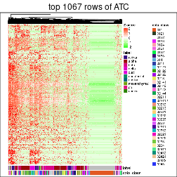

Top rows on each node:


```r
top_rows_overlap(res_rh, method = "upset")
```

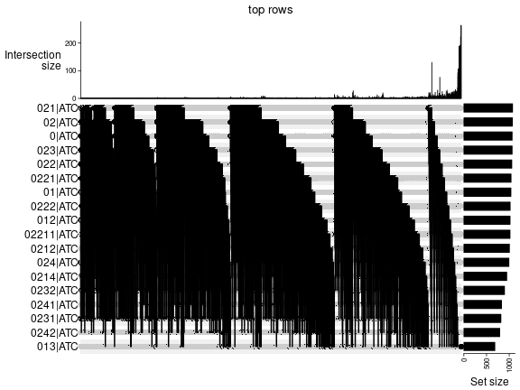


### UMAP plot

UMAP plot which shows how samples are separated.


<script>
$( function() {
	$( '#tabs-dimension-reduction-by-depth' ).tabs();
} );
</script>
<div id='tabs-dimension-reduction-by-depth'>
<ul>
<li><a href='#tab-dimension-reduction-by-depth-1'>n_signatures ≥ 521</a></li>
<li><a href='#tab-dimension-reduction-by-depth-2'>n_signatures ≥ 714</a></li>
<li><a href='#tab-dimension-reduction-by-depth-3'>n_signatures ≥ 716</a></li>
<li><a href='#tab-dimension-reduction-by-depth-4'>n_signatures ≥ 852</a></li>
<li><a href='#tab-dimension-reduction-by-depth-5'>n_signatures ≥ 1318</a></li>
<li><a href='#tab-dimension-reduction-by-depth-6'>n_signatures ≥ 1328</a></li>
<li><a href='#tab-dimension-reduction-by-depth-7'>n_signatures ≥ 1564</a></li>
<li><a href='#tab-dimension-reduction-by-depth-8'>n_signatures ≥ 2175</a></li>
<li><a href='#tab-dimension-reduction-by-depth-9'>n_signatures ≥ 2412</a></li>
<li><a href='#tab-dimension-reduction-by-depth-10'>n_signatures ≥ 3531</a></li>
<li><a href='#tab-dimension-reduction-by-depth-11'>n_signatures ≥ 3899</a></li>
<li><a href='#tab-dimension-reduction-by-depth-12'>n_signatures ≥ 4594</a></li>
<li><a href='#tab-dimension-reduction-by-depth-13'>n_signatures ≥ 4645</a></li>
<li><a href='#tab-dimension-reduction-by-depth-14'>n_signatures ≥ 7210</a></li>
<li><a href='#tab-dimension-reduction-by-depth-15'>n_signatures ≥ 7954</a></li>
<li><a href='#tab-dimension-reduction-by-depth-16'>n_signatures ≥ 8988</a></li>
<li><a href='#tab-dimension-reduction-by-depth-17'>n_signatures ≥ 9090</a></li>
<li><a href='#tab-dimension-reduction-by-depth-18'>n_signatures ≥ 9887</a></li>
</ul>
<div id='tab-dimension-reduction-by-depth-1'>
<pre><code class="r">par(mfrow = c(1, 2))
dimension_reduction(res_rh, merge_node = merge_node_param(min_n_signatures = 521),
    method = &quot;UMAP&quot;, top_value_method = &quot;SD&quot;, top_n = 1200, scale_rows = FALSE)
dimension_reduction(res_rh, merge_node = merge_node_param(min_n_signatures = 521),
    method = &quot;UMAP&quot;, top_value_method = &quot;ATC&quot;, top_n = 1200, scale_rows = TRUE)
</code></pre>

<p>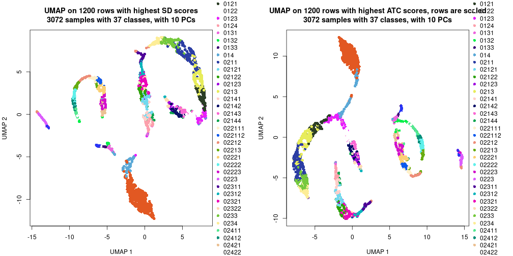</p>

</div>
<div id='tab-dimension-reduction-by-depth-2'>
<pre><code class="r">par(mfrow = c(1, 2))
dimension_reduction(res_rh, merge_node = merge_node_param(min_n_signatures = 714),
    method = &quot;UMAP&quot;, top_value_method = &quot;SD&quot;, top_n = 1200, scale_rows = FALSE)
dimension_reduction(res_rh, merge_node = merge_node_param(min_n_signatures = 714),
    method = &quot;UMAP&quot;, top_value_method = &quot;ATC&quot;, top_n = 1200, scale_rows = TRUE)
</code></pre>

<p>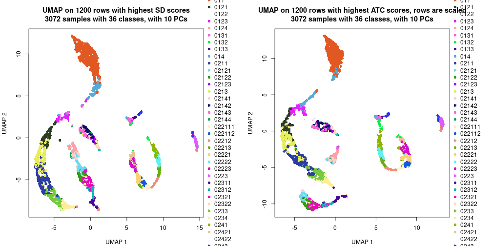</p>

</div>
<div id='tab-dimension-reduction-by-depth-3'>
<pre><code class="r">par(mfrow = c(1, 2))
dimension_reduction(res_rh, merge_node = merge_node_param(min_n_signatures = 716),
    method = &quot;UMAP&quot;, top_value_method = &quot;SD&quot;, top_n = 1200, scale_rows = FALSE)
dimension_reduction(res_rh, merge_node = merge_node_param(min_n_signatures = 716),
    method = &quot;UMAP&quot;, top_value_method = &quot;ATC&quot;, top_n = 1200, scale_rows = TRUE)
</code></pre>

<p>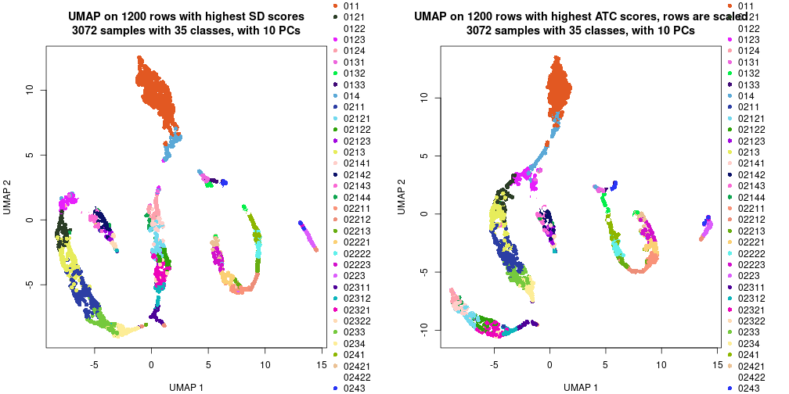</p>

</div>
<div id='tab-dimension-reduction-by-depth-4'>
<pre><code class="r">par(mfrow = c(1, 2))
dimension_reduction(res_rh, merge_node = merge_node_param(min_n_signatures = 852),
    method = &quot;UMAP&quot;, top_value_method = &quot;SD&quot;, top_n = 1200, scale_rows = FALSE)
dimension_reduction(res_rh, merge_node = merge_node_param(min_n_signatures = 852),
    method = &quot;UMAP&quot;, top_value_method = &quot;ATC&quot;, top_n = 1200, scale_rows = TRUE)
</code></pre>

<p>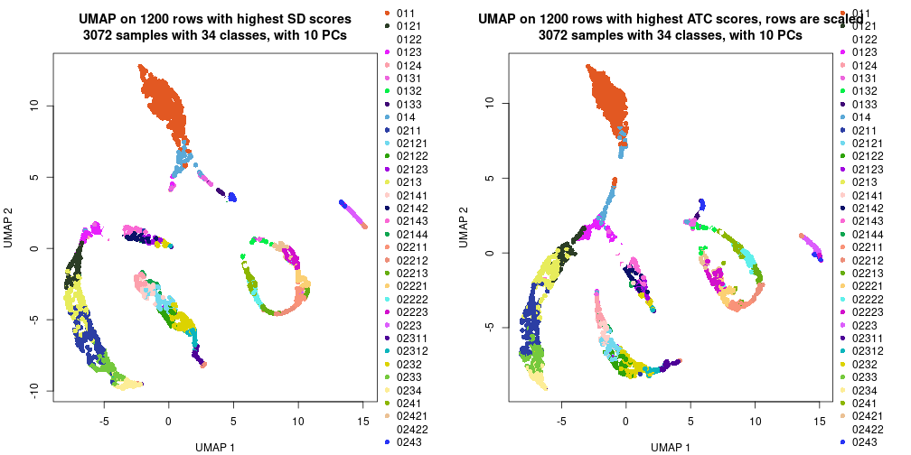</p>

</div>
<div id='tab-dimension-reduction-by-depth-5'>
<pre><code class="r">par(mfrow = c(1, 2))
dimension_reduction(res_rh, merge_node = merge_node_param(min_n_signatures = 1318),
    method = &quot;UMAP&quot;, top_value_method = &quot;SD&quot;, top_n = 1200, scale_rows = FALSE)
dimension_reduction(res_rh, merge_node = merge_node_param(min_n_signatures = 1318),
    method = &quot;UMAP&quot;, top_value_method = &quot;ATC&quot;, top_n = 1200, scale_rows = TRUE)
</code></pre>

<p>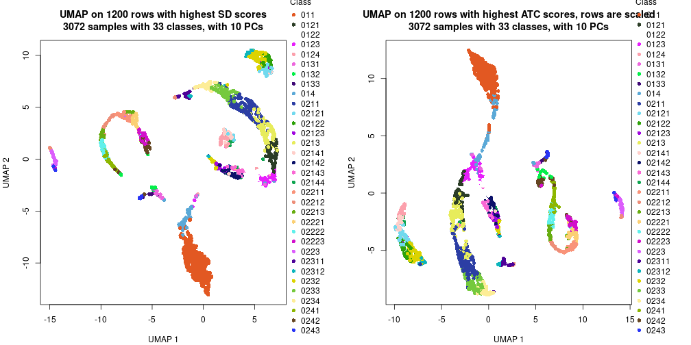</p>

</div>
<div id='tab-dimension-reduction-by-depth-6'>
<pre><code class="r">par(mfrow = c(1, 2))
dimension_reduction(res_rh, merge_node = merge_node_param(min_n_signatures = 1328),
    method = &quot;UMAP&quot;, top_value_method = &quot;SD&quot;, top_n = 1200, scale_rows = FALSE)
dimension_reduction(res_rh, merge_node = merge_node_param(min_n_signatures = 1328),
    method = &quot;UMAP&quot;, top_value_method = &quot;ATC&quot;, top_n = 1200, scale_rows = TRUE)
</code></pre>

<p>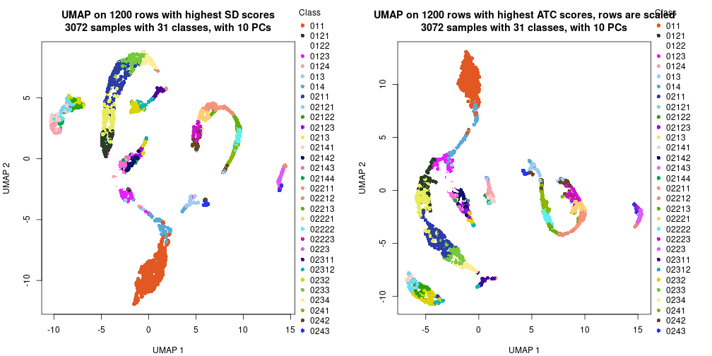</p>

</div>
<div id='tab-dimension-reduction-by-depth-7'>
<pre><code class="r">par(mfrow = c(1, 2))
dimension_reduction(res_rh, merge_node = merge_node_param(min_n_signatures = 1564),
    method = &quot;UMAP&quot;, top_value_method = &quot;SD&quot;, top_n = 1200, scale_rows = FALSE)
dimension_reduction(res_rh, merge_node = merge_node_param(min_n_signatures = 1564),
    method = &quot;UMAP&quot;, top_value_method = &quot;ATC&quot;, top_n = 1200, scale_rows = TRUE)
</code></pre>

<p>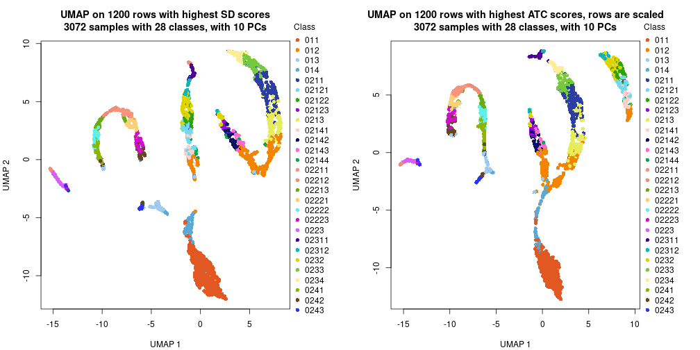</p>

</div>
<div id='tab-dimension-reduction-by-depth-8'>
<pre><code class="r">par(mfrow = c(1, 2))
dimension_reduction(res_rh, merge_node = merge_node_param(min_n_signatures = 2175),
    method = &quot;UMAP&quot;, top_value_method = &quot;SD&quot;, top_n = 1200, scale_rows = FALSE)
dimension_reduction(res_rh, merge_node = merge_node_param(min_n_signatures = 2175),
    method = &quot;UMAP&quot;, top_value_method = &quot;ATC&quot;, top_n = 1200, scale_rows = TRUE)
</code></pre>

<p>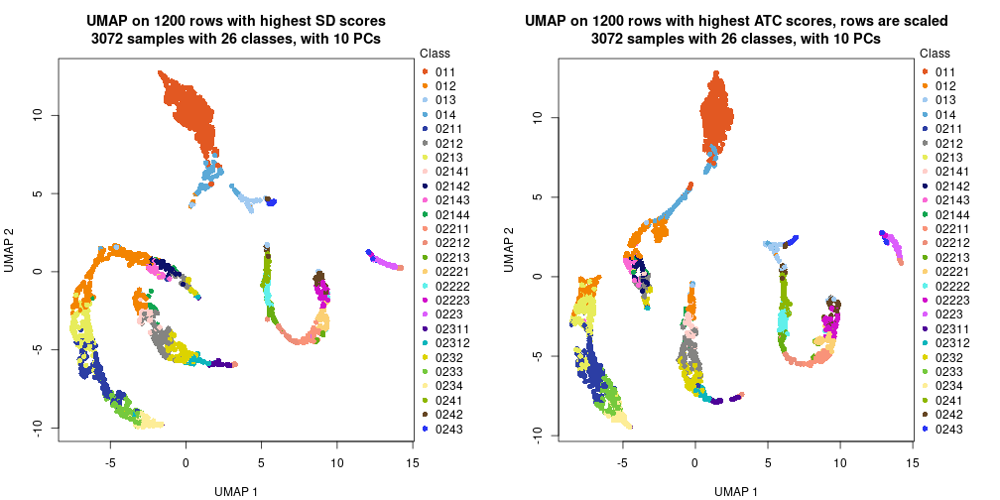</p>

</div>
<div id='tab-dimension-reduction-by-depth-9'>
<pre><code class="r">par(mfrow = c(1, 2))
dimension_reduction(res_rh, merge_node = merge_node_param(min_n_signatures = 2412),
    method = &quot;UMAP&quot;, top_value_method = &quot;SD&quot;, top_n = 1200, scale_rows = FALSE)
dimension_reduction(res_rh, merge_node = merge_node_param(min_n_signatures = 2412),
    method = &quot;UMAP&quot;, top_value_method = &quot;ATC&quot;, top_n = 1200, scale_rows = TRUE)
</code></pre>

<p>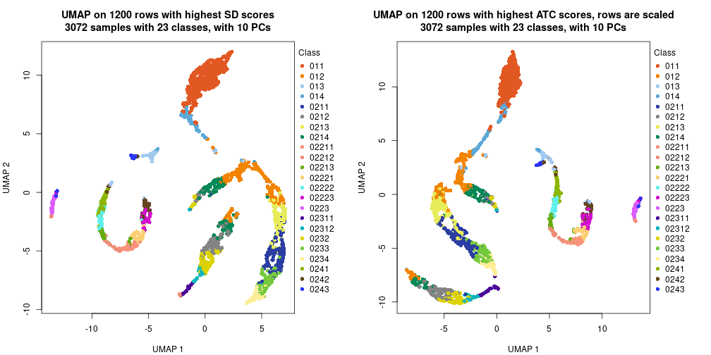</p>

</div>
<div id='tab-dimension-reduction-by-depth-10'>
<pre><code class="r">par(mfrow = c(1, 2))
dimension_reduction(res_rh, merge_node = merge_node_param(min_n_signatures = 3531),
    method = &quot;UMAP&quot;, top_value_method = &quot;SD&quot;, top_n = 1200, scale_rows = FALSE)
dimension_reduction(res_rh, merge_node = merge_node_param(min_n_signatures = 3531),
    method = &quot;UMAP&quot;, top_value_method = &quot;ATC&quot;, top_n = 1200, scale_rows = TRUE)
</code></pre>

<p>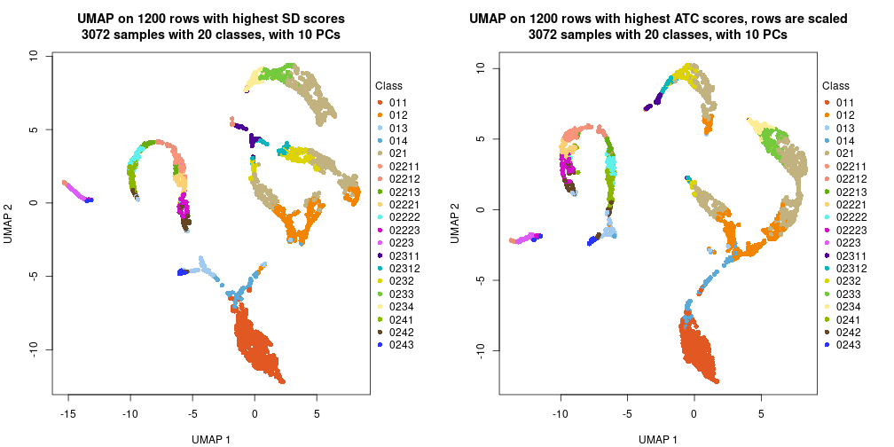</p>

</div>
<div id='tab-dimension-reduction-by-depth-11'>
<pre><code class="r">par(mfrow = c(1, 2))
dimension_reduction(res_rh, merge_node = merge_node_param(min_n_signatures = 3899),
    method = &quot;UMAP&quot;, top_value_method = &quot;SD&quot;, top_n = 1200, scale_rows = FALSE)
dimension_reduction(res_rh, merge_node = merge_node_param(min_n_signatures = 3899),
    method = &quot;UMAP&quot;, top_value_method = &quot;ATC&quot;, top_n = 1200, scale_rows = TRUE)
</code></pre>

<p>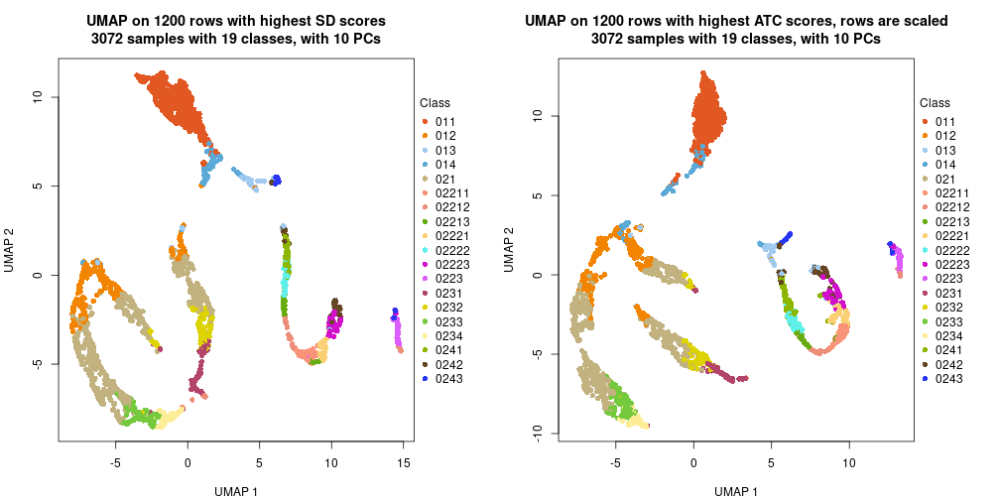</p>

</div>
<div id='tab-dimension-reduction-by-depth-12'>
<pre><code class="r">par(mfrow = c(1, 2))
dimension_reduction(res_rh, merge_node = merge_node_param(min_n_signatures = 4594),
    method = &quot;UMAP&quot;, top_value_method = &quot;SD&quot;, top_n = 1200, scale_rows = FALSE)
dimension_reduction(res_rh, merge_node = merge_node_param(min_n_signatures = 4594),
    method = &quot;UMAP&quot;, top_value_method = &quot;ATC&quot;, top_n = 1200, scale_rows = TRUE)
</code></pre>

<p>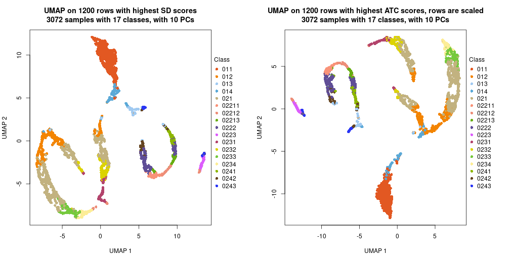</p>

</div>
<div id='tab-dimension-reduction-by-depth-13'>
<pre><code class="r">par(mfrow = c(1, 2))
dimension_reduction(res_rh, merge_node = merge_node_param(min_n_signatures = 4645),
    method = &quot;UMAP&quot;, top_value_method = &quot;SD&quot;, top_n = 1200, scale_rows = FALSE)
dimension_reduction(res_rh, merge_node = merge_node_param(min_n_signatures = 4645),
    method = &quot;UMAP&quot;, top_value_method = &quot;ATC&quot;, top_n = 1200, scale_rows = TRUE)
</code></pre>

<p>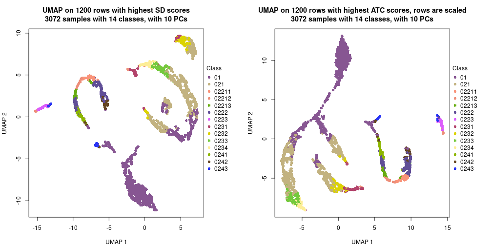</p>

</div>
<div id='tab-dimension-reduction-by-depth-14'>
<pre><code class="r">par(mfrow = c(1, 2))
dimension_reduction(res_rh, merge_node = merge_node_param(min_n_signatures = 7210),
    method = &quot;UMAP&quot;, top_value_method = &quot;SD&quot;, top_n = 1200, scale_rows = FALSE)
dimension_reduction(res_rh, merge_node = merge_node_param(min_n_signatures = 7210),
    method = &quot;UMAP&quot;, top_value_method = &quot;ATC&quot;, top_n = 1200, scale_rows = TRUE)
</code></pre>

<p>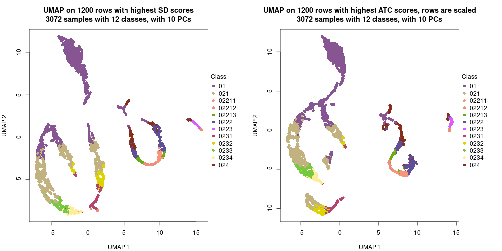</p>

</div>
<div id='tab-dimension-reduction-by-depth-15'>
<pre><code class="r">par(mfrow = c(1, 2))
dimension_reduction(res_rh, merge_node = merge_node_param(min_n_signatures = 7954),
    method = &quot;UMAP&quot;, top_value_method = &quot;SD&quot;, top_n = 1200, scale_rows = FALSE)
dimension_reduction(res_rh, merge_node = merge_node_param(min_n_signatures = 7954),
    method = &quot;UMAP&quot;, top_value_method = &quot;ATC&quot;, top_n = 1200, scale_rows = TRUE)
</code></pre>

<p>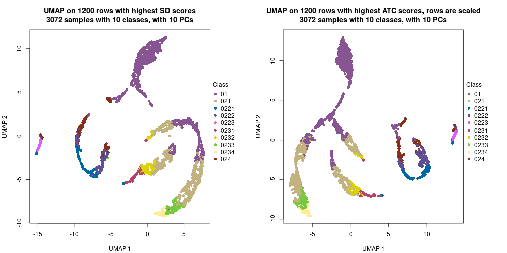</p>

</div>
<div id='tab-dimension-reduction-by-depth-16'>
<pre><code class="r">par(mfrow = c(1, 2))
dimension_reduction(res_rh, merge_node = merge_node_param(min_n_signatures = 8988),
    method = &quot;UMAP&quot;, top_value_method = &quot;SD&quot;, top_n = 1200, scale_rows = FALSE)
dimension_reduction(res_rh, merge_node = merge_node_param(min_n_signatures = 8988),
    method = &quot;UMAP&quot;, top_value_method = &quot;ATC&quot;, top_n = 1200, scale_rows = TRUE)
</code></pre>

<p>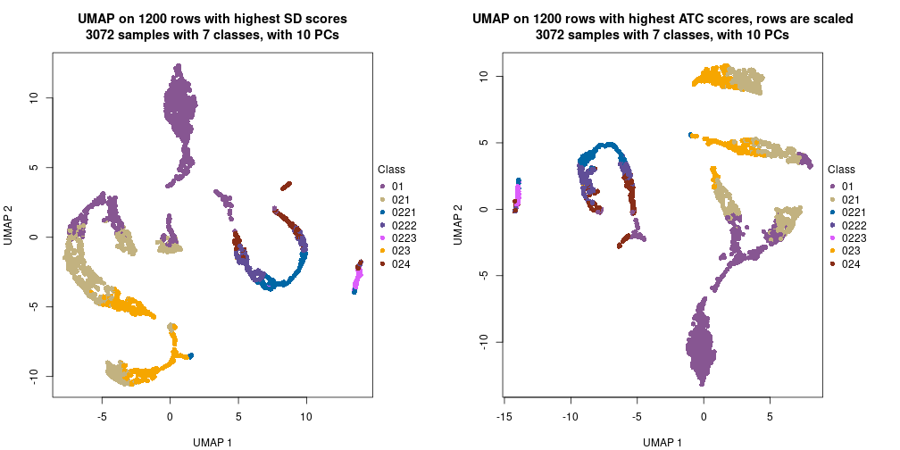</p>

</div>
<div id='tab-dimension-reduction-by-depth-17'>
<pre><code class="r">par(mfrow = c(1, 2))
dimension_reduction(res_rh, merge_node = merge_node_param(min_n_signatures = 9090),
    method = &quot;UMAP&quot;, top_value_method = &quot;SD&quot;, top_n = 1200, scale_rows = FALSE)
dimension_reduction(res_rh, merge_node = merge_node_param(min_n_signatures = 9090),
    method = &quot;UMAP&quot;, top_value_method = &quot;ATC&quot;, top_n = 1200, scale_rows = TRUE)
</code></pre>

<p>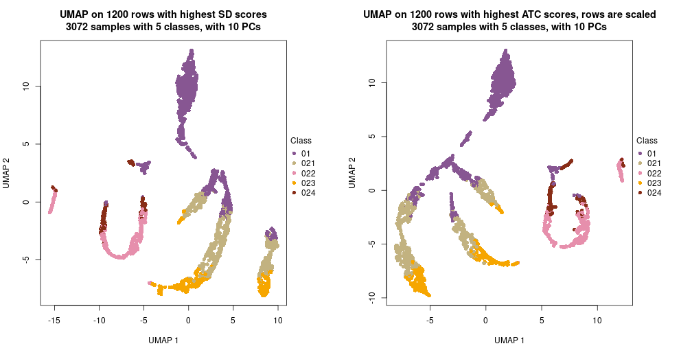</p>

</div>
<div id='tab-dimension-reduction-by-depth-18'>
<pre><code class="r">par(mfrow = c(1, 2))
dimension_reduction(res_rh, merge_node = merge_node_param(min_n_signatures = 9887),
    method = &quot;UMAP&quot;, top_value_method = &quot;SD&quot;, top_n = 1200, scale_rows = FALSE)
dimension_reduction(res_rh, merge_node = merge_node_param(min_n_signatures = 9887),
    method = &quot;UMAP&quot;, top_value_method = &quot;ATC&quot;, top_n = 1200, scale_rows = TRUE)
</code></pre>

<p>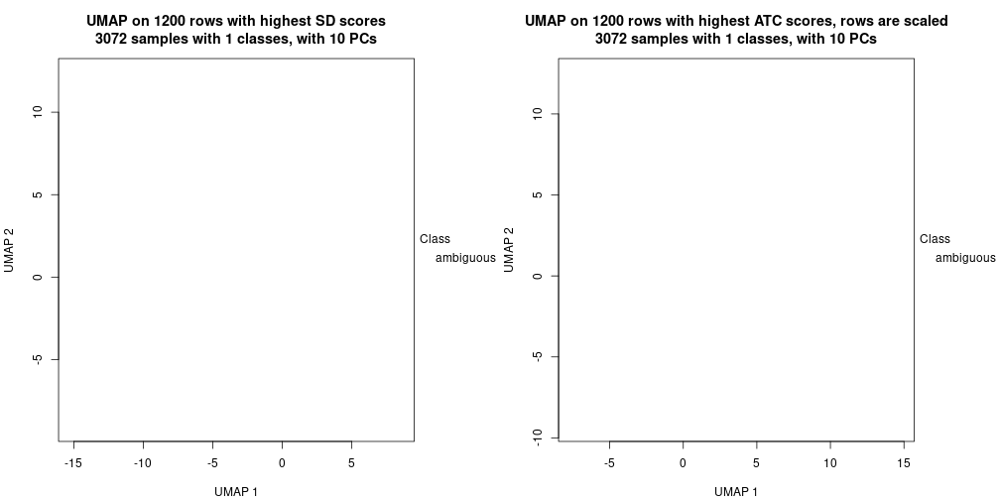</p>

</div>
</div>


### Signature heatmap

Signatures on the heatmap are the union of all signatures found on every node
on the hierarchy. The number of k-means on rows are automatically selected by the function.


<script>
$( function() {
	$( '#tabs-get-signatures-from-hierarchical-partition' ).tabs();
} );
</script>
<div id='tabs-get-signatures-from-hierarchical-partition'>
<ul>
<li><a href='#tab-get-signatures-from-hierarchical-partition-1'>n_signatures ≥ 521</a></li>
<li><a href='#tab-get-signatures-from-hierarchical-partition-2'>n_signatures ≥ 714</a></li>
<li><a href='#tab-get-signatures-from-hierarchical-partition-3'>n_signatures ≥ 716</a></li>
<li><a href='#tab-get-signatures-from-hierarchical-partition-4'>n_signatures ≥ 852</a></li>
<li><a href='#tab-get-signatures-from-hierarchical-partition-5'>n_signatures ≥ 1318</a></li>
<li><a href='#tab-get-signatures-from-hierarchical-partition-6'>n_signatures ≥ 1328</a></li>
<li><a href='#tab-get-signatures-from-hierarchical-partition-7'>n_signatures ≥ 1564</a></li>
<li><a href='#tab-get-signatures-from-hierarchical-partition-8'>n_signatures ≥ 2175</a></li>
<li><a href='#tab-get-signatures-from-hierarchical-partition-9'>n_signatures ≥ 2412</a></li>
<li><a href='#tab-get-signatures-from-hierarchical-partition-10'>n_signatures ≥ 3531</a></li>
<li><a href='#tab-get-signatures-from-hierarchical-partition-11'>n_signatures ≥ 3899</a></li>
<li><a href='#tab-get-signatures-from-hierarchical-partition-12'>n_signatures ≥ 4594</a></li>
<li><a href='#tab-get-signatures-from-hierarchical-partition-13'>n_signatures ≥ 4645</a></li>
<li><a href='#tab-get-signatures-from-hierarchical-partition-14'>n_signatures ≥ 7210</a></li>
<li><a href='#tab-get-signatures-from-hierarchical-partition-15'>n_signatures ≥ 7954</a></li>
<li><a href='#tab-get-signatures-from-hierarchical-partition-16'>n_signatures ≥ 8988</a></li>
<li><a href='#tab-get-signatures-from-hierarchical-partition-17'>n_signatures ≥ 9090</a></li>
<li><a href='#tab-get-signatures-from-hierarchical-partition-18'>n_signatures ≥ 9887</a></li>
</ul>
<div id='tab-get-signatures-from-hierarchical-partition-1'>
<pre><code class="r">get_signatures(res_rh, merge_node = merge_node_param(min_n_signatures = 521))
</code></pre>

<p>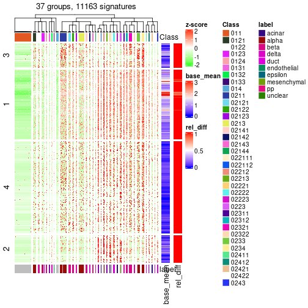</p>

</div>
<div id='tab-get-signatures-from-hierarchical-partition-2'>
<pre><code class="r">get_signatures(res_rh, merge_node = merge_node_param(min_n_signatures = 714))
</code></pre>

<p>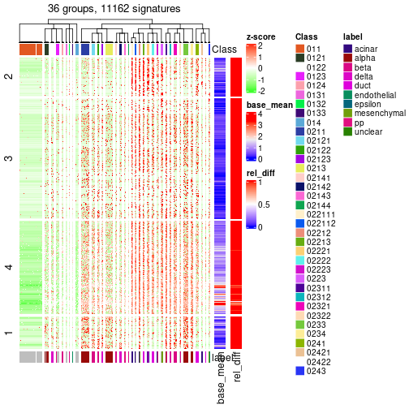</p>

</div>
<div id='tab-get-signatures-from-hierarchical-partition-3'>
<pre><code class="r">get_signatures(res_rh, merge_node = merge_node_param(min_n_signatures = 716))
</code></pre>

<p>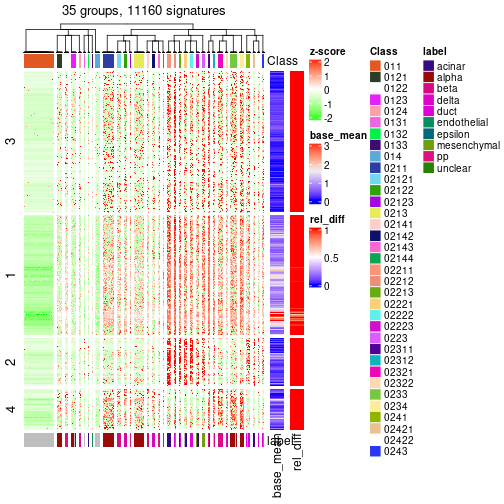</p>

</div>
<div id='tab-get-signatures-from-hierarchical-partition-4'>
<pre><code class="r">get_signatures(res_rh, merge_node = merge_node_param(min_n_signatures = 852))
</code></pre>

<p>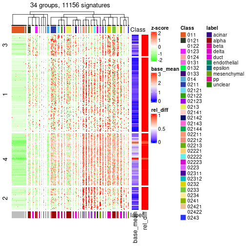</p>

</div>
<div id='tab-get-signatures-from-hierarchical-partition-5'>
<pre><code class="r">get_signatures(res_rh, merge_node = merge_node_param(min_n_signatures = 1318))
</code></pre>

<p>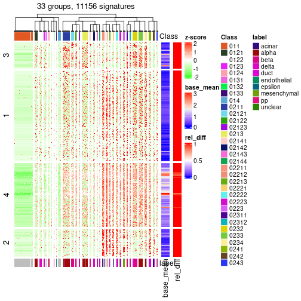</p>

</div>
<div id='tab-get-signatures-from-hierarchical-partition-6'>
<pre><code class="r">get_signatures(res_rh, merge_node = merge_node_param(min_n_signatures = 1328))
</code></pre>

<p>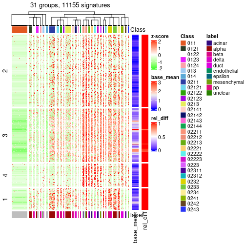</p>

</div>
<div id='tab-get-signatures-from-hierarchical-partition-7'>
<pre><code class="r">get_signatures(res_rh, merge_node = merge_node_param(min_n_signatures = 1564))
</code></pre>

<p>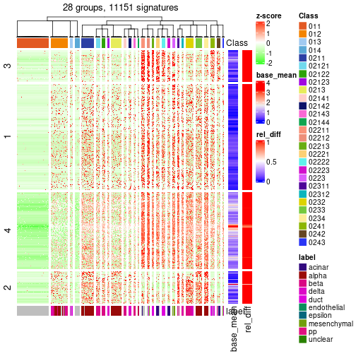</p>

</div>
<div id='tab-get-signatures-from-hierarchical-partition-8'>
<pre><code class="r">get_signatures(res_rh, merge_node = merge_node_param(min_n_signatures = 2175))
</code></pre>

<p>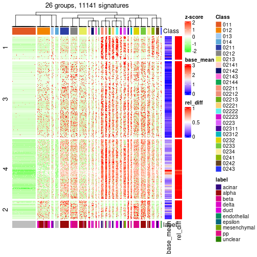</p>

</div>
<div id='tab-get-signatures-from-hierarchical-partition-9'>
<pre><code class="r">get_signatures(res_rh, merge_node = merge_node_param(min_n_signatures = 2412))
</code></pre>

<p>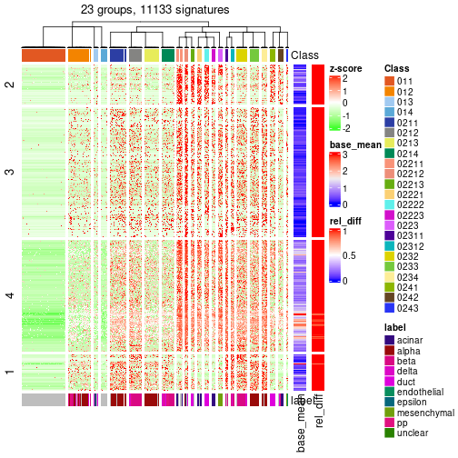</p>

</div>
<div id='tab-get-signatures-from-hierarchical-partition-10'>
<pre><code class="r">get_signatures(res_rh, merge_node = merge_node_param(min_n_signatures = 3531))
</code></pre>

<p>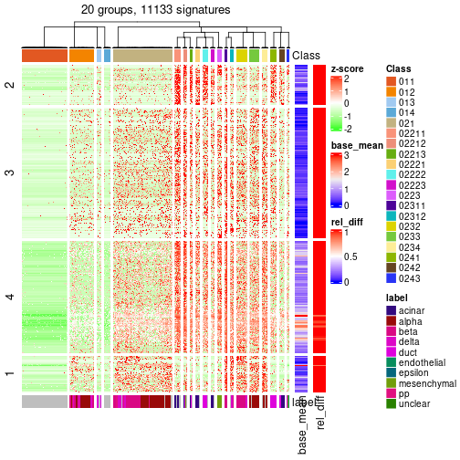</p>

</div>
<div id='tab-get-signatures-from-hierarchical-partition-11'>
<pre><code class="r">get_signatures(res_rh, merge_node = merge_node_param(min_n_signatures = 3899))
</code></pre>

<p>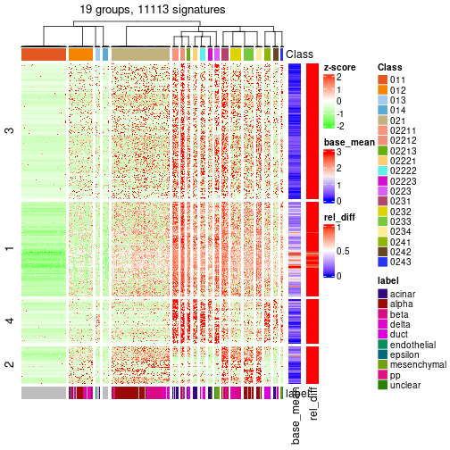</p>

</div>
<div id='tab-get-signatures-from-hierarchical-partition-12'>
<pre><code class="r">get_signatures(res_rh, merge_node = merge_node_param(min_n_signatures = 4594))
</code></pre>

<p>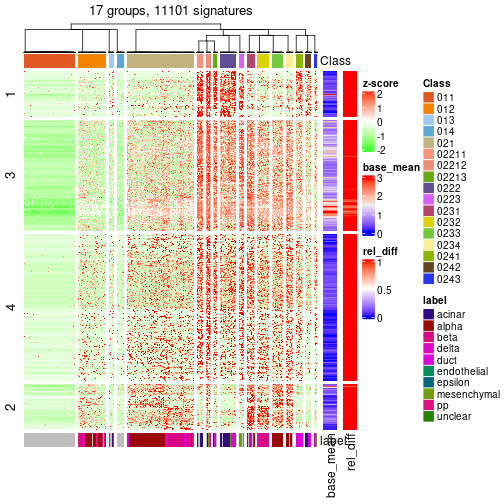</p>

</div>
<div id='tab-get-signatures-from-hierarchical-partition-13'>
<pre><code class="r">get_signatures(res_rh, merge_node = merge_node_param(min_n_signatures = 4645))
</code></pre>

<p>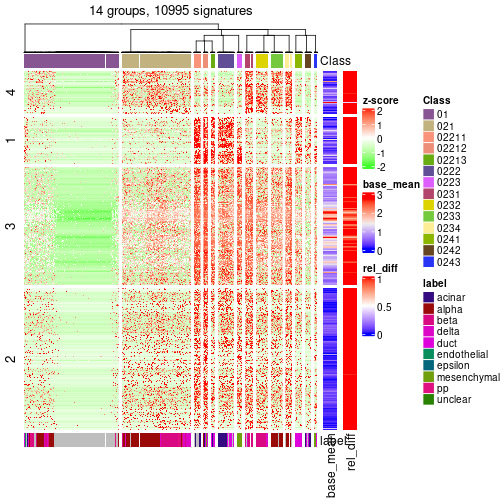</p>

</div>
<div id='tab-get-signatures-from-hierarchical-partition-14'>
<pre><code class="r">get_signatures(res_rh, merge_node = merge_node_param(min_n_signatures = 7210))
</code></pre>

<p>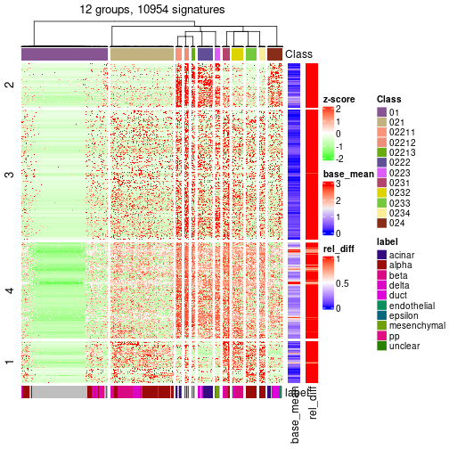</p>

</div>
<div id='tab-get-signatures-from-hierarchical-partition-15'>
<pre><code class="r">get_signatures(res_rh, merge_node = merge_node_param(min_n_signatures = 7954))
</code></pre>

<p>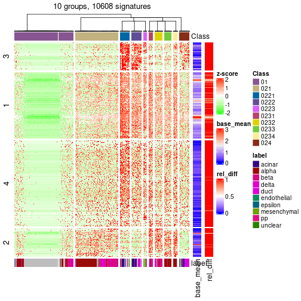</p>

</div>
<div id='tab-get-signatures-from-hierarchical-partition-16'>
<pre><code class="r">get_signatures(res_rh, merge_node = merge_node_param(min_n_signatures = 8988))
</code></pre>

<p>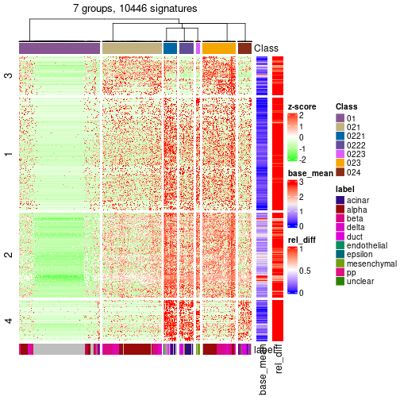</p>

</div>
<div id='tab-get-signatures-from-hierarchical-partition-17'>
<pre><code class="r">get_signatures(res_rh, merge_node = merge_node_param(min_n_signatures = 9090))
</code></pre>

<p>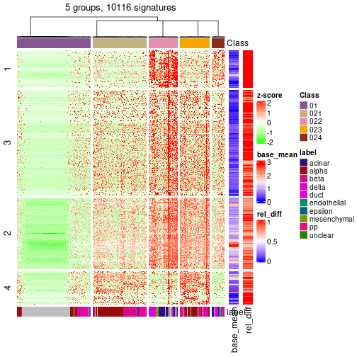</p>

</div>
<div id='tab-get-signatures-from-hierarchical-partition-18'>
<pre><code class="r">get_signatures(res_rh, merge_node = merge_node_param(min_n_signatures = 9887))
</code></pre>

<pre><code>#&gt; Error in names(x) &lt;- value: &#39;names&#39; attribute [1] must be the same length as the vector [0]
</code></pre>

</div>
</div>


Compare signatures from different nodes:


```r
compare_signatures(res_rh, verbose = FALSE)
```

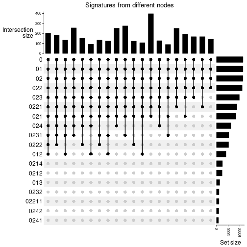

If there are too many signatures, `top_signatures = ...` can be set to only show the 
signatures with the highest FDRs. Note it only works on every node and the final signatures
are the union of all signatures of all nodes.


```r
# code only for demonstration
# e.g. to show the top 500 most significant rows on each node.
tb = get_signature(res_rh, top_signatures = 500)
```


### Test to known annotations

Test correlation between subgroups and known annotations. If the known
annotation is numeric, one-way ANOVA test is applied, and if the known
annotation is discrete, chi-squared contingency table test is applied.


<script>
$( function() {
	$( '#tabs-test-to-known-factors-from-hierarchical-partition' ).tabs();
} );
</script>
<div id='tabs-test-to-known-factors-from-hierarchical-partition'>
<ul>
<li><a href='#tab-test-to-known-factors-from-hierarchical-partition-1'>n_signatures ≥ 521</a></li>
<li><a href='#tab-test-to-known-factors-from-hierarchical-partition-2'>n_signatures ≥ 714</a></li>
<li><a href='#tab-test-to-known-factors-from-hierarchical-partition-3'>n_signatures ≥ 716</a></li>
<li><a href='#tab-test-to-known-factors-from-hierarchical-partition-4'>n_signatures ≥ 852</a></li>
<li><a href='#tab-test-to-known-factors-from-hierarchical-partition-5'>n_signatures ≥ 1318</a></li>
<li><a href='#tab-test-to-known-factors-from-hierarchical-partition-6'>n_signatures ≥ 1328</a></li>
<li><a href='#tab-test-to-known-factors-from-hierarchical-partition-7'>n_signatures ≥ 1564</a></li>
<li><a href='#tab-test-to-known-factors-from-hierarchical-partition-8'>n_signatures ≥ 2175</a></li>
<li><a href='#tab-test-to-known-factors-from-hierarchical-partition-9'>n_signatures ≥ 2412</a></li>
<li><a href='#tab-test-to-known-factors-from-hierarchical-partition-10'>n_signatures ≥ 3531</a></li>
<li><a href='#tab-test-to-known-factors-from-hierarchical-partition-11'>n_signatures ≥ 3899</a></li>
<li><a href='#tab-test-to-known-factors-from-hierarchical-partition-12'>n_signatures ≥ 4594</a></li>
<li><a href='#tab-test-to-known-factors-from-hierarchical-partition-13'>n_signatures ≥ 4645</a></li>
<li><a href='#tab-test-to-known-factors-from-hierarchical-partition-14'>n_signatures ≥ 7210</a></li>
<li><a href='#tab-test-to-known-factors-from-hierarchical-partition-15'>n_signatures ≥ 7954</a></li>
<li><a href='#tab-test-to-known-factors-from-hierarchical-partition-16'>n_signatures ≥ 8988</a></li>
<li><a href='#tab-test-to-known-factors-from-hierarchical-partition-17'>n_signatures ≥ 9090</a></li>
<li><a href='#tab-test-to-known-factors-from-hierarchical-partition-18'>n_signatures ≥ 9887</a></li>
</ul>
<div id='tab-test-to-known-factors-from-hierarchical-partition-1'>
<pre><code class="r">test_to_known_factors(res_rh, merge_node = merge_node_param(min_n_signatures = 521))
</code></pre>

<pre><code>#&gt;       label
#&gt; class     0
</code></pre>

</div>
<div id='tab-test-to-known-factors-from-hierarchical-partition-2'>
<pre><code class="r">test_to_known_factors(res_rh, merge_node = merge_node_param(min_n_signatures = 714))
</code></pre>

<pre><code>#&gt;       label
#&gt; class     0
</code></pre>

</div>
<div id='tab-test-to-known-factors-from-hierarchical-partition-3'>
<pre><code class="r">test_to_known_factors(res_rh, merge_node = merge_node_param(min_n_signatures = 716))
</code></pre>

<pre><code>#&gt;       label
#&gt; class     0
</code></pre>

</div>
<div id='tab-test-to-known-factors-from-hierarchical-partition-4'>
<pre><code class="r">test_to_known_factors(res_rh, merge_node = merge_node_param(min_n_signatures = 852))
</code></pre>

<pre><code>#&gt;       label
#&gt; class     0
</code></pre>

</div>
<div id='tab-test-to-known-factors-from-hierarchical-partition-5'>
<pre><code class="r">test_to_known_factors(res_rh, merge_node = merge_node_param(min_n_signatures = 1318))
</code></pre>

<pre><code>#&gt;       label
#&gt; class     0
</code></pre>

</div>
<div id='tab-test-to-known-factors-from-hierarchical-partition-6'>
<pre><code class="r">test_to_known_factors(res_rh, merge_node = merge_node_param(min_n_signatures = 1328))
</code></pre>

<pre><code>#&gt;       label
#&gt; class     0
</code></pre>

</div>
<div id='tab-test-to-known-factors-from-hierarchical-partition-7'>
<pre><code class="r">test_to_known_factors(res_rh, merge_node = merge_node_param(min_n_signatures = 1564))
</code></pre>

<pre><code>#&gt;       label
#&gt; class     0
</code></pre>

</div>
<div id='tab-test-to-known-factors-from-hierarchical-partition-8'>
<pre><code class="r">test_to_known_factors(res_rh, merge_node = merge_node_param(min_n_signatures = 2175))
</code></pre>

<pre><code>#&gt;       label
#&gt; class     0
</code></pre>

</div>
<div id='tab-test-to-known-factors-from-hierarchical-partition-9'>
<pre><code class="r">test_to_known_factors(res_rh, merge_node = merge_node_param(min_n_signatures = 2412))
</code></pre>

<pre><code>#&gt;       label
#&gt; class     0
</code></pre>

</div>
<div id='tab-test-to-known-factors-from-hierarchical-partition-10'>
<pre><code class="r">test_to_known_factors(res_rh, merge_node = merge_node_param(min_n_signatures = 3531))
</code></pre>

<pre><code>#&gt;       label
#&gt; class     0
</code></pre>

</div>
<div id='tab-test-to-known-factors-from-hierarchical-partition-11'>
<pre><code class="r">test_to_known_factors(res_rh, merge_node = merge_node_param(min_n_signatures = 3899))
</code></pre>

<pre><code>#&gt;       label
#&gt; class     0
</code></pre>

</div>
<div id='tab-test-to-known-factors-from-hierarchical-partition-12'>
<pre><code class="r">test_to_known_factors(res_rh, merge_node = merge_node_param(min_n_signatures = 4594))
</code></pre>

<pre><code>#&gt;       label
#&gt; class     0
</code></pre>

</div>
<div id='tab-test-to-known-factors-from-hierarchical-partition-13'>
<pre><code class="r">test_to_known_factors(res_rh, merge_node = merge_node_param(min_n_signatures = 4645))
</code></pre>

<pre><code>#&gt;       label
#&gt; class     0
</code></pre>

</div>
<div id='tab-test-to-known-factors-from-hierarchical-partition-14'>
<pre><code class="r">test_to_known_factors(res_rh, merge_node = merge_node_param(min_n_signatures = 7210))
</code></pre>

<pre><code>#&gt;       label
#&gt; class     0
</code></pre>

</div>
<div id='tab-test-to-known-factors-from-hierarchical-partition-15'>
<pre><code class="r">test_to_known_factors(res_rh, merge_node = merge_node_param(min_n_signatures = 7954))
</code></pre>

<pre><code>#&gt;       label
#&gt; class     0
</code></pre>

</div>
<div id='tab-test-to-known-factors-from-hierarchical-partition-16'>
<pre><code class="r">test_to_known_factors(res_rh, merge_node = merge_node_param(min_n_signatures = 8988))
</code></pre>

<pre><code>#&gt;       label
#&gt; class     0
</code></pre>

</div>
<div id='tab-test-to-known-factors-from-hierarchical-partition-17'>
<pre><code class="r">test_to_known_factors(res_rh, merge_node = merge_node_param(min_n_signatures = 9090))
</code></pre>

<pre><code>#&gt;       label
#&gt; class     0
</code></pre>

</div>
<div id='tab-test-to-known-factors-from-hierarchical-partition-18'>
<pre><code class="r">test_to_known_factors(res_rh, merge_node = merge_node_param(min_n_signatures = 9887))
</code></pre>

<pre><code>#&gt;       label
#&gt; class    NA
</code></pre>

</div>
</div>


## Results for each node


---------------------------------------------------


### Node0


Child nodes: 
                [Node01](#Node01)
        ,
                [Node02](#Node02)
        .


The object with results only for a single top-value method and a single partitioning method 
can be extracted as:

```r
res = res_rh["0"]
```

A summary of `res` and all the functions that can be applied to it:

```r
res
```

```
#> A 'DownSamplingConsensusPartition' object with k = 2, 3, 4.
#>   On a matrix with 11351 rows and 500 columns, randomly sampled from 3072 columns.
#>   Top rows (1067) are extracted by 'ATC' method.
#>   Subgroups are detected by 'skmeans' method.
#>   Performed in total 150 partitions by row resampling.
#>   Best k for subgroups seems to be 3.
#> 
#> Following methods can be applied to this 'DownSamplingConsensusPartition' object:
#>  [1] "cola_report"             "collect_classes"         "collect_plots"          
#>  [4] "collect_stats"           "colnames"                "compare_partitions"     
#>  [7] "compare_signatures"      "consensus_heatmap"       "dimension_reduction"    
#> [10] "functional_enrichment"   "get_anno_col"            "get_anno"               
#> [13] "get_classes"             "get_consensus"           "get_matrix"             
#> [16] "get_membership"          "get_param"               "get_signatures"         
#> [19] "get_stats"               "is_best_k"               "is_stable_k"            
#> [22] "membership_heatmap"      "ncol"                    "nrow"                   
#> [25] "plot_ecdf"               "predict_classes"         "rownames"               
#> [28] "select_partition_number" "show"                    "suggest_best_k"         
#> [31] "test_to_known_factors"   "top_rows_heatmap"
```

`collect_plots()` function collects all the plots made from `res` for all `k` (number of subgroups)
into one single page to provide an easy and fast comparison between different `k`.

```r
collect_plots(res)
```

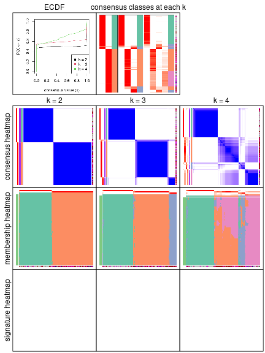

The plots are:

- The first row: a plot of the eCDF (empirical cumulative distribution
  function) curves of the consensus matrix for each `k` and the heatmap of
  predicted classes for each `k`.
- The second row: heatmaps of the consensus matrix for each `k`.
- The third row: heatmaps of the membership matrix for each `k`.
- The fouth row: heatmaps of the signatures for each `k`.

All the plots in panels can be made by individual functions and they are
plotted later in this section.

`select_partition_number()` produces several plots showing different
statistics for choosing "optimized" `k`. There are following statistics:

- eCDF curves of the consensus matrix for each `k`;
- 1-PAC. [The PAC score](https://en.wikipedia.org/wiki/Consensus_clustering#Over-interpretation_potential_of_consensus_clustering)
  measures the proportion of the ambiguous subgrouping.
- Mean silhouette score.
- Concordance. The mean probability of fiting the consensus subgroup labels in all
  partitions.
- Area increased. Denote $A_k$ as the area under the eCDF curve for current
  `k`, the area increased is defined as $A_k - A_{k-1}$.
- Rand index. The percent of pairs of samples that are both in a same cluster
  or both are not in a same cluster in the partition of k and k-1.
- Jaccard index. The ratio of pairs of samples are both in a same cluster in
  the partition of k and k-1 and the pairs of samples are both in a same
  cluster in the partition k or k-1.

The detailed explanations of these statistics can be found in [the _cola_
vignette](https://jokergoo.github.io/cola_vignettes/cola.html#toc_13).

Generally speaking, higher 1-PAC score, higher mean silhouette score or higher
concordance corresponds to better partition. Rand index and Jaccard index
measure how similar the current partition is compared to partition with `k-1`.
If they are too similar, we won't accept `k` is better than `k-1`.

```r
select_partition_number(res)
```

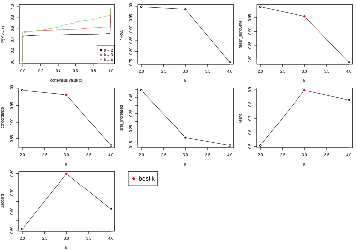

The numeric values for all these statistics can be obtained by `get_stats()`.

```r
get_stats(res)
```

```
#>   k 1-PAC mean_silhouette concordance area_increased  Rand Jaccard
#> 2 2 1.000           0.989       0.996          0.494 0.506   0.506
#> 3 3 0.988           0.955       0.982          0.196 0.897   0.798
#> 4 4 0.750           0.788       0.829          0.147 0.828   0.610
```

`suggest_best_k()` suggests the best $k$ based on these statistics. The rules are as follows:

- All $k$ with Jaccard index larger than 0.95 are removed because increasing
  $k$ does not provide enough extra information. If all $k$ are removed, it is
  marked as no subgroup is detected.
- For all $k$ with 1-PAC score larger than 0.9, the maximal $k$ is taken as
  the best $k$, and other $k$ are marked as optional $k$.
- If it does not fit the second rule. The $k$ with the maximal vote of the
  highest 1-PAC score, highest mean silhouette, and highest concordance is
  taken as the best $k$.

```r
suggest_best_k(res)
```

```
#> [1] 3
#> attr(,"optional")
#> [1] 2
```

There is also optional best $k$ = 2 that is worth to check.

Following is the table of the partitions (You need to click the **show/hide
code output** link to see it). The membership matrix (columns with name `p*`)
is inferred by
[`clue::cl_consensus()`](https://www.rdocumentation.org/link/cl_consensus?package=clue)
function with the `SE` method. Basically the value in the membership matrix
represents the probability to belong to a certain group. The finall subgroup
label for an item is determined with the group with highest probability it
belongs to.

In `get_classes()` function, the entropy is calculated from the membership
matrix and the silhouette score is calculated from the consensus matrix.


<script>
$( function() {
	$( '#tabs-node-0-get-classes' ).tabs();
} );
</script>
<div id='tabs-node-0-get-classes'>
<ul>
<li><a href='#tab-node-0-get-classes-1'>k = 2</a></li>
<li><a href='#tab-node-0-get-classes-2'>k = 3</a></li>
<li><a href='#tab-node-0-get-classes-3'>k = 4</a></li>
</ul>

<div id='tab-node-0-get-classes-1'>
<p><a id='tab-node-0-get-classes-1-a' style='color:#0366d6' href='#'>show/hide code output</a></p>
<pre><code class="r">get_classes(res, k = 2)
</code></pre>

<pre><code>#&gt;          class     p
#&gt; D28-1_1      2 0.000
#&gt; D28-1_2      2 1.000
#&gt; D28-1_3      2 0.000
#&gt; D28-1_4      2 1.000
#&gt; D28-1_5      2 1.000
#&gt; D28-1_6      1 0.000
#&gt; D28-1_7      1 0.000
#&gt; D28-1_8      1 0.000
#&gt; D28-1_9      1 0.000
#&gt; D28-1_10     1 0.000
#&gt; D28-1_11     1 0.000
#&gt; D28-1_12     1 0.000
#&gt; D28-1_13     2 0.000
#&gt; D28-1_14     1 0.000
#&gt; D28-1_15     2 0.000
#&gt; D28-1_16     1 0.000
#&gt; D28-1_17     2 0.249
#&gt; D28-1_18     1 0.000
#&gt; D28-1_19     1 0.000
#&gt; D28-1_20     1 0.000
#&gt; D28-1_21     1 0.000
#&gt; D28-1_22     1 0.000
#&gt; D28-1_23     1 0.000
#&gt; D28-1_24     1 0.000
#&gt; D28-1_25     1 0.000
#&gt; D28-1_26     2 0.249
#&gt; D28-1_27     1 1.000
#&gt; D28-1_28     1 0.000
#&gt; D28-1_29     2 0.249
#&gt; D28-1_30     2 0.249
#&gt; D28-1_31     1 0.000
#&gt; D28-1_32     1 0.000
#&gt; D28-1_33     1 0.000
#&gt; D28-1_34     1 0.000
#&gt; D28-1_35     1 0.000
#&gt; D28-1_36     1 0.000
#&gt; D28-1_37     2 0.000
#&gt; D28-1_38     2 1.000
#&gt; D28-1_39     1 0.498
#&gt; D28-1_40     2 0.502
#&gt; D28-1_41     2 0.000
#&gt; D28-1_42     1 0.000
#&gt; D28-1_43     2 0.253
#&gt; D28-1_44     1 0.000
#&gt; D28-1_45     1 0.000
#&gt; D28-1_46     1 0.000
#&gt; D28-1_47     1 0.000
#&gt; D28-1_48     1 0.000
#&gt; D28-1_49     2 0.751
#&gt; D28-1_50     2 0.249
#&gt; D28-1_51     2 0.000
#&gt; D28-1_52     2 1.000
#&gt; D28-1_53     1 0.000
#&gt; D28-1_54     1 0.000
#&gt; D28-1_55     2 0.000
#&gt; D28-1_56     1 0.000
#&gt; D28-1_57     1 0.000
#&gt; D28-1_58     1 0.000
#&gt; D28-1_59     1 0.000
#&gt; D28-1_60     1 0.000
#&gt; D28-1_61     2 0.249
#&gt; D28-1_62     2 0.000
#&gt; D28-1_63     2 0.000
#&gt; D28-1_64     1 1.000
#&gt; D28-1_65     2 1.000
#&gt; D28-1_66     2 0.000
#&gt; D28-1_67     2 0.000
#&gt; D28-1_68     2 0.249
#&gt; D28-1_69     1 0.000
#&gt; D28-1_70     1 0.000
#&gt; D28-1_71     1 0.000
#&gt; D28-1_72     1 0.000
#&gt; D28-1_73     2 1.000
#&gt; D28-1_74     2 1.000
#&gt; D28-1_75     2 0.000
#&gt; D28-1_76     1 0.502
#&gt; D28-1_77     2 1.000
#&gt; D28-1_78     1 0.000
#&gt; D28-1_79     1 0.000
#&gt; D28-1_80     2 1.000
#&gt; D28-1_81     1 0.000
#&gt; D28-1_82     1 0.000
#&gt; D28-1_83     1 0.000
#&gt; D28-1_84     1 0.000
#&gt; D28-1_85     2 0.000
#&gt; D28-1_86     2 1.000
#&gt; D28-1_87     2 0.000
#&gt; D28-1_88     2 0.249
#&gt; D28-1_89     2 0.502
#&gt; D28-1_90     2 1.000
#&gt; D28-1_91     2 1.000
#&gt; D28-1_92     1 0.000
#&gt; D28-1_93     1 0.000
#&gt; D28-1_94     1 0.000
#&gt; D28-1_95     1 0.000
#&gt; D28-1_96     1 0.000
#&gt; D28-2_1      2 0.000
#&gt; D28-2_2      2 0.249
#&gt; D28-2_3      1 0.000
#&gt; D28-2_4      2 0.000
#&gt; D28-2_5      2 0.249
#&gt; D28-2_6      1 0.000
#&gt; D28-2_7      1 0.000
#&gt; D28-2_8      1 0.000
#&gt; D28-2_9      1 0.000
#&gt; D28-2_10     1 0.000
#&gt; D28-2_11     1 0.000
#&gt; D28-2_12     1 0.000
#&gt; D28-2_13     2 0.000
#&gt; D28-2_14     1 0.000
#&gt; D28-2_15     2 0.000
#&gt; D28-2_16     2 1.000
#&gt; D28-2_17     2 0.747
#&gt; D28-2_18     2 0.000
#&gt; D28-2_19     1 1.000
#&gt; D28-2_20     1 0.000
#&gt; D28-2_21     1 0.000
#&gt; D28-2_22     1 0.000
#&gt; D28-2_23     1 0.000
#&gt; D28-2_24     1 0.000
#&gt; D28-2_25     1 0.000
#&gt; D28-2_26     2 1.000
#&gt; D28-2_27     1 0.000
#&gt; D28-2_28     2 1.000
#&gt; D28-2_29     2 0.253
#&gt; D28-2_30     1 0.000
#&gt; D28-2_31     1 0.000
#&gt; D28-2_32     1 0.000
#&gt; D28-2_33     1 0.000
#&gt; D28-2_34     1 0.000
#&gt; D28-2_35     1 0.000
#&gt; D28-2_36     1 0.000
#&gt; D28-2_37     2 0.249
#&gt; D28-2_38     2 0.502
#&gt; D28-2_39     2 0.000
#&gt; D28-2_40     2 0.000
#&gt; D28-2_41     2 0.249
#&gt; D28-2_42     2 0.000
#&gt; D28-2_43     2 0.000
#&gt; D28-2_44     1 0.000
#&gt; D28-2_45     1 0.000
#&gt; D28-2_46     1 0.000
#&gt; D28-2_47     1 0.000
#&gt; D28-2_48     1 0.000
#&gt; D28-2_49     2 0.253
#&gt; D28-2_50     1 0.000
#&gt; D28-2_51     2 0.000
#&gt; D28-2_52     2 0.000
#&gt; D28-2_53     2 1.000
#&gt; D28-2_54     1 0.747
#&gt; D28-2_55     1 0.000
#&gt; D28-2_56     1 0.000
#&gt; D28-2_57     1 0.000
#&gt; D28-2_58     1 0.000
#&gt; D28-2_59     1 0.000
#&gt; D28-2_60     1 0.000
#&gt; D28-2_61     2 0.000
#&gt; D28-2_62     1 0.000
#&gt; D28-2_63     2 0.000
#&gt; D28-2_64     2 0.000
#&gt; D28-2_65     2 0.249
#&gt; D28-2_66     2 0.000
#&gt; D28-2_67     1 0.000
#&gt; D28-2_68     2 0.498
#&gt; D28-2_69     1 0.000
#&gt; D28-2_70     1 0.000
#&gt; D28-2_71     1 0.000
#&gt; D28-2_72     1 0.000
#&gt; D28-2_73     2 0.249
#&gt; D28-2_74     2 1.000
#&gt; D28-2_75     2 0.502
#&gt; D28-2_76     2 0.747
#&gt; D28-2_77     1 0.000
#&gt; D28-2_78     2 0.498
#&gt; D28-2_79     2 1.000
#&gt; D28-2_80     1 0.000
#&gt; D28-2_81     1 0.000
#&gt; D28-2_82     1 0.000
#&gt; D28-2_83     1 0.000
#&gt; D28-2_84     1 0.000
#&gt; D28-2_85     2 0.498
#&gt; D28-2_86     2 0.000
#&gt; D28-2_87     2 0.000
#&gt; D28-2_88     1 0.000
#&gt; D28-2_89     2 0.000
#&gt; D28-2_90     2 0.747
#&gt; D28-2_91     2 0.249
#&gt; D28-2_92     1 0.000
#&gt; D28-2_93     1 0.000
#&gt; D28-2_94     1 0.000
#&gt; D28-2_95     1 0.000
#&gt; D28-2_96     1 0.000
#&gt; D28-3_1      1 1.000
#&gt; D28-3_2      1 0.000
#&gt; D28-3_3      2 1.000
#&gt; D28-3_4      2 0.000
#&gt; D28-3_5      2 0.751
#&gt; D28-3_6      2 0.249
#&gt; D28-3_7      2 1.000
#&gt; D28-3_8      2 0.249
#&gt; D28-3_9      1 0.000
#&gt; D28-3_10     1 0.000
#&gt; D28-3_11     1 0.000
#&gt; D28-3_12     1 0.000
#&gt; D28-3_13     1 1.000
#&gt; D28-3_14     2 0.000
#&gt; D28-3_15     2 0.502
#&gt; D28-3_16     2 0.000
#&gt; D28-3_17     2 0.000
#&gt; D28-3_18     1 1.000
#&gt; D28-3_19     1 0.000
#&gt; D28-3_20     1 0.000
#&gt; D28-3_21     1 0.000
#&gt; D28-3_22     1 0.000
#&gt; D28-3_23     1 0.000
#&gt; D28-3_24     1 0.000
#&gt; D28-3_25     2 0.000
#&gt; D28-3_26     2 0.000
#&gt; D28-3_27     2 0.000
#&gt; D28-3_28     2 0.000
#&gt; D28-3_29     2 0.000
#&gt; D28-3_30     2 0.000
#&gt; D28-3_31     2 0.000
#&gt; D28-3_32     1 0.000
#&gt; D28-3_33     1 0.000
#&gt; D28-3_34     1 0.000
#&gt; D28-3_35     1 0.000
#&gt; D28-3_36     1 0.000
#&gt; D28-3_37     2 0.000
#&gt; D28-3_38     2 0.502
#&gt; D28-3_39     1 0.000
#&gt; D28-3_40     2 0.000
#&gt; D28-3_41     2 1.000
#&gt; D28-3_42     2 0.502
#&gt; D28-3_43     2 0.000
#&gt; D28-3_44     2 0.000
#&gt; D28-3_45     1 0.000
#&gt; D28-3_46     1 0.000
#&gt; D28-3_47     1 0.000
#&gt; D28-3_48     1 0.000
#&gt; D28-3_49     1 0.000
#&gt; D28-3_50     2 0.502
#&gt; D28-3_51     2 0.000
#&gt; D28-3_52     2 0.502
#&gt; D28-3_53     2 0.000
#&gt; D28-3_54     2 0.502
#&gt; D28-3_55     2 0.000
#&gt; D28-3_56     1 0.000
#&gt; D28-3_57     1 0.000
#&gt; D28-3_58     1 0.000
#&gt; D28-3_59     1 0.000
#&gt; D28-3_60     1 0.000
#&gt; D28-3_61     2 0.000
#&gt; D28-3_62     2 0.000
#&gt; D28-3_63     2 1.000
#&gt; D28-3_64     2 0.000
#&gt; D28-3_65     2 0.000
#&gt; D28-3_66     1 0.000
#&gt; D28-3_67     1 0.000
#&gt; D28-3_68     2 0.000
#&gt; D28-3_69     2 1.000
#&gt; D28-3_70     1 0.000
#&gt; D28-3_71     1 0.000
#&gt; D28-3_72     1 0.000
#&gt; D28-3_73     2 1.000
#&gt; D28-3_74     1 0.000
#&gt; D28-3_75     2 0.000
#&gt; D28-3_76     2 0.502
#&gt; D28-3_77     2 0.000
#&gt; D28-3_78     2 0.000
#&gt; D28-3_79     2 0.249
#&gt; D28-3_80     1 0.000
#&gt; D28-3_81     1 0.000
#&gt; D28-3_82     1 0.000
#&gt; D28-3_83     1 0.000
#&gt; D28-3_84     1 0.000
#&gt; D28-3_85     2 0.000
#&gt; D28-3_86     2 0.747
#&gt; D28-3_87     1 0.000
#&gt; D28-3_88     2 0.000
#&gt; D28-3_89     2 1.000
#&gt; D28-3_90     2 0.000
#&gt; D28-3_91     2 0.000
#&gt; D28-3_92     2 0.000
#&gt; D28-3_93     1 0.000
#&gt; D28-3_94     1 0.000
#&gt; D28-3_95     1 0.000
#&gt; D28-3_96     1 0.000
#&gt; D28-4_1      2 0.249
#&gt; D28-4_2      1 0.000
#&gt; D28-4_3      2 0.747
#&gt; D28-4_4      2 1.000
#&gt; D28-4_5      1 0.000
#&gt; D28-4_6      1 0.000
#&gt; D28-4_7      1 0.000
#&gt; D28-4_8      1 0.000
#&gt; D28-4_9      1 0.000
#&gt; D28-4_10     1 0.000
#&gt; D28-4_11     1 0.000
#&gt; D28-4_12     1 0.000
#&gt; D28-4_13     2 0.000
#&gt; D28-4_14     2 0.000
#&gt; D28-4_15     2 0.000
#&gt; D28-4_16     1 0.000
#&gt; D28-4_17     2 0.000
#&gt; D28-4_18     1 0.000
#&gt; D28-4_19     1 0.000
#&gt; D28-4_20     1 0.000
#&gt; D28-4_21     1 0.000
#&gt; D28-4_22     2 0.747
#&gt; D28-4_23     1 0.000
#&gt; D28-4_24     1 0.000
#&gt; D28-4_25     1 0.000
#&gt; D28-4_26     2 0.000
#&gt; D28-4_27     2 0.249
#&gt; D28-4_28     2 0.000
#&gt; D28-4_29     2 0.498
#&gt; D28-4_30     2 0.000
#&gt; D28-4_31     2 0.000
#&gt; D28-4_32     1 0.000
#&gt; D28-4_33     1 0.000
#&gt; D28-4_34     1 0.000
#&gt; D28-4_35     1 0.000
#&gt; D28-4_36     1 0.000
#&gt; D28-4_37     2 0.000
#&gt; D28-4_38     2 0.000
#&gt; D28-4_39     2 0.249
#&gt; D28-4_40     2 0.249
#&gt; D28-4_41     2 0.249
#&gt; D28-4_42     1 0.000
#&gt; D28-4_43     2 0.000
#&gt; D28-4_44     1 0.000
#&gt; D28-4_45     1 0.000
#&gt; D28-4_46     1 0.000
#&gt; D28-4_47     1 0.000
#&gt; D28-4_48     1 0.000
#&gt; D28-4_49     2 0.000
#&gt; D28-4_50     2 1.000
#&gt; D28-4_51     2 0.000
#&gt; D28-4_52     2 0.751
#&gt; D28-4_53     2 0.000
#&gt; D28-4_54     2 0.000
#&gt; D28-4_55     2 1.000
#&gt; D28-4_56     2 0.249
#&gt; D28-4_57     1 0.000
#&gt; D28-4_58     1 0.000
#&gt; D28-4_59     1 0.000
#&gt; D28-4_60     1 0.000
#&gt; D28-4_61     2 0.000
#&gt; D28-4_62     2 0.751
#&gt; D28-4_63     2 0.000
#&gt; D28-4_64     1 1.000
#&gt; D28-4_65     2 0.502
#&gt; D28-4_66     1 0.000
#&gt; D28-4_67     2 0.000
#&gt; D28-4_68     1 0.000
#&gt; D28-4_69     1 0.000
#&gt; D28-4_70     1 0.000
#&gt; D28-4_71     1 0.000
#&gt; D28-4_72     1 0.000
#&gt; D28-4_73     2 0.498
#&gt; D28-4_74     2 1.000
#&gt; D28-4_75     2 0.751
#&gt; D28-4_76     2 1.000
#&gt; D28-4_77     2 0.502
#&gt; D28-4_78     2 1.000
#&gt; D28-4_79     1 0.747
#&gt; D28-4_80     1 0.000
#&gt; D28-4_81     1 0.000
#&gt; D28-4_82     1 0.000
#&gt; D28-4_83     1 0.000
#&gt; D28-4_84     1 0.000
#&gt; D28-4_85     2 0.000
#&gt; D28-4_86     2 0.000
#&gt; D28-4_87     2 0.253
#&gt; D28-4_88     2 1.000
#&gt; D28-4_89     2 0.249
#&gt; D28-4_90     2 0.498
#&gt; D28-4_91     2 0.249
#&gt; D28-4_92     1 0.000
#&gt; D28-4_93     1 0.000
#&gt; D28-4_94     1 0.000
#&gt; D28-4_95     1 0.000
#&gt; D28-4_96     1 0.000
#&gt; D28-5_1      2 0.000
#&gt; D28-5_2      2 0.751
#&gt; D28-5_3      2 0.000
#&gt; D28-5_4      2 0.751
#&gt; D28-5_5      2 1.000
#&gt; D28-5_6      1 0.000
#&gt; D28-5_7      1 0.000
#&gt; D28-5_8      1 0.000
#&gt; D28-5_9      1 0.000
#&gt; D28-5_10     1 0.000
#&gt; D28-5_11     1 0.000
#&gt; D28-5_12     1 0.000
#&gt; D28-5_13     2 0.249
#&gt; D28-5_14     2 0.751
#&gt; D28-5_15     2 0.249
#&gt; D28-5_16     2 0.502
#&gt; D28-5_17     2 0.000
#&gt; D28-5_18     1 0.000
#&gt; D28-5_19     1 0.000
#&gt; D28-5_20     1 0.000
#&gt; D28-5_21     1 0.000
#&gt; D28-5_22     1 0.000
#&gt; D28-5_23     1 0.000
#&gt; D28-5_24     1 0.000
#&gt; D28-5_25     2 0.253
#&gt; D28-5_26     1 0.000
#&gt; D28-5_27     2 0.000
#&gt; D28-5_28     2 0.751
#&gt; D28-5_29     2 0.000
#&gt; D28-5_30     2 0.747
#&gt; D28-5_31     2 0.000
#&gt; D28-5_32     1 0.000
#&gt; D28-5_33     1 0.000
#&gt; D28-5_34     1 0.000
#&gt; D28-5_35     1 0.000
#&gt; D28-5_36     1 0.000
#&gt; D28-5_37     2 0.000
#&gt; D28-5_38     2 0.000
#&gt; D28-5_39     2 0.000
#&gt; D28-5_40     1 1.000
#&gt; D28-5_41     2 0.249
#&gt; D28-5_42     2 0.000
#&gt; D28-5_43     1 0.000
#&gt; D28-5_44     1 0.000
#&gt; D28-5_45     1 0.000
#&gt; D28-5_46     1 0.000
#&gt; D28-5_47     1 0.000
#&gt; D28-5_48     1 0.000
#&gt; D28-5_49     2 0.000
#&gt; D28-5_50     2 1.000
#&gt; D28-5_51     2 0.249
#&gt; D28-5_52     2 1.000
#&gt; D28-5_53     2 0.751
#&gt; D28-5_54     2 0.751
#&gt; D28-5_55     1 1.000
#&gt; D28-5_56     2 0.253
#&gt; D28-5_57     1 0.000
#&gt; D28-5_58     1 0.000
#&gt; D28-5_59     1 0.000
#&gt; D28-5_60     1 0.000
#&gt; D28-5_61     2 1.000
#&gt; D28-5_62     2 1.000
#&gt; D28-5_63     2 0.000
#&gt; D28-5_64     2 0.249
#&gt; D28-5_65     2 1.000
#&gt; D28-5_66     2 0.000
#&gt; D28-5_67     1 0.000
#&gt; D28-5_68     1 0.000
#&gt; D28-5_69     1 0.000
#&gt; D28-5_70     1 0.000
#&gt; D28-5_71     1 0.000
#&gt; D28-5_72     1 0.000
#&gt; D28-5_73     2 1.000
#&gt; D28-5_74     2 1.000
#&gt; D28-5_75     2 0.498
#&gt; D28-5_76     2 0.498
#&gt; D28-5_77     2 0.000
#&gt; D28-5_78     2 1.000
#&gt; D28-5_79     1 0.000
#&gt; D28-5_80     1 0.000
#&gt; D28-5_81     1 0.000
#&gt; D28-5_82     1 0.000
#&gt; D28-5_83     1 0.000
#&gt; D28-5_84     1 0.000
#&gt; D28-5_85     1 0.000
#&gt; D28-5_86     2 0.000
#&gt; D28-5_87     2 1.000
#&gt; D28-5_88     2 0.747
#&gt; D28-5_89     2 1.000
#&gt; D28-5_90     1 0.000
#&gt; D28-5_91     1 0.000
#&gt; D28-5_92     1 0.000
#&gt; D28-5_93     1 0.000
#&gt; D28-5_94     1 0.000
#&gt; D28-5_95     1 0.000
#&gt; D28-5_96     1 0.000
#&gt; D28-6_1      2 1.000
#&gt; D28-6_2      2 0.000
#&gt; D28-6_3      2 0.000
#&gt; D28-6_4      2 0.502
#&gt; D28-6_5      1 0.000
#&gt; D28-6_6      1 0.000
#&gt; D28-6_7      1 0.000
#&gt; D28-6_8      1 0.000
#&gt; D28-6_9      1 0.000
#&gt; D28-6_10     1 0.000
#&gt; D28-6_11     1 0.000
#&gt; D28-6_12     1 0.000
#&gt; D28-6_13     2 0.000
#&gt; D28-6_14     2 1.000
#&gt; D28-6_15     1 0.000
#&gt; D28-6_16     2 1.000
#&gt; D28-6_17     2 0.000
#&gt; D28-6_18     1 0.000
#&gt; D28-6_19     2 0.000
#&gt; D28-6_20     1 0.000
#&gt; D28-6_21     1 0.000
#&gt; D28-6_22     1 0.000
#&gt; D28-6_23     1 0.000
#&gt; D28-6_24     1 0.000
#&gt; D28-6_25     1 0.000
#&gt; D28-6_26     2 0.249
#&gt; D28-6_27     1 0.000
#&gt; D28-6_28     1 0.249
#&gt; D28-6_29     2 1.000
#&gt; D28-6_30     1 1.000
#&gt; D28-6_31     1 0.000
#&gt; D28-6_32     1 0.000
#&gt; D28-6_33     1 0.000
#&gt; D28-6_34     1 0.000
#&gt; D28-6_35     1 0.000
#&gt; D28-6_36     1 0.000
#&gt; D28-6_37     2 0.249
#&gt; D28-6_38     2 0.000
#&gt; D28-6_39     2 0.000
#&gt; D28-6_40     2 0.502
#&gt; D28-6_41     2 0.000
#&gt; D28-6_42     2 0.000
#&gt; D28-6_43     2 0.000
#&gt; D28-6_44     1 0.000
#&gt; D28-6_45     1 0.000
#&gt; D28-6_46     1 0.000
#&gt; D28-6_47     1 0.000
#&gt; D28-6_48     1 0.000
#&gt; D28-6_49     2 1.000
#&gt; D28-6_50     2 0.000
#&gt; D28-6_51     2 0.000
#&gt; D28-6_52     2 0.502
#&gt; D28-6_53     2 1.000
#&gt; D28-6_54     1 0.000
#&gt; D28-6_55     1 0.000
#&gt; D28-6_56     1 0.000
#&gt; D28-6_57     1 0.000
#&gt; D28-6_58     1 0.000
#&gt; D28-6_59     1 0.000
#&gt; D28-6_60     1 0.000
#&gt; D28-6_61     2 0.000
#&gt; D28-6_62     2 0.249
#&gt; D28-6_63     2 0.000
#&gt; D28-6_64     2 0.000
#&gt; D28-6_65     2 1.000
#&gt; D28-6_66     2 0.000
#&gt; D28-6_67     1 0.000
#&gt; D28-6_68     1 0.000
#&gt; D28-6_69     1 0.000
#&gt; D28-6_70     1 0.000
#&gt; D28-6_71     1 0.000
#&gt; D28-6_72     1 0.000
#&gt; D28-6_73     2 0.498
#&gt; D28-6_74     2 0.000
#&gt; D28-6_75     2 0.502
#&gt; D28-6_76     2 0.249
#&gt; D28-6_77     2 0.000
#&gt; D28-6_78     1 0.000
#&gt; D28-6_79     1 0.000
#&gt; D28-6_80     1 0.000
#&gt; D28-6_81     1 0.000
#&gt; D28-6_82     1 0.000
#&gt; D28-6_83     1 0.000
#&gt; D28-6_84     1 0.000
#&gt; D28-6_85     1 0.000
#&gt; D28-6_86     2 1.000
#&gt; D28-6_87     2 1.000
#&gt; D28-6_88     1 0.249
#&gt; D28-6_89     2 0.000
#&gt; D28-6_90     1 0.000
#&gt; D28-6_91     1 0.000
#&gt; D28-6_92     1 0.000
#&gt; D28-6_93     1 0.000
#&gt; D28-6_94     1 0.000
#&gt; D28-6_95     1 0.000
#&gt; D28-6_96     1 0.000
#&gt; D28-7_1      2 0.253
#&gt; D28-7_2      1 0.000
#&gt; D28-7_3      2 0.000
#&gt; D28-7_4      2 1.000
#&gt; D28-7_5      2 0.000
#&gt; D28-7_6      1 0.000
#&gt; D28-7_7      2 0.000
#&gt; D28-7_8      1 0.000
#&gt; D28-7_9      1 0.000
#&gt; D28-7_10     1 0.000
#&gt; D28-7_11     1 0.000
#&gt; D28-7_12     1 0.000
#&gt; D28-7_13     2 0.000
#&gt; D28-7_14     1 0.000
#&gt; D28-7_15     2 1.000
#&gt; D28-7_16     2 0.000
#&gt; D28-7_17     1 0.498
#&gt; D28-7_18     1 0.751
#&gt; D28-7_19     2 1.000
#&gt; D28-7_20     1 0.000
#&gt; D28-7_21     1 0.000
#&gt; D28-7_22     1 0.000
#&gt; D28-7_23     1 0.000
#&gt; D28-7_24     1 0.000
#&gt; D28-7_25     1 0.000
#&gt; D28-7_26     1 0.000
#&gt; D28-7_27     1 0.000
#&gt; D28-7_28     1 0.000
#&gt; D28-7_29     1 0.000
#&gt; D28-7_30     1 0.000
#&gt; D28-7_31     1 0.000
#&gt; D28-7_32     1 0.000
#&gt; D28-7_33     1 0.000
#&gt; D28-7_34     1 0.000
#&gt; D28-7_35     1 0.000
#&gt; D28-7_36     1 0.000
#&gt; D28-7_37     2 0.000
#&gt; D28-7_38     2 0.000
#&gt; D28-7_39     2 0.000
#&gt; D28-7_40     2 0.000
#&gt; D28-7_41     2 0.000
#&gt; D28-7_42     2 1.000
#&gt; D28-7_43     1 0.000
#&gt; D28-7_44     1 0.000
#&gt; D28-7_45     1 0.000
#&gt; D28-7_46     1 0.000
#&gt; D28-7_47     1 0.000
#&gt; D28-7_48     1 0.000
#&gt; D28-7_49     2 1.000
#&gt; D28-7_50     2 1.000
#&gt; D28-7_51     2 0.751
#&gt; D28-7_52     2 0.000
#&gt; D28-7_53     2 1.000
#&gt; D28-7_54     1 0.000
#&gt; D28-7_55     1 0.000
#&gt; D28-7_56     1 0.502
#&gt; D28-7_57     1 0.000
#&gt; D28-7_58     1 0.000
#&gt; D28-7_59     1 0.000
#&gt; D28-7_60     1 0.000
#&gt; D28-7_61     2 0.000
#&gt; D28-7_62     2 1.000
#&gt; D28-7_63     2 0.751
#&gt; D28-7_64     2 1.000
#&gt; D28-7_65     2 0.249
#&gt; D28-7_66     2 1.000
#&gt; D28-7_67     1 0.000
#&gt; D28-7_68     2 0.000
#&gt; D28-7_69     1 0.000
#&gt; D28-7_70     1 0.000
#&gt; D28-7_71     1 0.000
#&gt; D28-7_72     1 0.000
#&gt; D28-7_73     2 1.000
#&gt; D28-7_74     2 0.751
#&gt; D28-7_75     2 0.000
#&gt; D28-7_76     2 0.000
#&gt; D28-7_77     2 0.751
#&gt; D28-7_78     2 0.000
#&gt; D28-7_79     1 0.000
#&gt; D28-7_80     1 0.000
#&gt; D28-7_81     1 0.000
#&gt; D28-7_82     1 0.000
#&gt; D28-7_83     1 0.000
#&gt; D28-7_84     1 0.000
#&gt; D28-7_85     2 1.000
#&gt; D28-7_86     2 0.498
#&gt; D28-7_87     2 0.751
#&gt; D28-7_88     2 1.000
#&gt; D28-7_89     2 1.000
#&gt; D28-7_90     1 0.000
#&gt; D28-7_91     1 0.000
#&gt; D28-7_92     1 0.000
#&gt; D28-7_93     1 0.000
#&gt; D28-7_94     1 0.000
#&gt; D28-7_95     1 0.000
#&gt; D28-7_96     1 0.000
#&gt; D28-8_1      2 0.000
#&gt; D28-8_2      2 1.000
#&gt; D28-8_3      1 0.000
#&gt; D28-8_4      2 0.000
#&gt; D28-8_5      2 0.000
#&gt; D28-8_6      2 0.000
#&gt; D28-8_7      1 0.000
#&gt; D28-8_8      1 0.000
#&gt; D28-8_9      1 0.000
#&gt; D28-8_10     1 0.000
#&gt; D28-8_11     1 0.000
#&gt; D28-8_12     1 0.000
#&gt; D28-8_13     1 0.000
#&gt; D28-8_14     2 0.751
#&gt; D28-8_15     2 0.502
#&gt; D28-8_16     2 0.000
#&gt; D28-8_17     1 0.000
#&gt; D28-8_18     2 0.253
#&gt; D28-8_19     1 0.000
#&gt; D28-8_20     1 0.000
#&gt; D28-8_21     1 0.000
#&gt; D28-8_22     1 0.000
#&gt; D28-8_23     1 0.000
#&gt; D28-8_24     1 0.000
#&gt; D28-8_25     2 0.747
#&gt; D28-8_26     2 0.000
#&gt; D28-8_27     2 0.000
#&gt; D28-8_28     2 1.000
#&gt; D28-8_29     2 1.000
#&gt; D28-8_30     1 0.000
#&gt; D28-8_31     2 1.000
#&gt; D28-8_32     1 0.000
#&gt; D28-8_33     1 0.000
#&gt; D28-8_34     1 0.000
#&gt; D28-8_35     1 0.000
#&gt; D28-8_36     1 0.000
#&gt; D28-8_37     2 1.000
#&gt; D28-8_38     2 0.000
#&gt; D28-8_39     2 0.000
#&gt; D28-8_40     1 0.000
#&gt; D28-8_41     2 0.253
#&gt; D28-8_42     2 0.751
#&gt; D28-8_43     1 0.000
#&gt; D28-8_44     1 0.000
#&gt; D28-8_45     1 0.000
#&gt; D28-8_46     1 0.000
#&gt; D28-8_47     1 0.000
#&gt; D28-8_48     1 0.000
#&gt; D28-8_49     2 0.000
#&gt; D28-8_50     2 0.000
#&gt; D28-8_51     1 0.000
#&gt; D28-8_52     2 1.000
#&gt; D28-8_53     2 0.249
#&gt; D28-8_54     1 0.000
#&gt; D28-8_55     2 1.000
#&gt; D28-8_56     1 0.000
#&gt; D28-8_57     1 0.000
#&gt; D28-8_58     1 0.000
#&gt; D28-8_59     1 0.000
#&gt; D28-8_60     1 0.000
#&gt; D28-8_61     2 0.000
#&gt; D28-8_62     2 0.751
#&gt; D28-8_63     2 1.000
#&gt; D28-8_64     1 0.000
#&gt; D28-8_65     2 0.000
#&gt; D28-8_66     2 0.751
#&gt; D28-8_67     1 0.000
#&gt; D28-8_68     1 0.000
#&gt; D28-8_69     1 0.000
#&gt; D28-8_70     1 0.000
#&gt; D28-8_71     1 0.000
#&gt; D28-8_72     1 0.000
#&gt; D28-8_73     2 0.000
#&gt; D28-8_74     2 0.253
#&gt; D28-8_75     2 0.751
#&gt; D28-8_76     1 0.000
#&gt; D28-8_77     2 0.000
#&gt; D28-8_78     2 1.000
#&gt; D28-8_79     1 0.000
#&gt; D28-8_80     1 0.000
#&gt; D28-8_81     1 0.000
#&gt; D28-8_82     1 0.000
#&gt; D28-8_83     1 0.000
#&gt; D28-8_84     1 0.000
#&gt; D28-8_85     2 1.000
#&gt; D28-8_86     2 1.000
#&gt; D28-8_87     2 1.000
#&gt; D28-8_88     2 1.000
#&gt; D28-8_89     1 1.000
#&gt; D28-8_90     2 0.498
#&gt; D28-8_91     1 0.000
#&gt; D28-8_92     1 0.000
#&gt; D28-8_93     1 0.000
#&gt; D28-8_94     1 0.000
#&gt; D28-8_95     1 0.000
#&gt; D28-8_96     1 0.000
#&gt; D29-1_1      2 0.000
#&gt; D29-1_2      2 0.498
#&gt; D29-1_3      2 0.498
#&gt; D29-1_4      1 0.000
#&gt; D29-1_5      1 0.000
#&gt; D29-1_6      2 0.000
#&gt; D29-1_7      1 1.000
#&gt; D29-1_8      2 0.000
#&gt; D29-1_9      1 0.000
#&gt; D29-1_10     1 0.000
#&gt; D29-1_11     2 0.498
#&gt; D29-1_12     1 0.751
#&gt; D29-1_13     1 1.000
#&gt; D29-1_14     1 0.498
#&gt; D29-1_15     1 0.000
#&gt; D29-1_16     2 0.000
#&gt; D29-1_17     2 0.000
#&gt; D29-1_18     1 1.000
#&gt; D29-1_19     2 0.000
#&gt; D29-1_20     2 0.249
#&gt; D29-1_21     2 0.000
#&gt; D29-1_22     1 0.000
#&gt; D29-1_23     1 0.000
#&gt; D29-1_24     1 1.000
#&gt; D29-1_25     1 0.000
#&gt; D29-1_26     1 0.751
#&gt; D29-1_27     2 0.751
#&gt; D29-1_28     1 0.000
#&gt; D29-1_29     2 0.751
#&gt; D29-1_30     1 0.249
#&gt; D29-1_31     1 0.000
#&gt; D29-1_32     2 0.000
#&gt; D29-1_33     1 1.000
#&gt; D29-1_34     2 0.502
#&gt; D29-1_35     1 1.000
#&gt; D29-1_36     2 0.249
#&gt; D29-1_37     2 0.502
#&gt; D29-1_38     1 0.747
#&gt; D29-1_39     1 1.000
#&gt; D29-1_40     1 1.000
#&gt; D29-1_41     2 0.502
#&gt; D29-1_42     2 0.000
#&gt; D29-1_43     1 0.000
#&gt; D29-1_44     2 0.498
#&gt; D29-1_45     1 1.000
#&gt; D29-1_46     2 0.000
#&gt; D29-1_47     2 1.000
#&gt; D29-1_48     2 0.000
#&gt; D29-1_49     2 1.000
#&gt; D29-1_50     2 1.000
#&gt; D29-1_51     2 0.498
#&gt; D29-1_52     2 0.000
#&gt; D29-1_53     2 0.000
#&gt; D29-1_54     2 0.000
#&gt; D29-1_55     2 1.000
#&gt; D29-1_56     2 0.000
#&gt; D29-1_57     2 1.000
#&gt; D29-1_58     2 0.000
#&gt; D29-1_59     2 0.000
#&gt; D29-1_60     2 1.000
#&gt; D29-1_61     2 0.000
#&gt; D29-1_62     1 1.000
#&gt; D29-1_63     1 0.000
#&gt; D29-1_64     1 0.000
#&gt; D29-1_65     2 0.000
#&gt; D29-1_66     1 1.000
#&gt; D29-1_67     2 0.000
#&gt; D29-1_68     2 0.000
#&gt; D29-1_69     2 0.502
#&gt; D29-1_70     2 0.000
#&gt; D29-1_71     2 0.751
#&gt; D29-1_72     2 0.000
#&gt; D29-1_73     1 0.751
#&gt; D29-1_74     1 1.000
#&gt; D29-1_75     2 0.000
#&gt; D29-1_76     2 0.000
#&gt; D29-1_77     2 0.000
#&gt; D29-1_78     2 0.000
#&gt; D29-1_79     2 0.000
#&gt; D29-1_80     2 0.000
#&gt; D29-1_81     2 0.498
#&gt; D29-1_82     2 0.000
#&gt; D29-1_83     2 0.249
#&gt; D29-1_84     2 0.000
#&gt; D29-1_85     1 0.000
#&gt; D29-1_86     2 0.000
#&gt; D29-1_87     1 0.249
#&gt; D29-1_88     2 0.000
#&gt; D29-1_89     2 1.000
#&gt; D29-1_90     2 1.000
#&gt; D29-1_91     1 0.000
#&gt; D29-1_92     2 0.000
#&gt; D29-1_93     2 0.000
#&gt; D29-1_94     1 1.000
#&gt; D29-1_95     1 0.000
#&gt; D29-1_96     1 0.000
#&gt; D29-2_1      2 0.000
#&gt; D29-2_2      1 0.000
#&gt; D29-2_3      2 1.000
#&gt; D29-2_4      2 0.498
#&gt; D29-2_5      2 0.249
#&gt; D29-2_6      2 0.000
#&gt; D29-2_7      2 0.000
#&gt; D29-2_8      2 0.000
#&gt; D29-2_9      2 0.000
#&gt; D29-2_10     2 0.249
#&gt; D29-2_11     2 0.000
#&gt; D29-2_12     2 0.000
#&gt; D29-2_13     2 0.000
#&gt; D29-2_14     1 0.000
#&gt; D29-2_15     1 0.249
#&gt; D29-2_16     2 0.249
#&gt; D29-2_17     1 0.000
#&gt; D29-2_18     2 0.000
#&gt; D29-2_19     1 1.000
#&gt; D29-2_20     2 1.000
#&gt; D29-2_21     1 0.000
#&gt; D29-2_22     2 0.249
#&gt; D29-2_23     1 0.000
#&gt; D29-2_24     1 0.502
#&gt; D29-2_25     2 0.498
#&gt; D29-2_26     2 0.253
#&gt; D29-2_27     2 0.000
#&gt; D29-2_28     2 1.000
#&gt; D29-2_29     1 0.000
#&gt; D29-2_30     2 0.000
#&gt; D29-2_31     1 1.000
#&gt; D29-2_32     1 0.000
#&gt; D29-2_33     2 0.000
#&gt; D29-2_34     2 0.000
#&gt; D29-2_35     2 0.000
#&gt; D29-2_36     1 0.000
#&gt; D29-2_37     2 0.000
#&gt; D29-2_38     2 0.000
#&gt; D29-2_39     2 0.000
#&gt; D29-2_40     1 0.000
#&gt; D29-2_41     2 0.000
#&gt; D29-2_42     1 0.000
#&gt; D29-2_43     1 0.751
#&gt; D29-2_44     1 0.000
#&gt; D29-2_45     2 0.000
#&gt; D29-2_46     2 0.000
#&gt; D29-2_47     1 0.000
#&gt; D29-2_48     2 0.000
#&gt; D29-2_49     2 0.502
#&gt; D29-2_50     2 0.498
#&gt; D29-2_51     2 0.751
#&gt; D29-2_52     2 0.000
#&gt; D29-2_53     2 0.000
#&gt; D29-2_54     2 0.000
#&gt; D29-2_55     1 1.000
#&gt; D29-2_56     2 0.000
#&gt; D29-2_57     2 0.000
#&gt; D29-2_58     2 0.000
#&gt; D29-2_59     1 0.498
#&gt; D29-2_60     2 0.000
#&gt; D29-2_61     2 0.000
#&gt; D29-2_62     2 0.000
#&gt; D29-2_63     2 0.253
#&gt; D29-2_64     2 0.249
#&gt; D29-2_65     2 1.000
#&gt; D29-2_66     2 0.000
#&gt; D29-2_67     2 0.000
#&gt; D29-2_68     2 0.249
#&gt; D29-2_69     2 0.000
#&gt; D29-2_70     2 0.000
#&gt; D29-2_71     2 0.000
#&gt; D29-2_72     2 0.000
#&gt; D29-2_73     1 1.000
#&gt; D29-2_74     1 0.000
#&gt; D29-2_75     2 0.249
#&gt; D29-2_76     2 0.498
#&gt; D29-2_77     1 1.000
#&gt; D29-2_78     1 1.000
#&gt; D29-2_79     2 0.000
#&gt; D29-2_80     2 0.000
#&gt; D29-2_81     2 0.253
#&gt; D29-2_82     2 0.000
#&gt; D29-2_83     1 1.000
#&gt; D29-2_84     2 1.000
#&gt; D29-2_85     1 0.000
#&gt; D29-2_86     1 0.000
#&gt; D29-2_87     2 0.000
#&gt; D29-2_88     2 0.000
#&gt; D29-2_89     2 0.249
#&gt; D29-2_90     1 0.498
#&gt; D29-2_91     2 0.751
#&gt; D29-2_92     1 0.000
#&gt; D29-2_93     2 0.249
#&gt; D29-2_94     2 0.000
#&gt; D29-2_95     1 0.000
#&gt; D29-2_96     1 0.000
#&gt; D29-3_1      1 0.000
#&gt; D29-3_2      1 0.000
#&gt; D29-3_3      1 1.000
#&gt; D29-3_4      1 0.000
#&gt; D29-3_5      2 0.253
#&gt; D29-3_6      1 1.000
#&gt; D29-3_7      1 1.000
#&gt; D29-3_8      1 1.000
#&gt; D29-3_9      1 1.000
#&gt; D29-3_10     1 0.000
#&gt; D29-3_11     2 0.249
#&gt; D29-3_12     2 0.000
#&gt; D29-3_13     1 0.000
#&gt; D29-3_14     1 0.000
#&gt; D29-3_15     1 1.000
#&gt; D29-3_16     1 1.000
#&gt; D29-3_17     2 0.249
#&gt; D29-3_18     2 0.253
#&gt; D29-3_19     1 0.000
#&gt; D29-3_20     1 0.000
#&gt; D29-3_21     2 0.253
#&gt; D29-3_22     2 0.253
#&gt; D29-3_23     2 0.751
#&gt; D29-3_24     2 0.000
#&gt; D29-3_25     1 0.249
#&gt; D29-3_26     1 0.000
#&gt; D29-3_27     1 0.000
#&gt; D29-3_28     1 1.000
#&gt; D29-3_29     2 0.253
#&gt; D29-3_30     1 1.000
#&gt; D29-3_31     1 1.000
#&gt; D29-3_32     1 0.502
#&gt; D29-3_33     2 0.502
#&gt; D29-3_34     2 0.747
#&gt; D29-3_35     1 0.502
#&gt; D29-3_36     1 1.000
#&gt; D29-3_37     2 0.000
#&gt; D29-3_38     2 0.502
#&gt; D29-3_39     2 0.502
#&gt; D29-3_40     1 0.249
#&gt; D29-3_41     1 0.000
#&gt; D29-3_42     2 0.751
#&gt; D29-3_43     2 0.253
#&gt; D29-3_44     1 0.502
#&gt; D29-3_45     2 1.000
#&gt; D29-3_46     1 0.000
#&gt; D29-3_47     2 0.751
#&gt; D29-3_48     2 0.000
#&gt; D29-3_49     2 0.751
#&gt; D29-3_50     1 0.000
#&gt; D29-3_51     2 0.000
#&gt; D29-3_52     2 0.751
#&gt; D29-3_53     2 1.000
#&gt; D29-3_54     2 1.000
#&gt; D29-3_55     1 0.000
#&gt; D29-3_56     2 1.000
#&gt; D29-3_57     2 0.000
#&gt; D29-3_58     2 0.000
#&gt; D29-3_59     2 0.502
#&gt; D29-3_60     2 0.498
#&gt; D29-3_61     2 0.751
#&gt; D29-3_62     1 0.000
#&gt; D29-3_63     1 0.000
#&gt; D29-3_64     2 0.000
#&gt; D29-3_65     1 0.000
#&gt; D29-3_66     2 0.747
#&gt; D29-3_67     1 0.000
#&gt; D29-3_68     1 1.000
#&gt; D29-3_69     2 0.249
#&gt; D29-3_70     1 0.000
#&gt; D29-3_71     1 0.000
#&gt; D29-3_72     2 1.000
#&gt; D29-3_73     2 0.000
#&gt; D29-3_74     2 0.000
#&gt; D29-3_75     1 1.000
#&gt; D29-3_76     2 0.498
#&gt; D29-3_77     2 1.000
#&gt; D29-3_78     2 0.000
#&gt; D29-3_79     2 0.000
#&gt; D29-3_80     1 0.000
#&gt; D29-3_81     2 0.000
#&gt; D29-3_82     1 0.751
#&gt; D29-3_83     1 0.747
#&gt; D29-3_84     2 0.000
#&gt; D29-3_85     1 0.751
#&gt; D29-3_86     2 0.000
#&gt; D29-3_87     1 1.000
#&gt; D29-3_88     1 0.249
#&gt; D29-3_89     1 0.000
#&gt; D29-3_90     1 0.000
#&gt; D29-3_91     1 0.000
#&gt; D29-3_92     2 1.000
#&gt; D29-3_93     2 0.249
#&gt; D29-3_94     2 0.000
#&gt; D29-3_95     1 0.000
#&gt; D29-3_96     1 0.000
#&gt; D29-4_1      1 0.000
#&gt; D29-4_2      2 0.751
#&gt; D29-4_3      1 1.000
#&gt; D29-4_4      1 0.751
#&gt; D29-4_5      2 0.253
#&gt; D29-4_6      1 0.751
#&gt; D29-4_7      1 0.000
#&gt; D29-4_8      2 0.000
#&gt; D29-4_9      1 0.000
#&gt; D29-4_10     1 0.000
#&gt; D29-4_11     1 0.249
#&gt; D29-4_12     2 1.000
#&gt; D29-4_13     1 1.000
#&gt; D29-4_14     1 0.000
#&gt; D29-4_15     1 1.000
#&gt; D29-4_16     1 0.751
#&gt; D29-4_17     1 0.751
#&gt; D29-4_18     2 0.253
#&gt; D29-4_19     2 0.747
#&gt; D29-4_20     1 0.000
#&gt; D29-4_21     1 0.000
#&gt; D29-4_22     2 0.751
#&gt; D29-4_23     2 0.000
#&gt; D29-4_24     1 0.000
#&gt; D29-4_25     2 0.502
#&gt; D29-4_26     2 0.000
#&gt; D29-4_27     2 1.000
#&gt; D29-4_28     2 0.000
#&gt; D29-4_29     2 0.498
#&gt; D29-4_30     1 0.000
#&gt; D29-4_31     1 1.000
#&gt; D29-4_32     1 0.249
#&gt; D29-4_33     2 0.498
#&gt; D29-4_34     2 0.253
#&gt; D29-4_35     2 0.253
#&gt; D29-4_36     1 0.000
#&gt; D29-4_37     1 0.000
#&gt; D29-4_38     2 0.502
#&gt; D29-4_39     2 0.249
#&gt; D29-4_40     1 0.000
#&gt; D29-4_41     2 0.249
#&gt; D29-4_42     2 0.000
#&gt; D29-4_43     2 0.000
#&gt; D29-4_44     2 0.000
#&gt; D29-4_45     2 0.000
#&gt; D29-4_46     2 1.000
#&gt; D29-4_47     2 0.502
#&gt; D29-4_48     2 0.253
#&gt; D29-4_49     2 1.000
#&gt; D29-4_50     2 0.249
#&gt; D29-4_51     2 0.502
#&gt; D29-4_52     2 1.000
#&gt; D29-4_53     2 0.253
#&gt; D29-4_54     1 0.000
#&gt; D29-4_55     2 1.000
#&gt; D29-4_56     2 0.747
#&gt; D29-4_57     2 0.253
#&gt; D29-4_58     2 0.000
#&gt; D29-4_59     2 0.000
#&gt; D29-4_60     2 0.000
#&gt; D29-4_61     2 1.000
#&gt; D29-4_62     2 0.502
#&gt; D29-4_63     2 1.000
#&gt; D29-4_64     2 0.000
#&gt; D29-4_65     2 0.249
#&gt; D29-4_66     2 0.498
#&gt; D29-4_67     2 0.000
#&gt; D29-4_68     2 1.000
#&gt; D29-4_69     1 0.000
#&gt; D29-4_70     2 0.000
#&gt; D29-4_71     1 0.000
#&gt; D29-4_72     2 0.000
#&gt; D29-4_73     2 0.000
#&gt; D29-4_74     1 1.000
#&gt; D29-4_75     1 0.498
#&gt; D29-4_76     1 0.000
#&gt; D29-4_77     2 0.751
#&gt; D29-4_78     1 0.000
#&gt; D29-4_79     1 1.000
#&gt; D29-4_80     2 0.253
#&gt; D29-4_81     1 0.249
#&gt; D29-4_82     2 1.000
#&gt; D29-4_83     1 1.000
#&gt; D29-4_84     1 0.000
#&gt; D29-4_85     2 0.000
#&gt; D29-4_86     1 1.000
#&gt; D29-4_87     1 0.000
#&gt; D29-4_88     2 0.000
#&gt; D29-4_89     1 0.000
#&gt; D29-4_90     1 1.000
#&gt; D29-4_91     1 0.000
#&gt; D29-4_92     2 0.249
#&gt; D29-4_93     2 1.000
#&gt; D29-4_94     2 0.502
#&gt; D29-4_95     1 0.000
#&gt; D29-4_96     1 0.000
#&gt; D29-5_1      1 0.249
#&gt; D29-5_2      1 1.000
#&gt; D29-5_3      2 0.249
#&gt; D29-5_4      1 0.000
#&gt; D29-5_5      1 0.000
#&gt; D29-5_6      2 0.000
#&gt; D29-5_7      1 0.000
#&gt; D29-5_8      2 1.000
#&gt; D29-5_9      1 0.000
#&gt; D29-5_10     2 0.249
#&gt; D29-5_11     2 0.249
#&gt; D29-5_12     2 0.502
#&gt; D29-5_13     1 1.000
#&gt; D29-5_14     2 0.000
#&gt; D29-5_15     1 0.000
#&gt; D29-5_16     1 0.000
#&gt; D29-5_17     2 0.498
#&gt; D29-5_18     2 0.502
#&gt; D29-5_19     2 0.253
#&gt; D29-5_20     2 0.249
#&gt; D29-5_21     2 0.000
#&gt; D29-5_22     2 0.000
#&gt; D29-5_23     2 0.253
#&gt; D29-5_24     2 0.253
#&gt; D29-5_25     1 0.253
#&gt; D29-5_26     1 0.249
#&gt; D29-5_27     1 0.000
#&gt; D29-5_28     1 0.000
#&gt; D29-5_29     1 0.000
#&gt; D29-5_30     2 0.000
#&gt; D29-5_31     2 0.000
#&gt; D29-5_32     2 0.751
#&gt; D29-5_33     2 1.000
#&gt; D29-5_34     2 0.751
#&gt; D29-5_35     2 1.000
#&gt; D29-5_36     2 0.000
#&gt; D29-5_37     1 1.000
#&gt; D29-5_38     1 0.000
#&gt; D29-5_39     2 0.498
#&gt; D29-5_40     1 1.000
#&gt; D29-5_41     1 0.000
#&gt; D29-5_42     1 0.000
#&gt; D29-5_43     2 0.502
#&gt; D29-5_44     1 1.000
#&gt; D29-5_45     1 0.000
#&gt; D29-5_46     2 0.498
#&gt; D29-5_47     2 0.498
#&gt; D29-5_48     2 0.502
#&gt; D29-5_49     2 1.000
#&gt; D29-5_50     1 0.000
#&gt; D29-5_51     1 0.249
#&gt; D29-5_52     2 0.000
#&gt; D29-5_53     2 0.249
#&gt; D29-5_54     2 0.249
#&gt; D29-5_55     2 0.249
#&gt; D29-5_56     2 1.000
#&gt; D29-5_57     2 0.502
#&gt; D29-5_58     2 0.000
#&gt; D29-5_59     2 1.000
#&gt; D29-5_60     2 0.000
#&gt; D29-5_61     1 1.000
#&gt; D29-5_62     2 0.000
#&gt; D29-5_63     2 0.000
#&gt; D29-5_64     2 0.249
#&gt; D29-5_65     2 1.000
#&gt; D29-5_66     1 1.000
#&gt; D29-5_67     1 0.249
#&gt; D29-5_68     2 1.000
#&gt; D29-5_69     2 0.502
#&gt; D29-5_70     2 0.000
#&gt; D29-5_71     2 0.498
#&gt; D29-5_72     1 0.000
#&gt; D29-5_73     1 1.000
#&gt; D29-5_74     1 0.751
#&gt; D29-5_75     2 0.000
#&gt; D29-5_76     1 0.747
#&gt; D29-5_77     2 0.000
#&gt; D29-5_78     2 0.000
#&gt; D29-5_79     1 0.000
#&gt; D29-5_80     1 0.000
#&gt; D29-5_81     1 0.000
#&gt; D29-5_82     2 1.000
#&gt; D29-5_83     1 0.498
#&gt; D29-5_84     1 1.000
#&gt; D29-5_85     1 1.000
#&gt; D29-5_86     2 0.249
#&gt; D29-5_87     2 0.751
#&gt; D29-5_88     1 0.000
#&gt; D29-5_89     2 0.502
#&gt; D29-5_90     1 0.000
#&gt; D29-5_91     2 0.249
#&gt; D29-5_92     2 0.751
#&gt; D29-5_93     1 0.000
#&gt; D29-5_94     1 0.000
#&gt; D29-5_95     1 0.000
#&gt; D29-5_96     1 0.000
#&gt; D29-6_1      2 0.498
#&gt; D29-6_2      1 0.000
#&gt; D29-6_3      2 0.000
#&gt; D29-6_4      2 0.249
#&gt; D29-6_5      1 0.000
#&gt; D29-6_6      2 1.000
#&gt; D29-6_7      1 0.751
#&gt; D29-6_8      2 0.000
#&gt; D29-6_9      1 0.253
#&gt; D29-6_10     1 0.498
#&gt; D29-6_11     1 0.000
#&gt; D29-6_12     1 0.000
#&gt; D29-6_13     1 0.249
#&gt; D29-6_14     1 0.000
#&gt; D29-6_15     1 0.000
#&gt; D29-6_16     2 0.000
#&gt; D29-6_17     2 0.000
#&gt; D29-6_18     1 0.000
#&gt; D29-6_19     2 0.498
#&gt; D29-6_20     1 0.000
#&gt; D29-6_21     2 0.498
#&gt; D29-6_22     1 0.000
#&gt; D29-6_23     1 0.000
#&gt; D29-6_24     2 0.000
#&gt; D29-6_25     1 0.000
#&gt; D29-6_26     1 0.249
#&gt; D29-6_27     1 0.751
#&gt; D29-6_28     2 0.253
#&gt; D29-6_29     2 0.249
#&gt; D29-6_30     2 0.000
#&gt; D29-6_31     1 0.000
#&gt; D29-6_32     2 0.502
#&gt; D29-6_33     1 0.249
#&gt; D29-6_34     2 0.498
#&gt; D29-6_35     1 0.000
#&gt; D29-6_36     1 0.000
#&gt; D29-6_37     1 0.000
#&gt; D29-6_38     2 0.000
#&gt; D29-6_39     2 0.000
#&gt; D29-6_40     1 0.249
#&gt; D29-6_41     2 0.249
#&gt; D29-6_42     2 0.498
#&gt; D29-6_43     2 0.000
#&gt; D29-6_44     2 0.249
#&gt; D29-6_45     1 0.000
#&gt; D29-6_46     1 0.000
#&gt; D29-6_47     1 0.000
#&gt; D29-6_48     2 1.000
#&gt; D29-6_49     1 0.000
#&gt; D29-6_50     2 0.000
#&gt; D29-6_51     1 1.000
#&gt; D29-6_52     1 1.000
#&gt; D29-6_53     2 0.498
#&gt; D29-6_54     2 0.502
#&gt; D29-6_55     1 0.751
#&gt; D29-6_56     2 0.000
#&gt; D29-6_57     2 0.502
#&gt; D29-6_58     2 0.000
#&gt; D29-6_59     2 0.000
#&gt; D29-6_60     2 0.253
#&gt; D29-6_61     1 0.000
#&gt; D29-6_62     2 0.000
#&gt; D29-6_63     2 1.000
#&gt; D29-6_64     2 1.000
#&gt; D29-6_65     2 0.253
#&gt; D29-6_66     2 1.000
#&gt; D29-6_67     2 0.000
#&gt; D29-6_68     1 0.000
#&gt; D29-6_69     2 0.000
#&gt; D29-6_70     2 0.747
#&gt; D29-6_71     1 0.000
#&gt; D29-6_72     2 1.000
#&gt; D29-6_73     1 0.000
#&gt; D29-6_74     1 0.000
#&gt; D29-6_75     1 0.000
#&gt; D29-6_76     1 0.000
#&gt; D29-6_77     2 0.747
#&gt; D29-6_78     2 1.000
#&gt; D29-6_79     2 1.000
#&gt; D29-6_80     2 1.000
#&gt; D29-6_81     1 0.000
#&gt; D29-6_82     2 1.000
#&gt; D29-6_83     1 0.498
#&gt; D29-6_84     2 1.000
#&gt; D29-6_85     1 0.000
#&gt; D29-6_86     1 0.249
#&gt; D29-6_87     1 1.000
#&gt; D29-6_88     1 0.000
#&gt; D29-6_89     2 0.747
#&gt; D29-6_90     1 0.249
#&gt; D29-6_91     2 0.751
#&gt; D29-6_92     1 0.000
#&gt; D29-6_93     1 0.000
#&gt; D29-6_94     1 0.000
#&gt; D29-6_95     1 0.000
#&gt; D29-6_96     1 0.000
#&gt; D29-7_1      2 0.502
#&gt; D29-7_2      2 0.498
#&gt; D29-7_3      2 0.000
#&gt; D29-7_4      1 0.747
#&gt; D29-7_5      2 0.000
#&gt; D29-7_6      2 0.000
#&gt; D29-7_7      1 0.000
#&gt; D29-7_8      1 0.498
#&gt; D29-7_9      1 1.000
#&gt; D29-7_10     1 0.000
#&gt; D29-7_11     1 0.000
#&gt; D29-7_12     2 0.000
#&gt; D29-7_13     1 0.000
#&gt; D29-7_14     2 0.000
#&gt; D29-7_15     1 0.000
#&gt; D29-7_16     1 0.751
#&gt; D29-7_17     2 0.000
#&gt; D29-7_18     1 0.000
#&gt; D29-7_19     1 0.498
#&gt; D29-7_20     2 0.000
#&gt; D29-7_21     2 0.000
#&gt; D29-7_22     1 0.000
#&gt; D29-7_23     2 0.000
#&gt; D29-7_24     1 0.000
#&gt; D29-7_25     2 0.253
#&gt; D29-7_26     1 0.000
#&gt; D29-7_27     1 0.000
#&gt; D29-7_28     1 0.000
#&gt; D29-7_29     1 0.000
#&gt; D29-7_30     2 0.000
#&gt; D29-7_31     1 0.747
#&gt; D29-7_32     2 0.000
#&gt; D29-7_33     1 1.000
#&gt; D29-7_34     2 0.000
#&gt; D29-7_35     2 0.000
#&gt; D29-7_36     1 0.747
#&gt; D29-7_37     2 0.000
#&gt; D29-7_38     1 0.747
#&gt; D29-7_39     2 0.253
#&gt; D29-7_40     1 0.249
#&gt; D29-7_41     2 0.502
#&gt; D29-7_42     2 0.000
#&gt; D29-7_43     2 0.751
#&gt; D29-7_44     2 0.000
#&gt; D29-7_45     2 1.000
#&gt; D29-7_46     2 0.000
#&gt; D29-7_47     2 0.000
#&gt; D29-7_48     2 0.000
#&gt; D29-7_49     2 0.000
#&gt; D29-7_50     2 0.502
#&gt; D29-7_51     2 0.249
#&gt; D29-7_52     2 0.000
#&gt; D29-7_53     1 0.000
#&gt; D29-7_54     2 0.000
#&gt; D29-7_55     2 0.502
#&gt; D29-7_56     2 1.000
#&gt; D29-7_57     2 0.000
#&gt; D29-7_58     2 0.000
#&gt; D29-7_59     2 0.000
#&gt; D29-7_60     2 0.249
#&gt; D29-7_61     2 0.249
#&gt; D29-7_62     2 0.000
#&gt; D29-7_63     1 0.498
#&gt; D29-7_64     2 0.751
#&gt; D29-7_65     2 0.498
#&gt; D29-7_66     1 0.000
#&gt; D29-7_67     1 0.000
#&gt; D29-7_68     2 0.000
#&gt; D29-7_69     2 0.498
#&gt; D29-7_70     2 1.000
#&gt; D29-7_71     2 0.249
#&gt; D29-7_72     2 0.498
#&gt; D29-7_73     2 0.000
#&gt; D29-7_74     2 0.000
#&gt; D29-7_75     2 0.249
#&gt; D29-7_76     2 0.751
#&gt; D29-7_77     1 0.498
#&gt; D29-7_78     1 0.751
#&gt; D29-7_79     2 1.000
#&gt; D29-7_80     2 0.000
#&gt; D29-7_81     1 1.000
#&gt; D29-7_82     2 0.253
#&gt; D29-7_83     1 0.000
#&gt; D29-7_84     2 0.249
#&gt; D29-7_85     2 0.747
#&gt; D29-7_86     2 0.498
#&gt; D29-7_87     2 0.000
#&gt; D29-7_88     1 0.000
#&gt; D29-7_89     1 0.000
#&gt; D29-7_90     1 0.751
#&gt; D29-7_91     1 0.000
#&gt; D29-7_92     2 0.751
#&gt; D29-7_93     2 0.498
#&gt; D29-7_94     2 0.000
#&gt; D29-7_95     1 0.000
#&gt; D29-7_96     1 0.000
#&gt; D29-8_1      1 0.000
#&gt; D29-8_2      2 0.498
#&gt; D29-8_3      1 0.502
#&gt; D29-8_4      2 0.000
#&gt; D29-8_5      1 0.000
#&gt; D29-8_6      1 0.000
#&gt; D29-8_7      2 0.000
#&gt; D29-8_8      1 1.000
#&gt; D29-8_9      1 0.000
#&gt; D29-8_10     2 0.751
#&gt; D29-8_11     1 0.000
#&gt; D29-8_12     1 1.000
#&gt; D29-8_13     1 0.249
#&gt; D29-8_14     1 0.747
#&gt; D29-8_15     2 0.747
#&gt; D29-8_16     1 0.502
#&gt; D29-8_17     1 0.000
#&gt; D29-8_18     1 0.249
#&gt; D29-8_19     1 0.249
#&gt; D29-8_20     1 0.502
#&gt; D29-8_21     1 1.000
#&gt; D29-8_22     1 0.249
#&gt; D29-8_23     2 0.000
#&gt; D29-8_24     1 0.249
#&gt; D29-8_25     1 1.000
#&gt; D29-8_26     1 1.000
#&gt; D29-8_27     1 1.000
#&gt; D29-8_28     1 0.751
#&gt; D29-8_29     2 0.000
#&gt; D29-8_30     1 0.498
#&gt; D29-8_31     1 0.502
#&gt; D29-8_32     2 0.000
#&gt; D29-8_33     1 0.747
#&gt; D29-8_34     1 0.253
#&gt; D29-8_35     1 1.000
#&gt; D29-8_36     1 0.000
#&gt; D29-8_37     1 0.249
#&gt; D29-8_38     1 0.000
#&gt; D29-8_39     2 0.000
#&gt; D29-8_40     1 1.000
#&gt; D29-8_41     1 0.000
#&gt; D29-8_42     1 0.751
#&gt; D29-8_43     1 0.000
#&gt; D29-8_44     1 0.000
#&gt; D29-8_45     2 0.498
#&gt; D29-8_46     1 1.000
#&gt; D29-8_47     1 0.000
#&gt; D29-8_48     1 1.000
#&gt; D29-8_49     2 0.000
#&gt; D29-8_50     2 0.249
#&gt; D29-8_51     2 0.502
#&gt; D29-8_52     2 0.000
#&gt; D29-8_53     1 0.253
#&gt; D29-8_54     2 0.253
#&gt; D29-8_55     1 1.000
#&gt; D29-8_56     1 0.751
#&gt; D29-8_57     1 0.000
#&gt; D29-8_58     1 0.000
#&gt; D29-8_59     1 0.751
#&gt; D29-8_60     2 0.249
#&gt; D29-8_61     1 0.000
#&gt; D29-8_62     2 0.751
#&gt; D29-8_63     2 1.000
#&gt; D29-8_64     2 0.253
#&gt; D29-8_65     2 0.502
#&gt; D29-8_66     2 0.751
#&gt; D29-8_67     1 0.000
#&gt; D29-8_68     1 1.000
#&gt; D29-8_69     1 0.000
#&gt; D29-8_70     1 0.000
#&gt; D29-8_71     1 0.000
#&gt; D29-8_72     1 1.000
#&gt; D29-8_73     1 1.000
#&gt; D29-8_74     1 1.000
#&gt; D29-8_75     2 0.000
#&gt; D29-8_76     2 0.000
#&gt; D29-8_77     2 1.000
#&gt; D29-8_78     1 0.000
#&gt; D29-8_79     1 1.000
#&gt; D29-8_80     2 0.502
#&gt; D29-8_81     1 0.000
#&gt; D29-8_82     2 1.000
#&gt; D29-8_83     1 1.000
#&gt; D29-8_84     2 0.498
#&gt; D29-8_85     1 1.000
#&gt; D29-8_86     2 1.000
#&gt; D29-8_87     2 0.000
#&gt; D29-8_88     2 0.249
#&gt; D29-8_89     1 0.000
#&gt; D29-8_90     1 0.751
#&gt; D29-8_91     1 1.000
#&gt; D29-8_92     1 0.000
#&gt; D29-8_93     1 0.000
#&gt; D29-8_94     2 0.249
#&gt; D29-8_95     1 0.000
#&gt; D29-8_96     1 0.000
#&gt; D31-1_1      2 0.000
#&gt; D31-1_2      2 0.751
#&gt; D31-1_3      1 0.000
#&gt; D31-1_4      2 0.000
#&gt; D31-1_5      2 0.000
#&gt; D31-1_6      1 0.751
#&gt; D31-1_7      2 0.000
#&gt; D31-1_8      2 0.000
#&gt; D31-1_9      2 0.000
#&gt; D31-1_10     1 0.747
#&gt; D31-1_11     1 1.000
#&gt; D31-1_12     2 0.249
#&gt; D31-1_13     1 1.000
#&gt; D31-1_14     2 0.000
#&gt; D31-1_15     2 0.000
#&gt; D31-1_16     2 0.000
#&gt; D31-1_17     2 0.000
#&gt; D31-1_18     1 1.000
#&gt; D31-1_19     2 0.498
#&gt; D31-1_20     2 0.000
#&gt; D31-1_21     2 0.000
#&gt; D31-1_22     2 0.000
#&gt; D31-1_23     2 0.000
#&gt; D31-1_24     2 0.000
#&gt; D31-1_25     1 1.000
#&gt; D31-1_26     2 0.000
#&gt; D31-1_27     2 0.000
#&gt; D31-1_28     2 0.000
#&gt; D31-1_29     2 0.000
#&gt; D31-1_30     1 0.000
#&gt; D31-1_31     1 0.000
#&gt; D31-1_32     2 0.000
#&gt; D31-1_33     2 0.000
#&gt; D31-1_34     2 0.747
#&gt; D31-1_35     2 0.000
#&gt; D31-1_36     2 0.000
#&gt; D31-1_37     1 0.747
#&gt; D31-1_38     2 0.000
#&gt; D31-1_39     1 1.000
#&gt; D31-1_40     1 1.000
#&gt; D31-1_41     2 0.751
#&gt; D31-1_42     2 0.000
#&gt; D31-1_43     1 0.498
#&gt; D31-1_44     2 0.000
#&gt; D31-1_45     2 0.000
#&gt; D31-1_46     2 1.000
#&gt; D31-1_47     2 1.000
#&gt; D31-1_48     2 0.000
#&gt; D31-1_49     1 1.000
#&gt; D31-1_50     2 0.249
#&gt; D31-1_51     2 0.000
#&gt; D31-1_52     1 1.000
#&gt; D31-1_53     2 0.000
#&gt; D31-1_54     2 0.000
#&gt; D31-1_55     2 0.253
#&gt; D31-1_56     2 0.000
#&gt; D31-1_57     1 0.249
#&gt; D31-1_58     2 0.000
#&gt; D31-1_59     2 0.249
#&gt; D31-1_60     2 1.000
#&gt; D31-1_61     1 1.000
#&gt; D31-1_62     2 0.000
#&gt; D31-1_63     2 0.249
#&gt; D31-1_64     2 0.000
#&gt; D31-1_65     2 0.000
#&gt; D31-1_66     2 1.000
#&gt; D31-1_67     2 0.253
#&gt; D31-1_68     2 0.000
#&gt; D31-1_69     2 0.751
#&gt; D31-1_70     2 0.000
#&gt; D31-1_71     1 0.249
#&gt; D31-1_72     2 0.502
#&gt; D31-1_73     2 0.000
#&gt; D31-1_74     2 1.000
#&gt; D31-1_75     2 0.502
#&gt; D31-1_76     2 0.000
#&gt; D31-1_77     2 0.249
#&gt; D31-1_78     2 0.000
#&gt; D31-1_79     2 1.000
#&gt; D31-1_80     2 0.000
#&gt; D31-1_81     1 0.000
#&gt; D31-1_82     2 0.000
#&gt; D31-1_83     2 0.249
#&gt; D31-1_84     2 0.249
#&gt; D31-1_85     2 0.000
#&gt; D31-1_86     2 0.249
#&gt; D31-1_87     2 0.502
#&gt; D31-1_88     2 0.249
#&gt; D31-1_89     2 1.000
#&gt; D31-1_90     2 0.502
#&gt; D31-1_91     2 0.498
#&gt; D31-1_92     2 0.000
#&gt; D31-1_93     2 0.000
#&gt; D31-1_94     1 0.502
#&gt; D31-1_95     1 0.000
#&gt; D31-1_96     1 0.000
#&gt; D31-2_1      2 0.000
#&gt; D31-2_2      2 1.000
#&gt; D31-2_3      2 0.249
#&gt; D31-2_4      2 0.249
#&gt; D31-2_5      2 0.000
#&gt; D31-2_6      2 0.000
#&gt; D31-2_7      2 0.000
#&gt; D31-2_8      1 0.000
#&gt; D31-2_9      2 0.000
#&gt; D31-2_10     2 0.751
#&gt; D31-2_11     2 0.000
#&gt; D31-2_12     1 0.751
#&gt; D31-2_13     1 1.000
#&gt; D31-2_14     1 1.000
#&gt; D31-2_15     2 0.000
#&gt; D31-2_16     1 0.000
#&gt; D31-2_17     2 0.249
#&gt; D31-2_18     2 0.000
#&gt; D31-2_19     2 0.502
#&gt; D31-2_20     2 0.000
#&gt; D31-2_21     2 0.000
#&gt; D31-2_22     2 0.000
#&gt; D31-2_23     2 0.000
#&gt; D31-2_24     2 0.000
#&gt; D31-2_25     1 0.498
#&gt; D31-2_26     2 0.000
#&gt; D31-2_27     2 0.000
#&gt; D31-2_28     2 0.000
#&gt; D31-2_29     2 0.000
#&gt; D31-2_30     2 0.000
#&gt; D31-2_31     2 0.000
#&gt; D31-2_32     2 0.249
#&gt; D31-2_33     2 0.000
#&gt; D31-2_34     2 0.000
#&gt; D31-2_35     2 0.498
#&gt; D31-2_36     2 0.253
#&gt; D31-2_37     2 0.000
#&gt; D31-2_38     2 0.000
#&gt; D31-2_39     2 0.000
#&gt; D31-2_40     2 0.751
#&gt; D31-2_41     2 1.000
#&gt; D31-2_42     1 1.000
#&gt; D31-2_43     2 0.000
#&gt; D31-2_44     2 0.751
#&gt; D31-2_45     2 0.253
#&gt; D31-2_46     2 0.000
#&gt; D31-2_47     2 0.000
#&gt; D31-2_48     2 0.000
#&gt; D31-2_49     2 1.000
#&gt; D31-2_50     2 0.000
#&gt; D31-2_51     1 0.498
#&gt; D31-2_52     2 0.751
#&gt; D31-2_53     2 0.249
#&gt; D31-2_54     2 0.249
#&gt; D31-2_55     2 0.000
#&gt; D31-2_56     2 0.498
#&gt; D31-2_57     1 1.000
#&gt; D31-2_58     2 0.253
#&gt; D31-2_59     2 0.751
#&gt; D31-2_60     1 1.000
#&gt; D31-2_61     2 0.000
#&gt; D31-2_62     2 1.000
#&gt; D31-2_63     2 0.249
#&gt; D31-2_64     2 0.249
#&gt; D31-2_65     2 0.000
#&gt; D31-2_66     2 0.502
#&gt; D31-2_67     2 0.000
#&gt; D31-2_68     2 1.000
#&gt; D31-2_69     2 0.249
#&gt; D31-2_70     2 0.000
#&gt; D31-2_71     2 0.000
#&gt; D31-2_72     2 0.249
#&gt; D31-2_73     2 1.000
#&gt; D31-2_74     2 0.000
#&gt; D31-2_75     2 0.000
#&gt; D31-2_76     2 1.000
#&gt; D31-2_77     2 0.000
#&gt; D31-2_78     2 1.000
#&gt; D31-2_79     2 0.249
#&gt; D31-2_80     2 0.000
#&gt; D31-2_81     2 0.000
#&gt; D31-2_82     2 1.000
#&gt; D31-2_83     2 0.000
#&gt; D31-2_84     2 0.000
#&gt; D31-2_85     2 0.000
#&gt; D31-2_86     2 0.000
#&gt; D31-2_87     2 0.000
#&gt; D31-2_88     1 0.249
#&gt; D31-2_89     2 1.000
#&gt; D31-2_90     1 0.000
#&gt; D31-2_91     2 0.000
#&gt; D31-2_92     2 0.000
#&gt; D31-2_93     1 0.249
#&gt; D31-2_94     2 0.000
#&gt; D31-2_95     1 0.000
#&gt; D31-2_96     1 0.000
#&gt; D31-3_1      2 0.000
#&gt; D31-3_2      2 0.000
#&gt; D31-3_3      2 0.751
#&gt; D31-3_4      2 0.000
#&gt; D31-3_5      2 0.249
#&gt; D31-3_6      1 0.000
#&gt; D31-3_7      1 0.000
#&gt; D31-3_8      1 0.000
#&gt; D31-3_9      1 0.502
#&gt; D31-3_10     2 0.000
#&gt; D31-3_11     1 1.000
#&gt; D31-3_12     2 0.751
#&gt; D31-3_13     2 0.249
#&gt; D31-3_14     2 0.000
#&gt; D31-3_15     2 0.000
#&gt; D31-3_16     1 1.000
#&gt; D31-3_17     2 0.249
#&gt; D31-3_18     1 1.000
#&gt; D31-3_19     1 1.000
#&gt; D31-3_20     1 0.000
#&gt; D31-3_21     2 0.747
#&gt; D31-3_22     2 0.249
#&gt; D31-3_23     2 0.000
#&gt; D31-3_24     2 0.000
#&gt; D31-3_25     2 0.000
#&gt; D31-3_26     2 0.000
#&gt; D31-3_27     2 0.502
#&gt; D31-3_28     2 0.498
#&gt; D31-3_29     2 0.000
#&gt; D31-3_30     2 0.249
#&gt; D31-3_31     1 1.000
#&gt; D31-3_32     1 0.751
#&gt; D31-3_33     2 0.000
#&gt; D31-3_34     1 1.000
#&gt; D31-3_35     1 1.000
#&gt; D31-3_36     2 0.000
#&gt; D31-3_37     2 0.502
#&gt; D31-3_38     1 1.000
#&gt; D31-3_39     2 0.249
#&gt; D31-3_40     2 0.000
#&gt; D31-3_41     2 0.000
#&gt; D31-3_42     2 0.000
#&gt; D31-3_43     2 0.000
#&gt; D31-3_44     1 0.000
#&gt; D31-3_45     2 0.000
#&gt; D31-3_46     2 0.502
#&gt; D31-3_47     2 0.000
#&gt; D31-3_48     2 0.000
#&gt; D31-3_49     1 0.000
#&gt; D31-3_50     2 0.502
#&gt; D31-3_51     1 0.747
#&gt; D31-3_52     2 0.502
#&gt; D31-3_53     2 0.000
#&gt; D31-3_54     1 0.000
#&gt; D31-3_55     2 0.249
#&gt; D31-3_56     2 0.000
#&gt; D31-3_57     2 1.000
#&gt; D31-3_58     1 0.000
#&gt; D31-3_59     2 1.000
#&gt; D31-3_60     2 0.000
#&gt; D31-3_61     1 0.253
#&gt; D31-3_62     2 1.000
#&gt; D31-3_63     2 0.000
#&gt; D31-3_64     2 0.000
#&gt; D31-3_65     2 0.502
#&gt; D31-3_66     2 0.249
#&gt; D31-3_67     2 0.249
#&gt; D31-3_68     2 0.000
#&gt; D31-3_69     2 0.000
#&gt; D31-3_70     2 0.000
#&gt; D31-3_71     2 0.000
#&gt; D31-3_72     2 0.253
#&gt; D31-3_73     2 0.000
#&gt; D31-3_74     1 1.000
#&gt; D31-3_75     2 0.000
#&gt; D31-3_76     2 0.000
#&gt; D31-3_77     2 0.751
#&gt; D31-3_78     2 0.000
#&gt; D31-3_79     1 0.747
#&gt; D31-3_80     2 0.000
#&gt; D31-3_81     2 0.000
#&gt; D31-3_82     2 0.000
#&gt; D31-3_83     2 0.000
#&gt; D31-3_84     1 0.000
#&gt; D31-3_85     2 0.249
#&gt; D31-3_86     2 0.000
#&gt; D31-3_87     2 1.000
#&gt; D31-3_88     2 0.000
#&gt; D31-3_89     2 0.000
#&gt; D31-3_90     2 1.000
#&gt; D31-3_91     1 1.000
#&gt; D31-3_92     2 0.249
#&gt; D31-3_93     1 1.000
#&gt; D31-3_94     2 1.000
#&gt; D31-3_95     1 0.000
#&gt; D31-3_96     1 0.000
#&gt; D31-4_1      2 0.000
#&gt; D31-4_2      1 1.000
#&gt; D31-4_3      1 0.249
#&gt; D31-4_4      1 0.751
#&gt; D31-4_5      2 1.000
#&gt; D31-4_6      1 0.751
#&gt; D31-4_7      2 0.751
#&gt; D31-4_8      1 1.000
#&gt; D31-4_9      2 0.000
#&gt; D31-4_10     2 0.000
#&gt; D31-4_11     2 0.000
#&gt; D31-4_12     1 0.751
#&gt; D31-4_13     2 0.000
#&gt; D31-4_14     1 1.000
#&gt; D31-4_15     2 0.000
#&gt; D31-4_16     2 0.000
#&gt; D31-4_17     2 0.000
#&gt; D31-4_18     2 0.249
#&gt; D31-4_19     2 0.000
#&gt; D31-4_20     2 0.249
#&gt; D31-4_21     2 0.000
#&gt; D31-4_22     2 0.249
#&gt; D31-4_23     2 0.249
#&gt; D31-4_24     2 0.000
#&gt; D31-4_25     2 0.000
#&gt; D31-4_26     1 1.000
#&gt; D31-4_27     2 0.000
#&gt; D31-4_28     2 0.000
#&gt; D31-4_29     2 0.249
#&gt; D31-4_30     2 0.747
#&gt; D31-4_31     2 0.000
#&gt; D31-4_32     2 0.498
#&gt; D31-4_33     2 1.000
#&gt; D31-4_34     2 1.000
#&gt; D31-4_35     2 0.249
#&gt; D31-4_36     2 0.000
#&gt; D31-4_37     2 0.000
#&gt; D31-4_38     2 0.000
#&gt; D31-4_39     1 1.000
#&gt; D31-4_40     1 0.502
#&gt; D31-4_41     2 0.000
#&gt; D31-4_42     2 0.000
#&gt; D31-4_43     2 0.000
#&gt; D31-4_44     2 0.000
#&gt; D31-4_45     2 0.000
#&gt; D31-4_46     2 1.000
#&gt; D31-4_47     2 0.000
#&gt; D31-4_48     2 0.000
#&gt; D31-4_49     2 1.000
#&gt; D31-4_50     2 0.000
#&gt; D31-4_51     2 1.000
#&gt; D31-4_52     2 0.751
#&gt; D31-4_53     2 0.751
#&gt; D31-4_54     2 0.751
#&gt; D31-4_55     2 0.000
#&gt; D31-4_56     2 0.000
#&gt; D31-4_57     2 1.000
#&gt; D31-4_58     2 1.000
#&gt; D31-4_59     2 0.000
#&gt; D31-4_60     2 0.000
#&gt; D31-4_61     2 0.502
#&gt; D31-4_62     1 1.000
#&gt; D31-4_63     2 0.000
#&gt; D31-4_64     2 0.498
#&gt; D31-4_65     2 0.000
#&gt; D31-4_66     2 1.000
#&gt; D31-4_67     2 1.000
#&gt; D31-4_68     2 0.000
#&gt; D31-4_69     2 0.000
#&gt; D31-4_70     2 0.498
#&gt; D31-4_71     2 0.249
#&gt; D31-4_72     2 0.000
#&gt; D31-4_73     2 1.000
#&gt; D31-4_74     2 0.000
#&gt; D31-4_75     2 0.000
#&gt; D31-4_76     2 0.249
#&gt; D31-4_77     2 1.000
#&gt; D31-4_78     2 0.249
#&gt; D31-4_79     2 0.000
#&gt; D31-4_80     2 0.000
#&gt; D31-4_81     1 0.751
#&gt; D31-4_82     2 0.253
#&gt; D31-4_83     2 1.000
#&gt; D31-4_84     2 0.249
#&gt; D31-4_85     2 0.498
#&gt; D31-4_86     1 0.000
#&gt; D31-4_87     2 1.000
#&gt; D31-4_88     1 1.000
#&gt; D31-4_89     2 0.502
#&gt; D31-4_90     2 0.000
#&gt; D31-4_91     2 0.000
#&gt; D31-4_92     2 0.000
#&gt; D31-4_93     2 0.000
#&gt; D31-4_94     2 0.000
#&gt; D31-4_95     1 0.000
#&gt; D31-4_96     1 0.000
#&gt; D31-5_1      2 0.000
#&gt; D31-5_2      1 0.747
#&gt; D31-5_3      2 0.502
#&gt; D31-5_4      2 0.000
#&gt; D31-5_5      2 0.249
#&gt; D31-5_6      1 0.000
#&gt; D31-5_7      1 0.000
#&gt; D31-5_8      1 1.000
#&gt; D31-5_9      2 0.000
#&gt; D31-5_10     2 0.000
#&gt; D31-5_11     1 0.000
#&gt; D31-5_12     1 1.000
#&gt; D31-5_13     2 0.000
#&gt; D31-5_14     2 0.249
#&gt; D31-5_15     2 0.000
#&gt; D31-5_16     2 0.000
#&gt; D31-5_17     2 0.000
#&gt; D31-5_18     1 1.000
#&gt; D31-5_19     2 0.000
#&gt; D31-5_20     1 0.498
#&gt; D31-5_21     2 0.000
#&gt; D31-5_22     2 0.000
#&gt; D31-5_23     2 0.498
#&gt; D31-5_24     1 1.000
#&gt; D31-5_25     1 1.000
#&gt; D31-5_26     2 0.000
#&gt; D31-5_27     2 0.000
#&gt; D31-5_28     1 0.000
#&gt; D31-5_29     2 0.000
#&gt; D31-5_30     1 1.000
#&gt; D31-5_31     1 0.498
#&gt; D31-5_32     2 0.000
#&gt; D31-5_33     1 1.000
#&gt; D31-5_34     2 0.000
#&gt; D31-5_35     2 0.000
#&gt; D31-5_36     1 1.000
#&gt; D31-5_37     2 0.000
#&gt; D31-5_38     2 0.249
#&gt; D31-5_39     2 0.000
#&gt; D31-5_40     1 0.502
#&gt; D31-5_41     2 0.253
#&gt; D31-5_42     2 0.000
#&gt; D31-5_43     1 0.000
#&gt; D31-5_44     2 0.253
#&gt; D31-5_45     2 0.000
#&gt; D31-5_46     2 0.000
#&gt; D31-5_47     2 0.751
#&gt; D31-5_48     2 0.000
#&gt; D31-5_49     2 1.000
#&gt; D31-5_50     2 0.000
#&gt; D31-5_51     2 0.000
#&gt; D31-5_52     2 0.000
#&gt; D31-5_53     2 0.502
#&gt; D31-5_54     1 1.000
#&gt; D31-5_55     2 0.000
#&gt; D31-5_56     1 0.751
#&gt; D31-5_57     2 0.000
#&gt; D31-5_58     2 0.253
#&gt; D31-5_59     2 0.000
#&gt; D31-5_60     2 0.000
#&gt; D31-5_61     2 0.000
#&gt; D31-5_62     2 0.000
#&gt; D31-5_63     2 0.000
#&gt; D31-5_64     2 0.000
#&gt; D31-5_65     2 0.751
#&gt; D31-5_66     2 0.000
#&gt; D31-5_67     2 1.000
#&gt; D31-5_68     2 0.000
#&gt; D31-5_69     2 0.000
#&gt; D31-5_70     2 0.000
#&gt; D31-5_71     2 1.000
#&gt; D31-5_72     1 1.000
#&gt; D31-5_73     2 0.000
#&gt; D31-5_74     2 0.502
#&gt; D31-5_75     2 0.000
#&gt; D31-5_76     2 0.000
#&gt; D31-5_77     2 0.000
#&gt; D31-5_78     2 0.000
#&gt; D31-5_79     1 1.000
#&gt; D31-5_80     2 0.502
#&gt; D31-5_81     2 0.000
#&gt; D31-5_82     2 0.751
#&gt; D31-5_83     2 0.751
#&gt; D31-5_84     2 1.000
#&gt; D31-5_85     2 0.000
#&gt; D31-5_86     2 0.000
#&gt; D31-5_87     2 1.000
#&gt; D31-5_88     1 0.751
#&gt; D31-5_89     2 0.000
#&gt; D31-5_90     1 0.498
#&gt; D31-5_91     2 0.747
#&gt; D31-5_92     2 0.000
#&gt; D31-5_93     1 0.253
#&gt; D31-5_94     2 0.000
#&gt; D31-5_95     1 0.000
#&gt; D31-5_96     1 0.000
#&gt; D31-6_1      1 1.000
#&gt; D31-6_2      1 0.000
#&gt; D31-6_3      1 0.751
#&gt; D31-6_4      1 1.000
#&gt; D31-6_5      1 1.000
#&gt; D31-6_6      2 0.498
#&gt; D31-6_7      1 1.000
#&gt; D31-6_8      1 0.000
#&gt; D31-6_9      2 0.000
#&gt; D31-6_10     2 0.000
#&gt; D31-6_11     2 0.000
#&gt; D31-6_12     2 1.000
#&gt; D31-6_13     2 0.000
#&gt; D31-6_14     1 0.000
#&gt; D31-6_15     2 0.249
#&gt; D31-6_16     2 0.000
#&gt; D31-6_17     1 0.000
#&gt; D31-6_18     2 0.000
#&gt; D31-6_19     2 0.000
#&gt; D31-6_20     2 0.000
#&gt; D31-6_21     2 0.000
#&gt; D31-6_22     2 0.000
#&gt; D31-6_23     2 0.751
#&gt; D31-6_24     2 0.000
#&gt; D31-6_25     1 0.000
#&gt; D31-6_26     1 1.000
#&gt; D31-6_27     2 0.249
#&gt; D31-6_28     2 0.751
#&gt; D31-6_29     2 0.000
#&gt; D31-6_30     1 1.000
#&gt; D31-6_31     1 1.000
#&gt; D31-6_32     1 0.502
#&gt; D31-6_33     1 1.000
#&gt; D31-6_34     2 0.000
#&gt; D31-6_35     1 0.502
#&gt; D31-6_36     1 1.000
#&gt; D31-6_37     2 0.000
#&gt; D31-6_38     1 1.000
#&gt; D31-6_39     2 0.000
#&gt; D31-6_40     2 0.000
#&gt; D31-6_41     2 1.000
#&gt; D31-6_42     2 0.000
#&gt; D31-6_43     2 0.000
#&gt; D31-6_44     2 0.000
#&gt; D31-6_45     2 0.000
#&gt; D31-6_46     1 0.253
#&gt; D31-6_47     2 0.751
#&gt; D31-6_48     2 0.502
#&gt; D31-6_49     2 0.000
#&gt; D31-6_50     2 0.502
#&gt; D31-6_51     1 0.249
#&gt; D31-6_52     2 0.000
#&gt; D31-6_53     2 0.000
#&gt; D31-6_54     1 0.747
#&gt; D31-6_55     2 0.000
#&gt; D31-6_56     2 0.000
#&gt; D31-6_57     1 0.751
#&gt; D31-6_58     2 1.000
#&gt; D31-6_59     1 0.000
#&gt; D31-6_60     1 1.000
#&gt; D31-6_61     2 0.000
#&gt; D31-6_62     2 0.000
#&gt; D31-6_63     2 0.000
#&gt; D31-6_64     1 0.498
#&gt; D31-6_65     2 0.751
#&gt; D31-6_66     2 0.000
#&gt; D31-6_67     2 1.000
#&gt; D31-6_68     2 1.000
#&gt; D31-6_69     2 0.000
#&gt; D31-6_70     2 0.000
#&gt; D31-6_71     2 1.000
#&gt; D31-6_72     2 1.000
#&gt; D31-6_73     2 0.747
#&gt; D31-6_74     2 0.000
#&gt; D31-6_75     2 0.000
#&gt; D31-6_76     2 0.000
#&gt; D31-6_77     1 0.747
#&gt; D31-6_78     1 0.502
#&gt; D31-6_79     2 0.502
#&gt; D31-6_80     2 0.000
#&gt; D31-6_81     2 0.000
#&gt; D31-6_82     2 0.747
#&gt; D31-6_83     1 1.000
#&gt; D31-6_84     2 0.000
#&gt; D31-6_85     2 0.000
#&gt; D31-6_86     2 0.000
#&gt; D31-6_87     2 1.000
#&gt; D31-6_88     2 0.502
#&gt; D31-6_89     1 0.498
#&gt; D31-6_90     2 0.249
#&gt; D31-6_91     2 0.502
#&gt; D31-6_92     2 0.000
#&gt; D31-6_93     2 0.253
#&gt; D31-6_94     2 0.000
#&gt; D31-6_95     1 0.000
#&gt; D31-6_96     1 0.000
#&gt; D31-7_1      2 0.000
#&gt; D31-7_2      2 0.249
#&gt; D31-7_3      2 0.000
#&gt; D31-7_4      2 1.000
#&gt; D31-7_5      1 0.000
#&gt; D31-7_6      2 0.253
#&gt; D31-7_7      1 0.502
#&gt; D31-7_8      1 1.000
#&gt; D31-7_9      2 0.000
#&gt; D31-7_10     1 0.000
#&gt; D31-7_11     2 0.000
#&gt; D31-7_12     1 0.000
#&gt; D31-7_13     1 0.751
#&gt; D31-7_14     1 1.000
#&gt; D31-7_15     1 1.000
#&gt; D31-7_16     2 0.498
#&gt; D31-7_17     1 1.000
#&gt; D31-7_18     1 0.498
#&gt; D31-7_19     2 0.000
#&gt; D31-7_20     2 0.000
#&gt; D31-7_21     2 0.000
#&gt; D31-7_22     2 0.000
#&gt; D31-7_23     2 1.000
#&gt; D31-7_24     1 0.000
#&gt; D31-7_25     2 1.000
#&gt; D31-7_26     2 0.000
#&gt; D31-7_27     1 0.498
#&gt; D31-7_28     1 0.747
#&gt; D31-7_29     2 0.498
#&gt; D31-7_30     1 1.000
#&gt; D31-7_31     1 0.253
#&gt; D31-7_32     1 0.000
#&gt; D31-7_33     2 0.502
#&gt; D31-7_34     1 0.498
#&gt; D31-7_35     2 0.249
#&gt; D31-7_36     2 0.000
#&gt; D31-7_37     2 0.000
#&gt; D31-7_38     2 0.000
#&gt; D31-7_39     2 0.000
#&gt; D31-7_40     1 0.747
#&gt; D31-7_41     2 0.000
#&gt; D31-7_42     1 0.502
#&gt; D31-7_43     1 1.000
#&gt; D31-7_44     2 0.502
#&gt; D31-7_45     2 0.000
#&gt; D31-7_46     2 1.000
#&gt; D31-7_47     2 0.000
#&gt; D31-7_48     2 0.000
#&gt; D31-7_49     1 0.751
#&gt; D31-7_50     1 1.000
#&gt; D31-7_51     2 0.000
#&gt; D31-7_52     1 1.000
#&gt; D31-7_53     2 0.000
#&gt; D31-7_54     2 1.000
#&gt; D31-7_55     2 0.000
#&gt; D31-7_56     2 0.751
#&gt; D31-7_57     2 0.000
#&gt; D31-7_58     2 0.000
#&gt; D31-7_59     2 0.249
#&gt; D31-7_60     2 0.502
#&gt; D31-7_61     2 1.000
#&gt; D31-7_62     2 0.498
#&gt; D31-7_63     2 0.000
#&gt; D31-7_64     1 0.249
#&gt; D31-7_65     2 0.502
#&gt; D31-7_66     2 0.249
#&gt; D31-7_67     2 0.747
#&gt; D31-7_68     1 0.249
#&gt; D31-7_69     2 0.000
#&gt; D31-7_70     2 0.000
#&gt; D31-7_71     2 0.249
#&gt; D31-7_72     2 0.498
#&gt; D31-7_73     2 0.747
#&gt; D31-7_74     2 1.000
#&gt; D31-7_75     1 0.502
#&gt; D31-7_76     2 0.249
#&gt; D31-7_77     2 0.000
#&gt; D31-7_78     1 1.000
#&gt; D31-7_79     2 1.000
#&gt; D31-7_80     2 0.751
#&gt; D31-7_81     1 1.000
#&gt; D31-7_82     1 0.000
#&gt; D31-7_83     1 1.000
#&gt; D31-7_84     2 0.000
#&gt; D31-7_85     2 0.000
#&gt; D31-7_86     1 0.751
#&gt; D31-7_87     2 0.751
#&gt; D31-7_88     1 0.000
#&gt; D31-7_89     2 0.000
#&gt; D31-7_90     1 0.747
#&gt; D31-7_91     2 0.000
#&gt; D31-7_92     2 0.249
#&gt; D31-7_93     2 0.751
#&gt; D31-7_94     1 0.747
#&gt; D31-7_95     1 0.000
#&gt; D31-7_96     1 0.000
#&gt; D31-8_1      2 0.000
#&gt; D31-8_2      2 0.000
#&gt; D31-8_3      2 1.000
#&gt; D31-8_4      2 0.000
#&gt; D31-8_5      2 1.000
#&gt; D31-8_6      2 0.000
#&gt; D31-8_7      2 0.000
#&gt; D31-8_8      2 0.000
#&gt; D31-8_9      1 1.000
#&gt; D31-8_10     1 1.000
#&gt; D31-8_11     2 0.000
#&gt; D31-8_12     2 0.502
#&gt; D31-8_13     2 0.000
#&gt; D31-8_14     2 0.000
#&gt; D31-8_15     1 1.000
#&gt; D31-8_16     1 1.000
#&gt; D31-8_17     2 0.253
#&gt; D31-8_18     2 0.000
#&gt; D31-8_19     2 0.249
#&gt; D31-8_20     1 0.751
#&gt; D31-8_21     2 0.000
#&gt; D31-8_22     1 0.000
#&gt; D31-8_23     2 0.253
#&gt; D31-8_24     2 0.000
#&gt; D31-8_25     2 0.498
#&gt; D31-8_26     1 1.000
#&gt; D31-8_27     2 0.000
#&gt; D31-8_28     2 0.747
#&gt; D31-8_29     1 0.747
#&gt; D31-8_30     2 0.000
#&gt; D31-8_31     2 0.000
#&gt; D31-8_32     1 0.253
#&gt; D31-8_33     2 0.249
#&gt; D31-8_34     1 1.000
#&gt; D31-8_35     1 0.000
#&gt; D31-8_36     1 1.000
#&gt; D31-8_37     2 0.000
#&gt; D31-8_38     2 0.000
#&gt; D31-8_39     1 0.502
#&gt; D31-8_40     2 0.000
#&gt; D31-8_41     2 1.000
#&gt; D31-8_42     2 0.000
#&gt; D31-8_43     2 0.249
#&gt; D31-8_44     1 1.000
#&gt; D31-8_45     2 0.000
#&gt; D31-8_46     2 0.000
#&gt; D31-8_47     1 1.000
#&gt; D31-8_48     2 0.249
#&gt; D31-8_49     2 0.000
#&gt; D31-8_50     2 0.000
#&gt; D31-8_51     1 0.000
#&gt; D31-8_52     2 1.000
#&gt; D31-8_53     2 0.000
#&gt; D31-8_54     1 0.000
#&gt; D31-8_55     1 0.000
#&gt; D31-8_56     2 0.000
#&gt; D31-8_57     1 0.751
#&gt; D31-8_58     2 1.000
#&gt; D31-8_59     1 1.000
#&gt; D31-8_60     2 1.000
#&gt; D31-8_61     2 1.000
#&gt; D31-8_62     2 1.000
#&gt; D31-8_63     2 0.000
#&gt; D31-8_64     2 1.000
#&gt; D31-8_65     2 0.249
#&gt; D31-8_66     2 0.000
#&gt; D31-8_67     2 0.000
#&gt; D31-8_68     1 0.751
#&gt; D31-8_69     2 0.249
#&gt; D31-8_70     2 0.249
#&gt; D31-8_71     1 0.249
#&gt; D31-8_72     1 0.000
#&gt; D31-8_73     2 0.000
#&gt; D31-8_74     2 0.751
#&gt; D31-8_75     2 0.000
#&gt; D31-8_76     2 0.502
#&gt; D31-8_77     2 1.000
#&gt; D31-8_78     2 0.249
#&gt; D31-8_79     1 0.000
#&gt; D31-8_80     2 0.751
#&gt; D31-8_81     1 1.000
#&gt; D31-8_82     1 1.000
#&gt; D31-8_83     2 0.249
#&gt; D31-8_84     2 0.249
#&gt; D31-8_85     2 0.249
#&gt; D31-8_86     2 0.751
#&gt; D31-8_87     2 1.000
#&gt; D31-8_88     2 0.498
#&gt; D31-8_89     2 0.000
#&gt; D31-8_90     2 1.000
#&gt; D31-8_91     2 0.000
#&gt; D31-8_92     2 0.000
#&gt; D31-8_93     1 0.000
#&gt; D31-8_94     2 0.498
#&gt; D31-8_95     1 0.000
#&gt; D31-8_96     1 0.000
#&gt; D30-1_1      2 0.000
#&gt; D30-1_2      1 0.000
#&gt; D30-1_3      1 0.249
#&gt; D30-1_4      2 0.751
#&gt; D30-1_5      1 1.000
#&gt; D30-1_6      2 0.000
#&gt; D30-1_7      1 1.000
#&gt; D30-1_8      1 1.000
#&gt; D30-1_9      2 0.000
#&gt; D30-1_10     1 1.000
#&gt; D30-1_11     1 0.000
#&gt; D30-1_12     1 0.000
#&gt; D30-1_13     2 1.000
#&gt; D30-1_14     1 1.000
#&gt; D30-1_15     1 1.000
#&gt; D30-1_16     1 1.000
#&gt; D30-1_17     1 1.000
#&gt; D30-1_18     1 0.751
#&gt; D30-1_19     2 0.000
#&gt; D30-1_20     2 0.000
#&gt; D30-1_21     2 0.000
#&gt; D30-1_22     2 0.000
#&gt; D30-1_23     2 0.498
#&gt; D30-1_24     1 1.000
#&gt; D30-1_25     2 0.249
#&gt; D30-1_26     1 0.751
#&gt; D30-1_27     1 1.000
#&gt; D30-1_28     1 1.000
#&gt; D30-1_29     2 0.000
#&gt; D30-1_30     2 0.000
#&gt; D30-1_31     1 1.000
#&gt; D30-1_32     1 1.000
#&gt; D30-1_33     1 1.000
#&gt; D30-1_34     1 0.000
#&gt; D30-1_35     1 1.000
#&gt; D30-1_36     1 0.498
#&gt; D30-1_37     1 1.000
#&gt; D30-1_38     1 1.000
#&gt; D30-1_39     1 1.000
#&gt; D30-1_40     1 1.000
#&gt; D30-1_41     2 1.000
#&gt; D30-1_42     2 0.502
#&gt; D30-1_43     2 0.751
#&gt; D30-1_44     1 0.249
#&gt; D30-1_45     2 0.000
#&gt; D30-1_46     2 0.751
#&gt; D30-1_47     1 1.000
#&gt; D30-1_48     1 0.000
#&gt; D30-1_49     1 0.751
#&gt; D30-1_50     1 0.000
#&gt; D30-1_51     1 1.000
#&gt; D30-1_52     2 0.747
#&gt; D30-1_53     2 0.249
#&gt; D30-1_54     1 0.747
#&gt; D30-1_55     1 1.000
#&gt; D30-1_56     2 1.000
#&gt; D30-1_57     2 0.000
#&gt; D30-1_58     2 0.502
#&gt; D30-1_59     1 0.747
#&gt; D30-1_60     2 0.000
#&gt; D30-1_61     2 0.000
#&gt; D30-1_62     1 0.751
#&gt; D30-1_63     2 0.000
#&gt; D30-1_64     2 0.000
#&gt; D30-1_65     2 0.000
#&gt; D30-1_66     2 0.751
#&gt; D30-1_67     2 0.000
#&gt; D30-1_68     1 0.000
#&gt; D30-1_69     1 1.000
#&gt; D30-1_70     2 0.000
#&gt; D30-1_71     2 0.000
#&gt; D30-1_72     2 0.000
#&gt; D30-1_73     1 0.747
#&gt; D30-1_74     1 0.502
#&gt; D30-1_75     2 0.502
#&gt; D30-1_76     1 0.000
#&gt; D30-1_77     1 0.000
#&gt; D30-1_78     2 1.000
#&gt; D30-1_79     2 0.000
#&gt; D30-1_80     1 0.253
#&gt; D30-1_81     2 0.000
#&gt; D30-1_82     2 0.000
#&gt; D30-1_83     1 1.000
#&gt; D30-1_84     2 0.000
#&gt; D30-1_85     2 0.000
#&gt; D30-1_86     2 0.502
#&gt; D30-1_87     2 0.249
#&gt; D30-1_88     2 1.000
#&gt; D30-1_89     2 0.751
#&gt; D30-1_90     1 1.000
#&gt; D30-1_91     2 0.000
#&gt; D30-1_92     1 0.000
#&gt; D30-1_93     2 0.000
#&gt; D30-1_94     2 0.253
#&gt; D30-1_95     1 0.000
#&gt; D30-1_96     1 0.000
#&gt; D30-2_1      2 0.000
#&gt; D30-2_2      2 0.000
#&gt; D30-2_3      2 1.000
#&gt; D30-2_4      2 1.000
#&gt; D30-2_5      2 1.000
#&gt; D30-2_6      2 0.000
#&gt; D30-2_7      2 0.747
#&gt; D30-2_8      2 0.000
#&gt; D30-2_9      2 1.000
#&gt; D30-2_10     1 0.502
#&gt; D30-2_11     2 1.000
#&gt; D30-2_12     1 1.000
#&gt; D30-2_13     2 1.000
#&gt; D30-2_14     2 0.751
#&gt; D30-2_15     2 0.000
#&gt; D30-2_16     2 0.751
#&gt; D30-2_17     2 0.000
#&gt; D30-2_18     2 0.000
#&gt; D30-2_19     2 0.502
#&gt; D30-2_20     2 0.000
#&gt; D30-2_21     2 1.000
#&gt; D30-2_22     2 0.000
#&gt; D30-2_23     2 0.000
#&gt; D30-2_24     1 1.000
#&gt; D30-2_25     2 0.000
#&gt; D30-2_26     2 0.000
#&gt; D30-2_27     2 0.000
#&gt; D30-2_28     2 0.000
#&gt; D30-2_29     2 0.249
#&gt; D30-2_30     2 0.000
#&gt; D30-2_31     1 1.000
#&gt; D30-2_32     2 0.249
#&gt; D30-2_33     2 0.249
#&gt; D30-2_34     1 1.000
#&gt; D30-2_35     2 0.498
#&gt; D30-2_36     1 1.000
#&gt; D30-2_37     2 0.249
#&gt; D30-2_38     1 0.751
#&gt; D30-2_39     1 0.751
#&gt; D30-2_40     2 1.000
#&gt; D30-2_41     2 1.000
#&gt; D30-2_42     2 0.000
#&gt; D30-2_43     2 0.000
#&gt; D30-2_44     2 0.000
#&gt; D30-2_45     2 0.000
#&gt; D30-2_46     2 0.000
#&gt; D30-2_47     2 0.000
#&gt; D30-2_48     2 1.000
#&gt; D30-2_49     2 1.000
#&gt; D30-2_50     2 1.000
#&gt; D30-2_51     2 0.498
#&gt; D30-2_52     2 0.000
#&gt; D30-2_53     2 1.000
#&gt; D30-2_54     2 1.000
#&gt; D30-2_55     2 1.000
#&gt; D30-2_56     2 0.000
#&gt; D30-2_57     2 1.000
#&gt; D30-2_58     2 1.000
#&gt; D30-2_59     2 0.751
#&gt; D30-2_60     2 1.000
#&gt; D30-2_61     2 0.751
#&gt; D30-2_62     2 1.000
#&gt; D30-2_63     1 0.000
#&gt; D30-2_64     1 1.000
#&gt; D30-2_65     2 0.000
#&gt; D30-2_66     1 0.000
#&gt; D30-2_67     2 1.000
#&gt; D30-2_68     2 0.000
#&gt; D30-2_69     1 0.000
#&gt; D30-2_70     2 0.249
#&gt; D30-2_71     2 1.000
#&gt; D30-2_72     2 0.751
#&gt; D30-2_73     2 0.249
#&gt; D30-2_74     2 1.000
#&gt; D30-2_75     2 1.000
#&gt; D30-2_76     2 0.000
#&gt; D30-2_77     2 0.502
#&gt; D30-2_78     2 0.498
#&gt; D30-2_79     2 0.000
#&gt; D30-2_80     2 0.000
#&gt; D30-2_81     2 0.000
#&gt; D30-2_82     2 0.502
#&gt; D30-2_83     2 0.747
#&gt; D30-2_84     2 1.000
#&gt; D30-2_85     2 0.000
#&gt; D30-2_86     2 0.000
#&gt; D30-2_87     2 1.000
#&gt; D30-2_88     2 0.000
#&gt; D30-2_89     2 0.000
#&gt; D30-2_90     2 1.000
#&gt; D30-2_91     2 0.249
#&gt; D30-2_92     2 0.000
#&gt; D30-2_93     2 1.000
#&gt; D30-2_94     1 0.253
#&gt; D30-2_95     1 0.000
#&gt; D30-2_96     1 0.000
#&gt; D30-3_1      2 0.000
#&gt; D30-3_2      2 0.747
#&gt; D30-3_3      2 0.000
#&gt; D30-3_4      2 1.000
#&gt; D30-3_5      2 0.000
#&gt; D30-3_6      2 0.000
#&gt; D30-3_7      2 0.000
#&gt; D30-3_8      1 1.000
#&gt; D30-3_9      2 0.000
#&gt; D30-3_10     2 0.000
#&gt; D30-3_11     2 0.249
#&gt; D30-3_12     1 0.249
#&gt; D30-3_13     2 0.000
#&gt; D30-3_14     2 0.000
#&gt; D30-3_15     2 0.000
#&gt; D30-3_16     2 0.249
#&gt; D30-3_17     2 1.000
#&gt; D30-3_18     2 0.249
#&gt; D30-3_19     2 0.000
#&gt; D30-3_20     1 1.000
#&gt; D30-3_21     1 1.000
#&gt; D30-3_22     2 0.000
#&gt; D30-3_23     2 0.498
#&gt; D30-3_24     2 1.000
#&gt; D30-3_25     2 1.000
#&gt; D30-3_26     2 0.000
#&gt; D30-3_27     2 0.000
#&gt; D30-3_28     2 0.253
#&gt; D30-3_29     2 0.249
#&gt; D30-3_30     2 0.000
#&gt; D30-3_31     2 0.000
#&gt; D30-3_32     2 1.000
#&gt; D30-3_33     2 0.000
#&gt; D30-3_34     2 0.000
#&gt; D30-3_35     2 0.000
#&gt; D30-3_36     2 0.000
#&gt; D30-3_37     2 0.249
#&gt; D30-3_38     2 0.498
#&gt; D30-3_39     2 0.000
#&gt; D30-3_40     1 1.000
#&gt; D30-3_41     2 0.000
#&gt; D30-3_42     2 0.000
#&gt; D30-3_43     2 0.751
#&gt; D30-3_44     2 0.249
#&gt; D30-3_45     2 0.498
#&gt; D30-3_46     2 0.502
#&gt; D30-3_47     2 0.498
#&gt; D30-3_48     2 0.000
#&gt; D30-3_49     2 1.000
#&gt; D30-3_50     2 1.000
#&gt; D30-3_51     2 0.000
#&gt; D30-3_52     2 0.000
#&gt; D30-3_53     2 1.000
#&gt; D30-3_54     2 1.000
#&gt; D30-3_55     2 0.249
#&gt; D30-3_56     2 1.000
#&gt; D30-3_57     2 1.000
#&gt; D30-3_58     2 0.000
#&gt; D30-3_59     2 0.000
#&gt; D30-3_60     2 0.000
#&gt; D30-3_61     2 0.000
#&gt; D30-3_62     2 1.000
#&gt; D30-3_63     2 0.000
#&gt; D30-3_64     2 0.498
#&gt; D30-3_65     2 0.249
#&gt; D30-3_66     1 1.000
#&gt; D30-3_67     2 0.249
#&gt; D30-3_68     2 0.000
#&gt; D30-3_69     2 1.000
#&gt; D30-3_70     2 0.747
#&gt; D30-3_71     2 1.000
#&gt; D30-3_72     2 0.000
#&gt; D30-3_73     2 1.000
#&gt; D30-3_74     2 0.498
#&gt; D30-3_75     2 0.249
#&gt; D30-3_76     2 0.000
#&gt; D30-3_77     2 1.000
#&gt; D30-3_78     2 0.498
#&gt; D30-3_79     2 1.000
#&gt; D30-3_80     2 0.498
#&gt; D30-3_81     2 0.000
#&gt; D30-3_82     2 0.249
#&gt; D30-3_83     1 0.000
#&gt; D30-3_84     1 1.000
#&gt; D30-3_85     1 0.000
#&gt; D30-3_86     2 0.249
#&gt; D30-3_87     2 0.000
#&gt; D30-3_88     2 0.498
#&gt; D30-3_89     2 0.498
#&gt; D30-3_90     2 0.249
#&gt; D30-3_91     2 0.502
#&gt; D30-3_92     2 0.000
#&gt; D30-3_93     2 0.747
#&gt; D30-3_94     2 0.000
#&gt; D30-3_95     1 0.000
#&gt; D30-3_96     1 0.000
#&gt; D30-4_1      2 1.000
#&gt; D30-4_2      2 0.000
#&gt; D30-4_3      2 0.000
#&gt; D30-4_4      1 0.000
#&gt; D30-4_5      2 0.000
#&gt; D30-4_6      2 0.000
#&gt; D30-4_7      2 0.751
#&gt; D30-4_8      2 0.000
#&gt; D30-4_9      2 0.502
#&gt; D30-4_10     2 0.498
#&gt; D30-4_11     2 1.000
#&gt; D30-4_12     2 0.000
#&gt; D30-4_13     2 1.000
#&gt; D30-4_14     2 0.249
#&gt; D30-4_15     2 1.000
#&gt; D30-4_16     2 1.000
#&gt; D30-4_17     2 0.000
#&gt; D30-4_18     2 0.498
#&gt; D30-4_19     2 1.000
#&gt; D30-4_20     2 0.747
#&gt; D30-4_21     2 0.000
#&gt; D30-4_22     2 0.249
#&gt; D30-4_23     2 1.000
#&gt; D30-4_24     2 0.000
#&gt; D30-4_25     2 0.253
#&gt; D30-4_26     2 0.000
#&gt; D30-4_27     2 1.000
#&gt; D30-4_28     2 0.000
#&gt; D30-4_29     2 0.000
#&gt; D30-4_30     2 0.000
#&gt; D30-4_31     2 1.000
#&gt; D30-4_32     2 0.747
#&gt; D30-4_33     2 0.000
#&gt; D30-4_34     2 0.000
#&gt; D30-4_35     2 0.000
#&gt; D30-4_36     2 0.000
#&gt; D30-4_37     2 0.000
#&gt; D30-4_38     2 1.000
#&gt; D30-4_39     2 0.751
#&gt; D30-4_40     2 0.000
#&gt; D30-4_41     2 0.000
#&gt; D30-4_42     2 1.000
#&gt; D30-4_43     2 1.000
#&gt; D30-4_44     2 1.000
#&gt; D30-4_45     1 0.000
#&gt; D30-4_46     2 1.000
#&gt; D30-4_47     2 0.249
#&gt; D30-4_48     2 0.249
#&gt; D30-4_49     2 1.000
#&gt; D30-4_50     2 0.000
#&gt; D30-4_51     2 0.498
#&gt; D30-4_52     2 0.502
#&gt; D30-4_53     2 1.000
#&gt; D30-4_54     2 1.000
#&gt; D30-4_55     2 0.000
#&gt; D30-4_56     1 0.000
#&gt; D30-4_57     1 0.000
#&gt; D30-4_58     2 1.000
#&gt; D30-4_59     2 1.000
#&gt; D30-4_60     2 0.747
#&gt; D30-4_61     2 1.000
#&gt; D30-4_62     2 0.000
#&gt; D30-4_63     2 1.000
#&gt; D30-4_64     2 0.000
#&gt; D30-4_65     2 0.000
#&gt; D30-4_66     2 1.000
#&gt; D30-4_67     2 0.249
#&gt; D30-4_68     2 0.000
#&gt; D30-4_69     2 0.000
#&gt; D30-4_70     1 1.000
#&gt; D30-4_71     2 0.000
#&gt; D30-4_72     1 0.000
#&gt; D30-4_73     2 0.751
#&gt; D30-4_74     2 1.000
#&gt; D30-4_75     2 0.751
#&gt; D30-4_76     2 0.000
#&gt; D30-4_77     2 0.000
#&gt; D30-4_78     2 0.249
#&gt; D30-4_79     2 0.747
#&gt; D30-4_80     2 1.000
#&gt; D30-4_81     2 0.000
#&gt; D30-4_82     2 1.000
#&gt; D30-4_83     2 0.000
#&gt; D30-4_84     1 0.000
#&gt; D30-4_85     2 0.751
#&gt; D30-4_86     2 1.000
#&gt; D30-4_87     2 0.249
#&gt; D30-4_88     2 0.751
#&gt; D30-4_89     1 0.000
#&gt; D30-4_90     2 0.498
#&gt; D30-4_91     2 1.000
#&gt; D30-4_92     2 1.000
#&gt; D30-4_93     2 1.000
#&gt; D30-4_94     2 0.000
#&gt; D30-4_95     1 0.000
#&gt; D30-4_96     1 0.000
#&gt; D30-5_1      1 0.502
#&gt; D30-5_2      1 0.000
#&gt; D30-5_3      2 0.000
#&gt; D30-5_4      2 0.000
#&gt; D30-5_5      1 0.751
#&gt; D30-5_6      1 0.000
#&gt; D30-5_7      2 0.000
#&gt; D30-5_8      2 0.000
#&gt; D30-5_9      2 0.249
#&gt; D30-5_10     2 0.000
#&gt; D30-5_11     2 0.000
#&gt; D30-5_12     2 0.000
#&gt; D30-5_13     1 1.000
#&gt; D30-5_14     2 0.000
#&gt; D30-5_15     2 0.000
#&gt; D30-5_16     1 0.000
#&gt; D30-5_17     2 0.000
#&gt; D30-5_18     2 0.249
#&gt; D30-5_19     1 0.000
#&gt; D30-5_20     2 0.000
#&gt; D30-5_21     2 0.000
#&gt; D30-5_22     2 0.000
#&gt; D30-5_23     2 0.249
#&gt; D30-5_24     1 1.000
#&gt; D30-5_25     1 1.000
#&gt; D30-5_26     1 1.000
#&gt; D30-5_27     2 0.502
#&gt; D30-5_28     1 1.000
#&gt; D30-5_29     2 0.000
#&gt; D30-5_30     1 0.000
#&gt; D30-5_31     2 0.000
#&gt; D30-5_32     2 0.000
#&gt; D30-5_33     2 0.000
#&gt; D30-5_34     2 1.000
#&gt; D30-5_35     2 0.000
#&gt; D30-5_36     2 0.751
#&gt; D30-5_37     2 0.000
#&gt; D30-5_38     2 1.000
#&gt; D30-5_39     2 0.000
#&gt; D30-5_40     2 0.000
#&gt; D30-5_41     2 0.000
#&gt; D30-5_42     2 1.000
#&gt; D30-5_43     2 0.249
#&gt; D30-5_44     1 1.000
#&gt; D30-5_45     2 0.000
#&gt; D30-5_46     2 0.000
#&gt; D30-5_47     1 1.000
#&gt; D30-5_48     1 1.000
#&gt; D30-5_49     2 0.000
#&gt; D30-5_50     2 0.249
#&gt; D30-5_51     1 1.000
#&gt; D30-5_52     1 1.000
#&gt; D30-5_53     2 0.000
#&gt; D30-5_54     2 0.000
#&gt; D30-5_55     2 0.000
#&gt; D30-5_56     2 0.000
#&gt; D30-5_57     2 0.502
#&gt; D30-5_58     2 0.000
#&gt; D30-5_59     2 0.000
#&gt; D30-5_60     1 0.502
#&gt; D30-5_61     2 1.000
#&gt; D30-5_62     2 0.502
#&gt; D30-5_63     2 0.000
#&gt; D30-5_64     2 1.000
#&gt; D30-5_65     2 0.000
#&gt; D30-5_66     2 0.000
#&gt; D30-5_67     2 0.000
#&gt; D30-5_68     1 0.000
#&gt; D30-5_69     2 0.000
#&gt; D30-5_70     2 0.000
#&gt; D30-5_71     2 1.000
#&gt; D30-5_72     2 0.000
#&gt; D30-5_73     2 0.000
#&gt; D30-5_74     1 0.000
#&gt; D30-5_75     2 0.000
#&gt; D30-5_76     2 0.000
#&gt; D30-5_77     1 0.000
#&gt; D30-5_78     2 0.747
#&gt; D30-5_79     2 0.000
#&gt; D30-5_80     2 0.000
#&gt; D30-5_81     2 1.000
#&gt; D30-5_82     2 0.498
#&gt; D30-5_83     2 0.000
#&gt; D30-5_84     2 0.000
#&gt; D30-5_85     2 0.000
#&gt; D30-5_86     1 1.000
#&gt; D30-5_87     1 1.000
#&gt; D30-5_88     2 0.498
#&gt; D30-5_89     2 0.000
#&gt; D30-5_90     2 0.000
#&gt; D30-5_91     2 0.000
#&gt; D30-5_92     2 0.249
#&gt; D30-5_93     2 0.000
#&gt; D30-5_94     2 0.000
#&gt; D30-5_95     1 0.000
#&gt; D30-5_96     1 0.000
#&gt; D30-6_1      2 0.000
#&gt; D30-6_2      2 0.000
#&gt; D30-6_3      2 0.000
#&gt; D30-6_4      2 0.000
#&gt; D30-6_5      2 0.502
#&gt; D30-6_6      2 0.249
#&gt; D30-6_7      1 1.000
#&gt; D30-6_8      1 0.000
#&gt; D30-6_9      1 0.498
#&gt; D30-6_10     2 0.000
#&gt; D30-6_11     2 0.000
#&gt; D30-6_12     2 0.000
#&gt; D30-6_13     2 1.000
#&gt; D30-6_14     2 0.000
#&gt; D30-6_15     2 0.000
#&gt; D30-6_16     2 0.502
#&gt; D30-6_17     2 0.249
#&gt; D30-6_18     2 0.502
#&gt; D30-6_19     2 0.000
#&gt; D30-6_20     2 0.249
#&gt; D30-6_21     2 0.000
#&gt; D30-6_22     2 0.000
#&gt; D30-6_23     2 0.000
#&gt; D30-6_24     2 0.000
#&gt; D30-6_25     2 0.249
#&gt; D30-6_26     2 0.253
#&gt; D30-6_27     2 0.249
#&gt; D30-6_28     2 0.000
#&gt; D30-6_29     1 0.000
#&gt; D30-6_30     2 0.502
#&gt; D30-6_31     2 0.000
#&gt; D30-6_32     2 0.000
#&gt; D30-6_33     2 0.249
#&gt; D30-6_34     2 0.747
#&gt; D30-6_35     2 0.249
#&gt; D30-6_36     2 0.000
#&gt; D30-6_37     2 1.000
#&gt; D30-6_38     2 0.000
#&gt; D30-6_39     2 0.751
#&gt; D30-6_40     2 0.000
#&gt; D30-6_41     2 0.000
#&gt; D30-6_42     2 0.751
#&gt; D30-6_43     1 0.000
#&gt; D30-6_44     2 0.000
#&gt; D30-6_45     2 0.000
#&gt; D30-6_46     2 0.249
#&gt; D30-6_47     2 0.751
#&gt; D30-6_48     2 1.000
#&gt; D30-6_49     2 0.253
#&gt; D30-6_50     2 0.000
#&gt; D30-6_51     2 0.000
#&gt; D30-6_52     2 0.747
#&gt; D30-6_53     2 0.249
#&gt; D30-6_54     2 0.502
#&gt; D30-6_55     2 0.249
#&gt; D30-6_56     2 0.000
#&gt; D30-6_57     2 0.000
#&gt; D30-6_58     2 0.751
#&gt; D30-6_59     2 0.498
#&gt; D30-6_60     2 0.000
#&gt; D30-6_61     2 0.249
#&gt; D30-6_62     2 0.502
#&gt; D30-6_63     2 0.000
#&gt; D30-6_64     2 1.000
#&gt; D30-6_65     1 1.000
#&gt; D30-6_66     2 0.000
#&gt; D30-6_67     2 0.498
#&gt; D30-6_68     2 0.000
#&gt; D30-6_69     2 0.000
#&gt; D30-6_70     2 0.751
#&gt; D30-6_71     2 0.000
#&gt; D30-6_72     2 0.000
#&gt; D30-6_73     1 0.000
#&gt; D30-6_74     2 0.000
#&gt; D30-6_75     2 0.000
#&gt; D30-6_76     2 1.000
#&gt; D30-6_77     2 1.000
#&gt; D30-6_78     2 1.000
#&gt; D30-6_79     2 0.000
#&gt; D30-6_80     2 0.498
#&gt; D30-6_81     2 0.000
#&gt; D30-6_82     2 0.498
#&gt; D30-6_83     2 0.751
#&gt; D30-6_84     2 1.000
#&gt; D30-6_85     2 1.000
#&gt; D30-6_86     2 1.000
#&gt; D30-6_87     2 0.000
#&gt; D30-6_88     2 0.000
#&gt; D30-6_89     2 1.000
#&gt; D30-6_90     1 1.000
#&gt; D30-6_91     2 0.000
#&gt; D30-6_92     2 0.498
#&gt; D30-6_93     2 0.000
#&gt; D30-6_94     2 0.000
#&gt; D30-6_95     1 0.000
#&gt; D30-6_96     1 0.000
#&gt; D30-7_1      2 0.502
#&gt; D30-7_2      2 0.249
#&gt; D30-7_3      2 0.747
#&gt; D30-7_4      2 0.000
#&gt; D30-7_5      2 0.502
#&gt; D30-7_6      2 0.000
#&gt; D30-7_7      2 0.000
#&gt; D30-7_8      2 0.498
#&gt; D30-7_9      2 0.000
#&gt; D30-7_10     2 0.000
#&gt; D30-7_11     2 1.000
#&gt; D30-7_12     1 1.000
#&gt; D30-7_13     2 0.000
#&gt; D30-7_14     2 0.000
#&gt; D30-7_15     2 0.249
#&gt; D30-7_16     2 0.751
#&gt; D30-7_17     2 0.000
#&gt; D30-7_18     2 0.000
#&gt; D30-7_19     1 0.000
#&gt; D30-7_20     2 0.000
#&gt; D30-7_21     2 0.000
#&gt; D30-7_22     2 0.249
#&gt; D30-7_23     2 1.000
#&gt; D30-7_24     2 0.000
#&gt; D30-7_25     2 0.000
#&gt; D30-7_26     2 0.249
#&gt; D30-7_27     1 0.000
#&gt; D30-7_28     2 0.000
#&gt; D30-7_29     2 0.000
#&gt; D30-7_30     2 0.000
#&gt; D30-7_31     2 0.000
#&gt; D30-7_32     2 0.000
#&gt; D30-7_33     2 0.000
#&gt; D30-7_34     1 1.000
#&gt; D30-7_35     2 1.000
#&gt; D30-7_36     1 0.751
#&gt; D30-7_37     1 0.000
#&gt; D30-7_38     2 0.000
#&gt; D30-7_39     2 0.000
#&gt; D30-7_40     2 0.000
#&gt; D30-7_41     2 1.000
#&gt; D30-7_42     2 0.000
#&gt; D30-7_43     2 0.000
#&gt; D30-7_44     2 0.000
#&gt; D30-7_45     2 0.000
#&gt; D30-7_46     1 0.502
#&gt; D30-7_47     2 0.000
#&gt; D30-7_48     2 0.751
#&gt; D30-7_49     2 0.751
#&gt; D30-7_50     1 0.000
#&gt; D30-7_51     2 1.000
#&gt; D30-7_52     2 0.249
#&gt; D30-7_53     2 1.000
#&gt; D30-7_54     2 0.249
#&gt; D30-7_55     2 0.000
#&gt; D30-7_56     2 0.498
#&gt; D30-7_57     2 1.000
#&gt; D30-7_58     1 0.000
#&gt; D30-7_59     1 0.000
#&gt; D30-7_60     1 1.000
#&gt; D30-7_61     2 0.000
#&gt; D30-7_62     2 0.000
#&gt; D30-7_63     2 0.000
#&gt; D30-7_64     2 0.000
#&gt; D30-7_65     2 0.000
#&gt; D30-7_66     2 0.000
#&gt; D30-7_67     2 0.000
#&gt; D30-7_68     2 0.000
#&gt; D30-7_69     1 1.000
#&gt; D30-7_70     2 0.000
#&gt; D30-7_71     2 0.000
#&gt; D30-7_72     2 0.000
#&gt; D30-7_73     2 0.253
#&gt; D30-7_74     2 1.000
#&gt; D30-7_75     2 0.751
#&gt; D30-7_76     2 1.000
#&gt; D30-7_77     2 0.249
#&gt; D30-7_78     2 0.000
#&gt; D30-7_79     2 1.000
#&gt; D30-7_80     2 0.000
#&gt; D30-7_81     2 0.000
#&gt; D30-7_82     2 0.000
#&gt; D30-7_83     2 1.000
#&gt; D30-7_84     2 0.000
#&gt; D30-7_85     2 1.000
#&gt; D30-7_86     2 0.751
#&gt; D30-7_87     2 0.000
#&gt; D30-7_88     2 0.000
#&gt; D30-7_89     2 0.249
#&gt; D30-7_90     2 1.000
#&gt; D30-7_91     2 1.000
#&gt; D30-7_92     2 0.000
#&gt; D30-7_93     2 0.000
#&gt; D30-7_94     2 1.000
#&gt; D30-7_95     1 0.000
#&gt; D30-7_96     1 0.000
#&gt; D30-8_1      2 0.000
#&gt; D30-8_2      2 0.249
#&gt; D30-8_3      1 1.000
#&gt; D30-8_4      2 1.000
#&gt; D30-8_5      2 0.000
#&gt; D30-8_6      2 0.000
#&gt; D30-8_7      2 0.000
#&gt; D30-8_8      2 0.000
#&gt; D30-8_9      2 0.000
#&gt; D30-8_10     2 0.000
#&gt; D30-8_11     2 0.000
#&gt; D30-8_12     2 0.751
#&gt; D30-8_13     2 0.000
#&gt; D30-8_14     2 0.498
#&gt; D30-8_15     2 0.000
#&gt; D30-8_16     1 0.000
#&gt; D30-8_17     2 0.000
#&gt; D30-8_18     2 0.000
#&gt; D30-8_19     2 0.000
#&gt; D30-8_20     2 0.249
#&gt; D30-8_21     1 1.000
#&gt; D30-8_22     1 0.000
#&gt; D30-8_23     2 0.000
#&gt; D30-8_24     1 1.000
#&gt; D30-8_25     2 0.000
#&gt; D30-8_26     2 0.000
#&gt; D30-8_27     1 1.000
#&gt; D30-8_28     2 0.000
#&gt; D30-8_29     2 1.000
#&gt; D30-8_30     1 1.000
#&gt; D30-8_31     2 0.249
#&gt; D30-8_32     2 0.249
#&gt; D30-8_33     2 0.249
#&gt; D30-8_34     2 0.000
#&gt; D30-8_35     2 0.000
#&gt; D30-8_36     1 1.000
#&gt; D30-8_37     2 0.000
#&gt; D30-8_38     2 1.000
#&gt; D30-8_39     2 0.249
#&gt; D30-8_40     1 1.000
#&gt; D30-8_41     1 0.000
#&gt; D30-8_42     1 0.000
#&gt; D30-8_43     2 0.000
#&gt; D30-8_44     2 0.000
#&gt; D30-8_45     2 0.747
#&gt; D30-8_46     2 0.000
#&gt; D30-8_47     2 0.502
#&gt; D30-8_48     1 1.000
#&gt; D30-8_49     2 0.000
#&gt; D30-8_50     2 0.000
#&gt; D30-8_51     2 0.000
#&gt; D30-8_52     2 0.253
#&gt; D30-8_53     2 0.747
#&gt; D30-8_54     2 0.000
#&gt; D30-8_55     2 1.000
#&gt; D30-8_56     1 0.000
#&gt; D30-8_57     2 0.000
#&gt; D30-8_58     1 0.000
#&gt; D30-8_59     2 1.000
#&gt; D30-8_60     2 0.000
#&gt; D30-8_61     1 0.000
#&gt; D30-8_62     2 0.000
#&gt; D30-8_63     2 0.249
#&gt; D30-8_64     2 1.000
#&gt; D30-8_65     2 0.249
#&gt; D30-8_66     2 0.249
#&gt; D30-8_67     2 0.751
#&gt; D30-8_68     2 0.498
#&gt; D30-8_69     2 1.000
#&gt; D30-8_70     2 0.751
#&gt; D30-8_71     2 0.000
#&gt; D30-8_72     1 0.000
#&gt; D30-8_73     2 0.498
#&gt; D30-8_74     2 0.751
#&gt; D30-8_75     2 0.747
#&gt; D30-8_76     2 0.000
#&gt; D30-8_77     2 0.249
#&gt; D30-8_78     2 0.249
#&gt; D30-8_79     1 1.000
#&gt; D30-8_80     2 0.498
#&gt; D30-8_81     2 0.751
#&gt; D30-8_82     2 1.000
#&gt; D30-8_83     2 0.000
#&gt; D30-8_84     2 0.747
#&gt; D30-8_85     2 0.747
#&gt; D30-8_86     2 0.000
#&gt; D30-8_87     2 1.000
#&gt; D30-8_88     2 1.000
#&gt; D30-8_89     2 0.000
#&gt; D30-8_90     2 0.249
#&gt; D30-8_91     2 0.249
#&gt; D30-8_92     2 0.000
#&gt; D30-8_93     2 0.498
#&gt; D30-8_94     2 0.751
#&gt; D30-8_95     1 0.000
#&gt; D30-8_96     1 0.000
</code></pre>

<script>
$('#tab-node-0-get-classes-1-a').parent().next().next().hide();
$('#tab-node-0-get-classes-1-a').click(function(){
  $('#tab-node-0-get-classes-1-a').parent().next().next().toggle();
  return(false);
});
</script>
</div>

<div id='tab-node-0-get-classes-2'>
<p><a id='tab-node-0-get-classes-2-a' style='color:#0366d6' href='#'>show/hide code output</a></p>
<pre><code class="r">get_classes(res, k = 3)
</code></pre>

<pre><code>#&gt;          class     p
#&gt; D28-1_1      2 1.000
#&gt; D28-1_2      2 0.000
#&gt; D28-1_3      3 0.000
#&gt; D28-1_4      2 1.000
#&gt; D28-1_5      3 1.000
#&gt; D28-1_6      1 0.000
#&gt; D28-1_7      1 0.000
#&gt; D28-1_8      1 0.000
#&gt; D28-1_9      1 0.000
#&gt; D28-1_10     1 0.000
#&gt; D28-1_11     1 0.000
#&gt; D28-1_12     1 0.000
#&gt; D28-1_13     2 0.000
#&gt; D28-1_14     1 0.000
#&gt; D28-1_15     2 1.000
#&gt; D28-1_16     1 0.000
#&gt; D28-1_17     3 0.000
#&gt; D28-1_18     1 0.000
#&gt; D28-1_19     1 0.000
#&gt; D28-1_20     1 0.000
#&gt; D28-1_21     1 0.000
#&gt; D28-1_22     1 0.000
#&gt; D28-1_23     1 0.000
#&gt; D28-1_24     1 0.000
#&gt; D28-1_25     1 0.000
#&gt; D28-1_26     3 1.000
#&gt; D28-1_27     1 0.249
#&gt; D28-1_28     1 0.000
#&gt; D28-1_29     2 1.000
#&gt; D28-1_30     2 1.000
#&gt; D28-1_31     1 0.000
#&gt; D28-1_32     1 0.000
#&gt; D28-1_33     1 0.000
#&gt; D28-1_34     1 0.000
#&gt; D28-1_35     1 0.000
#&gt; D28-1_36     1 0.000
#&gt; D28-1_37     2 0.000
#&gt; D28-1_38     2 0.000
#&gt; D28-1_39     1 1.000
#&gt; D28-1_40     3 1.000
#&gt; D28-1_41     2 1.000
#&gt; D28-1_42     1 0.000
#&gt; D28-1_43     2 1.000
#&gt; D28-1_44     1 0.000
#&gt; D28-1_45     1 0.000
#&gt; D28-1_46     1 0.000
#&gt; D28-1_47     1 0.000
#&gt; D28-1_48     1 0.000
#&gt; D28-1_49     2 0.000
#&gt; D28-1_50     2 0.000
#&gt; D28-1_51     3 0.000
#&gt; D28-1_52     2 0.000
#&gt; D28-1_53     1 0.000
#&gt; D28-1_54     1 0.000
#&gt; D28-1_55     2 0.000
#&gt; D28-1_56     1 0.000
#&gt; D28-1_57     1 0.000
#&gt; D28-1_58     1 0.000
#&gt; D28-1_59     1 0.000
#&gt; D28-1_60     1 0.000
#&gt; D28-1_61     2 1.000
#&gt; D28-1_62     2 0.000
#&gt; D28-1_63     3 0.000
#&gt; D28-1_64     1 0.249
#&gt; D28-1_65     2 0.249
#&gt; D28-1_66     2 0.000
#&gt; D28-1_67     2 0.000
#&gt; D28-1_68     2 0.000
#&gt; D28-1_69     1 0.000
#&gt; D28-1_70     1 0.000
#&gt; D28-1_71     1 0.000
#&gt; D28-1_72     1 0.000
#&gt; D28-1_73     2 0.000
#&gt; D28-1_74     2 1.000
#&gt; D28-1_75     2 1.000
#&gt; D28-1_76     1 1.000
#&gt; D28-1_77     2 0.000
#&gt; D28-1_78     1 0.000
#&gt; D28-1_79     1 0.000
#&gt; D28-1_80     2 0.000
#&gt; D28-1_81     1 0.000
#&gt; D28-1_82     1 0.000
#&gt; D28-1_83     1 0.000
#&gt; D28-1_84     1 0.000
#&gt; D28-1_85     2 0.498
#&gt; D28-1_86     2 0.000
#&gt; D28-1_87     2 0.000
#&gt; D28-1_88     3 0.000
#&gt; D28-1_89     2 1.000
#&gt; D28-1_90     2 0.000
#&gt; D28-1_91     2 0.000
#&gt; D28-1_92     1 0.000
#&gt; D28-1_93     1 0.000
#&gt; D28-1_94     1 0.000
#&gt; D28-1_95     1 0.000
#&gt; D28-1_96     1 0.000
#&gt; D28-2_1      2 0.000
#&gt; D28-2_2      2 0.751
#&gt; D28-2_3      1 0.000
#&gt; D28-2_4      2 0.000
#&gt; D28-2_5      3 0.000
#&gt; D28-2_6      1 0.000
#&gt; D28-2_7      1 0.000
#&gt; D28-2_8      1 0.000
#&gt; D28-2_9      1 0.000
#&gt; D28-2_10     1 0.000
#&gt; D28-2_11     1 0.000
#&gt; D28-2_12     1 0.000
#&gt; D28-2_13     3 1.000
#&gt; D28-2_14     1 0.000
#&gt; D28-2_15     2 0.000
#&gt; D28-2_16     2 0.000
#&gt; D28-2_17     2 0.000
#&gt; D28-2_18     2 0.000
#&gt; D28-2_19     1 1.000
#&gt; D28-2_20     1 0.000
#&gt; D28-2_21     1 0.000
#&gt; D28-2_22     1 0.000
#&gt; D28-2_23     1 0.000
#&gt; D28-2_24     1 0.000
#&gt; D28-2_25     1 0.000
#&gt; D28-2_26     2 0.000
#&gt; D28-2_27     1 0.000
#&gt; D28-2_28     2 1.000
#&gt; D28-2_29     2 0.000
#&gt; D28-2_30     1 0.000
#&gt; D28-2_31     1 0.000
#&gt; D28-2_32     1 0.000
#&gt; D28-2_33     1 0.000
#&gt; D28-2_34     1 0.000
#&gt; D28-2_35     1 0.000
#&gt; D28-2_36     1 0.000
#&gt; D28-2_37     2 1.000
#&gt; D28-2_38     2 0.000
#&gt; D28-2_39     2 0.000
#&gt; D28-2_40     2 0.000
#&gt; D28-2_41     2 0.000
#&gt; D28-2_42     2 0.000
#&gt; D28-2_43     2 1.000
#&gt; D28-2_44     1 0.000
#&gt; D28-2_45     1 0.000
#&gt; D28-2_46     1 0.000
#&gt; D28-2_47     1 0.000
#&gt; D28-2_48     1 0.000
#&gt; D28-2_49     2 0.000
#&gt; D28-2_50     1 0.000
#&gt; D28-2_51     2 1.000
#&gt; D28-2_52     2 1.000
#&gt; D28-2_53     2 0.000
#&gt; D28-2_54     1 0.000
#&gt; D28-2_55     1 0.000
#&gt; D28-2_56     1 0.000
#&gt; D28-2_57     1 0.000
#&gt; D28-2_58     1 0.000
#&gt; D28-2_59     1 0.000
#&gt; D28-2_60     1 0.000
#&gt; D28-2_61     2 0.000
#&gt; D28-2_62     1 0.000
#&gt; D28-2_63     3 0.253
#&gt; D28-2_64     2 0.000
#&gt; D28-2_65     2 1.000
#&gt; D28-2_66     3 1.000
#&gt; D28-2_67     1 0.000
#&gt; D28-2_68     3 0.000
#&gt; D28-2_69     1 0.000
#&gt; D28-2_70     1 0.000
#&gt; D28-2_71     1 0.000
#&gt; D28-2_72     1 0.000
#&gt; D28-2_73     2 0.498
#&gt; D28-2_74     2 0.000
#&gt; D28-2_75     2 0.000
#&gt; D28-2_76     2 0.000
#&gt; D28-2_77     1 0.000
#&gt; D28-2_78     2 0.000
#&gt; D28-2_79     2 0.000
#&gt; D28-2_80     1 0.000
#&gt; D28-2_81     1 0.000
#&gt; D28-2_82     1 0.000
#&gt; D28-2_83     1 0.000
#&gt; D28-2_84     1 0.000
#&gt; D28-2_85     2 1.000
#&gt; D28-2_86     2 0.000
#&gt; D28-2_87     2 0.000
#&gt; D28-2_88     1 0.000
#&gt; D28-2_89     2 0.000
#&gt; D28-2_90     3 0.000
#&gt; D28-2_91     2 1.000
#&gt; D28-2_92     1 0.000
#&gt; D28-2_93     1 0.000
#&gt; D28-2_94     1 0.000
#&gt; D28-2_95     1 0.000
#&gt; D28-2_96     1 0.000
#&gt; D28-3_1      1 0.498
#&gt; D28-3_2      1 0.000
#&gt; D28-3_3      3 0.000
#&gt; D28-3_4      2 0.000
#&gt; D28-3_5      2 1.000
#&gt; D28-3_6      2 1.000
#&gt; D28-3_7      2 1.000
#&gt; D28-3_8      3 0.000
#&gt; D28-3_9      1 0.000
#&gt; D28-3_10     1 0.000
#&gt; D28-3_11     1 0.000
#&gt; D28-3_12     1 0.000
#&gt; D28-3_13     3 0.000
#&gt; D28-3_14     3 0.000
#&gt; D28-3_15     3 0.000
#&gt; D28-3_16     2 0.751
#&gt; D28-3_17     3 1.000
#&gt; D28-3_18     3 0.000
#&gt; D28-3_19     1 0.000
#&gt; D28-3_20     1 0.000
#&gt; D28-3_21     1 0.000
#&gt; D28-3_22     1 0.000
#&gt; D28-3_23     1 0.000
#&gt; D28-3_24     1 0.000
#&gt; D28-3_25     2 0.000
#&gt; D28-3_26     2 0.000
#&gt; D28-3_27     3 0.253
#&gt; D28-3_28     2 0.000
#&gt; D28-3_29     2 0.000
#&gt; D28-3_30     2 1.000
#&gt; D28-3_31     3 1.000
#&gt; D28-3_32     1 0.000
#&gt; D28-3_33     1 0.000
#&gt; D28-3_34     1 0.000
#&gt; D28-3_35     1 0.000
#&gt; D28-3_36     1 0.000
#&gt; D28-3_37     3 0.000
#&gt; D28-3_38     2 1.000
#&gt; D28-3_39     1 0.000
#&gt; D28-3_40     2 0.000
#&gt; D28-3_41     2 0.000
#&gt; D28-3_42     2 1.000
#&gt; D28-3_43     2 0.000
#&gt; D28-3_44     2 0.000
#&gt; D28-3_45     1 0.000
#&gt; D28-3_46     1 0.000
#&gt; D28-3_47     1 0.000
#&gt; D28-3_48     1 0.000
#&gt; D28-3_49     3 0.751
#&gt; D28-3_50     2 0.000
#&gt; D28-3_51     2 0.000
#&gt; D28-3_52     2 0.000
#&gt; D28-3_53     2 0.000
#&gt; D28-3_54     2 0.000
#&gt; D28-3_55     3 0.000
#&gt; D28-3_56     1 0.000
#&gt; D28-3_57     1 0.000
#&gt; D28-3_58     1 0.000
#&gt; D28-3_59     1 0.000
#&gt; D28-3_60     1 0.000
#&gt; D28-3_61     2 1.000
#&gt; D28-3_62     2 0.000
#&gt; D28-3_63     2 0.249
#&gt; D28-3_64     2 1.000
#&gt; D28-3_65     2 0.000
#&gt; D28-3_66     1 0.000
#&gt; D28-3_67     1 0.000
#&gt; D28-3_68     2 1.000
#&gt; D28-3_69     2 1.000
#&gt; D28-3_70     1 0.000
#&gt; D28-3_71     1 0.000
#&gt; D28-3_72     1 0.000
#&gt; D28-3_73     2 0.000
#&gt; D28-3_74     1 0.000
#&gt; D28-3_75     2 0.000
#&gt; D28-3_76     2 1.000
#&gt; D28-3_77     2 0.000
#&gt; D28-3_78     3 0.000
#&gt; D28-3_79     3 0.000
#&gt; D28-3_80     1 0.000
#&gt; D28-3_81     1 0.000
#&gt; D28-3_82     1 0.000
#&gt; D28-3_83     1 0.000
#&gt; D28-3_84     1 0.000
#&gt; D28-3_85     3 1.000
#&gt; D28-3_86     2 0.000
#&gt; D28-3_87     1 0.000
#&gt; D28-3_88     2 0.000
#&gt; D28-3_89     2 0.000
#&gt; D28-3_90     2 0.000
#&gt; D28-3_91     2 0.000
#&gt; D28-3_92     2 1.000
#&gt; D28-3_93     1 0.000
#&gt; D28-3_94     1 0.000
#&gt; D28-3_95     1 0.000
#&gt; D28-3_96     1 0.000
#&gt; D28-4_1      3 1.000
#&gt; D28-4_2      1 0.000
#&gt; D28-4_3      2 1.000
#&gt; D28-4_4      2 0.000
#&gt; D28-4_5      1 0.000
#&gt; D28-4_6      1 0.000
#&gt; D28-4_7      1 0.000
#&gt; D28-4_8      1 0.000
#&gt; D28-4_9      1 0.000
#&gt; D28-4_10     1 0.000
#&gt; D28-4_11     1 0.000
#&gt; D28-4_12     1 0.000
#&gt; D28-4_13     2 1.000
#&gt; D28-4_14     2 0.000
#&gt; D28-4_15     3 0.000
#&gt; D28-4_16     1 0.000
#&gt; D28-4_17     2 0.000
#&gt; D28-4_18     1 0.000
#&gt; D28-4_19     1 0.000
#&gt; D28-4_20     1 0.000
#&gt; D28-4_21     1 0.000
#&gt; D28-4_22     2 0.000
#&gt; D28-4_23     1 0.000
#&gt; D28-4_24     1 0.000
#&gt; D28-4_25     1 0.000
#&gt; D28-4_26     3 0.000
#&gt; D28-4_27     2 1.000
#&gt; D28-4_28     2 0.000
#&gt; D28-4_29     2 1.000
#&gt; D28-4_30     3 0.000
#&gt; D28-4_31     2 0.249
#&gt; D28-4_32     1 0.000
#&gt; D28-4_33     1 0.000
#&gt; D28-4_34     1 0.000
#&gt; D28-4_35     1 0.000
#&gt; D28-4_36     1 0.000
#&gt; D28-4_37     2 1.000
#&gt; D28-4_38     3 0.000
#&gt; D28-4_39     2 1.000
#&gt; D28-4_40     2 0.000
#&gt; D28-4_41     2 1.000
#&gt; D28-4_42     1 0.000
#&gt; D28-4_43     2 0.000
#&gt; D28-4_44     1 0.000
#&gt; D28-4_45     1 0.000
#&gt; D28-4_46     1 0.000
#&gt; D28-4_47     1 0.000
#&gt; D28-4_48     1 0.000
#&gt; D28-4_49     2 0.000
#&gt; D28-4_50     2 0.000
#&gt; D28-4_51     2 0.000
#&gt; D28-4_52     2 0.000
#&gt; D28-4_53     3 1.000
#&gt; D28-4_54     2 0.000
#&gt; D28-4_55     2 0.000
#&gt; D28-4_56     2 1.000
#&gt; D28-4_57     1 0.000
#&gt; D28-4_58     1 0.000
#&gt; D28-4_59     1 0.000
#&gt; D28-4_60     1 0.000
#&gt; D28-4_61     2 0.000
#&gt; D28-4_62     2 1.000
#&gt; D28-4_63     2 0.000
#&gt; D28-4_64     1 0.751
#&gt; D28-4_65     2 1.000
#&gt; D28-4_66     1 0.000
#&gt; D28-4_67     2 0.000
#&gt; D28-4_68     1 0.000
#&gt; D28-4_69     1 0.000
#&gt; D28-4_70     1 0.000
#&gt; D28-4_71     1 0.000
#&gt; D28-4_72     1 0.000
#&gt; D28-4_73     2 0.000
#&gt; D28-4_74     2 0.000
#&gt; D28-4_75     2 0.000
#&gt; D28-4_76     2 1.000
#&gt; D28-4_77     2 0.747
#&gt; D28-4_78     2 0.000
#&gt; D28-4_79     1 0.502
#&gt; D28-4_80     1 0.000
#&gt; D28-4_81     1 0.000
#&gt; D28-4_82     1 0.000
#&gt; D28-4_83     1 0.000
#&gt; D28-4_84     1 0.000
#&gt; D28-4_85     3 1.000
#&gt; D28-4_86     2 0.000
#&gt; D28-4_87     2 1.000
#&gt; D28-4_88     2 0.000
#&gt; D28-4_89     2 0.000
#&gt; D28-4_90     2 1.000
#&gt; D28-4_91     2 0.000
#&gt; D28-4_92     1 0.000
#&gt; D28-4_93     1 0.000
#&gt; D28-4_94     1 0.000
#&gt; D28-4_95     1 0.000
#&gt; D28-4_96     1 0.000
#&gt; D28-5_1      2 1.000
#&gt; D28-5_2      3 0.000
#&gt; D28-5_3      2 0.000
#&gt; D28-5_4      2 0.000
#&gt; D28-5_5      2 0.498
#&gt; D28-5_6      1 0.000
#&gt; D28-5_7      1 0.000
#&gt; D28-5_8      1 0.000
#&gt; D28-5_9      1 0.000
#&gt; D28-5_10     1 0.000
#&gt; D28-5_11     1 0.000
#&gt; D28-5_12     1 0.000
#&gt; D28-5_13     2 1.000
#&gt; D28-5_14     2 1.000
#&gt; D28-5_15     3 0.000
#&gt; D28-5_16     2 1.000
#&gt; D28-5_17     2 0.000
#&gt; D28-5_18     1 0.000
#&gt; D28-5_19     1 0.000
#&gt; D28-5_20     1 0.000
#&gt; D28-5_21     1 0.000
#&gt; D28-5_22     1 0.000
#&gt; D28-5_23     1 0.000
#&gt; D28-5_24     1 0.000
#&gt; D28-5_25     2 0.000
#&gt; D28-5_26     1 0.000
#&gt; D28-5_27     2 0.000
#&gt; D28-5_28     2 0.000
#&gt; D28-5_29     2 0.000
#&gt; D28-5_30     2 0.000
#&gt; D28-5_31     2 0.000
#&gt; D28-5_32     1 0.000
#&gt; D28-5_33     1 0.000
#&gt; D28-5_34     1 0.000
#&gt; D28-5_35     1 0.000
#&gt; D28-5_36     1 0.000
#&gt; D28-5_37     2 0.000
#&gt; D28-5_38     2 0.000
#&gt; D28-5_39     2 0.000
#&gt; D28-5_40     1 1.000
#&gt; D28-5_41     3 0.000
#&gt; D28-5_42     2 0.000
#&gt; D28-5_43     1 0.000
#&gt; D28-5_44     1 0.000
#&gt; D28-5_45     1 0.000
#&gt; D28-5_46     1 0.000
#&gt; D28-5_47     1 0.000
#&gt; D28-5_48     1 0.000
#&gt; D28-5_49     2 1.000
#&gt; D28-5_50     2 1.000
#&gt; D28-5_51     2 0.000
#&gt; D28-5_52     2 1.000
#&gt; D28-5_53     2 0.000
#&gt; D28-5_54     2 0.000
#&gt; D28-5_55     1 1.000
#&gt; D28-5_56     2 0.000
#&gt; D28-5_57     1 0.000
#&gt; D28-5_58     1 0.000
#&gt; D28-5_59     1 0.000
#&gt; D28-5_60     1 0.000
#&gt; D28-5_61     2 0.000
#&gt; D28-5_62     2 0.000
#&gt; D28-5_63     2 0.000
#&gt; D28-5_64     2 1.000
#&gt; D28-5_65     2 1.000
#&gt; D28-5_66     3 0.000
#&gt; D28-5_67     1 0.000
#&gt; D28-5_68     1 0.000
#&gt; D28-5_69     1 0.000
#&gt; D28-5_70     1 0.000
#&gt; D28-5_71     1 0.000
#&gt; D28-5_72     1 0.000
#&gt; D28-5_73     2 0.000
#&gt; D28-5_74     2 1.000
#&gt; D28-5_75     2 0.000
#&gt; D28-5_76     2 0.751
#&gt; D28-5_77     2 0.000
#&gt; D28-5_78     2 0.000
#&gt; D28-5_79     1 0.000
#&gt; D28-5_80     1 0.000
#&gt; D28-5_81     1 0.000
#&gt; D28-5_82     1 0.000
#&gt; D28-5_83     1 0.000
#&gt; D28-5_84     1 0.000
#&gt; D28-5_85     1 0.000
#&gt; D28-5_86     2 1.000
#&gt; D28-5_87     2 1.000
#&gt; D28-5_88     2 0.000
#&gt; D28-5_89     2 0.000
#&gt; D28-5_90     1 0.000
#&gt; D28-5_91     1 0.000
#&gt; D28-5_92     1 0.000
#&gt; D28-5_93     1 0.000
#&gt; D28-5_94     1 0.000
#&gt; D28-5_95     1 0.000
#&gt; D28-5_96     1 0.000
#&gt; D28-6_1      2 0.000
#&gt; D28-6_2      2 0.000
#&gt; D28-6_3      2 1.000
#&gt; D28-6_4      2 0.000
#&gt; D28-6_5      1 0.000
#&gt; D28-6_6      1 0.000
#&gt; D28-6_7      1 0.000
#&gt; D28-6_8      1 0.000
#&gt; D28-6_9      1 0.000
#&gt; D28-6_10     1 0.000
#&gt; D28-6_11     1 0.000
#&gt; D28-6_12     1 0.000
#&gt; D28-6_13     2 1.000
#&gt; D28-6_14     2 0.000
#&gt; D28-6_15     3 1.000
#&gt; D28-6_16     2 0.000
#&gt; D28-6_17     3 0.000
#&gt; D28-6_18     1 0.000
#&gt; D28-6_19     2 0.000
#&gt; D28-6_20     1 0.000
#&gt; D28-6_21     1 0.000
#&gt; D28-6_22     1 0.000
#&gt; D28-6_23     1 0.000
#&gt; D28-6_24     1 0.000
#&gt; D28-6_25     1 0.000
#&gt; D28-6_26     3 0.000
#&gt; D28-6_27     1 0.000
#&gt; D28-6_28     1 0.000
#&gt; D28-6_29     2 1.000
#&gt; D28-6_30     1 1.000
#&gt; D28-6_31     1 0.000
#&gt; D28-6_32     1 0.000
#&gt; D28-6_33     1 0.000
#&gt; D28-6_34     1 0.000
#&gt; D28-6_35     1 0.000
#&gt; D28-6_36     1 0.000
#&gt; D28-6_37     2 1.000
#&gt; D28-6_38     2 0.000
#&gt; D28-6_39     3 1.000
#&gt; D28-6_40     2 0.000
#&gt; D28-6_41     2 0.000
#&gt; D28-6_42     2 0.000
#&gt; D28-6_43     2 0.000
#&gt; D28-6_44     1 0.000
#&gt; D28-6_45     1 0.000
#&gt; D28-6_46     1 0.000
#&gt; D28-6_47     1 0.000
#&gt; D28-6_48     1 0.000
#&gt; D28-6_49     2 0.000
#&gt; D28-6_50     2 0.000
#&gt; D28-6_51     2 0.000
#&gt; D28-6_52     2 1.000
#&gt; D28-6_53     2 0.000
#&gt; D28-6_54     1 0.000
#&gt; D28-6_55     1 0.000
#&gt; D28-6_56     1 0.000
#&gt; D28-6_57     1 0.000
#&gt; D28-6_58     1 0.000
#&gt; D28-6_59     1 0.000
#&gt; D28-6_60     1 0.000
#&gt; D28-6_61     2 0.000
#&gt; D28-6_62     2 0.000
#&gt; D28-6_63     2 0.000
#&gt; D28-6_64     2 0.000
#&gt; D28-6_65     2 1.000
#&gt; D28-6_66     2 0.000
#&gt; D28-6_67     1 0.000
#&gt; D28-6_68     1 0.000
#&gt; D28-6_69     1 0.000
#&gt; D28-6_70     1 0.000
#&gt; D28-6_71     1 0.000
#&gt; D28-6_72     1 0.000
#&gt; D28-6_73     2 0.000
#&gt; D28-6_74     2 0.000
#&gt; D28-6_75     2 0.000
#&gt; D28-6_76     2 0.000
#&gt; D28-6_77     2 1.000
#&gt; D28-6_78     1 0.000
#&gt; D28-6_79     1 0.000
#&gt; D28-6_80     1 0.000
#&gt; D28-6_81     1 0.000
#&gt; D28-6_82     1 0.000
#&gt; D28-6_83     1 0.000
#&gt; D28-6_84     1 0.000
#&gt; D28-6_85     1 0.000
#&gt; D28-6_86     2 1.000
#&gt; D28-6_87     2 0.000
#&gt; D28-6_88     3 0.000
#&gt; D28-6_89     2 0.000
#&gt; D28-6_90     1 0.000
#&gt; D28-6_91     1 0.000
#&gt; D28-6_92     1 0.000
#&gt; D28-6_93     1 0.000
#&gt; D28-6_94     1 0.000
#&gt; D28-6_95     1 0.000
#&gt; D28-6_96     1 0.000
#&gt; D28-7_1      2 0.000
#&gt; D28-7_2      1 0.000
#&gt; D28-7_3      2 1.000
#&gt; D28-7_4      2 1.000
#&gt; D28-7_5      3 0.000
#&gt; D28-7_6      1 0.000
#&gt; D28-7_7      2 1.000
#&gt; D28-7_8      1 0.000
#&gt; D28-7_9      1 0.000
#&gt; D28-7_10     1 0.000
#&gt; D28-7_11     1 0.000
#&gt; D28-7_12     1 0.000
#&gt; D28-7_13     2 1.000
#&gt; D28-7_14     1 0.000
#&gt; D28-7_15     2 0.000
#&gt; D28-7_16     3 0.000
#&gt; D28-7_17     1 0.498
#&gt; D28-7_18     1 0.000
#&gt; D28-7_19     2 1.000
#&gt; D28-7_20     1 0.000
#&gt; D28-7_21     1 0.000
#&gt; D28-7_22     1 0.000
#&gt; D28-7_23     1 0.000
#&gt; D28-7_24     1 0.000
#&gt; D28-7_25     1 0.000
#&gt; D28-7_26     1 0.000
#&gt; D28-7_27     1 0.000
#&gt; D28-7_28     1 0.000
#&gt; D28-7_29     1 0.000
#&gt; D28-7_30     1 0.000
#&gt; D28-7_31     1 0.000
#&gt; D28-7_32     1 0.000
#&gt; D28-7_33     1 0.000
#&gt; D28-7_34     1 0.000
#&gt; D28-7_35     1 0.000
#&gt; D28-7_36     1 0.000
#&gt; D28-7_37     2 0.000
#&gt; D28-7_38     2 1.000
#&gt; D28-7_39     2 0.000
#&gt; D28-7_40     2 0.249
#&gt; D28-7_41     2 0.000
#&gt; D28-7_42     2 0.000
#&gt; D28-7_43     1 0.000
#&gt; D28-7_44     1 0.000
#&gt; D28-7_45     1 0.000
#&gt; D28-7_46     1 0.000
#&gt; D28-7_47     1 0.000
#&gt; D28-7_48     1 0.000
#&gt; D28-7_49     2 1.000
#&gt; D28-7_50     2 0.000
#&gt; D28-7_51     2 0.000
#&gt; D28-7_52     2 0.000
#&gt; D28-7_53     3 0.000
#&gt; D28-7_54     1 0.000
#&gt; D28-7_55     1 0.000
#&gt; D28-7_56     1 0.751
#&gt; D28-7_57     1 0.000
#&gt; D28-7_58     1 0.000
#&gt; D28-7_59     1 0.000
#&gt; D28-7_60     1 0.000
#&gt; D28-7_61     2 1.000
#&gt; D28-7_62     2 0.000
#&gt; D28-7_63     2 1.000
#&gt; D28-7_64     2 0.000
#&gt; D28-7_65     2 1.000
#&gt; D28-7_66     3 0.000
#&gt; D28-7_67     1 0.000
#&gt; D28-7_68     3 1.000
#&gt; D28-7_69     1 0.000
#&gt; D28-7_70     1 0.000
#&gt; D28-7_71     1 0.000
#&gt; D28-7_72     1 0.000
#&gt; D28-7_73     2 0.000
#&gt; D28-7_74     2 0.000
#&gt; D28-7_75     2 0.000
#&gt; D28-7_76     3 1.000
#&gt; D28-7_77     2 1.000
#&gt; D28-7_78     2 0.000
#&gt; D28-7_79     1 0.000
#&gt; D28-7_80     1 0.000
#&gt; D28-7_81     1 0.000
#&gt; D28-7_82     1 0.000
#&gt; D28-7_83     1 0.000
#&gt; D28-7_84     1 0.000
#&gt; D28-7_85     2 0.000
#&gt; D28-7_86     2 0.000
#&gt; D28-7_87     2 0.000
#&gt; D28-7_88     2 0.000
#&gt; D28-7_89     2 0.000
#&gt; D28-7_90     1 0.000
#&gt; D28-7_91     1 0.000
#&gt; D28-7_92     1 0.000
#&gt; D28-7_93     1 0.000
#&gt; D28-7_94     1 0.000
#&gt; D28-7_95     1 0.000
#&gt; D28-7_96     1 0.000
#&gt; D28-8_1      2 0.000
#&gt; D28-8_2      2 1.000
#&gt; D28-8_3      1 0.000
#&gt; D28-8_4      2 0.000
#&gt; D28-8_5      3 0.000
#&gt; D28-8_6      2 0.000
#&gt; D28-8_7      1 0.000
#&gt; D28-8_8      1 0.000
#&gt; D28-8_9      1 0.000
#&gt; D28-8_10     1 0.000
#&gt; D28-8_11     1 0.000
#&gt; D28-8_12     1 0.000
#&gt; D28-8_13     1 0.000
#&gt; D28-8_14     3 0.000
#&gt; D28-8_15     3 0.000
#&gt; D28-8_16     2 0.000
#&gt; D28-8_17     1 0.000
#&gt; D28-8_18     2 1.000
#&gt; D28-8_19     1 0.000
#&gt; D28-8_20     1 0.000
#&gt; D28-8_21     1 0.000
#&gt; D28-8_22     1 0.000
#&gt; D28-8_23     1 0.000
#&gt; D28-8_24     1 0.000
#&gt; D28-8_25     2 1.000
#&gt; D28-8_26     2 1.000
#&gt; D28-8_27     2 1.000
#&gt; D28-8_28     2 0.000
#&gt; D28-8_29     2 0.747
#&gt; D28-8_30     1 0.000
#&gt; D28-8_31     2 0.000
#&gt; D28-8_32     1 0.000
#&gt; D28-8_33     1 0.000
#&gt; D28-8_34     1 0.000
#&gt; D28-8_35     1 0.000
#&gt; D28-8_36     1 0.000
#&gt; D28-8_37     2 0.000
#&gt; D28-8_38     3 0.000
#&gt; D28-8_39     2 0.000
#&gt; D28-8_40     1 0.000
#&gt; D28-8_41     3 0.000
#&gt; D28-8_42     3 1.000
#&gt; D28-8_43     1 0.000
#&gt; D28-8_44     1 0.000
#&gt; D28-8_45     1 0.000
#&gt; D28-8_46     1 0.000
#&gt; D28-8_47     1 0.000
#&gt; D28-8_48     1 0.000
#&gt; D28-8_49     3 1.000
#&gt; D28-8_50     3 1.000
#&gt; D28-8_51     1 0.000
#&gt; D28-8_52     2 0.000
#&gt; D28-8_53     2 0.000
#&gt; D28-8_54     1 0.000
#&gt; D28-8_55     2 0.000
#&gt; D28-8_56     1 0.000
#&gt; D28-8_57     1 0.000
#&gt; D28-8_58     1 0.000
#&gt; D28-8_59     1 0.000
#&gt; D28-8_60     1 0.000
#&gt; D28-8_61     2 0.751
#&gt; D28-8_62     2 0.000
#&gt; D28-8_63     2 0.000
#&gt; D28-8_64     1 0.000
#&gt; D28-8_65     2 0.000
#&gt; D28-8_66     2 0.000
#&gt; D28-8_67     1 0.000
#&gt; D28-8_68     1 0.000
#&gt; D28-8_69     1 0.000
#&gt; D28-8_70     1 0.000
#&gt; D28-8_71     1 0.000
#&gt; D28-8_72     1 0.000
#&gt; D28-8_73     2 0.000
#&gt; D28-8_74     3 0.000
#&gt; D28-8_75     2 0.000
#&gt; D28-8_76     1 0.000
#&gt; D28-8_77     2 0.000
#&gt; D28-8_78     2 0.000
#&gt; D28-8_79     1 0.000
#&gt; D28-8_80     1 0.000
#&gt; D28-8_81     1 0.000
#&gt; D28-8_82     1 0.000
#&gt; D28-8_83     1 0.000
#&gt; D28-8_84     1 0.000
#&gt; D28-8_85     2 1.000
#&gt; D28-8_86     2 1.000
#&gt; D28-8_87     2 0.000
#&gt; D28-8_88     2 1.000
#&gt; D28-8_89     1 0.751
#&gt; D28-8_90     3 1.000
#&gt; D28-8_91     1 0.000
#&gt; D28-8_92     1 0.000
#&gt; D28-8_93     1 0.000
#&gt; D28-8_94     1 0.000
#&gt; D28-8_95     1 0.000
#&gt; D28-8_96     1 0.000
#&gt; D29-1_1      2 1.000
#&gt; D29-1_2      2 0.000
#&gt; D29-1_3      3 0.000
#&gt; D29-1_4      1 1.000
#&gt; D29-1_5      1 0.000
#&gt; D29-1_6      3 0.000
#&gt; D29-1_7      3 0.000
#&gt; D29-1_8      3 0.000
#&gt; D29-1_9      1 0.000
#&gt; D29-1_10     1 0.000
#&gt; D29-1_11     2 1.000
#&gt; D29-1_12     3 0.000
#&gt; D29-1_13     3 0.000
#&gt; D29-1_14     1 0.000
#&gt; D29-1_15     1 1.000
#&gt; D29-1_16     3 0.000
#&gt; D29-1_17     3 0.000
#&gt; D29-1_18     3 0.000
#&gt; D29-1_19     2 1.000
#&gt; D29-1_20     3 0.000
#&gt; D29-1_21     2 1.000
#&gt; D29-1_22     1 0.000
#&gt; D29-1_23     1 0.000
#&gt; D29-1_24     3 0.000
#&gt; D29-1_25     1 0.000
#&gt; D29-1_26     1 1.000
#&gt; D29-1_27     3 0.000
#&gt; D29-1_28     1 0.000
#&gt; D29-1_29     3 0.000
#&gt; D29-1_30     1 1.000
#&gt; D29-1_31     1 0.000
#&gt; D29-1_32     3 0.000
#&gt; D29-1_33     3 0.000
#&gt; D29-1_34     2 1.000
#&gt; D29-1_35     3 0.000
#&gt; D29-1_36     3 0.000
#&gt; D29-1_37     2 1.000
#&gt; D29-1_38     1 1.000
#&gt; D29-1_39     3 0.000
#&gt; D29-1_40     3 0.000
#&gt; D29-1_41     2 1.000
#&gt; D29-1_42     3 0.000
#&gt; D29-1_43     1 0.000
#&gt; D29-1_44     3 0.000
#&gt; D29-1_45     3 0.000
#&gt; D29-1_46     3 0.000
#&gt; D29-1_47     2 1.000
#&gt; D29-1_48     2 1.000
#&gt; D29-1_49     2 1.000
#&gt; D29-1_50     2 1.000
#&gt; D29-1_51     3 0.000
#&gt; D29-1_52     2 0.751
#&gt; D29-1_53     2 0.249
#&gt; D29-1_54     2 0.000
#&gt; D29-1_55     2 1.000
#&gt; D29-1_56     3 0.000
#&gt; D29-1_57     2 1.000
#&gt; D29-1_58     3 0.000
#&gt; D29-1_59     2 1.000
#&gt; D29-1_60     2 1.000
#&gt; D29-1_61     2 0.000
#&gt; D29-1_62     3 0.000
#&gt; D29-1_63     1 0.000
#&gt; D29-1_64     1 0.000
#&gt; D29-1_65     2 0.000
#&gt; D29-1_66     3 0.000
#&gt; D29-1_67     3 0.000
#&gt; D29-1_68     2 0.000
#&gt; D29-1_69     2 1.000
#&gt; D29-1_70     2 1.000
#&gt; D29-1_71     3 0.000
#&gt; D29-1_72     3 0.000
#&gt; D29-1_73     3 0.000
#&gt; D29-1_74     3 0.000
#&gt; D29-1_75     3 0.000
#&gt; D29-1_76     2 1.000
#&gt; D29-1_77     3 0.000
#&gt; D29-1_78     2 1.000
#&gt; D29-1_79     2 1.000
#&gt; D29-1_80     2 1.000
#&gt; D29-1_81     2 1.000
#&gt; D29-1_82     2 1.000
#&gt; D29-1_83     3 0.000
#&gt; D29-1_84     2 1.000
#&gt; D29-1_85     1 0.000
#&gt; D29-1_86     3 0.000
#&gt; D29-1_87     3 0.000
#&gt; D29-1_88     2 1.000
#&gt; D29-1_89     2 1.000
#&gt; D29-1_90     3 0.000
#&gt; D29-1_91     1 0.000
#&gt; D29-1_92     3 0.000
#&gt; D29-1_93     3 0.000
#&gt; D29-1_94     3 0.000
#&gt; D29-1_95     1 0.000
#&gt; D29-1_96     1 0.000
#&gt; D29-2_1      2 0.000
#&gt; D29-2_2      1 0.000
#&gt; D29-2_3      2 0.000
#&gt; D29-2_4      3 0.000
#&gt; D29-2_5      2 1.000
#&gt; D29-2_6      3 0.000
#&gt; D29-2_7      3 1.000
#&gt; D29-2_8      3 1.000
#&gt; D29-2_9      3 0.000
#&gt; D29-2_10     3 0.000
#&gt; D29-2_11     3 0.000
#&gt; D29-2_12     2 0.000
#&gt; D29-2_13     3 0.000
#&gt; D29-2_14     1 0.000
#&gt; D29-2_15     3 0.000
#&gt; D29-2_16     3 0.000
#&gt; D29-2_17     1 0.000
#&gt; D29-2_18     2 1.000
#&gt; D29-2_19     3 0.000
#&gt; D29-2_20     2 1.000
#&gt; D29-2_21     1 0.000
#&gt; D29-2_22     3 0.000
#&gt; D29-2_23     1 0.000
#&gt; D29-2_24     1 1.000
#&gt; D29-2_25     3 0.000
#&gt; D29-2_26     3 0.249
#&gt; D29-2_27     3 0.000
#&gt; D29-2_28     2 1.000
#&gt; D29-2_29     1 0.000
#&gt; D29-2_30     3 0.000
#&gt; D29-2_31     3 0.000
#&gt; D29-2_32     1 0.000
#&gt; D29-2_33     3 0.000
#&gt; D29-2_34     3 0.000
#&gt; D29-2_35     3 0.000
#&gt; D29-2_36     1 0.000
#&gt; D29-2_37     3 0.000
#&gt; D29-2_38     3 0.000
#&gt; D29-2_39     2 1.000
#&gt; D29-2_40     1 0.000
#&gt; D29-2_41     2 1.000
#&gt; D29-2_42     3 0.000
#&gt; D29-2_43     3 0.000
#&gt; D29-2_44     1 0.000
#&gt; D29-2_45     2 1.000
#&gt; D29-2_46     3 0.000
#&gt; D29-2_47     3 0.000
#&gt; D29-2_48     3 0.000
#&gt; D29-2_49     3 0.751
#&gt; D29-2_50     2 0.747
#&gt; D29-2_51     3 0.000
#&gt; D29-2_52     2 1.000
#&gt; D29-2_53     2 1.000
#&gt; D29-2_54     3 0.000
#&gt; D29-2_55     1 1.000
#&gt; D29-2_56     2 1.000
#&gt; D29-2_57     2 0.000
#&gt; D29-2_58     3 0.000
#&gt; D29-2_59     3 0.000
#&gt; D29-2_60     3 0.000
#&gt; D29-2_61     2 0.000
#&gt; D29-2_62     2 1.000
#&gt; D29-2_63     2 0.000
#&gt; D29-2_64     3 0.000
#&gt; D29-2_65     2 0.000
#&gt; D29-2_66     2 0.751
#&gt; D29-2_67     3 0.000
#&gt; D29-2_68     2 1.000
#&gt; D29-2_69     2 1.000
#&gt; D29-2_70     3 0.000
#&gt; D29-2_71     2 1.000
#&gt; D29-2_72     2 1.000
#&gt; D29-2_73     3 0.000
#&gt; D29-2_74     3 0.000
#&gt; D29-2_75     3 0.000
#&gt; D29-2_76     3 0.000
#&gt; D29-2_77     1 1.000
#&gt; D29-2_78     3 0.000
#&gt; D29-2_79     3 0.000
#&gt; D29-2_80     2 0.249
#&gt; D29-2_81     2 1.000
#&gt; D29-2_82     3 0.000
#&gt; D29-2_83     1 1.000
#&gt; D29-2_84     3 0.000
#&gt; D29-2_85     1 0.000
#&gt; D29-2_86     1 0.000
#&gt; D29-2_87     3 0.000
#&gt; D29-2_88     3 0.751
#&gt; D29-2_89     2 1.000
#&gt; D29-2_90     3 0.000
#&gt; D29-2_91     2 1.000
#&gt; D29-2_92     1 1.000
#&gt; D29-2_93     2 1.000
#&gt; D29-2_94     3 0.000
#&gt; D29-2_95     1 0.000
#&gt; D29-2_96     1 0.000
#&gt; D29-3_1      1 1.000
#&gt; D29-3_2      1 0.000
#&gt; D29-3_3      1 1.000
#&gt; D29-3_4      1 0.000
#&gt; D29-3_5      3 0.249
#&gt; D29-3_6      3 0.751
#&gt; D29-3_7      3 0.000
#&gt; D29-3_8      3 0.000
#&gt; D29-3_9      3 0.000
#&gt; D29-3_10     1 0.000
#&gt; D29-3_11     3 0.000
#&gt; D29-3_12     3 0.253
#&gt; D29-3_13     3 0.000
#&gt; D29-3_14     1 0.000
#&gt; D29-3_15     3 0.000
#&gt; D29-3_16     1 1.000
#&gt; D29-3_17     2 0.000
#&gt; D29-3_18     3 0.000
#&gt; D29-3_19     1 0.000
#&gt; D29-3_20     1 0.000
#&gt; D29-3_21     3 0.000
#&gt; D29-3_22     3 0.000
#&gt; D29-3_23     2 0.751
#&gt; D29-3_24     3 0.000
#&gt; D29-3_25     1 1.000
#&gt; D29-3_26     1 0.000
#&gt; D29-3_27     1 0.000
#&gt; D29-3_28     3 0.000
#&gt; D29-3_29     2 1.000
#&gt; D29-3_30     3 0.000
#&gt; D29-3_31     3 0.000
#&gt; D29-3_32     3 0.000
#&gt; D29-3_33     3 0.000
#&gt; D29-3_34     3 0.000
#&gt; D29-3_35     1 0.000
#&gt; D29-3_36     3 0.249
#&gt; D29-3_37     3 0.000
#&gt; D29-3_38     2 1.000
#&gt; D29-3_39     3 0.249
#&gt; D29-3_40     3 0.000
#&gt; D29-3_41     1 1.000
#&gt; D29-3_42     3 1.000
#&gt; D29-3_43     3 0.000
#&gt; D29-3_44     3 0.000
#&gt; D29-3_45     2 1.000
#&gt; D29-3_46     1 0.000
#&gt; D29-3_47     2 1.000
#&gt; D29-3_48     3 0.249
#&gt; D29-3_49     2 1.000
#&gt; D29-3_50     3 1.000
#&gt; D29-3_51     3 0.249
#&gt; D29-3_52     2 1.000
#&gt; D29-3_53     3 0.000
#&gt; D29-3_54     3 0.000
#&gt; D29-3_55     1 0.000
#&gt; D29-3_56     2 1.000
#&gt; D29-3_57     3 0.000
#&gt; D29-3_58     3 0.000
#&gt; D29-3_59     2 1.000
#&gt; D29-3_60     3 0.000
#&gt; D29-3_61     2 0.253
#&gt; D29-3_62     1 0.000
#&gt; D29-3_63     1 0.000
#&gt; D29-3_64     3 0.000
#&gt; D29-3_65     1 0.000
#&gt; D29-3_66     2 1.000
#&gt; D29-3_67     1 0.000
#&gt; D29-3_68     1 1.000
#&gt; D29-3_69     3 0.253
#&gt; D29-3_70     1 0.000
#&gt; D29-3_71     3 0.000
#&gt; D29-3_72     3 0.000
#&gt; D29-3_73     2 0.000
#&gt; D29-3_74     3 0.000
#&gt; D29-3_75     1 1.000
#&gt; D29-3_76     2 1.000
#&gt; D29-3_77     2 1.000
#&gt; D29-3_78     3 0.000
#&gt; D29-3_79     3 0.000
#&gt; D29-3_80     1 0.000
#&gt; D29-3_81     3 0.000
#&gt; D29-3_82     3 0.000
#&gt; D29-3_83     3 0.498
#&gt; D29-3_84     3 0.000
#&gt; D29-3_85     3 0.000
#&gt; D29-3_86     2 1.000
#&gt; D29-3_87     3 0.000
#&gt; D29-3_88     1 0.000
#&gt; D29-3_89     1 0.000
#&gt; D29-3_90     1 0.000
#&gt; D29-3_91     1 0.000
#&gt; D29-3_92     2 1.000
#&gt; D29-3_93     3 0.000
#&gt; D29-3_94     3 0.000
#&gt; D29-3_95     1 0.000
#&gt; D29-3_96     1 0.000
#&gt; D29-4_1      1 0.000
#&gt; D29-4_2      3 0.000
#&gt; D29-4_3      1 1.000
#&gt; D29-4_4      3 0.000
#&gt; D29-4_5      3 0.000
#&gt; D29-4_6      1 1.000
#&gt; D29-4_7      1 0.000
#&gt; D29-4_8      2 0.000
#&gt; D29-4_9      1 1.000
#&gt; D29-4_10     1 1.000
#&gt; D29-4_11     1 0.000
#&gt; D29-4_12     3 0.000
#&gt; D29-4_13     3 0.000
#&gt; D29-4_14     1 0.000
#&gt; D29-4_15     3 0.000
#&gt; D29-4_16     3 0.000
#&gt; D29-4_17     3 0.000
#&gt; D29-4_18     3 0.000
#&gt; D29-4_19     3 0.498
#&gt; D29-4_20     1 1.000
#&gt; D29-4_21     1 0.000
#&gt; D29-4_22     3 0.000
#&gt; D29-4_23     3 0.000
#&gt; D29-4_24     1 0.000
#&gt; D29-4_25     3 0.000
#&gt; D29-4_26     3 0.000
#&gt; D29-4_27     3 0.000
#&gt; D29-4_28     3 0.000
#&gt; D29-4_29     3 0.000
#&gt; D29-4_30     1 0.751
#&gt; D29-4_31     3 0.000
#&gt; D29-4_32     1 1.000
#&gt; D29-4_33     3 0.000
#&gt; D29-4_34     3 0.000
#&gt; D29-4_35     3 0.000
#&gt; D29-4_36     1 0.000
#&gt; D29-4_37     1 0.000
#&gt; D29-4_38     3 0.000
#&gt; D29-4_39     3 0.000
#&gt; D29-4_40     1 0.000
#&gt; D29-4_41     3 0.000
#&gt; D29-4_42     3 0.000
#&gt; D29-4_43     3 0.000
#&gt; D29-4_44     3 0.000
#&gt; D29-4_45     2 0.000
#&gt; D29-4_46     2 1.000
#&gt; D29-4_47     2 0.000
#&gt; D29-4_48     3 0.000
#&gt; D29-4_49     3 0.000
#&gt; D29-4_50     3 0.000
#&gt; D29-4_51     3 0.000
#&gt; D29-4_52     3 0.000
#&gt; D29-4_53     3 0.000
#&gt; D29-4_54     1 0.000
#&gt; D29-4_55     2 1.000
#&gt; D29-4_56     3 0.000
#&gt; D29-4_57     3 0.498
#&gt; D29-4_58     3 0.000
#&gt; D29-4_59     3 0.249
#&gt; D29-4_60     3 1.000
#&gt; D29-4_61     2 1.000
#&gt; D29-4_62     2 1.000
#&gt; D29-4_63     3 0.000
#&gt; D29-4_64     3 0.000
#&gt; D29-4_65     3 0.000
#&gt; D29-4_66     2 0.751
#&gt; D29-4_67     3 0.000
#&gt; D29-4_68     3 0.000
#&gt; D29-4_69     1 0.000
#&gt; D29-4_70     3 0.000
#&gt; D29-4_71     1 0.000
#&gt; D29-4_72     3 0.000
#&gt; D29-4_73     2 1.000
#&gt; D29-4_74     3 0.000
#&gt; D29-4_75     3 0.000
#&gt; D29-4_76     1 0.000
#&gt; D29-4_77     3 0.000
#&gt; D29-4_78     1 0.000
#&gt; D29-4_79     3 0.000
#&gt; D29-4_80     3 0.000
#&gt; D29-4_81     3 0.000
#&gt; D29-4_82     2 0.000
#&gt; D29-4_83     3 0.000
#&gt; D29-4_84     1 0.751
#&gt; D29-4_85     3 0.000
#&gt; D29-4_86     3 0.000
#&gt; D29-4_87     1 0.000
#&gt; D29-4_88     3 0.000
#&gt; D29-4_89     1 0.000
#&gt; D29-4_90     3 0.000
#&gt; D29-4_91     1 0.000
#&gt; D29-4_92     3 0.000
#&gt; D29-4_93     2 1.000
#&gt; D29-4_94     2 1.000
#&gt; D29-4_95     1 0.000
#&gt; D29-4_96     1 0.000
#&gt; D29-5_1      1 0.751
#&gt; D29-5_2      1 0.249
#&gt; D29-5_3      2 1.000
#&gt; D29-5_4      1 0.000
#&gt; D29-5_5      1 1.000
#&gt; D29-5_6      3 0.000
#&gt; D29-5_7      1 1.000
#&gt; D29-5_8      3 1.000
#&gt; D29-5_9      1 0.000
#&gt; D29-5_10     2 1.000
#&gt; D29-5_11     3 0.000
#&gt; D29-5_12     2 1.000
#&gt; D29-5_13     1 1.000
#&gt; D29-5_14     3 0.000
#&gt; D29-5_15     1 0.000
#&gt; D29-5_16     1 0.000
#&gt; D29-5_17     3 0.000
#&gt; D29-5_18     3 0.000
#&gt; D29-5_19     3 0.000
#&gt; D29-5_20     2 0.000
#&gt; D29-5_21     3 0.000
#&gt; D29-5_22     3 0.000
#&gt; D29-5_23     2 1.000
#&gt; D29-5_24     3 0.000
#&gt; D29-5_25     1 0.751
#&gt; D29-5_26     1 0.751
#&gt; D29-5_27     1 0.000
#&gt; D29-5_28     1 0.000
#&gt; D29-5_29     1 0.000
#&gt; D29-5_30     3 0.000
#&gt; D29-5_31     3 0.000
#&gt; D29-5_32     2 1.000
#&gt; D29-5_33     2 1.000
#&gt; D29-5_34     3 0.000
#&gt; D29-5_35     3 0.000
#&gt; D29-5_36     3 0.000
#&gt; D29-5_37     3 0.000
#&gt; D29-5_38     1 0.000
#&gt; D29-5_39     3 0.000
#&gt; D29-5_40     3 0.000
#&gt; D29-5_41     1 0.000
#&gt; D29-5_42     1 0.000
#&gt; D29-5_43     2 1.000
#&gt; D29-5_44     3 0.000
#&gt; D29-5_45     1 0.000
#&gt; D29-5_46     2 1.000
#&gt; D29-5_47     3 0.000
#&gt; D29-5_48     2 1.000
#&gt; D29-5_49     2 1.000
#&gt; D29-5_50     1 1.000
#&gt; D29-5_51     3 0.000
#&gt; D29-5_52     2 1.000
#&gt; D29-5_53     2 1.000
#&gt; D29-5_54     2 1.000
#&gt; D29-5_55     2 0.498
#&gt; D29-5_56     3 1.000
#&gt; D29-5_57     3 0.000
#&gt; D29-5_58     2 1.000
#&gt; D29-5_59     3 0.000
#&gt; D29-5_60     2 1.000
#&gt; D29-5_61     3 0.000
#&gt; D29-5_62     2 1.000
#&gt; D29-5_63     2 1.000
#&gt; D29-5_64     2 0.000
#&gt; D29-5_65     3 0.000
#&gt; D29-5_66     3 0.000
#&gt; D29-5_67     1 1.000
#&gt; D29-5_68     2 1.000
#&gt; D29-5_69     2 1.000
#&gt; D29-5_70     2 1.000
#&gt; D29-5_71     3 0.000
#&gt; D29-5_72     1 0.000
#&gt; D29-5_73     3 1.000
#&gt; D29-5_74     1 1.000
#&gt; D29-5_75     3 0.000
#&gt; D29-5_76     1 1.000
#&gt; D29-5_77     3 0.000
#&gt; D29-5_78     3 0.751
#&gt; D29-5_79     3 0.000
#&gt; D29-5_80     1 0.000
#&gt; D29-5_81     1 0.000
#&gt; D29-5_82     2 1.000
#&gt; D29-5_83     3 0.000
#&gt; D29-5_84     1 1.000
#&gt; D29-5_85     1 1.000
#&gt; D29-5_86     2 1.000
#&gt; D29-5_87     2 1.000
#&gt; D29-5_88     1 0.000
#&gt; D29-5_89     2 0.000
#&gt; D29-5_90     1 0.000
#&gt; D29-5_91     3 0.000
#&gt; D29-5_92     3 0.000
#&gt; D29-5_93     1 0.000
#&gt; D29-5_94     1 0.000
#&gt; D29-5_95     1 0.000
#&gt; D29-5_96     1 0.000
#&gt; D29-6_1      3 0.000
#&gt; D29-6_2      1 0.000
#&gt; D29-6_3      3 0.747
#&gt; D29-6_4      3 0.000
#&gt; D29-6_5      1 0.000
#&gt; D29-6_6      3 0.000
#&gt; D29-6_7      1 1.000
#&gt; D29-6_8      3 0.000
#&gt; D29-6_9      1 1.000
#&gt; D29-6_10     1 1.000
#&gt; D29-6_11     1 1.000
#&gt; D29-6_12     1 0.249
#&gt; D29-6_13     1 1.000
#&gt; D29-6_14     1 0.000
#&gt; D29-6_15     1 0.000
#&gt; D29-6_16     3 0.000
#&gt; D29-6_17     3 0.000
#&gt; D29-6_18     1 0.000
#&gt; D29-6_19     2 1.000
#&gt; D29-6_20     1 0.000
#&gt; D29-6_21     2 1.000
#&gt; D29-6_22     1 1.000
#&gt; D29-6_23     1 0.502
#&gt; D29-6_24     3 0.000
#&gt; D29-6_25     1 0.000
#&gt; D29-6_26     3 0.000
#&gt; D29-6_27     3 0.000
#&gt; D29-6_28     3 0.000
#&gt; D29-6_29     3 0.000
#&gt; D29-6_30     3 0.249
#&gt; D29-6_31     1 0.000
#&gt; D29-6_32     2 1.000
#&gt; D29-6_33     3 0.000
#&gt; D29-6_34     2 1.000
#&gt; D29-6_35     1 0.000
#&gt; D29-6_36     1 0.000
#&gt; D29-6_37     1 0.000
#&gt; D29-6_38     3 0.000
#&gt; D29-6_39     3 0.000
#&gt; D29-6_40     3 0.000
#&gt; D29-6_41     2 1.000
#&gt; D29-6_42     3 0.751
#&gt; D29-6_43     2 1.000
#&gt; D29-6_44     3 0.000
#&gt; D29-6_45     1 0.000
#&gt; D29-6_46     1 1.000
#&gt; D29-6_47     1 0.000
#&gt; D29-6_48     2 1.000
#&gt; D29-6_49     1 0.000
#&gt; D29-6_50     2 1.000
#&gt; D29-6_51     3 0.000
#&gt; D29-6_52     3 0.000
#&gt; D29-6_53     3 0.000
#&gt; D29-6_54     3 0.000
#&gt; D29-6_55     1 1.000
#&gt; D29-6_56     3 0.000
#&gt; D29-6_57     3 0.000
#&gt; D29-6_58     3 0.000
#&gt; D29-6_59     2 1.000
#&gt; D29-6_60     3 0.000
#&gt; D29-6_61     1 0.000
#&gt; D29-6_62     3 0.000
#&gt; D29-6_63     3 0.000
#&gt; D29-6_64     2 1.000
#&gt; D29-6_65     3 0.000
#&gt; D29-6_66     2 0.751
#&gt; D29-6_67     3 0.000
#&gt; D29-6_68     1 0.000
#&gt; D29-6_69     2 1.000
#&gt; D29-6_70     2 1.000
#&gt; D29-6_71     1 0.000
#&gt; D29-6_72     2 1.000
#&gt; D29-6_73     1 0.000
#&gt; D29-6_74     1 0.000
#&gt; D29-6_75     1 0.000
#&gt; D29-6_76     1 0.000
#&gt; D29-6_77     2 1.000
#&gt; D29-6_78     2 1.000
#&gt; D29-6_79     2 1.000
#&gt; D29-6_80     2 1.000
#&gt; D29-6_81     1 0.000
#&gt; D29-6_82     2 1.000
#&gt; D29-6_83     1 1.000
#&gt; D29-6_84     3 0.000
#&gt; D29-6_85     1 0.000
#&gt; D29-6_86     1 1.000
#&gt; D29-6_87     3 0.000
#&gt; D29-6_88     1 1.000
#&gt; D29-6_89     2 1.000
#&gt; D29-6_90     3 0.000
#&gt; D29-6_91     3 0.000
#&gt; D29-6_92     1 0.000
#&gt; D29-6_93     1 0.000
#&gt; D29-6_94     3 0.000
#&gt; D29-6_95     1 0.000
#&gt; D29-6_96     1 0.000
#&gt; D29-7_1      2 1.000
#&gt; D29-7_2      2 1.000
#&gt; D29-7_3      3 0.249
#&gt; D29-7_4      3 0.000
#&gt; D29-7_5      3 1.000
#&gt; D29-7_6      3 0.000
#&gt; D29-7_7      1 0.000
#&gt; D29-7_8      1 1.000
#&gt; D29-7_9      1 1.000
#&gt; D29-7_10     1 0.000
#&gt; D29-7_11     1 0.000
#&gt; D29-7_12     3 0.000
#&gt; D29-7_13     1 0.000
#&gt; D29-7_14     3 0.000
#&gt; D29-7_15     1 0.000
#&gt; D29-7_16     1 0.000
#&gt; D29-7_17     3 0.000
#&gt; D29-7_18     1 0.000
#&gt; D29-7_19     3 0.249
#&gt; D29-7_20     3 1.000
#&gt; D29-7_21     3 0.000
#&gt; D29-7_22     1 0.000
#&gt; D29-7_23     3 0.000
#&gt; D29-7_24     1 0.000
#&gt; D29-7_25     3 0.000
#&gt; D29-7_26     1 0.000
#&gt; D29-7_27     1 0.000
#&gt; D29-7_28     3 0.000
#&gt; D29-7_29     1 0.000
#&gt; D29-7_30     3 0.000
#&gt; D29-7_31     3 0.000
#&gt; D29-7_32     3 0.000
#&gt; D29-7_33     3 0.000
#&gt; D29-7_34     3 0.000
#&gt; D29-7_35     3 0.000
#&gt; D29-7_36     3 0.000
#&gt; D29-7_37     2 1.000
#&gt; D29-7_38     3 0.000
#&gt; D29-7_39     3 0.000
#&gt; D29-7_40     3 0.000
#&gt; D29-7_41     2 1.000
#&gt; D29-7_42     3 0.000
#&gt; D29-7_43     3 0.000
#&gt; D29-7_44     3 0.000
#&gt; D29-7_45     2 1.000
#&gt; D29-7_46     3 0.000
#&gt; D29-7_47     2 1.000
#&gt; D29-7_48     3 0.000
#&gt; D29-7_49     2 0.000
#&gt; D29-7_50     3 0.000
#&gt; D29-7_51     3 0.000
#&gt; D29-7_52     2 1.000
#&gt; D29-7_53     1 0.000
#&gt; D29-7_54     3 0.000
#&gt; D29-7_55     3 0.000
#&gt; D29-7_56     2 1.000
#&gt; D29-7_57     2 1.000
#&gt; D29-7_58     2 1.000
#&gt; D29-7_59     3 0.000
#&gt; D29-7_60     3 0.000
#&gt; D29-7_61     3 0.000
#&gt; D29-7_62     3 1.000
#&gt; D29-7_63     1 1.000
#&gt; D29-7_64     2 1.000
#&gt; D29-7_65     3 0.000
#&gt; D29-7_66     1 0.000
#&gt; D29-7_67     1 0.000
#&gt; D29-7_68     2 1.000
#&gt; D29-7_69     2 1.000
#&gt; D29-7_70     2 1.000
#&gt; D29-7_71     3 0.000
#&gt; D29-7_72     2 1.000
#&gt; D29-7_73     3 0.000
#&gt; D29-7_74     2 0.747
#&gt; D29-7_75     3 0.000
#&gt; D29-7_76     2 1.000
#&gt; D29-7_77     3 0.000
#&gt; D29-7_78     3 0.000
#&gt; D29-7_79     2 1.000
#&gt; D29-7_80     3 0.000
#&gt; D29-7_81     3 0.000
#&gt; D29-7_82     2 1.000
#&gt; D29-7_83     1 0.249
#&gt; D29-7_84     2 1.000
#&gt; D29-7_85     3 0.000
#&gt; D29-7_86     2 1.000
#&gt; D29-7_87     2 0.747
#&gt; D29-7_88     1 0.000
#&gt; D29-7_89     1 1.000
#&gt; D29-7_90     3 0.000
#&gt; D29-7_91     1 1.000
#&gt; D29-7_92     2 1.000
#&gt; D29-7_93     3 0.000
#&gt; D29-7_94     3 0.000
#&gt; D29-7_95     1 0.000
#&gt; D29-7_96     1 0.000
#&gt; D29-8_1      1 0.000
#&gt; D29-8_2      3 0.000
#&gt; D29-8_3      1 1.000
#&gt; D29-8_4      2 0.000
#&gt; D29-8_5      1 0.253
#&gt; D29-8_6      1 1.000
#&gt; D29-8_7      3 0.000
#&gt; D29-8_8      3 0.000
#&gt; D29-8_9      1 0.000
#&gt; D29-8_10     3 0.000
#&gt; D29-8_11     3 0.000
#&gt; D29-8_12     3 0.000
#&gt; D29-8_13     3 0.000
#&gt; D29-8_14     3 0.000
#&gt; D29-8_15     3 0.000
#&gt; D29-8_16     1 1.000
#&gt; D29-8_17     1 0.000
#&gt; D29-8_18     3 0.000
#&gt; D29-8_19     3 0.498
#&gt; D29-8_20     3 0.000
#&gt; D29-8_21     1 0.747
#&gt; D29-8_22     1 0.000
#&gt; D29-8_23     3 0.000
#&gt; D29-8_24     1 1.000
#&gt; D29-8_25     3 0.000
#&gt; D29-8_26     1 1.000
#&gt; D29-8_27     3 0.000
#&gt; D29-8_28     1 1.000
#&gt; D29-8_29     3 0.000
#&gt; D29-8_30     3 0.000
#&gt; D29-8_31     1 1.000
#&gt; D29-8_32     3 0.000
#&gt; D29-8_33     3 0.000
#&gt; D29-8_34     3 0.000
#&gt; D29-8_35     1 1.000
#&gt; D29-8_36     1 0.000
#&gt; D29-8_37     1 1.000
#&gt; D29-8_38     1 0.000
#&gt; D29-8_39     3 0.000
#&gt; D29-8_40     1 1.000
#&gt; D29-8_41     1 0.000
#&gt; D29-8_42     1 1.000
#&gt; D29-8_43     1 1.000
#&gt; D29-8_44     1 0.249
#&gt; D29-8_45     3 0.000
#&gt; D29-8_46     1 1.000
#&gt; D29-8_47     1 0.000
#&gt; D29-8_48     1 1.000
#&gt; D29-8_49     3 0.000
#&gt; D29-8_50     3 0.000
#&gt; D29-8_51     3 0.000
#&gt; D29-8_52     2 0.000
#&gt; D29-8_53     1 0.000
#&gt; D29-8_54     3 0.000
#&gt; D29-8_55     3 0.000
#&gt; D29-8_56     3 0.000
#&gt; D29-8_57     1 0.000
#&gt; D29-8_58     1 0.000
#&gt; D29-8_59     3 0.000
#&gt; D29-8_60     3 0.000
#&gt; D29-8_61     1 0.000
#&gt; D29-8_62     2 1.000
#&gt; D29-8_63     2 0.000
#&gt; D29-8_64     3 0.000
#&gt; D29-8_65     3 0.000
#&gt; D29-8_66     3 0.000
#&gt; D29-8_67     3 0.751
#&gt; D29-8_68     1 1.000
#&gt; D29-8_69     1 0.000
#&gt; D29-8_70     1 0.000
#&gt; D29-8_71     1 0.000
#&gt; D29-8_72     1 1.000
#&gt; D29-8_73     3 0.000
#&gt; D29-8_74     3 0.000
#&gt; D29-8_75     2 0.000
#&gt; D29-8_76     3 0.000
#&gt; D29-8_77     3 0.000
#&gt; D29-8_78     1 0.000
#&gt; D29-8_79     3 0.000
#&gt; D29-8_80     3 0.000
#&gt; D29-8_81     3 0.000
#&gt; D29-8_82     3 0.000
#&gt; D29-8_83     3 0.000
#&gt; D29-8_84     3 0.000
#&gt; D29-8_85     1 1.000
#&gt; D29-8_86     3 0.751
#&gt; D29-8_87     3 0.000
#&gt; D29-8_88     3 1.000
#&gt; D29-8_89     1 0.000
#&gt; D29-8_90     3 0.000
#&gt; D29-8_91     3 0.249
#&gt; D29-8_92     1 0.000
#&gt; D29-8_93     1 0.000
#&gt; D29-8_94     3 0.000
#&gt; D29-8_95     1 0.000
#&gt; D29-8_96     1 0.000
#&gt; D31-1_1      3 0.498
#&gt; D31-1_2      2 1.000
#&gt; D31-1_3      1 0.000
#&gt; D31-1_4      3 0.000
#&gt; D31-1_5      2 0.000
#&gt; D31-1_6      3 0.249
#&gt; D31-1_7      3 1.000
#&gt; D31-1_8      3 0.000
#&gt; D31-1_9      2 0.000
#&gt; D31-1_10     3 0.751
#&gt; D31-1_11     3 1.000
#&gt; D31-1_12     2 0.000
#&gt; D31-1_13     1 0.249
#&gt; D31-1_14     3 0.000
#&gt; D31-1_15     3 0.000
#&gt; D31-1_16     3 0.751
#&gt; D31-1_17     2 1.000
#&gt; D31-1_18     1 0.253
#&gt; D31-1_19     2 0.000
#&gt; D31-1_20     2 1.000
#&gt; D31-1_21     2 0.000
#&gt; D31-1_22     2 0.000
#&gt; D31-1_23     2 0.000
#&gt; D31-1_24     3 0.000
#&gt; D31-1_25     3 1.000
#&gt; D31-1_26     3 0.253
#&gt; D31-1_27     3 1.000
#&gt; D31-1_28     3 0.751
#&gt; D31-1_29     3 1.000
#&gt; D31-1_30     1 1.000
#&gt; D31-1_31     1 1.000
#&gt; D31-1_32     3 0.000
#&gt; D31-1_33     3 0.000
#&gt; D31-1_34     3 1.000
#&gt; D31-1_35     3 0.000
#&gt; D31-1_36     2 0.000
#&gt; D31-1_37     1 0.498
#&gt; D31-1_38     3 0.000
#&gt; D31-1_39     3 0.253
#&gt; D31-1_40     3 0.000
#&gt; D31-1_41     2 0.000
#&gt; D31-1_42     3 0.000
#&gt; D31-1_43     1 1.000
#&gt; D31-1_44     2 0.000
#&gt; D31-1_45     2 0.000
#&gt; D31-1_46     2 1.000
#&gt; D31-1_47     2 1.000
#&gt; D31-1_48     2 0.000
#&gt; D31-1_49     3 0.000
#&gt; D31-1_50     2 0.000
#&gt; D31-1_51     3 1.000
#&gt; D31-1_52     3 0.000
#&gt; D31-1_53     2 1.000
#&gt; D31-1_54     2 1.000
#&gt; D31-1_55     2 0.000
#&gt; D31-1_56     3 1.000
#&gt; D31-1_57     1 1.000
#&gt; D31-1_58     2 0.000
#&gt; D31-1_59     2 1.000
#&gt; D31-1_60     2 1.000
#&gt; D31-1_61     3 0.000
#&gt; D31-1_62     2 0.000
#&gt; D31-1_63     3 0.000
#&gt; D31-1_64     2 1.000
#&gt; D31-1_65     2 1.000
#&gt; D31-1_66     2 0.000
#&gt; D31-1_67     2 1.000
#&gt; D31-1_68     2 1.000
#&gt; D31-1_69     2 1.000
#&gt; D31-1_70     2 0.000
#&gt; D31-1_71     1 1.000
#&gt; D31-1_72     3 1.000
#&gt; D31-1_73     3 0.253
#&gt; D31-1_74     3 0.751
#&gt; D31-1_75     3 0.000
#&gt; D31-1_76     2 0.000
#&gt; D31-1_77     2 0.000
#&gt; D31-1_78     3 0.000
#&gt; D31-1_79     2 1.000
#&gt; D31-1_80     3 0.000
#&gt; D31-1_81     3 0.000
#&gt; D31-1_82     3 0.751
#&gt; D31-1_83     3 0.498
#&gt; D31-1_84     3 0.747
#&gt; D31-1_85     3 0.000
#&gt; D31-1_86     2 0.000
#&gt; D31-1_87     2 1.000
#&gt; D31-1_88     2 0.000
#&gt; D31-1_89     2 1.000
#&gt; D31-1_90     3 1.000
#&gt; D31-1_91     2 1.000
#&gt; D31-1_92     3 0.000
#&gt; D31-1_93     2 0.000
#&gt; D31-1_94     1 1.000
#&gt; D31-1_95     1 0.000
#&gt; D31-1_96     1 0.000
#&gt; D31-2_1      3 0.000
#&gt; D31-2_2      2 0.751
#&gt; D31-2_3      2 0.000
#&gt; D31-2_4      3 1.000
#&gt; D31-2_5      3 0.000
#&gt; D31-2_6      2 0.000
#&gt; D31-2_7      3 0.000
#&gt; D31-2_8      1 0.000
#&gt; D31-2_9      2 1.000
#&gt; D31-2_10     2 0.000
#&gt; D31-2_11     3 0.000
#&gt; D31-2_12     3 0.000
#&gt; D31-2_13     3 0.000
#&gt; D31-2_14     3 0.000
#&gt; D31-2_15     2 0.000
#&gt; D31-2_16     1 1.000
#&gt; D31-2_17     2 0.000
#&gt; D31-2_18     2 0.000
#&gt; D31-2_19     2 0.000
#&gt; D31-2_20     3 1.000
#&gt; D31-2_21     2 0.000
#&gt; D31-2_22     3 0.000
#&gt; D31-2_23     2 0.249
#&gt; D31-2_24     2 0.000
#&gt; D31-2_25     1 0.751
#&gt; D31-2_26     3 1.000
#&gt; D31-2_27     3 0.249
#&gt; D31-2_28     3 0.249
#&gt; D31-2_29     3 0.000
#&gt; D31-2_30     2 0.000
#&gt; D31-2_31     3 0.000
#&gt; D31-2_32     3 0.000
#&gt; D31-2_33     3 0.000
#&gt; D31-2_34     2 0.502
#&gt; D31-2_35     2 0.000
#&gt; D31-2_36     3 0.000
#&gt; D31-2_37     3 0.747
#&gt; D31-2_38     2 0.000
#&gt; D31-2_39     3 0.000
#&gt; D31-2_40     3 1.000
#&gt; D31-2_41     2 0.000
#&gt; D31-2_42     1 0.498
#&gt; D31-2_43     2 0.249
#&gt; D31-2_44     3 0.000
#&gt; D31-2_45     2 1.000
#&gt; D31-2_46     2 0.498
#&gt; D31-2_47     2 0.249
#&gt; D31-2_48     2 0.498
#&gt; D31-2_49     3 1.000
#&gt; D31-2_50     3 0.000
#&gt; D31-2_51     1 1.000
#&gt; D31-2_52     2 1.000
#&gt; D31-2_53     2 0.000
#&gt; D31-2_54     2 0.000
#&gt; D31-2_55     3 0.000
#&gt; D31-2_56     2 1.000
#&gt; D31-2_57     3 0.000
#&gt; D31-2_58     2 1.000
#&gt; D31-2_59     3 1.000
#&gt; D31-2_60     3 0.000
#&gt; D31-2_61     2 0.000
#&gt; D31-2_62     2 0.000
#&gt; D31-2_63     2 1.000
#&gt; D31-2_64     3 0.000
#&gt; D31-2_65     2 0.751
#&gt; D31-2_66     2 0.747
#&gt; D31-2_67     3 0.000
#&gt; D31-2_68     2 0.000
#&gt; D31-2_69     2 0.000
#&gt; D31-2_70     2 1.000
#&gt; D31-2_71     2 0.000
#&gt; D31-2_72     2 0.000
#&gt; D31-2_73     2 0.000
#&gt; D31-2_74     3 0.000
#&gt; D31-2_75     2 0.000
#&gt; D31-2_76     2 0.000
#&gt; D31-2_77     3 0.498
#&gt; D31-2_78     2 0.000
#&gt; D31-2_79     2 0.751
#&gt; D31-2_80     2 0.000
#&gt; D31-2_81     3 0.000
#&gt; D31-2_82     2 1.000
#&gt; D31-2_83     2 0.000
#&gt; D31-2_84     3 1.000
#&gt; D31-2_85     2 0.000
#&gt; D31-2_86     2 0.000
#&gt; D31-2_87     2 0.000
#&gt; D31-2_88     1 1.000
#&gt; D31-2_89     3 0.000
#&gt; D31-2_90     1 0.000
#&gt; D31-2_91     2 0.000
#&gt; D31-2_92     2 1.000
#&gt; D31-2_93     3 0.000
#&gt; D31-2_94     3 1.000
#&gt; D31-2_95     1 0.000
#&gt; D31-2_96     1 0.000
#&gt; D31-3_1      2 0.000
#&gt; D31-3_2      3 0.000
#&gt; D31-3_3      3 0.000
#&gt; D31-3_4      2 0.249
#&gt; D31-3_5      3 0.000
#&gt; D31-3_6      1 0.000
#&gt; D31-3_7      1 0.000
#&gt; D31-3_8      1 0.000
#&gt; D31-3_9      1 0.000
#&gt; D31-3_10     3 1.000
#&gt; D31-3_11     1 1.000
#&gt; D31-3_12     2 0.000
#&gt; D31-3_13     3 0.000
#&gt; D31-3_14     2 0.000
#&gt; D31-3_15     2 0.000
#&gt; D31-3_16     3 0.000
#&gt; D31-3_17     3 0.502
#&gt; D31-3_18     3 0.000
#&gt; D31-3_19     3 0.000
#&gt; D31-3_20     1 0.000
#&gt; D31-3_21     2 0.000
#&gt; D31-3_22     3 0.000
#&gt; D31-3_23     3 1.000
#&gt; D31-3_24     3 0.000
#&gt; D31-3_25     2 0.000
#&gt; D31-3_26     2 0.000
#&gt; D31-3_27     3 0.000
#&gt; D31-3_28     3 0.000
#&gt; D31-3_29     3 0.000
#&gt; D31-3_30     3 0.000
#&gt; D31-3_31     3 0.000
#&gt; D31-3_32     1 1.000
#&gt; D31-3_33     2 0.000
#&gt; D31-3_34     1 1.000
#&gt; D31-3_35     3 0.000
#&gt; D31-3_36     2 0.000
#&gt; D31-3_37     2 0.000
#&gt; D31-3_38     1 1.000
#&gt; D31-3_39     3 0.000
#&gt; D31-3_40     2 0.000
#&gt; D31-3_41     3 0.000
#&gt; D31-3_42     2 1.000
#&gt; D31-3_43     3 0.000
#&gt; D31-3_44     1 0.000
#&gt; D31-3_45     3 0.000
#&gt; D31-3_46     2 1.000
#&gt; D31-3_47     2 0.000
#&gt; D31-3_48     2 0.000
#&gt; D31-3_49     1 0.000
#&gt; D31-3_50     3 0.751
#&gt; D31-3_51     1 1.000
#&gt; D31-3_52     3 0.000
#&gt; D31-3_53     2 0.000
#&gt; D31-3_54     3 0.000
#&gt; D31-3_55     3 0.000
#&gt; D31-3_56     3 0.000
#&gt; D31-3_57     3 0.000
#&gt; D31-3_58     1 0.751
#&gt; D31-3_59     2 0.000
#&gt; D31-3_60     2 0.000
#&gt; D31-3_61     1 1.000
#&gt; D31-3_62     3 0.000
#&gt; D31-3_63     2 0.000
#&gt; D31-3_64     2 0.000
#&gt; D31-3_65     3 1.000
#&gt; D31-3_66     2 0.000
#&gt; D31-3_67     3 0.000
#&gt; D31-3_68     2 1.000
#&gt; D31-3_69     2 0.000
#&gt; D31-3_70     3 0.000
#&gt; D31-3_71     3 1.000
#&gt; D31-3_72     3 0.000
#&gt; D31-3_73     2 0.000
#&gt; D31-3_74     1 0.747
#&gt; D31-3_75     3 0.498
#&gt; D31-3_76     2 1.000
#&gt; D31-3_77     3 1.000
#&gt; D31-3_78     2 0.000
#&gt; D31-3_79     3 0.000
#&gt; D31-3_80     3 1.000
#&gt; D31-3_81     2 0.000
#&gt; D31-3_82     2 0.000
#&gt; D31-3_83     3 0.249
#&gt; D31-3_84     3 0.253
#&gt; D31-3_85     2 1.000
#&gt; D31-3_86     2 0.000
#&gt; D31-3_87     2 0.498
#&gt; D31-3_88     3 0.000
#&gt; D31-3_89     2 0.000
#&gt; D31-3_90     3 0.000
#&gt; D31-3_91     3 0.000
#&gt; D31-3_92     2 0.000
#&gt; D31-3_93     1 0.751
#&gt; D31-3_94     3 0.000
#&gt; D31-3_95     1 0.000
#&gt; D31-3_96     1 0.000
#&gt; D31-4_1      2 1.000
#&gt; D31-4_2      1 1.000
#&gt; D31-4_3      1 1.000
#&gt; D31-4_4      1 1.000
#&gt; D31-4_5      3 0.249
#&gt; D31-4_6      1 1.000
#&gt; D31-4_7      3 0.000
#&gt; D31-4_8      1 1.000
#&gt; D31-4_9      3 1.000
#&gt; D31-4_10     2 1.000
#&gt; D31-4_11     3 0.000
#&gt; D31-4_12     1 1.000
#&gt; D31-4_13     2 0.000
#&gt; D31-4_14     3 1.000
#&gt; D31-4_15     3 0.000
#&gt; D31-4_16     2 0.000
#&gt; D31-4_17     2 1.000
#&gt; D31-4_18     3 0.000
#&gt; D31-4_19     3 0.000
#&gt; D31-4_20     2 1.000
#&gt; D31-4_21     2 0.249
#&gt; D31-4_22     3 0.000
#&gt; D31-4_23     3 0.000
#&gt; D31-4_24     3 0.000
#&gt; D31-4_25     3 0.249
#&gt; D31-4_26     1 1.000
#&gt; D31-4_27     3 0.000
#&gt; D31-4_28     3 0.747
#&gt; D31-4_29     2 1.000
#&gt; D31-4_30     3 0.000
#&gt; D31-4_31     3 0.000
#&gt; D31-4_32     3 0.000
#&gt; D31-4_33     2 0.000
#&gt; D31-4_34     2 1.000
#&gt; D31-4_35     3 1.000
#&gt; D31-4_36     2 0.000
#&gt; D31-4_37     3 0.000
#&gt; D31-4_38     2 0.000
#&gt; D31-4_39     3 1.000
#&gt; D31-4_40     3 0.000
#&gt; D31-4_41     2 0.000
#&gt; D31-4_42     2 1.000
#&gt; D31-4_43     2 0.000
#&gt; D31-4_44     2 0.000
#&gt; D31-4_45     2 0.747
#&gt; D31-4_46     2 0.502
#&gt; D31-4_47     3 0.000
#&gt; D31-4_48     2 0.000
#&gt; D31-4_49     2 0.000
#&gt; D31-4_50     3 0.000
#&gt; D31-4_51     2 0.000
#&gt; D31-4_52     2 1.000
#&gt; D31-4_53     2 1.000
#&gt; D31-4_54     2 1.000
#&gt; D31-4_55     2 0.000
#&gt; D31-4_56     2 0.000
#&gt; D31-4_57     2 0.000
#&gt; D31-4_58     2 1.000
#&gt; D31-4_59     3 0.000
#&gt; D31-4_60     2 0.249
#&gt; D31-4_61     2 1.000
#&gt; D31-4_62     3 0.000
#&gt; D31-4_63     2 0.249
#&gt; D31-4_64     2 0.253
#&gt; D31-4_65     2 0.249
#&gt; D31-4_66     2 0.751
#&gt; D31-4_67     2 0.000
#&gt; D31-4_68     2 0.000
#&gt; D31-4_69     2 0.000
#&gt; D31-4_70     2 0.000
#&gt; D31-4_71     2 0.000
#&gt; D31-4_72     2 0.000
#&gt; D31-4_73     2 0.000
#&gt; D31-4_74     2 1.000
#&gt; D31-4_75     2 1.000
#&gt; D31-4_76     3 1.000
#&gt; D31-4_77     2 0.000
#&gt; D31-4_78     2 0.751
#&gt; D31-4_79     2 0.000
#&gt; D31-4_80     3 0.249
#&gt; D31-4_81     1 1.000
#&gt; D31-4_82     2 0.000
#&gt; D31-4_83     2 0.253
#&gt; D31-4_84     2 1.000
#&gt; D31-4_85     2 0.751
#&gt; D31-4_86     1 0.000
#&gt; D31-4_87     2 1.000
#&gt; D31-4_88     1 1.000
#&gt; D31-4_89     3 0.000
#&gt; D31-4_90     3 1.000
#&gt; D31-4_91     3 1.000
#&gt; D31-4_92     3 0.000
#&gt; D31-4_93     2 0.000
#&gt; D31-4_94     2 0.000
#&gt; D31-4_95     1 0.000
#&gt; D31-4_96     1 0.000
#&gt; D31-5_1      2 0.000
#&gt; D31-5_2      1 1.000
#&gt; D31-5_3      3 0.000
#&gt; D31-5_4      3 1.000
#&gt; D31-5_5      3 0.000
#&gt; D31-5_6      1 0.000
#&gt; D31-5_7      1 0.000
#&gt; D31-5_8      1 1.000
#&gt; D31-5_9      3 0.000
#&gt; D31-5_10     3 0.000
#&gt; D31-5_11     1 1.000
#&gt; D31-5_12     3 0.000
#&gt; D31-5_13     3 1.000
#&gt; D31-5_14     3 1.000
#&gt; D31-5_15     3 0.249
#&gt; D31-5_16     2 0.000
#&gt; D31-5_17     3 0.000
#&gt; D31-5_18     3 0.000
#&gt; D31-5_19     3 1.000
#&gt; D31-5_20     3 0.000
#&gt; D31-5_21     3 0.249
#&gt; D31-5_22     3 0.000
#&gt; D31-5_23     3 0.747
#&gt; D31-5_24     3 0.000
#&gt; D31-5_25     1 1.000
#&gt; D31-5_26     3 0.000
#&gt; D31-5_27     3 0.751
#&gt; D31-5_28     1 0.000
#&gt; D31-5_29     3 0.751
#&gt; D31-5_30     3 0.253
#&gt; D31-5_31     1 0.249
#&gt; D31-5_32     3 0.000
#&gt; D31-5_33     1 1.000
#&gt; D31-5_34     3 1.000
#&gt; D31-5_35     3 0.000
#&gt; D31-5_36     3 0.000
#&gt; D31-5_37     2 0.000
#&gt; D31-5_38     3 0.000
#&gt; D31-5_39     3 1.000
#&gt; D31-5_40     1 1.000
#&gt; D31-5_41     3 1.000
#&gt; D31-5_42     3 0.000
#&gt; D31-5_43     1 0.000
#&gt; D31-5_44     3 0.000
#&gt; D31-5_45     2 0.000
#&gt; D31-5_46     2 0.253
#&gt; D31-5_47     2 0.000
#&gt; D31-5_48     2 0.000
#&gt; D31-5_49     2 1.000
#&gt; D31-5_50     3 0.000
#&gt; D31-5_51     3 1.000
#&gt; D31-5_52     3 0.000
#&gt; D31-5_53     3 0.000
#&gt; D31-5_54     3 0.000
#&gt; D31-5_55     3 0.000
#&gt; D31-5_56     1 1.000
#&gt; D31-5_57     3 1.000
#&gt; D31-5_58     3 0.000
#&gt; D31-5_59     3 0.000
#&gt; D31-5_60     3 1.000
#&gt; D31-5_61     2 1.000
#&gt; D31-5_62     2 1.000
#&gt; D31-5_63     3 0.000
#&gt; D31-5_64     3 1.000
#&gt; D31-5_65     2 0.000
#&gt; D31-5_66     2 1.000
#&gt; D31-5_67     2 1.000
#&gt; D31-5_68     3 0.000
#&gt; D31-5_69     2 0.000
#&gt; D31-5_70     2 0.000
#&gt; D31-5_71     2 0.751
#&gt; D31-5_72     1 0.249
#&gt; D31-5_73     3 1.000
#&gt; D31-5_74     3 0.249
#&gt; D31-5_75     2 0.000
#&gt; D31-5_76     3 0.000
#&gt; D31-5_77     2 0.000
#&gt; D31-5_78     2 0.000
#&gt; D31-5_79     1 0.249
#&gt; D31-5_80     3 1.000
#&gt; D31-5_81     3 1.000
#&gt; D31-5_82     2 0.000
#&gt; D31-5_83     2 0.000
#&gt; D31-5_84     2 1.000
#&gt; D31-5_85     3 0.000
#&gt; D31-5_86     3 0.000
#&gt; D31-5_87     2 1.000
#&gt; D31-5_88     3 0.000
#&gt; D31-5_89     3 1.000
#&gt; D31-5_90     3 0.000
#&gt; D31-5_91     2 0.000
#&gt; D31-5_92     2 0.000
#&gt; D31-5_93     3 0.000
#&gt; D31-5_94     2 0.249
#&gt; D31-5_95     1 0.000
#&gt; D31-5_96     1 0.000
#&gt; D31-6_1      3 1.000
#&gt; D31-6_2      3 0.000
#&gt; D31-6_3      1 0.747
#&gt; D31-6_4      3 1.000
#&gt; D31-6_5      1 1.000
#&gt; D31-6_6      3 1.000
#&gt; D31-6_7      3 0.000
#&gt; D31-6_8      1 0.000
#&gt; D31-6_9      2 0.000
#&gt; D31-6_10     3 0.000
#&gt; D31-6_11     3 1.000
#&gt; D31-6_12     3 0.000
#&gt; D31-6_13     2 0.000
#&gt; D31-6_14     1 0.000
#&gt; D31-6_15     3 0.000
#&gt; D31-6_16     3 0.000
#&gt; D31-6_17     1 0.000
#&gt; D31-6_18     3 0.000
#&gt; D31-6_19     2 0.747
#&gt; D31-6_20     3 0.000
#&gt; D31-6_21     2 0.000
#&gt; D31-6_22     2 1.000
#&gt; D31-6_23     2 0.000
#&gt; D31-6_24     3 1.000
#&gt; D31-6_25     3 0.000
#&gt; D31-6_26     1 0.751
#&gt; D31-6_27     2 0.000
#&gt; D31-6_28     2 0.000
#&gt; D31-6_29     3 1.000
#&gt; D31-6_30     3 0.000
#&gt; D31-6_31     3 0.000
#&gt; D31-6_32     3 0.249
#&gt; D31-6_33     3 1.000
#&gt; D31-6_34     3 1.000
#&gt; D31-6_35     3 0.000
#&gt; D31-6_36     3 0.000
#&gt; D31-6_37     3 1.000
#&gt; D31-6_38     3 0.000
#&gt; D31-6_39     2 0.000
#&gt; D31-6_40     3 1.000
#&gt; D31-6_41     2 0.000
#&gt; D31-6_42     3 1.000
#&gt; D31-6_43     2 0.000
#&gt; D31-6_44     2 0.000
#&gt; D31-6_45     3 0.000
#&gt; D31-6_46     1 1.000
#&gt; D31-6_47     2 0.249
#&gt; D31-6_48     2 1.000
#&gt; D31-6_49     2 1.000
#&gt; D31-6_50     2 0.000
#&gt; D31-6_51     3 1.000
#&gt; D31-6_52     3 1.000
#&gt; D31-6_53     2 0.000
#&gt; D31-6_54     3 0.000
#&gt; D31-6_55     3 0.000
#&gt; D31-6_56     3 0.000
#&gt; D31-6_57     1 0.000
#&gt; D31-6_58     2 0.249
#&gt; D31-6_59     1 1.000
#&gt; D31-6_60     3 0.000
#&gt; D31-6_61     2 0.000
#&gt; D31-6_62     3 1.000
#&gt; D31-6_63     3 0.000
#&gt; D31-6_64     1 1.000
#&gt; D31-6_65     2 0.502
#&gt; D31-6_66     2 0.000
#&gt; D31-6_67     2 1.000
#&gt; D31-6_68     2 0.000
#&gt; D31-6_69     2 0.000
#&gt; D31-6_70     3 1.000
#&gt; D31-6_71     3 0.000
#&gt; D31-6_72     2 0.000
#&gt; D31-6_73     3 1.000
#&gt; D31-6_74     3 0.000
#&gt; D31-6_75     2 0.000
#&gt; D31-6_76     2 0.000
#&gt; D31-6_77     3 0.000
#&gt; D31-6_78     1 1.000
#&gt; D31-6_79     3 1.000
#&gt; D31-6_80     3 0.502
#&gt; D31-6_81     2 0.000
#&gt; D31-6_82     2 0.000
#&gt; D31-6_83     3 1.000
#&gt; D31-6_84     2 0.000
#&gt; D31-6_85     2 0.000
#&gt; D31-6_86     2 0.000
#&gt; D31-6_87     2 0.751
#&gt; D31-6_88     3 0.000
#&gt; D31-6_89     1 1.000
#&gt; D31-6_90     3 0.000
#&gt; D31-6_91     3 0.000
#&gt; D31-6_92     3 0.498
#&gt; D31-6_93     2 0.000
#&gt; D31-6_94     3 0.000
#&gt; D31-6_95     1 0.000
#&gt; D31-6_96     1 0.000
#&gt; D31-7_1      3 0.249
#&gt; D31-7_2      3 0.000
#&gt; D31-7_3      3 0.000
#&gt; D31-7_4      3 1.000
#&gt; D31-7_5      1 0.000
#&gt; D31-7_6      2 1.000
#&gt; D31-7_7      1 1.000
#&gt; D31-7_8      3 0.000
#&gt; D31-7_9      3 1.000
#&gt; D31-7_10     1 0.000
#&gt; D31-7_11     2 0.000
#&gt; D31-7_12     1 0.249
#&gt; D31-7_13     1 1.000
#&gt; D31-7_14     3 0.000
#&gt; D31-7_15     1 1.000
#&gt; D31-7_16     2 0.000
#&gt; D31-7_17     3 0.000
#&gt; D31-7_18     1 0.000
#&gt; D31-7_19     3 0.000
#&gt; D31-7_20     3 1.000
#&gt; D31-7_21     3 1.000
#&gt; D31-7_22     3 0.249
#&gt; D31-7_23     2 0.000
#&gt; D31-7_24     1 0.000
#&gt; D31-7_25     3 0.000
#&gt; D31-7_26     3 1.000
#&gt; D31-7_27     1 1.000
#&gt; D31-7_28     3 0.000
#&gt; D31-7_29     3 1.000
#&gt; D31-7_30     1 1.000
#&gt; D31-7_31     1 0.000
#&gt; D31-7_32     3 1.000
#&gt; D31-7_33     3 0.000
#&gt; D31-7_34     3 1.000
#&gt; D31-7_35     3 0.000
#&gt; D31-7_36     3 0.000
#&gt; D31-7_37     3 0.000
#&gt; D31-7_38     2 0.000
#&gt; D31-7_39     2 1.000
#&gt; D31-7_40     1 0.000
#&gt; D31-7_41     3 0.000
#&gt; D31-7_42     3 1.000
#&gt; D31-7_43     1 0.751
#&gt; D31-7_44     3 0.000
#&gt; D31-7_45     3 0.751
#&gt; D31-7_46     2 0.502
#&gt; D31-7_47     3 0.249
#&gt; D31-7_48     2 0.000
#&gt; D31-7_49     3 0.000
#&gt; D31-7_50     3 0.000
#&gt; D31-7_51     3 0.000
#&gt; D31-7_52     1 0.498
#&gt; D31-7_53     3 0.000
#&gt; D31-7_54     3 0.000
#&gt; D31-7_55     3 0.253
#&gt; D31-7_56     2 0.000
#&gt; D31-7_57     2 0.000
#&gt; D31-7_58     3 1.000
#&gt; D31-7_59     3 0.000
#&gt; D31-7_60     3 1.000
#&gt; D31-7_61     2 1.000
#&gt; D31-7_62     3 0.000
#&gt; D31-7_63     2 0.000
#&gt; D31-7_64     3 0.000
#&gt; D31-7_65     3 0.000
#&gt; D31-7_66     3 0.000
#&gt; D31-7_67     3 0.751
#&gt; D31-7_68     1 1.000
#&gt; D31-7_69     2 0.000
#&gt; D31-7_70     2 0.000
#&gt; D31-7_71     3 0.000
#&gt; D31-7_72     2 0.000
#&gt; D31-7_73     2 0.000
#&gt; D31-7_74     3 0.000
#&gt; D31-7_75     1 1.000
#&gt; D31-7_76     2 0.751
#&gt; D31-7_77     2 0.000
#&gt; D31-7_78     1 0.000
#&gt; D31-7_79     3 0.000
#&gt; D31-7_80     3 0.000
#&gt; D31-7_81     3 0.000
#&gt; D31-7_82     1 0.000
#&gt; D31-7_83     1 1.000
#&gt; D31-7_84     3 0.000
#&gt; D31-7_85     3 0.000
#&gt; D31-7_86     1 0.498
#&gt; D31-7_87     2 0.747
#&gt; D31-7_88     1 0.751
#&gt; D31-7_89     2 0.000
#&gt; D31-7_90     1 1.000
#&gt; D31-7_91     2 1.000
#&gt; D31-7_92     3 0.000
#&gt; D31-7_93     2 1.000
#&gt; D31-7_94     3 0.498
#&gt; D31-7_95     1 0.000
#&gt; D31-7_96     1 0.000
#&gt; D31-8_1      3 0.000
#&gt; D31-8_2      3 0.000
#&gt; D31-8_3      2 1.000
#&gt; D31-8_4      2 0.000
#&gt; D31-8_5      2 1.000
#&gt; D31-8_6      2 1.000
#&gt; D31-8_7      3 1.000
#&gt; D31-8_8      2 0.249
#&gt; D31-8_9      3 0.000
#&gt; D31-8_10     1 1.000
#&gt; D31-8_11     2 0.000
#&gt; D31-8_12     3 0.000
#&gt; D31-8_13     3 1.000
#&gt; D31-8_14     3 0.000
#&gt; D31-8_15     3 0.000
#&gt; D31-8_16     1 1.000
#&gt; D31-8_17     3 0.249
#&gt; D31-8_18     2 0.000
#&gt; D31-8_19     3 1.000
#&gt; D31-8_20     3 1.000
#&gt; D31-8_21     3 0.000
#&gt; D31-8_22     1 0.000
#&gt; D31-8_23     2 0.000
#&gt; D31-8_24     3 0.000
#&gt; D31-8_25     3 0.000
#&gt; D31-8_26     3 0.000
#&gt; D31-8_27     2 0.000
#&gt; D31-8_28     3 0.000
#&gt; D31-8_29     3 1.000
#&gt; D31-8_30     3 1.000
#&gt; D31-8_31     3 0.000
#&gt; D31-8_32     1 0.751
#&gt; D31-8_33     3 0.000
#&gt; D31-8_34     3 0.000
#&gt; D31-8_35     1 0.747
#&gt; D31-8_36     3 0.000
#&gt; D31-8_37     3 1.000
#&gt; D31-8_38     3 0.000
#&gt; D31-8_39     3 1.000
#&gt; D31-8_40     3 1.000
#&gt; D31-8_41     2 0.751
#&gt; D31-8_42     3 1.000
#&gt; D31-8_43     2 0.000
#&gt; D31-8_44     1 1.000
#&gt; D31-8_45     2 0.000
#&gt; D31-8_46     3 0.000
#&gt; D31-8_47     3 1.000
#&gt; D31-8_48     2 0.747
#&gt; D31-8_49     2 0.249
#&gt; D31-8_50     3 0.502
#&gt; D31-8_51     1 0.000
#&gt; D31-8_52     2 1.000
#&gt; D31-8_53     2 0.000
#&gt; D31-8_54     1 0.000
#&gt; D31-8_55     1 0.249
#&gt; D31-8_56     3 1.000
#&gt; D31-8_57     3 0.000
#&gt; D31-8_58     2 0.000
#&gt; D31-8_59     1 1.000
#&gt; D31-8_60     2 1.000
#&gt; D31-8_61     3 0.000
#&gt; D31-8_62     2 1.000
#&gt; D31-8_63     2 0.000
#&gt; D31-8_64     2 0.000
#&gt; D31-8_65     2 1.000
#&gt; D31-8_66     2 1.000
#&gt; D31-8_67     3 0.000
#&gt; D31-8_68     1 0.000
#&gt; D31-8_69     3 0.000
#&gt; D31-8_70     3 0.000
#&gt; D31-8_71     3 0.000
#&gt; D31-8_72     1 0.000
#&gt; D31-8_73     2 0.000
#&gt; D31-8_74     3 1.000
#&gt; D31-8_75     2 0.000
#&gt; D31-8_76     2 1.000
#&gt; D31-8_77     2 0.000
#&gt; D31-8_78     2 1.000
#&gt; D31-8_79     1 0.000
#&gt; D31-8_80     3 1.000
#&gt; D31-8_81     3 1.000
#&gt; D31-8_82     3 0.000
#&gt; D31-8_83     3 0.751
#&gt; D31-8_84     2 0.502
#&gt; D31-8_85     2 0.000
#&gt; D31-8_86     2 0.751
#&gt; D31-8_87     3 0.000
#&gt; D31-8_88     2 0.751
#&gt; D31-8_89     2 0.000
#&gt; D31-8_90     3 1.000
#&gt; D31-8_91     2 0.000
#&gt; D31-8_92     2 0.000
#&gt; D31-8_93     3 0.000
#&gt; D31-8_94     2 0.000
#&gt; D31-8_95     1 0.000
#&gt; D31-8_96     1 0.000
#&gt; D30-1_1      2 0.000
#&gt; D30-1_2      1 0.498
#&gt; D30-1_3      1 0.249
#&gt; D30-1_4      2 1.000
#&gt; D30-1_5      3 0.000
#&gt; D30-1_6      3 0.000
#&gt; D30-1_7      3 0.000
#&gt; D30-1_8      1 0.502
#&gt; D30-1_9      3 0.000
#&gt; D30-1_10     3 0.000
#&gt; D30-1_11     1 0.000
#&gt; D30-1_12     1 0.000
#&gt; D30-1_13     2 0.000
#&gt; D30-1_14     3 0.000
#&gt; D30-1_15     1 1.000
#&gt; D30-1_16     3 0.000
#&gt; D30-1_17     3 0.000
#&gt; D30-1_18     1 0.000
#&gt; D30-1_19     2 0.000
#&gt; D30-1_20     3 0.249
#&gt; D30-1_21     3 0.000
#&gt; D30-1_22     2 0.000
#&gt; D30-1_23     3 0.000
#&gt; D30-1_24     3 0.000
#&gt; D30-1_25     3 1.000
#&gt; D30-1_26     3 0.000
#&gt; D30-1_27     3 0.000
#&gt; D30-1_28     1 1.000
#&gt; D30-1_29     3 1.000
#&gt; D30-1_30     2 0.000
#&gt; D30-1_31     3 1.000
#&gt; D30-1_32     1 1.000
#&gt; D30-1_33     3 0.000
#&gt; D30-1_34     1 0.000
#&gt; D30-1_35     3 0.000
#&gt; D30-1_36     3 1.000
#&gt; D30-1_37     3 0.000
#&gt; D30-1_38     3 0.000
#&gt; D30-1_39     3 0.000
#&gt; D30-1_40     3 0.000
#&gt; D30-1_41     2 1.000
#&gt; D30-1_42     3 1.000
#&gt; D30-1_43     2 0.000
#&gt; D30-1_44     3 1.000
#&gt; D30-1_45     3 0.000
#&gt; D30-1_46     3 0.751
#&gt; D30-1_47     3 0.000
#&gt; D30-1_48     1 0.000
#&gt; D30-1_49     1 1.000
#&gt; D30-1_50     1 0.000
#&gt; D30-1_51     3 0.000
#&gt; D30-1_52     2 1.000
#&gt; D30-1_53     2 0.751
#&gt; D30-1_54     3 0.000
#&gt; D30-1_55     3 0.498
#&gt; D30-1_56     2 1.000
#&gt; D30-1_57     2 1.000
#&gt; D30-1_58     2 1.000
#&gt; D30-1_59     3 0.000
#&gt; D30-1_60     3 0.000
#&gt; D30-1_61     2 0.000
#&gt; D30-1_62     1 1.000
#&gt; D30-1_63     3 1.000
#&gt; D30-1_64     3 0.000
#&gt; D30-1_65     3 0.000
#&gt; D30-1_66     2 1.000
#&gt; D30-1_67     3 0.000
#&gt; D30-1_68     1 0.498
#&gt; D30-1_69     3 0.253
#&gt; D30-1_70     3 1.000
#&gt; D30-1_71     3 0.000
#&gt; D30-1_72     2 0.000
#&gt; D30-1_73     1 1.000
#&gt; D30-1_74     3 0.000
#&gt; D30-1_75     2 1.000
#&gt; D30-1_76     1 0.000
#&gt; D30-1_77     3 1.000
#&gt; D30-1_78     3 1.000
#&gt; D30-1_79     2 0.000
#&gt; D30-1_80     1 1.000
#&gt; D30-1_81     3 0.000
#&gt; D30-1_82     3 0.000
#&gt; D30-1_83     3 0.000
#&gt; D30-1_84     3 0.000
#&gt; D30-1_85     3 0.000
#&gt; D30-1_86     3 0.000
#&gt; D30-1_87     2 1.000
#&gt; D30-1_88     3 1.000
#&gt; D30-1_89     3 0.000
#&gt; D30-1_90     3 0.000
#&gt; D30-1_91     2 0.000
#&gt; D30-1_92     1 0.000
#&gt; D30-1_93     3 0.000
#&gt; D30-1_94     3 0.000
#&gt; D30-1_95     1 0.000
#&gt; D30-1_96     1 0.000
#&gt; D30-2_1      2 0.000
#&gt; D30-2_2      2 1.000
#&gt; D30-2_3      2 0.751
#&gt; D30-2_4      2 0.000
#&gt; D30-2_5      2 0.000
#&gt; D30-2_6      2 0.000
#&gt; D30-2_7      2 0.000
#&gt; D30-2_8      3 0.000
#&gt; D30-2_9      2 0.000
#&gt; D30-2_10     1 1.000
#&gt; D30-2_11     2 0.000
#&gt; D30-2_12     1 1.000
#&gt; D30-2_13     2 0.000
#&gt; D30-2_14     3 0.000
#&gt; D30-2_15     3 0.000
#&gt; D30-2_16     2 1.000
#&gt; D30-2_17     2 0.000
#&gt; D30-2_18     3 0.000
#&gt; D30-2_19     3 0.000
#&gt; D30-2_20     3 0.000
#&gt; D30-2_21     2 1.000
#&gt; D30-2_22     2 1.000
#&gt; D30-2_23     2 1.000
#&gt; D30-2_24     3 0.000
#&gt; D30-2_25     3 0.000
#&gt; D30-2_26     3 0.000
#&gt; D30-2_27     2 0.000
#&gt; D30-2_28     2 1.000
#&gt; D30-2_29     2 0.000
#&gt; D30-2_30     2 0.751
#&gt; D30-2_31     3 0.000
#&gt; D30-2_32     2 0.751
#&gt; D30-2_33     2 1.000
#&gt; D30-2_34     3 0.000
#&gt; D30-2_35     2 0.000
#&gt; D30-2_36     1 0.751
#&gt; D30-2_37     2 1.000
#&gt; D30-2_38     1 0.249
#&gt; D30-2_39     1 0.498
#&gt; D30-2_40     2 0.000
#&gt; D30-2_41     2 0.000
#&gt; D30-2_42     2 0.000
#&gt; D30-2_43     2 0.000
#&gt; D30-2_44     2 1.000
#&gt; D30-2_45     2 0.000
#&gt; D30-2_46     2 0.249
#&gt; D30-2_47     3 0.000
#&gt; D30-2_48     2 0.000
#&gt; D30-2_49     2 0.000
#&gt; D30-2_50     2 0.000
#&gt; D30-2_51     2 0.000
#&gt; D30-2_52     2 1.000
#&gt; D30-2_53     2 0.000
#&gt; D30-2_54     2 1.000
#&gt; D30-2_55     2 0.000
#&gt; D30-2_56     2 0.000
#&gt; D30-2_57     2 1.000
#&gt; D30-2_58     2 0.000
#&gt; D30-2_59     2 0.000
#&gt; D30-2_60     2 0.000
#&gt; D30-2_61     2 1.000
#&gt; D30-2_62     2 1.000
#&gt; D30-2_63     1 0.000
#&gt; D30-2_64     1 0.751
#&gt; D30-2_65     2 1.000
#&gt; D30-2_66     1 0.249
#&gt; D30-2_67     2 1.000
#&gt; D30-2_68     2 1.000
#&gt; D30-2_69     1 0.000
#&gt; D30-2_70     3 0.000
#&gt; D30-2_71     2 0.000
#&gt; D30-2_72     2 1.000
#&gt; D30-2_73     3 0.000
#&gt; D30-2_74     2 0.000
#&gt; D30-2_75     2 1.000
#&gt; D30-2_76     2 0.000
#&gt; D30-2_77     2 0.000
#&gt; D30-2_78     2 1.000
#&gt; D30-2_79     3 0.751
#&gt; D30-2_80     2 1.000
#&gt; D30-2_81     2 1.000
#&gt; D30-2_82     2 1.000
#&gt; D30-2_83     2 1.000
#&gt; D30-2_84     2 0.000
#&gt; D30-2_85     2 1.000
#&gt; D30-2_86     3 0.000
#&gt; D30-2_87     2 1.000
#&gt; D30-2_88     3 0.000
#&gt; D30-2_89     2 1.000
#&gt; D30-2_90     2 1.000
#&gt; D30-2_91     3 0.000
#&gt; D30-2_92     2 0.000
#&gt; D30-2_93     2 0.000
#&gt; D30-2_94     3 0.000
#&gt; D30-2_95     1 0.000
#&gt; D30-2_96     1 0.000
#&gt; D30-3_1      2 1.000
#&gt; D30-3_2      2 0.000
#&gt; D30-3_3      2 0.249
#&gt; D30-3_4      2 0.751
#&gt; D30-3_5      3 0.000
#&gt; D30-3_6      2 0.000
#&gt; D30-3_7      2 0.000
#&gt; D30-3_8      3 1.000
#&gt; D30-3_9      3 0.000
#&gt; D30-3_10     2 1.000
#&gt; D30-3_11     3 0.000
#&gt; D30-3_12     3 0.502
#&gt; D30-3_13     2 1.000
#&gt; D30-3_14     3 0.000
#&gt; D30-3_15     3 0.000
#&gt; D30-3_16     2 1.000
#&gt; D30-3_17     2 0.000
#&gt; D30-3_18     3 0.000
#&gt; D30-3_19     2 1.000
#&gt; D30-3_20     3 0.000
#&gt; D30-3_21     3 0.000
#&gt; D30-3_22     3 0.000
#&gt; D30-3_23     2 1.000
#&gt; D30-3_24     2 0.000
#&gt; D30-3_25     2 1.000
#&gt; D30-3_26     3 0.000
#&gt; D30-3_27     3 0.000
#&gt; D30-3_28     3 0.000
#&gt; D30-3_29     3 0.000
#&gt; D30-3_30     3 0.000
#&gt; D30-3_31     3 0.000
#&gt; D30-3_32     3 1.000
#&gt; D30-3_33     3 0.000
#&gt; D30-3_34     3 0.000
#&gt; D30-3_35     2 1.000
#&gt; D30-3_36     3 0.000
#&gt; D30-3_37     3 1.000
#&gt; D30-3_38     2 0.498
#&gt; D30-3_39     2 0.000
#&gt; D30-3_40     3 0.000
#&gt; D30-3_41     2 1.000
#&gt; D30-3_42     3 0.000
#&gt; D30-3_43     2 1.000
#&gt; D30-3_44     3 1.000
#&gt; D30-3_45     2 0.000
#&gt; D30-3_46     2 1.000
#&gt; D30-3_47     2 1.000
#&gt; D30-3_48     2 1.000
#&gt; D30-3_49     2 0.000
#&gt; D30-3_50     2 1.000
#&gt; D30-3_51     3 0.000
#&gt; D30-3_52     2 1.000
#&gt; D30-3_53     2 0.000
#&gt; D30-3_54     2 0.000
#&gt; D30-3_55     2 1.000
#&gt; D30-3_56     2 0.000
#&gt; D30-3_57     2 0.249
#&gt; D30-3_58     2 1.000
#&gt; D30-3_59     2 0.000
#&gt; D30-3_60     2 1.000
#&gt; D30-3_61     2 0.000
#&gt; D30-3_62     2 1.000
#&gt; D30-3_63     2 0.000
#&gt; D30-3_64     2 1.000
#&gt; D30-3_65     2 1.000
#&gt; D30-3_66     1 0.502
#&gt; D30-3_67     2 1.000
#&gt; D30-3_68     2 1.000
#&gt; D30-3_69     2 1.000
#&gt; D30-3_70     2 1.000
#&gt; D30-3_71     2 0.000
#&gt; D30-3_72     2 0.000
#&gt; D30-3_73     2 0.000
#&gt; D30-3_74     3 0.000
#&gt; D30-3_75     3 0.498
#&gt; D30-3_76     2 1.000
#&gt; D30-3_77     2 1.000
#&gt; D30-3_78     2 1.000
#&gt; D30-3_79     2 1.000
#&gt; D30-3_80     2 1.000
#&gt; D30-3_81     2 0.502
#&gt; D30-3_82     2 1.000
#&gt; D30-3_83     1 0.000
#&gt; D30-3_84     1 0.498
#&gt; D30-3_85     1 0.000
#&gt; D30-3_86     2 1.000
#&gt; D30-3_87     2 1.000
#&gt; D30-3_88     2 1.000
#&gt; D30-3_89     2 0.000
#&gt; D30-3_90     3 1.000
#&gt; D30-3_91     2 0.000
#&gt; D30-3_92     3 0.000
#&gt; D30-3_93     2 1.000
#&gt; D30-3_94     3 0.751
#&gt; D30-3_95     1 0.000
#&gt; D30-3_96     1 0.000
#&gt; D30-4_1      2 0.000
#&gt; D30-4_2      3 1.000
#&gt; D30-4_3      3 0.000
#&gt; D30-4_4      1 0.000
#&gt; D30-4_5      3 0.000
#&gt; D30-4_6      2 1.000
#&gt; D30-4_7      2 0.000
#&gt; D30-4_8      3 0.000
#&gt; D30-4_9      2 1.000
#&gt; D30-4_10     2 0.000
#&gt; D30-4_11     2 1.000
#&gt; D30-4_12     3 0.000
#&gt; D30-4_13     2 0.000
#&gt; D30-4_14     3 0.000
#&gt; D30-4_15     2 0.000
#&gt; D30-4_16     2 0.000
#&gt; D30-4_17     3 0.000
#&gt; D30-4_18     2 0.000
#&gt; D30-4_19     2 1.000
#&gt; D30-4_20     2 1.000
#&gt; D30-4_21     2 1.000
#&gt; D30-4_22     2 1.000
#&gt; D30-4_23     2 0.000
#&gt; D30-4_24     3 0.000
#&gt; D30-4_25     3 0.000
#&gt; D30-4_26     3 0.000
#&gt; D30-4_27     2 0.000
#&gt; D30-4_28     3 0.249
#&gt; D30-4_29     3 0.000
#&gt; D30-4_30     2 0.000
#&gt; D30-4_31     3 0.502
#&gt; D30-4_32     2 1.000
#&gt; D30-4_33     2 0.249
#&gt; D30-4_34     3 0.253
#&gt; D30-4_35     2 0.000
#&gt; D30-4_36     3 0.000
#&gt; D30-4_37     2 1.000
#&gt; D30-4_38     2 0.000
#&gt; D30-4_39     2 1.000
#&gt; D30-4_40     2 1.000
#&gt; D30-4_41     2 1.000
#&gt; D30-4_42     2 0.000
#&gt; D30-4_43     3 0.249
#&gt; D30-4_44     2 0.000
#&gt; D30-4_45     1 0.000
#&gt; D30-4_46     2 0.000
#&gt; D30-4_47     3 0.000
#&gt; D30-4_48     2 0.751
#&gt; D30-4_49     2 1.000
#&gt; D30-4_50     2 1.000
#&gt; D30-4_51     2 0.000
#&gt; D30-4_52     2 0.751
#&gt; D30-4_53     2 0.000
#&gt; D30-4_54     3 0.000
#&gt; D30-4_55     2 0.000
#&gt; D30-4_56     1 0.000
#&gt; D30-4_57     1 0.000
#&gt; D30-4_58     2 0.000
#&gt; D30-4_59     2 0.751
#&gt; D30-4_60     2 1.000
#&gt; D30-4_61     2 0.000
#&gt; D30-4_62     2 0.000
#&gt; D30-4_63     2 1.000
#&gt; D30-4_64     2 0.000
#&gt; D30-4_65     2 0.000
#&gt; D30-4_66     2 0.000
#&gt; D30-4_67     2 0.502
#&gt; D30-4_68     3 0.000
#&gt; D30-4_69     2 1.000
#&gt; D30-4_70     1 1.000
#&gt; D30-4_71     2 0.502
#&gt; D30-4_72     1 0.000
#&gt; D30-4_73     2 1.000
#&gt; D30-4_74     3 0.000
#&gt; D30-4_75     3 0.000
#&gt; D30-4_76     2 0.751
#&gt; D30-4_77     3 0.000
#&gt; D30-4_78     2 0.000
#&gt; D30-4_79     2 1.000
#&gt; D30-4_80     2 1.000
#&gt; D30-4_81     2 1.000
#&gt; D30-4_82     2 0.000
#&gt; D30-4_83     2 0.000
#&gt; D30-4_84     1 0.000
#&gt; D30-4_85     2 1.000
#&gt; D30-4_86     2 1.000
#&gt; D30-4_87     2 1.000
#&gt; D30-4_88     2 1.000
#&gt; D30-4_89     1 0.000
#&gt; D30-4_90     3 0.000
#&gt; D30-4_91     2 0.000
#&gt; D30-4_92     2 0.000
#&gt; D30-4_93     2 0.000
#&gt; D30-4_94     2 1.000
#&gt; D30-4_95     1 0.000
#&gt; D30-4_96     1 0.000
#&gt; D30-5_1      1 0.000
#&gt; D30-5_2      1 0.000
#&gt; D30-5_3      2 0.000
#&gt; D30-5_4      2 0.000
#&gt; D30-5_5      3 1.000
#&gt; D30-5_6      1 0.000
#&gt; D30-5_7      3 0.000
#&gt; D30-5_8      3 0.000
#&gt; D30-5_9      2 1.000
#&gt; D30-5_10     3 0.000
#&gt; D30-5_11     2 0.249
#&gt; D30-5_12     3 0.000
#&gt; D30-5_13     3 0.000
#&gt; D30-5_14     3 0.000
#&gt; D30-5_15     2 0.000
#&gt; D30-5_16     1 1.000
#&gt; D30-5_17     2 1.000
#&gt; D30-5_18     2 0.747
#&gt; D30-5_19     1 0.000
#&gt; D30-5_20     3 0.000
#&gt; D30-5_21     3 0.502
#&gt; D30-5_22     2 1.000
#&gt; D30-5_23     2 1.000
#&gt; D30-5_24     3 0.000
#&gt; D30-5_25     1 1.000
#&gt; D30-5_26     3 0.000
#&gt; D30-5_27     3 0.000
#&gt; D30-5_28     3 0.000
#&gt; D30-5_29     2 0.000
#&gt; D30-5_30     1 0.000
#&gt; D30-5_31     2 0.000
#&gt; D30-5_32     3 0.000
#&gt; D30-5_33     3 0.000
#&gt; D30-5_34     2 0.000
#&gt; D30-5_35     3 0.000
#&gt; D30-5_36     2 0.000
#&gt; D30-5_37     3 1.000
#&gt; D30-5_38     2 0.000
#&gt; D30-5_39     3 0.000
#&gt; D30-5_40     3 0.249
#&gt; D30-5_41     3 1.000
#&gt; D30-5_42     2 0.000
#&gt; D30-5_43     2 1.000
#&gt; D30-5_44     3 0.498
#&gt; D30-5_45     2 0.000
#&gt; D30-5_46     2 0.000
#&gt; D30-5_47     1 1.000
#&gt; D30-5_48     3 0.000
#&gt; D30-5_49     2 1.000
#&gt; D30-5_50     2 0.000
#&gt; D30-5_51     3 0.000
#&gt; D30-5_52     1 0.000
#&gt; D30-5_53     3 0.000
#&gt; D30-5_54     3 0.000
#&gt; D30-5_55     3 0.000
#&gt; D30-5_56     3 0.000
#&gt; D30-5_57     2 0.000
#&gt; D30-5_58     2 0.000
#&gt; D30-5_59     2 0.000
#&gt; D30-5_60     1 0.502
#&gt; D30-5_61     3 1.000
#&gt; D30-5_62     2 0.249
#&gt; D30-5_63     3 0.000
#&gt; D30-5_64     2 0.000
#&gt; D30-5_65     3 0.000
#&gt; D30-5_66     2 1.000
#&gt; D30-5_67     3 0.000
#&gt; D30-5_68     1 0.000
#&gt; D30-5_69     2 1.000
#&gt; D30-5_70     2 1.000
#&gt; D30-5_71     2 1.000
#&gt; D30-5_72     2 0.000
#&gt; D30-5_73     2 1.000
#&gt; D30-5_74     1 1.000
#&gt; D30-5_75     3 0.000
#&gt; D30-5_76     3 0.000
#&gt; D30-5_77     1 0.000
#&gt; D30-5_78     2 0.000
#&gt; D30-5_79     2 0.000
#&gt; D30-5_80     2 0.000
#&gt; D30-5_81     2 0.000
#&gt; D30-5_82     2 0.751
#&gt; D30-5_83     3 0.000
#&gt; D30-5_84     3 0.249
#&gt; D30-5_85     3 0.000
#&gt; D30-5_86     1 0.249
#&gt; D30-5_87     1 1.000
#&gt; D30-5_88     3 0.000
#&gt; D30-5_89     2 0.000
#&gt; D30-5_90     2 0.000
#&gt; D30-5_91     3 0.000
#&gt; D30-5_92     3 0.000
#&gt; D30-5_93     3 0.000
#&gt; D30-5_94     3 0.000
#&gt; D30-5_95     1 0.000
#&gt; D30-5_96     1 0.000
#&gt; D30-6_1      2 1.000
#&gt; D30-6_2      3 0.000
#&gt; D30-6_3      2 0.000
#&gt; D30-6_4      2 1.000
#&gt; D30-6_5      3 1.000
#&gt; D30-6_6      3 0.000
#&gt; D30-6_7      3 0.000
#&gt; D30-6_8      1 0.000
#&gt; D30-6_9      1 1.000
#&gt; D30-6_10     3 1.000
#&gt; D30-6_11     3 0.000
#&gt; D30-6_12     2 0.000
#&gt; D30-6_13     3 0.249
#&gt; D30-6_14     2 0.249
#&gt; D30-6_15     3 0.000
#&gt; D30-6_16     3 0.000
#&gt; D30-6_17     2 0.000
#&gt; D30-6_18     3 0.000
#&gt; D30-6_19     3 0.000
#&gt; D30-6_20     3 0.751
#&gt; D30-6_21     2 0.502
#&gt; D30-6_22     3 0.000
#&gt; D30-6_23     2 0.000
#&gt; D30-6_24     3 0.000
#&gt; D30-6_25     3 1.000
#&gt; D30-6_26     2 1.000
#&gt; D30-6_27     2 0.000
#&gt; D30-6_28     2 0.000
#&gt; D30-6_29     1 0.000
#&gt; D30-6_30     3 0.000
#&gt; D30-6_31     3 0.000
#&gt; D30-6_32     2 1.000
#&gt; D30-6_33     2 1.000
#&gt; D30-6_34     2 0.000
#&gt; D30-6_35     2 1.000
#&gt; D30-6_36     3 0.000
#&gt; D30-6_37     2 0.000
#&gt; D30-6_38     3 0.249
#&gt; D30-6_39     2 1.000
#&gt; D30-6_40     2 0.000
#&gt; D30-6_41     2 1.000
#&gt; D30-6_42     2 1.000
#&gt; D30-6_43     1 0.000
#&gt; D30-6_44     2 0.000
#&gt; D30-6_45     3 0.000
#&gt; D30-6_46     2 1.000
#&gt; D30-6_47     2 1.000
#&gt; D30-6_48     2 0.000
#&gt; D30-6_49     2 0.000
#&gt; D30-6_50     3 0.000
#&gt; D30-6_51     3 0.000
#&gt; D30-6_52     2 0.000
#&gt; D30-6_53     2 0.502
#&gt; D30-6_54     2 0.751
#&gt; D30-6_55     2 1.000
#&gt; D30-6_56     2 0.249
#&gt; D30-6_57     2 0.000
#&gt; D30-6_58     3 0.000
#&gt; D30-6_59     2 0.000
#&gt; D30-6_60     2 0.502
#&gt; D30-6_61     3 1.000
#&gt; D30-6_62     2 1.000
#&gt; D30-6_63     3 0.000
#&gt; D30-6_64     2 0.000
#&gt; D30-6_65     3 0.000
#&gt; D30-6_66     2 1.000
#&gt; D30-6_67     2 1.000
#&gt; D30-6_68     2 0.000
#&gt; D30-6_69     2 0.000
#&gt; D30-6_70     2 1.000
#&gt; D30-6_71     3 0.000
#&gt; D30-6_72     2 1.000
#&gt; D30-6_73     1 0.000
#&gt; D30-6_74     2 1.000
#&gt; D30-6_75     2 1.000
#&gt; D30-6_76     2 0.498
#&gt; D30-6_77     2 0.000
#&gt; D30-6_78     3 1.000
#&gt; D30-6_79     2 0.000
#&gt; D30-6_80     2 0.000
#&gt; D30-6_81     3 0.000
#&gt; D30-6_82     2 1.000
#&gt; D30-6_83     3 0.000
#&gt; D30-6_84     2 0.000
#&gt; D30-6_85     2 1.000
#&gt; D30-6_86     2 0.000
#&gt; D30-6_87     2 1.000
#&gt; D30-6_88     2 1.000
#&gt; D30-6_89     2 1.000
#&gt; D30-6_90     3 0.000
#&gt; D30-6_91     2 1.000
#&gt; D30-6_92     2 0.000
#&gt; D30-6_93     2 0.000
#&gt; D30-6_94     2 1.000
#&gt; D30-6_95     1 0.000
#&gt; D30-6_96     1 0.000
#&gt; D30-7_1      2 0.000
#&gt; D30-7_2      2 1.000
#&gt; D30-7_3      2 0.751
#&gt; D30-7_4      2 0.751
#&gt; D30-7_5      3 0.000
#&gt; D30-7_6      2 1.000
#&gt; D30-7_7      3 0.000
#&gt; D30-7_8      2 0.000
#&gt; D30-7_9      2 1.000
#&gt; D30-7_10     3 0.000
#&gt; D30-7_11     2 0.000
#&gt; D30-7_12     3 0.000
#&gt; D30-7_13     2 0.502
#&gt; D30-7_14     2 1.000
#&gt; D30-7_15     2 0.000
#&gt; D30-7_16     2 1.000
#&gt; D30-7_17     3 1.000
#&gt; D30-7_18     2 1.000
#&gt; D30-7_19     1 0.000
#&gt; D30-7_20     2 0.000
#&gt; D30-7_21     2 0.751
#&gt; D30-7_22     3 0.000
#&gt; D30-7_23     2 0.249
#&gt; D30-7_24     3 1.000
#&gt; D30-7_25     3 0.000
#&gt; D30-7_26     3 0.000
#&gt; D30-7_27     1 0.000
#&gt; D30-7_28     2 0.000
#&gt; D30-7_29     3 0.000
#&gt; D30-7_30     2 0.000
#&gt; D30-7_31     3 0.249
#&gt; D30-7_32     3 0.000
#&gt; D30-7_33     2 0.000
#&gt; D30-7_34     1 0.249
#&gt; D30-7_35     2 0.000
#&gt; D30-7_36     1 1.000
#&gt; D30-7_37     1 0.000
#&gt; D30-7_38     2 0.000
#&gt; D30-7_39     2 0.000
#&gt; D30-7_40     3 0.000
#&gt; D30-7_41     2 0.249
#&gt; D30-7_42     2 1.000
#&gt; D30-7_43     3 0.000
#&gt; D30-7_44     2 0.751
#&gt; D30-7_45     2 1.000
#&gt; D30-7_46     3 0.751
#&gt; D30-7_47     2 1.000
#&gt; D30-7_48     3 0.000
#&gt; D30-7_49     2 1.000
#&gt; D30-7_50     1 0.000
#&gt; D30-7_51     2 0.000
#&gt; D30-7_52     2 1.000
#&gt; D30-7_53     2 0.249
#&gt; D30-7_54     2 1.000
#&gt; D30-7_55     2 1.000
#&gt; D30-7_56     2 0.253
#&gt; D30-7_57     2 1.000
#&gt; D30-7_58     1 0.000
#&gt; D30-7_59     1 0.000
#&gt; D30-7_60     3 0.000
#&gt; D30-7_61     3 0.000
#&gt; D30-7_62     2 1.000
#&gt; D30-7_63     2 0.000
#&gt; D30-7_64     2 1.000
#&gt; D30-7_65     2 1.000
#&gt; D30-7_66     2 1.000
#&gt; D30-7_67     3 0.000
#&gt; D30-7_68     2 1.000
#&gt; D30-7_69     1 0.502
#&gt; D30-7_70     2 1.000
#&gt; D30-7_71     2 1.000
#&gt; D30-7_72     2 0.000
#&gt; D30-7_73     2 1.000
#&gt; D30-7_74     2 0.000
#&gt; D30-7_75     2 1.000
#&gt; D30-7_76     2 0.249
#&gt; D30-7_77     2 1.000
#&gt; D30-7_78     2 1.000
#&gt; D30-7_79     2 0.253
#&gt; D30-7_80     2 1.000
#&gt; D30-7_81     2 0.000
#&gt; D30-7_82     3 0.000
#&gt; D30-7_83     2 0.000
#&gt; D30-7_84     2 0.000
#&gt; D30-7_85     2 0.000
#&gt; D30-7_86     2 0.000
#&gt; D30-7_87     3 0.502
#&gt; D30-7_88     3 1.000
#&gt; D30-7_89     3 0.249
#&gt; D30-7_90     3 1.000
#&gt; D30-7_91     2 0.000
#&gt; D30-7_92     2 1.000
#&gt; D30-7_93     2 1.000
#&gt; D30-7_94     2 1.000
#&gt; D30-7_95     1 0.000
#&gt; D30-7_96     1 0.000
#&gt; D30-8_1      2 1.000
#&gt; D30-8_2      2 1.000
#&gt; D30-8_3      3 0.253
#&gt; D30-8_4      2 1.000
#&gt; D30-8_5      2 1.000
#&gt; D30-8_6      2 1.000
#&gt; D30-8_7      2 1.000
#&gt; D30-8_8      3 1.000
#&gt; D30-8_9      3 0.000
#&gt; D30-8_10     2 1.000
#&gt; D30-8_11     2 1.000
#&gt; D30-8_12     3 0.000
#&gt; D30-8_13     3 0.000
#&gt; D30-8_14     2 0.000
#&gt; D30-8_15     2 0.000
#&gt; D30-8_16     3 1.000
#&gt; D30-8_17     2 1.000
#&gt; D30-8_18     2 0.000
#&gt; D30-8_19     2 1.000
#&gt; D30-8_20     3 0.000
#&gt; D30-8_21     3 0.751
#&gt; D30-8_22     1 0.000
#&gt; D30-8_23     2 1.000
#&gt; D30-8_24     1 0.000
#&gt; D30-8_25     2 0.000
#&gt; D30-8_26     3 0.000
#&gt; D30-8_27     3 0.000
#&gt; D30-8_28     3 0.253
#&gt; D30-8_29     2 0.000
#&gt; D30-8_30     1 1.000
#&gt; D30-8_31     3 0.000
#&gt; D30-8_32     2 1.000
#&gt; D30-8_33     2 0.000
#&gt; D30-8_34     3 1.000
#&gt; D30-8_35     3 0.000
#&gt; D30-8_36     3 1.000
#&gt; D30-8_37     2 0.000
#&gt; D30-8_38     2 0.000
#&gt; D30-8_39     3 0.000
#&gt; D30-8_40     3 0.000
#&gt; D30-8_41     1 0.000
#&gt; D30-8_42     1 0.000
#&gt; D30-8_43     2 1.000
#&gt; D30-8_44     2 1.000
#&gt; D30-8_45     2 0.502
#&gt; D30-8_46     3 0.000
#&gt; D30-8_47     3 0.000
#&gt; D30-8_48     3 0.000
#&gt; D30-8_49     2 0.000
#&gt; D30-8_50     2 0.000
#&gt; D30-8_51     2 0.502
#&gt; D30-8_52     2 1.000
#&gt; D30-8_53     2 1.000
#&gt; D30-8_54     2 1.000
#&gt; D30-8_55     2 0.502
#&gt; D30-8_56     1 0.000
#&gt; D30-8_57     2 0.000
#&gt; D30-8_58     1 0.000
#&gt; D30-8_59     2 0.502
#&gt; D30-8_60     2 0.000
#&gt; D30-8_61     1 0.000
#&gt; D30-8_62     2 0.000
#&gt; D30-8_63     2 0.000
#&gt; D30-8_64     2 0.000
#&gt; D30-8_65     2 0.000
#&gt; D30-8_66     2 0.000
#&gt; D30-8_67     2 1.000
#&gt; D30-8_68     2 0.000
#&gt; D30-8_69     2 0.000
#&gt; D30-8_70     2 1.000
#&gt; D30-8_71     2 1.000
#&gt; D30-8_72     1 0.000
#&gt; D30-8_73     2 1.000
#&gt; D30-8_74     2 1.000
#&gt; D30-8_75     3 0.000
#&gt; D30-8_76     3 0.000
#&gt; D30-8_77     2 1.000
#&gt; D30-8_78     2 1.000
#&gt; D30-8_79     3 0.000
#&gt; D30-8_80     2 0.253
#&gt; D30-8_81     2 0.000
#&gt; D30-8_82     2 0.000
#&gt; D30-8_83     2 1.000
#&gt; D30-8_84     2 0.000
#&gt; D30-8_85     2 0.000
#&gt; D30-8_86     2 0.751
#&gt; D30-8_87     2 0.000
#&gt; D30-8_88     2 1.000
#&gt; D30-8_89     2 1.000
#&gt; D30-8_90     3 0.000
#&gt; D30-8_91     2 0.000
#&gt; D30-8_92     2 1.000
#&gt; D30-8_93     2 0.000
#&gt; D30-8_94     2 0.000
#&gt; D30-8_95     1 0.000
#&gt; D30-8_96     1 0.000
</code></pre>

<script>
$('#tab-node-0-get-classes-2-a').parent().next().next().hide();
$('#tab-node-0-get-classes-2-a').click(function(){
  $('#tab-node-0-get-classes-2-a').parent().next().next().toggle();
  return(false);
});
</script>
</div>

<div id='tab-node-0-get-classes-3'>
<p><a id='tab-node-0-get-classes-3-a' style='color:#0366d6' href='#'>show/hide code output</a></p>
<pre><code class="r">get_classes(res, k = 4)
</code></pre>

<pre><code>#&gt;          class     p
#&gt; D28-1_1      2 0.000
#&gt; D28-1_2      4 0.000
#&gt; D28-1_3      3 0.747
#&gt; D28-1_4      2 0.000
#&gt; D28-1_5      3 1.000
#&gt; D28-1_6      1 0.000
#&gt; D28-1_7      1 0.000
#&gt; D28-1_8      1 0.000
#&gt; D28-1_9      1 0.000
#&gt; D28-1_10     1 0.000
#&gt; D28-1_11     1 0.000
#&gt; D28-1_12     1 0.000
#&gt; D28-1_13     4 0.000
#&gt; D28-1_14     1 0.000
#&gt; D28-1_15     2 0.000
#&gt; D28-1_16     1 0.000
#&gt; D28-1_17     3 0.000
#&gt; D28-1_18     1 0.000
#&gt; D28-1_19     1 0.000
#&gt; D28-1_20     1 0.000
#&gt; D28-1_21     1 0.000
#&gt; D28-1_22     1 0.000
#&gt; D28-1_23     1 0.000
#&gt; D28-1_24     1 0.000
#&gt; D28-1_25     1 0.000
#&gt; D28-1_26     3 0.747
#&gt; D28-1_27     1 0.000
#&gt; D28-1_28     1 0.000
#&gt; D28-1_29     2 0.000
#&gt; D28-1_30     2 0.000
#&gt; D28-1_31     1 0.000
#&gt; D28-1_32     1 0.000
#&gt; D28-1_33     1 0.000
#&gt; D28-1_34     1 0.000
#&gt; D28-1_35     1 0.000
#&gt; D28-1_36     1 0.000
#&gt; D28-1_37     4 0.000
#&gt; D28-1_38     4 0.000
#&gt; D28-1_39     1 1.000
#&gt; D28-1_40     2 0.000
#&gt; D28-1_41     2 0.000
#&gt; D28-1_42     1 0.000
#&gt; D28-1_43     2 0.000
#&gt; D28-1_44     1 0.000
#&gt; D28-1_45     1 0.000
#&gt; D28-1_46     1 0.000
#&gt; D28-1_47     1 0.000
#&gt; D28-1_48     1 0.000
#&gt; D28-1_49     4 0.000
#&gt; D28-1_50     4 0.000
#&gt; D28-1_51     2 0.000
#&gt; D28-1_52     4 0.000
#&gt; D28-1_53     1 0.000
#&gt; D28-1_54     1 0.000
#&gt; D28-1_55     4 0.000
#&gt; D28-1_56     1 0.000
#&gt; D28-1_57     1 0.000
#&gt; D28-1_58     1 0.000
#&gt; D28-1_59     1 0.000
#&gt; D28-1_60     1 0.000
#&gt; D28-1_61     2 0.000
#&gt; D28-1_62     4 0.000
#&gt; D28-1_63     3 1.000
#&gt; D28-1_64     1 0.000
#&gt; D28-1_65     2 0.000
#&gt; D28-1_66     4 0.000
#&gt; D28-1_67     4 0.000
#&gt; D28-1_68     4 0.000
#&gt; D28-1_69     1 0.000
#&gt; D28-1_70     1 0.000
#&gt; D28-1_71     1 0.000
#&gt; D28-1_72     1 0.000
#&gt; D28-1_73     4 0.000
#&gt; D28-1_74     2 0.000
#&gt; D28-1_75     2 0.000
#&gt; D28-1_76     3 0.751
#&gt; D28-1_77     4 0.000
#&gt; D28-1_78     1 0.000
#&gt; D28-1_79     1 0.000
#&gt; D28-1_80     4 0.000
#&gt; D28-1_81     1 0.000
#&gt; D28-1_82     1 0.000
#&gt; D28-1_83     1 0.000
#&gt; D28-1_84     1 0.000
#&gt; D28-1_85     2 0.000
#&gt; D28-1_86     4 0.000
#&gt; D28-1_87     4 0.000
#&gt; D28-1_88     2 0.000
#&gt; D28-1_89     2 0.000
#&gt; D28-1_90     4 0.000
#&gt; D28-1_91     4 0.000
#&gt; D28-1_92     1 0.000
#&gt; D28-1_93     1 0.000
#&gt; D28-1_94     1 0.000
#&gt; D28-1_95     1 0.000
#&gt; D28-1_96     1 0.000
#&gt; D28-2_1      4 0.000
#&gt; D28-2_2      2 0.000
#&gt; D28-2_3      1 0.000
#&gt; D28-2_4      4 0.000
#&gt; D28-2_5      3 1.000
#&gt; D28-2_6      1 0.000
#&gt; D28-2_7      1 0.000
#&gt; D28-2_8      1 0.000
#&gt; D28-2_9      1 0.000
#&gt; D28-2_10     1 0.000
#&gt; D28-2_11     1 0.000
#&gt; D28-2_12     1 0.000
#&gt; D28-2_13     3 0.498
#&gt; D28-2_14     1 0.000
#&gt; D28-2_15     4 0.000
#&gt; D28-2_16     4 0.000
#&gt; D28-2_17     4 0.000
#&gt; D28-2_18     4 0.000
#&gt; D28-2_19     1 0.000
#&gt; D28-2_20     1 0.000
#&gt; D28-2_21     1 0.000
#&gt; D28-2_22     1 0.000
#&gt; D28-2_23     1 0.000
#&gt; D28-2_24     1 0.000
#&gt; D28-2_25     1 0.000
#&gt; D28-2_26     4 0.000
#&gt; D28-2_27     1 0.000
#&gt; D28-2_28     2 0.000
#&gt; D28-2_29     4 0.000
#&gt; D28-2_30     1 0.000
#&gt; D28-2_31     1 0.000
#&gt; D28-2_32     1 0.000
#&gt; D28-2_33     1 0.000
#&gt; D28-2_34     1 0.000
#&gt; D28-2_35     1 0.000
#&gt; D28-2_36     1 0.000
#&gt; D28-2_37     2 0.000
#&gt; D28-2_38     2 0.000
#&gt; D28-2_39     4 0.000
#&gt; D28-2_40     4 0.000
#&gt; D28-2_41     4 0.000
#&gt; D28-2_42     4 0.000
#&gt; D28-2_43     2 0.000
#&gt; D28-2_44     1 0.000
#&gt; D28-2_45     1 0.000
#&gt; D28-2_46     1 0.000
#&gt; D28-2_47     1 0.000
#&gt; D28-2_48     1 0.000
#&gt; D28-2_49     4 0.000
#&gt; D28-2_50     1 0.000
#&gt; D28-2_51     2 0.000
#&gt; D28-2_52     2 0.000
#&gt; D28-2_53     4 0.000
#&gt; D28-2_54     1 0.000
#&gt; D28-2_55     1 0.000
#&gt; D28-2_56     1 0.000
#&gt; D28-2_57     1 0.000
#&gt; D28-2_58     1 0.000
#&gt; D28-2_59     1 0.000
#&gt; D28-2_60     1 0.000
#&gt; D28-2_61     4 0.000
#&gt; D28-2_62     1 0.000
#&gt; D28-2_63     2 0.000
#&gt; D28-2_64     4 0.000
#&gt; D28-2_65     2 0.000
#&gt; D28-2_66     3 1.000
#&gt; D28-2_67     1 0.000
#&gt; D28-2_68     3 0.000
#&gt; D28-2_69     1 0.000
#&gt; D28-2_70     1 0.000
#&gt; D28-2_71     1 0.000
#&gt; D28-2_72     1 0.000
#&gt; D28-2_73     2 0.000
#&gt; D28-2_74     4 0.000
#&gt; D28-2_75     4 0.000
#&gt; D28-2_76     4 0.000
#&gt; D28-2_77     1 0.000
#&gt; D28-2_78     4 0.000
#&gt; D28-2_79     4 0.000
#&gt; D28-2_80     1 0.000
#&gt; D28-2_81     1 0.000
#&gt; D28-2_82     1 0.000
#&gt; D28-2_83     1 0.000
#&gt; D28-2_84     1 0.000
#&gt; D28-2_85     2 0.000
#&gt; D28-2_86     4 0.000
#&gt; D28-2_87     4 0.000
#&gt; D28-2_88     1 0.000
#&gt; D28-2_89     4 0.000
#&gt; D28-2_90     3 0.000
#&gt; D28-2_91     2 0.000
#&gt; D28-2_92     1 0.000
#&gt; D28-2_93     1 0.000
#&gt; D28-2_94     1 0.000
#&gt; D28-2_95     1 0.000
#&gt; D28-2_96     1 0.000
#&gt; D28-3_1      1 0.000
#&gt; D28-3_2      1 0.000
#&gt; D28-3_3      2 0.000
#&gt; D28-3_4      4 0.000
#&gt; D28-3_5      2 0.000
#&gt; D28-3_6      2 0.000
#&gt; D28-3_7      2 0.000
#&gt; D28-3_8      3 0.000
#&gt; D28-3_9      1 0.000
#&gt; D28-3_10     1 0.000
#&gt; D28-3_11     1 0.000
#&gt; D28-3_12     1 0.000
#&gt; D28-3_13     3 0.000
#&gt; D28-3_14     3 0.000
#&gt; D28-3_15     3 1.000
#&gt; D28-3_16     2 0.000
#&gt; D28-3_17     3 1.000
#&gt; D28-3_18     3 0.000
#&gt; D28-3_19     1 0.000
#&gt; D28-3_20     1 0.000
#&gt; D28-3_21     1 0.000
#&gt; D28-3_22     1 0.000
#&gt; D28-3_23     1 0.000
#&gt; D28-3_24     1 0.000
#&gt; D28-3_25     4 0.000
#&gt; D28-3_26     4 0.000
#&gt; D28-3_27     2 0.000
#&gt; D28-3_28     4 0.000
#&gt; D28-3_29     4 0.000
#&gt; D28-3_30     2 0.000
#&gt; D28-3_31     3 1.000
#&gt; D28-3_32     1 0.000
#&gt; D28-3_33     1 0.000
#&gt; D28-3_34     1 0.000
#&gt; D28-3_35     1 0.000
#&gt; D28-3_36     1 0.000
#&gt; D28-3_37     2 0.000
#&gt; D28-3_38     2 0.000
#&gt; D28-3_39     1 0.000
#&gt; D28-3_40     4 0.000
#&gt; D28-3_41     4 0.000
#&gt; D28-3_42     2 0.000
#&gt; D28-3_43     4 0.000
#&gt; D28-3_44     4 0.000
#&gt; D28-3_45     1 0.000
#&gt; D28-3_46     1 0.000
#&gt; D28-3_47     1 0.000
#&gt; D28-3_48     1 0.000
#&gt; D28-3_49     3 1.000
#&gt; D28-3_50     4 0.000
#&gt; D28-3_51     4 0.000
#&gt; D28-3_52     4 0.000
#&gt; D28-3_53     4 0.000
#&gt; D28-3_54     4 0.000
#&gt; D28-3_55     2 0.000
#&gt; D28-3_56     1 0.000
#&gt; D28-3_57     1 0.000
#&gt; D28-3_58     1 0.000
#&gt; D28-3_59     1 0.000
#&gt; D28-3_60     1 0.000
#&gt; D28-3_61     2 0.000
#&gt; D28-3_62     4 0.000
#&gt; D28-3_63     4 0.000
#&gt; D28-3_64     2 0.000
#&gt; D28-3_65     4 0.000
#&gt; D28-3_66     1 0.000
#&gt; D28-3_67     1 0.000
#&gt; D28-3_68     2 0.000
#&gt; D28-3_69     2 0.000
#&gt; D28-3_70     1 0.000
#&gt; D28-3_71     1 0.000
#&gt; D28-3_72     1 0.000
#&gt; D28-3_73     4 0.000
#&gt; D28-3_74     1 0.000
#&gt; D28-3_75     4 0.000
#&gt; D28-3_76     2 0.000
#&gt; D28-3_77     4 0.000
#&gt; D28-3_78     3 0.000
#&gt; D28-3_79     2 0.000
#&gt; D28-3_80     1 0.000
#&gt; D28-3_81     1 0.000
#&gt; D28-3_82     1 0.000
#&gt; D28-3_83     1 0.000
#&gt; D28-3_84     1 0.000
#&gt; D28-3_85     4 0.000
#&gt; D28-3_86     4 0.000
#&gt; D28-3_87     1 0.000
#&gt; D28-3_88     4 1.000
#&gt; D28-3_89     4 1.000
#&gt; D28-3_90     4 0.000
#&gt; D28-3_91     4 0.000
#&gt; D28-3_92     2 0.000
#&gt; D28-3_93     1 0.000
#&gt; D28-3_94     1 0.000
#&gt; D28-3_95     1 0.000
#&gt; D28-3_96     1 0.000
#&gt; D28-4_1      3 1.000
#&gt; D28-4_2      1 0.000
#&gt; D28-4_3      2 0.000
#&gt; D28-4_4      4 0.000
#&gt; D28-4_5      1 0.000
#&gt; D28-4_6      1 0.000
#&gt; D28-4_7      1 0.000
#&gt; D28-4_8      1 0.000
#&gt; D28-4_9      1 0.000
#&gt; D28-4_10     1 0.000
#&gt; D28-4_11     1 0.000
#&gt; D28-4_12     1 0.000
#&gt; D28-4_13     2 0.000
#&gt; D28-4_14     4 0.000
#&gt; D28-4_15     3 1.000
#&gt; D28-4_16     1 0.000
#&gt; D28-4_17     4 0.000
#&gt; D28-4_18     1 0.000
#&gt; D28-4_19     1 0.000
#&gt; D28-4_20     1 0.000
#&gt; D28-4_21     1 0.000
#&gt; D28-4_22     4 0.000
#&gt; D28-4_23     1 0.000
#&gt; D28-4_24     1 0.000
#&gt; D28-4_25     1 0.000
#&gt; D28-4_26     3 0.000
#&gt; D28-4_27     2 0.000
#&gt; D28-4_28     4 0.000
#&gt; D28-4_29     2 0.000
#&gt; D28-4_30     3 0.000
#&gt; D28-4_31     2 0.000
#&gt; D28-4_32     1 0.000
#&gt; D28-4_33     1 0.000
#&gt; D28-4_34     1 0.000
#&gt; D28-4_35     1 0.000
#&gt; D28-4_36     1 0.000
#&gt; D28-4_37     2 0.000
#&gt; D28-4_38     3 0.498
#&gt; D28-4_39     2 0.000
#&gt; D28-4_40     4 0.000
#&gt; D28-4_41     2 0.000
#&gt; D28-4_42     1 0.000
#&gt; D28-4_43     4 0.000
#&gt; D28-4_44     1 0.000
#&gt; D28-4_45     1 0.000
#&gt; D28-4_46     1 0.000
#&gt; D28-4_47     1 0.000
#&gt; D28-4_48     1 0.000
#&gt; D28-4_49     4 0.000
#&gt; D28-4_50     4 0.000
#&gt; D28-4_51     4 0.000
#&gt; D28-4_52     4 0.000
#&gt; D28-4_53     3 1.000
#&gt; D28-4_54     4 0.000
#&gt; D28-4_55     4 0.000
#&gt; D28-4_56     2 0.000
#&gt; D28-4_57     1 0.000
#&gt; D28-4_58     1 0.000
#&gt; D28-4_59     1 0.000
#&gt; D28-4_60     1 0.000
#&gt; D28-4_61     4 0.000
#&gt; D28-4_62     2 0.000
#&gt; D28-4_63     4 0.000
#&gt; D28-4_64     1 0.000
#&gt; D28-4_65     2 0.000
#&gt; D28-4_66     1 0.000
#&gt; D28-4_67     4 0.000
#&gt; D28-4_68     1 0.000
#&gt; D28-4_69     1 0.000
#&gt; D28-4_70     1 0.000
#&gt; D28-4_71     1 0.000
#&gt; D28-4_72     1 0.000
#&gt; D28-4_73     4 0.000
#&gt; D28-4_74     4 0.000
#&gt; D28-4_75     4 0.000
#&gt; D28-4_76     2 0.000
#&gt; D28-4_77     2 0.000
#&gt; D28-4_78     4 0.000
#&gt; D28-4_79     1 0.000
#&gt; D28-4_80     1 0.000
#&gt; D28-4_81     1 0.000
#&gt; D28-4_82     1 0.000
#&gt; D28-4_83     1 0.000
#&gt; D28-4_84     1 0.000
#&gt; D28-4_85     3 1.000
#&gt; D28-4_86     4 0.000
#&gt; D28-4_87     2 0.000
#&gt; D28-4_88     4 1.000
#&gt; D28-4_89     4 0.000
#&gt; D28-4_90     2 0.000
#&gt; D28-4_91     4 0.000
#&gt; D28-4_92     1 0.000
#&gt; D28-4_93     1 0.000
#&gt; D28-4_94     1 0.000
#&gt; D28-4_95     1 0.000
#&gt; D28-4_96     1 0.000
#&gt; D28-5_1      2 0.000
#&gt; D28-5_2      3 0.000
#&gt; D28-5_3      4 0.000
#&gt; D28-5_4      4 0.000
#&gt; D28-5_5      2 0.000
#&gt; D28-5_6      1 0.000
#&gt; D28-5_7      1 0.000
#&gt; D28-5_8      1 0.000
#&gt; D28-5_9      1 0.000
#&gt; D28-5_10     1 0.000
#&gt; D28-5_11     1 0.000
#&gt; D28-5_12     1 0.000
#&gt; D28-5_13     2 0.000
#&gt; D28-5_14     2 0.000
#&gt; D28-5_15     3 0.000
#&gt; D28-5_16     4 0.000
#&gt; D28-5_17     4 0.000
#&gt; D28-5_18     1 0.000
#&gt; D28-5_19     1 0.000
#&gt; D28-5_20     1 0.000
#&gt; D28-5_21     1 0.000
#&gt; D28-5_22     1 0.000
#&gt; D28-5_23     1 0.000
#&gt; D28-5_24     1 0.000
#&gt; D28-5_25     4 0.000
#&gt; D28-5_26     1 0.000
#&gt; D28-5_27     4 0.000
#&gt; D28-5_28     4 0.000
#&gt; D28-5_29     4 0.000
#&gt; D28-5_30     4 0.000
#&gt; D28-5_31     2 1.000
#&gt; D28-5_32     1 0.000
#&gt; D28-5_33     1 0.000
#&gt; D28-5_34     1 0.000
#&gt; D28-5_35     1 0.000
#&gt; D28-5_36     1 0.000
#&gt; D28-5_37     4 0.000
#&gt; D28-5_38     4 0.000
#&gt; D28-5_39     4 0.000
#&gt; D28-5_40     1 1.000
#&gt; D28-5_41     3 0.000
#&gt; D28-5_42     4 0.000
#&gt; D28-5_43     1 0.000
#&gt; D28-5_44     1 0.000
#&gt; D28-5_45     1 0.000
#&gt; D28-5_46     1 0.000
#&gt; D28-5_47     1 0.000
#&gt; D28-5_48     1 0.000
#&gt; D28-5_49     2 0.000
#&gt; D28-5_50     2 0.000
#&gt; D28-5_51     4 0.000
#&gt; D28-5_52     2 0.000
#&gt; D28-5_53     4 0.000
#&gt; D28-5_54     4 0.000
#&gt; D28-5_55     1 1.000
#&gt; D28-5_56     4 0.000
#&gt; D28-5_57     1 0.000
#&gt; D28-5_58     1 0.000
#&gt; D28-5_59     1 0.000
#&gt; D28-5_60     1 0.000
#&gt; D28-5_61     4 0.000
#&gt; D28-5_62     4 0.000
#&gt; D28-5_63     4 0.000
#&gt; D28-5_64     2 0.000
#&gt; D28-5_65     2 0.000
#&gt; D28-5_66     3 1.000
#&gt; D28-5_67     1 0.000
#&gt; D28-5_68     1 0.000
#&gt; D28-5_69     1 0.000
#&gt; D28-5_70     1 0.000
#&gt; D28-5_71     1 0.000
#&gt; D28-5_72     1 0.000
#&gt; D28-5_73     2 0.751
#&gt; D28-5_74     2 0.000
#&gt; D28-5_75     4 0.000
#&gt; D28-5_76     2 0.000
#&gt; D28-5_77     4 0.000
#&gt; D28-5_78     4 0.000
#&gt; D28-5_79     1 0.000
#&gt; D28-5_80     1 0.000
#&gt; D28-5_81     1 0.000
#&gt; D28-5_82     1 0.000
#&gt; D28-5_83     1 0.000
#&gt; D28-5_84     1 0.000
#&gt; D28-5_85     1 0.249
#&gt; D28-5_86     2 0.000
#&gt; D28-5_87     2 0.000
#&gt; D28-5_88     4 0.000
#&gt; D28-5_89     4 0.000
#&gt; D28-5_90     1 0.000
#&gt; D28-5_91     1 0.000
#&gt; D28-5_92     1 0.000
#&gt; D28-5_93     1 0.000
#&gt; D28-5_94     1 0.000
#&gt; D28-5_95     1 0.000
#&gt; D28-5_96     1 0.000
#&gt; D28-6_1      4 0.000
#&gt; D28-6_2      4 0.000
#&gt; D28-6_3      2 0.000
#&gt; D28-6_4      4 0.000
#&gt; D28-6_5      1 0.000
#&gt; D28-6_6      1 0.000
#&gt; D28-6_7      1 0.000
#&gt; D28-6_8      1 0.000
#&gt; D28-6_9      1 0.000
#&gt; D28-6_10     1 0.000
#&gt; D28-6_11     1 0.000
#&gt; D28-6_12     1 0.000
#&gt; D28-6_13     2 0.000
#&gt; D28-6_14     4 0.000
#&gt; D28-6_15     3 1.000
#&gt; D28-6_16     4 0.000
#&gt; D28-6_17     3 1.000
#&gt; D28-6_18     1 0.000
#&gt; D28-6_19     4 0.000
#&gt; D28-6_20     1 0.000
#&gt; D28-6_21     1 0.000
#&gt; D28-6_22     1 0.000
#&gt; D28-6_23     1 0.000
#&gt; D28-6_24     1 0.000
#&gt; D28-6_25     1 0.000
#&gt; D28-6_26     3 0.000
#&gt; D28-6_27     1 0.000
#&gt; D28-6_28     1 0.000
#&gt; D28-6_29     2 0.000
#&gt; D28-6_30     1 1.000
#&gt; D28-6_31     1 0.000
#&gt; D28-6_32     1 0.000
#&gt; D28-6_33     1 0.000
#&gt; D28-6_34     1 0.000
#&gt; D28-6_35     1 0.000
#&gt; D28-6_36     1 0.000
#&gt; D28-6_37     2 0.000
#&gt; D28-6_38     4 0.000
#&gt; D28-6_39     3 0.751
#&gt; D28-6_40     4 0.000
#&gt; D28-6_41     4 0.000
#&gt; D28-6_42     4 0.000
#&gt; D28-6_43     4 0.000
#&gt; D28-6_44     1 0.000
#&gt; D28-6_45     1 0.000
#&gt; D28-6_46     1 0.000
#&gt; D28-6_47     1 0.000
#&gt; D28-6_48     1 0.000
#&gt; D28-6_49     4 0.000
#&gt; D28-6_50     4 0.000
#&gt; D28-6_51     4 0.000
#&gt; D28-6_52     2 0.000
#&gt; D28-6_53     2 0.000
#&gt; D28-6_54     1 0.000
#&gt; D28-6_55     1 0.000
#&gt; D28-6_56     1 0.000
#&gt; D28-6_57     1 0.000
#&gt; D28-6_58     1 0.000
#&gt; D28-6_59     1 0.000
#&gt; D28-6_60     1 0.000
#&gt; D28-6_61     4 0.000
#&gt; D28-6_62     4 0.000
#&gt; D28-6_63     4 0.000
#&gt; D28-6_64     4 0.000
#&gt; D28-6_65     2 0.000
#&gt; D28-6_66     4 0.000
#&gt; D28-6_67     1 0.000
#&gt; D28-6_68     1 0.000
#&gt; D28-6_69     1 0.000
#&gt; D28-6_70     1 0.000
#&gt; D28-6_71     1 0.000
#&gt; D28-6_72     1 0.000
#&gt; D28-6_73     4 0.000
#&gt; D28-6_74     4 0.000
#&gt; D28-6_75     4 0.000
#&gt; D28-6_76     4 0.000
#&gt; D28-6_77     2 0.000
#&gt; D28-6_78     1 0.000
#&gt; D28-6_79     1 0.000
#&gt; D28-6_80     1 0.000
#&gt; D28-6_81     1 0.000
#&gt; D28-6_82     1 0.000
#&gt; D28-6_83     1 0.000
#&gt; D28-6_84     1 0.000
#&gt; D28-6_85     1 0.000
#&gt; D28-6_86     2 0.000
#&gt; D28-6_87     4 0.000
#&gt; D28-6_88     3 0.000
#&gt; D28-6_89     4 0.000
#&gt; D28-6_90     1 0.000
#&gt; D28-6_91     1 0.000
#&gt; D28-6_92     1 0.000
#&gt; D28-6_93     1 0.000
#&gt; D28-6_94     1 0.000
#&gt; D28-6_95     1 0.000
#&gt; D28-6_96     1 0.000
#&gt; D28-7_1      4 0.000
#&gt; D28-7_2      1 0.000
#&gt; D28-7_3      2 0.000
#&gt; D28-7_4      2 0.249
#&gt; D28-7_5      3 0.000
#&gt; D28-7_6      1 0.000
#&gt; D28-7_7      2 0.000
#&gt; D28-7_8      1 0.000
#&gt; D28-7_9      1 0.000
#&gt; D28-7_10     1 0.000
#&gt; D28-7_11     1 0.000
#&gt; D28-7_12     1 0.000
#&gt; D28-7_13     2 0.000
#&gt; D28-7_14     1 0.000
#&gt; D28-7_15     4 0.000
#&gt; D28-7_16     3 0.000
#&gt; D28-7_17     1 0.000
#&gt; D28-7_18     1 1.000
#&gt; D28-7_19     2 0.000
#&gt; D28-7_20     1 0.000
#&gt; D28-7_21     1 0.000
#&gt; D28-7_22     1 0.000
#&gt; D28-7_23     1 0.000
#&gt; D28-7_24     1 0.000
#&gt; D28-7_25     1 0.000
#&gt; D28-7_26     1 0.000
#&gt; D28-7_27     1 0.000
#&gt; D28-7_28     1 0.000
#&gt; D28-7_29     1 0.000
#&gt; D28-7_30     1 0.000
#&gt; D28-7_31     1 0.000
#&gt; D28-7_32     1 0.000
#&gt; D28-7_33     1 0.000
#&gt; D28-7_34     1 0.000
#&gt; D28-7_35     1 0.000
#&gt; D28-7_36     1 0.000
#&gt; D28-7_37     4 0.000
#&gt; D28-7_38     2 0.000
#&gt; D28-7_39     4 0.000
#&gt; D28-7_40     2 0.000
#&gt; D28-7_41     4 0.000
#&gt; D28-7_42     4 0.000
#&gt; D28-7_43     1 0.000
#&gt; D28-7_44     1 0.000
#&gt; D28-7_45     1 0.000
#&gt; D28-7_46     1 0.000
#&gt; D28-7_47     1 0.000
#&gt; D28-7_48     1 0.000
#&gt; D28-7_49     2 0.000
#&gt; D28-7_50     4 0.000
#&gt; D28-7_51     4 0.000
#&gt; D28-7_52     4 0.000
#&gt; D28-7_53     3 1.000
#&gt; D28-7_54     1 0.000
#&gt; D28-7_55     1 0.000
#&gt; D28-7_56     1 0.000
#&gt; D28-7_57     1 0.000
#&gt; D28-7_58     1 0.000
#&gt; D28-7_59     1 0.000
#&gt; D28-7_60     1 0.000
#&gt; D28-7_61     2 0.000
#&gt; D28-7_62     4 0.000
#&gt; D28-7_63     2 0.000
#&gt; D28-7_64     4 0.000
#&gt; D28-7_65     2 0.000
#&gt; D28-7_66     3 0.000
#&gt; D28-7_67     1 0.000
#&gt; D28-7_68     3 1.000
#&gt; D28-7_69     1 0.000
#&gt; D28-7_70     1 0.000
#&gt; D28-7_71     1 0.000
#&gt; D28-7_72     1 0.000
#&gt; D28-7_73     2 1.000
#&gt; D28-7_74     4 0.000
#&gt; D28-7_75     4 0.000
#&gt; D28-7_76     4 1.000
#&gt; D28-7_77     2 0.000
#&gt; D28-7_78     4 0.000
#&gt; D28-7_79     1 0.000
#&gt; D28-7_80     1 0.000
#&gt; D28-7_81     1 0.000
#&gt; D28-7_82     1 0.000
#&gt; D28-7_83     1 0.000
#&gt; D28-7_84     1 0.000
#&gt; D28-7_85     4 0.000
#&gt; D28-7_86     4 0.000
#&gt; D28-7_87     4 0.000
#&gt; D28-7_88     4 0.000
#&gt; D28-7_89     4 0.000
#&gt; D28-7_90     1 0.000
#&gt; D28-7_91     1 0.000
#&gt; D28-7_92     1 0.000
#&gt; D28-7_93     1 0.000
#&gt; D28-7_94     1 0.000
#&gt; D28-7_95     1 0.000
#&gt; D28-7_96     1 0.000
#&gt; D28-8_1      4 0.000
#&gt; D28-8_2      2 0.000
#&gt; D28-8_3      1 0.000
#&gt; D28-8_4      4 0.000
#&gt; D28-8_5      3 0.000
#&gt; D28-8_6      4 0.000
#&gt; D28-8_7      1 0.000
#&gt; D28-8_8      1 0.000
#&gt; D28-8_9      1 0.000
#&gt; D28-8_10     1 0.000
#&gt; D28-8_11     1 0.000
#&gt; D28-8_12     1 0.000
#&gt; D28-8_13     1 0.000
#&gt; D28-8_14     2 0.000
#&gt; D28-8_15     3 0.000
#&gt; D28-8_16     4 0.000
#&gt; D28-8_17     1 0.000
#&gt; D28-8_18     2 0.000
#&gt; D28-8_19     1 0.000
#&gt; D28-8_20     1 0.000
#&gt; D28-8_21     1 0.000
#&gt; D28-8_22     1 0.000
#&gt; D28-8_23     1 0.000
#&gt; D28-8_24     1 0.000
#&gt; D28-8_25     2 0.000
#&gt; D28-8_26     2 0.000
#&gt; D28-8_27     2 0.000
#&gt; D28-8_28     4 0.000
#&gt; D28-8_29     2 0.000
#&gt; D28-8_30     1 0.000
#&gt; D28-8_31     4 0.000
#&gt; D28-8_32     1 0.000
#&gt; D28-8_33     1 0.000
#&gt; D28-8_34     1 0.000
#&gt; D28-8_35     1 0.000
#&gt; D28-8_36     1 0.000
#&gt; D28-8_37     4 0.000
#&gt; D28-8_38     2 0.000
#&gt; D28-8_39     4 0.000
#&gt; D28-8_40     1 0.000
#&gt; D28-8_41     3 0.000
#&gt; D28-8_42     3 1.000
#&gt; D28-8_43     1 0.000
#&gt; D28-8_44     1 0.000
#&gt; D28-8_45     1 0.000
#&gt; D28-8_46     1 0.000
#&gt; D28-8_47     1 0.000
#&gt; D28-8_48     1 0.000
#&gt; D28-8_49     3 1.000
#&gt; D28-8_50     4 0.000
#&gt; D28-8_51     1 0.000
#&gt; D28-8_52     4 0.000
#&gt; D28-8_53     4 0.000
#&gt; D28-8_54     1 0.000
#&gt; D28-8_55     4 0.000
#&gt; D28-8_56     1 0.000
#&gt; D28-8_57     1 0.000
#&gt; D28-8_58     1 0.000
#&gt; D28-8_59     1 0.000
#&gt; D28-8_60     1 0.000
#&gt; D28-8_61     2 0.000
#&gt; D28-8_62     4 0.000
#&gt; D28-8_63     4 0.000
#&gt; D28-8_64     1 0.000
#&gt; D28-8_65     4 0.000
#&gt; D28-8_66     4 0.000
#&gt; D28-8_67     1 0.000
#&gt; D28-8_68     1 0.000
#&gt; D28-8_69     1 0.000
#&gt; D28-8_70     1 0.000
#&gt; D28-8_71     1 0.000
#&gt; D28-8_72     1 0.000
#&gt; D28-8_73     4 0.000
#&gt; D28-8_74     3 0.000
#&gt; D28-8_75     4 0.000
#&gt; D28-8_76     1 0.000
#&gt; D28-8_77     4 0.000
#&gt; D28-8_78     4 0.000
#&gt; D28-8_79     1 0.000
#&gt; D28-8_80     1 0.000
#&gt; D28-8_81     1 0.000
#&gt; D28-8_82     1 0.000
#&gt; D28-8_83     1 0.000
#&gt; D28-8_84     1 0.000
#&gt; D28-8_85     2 0.000
#&gt; D28-8_86     2 0.000
#&gt; D28-8_87     4 0.000
#&gt; D28-8_88     2 0.000
#&gt; D28-8_89     1 0.000
#&gt; D28-8_90     3 1.000
#&gt; D28-8_91     1 0.000
#&gt; D28-8_92     1 0.000
#&gt; D28-8_93     1 0.000
#&gt; D28-8_94     1 0.000
#&gt; D28-8_95     1 0.000
#&gt; D28-8_96     1 0.000
#&gt; D29-1_1      2 0.000
#&gt; D29-1_2      4 0.000
#&gt; D29-1_3      3 0.000
#&gt; D29-1_4      1 1.000
#&gt; D29-1_5      1 0.000
#&gt; D29-1_6      3 0.000
#&gt; D29-1_7      3 0.000
#&gt; D29-1_8      3 1.000
#&gt; D29-1_9      1 0.000
#&gt; D29-1_10     1 0.000
#&gt; D29-1_11     2 0.000
#&gt; D29-1_12     3 0.000
#&gt; D29-1_13     3 0.000
#&gt; D29-1_14     1 0.000
#&gt; D29-1_15     1 1.000
#&gt; D29-1_16     3 0.000
#&gt; D29-1_17     3 0.000
#&gt; D29-1_18     3 0.000
#&gt; D29-1_19     2 0.000
#&gt; D29-1_20     3 0.000
#&gt; D29-1_21     2 0.000
#&gt; D29-1_22     1 0.000
#&gt; D29-1_23     1 0.000
#&gt; D29-1_24     3 0.000
#&gt; D29-1_25     1 0.000
#&gt; D29-1_26     3 1.000
#&gt; D29-1_27     2 0.751
#&gt; D29-1_28     1 0.000
#&gt; D29-1_29     3 0.000
#&gt; D29-1_30     1 1.000
#&gt; D29-1_31     1 0.000
#&gt; D29-1_32     3 0.000
#&gt; D29-1_33     3 0.000
#&gt; D29-1_34     2 0.000
#&gt; D29-1_35     3 0.000
#&gt; D29-1_36     3 0.253
#&gt; D29-1_37     2 0.000
#&gt; D29-1_38     3 0.000
#&gt; D29-1_39     3 0.000
#&gt; D29-1_40     3 0.000
#&gt; D29-1_41     2 0.000
#&gt; D29-1_42     3 0.751
#&gt; D29-1_43     1 0.000
#&gt; D29-1_44     2 0.000
#&gt; D29-1_45     3 0.000
#&gt; D29-1_46     3 0.000
#&gt; D29-1_47     2 0.000
#&gt; D29-1_48     2 0.000
#&gt; D29-1_49     2 0.000
#&gt; D29-1_50     2 0.000
#&gt; D29-1_51     3 0.000
#&gt; D29-1_52     2 0.000
#&gt; D29-1_53     2 0.000
#&gt; D29-1_54     4 0.000
#&gt; D29-1_55     2 0.000
#&gt; D29-1_56     3 0.000
#&gt; D29-1_57     2 0.000
#&gt; D29-1_58     3 0.000
#&gt; D29-1_59     2 0.000
#&gt; D29-1_60     2 0.000
#&gt; D29-1_61     4 0.000
#&gt; D29-1_62     3 0.000
#&gt; D29-1_63     1 0.000
#&gt; D29-1_64     1 0.000
#&gt; D29-1_65     4 0.000
#&gt; D29-1_66     3 0.000
#&gt; D29-1_67     3 0.000
#&gt; D29-1_68     4 0.000
#&gt; D29-1_69     2 0.000
#&gt; D29-1_70     2 0.000
#&gt; D29-1_71     3 0.000
#&gt; D29-1_72     3 0.249
#&gt; D29-1_73     3 0.000
#&gt; D29-1_74     3 0.000
#&gt; D29-1_75     3 0.000
#&gt; D29-1_76     2 0.000
#&gt; D29-1_77     3 1.000
#&gt; D29-1_78     2 0.000
#&gt; D29-1_79     2 0.000
#&gt; D29-1_80     2 0.000
#&gt; D29-1_81     2 0.000
#&gt; D29-1_82     2 0.000
#&gt; D29-1_83     3 0.000
#&gt; D29-1_84     2 0.000
#&gt; D29-1_85     1 0.000
#&gt; D29-1_86     3 0.000
#&gt; D29-1_87     3 0.000
#&gt; D29-1_88     2 0.000
#&gt; D29-1_89     2 0.000
#&gt; D29-1_90     3 0.000
#&gt; D29-1_91     1 0.000
#&gt; D29-1_92     3 1.000
#&gt; D29-1_93     3 0.000
#&gt; D29-1_94     3 0.000
#&gt; D29-1_95     1 0.000
#&gt; D29-1_96     1 0.000
#&gt; D29-2_1      4 0.000
#&gt; D29-2_2      1 0.000
#&gt; D29-2_3      2 0.000
#&gt; D29-2_4      3 1.000
#&gt; D29-2_5      2 0.000
#&gt; D29-2_6      3 1.000
#&gt; D29-2_7      4 0.000
#&gt; D29-2_8      2 0.000
#&gt; D29-2_9      3 0.000
#&gt; D29-2_10     3 0.000
#&gt; D29-2_11     3 0.000
#&gt; D29-2_12     4 0.000
#&gt; D29-2_13     3 1.000
#&gt; D29-2_14     1 0.000
#&gt; D29-2_15     3 0.000
#&gt; D29-2_16     3 1.000
#&gt; D29-2_17     1 0.000
#&gt; D29-2_18     2 0.000
#&gt; D29-2_19     3 0.000
#&gt; D29-2_20     2 0.000
#&gt; D29-2_21     1 0.000
#&gt; D29-2_22     3 0.000
#&gt; D29-2_23     1 0.000
#&gt; D29-2_24     1 1.000
#&gt; D29-2_25     3 0.000
#&gt; D29-2_26     3 0.502
#&gt; D29-2_27     2 0.000
#&gt; D29-2_28     2 0.000
#&gt; D29-2_29     1 0.000
#&gt; D29-2_30     3 0.000
#&gt; D29-2_31     3 0.000
#&gt; D29-2_32     1 0.000
#&gt; D29-2_33     3 0.751
#&gt; D29-2_34     3 0.000
#&gt; D29-2_35     3 0.000
#&gt; D29-2_36     1 0.000
#&gt; D29-2_37     3 0.000
#&gt; D29-2_38     3 0.000
#&gt; D29-2_39     2 0.000
#&gt; D29-2_40     1 0.000
#&gt; D29-2_41     2 0.000
#&gt; D29-2_42     3 0.000
#&gt; D29-2_43     3 0.000
#&gt; D29-2_44     1 0.000
#&gt; D29-2_45     2 0.000
#&gt; D29-2_46     3 0.000
#&gt; D29-2_47     3 0.000
#&gt; D29-2_48     2 0.000
#&gt; D29-2_49     3 0.751
#&gt; D29-2_50     2 0.000
#&gt; D29-2_51     3 0.000
#&gt; D29-2_52     2 0.000
#&gt; D29-2_53     2 0.000
#&gt; D29-2_54     3 0.751
#&gt; D29-2_55     1 0.000
#&gt; D29-2_56     2 0.000
#&gt; D29-2_57     4 0.000
#&gt; D29-2_58     3 0.000
#&gt; D29-2_59     3 0.000
#&gt; D29-2_60     2 0.000
#&gt; D29-2_61     4 0.000
#&gt; D29-2_62     2 0.000
#&gt; D29-2_63     4 0.000
#&gt; D29-2_64     3 0.000
#&gt; D29-2_65     4 0.000
#&gt; D29-2_66     2 0.000
#&gt; D29-2_67     3 0.249
#&gt; D29-2_68     2 0.000
#&gt; D29-2_69     2 0.000
#&gt; D29-2_70     2 0.000
#&gt; D29-2_71     2 0.000
#&gt; D29-2_72     2 0.000
#&gt; D29-2_73     3 0.000
#&gt; D29-2_74     3 0.000
#&gt; D29-2_75     3 0.000
#&gt; D29-2_76     3 0.000
#&gt; D29-2_77     1 0.498
#&gt; D29-2_78     3 0.000
#&gt; D29-2_79     3 0.498
#&gt; D29-2_80     2 0.000
#&gt; D29-2_81     2 0.000
#&gt; D29-2_82     3 0.000
#&gt; D29-2_83     1 0.000
#&gt; D29-2_84     3 0.751
#&gt; D29-2_85     1 0.000
#&gt; D29-2_86     1 0.000
#&gt; D29-2_87     2 0.000
#&gt; D29-2_88     3 0.751
#&gt; D29-2_89     2 0.000
#&gt; D29-2_90     3 0.000
#&gt; D29-2_91     2 0.000
#&gt; D29-2_92     1 1.000
#&gt; D29-2_93     2 0.000
#&gt; D29-2_94     3 0.000
#&gt; D29-2_95     1 0.000
#&gt; D29-2_96     1 0.000
#&gt; D29-3_1      1 1.000
#&gt; D29-3_2      1 0.000
#&gt; D29-3_3      3 0.000
#&gt; D29-3_4      1 0.000
#&gt; D29-3_5      3 0.000
#&gt; D29-3_6      3 1.000
#&gt; D29-3_7      3 0.000
#&gt; D29-3_8      3 0.000
#&gt; D29-3_9      3 0.000
#&gt; D29-3_10     1 0.000
#&gt; D29-3_11     3 0.000
#&gt; D29-3_12     3 1.000
#&gt; D29-3_13     3 0.000
#&gt; D29-3_14     1 0.000
#&gt; D29-3_15     3 0.000
#&gt; D29-3_16     3 0.000
#&gt; D29-3_17     4 0.000
#&gt; D29-3_18     3 0.000
#&gt; D29-3_19     1 0.000
#&gt; D29-3_20     1 0.000
#&gt; D29-3_21     3 0.747
#&gt; D29-3_22     3 0.000
#&gt; D29-3_23     2 0.000
#&gt; D29-3_24     3 0.000
#&gt; D29-3_25     1 1.000
#&gt; D29-3_26     1 0.000
#&gt; D29-3_27     1 0.000
#&gt; D29-3_28     3 0.000
#&gt; D29-3_29     2 0.000
#&gt; D29-3_30     3 0.000
#&gt; D29-3_31     3 0.000
#&gt; D29-3_32     3 0.000
#&gt; D29-3_33     2 0.751
#&gt; D29-3_34     3 0.000
#&gt; D29-3_35     1 0.000
#&gt; D29-3_36     3 0.000
#&gt; D29-3_37     3 0.751
#&gt; D29-3_38     2 0.000
#&gt; D29-3_39     2 0.000
#&gt; D29-3_40     3 0.000
#&gt; D29-3_41     1 1.000
#&gt; D29-3_42     2 0.000
#&gt; D29-3_43     3 0.000
#&gt; D29-3_44     3 0.000
#&gt; D29-3_45     2 0.000
#&gt; D29-3_46     1 0.000
#&gt; D29-3_47     2 0.000
#&gt; D29-3_48     3 1.000
#&gt; D29-3_49     2 0.000
#&gt; D29-3_50     3 1.000
#&gt; D29-3_51     3 0.000
#&gt; D29-3_52     2 0.000
#&gt; D29-3_53     3 0.000
#&gt; D29-3_54     3 0.000
#&gt; D29-3_55     1 0.000
#&gt; D29-3_56     2 0.000
#&gt; D29-3_57     3 0.000
#&gt; D29-3_58     3 0.000
#&gt; D29-3_59     2 0.000
#&gt; D29-3_60     3 0.000
#&gt; D29-3_61     2 0.000
#&gt; D29-3_62     1 0.000
#&gt; D29-3_63     1 0.000
#&gt; D29-3_64     2 0.000
#&gt; D29-3_65     1 0.000
#&gt; D29-3_66     2 0.000
#&gt; D29-3_67     1 0.000
#&gt; D29-3_68     1 1.000
#&gt; D29-3_69     2 0.000
#&gt; D29-3_70     1 0.000
#&gt; D29-3_71     3 0.000
#&gt; D29-3_72     3 0.000
#&gt; D29-3_73     4 0.000
#&gt; D29-3_74     3 0.000
#&gt; D29-3_75     1 1.000
#&gt; D29-3_76     2 0.000
#&gt; D29-3_77     2 0.000
#&gt; D29-3_78     2 0.000
#&gt; D29-3_79     3 0.249
#&gt; D29-3_80     1 0.000
#&gt; D29-3_81     3 0.253
#&gt; D29-3_82     3 0.000
#&gt; D29-3_83     3 0.249
#&gt; D29-3_84     3 0.000
#&gt; D29-3_85     3 0.000
#&gt; D29-3_86     2 0.000
#&gt; D29-3_87     3 0.000
#&gt; D29-3_88     1 0.000
#&gt; D29-3_89     1 0.000
#&gt; D29-3_90     1 0.000
#&gt; D29-3_91     1 0.000
#&gt; D29-3_92     2 0.000
#&gt; D29-3_93     3 0.000
#&gt; D29-3_94     3 0.249
#&gt; D29-3_95     1 0.000
#&gt; D29-3_96     1 0.000
#&gt; D29-4_1      1 0.000
#&gt; D29-4_2      3 0.000
#&gt; D29-4_3      3 0.000
#&gt; D29-4_4      3 0.000
#&gt; D29-4_5      3 0.000
#&gt; D29-4_6      1 1.000
#&gt; D29-4_7      1 0.000
#&gt; D29-4_8      4 0.000
#&gt; D29-4_9      3 0.498
#&gt; D29-4_10     1 0.000
#&gt; D29-4_11     1 0.000
#&gt; D29-4_12     3 0.000
#&gt; D29-4_13     3 0.000
#&gt; D29-4_14     1 0.000
#&gt; D29-4_15     3 0.000
#&gt; D29-4_16     3 0.000
#&gt; D29-4_17     3 0.000
#&gt; D29-4_18     3 0.000
#&gt; D29-4_19     3 0.249
#&gt; D29-4_20     1 1.000
#&gt; D29-4_21     1 0.000
#&gt; D29-4_22     3 0.000
#&gt; D29-4_23     3 0.751
#&gt; D29-4_24     1 0.000
#&gt; D29-4_25     3 0.000
#&gt; D29-4_26     3 0.000
#&gt; D29-4_27     3 0.751
#&gt; D29-4_28     3 0.000
#&gt; D29-4_29     3 0.000
#&gt; D29-4_30     3 0.000
#&gt; D29-4_31     3 0.000
#&gt; D29-4_32     1 1.000
#&gt; D29-4_33     3 0.000
#&gt; D29-4_34     3 0.000
#&gt; D29-4_35     3 0.000
#&gt; D29-4_36     1 0.000
#&gt; D29-4_37     1 0.000
#&gt; D29-4_38     3 0.000
#&gt; D29-4_39     3 1.000
#&gt; D29-4_40     1 0.000
#&gt; D29-4_41     3 0.000
#&gt; D29-4_42     3 0.249
#&gt; D29-4_43     3 1.000
#&gt; D29-4_44     3 0.751
#&gt; D29-4_45     4 0.000
#&gt; D29-4_46     2 0.000
#&gt; D29-4_47     4 0.000
#&gt; D29-4_48     3 0.000
#&gt; D29-4_49     3 0.751
#&gt; D29-4_50     2 0.000
#&gt; D29-4_51     3 0.000
#&gt; D29-4_52     3 1.000
#&gt; D29-4_53     3 0.000
#&gt; D29-4_54     1 0.000
#&gt; D29-4_55     2 0.000
#&gt; D29-4_56     3 0.000
#&gt; D29-4_57     2 0.000
#&gt; D29-4_58     3 0.000
#&gt; D29-4_59     2 0.000
#&gt; D29-4_60     2 0.000
#&gt; D29-4_61     2 0.000
#&gt; D29-4_62     2 0.000
#&gt; D29-4_63     3 1.000
#&gt; D29-4_64     3 0.000
#&gt; D29-4_65     3 0.000
#&gt; D29-4_66     2 0.000
#&gt; D29-4_67     3 0.249
#&gt; D29-4_68     3 0.000
#&gt; D29-4_69     1 0.000
#&gt; D29-4_70     3 0.000
#&gt; D29-4_71     1 0.000
#&gt; D29-4_72     3 0.000
#&gt; D29-4_73     2 0.000
#&gt; D29-4_74     3 0.000
#&gt; D29-4_75     3 0.000
#&gt; D29-4_76     1 0.000
#&gt; D29-4_77     3 0.000
#&gt; D29-4_78     1 0.000
#&gt; D29-4_79     3 0.000
#&gt; D29-4_80     3 0.000
#&gt; D29-4_81     3 0.000
#&gt; D29-4_82     4 0.000
#&gt; D29-4_83     3 0.000
#&gt; D29-4_84     1 1.000
#&gt; D29-4_85     3 0.000
#&gt; D29-4_86     3 0.000
#&gt; D29-4_87     1 0.000
#&gt; D29-4_88     3 1.000
#&gt; D29-4_89     1 0.000
#&gt; D29-4_90     3 0.000
#&gt; D29-4_91     1 0.000
#&gt; D29-4_92     2 0.000
#&gt; D29-4_93     2 0.000
#&gt; D29-4_94     2 0.000
#&gt; D29-4_95     1 0.000
#&gt; D29-4_96     1 0.000
#&gt; D29-5_1      1 0.000
#&gt; D29-5_2      1 0.000
#&gt; D29-5_3      2 0.000
#&gt; D29-5_4      1 0.000
#&gt; D29-5_5      1 1.000
#&gt; D29-5_6      2 0.000
#&gt; D29-5_7      1 1.000
#&gt; D29-5_8      2 0.000
#&gt; D29-5_9      1 0.000
#&gt; D29-5_10     2 0.000
#&gt; D29-5_11     2 0.000
#&gt; D29-5_12     2 0.000
#&gt; D29-5_13     1 0.000
#&gt; D29-5_14     3 0.502
#&gt; D29-5_15     1 0.000
#&gt; D29-5_16     1 0.000
#&gt; D29-5_17     3 0.000
#&gt; D29-5_18     3 0.000
#&gt; D29-5_19     2 0.000
#&gt; D29-5_20     2 0.000
#&gt; D29-5_21     3 1.000
#&gt; D29-5_22     3 0.502
#&gt; D29-5_23     2 0.000
#&gt; D29-5_24     3 0.000
#&gt; D29-5_25     1 0.000
#&gt; D29-5_26     1 0.000
#&gt; D29-5_27     1 0.000
#&gt; D29-5_28     1 0.000
#&gt; D29-5_29     1 0.000
#&gt; D29-5_30     3 0.000
#&gt; D29-5_31     3 0.000
#&gt; D29-5_32     2 0.000
#&gt; D29-5_33     2 0.000
#&gt; D29-5_34     3 1.000
#&gt; D29-5_35     2 0.000
#&gt; D29-5_36     2 0.000
#&gt; D29-5_37     3 0.000
#&gt; D29-5_38     1 0.000
#&gt; D29-5_39     3 0.000
#&gt; D29-5_40     3 0.000
#&gt; D29-5_41     1 0.000
#&gt; D29-5_42     1 0.000
#&gt; D29-5_43     2 0.000
#&gt; D29-5_44     3 0.000
#&gt; D29-5_45     1 0.000
#&gt; D29-5_46     2 0.000
#&gt; D29-5_47     3 0.000
#&gt; D29-5_48     2 0.000
#&gt; D29-5_49     2 0.000
#&gt; D29-5_50     1 0.000
#&gt; D29-5_51     3 0.000
#&gt; D29-5_52     2 0.000
#&gt; D29-5_53     2 0.000
#&gt; D29-5_54     2 0.000
#&gt; D29-5_55     2 0.000
#&gt; D29-5_56     2 0.000
#&gt; D29-5_57     3 0.000
#&gt; D29-5_58     2 0.000
#&gt; D29-5_59     2 0.000
#&gt; D29-5_60     2 0.000
#&gt; D29-5_61     3 0.000
#&gt; D29-5_62     2 0.000
#&gt; D29-5_63     2 0.000
#&gt; D29-5_64     4 0.000
#&gt; D29-5_65     2 0.000
#&gt; D29-5_66     3 0.000
#&gt; D29-5_67     1 1.000
#&gt; D29-5_68     2 0.000
#&gt; D29-5_69     2 0.000
#&gt; D29-5_70     2 0.000
#&gt; D29-5_71     2 0.751
#&gt; D29-5_72     1 0.000
#&gt; D29-5_73     3 1.000
#&gt; D29-5_74     1 0.000
#&gt; D29-5_75     3 0.000
#&gt; D29-5_76     1 1.000
#&gt; D29-5_77     3 0.000
#&gt; D29-5_78     4 0.249
#&gt; D29-5_79     3 0.000
#&gt; D29-5_80     1 0.000
#&gt; D29-5_81     1 0.000
#&gt; D29-5_82     2 0.000
#&gt; D29-5_83     3 0.000
#&gt; D29-5_84     1 1.000
#&gt; D29-5_85     1 1.000
#&gt; D29-5_86     2 0.000
#&gt; D29-5_87     2 0.000
#&gt; D29-5_88     1 0.000
#&gt; D29-5_89     4 0.000
#&gt; D29-5_90     1 0.000
#&gt; D29-5_91     3 1.000
#&gt; D29-5_92     2 0.249
#&gt; D29-5_93     1 0.000
#&gt; D29-5_94     1 0.000
#&gt; D29-5_95     1 0.000
#&gt; D29-5_96     1 0.000
#&gt; D29-6_1      3 0.000
#&gt; D29-6_2      1 0.000
#&gt; D29-6_3      2 0.000
#&gt; D29-6_4      3 0.000
#&gt; D29-6_5      1 0.000
#&gt; D29-6_6      3 0.000
#&gt; D29-6_7      1 0.249
#&gt; D29-6_8      3 0.000
#&gt; D29-6_9      3 0.000
#&gt; D29-6_10     1 1.000
#&gt; D29-6_11     1 1.000
#&gt; D29-6_12     1 0.000
#&gt; D29-6_13     1 1.000
#&gt; D29-6_14     1 0.000
#&gt; D29-6_15     1 0.000
#&gt; D29-6_16     3 0.000
#&gt; D29-6_17     3 0.000
#&gt; D29-6_18     1 0.000
#&gt; D29-6_19     2 0.000
#&gt; D29-6_20     1 0.000
#&gt; D29-6_21     2 0.000
#&gt; D29-6_22     1 1.000
#&gt; D29-6_23     1 0.000
#&gt; D29-6_24     3 0.751
#&gt; D29-6_25     1 0.000
#&gt; D29-6_26     3 0.000
#&gt; D29-6_27     3 0.000
#&gt; D29-6_28     3 0.000
#&gt; D29-6_29     3 0.000
#&gt; D29-6_30     2 0.000
#&gt; D29-6_31     1 0.000
#&gt; D29-6_32     2 0.000
#&gt; D29-6_33     3 0.000
#&gt; D29-6_34     2 0.000
#&gt; D29-6_35     1 0.000
#&gt; D29-6_36     1 0.000
#&gt; D29-6_37     1 0.000
#&gt; D29-6_38     3 0.000
#&gt; D29-6_39     3 0.000
#&gt; D29-6_40     3 0.000
#&gt; D29-6_41     2 0.000
#&gt; D29-6_42     3 1.000
#&gt; D29-6_43     2 0.000
#&gt; D29-6_44     3 0.000
#&gt; D29-6_45     1 0.000
#&gt; D29-6_46     1 1.000
#&gt; D29-6_47     1 0.000
#&gt; D29-6_48     2 0.000
#&gt; D29-6_49     1 0.000
#&gt; D29-6_50     2 0.000
#&gt; D29-6_51     3 0.000
#&gt; D29-6_52     3 0.000
#&gt; D29-6_53     3 0.000
#&gt; D29-6_54     3 0.000
#&gt; D29-6_55     3 0.000
#&gt; D29-6_56     2 0.000
#&gt; D29-6_57     3 0.249
#&gt; D29-6_58     3 0.000
#&gt; D29-6_59     2 0.000
#&gt; D29-6_60     2 0.000
#&gt; D29-6_61     1 0.000
#&gt; D29-6_62     3 0.000
#&gt; D29-6_63     3 0.000
#&gt; D29-6_64     2 0.000
#&gt; D29-6_65     3 0.000
#&gt; D29-6_66     2 0.000
#&gt; D29-6_67     2 1.000
#&gt; D29-6_68     1 0.000
#&gt; D29-6_69     2 0.000
#&gt; D29-6_70     2 0.000
#&gt; D29-6_71     1 0.000
#&gt; D29-6_72     2 0.000
#&gt; D29-6_73     1 0.000
#&gt; D29-6_74     1 0.000
#&gt; D29-6_75     1 0.000
#&gt; D29-6_76     1 0.000
#&gt; D29-6_77     2 0.000
#&gt; D29-6_78     2 0.000
#&gt; D29-6_79     2 0.000
#&gt; D29-6_80     2 0.000
#&gt; D29-6_81     1 0.000
#&gt; D29-6_82     2 0.000
#&gt; D29-6_83     1 1.000
#&gt; D29-6_84     3 0.000
#&gt; D29-6_85     1 0.000
#&gt; D29-6_86     1 1.000
#&gt; D29-6_87     3 0.000
#&gt; D29-6_88     1 1.000
#&gt; D29-6_89     2 0.000
#&gt; D29-6_90     3 0.000
#&gt; D29-6_91     3 0.000
#&gt; D29-6_92     1 0.000
#&gt; D29-6_93     1 0.000
#&gt; D29-6_94     3 0.000
#&gt; D29-6_95     1 0.000
#&gt; D29-6_96     1 0.000
#&gt; D29-7_1      2 0.000
#&gt; D29-7_2      2 0.000
#&gt; D29-7_3      3 0.000
#&gt; D29-7_4      3 0.000
#&gt; D29-7_5      3 1.000
#&gt; D29-7_6      3 0.000
#&gt; D29-7_7      1 0.000
#&gt; D29-7_8      1 1.000
#&gt; D29-7_9      1 0.000
#&gt; D29-7_10     1 0.000
#&gt; D29-7_11     1 0.000
#&gt; D29-7_12     2 0.249
#&gt; D29-7_13     1 0.000
#&gt; D29-7_14     3 0.751
#&gt; D29-7_15     1 0.000
#&gt; D29-7_16     1 0.000
#&gt; D29-7_17     2 0.000
#&gt; D29-7_18     1 0.000
#&gt; D29-7_19     3 0.000
#&gt; D29-7_20     3 1.000
#&gt; D29-7_21     3 0.000
#&gt; D29-7_22     1 0.000
#&gt; D29-7_23     3 0.000
#&gt; D29-7_24     1 0.000
#&gt; D29-7_25     3 0.000
#&gt; D29-7_26     1 0.000
#&gt; D29-7_27     1 0.000
#&gt; D29-7_28     3 0.000
#&gt; D29-7_29     1 0.000
#&gt; D29-7_30     3 0.000
#&gt; D29-7_31     3 0.000
#&gt; D29-7_32     3 0.000
#&gt; D29-7_33     3 0.000
#&gt; D29-7_34     3 0.000
#&gt; D29-7_35     3 0.000
#&gt; D29-7_36     3 0.000
#&gt; D29-7_37     2 0.000
#&gt; D29-7_38     3 0.000
#&gt; D29-7_39     3 0.000
#&gt; D29-7_40     3 0.000
#&gt; D29-7_41     2 0.000
#&gt; D29-7_42     3 0.751
#&gt; D29-7_43     2 0.000
#&gt; D29-7_44     3 0.000
#&gt; D29-7_45     2 0.000
#&gt; D29-7_46     3 0.751
#&gt; D29-7_47     2 0.000
#&gt; D29-7_48     3 1.000
#&gt; D29-7_49     4 0.000
#&gt; D29-7_50     3 0.751
#&gt; D29-7_51     2 0.000
#&gt; D29-7_52     2 0.000
#&gt; D29-7_53     1 0.000
#&gt; D29-7_54     3 1.000
#&gt; D29-7_55     3 0.000
#&gt; D29-7_56     2 0.000
#&gt; D29-7_57     2 0.000
#&gt; D29-7_58     2 0.000
#&gt; D29-7_59     3 0.000
#&gt; D29-7_60     3 0.000
#&gt; D29-7_61     3 0.000
#&gt; D29-7_62     3 1.000
#&gt; D29-7_63     1 1.000
#&gt; D29-7_64     2 0.000
#&gt; D29-7_65     3 0.000
#&gt; D29-7_66     1 0.000
#&gt; D29-7_67     1 0.000
#&gt; D29-7_68     2 0.000
#&gt; D29-7_69     2 0.000
#&gt; D29-7_70     2 0.000
#&gt; D29-7_71     3 0.000
#&gt; D29-7_72     2 0.000
#&gt; D29-7_73     3 0.000
#&gt; D29-7_74     2 0.000
#&gt; D29-7_75     2 0.000
#&gt; D29-7_76     2 0.000
#&gt; D29-7_77     3 0.000
#&gt; D29-7_78     3 0.000
#&gt; D29-7_79     2 0.000
#&gt; D29-7_80     3 0.000
#&gt; D29-7_81     3 0.000
#&gt; D29-7_82     2 0.000
#&gt; D29-7_83     1 0.000
#&gt; D29-7_84     2 0.000
#&gt; D29-7_85     2 0.000
#&gt; D29-7_86     2 0.000
#&gt; D29-7_87     2 0.000
#&gt; D29-7_88     1 0.000
#&gt; D29-7_89     1 0.249
#&gt; D29-7_90     3 0.000
#&gt; D29-7_91     1 0.498
#&gt; D29-7_92     2 0.000
#&gt; D29-7_93     3 0.000
#&gt; D29-7_94     3 0.000
#&gt; D29-7_95     1 0.000
#&gt; D29-7_96     1 0.000
#&gt; D29-8_1      1 0.000
#&gt; D29-8_2      3 0.000
#&gt; D29-8_3      1 1.000
#&gt; D29-8_4      4 0.000
#&gt; D29-8_5      1 0.000
#&gt; D29-8_6      1 0.000
#&gt; D29-8_7      3 0.000
#&gt; D29-8_8      3 0.000
#&gt; D29-8_9      1 0.000
#&gt; D29-8_10     3 0.000
#&gt; D29-8_11     3 0.000
#&gt; D29-8_12     3 0.000
#&gt; D29-8_13     3 0.000
#&gt; D29-8_14     3 0.000
#&gt; D29-8_15     3 0.000
#&gt; D29-8_16     1 1.000
#&gt; D29-8_17     1 0.000
#&gt; D29-8_18     3 0.000
#&gt; D29-8_19     3 0.000
#&gt; D29-8_20     3 0.000
#&gt; D29-8_21     1 0.000
#&gt; D29-8_22     1 0.000
#&gt; D29-8_23     3 1.000
#&gt; D29-8_24     1 1.000
#&gt; D29-8_25     3 0.000
#&gt; D29-8_26     1 1.000
#&gt; D29-8_27     3 0.000
#&gt; D29-8_28     1 1.000
#&gt; D29-8_29     3 0.000
#&gt; D29-8_30     3 0.000
#&gt; D29-8_31     1 1.000
#&gt; D29-8_32     3 0.000
#&gt; D29-8_33     3 0.000
#&gt; D29-8_34     3 0.000
#&gt; D29-8_35     1 1.000
#&gt; D29-8_36     1 0.000
#&gt; D29-8_37     1 1.000
#&gt; D29-8_38     1 0.000
#&gt; D29-8_39     3 0.000
#&gt; D29-8_40     1 1.000
#&gt; D29-8_41     1 0.000
#&gt; D29-8_42     1 1.000
#&gt; D29-8_43     1 1.000
#&gt; D29-8_44     1 0.000
#&gt; D29-8_45     3 0.000
#&gt; D29-8_46     3 0.000
#&gt; D29-8_47     1 0.000
#&gt; D29-8_48     1 1.000
#&gt; D29-8_49     3 1.000
#&gt; D29-8_50     3 0.000
#&gt; D29-8_51     3 0.000
#&gt; D29-8_52     4 0.000
#&gt; D29-8_53     1 0.000
#&gt; D29-8_54     3 0.000
#&gt; D29-8_55     3 0.000
#&gt; D29-8_56     3 0.000
#&gt; D29-8_57     1 0.000
#&gt; D29-8_58     1 0.000
#&gt; D29-8_59     3 0.000
#&gt; D29-8_60     3 0.000
#&gt; D29-8_61     1 0.000
#&gt; D29-8_62     2 0.000
#&gt; D29-8_63     4 0.000
#&gt; D29-8_64     3 0.000
#&gt; D29-8_65     3 0.000
#&gt; D29-8_66     3 0.000
#&gt; D29-8_67     3 1.000
#&gt; D29-8_68     1 1.000
#&gt; D29-8_69     1 0.000
#&gt; D29-8_70     1 0.000
#&gt; D29-8_71     1 0.000
#&gt; D29-8_72     1 1.000
#&gt; D29-8_73     3 0.000
#&gt; D29-8_74     3 0.000
#&gt; D29-8_75     4 0.000
#&gt; D29-8_76     3 0.000
#&gt; D29-8_77     3 0.000
#&gt; D29-8_78     1 0.000
#&gt; D29-8_79     3 0.000
#&gt; D29-8_80     3 0.000
#&gt; D29-8_81     3 0.000
#&gt; D29-8_82     2 0.000
#&gt; D29-8_83     3 0.000
#&gt; D29-8_84     3 0.000
#&gt; D29-8_85     1 1.000
#&gt; D29-8_86     3 1.000
#&gt; D29-8_87     3 0.000
#&gt; D29-8_88     4 0.000
#&gt; D29-8_89     1 0.000
#&gt; D29-8_90     3 0.000
#&gt; D29-8_91     3 0.000
#&gt; D29-8_92     1 0.000
#&gt; D29-8_93     1 0.000
#&gt; D29-8_94     3 0.000
#&gt; D29-8_95     1 0.000
#&gt; D29-8_96     1 0.000
#&gt; D31-1_1      3 0.249
#&gt; D31-1_2      2 0.000
#&gt; D31-1_3      1 0.000
#&gt; D31-1_4      3 0.000
#&gt; D31-1_5      4 0.000
#&gt; D31-1_6      3 0.000
#&gt; D31-1_7      4 0.249
#&gt; D31-1_8      2 0.498
#&gt; D31-1_9      4 0.000
#&gt; D31-1_10     3 0.249
#&gt; D31-1_11     3 1.000
#&gt; D31-1_12     4 0.000
#&gt; D31-1_13     1 0.751
#&gt; D31-1_14     3 1.000
#&gt; D31-1_15     3 0.000
#&gt; D31-1_16     3 1.000
#&gt; D31-1_17     2 0.000
#&gt; D31-1_18     1 0.000
#&gt; D31-1_19     4 0.000
#&gt; D31-1_20     2 0.000
#&gt; D31-1_21     4 0.000
#&gt; D31-1_22     4 0.000
#&gt; D31-1_23     4 0.000
#&gt; D31-1_24     3 0.000
#&gt; D31-1_25     3 0.751
#&gt; D31-1_26     3 0.000
#&gt; D31-1_27     3 1.000
#&gt; D31-1_28     3 0.498
#&gt; D31-1_29     3 1.000
#&gt; D31-1_30     1 0.249
#&gt; D31-1_31     1 1.000
#&gt; D31-1_32     3 0.000
#&gt; D31-1_33     3 0.000
#&gt; D31-1_34     3 1.000
#&gt; D31-1_35     3 0.000
#&gt; D31-1_36     4 0.000
#&gt; D31-1_37     1 0.498
#&gt; D31-1_38     3 0.253
#&gt; D31-1_39     3 0.249
#&gt; D31-1_40     3 0.000
#&gt; D31-1_41     4 0.000
#&gt; D31-1_42     3 0.000
#&gt; D31-1_43     1 1.000
#&gt; D31-1_44     4 0.000
#&gt; D31-1_45     4 0.000
#&gt; D31-1_46     2 0.000
#&gt; D31-1_47     2 0.000
#&gt; D31-1_48     4 0.000
#&gt; D31-1_49     3 0.000
#&gt; D31-1_50     4 0.000
#&gt; D31-1_51     4 0.000
#&gt; D31-1_52     3 0.000
#&gt; D31-1_53     2 0.000
#&gt; D31-1_54     2 0.000
#&gt; D31-1_55     4 0.000
#&gt; D31-1_56     3 1.000
#&gt; D31-1_57     1 0.000
#&gt; D31-1_58     4 0.000
#&gt; D31-1_59     2 0.000
#&gt; D31-1_60     2 0.000
#&gt; D31-1_61     3 0.000
#&gt; D31-1_62     4 0.000
#&gt; D31-1_63     3 1.000
#&gt; D31-1_64     2 0.000
#&gt; D31-1_65     2 0.000
#&gt; D31-1_66     2 1.000
#&gt; D31-1_67     2 0.000
#&gt; D31-1_68     2 0.000
#&gt; D31-1_69     2 0.000
#&gt; D31-1_70     4 0.000
#&gt; D31-1_71     1 0.249
#&gt; D31-1_72     4 0.000
#&gt; D31-1_73     3 1.000
#&gt; D31-1_74     3 1.000
#&gt; D31-1_75     2 0.000
#&gt; D31-1_76     4 0.000
#&gt; D31-1_77     4 0.000
#&gt; D31-1_78     2 0.000
#&gt; D31-1_79     2 0.000
#&gt; D31-1_80     3 0.000
#&gt; D31-1_81     3 0.000
#&gt; D31-1_82     4 0.000
#&gt; D31-1_83     3 0.498
#&gt; D31-1_84     4 1.000
#&gt; D31-1_85     3 1.000
#&gt; D31-1_86     2 0.000
#&gt; D31-1_87     2 0.000
#&gt; D31-1_88     4 0.000
#&gt; D31-1_89     2 0.000
#&gt; D31-1_90     3 1.000
#&gt; D31-1_91     2 0.000
#&gt; D31-1_92     3 1.000
#&gt; D31-1_93     4 0.000
#&gt; D31-1_94     1 0.751
#&gt; D31-1_95     1 0.000
#&gt; D31-1_96     1 0.000
#&gt; D31-2_1      3 0.751
#&gt; D31-2_2      2 0.000
#&gt; D31-2_3      2 0.000
#&gt; D31-2_4      4 0.000
#&gt; D31-2_5      3 0.000
#&gt; D31-2_6      4 0.000
#&gt; D31-2_7      3 0.000
#&gt; D31-2_8      1 0.000
#&gt; D31-2_9      2 0.000
#&gt; D31-2_10     4 0.000
#&gt; D31-2_11     3 0.000
#&gt; D31-2_12     3 0.000
#&gt; D31-2_13     3 0.000
#&gt; D31-2_14     3 0.000
#&gt; D31-2_15     4 0.000
#&gt; D31-2_16     1 0.000
#&gt; D31-2_17     4 0.000
#&gt; D31-2_18     4 0.000
#&gt; D31-2_19     4 0.000
#&gt; D31-2_20     4 0.000
#&gt; D31-2_21     4 0.000
#&gt; D31-2_22     3 0.000
#&gt; D31-2_23     2 0.000
#&gt; D31-2_24     4 0.000
#&gt; D31-2_25     1 0.498
#&gt; D31-2_26     3 1.000
#&gt; D31-2_27     3 1.000
#&gt; D31-2_28     3 1.000
#&gt; D31-2_29     3 0.249
#&gt; D31-2_30     4 0.000
#&gt; D31-2_31     3 0.000
#&gt; D31-2_32     3 0.000
#&gt; D31-2_33     3 0.000
#&gt; D31-2_34     2 0.000
#&gt; D31-2_35     4 0.000
#&gt; D31-2_36     3 0.000
#&gt; D31-2_37     4 0.000
#&gt; D31-2_38     4 0.000
#&gt; D31-2_39     3 1.000
#&gt; D31-2_40     4 0.000
#&gt; D31-2_41     4 0.000
#&gt; D31-2_42     1 0.000
#&gt; D31-2_43     2 0.000
#&gt; D31-2_44     3 0.000
#&gt; D31-2_45     2 0.000
#&gt; D31-2_46     2 0.000
#&gt; D31-2_47     2 0.000
#&gt; D31-2_48     2 0.000
#&gt; D31-2_49     3 1.000
#&gt; D31-2_50     3 0.000
#&gt; D31-2_51     1 0.498
#&gt; D31-2_52     2 0.000
#&gt; D31-2_53     4 0.000
#&gt; D31-2_54     4 0.000
#&gt; D31-2_55     3 0.000
#&gt; D31-2_56     2 0.000
#&gt; D31-2_57     3 0.000
#&gt; D31-2_58     2 0.000
#&gt; D31-2_59     4 0.000
#&gt; D31-2_60     3 0.000
#&gt; D31-2_61     4 0.000
#&gt; D31-2_62     4 0.000
#&gt; D31-2_63     2 0.000
#&gt; D31-2_64     2 0.000
#&gt; D31-2_65     2 0.000
#&gt; D31-2_66     2 0.000
#&gt; D31-2_67     3 0.000
#&gt; D31-2_68     4 0.000
#&gt; D31-2_69     4 0.000
#&gt; D31-2_70     2 0.000
#&gt; D31-2_71     2 0.000
#&gt; D31-2_72     2 0.000
#&gt; D31-2_73     4 0.000
#&gt; D31-2_74     3 0.000
#&gt; D31-2_75     4 0.000
#&gt; D31-2_76     4 0.000
#&gt; D31-2_77     3 1.000
#&gt; D31-2_78     4 0.000
#&gt; D31-2_79     2 0.000
#&gt; D31-2_80     4 0.000
#&gt; D31-2_81     3 0.000
#&gt; D31-2_82     2 0.000
#&gt; D31-2_83     4 0.000
#&gt; D31-2_84     3 1.000
#&gt; D31-2_85     4 0.000
#&gt; D31-2_86     4 1.000
#&gt; D31-2_87     4 0.000
#&gt; D31-2_88     1 0.000
#&gt; D31-2_89     3 0.000
#&gt; D31-2_90     1 0.000
#&gt; D31-2_91     4 0.000
#&gt; D31-2_92     2 0.000
#&gt; D31-2_93     3 0.000
#&gt; D31-2_94     3 1.000
#&gt; D31-2_95     1 0.000
#&gt; D31-2_96     1 0.000
#&gt; D31-3_1      4 0.000
#&gt; D31-3_2      3 0.000
#&gt; D31-3_3      3 0.000
#&gt; D31-3_4      2 0.000
#&gt; D31-3_5      3 0.000
#&gt; D31-3_6      1 0.000
#&gt; D31-3_7      1 0.000
#&gt; D31-3_8      1 0.000
#&gt; D31-3_9      1 0.000
#&gt; D31-3_10     3 1.000
#&gt; D31-3_11     1 1.000
#&gt; D31-3_12     4 0.000
#&gt; D31-3_13     3 0.000
#&gt; D31-3_14     4 0.000
#&gt; D31-3_15     4 0.000
#&gt; D31-3_16     3 0.000
#&gt; D31-3_17     3 1.000
#&gt; D31-3_18     3 0.000
#&gt; D31-3_19     3 0.000
#&gt; D31-3_20     1 0.000
#&gt; D31-3_21     4 0.000
#&gt; D31-3_22     2 0.000
#&gt; D31-3_23     4 0.000
#&gt; D31-3_24     3 0.000
#&gt; D31-3_25     4 0.000
#&gt; D31-3_26     4 0.000
#&gt; D31-3_27     3 0.000
#&gt; D31-3_28     3 0.000
#&gt; D31-3_29     3 0.000
#&gt; D31-3_30     3 0.000
#&gt; D31-3_31     3 0.000
#&gt; D31-3_32     1 1.000
#&gt; D31-3_33     2 0.000
#&gt; D31-3_34     1 0.000
#&gt; D31-3_35     3 0.000
#&gt; D31-3_36     4 0.000
#&gt; D31-3_37     4 0.000
#&gt; D31-3_38     1 1.000
#&gt; D31-3_39     3 0.000
#&gt; D31-3_40     4 0.000
#&gt; D31-3_41     2 1.000
#&gt; D31-3_42     2 0.000
#&gt; D31-3_43     3 0.000
#&gt; D31-3_44     1 0.000
#&gt; D31-3_45     3 0.000
#&gt; D31-3_46     2 0.000
#&gt; D31-3_47     4 0.000
#&gt; D31-3_48     4 0.000
#&gt; D31-3_49     1 0.000
#&gt; D31-3_50     2 0.000
#&gt; D31-3_51     1 1.000
#&gt; D31-3_52     3 0.000
#&gt; D31-3_53     4 0.000
#&gt; D31-3_54     3 0.000
#&gt; D31-3_55     2 0.249
#&gt; D31-3_56     3 0.000
#&gt; D31-3_57     3 0.249
#&gt; D31-3_58     1 0.000
#&gt; D31-3_59     4 0.000
#&gt; D31-3_60     4 0.000
#&gt; D31-3_61     3 0.249
#&gt; D31-3_62     3 0.000
#&gt; D31-3_63     4 0.000
#&gt; D31-3_64     4 0.000
#&gt; D31-3_65     4 1.000
#&gt; D31-3_66     2 0.000
#&gt; D31-3_67     3 0.000
#&gt; D31-3_68     2 0.000
#&gt; D31-3_69     4 0.000
#&gt; D31-3_70     3 0.000
#&gt; D31-3_71     3 1.000
#&gt; D31-3_72     3 0.747
#&gt; D31-3_73     4 0.000
#&gt; D31-3_74     1 0.000
#&gt; D31-3_75     3 1.000
#&gt; D31-3_76     2 0.000
#&gt; D31-3_77     2 0.000
#&gt; D31-3_78     4 0.000
#&gt; D31-3_79     3 0.000
#&gt; D31-3_80     3 1.000
#&gt; D31-3_81     4 0.000
#&gt; D31-3_82     4 0.000
#&gt; D31-3_83     3 1.000
#&gt; D31-3_84     3 0.000
#&gt; D31-3_85     2 0.000
#&gt; D31-3_86     4 0.000
#&gt; D31-3_87     2 0.000
#&gt; D31-3_88     2 0.000
#&gt; D31-3_89     4 0.000
#&gt; D31-3_90     2 1.000
#&gt; D31-3_91     3 0.000
#&gt; D31-3_92     2 0.000
#&gt; D31-3_93     1 0.000
#&gt; D31-3_94     2 1.000
#&gt; D31-3_95     1 0.000
#&gt; D31-3_96     1 0.000
#&gt; D31-4_1      2 0.000
#&gt; D31-4_2      3 0.000
#&gt; D31-4_3      1 0.000
#&gt; D31-4_4      3 0.000
#&gt; D31-4_5      2 0.000
#&gt; D31-4_6      1 1.000
#&gt; D31-4_7      3 0.000
#&gt; D31-4_8      3 1.000
#&gt; D31-4_9      3 1.000
#&gt; D31-4_10     2 0.000
#&gt; D31-4_11     3 0.000
#&gt; D31-4_12     1 1.000
#&gt; D31-4_13     4 0.000
#&gt; D31-4_14     3 1.000
#&gt; D31-4_15     3 0.000
#&gt; D31-4_16     4 0.000
#&gt; D31-4_17     2 0.000
#&gt; D31-4_18     3 0.000
#&gt; D31-4_19     2 0.000
#&gt; D31-4_20     2 0.000
#&gt; D31-4_21     2 0.000
#&gt; D31-4_22     3 0.249
#&gt; D31-4_23     3 1.000
#&gt; D31-4_24     2 0.000
#&gt; D31-4_25     2 0.000
#&gt; D31-4_26     1 1.000
#&gt; D31-4_27     3 0.000
#&gt; D31-4_28     2 0.000
#&gt; D31-4_29     2 0.000
#&gt; D31-4_30     3 0.000
#&gt; D31-4_31     3 0.000
#&gt; D31-4_32     2 0.000
#&gt; D31-4_33     4 0.000
#&gt; D31-4_34     2 0.000
#&gt; D31-4_35     4 0.000
#&gt; D31-4_36     4 0.000
#&gt; D31-4_37     3 0.000
#&gt; D31-4_38     4 0.000
#&gt; D31-4_39     3 0.502
#&gt; D31-4_40     3 0.000
#&gt; D31-4_41     4 0.000
#&gt; D31-4_42     2 0.000
#&gt; D31-4_43     4 0.000
#&gt; D31-4_44     2 0.000
#&gt; D31-4_45     2 0.000
#&gt; D31-4_46     2 0.000
#&gt; D31-4_47     3 1.000
#&gt; D31-4_48     4 0.000
#&gt; D31-4_49     2 0.000
#&gt; D31-4_50     3 0.000
#&gt; D31-4_51     2 0.000
#&gt; D31-4_52     2 0.000
#&gt; D31-4_53     2 0.000
#&gt; D31-4_54     2 0.000
#&gt; D31-4_55     4 0.000
#&gt; D31-4_56     4 0.000
#&gt; D31-4_57     4 0.000
#&gt; D31-4_58     2 0.000
#&gt; D31-4_59     2 0.249
#&gt; D31-4_60     2 0.000
#&gt; D31-4_61     2 0.000
#&gt; D31-4_62     3 0.000
#&gt; D31-4_63     2 0.000
#&gt; D31-4_64     2 0.000
#&gt; D31-4_65     2 0.000
#&gt; D31-4_66     2 0.000
#&gt; D31-4_67     4 0.000
#&gt; D31-4_68     4 0.000
#&gt; D31-4_69     4 0.000
#&gt; D31-4_70     4 0.000
#&gt; D31-4_71     4 0.000
#&gt; D31-4_72     4 0.000
#&gt; D31-4_73     4 0.000
#&gt; D31-4_74     2 0.000
#&gt; D31-4_75     2 0.000
#&gt; D31-4_76     3 1.000
#&gt; D31-4_77     4 0.000
#&gt; D31-4_78     2 0.000
#&gt; D31-4_79     4 0.000
#&gt; D31-4_80     3 0.000
#&gt; D31-4_81     1 1.000
#&gt; D31-4_82     2 0.000
#&gt; D31-4_83     2 0.000
#&gt; D31-4_84     2 0.000
#&gt; D31-4_85     2 0.000
#&gt; D31-4_86     1 0.000
#&gt; D31-4_87     2 0.000
#&gt; D31-4_88     1 0.000
#&gt; D31-4_89     3 0.000
#&gt; D31-4_90     4 0.000
#&gt; D31-4_91     3 1.000
#&gt; D31-4_92     3 0.000
#&gt; D31-4_93     4 0.000
#&gt; D31-4_94     2 0.000
#&gt; D31-4_95     1 0.000
#&gt; D31-4_96     1 0.000
#&gt; D31-5_1      4 0.000
#&gt; D31-5_2      3 1.000
#&gt; D31-5_3      2 0.751
#&gt; D31-5_4      3 1.000
#&gt; D31-5_5      3 0.000
#&gt; D31-5_6      1 0.000
#&gt; D31-5_7      1 0.000
#&gt; D31-5_8      3 0.000
#&gt; D31-5_9      3 0.498
#&gt; D31-5_10     3 0.000
#&gt; D31-5_11     1 1.000
#&gt; D31-5_12     3 0.000
#&gt; D31-5_13     4 0.000
#&gt; D31-5_14     4 0.502
#&gt; D31-5_15     3 0.000
#&gt; D31-5_16     4 0.000
#&gt; D31-5_17     3 1.000
#&gt; D31-5_18     3 0.000
#&gt; D31-5_19     4 0.000
#&gt; D31-5_20     3 0.000
#&gt; D31-5_21     3 0.000
#&gt; D31-5_22     3 0.253
#&gt; D31-5_23     3 1.000
#&gt; D31-5_24     3 0.000
#&gt; D31-5_25     3 0.000
#&gt; D31-5_26     3 1.000
#&gt; D31-5_27     3 0.000
#&gt; D31-5_28     1 0.000
#&gt; D31-5_29     3 0.000
#&gt; D31-5_30     3 0.751
#&gt; D31-5_31     1 0.000
#&gt; D31-5_32     3 0.000
#&gt; D31-5_33     1 1.000
#&gt; D31-5_34     4 0.000
#&gt; D31-5_35     3 0.000
#&gt; D31-5_36     3 0.000
#&gt; D31-5_37     4 0.000
#&gt; D31-5_38     3 0.000
#&gt; D31-5_39     4 0.000
#&gt; D31-5_40     1 0.000
#&gt; D31-5_41     4 0.000
#&gt; D31-5_42     3 0.000
#&gt; D31-5_43     1 0.000
#&gt; D31-5_44     2 0.249
#&gt; D31-5_45     4 0.000
#&gt; D31-5_46     2 0.000
#&gt; D31-5_47     4 0.000
#&gt; D31-5_48     4 0.000
#&gt; D31-5_49     2 0.000
#&gt; D31-5_50     3 0.000
#&gt; D31-5_51     4 0.000
#&gt; D31-5_52     2 0.000
#&gt; D31-5_53     3 0.751
#&gt; D31-5_54     3 0.000
#&gt; D31-5_55     2 0.000
#&gt; D31-5_56     1 1.000
#&gt; D31-5_57     3 1.000
#&gt; D31-5_58     3 0.000
#&gt; D31-5_59     3 0.000
#&gt; D31-5_60     4 0.000
#&gt; D31-5_61     2 0.000
#&gt; D31-5_62     2 0.000
#&gt; D31-5_63     3 0.000
#&gt; D31-5_64     4 1.000
#&gt; D31-5_65     4 0.000
#&gt; D31-5_66     2 0.000
#&gt; D31-5_67     2 0.000
#&gt; D31-5_68     3 0.000
#&gt; D31-5_69     4 0.000
#&gt; D31-5_70     4 0.000
#&gt; D31-5_71     2 0.000
#&gt; D31-5_72     1 0.000
#&gt; D31-5_73     3 1.000
#&gt; D31-5_74     3 1.000
#&gt; D31-5_75     4 0.000
#&gt; D31-5_76     3 0.000
#&gt; D31-5_77     4 0.000
#&gt; D31-5_78     4 0.000
#&gt; D31-5_79     1 0.000
#&gt; D31-5_80     3 1.000
#&gt; D31-5_81     3 0.747
#&gt; D31-5_82     4 0.000
#&gt; D31-5_83     4 0.000
#&gt; D31-5_84     2 0.000
#&gt; D31-5_85     3 1.000
#&gt; D31-5_86     3 0.000
#&gt; D31-5_87     2 0.000
#&gt; D31-5_88     3 0.000
#&gt; D31-5_89     4 0.000
#&gt; D31-5_90     3 0.000
#&gt; D31-5_91     4 0.000
#&gt; D31-5_92     4 0.000
#&gt; D31-5_93     3 0.000
#&gt; D31-5_94     2 0.000
#&gt; D31-5_95     1 0.000
#&gt; D31-5_96     1 0.000
#&gt; D31-6_1      3 1.000
#&gt; D31-6_2      3 0.000
#&gt; D31-6_3      1 0.253
#&gt; D31-6_4      3 1.000
#&gt; D31-6_5      1 1.000
#&gt; D31-6_6      4 0.502
#&gt; D31-6_7      3 0.000
#&gt; D31-6_8      1 0.000
#&gt; D31-6_9      4 0.000
#&gt; D31-6_10     3 0.000
#&gt; D31-6_11     4 0.000
#&gt; D31-6_12     2 0.000
#&gt; D31-6_13     4 0.000
#&gt; D31-6_14     1 0.000
#&gt; D31-6_15     3 0.000
#&gt; D31-6_16     3 0.000
#&gt; D31-6_17     1 0.000
#&gt; D31-6_18     2 0.000
#&gt; D31-6_19     2 0.000
#&gt; D31-6_20     3 0.000
#&gt; D31-6_21     4 0.000
#&gt; D31-6_22     2 0.000
#&gt; D31-6_23     4 0.000
#&gt; D31-6_24     4 0.000
#&gt; D31-6_25     3 0.000
#&gt; D31-6_26     1 0.000
#&gt; D31-6_27     4 0.000
#&gt; D31-6_28     4 0.000
#&gt; D31-6_29     4 0.000
#&gt; D31-6_30     3 0.000
#&gt; D31-6_31     3 0.000
#&gt; D31-6_32     3 0.000
#&gt; D31-6_33     3 1.000
#&gt; D31-6_34     3 1.000
#&gt; D31-6_35     3 0.000
#&gt; D31-6_36     3 0.000
#&gt; D31-6_37     4 1.000
#&gt; D31-6_38     3 0.000
#&gt; D31-6_39     4 0.000
#&gt; D31-6_40     3 1.000
#&gt; D31-6_41     4 0.000
#&gt; D31-6_42     3 1.000
#&gt; D31-6_43     4 0.000
#&gt; D31-6_44     4 0.000
#&gt; D31-6_45     3 0.000
#&gt; D31-6_46     1 0.249
#&gt; D31-6_47     2 0.000
#&gt; D31-6_48     2 0.000
#&gt; D31-6_49     2 0.000
#&gt; D31-6_50     4 0.000
#&gt; D31-6_51     3 1.000
#&gt; D31-6_52     4 0.000
#&gt; D31-6_53     4 0.000
#&gt; D31-6_54     3 0.000
#&gt; D31-6_55     3 0.000
#&gt; D31-6_56     3 0.000
#&gt; D31-6_57     1 0.000
#&gt; D31-6_58     2 0.000
#&gt; D31-6_59     3 1.000
#&gt; D31-6_60     3 0.000
#&gt; D31-6_61     4 0.000
#&gt; D31-6_62     4 0.000
#&gt; D31-6_63     3 0.000
#&gt; D31-6_64     1 1.000
#&gt; D31-6_65     2 0.000
#&gt; D31-6_66     4 0.000
#&gt; D31-6_67     2 0.000
#&gt; D31-6_68     4 0.000
#&gt; D31-6_69     4 0.000
#&gt; D31-6_70     4 0.000
#&gt; D31-6_71     3 0.747
#&gt; D31-6_72     4 0.000
#&gt; D31-6_73     3 1.000
#&gt; D31-6_74     3 0.000
#&gt; D31-6_75     4 0.000
#&gt; D31-6_76     2 0.000
#&gt; D31-6_77     3 0.000
#&gt; D31-6_78     1 0.000
#&gt; D31-6_79     3 1.000
#&gt; D31-6_80     2 0.502
#&gt; D31-6_81     4 0.000
#&gt; D31-6_82     4 0.000
#&gt; D31-6_83     3 0.000
#&gt; D31-6_84     4 0.000
#&gt; D31-6_85     2 0.000
#&gt; D31-6_86     4 0.000
#&gt; D31-6_87     2 0.000
#&gt; D31-6_88     3 0.000
#&gt; D31-6_89     3 1.000
#&gt; D31-6_90     3 0.000
#&gt; D31-6_91     3 0.000
#&gt; D31-6_92     2 0.000
#&gt; D31-6_93     4 0.000
#&gt; D31-6_94     3 0.000
#&gt; D31-6_95     1 0.000
#&gt; D31-6_96     1 0.000
#&gt; D31-7_1      3 1.000
#&gt; D31-7_2      3 0.000
#&gt; D31-7_3      3 0.498
#&gt; D31-7_4      3 1.000
#&gt; D31-7_5      1 0.000
#&gt; D31-7_6      2 0.000
#&gt; D31-7_7      1 1.000
#&gt; D31-7_8      3 0.000
#&gt; D31-7_9      3 1.000
#&gt; D31-7_10     1 0.000
#&gt; D31-7_11     4 0.000
#&gt; D31-7_12     1 0.498
#&gt; D31-7_13     1 1.000
#&gt; D31-7_14     3 0.000
#&gt; D31-7_15     3 1.000
#&gt; D31-7_16     4 0.000
#&gt; D31-7_17     3 0.000
#&gt; D31-7_18     1 0.253
#&gt; D31-7_19     3 0.000
#&gt; D31-7_20     4 0.000
#&gt; D31-7_21     4 1.000
#&gt; D31-7_22     3 1.000
#&gt; D31-7_23     4 0.000
#&gt; D31-7_24     1 0.000
#&gt; D31-7_25     3 0.000
#&gt; D31-7_26     3 1.000
#&gt; D31-7_27     1 1.000
#&gt; D31-7_28     3 0.000
#&gt; D31-7_29     4 0.000
#&gt; D31-7_30     3 0.000
#&gt; D31-7_31     1 0.000
#&gt; D31-7_32     3 1.000
#&gt; D31-7_33     3 0.000
#&gt; D31-7_34     3 0.000
#&gt; D31-7_35     3 0.000
#&gt; D31-7_36     3 0.000
#&gt; D31-7_37     3 0.000
#&gt; D31-7_38     4 0.000
#&gt; D31-7_39     2 0.000
#&gt; D31-7_40     1 0.249
#&gt; D31-7_41     3 0.000
#&gt; D31-7_42     3 1.000
#&gt; D31-7_43     1 0.000
#&gt; D31-7_44     3 0.000
#&gt; D31-7_45     3 1.000
#&gt; D31-7_46     2 0.000
#&gt; D31-7_47     3 1.000
#&gt; D31-7_48     4 0.000
#&gt; D31-7_49     3 0.000
#&gt; D31-7_50     3 0.000
#&gt; D31-7_51     3 0.000
#&gt; D31-7_52     1 0.000
#&gt; D31-7_53     3 0.747
#&gt; D31-7_54     3 0.000
#&gt; D31-7_55     3 0.751
#&gt; D31-7_56     4 0.000
#&gt; D31-7_57     4 0.000
#&gt; D31-7_58     3 1.000
#&gt; D31-7_59     3 1.000
#&gt; D31-7_60     2 0.498
#&gt; D31-7_61     2 0.000
#&gt; D31-7_62     3 0.000
#&gt; D31-7_63     4 0.000
#&gt; D31-7_64     3 0.000
#&gt; D31-7_65     3 0.253
#&gt; D31-7_66     3 0.000
#&gt; D31-7_67     3 1.000
#&gt; D31-7_68     1 0.249
#&gt; D31-7_69     2 0.000
#&gt; D31-7_70     4 0.000
#&gt; D31-7_71     3 0.000
#&gt; D31-7_72     2 0.000
#&gt; D31-7_73     4 0.000
#&gt; D31-7_74     3 1.000
#&gt; D31-7_75     1 1.000
#&gt; D31-7_76     2 0.000
#&gt; D31-7_77     4 0.000
#&gt; D31-7_78     1 0.000
#&gt; D31-7_79     3 0.000
#&gt; D31-7_80     3 0.502
#&gt; D31-7_81     3 0.000
#&gt; D31-7_82     1 0.000
#&gt; D31-7_83     1 0.502
#&gt; D31-7_84     3 0.249
#&gt; D31-7_85     3 1.000
#&gt; D31-7_86     1 0.000
#&gt; D31-7_87     2 0.000
#&gt; D31-7_88     1 0.000
#&gt; D31-7_89     4 0.000
#&gt; D31-7_90     1 1.000
#&gt; D31-7_91     2 0.000
#&gt; D31-7_92     3 0.000
#&gt; D31-7_93     2 0.000
#&gt; D31-7_94     3 0.751
#&gt; D31-7_95     1 0.000
#&gt; D31-7_96     1 0.000
#&gt; D31-8_1      3 0.747
#&gt; D31-8_2      3 0.000
#&gt; D31-8_3      2 0.000
#&gt; D31-8_4      4 0.000
#&gt; D31-8_5      2 0.000
#&gt; D31-8_6      2 0.000
#&gt; D31-8_7      4 0.000
#&gt; D31-8_8      2 0.000
#&gt; D31-8_9      3 0.000
#&gt; D31-8_10     3 0.000
#&gt; D31-8_11     4 0.000
#&gt; D31-8_12     3 0.000
#&gt; D31-8_13     3 1.000
#&gt; D31-8_14     3 0.000
#&gt; D31-8_15     3 0.000
#&gt; D31-8_16     3 0.000
#&gt; D31-8_17     3 1.000
#&gt; D31-8_18     4 0.000
#&gt; D31-8_19     4 0.751
#&gt; D31-8_20     3 1.000
#&gt; D31-8_21     2 0.000
#&gt; D31-8_22     1 0.000
#&gt; D31-8_23     4 0.000
#&gt; D31-8_24     2 0.000
#&gt; D31-8_25     3 0.249
#&gt; D31-8_26     3 0.000
#&gt; D31-8_27     4 0.000
#&gt; D31-8_28     3 0.000
#&gt; D31-8_29     3 0.502
#&gt; D31-8_30     4 0.000
#&gt; D31-8_31     3 1.000
#&gt; D31-8_32     1 0.253
#&gt; D31-8_33     3 0.000
#&gt; D31-8_34     3 0.000
#&gt; D31-8_35     1 0.498
#&gt; D31-8_36     3 0.000
#&gt; D31-8_37     4 0.000
#&gt; D31-8_38     3 0.000
#&gt; D31-8_39     3 1.000
#&gt; D31-8_40     4 0.000
#&gt; D31-8_41     2 0.000
#&gt; D31-8_42     2 0.000
#&gt; D31-8_43     2 0.000
#&gt; D31-8_44     3 0.000
#&gt; D31-8_45     4 0.000
#&gt; D31-8_46     2 0.000
#&gt; D31-8_47     3 1.000
#&gt; D31-8_48     2 0.000
#&gt; D31-8_49     2 0.000
#&gt; D31-8_50     3 0.751
#&gt; D31-8_51     1 0.000
#&gt; D31-8_52     2 0.000
#&gt; D31-8_53     4 0.000
#&gt; D31-8_54     1 0.000
#&gt; D31-8_55     1 0.000
#&gt; D31-8_56     3 1.000
#&gt; D31-8_57     3 0.000
#&gt; D31-8_58     4 0.000
#&gt; D31-8_59     1 1.000
#&gt; D31-8_60     2 0.000
#&gt; D31-8_61     2 0.000
#&gt; D31-8_62     2 0.000
#&gt; D31-8_63     4 0.000
#&gt; D31-8_64     2 0.000
#&gt; D31-8_65     2 0.000
#&gt; D31-8_66     2 0.000
#&gt; D31-8_67     3 0.000
#&gt; D31-8_68     1 0.000
#&gt; D31-8_69     3 0.000
#&gt; D31-8_70     3 0.000
#&gt; D31-8_71     3 0.000
#&gt; D31-8_72     1 0.000
#&gt; D31-8_73     2 0.000
#&gt; D31-8_74     3 1.000
#&gt; D31-8_75     4 0.000
#&gt; D31-8_76     2 0.000
#&gt; D31-8_77     4 0.000
#&gt; D31-8_78     2 0.000
#&gt; D31-8_79     1 0.000
#&gt; D31-8_80     4 0.000
#&gt; D31-8_81     3 1.000
#&gt; D31-8_82     3 0.000
#&gt; D31-8_83     3 1.000
#&gt; D31-8_84     2 0.000
#&gt; D31-8_85     4 0.000
#&gt; D31-8_86     2 0.000
#&gt; D31-8_87     2 0.000
#&gt; D31-8_88     2 0.000
#&gt; D31-8_89     4 0.000
#&gt; D31-8_90     3 1.000
#&gt; D31-8_91     4 0.000
#&gt; D31-8_92     4 0.000
#&gt; D31-8_93     3 0.000
#&gt; D31-8_94     4 0.000
#&gt; D31-8_95     1 0.000
#&gt; D31-8_96     1 0.000
#&gt; D30-1_1      4 0.000
#&gt; D30-1_2      1 0.000
#&gt; D30-1_3      1 0.000
#&gt; D30-1_4      2 0.000
#&gt; D30-1_5      3 0.000
#&gt; D30-1_6      3 0.000
#&gt; D30-1_7      3 0.000
#&gt; D30-1_8      1 0.000
#&gt; D30-1_9      3 0.000
#&gt; D30-1_10     3 0.000
#&gt; D30-1_11     1 0.000
#&gt; D30-1_12     1 0.000
#&gt; D30-1_13     4 0.000
#&gt; D30-1_14     3 0.000
#&gt; D30-1_15     3 0.000
#&gt; D30-1_16     3 0.000
#&gt; D30-1_17     3 0.000
#&gt; D30-1_18     1 0.000
#&gt; D30-1_19     4 0.000
#&gt; D30-1_20     3 0.498
#&gt; D30-1_21     3 0.000
#&gt; D30-1_22     4 0.000
#&gt; D30-1_23     3 0.000
#&gt; D30-1_24     3 0.000
#&gt; D30-1_25     3 1.000
#&gt; D30-1_26     3 0.000
#&gt; D30-1_27     3 0.000
#&gt; D30-1_28     3 0.502
#&gt; D30-1_29     4 0.751
#&gt; D30-1_30     4 0.000
#&gt; D30-1_31     3 0.249
#&gt; D30-1_32     1 1.000
#&gt; D30-1_33     3 0.000
#&gt; D30-1_34     1 0.000
#&gt; D30-1_35     3 0.000
#&gt; D30-1_36     3 1.000
#&gt; D30-1_37     3 0.000
#&gt; D30-1_38     3 0.000
#&gt; D30-1_39     3 0.000
#&gt; D30-1_40     3 0.000
#&gt; D30-1_41     2 0.000
#&gt; D30-1_42     4 0.751
#&gt; D30-1_43     4 0.000
#&gt; D30-1_44     3 1.000
#&gt; D30-1_45     3 0.000
#&gt; D30-1_46     3 1.000
#&gt; D30-1_47     3 0.000
#&gt; D30-1_48     1 0.000
#&gt; D30-1_49     1 1.000
#&gt; D30-1_50     1 0.000
#&gt; D30-1_51     3 0.000
#&gt; D30-1_52     2 0.000
#&gt; D30-1_53     2 0.000
#&gt; D30-1_54     3 0.000
#&gt; D30-1_55     3 0.498
#&gt; D30-1_56     2 0.000
#&gt; D30-1_57     2 0.000
#&gt; D30-1_58     2 0.000
#&gt; D30-1_59     3 0.000
#&gt; D30-1_60     3 0.000
#&gt; D30-1_61     4 0.000
#&gt; D30-1_62     1 1.000
#&gt; D30-1_63     3 1.000
#&gt; D30-1_64     2 0.000
#&gt; D30-1_65     3 0.000
#&gt; D30-1_66     2 0.000
#&gt; D30-1_67     3 1.000
#&gt; D30-1_68     1 0.000
#&gt; D30-1_69     3 0.000
#&gt; D30-1_70     3 1.000
#&gt; D30-1_71     3 0.000
#&gt; D30-1_72     4 0.000
#&gt; D30-1_73     3 0.000
#&gt; D30-1_74     3 0.000
#&gt; D30-1_75     2 0.000
#&gt; D30-1_76     1 0.000
#&gt; D30-1_77     3 1.000
#&gt; D30-1_78     3 1.000
#&gt; D30-1_79     4 0.000
#&gt; D30-1_80     1 0.000
#&gt; D30-1_81     3 0.000
#&gt; D30-1_82     3 0.000
#&gt; D30-1_83     3 0.000
#&gt; D30-1_84     3 0.000
#&gt; D30-1_85     3 0.249
#&gt; D30-1_86     2 0.000
#&gt; D30-1_87     2 0.000
#&gt; D30-1_88     4 0.000
#&gt; D30-1_89     3 0.000
#&gt; D30-1_90     3 0.000
#&gt; D30-1_91     4 0.000
#&gt; D30-1_92     1 0.000
#&gt; D30-1_93     3 0.000
#&gt; D30-1_94     3 0.751
#&gt; D30-1_95     1 0.000
#&gt; D30-1_96     1 0.000
#&gt; D30-2_1      4 0.000
#&gt; D30-2_2      2 0.000
#&gt; D30-2_3      2 0.000
#&gt; D30-2_4      4 0.000
#&gt; D30-2_5      2 1.000
#&gt; D30-2_6      4 0.000
#&gt; D30-2_7      2 0.000
#&gt; D30-2_8      2 0.000
#&gt; D30-2_9      4 0.000
#&gt; D30-2_10     1 1.000
#&gt; D30-2_11     4 0.000
#&gt; D30-2_12     3 1.000
#&gt; D30-2_13     2 1.000
#&gt; D30-2_14     3 0.253
#&gt; D30-2_15     2 0.000
#&gt; D30-2_16     2 0.000
#&gt; D30-2_17     4 0.000
#&gt; D30-2_18     3 0.000
#&gt; D30-2_19     2 0.249
#&gt; D30-2_20     3 0.751
#&gt; D30-2_21     2 0.000
#&gt; D30-2_22     2 0.000
#&gt; D30-2_23     2 0.000
#&gt; D30-2_24     3 0.000
#&gt; D30-2_25     2 0.000
#&gt; D30-2_26     3 1.000
#&gt; D30-2_27     4 0.000
#&gt; D30-2_28     2 0.000
#&gt; D30-2_29     4 0.000
#&gt; D30-2_30     2 0.000
#&gt; D30-2_31     3 0.000
#&gt; D30-2_32     2 0.000
#&gt; D30-2_33     2 0.000
#&gt; D30-2_34     3 0.000
#&gt; D30-2_35     4 0.000
#&gt; D30-2_36     1 0.000
#&gt; D30-2_37     2 0.000
#&gt; D30-2_38     1 1.000
#&gt; D30-2_39     1 0.000
#&gt; D30-2_40     4 0.000
#&gt; D30-2_41     4 0.000
#&gt; D30-2_42     4 0.000
#&gt; D30-2_43     4 0.000
#&gt; D30-2_44     2 0.000
#&gt; D30-2_45     4 0.000
#&gt; D30-2_46     2 0.000
#&gt; D30-2_47     2 0.000
#&gt; D30-2_48     2 1.000
#&gt; D30-2_49     2 1.000
#&gt; D30-2_50     4 0.000
#&gt; D30-2_51     4 0.000
#&gt; D30-2_52     2 0.000
#&gt; D30-2_53     4 0.000
#&gt; D30-2_54     2 0.000
#&gt; D30-2_55     4 1.000
#&gt; D30-2_56     4 0.000
#&gt; D30-2_57     2 0.000
#&gt; D30-2_58     4 0.000
#&gt; D30-2_59     4 0.000
#&gt; D30-2_60     4 0.000
#&gt; D30-2_61     2 0.000
#&gt; D30-2_62     2 0.000
#&gt; D30-2_63     1 0.000
#&gt; D30-2_64     1 0.249
#&gt; D30-2_65     2 0.000
#&gt; D30-2_66     1 0.000
#&gt; D30-2_67     2 0.000
#&gt; D30-2_68     2 0.000
#&gt; D30-2_69     1 0.000
#&gt; D30-2_70     3 0.000
#&gt; D30-2_71     4 1.000
#&gt; D30-2_72     2 0.000
#&gt; D30-2_73     3 1.000
#&gt; D30-2_74     4 1.000
#&gt; D30-2_75     2 0.000
#&gt; D30-2_76     4 0.000
#&gt; D30-2_77     4 0.000
#&gt; D30-2_78     2 0.000
#&gt; D30-2_79     3 1.000
#&gt; D30-2_80     2 0.000
#&gt; D30-2_81     2 0.000
#&gt; D30-2_82     2 0.000
#&gt; D30-2_83     2 0.000
#&gt; D30-2_84     4 0.000
#&gt; D30-2_85     2 0.000
#&gt; D30-2_86     3 1.000
#&gt; D30-2_87     2 0.000
#&gt; D30-2_88     3 0.000
#&gt; D30-2_89     2 0.000
#&gt; D30-2_90     2 0.000
#&gt; D30-2_91     3 1.000
#&gt; D30-2_92     4 0.000
#&gt; D30-2_93     4 0.000
#&gt; D30-2_94     3 0.000
#&gt; D30-2_95     1 0.000
#&gt; D30-2_96     1 0.000
#&gt; D30-3_1      2 0.000
#&gt; D30-3_2      4 0.000
#&gt; D30-3_3      2 0.000
#&gt; D30-3_4      2 0.000
#&gt; D30-3_5      2 0.000
#&gt; D30-3_6      4 0.000
#&gt; D30-3_7      4 0.000
#&gt; D30-3_8      3 1.000
#&gt; D30-3_9      2 0.000
#&gt; D30-3_10     2 0.000
#&gt; D30-3_11     3 0.000
#&gt; D30-3_12     3 1.000
#&gt; D30-3_13     2 0.000
#&gt; D30-3_14     3 1.000
#&gt; D30-3_15     3 0.000
#&gt; D30-3_16     2 0.000
#&gt; D30-3_17     4 0.000
#&gt; D30-3_18     3 0.000
#&gt; D30-3_19     2 0.000
#&gt; D30-3_20     3 0.000
#&gt; D30-3_21     3 0.000
#&gt; D30-3_22     3 0.502
#&gt; D30-3_23     2 0.000
#&gt; D30-3_24     4 0.000
#&gt; D30-3_25     2 0.000
#&gt; D30-3_26     3 0.000
#&gt; D30-3_27     3 0.000
#&gt; D30-3_28     3 0.000
#&gt; D30-3_29     3 0.000
#&gt; D30-3_30     3 0.498
#&gt; D30-3_31     2 0.000
#&gt; D30-3_32     4 1.000
#&gt; D30-3_33     2 0.000
#&gt; D30-3_34     3 0.000
#&gt; D30-3_35     2 0.000
#&gt; D30-3_36     3 0.249
#&gt; D30-3_37     2 0.000
#&gt; D30-3_38     2 0.000
#&gt; D30-3_39     4 0.000
#&gt; D30-3_40     3 0.000
#&gt; D30-3_41     2 0.000
#&gt; D30-3_42     2 0.000
#&gt; D30-3_43     2 0.000
#&gt; D30-3_44     2 0.000
#&gt; D30-3_45     4 0.000
#&gt; D30-3_46     2 0.000
#&gt; D30-3_47     2 0.000
#&gt; D30-3_48     2 0.000
#&gt; D30-3_49     4 0.000
#&gt; D30-3_50     2 0.000
#&gt; D30-3_51     2 0.000
#&gt; D30-3_52     2 0.000
#&gt; D30-3_53     4 1.000
#&gt; D30-3_54     2 1.000
#&gt; D30-3_55     2 0.000
#&gt; D30-3_56     4 0.000
#&gt; D30-3_57     2 1.000
#&gt; D30-3_58     2 0.000
#&gt; D30-3_59     4 0.000
#&gt; D30-3_60     2 0.000
#&gt; D30-3_61     4 0.000
#&gt; D30-3_62     2 0.000
#&gt; D30-3_63     4 0.000
#&gt; D30-3_64     2 0.000
#&gt; D30-3_65     2 0.000
#&gt; D30-3_66     1 0.000
#&gt; D30-3_67     2 0.000
#&gt; D30-3_68     2 0.000
#&gt; D30-3_69     2 0.000
#&gt; D30-3_70     2 0.000
#&gt; D30-3_71     4 1.000
#&gt; D30-3_72     4 0.000
#&gt; D30-3_73     2 1.000
#&gt; D30-3_74     3 0.751
#&gt; D30-3_75     3 1.000
#&gt; D30-3_76     2 0.000
#&gt; D30-3_77     2 0.000
#&gt; D30-3_78     2 0.000
#&gt; D30-3_79     2 0.000
#&gt; D30-3_80     2 0.000
#&gt; D30-3_81     2 0.000
#&gt; D30-3_82     2 0.000
#&gt; D30-3_83     1 0.000
#&gt; D30-3_84     1 0.000
#&gt; D30-3_85     1 0.000
#&gt; D30-3_86     2 0.000
#&gt; D30-3_87     2 0.000
#&gt; D30-3_88     2 0.000
#&gt; D30-3_89     2 0.000
#&gt; D30-3_90     4 1.000
#&gt; D30-3_91     4 0.000
#&gt; D30-3_92     3 0.000
#&gt; D30-3_93     2 0.000
#&gt; D30-3_94     3 0.249
#&gt; D30-3_95     1 0.000
#&gt; D30-3_96     1 0.000
#&gt; D30-4_1      4 1.000
#&gt; D30-4_2      2 0.000
#&gt; D30-4_3      3 1.000
#&gt; D30-4_4      1 0.000
#&gt; D30-4_5      3 1.000
#&gt; D30-4_6      2 0.000
#&gt; D30-4_7      4 0.000
#&gt; D30-4_8      3 0.249
#&gt; D30-4_9      2 0.000
#&gt; D30-4_10     4 0.000
#&gt; D30-4_11     2 0.000
#&gt; D30-4_12     3 0.000
#&gt; D30-4_13     4 0.000
#&gt; D30-4_14     2 0.000
#&gt; D30-4_15     4 1.000
#&gt; D30-4_16     4 0.000
#&gt; D30-4_17     2 0.000
#&gt; D30-4_18     4 0.000
#&gt; D30-4_19     2 0.000
#&gt; D30-4_20     2 0.000
#&gt; D30-4_21     2 0.000
#&gt; D30-4_22     2 0.000
#&gt; D30-4_23     4 0.000
#&gt; D30-4_24     3 0.000
#&gt; D30-4_25     3 0.000
#&gt; D30-4_26     3 0.498
#&gt; D30-4_27     4 0.000
#&gt; D30-4_28     3 0.000
#&gt; D30-4_29     3 0.000
#&gt; D30-4_30     4 0.000
#&gt; D30-4_31     3 1.000
#&gt; D30-4_32     2 0.000
#&gt; D30-4_33     2 0.000
#&gt; D30-4_34     3 1.000
#&gt; D30-4_35     4 0.000
#&gt; D30-4_36     3 0.000
#&gt; D30-4_37     2 0.000
#&gt; D30-4_38     4 0.000
#&gt; D30-4_39     2 0.000
#&gt; D30-4_40     2 0.000
#&gt; D30-4_41     2 0.000
#&gt; D30-4_42     4 0.000
#&gt; D30-4_43     2 0.000
#&gt; D30-4_44     4 0.000
#&gt; D30-4_45     1 0.000
#&gt; D30-4_46     4 0.000
#&gt; D30-4_47     3 1.000
#&gt; D30-4_48     2 0.000
#&gt; D30-4_49     2 0.000
#&gt; D30-4_50     2 0.000
#&gt; D30-4_51     4 0.000
#&gt; D30-4_52     2 0.000
#&gt; D30-4_53     4 0.000
#&gt; D30-4_54     3 0.249
#&gt; D30-4_55     4 0.000
#&gt; D30-4_56     1 0.000
#&gt; D30-4_57     1 0.000
#&gt; D30-4_58     4 0.000
#&gt; D30-4_59     2 0.000
#&gt; D30-4_60     2 0.000
#&gt; D30-4_61     2 1.000
#&gt; D30-4_62     4 0.000
#&gt; D30-4_63     2 0.000
#&gt; D30-4_64     4 0.000
#&gt; D30-4_65     4 0.000
#&gt; D30-4_66     2 1.000
#&gt; D30-4_67     2 0.000
#&gt; D30-4_68     2 0.000
#&gt; D30-4_69     2 0.000
#&gt; D30-4_70     1 1.000
#&gt; D30-4_71     2 0.000
#&gt; D30-4_72     1 0.000
#&gt; D30-4_73     2 0.000
#&gt; D30-4_74     3 0.751
#&gt; D30-4_75     3 0.502
#&gt; D30-4_76     2 0.000
#&gt; D30-4_77     3 0.000
#&gt; D30-4_78     4 0.000
#&gt; D30-4_79     2 0.000
#&gt; D30-4_80     2 0.000
#&gt; D30-4_81     4 0.000
#&gt; D30-4_82     4 0.000
#&gt; D30-4_83     2 0.000
#&gt; D30-4_84     1 0.000
#&gt; D30-4_85     2 0.000
#&gt; D30-4_86     2 0.000
#&gt; D30-4_87     2 0.000
#&gt; D30-4_88     2 0.000
#&gt; D30-4_89     1 0.000
#&gt; D30-4_90     3 1.000
#&gt; D30-4_91     4 0.000
#&gt; D30-4_92     4 0.000
#&gt; D30-4_93     4 0.000
#&gt; D30-4_94     2 0.000
#&gt; D30-4_95     1 0.000
#&gt; D30-4_96     1 0.000
#&gt; D30-5_1      1 0.000
#&gt; D30-5_2      1 0.000
#&gt; D30-5_3      4 0.000
#&gt; D30-5_4      4 0.000
#&gt; D30-5_5      3 1.000
#&gt; D30-5_6      1 0.000
#&gt; D30-5_7      3 0.000
#&gt; D30-5_8      3 0.502
#&gt; D30-5_9      4 0.000
#&gt; D30-5_10     3 0.000
#&gt; D30-5_11     2 0.000
#&gt; D30-5_12     3 0.000
#&gt; D30-5_13     3 0.000
#&gt; D30-5_14     3 0.000
#&gt; D30-5_15     4 0.000
#&gt; D30-5_16     1 0.249
#&gt; D30-5_17     2 0.000
#&gt; D30-5_18     2 0.000
#&gt; D30-5_19     1 0.000
#&gt; D30-5_20     3 0.249
#&gt; D30-5_21     3 1.000
#&gt; D30-5_22     2 0.000
#&gt; D30-5_23     2 0.000
#&gt; D30-5_24     3 0.000
#&gt; D30-5_25     1 1.000
#&gt; D30-5_26     3 0.000
#&gt; D30-5_27     3 0.000
#&gt; D30-5_28     3 0.000
#&gt; D30-5_29     4 0.000
#&gt; D30-5_30     1 0.000
#&gt; D30-5_31     4 0.000
#&gt; D30-5_32     3 1.000
#&gt; D30-5_33     3 0.000
#&gt; D30-5_34     4 0.000
#&gt; D30-5_35     3 0.000
#&gt; D30-5_36     4 0.000
#&gt; D30-5_37     2 0.000
#&gt; D30-5_38     4 0.000
#&gt; D30-5_39     3 0.000
#&gt; D30-5_40     3 0.502
#&gt; D30-5_41     3 1.000
#&gt; D30-5_42     4 0.000
#&gt; D30-5_43     2 0.000
#&gt; D30-5_44     3 1.000
#&gt; D30-5_45     4 0.000
#&gt; D30-5_46     4 0.000
#&gt; D30-5_47     1 0.502
#&gt; D30-5_48     3 0.000
#&gt; D30-5_49     2 0.000
#&gt; D30-5_50     4 0.000
#&gt; D30-5_51     3 0.000
#&gt; D30-5_52     1 0.000
#&gt; D30-5_53     2 0.000
#&gt; D30-5_54     3 0.249
#&gt; D30-5_55     3 0.000
#&gt; D30-5_56     2 0.000
#&gt; D30-5_57     2 0.000
#&gt; D30-5_58     4 0.000
#&gt; D30-5_59     4 0.000
#&gt; D30-5_60     1 0.498
#&gt; D30-5_61     4 0.000
#&gt; D30-5_62     2 0.000
#&gt; D30-5_63     3 0.000
#&gt; D30-5_64     4 0.000
#&gt; D30-5_65     3 0.000
#&gt; D30-5_66     2 0.000
#&gt; D30-5_67     3 0.000
#&gt; D30-5_68     1 0.000
#&gt; D30-5_69     2 0.000
#&gt; D30-5_70     2 0.000
#&gt; D30-5_71     2 0.000
#&gt; D30-5_72     4 0.000
#&gt; D30-5_73     2 0.000
#&gt; D30-5_74     1 1.000
#&gt; D30-5_75     3 0.000
#&gt; D30-5_76     3 0.000
#&gt; D30-5_77     1 0.000
#&gt; D30-5_78     4 0.000
#&gt; D30-5_79     4 0.000
#&gt; D30-5_80     4 0.000
#&gt; D30-5_81     4 0.000
#&gt; D30-5_82     2 0.000
#&gt; D30-5_83     3 0.000
#&gt; D30-5_84     3 0.000
#&gt; D30-5_85     3 0.000
#&gt; D30-5_86     1 0.000
#&gt; D30-5_87     1 0.000
#&gt; D30-5_88     2 1.000
#&gt; D30-5_89     4 0.000
#&gt; D30-5_90     4 0.000
#&gt; D30-5_91     3 1.000
#&gt; D30-5_92     2 0.000
#&gt; D30-5_93     3 1.000
#&gt; D30-5_94     3 0.000
#&gt; D30-5_95     1 0.000
#&gt; D30-5_96     1 0.000
#&gt; D30-6_1      2 0.000
#&gt; D30-6_2      2 0.000
#&gt; D30-6_3      4 0.000
#&gt; D30-6_4      2 0.000
#&gt; D30-6_5      3 1.000
#&gt; D30-6_6      3 0.249
#&gt; D30-6_7      3 0.000
#&gt; D30-6_8      1 0.000
#&gt; D30-6_9      1 1.000
#&gt; D30-6_10     3 1.000
#&gt; D30-6_11     3 0.000
#&gt; D30-6_12     4 0.000
#&gt; D30-6_13     2 0.000
#&gt; D30-6_14     2 0.000
#&gt; D30-6_15     3 1.000
#&gt; D30-6_16     3 0.000
#&gt; D30-6_17     4 0.000
#&gt; D30-6_18     3 0.000
#&gt; D30-6_19     2 0.000
#&gt; D30-6_20     3 1.000
#&gt; D30-6_21     2 0.000
#&gt; D30-6_22     2 0.000
#&gt; D30-6_23     4 0.000
#&gt; D30-6_24     3 0.000
#&gt; D30-6_25     4 0.000
#&gt; D30-6_26     2 0.000
#&gt; D30-6_27     4 0.000
#&gt; D30-6_28     4 0.000
#&gt; D30-6_29     1 0.000
#&gt; D30-6_30     3 0.000
#&gt; D30-6_31     3 0.000
#&gt; D30-6_32     2 0.000
#&gt; D30-6_33     2 0.000
#&gt; D30-6_34     4 0.000
#&gt; D30-6_35     2 0.000
#&gt; D30-6_36     3 0.000
#&gt; D30-6_37     4 0.000
#&gt; D30-6_38     2 0.000
#&gt; D30-6_39     2 0.000
#&gt; D30-6_40     4 0.000
#&gt; D30-6_41     2 0.000
#&gt; D30-6_42     2 0.000
#&gt; D30-6_43     1 0.000
#&gt; D30-6_44     4 0.000
#&gt; D30-6_45     3 0.000
#&gt; D30-6_46     2 0.000
#&gt; D30-6_47     2 0.000
#&gt; D30-6_48     4 0.000
#&gt; D30-6_49     2 0.000
#&gt; D30-6_50     2 0.000
#&gt; D30-6_51     3 0.751
#&gt; D30-6_52     4 0.000
#&gt; D30-6_53     2 0.000
#&gt; D30-6_54     2 0.000
#&gt; D30-6_55     2 0.000
#&gt; D30-6_56     2 0.000
#&gt; D30-6_57     4 0.000
#&gt; D30-6_58     3 0.000
#&gt; D30-6_59     2 0.000
#&gt; D30-6_60     2 0.000
#&gt; D30-6_61     4 0.000
#&gt; D30-6_62     2 0.000
#&gt; D30-6_63     3 0.000
#&gt; D30-6_64     4 0.000
#&gt; D30-6_65     3 0.000
#&gt; D30-6_66     2 0.000
#&gt; D30-6_67     2 0.751
#&gt; D30-6_68     2 0.000
#&gt; D30-6_69     4 0.000
#&gt; D30-6_70     2 0.000
#&gt; D30-6_71     3 0.000
#&gt; D30-6_72     2 0.000
#&gt; D30-6_73     1 0.000
#&gt; D30-6_74     2 0.000
#&gt; D30-6_75     2 0.000
#&gt; D30-6_76     2 0.000
#&gt; D30-6_77     4 0.000
#&gt; D30-6_78     4 0.000
#&gt; D30-6_79     2 0.000
#&gt; D30-6_80     4 0.000
#&gt; D30-6_81     3 0.000
#&gt; D30-6_82     2 0.000
#&gt; D30-6_83     3 0.000
#&gt; D30-6_84     4 0.000
#&gt; D30-6_85     2 0.000
#&gt; D30-6_86     4 0.000
#&gt; D30-6_87     2 0.000
#&gt; D30-6_88     2 0.000
#&gt; D30-6_89     2 0.000
#&gt; D30-6_90     3 0.000
#&gt; D30-6_91     2 0.000
#&gt; D30-6_92     2 0.000
#&gt; D30-6_93     4 0.000
#&gt; D30-6_94     2 0.000
#&gt; D30-6_95     1 0.000
#&gt; D30-6_96     1 0.000
#&gt; D30-7_1      4 0.000
#&gt; D30-7_2      2 0.000
#&gt; D30-7_3      2 0.000
#&gt; D30-7_4      2 0.000
#&gt; D30-7_5      3 0.000
#&gt; D30-7_6      2 0.000
#&gt; D30-7_7      2 0.000
#&gt; D30-7_8      2 0.000
#&gt; D30-7_9      2 0.000
#&gt; D30-7_10     3 0.000
#&gt; D30-7_11     4 0.000
#&gt; D30-7_12     3 0.000
#&gt; D30-7_13     2 0.000
#&gt; D30-7_14     2 0.000
#&gt; D30-7_15     4 0.000
#&gt; D30-7_16     2 0.000
#&gt; D30-7_17     4 0.000
#&gt; D30-7_18     2 0.000
#&gt; D30-7_19     1 0.000
#&gt; D30-7_20     4 0.000
#&gt; D30-7_21     2 0.000
#&gt; D30-7_22     3 0.751
#&gt; D30-7_23     2 0.000
#&gt; D30-7_24     3 1.000
#&gt; D30-7_25     3 0.000
#&gt; D30-7_26     3 0.000
#&gt; D30-7_27     1 0.000
#&gt; D30-7_28     4 0.000
#&gt; D30-7_29     3 0.000
#&gt; D30-7_30     4 0.000
#&gt; D30-7_31     2 0.000
#&gt; D30-7_32     3 0.249
#&gt; D30-7_33     4 0.000
#&gt; D30-7_34     1 1.000
#&gt; D30-7_35     4 0.000
#&gt; D30-7_36     1 1.000
#&gt; D30-7_37     1 0.000
#&gt; D30-7_38     4 0.000
#&gt; D30-7_39     4 0.000
#&gt; D30-7_40     3 1.000
#&gt; D30-7_41     2 0.498
#&gt; D30-7_42     2 0.000
#&gt; D30-7_43     3 0.000
#&gt; D30-7_44     2 0.000
#&gt; D30-7_45     2 0.000
#&gt; D30-7_46     3 1.000
#&gt; D30-7_47     2 0.000
#&gt; D30-7_48     3 0.000
#&gt; D30-7_49     2 0.000
#&gt; D30-7_50     1 0.000
#&gt; D30-7_51     4 0.000
#&gt; D30-7_52     2 0.000
#&gt; D30-7_53     2 0.000
#&gt; D30-7_54     2 0.000
#&gt; D30-7_55     2 0.000
#&gt; D30-7_56     2 0.000
#&gt; D30-7_57     2 0.000
#&gt; D30-7_58     1 0.000
#&gt; D30-7_59     1 0.000
#&gt; D30-7_60     3 0.000
#&gt; D30-7_61     3 0.498
#&gt; D30-7_62     2 0.000
#&gt; D30-7_63     2 0.000
#&gt; D30-7_64     2 0.000
#&gt; D30-7_65     2 0.000
#&gt; D30-7_66     2 0.000
#&gt; D30-7_67     3 1.000
#&gt; D30-7_68     2 0.000
#&gt; D30-7_69     1 0.000
#&gt; D30-7_70     2 0.000
#&gt; D30-7_71     2 0.000
#&gt; D30-7_72     4 0.000
#&gt; D30-7_73     2 0.000
#&gt; D30-7_74     4 0.000
#&gt; D30-7_75     2 0.000
#&gt; D30-7_76     2 0.000
#&gt; D30-7_77     2 0.000
#&gt; D30-7_78     2 0.000
#&gt; D30-7_79     2 0.000
#&gt; D30-7_80     2 0.000
#&gt; D30-7_81     4 0.000
#&gt; D30-7_82     3 0.000
#&gt; D30-7_83     4 0.000
#&gt; D30-7_84     4 0.000
#&gt; D30-7_85     4 0.000
#&gt; D30-7_86     4 0.000
#&gt; D30-7_87     2 0.000
#&gt; D30-7_88     3 1.000
#&gt; D30-7_89     2 0.000
#&gt; D30-7_90     4 0.000
#&gt; D30-7_91     4 0.000
#&gt; D30-7_92     2 0.000
#&gt; D30-7_93     2 0.000
#&gt; D30-7_94     2 0.000
#&gt; D30-7_95     1 0.000
#&gt; D30-7_96     1 0.000
#&gt; D30-8_1      2 0.000
#&gt; D30-8_2      2 0.000
#&gt; D30-8_3      3 0.000
#&gt; D30-8_4      4 0.000
#&gt; D30-8_5      2 0.000
#&gt; D30-8_6      2 0.000
#&gt; D30-8_7      2 0.000
#&gt; D30-8_8      4 1.000
#&gt; D30-8_9      3 0.000
#&gt; D30-8_10     2 0.000
#&gt; D30-8_11     2 0.000
#&gt; D30-8_12     3 0.000
#&gt; D30-8_13     3 1.000
#&gt; D30-8_14     2 0.000
#&gt; D30-8_15     4 0.000
#&gt; D30-8_16     3 1.000
#&gt; D30-8_17     2 0.000
#&gt; D30-8_18     4 0.000
#&gt; D30-8_19     2 0.000
#&gt; D30-8_20     3 1.000
#&gt; D30-8_21     3 1.000
#&gt; D30-8_22     1 0.000
#&gt; D30-8_23     2 0.000
#&gt; D30-8_24     1 0.000
#&gt; D30-8_25     4 0.000
#&gt; D30-8_26     3 0.000
#&gt; D30-8_27     3 0.000
#&gt; D30-8_28     3 0.000
#&gt; D30-8_29     4 0.000
#&gt; D30-8_30     1 0.000
#&gt; D30-8_31     3 0.000
#&gt; D30-8_32     2 0.000
#&gt; D30-8_33     4 0.000
#&gt; D30-8_34     3 1.000
#&gt; D30-8_35     3 0.000
#&gt; D30-8_36     3 1.000
#&gt; D30-8_37     4 0.000
#&gt; D30-8_38     4 0.000
#&gt; D30-8_39     3 0.498
#&gt; D30-8_40     3 0.000
#&gt; D30-8_41     1 0.000
#&gt; D30-8_42     1 0.000
#&gt; D30-8_43     2 0.000
#&gt; D30-8_44     2 0.000
#&gt; D30-8_45     2 0.000
#&gt; D30-8_46     3 0.000
#&gt; D30-8_47     2 0.000
#&gt; D30-8_48     3 0.000
#&gt; D30-8_49     2 0.000
#&gt; D30-8_50     4 0.000
#&gt; D30-8_51     2 0.000
#&gt; D30-8_52     2 0.000
#&gt; D30-8_53     2 0.000
#&gt; D30-8_54     2 0.000
#&gt; D30-8_55     2 0.000
#&gt; D30-8_56     1 0.000
#&gt; D30-8_57     4 0.000
#&gt; D30-8_58     1 0.000
#&gt; D30-8_59     2 0.000
#&gt; D30-8_60     4 0.000
#&gt; D30-8_61     1 0.000
#&gt; D30-8_62     2 0.000
#&gt; D30-8_63     4 0.000
#&gt; D30-8_64     2 0.000
#&gt; D30-8_65     4 0.000
#&gt; D30-8_66     2 0.000
#&gt; D30-8_67     2 0.000
#&gt; D30-8_68     2 0.000
#&gt; D30-8_69     4 0.000
#&gt; D30-8_70     2 0.000
#&gt; D30-8_71     2 0.000
#&gt; D30-8_72     1 0.000
#&gt; D30-8_73     2 0.000
#&gt; D30-8_74     2 0.000
#&gt; D30-8_75     2 0.000
#&gt; D30-8_76     2 0.000
#&gt; D30-8_77     2 0.000
#&gt; D30-8_78     2 0.000
#&gt; D30-8_79     3 0.000
#&gt; D30-8_80     2 0.000
#&gt; D30-8_81     4 0.000
#&gt; D30-8_82     4 0.000
#&gt; D30-8_83     2 0.000
#&gt; D30-8_84     4 0.000
#&gt; D30-8_85     2 0.000
#&gt; D30-8_86     2 0.000
#&gt; D30-8_87     4 0.000
#&gt; D30-8_88     2 0.000
#&gt; D30-8_89     2 0.000
#&gt; D30-8_90     3 1.000
#&gt; D30-8_91     4 0.000
#&gt; D30-8_92     2 0.000
#&gt; D30-8_93     4 0.000
#&gt; D30-8_94     4 0.000
#&gt; D30-8_95     1 0.000
#&gt; D30-8_96     1 0.000
</code></pre>

<script>
$('#tab-node-0-get-classes-3-a').parent().next().next().hide();
$('#tab-node-0-get-classes-3-a').click(function(){
  $('#tab-node-0-get-classes-3-a').parent().next().next().toggle();
  return(false);
});
</script>
</div>
</div>

Heatmaps for the consensus matrix. It visualizes the probability of two
samples to be in a same group.


<script>
$( function() {
	$( '#tabs-node-0-consensus-heatmap' ).tabs();
} );
</script>
<div id='tabs-node-0-consensus-heatmap'>
<ul>
<li><a href='#tab-node-0-consensus-heatmap-1'>k = 2</a></li>
<li><a href='#tab-node-0-consensus-heatmap-2'>k = 3</a></li>
<li><a href='#tab-node-0-consensus-heatmap-3'>k = 4</a></li>
</ul>
<div id='tab-node-0-consensus-heatmap-1'>
<pre><code class="r">consensus_heatmap(res, k = 2)
</code></pre>

<p>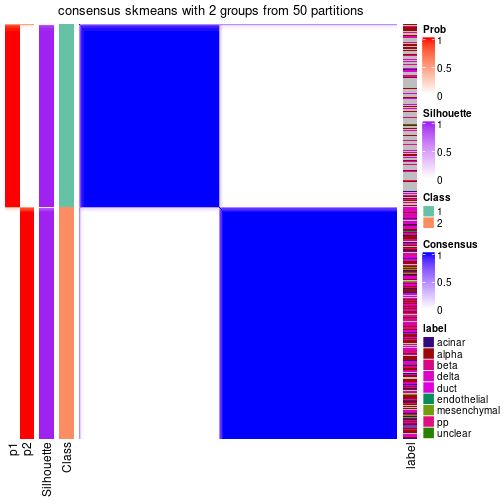</p>

</div>
<div id='tab-node-0-consensus-heatmap-2'>
<pre><code class="r">consensus_heatmap(res, k = 3)
</code></pre>

<p>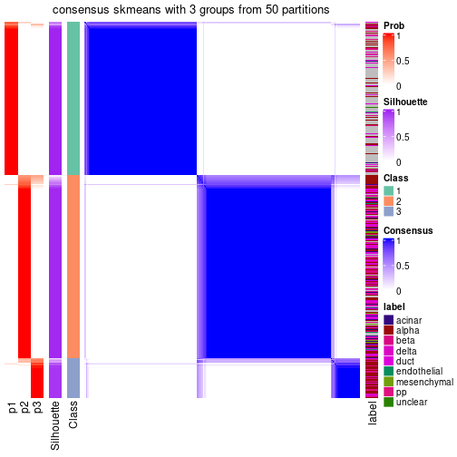</p>

</div>
<div id='tab-node-0-consensus-heatmap-3'>
<pre><code class="r">consensus_heatmap(res, k = 4)
</code></pre>

<p></p>

</div>
</div>

Heatmaps for the membership of samples in all partitions to see how consistent they are:


<script>
$( function() {
	$( '#tabs-node-0-membership-heatmap' ).tabs();
} );
</script>
<div id='tabs-node-0-membership-heatmap'>
<ul>
<li><a href='#tab-node-0-membership-heatmap-1'>k = 2</a></li>
<li><a href='#tab-node-0-membership-heatmap-2'>k = 3</a></li>
<li><a href='#tab-node-0-membership-heatmap-3'>k = 4</a></li>
</ul>
<div id='tab-node-0-membership-heatmap-1'>
<pre><code class="r">membership_heatmap(res, k = 2)
</code></pre>

<p>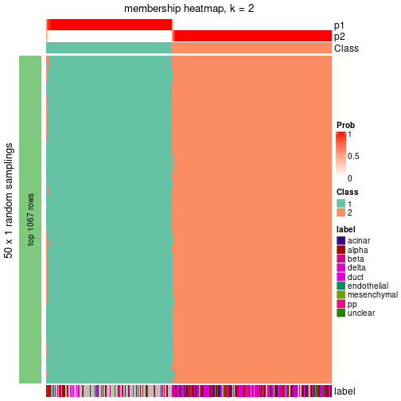</p>

</div>
<div id='tab-node-0-membership-heatmap-2'>
<pre><code class="r">membership_heatmap(res, k = 3)
</code></pre>

<p>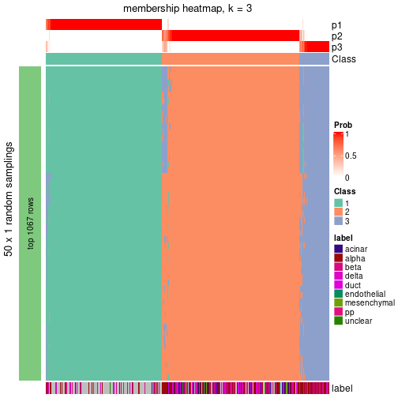</p>

</div>
<div id='tab-node-0-membership-heatmap-3'>
<pre><code class="r">membership_heatmap(res, k = 4)
</code></pre>

<p>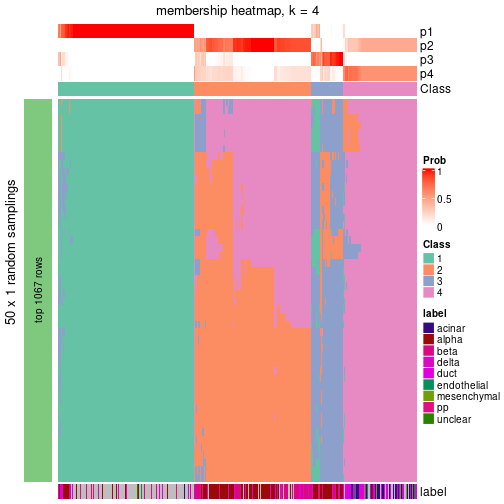</p>

</div>
</div>

As soon as the classes for columns are determined, the signatures
that are significantly different between subgroups can be looked for. 
Following are the heatmaps for signatures.


Signature heatmaps where rows are scaled:


<script>
$( function() {
	$( '#tabs-node-0-get-signatures' ).tabs();
} );
</script>
<div id='tabs-node-0-get-signatures'>
<ul>
<li><a href='#tab-node-0-get-signatures-1'>k = 2</a></li>
<li><a href='#tab-node-0-get-signatures-2'>k = 3</a></li>
<li><a href='#tab-node-0-get-signatures-3'>k = 4</a></li>
</ul>
<div id='tab-node-0-get-signatures-1'>
<pre><code class="r">get_signatures(res, k = 2)
</code></pre>

<p>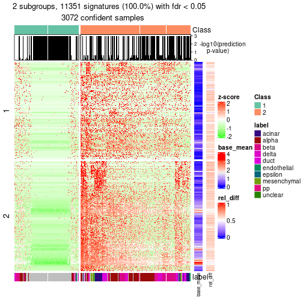</p>

</div>
<div id='tab-node-0-get-signatures-2'>
<pre><code class="r">get_signatures(res, k = 3)
</code></pre>

<p>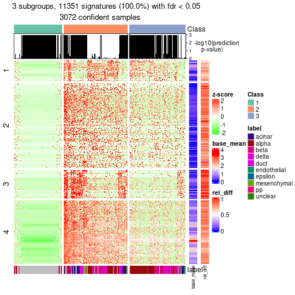</p>

</div>
<div id='tab-node-0-get-signatures-3'>
<pre><code class="r">get_signatures(res, k = 4)
</code></pre>

<p>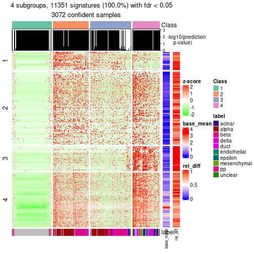</p>

</div>
</div>


Signature heatmaps where rows are not scaled:


<script>
$( function() {
	$( '#tabs-node-0-get-signatures-no-scale' ).tabs();
} );
</script>
<div id='tabs-node-0-get-signatures-no-scale'>
<ul>
<li><a href='#tab-node-0-get-signatures-no-scale-1'>k = 2</a></li>
<li><a href='#tab-node-0-get-signatures-no-scale-2'>k = 3</a></li>
<li><a href='#tab-node-0-get-signatures-no-scale-3'>k = 4</a></li>
</ul>
<div id='tab-node-0-get-signatures-no-scale-1'>
<pre><code class="r">get_signatures(res, k = 2, scale_rows = FALSE)
</code></pre>

<p>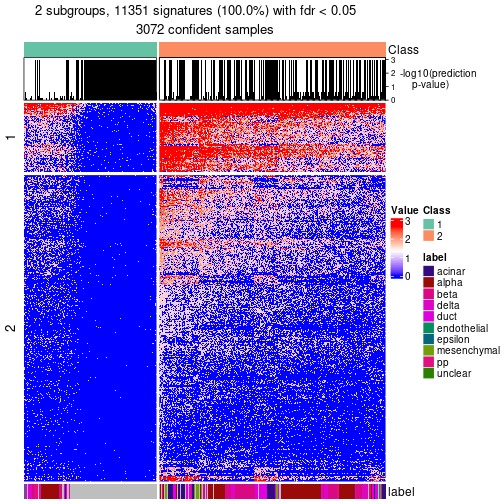</p>

</div>
<div id='tab-node-0-get-signatures-no-scale-2'>
<pre><code class="r">get_signatures(res, k = 3, scale_rows = FALSE)
</code></pre>

<p></p>

</div>
<div id='tab-node-0-get-signatures-no-scale-3'>
<pre><code class="r">get_signatures(res, k = 4, scale_rows = FALSE)
</code></pre>

<p>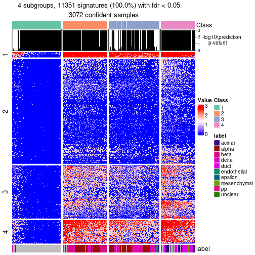</p>

</div>
</div>


Compare the overlap of signatures from different k:

```r
compare_signatures(res)
```

```
#> Error in fit_diagram(combinations, "euler", input, shape, control, ...): !any(duplicated(names(combinations))) is not TRUE
```

`get_signature()` returns a data frame invisibly. To get the list of signatures, the function
call should be assigned to a variable explicitly. In following code, if `plot` argument is set
to `FALSE`, no heatmap is plotted while only the differential analysis is performed.

```r
# code only for demonstration
tb = get_signature(res, k = ..., plot = FALSE)
```

An example of the output of `tb` is:

```
#>   which_row         fdr    mean_1    mean_2 scaled_mean_1 scaled_mean_2 km
#> 1        38 0.042760348  8.373488  9.131774    -0.5533452     0.5164555  1
#> 2        40 0.018707592  7.106213  8.469186    -0.6173731     0.5762149  1
#> 3        55 0.019134737 10.221463 11.207825    -0.6159697     0.5749050  1
#> 4        59 0.006059896  5.921854  7.869574    -0.6899429     0.6439467  1
#> 5        60 0.018055526  8.928898 10.211722    -0.6204761     0.5791110  1
#> 6        98 0.009384629 15.714769 14.887706     0.6635654    -0.6193277  2
...
```

The columns in `tb` are:

1. `which_row`: row indices corresponding to the input matrix.
2. `fdr`: FDR for the differential test. 
3. `mean_x`: The mean value in group x.
4. `scaled_mean_x`: The mean value in group x after rows are scaled.
5. `km`: Row groups if k-means clustering is applied to rows (which is done by automatically selecting number of clusters).

If there are too many signatures, `top_signatures = ...` can be set to only show the 
signatures with the highest FDRs:

```r
# code only for demonstration
# e.g. to show the top 500 most significant rows
tb = get_signature(res, k = ..., top_signatures = 500)
```

If the signatures are defined as these which are uniquely high in current group, `diff_method` argument
can be set to `"uniquely_high_in_one_group"`:

```r
# code only for demonstration
tb = get_signature(res, k = ..., diff_method = "uniquely_high_in_one_group")
```


UMAP plot which shows how samples are separated.


<script>
$( function() {
	$( '#tabs-node-0-dimension-reduction' ).tabs();
} );
</script>
<div id='tabs-node-0-dimension-reduction'>
<ul>
<li><a href='#tab-node-0-dimension-reduction-1'>k = 2</a></li>
<li><a href='#tab-node-0-dimension-reduction-2'>k = 3</a></li>
<li><a href='#tab-node-0-dimension-reduction-3'>k = 4</a></li>
</ul>
<div id='tab-node-0-dimension-reduction-1'>
<pre><code class="r">dimension_reduction(res, k = 2, method = &quot;UMAP&quot;)
</code></pre>

<p>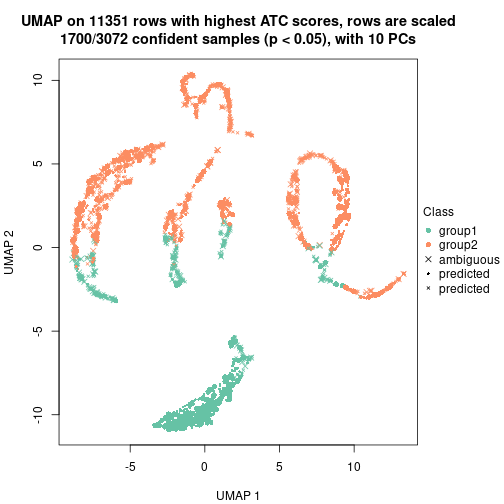</p>

</div>
<div id='tab-node-0-dimension-reduction-2'>
<pre><code class="r">dimension_reduction(res, k = 3, method = &quot;UMAP&quot;)
</code></pre>

<p>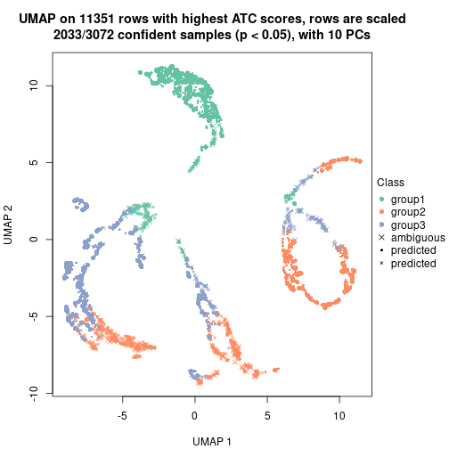</p>

</div>
<div id='tab-node-0-dimension-reduction-3'>
<pre><code class="r">dimension_reduction(res, k = 4, method = &quot;UMAP&quot;)
</code></pre>

<p>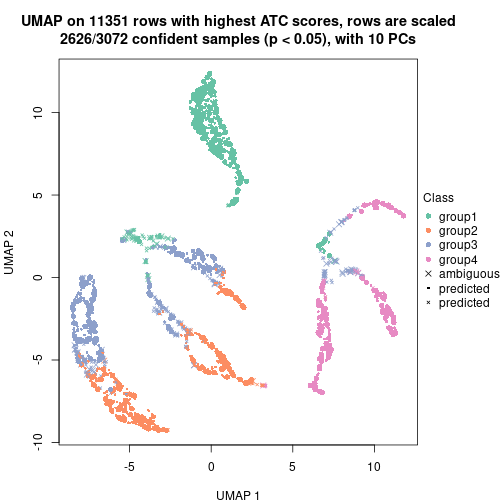</p>

</div>
</div>


Following heatmap shows how subgroups are split when increasing `k`:

```r
collect_classes(res)
```

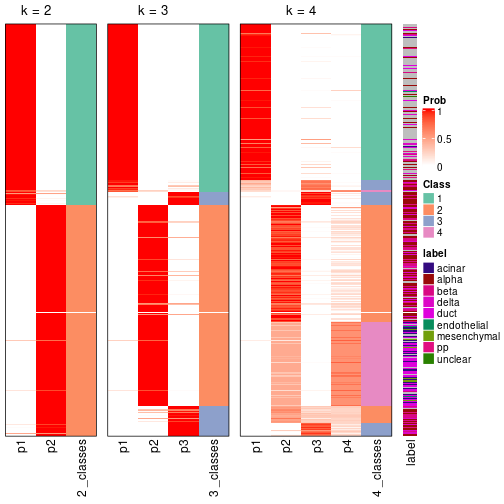


Test correlation between subgroups and known annotations. If the known
annotation is numeric, one-way ANOVA test is applied, and if the known
annotation is discrete, chi-squared contingency table test is applied.

```r
test_to_known_factors(res)
```

```
#>             n_sample label(p-value) k
#> ATC:skmeans     1700       1.75e-31 2
#> ATC:skmeans     2033      2.43e-208 3
#> ATC:skmeans     2626       0.00e+00 4
```


If matrix rows can be associated to genes, consider to use `functional_enrichment(res,
...)` to perform function enrichment for the signature genes. See [this vignette](https://jokergoo.github.io/cola_vignettes/functional_enrichment.html) for more detailed explanations.


 

---------------------------------------------------


### Node01


Parent node: [Node0](#Node0).
Child nodes: 
                Node011-leaf
        ,
                [Node012](#Node012)
        ,
                [Node013](#Node013)
        ,
                Node014-leaf
        ,
                [Node021](#Node021)
        ,
                [Node022](#Node022)
        ,
                [Node023](#Node023)
        ,
                [Node024](#Node024)
        .


The object with results only for a single top-value method and a single partitioning method 
can be extracted as:

```r
res = res_rh["01"]
```

A summary of `res` and all the functions that can be applied to it:

```r
res
```

```
#> A 'DownSamplingConsensusPartition' object with k = 2, 3, 4.
#>   On a matrix with 11351 rows and 500 columns, randomly sampled from 1135 columns.
#>   Top rows (1039) are extracted by 'ATC' method.
#>   Subgroups are detected by 'skmeans' method.
#>   Performed in total 150 partitions by row resampling.
#>   Best k for subgroups seems to be 4.
#> 
#> Following methods can be applied to this 'DownSamplingConsensusPartition' object:
#>  [1] "cola_report"             "collect_classes"         "collect_plots"          
#>  [4] "collect_stats"           "colnames"                "compare_partitions"     
#>  [7] "compare_signatures"      "consensus_heatmap"       "dimension_reduction"    
#> [10] "functional_enrichment"   "get_anno_col"            "get_anno"               
#> [13] "get_classes"             "get_consensus"           "get_matrix"             
#> [16] "get_membership"          "get_param"               "get_signatures"         
#> [19] "get_stats"               "is_best_k"               "is_stable_k"            
#> [22] "membership_heatmap"      "ncol"                    "nrow"                   
#> [25] "plot_ecdf"               "predict_classes"         "rownames"               
#> [28] "select_partition_number" "show"                    "suggest_best_k"         
#> [31] "test_to_known_factors"   "top_rows_heatmap"
```

`collect_plots()` function collects all the plots made from `res` for all `k` (number of subgroups)
into one single page to provide an easy and fast comparison between different `k`.

```r
collect_plots(res)
```

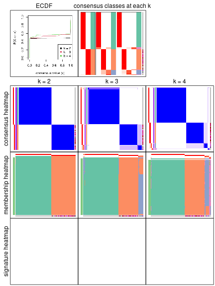

The plots are:

- The first row: a plot of the eCDF (empirical cumulative distribution
  function) curves of the consensus matrix for each `k` and the heatmap of
  predicted classes for each `k`.
- The second row: heatmaps of the consensus matrix for each `k`.
- The third row: heatmaps of the membership matrix for each `k`.
- The fouth row: heatmaps of the signatures for each `k`.

All the plots in panels can be made by individual functions and they are
plotted later in this section.

`select_partition_number()` produces several plots showing different
statistics for choosing "optimized" `k`. There are following statistics:

- eCDF curves of the consensus matrix for each `k`;
- 1-PAC. [The PAC score](https://en.wikipedia.org/wiki/Consensus_clustering#Over-interpretation_potential_of_consensus_clustering)
  measures the proportion of the ambiguous subgrouping.
- Mean silhouette score.
- Concordance. The mean probability of fiting the consensus subgroup labels in all
  partitions.
- Area increased. Denote $A_k$ as the area under the eCDF curve for current
  `k`, the area increased is defined as $A_k - A_{k-1}$.
- Rand index. The percent of pairs of samples that are both in a same cluster
  or both are not in a same cluster in the partition of k and k-1.
- Jaccard index. The ratio of pairs of samples are both in a same cluster in
  the partition of k and k-1 and the pairs of samples are both in a same
  cluster in the partition k or k-1.

The detailed explanations of these statistics can be found in [the _cola_
vignette](https://jokergoo.github.io/cola_vignettes/cola.html#toc_13).

Generally speaking, higher 1-PAC score, higher mean silhouette score or higher
concordance corresponds to better partition. Rand index and Jaccard index
measure how similar the current partition is compared to partition with `k-1`.
If they are too similar, we won't accept `k` is better than `k-1`.

```r
select_partition_number(res)
```

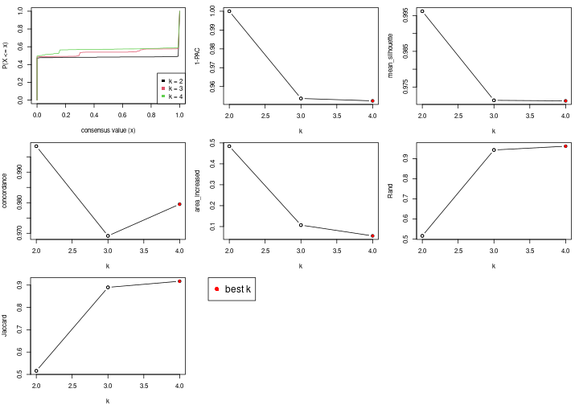

The numeric values for all these statistics can be obtained by `get_stats()`.

```r
get_stats(res)
```

```
#>   k 1-PAC mean_silhouette concordance area_increased  Rand Jaccard
#> 2 2 1.000           0.996       0.998         0.4842 0.516   0.516
#> 3 3 0.954           0.971       0.969         0.1070 0.943   0.890
#> 4 4 0.952           0.971       0.980         0.0556 0.962   0.917
```

`suggest_best_k()` suggests the best $k$ based on these statistics. The rules are as follows:

- All $k$ with Jaccard index larger than 0.95 are removed because increasing
  $k$ does not provide enough extra information. If all $k$ are removed, it is
  marked as no subgroup is detected.
- For all $k$ with 1-PAC score larger than 0.9, the maximal $k$ is taken as
  the best $k$, and other $k$ are marked as optional $k$.
- If it does not fit the second rule. The $k$ with the maximal vote of the
  highest 1-PAC score, highest mean silhouette, and highest concordance is
  taken as the best $k$.

```r
suggest_best_k(res)
```

```
#> [1] 4
#> attr(,"optional")
#> [1] 2 3
```

There is also optional best $k$ = 2 3 that is worth to check.

Following is the table of the partitions (You need to click the **show/hide
code output** link to see it). The membership matrix (columns with name `p*`)
is inferred by
[`clue::cl_consensus()`](https://www.rdocumentation.org/link/cl_consensus?package=clue)
function with the `SE` method. Basically the value in the membership matrix
represents the probability to belong to a certain group. The finall subgroup
label for an item is determined with the group with highest probability it
belongs to.

In `get_classes()` function, the entropy is calculated from the membership
matrix and the silhouette score is calculated from the consensus matrix.


<script>
$( function() {
	$( '#tabs-node-01-get-classes' ).tabs();
} );
</script>
<div id='tabs-node-01-get-classes'>
<ul>
<li><a href='#tab-node-01-get-classes-1'>k = 2</a></li>
<li><a href='#tab-node-01-get-classes-2'>k = 3</a></li>
<li><a href='#tab-node-01-get-classes-3'>k = 4</a></li>
</ul>

<div id='tab-node-01-get-classes-1'>
<p><a id='tab-node-01-get-classes-1-a' style='color:#0366d6' href='#'>show/hide code output</a></p>
<pre><code class="r">get_classes(res, k = 2)
</code></pre>

<pre><code>#&gt;          class     p
#&gt; D28-1_6      1 0.000
#&gt; D28-1_7      1 0.000
#&gt; D28-1_8      1 0.000
#&gt; D28-1_9      1 0.000
#&gt; D28-1_10     1 0.000
#&gt; D28-1_11     1 0.000
#&gt; D28-1_12     1 0.000
#&gt; D28-1_14     1 0.000
#&gt; D28-1_16     1 0.000
#&gt; D28-1_18     1 0.000
#&gt; D28-1_19     1 0.000
#&gt; D28-1_20     1 0.000
#&gt; D28-1_21     1 0.000
#&gt; D28-1_22     1 0.000
#&gt; D28-1_23     1 0.000
#&gt; D28-1_24     1 0.000
#&gt; D28-1_25     1 0.000
#&gt; D28-1_27     1 1.000
#&gt; D28-1_28     1 0.000
#&gt; D28-1_31     1 0.000
#&gt; D28-1_32     1 0.000
#&gt; D28-1_33     1 0.000
#&gt; D28-1_34     1 0.000
#&gt; D28-1_35     1 0.000
#&gt; D28-1_36     1 0.000
#&gt; D28-1_39     2 0.000
#&gt; D28-1_42     1 0.498
#&gt; D28-1_44     1 0.000
#&gt; D28-1_45     1 0.000
#&gt; D28-1_46     1 0.000
#&gt; D28-1_47     1 0.000
#&gt; D28-1_48     1 0.000
#&gt; D28-1_53     1 0.747
#&gt; D28-1_54     1 0.000
#&gt; D28-1_56     1 0.000
#&gt; D28-1_57     1 0.000
#&gt; D28-1_58     1 0.000
#&gt; D28-1_59     1 0.000
#&gt; D28-1_60     1 0.000
#&gt; D28-1_64     2 0.000
#&gt; D28-1_69     1 0.000
#&gt; D28-1_70     1 0.000
#&gt; D28-1_71     1 0.000
#&gt; D28-1_72     1 0.000
#&gt; D28-1_76     2 0.000
#&gt; D28-1_78     1 0.000
#&gt; D28-1_79     1 0.000
#&gt; D28-1_81     1 0.000
#&gt; D28-1_82     1 0.000
#&gt; D28-1_83     1 0.000
#&gt; D28-1_84     1 0.000
#&gt; D28-1_92     1 0.000
#&gt; D28-1_93     1 0.000
#&gt; D28-1_94     1 0.000
#&gt; D28-1_95     1 0.000
#&gt; D28-1_96     1 0.000
#&gt; D28-2_3      1 0.000
#&gt; D28-2_6      1 0.000
#&gt; D28-2_7      1 0.000
#&gt; D28-2_8      1 0.000
#&gt; D28-2_9      1 0.000
#&gt; D28-2_10     1 0.000
#&gt; D28-2_11     1 0.000
#&gt; D28-2_12     1 0.000
#&gt; D28-2_14     1 0.000
#&gt; D28-2_19     1 1.000
#&gt; D28-2_20     1 0.000
#&gt; D28-2_21     1 0.000
#&gt; D28-2_22     1 0.000
#&gt; D28-2_23     1 0.000
#&gt; D28-2_24     1 0.000
#&gt; D28-2_25     1 0.000
#&gt; D28-2_27     1 0.000
#&gt; D28-2_30     1 0.000
#&gt; D28-2_31     1 0.000
#&gt; D28-2_32     1 0.000
#&gt; D28-2_33     1 0.000
#&gt; D28-2_34     1 0.000
#&gt; D28-2_35     1 0.000
#&gt; D28-2_36     1 0.000
#&gt; D28-2_44     1 0.000
#&gt; D28-2_45     1 0.000
#&gt; D28-2_46     1 1.000
#&gt; D28-2_47     1 0.000
#&gt; D28-2_48     1 0.000
#&gt; D28-2_50     1 0.000
#&gt; D28-2_54     1 1.000
#&gt; D28-2_55     1 0.000
#&gt; D28-2_56     1 1.000
#&gt; D28-2_57     1 1.000
#&gt; D28-2_58     1 0.000
#&gt; D28-2_59     1 0.502
#&gt; D28-2_60     1 0.249
#&gt; D28-2_62     1 0.000
#&gt; D28-2_67     1 0.000
#&gt; D28-2_69     1 0.000
#&gt; D28-2_70     1 0.000
#&gt; D28-2_71     1 0.000
#&gt; D28-2_72     1 0.000
#&gt; D28-2_77     1 0.249
#&gt; D28-2_80     1 1.000
#&gt; D28-2_81     1 0.000
#&gt; D28-2_82     1 0.000
#&gt; D28-2_83     1 0.000
#&gt; D28-2_84     1 0.000
#&gt; D28-2_88     1 0.000
#&gt; D28-2_92     1 0.498
#&gt; D28-2_93     1 0.000
#&gt; D28-2_94     1 0.000
#&gt; D28-2_95     1 0.000
#&gt; D28-2_96     1 0.000
#&gt; D28-3_1      2 0.000
#&gt; D28-3_2      1 0.000
#&gt; D28-3_9      1 0.000
#&gt; D28-3_10     1 0.000
#&gt; D28-3_11     1 0.000
#&gt; D28-3_12     1 0.000
#&gt; D28-3_13     2 0.000
#&gt; D28-3_18     2 0.000
#&gt; D28-3_19     1 0.000
#&gt; D28-3_20     1 0.000
#&gt; D28-3_21     1 0.000
#&gt; D28-3_22     1 0.000
#&gt; D28-3_23     1 0.000
#&gt; D28-3_24     1 0.000
#&gt; D28-3_32     1 0.000
#&gt; D28-3_33     1 0.000
#&gt; D28-3_34     1 0.000
#&gt; D28-3_35     1 0.000
#&gt; D28-3_36     1 0.000
#&gt; D28-3_39     1 0.000
#&gt; D28-3_45     1 0.000
#&gt; D28-3_46     1 0.000
#&gt; D28-3_47     1 0.000
#&gt; D28-3_48     1 0.000
#&gt; D28-3_49     2 0.751
#&gt; D28-3_56     1 1.000
#&gt; D28-3_57     1 0.000
#&gt; D28-3_58     1 0.000
#&gt; D28-3_59     1 0.000
#&gt; D28-3_60     1 0.000
#&gt; D28-3_66     1 1.000
#&gt; D28-3_67     1 0.751
#&gt; D28-3_70     1 0.000
#&gt; D28-3_71     1 0.000
#&gt; D28-3_72     1 0.000
#&gt; D28-3_74     1 0.000
#&gt; D28-3_80     1 0.000
#&gt; D28-3_81     1 0.000
#&gt; D28-3_82     1 0.000
#&gt; D28-3_83     1 0.000
#&gt; D28-3_84     1 0.000
#&gt; D28-3_87     1 0.249
#&gt; D28-3_93     1 0.000
#&gt; D28-3_94     1 0.000
#&gt; D28-3_95     1 0.000
#&gt; D28-3_96     1 0.000
#&gt; D28-4_2      1 0.000
#&gt; D28-4_5      1 0.000
#&gt; D28-4_6      1 0.000
#&gt; D28-4_7      1 0.000
#&gt; D28-4_8      1 0.000
#&gt; D28-4_9      1 0.000
#&gt; D28-4_10     1 0.000
#&gt; D28-4_11     1 0.000
#&gt; D28-4_12     1 0.000
#&gt; D28-4_16     1 0.751
#&gt; D28-4_18     1 0.000
#&gt; D28-4_19     1 0.000
#&gt; D28-4_20     1 0.000
#&gt; D28-4_21     1 0.000
#&gt; D28-4_23     1 0.000
#&gt; D28-4_24     1 0.000
#&gt; D28-4_25     1 0.249
#&gt; D28-4_32     1 0.000
#&gt; D28-4_33     1 0.000
#&gt; D28-4_34     1 0.000
#&gt; D28-4_35     1 0.000
#&gt; D28-4_36     1 0.000
#&gt; D28-4_42     1 1.000
#&gt; D28-4_44     1 0.249
#&gt; D28-4_45     1 0.000
#&gt; D28-4_46     1 0.000
#&gt; D28-4_47     1 0.000
#&gt; D28-4_48     1 0.000
#&gt; D28-4_57     1 0.000
#&gt; D28-4_58     1 0.000
#&gt; D28-4_59     1 0.000
#&gt; D28-4_60     1 0.000
#&gt; D28-4_64     2 0.000
#&gt; D28-4_66     1 0.000
#&gt; D28-4_68     1 0.000
#&gt; D28-4_69     1 0.000
#&gt; D28-4_70     1 0.000
#&gt; D28-4_71     1 0.000
#&gt; D28-4_72     1 0.000
#&gt; D28-4_79     1 1.000
#&gt; D28-4_80     1 0.000
#&gt; D28-4_81     1 0.000
#&gt; D28-4_82     1 0.000
#&gt; D28-4_83     1 0.000
#&gt; D28-4_84     1 0.000
#&gt; D28-4_92     1 0.000
#&gt; D28-4_93     1 0.000
#&gt; D28-4_94     1 0.000
#&gt; D28-4_95     1 0.000
#&gt; D28-4_96     1 0.000
#&gt; D28-5_6      1 0.000
#&gt; D28-5_7      1 0.000
#&gt; D28-5_8      1 0.000
#&gt; D28-5_9      1 0.000
#&gt; D28-5_10     1 0.000
#&gt; D28-5_11     1 0.000
#&gt; D28-5_12     1 0.000
#&gt; D28-5_18     1 0.000
#&gt; D28-5_19     1 0.000
#&gt; D28-5_20     1 0.000
#&gt; D28-5_21     1 0.000
#&gt; D28-5_22     1 0.000
#&gt; D28-5_23     1 0.000
#&gt; D28-5_24     1 0.000
#&gt; D28-5_26     2 0.249
#&gt; D28-5_32     1 0.000
#&gt; D28-5_33     1 0.498
#&gt; D28-5_34     1 0.000
#&gt; D28-5_35     1 0.000
#&gt; D28-5_36     1 0.000
#&gt; D28-5_40     2 0.000
#&gt; D28-5_43     1 0.000
#&gt; D28-5_44     1 0.000
#&gt; D28-5_45     1 0.000
#&gt; D28-5_46     1 0.000
#&gt; D28-5_47     1 0.000
#&gt; D28-5_48     1 0.000
#&gt; D28-5_55     2 0.000
#&gt; D28-5_57     1 1.000
#&gt; D28-5_58     1 0.000
#&gt; D28-5_59     1 0.000
#&gt; D28-5_60     1 0.000
#&gt; D28-5_67     1 0.000
#&gt; D28-5_68     1 0.000
#&gt; D28-5_69     1 0.000
#&gt; D28-5_70     1 0.000
#&gt; D28-5_71     1 0.000
#&gt; D28-5_72     1 0.000
#&gt; D28-5_79     1 0.000
#&gt; D28-5_80     1 0.000
#&gt; D28-5_81     1 0.000
#&gt; D28-5_82     1 0.000
#&gt; D28-5_83     1 0.000
#&gt; D28-5_84     1 0.000
#&gt; D28-5_85     2 0.502
#&gt; D28-5_90     1 0.000
#&gt; D28-5_91     1 0.000
#&gt; D28-5_92     1 0.000
#&gt; D28-5_93     1 0.000
#&gt; D28-5_94     1 0.000
#&gt; D28-5_95     1 0.000
#&gt; D28-5_96     1 0.000
#&gt; D28-6_5      1 0.000
#&gt; D28-6_6      1 0.000
#&gt; D28-6_7      1 0.000
#&gt; D28-6_8      1 0.000
#&gt; D28-6_9      1 0.000
#&gt; D28-6_10     1 0.000
#&gt; D28-6_11     1 0.000
#&gt; D28-6_12     1 0.000
#&gt; D28-6_15     2 0.000
#&gt; D28-6_18     1 0.000
#&gt; D28-6_20     1 0.000
#&gt; D28-6_21     1 0.000
#&gt; D28-6_22     1 0.000
#&gt; D28-6_23     1 0.000
#&gt; D28-6_24     1 0.000
#&gt; D28-6_25     1 0.000
#&gt; D28-6_27     1 0.000
#&gt; D28-6_28     1 1.000
#&gt; D28-6_30     2 0.000
#&gt; D28-6_31     1 0.000
#&gt; D28-6_32     1 0.000
#&gt; D28-6_33     1 0.000
#&gt; D28-6_34     1 0.000
#&gt; D28-6_35     1 0.000
#&gt; D28-6_36     1 0.000
#&gt; D28-6_44     1 0.000
#&gt; D28-6_45     1 0.000
#&gt; D28-6_46     1 0.000
#&gt; D28-6_47     1 0.000
#&gt; D28-6_48     1 0.000
#&gt; D28-6_54     1 0.000
#&gt; D28-6_55     1 0.000
#&gt; D28-6_56     1 1.000
#&gt; D28-6_57     1 0.000
#&gt; D28-6_58     1 0.000
#&gt; D28-6_59     1 0.000
#&gt; D28-6_60     1 0.000
#&gt; D28-6_67     1 0.000
#&gt; D28-6_68     1 0.000
#&gt; D28-6_69     1 0.000
#&gt; D28-6_70     1 0.000
#&gt; D28-6_71     1 0.000
#&gt; D28-6_72     1 0.000
#&gt; D28-6_78     1 0.000
#&gt; D28-6_79     1 0.000
#&gt; D28-6_80     1 0.000
#&gt; D28-6_81     1 0.000
#&gt; D28-6_82     1 0.000
#&gt; D28-6_83     1 0.000
#&gt; D28-6_84     1 0.000
#&gt; D28-6_85     1 1.000
#&gt; D28-6_88     2 0.000
#&gt; D28-6_90     1 0.000
#&gt; D28-6_91     1 0.000
#&gt; D28-6_92     1 0.000
#&gt; D28-6_93     1 0.000
#&gt; D28-6_94     1 0.000
#&gt; D28-6_95     1 0.000
#&gt; D28-6_96     1 0.000
#&gt; D28-7_2      1 0.000
#&gt; D28-7_6      1 0.000
#&gt; D28-7_8      1 0.000
#&gt; D28-7_9      1 0.000
#&gt; D28-7_10     1 0.000
#&gt; D28-7_11     1 0.000
#&gt; D28-7_12     1 0.000
#&gt; D28-7_14     1 0.000
#&gt; D28-7_17     1 1.000
#&gt; D28-7_18     2 0.000
#&gt; D28-7_20     1 0.000
#&gt; D28-7_21     1 0.000
#&gt; D28-7_22     1 0.000
#&gt; D28-7_23     1 0.000
#&gt; D28-7_24     1 0.000
#&gt; D28-7_25     1 0.000
#&gt; D28-7_26     1 0.000
#&gt; D28-7_27     1 0.000
#&gt; D28-7_28     1 0.000
#&gt; D28-7_29     1 0.000
#&gt; D28-7_30     1 0.000
#&gt; D28-7_31     1 0.000
#&gt; D28-7_32     1 0.000
#&gt; D28-7_33     1 0.000
#&gt; D28-7_34     1 0.000
#&gt; D28-7_35     1 0.000
#&gt; D28-7_36     1 0.000
#&gt; D28-7_43     1 0.000
#&gt; D28-7_44     1 0.000
#&gt; D28-7_45     1 0.000
#&gt; D28-7_46     1 0.000
#&gt; D28-7_47     1 0.000
#&gt; D28-7_48     1 0.747
#&gt; D28-7_54     1 0.000
#&gt; D28-7_55     1 0.000
#&gt; D28-7_56     1 1.000
#&gt; D28-7_57     1 1.000
#&gt; D28-7_58     1 0.000
#&gt; D28-7_59     1 0.000
#&gt; D28-7_60     1 0.000
#&gt; D28-7_67     1 0.502
#&gt; D28-7_69     1 0.000
#&gt; D28-7_70     1 0.000
#&gt; D28-7_71     1 0.000
#&gt; D28-7_72     1 0.000
#&gt; D28-7_79     1 1.000
#&gt; D28-7_80     1 0.000
#&gt; D28-7_81     1 0.000
#&gt; D28-7_82     1 0.000
#&gt; D28-7_83     1 0.000
#&gt; D28-7_84     1 0.000
#&gt; D28-7_90     1 0.000
#&gt; D28-7_91     1 0.000
#&gt; D28-7_92     1 0.000
#&gt; D28-7_93     1 0.000
#&gt; D28-7_94     1 0.000
#&gt; D28-7_95     1 0.000
#&gt; D28-7_96     1 0.000
#&gt; D28-8_3      1 0.498
#&gt; D28-8_7      1 0.000
#&gt; D28-8_8      1 0.000
#&gt; D28-8_9      1 0.000
#&gt; D28-8_10     1 0.000
#&gt; D28-8_11     1 0.000
#&gt; D28-8_12     1 0.000
#&gt; D28-8_13     1 0.000
#&gt; D28-8_17     1 0.000
#&gt; D28-8_19     1 0.000
#&gt; D28-8_20     1 0.000
#&gt; D28-8_21     1 0.000
#&gt; D28-8_22     1 0.000
#&gt; D28-8_23     1 0.000
#&gt; D28-8_24     1 0.000
#&gt; D28-8_30     1 0.000
#&gt; D28-8_32     1 0.000
#&gt; D28-8_33     1 0.000
#&gt; D28-8_34     1 0.000
#&gt; D28-8_35     1 0.000
#&gt; D28-8_36     1 0.000
#&gt; D28-8_40     1 0.000
#&gt; D28-8_43     1 0.000
#&gt; D28-8_44     1 0.502
#&gt; D28-8_45     1 0.000
#&gt; D28-8_46     1 0.249
#&gt; D28-8_47     1 0.000
#&gt; D28-8_48     1 0.000
#&gt; D28-8_51     2 0.249
#&gt; D28-8_54     1 0.000
#&gt; D28-8_56     1 0.751
#&gt; D28-8_57     1 0.249
#&gt; D28-8_58     1 0.000
#&gt; D28-8_59     1 0.000
#&gt; D28-8_60     1 0.000
#&gt; D28-8_64     1 0.000
#&gt; D28-8_67     1 0.000
#&gt; D28-8_68     1 0.000
#&gt; D28-8_69     1 0.000
#&gt; D28-8_70     1 0.000
#&gt; D28-8_71     1 0.000
#&gt; D28-8_72     1 0.000
#&gt; D28-8_76     1 0.249
#&gt; D28-8_79     1 0.000
#&gt; D28-8_80     1 0.000
#&gt; D28-8_81     1 0.000
#&gt; D28-8_82     1 0.000
#&gt; D28-8_83     1 0.000
#&gt; D28-8_84     1 0.000
#&gt; D28-8_89     1 1.000
#&gt; D28-8_91     1 0.000
#&gt; D28-8_92     1 0.000
#&gt; D28-8_93     1 0.000
#&gt; D28-8_94     1 0.000
#&gt; D28-8_95     1 0.000
#&gt; D28-8_96     1 0.000
#&gt; D29-1_4      2 0.000
#&gt; D29-1_5      1 0.000
#&gt; D29-1_7      2 0.000
#&gt; D29-1_9      1 0.000
#&gt; D29-1_10     1 0.000
#&gt; D29-1_12     2 0.000
#&gt; D29-1_13     2 0.000
#&gt; D29-1_14     1 1.000
#&gt; D29-1_15     2 0.253
#&gt; D29-1_18     2 0.000
#&gt; D29-1_22     1 0.000
#&gt; D29-1_23     1 0.000
#&gt; D29-1_24     2 0.249
#&gt; D29-1_25     1 0.000
#&gt; D29-1_26     2 0.000
#&gt; D29-1_28     1 0.000
#&gt; D29-1_30     2 0.000
#&gt; D29-1_31     1 0.000
#&gt; D29-1_33     2 0.000
#&gt; D29-1_35     2 0.000
#&gt; D29-1_38     2 0.253
#&gt; D29-1_39     2 0.000
#&gt; D29-1_40     2 0.000
#&gt; D29-1_43     1 0.000
#&gt; D29-1_45     2 0.000
#&gt; D29-1_62     2 0.000
#&gt; D29-1_63     1 0.000
#&gt; D29-1_64     1 0.000
#&gt; D29-1_66     2 0.249
#&gt; D29-1_73     2 0.000
#&gt; D29-1_74     2 0.000
#&gt; D29-1_85     1 0.000
#&gt; D29-1_87     2 0.000
#&gt; D29-1_91     1 1.000
#&gt; D29-1_94     2 0.000
#&gt; D29-1_95     1 0.000
#&gt; D29-1_96     1 0.000
#&gt; D29-2_2      1 0.000
#&gt; D29-2_14     1 0.000
#&gt; D29-2_15     2 0.498
#&gt; D29-2_17     1 0.000
#&gt; D29-2_19     2 0.000
#&gt; D29-2_21     1 1.000
#&gt; D29-2_23     1 0.000
#&gt; D29-2_24     2 0.000
#&gt; D29-2_29     1 0.000
#&gt; D29-2_31     2 0.000
#&gt; D29-2_32     1 0.000
#&gt; D29-2_36     1 0.000
#&gt; D29-2_40     1 0.000
#&gt; D29-2_42     2 0.747
#&gt; D29-2_43     2 0.000
#&gt; D29-2_44     1 0.000
#&gt; D29-2_47     2 0.253
#&gt; D29-2_55     2 0.000
#&gt; D29-2_59     2 0.498
#&gt; D29-2_73     2 0.000
#&gt; D29-2_74     2 0.498
#&gt; D29-2_77     2 0.000
#&gt; D29-2_78     2 0.000
#&gt; D29-2_83     2 0.000
#&gt; D29-2_85     1 0.000
#&gt; D29-2_86     1 0.000
#&gt; D29-2_90     2 0.502
#&gt; D29-2_92     2 0.000
#&gt; D29-2_95     1 0.000
#&gt; D29-2_96     1 0.000
#&gt; D29-3_1      2 0.000
#&gt; D29-3_2      1 0.000
#&gt; D29-3_3      2 0.000
#&gt; D29-3_4      1 0.000
#&gt; D29-3_6      2 0.000
#&gt; D29-3_7      2 0.000
#&gt; D29-3_8      2 0.000
#&gt; D29-3_9      2 0.000
#&gt; D29-3_10     1 0.000
#&gt; D29-3_13     2 0.253
#&gt; D29-3_14     1 0.000
#&gt; D29-3_15     2 0.253
#&gt; D29-3_16     2 0.000
#&gt; D29-3_19     1 0.000
#&gt; D29-3_20     1 0.000
#&gt; D29-3_25     2 0.000
#&gt; D29-3_26     1 0.000
#&gt; D29-3_27     1 0.000
#&gt; D29-3_28     2 0.000
#&gt; D29-3_30     2 0.000
#&gt; D29-3_31     2 0.000
#&gt; D29-3_32     2 0.249
#&gt; D29-3_35     2 0.000
#&gt; D29-3_36     2 0.498
#&gt; D29-3_40     2 0.249
#&gt; D29-3_41     2 0.498
#&gt; D29-3_44     2 1.000
#&gt; D29-3_46     1 0.000
#&gt; D29-3_50     2 0.000
#&gt; D29-3_55     1 0.000
#&gt; D29-3_62     1 0.249
#&gt; D29-3_63     1 0.000
#&gt; D29-3_65     1 0.249
#&gt; D29-3_67     1 0.000
#&gt; D29-3_68     2 0.000
#&gt; D29-3_70     1 0.000
#&gt; D29-3_71     2 1.000
#&gt; D29-3_75     2 0.000
#&gt; D29-3_80     1 0.000
#&gt; D29-3_82     2 0.000
#&gt; D29-3_83     2 0.502
#&gt; D29-3_85     2 0.000
#&gt; D29-3_87     2 0.249
#&gt; D29-3_88     2 0.000
#&gt; D29-3_89     1 0.000
#&gt; D29-3_90     1 0.000
#&gt; D29-3_91     1 0.000
#&gt; D29-3_95     1 0.000
#&gt; D29-3_96     1 0.000
#&gt; D29-4_1      1 0.000
#&gt; D29-4_3      2 0.000
#&gt; D29-4_4      2 0.751
#&gt; D29-4_6      2 0.000
#&gt; D29-4_7      1 0.000
#&gt; D29-4_9      2 0.000
#&gt; D29-4_10     1 1.000
#&gt; D29-4_11     1 0.502
#&gt; D29-4_13     2 0.502
#&gt; D29-4_14     1 0.000
#&gt; D29-4_15     2 0.751
#&gt; D29-4_16     2 0.000
#&gt; D29-4_17     2 0.253
#&gt; D29-4_20     2 0.498
#&gt; D29-4_21     1 0.000
#&gt; D29-4_24     1 0.000
#&gt; D29-4_30     2 1.000
#&gt; D29-4_31     2 0.000
#&gt; D29-4_32     2 0.000
#&gt; D29-4_36     1 0.000
#&gt; D29-4_37     1 0.000
#&gt; D29-4_40     1 0.000
#&gt; D29-4_54     1 0.747
#&gt; D29-4_69     1 0.000
#&gt; D29-4_71     1 0.000
#&gt; D29-4_74     2 0.000
#&gt; D29-4_75     2 0.000
#&gt; D29-4_76     1 0.000
#&gt; D29-4_78     1 0.000
#&gt; D29-4_79     2 0.000
#&gt; D29-4_81     2 0.253
#&gt; D29-4_83     2 1.000
#&gt; D29-4_84     2 0.502
#&gt; D29-4_86     2 0.000
#&gt; D29-4_87     1 0.000
#&gt; D29-4_89     1 0.000
#&gt; D29-4_90     2 0.000
#&gt; D29-4_91     1 0.000
#&gt; D29-4_95     1 0.000
#&gt; D29-4_96     1 0.000
#&gt; D29-5_1      1 1.000
#&gt; D29-5_2      1 1.000
#&gt; D29-5_4      1 0.498
#&gt; D29-5_5      2 0.249
#&gt; D29-5_7      2 0.253
#&gt; D29-5_9      1 0.000
#&gt; D29-5_13     1 0.751
#&gt; D29-5_15     1 0.000
#&gt; D29-5_16     1 0.249
#&gt; D29-5_25     1 1.000
#&gt; D29-5_26     1 1.000
#&gt; D29-5_27     1 0.249
#&gt; D29-5_28     1 0.000
#&gt; D29-5_29     1 0.000
#&gt; D29-5_37     2 0.000
#&gt; D29-5_38     1 0.000
#&gt; D29-5_40     2 0.000
#&gt; D29-5_41     1 1.000
#&gt; D29-5_42     1 0.000
#&gt; D29-5_44     2 0.000
#&gt; D29-5_45     1 0.000
#&gt; D29-5_50     1 1.000
#&gt; D29-5_51     2 0.000
#&gt; D29-5_61     2 0.000
#&gt; D29-5_66     2 0.000
#&gt; D29-5_67     2 0.000
#&gt; D29-5_72     1 0.000
#&gt; D29-5_73     2 0.000
#&gt; D29-5_74     1 0.751
#&gt; D29-5_76     2 0.000
#&gt; D29-5_79     2 1.000
#&gt; D29-5_80     1 0.253
#&gt; D29-5_81     1 1.000
#&gt; D29-5_83     2 0.751
#&gt; D29-5_84     2 0.000
#&gt; D29-5_85     2 0.000
#&gt; D29-5_88     1 0.000
#&gt; D29-5_90     1 0.000
#&gt; D29-5_93     1 0.000
#&gt; D29-5_94     1 0.747
#&gt; D29-5_95     1 0.000
#&gt; D29-5_96     1 0.000
#&gt; D29-6_2      1 0.000
#&gt; D29-6_5      1 0.000
#&gt; D29-6_7      2 0.000
#&gt; D29-6_9      2 0.249
#&gt; D29-6_10     2 0.249
#&gt; D29-6_11     2 0.751
#&gt; D29-6_12     1 0.000
#&gt; D29-6_13     2 0.000
#&gt; D29-6_14     1 0.000
#&gt; D29-6_15     1 0.751
#&gt; D29-6_18     1 0.000
#&gt; D29-6_20     1 0.000
#&gt; D29-6_22     2 0.000
#&gt; D29-6_23     2 0.751
#&gt; D29-6_25     1 0.000
#&gt; D29-6_26     2 0.000
#&gt; D29-6_27     2 0.000
#&gt; D29-6_31     1 0.000
#&gt; D29-6_33     2 0.000
#&gt; D29-6_35     1 0.000
#&gt; D29-6_36     1 0.000
#&gt; D29-6_37     1 0.000
#&gt; D29-6_40     2 0.751
#&gt; D29-6_45     1 0.000
#&gt; D29-6_46     2 0.249
#&gt; D29-6_47     1 0.000
#&gt; D29-6_49     1 0.000
#&gt; D29-6_51     2 0.000
#&gt; D29-6_52     2 0.000
#&gt; D29-6_55     2 1.000
#&gt; D29-6_61     1 0.000
#&gt; D29-6_68     1 0.000
#&gt; D29-6_71     1 0.000
#&gt; D29-6_73     1 0.000
#&gt; D29-6_74     1 0.000
#&gt; D29-6_75     1 0.000
#&gt; D29-6_76     1 0.000
#&gt; D29-6_81     1 0.000
#&gt; D29-6_83     2 0.751
#&gt; D29-6_85     1 0.000
#&gt; D29-6_86     2 0.000
#&gt; D29-6_87     2 0.000
#&gt; D29-6_88     2 0.502
#&gt; D29-6_90     2 0.253
#&gt; D29-6_92     1 0.000
#&gt; D29-6_93     1 0.000
#&gt; D29-6_94     2 0.502
#&gt; D29-6_95     1 0.000
#&gt; D29-6_96     1 0.000
#&gt; D29-7_4      2 0.000
#&gt; D29-7_7      1 0.000
#&gt; D29-7_8      2 0.000
#&gt; D29-7_9      1 1.000
#&gt; D29-7_10     1 0.000
#&gt; D29-7_11     1 0.000
#&gt; D29-7_13     1 0.000
#&gt; D29-7_15     1 0.000
#&gt; D29-7_16     1 1.000
#&gt; D29-7_18     2 0.249
#&gt; D29-7_19     2 0.502
#&gt; D29-7_22     1 0.000
#&gt; D29-7_24     1 0.000
#&gt; D29-7_26     1 0.000
#&gt; D29-7_27     1 1.000
#&gt; D29-7_28     2 1.000
#&gt; D29-7_29     1 0.000
#&gt; D29-7_31     2 0.747
#&gt; D29-7_33     2 0.000
#&gt; D29-7_36     2 0.000
#&gt; D29-7_38     2 0.000
#&gt; D29-7_40     2 0.000
#&gt; D29-7_53     1 0.000
#&gt; D29-7_63     2 0.000
#&gt; D29-7_66     1 0.000
#&gt; D29-7_67     1 0.000
#&gt; D29-7_77     2 0.000
#&gt; D29-7_78     2 0.000
#&gt; D29-7_81     2 1.000
#&gt; D29-7_83     1 1.000
#&gt; D29-7_88     1 0.000
#&gt; D29-7_89     2 0.502
#&gt; D29-7_90     2 1.000
#&gt; D29-7_91     2 0.751
#&gt; D29-7_95     1 0.000
#&gt; D29-7_96     1 0.000
#&gt; D29-8_1      1 0.000
#&gt; D29-8_3      2 0.000
#&gt; D29-8_5      1 0.498
#&gt; D29-8_6      2 0.502
#&gt; D29-8_8      2 1.000
#&gt; D29-8_9      1 0.000
#&gt; D29-8_11     2 1.000
#&gt; D29-8_12     2 0.249
#&gt; D29-8_13     2 0.751
#&gt; D29-8_14     2 0.000
#&gt; D29-8_16     2 0.000
#&gt; D29-8_17     1 0.000
#&gt; D29-8_18     2 0.253
#&gt; D29-8_19     2 0.000
#&gt; D29-8_20     2 0.502
#&gt; D29-8_21     2 0.000
#&gt; D29-8_22     1 1.000
#&gt; D29-8_24     2 0.249
#&gt; D29-8_25     2 0.000
#&gt; D29-8_26     2 0.000
#&gt; D29-8_27     2 0.249
#&gt; D29-8_28     2 0.000
#&gt; D29-8_30     2 0.502
#&gt; D29-8_31     2 0.000
#&gt; D29-8_33     2 0.000
#&gt; D29-8_34     2 0.498
#&gt; D29-8_35     2 0.000
#&gt; D29-8_36     1 0.000
#&gt; D29-8_37     2 0.751
#&gt; D29-8_38     1 0.000
#&gt; D29-8_40     2 0.000
#&gt; D29-8_41     1 0.000
#&gt; D29-8_42     2 0.000
#&gt; D29-8_43     2 0.000
#&gt; D29-8_44     1 0.249
#&gt; D29-8_46     2 0.000
#&gt; D29-8_47     1 0.747
#&gt; D29-8_48     2 0.000
#&gt; D29-8_53     2 0.000
#&gt; D29-8_55     2 0.000
#&gt; D29-8_56     2 0.249
#&gt; D29-8_57     1 0.000
#&gt; D29-8_58     1 0.000
#&gt; D29-8_59     2 0.498
#&gt; D29-8_61     1 0.000
#&gt; D29-8_67     2 0.000
#&gt; D29-8_68     2 0.000
#&gt; D29-8_69     1 0.000
#&gt; D29-8_70     1 0.000
#&gt; D29-8_71     1 0.000
#&gt; D29-8_72     2 0.000
#&gt; D29-8_73     2 0.000
#&gt; D29-8_74     2 0.751
#&gt; D29-8_78     1 0.000
#&gt; D29-8_79     2 0.249
#&gt; D29-8_81     2 0.751
#&gt; D29-8_83     2 0.249
#&gt; D29-8_85     2 0.000
#&gt; D29-8_89     1 0.000
#&gt; D29-8_90     2 1.000
#&gt; D29-8_91     2 0.498
#&gt; D29-8_92     1 0.000
#&gt; D29-8_93     1 0.000
#&gt; D29-8_95     1 0.000
#&gt; D29-8_96     1 0.000
#&gt; D31-1_3      1 0.253
#&gt; D31-1_6      2 0.000
#&gt; D31-1_10     2 0.249
#&gt; D31-1_11     2 0.000
#&gt; D31-1_13     2 0.000
#&gt; D31-1_18     1 1.000
#&gt; D31-1_25     2 0.000
#&gt; D31-1_30     2 0.502
#&gt; D31-1_31     2 0.000
#&gt; D31-1_37     2 0.000
#&gt; D31-1_39     2 0.000
#&gt; D31-1_40     2 0.000
#&gt; D31-1_43     2 0.000
#&gt; D31-1_49     2 0.000
#&gt; D31-1_52     2 0.000
#&gt; D31-1_57     2 0.000
#&gt; D31-1_61     2 0.000
#&gt; D31-1_71     2 0.000
#&gt; D31-1_81     2 0.502
#&gt; D31-1_94     2 0.000
#&gt; D31-1_95     1 0.000
#&gt; D31-1_96     1 0.000
#&gt; D31-2_8      1 0.498
#&gt; D31-2_12     2 0.000
#&gt; D31-2_13     2 0.000
#&gt; D31-2_14     2 0.000
#&gt; D31-2_16     2 0.249
#&gt; D31-2_25     2 0.000
#&gt; D31-2_42     2 0.000
#&gt; D31-2_51     2 0.253
#&gt; D31-2_57     2 0.000
#&gt; D31-2_60     2 0.000
#&gt; D31-2_88     1 1.000
#&gt; D31-2_90     1 0.000
#&gt; D31-2_93     2 0.249
#&gt; D31-2_95     1 0.000
#&gt; D31-2_96     1 0.000
#&gt; D31-3_6      1 0.000
#&gt; D31-3_7      1 0.000
#&gt; D31-3_8      1 0.000
#&gt; D31-3_9      1 1.000
#&gt; D31-3_11     2 0.000
#&gt; D31-3_16     2 0.253
#&gt; D31-3_18     2 0.751
#&gt; D31-3_19     2 0.000
#&gt; D31-3_20     1 0.000
#&gt; D31-3_31     2 0.000
#&gt; D31-3_32     2 0.000
#&gt; D31-3_34     1 1.000
#&gt; D31-3_35     2 0.498
#&gt; D31-3_38     2 0.249
#&gt; D31-3_44     1 0.000
#&gt; D31-3_49     1 0.000
#&gt; D31-3_51     2 0.249
#&gt; D31-3_54     2 0.000
#&gt; D31-3_58     2 0.751
#&gt; D31-3_61     2 0.000
#&gt; D31-3_74     2 0.000
#&gt; D31-3_79     2 0.000
#&gt; D31-3_84     2 1.000
#&gt; D31-3_91     2 0.000
#&gt; D31-3_93     1 1.000
#&gt; D31-3_95     1 0.000
#&gt; D31-3_96     1 0.000
#&gt; D31-4_2      2 0.249
#&gt; D31-4_3      2 0.000
#&gt; D31-4_4      2 0.000
#&gt; D31-4_6      2 0.249
#&gt; D31-4_8      2 0.000
#&gt; D31-4_12     2 0.000
#&gt; D31-4_14     2 0.000
#&gt; D31-4_26     2 0.000
#&gt; D31-4_39     2 0.000
#&gt; D31-4_40     2 0.253
#&gt; D31-4_62     2 0.000
#&gt; D31-4_81     2 0.000
#&gt; D31-4_86     1 0.000
#&gt; D31-4_88     1 1.000
#&gt; D31-4_95     1 0.000
#&gt; D31-4_96     1 0.000
#&gt; D31-5_2      2 0.000
#&gt; D31-5_6      1 0.747
#&gt; D31-5_7      1 0.000
#&gt; D31-5_8      2 0.000
#&gt; D31-5_11     2 0.000
#&gt; D31-5_12     2 0.249
#&gt; D31-5_18     2 0.249
#&gt; D31-5_20     2 0.000
#&gt; D31-5_24     2 0.000
#&gt; D31-5_25     2 0.000
#&gt; D31-5_28     1 0.000
#&gt; D31-5_30     2 0.000
#&gt; D31-5_31     2 0.502
#&gt; D31-5_33     2 0.000
#&gt; D31-5_36     2 0.000
#&gt; D31-5_40     1 1.000
#&gt; D31-5_43     1 0.000
#&gt; D31-5_54     2 0.253
#&gt; D31-5_56     2 0.000
#&gt; D31-5_72     2 0.000
#&gt; D31-5_79     2 0.000
#&gt; D31-5_88     2 0.751
#&gt; D31-5_90     2 0.249
#&gt; D31-5_93     2 0.000
#&gt; D31-5_95     1 0.000
#&gt; D31-5_96     1 0.000
#&gt; D31-6_1      2 0.000
#&gt; D31-6_2      2 0.751
#&gt; D31-6_3      2 0.000
#&gt; D31-6_4      2 0.000
#&gt; D31-6_5      2 0.000
#&gt; D31-6_7      2 0.000
#&gt; D31-6_8      1 1.000
#&gt; D31-6_14     1 0.000
#&gt; D31-6_17     1 0.000
#&gt; D31-6_25     2 1.000
#&gt; D31-6_26     1 1.000
#&gt; D31-6_30     2 0.249
#&gt; D31-6_31     2 0.249
#&gt; D31-6_32     2 0.249
#&gt; D31-6_33     2 0.000
#&gt; D31-6_35     2 0.751
#&gt; D31-6_36     2 0.000
#&gt; D31-6_38     2 0.000
#&gt; D31-6_46     2 0.000
#&gt; D31-6_51     2 0.000
#&gt; D31-6_54     2 0.253
#&gt; D31-6_57     2 0.000
#&gt; D31-6_59     2 0.502
#&gt; D31-6_60     2 0.000
#&gt; D31-6_64     2 0.000
#&gt; D31-6_77     2 0.751
#&gt; D31-6_78     2 0.253
#&gt; D31-6_83     2 0.249
#&gt; D31-6_89     2 0.000
#&gt; D31-6_95     1 0.000
#&gt; D31-6_96     1 0.000
#&gt; D31-7_5      1 1.000
#&gt; D31-7_7      2 0.000
#&gt; D31-7_8      2 0.000
#&gt; D31-7_10     2 0.000
#&gt; D31-7_12     2 0.249
#&gt; D31-7_13     2 0.000
#&gt; D31-7_14     2 0.000
#&gt; D31-7_15     2 0.000
#&gt; D31-7_17     2 0.000
#&gt; D31-7_18     2 0.000
#&gt; D31-7_24     1 0.502
#&gt; D31-7_27     2 0.000
#&gt; D31-7_28     2 0.747
#&gt; D31-7_30     2 0.000
#&gt; D31-7_31     2 0.000
#&gt; D31-7_32     2 0.498
#&gt; D31-7_34     2 0.253
#&gt; D31-7_40     2 0.502
#&gt; D31-7_42     2 0.249
#&gt; D31-7_43     2 0.000
#&gt; D31-7_49     2 0.249
#&gt; D31-7_50     2 0.498
#&gt; D31-7_52     2 0.000
#&gt; D31-7_64     2 0.000
#&gt; D31-7_68     2 1.000
#&gt; D31-7_75     2 0.000
#&gt; D31-7_78     1 1.000
#&gt; D31-7_81     2 0.000
#&gt; D31-7_82     1 0.000
#&gt; D31-7_83     2 0.000
#&gt; D31-7_86     1 1.000
#&gt; D31-7_88     1 0.502
#&gt; D31-7_90     2 0.253
#&gt; D31-7_94     2 0.249
#&gt; D31-7_95     1 0.000
#&gt; D31-7_96     1 0.000
#&gt; D31-8_9      2 0.000
#&gt; D31-8_10     2 0.249
#&gt; D31-8_15     2 0.000
#&gt; D31-8_16     2 0.000
#&gt; D31-8_20     2 0.000
#&gt; D31-8_22     1 0.000
#&gt; D31-8_26     2 0.249
#&gt; D31-8_29     2 0.000
#&gt; D31-8_32     2 0.000
#&gt; D31-8_34     2 0.249
#&gt; D31-8_35     2 0.249
#&gt; D31-8_36     2 0.000
#&gt; D31-8_39     2 0.000
#&gt; D31-8_44     2 0.000
#&gt; D31-8_47     2 0.000
#&gt; D31-8_51     1 0.000
#&gt; D31-8_54     1 0.000
#&gt; D31-8_55     2 0.751
#&gt; D31-8_57     2 0.502
#&gt; D31-8_59     2 0.000
#&gt; D31-8_68     2 0.000
#&gt; D31-8_71     2 0.249
#&gt; D31-8_72     1 0.000
#&gt; D31-8_79     1 0.000
#&gt; D31-8_81     2 0.000
#&gt; D31-8_82     2 0.000
#&gt; D31-8_93     2 1.000
#&gt; D31-8_95     1 0.000
#&gt; D31-8_96     1 0.000
#&gt; D30-1_2      2 0.000
#&gt; D30-1_3      1 1.000
#&gt; D30-1_5      2 0.000
#&gt; D30-1_7      2 0.000
#&gt; D30-1_8      1 1.000
#&gt; D30-1_10     2 0.502
#&gt; D30-1_11     1 0.000
#&gt; D30-1_12     1 0.000
#&gt; D30-1_14     2 0.249
#&gt; D30-1_15     2 0.747
#&gt; D30-1_16     2 0.000
#&gt; D30-1_17     2 0.000
#&gt; D30-1_18     1 1.000
#&gt; D30-1_24     2 0.000
#&gt; D30-1_26     2 0.000
#&gt; D30-1_27     2 0.000
#&gt; D30-1_28     2 0.000
#&gt; D30-1_31     2 0.000
#&gt; D30-1_32     2 0.249
#&gt; D30-1_33     2 0.000
#&gt; D30-1_34     1 0.000
#&gt; D30-1_35     2 0.000
#&gt; D30-1_36     2 0.000
#&gt; D30-1_37     2 0.000
#&gt; D30-1_38     2 0.000
#&gt; D30-1_39     2 0.000
#&gt; D30-1_40     2 0.000
#&gt; D30-1_44     2 0.000
#&gt; D30-1_47     2 0.502
#&gt; D30-1_48     1 0.000
#&gt; D30-1_49     2 0.253
#&gt; D30-1_50     1 0.000
#&gt; D30-1_51     2 0.498
#&gt; D30-1_54     2 0.000
#&gt; D30-1_55     2 0.000
#&gt; D30-1_59     2 0.000
#&gt; D30-1_62     2 0.249
#&gt; D30-1_68     2 0.751
#&gt; D30-1_69     2 0.000
#&gt; D30-1_73     2 0.000
#&gt; D30-1_74     2 1.000
#&gt; D30-1_76     1 0.000
#&gt; D30-1_77     2 0.000
#&gt; D30-1_80     1 1.000
#&gt; D30-1_83     2 0.000
#&gt; D30-1_90     2 0.000
#&gt; D30-1_92     1 0.000
#&gt; D30-1_95     1 0.000
#&gt; D30-1_96     1 0.000
#&gt; D30-2_10     2 0.253
#&gt; D30-2_12     2 0.000
#&gt; D30-2_24     2 0.000
#&gt; D30-2_31     2 0.000
#&gt; D30-2_34     2 0.000
#&gt; D30-2_36     1 1.000
#&gt; D30-2_38     2 0.000
#&gt; D30-2_39     2 0.000
#&gt; D30-2_63     1 0.000
#&gt; D30-2_64     2 0.000
#&gt; D30-2_66     2 0.249
#&gt; D30-2_69     1 0.000
#&gt; D30-2_94     2 0.253
#&gt; D30-2_95     1 0.000
#&gt; D30-2_96     1 0.000
#&gt; D30-3_8      2 0.000
#&gt; D30-3_12     2 0.000
#&gt; D30-3_20     2 0.000
#&gt; D30-3_21     2 0.000
#&gt; D30-3_40     2 0.000
#&gt; D30-3_66     1 1.000
#&gt; D30-3_83     1 0.000
#&gt; D30-3_84     2 0.000
#&gt; D30-3_85     1 0.000
#&gt; D30-3_95     1 0.000
#&gt; D30-3_96     1 0.000
#&gt; D30-4_4      1 0.502
#&gt; D30-4_45     1 0.000
#&gt; D30-4_56     1 1.000
#&gt; D30-4_57     1 0.000
#&gt; D30-4_70     2 0.000
#&gt; D30-4_72     1 0.000
#&gt; D30-4_84     1 0.000
#&gt; D30-4_89     1 0.000
#&gt; D30-4_95     1 0.000
#&gt; D30-4_96     1 0.000
#&gt; D30-5_1      1 1.000
#&gt; D30-5_2      1 0.249
#&gt; D30-5_5      2 0.000
#&gt; D30-5_6      1 0.000
#&gt; D30-5_13     2 0.000
#&gt; D30-5_16     2 0.000
#&gt; D30-5_19     1 0.000
#&gt; D30-5_24     2 0.000
#&gt; D30-5_25     2 0.000
#&gt; D30-5_26     2 0.249
#&gt; D30-5_28     2 0.000
#&gt; D30-5_30     1 1.000
#&gt; D30-5_44     2 0.000
#&gt; D30-5_47     2 1.000
#&gt; D30-5_48     2 0.000
#&gt; D30-5_51     2 0.000
#&gt; D30-5_52     1 1.000
#&gt; D30-5_60     2 0.249
#&gt; D30-5_68     1 0.751
#&gt; D30-5_74     2 0.000
#&gt; D30-5_77     1 1.000
#&gt; D30-5_86     2 0.000
#&gt; D30-5_87     1 1.000
#&gt; D30-5_95     1 0.000
#&gt; D30-5_96     1 0.000
#&gt; D30-6_7      2 0.502
#&gt; D30-6_8      1 0.000
#&gt; D30-6_9      2 0.249
#&gt; D30-6_29     1 0.000
#&gt; D30-6_43     1 0.502
#&gt; D30-6_65     2 0.000
#&gt; D30-6_73     1 0.000
#&gt; D30-6_90     2 0.249
#&gt; D30-6_95     1 0.000
#&gt; D30-6_96     1 0.000
#&gt; D30-7_12     2 0.000
#&gt; D30-7_19     1 0.747
#&gt; D30-7_27     1 0.000
#&gt; D30-7_34     2 0.000
#&gt; D30-7_36     2 0.000
#&gt; D30-7_37     1 0.000
#&gt; D30-7_46     2 0.000
#&gt; D30-7_50     1 0.000
#&gt; D30-7_58     1 0.000
#&gt; D30-7_59     1 0.498
#&gt; D30-7_60     2 0.000
#&gt; D30-7_69     1 1.000
#&gt; D30-7_95     1 0.000
#&gt; D30-7_96     1 0.000
#&gt; D30-8_3      2 0.249
#&gt; D30-8_16     2 0.751
#&gt; D30-8_21     2 0.000
#&gt; D30-8_22     2 0.498
#&gt; D30-8_24     2 0.000
#&gt; D30-8_27     2 0.000
#&gt; D30-8_30     1 1.000
#&gt; D30-8_36     2 0.000
#&gt; D30-8_40     2 0.000
#&gt; D30-8_41     1 0.000
#&gt; D30-8_42     1 0.000
#&gt; D30-8_48     2 0.000
#&gt; D30-8_56     1 0.000
#&gt; D30-8_58     1 0.000
#&gt; D30-8_61     1 0.000
#&gt; D30-8_72     2 0.249
#&gt; D30-8_79     2 0.000
#&gt; D30-8_95     1 0.000
#&gt; D30-8_96     1 0.000
</code></pre>

<script>
$('#tab-node-01-get-classes-1-a').parent().next().next().hide();
$('#tab-node-01-get-classes-1-a').click(function(){
  $('#tab-node-01-get-classes-1-a').parent().next().next().toggle();
  return(false);
});
</script>
</div>

<div id='tab-node-01-get-classes-2'>
<p><a id='tab-node-01-get-classes-2-a' style='color:#0366d6' href='#'>show/hide code output</a></p>
<pre><code class="r">get_classes(res, k = 3)
</code></pre>

<pre><code>#&gt;          class     p
#&gt; D28-1_6      1 0.000
#&gt; D28-1_7      1 0.000
#&gt; D28-1_8      1 0.000
#&gt; D28-1_9      1 0.000
#&gt; D28-1_10     1 0.000
#&gt; D28-1_11     1 0.000
#&gt; D28-1_12     1 0.000
#&gt; D28-1_14     1 0.000
#&gt; D28-1_16     1 0.000
#&gt; D28-1_18     1 0.000
#&gt; D28-1_19     1 0.000
#&gt; D28-1_20     1 0.000
#&gt; D28-1_21     1 0.000
#&gt; D28-1_22     1 0.000
#&gt; D28-1_23     1 0.000
#&gt; D28-1_24     1 0.000
#&gt; D28-1_25     1 0.000
#&gt; D28-1_27     1 1.000
#&gt; D28-1_28     1 0.000
#&gt; D28-1_31     1 0.000
#&gt; D28-1_32     1 0.000
#&gt; D28-1_33     1 0.000
#&gt; D28-1_34     1 0.000
#&gt; D28-1_35     1 0.000
#&gt; D28-1_36     1 0.000
#&gt; D28-1_39     2 0.000
#&gt; D28-1_42     1 0.000
#&gt; D28-1_44     1 0.000
#&gt; D28-1_45     1 0.000
#&gt; D28-1_46     1 0.000
#&gt; D28-1_47     1 0.000
#&gt; D28-1_48     1 0.000
#&gt; D28-1_53     1 0.751
#&gt; D28-1_54     1 0.000
#&gt; D28-1_56     1 1.000
#&gt; D28-1_57     1 0.000
#&gt; D28-1_58     1 0.000
#&gt; D28-1_59     1 0.000
#&gt; D28-1_60     1 0.000
#&gt; D28-1_64     3 0.000
#&gt; D28-1_69     1 0.000
#&gt; D28-1_70     1 0.000
#&gt; D28-1_71     1 0.000
#&gt; D28-1_72     1 0.000
#&gt; D28-1_76     2 0.000
#&gt; D28-1_78     1 0.000
#&gt; D28-1_79     1 0.000
#&gt; D28-1_81     1 0.000
#&gt; D28-1_82     1 0.000
#&gt; D28-1_83     1 0.000
#&gt; D28-1_84     1 0.000
#&gt; D28-1_92     1 0.000
#&gt; D28-1_93     1 0.000
#&gt; D28-1_94     1 0.000
#&gt; D28-1_95     1 0.000
#&gt; D28-1_96     1 0.000
#&gt; D28-2_3      1 0.000
#&gt; D28-2_6      1 0.000
#&gt; D28-2_7      1 0.000
#&gt; D28-2_8      1 0.000
#&gt; D28-2_9      1 0.000
#&gt; D28-2_10     1 0.000
#&gt; D28-2_11     1 0.498
#&gt; D28-2_12     1 0.253
#&gt; D28-2_14     1 0.000
#&gt; D28-2_19     3 0.000
#&gt; D28-2_20     1 0.000
#&gt; D28-2_21     1 0.000
#&gt; D28-2_22     1 0.000
#&gt; D28-2_23     1 0.000
#&gt; D28-2_24     1 0.000
#&gt; D28-2_25     1 0.000
#&gt; D28-2_27     1 0.000
#&gt; D28-2_30     1 0.000
#&gt; D28-2_31     1 0.000
#&gt; D28-2_32     1 0.000
#&gt; D28-2_33     1 0.000
#&gt; D28-2_34     1 0.000
#&gt; D28-2_35     1 0.000
#&gt; D28-2_36     1 0.000
#&gt; D28-2_44     1 0.000
#&gt; D28-2_45     1 0.747
#&gt; D28-2_46     1 1.000
#&gt; D28-2_47     1 0.000
#&gt; D28-2_48     1 0.000
#&gt; D28-2_50     1 0.000
#&gt; D28-2_54     1 1.000
#&gt; D28-2_55     1 0.000
#&gt; D28-2_56     1 1.000
#&gt; D28-2_57     1 1.000
#&gt; D28-2_58     1 0.000
#&gt; D28-2_59     1 0.253
#&gt; D28-2_60     1 0.249
#&gt; D28-2_62     1 0.502
#&gt; D28-2_67     1 0.000
#&gt; D28-2_69     1 0.000
#&gt; D28-2_70     1 0.000
#&gt; D28-2_71     1 0.747
#&gt; D28-2_72     1 0.000
#&gt; D28-2_77     1 0.000
#&gt; D28-2_80     1 1.000
#&gt; D28-2_81     1 0.000
#&gt; D28-2_82     1 0.000
#&gt; D28-2_83     1 0.000
#&gt; D28-2_84     1 1.000
#&gt; D28-2_88     1 0.000
#&gt; D28-2_92     1 0.000
#&gt; D28-2_93     1 0.000
#&gt; D28-2_94     1 0.000
#&gt; D28-2_95     1 0.000
#&gt; D28-2_96     1 0.000
#&gt; D28-3_1      3 0.000
#&gt; D28-3_2      1 0.000
#&gt; D28-3_9      1 0.000
#&gt; D28-3_10     1 0.000
#&gt; D28-3_11     1 0.000
#&gt; D28-3_12     1 0.000
#&gt; D28-3_13     2 1.000
#&gt; D28-3_18     2 0.000
#&gt; D28-3_19     1 0.000
#&gt; D28-3_20     1 0.000
#&gt; D28-3_21     1 0.000
#&gt; D28-3_22     1 0.000
#&gt; D28-3_23     1 0.000
#&gt; D28-3_24     1 0.000
#&gt; D28-3_32     1 0.000
#&gt; D28-3_33     1 0.000
#&gt; D28-3_34     1 0.000
#&gt; D28-3_35     1 0.000
#&gt; D28-3_36     1 0.000
#&gt; D28-3_39     1 1.000
#&gt; D28-3_45     1 0.000
#&gt; D28-3_46     1 0.498
#&gt; D28-3_47     1 0.000
#&gt; D28-3_48     1 0.000
#&gt; D28-3_49     3 1.000
#&gt; D28-3_56     1 1.000
#&gt; D28-3_57     1 0.000
#&gt; D28-3_58     1 0.000
#&gt; D28-3_59     1 0.000
#&gt; D28-3_60     1 0.000
#&gt; D28-3_66     1 1.000
#&gt; D28-3_67     1 1.000
#&gt; D28-3_70     1 0.000
#&gt; D28-3_71     1 0.000
#&gt; D28-3_72     1 0.000
#&gt; D28-3_74     1 0.000
#&gt; D28-3_80     1 0.000
#&gt; D28-3_81     1 0.000
#&gt; D28-3_82     1 0.000
#&gt; D28-3_83     1 0.000
#&gt; D28-3_84     1 0.000
#&gt; D28-3_87     1 0.000
#&gt; D28-3_93     1 0.000
#&gt; D28-3_94     1 0.000
#&gt; D28-3_95     1 0.000
#&gt; D28-3_96     1 0.000
#&gt; D28-4_2      1 0.000
#&gt; D28-4_5      1 0.000
#&gt; D28-4_6      1 0.000
#&gt; D28-4_7      1 0.000
#&gt; D28-4_8      1 0.000
#&gt; D28-4_9      1 0.000
#&gt; D28-4_10     1 0.000
#&gt; D28-4_11     1 0.249
#&gt; D28-4_12     1 0.000
#&gt; D28-4_16     1 1.000
#&gt; D28-4_18     1 0.000
#&gt; D28-4_19     1 0.000
#&gt; D28-4_20     1 0.000
#&gt; D28-4_21     1 0.000
#&gt; D28-4_23     1 0.000
#&gt; D28-4_24     1 0.000
#&gt; D28-4_25     1 1.000
#&gt; D28-4_32     1 0.000
#&gt; D28-4_33     1 0.000
#&gt; D28-4_34     1 0.000
#&gt; D28-4_35     1 0.000
#&gt; D28-4_36     1 0.000
#&gt; D28-4_42     1 1.000
#&gt; D28-4_44     1 0.253
#&gt; D28-4_45     1 0.000
#&gt; D28-4_46     1 1.000
#&gt; D28-4_47     1 0.000
#&gt; D28-4_48     1 0.000
#&gt; D28-4_57     1 0.000
#&gt; D28-4_58     1 0.000
#&gt; D28-4_59     1 0.000
#&gt; D28-4_60     1 0.000
#&gt; D28-4_64     3 0.000
#&gt; D28-4_66     1 0.000
#&gt; D28-4_68     1 0.000
#&gt; D28-4_69     1 0.000
#&gt; D28-4_70     1 0.000
#&gt; D28-4_71     1 0.000
#&gt; D28-4_72     1 0.000
#&gt; D28-4_79     1 1.000
#&gt; D28-4_80     1 0.751
#&gt; D28-4_81     1 0.000
#&gt; D28-4_82     1 0.000
#&gt; D28-4_83     1 0.000
#&gt; D28-4_84     1 0.000
#&gt; D28-4_92     1 0.000
#&gt; D28-4_93     1 0.000
#&gt; D28-4_94     1 0.000
#&gt; D28-4_95     1 0.000
#&gt; D28-4_96     1 0.000
#&gt; D28-5_6      1 0.000
#&gt; D28-5_7      1 0.000
#&gt; D28-5_8      1 0.000
#&gt; D28-5_9      1 0.000
#&gt; D28-5_10     1 0.000
#&gt; D28-5_11     1 0.000
#&gt; D28-5_12     1 0.000
#&gt; D28-5_18     1 0.000
#&gt; D28-5_19     1 0.000
#&gt; D28-5_20     1 0.000
#&gt; D28-5_21     1 0.000
#&gt; D28-5_22     1 0.000
#&gt; D28-5_23     1 0.000
#&gt; D28-5_24     1 0.000
#&gt; D28-5_26     3 0.000
#&gt; D28-5_32     1 0.000
#&gt; D28-5_33     1 0.751
#&gt; D28-5_34     1 0.000
#&gt; D28-5_35     1 0.498
#&gt; D28-5_36     1 0.000
#&gt; D28-5_40     2 0.502
#&gt; D28-5_43     1 0.000
#&gt; D28-5_44     1 0.000
#&gt; D28-5_45     1 0.000
#&gt; D28-5_46     1 1.000
#&gt; D28-5_47     1 0.000
#&gt; D28-5_48     1 0.502
#&gt; D28-5_55     2 0.000
#&gt; D28-5_57     1 0.498
#&gt; D28-5_58     1 0.000
#&gt; D28-5_59     1 0.000
#&gt; D28-5_60     1 0.000
#&gt; D28-5_67     1 0.000
#&gt; D28-5_68     1 0.000
#&gt; D28-5_69     1 0.000
#&gt; D28-5_70     1 0.000
#&gt; D28-5_71     1 0.000
#&gt; D28-5_72     1 0.000
#&gt; D28-5_79     1 0.000
#&gt; D28-5_80     1 0.000
#&gt; D28-5_81     1 0.000
#&gt; D28-5_82     1 0.000
#&gt; D28-5_83     1 0.000
#&gt; D28-5_84     1 0.000
#&gt; D28-5_85     2 0.249
#&gt; D28-5_90     1 0.000
#&gt; D28-5_91     1 0.000
#&gt; D28-5_92     1 0.000
#&gt; D28-5_93     1 0.000
#&gt; D28-5_94     1 0.000
#&gt; D28-5_95     1 0.000
#&gt; D28-5_96     1 0.000
#&gt; D28-6_5      1 0.000
#&gt; D28-6_6      1 0.000
#&gt; D28-6_7      1 0.000
#&gt; D28-6_8      1 0.000
#&gt; D28-6_9      1 0.000
#&gt; D28-6_10     1 0.000
#&gt; D28-6_11     1 0.000
#&gt; D28-6_12     1 0.253
#&gt; D28-6_15     3 1.000
#&gt; D28-6_18     1 0.000
#&gt; D28-6_20     1 0.000
#&gt; D28-6_21     1 0.000
#&gt; D28-6_22     1 0.000
#&gt; D28-6_23     1 0.000
#&gt; D28-6_24     1 0.000
#&gt; D28-6_25     1 0.253
#&gt; D28-6_27     1 0.000
#&gt; D28-6_28     1 1.000
#&gt; D28-6_30     2 0.502
#&gt; D28-6_31     1 0.000
#&gt; D28-6_32     1 0.000
#&gt; D28-6_33     1 0.000
#&gt; D28-6_34     1 0.000
#&gt; D28-6_35     1 0.000
#&gt; D28-6_36     1 0.000
#&gt; D28-6_44     1 0.000
#&gt; D28-6_45     1 0.498
#&gt; D28-6_46     1 0.000
#&gt; D28-6_47     1 0.000
#&gt; D28-6_48     1 0.000
#&gt; D28-6_54     1 0.249
#&gt; D28-6_55     1 0.000
#&gt; D28-6_56     1 1.000
#&gt; D28-6_57     1 0.249
#&gt; D28-6_58     1 0.000
#&gt; D28-6_59     1 0.000
#&gt; D28-6_60     1 0.249
#&gt; D28-6_67     1 0.000
#&gt; D28-6_68     1 0.000
#&gt; D28-6_69     1 0.000
#&gt; D28-6_70     1 0.000
#&gt; D28-6_71     1 0.000
#&gt; D28-6_72     1 0.000
#&gt; D28-6_78     1 0.000
#&gt; D28-6_79     1 0.000
#&gt; D28-6_80     1 0.000
#&gt; D28-6_81     1 0.000
#&gt; D28-6_82     1 0.000
#&gt; D28-6_83     1 0.000
#&gt; D28-6_84     1 0.000
#&gt; D28-6_85     1 1.000
#&gt; D28-6_88     2 0.000
#&gt; D28-6_90     1 0.000
#&gt; D28-6_91     1 0.000
#&gt; D28-6_92     1 0.000
#&gt; D28-6_93     1 0.000
#&gt; D28-6_94     1 0.000
#&gt; D28-6_95     1 0.000
#&gt; D28-6_96     1 0.000
#&gt; D28-7_2      1 0.000
#&gt; D28-7_6      1 0.000
#&gt; D28-7_8      1 0.000
#&gt; D28-7_9      1 0.000
#&gt; D28-7_10     1 0.253
#&gt; D28-7_11     1 0.000
#&gt; D28-7_12     1 0.249
#&gt; D28-7_14     1 0.000
#&gt; D28-7_17     1 0.502
#&gt; D28-7_18     3 0.000
#&gt; D28-7_20     1 0.000
#&gt; D28-7_21     1 0.000
#&gt; D28-7_22     1 0.000
#&gt; D28-7_23     1 0.000
#&gt; D28-7_24     1 0.000
#&gt; D28-7_25     1 0.000
#&gt; D28-7_26     1 0.000
#&gt; D28-7_27     1 0.000
#&gt; D28-7_28     1 0.000
#&gt; D28-7_29     1 0.000
#&gt; D28-7_30     1 0.000
#&gt; D28-7_31     1 0.000
#&gt; D28-7_32     1 0.000
#&gt; D28-7_33     1 0.000
#&gt; D28-7_34     1 0.000
#&gt; D28-7_35     1 0.000
#&gt; D28-7_36     1 0.000
#&gt; D28-7_43     1 0.000
#&gt; D28-7_44     1 0.000
#&gt; D28-7_45     1 0.000
#&gt; D28-7_46     1 0.253
#&gt; D28-7_47     1 0.000
#&gt; D28-7_48     1 1.000
#&gt; D28-7_54     1 0.000
#&gt; D28-7_55     1 0.000
#&gt; D28-7_56     3 0.000
#&gt; D28-7_57     1 1.000
#&gt; D28-7_58     1 0.751
#&gt; D28-7_59     1 0.000
#&gt; D28-7_60     1 0.000
#&gt; D28-7_67     1 1.000
#&gt; D28-7_69     1 0.249
#&gt; D28-7_70     1 0.000
#&gt; D28-7_71     1 0.000
#&gt; D28-7_72     1 0.747
#&gt; D28-7_79     1 0.000
#&gt; D28-7_80     1 0.000
#&gt; D28-7_81     1 0.000
#&gt; D28-7_82     1 0.253
#&gt; D28-7_83     1 0.000
#&gt; D28-7_84     1 0.000
#&gt; D28-7_90     1 1.000
#&gt; D28-7_91     1 0.000
#&gt; D28-7_92     1 0.000
#&gt; D28-7_93     1 0.000
#&gt; D28-7_94     1 0.000
#&gt; D28-7_95     1 0.000
#&gt; D28-7_96     1 0.000
#&gt; D28-8_3      1 0.498
#&gt; D28-8_7      1 0.000
#&gt; D28-8_8      1 0.000
#&gt; D28-8_9      1 0.000
#&gt; D28-8_10     1 0.000
#&gt; D28-8_11     1 0.502
#&gt; D28-8_12     1 1.000
#&gt; D28-8_13     1 0.000
#&gt; D28-8_17     1 0.000
#&gt; D28-8_19     1 0.000
#&gt; D28-8_20     1 0.000
#&gt; D28-8_21     1 0.000
#&gt; D28-8_22     1 0.000
#&gt; D28-8_23     1 0.000
#&gt; D28-8_24     1 0.000
#&gt; D28-8_30     1 0.000
#&gt; D28-8_32     1 0.000
#&gt; D28-8_33     1 0.000
#&gt; D28-8_34     1 0.000
#&gt; D28-8_35     1 0.000
#&gt; D28-8_36     1 0.000
#&gt; D28-8_40     1 0.502
#&gt; D28-8_43     1 0.000
#&gt; D28-8_44     1 0.751
#&gt; D28-8_45     1 0.249
#&gt; D28-8_46     1 0.751
#&gt; D28-8_47     1 0.000
#&gt; D28-8_48     1 0.000
#&gt; D28-8_51     3 0.000
#&gt; D28-8_54     1 0.000
#&gt; D28-8_56     1 1.000
#&gt; D28-8_57     1 1.000
#&gt; D28-8_58     1 0.000
#&gt; D28-8_59     1 0.000
#&gt; D28-8_60     1 0.000
#&gt; D28-8_64     1 0.253
#&gt; D28-8_67     1 0.000
#&gt; D28-8_68     1 0.000
#&gt; D28-8_69     1 0.000
#&gt; D28-8_70     1 0.000
#&gt; D28-8_71     1 0.000
#&gt; D28-8_72     1 0.000
#&gt; D28-8_76     1 0.000
#&gt; D28-8_79     1 0.000
#&gt; D28-8_80     1 0.000
#&gt; D28-8_81     1 0.000
#&gt; D28-8_82     1 0.000
#&gt; D28-8_83     1 0.000
#&gt; D28-8_84     1 0.000
#&gt; D28-8_89     1 1.000
#&gt; D28-8_91     1 0.249
#&gt; D28-8_92     1 0.000
#&gt; D28-8_93     1 0.000
#&gt; D28-8_94     1 0.000
#&gt; D28-8_95     1 0.000
#&gt; D28-8_96     1 0.000
#&gt; D29-1_4      2 0.249
#&gt; D29-1_5      1 0.000
#&gt; D29-1_7      2 0.000
#&gt; D29-1_9      1 0.000
#&gt; D29-1_10     1 0.000
#&gt; D29-1_12     2 0.000
#&gt; D29-1_13     2 0.000
#&gt; D29-1_14     1 1.000
#&gt; D29-1_15     2 0.000
#&gt; D29-1_18     2 0.000
#&gt; D29-1_22     1 0.000
#&gt; D29-1_23     1 0.000
#&gt; D29-1_24     2 0.751
#&gt; D29-1_25     1 0.000
#&gt; D29-1_26     2 0.502
#&gt; D29-1_28     1 0.000
#&gt; D29-1_30     2 0.000
#&gt; D29-1_31     1 0.000
#&gt; D29-1_33     2 1.000
#&gt; D29-1_35     2 0.000
#&gt; D29-1_38     2 0.000
#&gt; D29-1_39     2 1.000
#&gt; D29-1_40     2 0.000
#&gt; D29-1_43     1 0.000
#&gt; D29-1_45     2 0.249
#&gt; D29-1_62     2 0.000
#&gt; D29-1_63     1 0.000
#&gt; D29-1_64     1 0.249
#&gt; D29-1_66     2 0.249
#&gt; D29-1_73     2 0.000
#&gt; D29-1_74     2 0.249
#&gt; D29-1_85     1 0.000
#&gt; D29-1_87     2 0.000
#&gt; D29-1_91     1 0.751
#&gt; D29-1_94     2 0.000
#&gt; D29-1_95     1 0.000
#&gt; D29-1_96     1 0.000
#&gt; D29-2_2      1 0.000
#&gt; D29-2_14     1 0.000
#&gt; D29-2_15     2 0.000
#&gt; D29-2_17     1 0.000
#&gt; D29-2_19     2 0.000
#&gt; D29-2_21     1 1.000
#&gt; D29-2_23     1 0.000
#&gt; D29-2_24     2 0.249
#&gt; D29-2_29     1 0.000
#&gt; D29-2_31     2 0.000
#&gt; D29-2_32     1 0.000
#&gt; D29-2_36     1 0.000
#&gt; D29-2_40     1 0.000
#&gt; D29-2_42     2 0.253
#&gt; D29-2_43     2 0.000
#&gt; D29-2_44     1 0.000
#&gt; D29-2_47     2 0.000
#&gt; D29-2_55     3 0.000
#&gt; D29-2_59     2 0.747
#&gt; D29-2_73     2 0.000
#&gt; D29-2_74     2 0.000
#&gt; D29-2_77     3 0.000
#&gt; D29-2_78     2 0.000
#&gt; D29-2_83     3 0.000
#&gt; D29-2_85     1 0.000
#&gt; D29-2_86     1 0.000
#&gt; D29-2_90     2 0.000
#&gt; D29-2_92     2 0.000
#&gt; D29-2_95     1 0.000
#&gt; D29-2_96     1 0.000
#&gt; D29-3_1      2 0.000
#&gt; D29-3_2      1 0.000
#&gt; D29-3_3      2 0.000
#&gt; D29-3_4      1 0.000
#&gt; D29-3_6      3 0.000
#&gt; D29-3_7      2 0.249
#&gt; D29-3_8      2 0.000
#&gt; D29-3_9      2 0.000
#&gt; D29-3_10     1 0.000
#&gt; D29-3_13     2 0.000
#&gt; D29-3_14     1 0.000
#&gt; D29-3_15     2 0.000
#&gt; D29-3_16     2 0.000
#&gt; D29-3_19     1 0.000
#&gt; D29-3_20     1 0.000
#&gt; D29-3_25     2 0.000
#&gt; D29-3_26     1 0.000
#&gt; D29-3_27     1 0.000
#&gt; D29-3_28     2 1.000
#&gt; D29-3_30     2 0.000
#&gt; D29-3_31     2 0.000
#&gt; D29-3_32     2 0.000
#&gt; D29-3_35     3 0.000
#&gt; D29-3_36     2 1.000
#&gt; D29-3_40     2 0.249
#&gt; D29-3_41     2 0.253
#&gt; D29-3_44     2 0.000
#&gt; D29-3_46     1 0.000
#&gt; D29-3_50     3 0.000
#&gt; D29-3_55     1 0.000
#&gt; D29-3_62     1 0.000
#&gt; D29-3_63     1 0.000
#&gt; D29-3_65     1 0.000
#&gt; D29-3_67     1 0.000
#&gt; D29-3_68     3 0.249
#&gt; D29-3_70     1 0.000
#&gt; D29-3_71     2 0.000
#&gt; D29-3_75     2 0.000
#&gt; D29-3_80     1 0.000
#&gt; D29-3_82     2 1.000
#&gt; D29-3_83     2 1.000
#&gt; D29-3_85     2 0.000
#&gt; D29-3_87     2 0.000
#&gt; D29-3_88     3 0.000
#&gt; D29-3_89     1 0.000
#&gt; D29-3_90     1 0.000
#&gt; D29-3_91     1 0.000
#&gt; D29-3_95     1 0.000
#&gt; D29-3_96     1 0.000
#&gt; D29-4_1      1 0.000
#&gt; D29-4_3      2 0.249
#&gt; D29-4_4      2 0.249
#&gt; D29-4_6      2 0.000
#&gt; D29-4_7      1 0.000
#&gt; D29-4_9      2 0.000
#&gt; D29-4_10     1 0.000
#&gt; D29-4_11     1 0.000
#&gt; D29-4_13     2 0.000
#&gt; D29-4_14     1 0.000
#&gt; D29-4_15     2 0.000
#&gt; D29-4_16     2 0.000
#&gt; D29-4_17     2 0.000
#&gt; D29-4_20     2 0.000
#&gt; D29-4_21     1 0.000
#&gt; D29-4_24     1 0.000
#&gt; D29-4_30     2 0.249
#&gt; D29-4_31     2 0.000
#&gt; D29-4_32     2 0.000
#&gt; D29-4_36     1 0.000
#&gt; D29-4_37     1 0.000
#&gt; D29-4_40     1 0.000
#&gt; D29-4_54     1 0.000
#&gt; D29-4_69     1 0.000
#&gt; D29-4_71     1 0.000
#&gt; D29-4_74     2 0.000
#&gt; D29-4_75     2 0.000
#&gt; D29-4_76     1 0.000
#&gt; D29-4_78     1 0.000
#&gt; D29-4_79     2 1.000
#&gt; D29-4_81     2 0.000
#&gt; D29-4_83     2 0.000
#&gt; D29-4_84     2 0.249
#&gt; D29-4_86     2 0.249
#&gt; D29-4_87     1 0.000
#&gt; D29-4_89     1 0.000
#&gt; D29-4_90     2 0.000
#&gt; D29-4_91     1 0.000
#&gt; D29-4_95     1 0.000
#&gt; D29-4_96     1 0.000
#&gt; D29-5_1      1 0.502
#&gt; D29-5_2      1 1.000
#&gt; D29-5_4      1 0.000
#&gt; D29-5_5      2 0.000
#&gt; D29-5_7      2 0.000
#&gt; D29-5_9      1 0.000
#&gt; D29-5_13     3 1.000
#&gt; D29-5_15     1 0.000
#&gt; D29-5_16     1 0.000
#&gt; D29-5_25     1 0.000
#&gt; D29-5_26     1 0.751
#&gt; D29-5_27     1 0.249
#&gt; D29-5_28     1 0.000
#&gt; D29-5_29     1 0.000
#&gt; D29-5_37     2 0.000
#&gt; D29-5_38     1 0.502
#&gt; D29-5_40     2 0.249
#&gt; D29-5_41     1 0.249
#&gt; D29-5_42     1 0.000
#&gt; D29-5_44     2 0.000
#&gt; D29-5_45     1 0.253
#&gt; D29-5_50     1 0.000
#&gt; D29-5_51     2 0.000
#&gt; D29-5_61     2 0.000
#&gt; D29-5_66     2 0.000
#&gt; D29-5_67     2 0.498
#&gt; D29-5_72     1 0.000
#&gt; D29-5_73     3 0.249
#&gt; D29-5_74     3 0.502
#&gt; D29-5_76     2 0.249
#&gt; D29-5_79     2 0.000
#&gt; D29-5_80     1 0.000
#&gt; D29-5_81     3 0.000
#&gt; D29-5_83     2 0.000
#&gt; D29-5_84     2 0.502
#&gt; D29-5_85     3 1.000
#&gt; D29-5_88     1 0.000
#&gt; D29-5_90     1 0.000
#&gt; D29-5_93     1 0.000
#&gt; D29-5_94     1 0.000
#&gt; D29-5_95     1 0.000
#&gt; D29-5_96     1 0.000
#&gt; D29-6_2      1 0.000
#&gt; D29-6_5      1 0.000
#&gt; D29-6_7      3 1.000
#&gt; D29-6_9      2 0.000
#&gt; D29-6_10     2 0.249
#&gt; D29-6_11     2 0.000
#&gt; D29-6_12     1 0.000
#&gt; D29-6_13     2 0.000
#&gt; D29-6_14     1 0.000
#&gt; D29-6_15     1 0.000
#&gt; D29-6_18     1 0.000
#&gt; D29-6_20     1 0.498
#&gt; D29-6_22     2 0.000
#&gt; D29-6_23     3 1.000
#&gt; D29-6_25     1 0.000
#&gt; D29-6_26     2 0.000
#&gt; D29-6_27     2 0.000
#&gt; D29-6_31     1 0.000
#&gt; D29-6_33     2 0.000
#&gt; D29-6_35     1 0.000
#&gt; D29-6_36     1 0.000
#&gt; D29-6_37     1 0.000
#&gt; D29-6_40     2 0.000
#&gt; D29-6_45     1 0.000
#&gt; D29-6_46     2 0.000
#&gt; D29-6_47     1 0.000
#&gt; D29-6_49     1 0.000
#&gt; D29-6_51     2 0.000
#&gt; D29-6_52     2 0.000
#&gt; D29-6_55     2 0.000
#&gt; D29-6_61     1 0.000
#&gt; D29-6_68     1 0.000
#&gt; D29-6_71     1 0.000
#&gt; D29-6_73     1 0.000
#&gt; D29-6_74     1 0.000
#&gt; D29-6_75     1 0.000
#&gt; D29-6_76     1 0.000
#&gt; D29-6_81     1 0.000
#&gt; D29-6_83     2 0.000
#&gt; D29-6_85     1 0.000
#&gt; D29-6_86     2 0.000
#&gt; D29-6_87     2 0.249
#&gt; D29-6_88     2 0.000
#&gt; D29-6_90     2 0.000
#&gt; D29-6_92     1 0.000
#&gt; D29-6_93     1 0.000
#&gt; D29-6_94     2 0.000
#&gt; D29-6_95     1 0.000
#&gt; D29-6_96     1 0.000
#&gt; D29-7_4      2 1.000
#&gt; D29-7_7      1 0.000
#&gt; D29-7_8      2 0.000
#&gt; D29-7_9      3 1.000
#&gt; D29-7_10     1 0.000
#&gt; D29-7_11     1 0.000
#&gt; D29-7_13     1 0.000
#&gt; D29-7_15     1 0.000
#&gt; D29-7_16     1 1.000
#&gt; D29-7_18     3 0.000
#&gt; D29-7_19     2 0.000
#&gt; D29-7_22     1 0.000
#&gt; D29-7_24     1 0.000
#&gt; D29-7_26     1 0.000
#&gt; D29-7_27     1 0.000
#&gt; D29-7_28     2 0.751
#&gt; D29-7_29     1 0.000
#&gt; D29-7_31     2 0.000
#&gt; D29-7_33     2 0.000
#&gt; D29-7_36     2 0.000
#&gt; D29-7_38     2 0.000
#&gt; D29-7_40     2 0.000
#&gt; D29-7_53     1 0.000
#&gt; D29-7_63     2 0.000
#&gt; D29-7_66     1 0.000
#&gt; D29-7_67     1 0.000
#&gt; D29-7_77     2 0.000
#&gt; D29-7_78     2 0.249
#&gt; D29-7_81     2 0.249
#&gt; D29-7_83     1 0.253
#&gt; D29-7_88     1 0.000
#&gt; D29-7_89     2 1.000
#&gt; D29-7_90     2 0.000
#&gt; D29-7_91     3 1.000
#&gt; D29-7_95     1 0.000
#&gt; D29-7_96     1 0.000
#&gt; D29-8_1      1 0.000
#&gt; D29-8_3      2 0.000
#&gt; D29-8_5      1 0.000
#&gt; D29-8_6      3 1.000
#&gt; D29-8_8      2 0.000
#&gt; D29-8_9      1 0.000
#&gt; D29-8_11     2 0.000
#&gt; D29-8_12     2 1.000
#&gt; D29-8_13     2 0.000
#&gt; D29-8_14     2 0.000
#&gt; D29-8_16     2 0.000
#&gt; D29-8_17     1 0.000
#&gt; D29-8_18     2 0.000
#&gt; D29-8_19     2 0.000
#&gt; D29-8_20     2 0.000
#&gt; D29-8_21     3 0.000
#&gt; D29-8_22     1 1.000
#&gt; D29-8_24     2 0.000
#&gt; D29-8_25     2 0.000
#&gt; D29-8_26     2 0.000
#&gt; D29-8_27     2 0.000
#&gt; D29-8_28     2 0.000
#&gt; D29-8_30     2 0.000
#&gt; D29-8_31     2 0.000
#&gt; D29-8_33     2 0.000
#&gt; D29-8_34     2 0.751
#&gt; D29-8_35     2 0.000
#&gt; D29-8_36     1 0.000
#&gt; D29-8_37     2 0.000
#&gt; D29-8_38     1 0.000
#&gt; D29-8_40     2 0.000
#&gt; D29-8_41     1 1.000
#&gt; D29-8_42     2 0.000
#&gt; D29-8_43     2 0.000
#&gt; D29-8_44     1 0.000
#&gt; D29-8_46     2 0.000
#&gt; D29-8_47     1 0.000
#&gt; D29-8_48     2 0.000
#&gt; D29-8_53     3 0.000
#&gt; D29-8_55     2 0.000
#&gt; D29-8_56     2 0.000
#&gt; D29-8_57     1 0.000
#&gt; D29-8_58     1 0.000
#&gt; D29-8_59     2 0.000
#&gt; D29-8_61     1 0.000
#&gt; D29-8_67     3 0.000
#&gt; D29-8_68     2 0.000
#&gt; D29-8_69     1 0.000
#&gt; D29-8_70     1 0.000
#&gt; D29-8_71     1 0.000
#&gt; D29-8_72     2 0.000
#&gt; D29-8_73     2 0.000
#&gt; D29-8_74     2 0.000
#&gt; D29-8_78     1 0.000
#&gt; D29-8_79     2 0.000
#&gt; D29-8_81     2 0.000
#&gt; D29-8_83     2 0.502
#&gt; D29-8_85     2 0.747
#&gt; D29-8_89     1 0.000
#&gt; D29-8_90     2 0.000
#&gt; D29-8_91     2 1.000
#&gt; D29-8_92     1 0.000
#&gt; D29-8_93     1 0.000
#&gt; D29-8_95     1 0.000
#&gt; D29-8_96     1 0.000
#&gt; D31-1_3      1 0.249
#&gt; D31-1_6      2 0.000
#&gt; D31-1_10     3 1.000
#&gt; D31-1_11     3 0.000
#&gt; D31-1_13     3 0.000
#&gt; D31-1_18     1 1.000
#&gt; D31-1_25     3 1.000
#&gt; D31-1_30     3 0.253
#&gt; D31-1_31     2 0.000
#&gt; D31-1_37     3 0.000
#&gt; D31-1_39     3 1.000
#&gt; D31-1_40     2 0.000
#&gt; D31-1_43     2 0.000
#&gt; D31-1_49     2 0.000
#&gt; D31-1_52     2 0.000
#&gt; D31-1_57     2 0.249
#&gt; D31-1_61     2 0.000
#&gt; D31-1_71     3 1.000
#&gt; D31-1_81     2 0.000
#&gt; D31-1_94     2 0.000
#&gt; D31-1_95     1 0.000
#&gt; D31-1_96     1 0.000
#&gt; D31-2_8      1 0.000
#&gt; D31-2_12     2 0.747
#&gt; D31-2_13     2 0.000
#&gt; D31-2_14     2 0.000
#&gt; D31-2_16     3 1.000
#&gt; D31-2_25     3 1.000
#&gt; D31-2_42     3 0.000
#&gt; D31-2_51     3 1.000
#&gt; D31-2_57     2 1.000
#&gt; D31-2_60     2 1.000
#&gt; D31-2_88     3 0.249
#&gt; D31-2_90     1 0.000
#&gt; D31-2_93     2 0.000
#&gt; D31-2_95     1 0.000
#&gt; D31-2_96     1 0.000
#&gt; D31-3_6      1 0.000
#&gt; D31-3_7      1 0.000
#&gt; D31-3_8      1 0.000
#&gt; D31-3_9      3 1.000
#&gt; D31-3_11     3 0.000
#&gt; D31-3_16     2 0.502
#&gt; D31-3_18     2 0.000
#&gt; D31-3_19     2 0.000
#&gt; D31-3_20     1 1.000
#&gt; D31-3_31     2 1.000
#&gt; D31-3_32     2 0.000
#&gt; D31-3_34     1 1.000
#&gt; D31-3_35     2 0.000
#&gt; D31-3_38     2 0.000
#&gt; D31-3_44     1 0.000
#&gt; D31-3_49     1 0.000
#&gt; D31-3_51     2 0.249
#&gt; D31-3_54     2 0.498
#&gt; D31-3_58     3 1.000
#&gt; D31-3_61     2 0.747
#&gt; D31-3_74     3 0.000
#&gt; D31-3_79     2 0.000
#&gt; D31-3_84     2 0.253
#&gt; D31-3_91     2 0.751
#&gt; D31-3_93     3 0.000
#&gt; D31-3_95     1 0.000
#&gt; D31-3_96     1 0.000
#&gt; D31-4_2      2 0.249
#&gt; D31-4_3      3 1.000
#&gt; D31-4_4      2 0.502
#&gt; D31-4_6      2 0.000
#&gt; D31-4_8      2 0.751
#&gt; D31-4_12     2 0.249
#&gt; D31-4_14     3 0.751
#&gt; D31-4_26     2 0.000
#&gt; D31-4_39     2 1.000
#&gt; D31-4_40     2 0.000
#&gt; D31-4_62     2 0.000
#&gt; D31-4_81     2 0.000
#&gt; D31-4_86     1 0.000
#&gt; D31-4_88     1 1.000
#&gt; D31-4_95     1 0.000
#&gt; D31-4_96     1 0.000
#&gt; D31-5_2      2 0.000
#&gt; D31-5_6      1 0.502
#&gt; D31-5_7      1 0.000
#&gt; D31-5_8      2 0.000
#&gt; D31-5_11     2 0.000
#&gt; D31-5_12     2 0.000
#&gt; D31-5_18     2 0.000
#&gt; D31-5_20     2 0.000
#&gt; D31-5_24     2 0.000
#&gt; D31-5_25     2 0.000
#&gt; D31-5_28     1 0.000
#&gt; D31-5_30     2 1.000
#&gt; D31-5_31     3 0.751
#&gt; D31-5_33     2 0.000
#&gt; D31-5_36     2 0.000
#&gt; D31-5_40     1 0.498
#&gt; D31-5_43     1 0.000
#&gt; D31-5_54     2 0.000
#&gt; D31-5_56     2 0.000
#&gt; D31-5_72     3 0.000
#&gt; D31-5_79     3 0.000
#&gt; D31-5_88     2 0.000
#&gt; D31-5_90     2 0.000
#&gt; D31-5_93     2 0.000
#&gt; D31-5_95     1 0.000
#&gt; D31-5_96     1 0.000
#&gt; D31-6_1      3 1.000
#&gt; D31-6_2      2 0.000
#&gt; D31-6_3      3 1.000
#&gt; D31-6_4      3 0.000
#&gt; D31-6_5      2 0.249
#&gt; D31-6_7      2 0.747
#&gt; D31-6_8      1 1.000
#&gt; D31-6_14     1 0.000
#&gt; D31-6_17     1 0.000
#&gt; D31-6_25     2 0.000
#&gt; D31-6_26     1 1.000
#&gt; D31-6_30     2 0.000
#&gt; D31-6_31     2 0.249
#&gt; D31-6_32     2 0.000
#&gt; D31-6_33     3 0.000
#&gt; D31-6_35     2 0.000
#&gt; D31-6_36     2 0.000
#&gt; D31-6_38     2 0.000
#&gt; D31-6_46     2 0.000
#&gt; D31-6_51     3 1.000
#&gt; D31-6_54     2 0.000
#&gt; D31-6_57     3 0.000
#&gt; D31-6_59     2 0.000
#&gt; D31-6_60     2 0.498
#&gt; D31-6_64     2 0.000
#&gt; D31-6_77     2 0.000
#&gt; D31-6_78     3 1.000
#&gt; D31-6_83     2 0.000
#&gt; D31-6_89     2 0.000
#&gt; D31-6_95     1 0.000
#&gt; D31-6_96     1 0.000
#&gt; D31-7_5      1 0.000
#&gt; D31-7_7      2 0.000
#&gt; D31-7_8      2 0.000
#&gt; D31-7_10     3 0.000
#&gt; D31-7_12     3 0.253
#&gt; D31-7_13     2 0.000
#&gt; D31-7_14     2 0.000
#&gt; D31-7_15     2 0.502
#&gt; D31-7_17     2 0.000
#&gt; D31-7_18     3 0.000
#&gt; D31-7_24     1 0.000
#&gt; D31-7_27     2 0.000
#&gt; D31-7_28     2 0.000
#&gt; D31-7_30     2 0.000
#&gt; D31-7_31     3 0.000
#&gt; D31-7_32     3 0.000
#&gt; D31-7_34     2 1.000
#&gt; D31-7_40     2 1.000
#&gt; D31-7_42     3 1.000
#&gt; D31-7_43     3 0.000
#&gt; D31-7_49     2 0.000
#&gt; D31-7_50     2 0.000
#&gt; D31-7_52     3 0.000
#&gt; D31-7_64     2 0.000
#&gt; D31-7_68     2 0.249
#&gt; D31-7_75     2 0.000
#&gt; D31-7_78     1 1.000
#&gt; D31-7_81     2 0.498
#&gt; D31-7_82     1 0.000
#&gt; D31-7_83     3 0.751
#&gt; D31-7_86     1 1.000
#&gt; D31-7_88     1 0.000
#&gt; D31-7_90     2 0.000
#&gt; D31-7_94     2 1.000
#&gt; D31-7_95     1 0.000
#&gt; D31-7_96     1 0.000
#&gt; D31-8_9      2 0.000
#&gt; D31-8_10     2 0.000
#&gt; D31-8_15     2 0.000
#&gt; D31-8_16     2 0.751
#&gt; D31-8_20     3 0.000
#&gt; D31-8_22     1 0.000
#&gt; D31-8_26     2 0.000
#&gt; D31-8_29     3 1.000
#&gt; D31-8_32     3 1.000
#&gt; D31-8_34     2 0.751
#&gt; D31-8_35     3 1.000
#&gt; D31-8_36     2 0.249
#&gt; D31-8_39     3 0.000
#&gt; D31-8_44     2 0.000
#&gt; D31-8_47     3 0.000
#&gt; D31-8_51     1 0.000
#&gt; D31-8_54     1 0.000
#&gt; D31-8_55     3 1.000
#&gt; D31-8_57     2 0.000
#&gt; D31-8_59     3 0.000
#&gt; D31-8_68     3 0.000
#&gt; D31-8_71     2 0.249
#&gt; D31-8_72     1 0.000
#&gt; D31-8_79     1 0.000
#&gt; D31-8_81     3 0.000
#&gt; D31-8_82     2 0.000
#&gt; D31-8_93     2 0.000
#&gt; D31-8_95     1 0.000
#&gt; D31-8_96     1 0.000
#&gt; D30-1_2      3 0.000
#&gt; D30-1_3      3 0.000
#&gt; D30-1_5      2 0.253
#&gt; D30-1_7      2 0.000
#&gt; D30-1_8      1 1.000
#&gt; D30-1_10     2 0.000
#&gt; D30-1_11     1 0.000
#&gt; D30-1_12     1 0.000
#&gt; D30-1_14     2 1.000
#&gt; D30-1_15     2 0.000
#&gt; D30-1_16     2 0.000
#&gt; D30-1_17     2 0.000
#&gt; D30-1_18     3 0.000
#&gt; D30-1_24     2 0.000
#&gt; D30-1_26     2 1.000
#&gt; D30-1_27     2 0.000
#&gt; D30-1_28     2 0.000
#&gt; D30-1_31     3 1.000
#&gt; D30-1_32     2 0.253
#&gt; D30-1_33     2 0.747
#&gt; D30-1_34     1 0.000
#&gt; D30-1_35     2 0.000
#&gt; D30-1_36     3 0.502
#&gt; D30-1_37     2 0.000
#&gt; D30-1_38     2 0.000
#&gt; D30-1_39     2 0.000
#&gt; D30-1_40     2 0.000
#&gt; D30-1_44     3 0.000
#&gt; D30-1_47     2 0.000
#&gt; D30-1_48     1 0.000
#&gt; D30-1_49     2 0.502
#&gt; D30-1_50     1 0.000
#&gt; D30-1_51     2 0.747
#&gt; D30-1_54     2 0.000
#&gt; D30-1_55     3 1.000
#&gt; D30-1_59     2 0.000
#&gt; D30-1_62     2 0.000
#&gt; D30-1_68     3 1.000
#&gt; D30-1_69     2 1.000
#&gt; D30-1_73     2 0.000
#&gt; D30-1_74     2 0.000
#&gt; D30-1_76     1 0.253
#&gt; D30-1_77     3 0.000
#&gt; D30-1_80     1 0.000
#&gt; D30-1_83     2 1.000
#&gt; D30-1_90     2 0.000
#&gt; D30-1_92     1 0.000
#&gt; D30-1_95     1 0.000
#&gt; D30-1_96     1 0.000
#&gt; D30-2_10     2 0.000
#&gt; D30-2_12     2 0.000
#&gt; D30-2_24     2 0.000
#&gt; D30-2_31     2 1.000
#&gt; D30-2_34     2 0.000
#&gt; D30-2_36     3 0.000
#&gt; D30-2_38     3 0.000
#&gt; D30-2_39     3 0.000
#&gt; D30-2_63     1 0.498
#&gt; D30-2_64     3 0.000
#&gt; D30-2_66     3 1.000
#&gt; D30-2_69     1 0.000
#&gt; D30-2_94     2 0.000
#&gt; D30-2_95     1 0.000
#&gt; D30-2_96     1 0.000
#&gt; D30-3_8      3 0.000
#&gt; D30-3_12     2 1.000
#&gt; D30-3_20     2 0.000
#&gt; D30-3_21     2 0.000
#&gt; D30-3_40     2 0.000
#&gt; D30-3_66     1 1.000
#&gt; D30-3_83     1 0.000
#&gt; D30-3_84     3 0.000
#&gt; D30-3_85     1 0.000
#&gt; D30-3_95     1 0.000
#&gt; D30-3_96     1 0.000
#&gt; D30-4_4      1 0.249
#&gt; D30-4_45     1 0.000
#&gt; D30-4_56     1 1.000
#&gt; D30-4_57     1 0.000
#&gt; D30-4_70     2 0.249
#&gt; D30-4_72     1 0.000
#&gt; D30-4_84     1 0.000
#&gt; D30-4_89     1 0.000
#&gt; D30-4_95     1 0.000
#&gt; D30-4_96     1 0.000
#&gt; D30-5_1      1 0.498
#&gt; D30-5_2      1 0.000
#&gt; D30-5_5      3 0.000
#&gt; D30-5_6      1 0.000
#&gt; D30-5_13     2 0.751
#&gt; D30-5_16     3 1.000
#&gt; D30-5_19     1 0.000
#&gt; D30-5_24     2 0.000
#&gt; D30-5_25     2 0.000
#&gt; D30-5_26     2 0.000
#&gt; D30-5_28     2 0.000
#&gt; D30-5_30     1 0.000
#&gt; D30-5_44     3 1.000
#&gt; D30-5_47     3 0.000
#&gt; D30-5_48     2 0.000
#&gt; D30-5_51     2 0.000
#&gt; D30-5_52     1 1.000
#&gt; D30-5_60     3 1.000
#&gt; D30-5_68     1 0.000
#&gt; D30-5_74     2 0.000
#&gt; D30-5_77     1 0.498
#&gt; D30-5_86     3 0.000
#&gt; D30-5_87     1 1.000
#&gt; D30-5_95     1 0.000
#&gt; D30-5_96     1 0.000
#&gt; D30-6_7      2 0.502
#&gt; D30-6_8      1 0.000
#&gt; D30-6_9      2 0.000
#&gt; D30-6_29     1 0.000
#&gt; D30-6_43     1 0.000
#&gt; D30-6_65     2 0.000
#&gt; D30-6_73     1 0.000
#&gt; D30-6_90     2 0.000
#&gt; D30-6_95     1 0.000
#&gt; D30-6_96     1 0.000
#&gt; D30-7_12     2 0.000
#&gt; D30-7_19     1 1.000
#&gt; D30-7_27     1 0.000
#&gt; D30-7_34     3 0.000
#&gt; D30-7_36     2 0.000
#&gt; D30-7_37     1 0.000
#&gt; D30-7_46     3 1.000
#&gt; D30-7_50     1 0.000
#&gt; D30-7_58     1 0.000
#&gt; D30-7_59     1 0.000
#&gt; D30-7_60     2 0.000
#&gt; D30-7_69     1 1.000
#&gt; D30-7_95     1 0.000
#&gt; D30-7_96     1 0.000
#&gt; D30-8_3      2 1.000
#&gt; D30-8_16     3 1.000
#&gt; D30-8_21     3 0.000
#&gt; D30-8_22     3 0.000
#&gt; D30-8_24     3 0.000
#&gt; D30-8_27     2 0.000
#&gt; D30-8_30     1 1.000
#&gt; D30-8_36     3 1.000
#&gt; D30-8_40     2 0.249
#&gt; D30-8_41     1 1.000
#&gt; D30-8_42     1 0.000
#&gt; D30-8_48     2 0.000
#&gt; D30-8_56     1 0.000
#&gt; D30-8_58     1 0.000
#&gt; D30-8_61     1 0.747
#&gt; D30-8_72     3 0.000
#&gt; D30-8_79     2 0.000
#&gt; D30-8_95     1 0.000
#&gt; D30-8_96     1 0.000
</code></pre>

<script>
$('#tab-node-01-get-classes-2-a').parent().next().next().hide();
$('#tab-node-01-get-classes-2-a').click(function(){
  $('#tab-node-01-get-classes-2-a').parent().next().next().toggle();
  return(false);
});
</script>
</div>

<div id='tab-node-01-get-classes-3'>
<p><a id='tab-node-01-get-classes-3-a' style='color:#0366d6' href='#'>show/hide code output</a></p>
<pre><code class="r">get_classes(res, k = 4)
</code></pre>

<pre><code>#&gt;          class     p
#&gt; D28-1_6      1 0.000
#&gt; D28-1_7      1 0.000
#&gt; D28-1_8      1 0.000
#&gt; D28-1_9      1 0.000
#&gt; D28-1_10     1 0.000
#&gt; D28-1_11     1 0.000
#&gt; D28-1_12     1 0.000
#&gt; D28-1_14     1 1.000
#&gt; D28-1_16     1 0.000
#&gt; D28-1_18     1 0.000
#&gt; D28-1_19     1 0.000
#&gt; D28-1_20     1 0.000
#&gt; D28-1_21     1 0.000
#&gt; D28-1_22     1 0.000
#&gt; D28-1_23     1 0.000
#&gt; D28-1_24     1 0.000
#&gt; D28-1_25     1 0.000
#&gt; D28-1_27     1 1.000
#&gt; D28-1_28     1 0.000
#&gt; D28-1_31     1 0.000
#&gt; D28-1_32     1 0.000
#&gt; D28-1_33     1 0.000
#&gt; D28-1_34     1 0.000
#&gt; D28-1_35     1 0.000
#&gt; D28-1_36     1 0.000
#&gt; D28-1_39     2 0.000
#&gt; D28-1_42     1 0.000
#&gt; D28-1_44     1 0.000
#&gt; D28-1_45     1 0.000
#&gt; D28-1_46     1 0.000
#&gt; D28-1_47     1 0.000
#&gt; D28-1_48     1 0.000
#&gt; D28-1_53     1 1.000
#&gt; D28-1_54     1 0.000
#&gt; D28-1_56     1 0.000
#&gt; D28-1_57     1 0.000
#&gt; D28-1_58     1 0.000
#&gt; D28-1_59     1 0.000
#&gt; D28-1_60     1 0.000
#&gt; D28-1_64     3 0.000
#&gt; D28-1_69     1 0.000
#&gt; D28-1_70     1 0.000
#&gt; D28-1_71     1 0.000
#&gt; D28-1_72     1 0.000
#&gt; D28-1_76     2 0.000
#&gt; D28-1_78     1 0.000
#&gt; D28-1_79     1 0.000
#&gt; D28-1_81     1 0.000
#&gt; D28-1_82     1 0.000
#&gt; D28-1_83     1 0.000
#&gt; D28-1_84     1 0.000
#&gt; D28-1_92     1 0.000
#&gt; D28-1_93     1 0.000
#&gt; D28-1_94     1 0.000
#&gt; D28-1_95     1 0.000
#&gt; D28-1_96     1 0.000
#&gt; D28-2_3      1 0.000
#&gt; D28-2_6      1 0.000
#&gt; D28-2_7      1 0.000
#&gt; D28-2_8      1 0.000
#&gt; D28-2_9      1 0.000
#&gt; D28-2_10     1 0.000
#&gt; D28-2_11     1 0.000
#&gt; D28-2_12     1 0.000
#&gt; D28-2_14     1 0.000
#&gt; D28-2_19     4 0.000
#&gt; D28-2_20     1 0.000
#&gt; D28-2_21     1 0.000
#&gt; D28-2_22     1 0.000
#&gt; D28-2_23     1 0.000
#&gt; D28-2_24     1 0.000
#&gt; D28-2_25     1 0.000
#&gt; D28-2_27     1 0.000
#&gt; D28-2_30     1 0.000
#&gt; D28-2_31     1 0.000
#&gt; D28-2_32     1 0.000
#&gt; D28-2_33     1 0.000
#&gt; D28-2_34     1 0.000
#&gt; D28-2_35     1 0.000
#&gt; D28-2_36     1 0.000
#&gt; D28-2_44     1 0.000
#&gt; D28-2_45     1 0.000
#&gt; D28-2_46     1 0.751
#&gt; D28-2_47     1 0.000
#&gt; D28-2_48     1 0.000
#&gt; D28-2_50     1 0.000
#&gt; D28-2_54     4 0.249
#&gt; D28-2_55     1 0.000
#&gt; D28-2_56     1 0.751
#&gt; D28-2_57     1 0.747
#&gt; D28-2_58     1 0.000
#&gt; D28-2_59     1 0.000
#&gt; D28-2_60     1 1.000
#&gt; D28-2_62     1 0.000
#&gt; D28-2_67     1 0.000
#&gt; D28-2_69     1 0.000
#&gt; D28-2_70     1 0.000
#&gt; D28-2_71     1 0.751
#&gt; D28-2_72     1 0.000
#&gt; D28-2_77     1 0.000
#&gt; D28-2_80     1 0.751
#&gt; D28-2_81     1 0.000
#&gt; D28-2_82     1 0.000
#&gt; D28-2_83     1 0.000
#&gt; D28-2_84     1 0.253
#&gt; D28-2_88     1 0.249
#&gt; D28-2_92     1 0.000
#&gt; D28-2_93     1 0.000
#&gt; D28-2_94     1 0.000
#&gt; D28-2_95     1 0.000
#&gt; D28-2_96     1 0.000
#&gt; D28-3_1      3 0.000
#&gt; D28-3_2      1 0.000
#&gt; D28-3_9      1 0.000
#&gt; D28-3_10     1 0.000
#&gt; D28-3_11     1 0.000
#&gt; D28-3_12     1 0.000
#&gt; D28-3_13     2 1.000
#&gt; D28-3_18     2 0.000
#&gt; D28-3_19     1 0.000
#&gt; D28-3_20     1 0.000
#&gt; D28-3_21     1 0.000
#&gt; D28-3_22     1 0.000
#&gt; D28-3_23     1 0.000
#&gt; D28-3_24     1 0.000
#&gt; D28-3_32     1 0.000
#&gt; D28-3_33     1 0.000
#&gt; D28-3_34     1 0.000
#&gt; D28-3_35     1 0.000
#&gt; D28-3_36     1 0.000
#&gt; D28-3_39     1 0.249
#&gt; D28-3_45     1 0.253
#&gt; D28-3_46     1 0.000
#&gt; D28-3_47     1 0.000
#&gt; D28-3_48     1 0.502
#&gt; D28-3_49     3 1.000
#&gt; D28-3_56     1 0.747
#&gt; D28-3_57     1 0.000
#&gt; D28-3_58     1 0.000
#&gt; D28-3_59     1 0.000
#&gt; D28-3_60     1 0.000
#&gt; D28-3_66     1 1.000
#&gt; D28-3_67     1 0.000
#&gt; D28-3_70     1 0.000
#&gt; D28-3_71     1 0.000
#&gt; D28-3_72     1 0.000
#&gt; D28-3_74     1 0.000
#&gt; D28-3_80     1 0.000
#&gt; D28-3_81     1 0.000
#&gt; D28-3_82     1 0.000
#&gt; D28-3_83     1 0.000
#&gt; D28-3_84     1 0.000
#&gt; D28-3_87     1 0.249
#&gt; D28-3_93     1 0.000
#&gt; D28-3_94     1 0.000
#&gt; D28-3_95     1 0.000
#&gt; D28-3_96     1 0.000
#&gt; D28-4_2      1 0.000
#&gt; D28-4_5      1 0.249
#&gt; D28-4_6      1 0.000
#&gt; D28-4_7      1 0.000
#&gt; D28-4_8      1 0.000
#&gt; D28-4_9      1 0.000
#&gt; D28-4_10     1 0.000
#&gt; D28-4_11     1 0.253
#&gt; D28-4_12     1 0.000
#&gt; D28-4_16     1 0.249
#&gt; D28-4_18     1 0.000
#&gt; D28-4_19     1 0.000
#&gt; D28-4_20     1 0.000
#&gt; D28-4_21     1 0.000
#&gt; D28-4_23     1 0.000
#&gt; D28-4_24     1 0.000
#&gt; D28-4_25     1 0.000
#&gt; D28-4_32     1 0.000
#&gt; D28-4_33     1 0.000
#&gt; D28-4_34     1 0.000
#&gt; D28-4_35     1 0.000
#&gt; D28-4_36     1 0.000
#&gt; D28-4_42     4 0.249
#&gt; D28-4_44     1 0.000
#&gt; D28-4_45     1 0.000
#&gt; D28-4_46     1 0.000
#&gt; D28-4_47     1 0.000
#&gt; D28-4_48     1 0.000
#&gt; D28-4_57     1 0.000
#&gt; D28-4_58     1 0.000
#&gt; D28-4_59     1 0.000
#&gt; D28-4_60     1 0.000
#&gt; D28-4_64     3 1.000
#&gt; D28-4_66     1 0.000
#&gt; D28-4_68     1 0.000
#&gt; D28-4_69     1 0.000
#&gt; D28-4_70     1 0.000
#&gt; D28-4_71     1 0.000
#&gt; D28-4_72     1 0.000
#&gt; D28-4_79     4 1.000
#&gt; D28-4_80     1 0.000
#&gt; D28-4_81     1 0.000
#&gt; D28-4_82     1 0.000
#&gt; D28-4_83     1 0.000
#&gt; D28-4_84     1 0.000
#&gt; D28-4_92     1 0.000
#&gt; D28-4_93     1 0.000
#&gt; D28-4_94     1 0.000
#&gt; D28-4_95     1 0.000
#&gt; D28-4_96     1 0.000
#&gt; D28-5_6      1 0.000
#&gt; D28-5_7      1 0.000
#&gt; D28-5_8      1 0.000
#&gt; D28-5_9      1 0.000
#&gt; D28-5_10     1 0.000
#&gt; D28-5_11     1 0.000
#&gt; D28-5_12     1 0.000
#&gt; D28-5_18     1 0.000
#&gt; D28-5_19     1 0.000
#&gt; D28-5_20     1 0.000
#&gt; D28-5_21     1 0.000
#&gt; D28-5_22     1 0.000
#&gt; D28-5_23     1 0.000
#&gt; D28-5_24     1 0.000
#&gt; D28-5_26     3 0.000
#&gt; D28-5_32     1 0.000
#&gt; D28-5_33     1 1.000
#&gt; D28-5_34     1 0.000
#&gt; D28-5_35     1 0.502
#&gt; D28-5_36     1 0.000
#&gt; D28-5_40     2 0.000
#&gt; D28-5_43     1 0.000
#&gt; D28-5_44     1 0.000
#&gt; D28-5_45     1 0.000
#&gt; D28-5_46     1 0.000
#&gt; D28-5_47     1 0.000
#&gt; D28-5_48     1 0.000
#&gt; D28-5_55     2 0.000
#&gt; D28-5_57     1 0.000
#&gt; D28-5_58     1 0.000
#&gt; D28-5_59     1 0.000
#&gt; D28-5_60     1 0.000
#&gt; D28-5_67     1 0.000
#&gt; D28-5_68     1 0.000
#&gt; D28-5_69     1 0.000
#&gt; D28-5_70     1 0.000
#&gt; D28-5_71     1 0.000
#&gt; D28-5_72     1 0.000
#&gt; D28-5_79     1 0.000
#&gt; D28-5_80     1 0.000
#&gt; D28-5_81     1 0.000
#&gt; D28-5_82     1 0.000
#&gt; D28-5_83     1 0.000
#&gt; D28-5_84     1 0.000
#&gt; D28-5_85     2 0.249
#&gt; D28-5_90     1 0.000
#&gt; D28-5_91     1 0.000
#&gt; D28-5_92     1 0.000
#&gt; D28-5_93     1 0.000
#&gt; D28-5_94     1 0.000
#&gt; D28-5_95     1 0.000
#&gt; D28-5_96     1 0.000
#&gt; D28-6_5      1 0.000
#&gt; D28-6_6      1 0.000
#&gt; D28-6_7      1 0.000
#&gt; D28-6_8      1 0.000
#&gt; D28-6_9      1 0.000
#&gt; D28-6_10     1 0.000
#&gt; D28-6_11     1 0.000
#&gt; D28-6_12     1 0.000
#&gt; D28-6_15     3 0.000
#&gt; D28-6_18     1 0.249
#&gt; D28-6_20     1 0.000
#&gt; D28-6_21     1 0.000
#&gt; D28-6_22     1 0.000
#&gt; D28-6_23     1 0.000
#&gt; D28-6_24     1 0.000
#&gt; D28-6_25     1 0.000
#&gt; D28-6_27     1 0.000
#&gt; D28-6_28     1 1.000
#&gt; D28-6_30     2 0.249
#&gt; D28-6_31     1 0.000
#&gt; D28-6_32     1 0.000
#&gt; D28-6_33     1 0.000
#&gt; D28-6_34     1 0.000
#&gt; D28-6_35     1 0.000
#&gt; D28-6_36     1 0.000
#&gt; D28-6_44     1 0.000
#&gt; D28-6_45     1 0.000
#&gt; D28-6_46     1 0.000
#&gt; D28-6_47     1 0.000
#&gt; D28-6_48     1 0.000
#&gt; D28-6_54     1 0.000
#&gt; D28-6_55     1 0.000
#&gt; D28-6_56     4 0.751
#&gt; D28-6_57     1 0.000
#&gt; D28-6_58     1 0.000
#&gt; D28-6_59     1 0.000
#&gt; D28-6_60     1 0.000
#&gt; D28-6_67     1 0.000
#&gt; D28-6_68     1 0.000
#&gt; D28-6_69     1 0.000
#&gt; D28-6_70     1 0.000
#&gt; D28-6_71     1 0.000
#&gt; D28-6_72     1 0.000
#&gt; D28-6_78     1 0.000
#&gt; D28-6_79     1 0.000
#&gt; D28-6_80     1 0.000
#&gt; D28-6_81     1 0.000
#&gt; D28-6_82     1 0.000
#&gt; D28-6_83     1 0.000
#&gt; D28-6_84     1 0.000
#&gt; D28-6_85     1 1.000
#&gt; D28-6_88     2 0.000
#&gt; D28-6_90     1 0.000
#&gt; D28-6_91     1 0.000
#&gt; D28-6_92     1 0.000
#&gt; D28-6_93     1 0.000
#&gt; D28-6_94     1 0.000
#&gt; D28-6_95     1 0.000
#&gt; D28-6_96     1 0.000
#&gt; D28-7_2      1 0.000
#&gt; D28-7_6      1 0.000
#&gt; D28-7_8      1 0.000
#&gt; D28-7_9      1 0.000
#&gt; D28-7_10     1 0.000
#&gt; D28-7_11     1 0.000
#&gt; D28-7_12     1 0.000
#&gt; D28-7_14     1 0.000
#&gt; D28-7_17     4 0.000
#&gt; D28-7_18     3 0.000
#&gt; D28-7_20     1 0.000
#&gt; D28-7_21     1 0.000
#&gt; D28-7_22     1 0.000
#&gt; D28-7_23     1 0.000
#&gt; D28-7_24     1 0.000
#&gt; D28-7_25     1 0.000
#&gt; D28-7_26     1 0.000
#&gt; D28-7_27     1 0.000
#&gt; D28-7_28     1 0.000
#&gt; D28-7_29     1 0.000
#&gt; D28-7_30     1 0.000
#&gt; D28-7_31     1 0.000
#&gt; D28-7_32     1 0.000
#&gt; D28-7_33     1 0.000
#&gt; D28-7_34     1 0.000
#&gt; D28-7_35     1 0.000
#&gt; D28-7_36     1 0.000
#&gt; D28-7_43     1 0.000
#&gt; D28-7_44     1 0.000
#&gt; D28-7_45     1 0.249
#&gt; D28-7_46     1 0.000
#&gt; D28-7_47     1 0.000
#&gt; D28-7_48     1 0.000
#&gt; D28-7_54     1 0.253
#&gt; D28-7_55     1 0.000
#&gt; D28-7_56     4 0.751
#&gt; D28-7_57     1 0.249
#&gt; D28-7_58     1 0.000
#&gt; D28-7_59     1 0.000
#&gt; D28-7_60     1 0.000
#&gt; D28-7_67     1 0.000
#&gt; D28-7_69     1 0.000
#&gt; D28-7_70     1 0.000
#&gt; D28-7_71     1 0.000
#&gt; D28-7_72     1 0.000
#&gt; D28-7_79     1 1.000
#&gt; D28-7_80     1 0.000
#&gt; D28-7_81     1 0.000
#&gt; D28-7_82     1 0.000
#&gt; D28-7_83     1 0.000
#&gt; D28-7_84     1 0.000
#&gt; D28-7_90     1 1.000
#&gt; D28-7_91     1 0.000
#&gt; D28-7_92     1 0.000
#&gt; D28-7_93     1 0.000
#&gt; D28-7_94     1 0.000
#&gt; D28-7_95     1 0.000
#&gt; D28-7_96     1 0.000
#&gt; D28-8_3      1 0.498
#&gt; D28-8_7      1 0.000
#&gt; D28-8_8      1 0.000
#&gt; D28-8_9      1 0.000
#&gt; D28-8_10     1 0.000
#&gt; D28-8_11     1 0.000
#&gt; D28-8_12     1 0.000
#&gt; D28-8_13     1 0.000
#&gt; D28-8_17     1 0.000
#&gt; D28-8_19     1 0.000
#&gt; D28-8_20     1 0.000
#&gt; D28-8_21     1 0.000
#&gt; D28-8_22     1 0.000
#&gt; D28-8_23     1 0.000
#&gt; D28-8_24     1 0.000
#&gt; D28-8_30     1 0.000
#&gt; D28-8_32     1 0.000
#&gt; D28-8_33     1 0.000
#&gt; D28-8_34     1 0.000
#&gt; D28-8_35     1 0.000
#&gt; D28-8_36     1 0.000
#&gt; D28-8_40     1 0.000
#&gt; D28-8_43     1 0.000
#&gt; D28-8_44     1 0.000
#&gt; D28-8_45     1 0.000
#&gt; D28-8_46     1 0.000
#&gt; D28-8_47     1 0.000
#&gt; D28-8_48     1 0.000
#&gt; D28-8_51     3 0.000
#&gt; D28-8_54     1 0.000
#&gt; D28-8_56     4 0.000
#&gt; D28-8_57     1 0.000
#&gt; D28-8_58     1 0.000
#&gt; D28-8_59     1 0.000
#&gt; D28-8_60     1 0.000
#&gt; D28-8_64     1 0.000
#&gt; D28-8_67     1 0.000
#&gt; D28-8_68     1 0.000
#&gt; D28-8_69     1 0.000
#&gt; D28-8_70     1 0.000
#&gt; D28-8_71     1 0.000
#&gt; D28-8_72     1 0.000
#&gt; D28-8_76     1 0.502
#&gt; D28-8_79     1 0.000
#&gt; D28-8_80     1 0.000
#&gt; D28-8_81     1 0.000
#&gt; D28-8_82     1 0.000
#&gt; D28-8_83     1 0.000
#&gt; D28-8_84     1 0.000
#&gt; D28-8_89     4 0.000
#&gt; D28-8_91     1 0.000
#&gt; D28-8_92     1 0.000
#&gt; D28-8_93     1 0.000
#&gt; D28-8_94     1 0.000
#&gt; D28-8_95     1 0.000
#&gt; D28-8_96     1 0.000
#&gt; D29-1_4      2 0.000
#&gt; D29-1_5      1 0.000
#&gt; D29-1_7      2 0.000
#&gt; D29-1_9      1 0.000
#&gt; D29-1_10     1 0.000
#&gt; D29-1_12     2 0.000
#&gt; D29-1_13     2 0.000
#&gt; D29-1_14     4 0.000
#&gt; D29-1_15     2 0.000
#&gt; D29-1_18     2 0.000
#&gt; D29-1_22     1 0.253
#&gt; D29-1_23     1 0.249
#&gt; D29-1_24     2 1.000
#&gt; D29-1_25     1 0.000
#&gt; D29-1_26     2 0.000
#&gt; D29-1_28     1 0.000
#&gt; D29-1_30     2 0.000
#&gt; D29-1_31     1 0.000
#&gt; D29-1_33     2 1.000
#&gt; D29-1_35     2 0.000
#&gt; D29-1_38     2 0.000
#&gt; D29-1_39     2 0.751
#&gt; D29-1_40     2 0.000
#&gt; D29-1_43     1 0.000
#&gt; D29-1_45     2 0.000
#&gt; D29-1_62     2 0.000
#&gt; D29-1_63     1 0.000
#&gt; D29-1_64     1 0.249
#&gt; D29-1_66     2 0.000
#&gt; D29-1_73     2 0.000
#&gt; D29-1_74     2 0.000
#&gt; D29-1_85     1 0.000
#&gt; D29-1_87     2 0.000
#&gt; D29-1_91     1 0.502
#&gt; D29-1_94     2 0.000
#&gt; D29-1_95     1 0.000
#&gt; D29-1_96     1 0.000
#&gt; D29-2_2      1 0.000
#&gt; D29-2_14     1 0.000
#&gt; D29-2_15     2 0.000
#&gt; D29-2_17     1 0.000
#&gt; D29-2_19     2 0.000
#&gt; D29-2_21     1 0.747
#&gt; D29-2_23     1 0.249
#&gt; D29-2_24     2 0.000
#&gt; D29-2_29     1 0.000
#&gt; D29-2_31     2 0.000
#&gt; D29-2_32     1 0.000
#&gt; D29-2_36     1 0.000
#&gt; D29-2_40     1 0.000
#&gt; D29-2_42     2 0.000
#&gt; D29-2_43     2 0.000
#&gt; D29-2_44     1 0.000
#&gt; D29-2_47     2 0.000
#&gt; D29-2_55     3 0.000
#&gt; D29-2_59     2 0.000
#&gt; D29-2_73     2 0.000
#&gt; D29-2_74     2 0.000
#&gt; D29-2_77     4 0.000
#&gt; D29-2_78     2 0.000
#&gt; D29-2_83     4 0.000
#&gt; D29-2_85     1 0.000
#&gt; D29-2_86     1 0.000
#&gt; D29-2_90     2 0.000
#&gt; D29-2_92     2 0.000
#&gt; D29-2_95     1 0.000
#&gt; D29-2_96     1 0.000
#&gt; D29-3_1      2 0.000
#&gt; D29-3_2      1 0.000
#&gt; D29-3_3      2 0.000
#&gt; D29-3_4      1 0.000
#&gt; D29-3_6      3 0.000
#&gt; D29-3_7      2 0.000
#&gt; D29-3_8      2 0.000
#&gt; D29-3_9      2 0.000
#&gt; D29-3_10     1 0.000
#&gt; D29-3_13     2 0.000
#&gt; D29-3_14     1 0.000
#&gt; D29-3_15     2 0.000
#&gt; D29-3_16     2 0.000
#&gt; D29-3_19     1 0.000
#&gt; D29-3_20     1 0.000
#&gt; D29-3_25     2 0.000
#&gt; D29-3_26     1 0.000
#&gt; D29-3_27     1 0.000
#&gt; D29-3_28     2 1.000
#&gt; D29-3_30     2 0.000
#&gt; D29-3_31     2 0.000
#&gt; D29-3_32     2 0.000
#&gt; D29-3_35     3 0.000
#&gt; D29-3_36     2 1.000
#&gt; D29-3_40     2 0.000
#&gt; D29-3_41     2 0.751
#&gt; D29-3_44     2 0.000
#&gt; D29-3_46     1 0.249
#&gt; D29-3_50     3 0.000
#&gt; D29-3_55     1 0.000
#&gt; D29-3_62     1 0.000
#&gt; D29-3_63     1 0.000
#&gt; D29-3_65     4 0.000
#&gt; D29-3_67     1 0.000
#&gt; D29-3_68     2 0.249
#&gt; D29-3_70     1 0.000
#&gt; D29-3_71     2 0.000
#&gt; D29-3_75     2 0.000
#&gt; D29-3_80     1 0.000
#&gt; D29-3_82     2 1.000
#&gt; D29-3_83     2 1.000
#&gt; D29-3_85     2 0.000
#&gt; D29-3_87     2 0.000
#&gt; D29-3_88     3 0.498
#&gt; D29-3_89     1 1.000
#&gt; D29-3_90     1 0.000
#&gt; D29-3_91     1 0.000
#&gt; D29-3_95     1 0.000
#&gt; D29-3_96     1 0.000
#&gt; D29-4_1      1 0.000
#&gt; D29-4_3      2 0.000
#&gt; D29-4_4      2 0.000
#&gt; D29-4_6      2 0.000
#&gt; D29-4_7      1 0.000
#&gt; D29-4_9      2 0.000
#&gt; D29-4_10     4 1.000
#&gt; D29-4_11     4 0.751
#&gt; D29-4_13     2 0.000
#&gt; D29-4_14     1 0.000
#&gt; D29-4_15     2 0.000
#&gt; D29-4_16     2 0.000
#&gt; D29-4_17     2 0.000
#&gt; D29-4_20     2 0.000
#&gt; D29-4_21     1 0.000
#&gt; D29-4_24     1 0.000
#&gt; D29-4_30     2 0.249
#&gt; D29-4_31     2 0.000
#&gt; D29-4_32     2 0.000
#&gt; D29-4_36     1 0.000
#&gt; D29-4_37     1 1.000
#&gt; D29-4_40     1 0.000
#&gt; D29-4_54     1 1.000
#&gt; D29-4_69     1 0.000
#&gt; D29-4_71     1 0.000
#&gt; D29-4_74     2 0.000
#&gt; D29-4_75     2 0.000
#&gt; D29-4_76     1 0.000
#&gt; D29-4_78     1 0.000
#&gt; D29-4_79     2 1.000
#&gt; D29-4_81     2 0.000
#&gt; D29-4_83     2 0.000
#&gt; D29-4_84     2 0.249
#&gt; D29-4_86     2 0.000
#&gt; D29-4_87     4 0.000
#&gt; D29-4_89     1 0.000
#&gt; D29-4_90     2 0.000
#&gt; D29-4_91     1 0.000
#&gt; D29-4_95     1 0.000
#&gt; D29-4_96     1 0.000
#&gt; D29-5_1      4 0.000
#&gt; D29-5_2      4 0.000
#&gt; D29-5_4      1 1.000
#&gt; D29-5_5      2 0.000
#&gt; D29-5_7      2 0.000
#&gt; D29-5_9      1 0.000
#&gt; D29-5_13     4 0.000
#&gt; D29-5_15     4 0.000
#&gt; D29-5_16     1 1.000
#&gt; D29-5_25     4 0.000
#&gt; D29-5_26     4 0.000
#&gt; D29-5_27     4 0.000
#&gt; D29-5_28     4 0.000
#&gt; D29-5_29     1 0.751
#&gt; D29-5_37     2 0.000
#&gt; D29-5_38     1 0.249
#&gt; D29-5_40     2 0.249
#&gt; D29-5_41     1 0.751
#&gt; D29-5_42     1 0.498
#&gt; D29-5_44     2 0.000
#&gt; D29-5_45     1 0.000
#&gt; D29-5_50     4 0.000
#&gt; D29-5_51     2 0.000
#&gt; D29-5_61     2 0.000
#&gt; D29-5_66     2 0.000
#&gt; D29-5_67     2 0.502
#&gt; D29-5_72     1 0.000
#&gt; D29-5_73     3 0.000
#&gt; D29-5_74     4 0.249
#&gt; D29-5_76     2 0.249
#&gt; D29-5_79     2 0.249
#&gt; D29-5_80     1 1.000
#&gt; D29-5_81     4 1.000
#&gt; D29-5_83     2 0.249
#&gt; D29-5_84     2 0.000
#&gt; D29-5_85     4 0.000
#&gt; D29-5_88     1 0.000
#&gt; D29-5_90     4 0.000
#&gt; D29-5_93     1 0.000
#&gt; D29-5_94     4 0.000
#&gt; D29-5_95     1 0.000
#&gt; D29-5_96     1 0.000
#&gt; D29-6_2      1 0.000
#&gt; D29-6_5      1 0.000
#&gt; D29-6_7      4 0.000
#&gt; D29-6_9      2 0.000
#&gt; D29-6_10     2 0.000
#&gt; D29-6_11     2 0.000
#&gt; D29-6_12     4 0.000
#&gt; D29-6_13     2 0.000
#&gt; D29-6_14     1 0.000
#&gt; D29-6_15     1 0.502
#&gt; D29-6_18     1 0.000
#&gt; D29-6_20     1 1.000
#&gt; D29-6_22     2 0.502
#&gt; D29-6_23     4 0.000
#&gt; D29-6_25     1 0.000
#&gt; D29-6_26     2 0.000
#&gt; D29-6_27     2 0.000
#&gt; D29-6_31     4 0.000
#&gt; D29-6_33     2 0.000
#&gt; D29-6_35     1 0.000
#&gt; D29-6_36     1 0.000
#&gt; D29-6_37     1 0.000
#&gt; D29-6_40     2 0.000
#&gt; D29-6_45     1 0.000
#&gt; D29-6_46     2 0.000
#&gt; D29-6_47     1 0.249
#&gt; D29-6_49     1 0.000
#&gt; D29-6_51     2 0.000
#&gt; D29-6_52     2 0.000
#&gt; D29-6_55     2 0.000
#&gt; D29-6_61     1 0.000
#&gt; D29-6_68     1 0.751
#&gt; D29-6_71     1 0.000
#&gt; D29-6_73     1 0.000
#&gt; D29-6_74     1 0.000
#&gt; D29-6_75     1 0.000
#&gt; D29-6_76     1 1.000
#&gt; D29-6_81     1 0.000
#&gt; D29-6_83     2 0.000
#&gt; D29-6_85     1 0.000
#&gt; D29-6_86     2 0.000
#&gt; D29-6_87     2 0.000
#&gt; D29-6_88     2 0.000
#&gt; D29-6_90     2 0.000
#&gt; D29-6_92     1 0.000
#&gt; D29-6_93     1 1.000
#&gt; D29-6_94     2 0.000
#&gt; D29-6_95     1 0.000
#&gt; D29-6_96     1 0.000
#&gt; D29-7_4      2 0.751
#&gt; D29-7_7      1 0.000
#&gt; D29-7_8      2 0.000
#&gt; D29-7_9      4 0.000
#&gt; D29-7_10     1 0.498
#&gt; D29-7_11     1 0.000
#&gt; D29-7_13     1 0.000
#&gt; D29-7_15     1 0.000
#&gt; D29-7_16     1 1.000
#&gt; D29-7_18     3 0.000
#&gt; D29-7_19     2 0.000
#&gt; D29-7_22     1 0.000
#&gt; D29-7_24     1 0.000
#&gt; D29-7_26     1 0.000
#&gt; D29-7_27     4 0.000
#&gt; D29-7_28     2 0.253
#&gt; D29-7_29     1 0.000
#&gt; D29-7_31     2 0.000
#&gt; D29-7_33     2 0.502
#&gt; D29-7_36     2 0.000
#&gt; D29-7_38     2 0.000
#&gt; D29-7_40     2 0.000
#&gt; D29-7_53     1 0.000
#&gt; D29-7_63     2 0.000
#&gt; D29-7_66     1 0.000
#&gt; D29-7_67     1 0.000
#&gt; D29-7_77     2 0.000
#&gt; D29-7_78     2 0.000
#&gt; D29-7_81     2 0.000
#&gt; D29-7_83     4 0.000
#&gt; D29-7_88     1 0.000
#&gt; D29-7_89     4 0.000
#&gt; D29-7_90     2 0.000
#&gt; D29-7_91     4 0.000
#&gt; D29-7_95     1 0.000
#&gt; D29-7_96     1 0.000
#&gt; D29-8_1      1 1.000
#&gt; D29-8_3      2 0.000
#&gt; D29-8_5      4 0.000
#&gt; D29-8_6      4 0.000
#&gt; D29-8_8      2 0.000
#&gt; D29-8_9      1 0.000
#&gt; D29-8_11     2 0.000
#&gt; D29-8_12     2 0.498
#&gt; D29-8_13     2 0.000
#&gt; D29-8_14     2 0.000
#&gt; D29-8_16     2 0.000
#&gt; D29-8_17     1 0.000
#&gt; D29-8_18     2 0.000
#&gt; D29-8_19     2 0.000
#&gt; D29-8_20     2 0.000
#&gt; D29-8_21     3 0.000
#&gt; D29-8_22     1 1.000
#&gt; D29-8_24     2 0.000
#&gt; D29-8_25     2 0.000
#&gt; D29-8_26     2 0.000
#&gt; D29-8_27     2 0.000
#&gt; D29-8_28     2 0.000
#&gt; D29-8_30     2 0.000
#&gt; D29-8_31     2 0.000
#&gt; D29-8_33     2 0.000
#&gt; D29-8_34     2 0.000
#&gt; D29-8_35     2 0.000
#&gt; D29-8_36     1 0.000
#&gt; D29-8_37     2 0.000
#&gt; D29-8_38     1 0.000
#&gt; D29-8_40     2 0.000
#&gt; D29-8_41     4 0.253
#&gt; D29-8_42     2 0.000
#&gt; D29-8_43     2 0.000
#&gt; D29-8_44     4 0.000
#&gt; D29-8_46     2 0.000
#&gt; D29-8_47     4 0.000
#&gt; D29-8_48     2 0.000
#&gt; D29-8_53     3 1.000
#&gt; D29-8_55     2 0.000
#&gt; D29-8_56     2 0.000
#&gt; D29-8_57     1 1.000
#&gt; D29-8_58     1 0.000
#&gt; D29-8_59     2 0.000
#&gt; D29-8_61     1 0.000
#&gt; D29-8_67     3 0.000
#&gt; D29-8_68     2 0.000
#&gt; D29-8_69     1 0.000
#&gt; D29-8_70     1 0.000
#&gt; D29-8_71     1 0.000
#&gt; D29-8_72     2 0.000
#&gt; D29-8_73     2 0.000
#&gt; D29-8_74     2 0.000
#&gt; D29-8_78     1 0.000
#&gt; D29-8_79     2 0.000
#&gt; D29-8_81     2 0.000
#&gt; D29-8_83     2 0.000
#&gt; D29-8_85     2 0.747
#&gt; D29-8_89     1 0.000
#&gt; D29-8_90     2 0.000
#&gt; D29-8_91     2 0.498
#&gt; D29-8_92     1 0.000
#&gt; D29-8_93     1 0.000
#&gt; D29-8_95     1 0.000
#&gt; D29-8_96     1 0.000
#&gt; D31-1_3      1 0.747
#&gt; D31-1_6      2 0.000
#&gt; D31-1_10     2 1.000
#&gt; D31-1_11     3 0.000
#&gt; D31-1_13     3 1.000
#&gt; D31-1_18     4 0.000
#&gt; D31-1_25     3 0.498
#&gt; D31-1_30     4 0.249
#&gt; D31-1_31     2 0.253
#&gt; D31-1_37     3 0.751
#&gt; D31-1_39     2 1.000
#&gt; D31-1_40     2 0.000
#&gt; D31-1_43     2 0.000
#&gt; D31-1_49     2 0.000
#&gt; D31-1_52     2 0.000
#&gt; D31-1_57     2 0.502
#&gt; D31-1_61     2 0.000
#&gt; D31-1_71     4 0.000
#&gt; D31-1_81     2 0.000
#&gt; D31-1_94     2 0.000
#&gt; D31-1_95     1 0.000
#&gt; D31-1_96     1 0.000
#&gt; D31-2_8      4 0.000
#&gt; D31-2_12     2 0.498
#&gt; D31-2_13     2 0.000
#&gt; D31-2_14     2 0.000
#&gt; D31-2_16     4 0.000
#&gt; D31-2_25     4 0.000
#&gt; D31-2_42     3 0.000
#&gt; D31-2_51     4 0.000
#&gt; D31-2_57     2 1.000
#&gt; D31-2_60     2 0.751
#&gt; D31-2_88     4 0.000
#&gt; D31-2_90     4 0.000
#&gt; D31-2_93     2 0.000
#&gt; D31-2_95     1 0.000
#&gt; D31-2_96     1 0.000
#&gt; D31-3_6      1 0.000
#&gt; D31-3_7      1 0.249
#&gt; D31-3_8      1 1.000
#&gt; D31-3_9      4 0.000
#&gt; D31-3_11     3 0.249
#&gt; D31-3_16     2 0.000
#&gt; D31-3_18     2 0.000
#&gt; D31-3_19     2 0.000
#&gt; D31-3_20     1 1.000
#&gt; D31-3_31     2 1.000
#&gt; D31-3_32     2 0.000
#&gt; D31-3_34     4 0.000
#&gt; D31-3_35     2 0.000
#&gt; D31-3_38     2 0.000
#&gt; D31-3_44     1 0.000
#&gt; D31-3_49     1 0.000
#&gt; D31-3_51     2 0.000
#&gt; D31-3_54     2 0.000
#&gt; D31-3_58     4 0.000
#&gt; D31-3_61     2 0.751
#&gt; D31-3_74     3 0.249
#&gt; D31-3_79     2 0.000
#&gt; D31-3_84     2 0.751
#&gt; D31-3_91     2 0.000
#&gt; D31-3_93     4 1.000
#&gt; D31-3_95     1 0.000
#&gt; D31-3_96     1 0.000
#&gt; D31-4_2      2 0.000
#&gt; D31-4_3      4 0.000
#&gt; D31-4_4      2 0.502
#&gt; D31-4_6      2 0.000
#&gt; D31-4_8      2 0.253
#&gt; D31-4_12     2 0.000
#&gt; D31-4_14     3 0.498
#&gt; D31-4_26     2 0.000
#&gt; D31-4_39     2 1.000
#&gt; D31-4_40     2 0.000
#&gt; D31-4_62     2 0.000
#&gt; D31-4_81     2 0.000
#&gt; D31-4_86     1 0.000
#&gt; D31-4_88     4 0.000
#&gt; D31-4_95     1 0.000
#&gt; D31-4_96     1 0.000
#&gt; D31-5_2      2 0.000
#&gt; D31-5_6      4 0.000
#&gt; D31-5_7      1 0.000
#&gt; D31-5_8      2 0.000
#&gt; D31-5_11     2 0.000
#&gt; D31-5_12     2 0.000
#&gt; D31-5_18     2 0.000
#&gt; D31-5_20     2 0.000
#&gt; D31-5_24     2 0.000
#&gt; D31-5_25     2 0.000
#&gt; D31-5_28     1 0.000
#&gt; D31-5_30     2 1.000
#&gt; D31-5_31     2 0.249
#&gt; D31-5_33     2 0.000
#&gt; D31-5_36     2 0.000
#&gt; D31-5_40     4 0.000
#&gt; D31-5_43     1 0.000
#&gt; D31-5_54     2 0.000
#&gt; D31-5_56     2 0.249
#&gt; D31-5_72     3 0.000
#&gt; D31-5_79     3 0.502
#&gt; D31-5_88     2 0.000
#&gt; D31-5_90     2 0.000
#&gt; D31-5_93     2 0.000
#&gt; D31-5_95     1 0.000
#&gt; D31-5_96     1 0.000
#&gt; D31-6_1      3 1.000
#&gt; D31-6_2      2 0.000
#&gt; D31-6_3      4 0.000
#&gt; D31-6_4      3 0.000
#&gt; D31-6_5      2 0.253
#&gt; D31-6_7      2 0.000
#&gt; D31-6_8      1 1.000
#&gt; D31-6_14     1 0.000
#&gt; D31-6_17     1 0.000
#&gt; D31-6_25     2 0.249
#&gt; D31-6_26     4 0.000
#&gt; D31-6_30     2 0.000
#&gt; D31-6_31     2 0.000
#&gt; D31-6_32     2 0.000
#&gt; D31-6_33     3 0.000
#&gt; D31-6_35     2 0.000
#&gt; D31-6_36     2 0.000
#&gt; D31-6_38     2 0.000
#&gt; D31-6_46     2 0.000
#&gt; D31-6_51     3 1.000
#&gt; D31-6_54     2 0.253
#&gt; D31-6_57     3 0.000
#&gt; D31-6_59     2 0.000
#&gt; D31-6_60     2 0.000
#&gt; D31-6_64     2 0.498
#&gt; D31-6_77     2 0.000
#&gt; D31-6_78     4 0.000
#&gt; D31-6_83     2 0.000
#&gt; D31-6_89     2 0.000
#&gt; D31-6_95     1 0.000
#&gt; D31-6_96     1 0.000
#&gt; D31-7_5      4 0.000
#&gt; D31-7_7      2 0.000
#&gt; D31-7_8      2 0.000
#&gt; D31-7_10     3 0.000
#&gt; D31-7_12     3 1.000
#&gt; D31-7_13     2 0.000
#&gt; D31-7_14     2 0.000
#&gt; D31-7_15     2 0.000
#&gt; D31-7_17     2 0.000
#&gt; D31-7_18     3 0.000
#&gt; D31-7_24     1 0.747
#&gt; D31-7_27     2 0.000
#&gt; D31-7_28     2 0.000
#&gt; D31-7_30     2 0.000
#&gt; D31-7_31     3 0.000
#&gt; D31-7_32     3 0.000
#&gt; D31-7_34     2 1.000
#&gt; D31-7_40     2 1.000
#&gt; D31-7_42     3 1.000
#&gt; D31-7_43     3 0.000
#&gt; D31-7_49     2 0.000
#&gt; D31-7_50     2 0.000
#&gt; D31-7_52     3 1.000
#&gt; D31-7_64     2 0.000
#&gt; D31-7_68     2 0.751
#&gt; D31-7_75     2 0.000
#&gt; D31-7_78     4 0.000
#&gt; D31-7_81     2 0.253
#&gt; D31-7_82     1 0.000
#&gt; D31-7_83     2 0.498
#&gt; D31-7_86     4 0.000
#&gt; D31-7_88     4 0.000
#&gt; D31-7_90     2 0.000
#&gt; D31-7_94     2 0.751
#&gt; D31-7_95     1 0.000
#&gt; D31-7_96     1 0.000
#&gt; D31-8_9      2 0.000
#&gt; D31-8_10     2 0.000
#&gt; D31-8_15     2 0.000
#&gt; D31-8_16     2 0.000
#&gt; D31-8_20     3 0.000
#&gt; D31-8_22     1 0.000
#&gt; D31-8_26     2 0.000
#&gt; D31-8_29     2 1.000
#&gt; D31-8_32     4 0.000
#&gt; D31-8_34     2 0.253
#&gt; D31-8_35     4 0.253
#&gt; D31-8_36     2 0.000
#&gt; D31-8_39     3 0.000
#&gt; D31-8_44     2 0.000
#&gt; D31-8_47     3 0.000
#&gt; D31-8_51     1 0.000
#&gt; D31-8_54     4 0.000
#&gt; D31-8_55     4 0.000
#&gt; D31-8_57     2 0.000
#&gt; D31-8_59     3 0.000
#&gt; D31-8_68     4 1.000
#&gt; D31-8_71     2 0.000
#&gt; D31-8_72     1 0.000
#&gt; D31-8_79     1 1.000
#&gt; D31-8_81     3 0.000
#&gt; D31-8_82     2 0.000
#&gt; D31-8_93     2 0.000
#&gt; D31-8_95     1 0.000
#&gt; D31-8_96     1 0.000
#&gt; D30-1_2      3 0.000
#&gt; D30-1_3      4 1.000
#&gt; D30-1_5      2 0.000
#&gt; D30-1_7      2 0.000
#&gt; D30-1_8      4 0.000
#&gt; D30-1_10     2 0.000
#&gt; D30-1_11     1 0.249
#&gt; D30-1_12     1 0.000
#&gt; D30-1_14     2 1.000
#&gt; D30-1_15     2 0.000
#&gt; D30-1_16     2 0.000
#&gt; D30-1_17     2 0.000
#&gt; D30-1_18     4 1.000
#&gt; D30-1_24     2 0.000
#&gt; D30-1_26     2 0.498
#&gt; D30-1_27     2 0.000
#&gt; D30-1_28     2 0.000
#&gt; D30-1_31     3 1.000
#&gt; D30-1_32     2 0.000
#&gt; D30-1_33     2 0.498
#&gt; D30-1_34     1 0.000
#&gt; D30-1_35     2 0.000
#&gt; D30-1_36     3 0.000
#&gt; D30-1_37     2 0.000
#&gt; D30-1_38     2 0.000
#&gt; D30-1_39     2 0.000
#&gt; D30-1_40     2 0.000
#&gt; D30-1_44     3 0.000
#&gt; D30-1_47     2 0.000
#&gt; D30-1_48     1 0.000
#&gt; D30-1_49     2 0.253
#&gt; D30-1_50     1 0.000
#&gt; D30-1_51     2 0.751
#&gt; D30-1_54     2 0.000
#&gt; D30-1_55     3 1.000
#&gt; D30-1_59     2 0.000
#&gt; D30-1_62     2 0.000
#&gt; D30-1_68     4 0.000
#&gt; D30-1_69     2 1.000
#&gt; D30-1_73     2 0.000
#&gt; D30-1_74     2 0.000
#&gt; D30-1_76     1 0.000
#&gt; D30-1_77     3 0.000
#&gt; D30-1_80     4 0.000
#&gt; D30-1_83     2 1.000
#&gt; D30-1_90     2 0.000
#&gt; D30-1_92     1 0.000
#&gt; D30-1_95     1 0.000
#&gt; D30-1_96     1 0.000
#&gt; D30-2_10     2 0.000
#&gt; D30-2_12     2 0.000
#&gt; D30-2_24     2 0.000
#&gt; D30-2_31     2 1.000
#&gt; D30-2_34     2 0.000
#&gt; D30-2_36     4 1.000
#&gt; D30-2_38     3 0.000
#&gt; D30-2_39     3 0.000
#&gt; D30-2_63     1 0.000
#&gt; D30-2_64     4 0.000
#&gt; D30-2_66     4 0.000
#&gt; D30-2_69     1 0.249
#&gt; D30-2_94     2 0.000
#&gt; D30-2_95     1 0.000
#&gt; D30-2_96     1 0.000
#&gt; D30-3_8      3 0.000
#&gt; D30-3_12     2 1.000
#&gt; D30-3_20     2 0.000
#&gt; D30-3_21     2 0.000
#&gt; D30-3_40     2 0.000
#&gt; D30-3_66     4 0.000
#&gt; D30-3_83     1 0.000
#&gt; D30-3_84     3 0.000
#&gt; D30-3_85     1 0.000
#&gt; D30-3_95     1 0.000
#&gt; D30-3_96     1 0.000
#&gt; D30-4_4      4 0.253
#&gt; D30-4_45     1 0.000
#&gt; D30-4_56     4 0.000
#&gt; D30-4_57     1 0.000
#&gt; D30-4_70     2 0.000
#&gt; D30-4_72     1 0.000
#&gt; D30-4_84     1 0.000
#&gt; D30-4_89     1 0.000
#&gt; D30-4_95     1 0.000
#&gt; D30-4_96     1 0.000
#&gt; D30-5_1      1 1.000
#&gt; D30-5_2      1 0.747
#&gt; D30-5_5      3 0.000
#&gt; D30-5_6      1 0.000
#&gt; D30-5_13     2 0.751
#&gt; D30-5_16     4 0.000
#&gt; D30-5_19     1 0.498
#&gt; D30-5_24     2 0.000
#&gt; D30-5_25     2 0.000
#&gt; D30-5_26     2 0.000
#&gt; D30-5_28     2 0.000
#&gt; D30-5_30     4 0.502
#&gt; D30-5_44     3 0.000
#&gt; D30-5_47     4 0.000
#&gt; D30-5_48     2 0.000
#&gt; D30-5_51     2 0.000
#&gt; D30-5_52     1 1.000
#&gt; D30-5_60     4 1.000
#&gt; D30-5_68     1 1.000
#&gt; D30-5_74     2 0.000
#&gt; D30-5_77     1 1.000
#&gt; D30-5_86     4 1.000
#&gt; D30-5_87     4 0.000
#&gt; D30-5_95     1 0.000
#&gt; D30-5_96     1 0.000
#&gt; D30-6_7      2 0.502
#&gt; D30-6_8      1 0.000
#&gt; D30-6_9      2 0.000
#&gt; D30-6_29     1 0.000
#&gt; D30-6_43     1 1.000
#&gt; D30-6_65     2 0.000
#&gt; D30-6_73     1 0.000
#&gt; D30-6_90     2 0.000
#&gt; D30-6_95     1 0.000
#&gt; D30-6_96     1 0.000
#&gt; D30-7_12     2 0.000
#&gt; D30-7_19     1 1.000
#&gt; D30-7_27     1 0.000
#&gt; D30-7_34     3 0.000
#&gt; D30-7_36     2 0.000
#&gt; D30-7_37     1 0.000
#&gt; D30-7_46     3 0.502
#&gt; D30-7_50     1 0.000
#&gt; D30-7_58     1 0.000
#&gt; D30-7_59     1 0.747
#&gt; D30-7_60     2 0.000
#&gt; D30-7_69     4 1.000
#&gt; D30-7_95     1 0.000
#&gt; D30-7_96     1 0.000
#&gt; D30-8_3      2 0.751
#&gt; D30-8_16     3 1.000
#&gt; D30-8_21     3 0.000
#&gt; D30-8_22     4 1.000
#&gt; D30-8_24     3 0.000
#&gt; D30-8_27     2 0.000
#&gt; D30-8_30     4 0.000
#&gt; D30-8_36     3 1.000
#&gt; D30-8_40     2 0.249
#&gt; D30-8_41     1 0.000
#&gt; D30-8_42     1 0.000
#&gt; D30-8_48     2 0.000
#&gt; D30-8_56     1 0.000
#&gt; D30-8_58     1 0.000
#&gt; D30-8_61     1 0.000
#&gt; D30-8_72     3 1.000
#&gt; D30-8_79     2 0.000
#&gt; D30-8_95     1 0.000
#&gt; D30-8_96     1 0.000
</code></pre>

<script>
$('#tab-node-01-get-classes-3-a').parent().next().next().hide();
$('#tab-node-01-get-classes-3-a').click(function(){
  $('#tab-node-01-get-classes-3-a').parent().next().next().toggle();
  return(false);
});
</script>
</div>
</div>

Heatmaps for the consensus matrix. It visualizes the probability of two
samples to be in a same group.


<script>
$( function() {
	$( '#tabs-node-01-consensus-heatmap' ).tabs();
} );
</script>
<div id='tabs-node-01-consensus-heatmap'>
<ul>
<li><a href='#tab-node-01-consensus-heatmap-1'>k = 2</a></li>
<li><a href='#tab-node-01-consensus-heatmap-2'>k = 3</a></li>
<li><a href='#tab-node-01-consensus-heatmap-3'>k = 4</a></li>
</ul>
<div id='tab-node-01-consensus-heatmap-1'>
<pre><code class="r">consensus_heatmap(res, k = 2)
</code></pre>

<p>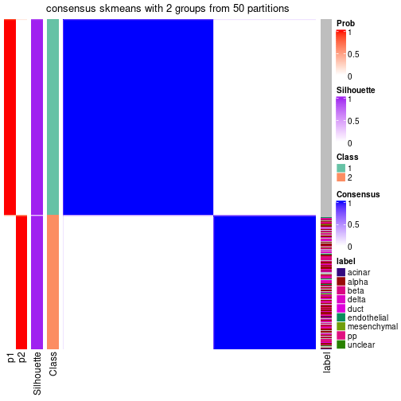</p>

</div>
<div id='tab-node-01-consensus-heatmap-2'>
<pre><code class="r">consensus_heatmap(res, k = 3)
</code></pre>

<p>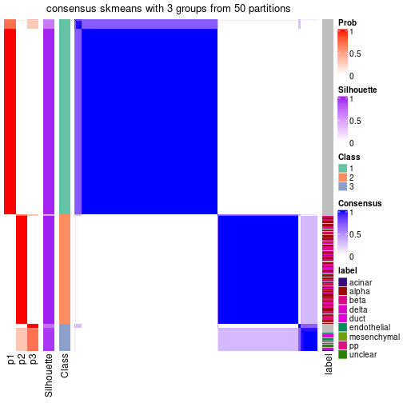</p>

</div>
<div id='tab-node-01-consensus-heatmap-3'>
<pre><code class="r">consensus_heatmap(res, k = 4)
</code></pre>

<p>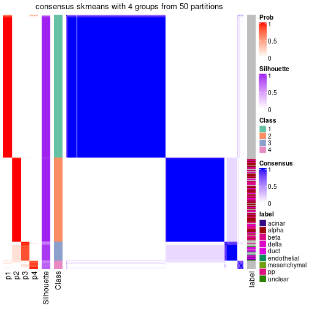</p>

</div>
</div>

Heatmaps for the membership of samples in all partitions to see how consistent they are:


<script>
$( function() {
	$( '#tabs-node-01-membership-heatmap' ).tabs();
} );
</script>
<div id='tabs-node-01-membership-heatmap'>
<ul>
<li><a href='#tab-node-01-membership-heatmap-1'>k = 2</a></li>
<li><a href='#tab-node-01-membership-heatmap-2'>k = 3</a></li>
<li><a href='#tab-node-01-membership-heatmap-3'>k = 4</a></li>
</ul>
<div id='tab-node-01-membership-heatmap-1'>
<pre><code class="r">membership_heatmap(res, k = 2)
</code></pre>

<p>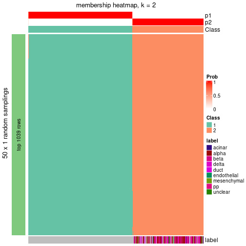</p>

</div>
<div id='tab-node-01-membership-heatmap-2'>
<pre><code class="r">membership_heatmap(res, k = 3)
</code></pre>

<p>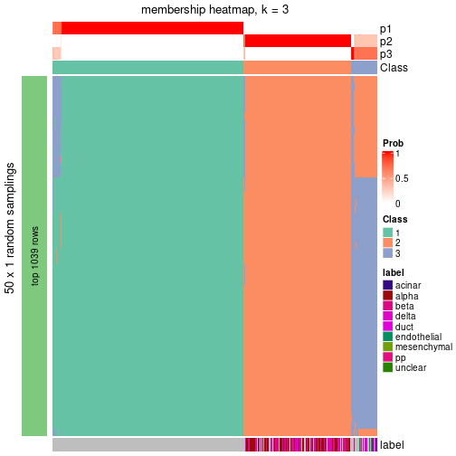</p>

</div>
<div id='tab-node-01-membership-heatmap-3'>
<pre><code class="r">membership_heatmap(res, k = 4)
</code></pre>

<p>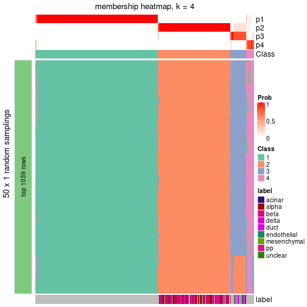</p>

</div>
</div>

As soon as the classes for columns are determined, the signatures
that are significantly different between subgroups can be looked for. 
Following are the heatmaps for signatures.


Signature heatmaps where rows are scaled:


<script>
$( function() {
	$( '#tabs-node-01-get-signatures' ).tabs();
} );
</script>
<div id='tabs-node-01-get-signatures'>
<ul>
<li><a href='#tab-node-01-get-signatures-1'>k = 2</a></li>
<li><a href='#tab-node-01-get-signatures-2'>k = 3</a></li>
<li><a href='#tab-node-01-get-signatures-3'>k = 4</a></li>
</ul>
<div id='tab-node-01-get-signatures-1'>
<pre><code class="r">get_signatures(res, k = 2)
</code></pre>

<p>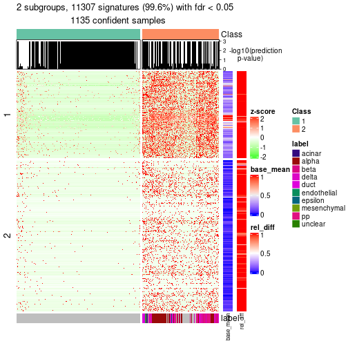</p>

</div>
<div id='tab-node-01-get-signatures-2'>
<pre><code class="r">get_signatures(res, k = 3)
</code></pre>

<p>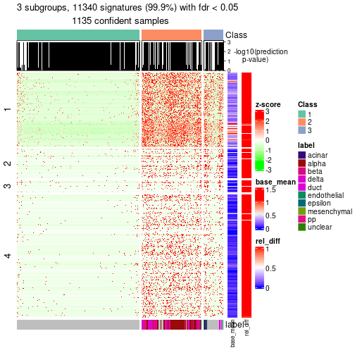</p>

</div>
<div id='tab-node-01-get-signatures-3'>
<pre><code class="r">get_signatures(res, k = 4)
</code></pre>

<p>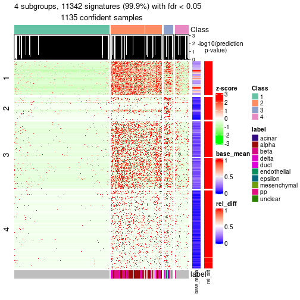</p>

</div>
</div>


Signature heatmaps where rows are not scaled:


<script>
$( function() {
	$( '#tabs-node-01-get-signatures-no-scale' ).tabs();
} );
</script>
<div id='tabs-node-01-get-signatures-no-scale'>
<ul>
<li><a href='#tab-node-01-get-signatures-no-scale-1'>k = 2</a></li>
<li><a href='#tab-node-01-get-signatures-no-scale-2'>k = 3</a></li>
<li><a href='#tab-node-01-get-signatures-no-scale-3'>k = 4</a></li>
</ul>
<div id='tab-node-01-get-signatures-no-scale-1'>
<pre><code class="r">get_signatures(res, k = 2, scale_rows = FALSE)
</code></pre>

<p>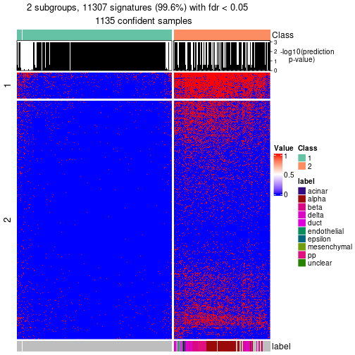</p>

</div>
<div id='tab-node-01-get-signatures-no-scale-2'>
<pre><code class="r">get_signatures(res, k = 3, scale_rows = FALSE)
</code></pre>

<p>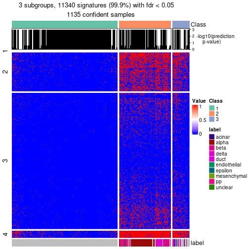</p>

</div>
<div id='tab-node-01-get-signatures-no-scale-3'>
<pre><code class="r">get_signatures(res, k = 4, scale_rows = FALSE)
</code></pre>

<p>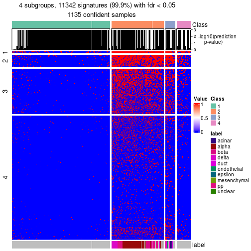</p>

</div>
</div>


Compare the overlap of signatures from different k:

```r
compare_signatures(res)
```

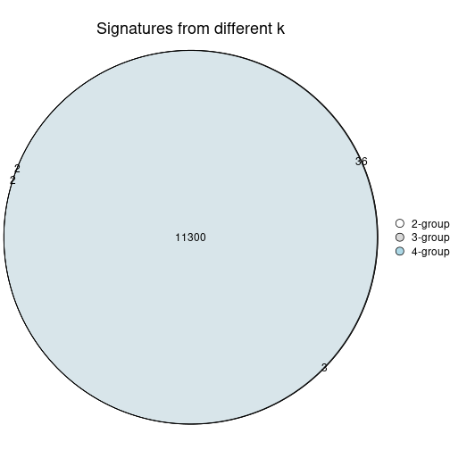

`get_signature()` returns a data frame invisibly. To get the list of signatures, the function
call should be assigned to a variable explicitly. In following code, if `plot` argument is set
to `FALSE`, no heatmap is plotted while only the differential analysis is performed.

```r
# code only for demonstration
tb = get_signature(res, k = ..., plot = FALSE)
```

An example of the output of `tb` is:

```
#>   which_row         fdr    mean_1    mean_2 scaled_mean_1 scaled_mean_2 km
#> 1        38 0.042760348  8.373488  9.131774    -0.5533452     0.5164555  1
#> 2        40 0.018707592  7.106213  8.469186    -0.6173731     0.5762149  1
#> 3        55 0.019134737 10.221463 11.207825    -0.6159697     0.5749050  1
#> 4        59 0.006059896  5.921854  7.869574    -0.6899429     0.6439467  1
#> 5        60 0.018055526  8.928898 10.211722    -0.6204761     0.5791110  1
#> 6        98 0.009384629 15.714769 14.887706     0.6635654    -0.6193277  2
...
```

The columns in `tb` are:

1. `which_row`: row indices corresponding to the input matrix.
2. `fdr`: FDR for the differential test. 
3. `mean_x`: The mean value in group x.
4. `scaled_mean_x`: The mean value in group x after rows are scaled.
5. `km`: Row groups if k-means clustering is applied to rows (which is done by automatically selecting number of clusters).

If there are too many signatures, `top_signatures = ...` can be set to only show the 
signatures with the highest FDRs:

```r
# code only for demonstration
# e.g. to show the top 500 most significant rows
tb = get_signature(res, k = ..., top_signatures = 500)
```

If the signatures are defined as these which are uniquely high in current group, `diff_method` argument
can be set to `"uniquely_high_in_one_group"`:

```r
# code only for demonstration
tb = get_signature(res, k = ..., diff_method = "uniquely_high_in_one_group")
```


UMAP plot which shows how samples are separated.


<script>
$( function() {
	$( '#tabs-node-01-dimension-reduction' ).tabs();
} );
</script>
<div id='tabs-node-01-dimension-reduction'>
<ul>
<li><a href='#tab-node-01-dimension-reduction-1'>k = 2</a></li>
<li><a href='#tab-node-01-dimension-reduction-2'>k = 3</a></li>
<li><a href='#tab-node-01-dimension-reduction-3'>k = 4</a></li>
</ul>
<div id='tab-node-01-dimension-reduction-1'>
<pre><code class="r">dimension_reduction(res, k = 2, method = &quot;UMAP&quot;)
</code></pre>

<p>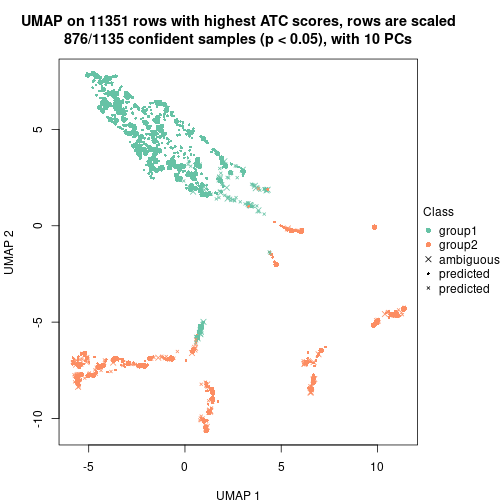</p>

</div>
<div id='tab-node-01-dimension-reduction-2'>
<pre><code class="r">dimension_reduction(res, k = 3, method = &quot;UMAP&quot;)
</code></pre>

<p>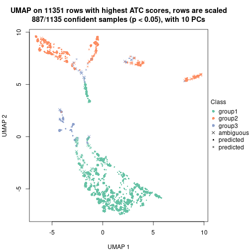</p>

</div>
<div id='tab-node-01-dimension-reduction-3'>
<pre><code class="r">dimension_reduction(res, k = 4, method = &quot;UMAP&quot;)
</code></pre>

<p>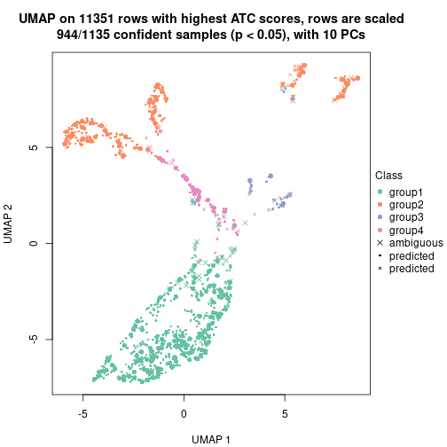</p>

</div>
</div>


Following heatmap shows how subgroups are split when increasing `k`:

```r
collect_classes(res)
```

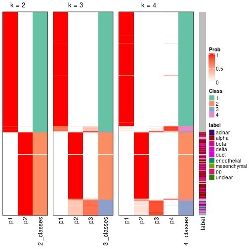


Test correlation between subgroups and known annotations. If the known
annotation is numeric, one-way ANOVA test is applied, and if the known
annotation is discrete, chi-squared contingency table test is applied.

```r
test_to_known_factors(res)
```

```
#>             n_sample label(p-value) k
#> ATC:skmeans      876             NA 2
#> ATC:skmeans      887       1.00e-40 3
#> ATC:skmeans      944       3.47e-44 4
```


If matrix rows can be associated to genes, consider to use `functional_enrichment(res,
...)` to perform function enrichment for the signature genes. See [this vignette](https://jokergoo.github.io/cola_vignettes/functional_enrichment.html) for more detailed explanations.


 

---------------------------------------------------


### Node012


Parent node: [Node01](#Node01).
Child nodes: 
                Node0121-leaf
        ,
                Node0122-leaf
        ,
                Node0123-leaf
        ,
                Node0124-leaf
        ,
                Node0131-leaf
        ,
                Node0132-leaf
        ,
                Node0133-leaf
        ,
                Node0211-leaf
        ,
                [Node0212](#Node0212)
        ,
                Node0213-leaf
        ,
                [Node0214](#Node0214)
        ,
                [Node0221](#Node0221)
        ,
                [Node0222](#Node0222)
        ,
                Node0223-leaf
        ,
                [Node0231](#Node0231)
        ,
                [Node0232](#Node0232)
        ,
                Node0233-leaf
        ,
                Node0234-leaf
        ,
                [Node0241](#Node0241)
        ,
                [Node0242](#Node0242)
        ,
                Node0243-leaf
        .


The object with results only for a single top-value method and a single partitioning method 
can be extracted as:

```r
res = res_rh["012"]
```

A summary of `res` and all the functions that can be applied to it:

```r
res
```

```
#> A 'ConsensusPartition' object with k = 2, 3, 4.
#>   On a matrix with 10204 rows and 341 columns.
#>   Top rows (1020) are extracted by 'ATC' method.
#>   Subgroups are detected by 'skmeans' method.
#>   Performed in total 150 partitions by row resampling.
#>   Best k for subgroups seems to be 4.
#> 
#> Following methods can be applied to this 'ConsensusPartition' object:
#>  [1] "cola_report"             "collect_classes"         "collect_plots"          
#>  [4] "collect_stats"           "colnames"                "compare_partitions"     
#>  [7] "compare_signatures"      "consensus_heatmap"       "dimension_reduction"    
#> [10] "functional_enrichment"   "get_anno_col"            "get_anno"               
#> [13] "get_classes"             "get_consensus"           "get_matrix"             
#> [16] "get_membership"          "get_param"               "get_signatures"         
#> [19] "get_stats"               "is_best_k"               "is_stable_k"            
#> [22] "membership_heatmap"      "ncol"                    "nrow"                   
#> [25] "plot_ecdf"               "predict_classes"         "rownames"               
#> [28] "select_partition_number" "show"                    "suggest_best_k"         
#> [31] "test_to_known_factors"   "top_rows_heatmap"
```

`collect_plots()` function collects all the plots made from `res` for all `k` (number of subgroups)
into one single page to provide an easy and fast comparison between different `k`.

```r
collect_plots(res)
```


The plots are:

- The first row: a plot of the eCDF (empirical cumulative distribution
  function) curves of the consensus matrix for each `k` and the heatmap of
  predicted classes for each `k`.
- The second row: heatmaps of the consensus matrix for each `k`.
- The third row: heatmaps of the membership matrix for each `k`.
- The fouth row: heatmaps of the signatures for each `k`.

All the plots in panels can be made by individual functions and they are
plotted later in this section.

`select_partition_number()` produces several plots showing different
statistics for choosing "optimized" `k`. There are following statistics:

- eCDF curves of the consensus matrix for each `k`;
- 1-PAC. [The PAC score](https://en.wikipedia.org/wiki/Consensus_clustering#Over-interpretation_potential_of_consensus_clustering)
  measures the proportion of the ambiguous subgrouping.
- Mean silhouette score.
- Concordance. The mean probability of fiting the consensus subgroup labels in all
  partitions.
- Area increased. Denote $A_k$ as the area under the eCDF curve for current
  `k`, the area increased is defined as $A_k - A_{k-1}$.
- Rand index. The percent of pairs of samples that are both in a same cluster
  or both are not in a same cluster in the partition of k and k-1.
- Jaccard index. The ratio of pairs of samples are both in a same cluster in
  the partition of k and k-1 and the pairs of samples are both in a same
  cluster in the partition k or k-1.

The detailed explanations of these statistics can be found in [the _cola_
vignette](https://jokergoo.github.io/cola_vignettes/cola.html#toc_13).

Generally speaking, higher 1-PAC score, higher mean silhouette score or higher
concordance corresponds to better partition. Rand index and Jaccard index
measure how similar the current partition is compared to partition with `k-1`.
If they are too similar, we won't accept `k` is better than `k-1`.

```r
select_partition_number(res)
```

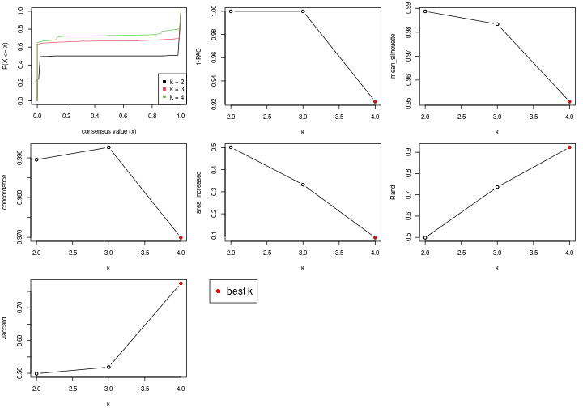

The numeric values for all these statistics can be obtained by `get_stats()`.

```r
get_stats(res)
```

```
#>   k 1-PAC mean_silhouette concordance area_increased  Rand Jaccard
#> 2 2 1.000           0.989       0.990          0.502 0.499   0.499
#> 3 3 1.000           0.983       0.993          0.332 0.737   0.519
#> 4 4 0.922           0.951       0.970          0.092 0.923   0.775
```

`suggest_best_k()` suggests the best $k$ based on these statistics. The rules are as follows:

- All $k$ with Jaccard index larger than 0.95 are removed because increasing
  $k$ does not provide enough extra information. If all $k$ are removed, it is
  marked as no subgroup is detected.
- For all $k$ with 1-PAC score larger than 0.9, the maximal $k$ is taken as
  the best $k$, and other $k$ are marked as optional $k$.
- If it does not fit the second rule. The $k$ with the maximal vote of the
  highest 1-PAC score, highest mean silhouette, and highest concordance is
  taken as the best $k$.

```r
suggest_best_k(res)
```

```
#> [1] 4
#> attr(,"optional")
#> [1] 2 3
```

There is also optional best $k$ = 2 3 that is worth to check.

Following is the table of the partitions (You need to click the **show/hide
code output** link to see it). The membership matrix (columns with name `p*`)
is inferred by
[`clue::cl_consensus()`](https://www.rdocumentation.org/link/cl_consensus?package=clue)
function with the `SE` method. Basically the value in the membership matrix
represents the probability to belong to a certain group. The finall subgroup
label for an item is determined with the group with highest probability it
belongs to.

In `get_classes()` function, the entropy is calculated from the membership
matrix and the silhouette score is calculated from the consensus matrix.


<script>
$( function() {
	$( '#tabs-node-012-get-classes' ).tabs();
} );
</script>
<div id='tabs-node-012-get-classes'>
<ul>
<li><a href='#tab-node-012-get-classes-1'>k = 2</a></li>
<li><a href='#tab-node-012-get-classes-2'>k = 3</a></li>
<li><a href='#tab-node-012-get-classes-3'>k = 4</a></li>
</ul>

<div id='tab-node-012-get-classes-1'>
<p><a id='tab-node-012-get-classes-1-a' style='color:#0366d6' href='#'>show/hide code output</a></p>
<pre><code class="r">cbind(get_classes(res, k = 2), get_membership(res, k = 2))
</code></pre>

<pre><code>#&gt;          class entropy silhouette   p1   p2
#&gt; D28-1_39     1   0.141      0.988 0.98 0.02
#&gt; D28-1_76     2   0.000      0.988 0.00 1.00
#&gt; D28-3_13     1   0.000      0.991 1.00 0.00
#&gt; D28-3_18     2   0.141      0.990 0.02 0.98
#&gt; D28-5_40     1   0.141      0.988 0.98 0.02
#&gt; D28-5_55     2   0.000      0.988 0.00 1.00
#&gt; D28-5_85     2   0.000      0.988 0.00 1.00
#&gt; D28-6_30     2   0.000      0.988 0.00 1.00
#&gt; D28-6_88     1   0.000      0.991 1.00 0.00
#&gt; D29-1_4      1   0.141      0.988 0.98 0.02
#&gt; D29-1_7      1   0.000      0.991 1.00 0.00
#&gt; D29-1_12     2   0.141      0.990 0.02 0.98
#&gt; D29-1_13     1   0.000      0.991 1.00 0.00
#&gt; D29-1_15     2   0.000      0.988 0.00 1.00
#&gt; D29-1_18     1   0.000      0.991 1.00 0.00
#&gt; D29-1_24     2   0.141      0.990 0.02 0.98
#&gt; D29-1_26     1   0.141      0.988 0.98 0.02
#&gt; D29-1_30     2   0.000      0.988 0.00 1.00
#&gt; D29-1_33     2   0.141      0.990 0.02 0.98
#&gt; D29-1_35     2   0.141      0.990 0.02 0.98
#&gt; D29-1_38     1   0.141      0.988 0.98 0.02
#&gt; D29-1_39     2   0.000      0.988 0.00 1.00
#&gt; D29-1_40     2   0.141      0.990 0.02 0.98
#&gt; D29-1_45     2   0.141      0.990 0.02 0.98
#&gt; D29-1_62     1   0.000      0.991 1.00 0.00
#&gt; D29-1_66     2   0.000      0.988 0.00 1.00
#&gt; D29-1_73     2   0.141      0.990 0.02 0.98
#&gt; D29-1_74     2   0.141      0.990 0.02 0.98
#&gt; D29-1_87     1   0.141      0.988 0.98 0.02
#&gt; D29-1_94     2   0.141      0.990 0.02 0.98
#&gt; D29-2_15     1   0.000      0.991 1.00 0.00
#&gt; D29-2_19     2   0.141      0.990 0.02 0.98
#&gt; D29-2_24     2   0.000      0.988 0.00 1.00
#&gt; D29-2_31     1   0.000      0.991 1.00 0.00
#&gt; D29-2_42     2   0.141      0.990 0.02 0.98
#&gt; D29-2_43     2   0.141      0.990 0.02 0.98
#&gt; D29-2_47     2   0.141      0.990 0.02 0.98
#&gt; D29-2_59     2   0.141      0.990 0.02 0.98
#&gt; D29-2_73     2   0.000      0.988 0.00 1.00
#&gt; D29-2_74     1   0.000      0.991 1.00 0.00
#&gt; D29-2_78     2   0.141      0.990 0.02 0.98
#&gt; D29-2_90     1   0.000      0.991 1.00 0.00
#&gt; D29-2_92     2   0.000      0.988 0.00 1.00
#&gt; D29-3_1      2   0.000      0.988 0.00 1.00
#&gt; D29-3_3      1   0.141      0.988 0.98 0.02
#&gt; D29-3_7      2   0.141      0.990 0.02 0.98
#&gt; D29-3_8      2   0.141      0.990 0.02 0.98
#&gt; D29-3_9      2   0.141      0.990 0.02 0.98
#&gt; D29-3_13     2   0.141      0.990 0.02 0.98
#&gt; D29-3_15     2   0.141      0.990 0.02 0.98
#&gt; D29-3_16     2   0.000      0.988 0.00 1.00
#&gt; D29-3_25     1   0.141      0.988 0.98 0.02
#&gt; D29-3_28     2   0.141      0.990 0.02 0.98
#&gt; D29-3_30     1   0.000      0.991 1.00 0.00
#&gt; D29-3_31     1   0.000      0.991 1.00 0.00
#&gt; D29-3_32     2   0.141      0.990 0.02 0.98
#&gt; D29-3_36     2   0.141      0.990 0.02 0.98
#&gt; D29-3_40     1   0.000      0.991 1.00 0.00
#&gt; D29-3_41     2   0.000      0.988 0.00 1.00
#&gt; D29-3_44     2   0.141      0.990 0.02 0.98
#&gt; D29-3_68     2   0.000      0.988 0.00 1.00
#&gt; D29-3_71     2   0.141      0.990 0.02 0.98
#&gt; D29-3_75     2   0.000      0.988 0.00 1.00
#&gt; D29-3_82     2   0.141      0.990 0.02 0.98
#&gt; D29-3_83     2   0.141      0.990 0.02 0.98
#&gt; D29-3_85     2   0.141      0.990 0.02 0.98
#&gt; D29-3_87     2   0.141      0.990 0.02 0.98
#&gt; D29-4_3      2   0.000      0.988 0.00 1.00
#&gt; D29-4_4      2   0.141      0.990 0.02 0.98
#&gt; D29-4_6      2   0.000      0.988 0.00 1.00
#&gt; D29-4_9      1   0.141      0.988 0.98 0.02
#&gt; D29-4_13     1   0.141      0.988 0.98 0.02
#&gt; D29-4_15     1   0.000      0.991 1.00 0.00
#&gt; D29-4_16     1   0.000      0.991 1.00 0.00
#&gt; D29-4_17     2   0.141      0.990 0.02 0.98
#&gt; D29-4_20     2   0.000      0.988 0.00 1.00
#&gt; D29-4_30     1   0.141      0.988 0.98 0.02
#&gt; D29-4_31     2   0.141      0.990 0.02 0.98
#&gt; D29-4_32     1   0.141      0.988 0.98 0.02
#&gt; D29-4_74     1   0.000      0.991 1.00 0.00
#&gt; D29-4_75     1   0.000      0.991 1.00 0.00
#&gt; D29-4_79     2   0.141      0.990 0.02 0.98
#&gt; D29-4_81     2   0.141      0.990 0.02 0.98
#&gt; D29-4_83     2   0.141      0.990 0.02 0.98
#&gt; D29-4_84     2   0.000      0.988 0.00 1.00
#&gt; D29-4_86     2   0.141      0.990 0.02 0.98
#&gt; D29-4_90     2   0.141      0.990 0.02 0.98
#&gt; D29-5_5      1   0.141      0.988 0.98 0.02
#&gt; D29-5_7      1   0.141      0.988 0.98 0.02
#&gt; D29-5_37     2   0.141      0.990 0.02 0.98
#&gt; D29-5_40     2   0.141      0.990 0.02 0.98
#&gt; D29-5_44     1   0.000      0.991 1.00 0.00
#&gt; D29-5_51     2   0.141      0.990 0.02 0.98
#&gt; D29-5_61     2   0.141      0.990 0.02 0.98
#&gt; D29-5_66     2   0.141      0.990 0.02 0.98
#&gt; D29-5_67     1   0.141      0.988 0.98 0.02
#&gt; D29-5_76     2   0.000      0.988 0.00 1.00
#&gt; D29-5_79     2   0.141      0.990 0.02 0.98
#&gt; D29-5_83     2   0.141      0.990 0.02 0.98
#&gt; D29-5_84     2   0.000      0.988 0.00 1.00
#&gt; D29-6_9      2   0.000      0.988 0.00 1.00
#&gt; D29-6_10     2   0.000      0.988 0.00 1.00
#&gt; D29-6_11     2   0.000      0.988 0.00 1.00
#&gt; D29-6_13     1   0.141      0.988 0.98 0.02
#&gt; D29-6_22     2   0.000      0.988 0.00 1.00
#&gt; D29-6_26     1   0.000      0.991 1.00 0.00
#&gt; D29-6_27     1   0.000      0.991 1.00 0.00
#&gt; D29-6_33     2   0.000      0.988 0.00 1.00
#&gt; D29-6_40     1   0.000      0.991 1.00 0.00
#&gt; D29-6_46     2   0.000      0.988 0.00 1.00
#&gt; D29-6_51     1   0.000      0.991 1.00 0.00
#&gt; D29-6_52     1   0.000      0.991 1.00 0.00
#&gt; D29-6_55     2   0.000      0.988 0.00 1.00
#&gt; D29-6_83     1   0.141      0.988 0.98 0.02
#&gt; D29-6_86     1   0.141      0.988 0.98 0.02
#&gt; D29-6_87     2   0.141      0.990 0.02 0.98
#&gt; D29-6_88     2   0.000      0.988 0.00 1.00
#&gt; D29-6_90     1   0.000      0.991 1.00 0.00
#&gt; D29-6_94     1   0.141      0.988 0.98 0.02
#&gt; D29-7_4      2   0.000      0.988 0.00 1.00
#&gt; D29-7_8      2   0.000      0.988 0.00 1.00
#&gt; D29-7_19     2   0.141      0.990 0.02 0.98
#&gt; D29-7_28     2   0.141      0.990 0.02 0.98
#&gt; D29-7_31     2   0.141      0.990 0.02 0.98
#&gt; D29-7_33     1   0.000      0.991 1.00 0.00
#&gt; D29-7_36     2   0.141      0.990 0.02 0.98
#&gt; D29-7_38     1   0.000      0.991 1.00 0.00
#&gt; D29-7_40     2   0.000      0.988 0.00 1.00
#&gt; D29-7_63     2   0.000      0.988 0.00 1.00
#&gt; D29-7_77     2   0.141      0.990 0.02 0.98
#&gt; D29-7_78     2   0.141      0.990 0.02 0.98
#&gt; D29-7_81     2   0.141      0.990 0.02 0.98
#&gt; D29-7_90     1   0.000      0.991 1.00 0.00
#&gt; D29-8_3      2   0.000      0.988 0.00 1.00
#&gt; D29-8_8      2   0.141      0.990 0.02 0.98
#&gt; D29-8_11     2   0.141      0.990 0.02 0.98
#&gt; D29-8_12     2   0.141      0.990 0.02 0.98
#&gt; D29-8_13     2   0.000      0.988 0.00 1.00
#&gt; D29-8_14     1   0.000      0.991 1.00 0.00
#&gt; D29-8_16     2   0.000      0.988 0.00 1.00
#&gt; D29-8_18     1   0.000      0.991 1.00 0.00
#&gt; D29-8_19     2   0.000      0.988 0.00 1.00
#&gt; D29-8_20     1   0.000      0.991 1.00 0.00
#&gt; D29-8_24     1   0.141      0.988 0.98 0.02
#&gt; D29-8_25     1   0.000      0.991 1.00 0.00
#&gt; D29-8_26     2   0.000      0.988 0.00 1.00
#&gt; D29-8_27     1   0.000      0.991 1.00 0.00
#&gt; D29-8_28     1   0.141      0.988 0.98 0.02
#&gt; D29-8_30     1   0.000      0.991 1.00 0.00
#&gt; D29-8_31     2   0.141      0.974 0.02 0.98
#&gt; D29-8_33     1   0.000      0.991 1.00 0.00
#&gt; D29-8_34     2   0.000      0.988 0.00 1.00
#&gt; D29-8_35     1   0.141      0.988 0.98 0.02
#&gt; D29-8_37     1   0.141      0.988 0.98 0.02
#&gt; D29-8_40     1   0.141      0.988 0.98 0.02
#&gt; D29-8_42     2   0.000      0.988 0.00 1.00
#&gt; D29-8_43     2   0.000      0.988 0.00 1.00
#&gt; D29-8_46     2   0.000      0.988 0.00 1.00
#&gt; D29-8_48     2   0.000      0.988 0.00 1.00
#&gt; D29-8_55     1   0.000      0.991 1.00 0.00
#&gt; D29-8_56     1   0.000      0.991 1.00 0.00
#&gt; D29-8_59     1   0.000      0.991 1.00 0.00
#&gt; D29-8_68     2   0.000      0.988 0.00 1.00
#&gt; D29-8_72     2   0.000      0.988 0.00 1.00
#&gt; D29-8_73     2   0.000      0.988 0.00 1.00
#&gt; D29-8_74     2   0.141      0.990 0.02 0.98
#&gt; D29-8_79     2   0.141      0.990 0.02 0.98
#&gt; D29-8_81     2   0.141      0.990 0.02 0.98
#&gt; D29-8_83     2   0.141      0.990 0.02 0.98
#&gt; D29-8_85     2   0.000      0.988 0.00 1.00
#&gt; D29-8_90     2   0.141      0.990 0.02 0.98
#&gt; D29-8_91     2   0.141      0.990 0.02 0.98
#&gt; D31-1_6      2   0.141      0.990 0.02 0.98
#&gt; D31-1_10     2   0.000      0.988 0.00 1.00
#&gt; D31-1_31     1   0.141      0.988 0.98 0.02
#&gt; D31-1_39     2   0.000      0.988 0.00 1.00
#&gt; D31-1_40     1   0.000      0.991 1.00 0.00
#&gt; D31-1_43     1   0.141      0.988 0.98 0.02
#&gt; D31-1_49     1   0.000      0.991 1.00 0.00
#&gt; D31-1_52     1   0.000      0.991 1.00 0.00
#&gt; D31-1_57     2   0.000      0.988 0.00 1.00
#&gt; D31-1_61     1   0.000      0.991 1.00 0.00
#&gt; D31-1_81     2   0.000      0.988 0.00 1.00
#&gt; D31-1_94     1   0.141      0.988 0.98 0.02
#&gt; D31-2_12     2   0.141      0.990 0.02 0.98
#&gt; D31-2_13     1   0.000      0.991 1.00 0.00
#&gt; D31-2_14     1   0.000      0.991 1.00 0.00
#&gt; D31-2_57     1   0.000      0.991 1.00 0.00
#&gt; D31-2_60     2   0.141      0.990 0.02 0.98
#&gt; D31-2_93     1   0.000      0.991 1.00 0.00
#&gt; D31-3_16     2   0.141      0.990 0.02 0.98
#&gt; D31-3_18     1   0.000      0.991 1.00 0.00
#&gt; D31-3_19     1   0.141      0.988 0.98 0.02
#&gt; D31-3_31     2   0.000      0.988 0.00 1.00
#&gt; D31-3_32     1   0.141      0.988 0.98 0.02
#&gt; D31-3_35     1   0.000      0.991 1.00 0.00
#&gt; D31-3_38     1   0.141      0.988 0.98 0.02
#&gt; D31-3_51     2   0.000      0.988 0.00 1.00
#&gt; D31-3_54     2   0.141      0.990 0.02 0.98
#&gt; D31-3_61     2   0.000      0.988 0.00 1.00
#&gt; D31-3_79     1   0.141      0.988 0.98 0.02
#&gt; D31-3_84     1   0.000      0.991 1.00 0.00
#&gt; D31-3_91     2   0.469      0.885 0.10 0.90
#&gt; D31-4_2      2   0.000      0.988 0.00 1.00
#&gt; D31-4_4      2   0.000      0.988 0.00 1.00
#&gt; D31-4_6      1   0.141      0.988 0.98 0.02
#&gt; D31-4_8      2   0.000      0.988 0.00 1.00
#&gt; D31-4_12     2   0.000      0.988 0.00 1.00
#&gt; D31-4_26     1   0.141      0.988 0.98 0.02
#&gt; D31-4_39     2   0.141      0.990 0.02 0.98
#&gt; D31-4_40     2   0.000      0.988 0.00 1.00
#&gt; D31-4_62     2   0.141      0.990 0.02 0.98
#&gt; D31-4_81     1   0.141      0.988 0.98 0.02
#&gt; D31-5_2      1   0.141      0.988 0.98 0.02
#&gt; D31-5_8      1   0.141      0.988 0.98 0.02
#&gt; D31-5_11     1   0.141      0.988 0.98 0.02
#&gt; D31-5_12     1   0.000      0.991 1.00 0.00
#&gt; D31-5_18     2   0.141      0.990 0.02 0.98
#&gt; D31-5_20     1   0.000      0.991 1.00 0.00
#&gt; D31-5_24     1   0.000      0.991 1.00 0.00
#&gt; D31-5_25     1   0.141      0.988 0.98 0.02
#&gt; D31-5_30     2   0.141      0.990 0.02 0.98
#&gt; D31-5_31     2   0.000      0.988 0.00 1.00
#&gt; D31-5_33     1   0.141      0.988 0.98 0.02
#&gt; D31-5_36     1   0.000      0.991 1.00 0.00
#&gt; D31-5_54     1   0.000      0.991 1.00 0.00
#&gt; D31-5_56     1   0.141      0.988 0.98 0.02
#&gt; D31-5_88     1   0.000      0.991 1.00 0.00
#&gt; D31-5_90     1   0.000      0.991 1.00 0.00
#&gt; D31-5_93     1   0.141      0.988 0.98 0.02
#&gt; D31-6_2      1   0.000      0.991 1.00 0.00
#&gt; D31-6_5      2   0.000      0.988 0.00 1.00
#&gt; D31-6_7      2   0.141      0.990 0.02 0.98
#&gt; D31-6_25     2   0.141      0.990 0.02 0.98
#&gt; D31-6_30     1   0.000      0.991 1.00 0.00
#&gt; D31-6_31     2   0.141      0.990 0.02 0.98
#&gt; D31-6_32     2   0.000      0.988 0.00 1.00
#&gt; D31-6_35     1   0.000      0.991 1.00 0.00
#&gt; D31-6_36     1   0.000      0.991 1.00 0.00
#&gt; D31-6_38     2   0.141      0.990 0.02 0.98
#&gt; D31-6_46     2   0.000      0.988 0.00 1.00
#&gt; D31-6_54     1   0.000      0.991 1.00 0.00
#&gt; D31-6_59     1   0.141      0.988 0.98 0.02
#&gt; D31-6_60     2   0.000      0.988 0.00 1.00
#&gt; D31-6_64     1   0.141      0.988 0.98 0.02
#&gt; D31-6_77     1   0.000      0.991 1.00 0.00
#&gt; D31-6_83     1   0.141      0.988 0.98 0.02
#&gt; D31-6_89     1   0.141      0.988 0.98 0.02
#&gt; D31-7_7      1   0.141      0.988 0.98 0.02
#&gt; D31-7_8      1   0.000      0.991 1.00 0.00
#&gt; D31-7_13     1   0.141      0.988 0.98 0.02
#&gt; D31-7_14     1   0.000      0.991 1.00 0.00
#&gt; D31-7_15     2   0.000      0.988 0.00 1.00
#&gt; D31-7_17     1   0.000      0.991 1.00 0.00
#&gt; D31-7_27     1   0.141      0.988 0.98 0.02
#&gt; D31-7_28     1   0.000      0.991 1.00 0.00
#&gt; D31-7_30     1   0.141      0.988 0.98 0.02
#&gt; D31-7_34     2   0.000      0.988 0.00 1.00
#&gt; D31-7_40     2   0.000      0.988 0.00 1.00
#&gt; D31-7_49     1   0.000      0.991 1.00 0.00
#&gt; D31-7_50     1   0.000      0.991 1.00 0.00
#&gt; D31-7_64     1   0.000      0.991 1.00 0.00
#&gt; D31-7_68     1   0.141      0.988 0.98 0.02
#&gt; D31-7_75     1   0.141      0.988 0.98 0.02
#&gt; D31-7_81     2   0.141      0.990 0.02 0.98
#&gt; D31-7_83     2   0.000      0.988 0.00 1.00
#&gt; D31-7_90     1   0.141      0.988 0.98 0.02
#&gt; D31-7_94     2   0.141      0.990 0.02 0.98
#&gt; D31-8_9      1   0.000      0.991 1.00 0.00
#&gt; D31-8_10     2   0.000      0.988 0.00 1.00
#&gt; D31-8_15     2   0.141      0.990 0.02 0.98
#&gt; D31-8_16     2   0.000      0.988 0.00 1.00
#&gt; D31-8_26     2   0.141      0.990 0.02 0.98
#&gt; D31-8_29     2   0.000      0.988 0.00 1.00
#&gt; D31-8_34     2   0.141      0.990 0.02 0.98
#&gt; D31-8_36     2   0.141      0.990 0.02 0.98
#&gt; D31-8_44     1   0.141      0.988 0.98 0.02
#&gt; D31-8_57     1   0.000      0.991 1.00 0.00
#&gt; D31-8_71     2   0.141      0.990 0.02 0.98
#&gt; D31-8_82     1   0.000      0.991 1.00 0.00
#&gt; D31-8_93     1   0.000      0.991 1.00 0.00
#&gt; D30-1_5      2   0.141      0.990 0.02 0.98
#&gt; D30-1_7      1   0.141      0.988 0.98 0.02
#&gt; D30-1_10     1   0.000      0.991 1.00 0.00
#&gt; D30-1_14     2   0.141      0.990 0.02 0.98
#&gt; D30-1_15     1   0.141      0.988 0.98 0.02
#&gt; D30-1_16     1   0.000      0.991 1.00 0.00
#&gt; D30-1_17     1   0.000      0.991 1.00 0.00
#&gt; D30-1_24     1   0.000      0.991 1.00 0.00
#&gt; D30-1_26     2   0.000      0.988 0.00 1.00
#&gt; D30-1_27     1   0.000      0.991 1.00 0.00
#&gt; D30-1_28     1   0.141      0.988 0.98 0.02
#&gt; D30-1_32     2   0.000      0.988 0.00 1.00
#&gt; D30-1_33     2   0.141      0.990 0.02 0.98
#&gt; D30-1_35     1   0.141      0.988 0.98 0.02
#&gt; D30-1_37     1   0.141      0.988 0.98 0.02
#&gt; D30-1_38     1   0.000      0.991 1.00 0.00
#&gt; D30-1_39     2   0.141      0.990 0.02 0.98
#&gt; D30-1_40     1   0.000      0.991 1.00 0.00
#&gt; D30-1_47     1   0.000      0.991 1.00 0.00
#&gt; D30-1_49     1   0.141      0.988 0.98 0.02
#&gt; D30-1_51     2   0.141      0.990 0.02 0.98
#&gt; D30-1_54     1   0.000      0.991 1.00 0.00
#&gt; D30-1_59     1   0.000      0.991 1.00 0.00
#&gt; D30-1_62     1   0.141      0.988 0.98 0.02
#&gt; D30-1_69     2   0.141      0.990 0.02 0.98
#&gt; D30-1_73     1   0.141      0.988 0.98 0.02
#&gt; D30-1_74     2   0.141      0.990 0.02 0.98
#&gt; D30-1_83     2   0.141      0.990 0.02 0.98
#&gt; D30-1_90     1   0.141      0.988 0.98 0.02
#&gt; D30-2_10     1   0.141      0.988 0.98 0.02
#&gt; D30-2_12     1   0.141      0.988 0.98 0.02
#&gt; D30-2_24     1   0.000      0.991 1.00 0.00
#&gt; D30-2_31     2   0.000      0.988 0.00 1.00
#&gt; D30-2_34     1   0.000      0.991 1.00 0.00
#&gt; D30-2_94     1   0.000      0.991 1.00 0.00
#&gt; D30-3_12     1   0.469      0.909 0.90 0.10
#&gt; D30-3_20     1   0.000      0.991 1.00 0.00
#&gt; D30-3_21     2   0.141      0.990 0.02 0.98
#&gt; D30-3_40     1   0.000      0.991 1.00 0.00
#&gt; D30-4_70     2   0.000      0.988 0.00 1.00
#&gt; D30-5_13     1   0.141      0.988 0.98 0.02
#&gt; D30-5_24     1   0.141      0.988 0.98 0.02
#&gt; D30-5_25     1   0.141      0.988 0.98 0.02
#&gt; D30-5_26     1   0.000      0.991 1.00 0.00
#&gt; D30-5_28     1   0.000      0.991 1.00 0.00
#&gt; D30-5_48     1   0.141      0.988 0.98 0.02
#&gt; D30-5_51     1   0.000      0.991 1.00 0.00
#&gt; D30-5_74     2   0.000      0.988 0.00 1.00
#&gt; D30-6_7      1   0.000      0.991 1.00 0.00
#&gt; D30-6_9      1   0.141      0.988 0.98 0.02
#&gt; D30-6_65     1   0.141      0.988 0.98 0.02
#&gt; D30-6_90     2   0.141      0.990 0.02 0.98
#&gt; D30-7_12     1   0.000      0.991 1.00 0.00
#&gt; D30-7_36     1   0.141      0.988 0.98 0.02
#&gt; D30-7_60     1   0.000      0.991 1.00 0.00
#&gt; D30-8_3      2   0.141      0.990 0.02 0.98
#&gt; D30-8_27     2   0.141      0.990 0.02 0.98
#&gt; D30-8_40     2   0.141      0.990 0.02 0.98
#&gt; D30-8_48     1   0.141      0.988 0.98 0.02
#&gt; D30-8_79     1   0.000      0.991 1.00 0.00
</code></pre>

<script>
$('#tab-node-012-get-classes-1-a').parent().next().next().hide();
$('#tab-node-012-get-classes-1-a').click(function(){
  $('#tab-node-012-get-classes-1-a').parent().next().next().toggle();
  return(false);
});
</script>
</div>

<div id='tab-node-012-get-classes-2'>
<p><a id='tab-node-012-get-classes-2-a' style='color:#0366d6' href='#'>show/hide code output</a></p>
<pre><code class="r">cbind(get_classes(res, k = 3), get_membership(res, k = 3))
</code></pre>

<pre><code>#&gt;          class entropy silhouette   p1   p2   p3
#&gt; D28-1_39     3  0.0000      0.993 0.00 0.00 1.00
#&gt; D28-1_76     3  0.0000      0.993 0.00 0.00 1.00
#&gt; D28-3_13     1  0.0000      0.994 1.00 0.00 0.00
#&gt; D28-3_18     2  0.0000      0.991 0.00 1.00 0.00
#&gt; D28-5_40     3  0.0000      0.993 0.00 0.00 1.00
#&gt; D28-5_55     3  0.0000      0.993 0.00 0.00 1.00
#&gt; D28-5_85     3  0.0000      0.993 0.00 0.00 1.00
#&gt; D28-6_30     3  0.0000      0.993 0.00 0.00 1.00
#&gt; D28-6_88     1  0.0000      0.994 1.00 0.00 0.00
#&gt; D29-1_4      3  0.0000      0.993 0.00 0.00 1.00
#&gt; D29-1_7      1  0.0000      0.994 1.00 0.00 0.00
#&gt; D29-1_12     2  0.0000      0.991 0.00 1.00 0.00
#&gt; D29-1_13     1  0.0000      0.994 1.00 0.00 0.00
#&gt; D29-1_15     3  0.0000      0.993 0.00 0.00 1.00
#&gt; D29-1_18     1  0.0000      0.994 1.00 0.00 0.00
#&gt; D29-1_24     2  0.0000      0.991 0.00 1.00 0.00
#&gt; D29-1_26     3  0.0000      0.993 0.00 0.00 1.00
#&gt; D29-1_30     3  0.0000      0.993 0.00 0.00 1.00
#&gt; D29-1_33     2  0.0000      0.991 0.00 1.00 0.00
#&gt; D29-1_35     2  0.0000      0.991 0.00 1.00 0.00
#&gt; D29-1_38     1  0.1529      0.955 0.96 0.00 0.04
#&gt; D29-1_39     2  0.0000      0.991 0.00 1.00 0.00
#&gt; D29-1_40     2  0.0000      0.991 0.00 1.00 0.00
#&gt; D29-1_45     2  0.0000      0.991 0.00 1.00 0.00
#&gt; D29-1_62     1  0.0000      0.994 1.00 0.00 0.00
#&gt; D29-1_66     2  0.0000      0.991 0.00 1.00 0.00
#&gt; D29-1_73     2  0.0000      0.991 0.00 1.00 0.00
#&gt; D29-1_74     2  0.0000      0.991 0.00 1.00 0.00
#&gt; D29-1_87     1  0.0000      0.994 1.00 0.00 0.00
#&gt; D29-1_94     2  0.0000      0.991 0.00 1.00 0.00
#&gt; D29-2_15     1  0.0000      0.994 1.00 0.00 0.00
#&gt; D29-2_19     2  0.0000      0.991 0.00 1.00 0.00
#&gt; D29-2_24     3  0.0000      0.993 0.00 0.00 1.00
#&gt; D29-2_31     1  0.0000      0.994 1.00 0.00 0.00
#&gt; D29-2_42     2  0.0000      0.991 0.00 1.00 0.00
#&gt; D29-2_43     2  0.0000      0.991 0.00 1.00 0.00
#&gt; D29-2_47     2  0.0000      0.991 0.00 1.00 0.00
#&gt; D29-2_59     2  0.0000      0.991 0.00 1.00 0.00
#&gt; D29-2_73     3  0.4555      0.750 0.00 0.20 0.80
#&gt; D29-2_74     1  0.0000      0.994 1.00 0.00 0.00
#&gt; D29-2_78     2  0.0000      0.991 0.00 1.00 0.00
#&gt; D29-2_90     1  0.0000      0.994 1.00 0.00 0.00
#&gt; D29-2_92     3  0.0000      0.993 0.00 0.00 1.00
#&gt; D29-3_1      3  0.0000      0.993 0.00 0.00 1.00
#&gt; D29-3_3      1  0.5560      0.574 0.70 0.00 0.30
#&gt; D29-3_7      2  0.0000      0.991 0.00 1.00 0.00
#&gt; D29-3_8      2  0.0000      0.991 0.00 1.00 0.00
#&gt; D29-3_9      2  0.0000      0.991 0.00 1.00 0.00
#&gt; D29-3_13     2  0.0000      0.991 0.00 1.00 0.00
#&gt; D29-3_15     2  0.0000      0.991 0.00 1.00 0.00
#&gt; D29-3_16     3  0.0000      0.993 0.00 0.00 1.00
#&gt; D29-3_25     3  0.0000      0.993 0.00 0.00 1.00
#&gt; D29-3_28     2  0.0000      0.991 0.00 1.00 0.00
#&gt; D29-3_30     1  0.0000      0.994 1.00 0.00 0.00
#&gt; D29-3_31     1  0.0000      0.994 1.00 0.00 0.00
#&gt; D29-3_32     2  0.0000      0.991 0.00 1.00 0.00
#&gt; D29-3_36     2  0.0000      0.991 0.00 1.00 0.00
#&gt; D29-3_40     1  0.0000      0.994 1.00 0.00 0.00
#&gt; D29-3_41     3  0.0000      0.993 0.00 0.00 1.00
#&gt; D29-3_44     2  0.0000      0.991 0.00 1.00 0.00
#&gt; D29-3_68     3  0.0000      0.993 0.00 0.00 1.00
#&gt; D29-3_71     2  0.0000      0.991 0.00 1.00 0.00
#&gt; D29-3_75     3  0.0000      0.993 0.00 0.00 1.00
#&gt; D29-3_82     2  0.0000      0.991 0.00 1.00 0.00
#&gt; D29-3_83     2  0.0000      0.991 0.00 1.00 0.00
#&gt; D29-3_85     2  0.0000      0.991 0.00 1.00 0.00
#&gt; D29-3_87     2  0.0000      0.991 0.00 1.00 0.00
#&gt; D29-4_3      3  0.0000      0.993 0.00 0.00 1.00
#&gt; D29-4_4      2  0.0000      0.991 0.00 1.00 0.00
#&gt; D29-4_6      3  0.0000      0.993 0.00 0.00 1.00
#&gt; D29-4_9      3  0.0000      0.993 0.00 0.00 1.00
#&gt; D29-4_13     1  0.0000      0.994 1.00 0.00 0.00
#&gt; D29-4_15     1  0.0000      0.994 1.00 0.00 0.00
#&gt; D29-4_16     1  0.0000      0.994 1.00 0.00 0.00
#&gt; D29-4_17     2  0.0000      0.991 0.00 1.00 0.00
#&gt; D29-4_20     3  0.0000      0.993 0.00 0.00 1.00
#&gt; D29-4_30     3  0.0000      0.993 0.00 0.00 1.00
#&gt; D29-4_31     2  0.0000      0.991 0.00 1.00 0.00
#&gt; D29-4_32     3  0.0000      0.993 0.00 0.00 1.00
#&gt; D29-4_74     1  0.0000      0.994 1.00 0.00 0.00
#&gt; D29-4_75     1  0.0000      0.994 1.00 0.00 0.00
#&gt; D29-4_79     2  0.0000      0.991 0.00 1.00 0.00
#&gt; D29-4_81     2  0.0000      0.991 0.00 1.00 0.00
#&gt; D29-4_83     2  0.0000      0.991 0.00 1.00 0.00
#&gt; D29-4_84     3  0.0000      0.993 0.00 0.00 1.00
#&gt; D29-4_86     2  0.0000      0.991 0.00 1.00 0.00
#&gt; D29-4_90     2  0.0000      0.991 0.00 1.00 0.00
#&gt; D29-5_5      3  0.0000      0.993 0.00 0.00 1.00
#&gt; D29-5_7      3  0.0000      0.993 0.00 0.00 1.00
#&gt; D29-5_37     2  0.0000      0.991 0.00 1.00 0.00
#&gt; D29-5_40     2  0.0000      0.991 0.00 1.00 0.00
#&gt; D29-5_44     1  0.0000      0.994 1.00 0.00 0.00
#&gt; D29-5_51     2  0.0000      0.991 0.00 1.00 0.00
#&gt; D29-5_61     2  0.0000      0.991 0.00 1.00 0.00
#&gt; D29-5_66     2  0.0000      0.991 0.00 1.00 0.00
#&gt; D29-5_67     3  0.0000      0.993 0.00 0.00 1.00
#&gt; D29-5_76     3  0.0000      0.993 0.00 0.00 1.00
#&gt; D29-5_79     2  0.0000      0.991 0.00 1.00 0.00
#&gt; D29-5_83     2  0.0000      0.991 0.00 1.00 0.00
#&gt; D29-5_84     3  0.0000      0.993 0.00 0.00 1.00
#&gt; D29-6_9      3  0.0892      0.975 0.00 0.02 0.98
#&gt; D29-6_10     3  0.0000      0.993 0.00 0.00 1.00
#&gt; D29-6_11     3  0.0000      0.993 0.00 0.00 1.00
#&gt; D29-6_13     3  0.0000      0.993 0.00 0.00 1.00
#&gt; D29-6_22     3  0.0000      0.993 0.00 0.00 1.00
#&gt; D29-6_26     1  0.0000      0.994 1.00 0.00 0.00
#&gt; D29-6_27     1  0.0000      0.994 1.00 0.00 0.00
#&gt; D29-6_33     3  0.0000      0.993 0.00 0.00 1.00
#&gt; D29-6_40     1  0.0000      0.994 1.00 0.00 0.00
#&gt; D29-6_46     3  0.0000      0.993 0.00 0.00 1.00
#&gt; D29-6_51     1  0.0000      0.994 1.00 0.00 0.00
#&gt; D29-6_52     1  0.0000      0.994 1.00 0.00 0.00
#&gt; D29-6_55     2  0.4002      0.812 0.00 0.84 0.16
#&gt; D29-6_83     3  0.0000      0.993 0.00 0.00 1.00
#&gt; D29-6_86     3  0.0000      0.993 0.00 0.00 1.00
#&gt; D29-6_87     2  0.0000      0.991 0.00 1.00 0.00
#&gt; D29-6_88     3  0.0000      0.993 0.00 0.00 1.00
#&gt; D29-6_90     1  0.0000      0.994 1.00 0.00 0.00
#&gt; D29-6_94     1  0.0000      0.994 1.00 0.00 0.00
#&gt; D29-7_4      2  0.0000      0.991 0.00 1.00 0.00
#&gt; D29-7_8      3  0.0000      0.993 0.00 0.00 1.00
#&gt; D29-7_19     2  0.0000      0.991 0.00 1.00 0.00
#&gt; D29-7_28     2  0.0000      0.991 0.00 1.00 0.00
#&gt; D29-7_31     2  0.0000      0.991 0.00 1.00 0.00
#&gt; D29-7_33     1  0.0000      0.994 1.00 0.00 0.00
#&gt; D29-7_36     2  0.0000      0.991 0.00 1.00 0.00
#&gt; D29-7_38     1  0.0000      0.994 1.00 0.00 0.00
#&gt; D29-7_40     2  0.3340      0.864 0.00 0.88 0.12
#&gt; D29-7_63     3  0.2537      0.912 0.00 0.08 0.92
#&gt; D29-7_77     2  0.0000      0.991 0.00 1.00 0.00
#&gt; D29-7_78     2  0.0000      0.991 0.00 1.00 0.00
#&gt; D29-7_81     2  0.0000      0.991 0.00 1.00 0.00
#&gt; D29-7_90     1  0.0000      0.994 1.00 0.00 0.00
#&gt; D29-8_3      3  0.0000      0.993 0.00 0.00 1.00
#&gt; D29-8_8      2  0.0000      0.991 0.00 1.00 0.00
#&gt; D29-8_11     2  0.0000      0.991 0.00 1.00 0.00
#&gt; D29-8_12     2  0.0000      0.991 0.00 1.00 0.00
#&gt; D29-8_13     2  0.0000      0.991 0.00 1.00 0.00
#&gt; D29-8_14     1  0.0000      0.994 1.00 0.00 0.00
#&gt; D29-8_16     3  0.0000      0.993 0.00 0.00 1.00
#&gt; D29-8_18     1  0.0000      0.994 1.00 0.00 0.00
#&gt; D29-8_19     2  0.1529      0.952 0.00 0.96 0.04
#&gt; D29-8_20     1  0.0000      0.994 1.00 0.00 0.00
#&gt; D29-8_24     3  0.0000      0.993 0.00 0.00 1.00
#&gt; D29-8_25     1  0.0000      0.994 1.00 0.00 0.00
#&gt; D29-8_26     3  0.0000      0.993 0.00 0.00 1.00
#&gt; D29-8_27     1  0.0000      0.994 1.00 0.00 0.00
#&gt; D29-8_28     3  0.0000      0.993 0.00 0.00 1.00
#&gt; D29-8_30     1  0.0000      0.994 1.00 0.00 0.00
#&gt; D29-8_31     3  0.0000      0.993 0.00 0.00 1.00
#&gt; D29-8_33     1  0.0000      0.994 1.00 0.00 0.00
#&gt; D29-8_34     2  0.0000      0.991 0.00 1.00 0.00
#&gt; D29-8_35     3  0.0000      0.993 0.00 0.00 1.00
#&gt; D29-8_37     3  0.0000      0.993 0.00 0.00 1.00
#&gt; D29-8_40     3  0.0000      0.993 0.00 0.00 1.00
#&gt; D29-8_42     3  0.0000      0.993 0.00 0.00 1.00
#&gt; D29-8_43     3  0.0000      0.993 0.00 0.00 1.00
#&gt; D29-8_46     2  0.3686      0.837 0.00 0.86 0.14
#&gt; D29-8_48     3  0.0000      0.993 0.00 0.00 1.00
#&gt; D29-8_55     1  0.0000      0.994 1.00 0.00 0.00
#&gt; D29-8_56     1  0.0000      0.994 1.00 0.00 0.00
#&gt; D29-8_59     1  0.0000      0.994 1.00 0.00 0.00
#&gt; D29-8_68     3  0.0000      0.993 0.00 0.00 1.00
#&gt; D29-8_72     3  0.0892      0.974 0.00 0.02 0.98
#&gt; D29-8_73     2  0.0000      0.991 0.00 1.00 0.00
#&gt; D29-8_74     2  0.0000      0.991 0.00 1.00 0.00
#&gt; D29-8_79     2  0.0000      0.991 0.00 1.00 0.00
#&gt; D29-8_81     2  0.0000      0.991 0.00 1.00 0.00
#&gt; D29-8_83     2  0.0000      0.991 0.00 1.00 0.00
#&gt; D29-8_85     3  0.0000      0.993 0.00 0.00 1.00
#&gt; D29-8_90     2  0.0000      0.991 0.00 1.00 0.00
#&gt; D29-8_91     2  0.0000      0.991 0.00 1.00 0.00
#&gt; D31-1_6      2  0.0000      0.991 0.00 1.00 0.00
#&gt; D31-1_10     2  0.0000      0.991 0.00 1.00 0.00
#&gt; D31-1_31     3  0.0000      0.993 0.00 0.00 1.00
#&gt; D31-1_39     2  0.0000      0.991 0.00 1.00 0.00
#&gt; D31-1_40     1  0.0000      0.994 1.00 0.00 0.00
#&gt; D31-1_43     3  0.0000      0.993 0.00 0.00 1.00
#&gt; D31-1_49     1  0.0000      0.994 1.00 0.00 0.00
#&gt; D31-1_52     1  0.0000      0.994 1.00 0.00 0.00
#&gt; D31-1_57     3  0.0000      0.993 0.00 0.00 1.00
#&gt; D31-1_61     1  0.0000      0.994 1.00 0.00 0.00
#&gt; D31-1_81     3  0.2959      0.888 0.00 0.10 0.90
#&gt; D31-1_94     3  0.0000      0.993 0.00 0.00 1.00
#&gt; D31-2_12     2  0.0000      0.991 0.00 1.00 0.00
#&gt; D31-2_13     1  0.0000      0.994 1.00 0.00 0.00
#&gt; D31-2_14     1  0.0000      0.994 1.00 0.00 0.00
#&gt; D31-2_57     1  0.0000      0.994 1.00 0.00 0.00
#&gt; D31-2_60     2  0.0000      0.991 0.00 1.00 0.00
#&gt; D31-2_93     1  0.0000      0.994 1.00 0.00 0.00
#&gt; D31-3_16     2  0.0000      0.991 0.00 1.00 0.00
#&gt; D31-3_18     1  0.0000      0.994 1.00 0.00 0.00
#&gt; D31-3_19     1  0.0000      0.994 1.00 0.00 0.00
#&gt; D31-3_31     2  0.0000      0.991 0.00 1.00 0.00
#&gt; D31-3_32     3  0.0892      0.974 0.02 0.00 0.98
#&gt; D31-3_35     1  0.0000      0.994 1.00 0.00 0.00
#&gt; D31-3_38     3  0.0000      0.993 0.00 0.00 1.00
#&gt; D31-3_51     3  0.0000      0.993 0.00 0.00 1.00
#&gt; D31-3_54     2  0.0000      0.991 0.00 1.00 0.00
#&gt; D31-3_61     3  0.0000      0.993 0.00 0.00 1.00
#&gt; D31-3_79     1  0.0000      0.994 1.00 0.00 0.00
#&gt; D31-3_84     1  0.0000      0.994 1.00 0.00 0.00
#&gt; D31-3_91     3  0.0000      0.993 0.00 0.00 1.00
#&gt; D31-4_2      2  0.0000      0.991 0.00 1.00 0.00
#&gt; D31-4_4      3  0.0000      0.993 0.00 0.00 1.00
#&gt; D31-4_6      3  0.0000      0.993 0.00 0.00 1.00
#&gt; D31-4_8      3  0.0000      0.993 0.00 0.00 1.00
#&gt; D31-4_12     3  0.0000      0.993 0.00 0.00 1.00
#&gt; D31-4_26     3  0.0000      0.993 0.00 0.00 1.00
#&gt; D31-4_39     2  0.0000      0.991 0.00 1.00 0.00
#&gt; D31-4_40     2  0.6045      0.393 0.00 0.62 0.38
#&gt; D31-4_62     2  0.0000      0.991 0.00 1.00 0.00
#&gt; D31-4_81     3  0.0000      0.993 0.00 0.00 1.00
#&gt; D31-5_2      3  0.0000      0.993 0.00 0.00 1.00
#&gt; D31-5_8      3  0.0000      0.993 0.00 0.00 1.00
#&gt; D31-5_11     3  0.0000      0.993 0.00 0.00 1.00
#&gt; D31-5_12     1  0.0000      0.994 1.00 0.00 0.00
#&gt; D31-5_18     2  0.0000      0.991 0.00 1.00 0.00
#&gt; D31-5_20     1  0.0000      0.994 1.00 0.00 0.00
#&gt; D31-5_24     1  0.0000      0.994 1.00 0.00 0.00
#&gt; D31-5_25     1  0.0892      0.975 0.98 0.00 0.02
#&gt; D31-5_30     2  0.0000      0.991 0.00 1.00 0.00
#&gt; D31-5_31     3  0.0000      0.993 0.00 0.00 1.00
#&gt; D31-5_33     3  0.0000      0.993 0.00 0.00 1.00
#&gt; D31-5_36     1  0.0000      0.994 1.00 0.00 0.00
#&gt; D31-5_54     1  0.0000      0.994 1.00 0.00 0.00
#&gt; D31-5_56     3  0.0000      0.993 0.00 0.00 1.00
#&gt; D31-5_88     1  0.0000      0.994 1.00 0.00 0.00
#&gt; D31-5_90     1  0.0000      0.994 1.00 0.00 0.00
#&gt; D31-5_93     1  0.0000      0.994 1.00 0.00 0.00
#&gt; D31-6_2      1  0.0000      0.994 1.00 0.00 0.00
#&gt; D31-6_5      3  0.0000      0.993 0.00 0.00 1.00
#&gt; D31-6_7      2  0.0000      0.991 0.00 1.00 0.00
#&gt; D31-6_25     2  0.0000      0.991 0.00 1.00 0.00
#&gt; D31-6_30     1  0.0000      0.994 1.00 0.00 0.00
#&gt; D31-6_31     2  0.0000      0.991 0.00 1.00 0.00
#&gt; D31-6_32     2  0.0000      0.991 0.00 1.00 0.00
#&gt; D31-6_35     1  0.0000      0.994 1.00 0.00 0.00
#&gt; D31-6_36     1  0.0000      0.994 1.00 0.00 0.00
#&gt; D31-6_38     2  0.0000      0.991 0.00 1.00 0.00
#&gt; D31-6_46     3  0.0000      0.993 0.00 0.00 1.00
#&gt; D31-6_54     1  0.0000      0.994 1.00 0.00 0.00
#&gt; D31-6_59     3  0.0000      0.993 0.00 0.00 1.00
#&gt; D31-6_60     2  0.0000      0.991 0.00 1.00 0.00
#&gt; D31-6_64     3  0.0000      0.993 0.00 0.00 1.00
#&gt; D31-6_77     1  0.0000      0.994 1.00 0.00 0.00
#&gt; D31-6_83     1  0.0000      0.994 1.00 0.00 0.00
#&gt; D31-6_89     3  0.0000      0.993 0.00 0.00 1.00
#&gt; D31-7_7      3  0.0000      0.993 0.00 0.00 1.00
#&gt; D31-7_8      1  0.0000      0.994 1.00 0.00 0.00
#&gt; D31-7_13     3  0.0000      0.993 0.00 0.00 1.00
#&gt; D31-7_14     1  0.0000      0.994 1.00 0.00 0.00
#&gt; D31-7_15     3  0.0000      0.993 0.00 0.00 1.00
#&gt; D31-7_17     1  0.0000      0.994 1.00 0.00 0.00
#&gt; D31-7_27     3  0.0000      0.993 0.00 0.00 1.00
#&gt; D31-7_28     1  0.0000      0.994 1.00 0.00 0.00
#&gt; D31-7_30     1  0.2066      0.934 0.94 0.00 0.06
#&gt; D31-7_34     2  0.0000      0.991 0.00 1.00 0.00
#&gt; D31-7_40     2  0.0000      0.991 0.00 1.00 0.00
#&gt; D31-7_49     1  0.0000      0.994 1.00 0.00 0.00
#&gt; D31-7_50     1  0.0000      0.994 1.00 0.00 0.00
#&gt; D31-7_64     1  0.0000      0.994 1.00 0.00 0.00
#&gt; D31-7_68     3  0.0000      0.993 0.00 0.00 1.00
#&gt; D31-7_75     3  0.0000      0.993 0.00 0.00 1.00
#&gt; D31-7_81     2  0.0000      0.991 0.00 1.00 0.00
#&gt; D31-7_83     3  0.0000      0.993 0.00 0.00 1.00
#&gt; D31-7_90     3  0.0000      0.993 0.00 0.00 1.00
#&gt; D31-7_94     2  0.0000      0.991 0.00 1.00 0.00
#&gt; D31-8_9      1  0.0000      0.994 1.00 0.00 0.00
#&gt; D31-8_10     3  0.0000      0.993 0.00 0.00 1.00
#&gt; D31-8_15     2  0.0000      0.991 0.00 1.00 0.00
#&gt; D31-8_16     3  0.0000      0.993 0.00 0.00 1.00
#&gt; D31-8_26     2  0.0000      0.991 0.00 1.00 0.00
#&gt; D31-8_29     2  0.0000      0.991 0.00 1.00 0.00
#&gt; D31-8_34     2  0.0000      0.991 0.00 1.00 0.00
#&gt; D31-8_36     2  0.0000      0.991 0.00 1.00 0.00
#&gt; D31-8_44     3  0.5016      0.682 0.24 0.00 0.76
#&gt; D31-8_57     1  0.0000      0.994 1.00 0.00 0.00
#&gt; D31-8_71     2  0.0000      0.991 0.00 1.00 0.00
#&gt; D31-8_82     1  0.0000      0.994 1.00 0.00 0.00
#&gt; D31-8_93     1  0.0000      0.994 1.00 0.00 0.00
#&gt; D30-1_5      2  0.0000      0.991 0.00 1.00 0.00
#&gt; D30-1_7      1  0.0000      0.994 1.00 0.00 0.00
#&gt; D30-1_10     1  0.0000      0.994 1.00 0.00 0.00
#&gt; D30-1_14     2  0.0000      0.991 0.00 1.00 0.00
#&gt; D30-1_15     1  0.0000      0.994 1.00 0.00 0.00
#&gt; D30-1_16     1  0.0000      0.994 1.00 0.00 0.00
#&gt; D30-1_17     1  0.0000      0.994 1.00 0.00 0.00
#&gt; D30-1_24     1  0.0000      0.994 1.00 0.00 0.00
#&gt; D30-1_26     2  0.0000      0.991 0.00 1.00 0.00
#&gt; D30-1_27     1  0.0000      0.994 1.00 0.00 0.00
#&gt; D30-1_28     1  0.5397      0.615 0.72 0.00 0.28
#&gt; D30-1_32     2  0.4796      0.722 0.00 0.78 0.22
#&gt; D30-1_33     2  0.0000      0.991 0.00 1.00 0.00
#&gt; D30-1_35     1  0.0000      0.994 1.00 0.00 0.00
#&gt; D30-1_37     1  0.0000      0.994 1.00 0.00 0.00
#&gt; D30-1_38     1  0.0000      0.994 1.00 0.00 0.00
#&gt; D30-1_39     2  0.0000      0.991 0.00 1.00 0.00
#&gt; D30-1_40     1  0.0000      0.994 1.00 0.00 0.00
#&gt; D30-1_47     1  0.0000      0.994 1.00 0.00 0.00
#&gt; D30-1_49     3  0.0000      0.993 0.00 0.00 1.00
#&gt; D30-1_51     2  0.0000      0.991 0.00 1.00 0.00
#&gt; D30-1_54     1  0.0000      0.994 1.00 0.00 0.00
#&gt; D30-1_59     1  0.0000      0.994 1.00 0.00 0.00
#&gt; D30-1_62     3  0.0000      0.993 0.00 0.00 1.00
#&gt; D30-1_69     2  0.0000      0.991 0.00 1.00 0.00
#&gt; D30-1_73     1  0.0892      0.975 0.98 0.00 0.02
#&gt; D30-1_74     2  0.0000      0.991 0.00 1.00 0.00
#&gt; D30-1_83     2  0.0000      0.991 0.00 1.00 0.00
#&gt; D30-1_90     1  0.0000      0.994 1.00 0.00 0.00
#&gt; D30-2_10     3  0.0000      0.993 0.00 0.00 1.00
#&gt; D30-2_12     3  0.1529      0.954 0.04 0.00 0.96
#&gt; D30-2_24     1  0.0000      0.994 1.00 0.00 0.00
#&gt; D30-2_31     2  0.0000      0.991 0.00 1.00 0.00
#&gt; D30-2_34     1  0.0000      0.994 1.00 0.00 0.00
#&gt; D30-2_94     1  0.0000      0.994 1.00 0.00 0.00
#&gt; D30-3_12     3  0.0000      0.993 0.00 0.00 1.00
#&gt; D30-3_20     1  0.0000      0.994 1.00 0.00 0.00
#&gt; D30-3_21     2  0.0000      0.991 0.00 1.00 0.00
#&gt; D30-3_40     1  0.0000      0.994 1.00 0.00 0.00
#&gt; D30-4_70     3  0.0000      0.993 0.00 0.00 1.00
#&gt; D30-5_13     1  0.0000      0.994 1.00 0.00 0.00
#&gt; D30-5_24     1  0.0000      0.994 1.00 0.00 0.00
#&gt; D30-5_25     3  0.0000      0.993 0.00 0.00 1.00
#&gt; D30-5_26     1  0.0000      0.994 1.00 0.00 0.00
#&gt; D30-5_28     1  0.0000      0.994 1.00 0.00 0.00
#&gt; D30-5_48     1  0.0000      0.994 1.00 0.00 0.00
#&gt; D30-5_51     1  0.0000      0.994 1.00 0.00 0.00
#&gt; D30-5_74     3  0.0000      0.993 0.00 0.00 1.00
#&gt; D30-6_7      1  0.0000      0.994 1.00 0.00 0.00
#&gt; D30-6_9      3  0.0000      0.993 0.00 0.00 1.00
#&gt; D30-6_65     1  0.0000      0.994 1.00 0.00 0.00
#&gt; D30-6_90     2  0.0000      0.991 0.00 1.00 0.00
#&gt; D30-7_12     1  0.0000      0.994 1.00 0.00 0.00
#&gt; D30-7_36     3  0.0000      0.993 0.00 0.00 1.00
#&gt; D30-7_60     1  0.0000      0.994 1.00 0.00 0.00
#&gt; D30-8_3      2  0.0000      0.991 0.00 1.00 0.00
#&gt; D30-8_27     2  0.0000      0.991 0.00 1.00 0.00
#&gt; D30-8_40     2  0.0000      0.991 0.00 1.00 0.00
#&gt; D30-8_48     1  0.0000      0.994 1.00 0.00 0.00
#&gt; D30-8_79     1  0.0000      0.994 1.00 0.00 0.00
</code></pre>

<script>
$('#tab-node-012-get-classes-2-a').parent().next().next().hide();
$('#tab-node-012-get-classes-2-a').click(function(){
  $('#tab-node-012-get-classes-2-a').parent().next().next().toggle();
  return(false);
});
</script>
</div>

<div id='tab-node-012-get-classes-3'>
<p><a id='tab-node-012-get-classes-3-a' style='color:#0366d6' href='#'>show/hide code output</a></p>
<pre><code class="r">cbind(get_classes(res, k = 4), get_membership(res, k = 4))
</code></pre>

<pre><code>#&gt;          class entropy silhouette   p1   p2   p3   p4
#&gt; D28-1_39     3  0.0000     0.9720 0.00 0.00 1.00 0.00
#&gt; D28-1_76     3  0.2921     0.8566 0.00 0.14 0.86 0.00
#&gt; D28-3_13     1  0.0000     0.9879 1.00 0.00 0.00 0.00
#&gt; D28-3_18     2  0.0000     0.9144 0.00 1.00 0.00 0.00
#&gt; D28-5_40     3  0.0000     0.9720 0.00 0.00 1.00 0.00
#&gt; D28-5_55     3  0.0000     0.9720 0.00 0.00 1.00 0.00
#&gt; D28-5_85     3  0.0000     0.9720 0.00 0.00 1.00 0.00
#&gt; D28-6_30     3  0.0000     0.9720 0.00 0.00 1.00 0.00
#&gt; D28-6_88     1  0.0000     0.9879 1.00 0.00 0.00 0.00
#&gt; D29-1_4      3  0.0000     0.9720 0.00 0.00 1.00 0.00
#&gt; D29-1_7      1  0.0000     0.9879 1.00 0.00 0.00 0.00
#&gt; D29-1_12     2  0.0000     0.9144 0.00 1.00 0.00 0.00
#&gt; D29-1_13     1  0.0000     0.9879 1.00 0.00 0.00 0.00
#&gt; D29-1_15     3  0.0000     0.9720 0.00 0.00 1.00 0.00
#&gt; D29-1_18     1  0.0000     0.9879 1.00 0.00 0.00 0.00
#&gt; D29-1_24     4  0.0000     0.9878 0.00 0.00 0.00 1.00
#&gt; D29-1_26     3  0.0000     0.9720 0.00 0.00 1.00 0.00
#&gt; D29-1_30     3  0.0000     0.9720 0.00 0.00 1.00 0.00
#&gt; D29-1_33     2  0.2921     0.9157 0.00 0.86 0.00 0.14
#&gt; D29-1_35     2  0.0000     0.9144 0.00 1.00 0.00 0.00
#&gt; D29-1_38     1  0.3400     0.7743 0.82 0.00 0.18 0.00
#&gt; D29-1_39     4  0.0000     0.9878 0.00 0.00 0.00 1.00
#&gt; D29-1_40     4  0.0000     0.9878 0.00 0.00 0.00 1.00
#&gt; D29-1_45     2  0.2921     0.9157 0.00 0.86 0.00 0.14
#&gt; D29-1_62     1  0.0000     0.9879 1.00 0.00 0.00 0.00
#&gt; D29-1_66     2  0.0000     0.9144 0.00 1.00 0.00 0.00
#&gt; D29-1_73     2  0.0000     0.9144 0.00 1.00 0.00 0.00
#&gt; D29-1_74     2  0.2921     0.9157 0.00 0.86 0.00 0.14
#&gt; D29-1_87     1  0.0000     0.9879 1.00 0.00 0.00 0.00
#&gt; D29-1_94     4  0.0000     0.9878 0.00 0.00 0.00 1.00
#&gt; D29-2_15     1  0.0000     0.9879 1.00 0.00 0.00 0.00
#&gt; D29-2_19     2  0.0000     0.9144 0.00 1.00 0.00 0.00
#&gt; D29-2_24     3  0.3400     0.7760 0.00 0.00 0.82 0.18
#&gt; D29-2_31     1  0.0000     0.9879 1.00 0.00 0.00 0.00
#&gt; D29-2_42     2  0.0000     0.9144 0.00 1.00 0.00 0.00
#&gt; D29-2_43     2  0.0000     0.9144 0.00 1.00 0.00 0.00
#&gt; D29-2_47     2  0.0000     0.9144 0.00 1.00 0.00 0.00
#&gt; D29-2_59     2  0.0000     0.9144 0.00 1.00 0.00 0.00
#&gt; D29-2_73     4  0.0707     0.9643 0.00 0.00 0.02 0.98
#&gt; D29-2_74     1  0.0000     0.9879 1.00 0.00 0.00 0.00
#&gt; D29-2_78     2  0.0000     0.9144 0.00 1.00 0.00 0.00
#&gt; D29-2_90     1  0.0000     0.9879 1.00 0.00 0.00 0.00
#&gt; D29-2_92     3  0.1637     0.9274 0.00 0.06 0.94 0.00
#&gt; D29-3_1      3  0.0000     0.9720 0.00 0.00 1.00 0.00
#&gt; D29-3_3      1  0.4907     0.2770 0.58 0.00 0.42 0.00
#&gt; D29-3_7      4  0.0000     0.9878 0.00 0.00 0.00 1.00
#&gt; D29-3_8      2  0.2921     0.9157 0.00 0.86 0.00 0.14
#&gt; D29-3_9      2  0.2921     0.9157 0.00 0.86 0.00 0.14
#&gt; D29-3_13     2  0.2921     0.9157 0.00 0.86 0.00 0.14
#&gt; D29-3_15     2  0.0000     0.9144 0.00 1.00 0.00 0.00
#&gt; D29-3_16     3  0.1637     0.9273 0.00 0.06 0.94 0.00
#&gt; D29-3_25     3  0.0000     0.9720 0.00 0.00 1.00 0.00
#&gt; D29-3_28     4  0.0000     0.9878 0.00 0.00 0.00 1.00
#&gt; D29-3_30     1  0.0000     0.9879 1.00 0.00 0.00 0.00
#&gt; D29-3_31     1  0.0000     0.9879 1.00 0.00 0.00 0.00
#&gt; D29-3_32     2  0.0000     0.9144 0.00 1.00 0.00 0.00
#&gt; D29-3_36     4  0.0000     0.9878 0.00 0.00 0.00 1.00
#&gt; D29-3_40     1  0.0000     0.9879 1.00 0.00 0.00 0.00
#&gt; D29-3_41     3  0.0000     0.9720 0.00 0.00 1.00 0.00
#&gt; D29-3_44     2  0.0000     0.9144 0.00 1.00 0.00 0.00
#&gt; D29-3_68     3  0.0000     0.9720 0.00 0.00 1.00 0.00
#&gt; D29-3_71     2  0.0000     0.9144 0.00 1.00 0.00 0.00
#&gt; D29-3_75     3  0.0000     0.9720 0.00 0.00 1.00 0.00
#&gt; D29-3_82     2  0.2921     0.9157 0.00 0.86 0.00 0.14
#&gt; D29-3_83     4  0.0000     0.9878 0.00 0.00 0.00 1.00
#&gt; D29-3_85     2  0.2921     0.9157 0.00 0.86 0.00 0.14
#&gt; D29-3_87     4  0.0000     0.9878 0.00 0.00 0.00 1.00
#&gt; D29-4_3      3  0.2921     0.8566 0.00 0.14 0.86 0.00
#&gt; D29-4_4      2  0.0000     0.9144 0.00 1.00 0.00 0.00
#&gt; D29-4_6      3  0.2345     0.8936 0.00 0.10 0.90 0.00
#&gt; D29-4_9      3  0.0000     0.9720 0.00 0.00 1.00 0.00
#&gt; D29-4_13     1  0.0000     0.9879 1.00 0.00 0.00 0.00
#&gt; D29-4_15     1  0.0000     0.9879 1.00 0.00 0.00 0.00
#&gt; D29-4_16     1  0.0000     0.9879 1.00 0.00 0.00 0.00
#&gt; D29-4_17     2  0.2921     0.9157 0.00 0.86 0.00 0.14
#&gt; D29-4_20     3  0.0000     0.9720 0.00 0.00 1.00 0.00
#&gt; D29-4_30     3  0.0000     0.9720 0.00 0.00 1.00 0.00
#&gt; D29-4_31     4  0.0000     0.9878 0.00 0.00 0.00 1.00
#&gt; D29-4_32     3  0.0000     0.9720 0.00 0.00 1.00 0.00
#&gt; D29-4_74     1  0.0000     0.9879 1.00 0.00 0.00 0.00
#&gt; D29-4_75     1  0.0000     0.9879 1.00 0.00 0.00 0.00
#&gt; D29-4_79     4  0.0000     0.9878 0.00 0.00 0.00 1.00
#&gt; D29-4_81     2  0.2921     0.9157 0.00 0.86 0.00 0.14
#&gt; D29-4_83     2  0.2921     0.9157 0.00 0.86 0.00 0.14
#&gt; D29-4_84     3  0.0000     0.9720 0.00 0.00 1.00 0.00
#&gt; D29-4_86     2  0.0000     0.9144 0.00 1.00 0.00 0.00
#&gt; D29-4_90     2  0.2921     0.9157 0.00 0.86 0.00 0.14
#&gt; D29-5_5      3  0.0000     0.9720 0.00 0.00 1.00 0.00
#&gt; D29-5_7      3  0.0000     0.9720 0.00 0.00 1.00 0.00
#&gt; D29-5_37     4  0.0000     0.9878 0.00 0.00 0.00 1.00
#&gt; D29-5_40     4  0.0000     0.9878 0.00 0.00 0.00 1.00
#&gt; D29-5_44     1  0.0000     0.9879 1.00 0.00 0.00 0.00
#&gt; D29-5_51     2  0.0000     0.9144 0.00 1.00 0.00 0.00
#&gt; D29-5_61     4  0.0000     0.9878 0.00 0.00 0.00 1.00
#&gt; D29-5_66     2  0.2921     0.9157 0.00 0.86 0.00 0.14
#&gt; D29-5_67     3  0.0000     0.9720 0.00 0.00 1.00 0.00
#&gt; D29-5_76     3  0.0000     0.9720 0.00 0.00 1.00 0.00
#&gt; D29-5_79     2  0.0000     0.9144 0.00 1.00 0.00 0.00
#&gt; D29-5_83     2  0.2921     0.9157 0.00 0.86 0.00 0.14
#&gt; D29-5_84     3  0.0000     0.9720 0.00 0.00 1.00 0.00
#&gt; D29-6_9      2  0.0000     0.9144 0.00 1.00 0.00 0.00
#&gt; D29-6_10     3  0.0000     0.9720 0.00 0.00 1.00 0.00
#&gt; D29-6_11     3  0.2921     0.8566 0.00 0.14 0.86 0.00
#&gt; D29-6_13     3  0.0000     0.9720 0.00 0.00 1.00 0.00
#&gt; D29-6_22     3  0.0000     0.9720 0.00 0.00 1.00 0.00
#&gt; D29-6_26     1  0.0000     0.9879 1.00 0.00 0.00 0.00
#&gt; D29-6_27     1  0.0000     0.9879 1.00 0.00 0.00 0.00
#&gt; D29-6_33     3  0.4277     0.6738 0.00 0.28 0.72 0.00
#&gt; D29-6_40     1  0.0000     0.9879 1.00 0.00 0.00 0.00
#&gt; D29-6_46     3  0.0000     0.9720 0.00 0.00 1.00 0.00
#&gt; D29-6_51     1  0.0000     0.9879 1.00 0.00 0.00 0.00
#&gt; D29-6_52     1  0.0000     0.9879 1.00 0.00 0.00 0.00
#&gt; D29-6_55     2  0.0000     0.9144 0.00 1.00 0.00 0.00
#&gt; D29-6_83     3  0.0000     0.9720 0.00 0.00 1.00 0.00
#&gt; D29-6_86     3  0.0000     0.9720 0.00 0.00 1.00 0.00
#&gt; D29-6_87     2  0.2921     0.9157 0.00 0.86 0.00 0.14
#&gt; D29-6_88     3  0.2345     0.8936 0.00 0.10 0.90 0.00
#&gt; D29-6_90     1  0.0000     0.9879 1.00 0.00 0.00 0.00
#&gt; D29-6_94     1  0.0000     0.9879 1.00 0.00 0.00 0.00
#&gt; D29-7_4      2  0.2921     0.9157 0.00 0.86 0.00 0.14
#&gt; D29-7_8      3  0.0000     0.9720 0.00 0.00 1.00 0.00
#&gt; D29-7_19     2  0.2921     0.9157 0.00 0.86 0.00 0.14
#&gt; D29-7_28     2  0.2345     0.9165 0.00 0.90 0.00 0.10
#&gt; D29-7_31     4  0.0000     0.9878 0.00 0.00 0.00 1.00
#&gt; D29-7_33     1  0.0000     0.9879 1.00 0.00 0.00 0.00
#&gt; D29-7_36     2  0.0000     0.9144 0.00 1.00 0.00 0.00
#&gt; D29-7_38     1  0.0000     0.9879 1.00 0.00 0.00 0.00
#&gt; D29-7_40     2  0.0000     0.9144 0.00 1.00 0.00 0.00
#&gt; D29-7_63     2  0.4227     0.8327 0.00 0.82 0.12 0.06
#&gt; D29-7_77     2  0.0000     0.9144 0.00 1.00 0.00 0.00
#&gt; D29-7_78     2  0.2921     0.9157 0.00 0.86 0.00 0.14
#&gt; D29-7_81     2  0.2921     0.9157 0.00 0.86 0.00 0.14
#&gt; D29-7_90     1  0.0000     0.9879 1.00 0.00 0.00 0.00
#&gt; D29-8_3      3  0.0000     0.9720 0.00 0.00 1.00 0.00
#&gt; D29-8_8      4  0.0000     0.9878 0.00 0.00 0.00 1.00
#&gt; D29-8_11     4  0.0000     0.9878 0.00 0.00 0.00 1.00
#&gt; D29-8_12     4  0.0000     0.9878 0.00 0.00 0.00 1.00
#&gt; D29-8_13     2  0.2921     0.9157 0.00 0.86 0.00 0.14
#&gt; D29-8_14     1  0.0000     0.9879 1.00 0.00 0.00 0.00
#&gt; D29-8_16     3  0.0000     0.9720 0.00 0.00 1.00 0.00
#&gt; D29-8_18     1  0.0000     0.9879 1.00 0.00 0.00 0.00
#&gt; D29-8_19     2  0.0000     0.9144 0.00 1.00 0.00 0.00
#&gt; D29-8_20     1  0.0000     0.9879 1.00 0.00 0.00 0.00
#&gt; D29-8_24     3  0.0000     0.9720 0.00 0.00 1.00 0.00
#&gt; D29-8_25     1  0.0000     0.9879 1.00 0.00 0.00 0.00
#&gt; D29-8_26     3  0.0707     0.9560 0.00 0.00 0.98 0.02
#&gt; D29-8_27     1  0.0000     0.9879 1.00 0.00 0.00 0.00
#&gt; D29-8_28     3  0.0000     0.9720 0.00 0.00 1.00 0.00
#&gt; D29-8_30     1  0.0000     0.9879 1.00 0.00 0.00 0.00
#&gt; D29-8_31     3  0.0000     0.9720 0.00 0.00 1.00 0.00
#&gt; D29-8_33     1  0.0000     0.9879 1.00 0.00 0.00 0.00
#&gt; D29-8_34     4  0.0000     0.9878 0.00 0.00 0.00 1.00
#&gt; D29-8_35     3  0.0000     0.9720 0.00 0.00 1.00 0.00
#&gt; D29-8_37     3  0.0000     0.9720 0.00 0.00 1.00 0.00
#&gt; D29-8_40     3  0.0000     0.9720 0.00 0.00 1.00 0.00
#&gt; D29-8_42     3  0.0000     0.9720 0.00 0.00 1.00 0.00
#&gt; D29-8_43     3  0.0000     0.9720 0.00 0.00 1.00 0.00
#&gt; D29-8_46     2  0.3606     0.9017 0.00 0.84 0.02 0.14
#&gt; D29-8_48     3  0.0000     0.9720 0.00 0.00 1.00 0.00
#&gt; D29-8_55     1  0.0000     0.9879 1.00 0.00 0.00 0.00
#&gt; D29-8_56     1  0.0000     0.9879 1.00 0.00 0.00 0.00
#&gt; D29-8_59     1  0.0000     0.9879 1.00 0.00 0.00 0.00
#&gt; D29-8_68     3  0.0000     0.9720 0.00 0.00 1.00 0.00
#&gt; D29-8_72     3  0.2830     0.8812 0.00 0.06 0.90 0.04
#&gt; D29-8_73     2  0.2921     0.9157 0.00 0.86 0.00 0.14
#&gt; D29-8_74     4  0.0000     0.9878 0.00 0.00 0.00 1.00
#&gt; D29-8_79     2  0.2921     0.9157 0.00 0.86 0.00 0.14
#&gt; D29-8_81     2  0.2921     0.9157 0.00 0.86 0.00 0.14
#&gt; D29-8_83     2  0.2921     0.9157 0.00 0.86 0.00 0.14
#&gt; D29-8_85     3  0.0000     0.9720 0.00 0.00 1.00 0.00
#&gt; D29-8_90     4  0.0000     0.9878 0.00 0.00 0.00 1.00
#&gt; D29-8_91     4  0.0000     0.9878 0.00 0.00 0.00 1.00
#&gt; D31-1_6      2  0.2921     0.9157 0.00 0.86 0.00 0.14
#&gt; D31-1_10     4  0.0000     0.9878 0.00 0.00 0.00 1.00
#&gt; D31-1_31     3  0.0000     0.9720 0.00 0.00 1.00 0.00
#&gt; D31-1_39     4  0.0000     0.9878 0.00 0.00 0.00 1.00
#&gt; D31-1_40     1  0.0000     0.9879 1.00 0.00 0.00 0.00
#&gt; D31-1_43     3  0.0000     0.9720 0.00 0.00 1.00 0.00
#&gt; D31-1_49     1  0.0000     0.9879 1.00 0.00 0.00 0.00
#&gt; D31-1_52     1  0.0000     0.9879 1.00 0.00 0.00 0.00
#&gt; D31-1_57     3  0.0000     0.9720 0.00 0.00 1.00 0.00
#&gt; D31-1_61     1  0.0000     0.9879 1.00 0.00 0.00 0.00
#&gt; D31-1_81     2  0.0707     0.8995 0.00 0.98 0.02 0.00
#&gt; D31-1_94     3  0.0000     0.9720 0.00 0.00 1.00 0.00
#&gt; D31-2_12     2  0.2921     0.9157 0.00 0.86 0.00 0.14
#&gt; D31-2_13     1  0.0000     0.9879 1.00 0.00 0.00 0.00
#&gt; D31-2_14     1  0.0000     0.9879 1.00 0.00 0.00 0.00
#&gt; D31-2_57     1  0.0000     0.9879 1.00 0.00 0.00 0.00
#&gt; D31-2_60     2  0.0000     0.9144 0.00 1.00 0.00 0.00
#&gt; D31-2_93     1  0.0000     0.9879 1.00 0.00 0.00 0.00
#&gt; D31-3_16     2  0.2921     0.9157 0.00 0.86 0.00 0.14
#&gt; D31-3_18     1  0.0000     0.9879 1.00 0.00 0.00 0.00
#&gt; D31-3_19     1  0.0000     0.9879 1.00 0.00 0.00 0.00
#&gt; D31-3_31     4  0.0000     0.9878 0.00 0.00 0.00 1.00
#&gt; D31-3_32     3  0.0000     0.9720 0.00 0.00 1.00 0.00
#&gt; D31-3_35     1  0.0000     0.9879 1.00 0.00 0.00 0.00
#&gt; D31-3_38     3  0.0000     0.9720 0.00 0.00 1.00 0.00
#&gt; D31-3_51     3  0.0000     0.9720 0.00 0.00 1.00 0.00
#&gt; D31-3_54     2  0.0000     0.9144 0.00 1.00 0.00 0.00
#&gt; D31-3_61     3  0.0000     0.9720 0.00 0.00 1.00 0.00
#&gt; D31-3_79     1  0.0000     0.9879 1.00 0.00 0.00 0.00
#&gt; D31-3_84     1  0.2345     0.8896 0.90 0.10 0.00 0.00
#&gt; D31-3_91     4  0.2921     0.8176 0.00 0.00 0.14 0.86
#&gt; D31-4_2      2  0.3801     0.8326 0.00 0.78 0.00 0.22
#&gt; D31-4_4      3  0.3801     0.7674 0.00 0.22 0.78 0.00
#&gt; D31-4_6      3  0.0000     0.9720 0.00 0.00 1.00 0.00
#&gt; D31-4_8      3  0.3400     0.7745 0.00 0.00 0.82 0.18
#&gt; D31-4_12     4  0.2921     0.8217 0.00 0.00 0.14 0.86
#&gt; D31-4_26     3  0.0000     0.9720 0.00 0.00 1.00 0.00
#&gt; D31-4_39     4  0.0000     0.9878 0.00 0.00 0.00 1.00
#&gt; D31-4_40     2  0.0000     0.9144 0.00 1.00 0.00 0.00
#&gt; D31-4_62     2  0.2921     0.9157 0.00 0.86 0.00 0.14
#&gt; D31-4_81     3  0.0000     0.9720 0.00 0.00 1.00 0.00
#&gt; D31-5_2      3  0.0000     0.9720 0.00 0.00 1.00 0.00
#&gt; D31-5_8      3  0.0000     0.9720 0.00 0.00 1.00 0.00
#&gt; D31-5_11     3  0.0000     0.9720 0.00 0.00 1.00 0.00
#&gt; D31-5_12     1  0.0000     0.9879 1.00 0.00 0.00 0.00
#&gt; D31-5_18     2  0.2921     0.9157 0.00 0.86 0.00 0.14
#&gt; D31-5_20     1  0.0000     0.9879 1.00 0.00 0.00 0.00
#&gt; D31-5_24     1  0.0000     0.9879 1.00 0.00 0.00 0.00
#&gt; D31-5_25     1  0.2011     0.9018 0.92 0.00 0.08 0.00
#&gt; D31-5_30     4  0.0000     0.9878 0.00 0.00 0.00 1.00
#&gt; D31-5_31     3  0.0000     0.9720 0.00 0.00 1.00 0.00
#&gt; D31-5_33     3  0.0000     0.9720 0.00 0.00 1.00 0.00
#&gt; D31-5_36     1  0.0000     0.9879 1.00 0.00 0.00 0.00
#&gt; D31-5_54     1  0.0000     0.9879 1.00 0.00 0.00 0.00
#&gt; D31-5_56     3  0.0000     0.9720 0.00 0.00 1.00 0.00
#&gt; D31-5_88     1  0.0000     0.9879 1.00 0.00 0.00 0.00
#&gt; D31-5_90     1  0.0000     0.9879 1.00 0.00 0.00 0.00
#&gt; D31-5_93     1  0.0000     0.9879 1.00 0.00 0.00 0.00
#&gt; D31-6_2      1  0.0000     0.9879 1.00 0.00 0.00 0.00
#&gt; D31-6_5      3  0.0000     0.9720 0.00 0.00 1.00 0.00
#&gt; D31-6_7      4  0.0000     0.9878 0.00 0.00 0.00 1.00
#&gt; D31-6_25     2  0.0000     0.9144 0.00 1.00 0.00 0.00
#&gt; D31-6_30     1  0.0000     0.9879 1.00 0.00 0.00 0.00
#&gt; D31-6_31     4  0.0000     0.9878 0.00 0.00 0.00 1.00
#&gt; D31-6_32     2  0.0000     0.9144 0.00 1.00 0.00 0.00
#&gt; D31-6_35     1  0.0000     0.9879 1.00 0.00 0.00 0.00
#&gt; D31-6_36     1  0.0000     0.9879 1.00 0.00 0.00 0.00
#&gt; D31-6_38     2  0.2921     0.9157 0.00 0.86 0.00 0.14
#&gt; D31-6_46     3  0.0000     0.9720 0.00 0.00 1.00 0.00
#&gt; D31-6_54     1  0.0000     0.9879 1.00 0.00 0.00 0.00
#&gt; D31-6_59     3  0.0000     0.9720 0.00 0.00 1.00 0.00
#&gt; D31-6_60     4  0.0000     0.9878 0.00 0.00 0.00 1.00
#&gt; D31-6_64     3  0.0000     0.9720 0.00 0.00 1.00 0.00
#&gt; D31-6_77     1  0.0000     0.9879 1.00 0.00 0.00 0.00
#&gt; D31-6_83     1  0.1211     0.9472 0.96 0.00 0.04 0.00
#&gt; D31-6_89     3  0.0000     0.9720 0.00 0.00 1.00 0.00
#&gt; D31-7_7      3  0.0000     0.9720 0.00 0.00 1.00 0.00
#&gt; D31-7_8      1  0.0000     0.9879 1.00 0.00 0.00 0.00
#&gt; D31-7_13     3  0.0000     0.9720 0.00 0.00 1.00 0.00
#&gt; D31-7_14     1  0.0000     0.9879 1.00 0.00 0.00 0.00
#&gt; D31-7_15     3  0.0707     0.9576 0.00 0.02 0.98 0.00
#&gt; D31-7_17     1  0.0000     0.9879 1.00 0.00 0.00 0.00
#&gt; D31-7_27     3  0.0000     0.9720 0.00 0.00 1.00 0.00
#&gt; D31-7_28     1  0.0000     0.9879 1.00 0.00 0.00 0.00
#&gt; D31-7_30     1  0.4277     0.6167 0.72 0.00 0.28 0.00
#&gt; D31-7_34     4  0.0000     0.9878 0.00 0.00 0.00 1.00
#&gt; D31-7_40     4  0.0000     0.9878 0.00 0.00 0.00 1.00
#&gt; D31-7_49     1  0.0000     0.9879 1.00 0.00 0.00 0.00
#&gt; D31-7_50     1  0.0000     0.9879 1.00 0.00 0.00 0.00
#&gt; D31-7_64     1  0.0000     0.9879 1.00 0.00 0.00 0.00
#&gt; D31-7_68     3  0.0000     0.9720 0.00 0.00 1.00 0.00
#&gt; D31-7_75     3  0.0000     0.9720 0.00 0.00 1.00 0.00
#&gt; D31-7_81     2  0.2921     0.9157 0.00 0.86 0.00 0.14
#&gt; D31-7_83     3  0.0000     0.9720 0.00 0.00 1.00 0.00
#&gt; D31-7_90     3  0.0000     0.9720 0.00 0.00 1.00 0.00
#&gt; D31-7_94     4  0.0000     0.9878 0.00 0.00 0.00 1.00
#&gt; D31-8_9      1  0.0000     0.9879 1.00 0.00 0.00 0.00
#&gt; D31-8_10     3  0.3172     0.8369 0.00 0.16 0.84 0.00
#&gt; D31-8_15     2  0.0000     0.9144 0.00 1.00 0.00 0.00
#&gt; D31-8_16     3  0.0000     0.9720 0.00 0.00 1.00 0.00
#&gt; D31-8_26     2  0.0000     0.9144 0.00 1.00 0.00 0.00
#&gt; D31-8_29     4  0.0000     0.9878 0.00 0.00 0.00 1.00
#&gt; D31-8_34     2  0.2921     0.9157 0.00 0.86 0.00 0.14
#&gt; D31-8_36     2  0.0000     0.9144 0.00 1.00 0.00 0.00
#&gt; D31-8_44     3  0.3172     0.7845 0.16 0.00 0.84 0.00
#&gt; D31-8_57     1  0.0000     0.9879 1.00 0.00 0.00 0.00
#&gt; D31-8_71     2  0.2921     0.9157 0.00 0.86 0.00 0.14
#&gt; D31-8_82     1  0.0000     0.9879 1.00 0.00 0.00 0.00
#&gt; D31-8_93     1  0.0000     0.9879 1.00 0.00 0.00 0.00
#&gt; D30-1_5      2  0.2921     0.9157 0.00 0.86 0.00 0.14
#&gt; D30-1_7      1  0.0000     0.9879 1.00 0.00 0.00 0.00
#&gt; D30-1_10     1  0.0000     0.9879 1.00 0.00 0.00 0.00
#&gt; D30-1_14     4  0.0000     0.9878 0.00 0.00 0.00 1.00
#&gt; D30-1_15     1  0.0000     0.9879 1.00 0.00 0.00 0.00
#&gt; D30-1_16     1  0.0000     0.9879 1.00 0.00 0.00 0.00
#&gt; D30-1_17     1  0.0000     0.9879 1.00 0.00 0.00 0.00
#&gt; D30-1_24     1  0.0000     0.9879 1.00 0.00 0.00 0.00
#&gt; D30-1_26     4  0.0000     0.9878 0.00 0.00 0.00 1.00
#&gt; D30-1_27     1  0.0000     0.9879 1.00 0.00 0.00 0.00
#&gt; D30-1_28     3  0.4994     0.0602 0.48 0.00 0.52 0.00
#&gt; D30-1_32     4  0.0000     0.9878 0.00 0.00 0.00 1.00
#&gt; D30-1_33     4  0.0000     0.9878 0.00 0.00 0.00 1.00
#&gt; D30-1_35     1  0.0000     0.9879 1.00 0.00 0.00 0.00
#&gt; D30-1_37     1  0.0000     0.9879 1.00 0.00 0.00 0.00
#&gt; D30-1_38     1  0.0000     0.9879 1.00 0.00 0.00 0.00
#&gt; D30-1_39     4  0.0000     0.9878 0.00 0.00 0.00 1.00
#&gt; D30-1_40     1  0.0000     0.9879 1.00 0.00 0.00 0.00
#&gt; D30-1_47     1  0.0000     0.9879 1.00 0.00 0.00 0.00
#&gt; D30-1_49     3  0.0000     0.9720 0.00 0.00 1.00 0.00
#&gt; D30-1_51     4  0.0000     0.9878 0.00 0.00 0.00 1.00
#&gt; D30-1_54     1  0.0000     0.9879 1.00 0.00 0.00 0.00
#&gt; D30-1_59     1  0.0000     0.9879 1.00 0.00 0.00 0.00
#&gt; D30-1_62     3  0.0000     0.9720 0.00 0.00 1.00 0.00
#&gt; D30-1_69     4  0.0000     0.9878 0.00 0.00 0.00 1.00
#&gt; D30-1_73     1  0.1211     0.9479 0.96 0.00 0.04 0.00
#&gt; D30-1_74     4  0.0000     0.9878 0.00 0.00 0.00 1.00
#&gt; D30-1_83     2  0.2921     0.9157 0.00 0.86 0.00 0.14
#&gt; D30-1_90     1  0.0000     0.9879 1.00 0.00 0.00 0.00
#&gt; D30-2_10     3  0.0000     0.9720 0.00 0.00 1.00 0.00
#&gt; D30-2_12     3  0.0000     0.9720 0.00 0.00 1.00 0.00
#&gt; D30-2_24     1  0.0000     0.9879 1.00 0.00 0.00 0.00
#&gt; D30-2_31     4  0.2921     0.8293 0.00 0.14 0.00 0.86
#&gt; D30-2_34     1  0.0000     0.9879 1.00 0.00 0.00 0.00
#&gt; D30-2_94     1  0.0000     0.9879 1.00 0.00 0.00 0.00
#&gt; D30-3_12     3  0.0000     0.9720 0.00 0.00 1.00 0.00
#&gt; D30-3_20     1  0.0000     0.9879 1.00 0.00 0.00 0.00
#&gt; D30-3_21     2  0.0000     0.9144 0.00 1.00 0.00 0.00
#&gt; D30-3_40     1  0.0000     0.9879 1.00 0.00 0.00 0.00
#&gt; D30-4_70     3  0.0000     0.9720 0.00 0.00 1.00 0.00
#&gt; D30-5_13     1  0.0000     0.9879 1.00 0.00 0.00 0.00
#&gt; D30-5_24     1  0.0000     0.9879 1.00 0.00 0.00 0.00
#&gt; D30-5_25     3  0.0000     0.9720 0.00 0.00 1.00 0.00
#&gt; D30-5_26     1  0.0000     0.9879 1.00 0.00 0.00 0.00
#&gt; D30-5_28     1  0.0000     0.9879 1.00 0.00 0.00 0.00
#&gt; D30-5_48     1  0.0707     0.9678 0.98 0.00 0.02 0.00
#&gt; D30-5_51     1  0.0000     0.9879 1.00 0.00 0.00 0.00
#&gt; D30-5_74     3  0.2647     0.8756 0.00 0.12 0.88 0.00
#&gt; D30-6_7      1  0.0000     0.9879 1.00 0.00 0.00 0.00
#&gt; D30-6_9      3  0.0000     0.9720 0.00 0.00 1.00 0.00
#&gt; D30-6_65     1  0.1637     0.9262 0.94 0.00 0.06 0.00
#&gt; D30-6_90     2  0.0000     0.9144 0.00 1.00 0.00 0.00
#&gt; D30-7_12     1  0.0000     0.9879 1.00 0.00 0.00 0.00
#&gt; D30-7_36     3  0.0000     0.9720 0.00 0.00 1.00 0.00
#&gt; D30-7_60     1  0.0000     0.9879 1.00 0.00 0.00 0.00
#&gt; D30-8_3      2  0.3610     0.8572 0.00 0.80 0.00 0.20
#&gt; D30-8_27     4  0.0000     0.9878 0.00 0.00 0.00 1.00
#&gt; D30-8_40     2  0.2921     0.9157 0.00 0.86 0.00 0.14
#&gt; D30-8_48     1  0.0707     0.9683 0.98 0.00 0.02 0.00
#&gt; D30-8_79     1  0.0000     0.9879 1.00 0.00 0.00 0.00
</code></pre>

<script>
$('#tab-node-012-get-classes-3-a').parent().next().next().hide();
$('#tab-node-012-get-classes-3-a').click(function(){
  $('#tab-node-012-get-classes-3-a').parent().next().next().toggle();
  return(false);
});
</script>
</div>
</div>

Heatmaps for the consensus matrix. It visualizes the probability of two
samples to be in a same group.


<script>
$( function() {
	$( '#tabs-node-012-consensus-heatmap' ).tabs();
} );
</script>
<div id='tabs-node-012-consensus-heatmap'>
<ul>
<li><a href='#tab-node-012-consensus-heatmap-1'>k = 2</a></li>
<li><a href='#tab-node-012-consensus-heatmap-2'>k = 3</a></li>
<li><a href='#tab-node-012-consensus-heatmap-3'>k = 4</a></li>
</ul>
<div id='tab-node-012-consensus-heatmap-1'>
<pre><code class="r">consensus_heatmap(res, k = 2)
</code></pre>

<p>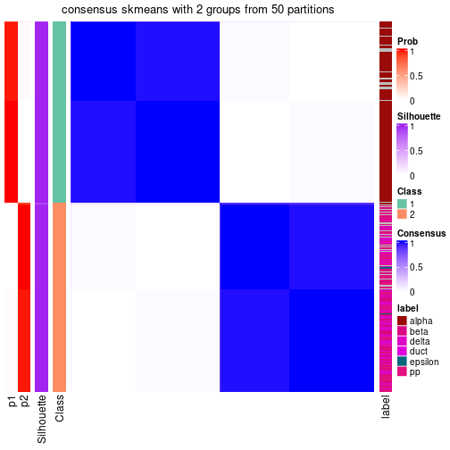</p>

</div>
<div id='tab-node-012-consensus-heatmap-2'>
<pre><code class="r">consensus_heatmap(res, k = 3)
</code></pre>

<p>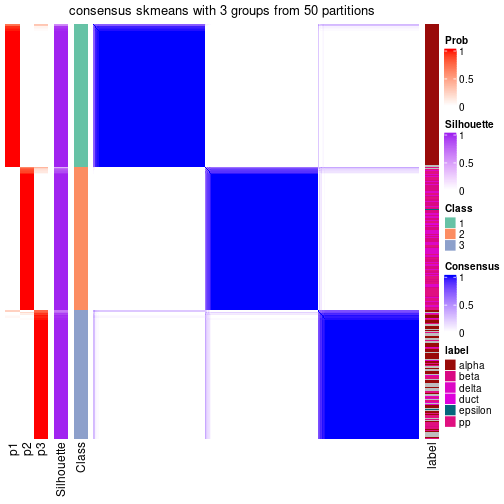</p>

</div>
<div id='tab-node-012-consensus-heatmap-3'>
<pre><code class="r">consensus_heatmap(res, k = 4)
</code></pre>

<p>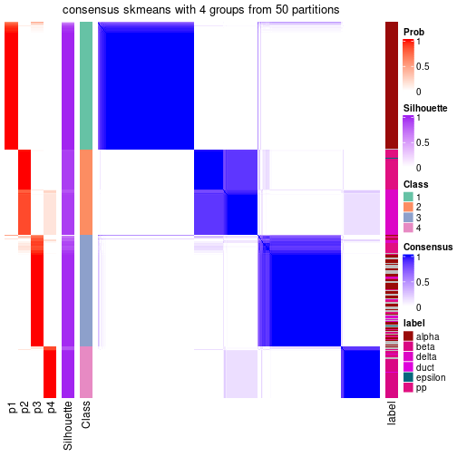</p>

</div>
</div>

Heatmaps for the membership of samples in all partitions to see how consistent they are:


<script>
$( function() {
	$( '#tabs-node-012-membership-heatmap' ).tabs();
} );
</script>
<div id='tabs-node-012-membership-heatmap'>
<ul>
<li><a href='#tab-node-012-membership-heatmap-1'>k = 2</a></li>
<li><a href='#tab-node-012-membership-heatmap-2'>k = 3</a></li>
<li><a href='#tab-node-012-membership-heatmap-3'>k = 4</a></li>
</ul>
<div id='tab-node-012-membership-heatmap-1'>
<pre><code class="r">membership_heatmap(res, k = 2)
</code></pre>

<p>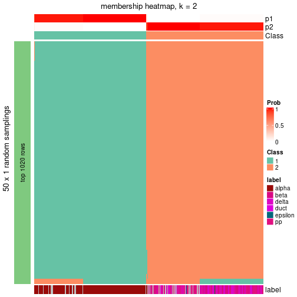</p>

</div>
<div id='tab-node-012-membership-heatmap-2'>
<pre><code class="r">membership_heatmap(res, k = 3)
</code></pre>

<p></p>

</div>
<div id='tab-node-012-membership-heatmap-3'>
<pre><code class="r">membership_heatmap(res, k = 4)
</code></pre>

<p>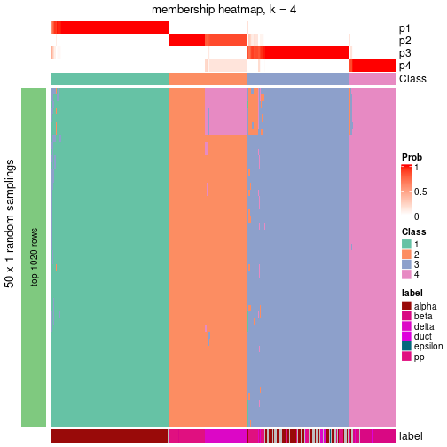</p>

</div>
</div>

As soon as the classes for columns are determined, the signatures
that are significantly different between subgroups can be looked for. 
Following are the heatmaps for signatures.


Signature heatmaps where rows are scaled:


<script>
$( function() {
	$( '#tabs-node-012-get-signatures' ).tabs();
} );
</script>
<div id='tabs-node-012-get-signatures'>
<ul>
<li><a href='#tab-node-012-get-signatures-1'>k = 2</a></li>
<li><a href='#tab-node-012-get-signatures-2'>k = 3</a></li>
<li><a href='#tab-node-012-get-signatures-3'>k = 4</a></li>
</ul>
<div id='tab-node-012-get-signatures-1'>
<pre><code class="r">get_signatures(res, k = 2)
</code></pre>

<p>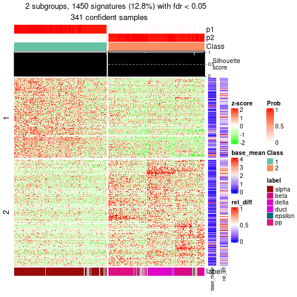</p>

</div>
<div id='tab-node-012-get-signatures-2'>
<pre><code class="r">get_signatures(res, k = 3)
</code></pre>

<p>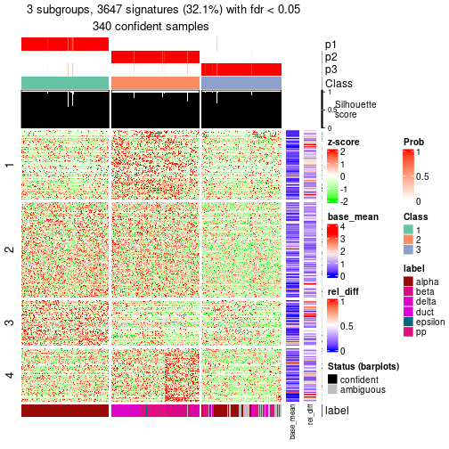</p>

</div>
<div id='tab-node-012-get-signatures-3'>
<pre><code class="r">get_signatures(res, k = 4)
</code></pre>

<p>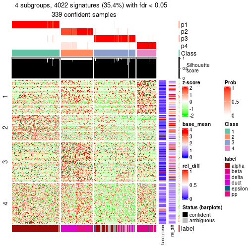</p>

</div>
</div>


Signature heatmaps where rows are not scaled:


<script>
$( function() {
	$( '#tabs-node-012-get-signatures-no-scale' ).tabs();
} );
</script>
<div id='tabs-node-012-get-signatures-no-scale'>
<ul>
<li><a href='#tab-node-012-get-signatures-no-scale-1'>k = 2</a></li>
<li><a href='#tab-node-012-get-signatures-no-scale-2'>k = 3</a></li>
<li><a href='#tab-node-012-get-signatures-no-scale-3'>k = 4</a></li>
</ul>
<div id='tab-node-012-get-signatures-no-scale-1'>
<pre><code class="r">get_signatures(res, k = 2, scale_rows = FALSE)
</code></pre>

<p>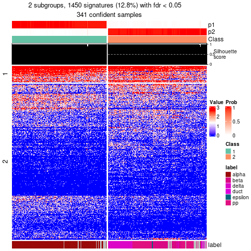</p>

</div>
<div id='tab-node-012-get-signatures-no-scale-2'>
<pre><code class="r">get_signatures(res, k = 3, scale_rows = FALSE)
</code></pre>

<p>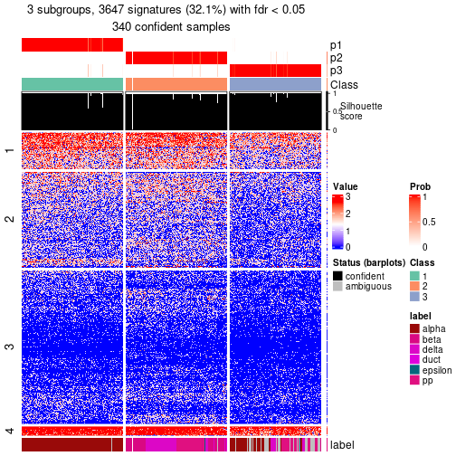</p>

</div>
<div id='tab-node-012-get-signatures-no-scale-3'>
<pre><code class="r">get_signatures(res, k = 4, scale_rows = FALSE)
</code></pre>

<p>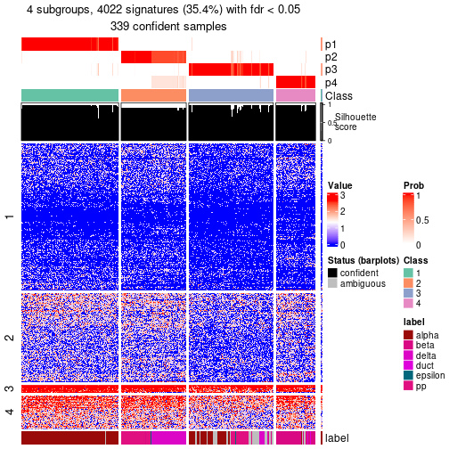</p>

</div>
</div>


Compare the overlap of signatures from different k:

```r
compare_signatures(res)
```

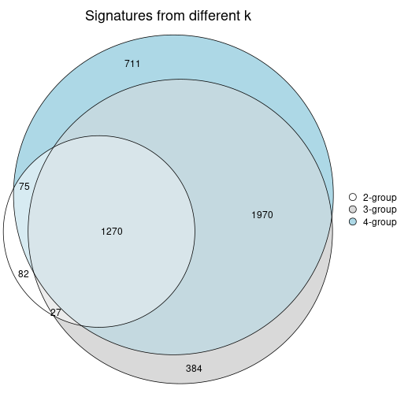

`get_signature()` returns a data frame invisibly. To get the list of signatures, the function
call should be assigned to a variable explicitly. In following code, if `plot` argument is set
to `FALSE`, no heatmap is plotted while only the differential analysis is performed.

```r
# code only for demonstration
tb = get_signature(res, k = ..., plot = FALSE)
```

An example of the output of `tb` is:

```
#>   which_row         fdr    mean_1    mean_2 scaled_mean_1 scaled_mean_2 km
#> 1        38 0.042760348  8.373488  9.131774    -0.5533452     0.5164555  1
#> 2        40 0.018707592  7.106213  8.469186    -0.6173731     0.5762149  1
#> 3        55 0.019134737 10.221463 11.207825    -0.6159697     0.5749050  1
#> 4        59 0.006059896  5.921854  7.869574    -0.6899429     0.6439467  1
#> 5        60 0.018055526  8.928898 10.211722    -0.6204761     0.5791110  1
#> 6        98 0.009384629 15.714769 14.887706     0.6635654    -0.6193277  2
...
```

The columns in `tb` are:

1. `which_row`: row indices corresponding to the input matrix.
2. `fdr`: FDR for the differential test. 
3. `mean_x`: The mean value in group x.
4. `scaled_mean_x`: The mean value in group x after rows are scaled.
5. `km`: Row groups if k-means clustering is applied to rows (which is done by automatically selecting number of clusters).

If there are too many signatures, `top_signatures = ...` can be set to only show the 
signatures with the highest FDRs:

```r
# code only for demonstration
# e.g. to show the top 500 most significant rows
tb = get_signature(res, k = ..., top_signatures = 500)
```

If the signatures are defined as these which are uniquely high in current group, `diff_method` argument
can be set to `"uniquely_high_in_one_group"`:

```r
# code only for demonstration
tb = get_signature(res, k = ..., diff_method = "uniquely_high_in_one_group")
```


UMAP plot which shows how samples are separated.


<script>
$( function() {
	$( '#tabs-node-012-dimension-reduction' ).tabs();
} );
</script>
<div id='tabs-node-012-dimension-reduction'>
<ul>
<li><a href='#tab-node-012-dimension-reduction-1'>k = 2</a></li>
<li><a href='#tab-node-012-dimension-reduction-2'>k = 3</a></li>
<li><a href='#tab-node-012-dimension-reduction-3'>k = 4</a></li>
</ul>
<div id='tab-node-012-dimension-reduction-1'>
<pre><code class="r">dimension_reduction(res, k = 2, method = &quot;UMAP&quot;)
</code></pre>

<p>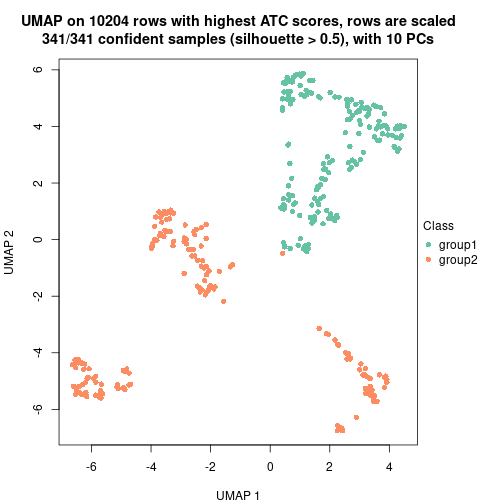</p>

</div>
<div id='tab-node-012-dimension-reduction-2'>
<pre><code class="r">dimension_reduction(res, k = 3, method = &quot;UMAP&quot;)
</code></pre>

<p>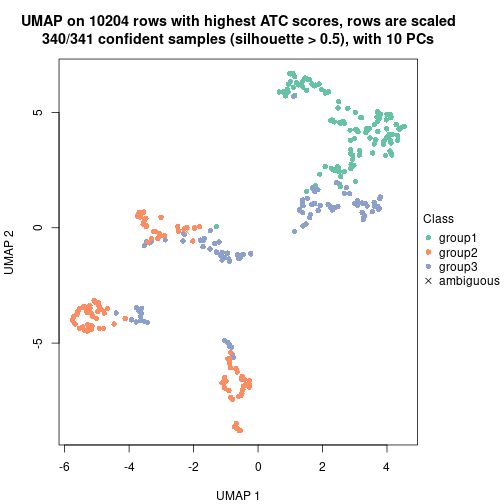</p>

</div>
<div id='tab-node-012-dimension-reduction-3'>
<pre><code class="r">dimension_reduction(res, k = 4, method = &quot;UMAP&quot;)
</code></pre>

<p>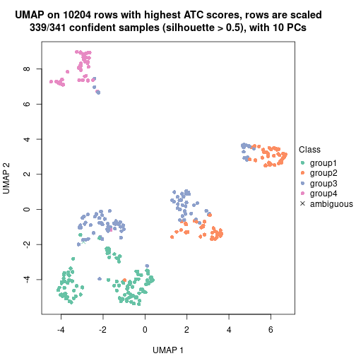</p>

</div>
</div>


Following heatmap shows how subgroups are split when increasing `k`:

```r
collect_classes(res)
```

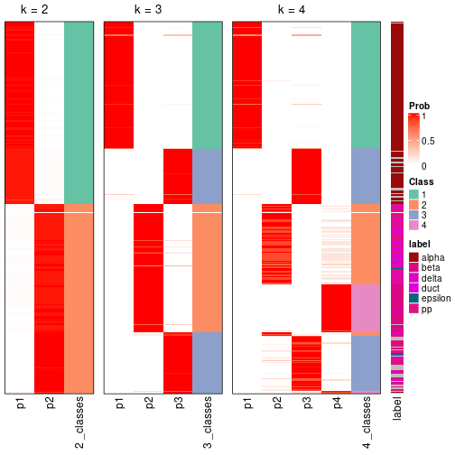


Test correlation between subgroups and known annotations. If the known
annotation is numeric, one-way ANOVA test is applied, and if the known
annotation is discrete, chi-squared contingency table test is applied.

```r
test_to_known_factors(res)
```

```
#>             n_sample label(p-value) k
#> ATC:skmeans      341       3.67e-63 2
#> ATC:skmeans      340       8.31e-50 3
#> ATC:skmeans      339       3.81e-96 4
```


If matrix rows can be associated to genes, consider to use `functional_enrichment(res,
...)` to perform function enrichment for the signature genes. See [this vignette](https://jokergoo.github.io/cola_vignettes/functional_enrichment.html) for more detailed explanations.


 

---------------------------------------------------


### Node013


Parent node: [Node01](#Node01).
Child nodes: 
                Node0121-leaf
        ,
                Node0122-leaf
        ,
                Node0123-leaf
        ,
                Node0124-leaf
        ,
                Node0131-leaf
        ,
                Node0132-leaf
        ,
                Node0133-leaf
        ,
                Node0211-leaf
        ,
                [Node0212](#Node0212)
        ,
                Node0213-leaf
        ,
                [Node0214](#Node0214)
        ,
                [Node0221](#Node0221)
        ,
                [Node0222](#Node0222)
        ,
                Node0223-leaf
        ,
                [Node0231](#Node0231)
        ,
                [Node0232](#Node0232)
        ,
                Node0233-leaf
        ,
                Node0234-leaf
        ,
                [Node0241](#Node0241)
        ,
                [Node0242](#Node0242)
        ,
                Node0243-leaf
        .


The object with results only for a single top-value method and a single partitioning method 
can be extracted as:

```r
res = res_rh["013"]
```

A summary of `res` and all the functions that can be applied to it:

```r
res
```

```
#> A 'ConsensusPartition' object with k = 2, 3, 4.
#>   On a matrix with 6838 rows and 65 columns.
#>   Top rows (684) are extracted by 'ATC' method.
#>   Subgroups are detected by 'skmeans' method.
#>   Performed in total 150 partitions by row resampling.
#>   Best k for subgroups seems to be 3.
#> 
#> Following methods can be applied to this 'ConsensusPartition' object:
#>  [1] "cola_report"             "collect_classes"         "collect_plots"          
#>  [4] "collect_stats"           "colnames"                "compare_partitions"     
#>  [7] "compare_signatures"      "consensus_heatmap"       "dimension_reduction"    
#> [10] "functional_enrichment"   "get_anno_col"            "get_anno"               
#> [13] "get_classes"             "get_consensus"           "get_matrix"             
#> [16] "get_membership"          "get_param"               "get_signatures"         
#> [19] "get_stats"               "is_best_k"               "is_stable_k"            
#> [22] "membership_heatmap"      "ncol"                    "nrow"                   
#> [25] "plot_ecdf"               "predict_classes"         "rownames"               
#> [28] "select_partition_number" "show"                    "suggest_best_k"         
#> [31] "test_to_known_factors"   "top_rows_heatmap"
```

`collect_plots()` function collects all the plots made from `res` for all `k` (number of subgroups)
into one single page to provide an easy and fast comparison between different `k`.

```r
collect_plots(res)
```

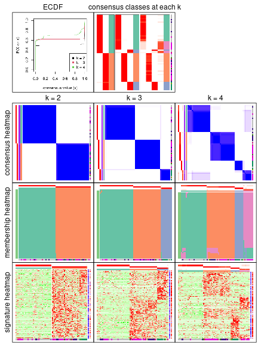

The plots are:

- The first row: a plot of the eCDF (empirical cumulative distribution
  function) curves of the consensus matrix for each `k` and the heatmap of
  predicted classes for each `k`.
- The second row: heatmaps of the consensus matrix for each `k`.
- The third row: heatmaps of the membership matrix for each `k`.
- The fouth row: heatmaps of the signatures for each `k`.

All the plots in panels can be made by individual functions and they are
plotted later in this section.

`select_partition_number()` produces several plots showing different
statistics for choosing "optimized" `k`. There are following statistics:

- eCDF curves of the consensus matrix for each `k`;
- 1-PAC. [The PAC score](https://en.wikipedia.org/wiki/Consensus_clustering#Over-interpretation_potential_of_consensus_clustering)
  measures the proportion of the ambiguous subgrouping.
- Mean silhouette score.
- Concordance. The mean probability of fiting the consensus subgroup labels in all
  partitions.
- Area increased. Denote $A_k$ as the area under the eCDF curve for current
  `k`, the area increased is defined as $A_k - A_{k-1}$.
- Rand index. The percent of pairs of samples that are both in a same cluster
  or both are not in a same cluster in the partition of k and k-1.
- Jaccard index. The ratio of pairs of samples are both in a same cluster in
  the partition of k and k-1 and the pairs of samples are both in a same
  cluster in the partition k or k-1.

The detailed explanations of these statistics can be found in [the _cola_
vignette](https://jokergoo.github.io/cola_vignettes/cola.html#toc_13).

Generally speaking, higher 1-PAC score, higher mean silhouette score or higher
concordance corresponds to better partition. Rand index and Jaccard index
measure how similar the current partition is compared to partition with `k-1`.
If they are too similar, we won't accept `k` is better than `k-1`.

```r
select_partition_number(res)
```

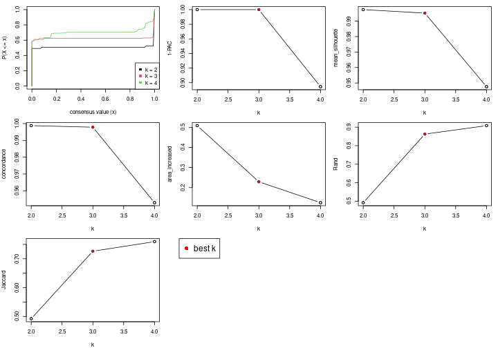

The numeric values for all these statistics can be obtained by `get_stats()`.

```r
get_stats(res)
```

```
#>   k 1-PAC mean_silhouette concordance area_increased  Rand Jaccard
#> 2 2 1.000           0.997       0.999          0.508 0.492   0.492
#> 3 3 1.000           0.995       0.998          0.229 0.863   0.726
#> 4 4 0.895           0.948       0.953          0.125 0.908   0.759
```

`suggest_best_k()` suggests the best $k$ based on these statistics. The rules are as follows:

- All $k$ with Jaccard index larger than 0.95 are removed because increasing
  $k$ does not provide enough extra information. If all $k$ are removed, it is
  marked as no subgroup is detected.
- For all $k$ with 1-PAC score larger than 0.9, the maximal $k$ is taken as
  the best $k$, and other $k$ are marked as optional $k$.
- If it does not fit the second rule. The $k$ with the maximal vote of the
  highest 1-PAC score, highest mean silhouette, and highest concordance is
  taken as the best $k$.

```r
suggest_best_k(res)
```

```
#> [1] 3
#> attr(,"optional")
#> [1] 2
```

There is also optional best $k$ = 2 that is worth to check.

Following is the table of the partitions (You need to click the **show/hide
code output** link to see it). The membership matrix (columns with name `p*`)
is inferred by
[`clue::cl_consensus()`](https://www.rdocumentation.org/link/cl_consensus?package=clue)
function with the `SE` method. Basically the value in the membership matrix
represents the probability to belong to a certain group. The finall subgroup
label for an item is determined with the group with highest probability it
belongs to.

In `get_classes()` function, the entropy is calculated from the membership
matrix and the silhouette score is calculated from the consensus matrix.


<script>
$( function() {
	$( '#tabs-node-013-get-classes' ).tabs();
} );
</script>
<div id='tabs-node-013-get-classes'>
<ul>
<li><a href='#tab-node-013-get-classes-1'>k = 2</a></li>
<li><a href='#tab-node-013-get-classes-2'>k = 3</a></li>
<li><a href='#tab-node-013-get-classes-3'>k = 4</a></li>
</ul>

<div id='tab-node-013-get-classes-1'>
<p><a id='tab-node-013-get-classes-1-a' style='color:#0366d6' href='#'>show/hide code output</a></p>
<pre><code class="r">cbind(get_classes(res, k = 2), get_membership(res, k = 2))
</code></pre>

<pre><code>#&gt;          class entropy silhouette   p1   p2
#&gt; D28-1_64     1   0.000      1.000 1.00 0.00
#&gt; D28-3_1      1   0.000      1.000 1.00 0.00
#&gt; D28-3_49     2   0.000      0.997 0.00 1.00
#&gt; D28-4_64     1   0.000      1.000 1.00 0.00
#&gt; D28-5_26     2   0.000      0.997 0.00 1.00
#&gt; D28-6_15     1   0.000      1.000 1.00 0.00
#&gt; D28-7_18     2   0.000      0.997 0.00 1.00
#&gt; D28-8_51     2   0.000      0.997 0.00 1.00
#&gt; D29-2_55     1   0.000      1.000 1.00 0.00
#&gt; D29-3_6      1   0.000      1.000 1.00 0.00
#&gt; D29-3_35     1   0.000      1.000 1.00 0.00
#&gt; D29-3_50     2   0.000      0.997 0.00 1.00
#&gt; D29-3_88     1   0.000      1.000 1.00 0.00
#&gt; D29-5_73     1   0.000      1.000 1.00 0.00
#&gt; D29-7_18     2   0.402      0.913 0.08 0.92
#&gt; D29-8_21     1   0.000      1.000 1.00 0.00
#&gt; D29-8_53     1   0.000      1.000 1.00 0.00
#&gt; D29-8_67     1   0.000      1.000 1.00 0.00
#&gt; D31-1_11     2   0.000      0.997 0.00 1.00
#&gt; D31-1_13     1   0.000      1.000 1.00 0.00
#&gt; D31-1_25     2   0.000      0.997 0.00 1.00
#&gt; D31-1_37     1   0.000      1.000 1.00 0.00
#&gt; D31-2_42     1   0.000      1.000 1.00 0.00
#&gt; D31-3_11     1   0.000      1.000 1.00 0.00
#&gt; D31-3_74     1   0.000      1.000 1.00 0.00
#&gt; D31-4_14     2   0.000      0.997 0.00 1.00
#&gt; D31-5_72     1   0.000      1.000 1.00 0.00
#&gt; D31-5_79     1   0.000      1.000 1.00 0.00
#&gt; D31-6_1      2   0.000      0.997 0.00 1.00
#&gt; D31-6_4      2   0.000      0.997 0.00 1.00
#&gt; D31-6_33     2   0.000      0.997 0.00 1.00
#&gt; D31-6_51     2   0.000      0.997 0.00 1.00
#&gt; D31-6_57     1   0.000      1.000 1.00 0.00
#&gt; D31-7_10     2   0.000      0.997 0.00 1.00
#&gt; D31-7_12     1   0.000      1.000 1.00 0.00
#&gt; D31-7_18     2   0.000      0.997 0.00 1.00
#&gt; D31-7_31     1   0.000      1.000 1.00 0.00
#&gt; D31-7_32     2   0.000      0.997 0.00 1.00
#&gt; D31-7_42     2   0.000      0.997 0.00 1.00
#&gt; D31-7_43     1   0.000      1.000 1.00 0.00
#&gt; D31-7_52     1   0.000      1.000 1.00 0.00
#&gt; D31-8_20     2   0.000      0.997 0.00 1.00
#&gt; D31-8_39     2   0.000      0.997 0.00 1.00
#&gt; D31-8_47     2   0.000      0.997 0.00 1.00
#&gt; D31-8_59     1   0.000      1.000 1.00 0.00
#&gt; D31-8_81     2   0.000      0.997 0.00 1.00
#&gt; D30-1_2      1   0.000      1.000 1.00 0.00
#&gt; D30-1_31     2   0.000      0.997 0.00 1.00
#&gt; D30-1_36     2   0.000      0.997 0.00 1.00
#&gt; D30-1_44     2   0.000      0.997 0.00 1.00
#&gt; D30-1_55     2   0.000      0.997 0.00 1.00
#&gt; D30-1_77     2   0.000      0.997 0.00 1.00
#&gt; D30-2_38     1   0.000      1.000 1.00 0.00
#&gt; D30-2_39     1   0.000      1.000 1.00 0.00
#&gt; D30-3_8      2   0.000      0.997 0.00 1.00
#&gt; D30-3_84     1   0.000      1.000 1.00 0.00
#&gt; D30-5_5      2   0.000      0.997 0.00 1.00
#&gt; D30-5_44     2   0.000      0.997 0.00 1.00
#&gt; D30-7_34     1   0.000      1.000 1.00 0.00
#&gt; D30-7_46     2   0.000      0.997 0.00 1.00
#&gt; D30-8_16     2   0.000      0.997 0.00 1.00
#&gt; D30-8_21     1   0.000      1.000 1.00 0.00
#&gt; D30-8_24     1   0.000      1.000 1.00 0.00
#&gt; D30-8_36     2   0.000      0.997 0.00 1.00
#&gt; D30-8_72     1   0.000      1.000 1.00 0.00
</code></pre>

<script>
$('#tab-node-013-get-classes-1-a').parent().next().next().hide();
$('#tab-node-013-get-classes-1-a').click(function(){
  $('#tab-node-013-get-classes-1-a').parent().next().next().toggle();
  return(false);
});
</script>
</div>

<div id='tab-node-013-get-classes-2'>
<p><a id='tab-node-013-get-classes-2-a' style='color:#0366d6' href='#'>show/hide code output</a></p>
<pre><code class="r">cbind(get_classes(res, k = 3), get_membership(res, k = 3))
</code></pre>

<pre><code>#&gt;          class entropy silhouette   p1   p2  p3
#&gt; D28-1_64     1  0.0000      0.998 1.00 0.00 0.0
#&gt; D28-3_1      1  0.0000      0.998 1.00 0.00 0.0
#&gt; D28-3_49     2  0.0000      1.000 0.00 1.00 0.0
#&gt; D28-4_64     1  0.0000      0.998 1.00 0.00 0.0
#&gt; D28-5_26     2  0.0000      1.000 0.00 1.00 0.0
#&gt; D28-6_15     3  0.0000      0.988 0.00 0.00 1.0
#&gt; D28-7_18     2  0.0000      1.000 0.00 1.00 0.0
#&gt; D28-8_51     2  0.0000      1.000 0.00 1.00 0.0
#&gt; D29-2_55     1  0.0000      0.998 1.00 0.00 0.0
#&gt; D29-3_6      1  0.0000      0.998 1.00 0.00 0.0
#&gt; D29-3_35     1  0.0000      0.998 1.00 0.00 0.0
#&gt; D29-3_50     2  0.0000      1.000 0.00 1.00 0.0
#&gt; D29-3_88     1  0.0000      0.998 1.00 0.00 0.0
#&gt; D29-5_73     1  0.0000      0.998 1.00 0.00 0.0
#&gt; D29-7_18     3  0.0000      0.988 0.00 0.00 1.0
#&gt; D29-8_21     1  0.0000      0.998 1.00 0.00 0.0
#&gt; D29-8_53     1  0.0000      0.998 1.00 0.00 0.0
#&gt; D29-8_67     3  0.2959      0.889 0.10 0.00 0.9
#&gt; D31-1_11     2  0.0000      1.000 0.00 1.00 0.0
#&gt; D31-1_13     1  0.0000      0.998 1.00 0.00 0.0
#&gt; D31-1_25     2  0.0000      1.000 0.00 1.00 0.0
#&gt; D31-1_37     1  0.0000      0.998 1.00 0.00 0.0
#&gt; D31-2_42     1  0.0000      0.998 1.00 0.00 0.0
#&gt; D31-3_11     1  0.0000      0.998 1.00 0.00 0.0
#&gt; D31-3_74     1  0.0000      0.998 1.00 0.00 0.0
#&gt; D31-4_14     2  0.0000      1.000 0.00 1.00 0.0
#&gt; D31-5_72     1  0.0000      0.998 1.00 0.00 0.0
#&gt; D31-5_79     1  0.0000      0.998 1.00 0.00 0.0
#&gt; D31-6_1      3  0.0000      0.988 0.00 0.00 1.0
#&gt; D31-6_4      2  0.0000      1.000 0.00 1.00 0.0
#&gt; D31-6_33     2  0.0000      1.000 0.00 1.00 0.0
#&gt; D31-6_51     2  0.0000      1.000 0.00 1.00 0.0
#&gt; D31-6_57     1  0.0000      0.998 1.00 0.00 0.0
#&gt; D31-7_10     2  0.0000      1.000 0.00 1.00 0.0
#&gt; D31-7_12     1  0.0000      0.998 1.00 0.00 0.0
#&gt; D31-7_18     2  0.0000      1.000 0.00 1.00 0.0
#&gt; D31-7_31     3  0.0000      0.988 0.00 0.00 1.0
#&gt; D31-7_32     3  0.0000      0.988 0.00 0.00 1.0
#&gt; D31-7_42     2  0.0000      1.000 0.00 1.00 0.0
#&gt; D31-7_43     1  0.0000      0.998 1.00 0.00 0.0
#&gt; D31-7_52     1  0.0000      0.998 1.00 0.00 0.0
#&gt; D31-8_20     2  0.0000      1.000 0.00 1.00 0.0
#&gt; D31-8_39     3  0.0000      0.988 0.00 0.00 1.0
#&gt; D31-8_47     3  0.0000      0.988 0.00 0.00 1.0
#&gt; D31-8_59     1  0.0000      0.998 1.00 0.00 0.0
#&gt; D31-8_81     2  0.0000      1.000 0.00 1.00 0.0
#&gt; D30-1_2      1  0.0000      0.998 1.00 0.00 0.0
#&gt; D30-1_31     2  0.0000      1.000 0.00 1.00 0.0
#&gt; D30-1_36     2  0.0000      1.000 0.00 1.00 0.0
#&gt; D30-1_44     3  0.0000      0.988 0.00 0.00 1.0
#&gt; D30-1_55     2  0.0000      1.000 0.00 1.00 0.0
#&gt; D30-1_77     3  0.0000      0.988 0.00 0.00 1.0
#&gt; D30-2_38     1  0.0000      0.998 1.00 0.00 0.0
#&gt; D30-2_39     1  0.0000      0.998 1.00 0.00 0.0
#&gt; D30-3_8      2  0.0000      1.000 0.00 1.00 0.0
#&gt; D30-3_84     1  0.0000      0.998 1.00 0.00 0.0
#&gt; D30-5_5      2  0.0000      1.000 0.00 1.00 0.0
#&gt; D30-5_44     2  0.0000      1.000 0.00 1.00 0.0
#&gt; D30-7_34     1  0.0000      0.998 1.00 0.00 0.0
#&gt; D30-7_46     2  0.0000      1.000 0.00 1.00 0.0
#&gt; D30-8_16     2  0.0000      1.000 0.00 1.00 0.0
#&gt; D30-8_21     1  0.0000      0.998 1.00 0.00 0.0
#&gt; D30-8_24     1  0.0892      0.976 0.98 0.02 0.0
#&gt; D30-8_36     2  0.0000      1.000 0.00 1.00 0.0
#&gt; D30-8_72     1  0.0892      0.976 0.98 0.02 0.0
</code></pre>

<script>
$('#tab-node-013-get-classes-2-a').parent().next().next().hide();
$('#tab-node-013-get-classes-2-a').click(function(){
  $('#tab-node-013-get-classes-2-a').parent().next().next().toggle();
  return(false);
});
</script>
</div>

<div id='tab-node-013-get-classes-3'>
<p><a id='tab-node-013-get-classes-3-a' style='color:#0366d6' href='#'>show/hide code output</a></p>
<pre><code class="r">cbind(get_classes(res, k = 4), get_membership(res, k = 4))
</code></pre>

<pre><code>#&gt;          class entropy silhouette   p1   p2   p3   p4
#&gt; D28-1_64     1  0.2011      0.883 0.92 0.00 0.00 0.08
#&gt; D28-3_1      1  0.0000      0.966 1.00 0.00 0.00 0.00
#&gt; D28-3_49     2  0.0000      0.968 0.00 1.00 0.00 0.00
#&gt; D28-4_64     1  0.0000      0.966 1.00 0.00 0.00 0.00
#&gt; D28-5_26     2  0.1211      0.957 0.00 0.96 0.00 0.04
#&gt; D28-6_15     4  0.3172      0.728 0.00 0.00 0.16 0.84
#&gt; D28-7_18     2  0.1637      0.956 0.00 0.94 0.00 0.06
#&gt; D28-8_51     2  0.2011      0.951 0.00 0.92 0.00 0.08
#&gt; D29-2_55     1  0.0707      0.949 0.98 0.00 0.00 0.02
#&gt; D29-3_6      1  0.0000      0.966 1.00 0.00 0.00 0.00
#&gt; D29-3_35     4  0.4277      0.794 0.28 0.00 0.00 0.72
#&gt; D29-3_50     2  0.1637      0.956 0.00 0.94 0.00 0.06
#&gt; D29-3_88     1  0.0000      0.966 1.00 0.00 0.00 0.00
#&gt; D29-5_73     1  0.2921      0.847 0.86 0.00 0.00 0.14
#&gt; D29-7_18     3  0.0000      1.000 0.00 0.00 1.00 0.00
#&gt; D29-8_21     1  0.0000      0.966 1.00 0.00 0.00 0.00
#&gt; D29-8_53     1  0.0000      0.966 1.00 0.00 0.00 0.00
#&gt; D29-8_67     4  0.3935      0.826 0.06 0.00 0.10 0.84
#&gt; D31-1_11     2  0.2011      0.951 0.00 0.92 0.00 0.08
#&gt; D31-1_13     1  0.0000      0.966 1.00 0.00 0.00 0.00
#&gt; D31-1_25     2  0.2011      0.951 0.00 0.92 0.00 0.08
#&gt; D31-1_37     1  0.0000      0.966 1.00 0.00 0.00 0.00
#&gt; D31-2_42     1  0.0000      0.966 1.00 0.00 0.00 0.00
#&gt; D31-3_11     1  0.0000      0.966 1.00 0.00 0.00 0.00
#&gt; D31-3_74     1  0.0000      0.966 1.00 0.00 0.00 0.00
#&gt; D31-4_14     2  0.2011      0.951 0.00 0.92 0.00 0.08
#&gt; D31-5_72     4  0.3172      0.931 0.16 0.00 0.00 0.84
#&gt; D31-5_79     1  0.0000      0.966 1.00 0.00 0.00 0.00
#&gt; D31-6_1      3  0.0000      1.000 0.00 0.00 1.00 0.00
#&gt; D31-6_4      2  0.0000      0.968 0.00 1.00 0.00 0.00
#&gt; D31-6_33     2  0.2011      0.951 0.00 0.92 0.00 0.08
#&gt; D31-6_51     2  0.0000      0.968 0.00 1.00 0.00 0.00
#&gt; D31-6_57     4  0.3172      0.931 0.16 0.00 0.00 0.84
#&gt; D31-7_10     2  0.0000      0.968 0.00 1.00 0.00 0.00
#&gt; D31-7_12     1  0.0000      0.966 1.00 0.00 0.00 0.00
#&gt; D31-7_18     2  0.0000      0.968 0.00 1.00 0.00 0.00
#&gt; D31-7_31     3  0.0000      1.000 0.00 0.00 1.00 0.00
#&gt; D31-7_32     3  0.0000      1.000 0.00 0.00 1.00 0.00
#&gt; D31-7_42     2  0.0000      0.968 0.00 1.00 0.00 0.00
#&gt; D31-7_43     4  0.3172      0.931 0.16 0.00 0.00 0.84
#&gt; D31-7_52     1  0.0000      0.966 1.00 0.00 0.00 0.00
#&gt; D31-8_20     2  0.0000      0.968 0.00 1.00 0.00 0.00
#&gt; D31-8_39     3  0.0000      1.000 0.00 0.00 1.00 0.00
#&gt; D31-8_47     3  0.0000      1.000 0.00 0.00 1.00 0.00
#&gt; D31-8_59     1  0.0000      0.966 1.00 0.00 0.00 0.00
#&gt; D31-8_81     2  0.3172      0.889 0.00 0.84 0.00 0.16
#&gt; D30-1_2      1  0.2345      0.886 0.90 0.00 0.00 0.10
#&gt; D30-1_31     2  0.0000      0.968 0.00 1.00 0.00 0.00
#&gt; D30-1_36     2  0.0000      0.968 0.00 1.00 0.00 0.00
#&gt; D30-1_44     3  0.0000      1.000 0.00 0.00 1.00 0.00
#&gt; D30-1_55     2  0.2011      0.951 0.00 0.92 0.00 0.08
#&gt; D30-1_77     3  0.0000      1.000 0.00 0.00 1.00 0.00
#&gt; D30-2_38     4  0.3172      0.931 0.16 0.00 0.00 0.84
#&gt; D30-2_39     1  0.0000      0.966 1.00 0.00 0.00 0.00
#&gt; D30-3_8      2  0.0000      0.968 0.00 1.00 0.00 0.00
#&gt; D30-3_84     4  0.3172      0.931 0.16 0.00 0.00 0.84
#&gt; D30-5_5      2  0.0000      0.968 0.00 1.00 0.00 0.00
#&gt; D30-5_44     2  0.0000      0.968 0.00 1.00 0.00 0.00
#&gt; D30-7_34     1  0.0000      0.966 1.00 0.00 0.00 0.00
#&gt; D30-7_46     2  0.0000      0.968 0.00 1.00 0.00 0.00
#&gt; D30-8_16     2  0.0000      0.968 0.00 1.00 0.00 0.00
#&gt; D30-8_21     4  0.3172      0.931 0.16 0.00 0.00 0.84
#&gt; D30-8_24     1  0.2921      0.847 0.86 0.00 0.00 0.14
#&gt; D30-8_36     2  0.2011      0.951 0.00 0.92 0.00 0.08
#&gt; D30-8_72     1  0.2921      0.847 0.86 0.00 0.00 0.14
</code></pre>

<script>
$('#tab-node-013-get-classes-3-a').parent().next().next().hide();
$('#tab-node-013-get-classes-3-a').click(function(){
  $('#tab-node-013-get-classes-3-a').parent().next().next().toggle();
  return(false);
});
</script>
</div>
</div>

Heatmaps for the consensus matrix. It visualizes the probability of two
samples to be in a same group.


<script>
$( function() {
	$( '#tabs-node-013-consensus-heatmap' ).tabs();
} );
</script>
<div id='tabs-node-013-consensus-heatmap'>
<ul>
<li><a href='#tab-node-013-consensus-heatmap-1'>k = 2</a></li>
<li><a href='#tab-node-013-consensus-heatmap-2'>k = 3</a></li>
<li><a href='#tab-node-013-consensus-heatmap-3'>k = 4</a></li>
</ul>
<div id='tab-node-013-consensus-heatmap-1'>
<pre><code class="r">consensus_heatmap(res, k = 2)
</code></pre>

<p>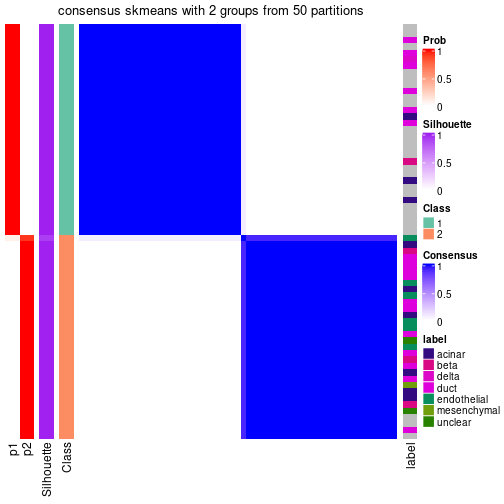</p>

</div>
<div id='tab-node-013-consensus-heatmap-2'>
<pre><code class="r">consensus_heatmap(res, k = 3)
</code></pre>

<p></p>

</div>
<div id='tab-node-013-consensus-heatmap-3'>
<pre><code class="r">consensus_heatmap(res, k = 4)
</code></pre>

<p>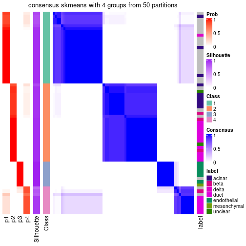</p>

</div>
</div>

Heatmaps for the membership of samples in all partitions to see how consistent they are:


<script>
$( function() {
	$( '#tabs-node-013-membership-heatmap' ).tabs();
} );
</script>
<div id='tabs-node-013-membership-heatmap'>
<ul>
<li><a href='#tab-node-013-membership-heatmap-1'>k = 2</a></li>
<li><a href='#tab-node-013-membership-heatmap-2'>k = 3</a></li>
<li><a href='#tab-node-013-membership-heatmap-3'>k = 4</a></li>
</ul>
<div id='tab-node-013-membership-heatmap-1'>
<pre><code class="r">membership_heatmap(res, k = 2)
</code></pre>

<p>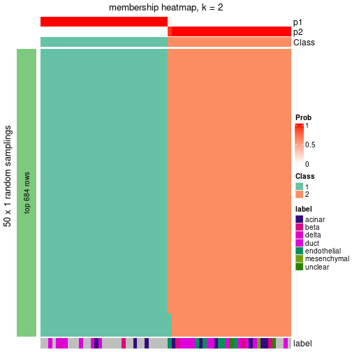</p>

</div>
<div id='tab-node-013-membership-heatmap-2'>
<pre><code class="r">membership_heatmap(res, k = 3)
</code></pre>

<p>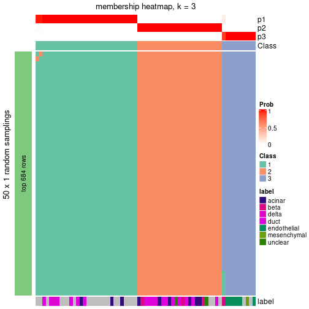</p>

</div>
<div id='tab-node-013-membership-heatmap-3'>
<pre><code class="r">membership_heatmap(res, k = 4)
</code></pre>

<p>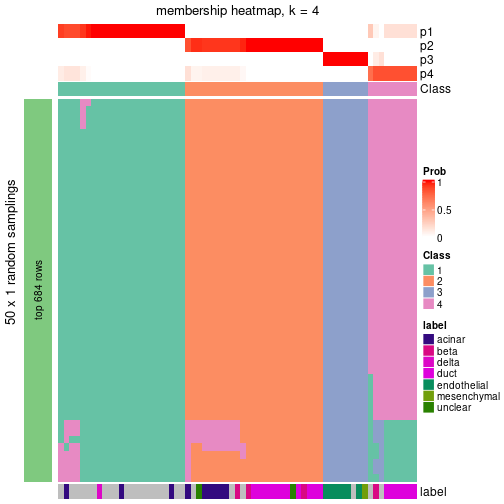</p>

</div>
</div>

As soon as the classes for columns are determined, the signatures
that are significantly different between subgroups can be looked for. 
Following are the heatmaps for signatures.


Signature heatmaps where rows are scaled:


<script>
$( function() {
	$( '#tabs-node-013-get-signatures' ).tabs();
} );
</script>
<div id='tabs-node-013-get-signatures'>
<ul>
<li><a href='#tab-node-013-get-signatures-1'>k = 2</a></li>
<li><a href='#tab-node-013-get-signatures-2'>k = 3</a></li>
<li><a href='#tab-node-013-get-signatures-3'>k = 4</a></li>
</ul>
<div id='tab-node-013-get-signatures-1'>
<pre><code class="r">get_signatures(res, k = 2)
</code></pre>

<p>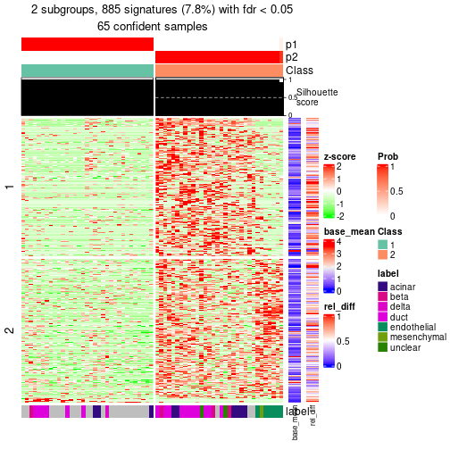</p>

</div>
<div id='tab-node-013-get-signatures-2'>
<pre><code class="r">get_signatures(res, k = 3)
</code></pre>

<p>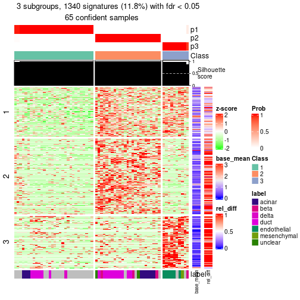</p>

</div>
<div id='tab-node-013-get-signatures-3'>
<pre><code class="r">get_signatures(res, k = 4)
</code></pre>

<p>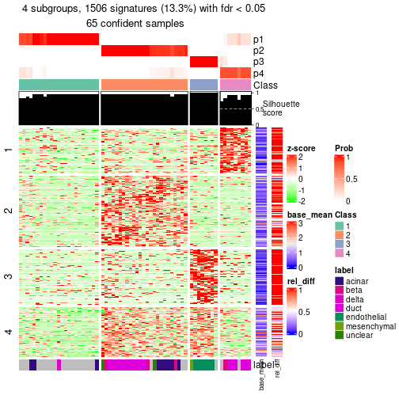</p>

</div>
</div>


Signature heatmaps where rows are not scaled:


<script>
$( function() {
	$( '#tabs-node-013-get-signatures-no-scale' ).tabs();
} );
</script>
<div id='tabs-node-013-get-signatures-no-scale'>
<ul>
<li><a href='#tab-node-013-get-signatures-no-scale-1'>k = 2</a></li>
<li><a href='#tab-node-013-get-signatures-no-scale-2'>k = 3</a></li>
<li><a href='#tab-node-013-get-signatures-no-scale-3'>k = 4</a></li>
</ul>
<div id='tab-node-013-get-signatures-no-scale-1'>
<pre><code class="r">get_signatures(res, k = 2, scale_rows = FALSE)
</code></pre>

<p>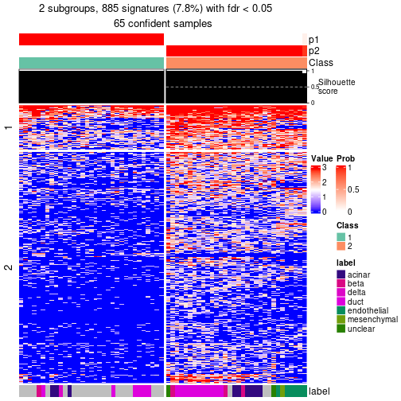</p>

</div>
<div id='tab-node-013-get-signatures-no-scale-2'>
<pre><code class="r">get_signatures(res, k = 3, scale_rows = FALSE)
</code></pre>

<p>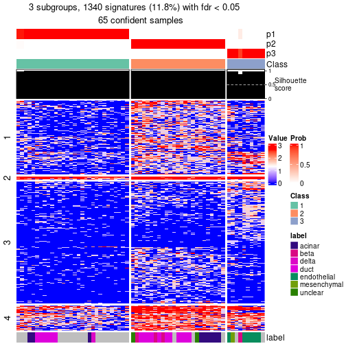</p>

</div>
<div id='tab-node-013-get-signatures-no-scale-3'>
<pre><code class="r">get_signatures(res, k = 4, scale_rows = FALSE)
</code></pre>

<p>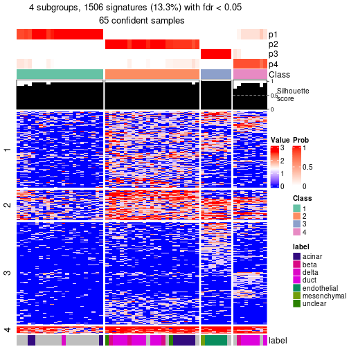</p>

</div>
</div>


Compare the overlap of signatures from different k:

```r
compare_signatures(res)
```

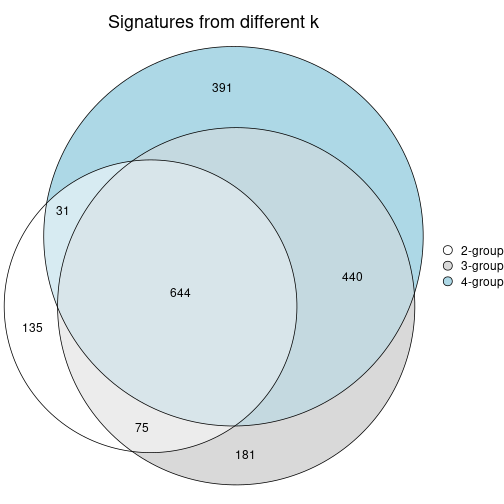

`get_signature()` returns a data frame invisibly. To get the list of signatures, the function
call should be assigned to a variable explicitly. In following code, if `plot` argument is set
to `FALSE`, no heatmap is plotted while only the differential analysis is performed.

```r
# code only for demonstration
tb = get_signature(res, k = ..., plot = FALSE)
```

An example of the output of `tb` is:

```
#>   which_row         fdr    mean_1    mean_2 scaled_mean_1 scaled_mean_2 km
#> 1        38 0.042760348  8.373488  9.131774    -0.5533452     0.5164555  1
#> 2        40 0.018707592  7.106213  8.469186    -0.6173731     0.5762149  1
#> 3        55 0.019134737 10.221463 11.207825    -0.6159697     0.5749050  1
#> 4        59 0.006059896  5.921854  7.869574    -0.6899429     0.6439467  1
#> 5        60 0.018055526  8.928898 10.211722    -0.6204761     0.5791110  1
#> 6        98 0.009384629 15.714769 14.887706     0.6635654    -0.6193277  2
...
```

The columns in `tb` are:

1. `which_row`: row indices corresponding to the input matrix.
2. `fdr`: FDR for the differential test. 
3. `mean_x`: The mean value in group x.
4. `scaled_mean_x`: The mean value in group x after rows are scaled.
5. `km`: Row groups if k-means clustering is applied to rows (which is done by automatically selecting number of clusters).

If there are too many signatures, `top_signatures = ...` can be set to only show the 
signatures with the highest FDRs:

```r
# code only for demonstration
# e.g. to show the top 500 most significant rows
tb = get_signature(res, k = ..., top_signatures = 500)
```

If the signatures are defined as these which are uniquely high in current group, `diff_method` argument
can be set to `"uniquely_high_in_one_group"`:

```r
# code only for demonstration
tb = get_signature(res, k = ..., diff_method = "uniquely_high_in_one_group")
```


UMAP plot which shows how samples are separated.


<script>
$( function() {
	$( '#tabs-node-013-dimension-reduction' ).tabs();
} );
</script>
<div id='tabs-node-013-dimension-reduction'>
<ul>
<li><a href='#tab-node-013-dimension-reduction-1'>k = 2</a></li>
<li><a href='#tab-node-013-dimension-reduction-2'>k = 3</a></li>
<li><a href='#tab-node-013-dimension-reduction-3'>k = 4</a></li>
</ul>
<div id='tab-node-013-dimension-reduction-1'>
<pre><code class="r">dimension_reduction(res, k = 2, method = &quot;UMAP&quot;)
</code></pre>

<p>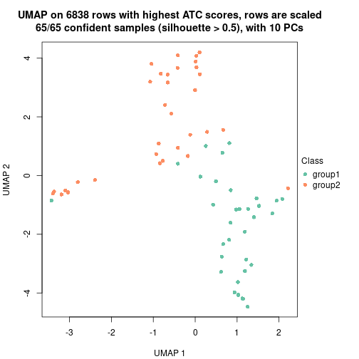</p>

</div>
<div id='tab-node-013-dimension-reduction-2'>
<pre><code class="r">dimension_reduction(res, k = 3, method = &quot;UMAP&quot;)
</code></pre>

<p>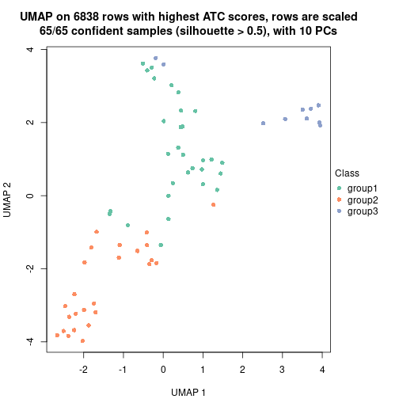</p>

</div>
<div id='tab-node-013-dimension-reduction-3'>
<pre><code class="r">dimension_reduction(res, k = 4, method = &quot;UMAP&quot;)
</code></pre>

<p>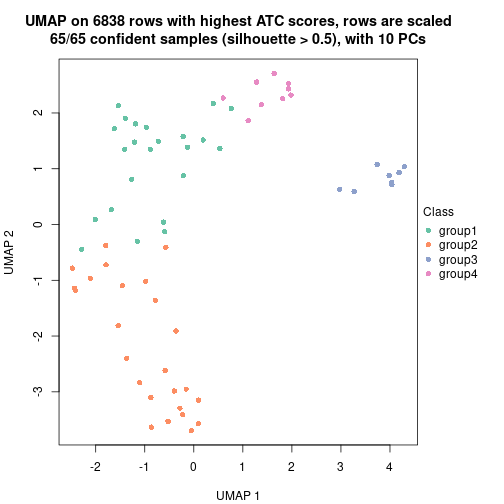</p>

</div>
</div>


Following heatmap shows how subgroups are split when increasing `k`:

```r
collect_classes(res)
```

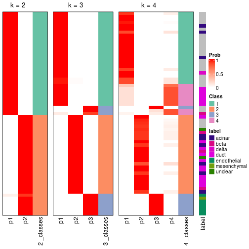


Test correlation between subgroups and known annotations. If the known
annotation is numeric, one-way ANOVA test is applied, and if the known
annotation is discrete, chi-squared contingency table test is applied.

```r
test_to_known_factors(res)
```

```
#>             n_sample label(p-value) k
#> ATC:skmeans       65       3.46e-01 2
#> ATC:skmeans       65       5.58e-05 3
#> ATC:skmeans       65       1.18e-06 4
```


If matrix rows can be associated to genes, consider to use `functional_enrichment(res,
...)` to perform function enrichment for the signature genes. See [this vignette](https://jokergoo.github.io/cola_vignettes/functional_enrichment.html) for more detailed explanations.


 

---------------------------------------------------


### Node02


Parent node: [Node0](#Node0).
Child nodes: 
                Node011-leaf
        ,
                [Node012](#Node012)
        ,
                [Node013](#Node013)
        ,
                Node014-leaf
        ,
                [Node021](#Node021)
        ,
                [Node022](#Node022)
        ,
                [Node023](#Node023)
        ,
                [Node024](#Node024)
        .


The object with results only for a single top-value method and a single partitioning method 
can be extracted as:

```r
res = res_rh["02"]
```

A summary of `res` and all the functions that can be applied to it:

```r
res
```

```
#> A 'DownSamplingConsensusPartition' object with k = 2, 3, 4.
#>   On a matrix with 11351 rows and 500 columns, randomly sampled from 1937 columns.
#>   Top rows (1069) are extracted by 'ATC' method.
#>   Subgroups are detected by 'skmeans' method.
#>   Performed in total 150 partitions by row resampling.
#>   Best k for subgroups seems to be 4.
#> 
#> Following methods can be applied to this 'DownSamplingConsensusPartition' object:
#>  [1] "cola_report"             "collect_classes"         "collect_plots"          
#>  [4] "collect_stats"           "colnames"                "compare_partitions"     
#>  [7] "compare_signatures"      "consensus_heatmap"       "dimension_reduction"    
#> [10] "functional_enrichment"   "get_anno_col"            "get_anno"               
#> [13] "get_classes"             "get_consensus"           "get_matrix"             
#> [16] "get_membership"          "get_param"               "get_signatures"         
#> [19] "get_stats"               "is_best_k"               "is_stable_k"            
#> [22] "membership_heatmap"      "ncol"                    "nrow"                   
#> [25] "plot_ecdf"               "predict_classes"         "rownames"               
#> [28] "select_partition_number" "show"                    "suggest_best_k"         
#> [31] "test_to_known_factors"   "top_rows_heatmap"
```

`collect_plots()` function collects all the plots made from `res` for all `k` (number of subgroups)
into one single page to provide an easy and fast comparison between different `k`.

```r
collect_plots(res)
```

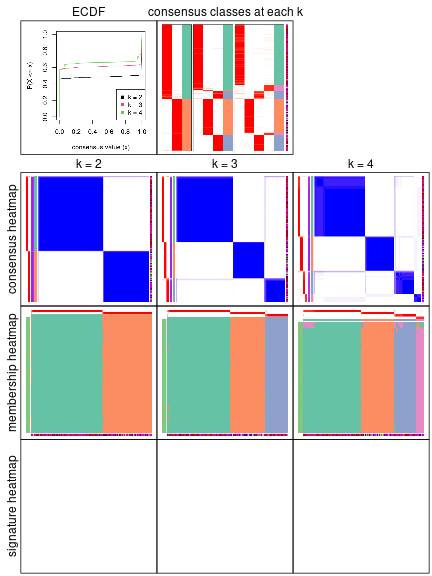

The plots are:

- The first row: a plot of the eCDF (empirical cumulative distribution
  function) curves of the consensus matrix for each `k` and the heatmap of
  predicted classes for each `k`.
- The second row: heatmaps of the consensus matrix for each `k`.
- The third row: heatmaps of the membership matrix for each `k`.
- The fouth row: heatmaps of the signatures for each `k`.

All the plots in panels can be made by individual functions and they are
plotted later in this section.

`select_partition_number()` produces several plots showing different
statistics for choosing "optimized" `k`. There are following statistics:

- eCDF curves of the consensus matrix for each `k`;
- 1-PAC. [The PAC score](https://en.wikipedia.org/wiki/Consensus_clustering#Over-interpretation_potential_of_consensus_clustering)
  measures the proportion of the ambiguous subgrouping.
- Mean silhouette score.
- Concordance. The mean probability of fiting the consensus subgroup labels in all
  partitions.
- Area increased. Denote $A_k$ as the area under the eCDF curve for current
  `k`, the area increased is defined as $A_k - A_{k-1}$.
- Rand index. The percent of pairs of samples that are both in a same cluster
  or both are not in a same cluster in the partition of k and k-1.
- Jaccard index. The ratio of pairs of samples are both in a same cluster in
  the partition of k and k-1 and the pairs of samples are both in a same
  cluster in the partition k or k-1.

The detailed explanations of these statistics can be found in [the _cola_
vignette](https://jokergoo.github.io/cola_vignettes/cola.html#toc_13).

Generally speaking, higher 1-PAC score, higher mean silhouette score or higher
concordance corresponds to better partition. Rand index and Jaccard index
measure how similar the current partition is compared to partition with `k-1`.
If they are too similar, we won't accept `k` is better than `k-1`.

```r
select_partition_number(res)
```

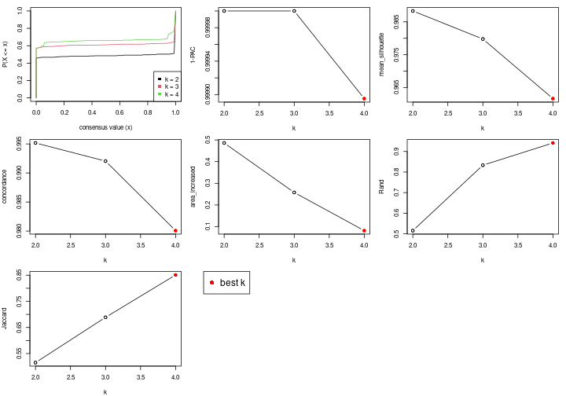

The numeric values for all these statistics can be obtained by `get_stats()`.

```r
get_stats(res)
```

```
#>   k 1-PAC mean_silhouette concordance area_increased  Rand Jaccard
#> 2 2     1           0.988       0.995         0.4859 0.515   0.515
#> 3 3     1           0.980       0.992         0.2577 0.833   0.689
#> 4 4     1           0.962       0.980         0.0818 0.941   0.851
```

`suggest_best_k()` suggests the best $k$ based on these statistics. The rules are as follows:

- All $k$ with Jaccard index larger than 0.95 are removed because increasing
  $k$ does not provide enough extra information. If all $k$ are removed, it is
  marked as no subgroup is detected.
- For all $k$ with 1-PAC score larger than 0.9, the maximal $k$ is taken as
  the best $k$, and other $k$ are marked as optional $k$.
- If it does not fit the second rule. The $k$ with the maximal vote of the
  highest 1-PAC score, highest mean silhouette, and highest concordance is
  taken as the best $k$.

```r
suggest_best_k(res)
```

```
#> [1] 4
#> attr(,"optional")
#> [1] 2 3
```

There is also optional best $k$ = 2 3 that is worth to check.

Following is the table of the partitions (You need to click the **show/hide
code output** link to see it). The membership matrix (columns with name `p*`)
is inferred by
[`clue::cl_consensus()`](https://www.rdocumentation.org/link/cl_consensus?package=clue)
function with the `SE` method. Basically the value in the membership matrix
represents the probability to belong to a certain group. The finall subgroup
label for an item is determined with the group with highest probability it
belongs to.

In `get_classes()` function, the entropy is calculated from the membership
matrix and the silhouette score is calculated from the consensus matrix.


<script>
$( function() {
	$( '#tabs-node-02-get-classes' ).tabs();
} );
</script>
<div id='tabs-node-02-get-classes'>
<ul>
<li><a href='#tab-node-02-get-classes-1'>k = 2</a></li>
<li><a href='#tab-node-02-get-classes-2'>k = 3</a></li>
<li><a href='#tab-node-02-get-classes-3'>k = 4</a></li>
</ul>

<div id='tab-node-02-get-classes-1'>
<p><a id='tab-node-02-get-classes-1-a' style='color:#0366d6' href='#'>show/hide code output</a></p>
<pre><code class="r">get_classes(res, k = 2)
</code></pre>

<pre><code>#&gt;          class     p
#&gt; D28-1_1      1 0.502
#&gt; D28-1_2      2 0.751
#&gt; D28-1_3      1 0.249
#&gt; D28-1_4      2 0.000
#&gt; D28-1_5      1 0.000
#&gt; D28-1_13     2 1.000
#&gt; D28-1_15     1 1.000
#&gt; D28-1_17     1 0.000
#&gt; D28-1_26     1 0.000
#&gt; D28-1_29     2 0.000
#&gt; D28-1_30     1 0.751
#&gt; D28-1_37     2 0.000
#&gt; D28-1_38     2 0.000
#&gt; D28-1_40     1 0.000
#&gt; D28-1_41     2 0.249
#&gt; D28-1_43     1 1.000
#&gt; D28-1_49     2 0.498
#&gt; D28-1_50     2 0.000
#&gt; D28-1_51     1 0.253
#&gt; D28-1_52     2 1.000
#&gt; D28-1_55     2 0.000
#&gt; D28-1_61     1 1.000
#&gt; D28-1_62     2 0.000
#&gt; D28-1_63     1 0.751
#&gt; D28-1_65     2 0.000
#&gt; D28-1_66     2 0.249
#&gt; D28-1_67     2 0.000
#&gt; D28-1_68     2 0.000
#&gt; D28-1_73     2 0.000
#&gt; D28-1_74     2 0.000
#&gt; D28-1_75     1 0.000
#&gt; D28-1_77     2 1.000
#&gt; D28-1_80     2 0.751
#&gt; D28-1_85     2 0.000
#&gt; D28-1_86     2 0.502
#&gt; D28-1_87     2 0.000
#&gt; D28-1_88     1 0.751
#&gt; D28-1_89     1 0.249
#&gt; D28-1_90     2 1.000
#&gt; D28-1_91     2 1.000
#&gt; D28-2_1      2 0.000
#&gt; D28-2_2      2 0.000
#&gt; D28-2_4      2 0.000
#&gt; D28-2_5      1 0.000
#&gt; D28-2_13     1 0.000
#&gt; D28-2_15     2 0.000
#&gt; D28-2_16     2 1.000
#&gt; D28-2_17     2 1.000
#&gt; D28-2_18     2 0.000
#&gt; D28-2_26     2 1.000
#&gt; D28-2_28     1 0.751
#&gt; D28-2_29     2 0.249
#&gt; D28-2_37     2 0.000
#&gt; D28-2_38     1 0.498
#&gt; D28-2_39     2 0.000
#&gt; D28-2_40     2 0.000
#&gt; D28-2_41     2 0.000
#&gt; D28-2_42     2 0.000
#&gt; D28-2_43     1 1.000
#&gt; D28-2_49     2 0.000
#&gt; D28-2_51     1 0.253
#&gt; D28-2_52     2 0.000
#&gt; D28-2_53     2 0.000
#&gt; D28-2_61     2 0.000
#&gt; D28-2_63     1 0.253
#&gt; D28-2_64     2 0.000
#&gt; D28-2_65     2 0.000
#&gt; D28-2_66     1 1.000
#&gt; D28-2_68     1 0.000
#&gt; D28-2_73     2 0.000
#&gt; D28-2_74     2 0.000
#&gt; D28-2_75     2 0.249
#&gt; D28-2_76     2 0.249
#&gt; D28-2_78     2 0.751
#&gt; D28-2_79     2 0.000
#&gt; D28-2_85     1 0.502
#&gt; D28-2_86     2 0.000
#&gt; D28-2_87     2 0.000
#&gt; D28-2_89     2 0.000
#&gt; D28-2_90     1 0.000
#&gt; D28-2_91     1 1.000
#&gt; D28-3_3      1 0.249
#&gt; D28-3_4      2 0.000
#&gt; D28-3_5      1 0.249
#&gt; D28-3_6      1 1.000
#&gt; D28-3_7      1 0.502
#&gt; D28-3_8      1 0.000
#&gt; D28-3_14     1 0.000
#&gt; D28-3_15     1 0.000
#&gt; D28-3_16     1 1.000
#&gt; D28-3_17     1 1.000
#&gt; D28-3_25     2 0.000
#&gt; D28-3_26     2 0.000
#&gt; D28-3_27     1 1.000
#&gt; D28-3_28     2 0.000
#&gt; D28-3_29     2 0.249
#&gt; D28-3_30     2 0.000
#&gt; D28-3_31     1 1.000
#&gt; D28-3_37     1 1.000
#&gt; D28-3_38     1 0.249
#&gt; D28-3_40     2 0.000
#&gt; D28-3_41     2 0.000
#&gt; D28-3_42     2 0.747
#&gt; D28-3_43     2 0.000
#&gt; D28-3_44     2 0.000
#&gt; D28-3_50     2 0.000
#&gt; D28-3_51     2 0.000
#&gt; D28-3_52     2 0.000
#&gt; D28-3_53     2 1.000
#&gt; D28-3_54     2 1.000
#&gt; D28-3_55     1 0.498
#&gt; D28-3_61     1 1.000
#&gt; D28-3_62     2 0.502
#&gt; D28-3_63     2 1.000
#&gt; D28-3_64     2 0.000
#&gt; D28-3_65     2 0.000
#&gt; D28-3_68     1 1.000
#&gt; D28-3_69     2 0.751
#&gt; D28-3_73     2 1.000
#&gt; D28-3_75     2 0.000
#&gt; D28-3_76     2 0.253
#&gt; D28-3_77     2 0.000
#&gt; D28-3_78     1 0.000
#&gt; D28-3_79     1 0.751
#&gt; D28-3_85     1 1.000
#&gt; D28-3_86     2 0.502
#&gt; D28-3_88     2 0.000
#&gt; D28-3_89     2 0.000
#&gt; D28-3_90     2 0.249
#&gt; D28-3_91     2 0.000
#&gt; D28-3_92     1 0.000
#&gt; D28-4_1      1 0.249
#&gt; D28-4_3      2 1.000
#&gt; D28-4_4      2 0.502
#&gt; D28-4_13     2 0.000
#&gt; D28-4_14     2 0.000
#&gt; D28-4_15     1 0.000
#&gt; D28-4_17     2 0.000
#&gt; D28-4_22     2 1.000
#&gt; D28-4_26     1 0.000
#&gt; D28-4_27     1 0.502
#&gt; D28-4_28     2 1.000
#&gt; D28-4_29     1 1.000
#&gt; D28-4_30     1 0.000
#&gt; D28-4_31     2 0.000
#&gt; D28-4_37     1 1.000
#&gt; D28-4_38     1 0.000
#&gt; D28-4_39     1 0.751
#&gt; D28-4_40     2 0.751
#&gt; D28-4_41     1 1.000
#&gt; D28-4_43     2 0.000
#&gt; D28-4_49     2 0.000
#&gt; D28-4_50     2 1.000
#&gt; D28-4_51     2 0.000
#&gt; D28-4_52     2 1.000
#&gt; D28-4_53     1 0.249
#&gt; D28-4_54     2 0.000
#&gt; D28-4_55     2 1.000
#&gt; D28-4_56     1 0.751
#&gt; D28-4_61     2 0.000
#&gt; D28-4_62     2 0.000
#&gt; D28-4_63     2 0.000
#&gt; D28-4_65     1 0.000
#&gt; D28-4_67     2 0.000
#&gt; D28-4_73     2 1.000
#&gt; D28-4_74     2 1.000
#&gt; D28-4_75     2 1.000
#&gt; D28-4_76     2 0.000
#&gt; D28-4_77     2 0.000
#&gt; D28-4_78     2 0.000
#&gt; D28-4_85     1 1.000
#&gt; D28-4_86     2 0.000
#&gt; D28-4_87     2 0.000
#&gt; D28-4_88     2 0.000
#&gt; D28-4_89     2 0.000
#&gt; D28-4_90     1 0.249
#&gt; D28-4_91     2 0.498
#&gt; D28-5_1      2 0.000
#&gt; D28-5_2      1 0.000
#&gt; D28-5_3      2 0.000
#&gt; D28-5_4      2 0.249
#&gt; D28-5_5      1 0.000
#&gt; D28-5_13     1 0.000
#&gt; D28-5_14     2 1.000
#&gt; D28-5_15     1 0.000
#&gt; D28-5_16     2 1.000
#&gt; D28-5_17     2 0.000
#&gt; D28-5_25     2 0.000
#&gt; D28-5_27     2 0.000
#&gt; D28-5_28     2 0.000
#&gt; D28-5_29     2 0.000
#&gt; D28-5_30     2 0.000
#&gt; D28-5_31     2 0.000
#&gt; D28-5_37     2 0.000
#&gt; D28-5_38     2 0.000
#&gt; D28-5_39     2 0.000
#&gt; D28-5_41     1 0.000
#&gt; D28-5_42     2 0.000
#&gt; D28-5_49     2 0.000
#&gt; D28-5_50     1 1.000
#&gt; D28-5_51     2 0.000
#&gt; D28-5_52     2 0.000
#&gt; D28-5_53     2 0.000
#&gt; D28-5_54     2 0.000
#&gt; D28-5_56     2 0.000
#&gt; D28-5_61     2 1.000
#&gt; D28-5_62     2 0.000
#&gt; D28-5_63     2 0.000
#&gt; D28-5_64     1 1.000
#&gt; D28-5_65     1 1.000
#&gt; D28-5_66     1 0.000
#&gt; D28-5_73     2 0.000
#&gt; D28-5_74     1 0.000
#&gt; D28-5_75     2 0.502
#&gt; D28-5_76     2 0.000
#&gt; D28-5_77     2 0.000
#&gt; D28-5_78     2 1.000
#&gt; D28-5_86     1 0.000
#&gt; D28-5_87     2 0.000
#&gt; D28-5_88     2 0.000
#&gt; D28-5_89     2 0.000
#&gt; D28-6_1      2 0.000
#&gt; D28-6_2      2 0.000
#&gt; D28-6_3      1 1.000
#&gt; D28-6_4      2 0.000
#&gt; D28-6_13     1 1.000
#&gt; D28-6_14     2 0.751
#&gt; D28-6_16     2 1.000
#&gt; D28-6_17     1 0.249
#&gt; D28-6_19     2 0.000
#&gt; D28-6_26     1 0.000
#&gt; D28-6_29     2 0.000
#&gt; D28-6_37     1 0.498
#&gt; D28-6_38     2 0.000
#&gt; D28-6_39     1 0.000
#&gt; D28-6_40     2 0.000
#&gt; D28-6_41     2 0.000
#&gt; D28-6_42     2 0.000
#&gt; D28-6_43     2 0.249
#&gt; D28-6_49     2 0.000
#&gt; D28-6_50     2 0.000
#&gt; D28-6_51     2 1.000
#&gt; D28-6_52     2 0.000
#&gt; D28-6_53     2 0.000
#&gt; D28-6_61     2 0.000
#&gt; D28-6_62     2 0.000
#&gt; D28-6_63     2 0.000
#&gt; D28-6_64     2 0.000
#&gt; D28-6_65     1 0.249
#&gt; D28-6_66     2 0.000
#&gt; D28-6_73     2 0.000
#&gt; D28-6_74     2 0.000
#&gt; D28-6_75     2 1.000
#&gt; D28-6_76     2 0.000
#&gt; D28-6_77     1 1.000
#&gt; D28-6_86     2 0.249
#&gt; D28-6_87     2 0.000
#&gt; D28-6_89     2 0.000
#&gt; D28-7_1      2 0.000
#&gt; D28-7_3      1 0.502
#&gt; D28-7_4      2 0.502
#&gt; D28-7_5      1 0.000
#&gt; D28-7_7      2 0.000
#&gt; D28-7_13     1 1.000
#&gt; D28-7_15     2 1.000
#&gt; D28-7_16     1 0.249
#&gt; D28-7_19     2 0.000
#&gt; D28-7_37     2 0.000
#&gt; D28-7_38     1 1.000
#&gt; D28-7_39     2 0.000
#&gt; D28-7_40     2 0.000
#&gt; D28-7_41     2 0.000
#&gt; D28-7_42     2 0.751
#&gt; D28-7_49     2 0.000
#&gt; D28-7_50     2 1.000
#&gt; D28-7_51     2 0.000
#&gt; D28-7_52     2 0.000
#&gt; D28-7_53     1 0.000
#&gt; D28-7_61     2 0.000
#&gt; D28-7_62     2 0.000
#&gt; D28-7_63     1 0.000
#&gt; D28-7_64     2 0.000
#&gt; D28-7_65     2 0.000
#&gt; D28-7_66     1 0.000
#&gt; D28-7_68     1 1.000
#&gt; D28-7_73     2 0.000
#&gt; D28-7_74     2 0.249
#&gt; D28-7_75     2 1.000
#&gt; D28-7_76     1 0.000
#&gt; D28-7_77     2 0.000
#&gt; D28-7_78     2 0.000
#&gt; D28-7_85     2 0.249
#&gt; D28-7_86     2 0.000
#&gt; D28-7_87     2 1.000
#&gt; D28-7_88     2 0.000
#&gt; D28-7_89     2 1.000
#&gt; D28-8_1      2 0.000
#&gt; D28-8_2      2 0.000
#&gt; D28-8_4      2 0.000
#&gt; D28-8_5      1 0.000
#&gt; D28-8_6      2 0.000
#&gt; D28-8_14     1 0.502
#&gt; D28-8_15     1 0.000
#&gt; D28-8_16     2 0.000
#&gt; D28-8_18     1 0.498
#&gt; D28-8_25     1 0.249
#&gt; D28-8_26     1 1.000
#&gt; D28-8_27     1 1.000
#&gt; D28-8_28     2 1.000
#&gt; D28-8_29     2 0.000
#&gt; D28-8_31     2 1.000
#&gt; D28-8_37     2 0.498
#&gt; D28-8_38     1 0.751
#&gt; D28-8_39     2 0.000
#&gt; D28-8_41     1 0.000
#&gt; D28-8_42     1 0.000
#&gt; D28-8_49     1 1.000
#&gt; D28-8_50     1 1.000
#&gt; D28-8_52     2 0.000
#&gt; D28-8_53     2 0.000
#&gt; D28-8_55     2 0.751
#&gt; D28-8_61     1 0.751
#&gt; D28-8_62     2 1.000
#&gt; D28-8_63     2 0.000
#&gt; D28-8_65     2 0.000
#&gt; D28-8_66     2 0.000
#&gt; D28-8_73     2 0.000
#&gt; D28-8_74     1 0.000
#&gt; D28-8_75     2 0.751
#&gt; D28-8_77     2 0.000
#&gt; D28-8_78     2 1.000
#&gt; D28-8_85     2 0.249
#&gt; D28-8_86     2 0.249
#&gt; D28-8_87     2 0.751
#&gt; D28-8_88     2 0.000
#&gt; D28-8_90     1 0.000
#&gt; D29-1_1      1 0.498
#&gt; D29-1_2      1 0.000
#&gt; D29-1_3      1 0.000
#&gt; D29-1_6      1 0.000
#&gt; D29-1_8      1 1.000
#&gt; D29-1_11     1 0.000
#&gt; D29-1_16     1 0.000
#&gt; D29-1_17     1 0.000
#&gt; D29-1_19     1 1.000
#&gt; D29-1_20     1 0.000
#&gt; D29-1_21     1 0.751
#&gt; D29-1_27     1 0.000
#&gt; D29-1_29     1 0.000
#&gt; D29-1_32     1 0.502
#&gt; D29-1_34     1 0.000
#&gt; D29-1_36     1 0.000
#&gt; D29-1_37     1 0.000
#&gt; D29-1_41     1 1.000
#&gt; D29-1_42     1 0.000
#&gt; D29-1_44     1 0.000
#&gt; D29-1_46     1 0.000
#&gt; D29-1_47     1 0.253
#&gt; D29-1_48     2 0.000
#&gt; D29-1_49     1 0.000
#&gt; D29-1_50     2 0.000
#&gt; D29-1_51     1 0.000
#&gt; D29-1_52     2 0.000
#&gt; D29-1_53     1 1.000
#&gt; D29-1_54     2 0.000
#&gt; D29-1_55     2 1.000
#&gt; D29-1_56     1 0.000
#&gt; D29-1_57     2 0.000
#&gt; D29-1_58     1 0.000
#&gt; D29-1_59     1 0.502
#&gt; D29-1_60     1 0.249
#&gt; D29-1_61     2 0.000
#&gt; D29-1_65     2 0.249
#&gt; D29-1_67     1 0.000
#&gt; D29-1_68     2 0.000
#&gt; D29-1_69     1 0.502
#&gt; D29-1_70     1 1.000
#&gt; D29-1_71     1 0.000
#&gt; D29-1_72     1 0.000
#&gt; D29-1_75     1 0.000
#&gt; D29-1_76     1 0.253
#&gt; D29-1_77     1 1.000
#&gt; D29-1_78     1 1.000
#&gt; D29-1_79     1 1.000
#&gt; D29-1_80     1 1.000
#&gt; D29-1_81     1 0.502
#&gt; D29-1_82     1 0.751
#&gt; D29-1_83     1 0.000
#&gt; D29-1_84     1 0.502
#&gt; D29-1_86     1 0.000
#&gt; D29-1_88     1 0.751
#&gt; D29-1_89     1 0.000
#&gt; D29-1_90     1 0.000
#&gt; D29-1_92     1 0.249
#&gt; D29-1_93     1 0.000
#&gt; D29-2_1      2 0.000
#&gt; D29-2_3      1 0.000
#&gt; D29-2_4      1 0.000
#&gt; D29-2_5      1 0.249
#&gt; D29-2_6      1 0.000
#&gt; D29-2_7      1 0.000
#&gt; D29-2_8      1 0.502
#&gt; D29-2_9      1 0.000
#&gt; D29-2_10     1 0.000
#&gt; D29-2_11     1 0.000
#&gt; D29-2_12     2 0.000
#&gt; D29-2_13     1 0.000
#&gt; D29-2_16     1 0.253
#&gt; D29-2_18     1 1.000
#&gt; D29-2_20     1 1.000
#&gt; D29-2_22     1 0.000
#&gt; D29-2_25     1 0.000
#&gt; D29-2_26     1 0.000
#&gt; D29-2_27     1 0.502
#&gt; D29-2_28     1 0.000
#&gt; D29-2_30     1 0.747
#&gt; D29-2_33     1 0.000
#&gt; D29-2_34     1 0.000
#&gt; D29-2_35     1 0.751
#&gt; D29-2_37     1 0.000
#&gt; D29-2_38     1 0.000
#&gt; D29-2_39     1 0.502
#&gt; D29-2_41     1 0.249
#&gt; D29-2_45     1 0.249
#&gt; D29-2_46     1 0.000
#&gt; D29-2_48     1 0.000
#&gt; D29-2_49     1 0.000
#&gt; D29-2_50     1 0.000
#&gt; D29-2_51     1 0.000
#&gt; D29-2_52     1 0.000
#&gt; D29-2_53     1 1.000
#&gt; D29-2_54     1 0.000
#&gt; D29-2_56     1 1.000
#&gt; D29-2_57     2 0.000
#&gt; D29-2_58     1 0.000
#&gt; D29-2_60     1 1.000
#&gt; D29-2_61     2 0.000
#&gt; D29-2_62     1 1.000
#&gt; D29-2_63     2 0.253
#&gt; D29-2_64     1 0.000
#&gt; D29-2_65     2 1.000
#&gt; D29-2_66     1 0.751
#&gt; D29-2_67     1 0.000
#&gt; D29-2_68     1 0.249
#&gt; D29-2_69     1 0.751
#&gt; D29-2_70     1 0.751
#&gt; D29-2_71     1 0.249
#&gt; D29-2_72     1 0.751
#&gt; D29-2_75     1 0.000
#&gt; D29-2_76     1 0.000
#&gt; D29-2_79     1 0.751
#&gt; D29-2_80     1 0.751
#&gt; D29-2_81     1 0.751
#&gt; D29-2_82     1 0.000
#&gt; D29-2_84     1 0.000
#&gt; D29-2_87     1 0.249
#&gt; D29-2_88     1 0.000
#&gt; D29-2_89     1 0.751
#&gt; D29-2_91     1 0.000
#&gt; D29-2_93     1 0.000
#&gt; D29-2_94     1 0.000
#&gt; D29-3_5      1 0.000
#&gt; D29-3_11     1 0.000
#&gt; D29-3_12     1 0.000
#&gt; D29-3_17     2 0.253
#&gt; D29-3_18     1 0.000
#&gt; D29-3_21     1 0.249
#&gt; D29-3_22     1 0.000
#&gt; D29-3_23     1 0.000
#&gt; D29-3_24     1 0.000
#&gt; D29-3_29     1 0.000
#&gt; D29-3_33     1 0.000
#&gt; D29-3_34     1 0.000
#&gt; D29-3_37     1 0.000
#&gt; D29-3_38     1 0.502
#&gt; D29-3_39     1 0.502
#&gt; D29-3_42     1 0.000
#&gt; D29-3_43     1 0.000
#&gt; D29-3_45     1 0.000
#&gt; D29-3_47     1 0.751
#&gt; D29-3_48     1 0.747
#&gt; D29-3_49     1 0.253
#&gt; D29-3_51     1 0.000
#&gt; D29-3_52     1 0.498
#&gt; D29-3_53     1 0.000
#&gt; D29-3_54     1 0.000
#&gt; D29-3_56     1 0.000
#&gt; D29-3_57     1 0.000
#&gt; D29-3_58     1 0.751
#&gt; D29-3_59     1 0.747
#&gt; D29-3_60     1 0.000
#&gt; D29-3_61     1 0.000
#&gt; D29-3_64     1 0.502
#&gt; D29-3_66     1 0.249
#&gt; D29-3_69     1 0.000
#&gt; D29-3_72     1 0.000
#&gt; D29-3_73     2 0.000
#&gt; D29-3_74     1 0.000
#&gt; D29-3_76     1 1.000
#&gt; D29-3_77     1 0.000
#&gt; D29-3_78     1 0.000
#&gt; D29-3_79     1 0.751
#&gt; D29-3_81     1 0.249
#&gt; D29-3_84     1 0.000
#&gt; D29-3_86     1 1.000
#&gt; D29-3_92     1 0.000
#&gt; D29-3_93     1 0.000
#&gt; D29-3_94     1 0.249
#&gt; D29-4_2      1 0.000
#&gt; D29-4_5      1 0.000
#&gt; D29-4_8      2 0.249
#&gt; D29-4_12     1 0.000
#&gt; D29-4_18     1 0.000
#&gt; D29-4_19     1 0.000
#&gt; D29-4_22     1 0.000
#&gt; D29-4_23     1 0.249
#&gt; D29-4_25     1 0.000
#&gt; D29-4_26     1 0.000
#&gt; D29-4_27     1 0.000
#&gt; D29-4_28     1 0.000
#&gt; D29-4_29     1 0.000
#&gt; D29-4_33     1 0.000
#&gt; D29-4_34     1 0.000
#&gt; D29-4_35     1 0.000
#&gt; D29-4_38     1 0.000
#&gt; D29-4_39     1 0.498
#&gt; D29-4_41     1 0.000
#&gt; D29-4_42     1 0.000
#&gt; D29-4_43     1 0.000
#&gt; D29-4_44     1 0.498
#&gt; D29-4_45     2 0.000
#&gt; D29-4_46     2 0.000
#&gt; D29-4_47     2 0.751
#&gt; D29-4_48     1 0.000
#&gt; D29-4_49     1 0.000
#&gt; D29-4_50     1 0.000
#&gt; D29-4_51     1 0.000
#&gt; D29-4_52     1 0.000
#&gt; D29-4_53     1 0.000
#&gt; D29-4_55     2 0.000
#&gt; D29-4_56     1 0.000
#&gt; D29-4_57     1 0.000
#&gt; D29-4_58     1 0.000
#&gt; D29-4_59     1 1.000
#&gt; D29-4_60     1 0.000
#&gt; D29-4_61     1 0.751
#&gt; D29-4_62     1 1.000
#&gt; D29-4_63     1 0.498
#&gt; D29-4_64     1 0.000
#&gt; D29-4_65     1 0.000
#&gt; D29-4_66     1 0.498
#&gt; D29-4_67     1 0.249
#&gt; D29-4_68     1 0.000
#&gt; D29-4_70     1 0.000
#&gt; D29-4_72     1 0.000
#&gt; D29-4_73     1 0.249
#&gt; D29-4_77     1 0.751
#&gt; D29-4_80     1 0.000
#&gt; D29-4_82     2 0.000
#&gt; D29-4_85     1 0.000
#&gt; D29-4_88     1 0.000
#&gt; D29-4_92     1 0.498
#&gt; D29-4_93     1 0.000
#&gt; D29-4_94     1 1.000
#&gt; D29-5_3      1 0.000
#&gt; D29-5_6      1 0.751
#&gt; D29-5_8      1 0.000
#&gt; D29-5_10     1 0.498
#&gt; D29-5_11     1 0.000
#&gt; D29-5_12     1 0.751
#&gt; D29-5_14     1 0.249
#&gt; D29-5_17     1 0.000
#&gt; D29-5_18     1 0.000
#&gt; D29-5_19     1 0.000
#&gt; D29-5_20     1 0.747
#&gt; D29-5_21     1 1.000
#&gt; D29-5_22     1 0.000
#&gt; D29-5_23     1 1.000
#&gt; D29-5_24     1 0.000
#&gt; D29-5_30     1 0.000
#&gt; D29-5_31     1 0.000
#&gt; D29-5_32     1 0.000
#&gt; D29-5_33     1 0.747
#&gt; D29-5_34     1 0.000
#&gt; D29-5_35     1 0.000
#&gt; D29-5_36     1 0.000
#&gt; D29-5_39     1 0.000
#&gt; D29-5_43     1 1.000
#&gt; D29-5_46     1 0.000
#&gt; D29-5_47     1 0.000
#&gt; D29-5_48     1 1.000
#&gt; D29-5_49     2 0.249
#&gt; D29-5_52     1 0.253
#&gt; D29-5_53     1 0.249
#&gt; D29-5_54     1 1.000
#&gt; D29-5_55     2 0.000
#&gt; D29-5_56     1 0.000
#&gt; D29-5_57     1 0.000
#&gt; D29-5_58     1 1.000
#&gt; D29-5_59     1 0.000
#&gt; D29-5_60     2 0.000
#&gt; D29-5_62     1 0.498
#&gt; D29-5_63     1 0.249
#&gt; D29-5_64     2 0.000
#&gt; D29-5_65     1 0.000
#&gt; D29-5_68     1 0.498
#&gt; D29-5_69     1 1.000
#&gt; D29-5_70     1 0.751
#&gt; D29-5_71     1 0.000
#&gt; D29-5_75     1 0.000
#&gt; D29-5_77     1 0.000
#&gt; D29-5_78     1 1.000
#&gt; D29-5_82     1 0.000
#&gt; D29-5_86     1 0.498
#&gt; D29-5_87     2 0.000
#&gt; D29-5_89     2 0.751
#&gt; D29-5_91     1 0.000
#&gt; D29-5_92     1 0.249
#&gt; D29-6_1      1 0.000
#&gt; D29-6_3      1 0.751
#&gt; D29-6_4      1 0.000
#&gt; D29-6_6      1 0.000
#&gt; D29-6_8      1 0.000
#&gt; D29-6_16     1 0.000
#&gt; D29-6_17     1 0.000
#&gt; D29-6_19     1 0.000
#&gt; D29-6_21     1 0.000
#&gt; D29-6_24     1 0.000
#&gt; D29-6_28     1 0.000
#&gt; D29-6_29     1 0.000
#&gt; D29-6_30     1 0.000
#&gt; D29-6_32     1 0.249
#&gt; D29-6_34     1 0.000
#&gt; D29-6_38     1 0.000
#&gt; D29-6_39     1 0.000
#&gt; D29-6_41     1 0.751
#&gt; D29-6_42     1 0.000
#&gt; D29-6_43     2 0.249
#&gt; D29-6_44     1 0.000
#&gt; D29-6_48     2 0.000
#&gt; D29-6_50     1 1.000
#&gt; D29-6_53     1 0.000
#&gt; D29-6_54     1 0.000
#&gt; D29-6_56     1 1.000
#&gt; D29-6_57     1 0.000
#&gt; D29-6_58     1 0.000
#&gt; D29-6_59     1 0.502
#&gt; D29-6_60     1 0.249
#&gt; D29-6_62     1 0.249
#&gt; D29-6_63     1 0.000
#&gt; D29-6_64     1 0.000
#&gt; D29-6_65     1 0.000
#&gt; D29-6_66     1 0.000
#&gt; D29-6_67     1 0.249
#&gt; D29-6_69     1 0.000
#&gt; D29-6_70     1 0.498
#&gt; D29-6_72     1 1.000
#&gt; D29-6_77     2 0.000
#&gt; D29-6_78     1 0.000
#&gt; D29-6_79     1 0.249
#&gt; D29-6_80     1 0.502
#&gt; D29-6_82     1 0.000
#&gt; D29-6_84     1 0.000
#&gt; D29-6_89     2 0.751
#&gt; D29-6_91     1 0.000
#&gt; D29-7_1      1 0.249
#&gt; D29-7_2      1 0.747
#&gt; D29-7_3      1 0.000
#&gt; D29-7_5      1 1.000
#&gt; D29-7_6      1 0.000
#&gt; D29-7_12     1 0.000
#&gt; D29-7_14     1 0.000
#&gt; D29-7_17     1 0.000
#&gt; D29-7_20     1 0.253
#&gt; D29-7_21     1 0.000
#&gt; D29-7_23     1 1.000
#&gt; D29-7_25     1 0.000
#&gt; D29-7_30     1 0.000
#&gt; D29-7_32     1 0.000
#&gt; D29-7_34     1 0.000
#&gt; D29-7_35     1 0.000
#&gt; D29-7_37     1 1.000
#&gt; D29-7_39     1 0.000
#&gt; D29-7_41     2 0.000
#&gt; D29-7_42     1 1.000
#&gt; D29-7_43     1 0.253
#&gt; D29-7_44     1 0.249
#&gt; D29-7_45     1 0.249
#&gt; D29-7_46     1 0.000
#&gt; D29-7_47     1 0.502
#&gt; D29-7_48     1 0.000
#&gt; D29-7_49     2 0.000
#&gt; D29-7_50     1 0.000
#&gt; D29-7_51     1 0.000
#&gt; D29-7_52     1 0.751
#&gt; D29-7_54     1 0.000
#&gt; D29-7_55     1 0.000
#&gt; D29-7_56     1 0.000
#&gt; D29-7_57     1 0.000
#&gt; D29-7_58     2 0.000
#&gt; D29-7_59     1 0.000
#&gt; D29-7_60     1 0.000
#&gt; D29-7_61     1 0.000
#&gt; D29-7_62     1 1.000
#&gt; D29-7_64     1 0.249
#&gt; D29-7_65     1 0.000
#&gt; D29-7_68     2 0.000
#&gt; D29-7_69     1 0.502
#&gt; D29-7_70     1 0.751
#&gt; D29-7_71     1 0.000
#&gt; D29-7_72     1 0.000
#&gt; D29-7_73     1 0.000
#&gt; D29-7_74     1 1.000
#&gt; D29-7_75     1 0.751
#&gt; D29-7_76     1 0.249
#&gt; D29-7_79     1 0.249
#&gt; D29-7_80     1 0.000
#&gt; D29-7_82     1 0.000
#&gt; D29-7_84     1 0.000
#&gt; D29-7_85     1 0.000
#&gt; D29-7_86     1 0.000
#&gt; D29-7_87     1 1.000
#&gt; D29-7_92     1 0.000
#&gt; D29-7_93     1 0.000
#&gt; D29-7_94     1 0.000
#&gt; D29-8_2      1 0.000
#&gt; D29-8_4      2 0.000
#&gt; D29-8_7      1 0.000
#&gt; D29-8_10     1 0.000
#&gt; D29-8_15     1 0.000
#&gt; D29-8_23     1 0.747
#&gt; D29-8_29     1 0.000
#&gt; D29-8_32     1 0.000
#&gt; D29-8_39     1 0.000
#&gt; D29-8_45     1 0.000
#&gt; D29-8_49     1 0.498
#&gt; D29-8_50     1 0.000
#&gt; D29-8_51     1 0.000
#&gt; D29-8_52     2 0.000
#&gt; D29-8_54     1 0.000
#&gt; D29-8_60     1 0.000
#&gt; D29-8_62     1 0.000
#&gt; D29-8_63     2 1.000
#&gt; D29-8_64     1 0.000
#&gt; D29-8_65     1 0.000
#&gt; D29-8_66     1 0.000
#&gt; D29-8_75     2 1.000
#&gt; D29-8_76     1 0.000
#&gt; D29-8_77     1 0.000
#&gt; D29-8_80     1 0.000
#&gt; D29-8_82     1 0.000
#&gt; D29-8_84     1 0.000
#&gt; D29-8_86     1 0.000
#&gt; D29-8_87     1 0.000
#&gt; D29-8_88     1 0.000
#&gt; D29-8_94     1 0.000
#&gt; D31-1_1      1 0.249
#&gt; D31-1_2      1 0.000
#&gt; D31-1_4      1 0.751
#&gt; D31-1_5      2 0.000
#&gt; D31-1_7      1 1.000
#&gt; D31-1_8      1 0.751
#&gt; D31-1_9      2 0.000
#&gt; D31-1_12     2 1.000
#&gt; D31-1_14     1 0.249
#&gt; D31-1_15     1 0.000
#&gt; D31-1_16     1 0.249
#&gt; D31-1_17     1 0.498
#&gt; D31-1_19     2 0.000
#&gt; D31-1_20     1 0.502
#&gt; D31-1_21     2 0.000
#&gt; D31-1_22     2 0.000
#&gt; D31-1_23     2 0.000
#&gt; D31-1_24     1 0.000
#&gt; D31-1_26     1 0.498
#&gt; D31-1_27     1 0.751
#&gt; D31-1_28     1 0.000
#&gt; D31-1_29     1 0.000
#&gt; D31-1_32     1 0.000
#&gt; D31-1_33     1 0.000
#&gt; D31-1_34     1 0.000
#&gt; D31-1_35     1 0.747
#&gt; D31-1_36     2 0.000
#&gt; D31-1_38     1 0.000
#&gt; D31-1_41     2 1.000
#&gt; D31-1_42     1 0.000
#&gt; D31-1_44     2 0.000
#&gt; D31-1_45     2 0.000
#&gt; D31-1_46     1 0.000
#&gt; D31-1_47     1 1.000
#&gt; D31-1_48     2 0.000
#&gt; D31-1_50     2 0.249
#&gt; D31-1_51     2 0.751
#&gt; D31-1_53     1 1.000
#&gt; D31-1_54     1 0.751
#&gt; D31-1_55     2 0.000
#&gt; D31-1_56     1 0.249
#&gt; D31-1_58     2 0.000
#&gt; D31-1_59     1 0.253
#&gt; D31-1_60     2 0.000
#&gt; D31-1_62     2 0.249
#&gt; D31-1_63     1 0.000
#&gt; D31-1_64     1 1.000
#&gt; D31-1_65     1 0.751
#&gt; D31-1_66     2 0.000
#&gt; D31-1_67     1 1.000
#&gt; D31-1_68     1 1.000
#&gt; D31-1_69     1 0.249
#&gt; D31-1_70     2 0.000
#&gt; D31-1_72     1 0.000
#&gt; D31-1_73     1 0.751
#&gt; D31-1_74     1 0.000
#&gt; D31-1_75     1 0.253
#&gt; D31-1_76     2 0.253
#&gt; D31-1_77     2 0.751
#&gt; D31-1_78     1 0.249
#&gt; D31-1_79     1 1.000
#&gt; D31-1_80     1 0.000
#&gt; D31-1_82     1 0.502
#&gt; D31-1_83     1 0.000
#&gt; D31-1_84     1 0.000
#&gt; D31-1_85     1 0.000
#&gt; D31-1_86     1 1.000
#&gt; D31-1_87     2 0.502
#&gt; D31-1_88     2 0.000
#&gt; D31-1_89     1 0.000
#&gt; D31-1_90     1 0.000
#&gt; D31-1_91     1 0.502
#&gt; D31-1_92     1 1.000
#&gt; D31-1_93     2 0.249
#&gt; D31-2_1      1 0.000
#&gt; D31-2_2      2 0.498
#&gt; D31-2_3      1 0.502
#&gt; D31-2_4      1 0.498
#&gt; D31-2_5      1 0.000
#&gt; D31-2_6      2 0.000
#&gt; D31-2_7      1 0.000
#&gt; D31-2_9      1 1.000
#&gt; D31-2_10     2 0.000
#&gt; D31-2_11     1 0.000
#&gt; D31-2_15     2 0.000
#&gt; D31-2_17     2 0.000
#&gt; D31-2_18     1 1.000
#&gt; D31-2_19     2 0.000
#&gt; D31-2_20     1 0.000
#&gt; D31-2_21     2 1.000
#&gt; D31-2_22     1 0.000
#&gt; D31-2_23     1 1.000
#&gt; D31-2_24     2 0.000
#&gt; D31-2_26     1 1.000
#&gt; D31-2_27     1 0.000
#&gt; D31-2_28     1 0.000
#&gt; D31-2_29     1 0.000
#&gt; D31-2_30     2 0.000
#&gt; D31-2_31     1 0.000
#&gt; D31-2_32     1 0.000
#&gt; D31-2_33     1 0.000
#&gt; D31-2_34     1 1.000
#&gt; D31-2_35     2 1.000
#&gt; D31-2_36     1 0.000
#&gt; D31-2_37     1 0.000
#&gt; D31-2_38     2 0.000
#&gt; D31-2_39     1 0.000
#&gt; D31-2_40     1 0.253
#&gt; D31-2_41     2 1.000
#&gt; D31-2_43     1 1.000
#&gt; D31-2_44     1 0.000
#&gt; D31-2_45     1 1.000
#&gt; D31-2_46     1 1.000
#&gt; D31-2_47     1 0.000
#&gt; D31-2_48     1 1.000
#&gt; D31-2_49     1 0.000
#&gt; D31-2_50     1 0.000
#&gt; D31-2_52     1 0.249
#&gt; D31-2_53     2 0.249
#&gt; D31-2_54     2 0.751
#&gt; D31-2_55     1 0.000
#&gt; D31-2_56     1 0.747
#&gt; D31-2_58     1 1.000
#&gt; D31-2_59     1 0.000
#&gt; D31-2_61     2 0.000
#&gt; D31-2_62     2 1.000
#&gt; D31-2_63     1 0.498
#&gt; D31-2_64     1 0.498
#&gt; D31-2_65     1 1.000
#&gt; D31-2_66     1 1.000
#&gt; D31-2_67     1 0.000
#&gt; D31-2_68     2 1.000
#&gt; D31-2_69     2 0.000
#&gt; D31-2_70     1 1.000
#&gt; D31-2_71     1 1.000
#&gt; D31-2_72     1 1.000
#&gt; D31-2_73     2 0.000
#&gt; D31-2_74     1 0.000
#&gt; D31-2_75     2 0.000
#&gt; D31-2_76     2 0.000
#&gt; D31-2_77     1 0.000
#&gt; D31-2_78     2 1.000
#&gt; D31-2_79     1 1.000
#&gt; D31-2_80     2 0.000
#&gt; D31-2_81     1 0.000
#&gt; D31-2_82     2 0.000
#&gt; D31-2_83     2 0.000
#&gt; D31-2_84     1 0.000
#&gt; D31-2_85     2 0.000
#&gt; D31-2_86     2 0.000
#&gt; D31-2_87     2 0.000
#&gt; D31-2_89     1 0.000
#&gt; D31-2_91     2 0.000
#&gt; D31-2_92     2 0.000
#&gt; D31-2_94     1 0.000
#&gt; D31-3_1      2 0.000
#&gt; D31-3_2      1 0.000
#&gt; D31-3_3      1 0.000
#&gt; D31-3_4      1 0.751
#&gt; D31-3_5      1 0.000
#&gt; D31-3_10     1 0.249
#&gt; D31-3_12     2 1.000
#&gt; D31-3_13     1 0.000
#&gt; D31-3_14     2 0.000
#&gt; D31-3_15     2 0.249
#&gt; D31-3_17     1 0.502
#&gt; D31-3_21     2 1.000
#&gt; D31-3_22     1 0.249
#&gt; D31-3_23     2 0.000
#&gt; D31-3_24     1 0.000
#&gt; D31-3_25     2 0.000
#&gt; D31-3_26     2 0.000
#&gt; D31-3_27     1 0.000
#&gt; D31-3_28     1 0.000
#&gt; D31-3_29     1 0.000
#&gt; D31-3_30     1 0.000
#&gt; D31-3_33     1 0.000
#&gt; D31-3_36     2 0.249
#&gt; D31-3_37     2 0.502
#&gt; D31-3_39     1 0.000
#&gt; D31-3_40     2 0.253
#&gt; D31-3_41     1 0.000
#&gt; D31-3_42     1 1.000
#&gt; D31-3_43     1 0.502
#&gt; D31-3_45     1 0.000
#&gt; D31-3_46     1 0.249
#&gt; D31-3_47     2 0.000
#&gt; D31-3_48     2 0.000
#&gt; D31-3_50     1 0.000
#&gt; D31-3_52     1 0.000
#&gt; D31-3_53     2 0.000
#&gt; D31-3_55     1 1.000
#&gt; D31-3_56     1 0.000
#&gt; D31-3_57     1 0.000
#&gt; D31-3_59     2 1.000
#&gt; D31-3_60     2 0.000
#&gt; D31-3_62     1 0.000
#&gt; D31-3_63     2 0.000
#&gt; D31-3_64     2 0.000
#&gt; D31-3_65     1 0.000
#&gt; D31-3_66     2 0.000
#&gt; D31-3_67     1 0.000
#&gt; D31-3_68     1 1.000
#&gt; D31-3_69     2 0.000
#&gt; D31-3_70     1 0.000
#&gt; D31-3_71     1 1.000
#&gt; D31-3_72     1 0.498
#&gt; D31-3_73     2 0.000
#&gt; D31-3_75     1 1.000
#&gt; D31-3_76     1 0.502
#&gt; D31-3_77     1 0.000
#&gt; D31-3_78     2 0.253
#&gt; D31-3_80     1 1.000
#&gt; D31-3_81     2 0.000
#&gt; D31-3_82     2 1.000
#&gt; D31-3_83     1 0.253
#&gt; D31-3_85     1 1.000
#&gt; D31-3_86     2 0.000
#&gt; D31-3_87     1 0.000
#&gt; D31-3_88     1 0.000
#&gt; D31-3_89     2 0.000
#&gt; D31-3_90     1 0.000
#&gt; D31-3_92     2 0.000
#&gt; D31-3_94     1 0.000
#&gt; D31-4_1      1 1.000
#&gt; D31-4_5      1 0.000
#&gt; D31-4_7      1 0.000
#&gt; D31-4_9      1 0.751
#&gt; D31-4_10     1 1.000
#&gt; D31-4_11     1 0.249
#&gt; D31-4_13     2 0.000
#&gt; D31-4_15     1 0.000
#&gt; D31-4_16     2 0.000
#&gt; D31-4_17     1 0.000
#&gt; D31-4_18     1 0.000
#&gt; D31-4_19     1 0.498
#&gt; D31-4_20     1 0.751
#&gt; D31-4_21     2 0.000
#&gt; D31-4_22     1 0.000
#&gt; D31-4_23     1 0.000
#&gt; D31-4_24     1 0.000
#&gt; D31-4_25     1 1.000
#&gt; D31-4_27     1 0.000
#&gt; D31-4_28     1 1.000
#&gt; D31-4_29     1 1.000
#&gt; D31-4_30     1 0.000
#&gt; D31-4_31     1 0.000
#&gt; D31-4_32     1 0.249
#&gt; D31-4_33     2 1.000
#&gt; D31-4_34     1 0.249
#&gt; D31-4_35     1 0.000
#&gt; D31-4_36     2 0.000
#&gt; D31-4_37     1 0.000
#&gt; D31-4_38     2 0.747
#&gt; D31-4_41     2 0.000
#&gt; D31-4_42     1 0.751
#&gt; D31-4_43     2 0.000
#&gt; D31-4_44     1 1.000
#&gt; D31-4_45     1 1.000
#&gt; D31-4_46     1 0.502
#&gt; D31-4_47     1 0.000
#&gt; D31-4_48     2 0.000
#&gt; D31-4_49     2 0.000
#&gt; D31-4_50     1 0.000
#&gt; D31-4_51     2 0.253
#&gt; D31-4_52     1 0.000
#&gt; D31-4_53     2 1.000
#&gt; D31-4_54     1 0.502
#&gt; D31-4_55     2 0.000
#&gt; D31-4_56     2 0.249
#&gt; D31-4_57     2 1.000
#&gt; D31-4_58     1 0.249
#&gt; D31-4_59     1 0.498
#&gt; D31-4_60     2 0.000
#&gt; D31-4_61     1 0.747
#&gt; D31-4_63     1 1.000
#&gt; D31-4_64     2 0.000
#&gt; D31-4_65     2 0.000
#&gt; D31-4_66     2 0.000
#&gt; D31-4_67     2 0.000
#&gt; D31-4_68     2 0.000
#&gt; D31-4_69     2 0.000
#&gt; D31-4_70     2 0.000
#&gt; D31-4_71     2 0.498
#&gt; D31-4_72     2 0.000
#&gt; D31-4_73     2 1.000
#&gt; D31-4_74     1 0.751
#&gt; D31-4_75     1 1.000
#&gt; D31-4_76     1 0.000
#&gt; D31-4_77     2 0.000
#&gt; D31-4_78     1 0.000
#&gt; D31-4_79     2 0.000
#&gt; D31-4_80     1 0.000
#&gt; D31-4_82     2 0.000
#&gt; D31-4_83     2 0.502
#&gt; D31-4_84     1 0.751
#&gt; D31-4_85     2 0.000
#&gt; D31-4_87     2 0.498
#&gt; D31-4_89     1 0.000
#&gt; D31-4_90     2 1.000
#&gt; D31-4_91     1 0.502
#&gt; D31-4_92     1 0.498
#&gt; D31-4_93     2 0.000
#&gt; D31-4_94     2 0.000
#&gt; D31-5_1      2 0.000
#&gt; D31-5_3      1 0.000
#&gt; D31-5_4      1 0.000
#&gt; D31-5_5      1 0.000
#&gt; D31-5_9      1 0.000
#&gt; D31-5_10     1 0.000
#&gt; D31-5_13     1 0.000
#&gt; D31-5_14     1 0.000
#&gt; D31-5_15     1 0.000
#&gt; D31-5_16     2 0.000
#&gt; D31-5_17     1 0.751
#&gt; D31-5_19     1 0.000
#&gt; D31-5_21     1 0.249
#&gt; D31-5_22     1 0.249
#&gt; D31-5_23     1 0.000
#&gt; D31-5_26     1 0.498
#&gt; D31-5_27     1 0.000
#&gt; D31-5_29     1 0.249
#&gt; D31-5_32     1 0.000
#&gt; D31-5_34     1 1.000
#&gt; D31-5_35     1 0.751
#&gt; D31-5_37     2 0.249
#&gt; D31-5_38     1 0.000
#&gt; D31-5_39     2 0.000
#&gt; D31-5_41     1 0.000
#&gt; D31-5_42     1 0.000
#&gt; D31-5_44     1 0.249
#&gt; D31-5_45     2 0.000
#&gt; D31-5_46     1 1.000
#&gt; D31-5_47     2 0.751
#&gt; D31-5_48     2 0.000
#&gt; D31-5_49     1 0.751
#&gt; D31-5_50     1 0.000
#&gt; D31-5_51     1 0.000
#&gt; D31-5_52     1 0.502
#&gt; D31-5_53     1 0.000
#&gt; D31-5_55     1 0.502
#&gt; D31-5_57     1 1.000
#&gt; D31-5_58     1 0.000
#&gt; D31-5_59     1 0.253
#&gt; D31-5_60     1 1.000
#&gt; D31-5_61     1 1.000
#&gt; D31-5_62     1 1.000
#&gt; D31-5_63     1 0.000
#&gt; D31-5_64     1 1.000
#&gt; D31-5_65     2 0.751
#&gt; D31-5_66     1 1.000
#&gt; D31-5_67     1 0.249
#&gt; D31-5_68     1 0.000
#&gt; D31-5_69     2 0.253
#&gt; D31-5_70     2 0.000
#&gt; D31-5_71     2 0.000
#&gt; D31-5_73     1 0.000
#&gt; D31-5_74     1 0.000
#&gt; D31-5_75     2 0.253
#&gt; D31-5_76     1 0.747
#&gt; D31-5_77     2 0.249
#&gt; D31-5_78     2 0.000
#&gt; D31-5_80     1 0.000
#&gt; D31-5_81     1 0.000
#&gt; D31-5_82     2 0.249
#&gt; D31-5_83     2 0.000
#&gt; D31-5_84     1 0.000
#&gt; D31-5_85     1 0.000
#&gt; D31-5_86     1 0.000
#&gt; D31-5_87     2 0.000
#&gt; D31-5_89     1 0.249
#&gt; D31-5_91     2 1.000
#&gt; D31-5_92     2 0.000
#&gt; D31-5_94     1 1.000
#&gt; D31-6_6      1 0.000
#&gt; D31-6_9      2 0.000
#&gt; D31-6_10     1 0.000
#&gt; D31-6_11     1 0.498
#&gt; D31-6_12     1 0.000
#&gt; D31-6_13     2 0.000
#&gt; D31-6_15     1 0.000
#&gt; D31-6_16     1 0.000
#&gt; D31-6_18     1 0.000
#&gt; D31-6_19     1 0.498
#&gt; D31-6_20     1 0.502
#&gt; D31-6_21     2 0.000
#&gt; D31-6_22     1 1.000
#&gt; D31-6_23     1 0.751
#&gt; D31-6_24     1 0.751
#&gt; D31-6_27     2 1.000
#&gt; D31-6_28     2 1.000
#&gt; D31-6_29     2 0.249
#&gt; D31-6_34     1 0.000
#&gt; D31-6_37     1 0.000
#&gt; D31-6_39     2 0.000
#&gt; D31-6_40     1 0.502
#&gt; D31-6_41     2 1.000
#&gt; D31-6_42     1 0.000
#&gt; D31-6_43     2 0.751
#&gt; D31-6_44     2 1.000
#&gt; D31-6_45     1 0.000
#&gt; D31-6_47     1 0.498
#&gt; D31-6_48     1 0.249
#&gt; D31-6_49     1 1.000
#&gt; D31-6_50     2 0.751
#&gt; D31-6_52     1 1.000
#&gt; D31-6_53     2 0.000
#&gt; D31-6_55     1 0.000
#&gt; D31-6_56     1 0.751
#&gt; D31-6_58     1 1.000
#&gt; D31-6_61     2 0.000
#&gt; D31-6_62     1 1.000
#&gt; D31-6_63     1 0.000
#&gt; D31-6_65     1 0.249
#&gt; D31-6_66     2 0.000
#&gt; D31-6_67     1 0.000
#&gt; D31-6_68     2 1.000
#&gt; D31-6_69     2 0.000
#&gt; D31-6_70     1 0.000
#&gt; D31-6_71     1 0.000
#&gt; D31-6_72     2 1.000
#&gt; D31-6_73     1 0.000
#&gt; D31-6_74     1 0.000
#&gt; D31-6_75     2 0.000
#&gt; D31-6_76     1 1.000
#&gt; D31-6_79     1 0.000
#&gt; D31-6_80     1 0.498
#&gt; D31-6_81     2 0.000
#&gt; D31-6_82     2 1.000
#&gt; D31-6_84     2 0.000
#&gt; D31-6_85     1 1.000
#&gt; D31-6_86     2 0.000
#&gt; D31-6_87     1 0.249
#&gt; D31-6_88     1 0.000
#&gt; D31-6_90     1 0.000
#&gt; D31-6_91     1 0.000
#&gt; D31-6_92     1 1.000
#&gt; D31-6_93     2 0.751
#&gt; D31-6_94     1 0.000
#&gt; D31-7_1      1 0.498
#&gt; D31-7_2      1 0.000
#&gt; D31-7_3      1 0.253
#&gt; D31-7_4      1 0.000
#&gt; D31-7_6      1 0.751
#&gt; D31-7_9      1 0.498
#&gt; D31-7_11     2 0.000
#&gt; D31-7_16     2 1.000
#&gt; D31-7_19     1 0.000
#&gt; D31-7_20     1 0.751
#&gt; D31-7_21     1 1.000
#&gt; D31-7_22     1 1.000
#&gt; D31-7_23     2 1.000
#&gt; D31-7_25     1 0.000
#&gt; D31-7_26     1 0.000
#&gt; D31-7_29     1 0.249
#&gt; D31-7_33     1 0.000
#&gt; D31-7_35     1 0.000
#&gt; D31-7_36     1 0.498
#&gt; D31-7_37     1 0.751
#&gt; D31-7_38     2 0.000
#&gt; D31-7_39     1 1.000
#&gt; D31-7_41     1 0.000
#&gt; D31-7_44     1 0.000
#&gt; D31-7_45     1 0.000
#&gt; D31-7_46     1 0.000
#&gt; D31-7_47     1 1.000
#&gt; D31-7_48     2 0.000
#&gt; D31-7_51     1 0.000
#&gt; D31-7_53     1 0.000
#&gt; D31-7_54     1 0.000
#&gt; D31-7_55     1 0.498
#&gt; D31-7_56     2 0.751
#&gt; D31-7_57     2 1.000
#&gt; D31-7_58     1 0.000
#&gt; D31-7_59     1 0.249
#&gt; D31-7_60     1 1.000
#&gt; D31-7_61     1 0.498
#&gt; D31-7_62     1 0.000
#&gt; D31-7_63     2 0.000
#&gt; D31-7_65     1 0.000
#&gt; D31-7_66     1 0.000
#&gt; D31-7_67     1 0.249
#&gt; D31-7_69     1 1.000
#&gt; D31-7_70     2 0.000
#&gt; D31-7_71     1 0.000
#&gt; D31-7_72     1 1.000
#&gt; D31-7_73     2 1.000
#&gt; D31-7_74     1 0.000
#&gt; D31-7_76     1 1.000
#&gt; D31-7_77     2 0.000
#&gt; D31-7_79     1 0.000
#&gt; D31-7_80     1 0.000
#&gt; D31-7_84     1 0.000
#&gt; D31-7_85     1 0.000
#&gt; D31-7_87     1 0.747
#&gt; D31-7_89     2 1.000
#&gt; D31-7_91     1 1.000
#&gt; D31-7_92     1 0.000
#&gt; D31-7_93     1 1.000
#&gt; D31-8_1      1 0.000
#&gt; D31-8_2      1 0.000
#&gt; D31-8_3      1 0.747
#&gt; D31-8_4      2 0.751
#&gt; D31-8_5      1 0.000
#&gt; D31-8_6      1 0.751
#&gt; D31-8_7      1 1.000
#&gt; D31-8_8      1 1.000
#&gt; D31-8_11     2 1.000
#&gt; D31-8_12     1 0.000
#&gt; D31-8_13     1 0.502
#&gt; D31-8_14     1 0.249
#&gt; D31-8_17     1 0.249
#&gt; D31-8_18     2 0.000
#&gt; D31-8_19     1 0.000
#&gt; D31-8_21     1 1.000
#&gt; D31-8_23     2 0.000
#&gt; D31-8_24     1 0.000
#&gt; D31-8_25     1 0.000
#&gt; D31-8_27     2 0.000
#&gt; D31-8_28     1 0.249
#&gt; D31-8_30     1 0.000
#&gt; D31-8_31     1 1.000
#&gt; D31-8_33     1 0.000
#&gt; D31-8_37     2 0.000
#&gt; D31-8_38     1 0.249
#&gt; D31-8_40     2 0.000
#&gt; D31-8_41     2 1.000
#&gt; D31-8_42     1 0.249
#&gt; D31-8_43     1 1.000
#&gt; D31-8_45     2 1.000
#&gt; D31-8_46     1 0.000
#&gt; D31-8_48     1 0.000
#&gt; D31-8_49     1 1.000
#&gt; D31-8_50     1 0.751
#&gt; D31-8_52     1 0.000
#&gt; D31-8_53     2 0.000
#&gt; D31-8_56     1 0.000
#&gt; D31-8_58     2 1.000
#&gt; D31-8_60     2 0.000
#&gt; D31-8_61     1 0.000
#&gt; D31-8_62     1 0.000
#&gt; D31-8_63     2 0.000
#&gt; D31-8_64     2 0.502
#&gt; D31-8_65     1 0.498
#&gt; D31-8_66     1 0.751
#&gt; D31-8_67     1 0.000
#&gt; D31-8_69     1 0.000
#&gt; D31-8_70     1 0.000
#&gt; D31-8_73     1 1.000
#&gt; D31-8_74     1 0.000
#&gt; D31-8_75     2 1.000
#&gt; D31-8_76     1 0.249
#&gt; D31-8_77     2 0.498
#&gt; D31-8_78     1 0.751
#&gt; D31-8_80     1 0.000
#&gt; D31-8_83     1 0.000
#&gt; D31-8_84     1 1.000
#&gt; D31-8_85     2 1.000
#&gt; D31-8_86     2 0.000
#&gt; D31-8_87     1 0.000
#&gt; D31-8_88     1 1.000
#&gt; D31-8_89     2 0.000
#&gt; D31-8_90     1 0.000
#&gt; D31-8_91     2 0.000
#&gt; D31-8_92     2 0.000
#&gt; D31-8_94     2 1.000
#&gt; D30-1_1      2 0.000
#&gt; D30-1_4      1 0.249
#&gt; D30-1_6      1 0.000
#&gt; D30-1_9      1 0.000
#&gt; D30-1_13     2 0.751
#&gt; D30-1_19     2 1.000
#&gt; D30-1_20     1 0.000
#&gt; D30-1_21     1 0.000
#&gt; D30-1_22     2 0.000
#&gt; D30-1_23     1 0.000
#&gt; D30-1_25     1 0.000
#&gt; D30-1_29     1 0.000
#&gt; D30-1_30     2 0.502
#&gt; D30-1_41     2 0.000
#&gt; D30-1_42     1 0.000
#&gt; D30-1_43     2 1.000
#&gt; D30-1_45     1 0.000
#&gt; D30-1_46     1 0.000
#&gt; D30-1_52     2 0.000
#&gt; D30-1_53     1 0.498
#&gt; D30-1_56     2 0.249
#&gt; D30-1_57     1 1.000
#&gt; D30-1_58     1 1.000
#&gt; D30-1_60     1 0.498
#&gt; D30-1_61     2 0.000
#&gt; D30-1_63     1 0.249
#&gt; D30-1_64     1 0.249
#&gt; D30-1_65     1 0.000
#&gt; D30-1_66     2 0.000
#&gt; D30-1_67     1 0.249
#&gt; D30-1_70     1 1.000
#&gt; D30-1_71     1 0.000
#&gt; D30-1_72     2 0.000
#&gt; D30-1_75     1 1.000
#&gt; D30-1_78     1 0.000
#&gt; D30-1_79     2 0.000
#&gt; D30-1_81     1 0.000
#&gt; D30-1_82     1 0.000
#&gt; D30-1_84     1 0.751
#&gt; D30-1_85     1 0.253
#&gt; D30-1_86     1 0.000
#&gt; D30-1_87     1 1.000
#&gt; D30-1_88     1 0.000
#&gt; D30-1_89     1 0.000
#&gt; D30-1_91     2 1.000
#&gt; D30-1_93     1 0.249
#&gt; D30-1_94     1 0.502
#&gt; D30-2_1      2 0.000
#&gt; D30-2_2      1 0.253
#&gt; D30-2_3      1 0.000
#&gt; D30-2_4      2 1.000
#&gt; D30-2_5      2 0.000
#&gt; D30-2_6      2 0.000
#&gt; D30-2_7      2 0.000
#&gt; D30-2_8      1 0.751
#&gt; D30-2_9      2 1.000
#&gt; D30-2_11     2 1.000
#&gt; D30-2_13     2 0.000
#&gt; D30-2_14     1 0.000
#&gt; D30-2_15     1 0.498
#&gt; D30-2_16     1 0.249
#&gt; D30-2_17     2 0.000
#&gt; D30-2_18     1 1.000
#&gt; D30-2_19     1 0.000
#&gt; D30-2_20     1 0.000
#&gt; D30-2_21     2 0.000
#&gt; D30-2_22     1 1.000
#&gt; D30-2_23     2 0.000
#&gt; D30-2_25     1 0.000
#&gt; D30-2_26     1 0.000
#&gt; D30-2_27     2 0.000
#&gt; D30-2_28     1 0.000
#&gt; D30-2_29     2 0.000
#&gt; D30-2_30     1 1.000
#&gt; D30-2_32     1 1.000
#&gt; D30-2_33     1 1.000
#&gt; D30-2_35     2 0.747
#&gt; D30-2_37     1 1.000
#&gt; D30-2_40     2 0.747
#&gt; D30-2_41     2 0.000
#&gt; D30-2_42     2 0.253
#&gt; D30-2_43     2 0.000
#&gt; D30-2_44     2 0.000
#&gt; D30-2_45     2 0.000
#&gt; D30-2_46     2 0.000
#&gt; D30-2_47     1 0.502
#&gt; D30-2_48     2 0.000
#&gt; D30-2_49     2 0.000
#&gt; D30-2_50     2 1.000
#&gt; D30-2_51     2 0.000
#&gt; D30-2_52     2 0.000
#&gt; D30-2_53     2 1.000
#&gt; D30-2_54     1 0.000
#&gt; D30-2_55     2 0.000
#&gt; D30-2_56     2 0.000
#&gt; D30-2_57     2 0.000
#&gt; D30-2_58     2 1.000
#&gt; D30-2_59     2 0.000
#&gt; D30-2_60     2 0.751
#&gt; D30-2_61     1 0.000
#&gt; D30-2_62     1 0.751
#&gt; D30-2_65     1 1.000
#&gt; D30-2_67     1 0.000
#&gt; D30-2_68     1 1.000
#&gt; D30-2_70     1 0.000
#&gt; D30-2_71     2 0.000
#&gt; D30-2_72     2 0.000
#&gt; D30-2_73     1 0.000
#&gt; D30-2_74     2 0.751
#&gt; D30-2_75     2 0.000
#&gt; D30-2_76     2 0.000
#&gt; D30-2_77     2 0.000
#&gt; D30-2_78     1 0.253
#&gt; D30-2_79     1 1.000
#&gt; D30-2_80     1 0.751
#&gt; D30-2_81     1 1.000
#&gt; D30-2_82     2 0.000
#&gt; D30-2_83     2 0.249
#&gt; D30-2_84     2 0.000
#&gt; D30-2_85     1 1.000
#&gt; D30-2_86     1 0.000
#&gt; D30-2_87     1 0.498
#&gt; D30-2_88     1 0.000
#&gt; D30-2_89     1 0.000
#&gt; D30-2_90     1 0.502
#&gt; D30-2_91     1 0.000
#&gt; D30-2_92     2 0.000
#&gt; D30-2_93     2 0.000
#&gt; D30-3_1      1 1.000
#&gt; D30-3_2      2 0.502
#&gt; D30-3_3      1 1.000
#&gt; D30-3_4      2 0.498
#&gt; D30-3_5      1 1.000
#&gt; D30-3_6      2 0.000
#&gt; D30-3_7      2 0.000
#&gt; D30-3_9      1 0.498
#&gt; D30-3_10     1 0.249
#&gt; D30-3_11     1 0.000
#&gt; D30-3_13     2 0.000
#&gt; D30-3_14     1 0.000
#&gt; D30-3_15     1 0.000
#&gt; D30-3_16     1 1.000
#&gt; D30-3_17     2 1.000
#&gt; D30-3_18     1 0.000
#&gt; D30-3_19     1 0.000
#&gt; D30-3_22     1 0.000
#&gt; D30-3_23     2 0.249
#&gt; D30-3_24     2 0.000
#&gt; D30-3_25     1 1.000
#&gt; D30-3_26     1 0.000
#&gt; D30-3_27     1 0.000
#&gt; D30-3_28     1 0.000
#&gt; D30-3_29     1 0.000
#&gt; D30-3_30     1 0.000
#&gt; D30-3_31     1 0.000
#&gt; D30-3_32     1 0.000
#&gt; D30-3_33     1 0.249
#&gt; D30-3_34     1 0.000
#&gt; D30-3_35     1 0.751
#&gt; D30-3_36     1 0.000
#&gt; D30-3_37     1 1.000
#&gt; D30-3_38     1 0.249
#&gt; D30-3_39     2 0.000
#&gt; D30-3_41     1 1.000
#&gt; D30-3_42     1 0.000
#&gt; D30-3_43     1 0.000
#&gt; D30-3_44     1 0.751
#&gt; D30-3_45     2 0.498
#&gt; D30-3_46     2 0.000
#&gt; D30-3_47     1 0.249
#&gt; D30-3_48     1 1.000
#&gt; D30-3_49     2 1.000
#&gt; D30-3_50     1 0.502
#&gt; D30-3_51     1 0.502
#&gt; D30-3_52     1 0.751
#&gt; D30-3_53     2 0.000
#&gt; D30-3_54     2 0.000
#&gt; D30-3_55     2 0.000
#&gt; D30-3_56     2 0.000
#&gt; D30-3_57     2 0.000
#&gt; D30-3_58     1 1.000
#&gt; D30-3_59     2 0.000
#&gt; D30-3_60     1 0.751
#&gt; D30-3_61     2 0.000
#&gt; D30-3_62     2 0.253
#&gt; D30-3_63     2 0.000
#&gt; D30-3_64     1 0.249
#&gt; D30-3_65     2 0.000
#&gt; D30-3_67     1 1.000
#&gt; D30-3_68     1 1.000
#&gt; D30-3_69     2 1.000
#&gt; D30-3_70     1 0.751
#&gt; D30-3_71     2 0.000
#&gt; D30-3_72     2 0.000
#&gt; D30-3_73     2 0.000
#&gt; D30-3_74     1 0.000
#&gt; D30-3_75     1 0.000
#&gt; D30-3_76     1 0.502
#&gt; D30-3_77     2 0.000
#&gt; D30-3_78     2 0.000
#&gt; D30-3_79     1 1.000
#&gt; D30-3_80     2 0.249
#&gt; D30-3_81     1 1.000
#&gt; D30-3_82     1 0.000
#&gt; D30-3_86     1 0.498
#&gt; D30-3_87     1 0.000
#&gt; D30-3_88     1 0.249
#&gt; D30-3_89     2 0.000
#&gt; D30-3_90     1 0.000
#&gt; D30-3_91     2 1.000
#&gt; D30-3_92     1 0.000
#&gt; D30-3_93     1 0.249
#&gt; D30-3_94     1 0.502
#&gt; D30-4_1      2 0.000
#&gt; D30-4_2      1 1.000
#&gt; D30-4_3      1 1.000
#&gt; D30-4_5      1 0.249
#&gt; D30-4_6      1 1.000
#&gt; D30-4_7      2 1.000
#&gt; D30-4_8      1 0.502
#&gt; D30-4_9      1 0.249
#&gt; D30-4_10     2 0.000
#&gt; D30-4_11     1 1.000
#&gt; D30-4_12     1 0.000
#&gt; D30-4_13     2 1.000
#&gt; D30-4_14     1 0.000
#&gt; D30-4_15     2 0.000
#&gt; D30-4_16     2 0.498
#&gt; D30-4_17     1 0.498
#&gt; D30-4_18     2 1.000
#&gt; D30-4_19     1 0.000
#&gt; D30-4_20     1 1.000
#&gt; D30-4_21     1 1.000
#&gt; D30-4_22     1 0.000
#&gt; D30-4_23     2 0.000
#&gt; D30-4_24     1 0.000
#&gt; D30-4_25     1 0.502
#&gt; D30-4_26     1 0.000
#&gt; D30-4_27     2 1.000
#&gt; D30-4_28     1 0.000
#&gt; D30-4_29     1 0.747
#&gt; D30-4_30     2 0.000
#&gt; D30-4_31     1 0.000
#&gt; D30-4_32     2 0.249
#&gt; D30-4_33     2 0.000
#&gt; D30-4_34     1 1.000
#&gt; D30-4_35     2 0.000
#&gt; D30-4_36     1 0.253
#&gt; D30-4_37     1 1.000
#&gt; D30-4_38     2 1.000
#&gt; D30-4_39     1 0.000
#&gt; D30-4_40     1 1.000
#&gt; D30-4_41     1 1.000
#&gt; D30-4_42     2 1.000
#&gt; D30-4_43     1 0.000
#&gt; D30-4_44     2 1.000
#&gt; D30-4_46     2 0.249
#&gt; D30-4_47     1 0.000
#&gt; D30-4_48     2 0.249
#&gt; D30-4_49     2 0.000
#&gt; D30-4_50     2 0.000
#&gt; D30-4_51     2 0.000
#&gt; D30-4_52     2 0.000
#&gt; D30-4_53     2 1.000
#&gt; D30-4_54     1 0.000
#&gt; D30-4_55     2 0.000
#&gt; D30-4_58     2 0.000
#&gt; D30-4_59     2 0.000
#&gt; D30-4_60     1 1.000
#&gt; D30-4_61     2 0.000
#&gt; D30-4_62     2 0.253
#&gt; D30-4_63     2 0.000
#&gt; D30-4_64     2 0.000
#&gt; D30-4_65     2 0.000
#&gt; D30-4_66     2 0.000
#&gt; D30-4_67     1 1.000
#&gt; D30-4_68     1 0.000
#&gt; D30-4_69     2 0.000
#&gt; D30-4_71     2 0.000
#&gt; D30-4_73     2 0.000
#&gt; D30-4_74     1 0.000
#&gt; D30-4_75     1 0.000
#&gt; D30-4_76     1 1.000
#&gt; D30-4_77     1 0.000
#&gt; D30-4_78     2 0.000
#&gt; D30-4_79     1 1.000
#&gt; D30-4_80     1 0.000
#&gt; D30-4_81     1 1.000
#&gt; D30-4_82     2 0.000
#&gt; D30-4_83     1 1.000
#&gt; D30-4_85     1 1.000
#&gt; D30-4_86     2 0.000
#&gt; D30-4_87     2 0.000
#&gt; D30-4_88     1 0.000
#&gt; D30-4_90     1 0.000
#&gt; D30-4_91     2 1.000
#&gt; D30-4_92     2 0.000
#&gt; D30-4_93     2 0.000
#&gt; D30-4_94     2 0.000
#&gt; D30-5_3      2 0.000
#&gt; D30-5_4      2 0.000
#&gt; D30-5_7      1 0.000
#&gt; D30-5_8      1 0.751
#&gt; D30-5_9      2 0.751
#&gt; D30-5_10     1 0.000
#&gt; D30-5_11     2 0.000
#&gt; D30-5_12     1 0.000
#&gt; D30-5_14     1 0.249
#&gt; D30-5_15     2 0.000
#&gt; D30-5_17     1 1.000
#&gt; D30-5_18     2 0.000
#&gt; D30-5_20     1 0.751
#&gt; D30-5_21     1 0.249
#&gt; D30-5_22     1 1.000
#&gt; D30-5_23     1 0.751
#&gt; D30-5_27     1 0.000
#&gt; D30-5_29     2 0.000
#&gt; D30-5_31     2 0.498
#&gt; D30-5_32     1 0.502
#&gt; D30-5_33     1 0.000
#&gt; D30-5_34     2 1.000
#&gt; D30-5_35     1 0.000
#&gt; D30-5_36     2 0.502
#&gt; D30-5_37     1 0.498
#&gt; D30-5_38     2 1.000
#&gt; D30-5_39     1 0.000
#&gt; D30-5_40     1 0.000
#&gt; D30-5_41     1 0.249
#&gt; D30-5_42     2 1.000
#&gt; D30-5_43     1 0.253
#&gt; D30-5_45     2 0.253
#&gt; D30-5_46     2 1.000
#&gt; D30-5_49     1 0.249
#&gt; D30-5_50     2 0.751
#&gt; D30-5_53     1 0.502
#&gt; D30-5_54     1 1.000
#&gt; D30-5_55     1 0.000
#&gt; D30-5_56     1 1.000
#&gt; D30-5_57     1 1.000
#&gt; D30-5_58     2 0.000
#&gt; D30-5_59     2 0.000
#&gt; D30-5_61     1 0.000
#&gt; D30-5_62     2 0.000
#&gt; D30-5_63     1 0.000
#&gt; D30-5_64     2 1.000
#&gt; D30-5_65     1 0.000
#&gt; D30-5_66     1 1.000
#&gt; D30-5_67     1 1.000
#&gt; D30-5_69     1 1.000
#&gt; D30-5_70     1 1.000
#&gt; D30-5_71     1 0.502
#&gt; D30-5_72     2 0.000
#&gt; D30-5_73     1 0.751
#&gt; D30-5_75     1 0.000
#&gt; D30-5_76     1 0.498
#&gt; D30-5_78     2 1.000
#&gt; D30-5_79     2 0.000
#&gt; D30-5_80     2 0.000
#&gt; D30-5_81     2 0.751
#&gt; D30-5_82     1 0.000
#&gt; D30-5_83     1 0.000
#&gt; D30-5_84     1 0.000
#&gt; D30-5_85     1 0.000
#&gt; D30-5_88     1 0.000
#&gt; D30-5_89     2 0.000
#&gt; D30-5_90     2 0.000
#&gt; D30-5_91     1 0.498
#&gt; D30-5_92     1 0.249
#&gt; D30-5_93     1 0.000
#&gt; D30-5_94     1 0.000
#&gt; D30-6_1      1 0.751
#&gt; D30-6_2      1 0.751
#&gt; D30-6_3      2 0.000
#&gt; D30-6_4      1 1.000
#&gt; D30-6_5      1 0.000
#&gt; D30-6_6      1 0.000
#&gt; D30-6_10     1 1.000
#&gt; D30-6_11     1 0.000
#&gt; D30-6_12     2 0.498
#&gt; D30-6_13     1 0.000
#&gt; D30-6_14     1 1.000
#&gt; D30-6_15     1 0.000
#&gt; D30-6_16     1 0.000
#&gt; D30-6_17     2 0.000
#&gt; D30-6_18     1 0.000
#&gt; D30-6_19     1 1.000
#&gt; D30-6_20     1 0.000
#&gt; D30-6_21     1 1.000
#&gt; D30-6_22     1 0.000
#&gt; D30-6_23     2 0.000
#&gt; D30-6_24     1 0.000
#&gt; D30-6_25     1 0.000
#&gt; D30-6_26     1 1.000
#&gt; D30-6_27     2 0.000
#&gt; D30-6_28     2 0.000
#&gt; D30-6_30     1 0.000
#&gt; D30-6_31     1 0.498
#&gt; D30-6_32     1 1.000
#&gt; D30-6_33     2 0.000
#&gt; D30-6_34     2 1.000
#&gt; D30-6_35     1 1.000
#&gt; D30-6_36     1 0.249
#&gt; D30-6_37     2 1.000
#&gt; D30-6_38     1 1.000
#&gt; D30-6_39     1 0.498
#&gt; D30-6_40     2 0.000
#&gt; D30-6_41     1 0.751
#&gt; D30-6_42     1 0.249
#&gt; D30-6_44     2 0.000
#&gt; D30-6_45     1 0.000
#&gt; D30-6_46     1 1.000
#&gt; D30-6_47     1 0.498
#&gt; D30-6_48     2 1.000
#&gt; D30-6_49     2 0.000
#&gt; D30-6_50     1 1.000
#&gt; D30-6_51     1 0.249
#&gt; D30-6_52     2 0.751
#&gt; D30-6_53     2 0.000
#&gt; D30-6_54     1 0.249
#&gt; D30-6_55     1 1.000
#&gt; D30-6_56     2 0.000
#&gt; D30-6_57     2 1.000
#&gt; D30-6_58     1 0.000
#&gt; D30-6_59     1 0.751
#&gt; D30-6_60     1 1.000
#&gt; D30-6_61     1 0.249
#&gt; D30-6_62     1 0.502
#&gt; D30-6_63     1 0.000
#&gt; D30-6_64     2 1.000
#&gt; D30-6_66     1 1.000
#&gt; D30-6_67     2 0.000
#&gt; D30-6_68     1 1.000
#&gt; D30-6_69     2 0.751
#&gt; D30-6_70     1 0.000
#&gt; D30-6_71     1 0.498
#&gt; D30-6_72     2 0.000
#&gt; D30-6_74     1 0.253
#&gt; D30-6_75     1 0.000
#&gt; D30-6_76     1 0.000
#&gt; D30-6_77     2 1.000
#&gt; D30-6_78     1 0.000
#&gt; D30-6_79     1 1.000
#&gt; D30-6_80     2 0.000
#&gt; D30-6_81     1 0.000
#&gt; D30-6_82     1 1.000
#&gt; D30-6_83     1 0.000
#&gt; D30-6_84     2 0.000
#&gt; D30-6_85     1 1.000
#&gt; D30-6_86     2 1.000
#&gt; D30-6_87     1 1.000
#&gt; D30-6_88     1 0.498
#&gt; D30-6_89     1 0.751
#&gt; D30-6_91     1 0.249
#&gt; D30-6_92     1 0.498
#&gt; D30-6_93     1 1.000
#&gt; D30-6_94     1 0.747
#&gt; D30-7_1      2 0.000
#&gt; D30-7_2      1 0.253
#&gt; D30-7_3      2 0.249
#&gt; D30-7_4      1 1.000
#&gt; D30-7_5      1 0.000
#&gt; D30-7_6      1 1.000
#&gt; D30-7_7      1 1.000
#&gt; D30-7_8      1 0.000
#&gt; D30-7_9      2 0.000
#&gt; D30-7_10     1 0.000
#&gt; D30-7_11     2 0.000
#&gt; D30-7_13     2 0.000
#&gt; D30-7_14     1 0.000
#&gt; D30-7_15     2 0.000
#&gt; D30-7_16     1 0.000
#&gt; D30-7_17     1 0.751
#&gt; D30-7_18     1 1.000
#&gt; D30-7_20     2 0.000
#&gt; D30-7_21     1 1.000
#&gt; D30-7_22     1 0.000
#&gt; D30-7_23     2 1.000
#&gt; D30-7_24     1 0.751
#&gt; D30-7_25     1 0.000
#&gt; D30-7_26     1 0.249
#&gt; D30-7_28     2 0.000
#&gt; D30-7_29     1 0.000
#&gt; D30-7_30     2 0.000
#&gt; D30-7_31     1 0.000
#&gt; D30-7_32     1 0.000
#&gt; D30-7_33     2 0.000
#&gt; D30-7_35     2 1.000
#&gt; D30-7_38     2 0.000
#&gt; D30-7_39     2 0.000
#&gt; D30-7_40     1 0.249
#&gt; D30-7_41     2 0.000
#&gt; D30-7_42     2 0.000
#&gt; D30-7_43     1 0.249
#&gt; D30-7_44     1 1.000
#&gt; D30-7_45     1 0.751
#&gt; D30-7_47     2 0.000
#&gt; D30-7_48     1 0.000
#&gt; D30-7_49     2 0.000
#&gt; D30-7_51     2 1.000
#&gt; D30-7_52     2 0.000
#&gt; D30-7_53     2 1.000
#&gt; D30-7_54     2 0.000
#&gt; D30-7_55     1 1.000
#&gt; D30-7_56     2 0.000
#&gt; D30-7_57     2 0.000
#&gt; D30-7_61     1 0.000
#&gt; D30-7_62     1 1.000
#&gt; D30-7_63     1 1.000
#&gt; D30-7_64     1 1.000
#&gt; D30-7_65     1 1.000
#&gt; D30-7_66     2 0.253
#&gt; D30-7_67     1 0.498
#&gt; D30-7_68     2 0.000
#&gt; D30-7_70     1 1.000
#&gt; D30-7_71     2 0.000
#&gt; D30-7_72     2 0.000
#&gt; D30-7_73     1 1.000
#&gt; D30-7_74     2 1.000
#&gt; D30-7_75     1 0.751
#&gt; D30-7_76     2 0.000
#&gt; D30-7_77     1 0.751
#&gt; D30-7_78     1 1.000
#&gt; D30-7_79     2 0.000
#&gt; D30-7_80     2 0.000
#&gt; D30-7_81     2 0.000
#&gt; D30-7_82     1 0.000
#&gt; D30-7_83     2 1.000
#&gt; D30-7_84     2 0.000
#&gt; D30-7_85     2 1.000
#&gt; D30-7_86     2 0.000
#&gt; D30-7_87     1 0.000
#&gt; D30-7_88     1 0.249
#&gt; D30-7_89     1 0.000
#&gt; D30-7_90     1 0.000
#&gt; D30-7_91     2 0.000
#&gt; D30-7_92     1 1.000
#&gt; D30-7_93     1 0.502
#&gt; D30-7_94     2 0.000
#&gt; D30-8_1      1 0.249
#&gt; D30-8_2      1 0.751
#&gt; D30-8_4      1 0.000
#&gt; D30-8_5      1 0.253
#&gt; D30-8_6      1 1.000
#&gt; D30-8_7      1 0.751
#&gt; D30-8_8      1 0.000
#&gt; D30-8_9      1 0.000
#&gt; D30-8_10     1 1.000
#&gt; D30-8_11     1 1.000
#&gt; D30-8_12     1 0.000
#&gt; D30-8_13     1 0.000
#&gt; D30-8_14     1 1.000
#&gt; D30-8_15     2 0.000
#&gt; D30-8_17     1 1.000
#&gt; D30-8_18     2 0.000
#&gt; D30-8_19     1 1.000
#&gt; D30-8_20     1 0.000
#&gt; D30-8_23     1 1.000
#&gt; D30-8_25     2 0.000
#&gt; D30-8_26     1 0.000
#&gt; D30-8_28     1 0.000
#&gt; D30-8_29     2 1.000
#&gt; D30-8_31     1 0.000
#&gt; D30-8_32     1 1.000
#&gt; D30-8_33     2 0.747
#&gt; D30-8_34     1 0.000
#&gt; D30-8_35     1 1.000
#&gt; D30-8_37     2 0.000
#&gt; D30-8_38     2 1.000
#&gt; D30-8_39     1 0.000
#&gt; D30-8_43     1 0.751
#&gt; D30-8_44     1 1.000
#&gt; D30-8_45     2 0.249
#&gt; D30-8_46     1 0.502
#&gt; D30-8_47     1 0.000
#&gt; D30-8_49     1 1.000
#&gt; D30-8_50     2 0.000
#&gt; D30-8_51     1 0.502
#&gt; D30-8_52     2 0.000
#&gt; D30-8_53     2 0.000
#&gt; D30-8_54     1 1.000
#&gt; D30-8_55     2 0.751
#&gt; D30-8_57     2 0.000
#&gt; D30-8_59     2 0.000
#&gt; D30-8_60     2 0.000
#&gt; D30-8_62     1 1.000
#&gt; D30-8_63     2 0.000
#&gt; D30-8_64     2 0.751
#&gt; D30-8_65     2 0.000
#&gt; D30-8_66     2 0.000
#&gt; D30-8_67     2 0.000
#&gt; D30-8_68     2 0.000
#&gt; D30-8_69     2 0.249
#&gt; D30-8_70     1 0.249
#&gt; D30-8_71     1 1.000
#&gt; D30-8_73     1 1.000
#&gt; D30-8_74     1 0.000
#&gt; D30-8_75     1 0.000
#&gt; D30-8_76     1 0.747
#&gt; D30-8_77     1 1.000
#&gt; D30-8_78     1 0.502
#&gt; D30-8_80     1 0.249
#&gt; D30-8_81     2 0.000
#&gt; D30-8_82     2 1.000
#&gt; D30-8_83     1 0.000
#&gt; D30-8_84     2 0.253
#&gt; D30-8_85     2 0.253
#&gt; D30-8_86     2 0.000
#&gt; D30-8_87     2 0.502
#&gt; D30-8_88     1 0.000
#&gt; D30-8_89     1 0.747
#&gt; D30-8_90     1 0.000
#&gt; D30-8_91     2 0.000
#&gt; D30-8_92     1 1.000
#&gt; D30-8_93     2 0.751
#&gt; D30-8_94     2 0.000
</code></pre>

<script>
$('#tab-node-02-get-classes-1-a').parent().next().next().hide();
$('#tab-node-02-get-classes-1-a').click(function(){
  $('#tab-node-02-get-classes-1-a').parent().next().next().toggle();
  return(false);
});
</script>
</div>

<div id='tab-node-02-get-classes-2'>
<p><a id='tab-node-02-get-classes-2-a' style='color:#0366d6' href='#'>show/hide code output</a></p>
<pre><code class="r">get_classes(res, k = 3)
</code></pre>

<pre><code>#&gt;          class     p
#&gt; D28-1_1      1 1.000
#&gt; D28-1_2      2 0.000
#&gt; D28-1_3      1 0.000
#&gt; D28-1_4      3 0.000
#&gt; D28-1_5      1 0.000
#&gt; D28-1_13     2 0.000
#&gt; D28-1_15     3 0.000
#&gt; D28-1_17     1 0.000
#&gt; D28-1_26     1 0.000
#&gt; D28-1_29     3 0.000
#&gt; D28-1_30     3 0.000
#&gt; D28-1_37     2 0.000
#&gt; D28-1_38     2 0.000
#&gt; D28-1_40     1 1.000
#&gt; D28-1_41     3 0.000
#&gt; D28-1_43     1 1.000
#&gt; D28-1_49     2 0.000
#&gt; D28-1_50     2 0.000
#&gt; D28-1_51     1 1.000
#&gt; D28-1_52     2 0.000
#&gt; D28-1_55     2 0.000
#&gt; D28-1_61     3 0.249
#&gt; D28-1_62     2 0.000
#&gt; D28-1_63     1 0.249
#&gt; D28-1_65     3 0.000
#&gt; D28-1_66     2 0.000
#&gt; D28-1_67     2 0.000
#&gt; D28-1_68     2 0.000
#&gt; D28-1_73     2 0.000
#&gt; D28-1_74     3 0.000
#&gt; D28-1_75     3 0.000
#&gt; D28-1_77     2 0.000
#&gt; D28-1_80     2 0.000
#&gt; D28-1_85     3 0.000
#&gt; D28-1_86     2 0.000
#&gt; D28-1_87     2 0.000
#&gt; D28-1_88     1 1.000
#&gt; D28-1_89     1 1.000
#&gt; D28-1_90     2 0.000
#&gt; D28-1_91     2 0.000
#&gt; D28-2_1      2 0.000
#&gt; D28-2_2      3 0.000
#&gt; D28-2_4      2 0.000
#&gt; D28-2_5      1 0.000
#&gt; D28-2_13     1 0.000
#&gt; D28-2_15     2 0.000
#&gt; D28-2_16     2 0.000
#&gt; D28-2_17     2 0.000
#&gt; D28-2_18     2 0.000
#&gt; D28-2_26     2 0.000
#&gt; D28-2_28     1 1.000
#&gt; D28-2_29     2 0.000
#&gt; D28-2_37     3 0.000
#&gt; D28-2_38     3 0.000
#&gt; D28-2_39     2 0.000
#&gt; D28-2_40     2 0.000
#&gt; D28-2_41     2 0.000
#&gt; D28-2_42     2 0.000
#&gt; D28-2_43     3 0.000
#&gt; D28-2_49     2 0.000
#&gt; D28-2_51     3 1.000
#&gt; D28-2_52     3 0.000
#&gt; D28-2_53     2 0.000
#&gt; D28-2_61     2 0.000
#&gt; D28-2_63     1 0.751
#&gt; D28-2_64     2 0.000
#&gt; D28-2_65     3 0.000
#&gt; D28-2_66     1 0.751
#&gt; D28-2_68     1 0.000
#&gt; D28-2_73     3 0.000
#&gt; D28-2_74     2 0.000
#&gt; D28-2_75     2 0.000
#&gt; D28-2_76     2 0.000
#&gt; D28-2_78     2 0.000
#&gt; D28-2_79     2 1.000
#&gt; D28-2_85     3 0.000
#&gt; D28-2_86     2 0.000
#&gt; D28-2_87     2 0.000
#&gt; D28-2_89     2 0.000
#&gt; D28-2_90     1 0.000
#&gt; D28-2_91     3 0.000
#&gt; D28-3_3      1 0.000
#&gt; D28-3_4      2 0.000
#&gt; D28-3_5      3 0.000
#&gt; D28-3_6      3 0.751
#&gt; D28-3_7      3 0.000
#&gt; D28-3_8      1 0.000
#&gt; D28-3_14     1 0.000
#&gt; D28-3_15     1 0.000
#&gt; D28-3_16     3 0.000
#&gt; D28-3_17     1 0.000
#&gt; D28-3_25     2 0.000
#&gt; D28-3_26     2 0.000
#&gt; D28-3_27     1 1.000
#&gt; D28-3_28     2 0.000
#&gt; D28-3_29     2 0.000
#&gt; D28-3_30     3 0.000
#&gt; D28-3_31     1 0.502
#&gt; D28-3_37     1 1.000
#&gt; D28-3_38     3 1.000
#&gt; D28-3_40     2 0.000
#&gt; D28-3_41     2 1.000
#&gt; D28-3_42     3 0.000
#&gt; D28-3_43     2 1.000
#&gt; D28-3_44     2 0.000
#&gt; D28-3_50     2 0.000
#&gt; D28-3_51     2 0.000
#&gt; D28-3_52     2 0.000
#&gt; D28-3_53     2 0.000
#&gt; D28-3_54     2 0.000
#&gt; D28-3_55     1 0.751
#&gt; D28-3_61     3 0.000
#&gt; D28-3_62     2 0.000
#&gt; D28-3_63     2 0.000
#&gt; D28-3_64     3 0.000
#&gt; D28-3_65     2 0.000
#&gt; D28-3_68     1 1.000
#&gt; D28-3_69     3 0.000
#&gt; D28-3_73     2 0.000
#&gt; D28-3_75     2 0.000
#&gt; D28-3_76     3 0.000
#&gt; D28-3_77     2 0.000
#&gt; D28-3_78     1 0.000
#&gt; D28-3_79     1 1.000
#&gt; D28-3_85     2 0.000
#&gt; D28-3_86     2 0.000
#&gt; D28-3_88     3 0.000
#&gt; D28-3_89     2 1.000
#&gt; D28-3_90     2 0.000
#&gt; D28-3_91     2 0.000
#&gt; D28-3_92     3 0.000
#&gt; D28-4_1      1 0.000
#&gt; D28-4_3      3 0.000
#&gt; D28-4_4      2 0.000
#&gt; D28-4_13     3 0.000
#&gt; D28-4_14     2 0.000
#&gt; D28-4_15     1 0.000
#&gt; D28-4_17     2 0.000
#&gt; D28-4_22     2 0.000
#&gt; D28-4_26     1 0.000
#&gt; D28-4_27     1 1.000
#&gt; D28-4_28     2 0.000
#&gt; D28-4_29     3 0.000
#&gt; D28-4_30     1 0.000
#&gt; D28-4_31     3 0.000
#&gt; D28-4_37     3 0.000
#&gt; D28-4_38     1 0.000
#&gt; D28-4_39     3 0.000
#&gt; D28-4_40     2 0.000
#&gt; D28-4_41     3 0.000
#&gt; D28-4_43     2 0.000
#&gt; D28-4_49     2 0.000
#&gt; D28-4_50     2 0.000
#&gt; D28-4_51     2 0.000
#&gt; D28-4_52     2 0.000
#&gt; D28-4_53     1 0.000
#&gt; D28-4_54     2 0.000
#&gt; D28-4_55     2 0.000
#&gt; D28-4_56     3 0.000
#&gt; D28-4_61     2 0.000
#&gt; D28-4_62     3 0.000
#&gt; D28-4_63     2 0.000
#&gt; D28-4_65     3 0.000
#&gt; D28-4_67     2 0.000
#&gt; D28-4_73     2 0.000
#&gt; D28-4_74     2 0.000
#&gt; D28-4_75     2 0.000
#&gt; D28-4_76     3 0.000
#&gt; D28-4_77     3 0.000
#&gt; D28-4_78     2 0.000
#&gt; D28-4_85     1 1.000
#&gt; D28-4_86     2 0.000
#&gt; D28-4_87     3 0.000
#&gt; D28-4_88     2 1.000
#&gt; D28-4_89     2 0.000
#&gt; D28-4_90     1 0.751
#&gt; D28-4_91     2 0.000
#&gt; D28-5_1      3 0.000
#&gt; D28-5_2      1 0.000
#&gt; D28-5_3      2 0.000
#&gt; D28-5_4      2 0.000
#&gt; D28-5_5      3 0.000
#&gt; D28-5_13     1 1.000
#&gt; D28-5_14     3 0.000
#&gt; D28-5_15     1 0.000
#&gt; D28-5_16     2 0.000
#&gt; D28-5_17     2 0.000
#&gt; D28-5_25     2 0.000
#&gt; D28-5_27     2 0.000
#&gt; D28-5_28     2 0.000
#&gt; D28-5_29     2 0.000
#&gt; D28-5_30     2 0.000
#&gt; D28-5_31     3 0.498
#&gt; D28-5_37     2 0.000
#&gt; D28-5_38     2 0.000
#&gt; D28-5_39     2 0.000
#&gt; D28-5_41     1 0.000
#&gt; D28-5_42     2 0.000
#&gt; D28-5_49     3 0.000
#&gt; D28-5_50     3 0.000
#&gt; D28-5_51     2 0.000
#&gt; D28-5_52     3 0.000
#&gt; D28-5_53     2 0.000
#&gt; D28-5_54     2 0.000
#&gt; D28-5_56     2 0.000
#&gt; D28-5_61     2 0.000
#&gt; D28-5_62     2 0.000
#&gt; D28-5_63     2 0.000
#&gt; D28-5_64     3 0.000
#&gt; D28-5_65     3 0.000
#&gt; D28-5_66     1 0.000
#&gt; D28-5_73     3 0.000
#&gt; D28-5_74     3 0.000
#&gt; D28-5_75     2 0.000
#&gt; D28-5_76     3 0.000
#&gt; D28-5_77     2 0.000
#&gt; D28-5_78     2 0.000
#&gt; D28-5_86     1 1.000
#&gt; D28-5_87     3 0.000
#&gt; D28-5_88     2 0.000
#&gt; D28-5_89     2 0.000
#&gt; D28-6_1      2 0.000
#&gt; D28-6_2      2 0.000
#&gt; D28-6_3      3 0.000
#&gt; D28-6_4      2 0.000
#&gt; D28-6_13     3 0.000
#&gt; D28-6_14     2 0.000
#&gt; D28-6_16     2 0.000
#&gt; D28-6_17     1 0.000
#&gt; D28-6_19     2 0.000
#&gt; D28-6_26     1 0.000
#&gt; D28-6_29     3 0.000
#&gt; D28-6_37     1 1.000
#&gt; D28-6_38     2 0.000
#&gt; D28-6_39     1 0.000
#&gt; D28-6_40     2 1.000
#&gt; D28-6_41     2 0.000
#&gt; D28-6_42     2 0.000
#&gt; D28-6_43     2 0.000
#&gt; D28-6_49     2 0.000
#&gt; D28-6_50     2 0.000
#&gt; D28-6_51     2 0.000
#&gt; D28-6_52     3 0.000
#&gt; D28-6_53     3 0.000
#&gt; D28-6_61     2 0.000
#&gt; D28-6_62     2 0.000
#&gt; D28-6_63     2 0.000
#&gt; D28-6_64     2 0.000
#&gt; D28-6_65     3 1.000
#&gt; D28-6_66     2 0.000
#&gt; D28-6_73     2 0.000
#&gt; D28-6_74     2 0.000
#&gt; D28-6_75     2 0.000
#&gt; D28-6_76     2 0.000
#&gt; D28-6_77     3 0.000
#&gt; D28-6_86     3 0.000
#&gt; D28-6_87     2 1.000
#&gt; D28-6_89     2 0.000
#&gt; D28-7_1      2 0.000
#&gt; D28-7_3      3 0.253
#&gt; D28-7_4      3 0.000
#&gt; D28-7_5      1 0.000
#&gt; D28-7_7      3 0.000
#&gt; D28-7_13     1 1.000
#&gt; D28-7_15     2 0.000
#&gt; D28-7_16     1 0.000
#&gt; D28-7_19     3 0.000
#&gt; D28-7_37     2 0.000
#&gt; D28-7_38     3 0.000
#&gt; D28-7_39     2 0.000
#&gt; D28-7_40     3 0.000
#&gt; D28-7_41     2 0.000
#&gt; D28-7_42     2 0.000
#&gt; D28-7_49     3 0.000
#&gt; D28-7_50     2 0.000
#&gt; D28-7_51     2 0.000
#&gt; D28-7_52     2 0.000
#&gt; D28-7_53     1 0.000
#&gt; D28-7_61     3 0.000
#&gt; D28-7_62     2 0.000
#&gt; D28-7_63     1 1.000
#&gt; D28-7_64     2 0.000
#&gt; D28-7_65     3 0.000
#&gt; D28-7_66     1 0.000
#&gt; D28-7_68     1 0.000
#&gt; D28-7_73     3 0.000
#&gt; D28-7_74     2 0.000
#&gt; D28-7_75     2 0.000
#&gt; D28-7_76     1 0.751
#&gt; D28-7_77     3 0.000
#&gt; D28-7_78     2 0.000
#&gt; D28-7_85     2 0.000
#&gt; D28-7_86     2 0.000
#&gt; D28-7_87     2 0.000
#&gt; D28-7_88     2 0.000
#&gt; D28-7_89     2 0.000
#&gt; D28-8_1      2 0.000
#&gt; D28-8_2      3 0.000
#&gt; D28-8_4      2 0.000
#&gt; D28-8_5      1 0.000
#&gt; D28-8_6      2 0.000
#&gt; D28-8_14     1 0.751
#&gt; D28-8_15     1 0.000
#&gt; D28-8_16     2 0.000
#&gt; D28-8_18     1 1.000
#&gt; D28-8_25     1 1.000
#&gt; D28-8_26     3 1.000
#&gt; D28-8_27     3 0.000
#&gt; D28-8_28     2 0.000
#&gt; D28-8_29     3 0.000
#&gt; D28-8_31     2 0.000
#&gt; D28-8_37     2 0.000
#&gt; D28-8_38     1 0.751
#&gt; D28-8_39     2 0.000
#&gt; D28-8_41     1 0.000
#&gt; D28-8_42     1 0.000
#&gt; D28-8_49     1 1.000
#&gt; D28-8_50     3 1.000
#&gt; D28-8_52     2 0.000
#&gt; D28-8_53     2 0.000
#&gt; D28-8_55     2 0.000
#&gt; D28-8_61     3 0.000
#&gt; D28-8_62     2 0.000
#&gt; D28-8_63     2 0.000
#&gt; D28-8_65     2 0.000
#&gt; D28-8_66     2 0.000
#&gt; D28-8_73     2 0.000
#&gt; D28-8_74     1 0.000
#&gt; D28-8_75     2 0.000
#&gt; D28-8_77     2 0.000
#&gt; D28-8_78     2 0.000
#&gt; D28-8_85     3 0.000
#&gt; D28-8_86     3 0.000
#&gt; D28-8_87     2 0.000
#&gt; D28-8_88     3 0.000
#&gt; D28-8_90     1 0.000
#&gt; D29-1_1      3 0.751
#&gt; D29-1_2      1 1.000
#&gt; D29-1_3      1 0.000
#&gt; D29-1_6      1 0.000
#&gt; D29-1_8      1 0.751
#&gt; D29-1_11     1 1.000
#&gt; D29-1_16     1 0.000
#&gt; D29-1_17     1 0.000
#&gt; D29-1_19     1 1.000
#&gt; D29-1_20     1 0.000
#&gt; D29-1_21     1 1.000
#&gt; D29-1_27     1 0.000
#&gt; D29-1_29     1 0.000
#&gt; D29-1_32     1 0.000
#&gt; D29-1_34     1 1.000
#&gt; D29-1_36     1 0.000
#&gt; D29-1_37     1 1.000
#&gt; D29-1_41     3 1.000
#&gt; D29-1_42     1 0.000
#&gt; D29-1_44     1 0.000
#&gt; D29-1_46     1 0.000
#&gt; D29-1_47     1 1.000
#&gt; D29-1_48     3 0.000
#&gt; D29-1_49     1 1.000
#&gt; D29-1_50     3 0.000
#&gt; D29-1_51     1 0.000
#&gt; D29-1_52     3 0.000
#&gt; D29-1_53     3 0.000
#&gt; D29-1_54     2 0.000
#&gt; D29-1_55     3 0.000
#&gt; D29-1_56     1 0.000
#&gt; D29-1_57     3 0.000
#&gt; D29-1_58     1 0.000
#&gt; D29-1_59     1 1.000
#&gt; D29-1_60     3 0.000
#&gt; D29-1_61     2 0.000
#&gt; D29-1_65     2 0.000
#&gt; D29-1_67     1 0.000
#&gt; D29-1_68     2 0.000
#&gt; D29-1_69     3 0.751
#&gt; D29-1_70     3 0.000
#&gt; D29-1_71     1 0.000
#&gt; D29-1_72     1 0.000
#&gt; D29-1_75     1 0.000
#&gt; D29-1_76     1 1.000
#&gt; D29-1_77     1 0.000
#&gt; D29-1_78     3 0.000
#&gt; D29-1_79     3 0.000
#&gt; D29-1_80     3 0.000
#&gt; D29-1_81     1 1.000
#&gt; D29-1_82     1 1.000
#&gt; D29-1_83     1 0.000
#&gt; D29-1_84     1 1.000
#&gt; D29-1_86     1 0.000
#&gt; D29-1_88     1 1.000
#&gt; D29-1_89     3 0.249
#&gt; D29-1_90     1 0.000
#&gt; D29-1_92     1 0.249
#&gt; D29-1_93     1 0.000
#&gt; D29-2_1      2 0.000
#&gt; D29-2_3      1 1.000
#&gt; D29-2_4      1 0.000
#&gt; D29-2_5      1 1.000
#&gt; D29-2_6      1 0.000
#&gt; D29-2_7      1 1.000
#&gt; D29-2_8      1 1.000
#&gt; D29-2_9      1 0.000
#&gt; D29-2_10     1 0.000
#&gt; D29-2_11     1 0.000
#&gt; D29-2_12     2 0.000
#&gt; D29-2_13     1 0.249
#&gt; D29-2_16     1 0.000
#&gt; D29-2_18     1 1.000
#&gt; D29-2_20     3 0.000
#&gt; D29-2_22     1 0.000
#&gt; D29-2_25     1 0.000
#&gt; D29-2_26     1 0.000
#&gt; D29-2_27     1 0.000
#&gt; D29-2_28     1 0.751
#&gt; D29-2_30     1 0.000
#&gt; D29-2_33     1 0.249
#&gt; D29-2_34     1 0.000
#&gt; D29-2_35     1 0.000
#&gt; D29-2_37     1 0.000
#&gt; D29-2_38     1 0.000
#&gt; D29-2_39     1 1.000
#&gt; D29-2_41     1 1.000
#&gt; D29-2_45     1 1.000
#&gt; D29-2_46     1 0.000
#&gt; D29-2_48     1 1.000
#&gt; D29-2_49     1 0.000
#&gt; D29-2_50     1 1.000
#&gt; D29-2_51     1 0.000
#&gt; D29-2_52     1 1.000
#&gt; D29-2_53     3 1.000
#&gt; D29-2_54     1 0.000
#&gt; D29-2_56     3 0.000
#&gt; D29-2_57     2 0.000
#&gt; D29-2_58     1 0.000
#&gt; D29-2_60     1 1.000
#&gt; D29-2_61     2 0.000
#&gt; D29-2_62     3 0.000
#&gt; D29-2_63     2 0.000
#&gt; D29-2_64     1 0.000
#&gt; D29-2_65     2 0.000
#&gt; D29-2_66     3 0.000
#&gt; D29-2_67     1 0.000
#&gt; D29-2_68     1 1.000
#&gt; D29-2_69     3 0.000
#&gt; D29-2_70     1 1.000
#&gt; D29-2_71     1 0.747
#&gt; D29-2_72     1 1.000
#&gt; D29-2_75     1 0.000
#&gt; D29-2_76     1 0.000
#&gt; D29-2_79     1 0.000
#&gt; D29-2_80     1 1.000
#&gt; D29-2_81     1 1.000
#&gt; D29-2_82     1 0.000
#&gt; D29-2_84     1 0.000
#&gt; D29-2_87     1 0.253
#&gt; D29-2_88     1 0.000
#&gt; D29-2_89     3 0.000
#&gt; D29-2_91     1 1.000
#&gt; D29-2_93     1 1.000
#&gt; D29-2_94     1 0.000
#&gt; D29-3_5      1 0.000
#&gt; D29-3_11     1 0.000
#&gt; D29-3_12     1 0.000
#&gt; D29-3_17     2 0.000
#&gt; D29-3_18     1 0.000
#&gt; D29-3_21     1 0.000
#&gt; D29-3_22     1 0.000
#&gt; D29-3_23     1 0.751
#&gt; D29-3_24     1 0.000
#&gt; D29-3_29     1 1.000
#&gt; D29-3_33     1 0.000
#&gt; D29-3_34     1 0.000
#&gt; D29-3_37     1 0.000
#&gt; D29-3_38     1 1.000
#&gt; D29-3_39     1 1.000
#&gt; D29-3_42     1 1.000
#&gt; D29-3_43     1 0.000
#&gt; D29-3_45     1 1.000
#&gt; D29-3_47     3 0.000
#&gt; D29-3_48     1 0.249
#&gt; D29-3_49     1 1.000
#&gt; D29-3_51     1 0.000
#&gt; D29-3_52     1 1.000
#&gt; D29-3_53     1 0.000
#&gt; D29-3_54     1 0.000
#&gt; D29-3_56     1 1.000
#&gt; D29-3_57     1 0.000
#&gt; D29-3_58     1 0.000
#&gt; D29-3_59     1 1.000
#&gt; D29-3_60     1 0.000
#&gt; D29-3_61     3 1.000
#&gt; D29-3_64     1 1.000
#&gt; D29-3_66     1 1.000
#&gt; D29-3_69     1 0.000
#&gt; D29-3_72     1 0.000
#&gt; D29-3_73     2 0.000
#&gt; D29-3_74     1 0.000
#&gt; D29-3_76     1 1.000
#&gt; D29-3_77     1 1.000
#&gt; D29-3_78     1 0.751
#&gt; D29-3_79     1 0.000
#&gt; D29-3_81     1 0.000
#&gt; D29-3_84     1 0.000
#&gt; D29-3_86     1 1.000
#&gt; D29-3_92     3 0.000
#&gt; D29-3_93     1 0.000
#&gt; D29-3_94     1 0.000
#&gt; D29-4_2      1 0.000
#&gt; D29-4_5      1 0.000
#&gt; D29-4_8      2 1.000
#&gt; D29-4_12     1 0.000
#&gt; D29-4_18     1 0.000
#&gt; D29-4_19     1 0.000
#&gt; D29-4_22     1 0.000
#&gt; D29-4_23     1 0.000
#&gt; D29-4_25     1 0.000
#&gt; D29-4_26     1 0.000
#&gt; D29-4_27     1 0.000
#&gt; D29-4_28     1 0.000
#&gt; D29-4_29     1 0.000
#&gt; D29-4_33     1 0.000
#&gt; D29-4_34     1 0.000
#&gt; D29-4_35     1 0.000
#&gt; D29-4_38     1 0.000
#&gt; D29-4_39     1 0.000
#&gt; D29-4_41     1 0.000
#&gt; D29-4_42     1 0.000
#&gt; D29-4_43     1 0.000
#&gt; D29-4_44     1 0.000
#&gt; D29-4_45     2 0.000
#&gt; D29-4_46     3 0.000
#&gt; D29-4_47     2 0.000
#&gt; D29-4_48     1 0.000
#&gt; D29-4_49     1 0.000
#&gt; D29-4_50     1 0.249
#&gt; D29-4_51     1 0.000
#&gt; D29-4_52     1 0.000
#&gt; D29-4_53     1 0.000
#&gt; D29-4_55     3 0.000
#&gt; D29-4_56     1 0.000
#&gt; D29-4_57     1 0.751
#&gt; D29-4_58     1 0.000
#&gt; D29-4_59     1 1.000
#&gt; D29-4_60     1 1.000
#&gt; D29-4_61     3 0.000
#&gt; D29-4_62     3 0.253
#&gt; D29-4_63     1 0.000
#&gt; D29-4_64     1 0.000
#&gt; D29-4_65     1 0.000
#&gt; D29-4_66     1 1.000
#&gt; D29-4_67     1 0.000
#&gt; D29-4_68     1 0.000
#&gt; D29-4_70     1 0.000
#&gt; D29-4_72     1 0.000
#&gt; D29-4_73     1 1.000
#&gt; D29-4_77     1 0.000
#&gt; D29-4_80     1 0.000
#&gt; D29-4_82     2 0.000
#&gt; D29-4_85     1 0.000
#&gt; D29-4_88     1 0.000
#&gt; D29-4_92     1 0.502
#&gt; D29-4_93     1 0.249
#&gt; D29-4_94     3 0.000
#&gt; D29-5_3      1 0.502
#&gt; D29-5_6      1 0.498
#&gt; D29-5_8      1 0.249
#&gt; D29-5_10     1 1.000
#&gt; D29-5_11     1 0.000
#&gt; D29-5_12     3 1.000
#&gt; D29-5_14     1 0.000
#&gt; D29-5_17     1 0.000
#&gt; D29-5_18     1 0.000
#&gt; D29-5_19     1 0.249
#&gt; D29-5_20     1 1.000
#&gt; D29-5_21     1 0.000
#&gt; D29-5_22     1 0.000
#&gt; D29-5_23     3 0.000
#&gt; D29-5_24     1 0.000
#&gt; D29-5_30     1 0.000
#&gt; D29-5_31     1 0.000
#&gt; D29-5_32     1 1.000
#&gt; D29-5_33     3 0.000
#&gt; D29-5_34     1 0.000
#&gt; D29-5_35     1 0.000
#&gt; D29-5_36     1 0.000
#&gt; D29-5_39     1 0.000
#&gt; D29-5_43     3 0.000
#&gt; D29-5_46     1 1.000
#&gt; D29-5_47     1 0.000
#&gt; D29-5_48     3 0.000
#&gt; D29-5_49     3 0.000
#&gt; D29-5_52     1 1.000
#&gt; D29-5_53     1 1.000
#&gt; D29-5_54     3 0.000
#&gt; D29-5_55     3 0.000
#&gt; D29-5_56     1 0.000
#&gt; D29-5_57     1 0.000
#&gt; D29-5_58     1 1.000
#&gt; D29-5_59     1 0.249
#&gt; D29-5_60     3 0.000
#&gt; D29-5_62     1 1.000
#&gt; D29-5_63     1 1.000
#&gt; D29-5_64     2 0.000
#&gt; D29-5_65     1 0.000
#&gt; D29-5_68     3 0.000
#&gt; D29-5_69     3 1.000
#&gt; D29-5_70     1 1.000
#&gt; D29-5_71     1 0.000
#&gt; D29-5_75     1 0.000
#&gt; D29-5_77     1 0.000
#&gt; D29-5_78     2 1.000
#&gt; D29-5_82     3 0.000
#&gt; D29-5_86     3 1.000
#&gt; D29-5_87     3 0.000
#&gt; D29-5_89     2 0.000
#&gt; D29-5_91     1 0.000
#&gt; D29-5_92     1 0.000
#&gt; D29-6_1      1 0.000
#&gt; D29-6_3      1 1.000
#&gt; D29-6_4      1 0.000
#&gt; D29-6_6      1 0.000
#&gt; D29-6_8      1 0.000
#&gt; D29-6_16     1 0.000
#&gt; D29-6_17     1 0.000
#&gt; D29-6_19     1 1.000
#&gt; D29-6_21     1 1.000
#&gt; D29-6_24     1 0.000
#&gt; D29-6_28     1 0.000
#&gt; D29-6_29     1 0.000
#&gt; D29-6_30     1 0.000
#&gt; D29-6_32     1 0.751
#&gt; D29-6_34     3 0.253
#&gt; D29-6_38     1 0.000
#&gt; D29-6_39     1 0.000
#&gt; D29-6_41     3 1.000
#&gt; D29-6_42     1 0.000
#&gt; D29-6_43     3 0.000
#&gt; D29-6_44     1 0.000
#&gt; D29-6_48     3 0.000
#&gt; D29-6_50     3 1.000
#&gt; D29-6_53     1 0.000
#&gt; D29-6_54     1 0.000
#&gt; D29-6_56     1 0.751
#&gt; D29-6_57     1 0.000
#&gt; D29-6_58     1 0.000
#&gt; D29-6_59     1 1.000
#&gt; D29-6_60     1 0.249
#&gt; D29-6_62     1 0.000
#&gt; D29-6_63     1 0.000
#&gt; D29-6_64     3 0.000
#&gt; D29-6_65     1 0.000
#&gt; D29-6_66     1 0.000
#&gt; D29-6_67     1 0.751
#&gt; D29-6_69     1 1.000
#&gt; D29-6_70     3 0.000
#&gt; D29-6_72     1 1.000
#&gt; D29-6_77     3 0.000
#&gt; D29-6_78     1 1.000
#&gt; D29-6_79     1 1.000
#&gt; D29-6_80     3 0.000
#&gt; D29-6_82     1 1.000
#&gt; D29-6_84     1 0.000
#&gt; D29-6_89     3 0.000
#&gt; D29-6_91     1 0.000
#&gt; D29-7_1      1 1.000
#&gt; D29-7_2      1 1.000
#&gt; D29-7_3      1 0.000
#&gt; D29-7_5      1 0.000
#&gt; D29-7_6      1 0.000
#&gt; D29-7_12     1 0.000
#&gt; D29-7_14     1 0.000
#&gt; D29-7_17     1 1.000
#&gt; D29-7_20     1 0.000
#&gt; D29-7_21     1 0.000
#&gt; D29-7_23     1 0.000
#&gt; D29-7_25     1 0.000
#&gt; D29-7_30     1 0.000
#&gt; D29-7_32     1 0.000
#&gt; D29-7_34     1 0.000
#&gt; D29-7_35     1 0.000
#&gt; D29-7_37     3 1.000
#&gt; D29-7_39     1 0.000
#&gt; D29-7_41     3 0.000
#&gt; D29-7_42     1 0.000
#&gt; D29-7_43     1 0.000
#&gt; D29-7_44     1 0.000
#&gt; D29-7_45     1 1.000
#&gt; D29-7_46     1 0.000
#&gt; D29-7_47     1 1.000
#&gt; D29-7_48     1 0.000
#&gt; D29-7_49     2 0.000
#&gt; D29-7_50     1 0.000
#&gt; D29-7_51     1 0.000
#&gt; D29-7_52     1 1.000
#&gt; D29-7_54     1 0.000
#&gt; D29-7_55     1 0.000
#&gt; D29-7_56     3 0.000
#&gt; D29-7_57     3 1.000
#&gt; D29-7_58     3 0.000
#&gt; D29-7_59     1 0.000
#&gt; D29-7_60     1 0.000
#&gt; D29-7_61     1 0.000
#&gt; D29-7_62     1 1.000
#&gt; D29-7_64     3 1.000
#&gt; D29-7_65     1 0.000
#&gt; D29-7_68     3 0.000
#&gt; D29-7_69     1 1.000
#&gt; D29-7_70     3 0.000
#&gt; D29-7_71     1 0.000
#&gt; D29-7_72     3 1.000
#&gt; D29-7_73     1 0.000
#&gt; D29-7_74     1 1.000
#&gt; D29-7_75     1 1.000
#&gt; D29-7_76     3 1.000
#&gt; D29-7_79     1 1.000
#&gt; D29-7_80     1 0.000
#&gt; D29-7_82     1 1.000
#&gt; D29-7_84     1 1.000
#&gt; D29-7_85     1 0.000
#&gt; D29-7_86     1 1.000
#&gt; D29-7_87     3 1.000
#&gt; D29-7_92     1 1.000
#&gt; D29-7_93     1 0.000
#&gt; D29-7_94     1 0.000
#&gt; D29-8_2      1 0.000
#&gt; D29-8_4      2 0.000
#&gt; D29-8_7      1 0.000
#&gt; D29-8_10     1 0.000
#&gt; D29-8_15     1 0.000
#&gt; D29-8_23     1 0.000
#&gt; D29-8_29     1 0.000
#&gt; D29-8_32     1 0.000
#&gt; D29-8_39     1 0.000
#&gt; D29-8_45     1 0.000
#&gt; D29-8_49     1 0.249
#&gt; D29-8_50     1 0.000
#&gt; D29-8_51     1 0.000
#&gt; D29-8_52     2 0.000
#&gt; D29-8_54     1 0.000
#&gt; D29-8_60     1 0.000
#&gt; D29-8_62     1 0.498
#&gt; D29-8_63     2 0.000
#&gt; D29-8_64     1 0.000
#&gt; D29-8_65     1 0.000
#&gt; D29-8_66     1 0.000
#&gt; D29-8_75     2 0.000
#&gt; D29-8_76     1 0.000
#&gt; D29-8_77     1 0.000
#&gt; D29-8_80     1 0.000
#&gt; D29-8_82     1 0.000
#&gt; D29-8_84     1 0.000
#&gt; D29-8_86     1 0.000
#&gt; D29-8_87     1 0.000
#&gt; D29-8_88     2 0.000
#&gt; D29-8_94     1 0.000
#&gt; D31-1_1      1 0.000
#&gt; D31-1_2      1 1.000
#&gt; D31-1_4      1 0.000
#&gt; D31-1_5      2 0.000
#&gt; D31-1_7      2 0.502
#&gt; D31-1_8      1 1.000
#&gt; D31-1_9      2 0.000
#&gt; D31-1_12     2 0.000
#&gt; D31-1_14     1 0.000
#&gt; D31-1_15     1 0.000
#&gt; D31-1_16     1 0.000
#&gt; D31-1_17     1 1.000
#&gt; D31-1_19     2 0.000
#&gt; D31-1_20     1 1.000
#&gt; D31-1_21     2 0.000
#&gt; D31-1_22     2 0.000
#&gt; D31-1_23     2 0.000
#&gt; D31-1_24     1 0.000
#&gt; D31-1_26     1 0.000
#&gt; D31-1_27     1 0.000
#&gt; D31-1_28     1 0.000
#&gt; D31-1_29     1 0.000
#&gt; D31-1_32     1 0.000
#&gt; D31-1_33     1 0.000
#&gt; D31-1_34     1 0.000
#&gt; D31-1_35     1 0.000
#&gt; D31-1_36     2 0.000
#&gt; D31-1_38     1 0.000
#&gt; D31-1_41     2 0.000
#&gt; D31-1_42     1 0.000
#&gt; D31-1_44     2 0.000
#&gt; D31-1_45     2 0.000
#&gt; D31-1_46     3 0.000
#&gt; D31-1_47     3 0.000
#&gt; D31-1_48     2 0.000
#&gt; D31-1_50     2 0.000
#&gt; D31-1_51     2 0.000
#&gt; D31-1_53     3 0.000
#&gt; D31-1_54     3 0.000
#&gt; D31-1_55     2 0.000
#&gt; D31-1_56     1 0.000
#&gt; D31-1_58     2 0.000
#&gt; D31-1_59     1 1.000
#&gt; D31-1_60     3 0.000
#&gt; D31-1_62     2 0.000
#&gt; D31-1_63     1 0.000
#&gt; D31-1_64     3 0.000
#&gt; D31-1_65     1 1.000
#&gt; D31-1_66     3 0.000
#&gt; D31-1_67     3 0.000
#&gt; D31-1_68     3 0.000
#&gt; D31-1_69     3 1.000
#&gt; D31-1_70     2 0.000
#&gt; D31-1_72     2 0.000
#&gt; D31-1_73     1 0.000
#&gt; D31-1_74     1 0.000
#&gt; D31-1_75     1 1.000
#&gt; D31-1_76     2 0.000
#&gt; D31-1_77     2 0.000
#&gt; D31-1_78     1 1.000
#&gt; D31-1_79     3 1.000
#&gt; D31-1_80     1 0.000
#&gt; D31-1_82     2 0.000
#&gt; D31-1_83     1 0.000
#&gt; D31-1_84     1 1.000
#&gt; D31-1_85     1 0.000
#&gt; D31-1_86     3 0.000
#&gt; D31-1_87     3 0.000
#&gt; D31-1_88     2 0.000
#&gt; D31-1_89     1 1.000
#&gt; D31-1_90     1 0.000
#&gt; D31-1_91     3 0.751
#&gt; D31-1_92     1 1.000
#&gt; D31-1_93     2 0.000
#&gt; D31-2_1      1 0.000
#&gt; D31-2_2      3 0.000
#&gt; D31-2_3      1 1.000
#&gt; D31-2_4      1 0.000
#&gt; D31-2_5      1 0.000
#&gt; D31-2_6      2 0.000
#&gt; D31-2_7      1 0.000
#&gt; D31-2_9      3 1.000
#&gt; D31-2_10     2 0.000
#&gt; D31-2_11     1 0.000
#&gt; D31-2_15     2 0.000
#&gt; D31-2_17     2 0.000
#&gt; D31-2_18     2 1.000
#&gt; D31-2_19     2 0.000
#&gt; D31-2_20     2 0.751
#&gt; D31-2_21     2 0.000
#&gt; D31-2_22     1 0.000
#&gt; D31-2_23     3 1.000
#&gt; D31-2_24     2 0.000
#&gt; D31-2_26     1 0.000
#&gt; D31-2_27     1 0.000
#&gt; D31-2_28     1 0.000
#&gt; D31-2_29     1 0.000
#&gt; D31-2_30     2 0.000
#&gt; D31-2_31     1 0.000
#&gt; D31-2_32     1 0.000
#&gt; D31-2_33     1 0.000
#&gt; D31-2_34     3 0.000
#&gt; D31-2_35     2 0.000
#&gt; D31-2_36     1 0.000
#&gt; D31-2_37     2 0.000
#&gt; D31-2_38     2 0.000
#&gt; D31-2_39     1 0.000
#&gt; D31-2_40     2 0.000
#&gt; D31-2_41     2 0.000
#&gt; D31-2_43     3 0.000
#&gt; D31-2_44     1 0.000
#&gt; D31-2_45     3 0.000
#&gt; D31-2_46     3 0.000
#&gt; D31-2_47     1 1.000
#&gt; D31-2_48     3 1.000
#&gt; D31-2_49     1 0.000
#&gt; D31-2_50     1 0.000
#&gt; D31-2_52     3 0.000
#&gt; D31-2_53     2 0.000
#&gt; D31-2_54     2 0.000
#&gt; D31-2_55     1 0.000
#&gt; D31-2_56     3 0.000
#&gt; D31-2_58     1 1.000
#&gt; D31-2_59     2 0.751
#&gt; D31-2_61     2 0.000
#&gt; D31-2_62     2 0.000
#&gt; D31-2_63     3 0.751
#&gt; D31-2_64     1 1.000
#&gt; D31-2_65     1 1.000
#&gt; D31-2_66     3 0.000
#&gt; D31-2_67     1 0.000
#&gt; D31-2_68     2 0.000
#&gt; D31-2_69     2 0.000
#&gt; D31-2_70     3 1.000
#&gt; D31-2_71     3 0.000
#&gt; D31-2_72     3 1.000
#&gt; D31-2_73     2 0.000
#&gt; D31-2_74     1 0.000
#&gt; D31-2_75     2 0.000
#&gt; D31-2_76     2 0.000
#&gt; D31-2_77     1 0.000
#&gt; D31-2_78     2 0.000
#&gt; D31-2_79     3 0.000
#&gt; D31-2_80     2 0.000
#&gt; D31-2_81     1 0.000
#&gt; D31-2_82     3 0.000
#&gt; D31-2_83     2 0.747
#&gt; D31-2_84     1 0.000
#&gt; D31-2_85     2 0.000
#&gt; D31-2_86     2 1.000
#&gt; D31-2_87     2 0.000
#&gt; D31-2_89     1 0.000
#&gt; D31-2_91     2 0.000
#&gt; D31-2_92     3 0.000
#&gt; D31-2_94     1 0.000
#&gt; D31-3_1      2 0.000
#&gt; D31-3_2      1 0.000
#&gt; D31-3_3      1 0.000
#&gt; D31-3_4      1 1.000
#&gt; D31-3_5      1 0.000
#&gt; D31-3_10     1 0.751
#&gt; D31-3_12     2 0.000
#&gt; D31-3_13     1 0.000
#&gt; D31-3_14     2 0.000
#&gt; D31-3_15     2 0.000
#&gt; D31-3_17     1 0.747
#&gt; D31-3_21     2 0.000
#&gt; D31-3_22     1 0.751
#&gt; D31-3_23     2 0.000
#&gt; D31-3_24     1 0.000
#&gt; D31-3_25     2 0.000
#&gt; D31-3_26     2 0.000
#&gt; D31-3_27     1 0.000
#&gt; D31-3_28     1 0.000
#&gt; D31-3_29     1 0.000
#&gt; D31-3_30     1 0.000
#&gt; D31-3_33     1 1.000
#&gt; D31-3_36     2 0.000
#&gt; D31-3_37     2 0.000
#&gt; D31-3_39     1 0.000
#&gt; D31-3_40     2 0.000
#&gt; D31-3_41     1 0.000
#&gt; D31-3_42     3 0.000
#&gt; D31-3_43     1 0.000
#&gt; D31-3_45     1 0.000
#&gt; D31-3_46     3 0.000
#&gt; D31-3_47     2 0.000
#&gt; D31-3_48     2 0.000
#&gt; D31-3_50     1 0.000
#&gt; D31-3_52     1 0.000
#&gt; D31-3_53     2 0.000
#&gt; D31-3_55     1 0.000
#&gt; D31-3_56     1 0.000
#&gt; D31-3_57     1 0.000
#&gt; D31-3_59     2 0.000
#&gt; D31-3_60     2 0.000
#&gt; D31-3_62     1 0.000
#&gt; D31-3_63     2 0.000
#&gt; D31-3_64     2 0.000
#&gt; D31-3_65     1 1.000
#&gt; D31-3_66     3 0.000
#&gt; D31-3_67     1 0.000
#&gt; D31-3_68     3 0.253
#&gt; D31-3_69     2 0.000
#&gt; D31-3_70     1 0.000
#&gt; D31-3_71     1 0.000
#&gt; D31-3_72     1 0.000
#&gt; D31-3_73     2 0.000
#&gt; D31-3_75     1 0.751
#&gt; D31-3_76     1 1.000
#&gt; D31-3_77     1 0.751
#&gt; D31-3_78     2 0.000
#&gt; D31-3_80     1 1.000
#&gt; D31-3_81     2 0.000
#&gt; D31-3_82     2 0.000
#&gt; D31-3_83     1 0.000
#&gt; D31-3_85     1 1.000
#&gt; D31-3_86     2 0.000
#&gt; D31-3_87     1 1.000
#&gt; D31-3_88     1 0.000
#&gt; D31-3_89     2 0.000
#&gt; D31-3_90     1 0.000
#&gt; D31-3_92     3 0.000
#&gt; D31-3_94     1 0.000
#&gt; D31-4_1      3 0.000
#&gt; D31-4_5      1 0.747
#&gt; D31-4_7      1 0.000
#&gt; D31-4_9      1 0.000
#&gt; D31-4_10     1 1.000
#&gt; D31-4_11     1 0.000
#&gt; D31-4_13     2 0.000
#&gt; D31-4_15     1 0.000
#&gt; D31-4_16     2 0.000
#&gt; D31-4_17     3 0.000
#&gt; D31-4_18     1 0.000
#&gt; D31-4_19     1 1.000
#&gt; D31-4_20     1 1.000
#&gt; D31-4_21     3 0.000
#&gt; D31-4_22     1 0.000
#&gt; D31-4_23     1 0.000
#&gt; D31-4_24     1 0.249
#&gt; D31-4_25     1 1.000
#&gt; D31-4_27     1 0.000
#&gt; D31-4_28     1 1.000
#&gt; D31-4_29     3 0.000
#&gt; D31-4_30     1 0.000
#&gt; D31-4_31     1 0.000
#&gt; D31-4_32     1 0.249
#&gt; D31-4_33     2 0.000
#&gt; D31-4_34     3 0.000
#&gt; D31-4_35     2 0.000
#&gt; D31-4_36     2 0.000
#&gt; D31-4_37     1 0.000
#&gt; D31-4_38     2 0.000
#&gt; D31-4_41     2 0.000
#&gt; D31-4_42     1 0.253
#&gt; D31-4_43     2 0.000
#&gt; D31-4_44     1 1.000
#&gt; D31-4_45     3 1.000
#&gt; D31-4_46     3 0.000
#&gt; D31-4_47     1 0.000
#&gt; D31-4_48     2 0.000
#&gt; D31-4_49     3 0.000
#&gt; D31-4_50     1 0.000
#&gt; D31-4_51     3 0.000
#&gt; D31-4_52     1 1.000
#&gt; D31-4_53     3 0.000
#&gt; D31-4_54     3 0.000
#&gt; D31-4_55     2 0.000
#&gt; D31-4_56     2 0.000
#&gt; D31-4_57     2 0.000
#&gt; D31-4_58     3 0.000
#&gt; D31-4_59     1 0.502
#&gt; D31-4_60     3 0.000
#&gt; D31-4_61     3 0.000
#&gt; D31-4_63     3 0.000
#&gt; D31-4_64     3 0.000
#&gt; D31-4_65     3 0.000
#&gt; D31-4_66     3 0.000
#&gt; D31-4_67     2 0.000
#&gt; D31-4_68     2 0.000
#&gt; D31-4_69     2 0.000
#&gt; D31-4_70     2 0.000
#&gt; D31-4_71     2 0.000
#&gt; D31-4_72     2 0.000
#&gt; D31-4_73     2 0.000
#&gt; D31-4_74     3 0.000
#&gt; D31-4_75     1 1.000
#&gt; D31-4_76     1 0.000
#&gt; D31-4_77     2 0.000
#&gt; D31-4_78     1 1.000
#&gt; D31-4_79     2 1.000
#&gt; D31-4_80     1 0.000
#&gt; D31-4_82     3 0.000
#&gt; D31-4_83     3 0.000
#&gt; D31-4_84     3 0.000
#&gt; D31-4_85     3 0.000
#&gt; D31-4_87     3 0.000
#&gt; D31-4_89     1 0.000
#&gt; D31-4_90     2 0.000
#&gt; D31-4_91     1 0.000
#&gt; D31-4_92     1 0.000
#&gt; D31-4_93     2 0.000
#&gt; D31-4_94     3 0.000
#&gt; D31-5_1      2 0.000
#&gt; D31-5_3      1 0.502
#&gt; D31-5_4      1 1.000
#&gt; D31-5_5      1 0.000
#&gt; D31-5_9      1 0.000
#&gt; D31-5_10     1 0.000
#&gt; D31-5_13     2 0.000
#&gt; D31-5_14     1 0.000
#&gt; D31-5_15     1 0.000
#&gt; D31-5_16     2 0.000
#&gt; D31-5_17     1 1.000
#&gt; D31-5_19     1 1.000
#&gt; D31-5_21     1 0.000
#&gt; D31-5_22     1 0.000
#&gt; D31-5_23     1 0.000
#&gt; D31-5_26     1 0.000
#&gt; D31-5_27     1 0.000
#&gt; D31-5_29     1 0.000
#&gt; D31-5_32     1 0.000
#&gt; D31-5_34     2 1.000
#&gt; D31-5_35     1 0.000
#&gt; D31-5_37     2 0.000
#&gt; D31-5_38     1 0.000
#&gt; D31-5_39     2 0.000
#&gt; D31-5_41     2 1.000
#&gt; D31-5_42     1 0.000
#&gt; D31-5_44     1 0.747
#&gt; D31-5_45     2 0.000
#&gt; D31-5_46     3 0.000
#&gt; D31-5_47     2 0.502
#&gt; D31-5_48     2 0.000
#&gt; D31-5_49     3 0.498
#&gt; D31-5_50     1 0.000
#&gt; D31-5_51     2 0.000
#&gt; D31-5_52     1 1.000
#&gt; D31-5_53     1 0.000
#&gt; D31-5_55     1 1.000
#&gt; D31-5_57     1 0.000
#&gt; D31-5_58     1 0.000
#&gt; D31-5_59     1 0.000
#&gt; D31-5_60     3 1.000
#&gt; D31-5_61     1 1.000
#&gt; D31-5_62     3 0.000
#&gt; D31-5_63     1 0.000
#&gt; D31-5_64     1 0.751
#&gt; D31-5_65     2 0.000
#&gt; D31-5_66     3 1.000
#&gt; D31-5_67     3 0.000
#&gt; D31-5_68     1 0.000
#&gt; D31-5_69     2 0.000
#&gt; D31-5_70     2 0.000
#&gt; D31-5_71     3 0.000
#&gt; D31-5_73     1 0.000
#&gt; D31-5_74     1 0.000
#&gt; D31-5_75     2 0.000
#&gt; D31-5_76     1 0.000
#&gt; D31-5_77     2 1.000
#&gt; D31-5_78     2 0.000
#&gt; D31-5_80     1 0.000
#&gt; D31-5_81     1 0.000
#&gt; D31-5_82     2 0.000
#&gt; D31-5_83     2 0.000
#&gt; D31-5_84     1 1.000
#&gt; D31-5_85     1 0.000
#&gt; D31-5_86     1 0.000
#&gt; D31-5_87     3 0.000
#&gt; D31-5_89     2 0.000
#&gt; D31-5_91     2 0.000
#&gt; D31-5_92     2 0.000
#&gt; D31-5_94     1 1.000
#&gt; D31-6_6      1 0.000
#&gt; D31-6_9      2 0.000
#&gt; D31-6_10     1 0.000
#&gt; D31-6_11     2 0.000
#&gt; D31-6_12     1 0.000
#&gt; D31-6_13     2 0.000
#&gt; D31-6_15     1 0.000
#&gt; D31-6_16     1 0.000
#&gt; D31-6_18     1 0.249
#&gt; D31-6_19     3 1.000
#&gt; D31-6_20     1 0.000
#&gt; D31-6_21     2 1.000
#&gt; D31-6_22     1 1.000
#&gt; D31-6_23     3 1.000
#&gt; D31-6_24     2 0.000
#&gt; D31-6_27     2 0.000
#&gt; D31-6_28     2 0.000
#&gt; D31-6_29     2 0.000
#&gt; D31-6_34     1 0.000
#&gt; D31-6_37     1 0.000
#&gt; D31-6_39     2 0.000
#&gt; D31-6_40     1 0.000
#&gt; D31-6_41     2 0.000
#&gt; D31-6_42     1 0.000
#&gt; D31-6_43     2 0.000
#&gt; D31-6_44     2 0.000
#&gt; D31-6_45     1 0.000
#&gt; D31-6_47     1 1.000
#&gt; D31-6_48     1 0.498
#&gt; D31-6_49     3 0.000
#&gt; D31-6_50     2 0.000
#&gt; D31-6_52     2 0.000
#&gt; D31-6_53     2 0.000
#&gt; D31-6_55     1 0.000
#&gt; D31-6_56     1 0.000
#&gt; D31-6_58     3 0.000
#&gt; D31-6_61     2 0.000
#&gt; D31-6_62     2 0.000
#&gt; D31-6_63     1 0.000
#&gt; D31-6_65     3 1.000
#&gt; D31-6_66     2 0.000
#&gt; D31-6_67     1 1.000
#&gt; D31-6_68     2 0.000
#&gt; D31-6_69     2 0.000
#&gt; D31-6_70     1 0.000
#&gt; D31-6_71     1 0.000
#&gt; D31-6_72     2 0.000
#&gt; D31-6_73     1 0.000
#&gt; D31-6_74     1 0.000
#&gt; D31-6_75     2 0.000
#&gt; D31-6_76     3 1.000
#&gt; D31-6_79     1 0.253
#&gt; D31-6_80     1 1.000
#&gt; D31-6_81     2 0.000
#&gt; D31-6_82     2 0.000
#&gt; D31-6_84     2 0.000
#&gt; D31-6_85     1 1.000
#&gt; D31-6_86     2 0.000
#&gt; D31-6_87     3 0.000
#&gt; D31-6_88     1 0.000
#&gt; D31-6_90     1 0.000
#&gt; D31-6_91     1 0.000
#&gt; D31-6_92     1 1.000
#&gt; D31-6_93     2 0.000
#&gt; D31-6_94     1 0.000
#&gt; D31-7_1      1 0.000
#&gt; D31-7_2      1 0.000
#&gt; D31-7_3      1 0.000
#&gt; D31-7_4      1 0.000
#&gt; D31-7_6      1 1.000
#&gt; D31-7_9      1 0.000
#&gt; D31-7_11     2 0.000
#&gt; D31-7_16     2 0.000
#&gt; D31-7_19     1 0.000
#&gt; D31-7_20     1 1.000
#&gt; D31-7_21     3 0.747
#&gt; D31-7_22     1 0.000
#&gt; D31-7_23     2 0.000
#&gt; D31-7_25     1 0.000
#&gt; D31-7_26     1 0.000
#&gt; D31-7_29     2 0.000
#&gt; D31-7_33     1 0.000
#&gt; D31-7_35     1 0.000
#&gt; D31-7_36     1 0.000
#&gt; D31-7_37     1 0.000
#&gt; D31-7_38     2 0.000
#&gt; D31-7_39     3 0.000
#&gt; D31-7_41     1 0.000
#&gt; D31-7_44     1 0.000
#&gt; D31-7_45     1 0.000
#&gt; D31-7_46     1 1.000
#&gt; D31-7_47     1 0.000
#&gt; D31-7_48     2 0.000
#&gt; D31-7_51     1 0.000
#&gt; D31-7_53     1 0.000
#&gt; D31-7_54     1 0.000
#&gt; D31-7_55     1 0.000
#&gt; D31-7_56     2 0.000
#&gt; D31-7_57     2 0.000
#&gt; D31-7_58     1 0.000
#&gt; D31-7_59     1 0.000
#&gt; D31-7_60     1 1.000
#&gt; D31-7_61     3 0.000
#&gt; D31-7_62     1 0.000
#&gt; D31-7_63     2 0.000
#&gt; D31-7_65     1 0.000
#&gt; D31-7_66     1 0.000
#&gt; D31-7_67     1 0.498
#&gt; D31-7_69     3 0.000
#&gt; D31-7_70     2 0.000
#&gt; D31-7_71     1 0.000
#&gt; D31-7_72     1 1.000
#&gt; D31-7_73     2 0.000
#&gt; D31-7_74     1 0.000
#&gt; D31-7_76     3 1.000
#&gt; D31-7_77     2 0.000
#&gt; D31-7_79     1 0.000
#&gt; D31-7_80     1 0.000
#&gt; D31-7_84     1 0.000
#&gt; D31-7_85     1 0.000
#&gt; D31-7_87     3 0.000
#&gt; D31-7_89     2 0.000
#&gt; D31-7_91     1 1.000
#&gt; D31-7_92     1 0.000
#&gt; D31-7_93     3 0.000
#&gt; D31-8_1      1 0.000
#&gt; D31-8_2      1 0.000
#&gt; D31-8_3      3 0.000
#&gt; D31-8_4      2 0.000
#&gt; D31-8_5      1 1.000
#&gt; D31-8_6      3 0.000
#&gt; D31-8_7      2 0.000
#&gt; D31-8_8      1 1.000
#&gt; D31-8_11     2 0.000
#&gt; D31-8_12     1 0.000
#&gt; D31-8_13     1 0.000
#&gt; D31-8_14     1 0.000
#&gt; D31-8_17     1 0.000
#&gt; D31-8_18     2 0.000
#&gt; D31-8_19     1 0.751
#&gt; D31-8_21     1 1.000
#&gt; D31-8_23     2 0.000
#&gt; D31-8_24     1 0.000
#&gt; D31-8_25     1 0.000
#&gt; D31-8_27     2 0.000
#&gt; D31-8_28     1 0.000
#&gt; D31-8_30     2 0.000
#&gt; D31-8_31     1 1.000
#&gt; D31-8_33     1 0.000
#&gt; D31-8_37     2 0.000
#&gt; D31-8_38     1 0.000
#&gt; D31-8_40     2 0.000
#&gt; D31-8_41     3 0.000
#&gt; D31-8_42     1 1.000
#&gt; D31-8_43     3 0.751
#&gt; D31-8_45     2 0.000
#&gt; D31-8_46     1 0.249
#&gt; D31-8_48     3 0.000
#&gt; D31-8_49     3 0.000
#&gt; D31-8_50     1 0.000
#&gt; D31-8_52     1 1.000
#&gt; D31-8_53     2 0.000
#&gt; D31-8_56     1 0.000
#&gt; D31-8_58     2 0.000
#&gt; D31-8_60     3 0.000
#&gt; D31-8_61     1 0.000
#&gt; D31-8_62     1 1.000
#&gt; D31-8_63     2 0.000
#&gt; D31-8_64     3 0.000
#&gt; D31-8_65     3 0.000
#&gt; D31-8_66     3 1.000
#&gt; D31-8_67     1 0.000
#&gt; D31-8_69     1 0.000
#&gt; D31-8_70     1 0.000
#&gt; D31-8_73     3 1.000
#&gt; D31-8_74     1 0.000
#&gt; D31-8_75     2 0.000
#&gt; D31-8_76     1 1.000
#&gt; D31-8_77     2 0.000
#&gt; D31-8_78     3 1.000
#&gt; D31-8_80     2 0.000
#&gt; D31-8_83     1 0.000
#&gt; D31-8_84     3 0.000
#&gt; D31-8_85     2 0.000
#&gt; D31-8_86     3 0.000
#&gt; D31-8_87     1 0.000
#&gt; D31-8_88     3 0.000
#&gt; D31-8_89     2 0.000
#&gt; D31-8_90     1 0.000
#&gt; D31-8_91     2 0.000
#&gt; D31-8_92     2 0.000
#&gt; D31-8_94     2 0.000
#&gt; D30-1_1      2 0.000
#&gt; D30-1_4      3 0.000
#&gt; D30-1_6      1 0.000
#&gt; D30-1_9      1 0.000
#&gt; D30-1_13     2 0.000
#&gt; D30-1_19     2 0.000
#&gt; D30-1_20     1 0.000
#&gt; D30-1_21     1 0.000
#&gt; D30-1_22     2 0.000
#&gt; D30-1_23     1 0.000
#&gt; D30-1_25     1 0.000
#&gt; D30-1_29     2 0.502
#&gt; D30-1_30     2 0.000
#&gt; D30-1_41     3 0.000
#&gt; D30-1_42     1 0.751
#&gt; D30-1_43     2 0.000
#&gt; D30-1_45     1 0.000
#&gt; D30-1_46     1 0.000
#&gt; D30-1_52     3 0.000
#&gt; D30-1_53     3 0.000
#&gt; D30-1_56     3 0.000
#&gt; D30-1_57     1 1.000
#&gt; D30-1_58     3 0.253
#&gt; D30-1_60     1 0.000
#&gt; D30-1_61     2 0.000
#&gt; D30-1_63     2 0.000
#&gt; D30-1_64     1 0.498
#&gt; D30-1_65     1 0.000
#&gt; D30-1_66     3 0.000
#&gt; D30-1_67     1 0.253
#&gt; D30-1_70     1 0.000
#&gt; D30-1_71     1 0.000
#&gt; D30-1_72     2 0.000
#&gt; D30-1_75     3 0.000
#&gt; D30-1_78     1 0.000
#&gt; D30-1_79     2 0.000
#&gt; D30-1_81     1 0.000
#&gt; D30-1_82     1 0.000
#&gt; D30-1_84     1 0.000
#&gt; D30-1_85     1 0.000
#&gt; D30-1_86     1 0.000
#&gt; D30-1_87     1 1.000
#&gt; D30-1_88     2 0.502
#&gt; D30-1_89     1 0.000
#&gt; D30-1_91     2 0.000
#&gt; D30-1_93     1 0.000
#&gt; D30-1_94     1 0.000
#&gt; D30-2_1      2 0.000
#&gt; D30-2_2      1 1.000
#&gt; D30-2_3      3 0.000
#&gt; D30-2_4      2 0.000
#&gt; D30-2_5      3 0.000
#&gt; D30-2_6      2 0.000
#&gt; D30-2_7      3 0.000
#&gt; D30-2_8      1 1.000
#&gt; D30-2_9      2 0.000
#&gt; D30-2_11     2 0.000
#&gt; D30-2_13     3 0.000
#&gt; D30-2_14     1 0.000
#&gt; D30-2_15     1 0.502
#&gt; D30-2_16     3 0.000
#&gt; D30-2_17     2 0.000
#&gt; D30-2_18     1 0.000
#&gt; D30-2_19     1 0.000
#&gt; D30-2_20     1 0.000
#&gt; D30-2_21     3 0.000
#&gt; D30-2_22     3 0.000
#&gt; D30-2_23     3 0.000
#&gt; D30-2_25     1 0.253
#&gt; D30-2_26     1 0.000
#&gt; D30-2_27     2 0.000
#&gt; D30-2_28     3 1.000
#&gt; D30-2_29     2 0.000
#&gt; D30-2_30     3 0.253
#&gt; D30-2_32     3 0.000
#&gt; D30-2_33     3 0.000
#&gt; D30-2_35     2 0.000
#&gt; D30-2_37     3 0.000
#&gt; D30-2_40     2 0.000
#&gt; D30-2_41     2 0.000
#&gt; D30-2_42     2 0.000
#&gt; D30-2_43     2 0.000
#&gt; D30-2_44     3 0.000
#&gt; D30-2_45     2 0.000
#&gt; D30-2_46     3 0.000
#&gt; D30-2_47     1 1.000
#&gt; D30-2_48     3 0.000
#&gt; D30-2_49     3 0.000
#&gt; D30-2_50     2 0.000
#&gt; D30-2_51     2 0.000
#&gt; D30-2_52     3 0.000
#&gt; D30-2_53     2 0.000
#&gt; D30-2_54     3 0.498
#&gt; D30-2_55     3 1.000
#&gt; D30-2_56     2 0.000
#&gt; D30-2_57     3 0.000
#&gt; D30-2_58     2 0.000
#&gt; D30-2_59     2 0.000
#&gt; D30-2_60     2 0.000
#&gt; D30-2_61     1 1.000
#&gt; D30-2_62     3 0.000
#&gt; D30-2_65     3 0.000
#&gt; D30-2_67     1 1.000
#&gt; D30-2_68     1 1.000
#&gt; D30-2_70     1 0.000
#&gt; D30-2_71     2 1.000
#&gt; D30-2_72     3 0.000
#&gt; D30-2_73     1 0.000
#&gt; D30-2_74     2 1.000
#&gt; D30-2_75     3 0.000
#&gt; D30-2_76     2 0.000
#&gt; D30-2_77     2 0.000
#&gt; D30-2_78     3 0.000
#&gt; D30-2_79     1 0.249
#&gt; D30-2_80     1 1.000
#&gt; D30-2_81     3 0.000
#&gt; D30-2_82     3 0.000
#&gt; D30-2_83     3 0.000
#&gt; D30-2_84     2 0.000
#&gt; D30-2_85     3 0.000
#&gt; D30-2_86     1 0.000
#&gt; D30-2_87     3 0.000
#&gt; D30-2_88     1 0.000
#&gt; D30-2_89     1 1.000
#&gt; D30-2_90     3 0.000
#&gt; D30-2_91     1 0.000
#&gt; D30-2_92     2 0.000
#&gt; D30-2_93     2 0.000
#&gt; D30-3_1      1 1.000
#&gt; D30-3_2      2 0.000
#&gt; D30-3_3      3 0.000
#&gt; D30-3_4      3 0.000
#&gt; D30-3_5      1 0.249
#&gt; D30-3_6      2 0.000
#&gt; D30-3_7      2 0.000
#&gt; D30-3_9      1 0.751
#&gt; D30-3_10     1 1.000
#&gt; D30-3_11     1 0.000
#&gt; D30-3_13     3 0.000
#&gt; D30-3_14     1 0.249
#&gt; D30-3_15     1 0.000
#&gt; D30-3_16     3 1.000
#&gt; D30-3_17     2 0.000
#&gt; D30-3_18     1 0.000
#&gt; D30-3_19     1 1.000
#&gt; D30-3_22     1 0.000
#&gt; D30-3_23     3 0.000
#&gt; D30-3_24     2 0.000
#&gt; D30-3_25     3 0.000
#&gt; D30-3_26     1 0.000
#&gt; D30-3_27     1 0.000
#&gt; D30-3_28     1 0.000
#&gt; D30-3_29     1 0.000
#&gt; D30-3_30     1 0.000
#&gt; D30-3_31     1 1.000
#&gt; D30-3_32     1 0.000
#&gt; D30-3_33     1 1.000
#&gt; D30-3_34     1 0.000
#&gt; D30-3_35     3 1.000
#&gt; D30-3_36     1 0.000
#&gt; D30-3_37     1 1.000
#&gt; D30-3_38     3 1.000
#&gt; D30-3_39     2 0.000
#&gt; D30-3_41     3 1.000
#&gt; D30-3_42     1 1.000
#&gt; D30-3_43     1 1.000
#&gt; D30-3_44     1 1.000
#&gt; D30-3_45     2 0.000
#&gt; D30-3_46     3 0.000
#&gt; D30-3_47     3 0.498
#&gt; D30-3_48     1 1.000
#&gt; D30-3_49     2 0.000
#&gt; D30-3_50     3 0.498
#&gt; D30-3_51     1 0.502
#&gt; D30-3_52     3 0.000
#&gt; D30-3_53     3 1.000
#&gt; D30-3_54     3 0.000
#&gt; D30-3_55     3 0.000
#&gt; D30-3_56     2 0.000
#&gt; D30-3_57     3 0.000
#&gt; D30-3_58     3 0.000
#&gt; D30-3_59     2 0.000
#&gt; D30-3_60     3 0.000
#&gt; D30-3_61     2 0.000
#&gt; D30-3_62     3 0.000
#&gt; D30-3_63     2 0.000
#&gt; D30-3_64     3 0.000
#&gt; D30-3_65     3 0.000
#&gt; D30-3_67     3 0.000
#&gt; D30-3_68     3 0.000
#&gt; D30-3_69     3 0.000
#&gt; D30-3_70     3 1.000
#&gt; D30-3_71     3 1.000
#&gt; D30-3_72     2 0.000
#&gt; D30-3_73     3 0.000
#&gt; D30-3_74     1 0.000
#&gt; D30-3_75     1 0.000
#&gt; D30-3_76     1 1.000
#&gt; D30-3_77     3 0.000
#&gt; D30-3_78     3 0.000
#&gt; D30-3_79     3 0.000
#&gt; D30-3_80     3 0.000
#&gt; D30-3_81     1 1.000
#&gt; D30-3_82     1 1.000
#&gt; D30-3_86     3 0.000
#&gt; D30-3_87     1 0.751
#&gt; D30-3_88     3 1.000
#&gt; D30-3_89     3 0.000
#&gt; D30-3_90     2 1.000
#&gt; D30-3_91     2 0.000
#&gt; D30-3_92     1 0.000
#&gt; D30-3_93     3 0.000
#&gt; D30-3_94     1 0.000
#&gt; D30-4_1      2 1.000
#&gt; D30-4_2      1 1.000
#&gt; D30-4_3      1 0.000
#&gt; D30-4_5      1 0.000
#&gt; D30-4_6      1 1.000
#&gt; D30-4_7      2 0.000
#&gt; D30-4_8      1 0.000
#&gt; D30-4_9      1 1.000
#&gt; D30-4_10     2 0.000
#&gt; D30-4_11     3 0.000
#&gt; D30-4_12     1 0.000
#&gt; D30-4_13     2 0.000
#&gt; D30-4_14     1 0.000
#&gt; D30-4_15     3 1.000
#&gt; D30-4_16     2 0.000
#&gt; D30-4_17     1 0.498
#&gt; D30-4_18     2 0.000
#&gt; D30-4_19     3 0.000
#&gt; D30-4_20     3 0.000
#&gt; D30-4_21     3 0.000
#&gt; D30-4_22     1 0.498
#&gt; D30-4_23     2 0.000
#&gt; D30-4_24     1 0.000
#&gt; D30-4_25     1 0.000
#&gt; D30-4_26     1 0.000
#&gt; D30-4_27     2 0.751
#&gt; D30-4_28     1 0.000
#&gt; D30-4_29     1 0.000
#&gt; D30-4_30     2 1.000
#&gt; D30-4_31     1 0.751
#&gt; D30-4_32     3 0.000
#&gt; D30-4_33     3 0.000
#&gt; D30-4_34     1 1.000
#&gt; D30-4_35     2 0.000
#&gt; D30-4_36     1 0.000
#&gt; D30-4_37     3 1.000
#&gt; D30-4_38     2 0.000
#&gt; D30-4_39     3 1.000
#&gt; D30-4_40     3 0.000
#&gt; D30-4_41     3 0.000
#&gt; D30-4_42     2 0.000
#&gt; D30-4_43     1 0.000
#&gt; D30-4_44     2 0.000
#&gt; D30-4_46     2 0.000
#&gt; D30-4_47     1 0.000
#&gt; D30-4_48     3 0.000
#&gt; D30-4_49     3 0.000
#&gt; D30-4_50     3 0.000
#&gt; D30-4_51     2 0.000
#&gt; D30-4_52     3 0.000
#&gt; D30-4_53     2 0.000
#&gt; D30-4_54     1 0.000
#&gt; D30-4_55     2 0.000
#&gt; D30-4_58     2 0.000
#&gt; D30-4_59     3 0.000
#&gt; D30-4_60     3 0.000
#&gt; D30-4_61     3 0.000
#&gt; D30-4_62     2 0.000
#&gt; D30-4_63     3 0.000
#&gt; D30-4_64     2 0.000
#&gt; D30-4_65     2 0.000
#&gt; D30-4_66     3 1.000
#&gt; D30-4_67     1 1.000
#&gt; D30-4_68     1 0.249
#&gt; D30-4_69     3 0.000
#&gt; D30-4_71     3 0.000
#&gt; D30-4_73     3 0.000
#&gt; D30-4_74     1 0.000
#&gt; D30-4_75     1 0.000
#&gt; D30-4_76     3 0.000
#&gt; D30-4_77     1 0.000
#&gt; D30-4_78     2 0.000
#&gt; D30-4_79     3 0.000
#&gt; D30-4_80     1 0.751
#&gt; D30-4_81     3 0.000
#&gt; D30-4_82     2 0.000
#&gt; D30-4_83     1 1.000
#&gt; D30-4_85     1 1.000
#&gt; D30-4_86     3 0.000
#&gt; D30-4_87     3 0.000
#&gt; D30-4_88     1 0.249
#&gt; D30-4_90     1 0.000
#&gt; D30-4_91     2 0.000
#&gt; D30-4_92     2 0.000
#&gt; D30-4_93     2 0.000
#&gt; D30-4_94     3 0.000
#&gt; D30-5_3      2 0.000
#&gt; D30-5_4      2 1.000
#&gt; D30-5_7      1 0.000
#&gt; D30-5_8      1 0.000
#&gt; D30-5_9      2 0.000
#&gt; D30-5_10     1 0.000
#&gt; D30-5_11     3 0.000
#&gt; D30-5_12     1 0.000
#&gt; D30-5_14     1 0.000
#&gt; D30-5_15     2 1.000
#&gt; D30-5_17     1 1.000
#&gt; D30-5_18     3 0.000
#&gt; D30-5_20     1 0.000
#&gt; D30-5_21     1 0.249
#&gt; D30-5_22     1 1.000
#&gt; D30-5_23     1 1.000
#&gt; D30-5_27     1 0.000
#&gt; D30-5_29     2 0.000
#&gt; D30-5_31     2 0.000
#&gt; D30-5_32     1 0.000
#&gt; D30-5_33     1 0.000
#&gt; D30-5_34     2 0.000
#&gt; D30-5_35     1 0.000
#&gt; D30-5_36     2 0.000
#&gt; D30-5_37     1 0.751
#&gt; D30-5_38     2 0.000
#&gt; D30-5_39     1 0.000
#&gt; D30-5_40     1 0.000
#&gt; D30-5_41     1 0.000
#&gt; D30-5_42     2 0.000
#&gt; D30-5_43     1 1.000
#&gt; D30-5_45     2 0.000
#&gt; D30-5_46     2 0.000
#&gt; D30-5_49     3 1.000
#&gt; D30-5_50     2 0.000
#&gt; D30-5_53     1 1.000
#&gt; D30-5_54     1 0.249
#&gt; D30-5_55     1 0.000
#&gt; D30-5_56     1 1.000
#&gt; D30-5_57     3 0.000
#&gt; D30-5_58     2 0.000
#&gt; D30-5_59     2 0.000
#&gt; D30-5_61     2 0.000
#&gt; D30-5_62     3 0.000
#&gt; D30-5_63     1 0.000
#&gt; D30-5_64     2 0.000
#&gt; D30-5_65     1 0.000
#&gt; D30-5_66     3 0.000
#&gt; D30-5_67     1 0.000
#&gt; D30-5_69     3 0.000
#&gt; D30-5_70     3 0.000
#&gt; D30-5_71     3 0.000
#&gt; D30-5_72     2 0.000
#&gt; D30-5_73     1 1.000
#&gt; D30-5_75     1 0.000
#&gt; D30-5_76     1 0.000
#&gt; D30-5_78     2 0.000
#&gt; D30-5_79     2 0.000
#&gt; D30-5_80     2 0.000
#&gt; D30-5_81     2 0.000
#&gt; D30-5_82     3 1.000
#&gt; D30-5_83     1 0.000
#&gt; D30-5_84     1 0.000
#&gt; D30-5_85     1 0.000
#&gt; D30-5_88     1 0.000
#&gt; D30-5_89     2 0.000
#&gt; D30-5_90     2 1.000
#&gt; D30-5_91     1 0.000
#&gt; D30-5_92     1 0.498
#&gt; D30-5_93     1 0.000
#&gt; D30-5_94     1 0.000
#&gt; D30-6_1      3 0.000
#&gt; D30-6_2      1 1.000
#&gt; D30-6_3      2 0.000
#&gt; D30-6_4      3 0.000
#&gt; D30-6_5      1 1.000
#&gt; D30-6_6      1 0.000
#&gt; D30-6_10     1 0.000
#&gt; D30-6_11     1 0.000
#&gt; D30-6_12     2 0.000
#&gt; D30-6_13     1 0.000
#&gt; D30-6_14     3 1.000
#&gt; D30-6_15     1 0.000
#&gt; D30-6_16     1 0.000
#&gt; D30-6_17     2 0.000
#&gt; D30-6_18     1 0.000
#&gt; D30-6_19     1 1.000
#&gt; D30-6_20     1 0.000
#&gt; D30-6_21     3 0.000
#&gt; D30-6_22     1 0.498
#&gt; D30-6_23     2 0.000
#&gt; D30-6_24     1 0.000
#&gt; D30-6_25     2 0.000
#&gt; D30-6_26     1 1.000
#&gt; D30-6_27     2 0.000
#&gt; D30-6_28     2 0.000
#&gt; D30-6_30     1 0.000
#&gt; D30-6_31     1 0.000
#&gt; D30-6_32     3 0.502
#&gt; D30-6_33     3 0.000
#&gt; D30-6_34     2 0.000
#&gt; D30-6_35     3 0.000
#&gt; D30-6_36     1 0.000
#&gt; D30-6_37     2 0.000
#&gt; D30-6_38     1 1.000
#&gt; D30-6_39     1 1.000
#&gt; D30-6_40     2 0.000
#&gt; D30-6_41     1 1.000
#&gt; D30-6_42     3 0.000
#&gt; D30-6_44     2 0.000
#&gt; D30-6_45     1 0.000
#&gt; D30-6_46     1 1.000
#&gt; D30-6_47     1 1.000
#&gt; D30-6_48     2 0.000
#&gt; D30-6_49     3 0.000
#&gt; D30-6_50     1 1.000
#&gt; D30-6_51     1 0.000
#&gt; D30-6_52     2 0.000
#&gt; D30-6_53     3 0.000
#&gt; D30-6_54     3 0.000
#&gt; D30-6_55     3 0.000
#&gt; D30-6_56     3 0.000
#&gt; D30-6_57     2 0.000
#&gt; D30-6_58     1 0.000
#&gt; D30-6_59     3 1.000
#&gt; D30-6_60     3 0.249
#&gt; D30-6_61     2 0.000
#&gt; D30-6_62     3 1.000
#&gt; D30-6_63     1 0.000
#&gt; D30-6_64     2 0.000
#&gt; D30-6_66     3 0.000
#&gt; D30-6_67     3 0.000
#&gt; D30-6_68     3 0.000
#&gt; D30-6_69     2 0.000
#&gt; D30-6_70     1 1.000
#&gt; D30-6_71     1 0.000
#&gt; D30-6_72     3 0.000
#&gt; D30-6_74     1 1.000
#&gt; D30-6_75     1 0.249
#&gt; D30-6_76     3 0.000
#&gt; D30-6_77     2 0.000
#&gt; D30-6_78     2 0.000
#&gt; D30-6_79     3 0.000
#&gt; D30-6_80     2 0.000
#&gt; D30-6_81     1 0.000
#&gt; D30-6_82     3 0.000
#&gt; D30-6_83     1 0.000
#&gt; D30-6_84     2 0.000
#&gt; D30-6_85     3 1.000
#&gt; D30-6_86     2 0.000
#&gt; D30-6_87     3 0.000
#&gt; D30-6_88     1 1.000
#&gt; D30-6_89     3 0.000
#&gt; D30-6_91     1 1.000
#&gt; D30-6_92     3 0.000
#&gt; D30-6_93     3 1.000
#&gt; D30-6_94     3 0.000
#&gt; D30-7_1      2 0.000
#&gt; D30-7_2      3 0.000
#&gt; D30-7_3      3 0.000
#&gt; D30-7_4      3 0.000
#&gt; D30-7_5      1 0.000
#&gt; D30-7_6      3 0.000
#&gt; D30-7_7      1 1.000
#&gt; D30-7_8      1 0.000
#&gt; D30-7_9      3 0.000
#&gt; D30-7_10     1 0.000
#&gt; D30-7_11     2 0.000
#&gt; D30-7_13     3 0.000
#&gt; D30-7_14     1 0.498
#&gt; D30-7_15     2 0.000
#&gt; D30-7_16     1 1.000
#&gt; D30-7_17     2 0.751
#&gt; D30-7_18     3 0.000
#&gt; D30-7_20     2 0.000
#&gt; D30-7_21     3 0.000
#&gt; D30-7_22     1 0.000
#&gt; D30-7_23     3 0.000
#&gt; D30-7_24     1 0.000
#&gt; D30-7_25     1 0.000
#&gt; D30-7_26     1 0.000
#&gt; D30-7_28     2 0.000
#&gt; D30-7_29     1 0.000
#&gt; D30-7_30     2 0.000
#&gt; D30-7_31     1 0.000
#&gt; D30-7_32     1 0.000
#&gt; D30-7_33     2 0.000
#&gt; D30-7_35     2 0.000
#&gt; D30-7_38     2 0.000
#&gt; D30-7_39     2 0.000
#&gt; D30-7_40     1 0.000
#&gt; D30-7_41     3 0.000
#&gt; D30-7_42     3 0.000
#&gt; D30-7_43     1 0.000
#&gt; D30-7_44     3 1.000
#&gt; D30-7_45     1 1.000
#&gt; D30-7_47     3 0.000
#&gt; D30-7_48     1 0.000
#&gt; D30-7_49     3 0.000
#&gt; D30-7_51     2 0.000
#&gt; D30-7_52     3 0.000
#&gt; D30-7_53     3 0.000
#&gt; D30-7_54     3 0.000
#&gt; D30-7_55     3 0.000
#&gt; D30-7_56     3 0.000
#&gt; D30-7_57     3 0.000
#&gt; D30-7_61     1 0.000
#&gt; D30-7_62     1 1.000
#&gt; D30-7_63     3 1.000
#&gt; D30-7_64     3 0.000
#&gt; D30-7_65     3 0.000
#&gt; D30-7_66     3 0.000
#&gt; D30-7_67     1 0.000
#&gt; D30-7_68     3 0.000
#&gt; D30-7_70     1 1.000
#&gt; D30-7_71     3 0.000
#&gt; D30-7_72     2 0.000
#&gt; D30-7_73     3 0.000
#&gt; D30-7_74     2 0.000
#&gt; D30-7_75     3 1.000
#&gt; D30-7_76     3 0.000
#&gt; D30-7_77     1 1.000
#&gt; D30-7_78     3 0.000
#&gt; D30-7_79     3 0.000
#&gt; D30-7_80     3 0.000
#&gt; D30-7_81     2 0.000
#&gt; D30-7_82     1 0.000
#&gt; D30-7_83     2 0.000
#&gt; D30-7_84     2 0.000
#&gt; D30-7_85     2 0.000
#&gt; D30-7_86     2 0.000
#&gt; D30-7_87     1 1.000
#&gt; D30-7_88     1 0.000
#&gt; D30-7_89     1 0.253
#&gt; D30-7_90     1 0.000
#&gt; D30-7_91     2 0.000
#&gt; D30-7_92     3 0.000
#&gt; D30-7_93     3 1.000
#&gt; D30-7_94     3 0.000
#&gt; D30-8_1      1 1.000
#&gt; D30-8_2      1 1.000
#&gt; D30-8_4      2 0.000
#&gt; D30-8_5      1 0.249
#&gt; D30-8_6      1 1.000
#&gt; D30-8_7      1 1.000
#&gt; D30-8_8      1 0.000
#&gt; D30-8_9      1 0.000
#&gt; D30-8_10     1 1.000
#&gt; D30-8_11     3 0.000
#&gt; D30-8_12     1 0.000
#&gt; D30-8_13     1 0.000
#&gt; D30-8_14     3 0.000
#&gt; D30-8_15     2 0.000
#&gt; D30-8_17     1 1.000
#&gt; D30-8_18     2 0.000
#&gt; D30-8_19     3 1.000
#&gt; D30-8_20     1 0.000
#&gt; D30-8_23     1 1.000
#&gt; D30-8_25     2 0.000
#&gt; D30-8_26     1 0.000
#&gt; D30-8_28     1 0.000
#&gt; D30-8_29     2 0.000
#&gt; D30-8_31     1 0.000
#&gt; D30-8_32     3 0.000
#&gt; D30-8_33     2 0.000
#&gt; D30-8_34     1 0.000
#&gt; D30-8_35     1 0.000
#&gt; D30-8_37     2 0.000
#&gt; D30-8_38     2 0.000
#&gt; D30-8_39     1 0.000
#&gt; D30-8_43     3 0.000
#&gt; D30-8_44     3 0.000
#&gt; D30-8_45     3 0.000
#&gt; D30-8_46     1 0.000
#&gt; D30-8_47     1 0.249
#&gt; D30-8_49     3 0.000
#&gt; D30-8_50     2 0.000
#&gt; D30-8_51     1 1.000
#&gt; D30-8_52     3 0.000
#&gt; D30-8_53     3 0.000
#&gt; D30-8_54     3 1.000
#&gt; D30-8_55     3 0.000
#&gt; D30-8_57     2 0.000
#&gt; D30-8_59     3 0.000
#&gt; D30-8_60     2 0.000
#&gt; D30-8_62     3 0.000
#&gt; D30-8_63     2 0.000
#&gt; D30-8_64     3 0.000
#&gt; D30-8_65     2 0.000
#&gt; D30-8_66     3 0.000
#&gt; D30-8_67     3 0.000
#&gt; D30-8_68     3 0.000
#&gt; D30-8_69     2 0.000
#&gt; D30-8_70     1 0.751
#&gt; D30-8_71     3 0.000
#&gt; D30-8_73     3 0.000
#&gt; D30-8_74     1 0.502
#&gt; D30-8_75     1 0.751
#&gt; D30-8_76     1 1.000
#&gt; D30-8_77     3 0.000
#&gt; D30-8_78     3 1.000
#&gt; D30-8_80     3 0.000
#&gt; D30-8_81     2 0.000
#&gt; D30-8_82     2 0.000
#&gt; D30-8_83     1 1.000
#&gt; D30-8_84     2 0.000
#&gt; D30-8_85     3 0.000
#&gt; D30-8_86     3 0.000
#&gt; D30-8_87     2 0.000
#&gt; D30-8_88     1 0.747
#&gt; D30-8_89     1 1.000
#&gt; D30-8_90     1 0.000
#&gt; D30-8_91     2 0.000
#&gt; D30-8_92     3 0.000
#&gt; D30-8_93     2 0.000
#&gt; D30-8_94     2 0.000
</code></pre>

<script>
$('#tab-node-02-get-classes-2-a').parent().next().next().hide();
$('#tab-node-02-get-classes-2-a').click(function(){
  $('#tab-node-02-get-classes-2-a').parent().next().next().toggle();
  return(false);
});
</script>
</div>

<div id='tab-node-02-get-classes-3'>
<p><a id='tab-node-02-get-classes-3-a' style='color:#0366d6' href='#'>show/hide code output</a></p>
<pre><code class="r">get_classes(res, k = 4)
</code></pre>

<pre><code>#&gt;          class     p
#&gt; D28-1_1      1 1.000
#&gt; D28-1_2      2 1.000
#&gt; D28-1_3      1 0.000
#&gt; D28-1_4      3 0.000
#&gt; D28-1_5      4 0.000
#&gt; D28-1_13     4 0.000
#&gt; D28-1_15     3 0.000
#&gt; D28-1_17     1 0.000
#&gt; D28-1_26     4 0.502
#&gt; D28-1_29     3 0.000
#&gt; D28-1_30     3 0.000
#&gt; D28-1_37     2 0.000
#&gt; D28-1_38     2 0.000
#&gt; D28-1_40     1 0.751
#&gt; D28-1_41     3 0.000
#&gt; D28-1_43     1 1.000
#&gt; D28-1_49     2 0.000
#&gt; D28-1_50     2 0.000
#&gt; D28-1_51     1 0.498
#&gt; D28-1_52     2 0.000
#&gt; D28-1_55     2 0.000
#&gt; D28-1_61     3 0.249
#&gt; D28-1_62     2 0.000
#&gt; D28-1_63     1 0.000
#&gt; D28-1_65     3 0.000
#&gt; D28-1_66     2 0.000
#&gt; D28-1_67     2 0.000
#&gt; D28-1_68     2 0.000
#&gt; D28-1_73     2 0.000
#&gt; D28-1_74     3 0.000
#&gt; D28-1_75     3 0.000
#&gt; D28-1_77     2 0.000
#&gt; D28-1_80     2 0.000
#&gt; D28-1_85     3 0.000
#&gt; D28-1_86     2 0.000
#&gt; D28-1_87     2 0.000
#&gt; D28-1_88     1 1.000
#&gt; D28-1_89     3 1.000
#&gt; D28-1_90     2 0.000
#&gt; D28-1_91     2 0.000
#&gt; D28-2_1      2 0.000
#&gt; D28-2_2      3 0.000
#&gt; D28-2_4      2 0.000
#&gt; D28-2_5      1 0.000
#&gt; D28-2_13     4 0.000
#&gt; D28-2_15     2 0.000
#&gt; D28-2_16     2 0.000
#&gt; D28-2_17     2 0.000
#&gt; D28-2_18     2 0.000
#&gt; D28-2_26     4 0.000
#&gt; D28-2_28     1 1.000
#&gt; D28-2_29     2 0.000
#&gt; D28-2_37     3 0.000
#&gt; D28-2_38     3 0.000
#&gt; D28-2_39     2 0.000
#&gt; D28-2_40     2 1.000
#&gt; D28-2_41     2 0.000
#&gt; D28-2_42     2 0.000
#&gt; D28-2_43     3 0.000
#&gt; D28-2_49     2 0.000
#&gt; D28-2_51     3 0.000
#&gt; D28-2_52     3 0.000
#&gt; D28-2_53     2 0.000
#&gt; D28-2_61     2 0.000
#&gt; D28-2_63     1 0.498
#&gt; D28-2_64     2 0.000
#&gt; D28-2_65     3 0.000
#&gt; D28-2_66     4 1.000
#&gt; D28-2_68     1 0.000
#&gt; D28-2_73     3 0.000
#&gt; D28-2_74     2 0.000
#&gt; D28-2_75     2 0.000
#&gt; D28-2_76     4 1.000
#&gt; D28-2_78     2 0.000
#&gt; D28-2_79     2 1.000
#&gt; D28-2_85     3 0.000
#&gt; D28-2_86     2 0.000
#&gt; D28-2_87     2 0.000
#&gt; D28-2_89     2 0.000
#&gt; D28-2_90     1 0.000
#&gt; D28-2_91     3 0.000
#&gt; D28-3_3      1 0.000
#&gt; D28-3_4      2 0.000
#&gt; D28-3_5      3 0.000
#&gt; D28-3_6      3 0.498
#&gt; D28-3_7      3 0.000
#&gt; D28-3_8      1 0.000
#&gt; D28-3_14     1 0.000
#&gt; D28-3_15     1 0.000
#&gt; D28-3_16     3 0.000
#&gt; D28-3_17     1 1.000
#&gt; D28-3_25     2 0.000
#&gt; D28-3_26     2 0.000
#&gt; D28-3_27     1 1.000
#&gt; D28-3_28     2 0.000
#&gt; D28-3_29     4 0.249
#&gt; D28-3_30     3 0.000
#&gt; D28-3_31     4 0.000
#&gt; D28-3_37     1 1.000
#&gt; D28-3_38     1 1.000
#&gt; D28-3_40     2 0.000
#&gt; D28-3_41     2 1.000
#&gt; D28-3_42     3 0.000
#&gt; D28-3_43     4 0.249
#&gt; D28-3_44     2 0.000
#&gt; D28-3_50     2 0.000
#&gt; D28-3_51     2 0.000
#&gt; D28-3_52     2 0.000
#&gt; D28-3_53     2 0.000
#&gt; D28-3_54     4 0.000
#&gt; D28-3_55     1 0.751
#&gt; D28-3_61     3 0.000
#&gt; D28-3_62     2 0.000
#&gt; D28-3_63     2 0.000
#&gt; D28-3_64     3 0.000
#&gt; D28-3_65     2 0.000
#&gt; D28-3_68     1 1.000
#&gt; D28-3_69     3 0.000
#&gt; D28-3_73     2 0.000
#&gt; D28-3_75     2 0.000
#&gt; D28-3_76     3 0.000
#&gt; D28-3_77     2 0.000
#&gt; D28-3_78     1 0.000
#&gt; D28-3_79     1 0.751
#&gt; D28-3_85     4 0.000
#&gt; D28-3_86     2 0.000
#&gt; D28-3_88     4 0.000
#&gt; D28-3_89     2 1.000
#&gt; D28-3_90     4 1.000
#&gt; D28-3_91     2 0.000
#&gt; D28-3_92     3 0.000
#&gt; D28-4_1      1 1.000
#&gt; D28-4_3      3 0.000
#&gt; D28-4_4      2 0.000
#&gt; D28-4_13     3 0.000
#&gt; D28-4_14     2 1.000
#&gt; D28-4_15     1 0.000
#&gt; D28-4_17     2 0.000
#&gt; D28-4_22     4 0.249
#&gt; D28-4_26     1 0.000
#&gt; D28-4_27     1 0.498
#&gt; D28-4_28     4 0.249
#&gt; D28-4_29     3 0.000
#&gt; D28-4_30     1 0.000
#&gt; D28-4_31     3 0.000
#&gt; D28-4_37     3 0.000
#&gt; D28-4_38     1 0.000
#&gt; D28-4_39     3 0.000
#&gt; D28-4_40     2 0.000
#&gt; D28-4_41     3 0.000
#&gt; D28-4_43     2 0.498
#&gt; D28-4_49     2 0.000
#&gt; D28-4_50     2 0.751
#&gt; D28-4_51     2 1.000
#&gt; D28-4_52     4 0.000
#&gt; D28-4_53     4 0.000
#&gt; D28-4_54     2 0.000
#&gt; D28-4_55     2 0.000
#&gt; D28-4_56     3 0.000
#&gt; D28-4_61     2 0.000
#&gt; D28-4_62     3 0.000
#&gt; D28-4_63     2 0.000
#&gt; D28-4_65     3 0.000
#&gt; D28-4_67     2 0.000
#&gt; D28-4_73     2 1.000
#&gt; D28-4_74     2 0.000
#&gt; D28-4_75     2 0.000
#&gt; D28-4_76     3 0.000
#&gt; D28-4_77     3 0.000
#&gt; D28-4_78     2 0.000
#&gt; D28-4_85     4 0.000
#&gt; D28-4_86     2 0.000
#&gt; D28-4_87     3 0.000
#&gt; D28-4_88     2 1.000
#&gt; D28-4_89     2 0.000
#&gt; D28-4_90     1 0.000
#&gt; D28-4_91     2 0.000
#&gt; D28-5_1      3 0.000
#&gt; D28-5_2      1 0.000
#&gt; D28-5_3      2 0.000
#&gt; D28-5_4      2 0.000
#&gt; D28-5_5      3 0.000
#&gt; D28-5_13     1 0.249
#&gt; D28-5_14     3 0.000
#&gt; D28-5_15     1 0.000
#&gt; D28-5_16     4 0.000
#&gt; D28-5_17     2 0.000
#&gt; D28-5_25     2 0.000
#&gt; D28-5_27     2 0.000
#&gt; D28-5_28     2 0.000
#&gt; D28-5_29     2 0.253
#&gt; D28-5_30     2 0.000
#&gt; D28-5_31     3 0.249
#&gt; D28-5_37     2 0.000
#&gt; D28-5_38     2 0.000
#&gt; D28-5_39     2 0.000
#&gt; D28-5_41     1 0.000
#&gt; D28-5_42     2 0.000
#&gt; D28-5_49     3 0.000
#&gt; D28-5_50     3 0.000
#&gt; D28-5_51     2 0.000
#&gt; D28-5_52     3 0.000
#&gt; D28-5_53     2 0.000
#&gt; D28-5_54     2 0.000
#&gt; D28-5_56     2 0.000
#&gt; D28-5_61     2 0.000
#&gt; D28-5_62     2 0.000
#&gt; D28-5_63     2 0.000
#&gt; D28-5_64     3 0.000
#&gt; D28-5_65     3 0.000
#&gt; D28-5_66     4 0.000
#&gt; D28-5_73     3 0.000
#&gt; D28-5_74     3 0.000
#&gt; D28-5_75     2 0.000
#&gt; D28-5_76     3 0.000
#&gt; D28-5_77     2 0.000
#&gt; D28-5_78     2 0.000
#&gt; D28-5_86     1 1.000
#&gt; D28-5_87     3 0.000
#&gt; D28-5_88     4 1.000
#&gt; D28-5_89     2 0.000
#&gt; D28-6_1      2 0.000
#&gt; D28-6_2      2 0.000
#&gt; D28-6_3      3 0.000
#&gt; D28-6_4      2 0.000
#&gt; D28-6_13     3 0.000
#&gt; D28-6_14     2 0.000
#&gt; D28-6_16     2 0.000
#&gt; D28-6_17     4 0.000
#&gt; D28-6_19     2 0.000
#&gt; D28-6_26     1 0.000
#&gt; D28-6_29     3 0.000
#&gt; D28-6_37     1 1.000
#&gt; D28-6_38     2 0.000
#&gt; D28-6_39     4 0.000
#&gt; D28-6_40     4 1.000
#&gt; D28-6_41     2 0.000
#&gt; D28-6_42     2 0.000
#&gt; D28-6_43     2 0.000
#&gt; D28-6_49     2 0.000
#&gt; D28-6_50     2 0.000
#&gt; D28-6_51     2 0.000
#&gt; D28-6_52     3 0.000
#&gt; D28-6_53     3 0.000
#&gt; D28-6_61     2 0.000
#&gt; D28-6_62     2 0.000
#&gt; D28-6_63     2 0.000
#&gt; D28-6_64     2 0.000
#&gt; D28-6_65     3 0.502
#&gt; D28-6_66     2 0.000
#&gt; D28-6_73     2 0.000
#&gt; D28-6_74     2 0.000
#&gt; D28-6_75     4 0.000
#&gt; D28-6_76     2 0.000
#&gt; D28-6_77     3 0.000
#&gt; D28-6_86     3 0.000
#&gt; D28-6_87     2 1.000
#&gt; D28-6_89     2 0.000
#&gt; D28-7_1      2 0.000
#&gt; D28-7_3      3 0.000
#&gt; D28-7_4      3 0.000
#&gt; D28-7_5      1 0.000
#&gt; D28-7_7      3 0.000
#&gt; D28-7_13     1 1.000
#&gt; D28-7_15     2 0.751
#&gt; D28-7_16     1 0.000
#&gt; D28-7_19     3 0.000
#&gt; D28-7_37     2 0.000
#&gt; D28-7_38     3 0.000
#&gt; D28-7_39     2 0.000
#&gt; D28-7_40     3 0.000
#&gt; D28-7_41     2 0.000
#&gt; D28-7_42     2 0.000
#&gt; D28-7_49     3 0.000
#&gt; D28-7_50     4 1.000
#&gt; D28-7_51     2 0.000
#&gt; D28-7_52     2 0.000
#&gt; D28-7_53     1 0.000
#&gt; D28-7_61     3 0.000
#&gt; D28-7_62     2 0.000
#&gt; D28-7_63     1 1.000
#&gt; D28-7_64     2 0.000
#&gt; D28-7_65     3 0.000
#&gt; D28-7_66     1 0.000
#&gt; D28-7_68     4 0.000
#&gt; D28-7_73     3 0.000
#&gt; D28-7_74     2 0.000
#&gt; D28-7_75     2 0.000
#&gt; D28-7_76     4 0.000
#&gt; D28-7_77     3 0.000
#&gt; D28-7_78     2 0.000
#&gt; D28-7_85     2 0.000
#&gt; D28-7_86     2 0.000
#&gt; D28-7_87     2 0.000
#&gt; D28-7_88     2 0.000
#&gt; D28-7_89     2 0.000
#&gt; D28-8_1      2 0.000
#&gt; D28-8_2      3 0.000
#&gt; D28-8_4      2 0.000
#&gt; D28-8_5      1 0.000
#&gt; D28-8_6      2 0.000
#&gt; D28-8_14     1 0.000
#&gt; D28-8_15     1 0.000
#&gt; D28-8_16     2 0.000
#&gt; D28-8_18     1 1.000
#&gt; D28-8_25     1 0.000
#&gt; D28-8_26     3 0.498
#&gt; D28-8_27     3 0.000
#&gt; D28-8_28     2 0.000
#&gt; D28-8_29     3 0.000
#&gt; D28-8_31     2 0.000
#&gt; D28-8_37     2 0.000
#&gt; D28-8_38     1 0.751
#&gt; D28-8_39     2 0.000
#&gt; D28-8_41     1 0.000
#&gt; D28-8_42     4 1.000
#&gt; D28-8_49     4 0.000
#&gt; D28-8_50     4 0.000
#&gt; D28-8_52     2 0.000
#&gt; D28-8_53     2 0.000
#&gt; D28-8_55     2 0.000
#&gt; D28-8_61     3 0.000
#&gt; D28-8_62     2 0.000
#&gt; D28-8_63     2 0.000
#&gt; D28-8_65     2 0.000
#&gt; D28-8_66     2 0.000
#&gt; D28-8_73     2 0.000
#&gt; D28-8_74     1 0.000
#&gt; D28-8_75     2 0.000
#&gt; D28-8_77     2 0.000
#&gt; D28-8_78     2 0.000
#&gt; D28-8_85     3 0.000
#&gt; D28-8_86     3 0.000
#&gt; D28-8_87     2 0.000
#&gt; D28-8_88     3 0.000
#&gt; D28-8_90     4 0.000
#&gt; D29-1_1      3 0.249
#&gt; D29-1_2      4 0.000
#&gt; D29-1_3      1 0.000
#&gt; D29-1_6      1 0.000
#&gt; D29-1_8      1 0.249
#&gt; D29-1_11     1 0.751
#&gt; D29-1_16     1 0.000
#&gt; D29-1_17     1 0.000
#&gt; D29-1_19     1 1.000
#&gt; D29-1_20     1 0.000
#&gt; D29-1_21     1 1.000
#&gt; D29-1_27     1 0.000
#&gt; D29-1_29     1 0.000
#&gt; D29-1_32     1 0.000
#&gt; D29-1_34     1 0.751
#&gt; D29-1_36     1 0.000
#&gt; D29-1_37     1 1.000
#&gt; D29-1_41     3 1.000
#&gt; D29-1_42     1 0.000
#&gt; D29-1_44     1 0.000
#&gt; D29-1_46     1 0.000
#&gt; D29-1_47     1 1.000
#&gt; D29-1_48     3 0.000
#&gt; D29-1_49     3 1.000
#&gt; D29-1_50     3 0.000
#&gt; D29-1_51     1 0.000
#&gt; D29-1_52     3 0.000
#&gt; D29-1_53     3 0.000
#&gt; D29-1_54     2 0.000
#&gt; D29-1_55     3 0.000
#&gt; D29-1_56     1 0.000
#&gt; D29-1_57     3 0.000
#&gt; D29-1_58     1 0.000
#&gt; D29-1_59     1 1.000
#&gt; D29-1_60     3 0.000
#&gt; D29-1_61     2 0.000
#&gt; D29-1_65     4 0.000
#&gt; D29-1_67     1 0.000
#&gt; D29-1_68     2 0.000
#&gt; D29-1_69     3 1.000
#&gt; D29-1_70     3 0.000
#&gt; D29-1_71     1 0.000
#&gt; D29-1_72     1 0.000
#&gt; D29-1_75     1 0.000
#&gt; D29-1_76     1 1.000
#&gt; D29-1_77     1 0.249
#&gt; D29-1_78     3 0.000
#&gt; D29-1_79     3 0.000
#&gt; D29-1_80     3 0.000
#&gt; D29-1_81     1 1.000
#&gt; D29-1_82     1 1.000
#&gt; D29-1_83     1 0.000
#&gt; D29-1_84     1 1.000
#&gt; D29-1_86     1 0.000
#&gt; D29-1_88     1 0.751
#&gt; D29-1_89     3 0.000
#&gt; D29-1_90     1 0.000
#&gt; D29-1_92     1 0.000
#&gt; D29-1_93     1 0.000
#&gt; D29-2_1      2 0.000
#&gt; D29-2_3      1 1.000
#&gt; D29-2_4      1 0.000
#&gt; D29-2_5      1 1.000
#&gt; D29-2_6      1 0.000
#&gt; D29-2_7      4 0.000
#&gt; D29-2_8      1 0.498
#&gt; D29-2_9      1 0.000
#&gt; D29-2_10     1 0.000
#&gt; D29-2_11     1 0.000
#&gt; D29-2_12     2 0.000
#&gt; D29-2_13     1 0.000
#&gt; D29-2_16     1 0.000
#&gt; D29-2_18     1 1.000
#&gt; D29-2_20     3 0.000
#&gt; D29-2_22     1 0.000
#&gt; D29-2_25     1 0.000
#&gt; D29-2_26     1 0.000
#&gt; D29-2_27     1 0.249
#&gt; D29-2_28     1 0.498
#&gt; D29-2_30     1 0.000
#&gt; D29-2_33     1 0.000
#&gt; D29-2_34     1 0.000
#&gt; D29-2_35     1 0.000
#&gt; D29-2_37     1 0.000
#&gt; D29-2_38     1 0.000
#&gt; D29-2_39     1 1.000
#&gt; D29-2_41     1 0.502
#&gt; D29-2_45     1 1.000
#&gt; D29-2_46     1 0.000
#&gt; D29-2_48     1 0.249
#&gt; D29-2_49     4 1.000
#&gt; D29-2_50     1 1.000
#&gt; D29-2_51     1 0.000
#&gt; D29-2_52     1 1.000
#&gt; D29-2_53     3 1.000
#&gt; D29-2_54     1 0.000
#&gt; D29-2_56     3 0.000
#&gt; D29-2_57     2 0.000
#&gt; D29-2_58     1 0.000
#&gt; D29-2_60     1 1.000
#&gt; D29-2_61     4 0.000
#&gt; D29-2_62     3 0.000
#&gt; D29-2_63     2 0.000
#&gt; D29-2_64     1 0.000
#&gt; D29-2_65     4 0.249
#&gt; D29-2_66     3 0.000
#&gt; D29-2_67     1 0.000
#&gt; D29-2_68     1 1.000
#&gt; D29-2_69     3 0.000
#&gt; D29-2_70     1 1.000
#&gt; D29-2_71     1 0.747
#&gt; D29-2_72     1 1.000
#&gt; D29-2_75     1 0.000
#&gt; D29-2_76     1 0.000
#&gt; D29-2_79     1 0.000
#&gt; D29-2_80     1 1.000
#&gt; D29-2_81     1 1.000
#&gt; D29-2_82     1 0.000
#&gt; D29-2_84     1 0.000
#&gt; D29-2_87     1 0.000
#&gt; D29-2_88     4 0.000
#&gt; D29-2_89     3 0.000
#&gt; D29-2_91     1 1.000
#&gt; D29-2_93     1 0.751
#&gt; D29-2_94     1 0.000
#&gt; D29-3_5      1 0.000
#&gt; D29-3_11     1 0.000
#&gt; D29-3_12     4 0.000
#&gt; D29-3_17     2 0.000
#&gt; D29-3_18     1 0.000
#&gt; D29-3_21     1 0.000
#&gt; D29-3_22     1 0.000
#&gt; D29-3_23     1 0.751
#&gt; D29-3_24     1 0.000
#&gt; D29-3_29     1 0.751
#&gt; D29-3_33     1 0.000
#&gt; D29-3_34     1 0.000
#&gt; D29-3_37     1 0.000
#&gt; D29-3_38     1 0.751
#&gt; D29-3_39     1 1.000
#&gt; D29-3_42     1 1.000
#&gt; D29-3_43     1 0.000
#&gt; D29-3_45     1 1.000
#&gt; D29-3_47     3 0.000
#&gt; D29-3_48     1 0.249
#&gt; D29-3_49     1 0.249
#&gt; D29-3_51     1 0.000
#&gt; D29-3_52     1 1.000
#&gt; D29-3_53     1 0.000
#&gt; D29-3_54     1 0.000
#&gt; D29-3_56     1 1.000
#&gt; D29-3_57     1 0.000
#&gt; D29-3_58     1 0.000
#&gt; D29-3_59     1 1.000
#&gt; D29-3_60     1 0.000
#&gt; D29-3_61     3 1.000
#&gt; D29-3_64     1 0.498
#&gt; D29-3_66     1 1.000
#&gt; D29-3_69     1 0.249
#&gt; D29-3_72     1 0.000
#&gt; D29-3_73     2 0.000
#&gt; D29-3_74     1 0.000
#&gt; D29-3_76     1 1.000
#&gt; D29-3_77     1 1.000
#&gt; D29-3_78     1 0.249
#&gt; D29-3_79     1 0.000
#&gt; D29-3_81     1 0.000
#&gt; D29-3_84     1 0.000
#&gt; D29-3_86     1 1.000
#&gt; D29-3_92     3 0.000
#&gt; D29-3_93     1 0.000
#&gt; D29-3_94     1 0.000
#&gt; D29-4_2      1 0.000
#&gt; D29-4_5      1 0.000
#&gt; D29-4_8      4 0.000
#&gt; D29-4_12     1 0.000
#&gt; D29-4_18     1 0.000
#&gt; D29-4_19     1 0.000
#&gt; D29-4_22     1 0.000
#&gt; D29-4_23     1 0.000
#&gt; D29-4_25     1 0.000
#&gt; D29-4_26     1 0.000
#&gt; D29-4_27     1 0.000
#&gt; D29-4_28     1 0.000
#&gt; D29-4_29     1 0.000
#&gt; D29-4_33     1 0.000
#&gt; D29-4_34     1 0.000
#&gt; D29-4_35     1 0.000
#&gt; D29-4_38     1 0.000
#&gt; D29-4_39     1 0.000
#&gt; D29-4_41     1 0.000
#&gt; D29-4_42     1 0.000
#&gt; D29-4_43     1 0.000
#&gt; D29-4_44     1 0.000
#&gt; D29-4_45     2 0.000
#&gt; D29-4_46     3 0.000
#&gt; D29-4_47     2 0.000
#&gt; D29-4_48     1 0.000
#&gt; D29-4_49     1 0.000
#&gt; D29-4_50     1 0.000
#&gt; D29-4_51     1 0.000
#&gt; D29-4_52     1 0.000
#&gt; D29-4_53     1 0.000
#&gt; D29-4_55     3 0.000
#&gt; D29-4_56     1 0.000
#&gt; D29-4_57     1 0.498
#&gt; D29-4_58     1 0.000
#&gt; D29-4_59     1 0.498
#&gt; D29-4_60     1 0.498
#&gt; D29-4_61     3 0.000
#&gt; D29-4_62     3 0.000
#&gt; D29-4_63     1 0.000
#&gt; D29-4_64     1 0.000
#&gt; D29-4_65     1 0.000
#&gt; D29-4_66     1 1.000
#&gt; D29-4_67     1 0.000
#&gt; D29-4_68     1 0.000
#&gt; D29-4_70     1 0.000
#&gt; D29-4_72     1 0.000
#&gt; D29-4_73     1 0.751
#&gt; D29-4_77     1 0.000
#&gt; D29-4_80     1 0.000
#&gt; D29-4_82     2 0.000
#&gt; D29-4_85     1 0.000
#&gt; D29-4_88     1 0.000
#&gt; D29-4_92     1 0.498
#&gt; D29-4_93     1 0.249
#&gt; D29-4_94     3 0.000
#&gt; D29-5_3      1 0.000
#&gt; D29-5_6      1 0.498
#&gt; D29-5_8      1 0.000
#&gt; D29-5_10     1 1.000
#&gt; D29-5_11     1 0.000
#&gt; D29-5_12     1 1.000
#&gt; D29-5_14     1 0.000
#&gt; D29-5_17     1 0.000
#&gt; D29-5_18     1 0.000
#&gt; D29-5_19     1 0.000
#&gt; D29-5_20     3 1.000
#&gt; D29-5_21     1 0.000
#&gt; D29-5_22     1 0.000
#&gt; D29-5_23     3 0.000
#&gt; D29-5_24     1 0.000
#&gt; D29-5_30     1 0.000
#&gt; D29-5_31     1 0.000
#&gt; D29-5_32     1 1.000
#&gt; D29-5_33     3 0.000
#&gt; D29-5_34     1 0.000
#&gt; D29-5_35     1 0.000
#&gt; D29-5_36     1 0.000
#&gt; D29-5_39     1 0.000
#&gt; D29-5_43     3 0.000
#&gt; D29-5_46     1 0.000
#&gt; D29-5_47     1 0.000
#&gt; D29-5_48     3 0.000
#&gt; D29-5_49     3 0.000
#&gt; D29-5_52     1 0.747
#&gt; D29-5_53     1 1.000
#&gt; D29-5_54     3 0.000
#&gt; D29-5_55     3 0.000
#&gt; D29-5_56     1 0.000
#&gt; D29-5_57     1 0.000
#&gt; D29-5_58     1 1.000
#&gt; D29-5_59     1 0.000
#&gt; D29-5_60     3 0.000
#&gt; D29-5_62     1 1.000
#&gt; D29-5_63     1 1.000
#&gt; D29-5_64     2 0.000
#&gt; D29-5_65     1 0.000
#&gt; D29-5_68     3 0.000
#&gt; D29-5_69     3 1.000
#&gt; D29-5_70     1 1.000
#&gt; D29-5_71     1 0.000
#&gt; D29-5_75     1 0.000
#&gt; D29-5_77     1 0.000
#&gt; D29-5_78     4 0.000
#&gt; D29-5_82     3 0.000
#&gt; D29-5_86     3 1.000
#&gt; D29-5_87     3 0.000
#&gt; D29-5_89     2 0.000
#&gt; D29-5_91     1 0.000
#&gt; D29-5_92     1 0.000
#&gt; D29-6_1      1 0.000
#&gt; D29-6_3      1 1.000
#&gt; D29-6_4      1 0.000
#&gt; D29-6_6      1 0.000
#&gt; D29-6_8      1 0.000
#&gt; D29-6_16     1 0.000
#&gt; D29-6_17     1 0.000
#&gt; D29-6_19     1 0.498
#&gt; D29-6_21     1 1.000
#&gt; D29-6_24     1 0.000
#&gt; D29-6_28     1 0.000
#&gt; D29-6_29     1 0.000
#&gt; D29-6_30     1 0.498
#&gt; D29-6_32     1 0.000
#&gt; D29-6_34     3 0.000
#&gt; D29-6_38     1 0.000
#&gt; D29-6_39     1 0.000
#&gt; D29-6_41     3 0.249
#&gt; D29-6_42     1 0.000
#&gt; D29-6_43     3 0.000
#&gt; D29-6_44     1 0.000
#&gt; D29-6_48     3 0.000
#&gt; D29-6_50     3 1.000
#&gt; D29-6_53     1 0.000
#&gt; D29-6_54     1 0.000
#&gt; D29-6_56     1 0.498
#&gt; D29-6_57     1 0.000
#&gt; D29-6_58     1 0.000
#&gt; D29-6_59     1 1.000
#&gt; D29-6_60     1 0.000
#&gt; D29-6_62     1 0.000
#&gt; D29-6_63     1 0.000
#&gt; D29-6_64     3 0.000
#&gt; D29-6_65     1 0.000
#&gt; D29-6_66     1 0.249
#&gt; D29-6_67     1 0.000
#&gt; D29-6_69     1 0.751
#&gt; D29-6_70     3 0.000
#&gt; D29-6_72     1 1.000
#&gt; D29-6_77     3 0.000
#&gt; D29-6_78     1 1.000
#&gt; D29-6_79     1 1.000
#&gt; D29-6_80     3 0.000
#&gt; D29-6_82     1 0.249
#&gt; D29-6_84     1 0.000
#&gt; D29-6_89     3 0.000
#&gt; D29-6_91     1 0.000
#&gt; D29-7_1      1 1.000
#&gt; D29-7_2      1 1.000
#&gt; D29-7_3      1 0.000
#&gt; D29-7_5      4 0.000
#&gt; D29-7_6      1 0.000
#&gt; D29-7_12     1 0.000
#&gt; D29-7_14     1 0.000
#&gt; D29-7_17     1 0.498
#&gt; D29-7_20     4 0.000
#&gt; D29-7_21     1 0.000
#&gt; D29-7_23     1 0.000
#&gt; D29-7_25     1 0.000
#&gt; D29-7_30     1 0.000
#&gt; D29-7_32     1 0.000
#&gt; D29-7_34     1 0.000
#&gt; D29-7_35     1 0.000
#&gt; D29-7_37     3 0.498
#&gt; D29-7_39     1 0.000
#&gt; D29-7_41     3 0.000
#&gt; D29-7_42     1 0.000
#&gt; D29-7_43     1 0.000
#&gt; D29-7_44     1 0.000
#&gt; D29-7_45     1 1.000
#&gt; D29-7_46     1 0.000
#&gt; D29-7_47     1 1.000
#&gt; D29-7_48     1 0.000
#&gt; D29-7_49     2 0.000
#&gt; D29-7_50     1 0.000
#&gt; D29-7_51     1 0.000
#&gt; D29-7_52     1 1.000
#&gt; D29-7_54     1 0.000
#&gt; D29-7_55     1 0.000
#&gt; D29-7_56     3 0.000
#&gt; D29-7_57     3 1.000
#&gt; D29-7_58     3 0.000
#&gt; D29-7_59     1 0.000
#&gt; D29-7_60     1 0.000
#&gt; D29-7_61     1 0.000
#&gt; D29-7_62     1 1.000
#&gt; D29-7_64     3 1.000
#&gt; D29-7_65     1 0.000
#&gt; D29-7_68     3 0.000
#&gt; D29-7_69     1 1.000
#&gt; D29-7_70     3 0.000
#&gt; D29-7_71     1 0.000
#&gt; D29-7_72     3 1.000
#&gt; D29-7_73     1 0.000
#&gt; D29-7_74     1 1.000
#&gt; D29-7_75     1 0.498
#&gt; D29-7_76     3 1.000
#&gt; D29-7_79     1 1.000
#&gt; D29-7_80     1 0.000
#&gt; D29-7_82     1 0.751
#&gt; D29-7_84     1 1.000
#&gt; D29-7_85     1 0.000
#&gt; D29-7_86     1 1.000
#&gt; D29-7_87     3 0.498
#&gt; D29-7_92     1 0.498
#&gt; D29-7_93     1 0.000
#&gt; D29-7_94     1 0.000
#&gt; D29-8_2      1 0.000
#&gt; D29-8_4      2 0.000
#&gt; D29-8_7      1 0.000
#&gt; D29-8_10     1 0.000
#&gt; D29-8_15     1 0.000
#&gt; D29-8_23     1 0.000
#&gt; D29-8_29     1 0.000
#&gt; D29-8_32     1 0.000
#&gt; D29-8_39     1 0.000
#&gt; D29-8_45     1 0.000
#&gt; D29-8_49     1 0.000
#&gt; D29-8_50     1 0.000
#&gt; D29-8_51     1 0.000
#&gt; D29-8_52     2 0.000
#&gt; D29-8_54     1 0.000
#&gt; D29-8_60     1 0.000
#&gt; D29-8_62     1 0.498
#&gt; D29-8_63     2 0.000
#&gt; D29-8_64     1 0.000
#&gt; D29-8_65     1 0.000
#&gt; D29-8_66     1 0.000
#&gt; D29-8_75     4 0.000
#&gt; D29-8_76     1 0.000
#&gt; D29-8_77     1 0.000
#&gt; D29-8_80     1 0.000
#&gt; D29-8_82     1 0.000
#&gt; D29-8_84     1 0.000
#&gt; D29-8_86     1 0.000
#&gt; D29-8_87     1 0.000
#&gt; D29-8_88     4 0.000
#&gt; D29-8_94     1 0.000
#&gt; D31-1_1      1 0.000
#&gt; D31-1_2      1 1.000
#&gt; D31-1_4      1 0.000
#&gt; D31-1_5      2 0.000
#&gt; D31-1_7      4 0.000
#&gt; D31-1_8      1 0.751
#&gt; D31-1_9      2 0.000
#&gt; D31-1_12     2 0.000
#&gt; D31-1_14     1 0.000
#&gt; D31-1_15     1 0.000
#&gt; D31-1_16     4 0.000
#&gt; D31-1_17     1 1.000
#&gt; D31-1_19     2 0.000
#&gt; D31-1_20     1 1.000
#&gt; D31-1_21     2 0.000
#&gt; D31-1_22     2 0.000
#&gt; D31-1_23     2 0.000
#&gt; D31-1_24     1 0.000
#&gt; D31-1_26     1 0.000
#&gt; D31-1_27     4 0.000
#&gt; D31-1_28     1 0.000
#&gt; D31-1_29     1 0.000
#&gt; D31-1_32     1 0.000
#&gt; D31-1_33     1 0.000
#&gt; D31-1_34     1 0.249
#&gt; D31-1_35     1 0.000
#&gt; D31-1_36     4 1.000
#&gt; D31-1_38     1 0.000
#&gt; D31-1_41     4 1.000
#&gt; D31-1_42     1 0.000
#&gt; D31-1_44     2 0.000
#&gt; D31-1_45     2 0.000
#&gt; D31-1_46     3 0.000
#&gt; D31-1_47     3 0.000
#&gt; D31-1_48     2 0.000
#&gt; D31-1_50     4 0.000
#&gt; D31-1_51     4 0.249
#&gt; D31-1_53     3 0.000
#&gt; D31-1_54     3 0.000
#&gt; D31-1_55     2 0.000
#&gt; D31-1_56     1 0.000
#&gt; D31-1_58     2 0.000
#&gt; D31-1_59     1 0.751
#&gt; D31-1_60     3 0.000
#&gt; D31-1_62     4 0.249
#&gt; D31-1_63     1 0.000
#&gt; D31-1_64     3 0.000
#&gt; D31-1_65     1 0.747
#&gt; D31-1_66     3 0.000
#&gt; D31-1_67     3 0.000
#&gt; D31-1_68     3 0.000
#&gt; D31-1_69     3 0.502
#&gt; D31-1_70     2 0.249
#&gt; D31-1_72     4 0.000
#&gt; D31-1_73     1 0.000
#&gt; D31-1_74     1 0.000
#&gt; D31-1_75     1 0.751
#&gt; D31-1_76     2 0.000
#&gt; D31-1_77     2 0.249
#&gt; D31-1_78     1 1.000
#&gt; D31-1_79     3 1.000
#&gt; D31-1_80     1 0.000
#&gt; D31-1_82     4 0.000
#&gt; D31-1_83     4 0.000
#&gt; D31-1_84     4 0.000
#&gt; D31-1_85     1 0.000
#&gt; D31-1_86     3 0.000
#&gt; D31-1_87     3 0.000
#&gt; D31-1_88     2 0.000
#&gt; D31-1_89     3 1.000
#&gt; D31-1_90     4 0.000
#&gt; D31-1_91     3 0.000
#&gt; D31-1_92     1 0.000
#&gt; D31-1_93     2 0.000
#&gt; D31-2_1      1 0.000
#&gt; D31-2_2      3 0.000
#&gt; D31-2_3      1 1.000
#&gt; D31-2_4      4 0.000
#&gt; D31-2_5      1 0.000
#&gt; D31-2_6      2 0.000
#&gt; D31-2_7      1 0.000
#&gt; D31-2_9      3 0.000
#&gt; D31-2_10     2 0.000
#&gt; D31-2_11     1 0.000
#&gt; D31-2_15     2 0.000
#&gt; D31-2_17     2 0.000
#&gt; D31-2_18     4 0.498
#&gt; D31-2_19     2 0.000
#&gt; D31-2_20     4 0.000
#&gt; D31-2_21     4 0.000
#&gt; D31-2_22     1 0.000
#&gt; D31-2_23     3 1.000
#&gt; D31-2_24     2 0.000
#&gt; D31-2_26     4 1.000
#&gt; D31-2_27     1 0.000
#&gt; D31-2_28     1 0.000
#&gt; D31-2_29     1 0.000
#&gt; D31-2_30     2 0.000
#&gt; D31-2_31     1 0.000
#&gt; D31-2_32     1 0.000
#&gt; D31-2_33     1 0.000
#&gt; D31-2_34     3 0.000
#&gt; D31-2_35     2 0.000
#&gt; D31-2_36     1 0.000
#&gt; D31-2_37     4 0.000
#&gt; D31-2_38     2 0.000
#&gt; D31-2_39     1 0.000
#&gt; D31-2_40     4 0.000
#&gt; D31-2_41     2 0.000
#&gt; D31-2_43     3 0.000
#&gt; D31-2_44     1 0.000
#&gt; D31-2_45     3 0.000
#&gt; D31-2_46     3 0.000
#&gt; D31-2_47     1 1.000
#&gt; D31-2_48     3 1.000
#&gt; D31-2_49     1 0.000
#&gt; D31-2_50     1 0.000
#&gt; D31-2_52     3 0.000
#&gt; D31-2_53     2 0.000
#&gt; D31-2_54     4 0.498
#&gt; D31-2_55     1 0.000
#&gt; D31-2_56     3 0.000
#&gt; D31-2_58     1 1.000
#&gt; D31-2_59     4 0.000
#&gt; D31-2_61     2 0.000
#&gt; D31-2_62     4 0.000
#&gt; D31-2_63     3 0.498
#&gt; D31-2_64     1 1.000
#&gt; D31-2_65     1 1.000
#&gt; D31-2_66     3 0.000
#&gt; D31-2_67     1 0.000
#&gt; D31-2_68     2 0.000
#&gt; D31-2_69     2 0.000
#&gt; D31-2_70     1 1.000
#&gt; D31-2_71     3 0.000
#&gt; D31-2_72     3 1.000
#&gt; D31-2_73     2 0.000
#&gt; D31-2_74     1 0.000
#&gt; D31-2_75     2 0.000
#&gt; D31-2_76     2 0.000
#&gt; D31-2_77     4 0.000
#&gt; D31-2_78     4 0.253
#&gt; D31-2_79     3 0.000
#&gt; D31-2_80     2 0.000
#&gt; D31-2_81     1 0.000
#&gt; D31-2_82     3 0.000
#&gt; D31-2_83     2 0.498
#&gt; D31-2_84     4 0.000
#&gt; D31-2_85     2 0.000
#&gt; D31-2_86     2 0.747
#&gt; D31-2_87     2 0.000
#&gt; D31-2_89     1 0.000
#&gt; D31-2_91     2 0.000
#&gt; D31-2_92     3 0.000
#&gt; D31-2_94     4 0.000
#&gt; D31-3_1      2 0.000
#&gt; D31-3_2      1 0.000
#&gt; D31-3_3      1 0.000
#&gt; D31-3_4      1 1.000
#&gt; D31-3_5      1 0.000
#&gt; D31-3_10     1 0.747
#&gt; D31-3_12     2 1.000
#&gt; D31-3_13     1 0.000
#&gt; D31-3_14     2 0.000
#&gt; D31-3_15     2 1.000
#&gt; D31-3_17     1 0.249
#&gt; D31-3_21     2 0.000
#&gt; D31-3_22     1 0.249
#&gt; D31-3_23     4 0.000
#&gt; D31-3_24     1 0.000
#&gt; D31-3_25     2 0.000
#&gt; D31-3_26     2 0.000
#&gt; D31-3_27     1 0.000
#&gt; D31-3_28     1 0.000
#&gt; D31-3_29     1 0.000
#&gt; D31-3_30     1 0.000
#&gt; D31-3_33     1 1.000
#&gt; D31-3_36     2 0.000
#&gt; D31-3_37     2 0.000
#&gt; D31-3_39     1 0.000
#&gt; D31-3_40     2 0.000
#&gt; D31-3_41     1 0.249
#&gt; D31-3_42     3 0.000
#&gt; D31-3_43     1 0.000
#&gt; D31-3_45     1 0.000
#&gt; D31-3_46     3 0.000
#&gt; D31-3_47     2 0.000
#&gt; D31-3_48     2 0.000
#&gt; D31-3_50     1 0.000
#&gt; D31-3_52     1 0.000
#&gt; D31-3_53     2 0.000
#&gt; D31-3_55     1 0.000
#&gt; D31-3_56     1 0.000
#&gt; D31-3_57     1 0.000
#&gt; D31-3_59     4 0.000
#&gt; D31-3_60     2 0.000
#&gt; D31-3_62     1 0.000
#&gt; D31-3_63     2 0.000
#&gt; D31-3_64     2 0.000
#&gt; D31-3_65     4 0.000
#&gt; D31-3_66     3 0.000
#&gt; D31-3_67     1 0.000
#&gt; D31-3_68     3 0.498
#&gt; D31-3_69     2 0.000
#&gt; D31-3_70     1 0.000
#&gt; D31-3_71     4 0.000
#&gt; D31-3_72     1 0.000
#&gt; D31-3_73     2 0.000
#&gt; D31-3_75     1 0.000
#&gt; D31-3_76     3 1.000
#&gt; D31-3_77     1 0.498
#&gt; D31-3_78     4 1.000
#&gt; D31-3_80     1 1.000
#&gt; D31-3_81     4 0.000
#&gt; D31-3_82     2 0.751
#&gt; D31-3_83     1 0.249
#&gt; D31-3_85     1 1.000
#&gt; D31-3_86     2 0.000
#&gt; D31-3_87     1 1.000
#&gt; D31-3_88     1 0.000
#&gt; D31-3_89     2 0.000
#&gt; D31-3_90     1 0.000
#&gt; D31-3_92     3 0.000
#&gt; D31-3_94     1 0.000
#&gt; D31-4_1      3 0.000
#&gt; D31-4_5      1 0.249
#&gt; D31-4_7      1 0.000
#&gt; D31-4_9      4 0.000
#&gt; D31-4_10     1 1.000
#&gt; D31-4_11     1 0.000
#&gt; D31-4_13     2 0.000
#&gt; D31-4_15     1 0.000
#&gt; D31-4_16     2 0.000
#&gt; D31-4_17     3 0.000
#&gt; D31-4_18     1 0.000
#&gt; D31-4_19     1 0.498
#&gt; D31-4_20     1 1.000
#&gt; D31-4_21     3 0.000
#&gt; D31-4_22     1 0.000
#&gt; D31-4_23     1 0.000
#&gt; D31-4_24     1 0.000
#&gt; D31-4_25     1 1.000
#&gt; D31-4_27     1 0.000
#&gt; D31-4_28     1 1.000
#&gt; D31-4_29     3 0.000
#&gt; D31-4_30     1 0.000
#&gt; D31-4_31     1 0.000
#&gt; D31-4_32     1 0.498
#&gt; D31-4_33     2 0.000
#&gt; D31-4_34     3 0.000
#&gt; D31-4_35     4 0.000
#&gt; D31-4_36     2 0.000
#&gt; D31-4_37     1 0.000
#&gt; D31-4_38     2 0.000
#&gt; D31-4_41     2 0.000
#&gt; D31-4_42     1 0.498
#&gt; D31-4_43     2 0.000
#&gt; D31-4_44     3 1.000
#&gt; D31-4_45     3 0.498
#&gt; D31-4_46     3 0.000
#&gt; D31-4_47     1 0.000
#&gt; D31-4_48     2 0.000
#&gt; D31-4_49     3 0.000
#&gt; D31-4_50     1 0.000
#&gt; D31-4_51     3 0.000
#&gt; D31-4_52     1 1.000
#&gt; D31-4_53     3 0.000
#&gt; D31-4_54     3 0.000
#&gt; D31-4_55     2 0.000
#&gt; D31-4_56     4 0.498
#&gt; D31-4_57     2 0.000
#&gt; D31-4_58     3 0.000
#&gt; D31-4_59     1 0.000
#&gt; D31-4_60     3 0.000
#&gt; D31-4_61     3 0.000
#&gt; D31-4_63     3 0.000
#&gt; D31-4_64     3 0.000
#&gt; D31-4_65     3 0.000
#&gt; D31-4_66     3 0.000
#&gt; D31-4_67     2 0.000
#&gt; D31-4_68     2 0.000
#&gt; D31-4_69     2 0.000
#&gt; D31-4_70     2 0.000
#&gt; D31-4_71     2 0.000
#&gt; D31-4_72     2 0.000
#&gt; D31-4_73     2 0.000
#&gt; D31-4_74     3 0.000
#&gt; D31-4_75     1 1.000
#&gt; D31-4_76     4 0.000
#&gt; D31-4_77     2 0.000
#&gt; D31-4_78     1 1.000
#&gt; D31-4_79     2 0.498
#&gt; D31-4_80     1 0.000
#&gt; D31-4_82     3 0.000
#&gt; D31-4_83     3 0.000
#&gt; D31-4_84     3 0.000
#&gt; D31-4_85     3 0.000
#&gt; D31-4_87     3 0.000
#&gt; D31-4_89     1 0.000
#&gt; D31-4_90     4 0.000
#&gt; D31-4_91     4 0.000
#&gt; D31-4_92     1 0.000
#&gt; D31-4_93     2 0.000
#&gt; D31-4_94     3 0.000
#&gt; D31-5_1      2 0.000
#&gt; D31-5_3      1 0.000
#&gt; D31-5_4      4 0.000
#&gt; D31-5_5      1 0.000
#&gt; D31-5_9      1 0.000
#&gt; D31-5_10     1 0.000
#&gt; D31-5_13     4 0.000
#&gt; D31-5_14     4 0.000
#&gt; D31-5_15     1 0.000
#&gt; D31-5_16     2 0.249
#&gt; D31-5_17     1 0.498
#&gt; D31-5_19     4 0.000
#&gt; D31-5_21     1 0.000
#&gt; D31-5_22     1 0.000
#&gt; D31-5_23     1 0.000
#&gt; D31-5_26     1 0.000
#&gt; D31-5_27     1 0.000
#&gt; D31-5_29     1 0.000
#&gt; D31-5_32     1 0.000
#&gt; D31-5_34     4 0.249
#&gt; D31-5_35     1 0.000
#&gt; D31-5_37     2 0.249
#&gt; D31-5_38     1 0.000
#&gt; D31-5_39     4 0.498
#&gt; D31-5_41     4 0.000
#&gt; D31-5_42     1 0.000
#&gt; D31-5_44     1 0.498
#&gt; D31-5_45     2 0.000
#&gt; D31-5_46     3 0.000
#&gt; D31-5_47     4 0.000
#&gt; D31-5_48     2 0.000
#&gt; D31-5_49     3 0.000
#&gt; D31-5_50     1 0.000
#&gt; D31-5_51     4 0.000
#&gt; D31-5_52     1 0.751
#&gt; D31-5_53     1 0.000
#&gt; D31-5_55     1 1.000
#&gt; D31-5_57     4 0.000
#&gt; D31-5_58     1 0.000
#&gt; D31-5_59     1 0.000
#&gt; D31-5_60     4 0.000
#&gt; D31-5_61     1 1.000
#&gt; D31-5_62     3 0.000
#&gt; D31-5_63     1 0.000
#&gt; D31-5_64     4 0.000
#&gt; D31-5_65     4 0.000
#&gt; D31-5_66     3 1.000
#&gt; D31-5_67     3 0.000
#&gt; D31-5_68     1 0.000
#&gt; D31-5_69     2 0.000
#&gt; D31-5_70     2 0.000
#&gt; D31-5_71     3 0.000
#&gt; D31-5_73     4 0.000
#&gt; D31-5_74     1 0.000
#&gt; D31-5_75     4 0.249
#&gt; D31-5_76     1 0.000
#&gt; D31-5_77     4 0.000
#&gt; D31-5_78     2 1.000
#&gt; D31-5_80     1 0.000
#&gt; D31-5_81     4 0.000
#&gt; D31-5_82     2 0.000
#&gt; D31-5_83     4 1.000
#&gt; D31-5_84     3 1.000
#&gt; D31-5_85     1 0.000
#&gt; D31-5_86     1 0.000
#&gt; D31-5_87     3 0.000
#&gt; D31-5_89     4 0.000
#&gt; D31-5_91     2 0.000
#&gt; D31-5_92     2 0.000
#&gt; D31-5_94     1 1.000
#&gt; D31-6_6      4 0.000
#&gt; D31-6_9      2 0.000
#&gt; D31-6_10     1 0.000
#&gt; D31-6_11     4 0.000
#&gt; D31-6_12     1 0.000
#&gt; D31-6_13     2 0.000
#&gt; D31-6_15     1 0.000
#&gt; D31-6_16     1 0.000
#&gt; D31-6_18     1 0.498
#&gt; D31-6_19     3 1.000
#&gt; D31-6_20     1 0.000
#&gt; D31-6_21     4 0.498
#&gt; D31-6_22     1 1.000
#&gt; D31-6_23     4 0.000
#&gt; D31-6_24     4 0.249
#&gt; D31-6_27     4 0.000
#&gt; D31-6_28     4 0.000
#&gt; D31-6_29     4 0.249
#&gt; D31-6_34     4 0.000
#&gt; D31-6_37     4 0.000
#&gt; D31-6_39     2 0.000
#&gt; D31-6_40     4 0.000
#&gt; D31-6_41     4 0.249
#&gt; D31-6_42     1 0.249
#&gt; D31-6_43     2 0.000
#&gt; D31-6_44     2 0.000
#&gt; D31-6_45     1 0.000
#&gt; D31-6_47     1 1.000
#&gt; D31-6_48     1 0.249
#&gt; D31-6_49     3 0.000
#&gt; D31-6_50     2 0.000
#&gt; D31-6_52     4 0.249
#&gt; D31-6_53     2 0.000
#&gt; D31-6_55     1 0.000
#&gt; D31-6_56     1 0.000
#&gt; D31-6_58     3 0.000
#&gt; D31-6_61     2 0.000
#&gt; D31-6_62     4 0.000
#&gt; D31-6_63     1 0.000
#&gt; D31-6_65     3 0.498
#&gt; D31-6_66     2 0.000
#&gt; D31-6_67     1 1.000
#&gt; D31-6_68     2 0.000
#&gt; D31-6_69     2 0.000
#&gt; D31-6_70     4 0.000
#&gt; D31-6_71     1 0.000
#&gt; D31-6_72     4 0.000
#&gt; D31-6_73     4 0.000
#&gt; D31-6_74     1 0.000
#&gt; D31-6_75     4 0.498
#&gt; D31-6_76     3 1.000
#&gt; D31-6_79     4 0.000
#&gt; D31-6_80     1 1.000
#&gt; D31-6_81     2 0.751
#&gt; D31-6_82     2 0.498
#&gt; D31-6_84     2 0.000
#&gt; D31-6_85     3 1.000
#&gt; D31-6_86     2 0.000
#&gt; D31-6_87     3 0.000
#&gt; D31-6_88     1 0.000
#&gt; D31-6_90     1 0.000
#&gt; D31-6_91     1 0.000
#&gt; D31-6_92     1 0.249
#&gt; D31-6_93     2 0.000
#&gt; D31-6_94     1 0.000
#&gt; D31-7_1      1 0.000
#&gt; D31-7_2      1 0.000
#&gt; D31-7_3      1 0.000
#&gt; D31-7_4      4 0.000
#&gt; D31-7_6      1 1.000
#&gt; D31-7_9      4 0.000
#&gt; D31-7_11     4 1.000
#&gt; D31-7_16     2 0.000
#&gt; D31-7_19     1 0.000
#&gt; D31-7_20     4 0.000
#&gt; D31-7_21     4 0.000
#&gt; D31-7_22     1 0.000
#&gt; D31-7_23     4 0.000
#&gt; D31-7_25     1 0.000
#&gt; D31-7_26     4 0.000
#&gt; D31-7_29     4 0.000
#&gt; D31-7_33     1 0.000
#&gt; D31-7_35     1 0.000
#&gt; D31-7_36     1 0.000
#&gt; D31-7_37     1 0.000
#&gt; D31-7_38     2 0.249
#&gt; D31-7_39     3 0.000
#&gt; D31-7_41     1 0.000
#&gt; D31-7_44     1 0.000
#&gt; D31-7_45     1 0.249
#&gt; D31-7_46     1 1.000
#&gt; D31-7_47     1 0.000
#&gt; D31-7_48     2 0.000
#&gt; D31-7_51     1 0.000
#&gt; D31-7_53     1 0.000
#&gt; D31-7_54     1 0.000
#&gt; D31-7_55     1 0.000
#&gt; D31-7_56     2 0.000
#&gt; D31-7_57     2 0.751
#&gt; D31-7_58     4 0.000
#&gt; D31-7_59     1 0.000
#&gt; D31-7_60     1 1.000
#&gt; D31-7_61     3 0.000
#&gt; D31-7_62     1 0.000
#&gt; D31-7_63     2 0.747
#&gt; D31-7_65     1 0.000
#&gt; D31-7_66     1 0.000
#&gt; D31-7_67     1 0.249
#&gt; D31-7_69     3 0.000
#&gt; D31-7_70     2 0.000
#&gt; D31-7_71     1 0.000
#&gt; D31-7_72     1 1.000
#&gt; D31-7_73     4 0.000
#&gt; D31-7_74     1 0.000
#&gt; D31-7_76     3 0.747
#&gt; D31-7_77     2 0.000
#&gt; D31-7_79     1 0.000
#&gt; D31-7_80     1 0.000
#&gt; D31-7_84     1 0.000
#&gt; D31-7_85     1 0.000
#&gt; D31-7_87     3 0.000
#&gt; D31-7_89     4 0.000
#&gt; D31-7_91     1 1.000
#&gt; D31-7_92     1 0.000
#&gt; D31-7_93     3 0.000
#&gt; D31-8_1      1 0.000
#&gt; D31-8_2      1 0.000
#&gt; D31-8_3      3 0.000
#&gt; D31-8_4      2 0.000
#&gt; D31-8_5      1 1.000
#&gt; D31-8_6      3 0.000
#&gt; D31-8_7      4 0.249
#&gt; D31-8_8      1 1.000
#&gt; D31-8_11     2 0.000
#&gt; D31-8_12     1 0.000
#&gt; D31-8_13     1 0.000
#&gt; D31-8_14     1 0.000
#&gt; D31-8_17     1 0.000
#&gt; D31-8_18     2 0.000
#&gt; D31-8_19     4 0.000
#&gt; D31-8_21     1 1.000
#&gt; D31-8_23     2 0.000
#&gt; D31-8_24     1 0.000
#&gt; D31-8_25     1 0.000
#&gt; D31-8_27     2 0.000
#&gt; D31-8_28     1 0.000
#&gt; D31-8_30     4 0.000
#&gt; D31-8_31     1 0.249
#&gt; D31-8_33     1 0.000
#&gt; D31-8_37     4 0.000
#&gt; D31-8_38     1 0.000
#&gt; D31-8_40     4 0.249
#&gt; D31-8_41     3 0.000
#&gt; D31-8_42     1 1.000
#&gt; D31-8_43     3 0.498
#&gt; D31-8_45     4 0.249
#&gt; D31-8_46     1 0.000
#&gt; D31-8_48     3 0.000
#&gt; D31-8_49     3 0.000
#&gt; D31-8_50     1 0.000
#&gt; D31-8_52     3 1.000
#&gt; D31-8_53     2 0.000
#&gt; D31-8_56     4 0.000
#&gt; D31-8_58     2 0.000
#&gt; D31-8_60     3 0.000
#&gt; D31-8_61     1 0.000
#&gt; D31-8_62     1 1.000
#&gt; D31-8_63     2 0.000
#&gt; D31-8_64     3 0.000
#&gt; D31-8_65     3 0.000
#&gt; D31-8_66     3 0.249
#&gt; D31-8_67     1 0.000
#&gt; D31-8_69     1 0.000
#&gt; D31-8_70     1 0.000
#&gt; D31-8_73     1 1.000
#&gt; D31-8_74     1 0.000
#&gt; D31-8_75     4 0.000
#&gt; D31-8_76     1 1.000
#&gt; D31-8_77     2 0.000
#&gt; D31-8_78     3 1.000
#&gt; D31-8_80     4 0.000
#&gt; D31-8_83     1 0.000
#&gt; D31-8_84     3 0.000
#&gt; D31-8_85     4 0.000
#&gt; D31-8_86     3 0.000
#&gt; D31-8_87     1 0.000
#&gt; D31-8_88     3 0.000
#&gt; D31-8_89     2 0.000
#&gt; D31-8_90     4 0.000
#&gt; D31-8_91     2 0.000
#&gt; D31-8_92     2 0.000
#&gt; D31-8_94     4 0.249
#&gt; D30-1_1      2 0.249
#&gt; D30-1_4      3 0.000
#&gt; D30-1_6      1 0.000
#&gt; D30-1_9      1 0.000
#&gt; D30-1_13     2 0.000
#&gt; D30-1_19     2 1.000
#&gt; D30-1_20     1 0.000
#&gt; D30-1_21     1 0.000
#&gt; D30-1_22     2 0.000
#&gt; D30-1_23     1 0.000
#&gt; D30-1_25     4 0.747
#&gt; D30-1_29     4 0.000
#&gt; D30-1_30     2 0.747
#&gt; D30-1_41     3 0.000
#&gt; D30-1_42     4 0.000
#&gt; D30-1_43     2 0.000
#&gt; D30-1_45     1 0.000
#&gt; D30-1_46     4 0.000
#&gt; D30-1_52     3 0.000
#&gt; D30-1_53     3 0.000
#&gt; D30-1_56     3 0.000
#&gt; D30-1_57     1 1.000
#&gt; D30-1_58     3 0.000
#&gt; D30-1_60     1 0.000
#&gt; D30-1_61     2 0.000
#&gt; D30-1_63     4 0.000
#&gt; D30-1_64     1 0.502
#&gt; D30-1_65     1 0.000
#&gt; D30-1_66     3 0.000
#&gt; D30-1_67     1 0.000
#&gt; D30-1_70     4 0.000
#&gt; D30-1_71     1 0.000
#&gt; D30-1_72     2 0.000
#&gt; D30-1_75     3 0.000
#&gt; D30-1_78     4 0.000
#&gt; D30-1_79     2 0.000
#&gt; D30-1_81     1 0.000
#&gt; D30-1_82     1 0.000
#&gt; D30-1_84     1 0.000
#&gt; D30-1_85     1 0.000
#&gt; D30-1_86     1 0.000
#&gt; D30-1_87     1 1.000
#&gt; D30-1_88     4 0.000
#&gt; D30-1_89     1 0.000
#&gt; D30-1_91     4 1.000
#&gt; D30-1_93     1 0.000
#&gt; D30-1_94     1 0.000
#&gt; D30-2_1      2 0.000
#&gt; D30-2_2      1 0.498
#&gt; D30-2_3      3 0.000
#&gt; D30-2_4      2 0.000
#&gt; D30-2_5      3 0.000
#&gt; D30-2_6      2 0.000
#&gt; D30-2_7      3 0.000
#&gt; D30-2_8      1 0.000
#&gt; D30-2_9      2 0.249
#&gt; D30-2_11     2 0.000
#&gt; D30-2_13     3 0.000
#&gt; D30-2_14     1 0.000
#&gt; D30-2_15     1 0.000
#&gt; D30-2_16     3 0.000
#&gt; D30-2_17     2 0.000
#&gt; D30-2_18     1 0.000
#&gt; D30-2_19     1 0.000
#&gt; D30-2_20     1 0.000
#&gt; D30-2_21     3 0.000
#&gt; D30-2_22     3 0.000
#&gt; D30-2_23     3 0.000
#&gt; D30-2_25     1 0.000
#&gt; D30-2_26     1 0.000
#&gt; D30-2_27     2 0.000
#&gt; D30-2_28     3 1.000
#&gt; D30-2_29     2 0.000
#&gt; D30-2_30     3 0.000
#&gt; D30-2_32     3 0.000
#&gt; D30-2_33     3 0.000
#&gt; D30-2_35     2 0.000
#&gt; D30-2_37     3 0.000
#&gt; D30-2_40     2 0.000
#&gt; D30-2_41     2 0.000
#&gt; D30-2_42     2 0.000
#&gt; D30-2_43     2 0.000
#&gt; D30-2_44     3 0.000
#&gt; D30-2_45     2 0.000
#&gt; D30-2_46     3 0.000
#&gt; D30-2_47     1 1.000
#&gt; D30-2_48     3 0.000
#&gt; D30-2_49     3 0.000
#&gt; D30-2_50     4 0.000
#&gt; D30-2_51     2 0.000
#&gt; D30-2_52     3 0.000
#&gt; D30-2_53     2 0.000
#&gt; D30-2_54     3 0.498
#&gt; D30-2_55     3 0.751
#&gt; D30-2_56     2 0.000
#&gt; D30-2_57     3 0.000
#&gt; D30-2_58     4 0.249
#&gt; D30-2_59     2 0.000
#&gt; D30-2_60     2 0.000
#&gt; D30-2_61     1 1.000
#&gt; D30-2_62     3 0.000
#&gt; D30-2_65     3 0.000
#&gt; D30-2_67     1 1.000
#&gt; D30-2_68     1 1.000
#&gt; D30-2_70     1 0.000
#&gt; D30-2_71     2 1.000
#&gt; D30-2_72     3 0.000
#&gt; D30-2_73     1 0.000
#&gt; D30-2_74     2 1.000
#&gt; D30-2_75     3 0.000
#&gt; D30-2_76     2 0.000
#&gt; D30-2_77     2 0.000
#&gt; D30-2_78     3 0.000
#&gt; D30-2_79     4 1.000
#&gt; D30-2_80     1 1.000
#&gt; D30-2_81     3 0.000
#&gt; D30-2_82     3 0.000
#&gt; D30-2_83     3 0.000
#&gt; D30-2_84     2 0.000
#&gt; D30-2_85     3 0.000
#&gt; D30-2_86     1 0.000
#&gt; D30-2_87     3 0.000
#&gt; D30-2_88     1 0.000
#&gt; D30-2_89     1 1.000
#&gt; D30-2_90     3 0.000
#&gt; D30-2_91     1 0.000
#&gt; D30-2_92     2 0.000
#&gt; D30-2_93     2 0.000
#&gt; D30-3_1      1 1.000
#&gt; D30-3_2      2 0.000
#&gt; D30-3_3      3 0.000
#&gt; D30-3_4      3 0.000
#&gt; D30-3_5      1 0.000
#&gt; D30-3_6      2 0.000
#&gt; D30-3_7      2 0.000
#&gt; D30-3_9      1 0.000
#&gt; D30-3_10     1 1.000
#&gt; D30-3_11     1 0.000
#&gt; D30-3_13     3 0.000
#&gt; D30-3_14     1 0.498
#&gt; D30-3_15     1 0.000
#&gt; D30-3_16     3 1.000
#&gt; D30-3_17     2 0.249
#&gt; D30-3_18     1 0.000
#&gt; D30-3_19     1 1.000
#&gt; D30-3_22     1 0.000
#&gt; D30-3_23     3 0.000
#&gt; D30-3_24     2 0.000
#&gt; D30-3_25     3 0.000
#&gt; D30-3_26     1 0.000
#&gt; D30-3_27     1 0.000
#&gt; D30-3_28     1 0.000
#&gt; D30-3_29     1 0.000
#&gt; D30-3_30     1 0.000
#&gt; D30-3_31     1 0.751
#&gt; D30-3_32     4 0.000
#&gt; D30-3_33     1 0.249
#&gt; D30-3_34     1 0.000
#&gt; D30-3_35     3 1.000
#&gt; D30-3_36     1 0.000
#&gt; D30-3_37     1 1.000
#&gt; D30-3_38     3 0.747
#&gt; D30-3_39     2 0.000
#&gt; D30-3_41     3 0.249
#&gt; D30-3_42     1 0.498
#&gt; D30-3_43     1 1.000
#&gt; D30-3_44     1 1.000
#&gt; D30-3_45     2 0.000
#&gt; D30-3_46     3 0.000
#&gt; D30-3_47     3 0.000
#&gt; D30-3_48     1 1.000
#&gt; D30-3_49     2 0.000
#&gt; D30-3_50     3 0.000
#&gt; D30-3_51     1 0.249
#&gt; D30-3_52     3 0.000
#&gt; D30-3_53     3 1.000
#&gt; D30-3_54     3 0.000
#&gt; D30-3_55     3 0.000
#&gt; D30-3_56     2 0.000
#&gt; D30-3_57     3 0.000
#&gt; D30-3_58     3 0.000
#&gt; D30-3_59     2 0.000
#&gt; D30-3_60     3 0.000
#&gt; D30-3_61     2 0.000
#&gt; D30-3_62     3 0.000
#&gt; D30-3_63     2 0.000
#&gt; D30-3_64     3 0.000
#&gt; D30-3_65     3 0.000
#&gt; D30-3_67     3 0.000
#&gt; D30-3_68     3 0.000
#&gt; D30-3_69     3 0.000
#&gt; D30-3_70     3 1.000
#&gt; D30-3_71     3 1.000
#&gt; D30-3_72     2 0.000
#&gt; D30-3_73     3 0.000
#&gt; D30-3_74     1 0.000
#&gt; D30-3_75     1 0.000
#&gt; D30-3_76     1 1.000
#&gt; D30-3_77     3 0.000
#&gt; D30-3_78     3 0.000
#&gt; D30-3_79     3 0.000
#&gt; D30-3_80     3 0.000
#&gt; D30-3_81     1 1.000
#&gt; D30-3_82     1 1.000
#&gt; D30-3_86     3 0.000
#&gt; D30-3_87     1 0.498
#&gt; D30-3_88     3 1.000
#&gt; D30-3_89     3 0.000
#&gt; D30-3_90     4 0.000
#&gt; D30-3_91     4 0.249
#&gt; D30-3_92     1 0.000
#&gt; D30-3_93     3 0.000
#&gt; D30-3_94     4 0.502
#&gt; D30-4_1      3 1.000
#&gt; D30-4_2      1 1.000
#&gt; D30-4_3      1 0.000
#&gt; D30-4_5      1 0.000
#&gt; D30-4_6      1 1.000
#&gt; D30-4_7      2 0.000
#&gt; D30-4_8      1 0.000
#&gt; D30-4_9      1 0.751
#&gt; D30-4_10     2 0.000
#&gt; D30-4_11     3 0.000
#&gt; D30-4_12     1 0.000
#&gt; D30-4_13     2 1.000
#&gt; D30-4_14     1 0.000
#&gt; D30-4_15     3 1.000
#&gt; D30-4_16     2 0.249
#&gt; D30-4_17     1 0.249
#&gt; D30-4_18     2 0.000
#&gt; D30-4_19     3 0.000
#&gt; D30-4_20     3 0.000
#&gt; D30-4_21     3 0.000
#&gt; D30-4_22     1 0.498
#&gt; D30-4_23     2 0.000
#&gt; D30-4_24     1 0.000
#&gt; D30-4_25     1 0.000
#&gt; D30-4_26     1 0.000
#&gt; D30-4_27     4 0.000
#&gt; D30-4_28     1 0.000
#&gt; D30-4_29     1 0.000
#&gt; D30-4_30     4 0.000
#&gt; D30-4_31     4 0.000
#&gt; D30-4_32     3 0.000
#&gt; D30-4_33     3 0.000
#&gt; D30-4_34     1 1.000
#&gt; D30-4_35     2 0.000
#&gt; D30-4_36     1 0.000
#&gt; D30-4_37     3 1.000
#&gt; D30-4_38     2 0.000
#&gt; D30-4_39     3 1.000
#&gt; D30-4_40     3 0.000
#&gt; D30-4_41     3 0.000
#&gt; D30-4_42     4 0.000
#&gt; D30-4_43     1 0.249
#&gt; D30-4_44     2 0.000
#&gt; D30-4_46     2 0.000
#&gt; D30-4_47     1 0.000
#&gt; D30-4_48     3 0.000
#&gt; D30-4_49     3 0.000
#&gt; D30-4_50     3 0.000
#&gt; D30-4_51     2 0.253
#&gt; D30-4_52     3 0.000
#&gt; D30-4_53     2 0.000
#&gt; D30-4_54     1 0.000
#&gt; D30-4_55     2 0.000
#&gt; D30-4_58     2 0.000
#&gt; D30-4_59     3 0.000
#&gt; D30-4_60     3 0.000
#&gt; D30-4_61     3 0.000
#&gt; D30-4_62     2 0.000
#&gt; D30-4_63     3 0.000
#&gt; D30-4_64     2 0.000
#&gt; D30-4_65     2 0.000
#&gt; D30-4_66     3 0.249
#&gt; D30-4_67     1 1.000
#&gt; D30-4_68     1 0.000
#&gt; D30-4_69     3 0.000
#&gt; D30-4_71     3 0.000
#&gt; D30-4_73     3 0.000
#&gt; D30-4_74     1 0.000
#&gt; D30-4_75     1 0.000
#&gt; D30-4_76     3 0.000
#&gt; D30-4_77     1 0.000
#&gt; D30-4_78     2 0.000
#&gt; D30-4_79     3 0.000
#&gt; D30-4_80     1 0.751
#&gt; D30-4_81     4 0.498
#&gt; D30-4_82     2 0.000
#&gt; D30-4_83     1 1.000
#&gt; D30-4_85     1 1.000
#&gt; D30-4_86     3 0.000
#&gt; D30-4_87     3 0.000
#&gt; D30-4_88     1 0.000
#&gt; D30-4_90     1 0.000
#&gt; D30-4_91     2 0.000
#&gt; D30-4_92     2 0.000
#&gt; D30-4_93     2 0.000
#&gt; D30-4_94     3 0.000
#&gt; D30-5_3      4 1.000
#&gt; D30-5_4      2 1.000
#&gt; D30-5_7      1 0.000
#&gt; D30-5_8      1 0.000
#&gt; D30-5_9      4 0.000
#&gt; D30-5_10     1 0.000
#&gt; D30-5_11     3 0.000
#&gt; D30-5_12     1 0.000
#&gt; D30-5_14     1 0.000
#&gt; D30-5_15     4 1.000
#&gt; D30-5_17     3 1.000
#&gt; D30-5_18     3 0.000
#&gt; D30-5_20     1 0.000
#&gt; D30-5_21     1 0.000
#&gt; D30-5_22     1 1.000
#&gt; D30-5_23     3 1.000
#&gt; D30-5_27     1 0.000
#&gt; D30-5_29     2 0.000
#&gt; D30-5_31     4 0.000
#&gt; D30-5_32     1 0.000
#&gt; D30-5_33     1 0.000
#&gt; D30-5_34     4 0.000
#&gt; D30-5_35     1 0.000
#&gt; D30-5_36     2 0.000
#&gt; D30-5_37     1 0.751
#&gt; D30-5_38     2 1.000
#&gt; D30-5_39     1 0.000
#&gt; D30-5_40     1 0.000
#&gt; D30-5_41     4 1.000
#&gt; D30-5_42     4 0.249
#&gt; D30-5_43     1 1.000
#&gt; D30-5_45     2 0.000
#&gt; D30-5_46     2 0.502
#&gt; D30-5_49     3 0.751
#&gt; D30-5_50     4 0.000
#&gt; D30-5_53     1 0.498
#&gt; D30-5_54     1 0.000
#&gt; D30-5_55     1 0.000
#&gt; D30-5_56     1 1.000
#&gt; D30-5_57     3 0.000
#&gt; D30-5_58     2 0.000
#&gt; D30-5_59     2 0.000
#&gt; D30-5_61     4 0.000
#&gt; D30-5_62     3 0.000
#&gt; D30-5_63     1 0.000
#&gt; D30-5_64     2 0.498
#&gt; D30-5_65     1 0.000
#&gt; D30-5_66     3 0.000
#&gt; D30-5_67     1 0.000
#&gt; D30-5_69     3 0.000
#&gt; D30-5_70     3 0.000
#&gt; D30-5_71     3 0.000
#&gt; D30-5_72     2 0.249
#&gt; D30-5_73     1 1.000
#&gt; D30-5_75     1 0.000
#&gt; D30-5_76     1 0.000
#&gt; D30-5_78     2 0.498
#&gt; D30-5_79     2 0.000
#&gt; D30-5_80     2 0.000
#&gt; D30-5_81     2 0.000
#&gt; D30-5_82     3 0.751
#&gt; D30-5_83     1 0.000
#&gt; D30-5_84     1 0.000
#&gt; D30-5_85     1 0.000
#&gt; D30-5_88     1 0.000
#&gt; D30-5_89     2 0.000
#&gt; D30-5_90     4 0.000
#&gt; D30-5_91     1 0.000
#&gt; D30-5_92     1 0.498
#&gt; D30-5_93     1 0.000
#&gt; D30-5_94     1 0.000
#&gt; D30-6_1      3 0.000
#&gt; D30-6_2      1 0.751
#&gt; D30-6_3      2 0.000
#&gt; D30-6_4      3 0.000
#&gt; D30-6_5      4 0.000
#&gt; D30-6_6      1 0.000
#&gt; D30-6_10     4 0.000
#&gt; D30-6_11     1 0.000
#&gt; D30-6_12     4 0.000
#&gt; D30-6_13     1 0.000
#&gt; D30-6_14     3 0.498
#&gt; D30-6_15     1 0.000
#&gt; D30-6_16     1 0.000
#&gt; D30-6_17     2 0.000
#&gt; D30-6_18     1 0.000
#&gt; D30-6_19     1 1.000
#&gt; D30-6_20     4 0.000
#&gt; D30-6_21     3 0.000
#&gt; D30-6_22     1 0.751
#&gt; D30-6_23     2 0.000
#&gt; D30-6_24     1 0.000
#&gt; D30-6_25     4 0.000
#&gt; D30-6_26     1 1.000
#&gt; D30-6_27     2 1.000
#&gt; D30-6_28     2 0.000
#&gt; D30-6_30     1 0.000
#&gt; D30-6_31     1 0.000
#&gt; D30-6_32     3 0.000
#&gt; D30-6_33     3 0.000
#&gt; D30-6_34     2 0.249
#&gt; D30-6_35     3 0.000
#&gt; D30-6_36     1 0.000
#&gt; D30-6_37     2 0.502
#&gt; D30-6_38     1 1.000
#&gt; D30-6_39     1 1.000
#&gt; D30-6_40     2 1.000
#&gt; D30-6_41     1 1.000
#&gt; D30-6_42     3 0.000
#&gt; D30-6_44     2 0.249
#&gt; D30-6_45     1 0.000
#&gt; D30-6_46     3 1.000
#&gt; D30-6_47     1 1.000
#&gt; D30-6_48     2 0.000
#&gt; D30-6_49     3 0.000
#&gt; D30-6_50     1 0.751
#&gt; D30-6_51     1 0.000
#&gt; D30-6_52     2 0.249
#&gt; D30-6_53     3 0.000
#&gt; D30-6_54     3 0.000
#&gt; D30-6_55     3 0.000
#&gt; D30-6_56     3 0.000
#&gt; D30-6_57     4 0.000
#&gt; D30-6_58     1 0.000
#&gt; D30-6_59     3 1.000
#&gt; D30-6_60     3 0.747
#&gt; D30-6_61     4 0.000
#&gt; D30-6_62     3 0.751
#&gt; D30-6_63     1 0.000
#&gt; D30-6_64     2 0.000
#&gt; D30-6_66     3 0.000
#&gt; D30-6_67     3 0.000
#&gt; D30-6_68     3 0.000
#&gt; D30-6_69     2 0.000
#&gt; D30-6_70     1 0.747
#&gt; D30-6_71     1 0.000
#&gt; D30-6_72     3 0.000
#&gt; D30-6_74     1 0.751
#&gt; D30-6_75     1 0.000
#&gt; D30-6_76     3 0.000
#&gt; D30-6_77     2 0.000
#&gt; D30-6_78     4 0.000
#&gt; D30-6_79     3 0.000
#&gt; D30-6_80     2 0.000
#&gt; D30-6_81     1 0.000
#&gt; D30-6_82     3 0.000
#&gt; D30-6_83     1 0.000
#&gt; D30-6_84     2 0.000
#&gt; D30-6_85     3 1.000
#&gt; D30-6_86     4 0.000
#&gt; D30-6_87     3 0.000
#&gt; D30-6_88     1 1.000
#&gt; D30-6_89     3 0.000
#&gt; D30-6_91     1 1.000
#&gt; D30-6_92     3 0.000
#&gt; D30-6_93     4 0.000
#&gt; D30-6_94     3 0.000
#&gt; D30-7_1      2 0.000
#&gt; D30-7_2      3 0.000
#&gt; D30-7_3      3 0.000
#&gt; D30-7_4      3 0.000
#&gt; D30-7_5      1 0.000
#&gt; D30-7_6      3 0.000
#&gt; D30-7_7      1 1.000
#&gt; D30-7_8      1 0.249
#&gt; D30-7_9      3 0.000
#&gt; D30-7_10     1 0.000
#&gt; D30-7_11     2 0.000
#&gt; D30-7_13     3 0.000
#&gt; D30-7_14     1 0.751
#&gt; D30-7_15     2 0.000
#&gt; D30-7_16     1 1.000
#&gt; D30-7_17     4 0.000
#&gt; D30-7_18     3 0.000
#&gt; D30-7_20     2 0.000
#&gt; D30-7_21     3 0.000
#&gt; D30-7_22     1 0.000
#&gt; D30-7_23     3 0.000
#&gt; D30-7_24     4 0.000
#&gt; D30-7_25     1 0.000
#&gt; D30-7_26     1 0.000
#&gt; D30-7_28     2 1.000
#&gt; D30-7_29     1 0.000
#&gt; D30-7_30     2 0.000
#&gt; D30-7_31     1 0.000
#&gt; D30-7_32     1 0.000
#&gt; D30-7_33     2 0.000
#&gt; D30-7_35     2 0.000
#&gt; D30-7_38     2 0.000
#&gt; D30-7_39     2 0.000
#&gt; D30-7_40     1 0.000
#&gt; D30-7_41     3 0.000
#&gt; D30-7_42     3 0.000
#&gt; D30-7_43     1 0.000
#&gt; D30-7_44     3 1.000
#&gt; D30-7_45     1 1.000
#&gt; D30-7_47     3 0.000
#&gt; D30-7_48     1 0.000
#&gt; D30-7_49     3 0.000
#&gt; D30-7_51     2 0.000
#&gt; D30-7_52     3 0.000
#&gt; D30-7_53     3 0.000
#&gt; D30-7_54     3 0.000
#&gt; D30-7_55     3 0.000
#&gt; D30-7_56     3 0.000
#&gt; D30-7_57     3 0.000
#&gt; D30-7_61     1 0.000
#&gt; D30-7_62     3 1.000
#&gt; D30-7_63     3 1.000
#&gt; D30-7_64     3 0.000
#&gt; D30-7_65     3 0.000
#&gt; D30-7_66     3 0.000
#&gt; D30-7_67     1 0.000
#&gt; D30-7_68     3 0.000
#&gt; D30-7_70     1 1.000
#&gt; D30-7_71     3 0.000
#&gt; D30-7_72     2 1.000
#&gt; D30-7_73     3 0.000
#&gt; D30-7_74     4 0.000
#&gt; D30-7_75     3 0.000
#&gt; D30-7_76     3 0.000
#&gt; D30-7_77     1 1.000
#&gt; D30-7_78     3 0.000
#&gt; D30-7_79     3 0.000
#&gt; D30-7_80     3 0.000
#&gt; D30-7_81     2 0.000
#&gt; D30-7_82     1 0.000
#&gt; D30-7_83     2 0.498
#&gt; D30-7_84     2 0.000
#&gt; D30-7_85     2 0.000
#&gt; D30-7_86     2 0.000
#&gt; D30-7_87     1 0.249
#&gt; D30-7_88     4 1.000
#&gt; D30-7_89     1 0.249
#&gt; D30-7_90     4 0.000
#&gt; D30-7_91     2 0.000
#&gt; D30-7_92     3 0.000
#&gt; D30-7_93     3 1.000
#&gt; D30-7_94     3 0.000
#&gt; D30-8_1      1 1.000
#&gt; D30-8_2      3 1.000
#&gt; D30-8_4      4 0.000
#&gt; D30-8_5      1 0.249
#&gt; D30-8_6      1 1.000
#&gt; D30-8_7      3 1.000
#&gt; D30-8_8      4 0.000
#&gt; D30-8_9      1 0.000
#&gt; D30-8_10     1 1.000
#&gt; D30-8_11     3 0.000
#&gt; D30-8_12     1 0.000
#&gt; D30-8_13     1 0.000
#&gt; D30-8_14     3 0.000
#&gt; D30-8_15     2 0.000
#&gt; D30-8_17     1 1.000
#&gt; D30-8_18     2 0.000
#&gt; D30-8_19     3 0.498
#&gt; D30-8_20     1 0.000
#&gt; D30-8_23     1 1.000
#&gt; D30-8_25     2 0.249
#&gt; D30-8_26     1 0.000
#&gt; D30-8_28     1 0.000
#&gt; D30-8_29     2 0.000
#&gt; D30-8_31     1 0.000
#&gt; D30-8_32     3 0.000
#&gt; D30-8_33     2 0.000
#&gt; D30-8_34     4 0.000
#&gt; D30-8_35     1 0.000
#&gt; D30-8_37     2 0.000
#&gt; D30-8_38     2 0.751
#&gt; D30-8_39     1 0.000
#&gt; D30-8_43     3 0.000
#&gt; D30-8_44     3 0.000
#&gt; D30-8_45     3 0.000
#&gt; D30-8_46     1 0.000
#&gt; D30-8_47     1 0.000
#&gt; D30-8_49     3 0.000
#&gt; D30-8_50     2 0.000
#&gt; D30-8_51     1 1.000
#&gt; D30-8_52     3 0.000
#&gt; D30-8_53     3 0.000
#&gt; D30-8_54     3 0.000
#&gt; D30-8_55     3 0.000
#&gt; D30-8_57     2 0.000
#&gt; D30-8_59     3 0.000
#&gt; D30-8_60     4 1.000
#&gt; D30-8_62     3 0.000
#&gt; D30-8_63     2 0.000
#&gt; D30-8_64     3 0.000
#&gt; D30-8_65     2 0.000
#&gt; D30-8_66     3 0.000
#&gt; D30-8_67     3 0.000
#&gt; D30-8_68     3 0.000
#&gt; D30-8_69     2 0.000
#&gt; D30-8_70     1 0.249
#&gt; D30-8_71     3 0.000
#&gt; D30-8_73     3 0.000
#&gt; D30-8_74     1 0.498
#&gt; D30-8_75     1 0.253
#&gt; D30-8_76     1 1.000
#&gt; D30-8_77     3 0.000
#&gt; D30-8_78     3 0.498
#&gt; D30-8_80     3 0.000
#&gt; D30-8_81     2 0.000
#&gt; D30-8_82     4 0.000
#&gt; D30-8_83     1 0.751
#&gt; D30-8_84     2 0.000
#&gt; D30-8_85     3 0.000
#&gt; D30-8_86     3 0.000
#&gt; D30-8_87     4 1.000
#&gt; D30-8_88     1 0.249
#&gt; D30-8_89     1 1.000
#&gt; D30-8_90     1 0.000
#&gt; D30-8_91     2 0.000
#&gt; D30-8_92     3 0.000
#&gt; D30-8_93     2 0.000
#&gt; D30-8_94     2 0.000
</code></pre>

<script>
$('#tab-node-02-get-classes-3-a').parent().next().next().hide();
$('#tab-node-02-get-classes-3-a').click(function(){
  $('#tab-node-02-get-classes-3-a').parent().next().next().toggle();
  return(false);
});
</script>
</div>
</div>

Heatmaps for the consensus matrix. It visualizes the probability of two
samples to be in a same group.


<script>
$( function() {
	$( '#tabs-node-02-consensus-heatmap' ).tabs();
} );
</script>
<div id='tabs-node-02-consensus-heatmap'>
<ul>
<li><a href='#tab-node-02-consensus-heatmap-1'>k = 2</a></li>
<li><a href='#tab-node-02-consensus-heatmap-2'>k = 3</a></li>
<li><a href='#tab-node-02-consensus-heatmap-3'>k = 4</a></li>
</ul>
<div id='tab-node-02-consensus-heatmap-1'>
<pre><code class="r">consensus_heatmap(res, k = 2)
</code></pre>

<p>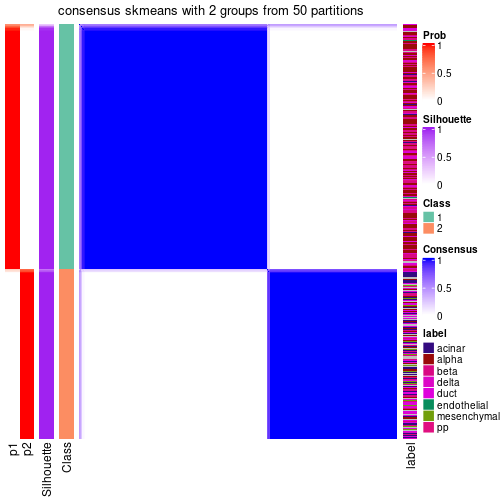</p>

</div>
<div id='tab-node-02-consensus-heatmap-2'>
<pre><code class="r">consensus_heatmap(res, k = 3)
</code></pre>

<p>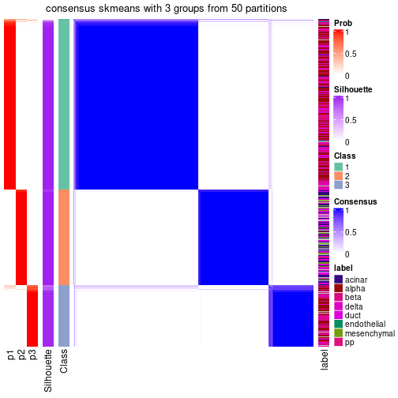</p>

</div>
<div id='tab-node-02-consensus-heatmap-3'>
<pre><code class="r">consensus_heatmap(res, k = 4)
</code></pre>

<p>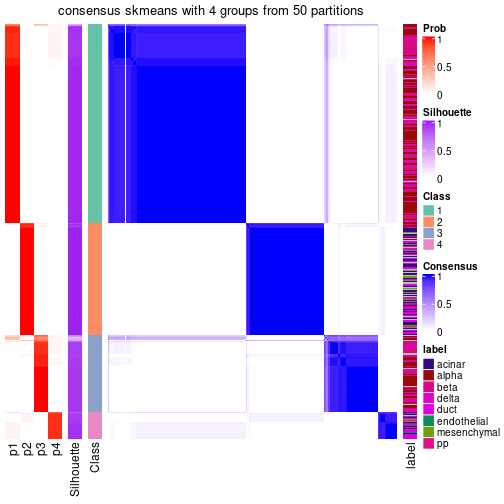</p>

</div>
</div>

Heatmaps for the membership of samples in all partitions to see how consistent they are:


<script>
$( function() {
	$( '#tabs-node-02-membership-heatmap' ).tabs();
} );
</script>
<div id='tabs-node-02-membership-heatmap'>
<ul>
<li><a href='#tab-node-02-membership-heatmap-1'>k = 2</a></li>
<li><a href='#tab-node-02-membership-heatmap-2'>k = 3</a></li>
<li><a href='#tab-node-02-membership-heatmap-3'>k = 4</a></li>
</ul>
<div id='tab-node-02-membership-heatmap-1'>
<pre><code class="r">membership_heatmap(res, k = 2)
</code></pre>

<p>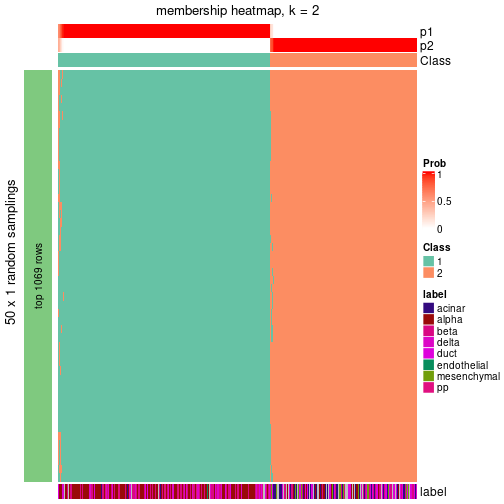</p>

</div>
<div id='tab-node-02-membership-heatmap-2'>
<pre><code class="r">membership_heatmap(res, k = 3)
</code></pre>

<p>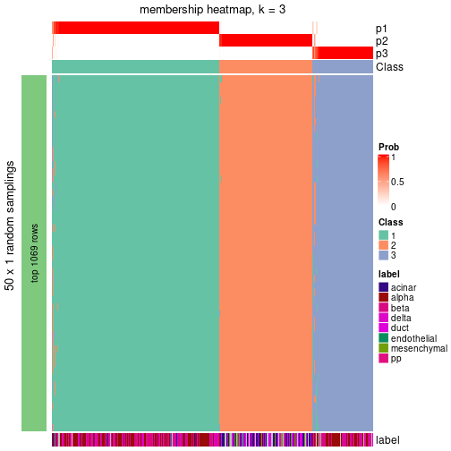</p>

</div>
<div id='tab-node-02-membership-heatmap-3'>
<pre><code class="r">membership_heatmap(res, k = 4)
</code></pre>

<p>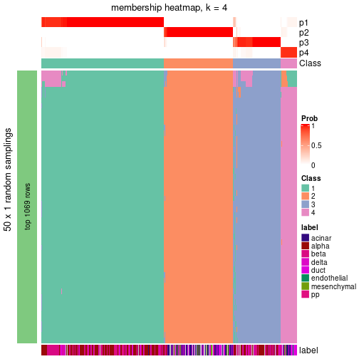</p>

</div>
</div>

As soon as the classes for columns are determined, the signatures
that are significantly different between subgroups can be looked for. 
Following are the heatmaps for signatures.


Signature heatmaps where rows are scaled:


<script>
$( function() {
	$( '#tabs-node-02-get-signatures' ).tabs();
} );
</script>
<div id='tabs-node-02-get-signatures'>
<ul>
<li><a href='#tab-node-02-get-signatures-1'>k = 2</a></li>
<li><a href='#tab-node-02-get-signatures-2'>k = 3</a></li>
<li><a href='#tab-node-02-get-signatures-3'>k = 4</a></li>
</ul>
<div id='tab-node-02-get-signatures-1'>
<pre><code class="r">get_signatures(res, k = 2)
</code></pre>

<p>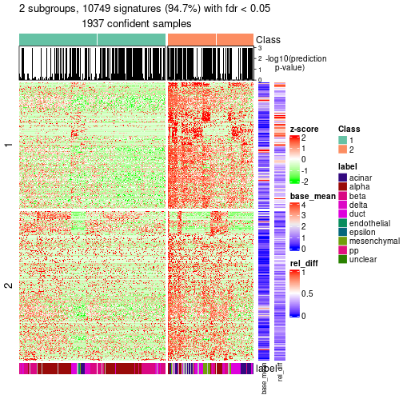</p>

</div>
<div id='tab-node-02-get-signatures-2'>
<pre><code class="r">get_signatures(res, k = 3)
</code></pre>

<p>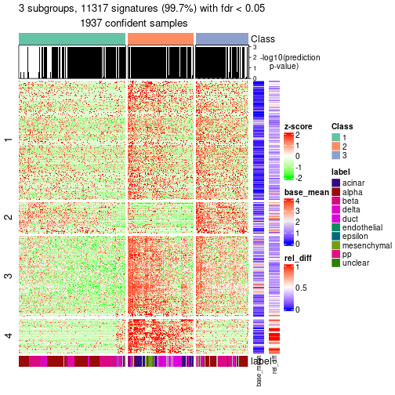</p>

</div>
<div id='tab-node-02-get-signatures-3'>
<pre><code class="r">get_signatures(res, k = 4)
</code></pre>

<p>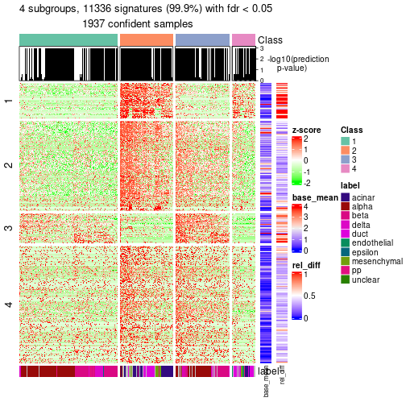</p>

</div>
</div>


Signature heatmaps where rows are not scaled:


<script>
$( function() {
	$( '#tabs-node-02-get-signatures-no-scale' ).tabs();
} );
</script>
<div id='tabs-node-02-get-signatures-no-scale'>
<ul>
<li><a href='#tab-node-02-get-signatures-no-scale-1'>k = 2</a></li>
<li><a href='#tab-node-02-get-signatures-no-scale-2'>k = 3</a></li>
<li><a href='#tab-node-02-get-signatures-no-scale-3'>k = 4</a></li>
</ul>
<div id='tab-node-02-get-signatures-no-scale-1'>
<pre><code class="r">get_signatures(res, k = 2, scale_rows = FALSE)
</code></pre>

<p>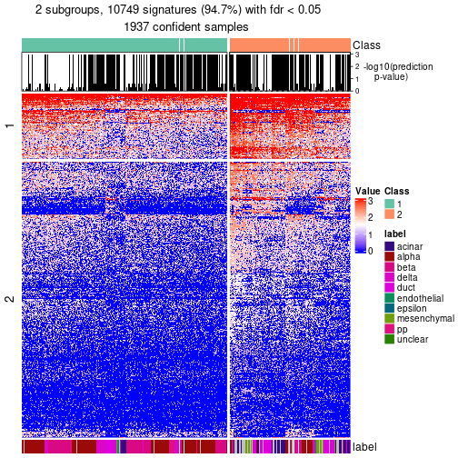</p>

</div>
<div id='tab-node-02-get-signatures-no-scale-2'>
<pre><code class="r">get_signatures(res, k = 3, scale_rows = FALSE)
</code></pre>

<p>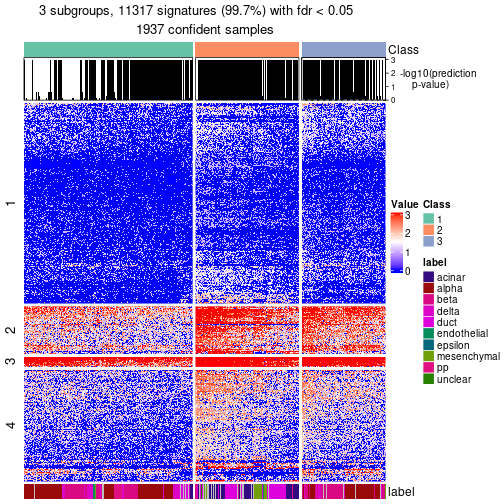</p>

</div>
<div id='tab-node-02-get-signatures-no-scale-3'>
<pre><code class="r">get_signatures(res, k = 4, scale_rows = FALSE)
</code></pre>

<p>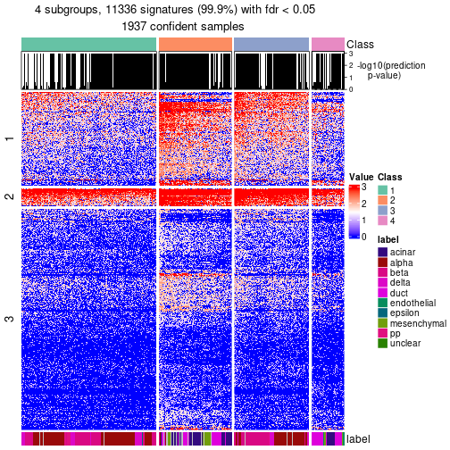</p>

</div>
</div>


Compare the overlap of signatures from different k:

```r
compare_signatures(res)
```

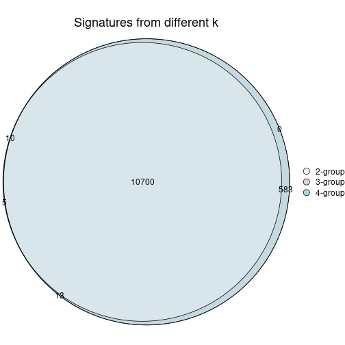

`get_signature()` returns a data frame invisibly. To get the list of signatures, the function
call should be assigned to a variable explicitly. In following code, if `plot` argument is set
to `FALSE`, no heatmap is plotted while only the differential analysis is performed.

```r
# code only for demonstration
tb = get_signature(res, k = ..., plot = FALSE)
```

An example of the output of `tb` is:

```
#>   which_row         fdr    mean_1    mean_2 scaled_mean_1 scaled_mean_2 km
#> 1        38 0.042760348  8.373488  9.131774    -0.5533452     0.5164555  1
#> 2        40 0.018707592  7.106213  8.469186    -0.6173731     0.5762149  1
#> 3        55 0.019134737 10.221463 11.207825    -0.6159697     0.5749050  1
#> 4        59 0.006059896  5.921854  7.869574    -0.6899429     0.6439467  1
#> 5        60 0.018055526  8.928898 10.211722    -0.6204761     0.5791110  1
#> 6        98 0.009384629 15.714769 14.887706     0.6635654    -0.6193277  2
...
```

The columns in `tb` are:

1. `which_row`: row indices corresponding to the input matrix.
2. `fdr`: FDR for the differential test. 
3. `mean_x`: The mean value in group x.
4. `scaled_mean_x`: The mean value in group x after rows are scaled.
5. `km`: Row groups if k-means clustering is applied to rows (which is done by automatically selecting number of clusters).

If there are too many signatures, `top_signatures = ...` can be set to only show the 
signatures with the highest FDRs:

```r
# code only for demonstration
# e.g. to show the top 500 most significant rows
tb = get_signature(res, k = ..., top_signatures = 500)
```

If the signatures are defined as these which are uniquely high in current group, `diff_method` argument
can be set to `"uniquely_high_in_one_group"`:

```r
# code only for demonstration
tb = get_signature(res, k = ..., diff_method = "uniquely_high_in_one_group")
```


UMAP plot which shows how samples are separated.


<script>
$( function() {
	$( '#tabs-node-02-dimension-reduction' ).tabs();
} );
</script>
<div id='tabs-node-02-dimension-reduction'>
<ul>
<li><a href='#tab-node-02-dimension-reduction-1'>k = 2</a></li>
<li><a href='#tab-node-02-dimension-reduction-2'>k = 3</a></li>
<li><a href='#tab-node-02-dimension-reduction-3'>k = 4</a></li>
</ul>
<div id='tab-node-02-dimension-reduction-1'>
<pre><code class="r">dimension_reduction(res, k = 2, method = &quot;UMAP&quot;)
</code></pre>

<p>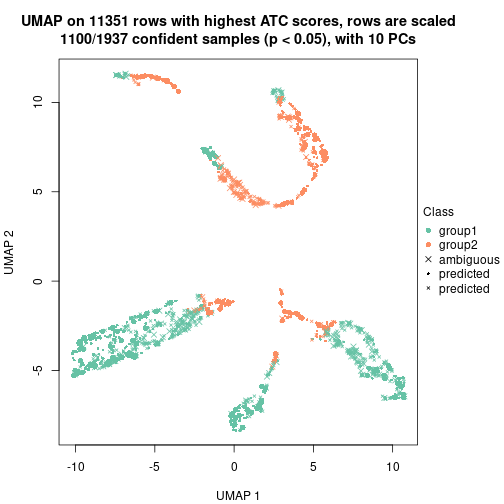</p>

</div>
<div id='tab-node-02-dimension-reduction-2'>
<pre><code class="r">dimension_reduction(res, k = 3, method = &quot;UMAP&quot;)
</code></pre>

<p>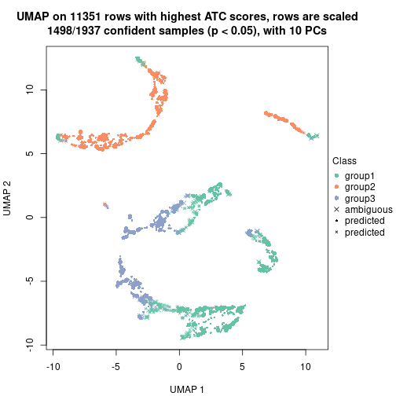</p>

</div>
<div id='tab-node-02-dimension-reduction-3'>
<pre><code class="r">dimension_reduction(res, k = 4, method = &quot;UMAP&quot;)
</code></pre>

<p>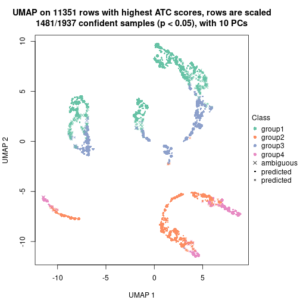</p>

</div>
</div>


Following heatmap shows how subgroups are split when increasing `k`:

```r
collect_classes(res)
```

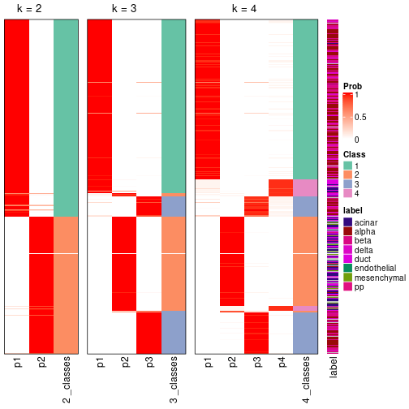


Test correlation between subgroups and known annotations. If the known
annotation is numeric, one-way ANOVA test is applied, and if the known
annotation is discrete, chi-squared contingency table test is applied.

```r
test_to_known_factors(res)
```

```
#>             n_sample label(p-value) k
#> ATC:skmeans     1100       4.08e-90 2
#> ATC:skmeans     1498      1.57e-239 3
#> ATC:skmeans     1481      2.76e-317 4
```


If matrix rows can be associated to genes, consider to use `functional_enrichment(res,
...)` to perform function enrichment for the signature genes. See [this vignette](https://jokergoo.github.io/cola_vignettes/functional_enrichment.html) for more detailed explanations.


 

---------------------------------------------------


### Node021


Parent node: [Node02](#Node02).
Child nodes: 
                Node0121-leaf
        ,
                Node0122-leaf
        ,
                Node0123-leaf
        ,
                Node0124-leaf
        ,
                Node0131-leaf
        ,
                Node0132-leaf
        ,
                Node0133-leaf
        ,
                Node0211-leaf
        ,
                [Node0212](#Node0212)
        ,
                Node0213-leaf
        ,
                [Node0214](#Node0214)
        ,
                [Node0221](#Node0221)
        ,
                [Node0222](#Node0222)
        ,
                Node0223-leaf
        ,
                [Node0231](#Node0231)
        ,
                [Node0232](#Node0232)
        ,
                Node0233-leaf
        ,
                Node0234-leaf
        ,
                [Node0241](#Node0241)
        ,
                [Node0242](#Node0242)
        ,
                Node0243-leaf
        .


The object with results only for a single top-value method and a single partitioning method 
can be extracted as:

```r
res = res_rh["021"]
```

A summary of `res` and all the functions that can be applied to it:

```r
res
```

```
#> A 'DownSamplingConsensusPartition' object with k = 2, 3, 4.
#>   On a matrix with 11351 rows and 500 columns, randomly sampled from 830 columns.
#>   Top rows (1075) are extracted by 'ATC' method.
#>   Subgroups are detected by 'skmeans' method.
#>   Performed in total 150 partitions by row resampling.
#>   Best k for subgroups seems to be 4.
#> 
#> Following methods can be applied to this 'DownSamplingConsensusPartition' object:
#>  [1] "cola_report"             "collect_classes"         "collect_plots"          
#>  [4] "collect_stats"           "colnames"                "compare_partitions"     
#>  [7] "compare_signatures"      "consensus_heatmap"       "dimension_reduction"    
#> [10] "functional_enrichment"   "get_anno_col"            "get_anno"               
#> [13] "get_classes"             "get_consensus"           "get_matrix"             
#> [16] "get_membership"          "get_param"               "get_signatures"         
#> [19] "get_stats"               "is_best_k"               "is_stable_k"            
#> [22] "membership_heatmap"      "ncol"                    "nrow"                   
#> [25] "plot_ecdf"               "predict_classes"         "rownames"               
#> [28] "select_partition_number" "show"                    "suggest_best_k"         
#> [31] "test_to_known_factors"   "top_rows_heatmap"
```

`collect_plots()` function collects all the plots made from `res` for all `k` (number of subgroups)
into one single page to provide an easy and fast comparison between different `k`.

```r
collect_plots(res)
```

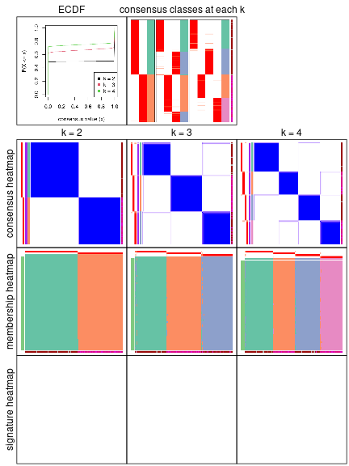

The plots are:

- The first row: a plot of the eCDF (empirical cumulative distribution
  function) curves of the consensus matrix for each `k` and the heatmap of
  predicted classes for each `k`.
- The second row: heatmaps of the consensus matrix for each `k`.
- The third row: heatmaps of the membership matrix for each `k`.
- The fouth row: heatmaps of the signatures for each `k`.

All the plots in panels can be made by individual functions and they are
plotted later in this section.

`select_partition_number()` produces several plots showing different
statistics for choosing "optimized" `k`. There are following statistics:

- eCDF curves of the consensus matrix for each `k`;
- 1-PAC. [The PAC score](https://en.wikipedia.org/wiki/Consensus_clustering#Over-interpretation_potential_of_consensus_clustering)
  measures the proportion of the ambiguous subgrouping.
- Mean silhouette score.
- Concordance. The mean probability of fiting the consensus subgroup labels in all
  partitions.
- Area increased. Denote $A_k$ as the area under the eCDF curve for current
  `k`, the area increased is defined as $A_k - A_{k-1}$.
- Rand index. The percent of pairs of samples that are both in a same cluster
  or both are not in a same cluster in the partition of k and k-1.
- Jaccard index. The ratio of pairs of samples are both in a same cluster in
  the partition of k and k-1 and the pairs of samples are both in a same
  cluster in the partition k or k-1.

The detailed explanations of these statistics can be found in [the _cola_
vignette](https://jokergoo.github.io/cola_vignettes/cola.html#toc_13).

Generally speaking, higher 1-PAC score, higher mean silhouette score or higher
concordance corresponds to better partition. Rand index and Jaccard index
measure how similar the current partition is compared to partition with `k-1`.
If they are too similar, we won't accept `k` is better than `k-1`.

```r
select_partition_number(res)
```

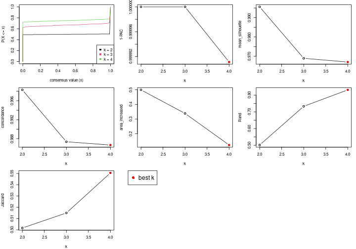

The numeric values for all these statistics can be obtained by `get_stats()`.

```r
get_stats(res)
```

```
#>   k 1-PAC mean_silhouette concordance area_increased  Rand Jaccard
#> 2 2     1           0.996       0.998          0.499 0.502   0.502
#> 3 3     1           0.969       0.987          0.338 0.733   0.515
#> 4 4     1           0.967       0.987          0.123 0.831   0.551
```

`suggest_best_k()` suggests the best $k$ based on these statistics. The rules are as follows:

- All $k$ with Jaccard index larger than 0.95 are removed because increasing
  $k$ does not provide enough extra information. If all $k$ are removed, it is
  marked as no subgroup is detected.
- For all $k$ with 1-PAC score larger than 0.9, the maximal $k$ is taken as
  the best $k$, and other $k$ are marked as optional $k$.
- If it does not fit the second rule. The $k$ with the maximal vote of the
  highest 1-PAC score, highest mean silhouette, and highest concordance is
  taken as the best $k$.

```r
suggest_best_k(res)
```

```
#> [1] 4
#> attr(,"optional")
#> [1] 2 3
```

There is also optional best $k$ = 2 3 that is worth to check.

Following is the table of the partitions (You need to click the **show/hide
code output** link to see it). The membership matrix (columns with name `p*`)
is inferred by
[`clue::cl_consensus()`](https://www.rdocumentation.org/link/cl_consensus?package=clue)
function with the `SE` method. Basically the value in the membership matrix
represents the probability to belong to a certain group. The finall subgroup
label for an item is determined with the group with highest probability it
belongs to.

In `get_classes()` function, the entropy is calculated from the membership
matrix and the silhouette score is calculated from the consensus matrix.


<script>
$( function() {
	$( '#tabs-node-021-get-classes' ).tabs();
} );
</script>
<div id='tabs-node-021-get-classes'>
<ul>
<li><a href='#tab-node-021-get-classes-1'>k = 2</a></li>
<li><a href='#tab-node-021-get-classes-2'>k = 3</a></li>
<li><a href='#tab-node-021-get-classes-3'>k = 4</a></li>
</ul>

<div id='tab-node-021-get-classes-1'>
<p><a id='tab-node-021-get-classes-1-a' style='color:#0366d6' href='#'>show/hide code output</a></p>
<pre><code class="r">get_classes(res, k = 2)
</code></pre>

<pre><code>#&gt;          class     p
#&gt; D28-1_1      1 0.000
#&gt; D28-1_3      2 0.000
#&gt; D28-1_17     1 0.000
#&gt; D28-1_40     1 0.000
#&gt; D28-1_43     2 0.000
#&gt; D28-1_51     1 0.000
#&gt; D28-1_63     1 0.000
#&gt; D28-1_88     1 0.000
#&gt; D28-2_5      1 0.000
#&gt; D28-2_28     1 0.000
#&gt; D28-2_63     2 0.000
#&gt; D28-2_68     1 0.000
#&gt; D28-2_90     1 0.000
#&gt; D28-3_3      1 0.000
#&gt; D28-3_8      1 0.000
#&gt; D28-3_14     2 0.000
#&gt; D28-3_15     1 0.000
#&gt; D28-3_17     2 0.000
#&gt; D28-3_27     2 0.000
#&gt; D28-3_37     2 0.000
#&gt; D28-3_38     1 0.000
#&gt; D28-3_55     1 0.000
#&gt; D28-3_68     1 0.000
#&gt; D28-3_78     2 0.000
#&gt; D28-3_79     1 0.000
#&gt; D28-4_1      2 0.000
#&gt; D28-4_15     1 0.000
#&gt; D28-4_26     2 0.000
#&gt; D28-4_27     1 0.000
#&gt; D28-4_30     1 0.000
#&gt; D28-4_38     2 0.000
#&gt; D28-4_90     2 0.000
#&gt; D28-5_2      2 0.000
#&gt; D28-5_13     1 0.000
#&gt; D28-5_15     1 0.000
#&gt; D28-5_41     1 0.000
#&gt; D28-5_86     1 0.000
#&gt; D28-6_26     2 0.000
#&gt; D28-6_37     1 0.000
#&gt; D28-7_5      1 0.000
#&gt; D28-7_13     1 0.000
#&gt; D28-7_16     1 0.000
#&gt; D28-7_53     1 0.000
#&gt; D28-7_63     1 0.000
#&gt; D28-7_66     1 0.000
#&gt; D28-8_5      1 0.000
#&gt; D28-8_14     1 0.000
#&gt; D28-8_15     1 0.000
#&gt; D28-8_18     1 0.000
#&gt; D28-8_25     1 0.000
#&gt; D28-8_38     2 0.000
#&gt; D28-8_41     1 0.000
#&gt; D28-8_74     1 0.000
#&gt; D29-1_3      2 0.000
#&gt; D29-1_6      1 0.000
#&gt; D29-1_8      2 0.000
#&gt; D29-1_11     1 0.000
#&gt; D29-1_16     2 0.000
#&gt; D29-1_17     1 0.000
#&gt; D29-1_19     1 0.000
#&gt; D29-1_20     1 0.000
#&gt; D29-1_21     2 0.000
#&gt; D29-1_27     1 0.000
#&gt; D29-1_29     1 0.000
#&gt; D29-1_32     1 0.000
#&gt; D29-1_34     1 0.000
#&gt; D29-1_36     2 0.000
#&gt; D29-1_37     1 0.000
#&gt; D29-1_42     2 0.000
#&gt; D29-1_44     1 0.000
#&gt; D29-1_46     1 0.000
#&gt; D29-1_47     1 0.000
#&gt; D29-1_51     1 0.000
#&gt; D29-1_56     2 0.000
#&gt; D29-1_58     2 0.000
#&gt; D29-1_59     1 0.000
#&gt; D29-1_67     2 0.000
#&gt; D29-1_71     2 0.000
#&gt; D29-1_72     2 0.000
#&gt; D29-1_75     2 0.000
#&gt; D29-1_76     1 0.000
#&gt; D29-1_77     2 0.000
#&gt; D29-1_81     2 0.000
#&gt; D29-1_82     2 0.000
#&gt; D29-1_83     2 0.000
#&gt; D29-1_84     2 0.000
#&gt; D29-1_86     2 0.000
#&gt; D29-1_88     2 0.000
#&gt; D29-1_90     2 0.000
#&gt; D29-1_92     2 0.000
#&gt; D29-1_93     2 0.000
#&gt; D29-2_3      1 0.000
#&gt; D29-2_4      2 0.000
#&gt; D29-2_5      2 0.000
#&gt; D29-2_6      1 0.000
#&gt; D29-2_8      1 0.000
#&gt; D29-2_9      2 0.000
#&gt; D29-2_10     2 0.000
#&gt; D29-2_11     2 0.000
#&gt; D29-2_13     1 0.000
#&gt; D29-2_16     2 0.000
#&gt; D29-2_18     2 0.000
#&gt; D29-2_22     1 0.000
#&gt; D29-2_25     1 0.000
#&gt; D29-2_26     2 0.000
#&gt; D29-2_27     2 0.000
#&gt; D29-2_28     1 0.000
#&gt; D29-2_30     2 0.000
#&gt; D29-2_33     1 0.000
#&gt; D29-2_34     2 0.000
#&gt; D29-2_35     1 0.000
#&gt; D29-2_37     1 0.000
#&gt; D29-2_38     1 0.000
#&gt; D29-2_39     1 0.000
#&gt; D29-2_41     1 0.000
#&gt; D29-2_45     1 0.000
#&gt; D29-2_46     2 0.000
#&gt; D29-2_48     1 0.000
#&gt; D29-2_50     2 0.000
#&gt; D29-2_51     1 0.000
#&gt; D29-2_52     1 0.000
#&gt; D29-2_54     2 0.000
#&gt; D29-2_58     2 0.000
#&gt; D29-2_60     2 0.000
#&gt; D29-2_64     2 0.000
#&gt; D29-2_67     1 0.000
#&gt; D29-2_68     2 0.000
#&gt; D29-2_70     2 0.000
#&gt; D29-2_71     1 0.000
#&gt; D29-2_72     2 0.000
#&gt; D29-2_75     1 0.000
#&gt; D29-2_76     1 0.000
#&gt; D29-2_79     2 0.000
#&gt; D29-2_80     2 0.000
#&gt; D29-2_81     2 0.000
#&gt; D29-2_82     2 0.000
#&gt; D29-2_84     1 0.000
#&gt; D29-2_87     2 0.253
#&gt; D29-2_91     1 0.000
#&gt; D29-2_93     1 0.000
#&gt; D29-2_94     1 0.000
#&gt; D29-3_5      2 0.000
#&gt; D29-3_11     2 0.000
#&gt; D29-3_18     1 0.000
#&gt; D29-3_21     2 0.000
#&gt; D29-3_22     1 0.000
#&gt; D29-3_23     2 0.000
#&gt; D29-3_24     2 0.000
#&gt; D29-3_29     1 0.000
#&gt; D29-3_33     1 0.000
#&gt; D29-3_34     1 0.000
#&gt; D29-3_37     2 0.000
#&gt; D29-3_38     1 0.000
#&gt; D29-3_39     2 0.000
#&gt; D29-3_42     1 0.000
#&gt; D29-3_43     2 0.000
#&gt; D29-3_45     2 0.000
#&gt; D29-3_48     2 0.000
#&gt; D29-3_49     1 0.000
#&gt; D29-3_51     2 0.000
#&gt; D29-3_52     2 0.000
#&gt; D29-3_53     1 0.000
#&gt; D29-3_54     1 0.000
#&gt; D29-3_56     1 0.000
#&gt; D29-3_57     2 0.000
#&gt; D29-3_58     2 0.000
#&gt; D29-3_59     2 0.000
#&gt; D29-3_60     1 0.000
#&gt; D29-3_64     2 0.000
#&gt; D29-3_66     1 0.000
#&gt; D29-3_69     2 0.000
#&gt; D29-3_72     1 0.000
#&gt; D29-3_74     1 0.000
#&gt; D29-3_76     1 0.000
#&gt; D29-3_77     1 0.000
#&gt; D29-3_78     2 0.000
#&gt; D29-3_79     1 0.000
#&gt; D29-3_81     1 0.000
#&gt; D29-3_84     1 0.000
#&gt; D29-3_86     2 0.000
#&gt; D29-3_93     1 0.000
#&gt; D29-3_94     2 0.000
#&gt; D29-4_2      1 0.000
#&gt; D29-4_5      1 0.000
#&gt; D29-4_12     1 0.000
#&gt; D29-4_18     1 0.000
#&gt; D29-4_19     2 0.000
#&gt; D29-4_22     1 0.000
#&gt; D29-4_23     2 0.000
#&gt; D29-4_25     1 0.000
#&gt; D29-4_26     1 0.000
#&gt; D29-4_27     2 0.000
#&gt; D29-4_28     1 0.000
#&gt; D29-4_29     1 0.000
#&gt; D29-4_33     1 0.000
#&gt; D29-4_34     1 0.000
#&gt; D29-4_35     1 0.000
#&gt; D29-4_38     1 0.000
#&gt; D29-4_39     2 0.000
#&gt; D29-4_41     2 0.000
#&gt; D29-4_42     2 0.000
#&gt; D29-4_43     2 0.000
#&gt; D29-4_44     2 0.000
#&gt; D29-4_48     2 0.000
#&gt; D29-4_49     1 0.000
#&gt; D29-4_50     1 0.000
#&gt; D29-4_51     1 0.000
#&gt; D29-4_52     2 0.000
#&gt; D29-4_53     1 0.000
#&gt; D29-4_56     1 0.000
#&gt; D29-4_57     1 0.000
#&gt; D29-4_58     1 0.000
#&gt; D29-4_59     2 0.000
#&gt; D29-4_60     1 0.000
#&gt; D29-4_63     2 0.000
#&gt; D29-4_64     2 0.000
#&gt; D29-4_65     1 0.000
#&gt; D29-4_66     1 0.000
#&gt; D29-4_67     2 0.000
#&gt; D29-4_68     1 0.000
#&gt; D29-4_70     1 0.000
#&gt; D29-4_72     1 0.000
#&gt; D29-4_73     2 0.000
#&gt; D29-4_77     1 0.000
#&gt; D29-4_80     1 0.000
#&gt; D29-4_85     1 0.000
#&gt; D29-4_88     2 0.000
#&gt; D29-4_92     2 0.000
#&gt; D29-4_93     1 0.000
#&gt; D29-5_3      1 0.000
#&gt; D29-5_6      2 0.000
#&gt; D29-5_8      1 0.000
#&gt; D29-5_10     2 0.000
#&gt; D29-5_11     1 0.000
#&gt; D29-5_12     2 0.000
#&gt; D29-5_14     2 0.000
#&gt; D29-5_17     1 0.000
#&gt; D29-5_18     1 0.000
#&gt; D29-5_19     1 0.000
#&gt; D29-5_21     2 0.000
#&gt; D29-5_22     2 0.000
#&gt; D29-5_24     1 0.000
#&gt; D29-5_30     2 0.000
#&gt; D29-5_31     1 0.000
#&gt; D29-5_32     2 0.000
#&gt; D29-5_34     2 0.000
#&gt; D29-5_35     1 0.000
#&gt; D29-5_36     2 0.000
#&gt; D29-5_39     1 0.000
#&gt; D29-5_46     1 0.000
#&gt; D29-5_47     2 0.000
#&gt; D29-5_52     2 0.000
#&gt; D29-5_53     2 0.000
#&gt; D29-5_56     1 0.000
#&gt; D29-5_57     1 0.000
#&gt; D29-5_58     2 0.000
#&gt; D29-5_59     1 0.000
#&gt; D29-5_62     2 0.000
#&gt; D29-5_63     2 0.000
#&gt; D29-5_65     1 0.000
#&gt; D29-5_70     2 0.000
#&gt; D29-5_71     1 0.000
#&gt; D29-5_75     1 0.000
#&gt; D29-5_77     2 0.000
#&gt; D29-5_91     2 0.000
#&gt; D29-5_92     1 0.000
#&gt; D29-6_1      1 0.000
#&gt; D29-6_3      2 0.000
#&gt; D29-6_4      2 0.000
#&gt; D29-6_6      2 0.000
#&gt; D29-6_8      1 0.000
#&gt; D29-6_16     2 0.000
#&gt; D29-6_17     1 0.000
#&gt; D29-6_19     1 0.000
#&gt; D29-6_21     1 0.000
#&gt; D29-6_24     1 0.000
#&gt; D29-6_28     2 0.000
#&gt; D29-6_29     1 0.000
#&gt; D29-6_30     2 0.000
#&gt; D29-6_32     2 0.000
#&gt; D29-6_38     1 0.000
#&gt; D29-6_39     2 0.000
#&gt; D29-6_42     2 0.000
#&gt; D29-6_44     2 0.000
#&gt; D29-6_53     1 0.000
#&gt; D29-6_54     1 0.000
#&gt; D29-6_56     2 0.000
#&gt; D29-6_57     1 0.000
#&gt; D29-6_58     1 0.000
#&gt; D29-6_59     2 0.000
#&gt; D29-6_60     1 0.000
#&gt; D29-6_62     2 0.000
#&gt; D29-6_63     2 0.000
#&gt; D29-6_65     1 0.000
#&gt; D29-6_66     2 0.000
#&gt; D29-6_67     2 0.000
#&gt; D29-6_69     1 0.000
#&gt; D29-6_72     2 0.000
#&gt; D29-6_78     1 0.000
#&gt; D29-6_79     2 0.000
#&gt; D29-6_82     1 0.000
#&gt; D29-6_84     1 0.000
#&gt; D29-6_91     1 0.000
#&gt; D29-7_1      1 0.000
#&gt; D29-7_2      2 0.000
#&gt; D29-7_3      2 0.000
#&gt; D29-7_6      1 0.000
#&gt; D29-7_12     2 0.000
#&gt; D29-7_14     2 0.000
#&gt; D29-7_17     2 0.000
#&gt; D29-7_21     2 0.000
#&gt; D29-7_23     2 0.000
#&gt; D29-7_25     1 0.000
#&gt; D29-7_30     2 0.000
#&gt; D29-7_32     1 0.000
#&gt; D29-7_34     2 0.000
#&gt; D29-7_35     2 0.000
#&gt; D29-7_39     2 0.000
#&gt; D29-7_42     2 0.000
#&gt; D29-7_43     1 0.000
#&gt; D29-7_44     1 0.000
#&gt; D29-7_45     2 0.000
#&gt; D29-7_46     1 0.000
#&gt; D29-7_47     1 0.000
#&gt; D29-7_48     2 0.000
#&gt; D29-7_50     1 0.000
#&gt; D29-7_51     1 0.000
#&gt; D29-7_52     2 0.000
#&gt; D29-7_54     2 0.000
#&gt; D29-7_55     1 0.000
#&gt; D29-7_59     1 0.000
#&gt; D29-7_60     2 0.000
#&gt; D29-7_61     2 0.000
#&gt; D29-7_62     2 0.000
#&gt; D29-7_65     1 0.000
#&gt; D29-7_69     2 0.000
#&gt; D29-7_71     2 0.000
#&gt; D29-7_73     1 0.000
#&gt; D29-7_74     2 0.000
#&gt; D29-7_75     2 0.000
#&gt; D29-7_79     2 0.000
#&gt; D29-7_80     1 0.000
#&gt; D29-7_82     1 0.000
#&gt; D29-7_84     1 0.000
#&gt; D29-7_85     1 0.000
#&gt; D29-7_86     2 0.000
#&gt; D29-7_92     1 0.000
#&gt; D29-7_93     2 0.000
#&gt; D29-7_94     2 0.000
#&gt; D29-8_2      1 0.000
#&gt; D29-8_7      1 0.000
#&gt; D29-8_10     2 0.000
#&gt; D29-8_15     1 0.751
#&gt; D29-8_23     2 0.000
#&gt; D29-8_29     1 0.000
#&gt; D29-8_32     1 0.000
#&gt; D29-8_39     1 0.000
#&gt; D29-8_45     1 0.000
#&gt; D29-8_49     2 0.000
#&gt; D29-8_50     2 0.000
#&gt; D29-8_51     1 0.000
#&gt; D29-8_54     2 0.000
#&gt; D29-8_60     1 0.000
#&gt; D29-8_62     2 0.000
#&gt; D29-8_64     1 0.000
#&gt; D29-8_65     1 0.000
#&gt; D29-8_66     1 0.000
#&gt; D29-8_76     1 0.000
#&gt; D29-8_77     1 0.000
#&gt; D29-8_80     2 0.000
#&gt; D29-8_82     1 0.000
#&gt; D29-8_84     1 0.000
#&gt; D29-8_86     2 0.747
#&gt; D29-8_87     2 0.000
#&gt; D29-8_94     2 0.000
#&gt; D31-1_1      2 0.000
#&gt; D31-1_2      1 0.000
#&gt; D31-1_4      1 0.000
#&gt; D31-1_8      1 0.000
#&gt; D31-1_14     2 0.000
#&gt; D31-1_15     2 0.000
#&gt; D31-1_17     1 0.000
#&gt; D31-1_20     2 0.000
#&gt; D31-1_24     1 0.000
#&gt; D31-1_26     2 0.000
#&gt; D31-1_28     2 0.000
#&gt; D31-1_29     2 0.000
#&gt; D31-1_32     1 0.000
#&gt; D31-1_33     2 0.000
#&gt; D31-1_34     2 0.000
#&gt; D31-1_35     1 0.000
#&gt; D31-1_38     2 0.000
#&gt; D31-1_42     1 0.000
#&gt; D31-1_56     2 0.000
#&gt; D31-1_59     1 0.000
#&gt; D31-1_63     2 0.000
#&gt; D31-1_65     1 0.751
#&gt; D31-1_73     2 0.000
#&gt; D31-1_74     2 0.000
#&gt; D31-1_75     1 0.000
#&gt; D31-1_78     1 0.000
#&gt; D31-1_80     2 0.000
#&gt; D31-1_85     1 0.000
#&gt; D31-1_92     1 0.000
#&gt; D31-2_1      2 0.000
#&gt; D31-2_3      2 0.000
#&gt; D31-2_5      2 0.000
#&gt; D31-2_7      1 0.000
#&gt; D31-2_11     1 0.000
#&gt; D31-2_22     1 0.000
#&gt; D31-2_27     2 0.000
#&gt; D31-2_28     2 0.000
#&gt; D31-2_29     2 0.000
#&gt; D31-2_31     1 0.000
#&gt; D31-2_32     1 0.000
#&gt; D31-2_33     1 0.000
#&gt; D31-2_36     2 0.000
#&gt; D31-2_39     1 0.000
#&gt; D31-2_44     1 0.000
#&gt; D31-2_47     2 0.000
#&gt; D31-2_49     2 0.000
#&gt; D31-2_50     1 0.000
#&gt; D31-2_55     2 0.253
#&gt; D31-2_58     2 0.000
#&gt; D31-2_64     1 0.000
#&gt; D31-2_65     2 0.000
#&gt; D31-2_67     1 0.000
#&gt; D31-2_70     2 0.000
#&gt; D31-2_74     1 0.000
#&gt; D31-2_81     1 0.000
#&gt; D31-2_89     1 0.000
#&gt; D31-3_2      1 0.000
#&gt; D31-3_3      1 0.000
#&gt; D31-3_4      2 0.000
#&gt; D31-3_5      1 0.000
#&gt; D31-3_10     2 0.000
#&gt; D31-3_13     1 0.000
#&gt; D31-3_17     2 0.000
#&gt; D31-3_22     2 0.000
#&gt; D31-3_24     1 0.000
#&gt; D31-3_27     1 0.000
#&gt; D31-3_28     1 0.000
#&gt; D31-3_29     1 0.000
#&gt; D31-3_30     2 0.000
#&gt; D31-3_33     2 0.000
#&gt; D31-3_39     1 0.000
#&gt; D31-3_41     2 0.000
#&gt; D31-3_43     2 0.000
#&gt; D31-3_45     1 0.000
#&gt; D31-3_50     2 0.000
#&gt; D31-3_52     1 0.000
#&gt; D31-3_55     1 0.000
#&gt; D31-3_56     1 0.502
#&gt; D31-3_57     1 0.000
#&gt; D31-3_62     2 0.000
#&gt; D31-3_67     2 0.000
#&gt; D31-3_70     1 0.000
#&gt; D31-3_72     2 0.000
#&gt; D31-3_75     2 0.000
#&gt; D31-3_77     2 0.000
#&gt; D31-3_80     2 0.000
#&gt; D31-3_83     2 0.000
#&gt; D31-3_85     1 0.000
#&gt; D31-3_87     2 0.000
#&gt; D31-3_88     2 0.000
#&gt; D31-3_90     1 0.000
#&gt; D31-3_94     1 0.000
#&gt; D31-4_5      1 0.000
#&gt; D31-4_7      1 0.000
#&gt; D31-4_10     2 0.000
#&gt; D31-4_11     1 0.000
#&gt; D31-4_15     2 0.000
#&gt; D31-4_18     1 0.000
#&gt; D31-4_19     2 0.000
#&gt; D31-4_20     1 0.000
#&gt; D31-4_22     1 0.000
#&gt; D31-4_23     1 0.000
#&gt; D31-4_24     1 0.000
#&gt; D31-4_25     2 0.000
#&gt; D31-4_27     1 0.000
#&gt; D31-4_28     2 0.000
#&gt; D31-4_30     1 0.000
#&gt; D31-4_31     1 0.000
#&gt; D31-4_32     1 0.000
#&gt; D31-4_37     2 0.000
#&gt; D31-4_42     1 0.000
#&gt; D31-4_47     1 0.000
#&gt; D31-4_50     1 0.000
#&gt; D31-4_52     1 0.000
#&gt; D31-4_59     1 0.000
#&gt; D31-4_75     2 0.000
#&gt; D31-4_78     2 0.000
#&gt; D31-4_80     1 0.000
#&gt; D31-4_89     1 0.000
#&gt; D31-4_92     2 0.000
#&gt; D31-5_3      2 0.000
#&gt; D31-5_5      2 0.000
#&gt; D31-5_9      2 0.000
#&gt; D31-5_10     1 0.000
#&gt; D31-5_15     2 0.000
#&gt; D31-5_17     1 0.000
#&gt; D31-5_21     2 1.000
#&gt; D31-5_22     2 0.000
#&gt; D31-5_23     2 0.000
#&gt; D31-5_26     2 0.000
#&gt; D31-5_27     2 0.000
#&gt; D31-5_29     2 0.000
#&gt; D31-5_32     2 0.000
#&gt; D31-5_35     1 0.000
#&gt; D31-5_38     2 0.000
#&gt; D31-5_42     2 0.000
#&gt; D31-5_44     1 0.000
#&gt; D31-5_50     1 0.000
#&gt; D31-5_52     2 0.000
#&gt; D31-5_53     1 0.000
#&gt; D31-5_55     2 0.000
#&gt; D31-5_58     1 0.000
#&gt; D31-5_59     1 0.000
#&gt; D31-5_61     2 0.000
#&gt; D31-5_63     1 0.000
#&gt; D31-5_68     1 0.000
#&gt; D31-5_74     2 0.000
#&gt; D31-5_76     1 0.000
#&gt; D31-5_80     2 0.000
#&gt; D31-5_85     2 0.000
#&gt; D31-5_86     1 0.000
#&gt; D31-5_94     2 0.000
#&gt; D31-6_10     1 0.000
#&gt; D31-6_12     2 0.000
#&gt; D31-6_15     2 0.000
#&gt; D31-6_16     2 0.000
#&gt; D31-6_18     1 0.000
#&gt; D31-6_20     2 0.000
#&gt; D31-6_22     2 0.000
#&gt; D31-6_42     2 0.000
#&gt; D31-6_45     1 0.000
#&gt; D31-6_47     2 0.000
#&gt; D31-6_48     1 0.000
#&gt; D31-6_55     1 0.000
#&gt; D31-6_56     1 0.000
#&gt; D31-6_63     1 0.000
#&gt; D31-6_67     2 0.000
#&gt; D31-6_71     2 0.000
#&gt; D31-6_74     1 0.000
#&gt; D31-6_80     2 0.000
#&gt; D31-6_88     1 0.000
#&gt; D31-6_90     1 0.000
#&gt; D31-6_91     1 0.000
#&gt; D31-6_92     2 0.000
#&gt; D31-6_94     1 0.000
#&gt; D31-7_1      2 0.000
#&gt; D31-7_2      1 0.000
#&gt; D31-7_3      2 0.000
#&gt; D31-7_6      1 0.000
#&gt; D31-7_19     1 0.000
#&gt; D31-7_22     2 0.000
#&gt; D31-7_25     1 0.000
#&gt; D31-7_33     1 0.000
#&gt; D31-7_35     1 0.000
#&gt; D31-7_36     1 0.000
#&gt; D31-7_37     1 0.000
#&gt; D31-7_41     1 0.000
#&gt; D31-7_44     1 0.000
#&gt; D31-7_45     2 0.000
#&gt; D31-7_46     2 0.000
#&gt; D31-7_47     2 0.000
#&gt; D31-7_51     1 0.000
#&gt; D31-7_53     2 0.000
#&gt; D31-7_54     1 0.000
#&gt; D31-7_55     2 0.000
#&gt; D31-7_59     2 0.000
#&gt; D31-7_60     2 0.000
#&gt; D31-7_62     1 0.000
#&gt; D31-7_65     1 0.000
#&gt; D31-7_66     2 0.000
#&gt; D31-7_67     2 0.000
#&gt; D31-7_71     1 0.000
#&gt; D31-7_72     2 0.000
#&gt; D31-7_74     2 0.000
#&gt; D31-7_79     2 0.000
#&gt; D31-7_80     1 0.000
#&gt; D31-7_84     2 0.000
#&gt; D31-7_85     2 0.000
#&gt; D31-7_91     2 0.000
#&gt; D31-7_92     2 0.000
#&gt; D31-8_1      2 0.000
#&gt; D31-8_2      1 0.000
#&gt; D31-8_5      1 0.000
#&gt; D31-8_8      2 0.000
#&gt; D31-8_12     1 0.000
#&gt; D31-8_13     2 0.000
#&gt; D31-8_14     1 0.000
#&gt; D31-8_17     2 0.000
#&gt; D31-8_21     2 0.000
#&gt; D31-8_24     1 0.000
#&gt; D31-8_25     2 0.000
#&gt; D31-8_28     2 0.000
#&gt; D31-8_31     2 0.000
#&gt; D31-8_33     1 0.000
#&gt; D31-8_38     1 0.000
#&gt; D31-8_42     2 0.000
#&gt; D31-8_46     1 0.000
#&gt; D31-8_50     2 0.000
#&gt; D31-8_61     1 0.000
#&gt; D31-8_62     1 0.000
#&gt; D31-8_67     2 0.000
#&gt; D31-8_69     2 0.000
#&gt; D31-8_70     2 0.000
#&gt; D31-8_73     2 0.000
#&gt; D31-8_74     2 0.000
#&gt; D31-8_76     2 0.000
#&gt; D31-8_83     2 0.000
#&gt; D31-8_87     2 0.249
#&gt; D30-1_6      2 0.000
#&gt; D30-1_9      1 0.000
#&gt; D30-1_20     2 0.000
#&gt; D30-1_21     1 0.000
#&gt; D30-1_23     1 0.000
#&gt; D30-1_45     2 0.000
#&gt; D30-1_57     2 0.000
#&gt; D30-1_60     1 0.000
#&gt; D30-1_64     1 0.000
#&gt; D30-1_65     2 0.000
#&gt; D30-1_67     2 0.000
#&gt; D30-1_71     1 0.000
#&gt; D30-1_81     1 0.000
#&gt; D30-1_82     1 0.000
#&gt; D30-1_84     1 0.000
#&gt; D30-1_85     2 0.000
#&gt; D30-1_86     1 0.000
#&gt; D30-1_87     1 0.000
#&gt; D30-1_89     2 0.000
#&gt; D30-1_93     2 0.000
#&gt; D30-1_94     2 0.000
#&gt; D30-2_2      1 0.000
#&gt; D30-2_8      2 0.000
#&gt; D30-2_14     1 0.000
#&gt; D30-2_15     1 0.000
#&gt; D30-2_18     1 0.000
#&gt; D30-2_19     1 0.000
#&gt; D30-2_20     2 0.000
#&gt; D30-2_25     1 0.000
#&gt; D30-2_26     2 0.000
#&gt; D30-2_47     1 0.000
#&gt; D30-2_61     2 0.000
#&gt; D30-2_67     1 0.000
#&gt; D30-2_68     1 0.000
#&gt; D30-2_70     1 0.000
#&gt; D30-2_73     1 0.000
#&gt; D30-2_80     1 0.000
#&gt; D30-2_86     1 0.000
#&gt; D30-2_88     1 0.000
#&gt; D30-2_89     2 0.000
#&gt; D30-2_91     1 0.000
#&gt; D30-3_1      1 0.000
#&gt; D30-3_5      1 0.000
#&gt; D30-3_9      2 0.000
#&gt; D30-3_10     2 0.000
#&gt; D30-3_11     1 0.000
#&gt; D30-3_14     2 0.000
#&gt; D30-3_15     2 0.000
#&gt; D30-3_18     2 0.000
#&gt; D30-3_19     1 0.000
#&gt; D30-3_22     2 0.000
#&gt; D30-3_26     1 0.000
#&gt; D30-3_27     1 0.000
#&gt; D30-3_28     1 0.000
#&gt; D30-3_29     1 0.000
#&gt; D30-3_30     1 0.000
#&gt; D30-3_31     1 0.000
#&gt; D30-3_33     1 0.000
#&gt; D30-3_34     1 0.000
#&gt; D30-3_36     2 0.000
#&gt; D30-3_37     1 0.000
#&gt; D30-3_42     1 0.000
#&gt; D30-3_43     2 0.000
#&gt; D30-3_44     1 0.000
#&gt; D30-3_48     1 0.000
#&gt; D30-3_51     2 0.000
#&gt; D30-3_74     1 0.000
#&gt; D30-3_75     2 0.000
#&gt; D30-3_76     2 0.000
#&gt; D30-3_81     2 0.000
#&gt; D30-3_82     2 0.000
#&gt; D30-3_87     2 0.000
#&gt; D30-3_92     1 0.000
#&gt; D30-4_2      2 0.000
#&gt; D30-4_3      1 0.000
#&gt; D30-4_5      2 0.000
#&gt; D30-4_6      1 0.000
#&gt; D30-4_8      2 0.000
#&gt; D30-4_9      2 0.000
#&gt; D30-4_12     1 0.000
#&gt; D30-4_14     2 0.000
#&gt; D30-4_17     2 0.000
#&gt; D30-4_22     2 0.000
#&gt; D30-4_24     1 0.000
#&gt; D30-4_25     1 0.000
#&gt; D30-4_26     2 0.000
#&gt; D30-4_28     2 0.000
#&gt; D30-4_29     1 0.000
#&gt; D30-4_34     2 0.000
#&gt; D30-4_36     1 0.000
#&gt; D30-4_43     1 0.000
#&gt; D30-4_47     1 0.000
#&gt; D30-4_54     1 0.000
#&gt; D30-4_67     2 0.000
#&gt; D30-4_68     1 0.000
#&gt; D30-4_74     1 0.000
#&gt; D30-4_75     1 0.000
#&gt; D30-4_77     1 0.000
#&gt; D30-4_80     2 0.000
#&gt; D30-4_83     2 0.000
#&gt; D30-4_85     1 0.000
#&gt; D30-4_88     1 0.000
#&gt; D30-4_90     2 0.000
#&gt; D30-5_7      2 0.000
#&gt; D30-5_8      1 0.000
#&gt; D30-5_10     1 0.000
#&gt; D30-5_12     2 0.000
#&gt; D30-5_14     1 0.000
#&gt; D30-5_20     1 0.000
#&gt; D30-5_21     2 0.000
#&gt; D30-5_22     2 0.000
#&gt; D30-5_27     1 0.000
#&gt; D30-5_32     2 0.000
#&gt; D30-5_33     1 0.000
#&gt; D30-5_35     2 0.000
#&gt; D30-5_37     1 0.000
#&gt; D30-5_39     1 0.000
#&gt; D30-5_40     2 0.000
#&gt; D30-5_43     1 0.000
#&gt; D30-5_53     1 0.000
#&gt; D30-5_54     1 0.000
#&gt; D30-5_55     1 0.000
#&gt; D30-5_56     2 0.000
#&gt; D30-5_63     1 0.000
#&gt; D30-5_65     1 0.000
#&gt; D30-5_67     1 0.000
#&gt; D30-5_73     1 0.000
#&gt; D30-5_75     1 0.000
#&gt; D30-5_76     2 0.000
#&gt; D30-5_83     1 0.000
#&gt; D30-5_84     1 0.000
#&gt; D30-5_85     2 0.000
#&gt; D30-5_88     1 0.000
#&gt; D30-5_91     2 0.000
#&gt; D30-5_92     1 0.000
#&gt; D30-5_93     1 0.000
#&gt; D30-5_94     1 0.000
#&gt; D30-6_2      1 0.000
#&gt; D30-6_6      2 0.000
#&gt; D30-6_11     2 0.000
#&gt; D30-6_13     2 0.000
#&gt; D30-6_15     2 0.000
#&gt; D30-6_16     1 0.000
#&gt; D30-6_18     2 0.000
#&gt; D30-6_19     1 0.000
#&gt; D30-6_22     1 0.000
#&gt; D30-6_24     1 0.000
#&gt; D30-6_26     1 0.000
#&gt; D30-6_30     1 0.000
#&gt; D30-6_31     1 0.000
#&gt; D30-6_36     1 0.000
#&gt; D30-6_38     2 0.000
#&gt; D30-6_39     1 0.000
#&gt; D30-6_41     1 0.000
#&gt; D30-6_45     1 0.000
#&gt; D30-6_47     2 0.000
#&gt; D30-6_50     1 0.000
#&gt; D30-6_51     1 0.000
#&gt; D30-6_58     2 0.000
#&gt; D30-6_63     1 0.000
#&gt; D30-6_70     1 0.000
#&gt; D30-6_71     1 0.000
#&gt; D30-6_74     1 0.000
#&gt; D30-6_75     1 0.000
#&gt; D30-6_81     1 0.000
#&gt; D30-6_83     2 0.000
#&gt; D30-6_88     1 0.000
#&gt; D30-6_91     1 0.000
#&gt; D30-7_5      1 0.000
#&gt; D30-7_7      2 0.000
#&gt; D30-7_8      1 0.000
#&gt; D30-7_10     1 0.000
#&gt; D30-7_14     1 0.000
#&gt; D30-7_16     1 0.000
#&gt; D30-7_22     2 0.000
#&gt; D30-7_25     1 0.000
#&gt; D30-7_26     1 0.000
#&gt; D30-7_29     2 0.000
#&gt; D30-7_31     2 0.000
#&gt; D30-7_32     2 0.000
#&gt; D30-7_40     1 0.000
#&gt; D30-7_43     1 0.000
#&gt; D30-7_45     1 0.000
#&gt; D30-7_48     2 0.000
#&gt; D30-7_61     1 0.000
#&gt; D30-7_67     1 0.000
#&gt; D30-7_70     2 0.000
#&gt; D30-7_77     1 0.000
#&gt; D30-7_82     2 0.000
#&gt; D30-7_87     1 0.000
#&gt; D30-7_89     2 0.000
#&gt; D30-8_1      1 0.000
#&gt; D30-8_5      1 0.000
#&gt; D30-8_6      2 0.000
#&gt; D30-8_9      2 0.000
#&gt; D30-8_10     1 0.000
#&gt; D30-8_12     2 0.000
#&gt; D30-8_13     1 0.000
#&gt; D30-8_17     2 0.000
#&gt; D30-8_20     1 0.000
#&gt; D30-8_23     1 0.000
#&gt; D30-8_26     1 0.000
#&gt; D30-8_28     1 0.000
#&gt; D30-8_31     1 0.000
#&gt; D30-8_35     2 0.000
#&gt; D30-8_39     1 0.000
#&gt; D30-8_46     2 0.000
#&gt; D30-8_47     1 0.000
#&gt; D30-8_51     2 0.000
#&gt; D30-8_70     1 0.000
#&gt; D30-8_74     2 0.000
#&gt; D30-8_75     1 0.000
#&gt; D30-8_76     1 0.000
#&gt; D30-8_83     1 0.000
#&gt; D30-8_88     2 0.000
#&gt; D30-8_89     1 0.000
#&gt; D30-8_90     1 0.000
</code></pre>

<script>
$('#tab-node-021-get-classes-1-a').parent().next().next().hide();
$('#tab-node-021-get-classes-1-a').click(function(){
  $('#tab-node-021-get-classes-1-a').parent().next().next().toggle();
  return(false);
});
</script>
</div>

<div id='tab-node-021-get-classes-2'>
<p><a id='tab-node-021-get-classes-2-a' style='color:#0366d6' href='#'>show/hide code output</a></p>
<pre><code class="r">get_classes(res, k = 3)
</code></pre>

<pre><code>#&gt;          class     p
#&gt; D28-1_1      1 0.000
#&gt; D28-1_3      2 0.751
#&gt; D28-1_17     3 0.751
#&gt; D28-1_40     1 0.000
#&gt; D28-1_43     2 0.000
#&gt; D28-1_51     1 0.000
#&gt; D28-1_63     1 0.000
#&gt; D28-1_88     1 0.000
#&gt; D28-2_5      1 0.000
#&gt; D28-2_28     1 0.000
#&gt; D28-2_63     2 0.751
#&gt; D28-2_68     3 0.000
#&gt; D28-2_90     3 0.000
#&gt; D28-3_3      1 0.000
#&gt; D28-3_8      1 1.000
#&gt; D28-3_14     3 0.249
#&gt; D28-3_15     1 0.000
#&gt; D28-3_17     3 1.000
#&gt; D28-3_27     2 0.000
#&gt; D28-3_37     2 0.000
#&gt; D28-3_38     1 0.000
#&gt; D28-3_55     1 0.000
#&gt; D28-3_68     1 0.000
#&gt; D28-3_78     3 1.000
#&gt; D28-3_79     1 0.000
#&gt; D28-4_1      3 1.000
#&gt; D28-4_15     1 0.000
#&gt; D28-4_26     3 0.253
#&gt; D28-4_27     1 0.000
#&gt; D28-4_30     3 1.000
#&gt; D28-4_38     2 1.000
#&gt; D28-4_90     2 1.000
#&gt; D28-5_2      3 0.249
#&gt; D28-5_13     1 0.000
#&gt; D28-5_15     3 0.751
#&gt; D28-5_41     3 1.000
#&gt; D28-5_86     1 0.000
#&gt; D28-6_26     3 1.000
#&gt; D28-6_37     1 0.000
#&gt; D28-7_5      3 1.000
#&gt; D28-7_13     1 0.000
#&gt; D28-7_16     1 0.000
#&gt; D28-7_53     1 0.000
#&gt; D28-7_63     1 0.000
#&gt; D28-7_66     3 1.000
#&gt; D28-8_5      1 0.498
#&gt; D28-8_14     1 0.000
#&gt; D28-8_15     1 0.249
#&gt; D28-8_18     1 0.000
#&gt; D28-8_25     1 0.000
#&gt; D28-8_38     3 0.751
#&gt; D28-8_41     1 0.000
#&gt; D28-8_74     3 1.000
#&gt; D29-1_3      3 1.000
#&gt; D29-1_6      3 0.000
#&gt; D29-1_8      2 0.000
#&gt; D29-1_11     1 0.000
#&gt; D29-1_16     3 1.000
#&gt; D29-1_17     3 1.000
#&gt; D29-1_19     1 0.000
#&gt; D29-1_20     1 0.000
#&gt; D29-1_21     2 0.000
#&gt; D29-1_27     1 0.502
#&gt; D29-1_29     3 0.502
#&gt; D29-1_32     1 0.000
#&gt; D29-1_34     1 0.000
#&gt; D29-1_36     2 0.000
#&gt; D29-1_37     1 0.000
#&gt; D29-1_42     2 1.000
#&gt; D29-1_44     1 0.000
#&gt; D29-1_46     3 0.249
#&gt; D29-1_47     1 0.000
#&gt; D29-1_51     3 1.000
#&gt; D29-1_56     3 1.000
#&gt; D29-1_58     3 0.249
#&gt; D29-1_59     1 0.000
#&gt; D29-1_67     3 0.000
#&gt; D29-1_71     3 0.000
#&gt; D29-1_72     3 1.000
#&gt; D29-1_75     2 0.000
#&gt; D29-1_76     1 0.000
#&gt; D29-1_77     2 0.000
#&gt; D29-1_81     2 0.000
#&gt; D29-1_82     2 0.000
#&gt; D29-1_83     3 1.000
#&gt; D29-1_84     2 0.000
#&gt; D29-1_86     3 0.000
#&gt; D29-1_88     2 0.000
#&gt; D29-1_90     3 0.249
#&gt; D29-1_92     2 0.000
#&gt; D29-1_93     3 1.000
#&gt; D29-2_3      1 0.000
#&gt; D29-2_4      2 0.000
#&gt; D29-2_5      2 0.000
#&gt; D29-2_6      1 0.000
#&gt; D29-2_8      1 0.000
#&gt; D29-2_9      2 1.000
#&gt; D29-2_10     3 1.000
#&gt; D29-2_11     2 0.000
#&gt; D29-2_13     1 0.000
#&gt; D29-2_16     2 0.502
#&gt; D29-2_18     2 0.000
#&gt; D29-2_22     1 0.000
#&gt; D29-2_25     3 0.498
#&gt; D29-2_26     2 0.000
#&gt; D29-2_27     2 0.000
#&gt; D29-2_28     1 0.000
#&gt; D29-2_30     2 0.000
#&gt; D29-2_33     1 0.747
#&gt; D29-2_34     3 1.000
#&gt; D29-2_35     3 1.000
#&gt; D29-2_37     1 0.000
#&gt; D29-2_38     1 0.000
#&gt; D29-2_39     1 0.000
#&gt; D29-2_41     1 0.000
#&gt; D29-2_45     1 0.000
#&gt; D29-2_46     3 1.000
#&gt; D29-2_48     1 0.000
#&gt; D29-2_50     2 0.000
#&gt; D29-2_51     3 0.000
#&gt; D29-2_52     1 0.000
#&gt; D29-2_54     2 0.000
#&gt; D29-2_58     3 0.000
#&gt; D29-2_60     2 0.000
#&gt; D29-2_64     3 0.502
#&gt; D29-2_67     1 0.000
#&gt; D29-2_68     1 0.498
#&gt; D29-2_70     2 0.000
#&gt; D29-2_71     1 0.000
#&gt; D29-2_72     2 0.000
#&gt; D29-2_75     1 0.000
#&gt; D29-2_76     3 1.000
#&gt; D29-2_79     2 0.000
#&gt; D29-2_80     2 0.000
#&gt; D29-2_81     2 0.000
#&gt; D29-2_82     3 1.000
#&gt; D29-2_84     3 1.000
#&gt; D29-2_87     3 0.000
#&gt; D29-2_91     1 0.000
#&gt; D29-2_93     1 0.000
#&gt; D29-2_94     3 1.000
#&gt; D29-3_5      2 0.000
#&gt; D29-3_11     3 1.000
#&gt; D29-3_18     3 0.249
#&gt; D29-3_21     2 0.000
#&gt; D29-3_22     3 0.000
#&gt; D29-3_23     2 0.000
#&gt; D29-3_24     2 0.249
#&gt; D29-3_29     1 0.000
#&gt; D29-3_33     1 0.000
#&gt; D29-3_34     3 1.000
#&gt; D29-3_37     2 0.000
#&gt; D29-3_38     1 0.000
#&gt; D29-3_39     2 0.000
#&gt; D29-3_42     1 0.000
#&gt; D29-3_43     2 1.000
#&gt; D29-3_45     2 0.000
#&gt; D29-3_48     2 0.000
#&gt; D29-3_49     1 0.000
#&gt; D29-3_51     2 0.000
#&gt; D29-3_52     2 0.000
#&gt; D29-3_53     3 0.000
#&gt; D29-3_54     1 0.000
#&gt; D29-3_56     1 0.000
#&gt; D29-3_57     3 1.000
#&gt; D29-3_58     2 1.000
#&gt; D29-3_59     2 0.000
#&gt; D29-3_60     3 1.000
#&gt; D29-3_64     2 0.000
#&gt; D29-3_66     1 0.000
#&gt; D29-3_69     2 0.000
#&gt; D29-3_72     3 0.249
#&gt; D29-3_74     3 0.751
#&gt; D29-3_76     1 0.000
#&gt; D29-3_77     1 0.000
#&gt; D29-3_78     2 0.000
#&gt; D29-3_79     1 0.000
#&gt; D29-3_81     1 0.000
#&gt; D29-3_84     3 0.253
#&gt; D29-3_86     2 0.000
#&gt; D29-3_93     1 0.000
#&gt; D29-3_94     2 0.000
#&gt; D29-4_2      3 0.000
#&gt; D29-4_5      3 0.000
#&gt; D29-4_12     3 0.000
#&gt; D29-4_18     3 1.000
#&gt; D29-4_19     2 0.000
#&gt; D29-4_22     3 1.000
#&gt; D29-4_23     2 0.000
#&gt; D29-4_25     3 0.000
#&gt; D29-4_26     3 0.000
#&gt; D29-4_27     2 0.000
#&gt; D29-4_28     3 0.000
#&gt; D29-4_29     3 0.249
#&gt; D29-4_33     3 0.000
#&gt; D29-4_34     3 1.000
#&gt; D29-4_35     3 0.000
#&gt; D29-4_38     3 0.249
#&gt; D29-4_39     2 0.000
#&gt; D29-4_41     2 0.747
#&gt; D29-4_42     2 0.000
#&gt; D29-4_43     3 1.000
#&gt; D29-4_44     2 0.000
#&gt; D29-4_48     3 0.000
#&gt; D29-4_49     1 0.000
#&gt; D29-4_50     1 0.000
#&gt; D29-4_51     3 0.498
#&gt; D29-4_52     2 0.000
#&gt; D29-4_53     1 0.000
#&gt; D29-4_56     3 0.249
#&gt; D29-4_57     1 0.000
#&gt; D29-4_58     3 0.751
#&gt; D29-4_59     2 0.000
#&gt; D29-4_60     1 0.000
#&gt; D29-4_63     2 0.000
#&gt; D29-4_64     3 1.000
#&gt; D29-4_65     1 0.000
#&gt; D29-4_66     1 0.000
#&gt; D29-4_67     2 0.000
#&gt; D29-4_68     1 1.000
#&gt; D29-4_70     3 1.000
#&gt; D29-4_72     3 0.000
#&gt; D29-4_73     2 0.000
#&gt; D29-4_77     3 0.751
#&gt; D29-4_80     1 1.000
#&gt; D29-4_85     1 0.000
#&gt; D29-4_88     2 0.000
#&gt; D29-4_92     2 0.000
#&gt; D29-4_93     1 0.000
#&gt; D29-5_3      1 0.000
#&gt; D29-5_6      2 0.000
#&gt; D29-5_8      1 0.000
#&gt; D29-5_10     2 0.000
#&gt; D29-5_11     1 0.000
#&gt; D29-5_12     2 0.000
#&gt; D29-5_14     2 0.000
#&gt; D29-5_17     3 0.498
#&gt; D29-5_18     3 1.000
#&gt; D29-5_19     1 0.000
#&gt; D29-5_21     2 0.000
#&gt; D29-5_22     2 0.000
#&gt; D29-5_24     3 0.000
#&gt; D29-5_30     2 0.000
#&gt; D29-5_31     3 0.249
#&gt; D29-5_32     2 0.000
#&gt; D29-5_34     2 0.000
#&gt; D29-5_35     1 0.000
#&gt; D29-5_36     2 0.751
#&gt; D29-5_39     1 1.000
#&gt; D29-5_46     1 0.000
#&gt; D29-5_47     2 1.000
#&gt; D29-5_52     2 0.000
#&gt; D29-5_53     2 0.000
#&gt; D29-5_56     1 0.000
#&gt; D29-5_57     1 1.000
#&gt; D29-5_58     2 0.000
#&gt; D29-5_59     1 0.000
#&gt; D29-5_62     2 0.000
#&gt; D29-5_63     2 0.000
#&gt; D29-5_65     1 0.000
#&gt; D29-5_70     2 0.000
#&gt; D29-5_71     1 0.000
#&gt; D29-5_75     1 1.000
#&gt; D29-5_77     3 1.000
#&gt; D29-5_91     2 0.000
#&gt; D29-5_92     1 0.000
#&gt; D29-6_1      3 0.000
#&gt; D29-6_3      2 0.000
#&gt; D29-6_4      3 0.000
#&gt; D29-6_6      3 0.000
#&gt; D29-6_8      1 0.000
#&gt; D29-6_16     2 0.000
#&gt; D29-6_17     3 1.000
#&gt; D29-6_19     1 0.000
#&gt; D29-6_21     1 0.000
#&gt; D29-6_24     1 0.000
#&gt; D29-6_28     2 0.000
#&gt; D29-6_29     3 0.000
#&gt; D29-6_30     2 0.000
#&gt; D29-6_32     2 0.000
#&gt; D29-6_38     3 1.000
#&gt; D29-6_39     2 0.000
#&gt; D29-6_42     3 0.751
#&gt; D29-6_44     3 1.000
#&gt; D29-6_53     3 0.751
#&gt; D29-6_54     3 1.000
#&gt; D29-6_56     2 0.000
#&gt; D29-6_57     1 0.000
#&gt; D29-6_58     3 1.000
#&gt; D29-6_59     2 0.000
#&gt; D29-6_60     1 0.000
#&gt; D29-6_62     2 0.000
#&gt; D29-6_63     3 1.000
#&gt; D29-6_65     1 0.249
#&gt; D29-6_66     2 0.000
#&gt; D29-6_67     2 0.000
#&gt; D29-6_69     1 0.000
#&gt; D29-6_72     2 0.000
#&gt; D29-6_78     1 0.000
#&gt; D29-6_79     2 0.000
#&gt; D29-6_82     1 0.000
#&gt; D29-6_84     3 0.000
#&gt; D29-6_91     3 0.000
#&gt; D29-7_1      1 0.000
#&gt; D29-7_2      2 0.000
#&gt; D29-7_3      2 1.000
#&gt; D29-7_6      3 0.000
#&gt; D29-7_12     2 0.000
#&gt; D29-7_14     2 0.000
#&gt; D29-7_17     2 0.000
#&gt; D29-7_21     3 1.000
#&gt; D29-7_23     3 1.000
#&gt; D29-7_25     3 0.502
#&gt; D29-7_30     3 0.000
#&gt; D29-7_32     3 0.000
#&gt; D29-7_34     3 0.000
#&gt; D29-7_35     3 0.000
#&gt; D29-7_39     2 0.000
#&gt; D29-7_42     2 0.000
#&gt; D29-7_43     1 0.000
#&gt; D29-7_44     1 0.000
#&gt; D29-7_45     2 0.000
#&gt; D29-7_46     1 0.000
#&gt; D29-7_47     1 0.000
#&gt; D29-7_48     2 0.000
#&gt; D29-7_50     1 0.000
#&gt; D29-7_51     1 0.000
#&gt; D29-7_52     2 0.000
#&gt; D29-7_54     2 0.000
#&gt; D29-7_55     1 0.751
#&gt; D29-7_59     3 1.000
#&gt; D29-7_60     3 0.249
#&gt; D29-7_61     3 0.249
#&gt; D29-7_62     2 0.502
#&gt; D29-7_65     1 1.000
#&gt; D29-7_69     2 0.000
#&gt; D29-7_71     3 0.000
#&gt; D29-7_73     3 0.000
#&gt; D29-7_74     2 0.000
#&gt; D29-7_75     2 0.000
#&gt; D29-7_79     2 0.000
#&gt; D29-7_80     1 0.000
#&gt; D29-7_82     1 0.000
#&gt; D29-7_84     1 0.000
#&gt; D29-7_85     1 0.000
#&gt; D29-7_86     2 0.000
#&gt; D29-7_92     1 0.000
#&gt; D29-7_93     3 0.249
#&gt; D29-7_94     3 0.000
#&gt; D29-8_2      3 0.502
#&gt; D29-8_7      3 0.502
#&gt; D29-8_10     3 1.000
#&gt; D29-8_15     3 0.000
#&gt; D29-8_23     2 0.000
#&gt; D29-8_29     3 1.000
#&gt; D29-8_32     3 0.000
#&gt; D29-8_39     1 0.000
#&gt; D29-8_45     3 0.000
#&gt; D29-8_49     2 0.000
#&gt; D29-8_50     2 0.000
#&gt; D29-8_51     3 0.000
#&gt; D29-8_54     3 1.000
#&gt; D29-8_60     3 1.000
#&gt; D29-8_62     2 0.000
#&gt; D29-8_64     3 0.498
#&gt; D29-8_65     3 1.000
#&gt; D29-8_66     3 1.000
#&gt; D29-8_76     3 0.000
#&gt; D29-8_77     1 1.000
#&gt; D29-8_80     3 1.000
#&gt; D29-8_82     1 0.000
#&gt; D29-8_84     1 1.000
#&gt; D29-8_86     3 0.249
#&gt; D29-8_87     2 0.000
#&gt; D29-8_94     2 0.000
#&gt; D31-1_1      2 1.000
#&gt; D31-1_2      1 0.000
#&gt; D31-1_4      3 1.000
#&gt; D31-1_8      1 0.000
#&gt; D31-1_14     2 0.000
#&gt; D31-1_15     3 1.000
#&gt; D31-1_17     1 0.000
#&gt; D31-1_20     2 0.000
#&gt; D31-1_24     3 1.000
#&gt; D31-1_26     2 0.000
#&gt; D31-1_28     2 0.000
#&gt; D31-1_29     2 0.000
#&gt; D31-1_32     3 1.000
#&gt; D31-1_33     3 1.000
#&gt; D31-1_34     2 0.000
#&gt; D31-1_35     3 1.000
#&gt; D31-1_38     2 0.000
#&gt; D31-1_42     3 1.000
#&gt; D31-1_56     2 0.751
#&gt; D31-1_59     1 0.000
#&gt; D31-1_63     2 0.000
#&gt; D31-1_65     1 0.000
#&gt; D31-1_73     2 0.000
#&gt; D31-1_74     2 0.000
#&gt; D31-1_75     1 0.000
#&gt; D31-1_78     1 0.000
#&gt; D31-1_80     3 0.751
#&gt; D31-1_85     1 0.000
#&gt; D31-1_92     1 0.000
#&gt; D31-2_1      2 0.000
#&gt; D31-2_3      2 0.000
#&gt; D31-2_5      3 1.000
#&gt; D31-2_7      3 1.000
#&gt; D31-2_11     3 0.000
#&gt; D31-2_22     3 1.000
#&gt; D31-2_27     2 0.000
#&gt; D31-2_28     2 0.000
#&gt; D31-2_29     2 1.000
#&gt; D31-2_31     3 1.000
#&gt; D31-2_32     3 1.000
#&gt; D31-2_33     1 0.249
#&gt; D31-2_36     2 1.000
#&gt; D31-2_39     1 0.000
#&gt; D31-2_44     3 1.000
#&gt; D31-2_47     2 0.000
#&gt; D31-2_49     3 1.000
#&gt; D31-2_50     1 0.000
#&gt; D31-2_55     3 0.000
#&gt; D31-2_58     2 0.000
#&gt; D31-2_64     1 0.000
#&gt; D31-2_65     2 0.000
#&gt; D31-2_67     1 0.000
#&gt; D31-2_70     2 0.000
#&gt; D31-2_74     3 0.000
#&gt; D31-2_81     3 1.000
#&gt; D31-2_89     3 1.000
#&gt; D31-3_2      3 1.000
#&gt; D31-3_3      3 0.000
#&gt; D31-3_4      2 0.000
#&gt; D31-3_5      3 0.502
#&gt; D31-3_10     2 0.000
#&gt; D31-3_13     3 1.000
#&gt; D31-3_17     2 0.000
#&gt; D31-3_22     2 0.000
#&gt; D31-3_24     3 0.000
#&gt; D31-3_27     3 1.000
#&gt; D31-3_28     3 0.502
#&gt; D31-3_29     3 1.000
#&gt; D31-3_30     3 0.000
#&gt; D31-3_33     2 0.000
#&gt; D31-3_39     3 1.000
#&gt; D31-3_41     2 0.000
#&gt; D31-3_43     2 0.000
#&gt; D31-3_45     3 0.751
#&gt; D31-3_50     2 0.000
#&gt; D31-3_52     3 0.000
#&gt; D31-3_55     1 0.000
#&gt; D31-3_56     3 0.000
#&gt; D31-3_57     1 0.000
#&gt; D31-3_62     2 1.000
#&gt; D31-3_67     2 1.000
#&gt; D31-3_70     3 1.000
#&gt; D31-3_72     2 1.000
#&gt; D31-3_75     2 0.000
#&gt; D31-3_77     2 0.000
#&gt; D31-3_80     2 0.000
#&gt; D31-3_83     2 0.000
#&gt; D31-3_85     1 0.000
#&gt; D31-3_87     2 0.000
#&gt; D31-3_88     2 0.000
#&gt; D31-3_90     1 0.000
#&gt; D31-3_94     1 0.000
#&gt; D31-4_5      1 0.000
#&gt; D31-4_7      3 0.000
#&gt; D31-4_10     2 0.000
#&gt; D31-4_11     3 1.000
#&gt; D31-4_15     3 1.000
#&gt; D31-4_18     1 0.000
#&gt; D31-4_19     2 0.000
#&gt; D31-4_20     1 0.000
#&gt; D31-4_22     1 1.000
#&gt; D31-4_23     3 1.000
#&gt; D31-4_24     1 0.000
#&gt; D31-4_25     2 0.000
#&gt; D31-4_27     3 1.000
#&gt; D31-4_28     2 0.000
#&gt; D31-4_30     1 1.000
#&gt; D31-4_31     3 0.751
#&gt; D31-4_32     1 0.000
#&gt; D31-4_37     3 0.000
#&gt; D31-4_42     1 0.000
#&gt; D31-4_47     1 0.000
#&gt; D31-4_50     1 0.000
#&gt; D31-4_52     1 0.000
#&gt; D31-4_59     1 0.000
#&gt; D31-4_75     2 0.000
#&gt; D31-4_78     2 0.000
#&gt; D31-4_80     3 0.502
#&gt; D31-4_89     3 0.502
#&gt; D31-4_92     2 0.000
#&gt; D31-5_3      2 0.000
#&gt; D31-5_5      2 0.000
#&gt; D31-5_9      2 0.000
#&gt; D31-5_10     3 0.249
#&gt; D31-5_15     2 0.000
#&gt; D31-5_17     1 0.000
#&gt; D31-5_21     3 0.000
#&gt; D31-5_22     2 0.000
#&gt; D31-5_23     2 1.000
#&gt; D31-5_26     2 0.000
#&gt; D31-5_27     2 0.000
#&gt; D31-5_29     2 0.000
#&gt; D31-5_32     2 0.000
#&gt; D31-5_35     3 1.000
#&gt; D31-5_38     2 0.000
#&gt; D31-5_42     2 1.000
#&gt; D31-5_44     1 0.000
#&gt; D31-5_50     3 0.000
#&gt; D31-5_52     2 0.000
#&gt; D31-5_53     1 0.000
#&gt; D31-5_55     2 0.000
#&gt; D31-5_58     1 0.000
#&gt; D31-5_59     3 1.000
#&gt; D31-5_61     2 0.000
#&gt; D31-5_63     3 0.751
#&gt; D31-5_68     3 1.000
#&gt; D31-5_74     2 0.000
#&gt; D31-5_76     3 1.000
#&gt; D31-5_80     2 0.000
#&gt; D31-5_85     2 0.000
#&gt; D31-5_86     3 1.000
#&gt; D31-5_94     2 0.000
#&gt; D31-6_10     3 0.000
#&gt; D31-6_12     2 0.000
#&gt; D31-6_15     2 0.747
#&gt; D31-6_16     2 0.747
#&gt; D31-6_18     1 0.000
#&gt; D31-6_20     2 0.000
#&gt; D31-6_22     2 0.000
#&gt; D31-6_42     2 0.000
#&gt; D31-6_45     1 1.000
#&gt; D31-6_47     2 0.000
#&gt; D31-6_48     1 0.000
#&gt; D31-6_55     1 0.000
#&gt; D31-6_56     1 0.000
#&gt; D31-6_63     3 1.000
#&gt; D31-6_67     2 0.000
#&gt; D31-6_71     3 0.498
#&gt; D31-6_74     3 1.000
#&gt; D31-6_80     2 0.000
#&gt; D31-6_88     1 0.000
#&gt; D31-6_90     3 0.000
#&gt; D31-6_91     3 0.502
#&gt; D31-6_92     2 0.000
#&gt; D31-6_94     3 0.000
#&gt; D31-7_1      2 0.000
#&gt; D31-7_2      3 0.000
#&gt; D31-7_3      2 0.000
#&gt; D31-7_6      1 0.000
#&gt; D31-7_19     3 0.249
#&gt; D31-7_22     2 0.000
#&gt; D31-7_25     3 0.000
#&gt; D31-7_33     3 0.000
#&gt; D31-7_35     3 0.000
#&gt; D31-7_36     3 0.502
#&gt; D31-7_37     3 1.000
#&gt; D31-7_41     3 0.000
#&gt; D31-7_44     3 0.502
#&gt; D31-7_45     2 0.000
#&gt; D31-7_46     2 0.000
#&gt; D31-7_47     2 0.000
#&gt; D31-7_51     3 0.751
#&gt; D31-7_53     2 0.000
#&gt; D31-7_54     3 1.000
#&gt; D31-7_55     2 0.000
#&gt; D31-7_59     2 0.000
#&gt; D31-7_60     2 0.000
#&gt; D31-7_62     3 0.249
#&gt; D31-7_65     3 1.000
#&gt; D31-7_66     3 1.000
#&gt; D31-7_67     2 0.000
#&gt; D31-7_71     1 1.000
#&gt; D31-7_72     2 0.000
#&gt; D31-7_74     2 0.000
#&gt; D31-7_79     3 0.000
#&gt; D31-7_80     1 0.498
#&gt; D31-7_84     2 0.000
#&gt; D31-7_85     2 0.000
#&gt; D31-7_91     2 0.000
#&gt; D31-7_92     3 0.253
#&gt; D31-8_1      2 0.000
#&gt; D31-8_2      1 1.000
#&gt; D31-8_5      1 0.000
#&gt; D31-8_8      2 0.000
#&gt; D31-8_12     3 0.498
#&gt; D31-8_13     2 0.000
#&gt; D31-8_14     3 1.000
#&gt; D31-8_17     2 0.000
#&gt; D31-8_21     2 0.000
#&gt; D31-8_24     1 0.000
#&gt; D31-8_25     3 0.000
#&gt; D31-8_28     2 0.249
#&gt; D31-8_31     2 0.000
#&gt; D31-8_33     3 0.249
#&gt; D31-8_38     3 1.000
#&gt; D31-8_42     2 0.000
#&gt; D31-8_46     1 0.000
#&gt; D31-8_50     2 0.000
#&gt; D31-8_61     1 0.000
#&gt; D31-8_62     1 0.000
#&gt; D31-8_67     3 0.498
#&gt; D31-8_69     2 1.000
#&gt; D31-8_70     3 0.000
#&gt; D31-8_73     2 0.000
#&gt; D31-8_74     2 0.000
#&gt; D31-8_76     2 0.000
#&gt; D31-8_83     2 0.000
#&gt; D31-8_87     3 0.000
#&gt; D30-1_6      3 1.000
#&gt; D30-1_9      1 1.000
#&gt; D30-1_20     2 0.502
#&gt; D30-1_21     3 1.000
#&gt; D30-1_23     1 0.000
#&gt; D30-1_45     2 0.000
#&gt; D30-1_57     2 0.000
#&gt; D30-1_60     1 0.000
#&gt; D30-1_64     1 0.000
#&gt; D30-1_65     2 0.000
#&gt; D30-1_67     2 0.000
#&gt; D30-1_71     3 0.751
#&gt; D30-1_81     3 1.000
#&gt; D30-1_82     3 0.502
#&gt; D30-1_84     1 0.000
#&gt; D30-1_85     2 0.000
#&gt; D30-1_86     1 0.000
#&gt; D30-1_87     1 0.000
#&gt; D30-1_89     2 0.000
#&gt; D30-1_93     2 0.000
#&gt; D30-1_94     2 0.000
#&gt; D30-2_2      1 0.000
#&gt; D30-2_8      3 1.000
#&gt; D30-2_14     3 1.000
#&gt; D30-2_15     1 0.000
#&gt; D30-2_18     1 0.000
#&gt; D30-2_19     1 0.000
#&gt; D30-2_20     2 0.000
#&gt; D30-2_25     1 0.000
#&gt; D30-2_26     2 0.000
#&gt; D30-2_47     1 0.000
#&gt; D30-2_61     2 0.000
#&gt; D30-2_67     1 0.000
#&gt; D30-2_68     1 0.000
#&gt; D30-2_70     1 0.000
#&gt; D30-2_73     3 1.000
#&gt; D30-2_80     1 0.000
#&gt; D30-2_86     1 1.000
#&gt; D30-2_88     3 0.000
#&gt; D30-2_89     2 0.000
#&gt; D30-2_91     1 0.000
#&gt; D30-3_1      1 0.000
#&gt; D30-3_5      1 0.000
#&gt; D30-3_9      2 0.000
#&gt; D30-3_10     2 0.000
#&gt; D30-3_11     3 0.502
#&gt; D30-3_14     2 0.000
#&gt; D30-3_15     3 0.000
#&gt; D30-3_18     3 1.000
#&gt; D30-3_19     1 0.000
#&gt; D30-3_22     2 0.000
#&gt; D30-3_26     3 1.000
#&gt; D30-3_27     1 1.000
#&gt; D30-3_28     3 1.000
#&gt; D30-3_29     3 0.000
#&gt; D30-3_30     1 0.000
#&gt; D30-3_31     1 0.000
#&gt; D30-3_33     1 0.000
#&gt; D30-3_34     3 0.000
#&gt; D30-3_36     2 0.000
#&gt; D30-3_37     1 0.000
#&gt; D30-3_42     1 0.000
#&gt; D30-3_43     2 0.000
#&gt; D30-3_44     1 0.000
#&gt; D30-3_48     1 0.000
#&gt; D30-3_51     2 0.000
#&gt; D30-3_74     1 0.000
#&gt; D30-3_75     3 1.000
#&gt; D30-3_76     2 0.000
#&gt; D30-3_81     2 0.000
#&gt; D30-3_82     2 0.000
#&gt; D30-3_87     2 0.000
#&gt; D30-3_92     1 1.000
#&gt; D30-4_2      2 0.000
#&gt; D30-4_3      1 0.000
#&gt; D30-4_5      2 1.000
#&gt; D30-4_6      1 0.000
#&gt; D30-4_8      2 0.000
#&gt; D30-4_9      2 0.000
#&gt; D30-4_12     3 0.000
#&gt; D30-4_14     2 0.000
#&gt; D30-4_17     2 0.000
#&gt; D30-4_22     2 0.000
#&gt; D30-4_24     3 0.000
#&gt; D30-4_25     1 0.000
#&gt; D30-4_26     2 0.000
#&gt; D30-4_28     3 1.000
#&gt; D30-4_29     1 0.502
#&gt; D30-4_34     2 0.000
#&gt; D30-4_36     1 0.000
#&gt; D30-4_43     1 0.000
#&gt; D30-4_47     1 0.000
#&gt; D30-4_54     3 1.000
#&gt; D30-4_67     2 0.000
#&gt; D30-4_68     1 0.000
#&gt; D30-4_74     1 0.000
#&gt; D30-4_75     1 0.000
#&gt; D30-4_77     1 0.000
#&gt; D30-4_80     2 0.000
#&gt; D30-4_83     2 0.000
#&gt; D30-4_85     1 0.000
#&gt; D30-4_88     1 0.000
#&gt; D30-4_90     2 0.000
#&gt; D30-5_7      2 0.000
#&gt; D30-5_8      1 0.000
#&gt; D30-5_10     3 1.000
#&gt; D30-5_12     2 1.000
#&gt; D30-5_14     3 0.498
#&gt; D30-5_20     1 0.000
#&gt; D30-5_21     2 0.000
#&gt; D30-5_22     2 0.000
#&gt; D30-5_27     3 1.000
#&gt; D30-5_32     2 0.000
#&gt; D30-5_33     3 0.000
#&gt; D30-5_35     2 1.000
#&gt; D30-5_37     1 0.000
#&gt; D30-5_39     3 1.000
#&gt; D30-5_40     2 0.249
#&gt; D30-5_43     1 0.000
#&gt; D30-5_53     1 0.000
#&gt; D30-5_54     1 0.000
#&gt; D30-5_55     3 0.502
#&gt; D30-5_56     2 0.000
#&gt; D30-5_63     1 0.000
#&gt; D30-5_65     3 1.000
#&gt; D30-5_67     1 1.000
#&gt; D30-5_73     1 0.000
#&gt; D30-5_75     3 1.000
#&gt; D30-5_76     3 1.000
#&gt; D30-5_83     3 0.000
#&gt; D30-5_84     3 0.000
#&gt; D30-5_85     2 0.000
#&gt; D30-5_88     1 0.000
#&gt; D30-5_91     2 0.000
#&gt; D30-5_92     1 0.000
#&gt; D30-5_93     1 0.000
#&gt; D30-5_94     1 0.000
#&gt; D30-6_2      1 0.000
#&gt; D30-6_6      2 0.498
#&gt; D30-6_11     2 0.000
#&gt; D30-6_13     2 0.498
#&gt; D30-6_15     2 0.000
#&gt; D30-6_16     3 0.502
#&gt; D30-6_18     2 0.000
#&gt; D30-6_19     1 0.000
#&gt; D30-6_22     1 0.000
#&gt; D30-6_24     3 0.253
#&gt; D30-6_26     1 0.000
#&gt; D30-6_30     1 1.000
#&gt; D30-6_31     1 0.000
#&gt; D30-6_36     1 0.249
#&gt; D30-6_38     2 0.000
#&gt; D30-6_39     1 0.000
#&gt; D30-6_41     1 0.000
#&gt; D30-6_45     1 1.000
#&gt; D30-6_47     2 0.000
#&gt; D30-6_50     1 0.000
#&gt; D30-6_51     1 0.000
#&gt; D30-6_58     3 1.000
#&gt; D30-6_63     1 0.000
#&gt; D30-6_70     1 0.000
#&gt; D30-6_71     1 1.000
#&gt; D30-6_74     1 0.000
#&gt; D30-6_75     1 0.000
#&gt; D30-6_81     1 0.000
#&gt; D30-6_83     2 1.000
#&gt; D30-6_88     1 0.000
#&gt; D30-6_91     1 0.000
#&gt; D30-7_5      3 0.751
#&gt; D30-7_7      2 0.000
#&gt; D30-7_8      3 1.000
#&gt; D30-7_10     3 1.000
#&gt; D30-7_14     1 0.000
#&gt; D30-7_16     1 0.000
#&gt; D30-7_22     2 0.000
#&gt; D30-7_25     3 1.000
#&gt; D30-7_26     3 0.751
#&gt; D30-7_29     3 1.000
#&gt; D30-7_31     2 1.000
#&gt; D30-7_32     2 1.000
#&gt; D30-7_40     1 0.000
#&gt; D30-7_43     1 0.751
#&gt; D30-7_45     1 0.000
#&gt; D30-7_48     2 0.000
#&gt; D30-7_61     1 0.000
#&gt; D30-7_67     1 1.000
#&gt; D30-7_70     2 0.000
#&gt; D30-7_77     1 0.000
#&gt; D30-7_82     2 0.000
#&gt; D30-7_87     1 0.000
#&gt; D30-7_89     2 0.000
#&gt; D30-8_1      1 0.000
#&gt; D30-8_5      1 0.000
#&gt; D30-8_6      2 0.000
#&gt; D30-8_9      2 1.000
#&gt; D30-8_10     1 0.000
#&gt; D30-8_12     2 0.751
#&gt; D30-8_13     1 0.000
#&gt; D30-8_17     2 0.000
#&gt; D30-8_20     1 0.000
#&gt; D30-8_23     1 0.000
#&gt; D30-8_26     1 0.000
#&gt; D30-8_28     3 0.751
#&gt; D30-8_31     1 1.000
#&gt; D30-8_35     2 0.000
#&gt; D30-8_39     3 0.502
#&gt; D30-8_46     2 0.000
#&gt; D30-8_47     1 0.000
#&gt; D30-8_51     2 0.000
#&gt; D30-8_70     1 0.000
#&gt; D30-8_74     2 0.000
#&gt; D30-8_75     1 0.000
#&gt; D30-8_76     1 0.000
#&gt; D30-8_83     1 0.000
#&gt; D30-8_88     2 0.000
#&gt; D30-8_89     1 0.000
#&gt; D30-8_90     1 0.000
</code></pre>

<script>
$('#tab-node-021-get-classes-2-a').parent().next().next().hide();
$('#tab-node-021-get-classes-2-a').click(function(){
  $('#tab-node-021-get-classes-2-a').parent().next().next().toggle();
  return(false);
});
</script>
</div>

<div id='tab-node-021-get-classes-3'>
<p><a id='tab-node-021-get-classes-3-a' style='color:#0366d6' href='#'>show/hide code output</a></p>
<pre><code class="r">get_classes(res, k = 4)
</code></pre>

<pre><code>#&gt;          class     p
#&gt; D28-1_1      1 0.000
#&gt; D28-1_3      4 0.000
#&gt; D28-1_17     3 0.000
#&gt; D28-1_40     1 0.000
#&gt; D28-1_43     2 0.000
#&gt; D28-1_51     1 0.000
#&gt; D28-1_63     1 0.000
#&gt; D28-1_88     1 0.000
#&gt; D28-2_5      1 0.000
#&gt; D28-2_28     1 0.000
#&gt; D28-2_63     2 0.000
#&gt; D28-2_68     3 0.000
#&gt; D28-2_90     3 0.000
#&gt; D28-3_3      1 0.000
#&gt; D28-3_8      3 0.498
#&gt; D28-3_14     4 0.000
#&gt; D28-3_15     1 0.000
#&gt; D28-3_17     4 0.000
#&gt; D28-3_27     2 0.000
#&gt; D28-3_37     2 0.000
#&gt; D28-3_38     1 0.000
#&gt; D28-3_55     1 0.000
#&gt; D28-3_68     1 0.000
#&gt; D28-3_78     4 0.000
#&gt; D28-3_79     1 0.000
#&gt; D28-4_1      4 0.000
#&gt; D28-4_15     1 0.000
#&gt; D28-4_26     4 0.000
#&gt; D28-4_27     1 0.000
#&gt; D28-4_30     3 0.000
#&gt; D28-4_38     4 0.000
#&gt; D28-4_90     2 0.000
#&gt; D28-5_2      4 0.000
#&gt; D28-5_13     1 0.000
#&gt; D28-5_15     3 0.000
#&gt; D28-5_41     3 0.000
#&gt; D28-5_86     1 0.000
#&gt; D28-6_26     4 0.000
#&gt; D28-6_37     1 0.000
#&gt; D28-7_5      3 0.000
#&gt; D28-7_13     1 0.000
#&gt; D28-7_16     1 0.000
#&gt; D28-7_53     1 0.000
#&gt; D28-7_63     1 0.000
#&gt; D28-7_66     3 0.000
#&gt; D28-8_5      1 1.000
#&gt; D28-8_14     1 0.000
#&gt; D28-8_15     3 0.502
#&gt; D28-8_18     1 0.000
#&gt; D28-8_25     1 0.000
#&gt; D28-8_38     2 0.751
#&gt; D28-8_41     1 0.498
#&gt; D28-8_74     3 0.000
#&gt; D29-1_3      4 0.000
#&gt; D29-1_6      3 0.000
#&gt; D29-1_8      2 0.000
#&gt; D29-1_11     1 0.000
#&gt; D29-1_16     4 0.000
#&gt; D29-1_17     3 0.249
#&gt; D29-1_19     1 0.000
#&gt; D29-1_20     1 0.000
#&gt; D29-1_21     2 0.000
#&gt; D29-1_27     1 0.000
#&gt; D29-1_29     3 0.000
#&gt; D29-1_32     1 0.000
#&gt; D29-1_34     1 0.000
#&gt; D29-1_36     4 0.000
#&gt; D29-1_37     1 0.000
#&gt; D29-1_42     4 0.249
#&gt; D29-1_44     1 0.000
#&gt; D29-1_46     3 0.000
#&gt; D29-1_47     1 0.000
#&gt; D29-1_51     3 0.000
#&gt; D29-1_56     4 0.000
#&gt; D29-1_58     4 0.000
#&gt; D29-1_59     1 0.000
#&gt; D29-1_67     4 0.000
#&gt; D29-1_71     4 0.000
#&gt; D29-1_72     4 0.000
#&gt; D29-1_75     4 0.000
#&gt; D29-1_76     1 0.000
#&gt; D29-1_77     2 0.000
#&gt; D29-1_81     2 0.000
#&gt; D29-1_82     2 0.000
#&gt; D29-1_83     4 0.000
#&gt; D29-1_84     2 0.000
#&gt; D29-1_86     4 0.000
#&gt; D29-1_88     2 0.000
#&gt; D29-1_90     4 0.000
#&gt; D29-1_92     2 0.000
#&gt; D29-1_93     4 0.000
#&gt; D29-2_3      1 0.000
#&gt; D29-2_4      4 1.000
#&gt; D29-2_5      2 0.000
#&gt; D29-2_6      1 0.000
#&gt; D29-2_8      1 0.000
#&gt; D29-2_9      4 0.000
#&gt; D29-2_10     4 0.000
#&gt; D29-2_11     4 0.000
#&gt; D29-2_13     1 0.000
#&gt; D29-2_16     4 0.000
#&gt; D29-2_18     2 0.000
#&gt; D29-2_22     1 0.000
#&gt; D29-2_25     3 0.000
#&gt; D29-2_26     2 0.000
#&gt; D29-2_27     2 0.000
#&gt; D29-2_28     1 0.000
#&gt; D29-2_30     4 0.751
#&gt; D29-2_33     1 0.751
#&gt; D29-2_34     4 0.000
#&gt; D29-2_35     3 0.253
#&gt; D29-2_37     1 0.000
#&gt; D29-2_38     1 0.000
#&gt; D29-2_39     1 0.000
#&gt; D29-2_41     1 0.000
#&gt; D29-2_45     1 0.000
#&gt; D29-2_46     4 0.000
#&gt; D29-2_48     1 0.000
#&gt; D29-2_50     2 0.000
#&gt; D29-2_51     3 0.000
#&gt; D29-2_52     1 0.000
#&gt; D29-2_54     4 0.000
#&gt; D29-2_58     4 0.000
#&gt; D29-2_60     2 0.000
#&gt; D29-2_64     4 0.000
#&gt; D29-2_67     1 0.000
#&gt; D29-2_68     2 0.000
#&gt; D29-2_70     2 0.000
#&gt; D29-2_71     1 0.000
#&gt; D29-2_72     2 0.000
#&gt; D29-2_75     1 0.000
#&gt; D29-2_76     3 0.249
#&gt; D29-2_79     2 0.000
#&gt; D29-2_80     2 0.000
#&gt; D29-2_81     2 0.000
#&gt; D29-2_82     4 0.000
#&gt; D29-2_84     3 0.249
#&gt; D29-2_87     2 0.249
#&gt; D29-2_91     1 0.000
#&gt; D29-2_93     1 0.000
#&gt; D29-2_94     3 0.000
#&gt; D29-3_5      4 0.000
#&gt; D29-3_11     4 0.000
#&gt; D29-3_18     3 0.000
#&gt; D29-3_21     2 0.000
#&gt; D29-3_22     3 0.000
#&gt; D29-3_23     2 0.000
#&gt; D29-3_24     4 0.000
#&gt; D29-3_29     1 0.000
#&gt; D29-3_33     1 0.000
#&gt; D29-3_34     3 0.000
#&gt; D29-3_37     2 0.249
#&gt; D29-3_38     1 0.000
#&gt; D29-3_39     2 0.000
#&gt; D29-3_42     1 0.000
#&gt; D29-3_43     4 0.000
#&gt; D29-3_45     2 0.000
#&gt; D29-3_48     2 0.000
#&gt; D29-3_49     1 0.000
#&gt; D29-3_51     4 0.000
#&gt; D29-3_52     2 0.000
#&gt; D29-3_53     3 0.000
#&gt; D29-3_54     1 0.000
#&gt; D29-3_56     1 0.000
#&gt; D29-3_57     4 0.000
#&gt; D29-3_58     4 0.000
#&gt; D29-3_59     2 0.000
#&gt; D29-3_60     3 0.000
#&gt; D29-3_64     2 0.000
#&gt; D29-3_66     1 0.000
#&gt; D29-3_69     2 0.000
#&gt; D29-3_72     3 0.000
#&gt; D29-3_74     3 0.000
#&gt; D29-3_76     1 0.000
#&gt; D29-3_77     1 0.000
#&gt; D29-3_78     2 0.000
#&gt; D29-3_79     1 0.000
#&gt; D29-3_81     1 0.000
#&gt; D29-3_84     3 0.000
#&gt; D29-3_86     2 0.000
#&gt; D29-3_93     1 0.249
#&gt; D29-3_94     4 0.000
#&gt; D29-4_2      3 0.000
#&gt; D29-4_5      3 0.000
#&gt; D29-4_12     3 0.000
#&gt; D29-4_18     3 0.000
#&gt; D29-4_19     4 0.000
#&gt; D29-4_22     3 0.000
#&gt; D29-4_23     2 0.747
#&gt; D29-4_25     3 0.000
#&gt; D29-4_26     3 0.000
#&gt; D29-4_27     2 0.747
#&gt; D29-4_28     3 0.000
#&gt; D29-4_29     3 0.000
#&gt; D29-4_33     3 0.000
#&gt; D29-4_34     3 0.000
#&gt; D29-4_35     3 0.000
#&gt; D29-4_38     3 0.000
#&gt; D29-4_39     2 0.000
#&gt; D29-4_41     4 0.000
#&gt; D29-4_42     2 0.000
#&gt; D29-4_43     4 0.751
#&gt; D29-4_44     2 0.000
#&gt; D29-4_48     4 0.000
#&gt; D29-4_49     1 0.253
#&gt; D29-4_50     1 0.000
#&gt; D29-4_51     3 0.000
#&gt; D29-4_52     2 0.000
#&gt; D29-4_53     1 0.502
#&gt; D29-4_56     3 0.000
#&gt; D29-4_57     1 0.000
#&gt; D29-4_58     3 0.000
#&gt; D29-4_59     2 0.000
#&gt; D29-4_60     1 0.000
#&gt; D29-4_63     2 1.000
#&gt; D29-4_64     4 0.000
#&gt; D29-4_65     1 0.000
#&gt; D29-4_66     1 0.000
#&gt; D29-4_67     4 0.000
#&gt; D29-4_68     3 0.000
#&gt; D29-4_70     3 0.498
#&gt; D29-4_72     3 0.000
#&gt; D29-4_73     2 0.000
#&gt; D29-4_77     3 0.000
#&gt; D29-4_80     3 0.498
#&gt; D29-4_85     1 0.000
#&gt; D29-4_88     2 0.000
#&gt; D29-4_92     2 0.000
#&gt; D29-4_93     1 0.000
#&gt; D29-5_3      1 0.000
#&gt; D29-5_6      2 0.000
#&gt; D29-5_8      1 0.000
#&gt; D29-5_10     2 0.000
#&gt; D29-5_11     1 0.000
#&gt; D29-5_12     2 0.000
#&gt; D29-5_14     2 0.000
#&gt; D29-5_17     3 0.000
#&gt; D29-5_18     3 0.000
#&gt; D29-5_19     1 0.000
#&gt; D29-5_21     2 0.000
#&gt; D29-5_22     2 0.000
#&gt; D29-5_24     3 0.000
#&gt; D29-5_30     4 0.747
#&gt; D29-5_31     3 0.000
#&gt; D29-5_32     2 0.000
#&gt; D29-5_34     2 0.000
#&gt; D29-5_35     1 0.000
#&gt; D29-5_36     4 1.000
#&gt; D29-5_39     3 1.000
#&gt; D29-5_46     1 0.000
#&gt; D29-5_47     4 0.000
#&gt; D29-5_52     2 0.000
#&gt; D29-5_53     2 0.000
#&gt; D29-5_56     1 0.000
#&gt; D29-5_57     3 0.747
#&gt; D29-5_58     2 0.000
#&gt; D29-5_59     1 0.000
#&gt; D29-5_62     2 0.000
#&gt; D29-5_63     2 0.000
#&gt; D29-5_65     1 0.000
#&gt; D29-5_70     2 0.000
#&gt; D29-5_71     1 0.000
#&gt; D29-5_75     3 0.000
#&gt; D29-5_77     4 0.000
#&gt; D29-5_91     2 0.000
#&gt; D29-5_92     1 0.000
#&gt; D29-6_1      3 0.000
#&gt; D29-6_3      2 0.000
#&gt; D29-6_4      4 0.000
#&gt; D29-6_6      4 0.502
#&gt; D29-6_8      1 0.000
#&gt; D29-6_16     4 0.000
#&gt; D29-6_17     3 0.000
#&gt; D29-6_19     1 0.000
#&gt; D29-6_21     1 0.000
#&gt; D29-6_24     1 0.000
#&gt; D29-6_28     4 0.000
#&gt; D29-6_29     3 0.000
#&gt; D29-6_30     2 0.000
#&gt; D29-6_32     2 0.000
#&gt; D29-6_38     3 0.000
#&gt; D29-6_39     4 0.000
#&gt; D29-6_42     4 0.253
#&gt; D29-6_44     4 0.000
#&gt; D29-6_53     3 0.000
#&gt; D29-6_54     3 0.000
#&gt; D29-6_56     2 0.000
#&gt; D29-6_57     1 0.000
#&gt; D29-6_58     3 0.000
#&gt; D29-6_59     2 0.000
#&gt; D29-6_60     1 0.000
#&gt; D29-6_62     4 0.000
#&gt; D29-6_63     4 0.000
#&gt; D29-6_65     1 0.000
#&gt; D29-6_66     2 0.747
#&gt; D29-6_67     2 0.000
#&gt; D29-6_69     1 0.000
#&gt; D29-6_72     2 0.000
#&gt; D29-6_78     1 0.000
#&gt; D29-6_79     2 0.000
#&gt; D29-6_82     1 0.000
#&gt; D29-6_84     3 0.000
#&gt; D29-6_91     3 0.000
#&gt; D29-7_1      1 0.000
#&gt; D29-7_2      2 0.000
#&gt; D29-7_3      4 0.000
#&gt; D29-7_6      3 0.000
#&gt; D29-7_12     2 0.000
#&gt; D29-7_14     2 0.000
#&gt; D29-7_17     2 0.000
#&gt; D29-7_21     4 0.000
#&gt; D29-7_23     4 0.000
#&gt; D29-7_25     3 0.000
#&gt; D29-7_30     4 0.000
#&gt; D29-7_32     3 0.000
#&gt; D29-7_34     4 0.000
#&gt; D29-7_35     4 0.000
#&gt; D29-7_39     4 0.249
#&gt; D29-7_42     2 0.751
#&gt; D29-7_43     1 0.000
#&gt; D29-7_44     1 0.000
#&gt; D29-7_45     2 0.000
#&gt; D29-7_46     1 0.000
#&gt; D29-7_47     1 0.000
#&gt; D29-7_48     2 0.000
#&gt; D29-7_50     1 0.000
#&gt; D29-7_51     1 0.000
#&gt; D29-7_52     2 0.000
#&gt; D29-7_54     2 0.000
#&gt; D29-7_55     3 0.502
#&gt; D29-7_59     3 0.000
#&gt; D29-7_60     4 0.000
#&gt; D29-7_61     4 0.000
#&gt; D29-7_62     4 0.000
#&gt; D29-7_65     3 1.000
#&gt; D29-7_69     2 0.000
#&gt; D29-7_71     4 0.000
#&gt; D29-7_73     3 0.000
#&gt; D29-7_74     2 0.000
#&gt; D29-7_75     2 0.000
#&gt; D29-7_79     2 0.000
#&gt; D29-7_80     1 0.000
#&gt; D29-7_82     1 0.000
#&gt; D29-7_84     1 0.000
#&gt; D29-7_85     1 0.000
#&gt; D29-7_86     2 0.000
#&gt; D29-7_92     1 0.000
#&gt; D29-7_93     4 0.000
#&gt; D29-7_94     4 0.000
#&gt; D29-8_2      3 0.000
#&gt; D29-8_7      3 0.000
#&gt; D29-8_10     4 0.000
#&gt; D29-8_15     3 0.000
#&gt; D29-8_23     2 0.000
#&gt; D29-8_29     3 0.000
#&gt; D29-8_32     3 0.000
#&gt; D29-8_39     1 0.000
#&gt; D29-8_45     3 0.000
#&gt; D29-8_49     2 0.000
#&gt; D29-8_50     4 1.000
#&gt; D29-8_51     3 0.000
#&gt; D29-8_54     4 0.000
#&gt; D29-8_60     3 0.249
#&gt; D29-8_62     2 0.000
#&gt; D29-8_64     3 0.000
#&gt; D29-8_65     3 0.000
#&gt; D29-8_66     3 0.000
#&gt; D29-8_76     3 0.000
#&gt; D29-8_77     3 0.249
#&gt; D29-8_80     4 0.000
#&gt; D29-8_82     1 0.000
#&gt; D29-8_84     1 1.000
#&gt; D29-8_86     4 0.000
#&gt; D29-8_87     2 0.249
#&gt; D29-8_94     4 0.000
#&gt; D31-1_1      4 0.000
#&gt; D31-1_2      1 0.000
#&gt; D31-1_4      3 0.000
#&gt; D31-1_8      1 0.000
#&gt; D31-1_14     2 0.000
#&gt; D31-1_15     4 0.000
#&gt; D31-1_17     1 0.000
#&gt; D31-1_20     2 0.000
#&gt; D31-1_24     3 0.000
#&gt; D31-1_26     4 0.000
#&gt; D31-1_28     4 0.000
#&gt; D31-1_29     4 0.000
#&gt; D31-1_32     3 0.000
#&gt; D31-1_33     4 0.000
#&gt; D31-1_34     4 0.000
#&gt; D31-1_35     3 0.000
#&gt; D31-1_38     4 0.000
#&gt; D31-1_42     3 0.000
#&gt; D31-1_56     4 0.000
#&gt; D31-1_59     1 0.000
#&gt; D31-1_63     2 0.751
#&gt; D31-1_65     1 0.000
#&gt; D31-1_73     2 0.000
#&gt; D31-1_74     4 0.000
#&gt; D31-1_75     1 0.000
#&gt; D31-1_78     1 0.000
#&gt; D31-1_80     4 0.000
#&gt; D31-1_85     1 0.751
#&gt; D31-1_92     1 0.000
#&gt; D31-2_1      4 0.000
#&gt; D31-2_3      2 0.000
#&gt; D31-2_5      4 0.000
#&gt; D31-2_7      3 0.000
#&gt; D31-2_11     3 0.000
#&gt; D31-2_22     3 0.000
#&gt; D31-2_27     2 0.000
#&gt; D31-2_28     4 0.000
#&gt; D31-2_29     4 0.000
#&gt; D31-2_31     3 0.000
#&gt; D31-2_32     3 0.000
#&gt; D31-2_33     3 0.751
#&gt; D31-2_36     4 0.000
#&gt; D31-2_39     1 0.249
#&gt; D31-2_44     3 0.000
#&gt; D31-2_47     2 0.000
#&gt; D31-2_49     4 0.000
#&gt; D31-2_50     1 0.000
#&gt; D31-2_55     4 0.000
#&gt; D31-2_58     2 0.000
#&gt; D31-2_64     1 0.000
#&gt; D31-2_65     2 0.000
#&gt; D31-2_67     3 0.498
#&gt; D31-2_70     2 0.000
#&gt; D31-2_74     3 0.000
#&gt; D31-2_81     3 0.000
#&gt; D31-2_89     3 0.000
#&gt; D31-3_2      3 0.000
#&gt; D31-3_3      3 0.000
#&gt; D31-3_4      2 0.000
#&gt; D31-3_5      3 0.000
#&gt; D31-3_10     4 0.498
#&gt; D31-3_13     3 0.000
#&gt; D31-3_17     2 0.000
#&gt; D31-3_22     2 0.249
#&gt; D31-3_24     3 0.000
#&gt; D31-3_27     3 0.000
#&gt; D31-3_28     3 0.000
#&gt; D31-3_29     3 0.000
#&gt; D31-3_30     4 0.000
#&gt; D31-3_33     2 0.000
#&gt; D31-3_39     3 0.000
#&gt; D31-3_41     4 1.000
#&gt; D31-3_43     4 0.000
#&gt; D31-3_45     3 0.000
#&gt; D31-3_50     2 0.000
#&gt; D31-3_52     3 0.000
#&gt; D31-3_55     1 0.000
#&gt; D31-3_56     3 0.751
#&gt; D31-3_57     1 0.000
#&gt; D31-3_62     4 0.000
#&gt; D31-3_67     4 0.000
#&gt; D31-3_70     3 0.000
#&gt; D31-3_72     4 0.000
#&gt; D31-3_75     2 0.000
#&gt; D31-3_77     2 0.000
#&gt; D31-3_80     4 0.249
#&gt; D31-3_83     2 0.000
#&gt; D31-3_85     1 0.000
#&gt; D31-3_87     2 0.000
#&gt; D31-3_88     2 0.249
#&gt; D31-3_90     1 0.000
#&gt; D31-3_94     1 0.000
#&gt; D31-4_5      1 0.000
#&gt; D31-4_7      3 0.000
#&gt; D31-4_10     2 0.000
#&gt; D31-4_11     3 0.000
#&gt; D31-4_15     4 0.000
#&gt; D31-4_18     1 1.000
#&gt; D31-4_19     2 0.000
#&gt; D31-4_20     1 0.000
#&gt; D31-4_22     3 0.498
#&gt; D31-4_23     3 0.253
#&gt; D31-4_24     1 0.000
#&gt; D31-4_25     2 0.000
#&gt; D31-4_27     3 0.000
#&gt; D31-4_28     2 0.000
#&gt; D31-4_30     3 0.000
#&gt; D31-4_31     3 0.000
#&gt; D31-4_32     1 0.000
#&gt; D31-4_37     4 0.000
#&gt; D31-4_42     1 0.000
#&gt; D31-4_47     1 0.000
#&gt; D31-4_50     1 0.000
#&gt; D31-4_52     1 0.000
#&gt; D31-4_59     1 0.000
#&gt; D31-4_75     2 0.000
#&gt; D31-4_78     2 0.000
#&gt; D31-4_80     3 0.000
#&gt; D31-4_89     3 0.000
#&gt; D31-4_92     4 0.498
#&gt; D31-5_3      2 0.000
#&gt; D31-5_5      4 0.000
#&gt; D31-5_9      4 0.000
#&gt; D31-5_10     3 0.000
#&gt; D31-5_15     4 0.000
#&gt; D31-5_17     1 0.000
#&gt; D31-5_21     4 0.498
#&gt; D31-5_22     4 0.000
#&gt; D31-5_23     4 0.000
#&gt; D31-5_26     2 0.000
#&gt; D31-5_27     4 0.000
#&gt; D31-5_29     4 0.000
#&gt; D31-5_32     4 0.000
#&gt; D31-5_35     3 0.000
#&gt; D31-5_38     4 0.000
#&gt; D31-5_42     4 0.000
#&gt; D31-5_44     1 0.000
#&gt; D31-5_50     3 0.000
#&gt; D31-5_52     2 0.000
#&gt; D31-5_53     1 0.000
#&gt; D31-5_55     2 0.000
#&gt; D31-5_58     1 0.253
#&gt; D31-5_59     3 0.000
#&gt; D31-5_61     2 0.000
#&gt; D31-5_63     3 0.000
#&gt; D31-5_68     3 0.249
#&gt; D31-5_74     2 0.498
#&gt; D31-5_76     3 0.000
#&gt; D31-5_80     2 0.000
#&gt; D31-5_85     4 0.000
#&gt; D31-5_86     3 0.000
#&gt; D31-5_94     2 0.000
#&gt; D31-6_10     3 0.000
#&gt; D31-6_12     2 0.747
#&gt; D31-6_15     4 0.000
#&gt; D31-6_16     4 0.000
#&gt; D31-6_18     1 0.000
#&gt; D31-6_20     4 0.249
#&gt; D31-6_22     2 0.000
#&gt; D31-6_42     4 0.000
#&gt; D31-6_45     3 0.000
#&gt; D31-6_47     2 0.000
#&gt; D31-6_48     1 0.000
#&gt; D31-6_55     3 0.751
#&gt; D31-6_56     1 0.249
#&gt; D31-6_63     3 0.000
#&gt; D31-6_67     2 0.000
#&gt; D31-6_71     4 0.000
#&gt; D31-6_74     3 0.000
#&gt; D31-6_80     2 0.000
#&gt; D31-6_88     3 1.000
#&gt; D31-6_90     3 0.000
#&gt; D31-6_91     3 0.000
#&gt; D31-6_92     2 0.000
#&gt; D31-6_94     3 0.000
#&gt; D31-7_1      2 0.000
#&gt; D31-7_2      3 0.000
#&gt; D31-7_3      2 0.498
#&gt; D31-7_6      1 0.000
#&gt; D31-7_19     3 0.000
#&gt; D31-7_22     2 0.000
#&gt; D31-7_25     3 0.000
#&gt; D31-7_33     3 0.000
#&gt; D31-7_35     3 0.000
#&gt; D31-7_36     3 0.000
#&gt; D31-7_37     3 0.000
#&gt; D31-7_41     3 0.000
#&gt; D31-7_44     3 0.000
#&gt; D31-7_45     2 0.000
#&gt; D31-7_46     2 0.000
#&gt; D31-7_47     2 0.000
#&gt; D31-7_51     3 0.000
#&gt; D31-7_53     2 0.000
#&gt; D31-7_54     3 0.000
#&gt; D31-7_55     4 0.000
#&gt; D31-7_59     2 0.000
#&gt; D31-7_60     2 0.000
#&gt; D31-7_62     3 0.000
#&gt; D31-7_65     3 0.000
#&gt; D31-7_66     4 0.000
#&gt; D31-7_67     2 0.000
#&gt; D31-7_71     3 0.000
#&gt; D31-7_72     2 0.000
#&gt; D31-7_74     4 0.000
#&gt; D31-7_79     4 0.000
#&gt; D31-7_80     3 0.502
#&gt; D31-7_84     2 0.751
#&gt; D31-7_85     2 0.253
#&gt; D31-7_91     2 0.000
#&gt; D31-7_92     4 0.000
#&gt; D31-8_1      4 0.000
#&gt; D31-8_2      3 1.000
#&gt; D31-8_5      1 0.000
#&gt; D31-8_8      2 0.000
#&gt; D31-8_12     3 0.000
#&gt; D31-8_13     4 0.000
#&gt; D31-8_14     3 0.000
#&gt; D31-8_17     4 0.498
#&gt; D31-8_21     2 0.000
#&gt; D31-8_24     1 0.000
#&gt; D31-8_25     4 0.000
#&gt; D31-8_28     4 0.000
#&gt; D31-8_31     2 0.000
#&gt; D31-8_33     3 0.000
#&gt; D31-8_38     3 0.000
#&gt; D31-8_42     4 0.751
#&gt; D31-8_46     1 0.000
#&gt; D31-8_50     4 0.000
#&gt; D31-8_61     1 0.000
#&gt; D31-8_62     1 0.000
#&gt; D31-8_67     4 0.000
#&gt; D31-8_69     4 0.000
#&gt; D31-8_70     4 0.000
#&gt; D31-8_73     2 0.000
#&gt; D31-8_74     4 0.000
#&gt; D31-8_76     2 0.000
#&gt; D31-8_83     4 0.000
#&gt; D31-8_87     4 0.000
#&gt; D30-1_6      4 0.000
#&gt; D30-1_9      3 0.502
#&gt; D30-1_20     4 0.000
#&gt; D30-1_21     3 0.000
#&gt; D30-1_23     1 1.000
#&gt; D30-1_45     4 0.000
#&gt; D30-1_57     2 0.000
#&gt; D30-1_60     1 0.000
#&gt; D30-1_64     1 0.000
#&gt; D30-1_65     4 0.000
#&gt; D30-1_67     2 0.000
#&gt; D30-1_71     3 0.000
#&gt; D30-1_81     3 0.000
#&gt; D30-1_82     3 0.000
#&gt; D30-1_84     1 0.000
#&gt; D30-1_85     4 0.000
#&gt; D30-1_86     1 0.000
#&gt; D30-1_87     1 0.000
#&gt; D30-1_89     4 0.000
#&gt; D30-1_93     4 0.000
#&gt; D30-1_94     2 0.000
#&gt; D30-2_2      1 0.000
#&gt; D30-2_8      2 1.000
#&gt; D30-2_14     3 0.000
#&gt; D30-2_15     1 0.000
#&gt; D30-2_18     1 0.000
#&gt; D30-2_19     1 0.000
#&gt; D30-2_20     4 0.000
#&gt; D30-2_25     1 0.000
#&gt; D30-2_26     4 1.000
#&gt; D30-2_47     1 0.000
#&gt; D30-2_61     2 0.000
#&gt; D30-2_67     1 0.000
#&gt; D30-2_68     1 0.000
#&gt; D30-2_70     1 0.000
#&gt; D30-2_73     3 0.249
#&gt; D30-2_80     1 0.000
#&gt; D30-2_86     3 0.751
#&gt; D30-2_88     3 0.000
#&gt; D30-2_89     2 0.000
#&gt; D30-2_91     1 0.000
#&gt; D30-3_1      1 0.000
#&gt; D30-3_5      1 0.000
#&gt; D30-3_9      2 0.000
#&gt; D30-3_10     2 0.000
#&gt; D30-3_11     3 0.000
#&gt; D30-3_14     2 0.000
#&gt; D30-3_15     4 0.000
#&gt; D30-3_18     4 0.000
#&gt; D30-3_19     1 0.000
#&gt; D30-3_22     2 1.000
#&gt; D30-3_26     3 0.249
#&gt; D30-3_27     3 0.502
#&gt; D30-3_28     3 0.000
#&gt; D30-3_29     3 0.000
#&gt; D30-3_30     1 0.000
#&gt; D30-3_31     1 0.000
#&gt; D30-3_33     1 0.000
#&gt; D30-3_34     3 0.000
#&gt; D30-3_36     4 0.000
#&gt; D30-3_37     1 0.000
#&gt; D30-3_42     1 0.000
#&gt; D30-3_43     2 0.000
#&gt; D30-3_44     1 0.000
#&gt; D30-3_48     1 0.000
#&gt; D30-3_51     2 0.000
#&gt; D30-3_74     1 0.000
#&gt; D30-3_75     4 0.000
#&gt; D30-3_76     2 0.000
#&gt; D30-3_81     2 0.000
#&gt; D30-3_82     2 0.000
#&gt; D30-3_87     2 0.000
#&gt; D30-3_92     3 0.000
#&gt; D30-4_2      2 0.000
#&gt; D30-4_3      1 0.000
#&gt; D30-4_5      4 0.000
#&gt; D30-4_6      1 0.000
#&gt; D30-4_8      4 0.000
#&gt; D30-4_9      2 0.000
#&gt; D30-4_12     3 0.000
#&gt; D30-4_14     4 1.000
#&gt; D30-4_17     2 0.000
#&gt; D30-4_22     2 0.000
#&gt; D30-4_24     3 0.000
#&gt; D30-4_25     3 1.000
#&gt; D30-4_26     4 0.000
#&gt; D30-4_28     4 0.000
#&gt; D30-4_29     3 0.000
#&gt; D30-4_34     2 0.502
#&gt; D30-4_36     1 0.502
#&gt; D30-4_43     1 0.000
#&gt; D30-4_47     1 0.000
#&gt; D30-4_54     3 0.000
#&gt; D30-4_67     2 0.000
#&gt; D30-4_68     1 0.000
#&gt; D30-4_74     1 0.000
#&gt; D30-4_75     1 0.000
#&gt; D30-4_77     1 0.000
#&gt; D30-4_80     2 0.000
#&gt; D30-4_83     2 0.000
#&gt; D30-4_85     1 0.000
#&gt; D30-4_88     1 0.000
#&gt; D30-4_90     2 1.000
#&gt; D30-5_7      4 0.000
#&gt; D30-5_8      1 0.502
#&gt; D30-5_10     3 0.000
#&gt; D30-5_12     4 0.000
#&gt; D30-5_14     3 0.000
#&gt; D30-5_20     1 0.000
#&gt; D30-5_21     2 0.751
#&gt; D30-5_22     2 0.000
#&gt; D30-5_27     3 0.000
#&gt; D30-5_32     4 0.000
#&gt; D30-5_33     3 0.000
#&gt; D30-5_35     4 0.000
#&gt; D30-5_37     1 0.000
#&gt; D30-5_39     3 0.000
#&gt; D30-5_40     4 0.000
#&gt; D30-5_43     1 0.000
#&gt; D30-5_53     1 0.000
#&gt; D30-5_54     1 0.000
#&gt; D30-5_55     3 0.000
#&gt; D30-5_56     2 0.000
#&gt; D30-5_63     1 0.000
#&gt; D30-5_65     3 0.000
#&gt; D30-5_67     3 0.249
#&gt; D30-5_73     1 0.000
#&gt; D30-5_75     3 0.000
#&gt; D30-5_76     4 0.000
#&gt; D30-5_83     3 0.000
#&gt; D30-5_84     3 0.000
#&gt; D30-5_85     4 0.000
#&gt; D30-5_88     1 0.498
#&gt; D30-5_91     4 0.751
#&gt; D30-5_92     1 0.000
#&gt; D30-5_93     1 0.000
#&gt; D30-5_94     1 0.751
#&gt; D30-6_2      1 0.000
#&gt; D30-6_6      4 0.000
#&gt; D30-6_11     4 0.000
#&gt; D30-6_13     4 0.000
#&gt; D30-6_15     2 0.000
#&gt; D30-6_16     3 0.000
#&gt; D30-6_18     4 0.000
#&gt; D30-6_19     1 0.000
#&gt; D30-6_22     1 0.000
#&gt; D30-6_24     3 0.000
#&gt; D30-6_26     1 0.000
#&gt; D30-6_30     1 1.000
#&gt; D30-6_31     3 1.000
#&gt; D30-6_36     3 0.502
#&gt; D30-6_38     2 0.000
#&gt; D30-6_39     1 0.000
#&gt; D30-6_41     1 0.000
#&gt; D30-6_45     3 0.502
#&gt; D30-6_47     2 0.000
#&gt; D30-6_50     1 0.000
#&gt; D30-6_51     1 0.000
#&gt; D30-6_58     4 0.000
#&gt; D30-6_63     1 1.000
#&gt; D30-6_70     1 0.000
#&gt; D30-6_71     3 0.000
#&gt; D30-6_74     1 0.000
#&gt; D30-6_75     1 0.000
#&gt; D30-6_81     1 0.000
#&gt; D30-6_83     4 0.000
#&gt; D30-6_88     1 0.000
#&gt; D30-6_91     1 0.000
#&gt; D30-7_5      3 0.000
#&gt; D30-7_7      2 0.000
#&gt; D30-7_8      3 0.249
#&gt; D30-7_10     3 0.000
#&gt; D30-7_14     1 0.000
#&gt; D30-7_16     1 0.000
#&gt; D30-7_22     4 0.000
#&gt; D30-7_25     3 0.000
#&gt; D30-7_26     3 0.000
#&gt; D30-7_29     4 0.000
#&gt; D30-7_31     4 0.502
#&gt; D30-7_32     4 0.000
#&gt; D30-7_40     1 0.000
#&gt; D30-7_43     1 0.502
#&gt; D30-7_45     1 0.000
#&gt; D30-7_48     4 0.000
#&gt; D30-7_61     1 0.000
#&gt; D30-7_67     3 0.249
#&gt; D30-7_70     2 0.000
#&gt; D30-7_77     1 0.000
#&gt; D30-7_82     4 0.000
#&gt; D30-7_87     1 0.000
#&gt; D30-7_89     4 0.751
#&gt; D30-8_1      1 0.000
#&gt; D30-8_5      1 0.000
#&gt; D30-8_6      2 0.000
#&gt; D30-8_9      4 0.000
#&gt; D30-8_10     1 0.000
#&gt; D30-8_12     4 0.000
#&gt; D30-8_13     1 0.000
#&gt; D30-8_17     2 0.000
#&gt; D30-8_20     1 0.000
#&gt; D30-8_23     1 0.000
#&gt; D30-8_26     1 0.000
#&gt; D30-8_28     3 0.000
#&gt; D30-8_31     3 0.000
#&gt; D30-8_35     2 0.000
#&gt; D30-8_39     3 0.000
#&gt; D30-8_46     4 0.747
#&gt; D30-8_47     1 0.000
#&gt; D30-8_51     2 0.000
#&gt; D30-8_70     1 0.000
#&gt; D30-8_74     2 0.000
#&gt; D30-8_75     1 0.000
#&gt; D30-8_76     1 0.000
#&gt; D30-8_83     1 0.000
#&gt; D30-8_88     2 0.000
#&gt; D30-8_89     1 0.000
#&gt; D30-8_90     1 0.000
</code></pre>

<script>
$('#tab-node-021-get-classes-3-a').parent().next().next().hide();
$('#tab-node-021-get-classes-3-a').click(function(){
  $('#tab-node-021-get-classes-3-a').parent().next().next().toggle();
  return(false);
});
</script>
</div>
</div>

Heatmaps for the consensus matrix. It visualizes the probability of two
samples to be in a same group.


<script>
$( function() {
	$( '#tabs-node-021-consensus-heatmap' ).tabs();
} );
</script>
<div id='tabs-node-021-consensus-heatmap'>
<ul>
<li><a href='#tab-node-021-consensus-heatmap-1'>k = 2</a></li>
<li><a href='#tab-node-021-consensus-heatmap-2'>k = 3</a></li>
<li><a href='#tab-node-021-consensus-heatmap-3'>k = 4</a></li>
</ul>
<div id='tab-node-021-consensus-heatmap-1'>
<pre><code class="r">consensus_heatmap(res, k = 2)
</code></pre>

<p>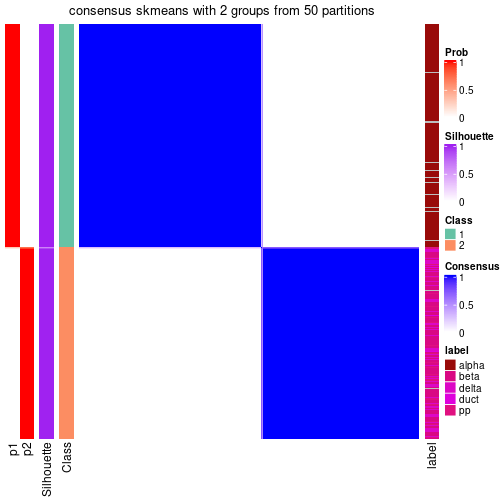</p>

</div>
<div id='tab-node-021-consensus-heatmap-2'>
<pre><code class="r">consensus_heatmap(res, k = 3)
</code></pre>

<p>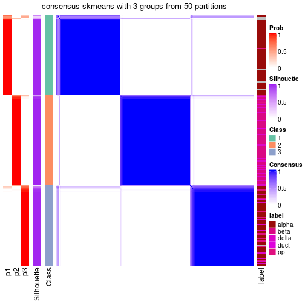</p>

</div>
<div id='tab-node-021-consensus-heatmap-3'>
<pre><code class="r">consensus_heatmap(res, k = 4)
</code></pre>

<p>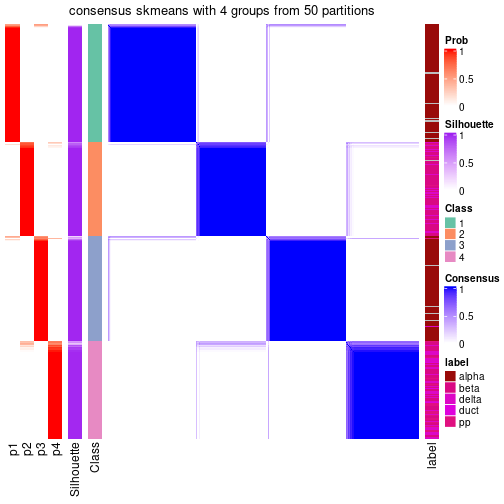</p>

</div>
</div>

Heatmaps for the membership of samples in all partitions to see how consistent they are:


<script>
$( function() {
	$( '#tabs-node-021-membership-heatmap' ).tabs();
} );
</script>
<div id='tabs-node-021-membership-heatmap'>
<ul>
<li><a href='#tab-node-021-membership-heatmap-1'>k = 2</a></li>
<li><a href='#tab-node-021-membership-heatmap-2'>k = 3</a></li>
<li><a href='#tab-node-021-membership-heatmap-3'>k = 4</a></li>
</ul>
<div id='tab-node-021-membership-heatmap-1'>
<pre><code class="r">membership_heatmap(res, k = 2)
</code></pre>

<p>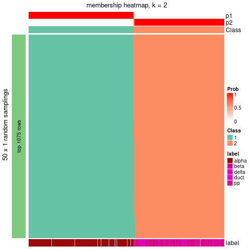</p>

</div>
<div id='tab-node-021-membership-heatmap-2'>
<pre><code class="r">membership_heatmap(res, k = 3)
</code></pre>

<p></p>

</div>
<div id='tab-node-021-membership-heatmap-3'>
<pre><code class="r">membership_heatmap(res, k = 4)
</code></pre>

<p>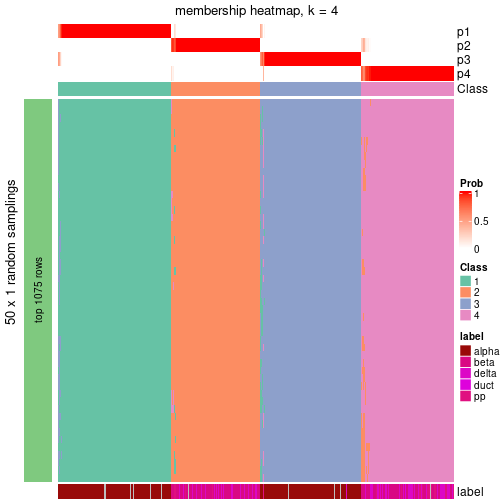</p>

</div>
</div>

As soon as the classes for columns are determined, the signatures
that are significantly different between subgroups can be looked for. 
Following are the heatmaps for signatures.


Signature heatmaps where rows are scaled:


<script>
$( function() {
	$( '#tabs-node-021-get-signatures' ).tabs();
} );
</script>
<div id='tabs-node-021-get-signatures'>
<ul>
<li><a href='#tab-node-021-get-signatures-1'>k = 2</a></li>
<li><a href='#tab-node-021-get-signatures-2'>k = 3</a></li>
<li><a href='#tab-node-021-get-signatures-3'>k = 4</a></li>
</ul>
<div id='tab-node-021-get-signatures-1'>
<pre><code class="r">get_signatures(res, k = 2)
</code></pre>

<p>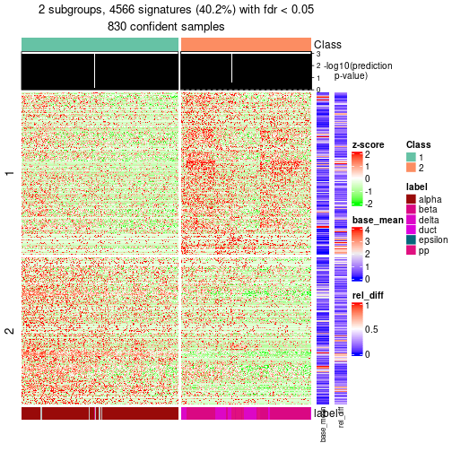</p>

</div>
<div id='tab-node-021-get-signatures-2'>
<pre><code class="r">get_signatures(res, k = 3)
</code></pre>

<p>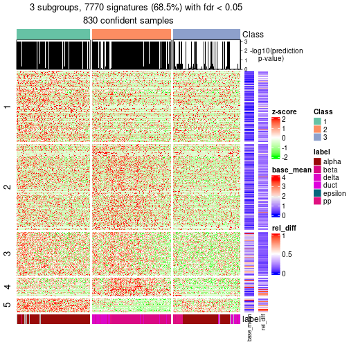</p>

</div>
<div id='tab-node-021-get-signatures-3'>
<pre><code class="r">get_signatures(res, k = 4)
</code></pre>

<p>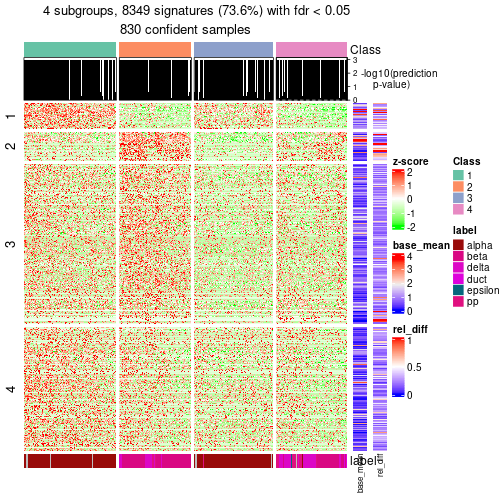</p>

</div>
</div>


Signature heatmaps where rows are not scaled:


<script>
$( function() {
	$( '#tabs-node-021-get-signatures-no-scale' ).tabs();
} );
</script>
<div id='tabs-node-021-get-signatures-no-scale'>
<ul>
<li><a href='#tab-node-021-get-signatures-no-scale-1'>k = 2</a></li>
<li><a href='#tab-node-021-get-signatures-no-scale-2'>k = 3</a></li>
<li><a href='#tab-node-021-get-signatures-no-scale-3'>k = 4</a></li>
</ul>
<div id='tab-node-021-get-signatures-no-scale-1'>
<pre><code class="r">get_signatures(res, k = 2, scale_rows = FALSE)
</code></pre>

<p>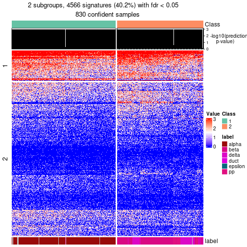</p>

</div>
<div id='tab-node-021-get-signatures-no-scale-2'>
<pre><code class="r">get_signatures(res, k = 3, scale_rows = FALSE)
</code></pre>

<p>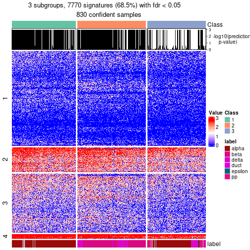</p>

</div>
<div id='tab-node-021-get-signatures-no-scale-3'>
<pre><code class="r">get_signatures(res, k = 4, scale_rows = FALSE)
</code></pre>

<p>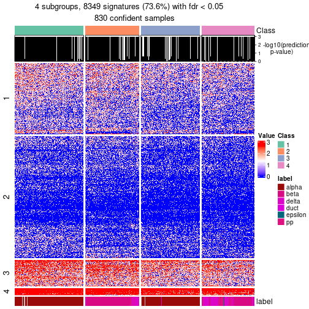</p>

</div>
</div>


Compare the overlap of signatures from different k:

```r
compare_signatures(res)
```

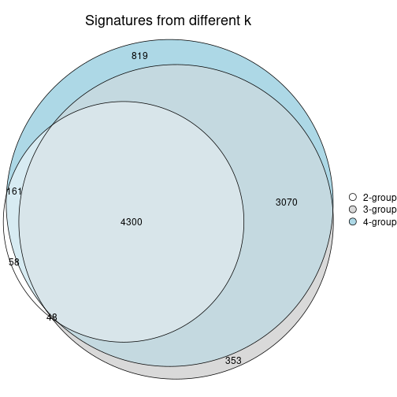

`get_signature()` returns a data frame invisibly. To get the list of signatures, the function
call should be assigned to a variable explicitly. In following code, if `plot` argument is set
to `FALSE`, no heatmap is plotted while only the differential analysis is performed.

```r
# code only for demonstration
tb = get_signature(res, k = ..., plot = FALSE)
```

An example of the output of `tb` is:

```
#>   which_row         fdr    mean_1    mean_2 scaled_mean_1 scaled_mean_2 km
#> 1        38 0.042760348  8.373488  9.131774    -0.5533452     0.5164555  1
#> 2        40 0.018707592  7.106213  8.469186    -0.6173731     0.5762149  1
#> 3        55 0.019134737 10.221463 11.207825    -0.6159697     0.5749050  1
#> 4        59 0.006059896  5.921854  7.869574    -0.6899429     0.6439467  1
#> 5        60 0.018055526  8.928898 10.211722    -0.6204761     0.5791110  1
#> 6        98 0.009384629 15.714769 14.887706     0.6635654    -0.6193277  2
...
```

The columns in `tb` are:

1. `which_row`: row indices corresponding to the input matrix.
2. `fdr`: FDR for the differential test. 
3. `mean_x`: The mean value in group x.
4. `scaled_mean_x`: The mean value in group x after rows are scaled.
5. `km`: Row groups if k-means clustering is applied to rows (which is done by automatically selecting number of clusters).

If there are too many signatures, `top_signatures = ...` can be set to only show the 
signatures with the highest FDRs:

```r
# code only for demonstration
# e.g. to show the top 500 most significant rows
tb = get_signature(res, k = ..., top_signatures = 500)
```

If the signatures are defined as these which are uniquely high in current group, `diff_method` argument
can be set to `"uniquely_high_in_one_group"`:

```r
# code only for demonstration
tb = get_signature(res, k = ..., diff_method = "uniquely_high_in_one_group")
```


UMAP plot which shows how samples are separated.


<script>
$( function() {
	$( '#tabs-node-021-dimension-reduction' ).tabs();
} );
</script>
<div id='tabs-node-021-dimension-reduction'>
<ul>
<li><a href='#tab-node-021-dimension-reduction-1'>k = 2</a></li>
<li><a href='#tab-node-021-dimension-reduction-2'>k = 3</a></li>
<li><a href='#tab-node-021-dimension-reduction-3'>k = 4</a></li>
</ul>
<div id='tab-node-021-dimension-reduction-1'>
<pre><code class="r">dimension_reduction(res, k = 2, method = &quot;UMAP&quot;)
</code></pre>

<p>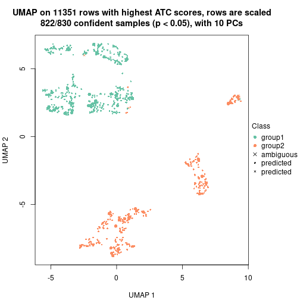</p>

</div>
<div id='tab-node-021-dimension-reduction-2'>
<pre><code class="r">dimension_reduction(res, k = 3, method = &quot;UMAP&quot;)
</code></pre>

<p>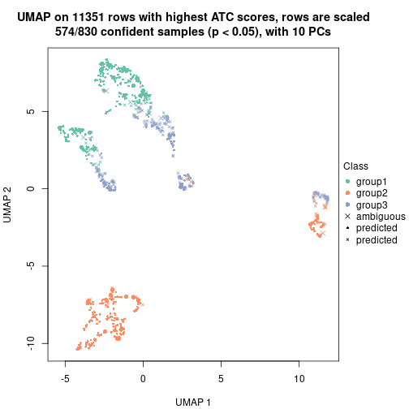</p>

</div>
<div id='tab-node-021-dimension-reduction-3'>
<pre><code class="r">dimension_reduction(res, k = 4, method = &quot;UMAP&quot;)
</code></pre>

<p>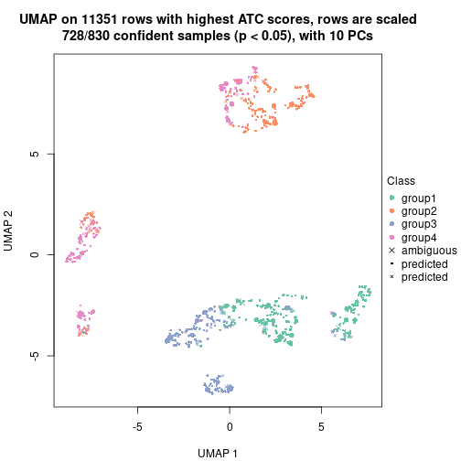</p>

</div>
</div>


Following heatmap shows how subgroups are split when increasing `k`:

```r
collect_classes(res)
```

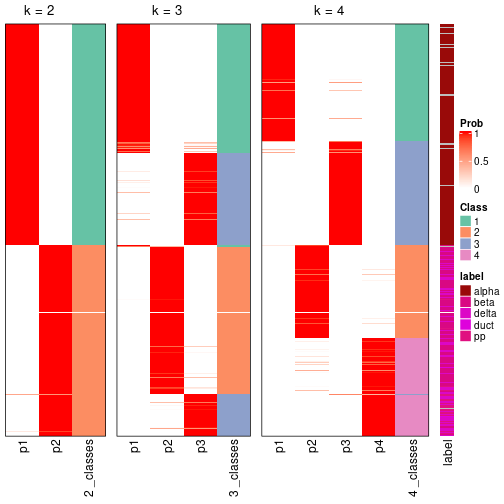


Test correlation between subgroups and known annotations. If the known
annotation is numeric, one-way ANOVA test is applied, and if the known
annotation is discrete, chi-squared contingency table test is applied.

```r
test_to_known_factors(res)
```

```
#>             n_sample label(p-value) k
#> ATC:skmeans      822      5.20e-170 2
#> ATC:skmeans      574      1.44e-133 3
#> ATC:skmeans      728      7.90e-169 4
```


If matrix rows can be associated to genes, consider to use `functional_enrichment(res,
...)` to perform function enrichment for the signature genes. See [this vignette](https://jokergoo.github.io/cola_vignettes/functional_enrichment.html) for more detailed explanations.


 

---------------------------------------------------


### Node0212


Parent node: [Node021](#Node021).
Child nodes: 
                Node02121-leaf
        ,
                Node02122-leaf
        ,
                Node02123-leaf
        ,
                Node02141-leaf
        ,
                Node02142-leaf
        ,
                Node02143-leaf
        ,
                Node02144-leaf
        ,
                [Node02211](#Node02211)
        ,
                Node02212-leaf
        ,
                Node02213-leaf
        ,
                Node02221-leaf
        ,
                Node02222-leaf
        ,
                Node02223-leaf
        ,
                Node02311-leaf
        ,
                Node02312-leaf
        ,
                Node02321-leaf
        ,
                Node02322-leaf
        ,
                Node02411-leaf
        ,
                Node02412-leaf
        ,
                Node02421-leaf
        ,
                Node02422-leaf
        .


The object with results only for a single top-value method and a single partitioning method 
can be extracted as:

```r
res = res_rh["0212"]
```

A summary of `res` and all the functions that can be applied to it:

```r
res
```

```
#> A 'ConsensusPartition' object with k = 2, 3, 4.
#>   On a matrix with 10063 rows and 190 columns.
#>   Top rows (1006) are extracted by 'ATC' method.
#>   Subgroups are detected by 'skmeans' method.
#>   Performed in total 150 partitions by row resampling.
#>   Best k for subgroups seems to be 3.
#> 
#> Following methods can be applied to this 'ConsensusPartition' object:
#>  [1] "cola_report"             "collect_classes"         "collect_plots"          
#>  [4] "collect_stats"           "colnames"                "compare_partitions"     
#>  [7] "compare_signatures"      "consensus_heatmap"       "dimension_reduction"    
#> [10] "functional_enrichment"   "get_anno_col"            "get_anno"               
#> [13] "get_classes"             "get_consensus"           "get_matrix"             
#> [16] "get_membership"          "get_param"               "get_signatures"         
#> [19] "get_stats"               "is_best_k"               "is_stable_k"            
#> [22] "membership_heatmap"      "ncol"                    "nrow"                   
#> [25] "plot_ecdf"               "predict_classes"         "rownames"               
#> [28] "select_partition_number" "show"                    "suggest_best_k"         
#> [31] "test_to_known_factors"   "top_rows_heatmap"
```

`collect_plots()` function collects all the plots made from `res` for all `k` (number of subgroups)
into one single page to provide an easy and fast comparison between different `k`.

```r
collect_plots(res)
```


The plots are:

- The first row: a plot of the eCDF (empirical cumulative distribution
  function) curves of the consensus matrix for each `k` and the heatmap of
  predicted classes for each `k`.
- The second row: heatmaps of the consensus matrix for each `k`.
- The third row: heatmaps of the membership matrix for each `k`.
- The fouth row: heatmaps of the signatures for each `k`.

All the plots in panels can be made by individual functions and they are
plotted later in this section.

`select_partition_number()` produces several plots showing different
statistics for choosing "optimized" `k`. There are following statistics:

- eCDF curves of the consensus matrix for each `k`;
- 1-PAC. [The PAC score](https://en.wikipedia.org/wiki/Consensus_clustering#Over-interpretation_potential_of_consensus_clustering)
  measures the proportion of the ambiguous subgrouping.
- Mean silhouette score.
- Concordance. The mean probability of fiting the consensus subgroup labels in all
  partitions.
- Area increased. Denote $A_k$ as the area under the eCDF curve for current
  `k`, the area increased is defined as $A_k - A_{k-1}$.
- Rand index. The percent of pairs of samples that are both in a same cluster
  or both are not in a same cluster in the partition of k and k-1.
- Jaccard index. The ratio of pairs of samples are both in a same cluster in
  the partition of k and k-1 and the pairs of samples are both in a same
  cluster in the partition k or k-1.

The detailed explanations of these statistics can be found in [the _cola_
vignette](https://jokergoo.github.io/cola_vignettes/cola.html#toc_13).

Generally speaking, higher 1-PAC score, higher mean silhouette score or higher
concordance corresponds to better partition. Rand index and Jaccard index
measure how similar the current partition is compared to partition with `k-1`.
If they are too similar, we won't accept `k` is better than `k-1`.

```r
select_partition_number(res)
```

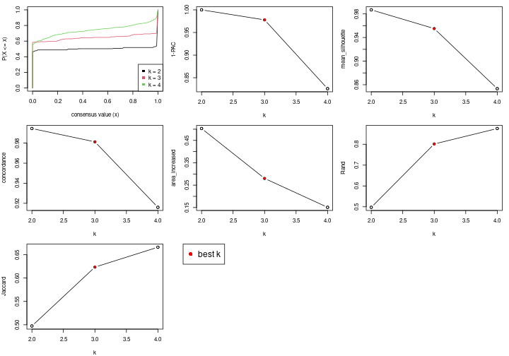

The numeric values for all these statistics can be obtained by `get_stats()`.

```r
get_stats(res)
```

```
#>   k 1-PAC mean_silhouette concordance area_increased  Rand Jaccard
#> 2 2 1.000           0.987       0.995          0.503 0.497   0.497
#> 3 3 0.978           0.955       0.981          0.280 0.802   0.623
#> 4 4 0.826           0.853       0.916          0.151 0.876   0.666
```

`suggest_best_k()` suggests the best $k$ based on these statistics. The rules are as follows:

- All $k$ with Jaccard index larger than 0.95 are removed because increasing
  $k$ does not provide enough extra information. If all $k$ are removed, it is
  marked as no subgroup is detected.
- For all $k$ with 1-PAC score larger than 0.9, the maximal $k$ is taken as
  the best $k$, and other $k$ are marked as optional $k$.
- If it does not fit the second rule. The $k$ with the maximal vote of the
  highest 1-PAC score, highest mean silhouette, and highest concordance is
  taken as the best $k$.

```r
suggest_best_k(res)
```

```
#> [1] 3
#> attr(,"optional")
#> [1] 2
```

There is also optional best $k$ = 2 that is worth to check.

Following is the table of the partitions (You need to click the **show/hide
code output** link to see it). The membership matrix (columns with name `p*`)
is inferred by
[`clue::cl_consensus()`](https://www.rdocumentation.org/link/cl_consensus?package=clue)
function with the `SE` method. Basically the value in the membership matrix
represents the probability to belong to a certain group. The finall subgroup
label for an item is determined with the group with highest probability it
belongs to.

In `get_classes()` function, the entropy is calculated from the membership
matrix and the silhouette score is calculated from the consensus matrix.


<script>
$( function() {
	$( '#tabs-node-0212-get-classes' ).tabs();
} );
</script>
<div id='tabs-node-0212-get-classes'>
<ul>
<li><a href='#tab-node-0212-get-classes-1'>k = 2</a></li>
<li><a href='#tab-node-0212-get-classes-2'>k = 3</a></li>
<li><a href='#tab-node-0212-get-classes-3'>k = 4</a></li>
</ul>

<div id='tab-node-0212-get-classes-1'>
<p><a id='tab-node-0212-get-classes-1-a' style='color:#0366d6' href='#'>show/hide code output</a></p>
<pre><code class="r">cbind(get_classes(res, k = 2), get_membership(res, k = 2))
</code></pre>

<pre><code>#&gt;          class entropy silhouette   p1   p2
#&gt; D28-1_43     1   0.000      0.993 1.00 0.00
#&gt; D28-2_63     2   0.000      0.996 0.00 1.00
#&gt; D28-3_27     2   0.000      0.996 0.00 1.00
#&gt; D28-3_37     2   0.000      0.996 0.00 1.00
#&gt; D28-4_90     2   0.000      0.996 0.00 1.00
#&gt; D28-8_38     2   0.000      0.996 0.00 1.00
#&gt; D29-1_8      2   0.000      0.996 0.00 1.00
#&gt; D29-1_21     2   0.000      0.996 0.00 1.00
#&gt; D29-1_77     1   0.000      0.993 1.00 0.00
#&gt; D29-1_81     2   0.000      0.996 0.00 1.00
#&gt; D29-1_82     2   0.000      0.996 0.00 1.00
#&gt; D29-1_84     2   0.000      0.996 0.00 1.00
#&gt; D29-1_88     2   0.000      0.996 0.00 1.00
#&gt; D29-1_92     2   0.000      0.996 0.00 1.00
#&gt; D29-2_5      2   0.000      0.996 0.00 1.00
#&gt; D29-2_18     2   0.000      0.996 0.00 1.00
#&gt; D29-2_26     1   0.000      0.993 1.00 0.00
#&gt; D29-2_27     2   0.000      0.996 0.00 1.00
#&gt; D29-2_50     2   0.000      0.996 0.00 1.00
#&gt; D29-2_60     1   0.000      0.993 1.00 0.00
#&gt; D29-2_68     2   0.000      0.996 0.00 1.00
#&gt; D29-2_70     2   0.000      0.996 0.00 1.00
#&gt; D29-2_72     2   0.242      0.956 0.04 0.96
#&gt; D29-2_79     1   0.000      0.993 1.00 0.00
#&gt; D29-2_80     2   0.000      0.996 0.00 1.00
#&gt; D29-2_81     2   0.000      0.996 0.00 1.00
#&gt; D29-2_87     2   0.000      0.996 0.00 1.00
#&gt; D29-3_21     1   0.000      0.993 1.00 0.00
#&gt; D29-3_23     2   0.141      0.977 0.02 0.98
#&gt; D29-3_37     1   0.000      0.993 1.00 0.00
#&gt; D29-3_39     2   0.000      0.996 0.00 1.00
#&gt; D29-3_45     2   0.000      0.996 0.00 1.00
#&gt; D29-3_48     1   0.000      0.993 1.00 0.00
#&gt; D29-3_52     2   0.000      0.996 0.00 1.00
#&gt; D29-3_59     2   0.000      0.996 0.00 1.00
#&gt; D29-3_64     1   0.000      0.993 1.00 0.00
#&gt; D29-3_69     2   0.000      0.996 0.00 1.00
#&gt; D29-3_78     1   0.000      0.993 1.00 0.00
#&gt; D29-3_86     1   0.855      0.611 0.72 0.28
#&gt; D29-4_23     1   0.000      0.993 1.00 0.00
#&gt; D29-4_27     1   0.000      0.993 1.00 0.00
#&gt; D29-4_39     1   0.000      0.993 1.00 0.00
#&gt; D29-4_42     1   0.000      0.993 1.00 0.00
#&gt; D29-4_44     1   0.000      0.993 1.00 0.00
#&gt; D29-4_52     1   0.000      0.993 1.00 0.00
#&gt; D29-4_59     2   0.000      0.996 0.00 1.00
#&gt; D29-4_63     2   0.000      0.996 0.00 1.00
#&gt; D29-4_73     2   0.000      0.996 0.00 1.00
#&gt; D29-4_88     1   0.000      0.993 1.00 0.00
#&gt; D29-4_92     2   0.855      0.609 0.28 0.72
#&gt; D29-5_6      2   0.000      0.996 0.00 1.00
#&gt; D29-5_10     2   0.000      0.996 0.00 1.00
#&gt; D29-5_12     2   0.000      0.996 0.00 1.00
#&gt; D29-5_14     1   0.000      0.993 1.00 0.00
#&gt; D29-5_21     1   0.000      0.993 1.00 0.00
#&gt; D29-5_22     1   0.000      0.993 1.00 0.00
#&gt; D29-5_32     2   0.000      0.996 0.00 1.00
#&gt; D29-5_34     1   0.000      0.993 1.00 0.00
#&gt; D29-5_52     2   0.000      0.996 0.00 1.00
#&gt; D29-5_53     2   0.000      0.996 0.00 1.00
#&gt; D29-5_58     2   0.000      0.996 0.00 1.00
#&gt; D29-5_62     2   0.000      0.996 0.00 1.00
#&gt; D29-5_63     1   0.000      0.993 1.00 0.00
#&gt; D29-5_70     2   0.000      0.996 0.00 1.00
#&gt; D29-5_91     1   0.000      0.993 1.00 0.00
#&gt; D29-6_3      2   0.000      0.996 0.00 1.00
#&gt; D29-6_30     2   0.000      0.996 0.00 1.00
#&gt; D29-6_32     2   0.000      0.996 0.00 1.00
#&gt; D29-6_56     2   0.000      0.996 0.00 1.00
#&gt; D29-6_59     2   0.000      0.996 0.00 1.00
#&gt; D29-6_66     2   0.000      0.996 0.00 1.00
#&gt; D29-6_67     2   0.000      0.996 0.00 1.00
#&gt; D29-6_72     2   0.000      0.996 0.00 1.00
#&gt; D29-6_79     2   0.000      0.996 0.00 1.00
#&gt; D29-7_2      2   0.000      0.996 0.00 1.00
#&gt; D29-7_12     2   0.000      0.996 0.00 1.00
#&gt; D29-7_14     1   0.000      0.993 1.00 0.00
#&gt; D29-7_17     2   0.242      0.956 0.04 0.96
#&gt; D29-7_42     1   0.000      0.993 1.00 0.00
#&gt; D29-7_45     2   0.000      0.996 0.00 1.00
#&gt; D29-7_48     2   0.000      0.996 0.00 1.00
#&gt; D29-7_52     2   0.000      0.996 0.00 1.00
#&gt; D29-7_54     2   0.000      0.996 0.00 1.00
#&gt; D29-7_69     2   0.000      0.996 0.00 1.00
#&gt; D29-7_74     2   0.000      0.996 0.00 1.00
#&gt; D29-7_75     2   0.000      0.996 0.00 1.00
#&gt; D29-7_79     2   0.000      0.996 0.00 1.00
#&gt; D29-7_86     2   0.000      0.996 0.00 1.00
#&gt; D29-8_23     1   0.000      0.993 1.00 0.00
#&gt; D29-8_49     1   0.943      0.439 0.64 0.36
#&gt; D29-8_62     2   0.000      0.996 0.00 1.00
#&gt; D29-8_87     1   0.000      0.993 1.00 0.00
#&gt; D31-1_14     1   0.000      0.993 1.00 0.00
#&gt; D31-1_20     1   0.000      0.993 1.00 0.00
#&gt; D31-1_63     1   0.000      0.993 1.00 0.00
#&gt; D31-1_73     1   0.000      0.993 1.00 0.00
#&gt; D31-2_3      1   0.000      0.993 1.00 0.00
#&gt; D31-2_27     1   0.000      0.993 1.00 0.00
#&gt; D31-2_47     1   0.000      0.993 1.00 0.00
#&gt; D31-2_58     1   0.000      0.993 1.00 0.00
#&gt; D31-2_65     1   0.000      0.993 1.00 0.00
#&gt; D31-2_70     2   0.000      0.996 0.00 1.00
#&gt; D31-3_4      1   0.000      0.993 1.00 0.00
#&gt; D31-3_17     1   0.000      0.993 1.00 0.00
#&gt; D31-3_22     2   0.000      0.996 0.00 1.00
#&gt; D31-3_33     1   0.000      0.993 1.00 0.00
#&gt; D31-3_50     1   0.000      0.993 1.00 0.00
#&gt; D31-3_75     1   0.000      0.993 1.00 0.00
#&gt; D31-3_77     2   0.000      0.996 0.00 1.00
#&gt; D31-3_83     1   0.000      0.993 1.00 0.00
#&gt; D31-3_87     1   0.000      0.993 1.00 0.00
#&gt; D31-3_88     2   0.000      0.996 0.00 1.00
#&gt; D31-4_10     2   0.000      0.996 0.00 1.00
#&gt; D31-4_19     1   0.141      0.973 0.98 0.02
#&gt; D31-4_25     1   0.000      0.993 1.00 0.00
#&gt; D31-4_28     2   0.000      0.996 0.00 1.00
#&gt; D31-4_75     1   0.000      0.993 1.00 0.00
#&gt; D31-4_78     2   0.000      0.996 0.00 1.00
#&gt; D31-5_3      1   0.000      0.993 1.00 0.00
#&gt; D31-5_26     1   0.000      0.993 1.00 0.00
#&gt; D31-5_52     1   0.000      0.993 1.00 0.00
#&gt; D31-5_55     2   0.000      0.996 0.00 1.00
#&gt; D31-5_61     1   0.000      0.993 1.00 0.00
#&gt; D31-5_74     1   0.000      0.993 1.00 0.00
#&gt; D31-5_80     1   0.000      0.993 1.00 0.00
#&gt; D31-5_94     1   0.000      0.993 1.00 0.00
#&gt; D31-6_12     2   0.000      0.996 0.00 1.00
#&gt; D31-6_22     1   0.000      0.993 1.00 0.00
#&gt; D31-6_47     1   0.000      0.993 1.00 0.00
#&gt; D31-6_67     2   0.000      0.996 0.00 1.00
#&gt; D31-6_80     1   0.000      0.993 1.00 0.00
#&gt; D31-6_92     1   0.000      0.993 1.00 0.00
#&gt; D31-7_1      1   0.000      0.993 1.00 0.00
#&gt; D31-7_3      1   0.000      0.993 1.00 0.00
#&gt; D31-7_22     1   0.000      0.993 1.00 0.00
#&gt; D31-7_45     1   0.000      0.993 1.00 0.00
#&gt; D31-7_46     2   0.000      0.996 0.00 1.00
#&gt; D31-7_47     1   0.000      0.993 1.00 0.00
#&gt; D31-7_53     1   0.000      0.993 1.00 0.00
#&gt; D31-7_59     1   0.000      0.993 1.00 0.00
#&gt; D31-7_60     1   0.000      0.993 1.00 0.00
#&gt; D31-7_67     1   0.000      0.993 1.00 0.00
#&gt; D31-7_72     1   0.000      0.993 1.00 0.00
#&gt; D31-7_84     1   0.000      0.993 1.00 0.00
#&gt; D31-7_85     1   0.000      0.993 1.00 0.00
#&gt; D31-7_91     1   0.000      0.993 1.00 0.00
#&gt; D31-8_8      1   0.000      0.993 1.00 0.00
#&gt; D31-8_21     1   0.000      0.993 1.00 0.00
#&gt; D31-8_31     1   0.000      0.993 1.00 0.00
#&gt; D31-8_73     1   0.000      0.993 1.00 0.00
#&gt; D31-8_76     2   0.000      0.996 0.00 1.00
#&gt; D30-1_57     2   0.000      0.996 0.00 1.00
#&gt; D30-1_67     1   0.000      0.993 1.00 0.00
#&gt; D30-1_94     1   0.000      0.993 1.00 0.00
#&gt; D30-2_8      2   0.000      0.996 0.00 1.00
#&gt; D30-2_61     2   0.000      0.996 0.00 1.00
#&gt; D30-2_89     2   0.000      0.996 0.00 1.00
#&gt; D30-3_9      1   0.000      0.993 1.00 0.00
#&gt; D30-3_10     2   0.000      0.996 0.00 1.00
#&gt; D30-3_14     1   0.000      0.993 1.00 0.00
#&gt; D30-3_22     2   0.000      0.996 0.00 1.00
#&gt; D30-3_43     2   0.000      0.996 0.00 1.00
#&gt; D30-3_51     1   0.000      0.993 1.00 0.00
#&gt; D30-3_76     2   0.000      0.996 0.00 1.00
#&gt; D30-3_81     1   0.000      0.993 1.00 0.00
#&gt; D30-3_82     2   0.000      0.996 0.00 1.00
#&gt; D30-3_87     2   0.000      0.996 0.00 1.00
#&gt; D30-4_2      1   0.000      0.993 1.00 0.00
#&gt; D30-4_9      1   0.000      0.993 1.00 0.00
#&gt; D30-4_17     2   0.000      0.996 0.00 1.00
#&gt; D30-4_22     2   0.000      0.996 0.00 1.00
#&gt; D30-4_34     1   0.000      0.993 1.00 0.00
#&gt; D30-4_67     1   0.000      0.993 1.00 0.00
#&gt; D30-4_80     2   0.000      0.996 0.00 1.00
#&gt; D30-4_83     1   0.000      0.993 1.00 0.00
#&gt; D30-4_90     1   0.000      0.993 1.00 0.00
#&gt; D30-5_21     1   0.000      0.993 1.00 0.00
#&gt; D30-5_22     2   0.000      0.996 0.00 1.00
#&gt; D30-5_56     1   0.000      0.993 1.00 0.00
#&gt; D30-6_15     1   0.000      0.993 1.00 0.00
#&gt; D30-6_38     1   0.000      0.993 1.00 0.00
#&gt; D30-6_47     2   0.000      0.996 0.00 1.00
#&gt; D30-7_7      2   0.000      0.996 0.00 1.00
#&gt; D30-7_70     1   0.000      0.993 1.00 0.00
#&gt; D30-8_6      1   0.000      0.993 1.00 0.00
#&gt; D30-8_17     2   0.000      0.996 0.00 1.00
#&gt; D30-8_35     1   0.000      0.993 1.00 0.00
#&gt; D30-8_51     2   0.000      0.996 0.00 1.00
#&gt; D30-8_74     1   0.000      0.993 1.00 0.00
#&gt; D30-8_88     2   0.000      0.996 0.00 1.00
</code></pre>

<script>
$('#tab-node-0212-get-classes-1-a').parent().next().next().hide();
$('#tab-node-0212-get-classes-1-a').click(function(){
  $('#tab-node-0212-get-classes-1-a').parent().next().next().toggle();
  return(false);
});
</script>
</div>

<div id='tab-node-0212-get-classes-2'>
<p><a id='tab-node-0212-get-classes-2-a' style='color:#0366d6' href='#'>show/hide code output</a></p>
<pre><code class="r">cbind(get_classes(res, k = 3), get_membership(res, k = 3))
</code></pre>

<pre><code>#&gt;          class entropy silhouette   p1   p2   p3
#&gt; D28-1_43     1  0.0000      0.980 1.00 0.00 0.00
#&gt; D28-2_63     3  0.0000      0.999 0.00 0.00 1.00
#&gt; D28-3_27     3  0.1529      0.957 0.00 0.04 0.96
#&gt; D28-3_37     3  0.0000      0.999 0.00 0.00 1.00
#&gt; D28-4_90     3  0.0000      0.999 0.00 0.00 1.00
#&gt; D28-8_38     3  0.0000      0.999 0.00 0.00 1.00
#&gt; D29-1_8      2  0.0000      0.966 0.00 1.00 0.00
#&gt; D29-1_21     2  0.0000      0.966 0.00 1.00 0.00
#&gt; D29-1_77     1  0.0000      0.980 1.00 0.00 0.00
#&gt; D29-1_81     2  0.0000      0.966 0.00 1.00 0.00
#&gt; D29-1_82     2  0.0000      0.966 0.00 1.00 0.00
#&gt; D29-1_84     2  0.0000      0.966 0.00 1.00 0.00
#&gt; D29-1_88     2  0.0000      0.966 0.00 1.00 0.00
#&gt; D29-1_92     2  0.0000      0.966 0.00 1.00 0.00
#&gt; D29-2_5      2  0.0000      0.966 0.00 1.00 0.00
#&gt; D29-2_18     2  0.0892      0.949 0.00 0.98 0.02
#&gt; D29-2_26     1  0.0000      0.980 1.00 0.00 0.00
#&gt; D29-2_27     2  0.0000      0.966 0.00 1.00 0.00
#&gt; D29-2_50     2  0.0000      0.966 0.00 1.00 0.00
#&gt; D29-2_60     2  0.0000      0.966 0.00 1.00 0.00
#&gt; D29-2_68     3  0.0000      0.999 0.00 0.00 1.00
#&gt; D29-2_70     2  0.0000      0.966 0.00 1.00 0.00
#&gt; D29-2_72     2  0.0000      0.966 0.00 1.00 0.00
#&gt; D29-2_79     1  0.0000      0.980 1.00 0.00 0.00
#&gt; D29-2_80     2  0.0000      0.966 0.00 1.00 0.00
#&gt; D29-2_81     2  0.0000      0.966 0.00 1.00 0.00
#&gt; D29-2_87     3  0.0000      0.999 0.00 0.00 1.00
#&gt; D29-3_21     1  0.0000      0.980 1.00 0.00 0.00
#&gt; D29-3_23     2  0.3686      0.823 0.00 0.86 0.14
#&gt; D29-3_37     1  0.0000      0.980 1.00 0.00 0.00
#&gt; D29-3_39     2  0.6045      0.396 0.00 0.62 0.38
#&gt; D29-3_45     3  0.0000      0.999 0.00 0.00 1.00
#&gt; D29-3_48     1  0.0000      0.980 1.00 0.00 0.00
#&gt; D29-3_52     2  0.0000      0.966 0.00 1.00 0.00
#&gt; D29-3_59     2  0.0000      0.966 0.00 1.00 0.00
#&gt; D29-3_64     1  0.0000      0.980 1.00 0.00 0.00
#&gt; D29-3_69     3  0.0000      0.999 0.00 0.00 1.00
#&gt; D29-3_78     2  0.0000      0.966 0.00 1.00 0.00
#&gt; D29-3_86     2  0.0000      0.966 0.00 1.00 0.00
#&gt; D29-4_23     1  0.0000      0.980 1.00 0.00 0.00
#&gt; D29-4_27     1  0.0000      0.980 1.00 0.00 0.00
#&gt; D29-4_39     1  0.0000      0.980 1.00 0.00 0.00
#&gt; D29-4_42     1  0.0000      0.980 1.00 0.00 0.00
#&gt; D29-4_44     1  0.0000      0.980 1.00 0.00 0.00
#&gt; D29-4_52     1  0.0000      0.980 1.00 0.00 0.00
#&gt; D29-4_59     2  0.0000      0.966 0.00 1.00 0.00
#&gt; D29-4_63     3  0.0000      0.999 0.00 0.00 1.00
#&gt; D29-4_73     2  0.0000      0.966 0.00 1.00 0.00
#&gt; D29-4_88     1  0.0000      0.980 1.00 0.00 0.00
#&gt; D29-4_92     2  0.0000      0.966 0.00 1.00 0.00
#&gt; D29-5_6      3  0.0000      0.999 0.00 0.00 1.00
#&gt; D29-5_10     2  0.0000      0.966 0.00 1.00 0.00
#&gt; D29-5_12     2  0.0000      0.966 0.00 1.00 0.00
#&gt; D29-5_14     1  0.0000      0.980 1.00 0.00 0.00
#&gt; D29-5_21     1  0.6045      0.379 0.62 0.38 0.00
#&gt; D29-5_22     1  0.0000      0.980 1.00 0.00 0.00
#&gt; D29-5_32     3  0.0000      0.999 0.00 0.00 1.00
#&gt; D29-5_34     1  0.0000      0.980 1.00 0.00 0.00
#&gt; D29-5_52     2  0.0000      0.966 0.00 1.00 0.00
#&gt; D29-5_53     2  0.0000      0.966 0.00 1.00 0.00
#&gt; D29-5_58     2  0.0000      0.966 0.00 1.00 0.00
#&gt; D29-5_62     2  0.0000      0.966 0.00 1.00 0.00
#&gt; D29-5_63     2  0.0000      0.966 0.00 1.00 0.00
#&gt; D29-5_70     2  0.0000      0.966 0.00 1.00 0.00
#&gt; D29-5_91     2  0.0000      0.966 0.00 1.00 0.00
#&gt; D29-6_3      2  0.0000      0.966 0.00 1.00 0.00
#&gt; D29-6_30     3  0.0000      0.999 0.00 0.00 1.00
#&gt; D29-6_32     2  0.0000      0.966 0.00 1.00 0.00
#&gt; D29-6_56     2  0.0000      0.966 0.00 1.00 0.00
#&gt; D29-6_59     2  0.0000      0.966 0.00 1.00 0.00
#&gt; D29-6_66     3  0.0000      0.999 0.00 0.00 1.00
#&gt; D29-6_67     2  0.0000      0.966 0.00 1.00 0.00
#&gt; D29-6_72     2  0.0000      0.966 0.00 1.00 0.00
#&gt; D29-6_79     2  0.0000      0.966 0.00 1.00 0.00
#&gt; D29-7_2      2  0.0000      0.966 0.00 1.00 0.00
#&gt; D29-7_12     2  0.0000      0.966 0.00 1.00 0.00
#&gt; D29-7_14     1  0.3340      0.855 0.88 0.12 0.00
#&gt; D29-7_17     2  0.0000      0.966 0.00 1.00 0.00
#&gt; D29-7_42     1  0.0000      0.980 1.00 0.00 0.00
#&gt; D29-7_45     2  0.0000      0.966 0.00 1.00 0.00
#&gt; D29-7_48     2  0.2066      0.912 0.00 0.94 0.06
#&gt; D29-7_52     2  0.0000      0.966 0.00 1.00 0.00
#&gt; D29-7_54     3  0.0000      0.999 0.00 0.00 1.00
#&gt; D29-7_69     2  0.0000      0.966 0.00 1.00 0.00
#&gt; D29-7_74     2  0.0000      0.966 0.00 1.00 0.00
#&gt; D29-7_75     2  0.0000      0.966 0.00 1.00 0.00
#&gt; D29-7_79     3  0.0000      0.999 0.00 0.00 1.00
#&gt; D29-7_86     2  0.0000      0.966 0.00 1.00 0.00
#&gt; D29-8_23     1  0.0000      0.980 1.00 0.00 0.00
#&gt; D29-8_49     1  0.9456      0.173 0.48 0.20 0.32
#&gt; D29-8_62     3  0.0000      0.999 0.00 0.00 1.00
#&gt; D29-8_87     1  0.0000      0.980 1.00 0.00 0.00
#&gt; D31-1_14     1  0.0000      0.980 1.00 0.00 0.00
#&gt; D31-1_20     1  0.4796      0.712 0.78 0.22 0.00
#&gt; D31-1_63     1  0.0000      0.980 1.00 0.00 0.00
#&gt; D31-1_73     1  0.0000      0.980 1.00 0.00 0.00
#&gt; D31-2_3      1  0.0000      0.980 1.00 0.00 0.00
#&gt; D31-2_27     1  0.0000      0.980 1.00 0.00 0.00
#&gt; D31-2_47     1  0.0000      0.980 1.00 0.00 0.00
#&gt; D31-2_58     2  0.4796      0.723 0.22 0.78 0.00
#&gt; D31-2_65     1  0.0000      0.980 1.00 0.00 0.00
#&gt; D31-2_70     3  0.0000      0.999 0.00 0.00 1.00
#&gt; D31-3_4      1  0.0000      0.980 1.00 0.00 0.00
#&gt; D31-3_17     1  0.0000      0.980 1.00 0.00 0.00
#&gt; D31-3_22     3  0.0000      0.999 0.00 0.00 1.00
#&gt; D31-3_33     1  0.0000      0.980 1.00 0.00 0.00
#&gt; D31-3_50     1  0.0000      0.980 1.00 0.00 0.00
#&gt; D31-3_75     1  0.0000      0.980 1.00 0.00 0.00
#&gt; D31-3_77     3  0.0000      0.999 0.00 0.00 1.00
#&gt; D31-3_83     1  0.0000      0.980 1.00 0.00 0.00
#&gt; D31-3_87     1  0.0000      0.980 1.00 0.00 0.00
#&gt; D31-3_88     3  0.0000      0.999 0.00 0.00 1.00
#&gt; D31-4_10     2  0.0000      0.966 0.00 1.00 0.00
#&gt; D31-4_19     2  0.5216      0.657 0.26 0.74 0.00
#&gt; D31-4_25     1  0.0000      0.980 1.00 0.00 0.00
#&gt; D31-4_28     3  0.0000      0.999 0.00 0.00 1.00
#&gt; D31-4_75     1  0.0000      0.980 1.00 0.00 0.00
#&gt; D31-4_78     3  0.0000      0.999 0.00 0.00 1.00
#&gt; D31-5_3      1  0.0000      0.980 1.00 0.00 0.00
#&gt; D31-5_26     1  0.0000      0.980 1.00 0.00 0.00
#&gt; D31-5_52     1  0.0000      0.980 1.00 0.00 0.00
#&gt; D31-5_55     3  0.0000      0.999 0.00 0.00 1.00
#&gt; D31-5_61     1  0.0000      0.980 1.00 0.00 0.00
#&gt; D31-5_74     1  0.0000      0.980 1.00 0.00 0.00
#&gt; D31-5_80     1  0.0000      0.980 1.00 0.00 0.00
#&gt; D31-5_94     1  0.0000      0.980 1.00 0.00 0.00
#&gt; D31-6_12     3  0.0000      0.999 0.00 0.00 1.00
#&gt; D31-6_22     1  0.0000      0.980 1.00 0.00 0.00
#&gt; D31-6_47     1  0.0000      0.980 1.00 0.00 0.00
#&gt; D31-6_67     2  0.0000      0.966 0.00 1.00 0.00
#&gt; D31-6_80     1  0.0000      0.980 1.00 0.00 0.00
#&gt; D31-6_92     1  0.0000      0.980 1.00 0.00 0.00
#&gt; D31-7_1      1  0.0000      0.980 1.00 0.00 0.00
#&gt; D31-7_3      1  0.0000      0.980 1.00 0.00 0.00
#&gt; D31-7_22     1  0.0000      0.980 1.00 0.00 0.00
#&gt; D31-7_45     1  0.0000      0.980 1.00 0.00 0.00
#&gt; D31-7_46     3  0.0000      0.999 0.00 0.00 1.00
#&gt; D31-7_47     1  0.0000      0.980 1.00 0.00 0.00
#&gt; D31-7_53     1  0.0000      0.980 1.00 0.00 0.00
#&gt; D31-7_59     1  0.0000      0.980 1.00 0.00 0.00
#&gt; D31-7_60     1  0.0000      0.980 1.00 0.00 0.00
#&gt; D31-7_67     1  0.0000      0.980 1.00 0.00 0.00
#&gt; D31-7_72     1  0.0000      0.980 1.00 0.00 0.00
#&gt; D31-7_84     1  0.0000      0.980 1.00 0.00 0.00
#&gt; D31-7_85     1  0.0000      0.980 1.00 0.00 0.00
#&gt; D31-7_91     1  0.0000      0.980 1.00 0.00 0.00
#&gt; D31-8_8      1  0.0000      0.980 1.00 0.00 0.00
#&gt; D31-8_21     1  0.0000      0.980 1.00 0.00 0.00
#&gt; D31-8_31     1  0.0000      0.980 1.00 0.00 0.00
#&gt; D31-8_73     1  0.0000      0.980 1.00 0.00 0.00
#&gt; D31-8_76     3  0.0000      0.999 0.00 0.00 1.00
#&gt; D30-1_57     2  0.0000      0.966 0.00 1.00 0.00
#&gt; D30-1_67     1  0.0000      0.980 1.00 0.00 0.00
#&gt; D30-1_94     1  0.0000      0.980 1.00 0.00 0.00
#&gt; D30-2_8      3  0.0000      0.999 0.00 0.00 1.00
#&gt; D30-2_61     3  0.0000      0.999 0.00 0.00 1.00
#&gt; D30-2_89     3  0.0000      0.999 0.00 0.00 1.00
#&gt; D30-3_9      1  0.0000      0.980 1.00 0.00 0.00
#&gt; D30-3_10     2  0.0000      0.966 0.00 1.00 0.00
#&gt; D30-3_14     1  0.0000      0.980 1.00 0.00 0.00
#&gt; D30-3_22     3  0.0000      0.999 0.00 0.00 1.00
#&gt; D30-3_43     3  0.0000      0.999 0.00 0.00 1.00
#&gt; D30-3_51     1  0.4555      0.743 0.80 0.20 0.00
#&gt; D30-3_76     3  0.0000      0.999 0.00 0.00 1.00
#&gt; D30-3_81     2  0.5835      0.498 0.34 0.66 0.00
#&gt; D30-3_82     3  0.0000      0.999 0.00 0.00 1.00
#&gt; D30-3_87     3  0.0000      0.999 0.00 0.00 1.00
#&gt; D30-4_2      1  0.0000      0.980 1.00 0.00 0.00
#&gt; D30-4_9      1  0.0000      0.980 1.00 0.00 0.00
#&gt; D30-4_17     3  0.0000      0.999 0.00 0.00 1.00
#&gt; D30-4_22     3  0.0000      0.999 0.00 0.00 1.00
#&gt; D30-4_34     1  0.0000      0.980 1.00 0.00 0.00
#&gt; D30-4_67     1  0.0000      0.980 1.00 0.00 0.00
#&gt; D30-4_80     3  0.0000      0.999 0.00 0.00 1.00
#&gt; D30-4_83     1  0.0000      0.980 1.00 0.00 0.00
#&gt; D30-4_90     1  0.4555      0.747 0.80 0.00 0.20
#&gt; D30-5_21     1  0.0000      0.980 1.00 0.00 0.00
#&gt; D30-5_22     3  0.0000      0.999 0.00 0.00 1.00
#&gt; D30-5_56     1  0.0000      0.980 1.00 0.00 0.00
#&gt; D30-6_15     1  0.0000      0.980 1.00 0.00 0.00
#&gt; D30-6_38     1  0.0000      0.980 1.00 0.00 0.00
#&gt; D30-6_47     2  0.0000      0.966 0.00 1.00 0.00
#&gt; D30-7_7      3  0.0000      0.999 0.00 0.00 1.00
#&gt; D30-7_70     1  0.0000      0.980 1.00 0.00 0.00
#&gt; D30-8_6      2  0.5016      0.692 0.24 0.76 0.00
#&gt; D30-8_17     2  0.0000      0.966 0.00 1.00 0.00
#&gt; D30-8_35     1  0.0000      0.980 1.00 0.00 0.00
#&gt; D30-8_51     2  0.0000      0.966 0.00 1.00 0.00
#&gt; D30-8_74     2  0.4796      0.723 0.22 0.78 0.00
#&gt; D30-8_88     3  0.0000      0.999 0.00 0.00 1.00
</code></pre>

<script>
$('#tab-node-0212-get-classes-2-a').parent().next().next().hide();
$('#tab-node-0212-get-classes-2-a').click(function(){
  $('#tab-node-0212-get-classes-2-a').parent().next().next().toggle();
  return(false);
});
</script>
</div>

<div id='tab-node-0212-get-classes-3'>
<p><a id='tab-node-0212-get-classes-3-a' style='color:#0366d6' href='#'>show/hide code output</a></p>
<pre><code class="r">cbind(get_classes(res, k = 4), get_membership(res, k = 4))
</code></pre>

<pre><code>#&gt;          class entropy silhouette   p1   p2   p3   p4
#&gt; D28-1_43     4  0.2011     0.8738 0.08 0.00 0.00 0.92
#&gt; D28-2_63     3  0.0000     0.9970 0.00 0.00 1.00 0.00
#&gt; D28-3_27     3  0.2011     0.8993 0.00 0.08 0.92 0.00
#&gt; D28-3_37     3  0.0000     0.9970 0.00 0.00 1.00 0.00
#&gt; D28-4_90     3  0.0000     0.9970 0.00 0.00 1.00 0.00
#&gt; D28-8_38     3  0.0000     0.9970 0.00 0.00 1.00 0.00
#&gt; D29-1_8      2  0.0000     0.9674 0.00 1.00 0.00 0.00
#&gt; D29-1_21     2  0.0000     0.9674 0.00 1.00 0.00 0.00
#&gt; D29-1_77     1  0.4977     0.4265 0.54 0.00 0.00 0.46
#&gt; D29-1_81     2  0.0000     0.9674 0.00 1.00 0.00 0.00
#&gt; D29-1_82     2  0.0000     0.9674 0.00 1.00 0.00 0.00
#&gt; D29-1_84     2  0.0000     0.9674 0.00 1.00 0.00 0.00
#&gt; D29-1_88     2  0.0000     0.9674 0.00 1.00 0.00 0.00
#&gt; D29-1_92     2  0.0707     0.9554 0.00 0.98 0.00 0.02
#&gt; D29-2_5      2  0.0000     0.9674 0.00 1.00 0.00 0.00
#&gt; D29-2_18     2  0.0000     0.9674 0.00 1.00 0.00 0.00
#&gt; D29-2_26     1  0.4948     0.5017 0.56 0.00 0.00 0.44
#&gt; D29-2_27     2  0.0000     0.9674 0.00 1.00 0.00 0.00
#&gt; D29-2_50     2  0.0000     0.9674 0.00 1.00 0.00 0.00
#&gt; D29-2_60     2  0.1637     0.9222 0.00 0.94 0.00 0.06
#&gt; D29-2_68     3  0.0000     0.9970 0.00 0.00 1.00 0.00
#&gt; D29-2_70     2  0.0000     0.9674 0.00 1.00 0.00 0.00
#&gt; D29-2_72     2  0.0707     0.9537 0.00 0.98 0.00 0.02
#&gt; D29-2_79     1  0.3975     0.7624 0.76 0.00 0.00 0.24
#&gt; D29-2_80     2  0.0000     0.9674 0.00 1.00 0.00 0.00
#&gt; D29-2_81     2  0.0000     0.9674 0.00 1.00 0.00 0.00
#&gt; D29-2_87     3  0.0000     0.9970 0.00 0.00 1.00 0.00
#&gt; D29-3_21     1  0.3975     0.7624 0.76 0.00 0.00 0.24
#&gt; D29-3_23     4  0.4277     0.5643 0.00 0.28 0.00 0.72
#&gt; D29-3_37     1  0.3975     0.7624 0.76 0.00 0.00 0.24
#&gt; D29-3_39     2  0.4713     0.4423 0.00 0.64 0.36 0.00
#&gt; D29-3_45     3  0.0000     0.9970 0.00 0.00 1.00 0.00
#&gt; D29-3_48     4  0.1211     0.8243 0.04 0.00 0.00 0.96
#&gt; D29-3_52     2  0.0000     0.9674 0.00 1.00 0.00 0.00
#&gt; D29-3_59     2  0.0000     0.9674 0.00 1.00 0.00 0.00
#&gt; D29-3_64     4  0.3975     0.5664 0.24 0.00 0.00 0.76
#&gt; D29-3_69     3  0.0000     0.9970 0.00 0.00 1.00 0.00
#&gt; D29-3_78     2  0.6089     0.4831 0.28 0.64 0.00 0.08
#&gt; D29-3_86     2  0.1637     0.9168 0.00 0.94 0.00 0.06
#&gt; D29-4_23     4  0.1211     0.8243 0.04 0.00 0.00 0.96
#&gt; D29-4_27     1  0.3975     0.7624 0.76 0.00 0.00 0.24
#&gt; D29-4_39     1  0.3610     0.7882 0.80 0.00 0.00 0.20
#&gt; D29-4_42     4  0.4948    -0.1057 0.44 0.00 0.00 0.56
#&gt; D29-4_44     1  0.3801     0.7764 0.78 0.00 0.00 0.22
#&gt; D29-4_52     1  0.3801     0.7764 0.78 0.00 0.00 0.22
#&gt; D29-4_59     2  0.0707     0.9554 0.00 0.98 0.00 0.02
#&gt; D29-4_63     3  0.0000     0.9970 0.00 0.00 1.00 0.00
#&gt; D29-4_73     2  0.0000     0.9674 0.00 1.00 0.00 0.00
#&gt; D29-4_88     1  0.3400     0.7969 0.82 0.00 0.00 0.18
#&gt; D29-4_92     2  0.0707     0.9542 0.00 0.98 0.00 0.02
#&gt; D29-5_6      3  0.0000     0.9970 0.00 0.00 1.00 0.00
#&gt; D29-5_10     2  0.0000     0.9674 0.00 1.00 0.00 0.00
#&gt; D29-5_12     2  0.0000     0.9674 0.00 1.00 0.00 0.00
#&gt; D29-5_14     1  0.3610     0.7845 0.80 0.00 0.00 0.20
#&gt; D29-5_21     4  0.2345     0.7574 0.00 0.10 0.00 0.90
#&gt; D29-5_22     1  0.5000     0.3438 0.50 0.00 0.00 0.50
#&gt; D29-5_32     3  0.0000     0.9970 0.00 0.00 1.00 0.00
#&gt; D29-5_34     1  0.4994     0.3990 0.52 0.00 0.00 0.48
#&gt; D29-5_52     2  0.0000     0.9674 0.00 1.00 0.00 0.00
#&gt; D29-5_53     2  0.0000     0.9674 0.00 1.00 0.00 0.00
#&gt; D29-5_58     2  0.0000     0.9674 0.00 1.00 0.00 0.00
#&gt; D29-5_62     2  0.0000     0.9674 0.00 1.00 0.00 0.00
#&gt; D29-5_63     4  0.3975     0.6473 0.00 0.24 0.00 0.76
#&gt; D29-5_70     2  0.0000     0.9674 0.00 1.00 0.00 0.00
#&gt; D29-5_91     2  0.0707     0.9554 0.00 0.98 0.00 0.02
#&gt; D29-6_3      2  0.0000     0.9674 0.00 1.00 0.00 0.00
#&gt; D29-6_30     3  0.0000     0.9970 0.00 0.00 1.00 0.00
#&gt; D29-6_32     2  0.0000     0.9674 0.00 1.00 0.00 0.00
#&gt; D29-6_56     2  0.0000     0.9674 0.00 1.00 0.00 0.00
#&gt; D29-6_59     2  0.0000     0.9674 0.00 1.00 0.00 0.00
#&gt; D29-6_66     3  0.0000     0.9970 0.00 0.00 1.00 0.00
#&gt; D29-6_67     2  0.0000     0.9674 0.00 1.00 0.00 0.00
#&gt; D29-6_72     2  0.0000     0.9674 0.00 1.00 0.00 0.00
#&gt; D29-6_79     2  0.0000     0.9674 0.00 1.00 0.00 0.00
#&gt; D29-7_2      2  0.0000     0.9674 0.00 1.00 0.00 0.00
#&gt; D29-7_12     2  0.0000     0.9674 0.00 1.00 0.00 0.00
#&gt; D29-7_14     1  0.5106     0.7259 0.72 0.04 0.00 0.24
#&gt; D29-7_17     2  0.0707     0.9554 0.00 0.98 0.00 0.02
#&gt; D29-7_42     1  0.3975     0.7624 0.76 0.00 0.00 0.24
#&gt; D29-7_45     2  0.0000     0.9674 0.00 1.00 0.00 0.00
#&gt; D29-7_48     2  0.1913     0.9235 0.00 0.94 0.02 0.04
#&gt; D29-7_52     2  0.0000     0.9674 0.00 1.00 0.00 0.00
#&gt; D29-7_54     3  0.0000     0.9970 0.00 0.00 1.00 0.00
#&gt; D29-7_69     2  0.0000     0.9674 0.00 1.00 0.00 0.00
#&gt; D29-7_74     2  0.0000     0.9674 0.00 1.00 0.00 0.00
#&gt; D29-7_75     2  0.0000     0.9674 0.00 1.00 0.00 0.00
#&gt; D29-7_79     3  0.0000     0.9970 0.00 0.00 1.00 0.00
#&gt; D29-7_86     2  0.0000     0.9674 0.00 1.00 0.00 0.00
#&gt; D29-8_23     1  0.4624     0.6698 0.66 0.00 0.00 0.34
#&gt; D29-8_49     1  0.5445     0.7488 0.78 0.04 0.08 0.10
#&gt; D29-8_62     3  0.0000     0.9970 0.00 0.00 1.00 0.00
#&gt; D29-8_87     1  0.3975     0.7624 0.76 0.00 0.00 0.24
#&gt; D31-1_14     1  0.1637     0.8352 0.94 0.00 0.00 0.06
#&gt; D31-1_20     4  0.5392     0.6969 0.28 0.04 0.00 0.68
#&gt; D31-1_63     4  0.2345     0.8635 0.10 0.00 0.00 0.90
#&gt; D31-1_73     1  0.2345     0.8283 0.90 0.00 0.00 0.10
#&gt; D31-2_3      4  0.2011     0.8738 0.08 0.00 0.00 0.92
#&gt; D31-2_27     1  0.0000     0.8245 1.00 0.00 0.00 0.00
#&gt; D31-2_47     4  0.2011     0.8738 0.08 0.00 0.00 0.92
#&gt; D31-2_58     4  0.5428     0.7346 0.14 0.12 0.00 0.74
#&gt; D31-2_65     4  0.2011     0.8738 0.08 0.00 0.00 0.92
#&gt; D31-2_70     3  0.0000     0.9970 0.00 0.00 1.00 0.00
#&gt; D31-3_4      4  0.2011     0.8738 0.08 0.00 0.00 0.92
#&gt; D31-3_17     4  0.2345     0.8635 0.10 0.00 0.00 0.90
#&gt; D31-3_22     3  0.0000     0.9970 0.00 0.00 1.00 0.00
#&gt; D31-3_33     4  0.3172     0.8284 0.16 0.00 0.00 0.84
#&gt; D31-3_50     1  0.0000     0.8245 1.00 0.00 0.00 0.00
#&gt; D31-3_75     1  0.2011     0.8321 0.92 0.00 0.00 0.08
#&gt; D31-3_77     3  0.0000     0.9970 0.00 0.00 1.00 0.00
#&gt; D31-3_83     1  0.2345     0.8283 0.90 0.00 0.00 0.10
#&gt; D31-3_87     4  0.4134     0.7540 0.26 0.00 0.00 0.74
#&gt; D31-3_88     3  0.0000     0.9970 0.00 0.00 1.00 0.00
#&gt; D31-4_10     2  0.0000     0.9674 0.00 1.00 0.00 0.00
#&gt; D31-4_19     1  0.6586     0.1546 0.50 0.42 0.00 0.08
#&gt; D31-4_25     1  0.3172     0.7009 0.84 0.00 0.00 0.16
#&gt; D31-4_28     3  0.0000     0.9970 0.00 0.00 1.00 0.00
#&gt; D31-4_75     1  0.4977    -0.1096 0.54 0.00 0.00 0.46
#&gt; D31-4_78     3  0.0000     0.9970 0.00 0.00 1.00 0.00
#&gt; D31-5_3      1  0.0000     0.8245 1.00 0.00 0.00 0.00
#&gt; D31-5_26     1  0.1637     0.8352 0.94 0.00 0.00 0.06
#&gt; D31-5_52     1  0.2011     0.7903 0.92 0.00 0.00 0.08
#&gt; D31-5_55     3  0.0000     0.9970 0.00 0.00 1.00 0.00
#&gt; D31-5_61     1  0.2921     0.7241 0.86 0.00 0.00 0.14
#&gt; D31-5_74     1  0.1637     0.8352 0.94 0.00 0.00 0.06
#&gt; D31-5_80     4  0.2011     0.8738 0.08 0.00 0.00 0.92
#&gt; D31-5_94     4  0.2011     0.8738 0.08 0.00 0.00 0.92
#&gt; D31-6_12     3  0.0000     0.9970 0.00 0.00 1.00 0.00
#&gt; D31-6_22     1  0.2011     0.8100 0.92 0.00 0.00 0.08
#&gt; D31-6_47     4  0.3400     0.8180 0.18 0.00 0.00 0.82
#&gt; D31-6_67     2  0.0707     0.9549 0.02 0.98 0.00 0.00
#&gt; D31-6_80     4  0.2011     0.8738 0.08 0.00 0.00 0.92
#&gt; D31-6_92     1  0.1211     0.8286 0.96 0.00 0.00 0.04
#&gt; D31-7_1      1  0.1211     0.8345 0.96 0.00 0.00 0.04
#&gt; D31-7_3      1  0.1637     0.8322 0.94 0.00 0.00 0.06
#&gt; D31-7_22     1  0.1211     0.8345 0.96 0.00 0.00 0.04
#&gt; D31-7_45     1  0.1637     0.8206 0.94 0.00 0.00 0.06
#&gt; D31-7_46     3  0.0707     0.9747 0.02 0.00 0.98 0.00
#&gt; D31-7_47     1  0.1637     0.8322 0.94 0.00 0.00 0.06
#&gt; D31-7_53     1  0.0000     0.8245 1.00 0.00 0.00 0.00
#&gt; D31-7_59     1  0.2011     0.8321 0.92 0.00 0.00 0.08
#&gt; D31-7_60     4  0.2011     0.8738 0.08 0.00 0.00 0.92
#&gt; D31-7_67     1  0.2345     0.8261 0.90 0.00 0.00 0.10
#&gt; D31-7_72     4  0.4277     0.7310 0.28 0.00 0.00 0.72
#&gt; D31-7_84     1  0.1637     0.8352 0.94 0.00 0.00 0.06
#&gt; D31-7_85     1  0.2345     0.8283 0.90 0.00 0.00 0.10
#&gt; D31-7_91     1  0.0707     0.8164 0.98 0.00 0.00 0.02
#&gt; D31-8_8      1  0.3610     0.6365 0.80 0.00 0.00 0.20
#&gt; D31-8_21     1  0.1637     0.8033 0.94 0.00 0.00 0.06
#&gt; D31-8_31     1  0.1211     0.8345 0.96 0.00 0.00 0.04
#&gt; D31-8_73     4  0.2011     0.8738 0.08 0.00 0.00 0.92
#&gt; D31-8_76     3  0.0000     0.9970 0.00 0.00 1.00 0.00
#&gt; D30-1_57     2  0.1211     0.9401 0.04 0.96 0.00 0.00
#&gt; D30-1_67     1  0.0707     0.8311 0.98 0.00 0.00 0.02
#&gt; D30-1_94     1  0.0000     0.8245 1.00 0.00 0.00 0.00
#&gt; D30-2_8      3  0.0000     0.9970 0.00 0.00 1.00 0.00
#&gt; D30-2_61     3  0.0000     0.9970 0.00 0.00 1.00 0.00
#&gt; D30-2_89     3  0.0000     0.9970 0.00 0.00 1.00 0.00
#&gt; D30-3_9      1  0.0000     0.8245 1.00 0.00 0.00 0.00
#&gt; D30-3_10     2  0.1211     0.9401 0.04 0.96 0.00 0.00
#&gt; D30-3_14     4  0.2011     0.8738 0.08 0.00 0.00 0.92
#&gt; D30-3_22     3  0.0000     0.9970 0.00 0.00 1.00 0.00
#&gt; D30-3_43     3  0.0000     0.9970 0.00 0.00 1.00 0.00
#&gt; D30-3_51     1  0.2830     0.7900 0.90 0.04 0.00 0.06
#&gt; D30-3_76     3  0.0000     0.9970 0.00 0.00 1.00 0.00
#&gt; D30-3_81     2  0.7583     0.0968 0.28 0.48 0.00 0.24
#&gt; D30-3_82     3  0.0000     0.9970 0.00 0.00 1.00 0.00
#&gt; D30-3_87     3  0.0000     0.9970 0.00 0.00 1.00 0.00
#&gt; D30-4_2      4  0.2011     0.8738 0.08 0.00 0.00 0.92
#&gt; D30-4_9      4  0.2011     0.8738 0.08 0.00 0.00 0.92
#&gt; D30-4_17     3  0.0000     0.9970 0.00 0.00 1.00 0.00
#&gt; D30-4_22     3  0.0000     0.9970 0.00 0.00 1.00 0.00
#&gt; D30-4_34     4  0.2345     0.8635 0.10 0.00 0.00 0.90
#&gt; D30-4_67     4  0.3610     0.8022 0.20 0.00 0.00 0.80
#&gt; D30-4_80     3  0.0000     0.9970 0.00 0.00 1.00 0.00
#&gt; D30-4_83     4  0.4624     0.6219 0.34 0.00 0.00 0.66
#&gt; D30-4_90     1  0.0000     0.8245 1.00 0.00 0.00 0.00
#&gt; D30-5_21     1  0.1637     0.8352 0.94 0.00 0.00 0.06
#&gt; D30-5_22     3  0.0000     0.9970 0.00 0.00 1.00 0.00
#&gt; D30-5_56     1  0.0000     0.8245 1.00 0.00 0.00 0.00
#&gt; D30-6_15     1  0.1637     0.8352 0.94 0.00 0.00 0.06
#&gt; D30-6_38     1  0.2011     0.8321 0.92 0.00 0.00 0.08
#&gt; D30-6_47     2  0.1211     0.9401 0.04 0.96 0.00 0.00
#&gt; D30-7_7      3  0.0000     0.9970 0.00 0.00 1.00 0.00
#&gt; D30-7_70     1  0.4790     0.2535 0.62 0.00 0.00 0.38
#&gt; D30-8_6      1  0.5570     0.1687 0.54 0.44 0.00 0.02
#&gt; D30-8_17     2  0.1211     0.9401 0.04 0.96 0.00 0.00
#&gt; D30-8_35     1  0.2921     0.8112 0.86 0.00 0.00 0.14
#&gt; D30-8_51     2  0.0707     0.9549 0.02 0.98 0.00 0.00
#&gt; D30-8_74     1  0.3821     0.7237 0.84 0.12 0.00 0.04
#&gt; D30-8_88     3  0.0000     0.9970 0.00 0.00 1.00 0.00
</code></pre>

<script>
$('#tab-node-0212-get-classes-3-a').parent().next().next().hide();
$('#tab-node-0212-get-classes-3-a').click(function(){
  $('#tab-node-0212-get-classes-3-a').parent().next().next().toggle();
  return(false);
});
</script>
</div>
</div>

Heatmaps for the consensus matrix. It visualizes the probability of two
samples to be in a same group.


<script>
$( function() {
	$( '#tabs-node-0212-consensus-heatmap' ).tabs();
} );
</script>
<div id='tabs-node-0212-consensus-heatmap'>
<ul>
<li><a href='#tab-node-0212-consensus-heatmap-1'>k = 2</a></li>
<li><a href='#tab-node-0212-consensus-heatmap-2'>k = 3</a></li>
<li><a href='#tab-node-0212-consensus-heatmap-3'>k = 4</a></li>
</ul>
<div id='tab-node-0212-consensus-heatmap-1'>
<pre><code class="r">consensus_heatmap(res, k = 2)
</code></pre>

<p>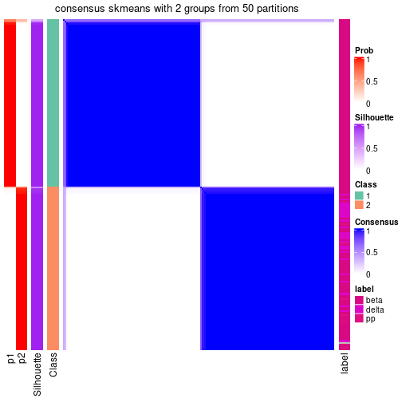</p>

</div>
<div id='tab-node-0212-consensus-heatmap-2'>
<pre><code class="r">consensus_heatmap(res, k = 3)
</code></pre>

<p>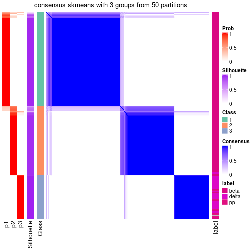</p>

</div>
<div id='tab-node-0212-consensus-heatmap-3'>
<pre><code class="r">consensus_heatmap(res, k = 4)
</code></pre>

<p>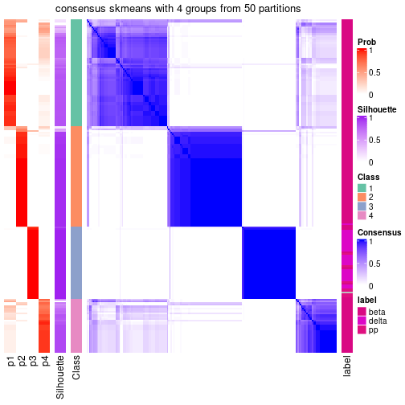</p>

</div>
</div>

Heatmaps for the membership of samples in all partitions to see how consistent they are:


<script>
$( function() {
	$( '#tabs-node-0212-membership-heatmap' ).tabs();
} );
</script>
<div id='tabs-node-0212-membership-heatmap'>
<ul>
<li><a href='#tab-node-0212-membership-heatmap-1'>k = 2</a></li>
<li><a href='#tab-node-0212-membership-heatmap-2'>k = 3</a></li>
<li><a href='#tab-node-0212-membership-heatmap-3'>k = 4</a></li>
</ul>
<div id='tab-node-0212-membership-heatmap-1'>
<pre><code class="r">membership_heatmap(res, k = 2)
</code></pre>

<p>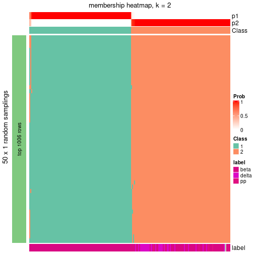</p>

</div>
<div id='tab-node-0212-membership-heatmap-2'>
<pre><code class="r">membership_heatmap(res, k = 3)
</code></pre>

<p>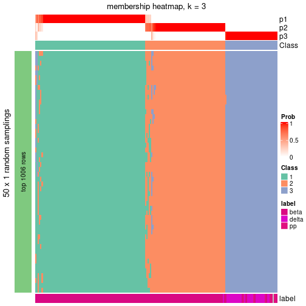</p>

</div>
<div id='tab-node-0212-membership-heatmap-3'>
<pre><code class="r">membership_heatmap(res, k = 4)
</code></pre>

<p>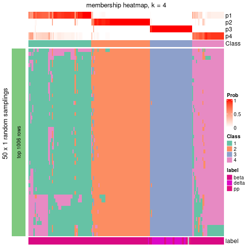</p>

</div>
</div>

As soon as the classes for columns are determined, the signatures
that are significantly different between subgroups can be looked for. 
Following are the heatmaps for signatures.


Signature heatmaps where rows are scaled:


<script>
$( function() {
	$( '#tabs-node-0212-get-signatures' ).tabs();
} );
</script>
<div id='tabs-node-0212-get-signatures'>
<ul>
<li><a href='#tab-node-0212-get-signatures-1'>k = 2</a></li>
<li><a href='#tab-node-0212-get-signatures-2'>k = 3</a></li>
<li><a href='#tab-node-0212-get-signatures-3'>k = 4</a></li>
</ul>
<div id='tab-node-0212-get-signatures-1'>
<pre><code class="r">get_signatures(res, k = 2)
</code></pre>

<p>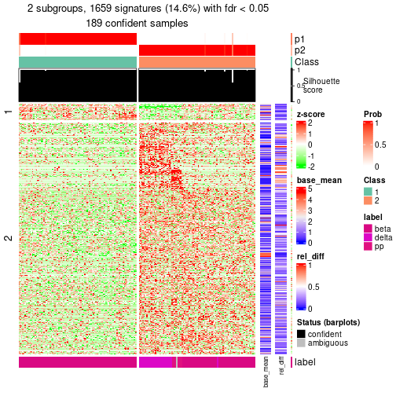</p>

</div>
<div id='tab-node-0212-get-signatures-2'>
<pre><code class="r">get_signatures(res, k = 3)
</code></pre>

<p>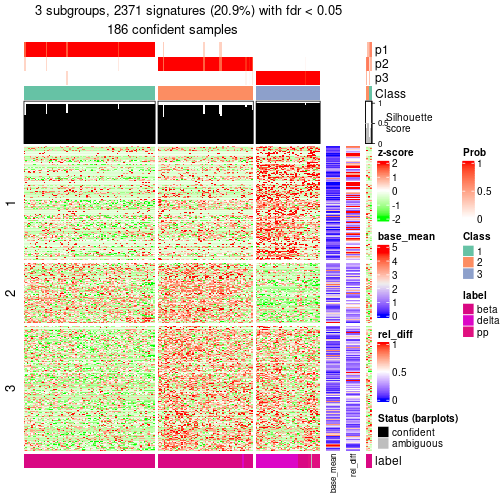</p>

</div>
<div id='tab-node-0212-get-signatures-3'>
<pre><code class="r">get_signatures(res, k = 4)
</code></pre>

<p>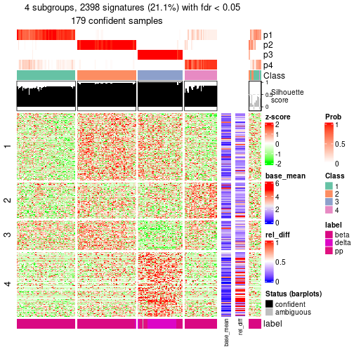</p>

</div>
</div>


Signature heatmaps where rows are not scaled:


<script>
$( function() {
	$( '#tabs-node-0212-get-signatures-no-scale' ).tabs();
} );
</script>
<div id='tabs-node-0212-get-signatures-no-scale'>
<ul>
<li><a href='#tab-node-0212-get-signatures-no-scale-1'>k = 2</a></li>
<li><a href='#tab-node-0212-get-signatures-no-scale-2'>k = 3</a></li>
<li><a href='#tab-node-0212-get-signatures-no-scale-3'>k = 4</a></li>
</ul>
<div id='tab-node-0212-get-signatures-no-scale-1'>
<pre><code class="r">get_signatures(res, k = 2, scale_rows = FALSE)
</code></pre>

<p>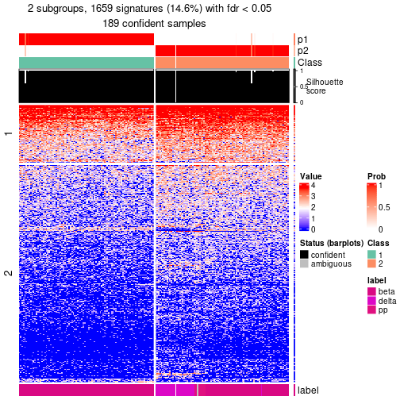</p>

</div>
<div id='tab-node-0212-get-signatures-no-scale-2'>
<pre><code class="r">get_signatures(res, k = 3, scale_rows = FALSE)
</code></pre>

<p>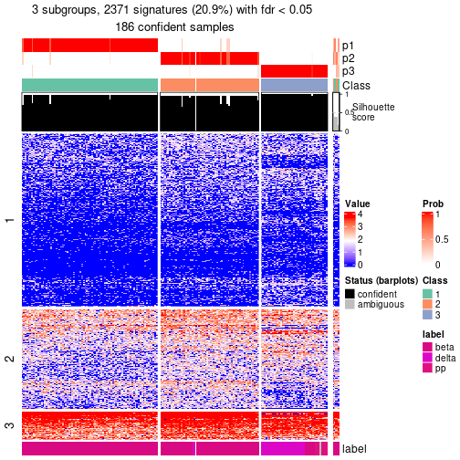</p>

</div>
<div id='tab-node-0212-get-signatures-no-scale-3'>
<pre><code class="r">get_signatures(res, k = 4, scale_rows = FALSE)
</code></pre>

<p>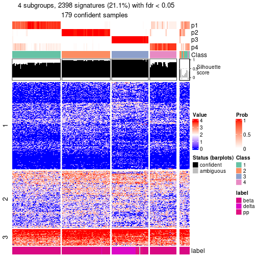</p>

</div>
</div>


Compare the overlap of signatures from different k:

```r
compare_signatures(res)
```

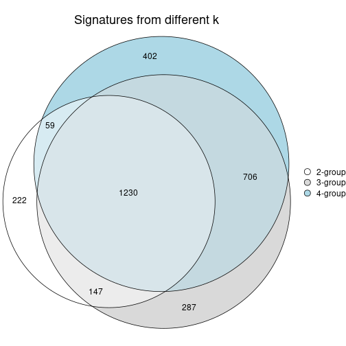

`get_signature()` returns a data frame invisibly. To get the list of signatures, the function
call should be assigned to a variable explicitly. In following code, if `plot` argument is set
to `FALSE`, no heatmap is plotted while only the differential analysis is performed.

```r
# code only for demonstration
tb = get_signature(res, k = ..., plot = FALSE)
```

An example of the output of `tb` is:

```
#>   which_row         fdr    mean_1    mean_2 scaled_mean_1 scaled_mean_2 km
#> 1        38 0.042760348  8.373488  9.131774    -0.5533452     0.5164555  1
#> 2        40 0.018707592  7.106213  8.469186    -0.6173731     0.5762149  1
#> 3        55 0.019134737 10.221463 11.207825    -0.6159697     0.5749050  1
#> 4        59 0.006059896  5.921854  7.869574    -0.6899429     0.6439467  1
#> 5        60 0.018055526  8.928898 10.211722    -0.6204761     0.5791110  1
#> 6        98 0.009384629 15.714769 14.887706     0.6635654    -0.6193277  2
...
```

The columns in `tb` are:

1. `which_row`: row indices corresponding to the input matrix.
2. `fdr`: FDR for the differential test. 
3. `mean_x`: The mean value in group x.
4. `scaled_mean_x`: The mean value in group x after rows are scaled.
5. `km`: Row groups if k-means clustering is applied to rows (which is done by automatically selecting number of clusters).

If there are too many signatures, `top_signatures = ...` can be set to only show the 
signatures with the highest FDRs:

```r
# code only for demonstration
# e.g. to show the top 500 most significant rows
tb = get_signature(res, k = ..., top_signatures = 500)
```

If the signatures are defined as these which are uniquely high in current group, `diff_method` argument
can be set to `"uniquely_high_in_one_group"`:

```r
# code only for demonstration
tb = get_signature(res, k = ..., diff_method = "uniquely_high_in_one_group")
```


UMAP plot which shows how samples are separated.


<script>
$( function() {
	$( '#tabs-node-0212-dimension-reduction' ).tabs();
} );
</script>
<div id='tabs-node-0212-dimension-reduction'>
<ul>
<li><a href='#tab-node-0212-dimension-reduction-1'>k = 2</a></li>
<li><a href='#tab-node-0212-dimension-reduction-2'>k = 3</a></li>
<li><a href='#tab-node-0212-dimension-reduction-3'>k = 4</a></li>
</ul>
<div id='tab-node-0212-dimension-reduction-1'>
<pre><code class="r">dimension_reduction(res, k = 2, method = &quot;UMAP&quot;)
</code></pre>

<p>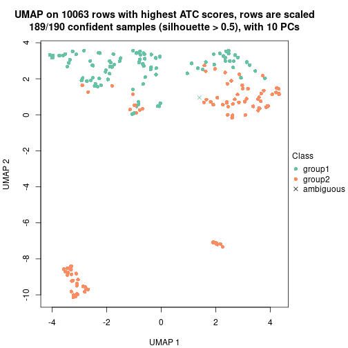</p>

</div>
<div id='tab-node-0212-dimension-reduction-2'>
<pre><code class="r">dimension_reduction(res, k = 3, method = &quot;UMAP&quot;)
</code></pre>

<p>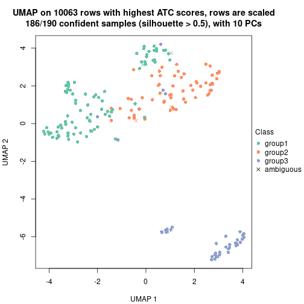</p>

</div>
<div id='tab-node-0212-dimension-reduction-3'>
<pre><code class="r">dimension_reduction(res, k = 4, method = &quot;UMAP&quot;)
</code></pre>

<p>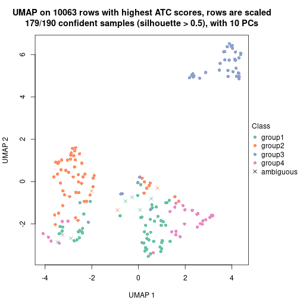</p>

</div>
</div>


Following heatmap shows how subgroups are split when increasing `k`:

```r
collect_classes(res)
```

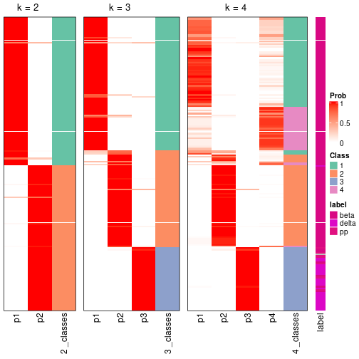


Test correlation between subgroups and known annotations. If the known
annotation is numeric, one-way ANOVA test is applied, and if the known
annotation is discrete, chi-squared contingency table test is applied.

```r
test_to_known_factors(res)
```

```
#>             n_sample label(p-value) k
#> ATC:skmeans      189       2.89e-10 2
#> ATC:skmeans      186       1.97e-30 3
#> ATC:skmeans      179       1.24e-27 4
```


If matrix rows can be associated to genes, consider to use `functional_enrichment(res,
...)` to perform function enrichment for the signature genes. See [this vignette](https://jokergoo.github.io/cola_vignettes/functional_enrichment.html) for more detailed explanations.


 

---------------------------------------------------


### Node0214


Parent node: [Node021](#Node021).
Child nodes: 
                Node02121-leaf
        ,
                Node02122-leaf
        ,
                Node02123-leaf
        ,
                Node02141-leaf
        ,
                Node02142-leaf
        ,
                Node02143-leaf
        ,
                Node02144-leaf
        ,
                [Node02211](#Node02211)
        ,
                Node02212-leaf
        ,
                Node02213-leaf
        ,
                Node02221-leaf
        ,
                Node02222-leaf
        ,
                Node02223-leaf
        ,
                Node02311-leaf
        ,
                Node02312-leaf
        ,
                Node02321-leaf
        ,
                Node02322-leaf
        ,
                Node02411-leaf
        ,
                Node02412-leaf
        ,
                Node02421-leaf
        ,
                Node02422-leaf
        .


The object with results only for a single top-value method and a single partitioning method 
can be extracted as:

```r
res = res_rh["0214"]
```

A summary of `res` and all the functions that can be applied to it:

```r
res
```

```
#> A 'ConsensusPartition' object with k = 2, 3, 4.
#>   On a matrix with 9482 rows and 187 columns.
#>   Top rows (948) are extracted by 'ATC' method.
#>   Subgroups are detected by 'skmeans' method.
#>   Performed in total 150 partitions by row resampling.
#>   Best k for subgroups seems to be 4.
#> 
#> Following methods can be applied to this 'ConsensusPartition' object:
#>  [1] "cola_report"             "collect_classes"         "collect_plots"          
#>  [4] "collect_stats"           "colnames"                "compare_partitions"     
#>  [7] "compare_signatures"      "consensus_heatmap"       "dimension_reduction"    
#> [10] "functional_enrichment"   "get_anno_col"            "get_anno"               
#> [13] "get_classes"             "get_consensus"           "get_matrix"             
#> [16] "get_membership"          "get_param"               "get_signatures"         
#> [19] "get_stats"               "is_best_k"               "is_stable_k"            
#> [22] "membership_heatmap"      "ncol"                    "nrow"                   
#> [25] "plot_ecdf"               "predict_classes"         "rownames"               
#> [28] "select_partition_number" "show"                    "suggest_best_k"         
#> [31] "test_to_known_factors"   "top_rows_heatmap"
```

`collect_plots()` function collects all the plots made from `res` for all `k` (number of subgroups)
into one single page to provide an easy and fast comparison between different `k`.

```r
collect_plots(res)
```

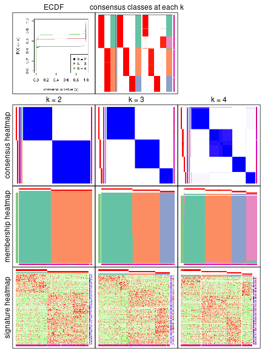

The plots are:

- The first row: a plot of the eCDF (empirical cumulative distribution
  function) curves of the consensus matrix for each `k` and the heatmap of
  predicted classes for each `k`.
- The second row: heatmaps of the consensus matrix for each `k`.
- The third row: heatmaps of the membership matrix for each `k`.
- The fouth row: heatmaps of the signatures for each `k`.

All the plots in panels can be made by individual functions and they are
plotted later in this section.

`select_partition_number()` produces several plots showing different
statistics for choosing "optimized" `k`. There are following statistics:

- eCDF curves of the consensus matrix for each `k`;
- 1-PAC. [The PAC score](https://en.wikipedia.org/wiki/Consensus_clustering#Over-interpretation_potential_of_consensus_clustering)
  measures the proportion of the ambiguous subgrouping.
- Mean silhouette score.
- Concordance. The mean probability of fiting the consensus subgroup labels in all
  partitions.
- Area increased. Denote $A_k$ as the area under the eCDF curve for current
  `k`, the area increased is defined as $A_k - A_{k-1}$.
- Rand index. The percent of pairs of samples that are both in a same cluster
  or both are not in a same cluster in the partition of k and k-1.
- Jaccard index. The ratio of pairs of samples are both in a same cluster in
  the partition of k and k-1 and the pairs of samples are both in a same
  cluster in the partition k or k-1.

The detailed explanations of these statistics can be found in [the _cola_
vignette](https://jokergoo.github.io/cola_vignettes/cola.html#toc_13).

Generally speaking, higher 1-PAC score, higher mean silhouette score or higher
concordance corresponds to better partition. Rand index and Jaccard index
measure how similar the current partition is compared to partition with `k-1`.
If they are too similar, we won't accept `k` is better than `k-1`.

```r
select_partition_number(res)
```

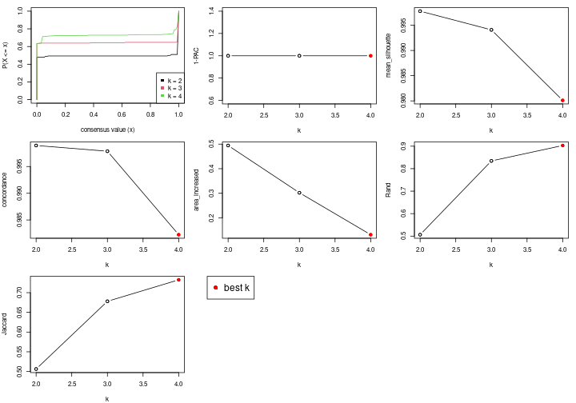

The numeric values for all these statistics can be obtained by `get_stats()`.

```r
get_stats(res)
```

```
#>   k 1-PAC mean_silhouette concordance area_increased  Rand Jaccard
#> 2 2     1           0.998       0.999          0.494 0.506   0.506
#> 3 3     1           0.994       0.998          0.302 0.835   0.678
#> 4 4     1           0.980       0.982          0.132 0.903   0.733
```

`suggest_best_k()` suggests the best $k$ based on these statistics. The rules are as follows:

- All $k$ with Jaccard index larger than 0.95 are removed because increasing
  $k$ does not provide enough extra information. If all $k$ are removed, it is
  marked as no subgroup is detected.
- For all $k$ with 1-PAC score larger than 0.9, the maximal $k$ is taken as
  the best $k$, and other $k$ are marked as optional $k$.
- If it does not fit the second rule. The $k$ with the maximal vote of the
  highest 1-PAC score, highest mean silhouette, and highest concordance is
  taken as the best $k$.

```r
suggest_best_k(res)
```

```
#> [1] 4
#> attr(,"optional")
#> [1] 2 3
```

There is also optional best $k$ = 2 3 that is worth to check.

Following is the table of the partitions (You need to click the **show/hide
code output** link to see it). The membership matrix (columns with name `p*`)
is inferred by
[`clue::cl_consensus()`](https://www.rdocumentation.org/link/cl_consensus?package=clue)
function with the `SE` method. Basically the value in the membership matrix
represents the probability to belong to a certain group. The finall subgroup
label for an item is determined with the group with highest probability it
belongs to.

In `get_classes()` function, the entropy is calculated from the membership
matrix and the silhouette score is calculated from the consensus matrix.


<script>
$( function() {
	$( '#tabs-node-0214-get-classes' ).tabs();
} );
</script>
<div id='tabs-node-0214-get-classes'>
<ul>
<li><a href='#tab-node-0214-get-classes-1'>k = 2</a></li>
<li><a href='#tab-node-0214-get-classes-2'>k = 3</a></li>
<li><a href='#tab-node-0214-get-classes-3'>k = 4</a></li>
</ul>

<div id='tab-node-0214-get-classes-1'>
<p><a id='tab-node-0214-get-classes-1-a' style='color:#0366d6' href='#'>show/hide code output</a></p>
<pre><code class="r">cbind(get_classes(res, k = 2), get_membership(res, k = 2))
</code></pre>

<pre><code>#&gt;          class entropy silhouette   p1   p2
#&gt; D28-1_3      2   0.000      0.999 0.00 1.00
#&gt; D28-3_14     2   0.000      0.999 0.00 1.00
#&gt; D28-3_17     1   0.000      0.999 1.00 0.00
#&gt; D28-3_78     2   0.000      0.999 0.00 1.00
#&gt; D28-4_1      1   0.000      0.999 1.00 0.00
#&gt; D28-4_26     2   0.000      0.999 0.00 1.00
#&gt; D28-4_38     2   0.000      0.999 0.00 1.00
#&gt; D28-5_2      2   0.000      0.999 0.00 1.00
#&gt; D28-6_26     2   0.000      0.999 0.00 1.00
#&gt; D29-1_3      2   0.000      0.999 0.00 1.00
#&gt; D29-1_16     2   0.000      0.999 0.00 1.00
#&gt; D29-1_36     1   0.000      0.999 1.00 0.00
#&gt; D29-1_42     2   0.000      0.999 0.00 1.00
#&gt; D29-1_56     2   0.000      0.999 0.00 1.00
#&gt; D29-1_58     2   0.000      0.999 0.00 1.00
#&gt; D29-1_67     2   0.000      0.999 0.00 1.00
#&gt; D29-1_71     2   0.000      0.999 0.00 1.00
#&gt; D29-1_72     2   0.000      0.999 0.00 1.00
#&gt; D29-1_75     1   0.000      0.999 1.00 0.00
#&gt; D29-1_83     2   0.000      0.999 0.00 1.00
#&gt; D29-1_86     2   0.000      0.999 0.00 1.00
#&gt; D29-1_90     2   0.000      0.999 0.00 1.00
#&gt; D29-1_93     2   0.000      0.999 0.00 1.00
#&gt; D29-2_4      2   0.000      0.999 0.00 1.00
#&gt; D29-2_9      2   0.000      0.999 0.00 1.00
#&gt; D29-2_10     2   0.000      0.999 0.00 1.00
#&gt; D29-2_11     1   0.000      0.999 1.00 0.00
#&gt; D29-2_16     2   0.000      0.999 0.00 1.00
#&gt; D29-2_30     1   0.000      0.999 1.00 0.00
#&gt; D29-2_34     2   0.000      0.999 0.00 1.00
#&gt; D29-2_46     2   0.000      0.999 0.00 1.00
#&gt; D29-2_54     1   0.000      0.999 1.00 0.00
#&gt; D29-2_58     2   0.000      0.999 0.00 1.00
#&gt; D29-2_64     2   0.000      0.999 0.00 1.00
#&gt; D29-2_82     2   0.000      0.999 0.00 1.00
#&gt; D29-3_5      1   0.000      0.999 1.00 0.00
#&gt; D29-3_11     2   0.000      0.999 0.00 1.00
#&gt; D29-3_24     1   0.000      0.999 1.00 0.00
#&gt; D29-3_43     2   0.000      0.999 0.00 1.00
#&gt; D29-3_51     1   0.000      0.999 1.00 0.00
#&gt; D29-3_57     2   0.000      0.999 0.00 1.00
#&gt; D29-3_58     2   0.000      0.999 0.00 1.00
#&gt; D29-3_94     1   0.000      0.999 1.00 0.00
#&gt; D29-4_19     1   0.000      0.999 1.00 0.00
#&gt; D29-4_41     2   0.000      0.999 0.00 1.00
#&gt; D29-4_43     2   0.000      0.999 0.00 1.00
#&gt; D29-4_48     2   0.000      0.999 0.00 1.00
#&gt; D29-4_64     2   0.000      0.999 0.00 1.00
#&gt; D29-4_67     1   0.000      0.999 1.00 0.00
#&gt; D29-5_30     1   0.000      0.999 1.00 0.00
#&gt; D29-5_36     2   0.000      0.999 0.00 1.00
#&gt; D29-5_47     2   0.000      0.999 0.00 1.00
#&gt; D29-5_77     2   0.000      0.999 0.00 1.00
#&gt; D29-6_4      2   0.000      0.999 0.00 1.00
#&gt; D29-6_6      2   0.000      0.999 0.00 1.00
#&gt; D29-6_16     1   0.000      0.999 1.00 0.00
#&gt; D29-6_28     1   0.000      0.999 1.00 0.00
#&gt; D29-6_39     1   0.000      0.999 1.00 0.00
#&gt; D29-6_42     1   0.000      0.999 1.00 0.00
#&gt; D29-6_44     2   0.000      0.999 0.00 1.00
#&gt; D29-6_62     1   0.000      0.999 1.00 0.00
#&gt; D29-6_63     2   0.000      0.999 0.00 1.00
#&gt; D29-7_3      1   0.000      0.999 1.00 0.00
#&gt; D29-7_21     2   0.000      0.999 0.00 1.00
#&gt; D29-7_23     2   0.000      0.999 0.00 1.00
#&gt; D29-7_30     2   0.000      0.999 0.00 1.00
#&gt; D29-7_34     2   0.000      0.999 0.00 1.00
#&gt; D29-7_35     2   0.000      0.999 0.00 1.00
#&gt; D29-7_39     1   0.000      0.999 1.00 0.00
#&gt; D29-7_60     2   0.000      0.999 0.00 1.00
#&gt; D29-7_61     2   0.000      0.999 0.00 1.00
#&gt; D29-7_62     1   0.000      0.999 1.00 0.00
#&gt; D29-7_71     2   0.000      0.999 0.00 1.00
#&gt; D29-7_93     2   0.000      0.999 0.00 1.00
#&gt; D29-7_94     2   0.000      0.999 0.00 1.00
#&gt; D29-8_10     2   0.000      0.999 0.00 1.00
#&gt; D29-8_50     1   0.000      0.999 1.00 0.00
#&gt; D29-8_54     2   0.000      0.999 0.00 1.00
#&gt; D29-8_80     2   0.000      0.999 0.00 1.00
#&gt; D29-8_86     1   0.000      0.999 1.00 0.00
#&gt; D29-8_94     1   0.000      0.999 1.00 0.00
#&gt; D31-1_1      1   0.000      0.999 1.00 0.00
#&gt; D31-1_15     1   0.000      0.999 1.00 0.00
#&gt; D31-1_26     1   0.000      0.999 1.00 0.00
#&gt; D31-1_28     1   0.000      0.999 1.00 0.00
#&gt; D31-1_29     1   0.000      0.999 1.00 0.00
#&gt; D31-1_33     2   0.000      0.999 0.00 1.00
#&gt; D31-1_34     1   0.000      0.999 1.00 0.00
#&gt; D31-1_38     2   0.402      0.913 0.08 0.92
#&gt; D31-1_56     1   0.000      0.999 1.00 0.00
#&gt; D31-1_74     1   0.000      0.999 1.00 0.00
#&gt; D31-1_80     2   0.000      0.999 0.00 1.00
#&gt; D31-2_1      1   0.000      0.999 1.00 0.00
#&gt; D31-2_5      2   0.327      0.936 0.06 0.94
#&gt; D31-2_28     1   0.000      0.999 1.00 0.00
#&gt; D31-2_29     2   0.000      0.999 0.00 1.00
#&gt; D31-2_36     2   0.000      0.999 0.00 1.00
#&gt; D31-2_49     1   0.000      0.999 1.00 0.00
#&gt; D31-2_55     2   0.000      0.999 0.00 1.00
#&gt; D31-3_10     1   0.000      0.999 1.00 0.00
#&gt; D31-3_30     2   0.000      0.999 0.00 1.00
#&gt; D31-3_41     2   0.000      0.999 0.00 1.00
#&gt; D31-3_43     1   0.000      0.999 1.00 0.00
#&gt; D31-3_62     2   0.000      0.999 0.00 1.00
#&gt; D31-3_67     2   0.000      0.999 0.00 1.00
#&gt; D31-3_72     2   0.000      0.999 0.00 1.00
#&gt; D31-3_80     1   0.000      0.999 1.00 0.00
#&gt; D31-4_15     2   0.000      0.999 0.00 1.00
#&gt; D31-4_37     2   0.000      0.999 0.00 1.00
#&gt; D31-4_92     1   0.000      0.999 1.00 0.00
#&gt; D31-5_5      1   0.000      0.999 1.00 0.00
#&gt; D31-5_9      1   0.000      0.999 1.00 0.00
#&gt; D31-5_15     1   0.000      0.999 1.00 0.00
#&gt; D31-5_21     1   0.000      0.999 1.00 0.00
#&gt; D31-5_22     1   0.000      0.999 1.00 0.00
#&gt; D31-5_23     1   0.327      0.936 0.94 0.06
#&gt; D31-5_27     1   0.000      0.999 1.00 0.00
#&gt; D31-5_29     1   0.000      0.999 1.00 0.00
#&gt; D31-5_32     1   0.000      0.999 1.00 0.00
#&gt; D31-5_38     1   0.000      0.999 1.00 0.00
#&gt; D31-5_42     2   0.000      0.999 0.00 1.00
#&gt; D31-5_85     1   0.000      0.999 1.00 0.00
#&gt; D31-6_15     1   0.000      0.999 1.00 0.00
#&gt; D31-6_16     1   0.000      0.999 1.00 0.00
#&gt; D31-6_20     1   0.000      0.999 1.00 0.00
#&gt; D31-6_42     1   0.000      0.999 1.00 0.00
#&gt; D31-6_71     2   0.000      0.999 0.00 1.00
#&gt; D31-7_55     1   0.000      0.999 1.00 0.00
#&gt; D31-7_66     2   0.000      0.999 0.00 1.00
#&gt; D31-7_74     1   0.000      0.999 1.00 0.00
#&gt; D31-7_79     2   0.000      0.999 0.00 1.00
#&gt; D31-7_92     2   0.000      0.999 0.00 1.00
#&gt; D31-8_1      2   0.000      0.999 0.00 1.00
#&gt; D31-8_13     1   0.000      0.999 1.00 0.00
#&gt; D31-8_17     2   0.000      0.999 0.00 1.00
#&gt; D31-8_25     2   0.000      0.999 0.00 1.00
#&gt; D31-8_28     2   0.000      0.999 0.00 1.00
#&gt; D31-8_42     1   0.000      0.999 1.00 0.00
#&gt; D31-8_50     1   0.000      0.999 1.00 0.00
#&gt; D31-8_67     2   0.000      0.999 0.00 1.00
#&gt; D31-8_69     2   0.000      0.999 0.00 1.00
#&gt; D31-8_70     2   0.000      0.999 0.00 1.00
#&gt; D31-8_74     1   0.000      0.999 1.00 0.00
#&gt; D31-8_83     1   0.000      0.999 1.00 0.00
#&gt; D31-8_87     2   0.000      0.999 0.00 1.00
#&gt; D30-1_6      2   0.000      0.999 0.00 1.00
#&gt; D30-1_20     1   0.000      0.999 1.00 0.00
#&gt; D30-1_45     1   0.000      0.999 1.00 0.00
#&gt; D30-1_65     1   0.000      0.999 1.00 0.00
#&gt; D30-1_85     1   0.000      0.999 1.00 0.00
#&gt; D30-1_89     1   0.000      0.999 1.00 0.00
#&gt; D30-1_93     1   0.000      0.999 1.00 0.00
#&gt; D30-2_20     2   0.000      0.999 0.00 1.00
#&gt; D30-2_26     2   0.000      0.999 0.00 1.00
#&gt; D30-3_15     2   0.000      0.999 0.00 1.00
#&gt; D30-3_18     2   0.000      0.999 0.00 1.00
#&gt; D30-3_36     1   0.000      0.999 1.00 0.00
#&gt; D30-3_75     2   0.000      0.999 0.00 1.00
#&gt; D30-4_5      2   0.000      0.999 0.00 1.00
#&gt; D30-4_8      1   0.000      0.999 1.00 0.00
#&gt; D30-4_14     2   0.000      0.999 0.00 1.00
#&gt; D30-4_26     2   0.000      0.999 0.00 1.00
#&gt; D30-4_28     2   0.000      0.999 0.00 1.00
#&gt; D30-5_7      1   0.000      0.999 1.00 0.00
#&gt; D30-5_12     2   0.000      0.999 0.00 1.00
#&gt; D30-5_32     1   0.000      0.999 1.00 0.00
#&gt; D30-5_35     2   0.000      0.999 0.00 1.00
#&gt; D30-5_40     1   0.000      0.999 1.00 0.00
#&gt; D30-5_76     2   0.000      0.999 0.00 1.00
#&gt; D30-5_85     2   0.000      0.999 0.00 1.00
#&gt; D30-5_91     2   0.000      0.999 0.00 1.00
#&gt; D30-6_6      2   0.000      0.999 0.00 1.00
#&gt; D30-6_11     1   0.000      0.999 1.00 0.00
#&gt; D30-6_13     2   0.000      0.999 0.00 1.00
#&gt; D30-6_18     1   0.000      0.999 1.00 0.00
#&gt; D30-6_58     2   0.000      0.999 0.00 1.00
#&gt; D30-6_83     1   0.000      0.999 1.00 0.00
#&gt; D30-7_22     1   0.000      0.999 1.00 0.00
#&gt; D30-7_29     2   0.000      0.999 0.00 1.00
#&gt; D30-7_31     2   0.000      0.999 0.00 1.00
#&gt; D30-7_32     2   0.000      0.999 0.00 1.00
#&gt; D30-7_48     1   0.000      0.999 1.00 0.00
#&gt; D30-7_82     1   0.000      0.999 1.00 0.00
#&gt; D30-7_89     2   0.000      0.999 0.00 1.00
#&gt; D30-8_9      2   0.000      0.999 0.00 1.00
#&gt; D30-8_12     1   0.000      0.999 1.00 0.00
#&gt; D30-8_46     1   0.000      0.999 1.00 0.00
</code></pre>

<script>
$('#tab-node-0214-get-classes-1-a').parent().next().next().hide();
$('#tab-node-0214-get-classes-1-a').click(function(){
  $('#tab-node-0214-get-classes-1-a').parent().next().next().toggle();
  return(false);
});
</script>
</div>

<div id='tab-node-0214-get-classes-2'>
<p><a id='tab-node-0214-get-classes-2-a' style='color:#0366d6' href='#'>show/hide code output</a></p>
<pre><code class="r">cbind(get_classes(res, k = 3), get_membership(res, k = 3))
</code></pre>

<pre><code>#&gt;          class entropy silhouette   p1   p2 p3
#&gt; D28-1_3      2  0.0000      0.993 0.00 1.00  0
#&gt; D28-3_14     3  0.0000      1.000 0.00 0.00  1
#&gt; D28-3_17     1  0.0000      1.000 1.00 0.00  0
#&gt; D28-3_78     2  0.0000      0.993 0.00 1.00  0
#&gt; D28-4_1      1  0.0000      1.000 1.00 0.00  0
#&gt; D28-4_26     3  0.0000      1.000 0.00 0.00  1
#&gt; D28-4_38     3  0.0000      1.000 0.00 0.00  1
#&gt; D28-5_2      3  0.0000      1.000 0.00 0.00  1
#&gt; D28-6_26     2  0.0000      0.993 0.00 1.00  0
#&gt; D29-1_3      2  0.0000      0.993 0.00 1.00  0
#&gt; D29-1_16     2  0.0000      0.993 0.00 1.00  0
#&gt; D29-1_36     1  0.0000      1.000 1.00 0.00  0
#&gt; D29-1_42     2  0.0000      0.993 0.00 1.00  0
#&gt; D29-1_56     2  0.0000      0.993 0.00 1.00  0
#&gt; D29-1_58     3  0.0000      1.000 0.00 0.00  1
#&gt; D29-1_67     3  0.0000      1.000 0.00 0.00  1
#&gt; D29-1_71     3  0.0000      1.000 0.00 0.00  1
#&gt; D29-1_72     3  0.0000      1.000 0.00 0.00  1
#&gt; D29-1_75     1  0.0000      1.000 1.00 0.00  0
#&gt; D29-1_83     2  0.0000      0.993 0.00 1.00  0
#&gt; D29-1_86     3  0.0000      1.000 0.00 0.00  1
#&gt; D29-1_90     3  0.0000      1.000 0.00 0.00  1
#&gt; D29-1_93     2  0.0000      0.993 0.00 1.00  0
#&gt; D29-2_4      2  0.0000      0.993 0.00 1.00  0
#&gt; D29-2_9      2  0.0000      0.993 0.00 1.00  0
#&gt; D29-2_10     2  0.0000      0.993 0.00 1.00  0
#&gt; D29-2_11     1  0.0000      1.000 1.00 0.00  0
#&gt; D29-2_16     2  0.0000      0.993 0.00 1.00  0
#&gt; D29-2_30     1  0.0000      1.000 1.00 0.00  0
#&gt; D29-2_34     2  0.0000      0.993 0.00 1.00  0
#&gt; D29-2_46     2  0.0000      0.993 0.00 1.00  0
#&gt; D29-2_54     1  0.0000      1.000 1.00 0.00  0
#&gt; D29-2_58     3  0.0000      1.000 0.00 0.00  1
#&gt; D29-2_64     3  0.0000      1.000 0.00 0.00  1
#&gt; D29-2_82     2  0.0000      0.993 0.00 1.00  0
#&gt; D29-3_5      1  0.0000      1.000 1.00 0.00  0
#&gt; D29-3_11     2  0.0000      0.993 0.00 1.00  0
#&gt; D29-3_24     1  0.0000      1.000 1.00 0.00  0
#&gt; D29-3_43     2  0.0000      0.993 0.00 1.00  0
#&gt; D29-3_51     1  0.0000      1.000 1.00 0.00  0
#&gt; D29-3_57     2  0.0000      0.993 0.00 1.00  0
#&gt; D29-3_58     2  0.0000      0.993 0.00 1.00  0
#&gt; D29-3_94     1  0.0000      1.000 1.00 0.00  0
#&gt; D29-4_19     1  0.0000      1.000 1.00 0.00  0
#&gt; D29-4_41     2  0.0000      0.993 0.00 1.00  0
#&gt; D29-4_43     2  0.0000      0.993 0.00 1.00  0
#&gt; D29-4_48     3  0.0000      1.000 0.00 0.00  1
#&gt; D29-4_64     2  0.0000      0.993 0.00 1.00  0
#&gt; D29-4_67     1  0.0000      1.000 1.00 0.00  0
#&gt; D29-5_30     1  0.0000      1.000 1.00 0.00  0
#&gt; D29-5_36     2  0.0000      0.993 0.00 1.00  0
#&gt; D29-5_47     2  0.0000      0.993 0.00 1.00  0
#&gt; D29-5_77     2  0.0000      0.993 0.00 1.00  0
#&gt; D29-6_4      3  0.0000      1.000 0.00 0.00  1
#&gt; D29-6_6      3  0.0000      1.000 0.00 0.00  1
#&gt; D29-6_16     1  0.0000      1.000 1.00 0.00  0
#&gt; D29-6_28     1  0.0000      1.000 1.00 0.00  0
#&gt; D29-6_39     1  0.0000      1.000 1.00 0.00  0
#&gt; D29-6_42     1  0.0000      1.000 1.00 0.00  0
#&gt; D29-6_44     2  0.0000      0.993 0.00 1.00  0
#&gt; D29-6_62     1  0.0000      1.000 1.00 0.00  0
#&gt; D29-6_63     2  0.0000      0.993 0.00 1.00  0
#&gt; D29-7_3      1  0.0000      1.000 1.00 0.00  0
#&gt; D29-7_21     2  0.0000      0.993 0.00 1.00  0
#&gt; D29-7_23     3  0.0000      1.000 0.00 0.00  1
#&gt; D29-7_30     3  0.0000      1.000 0.00 0.00  1
#&gt; D29-7_34     3  0.0000      1.000 0.00 0.00  1
#&gt; D29-7_35     3  0.0000      1.000 0.00 0.00  1
#&gt; D29-7_39     1  0.0000      1.000 1.00 0.00  0
#&gt; D29-7_60     3  0.0000      1.000 0.00 0.00  1
#&gt; D29-7_61     3  0.0000      1.000 0.00 0.00  1
#&gt; D29-7_62     1  0.0000      1.000 1.00 0.00  0
#&gt; D29-7_71     3  0.0000      1.000 0.00 0.00  1
#&gt; D29-7_93     3  0.0000      1.000 0.00 0.00  1
#&gt; D29-7_94     3  0.0000      1.000 0.00 0.00  1
#&gt; D29-8_10     2  0.0000      0.993 0.00 1.00  0
#&gt; D29-8_50     1  0.0000      1.000 1.00 0.00  0
#&gt; D29-8_54     2  0.0000      0.993 0.00 1.00  0
#&gt; D29-8_80     2  0.0000      0.993 0.00 1.00  0
#&gt; D29-8_86     1  0.0000      1.000 1.00 0.00  0
#&gt; D29-8_94     1  0.0000      1.000 1.00 0.00  0
#&gt; D31-1_1      1  0.0000      1.000 1.00 0.00  0
#&gt; D31-1_15     2  0.6045      0.387 0.38 0.62  0
#&gt; D31-1_26     1  0.0000      1.000 1.00 0.00  0
#&gt; D31-1_28     1  0.0000      1.000 1.00 0.00  0
#&gt; D31-1_29     1  0.0000      1.000 1.00 0.00  0
#&gt; D31-1_33     2  0.0000      0.993 0.00 1.00  0
#&gt; D31-1_34     1  0.0000      1.000 1.00 0.00  0
#&gt; D31-1_38     2  0.0892      0.970 0.02 0.98  0
#&gt; D31-1_56     1  0.0000      1.000 1.00 0.00  0
#&gt; D31-1_74     1  0.0000      1.000 1.00 0.00  0
#&gt; D31-1_80     3  0.0000      1.000 0.00 0.00  1
#&gt; D31-2_1      1  0.0000      1.000 1.00 0.00  0
#&gt; D31-2_5      2  0.0000      0.993 0.00 1.00  0
#&gt; D31-2_28     1  0.0000      1.000 1.00 0.00  0
#&gt; D31-2_29     2  0.0000      0.993 0.00 1.00  0
#&gt; D31-2_36     2  0.0000      0.993 0.00 1.00  0
#&gt; D31-2_49     1  0.0000      1.000 1.00 0.00  0
#&gt; D31-2_55     3  0.0000      1.000 0.00 0.00  1
#&gt; D31-3_10     1  0.0000      1.000 1.00 0.00  0
#&gt; D31-3_30     3  0.0000      1.000 0.00 0.00  1
#&gt; D31-3_41     2  0.0000      0.993 0.00 1.00  0
#&gt; D31-3_43     1  0.0000      1.000 1.00 0.00  0
#&gt; D31-3_62     2  0.0000      0.993 0.00 1.00  0
#&gt; D31-3_67     2  0.0000      0.993 0.00 1.00  0
#&gt; D31-3_72     3  0.0000      1.000 0.00 0.00  1
#&gt; D31-3_80     1  0.0000      1.000 1.00 0.00  0
#&gt; D31-4_15     3  0.0000      1.000 0.00 0.00  1
#&gt; D31-4_37     3  0.0000      1.000 0.00 0.00  1
#&gt; D31-4_92     1  0.0000      1.000 1.00 0.00  0
#&gt; D31-5_5      1  0.0000      1.000 1.00 0.00  0
#&gt; D31-5_9      1  0.0000      1.000 1.00 0.00  0
#&gt; D31-5_15     1  0.0000      1.000 1.00 0.00  0
#&gt; D31-5_21     1  0.0000      1.000 1.00 0.00  0
#&gt; D31-5_22     1  0.0000      1.000 1.00 0.00  0
#&gt; D31-5_23     2  0.0000      0.993 0.00 1.00  0
#&gt; D31-5_27     1  0.0000      1.000 1.00 0.00  0
#&gt; D31-5_29     1  0.0000      1.000 1.00 0.00  0
#&gt; D31-5_32     1  0.0000      1.000 1.00 0.00  0
#&gt; D31-5_38     1  0.0000      1.000 1.00 0.00  0
#&gt; D31-5_42     2  0.0000      0.993 0.00 1.00  0
#&gt; D31-5_85     1  0.0000      1.000 1.00 0.00  0
#&gt; D31-6_15     1  0.0000      1.000 1.00 0.00  0
#&gt; D31-6_16     1  0.0000      1.000 1.00 0.00  0
#&gt; D31-6_20     1  0.0000      1.000 1.00 0.00  0
#&gt; D31-6_42     1  0.0000      1.000 1.00 0.00  0
#&gt; D31-6_71     3  0.0000      1.000 0.00 0.00  1
#&gt; D31-7_55     1  0.0000      1.000 1.00 0.00  0
#&gt; D31-7_66     2  0.0000      0.993 0.00 1.00  0
#&gt; D31-7_74     1  0.0000      1.000 1.00 0.00  0
#&gt; D31-7_79     3  0.0000      1.000 0.00 0.00  1
#&gt; D31-7_92     3  0.0000      1.000 0.00 0.00  1
#&gt; D31-8_1      2  0.0000      0.993 0.00 1.00  0
#&gt; D31-8_13     1  0.0000      1.000 1.00 0.00  0
#&gt; D31-8_17     2  0.0000      0.993 0.00 1.00  0
#&gt; D31-8_25     3  0.0000      1.000 0.00 0.00  1
#&gt; D31-8_28     2  0.0000      0.993 0.00 1.00  0
#&gt; D31-8_42     1  0.0000      1.000 1.00 0.00  0
#&gt; D31-8_50     1  0.0000      1.000 1.00 0.00  0
#&gt; D31-8_67     3  0.0000      1.000 0.00 0.00  1
#&gt; D31-8_69     2  0.0000      0.993 0.00 1.00  0
#&gt; D31-8_70     3  0.0000      1.000 0.00 0.00  1
#&gt; D31-8_74     1  0.0000      1.000 1.00 0.00  0
#&gt; D31-8_83     1  0.0000      1.000 1.00 0.00  0
#&gt; D31-8_87     3  0.0000      1.000 0.00 0.00  1
#&gt; D30-1_6      2  0.0000      0.993 0.00 1.00  0
#&gt; D30-1_20     1  0.0000      1.000 1.00 0.00  0
#&gt; D30-1_45     1  0.0000      1.000 1.00 0.00  0
#&gt; D30-1_65     1  0.0000      1.000 1.00 0.00  0
#&gt; D30-1_85     1  0.0000      1.000 1.00 0.00  0
#&gt; D30-1_89     1  0.0000      1.000 1.00 0.00  0
#&gt; D30-1_93     1  0.0000      1.000 1.00 0.00  0
#&gt; D30-2_20     2  0.0000      0.993 0.00 1.00  0
#&gt; D30-2_26     2  0.0000      0.993 0.00 1.00  0
#&gt; D30-3_15     3  0.0000      1.000 0.00 0.00  1
#&gt; D30-3_18     2  0.0000      0.993 0.00 1.00  0
#&gt; D30-3_36     1  0.0000      1.000 1.00 0.00  0
#&gt; D30-3_75     2  0.0000      0.993 0.00 1.00  0
#&gt; D30-4_5      2  0.0000      0.993 0.00 1.00  0
#&gt; D30-4_8      1  0.0000      1.000 1.00 0.00  0
#&gt; D30-4_14     2  0.0000      0.993 0.00 1.00  0
#&gt; D30-4_26     2  0.0000      0.993 0.00 1.00  0
#&gt; D30-4_28     2  0.0000      0.993 0.00 1.00  0
#&gt; D30-5_7      1  0.0000      1.000 1.00 0.00  0
#&gt; D30-5_12     2  0.0000      0.993 0.00 1.00  0
#&gt; D30-5_32     1  0.0000      1.000 1.00 0.00  0
#&gt; D30-5_35     2  0.0000      0.993 0.00 1.00  0
#&gt; D30-5_40     1  0.0000      1.000 1.00 0.00  0
#&gt; D30-5_76     2  0.0000      0.993 0.00 1.00  0
#&gt; D30-5_85     2  0.0000      0.993 0.00 1.00  0
#&gt; D30-5_91     2  0.0000      0.993 0.00 1.00  0
#&gt; D30-6_6      2  0.0000      0.993 0.00 1.00  0
#&gt; D30-6_11     1  0.0000      1.000 1.00 0.00  0
#&gt; D30-6_13     2  0.0000      0.993 0.00 1.00  0
#&gt; D30-6_18     1  0.0000      1.000 1.00 0.00  0
#&gt; D30-6_58     2  0.0000      0.993 0.00 1.00  0
#&gt; D30-6_83     1  0.0000      1.000 1.00 0.00  0
#&gt; D30-7_22     1  0.0000      1.000 1.00 0.00  0
#&gt; D30-7_29     2  0.0000      0.993 0.00 1.00  0
#&gt; D30-7_31     2  0.0000      0.993 0.00 1.00  0
#&gt; D30-7_32     2  0.0000      0.993 0.00 1.00  0
#&gt; D30-7_48     1  0.0000      1.000 1.00 0.00  0
#&gt; D30-7_82     1  0.0000      1.000 1.00 0.00  0
#&gt; D30-7_89     2  0.0000      0.993 0.00 1.00  0
#&gt; D30-8_9      2  0.0000      0.993 0.00 1.00  0
#&gt; D30-8_12     1  0.0000      1.000 1.00 0.00  0
#&gt; D30-8_46     1  0.0000      1.000 1.00 0.00  0
</code></pre>

<script>
$('#tab-node-0214-get-classes-2-a').parent().next().next().hide();
$('#tab-node-0214-get-classes-2-a').click(function(){
  $('#tab-node-0214-get-classes-2-a').parent().next().next().toggle();
  return(false);
});
</script>
</div>

<div id='tab-node-0214-get-classes-3'>
<p><a id='tab-node-0214-get-classes-3-a' style='color:#0366d6' href='#'>show/hide code output</a></p>
<pre><code class="r">cbind(get_classes(res, k = 4), get_membership(res, k = 4))
</code></pre>

<pre><code>#&gt;          class entropy silhouette   p1   p2 p3   p4
#&gt; D28-1_3      2  0.0707      0.983 0.00 0.98  0 0.02
#&gt; D28-3_14     3  0.0000      1.000 0.00 0.00  1 0.00
#&gt; D28-3_17     4  0.1211      0.993 0.04 0.00  0 0.96
#&gt; D28-3_78     2  0.0707      0.982 0.00 0.98  0 0.02
#&gt; D28-4_1      4  0.1211      0.993 0.04 0.00  0 0.96
#&gt; D28-4_26     3  0.0000      1.000 0.00 0.00  1 0.00
#&gt; D28-4_38     3  0.0000      1.000 0.00 0.00  1 0.00
#&gt; D28-5_2      3  0.0000      1.000 0.00 0.00  1 0.00
#&gt; D28-6_26     2  0.0707      0.982 0.00 0.98  0 0.02
#&gt; D29-1_3      2  0.0707      0.982 0.00 0.98  0 0.02
#&gt; D29-1_16     2  0.2345      0.907 0.00 0.90  0 0.10
#&gt; D29-1_36     4  0.1211      0.993 0.04 0.00  0 0.96
#&gt; D29-1_42     2  0.0707      0.983 0.00 0.98  0 0.02
#&gt; D29-1_56     2  0.0707      0.982 0.00 0.98  0 0.02
#&gt; D29-1_58     3  0.0000      1.000 0.00 0.00  1 0.00
#&gt; D29-1_67     3  0.0000      1.000 0.00 0.00  1 0.00
#&gt; D29-1_71     3  0.0000      1.000 0.00 0.00  1 0.00
#&gt; D29-1_72     3  0.0000      1.000 0.00 0.00  1 0.00
#&gt; D29-1_75     1  0.0000      0.983 1.00 0.00  0 0.00
#&gt; D29-1_83     2  0.0000      0.983 0.00 1.00  0 0.00
#&gt; D29-1_86     3  0.0000      1.000 0.00 0.00  1 0.00
#&gt; D29-1_90     3  0.0000      1.000 0.00 0.00  1 0.00
#&gt; D29-1_93     2  0.0707      0.982 0.00 0.98  0 0.02
#&gt; D29-2_4      2  0.0707      0.983 0.00 0.98  0 0.02
#&gt; D29-2_9      2  0.0707      0.982 0.00 0.98  0 0.02
#&gt; D29-2_10     2  0.1211      0.983 0.00 0.96  0 0.04
#&gt; D29-2_11     1  0.0000      0.983 1.00 0.00  0 0.00
#&gt; D29-2_16     2  0.0707      0.983 0.00 0.98  0 0.02
#&gt; D29-2_30     1  0.0000      0.983 1.00 0.00  0 0.00
#&gt; D29-2_34     2  0.0707      0.982 0.00 0.98  0 0.02
#&gt; D29-2_46     2  0.0707      0.982 0.00 0.98  0 0.02
#&gt; D29-2_54     4  0.1211      0.993 0.04 0.00  0 0.96
#&gt; D29-2_58     3  0.0000      1.000 0.00 0.00  1 0.00
#&gt; D29-2_64     3  0.0000      1.000 0.00 0.00  1 0.00
#&gt; D29-2_82     2  0.0707      0.982 0.00 0.98  0 0.02
#&gt; D29-3_5      1  0.0707      0.964 0.98 0.00  0 0.02
#&gt; D29-3_11     2  0.1211      0.983 0.00 0.96  0 0.04
#&gt; D29-3_24     1  0.0000      0.983 1.00 0.00  0 0.00
#&gt; D29-3_43     2  0.0707      0.983 0.00 0.98  0 0.02
#&gt; D29-3_51     1  0.0000      0.983 1.00 0.00  0 0.00
#&gt; D29-3_57     2  0.0707      0.982 0.00 0.98  0 0.02
#&gt; D29-3_58     2  0.0000      0.983 0.00 1.00  0 0.00
#&gt; D29-3_94     1  0.0000      0.983 1.00 0.00  0 0.00
#&gt; D29-4_19     4  0.1211      0.993 0.04 0.00  0 0.96
#&gt; D29-4_41     2  0.0707      0.983 0.00 0.98  0 0.02
#&gt; D29-4_43     2  0.0707      0.983 0.00 0.98  0 0.02
#&gt; D29-4_48     3  0.0000      1.000 0.00 0.00  1 0.00
#&gt; D29-4_64     2  0.0707      0.982 0.00 0.98  0 0.02
#&gt; D29-4_67     4  0.1211      0.993 0.04 0.00  0 0.96
#&gt; D29-5_30     1  0.0000      0.983 1.00 0.00  0 0.00
#&gt; D29-5_36     2  0.0707      0.983 0.00 0.98  0 0.02
#&gt; D29-5_47     2  0.0707      0.983 0.00 0.98  0 0.02
#&gt; D29-5_77     2  0.0707      0.982 0.00 0.98  0 0.02
#&gt; D29-6_4      3  0.0000      1.000 0.00 0.00  1 0.00
#&gt; D29-6_6      3  0.0000      1.000 0.00 0.00  1 0.00
#&gt; D29-6_16     1  0.0000      0.983 1.00 0.00  0 0.00
#&gt; D29-6_28     1  0.0000      0.983 1.00 0.00  0 0.00
#&gt; D29-6_39     1  0.0000      0.983 1.00 0.00  0 0.00
#&gt; D29-6_42     4  0.1211      0.993 0.04 0.00  0 0.96
#&gt; D29-6_44     2  0.0707      0.982 0.00 0.98  0 0.02
#&gt; D29-6_62     1  0.0000      0.983 1.00 0.00  0 0.00
#&gt; D29-6_63     2  0.0707      0.982 0.00 0.98  0 0.02
#&gt; D29-7_3      1  0.0000      0.983 1.00 0.00  0 0.00
#&gt; D29-7_21     2  0.0707      0.982 0.00 0.98  0 0.02
#&gt; D29-7_23     3  0.0000      1.000 0.00 0.00  1 0.00
#&gt; D29-7_30     3  0.0000      1.000 0.00 0.00  1 0.00
#&gt; D29-7_34     3  0.0000      1.000 0.00 0.00  1 0.00
#&gt; D29-7_35     3  0.0000      1.000 0.00 0.00  1 0.00
#&gt; D29-7_39     1  0.0000      0.983 1.00 0.00  0 0.00
#&gt; D29-7_60     3  0.0000      1.000 0.00 0.00  1 0.00
#&gt; D29-7_61     3  0.0000      1.000 0.00 0.00  1 0.00
#&gt; D29-7_62     4  0.1211      0.993 0.04 0.00  0 0.96
#&gt; D29-7_71     3  0.0000      1.000 0.00 0.00  1 0.00
#&gt; D29-7_93     3  0.0000      1.000 0.00 0.00  1 0.00
#&gt; D29-7_94     3  0.0000      1.000 0.00 0.00  1 0.00
#&gt; D29-8_10     2  0.0707      0.983 0.00 0.98  0 0.02
#&gt; D29-8_50     1  0.0000      0.983 1.00 0.00  0 0.00
#&gt; D29-8_54     2  0.0707      0.982 0.00 0.98  0 0.02
#&gt; D29-8_80     2  0.0707      0.982 0.00 0.98  0 0.02
#&gt; D29-8_86     4  0.1211      0.993 0.04 0.00  0 0.96
#&gt; D29-8_94     1  0.0000      0.983 1.00 0.00  0 0.00
#&gt; D31-1_1      1  0.0000      0.983 1.00 0.00  0 0.00
#&gt; D31-1_15     4  0.2345      0.864 0.00 0.10  0 0.90
#&gt; D31-1_26     1  0.0000      0.983 1.00 0.00  0 0.00
#&gt; D31-1_28     4  0.1211      0.993 0.04 0.00  0 0.96
#&gt; D31-1_29     4  0.1211      0.993 0.04 0.00  0 0.96
#&gt; D31-1_33     2  0.0707      0.982 0.00 0.98  0 0.02
#&gt; D31-1_34     4  0.1211      0.993 0.04 0.00  0 0.96
#&gt; D31-1_38     1  0.5271      0.455 0.64 0.34  0 0.02
#&gt; D31-1_56     4  0.1211      0.993 0.04 0.00  0 0.96
#&gt; D31-1_74     4  0.1211      0.993 0.04 0.00  0 0.96
#&gt; D31-1_80     3  0.0000      1.000 0.00 0.00  1 0.00
#&gt; D31-2_1      4  0.1211      0.993 0.04 0.00  0 0.96
#&gt; D31-2_5      2  0.0707      0.982 0.00 0.98  0 0.02
#&gt; D31-2_28     4  0.1211      0.993 0.04 0.00  0 0.96
#&gt; D31-2_29     2  0.0707      0.983 0.00 0.98  0 0.02
#&gt; D31-2_36     2  0.0707      0.983 0.00 0.98  0 0.02
#&gt; D31-2_49     4  0.1211      0.993 0.04 0.00  0 0.96
#&gt; D31-2_55     3  0.0000      1.000 0.00 0.00  1 0.00
#&gt; D31-3_10     4  0.1211      0.993 0.04 0.00  0 0.96
#&gt; D31-3_30     3  0.0000      1.000 0.00 0.00  1 0.00
#&gt; D31-3_41     2  0.0707      0.983 0.00 0.98  0 0.02
#&gt; D31-3_43     1  0.0000      0.983 1.00 0.00  0 0.00
#&gt; D31-3_62     2  0.1211      0.983 0.00 0.96  0 0.04
#&gt; D31-3_67     2  0.0707      0.983 0.00 0.98  0 0.02
#&gt; D31-3_72     3  0.0000      1.000 0.00 0.00  1 0.00
#&gt; D31-3_80     4  0.1211      0.993 0.04 0.00  0 0.96
#&gt; D31-4_15     3  0.0000      1.000 0.00 0.00  1 0.00
#&gt; D31-4_37     3  0.0000      1.000 0.00 0.00  1 0.00
#&gt; D31-4_92     1  0.0000      0.983 1.00 0.00  0 0.00
#&gt; D31-5_5      1  0.0000      0.983 1.00 0.00  0 0.00
#&gt; D31-5_9      1  0.0000      0.983 1.00 0.00  0 0.00
#&gt; D31-5_15     1  0.0000      0.983 1.00 0.00  0 0.00
#&gt; D31-5_21     4  0.1211      0.993 0.04 0.00  0 0.96
#&gt; D31-5_22     1  0.0000      0.983 1.00 0.00  0 0.00
#&gt; D31-5_23     4  0.0707      0.931 0.00 0.02  0 0.98
#&gt; D31-5_27     1  0.0000      0.983 1.00 0.00  0 0.00
#&gt; D31-5_29     1  0.0000      0.983 1.00 0.00  0 0.00
#&gt; D31-5_32     1  0.0000      0.983 1.00 0.00  0 0.00
#&gt; D31-5_38     1  0.0000      0.983 1.00 0.00  0 0.00
#&gt; D31-5_42     2  0.1211      0.983 0.00 0.96  0 0.04
#&gt; D31-5_85     1  0.1211      0.944 0.96 0.00  0 0.04
#&gt; D31-6_15     1  0.0000      0.983 1.00 0.00  0 0.00
#&gt; D31-6_16     1  0.0000      0.983 1.00 0.00  0 0.00
#&gt; D31-6_20     1  0.0000      0.983 1.00 0.00  0 0.00
#&gt; D31-6_42     4  0.1211      0.993 0.04 0.00  0 0.96
#&gt; D31-6_71     3  0.0000      1.000 0.00 0.00  1 0.00
#&gt; D31-7_55     1  0.2011      0.900 0.92 0.00  0 0.08
#&gt; D31-7_66     2  0.0707      0.982 0.00 0.98  0 0.02
#&gt; D31-7_74     1  0.0000      0.983 1.00 0.00  0 0.00
#&gt; D31-7_79     3  0.0000      1.000 0.00 0.00  1 0.00
#&gt; D31-7_92     3  0.0000      1.000 0.00 0.00  1 0.00
#&gt; D31-8_1      2  0.0707      0.983 0.00 0.98  0 0.02
#&gt; D31-8_13     4  0.1211      0.993 0.04 0.00  0 0.96
#&gt; D31-8_17     2  0.0707      0.983 0.00 0.98  0 0.02
#&gt; D31-8_25     3  0.0000      1.000 0.00 0.00  1 0.00
#&gt; D31-8_28     2  0.0707      0.983 0.00 0.98  0 0.02
#&gt; D31-8_42     4  0.1211      0.993 0.04 0.00  0 0.96
#&gt; D31-8_50     4  0.1211      0.993 0.04 0.00  0 0.96
#&gt; D31-8_67     3  0.0000      1.000 0.00 0.00  1 0.00
#&gt; D31-8_69     2  0.0707      0.983 0.00 0.98  0 0.02
#&gt; D31-8_70     3  0.0000      1.000 0.00 0.00  1 0.00
#&gt; D31-8_74     4  0.1211      0.993 0.04 0.00  0 0.96
#&gt; D31-8_83     1  0.4522      0.506 0.68 0.00  0 0.32
#&gt; D31-8_87     3  0.0000      1.000 0.00 0.00  1 0.00
#&gt; D30-1_6      2  0.0707      0.982 0.00 0.98  0 0.02
#&gt; D30-1_20     4  0.1211      0.993 0.04 0.00  0 0.96
#&gt; D30-1_45     1  0.0000      0.983 1.00 0.00  0 0.00
#&gt; D30-1_65     1  0.0000      0.983 1.00 0.00  0 0.00
#&gt; D30-1_85     1  0.0000      0.983 1.00 0.00  0 0.00
#&gt; D30-1_89     1  0.0000      0.983 1.00 0.00  0 0.00
#&gt; D30-1_93     1  0.0000      0.983 1.00 0.00  0 0.00
#&gt; D30-2_20     2  0.0707      0.983 0.00 0.98  0 0.02
#&gt; D30-2_26     2  0.0707      0.983 0.00 0.98  0 0.02
#&gt; D30-3_15     3  0.0000      1.000 0.00 0.00  1 0.00
#&gt; D30-3_18     2  0.0707      0.982 0.00 0.98  0 0.02
#&gt; D30-3_36     1  0.0000      0.983 1.00 0.00  0 0.00
#&gt; D30-3_75     2  0.0707      0.982 0.00 0.98  0 0.02
#&gt; D30-4_5      2  0.0000      0.983 0.00 1.00  0 0.00
#&gt; D30-4_8      1  0.0000      0.983 1.00 0.00  0 0.00
#&gt; D30-4_14     2  0.0707      0.983 0.00 0.98  0 0.02
#&gt; D30-4_26     2  0.0707      0.983 0.00 0.98  0 0.02
#&gt; D30-4_28     2  0.0000      0.983 0.00 1.00  0 0.00
#&gt; D30-5_7      1  0.0000      0.983 1.00 0.00  0 0.00
#&gt; D30-5_12     2  0.0707      0.982 0.00 0.98  0 0.02
#&gt; D30-5_32     1  0.0000      0.983 1.00 0.00  0 0.00
#&gt; D30-5_35     2  0.0707      0.982 0.00 0.98  0 0.02
#&gt; D30-5_40     1  0.0000      0.983 1.00 0.00  0 0.00
#&gt; D30-5_76     2  0.0707      0.982 0.00 0.98  0 0.02
#&gt; D30-5_85     2  0.0707      0.983 0.00 0.98  0 0.02
#&gt; D30-5_91     2  0.0707      0.983 0.00 0.98  0 0.02
#&gt; D30-6_6      2  0.0707      0.983 0.00 0.98  0 0.02
#&gt; D30-6_11     1  0.0000      0.983 1.00 0.00  0 0.00
#&gt; D30-6_13     2  0.0707      0.983 0.00 0.98  0 0.02
#&gt; D30-6_18     1  0.0000      0.983 1.00 0.00  0 0.00
#&gt; D30-6_58     2  0.0000      0.983 0.00 1.00  0 0.00
#&gt; D30-6_83     1  0.0000      0.983 1.00 0.00  0 0.00
#&gt; D30-7_22     1  0.0000      0.983 1.00 0.00  0 0.00
#&gt; D30-7_29     2  0.0000      0.983 0.00 1.00  0 0.00
#&gt; D30-7_31     2  0.0707      0.983 0.00 0.98  0 0.02
#&gt; D30-7_32     2  0.0000      0.983 0.00 1.00  0 0.00
#&gt; D30-7_48     1  0.0000      0.983 1.00 0.00  0 0.00
#&gt; D30-7_82     1  0.0000      0.983 1.00 0.00  0 0.00
#&gt; D30-7_89     2  0.0707      0.983 0.00 0.98  0 0.02
#&gt; D30-8_9      2  0.0000      0.983 0.00 1.00  0 0.00
#&gt; D30-8_12     1  0.0000      0.983 1.00 0.00  0 0.00
#&gt; D30-8_46     1  0.0000      0.983 1.00 0.00  0 0.00
</code></pre>

<script>
$('#tab-node-0214-get-classes-3-a').parent().next().next().hide();
$('#tab-node-0214-get-classes-3-a').click(function(){
  $('#tab-node-0214-get-classes-3-a').parent().next().next().toggle();
  return(false);
});
</script>
</div>
</div>

Heatmaps for the consensus matrix. It visualizes the probability of two
samples to be in a same group.


<script>
$( function() {
	$( '#tabs-node-0214-consensus-heatmap' ).tabs();
} );
</script>
<div id='tabs-node-0214-consensus-heatmap'>
<ul>
<li><a href='#tab-node-0214-consensus-heatmap-1'>k = 2</a></li>
<li><a href='#tab-node-0214-consensus-heatmap-2'>k = 3</a></li>
<li><a href='#tab-node-0214-consensus-heatmap-3'>k = 4</a></li>
</ul>
<div id='tab-node-0214-consensus-heatmap-1'>
<pre><code class="r">consensus_heatmap(res, k = 2)
</code></pre>

<p>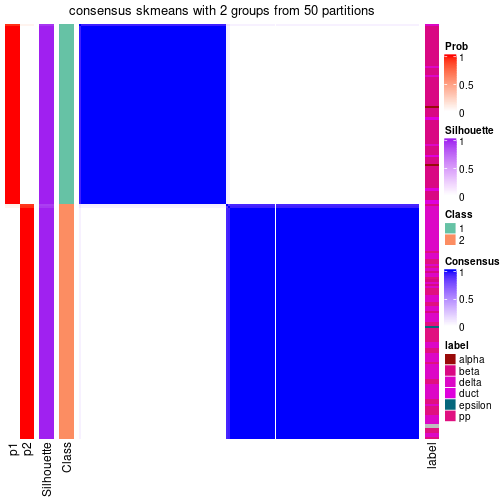</p>

</div>
<div id='tab-node-0214-consensus-heatmap-2'>
<pre><code class="r">consensus_heatmap(res, k = 3)
</code></pre>

<p>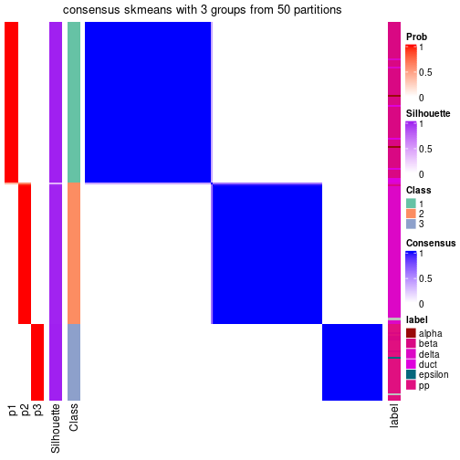</p>

</div>
<div id='tab-node-0214-consensus-heatmap-3'>
<pre><code class="r">consensus_heatmap(res, k = 4)
</code></pre>

<p>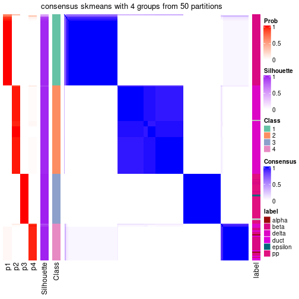</p>

</div>
</div>

Heatmaps for the membership of samples in all partitions to see how consistent they are:


<script>
$( function() {
	$( '#tabs-node-0214-membership-heatmap' ).tabs();
} );
</script>
<div id='tabs-node-0214-membership-heatmap'>
<ul>
<li><a href='#tab-node-0214-membership-heatmap-1'>k = 2</a></li>
<li><a href='#tab-node-0214-membership-heatmap-2'>k = 3</a></li>
<li><a href='#tab-node-0214-membership-heatmap-3'>k = 4</a></li>
</ul>
<div id='tab-node-0214-membership-heatmap-1'>
<pre><code class="r">membership_heatmap(res, k = 2)
</code></pre>

<p>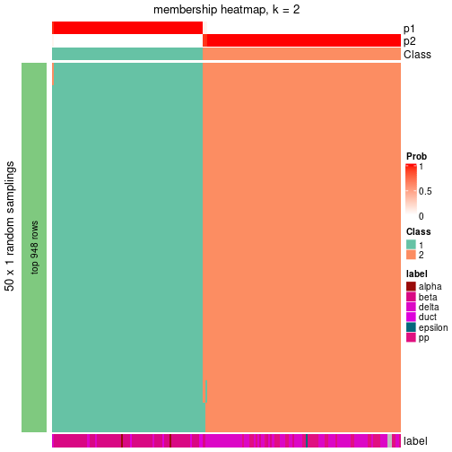</p>

</div>
<div id='tab-node-0214-membership-heatmap-2'>
<pre><code class="r">membership_heatmap(res, k = 3)
</code></pre>

<p>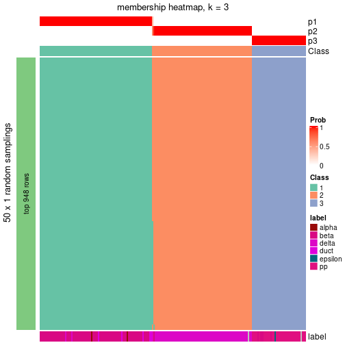</p>

</div>
<div id='tab-node-0214-membership-heatmap-3'>
<pre><code class="r">membership_heatmap(res, k = 4)
</code></pre>

<p>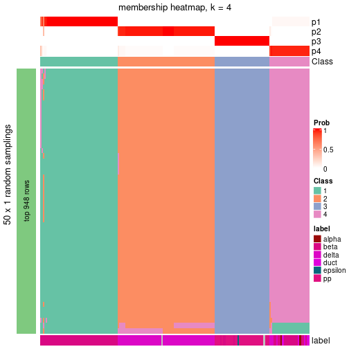</p>

</div>
</div>

As soon as the classes for columns are determined, the signatures
that are significantly different between subgroups can be looked for. 
Following are the heatmaps for signatures.


Signature heatmaps where rows are scaled:


<script>
$( function() {
	$( '#tabs-node-0214-get-signatures' ).tabs();
} );
</script>
<div id='tabs-node-0214-get-signatures'>
<ul>
<li><a href='#tab-node-0214-get-signatures-1'>k = 2</a></li>
<li><a href='#tab-node-0214-get-signatures-2'>k = 3</a></li>
<li><a href='#tab-node-0214-get-signatures-3'>k = 4</a></li>
</ul>
<div id='tab-node-0214-get-signatures-1'>
<pre><code class="r">get_signatures(res, k = 2)
</code></pre>

<p>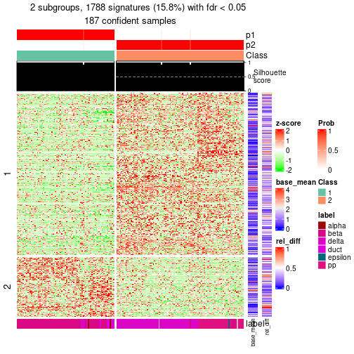</p>

</div>
<div id='tab-node-0214-get-signatures-2'>
<pre><code class="r">get_signatures(res, k = 3)
</code></pre>

<p>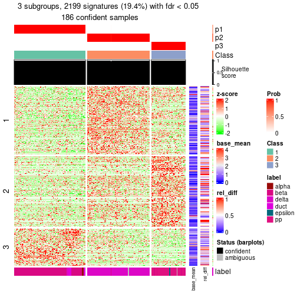</p>

</div>
<div id='tab-node-0214-get-signatures-3'>
<pre><code class="r">get_signatures(res, k = 4)
</code></pre>

<p>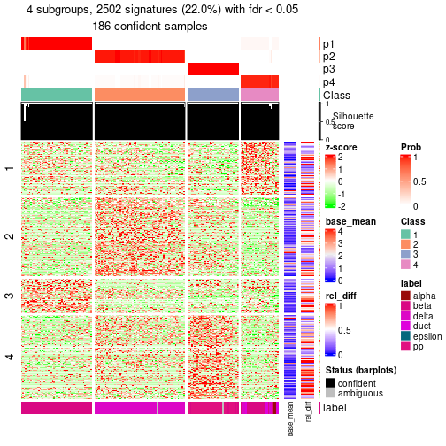</p>

</div>
</div>


Signature heatmaps where rows are not scaled:


<script>
$( function() {
	$( '#tabs-node-0214-get-signatures-no-scale' ).tabs();
} );
</script>
<div id='tabs-node-0214-get-signatures-no-scale'>
<ul>
<li><a href='#tab-node-0214-get-signatures-no-scale-1'>k = 2</a></li>
<li><a href='#tab-node-0214-get-signatures-no-scale-2'>k = 3</a></li>
<li><a href='#tab-node-0214-get-signatures-no-scale-3'>k = 4</a></li>
</ul>
<div id='tab-node-0214-get-signatures-no-scale-1'>
<pre><code class="r">get_signatures(res, k = 2, scale_rows = FALSE)
</code></pre>

<p>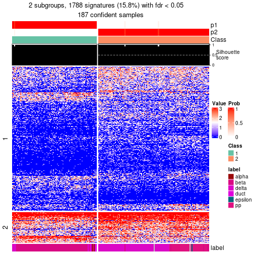</p>

</div>
<div id='tab-node-0214-get-signatures-no-scale-2'>
<pre><code class="r">get_signatures(res, k = 3, scale_rows = FALSE)
</code></pre>

<p>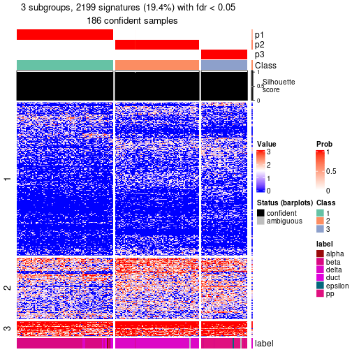</p>

</div>
<div id='tab-node-0214-get-signatures-no-scale-3'>
<pre><code class="r">get_signatures(res, k = 4, scale_rows = FALSE)
</code></pre>

<p>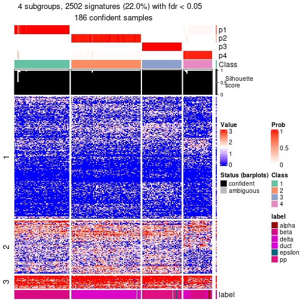</p>

</div>
</div>


Compare the overlap of signatures from different k:

```r
compare_signatures(res)
```

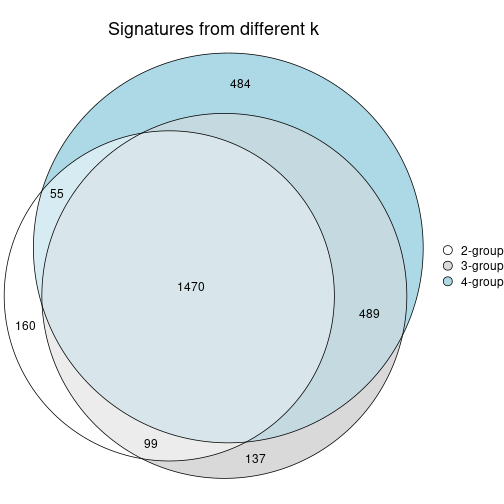

`get_signature()` returns a data frame invisibly. To get the list of signatures, the function
call should be assigned to a variable explicitly. In following code, if `plot` argument is set
to `FALSE`, no heatmap is plotted while only the differential analysis is performed.

```r
# code only for demonstration
tb = get_signature(res, k = ..., plot = FALSE)
```

An example of the output of `tb` is:

```
#>   which_row         fdr    mean_1    mean_2 scaled_mean_1 scaled_mean_2 km
#> 1        38 0.042760348  8.373488  9.131774    -0.5533452     0.5164555  1
#> 2        40 0.018707592  7.106213  8.469186    -0.6173731     0.5762149  1
#> 3        55 0.019134737 10.221463 11.207825    -0.6159697     0.5749050  1
#> 4        59 0.006059896  5.921854  7.869574    -0.6899429     0.6439467  1
#> 5        60 0.018055526  8.928898 10.211722    -0.6204761     0.5791110  1
#> 6        98 0.009384629 15.714769 14.887706     0.6635654    -0.6193277  2
...
```

The columns in `tb` are:

1. `which_row`: row indices corresponding to the input matrix.
2. `fdr`: FDR for the differential test. 
3. `mean_x`: The mean value in group x.
4. `scaled_mean_x`: The mean value in group x after rows are scaled.
5. `km`: Row groups if k-means clustering is applied to rows (which is done by automatically selecting number of clusters).

If there are too many signatures, `top_signatures = ...` can be set to only show the 
signatures with the highest FDRs:

```r
# code only for demonstration
# e.g. to show the top 500 most significant rows
tb = get_signature(res, k = ..., top_signatures = 500)
```

If the signatures are defined as these which are uniquely high in current group, `diff_method` argument
can be set to `"uniquely_high_in_one_group"`:

```r
# code only for demonstration
tb = get_signature(res, k = ..., diff_method = "uniquely_high_in_one_group")
```


UMAP plot which shows how samples are separated.


<script>
$( function() {
	$( '#tabs-node-0214-dimension-reduction' ).tabs();
} );
</script>
<div id='tabs-node-0214-dimension-reduction'>
<ul>
<li><a href='#tab-node-0214-dimension-reduction-1'>k = 2</a></li>
<li><a href='#tab-node-0214-dimension-reduction-2'>k = 3</a></li>
<li><a href='#tab-node-0214-dimension-reduction-3'>k = 4</a></li>
</ul>
<div id='tab-node-0214-dimension-reduction-1'>
<pre><code class="r">dimension_reduction(res, k = 2, method = &quot;UMAP&quot;)
</code></pre>

<p>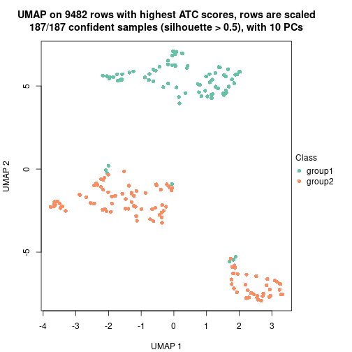</p>

</div>
<div id='tab-node-0214-dimension-reduction-2'>
<pre><code class="r">dimension_reduction(res, k = 3, method = &quot;UMAP&quot;)
</code></pre>

<p></p>

</div>
<div id='tab-node-0214-dimension-reduction-3'>
<pre><code class="r">dimension_reduction(res, k = 4, method = &quot;UMAP&quot;)
</code></pre>

<p>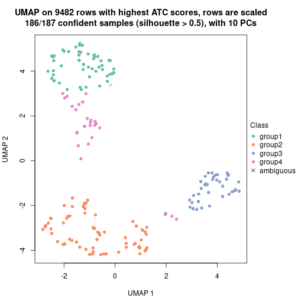</p>

</div>
</div>


Following heatmap shows how subgroups are split when increasing `k`:

```r
collect_classes(res)
```

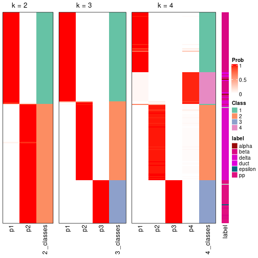


Test correlation between subgroups and known annotations. If the known
annotation is numeric, one-way ANOVA test is applied, and if the known
annotation is discrete, chi-squared contingency table test is applied.

```r
test_to_known_factors(res)
```

```
#>             n_sample label(p-value) k
#> ATC:skmeans      187       9.39e-31 2
#> ATC:skmeans      186       5.26e-64 3
#> ATC:skmeans      186       2.04e-67 4
```


If matrix rows can be associated to genes, consider to use `functional_enrichment(res,
...)` to perform function enrichment for the signature genes. See [this vignette](https://jokergoo.github.io/cola_vignettes/functional_enrichment.html) for more detailed explanations.


 

---------------------------------------------------


### Node022


Parent node: [Node02](#Node02).
Child nodes: 
                Node0121-leaf
        ,
                Node0122-leaf
        ,
                Node0123-leaf
        ,
                Node0124-leaf
        ,
                Node0131-leaf
        ,
                Node0132-leaf
        ,
                Node0133-leaf
        ,
                Node0211-leaf
        ,
                [Node0212](#Node0212)
        ,
                Node0213-leaf
        ,
                [Node0214](#Node0214)
        ,
                [Node0221](#Node0221)
        ,
                [Node0222](#Node0222)
        ,
                Node0223-leaf
        ,
                [Node0231](#Node0231)
        ,
                [Node0232](#Node0232)
        ,
                Node0233-leaf
        ,
                Node0234-leaf
        ,
                [Node0241](#Node0241)
        ,
                [Node0242](#Node0242)
        ,
                Node0243-leaf
        .


The object with results only for a single top-value method and a single partitioning method 
can be extracted as:

```r
res = res_rh["022"]
```

A summary of `res` and all the functions that can be applied to it:

```r
res
```

```
#> A 'ConsensusPartition' object with k = 2, 3, 4.
#>   On a matrix with 10585 rows and 447 columns.
#>   Top rows (1058) are extracted by 'ATC' method.
#>   Subgroups are detected by 'skmeans' method.
#>   Performed in total 150 partitions by row resampling.
#>   Best k for subgroups seems to be 4.
#> 
#> Following methods can be applied to this 'ConsensusPartition' object:
#>  [1] "cola_report"             "collect_classes"         "collect_plots"          
#>  [4] "collect_stats"           "colnames"                "compare_partitions"     
#>  [7] "compare_signatures"      "consensus_heatmap"       "dimension_reduction"    
#> [10] "functional_enrichment"   "get_anno_col"            "get_anno"               
#> [13] "get_classes"             "get_consensus"           "get_matrix"             
#> [16] "get_membership"          "get_param"               "get_signatures"         
#> [19] "get_stats"               "is_best_k"               "is_stable_k"            
#> [22] "membership_heatmap"      "ncol"                    "nrow"                   
#> [25] "plot_ecdf"               "predict_classes"         "rownames"               
#> [28] "select_partition_number" "show"                    "suggest_best_k"         
#> [31] "test_to_known_factors"   "top_rows_heatmap"
```

`collect_plots()` function collects all the plots made from `res` for all `k` (number of subgroups)
into one single page to provide an easy and fast comparison between different `k`.

```r
collect_plots(res)
```

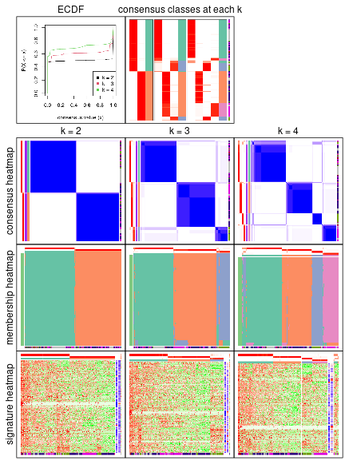

The plots are:

- The first row: a plot of the eCDF (empirical cumulative distribution
  function) curves of the consensus matrix for each `k` and the heatmap of
  predicted classes for each `k`.
- The second row: heatmaps of the consensus matrix for each `k`.
- The third row: heatmaps of the membership matrix for each `k`.
- The fouth row: heatmaps of the signatures for each `k`.

All the plots in panels can be made by individual functions and they are
plotted later in this section.

`select_partition_number()` produces several plots showing different
statistics for choosing "optimized" `k`. There are following statistics:

- eCDF curves of the consensus matrix for each `k`;
- 1-PAC. [The PAC score](https://en.wikipedia.org/wiki/Consensus_clustering#Over-interpretation_potential_of_consensus_clustering)
  measures the proportion of the ambiguous subgrouping.
- Mean silhouette score.
- Concordance. The mean probability of fiting the consensus subgroup labels in all
  partitions.
- Area increased. Denote $A_k$ as the area under the eCDF curve for current
  `k`, the area increased is defined as $A_k - A_{k-1}$.
- Rand index. The percent of pairs of samples that are both in a same cluster
  or both are not in a same cluster in the partition of k and k-1.
- Jaccard index. The ratio of pairs of samples are both in a same cluster in
  the partition of k and k-1 and the pairs of samples are both in a same
  cluster in the partition k or k-1.

The detailed explanations of these statistics can be found in [the _cola_
vignette](https://jokergoo.github.io/cola_vignettes/cola.html#toc_13).

Generally speaking, higher 1-PAC score, higher mean silhouette score or higher
concordance corresponds to better partition. Rand index and Jaccard index
measure how similar the current partition is compared to partition with `k-1`.
If they are too similar, we won't accept `k` is better than `k-1`.

```r
select_partition_number(res)
```

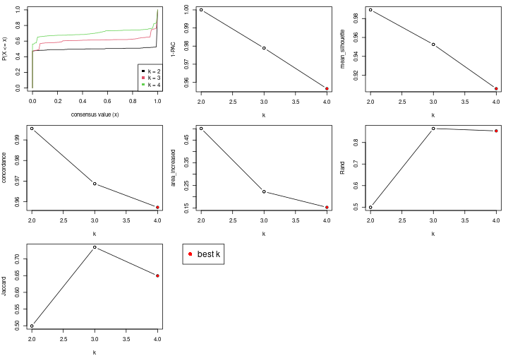

The numeric values for all these statistics can be obtained by `get_stats()`.

```r
get_stats(res)
```

```
#>   k 1-PAC mean_silhouette concordance area_increased  Rand Jaccard
#> 2 2 1.000           0.989       0.996          0.501 0.499   0.499
#> 3 3 0.979           0.953       0.969          0.223 0.865   0.735
#> 4 4 0.957           0.906       0.957          0.153 0.854   0.650
```

`suggest_best_k()` suggests the best $k$ based on these statistics. The rules are as follows:

- All $k$ with Jaccard index larger than 0.95 are removed because increasing
  $k$ does not provide enough extra information. If all $k$ are removed, it is
  marked as no subgroup is detected.
- For all $k$ with 1-PAC score larger than 0.9, the maximal $k$ is taken as
  the best $k$, and other $k$ are marked as optional $k$.
- If it does not fit the second rule. The $k$ with the maximal vote of the
  highest 1-PAC score, highest mean silhouette, and highest concordance is
  taken as the best $k$.

```r
suggest_best_k(res)
```

```
#> [1] 4
#> attr(,"optional")
#> [1] 2 3
```

There is also optional best $k$ = 2 3 that is worth to check.

Following is the table of the partitions (You need to click the **show/hide
code output** link to see it). The membership matrix (columns with name `p*`)
is inferred by
[`clue::cl_consensus()`](https://www.rdocumentation.org/link/cl_consensus?package=clue)
function with the `SE` method. Basically the value in the membership matrix
represents the probability to belong to a certain group. The finall subgroup
label for an item is determined with the group with highest probability it
belongs to.

In `get_classes()` function, the entropy is calculated from the membership
matrix and the silhouette score is calculated from the consensus matrix.


<script>
$( function() {
	$( '#tabs-node-022-get-classes' ).tabs();
} );
</script>
<div id='tabs-node-022-get-classes'>
<ul>
<li><a href='#tab-node-022-get-classes-1'>k = 2</a></li>
<li><a href='#tab-node-022-get-classes-2'>k = 3</a></li>
<li><a href='#tab-node-022-get-classes-3'>k = 4</a></li>
</ul>

<div id='tab-node-022-get-classes-1'>
<p><a id='tab-node-022-get-classes-1-a' style='color:#0366d6' href='#'>show/hide code output</a></p>
<pre><code class="r">cbind(get_classes(res, k = 2), get_membership(res, k = 2))
</code></pre>

<pre><code>#&gt;          class entropy silhouette   p1   p2
#&gt; D28-1_2      2   0.000      0.992 0.00 1.00
#&gt; D28-1_37     2   0.000      0.992 0.00 1.00
#&gt; D28-1_38     1   0.000      0.998 1.00 0.00
#&gt; D28-1_49     1   0.000      0.998 1.00 0.00
#&gt; D28-1_50     1   0.000      0.998 1.00 0.00
#&gt; D28-1_52     1   0.000      0.998 1.00 0.00
#&gt; D28-1_55     1   0.000      0.998 1.00 0.00
#&gt; D28-1_62     1   0.000      0.998 1.00 0.00
#&gt; D28-1_66     1   0.000      0.998 1.00 0.00
#&gt; D28-1_67     1   0.000      0.998 1.00 0.00
#&gt; D28-1_68     1   0.000      0.998 1.00 0.00
#&gt; D28-1_73     1   0.000      0.998 1.00 0.00
#&gt; D28-1_77     1   0.000      0.998 1.00 0.00
#&gt; D28-1_80     2   0.000      0.992 0.00 1.00
#&gt; D28-1_86     1   0.000      0.998 1.00 0.00
#&gt; D28-1_87     1   0.000      0.998 1.00 0.00
#&gt; D28-1_90     1   0.000      0.998 1.00 0.00
#&gt; D28-1_91     1   0.000      0.998 1.00 0.00
#&gt; D28-2_1      1   0.000      0.998 1.00 0.00
#&gt; D28-2_4      2   0.000      0.992 0.00 1.00
#&gt; D28-2_15     2   0.000      0.992 0.00 1.00
#&gt; D28-2_16     2   0.000      0.992 0.00 1.00
#&gt; D28-2_17     2   0.000      0.992 0.00 1.00
#&gt; D28-2_18     2   0.000      0.992 0.00 1.00
#&gt; D28-2_29     1   0.000      0.998 1.00 0.00
#&gt; D28-2_39     1   0.000      0.998 1.00 0.00
#&gt; D28-2_40     2   0.000      0.992 0.00 1.00
#&gt; D28-2_41     1   0.000      0.998 1.00 0.00
#&gt; D28-2_42     1   0.000      0.998 1.00 0.00
#&gt; D28-2_49     1   0.000      0.998 1.00 0.00
#&gt; D28-2_53     1   0.000      0.998 1.00 0.00
#&gt; D28-2_61     1   0.000      0.998 1.00 0.00
#&gt; D28-2_64     2   0.000      0.992 0.00 1.00
#&gt; D28-2_74     1   0.000      0.998 1.00 0.00
#&gt; D28-2_75     1   0.000      0.998 1.00 0.00
#&gt; D28-2_78     1   0.584      0.837 0.86 0.14
#&gt; D28-2_79     1   0.000      0.998 1.00 0.00
#&gt; D28-2_86     1   0.000      0.998 1.00 0.00
#&gt; D28-2_87     2   0.000      0.992 0.00 1.00
#&gt; D28-2_89     2   0.000      0.992 0.00 1.00
#&gt; D28-3_4      1   0.000      0.998 1.00 0.00
#&gt; D28-3_25     2   0.000      0.992 0.00 1.00
#&gt; D28-3_26     2   0.000      0.992 0.00 1.00
#&gt; D28-3_28     2   0.000      0.992 0.00 1.00
#&gt; D28-3_40     2   0.855      0.615 0.28 0.72
#&gt; D28-3_41     1   0.000      0.998 1.00 0.00
#&gt; D28-3_44     2   0.000      0.992 0.00 1.00
#&gt; D28-3_50     1   0.000      0.998 1.00 0.00
#&gt; D28-3_51     1   0.000      0.998 1.00 0.00
#&gt; D28-3_52     1   0.000      0.998 1.00 0.00
#&gt; D28-3_53     2   0.000      0.992 0.00 1.00
#&gt; D28-3_62     2   0.000      0.992 0.00 1.00
#&gt; D28-3_63     2   0.000      0.992 0.00 1.00
#&gt; D28-3_65     2   0.000      0.992 0.00 1.00
#&gt; D28-3_73     1   0.000      0.998 1.00 0.00
#&gt; D28-3_75     2   0.000      0.992 0.00 1.00
#&gt; D28-3_77     2   0.000      0.992 0.00 1.00
#&gt; D28-3_86     2   0.000      0.992 0.00 1.00
#&gt; D28-3_89     1   0.000      0.998 1.00 0.00
#&gt; D28-3_91     2   0.000      0.992 0.00 1.00
#&gt; D28-4_4      1   0.000      0.998 1.00 0.00
#&gt; D28-4_14     2   0.000      0.992 0.00 1.00
#&gt; D28-4_17     1   0.000      0.998 1.00 0.00
#&gt; D28-4_40     2   0.000      0.992 0.00 1.00
#&gt; D28-4_43     2   0.000      0.992 0.00 1.00
#&gt; D28-4_49     1   0.000      0.998 1.00 0.00
#&gt; D28-4_50     2   0.000      0.992 0.00 1.00
#&gt; D28-4_51     2   0.000      0.992 0.00 1.00
#&gt; D28-4_54     1   0.000      0.998 1.00 0.00
#&gt; D28-4_55     2   0.000      0.992 0.00 1.00
#&gt; D28-4_61     2   0.000      0.992 0.00 1.00
#&gt; D28-4_63     2   0.000      0.992 0.00 1.00
#&gt; D28-4_67     1   0.000      0.998 1.00 0.00
#&gt; D28-4_73     2   0.000      0.992 0.00 1.00
#&gt; D28-4_74     2   0.000      0.992 0.00 1.00
#&gt; D28-4_75     1   0.000      0.998 1.00 0.00
#&gt; D28-4_78     1   0.000      0.998 1.00 0.00
#&gt; D28-4_86     2   0.000      0.992 0.00 1.00
#&gt; D28-4_88     1   0.000      0.998 1.00 0.00
#&gt; D28-4_89     1   0.000      0.998 1.00 0.00
#&gt; D28-4_91     2   0.000      0.992 0.00 1.00
#&gt; D28-5_3      2   0.000      0.992 0.00 1.00
#&gt; D28-5_4      2   0.981      0.282 0.42 0.58
#&gt; D28-5_17     2   0.000      0.992 0.00 1.00
#&gt; D28-5_25     1   0.000      0.998 1.00 0.00
#&gt; D28-5_27     2   0.000      0.992 0.00 1.00
#&gt; D28-5_28     1   0.000      0.998 1.00 0.00
#&gt; D28-5_29     1   0.000      0.998 1.00 0.00
#&gt; D28-5_30     1   0.000      0.998 1.00 0.00
#&gt; D28-5_37     2   0.000      0.992 0.00 1.00
#&gt; D28-5_38     1   0.000      0.998 1.00 0.00
#&gt; D28-5_39     1   0.000      0.998 1.00 0.00
#&gt; D28-5_42     2   0.000      0.992 0.00 1.00
#&gt; D28-5_51     1   0.000      0.998 1.00 0.00
#&gt; D28-5_53     1   0.000      0.998 1.00 0.00
#&gt; D28-5_54     1   0.000      0.998 1.00 0.00
#&gt; D28-5_56     1   0.000      0.998 1.00 0.00
#&gt; D28-5_61     1   0.000      0.998 1.00 0.00
#&gt; D28-5_62     1   0.000      0.998 1.00 0.00
#&gt; D28-5_63     1   0.000      0.998 1.00 0.00
#&gt; D28-5_75     1   0.000      0.998 1.00 0.00
#&gt; D28-5_77     1   0.000      0.998 1.00 0.00
#&gt; D28-5_78     1   0.000      0.998 1.00 0.00
#&gt; D28-5_89     1   0.000      0.998 1.00 0.00
#&gt; D28-6_1      1   0.000      0.998 1.00 0.00
#&gt; D28-6_2      1   0.000      0.998 1.00 0.00
#&gt; D28-6_4      1   0.000      0.998 1.00 0.00
#&gt; D28-6_14     2   0.000      0.992 0.00 1.00
#&gt; D28-6_16     1   0.000      0.998 1.00 0.00
#&gt; D28-6_19     2   0.000      0.992 0.00 1.00
#&gt; D28-6_38     1   0.000      0.998 1.00 0.00
#&gt; D28-6_41     1   0.000      0.998 1.00 0.00
#&gt; D28-6_42     1   0.000      0.998 1.00 0.00
#&gt; D28-6_43     2   0.000      0.992 0.00 1.00
#&gt; D28-6_49     1   0.000      0.998 1.00 0.00
#&gt; D28-6_50     1   0.000      0.998 1.00 0.00
#&gt; D28-6_51     2   0.000      0.992 0.00 1.00
#&gt; D28-6_61     2   0.000      0.992 0.00 1.00
#&gt; D28-6_62     1   0.000      0.998 1.00 0.00
#&gt; D28-6_63     1   0.000      0.998 1.00 0.00
#&gt; D28-6_64     1   0.000      0.998 1.00 0.00
#&gt; D28-6_66     1   0.000      0.998 1.00 0.00
#&gt; D28-6_73     1   0.000      0.998 1.00 0.00
#&gt; D28-6_74     1   0.000      0.998 1.00 0.00
#&gt; D28-6_76     1   0.000      0.998 1.00 0.00
#&gt; D28-6_87     1   0.000      0.998 1.00 0.00
#&gt; D28-6_89     1   0.000      0.998 1.00 0.00
#&gt; D28-7_1      1   0.000      0.998 1.00 0.00
#&gt; D28-7_15     2   0.000      0.992 0.00 1.00
#&gt; D28-7_37     1   0.000      0.998 1.00 0.00
#&gt; D28-7_39     1   0.000      0.998 1.00 0.00
#&gt; D28-7_41     1   0.000      0.998 1.00 0.00
#&gt; D28-7_42     1   0.000      0.998 1.00 0.00
#&gt; D28-7_51     1   0.000      0.998 1.00 0.00
#&gt; D28-7_52     1   0.000      0.998 1.00 0.00
#&gt; D28-7_62     1   0.000      0.998 1.00 0.00
#&gt; D28-7_64     1   0.000      0.998 1.00 0.00
#&gt; D28-7_74     1   0.000      0.998 1.00 0.00
#&gt; D28-7_75     2   0.000      0.992 0.00 1.00
#&gt; D28-7_78     2   0.000      0.992 0.00 1.00
#&gt; D28-7_85     1   0.000      0.998 1.00 0.00
#&gt; D28-7_86     1   0.000      0.998 1.00 0.00
#&gt; D28-7_87     2   0.000      0.992 0.00 1.00
#&gt; D28-7_88     1   0.000      0.998 1.00 0.00
#&gt; D28-7_89     2   0.000      0.992 0.00 1.00
#&gt; D28-8_1      2   0.000      0.992 0.00 1.00
#&gt; D28-8_4      2   0.000      0.992 0.00 1.00
#&gt; D28-8_6      2   0.529      0.861 0.12 0.88
#&gt; D28-8_16     1   0.000      0.998 1.00 0.00
#&gt; D28-8_28     1   0.327      0.936 0.94 0.06
#&gt; D28-8_31     1   0.000      0.998 1.00 0.00
#&gt; D28-8_37     1   0.000      0.998 1.00 0.00
#&gt; D28-8_39     1   0.000      0.998 1.00 0.00
#&gt; D28-8_52     1   0.000      0.998 1.00 0.00
#&gt; D28-8_53     1   0.000      0.998 1.00 0.00
#&gt; D28-8_55     1   0.000      0.998 1.00 0.00
#&gt; D28-8_62     1   0.000      0.998 1.00 0.00
#&gt; D28-8_63     1   0.000      0.998 1.00 0.00
#&gt; D28-8_65     1   0.000      0.998 1.00 0.00
#&gt; D28-8_66     1   0.000      0.998 1.00 0.00
#&gt; D28-8_73     1   0.000      0.998 1.00 0.00
#&gt; D28-8_75     2   0.000      0.992 0.00 1.00
#&gt; D28-8_77     1   0.000      0.998 1.00 0.00
#&gt; D28-8_78     1   0.000      0.998 1.00 0.00
#&gt; D28-8_87     1   0.000      0.998 1.00 0.00
#&gt; D29-1_54     1   0.000      0.998 1.00 0.00
#&gt; D29-1_61     1   0.000      0.998 1.00 0.00
#&gt; D29-1_68     2   0.000      0.992 0.00 1.00
#&gt; D29-2_1      1   0.000      0.998 1.00 0.00
#&gt; D29-2_12     2   0.000      0.992 0.00 1.00
#&gt; D29-2_57     1   0.000      0.998 1.00 0.00
#&gt; D29-2_63     2   0.000      0.992 0.00 1.00
#&gt; D29-3_17     2   0.000      0.992 0.00 1.00
#&gt; D29-3_73     1   0.000      0.998 1.00 0.00
#&gt; D29-4_45     2   0.000      0.992 0.00 1.00
#&gt; D29-4_47     2   0.141      0.973 0.02 0.98
#&gt; D29-4_82     1   0.000      0.998 1.00 0.00
#&gt; D29-5_64     1   0.000      0.998 1.00 0.00
#&gt; D29-5_89     2   0.000      0.992 0.00 1.00
#&gt; D29-7_49     2   0.000      0.992 0.00 1.00
#&gt; D29-8_4      2   0.000      0.992 0.00 1.00
#&gt; D29-8_52     1   0.000      0.998 1.00 0.00
#&gt; D29-8_63     2   0.000      0.992 0.00 1.00
#&gt; D31-1_5      2   0.000      0.992 0.00 1.00
#&gt; D31-1_9      1   0.000      0.998 1.00 0.00
#&gt; D31-1_12     2   0.000      0.992 0.00 1.00
#&gt; D31-1_19     1   0.000      0.998 1.00 0.00
#&gt; D31-1_21     2   0.000      0.992 0.00 1.00
#&gt; D31-1_22     2   0.000      0.992 0.00 1.00
#&gt; D31-1_23     1   0.000      0.998 1.00 0.00
#&gt; D31-1_44     2   0.000      0.992 0.00 1.00
#&gt; D31-1_45     1   0.000      0.998 1.00 0.00
#&gt; D31-1_48     2   0.000      0.992 0.00 1.00
#&gt; D31-1_55     1   0.000      0.998 1.00 0.00
#&gt; D31-1_58     2   0.000      0.992 0.00 1.00
#&gt; D31-1_70     2   0.000      0.992 0.00 1.00
#&gt; D31-1_76     1   0.000      0.998 1.00 0.00
#&gt; D31-1_77     2   0.000      0.992 0.00 1.00
#&gt; D31-1_88     1   0.000      0.998 1.00 0.00
#&gt; D31-1_93     2   0.000      0.992 0.00 1.00
#&gt; D31-2_6      2   0.000      0.992 0.00 1.00
#&gt; D31-2_10     1   0.000      0.998 1.00 0.00
#&gt; D31-2_15     2   0.000      0.992 0.00 1.00
#&gt; D31-2_17     2   0.000      0.992 0.00 1.00
#&gt; D31-2_19     1   0.000      0.998 1.00 0.00
#&gt; D31-2_24     2   0.000      0.992 0.00 1.00
#&gt; D31-2_30     2   0.000      0.992 0.00 1.00
#&gt; D31-2_35     2   0.000      0.992 0.00 1.00
#&gt; D31-2_38     2   0.000      0.992 0.00 1.00
#&gt; D31-2_41     1   0.000      0.998 1.00 0.00
#&gt; D31-2_53     1   0.000      0.998 1.00 0.00
#&gt; D31-2_61     1   0.529      0.863 0.88 0.12
#&gt; D31-2_68     1   0.000      0.998 1.00 0.00
#&gt; D31-2_69     1   0.000      0.998 1.00 0.00
#&gt; D31-2_73     1   0.000      0.998 1.00 0.00
#&gt; D31-2_75     2   0.000      0.992 0.00 1.00
#&gt; D31-2_76     2   0.000      0.992 0.00 1.00
#&gt; D31-2_80     1   0.000      0.998 1.00 0.00
#&gt; D31-2_83     2   0.000      0.992 0.00 1.00
#&gt; D31-2_85     1   0.000      0.998 1.00 0.00
#&gt; D31-2_86     2   0.000      0.992 0.00 1.00
#&gt; D31-2_87     2   0.000      0.992 0.00 1.00
#&gt; D31-2_91     2   0.000      0.992 0.00 1.00
#&gt; D31-3_1      2   0.000      0.992 0.00 1.00
#&gt; D31-3_12     2   0.000      0.992 0.00 1.00
#&gt; D31-3_14     2   0.000      0.992 0.00 1.00
#&gt; D31-3_15     2   0.000      0.992 0.00 1.00
#&gt; D31-3_21     1   0.000      0.998 1.00 0.00
#&gt; D31-3_25     2   0.000      0.992 0.00 1.00
#&gt; D31-3_26     2   0.000      0.992 0.00 1.00
#&gt; D31-3_36     2   0.000      0.992 0.00 1.00
#&gt; D31-3_37     1   0.000      0.998 1.00 0.00
#&gt; D31-3_40     2   0.000      0.992 0.00 1.00
#&gt; D31-3_47     2   0.000      0.992 0.00 1.00
#&gt; D31-3_48     2   0.000      0.992 0.00 1.00
#&gt; D31-3_53     2   0.000      0.992 0.00 1.00
#&gt; D31-3_60     2   0.000      0.992 0.00 1.00
#&gt; D31-3_63     2   0.000      0.992 0.00 1.00
#&gt; D31-3_64     2   0.000      0.992 0.00 1.00
#&gt; D31-3_69     2   0.000      0.992 0.00 1.00
#&gt; D31-3_73     2   0.000      0.992 0.00 1.00
#&gt; D31-3_82     2   0.000      0.992 0.00 1.00
#&gt; D31-3_86     1   0.000      0.998 1.00 0.00
#&gt; D31-3_89     2   0.000      0.992 0.00 1.00
#&gt; D31-4_13     2   0.000      0.992 0.00 1.00
#&gt; D31-4_16     1   0.000      0.998 1.00 0.00
#&gt; D31-4_33     2   0.000      0.992 0.00 1.00
#&gt; D31-4_36     2   0.000      0.992 0.00 1.00
#&gt; D31-4_38     2   0.000      0.992 0.00 1.00
#&gt; D31-4_41     2   0.000      0.992 0.00 1.00
#&gt; D31-4_43     2   0.000      0.992 0.00 1.00
#&gt; D31-4_48     1   0.000      0.998 1.00 0.00
#&gt; D31-4_55     1   0.000      0.998 1.00 0.00
#&gt; D31-4_57     2   0.000      0.992 0.00 1.00
#&gt; D31-4_67     1   0.000      0.998 1.00 0.00
#&gt; D31-4_68     1   0.000      0.998 1.00 0.00
#&gt; D31-4_69     2   0.000      0.992 0.00 1.00
#&gt; D31-4_70     1   0.000      0.998 1.00 0.00
#&gt; D31-4_71     1   0.000      0.998 1.00 0.00
#&gt; D31-4_72     2   0.000      0.992 0.00 1.00
#&gt; D31-4_73     1   0.000      0.998 1.00 0.00
#&gt; D31-4_77     1   0.000      0.998 1.00 0.00
#&gt; D31-4_79     2   0.000      0.992 0.00 1.00
#&gt; D31-4_93     2   0.000      0.992 0.00 1.00
#&gt; D31-5_1      2   0.000      0.992 0.00 1.00
#&gt; D31-5_16     2   0.000      0.992 0.00 1.00
#&gt; D31-5_37     2   0.000      0.992 0.00 1.00
#&gt; D31-5_45     2   0.000      0.992 0.00 1.00
#&gt; D31-5_48     2   0.000      0.992 0.00 1.00
#&gt; D31-5_69     2   0.000      0.992 0.00 1.00
#&gt; D31-5_70     2   0.000      0.992 0.00 1.00
#&gt; D31-5_78     2   0.000      0.992 0.00 1.00
#&gt; D31-5_82     1   0.000      0.998 1.00 0.00
#&gt; D31-5_91     1   0.000      0.998 1.00 0.00
#&gt; D31-5_92     2   0.000      0.992 0.00 1.00
#&gt; D31-6_9      2   0.000      0.992 0.00 1.00
#&gt; D31-6_13     2   0.000      0.992 0.00 1.00
#&gt; D31-6_39     2   0.000      0.992 0.00 1.00
#&gt; D31-6_43     2   0.000      0.992 0.00 1.00
#&gt; D31-6_44     2   0.000      0.992 0.00 1.00
#&gt; D31-6_50     2   0.000      0.992 0.00 1.00
#&gt; D31-6_53     2   0.000      0.992 0.00 1.00
#&gt; D31-6_61     2   0.000      0.992 0.00 1.00
#&gt; D31-6_66     2   0.000      0.992 0.00 1.00
#&gt; D31-6_68     2   0.000      0.992 0.00 1.00
#&gt; D31-6_69     2   0.000      0.992 0.00 1.00
#&gt; D31-6_81     2   0.000      0.992 0.00 1.00
#&gt; D31-6_82     2   0.000      0.992 0.00 1.00
#&gt; D31-6_84     1   0.000      0.998 1.00 0.00
#&gt; D31-6_86     2   0.000      0.992 0.00 1.00
#&gt; D31-6_93     2   0.000      0.992 0.00 1.00
#&gt; D31-7_16     2   0.000      0.992 0.00 1.00
#&gt; D31-7_38     2   0.000      0.992 0.00 1.00
#&gt; D31-7_48     2   0.000      0.992 0.00 1.00
#&gt; D31-7_56     1   0.000      0.998 1.00 0.00
#&gt; D31-7_57     2   0.000      0.992 0.00 1.00
#&gt; D31-7_63     2   0.000      0.992 0.00 1.00
#&gt; D31-7_70     2   0.000      0.992 0.00 1.00
#&gt; D31-7_77     2   0.000      0.992 0.00 1.00
#&gt; D31-8_4      2   0.000      0.992 0.00 1.00
#&gt; D31-8_11     2   0.000      0.992 0.00 1.00
#&gt; D31-8_18     1   0.000      0.998 1.00 0.00
#&gt; D31-8_23     2   0.000      0.992 0.00 1.00
#&gt; D31-8_27     2   0.000      0.992 0.00 1.00
#&gt; D31-8_53     2   0.000      0.992 0.00 1.00
#&gt; D31-8_58     2   0.000      0.992 0.00 1.00
#&gt; D31-8_63     1   0.000      0.998 1.00 0.00
#&gt; D31-8_77     1   0.000      0.998 1.00 0.00
#&gt; D31-8_89     1   0.000      0.998 1.00 0.00
#&gt; D31-8_91     2   0.000      0.992 0.00 1.00
#&gt; D31-8_92     1   0.000      0.998 1.00 0.00
#&gt; D30-1_1      2   0.000      0.992 0.00 1.00
#&gt; D30-1_13     2   0.000      0.992 0.00 1.00
#&gt; D30-1_19     2   0.000      0.992 0.00 1.00
#&gt; D30-1_22     1   0.000      0.998 1.00 0.00
#&gt; D30-1_30     2   0.000      0.992 0.00 1.00
#&gt; D30-1_43     2   0.000      0.992 0.00 1.00
#&gt; D30-1_61     2   0.000      0.992 0.00 1.00
#&gt; D30-1_72     2   0.000      0.992 0.00 1.00
#&gt; D30-1_79     1   0.000      0.998 1.00 0.00
#&gt; D30-2_1      1   0.000      0.998 1.00 0.00
#&gt; D30-2_4      1   0.000      0.998 1.00 0.00
#&gt; D30-2_6      1   0.000      0.998 1.00 0.00
#&gt; D30-2_9      2   0.000      0.992 0.00 1.00
#&gt; D30-2_11     1   0.000      0.998 1.00 0.00
#&gt; D30-2_17     1   0.000      0.998 1.00 0.00
#&gt; D30-2_27     2   0.000      0.992 0.00 1.00
#&gt; D30-2_29     1   0.000      0.998 1.00 0.00
#&gt; D30-2_35     1   0.000      0.998 1.00 0.00
#&gt; D30-2_40     1   0.000      0.998 1.00 0.00
#&gt; D30-2_41     1   0.000      0.998 1.00 0.00
#&gt; D30-2_42     2   0.000      0.992 0.00 1.00
#&gt; D30-2_43     1   0.000      0.998 1.00 0.00
#&gt; D30-2_45     2   0.000      0.992 0.00 1.00
#&gt; D30-2_51     1   0.000      0.998 1.00 0.00
#&gt; D30-2_53     1   0.000      0.998 1.00 0.00
#&gt; D30-2_56     1   0.000      0.998 1.00 0.00
#&gt; D30-2_59     1   0.000      0.998 1.00 0.00
#&gt; D30-2_60     1   0.000      0.998 1.00 0.00
#&gt; D30-2_71     1   0.000      0.998 1.00 0.00
#&gt; D30-2_74     1   0.000      0.998 1.00 0.00
#&gt; D30-2_76     2   0.000      0.992 0.00 1.00
#&gt; D30-2_77     1   0.000      0.998 1.00 0.00
#&gt; D30-2_84     1   0.000      0.998 1.00 0.00
#&gt; D30-2_92     1   0.000      0.998 1.00 0.00
#&gt; D30-2_93     1   0.000      0.998 1.00 0.00
#&gt; D30-3_2      1   0.000      0.998 1.00 0.00
#&gt; D30-3_6      2   0.000      0.992 0.00 1.00
#&gt; D30-3_7      1   0.000      0.998 1.00 0.00
#&gt; D30-3_17     2   0.000      0.992 0.00 1.00
#&gt; D30-3_24     1   0.000      0.998 1.00 0.00
#&gt; D30-3_39     2   0.827      0.653 0.26 0.74
#&gt; D30-3_45     2   0.000      0.992 0.00 1.00
#&gt; D30-3_49     1   0.000      0.998 1.00 0.00
#&gt; D30-3_56     1   0.000      0.998 1.00 0.00
#&gt; D30-3_59     1   0.000      0.998 1.00 0.00
#&gt; D30-3_61     1   0.000      0.998 1.00 0.00
#&gt; D30-3_63     2   0.000      0.992 0.00 1.00
#&gt; D30-3_72     1   0.000      0.998 1.00 0.00
#&gt; D30-4_7      2   0.000      0.992 0.00 1.00
#&gt; D30-4_10     1   0.000      0.998 1.00 0.00
#&gt; D30-4_13     2   0.000      0.992 0.00 1.00
#&gt; D30-4_16     1   0.000      0.998 1.00 0.00
#&gt; D30-4_18     2   0.000      0.992 0.00 1.00
#&gt; D30-4_23     1   0.000      0.998 1.00 0.00
#&gt; D30-4_35     2   0.000      0.992 0.00 1.00
#&gt; D30-4_38     1   0.000      0.998 1.00 0.00
#&gt; D30-4_44     1   0.000      0.998 1.00 0.00
#&gt; D30-4_46     1   0.000      0.998 1.00 0.00
#&gt; D30-4_51     1   0.000      0.998 1.00 0.00
#&gt; D30-4_53     1   0.000      0.998 1.00 0.00
#&gt; D30-4_55     1   0.000      0.998 1.00 0.00
#&gt; D30-4_58     1   0.000      0.998 1.00 0.00
#&gt; D30-4_62     2   0.000      0.992 0.00 1.00
#&gt; D30-4_64     1   0.000      0.998 1.00 0.00
#&gt; D30-4_65     2   0.000      0.992 0.00 1.00
#&gt; D30-4_78     1   0.000      0.998 1.00 0.00
#&gt; D30-4_82     1   0.000      0.998 1.00 0.00
#&gt; D30-4_91     2   0.000      0.992 0.00 1.00
#&gt; D30-4_92     1   0.000      0.998 1.00 0.00
#&gt; D30-4_93     1   0.000      0.998 1.00 0.00
#&gt; D30-5_4      2   0.000      0.992 0.00 1.00
#&gt; D30-5_29     2   0.141      0.973 0.02 0.98
#&gt; D30-5_36     1   0.000      0.998 1.00 0.00
#&gt; D30-5_38     2   0.000      0.992 0.00 1.00
#&gt; D30-5_45     2   0.000      0.992 0.00 1.00
#&gt; D30-5_46     2   0.000      0.992 0.00 1.00
#&gt; D30-5_58     2   0.000      0.992 0.00 1.00
#&gt; D30-5_59     1   0.000      0.998 1.00 0.00
#&gt; D30-5_64     2   0.000      0.992 0.00 1.00
#&gt; D30-5_72     2   0.000      0.992 0.00 1.00
#&gt; D30-5_78     2   0.000      0.992 0.00 1.00
#&gt; D30-5_79     1   0.242      0.958 0.96 0.04
#&gt; D30-5_80     1   0.000      0.998 1.00 0.00
#&gt; D30-5_81     2   0.000      0.992 0.00 1.00
#&gt; D30-5_89     2   0.000      0.992 0.00 1.00
#&gt; D30-6_3      1   0.000      0.998 1.00 0.00
#&gt; D30-6_17     1   0.000      0.998 1.00 0.00
#&gt; D30-6_23     2   0.469      0.886 0.10 0.90
#&gt; D30-6_27     2   0.000      0.992 0.00 1.00
#&gt; D30-6_28     1   0.000      0.998 1.00 0.00
#&gt; D30-6_34     2   0.000      0.992 0.00 1.00
#&gt; D30-6_37     2   0.000      0.992 0.00 1.00
#&gt; D30-6_40     2   0.000      0.992 0.00 1.00
#&gt; D30-6_44     2   0.000      0.992 0.00 1.00
#&gt; D30-6_48     1   0.000      0.998 1.00 0.00
#&gt; D30-6_52     2   0.000      0.992 0.00 1.00
#&gt; D30-6_64     2   0.000      0.992 0.00 1.00
#&gt; D30-6_69     2   0.000      0.992 0.00 1.00
#&gt; D30-6_77     2   0.000      0.992 0.00 1.00
#&gt; D30-6_80     1   0.000      0.998 1.00 0.00
#&gt; D30-6_84     1   0.000      0.998 1.00 0.00
#&gt; D30-7_1      1   0.000      0.998 1.00 0.00
#&gt; D30-7_11     1   0.000      0.998 1.00 0.00
#&gt; D30-7_15     1   0.000      0.998 1.00 0.00
#&gt; D30-7_20     2   0.000      0.992 0.00 1.00
#&gt; D30-7_28     2   0.000      0.992 0.00 1.00
#&gt; D30-7_30     2   0.000      0.992 0.00 1.00
#&gt; D30-7_33     2   0.000      0.992 0.00 1.00
#&gt; D30-7_35     1   0.000      0.998 1.00 0.00
#&gt; D30-7_38     2   0.981      0.284 0.42 0.58
#&gt; D30-7_39     2   0.000      0.992 0.00 1.00
#&gt; D30-7_51     2   0.000      0.992 0.00 1.00
#&gt; D30-7_72     2   0.000      0.992 0.00 1.00
#&gt; D30-7_81     1   0.000      0.998 1.00 0.00
#&gt; D30-7_83     2   0.000      0.992 0.00 1.00
#&gt; D30-7_84     1   0.000      0.998 1.00 0.00
#&gt; D30-7_85     1   0.000      0.998 1.00 0.00
#&gt; D30-7_86     1   0.000      0.998 1.00 0.00
#&gt; D30-7_91     1   0.000      0.998 1.00 0.00
#&gt; D30-8_15     1   0.000      0.998 1.00 0.00
#&gt; D30-8_18     2   0.000      0.992 0.00 1.00
#&gt; D30-8_25     2   0.000      0.992 0.00 1.00
#&gt; D30-8_29     1   0.000      0.998 1.00 0.00
#&gt; D30-8_33     2   0.000      0.992 0.00 1.00
#&gt; D30-8_37     2   0.000      0.992 0.00 1.00
#&gt; D30-8_38     2   0.000      0.992 0.00 1.00
#&gt; D30-8_50     1   0.000      0.998 1.00 0.00
#&gt; D30-8_57     1   0.000      0.998 1.00 0.00
#&gt; D30-8_63     1   0.000      0.998 1.00 0.00
#&gt; D30-8_65     1   0.000      0.998 1.00 0.00
#&gt; D30-8_69     1   0.000      0.998 1.00 0.00
#&gt; D30-8_81     2   0.000      0.992 0.00 1.00
#&gt; D30-8_84     1   0.000      0.998 1.00 0.00
#&gt; D30-8_91     1   0.000      0.998 1.00 0.00
#&gt; D30-8_93     1   0.000      0.998 1.00 0.00
#&gt; D30-8_94     1   0.000      0.998 1.00 0.00
</code></pre>

<script>
$('#tab-node-022-get-classes-1-a').parent().next().next().hide();
$('#tab-node-022-get-classes-1-a').click(function(){
  $('#tab-node-022-get-classes-1-a').parent().next().next().toggle();
  return(false);
});
</script>
</div>

<div id='tab-node-022-get-classes-2'>
<p><a id='tab-node-022-get-classes-2-a' style='color:#0366d6' href='#'>show/hide code output</a></p>
<pre><code class="r">cbind(get_classes(res, k = 3), get_membership(res, k = 3))
</code></pre>

<pre><code>#&gt;          class entropy silhouette   p1   p2   p3
#&gt; D28-1_2      3  0.2066      0.901 0.00 0.06 0.94
#&gt; D28-1_37     2  0.0000      0.974 0.00 1.00 0.00
#&gt; D28-1_38     1  0.0000      0.985 1.00 0.00 0.00
#&gt; D28-1_49     1  0.0000      0.985 1.00 0.00 0.00
#&gt; D28-1_50     1  0.0000      0.985 1.00 0.00 0.00
#&gt; D28-1_52     1  0.0000      0.985 1.00 0.00 0.00
#&gt; D28-1_55     1  0.0000      0.985 1.00 0.00 0.00
#&gt; D28-1_62     1  0.0000      0.985 1.00 0.00 0.00
#&gt; D28-1_66     1  0.0000      0.985 1.00 0.00 0.00
#&gt; D28-1_67     1  0.0000      0.985 1.00 0.00 0.00
#&gt; D28-1_68     1  0.0000      0.985 1.00 0.00 0.00
#&gt; D28-1_73     1  0.0000      0.985 1.00 0.00 0.00
#&gt; D28-1_77     1  0.0000      0.985 1.00 0.00 0.00
#&gt; D28-1_80     2  0.1529      0.960 0.00 0.96 0.04
#&gt; D28-1_86     1  0.0000      0.985 1.00 0.00 0.00
#&gt; D28-1_87     1  0.0000      0.985 1.00 0.00 0.00
#&gt; D28-1_90     1  0.0000      0.985 1.00 0.00 0.00
#&gt; D28-1_91     1  0.0000      0.985 1.00 0.00 0.00
#&gt; D28-2_1      1  0.0000      0.985 1.00 0.00 0.00
#&gt; D28-2_4      2  0.0000      0.974 0.00 1.00 0.00
#&gt; D28-2_15     2  0.0000      0.974 0.00 1.00 0.00
#&gt; D28-2_16     2  0.2066      0.951 0.00 0.94 0.06
#&gt; D28-2_17     2  0.2066      0.951 0.00 0.94 0.06
#&gt; D28-2_18     2  0.0000      0.974 0.00 1.00 0.00
#&gt; D28-2_29     1  0.2066      0.926 0.94 0.00 0.06
#&gt; D28-2_39     1  0.0892      0.962 0.98 0.02 0.00
#&gt; D28-2_40     2  0.0000      0.974 0.00 1.00 0.00
#&gt; D28-2_41     1  0.0000      0.985 1.00 0.00 0.00
#&gt; D28-2_42     1  0.0000      0.985 1.00 0.00 0.00
#&gt; D28-2_49     1  0.0000      0.985 1.00 0.00 0.00
#&gt; D28-2_53     1  0.0000      0.985 1.00 0.00 0.00
#&gt; D28-2_61     1  0.0000      0.985 1.00 0.00 0.00
#&gt; D28-2_64     2  0.0000      0.974 0.00 1.00 0.00
#&gt; D28-2_74     1  0.0000      0.985 1.00 0.00 0.00
#&gt; D28-2_75     1  0.0000      0.985 1.00 0.00 0.00
#&gt; D28-2_78     1  0.2947      0.905 0.92 0.02 0.06
#&gt; D28-2_79     1  0.0000      0.985 1.00 0.00 0.00
#&gt; D28-2_86     1  0.0000      0.985 1.00 0.00 0.00
#&gt; D28-2_87     2  0.0000      0.974 0.00 1.00 0.00
#&gt; D28-2_89     2  0.0000      0.974 0.00 1.00 0.00
#&gt; D28-3_4      1  0.0000      0.985 1.00 0.00 0.00
#&gt; D28-3_25     2  0.0000      0.974 0.00 1.00 0.00
#&gt; D28-3_26     2  0.0000      0.974 0.00 1.00 0.00
#&gt; D28-3_28     2  0.0000      0.974 0.00 1.00 0.00
#&gt; D28-3_40     1  0.5948      0.414 0.64 0.36 0.00
#&gt; D28-3_41     1  0.0000      0.985 1.00 0.00 0.00
#&gt; D28-3_44     2  0.0000      0.974 0.00 1.00 0.00
#&gt; D28-3_50     1  0.0000      0.985 1.00 0.00 0.00
#&gt; D28-3_51     1  0.0000      0.985 1.00 0.00 0.00
#&gt; D28-3_52     1  0.0000      0.985 1.00 0.00 0.00
#&gt; D28-3_53     2  0.0000      0.974 0.00 1.00 0.00
#&gt; D28-3_62     2  0.0000      0.974 0.00 1.00 0.00
#&gt; D28-3_63     2  0.2066      0.951 0.00 0.94 0.06
#&gt; D28-3_65     2  0.0000      0.974 0.00 1.00 0.00
#&gt; D28-3_73     1  0.0000      0.985 1.00 0.00 0.00
#&gt; D28-3_75     2  0.0000      0.974 0.00 1.00 0.00
#&gt; D28-3_77     2  0.0000      0.974 0.00 1.00 0.00
#&gt; D28-3_86     2  0.2066      0.951 0.00 0.94 0.06
#&gt; D28-3_89     1  0.0000      0.985 1.00 0.00 0.00
#&gt; D28-3_91     2  0.0000      0.974 0.00 1.00 0.00
#&gt; D28-4_4      1  0.0000      0.985 1.00 0.00 0.00
#&gt; D28-4_14     2  0.3340      0.863 0.00 0.88 0.12
#&gt; D28-4_17     1  0.0000      0.985 1.00 0.00 0.00
#&gt; D28-4_40     2  0.1529      0.960 0.00 0.96 0.04
#&gt; D28-4_43     2  0.0000      0.974 0.00 1.00 0.00
#&gt; D28-4_49     1  0.0000      0.985 1.00 0.00 0.00
#&gt; D28-4_50     2  0.2066      0.951 0.00 0.94 0.06
#&gt; D28-4_51     2  0.0000      0.974 0.00 1.00 0.00
#&gt; D28-4_54     1  0.0000      0.985 1.00 0.00 0.00
#&gt; D28-4_55     2  0.2066      0.951 0.00 0.94 0.06
#&gt; D28-4_61     2  0.0000      0.974 0.00 1.00 0.00
#&gt; D28-4_63     2  0.0000      0.974 0.00 1.00 0.00
#&gt; D28-4_67     1  0.0000      0.985 1.00 0.00 0.00
#&gt; D28-4_73     2  0.0000      0.974 0.00 1.00 0.00
#&gt; D28-4_74     2  0.2066      0.951 0.00 0.94 0.06
#&gt; D28-4_75     1  0.0000      0.985 1.00 0.00 0.00
#&gt; D28-4_78     1  0.0000      0.985 1.00 0.00 0.00
#&gt; D28-4_86     2  0.0000      0.974 0.00 1.00 0.00
#&gt; D28-4_88     1  0.0000      0.985 1.00 0.00 0.00
#&gt; D28-4_89     1  0.0000      0.985 1.00 0.00 0.00
#&gt; D28-4_91     2  0.2066      0.951 0.00 0.94 0.06
#&gt; D28-5_3      2  0.0000      0.974 0.00 1.00 0.00
#&gt; D28-5_4      1  0.7553      0.398 0.62 0.32 0.06
#&gt; D28-5_17     2  0.0000      0.974 0.00 1.00 0.00
#&gt; D28-5_25     1  0.0000      0.985 1.00 0.00 0.00
#&gt; D28-5_27     2  0.0000      0.974 0.00 1.00 0.00
#&gt; D28-5_28     3  0.5216      0.754 0.26 0.00 0.74
#&gt; D28-5_29     1  0.0000      0.985 1.00 0.00 0.00
#&gt; D28-5_30     1  0.0000      0.985 1.00 0.00 0.00
#&gt; D28-5_37     2  0.0000      0.974 0.00 1.00 0.00
#&gt; D28-5_38     1  0.0000      0.985 1.00 0.00 0.00
#&gt; D28-5_39     3  0.5016      0.784 0.24 0.00 0.76
#&gt; D28-5_42     2  0.0000      0.974 0.00 1.00 0.00
#&gt; D28-5_51     3  0.2066      0.934 0.06 0.00 0.94
#&gt; D28-5_53     1  0.0000      0.985 1.00 0.00 0.00
#&gt; D28-5_54     1  0.0000      0.985 1.00 0.00 0.00
#&gt; D28-5_56     3  0.5016      0.784 0.24 0.00 0.76
#&gt; D28-5_61     1  0.0000      0.985 1.00 0.00 0.00
#&gt; D28-5_62     1  0.0000      0.985 1.00 0.00 0.00
#&gt; D28-5_63     1  0.0000      0.985 1.00 0.00 0.00
#&gt; D28-5_75     1  0.2066      0.926 0.94 0.00 0.06
#&gt; D28-5_77     1  0.0000      0.985 1.00 0.00 0.00
#&gt; D28-5_78     1  0.0000      0.985 1.00 0.00 0.00
#&gt; D28-5_89     3  0.4796      0.807 0.22 0.00 0.78
#&gt; D28-6_1      1  0.0000      0.985 1.00 0.00 0.00
#&gt; D28-6_2      1  0.0000      0.985 1.00 0.00 0.00
#&gt; D28-6_4      1  0.0000      0.985 1.00 0.00 0.00
#&gt; D28-6_14     2  0.2066      0.951 0.00 0.94 0.06
#&gt; D28-6_16     1  0.0000      0.985 1.00 0.00 0.00
#&gt; D28-6_19     2  0.0000      0.974 0.00 1.00 0.00
#&gt; D28-6_38     1  0.0000      0.985 1.00 0.00 0.00
#&gt; D28-6_41     1  0.0000      0.985 1.00 0.00 0.00
#&gt; D28-6_42     1  0.0000      0.985 1.00 0.00 0.00
#&gt; D28-6_43     3  0.2066      0.901 0.00 0.06 0.94
#&gt; D28-6_49     1  0.0000      0.985 1.00 0.00 0.00
#&gt; D28-6_50     1  0.0000      0.985 1.00 0.00 0.00
#&gt; D28-6_51     2  0.0000      0.974 0.00 1.00 0.00
#&gt; D28-6_61     2  0.0000      0.974 0.00 1.00 0.00
#&gt; D28-6_62     1  0.0000      0.985 1.00 0.00 0.00
#&gt; D28-6_63     1  0.0000      0.985 1.00 0.00 0.00
#&gt; D28-6_64     3  0.2066      0.934 0.06 0.00 0.94
#&gt; D28-6_66     1  0.0000      0.985 1.00 0.00 0.00
#&gt; D28-6_73     1  0.0000      0.985 1.00 0.00 0.00
#&gt; D28-6_74     1  0.0000      0.985 1.00 0.00 0.00
#&gt; D28-6_76     1  0.0000      0.985 1.00 0.00 0.00
#&gt; D28-6_87     1  0.0000      0.985 1.00 0.00 0.00
#&gt; D28-6_89     1  0.0000      0.985 1.00 0.00 0.00
#&gt; D28-7_1      1  0.0000      0.985 1.00 0.00 0.00
#&gt; D28-7_15     2  0.2066      0.951 0.00 0.94 0.06
#&gt; D28-7_37     1  0.0000      0.985 1.00 0.00 0.00
#&gt; D28-7_39     1  0.0000      0.985 1.00 0.00 0.00
#&gt; D28-7_41     1  0.0000      0.985 1.00 0.00 0.00
#&gt; D28-7_42     1  0.0000      0.985 1.00 0.00 0.00
#&gt; D28-7_51     1  0.0000      0.985 1.00 0.00 0.00
#&gt; D28-7_52     1  0.0000      0.985 1.00 0.00 0.00
#&gt; D28-7_62     1  0.0000      0.985 1.00 0.00 0.00
#&gt; D28-7_64     1  0.0000      0.985 1.00 0.00 0.00
#&gt; D28-7_74     3  0.2066      0.934 0.06 0.00 0.94
#&gt; D28-7_75     2  0.0000      0.974 0.00 1.00 0.00
#&gt; D28-7_78     2  0.0000      0.974 0.00 1.00 0.00
#&gt; D28-7_85     1  0.0000      0.985 1.00 0.00 0.00
#&gt; D28-7_86     3  0.2066      0.934 0.06 0.00 0.94
#&gt; D28-7_87     2  0.2066      0.951 0.00 0.94 0.06
#&gt; D28-7_88     1  0.0000      0.985 1.00 0.00 0.00
#&gt; D28-7_89     2  0.2066      0.951 0.00 0.94 0.06
#&gt; D28-8_1      2  0.2066      0.951 0.00 0.94 0.06
#&gt; D28-8_4      2  0.0000      0.974 0.00 1.00 0.00
#&gt; D28-8_6      2  0.6126      0.321 0.40 0.60 0.00
#&gt; D28-8_16     3  0.2066      0.934 0.06 0.00 0.94
#&gt; D28-8_28     1  0.3572      0.880 0.90 0.04 0.06
#&gt; D28-8_31     1  0.0000      0.985 1.00 0.00 0.00
#&gt; D28-8_37     1  0.0000      0.985 1.00 0.00 0.00
#&gt; D28-8_39     1  0.0000      0.985 1.00 0.00 0.00
#&gt; D28-8_52     1  0.0000      0.985 1.00 0.00 0.00
#&gt; D28-8_53     1  0.0000      0.985 1.00 0.00 0.00
#&gt; D28-8_55     1  0.0000      0.985 1.00 0.00 0.00
#&gt; D28-8_62     1  0.1529      0.946 0.96 0.00 0.04
#&gt; D28-8_63     1  0.0000      0.985 1.00 0.00 0.00
#&gt; D28-8_65     1  0.0000      0.985 1.00 0.00 0.00
#&gt; D28-8_66     1  0.0000      0.985 1.00 0.00 0.00
#&gt; D28-8_73     3  0.5016      0.784 0.24 0.00 0.76
#&gt; D28-8_75     2  0.0000      0.974 0.00 1.00 0.00
#&gt; D28-8_77     1  0.0000      0.985 1.00 0.00 0.00
#&gt; D28-8_78     1  0.0000      0.985 1.00 0.00 0.00
#&gt; D28-8_87     1  0.0000      0.985 1.00 0.00 0.00
#&gt; D29-1_54     1  0.2066      0.926 0.94 0.00 0.06
#&gt; D29-1_61     1  0.0000      0.985 1.00 0.00 0.00
#&gt; D29-1_68     2  0.0000      0.974 0.00 1.00 0.00
#&gt; D29-2_1      3  0.2066      0.934 0.06 0.00 0.94
#&gt; D29-2_12     2  0.0000      0.974 0.00 1.00 0.00
#&gt; D29-2_57     1  0.0000      0.985 1.00 0.00 0.00
#&gt; D29-2_63     2  0.5016      0.756 0.00 0.76 0.24
#&gt; D29-3_17     2  0.2066      0.951 0.00 0.94 0.06
#&gt; D29-3_73     3  0.2066      0.934 0.06 0.00 0.94
#&gt; D29-4_45     2  0.2066      0.951 0.00 0.94 0.06
#&gt; D29-4_47     2  0.4556      0.864 0.08 0.86 0.06
#&gt; D29-4_82     1  0.0000      0.985 1.00 0.00 0.00
#&gt; D29-5_64     1  0.0000      0.985 1.00 0.00 0.00
#&gt; D29-5_89     2  0.2959      0.924 0.00 0.90 0.10
#&gt; D29-7_49     2  0.0000      0.974 0.00 1.00 0.00
#&gt; D29-8_4      3  0.2066      0.901 0.00 0.06 0.94
#&gt; D29-8_52     3  0.2066      0.934 0.06 0.00 0.94
#&gt; D29-8_63     2  0.4002      0.863 0.00 0.84 0.16
#&gt; D31-1_5      2  0.0000      0.974 0.00 1.00 0.00
#&gt; D31-1_9      1  0.0000      0.985 1.00 0.00 0.00
#&gt; D31-1_12     2  0.2066      0.951 0.00 0.94 0.06
#&gt; D31-1_19     1  0.0000      0.985 1.00 0.00 0.00
#&gt; D31-1_21     2  0.0000      0.974 0.00 1.00 0.00
#&gt; D31-1_22     2  0.0000      0.974 0.00 1.00 0.00
#&gt; D31-1_23     3  0.2066      0.934 0.06 0.00 0.94
#&gt; D31-1_44     2  0.0000      0.974 0.00 1.00 0.00
#&gt; D31-1_45     1  0.0000      0.985 1.00 0.00 0.00
#&gt; D31-1_48     2  0.0000      0.974 0.00 1.00 0.00
#&gt; D31-1_55     1  0.0000      0.985 1.00 0.00 0.00
#&gt; D31-1_58     2  0.0000      0.974 0.00 1.00 0.00
#&gt; D31-1_70     2  0.0000      0.974 0.00 1.00 0.00
#&gt; D31-1_76     1  0.4002      0.825 0.84 0.00 0.16
#&gt; D31-1_77     2  0.0892      0.967 0.00 0.98 0.02
#&gt; D31-1_88     1  0.0000      0.985 1.00 0.00 0.00
#&gt; D31-1_93     2  0.2066      0.951 0.00 0.94 0.06
#&gt; D31-2_6      2  0.0000      0.974 0.00 1.00 0.00
#&gt; D31-2_10     1  0.4002      0.784 0.84 0.00 0.16
#&gt; D31-2_15     2  0.0000      0.974 0.00 1.00 0.00
#&gt; D31-2_17     2  0.2066      0.951 0.00 0.94 0.06
#&gt; D31-2_19     3  0.2066      0.934 0.06 0.00 0.94
#&gt; D31-2_24     3  0.2066      0.901 0.00 0.06 0.94
#&gt; D31-2_30     2  0.0000      0.974 0.00 1.00 0.00
#&gt; D31-2_35     2  0.2066      0.951 0.00 0.94 0.06
#&gt; D31-2_38     2  0.0000      0.974 0.00 1.00 0.00
#&gt; D31-2_41     1  0.2066      0.926 0.94 0.00 0.06
#&gt; D31-2_53     1  0.0000      0.985 1.00 0.00 0.00
#&gt; D31-2_61     1  0.2066      0.910 0.94 0.06 0.00
#&gt; D31-2_68     1  0.0000      0.985 1.00 0.00 0.00
#&gt; D31-2_69     1  0.0000      0.985 1.00 0.00 0.00
#&gt; D31-2_73     1  0.0000      0.985 1.00 0.00 0.00
#&gt; D31-2_75     2  0.0000      0.974 0.00 1.00 0.00
#&gt; D31-2_76     2  0.2066      0.951 0.00 0.94 0.06
#&gt; D31-2_80     3  0.2959      0.909 0.10 0.00 0.90
#&gt; D31-2_83     2  0.0000      0.974 0.00 1.00 0.00
#&gt; D31-2_85     3  0.2066      0.934 0.06 0.00 0.94
#&gt; D31-2_86     2  0.0000      0.974 0.00 1.00 0.00
#&gt; D31-2_87     2  0.0000      0.974 0.00 1.00 0.00
#&gt; D31-2_91     3  0.2066      0.901 0.00 0.06 0.94
#&gt; D31-3_1      2  0.0000      0.974 0.00 1.00 0.00
#&gt; D31-3_12     2  0.2066      0.951 0.00 0.94 0.06
#&gt; D31-3_14     2  0.0000      0.974 0.00 1.00 0.00
#&gt; D31-3_15     2  0.3686      0.838 0.00 0.86 0.14
#&gt; D31-3_21     1  0.4555      0.768 0.80 0.00 0.20
#&gt; D31-3_25     2  0.0000      0.974 0.00 1.00 0.00
#&gt; D31-3_26     2  0.0000      0.974 0.00 1.00 0.00
#&gt; D31-3_36     2  0.0000      0.974 0.00 1.00 0.00
#&gt; D31-3_37     1  0.0000      0.985 1.00 0.00 0.00
#&gt; D31-3_40     2  0.0000      0.974 0.00 1.00 0.00
#&gt; D31-3_47     2  0.0000      0.974 0.00 1.00 0.00
#&gt; D31-3_48     2  0.0000      0.974 0.00 1.00 0.00
#&gt; D31-3_53     2  0.0000      0.974 0.00 1.00 0.00
#&gt; D31-3_60     2  0.0000      0.974 0.00 1.00 0.00
#&gt; D31-3_63     2  0.0000      0.974 0.00 1.00 0.00
#&gt; D31-3_64     2  0.0000      0.974 0.00 1.00 0.00
#&gt; D31-3_69     2  0.0000      0.974 0.00 1.00 0.00
#&gt; D31-3_73     2  0.0000      0.974 0.00 1.00 0.00
#&gt; D31-3_82     2  0.1529      0.960 0.00 0.96 0.04
#&gt; D31-3_86     1  0.0000      0.985 1.00 0.00 0.00
#&gt; D31-3_89     2  0.0000      0.974 0.00 1.00 0.00
#&gt; D31-4_13     2  0.0000      0.974 0.00 1.00 0.00
#&gt; D31-4_16     3  0.2066      0.934 0.06 0.00 0.94
#&gt; D31-4_33     2  0.2066      0.951 0.00 0.94 0.06
#&gt; D31-4_36     2  0.0000      0.974 0.00 1.00 0.00
#&gt; D31-4_38     2  0.2066      0.951 0.00 0.94 0.06
#&gt; D31-4_41     2  0.0000      0.974 0.00 1.00 0.00
#&gt; D31-4_43     2  0.0000      0.974 0.00 1.00 0.00
#&gt; D31-4_48     1  0.0000      0.985 1.00 0.00 0.00
#&gt; D31-4_55     1  0.0000      0.985 1.00 0.00 0.00
#&gt; D31-4_57     2  0.2066      0.951 0.00 0.94 0.06
#&gt; D31-4_67     1  0.0000      0.985 1.00 0.00 0.00
#&gt; D31-4_68     1  0.2066      0.926 0.94 0.00 0.06
#&gt; D31-4_69     2  0.0000      0.974 0.00 1.00 0.00
#&gt; D31-4_70     1  0.0000      0.985 1.00 0.00 0.00
#&gt; D31-4_71     1  0.0000      0.985 1.00 0.00 0.00
#&gt; D31-4_72     2  0.0000      0.974 0.00 1.00 0.00
#&gt; D31-4_73     1  0.0000      0.985 1.00 0.00 0.00
#&gt; D31-4_77     1  0.0000      0.985 1.00 0.00 0.00
#&gt; D31-4_79     2  0.0000      0.974 0.00 1.00 0.00
#&gt; D31-4_93     2  0.0000      0.974 0.00 1.00 0.00
#&gt; D31-5_1      2  0.0000      0.974 0.00 1.00 0.00
#&gt; D31-5_16     2  0.0000      0.974 0.00 1.00 0.00
#&gt; D31-5_37     2  0.2066      0.951 0.00 0.94 0.06
#&gt; D31-5_45     2  0.0000      0.974 0.00 1.00 0.00
#&gt; D31-5_48     2  0.0000      0.974 0.00 1.00 0.00
#&gt; D31-5_69     2  0.0000      0.974 0.00 1.00 0.00
#&gt; D31-5_70     2  0.0000      0.974 0.00 1.00 0.00
#&gt; D31-5_78     2  0.4002      0.812 0.00 0.84 0.16
#&gt; D31-5_82     3  0.2066      0.934 0.06 0.00 0.94
#&gt; D31-5_91     1  0.2066      0.926 0.94 0.00 0.06
#&gt; D31-5_92     2  0.0000      0.974 0.00 1.00 0.00
#&gt; D31-6_9      2  0.0000      0.974 0.00 1.00 0.00
#&gt; D31-6_13     2  0.0000      0.974 0.00 1.00 0.00
#&gt; D31-6_39     2  0.0000      0.974 0.00 1.00 0.00
#&gt; D31-6_43     2  0.0000      0.974 0.00 1.00 0.00
#&gt; D31-6_44     2  0.2066      0.951 0.00 0.94 0.06
#&gt; D31-6_50     2  0.2066      0.951 0.00 0.94 0.06
#&gt; D31-6_53     2  0.0000      0.974 0.00 1.00 0.00
#&gt; D31-6_61     2  0.0000      0.974 0.00 1.00 0.00
#&gt; D31-6_66     2  0.0000      0.974 0.00 1.00 0.00
#&gt; D31-6_68     2  0.2066      0.951 0.00 0.94 0.06
#&gt; D31-6_69     2  0.0000      0.974 0.00 1.00 0.00
#&gt; D31-6_81     2  0.0000      0.974 0.00 1.00 0.00
#&gt; D31-6_82     2  0.2066      0.951 0.00 0.94 0.06
#&gt; D31-6_84     3  0.2066      0.934 0.06 0.00 0.94
#&gt; D31-6_86     2  0.0000      0.974 0.00 1.00 0.00
#&gt; D31-6_93     2  0.2066      0.951 0.00 0.94 0.06
#&gt; D31-7_16     2  0.2066      0.951 0.00 0.94 0.06
#&gt; D31-7_38     2  0.0000      0.974 0.00 1.00 0.00
#&gt; D31-7_48     3  0.2066      0.901 0.00 0.06 0.94
#&gt; D31-7_56     1  0.0000      0.985 1.00 0.00 0.00
#&gt; D31-7_57     2  0.2066      0.951 0.00 0.94 0.06
#&gt; D31-7_63     2  0.0000      0.974 0.00 1.00 0.00
#&gt; D31-7_70     2  0.0000      0.974 0.00 1.00 0.00
#&gt; D31-7_77     2  0.0000      0.974 0.00 1.00 0.00
#&gt; D31-8_4      2  0.0000      0.974 0.00 1.00 0.00
#&gt; D31-8_11     2  0.0000      0.974 0.00 1.00 0.00
#&gt; D31-8_18     3  0.2066      0.934 0.06 0.00 0.94
#&gt; D31-8_23     2  0.2066      0.951 0.00 0.94 0.06
#&gt; D31-8_27     2  0.0000      0.974 0.00 1.00 0.00
#&gt; D31-8_53     2  0.0000      0.974 0.00 1.00 0.00
#&gt; D31-8_58     2  0.2066      0.951 0.00 0.94 0.06
#&gt; D31-8_63     1  0.0000      0.985 1.00 0.00 0.00
#&gt; D31-8_77     1  0.0000      0.985 1.00 0.00 0.00
#&gt; D31-8_89     1  0.0000      0.985 1.00 0.00 0.00
#&gt; D31-8_91     2  0.0000      0.974 0.00 1.00 0.00
#&gt; D31-8_92     3  0.2066      0.934 0.06 0.00 0.94
#&gt; D30-1_1      2  0.0000      0.974 0.00 1.00 0.00
#&gt; D30-1_13     2  0.2066      0.951 0.00 0.94 0.06
#&gt; D30-1_19     2  0.0000      0.974 0.00 1.00 0.00
#&gt; D30-1_22     3  0.2537      0.922 0.08 0.00 0.92
#&gt; D30-1_30     2  0.0000      0.974 0.00 1.00 0.00
#&gt; D30-1_43     2  0.2066      0.951 0.00 0.94 0.06
#&gt; D30-1_61     2  0.0000      0.974 0.00 1.00 0.00
#&gt; D30-1_72     2  0.0000      0.974 0.00 1.00 0.00
#&gt; D30-1_79     3  0.2066      0.934 0.06 0.00 0.94
#&gt; D30-2_1      1  0.0000      0.985 1.00 0.00 0.00
#&gt; D30-2_4      1  0.0000      0.985 1.00 0.00 0.00
#&gt; D30-2_6      3  0.2066      0.934 0.06 0.00 0.94
#&gt; D30-2_9      2  0.2066      0.951 0.00 0.94 0.06
#&gt; D30-2_11     1  0.0892      0.966 0.98 0.00 0.02
#&gt; D30-2_17     1  0.0000      0.985 1.00 0.00 0.00
#&gt; D30-2_27     2  0.0000      0.974 0.00 1.00 0.00
#&gt; D30-2_29     3  0.2066      0.934 0.06 0.00 0.94
#&gt; D30-2_35     1  0.0000      0.985 1.00 0.00 0.00
#&gt; D30-2_40     1  0.0000      0.985 1.00 0.00 0.00
#&gt; D30-2_41     1  0.0000      0.985 1.00 0.00 0.00
#&gt; D30-2_42     2  0.0000      0.974 0.00 1.00 0.00
#&gt; D30-2_43     1  0.0000      0.985 1.00 0.00 0.00
#&gt; D30-2_45     2  0.0000      0.974 0.00 1.00 0.00
#&gt; D30-2_51     1  0.0000      0.985 1.00 0.00 0.00
#&gt; D30-2_53     1  0.0000      0.985 1.00 0.00 0.00
#&gt; D30-2_56     1  0.0000      0.985 1.00 0.00 0.00
#&gt; D30-2_59     3  0.5016      0.784 0.24 0.00 0.76
#&gt; D30-2_60     1  0.0000      0.985 1.00 0.00 0.00
#&gt; D30-2_71     1  0.0000      0.985 1.00 0.00 0.00
#&gt; D30-2_74     1  0.0000      0.985 1.00 0.00 0.00
#&gt; D30-2_76     2  0.0000      0.974 0.00 1.00 0.00
#&gt; D30-2_77     3  0.5016      0.784 0.24 0.00 0.76
#&gt; D30-2_84     1  0.0000      0.985 1.00 0.00 0.00
#&gt; D30-2_92     3  0.2066      0.934 0.06 0.00 0.94
#&gt; D30-2_93     3  0.5016      0.784 0.24 0.00 0.76
#&gt; D30-3_2      1  0.0000      0.985 1.00 0.00 0.00
#&gt; D30-3_6      3  0.2066      0.901 0.00 0.06 0.94
#&gt; D30-3_7      3  0.2066      0.934 0.06 0.00 0.94
#&gt; D30-3_17     2  0.2066      0.951 0.00 0.94 0.06
#&gt; D30-3_24     1  0.0000      0.985 1.00 0.00 0.00
#&gt; D30-3_39     3  0.2414      0.913 0.02 0.04 0.94
#&gt; D30-3_45     2  0.0000      0.974 0.00 1.00 0.00
#&gt; D30-3_49     1  0.2066      0.926 0.94 0.00 0.06
#&gt; D30-3_56     1  0.0000      0.985 1.00 0.00 0.00
#&gt; D30-3_59     3  0.4555      0.827 0.20 0.00 0.80
#&gt; D30-3_61     3  0.2066      0.934 0.06 0.00 0.94
#&gt; D30-3_63     2  0.0000      0.974 0.00 1.00 0.00
#&gt; D30-3_72     3  0.2066      0.934 0.06 0.00 0.94
#&gt; D30-4_7      2  0.2066      0.951 0.00 0.94 0.06
#&gt; D30-4_10     3  0.2066      0.934 0.06 0.00 0.94
#&gt; D30-4_13     2  0.2066      0.951 0.00 0.94 0.06
#&gt; D30-4_16     1  0.2066      0.926 0.94 0.00 0.06
#&gt; D30-4_18     2  0.0000      0.974 0.00 1.00 0.00
#&gt; D30-4_23     1  0.0000      0.985 1.00 0.00 0.00
#&gt; D30-4_35     3  0.2066      0.901 0.00 0.06 0.94
#&gt; D30-4_38     1  0.2066      0.926 0.94 0.00 0.06
#&gt; D30-4_44     1  0.0000      0.985 1.00 0.00 0.00
#&gt; D30-4_46     1  0.0000      0.985 1.00 0.00 0.00
#&gt; D30-4_51     1  0.0000      0.985 1.00 0.00 0.00
#&gt; D30-4_53     1  0.0000      0.985 1.00 0.00 0.00
#&gt; D30-4_55     3  0.2066      0.934 0.06 0.00 0.94
#&gt; D30-4_58     1  0.0000      0.985 1.00 0.00 0.00
#&gt; D30-4_62     2  0.0000      0.974 0.00 1.00 0.00
#&gt; D30-4_64     3  0.2066      0.934 0.06 0.00 0.94
#&gt; D30-4_65     2  0.0000      0.974 0.00 1.00 0.00
#&gt; D30-4_78     3  0.2066      0.934 0.06 0.00 0.94
#&gt; D30-4_82     1  0.0000      0.985 1.00 0.00 0.00
#&gt; D30-4_91     2  0.2066      0.951 0.00 0.94 0.06
#&gt; D30-4_92     1  0.0000      0.985 1.00 0.00 0.00
#&gt; D30-4_93     1  0.0000      0.985 1.00 0.00 0.00
#&gt; D30-5_4      2  0.0000      0.974 0.00 1.00 0.00
#&gt; D30-5_29     3  0.2066      0.901 0.00 0.06 0.94
#&gt; D30-5_36     1  0.0000      0.985 1.00 0.00 0.00
#&gt; D30-5_38     2  0.2066      0.951 0.00 0.94 0.06
#&gt; D30-5_45     2  0.0000      0.974 0.00 1.00 0.00
#&gt; D30-5_46     2  0.2066      0.951 0.00 0.94 0.06
#&gt; D30-5_58     2  0.0000      0.974 0.00 1.00 0.00
#&gt; D30-5_59     3  0.2066      0.934 0.06 0.00 0.94
#&gt; D30-5_64     2  0.2066      0.951 0.00 0.94 0.06
#&gt; D30-5_72     2  0.3686      0.838 0.00 0.86 0.14
#&gt; D30-5_78     2  0.2066      0.951 0.00 0.94 0.06
#&gt; D30-5_79     1  0.2066      0.926 0.94 0.00 0.06
#&gt; D30-5_80     3  0.2066      0.934 0.06 0.00 0.94
#&gt; D30-5_81     2  0.2066      0.951 0.00 0.94 0.06
#&gt; D30-5_89     2  0.0000      0.974 0.00 1.00 0.00
#&gt; D30-6_3      3  0.2066      0.934 0.06 0.00 0.94
#&gt; D30-6_17     3  0.4796      0.807 0.22 0.00 0.78
#&gt; D30-6_23     3  0.2066      0.901 0.00 0.06 0.94
#&gt; D30-6_27     3  0.2066      0.901 0.00 0.06 0.94
#&gt; D30-6_28     1  0.0892      0.966 0.98 0.00 0.02
#&gt; D30-6_34     2  0.1529      0.960 0.00 0.96 0.04
#&gt; D30-6_37     2  0.0000      0.974 0.00 1.00 0.00
#&gt; D30-6_40     2  0.0000      0.974 0.00 1.00 0.00
#&gt; D30-6_44     2  0.0000      0.974 0.00 1.00 0.00
#&gt; D30-6_48     1  0.0000      0.985 1.00 0.00 0.00
#&gt; D30-6_52     2  0.2066      0.951 0.00 0.94 0.06
#&gt; D30-6_64     2  0.2066      0.951 0.00 0.94 0.06
#&gt; D30-6_69     2  0.2066      0.951 0.00 0.94 0.06
#&gt; D30-6_77     2  0.2066      0.951 0.00 0.94 0.06
#&gt; D30-6_80     1  0.0000      0.985 1.00 0.00 0.00
#&gt; D30-6_84     1  0.0000      0.985 1.00 0.00 0.00
#&gt; D30-7_1      1  0.0000      0.985 1.00 0.00 0.00
#&gt; D30-7_11     1  0.0000      0.985 1.00 0.00 0.00
#&gt; D30-7_15     1  0.0000      0.985 1.00 0.00 0.00
#&gt; D30-7_20     2  0.0000      0.974 0.00 1.00 0.00
#&gt; D30-7_28     2  0.0000      0.974 0.00 1.00 0.00
#&gt; D30-7_30     3  0.2066      0.901 0.00 0.06 0.94
#&gt; D30-7_33     3  0.2066      0.901 0.00 0.06 0.94
#&gt; D30-7_35     1  0.2066      0.926 0.94 0.00 0.06
#&gt; D30-7_38     3  0.2066      0.901 0.00 0.06 0.94
#&gt; D30-7_39     2  0.0000      0.974 0.00 1.00 0.00
#&gt; D30-7_51     2  0.2066      0.951 0.00 0.94 0.06
#&gt; D30-7_72     2  0.0892      0.961 0.00 0.98 0.02
#&gt; D30-7_81     3  0.5016      0.784 0.24 0.00 0.76
#&gt; D30-7_83     2  0.2066      0.951 0.00 0.94 0.06
#&gt; D30-7_84     3  0.5016      0.784 0.24 0.00 0.76
#&gt; D30-7_85     1  0.0000      0.985 1.00 0.00 0.00
#&gt; D30-7_86     1  0.0000      0.985 1.00 0.00 0.00
#&gt; D30-7_91     1  0.0000      0.985 1.00 0.00 0.00
#&gt; D30-8_15     3  0.2066      0.934 0.06 0.00 0.94
#&gt; D30-8_18     3  0.6244      0.221 0.00 0.44 0.56
#&gt; D30-8_25     2  0.3686      0.838 0.00 0.86 0.14
#&gt; D30-8_29     1  0.0000      0.985 1.00 0.00 0.00
#&gt; D30-8_33     2  0.0000      0.974 0.00 1.00 0.00
#&gt; D30-8_37     2  0.0000      0.974 0.00 1.00 0.00
#&gt; D30-8_38     2  0.2066      0.951 0.00 0.94 0.06
#&gt; D30-8_50     1  0.0000      0.985 1.00 0.00 0.00
#&gt; D30-8_57     3  0.2066      0.934 0.06 0.00 0.94
#&gt; D30-8_63     1  0.0000      0.985 1.00 0.00 0.00
#&gt; D30-8_65     1  0.0000      0.985 1.00 0.00 0.00
#&gt; D30-8_69     1  0.0000      0.985 1.00 0.00 0.00
#&gt; D30-8_81     2  0.0000      0.974 0.00 1.00 0.00
#&gt; D30-8_84     1  0.0000      0.985 1.00 0.00 0.00
#&gt; D30-8_91     3  0.2066      0.934 0.06 0.00 0.94
#&gt; D30-8_93     1  0.2066      0.926 0.94 0.00 0.06
#&gt; D30-8_94     3  0.4796      0.807 0.22 0.00 0.78
</code></pre>

<script>
$('#tab-node-022-get-classes-2-a').parent().next().next().hide();
$('#tab-node-022-get-classes-2-a').click(function(){
  $('#tab-node-022-get-classes-2-a').parent().next().next().toggle();
  return(false);
});
</script>
</div>

<div id='tab-node-022-get-classes-3'>
<p><a id='tab-node-022-get-classes-3-a' style='color:#0366d6' href='#'>show/hide code output</a></p>
<pre><code class="r">cbind(get_classes(res, k = 4), get_membership(res, k = 4))
</code></pre>

<pre><code>#&gt;          class entropy silhouette   p1   p2   p3   p4
#&gt; D28-1_2      3  0.0000     0.9744 0.00 0.00 1.00 0.00
#&gt; D28-1_37     2  0.1211     0.9358 0.00 0.96 0.00 0.04
#&gt; D28-1_38     1  0.0000     0.9479 1.00 0.00 0.00 0.00
#&gt; D28-1_49     1  0.0000     0.9479 1.00 0.00 0.00 0.00
#&gt; D28-1_50     1  0.1211     0.9260 0.96 0.00 0.00 0.04
#&gt; D28-1_52     1  0.0000     0.9479 1.00 0.00 0.00 0.00
#&gt; D28-1_55     1  0.0000     0.9479 1.00 0.00 0.00 0.00
#&gt; D28-1_62     1  0.2411     0.8904 0.92 0.04 0.00 0.04
#&gt; D28-1_66     1  0.0000     0.9479 1.00 0.00 0.00 0.00
#&gt; D28-1_67     1  0.0000     0.9479 1.00 0.00 0.00 0.00
#&gt; D28-1_68     1  0.0707     0.9373 0.98 0.00 0.00 0.02
#&gt; D28-1_73     1  0.0000     0.9479 1.00 0.00 0.00 0.00
#&gt; D28-1_77     1  0.0000     0.9479 1.00 0.00 0.00 0.00
#&gt; D28-1_80     4  0.1211     0.9626 0.00 0.04 0.00 0.96
#&gt; D28-1_86     1  0.0000     0.9479 1.00 0.00 0.00 0.00
#&gt; D28-1_87     1  0.1211     0.9260 0.96 0.00 0.00 0.04
#&gt; D28-1_90     1  0.0000     0.9479 1.00 0.00 0.00 0.00
#&gt; D28-1_91     1  0.0000     0.9479 1.00 0.00 0.00 0.00
#&gt; D28-2_1      1  0.1211     0.9260 0.96 0.00 0.00 0.04
#&gt; D28-2_4      2  0.1211     0.9358 0.00 0.96 0.00 0.04
#&gt; D28-2_15     2  0.0000     0.9639 0.00 1.00 0.00 0.00
#&gt; D28-2_16     4  0.1211     0.9626 0.00 0.04 0.00 0.96
#&gt; D28-2_17     4  0.1211     0.9626 0.00 0.04 0.00 0.96
#&gt; D28-2_18     2  0.0000     0.9639 0.00 1.00 0.00 0.00
#&gt; D28-2_29     1  0.4277     0.5974 0.72 0.00 0.00 0.28
#&gt; D28-2_39     2  0.5860     0.3267 0.38 0.58 0.00 0.04
#&gt; D28-2_40     2  0.1637     0.9130 0.00 0.94 0.00 0.06
#&gt; D28-2_41     1  0.0000     0.9479 1.00 0.00 0.00 0.00
#&gt; D28-2_42     1  0.1211     0.9260 0.96 0.00 0.00 0.04
#&gt; D28-2_49     1  0.0000     0.9479 1.00 0.00 0.00 0.00
#&gt; D28-2_53     1  0.0000     0.9479 1.00 0.00 0.00 0.00
#&gt; D28-2_61     1  0.1211     0.9260 0.96 0.00 0.00 0.04
#&gt; D28-2_64     2  0.1211     0.9322 0.00 0.96 0.00 0.04
#&gt; D28-2_74     1  0.0000     0.9479 1.00 0.00 0.00 0.00
#&gt; D28-2_75     1  0.0000     0.9479 1.00 0.00 0.00 0.00
#&gt; D28-2_78     4  0.4079     0.7185 0.18 0.02 0.00 0.80
#&gt; D28-2_79     1  0.0000     0.9479 1.00 0.00 0.00 0.00
#&gt; D28-2_86     1  0.1211     0.9260 0.96 0.00 0.00 0.04
#&gt; D28-2_87     2  0.0000     0.9639 0.00 1.00 0.00 0.00
#&gt; D28-2_89     2  0.1211     0.9358 0.00 0.96 0.00 0.04
#&gt; D28-3_4      1  0.0000     0.9479 1.00 0.00 0.00 0.00
#&gt; D28-3_25     2  0.0000     0.9639 0.00 1.00 0.00 0.00
#&gt; D28-3_26     2  0.1211     0.9358 0.00 0.96 0.00 0.04
#&gt; D28-3_28     2  0.0000     0.9639 0.00 1.00 0.00 0.00
#&gt; D28-3_40     2  0.3525     0.8209 0.10 0.86 0.00 0.04
#&gt; D28-3_41     1  0.0000     0.9479 1.00 0.00 0.00 0.00
#&gt; D28-3_44     2  0.0000     0.9639 0.00 1.00 0.00 0.00
#&gt; D28-3_50     1  0.0000     0.9479 1.00 0.00 0.00 0.00
#&gt; D28-3_51     1  0.1211     0.9260 0.96 0.00 0.00 0.04
#&gt; D28-3_52     1  0.0000     0.9479 1.00 0.00 0.00 0.00
#&gt; D28-3_53     4  0.4522     0.5726 0.00 0.32 0.00 0.68
#&gt; D28-3_62     2  0.0000     0.9639 0.00 1.00 0.00 0.00
#&gt; D28-3_63     4  0.1211     0.9626 0.00 0.04 0.00 0.96
#&gt; D28-3_65     2  0.0000     0.9639 0.00 1.00 0.00 0.00
#&gt; D28-3_73     1  0.0000     0.9479 1.00 0.00 0.00 0.00
#&gt; D28-3_75     2  0.0000     0.9639 0.00 1.00 0.00 0.00
#&gt; D28-3_77     2  0.1211     0.9358 0.00 0.96 0.00 0.04
#&gt; D28-3_86     4  0.1211     0.9626 0.00 0.04 0.00 0.96
#&gt; D28-3_89     1  0.0000     0.9479 1.00 0.00 0.00 0.00
#&gt; D28-3_91     2  0.1211     0.9358 0.00 0.96 0.00 0.04
#&gt; D28-4_4      1  0.0000     0.9479 1.00 0.00 0.00 0.00
#&gt; D28-4_14     2  0.4977     0.1936 0.00 0.54 0.46 0.00
#&gt; D28-4_17     1  0.1211     0.9260 0.96 0.00 0.00 0.04
#&gt; D28-4_40     2  0.3801     0.7492 0.00 0.78 0.00 0.22
#&gt; D28-4_43     2  0.0000     0.9639 0.00 1.00 0.00 0.00
#&gt; D28-4_49     1  0.0000     0.9479 1.00 0.00 0.00 0.00
#&gt; D28-4_50     4  0.1211     0.9626 0.00 0.04 0.00 0.96
#&gt; D28-4_51     2  0.0000     0.9639 0.00 1.00 0.00 0.00
#&gt; D28-4_54     1  0.0000     0.9479 1.00 0.00 0.00 0.00
#&gt; D28-4_55     4  0.1211     0.9626 0.00 0.04 0.00 0.96
#&gt; D28-4_61     2  0.1211     0.9358 0.00 0.96 0.00 0.04
#&gt; D28-4_63     2  0.1211     0.9358 0.00 0.96 0.00 0.04
#&gt; D28-4_67     1  0.1211     0.9260 0.96 0.00 0.00 0.04
#&gt; D28-4_73     2  0.1211     0.9322 0.00 0.96 0.00 0.04
#&gt; D28-4_74     4  0.1211     0.9626 0.00 0.04 0.00 0.96
#&gt; D28-4_75     1  0.0000     0.9479 1.00 0.00 0.00 0.00
#&gt; D28-4_78     1  0.0000     0.9479 1.00 0.00 0.00 0.00
#&gt; D28-4_86     2  0.1211     0.9358 0.00 0.96 0.00 0.04
#&gt; D28-4_88     1  0.0000     0.9479 1.00 0.00 0.00 0.00
#&gt; D28-4_89     1  0.0000     0.9479 1.00 0.00 0.00 0.00
#&gt; D28-4_91     4  0.1211     0.9626 0.00 0.04 0.00 0.96
#&gt; D28-5_3      2  0.0000     0.9639 0.00 1.00 0.00 0.00
#&gt; D28-5_4      4  0.1411     0.9411 0.02 0.02 0.00 0.96
#&gt; D28-5_17     2  0.1211     0.9358 0.00 0.96 0.00 0.04
#&gt; D28-5_25     1  0.0000     0.9479 1.00 0.00 0.00 0.00
#&gt; D28-5_27     2  0.0000     0.9639 0.00 1.00 0.00 0.00
#&gt; D28-5_28     1  0.4907     0.3038 0.58 0.00 0.42 0.00
#&gt; D28-5_29     1  0.0000     0.9479 1.00 0.00 0.00 0.00
#&gt; D28-5_30     1  0.0000     0.9479 1.00 0.00 0.00 0.00
#&gt; D28-5_37     2  0.0000     0.9639 0.00 1.00 0.00 0.00
#&gt; D28-5_38     1  0.0000     0.9479 1.00 0.00 0.00 0.00
#&gt; D28-5_39     1  0.4907     0.3038 0.58 0.00 0.42 0.00
#&gt; D28-5_42     2  0.0000     0.9639 0.00 1.00 0.00 0.00
#&gt; D28-5_51     3  0.0000     0.9744 0.00 0.00 1.00 0.00
#&gt; D28-5_53     1  0.0000     0.9479 1.00 0.00 0.00 0.00
#&gt; D28-5_54     1  0.0000     0.9479 1.00 0.00 0.00 0.00
#&gt; D28-5_56     1  0.4948     0.2485 0.56 0.00 0.44 0.00
#&gt; D28-5_61     1  0.0000     0.9479 1.00 0.00 0.00 0.00
#&gt; D28-5_62     1  0.0000     0.9479 1.00 0.00 0.00 0.00
#&gt; D28-5_63     1  0.0000     0.9479 1.00 0.00 0.00 0.00
#&gt; D28-5_75     4  0.1211     0.9178 0.04 0.00 0.00 0.96
#&gt; D28-5_77     1  0.1211     0.9260 0.96 0.00 0.00 0.04
#&gt; D28-5_78     1  0.0000     0.9479 1.00 0.00 0.00 0.00
#&gt; D28-5_89     1  0.4977     0.1875 0.54 0.00 0.46 0.00
#&gt; D28-6_1      1  0.0000     0.9479 1.00 0.00 0.00 0.00
#&gt; D28-6_2      1  0.2830     0.8694 0.90 0.06 0.00 0.04
#&gt; D28-6_4      1  0.0000     0.9479 1.00 0.00 0.00 0.00
#&gt; D28-6_14     4  0.1211     0.9626 0.00 0.04 0.00 0.96
#&gt; D28-6_16     1  0.0000     0.9479 1.00 0.00 0.00 0.00
#&gt; D28-6_19     2  0.0000     0.9639 0.00 1.00 0.00 0.00
#&gt; D28-6_38     1  0.0000     0.9479 1.00 0.00 0.00 0.00
#&gt; D28-6_41     1  0.0707     0.9373 0.98 0.00 0.00 0.02
#&gt; D28-6_42     1  0.1211     0.9260 0.96 0.00 0.00 0.04
#&gt; D28-6_43     3  0.0000     0.9744 0.00 0.00 1.00 0.00
#&gt; D28-6_49     1  0.0000     0.9479 1.00 0.00 0.00 0.00
#&gt; D28-6_50     1  0.1211     0.9260 0.96 0.00 0.00 0.04
#&gt; D28-6_51     2  0.0000     0.9639 0.00 1.00 0.00 0.00
#&gt; D28-6_61     2  0.0000     0.9639 0.00 1.00 0.00 0.00
#&gt; D28-6_62     1  0.0000     0.9479 1.00 0.00 0.00 0.00
#&gt; D28-6_63     1  0.1211     0.9260 0.96 0.00 0.00 0.04
#&gt; D28-6_64     3  0.0000     0.9744 0.00 0.00 1.00 0.00
#&gt; D28-6_66     1  0.0000     0.9479 1.00 0.00 0.00 0.00
#&gt; D28-6_73     1  0.0000     0.9479 1.00 0.00 0.00 0.00
#&gt; D28-6_74     1  0.1211     0.9260 0.96 0.00 0.00 0.04
#&gt; D28-6_76     1  0.1211     0.9260 0.96 0.00 0.00 0.04
#&gt; D28-6_87     1  0.0000     0.9479 1.00 0.00 0.00 0.00
#&gt; D28-6_89     1  0.0000     0.9479 1.00 0.00 0.00 0.00
#&gt; D28-7_1      1  0.0000     0.9479 1.00 0.00 0.00 0.00
#&gt; D28-7_15     4  0.1211     0.9626 0.00 0.04 0.00 0.96
#&gt; D28-7_37     1  0.0000     0.9479 1.00 0.00 0.00 0.00
#&gt; D28-7_39     1  0.1211     0.9260 0.96 0.00 0.00 0.04
#&gt; D28-7_41     1  0.1211     0.9260 0.96 0.00 0.00 0.04
#&gt; D28-7_42     1  0.0000     0.9479 1.00 0.00 0.00 0.00
#&gt; D28-7_51     1  0.0000     0.9479 1.00 0.00 0.00 0.00
#&gt; D28-7_52     1  0.1211     0.9260 0.96 0.00 0.00 0.04
#&gt; D28-7_62     1  0.0000     0.9479 1.00 0.00 0.00 0.00
#&gt; D28-7_64     1  0.0000     0.9479 1.00 0.00 0.00 0.00
#&gt; D28-7_74     3  0.0000     0.9744 0.00 0.00 1.00 0.00
#&gt; D28-7_75     2  0.0000     0.9639 0.00 1.00 0.00 0.00
#&gt; D28-7_78     2  0.1211     0.9358 0.00 0.96 0.00 0.04
#&gt; D28-7_85     1  0.0000     0.9479 1.00 0.00 0.00 0.00
#&gt; D28-7_86     3  0.0000     0.9744 0.00 0.00 1.00 0.00
#&gt; D28-7_87     4  0.1211     0.9626 0.00 0.04 0.00 0.96
#&gt; D28-7_88     1  0.0000     0.9479 1.00 0.00 0.00 0.00
#&gt; D28-7_89     4  0.1211     0.9626 0.00 0.04 0.00 0.96
#&gt; D28-8_1      4  0.1211     0.9626 0.00 0.04 0.00 0.96
#&gt; D28-8_4      2  0.0000     0.9639 0.00 1.00 0.00 0.00
#&gt; D28-8_6      2  0.1913     0.9194 0.02 0.94 0.00 0.04
#&gt; D28-8_16     3  0.0000     0.9744 0.00 0.00 1.00 0.00
#&gt; D28-8_28     4  0.1211     0.9178 0.04 0.00 0.00 0.96
#&gt; D28-8_31     1  0.0000     0.9479 1.00 0.00 0.00 0.00
#&gt; D28-8_37     1  0.0000     0.9479 1.00 0.00 0.00 0.00
#&gt; D28-8_39     1  0.1211     0.9260 0.96 0.00 0.00 0.04
#&gt; D28-8_52     1  0.0000     0.9479 1.00 0.00 0.00 0.00
#&gt; D28-8_53     1  0.0000     0.9479 1.00 0.00 0.00 0.00
#&gt; D28-8_55     1  0.0000     0.9479 1.00 0.00 0.00 0.00
#&gt; D28-8_62     1  0.2921     0.8129 0.86 0.00 0.00 0.14
#&gt; D28-8_63     1  0.0000     0.9479 1.00 0.00 0.00 0.00
#&gt; D28-8_65     1  0.0000     0.9479 1.00 0.00 0.00 0.00
#&gt; D28-8_66     1  0.0000     0.9479 1.00 0.00 0.00 0.00
#&gt; D28-8_73     1  0.4907     0.3038 0.58 0.00 0.42 0.00
#&gt; D28-8_75     2  0.0000     0.9639 0.00 1.00 0.00 0.00
#&gt; D28-8_77     1  0.1211     0.9260 0.96 0.00 0.00 0.04
#&gt; D28-8_78     1  0.0000     0.9479 1.00 0.00 0.00 0.00
#&gt; D28-8_87     1  0.0000     0.9479 1.00 0.00 0.00 0.00
#&gt; D29-1_54     1  0.4948     0.2078 0.56 0.00 0.00 0.44
#&gt; D29-1_61     1  0.0000     0.9479 1.00 0.00 0.00 0.00
#&gt; D29-1_68     2  0.0000     0.9639 0.00 1.00 0.00 0.00
#&gt; D29-2_1      3  0.0000     0.9744 0.00 0.00 1.00 0.00
#&gt; D29-2_12     2  0.1637     0.9130 0.00 0.94 0.00 0.06
#&gt; D29-2_57     1  0.0000     0.9479 1.00 0.00 0.00 0.00
#&gt; D29-2_63     4  0.1411     0.9431 0.00 0.02 0.02 0.96
#&gt; D29-3_17     4  0.1211     0.9626 0.00 0.04 0.00 0.96
#&gt; D29-3_73     3  0.0000     0.9744 0.00 0.00 1.00 0.00
#&gt; D29-4_45     4  0.1211     0.9626 0.00 0.04 0.00 0.96
#&gt; D29-4_47     4  0.1211     0.9626 0.00 0.04 0.00 0.96
#&gt; D29-4_82     1  0.0000     0.9479 1.00 0.00 0.00 0.00
#&gt; D29-5_64     1  0.0000     0.9479 1.00 0.00 0.00 0.00
#&gt; D29-5_89     4  0.1411     0.9431 0.00 0.02 0.02 0.96
#&gt; D29-7_49     2  0.0000     0.9639 0.00 1.00 0.00 0.00
#&gt; D29-8_4      3  0.0000     0.9744 0.00 0.00 1.00 0.00
#&gt; D29-8_52     3  0.0000     0.9744 0.00 0.00 1.00 0.00
#&gt; D29-8_63     4  0.1411     0.9431 0.00 0.02 0.02 0.96
#&gt; D31-1_5      2  0.0000     0.9639 0.00 1.00 0.00 0.00
#&gt; D31-1_9      1  0.0000     0.9479 1.00 0.00 0.00 0.00
#&gt; D31-1_12     4  0.1211     0.9626 0.00 0.04 0.00 0.96
#&gt; D31-1_19     1  0.1211     0.9260 0.96 0.00 0.00 0.04
#&gt; D31-1_21     2  0.0000     0.9639 0.00 1.00 0.00 0.00
#&gt; D31-1_22     2  0.0000     0.9639 0.00 1.00 0.00 0.00
#&gt; D31-1_23     3  0.0000     0.9744 0.00 0.00 1.00 0.00
#&gt; D31-1_44     2  0.0000     0.9639 0.00 1.00 0.00 0.00
#&gt; D31-1_45     1  0.1211     0.9260 0.96 0.00 0.00 0.04
#&gt; D31-1_48     2  0.0000     0.9639 0.00 1.00 0.00 0.00
#&gt; D31-1_55     1  0.0000     0.9479 1.00 0.00 0.00 0.00
#&gt; D31-1_58     2  0.0000     0.9639 0.00 1.00 0.00 0.00
#&gt; D31-1_70     2  0.0000     0.9639 0.00 1.00 0.00 0.00
#&gt; D31-1_76     4  0.1211     0.9178 0.04 0.00 0.00 0.96
#&gt; D31-1_77     4  0.2921     0.8466 0.00 0.14 0.00 0.86
#&gt; D31-1_88     1  0.1211     0.9260 0.96 0.00 0.00 0.04
#&gt; D31-1_93     4  0.1211     0.9626 0.00 0.04 0.00 0.96
#&gt; D31-2_6      2  0.1211     0.9358 0.00 0.96 0.00 0.04
#&gt; D31-2_10     1  0.2011     0.8823 0.92 0.00 0.08 0.00
#&gt; D31-2_15     2  0.0000     0.9639 0.00 1.00 0.00 0.00
#&gt; D31-2_17     4  0.1211     0.9626 0.00 0.04 0.00 0.96
#&gt; D31-2_19     3  0.0000     0.9744 0.00 0.00 1.00 0.00
#&gt; D31-2_24     3  0.0000     0.9744 0.00 0.00 1.00 0.00
#&gt; D31-2_30     2  0.0000     0.9639 0.00 1.00 0.00 0.00
#&gt; D31-2_35     4  0.1211     0.9626 0.00 0.04 0.00 0.96
#&gt; D31-2_38     2  0.1211     0.9358 0.00 0.96 0.00 0.04
#&gt; D31-2_41     4  0.1211     0.9178 0.04 0.00 0.00 0.96
#&gt; D31-2_53     1  0.0000     0.9479 1.00 0.00 0.00 0.00
#&gt; D31-2_61     1  0.5713     0.4367 0.62 0.34 0.00 0.04
#&gt; D31-2_68     1  0.0000     0.9479 1.00 0.00 0.00 0.00
#&gt; D31-2_69     1  0.0000     0.9479 1.00 0.00 0.00 0.00
#&gt; D31-2_73     1  0.0000     0.9479 1.00 0.00 0.00 0.00
#&gt; D31-2_75     2  0.0000     0.9639 0.00 1.00 0.00 0.00
#&gt; D31-2_76     4  0.1211     0.9626 0.00 0.04 0.00 0.96
#&gt; D31-2_80     3  0.2921     0.7950 0.14 0.00 0.86 0.00
#&gt; D31-2_83     2  0.0000     0.9639 0.00 1.00 0.00 0.00
#&gt; D31-2_85     3  0.0000     0.9744 0.00 0.00 1.00 0.00
#&gt; D31-2_86     2  0.0000     0.9639 0.00 1.00 0.00 0.00
#&gt; D31-2_87     2  0.0000     0.9639 0.00 1.00 0.00 0.00
#&gt; D31-2_91     3  0.0000     0.9744 0.00 0.00 1.00 0.00
#&gt; D31-3_1      2  0.0000     0.9639 0.00 1.00 0.00 0.00
#&gt; D31-3_12     4  0.1211     0.9626 0.00 0.04 0.00 0.96
#&gt; D31-3_14     2  0.0000     0.9639 0.00 1.00 0.00 0.00
#&gt; D31-3_15     2  0.5000     0.0596 0.00 0.50 0.50 0.00
#&gt; D31-3_21     4  0.1211     0.9178 0.04 0.00 0.00 0.96
#&gt; D31-3_25     2  0.0000     0.9639 0.00 1.00 0.00 0.00
#&gt; D31-3_26     2  0.0000     0.9639 0.00 1.00 0.00 0.00
#&gt; D31-3_36     2  0.0000     0.9639 0.00 1.00 0.00 0.00
#&gt; D31-3_37     1  0.0000     0.9479 1.00 0.00 0.00 0.00
#&gt; D31-3_40     2  0.0000     0.9639 0.00 1.00 0.00 0.00
#&gt; D31-3_47     2  0.0000     0.9639 0.00 1.00 0.00 0.00
#&gt; D31-3_48     2  0.0000     0.9639 0.00 1.00 0.00 0.00
#&gt; D31-3_53     2  0.0000     0.9639 0.00 1.00 0.00 0.00
#&gt; D31-3_60     2  0.0000     0.9639 0.00 1.00 0.00 0.00
#&gt; D31-3_63     2  0.0000     0.9639 0.00 1.00 0.00 0.00
#&gt; D31-3_64     2  0.0000     0.9639 0.00 1.00 0.00 0.00
#&gt; D31-3_69     2  0.0000     0.9639 0.00 1.00 0.00 0.00
#&gt; D31-3_73     2  0.0000     0.9639 0.00 1.00 0.00 0.00
#&gt; D31-3_82     4  0.1211     0.9626 0.00 0.04 0.00 0.96
#&gt; D31-3_86     1  0.1211     0.9260 0.96 0.00 0.00 0.04
#&gt; D31-3_89     2  0.0000     0.9639 0.00 1.00 0.00 0.00
#&gt; D31-4_13     2  0.0000     0.9639 0.00 1.00 0.00 0.00
#&gt; D31-4_16     3  0.0000     0.9744 0.00 0.00 1.00 0.00
#&gt; D31-4_33     4  0.1211     0.9626 0.00 0.04 0.00 0.96
#&gt; D31-4_36     2  0.0000     0.9639 0.00 1.00 0.00 0.00
#&gt; D31-4_38     4  0.1211     0.9626 0.00 0.04 0.00 0.96
#&gt; D31-4_41     2  0.0000     0.9639 0.00 1.00 0.00 0.00
#&gt; D31-4_43     2  0.0000     0.9639 0.00 1.00 0.00 0.00
#&gt; D31-4_48     1  0.0000     0.9479 1.00 0.00 0.00 0.00
#&gt; D31-4_55     1  0.0000     0.9479 1.00 0.00 0.00 0.00
#&gt; D31-4_57     4  0.1211     0.9626 0.00 0.04 0.00 0.96
#&gt; D31-4_67     1  0.0000     0.9479 1.00 0.00 0.00 0.00
#&gt; D31-4_68     1  0.2647     0.8348 0.88 0.00 0.00 0.12
#&gt; D31-4_69     2  0.0000     0.9639 0.00 1.00 0.00 0.00
#&gt; D31-4_70     1  0.0000     0.9479 1.00 0.00 0.00 0.00
#&gt; D31-4_71     1  0.0000     0.9479 1.00 0.00 0.00 0.00
#&gt; D31-4_72     2  0.0000     0.9639 0.00 1.00 0.00 0.00
#&gt; D31-4_73     1  0.0000     0.9479 1.00 0.00 0.00 0.00
#&gt; D31-4_77     1  0.0000     0.9479 1.00 0.00 0.00 0.00
#&gt; D31-4_79     2  0.0000     0.9639 0.00 1.00 0.00 0.00
#&gt; D31-4_93     2  0.1211     0.9358 0.00 0.96 0.00 0.04
#&gt; D31-5_1      2  0.0000     0.9639 0.00 1.00 0.00 0.00
#&gt; D31-5_16     2  0.0000     0.9639 0.00 1.00 0.00 0.00
#&gt; D31-5_37     4  0.1211     0.9626 0.00 0.04 0.00 0.96
#&gt; D31-5_45     2  0.0000     0.9639 0.00 1.00 0.00 0.00
#&gt; D31-5_48     2  0.0000     0.9639 0.00 1.00 0.00 0.00
#&gt; D31-5_69     2  0.0707     0.9490 0.00 0.98 0.00 0.02
#&gt; D31-5_70     2  0.0000     0.9639 0.00 1.00 0.00 0.00
#&gt; D31-5_78     2  0.5000     0.0596 0.00 0.50 0.50 0.00
#&gt; D31-5_82     3  0.0000     0.9744 0.00 0.00 1.00 0.00
#&gt; D31-5_91     4  0.1211     0.9178 0.04 0.00 0.00 0.96
#&gt; D31-5_92     2  0.0000     0.9639 0.00 1.00 0.00 0.00
#&gt; D31-6_9      2  0.0000     0.9639 0.00 1.00 0.00 0.00
#&gt; D31-6_13     2  0.0000     0.9639 0.00 1.00 0.00 0.00
#&gt; D31-6_39     2  0.0000     0.9639 0.00 1.00 0.00 0.00
#&gt; D31-6_43     2  0.0000     0.9639 0.00 1.00 0.00 0.00
#&gt; D31-6_44     4  0.1211     0.9626 0.00 0.04 0.00 0.96
#&gt; D31-6_50     4  0.1211     0.9626 0.00 0.04 0.00 0.96
#&gt; D31-6_53     2  0.0000     0.9639 0.00 1.00 0.00 0.00
#&gt; D31-6_61     2  0.0000     0.9639 0.00 1.00 0.00 0.00
#&gt; D31-6_66     2  0.0000     0.9639 0.00 1.00 0.00 0.00
#&gt; D31-6_68     4  0.1211     0.9626 0.00 0.04 0.00 0.96
#&gt; D31-6_69     2  0.0000     0.9639 0.00 1.00 0.00 0.00
#&gt; D31-6_81     2  0.0000     0.9639 0.00 1.00 0.00 0.00
#&gt; D31-6_82     4  0.1211     0.9626 0.00 0.04 0.00 0.96
#&gt; D31-6_84     3  0.0000     0.9744 0.00 0.00 1.00 0.00
#&gt; D31-6_86     2  0.0000     0.9639 0.00 1.00 0.00 0.00
#&gt; D31-6_93     4  0.1211     0.9626 0.00 0.04 0.00 0.96
#&gt; D31-7_16     4  0.1211     0.9626 0.00 0.04 0.00 0.96
#&gt; D31-7_38     2  0.0000     0.9639 0.00 1.00 0.00 0.00
#&gt; D31-7_48     3  0.0000     0.9744 0.00 0.00 1.00 0.00
#&gt; D31-7_56     1  0.0000     0.9479 1.00 0.00 0.00 0.00
#&gt; D31-7_57     4  0.1211     0.9626 0.00 0.04 0.00 0.96
#&gt; D31-7_63     2  0.0000     0.9639 0.00 1.00 0.00 0.00
#&gt; D31-7_70     2  0.0000     0.9639 0.00 1.00 0.00 0.00
#&gt; D31-7_77     2  0.0000     0.9639 0.00 1.00 0.00 0.00
#&gt; D31-8_4      2  0.0000     0.9639 0.00 1.00 0.00 0.00
#&gt; D31-8_11     2  0.0000     0.9639 0.00 1.00 0.00 0.00
#&gt; D31-8_18     3  0.0000     0.9744 0.00 0.00 1.00 0.00
#&gt; D31-8_23     4  0.1211     0.9626 0.00 0.04 0.00 0.96
#&gt; D31-8_27     2  0.0000     0.9639 0.00 1.00 0.00 0.00
#&gt; D31-8_53     2  0.0000     0.9639 0.00 1.00 0.00 0.00
#&gt; D31-8_58     4  0.1211     0.9626 0.00 0.04 0.00 0.96
#&gt; D31-8_63     1  0.0000     0.9479 1.00 0.00 0.00 0.00
#&gt; D31-8_77     1  0.0000     0.9479 1.00 0.00 0.00 0.00
#&gt; D31-8_89     1  0.1211     0.9260 0.96 0.00 0.00 0.04
#&gt; D31-8_91     2  0.0000     0.9639 0.00 1.00 0.00 0.00
#&gt; D31-8_92     3  0.0000     0.9744 0.00 0.00 1.00 0.00
#&gt; D30-1_1      2  0.0000     0.9639 0.00 1.00 0.00 0.00
#&gt; D30-1_13     4  0.1211     0.9626 0.00 0.04 0.00 0.96
#&gt; D30-1_19     2  0.0000     0.9639 0.00 1.00 0.00 0.00
#&gt; D30-1_22     3  0.1637     0.8995 0.06 0.00 0.94 0.00
#&gt; D30-1_30     2  0.0000     0.9639 0.00 1.00 0.00 0.00
#&gt; D30-1_43     4  0.1211     0.9626 0.00 0.04 0.00 0.96
#&gt; D30-1_61     2  0.0000     0.9639 0.00 1.00 0.00 0.00
#&gt; D30-1_72     2  0.1211     0.9358 0.00 0.96 0.00 0.04
#&gt; D30-1_79     3  0.0000     0.9744 0.00 0.00 1.00 0.00
#&gt; D30-2_1      1  0.2411     0.8898 0.92 0.04 0.00 0.04
#&gt; D30-2_4      1  0.0000     0.9479 1.00 0.00 0.00 0.00
#&gt; D30-2_6      3  0.0000     0.9744 0.00 0.00 1.00 0.00
#&gt; D30-2_9      4  0.1211     0.9626 0.00 0.04 0.00 0.96
#&gt; D30-2_11     1  0.0707     0.9373 0.98 0.00 0.00 0.02
#&gt; D30-2_17     1  0.0000     0.9479 1.00 0.00 0.00 0.00
#&gt; D30-2_27     2  0.0000     0.9639 0.00 1.00 0.00 0.00
#&gt; D30-2_29     3  0.0000     0.9744 0.00 0.00 1.00 0.00
#&gt; D30-2_35     1  0.0000     0.9479 1.00 0.00 0.00 0.00
#&gt; D30-2_40     1  0.0000     0.9479 1.00 0.00 0.00 0.00
#&gt; D30-2_41     1  0.0000     0.9479 1.00 0.00 0.00 0.00
#&gt; D30-2_42     2  0.2011     0.8902 0.00 0.92 0.00 0.08
#&gt; D30-2_43     1  0.1211     0.9260 0.96 0.00 0.00 0.04
#&gt; D30-2_45     2  0.0000     0.9639 0.00 1.00 0.00 0.00
#&gt; D30-2_51     1  0.0000     0.9479 1.00 0.00 0.00 0.00
#&gt; D30-2_53     1  0.0000     0.9479 1.00 0.00 0.00 0.00
#&gt; D30-2_56     1  0.1211     0.9260 0.96 0.00 0.00 0.04
#&gt; D30-2_59     1  0.4977     0.1875 0.54 0.00 0.46 0.00
#&gt; D30-2_60     1  0.0000     0.9479 1.00 0.00 0.00 0.00
#&gt; D30-2_71     1  0.0000     0.9479 1.00 0.00 0.00 0.00
#&gt; D30-2_74     1  0.0000     0.9479 1.00 0.00 0.00 0.00
#&gt; D30-2_76     2  0.1637     0.9119 0.00 0.94 0.00 0.06
#&gt; D30-2_77     1  0.4907     0.3038 0.58 0.00 0.42 0.00
#&gt; D30-2_84     1  0.0000     0.9479 1.00 0.00 0.00 0.00
#&gt; D30-2_92     3  0.0000     0.9744 0.00 0.00 1.00 0.00
#&gt; D30-2_93     1  0.4907     0.3038 0.58 0.00 0.42 0.00
#&gt; D30-3_2      1  0.0000     0.9479 1.00 0.00 0.00 0.00
#&gt; D30-3_6      3  0.0000     0.9744 0.00 0.00 1.00 0.00
#&gt; D30-3_7      3  0.0000     0.9744 0.00 0.00 1.00 0.00
#&gt; D30-3_17     4  0.1211     0.9626 0.00 0.04 0.00 0.96
#&gt; D30-3_24     1  0.0000     0.9479 1.00 0.00 0.00 0.00
#&gt; D30-3_39     3  0.0000     0.9744 0.00 0.00 1.00 0.00
#&gt; D30-3_45     2  0.1211     0.9358 0.00 0.96 0.00 0.04
#&gt; D30-3_49     4  0.2647     0.8212 0.12 0.00 0.00 0.88
#&gt; D30-3_56     1  0.0000     0.9479 1.00 0.00 0.00 0.00
#&gt; D30-3_59     3  0.4977     0.0756 0.46 0.00 0.54 0.00
#&gt; D30-3_61     3  0.0000     0.9744 0.00 0.00 1.00 0.00
#&gt; D30-3_63     2  0.1211     0.9358 0.00 0.96 0.00 0.04
#&gt; D30-3_72     3  0.0000     0.9744 0.00 0.00 1.00 0.00
#&gt; D30-4_7      4  0.1211     0.9626 0.00 0.04 0.00 0.96
#&gt; D30-4_10     3  0.0000     0.9744 0.00 0.00 1.00 0.00
#&gt; D30-4_13     4  0.1211     0.9626 0.00 0.04 0.00 0.96
#&gt; D30-4_16     4  0.4994     0.0733 0.48 0.00 0.00 0.52
#&gt; D30-4_18     2  0.0000     0.9639 0.00 1.00 0.00 0.00
#&gt; D30-4_23     1  0.0000     0.9479 1.00 0.00 0.00 0.00
#&gt; D30-4_35     3  0.0000     0.9744 0.00 0.00 1.00 0.00
#&gt; D30-4_38     1  0.4907     0.2669 0.58 0.00 0.00 0.42
#&gt; D30-4_44     1  0.0000     0.9479 1.00 0.00 0.00 0.00
#&gt; D30-4_46     1  0.0000     0.9479 1.00 0.00 0.00 0.00
#&gt; D30-4_51     1  0.0000     0.9479 1.00 0.00 0.00 0.00
#&gt; D30-4_53     1  0.0000     0.9479 1.00 0.00 0.00 0.00
#&gt; D30-4_55     3  0.0000     0.9744 0.00 0.00 1.00 0.00
#&gt; D30-4_58     1  0.0000     0.9479 1.00 0.00 0.00 0.00
#&gt; D30-4_62     2  0.0000     0.9639 0.00 1.00 0.00 0.00
#&gt; D30-4_64     3  0.0000     0.9744 0.00 0.00 1.00 0.00
#&gt; D30-4_65     2  0.0000     0.9639 0.00 1.00 0.00 0.00
#&gt; D30-4_78     3  0.0000     0.9744 0.00 0.00 1.00 0.00
#&gt; D30-4_82     1  0.0000     0.9479 1.00 0.00 0.00 0.00
#&gt; D30-4_91     4  0.1211     0.9626 0.00 0.04 0.00 0.96
#&gt; D30-4_92     1  0.0000     0.9479 1.00 0.00 0.00 0.00
#&gt; D30-4_93     1  0.0000     0.9479 1.00 0.00 0.00 0.00
#&gt; D30-5_4      2  0.0000     0.9639 0.00 1.00 0.00 0.00
#&gt; D30-5_29     3  0.0000     0.9744 0.00 0.00 1.00 0.00
#&gt; D30-5_36     1  0.0000     0.9479 1.00 0.00 0.00 0.00
#&gt; D30-5_38     4  0.1211     0.9626 0.00 0.04 0.00 0.96
#&gt; D30-5_45     2  0.0000     0.9639 0.00 1.00 0.00 0.00
#&gt; D30-5_46     4  0.1211     0.9626 0.00 0.04 0.00 0.96
#&gt; D30-5_58     2  0.0707     0.9490 0.00 0.98 0.00 0.02
#&gt; D30-5_59     3  0.0000     0.9744 0.00 0.00 1.00 0.00
#&gt; D30-5_64     4  0.1211     0.9626 0.00 0.04 0.00 0.96
#&gt; D30-5_72     2  0.4994     0.1289 0.00 0.52 0.48 0.00
#&gt; D30-5_78     4  0.1211     0.9626 0.00 0.04 0.00 0.96
#&gt; D30-5_79     4  0.4277     0.5917 0.28 0.00 0.00 0.72
#&gt; D30-5_80     3  0.0000     0.9744 0.00 0.00 1.00 0.00
#&gt; D30-5_81     4  0.1211     0.9626 0.00 0.04 0.00 0.96
#&gt; D30-5_89     2  0.0000     0.9639 0.00 1.00 0.00 0.00
#&gt; D30-6_3      3  0.0000     0.9744 0.00 0.00 1.00 0.00
#&gt; D30-6_17     1  0.4994     0.1208 0.52 0.00 0.48 0.00
#&gt; D30-6_23     3  0.0000     0.9744 0.00 0.00 1.00 0.00
#&gt; D30-6_27     3  0.0000     0.9744 0.00 0.00 1.00 0.00
#&gt; D30-6_28     1  0.0000     0.9479 1.00 0.00 0.00 0.00
#&gt; D30-6_34     4  0.3610     0.7676 0.00 0.20 0.00 0.80
#&gt; D30-6_37     2  0.0000     0.9639 0.00 1.00 0.00 0.00
#&gt; D30-6_40     2  0.0000     0.9639 0.00 1.00 0.00 0.00
#&gt; D30-6_44     2  0.0000     0.9639 0.00 1.00 0.00 0.00
#&gt; D30-6_48     1  0.0000     0.9479 1.00 0.00 0.00 0.00
#&gt; D30-6_52     4  0.1211     0.9626 0.00 0.04 0.00 0.96
#&gt; D30-6_64     4  0.1211     0.9626 0.00 0.04 0.00 0.96
#&gt; D30-6_69     4  0.1211     0.9626 0.00 0.04 0.00 0.96
#&gt; D30-6_77     4  0.1211     0.9626 0.00 0.04 0.00 0.96
#&gt; D30-6_80     1  0.0000     0.9479 1.00 0.00 0.00 0.00
#&gt; D30-6_84     1  0.0000     0.9479 1.00 0.00 0.00 0.00
#&gt; D30-7_1      1  0.0000     0.9479 1.00 0.00 0.00 0.00
#&gt; D30-7_11     1  0.0000     0.9479 1.00 0.00 0.00 0.00
#&gt; D30-7_15     1  0.0000     0.9479 1.00 0.00 0.00 0.00
#&gt; D30-7_20     2  0.1211     0.9358 0.00 0.96 0.00 0.04
#&gt; D30-7_28     2  0.0000     0.9639 0.00 1.00 0.00 0.00
#&gt; D30-7_30     3  0.0000     0.9744 0.00 0.00 1.00 0.00
#&gt; D30-7_33     3  0.0000     0.9744 0.00 0.00 1.00 0.00
#&gt; D30-7_35     4  0.1211     0.9178 0.04 0.00 0.00 0.96
#&gt; D30-7_38     3  0.0000     0.9744 0.00 0.00 1.00 0.00
#&gt; D30-7_39     2  0.0000     0.9639 0.00 1.00 0.00 0.00
#&gt; D30-7_51     4  0.1211     0.9626 0.00 0.04 0.00 0.96
#&gt; D30-7_72     2  0.2011     0.8947 0.00 0.92 0.08 0.00
#&gt; D30-7_81     1  0.4948     0.2485 0.56 0.00 0.44 0.00
#&gt; D30-7_83     4  0.1211     0.9626 0.00 0.04 0.00 0.96
#&gt; D30-7_84     1  0.4948     0.2488 0.56 0.00 0.44 0.00
#&gt; D30-7_85     1  0.0000     0.9479 1.00 0.00 0.00 0.00
#&gt; D30-7_86     1  0.0000     0.9479 1.00 0.00 0.00 0.00
#&gt; D30-7_91     1  0.0000     0.9479 1.00 0.00 0.00 0.00
#&gt; D30-8_15     3  0.0000     0.9744 0.00 0.00 1.00 0.00
#&gt; D30-8_18     3  0.4522     0.4799 0.00 0.32 0.68 0.00
#&gt; D30-8_25     2  0.4977     0.1933 0.00 0.54 0.46 0.00
#&gt; D30-8_29     1  0.0000     0.9479 1.00 0.00 0.00 0.00
#&gt; D30-8_33     2  0.0000     0.9639 0.00 1.00 0.00 0.00
#&gt; D30-8_37     2  0.4406     0.5460 0.00 0.70 0.00 0.30
#&gt; D30-8_38     4  0.1211     0.9626 0.00 0.04 0.00 0.96
#&gt; D30-8_50     1  0.0000     0.9479 1.00 0.00 0.00 0.00
#&gt; D30-8_57     3  0.0000     0.9744 0.00 0.00 1.00 0.00
#&gt; D30-8_63     1  0.0000     0.9479 1.00 0.00 0.00 0.00
#&gt; D30-8_65     1  0.0000     0.9479 1.00 0.00 0.00 0.00
#&gt; D30-8_69     1  0.0000     0.9479 1.00 0.00 0.00 0.00
#&gt; D30-8_81     2  0.0000     0.9639 0.00 1.00 0.00 0.00
#&gt; D30-8_84     1  0.0000     0.9479 1.00 0.00 0.00 0.00
#&gt; D30-8_91     3  0.0000     0.9744 0.00 0.00 1.00 0.00
#&gt; D30-8_93     1  0.4907     0.2672 0.58 0.00 0.00 0.42
#&gt; D30-8_94     1  0.4994     0.1208 0.52 0.00 0.48 0.00
</code></pre>

<script>
$('#tab-node-022-get-classes-3-a').parent().next().next().hide();
$('#tab-node-022-get-classes-3-a').click(function(){
  $('#tab-node-022-get-classes-3-a').parent().next().next().toggle();
  return(false);
});
</script>
</div>
</div>

Heatmaps for the consensus matrix. It visualizes the probability of two
samples to be in a same group.


<script>
$( function() {
	$( '#tabs-node-022-consensus-heatmap' ).tabs();
} );
</script>
<div id='tabs-node-022-consensus-heatmap'>
<ul>
<li><a href='#tab-node-022-consensus-heatmap-1'>k = 2</a></li>
<li><a href='#tab-node-022-consensus-heatmap-2'>k = 3</a></li>
<li><a href='#tab-node-022-consensus-heatmap-3'>k = 4</a></li>
</ul>
<div id='tab-node-022-consensus-heatmap-1'>
<pre><code class="r">consensus_heatmap(res, k = 2)
</code></pre>

<p>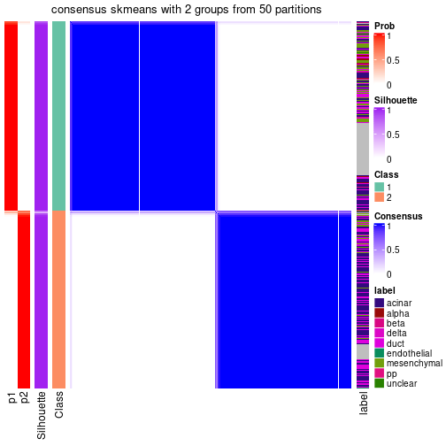</p>

</div>
<div id='tab-node-022-consensus-heatmap-2'>
<pre><code class="r">consensus_heatmap(res, k = 3)
</code></pre>

<p>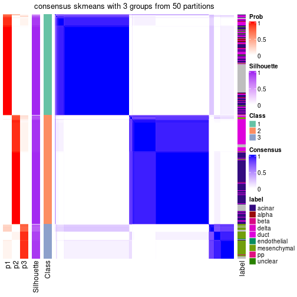</p>

</div>
<div id='tab-node-022-consensus-heatmap-3'>
<pre><code class="r">consensus_heatmap(res, k = 4)
</code></pre>

<p>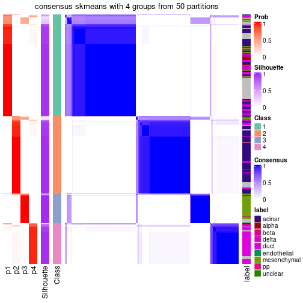</p>

</div>
</div>

Heatmaps for the membership of samples in all partitions to see how consistent they are:


<script>
$( function() {
	$( '#tabs-node-022-membership-heatmap' ).tabs();
} );
</script>
<div id='tabs-node-022-membership-heatmap'>
<ul>
<li><a href='#tab-node-022-membership-heatmap-1'>k = 2</a></li>
<li><a href='#tab-node-022-membership-heatmap-2'>k = 3</a></li>
<li><a href='#tab-node-022-membership-heatmap-3'>k = 4</a></li>
</ul>
<div id='tab-node-022-membership-heatmap-1'>
<pre><code class="r">membership_heatmap(res, k = 2)
</code></pre>

<p>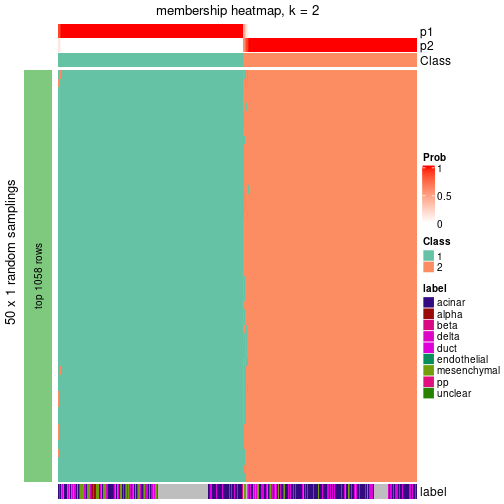</p>

</div>
<div id='tab-node-022-membership-heatmap-2'>
<pre><code class="r">membership_heatmap(res, k = 3)
</code></pre>

<p>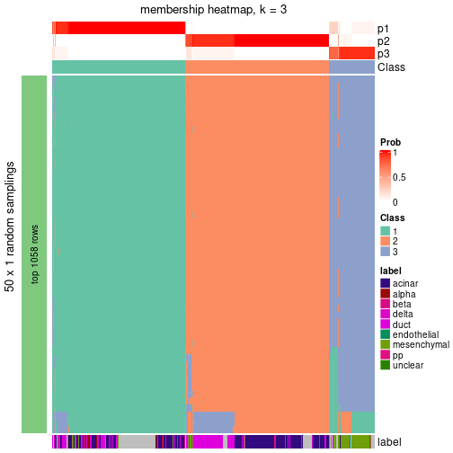</p>

</div>
<div id='tab-node-022-membership-heatmap-3'>
<pre><code class="r">membership_heatmap(res, k = 4)
</code></pre>

<p>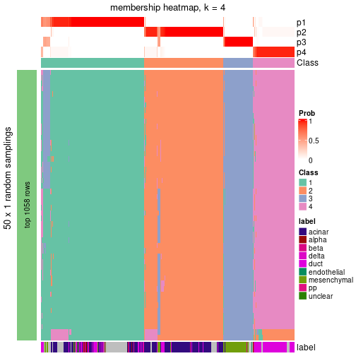</p>

</div>
</div>

As soon as the classes for columns are determined, the signatures
that are significantly different between subgroups can be looked for. 
Following are the heatmaps for signatures.


Signature heatmaps where rows are scaled:


<script>
$( function() {
	$( '#tabs-node-022-get-signatures' ).tabs();
} );
</script>
<div id='tabs-node-022-get-signatures'>
<ul>
<li><a href='#tab-node-022-get-signatures-1'>k = 2</a></li>
<li><a href='#tab-node-022-get-signatures-2'>k = 3</a></li>
<li><a href='#tab-node-022-get-signatures-3'>k = 4</a></li>
</ul>
<div id='tab-node-022-get-signatures-1'>
<pre><code class="r">get_signatures(res, k = 2)
</code></pre>

<p>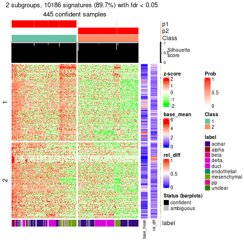</p>

</div>
<div id='tab-node-022-get-signatures-2'>
<pre><code class="r">get_signatures(res, k = 3)
</code></pre>

<p>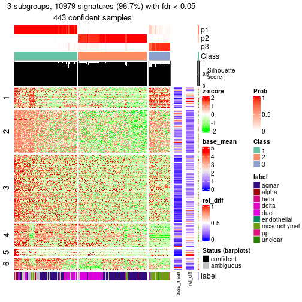</p>

</div>
<div id='tab-node-022-get-signatures-3'>
<pre><code class="r">get_signatures(res, k = 4)
</code></pre>

<p>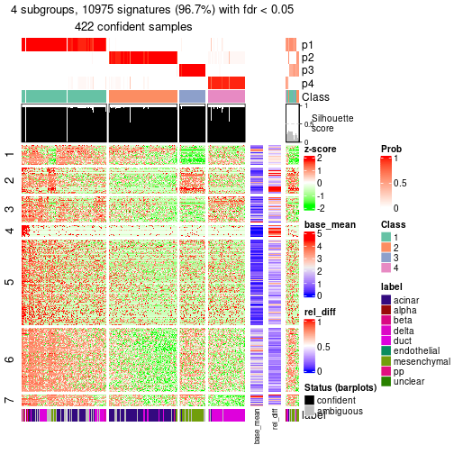</p>

</div>
</div>


Signature heatmaps where rows are not scaled:


<script>
$( function() {
	$( '#tabs-node-022-get-signatures-no-scale' ).tabs();
} );
</script>
<div id='tabs-node-022-get-signatures-no-scale'>
<ul>
<li><a href='#tab-node-022-get-signatures-no-scale-1'>k = 2</a></li>
<li><a href='#tab-node-022-get-signatures-no-scale-2'>k = 3</a></li>
<li><a href='#tab-node-022-get-signatures-no-scale-3'>k = 4</a></li>
</ul>
<div id='tab-node-022-get-signatures-no-scale-1'>
<pre><code class="r">get_signatures(res, k = 2, scale_rows = FALSE)
</code></pre>

<p>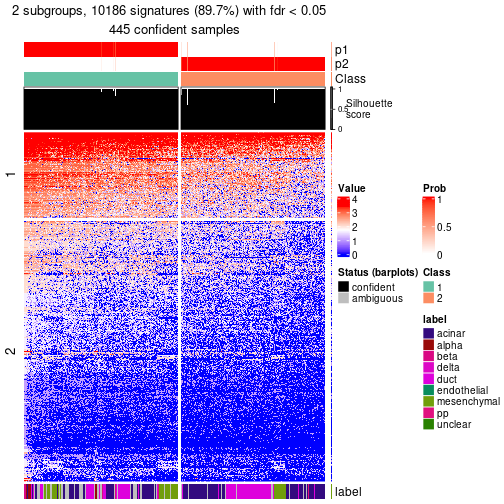</p>

</div>
<div id='tab-node-022-get-signatures-no-scale-2'>
<pre><code class="r">get_signatures(res, k = 3, scale_rows = FALSE)
</code></pre>

<p>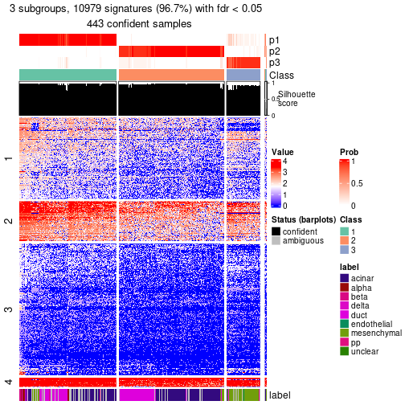</p>

</div>
<div id='tab-node-022-get-signatures-no-scale-3'>
<pre><code class="r">get_signatures(res, k = 4, scale_rows = FALSE)
</code></pre>

<p>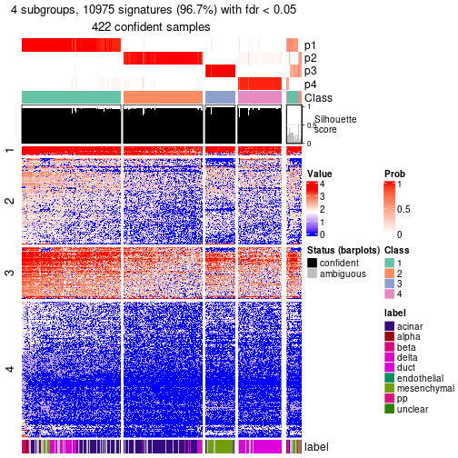</p>

</div>
</div>


Compare the overlap of signatures from different k:

```r
compare_signatures(res)
```

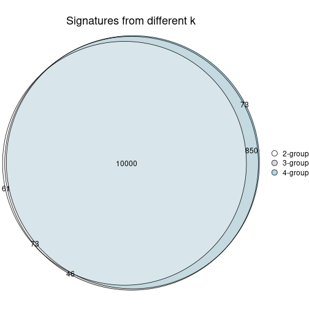

`get_signature()` returns a data frame invisibly. To get the list of signatures, the function
call should be assigned to a variable explicitly. In following code, if `plot` argument is set
to `FALSE`, no heatmap is plotted while only the differential analysis is performed.

```r
# code only for demonstration
tb = get_signature(res, k = ..., plot = FALSE)
```

An example of the output of `tb` is:

```
#>   which_row         fdr    mean_1    mean_2 scaled_mean_1 scaled_mean_2 km
#> 1        38 0.042760348  8.373488  9.131774    -0.5533452     0.5164555  1
#> 2        40 0.018707592  7.106213  8.469186    -0.6173731     0.5762149  1
#> 3        55 0.019134737 10.221463 11.207825    -0.6159697     0.5749050  1
#> 4        59 0.006059896  5.921854  7.869574    -0.6899429     0.6439467  1
#> 5        60 0.018055526  8.928898 10.211722    -0.6204761     0.5791110  1
#> 6        98 0.009384629 15.714769 14.887706     0.6635654    -0.6193277  2
...
```

The columns in `tb` are:

1. `which_row`: row indices corresponding to the input matrix.
2. `fdr`: FDR for the differential test. 
3. `mean_x`: The mean value in group x.
4. `scaled_mean_x`: The mean value in group x after rows are scaled.
5. `km`: Row groups if k-means clustering is applied to rows (which is done by automatically selecting number of clusters).

If there are too many signatures, `top_signatures = ...` can be set to only show the 
signatures with the highest FDRs:

```r
# code only for demonstration
# e.g. to show the top 500 most significant rows
tb = get_signature(res, k = ..., top_signatures = 500)
```

If the signatures are defined as these which are uniquely high in current group, `diff_method` argument
can be set to `"uniquely_high_in_one_group"`:

```r
# code only for demonstration
tb = get_signature(res, k = ..., diff_method = "uniquely_high_in_one_group")
```


UMAP plot which shows how samples are separated.


<script>
$( function() {
	$( '#tabs-node-022-dimension-reduction' ).tabs();
} );
</script>
<div id='tabs-node-022-dimension-reduction'>
<ul>
<li><a href='#tab-node-022-dimension-reduction-1'>k = 2</a></li>
<li><a href='#tab-node-022-dimension-reduction-2'>k = 3</a></li>
<li><a href='#tab-node-022-dimension-reduction-3'>k = 4</a></li>
</ul>
<div id='tab-node-022-dimension-reduction-1'>
<pre><code class="r">dimension_reduction(res, k = 2, method = &quot;UMAP&quot;)
</code></pre>

<p>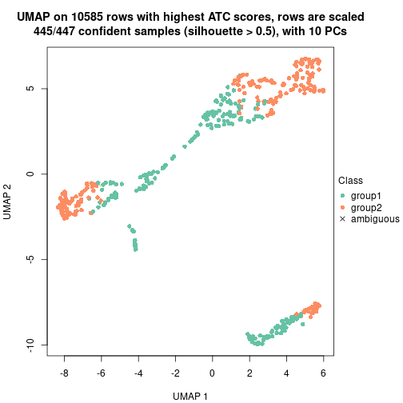</p>

</div>
<div id='tab-node-022-dimension-reduction-2'>
<pre><code class="r">dimension_reduction(res, k = 3, method = &quot;UMAP&quot;)
</code></pre>

<p>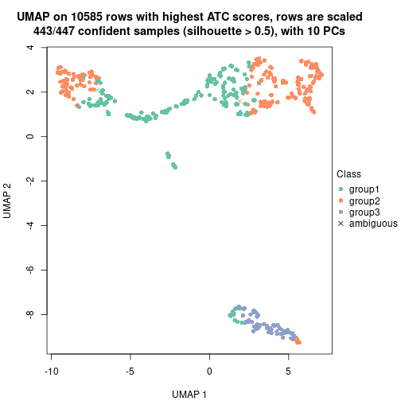</p>

</div>
<div id='tab-node-022-dimension-reduction-3'>
<pre><code class="r">dimension_reduction(res, k = 4, method = &quot;UMAP&quot;)
</code></pre>

<p>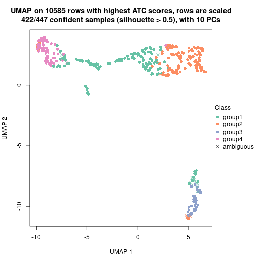</p>

</div>
</div>


Following heatmap shows how subgroups are split when increasing `k`:

```r
collect_classes(res)
```

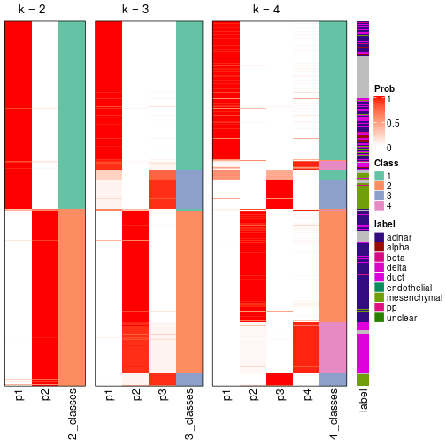


Test correlation between subgroups and known annotations. If the known
annotation is numeric, one-way ANOVA test is applied, and if the known
annotation is discrete, chi-squared contingency table test is applied.

```r
test_to_known_factors(res)
```

```
#>             n_sample label(p-value) k
#> ATC:skmeans      445       1.67e-06 2
#> ATC:skmeans      443       1.38e-49 3
#> ATC:skmeans      422       1.21e-79 4
```


If matrix rows can be associated to genes, consider to use `functional_enrichment(res,
...)` to perform function enrichment for the signature genes. See [this vignette](https://jokergoo.github.io/cola_vignettes/functional_enrichment.html) for more detailed explanations.


 

---------------------------------------------------


### Node0221


Parent node: [Node022](#Node022).
Child nodes: 
                Node02121-leaf
        ,
                Node02122-leaf
        ,
                Node02123-leaf
        ,
                Node02141-leaf
        ,
                Node02142-leaf
        ,
                Node02143-leaf
        ,
                Node02144-leaf
        ,
                [Node02211](#Node02211)
        ,
                Node02212-leaf
        ,
                Node02213-leaf
        ,
                Node02221-leaf
        ,
                Node02222-leaf
        ,
                Node02223-leaf
        ,
                Node02311-leaf
        ,
                Node02312-leaf
        ,
                Node02321-leaf
        ,
                Node02322-leaf
        ,
                Node02411-leaf
        ,
                Node02412-leaf
        ,
                Node02421-leaf
        ,
                Node02422-leaf
        .


The object with results only for a single top-value method and a single partitioning method 
can be extracted as:

```r
res = res_rh["0221"]
```

A summary of `res` and all the functions that can be applied to it:

```r
res
```

```
#> A 'ConsensusPartition' object with k = 2, 3, 4.
#>   On a matrix with 10421 rows and 184 columns.
#>   Top rows (1042) are extracted by 'ATC' method.
#>   Subgroups are detected by 'skmeans' method.
#>   Performed in total 150 partitions by row resampling.
#>   Best k for subgroups seems to be 3.
#> 
#> Following methods can be applied to this 'ConsensusPartition' object:
#>  [1] "cola_report"             "collect_classes"         "collect_plots"          
#>  [4] "collect_stats"           "colnames"                "compare_partitions"     
#>  [7] "compare_signatures"      "consensus_heatmap"       "dimension_reduction"    
#> [10] "functional_enrichment"   "get_anno_col"            "get_anno"               
#> [13] "get_classes"             "get_consensus"           "get_matrix"             
#> [16] "get_membership"          "get_param"               "get_signatures"         
#> [19] "get_stats"               "is_best_k"               "is_stable_k"            
#> [22] "membership_heatmap"      "ncol"                    "nrow"                   
#> [25] "plot_ecdf"               "predict_classes"         "rownames"               
#> [28] "select_partition_number" "show"                    "suggest_best_k"         
#> [31] "test_to_known_factors"   "top_rows_heatmap"
```

`collect_plots()` function collects all the plots made from `res` for all `k` (number of subgroups)
into one single page to provide an easy and fast comparison between different `k`.

```r
collect_plots(res)
```

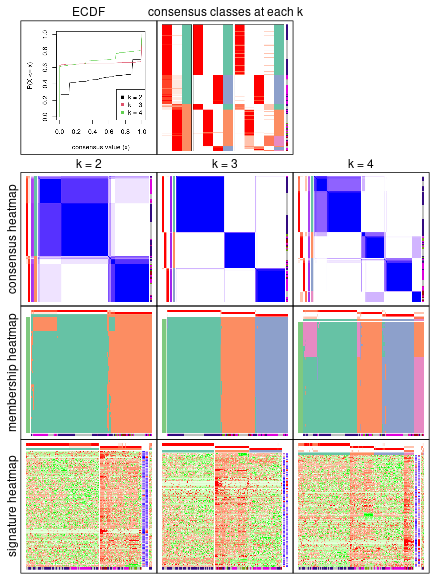

The plots are:

- The first row: a plot of the eCDF (empirical cumulative distribution
  function) curves of the consensus matrix for each `k` and the heatmap of
  predicted classes for each `k`.
- The second row: heatmaps of the consensus matrix for each `k`.
- The third row: heatmaps of the membership matrix for each `k`.
- The fouth row: heatmaps of the signatures for each `k`.

All the plots in panels can be made by individual functions and they are
plotted later in this section.

`select_partition_number()` produces several plots showing different
statistics for choosing "optimized" `k`. There are following statistics:

- eCDF curves of the consensus matrix for each `k`;
- 1-PAC. [The PAC score](https://en.wikipedia.org/wiki/Consensus_clustering#Over-interpretation_potential_of_consensus_clustering)
  measures the proportion of the ambiguous subgrouping.
- Mean silhouette score.
- Concordance. The mean probability of fiting the consensus subgroup labels in all
  partitions.
- Area increased. Denote $A_k$ as the area under the eCDF curve for current
  `k`, the area increased is defined as $A_k - A_{k-1}$.
- Rand index. The percent of pairs of samples that are both in a same cluster
  or both are not in a same cluster in the partition of k and k-1.
- Jaccard index. The ratio of pairs of samples are both in a same cluster in
  the partition of k and k-1 and the pairs of samples are both in a same
  cluster in the partition k or k-1.

The detailed explanations of these statistics can be found in [the _cola_
vignette](https://jokergoo.github.io/cola_vignettes/cola.html#toc_13).

Generally speaking, higher 1-PAC score, higher mean silhouette score or higher
concordance corresponds to better partition. Rand index and Jaccard index
measure how similar the current partition is compared to partition with `k-1`.
If they are too similar, we won't accept `k` is better than `k-1`.

```r
select_partition_number(res)
```

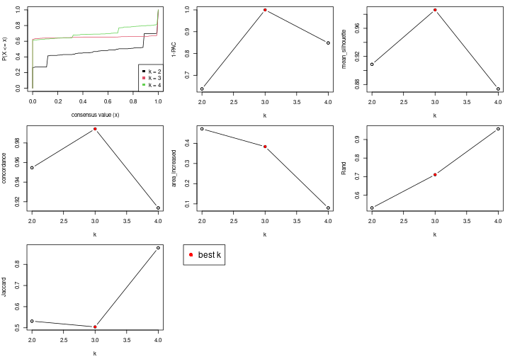

The numeric values for all these statistics can be obtained by `get_stats()`.

```r
get_stats(res)
```

```
#>   k 1-PAC mean_silhouette concordance area_increased  Rand Jaccard
#> 2 2 0.638           0.909       0.955          0.471 0.531   0.531
#> 3 3 1.000           0.986       0.994          0.384 0.710   0.504
#> 4 4 0.848           0.874       0.914          0.080 0.957   0.878
```

`suggest_best_k()` suggests the best $k$ based on these statistics. The rules are as follows:

- All $k$ with Jaccard index larger than 0.95 are removed because increasing
  $k$ does not provide enough extra information. If all $k$ are removed, it is
  marked as no subgroup is detected.
- For all $k$ with 1-PAC score larger than 0.9, the maximal $k$ is taken as
  the best $k$, and other $k$ are marked as optional $k$.
- If it does not fit the second rule. The $k$ with the maximal vote of the
  highest 1-PAC score, highest mean silhouette, and highest concordance is
  taken as the best $k$.

```r
suggest_best_k(res)
```

```
#> [1] 3
```


Following is the table of the partitions (You need to click the **show/hide
code output** link to see it). The membership matrix (columns with name `p*`)
is inferred by
[`clue::cl_consensus()`](https://www.rdocumentation.org/link/cl_consensus?package=clue)
function with the `SE` method. Basically the value in the membership matrix
represents the probability to belong to a certain group. The finall subgroup
label for an item is determined with the group with highest probability it
belongs to.

In `get_classes()` function, the entropy is calculated from the membership
matrix and the silhouette score is calculated from the consensus matrix.


<script>
$( function() {
	$( '#tabs-node-0221-get-classes' ).tabs();
} );
</script>
<div id='tabs-node-0221-get-classes'>
<ul>
<li><a href='#tab-node-0221-get-classes-1'>k = 2</a></li>
<li><a href='#tab-node-0221-get-classes-2'>k = 3</a></li>
<li><a href='#tab-node-0221-get-classes-3'>k = 4</a></li>
</ul>

<div id='tab-node-0221-get-classes-1'>
<p><a id='tab-node-0221-get-classes-1-a' style='color:#0366d6' href='#'>show/hide code output</a></p>
<pre><code class="r">cbind(get_classes(res, k = 2), get_membership(res, k = 2))
</code></pre>

<pre><code>#&gt;          class entropy silhouette   p1   p2
#&gt; D28-1_38     2   0.000     0.9550 0.00 1.00
#&gt; D28-1_49     1   0.529     0.8925 0.88 0.12
#&gt; D28-1_50     1   0.000     0.9472 1.00 0.00
#&gt; D28-1_52     2   0.000     0.9550 0.00 1.00
#&gt; D28-1_55     1   0.000     0.9472 1.00 0.00
#&gt; D28-1_62     1   0.000     0.9472 1.00 0.00
#&gt; D28-1_66     1   0.529     0.8925 0.88 0.12
#&gt; D28-1_67     1   0.000     0.9472 1.00 0.00
#&gt; D28-1_68     1   0.000     0.9472 1.00 0.00
#&gt; D28-1_73     2   0.000     0.9550 0.00 1.00
#&gt; D28-1_77     1   0.529     0.8925 0.88 0.12
#&gt; D28-1_86     1   0.000     0.9472 1.00 0.00
#&gt; D28-1_87     1   0.000     0.9472 1.00 0.00
#&gt; D28-1_90     1   0.529     0.8925 0.88 0.12
#&gt; D28-1_91     2   0.795     0.6507 0.24 0.76
#&gt; D28-2_1      1   0.000     0.9472 1.00 0.00
#&gt; D28-2_29     1   0.529     0.8925 0.88 0.12
#&gt; D28-2_39     1   0.000     0.9472 1.00 0.00
#&gt; D28-2_41     2   0.000     0.9550 0.00 1.00
#&gt; D28-2_42     1   0.000     0.9472 1.00 0.00
#&gt; D28-2_49     1   0.000     0.9472 1.00 0.00
#&gt; D28-2_53     1   0.000     0.9472 1.00 0.00
#&gt; D28-2_61     1   0.000     0.9472 1.00 0.00
#&gt; D28-2_74     2   0.529     0.8517 0.12 0.88
#&gt; D28-2_75     1   0.000     0.9472 1.00 0.00
#&gt; D28-2_78     1   0.000     0.9472 1.00 0.00
#&gt; D28-2_79     2   0.000     0.9550 0.00 1.00
#&gt; D28-2_86     1   0.000     0.9472 1.00 0.00
#&gt; D28-3_4      1   0.000     0.9472 1.00 0.00
#&gt; D28-3_40     1   0.000     0.9472 1.00 0.00
#&gt; D28-3_41     2   0.000     0.9550 0.00 1.00
#&gt; D28-3_50     1   0.971     0.2671 0.60 0.40
#&gt; D28-3_51     1   0.000     0.9472 1.00 0.00
#&gt; D28-3_52     2   0.995     0.2365 0.46 0.54
#&gt; D28-3_73     2   0.000     0.9550 0.00 1.00
#&gt; D28-3_89     2   0.000     0.9550 0.00 1.00
#&gt; D28-4_4      2   0.000     0.9550 0.00 1.00
#&gt; D28-4_17     1   0.000     0.9472 1.00 0.00
#&gt; D28-4_49     1   0.000     0.9472 1.00 0.00
#&gt; D28-4_54     1   0.000     0.9472 1.00 0.00
#&gt; D28-4_67     1   0.000     0.9472 1.00 0.00
#&gt; D28-4_75     1   0.000     0.9472 1.00 0.00
#&gt; D28-4_78     2   0.000     0.9550 0.00 1.00
#&gt; D28-4_88     2   0.000     0.9550 0.00 1.00
#&gt; D28-4_89     2   0.925     0.5456 0.34 0.66
#&gt; D28-5_4      1   0.529     0.8925 0.88 0.12
#&gt; D28-5_25     2   0.000     0.9550 0.00 1.00
#&gt; D28-5_29     2   0.000     0.9550 0.00 1.00
#&gt; D28-5_30     2   0.000     0.9550 0.00 1.00
#&gt; D28-5_38     1   0.000     0.9472 1.00 0.00
#&gt; D28-5_53     2   0.000     0.9550 0.00 1.00
#&gt; D28-5_54     1   0.000     0.9472 1.00 0.00
#&gt; D28-5_61     1   0.529     0.8925 0.88 0.12
#&gt; D28-5_62     1   0.141     0.9344 0.98 0.02
#&gt; D28-5_63     1   0.000     0.9472 1.00 0.00
#&gt; D28-5_75     1   0.529     0.8925 0.88 0.12
#&gt; D28-5_77     1   0.000     0.9472 1.00 0.00
#&gt; D28-5_78     1   0.722     0.7295 0.80 0.20
#&gt; D28-6_1      2   0.000     0.9550 0.00 1.00
#&gt; D28-6_2      1   0.000     0.9472 1.00 0.00
#&gt; D28-6_4      1   0.000     0.9472 1.00 0.00
#&gt; D28-6_16     1   0.529     0.8925 0.88 0.12
#&gt; D28-6_38     1   0.000     0.9472 1.00 0.00
#&gt; D28-6_41     1   0.000     0.9472 1.00 0.00
#&gt; D28-6_42     1   0.000     0.9472 1.00 0.00
#&gt; D28-6_49     2   0.000     0.9550 0.00 1.00
#&gt; D28-6_50     1   0.000     0.9472 1.00 0.00
#&gt; D28-6_62     1   0.000     0.9472 1.00 0.00
#&gt; D28-6_63     1   0.000     0.9472 1.00 0.00
#&gt; D28-6_66     1   0.000     0.9472 1.00 0.00
#&gt; D28-6_73     1   0.000     0.9472 1.00 0.00
#&gt; D28-6_74     1   0.000     0.9472 1.00 0.00
#&gt; D28-6_76     1   0.000     0.9472 1.00 0.00
#&gt; D28-6_87     2   0.000     0.9550 0.00 1.00
#&gt; D28-6_89     1   0.000     0.9472 1.00 0.00
#&gt; D28-7_1      1   0.000     0.9472 1.00 0.00
#&gt; D28-7_37     1   0.000     0.9472 1.00 0.00
#&gt; D28-7_39     1   0.000     0.9472 1.00 0.00
#&gt; D28-7_41     1   0.000     0.9472 1.00 0.00
#&gt; D28-7_42     2   0.000     0.9550 0.00 1.00
#&gt; D28-7_51     2   0.999     0.1699 0.48 0.52
#&gt; D28-7_52     1   0.000     0.9472 1.00 0.00
#&gt; D28-7_62     2   0.529     0.8517 0.12 0.88
#&gt; D28-7_64     2   0.529     0.8517 0.12 0.88
#&gt; D28-7_85     2   0.000     0.9550 0.00 1.00
#&gt; D28-7_88     2   0.000     0.9550 0.00 1.00
#&gt; D28-8_28     1   0.529     0.8925 0.88 0.12
#&gt; D28-8_31     1   0.529     0.8925 0.88 0.12
#&gt; D28-8_37     2   0.000     0.9550 0.00 1.00
#&gt; D28-8_39     1   0.000     0.9472 1.00 0.00
#&gt; D28-8_52     2   0.000     0.9550 0.00 1.00
#&gt; D28-8_53     1   0.000     0.9472 1.00 0.00
#&gt; D28-8_55     1   0.529     0.8925 0.88 0.12
#&gt; D28-8_62     1   0.529     0.8925 0.88 0.12
#&gt; D28-8_63     2   0.529     0.8517 0.12 0.88
#&gt; D28-8_65     2   0.000     0.9550 0.00 1.00
#&gt; D28-8_66     2   0.000     0.9550 0.00 1.00
#&gt; D28-8_77     1   0.000     0.9472 1.00 0.00
#&gt; D28-8_78     2   0.000     0.9550 0.00 1.00
#&gt; D28-8_87     2   0.000     0.9550 0.00 1.00
#&gt; D29-1_54     1   0.529     0.8925 0.88 0.12
#&gt; D29-1_61     2   0.000     0.9550 0.00 1.00
#&gt; D29-2_57     2   0.000     0.9550 0.00 1.00
#&gt; D29-4_82     2   0.000     0.9550 0.00 1.00
#&gt; D29-5_64     2   0.000     0.9550 0.00 1.00
#&gt; D31-1_9      1   0.000     0.9472 1.00 0.00
#&gt; D31-1_19     1   0.000     0.9472 1.00 0.00
#&gt; D31-1_45     1   0.000     0.9472 1.00 0.00
#&gt; D31-1_55     2   0.000     0.9550 0.00 1.00
#&gt; D31-1_76     1   0.529     0.8925 0.88 0.12
#&gt; D31-1_88     1   0.000     0.9472 1.00 0.00
#&gt; D31-2_10     1   0.529     0.8925 0.88 0.12
#&gt; D31-2_41     1   0.529     0.8925 0.88 0.12
#&gt; D31-2_53     1   0.000     0.9472 1.00 0.00
#&gt; D31-2_61     1   0.000     0.9472 1.00 0.00
#&gt; D31-2_68     1   0.529     0.8925 0.88 0.12
#&gt; D31-2_69     1   0.000     0.9472 1.00 0.00
#&gt; D31-2_73     1   0.925     0.5632 0.66 0.34
#&gt; D31-3_21     1   0.529     0.8925 0.88 0.12
#&gt; D31-3_37     1   0.529     0.8925 0.88 0.12
#&gt; D31-3_86     1   0.000     0.9472 1.00 0.00
#&gt; D31-4_48     1   0.000     0.9472 1.00 0.00
#&gt; D31-4_55     1   0.000     0.9472 1.00 0.00
#&gt; D31-4_67     2   0.000     0.9550 0.00 1.00
#&gt; D31-4_68     1   0.529     0.8925 0.88 0.12
#&gt; D31-4_70     1   0.000     0.9472 1.00 0.00
#&gt; D31-4_71     1   0.529     0.8925 0.88 0.12
#&gt; D31-4_73     2   0.999    -0.0354 0.48 0.52
#&gt; D31-4_77     2   0.000     0.9550 0.00 1.00
#&gt; D31-5_91     1   0.529     0.8925 0.88 0.12
#&gt; D31-7_56     1   0.529     0.8925 0.88 0.12
#&gt; D31-8_63     1   0.000     0.9472 1.00 0.00
#&gt; D31-8_77     1   0.529     0.8925 0.88 0.12
#&gt; D31-8_89     1   0.000     0.9472 1.00 0.00
#&gt; D30-2_1      1   0.000     0.9472 1.00 0.00
#&gt; D30-2_4      1   0.529     0.8925 0.88 0.12
#&gt; D30-2_11     1   0.000     0.9472 1.00 0.00
#&gt; D30-2_17     1   0.000     0.9472 1.00 0.00
#&gt; D30-2_35     1   0.529     0.8925 0.88 0.12
#&gt; D30-2_40     2   0.000     0.9550 0.00 1.00
#&gt; D30-2_41     2   0.000     0.9550 0.00 1.00
#&gt; D30-2_43     1   0.000     0.9472 1.00 0.00
#&gt; D30-2_51     1   0.000     0.9472 1.00 0.00
#&gt; D30-2_53     1   0.000     0.9472 1.00 0.00
#&gt; D30-2_56     1   0.000     0.9472 1.00 0.00
#&gt; D30-2_60     2   0.000     0.9550 0.00 1.00
#&gt; D30-2_71     2   0.000     0.9550 0.00 1.00
#&gt; D30-2_74     2   0.000     0.9550 0.00 1.00
#&gt; D30-2_84     2   0.000     0.9550 0.00 1.00
#&gt; D30-3_2      1   0.000     0.9472 1.00 0.00
#&gt; D30-3_24     2   0.000     0.9550 0.00 1.00
#&gt; D30-3_49     1   0.529     0.8925 0.88 0.12
#&gt; D30-3_56     2   0.000     0.9550 0.00 1.00
#&gt; D30-4_16     2   0.000     0.9550 0.00 1.00
#&gt; D30-4_23     2   0.000     0.9550 0.00 1.00
#&gt; D30-4_38     1   0.529     0.8925 0.88 0.12
#&gt; D30-4_44     1   0.529     0.8925 0.88 0.12
#&gt; D30-4_46     2   0.000     0.9550 0.00 1.00
#&gt; D30-4_51     2   0.000     0.9550 0.00 1.00
#&gt; D30-4_53     1   0.529     0.8925 0.88 0.12
#&gt; D30-4_58     2   0.000     0.9550 0.00 1.00
#&gt; D30-4_82     2   0.000     0.9550 0.00 1.00
#&gt; D30-4_92     2   0.000     0.9550 0.00 1.00
#&gt; D30-4_93     2   0.000     0.9550 0.00 1.00
#&gt; D30-5_36     1   0.000     0.9472 1.00 0.00
#&gt; D30-5_79     1   0.000     0.9472 1.00 0.00
#&gt; D30-6_28     2   0.000     0.9550 0.00 1.00
#&gt; D30-6_48     1   0.529     0.8925 0.88 0.12
#&gt; D30-6_80     1   0.000     0.9472 1.00 0.00
#&gt; D30-6_84     2   0.000     0.9550 0.00 1.00
#&gt; D30-7_1      1   0.000     0.9472 1.00 0.00
#&gt; D30-7_11     2   0.584     0.8358 0.14 0.86
#&gt; D30-7_15     2   0.000     0.9550 0.00 1.00
#&gt; D30-7_35     1   0.529     0.8925 0.88 0.12
#&gt; D30-7_85     2   0.000     0.9550 0.00 1.00
#&gt; D30-7_86     2   0.000     0.9550 0.00 1.00
#&gt; D30-7_91     2   0.529     0.8517 0.12 0.88
#&gt; D30-8_29     1   0.529     0.8925 0.88 0.12
#&gt; D30-8_50     2   0.000     0.9550 0.00 1.00
#&gt; D30-8_63     1   0.904     0.4920 0.68 0.32
#&gt; D30-8_65     1   0.000     0.9472 1.00 0.00
#&gt; D30-8_69     2   0.529     0.8517 0.12 0.88
#&gt; D30-8_84     1   0.000     0.9472 1.00 0.00
#&gt; D30-8_93     1   0.529     0.8925 0.88 0.12
</code></pre>

<script>
$('#tab-node-0221-get-classes-1-a').parent().next().next().hide();
$('#tab-node-0221-get-classes-1-a').click(function(){
  $('#tab-node-0221-get-classes-1-a').parent().next().next().toggle();
  return(false);
});
</script>
</div>

<div id='tab-node-0221-get-classes-2'>
<p><a id='tab-node-0221-get-classes-2-a' style='color:#0366d6' href='#'>show/hide code output</a></p>
<pre><code class="r">cbind(get_classes(res, k = 3), get_membership(res, k = 3))
</code></pre>

<pre><code>#&gt;          class entropy silhouette   p1   p2   p3
#&gt; D28-1_38     2  0.0000      0.989 0.00 1.00 0.00
#&gt; D28-1_49     3  0.0000      0.990 0.00 0.00 1.00
#&gt; D28-1_50     1  0.0000      0.999 1.00 0.00 0.00
#&gt; D28-1_52     2  0.0000      0.989 0.00 1.00 0.00
#&gt; D28-1_55     1  0.0000      0.999 1.00 0.00 0.00
#&gt; D28-1_62     1  0.0000      0.999 1.00 0.00 0.00
#&gt; D28-1_66     3  0.0000      0.990 0.00 0.00 1.00
#&gt; D28-1_67     1  0.0000      0.999 1.00 0.00 0.00
#&gt; D28-1_68     1  0.0000      0.999 1.00 0.00 0.00
#&gt; D28-1_73     2  0.0000      0.989 0.00 1.00 0.00
#&gt; D28-1_77     3  0.0000      0.990 0.00 0.00 1.00
#&gt; D28-1_86     3  0.0000      0.990 0.00 0.00 1.00
#&gt; D28-1_87     1  0.0000      0.999 1.00 0.00 0.00
#&gt; D28-1_90     3  0.0000      0.990 0.00 0.00 1.00
#&gt; D28-1_91     3  0.0000      0.990 0.00 0.00 1.00
#&gt; D28-2_1      1  0.0000      0.999 1.00 0.00 0.00
#&gt; D28-2_29     3  0.0000      0.990 0.00 0.00 1.00
#&gt; D28-2_39     1  0.0000      0.999 1.00 0.00 0.00
#&gt; D28-2_41     2  0.0000      0.989 0.00 1.00 0.00
#&gt; D28-2_42     1  0.0000      0.999 1.00 0.00 0.00
#&gt; D28-2_49     1  0.0000      0.999 1.00 0.00 0.00
#&gt; D28-2_53     1  0.0000      0.999 1.00 0.00 0.00
#&gt; D28-2_61     1  0.0000      0.999 1.00 0.00 0.00
#&gt; D28-2_74     1  0.0000      0.999 1.00 0.00 0.00
#&gt; D28-2_75     1  0.0000      0.999 1.00 0.00 0.00
#&gt; D28-2_78     3  0.0000      0.990 0.00 0.00 1.00
#&gt; D28-2_79     2  0.0000      0.989 0.00 1.00 0.00
#&gt; D28-2_86     1  0.0000      0.999 1.00 0.00 0.00
#&gt; D28-3_4      1  0.0000      0.999 1.00 0.00 0.00
#&gt; D28-3_40     1  0.0000      0.999 1.00 0.00 0.00
#&gt; D28-3_41     2  0.0000      0.989 0.00 1.00 0.00
#&gt; D28-3_50     1  0.0000      0.999 1.00 0.00 0.00
#&gt; D28-3_51     1  0.0000      0.999 1.00 0.00 0.00
#&gt; D28-3_52     1  0.0000      0.999 1.00 0.00 0.00
#&gt; D28-3_73     2  0.0000      0.989 0.00 1.00 0.00
#&gt; D28-3_89     2  0.0000      0.989 0.00 1.00 0.00
#&gt; D28-4_4      2  0.0000      0.989 0.00 1.00 0.00
#&gt; D28-4_17     1  0.0000      0.999 1.00 0.00 0.00
#&gt; D28-4_49     1  0.0000      0.999 1.00 0.00 0.00
#&gt; D28-4_54     1  0.0000      0.999 1.00 0.00 0.00
#&gt; D28-4_67     1  0.0000      0.999 1.00 0.00 0.00
#&gt; D28-4_75     1  0.2537      0.912 0.92 0.00 0.08
#&gt; D28-4_78     2  0.0000      0.989 0.00 1.00 0.00
#&gt; D28-4_88     2  0.0000      0.989 0.00 1.00 0.00
#&gt; D28-4_89     1  0.0000      0.999 1.00 0.00 0.00
#&gt; D28-5_4      3  0.0000      0.990 0.00 0.00 1.00
#&gt; D28-5_25     2  0.0000      0.989 0.00 1.00 0.00
#&gt; D28-5_29     2  0.0000      0.989 0.00 1.00 0.00
#&gt; D28-5_30     2  0.0000      0.989 0.00 1.00 0.00
#&gt; D28-5_38     1  0.0000      0.999 1.00 0.00 0.00
#&gt; D28-5_53     2  0.0000      0.989 0.00 1.00 0.00
#&gt; D28-5_54     1  0.0000      0.999 1.00 0.00 0.00
#&gt; D28-5_61     3  0.0000      0.990 0.00 0.00 1.00
#&gt; D28-5_62     1  0.0000      0.999 1.00 0.00 0.00
#&gt; D28-5_63     1  0.0000      0.999 1.00 0.00 0.00
#&gt; D28-5_75     3  0.0000      0.990 0.00 0.00 1.00
#&gt; D28-5_77     1  0.0000      0.999 1.00 0.00 0.00
#&gt; D28-5_78     1  0.0000      0.999 1.00 0.00 0.00
#&gt; D28-6_1      2  0.0000      0.989 0.00 1.00 0.00
#&gt; D28-6_2      1  0.0000      0.999 1.00 0.00 0.00
#&gt; D28-6_4      1  0.0000      0.999 1.00 0.00 0.00
#&gt; D28-6_16     3  0.0000      0.990 0.00 0.00 1.00
#&gt; D28-6_38     1  0.0000      0.999 1.00 0.00 0.00
#&gt; D28-6_41     1  0.0000      0.999 1.00 0.00 0.00
#&gt; D28-6_42     1  0.0000      0.999 1.00 0.00 0.00
#&gt; D28-6_49     2  0.0000      0.989 0.00 1.00 0.00
#&gt; D28-6_50     1  0.0000      0.999 1.00 0.00 0.00
#&gt; D28-6_62     1  0.0000      0.999 1.00 0.00 0.00
#&gt; D28-6_63     1  0.0000      0.999 1.00 0.00 0.00
#&gt; D28-6_66     1  0.0000      0.999 1.00 0.00 0.00
#&gt; D28-6_73     1  0.0000      0.999 1.00 0.00 0.00
#&gt; D28-6_74     1  0.0000      0.999 1.00 0.00 0.00
#&gt; D28-6_76     1  0.0000      0.999 1.00 0.00 0.00
#&gt; D28-6_87     2  0.0000      0.989 0.00 1.00 0.00
#&gt; D28-6_89     1  0.0000      0.999 1.00 0.00 0.00
#&gt; D28-7_1      1  0.0000      0.999 1.00 0.00 0.00
#&gt; D28-7_37     1  0.0000      0.999 1.00 0.00 0.00
#&gt; D28-7_39     1  0.0000      0.999 1.00 0.00 0.00
#&gt; D28-7_41     1  0.0000      0.999 1.00 0.00 0.00
#&gt; D28-7_42     3  0.2066      0.930 0.00 0.06 0.94
#&gt; D28-7_51     1  0.0000      0.999 1.00 0.00 0.00
#&gt; D28-7_52     1  0.0000      0.999 1.00 0.00 0.00
#&gt; D28-7_62     1  0.0000      0.999 1.00 0.00 0.00
#&gt; D28-7_64     1  0.0000      0.999 1.00 0.00 0.00
#&gt; D28-7_85     2  0.0000      0.989 0.00 1.00 0.00
#&gt; D28-7_88     2  0.0000      0.989 0.00 1.00 0.00
#&gt; D28-8_28     3  0.0000      0.990 0.00 0.00 1.00
#&gt; D28-8_31     3  0.0000      0.990 0.00 0.00 1.00
#&gt; D28-8_37     2  0.0000      0.989 0.00 1.00 0.00
#&gt; D28-8_39     1  0.0000      0.999 1.00 0.00 0.00
#&gt; D28-8_52     2  0.0000      0.989 0.00 1.00 0.00
#&gt; D28-8_53     1  0.0000      0.999 1.00 0.00 0.00
#&gt; D28-8_55     3  0.0000      0.990 0.00 0.00 1.00
#&gt; D28-8_62     3  0.0000      0.990 0.00 0.00 1.00
#&gt; D28-8_63     1  0.0000      0.999 1.00 0.00 0.00
#&gt; D28-8_65     2  0.0000      0.989 0.00 1.00 0.00
#&gt; D28-8_66     2  0.0000      0.989 0.00 1.00 0.00
#&gt; D28-8_77     1  0.0000      0.999 1.00 0.00 0.00
#&gt; D28-8_78     2  0.0000      0.989 0.00 1.00 0.00
#&gt; D28-8_87     3  0.0892      0.972 0.00 0.02 0.98
#&gt; D29-1_54     3  0.0000      0.990 0.00 0.00 1.00
#&gt; D29-1_61     2  0.0000      0.989 0.00 1.00 0.00
#&gt; D29-2_57     3  0.0000      0.990 0.00 0.00 1.00
#&gt; D29-4_82     2  0.0000      0.989 0.00 1.00 0.00
#&gt; D29-5_64     2  0.0000      0.989 0.00 1.00 0.00
#&gt; D31-1_9      1  0.0000      0.999 1.00 0.00 0.00
#&gt; D31-1_19     1  0.0000      0.999 1.00 0.00 0.00
#&gt; D31-1_45     1  0.0000      0.999 1.00 0.00 0.00
#&gt; D31-1_55     2  0.0000      0.989 0.00 1.00 0.00
#&gt; D31-1_76     3  0.0000      0.990 0.00 0.00 1.00
#&gt; D31-1_88     1  0.0000      0.999 1.00 0.00 0.00
#&gt; D31-2_10     3  0.0000      0.990 0.00 0.00 1.00
#&gt; D31-2_41     3  0.0000      0.990 0.00 0.00 1.00
#&gt; D31-2_53     1  0.0000      0.999 1.00 0.00 0.00
#&gt; D31-2_61     1  0.0000      0.999 1.00 0.00 0.00
#&gt; D31-2_68     3  0.0000      0.990 0.00 0.00 1.00
#&gt; D31-2_69     1  0.0000      0.999 1.00 0.00 0.00
#&gt; D31-2_73     3  0.0000      0.990 0.00 0.00 1.00
#&gt; D31-3_21     3  0.0000      0.990 0.00 0.00 1.00
#&gt; D31-3_37     3  0.0000      0.990 0.00 0.00 1.00
#&gt; D31-3_86     1  0.0000      0.999 1.00 0.00 0.00
#&gt; D31-4_48     1  0.0000      0.999 1.00 0.00 0.00
#&gt; D31-4_55     1  0.0000      0.999 1.00 0.00 0.00
#&gt; D31-4_67     2  0.0000      0.989 0.00 1.00 0.00
#&gt; D31-4_68     3  0.0000      0.990 0.00 0.00 1.00
#&gt; D31-4_70     1  0.0000      0.999 1.00 0.00 0.00
#&gt; D31-4_71     3  0.0000      0.990 0.00 0.00 1.00
#&gt; D31-4_73     3  0.0000      0.990 0.00 0.00 1.00
#&gt; D31-4_77     2  0.0000      0.989 0.00 1.00 0.00
#&gt; D31-5_91     3  0.0000      0.990 0.00 0.00 1.00
#&gt; D31-7_56     3  0.0000      0.990 0.00 0.00 1.00
#&gt; D31-8_63     1  0.0000      0.999 1.00 0.00 0.00
#&gt; D31-8_77     3  0.0000      0.990 0.00 0.00 1.00
#&gt; D31-8_89     1  0.0000      0.999 1.00 0.00 0.00
#&gt; D30-2_1      1  0.0000      0.999 1.00 0.00 0.00
#&gt; D30-2_4      3  0.0000      0.990 0.00 0.00 1.00
#&gt; D30-2_11     3  0.0000      0.990 0.00 0.00 1.00
#&gt; D30-2_17     1  0.0000      0.999 1.00 0.00 0.00
#&gt; D30-2_35     3  0.0000      0.990 0.00 0.00 1.00
#&gt; D30-2_40     2  0.0000      0.989 0.00 1.00 0.00
#&gt; D30-2_41     2  0.0000      0.989 0.00 1.00 0.00
#&gt; D30-2_43     1  0.0000      0.999 1.00 0.00 0.00
#&gt; D30-2_51     1  0.0000      0.999 1.00 0.00 0.00
#&gt; D30-2_53     3  0.0000      0.990 0.00 0.00 1.00
#&gt; D30-2_56     1  0.0000      0.999 1.00 0.00 0.00
#&gt; D30-2_60     2  0.0000      0.989 0.00 1.00 0.00
#&gt; D30-2_71     2  0.0000      0.989 0.00 1.00 0.00
#&gt; D30-2_74     2  0.0000      0.989 0.00 1.00 0.00
#&gt; D30-2_84     2  0.0000      0.989 0.00 1.00 0.00
#&gt; D30-3_2      3  0.5706      0.529 0.32 0.00 0.68
#&gt; D30-3_24     2  0.0000      0.989 0.00 1.00 0.00
#&gt; D30-3_49     3  0.0000      0.990 0.00 0.00 1.00
#&gt; D30-3_56     2  0.0000      0.989 0.00 1.00 0.00
#&gt; D30-4_16     3  0.0000      0.990 0.00 0.00 1.00
#&gt; D30-4_23     2  0.0000      0.989 0.00 1.00 0.00
#&gt; D30-4_38     3  0.0000      0.990 0.00 0.00 1.00
#&gt; D30-4_44     3  0.0000      0.990 0.00 0.00 1.00
#&gt; D30-4_46     2  0.0000      0.989 0.00 1.00 0.00
#&gt; D30-4_51     2  0.0000      0.989 0.00 1.00 0.00
#&gt; D30-4_53     3  0.0000      0.990 0.00 0.00 1.00
#&gt; D30-4_58     2  0.0000      0.989 0.00 1.00 0.00
#&gt; D30-4_82     2  0.0000      0.989 0.00 1.00 0.00
#&gt; D30-4_92     2  0.0000      0.989 0.00 1.00 0.00
#&gt; D30-4_93     2  0.0000      0.989 0.00 1.00 0.00
#&gt; D30-5_36     3  0.0892      0.969 0.02 0.00 0.98
#&gt; D30-5_79     3  0.0000      0.990 0.00 0.00 1.00
#&gt; D30-6_28     2  0.0000      0.989 0.00 1.00 0.00
#&gt; D30-6_48     3  0.0000      0.990 0.00 0.00 1.00
#&gt; D30-6_80     1  0.0000      0.999 1.00 0.00 0.00
#&gt; D30-6_84     2  0.0000      0.989 0.00 1.00 0.00
#&gt; D30-7_1      1  0.0000      0.999 1.00 0.00 0.00
#&gt; D30-7_11     1  0.0000      0.999 1.00 0.00 0.00
#&gt; D30-7_15     2  0.5560      0.568 0.00 0.70 0.30
#&gt; D30-7_35     3  0.0000      0.990 0.00 0.00 1.00
#&gt; D30-7_85     3  0.0000      0.990 0.00 0.00 1.00
#&gt; D30-7_86     2  0.0000      0.989 0.00 1.00 0.00
#&gt; D30-7_91     2  0.5016      0.683 0.24 0.76 0.00
#&gt; D30-8_29     3  0.0000      0.990 0.00 0.00 1.00
#&gt; D30-8_50     2  0.0000      0.989 0.00 1.00 0.00
#&gt; D30-8_63     1  0.0000      0.999 1.00 0.00 0.00
#&gt; D30-8_65     1  0.0000      0.999 1.00 0.00 0.00
#&gt; D30-8_69     2  0.0000      0.989 0.00 1.00 0.00
#&gt; D30-8_84     1  0.0000      0.999 1.00 0.00 0.00
#&gt; D30-8_93     3  0.0000      0.990 0.00 0.00 1.00
</code></pre>

<script>
$('#tab-node-0221-get-classes-2-a').parent().next().next().hide();
$('#tab-node-0221-get-classes-2-a').click(function(){
  $('#tab-node-0221-get-classes-2-a').parent().next().next().toggle();
  return(false);
});
</script>
</div>

<div id='tab-node-0221-get-classes-3'>
<p><a id='tab-node-0221-get-classes-3-a' style='color:#0366d6' href='#'>show/hide code output</a></p>
<pre><code class="r">cbind(get_classes(res, k = 4), get_membership(res, k = 4))
</code></pre>

<pre><code>#&gt;          class entropy silhouette   p1   p2   p3   p4
#&gt; D28-1_38     2  0.4522      0.545 0.00 0.68 0.00 0.32
#&gt; D28-1_49     3  0.0000      0.960 0.00 0.00 1.00 0.00
#&gt; D28-1_50     1  0.0000      0.915 1.00 0.00 0.00 0.00
#&gt; D28-1_52     2  0.0707      0.872 0.00 0.98 0.02 0.00
#&gt; D28-1_55     1  0.0000      0.915 1.00 0.00 0.00 0.00
#&gt; D28-1_62     1  0.0000      0.915 1.00 0.00 0.00 0.00
#&gt; D28-1_66     3  0.0000      0.960 0.00 0.00 1.00 0.00
#&gt; D28-1_67     1  0.0000      0.915 1.00 0.00 0.00 0.00
#&gt; D28-1_68     1  0.0000      0.915 1.00 0.00 0.00 0.00
#&gt; D28-1_73     2  0.4522      0.545 0.00 0.68 0.00 0.32
#&gt; D28-1_77     3  0.0000      0.960 0.00 0.00 1.00 0.00
#&gt; D28-1_86     3  0.0000      0.960 0.00 0.00 1.00 0.00
#&gt; D28-1_87     1  0.0000      0.915 1.00 0.00 0.00 0.00
#&gt; D28-1_90     3  0.0000      0.960 0.00 0.00 1.00 0.00
#&gt; D28-1_91     3  0.0000      0.960 0.00 0.00 1.00 0.00
#&gt; D28-2_1      1  0.0000      0.915 1.00 0.00 0.00 0.00
#&gt; D28-2_29     3  0.0000      0.960 0.00 0.00 1.00 0.00
#&gt; D28-2_39     1  0.0000      0.915 1.00 0.00 0.00 0.00
#&gt; D28-2_41     2  0.0000      0.897 0.00 1.00 0.00 0.00
#&gt; D28-2_42     1  0.0000      0.915 1.00 0.00 0.00 0.00
#&gt; D28-2_49     1  0.4522      0.726 0.68 0.00 0.00 0.32
#&gt; D28-2_53     1  0.3801      0.793 0.78 0.00 0.00 0.22
#&gt; D28-2_61     1  0.0000      0.915 1.00 0.00 0.00 0.00
#&gt; D28-2_74     1  0.4522      0.726 0.68 0.00 0.00 0.32
#&gt; D28-2_75     1  0.4522      0.726 0.68 0.00 0.00 0.32
#&gt; D28-2_78     3  0.0000      0.960 0.00 0.00 1.00 0.00
#&gt; D28-2_79     4  0.4522      0.959 0.00 0.32 0.00 0.68
#&gt; D28-2_86     1  0.0000      0.915 1.00 0.00 0.00 0.00
#&gt; D28-3_4      1  0.0000      0.915 1.00 0.00 0.00 0.00
#&gt; D28-3_40     1  0.0000      0.915 1.00 0.00 0.00 0.00
#&gt; D28-3_41     4  0.4522      0.959 0.00 0.32 0.00 0.68
#&gt; D28-3_50     1  0.4522      0.726 0.68 0.00 0.00 0.32
#&gt; D28-3_51     1  0.0000      0.915 1.00 0.00 0.00 0.00
#&gt; D28-3_52     1  0.4522      0.726 0.68 0.00 0.00 0.32
#&gt; D28-3_73     2  0.0000      0.897 0.00 1.00 0.00 0.00
#&gt; D28-3_89     4  0.4522      0.959 0.00 0.32 0.00 0.68
#&gt; D28-4_4      2  0.0000      0.897 0.00 1.00 0.00 0.00
#&gt; D28-4_17     1  0.0000      0.915 1.00 0.00 0.00 0.00
#&gt; D28-4_49     1  0.0000      0.915 1.00 0.00 0.00 0.00
#&gt; D28-4_54     1  0.0000      0.915 1.00 0.00 0.00 0.00
#&gt; D28-4_67     1  0.0000      0.915 1.00 0.00 0.00 0.00
#&gt; D28-4_75     1  0.3610      0.694 0.80 0.00 0.20 0.00
#&gt; D28-4_78     2  0.0000      0.897 0.00 1.00 0.00 0.00
#&gt; D28-4_88     4  0.4522      0.959 0.00 0.32 0.00 0.68
#&gt; D28-4_89     1  0.4522      0.726 0.68 0.00 0.00 0.32
#&gt; D28-5_4      3  0.0000      0.960 0.00 0.00 1.00 0.00
#&gt; D28-5_25     2  0.0000      0.897 0.00 1.00 0.00 0.00
#&gt; D28-5_29     4  0.4522      0.959 0.00 0.32 0.00 0.68
#&gt; D28-5_30     2  0.4522      0.545 0.00 0.68 0.00 0.32
#&gt; D28-5_38     1  0.0000      0.915 1.00 0.00 0.00 0.00
#&gt; D28-5_53     2  0.0000      0.897 0.00 1.00 0.00 0.00
#&gt; D28-5_54     1  0.0000      0.915 1.00 0.00 0.00 0.00
#&gt; D28-5_61     3  0.0000      0.960 0.00 0.00 1.00 0.00
#&gt; D28-5_62     1  0.4522      0.726 0.68 0.00 0.00 0.32
#&gt; D28-5_63     1  0.0000      0.915 1.00 0.00 0.00 0.00
#&gt; D28-5_75     3  0.0000      0.960 0.00 0.00 1.00 0.00
#&gt; D28-5_77     1  0.0000      0.915 1.00 0.00 0.00 0.00
#&gt; D28-5_78     1  0.4522      0.726 0.68 0.00 0.00 0.32
#&gt; D28-6_1      2  0.0000      0.897 0.00 1.00 0.00 0.00
#&gt; D28-6_2      1  0.0000      0.915 1.00 0.00 0.00 0.00
#&gt; D28-6_4      1  0.4522      0.726 0.68 0.00 0.00 0.32
#&gt; D28-6_16     3  0.0000      0.960 0.00 0.00 1.00 0.00
#&gt; D28-6_38     1  0.0000      0.915 1.00 0.00 0.00 0.00
#&gt; D28-6_41     1  0.0000      0.915 1.00 0.00 0.00 0.00
#&gt; D28-6_42     1  0.0000      0.915 1.00 0.00 0.00 0.00
#&gt; D28-6_49     2  0.0000      0.897 0.00 1.00 0.00 0.00
#&gt; D28-6_50     1  0.0000      0.915 1.00 0.00 0.00 0.00
#&gt; D28-6_62     1  0.0000      0.915 1.00 0.00 0.00 0.00
#&gt; D28-6_63     1  0.0000      0.915 1.00 0.00 0.00 0.00
#&gt; D28-6_66     1  0.1211      0.895 0.96 0.00 0.00 0.04
#&gt; D28-6_73     1  0.0000      0.915 1.00 0.00 0.00 0.00
#&gt; D28-6_74     1  0.0000      0.915 1.00 0.00 0.00 0.00
#&gt; D28-6_76     1  0.0000      0.915 1.00 0.00 0.00 0.00
#&gt; D28-6_87     4  0.4522      0.959 0.00 0.32 0.00 0.68
#&gt; D28-6_89     1  0.0000      0.915 1.00 0.00 0.00 0.00
#&gt; D28-7_1      1  0.4522      0.726 0.68 0.00 0.00 0.32
#&gt; D28-7_37     1  0.0000      0.915 1.00 0.00 0.00 0.00
#&gt; D28-7_39     1  0.0000      0.915 1.00 0.00 0.00 0.00
#&gt; D28-7_41     1  0.0000      0.915 1.00 0.00 0.00 0.00
#&gt; D28-7_42     2  0.4977      0.136 0.00 0.54 0.46 0.00
#&gt; D28-7_51     1  0.4522      0.726 0.68 0.00 0.00 0.32
#&gt; D28-7_52     1  0.0000      0.915 1.00 0.00 0.00 0.00
#&gt; D28-7_62     1  0.4522      0.726 0.68 0.00 0.00 0.32
#&gt; D28-7_64     1  0.6570      0.598 0.58 0.10 0.00 0.32
#&gt; D28-7_85     2  0.0000      0.897 0.00 1.00 0.00 0.00
#&gt; D28-7_88     2  0.0000      0.897 0.00 1.00 0.00 0.00
#&gt; D28-8_28     3  0.0000      0.960 0.00 0.00 1.00 0.00
#&gt; D28-8_31     3  0.0000      0.960 0.00 0.00 1.00 0.00
#&gt; D28-8_37     2  0.3172      0.719 0.00 0.84 0.00 0.16
#&gt; D28-8_39     1  0.0000      0.915 1.00 0.00 0.00 0.00
#&gt; D28-8_52     2  0.0000      0.897 0.00 1.00 0.00 0.00
#&gt; D28-8_53     1  0.4522      0.726 0.68 0.00 0.00 0.32
#&gt; D28-8_55     3  0.0000      0.960 0.00 0.00 1.00 0.00
#&gt; D28-8_62     3  0.0000      0.960 0.00 0.00 1.00 0.00
#&gt; D28-8_63     1  0.4522      0.726 0.68 0.00 0.00 0.32
#&gt; D28-8_65     2  0.0000      0.897 0.00 1.00 0.00 0.00
#&gt; D28-8_66     2  0.0000      0.897 0.00 1.00 0.00 0.00
#&gt; D28-8_77     1  0.0000      0.915 1.00 0.00 0.00 0.00
#&gt; D28-8_78     2  0.0000      0.897 0.00 1.00 0.00 0.00
#&gt; D28-8_87     3  0.4522      0.508 0.00 0.32 0.68 0.00
#&gt; D29-1_54     3  0.0000      0.960 0.00 0.00 1.00 0.00
#&gt; D29-1_61     2  0.0000      0.897 0.00 1.00 0.00 0.00
#&gt; D29-2_57     3  0.4790      0.363 0.00 0.38 0.62 0.00
#&gt; D29-4_82     2  0.0000      0.897 0.00 1.00 0.00 0.00
#&gt; D29-5_64     2  0.0000      0.897 0.00 1.00 0.00 0.00
#&gt; D31-1_9      1  0.0000      0.915 1.00 0.00 0.00 0.00
#&gt; D31-1_19     1  0.0000      0.915 1.00 0.00 0.00 0.00
#&gt; D31-1_45     1  0.0000      0.915 1.00 0.00 0.00 0.00
#&gt; D31-1_55     2  0.0000      0.897 0.00 1.00 0.00 0.00
#&gt; D31-1_76     3  0.0000      0.960 0.00 0.00 1.00 0.00
#&gt; D31-1_88     1  0.0000      0.915 1.00 0.00 0.00 0.00
#&gt; D31-2_10     3  0.0000      0.960 0.00 0.00 1.00 0.00
#&gt; D31-2_41     3  0.0000      0.960 0.00 0.00 1.00 0.00
#&gt; D31-2_53     1  0.0000      0.915 1.00 0.00 0.00 0.00
#&gt; D31-2_61     1  0.0000      0.915 1.00 0.00 0.00 0.00
#&gt; D31-2_68     3  0.0000      0.960 0.00 0.00 1.00 0.00
#&gt; D31-2_69     1  0.0000      0.915 1.00 0.00 0.00 0.00
#&gt; D31-2_73     3  0.0000      0.960 0.00 0.00 1.00 0.00
#&gt; D31-3_21     3  0.0000      0.960 0.00 0.00 1.00 0.00
#&gt; D31-3_37     3  0.0000      0.960 0.00 0.00 1.00 0.00
#&gt; D31-3_86     1  0.0000      0.915 1.00 0.00 0.00 0.00
#&gt; D31-4_48     1  0.0000      0.915 1.00 0.00 0.00 0.00
#&gt; D31-4_55     1  0.4277      0.754 0.72 0.00 0.00 0.28
#&gt; D31-4_67     2  0.0000      0.897 0.00 1.00 0.00 0.00
#&gt; D31-4_68     3  0.0000      0.960 0.00 0.00 1.00 0.00
#&gt; D31-4_70     1  0.0707      0.905 0.98 0.00 0.00 0.02
#&gt; D31-4_71     3  0.0000      0.960 0.00 0.00 1.00 0.00
#&gt; D31-4_73     3  0.0000      0.960 0.00 0.00 1.00 0.00
#&gt; D31-4_77     2  0.0000      0.897 0.00 1.00 0.00 0.00
#&gt; D31-5_91     3  0.0000      0.960 0.00 0.00 1.00 0.00
#&gt; D31-7_56     3  0.0000      0.960 0.00 0.00 1.00 0.00
#&gt; D31-8_63     1  0.0000      0.915 1.00 0.00 0.00 0.00
#&gt; D31-8_77     3  0.0000      0.960 0.00 0.00 1.00 0.00
#&gt; D31-8_89     1  0.0000      0.915 1.00 0.00 0.00 0.00
#&gt; D30-2_1      1  0.0000      0.915 1.00 0.00 0.00 0.00
#&gt; D30-2_4      3  0.0000      0.960 0.00 0.00 1.00 0.00
#&gt; D30-2_11     3  0.0000      0.960 0.00 0.00 1.00 0.00
#&gt; D30-2_17     1  0.0000      0.915 1.00 0.00 0.00 0.00
#&gt; D30-2_35     3  0.0000      0.960 0.00 0.00 1.00 0.00
#&gt; D30-2_40     4  0.4522      0.959 0.00 0.32 0.00 0.68
#&gt; D30-2_41     4  0.4522      0.959 0.00 0.32 0.00 0.68
#&gt; D30-2_43     1  0.0000      0.915 1.00 0.00 0.00 0.00
#&gt; D30-2_51     1  0.0000      0.915 1.00 0.00 0.00 0.00
#&gt; D30-2_53     3  0.2921      0.792 0.14 0.00 0.86 0.00
#&gt; D30-2_56     1  0.0000      0.915 1.00 0.00 0.00 0.00
#&gt; D30-2_60     2  0.0000      0.897 0.00 1.00 0.00 0.00
#&gt; D30-2_71     4  0.4522      0.959 0.00 0.32 0.00 0.68
#&gt; D30-2_74     4  0.4522      0.959 0.00 0.32 0.00 0.68
#&gt; D30-2_84     2  0.0000      0.897 0.00 1.00 0.00 0.00
#&gt; D30-3_2      3  0.4790      0.426 0.38 0.00 0.62 0.00
#&gt; D30-3_24     4  0.4522      0.959 0.00 0.32 0.00 0.68
#&gt; D30-3_49     3  0.0000      0.960 0.00 0.00 1.00 0.00
#&gt; D30-3_56     4  0.4522      0.959 0.00 0.32 0.00 0.68
#&gt; D30-4_16     4  0.4522      0.414 0.00 0.00 0.32 0.68
#&gt; D30-4_23     4  0.4522      0.959 0.00 0.32 0.00 0.68
#&gt; D30-4_38     3  0.0000      0.960 0.00 0.00 1.00 0.00
#&gt; D30-4_44     3  0.0000      0.960 0.00 0.00 1.00 0.00
#&gt; D30-4_46     4  0.4522      0.959 0.00 0.32 0.00 0.68
#&gt; D30-4_51     4  0.4522      0.959 0.00 0.32 0.00 0.68
#&gt; D30-4_53     3  0.0000      0.960 0.00 0.00 1.00 0.00
#&gt; D30-4_58     2  0.0000      0.897 0.00 1.00 0.00 0.00
#&gt; D30-4_82     2  0.0000      0.897 0.00 1.00 0.00 0.00
#&gt; D30-4_92     2  0.0000      0.897 0.00 1.00 0.00 0.00
#&gt; D30-4_93     2  0.0000      0.897 0.00 1.00 0.00 0.00
#&gt; D30-5_36     3  0.3400      0.736 0.18 0.00 0.82 0.00
#&gt; D30-5_79     3  0.2345      0.844 0.10 0.00 0.90 0.00
#&gt; D30-6_28     2  0.0000      0.897 0.00 1.00 0.00 0.00
#&gt; D30-6_48     3  0.0000      0.960 0.00 0.00 1.00 0.00
#&gt; D30-6_80     1  0.4522      0.726 0.68 0.00 0.00 0.32
#&gt; D30-6_84     2  0.0000      0.897 0.00 1.00 0.00 0.00
#&gt; D30-7_1      1  0.0707      0.905 0.98 0.00 0.00 0.02
#&gt; D30-7_11     1  0.4522      0.726 0.68 0.00 0.00 0.32
#&gt; D30-7_15     2  0.1637      0.817 0.00 0.94 0.06 0.00
#&gt; D30-7_35     3  0.0000      0.960 0.00 0.00 1.00 0.00
#&gt; D30-7_85     3  0.0000      0.960 0.00 0.00 1.00 0.00
#&gt; D30-7_86     2  0.0000      0.897 0.00 1.00 0.00 0.00
#&gt; D30-7_91     2  0.5619      0.490 0.04 0.64 0.00 0.32
#&gt; D30-8_29     3  0.0000      0.960 0.00 0.00 1.00 0.00
#&gt; D30-8_50     2  0.0000      0.897 0.00 1.00 0.00 0.00
#&gt; D30-8_63     1  0.4522      0.726 0.68 0.00 0.00 0.32
#&gt; D30-8_65     1  0.0000      0.915 1.00 0.00 0.00 0.00
#&gt; D30-8_69     2  0.4522      0.545 0.00 0.68 0.00 0.32
#&gt; D30-8_84     1  0.4277      0.754 0.72 0.00 0.00 0.28
#&gt; D30-8_93     3  0.0000      0.960 0.00 0.00 1.00 0.00
</code></pre>

<script>
$('#tab-node-0221-get-classes-3-a').parent().next().next().hide();
$('#tab-node-0221-get-classes-3-a').click(function(){
  $('#tab-node-0221-get-classes-3-a').parent().next().next().toggle();
  return(false);
});
</script>
</div>
</div>

Heatmaps for the consensus matrix. It visualizes the probability of two
samples to be in a same group.


<script>
$( function() {
	$( '#tabs-node-0221-consensus-heatmap' ).tabs();
} );
</script>
<div id='tabs-node-0221-consensus-heatmap'>
<ul>
<li><a href='#tab-node-0221-consensus-heatmap-1'>k = 2</a></li>
<li><a href='#tab-node-0221-consensus-heatmap-2'>k = 3</a></li>
<li><a href='#tab-node-0221-consensus-heatmap-3'>k = 4</a></li>
</ul>
<div id='tab-node-0221-consensus-heatmap-1'>
<pre><code class="r">consensus_heatmap(res, k = 2)
</code></pre>

<p></p>

</div>
<div id='tab-node-0221-consensus-heatmap-2'>
<pre><code class="r">consensus_heatmap(res, k = 3)
</code></pre>

<p>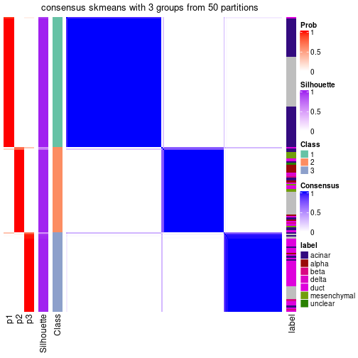</p>

</div>
<div id='tab-node-0221-consensus-heatmap-3'>
<pre><code class="r">consensus_heatmap(res, k = 4)
</code></pre>

<p>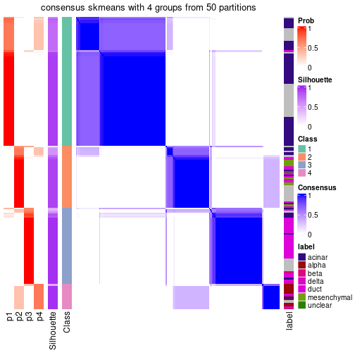</p>

</div>
</div>

Heatmaps for the membership of samples in all partitions to see how consistent they are:


<script>
$( function() {
	$( '#tabs-node-0221-membership-heatmap' ).tabs();
} );
</script>
<div id='tabs-node-0221-membership-heatmap'>
<ul>
<li><a href='#tab-node-0221-membership-heatmap-1'>k = 2</a></li>
<li><a href='#tab-node-0221-membership-heatmap-2'>k = 3</a></li>
<li><a href='#tab-node-0221-membership-heatmap-3'>k = 4</a></li>
</ul>
<div id='tab-node-0221-membership-heatmap-1'>
<pre><code class="r">membership_heatmap(res, k = 2)
</code></pre>

<p>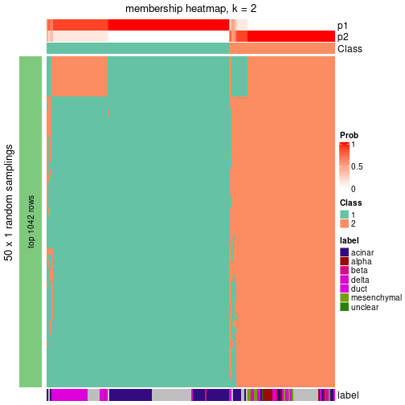</p>

</div>
<div id='tab-node-0221-membership-heatmap-2'>
<pre><code class="r">membership_heatmap(res, k = 3)
</code></pre>

<p>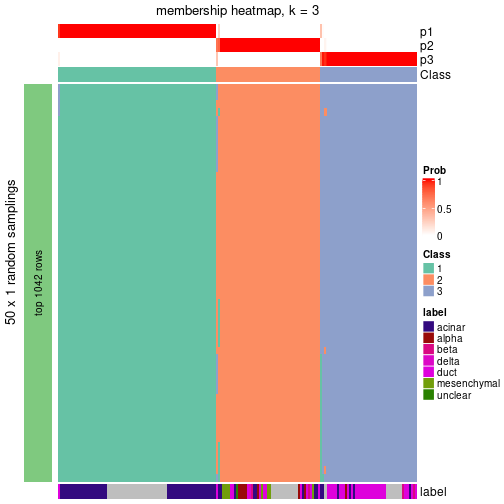</p>

</div>
<div id='tab-node-0221-membership-heatmap-3'>
<pre><code class="r">membership_heatmap(res, k = 4)
</code></pre>

<p>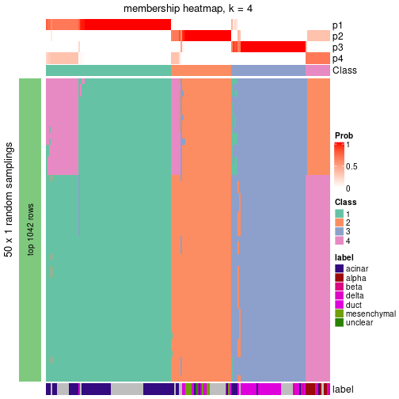</p>

</div>
</div>

As soon as the classes for columns are determined, the signatures
that are significantly different between subgroups can be looked for. 
Following are the heatmaps for signatures.


Signature heatmaps where rows are scaled:


<script>
$( function() {
	$( '#tabs-node-0221-get-signatures' ).tabs();
} );
</script>
<div id='tabs-node-0221-get-signatures'>
<ul>
<li><a href='#tab-node-0221-get-signatures-1'>k = 2</a></li>
<li><a href='#tab-node-0221-get-signatures-2'>k = 3</a></li>
<li><a href='#tab-node-0221-get-signatures-3'>k = 4</a></li>
</ul>
<div id='tab-node-0221-get-signatures-1'>
<pre><code class="r">get_signatures(res, k = 2)
</code></pre>

<p>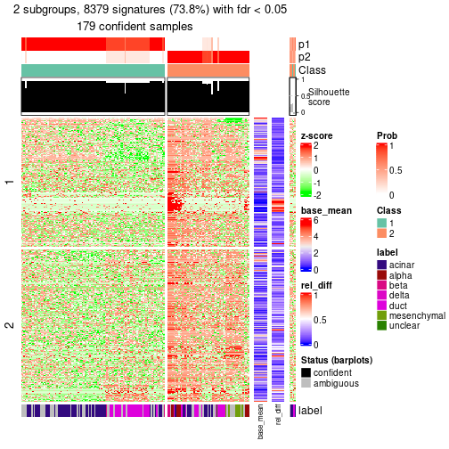</p>

</div>
<div id='tab-node-0221-get-signatures-2'>
<pre><code class="r">get_signatures(res, k = 3)
</code></pre>

<p>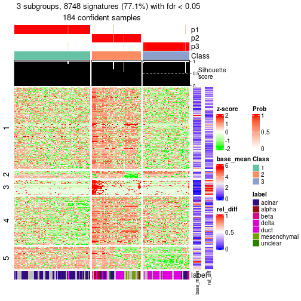</p>

</div>
<div id='tab-node-0221-get-signatures-3'>
<pre><code class="r">get_signatures(res, k = 4)
</code></pre>

<p>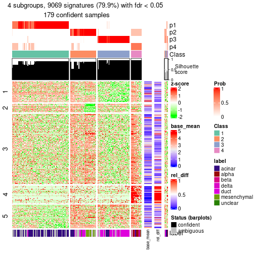</p>

</div>
</div>


Signature heatmaps where rows are not scaled:


<script>
$( function() {
	$( '#tabs-node-0221-get-signatures-no-scale' ).tabs();
} );
</script>
<div id='tabs-node-0221-get-signatures-no-scale'>
<ul>
<li><a href='#tab-node-0221-get-signatures-no-scale-1'>k = 2</a></li>
<li><a href='#tab-node-0221-get-signatures-no-scale-2'>k = 3</a></li>
<li><a href='#tab-node-0221-get-signatures-no-scale-3'>k = 4</a></li>
</ul>
<div id='tab-node-0221-get-signatures-no-scale-1'>
<pre><code class="r">get_signatures(res, k = 2, scale_rows = FALSE)
</code></pre>

<p>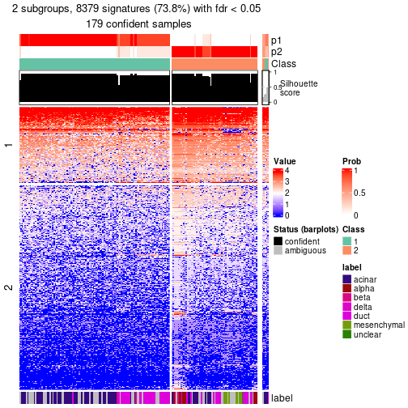</p>

</div>
<div id='tab-node-0221-get-signatures-no-scale-2'>
<pre><code class="r">get_signatures(res, k = 3, scale_rows = FALSE)
</code></pre>

<p>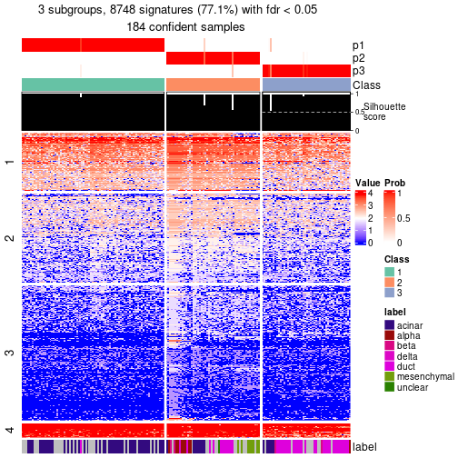</p>

</div>
<div id='tab-node-0221-get-signatures-no-scale-3'>
<pre><code class="r">get_signatures(res, k = 4, scale_rows = FALSE)
</code></pre>

<p>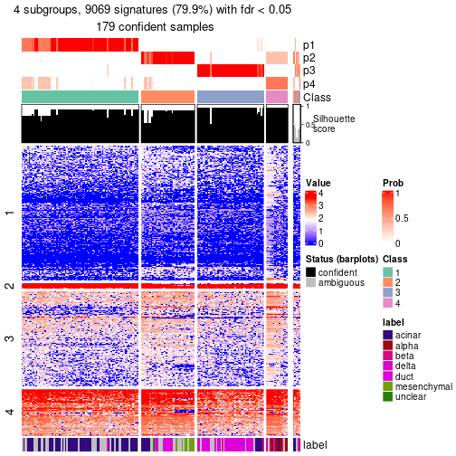</p>

</div>
</div>


Compare the overlap of signatures from different k:

```r
compare_signatures(res)
```

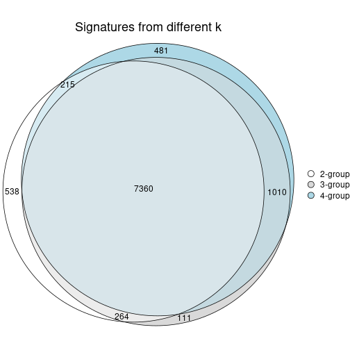

`get_signature()` returns a data frame invisibly. To get the list of signatures, the function
call should be assigned to a variable explicitly. In following code, if `plot` argument is set
to `FALSE`, no heatmap is plotted while only the differential analysis is performed.

```r
# code only for demonstration
tb = get_signature(res, k = ..., plot = FALSE)
```

An example of the output of `tb` is:

```
#>   which_row         fdr    mean_1    mean_2 scaled_mean_1 scaled_mean_2 km
#> 1        38 0.042760348  8.373488  9.131774    -0.5533452     0.5164555  1
#> 2        40 0.018707592  7.106213  8.469186    -0.6173731     0.5762149  1
#> 3        55 0.019134737 10.221463 11.207825    -0.6159697     0.5749050  1
#> 4        59 0.006059896  5.921854  7.869574    -0.6899429     0.6439467  1
#> 5        60 0.018055526  8.928898 10.211722    -0.6204761     0.5791110  1
#> 6        98 0.009384629 15.714769 14.887706     0.6635654    -0.6193277  2
...
```

The columns in `tb` are:

1. `which_row`: row indices corresponding to the input matrix.
2. `fdr`: FDR for the differential test. 
3. `mean_x`: The mean value in group x.
4. `scaled_mean_x`: The mean value in group x after rows are scaled.
5. `km`: Row groups if k-means clustering is applied to rows (which is done by automatically selecting number of clusters).

If there are too many signatures, `top_signatures = ...` can be set to only show the 
signatures with the highest FDRs:

```r
# code only for demonstration
# e.g. to show the top 500 most significant rows
tb = get_signature(res, k = ..., top_signatures = 500)
```

If the signatures are defined as these which are uniquely high in current group, `diff_method` argument
can be set to `"uniquely_high_in_one_group"`:

```r
# code only for demonstration
tb = get_signature(res, k = ..., diff_method = "uniquely_high_in_one_group")
```


UMAP plot which shows how samples are separated.


<script>
$( function() {
	$( '#tabs-node-0221-dimension-reduction' ).tabs();
} );
</script>
<div id='tabs-node-0221-dimension-reduction'>
<ul>
<li><a href='#tab-node-0221-dimension-reduction-1'>k = 2</a></li>
<li><a href='#tab-node-0221-dimension-reduction-2'>k = 3</a></li>
<li><a href='#tab-node-0221-dimension-reduction-3'>k = 4</a></li>
</ul>
<div id='tab-node-0221-dimension-reduction-1'>
<pre><code class="r">dimension_reduction(res, k = 2, method = &quot;UMAP&quot;)
</code></pre>

<p>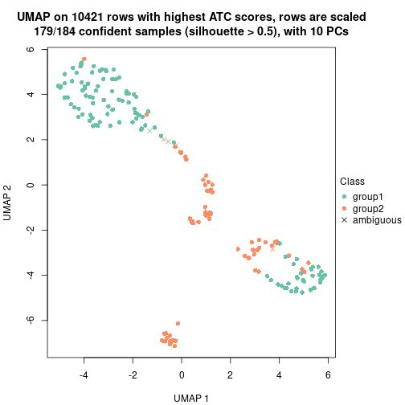</p>

</div>
<div id='tab-node-0221-dimension-reduction-2'>
<pre><code class="r">dimension_reduction(res, k = 3, method = &quot;UMAP&quot;)
</code></pre>

<p>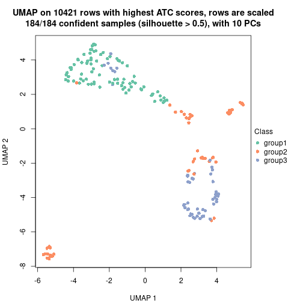</p>

</div>
<div id='tab-node-0221-dimension-reduction-3'>
<pre><code class="r">dimension_reduction(res, k = 4, method = &quot;UMAP&quot;)
</code></pre>

<p>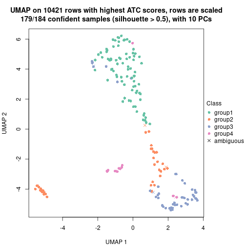</p>

</div>
</div>


Following heatmap shows how subgroups are split when increasing `k`:

```r
collect_classes(res)
```

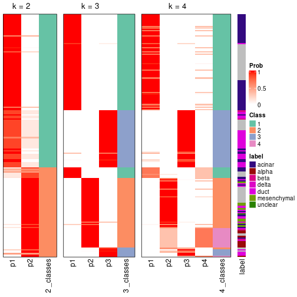


Test correlation between subgroups and known annotations. If the known
annotation is numeric, one-way ANOVA test is applied, and if the known
annotation is discrete, chi-squared contingency table test is applied.

```r
test_to_known_factors(res)
```

```
#>             n_sample label(p-value) k
#> ATC:skmeans      179       1.89e-07 2
#> ATC:skmeans      184       7.91e-20 3
#> ATC:skmeans      179       3.95e-34 4
```


If matrix rows can be associated to genes, consider to use `functional_enrichment(res,
...)` to perform function enrichment for the signature genes. See [this vignette](https://jokergoo.github.io/cola_vignettes/functional_enrichment.html) for more detailed explanations.


 

---------------------------------------------------


### Node02211


Parent node: [Node0221](#Node0221).
Child nodes: 
                Node022111-leaf
        ,
                Node022112-leaf
        .


The object with results only for a single top-value method and a single partitioning method 
can be extracted as:

```r
res = res_rh["02211"]
```

A summary of `res` and all the functions that can be applied to it:

```r
res
```

```
#> A 'ConsensusPartition' object with k = 2, 3, 4.
#>   On a matrix with 10191 rows and 81 columns.
#>   Top rows (1019) are extracted by 'ATC' method.
#>   Subgroups are detected by 'skmeans' method.
#>   Performed in total 150 partitions by row resampling.
#>   Best k for subgroups seems to be 2.
#> 
#> Following methods can be applied to this 'ConsensusPartition' object:
#>  [1] "cola_report"             "collect_classes"         "collect_plots"          
#>  [4] "collect_stats"           "colnames"                "compare_partitions"     
#>  [7] "compare_signatures"      "consensus_heatmap"       "dimension_reduction"    
#> [10] "functional_enrichment"   "get_anno_col"            "get_anno"               
#> [13] "get_classes"             "get_consensus"           "get_matrix"             
#> [16] "get_membership"          "get_param"               "get_signatures"         
#> [19] "get_stats"               "is_best_k"               "is_stable_k"            
#> [22] "membership_heatmap"      "ncol"                    "nrow"                   
#> [25] "plot_ecdf"               "predict_classes"         "rownames"               
#> [28] "select_partition_number" "show"                    "suggest_best_k"         
#> [31] "test_to_known_factors"   "top_rows_heatmap"
```

`collect_plots()` function collects all the plots made from `res` for all `k` (number of subgroups)
into one single page to provide an easy and fast comparison between different `k`.

```r
collect_plots(res)
```

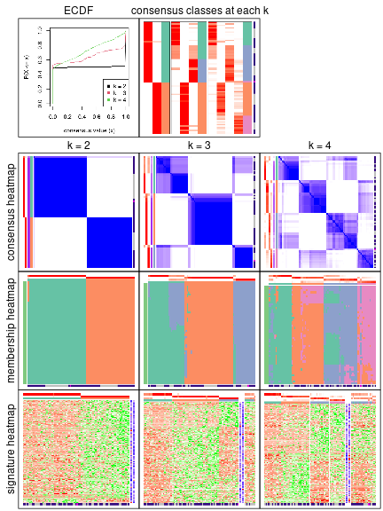

The plots are:

- The first row: a plot of the eCDF (empirical cumulative distribution
  function) curves of the consensus matrix for each `k` and the heatmap of
  predicted classes for each `k`.
- The second row: heatmaps of the consensus matrix for each `k`.
- The third row: heatmaps of the membership matrix for each `k`.
- The fouth row: heatmaps of the signatures for each `k`.

All the plots in panels can be made by individual functions and they are
plotted later in this section.

`select_partition_number()` produces several plots showing different
statistics for choosing "optimized" `k`. There are following statistics:

- eCDF curves of the consensus matrix for each `k`;
- 1-PAC. [The PAC score](https://en.wikipedia.org/wiki/Consensus_clustering#Over-interpretation_potential_of_consensus_clustering)
  measures the proportion of the ambiguous subgrouping.
- Mean silhouette score.
- Concordance. The mean probability of fiting the consensus subgroup labels in all
  partitions.
- Area increased. Denote $A_k$ as the area under the eCDF curve for current
  `k`, the area increased is defined as $A_k - A_{k-1}$.
- Rand index. The percent of pairs of samples that are both in a same cluster
  or both are not in a same cluster in the partition of k and k-1.
- Jaccard index. The ratio of pairs of samples are both in a same cluster in
  the partition of k and k-1 and the pairs of samples are both in a same
  cluster in the partition k or k-1.

The detailed explanations of these statistics can be found in [the _cola_
vignette](https://jokergoo.github.io/cola_vignettes/cola.html#toc_13).

Generally speaking, higher 1-PAC score, higher mean silhouette score or higher
concordance corresponds to better partition. Rand index and Jaccard index
measure how similar the current partition is compared to partition with `k-1`.
If they are too similar, we won't accept `k` is better than `k-1`.

```r
select_partition_number(res)
```

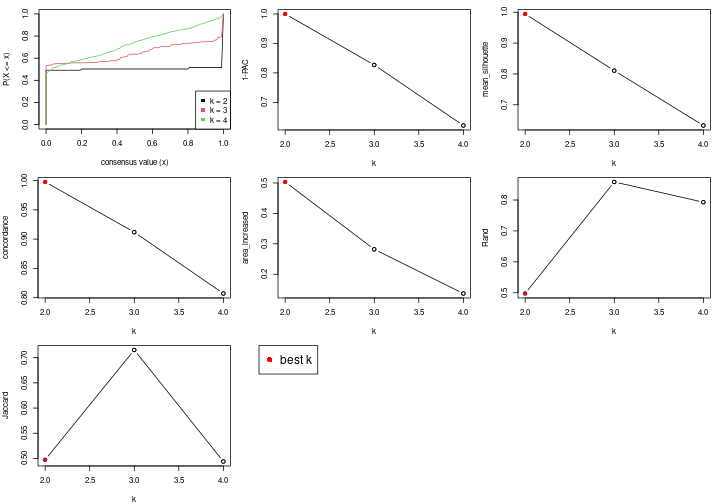

The numeric values for all these statistics can be obtained by `get_stats()`.

```r
get_stats(res)
```

```
#>   k 1-PAC mean_silhouette concordance area_increased  Rand Jaccard
#> 2 2 1.000           0.994       0.998          0.503 0.498   0.498
#> 3 3 0.827           0.811       0.912          0.282 0.858   0.715
#> 4 4 0.621           0.633       0.807          0.137 0.793   0.494
```

`suggest_best_k()` suggests the best $k$ based on these statistics. The rules are as follows:

- All $k$ with Jaccard index larger than 0.95 are removed because increasing
  $k$ does not provide enough extra information. If all $k$ are removed, it is
  marked as no subgroup is detected.
- For all $k$ with 1-PAC score larger than 0.9, the maximal $k$ is taken as
  the best $k$, and other $k$ are marked as optional $k$.
- If it does not fit the second rule. The $k$ with the maximal vote of the
  highest 1-PAC score, highest mean silhouette, and highest concordance is
  taken as the best $k$.

```r
suggest_best_k(res)
```

```
#> [1] 2
```


Following is the table of the partitions (You need to click the **show/hide
code output** link to see it). The membership matrix (columns with name `p*`)
is inferred by
[`clue::cl_consensus()`](https://www.rdocumentation.org/link/cl_consensus?package=clue)
function with the `SE` method. Basically the value in the membership matrix
represents the probability to belong to a certain group. The finall subgroup
label for an item is determined with the group with highest probability it
belongs to.

In `get_classes()` function, the entropy is calculated from the membership
matrix and the silhouette score is calculated from the consensus matrix.


<script>
$( function() {
	$( '#tabs-node-02211-get-classes' ).tabs();
} );
</script>
<div id='tabs-node-02211-get-classes'>
<ul>
<li><a href='#tab-node-02211-get-classes-1'>k = 2</a></li>
<li><a href='#tab-node-02211-get-classes-2'>k = 3</a></li>
<li><a href='#tab-node-02211-get-classes-3'>k = 4</a></li>
</ul>

<div id='tab-node-02211-get-classes-1'>
<p><a id='tab-node-02211-get-classes-1-a' style='color:#0366d6' href='#'>show/hide code output</a></p>
<pre><code class="r">cbind(get_classes(res, k = 2), get_membership(res, k = 2))
</code></pre>

<pre><code>#&gt;          class entropy silhouette  p1  p2
#&gt; D28-1_50     2   0.000      1.000 0.0 1.0
#&gt; D28-1_55     1   0.000      0.995 1.0 0.0
#&gt; D28-1_62     2   0.000      1.000 0.0 1.0
#&gt; D28-1_67     1   0.000      0.995 1.0 0.0
#&gt; D28-1_68     2   0.000      1.000 0.0 1.0
#&gt; D28-1_87     2   0.000      1.000 0.0 1.0
#&gt; D28-2_1      2   0.000      1.000 0.0 1.0
#&gt; D28-2_39     2   0.000      1.000 0.0 1.0
#&gt; D28-2_42     2   0.000      1.000 0.0 1.0
#&gt; D28-2_49     1   0.000      0.995 1.0 0.0
#&gt; D28-2_53     1   0.000      0.995 1.0 0.0
#&gt; D28-2_61     2   0.000      1.000 0.0 1.0
#&gt; D28-2_74     1   0.000      0.995 1.0 0.0
#&gt; D28-2_75     1   0.000      0.995 1.0 0.0
#&gt; D28-2_86     2   0.000      1.000 0.0 1.0
#&gt; D28-3_4      1   0.000      0.995 1.0 0.0
#&gt; D28-3_40     2   0.000      1.000 0.0 1.0
#&gt; D28-3_50     1   0.000      0.995 1.0 0.0
#&gt; D28-3_51     2   0.000      1.000 0.0 1.0
#&gt; D28-3_52     1   0.000      0.995 1.0 0.0
#&gt; D28-4_17     2   0.000      1.000 0.0 1.0
#&gt; D28-4_49     1   0.000      0.995 1.0 0.0
#&gt; D28-4_54     1   0.000      0.995 1.0 0.0
#&gt; D28-4_67     2   0.000      1.000 0.0 1.0
#&gt; D28-4_75     1   0.000      0.995 1.0 0.0
#&gt; D28-4_89     1   0.000      0.995 1.0 0.0
#&gt; D28-5_38     1   0.000      0.995 1.0 0.0
#&gt; D28-5_54     2   0.000      1.000 0.0 1.0
#&gt; D28-5_62     1   0.000      0.995 1.0 0.0
#&gt; D28-5_63     1   0.000      0.995 1.0 0.0
#&gt; D28-5_77     2   0.000      1.000 0.0 1.0
#&gt; D28-5_78     1   0.000      0.995 1.0 0.0
#&gt; D28-6_2      2   0.000      1.000 0.0 1.0
#&gt; D28-6_4      1   0.000      0.995 1.0 0.0
#&gt; D28-6_38     1   0.000      0.995 1.0 0.0
#&gt; D28-6_41     1   0.000      0.995 1.0 0.0
#&gt; D28-6_42     2   0.000      1.000 0.0 1.0
#&gt; D28-6_50     1   0.000      0.995 1.0 0.0
#&gt; D28-6_62     1   0.000      0.995 1.0 0.0
#&gt; D28-6_63     2   0.000      1.000 0.0 1.0
#&gt; D28-6_66     1   0.000      0.995 1.0 0.0
#&gt; D28-6_73     1   0.000      0.995 1.0 0.0
#&gt; D28-6_74     2   0.000      1.000 0.0 1.0
#&gt; D28-6_76     2   0.000      1.000 0.0 1.0
#&gt; D28-6_89     1   0.000      0.995 1.0 0.0
#&gt; D28-7_1      1   0.000      0.995 1.0 0.0
#&gt; D28-7_37     2   0.000      1.000 0.0 1.0
#&gt; D28-7_39     2   0.000      1.000 0.0 1.0
#&gt; D28-7_41     2   0.000      1.000 0.0 1.0
#&gt; D28-7_51     1   0.000      0.995 1.0 0.0
#&gt; D28-7_52     2   0.000      1.000 0.0 1.0
#&gt; D28-7_62     1   0.000      0.995 1.0 0.0
#&gt; D28-7_64     1   0.000      0.995 1.0 0.0
#&gt; D28-8_39     2   0.000      1.000 0.0 1.0
#&gt; D28-8_53     1   0.000      0.995 1.0 0.0
#&gt; D28-8_63     1   0.000      0.995 1.0 0.0
#&gt; D28-8_77     2   0.000      1.000 0.0 1.0
#&gt; D31-1_9      1   0.000      0.995 1.0 0.0
#&gt; D31-1_19     2   0.000      1.000 0.0 1.0
#&gt; D31-1_45     2   0.000      1.000 0.0 1.0
#&gt; D31-1_88     2   0.000      1.000 0.0 1.0
#&gt; D31-2_53     1   0.000      0.995 1.0 0.0
#&gt; D31-2_61     2   0.000      1.000 0.0 1.0
#&gt; D31-2_69     2   0.000      1.000 0.0 1.0
#&gt; D31-3_86     2   0.000      1.000 0.0 1.0
#&gt; D31-4_48     1   0.000      0.995 1.0 0.0
#&gt; D31-4_55     1   0.000      0.995 1.0 0.0
#&gt; D31-4_70     1   0.722      0.750 0.8 0.2
#&gt; D31-8_63     1   0.000      0.995 1.0 0.0
#&gt; D31-8_89     2   0.000      1.000 0.0 1.0
#&gt; D30-2_1      2   0.000      1.000 0.0 1.0
#&gt; D30-2_17     1   0.000      0.995 1.0 0.0
#&gt; D30-2_43     2   0.000      1.000 0.0 1.0
#&gt; D30-2_51     2   0.000      1.000 0.0 1.0
#&gt; D30-2_56     2   0.000      1.000 0.0 1.0
#&gt; D30-6_80     1   0.000      0.995 1.0 0.0
#&gt; D30-7_1      1   0.000      0.995 1.0 0.0
#&gt; D30-7_11     1   0.000      0.995 1.0 0.0
#&gt; D30-8_63     1   0.000      0.995 1.0 0.0
#&gt; D30-8_65     1   0.000      0.995 1.0 0.0
#&gt; D30-8_84     1   0.000      0.995 1.0 0.0
</code></pre>

<script>
$('#tab-node-02211-get-classes-1-a').parent().next().next().hide();
$('#tab-node-02211-get-classes-1-a').click(function(){
  $('#tab-node-02211-get-classes-1-a').parent().next().next().toggle();
  return(false);
});
</script>
</div>

<div id='tab-node-02211-get-classes-2'>
<p><a id='tab-node-02211-get-classes-2-a' style='color:#0366d6' href='#'>show/hide code output</a></p>
<pre><code class="r">cbind(get_classes(res, k = 3), get_membership(res, k = 3))
</code></pre>

<pre><code>#&gt;          class entropy silhouette   p1   p2   p3
#&gt; D28-1_50     2  0.0000     0.9715 0.00 1.00 0.00
#&gt; D28-1_55     3  0.0000     0.9251 0.00 0.00 1.00
#&gt; D28-1_62     2  0.0000     0.9715 0.00 1.00 0.00
#&gt; D28-1_67     3  0.0000     0.9251 0.00 0.00 1.00
#&gt; D28-1_68     2  0.0000     0.9715 0.00 1.00 0.00
#&gt; D28-1_87     2  0.0000     0.9715 0.00 1.00 0.00
#&gt; D28-2_1      2  0.2066     0.9237 0.06 0.94 0.00
#&gt; D28-2_39     2  0.0000     0.9715 0.00 1.00 0.00
#&gt; D28-2_42     2  0.0000     0.9715 0.00 1.00 0.00
#&gt; D28-2_49     1  0.6280     0.4573 0.54 0.00 0.46
#&gt; D28-2_53     1  0.6280     0.4573 0.54 0.00 0.46
#&gt; D28-2_61     2  0.0000     0.9715 0.00 1.00 0.00
#&gt; D28-2_74     1  0.0000     0.7533 1.00 0.00 0.00
#&gt; D28-2_75     1  0.6126     0.5488 0.60 0.00 0.40
#&gt; D28-2_86     2  0.0000     0.9715 0.00 1.00 0.00
#&gt; D28-3_4      3  0.0000     0.9251 0.00 0.00 1.00
#&gt; D28-3_40     2  0.0000     0.9715 0.00 1.00 0.00
#&gt; D28-3_50     1  0.0000     0.7533 1.00 0.00 0.00
#&gt; D28-3_51     2  0.0000     0.9715 0.00 1.00 0.00
#&gt; D28-3_52     1  0.0000     0.7533 1.00 0.00 0.00
#&gt; D28-4_17     2  0.0000     0.9715 0.00 1.00 0.00
#&gt; D28-4_49     3  0.0000     0.9251 0.00 0.00 1.00
#&gt; D28-4_54     3  0.0000     0.9251 0.00 0.00 1.00
#&gt; D28-4_67     2  0.0000     0.9715 0.00 1.00 0.00
#&gt; D28-4_75     3  0.0000     0.9251 0.00 0.00 1.00
#&gt; D28-4_89     1  0.5560     0.6243 0.70 0.00 0.30
#&gt; D28-5_38     3  0.0000     0.9251 0.00 0.00 1.00
#&gt; D28-5_54     2  0.5016     0.7156 0.24 0.76 0.00
#&gt; D28-5_62     1  0.0000     0.7533 1.00 0.00 0.00
#&gt; D28-5_63     3  0.6126    -0.0623 0.40 0.00 0.60
#&gt; D28-5_77     2  0.0000     0.9715 0.00 1.00 0.00
#&gt; D28-5_78     1  0.0000     0.7533 1.00 0.00 0.00
#&gt; D28-6_2      2  0.0000     0.9715 0.00 1.00 0.00
#&gt; D28-6_4      1  0.6280     0.4573 0.54 0.00 0.46
#&gt; D28-6_38     3  0.6280    -0.2482 0.46 0.00 0.54
#&gt; D28-6_41     3  0.0000     0.9251 0.00 0.00 1.00
#&gt; D28-6_42     2  0.0000     0.9715 0.00 1.00 0.00
#&gt; D28-6_50     3  0.0000     0.9251 0.00 0.00 1.00
#&gt; D28-6_62     3  0.0000     0.9251 0.00 0.00 1.00
#&gt; D28-6_63     2  0.0000     0.9715 0.00 1.00 0.00
#&gt; D28-6_66     1  0.6302     0.4074 0.52 0.00 0.48
#&gt; D28-6_73     1  0.0892     0.7488 0.98 0.00 0.02
#&gt; D28-6_74     2  0.0000     0.9715 0.00 1.00 0.00
#&gt; D28-6_76     2  0.0000     0.9715 0.00 1.00 0.00
#&gt; D28-6_89     3  0.0000     0.9251 0.00 0.00 1.00
#&gt; D28-7_1      1  0.6192     0.5280 0.58 0.00 0.42
#&gt; D28-7_37     2  0.1529     0.9404 0.04 0.96 0.00
#&gt; D28-7_39     2  0.0000     0.9715 0.00 1.00 0.00
#&gt; D28-7_41     2  0.0000     0.9715 0.00 1.00 0.00
#&gt; D28-7_51     1  0.0000     0.7533 1.00 0.00 0.00
#&gt; D28-7_52     2  0.5948     0.4958 0.00 0.64 0.36
#&gt; D28-7_62     1  0.0000     0.7533 1.00 0.00 0.00
#&gt; D28-7_64     1  0.0000     0.7533 1.00 0.00 0.00
#&gt; D28-8_39     2  0.0000     0.9715 0.00 1.00 0.00
#&gt; D28-8_53     1  0.6244     0.4953 0.56 0.00 0.44
#&gt; D28-8_63     1  0.0000     0.7533 1.00 0.00 0.00
#&gt; D28-8_77     2  0.0000     0.9715 0.00 1.00 0.00
#&gt; D31-1_9      3  0.0000     0.9251 0.00 0.00 1.00
#&gt; D31-1_19     2  0.0000     0.9715 0.00 1.00 0.00
#&gt; D31-1_45     2  0.0000     0.9715 0.00 1.00 0.00
#&gt; D31-1_88     2  0.0000     0.9715 0.00 1.00 0.00
#&gt; D31-2_53     1  0.0000     0.7533 1.00 0.00 0.00
#&gt; D31-2_61     2  0.5560     0.6081 0.00 0.70 0.30
#&gt; D31-2_69     2  0.0000     0.9715 0.00 1.00 0.00
#&gt; D31-3_86     2  0.0000     0.9715 0.00 1.00 0.00
#&gt; D31-4_48     1  0.3686     0.7079 0.86 0.00 0.14
#&gt; D31-4_55     1  0.6126     0.5493 0.60 0.00 0.40
#&gt; D31-4_70     1  0.0000     0.7533 1.00 0.00 0.00
#&gt; D31-8_63     3  0.0000     0.9251 0.00 0.00 1.00
#&gt; D31-8_89     2  0.0000     0.9715 0.00 1.00 0.00
#&gt; D30-2_1      2  0.0000     0.9715 0.00 1.00 0.00
#&gt; D30-2_17     3  0.0000     0.9251 0.00 0.00 1.00
#&gt; D30-2_43     2  0.1529     0.9394 0.00 0.96 0.04
#&gt; D30-2_51     2  0.0000     0.9715 0.00 1.00 0.00
#&gt; D30-2_56     2  0.0000     0.9715 0.00 1.00 0.00
#&gt; D30-6_80     1  0.6192     0.5280 0.58 0.00 0.42
#&gt; D30-7_1      1  0.0000     0.7533 1.00 0.00 0.00
#&gt; D30-7_11     1  0.0000     0.7533 1.00 0.00 0.00
#&gt; D30-8_63     1  0.6192     0.5280 0.58 0.00 0.42
#&gt; D30-8_65     3  0.0000     0.9251 0.00 0.00 1.00
#&gt; D30-8_84     1  0.6192     0.5280 0.58 0.00 0.42
</code></pre>

<script>
$('#tab-node-02211-get-classes-2-a').parent().next().next().hide();
$('#tab-node-02211-get-classes-2-a').click(function(){
  $('#tab-node-02211-get-classes-2-a').parent().next().next().toggle();
  return(false);
});
</script>
</div>

<div id='tab-node-02211-get-classes-3'>
<p><a id='tab-node-02211-get-classes-3-a' style='color:#0366d6' href='#'>show/hide code output</a></p>
<pre><code class="r">cbind(get_classes(res, k = 4), get_membership(res, k = 4))
</code></pre>

<pre><code>#&gt;          class entropy silhouette   p1   p2   p3   p4
#&gt; D28-1_50     4  0.3610     0.7318 0.00 0.20 0.00 0.80
#&gt; D28-1_55     3  0.2011     0.6557 0.00 0.00 0.92 0.08
#&gt; D28-1_62     4  0.3975     0.6854 0.00 0.24 0.00 0.76
#&gt; D28-1_67     3  0.3400     0.6100 0.00 0.00 0.82 0.18
#&gt; D28-1_68     2  0.4134     0.7411 0.00 0.74 0.00 0.26
#&gt; D28-1_87     2  0.3172     0.8318 0.00 0.84 0.00 0.16
#&gt; D28-2_1      2  0.1913     0.7114 0.04 0.94 0.00 0.02
#&gt; D28-2_39     2  0.3400     0.8276 0.00 0.82 0.00 0.18
#&gt; D28-2_42     2  0.3172     0.8318 0.00 0.84 0.00 0.16
#&gt; D28-2_49     3  0.4855     0.4732 0.40 0.00 0.60 0.00
#&gt; D28-2_53     3  0.4855     0.4732 0.40 0.00 0.60 0.00
#&gt; D28-2_61     4  0.4907     0.2443 0.00 0.42 0.00 0.58
#&gt; D28-2_74     1  0.0000     0.8278 1.00 0.00 0.00 0.00
#&gt; D28-2_75     1  0.4977    -0.2201 0.54 0.00 0.46 0.00
#&gt; D28-2_86     2  0.0000     0.7520 0.00 1.00 0.00 0.00
#&gt; D28-3_4      3  0.3610     0.5974 0.00 0.00 0.80 0.20
#&gt; D28-3_40     4  0.1637     0.7643 0.00 0.06 0.00 0.94
#&gt; D28-3_50     1  0.2921     0.7265 0.86 0.14 0.00 0.00
#&gt; D28-3_51     2  0.5000     0.0521 0.00 0.50 0.00 0.50
#&gt; D28-3_52     1  0.0707     0.8174 0.98 0.00 0.02 0.00
#&gt; D28-4_17     2  0.3400     0.8276 0.00 0.82 0.00 0.18
#&gt; D28-4_49     3  0.4227     0.6147 0.06 0.00 0.82 0.12
#&gt; D28-4_54     3  0.0707     0.6661 0.00 0.00 0.98 0.02
#&gt; D28-4_67     4  0.3400     0.7461 0.00 0.18 0.00 0.82
#&gt; D28-4_75     4  0.4994    -0.0664 0.00 0.00 0.48 0.52
#&gt; D28-4_89     1  0.4907    -0.0488 0.58 0.00 0.42 0.00
#&gt; D28-5_38     3  0.0707     0.6661 0.00 0.00 0.98 0.02
#&gt; D28-5_54     2  0.5657     0.5471 0.16 0.72 0.00 0.12
#&gt; D28-5_62     1  0.0000     0.8278 1.00 0.00 0.00 0.00
#&gt; D28-5_63     3  0.4277     0.5753 0.28 0.00 0.72 0.00
#&gt; D28-5_77     4  0.2011     0.7710 0.00 0.08 0.00 0.92
#&gt; D28-5_78     1  0.0000     0.8278 1.00 0.00 0.00 0.00
#&gt; D28-6_2      2  0.3610     0.8160 0.00 0.80 0.00 0.20
#&gt; D28-6_4      3  0.4790     0.4941 0.38 0.00 0.62 0.00
#&gt; D28-6_38     3  0.5619     0.5008 0.32 0.00 0.64 0.04
#&gt; D28-6_41     3  0.3801     0.5804 0.00 0.00 0.78 0.22
#&gt; D28-6_42     2  0.0000     0.7520 0.00 1.00 0.00 0.00
#&gt; D28-6_50     3  0.6320     0.4877 0.18 0.00 0.66 0.16
#&gt; D28-6_62     3  0.2647     0.6540 0.12 0.00 0.88 0.00
#&gt; D28-6_63     4  0.4624     0.5023 0.00 0.34 0.00 0.66
#&gt; D28-6_66     3  0.4907     0.4461 0.42 0.00 0.58 0.00
#&gt; D28-6_73     1  0.2345     0.7364 0.90 0.00 0.10 0.00
#&gt; D28-6_74     2  0.3172     0.8191 0.00 0.84 0.00 0.16
#&gt; D28-6_76     2  0.3400     0.8276 0.00 0.82 0.00 0.18
#&gt; D28-6_89     3  0.2345     0.6476 0.00 0.00 0.90 0.10
#&gt; D28-7_1      3  0.4948     0.4097 0.44 0.00 0.56 0.00
#&gt; D28-7_37     2  0.2335     0.6840 0.06 0.92 0.00 0.02
#&gt; D28-7_39     2  0.3172     0.8318 0.00 0.84 0.00 0.16
#&gt; D28-7_41     2  0.3172     0.8318 0.00 0.84 0.00 0.16
#&gt; D28-7_51     1  0.0000     0.8278 1.00 0.00 0.00 0.00
#&gt; D28-7_52     4  0.1211     0.7540 0.00 0.04 0.00 0.96
#&gt; D28-7_62     1  0.0707     0.8174 0.98 0.00 0.02 0.00
#&gt; D28-7_64     1  0.0000     0.8278 1.00 0.00 0.00 0.00
#&gt; D28-8_39     4  0.4797     0.6117 0.00 0.26 0.02 0.72
#&gt; D28-8_53     3  0.4907     0.4442 0.42 0.00 0.58 0.00
#&gt; D28-8_63     1  0.0000     0.8278 1.00 0.00 0.00 0.00
#&gt; D28-8_77     4  0.2921     0.7674 0.00 0.14 0.00 0.86
#&gt; D31-1_9      3  0.2011     0.6545 0.00 0.00 0.92 0.08
#&gt; D31-1_19     2  0.3400     0.8276 0.00 0.82 0.00 0.18
#&gt; D31-1_45     2  0.3801     0.7975 0.00 0.78 0.00 0.22
#&gt; D31-1_88     2  0.3172     0.8318 0.00 0.84 0.00 0.16
#&gt; D31-2_53     1  0.1913     0.7863 0.94 0.02 0.00 0.04
#&gt; D31-2_61     4  0.1211     0.7540 0.00 0.04 0.00 0.96
#&gt; D31-2_69     2  0.0000     0.7520 0.00 1.00 0.00 0.00
#&gt; D31-3_86     2  0.0000     0.7520 0.00 1.00 0.00 0.00
#&gt; D31-4_48     1  0.6510     0.1919 0.54 0.08 0.38 0.00
#&gt; D31-4_55     3  0.4994     0.3212 0.48 0.00 0.52 0.00
#&gt; D31-4_70     1  0.4790     0.4288 0.62 0.38 0.00 0.00
#&gt; D31-8_63     3  0.0707     0.6671 0.00 0.00 0.98 0.02
#&gt; D31-8_89     4  0.2921     0.7644 0.00 0.14 0.00 0.86
#&gt; D30-2_1      2  0.3400     0.8276 0.00 0.82 0.00 0.18
#&gt; D30-2_17     3  0.1211     0.6684 0.04 0.00 0.96 0.00
#&gt; D30-2_43     4  0.3335     0.7650 0.00 0.12 0.02 0.86
#&gt; D30-2_51     2  0.5487     0.3074 0.02 0.58 0.00 0.40
#&gt; D30-2_56     2  0.4406     0.6822 0.00 0.70 0.00 0.30
#&gt; D30-6_80     3  0.4907     0.4461 0.42 0.00 0.58 0.00
#&gt; D30-7_1      1  0.0000     0.8278 1.00 0.00 0.00 0.00
#&gt; D30-7_11     1  0.0000     0.8278 1.00 0.00 0.00 0.00
#&gt; D30-8_63     3  0.4994     0.3120 0.48 0.00 0.52 0.00
#&gt; D30-8_65     3  0.2011     0.6638 0.08 0.00 0.92 0.00
#&gt; D30-8_84     3  0.4948     0.4097 0.44 0.00 0.56 0.00
</code></pre>

<script>
$('#tab-node-02211-get-classes-3-a').parent().next().next().hide();
$('#tab-node-02211-get-classes-3-a').click(function(){
  $('#tab-node-02211-get-classes-3-a').parent().next().next().toggle();
  return(false);
});
</script>
</div>
</div>

Heatmaps for the consensus matrix. It visualizes the probability of two
samples to be in a same group.


<script>
$( function() {
	$( '#tabs-node-02211-consensus-heatmap' ).tabs();
} );
</script>
<div id='tabs-node-02211-consensus-heatmap'>
<ul>
<li><a href='#tab-node-02211-consensus-heatmap-1'>k = 2</a></li>
<li><a href='#tab-node-02211-consensus-heatmap-2'>k = 3</a></li>
<li><a href='#tab-node-02211-consensus-heatmap-3'>k = 4</a></li>
</ul>
<div id='tab-node-02211-consensus-heatmap-1'>
<pre><code class="r">consensus_heatmap(res, k = 2)
</code></pre>

<p>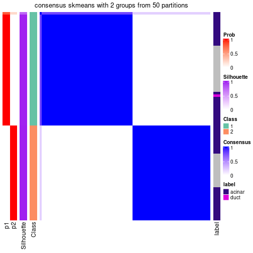</p>

</div>
<div id='tab-node-02211-consensus-heatmap-2'>
<pre><code class="r">consensus_heatmap(res, k = 3)
</code></pre>

<p>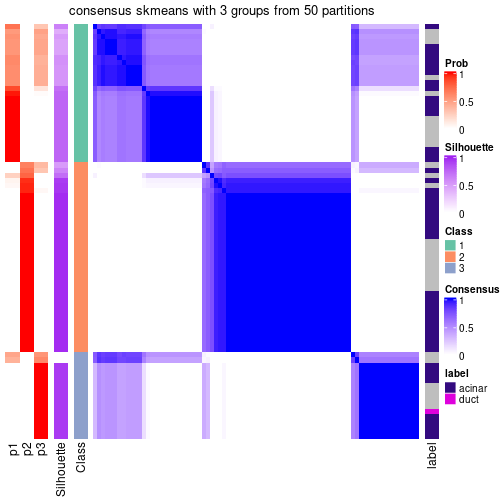</p>

</div>
<div id='tab-node-02211-consensus-heatmap-3'>
<pre><code class="r">consensus_heatmap(res, k = 4)
</code></pre>

<p>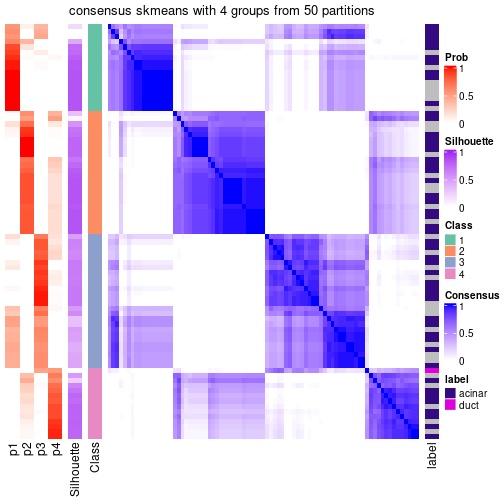</p>

</div>
</div>

Heatmaps for the membership of samples in all partitions to see how consistent they are:


<script>
$( function() {
	$( '#tabs-node-02211-membership-heatmap' ).tabs();
} );
</script>
<div id='tabs-node-02211-membership-heatmap'>
<ul>
<li><a href='#tab-node-02211-membership-heatmap-1'>k = 2</a></li>
<li><a href='#tab-node-02211-membership-heatmap-2'>k = 3</a></li>
<li><a href='#tab-node-02211-membership-heatmap-3'>k = 4</a></li>
</ul>
<div id='tab-node-02211-membership-heatmap-1'>
<pre><code class="r">membership_heatmap(res, k = 2)
</code></pre>

<p>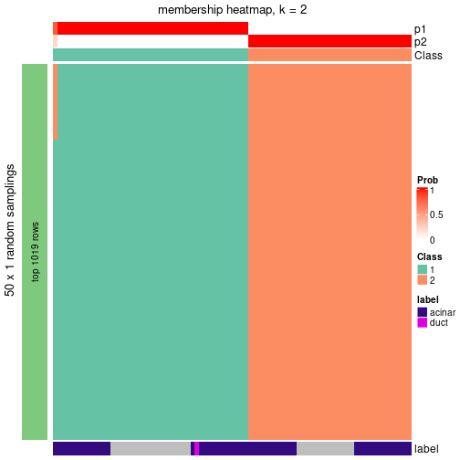</p>

</div>
<div id='tab-node-02211-membership-heatmap-2'>
<pre><code class="r">membership_heatmap(res, k = 3)
</code></pre>

<p>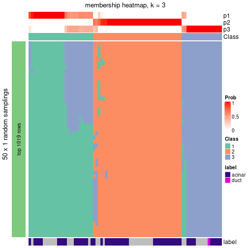</p>

</div>
<div id='tab-node-02211-membership-heatmap-3'>
<pre><code class="r">membership_heatmap(res, k = 4)
</code></pre>

<p>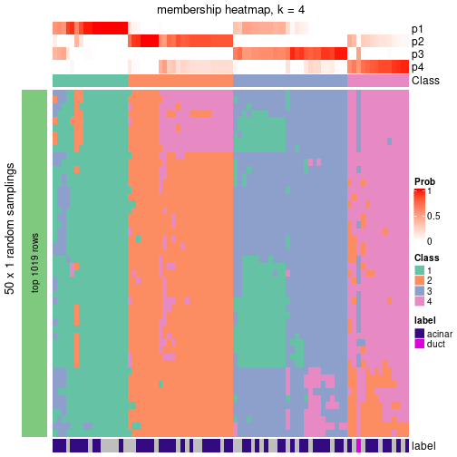</p>

</div>
</div>

As soon as the classes for columns are determined, the signatures
that are significantly different between subgroups can be looked for. 
Following are the heatmaps for signatures.


Signature heatmaps where rows are scaled:


<script>
$( function() {
	$( '#tabs-node-02211-get-signatures' ).tabs();
} );
</script>
<div id='tabs-node-02211-get-signatures'>
<ul>
<li><a href='#tab-node-02211-get-signatures-1'>k = 2</a></li>
<li><a href='#tab-node-02211-get-signatures-2'>k = 3</a></li>
<li><a href='#tab-node-02211-get-signatures-3'>k = 4</a></li>
</ul>
<div id='tab-node-02211-get-signatures-1'>
<pre><code class="r">get_signatures(res, k = 2)
</code></pre>

<p>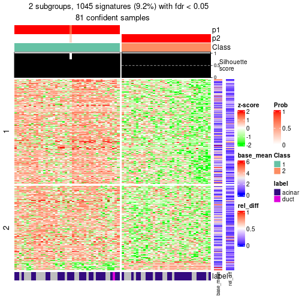</p>

</div>
<div id='tab-node-02211-get-signatures-2'>
<pre><code class="r">get_signatures(res, k = 3)
</code></pre>

<p>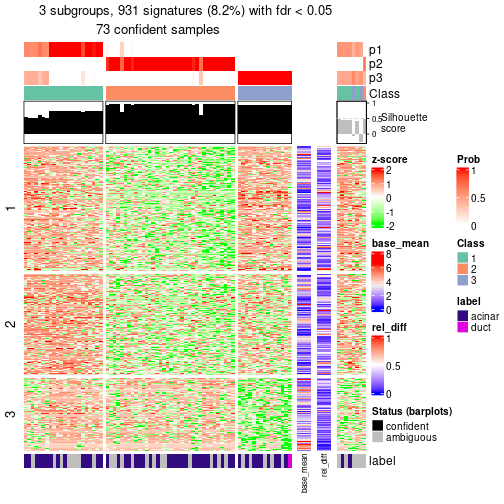</p>

</div>
<div id='tab-node-02211-get-signatures-3'>
<pre><code class="r">get_signatures(res, k = 4)
</code></pre>

<p>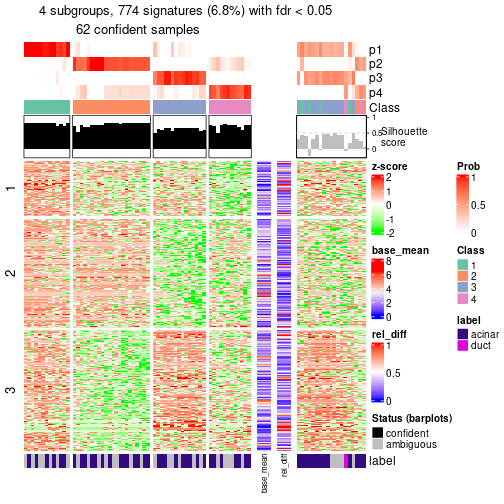</p>

</div>
</div>


Signature heatmaps where rows are not scaled:


<script>
$( function() {
	$( '#tabs-node-02211-get-signatures-no-scale' ).tabs();
} );
</script>
<div id='tabs-node-02211-get-signatures-no-scale'>
<ul>
<li><a href='#tab-node-02211-get-signatures-no-scale-1'>k = 2</a></li>
<li><a href='#tab-node-02211-get-signatures-no-scale-2'>k = 3</a></li>
<li><a href='#tab-node-02211-get-signatures-no-scale-3'>k = 4</a></li>
</ul>
<div id='tab-node-02211-get-signatures-no-scale-1'>
<pre><code class="r">get_signatures(res, k = 2, scale_rows = FALSE)
</code></pre>

<p>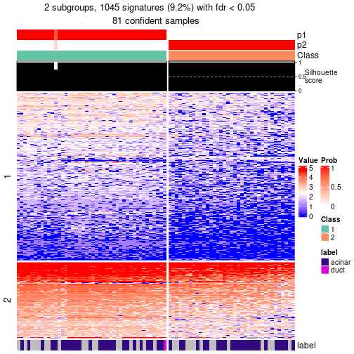</p>

</div>
<div id='tab-node-02211-get-signatures-no-scale-2'>
<pre><code class="r">get_signatures(res, k = 3, scale_rows = FALSE)
</code></pre>

<p>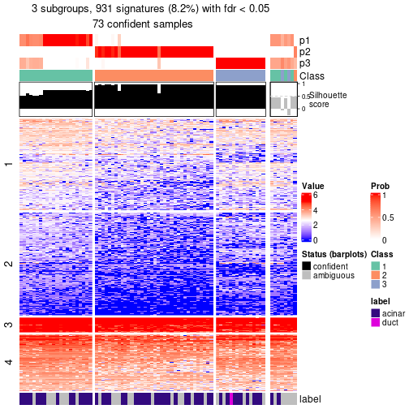</p>

</div>
<div id='tab-node-02211-get-signatures-no-scale-3'>
<pre><code class="r">get_signatures(res, k = 4, scale_rows = FALSE)
</code></pre>

<p>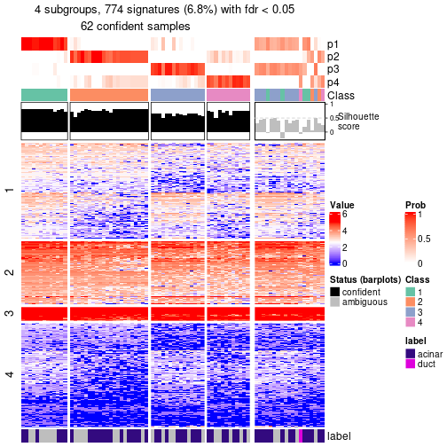</p>

</div>
</div>


Compare the overlap of signatures from different k:

```r
compare_signatures(res)
```

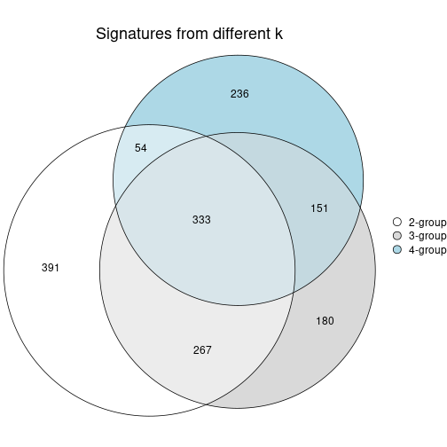

`get_signature()` returns a data frame invisibly. To get the list of signatures, the function
call should be assigned to a variable explicitly. In following code, if `plot` argument is set
to `FALSE`, no heatmap is plotted while only the differential analysis is performed.

```r
# code only for demonstration
tb = get_signature(res, k = ..., plot = FALSE)
```

An example of the output of `tb` is:

```
#>   which_row         fdr    mean_1    mean_2 scaled_mean_1 scaled_mean_2 km
#> 1        38 0.042760348  8.373488  9.131774    -0.5533452     0.5164555  1
#> 2        40 0.018707592  7.106213  8.469186    -0.6173731     0.5762149  1
#> 3        55 0.019134737 10.221463 11.207825    -0.6159697     0.5749050  1
#> 4        59 0.006059896  5.921854  7.869574    -0.6899429     0.6439467  1
#> 5        60 0.018055526  8.928898 10.211722    -0.6204761     0.5791110  1
#> 6        98 0.009384629 15.714769 14.887706     0.6635654    -0.6193277  2
...
```

The columns in `tb` are:

1. `which_row`: row indices corresponding to the input matrix.
2. `fdr`: FDR for the differential test. 
3. `mean_x`: The mean value in group x.
4. `scaled_mean_x`: The mean value in group x after rows are scaled.
5. `km`: Row groups if k-means clustering is applied to rows (which is done by automatically selecting number of clusters).

If there are too many signatures, `top_signatures = ...` can be set to only show the 
signatures with the highest FDRs:

```r
# code only for demonstration
# e.g. to show the top 500 most significant rows
tb = get_signature(res, k = ..., top_signatures = 500)
```

If the signatures are defined as these which are uniquely high in current group, `diff_method` argument
can be set to `"uniquely_high_in_one_group"`:

```r
# code only for demonstration
tb = get_signature(res, k = ..., diff_method = "uniquely_high_in_one_group")
```


UMAP plot which shows how samples are separated.


<script>
$( function() {
	$( '#tabs-node-02211-dimension-reduction' ).tabs();
} );
</script>
<div id='tabs-node-02211-dimension-reduction'>
<ul>
<li><a href='#tab-node-02211-dimension-reduction-1'>k = 2</a></li>
<li><a href='#tab-node-02211-dimension-reduction-2'>k = 3</a></li>
<li><a href='#tab-node-02211-dimension-reduction-3'>k = 4</a></li>
</ul>
<div id='tab-node-02211-dimension-reduction-1'>
<pre><code class="r">dimension_reduction(res, k = 2, method = &quot;UMAP&quot;)
</code></pre>

<p>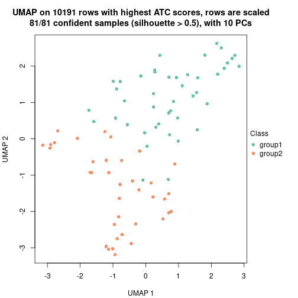</p>

</div>
<div id='tab-node-02211-dimension-reduction-2'>
<pre><code class="r">dimension_reduction(res, k = 3, method = &quot;UMAP&quot;)
</code></pre>

<p>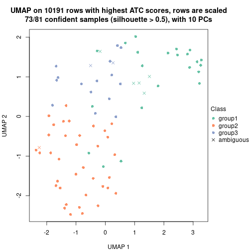</p>

</div>
<div id='tab-node-02211-dimension-reduction-3'>
<pre><code class="r">dimension_reduction(res, k = 4, method = &quot;UMAP&quot;)
</code></pre>

<p>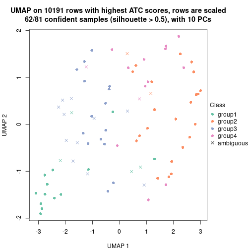</p>

</div>
</div>


Following heatmap shows how subgroups are split when increasing `k`:

```r
collect_classes(res)
```

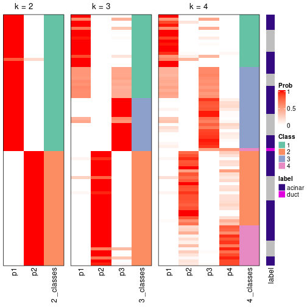


Test correlation between subgroups and known annotations. If the known
annotation is numeric, one-way ANOVA test is applied, and if the known
annotation is discrete, chi-squared contingency table test is applied.

```r
test_to_known_factors(res)
```

```
#>             n_sample label(p-value) k
#> ATC:skmeans       81          1.000 2
#> ATC:skmeans       73          0.144 3
#> ATC:skmeans       62             NA 4
```


If matrix rows can be associated to genes, consider to use `functional_enrichment(res,
...)` to perform function enrichment for the signature genes. See [this vignette](https://jokergoo.github.io/cola_vignettes/functional_enrichment.html) for more detailed explanations.


 

---------------------------------------------------


### Node0222


Parent node: [Node022](#Node022).
Child nodes: 
                Node02121-leaf
        ,
                Node02122-leaf
        ,
                Node02123-leaf
        ,
                Node02141-leaf
        ,
                Node02142-leaf
        ,
                Node02143-leaf
        ,
                Node02144-leaf
        ,
                [Node02211](#Node02211)
        ,
                Node02212-leaf
        ,
                Node02213-leaf
        ,
                Node02221-leaf
        ,
                Node02222-leaf
        ,
                Node02223-leaf
        ,
                Node02311-leaf
        ,
                Node02312-leaf
        ,
                Node02321-leaf
        ,
                Node02322-leaf
        ,
                Node02411-leaf
        ,
                Node02412-leaf
        ,
                Node02421-leaf
        ,
                Node02422-leaf
        .


The object with results only for a single top-value method and a single partitioning method 
can be extracted as:

```r
res = res_rh["0222"]
```

A summary of `res` and all the functions that can be applied to it:

```r
res
```

```
#> A 'ConsensusPartition' object with k = 2, 3, 4.
#>   On a matrix with 10222 rows and 199 columns.
#>   Top rows (1022) are extracted by 'ATC' method.
#>   Subgroups are detected by 'skmeans' method.
#>   Performed in total 150 partitions by row resampling.
#>   Best k for subgroups seems to be 3.
#> 
#> Following methods can be applied to this 'ConsensusPartition' object:
#>  [1] "cola_report"             "collect_classes"         "collect_plots"          
#>  [4] "collect_stats"           "colnames"                "compare_partitions"     
#>  [7] "compare_signatures"      "consensus_heatmap"       "dimension_reduction"    
#> [10] "functional_enrichment"   "get_anno_col"            "get_anno"               
#> [13] "get_classes"             "get_consensus"           "get_matrix"             
#> [16] "get_membership"          "get_param"               "get_signatures"         
#> [19] "get_stats"               "is_best_k"               "is_stable_k"            
#> [22] "membership_heatmap"      "ncol"                    "nrow"                   
#> [25] "plot_ecdf"               "predict_classes"         "rownames"               
#> [28] "select_partition_number" "show"                    "suggest_best_k"         
#> [31] "test_to_known_factors"   "top_rows_heatmap"
```

`collect_plots()` function collects all the plots made from `res` for all `k` (number of subgroups)
into one single page to provide an easy and fast comparison between different `k`.

```r
collect_plots(res)
```

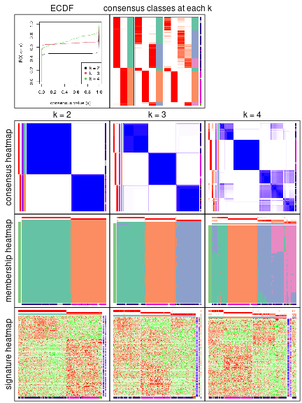

The plots are:

- The first row: a plot of the eCDF (empirical cumulative distribution
  function) curves of the consensus matrix for each `k` and the heatmap of
  predicted classes for each `k`.
- The second row: heatmaps of the consensus matrix for each `k`.
- The third row: heatmaps of the membership matrix for each `k`.
- The fouth row: heatmaps of the signatures for each `k`.

All the plots in panels can be made by individual functions and they are
plotted later in this section.

`select_partition_number()` produces several plots showing different
statistics for choosing "optimized" `k`. There are following statistics:

- eCDF curves of the consensus matrix for each `k`;
- 1-PAC. [The PAC score](https://en.wikipedia.org/wiki/Consensus_clustering#Over-interpretation_potential_of_consensus_clustering)
  measures the proportion of the ambiguous subgrouping.
- Mean silhouette score.
- Concordance. The mean probability of fiting the consensus subgroup labels in all
  partitions.
- Area increased. Denote $A_k$ as the area under the eCDF curve for current
  `k`, the area increased is defined as $A_k - A_{k-1}$.
- Rand index. The percent of pairs of samples that are both in a same cluster
  or both are not in a same cluster in the partition of k and k-1.
- Jaccard index. The ratio of pairs of samples are both in a same cluster in
  the partition of k and k-1 and the pairs of samples are both in a same
  cluster in the partition k or k-1.

The detailed explanations of these statistics can be found in [the _cola_
vignette](https://jokergoo.github.io/cola_vignettes/cola.html#toc_13).

Generally speaking, higher 1-PAC score, higher mean silhouette score or higher
concordance corresponds to better partition. Rand index and Jaccard index
measure how similar the current partition is compared to partition with `k-1`.
If they are too similar, we won't accept `k` is better than `k-1`.

```r
select_partition_number(res)
```

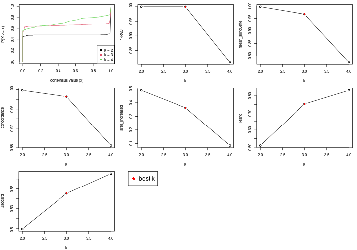

The numeric values for all these statistics can be obtained by `get_stats()`.

```r
get_stats(res)
```

```
#>   k 1-PAC mean_silhouette concordance area_increased  Rand Jaccard
#> 2 2 1.000           0.997       0.999         0.4906 0.510   0.510
#> 3 3 1.000           0.967       0.986         0.3625 0.752   0.545
#> 4 4 0.809           0.774       0.885         0.0851 0.832   0.565
```

`suggest_best_k()` suggests the best $k$ based on these statistics. The rules are as follows:

- All $k$ with Jaccard index larger than 0.95 are removed because increasing
  $k$ does not provide enough extra information. If all $k$ are removed, it is
  marked as no subgroup is detected.
- For all $k$ with 1-PAC score larger than 0.9, the maximal $k$ is taken as
  the best $k$, and other $k$ are marked as optional $k$.
- If it does not fit the second rule. The $k$ with the maximal vote of the
  highest 1-PAC score, highest mean silhouette, and highest concordance is
  taken as the best $k$.

```r
suggest_best_k(res)
```

```
#> [1] 3
#> attr(,"optional")
#> [1] 2
```

There is also optional best $k$ = 2 that is worth to check.

Following is the table of the partitions (You need to click the **show/hide
code output** link to see it). The membership matrix (columns with name `p*`)
is inferred by
[`clue::cl_consensus()`](https://www.rdocumentation.org/link/cl_consensus?package=clue)
function with the `SE` method. Basically the value in the membership matrix
represents the probability to belong to a certain group. The finall subgroup
label for an item is determined with the group with highest probability it
belongs to.

In `get_classes()` function, the entropy is calculated from the membership
matrix and the silhouette score is calculated from the consensus matrix.


<script>
$( function() {
	$( '#tabs-node-0222-get-classes' ).tabs();
} );
</script>
<div id='tabs-node-0222-get-classes'>
<ul>
<li><a href='#tab-node-0222-get-classes-1'>k = 2</a></li>
<li><a href='#tab-node-0222-get-classes-2'>k = 3</a></li>
<li><a href='#tab-node-0222-get-classes-3'>k = 4</a></li>
</ul>

<div id='tab-node-0222-get-classes-1'>
<p><a id='tab-node-0222-get-classes-1-a' style='color:#0366d6' href='#'>show/hide code output</a></p>
<pre><code class="r">cbind(get_classes(res, k = 2), get_membership(res, k = 2))
</code></pre>

<pre><code>#&gt;          class entropy silhouette   p1   p2
#&gt; D28-1_37     1   0.000      0.999 1.00 0.00
#&gt; D28-1_80     2   0.000      0.997 0.00 1.00
#&gt; D28-2_4      1   0.000      0.999 1.00 0.00
#&gt; D28-2_15     1   0.000      0.999 1.00 0.00
#&gt; D28-2_16     2   0.000      0.997 0.00 1.00
#&gt; D28-2_17     2   0.000      0.997 0.00 1.00
#&gt; D28-2_18     1   0.000      0.999 1.00 0.00
#&gt; D28-2_40     2   0.000      0.997 0.00 1.00
#&gt; D28-2_64     2   0.000      0.997 0.00 1.00
#&gt; D28-2_87     1   0.000      0.999 1.00 0.00
#&gt; D28-2_89     1   0.000      0.999 1.00 0.00
#&gt; D28-3_25     1   0.000      0.999 1.00 0.00
#&gt; D28-3_26     1   0.000      0.999 1.00 0.00
#&gt; D28-3_28     1   0.000      0.999 1.00 0.00
#&gt; D28-3_44     1   0.000      0.999 1.00 0.00
#&gt; D28-3_53     2   0.000      0.997 0.00 1.00
#&gt; D28-3_62     1   0.000      0.999 1.00 0.00
#&gt; D28-3_63     2   0.000      0.997 0.00 1.00
#&gt; D28-3_65     1   0.000      0.999 1.00 0.00
#&gt; D28-3_75     1   0.000      0.999 1.00 0.00
#&gt; D28-3_77     1   0.000      0.999 1.00 0.00
#&gt; D28-3_86     2   0.000      0.997 0.00 1.00
#&gt; D28-3_91     1   0.000      0.999 1.00 0.00
#&gt; D28-4_14     2   0.000      0.997 0.00 1.00
#&gt; D28-4_40     2   0.000      0.997 0.00 1.00
#&gt; D28-4_43     2   0.000      0.997 0.00 1.00
#&gt; D28-4_50     2   0.000      0.997 0.00 1.00
#&gt; D28-4_51     1   0.000      0.999 1.00 0.00
#&gt; D28-4_55     2   0.000      0.997 0.00 1.00
#&gt; D28-4_61     1   0.000      0.999 1.00 0.00
#&gt; D28-4_63     1   0.000      0.999 1.00 0.00
#&gt; D28-4_73     2   0.000      0.997 0.00 1.00
#&gt; D28-4_74     2   0.000      0.997 0.00 1.00
#&gt; D28-4_86     1   0.000      0.999 1.00 0.00
#&gt; D28-4_91     2   0.000      0.997 0.00 1.00
#&gt; D28-5_3      1   0.000      0.999 1.00 0.00
#&gt; D28-5_17     1   0.000      0.999 1.00 0.00
#&gt; D28-5_27     1   0.000      0.999 1.00 0.00
#&gt; D28-5_37     1   0.000      0.999 1.00 0.00
#&gt; D28-5_42     1   0.000      0.999 1.00 0.00
#&gt; D28-6_14     2   0.000      0.997 0.00 1.00
#&gt; D28-6_19     1   0.000      0.999 1.00 0.00
#&gt; D28-6_51     1   0.000      0.999 1.00 0.00
#&gt; D28-6_61     1   0.000      0.999 1.00 0.00
#&gt; D28-7_15     2   0.000      0.997 0.00 1.00
#&gt; D28-7_75     1   0.000      0.999 1.00 0.00
#&gt; D28-7_78     1   0.000      0.999 1.00 0.00
#&gt; D28-7_87     2   0.000      0.997 0.00 1.00
#&gt; D28-7_89     2   0.000      0.997 0.00 1.00
#&gt; D28-8_1      2   0.000      0.997 0.00 1.00
#&gt; D28-8_4      1   0.000      0.999 1.00 0.00
#&gt; D28-8_6      1   0.000      0.999 1.00 0.00
#&gt; D28-8_75     1   0.000      0.999 1.00 0.00
#&gt; D29-1_68     1   0.000      0.999 1.00 0.00
#&gt; D29-2_12     2   0.000      0.997 0.00 1.00
#&gt; D29-2_63     2   0.000      0.997 0.00 1.00
#&gt; D29-3_17     2   0.000      0.997 0.00 1.00
#&gt; D29-4_45     2   0.000      0.997 0.00 1.00
#&gt; D29-4_47     2   0.000      0.997 0.00 1.00
#&gt; D29-5_89     2   0.000      0.997 0.00 1.00
#&gt; D29-7_49     1   0.000      0.999 1.00 0.00
#&gt; D29-8_63     2   0.000      0.997 0.00 1.00
#&gt; D31-1_5      1   0.000      0.999 1.00 0.00
#&gt; D31-1_12     2   0.000      0.997 0.00 1.00
#&gt; D31-1_21     1   0.000      0.999 1.00 0.00
#&gt; D31-1_22     1   0.000      0.999 1.00 0.00
#&gt; D31-1_44     1   0.000      0.999 1.00 0.00
#&gt; D31-1_48     1   0.000      0.999 1.00 0.00
#&gt; D31-1_58     1   0.000      0.999 1.00 0.00
#&gt; D31-1_70     1   0.000      0.999 1.00 0.00
#&gt; D31-1_77     2   0.000      0.997 0.00 1.00
#&gt; D31-1_93     2   0.000      0.997 0.00 1.00
#&gt; D31-2_6      1   0.000      0.999 1.00 0.00
#&gt; D31-2_15     1   0.000      0.999 1.00 0.00
#&gt; D31-2_17     2   0.000      0.997 0.00 1.00
#&gt; D31-2_30     1   0.000      0.999 1.00 0.00
#&gt; D31-2_35     2   0.000      0.997 0.00 1.00
#&gt; D31-2_38     1   0.000      0.999 1.00 0.00
#&gt; D31-2_75     1   0.000      0.999 1.00 0.00
#&gt; D31-2_76     2   0.000      0.997 0.00 1.00
#&gt; D31-2_83     1   0.000      0.999 1.00 0.00
#&gt; D31-2_86     1   0.000      0.999 1.00 0.00
#&gt; D31-2_87     2   0.000      0.997 0.00 1.00
#&gt; D31-3_1      1   0.000      0.999 1.00 0.00
#&gt; D31-3_12     2   0.000      0.997 0.00 1.00
#&gt; D31-3_14     1   0.000      0.999 1.00 0.00
#&gt; D31-3_15     2   0.000      0.997 0.00 1.00
#&gt; D31-3_25     1   0.000      0.999 1.00 0.00
#&gt; D31-3_26     1   0.000      0.999 1.00 0.00
#&gt; D31-3_36     1   0.000      0.999 1.00 0.00
#&gt; D31-3_40     1   0.000      0.999 1.00 0.00
#&gt; D31-3_47     1   0.000      0.999 1.00 0.00
#&gt; D31-3_48     1   0.000      0.999 1.00 0.00
#&gt; D31-3_53     1   0.000      0.999 1.00 0.00
#&gt; D31-3_60     1   0.000      0.999 1.00 0.00
#&gt; D31-3_63     1   0.000      0.999 1.00 0.00
#&gt; D31-3_64     1   0.000      0.999 1.00 0.00
#&gt; D31-3_69     1   0.000      0.999 1.00 0.00
#&gt; D31-3_73     1   0.000      0.999 1.00 0.00
#&gt; D31-3_82     2   0.000      0.997 0.00 1.00
#&gt; D31-3_89     1   0.000      0.999 1.00 0.00
#&gt; D31-4_13     1   0.000      0.999 1.00 0.00
#&gt; D31-4_33     2   0.000      0.997 0.00 1.00
#&gt; D31-4_36     1   0.000      0.999 1.00 0.00
#&gt; D31-4_38     2   0.000      0.997 0.00 1.00
#&gt; D31-4_41     1   0.000      0.999 1.00 0.00
#&gt; D31-4_43     1   0.000      0.999 1.00 0.00
#&gt; D31-4_57     2   0.000      0.997 0.00 1.00
#&gt; D31-4_69     2   0.000      0.997 0.00 1.00
#&gt; D31-4_72     1   0.000      0.999 1.00 0.00
#&gt; D31-4_79     1   0.000      0.999 1.00 0.00
#&gt; D31-4_93     1   0.000      0.999 1.00 0.00
#&gt; D31-5_1      1   0.000      0.999 1.00 0.00
#&gt; D31-5_16     1   0.000      0.999 1.00 0.00
#&gt; D31-5_37     2   0.000      0.997 0.00 1.00
#&gt; D31-5_45     1   0.000      0.999 1.00 0.00
#&gt; D31-5_48     1   0.000      0.999 1.00 0.00
#&gt; D31-5_69     2   0.000      0.997 0.00 1.00
#&gt; D31-5_70     1   0.000      0.999 1.00 0.00
#&gt; D31-5_78     2   0.000      0.997 0.00 1.00
#&gt; D31-5_92     1   0.000      0.999 1.00 0.00
#&gt; D31-6_9      1   0.000      0.999 1.00 0.00
#&gt; D31-6_13     1   0.000      0.999 1.00 0.00
#&gt; D31-6_39     1   0.000      0.999 1.00 0.00
#&gt; D31-6_43     1   0.000      0.999 1.00 0.00
#&gt; D31-6_44     2   0.000      0.997 0.00 1.00
#&gt; D31-6_50     2   0.000      0.997 0.00 1.00
#&gt; D31-6_53     1   0.000      0.999 1.00 0.00
#&gt; D31-6_61     1   0.000      0.999 1.00 0.00
#&gt; D31-6_66     1   0.000      0.999 1.00 0.00
#&gt; D31-6_68     2   0.000      0.997 0.00 1.00
#&gt; D31-6_69     1   0.000      0.999 1.00 0.00
#&gt; D31-6_81     1   0.000      0.999 1.00 0.00
#&gt; D31-6_82     2   0.000      0.997 0.00 1.00
#&gt; D31-6_86     1   0.000      0.999 1.00 0.00
#&gt; D31-6_93     2   0.000      0.997 0.00 1.00
#&gt; D31-7_16     2   0.000      0.997 0.00 1.00
#&gt; D31-7_38     1   0.000      0.999 1.00 0.00
#&gt; D31-7_57     2   0.000      0.997 0.00 1.00
#&gt; D31-7_63     1   0.000      0.999 1.00 0.00
#&gt; D31-7_70     1   0.000      0.999 1.00 0.00
#&gt; D31-7_77     1   0.000      0.999 1.00 0.00
#&gt; D31-8_4      1   0.000      0.999 1.00 0.00
#&gt; D31-8_11     1   0.000      0.999 1.00 0.00
#&gt; D31-8_23     2   0.000      0.997 0.00 1.00
#&gt; D31-8_27     1   0.000      0.999 1.00 0.00
#&gt; D31-8_53     1   0.000      0.999 1.00 0.00
#&gt; D31-8_58     2   0.000      0.997 0.00 1.00
#&gt; D31-8_91     2   0.000      0.997 0.00 1.00
#&gt; D30-1_1      1   0.000      0.999 1.00 0.00
#&gt; D30-1_13     2   0.000      0.997 0.00 1.00
#&gt; D30-1_19     1   0.000      0.999 1.00 0.00
#&gt; D30-1_30     1   0.000      0.999 1.00 0.00
#&gt; D30-1_43     2   0.000      0.997 0.00 1.00
#&gt; D30-1_61     1   0.000      0.999 1.00 0.00
#&gt; D30-1_72     1   0.000      0.999 1.00 0.00
#&gt; D30-2_9      2   0.000      0.997 0.00 1.00
#&gt; D30-2_27     1   0.000      0.999 1.00 0.00
#&gt; D30-2_42     2   0.000      0.997 0.00 1.00
#&gt; D30-2_45     1   0.000      0.999 1.00 0.00
#&gt; D30-2_76     1   0.000      0.999 1.00 0.00
#&gt; D30-3_17     2   0.000      0.997 0.00 1.00
#&gt; D30-3_45     1   0.000      0.999 1.00 0.00
#&gt; D30-3_63     1   0.000      0.999 1.00 0.00
#&gt; D30-4_7      2   0.000      0.997 0.00 1.00
#&gt; D30-4_13     2   0.000      0.997 0.00 1.00
#&gt; D30-4_18     1   0.000      0.999 1.00 0.00
#&gt; D30-4_62     1   0.327      0.936 0.94 0.06
#&gt; D30-4_65     2   0.000      0.997 0.00 1.00
#&gt; D30-4_91     2   0.000      0.997 0.00 1.00
#&gt; D30-5_4      2   0.529      0.866 0.12 0.88
#&gt; D30-5_38     2   0.000      0.997 0.00 1.00
#&gt; D30-5_45     1   0.000      0.999 1.00 0.00
#&gt; D30-5_46     2   0.000      0.997 0.00 1.00
#&gt; D30-5_58     2   0.000      0.997 0.00 1.00
#&gt; D30-5_64     2   0.000      0.997 0.00 1.00
#&gt; D30-5_72     2   0.000      0.997 0.00 1.00
#&gt; D30-5_78     2   0.000      0.997 0.00 1.00
#&gt; D30-5_81     2   0.000      0.997 0.00 1.00
#&gt; D30-5_89     1   0.000      0.999 1.00 0.00
#&gt; D30-6_34     2   0.000      0.997 0.00 1.00
#&gt; D30-6_37     2   0.000      0.997 0.00 1.00
#&gt; D30-6_40     1   0.000      0.999 1.00 0.00
#&gt; D30-6_44     1   0.000      0.999 1.00 0.00
#&gt; D30-6_52     2   0.000      0.997 0.00 1.00
#&gt; D30-6_64     2   0.000      0.997 0.00 1.00
#&gt; D30-6_69     2   0.000      0.997 0.00 1.00
#&gt; D30-6_77     2   0.000      0.997 0.00 1.00
#&gt; D30-7_20     1   0.000      0.999 1.00 0.00
#&gt; D30-7_28     1   0.000      0.999 1.00 0.00
#&gt; D30-7_39     1   0.000      0.999 1.00 0.00
#&gt; D30-7_51     2   0.000      0.997 0.00 1.00
#&gt; D30-7_72     2   0.242      0.959 0.04 0.96
#&gt; D30-7_83     2   0.000      0.997 0.00 1.00
#&gt; D30-8_25     2   0.242      0.959 0.04 0.96
#&gt; D30-8_33     1   0.000      0.999 1.00 0.00
#&gt; D30-8_37     2   0.141      0.979 0.02 0.98
#&gt; D30-8_38     2   0.000      0.997 0.00 1.00
#&gt; D30-8_81     1   0.000      0.999 1.00 0.00
</code></pre>

<script>
$('#tab-node-0222-get-classes-1-a').parent().next().next().hide();
$('#tab-node-0222-get-classes-1-a').click(function(){
  $('#tab-node-0222-get-classes-1-a').parent().next().next().toggle();
  return(false);
});
</script>
</div>

<div id='tab-node-0222-get-classes-2'>
<p><a id='tab-node-0222-get-classes-2-a' style='color:#0366d6' href='#'>show/hide code output</a></p>
<pre><code class="r">cbind(get_classes(res, k = 3), get_membership(res, k = 3))
</code></pre>

<pre><code>#&gt;          class entropy silhouette   p1   p2   p3
#&gt; D28-1_37     1  0.0000     0.9796 1.00 0.00 0.00
#&gt; D28-1_80     2  0.0000     0.9947 0.00 1.00 0.00
#&gt; D28-2_4      1  0.0892     0.9756 0.98 0.00 0.02
#&gt; D28-2_15     1  0.0892     0.9756 0.98 0.00 0.02
#&gt; D28-2_16     2  0.0000     0.9947 0.00 1.00 0.00
#&gt; D28-2_17     2  0.0000     0.9947 0.00 1.00 0.00
#&gt; D28-2_18     3  0.0000     0.9794 0.00 0.00 1.00
#&gt; D28-2_40     2  0.0000     0.9947 0.00 1.00 0.00
#&gt; D28-2_64     2  0.0000     0.9947 0.00 1.00 0.00
#&gt; D28-2_87     1  0.0000     0.9796 1.00 0.00 0.00
#&gt; D28-2_89     1  0.0892     0.9756 0.98 0.00 0.02
#&gt; D28-3_25     1  0.0892     0.9756 0.98 0.00 0.02
#&gt; D28-3_26     1  0.0000     0.9796 1.00 0.00 0.00
#&gt; D28-3_28     1  0.0000     0.9796 1.00 0.00 0.00
#&gt; D28-3_44     3  0.6302     0.0339 0.48 0.00 0.52
#&gt; D28-3_53     2  0.0000     0.9947 0.00 1.00 0.00
#&gt; D28-3_62     1  0.0000     0.9796 1.00 0.00 0.00
#&gt; D28-3_63     2  0.0000     0.9947 0.00 1.00 0.00
#&gt; D28-3_65     1  0.0000     0.9796 1.00 0.00 0.00
#&gt; D28-3_75     1  0.0892     0.9756 0.98 0.00 0.02
#&gt; D28-3_77     1  0.2066     0.9394 0.94 0.00 0.06
#&gt; D28-3_86     2  0.0000     0.9947 0.00 1.00 0.00
#&gt; D28-3_91     1  0.0000     0.9796 1.00 0.00 0.00
#&gt; D28-4_14     3  0.1529     0.9423 0.00 0.04 0.96
#&gt; D28-4_40     1  0.0000     0.9796 1.00 0.00 0.00
#&gt; D28-4_43     2  0.0000     0.9947 0.00 1.00 0.00
#&gt; D28-4_50     2  0.0000     0.9947 0.00 1.00 0.00
#&gt; D28-4_51     3  0.0000     0.9794 0.00 0.00 1.00
#&gt; D28-4_55     2  0.0000     0.9947 0.00 1.00 0.00
#&gt; D28-4_61     1  0.0000     0.9796 1.00 0.00 0.00
#&gt; D28-4_63     1  0.5397     0.6248 0.72 0.00 0.28
#&gt; D28-4_73     2  0.0000     0.9947 0.00 1.00 0.00
#&gt; D28-4_74     2  0.0000     0.9947 0.00 1.00 0.00
#&gt; D28-4_86     1  0.0892     0.9756 0.98 0.00 0.02
#&gt; D28-4_91     2  0.0000     0.9947 0.00 1.00 0.00
#&gt; D28-5_3      1  0.0000     0.9796 1.00 0.00 0.00
#&gt; D28-5_17     1  0.0892     0.9756 0.98 0.00 0.02
#&gt; D28-5_27     1  0.0892     0.9756 0.98 0.00 0.02
#&gt; D28-5_37     3  0.0000     0.9794 0.00 0.00 1.00
#&gt; D28-5_42     1  0.0000     0.9796 1.00 0.00 0.00
#&gt; D28-6_14     2  0.0892     0.9765 0.02 0.98 0.00
#&gt; D28-6_19     3  0.0000     0.9794 0.00 0.00 1.00
#&gt; D28-6_51     1  0.0000     0.9796 1.00 0.00 0.00
#&gt; D28-6_61     3  0.0000     0.9794 0.00 0.00 1.00
#&gt; D28-7_15     2  0.0000     0.9947 0.00 1.00 0.00
#&gt; D28-7_75     1  0.0000     0.9796 1.00 0.00 0.00
#&gt; D28-7_78     1  0.0892     0.9756 0.98 0.00 0.02
#&gt; D28-7_87     2  0.0000     0.9947 0.00 1.00 0.00
#&gt; D28-7_89     2  0.0000     0.9947 0.00 1.00 0.00
#&gt; D28-8_1      2  0.0000     0.9947 0.00 1.00 0.00
#&gt; D28-8_4      3  0.0000     0.9794 0.00 0.00 1.00
#&gt; D28-8_6      1  0.0000     0.9796 1.00 0.00 0.00
#&gt; D28-8_75     1  0.0000     0.9796 1.00 0.00 0.00
#&gt; D29-1_68     3  0.0000     0.9794 0.00 0.00 1.00
#&gt; D29-2_12     2  0.0000     0.9947 0.00 1.00 0.00
#&gt; D29-2_63     2  0.0000     0.9947 0.00 1.00 0.00
#&gt; D29-3_17     2  0.0000     0.9947 0.00 1.00 0.00
#&gt; D29-4_45     2  0.0000     0.9947 0.00 1.00 0.00
#&gt; D29-4_47     2  0.0000     0.9947 0.00 1.00 0.00
#&gt; D29-5_89     2  0.0000     0.9947 0.00 1.00 0.00
#&gt; D29-7_49     1  0.0000     0.9796 1.00 0.00 0.00
#&gt; D29-8_63     2  0.0000     0.9947 0.00 1.00 0.00
#&gt; D31-1_5      1  0.0000     0.9796 1.00 0.00 0.00
#&gt; D31-1_12     2  0.0000     0.9947 0.00 1.00 0.00
#&gt; D31-1_21     1  0.0000     0.9796 1.00 0.00 0.00
#&gt; D31-1_22     3  0.0000     0.9794 0.00 0.00 1.00
#&gt; D31-1_44     3  0.4796     0.7032 0.22 0.00 0.78
#&gt; D31-1_48     1  0.0000     0.9796 1.00 0.00 0.00
#&gt; D31-1_58     1  0.0892     0.9756 0.98 0.00 0.02
#&gt; D31-1_70     3  0.0000     0.9794 0.00 0.00 1.00
#&gt; D31-1_77     2  0.0000     0.9947 0.00 1.00 0.00
#&gt; D31-1_93     2  0.0000     0.9947 0.00 1.00 0.00
#&gt; D31-2_6      1  0.0892     0.9756 0.98 0.00 0.02
#&gt; D31-2_15     3  0.0000     0.9794 0.00 0.00 1.00
#&gt; D31-2_17     2  0.0000     0.9947 0.00 1.00 0.00
#&gt; D31-2_30     1  0.0892     0.9756 0.98 0.00 0.02
#&gt; D31-2_35     2  0.0000     0.9947 0.00 1.00 0.00
#&gt; D31-2_38     1  0.0000     0.9796 1.00 0.00 0.00
#&gt; D31-2_75     3  0.0000     0.9794 0.00 0.00 1.00
#&gt; D31-2_76     2  0.0000     0.9947 0.00 1.00 0.00
#&gt; D31-2_83     3  0.0000     0.9794 0.00 0.00 1.00
#&gt; D31-2_86     3  0.0000     0.9794 0.00 0.00 1.00
#&gt; D31-2_87     2  0.0892     0.9765 0.02 0.98 0.00
#&gt; D31-3_1      1  0.0000     0.9796 1.00 0.00 0.00
#&gt; D31-3_12     2  0.0000     0.9947 0.00 1.00 0.00
#&gt; D31-3_14     1  0.0000     0.9796 1.00 0.00 0.00
#&gt; D31-3_15     3  0.5706     0.5249 0.00 0.32 0.68
#&gt; D31-3_25     3  0.0000     0.9794 0.00 0.00 1.00
#&gt; D31-3_26     3  0.0000     0.9794 0.00 0.00 1.00
#&gt; D31-3_36     1  0.0892     0.9756 0.98 0.00 0.02
#&gt; D31-3_40     3  0.0000     0.9794 0.00 0.00 1.00
#&gt; D31-3_47     3  0.0000     0.9794 0.00 0.00 1.00
#&gt; D31-3_48     1  0.0892     0.9756 0.98 0.00 0.02
#&gt; D31-3_53     3  0.0000     0.9794 0.00 0.00 1.00
#&gt; D31-3_60     3  0.0000     0.9794 0.00 0.00 1.00
#&gt; D31-3_63     3  0.0000     0.9794 0.00 0.00 1.00
#&gt; D31-3_64     1  0.0892     0.9756 0.98 0.00 0.02
#&gt; D31-3_69     3  0.0000     0.9794 0.00 0.00 1.00
#&gt; D31-3_73     3  0.0000     0.9794 0.00 0.00 1.00
#&gt; D31-3_82     2  0.0000     0.9947 0.00 1.00 0.00
#&gt; D31-3_89     1  0.0000     0.9796 1.00 0.00 0.00
#&gt; D31-4_13     1  0.0892     0.9756 0.98 0.00 0.02
#&gt; D31-4_33     2  0.0000     0.9947 0.00 1.00 0.00
#&gt; D31-4_36     1  0.0000     0.9796 1.00 0.00 0.00
#&gt; D31-4_38     2  0.0000     0.9947 0.00 1.00 0.00
#&gt; D31-4_41     1  0.0892     0.9756 0.98 0.00 0.02
#&gt; D31-4_43     3  0.0000     0.9794 0.00 0.00 1.00
#&gt; D31-4_57     2  0.0000     0.9947 0.00 1.00 0.00
#&gt; D31-4_69     2  0.0000     0.9947 0.00 1.00 0.00
#&gt; D31-4_72     3  0.0000     0.9794 0.00 0.00 1.00
#&gt; D31-4_79     3  0.0000     0.9794 0.00 0.00 1.00
#&gt; D31-4_93     1  0.0892     0.9756 0.98 0.00 0.02
#&gt; D31-5_1      3  0.0000     0.9794 0.00 0.00 1.00
#&gt; D31-5_16     3  0.0000     0.9794 0.00 0.00 1.00
#&gt; D31-5_37     2  0.0000     0.9947 0.00 1.00 0.00
#&gt; D31-5_45     3  0.0000     0.9794 0.00 0.00 1.00
#&gt; D31-5_48     3  0.0000     0.9794 0.00 0.00 1.00
#&gt; D31-5_69     1  0.0000     0.9796 1.00 0.00 0.00
#&gt; D31-5_70     1  0.0892     0.9756 0.98 0.00 0.02
#&gt; D31-5_78     3  0.0000     0.9794 0.00 0.00 1.00
#&gt; D31-5_92     1  0.0000     0.9796 1.00 0.00 0.00
#&gt; D31-6_9      1  0.2066     0.9297 0.94 0.00 0.06
#&gt; D31-6_13     3  0.0000     0.9794 0.00 0.00 1.00
#&gt; D31-6_39     3  0.0000     0.9794 0.00 0.00 1.00
#&gt; D31-6_43     3  0.0000     0.9794 0.00 0.00 1.00
#&gt; D31-6_44     2  0.0000     0.9947 0.00 1.00 0.00
#&gt; D31-6_50     2  0.0000     0.9947 0.00 1.00 0.00
#&gt; D31-6_53     3  0.0000     0.9794 0.00 0.00 1.00
#&gt; D31-6_61     1  0.0892     0.9756 0.98 0.00 0.02
#&gt; D31-6_66     3  0.0000     0.9794 0.00 0.00 1.00
#&gt; D31-6_68     2  0.0000     0.9947 0.00 1.00 0.00
#&gt; D31-6_69     3  0.0000     0.9794 0.00 0.00 1.00
#&gt; D31-6_81     3  0.0000     0.9794 0.00 0.00 1.00
#&gt; D31-6_82     2  0.0000     0.9947 0.00 1.00 0.00
#&gt; D31-6_86     1  0.0000     0.9796 1.00 0.00 0.00
#&gt; D31-6_93     2  0.0000     0.9947 0.00 1.00 0.00
#&gt; D31-7_16     2  0.0000     0.9947 0.00 1.00 0.00
#&gt; D31-7_38     3  0.0000     0.9794 0.00 0.00 1.00
#&gt; D31-7_57     2  0.0000     0.9947 0.00 1.00 0.00
#&gt; D31-7_63     3  0.0000     0.9794 0.00 0.00 1.00
#&gt; D31-7_70     3  0.0000     0.9794 0.00 0.00 1.00
#&gt; D31-7_77     3  0.0000     0.9794 0.00 0.00 1.00
#&gt; D31-8_4      1  0.0000     0.9796 1.00 0.00 0.00
#&gt; D31-8_11     3  0.0000     0.9794 0.00 0.00 1.00
#&gt; D31-8_23     2  0.0000     0.9947 0.00 1.00 0.00
#&gt; D31-8_27     3  0.0892     0.9617 0.02 0.00 0.98
#&gt; D31-8_53     3  0.0000     0.9794 0.00 0.00 1.00
#&gt; D31-8_58     2  0.0000     0.9947 0.00 1.00 0.00
#&gt; D31-8_91     1  0.0000     0.9796 1.00 0.00 0.00
#&gt; D30-1_1      3  0.0000     0.9794 0.00 0.00 1.00
#&gt; D30-1_13     2  0.0000     0.9947 0.00 1.00 0.00
#&gt; D30-1_19     3  0.0892     0.9632 0.02 0.00 0.98
#&gt; D30-1_30     3  0.0892     0.9632 0.02 0.00 0.98
#&gt; D30-1_43     2  0.0000     0.9947 0.00 1.00 0.00
#&gt; D30-1_61     1  0.0892     0.9756 0.98 0.00 0.02
#&gt; D30-1_72     1  0.0892     0.9756 0.98 0.00 0.02
#&gt; D30-2_9      2  0.0000     0.9947 0.00 1.00 0.00
#&gt; D30-2_27     1  0.6192     0.2931 0.58 0.00 0.42
#&gt; D30-2_42     1  0.0000     0.9796 1.00 0.00 0.00
#&gt; D30-2_45     3  0.0892     0.9632 0.02 0.00 0.98
#&gt; D30-2_76     1  0.0000     0.9796 1.00 0.00 0.00
#&gt; D30-3_17     2  0.0000     0.9947 0.00 1.00 0.00
#&gt; D30-3_45     1  0.0000     0.9796 1.00 0.00 0.00
#&gt; D30-3_63     1  0.0892     0.9756 0.98 0.00 0.02
#&gt; D30-4_7      2  0.0000     0.9947 0.00 1.00 0.00
#&gt; D30-4_13     2  0.0000     0.9947 0.00 1.00 0.00
#&gt; D30-4_18     1  0.0000     0.9796 1.00 0.00 0.00
#&gt; D30-4_62     1  0.0000     0.9796 1.00 0.00 0.00
#&gt; D30-4_65     2  0.0000     0.9947 0.00 1.00 0.00
#&gt; D30-4_91     2  0.0000     0.9947 0.00 1.00 0.00
#&gt; D30-5_4      3  0.0000     0.9794 0.00 0.00 1.00
#&gt; D30-5_38     2  0.0000     0.9947 0.00 1.00 0.00
#&gt; D30-5_45     1  0.0000     0.9796 1.00 0.00 0.00
#&gt; D30-5_46     2  0.0000     0.9947 0.00 1.00 0.00
#&gt; D30-5_58     2  0.0000     0.9947 0.00 1.00 0.00
#&gt; D30-5_64     2  0.0000     0.9947 0.00 1.00 0.00
#&gt; D30-5_72     3  0.0892     0.9608 0.00 0.02 0.98
#&gt; D30-5_78     2  0.0000     0.9947 0.00 1.00 0.00
#&gt; D30-5_81     2  0.0000     0.9947 0.00 1.00 0.00
#&gt; D30-5_89     3  0.0000     0.9794 0.00 0.00 1.00
#&gt; D30-6_34     2  0.0000     0.9947 0.00 1.00 0.00
#&gt; D30-6_37     2  0.6527     0.5003 0.02 0.66 0.32
#&gt; D30-6_40     3  0.0000     0.9794 0.00 0.00 1.00
#&gt; D30-6_44     3  0.0000     0.9794 0.00 0.00 1.00
#&gt; D30-6_52     2  0.0000     0.9947 0.00 1.00 0.00
#&gt; D30-6_64     2  0.0000     0.9947 0.00 1.00 0.00
#&gt; D30-6_69     2  0.0000     0.9947 0.00 1.00 0.00
#&gt; D30-6_77     2  0.0000     0.9947 0.00 1.00 0.00
#&gt; D30-7_20     1  0.0892     0.9756 0.98 0.00 0.02
#&gt; D30-7_28     3  0.0000     0.9794 0.00 0.00 1.00
#&gt; D30-7_39     1  0.0000     0.9796 1.00 0.00 0.00
#&gt; D30-7_51     2  0.0000     0.9947 0.00 1.00 0.00
#&gt; D30-7_72     3  0.0000     0.9794 0.00 0.00 1.00
#&gt; D30-7_83     2  0.0000     0.9947 0.00 1.00 0.00
#&gt; D30-8_25     3  0.0000     0.9794 0.00 0.00 1.00
#&gt; D30-8_33     3  0.0892     0.9632 0.02 0.00 0.98
#&gt; D30-8_37     1  0.0000     0.9796 1.00 0.00 0.00
#&gt; D30-8_38     2  0.0000     0.9947 0.00 1.00 0.00
#&gt; D30-8_81     1  0.0000     0.9796 1.00 0.00 0.00
</code></pre>

<script>
$('#tab-node-0222-get-classes-2-a').parent().next().next().hide();
$('#tab-node-0222-get-classes-2-a').click(function(){
  $('#tab-node-0222-get-classes-2-a').parent().next().next().toggle();
  return(false);
});
</script>
</div>

<div id='tab-node-0222-get-classes-3'>
<p><a id='tab-node-0222-get-classes-3-a' style='color:#0366d6' href='#'>show/hide code output</a></p>
<pre><code class="r">cbind(get_classes(res, k = 4), get_membership(res, k = 4))
</code></pre>

<pre><code>#&gt;          class entropy silhouette   p1   p2   p3   p4
#&gt; D28-1_37     1  0.4624    0.68575 0.66 0.00 0.34 0.00
#&gt; D28-1_80     2  0.0000    1.00000 0.00 1.00 0.00 0.00
#&gt; D28-2_4      3  0.2345    0.62907 0.10 0.00 0.90 0.00
#&gt; D28-2_15     3  0.2921    0.58080 0.14 0.00 0.86 0.00
#&gt; D28-2_16     2  0.0000    1.00000 0.00 1.00 0.00 0.00
#&gt; D28-2_17     2  0.0000    1.00000 0.00 1.00 0.00 0.00
#&gt; D28-2_18     3  0.4624    0.55176 0.00 0.00 0.66 0.34
#&gt; D28-2_40     2  0.0000    1.00000 0.00 1.00 0.00 0.00
#&gt; D28-2_64     2  0.0000    1.00000 0.00 1.00 0.00 0.00
#&gt; D28-2_87     1  0.0000    0.85149 1.00 0.00 0.00 0.00
#&gt; D28-2_89     3  0.1211    0.67273 0.04 0.00 0.96 0.00
#&gt; D28-3_25     3  0.0000    0.67456 0.00 0.00 1.00 0.00
#&gt; D28-3_26     1  0.4522    0.70343 0.68 0.00 0.32 0.00
#&gt; D28-3_28     3  0.4994   -0.34595 0.48 0.00 0.52 0.00
#&gt; D28-3_44     3  0.0000    0.67456 0.00 0.00 1.00 0.00
#&gt; D28-3_53     2  0.0000    1.00000 0.00 1.00 0.00 0.00
#&gt; D28-3_62     1  0.4790    0.56794 0.62 0.00 0.38 0.00
#&gt; D28-3_63     2  0.0000    1.00000 0.00 1.00 0.00 0.00
#&gt; D28-3_65     1  0.4624    0.68575 0.66 0.00 0.34 0.00
#&gt; D28-3_75     3  0.1211    0.67285 0.04 0.00 0.96 0.00
#&gt; D28-3_77     3  0.0000    0.67456 0.00 0.00 1.00 0.00
#&gt; D28-3_86     2  0.0000    1.00000 0.00 1.00 0.00 0.00
#&gt; D28-3_91     1  0.4713    0.66294 0.64 0.00 0.36 0.00
#&gt; D28-4_14     4  0.1211    0.78019 0.00 0.04 0.00 0.96
#&gt; D28-4_40     1  0.1637    0.84160 0.94 0.00 0.06 0.00
#&gt; D28-4_43     2  0.0000    1.00000 0.00 1.00 0.00 0.00
#&gt; D28-4_50     2  0.0000    1.00000 0.00 1.00 0.00 0.00
#&gt; D28-4_51     4  0.3172    0.79731 0.00 0.00 0.16 0.84
#&gt; D28-4_55     2  0.0000    1.00000 0.00 1.00 0.00 0.00
#&gt; D28-4_61     1  0.2011    0.83615 0.92 0.00 0.08 0.00
#&gt; D28-4_63     3  0.0000    0.67456 0.00 0.00 1.00 0.00
#&gt; D28-4_73     2  0.0000    1.00000 0.00 1.00 0.00 0.00
#&gt; D28-4_74     2  0.0000    1.00000 0.00 1.00 0.00 0.00
#&gt; D28-4_86     3  0.2921    0.58080 0.14 0.00 0.86 0.00
#&gt; D28-4_91     2  0.0000    1.00000 0.00 1.00 0.00 0.00
#&gt; D28-5_3      1  0.4522    0.70332 0.68 0.00 0.32 0.00
#&gt; D28-5_17     3  0.2345    0.62907 0.10 0.00 0.90 0.00
#&gt; D28-5_27     3  0.0707    0.67579 0.02 0.00 0.98 0.00
#&gt; D28-5_37     3  0.4624    0.55176 0.00 0.00 0.66 0.34
#&gt; D28-5_42     1  0.2011    0.83615 0.92 0.00 0.08 0.00
#&gt; D28-6_14     1  0.2921    0.69622 0.86 0.14 0.00 0.00
#&gt; D28-6_19     3  0.4624    0.55176 0.00 0.00 0.66 0.34
#&gt; D28-6_51     1  0.0000    0.85149 1.00 0.00 0.00 0.00
#&gt; D28-6_61     3  0.4624    0.55176 0.00 0.00 0.66 0.34
#&gt; D28-7_15     2  0.0000    1.00000 0.00 1.00 0.00 0.00
#&gt; D28-7_75     1  0.0000    0.85149 1.00 0.00 0.00 0.00
#&gt; D28-7_78     3  0.2921    0.58080 0.14 0.00 0.86 0.00
#&gt; D28-7_87     2  0.0000    1.00000 0.00 1.00 0.00 0.00
#&gt; D28-7_89     2  0.0000    1.00000 0.00 1.00 0.00 0.00
#&gt; D28-8_1      2  0.0000    1.00000 0.00 1.00 0.00 0.00
#&gt; D28-8_4      3  0.4948    0.37233 0.00 0.00 0.56 0.44
#&gt; D28-8_6      1  0.4713    0.66294 0.64 0.00 0.36 0.00
#&gt; D28-8_75     1  0.0000    0.85149 1.00 0.00 0.00 0.00
#&gt; D29-1_68     3  0.4624    0.55176 0.00 0.00 0.66 0.34
#&gt; D29-2_12     2  0.0000    1.00000 0.00 1.00 0.00 0.00
#&gt; D29-2_63     2  0.0000    1.00000 0.00 1.00 0.00 0.00
#&gt; D29-3_17     2  0.0000    1.00000 0.00 1.00 0.00 0.00
#&gt; D29-4_45     2  0.0000    1.00000 0.00 1.00 0.00 0.00
#&gt; D29-4_47     2  0.0000    1.00000 0.00 1.00 0.00 0.00
#&gt; D29-5_89     2  0.0000    1.00000 0.00 1.00 0.00 0.00
#&gt; D29-7_49     3  0.5000   -0.40009 0.50 0.00 0.50 0.00
#&gt; D29-8_63     2  0.0000    1.00000 0.00 1.00 0.00 0.00
#&gt; D31-1_5      1  0.0000    0.85149 1.00 0.00 0.00 0.00
#&gt; D31-1_12     2  0.0000    1.00000 0.00 1.00 0.00 0.00
#&gt; D31-1_21     1  0.0000    0.85149 1.00 0.00 0.00 0.00
#&gt; D31-1_22     3  0.4624    0.55176 0.00 0.00 0.66 0.34
#&gt; D31-1_44     3  0.0000    0.67456 0.00 0.00 1.00 0.00
#&gt; D31-1_48     1  0.0000    0.85149 1.00 0.00 0.00 0.00
#&gt; D31-1_58     3  0.0707    0.67579 0.02 0.00 0.98 0.00
#&gt; D31-1_70     3  0.4713    0.52194 0.00 0.00 0.64 0.36
#&gt; D31-1_77     2  0.0000    1.00000 0.00 1.00 0.00 0.00
#&gt; D31-1_93     2  0.0000    1.00000 0.00 1.00 0.00 0.00
#&gt; D31-2_6      3  0.2921    0.58080 0.14 0.00 0.86 0.00
#&gt; D31-2_15     3  0.4624    0.55176 0.00 0.00 0.66 0.34
#&gt; D31-2_17     2  0.0000    1.00000 0.00 1.00 0.00 0.00
#&gt; D31-2_30     3  0.1637    0.66604 0.06 0.00 0.94 0.00
#&gt; D31-2_35     2  0.0000    1.00000 0.00 1.00 0.00 0.00
#&gt; D31-2_38     1  0.4624    0.68575 0.66 0.00 0.34 0.00
#&gt; D31-2_75     3  0.4624    0.55176 0.00 0.00 0.66 0.34
#&gt; D31-2_76     2  0.0000    1.00000 0.00 1.00 0.00 0.00
#&gt; D31-2_83     3  0.4713    0.52194 0.00 0.00 0.64 0.36
#&gt; D31-2_86     3  0.4713    0.52194 0.00 0.00 0.64 0.36
#&gt; D31-2_87     1  0.2345    0.76840 0.90 0.00 0.00 0.10
#&gt; D31-3_1      1  0.0000    0.85149 1.00 0.00 0.00 0.00
#&gt; D31-3_12     2  0.0000    1.00000 0.00 1.00 0.00 0.00
#&gt; D31-3_14     1  0.0000    0.85149 1.00 0.00 0.00 0.00
#&gt; D31-3_15     4  0.1637    0.76143 0.00 0.06 0.00 0.94
#&gt; D31-3_25     3  0.4948    0.34529 0.00 0.00 0.56 0.44
#&gt; D31-3_26     4  0.4713    0.37602 0.00 0.00 0.36 0.64
#&gt; D31-3_36     3  0.1211    0.67285 0.04 0.00 0.96 0.00
#&gt; D31-3_40     4  0.2921    0.81446 0.00 0.00 0.14 0.86
#&gt; D31-3_47     4  0.2647    0.81673 0.00 0.00 0.12 0.88
#&gt; D31-3_48     3  0.2921    0.58080 0.14 0.00 0.86 0.00
#&gt; D31-3_53     4  0.2921    0.81446 0.00 0.00 0.14 0.86
#&gt; D31-3_60     3  0.4624    0.55176 0.00 0.00 0.66 0.34
#&gt; D31-3_63     4  0.3975    0.67179 0.00 0.00 0.24 0.76
#&gt; D31-3_64     3  0.0707    0.67579 0.02 0.00 0.98 0.00
#&gt; D31-3_69     3  0.4624    0.55176 0.00 0.00 0.66 0.34
#&gt; D31-3_73     3  0.4624    0.55176 0.00 0.00 0.66 0.34
#&gt; D31-3_82     2  0.0000    1.00000 0.00 1.00 0.00 0.00
#&gt; D31-3_89     3  0.3975    0.40561 0.24 0.00 0.76 0.00
#&gt; D31-4_13     3  0.0707    0.67579 0.02 0.00 0.98 0.00
#&gt; D31-4_33     2  0.0000    1.00000 0.00 1.00 0.00 0.00
#&gt; D31-4_36     1  0.0000    0.85149 1.00 0.00 0.00 0.00
#&gt; D31-4_38     2  0.0000    1.00000 0.00 1.00 0.00 0.00
#&gt; D31-4_41     3  0.2011    0.64895 0.08 0.00 0.92 0.00
#&gt; D31-4_43     3  0.4624    0.55176 0.00 0.00 0.66 0.34
#&gt; D31-4_57     2  0.0000    1.00000 0.00 1.00 0.00 0.00
#&gt; D31-4_69     2  0.0000    1.00000 0.00 1.00 0.00 0.00
#&gt; D31-4_72     3  0.4624    0.55176 0.00 0.00 0.66 0.34
#&gt; D31-4_79     3  0.4713    0.52194 0.00 0.00 0.64 0.36
#&gt; D31-4_93     3  0.2921    0.58080 0.14 0.00 0.86 0.00
#&gt; D31-5_1      3  0.4713    0.52194 0.00 0.00 0.64 0.36
#&gt; D31-5_16     4  0.4977   -0.00852 0.00 0.00 0.46 0.54
#&gt; D31-5_37     2  0.0000    1.00000 0.00 1.00 0.00 0.00
#&gt; D31-5_45     4  0.2921    0.81446 0.00 0.00 0.14 0.86
#&gt; D31-5_48     3  0.4624    0.55176 0.00 0.00 0.66 0.34
#&gt; D31-5_69     1  0.1211    0.82223 0.96 0.00 0.00 0.04
#&gt; D31-5_70     3  0.0707    0.67579 0.02 0.00 0.98 0.00
#&gt; D31-5_78     4  0.0000    0.80711 0.00 0.00 0.00 1.00
#&gt; D31-5_92     3  0.3610    0.48672 0.20 0.00 0.80 0.00
#&gt; D31-6_9      1  0.5784    0.64195 0.70 0.00 0.20 0.10
#&gt; D31-6_13     4  0.3172    0.79731 0.00 0.00 0.16 0.84
#&gt; D31-6_39     3  0.4624    0.55176 0.00 0.00 0.66 0.34
#&gt; D31-6_43     4  0.3606    0.81367 0.02 0.00 0.14 0.84
#&gt; D31-6_44     2  0.0000    1.00000 0.00 1.00 0.00 0.00
#&gt; D31-6_50     2  0.0000    1.00000 0.00 1.00 0.00 0.00
#&gt; D31-6_53     3  0.4994    0.21558 0.00 0.00 0.52 0.48
#&gt; D31-6_61     3  0.2921    0.58080 0.14 0.00 0.86 0.00
#&gt; D31-6_66     3  0.4522    0.56186 0.00 0.00 0.68 0.32
#&gt; D31-6_68     2  0.0000    1.00000 0.00 1.00 0.00 0.00
#&gt; D31-6_69     3  0.4713    0.52194 0.00 0.00 0.64 0.36
#&gt; D31-6_81     4  0.0000    0.80711 0.00 0.00 0.00 1.00
#&gt; D31-6_82     2  0.0000    1.00000 0.00 1.00 0.00 0.00
#&gt; D31-6_86     1  0.4713    0.66294 0.64 0.00 0.36 0.00
#&gt; D31-6_93     2  0.0000    1.00000 0.00 1.00 0.00 0.00
#&gt; D31-7_16     2  0.0000    1.00000 0.00 1.00 0.00 0.00
#&gt; D31-7_38     4  0.3172    0.79731 0.00 0.00 0.16 0.84
#&gt; D31-7_57     2  0.0000    1.00000 0.00 1.00 0.00 0.00
#&gt; D31-7_63     4  0.3172    0.79731 0.00 0.00 0.16 0.84
#&gt; D31-7_70     4  0.2921    0.81446 0.00 0.00 0.14 0.86
#&gt; D31-7_77     3  0.4713    0.52194 0.00 0.00 0.64 0.36
#&gt; D31-8_4      1  0.1211    0.82609 0.96 0.00 0.00 0.04
#&gt; D31-8_11     4  0.2921    0.81446 0.00 0.00 0.14 0.86
#&gt; D31-8_23     2  0.0000    1.00000 0.00 1.00 0.00 0.00
#&gt; D31-8_27     3  0.3975    0.59640 0.00 0.00 0.76 0.24
#&gt; D31-8_53     3  0.4624    0.55176 0.00 0.00 0.66 0.34
#&gt; D31-8_58     2  0.0000    1.00000 0.00 1.00 0.00 0.00
#&gt; D31-8_91     1  0.0000    0.85149 1.00 0.00 0.00 0.00
#&gt; D30-1_1      4  0.1637    0.81585 0.00 0.00 0.06 0.94
#&gt; D30-1_13     2  0.0000    1.00000 0.00 1.00 0.00 0.00
#&gt; D30-1_19     4  0.3400    0.65235 0.18 0.00 0.00 0.82
#&gt; D30-1_30     4  0.3610    0.62341 0.20 0.00 0.00 0.80
#&gt; D30-1_43     2  0.0000    1.00000 0.00 1.00 0.00 0.00
#&gt; D30-1_61     3  0.1637    0.66598 0.06 0.00 0.94 0.00
#&gt; D30-1_72     3  0.1637    0.66598 0.06 0.00 0.94 0.00
#&gt; D30-2_9      2  0.0000    1.00000 0.00 1.00 0.00 0.00
#&gt; D30-2_27     3  0.0000    0.67456 0.00 0.00 1.00 0.00
#&gt; D30-2_42     1  0.0000    0.85149 1.00 0.00 0.00 0.00
#&gt; D30-2_45     4  0.4134    0.52180 0.26 0.00 0.00 0.74
#&gt; D30-2_76     1  0.0000    0.85149 1.00 0.00 0.00 0.00
#&gt; D30-3_17     2  0.0000    1.00000 0.00 1.00 0.00 0.00
#&gt; D30-3_45     1  0.4713    0.66294 0.64 0.00 0.36 0.00
#&gt; D30-3_63     3  0.2011    0.64895 0.08 0.00 0.92 0.00
#&gt; D30-4_7      2  0.0000    1.00000 0.00 1.00 0.00 0.00
#&gt; D30-4_13     2  0.0000    1.00000 0.00 1.00 0.00 0.00
#&gt; D30-4_18     1  0.3801    0.77012 0.78 0.00 0.22 0.00
#&gt; D30-4_62     1  0.0000    0.85149 1.00 0.00 0.00 0.00
#&gt; D30-4_65     2  0.0000    1.00000 0.00 1.00 0.00 0.00
#&gt; D30-4_91     2  0.0000    1.00000 0.00 1.00 0.00 0.00
#&gt; D30-5_4      4  0.0000    0.80711 0.00 0.00 0.00 1.00
#&gt; D30-5_38     2  0.0000    1.00000 0.00 1.00 0.00 0.00
#&gt; D30-5_45     1  0.0000    0.85149 1.00 0.00 0.00 0.00
#&gt; D30-5_46     2  0.0000    1.00000 0.00 1.00 0.00 0.00
#&gt; D30-5_58     2  0.0000    1.00000 0.00 1.00 0.00 0.00
#&gt; D30-5_64     2  0.0000    1.00000 0.00 1.00 0.00 0.00
#&gt; D30-5_72     4  0.0000    0.80711 0.00 0.00 0.00 1.00
#&gt; D30-5_78     2  0.0000    1.00000 0.00 1.00 0.00 0.00
#&gt; D30-5_81     2  0.0000    1.00000 0.00 1.00 0.00 0.00
#&gt; D30-5_89     3  0.4624    0.55176 0.00 0.00 0.66 0.34
#&gt; D30-6_34     2  0.0000    1.00000 0.00 1.00 0.00 0.00
#&gt; D30-6_37     4  0.4624    0.35185 0.34 0.00 0.00 0.66
#&gt; D30-6_40     4  0.2921    0.81446 0.00 0.00 0.14 0.86
#&gt; D30-6_44     3  0.4907    0.39772 0.00 0.00 0.58 0.42
#&gt; D30-6_52     2  0.0000    1.00000 0.00 1.00 0.00 0.00
#&gt; D30-6_64     2  0.0000    1.00000 0.00 1.00 0.00 0.00
#&gt; D30-6_69     2  0.0000    1.00000 0.00 1.00 0.00 0.00
#&gt; D30-6_77     2  0.0000    1.00000 0.00 1.00 0.00 0.00
#&gt; D30-7_20     3  0.2647    0.60640 0.12 0.00 0.88 0.00
#&gt; D30-7_28     4  0.2921    0.81446 0.00 0.00 0.14 0.86
#&gt; D30-7_39     1  0.0000    0.85149 1.00 0.00 0.00 0.00
#&gt; D30-7_51     2  0.0000    1.00000 0.00 1.00 0.00 0.00
#&gt; D30-7_72     4  0.0000    0.80711 0.00 0.00 0.00 1.00
#&gt; D30-7_83     2  0.0000    1.00000 0.00 1.00 0.00 0.00
#&gt; D30-8_25     4  0.0000    0.80711 0.00 0.00 0.00 1.00
#&gt; D30-8_33     4  0.3935    0.77190 0.10 0.00 0.06 0.84
#&gt; D30-8_37     1  0.0000    0.85149 1.00 0.00 0.00 0.00
#&gt; D30-8_38     2  0.0000    1.00000 0.00 1.00 0.00 0.00
#&gt; D30-8_81     1  0.4134    0.74674 0.74 0.00 0.26 0.00
</code></pre>

<script>
$('#tab-node-0222-get-classes-3-a').parent().next().next().hide();
$('#tab-node-0222-get-classes-3-a').click(function(){
  $('#tab-node-0222-get-classes-3-a').parent().next().next().toggle();
  return(false);
});
</script>
</div>
</div>

Heatmaps for the consensus matrix. It visualizes the probability of two
samples to be in a same group.


<script>
$( function() {
	$( '#tabs-node-0222-consensus-heatmap' ).tabs();
} );
</script>
<div id='tabs-node-0222-consensus-heatmap'>
<ul>
<li><a href='#tab-node-0222-consensus-heatmap-1'>k = 2</a></li>
<li><a href='#tab-node-0222-consensus-heatmap-2'>k = 3</a></li>
<li><a href='#tab-node-0222-consensus-heatmap-3'>k = 4</a></li>
</ul>
<div id='tab-node-0222-consensus-heatmap-1'>
<pre><code class="r">consensus_heatmap(res, k = 2)
</code></pre>

<p>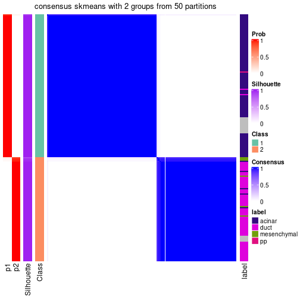</p>

</div>
<div id='tab-node-0222-consensus-heatmap-2'>
<pre><code class="r">consensus_heatmap(res, k = 3)
</code></pre>

<p>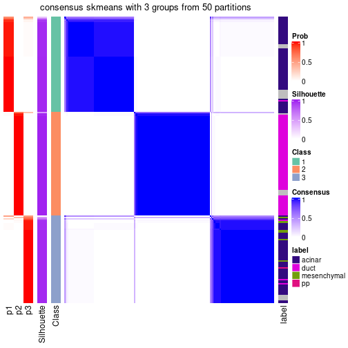</p>

</div>
<div id='tab-node-0222-consensus-heatmap-3'>
<pre><code class="r">consensus_heatmap(res, k = 4)
</code></pre>

<p>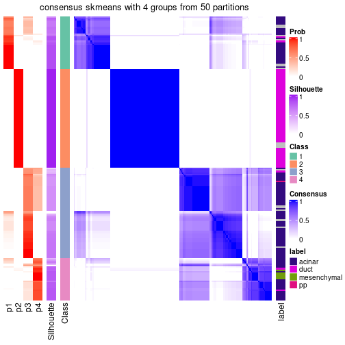</p>

</div>
</div>

Heatmaps for the membership of samples in all partitions to see how consistent they are:


<script>
$( function() {
	$( '#tabs-node-0222-membership-heatmap' ).tabs();
} );
</script>
<div id='tabs-node-0222-membership-heatmap'>
<ul>
<li><a href='#tab-node-0222-membership-heatmap-1'>k = 2</a></li>
<li><a href='#tab-node-0222-membership-heatmap-2'>k = 3</a></li>
<li><a href='#tab-node-0222-membership-heatmap-3'>k = 4</a></li>
</ul>
<div id='tab-node-0222-membership-heatmap-1'>
<pre><code class="r">membership_heatmap(res, k = 2)
</code></pre>

<p>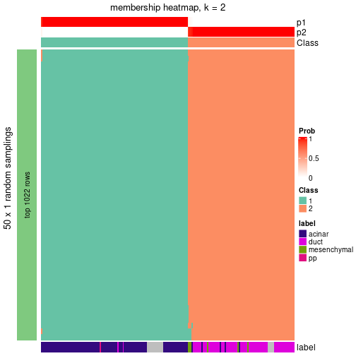</p>

</div>
<div id='tab-node-0222-membership-heatmap-2'>
<pre><code class="r">membership_heatmap(res, k = 3)
</code></pre>

<p>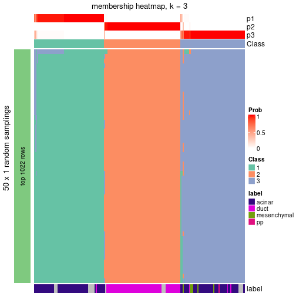</p>

</div>
<div id='tab-node-0222-membership-heatmap-3'>
<pre><code class="r">membership_heatmap(res, k = 4)
</code></pre>

<p>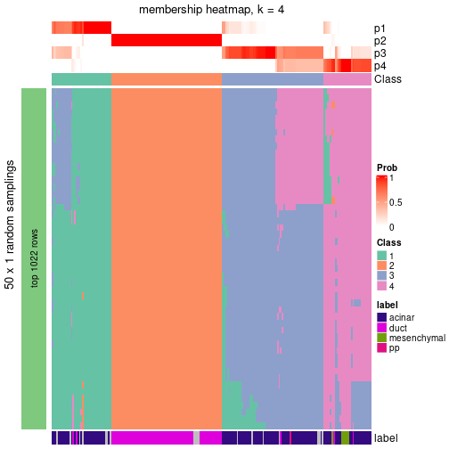</p>

</div>
</div>

As soon as the classes for columns are determined, the signatures
that are significantly different between subgroups can be looked for. 
Following are the heatmaps for signatures.


Signature heatmaps where rows are scaled:


<script>
$( function() {
	$( '#tabs-node-0222-get-signatures' ).tabs();
} );
</script>
<div id='tabs-node-0222-get-signatures'>
<ul>
<li><a href='#tab-node-0222-get-signatures-1'>k = 2</a></li>
<li><a href='#tab-node-0222-get-signatures-2'>k = 3</a></li>
<li><a href='#tab-node-0222-get-signatures-3'>k = 4</a></li>
</ul>
<div id='tab-node-0222-get-signatures-1'>
<pre><code class="r">get_signatures(res, k = 2)
</code></pre>

<p>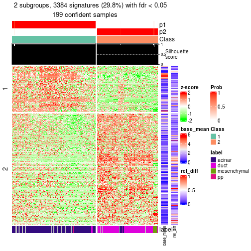</p>

</div>
<div id='tab-node-0222-get-signatures-2'>
<pre><code class="r">get_signatures(res, k = 3)
</code></pre>

<p>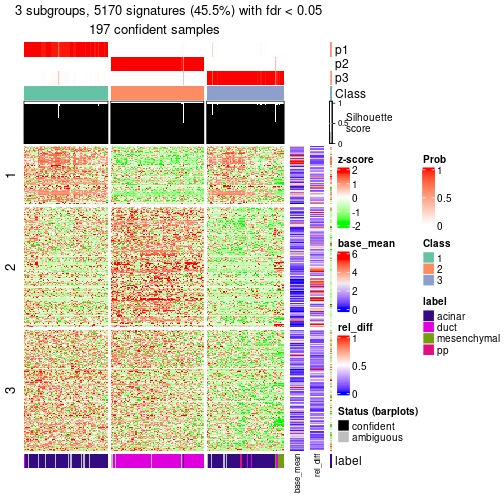</p>

</div>
<div id='tab-node-0222-get-signatures-3'>
<pre><code class="r">get_signatures(res, k = 4)
</code></pre>

<p>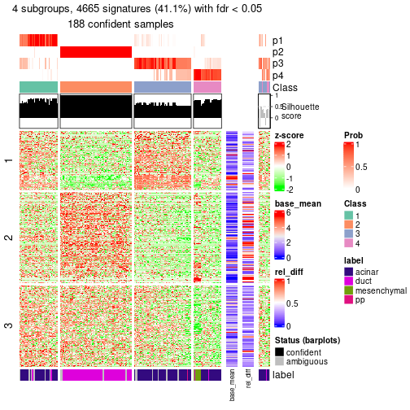</p>

</div>
</div>


Signature heatmaps where rows are not scaled:


<script>
$( function() {
	$( '#tabs-node-0222-get-signatures-no-scale' ).tabs();
} );
</script>
<div id='tabs-node-0222-get-signatures-no-scale'>
<ul>
<li><a href='#tab-node-0222-get-signatures-no-scale-1'>k = 2</a></li>
<li><a href='#tab-node-0222-get-signatures-no-scale-2'>k = 3</a></li>
<li><a href='#tab-node-0222-get-signatures-no-scale-3'>k = 4</a></li>
</ul>
<div id='tab-node-0222-get-signatures-no-scale-1'>
<pre><code class="r">get_signatures(res, k = 2, scale_rows = FALSE)
</code></pre>

<p>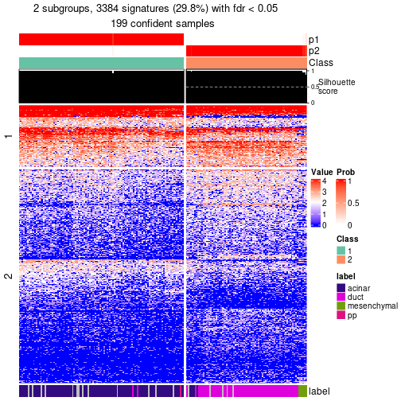</p>

</div>
<div id='tab-node-0222-get-signatures-no-scale-2'>
<pre><code class="r">get_signatures(res, k = 3, scale_rows = FALSE)
</code></pre>

<p>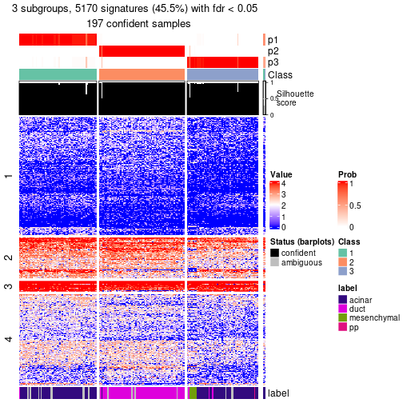</p>

</div>
<div id='tab-node-0222-get-signatures-no-scale-3'>
<pre><code class="r">get_signatures(res, k = 4, scale_rows = FALSE)
</code></pre>

<p>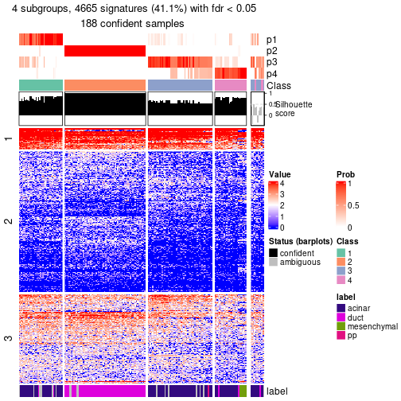</p>

</div>
</div>


Compare the overlap of signatures from different k:

```r
compare_signatures(res)
```

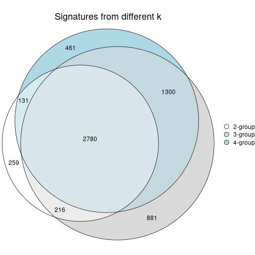

`get_signature()` returns a data frame invisibly. To get the list of signatures, the function
call should be assigned to a variable explicitly. In following code, if `plot` argument is set
to `FALSE`, no heatmap is plotted while only the differential analysis is performed.

```r
# code only for demonstration
tb = get_signature(res, k = ..., plot = FALSE)
```

An example of the output of `tb` is:

```
#>   which_row         fdr    mean_1    mean_2 scaled_mean_1 scaled_mean_2 km
#> 1        38 0.042760348  8.373488  9.131774    -0.5533452     0.5164555  1
#> 2        40 0.018707592  7.106213  8.469186    -0.6173731     0.5762149  1
#> 3        55 0.019134737 10.221463 11.207825    -0.6159697     0.5749050  1
#> 4        59 0.006059896  5.921854  7.869574    -0.6899429     0.6439467  1
#> 5        60 0.018055526  8.928898 10.211722    -0.6204761     0.5791110  1
#> 6        98 0.009384629 15.714769 14.887706     0.6635654    -0.6193277  2
...
```

The columns in `tb` are:

1. `which_row`: row indices corresponding to the input matrix.
2. `fdr`: FDR for the differential test. 
3. `mean_x`: The mean value in group x.
4. `scaled_mean_x`: The mean value in group x after rows are scaled.
5. `km`: Row groups if k-means clustering is applied to rows (which is done by automatically selecting number of clusters).

If there are too many signatures, `top_signatures = ...` can be set to only show the 
signatures with the highest FDRs:

```r
# code only for demonstration
# e.g. to show the top 500 most significant rows
tb = get_signature(res, k = ..., top_signatures = 500)
```

If the signatures are defined as these which are uniquely high in current group, `diff_method` argument
can be set to `"uniquely_high_in_one_group"`:

```r
# code only for demonstration
tb = get_signature(res, k = ..., diff_method = "uniquely_high_in_one_group")
```


UMAP plot which shows how samples are separated.


<script>
$( function() {
	$( '#tabs-node-0222-dimension-reduction' ).tabs();
} );
</script>
<div id='tabs-node-0222-dimension-reduction'>
<ul>
<li><a href='#tab-node-0222-dimension-reduction-1'>k = 2</a></li>
<li><a href='#tab-node-0222-dimension-reduction-2'>k = 3</a></li>
<li><a href='#tab-node-0222-dimension-reduction-3'>k = 4</a></li>
</ul>
<div id='tab-node-0222-dimension-reduction-1'>
<pre><code class="r">dimension_reduction(res, k = 2, method = &quot;UMAP&quot;)
</code></pre>

<p>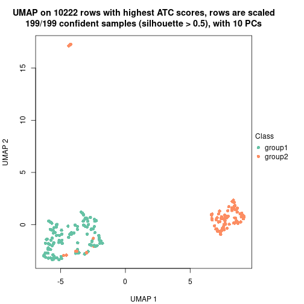</p>

</div>
<div id='tab-node-0222-dimension-reduction-2'>
<pre><code class="r">dimension_reduction(res, k = 3, method = &quot;UMAP&quot;)
</code></pre>

<p>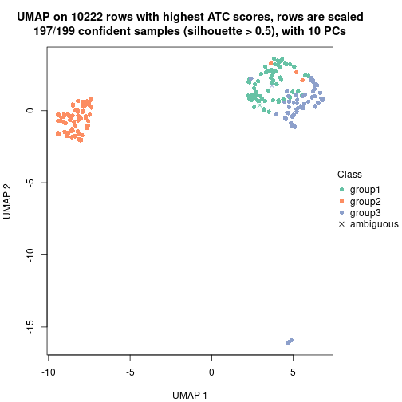</p>

</div>
<div id='tab-node-0222-dimension-reduction-3'>
<pre><code class="r">dimension_reduction(res, k = 4, method = &quot;UMAP&quot;)
</code></pre>

<p>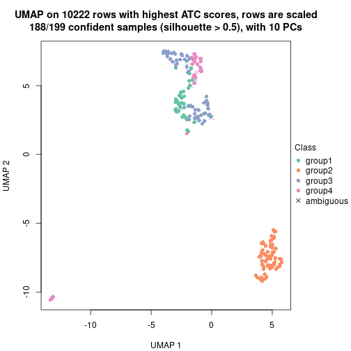</p>

</div>
</div>


Following heatmap shows how subgroups are split when increasing `k`:

```r
collect_classes(res)
```

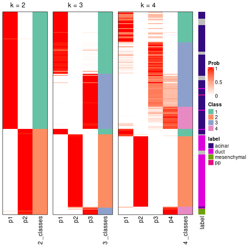


Test correlation between subgroups and known annotations. If the known
annotation is numeric, one-way ANOVA test is applied, and if the known
annotation is discrete, chi-squared contingency table test is applied.

```r
test_to_known_factors(res)
```

```
#>             n_sample label(p-value) k
#> ATC:skmeans      199       4.09e-33 2
#> ATC:skmeans      197       2.48e-34 3
#> ATC:skmeans      188       1.07e-35 4
```


If matrix rows can be associated to genes, consider to use `functional_enrichment(res,
...)` to perform function enrichment for the signature genes. See [this vignette](https://jokergoo.github.io/cola_vignettes/functional_enrichment.html) for more detailed explanations.


 

---------------------------------------------------


### Node023


Parent node: [Node02](#Node02).
Child nodes: 
                Node0121-leaf
        ,
                Node0122-leaf
        ,
                Node0123-leaf
        ,
                Node0124-leaf
        ,
                Node0131-leaf
        ,
                Node0132-leaf
        ,
                Node0133-leaf
        ,
                Node0211-leaf
        ,
                [Node0212](#Node0212)
        ,
                Node0213-leaf
        ,
                [Node0214](#Node0214)
        ,
                [Node0221](#Node0221)
        ,
                [Node0222](#Node0222)
        ,
                Node0223-leaf
        ,
                [Node0231](#Node0231)
        ,
                [Node0232](#Node0232)
        ,
                Node0233-leaf
        ,
                Node0234-leaf
        ,
                [Node0241](#Node0241)
        ,
                [Node0242](#Node0242)
        ,
                Node0243-leaf
        .


The object with results only for a single top-value method and a single partitioning method 
can be extracted as:

```r
res = res_rh["023"]
```

A summary of `res` and all the functions that can be applied to it:

```r
res
```

```
#> A 'ConsensusPartition' object with k = 2, 3, 4.
#>   On a matrix with 10659 rows and 461 columns.
#>   Top rows (1066) are extracted by 'ATC' method.
#>   Subgroups are detected by 'skmeans' method.
#>   Performed in total 150 partitions by row resampling.
#>   Best k for subgroups seems to be 4.
#> 
#> Following methods can be applied to this 'ConsensusPartition' object:
#>  [1] "cola_report"             "collect_classes"         "collect_plots"          
#>  [4] "collect_stats"           "colnames"                "compare_partitions"     
#>  [7] "compare_signatures"      "consensus_heatmap"       "dimension_reduction"    
#> [10] "functional_enrichment"   "get_anno_col"            "get_anno"               
#> [13] "get_classes"             "get_consensus"           "get_matrix"             
#> [16] "get_membership"          "get_param"               "get_signatures"         
#> [19] "get_stats"               "is_best_k"               "is_stable_k"            
#> [22] "membership_heatmap"      "ncol"                    "nrow"                   
#> [25] "plot_ecdf"               "predict_classes"         "rownames"               
#> [28] "select_partition_number" "show"                    "suggest_best_k"         
#> [31] "test_to_known_factors"   "top_rows_heatmap"
```

`collect_plots()` function collects all the plots made from `res` for all `k` (number of subgroups)
into one single page to provide an easy and fast comparison between different `k`.

```r
collect_plots(res)
```

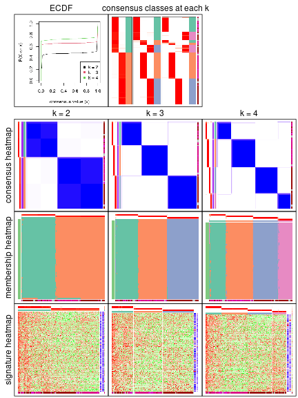

The plots are:

- The first row: a plot of the eCDF (empirical cumulative distribution
  function) curves of the consensus matrix for each `k` and the heatmap of
  predicted classes for each `k`.
- The second row: heatmaps of the consensus matrix for each `k`.
- The third row: heatmaps of the membership matrix for each `k`.
- The fouth row: heatmaps of the signatures for each `k`.

All the plots in panels can be made by individual functions and they are
plotted later in this section.

`select_partition_number()` produces several plots showing different
statistics for choosing "optimized" `k`. There are following statistics:

- eCDF curves of the consensus matrix for each `k`;
- 1-PAC. [The PAC score](https://en.wikipedia.org/wiki/Consensus_clustering#Over-interpretation_potential_of_consensus_clustering)
  measures the proportion of the ambiguous subgrouping.
- Mean silhouette score.
- Concordance. The mean probability of fiting the consensus subgroup labels in all
  partitions.
- Area increased. Denote $A_k$ as the area under the eCDF curve for current
  `k`, the area increased is defined as $A_k - A_{k-1}$.
- Rand index. The percent of pairs of samples that are both in a same cluster
  or both are not in a same cluster in the partition of k and k-1.
- Jaccard index. The ratio of pairs of samples are both in a same cluster in
  the partition of k and k-1 and the pairs of samples are both in a same
  cluster in the partition k or k-1.

The detailed explanations of these statistics can be found in [the _cola_
vignette](https://jokergoo.github.io/cola_vignettes/cola.html#toc_13).

Generally speaking, higher 1-PAC score, higher mean silhouette score or higher
concordance corresponds to better partition. Rand index and Jaccard index
measure how similar the current partition is compared to partition with `k-1`.
If they are too similar, we won't accept `k` is better than `k-1`.

```r
select_partition_number(res)
```

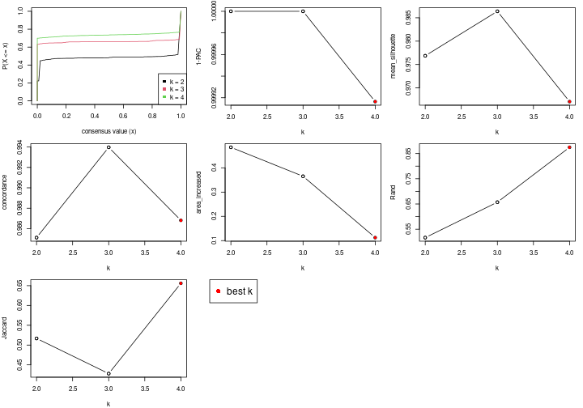

The numeric values for all these statistics can be obtained by `get_stats()`.

```r
get_stats(res)
```

```
#>   k 1-PAC mean_silhouette concordance area_increased  Rand Jaccard
#> 2 2     1           0.977       0.985          0.484 0.517   0.517
#> 3 3     1           0.986       0.994          0.365 0.657   0.428
#> 4 4     1           0.967       0.987          0.112 0.875   0.656
```

`suggest_best_k()` suggests the best $k$ based on these statistics. The rules are as follows:

- All $k$ with Jaccard index larger than 0.95 are removed because increasing
  $k$ does not provide enough extra information. If all $k$ are removed, it is
  marked as no subgroup is detected.
- For all $k$ with 1-PAC score larger than 0.9, the maximal $k$ is taken as
  the best $k$, and other $k$ are marked as optional $k$.
- If it does not fit the second rule. The $k$ with the maximal vote of the
  highest 1-PAC score, highest mean silhouette, and highest concordance is
  taken as the best $k$.

```r
suggest_best_k(res)
```

```
#> [1] 4
#> attr(,"optional")
#> [1] 2 3
```

There is also optional best $k$ = 2 3 that is worth to check.

Following is the table of the partitions (You need to click the **show/hide
code output** link to see it). The membership matrix (columns with name `p*`)
is inferred by
[`clue::cl_consensus()`](https://www.rdocumentation.org/link/cl_consensus?package=clue)
function with the `SE` method. Basically the value in the membership matrix
represents the probability to belong to a certain group. The finall subgroup
label for an item is determined with the group with highest probability it
belongs to.

In `get_classes()` function, the entropy is calculated from the membership
matrix and the silhouette score is calculated from the consensus matrix.


<script>
$( function() {
	$( '#tabs-node-023-get-classes' ).tabs();
} );
</script>
<div id='tabs-node-023-get-classes'>
<ul>
<li><a href='#tab-node-023-get-classes-1'>k = 2</a></li>
<li><a href='#tab-node-023-get-classes-2'>k = 3</a></li>
<li><a href='#tab-node-023-get-classes-3'>k = 4</a></li>
</ul>

<div id='tab-node-023-get-classes-1'>
<p><a id='tab-node-023-get-classes-1-a' style='color:#0366d6' href='#'>show/hide code output</a></p>
<pre><code class="r">cbind(get_classes(res, k = 2), get_membership(res, k = 2))
</code></pre>

<pre><code>#&gt;          class entropy silhouette   p1   p2
#&gt; D28-1_4      1   0.000     0.9855 1.00 0.00
#&gt; D28-1_15     2   0.000     0.9845 0.00 1.00
#&gt; D28-1_29     1   0.141     0.9837 0.98 0.02
#&gt; D28-1_30     2   0.827     0.6404 0.26 0.74
#&gt; D28-1_41     1   0.141     0.9837 0.98 0.02
#&gt; D28-1_61     2   0.141     0.9844 0.02 0.98
#&gt; D28-1_65     1   0.000     0.9855 1.00 0.00
#&gt; D28-1_74     1   0.141     0.9837 0.98 0.02
#&gt; D28-1_75     2   0.000     0.9845 0.00 1.00
#&gt; D28-1_85     1   0.000     0.9855 1.00 0.00
#&gt; D28-1_89     2   0.141     0.9844 0.02 0.98
#&gt; D28-2_2      1   0.141     0.9837 0.98 0.02
#&gt; D28-2_37     1   0.141     0.9837 0.98 0.02
#&gt; D28-2_38     2   0.141     0.9844 0.02 0.98
#&gt; D28-2_43     2   0.000     0.9845 0.00 1.00
#&gt; D28-2_51     2   0.000     0.9845 0.00 1.00
#&gt; D28-2_52     1   0.141     0.9837 0.98 0.02
#&gt; D28-2_65     1   0.141     0.9837 0.98 0.02
#&gt; D28-2_73     1   0.000     0.9855 1.00 0.00
#&gt; D28-2_85     2   0.000     0.9845 0.00 1.00
#&gt; D28-2_91     2   0.141     0.9844 0.02 0.98
#&gt; D28-3_5      2   0.000     0.9845 0.00 1.00
#&gt; D28-3_6      2   0.141     0.9844 0.02 0.98
#&gt; D28-3_7      2   0.000     0.9845 0.00 1.00
#&gt; D28-3_16     2   0.141     0.9844 0.02 0.98
#&gt; D28-3_30     2   0.141     0.9844 0.02 0.98
#&gt; D28-3_42     1   0.141     0.9837 0.98 0.02
#&gt; D28-3_61     2   0.141     0.9844 0.02 0.98
#&gt; D28-3_64     1   0.141     0.9837 0.98 0.02
#&gt; D28-3_69     1   0.141     0.9837 0.98 0.02
#&gt; D28-3_76     2   0.000     0.9845 0.00 1.00
#&gt; D28-3_92     2   0.000     0.9845 0.00 1.00
#&gt; D28-4_3      2   0.141     0.9844 0.02 0.98
#&gt; D28-4_13     1   0.141     0.9837 0.98 0.02
#&gt; D28-4_29     2   0.000     0.9845 0.00 1.00
#&gt; D28-4_31     1   0.000     0.9855 1.00 0.00
#&gt; D28-4_37     2   0.000     0.9845 0.00 1.00
#&gt; D28-4_39     2   0.000     0.9845 0.00 1.00
#&gt; D28-4_41     1   0.141     0.9837 0.98 0.02
#&gt; D28-4_56     2   0.000     0.9845 0.00 1.00
#&gt; D28-4_62     1   0.141     0.9837 0.98 0.02
#&gt; D28-4_65     2   0.000     0.9845 0.00 1.00
#&gt; D28-4_76     1   0.141     0.9837 0.98 0.02
#&gt; D28-4_77     1   0.000     0.9855 1.00 0.00
#&gt; D28-4_87     1   0.141     0.9837 0.98 0.02
#&gt; D28-5_1      1   0.000     0.9855 1.00 0.00
#&gt; D28-5_5      2   0.141     0.9844 0.02 0.98
#&gt; D28-5_14     1   0.402     0.9310 0.92 0.08
#&gt; D28-5_31     2   0.000     0.9845 0.00 1.00
#&gt; D28-5_49     1   0.000     0.9855 1.00 0.00
#&gt; D28-5_50     1   0.141     0.9837 0.98 0.02
#&gt; D28-5_52     1   0.141     0.9837 0.98 0.02
#&gt; D28-5_64     2   0.000     0.9845 0.00 1.00
#&gt; D28-5_65     2   0.000     0.9845 0.00 1.00
#&gt; D28-5_73     1   0.000     0.9855 1.00 0.00
#&gt; D28-5_74     2   0.000     0.9845 0.00 1.00
#&gt; D28-5_76     1   0.000     0.9855 1.00 0.00
#&gt; D28-5_87     1   0.141     0.9837 0.98 0.02
#&gt; D28-6_3      2   0.141     0.9844 0.02 0.98
#&gt; D28-6_13     2   0.000     0.9845 0.00 1.00
#&gt; D28-6_29     1   0.000     0.9855 1.00 0.00
#&gt; D28-6_52     1   0.141     0.9837 0.98 0.02
#&gt; D28-6_53     1   0.000     0.9855 1.00 0.00
#&gt; D28-6_65     2   0.000     0.9845 0.00 1.00
#&gt; D28-6_77     2   0.000     0.9845 0.00 1.00
#&gt; D28-6_86     1   0.000     0.9855 1.00 0.00
#&gt; D28-7_3      2   0.000     0.9845 0.00 1.00
#&gt; D28-7_4      1   0.000     0.9855 1.00 0.00
#&gt; D28-7_7      1   0.141     0.9837 0.98 0.02
#&gt; D28-7_19     1   0.141     0.9837 0.98 0.02
#&gt; D28-7_38     2   0.141     0.9844 0.02 0.98
#&gt; D28-7_40     1   0.000     0.9855 1.00 0.00
#&gt; D28-7_49     1   0.141     0.9837 0.98 0.02
#&gt; D28-7_61     1   0.141     0.9837 0.98 0.02
#&gt; D28-7_65     1   0.000     0.9855 1.00 0.00
#&gt; D28-7_73     1   0.000     0.9855 1.00 0.00
#&gt; D28-7_77     1   0.141     0.9837 0.98 0.02
#&gt; D28-8_2      1   0.141     0.9837 0.98 0.02
#&gt; D28-8_26     2   0.141     0.9844 0.02 0.98
#&gt; D28-8_27     2   0.000     0.9845 0.00 1.00
#&gt; D28-8_29     1   0.000     0.9855 1.00 0.00
#&gt; D28-8_61     2   0.141     0.9844 0.02 0.98
#&gt; D28-8_85     1   0.000     0.9855 1.00 0.00
#&gt; D28-8_86     1   0.000     0.9855 1.00 0.00
#&gt; D28-8_88     1   0.000     0.9855 1.00 0.00
#&gt; D29-1_1      2   0.000     0.9845 0.00 1.00
#&gt; D29-1_41     2   0.000     0.9845 0.00 1.00
#&gt; D29-1_48     1   0.000     0.9855 1.00 0.00
#&gt; D29-1_49     2   0.000     0.9845 0.00 1.00
#&gt; D29-1_50     1   0.141     0.9837 0.98 0.02
#&gt; D29-1_52     1   0.469     0.8855 0.90 0.10
#&gt; D29-1_53     2   0.141     0.9844 0.02 0.98
#&gt; D29-1_55     1   0.141     0.9837 0.98 0.02
#&gt; D29-1_57     1   0.000     0.9855 1.00 0.00
#&gt; D29-1_60     2   0.000     0.9845 0.00 1.00
#&gt; D29-1_69     2   0.000     0.9845 0.00 1.00
#&gt; D29-1_70     2   0.141     0.9844 0.02 0.98
#&gt; D29-1_78     2   0.141     0.9844 0.02 0.98
#&gt; D29-1_79     2   0.141     0.9844 0.02 0.98
#&gt; D29-1_80     2   0.000     0.9845 0.00 1.00
#&gt; D29-1_89     2   0.000     0.9845 0.00 1.00
#&gt; D29-2_20     2   0.141     0.9844 0.02 0.98
#&gt; D29-2_53     2   0.141     0.9844 0.02 0.98
#&gt; D29-2_56     2   0.141     0.9844 0.02 0.98
#&gt; D29-2_62     2   0.141     0.9844 0.02 0.98
#&gt; D29-2_66     2   0.141     0.9844 0.02 0.98
#&gt; D29-2_69     2   0.000     0.9845 0.00 1.00
#&gt; D29-2_89     2   0.141     0.9844 0.02 0.98
#&gt; D29-3_47     2   0.000     0.9845 0.00 1.00
#&gt; D29-3_61     2   0.141     0.9844 0.02 0.98
#&gt; D29-3_92     2   0.000     0.9845 0.00 1.00
#&gt; D29-4_46     1   0.141     0.9837 0.98 0.02
#&gt; D29-4_55     1   0.141     0.9837 0.98 0.02
#&gt; D29-4_61     2   0.000     0.9845 0.00 1.00
#&gt; D29-4_62     2   0.000     0.9845 0.00 1.00
#&gt; D29-4_94     2   0.141     0.9844 0.02 0.98
#&gt; D29-5_20     2   0.141     0.9844 0.02 0.98
#&gt; D29-5_23     2   0.141     0.9844 0.02 0.98
#&gt; D29-5_33     2   0.000     0.9845 0.00 1.00
#&gt; D29-5_43     2   0.000     0.9845 0.00 1.00
#&gt; D29-5_48     2   0.141     0.9844 0.02 0.98
#&gt; D29-5_49     1   0.141     0.9837 0.98 0.02
#&gt; D29-5_54     1   0.141     0.9837 0.98 0.02
#&gt; D29-5_55     1   0.000     0.9855 1.00 0.00
#&gt; D29-5_60     1   0.000     0.9855 1.00 0.00
#&gt; D29-5_68     1   0.141     0.9837 0.98 0.02
#&gt; D29-5_69     2   0.141     0.9844 0.02 0.98
#&gt; D29-5_82     2   0.000     0.9845 0.00 1.00
#&gt; D29-5_86     2   0.141     0.9844 0.02 0.98
#&gt; D29-5_87     1   0.141     0.9837 0.98 0.02
#&gt; D29-6_34     2   0.000     0.9845 0.00 1.00
#&gt; D29-6_41     2   0.000     0.9845 0.00 1.00
#&gt; D29-6_43     1   0.000     0.9855 1.00 0.00
#&gt; D29-6_48     1   0.141     0.9837 0.98 0.02
#&gt; D29-6_50     2   0.141     0.9844 0.02 0.98
#&gt; D29-6_64     2   0.000     0.9845 0.00 1.00
#&gt; D29-6_70     2   0.141     0.9844 0.02 0.98
#&gt; D29-6_77     1   0.000     0.9855 1.00 0.00
#&gt; D29-6_80     2   0.141     0.9844 0.02 0.98
#&gt; D29-6_89     1   0.141     0.9837 0.98 0.02
#&gt; D29-7_37     2   0.141     0.9844 0.02 0.98
#&gt; D29-7_41     1   0.000     0.9855 1.00 0.00
#&gt; D29-7_56     1   0.469     0.9082 0.90 0.10
#&gt; D29-7_57     2   0.000     0.9845 0.00 1.00
#&gt; D29-7_58     1   0.000     0.9855 1.00 0.00
#&gt; D29-7_64     2   0.000     0.9845 0.00 1.00
#&gt; D29-7_68     1   0.000     0.9855 1.00 0.00
#&gt; D29-7_70     1   0.141     0.9837 0.98 0.02
#&gt; D29-7_72     2   0.000     0.9845 0.00 1.00
#&gt; D29-7_76     2   0.000     0.9845 0.00 1.00
#&gt; D29-7_87     2   0.141     0.9844 0.02 0.98
#&gt; D31-1_46     2   0.000     0.9845 0.00 1.00
#&gt; D31-1_47     2   0.141     0.9844 0.02 0.98
#&gt; D31-1_53     2   0.141     0.9844 0.02 0.98
#&gt; D31-1_54     2   0.141     0.9844 0.02 0.98
#&gt; D31-1_60     1   0.141     0.9837 0.98 0.02
#&gt; D31-1_64     2   0.680     0.7750 0.18 0.82
#&gt; D31-1_66     1   0.141     0.9837 0.98 0.02
#&gt; D31-1_67     2   0.000     0.9845 0.00 1.00
#&gt; D31-1_68     2   0.141     0.9844 0.02 0.98
#&gt; D31-1_69     2   0.000     0.9845 0.00 1.00
#&gt; D31-1_79     2   0.141     0.9844 0.02 0.98
#&gt; D31-1_86     2   0.141     0.9844 0.02 0.98
#&gt; D31-1_87     1   0.327     0.9516 0.94 0.06
#&gt; D31-1_89     2   0.000     0.9845 0.00 1.00
#&gt; D31-1_91     2   0.000     0.9845 0.00 1.00
#&gt; D31-2_2      1   0.529     0.8844 0.88 0.12
#&gt; D31-2_9      2   0.000     0.9845 0.00 1.00
#&gt; D31-2_23     2   0.141     0.9844 0.02 0.98
#&gt; D31-2_34     2   0.141     0.9844 0.02 0.98
#&gt; D31-2_43     2   0.141     0.9844 0.02 0.98
#&gt; D31-2_45     2   0.000     0.9845 0.00 1.00
#&gt; D31-2_46     2   0.141     0.9844 0.02 0.98
#&gt; D31-2_48     2   0.141     0.9844 0.02 0.98
#&gt; D31-2_52     2   0.141     0.9844 0.02 0.98
#&gt; D31-2_56     2   0.000     0.9845 0.00 1.00
#&gt; D31-2_63     2   0.000     0.9845 0.00 1.00
#&gt; D31-2_66     2   0.141     0.9844 0.02 0.98
#&gt; D31-2_71     2   0.141     0.9844 0.02 0.98
#&gt; D31-2_72     2   0.141     0.9844 0.02 0.98
#&gt; D31-2_79     2   0.141     0.9844 0.02 0.98
#&gt; D31-2_82     1   0.141     0.9837 0.98 0.02
#&gt; D31-2_92     1   0.000     0.9855 1.00 0.00
#&gt; D31-3_42     2   0.141     0.9844 0.02 0.98
#&gt; D31-3_46     2   0.000     0.9845 0.00 1.00
#&gt; D31-3_66     1   0.000     0.9855 1.00 0.00
#&gt; D31-3_68     2   0.141     0.9844 0.02 0.98
#&gt; D31-3_76     2   0.000     0.9845 0.00 1.00
#&gt; D31-3_92     1   0.000     0.9855 1.00 0.00
#&gt; D31-4_1      2   0.000     0.9845 0.00 1.00
#&gt; D31-4_17     2   0.141     0.9844 0.02 0.98
#&gt; D31-4_21     1   0.000     0.9855 1.00 0.00
#&gt; D31-4_29     2   0.000     0.9845 0.00 1.00
#&gt; D31-4_34     2   0.141     0.9844 0.02 0.98
#&gt; D31-4_44     2   0.141     0.9844 0.02 0.98
#&gt; D31-4_45     2   0.141     0.9844 0.02 0.98
#&gt; D31-4_46     2   0.141     0.9844 0.02 0.98
#&gt; D31-4_49     1   0.000     0.9855 1.00 0.00
#&gt; D31-4_51     1   0.000     0.9855 1.00 0.00
#&gt; D31-4_53     2   0.000     0.9845 0.00 1.00
#&gt; D31-4_54     1   0.141     0.9837 0.98 0.02
#&gt; D31-4_58     2   0.141     0.9844 0.02 0.98
#&gt; D31-4_60     1   0.000     0.9855 1.00 0.00
#&gt; D31-4_61     2   0.000     0.9845 0.00 1.00
#&gt; D31-4_63     2   0.141     0.9844 0.02 0.98
#&gt; D31-4_64     1   0.000     0.9855 1.00 0.00
#&gt; D31-4_65     2   0.141     0.9844 0.02 0.98
#&gt; D31-4_66     1   0.000     0.9855 1.00 0.00
#&gt; D31-4_74     2   0.141     0.9844 0.02 0.98
#&gt; D31-4_82     1   0.000     0.9855 1.00 0.00
#&gt; D31-4_83     2   0.141     0.9844 0.02 0.98
#&gt; D31-4_84     2   0.000     0.9845 0.00 1.00
#&gt; D31-4_85     1   0.000     0.9855 1.00 0.00
#&gt; D31-4_87     1   0.141     0.9837 0.98 0.02
#&gt; D31-4_94     1   0.000     0.9855 1.00 0.00
#&gt; D31-5_46     2   0.141     0.9844 0.02 0.98
#&gt; D31-5_49     2   0.000     0.9845 0.00 1.00
#&gt; D31-5_62     2   0.000     0.9845 0.00 1.00
#&gt; D31-5_66     2   0.000     0.9845 0.00 1.00
#&gt; D31-5_67     2   0.000     0.9845 0.00 1.00
#&gt; D31-5_71     1   0.000     0.9855 1.00 0.00
#&gt; D31-5_84     2   0.141     0.9844 0.02 0.98
#&gt; D31-5_87     1   0.141     0.9837 0.98 0.02
#&gt; D31-6_19     2   0.141     0.9844 0.02 0.98
#&gt; D31-6_49     2   0.141     0.9844 0.02 0.98
#&gt; D31-6_58     2   0.141     0.9844 0.02 0.98
#&gt; D31-6_65     2   0.141     0.9844 0.02 0.98
#&gt; D31-6_76     2   0.141     0.9844 0.02 0.98
#&gt; D31-6_85     2   0.141     0.9844 0.02 0.98
#&gt; D31-6_87     2   0.141     0.9844 0.02 0.98
#&gt; D31-7_39     2   0.141     0.9844 0.02 0.98
#&gt; D31-7_61     2   0.000     0.9845 0.00 1.00
#&gt; D31-7_69     2   0.141     0.9844 0.02 0.98
#&gt; D31-7_76     2   0.141     0.9844 0.02 0.98
#&gt; D31-7_87     2   0.141     0.9844 0.02 0.98
#&gt; D31-7_93     2   0.000     0.9845 0.00 1.00
#&gt; D31-8_3      2   0.141     0.9844 0.02 0.98
#&gt; D31-8_6      2   0.000     0.9845 0.00 1.00
#&gt; D31-8_41     1   0.000     0.9855 1.00 0.00
#&gt; D31-8_43     2   0.141     0.9844 0.02 0.98
#&gt; D31-8_48     2   0.141     0.9844 0.02 0.98
#&gt; D31-8_49     2   0.141     0.9844 0.02 0.98
#&gt; D31-8_52     2   0.000     0.9845 0.00 1.00
#&gt; D31-8_60     1   0.999     0.0366 0.52 0.48
#&gt; D31-8_64     2   0.141     0.9844 0.02 0.98
#&gt; D31-8_65     2   0.000     0.9845 0.00 1.00
#&gt; D31-8_66     2   0.141     0.9844 0.02 0.98
#&gt; D31-8_78     2   0.141     0.9844 0.02 0.98
#&gt; D31-8_84     2   0.141     0.9844 0.02 0.98
#&gt; D31-8_86     1   0.141     0.9837 0.98 0.02
#&gt; D31-8_88     2   0.141     0.9844 0.02 0.98
#&gt; D30-1_4      2   0.000     0.9845 0.00 1.00
#&gt; D30-1_41     1   0.000     0.9855 1.00 0.00
#&gt; D30-1_52     1   0.000     0.9855 1.00 0.00
#&gt; D30-1_53     2   0.141     0.9844 0.02 0.98
#&gt; D30-1_56     1   0.141     0.9837 0.98 0.02
#&gt; D30-1_58     2   0.000     0.9845 0.00 1.00
#&gt; D30-1_66     1   0.000     0.9855 1.00 0.00
#&gt; D30-1_75     2   0.000     0.9845 0.00 1.00
#&gt; D30-2_3      2   0.141     0.9844 0.02 0.98
#&gt; D30-2_5      1   0.000     0.9855 1.00 0.00
#&gt; D30-2_7      1   0.000     0.9855 1.00 0.00
#&gt; D30-2_13     1   0.141     0.9837 0.98 0.02
#&gt; D30-2_16     1   0.141     0.9837 0.98 0.02
#&gt; D30-2_21     1   0.141     0.9837 0.98 0.02
#&gt; D30-2_22     2   0.141     0.9844 0.02 0.98
#&gt; D30-2_23     1   0.141     0.9837 0.98 0.02
#&gt; D30-2_28     2   0.000     0.9845 0.00 1.00
#&gt; D30-2_30     2   0.141     0.9844 0.02 0.98
#&gt; D30-2_32     2   0.141     0.9844 0.02 0.98
#&gt; D30-2_33     2   0.141     0.9844 0.02 0.98
#&gt; D30-2_37     2   0.141     0.9704 0.02 0.98
#&gt; D30-2_44     1   0.000     0.9855 1.00 0.00
#&gt; D30-2_46     1   0.000     0.9855 1.00 0.00
#&gt; D30-2_48     1   0.000     0.9855 1.00 0.00
#&gt; D30-2_49     1   0.000     0.9855 1.00 0.00
#&gt; D30-2_52     1   0.000     0.9855 1.00 0.00
#&gt; D30-2_54     2   0.141     0.9844 0.02 0.98
#&gt; D30-2_55     1   0.000     0.9855 1.00 0.00
#&gt; D30-2_57     1   0.000     0.9855 1.00 0.00
#&gt; D30-2_62     2   0.000     0.9845 0.00 1.00
#&gt; D30-2_65     2   0.000     0.9845 0.00 1.00
#&gt; D30-2_72     1   0.141     0.9837 0.98 0.02
#&gt; D30-2_75     1   0.000     0.9855 1.00 0.00
#&gt; D30-2_78     2   0.000     0.9845 0.00 1.00
#&gt; D30-2_81     2   0.000     0.9845 0.00 1.00
#&gt; D30-2_82     1   0.000     0.9855 1.00 0.00
#&gt; D30-2_83     1   0.000     0.9855 1.00 0.00
#&gt; D30-2_85     2   0.000     0.9845 0.00 1.00
#&gt; D30-2_87     2   0.141     0.9844 0.02 0.98
#&gt; D30-2_90     1   0.000     0.9855 1.00 0.00
#&gt; D30-3_3      2   0.141     0.9844 0.02 0.98
#&gt; D30-3_4      2   0.000     0.9845 0.00 1.00
#&gt; D30-3_13     1   0.000     0.9855 1.00 0.00
#&gt; D30-3_16     2   0.000     0.9845 0.00 1.00
#&gt; D30-3_23     1   0.000     0.9855 1.00 0.00
#&gt; D30-3_25     1   0.141     0.9837 0.98 0.02
#&gt; D30-3_35     2   0.000     0.9845 0.00 1.00
#&gt; D30-3_38     2   0.141     0.9844 0.02 0.98
#&gt; D30-3_41     2   0.000     0.9845 0.00 1.00
#&gt; D30-3_46     1   0.141     0.9837 0.98 0.02
#&gt; D30-3_47     2   0.000     0.9845 0.00 1.00
#&gt; D30-3_50     2   0.000     0.9845 0.00 1.00
#&gt; D30-3_52     2   0.141     0.9844 0.02 0.98
#&gt; D30-3_53     1   0.000     0.9855 1.00 0.00
#&gt; D30-3_54     1   0.000     0.9855 1.00 0.00
#&gt; D30-3_55     1   0.000     0.9855 1.00 0.00
#&gt; D30-3_57     1   0.000     0.9855 1.00 0.00
#&gt; D30-3_58     2   0.141     0.9844 0.02 0.98
#&gt; D30-3_60     2   0.000     0.9845 0.00 1.00
#&gt; D30-3_62     1   0.000     0.9855 1.00 0.00
#&gt; D30-3_64     2   0.000     0.9845 0.00 1.00
#&gt; D30-3_65     1   0.141     0.9837 0.98 0.02
#&gt; D30-3_67     2   0.141     0.9844 0.02 0.98
#&gt; D30-3_68     2   0.000     0.9845 0.00 1.00
#&gt; D30-3_69     1   0.000     0.9855 1.00 0.00
#&gt; D30-3_70     2   0.000     0.9845 0.00 1.00
#&gt; D30-3_71     1   0.000     0.9855 1.00 0.00
#&gt; D30-3_73     1   0.000     0.9855 1.00 0.00
#&gt; D30-3_77     1   0.000     0.9855 1.00 0.00
#&gt; D30-3_78     1   0.000     0.9855 1.00 0.00
#&gt; D30-3_79     1   0.141     0.9837 0.98 0.02
#&gt; D30-3_80     1   0.141     0.9837 0.98 0.02
#&gt; D30-3_86     2   0.000     0.9845 0.00 1.00
#&gt; D30-3_88     2   0.000     0.9845 0.00 1.00
#&gt; D30-3_89     1   0.000     0.9855 1.00 0.00
#&gt; D30-3_93     2   0.000     0.9845 0.00 1.00
#&gt; D30-4_1      1   0.000     0.9855 1.00 0.00
#&gt; D30-4_11     2   0.000     0.9845 0.00 1.00
#&gt; D30-4_15     1   0.000     0.9855 1.00 0.00
#&gt; D30-4_19     2   0.000     0.9845 0.00 1.00
#&gt; D30-4_20     2   0.000     0.9845 0.00 1.00
#&gt; D30-4_21     2   0.000     0.9845 0.00 1.00
#&gt; D30-4_32     1   0.000     0.9855 1.00 0.00
#&gt; D30-4_33     2   1.000     0.0348 0.50 0.50
#&gt; D30-4_37     2   0.000     0.9845 0.00 1.00
#&gt; D30-4_39     2   0.000     0.9845 0.00 1.00
#&gt; D30-4_40     2   0.000     0.9845 0.00 1.00
#&gt; D30-4_41     2   0.000     0.9845 0.00 1.00
#&gt; D30-4_48     2   0.141     0.9844 0.02 0.98
#&gt; D30-4_49     1   0.141     0.9837 0.98 0.02
#&gt; D30-4_50     1   0.141     0.9837 0.98 0.02
#&gt; D30-4_52     1   0.141     0.9837 0.98 0.02
#&gt; D30-4_59     1   0.000     0.9855 1.00 0.00
#&gt; D30-4_60     2   0.000     0.9845 0.00 1.00
#&gt; D30-4_61     1   0.000     0.9855 1.00 0.00
#&gt; D30-4_63     1   0.000     0.9855 1.00 0.00
#&gt; D30-4_66     1   0.000     0.9855 1.00 0.00
#&gt; D30-4_69     1   0.141     0.9837 0.98 0.02
#&gt; D30-4_71     1   0.000     0.9855 1.00 0.00
#&gt; D30-4_73     1   0.141     0.9837 0.98 0.02
#&gt; D30-4_76     2   0.141     0.9844 0.02 0.98
#&gt; D30-4_79     2   0.141     0.9844 0.02 0.98
#&gt; D30-4_86     1   0.141     0.9837 0.98 0.02
#&gt; D30-4_87     1   0.141     0.9837 0.98 0.02
#&gt; D30-4_94     1   0.141     0.9837 0.98 0.02
#&gt; D30-5_11     1   0.000     0.9855 1.00 0.00
#&gt; D30-5_17     2   0.141     0.9844 0.02 0.98
#&gt; D30-5_18     2   0.141     0.9844 0.02 0.98
#&gt; D30-5_23     2   0.000     0.9845 0.00 1.00
#&gt; D30-5_49     2   0.141     0.9844 0.02 0.98
#&gt; D30-5_57     2   0.141     0.9844 0.02 0.98
#&gt; D30-5_62     1   0.141     0.9837 0.98 0.02
#&gt; D30-5_66     2   0.469     0.8838 0.10 0.90
#&gt; D30-5_69     2   0.141     0.9844 0.02 0.98
#&gt; D30-5_70     2   0.000     0.9845 0.00 1.00
#&gt; D30-5_71     2   0.000     0.9845 0.00 1.00
#&gt; D30-5_82     2   0.141     0.9844 0.02 0.98
#&gt; D30-6_1      2   0.000     0.9845 0.00 1.00
#&gt; D30-6_4      2   0.000     0.9845 0.00 1.00
#&gt; D30-6_14     2   0.141     0.9844 0.02 0.98
#&gt; D30-6_21     2   0.141     0.9844 0.02 0.98
#&gt; D30-6_32     2   0.000     0.9845 0.00 1.00
#&gt; D30-6_33     1   0.141     0.9837 0.98 0.02
#&gt; D30-6_35     2   0.141     0.9844 0.02 0.98
#&gt; D30-6_42     2   0.000     0.9845 0.00 1.00
#&gt; D30-6_46     2   0.000     0.9845 0.00 1.00
#&gt; D30-6_49     1   0.000     0.9855 1.00 0.00
#&gt; D30-6_53     1   0.000     0.9855 1.00 0.00
#&gt; D30-6_54     2   0.584     0.8577 0.14 0.86
#&gt; D30-6_55     1   0.242     0.9702 0.96 0.04
#&gt; D30-6_56     2   0.141     0.9844 0.02 0.98
#&gt; D30-6_59     2   0.141     0.9844 0.02 0.98
#&gt; D30-6_60     2   0.141     0.9844 0.02 0.98
#&gt; D30-6_62     2   0.000     0.9845 0.00 1.00
#&gt; D30-6_66     2   0.000     0.9845 0.00 1.00
#&gt; D30-6_67     1   0.141     0.9837 0.98 0.02
#&gt; D30-6_68     2   0.141     0.9844 0.02 0.98
#&gt; D30-6_72     1   0.141     0.9837 0.98 0.02
#&gt; D30-6_76     2   0.141     0.9844 0.02 0.98
#&gt; D30-6_79     2   0.141     0.9844 0.02 0.98
#&gt; D30-6_82     2   0.000     0.9845 0.00 1.00
#&gt; D30-6_85     2   0.000     0.9845 0.00 1.00
#&gt; D30-6_87     2   0.000     0.9845 0.00 1.00
#&gt; D30-6_89     2   0.000     0.9845 0.00 1.00
#&gt; D30-6_92     2   0.141     0.9844 0.02 0.98
#&gt; D30-6_94     2   0.141     0.9844 0.02 0.98
#&gt; D30-7_2      1   0.141     0.9837 0.98 0.02
#&gt; D30-7_3      1   0.242     0.9526 0.96 0.04
#&gt; D30-7_4      2   0.141     0.9844 0.02 0.98
#&gt; D30-7_6      2   0.000     0.9845 0.00 1.00
#&gt; D30-7_9      2   0.000     0.9845 0.00 1.00
#&gt; D30-7_13     1   0.000     0.9855 1.00 0.00
#&gt; D30-7_18     1   0.402     0.9307 0.92 0.08
#&gt; D30-7_21     2   0.141     0.9844 0.02 0.98
#&gt; D30-7_23     2   0.141     0.9844 0.02 0.98
#&gt; D30-7_41     1   0.141     0.9837 0.98 0.02
#&gt; D30-7_42     1   0.141     0.9837 0.98 0.02
#&gt; D30-7_44     2   0.141     0.9844 0.02 0.98
#&gt; D30-7_47     1   0.141     0.9837 0.98 0.02
#&gt; D30-7_49     1   0.141     0.9837 0.98 0.02
#&gt; D30-7_52     1   0.141     0.9837 0.98 0.02
#&gt; D30-7_53     1   0.000     0.9855 1.00 0.00
#&gt; D30-7_54     1   0.000     0.9855 1.00 0.00
#&gt; D30-7_55     2   0.141     0.9844 0.02 0.98
#&gt; D30-7_56     1   0.000     0.9855 1.00 0.00
#&gt; D30-7_57     1   0.141     0.9837 0.98 0.02
#&gt; D30-7_62     2   0.141     0.9844 0.02 0.98
#&gt; D30-7_63     2   0.141     0.9844 0.02 0.98
#&gt; D30-7_64     2   0.000     0.9845 0.00 1.00
#&gt; D30-7_65     2   0.141     0.9705 0.02 0.98
#&gt; D30-7_66     1   0.141     0.9837 0.98 0.02
#&gt; D30-7_68     1   0.141     0.9837 0.98 0.02
#&gt; D30-7_71     1   0.141     0.9837 0.98 0.02
#&gt; D30-7_73     2   0.000     0.9845 0.00 1.00
#&gt; D30-7_75     2   0.000     0.9845 0.00 1.00
#&gt; D30-7_76     1   0.000     0.9855 1.00 0.00
#&gt; D30-7_78     2   0.000     0.9845 0.00 1.00
#&gt; D30-7_79     1   0.000     0.9855 1.00 0.00
#&gt; D30-7_80     1   0.000     0.9855 1.00 0.00
#&gt; D30-7_92     2   0.000     0.9845 0.00 1.00
#&gt; D30-7_93     2   0.000     0.9845 0.00 1.00
#&gt; D30-7_94     1   0.000     0.9855 1.00 0.00
#&gt; D30-8_2      2   0.000     0.9845 0.00 1.00
#&gt; D30-8_7      2   0.000     0.9845 0.00 1.00
#&gt; D30-8_11     2   0.000     0.9845 0.00 1.00
#&gt; D30-8_14     2   0.141     0.9844 0.02 0.98
#&gt; D30-8_19     2   0.000     0.9845 0.00 1.00
#&gt; D30-8_32     2   0.141     0.9844 0.02 0.98
#&gt; D30-8_43     2   0.827     0.6402 0.26 0.74
#&gt; D30-8_44     2   0.000     0.9845 0.00 1.00
#&gt; D30-8_45     1   0.000     0.9855 1.00 0.00
#&gt; D30-8_49     2   0.141     0.9844 0.02 0.98
#&gt; D30-8_52     1   0.141     0.9837 0.98 0.02
#&gt; D30-8_53     1   0.141     0.9837 0.98 0.02
#&gt; D30-8_54     2   0.000     0.9845 0.00 1.00
#&gt; D30-8_55     2   0.242     0.9698 0.04 0.96
#&gt; D30-8_59     1   0.000     0.9855 1.00 0.00
#&gt; D30-8_62     2   0.141     0.9844 0.02 0.98
#&gt; D30-8_64     1   0.141     0.9837 0.98 0.02
#&gt; D30-8_66     1   0.000     0.9855 1.00 0.00
#&gt; D30-8_67     1   0.141     0.9837 0.98 0.02
#&gt; D30-8_68     1   0.000     0.9855 1.00 0.00
#&gt; D30-8_71     2   0.000     0.9845 0.00 1.00
#&gt; D30-8_73     2   0.141     0.9844 0.02 0.98
#&gt; D30-8_77     2   0.000     0.9845 0.00 1.00
#&gt; D30-8_78     2   0.000     0.9845 0.00 1.00
#&gt; D30-8_80     2   0.141     0.9844 0.02 0.98
#&gt; D30-8_85     1   0.000     0.9855 1.00 0.00
#&gt; D30-8_86     1   0.000     0.9855 1.00 0.00
#&gt; D30-8_92     2   0.000     0.9845 0.00 1.00
</code></pre>

<script>
$('#tab-node-023-get-classes-1-a').parent().next().next().hide();
$('#tab-node-023-get-classes-1-a').click(function(){
  $('#tab-node-023-get-classes-1-a').parent().next().next().toggle();
  return(false);
});
</script>
</div>

<div id='tab-node-023-get-classes-2'>
<p><a id='tab-node-023-get-classes-2-a' style='color:#0366d6' href='#'>show/hide code output</a></p>
<pre><code class="r">cbind(get_classes(res, k = 3), get_membership(res, k = 3))
</code></pre>

<pre><code>#&gt;          class entropy silhouette   p1   p2   p3
#&gt; D28-1_4      1  0.0000      0.990 1.00 0.00 0.00
#&gt; D28-1_15     3  0.0000      0.996 0.00 0.00 1.00
#&gt; D28-1_29     1  0.0000      0.990 1.00 0.00 0.00
#&gt; D28-1_30     3  0.0000      0.996 0.00 0.00 1.00
#&gt; D28-1_41     3  0.0000      0.996 0.00 0.00 1.00
#&gt; D28-1_61     2  0.0000      0.994 0.00 1.00 0.00
#&gt; D28-1_65     1  0.0000      0.990 1.00 0.00 0.00
#&gt; D28-1_74     1  0.0000      0.990 1.00 0.00 0.00
#&gt; D28-1_75     3  0.0000      0.996 0.00 0.00 1.00
#&gt; D28-1_85     1  0.0000      0.990 1.00 0.00 0.00
#&gt; D28-1_89     2  0.0000      0.994 0.00 1.00 0.00
#&gt; D28-2_2      1  0.0000      0.990 1.00 0.00 0.00
#&gt; D28-2_37     1  0.0000      0.990 1.00 0.00 0.00
#&gt; D28-2_38     2  0.0000      0.994 0.00 1.00 0.00
#&gt; D28-2_43     3  0.0000      0.996 0.00 0.00 1.00
#&gt; D28-2_51     3  0.0000      0.996 0.00 0.00 1.00
#&gt; D28-2_52     3  0.0000      0.996 0.00 0.00 1.00
#&gt; D28-2_65     3  0.4796      0.716 0.22 0.00 0.78
#&gt; D28-2_73     1  0.0000      0.990 1.00 0.00 0.00
#&gt; D28-2_85     3  0.0000      0.996 0.00 0.00 1.00
#&gt; D28-2_91     2  0.0000      0.994 0.00 1.00 0.00
#&gt; D28-3_5      3  0.0000      0.996 0.00 0.00 1.00
#&gt; D28-3_6      2  0.0000      0.994 0.00 1.00 0.00
#&gt; D28-3_7      3  0.0000      0.996 0.00 0.00 1.00
#&gt; D28-3_16     2  0.0000      0.994 0.00 1.00 0.00
#&gt; D28-3_30     2  0.0000      0.994 0.00 1.00 0.00
#&gt; D28-3_42     3  0.0000      0.996 0.00 0.00 1.00
#&gt; D28-3_61     2  0.0000      0.994 0.00 1.00 0.00
#&gt; D28-3_64     3  0.0000      0.996 0.00 0.00 1.00
#&gt; D28-3_69     1  0.2537      0.910 0.92 0.00 0.08
#&gt; D28-3_76     3  0.0000      0.996 0.00 0.00 1.00
#&gt; D28-3_92     3  0.0000      0.996 0.00 0.00 1.00
#&gt; D28-4_3      2  0.0000      0.994 0.00 1.00 0.00
#&gt; D28-4_13     1  0.5948      0.445 0.64 0.00 0.36
#&gt; D28-4_29     3  0.0000      0.996 0.00 0.00 1.00
#&gt; D28-4_31     1  0.0000      0.990 1.00 0.00 0.00
#&gt; D28-4_37     3  0.0000      0.996 0.00 0.00 1.00
#&gt; D28-4_39     3  0.0000      0.996 0.00 0.00 1.00
#&gt; D28-4_41     3  0.0000      0.996 0.00 0.00 1.00
#&gt; D28-4_56     3  0.0000      0.996 0.00 0.00 1.00
#&gt; D28-4_62     1  0.0000      0.990 1.00 0.00 0.00
#&gt; D28-4_65     3  0.0000      0.996 0.00 0.00 1.00
#&gt; D28-4_76     1  0.0000      0.990 1.00 0.00 0.00
#&gt; D28-4_77     1  0.0000      0.990 1.00 0.00 0.00
#&gt; D28-4_87     3  0.0000      0.996 0.00 0.00 1.00
#&gt; D28-5_1      1  0.0000      0.990 1.00 0.00 0.00
#&gt; D28-5_5      2  0.0000      0.994 0.00 1.00 0.00
#&gt; D28-5_14     3  0.0000      0.996 0.00 0.00 1.00
#&gt; D28-5_31     3  0.0892      0.975 0.00 0.02 0.98
#&gt; D28-5_49     1  0.0000      0.990 1.00 0.00 0.00
#&gt; D28-5_50     3  0.0000      0.996 0.00 0.00 1.00
#&gt; D28-5_52     3  0.0000      0.996 0.00 0.00 1.00
#&gt; D28-5_64     3  0.0000      0.996 0.00 0.00 1.00
#&gt; D28-5_65     3  0.0000      0.996 0.00 0.00 1.00
#&gt; D28-5_73     1  0.0000      0.990 1.00 0.00 0.00
#&gt; D28-5_74     3  0.0000      0.996 0.00 0.00 1.00
#&gt; D28-5_76     1  0.0000      0.990 1.00 0.00 0.00
#&gt; D28-5_87     1  0.0000      0.990 1.00 0.00 0.00
#&gt; D28-6_3      2  0.0000      0.994 0.00 1.00 0.00
#&gt; D28-6_13     3  0.0000      0.996 0.00 0.00 1.00
#&gt; D28-6_29     1  0.0000      0.990 1.00 0.00 0.00
#&gt; D28-6_52     1  0.0000      0.990 1.00 0.00 0.00
#&gt; D28-6_53     1  0.0000      0.990 1.00 0.00 0.00
#&gt; D28-6_65     3  0.0000      0.996 0.00 0.00 1.00
#&gt; D28-6_77     3  0.0000      0.996 0.00 0.00 1.00
#&gt; D28-6_86     2  0.4555      0.753 0.20 0.80 0.00
#&gt; D28-7_3      3  0.0000      0.996 0.00 0.00 1.00
#&gt; D28-7_4      1  0.0000      0.990 1.00 0.00 0.00
#&gt; D28-7_7      3  0.0000      0.996 0.00 0.00 1.00
#&gt; D28-7_19     1  0.0000      0.990 1.00 0.00 0.00
#&gt; D28-7_38     2  0.0000      0.994 0.00 1.00 0.00
#&gt; D28-7_40     2  0.0000      0.994 0.00 1.00 0.00
#&gt; D28-7_49     1  0.0000      0.990 1.00 0.00 0.00
#&gt; D28-7_61     1  0.4291      0.785 0.82 0.00 0.18
#&gt; D28-7_65     1  0.0000      0.990 1.00 0.00 0.00
#&gt; D28-7_73     1  0.0000      0.990 1.00 0.00 0.00
#&gt; D28-7_77     1  0.0000      0.990 1.00 0.00 0.00
#&gt; D28-8_2      1  0.0000      0.990 1.00 0.00 0.00
#&gt; D28-8_26     2  0.0000      0.994 0.00 1.00 0.00
#&gt; D28-8_27     3  0.0000      0.996 0.00 0.00 1.00
#&gt; D28-8_29     1  0.0000      0.990 1.00 0.00 0.00
#&gt; D28-8_61     2  0.0000      0.994 0.00 1.00 0.00
#&gt; D28-8_85     2  0.4796      0.721 0.22 0.78 0.00
#&gt; D28-8_86     1  0.1529      0.951 0.96 0.04 0.00
#&gt; D28-8_88     1  0.0000      0.990 1.00 0.00 0.00
#&gt; D29-1_1      3  0.0000      0.996 0.00 0.00 1.00
#&gt; D29-1_41     3  0.0000      0.996 0.00 0.00 1.00
#&gt; D29-1_48     2  0.0000      0.994 0.00 1.00 0.00
#&gt; D29-1_49     2  0.0000      0.994 0.00 1.00 0.00
#&gt; D29-1_50     3  0.4291      0.780 0.18 0.00 0.82
#&gt; D29-1_52     2  0.0000      0.994 0.00 1.00 0.00
#&gt; D29-1_53     2  0.0000      0.994 0.00 1.00 0.00
#&gt; D29-1_55     3  0.2066      0.934 0.06 0.00 0.94
#&gt; D29-1_57     1  0.0000      0.990 1.00 0.00 0.00
#&gt; D29-1_60     3  0.0000      0.996 0.00 0.00 1.00
#&gt; D29-1_69     3  0.0000      0.996 0.00 0.00 1.00
#&gt; D29-1_70     2  0.0000      0.994 0.00 1.00 0.00
#&gt; D29-1_78     2  0.0000      0.994 0.00 1.00 0.00
#&gt; D29-1_79     2  0.0000      0.994 0.00 1.00 0.00
#&gt; D29-1_80     3  0.0000      0.996 0.00 0.00 1.00
#&gt; D29-1_89     3  0.0000      0.996 0.00 0.00 1.00
#&gt; D29-2_20     2  0.0000      0.994 0.00 1.00 0.00
#&gt; D29-2_53     2  0.0000      0.994 0.00 1.00 0.00
#&gt; D29-2_56     2  0.0000      0.994 0.00 1.00 0.00
#&gt; D29-2_62     2  0.0000      0.994 0.00 1.00 0.00
#&gt; D29-2_66     2  0.0000      0.994 0.00 1.00 0.00
#&gt; D29-2_69     3  0.0000      0.996 0.00 0.00 1.00
#&gt; D29-2_89     2  0.0000      0.994 0.00 1.00 0.00
#&gt; D29-3_47     3  0.0000      0.996 0.00 0.00 1.00
#&gt; D29-3_61     2  0.0000      0.994 0.00 1.00 0.00
#&gt; D29-3_92     3  0.0000      0.996 0.00 0.00 1.00
#&gt; D29-4_46     1  0.0000      0.990 1.00 0.00 0.00
#&gt; D29-4_55     1  0.0000      0.990 1.00 0.00 0.00
#&gt; D29-4_61     3  0.0000      0.996 0.00 0.00 1.00
#&gt; D29-4_62     3  0.0000      0.996 0.00 0.00 1.00
#&gt; D29-4_94     2  0.0000      0.994 0.00 1.00 0.00
#&gt; D29-5_20     2  0.0000      0.994 0.00 1.00 0.00
#&gt; D29-5_23     2  0.0000      0.994 0.00 1.00 0.00
#&gt; D29-5_33     3  0.0000      0.996 0.00 0.00 1.00
#&gt; D29-5_43     3  0.0000      0.996 0.00 0.00 1.00
#&gt; D29-5_48     2  0.0000      0.994 0.00 1.00 0.00
#&gt; D29-5_49     1  0.4555      0.754 0.80 0.00 0.20
#&gt; D29-5_54     3  0.0000      0.996 0.00 0.00 1.00
#&gt; D29-5_55     1  0.0000      0.990 1.00 0.00 0.00
#&gt; D29-5_60     1  0.0000      0.990 1.00 0.00 0.00
#&gt; D29-5_68     3  0.0000      0.996 0.00 0.00 1.00
#&gt; D29-5_69     2  0.0000      0.994 0.00 1.00 0.00
#&gt; D29-5_82     3  0.0000      0.996 0.00 0.00 1.00
#&gt; D29-5_86     2  0.0000      0.994 0.00 1.00 0.00
#&gt; D29-5_87     1  0.0000      0.990 1.00 0.00 0.00
#&gt; D29-6_34     3  0.0000      0.996 0.00 0.00 1.00
#&gt; D29-6_41     3  0.0000      0.996 0.00 0.00 1.00
#&gt; D29-6_43     2  0.0000      0.994 0.00 1.00 0.00
#&gt; D29-6_48     1  0.0000      0.990 1.00 0.00 0.00
#&gt; D29-6_50     2  0.0000      0.994 0.00 1.00 0.00
#&gt; D29-6_64     3  0.0000      0.996 0.00 0.00 1.00
#&gt; D29-6_70     2  0.0000      0.994 0.00 1.00 0.00
#&gt; D29-6_77     1  0.0000      0.990 1.00 0.00 0.00
#&gt; D29-6_80     2  0.0000      0.994 0.00 1.00 0.00
#&gt; D29-6_89     3  0.0000      0.996 0.00 0.00 1.00
#&gt; D29-7_37     2  0.0000      0.994 0.00 1.00 0.00
#&gt; D29-7_41     1  0.0000      0.990 1.00 0.00 0.00
#&gt; D29-7_56     3  0.0000      0.996 0.00 0.00 1.00
#&gt; D29-7_57     3  0.0000      0.996 0.00 0.00 1.00
#&gt; D29-7_58     2  0.0000      0.994 0.00 1.00 0.00
#&gt; D29-7_64     3  0.0000      0.996 0.00 0.00 1.00
#&gt; D29-7_68     1  0.0000      0.990 1.00 0.00 0.00
#&gt; D29-7_70     3  0.0000      0.996 0.00 0.00 1.00
#&gt; D29-7_72     3  0.0000      0.996 0.00 0.00 1.00
#&gt; D29-7_76     3  0.0000      0.996 0.00 0.00 1.00
#&gt; D29-7_87     2  0.0000      0.994 0.00 1.00 0.00
#&gt; D31-1_46     3  0.0000      0.996 0.00 0.00 1.00
#&gt; D31-1_47     2  0.0000      0.994 0.00 1.00 0.00
#&gt; D31-1_53     2  0.0000      0.994 0.00 1.00 0.00
#&gt; D31-1_54     2  0.0000      0.994 0.00 1.00 0.00
#&gt; D31-1_60     3  0.0000      0.996 0.00 0.00 1.00
#&gt; D31-1_64     3  0.0000      0.996 0.00 0.00 1.00
#&gt; D31-1_66     1  0.0000      0.990 1.00 0.00 0.00
#&gt; D31-1_67     3  0.0000      0.996 0.00 0.00 1.00
#&gt; D31-1_68     2  0.0000      0.994 0.00 1.00 0.00
#&gt; D31-1_69     3  0.0000      0.996 0.00 0.00 1.00
#&gt; D31-1_79     2  0.0000      0.994 0.00 1.00 0.00
#&gt; D31-1_86     2  0.0000      0.994 0.00 1.00 0.00
#&gt; D31-1_87     3  0.0000      0.996 0.00 0.00 1.00
#&gt; D31-1_89     3  0.0000      0.996 0.00 0.00 1.00
#&gt; D31-1_91     3  0.0000      0.996 0.00 0.00 1.00
#&gt; D31-2_2      3  0.0000      0.996 0.00 0.00 1.00
#&gt; D31-2_9      3  0.0000      0.996 0.00 0.00 1.00
#&gt; D31-2_23     2  0.0000      0.994 0.00 1.00 0.00
#&gt; D31-2_34     2  0.0000      0.994 0.00 1.00 0.00
#&gt; D31-2_43     2  0.0000      0.994 0.00 1.00 0.00
#&gt; D31-2_45     3  0.0000      0.996 0.00 0.00 1.00
#&gt; D31-2_46     2  0.0000      0.994 0.00 1.00 0.00
#&gt; D31-2_48     2  0.0000      0.994 0.00 1.00 0.00
#&gt; D31-2_52     2  0.0000      0.994 0.00 1.00 0.00
#&gt; D31-2_56     3  0.0000      0.996 0.00 0.00 1.00
#&gt; D31-2_63     3  0.0000      0.996 0.00 0.00 1.00
#&gt; D31-2_66     2  0.0000      0.994 0.00 1.00 0.00
#&gt; D31-2_71     2  0.0000      0.994 0.00 1.00 0.00
#&gt; D31-2_72     2  0.0000      0.994 0.00 1.00 0.00
#&gt; D31-2_79     2  0.0000      0.994 0.00 1.00 0.00
#&gt; D31-2_82     1  0.0000      0.990 1.00 0.00 0.00
#&gt; D31-2_92     2  0.0000      0.994 0.00 1.00 0.00
#&gt; D31-3_42     2  0.0000      0.994 0.00 1.00 0.00
#&gt; D31-3_46     3  0.0000      0.996 0.00 0.00 1.00
#&gt; D31-3_66     2  0.0000      0.994 0.00 1.00 0.00
#&gt; D31-3_68     2  0.0000      0.994 0.00 1.00 0.00
#&gt; D31-3_76     3  0.0000      0.996 0.00 0.00 1.00
#&gt; D31-3_92     2  0.0000      0.994 0.00 1.00 0.00
#&gt; D31-4_1      3  0.0000      0.996 0.00 0.00 1.00
#&gt; D31-4_17     2  0.0000      0.994 0.00 1.00 0.00
#&gt; D31-4_21     2  0.0000      0.994 0.00 1.00 0.00
#&gt; D31-4_29     3  0.0000      0.996 0.00 0.00 1.00
#&gt; D31-4_34     2  0.0000      0.994 0.00 1.00 0.00
#&gt; D31-4_44     2  0.0000      0.994 0.00 1.00 0.00
#&gt; D31-4_45     2  0.0000      0.994 0.00 1.00 0.00
#&gt; D31-4_46     2  0.0000      0.994 0.00 1.00 0.00
#&gt; D31-4_49     1  0.0000      0.990 1.00 0.00 0.00
#&gt; D31-4_51     2  0.0000      0.994 0.00 1.00 0.00
#&gt; D31-4_53     3  0.0000      0.996 0.00 0.00 1.00
#&gt; D31-4_54     3  0.0000      0.996 0.00 0.00 1.00
#&gt; D31-4_58     2  0.0000      0.994 0.00 1.00 0.00
#&gt; D31-4_60     1  0.0000      0.990 1.00 0.00 0.00
#&gt; D31-4_61     3  0.0000      0.996 0.00 0.00 1.00
#&gt; D31-4_63     2  0.0000      0.994 0.00 1.00 0.00
#&gt; D31-4_64     2  0.4555      0.753 0.20 0.80 0.00
#&gt; D31-4_65     2  0.0000      0.994 0.00 1.00 0.00
#&gt; D31-4_66     1  0.0000      0.990 1.00 0.00 0.00
#&gt; D31-4_74     2  0.0000      0.994 0.00 1.00 0.00
#&gt; D31-4_82     1  0.0000      0.990 1.00 0.00 0.00
#&gt; D31-4_83     2  0.0000      0.994 0.00 1.00 0.00
#&gt; D31-4_84     3  0.0000      0.996 0.00 0.00 1.00
#&gt; D31-4_85     2  0.0000      0.994 0.00 1.00 0.00
#&gt; D31-4_87     3  0.0000      0.996 0.00 0.00 1.00
#&gt; D31-4_94     2  0.0000      0.994 0.00 1.00 0.00
#&gt; D31-5_46     2  0.0000      0.994 0.00 1.00 0.00
#&gt; D31-5_49     3  0.0000      0.996 0.00 0.00 1.00
#&gt; D31-5_62     3  0.0000      0.996 0.00 0.00 1.00
#&gt; D31-5_66     2  0.0000      0.994 0.00 1.00 0.00
#&gt; D31-5_67     3  0.0000      0.996 0.00 0.00 1.00
#&gt; D31-5_71     1  0.0000      0.990 1.00 0.00 0.00
#&gt; D31-5_84     2  0.0000      0.994 0.00 1.00 0.00
#&gt; D31-5_87     1  0.0000      0.990 1.00 0.00 0.00
#&gt; D31-6_19     2  0.0000      0.994 0.00 1.00 0.00
#&gt; D31-6_49     2  0.0000      0.994 0.00 1.00 0.00
#&gt; D31-6_58     2  0.0000      0.994 0.00 1.00 0.00
#&gt; D31-6_65     2  0.0000      0.994 0.00 1.00 0.00
#&gt; D31-6_76     2  0.0000      0.994 0.00 1.00 0.00
#&gt; D31-6_85     2  0.0000      0.994 0.00 1.00 0.00
#&gt; D31-6_87     2  0.0000      0.994 0.00 1.00 0.00
#&gt; D31-7_39     2  0.0000      0.994 0.00 1.00 0.00
#&gt; D31-7_61     3  0.0000      0.996 0.00 0.00 1.00
#&gt; D31-7_69     2  0.0000      0.994 0.00 1.00 0.00
#&gt; D31-7_76     2  0.0000      0.994 0.00 1.00 0.00
#&gt; D31-7_87     2  0.0000      0.994 0.00 1.00 0.00
#&gt; D31-7_93     3  0.0000      0.996 0.00 0.00 1.00
#&gt; D31-8_3      2  0.0000      0.994 0.00 1.00 0.00
#&gt; D31-8_6      3  0.0000      0.996 0.00 0.00 1.00
#&gt; D31-8_41     2  0.0000      0.994 0.00 1.00 0.00
#&gt; D31-8_43     2  0.0000      0.994 0.00 1.00 0.00
#&gt; D31-8_48     2  0.0000      0.994 0.00 1.00 0.00
#&gt; D31-8_49     2  0.0000      0.994 0.00 1.00 0.00
#&gt; D31-8_52     3  0.0000      0.996 0.00 0.00 1.00
#&gt; D31-8_60     2  0.0000      0.994 0.00 1.00 0.00
#&gt; D31-8_64     2  0.0000      0.994 0.00 1.00 0.00
#&gt; D31-8_65     3  0.0000      0.996 0.00 0.00 1.00
#&gt; D31-8_66     2  0.0000      0.994 0.00 1.00 0.00
#&gt; D31-8_78     2  0.0000      0.994 0.00 1.00 0.00
#&gt; D31-8_84     2  0.0000      0.994 0.00 1.00 0.00
#&gt; D31-8_86     1  0.0000      0.990 1.00 0.00 0.00
#&gt; D31-8_88     2  0.0000      0.994 0.00 1.00 0.00
#&gt; D30-1_4      2  0.0000      0.994 0.00 1.00 0.00
#&gt; D30-1_41     1  0.0000      0.990 1.00 0.00 0.00
#&gt; D30-1_52     1  0.0000      0.990 1.00 0.00 0.00
#&gt; D30-1_53     2  0.0000      0.994 0.00 1.00 0.00
#&gt; D30-1_56     1  0.0892      0.972 0.98 0.00 0.02
#&gt; D30-1_58     3  0.0000      0.996 0.00 0.00 1.00
#&gt; D30-1_66     1  0.0000      0.990 1.00 0.00 0.00
#&gt; D30-1_75     3  0.0000      0.996 0.00 0.00 1.00
#&gt; D30-2_3      2  0.0000      0.994 0.00 1.00 0.00
#&gt; D30-2_5      1  0.0000      0.990 1.00 0.00 0.00
#&gt; D30-2_7      1  0.0000      0.990 1.00 0.00 0.00
#&gt; D30-2_13     1  0.0000      0.990 1.00 0.00 0.00
#&gt; D30-2_16     3  0.0000      0.996 0.00 0.00 1.00
#&gt; D30-2_21     3  0.0000      0.996 0.00 0.00 1.00
#&gt; D30-2_22     2  0.0000      0.994 0.00 1.00 0.00
#&gt; D30-2_23     3  0.0000      0.996 0.00 0.00 1.00
#&gt; D30-2_28     3  0.0000      0.996 0.00 0.00 1.00
#&gt; D30-2_30     2  0.0000      0.994 0.00 1.00 0.00
#&gt; D30-2_32     2  0.0000      0.994 0.00 1.00 0.00
#&gt; D30-2_33     2  0.0000      0.994 0.00 1.00 0.00
#&gt; D30-2_37     3  0.0000      0.996 0.00 0.00 1.00
#&gt; D30-2_44     1  0.0000      0.990 1.00 0.00 0.00
#&gt; D30-2_46     2  0.0000      0.994 0.00 1.00 0.00
#&gt; D30-2_48     1  0.0000      0.990 1.00 0.00 0.00
#&gt; D30-2_49     1  0.0000      0.990 1.00 0.00 0.00
#&gt; D30-2_52     1  0.0000      0.990 1.00 0.00 0.00
#&gt; D30-2_54     2  0.0000      0.994 0.00 1.00 0.00
#&gt; D30-2_55     1  0.0000      0.990 1.00 0.00 0.00
#&gt; D30-2_57     1  0.0000      0.990 1.00 0.00 0.00
#&gt; D30-2_62     3  0.0000      0.996 0.00 0.00 1.00
#&gt; D30-2_65     3  0.0000      0.996 0.00 0.00 1.00
#&gt; D30-2_72     1  0.0000      0.990 1.00 0.00 0.00
#&gt; D30-2_75     1  0.0000      0.990 1.00 0.00 0.00
#&gt; D30-2_78     3  0.0000      0.996 0.00 0.00 1.00
#&gt; D30-2_81     3  0.0000      0.996 0.00 0.00 1.00
#&gt; D30-2_82     1  0.0000      0.990 1.00 0.00 0.00
#&gt; D30-2_83     1  0.0000      0.990 1.00 0.00 0.00
#&gt; D30-2_85     3  0.0000      0.996 0.00 0.00 1.00
#&gt; D30-2_87     2  0.0000      0.994 0.00 1.00 0.00
#&gt; D30-2_90     2  0.5560      0.575 0.30 0.70 0.00
#&gt; D30-3_3      2  0.0000      0.994 0.00 1.00 0.00
#&gt; D30-3_4      3  0.0000      0.996 0.00 0.00 1.00
#&gt; D30-3_13     2  0.0000      0.994 0.00 1.00 0.00
#&gt; D30-3_16     3  0.0000      0.996 0.00 0.00 1.00
#&gt; D30-3_23     1  0.0000      0.990 1.00 0.00 0.00
#&gt; D30-3_25     3  0.0000      0.996 0.00 0.00 1.00
#&gt; D30-3_35     3  0.0000      0.996 0.00 0.00 1.00
#&gt; D30-3_38     2  0.0000      0.994 0.00 1.00 0.00
#&gt; D30-3_41     3  0.0000      0.996 0.00 0.00 1.00
#&gt; D30-3_46     1  0.4555      0.754 0.80 0.00 0.20
#&gt; D30-3_47     3  0.0000      0.996 0.00 0.00 1.00
#&gt; D30-3_50     3  0.0000      0.996 0.00 0.00 1.00
#&gt; D30-3_52     2  0.0000      0.994 0.00 1.00 0.00
#&gt; D30-3_53     1  0.0000      0.990 1.00 0.00 0.00
#&gt; D30-3_54     1  0.0000      0.990 1.00 0.00 0.00
#&gt; D30-3_55     2  0.0000      0.994 0.00 1.00 0.00
#&gt; D30-3_57     1  0.0000      0.990 1.00 0.00 0.00
#&gt; D30-3_58     2  0.0000      0.994 0.00 1.00 0.00
#&gt; D30-3_60     3  0.0000      0.996 0.00 0.00 1.00
#&gt; D30-3_62     1  0.0000      0.990 1.00 0.00 0.00
#&gt; D30-3_64     3  0.0000      0.996 0.00 0.00 1.00
#&gt; D30-3_65     3  0.0000      0.996 0.00 0.00 1.00
#&gt; D30-3_67     2  0.0000      0.994 0.00 1.00 0.00
#&gt; D30-3_68     3  0.0000      0.996 0.00 0.00 1.00
#&gt; D30-3_69     1  0.0000      0.990 1.00 0.00 0.00
#&gt; D30-3_70     3  0.0000      0.996 0.00 0.00 1.00
#&gt; D30-3_71     1  0.0000      0.990 1.00 0.00 0.00
#&gt; D30-3_73     1  0.0000      0.990 1.00 0.00 0.00
#&gt; D30-3_77     1  0.0000      0.990 1.00 0.00 0.00
#&gt; D30-3_78     1  0.0000      0.990 1.00 0.00 0.00
#&gt; D30-3_79     3  0.1529      0.956 0.04 0.00 0.96
#&gt; D30-3_80     3  0.0000      0.996 0.00 0.00 1.00
#&gt; D30-3_86     3  0.0000      0.996 0.00 0.00 1.00
#&gt; D30-3_88     3  0.0000      0.996 0.00 0.00 1.00
#&gt; D30-3_89     1  0.0000      0.990 1.00 0.00 0.00
#&gt; D30-3_93     3  0.0000      0.996 0.00 0.00 1.00
#&gt; D30-4_1      1  0.0000      0.990 1.00 0.00 0.00
#&gt; D30-4_11     3  0.0000      0.996 0.00 0.00 1.00
#&gt; D30-4_15     1  0.0000      0.990 1.00 0.00 0.00
#&gt; D30-4_19     3  0.0000      0.996 0.00 0.00 1.00
#&gt; D30-4_20     3  0.0000      0.996 0.00 0.00 1.00
#&gt; D30-4_21     3  0.0000      0.996 0.00 0.00 1.00
#&gt; D30-4_32     1  0.0000      0.990 1.00 0.00 0.00
#&gt; D30-4_33     2  0.0000      0.994 0.00 1.00 0.00
#&gt; D30-4_37     3  0.0000      0.996 0.00 0.00 1.00
#&gt; D30-4_39     3  0.0000      0.996 0.00 0.00 1.00
#&gt; D30-4_40     3  0.3340      0.862 0.00 0.12 0.88
#&gt; D30-4_41     3  0.0000      0.996 0.00 0.00 1.00
#&gt; D30-4_48     2  0.0000      0.994 0.00 1.00 0.00
#&gt; D30-4_49     1  0.0000      0.990 1.00 0.00 0.00
#&gt; D30-4_50     3  0.0000      0.996 0.00 0.00 1.00
#&gt; D30-4_52     1  0.0000      0.990 1.00 0.00 0.00
#&gt; D30-4_59     1  0.0000      0.990 1.00 0.00 0.00
#&gt; D30-4_60     3  0.0000      0.996 0.00 0.00 1.00
#&gt; D30-4_61     1  0.0000      0.990 1.00 0.00 0.00
#&gt; D30-4_63     1  0.0000      0.990 1.00 0.00 0.00
#&gt; D30-4_66     1  0.0000      0.990 1.00 0.00 0.00
#&gt; D30-4_69     3  0.0000      0.996 0.00 0.00 1.00
#&gt; D30-4_71     2  0.0000      0.994 0.00 1.00 0.00
#&gt; D30-4_73     1  0.0000      0.990 1.00 0.00 0.00
#&gt; D30-4_76     2  0.0000      0.994 0.00 1.00 0.00
#&gt; D30-4_79     2  0.0000      0.994 0.00 1.00 0.00
#&gt; D30-4_86     1  0.0000      0.990 1.00 0.00 0.00
#&gt; D30-4_87     1  0.0000      0.990 1.00 0.00 0.00
#&gt; D30-4_94     3  0.0892      0.977 0.02 0.00 0.98
#&gt; D30-5_11     1  0.0000      0.990 1.00 0.00 0.00
#&gt; D30-5_17     2  0.0000      0.994 0.00 1.00 0.00
#&gt; D30-5_18     2  0.0000      0.994 0.00 1.00 0.00
#&gt; D30-5_23     3  0.0000      0.996 0.00 0.00 1.00
#&gt; D30-5_49     2  0.0000      0.994 0.00 1.00 0.00
#&gt; D30-5_57     2  0.0000      0.994 0.00 1.00 0.00
#&gt; D30-5_62     1  0.0000      0.990 1.00 0.00 0.00
#&gt; D30-5_66     3  0.0000      0.996 0.00 0.00 1.00
#&gt; D30-5_69     2  0.0000      0.994 0.00 1.00 0.00
#&gt; D30-5_70     3  0.0000      0.996 0.00 0.00 1.00
#&gt; D30-5_71     3  0.0000      0.996 0.00 0.00 1.00
#&gt; D30-5_82     2  0.0000      0.994 0.00 1.00 0.00
#&gt; D30-6_1      3  0.0000      0.996 0.00 0.00 1.00
#&gt; D30-6_4      3  0.0000      0.996 0.00 0.00 1.00
#&gt; D30-6_14     2  0.0000      0.994 0.00 1.00 0.00
#&gt; D30-6_21     2  0.0000      0.994 0.00 1.00 0.00
#&gt; D30-6_32     3  0.0000      0.996 0.00 0.00 1.00
#&gt; D30-6_33     1  0.0892      0.972 0.98 0.00 0.02
#&gt; D30-6_35     2  0.0000      0.994 0.00 1.00 0.00
#&gt; D30-6_42     3  0.0000      0.996 0.00 0.00 1.00
#&gt; D30-6_46     3  0.0000      0.996 0.00 0.00 1.00
#&gt; D30-6_49     1  0.0000      0.990 1.00 0.00 0.00
#&gt; D30-6_53     1  0.0000      0.990 1.00 0.00 0.00
#&gt; D30-6_54     2  0.0000      0.994 0.00 1.00 0.00
#&gt; D30-6_55     3  0.0000      0.996 0.00 0.00 1.00
#&gt; D30-6_56     2  0.0000      0.994 0.00 1.00 0.00
#&gt; D30-6_59     2  0.0000      0.994 0.00 1.00 0.00
#&gt; D30-6_60     2  0.0000      0.994 0.00 1.00 0.00
#&gt; D30-6_62     3  0.0000      0.996 0.00 0.00 1.00
#&gt; D30-6_66     3  0.0000      0.996 0.00 0.00 1.00
#&gt; D30-6_67     1  0.0000      0.990 1.00 0.00 0.00
#&gt; D30-6_68     2  0.0000      0.994 0.00 1.00 0.00
#&gt; D30-6_72     1  0.0000      0.990 1.00 0.00 0.00
#&gt; D30-6_76     2  0.0000      0.994 0.00 1.00 0.00
#&gt; D30-6_79     2  0.0000      0.994 0.00 1.00 0.00
#&gt; D30-6_82     3  0.0000      0.996 0.00 0.00 1.00
#&gt; D30-6_85     3  0.0000      0.996 0.00 0.00 1.00
#&gt; D30-6_87     3  0.0000      0.996 0.00 0.00 1.00
#&gt; D30-6_89     3  0.0000      0.996 0.00 0.00 1.00
#&gt; D30-6_92     2  0.0000      0.994 0.00 1.00 0.00
#&gt; D30-6_94     2  0.0000      0.994 0.00 1.00 0.00
#&gt; D30-7_2      3  0.0000      0.996 0.00 0.00 1.00
#&gt; D30-7_3      2  0.0000      0.994 0.00 1.00 0.00
#&gt; D30-7_4      2  0.0000      0.994 0.00 1.00 0.00
#&gt; D30-7_6      3  0.0000      0.996 0.00 0.00 1.00
#&gt; D30-7_9      3  0.0000      0.996 0.00 0.00 1.00
#&gt; D30-7_13     1  0.0000      0.990 1.00 0.00 0.00
#&gt; D30-7_18     3  0.0000      0.996 0.00 0.00 1.00
#&gt; D30-7_21     2  0.0000      0.994 0.00 1.00 0.00
#&gt; D30-7_23     2  0.0000      0.994 0.00 1.00 0.00
#&gt; D30-7_41     1  0.0000      0.990 1.00 0.00 0.00
#&gt; D30-7_42     3  0.0000      0.996 0.00 0.00 1.00
#&gt; D30-7_44     2  0.0000      0.994 0.00 1.00 0.00
#&gt; D30-7_47     1  0.0000      0.990 1.00 0.00 0.00
#&gt; D30-7_49     1  0.0000      0.990 1.00 0.00 0.00
#&gt; D30-7_52     1  0.0000      0.990 1.00 0.00 0.00
#&gt; D30-7_53     1  0.0000      0.990 1.00 0.00 0.00
#&gt; D30-7_54     1  0.0000      0.990 1.00 0.00 0.00
#&gt; D30-7_55     2  0.0000      0.994 0.00 1.00 0.00
#&gt; D30-7_56     2  0.0000      0.994 0.00 1.00 0.00
#&gt; D30-7_57     1  0.0000      0.990 1.00 0.00 0.00
#&gt; D30-7_62     2  0.0000      0.994 0.00 1.00 0.00
#&gt; D30-7_63     2  0.0000      0.994 0.00 1.00 0.00
#&gt; D30-7_64     3  0.0000      0.996 0.00 0.00 1.00
#&gt; D30-7_65     3  0.0000      0.996 0.00 0.00 1.00
#&gt; D30-7_66     3  0.0000      0.996 0.00 0.00 1.00
#&gt; D30-7_68     1  0.0000      0.990 1.00 0.00 0.00
#&gt; D30-7_71     3  0.0000      0.996 0.00 0.00 1.00
#&gt; D30-7_73     3  0.0000      0.996 0.00 0.00 1.00
#&gt; D30-7_75     3  0.0000      0.996 0.00 0.00 1.00
#&gt; D30-7_76     1  0.0000      0.990 1.00 0.00 0.00
#&gt; D30-7_78     3  0.0000      0.996 0.00 0.00 1.00
#&gt; D30-7_79     1  0.0000      0.990 1.00 0.00 0.00
#&gt; D30-7_80     1  0.2066      0.930 0.94 0.06 0.00
#&gt; D30-7_92     3  0.0000      0.996 0.00 0.00 1.00
#&gt; D30-7_93     3  0.0000      0.996 0.00 0.00 1.00
#&gt; D30-7_94     1  0.0000      0.990 1.00 0.00 0.00
#&gt; D30-8_2      3  0.0000      0.996 0.00 0.00 1.00
#&gt; D30-8_7      3  0.0000      0.996 0.00 0.00 1.00
#&gt; D30-8_11     3  0.0000      0.996 0.00 0.00 1.00
#&gt; D30-8_14     2  0.0000      0.994 0.00 1.00 0.00
#&gt; D30-8_19     3  0.0000      0.996 0.00 0.00 1.00
#&gt; D30-8_32     2  0.0000      0.994 0.00 1.00 0.00
#&gt; D30-8_43     3  0.0000      0.996 0.00 0.00 1.00
#&gt; D30-8_44     3  0.0000      0.996 0.00 0.00 1.00
#&gt; D30-8_45     1  0.0000      0.990 1.00 0.00 0.00
#&gt; D30-8_49     2  0.0000      0.994 0.00 1.00 0.00
#&gt; D30-8_52     3  0.0000      0.996 0.00 0.00 1.00
#&gt; D30-8_53     1  0.0000      0.990 1.00 0.00 0.00
#&gt; D30-8_54     3  0.0000      0.996 0.00 0.00 1.00
#&gt; D30-8_55     2  0.0000      0.994 0.00 1.00 0.00
#&gt; D30-8_59     1  0.0000      0.990 1.00 0.00 0.00
#&gt; D30-8_62     2  0.0000      0.994 0.00 1.00 0.00
#&gt; D30-8_64     1  0.0000      0.990 1.00 0.00 0.00
#&gt; D30-8_66     1  0.0000      0.990 1.00 0.00 0.00
#&gt; D30-8_67     1  0.0000      0.990 1.00 0.00 0.00
#&gt; D30-8_68     1  0.0000      0.990 1.00 0.00 0.00
#&gt; D30-8_71     3  0.0000      0.996 0.00 0.00 1.00
#&gt; D30-8_73     2  0.0000      0.994 0.00 1.00 0.00
#&gt; D30-8_77     3  0.0000      0.996 0.00 0.00 1.00
#&gt; D30-8_78     3  0.0000      0.996 0.00 0.00 1.00
#&gt; D30-8_80     2  0.0000      0.994 0.00 1.00 0.00
#&gt; D30-8_85     1  0.1529      0.951 0.96 0.04 0.00
#&gt; D30-8_86     1  0.0000      0.990 1.00 0.00 0.00
#&gt; D30-8_92     3  0.0000      0.996 0.00 0.00 1.00
</code></pre>

<script>
$('#tab-node-023-get-classes-2-a').parent().next().next().hide();
$('#tab-node-023-get-classes-2-a').click(function(){
  $('#tab-node-023-get-classes-2-a').parent().next().next().toggle();
  return(false);
});
</script>
</div>

<div id='tab-node-023-get-classes-3'>
<p><a id='tab-node-023-get-classes-3-a' style='color:#0366d6' href='#'>show/hide code output</a></p>
<pre><code class="r">cbind(get_classes(res, k = 4), get_membership(res, k = 4))
</code></pre>

<pre><code>#&gt;          class entropy silhouette   p1   p2   p3   p4
#&gt; D28-1_4      1  0.0000    0.97369 1.00 0.00 0.00 0.00
#&gt; D28-1_15     3  0.0000    0.99546 0.00 0.00 1.00 0.00
#&gt; D28-1_29     4  0.0000    0.97465 0.00 0.00 0.00 1.00
#&gt; D28-1_30     3  0.1637    0.93213 0.00 0.00 0.94 0.06
#&gt; D28-1_41     4  0.0000    0.97465 0.00 0.00 0.00 1.00
#&gt; D28-1_61     2  0.0000    0.98904 0.00 1.00 0.00 0.00
#&gt; D28-1_65     1  0.0000    0.97369 1.00 0.00 0.00 0.00
#&gt; D28-1_74     4  0.0000    0.97465 0.00 0.00 0.00 1.00
#&gt; D28-1_75     3  0.0000    0.99546 0.00 0.00 1.00 0.00
#&gt; D28-1_85     1  0.0000    0.97369 1.00 0.00 0.00 0.00
#&gt; D28-1_89     2  0.0000    0.98904 0.00 1.00 0.00 0.00
#&gt; D28-2_2      4  0.0000    0.97465 0.00 0.00 0.00 1.00
#&gt; D28-2_37     1  0.4977    0.14403 0.54 0.00 0.00 0.46
#&gt; D28-2_38     2  0.0000    0.98904 0.00 1.00 0.00 0.00
#&gt; D28-2_43     3  0.0000    0.99546 0.00 0.00 1.00 0.00
#&gt; D28-2_51     3  0.0000    0.99546 0.00 0.00 1.00 0.00
#&gt; D28-2_52     4  0.0000    0.97465 0.00 0.00 0.00 1.00
#&gt; D28-2_65     4  0.0000    0.97465 0.00 0.00 0.00 1.00
#&gt; D28-2_73     1  0.0000    0.97369 1.00 0.00 0.00 0.00
#&gt; D28-2_85     3  0.0000    0.99546 0.00 0.00 1.00 0.00
#&gt; D28-2_91     2  0.0000    0.98904 0.00 1.00 0.00 0.00
#&gt; D28-3_5      3  0.0000    0.99546 0.00 0.00 1.00 0.00
#&gt; D28-3_6      2  0.0000    0.98904 0.00 1.00 0.00 0.00
#&gt; D28-3_7      3  0.0000    0.99546 0.00 0.00 1.00 0.00
#&gt; D28-3_16     2  0.0000    0.98904 0.00 1.00 0.00 0.00
#&gt; D28-3_30     2  0.0000    0.98904 0.00 1.00 0.00 0.00
#&gt; D28-3_42     4  0.0000    0.97465 0.00 0.00 0.00 1.00
#&gt; D28-3_61     2  0.0000    0.98904 0.00 1.00 0.00 0.00
#&gt; D28-3_64     4  0.0000    0.97465 0.00 0.00 0.00 1.00
#&gt; D28-3_69     4  0.0000    0.97465 0.00 0.00 0.00 1.00
#&gt; D28-3_76     3  0.0000    0.99546 0.00 0.00 1.00 0.00
#&gt; D28-3_92     3  0.0000    0.99546 0.00 0.00 1.00 0.00
#&gt; D28-4_3      2  0.0000    0.98904 0.00 1.00 0.00 0.00
#&gt; D28-4_13     4  0.0000    0.97465 0.00 0.00 0.00 1.00
#&gt; D28-4_29     3  0.0000    0.99546 0.00 0.00 1.00 0.00
#&gt; D28-4_31     1  0.0000    0.97369 1.00 0.00 0.00 0.00
#&gt; D28-4_37     3  0.0000    0.99546 0.00 0.00 1.00 0.00
#&gt; D28-4_39     3  0.0000    0.99546 0.00 0.00 1.00 0.00
#&gt; D28-4_41     4  0.2647    0.85487 0.00 0.00 0.12 0.88
#&gt; D28-4_56     3  0.0000    0.99546 0.00 0.00 1.00 0.00
#&gt; D28-4_62     4  0.0000    0.97465 0.00 0.00 0.00 1.00
#&gt; D28-4_65     3  0.0000    0.99546 0.00 0.00 1.00 0.00
#&gt; D28-4_76     4  0.0000    0.97465 0.00 0.00 0.00 1.00
#&gt; D28-4_77     1  0.0000    0.97369 1.00 0.00 0.00 0.00
#&gt; D28-4_87     4  0.0000    0.97465 0.00 0.00 0.00 1.00
#&gt; D28-5_1      1  0.0000    0.97369 1.00 0.00 0.00 0.00
#&gt; D28-5_5      2  0.0000    0.98904 0.00 1.00 0.00 0.00
#&gt; D28-5_14     4  0.4406    0.58568 0.00 0.00 0.30 0.70
#&gt; D28-5_31     3  0.0707    0.97244 0.00 0.02 0.98 0.00
#&gt; D28-5_49     1  0.0000    0.97369 1.00 0.00 0.00 0.00
#&gt; D28-5_50     4  0.0000    0.97465 0.00 0.00 0.00 1.00
#&gt; D28-5_52     4  0.0000    0.97465 0.00 0.00 0.00 1.00
#&gt; D28-5_64     3  0.0000    0.99546 0.00 0.00 1.00 0.00
#&gt; D28-5_65     3  0.0000    0.99546 0.00 0.00 1.00 0.00
#&gt; D28-5_73     1  0.0000    0.97369 1.00 0.00 0.00 0.00
#&gt; D28-5_74     3  0.0000    0.99546 0.00 0.00 1.00 0.00
#&gt; D28-5_76     1  0.0000    0.97369 1.00 0.00 0.00 0.00
#&gt; D28-5_87     4  0.0000    0.97465 0.00 0.00 0.00 1.00
#&gt; D28-6_3      2  0.0000    0.98904 0.00 1.00 0.00 0.00
#&gt; D28-6_13     3  0.0000    0.99546 0.00 0.00 1.00 0.00
#&gt; D28-6_29     1  0.0000    0.97369 1.00 0.00 0.00 0.00
#&gt; D28-6_52     4  0.0000    0.97465 0.00 0.00 0.00 1.00
#&gt; D28-6_53     1  0.0000    0.97369 1.00 0.00 0.00 0.00
#&gt; D28-6_65     3  0.0000    0.99546 0.00 0.00 1.00 0.00
#&gt; D28-6_77     3  0.0000    0.99546 0.00 0.00 1.00 0.00
#&gt; D28-6_86     1  0.0000    0.97369 1.00 0.00 0.00 0.00
#&gt; D28-7_3      3  0.0000    0.99546 0.00 0.00 1.00 0.00
#&gt; D28-7_4      1  0.0000    0.97369 1.00 0.00 0.00 0.00
#&gt; D28-7_7      4  0.0000    0.97465 0.00 0.00 0.00 1.00
#&gt; D28-7_19     4  0.0000    0.97465 0.00 0.00 0.00 1.00
#&gt; D28-7_38     2  0.0000    0.98904 0.00 1.00 0.00 0.00
#&gt; D28-7_40     2  0.0707    0.96991 0.02 0.98 0.00 0.00
#&gt; D28-7_49     4  0.0000    0.97465 0.00 0.00 0.00 1.00
#&gt; D28-7_61     4  0.0000    0.97465 0.00 0.00 0.00 1.00
#&gt; D28-7_65     1  0.0000    0.97369 1.00 0.00 0.00 0.00
#&gt; D28-7_73     1  0.0000    0.97369 1.00 0.00 0.00 0.00
#&gt; D28-7_77     4  0.0000    0.97465 0.00 0.00 0.00 1.00
#&gt; D28-8_2      4  0.0000    0.97465 0.00 0.00 0.00 1.00
#&gt; D28-8_26     2  0.0000    0.98904 0.00 1.00 0.00 0.00
#&gt; D28-8_27     3  0.0000    0.99546 0.00 0.00 1.00 0.00
#&gt; D28-8_29     1  0.0000    0.97369 1.00 0.00 0.00 0.00
#&gt; D28-8_61     2  0.0000    0.98904 0.00 1.00 0.00 0.00
#&gt; D28-8_85     1  0.0000    0.97369 1.00 0.00 0.00 0.00
#&gt; D28-8_86     1  0.1637    0.91739 0.94 0.00 0.00 0.06
#&gt; D28-8_88     1  0.0000    0.97369 1.00 0.00 0.00 0.00
#&gt; D29-1_1      3  0.0000    0.99546 0.00 0.00 1.00 0.00
#&gt; D29-1_41     3  0.0000    0.99546 0.00 0.00 1.00 0.00
#&gt; D29-1_48     2  0.0000    0.98904 0.00 1.00 0.00 0.00
#&gt; D29-1_49     2  0.3172    0.79989 0.00 0.84 0.16 0.00
#&gt; D29-1_50     4  0.0000    0.97465 0.00 0.00 0.00 1.00
#&gt; D29-1_52     2  0.0000    0.98904 0.00 1.00 0.00 0.00
#&gt; D29-1_53     2  0.0000    0.98904 0.00 1.00 0.00 0.00
#&gt; D29-1_55     4  0.0000    0.97465 0.00 0.00 0.00 1.00
#&gt; D29-1_57     1  0.0000    0.97369 1.00 0.00 0.00 0.00
#&gt; D29-1_60     3  0.0000    0.99546 0.00 0.00 1.00 0.00
#&gt; D29-1_69     3  0.0000    0.99546 0.00 0.00 1.00 0.00
#&gt; D29-1_70     2  0.0000    0.98904 0.00 1.00 0.00 0.00
#&gt; D29-1_78     2  0.0000    0.98904 0.00 1.00 0.00 0.00
#&gt; D29-1_79     2  0.0000    0.98904 0.00 1.00 0.00 0.00
#&gt; D29-1_80     3  0.0000    0.99546 0.00 0.00 1.00 0.00
#&gt; D29-1_89     3  0.0000    0.99546 0.00 0.00 1.00 0.00
#&gt; D29-2_20     2  0.0000    0.98904 0.00 1.00 0.00 0.00
#&gt; D29-2_53     2  0.0000    0.98904 0.00 1.00 0.00 0.00
#&gt; D29-2_56     2  0.0000    0.98904 0.00 1.00 0.00 0.00
#&gt; D29-2_62     2  0.0000    0.98904 0.00 1.00 0.00 0.00
#&gt; D29-2_66     2  0.0000    0.98904 0.00 1.00 0.00 0.00
#&gt; D29-2_69     3  0.0000    0.99546 0.00 0.00 1.00 0.00
#&gt; D29-2_89     2  0.0000    0.98904 0.00 1.00 0.00 0.00
#&gt; D29-3_47     3  0.0000    0.99546 0.00 0.00 1.00 0.00
#&gt; D29-3_61     2  0.0000    0.98904 0.00 1.00 0.00 0.00
#&gt; D29-3_92     3  0.0000    0.99546 0.00 0.00 1.00 0.00
#&gt; D29-4_46     4  0.0000    0.97465 0.00 0.00 0.00 1.00
#&gt; D29-4_55     4  0.0000    0.97465 0.00 0.00 0.00 1.00
#&gt; D29-4_61     3  0.0000    0.99546 0.00 0.00 1.00 0.00
#&gt; D29-4_62     3  0.0000    0.99546 0.00 0.00 1.00 0.00
#&gt; D29-4_94     2  0.0000    0.98904 0.00 1.00 0.00 0.00
#&gt; D29-5_20     2  0.0000    0.98904 0.00 1.00 0.00 0.00
#&gt; D29-5_23     2  0.0000    0.98904 0.00 1.00 0.00 0.00
#&gt; D29-5_33     3  0.0000    0.99546 0.00 0.00 1.00 0.00
#&gt; D29-5_43     3  0.0000    0.99546 0.00 0.00 1.00 0.00
#&gt; D29-5_48     2  0.0000    0.98904 0.00 1.00 0.00 0.00
#&gt; D29-5_49     4  0.0000    0.97465 0.00 0.00 0.00 1.00
#&gt; D29-5_54     4  0.0000    0.97465 0.00 0.00 0.00 1.00
#&gt; D29-5_55     1  0.0000    0.97369 1.00 0.00 0.00 0.00
#&gt; D29-5_60     1  0.0000    0.97369 1.00 0.00 0.00 0.00
#&gt; D29-5_68     4  0.0000    0.97465 0.00 0.00 0.00 1.00
#&gt; D29-5_69     2  0.0000    0.98904 0.00 1.00 0.00 0.00
#&gt; D29-5_82     3  0.0000    0.99546 0.00 0.00 1.00 0.00
#&gt; D29-5_86     2  0.0000    0.98904 0.00 1.00 0.00 0.00
#&gt; D29-5_87     4  0.0000    0.97465 0.00 0.00 0.00 1.00
#&gt; D29-6_34     3  0.0000    0.99546 0.00 0.00 1.00 0.00
#&gt; D29-6_41     3  0.0000    0.99546 0.00 0.00 1.00 0.00
#&gt; D29-6_43     2  0.4713    0.42927 0.36 0.64 0.00 0.00
#&gt; D29-6_48     4  0.0000    0.97465 0.00 0.00 0.00 1.00
#&gt; D29-6_50     2  0.0000    0.98904 0.00 1.00 0.00 0.00
#&gt; D29-6_64     3  0.0000    0.99546 0.00 0.00 1.00 0.00
#&gt; D29-6_70     2  0.0000    0.98904 0.00 1.00 0.00 0.00
#&gt; D29-6_77     1  0.0000    0.97369 1.00 0.00 0.00 0.00
#&gt; D29-6_80     2  0.0000    0.98904 0.00 1.00 0.00 0.00
#&gt; D29-6_89     4  0.0000    0.97465 0.00 0.00 0.00 1.00
#&gt; D29-7_37     2  0.0000    0.98904 0.00 1.00 0.00 0.00
#&gt; D29-7_41     1  0.0000    0.97369 1.00 0.00 0.00 0.00
#&gt; D29-7_56     4  0.4790    0.40642 0.00 0.00 0.38 0.62
#&gt; D29-7_57     3  0.0000    0.99546 0.00 0.00 1.00 0.00
#&gt; D29-7_58     1  0.3400    0.77136 0.82 0.18 0.00 0.00
#&gt; D29-7_64     3  0.0000    0.99546 0.00 0.00 1.00 0.00
#&gt; D29-7_68     1  0.0000    0.97369 1.00 0.00 0.00 0.00
#&gt; D29-7_70     4  0.0000    0.97465 0.00 0.00 0.00 1.00
#&gt; D29-7_72     3  0.0000    0.99546 0.00 0.00 1.00 0.00
#&gt; D29-7_76     3  0.0000    0.99546 0.00 0.00 1.00 0.00
#&gt; D29-7_87     2  0.0000    0.98904 0.00 1.00 0.00 0.00
#&gt; D31-1_46     3  0.0000    0.99546 0.00 0.00 1.00 0.00
#&gt; D31-1_47     2  0.0000    0.98904 0.00 1.00 0.00 0.00
#&gt; D31-1_53     2  0.0000    0.98904 0.00 1.00 0.00 0.00
#&gt; D31-1_54     2  0.0000    0.98904 0.00 1.00 0.00 0.00
#&gt; D31-1_60     4  0.0000    0.97465 0.00 0.00 0.00 1.00
#&gt; D31-1_64     3  0.2011    0.90880 0.00 0.00 0.92 0.08
#&gt; D31-1_66     4  0.2921    0.82675 0.14 0.00 0.00 0.86
#&gt; D31-1_67     3  0.0000    0.99546 0.00 0.00 1.00 0.00
#&gt; D31-1_68     2  0.0000    0.98904 0.00 1.00 0.00 0.00
#&gt; D31-1_69     3  0.0000    0.99546 0.00 0.00 1.00 0.00
#&gt; D31-1_79     2  0.0000    0.98904 0.00 1.00 0.00 0.00
#&gt; D31-1_86     2  0.0000    0.98904 0.00 1.00 0.00 0.00
#&gt; D31-1_87     4  0.1637    0.91718 0.00 0.00 0.06 0.94
#&gt; D31-1_89     3  0.0000    0.99546 0.00 0.00 1.00 0.00
#&gt; D31-1_91     3  0.0000    0.99546 0.00 0.00 1.00 0.00
#&gt; D31-2_2      4  0.3400    0.78550 0.00 0.00 0.18 0.82
#&gt; D31-2_9      3  0.0000    0.99546 0.00 0.00 1.00 0.00
#&gt; D31-2_23     2  0.0000    0.98904 0.00 1.00 0.00 0.00
#&gt; D31-2_34     2  0.0000    0.98904 0.00 1.00 0.00 0.00
#&gt; D31-2_43     2  0.0000    0.98904 0.00 1.00 0.00 0.00
#&gt; D31-2_45     3  0.0000    0.99546 0.00 0.00 1.00 0.00
#&gt; D31-2_46     2  0.0000    0.98904 0.00 1.00 0.00 0.00
#&gt; D31-2_48     2  0.0000    0.98904 0.00 1.00 0.00 0.00
#&gt; D31-2_52     2  0.0000    0.98904 0.00 1.00 0.00 0.00
#&gt; D31-2_56     3  0.0000    0.99546 0.00 0.00 1.00 0.00
#&gt; D31-2_63     3  0.0000    0.99546 0.00 0.00 1.00 0.00
#&gt; D31-2_66     2  0.0000    0.98904 0.00 1.00 0.00 0.00
#&gt; D31-2_71     2  0.0000    0.98904 0.00 1.00 0.00 0.00
#&gt; D31-2_72     2  0.0000    0.98904 0.00 1.00 0.00 0.00
#&gt; D31-2_79     2  0.0000    0.98904 0.00 1.00 0.00 0.00
#&gt; D31-2_82     4  0.0000    0.97465 0.00 0.00 0.00 1.00
#&gt; D31-2_92     1  0.2011    0.89010 0.92 0.08 0.00 0.00
#&gt; D31-3_42     2  0.0000    0.98904 0.00 1.00 0.00 0.00
#&gt; D31-3_46     3  0.0000    0.99546 0.00 0.00 1.00 0.00
#&gt; D31-3_66     1  0.0000    0.97369 1.00 0.00 0.00 0.00
#&gt; D31-3_68     2  0.0000    0.98904 0.00 1.00 0.00 0.00
#&gt; D31-3_76     3  0.0000    0.99546 0.00 0.00 1.00 0.00
#&gt; D31-3_92     2  0.3801    0.71325 0.22 0.78 0.00 0.00
#&gt; D31-4_1      3  0.0000    0.99546 0.00 0.00 1.00 0.00
#&gt; D31-4_17     2  0.0000    0.98904 0.00 1.00 0.00 0.00
#&gt; D31-4_21     2  0.0000    0.98904 0.00 1.00 0.00 0.00
#&gt; D31-4_29     3  0.0000    0.99546 0.00 0.00 1.00 0.00
#&gt; D31-4_34     2  0.0000    0.98904 0.00 1.00 0.00 0.00
#&gt; D31-4_44     2  0.0000    0.98904 0.00 1.00 0.00 0.00
#&gt; D31-4_45     2  0.0000    0.98904 0.00 1.00 0.00 0.00
#&gt; D31-4_46     2  0.0000    0.98904 0.00 1.00 0.00 0.00
#&gt; D31-4_49     1  0.0000    0.97369 1.00 0.00 0.00 0.00
#&gt; D31-4_51     1  0.3172    0.79667 0.84 0.16 0.00 0.00
#&gt; D31-4_53     3  0.0000    0.99546 0.00 0.00 1.00 0.00
#&gt; D31-4_54     4  0.2647    0.85485 0.00 0.00 0.12 0.88
#&gt; D31-4_58     2  0.0000    0.98904 0.00 1.00 0.00 0.00
#&gt; D31-4_60     1  0.0000    0.97369 1.00 0.00 0.00 0.00
#&gt; D31-4_61     3  0.0000    0.99546 0.00 0.00 1.00 0.00
#&gt; D31-4_63     2  0.0000    0.98904 0.00 1.00 0.00 0.00
#&gt; D31-4_64     1  0.0000    0.97369 1.00 0.00 0.00 0.00
#&gt; D31-4_65     2  0.0000    0.98904 0.00 1.00 0.00 0.00
#&gt; D31-4_66     1  0.0000    0.97369 1.00 0.00 0.00 0.00
#&gt; D31-4_74     2  0.0000    0.98904 0.00 1.00 0.00 0.00
#&gt; D31-4_82     1  0.0000    0.97369 1.00 0.00 0.00 0.00
#&gt; D31-4_83     2  0.0000    0.98904 0.00 1.00 0.00 0.00
#&gt; D31-4_84     3  0.0000    0.99546 0.00 0.00 1.00 0.00
#&gt; D31-4_85     2  0.4277    0.60544 0.28 0.72 0.00 0.00
#&gt; D31-4_87     4  0.0000    0.97465 0.00 0.00 0.00 1.00
#&gt; D31-4_94     2  0.0000    0.98904 0.00 1.00 0.00 0.00
#&gt; D31-5_46     2  0.0000    0.98904 0.00 1.00 0.00 0.00
#&gt; D31-5_49     3  0.0000    0.99546 0.00 0.00 1.00 0.00
#&gt; D31-5_62     3  0.0000    0.99546 0.00 0.00 1.00 0.00
#&gt; D31-5_66     2  0.1211    0.94621 0.00 0.96 0.04 0.00
#&gt; D31-5_67     3  0.0000    0.99546 0.00 0.00 1.00 0.00
#&gt; D31-5_71     1  0.0000    0.97369 1.00 0.00 0.00 0.00
#&gt; D31-5_84     2  0.0000    0.98904 0.00 1.00 0.00 0.00
#&gt; D31-5_87     4  0.0000    0.97465 0.00 0.00 0.00 1.00
#&gt; D31-6_19     2  0.0000    0.98904 0.00 1.00 0.00 0.00
#&gt; D31-6_49     2  0.0000    0.98904 0.00 1.00 0.00 0.00
#&gt; D31-6_58     2  0.0000    0.98904 0.00 1.00 0.00 0.00
#&gt; D31-6_65     2  0.0000    0.98904 0.00 1.00 0.00 0.00
#&gt; D31-6_76     2  0.0000    0.98904 0.00 1.00 0.00 0.00
#&gt; D31-6_85     2  0.0000    0.98904 0.00 1.00 0.00 0.00
#&gt; D31-6_87     2  0.0000    0.98904 0.00 1.00 0.00 0.00
#&gt; D31-7_39     2  0.0000    0.98904 0.00 1.00 0.00 0.00
#&gt; D31-7_61     3  0.0000    0.99546 0.00 0.00 1.00 0.00
#&gt; D31-7_69     2  0.0000    0.98904 0.00 1.00 0.00 0.00
#&gt; D31-7_76     2  0.0000    0.98904 0.00 1.00 0.00 0.00
#&gt; D31-7_87     2  0.0000    0.98904 0.00 1.00 0.00 0.00
#&gt; D31-7_93     3  0.0000    0.99546 0.00 0.00 1.00 0.00
#&gt; D31-8_3      2  0.0000    0.98904 0.00 1.00 0.00 0.00
#&gt; D31-8_6      3  0.0000    0.99546 0.00 0.00 1.00 0.00
#&gt; D31-8_41     1  0.5000    0.00482 0.50 0.50 0.00 0.00
#&gt; D31-8_43     2  0.0000    0.98904 0.00 1.00 0.00 0.00
#&gt; D31-8_48     2  0.0000    0.98904 0.00 1.00 0.00 0.00
#&gt; D31-8_49     2  0.0000    0.98904 0.00 1.00 0.00 0.00
#&gt; D31-8_52     3  0.0000    0.99546 0.00 0.00 1.00 0.00
#&gt; D31-8_60     2  0.0000    0.98904 0.00 1.00 0.00 0.00
#&gt; D31-8_64     2  0.0000    0.98904 0.00 1.00 0.00 0.00
#&gt; D31-8_65     3  0.0000    0.99546 0.00 0.00 1.00 0.00
#&gt; D31-8_66     2  0.0000    0.98904 0.00 1.00 0.00 0.00
#&gt; D31-8_78     2  0.0000    0.98904 0.00 1.00 0.00 0.00
#&gt; D31-8_84     2  0.0000    0.98904 0.00 1.00 0.00 0.00
#&gt; D31-8_86     4  0.0000    0.97465 0.00 0.00 0.00 1.00
#&gt; D31-8_88     2  0.0000    0.98904 0.00 1.00 0.00 0.00
#&gt; D30-1_4      2  0.4713    0.44065 0.00 0.64 0.36 0.00
#&gt; D30-1_41     1  0.0000    0.97369 1.00 0.00 0.00 0.00
#&gt; D30-1_52     1  0.0000    0.97369 1.00 0.00 0.00 0.00
#&gt; D30-1_53     2  0.0000    0.98904 0.00 1.00 0.00 0.00
#&gt; D30-1_56     4  0.0000    0.97465 0.00 0.00 0.00 1.00
#&gt; D30-1_58     3  0.0000    0.99546 0.00 0.00 1.00 0.00
#&gt; D30-1_66     1  0.0000    0.97369 1.00 0.00 0.00 0.00
#&gt; D30-1_75     3  0.0000    0.99546 0.00 0.00 1.00 0.00
#&gt; D30-2_3      2  0.0000    0.98904 0.00 1.00 0.00 0.00
#&gt; D30-2_5      1  0.0000    0.97369 1.00 0.00 0.00 0.00
#&gt; D30-2_7      1  0.0000    0.97369 1.00 0.00 0.00 0.00
#&gt; D30-2_13     1  0.4277    0.60462 0.72 0.00 0.00 0.28
#&gt; D30-2_16     4  0.0000    0.97465 0.00 0.00 0.00 1.00
#&gt; D30-2_21     4  0.0000    0.97465 0.00 0.00 0.00 1.00
#&gt; D30-2_22     2  0.0000    0.98904 0.00 1.00 0.00 0.00
#&gt; D30-2_23     4  0.0000    0.97465 0.00 0.00 0.00 1.00
#&gt; D30-2_28     3  0.0000    0.99546 0.00 0.00 1.00 0.00
#&gt; D30-2_30     2  0.0000    0.98904 0.00 1.00 0.00 0.00
#&gt; D30-2_32     2  0.0000    0.98904 0.00 1.00 0.00 0.00
#&gt; D30-2_33     2  0.0000    0.98904 0.00 1.00 0.00 0.00
#&gt; D30-2_37     3  0.0000    0.99546 0.00 0.00 1.00 0.00
#&gt; D30-2_44     1  0.0000    0.97369 1.00 0.00 0.00 0.00
#&gt; D30-2_46     2  0.0000    0.98904 0.00 1.00 0.00 0.00
#&gt; D30-2_48     1  0.0000    0.97369 1.00 0.00 0.00 0.00
#&gt; D30-2_49     1  0.0000    0.97369 1.00 0.00 0.00 0.00
#&gt; D30-2_52     1  0.0000    0.97369 1.00 0.00 0.00 0.00
#&gt; D30-2_54     2  0.0000    0.98904 0.00 1.00 0.00 0.00
#&gt; D30-2_55     1  0.0000    0.97369 1.00 0.00 0.00 0.00
#&gt; D30-2_57     1  0.0000    0.97369 1.00 0.00 0.00 0.00
#&gt; D30-2_62     3  0.0000    0.99546 0.00 0.00 1.00 0.00
#&gt; D30-2_65     3  0.0000    0.99546 0.00 0.00 1.00 0.00
#&gt; D30-2_72     4  0.0000    0.97465 0.00 0.00 0.00 1.00
#&gt; D30-2_75     1  0.0000    0.97369 1.00 0.00 0.00 0.00
#&gt; D30-2_78     3  0.0000    0.99546 0.00 0.00 1.00 0.00
#&gt; D30-2_81     3  0.0000    0.99546 0.00 0.00 1.00 0.00
#&gt; D30-2_82     1  0.0000    0.97369 1.00 0.00 0.00 0.00
#&gt; D30-2_83     1  0.0000    0.97369 1.00 0.00 0.00 0.00
#&gt; D30-2_85     3  0.0000    0.99546 0.00 0.00 1.00 0.00
#&gt; D30-2_87     2  0.0000    0.98904 0.00 1.00 0.00 0.00
#&gt; D30-2_90     1  0.0000    0.97369 1.00 0.00 0.00 0.00
#&gt; D30-3_3      2  0.0000    0.98904 0.00 1.00 0.00 0.00
#&gt; D30-3_4      3  0.0000    0.99546 0.00 0.00 1.00 0.00
#&gt; D30-3_13     1  0.3610    0.74598 0.80 0.20 0.00 0.00
#&gt; D30-3_16     3  0.0000    0.99546 0.00 0.00 1.00 0.00
#&gt; D30-3_23     1  0.0000    0.97369 1.00 0.00 0.00 0.00
#&gt; D30-3_25     4  0.0000    0.97465 0.00 0.00 0.00 1.00
#&gt; D30-3_35     3  0.0000    0.99546 0.00 0.00 1.00 0.00
#&gt; D30-3_38     2  0.0000    0.98904 0.00 1.00 0.00 0.00
#&gt; D30-3_41     3  0.0000    0.99546 0.00 0.00 1.00 0.00
#&gt; D30-3_46     4  0.0000    0.97465 0.00 0.00 0.00 1.00
#&gt; D30-3_47     3  0.0000    0.99546 0.00 0.00 1.00 0.00
#&gt; D30-3_50     3  0.0000    0.99546 0.00 0.00 1.00 0.00
#&gt; D30-3_52     2  0.0000    0.98904 0.00 1.00 0.00 0.00
#&gt; D30-3_53     1  0.0000    0.97369 1.00 0.00 0.00 0.00
#&gt; D30-3_54     1  0.0000    0.97369 1.00 0.00 0.00 0.00
#&gt; D30-3_55     2  0.0707    0.96983 0.02 0.98 0.00 0.00
#&gt; D30-3_57     1  0.0000    0.97369 1.00 0.00 0.00 0.00
#&gt; D30-3_58     2  0.0000    0.98904 0.00 1.00 0.00 0.00
#&gt; D30-3_60     3  0.0000    0.99546 0.00 0.00 1.00 0.00
#&gt; D30-3_62     1  0.0000    0.97369 1.00 0.00 0.00 0.00
#&gt; D30-3_64     3  0.0000    0.99546 0.00 0.00 1.00 0.00
#&gt; D30-3_65     4  0.0000    0.97465 0.00 0.00 0.00 1.00
#&gt; D30-3_67     2  0.0000    0.98904 0.00 1.00 0.00 0.00
#&gt; D30-3_68     3  0.0000    0.99546 0.00 0.00 1.00 0.00
#&gt; D30-3_69     1  0.0000    0.97369 1.00 0.00 0.00 0.00
#&gt; D30-3_70     3  0.0000    0.99546 0.00 0.00 1.00 0.00
#&gt; D30-3_71     1  0.0000    0.97369 1.00 0.00 0.00 0.00
#&gt; D30-3_73     1  0.0000    0.97369 1.00 0.00 0.00 0.00
#&gt; D30-3_77     1  0.0000    0.97369 1.00 0.00 0.00 0.00
#&gt; D30-3_78     1  0.0000    0.97369 1.00 0.00 0.00 0.00
#&gt; D30-3_79     4  0.0000    0.97465 0.00 0.00 0.00 1.00
#&gt; D30-3_80     4  0.0000    0.97465 0.00 0.00 0.00 1.00
#&gt; D30-3_86     3  0.0000    0.99546 0.00 0.00 1.00 0.00
#&gt; D30-3_88     3  0.0000    0.99546 0.00 0.00 1.00 0.00
#&gt; D30-3_89     1  0.0000    0.97369 1.00 0.00 0.00 0.00
#&gt; D30-3_93     3  0.0000    0.99546 0.00 0.00 1.00 0.00
#&gt; D30-4_1      1  0.0000    0.97369 1.00 0.00 0.00 0.00
#&gt; D30-4_11     3  0.0000    0.99546 0.00 0.00 1.00 0.00
#&gt; D30-4_15     1  0.0000    0.97369 1.00 0.00 0.00 0.00
#&gt; D30-4_19     3  0.0000    0.99546 0.00 0.00 1.00 0.00
#&gt; D30-4_20     3  0.0000    0.99546 0.00 0.00 1.00 0.00
#&gt; D30-4_21     3  0.0000    0.99546 0.00 0.00 1.00 0.00
#&gt; D30-4_32     1  0.0000    0.97369 1.00 0.00 0.00 0.00
#&gt; D30-4_33     2  0.0000    0.98904 0.00 1.00 0.00 0.00
#&gt; D30-4_37     3  0.0000    0.99546 0.00 0.00 1.00 0.00
#&gt; D30-4_39     3  0.0000    0.99546 0.00 0.00 1.00 0.00
#&gt; D30-4_40     3  0.0000    0.99546 0.00 0.00 1.00 0.00
#&gt; D30-4_41     3  0.0000    0.99546 0.00 0.00 1.00 0.00
#&gt; D30-4_48     2  0.0000    0.98904 0.00 1.00 0.00 0.00
#&gt; D30-4_49     4  0.0000    0.97465 0.00 0.00 0.00 1.00
#&gt; D30-4_50     4  0.0000    0.97465 0.00 0.00 0.00 1.00
#&gt; D30-4_52     4  0.0000    0.97465 0.00 0.00 0.00 1.00
#&gt; D30-4_59     1  0.0000    0.97369 1.00 0.00 0.00 0.00
#&gt; D30-4_60     3  0.0000    0.99546 0.00 0.00 1.00 0.00
#&gt; D30-4_61     1  0.0000    0.97369 1.00 0.00 0.00 0.00
#&gt; D30-4_63     1  0.0000    0.97369 1.00 0.00 0.00 0.00
#&gt; D30-4_66     1  0.0000    0.97369 1.00 0.00 0.00 0.00
#&gt; D30-4_69     4  0.0000    0.97465 0.00 0.00 0.00 1.00
#&gt; D30-4_71     1  0.2921    0.82084 0.86 0.14 0.00 0.00
#&gt; D30-4_73     4  0.0000    0.97465 0.00 0.00 0.00 1.00
#&gt; D30-4_76     2  0.0000    0.98904 0.00 1.00 0.00 0.00
#&gt; D30-4_79     2  0.0000    0.98904 0.00 1.00 0.00 0.00
#&gt; D30-4_86     4  0.0000    0.97465 0.00 0.00 0.00 1.00
#&gt; D30-4_87     4  0.0000    0.97465 0.00 0.00 0.00 1.00
#&gt; D30-4_94     4  0.0000    0.97465 0.00 0.00 0.00 1.00
#&gt; D30-5_11     1  0.0000    0.97369 1.00 0.00 0.00 0.00
#&gt; D30-5_17     2  0.0000    0.98904 0.00 1.00 0.00 0.00
#&gt; D30-5_18     2  0.0000    0.98904 0.00 1.00 0.00 0.00
#&gt; D30-5_23     3  0.0000    0.99546 0.00 0.00 1.00 0.00
#&gt; D30-5_49     2  0.0000    0.98904 0.00 1.00 0.00 0.00
#&gt; D30-5_57     2  0.0000    0.98904 0.00 1.00 0.00 0.00
#&gt; D30-5_62     4  0.0000    0.97465 0.00 0.00 0.00 1.00
#&gt; D30-5_66     3  0.0000    0.99546 0.00 0.00 1.00 0.00
#&gt; D30-5_69     2  0.0000    0.98904 0.00 1.00 0.00 0.00
#&gt; D30-5_70     3  0.0000    0.99546 0.00 0.00 1.00 0.00
#&gt; D30-5_71     3  0.0000    0.99546 0.00 0.00 1.00 0.00
#&gt; D30-5_82     2  0.0000    0.98904 0.00 1.00 0.00 0.00
#&gt; D30-6_1      3  0.0000    0.99546 0.00 0.00 1.00 0.00
#&gt; D30-6_4      3  0.0000    0.99546 0.00 0.00 1.00 0.00
#&gt; D30-6_14     2  0.0000    0.98904 0.00 1.00 0.00 0.00
#&gt; D30-6_21     2  0.0000    0.98904 0.00 1.00 0.00 0.00
#&gt; D30-6_32     3  0.0000    0.99546 0.00 0.00 1.00 0.00
#&gt; D30-6_33     4  0.0000    0.97465 0.00 0.00 0.00 1.00
#&gt; D30-6_35     2  0.0000    0.98904 0.00 1.00 0.00 0.00
#&gt; D30-6_42     3  0.0000    0.99546 0.00 0.00 1.00 0.00
#&gt; D30-6_46     3  0.0000    0.99546 0.00 0.00 1.00 0.00
#&gt; D30-6_49     1  0.0000    0.97369 1.00 0.00 0.00 0.00
#&gt; D30-6_53     1  0.0000    0.97369 1.00 0.00 0.00 0.00
#&gt; D30-6_54     2  0.0000    0.98904 0.00 1.00 0.00 0.00
#&gt; D30-6_55     3  0.4948    0.18698 0.00 0.00 0.56 0.44
#&gt; D30-6_56     2  0.0000    0.98904 0.00 1.00 0.00 0.00
#&gt; D30-6_59     2  0.0000    0.98904 0.00 1.00 0.00 0.00
#&gt; D30-6_60     2  0.0000    0.98904 0.00 1.00 0.00 0.00
#&gt; D30-6_62     3  0.0000    0.99546 0.00 0.00 1.00 0.00
#&gt; D30-6_66     3  0.0000    0.99546 0.00 0.00 1.00 0.00
#&gt; D30-6_67     4  0.0000    0.97465 0.00 0.00 0.00 1.00
#&gt; D30-6_68     2  0.0000    0.98904 0.00 1.00 0.00 0.00
#&gt; D30-6_72     4  0.0000    0.97465 0.00 0.00 0.00 1.00
#&gt; D30-6_76     2  0.0000    0.98904 0.00 1.00 0.00 0.00
#&gt; D30-6_79     2  0.0000    0.98904 0.00 1.00 0.00 0.00
#&gt; D30-6_82     3  0.0000    0.99546 0.00 0.00 1.00 0.00
#&gt; D30-6_85     3  0.0000    0.99546 0.00 0.00 1.00 0.00
#&gt; D30-6_87     3  0.0000    0.99546 0.00 0.00 1.00 0.00
#&gt; D30-6_89     3  0.0000    0.99546 0.00 0.00 1.00 0.00
#&gt; D30-6_92     2  0.0000    0.98904 0.00 1.00 0.00 0.00
#&gt; D30-6_94     2  0.0000    0.98904 0.00 1.00 0.00 0.00
#&gt; D30-7_2      4  0.2345    0.87681 0.00 0.00 0.10 0.90
#&gt; D30-7_3      2  0.0000    0.98904 0.00 1.00 0.00 0.00
#&gt; D30-7_4      2  0.0000    0.98904 0.00 1.00 0.00 0.00
#&gt; D30-7_6      3  0.0000    0.99546 0.00 0.00 1.00 0.00
#&gt; D30-7_9      3  0.0000    0.99546 0.00 0.00 1.00 0.00
#&gt; D30-7_13     1  0.0000    0.97369 1.00 0.00 0.00 0.00
#&gt; D30-7_18     4  0.4134    0.66195 0.00 0.00 0.26 0.74
#&gt; D30-7_21     2  0.0000    0.98904 0.00 1.00 0.00 0.00
#&gt; D30-7_23     2  0.0000    0.98904 0.00 1.00 0.00 0.00
#&gt; D30-7_41     4  0.3400    0.77200 0.18 0.00 0.00 0.82
#&gt; D30-7_42     4  0.0000    0.97465 0.00 0.00 0.00 1.00
#&gt; D30-7_44     2  0.0000    0.98904 0.00 1.00 0.00 0.00
#&gt; D30-7_47     4  0.0000    0.97465 0.00 0.00 0.00 1.00
#&gt; D30-7_49     4  0.0000    0.97465 0.00 0.00 0.00 1.00
#&gt; D30-7_52     4  0.0000    0.97465 0.00 0.00 0.00 1.00
#&gt; D30-7_53     1  0.0000    0.97369 1.00 0.00 0.00 0.00
#&gt; D30-7_54     1  0.0000    0.97369 1.00 0.00 0.00 0.00
#&gt; D30-7_55     2  0.0000    0.98904 0.00 1.00 0.00 0.00
#&gt; D30-7_56     1  0.1211    0.93286 0.96 0.04 0.00 0.00
#&gt; D30-7_57     4  0.0000    0.97465 0.00 0.00 0.00 1.00
#&gt; D30-7_62     2  0.0000    0.98904 0.00 1.00 0.00 0.00
#&gt; D30-7_63     2  0.0000    0.98904 0.00 1.00 0.00 0.00
#&gt; D30-7_64     3  0.0000    0.99546 0.00 0.00 1.00 0.00
#&gt; D30-7_65     3  0.0000    0.99546 0.00 0.00 1.00 0.00
#&gt; D30-7_66     4  0.0000    0.97465 0.00 0.00 0.00 1.00
#&gt; D30-7_68     4  0.0000    0.97465 0.00 0.00 0.00 1.00
#&gt; D30-7_71     4  0.0000    0.97465 0.00 0.00 0.00 1.00
#&gt; D30-7_73     3  0.0000    0.99546 0.00 0.00 1.00 0.00
#&gt; D30-7_75     3  0.0000    0.99546 0.00 0.00 1.00 0.00
#&gt; D30-7_76     1  0.0000    0.97369 1.00 0.00 0.00 0.00
#&gt; D30-7_78     3  0.0000    0.99546 0.00 0.00 1.00 0.00
#&gt; D30-7_79     1  0.0000    0.97369 1.00 0.00 0.00 0.00
#&gt; D30-7_80     1  0.0000    0.97369 1.00 0.00 0.00 0.00
#&gt; D30-7_92     3  0.0000    0.99546 0.00 0.00 1.00 0.00
#&gt; D30-7_93     3  0.0000    0.99546 0.00 0.00 1.00 0.00
#&gt; D30-7_94     1  0.0000    0.97369 1.00 0.00 0.00 0.00
#&gt; D30-8_2      3  0.0000    0.99546 0.00 0.00 1.00 0.00
#&gt; D30-8_7      3  0.0000    0.99546 0.00 0.00 1.00 0.00
#&gt; D30-8_11     3  0.0000    0.99546 0.00 0.00 1.00 0.00
#&gt; D30-8_14     2  0.0000    0.98904 0.00 1.00 0.00 0.00
#&gt; D30-8_19     3  0.0000    0.99546 0.00 0.00 1.00 0.00
#&gt; D30-8_32     2  0.0000    0.98904 0.00 1.00 0.00 0.00
#&gt; D30-8_43     3  0.0000    0.99546 0.00 0.00 1.00 0.00
#&gt; D30-8_44     3  0.0000    0.99546 0.00 0.00 1.00 0.00
#&gt; D30-8_45     1  0.0000    0.97369 1.00 0.00 0.00 0.00
#&gt; D30-8_49     2  0.0000    0.98904 0.00 1.00 0.00 0.00
#&gt; D30-8_52     4  0.0000    0.97465 0.00 0.00 0.00 1.00
#&gt; D30-8_53     4  0.0000    0.97465 0.00 0.00 0.00 1.00
#&gt; D30-8_54     3  0.0000    0.99546 0.00 0.00 1.00 0.00
#&gt; D30-8_55     2  0.2011    0.90587 0.08 0.92 0.00 0.00
#&gt; D30-8_59     1  0.0000    0.97369 1.00 0.00 0.00 0.00
#&gt; D30-8_62     2  0.0000    0.98904 0.00 1.00 0.00 0.00
#&gt; D30-8_64     4  0.0000    0.97465 0.00 0.00 0.00 1.00
#&gt; D30-8_66     1  0.0000    0.97369 1.00 0.00 0.00 0.00
#&gt; D30-8_67     4  0.0000    0.97465 0.00 0.00 0.00 1.00
#&gt; D30-8_68     1  0.0000    0.97369 1.00 0.00 0.00 0.00
#&gt; D30-8_71     3  0.0000    0.99546 0.00 0.00 1.00 0.00
#&gt; D30-8_73     2  0.0000    0.98904 0.00 1.00 0.00 0.00
#&gt; D30-8_77     3  0.0000    0.99546 0.00 0.00 1.00 0.00
#&gt; D30-8_78     3  0.0000    0.99546 0.00 0.00 1.00 0.00
#&gt; D30-8_80     2  0.0000    0.98904 0.00 1.00 0.00 0.00
#&gt; D30-8_85     1  0.0000    0.97369 1.00 0.00 0.00 0.00
#&gt; D30-8_86     1  0.0000    0.97369 1.00 0.00 0.00 0.00
#&gt; D30-8_92     3  0.0000    0.99546 0.00 0.00 1.00 0.00
</code></pre>

<script>
$('#tab-node-023-get-classes-3-a').parent().next().next().hide();
$('#tab-node-023-get-classes-3-a').click(function(){
  $('#tab-node-023-get-classes-3-a').parent().next().next().toggle();
  return(false);
});
</script>
</div>
</div>

Heatmaps for the consensus matrix. It visualizes the probability of two
samples to be in a same group.


<script>
$( function() {
	$( '#tabs-node-023-consensus-heatmap' ).tabs();
} );
</script>
<div id='tabs-node-023-consensus-heatmap'>
<ul>
<li><a href='#tab-node-023-consensus-heatmap-1'>k = 2</a></li>
<li><a href='#tab-node-023-consensus-heatmap-2'>k = 3</a></li>
<li><a href='#tab-node-023-consensus-heatmap-3'>k = 4</a></li>
</ul>
<div id='tab-node-023-consensus-heatmap-1'>
<pre><code class="r">consensus_heatmap(res, k = 2)
</code></pre>

<p>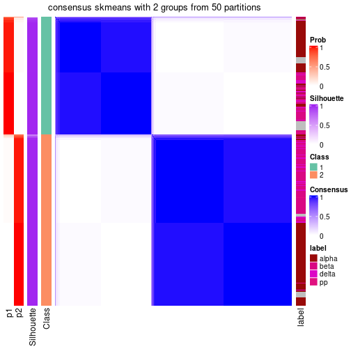</p>

</div>
<div id='tab-node-023-consensus-heatmap-2'>
<pre><code class="r">consensus_heatmap(res, k = 3)
</code></pre>

<p>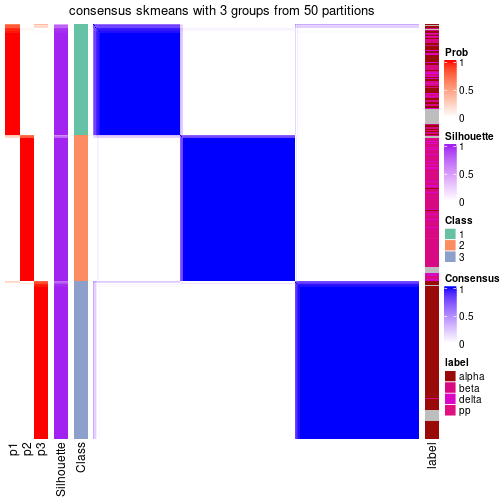</p>

</div>
<div id='tab-node-023-consensus-heatmap-3'>
<pre><code class="r">consensus_heatmap(res, k = 4)
</code></pre>

<p></p>

</div>
</div>

Heatmaps for the membership of samples in all partitions to see how consistent they are:


<script>
$( function() {
	$( '#tabs-node-023-membership-heatmap' ).tabs();
} );
</script>
<div id='tabs-node-023-membership-heatmap'>
<ul>
<li><a href='#tab-node-023-membership-heatmap-1'>k = 2</a></li>
<li><a href='#tab-node-023-membership-heatmap-2'>k = 3</a></li>
<li><a href='#tab-node-023-membership-heatmap-3'>k = 4</a></li>
</ul>
<div id='tab-node-023-membership-heatmap-1'>
<pre><code class="r">membership_heatmap(res, k = 2)
</code></pre>

<p>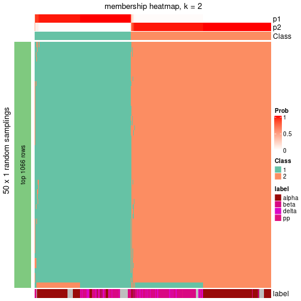</p>

</div>
<div id='tab-node-023-membership-heatmap-2'>
<pre><code class="r">membership_heatmap(res, k = 3)
</code></pre>

<p>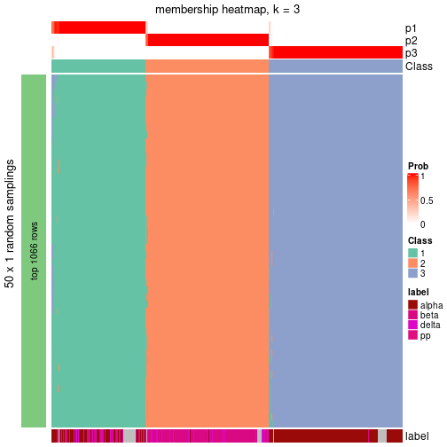</p>

</div>
<div id='tab-node-023-membership-heatmap-3'>
<pre><code class="r">membership_heatmap(res, k = 4)
</code></pre>

<p>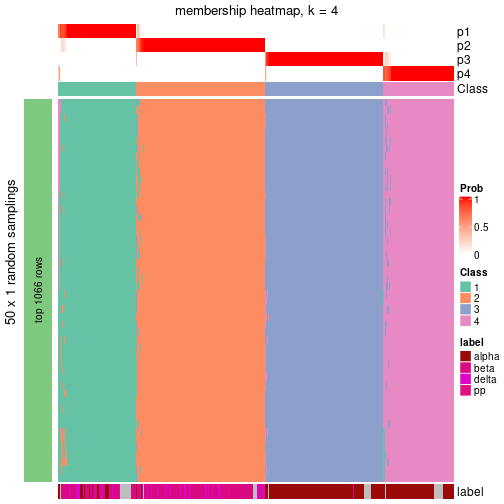</p>

</div>
</div>

As soon as the classes for columns are determined, the signatures
that are significantly different between subgroups can be looked for. 
Following are the heatmaps for signatures.


Signature heatmaps where rows are scaled:


<script>
$( function() {
	$( '#tabs-node-023-get-signatures' ).tabs();
} );
</script>
<div id='tabs-node-023-get-signatures'>
<ul>
<li><a href='#tab-node-023-get-signatures-1'>k = 2</a></li>
<li><a href='#tab-node-023-get-signatures-2'>k = 3</a></li>
<li><a href='#tab-node-023-get-signatures-3'>k = 4</a></li>
</ul>
<div id='tab-node-023-get-signatures-1'>
<pre><code class="r">get_signatures(res, k = 2)
</code></pre>

<p>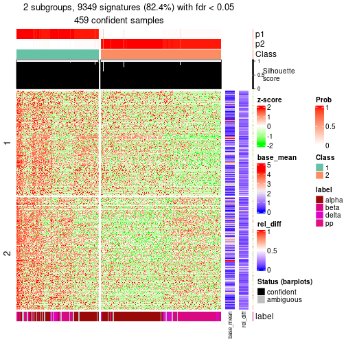</p>

</div>
<div id='tab-node-023-get-signatures-2'>
<pre><code class="r">get_signatures(res, k = 3)
</code></pre>

<p>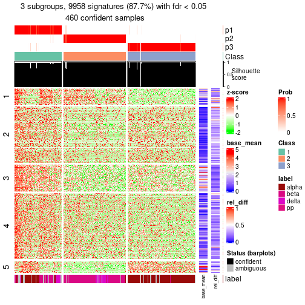</p>

</div>
<div id='tab-node-023-get-signatures-3'>
<pre><code class="r">get_signatures(res, k = 4)
</code></pre>

<p>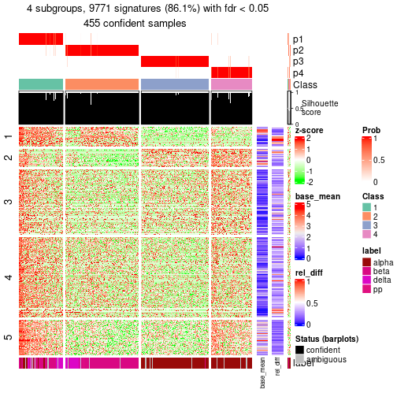</p>

</div>
</div>


Signature heatmaps where rows are not scaled:


<script>
$( function() {
	$( '#tabs-node-023-get-signatures-no-scale' ).tabs();
} );
</script>
<div id='tabs-node-023-get-signatures-no-scale'>
<ul>
<li><a href='#tab-node-023-get-signatures-no-scale-1'>k = 2</a></li>
<li><a href='#tab-node-023-get-signatures-no-scale-2'>k = 3</a></li>
<li><a href='#tab-node-023-get-signatures-no-scale-3'>k = 4</a></li>
</ul>
<div id='tab-node-023-get-signatures-no-scale-1'>
<pre><code class="r">get_signatures(res, k = 2, scale_rows = FALSE)
</code></pre>

<p>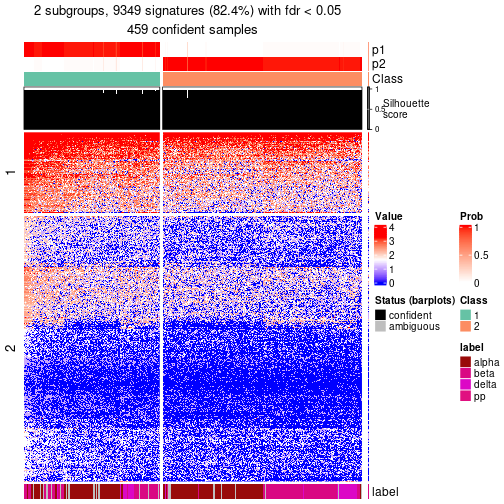</p>

</div>
<div id='tab-node-023-get-signatures-no-scale-2'>
<pre><code class="r">get_signatures(res, k = 3, scale_rows = FALSE)
</code></pre>

<p>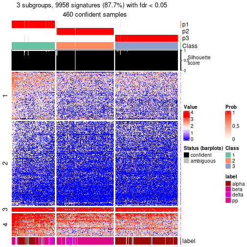</p>

</div>
<div id='tab-node-023-get-signatures-no-scale-3'>
<pre><code class="r">get_signatures(res, k = 4, scale_rows = FALSE)
</code></pre>

<p>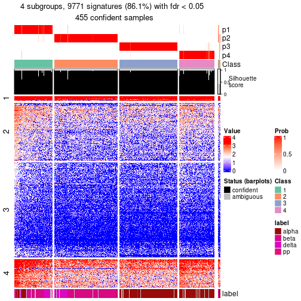</p>

</div>
</div>


Compare the overlap of signatures from different k:

```r
compare_signatures(res)
```

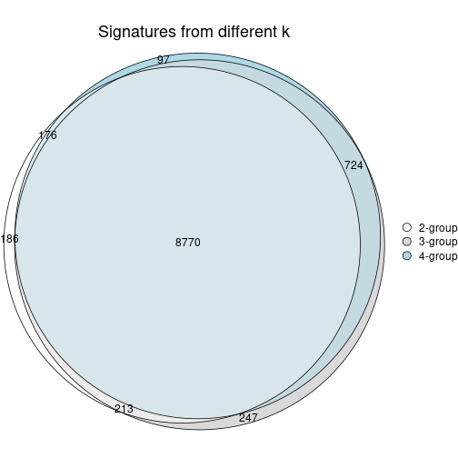

`get_signature()` returns a data frame invisibly. To get the list of signatures, the function
call should be assigned to a variable explicitly. In following code, if `plot` argument is set
to `FALSE`, no heatmap is plotted while only the differential analysis is performed.

```r
# code only for demonstration
tb = get_signature(res, k = ..., plot = FALSE)
```

An example of the output of `tb` is:

```
#>   which_row         fdr    mean_1    mean_2 scaled_mean_1 scaled_mean_2 km
#> 1        38 0.042760348  8.373488  9.131774    -0.5533452     0.5164555  1
#> 2        40 0.018707592  7.106213  8.469186    -0.6173731     0.5762149  1
#> 3        55 0.019134737 10.221463 11.207825    -0.6159697     0.5749050  1
#> 4        59 0.006059896  5.921854  7.869574    -0.6899429     0.6439467  1
#> 5        60 0.018055526  8.928898 10.211722    -0.6204761     0.5791110  1
#> 6        98 0.009384629 15.714769 14.887706     0.6635654    -0.6193277  2
...
```

The columns in `tb` are:

1. `which_row`: row indices corresponding to the input matrix.
2. `fdr`: FDR for the differential test. 
3. `mean_x`: The mean value in group x.
4. `scaled_mean_x`: The mean value in group x after rows are scaled.
5. `km`: Row groups if k-means clustering is applied to rows (which is done by automatically selecting number of clusters).

If there are too many signatures, `top_signatures = ...` can be set to only show the 
signatures with the highest FDRs:

```r
# code only for demonstration
# e.g. to show the top 500 most significant rows
tb = get_signature(res, k = ..., top_signatures = 500)
```

If the signatures are defined as these which are uniquely high in current group, `diff_method` argument
can be set to `"uniquely_high_in_one_group"`:

```r
# code only for demonstration
tb = get_signature(res, k = ..., diff_method = "uniquely_high_in_one_group")
```


UMAP plot which shows how samples are separated.


<script>
$( function() {
	$( '#tabs-node-023-dimension-reduction' ).tabs();
} );
</script>
<div id='tabs-node-023-dimension-reduction'>
<ul>
<li><a href='#tab-node-023-dimension-reduction-1'>k = 2</a></li>
<li><a href='#tab-node-023-dimension-reduction-2'>k = 3</a></li>
<li><a href='#tab-node-023-dimension-reduction-3'>k = 4</a></li>
</ul>
<div id='tab-node-023-dimension-reduction-1'>
<pre><code class="r">dimension_reduction(res, k = 2, method = &quot;UMAP&quot;)
</code></pre>

<p>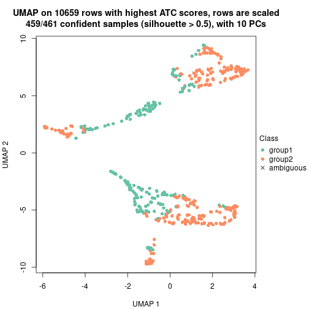</p>

</div>
<div id='tab-node-023-dimension-reduction-2'>
<pre><code class="r">dimension_reduction(res, k = 3, method = &quot;UMAP&quot;)
</code></pre>

<p>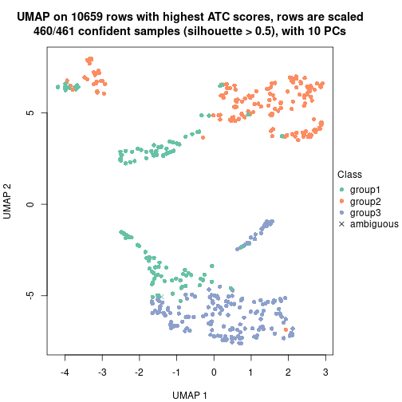</p>

</div>
<div id='tab-node-023-dimension-reduction-3'>
<pre><code class="r">dimension_reduction(res, k = 4, method = &quot;UMAP&quot;)
</code></pre>

<p>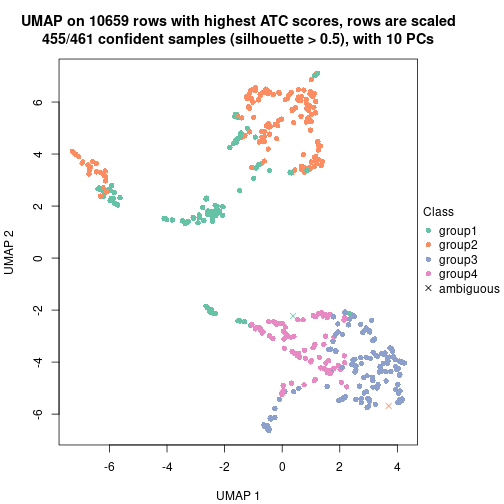</p>

</div>
</div>


Following heatmap shows how subgroups are split when increasing `k`:

```r
collect_classes(res)
```

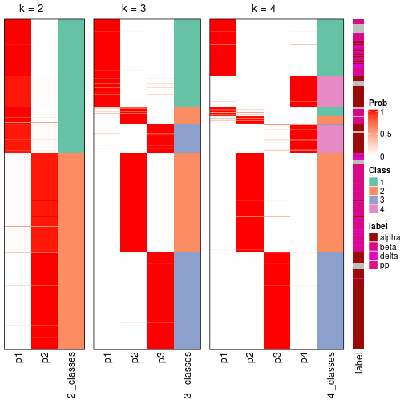


Test correlation between subgroups and known annotations. If the known
annotation is numeric, one-way ANOVA test is applied, and if the known
annotation is discrete, chi-squared contingency table test is applied.

```r
test_to_known_factors(res)
```

```
#>             n_sample label(p-value) k
#> ATC:skmeans      459       6.90e-01 2
#> ATC:skmeans      460       1.31e-64 3
#> ATC:skmeans      455       7.00e-74 4
```


If matrix rows can be associated to genes, consider to use `functional_enrichment(res,
...)` to perform function enrichment for the signature genes. See [this vignette](https://jokergoo.github.io/cola_vignettes/functional_enrichment.html) for more detailed explanations.


 

---------------------------------------------------


### Node0231


Parent node: [Node023](#Node023).
Child nodes: 
                Node02121-leaf
        ,
                Node02122-leaf
        ,
                Node02123-leaf
        ,
                Node02141-leaf
        ,
                Node02142-leaf
        ,
                Node02143-leaf
        ,
                Node02144-leaf
        ,
                [Node02211](#Node02211)
        ,
                Node02212-leaf
        ,
                Node02213-leaf
        ,
                Node02221-leaf
        ,
                Node02222-leaf
        ,
                Node02223-leaf
        ,
                Node02311-leaf
        ,
                Node02312-leaf
        ,
                Node02321-leaf
        ,
                Node02322-leaf
        ,
                Node02411-leaf
        ,
                Node02412-leaf
        ,
                Node02421-leaf
        ,
                Node02422-leaf
        .


The object with results only for a single top-value method and a single partitioning method 
can be extracted as:

```r
res = res_rh["0231"]
```

A summary of `res` and all the functions that can be applied to it:

```r
res
```

```
#> A 'ConsensusPartition' object with k = 2, 3, 4.
#>   On a matrix with 9771 rows and 91 columns.
#>   Top rows (818) are extracted by 'ATC' method.
#>   Subgroups are detected by 'skmeans' method.
#>   Performed in total 150 partitions by row resampling.
#>   Best k for subgroups seems to be 2.
#> 
#> Following methods can be applied to this 'ConsensusPartition' object:
#>  [1] "cola_report"             "collect_classes"         "collect_plots"          
#>  [4] "collect_stats"           "colnames"                "compare_partitions"     
#>  [7] "compare_signatures"      "consensus_heatmap"       "dimension_reduction"    
#> [10] "functional_enrichment"   "get_anno_col"            "get_anno"               
#> [13] "get_classes"             "get_consensus"           "get_matrix"             
#> [16] "get_membership"          "get_param"               "get_signatures"         
#> [19] "get_stats"               "is_best_k"               "is_stable_k"            
#> [22] "membership_heatmap"      "ncol"                    "nrow"                   
#> [25] "plot_ecdf"               "predict_classes"         "rownames"               
#> [28] "select_partition_number" "show"                    "suggest_best_k"         
#> [31] "test_to_known_factors"   "top_rows_heatmap"
```

`collect_plots()` function collects all the plots made from `res` for all `k` (number of subgroups)
into one single page to provide an easy and fast comparison between different `k`.

```r
collect_plots(res)
```

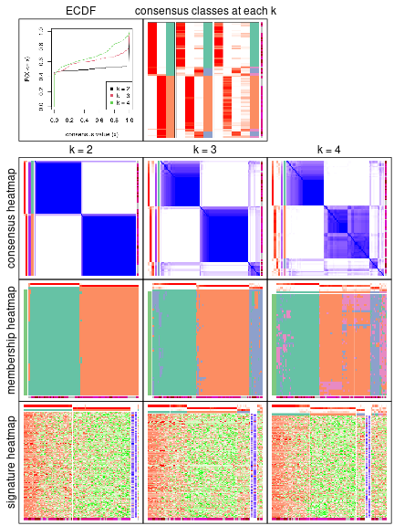

The plots are:

- The first row: a plot of the eCDF (empirical cumulative distribution
  function) curves of the consensus matrix for each `k` and the heatmap of
  predicted classes for each `k`.
- The second row: heatmaps of the consensus matrix for each `k`.
- The third row: heatmaps of the membership matrix for each `k`.
- The fouth row: heatmaps of the signatures for each `k`.

All the plots in panels can be made by individual functions and they are
plotted later in this section.

`select_partition_number()` produces several plots showing different
statistics for choosing "optimized" `k`. There are following statistics:

- eCDF curves of the consensus matrix for each `k`;
- 1-PAC. [The PAC score](https://en.wikipedia.org/wiki/Consensus_clustering#Over-interpretation_potential_of_consensus_clustering)
  measures the proportion of the ambiguous subgrouping.
- Mean silhouette score.
- Concordance. The mean probability of fiting the consensus subgroup labels in all
  partitions.
- Area increased. Denote $A_k$ as the area under the eCDF curve for current
  `k`, the area increased is defined as $A_k - A_{k-1}$.
- Rand index. The percent of pairs of samples that are both in a same cluster
  or both are not in a same cluster in the partition of k and k-1.
- Jaccard index. The ratio of pairs of samples are both in a same cluster in
  the partition of k and k-1 and the pairs of samples are both in a same
  cluster in the partition k or k-1.

The detailed explanations of these statistics can be found in [the _cola_
vignette](https://jokergoo.github.io/cola_vignettes/cola.html#toc_13).

Generally speaking, higher 1-PAC score, higher mean silhouette score or higher
concordance corresponds to better partition. Rand index and Jaccard index
measure how similar the current partition is compared to partition with `k-1`.
If they are too similar, we won't accept `k` is better than `k-1`.

```r
select_partition_number(res)
```

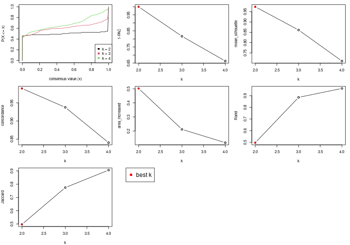

The numeric values for all these statistics can be obtained by `get_stats()`.

```r
get_stats(res)
```

```
#>   k 1-PAC mean_silhouette concordance area_increased  Rand Jaccard
#> 2 2 1.000           0.973       0.990          0.503 0.497   0.497
#> 3 3 0.817           0.861       0.938          0.212 0.886   0.775
#> 4 4 0.663           0.711       0.840          0.117 0.962   0.906
```

`suggest_best_k()` suggests the best $k$ based on these statistics. The rules are as follows:

- All $k$ with Jaccard index larger than 0.95 are removed because increasing
  $k$ does not provide enough extra information. If all $k$ are removed, it is
  marked as no subgroup is detected.
- For all $k$ with 1-PAC score larger than 0.9, the maximal $k$ is taken as
  the best $k$, and other $k$ are marked as optional $k$.
- If it does not fit the second rule. The $k$ with the maximal vote of the
  highest 1-PAC score, highest mean silhouette, and highest concordance is
  taken as the best $k$.

```r
suggest_best_k(res)
```

```
#> [1] 2
```


Following is the table of the partitions (You need to click the **show/hide
code output** link to see it). The membership matrix (columns with name `p*`)
is inferred by
[`clue::cl_consensus()`](https://www.rdocumentation.org/link/cl_consensus?package=clue)
function with the `SE` method. Basically the value in the membership matrix
represents the probability to belong to a certain group. The finall subgroup
label for an item is determined with the group with highest probability it
belongs to.

In `get_classes()` function, the entropy is calculated from the membership
matrix and the silhouette score is calculated from the consensus matrix.


<script>
$( function() {
	$( '#tabs-node-0231-get-classes' ).tabs();
} );
</script>
<div id='tabs-node-0231-get-classes'>
<ul>
<li><a href='#tab-node-0231-get-classes-1'>k = 2</a></li>
<li><a href='#tab-node-0231-get-classes-2'>k = 3</a></li>
<li><a href='#tab-node-0231-get-classes-3'>k = 4</a></li>
</ul>

<div id='tab-node-0231-get-classes-1'>
<p><a id='tab-node-0231-get-classes-1-a' style='color:#0366d6' href='#'>show/hide code output</a></p>
<pre><code class="r">cbind(get_classes(res, k = 2), get_membership(res, k = 2))
</code></pre>

<pre><code>#&gt;          class entropy silhouette   p1   p2
#&gt; D28-1_4      2   0.000      0.991 0.00 1.00
#&gt; D28-1_65     1   0.000      0.988 1.00 0.00
#&gt; D28-1_85     2   0.000      0.991 0.00 1.00
#&gt; D28-2_37     1   0.000      0.988 1.00 0.00
#&gt; D28-2_73     1   0.000      0.988 1.00 0.00
#&gt; D28-4_31     1   0.000      0.988 1.00 0.00
#&gt; D28-4_77     2   0.904      0.524 0.32 0.68
#&gt; D28-5_1      2   0.000      0.991 0.00 1.00
#&gt; D28-5_49     2   0.000      0.991 0.00 1.00
#&gt; D28-5_73     1   0.000      0.988 1.00 0.00
#&gt; D28-5_76     1   0.000      0.988 1.00 0.00
#&gt; D28-6_29     1   0.000      0.988 1.00 0.00
#&gt; D28-6_53     1   0.242      0.948 0.96 0.04
#&gt; D28-6_86     2   0.000      0.991 0.00 1.00
#&gt; D28-7_4      1   0.000      0.988 1.00 0.00
#&gt; D28-7_65     2   0.000      0.991 0.00 1.00
#&gt; D28-7_73     1   0.000      0.988 1.00 0.00
#&gt; D28-8_29     1   0.995      0.139 0.54 0.46
#&gt; D28-8_85     2   0.000      0.991 0.00 1.00
#&gt; D28-8_86     2   0.000      0.991 0.00 1.00
#&gt; D28-8_88     2   0.000      0.991 0.00 1.00
#&gt; D29-1_57     2   0.000      0.991 0.00 1.00
#&gt; D29-5_55     1   0.000      0.988 1.00 0.00
#&gt; D29-5_60     2   0.000      0.991 0.00 1.00
#&gt; D29-6_77     1   0.000      0.988 1.00 0.00
#&gt; D29-7_41     2   0.000      0.991 0.00 1.00
#&gt; D29-7_58     2   0.000      0.991 0.00 1.00
#&gt; D29-7_68     1   0.000      0.988 1.00 0.00
#&gt; D31-2_92     2   0.000      0.991 0.00 1.00
#&gt; D31-3_66     2   0.000      0.991 0.00 1.00
#&gt; D31-4_49     1   0.000      0.988 1.00 0.00
#&gt; D31-4_51     2   0.000      0.991 0.00 1.00
#&gt; D31-4_60     2   0.000      0.991 0.00 1.00
#&gt; D31-4_64     2   0.000      0.991 0.00 1.00
#&gt; D31-4_66     2   0.000      0.991 0.00 1.00
#&gt; D31-4_82     2   0.000      0.991 0.00 1.00
#&gt; D31-5_71     2   0.000      0.991 0.00 1.00
#&gt; D31-8_41     2   0.000      0.991 0.00 1.00
#&gt; D30-1_41     2   0.000      0.991 0.00 1.00
#&gt; D30-1_52     2   0.000      0.991 0.00 1.00
#&gt; D30-1_66     1   0.000      0.988 1.00 0.00
#&gt; D30-2_5      1   0.000      0.988 1.00 0.00
#&gt; D30-2_7      1   0.000      0.988 1.00 0.00
#&gt; D30-2_13     1   0.000      0.988 1.00 0.00
#&gt; D30-2_44     2   0.000      0.991 0.00 1.00
#&gt; D30-2_48     1   0.000      0.988 1.00 0.00
#&gt; D30-2_49     1   0.000      0.988 1.00 0.00
#&gt; D30-2_52     2   0.000      0.991 0.00 1.00
#&gt; D30-2_55     1   0.000      0.988 1.00 0.00
#&gt; D30-2_57     1   0.000      0.988 1.00 0.00
#&gt; D30-2_75     1   0.000      0.988 1.00 0.00
#&gt; D30-2_82     1   0.000      0.988 1.00 0.00
#&gt; D30-2_83     1   0.000      0.988 1.00 0.00
#&gt; D30-2_90     2   0.000      0.991 0.00 1.00
#&gt; D30-3_13     2   0.000      0.991 0.00 1.00
#&gt; D30-3_23     2   0.000      0.991 0.00 1.00
#&gt; D30-3_53     1   0.000      0.988 1.00 0.00
#&gt; D30-3_54     1   0.000      0.988 1.00 0.00
#&gt; D30-3_57     1   0.000      0.988 1.00 0.00
#&gt; D30-3_62     2   0.000      0.991 0.00 1.00
#&gt; D30-3_69     2   0.000      0.991 0.00 1.00
#&gt; D30-3_71     1   0.000      0.988 1.00 0.00
#&gt; D30-3_73     1   0.000      0.988 1.00 0.00
#&gt; D30-3_77     1   0.000      0.988 1.00 0.00
#&gt; D30-3_78     2   0.469      0.885 0.10 0.90
#&gt; D30-3_89     2   0.000      0.991 0.00 1.00
#&gt; D30-4_1      1   0.000      0.988 1.00 0.00
#&gt; D30-4_15     1   0.000      0.988 1.00 0.00
#&gt; D30-4_32     1   0.000      0.988 1.00 0.00
#&gt; D30-4_59     1   0.000      0.988 1.00 0.00
#&gt; D30-4_61     1   0.000      0.988 1.00 0.00
#&gt; D30-4_63     1   0.000      0.988 1.00 0.00
#&gt; D30-4_66     1   0.000      0.988 1.00 0.00
#&gt; D30-4_71     2   0.000      0.991 0.00 1.00
#&gt; D30-5_11     2   0.000      0.991 0.00 1.00
#&gt; D30-6_49     2   0.000      0.991 0.00 1.00
#&gt; D30-6_53     2   0.000      0.991 0.00 1.00
#&gt; D30-7_13     2   0.000      0.991 0.00 1.00
#&gt; D30-7_53     2   0.000      0.991 0.00 1.00
#&gt; D30-7_54     2   0.000      0.991 0.00 1.00
#&gt; D30-7_56     2   0.000      0.991 0.00 1.00
#&gt; D30-7_76     1   0.000      0.988 1.00 0.00
#&gt; D30-7_79     1   0.000      0.988 1.00 0.00
#&gt; D30-7_80     2   0.000      0.991 0.00 1.00
#&gt; D30-7_94     2   0.000      0.991 0.00 1.00
#&gt; D30-8_45     2   0.000      0.991 0.00 1.00
#&gt; D30-8_59     2   0.000      0.991 0.00 1.00
#&gt; D30-8_66     1   0.000      0.988 1.00 0.00
#&gt; D30-8_68     2   0.000      0.991 0.00 1.00
#&gt; D30-8_85     2   0.000      0.991 0.00 1.00
#&gt; D30-8_86     2   0.000      0.991 0.00 1.00
</code></pre>

<script>
$('#tab-node-0231-get-classes-1-a').parent().next().next().hide();
$('#tab-node-0231-get-classes-1-a').click(function(){
  $('#tab-node-0231-get-classes-1-a').parent().next().next().toggle();
  return(false);
});
</script>
</div>

<div id='tab-node-0231-get-classes-2'>
<p><a id='tab-node-0231-get-classes-2-a' style='color:#0366d6' href='#'>show/hide code output</a></p>
<pre><code class="r">cbind(get_classes(res, k = 3), get_membership(res, k = 3))
</code></pre>

<pre><code>#&gt;          class entropy silhouette   p1   p2   p3
#&gt; D28-1_4      2  0.6244     0.1461 0.00 0.56 0.44
#&gt; D28-1_65     1  0.2066     0.8818 0.94 0.00 0.06
#&gt; D28-1_85     2  0.0000     0.9667 0.00 1.00 0.00
#&gt; D28-2_37     1  0.0892     0.9094 0.98 0.00 0.02
#&gt; D28-2_73     3  0.5560     0.5128 0.30 0.00 0.70
#&gt; D28-4_31     1  0.1529     0.8986 0.96 0.00 0.04
#&gt; D28-4_77     2  0.8321     0.3275 0.24 0.62 0.14
#&gt; D28-5_1      2  0.0000     0.9667 0.00 1.00 0.00
#&gt; D28-5_49     2  0.0000     0.9667 0.00 1.00 0.00
#&gt; D28-5_73     1  0.0000     0.9222 1.00 0.00 0.00
#&gt; D28-5_76     1  0.0000     0.9222 1.00 0.00 0.00
#&gt; D28-6_29     1  0.0000     0.9222 1.00 0.00 0.00
#&gt; D28-6_53     1  0.8619    -0.0285 0.48 0.10 0.42
#&gt; D28-6_86     2  0.0000     0.9667 0.00 1.00 0.00
#&gt; D28-7_4      1  0.3340     0.8146 0.88 0.00 0.12
#&gt; D28-7_65     2  0.0000     0.9667 0.00 1.00 0.00
#&gt; D28-7_73     1  0.0000     0.9222 1.00 0.00 0.00
#&gt; D28-8_29     3  0.7932     0.6279 0.20 0.14 0.66
#&gt; D28-8_85     2  0.0000     0.9667 0.00 1.00 0.00
#&gt; D28-8_86     2  0.0000     0.9667 0.00 1.00 0.00
#&gt; D28-8_88     3  0.4555     0.7229 0.00 0.20 0.80
#&gt; D29-1_57     2  0.0000     0.9667 0.00 1.00 0.00
#&gt; D29-5_55     1  0.4555     0.7444 0.80 0.00 0.20
#&gt; D29-5_60     2  0.0000     0.9667 0.00 1.00 0.00
#&gt; D29-6_77     1  0.3686     0.8094 0.86 0.00 0.14
#&gt; D29-7_41     2  0.0000     0.9667 0.00 1.00 0.00
#&gt; D29-7_58     2  0.0000     0.9667 0.00 1.00 0.00
#&gt; D29-7_68     1  0.4796     0.7168 0.78 0.00 0.22
#&gt; D31-2_92     2  0.0000     0.9667 0.00 1.00 0.00
#&gt; D31-3_66     2  0.0000     0.9667 0.00 1.00 0.00
#&gt; D31-4_49     1  0.3686     0.8114 0.86 0.00 0.14
#&gt; D31-4_51     2  0.0000     0.9667 0.00 1.00 0.00
#&gt; D31-4_60     2  0.0000     0.9667 0.00 1.00 0.00
#&gt; D31-4_64     2  0.0000     0.9667 0.00 1.00 0.00
#&gt; D31-4_66     2  0.2066     0.9165 0.00 0.94 0.06
#&gt; D31-4_82     2  0.0892     0.9502 0.00 0.98 0.02
#&gt; D31-5_71     2  0.0000     0.9667 0.00 1.00 0.00
#&gt; D31-8_41     2  0.0000     0.9667 0.00 1.00 0.00
#&gt; D30-1_41     3  0.4291     0.7627 0.00 0.18 0.82
#&gt; D30-1_52     3  0.4555     0.7466 0.00 0.20 0.80
#&gt; D30-1_66     3  0.5706     0.5382 0.32 0.00 0.68
#&gt; D30-2_5      1  0.0000     0.9222 1.00 0.00 0.00
#&gt; D30-2_7      1  0.0000     0.9222 1.00 0.00 0.00
#&gt; D30-2_13     1  0.0000     0.9222 1.00 0.00 0.00
#&gt; D30-2_44     2  0.0000     0.9667 0.00 1.00 0.00
#&gt; D30-2_48     1  0.0000     0.9222 1.00 0.00 0.00
#&gt; D30-2_49     1  0.0000     0.9222 1.00 0.00 0.00
#&gt; D30-2_52     2  0.0000     0.9667 0.00 1.00 0.00
#&gt; D30-2_55     1  0.0000     0.9222 1.00 0.00 0.00
#&gt; D30-2_57     3  0.3340     0.7492 0.12 0.00 0.88
#&gt; D30-2_75     1  0.5706     0.4691 0.68 0.00 0.32
#&gt; D30-2_82     1  0.0000     0.9222 1.00 0.00 0.00
#&gt; D30-2_83     1  0.6280     0.0501 0.54 0.00 0.46
#&gt; D30-2_90     2  0.0000     0.9667 0.00 1.00 0.00
#&gt; D30-3_13     2  0.0000     0.9667 0.00 1.00 0.00
#&gt; D30-3_23     2  0.0000     0.9667 0.00 1.00 0.00
#&gt; D30-3_53     1  0.0000     0.9222 1.00 0.00 0.00
#&gt; D30-3_54     1  0.0000     0.9222 1.00 0.00 0.00
#&gt; D30-3_57     1  0.0000     0.9222 1.00 0.00 0.00
#&gt; D30-3_62     3  0.4002     0.7755 0.00 0.16 0.84
#&gt; D30-3_69     2  0.0000     0.9667 0.00 1.00 0.00
#&gt; D30-3_71     1  0.0000     0.9222 1.00 0.00 0.00
#&gt; D30-3_73     1  0.0000     0.9222 1.00 0.00 0.00
#&gt; D30-3_77     3  0.0000     0.7716 0.00 0.00 1.00
#&gt; D30-3_78     3  0.0892     0.7797 0.00 0.02 0.98
#&gt; D30-3_89     2  0.0000     0.9667 0.00 1.00 0.00
#&gt; D30-4_1      1  0.0000     0.9222 1.00 0.00 0.00
#&gt; D30-4_15     1  0.0000     0.9222 1.00 0.00 0.00
#&gt; D30-4_32     3  0.4002     0.7308 0.16 0.00 0.84
#&gt; D30-4_59     1  0.3340     0.8157 0.88 0.00 0.12
#&gt; D30-4_61     1  0.0000     0.9222 1.00 0.00 0.00
#&gt; D30-4_63     1  0.0000     0.9222 1.00 0.00 0.00
#&gt; D30-4_66     1  0.0000     0.9222 1.00 0.00 0.00
#&gt; D30-4_71     2  0.0000     0.9667 0.00 1.00 0.00
#&gt; D30-5_11     2  0.0000     0.9667 0.00 1.00 0.00
#&gt; D30-6_49     2  0.0000     0.9667 0.00 1.00 0.00
#&gt; D30-6_53     2  0.0000     0.9667 0.00 1.00 0.00
#&gt; D30-7_13     2  0.0000     0.9667 0.00 1.00 0.00
#&gt; D30-7_53     2  0.0000     0.9667 0.00 1.00 0.00
#&gt; D30-7_54     2  0.0000     0.9667 0.00 1.00 0.00
#&gt; D30-7_56     2  0.0000     0.9667 0.00 1.00 0.00
#&gt; D30-7_76     1  0.0000     0.9222 1.00 0.00 0.00
#&gt; D30-7_79     1  0.0000     0.9222 1.00 0.00 0.00
#&gt; D30-7_80     2  0.0000     0.9667 0.00 1.00 0.00
#&gt; D30-7_94     2  0.2537     0.8947 0.00 0.92 0.08
#&gt; D30-8_45     2  0.1529     0.9337 0.00 0.96 0.04
#&gt; D30-8_59     2  0.2537     0.8947 0.00 0.92 0.08
#&gt; D30-8_66     1  0.0892     0.9106 0.98 0.00 0.02
#&gt; D30-8_68     2  0.4291     0.7637 0.00 0.82 0.18
#&gt; D30-8_85     2  0.0000     0.9667 0.00 1.00 0.00
#&gt; D30-8_86     2  0.0000     0.9667 0.00 1.00 0.00
</code></pre>

<script>
$('#tab-node-0231-get-classes-2-a').parent().next().next().hide();
$('#tab-node-0231-get-classes-2-a').click(function(){
  $('#tab-node-0231-get-classes-2-a').parent().next().next().toggle();
  return(false);
});
</script>
</div>

<div id='tab-node-0231-get-classes-3'>
<p><a id='tab-node-0231-get-classes-3-a' style='color:#0366d6' href='#'>show/hide code output</a></p>
<pre><code class="r">cbind(get_classes(res, k = 4), get_membership(res, k = 4))
</code></pre>

<pre><code>#&gt;          class entropy silhouette   p1   p2   p3   p4
#&gt; D28-1_4      2  0.7493      0.178 0.00 0.48 0.32 0.20
#&gt; D28-1_65     1  0.5106      0.648 0.72 0.00 0.04 0.24
#&gt; D28-1_85     2  0.1637      0.777 0.00 0.94 0.00 0.06
#&gt; D28-2_37     1  0.4581      0.757 0.80 0.00 0.08 0.12
#&gt; D28-2_73     4  0.7610      0.101 0.32 0.00 0.22 0.46
#&gt; D28-4_31     1  0.3975      0.719 0.76 0.00 0.00 0.24
#&gt; D28-4_77     4  0.5955      0.451 0.08 0.18 0.02 0.72
#&gt; D28-5_1      2  0.4406      0.580 0.00 0.70 0.00 0.30
#&gt; D28-5_49     2  0.1211      0.785 0.00 0.96 0.00 0.04
#&gt; D28-5_73     1  0.0000      0.882 1.00 0.00 0.00 0.00
#&gt; D28-5_76     1  0.0000      0.882 1.00 0.00 0.00 0.00
#&gt; D28-6_29     1  0.0000      0.882 1.00 0.00 0.00 0.00
#&gt; D28-6_53     4  0.6367      0.425 0.14 0.06 0.08 0.72
#&gt; D28-6_86     2  0.4472      0.763 0.00 0.76 0.02 0.22
#&gt; D28-7_4      1  0.1637      0.848 0.94 0.00 0.06 0.00
#&gt; D28-7_65     2  0.1637      0.777 0.00 0.94 0.00 0.06
#&gt; D28-7_73     1  0.0000      0.882 1.00 0.00 0.00 0.00
#&gt; D28-8_29     4  0.5445      0.418 0.08 0.04 0.10 0.78
#&gt; D28-8_85     2  0.3610      0.783 0.00 0.80 0.00 0.20
#&gt; D28-8_86     2  0.2647      0.801 0.00 0.88 0.00 0.12
#&gt; D28-8_88     4  0.7888      0.215 0.00 0.30 0.32 0.38
#&gt; D29-1_57     2  0.2335      0.764 0.00 0.92 0.02 0.06
#&gt; D29-5_55     1  0.6074      0.402 0.60 0.00 0.06 0.34
#&gt; D29-5_60     2  0.0707      0.793 0.00 0.98 0.00 0.02
#&gt; D29-6_77     1  0.4939      0.685 0.74 0.00 0.04 0.22
#&gt; D29-7_41     2  0.1211      0.796 0.00 0.96 0.00 0.04
#&gt; D29-7_58     2  0.3400      0.791 0.00 0.82 0.00 0.18
#&gt; D29-7_68     1  0.6110      0.525 0.66 0.00 0.10 0.24
#&gt; D31-2_92     2  0.3400      0.793 0.00 0.82 0.00 0.18
#&gt; D31-3_66     2  0.4134      0.751 0.00 0.74 0.00 0.26
#&gt; D31-4_49     1  0.4936      0.621 0.70 0.00 0.02 0.28
#&gt; D31-4_51     2  0.2345      0.800 0.00 0.90 0.00 0.10
#&gt; D31-4_60     2  0.1211      0.785 0.00 0.96 0.00 0.04
#&gt; D31-4_64     2  0.3610      0.783 0.00 0.80 0.00 0.20
#&gt; D31-4_66     2  0.7021      0.362 0.00 0.48 0.12 0.40
#&gt; D31-4_82     2  0.4522      0.691 0.00 0.68 0.00 0.32
#&gt; D31-5_71     2  0.1211      0.785 0.00 0.96 0.00 0.04
#&gt; D31-8_41     2  0.4079      0.782 0.00 0.80 0.02 0.18
#&gt; D30-1_41     3  0.2335      0.718 0.00 0.06 0.92 0.02
#&gt; D30-1_52     3  0.3611      0.661 0.00 0.08 0.86 0.06
#&gt; D30-1_66     3  0.3801      0.552 0.22 0.00 0.78 0.00
#&gt; D30-2_5      1  0.0000      0.882 1.00 0.00 0.00 0.00
#&gt; D30-2_7      1  0.0000      0.882 1.00 0.00 0.00 0.00
#&gt; D30-2_13     1  0.0000      0.882 1.00 0.00 0.00 0.00
#&gt; D30-2_44     2  0.4642      0.751 0.00 0.74 0.02 0.24
#&gt; D30-2_48     1  0.0000      0.882 1.00 0.00 0.00 0.00
#&gt; D30-2_49     1  0.0000      0.882 1.00 0.00 0.00 0.00
#&gt; D30-2_52     2  0.1211      0.785 0.00 0.96 0.00 0.04
#&gt; D30-2_55     1  0.0000      0.882 1.00 0.00 0.00 0.00
#&gt; D30-2_57     3  0.7028      0.290 0.28 0.00 0.56 0.16
#&gt; D30-2_75     1  0.4977      0.170 0.54 0.00 0.46 0.00
#&gt; D30-2_82     1  0.3037      0.819 0.88 0.00 0.02 0.10
#&gt; D30-2_83     1  0.6150      0.313 0.58 0.00 0.36 0.06
#&gt; D30-2_90     2  0.1211      0.785 0.00 0.96 0.00 0.04
#&gt; D30-3_13     2  0.4134      0.760 0.00 0.74 0.00 0.26
#&gt; D30-3_23     2  0.1211      0.785 0.00 0.96 0.00 0.04
#&gt; D30-3_53     1  0.0000      0.882 1.00 0.00 0.00 0.00
#&gt; D30-3_54     1  0.0000      0.882 1.00 0.00 0.00 0.00
#&gt; D30-3_57     1  0.0000      0.882 1.00 0.00 0.00 0.00
#&gt; D30-3_62     3  0.2830      0.707 0.00 0.06 0.90 0.04
#&gt; D30-3_69     2  0.2411      0.763 0.00 0.92 0.04 0.04
#&gt; D30-3_71     1  0.0000      0.882 1.00 0.00 0.00 0.00
#&gt; D30-3_73     1  0.0000      0.882 1.00 0.00 0.00 0.00
#&gt; D30-3_77     3  0.2011      0.703 0.00 0.00 0.92 0.08
#&gt; D30-3_78     3  0.4134      0.579 0.00 0.00 0.74 0.26
#&gt; D30-3_89     2  0.3975      0.764 0.00 0.76 0.00 0.24
#&gt; D30-4_1      1  0.0000      0.882 1.00 0.00 0.00 0.00
#&gt; D30-4_15     1  0.0000      0.882 1.00 0.00 0.00 0.00
#&gt; D30-4_32     3  0.1913      0.715 0.04 0.00 0.94 0.02
#&gt; D30-4_59     1  0.5147      0.662 0.74 0.00 0.20 0.06
#&gt; D30-4_61     1  0.0000      0.882 1.00 0.00 0.00 0.00
#&gt; D30-4_63     1  0.0000      0.882 1.00 0.00 0.00 0.00
#&gt; D30-4_66     1  0.0000      0.882 1.00 0.00 0.00 0.00
#&gt; D30-4_71     2  0.3400      0.791 0.00 0.82 0.00 0.18
#&gt; D30-5_11     2  0.0707      0.791 0.00 0.98 0.00 0.02
#&gt; D30-6_49     2  0.2647      0.731 0.00 0.88 0.00 0.12
#&gt; D30-6_53     2  0.1211      0.785 0.00 0.96 0.00 0.04
#&gt; D30-7_13     2  0.0707      0.790 0.00 0.98 0.00 0.02
#&gt; D30-7_53     2  0.1211      0.785 0.00 0.96 0.00 0.04
#&gt; D30-7_54     2  0.3610      0.786 0.00 0.80 0.00 0.20
#&gt; D30-7_56     2  0.3172      0.795 0.00 0.84 0.00 0.16
#&gt; D30-7_76     1  0.1637      0.856 0.94 0.00 0.00 0.06
#&gt; D30-7_79     1  0.1211      0.865 0.96 0.00 0.00 0.04
#&gt; D30-7_80     2  0.4134      0.760 0.00 0.74 0.00 0.26
#&gt; D30-7_94     2  0.6617      0.580 0.00 0.60 0.12 0.28
#&gt; D30-8_45     2  0.6201      0.621 0.00 0.62 0.08 0.30
#&gt; D30-8_59     2  0.7414      0.345 0.00 0.48 0.18 0.34
#&gt; D30-8_66     1  0.4284      0.729 0.78 0.00 0.02 0.20
#&gt; D30-8_68     4  0.6525      0.332 0.02 0.30 0.06 0.62
#&gt; D30-8_85     2  0.4472      0.763 0.00 0.76 0.02 0.22
#&gt; D30-8_86     2  0.2345      0.750 0.00 0.90 0.00 0.10
</code></pre>

<script>
$('#tab-node-0231-get-classes-3-a').parent().next().next().hide();
$('#tab-node-0231-get-classes-3-a').click(function(){
  $('#tab-node-0231-get-classes-3-a').parent().next().next().toggle();
  return(false);
});
</script>
</div>
</div>

Heatmaps for the consensus matrix. It visualizes the probability of two
samples to be in a same group.


<script>
$( function() {
	$( '#tabs-node-0231-consensus-heatmap' ).tabs();
} );
</script>
<div id='tabs-node-0231-consensus-heatmap'>
<ul>
<li><a href='#tab-node-0231-consensus-heatmap-1'>k = 2</a></li>
<li><a href='#tab-node-0231-consensus-heatmap-2'>k = 3</a></li>
<li><a href='#tab-node-0231-consensus-heatmap-3'>k = 4</a></li>
</ul>
<div id='tab-node-0231-consensus-heatmap-1'>
<pre><code class="r">consensus_heatmap(res, k = 2)
</code></pre>

<p>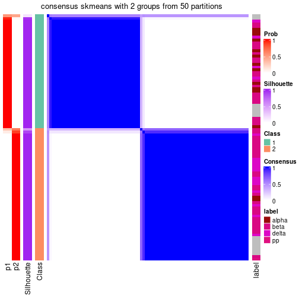</p>

</div>
<div id='tab-node-0231-consensus-heatmap-2'>
<pre><code class="r">consensus_heatmap(res, k = 3)
</code></pre>

<p>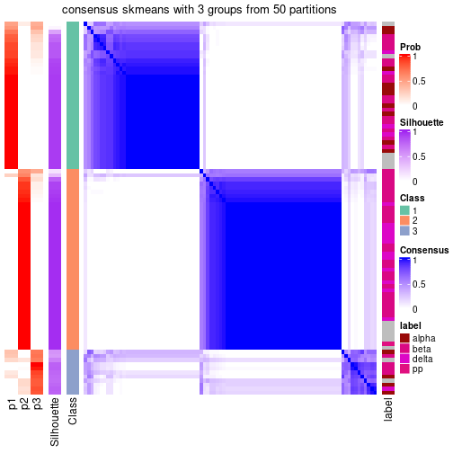</p>

</div>
<div id='tab-node-0231-consensus-heatmap-3'>
<pre><code class="r">consensus_heatmap(res, k = 4)
</code></pre>

<p>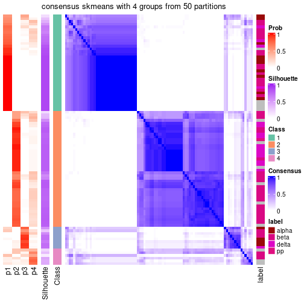</p>

</div>
</div>

Heatmaps for the membership of samples in all partitions to see how consistent they are:


<script>
$( function() {
	$( '#tabs-node-0231-membership-heatmap' ).tabs();
} );
</script>
<div id='tabs-node-0231-membership-heatmap'>
<ul>
<li><a href='#tab-node-0231-membership-heatmap-1'>k = 2</a></li>
<li><a href='#tab-node-0231-membership-heatmap-2'>k = 3</a></li>
<li><a href='#tab-node-0231-membership-heatmap-3'>k = 4</a></li>
</ul>
<div id='tab-node-0231-membership-heatmap-1'>
<pre><code class="r">membership_heatmap(res, k = 2)
</code></pre>

<p>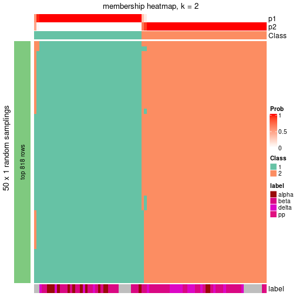</p>

</div>
<div id='tab-node-0231-membership-heatmap-2'>
<pre><code class="r">membership_heatmap(res, k = 3)
</code></pre>

<p>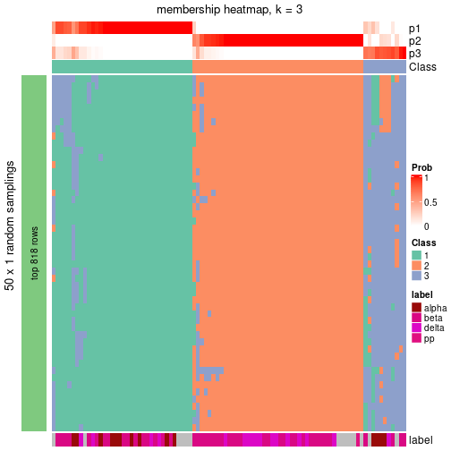</p>

</div>
<div id='tab-node-0231-membership-heatmap-3'>
<pre><code class="r">membership_heatmap(res, k = 4)
</code></pre>

<p>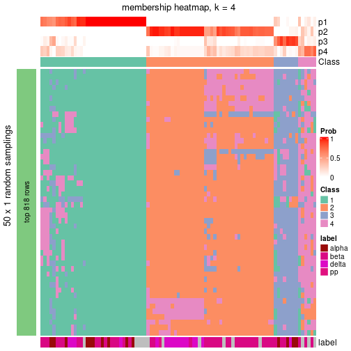</p>

</div>
</div>

As soon as the classes for columns are determined, the signatures
that are significantly different between subgroups can be looked for. 
Following are the heatmaps for signatures.


Signature heatmaps where rows are scaled:


<script>
$( function() {
	$( '#tabs-node-0231-get-signatures' ).tabs();
} );
</script>
<div id='tabs-node-0231-get-signatures'>
<ul>
<li><a href='#tab-node-0231-get-signatures-1'>k = 2</a></li>
<li><a href='#tab-node-0231-get-signatures-2'>k = 3</a></li>
<li><a href='#tab-node-0231-get-signatures-3'>k = 4</a></li>
</ul>
<div id='tab-node-0231-get-signatures-1'>
<pre><code class="r">get_signatures(res, k = 2)
</code></pre>

<p>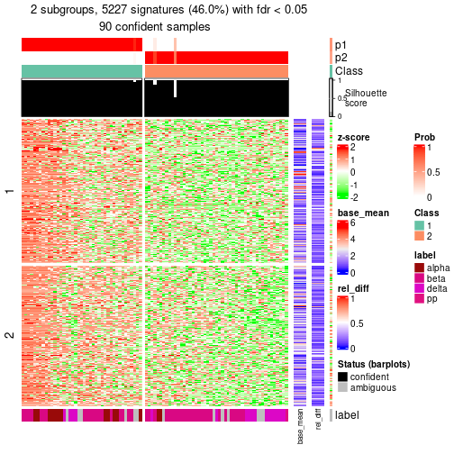</p>

</div>
<div id='tab-node-0231-get-signatures-2'>
<pre><code class="r">get_signatures(res, k = 3)
</code></pre>

<p>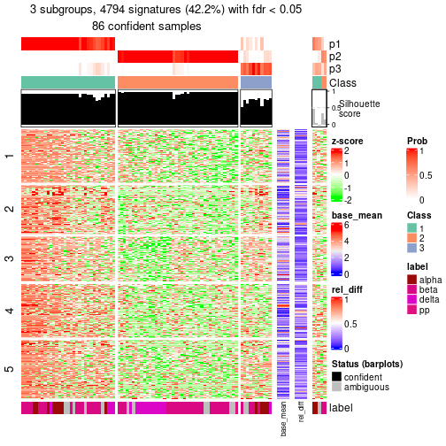</p>

</div>
<div id='tab-node-0231-get-signatures-3'>
<pre><code class="r">get_signatures(res, k = 4)
</code></pre>

<p>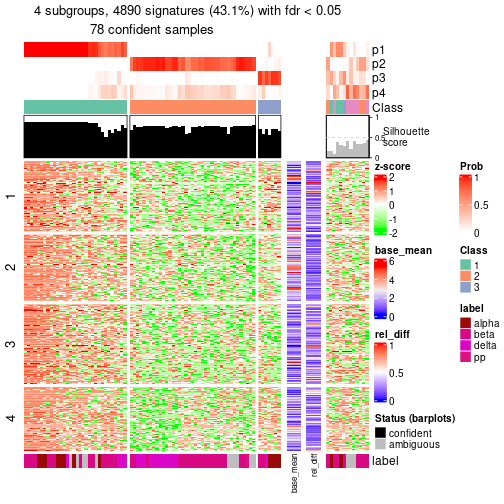</p>

</div>
</div>


Signature heatmaps where rows are not scaled:


<script>
$( function() {
	$( '#tabs-node-0231-get-signatures-no-scale' ).tabs();
} );
</script>
<div id='tabs-node-0231-get-signatures-no-scale'>
<ul>
<li><a href='#tab-node-0231-get-signatures-no-scale-1'>k = 2</a></li>
<li><a href='#tab-node-0231-get-signatures-no-scale-2'>k = 3</a></li>
<li><a href='#tab-node-0231-get-signatures-no-scale-3'>k = 4</a></li>
</ul>
<div id='tab-node-0231-get-signatures-no-scale-1'>
<pre><code class="r">get_signatures(res, k = 2, scale_rows = FALSE)
</code></pre>

<p></p>

</div>
<div id='tab-node-0231-get-signatures-no-scale-2'>
<pre><code class="r">get_signatures(res, k = 3, scale_rows = FALSE)
</code></pre>

<p>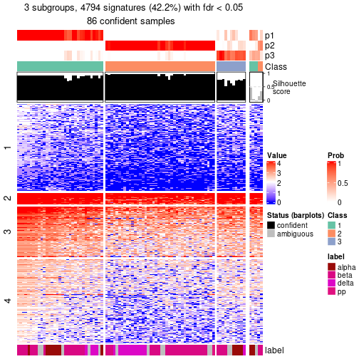</p>

</div>
<div id='tab-node-0231-get-signatures-no-scale-3'>
<pre><code class="r">get_signatures(res, k = 4, scale_rows = FALSE)
</code></pre>

<p>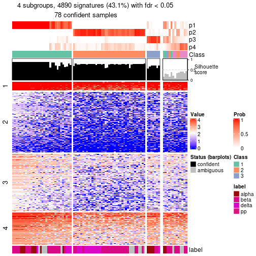</p>

</div>
</div>


Compare the overlap of signatures from different k:

```r
compare_signatures(res)
```

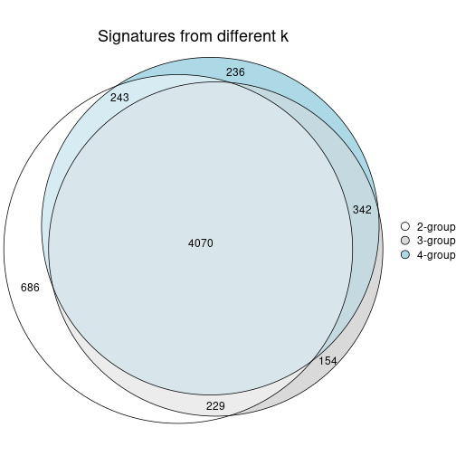

`get_signature()` returns a data frame invisibly. To get the list of signatures, the function
call should be assigned to a variable explicitly. In following code, if `plot` argument is set
to `FALSE`, no heatmap is plotted while only the differential analysis is performed.

```r
# code only for demonstration
tb = get_signature(res, k = ..., plot = FALSE)
```

An example of the output of `tb` is:

```
#>   which_row         fdr    mean_1    mean_2 scaled_mean_1 scaled_mean_2 km
#> 1        38 0.042760348  8.373488  9.131774    -0.5533452     0.5164555  1
#> 2        40 0.018707592  7.106213  8.469186    -0.6173731     0.5762149  1
#> 3        55 0.019134737 10.221463 11.207825    -0.6159697     0.5749050  1
#> 4        59 0.006059896  5.921854  7.869574    -0.6899429     0.6439467  1
#> 5        60 0.018055526  8.928898 10.211722    -0.6204761     0.5791110  1
#> 6        98 0.009384629 15.714769 14.887706     0.6635654    -0.6193277  2
...
```

The columns in `tb` are:

1. `which_row`: row indices corresponding to the input matrix.
2. `fdr`: FDR for the differential test. 
3. `mean_x`: The mean value in group x.
4. `scaled_mean_x`: The mean value in group x after rows are scaled.
5. `km`: Row groups if k-means clustering is applied to rows (which is done by automatically selecting number of clusters).

If there are too many signatures, `top_signatures = ...` can be set to only show the 
signatures with the highest FDRs:

```r
# code only for demonstration
# e.g. to show the top 500 most significant rows
tb = get_signature(res, k = ..., top_signatures = 500)
```

If the signatures are defined as these which are uniquely high in current group, `diff_method` argument
can be set to `"uniquely_high_in_one_group"`:

```r
# code only for demonstration
tb = get_signature(res, k = ..., diff_method = "uniquely_high_in_one_group")
```


UMAP plot which shows how samples are separated.


<script>
$( function() {
	$( '#tabs-node-0231-dimension-reduction' ).tabs();
} );
</script>
<div id='tabs-node-0231-dimension-reduction'>
<ul>
<li><a href='#tab-node-0231-dimension-reduction-1'>k = 2</a></li>
<li><a href='#tab-node-0231-dimension-reduction-2'>k = 3</a></li>
<li><a href='#tab-node-0231-dimension-reduction-3'>k = 4</a></li>
</ul>
<div id='tab-node-0231-dimension-reduction-1'>
<pre><code class="r">dimension_reduction(res, k = 2, method = &quot;UMAP&quot;)
</code></pre>

<p></p>

</div>
<div id='tab-node-0231-dimension-reduction-2'>
<pre><code class="r">dimension_reduction(res, k = 3, method = &quot;UMAP&quot;)
</code></pre>

<p>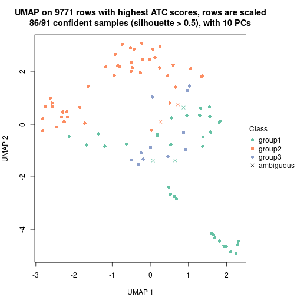</p>

</div>
<div id='tab-node-0231-dimension-reduction-3'>
<pre><code class="r">dimension_reduction(res, k = 4, method = &quot;UMAP&quot;)
</code></pre>

<p>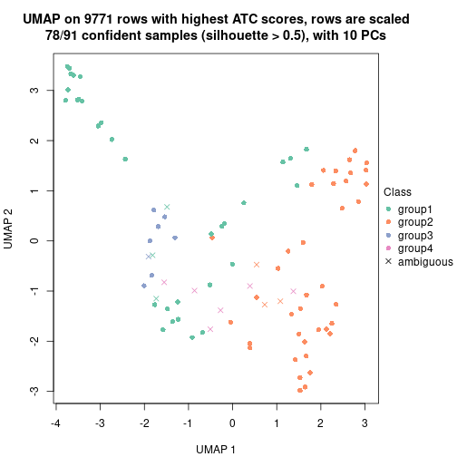</p>

</div>
</div>


Following heatmap shows how subgroups are split when increasing `k`:

```r
collect_classes(res)
```


Test correlation between subgroups and known annotations. If the known
annotation is numeric, one-way ANOVA test is applied, and if the known
annotation is discrete, chi-squared contingency table test is applied.

```r
test_to_known_factors(res)
```

```
#>             n_sample label(p-value) k
#> ATC:skmeans       90        0.00372 2
#> ATC:skmeans       86        0.00811 3
#> ATC:skmeans       78        0.00384 4
```


If matrix rows can be associated to genes, consider to use `functional_enrichment(res,
...)` to perform function enrichment for the signature genes. See [this vignette](https://jokergoo.github.io/cola_vignettes/functional_enrichment.html) for more detailed explanations.


 

---------------------------------------------------


### Node0232


Parent node: [Node023](#Node023).
Child nodes: 
                Node02121-leaf
        ,
                Node02122-leaf
        ,
                Node02123-leaf
        ,
                Node02141-leaf
        ,
                Node02142-leaf
        ,
                Node02143-leaf
        ,
                Node02144-leaf
        ,
                [Node02211](#Node02211)
        ,
                Node02212-leaf
        ,
                Node02213-leaf
        ,
                Node02221-leaf
        ,
                Node02222-leaf
        ,
                Node02223-leaf
        ,
                Node02311-leaf
        ,
                Node02312-leaf
        ,
                Node02321-leaf
        ,
                Node02322-leaf
        ,
                Node02411-leaf
        ,
                Node02412-leaf
        ,
                Node02421-leaf
        ,
                Node02422-leaf
        .


The object with results only for a single top-value method and a single partitioning method 
can be extracted as:

```r
res = res_rh["0232"]
```

A summary of `res` and all the functions that can be applied to it:

```r
res
```

```
#> A 'ConsensusPartition' object with k = 2, 3, 4.
#>   On a matrix with 9919 rows and 150 columns.
#>   Top rows (897) are extracted by 'ATC' method.
#>   Subgroups are detected by 'skmeans' method.
#>   Performed in total 150 partitions by row resampling.
#>   Best k for subgroups seems to be 4.
#> 
#> Following methods can be applied to this 'ConsensusPartition' object:
#>  [1] "cola_report"             "collect_classes"         "collect_plots"          
#>  [4] "collect_stats"           "colnames"                "compare_partitions"     
#>  [7] "compare_signatures"      "consensus_heatmap"       "dimension_reduction"    
#> [10] "functional_enrichment"   "get_anno_col"            "get_anno"               
#> [13] "get_classes"             "get_consensus"           "get_matrix"             
#> [16] "get_membership"          "get_param"               "get_signatures"         
#> [19] "get_stats"               "is_best_k"               "is_stable_k"            
#> [22] "membership_heatmap"      "ncol"                    "nrow"                   
#> [25] "plot_ecdf"               "predict_classes"         "rownames"               
#> [28] "select_partition_number" "show"                    "suggest_best_k"         
#> [31] "test_to_known_factors"   "top_rows_heatmap"
```

`collect_plots()` function collects all the plots made from `res` for all `k` (number of subgroups)
into one single page to provide an easy and fast comparison between different `k`.

```r
collect_plots(res)
```

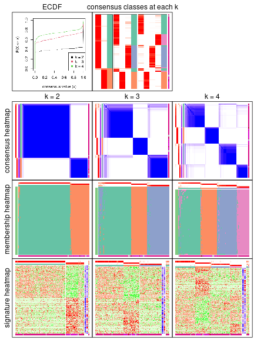

The plots are:

- The first row: a plot of the eCDF (empirical cumulative distribution
  function) curves of the consensus matrix for each `k` and the heatmap of
  predicted classes for each `k`.
- The second row: heatmaps of the consensus matrix for each `k`.
- The third row: heatmaps of the membership matrix for each `k`.
- The fouth row: heatmaps of the signatures for each `k`.

All the plots in panels can be made by individual functions and they are
plotted later in this section.

`select_partition_number()` produces several plots showing different
statistics for choosing "optimized" `k`. There are following statistics:

- eCDF curves of the consensus matrix for each `k`;
- 1-PAC. [The PAC score](https://en.wikipedia.org/wiki/Consensus_clustering#Over-interpretation_potential_of_consensus_clustering)
  measures the proportion of the ambiguous subgrouping.
- Mean silhouette score.
- Concordance. The mean probability of fiting the consensus subgroup labels in all
  partitions.
- Area increased. Denote $A_k$ as the area under the eCDF curve for current
  `k`, the area increased is defined as $A_k - A_{k-1}$.
- Rand index. The percent of pairs of samples that are both in a same cluster
  or both are not in a same cluster in the partition of k and k-1.
- Jaccard index. The ratio of pairs of samples are both in a same cluster in
  the partition of k and k-1 and the pairs of samples are both in a same
  cluster in the partition k or k-1.

The detailed explanations of these statistics can be found in [the _cola_
vignette](https://jokergoo.github.io/cola_vignettes/cola.html#toc_13).

Generally speaking, higher 1-PAC score, higher mean silhouette score or higher
concordance corresponds to better partition. Rand index and Jaccard index
measure how similar the current partition is compared to partition with `k-1`.
If they are too similar, we won't accept `k` is better than `k-1`.

```r
select_partition_number(res)
```

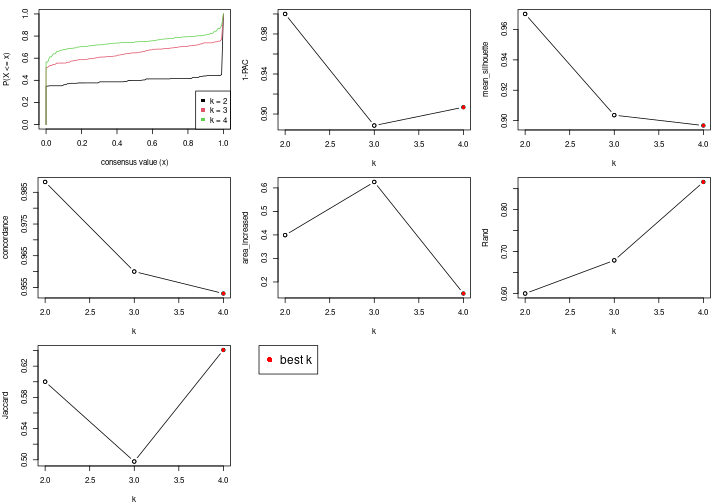

The numeric values for all these statistics can be obtained by `get_stats()`.

```r
get_stats(res)
```

```
#>   k 1-PAC mean_silhouette concordance area_increased  Rand Jaccard
#> 2 2 1.000           0.970       0.988          0.399 0.600   0.600
#> 3 3 0.889           0.904       0.960          0.625 0.679   0.498
#> 4 4 0.907           0.897       0.953          0.151 0.866   0.641
```

`suggest_best_k()` suggests the best $k$ based on these statistics. The rules are as follows:

- All $k$ with Jaccard index larger than 0.95 are removed because increasing
  $k$ does not provide enough extra information. If all $k$ are removed, it is
  marked as no subgroup is detected.
- For all $k$ with 1-PAC score larger than 0.9, the maximal $k$ is taken as
  the best $k$, and other $k$ are marked as optional $k$.
- If it does not fit the second rule. The $k$ with the maximal vote of the
  highest 1-PAC score, highest mean silhouette, and highest concordance is
  taken as the best $k$.

```r
suggest_best_k(res)
```

```
#> [1] 4
#> attr(,"optional")
#> [1] 2
```

There is also optional best $k$ = 2 that is worth to check.

Following is the table of the partitions (You need to click the **show/hide
code output** link to see it). The membership matrix (columns with name `p*`)
is inferred by
[`clue::cl_consensus()`](https://www.rdocumentation.org/link/cl_consensus?package=clue)
function with the `SE` method. Basically the value in the membership matrix
represents the probability to belong to a certain group. The finall subgroup
label for an item is determined with the group with highest probability it
belongs to.

In `get_classes()` function, the entropy is calculated from the membership
matrix and the silhouette score is calculated from the consensus matrix.


<script>
$( function() {
	$( '#tabs-node-0232-get-classes' ).tabs();
} );
</script>
<div id='tabs-node-0232-get-classes'>
<ul>
<li><a href='#tab-node-0232-get-classes-1'>k = 2</a></li>
<li><a href='#tab-node-0232-get-classes-2'>k = 3</a></li>
<li><a href='#tab-node-0232-get-classes-3'>k = 4</a></li>
</ul>

<div id='tab-node-0232-get-classes-1'>
<p><a id='tab-node-0232-get-classes-1-a' style='color:#0366d6' href='#'>show/hide code output</a></p>
<pre><code class="r">cbind(get_classes(res, k = 2), get_membership(res, k = 2))
</code></pre>

<pre><code>#&gt;          class entropy silhouette   p1   p2
#&gt; D28-1_61     2   0.000      0.975 0.00 1.00
#&gt; D28-1_89     2   0.000      0.975 0.00 1.00
#&gt; D28-2_38     1   0.000      0.993 1.00 0.00
#&gt; D28-2_91     2   0.000      0.975 0.00 1.00
#&gt; D28-3_6      1   0.000      0.993 1.00 0.00
#&gt; D28-3_16     2   0.000      0.975 0.00 1.00
#&gt; D28-3_30     1   0.000      0.993 1.00 0.00
#&gt; D28-3_61     2   0.000      0.975 0.00 1.00
#&gt; D28-4_3      2   0.000      0.975 0.00 1.00
#&gt; D28-5_5      1   0.000      0.993 1.00 0.00
#&gt; D28-6_3      1   0.000      0.993 1.00 0.00
#&gt; D28-7_38     2   0.000      0.975 0.00 1.00
#&gt; D28-7_40     2   0.529      0.856 0.12 0.88
#&gt; D28-8_26     2   0.000      0.975 0.00 1.00
#&gt; D28-8_61     2   0.000      0.975 0.00 1.00
#&gt; D29-1_48     1   0.000      0.993 1.00 0.00
#&gt; D29-1_49     2   0.000      0.975 0.00 1.00
#&gt; D29-1_52     1   0.000      0.993 1.00 0.00
#&gt; D29-1_53     1   0.000      0.993 1.00 0.00
#&gt; D29-1_70     1   0.000      0.993 1.00 0.00
#&gt; D29-1_78     1   0.000      0.993 1.00 0.00
#&gt; D29-1_79     2   0.000      0.975 0.00 1.00
#&gt; D29-2_20     1   0.000      0.993 1.00 0.00
#&gt; D29-2_53     1   0.000      0.993 1.00 0.00
#&gt; D29-2_56     1   0.000      0.993 1.00 0.00
#&gt; D29-2_62     2   0.000      0.975 0.00 1.00
#&gt; D29-2_66     1   0.584      0.831 0.86 0.14
#&gt; D29-2_89     1   0.000      0.993 1.00 0.00
#&gt; D29-3_61     1   0.141      0.973 0.98 0.02
#&gt; D29-4_94     1   0.000      0.993 1.00 0.00
#&gt; D29-5_20     1   0.000      0.993 1.00 0.00
#&gt; D29-5_23     1   0.000      0.993 1.00 0.00
#&gt; D29-5_48     1   0.990      0.186 0.56 0.44
#&gt; D29-5_69     1   0.000      0.993 1.00 0.00
#&gt; D29-5_86     1   0.000      0.993 1.00 0.00
#&gt; D29-6_43     1   0.000      0.993 1.00 0.00
#&gt; D29-6_50     1   0.000      0.993 1.00 0.00
#&gt; D29-6_70     1   0.000      0.993 1.00 0.00
#&gt; D29-6_80     1   0.000      0.993 1.00 0.00
#&gt; D29-7_37     1   0.000      0.993 1.00 0.00
#&gt; D29-7_87     1   0.000      0.993 1.00 0.00
#&gt; D31-1_47     1   0.000      0.993 1.00 0.00
#&gt; D31-1_53     1   0.000      0.993 1.00 0.00
#&gt; D31-1_54     1   0.000      0.993 1.00 0.00
#&gt; D31-1_68     1   0.000      0.993 1.00 0.00
#&gt; D31-1_79     2   0.000      0.975 0.00 1.00
#&gt; D31-1_86     1   0.000      0.993 1.00 0.00
#&gt; D31-2_23     1   0.000      0.993 1.00 0.00
#&gt; D31-2_34     1   0.000      0.993 1.00 0.00
#&gt; D31-2_43     2   0.881      0.579 0.30 0.70
#&gt; D31-2_46     1   0.000      0.993 1.00 0.00
#&gt; D31-2_48     1   0.000      0.993 1.00 0.00
#&gt; D31-2_52     1   0.000      0.993 1.00 0.00
#&gt; D31-2_66     1   0.000      0.993 1.00 0.00
#&gt; D31-2_71     1   0.000      0.993 1.00 0.00
#&gt; D31-2_72     1   0.000      0.993 1.00 0.00
#&gt; D31-2_79     2   0.000      0.975 0.00 1.00
#&gt; D31-3_42     2   0.000      0.975 0.00 1.00
#&gt; D31-3_68     1   0.000      0.993 1.00 0.00
#&gt; D31-3_92     1   0.000      0.993 1.00 0.00
#&gt; D31-4_17     1   0.000      0.993 1.00 0.00
#&gt; D31-4_21     1   0.000      0.993 1.00 0.00
#&gt; D31-4_34     1   0.000      0.993 1.00 0.00
#&gt; D31-4_44     1   0.000      0.993 1.00 0.00
#&gt; D31-4_45     1   0.000      0.993 1.00 0.00
#&gt; D31-4_46     2   0.000      0.975 0.00 1.00
#&gt; D31-4_58     1   0.000      0.993 1.00 0.00
#&gt; D31-4_63     1   0.000      0.993 1.00 0.00
#&gt; D31-4_65     1   0.000      0.993 1.00 0.00
#&gt; D31-4_74     1   0.000      0.993 1.00 0.00
#&gt; D31-4_83     1   0.000      0.993 1.00 0.00
#&gt; D31-4_85     1   0.000      0.993 1.00 0.00
#&gt; D31-4_94     1   0.000      0.993 1.00 0.00
#&gt; D31-5_46     2   0.000      0.975 0.00 1.00
#&gt; D31-5_66     2   0.000      0.975 0.00 1.00
#&gt; D31-5_84     2   0.000      0.975 0.00 1.00
#&gt; D31-6_19     1   0.000      0.993 1.00 0.00
#&gt; D31-6_49     1   0.000      0.993 1.00 0.00
#&gt; D31-6_58     1   0.000      0.993 1.00 0.00
#&gt; D31-6_65     1   0.000      0.993 1.00 0.00
#&gt; D31-6_76     1   0.000      0.993 1.00 0.00
#&gt; D31-6_85     1   0.000      0.993 1.00 0.00
#&gt; D31-6_87     1   0.000      0.993 1.00 0.00
#&gt; D31-7_39     1   0.000      0.993 1.00 0.00
#&gt; D31-7_69     1   0.000      0.993 1.00 0.00
#&gt; D31-7_76     1   0.000      0.993 1.00 0.00
#&gt; D31-7_87     1   0.000      0.993 1.00 0.00
#&gt; D31-8_3      1   0.000      0.993 1.00 0.00
#&gt; D31-8_43     1   0.000      0.993 1.00 0.00
#&gt; D31-8_48     1   0.000      0.993 1.00 0.00
#&gt; D31-8_49     1   0.000      0.993 1.00 0.00
#&gt; D31-8_60     1   0.000      0.993 1.00 0.00
#&gt; D31-8_64     1   0.000      0.993 1.00 0.00
#&gt; D31-8_66     2   0.000      0.975 0.00 1.00
#&gt; D31-8_78     1   0.000      0.993 1.00 0.00
#&gt; D31-8_84     1   0.000      0.993 1.00 0.00
#&gt; D31-8_88     1   0.000      0.993 1.00 0.00
#&gt; D30-1_4      2   0.000      0.975 0.00 1.00
#&gt; D30-1_53     1   0.000      0.993 1.00 0.00
#&gt; D30-2_3      2   0.000      0.975 0.00 1.00
#&gt; D30-2_22     2   0.000      0.975 0.00 1.00
#&gt; D30-2_30     2   0.995      0.156 0.46 0.54
#&gt; D30-2_32     1   0.000      0.993 1.00 0.00
#&gt; D30-2_33     1   0.680      0.774 0.82 0.18
#&gt; D30-2_46     1   0.000      0.993 1.00 0.00
#&gt; D30-2_54     2   0.000      0.975 0.00 1.00
#&gt; D30-2_87     1   0.000      0.993 1.00 0.00
#&gt; D30-3_3      1   0.000      0.993 1.00 0.00
#&gt; D30-3_38     1   0.000      0.993 1.00 0.00
#&gt; D30-3_52     1   0.000      0.993 1.00 0.00
#&gt; D30-3_55     1   0.000      0.993 1.00 0.00
#&gt; D30-3_58     1   0.000      0.993 1.00 0.00
#&gt; D30-3_67     1   0.000      0.993 1.00 0.00
#&gt; D30-4_33     1   0.000      0.993 1.00 0.00
#&gt; D30-4_48     1   0.000      0.993 1.00 0.00
#&gt; D30-4_76     1   0.000      0.993 1.00 0.00
#&gt; D30-4_79     1   0.000      0.993 1.00 0.00
#&gt; D30-5_17     2   0.000      0.975 0.00 1.00
#&gt; D30-5_18     2   0.000      0.975 0.00 1.00
#&gt; D30-5_49     1   0.000      0.993 1.00 0.00
#&gt; D30-5_57     1   0.000      0.993 1.00 0.00
#&gt; D30-5_69     1   0.000      0.993 1.00 0.00
#&gt; D30-5_82     2   0.000      0.975 0.00 1.00
#&gt; D30-6_14     1   0.000      0.993 1.00 0.00
#&gt; D30-6_21     1   0.000      0.993 1.00 0.00
#&gt; D30-6_35     2   0.000      0.975 0.00 1.00
#&gt; D30-6_54     2   0.469      0.879 0.10 0.90
#&gt; D30-6_56     1   0.000      0.993 1.00 0.00
#&gt; D30-6_59     1   0.000      0.993 1.00 0.00
#&gt; D30-6_60     1   0.000      0.993 1.00 0.00
#&gt; D30-6_68     1   0.000      0.993 1.00 0.00
#&gt; D30-6_76     2   0.000      0.975 0.00 1.00
#&gt; D30-6_79     1   0.000      0.993 1.00 0.00
#&gt; D30-6_92     2   0.000      0.975 0.00 1.00
#&gt; D30-6_94     1   0.000      0.993 1.00 0.00
#&gt; D30-7_3      1   0.000      0.993 1.00 0.00
#&gt; D30-7_4      2   0.000      0.975 0.00 1.00
#&gt; D30-7_21     1   0.000      0.993 1.00 0.00
#&gt; D30-7_23     2   0.000      0.975 0.00 1.00
#&gt; D30-7_44     2   0.000      0.975 0.00 1.00
#&gt; D30-7_55     2   0.000      0.975 0.00 1.00
#&gt; D30-7_62     1   0.000      0.993 1.00 0.00
#&gt; D30-7_63     1   0.000      0.993 1.00 0.00
#&gt; D30-8_14     2   0.000      0.975 0.00 1.00
#&gt; D30-8_32     2   0.000      0.975 0.00 1.00
#&gt; D30-8_49     1   0.000      0.993 1.00 0.00
#&gt; D30-8_55     2   0.000      0.975 0.00 1.00
#&gt; D30-8_62     1   0.000      0.993 1.00 0.00
#&gt; D30-8_73     1   0.000      0.993 1.00 0.00
#&gt; D30-8_80     1   0.000      0.993 1.00 0.00
</code></pre>

<script>
$('#tab-node-0232-get-classes-1-a').parent().next().next().hide();
$('#tab-node-0232-get-classes-1-a').click(function(){
  $('#tab-node-0232-get-classes-1-a').parent().next().next().toggle();
  return(false);
});
</script>
</div>

<div id='tab-node-0232-get-classes-2'>
<p><a id='tab-node-0232-get-classes-2-a' style='color:#0366d6' href='#'>show/hide code output</a></p>
<pre><code class="r">cbind(get_classes(res, k = 3), get_membership(res, k = 3))
</code></pre>

<pre><code>#&gt;          class entropy silhouette   p1   p2   p3
#&gt; D28-1_61     2  0.0000     0.9986 0.00 1.00 0.00
#&gt; D28-1_89     2  0.0000     0.9986 0.00 1.00 0.00
#&gt; D28-2_38     1  0.0000     0.9314 1.00 0.00 0.00
#&gt; D28-2_91     2  0.0000     0.9986 0.00 1.00 0.00
#&gt; D28-3_6      1  0.0000     0.9314 1.00 0.00 0.00
#&gt; D28-3_16     2  0.0000     0.9986 0.00 1.00 0.00
#&gt; D28-3_30     1  0.0000     0.9314 1.00 0.00 0.00
#&gt; D28-3_61     2  0.0000     0.9986 0.00 1.00 0.00
#&gt; D28-4_3      2  0.0000     0.9986 0.00 1.00 0.00
#&gt; D28-5_5      1  0.0000     0.9314 1.00 0.00 0.00
#&gt; D28-6_3      1  0.0000     0.9314 1.00 0.00 0.00
#&gt; D28-7_38     2  0.0000     0.9986 0.00 1.00 0.00
#&gt; D28-7_40     1  0.0000     0.9314 1.00 0.00 0.00
#&gt; D28-8_26     2  0.0000     0.9986 0.00 1.00 0.00
#&gt; D28-8_61     2  0.0000     0.9986 0.00 1.00 0.00
#&gt; D29-1_48     1  0.0000     0.9314 1.00 0.00 0.00
#&gt; D29-1_49     2  0.0000     0.9986 0.00 1.00 0.00
#&gt; D29-1_52     1  0.0000     0.9314 1.00 0.00 0.00
#&gt; D29-1_53     1  0.0000     0.9314 1.00 0.00 0.00
#&gt; D29-1_70     1  0.0000     0.9314 1.00 0.00 0.00
#&gt; D29-1_78     1  0.0000     0.9314 1.00 0.00 0.00
#&gt; D29-1_79     1  0.5216     0.6312 0.74 0.26 0.00
#&gt; D29-2_20     1  0.0000     0.9314 1.00 0.00 0.00
#&gt; D29-2_53     1  0.6126     0.3593 0.60 0.00 0.40
#&gt; D29-2_56     1  0.0000     0.9314 1.00 0.00 0.00
#&gt; D29-2_62     1  0.0000     0.9314 1.00 0.00 0.00
#&gt; D29-2_66     1  0.0000     0.9314 1.00 0.00 0.00
#&gt; D29-2_89     1  0.0000     0.9314 1.00 0.00 0.00
#&gt; D29-3_61     3  0.1529     0.9304 0.04 0.00 0.96
#&gt; D29-4_94     1  0.0000     0.9314 1.00 0.00 0.00
#&gt; D29-5_20     3  0.0000     0.9644 0.00 0.00 1.00
#&gt; D29-5_23     1  0.0000     0.9314 1.00 0.00 0.00
#&gt; D29-5_48     1  0.0000     0.9314 1.00 0.00 0.00
#&gt; D29-5_69     1  0.0000     0.9314 1.00 0.00 0.00
#&gt; D29-5_86     1  0.0000     0.9314 1.00 0.00 0.00
#&gt; D29-6_43     1  0.0000     0.9314 1.00 0.00 0.00
#&gt; D29-6_50     1  0.0000     0.9314 1.00 0.00 0.00
#&gt; D29-6_70     1  0.0000     0.9314 1.00 0.00 0.00
#&gt; D29-6_80     1  0.0000     0.9314 1.00 0.00 0.00
#&gt; D29-7_37     1  0.6244     0.2415 0.56 0.00 0.44
#&gt; D29-7_87     3  0.5397     0.5954 0.28 0.00 0.72
#&gt; D31-1_47     3  0.4291     0.7720 0.18 0.00 0.82
#&gt; D31-1_53     3  0.0000     0.9644 0.00 0.00 1.00
#&gt; D31-1_54     1  0.0892     0.9175 0.98 0.00 0.02
#&gt; D31-1_68     1  0.0000     0.9314 1.00 0.00 0.00
#&gt; D31-1_79     2  0.0000     0.9986 0.00 1.00 0.00
#&gt; D31-1_86     1  0.6302     0.1103 0.52 0.00 0.48
#&gt; D31-2_23     3  0.0000     0.9644 0.00 0.00 1.00
#&gt; D31-2_34     3  0.0000     0.9644 0.00 0.00 1.00
#&gt; D31-2_43     1  0.9715     0.0269 0.40 0.22 0.38
#&gt; D31-2_46     1  0.2066     0.8858 0.94 0.00 0.06
#&gt; D31-2_48     3  0.0000     0.9644 0.00 0.00 1.00
#&gt; D31-2_52     1  0.0000     0.9314 1.00 0.00 0.00
#&gt; D31-2_66     1  0.0000     0.9314 1.00 0.00 0.00
#&gt; D31-2_71     3  0.0000     0.9644 0.00 0.00 1.00
#&gt; D31-2_72     3  0.0000     0.9644 0.00 0.00 1.00
#&gt; D31-2_79     2  0.0000     0.9986 0.00 1.00 0.00
#&gt; D31-3_42     2  0.0000     0.9986 0.00 1.00 0.00
#&gt; D31-3_68     3  0.0000     0.9644 0.00 0.00 1.00
#&gt; D31-3_92     3  0.0000     0.9644 0.00 0.00 1.00
#&gt; D31-4_17     1  0.0000     0.9314 1.00 0.00 0.00
#&gt; D31-4_21     1  0.0000     0.9314 1.00 0.00 0.00
#&gt; D31-4_34     3  0.0000     0.9644 0.00 0.00 1.00
#&gt; D31-4_44     3  0.0000     0.9644 0.00 0.00 1.00
#&gt; D31-4_45     3  0.0000     0.9644 0.00 0.00 1.00
#&gt; D31-4_46     2  0.0000     0.9986 0.00 1.00 0.00
#&gt; D31-4_58     3  0.0000     0.9644 0.00 0.00 1.00
#&gt; D31-4_63     3  0.5016     0.6851 0.24 0.00 0.76
#&gt; D31-4_65     3  0.0000     0.9644 0.00 0.00 1.00
#&gt; D31-4_74     3  0.4002     0.8006 0.16 0.00 0.84
#&gt; D31-4_83     1  0.0000     0.9314 1.00 0.00 0.00
#&gt; D31-4_85     1  0.0000     0.9314 1.00 0.00 0.00
#&gt; D31-4_94     3  0.0000     0.9644 0.00 0.00 1.00
#&gt; D31-5_46     2  0.0000     0.9986 0.00 1.00 0.00
#&gt; D31-5_66     2  0.0000     0.9986 0.00 1.00 0.00
#&gt; D31-5_84     2  0.0000     0.9986 0.00 1.00 0.00
#&gt; D31-6_19     3  0.0000     0.9644 0.00 0.00 1.00
#&gt; D31-6_49     3  0.0000     0.9644 0.00 0.00 1.00
#&gt; D31-6_58     3  0.0000     0.9644 0.00 0.00 1.00
#&gt; D31-6_65     3  0.0000     0.9644 0.00 0.00 1.00
#&gt; D31-6_76     3  0.0000     0.9644 0.00 0.00 1.00
#&gt; D31-6_85     3  0.0000     0.9644 0.00 0.00 1.00
#&gt; D31-6_87     1  0.5835     0.4983 0.66 0.00 0.34
#&gt; D31-7_39     1  0.0000     0.9314 1.00 0.00 0.00
#&gt; D31-7_69     3  0.0000     0.9644 0.00 0.00 1.00
#&gt; D31-7_76     1  0.6280     0.2014 0.54 0.00 0.46
#&gt; D31-7_87     1  0.6192     0.3152 0.58 0.00 0.42
#&gt; D31-8_3      1  0.6244     0.2575 0.56 0.00 0.44
#&gt; D31-8_43     3  0.0000     0.9644 0.00 0.00 1.00
#&gt; D31-8_48     1  0.0000     0.9314 1.00 0.00 0.00
#&gt; D31-8_49     3  0.0000     0.9644 0.00 0.00 1.00
#&gt; D31-8_60     1  0.0000     0.9314 1.00 0.00 0.00
#&gt; D31-8_64     3  0.3686     0.8277 0.14 0.00 0.86
#&gt; D31-8_66     2  0.0000     0.9986 0.00 1.00 0.00
#&gt; D31-8_78     3  0.0000     0.9644 0.00 0.00 1.00
#&gt; D31-8_84     3  0.5560     0.5575 0.30 0.00 0.70
#&gt; D31-8_88     1  0.3340     0.8273 0.88 0.00 0.12
#&gt; D30-1_4      2  0.1529     0.9544 0.04 0.96 0.00
#&gt; D30-1_53     3  0.0000     0.9644 0.00 0.00 1.00
#&gt; D30-2_3      2  0.0000     0.9986 0.00 1.00 0.00
#&gt; D30-2_22     2  0.0000     0.9986 0.00 1.00 0.00
#&gt; D30-2_30     1  0.5667     0.7667 0.80 0.06 0.14
#&gt; D30-2_32     1  0.0000     0.9314 1.00 0.00 0.00
#&gt; D30-2_33     1  0.0000     0.9314 1.00 0.00 0.00
#&gt; D30-2_46     1  0.0000     0.9314 1.00 0.00 0.00
#&gt; D30-2_54     2  0.0000     0.9986 0.00 1.00 0.00
#&gt; D30-2_87     1  0.0000     0.9314 1.00 0.00 0.00
#&gt; D30-3_3      3  0.0000     0.9644 0.00 0.00 1.00
#&gt; D30-3_38     1  0.3686     0.8107 0.86 0.00 0.14
#&gt; D30-3_52     1  0.0000     0.9314 1.00 0.00 0.00
#&gt; D30-3_55     1  0.0000     0.9314 1.00 0.00 0.00
#&gt; D30-3_58     3  0.0000     0.9644 0.00 0.00 1.00
#&gt; D30-3_67     1  0.3340     0.8330 0.88 0.00 0.12
#&gt; D30-4_33     1  0.0000     0.9314 1.00 0.00 0.00
#&gt; D30-4_48     1  0.0000     0.9314 1.00 0.00 0.00
#&gt; D30-4_76     3  0.2066     0.9145 0.06 0.00 0.94
#&gt; D30-4_79     1  0.0000     0.9314 1.00 0.00 0.00
#&gt; D30-5_17     2  0.0000     0.9986 0.00 1.00 0.00
#&gt; D30-5_18     2  0.0000     0.9986 0.00 1.00 0.00
#&gt; D30-5_49     3  0.0000     0.9644 0.00 0.00 1.00
#&gt; D30-5_57     1  0.0892     0.9175 0.98 0.00 0.02
#&gt; D30-5_69     1  0.0000     0.9314 1.00 0.00 0.00
#&gt; D30-5_82     2  0.0000     0.9986 0.00 1.00 0.00
#&gt; D30-6_14     3  0.0000     0.9644 0.00 0.00 1.00
#&gt; D30-6_21     3  0.0000     0.9644 0.00 0.00 1.00
#&gt; D30-6_35     2  0.0000     0.9986 0.00 1.00 0.00
#&gt; D30-6_54     1  0.0000     0.9314 1.00 0.00 0.00
#&gt; D30-6_56     1  0.0892     0.9174 0.98 0.00 0.02
#&gt; D30-6_59     3  0.0000     0.9644 0.00 0.00 1.00
#&gt; D30-6_60     3  0.0000     0.9644 0.00 0.00 1.00
#&gt; D30-6_68     3  0.0000     0.9644 0.00 0.00 1.00
#&gt; D30-6_76     2  0.0000     0.9986 0.00 1.00 0.00
#&gt; D30-6_79     3  0.0000     0.9644 0.00 0.00 1.00
#&gt; D30-6_92     2  0.0000     0.9986 0.00 1.00 0.00
#&gt; D30-6_94     1  0.0000     0.9314 1.00 0.00 0.00
#&gt; D30-7_3      1  0.0000     0.9314 1.00 0.00 0.00
#&gt; D30-7_4      1  0.0000     0.9314 1.00 0.00 0.00
#&gt; D30-7_21     1  0.0000     0.9314 1.00 0.00 0.00
#&gt; D30-7_23     2  0.0000     0.9986 0.00 1.00 0.00
#&gt; D30-7_44     2  0.0000     0.9986 0.00 1.00 0.00
#&gt; D30-7_55     2  0.0000     0.9986 0.00 1.00 0.00
#&gt; D30-7_62     3  0.0892     0.9478 0.02 0.00 0.98
#&gt; D30-7_63     3  0.0000     0.9644 0.00 0.00 1.00
#&gt; D30-8_14     2  0.0000     0.9986 0.00 1.00 0.00
#&gt; D30-8_32     2  0.0000     0.9986 0.00 1.00 0.00
#&gt; D30-8_49     3  0.0000     0.9644 0.00 0.00 1.00
#&gt; D30-8_55     2  0.0000     0.9986 0.00 1.00 0.00
#&gt; D30-8_62     3  0.0000     0.9644 0.00 0.00 1.00
#&gt; D30-8_73     1  0.0000     0.9314 1.00 0.00 0.00
#&gt; D30-8_80     1  0.0000     0.9314 1.00 0.00 0.00
</code></pre>

<script>
$('#tab-node-0232-get-classes-2-a').parent().next().next().hide();
$('#tab-node-0232-get-classes-2-a').click(function(){
  $('#tab-node-0232-get-classes-2-a').parent().next().next().toggle();
  return(false);
});
</script>
</div>

<div id='tab-node-0232-get-classes-3'>
<p><a id='tab-node-0232-get-classes-3-a' style='color:#0366d6' href='#'>show/hide code output</a></p>
<pre><code class="r">cbind(get_classes(res, k = 4), get_membership(res, k = 4))
</code></pre>

<pre><code>#&gt;          class entropy silhouette   p1   p2   p3   p4
#&gt; D28-1_61     2  0.0000      0.978 0.00 1.00 0.00 0.00
#&gt; D28-1_89     2  0.0000      0.978 0.00 1.00 0.00 0.00
#&gt; D28-2_38     1  0.2345      0.870 0.90 0.00 0.00 0.10
#&gt; D28-2_91     2  0.0000      0.978 0.00 1.00 0.00 0.00
#&gt; D28-3_6      4  0.2647      0.850 0.12 0.00 0.00 0.88
#&gt; D28-3_16     2  0.0000      0.978 0.00 1.00 0.00 0.00
#&gt; D28-3_30     1  0.1211      0.910 0.96 0.00 0.00 0.04
#&gt; D28-3_61     2  0.0000      0.978 0.00 1.00 0.00 0.00
#&gt; D28-4_3      2  0.0000      0.978 0.00 1.00 0.00 0.00
#&gt; D28-5_5      1  0.4713      0.475 0.64 0.00 0.00 0.36
#&gt; D28-6_3      1  0.4522      0.554 0.68 0.00 0.00 0.32
#&gt; D28-7_38     2  0.0000      0.978 0.00 1.00 0.00 0.00
#&gt; D28-7_40     4  0.2011      0.895 0.08 0.00 0.00 0.92
#&gt; D28-8_26     2  0.0000      0.978 0.00 1.00 0.00 0.00
#&gt; D28-8_61     2  0.0000      0.978 0.00 1.00 0.00 0.00
#&gt; D29-1_48     4  0.0707      0.951 0.02 0.00 0.00 0.98
#&gt; D29-1_49     2  0.0000      0.978 0.00 1.00 0.00 0.00
#&gt; D29-1_52     4  0.0000      0.967 0.00 0.00 0.00 1.00
#&gt; D29-1_53     4  0.0000      0.967 0.00 0.00 0.00 1.00
#&gt; D29-1_70     4  0.0000      0.967 0.00 0.00 0.00 1.00
#&gt; D29-1_78     4  0.0000      0.967 0.00 0.00 0.00 1.00
#&gt; D29-1_79     4  0.0000      0.967 0.00 0.00 0.00 1.00
#&gt; D29-2_20     4  0.0000      0.967 0.00 0.00 0.00 1.00
#&gt; D29-2_53     4  0.0000      0.967 0.00 0.00 0.00 1.00
#&gt; D29-2_56     4  0.0000      0.967 0.00 0.00 0.00 1.00
#&gt; D29-2_62     4  0.0000      0.967 0.00 0.00 0.00 1.00
#&gt; D29-2_66     4  0.0000      0.967 0.00 0.00 0.00 1.00
#&gt; D29-2_89     4  0.0000      0.967 0.00 0.00 0.00 1.00
#&gt; D29-3_61     4  0.3400      0.762 0.00 0.00 0.18 0.82
#&gt; D29-4_94     4  0.1637      0.915 0.06 0.00 0.00 0.94
#&gt; D29-5_20     3  0.1211      0.915 0.00 0.00 0.96 0.04
#&gt; D29-5_23     4  0.0000      0.967 0.00 0.00 0.00 1.00
#&gt; D29-5_48     4  0.0000      0.967 0.00 0.00 0.00 1.00
#&gt; D29-5_69     4  0.0000      0.967 0.00 0.00 0.00 1.00
#&gt; D29-5_86     4  0.0000      0.967 0.00 0.00 0.00 1.00
#&gt; D29-6_43     4  0.0000      0.967 0.00 0.00 0.00 1.00
#&gt; D29-6_50     4  0.0000      0.967 0.00 0.00 0.00 1.00
#&gt; D29-6_70     4  0.0000      0.967 0.00 0.00 0.00 1.00
#&gt; D29-6_80     4  0.0000      0.967 0.00 0.00 0.00 1.00
#&gt; D29-7_37     4  0.0000      0.967 0.00 0.00 0.00 1.00
#&gt; D29-7_87     4  0.0000      0.967 0.00 0.00 0.00 1.00
#&gt; D31-1_47     3  0.4907      0.295 0.42 0.00 0.58 0.00
#&gt; D31-1_53     3  0.0707      0.938 0.02 0.00 0.98 0.00
#&gt; D31-1_54     1  0.0000      0.923 1.00 0.00 0.00 0.00
#&gt; D31-1_68     1  0.1211      0.911 0.96 0.00 0.00 0.04
#&gt; D31-1_79     2  0.0000      0.978 0.00 1.00 0.00 0.00
#&gt; D31-1_86     1  0.1211      0.903 0.96 0.00 0.04 0.00
#&gt; D31-2_23     3  0.0000      0.943 0.00 0.00 1.00 0.00
#&gt; D31-2_34     3  0.0707      0.938 0.02 0.00 0.98 0.00
#&gt; D31-2_43     1  0.0000      0.923 1.00 0.00 0.00 0.00
#&gt; D31-2_46     1  0.3606      0.813 0.84 0.00 0.02 0.14
#&gt; D31-2_48     3  0.0000      0.943 0.00 0.00 1.00 0.00
#&gt; D31-2_52     1  0.0000      0.923 1.00 0.00 0.00 0.00
#&gt; D31-2_66     1  0.0000      0.923 1.00 0.00 0.00 0.00
#&gt; D31-2_71     3  0.0000      0.943 0.00 0.00 1.00 0.00
#&gt; D31-2_72     3  0.0000      0.943 0.00 0.00 1.00 0.00
#&gt; D31-2_79     2  0.0000      0.978 0.00 1.00 0.00 0.00
#&gt; D31-3_42     2  0.0000      0.978 0.00 1.00 0.00 0.00
#&gt; D31-3_68     3  0.0707      0.938 0.02 0.00 0.98 0.00
#&gt; D31-3_92     3  0.0000      0.943 0.00 0.00 1.00 0.00
#&gt; D31-4_17     1  0.0000      0.923 1.00 0.00 0.00 0.00
#&gt; D31-4_21     1  0.1211      0.911 0.96 0.00 0.00 0.04
#&gt; D31-4_34     3  0.2647      0.855 0.12 0.00 0.88 0.00
#&gt; D31-4_44     3  0.0000      0.943 0.00 0.00 1.00 0.00
#&gt; D31-4_45     3  0.0000      0.943 0.00 0.00 1.00 0.00
#&gt; D31-4_46     2  0.0000      0.978 0.00 1.00 0.00 0.00
#&gt; D31-4_58     3  0.0000      0.943 0.00 0.00 1.00 0.00
#&gt; D31-4_63     3  0.3975      0.696 0.24 0.00 0.76 0.00
#&gt; D31-4_65     3  0.0000      0.943 0.00 0.00 1.00 0.00
#&gt; D31-4_74     3  0.6686      0.552 0.20 0.00 0.62 0.18
#&gt; D31-4_83     1  0.1211      0.911 0.96 0.00 0.00 0.04
#&gt; D31-4_85     1  0.2011      0.884 0.92 0.00 0.00 0.08
#&gt; D31-4_94     3  0.0000      0.943 0.00 0.00 1.00 0.00
#&gt; D31-5_46     2  0.0000      0.978 0.00 1.00 0.00 0.00
#&gt; D31-5_66     2  0.2345      0.876 0.00 0.90 0.10 0.00
#&gt; D31-5_84     2  0.0000      0.978 0.00 1.00 0.00 0.00
#&gt; D31-6_19     3  0.0707      0.938 0.02 0.00 0.98 0.00
#&gt; D31-6_49     3  0.1637      0.914 0.06 0.00 0.94 0.00
#&gt; D31-6_58     3  0.0707      0.938 0.02 0.00 0.98 0.00
#&gt; D31-6_65     3  0.1211      0.926 0.04 0.00 0.96 0.00
#&gt; D31-6_76     3  0.0707      0.938 0.02 0.00 0.98 0.00
#&gt; D31-6_85     3  0.0000      0.943 0.00 0.00 1.00 0.00
#&gt; D31-6_87     1  0.0000      0.923 1.00 0.00 0.00 0.00
#&gt; D31-7_39     1  0.0000      0.923 1.00 0.00 0.00 0.00
#&gt; D31-7_69     3  0.0000      0.943 0.00 0.00 1.00 0.00
#&gt; D31-7_76     1  0.4949      0.717 0.76 0.00 0.06 0.18
#&gt; D31-7_87     1  0.0000      0.923 1.00 0.00 0.00 0.00
#&gt; D31-8_3      1  0.0000      0.923 1.00 0.00 0.00 0.00
#&gt; D31-8_43     3  0.0000      0.943 0.00 0.00 1.00 0.00
#&gt; D31-8_48     1  0.0000      0.923 1.00 0.00 0.00 0.00
#&gt; D31-8_49     3  0.0707      0.938 0.02 0.00 0.98 0.00
#&gt; D31-8_60     1  0.0000      0.923 1.00 0.00 0.00 0.00
#&gt; D31-8_64     1  0.1637      0.889 0.94 0.00 0.06 0.00
#&gt; D31-8_66     2  0.0000      0.978 0.00 1.00 0.00 0.00
#&gt; D31-8_78     3  0.0707      0.938 0.02 0.00 0.98 0.00
#&gt; D31-8_84     1  0.4790      0.363 0.62 0.00 0.38 0.00
#&gt; D31-8_88     1  0.0000      0.923 1.00 0.00 0.00 0.00
#&gt; D30-1_4      2  0.4277      0.609 0.28 0.72 0.00 0.00
#&gt; D30-1_53     3  0.0000      0.943 0.00 0.00 1.00 0.00
#&gt; D30-2_3      2  0.0000      0.978 0.00 1.00 0.00 0.00
#&gt; D30-2_22     2  0.0000      0.978 0.00 1.00 0.00 0.00
#&gt; D30-2_30     1  0.6931      0.393 0.58 0.08 0.02 0.32
#&gt; D30-2_32     1  0.0000      0.923 1.00 0.00 0.00 0.00
#&gt; D30-2_33     1  0.1637      0.896 0.94 0.00 0.00 0.06
#&gt; D30-2_46     1  0.0000      0.923 1.00 0.00 0.00 0.00
#&gt; D30-2_54     2  0.0000      0.978 0.00 1.00 0.00 0.00
#&gt; D30-2_87     1  0.1211      0.910 0.96 0.00 0.00 0.04
#&gt; D30-3_3      3  0.0000      0.943 0.00 0.00 1.00 0.00
#&gt; D30-3_38     1  0.0707      0.915 0.98 0.00 0.02 0.00
#&gt; D30-3_52     4  0.4624      0.459 0.34 0.00 0.00 0.66
#&gt; D30-3_55     1  0.1211      0.911 0.96 0.00 0.00 0.04
#&gt; D30-3_58     3  0.0000      0.943 0.00 0.00 1.00 0.00
#&gt; D30-3_67     1  0.0707      0.916 0.98 0.00 0.02 0.00
#&gt; D30-4_33     1  0.0000      0.923 1.00 0.00 0.00 0.00
#&gt; D30-4_48     1  0.0000      0.923 1.00 0.00 0.00 0.00
#&gt; D30-4_76     1  0.5000     -0.046 0.50 0.00 0.50 0.00
#&gt; D30-4_79     1  0.0000      0.923 1.00 0.00 0.00 0.00
#&gt; D30-5_17     2  0.0000      0.978 0.00 1.00 0.00 0.00
#&gt; D30-5_18     2  0.0000      0.978 0.00 1.00 0.00 0.00
#&gt; D30-5_49     3  0.1637      0.913 0.06 0.00 0.94 0.00
#&gt; D30-5_57     1  0.0000      0.923 1.00 0.00 0.00 0.00
#&gt; D30-5_69     1  0.0000      0.923 1.00 0.00 0.00 0.00
#&gt; D30-5_82     2  0.0000      0.978 0.00 1.00 0.00 0.00
#&gt; D30-6_14     3  0.1637      0.914 0.06 0.00 0.94 0.00
#&gt; D30-6_21     3  0.4277      0.629 0.28 0.00 0.72 0.00
#&gt; D30-6_35     2  0.0000      0.978 0.00 1.00 0.00 0.00
#&gt; D30-6_54     1  0.1637      0.896 0.94 0.00 0.00 0.06
#&gt; D30-6_56     1  0.0707      0.915 0.98 0.00 0.02 0.00
#&gt; D30-6_59     3  0.0000      0.943 0.00 0.00 1.00 0.00
#&gt; D30-6_60     3  0.0000      0.943 0.00 0.00 1.00 0.00
#&gt; D30-6_68     3  0.0000      0.943 0.00 0.00 1.00 0.00
#&gt; D30-6_76     2  0.0707      0.959 0.00 0.98 0.02 0.00
#&gt; D30-6_79     3  0.0000      0.943 0.00 0.00 1.00 0.00
#&gt; D30-6_92     2  0.0000      0.978 0.00 1.00 0.00 0.00
#&gt; D30-6_94     1  0.0000      0.923 1.00 0.00 0.00 0.00
#&gt; D30-7_3      1  0.1637      0.899 0.94 0.00 0.00 0.06
#&gt; D30-7_4      1  0.1211      0.908 0.96 0.00 0.00 0.04
#&gt; D30-7_21     1  0.3172      0.813 0.84 0.00 0.00 0.16
#&gt; D30-7_23     2  0.0000      0.978 0.00 1.00 0.00 0.00
#&gt; D30-7_44     2  0.4797      0.617 0.02 0.72 0.00 0.26
#&gt; D30-7_55     2  0.0000      0.978 0.00 1.00 0.00 0.00
#&gt; D30-7_62     3  0.4713      0.432 0.00 0.00 0.64 0.36
#&gt; D30-7_63     3  0.0000      0.943 0.00 0.00 1.00 0.00
#&gt; D30-8_14     2  0.0000      0.978 0.00 1.00 0.00 0.00
#&gt; D30-8_32     2  0.0000      0.978 0.00 1.00 0.00 0.00
#&gt; D30-8_49     3  0.0000      0.943 0.00 0.00 1.00 0.00
#&gt; D30-8_55     2  0.0000      0.978 0.00 1.00 0.00 0.00
#&gt; D30-8_62     3  0.0000      0.943 0.00 0.00 1.00 0.00
#&gt; D30-8_73     1  0.0000      0.923 1.00 0.00 0.00 0.00
#&gt; D30-8_80     1  0.0000      0.923 1.00 0.00 0.00 0.00
</code></pre>

<script>
$('#tab-node-0232-get-classes-3-a').parent().next().next().hide();
$('#tab-node-0232-get-classes-3-a').click(function(){
  $('#tab-node-0232-get-classes-3-a').parent().next().next().toggle();
  return(false);
});
</script>
</div>
</div>

Heatmaps for the consensus matrix. It visualizes the probability of two
samples to be in a same group.


<script>
$( function() {
	$( '#tabs-node-0232-consensus-heatmap' ).tabs();
} );
</script>
<div id='tabs-node-0232-consensus-heatmap'>
<ul>
<li><a href='#tab-node-0232-consensus-heatmap-1'>k = 2</a></li>
<li><a href='#tab-node-0232-consensus-heatmap-2'>k = 3</a></li>
<li><a href='#tab-node-0232-consensus-heatmap-3'>k = 4</a></li>
</ul>
<div id='tab-node-0232-consensus-heatmap-1'>
<pre><code class="r">consensus_heatmap(res, k = 2)
</code></pre>

<p>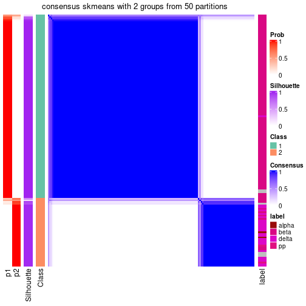</p>

</div>
<div id='tab-node-0232-consensus-heatmap-2'>
<pre><code class="r">consensus_heatmap(res, k = 3)
</code></pre>

<p>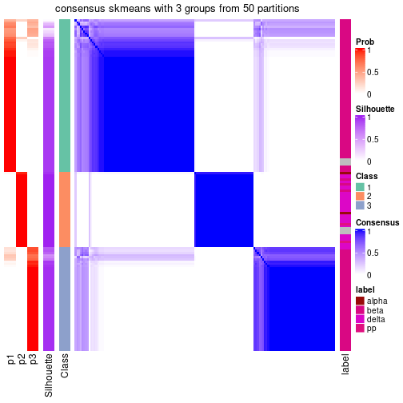</p>

</div>
<div id='tab-node-0232-consensus-heatmap-3'>
<pre><code class="r">consensus_heatmap(res, k = 4)
</code></pre>

<p>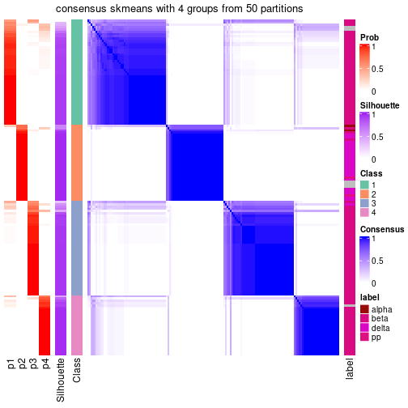</p>

</div>
</div>

Heatmaps for the membership of samples in all partitions to see how consistent they are:


<script>
$( function() {
	$( '#tabs-node-0232-membership-heatmap' ).tabs();
} );
</script>
<div id='tabs-node-0232-membership-heatmap'>
<ul>
<li><a href='#tab-node-0232-membership-heatmap-1'>k = 2</a></li>
<li><a href='#tab-node-0232-membership-heatmap-2'>k = 3</a></li>
<li><a href='#tab-node-0232-membership-heatmap-3'>k = 4</a></li>
</ul>
<div id='tab-node-0232-membership-heatmap-1'>
<pre><code class="r">membership_heatmap(res, k = 2)
</code></pre>

<p>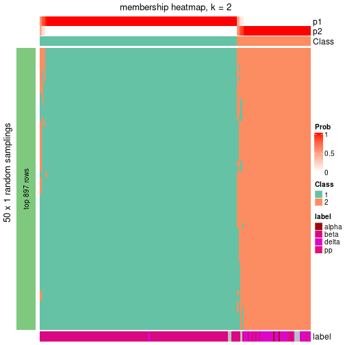</p>

</div>
<div id='tab-node-0232-membership-heatmap-2'>
<pre><code class="r">membership_heatmap(res, k = 3)
</code></pre>

<p>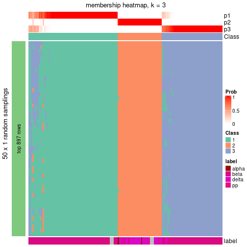</p>

</div>
<div id='tab-node-0232-membership-heatmap-3'>
<pre><code class="r">membership_heatmap(res, k = 4)
</code></pre>

<p>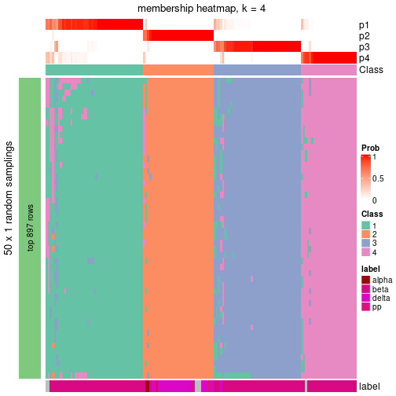</p>

</div>
</div>

As soon as the classes for columns are determined, the signatures
that are significantly different between subgroups can be looked for. 
Following are the heatmaps for signatures.


Signature heatmaps where rows are scaled:


<script>
$( function() {
	$( '#tabs-node-0232-get-signatures' ).tabs();
} );
</script>
<div id='tabs-node-0232-get-signatures'>
<ul>
<li><a href='#tab-node-0232-get-signatures-1'>k = 2</a></li>
<li><a href='#tab-node-0232-get-signatures-2'>k = 3</a></li>
<li><a href='#tab-node-0232-get-signatures-3'>k = 4</a></li>
</ul>
<div id='tab-node-0232-get-signatures-1'>
<pre><code class="r">get_signatures(res, k = 2)
</code></pre>

<p>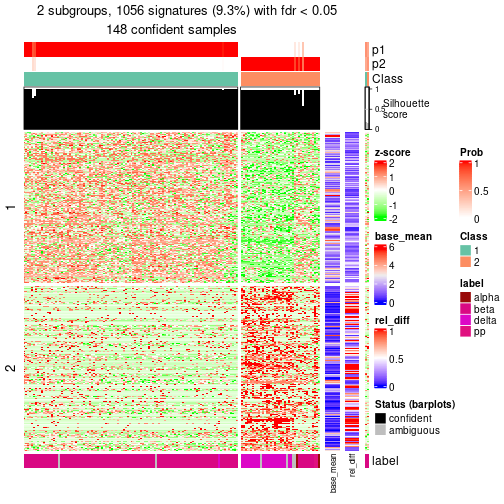</p>

</div>
<div id='tab-node-0232-get-signatures-2'>
<pre><code class="r">get_signatures(res, k = 3)
</code></pre>

<p>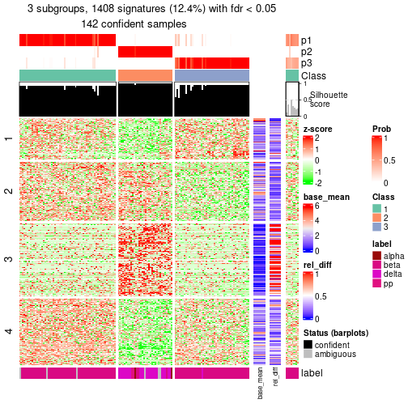</p>

</div>
<div id='tab-node-0232-get-signatures-3'>
<pre><code class="r">get_signatures(res, k = 4)
</code></pre>

<p></p>

</div>
</div>


Signature heatmaps where rows are not scaled:


<script>
$( function() {
	$( '#tabs-node-0232-get-signatures-no-scale' ).tabs();
} );
</script>
<div id='tabs-node-0232-get-signatures-no-scale'>
<ul>
<li><a href='#tab-node-0232-get-signatures-no-scale-1'>k = 2</a></li>
<li><a href='#tab-node-0232-get-signatures-no-scale-2'>k = 3</a></li>
<li><a href='#tab-node-0232-get-signatures-no-scale-3'>k = 4</a></li>
</ul>
<div id='tab-node-0232-get-signatures-no-scale-1'>
<pre><code class="r">get_signatures(res, k = 2, scale_rows = FALSE)
</code></pre>

<p>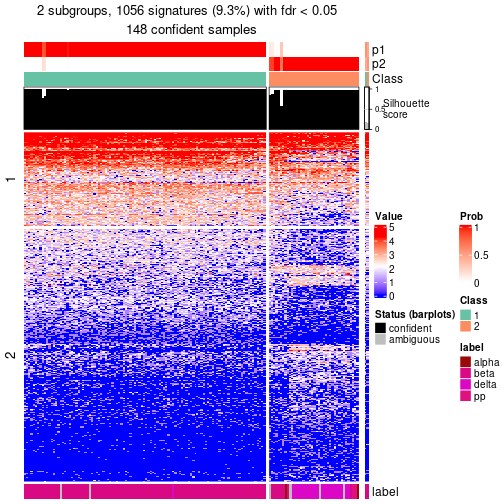</p>

</div>
<div id='tab-node-0232-get-signatures-no-scale-2'>
<pre><code class="r">get_signatures(res, k = 3, scale_rows = FALSE)
</code></pre>

<p>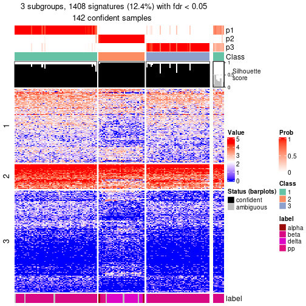</p>

</div>
<div id='tab-node-0232-get-signatures-no-scale-3'>
<pre><code class="r">get_signatures(res, k = 4, scale_rows = FALSE)
</code></pre>

<p>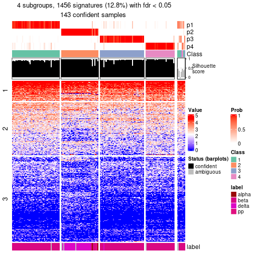</p>

</div>
</div>


Compare the overlap of signatures from different k:

```r
compare_signatures(res)
```

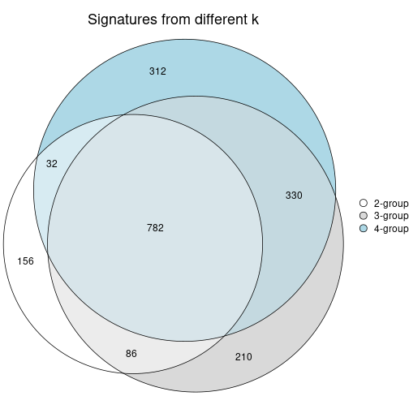

`get_signature()` returns a data frame invisibly. To get the list of signatures, the function
call should be assigned to a variable explicitly. In following code, if `plot` argument is set
to `FALSE`, no heatmap is plotted while only the differential analysis is performed.

```r
# code only for demonstration
tb = get_signature(res, k = ..., plot = FALSE)
```

An example of the output of `tb` is:

```
#>   which_row         fdr    mean_1    mean_2 scaled_mean_1 scaled_mean_2 km
#> 1        38 0.042760348  8.373488  9.131774    -0.5533452     0.5164555  1
#> 2        40 0.018707592  7.106213  8.469186    -0.6173731     0.5762149  1
#> 3        55 0.019134737 10.221463 11.207825    -0.6159697     0.5749050  1
#> 4        59 0.006059896  5.921854  7.869574    -0.6899429     0.6439467  1
#> 5        60 0.018055526  8.928898 10.211722    -0.6204761     0.5791110  1
#> 6        98 0.009384629 15.714769 14.887706     0.6635654    -0.6193277  2
...
```

The columns in `tb` are:

1. `which_row`: row indices corresponding to the input matrix.
2. `fdr`: FDR for the differential test. 
3. `mean_x`: The mean value in group x.
4. `scaled_mean_x`: The mean value in group x after rows are scaled.
5. `km`: Row groups if k-means clustering is applied to rows (which is done by automatically selecting number of clusters).

If there are too many signatures, `top_signatures = ...` can be set to only show the 
signatures with the highest FDRs:

```r
# code only for demonstration
# e.g. to show the top 500 most significant rows
tb = get_signature(res, k = ..., top_signatures = 500)
```

If the signatures are defined as these which are uniquely high in current group, `diff_method` argument
can be set to `"uniquely_high_in_one_group"`:

```r
# code only for demonstration
tb = get_signature(res, k = ..., diff_method = "uniquely_high_in_one_group")
```


UMAP plot which shows how samples are separated.


<script>
$( function() {
	$( '#tabs-node-0232-dimension-reduction' ).tabs();
} );
</script>
<div id='tabs-node-0232-dimension-reduction'>
<ul>
<li><a href='#tab-node-0232-dimension-reduction-1'>k = 2</a></li>
<li><a href='#tab-node-0232-dimension-reduction-2'>k = 3</a></li>
<li><a href='#tab-node-0232-dimension-reduction-3'>k = 4</a></li>
</ul>
<div id='tab-node-0232-dimension-reduction-1'>
<pre><code class="r">dimension_reduction(res, k = 2, method = &quot;UMAP&quot;)
</code></pre>

<p>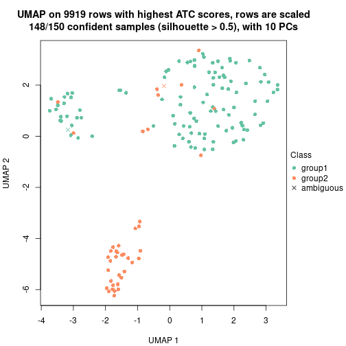</p>

</div>
<div id='tab-node-0232-dimension-reduction-2'>
<pre><code class="r">dimension_reduction(res, k = 3, method = &quot;UMAP&quot;)
</code></pre>

<p>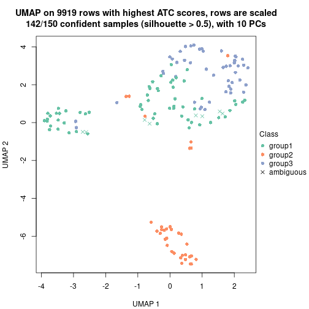</p>

</div>
<div id='tab-node-0232-dimension-reduction-3'>
<pre><code class="r">dimension_reduction(res, k = 4, method = &quot;UMAP&quot;)
</code></pre>

<p>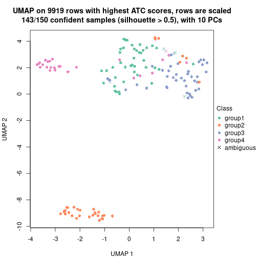</p>

</div>
</div>


Following heatmap shows how subgroups are split when increasing `k`:

```r
collect_classes(res)
```


Test correlation between subgroups and known annotations. If the known
annotation is numeric, one-way ANOVA test is applied, and if the known
annotation is discrete, chi-squared contingency table test is applied.

```r
test_to_known_factors(res)
```

```
#>             n_sample label(p-value) k
#> ATC:skmeans      148       4.98e-21 2
#> ATC:skmeans      142       2.88e-22 3
#> ATC:skmeans      143       9.45e-21 4
```


If matrix rows can be associated to genes, consider to use `functional_enrichment(res,
...)` to perform function enrichment for the signature genes. See [this vignette](https://jokergoo.github.io/cola_vignettes/functional_enrichment.html) for more detailed explanations.


 

---------------------------------------------------


### Node024


Parent node: [Node02](#Node02).
Child nodes: 
                Node0121-leaf
        ,
                Node0122-leaf
        ,
                Node0123-leaf
        ,
                Node0124-leaf
        ,
                Node0131-leaf
        ,
                Node0132-leaf
        ,
                Node0133-leaf
        ,
                Node0211-leaf
        ,
                [Node0212](#Node0212)
        ,
                Node0213-leaf
        ,
                [Node0214](#Node0214)
        ,
                [Node0221](#Node0221)
        ,
                [Node0222](#Node0222)
        ,
                Node0223-leaf
        ,
                [Node0231](#Node0231)
        ,
                [Node0232](#Node0232)
        ,
                Node0233-leaf
        ,
                Node0234-leaf
        ,
                [Node0241](#Node0241)
        ,
                [Node0242](#Node0242)
        ,
                Node0243-leaf
        .


The object with results only for a single top-value method and a single partitioning method 
can be extracted as:

```r
res = res_rh["024"]
```

A summary of `res` and all the functions that can be applied to it:

```r
res
```

```
#> A 'ConsensusPartition' object with k = 2, 3, 4.
#>   On a matrix with 9944 rows and 199 columns.
#>   Top rows (994) are extracted by 'ATC' method.
#>   Subgroups are detected by 'skmeans' method.
#>   Performed in total 150 partitions by row resampling.
#>   Best k for subgroups seems to be 4.
#> 
#> Following methods can be applied to this 'ConsensusPartition' object:
#>  [1] "cola_report"             "collect_classes"         "collect_plots"          
#>  [4] "collect_stats"           "colnames"                "compare_partitions"     
#>  [7] "compare_signatures"      "consensus_heatmap"       "dimension_reduction"    
#> [10] "functional_enrichment"   "get_anno_col"            "get_anno"               
#> [13] "get_classes"             "get_consensus"           "get_matrix"             
#> [16] "get_membership"          "get_param"               "get_signatures"         
#> [19] "get_stats"               "is_best_k"               "is_stable_k"            
#> [22] "membership_heatmap"      "ncol"                    "nrow"                   
#> [25] "plot_ecdf"               "predict_classes"         "rownames"               
#> [28] "select_partition_number" "show"                    "suggest_best_k"         
#> [31] "test_to_known_factors"   "top_rows_heatmap"
```

`collect_plots()` function collects all the plots made from `res` for all `k` (number of subgroups)
into one single page to provide an easy and fast comparison between different `k`.

```r
collect_plots(res)
```

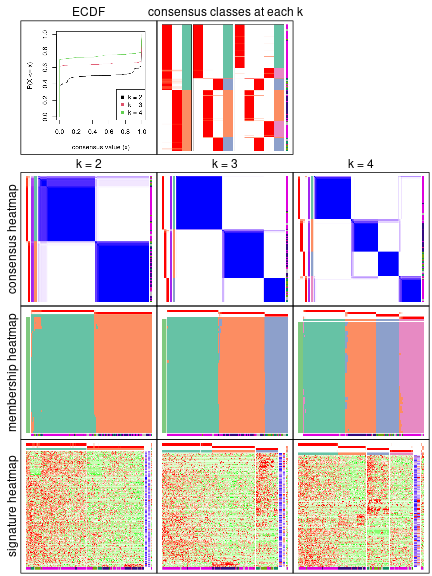

The plots are:

- The first row: a plot of the eCDF (empirical cumulative distribution
  function) curves of the consensus matrix for each `k` and the heatmap of
  predicted classes for each `k`.
- The second row: heatmaps of the consensus matrix for each `k`.
- The third row: heatmaps of the membership matrix for each `k`.
- The fouth row: heatmaps of the signatures for each `k`.

All the plots in panels can be made by individual functions and they are
plotted later in this section.

`select_partition_number()` produces several plots showing different
statistics for choosing "optimized" `k`. There are following statistics:

- eCDF curves of the consensus matrix for each `k`;
- 1-PAC. [The PAC score](https://en.wikipedia.org/wiki/Consensus_clustering#Over-interpretation_potential_of_consensus_clustering)
  measures the proportion of the ambiguous subgrouping.
- Mean silhouette score.
- Concordance. The mean probability of fiting the consensus subgroup labels in all
  partitions.
- Area increased. Denote $A_k$ as the area under the eCDF curve for current
  `k`, the area increased is defined as $A_k - A_{k-1}$.
- Rand index. The percent of pairs of samples that are both in a same cluster
  or both are not in a same cluster in the partition of k and k-1.
- Jaccard index. The ratio of pairs of samples are both in a same cluster in
  the partition of k and k-1 and the pairs of samples are both in a same
  cluster in the partition k or k-1.

The detailed explanations of these statistics can be found in [the _cola_
vignette](https://jokergoo.github.io/cola_vignettes/cola.html#toc_13).

Generally speaking, higher 1-PAC score, higher mean silhouette score or higher
concordance corresponds to better partition. Rand index and Jaccard index
measure how similar the current partition is compared to partition with `k-1`.
If they are too similar, we won't accept `k` is better than `k-1`.

```r
select_partition_number(res)
```

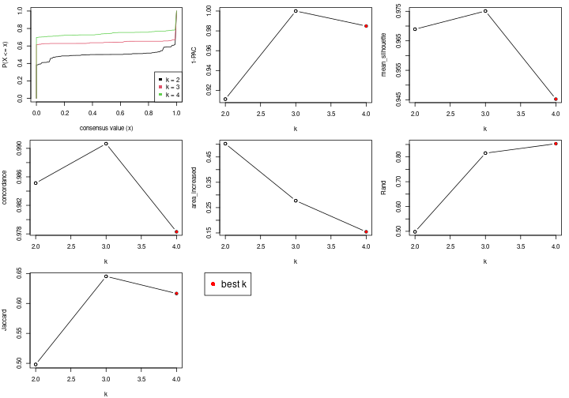

The numeric values for all these statistics can be obtained by `get_stats()`.

```r
get_stats(res)
```

```
#>   k 1-PAC mean_silhouette concordance area_increased  Rand Jaccard
#> 2 2 0.911           0.969       0.985          0.502 0.498   0.498
#> 3 3 1.000           0.975       0.991          0.277 0.815   0.645
#> 4 4 0.985           0.945       0.978          0.155 0.853   0.617
```

`suggest_best_k()` suggests the best $k$ based on these statistics. The rules are as follows:

- All $k$ with Jaccard index larger than 0.95 are removed because increasing
  $k$ does not provide enough extra information. If all $k$ are removed, it is
  marked as no subgroup is detected.
- For all $k$ with 1-PAC score larger than 0.9, the maximal $k$ is taken as
  the best $k$, and other $k$ are marked as optional $k$.
- If it does not fit the second rule. The $k$ with the maximal vote of the
  highest 1-PAC score, highest mean silhouette, and highest concordance is
  taken as the best $k$.

```r
suggest_best_k(res)
```

```
#> [1] 4
#> attr(,"optional")
#> [1] 2 3
```

There is also optional best $k$ = 2 3 that is worth to check.

Following is the table of the partitions (You need to click the **show/hide
code output** link to see it). The membership matrix (columns with name `p*`)
is inferred by
[`clue::cl_consensus()`](https://www.rdocumentation.org/link/cl_consensus?package=clue)
function with the `SE` method. Basically the value in the membership matrix
represents the probability to belong to a certain group. The finall subgroup
label for an item is determined with the group with highest probability it
belongs to.

In `get_classes()` function, the entropy is calculated from the membership
matrix and the silhouette score is calculated from the consensus matrix.


<script>
$( function() {
	$( '#tabs-node-024-get-classes' ).tabs();
} );
</script>
<div id='tabs-node-024-get-classes'>
<ul>
<li><a href='#tab-node-024-get-classes-1'>k = 2</a></li>
<li><a href='#tab-node-024-get-classes-2'>k = 3</a></li>
<li><a href='#tab-node-024-get-classes-3'>k = 4</a></li>
</ul>

<div id='tab-node-024-get-classes-1'>
<p><a id='tab-node-024-get-classes-1-a' style='color:#0366d6' href='#'>show/hide code output</a></p>
<pre><code class="r">cbind(get_classes(res, k = 2), get_membership(res, k = 2))
</code></pre>

<pre><code>#&gt;          class entropy silhouette   p1   p2
#&gt; D28-1_5      2   0.000      0.993 0.00 1.00
#&gt; D28-1_13     1   0.000      0.977 1.00 0.00
#&gt; D28-1_26     2   0.000      0.993 0.00 1.00
#&gt; D28-2_13     2   0.000      0.993 0.00 1.00
#&gt; D28-2_26     1   0.000      0.977 1.00 0.00
#&gt; D28-2_66     2   0.000      0.993 0.00 1.00
#&gt; D28-2_76     1   0.000      0.977 1.00 0.00
#&gt; D28-3_29     1   0.000      0.977 1.00 0.00
#&gt; D28-3_31     2   0.000      0.993 0.00 1.00
#&gt; D28-3_43     1   0.469      0.895 0.90 0.10
#&gt; D28-3_54     1   0.000      0.977 1.00 0.00
#&gt; D28-3_85     2   0.000      0.993 0.00 1.00
#&gt; D28-3_88     2   0.000      0.993 0.00 1.00
#&gt; D28-3_90     2   0.000      0.993 0.00 1.00
#&gt; D28-4_22     1   0.000      0.977 1.00 0.00
#&gt; D28-4_28     1   0.000      0.977 1.00 0.00
#&gt; D28-4_52     1   0.000      0.977 1.00 0.00
#&gt; D28-4_53     2   0.000      0.993 0.00 1.00
#&gt; D28-4_85     2   0.000      0.993 0.00 1.00
#&gt; D28-5_16     1   0.000      0.977 1.00 0.00
#&gt; D28-5_66     2   0.000      0.993 0.00 1.00
#&gt; D28-5_88     1   0.000      0.977 1.00 0.00
#&gt; D28-6_17     2   0.242      0.954 0.04 0.96
#&gt; D28-6_39     2   0.000      0.993 0.00 1.00
#&gt; D28-6_40     1   0.402      0.913 0.92 0.08
#&gt; D28-6_75     1   0.000      0.977 1.00 0.00
#&gt; D28-7_50     1   0.000      0.977 1.00 0.00
#&gt; D28-7_68     2   0.000      0.993 0.00 1.00
#&gt; D28-7_76     2   0.141      0.974 0.02 0.98
#&gt; D28-8_42     2   0.000      0.993 0.00 1.00
#&gt; D28-8_49     2   0.000      0.993 0.00 1.00
#&gt; D28-8_50     2   0.000      0.993 0.00 1.00
#&gt; D28-8_90     2   0.000      0.993 0.00 1.00
#&gt; D29-1_2      1   0.469      0.895 0.90 0.10
#&gt; D29-1_65     1   0.000      0.977 1.00 0.00
#&gt; D29-2_7      2   0.000      0.993 0.00 1.00
#&gt; D29-2_49     2   0.000      0.993 0.00 1.00
#&gt; D29-2_61     1   0.000      0.977 1.00 0.00
#&gt; D29-2_65     1   0.000      0.977 1.00 0.00
#&gt; D29-2_88     2   0.000      0.993 0.00 1.00
#&gt; D29-3_12     2   0.000      0.993 0.00 1.00
#&gt; D29-4_8      1   0.904      0.556 0.68 0.32
#&gt; D29-5_78     2   0.000      0.993 0.00 1.00
#&gt; D29-7_5      2   0.000      0.993 0.00 1.00
#&gt; D29-7_20     2   0.000      0.993 0.00 1.00
#&gt; D29-8_75     1   0.000      0.977 1.00 0.00
#&gt; D29-8_88     1   0.000      0.977 1.00 0.00
#&gt; D31-1_7      2   0.000      0.993 0.00 1.00
#&gt; D31-1_16     2   0.000      0.993 0.00 1.00
#&gt; D31-1_27     2   0.000      0.993 0.00 1.00
#&gt; D31-1_36     1   0.469      0.895 0.90 0.10
#&gt; D31-1_41     1   0.000      0.977 1.00 0.00
#&gt; D31-1_50     1   0.000      0.977 1.00 0.00
#&gt; D31-1_51     2   0.000      0.993 0.00 1.00
#&gt; D31-1_62     1   0.000      0.977 1.00 0.00
#&gt; D31-1_72     1   0.000      0.977 1.00 0.00
#&gt; D31-1_82     1   0.000      0.977 1.00 0.00
#&gt; D31-1_83     2   0.000      0.993 0.00 1.00
#&gt; D31-1_84     1   0.000      0.977 1.00 0.00
#&gt; D31-1_90     2   0.000      0.993 0.00 1.00
#&gt; D31-2_4      2   0.000      0.993 0.00 1.00
#&gt; D31-2_18     2   0.000      0.993 0.00 1.00
#&gt; D31-2_20     1   0.000      0.977 1.00 0.00
#&gt; D31-2_21     1   0.000      0.977 1.00 0.00
#&gt; D31-2_26     2   0.000      0.993 0.00 1.00
#&gt; D31-2_37     1   0.000      0.977 1.00 0.00
#&gt; D31-2_40     1   0.000      0.977 1.00 0.00
#&gt; D31-2_54     1   0.000      0.977 1.00 0.00
#&gt; D31-2_59     1   0.000      0.977 1.00 0.00
#&gt; D31-2_62     1   0.000      0.977 1.00 0.00
#&gt; D31-2_77     2   0.000      0.993 0.00 1.00
#&gt; D31-2_78     1   0.000      0.977 1.00 0.00
#&gt; D31-2_84     1   0.958      0.405 0.62 0.38
#&gt; D31-2_94     2   0.000      0.993 0.00 1.00
#&gt; D31-3_23     2   0.000      0.993 0.00 1.00
#&gt; D31-3_59     1   0.469      0.895 0.90 0.10
#&gt; D31-3_65     1   0.795      0.699 0.76 0.24
#&gt; D31-3_71     2   0.000      0.993 0.00 1.00
#&gt; D31-3_78     1   0.000      0.977 1.00 0.00
#&gt; D31-3_81     1   0.000      0.977 1.00 0.00
#&gt; D31-4_9      2   0.000      0.993 0.00 1.00
#&gt; D31-4_35     1   0.000      0.977 1.00 0.00
#&gt; D31-4_56     1   0.000      0.977 1.00 0.00
#&gt; D31-4_76     2   0.000      0.993 0.00 1.00
#&gt; D31-4_90     2   0.000      0.993 0.00 1.00
#&gt; D31-4_91     2   0.000      0.993 0.00 1.00
#&gt; D31-5_4      2   0.000      0.993 0.00 1.00
#&gt; D31-5_13     1   0.000      0.977 1.00 0.00
#&gt; D31-5_14     1   0.529      0.867 0.88 0.12
#&gt; D31-5_19     1   0.141      0.962 0.98 0.02
#&gt; D31-5_34     2   0.000      0.993 0.00 1.00
#&gt; D31-5_39     2   0.000      0.993 0.00 1.00
#&gt; D31-5_41     1   0.000      0.977 1.00 0.00
#&gt; D31-5_47     1   0.000      0.977 1.00 0.00
#&gt; D31-5_51     1   0.000      0.977 1.00 0.00
#&gt; D31-5_57     2   0.000      0.993 0.00 1.00
#&gt; D31-5_60     2   0.000      0.993 0.00 1.00
#&gt; D31-5_64     2   0.000      0.993 0.00 1.00
#&gt; D31-5_65     1   0.000      0.977 1.00 0.00
#&gt; D31-5_73     2   0.000      0.993 0.00 1.00
#&gt; D31-5_75     2   0.000      0.993 0.00 1.00
#&gt; D31-5_77     1   0.469      0.895 0.90 0.10
#&gt; D31-5_81     2   0.000      0.993 0.00 1.00
#&gt; D31-5_83     1   0.000      0.977 1.00 0.00
#&gt; D31-5_89     2   0.000      0.993 0.00 1.00
#&gt; D31-6_6      2   0.000      0.993 0.00 1.00
#&gt; D31-6_11     2   0.000      0.993 0.00 1.00
#&gt; D31-6_21     2   0.000      0.993 0.00 1.00
#&gt; D31-6_23     1   0.469      0.895 0.90 0.10
#&gt; D31-6_24     2   0.000      0.993 0.00 1.00
#&gt; D31-6_27     1   0.000      0.977 1.00 0.00
#&gt; D31-6_28     1   0.000      0.977 1.00 0.00
#&gt; D31-6_29     2   0.000      0.993 0.00 1.00
#&gt; D31-6_34     2   0.000      0.993 0.00 1.00
#&gt; D31-6_37     1   0.000      0.977 1.00 0.00
#&gt; D31-6_40     2   0.000      0.993 0.00 1.00
#&gt; D31-6_41     1   0.000      0.977 1.00 0.00
#&gt; D31-6_52     2   0.000      0.993 0.00 1.00
#&gt; D31-6_62     2   0.000      0.993 0.00 1.00
#&gt; D31-6_70     2   0.242      0.954 0.04 0.96
#&gt; D31-6_72     1   0.000      0.977 1.00 0.00
#&gt; D31-6_73     2   0.000      0.993 0.00 1.00
#&gt; D31-6_75     2   0.000      0.993 0.00 1.00
#&gt; D31-6_79     2   0.000      0.993 0.00 1.00
#&gt; D31-7_4      2   0.000      0.993 0.00 1.00
#&gt; D31-7_9      2   0.000      0.993 0.00 1.00
#&gt; D31-7_11     2   0.000      0.993 0.00 1.00
#&gt; D31-7_20     2   0.000      0.993 0.00 1.00
#&gt; D31-7_21     2   0.000      0.993 0.00 1.00
#&gt; D31-7_23     1   0.000      0.977 1.00 0.00
#&gt; D31-7_26     2   0.000      0.993 0.00 1.00
#&gt; D31-7_29     1   0.000      0.977 1.00 0.00
#&gt; D31-7_58     2   0.000      0.993 0.00 1.00
#&gt; D31-7_73     1   0.000      0.977 1.00 0.00
#&gt; D31-7_89     1   0.000      0.977 1.00 0.00
#&gt; D31-8_7      2   0.000      0.993 0.00 1.00
#&gt; D31-8_19     1   0.000      0.977 1.00 0.00
#&gt; D31-8_30     1   0.000      0.977 1.00 0.00
#&gt; D31-8_37     1   0.000      0.977 1.00 0.00
#&gt; D31-8_40     2   0.000      0.993 0.00 1.00
#&gt; D31-8_45     1   0.000      0.977 1.00 0.00
#&gt; D31-8_56     2   0.000      0.993 0.00 1.00
#&gt; D31-8_75     1   0.000      0.977 1.00 0.00
#&gt; D31-8_80     1   0.000      0.977 1.00 0.00
#&gt; D31-8_85     1   0.000      0.977 1.00 0.00
#&gt; D31-8_90     2   0.000      0.993 0.00 1.00
#&gt; D31-8_94     1   0.000      0.977 1.00 0.00
#&gt; D30-1_25     2   0.000      0.993 0.00 1.00
#&gt; D30-1_29     2   0.000      0.993 0.00 1.00
#&gt; D30-1_42     1   0.000      0.977 1.00 0.00
#&gt; D30-1_46     1   0.529      0.866 0.88 0.12
#&gt; D30-1_63     2   0.000      0.993 0.00 1.00
#&gt; D30-1_70     2   0.000      0.993 0.00 1.00
#&gt; D30-1_78     2   0.000      0.993 0.00 1.00
#&gt; D30-1_88     1   0.000      0.977 1.00 0.00
#&gt; D30-1_91     2   0.000      0.993 0.00 1.00
#&gt; D30-2_50     1   0.000      0.977 1.00 0.00
#&gt; D30-2_58     1   0.000      0.977 1.00 0.00
#&gt; D30-2_79     2   0.000      0.993 0.00 1.00
#&gt; D30-3_32     1   0.000      0.977 1.00 0.00
#&gt; D30-3_90     1   0.000      0.977 1.00 0.00
#&gt; D30-3_91     1   0.242      0.948 0.96 0.04
#&gt; D30-3_94     2   0.000      0.993 0.00 1.00
#&gt; D30-4_27     1   0.000      0.977 1.00 0.00
#&gt; D30-4_30     2   0.584      0.835 0.14 0.86
#&gt; D30-4_31     1   0.000      0.977 1.00 0.00
#&gt; D30-4_42     1   0.000      0.977 1.00 0.00
#&gt; D30-4_81     2   0.000      0.993 0.00 1.00
#&gt; D30-5_3      1   0.469      0.895 0.90 0.10
#&gt; D30-5_9      1   0.000      0.977 1.00 0.00
#&gt; D30-5_15     2   0.634      0.808 0.16 0.84
#&gt; D30-5_31     1   0.000      0.977 1.00 0.00
#&gt; D30-5_34     1   0.000      0.977 1.00 0.00
#&gt; D30-5_41     2   0.000      0.993 0.00 1.00
#&gt; D30-5_42     1   0.000      0.977 1.00 0.00
#&gt; D30-5_50     1   0.000      0.977 1.00 0.00
#&gt; D30-5_61     1   0.000      0.977 1.00 0.00
#&gt; D30-5_90     1   0.529      0.873 0.88 0.12
#&gt; D30-6_5      2   0.000      0.993 0.00 1.00
#&gt; D30-6_10     2   0.000      0.993 0.00 1.00
#&gt; D30-6_12     1   0.000      0.977 1.00 0.00
#&gt; D30-6_20     1   0.000      0.977 1.00 0.00
#&gt; D30-6_25     1   0.000      0.977 1.00 0.00
#&gt; D30-6_57     1   0.000      0.977 1.00 0.00
#&gt; D30-6_61     1   0.000      0.977 1.00 0.00
#&gt; D30-6_78     1   0.000      0.977 1.00 0.00
#&gt; D30-6_86     1   0.000      0.977 1.00 0.00
#&gt; D30-6_93     2   0.680      0.778 0.18 0.82
#&gt; D30-7_17     1   0.000      0.977 1.00 0.00
#&gt; D30-7_24     2   0.000      0.993 0.00 1.00
#&gt; D30-7_74     1   0.000      0.977 1.00 0.00
#&gt; D30-7_88     2   0.000      0.993 0.00 1.00
#&gt; D30-7_90     1   0.469      0.895 0.90 0.10
#&gt; D30-8_4      1   0.000      0.977 1.00 0.00
#&gt; D30-8_8      2   0.242      0.954 0.04 0.96
#&gt; D30-8_34     2   0.000      0.993 0.00 1.00
#&gt; D30-8_60     1   0.469      0.895 0.90 0.10
#&gt; D30-8_82     1   0.000      0.977 1.00 0.00
#&gt; D30-8_87     1   0.000      0.977 1.00 0.00
</code></pre>

<script>
$('#tab-node-024-get-classes-1-a').parent().next().next().hide();
$('#tab-node-024-get-classes-1-a').click(function(){
  $('#tab-node-024-get-classes-1-a').parent().next().next().toggle();
  return(false);
});
</script>
</div>

<div id='tab-node-024-get-classes-2'>
<p><a id='tab-node-024-get-classes-2-a' style='color:#0366d6' href='#'>show/hide code output</a></p>
<pre><code class="r">cbind(get_classes(res, k = 3), get_membership(res, k = 3))
</code></pre>

<pre><code>#&gt;          class entropy silhouette   p1   p2   p3
#&gt; D28-1_5      2  0.0000     0.9811 0.00 1.00 0.00
#&gt; D28-1_13     1  0.0000     0.9992 1.00 0.00 0.00
#&gt; D28-1_26     3  0.0000     0.9870 0.00 0.00 1.00
#&gt; D28-2_13     2  0.0000     0.9811 0.00 1.00 0.00
#&gt; D28-2_26     1  0.0000     0.9992 1.00 0.00 0.00
#&gt; D28-2_66     2  0.2959     0.8785 0.00 0.90 0.10
#&gt; D28-2_76     3  0.0000     0.9870 0.00 0.00 1.00
#&gt; D28-3_29     1  0.0000     0.9992 1.00 0.00 0.00
#&gt; D28-3_31     2  0.0000     0.9811 0.00 1.00 0.00
#&gt; D28-3_43     3  0.0000     0.9870 0.00 0.00 1.00
#&gt; D28-3_54     1  0.0000     0.9992 1.00 0.00 0.00
#&gt; D28-3_85     2  0.0000     0.9811 0.00 1.00 0.00
#&gt; D28-3_88     3  0.0000     0.9870 0.00 0.00 1.00
#&gt; D28-3_90     2  0.0000     0.9811 0.00 1.00 0.00
#&gt; D28-4_22     1  0.0000     0.9992 1.00 0.00 0.00
#&gt; D28-4_28     1  0.0000     0.9992 1.00 0.00 0.00
#&gt; D28-4_52     1  0.0000     0.9992 1.00 0.00 0.00
#&gt; D28-4_53     2  0.0000     0.9811 0.00 1.00 0.00
#&gt; D28-4_85     2  0.0000     0.9811 0.00 1.00 0.00
#&gt; D28-5_16     1  0.0000     0.9992 1.00 0.00 0.00
#&gt; D28-5_66     2  0.0000     0.9811 0.00 1.00 0.00
#&gt; D28-5_88     3  0.0000     0.9870 0.00 0.00 1.00
#&gt; D28-6_17     2  0.0000     0.9811 0.00 1.00 0.00
#&gt; D28-6_39     2  0.0000     0.9811 0.00 1.00 0.00
#&gt; D28-6_40     3  0.0000     0.9870 0.00 0.00 1.00
#&gt; D28-6_75     1  0.0000     0.9992 1.00 0.00 0.00
#&gt; D28-7_50     1  0.0000     0.9992 1.00 0.00 0.00
#&gt; D28-7_68     3  0.0000     0.9870 0.00 0.00 1.00
#&gt; D28-7_76     2  0.0000     0.9811 0.00 1.00 0.00
#&gt; D28-8_42     2  0.6045     0.3887 0.00 0.62 0.38
#&gt; D28-8_49     2  0.0000     0.9811 0.00 1.00 0.00
#&gt; D28-8_50     3  0.0000     0.9870 0.00 0.00 1.00
#&gt; D28-8_90     2  0.0000     0.9811 0.00 1.00 0.00
#&gt; D29-1_2      3  0.0000     0.9870 0.00 0.00 1.00
#&gt; D29-1_65     1  0.0000     0.9992 1.00 0.00 0.00
#&gt; D29-2_7      2  0.0000     0.9811 0.00 1.00 0.00
#&gt; D29-2_49     2  0.5948     0.4385 0.00 0.64 0.36
#&gt; D29-2_61     1  0.0000     0.9992 1.00 0.00 0.00
#&gt; D29-2_65     1  0.0000     0.9992 1.00 0.00 0.00
#&gt; D29-2_88     2  0.0000     0.9811 0.00 1.00 0.00
#&gt; D29-3_12     2  0.0000     0.9811 0.00 1.00 0.00
#&gt; D29-4_8      3  0.0000     0.9870 0.00 0.00 1.00
#&gt; D29-5_78     2  0.0000     0.9811 0.00 1.00 0.00
#&gt; D29-7_5      2  0.0000     0.9811 0.00 1.00 0.00
#&gt; D29-7_20     2  0.0000     0.9811 0.00 1.00 0.00
#&gt; D29-8_75     1  0.0000     0.9992 1.00 0.00 0.00
#&gt; D29-8_88     1  0.0000     0.9992 1.00 0.00 0.00
#&gt; D31-1_7      2  0.0000     0.9811 0.00 1.00 0.00
#&gt; D31-1_16     2  0.0000     0.9811 0.00 1.00 0.00
#&gt; D31-1_27     2  0.0000     0.9811 0.00 1.00 0.00
#&gt; D31-1_36     3  0.0000     0.9870 0.00 0.00 1.00
#&gt; D31-1_41     3  0.0000     0.9870 0.00 0.00 1.00
#&gt; D31-1_50     1  0.0000     0.9992 1.00 0.00 0.00
#&gt; D31-1_51     2  0.0000     0.9811 0.00 1.00 0.00
#&gt; D31-1_62     1  0.0000     0.9992 1.00 0.00 0.00
#&gt; D31-1_72     1  0.0000     0.9992 1.00 0.00 0.00
#&gt; D31-1_82     1  0.0000     0.9992 1.00 0.00 0.00
#&gt; D31-1_83     2  0.0000     0.9811 0.00 1.00 0.00
#&gt; D31-1_84     1  0.0000     0.9992 1.00 0.00 0.00
#&gt; D31-1_90     2  0.0000     0.9811 0.00 1.00 0.00
#&gt; D31-2_4      3  0.0000     0.9870 0.00 0.00 1.00
#&gt; D31-2_18     2  0.0000     0.9811 0.00 1.00 0.00
#&gt; D31-2_20     1  0.0000     0.9992 1.00 0.00 0.00
#&gt; D31-2_21     1  0.0000     0.9992 1.00 0.00 0.00
#&gt; D31-2_26     2  0.0000     0.9811 0.00 1.00 0.00
#&gt; D31-2_37     1  0.0000     0.9992 1.00 0.00 0.00
#&gt; D31-2_40     1  0.0000     0.9992 1.00 0.00 0.00
#&gt; D31-2_54     1  0.0000     0.9992 1.00 0.00 0.00
#&gt; D31-2_59     1  0.0000     0.9992 1.00 0.00 0.00
#&gt; D31-2_62     1  0.0000     0.9992 1.00 0.00 0.00
#&gt; D31-2_77     2  0.0000     0.9811 0.00 1.00 0.00
#&gt; D31-2_78     1  0.0000     0.9992 1.00 0.00 0.00
#&gt; D31-2_84     1  0.1529     0.9537 0.96 0.04 0.00
#&gt; D31-2_94     2  0.0000     0.9811 0.00 1.00 0.00
#&gt; D31-3_23     2  0.0000     0.9811 0.00 1.00 0.00
#&gt; D31-3_59     3  0.0000     0.9870 0.00 0.00 1.00
#&gt; D31-3_65     1  0.0892     0.9768 0.98 0.02 0.00
#&gt; D31-3_71     3  0.0000     0.9870 0.00 0.00 1.00
#&gt; D31-3_78     1  0.0000     0.9992 1.00 0.00 0.00
#&gt; D31-3_81     1  0.0000     0.9992 1.00 0.00 0.00
#&gt; D31-4_9      2  0.0000     0.9811 0.00 1.00 0.00
#&gt; D31-4_35     1  0.0000     0.9992 1.00 0.00 0.00
#&gt; D31-4_56     1  0.0000     0.9992 1.00 0.00 0.00
#&gt; D31-4_76     2  0.0000     0.9811 0.00 1.00 0.00
#&gt; D31-4_90     2  0.0000     0.9811 0.00 1.00 0.00
#&gt; D31-4_91     2  0.0000     0.9811 0.00 1.00 0.00
#&gt; D31-5_4      2  0.0000     0.9811 0.00 1.00 0.00
#&gt; D31-5_13     1  0.0000     0.9992 1.00 0.00 0.00
#&gt; D31-5_14     1  0.0000     0.9992 1.00 0.00 0.00
#&gt; D31-5_19     1  0.0000     0.9992 1.00 0.00 0.00
#&gt; D31-5_34     2  0.0000     0.9811 0.00 1.00 0.00
#&gt; D31-5_39     2  0.0000     0.9811 0.00 1.00 0.00
#&gt; D31-5_41     1  0.0000     0.9992 1.00 0.00 0.00
#&gt; D31-5_47     3  0.0000     0.9870 0.00 0.00 1.00
#&gt; D31-5_51     1  0.0000     0.9992 1.00 0.00 0.00
#&gt; D31-5_57     2  0.0000     0.9811 0.00 1.00 0.00
#&gt; D31-5_60     2  0.0000     0.9811 0.00 1.00 0.00
#&gt; D31-5_64     2  0.0000     0.9811 0.00 1.00 0.00
#&gt; D31-5_65     1  0.0000     0.9992 1.00 0.00 0.00
#&gt; D31-5_73     2  0.0000     0.9811 0.00 1.00 0.00
#&gt; D31-5_75     2  0.0000     0.9811 0.00 1.00 0.00
#&gt; D31-5_77     3  0.0000     0.9870 0.00 0.00 1.00
#&gt; D31-5_81     2  0.0000     0.9811 0.00 1.00 0.00
#&gt; D31-5_83     3  0.0000     0.9870 0.00 0.00 1.00
#&gt; D31-5_89     2  0.0000     0.9811 0.00 1.00 0.00
#&gt; D31-6_6      3  0.0000     0.9870 0.00 0.00 1.00
#&gt; D31-6_11     2  0.0000     0.9811 0.00 1.00 0.00
#&gt; D31-6_21     2  0.0000     0.9811 0.00 1.00 0.00
#&gt; D31-6_23     3  0.0000     0.9870 0.00 0.00 1.00
#&gt; D31-6_24     2  0.0000     0.9811 0.00 1.00 0.00
#&gt; D31-6_27     1  0.0000     0.9992 1.00 0.00 0.00
#&gt; D31-6_28     1  0.0000     0.9992 1.00 0.00 0.00
#&gt; D31-6_29     2  0.0000     0.9811 0.00 1.00 0.00
#&gt; D31-6_34     2  0.0000     0.9811 0.00 1.00 0.00
#&gt; D31-6_37     1  0.0000     0.9992 1.00 0.00 0.00
#&gt; D31-6_40     2  0.0000     0.9811 0.00 1.00 0.00
#&gt; D31-6_41     1  0.0000     0.9992 1.00 0.00 0.00
#&gt; D31-6_52     2  0.0000     0.9811 0.00 1.00 0.00
#&gt; D31-6_62     2  0.0000     0.9811 0.00 1.00 0.00
#&gt; D31-6_70     3  0.0000     0.9870 0.00 0.00 1.00
#&gt; D31-6_72     1  0.0000     0.9992 1.00 0.00 0.00
#&gt; D31-6_73     3  0.0000     0.9870 0.00 0.00 1.00
#&gt; D31-6_75     2  0.0000     0.9811 0.00 1.00 0.00
#&gt; D31-6_79     2  0.0000     0.9811 0.00 1.00 0.00
#&gt; D31-7_4      3  0.0000     0.9870 0.00 0.00 1.00
#&gt; D31-7_9      2  0.0000     0.9811 0.00 1.00 0.00
#&gt; D31-7_11     2  0.0000     0.9811 0.00 1.00 0.00
#&gt; D31-7_20     3  0.0000     0.9870 0.00 0.00 1.00
#&gt; D31-7_21     2  0.0000     0.9811 0.00 1.00 0.00
#&gt; D31-7_23     1  0.0000     0.9992 1.00 0.00 0.00
#&gt; D31-7_26     2  0.0000     0.9811 0.00 1.00 0.00
#&gt; D31-7_29     1  0.0000     0.9992 1.00 0.00 0.00
#&gt; D31-7_58     2  0.0000     0.9811 0.00 1.00 0.00
#&gt; D31-7_73     1  0.0000     0.9992 1.00 0.00 0.00
#&gt; D31-7_89     1  0.0000     0.9992 1.00 0.00 0.00
#&gt; D31-8_7      2  0.0000     0.9811 0.00 1.00 0.00
#&gt; D31-8_19     1  0.0000     0.9992 1.00 0.00 0.00
#&gt; D31-8_30     1  0.0000     0.9992 1.00 0.00 0.00
#&gt; D31-8_37     1  0.0000     0.9992 1.00 0.00 0.00
#&gt; D31-8_40     2  0.0000     0.9811 0.00 1.00 0.00
#&gt; D31-8_45     1  0.0000     0.9992 1.00 0.00 0.00
#&gt; D31-8_56     3  0.0000     0.9870 0.00 0.00 1.00
#&gt; D31-8_75     1  0.0000     0.9992 1.00 0.00 0.00
#&gt; D31-8_80     1  0.0000     0.9992 1.00 0.00 0.00
#&gt; D31-8_85     1  0.0000     0.9992 1.00 0.00 0.00
#&gt; D31-8_90     2  0.0000     0.9811 0.00 1.00 0.00
#&gt; D31-8_94     1  0.0000     0.9992 1.00 0.00 0.00
#&gt; D30-1_25     3  0.0000     0.9870 0.00 0.00 1.00
#&gt; D30-1_29     2  0.0000     0.9811 0.00 1.00 0.00
#&gt; D30-1_42     1  0.0000     0.9992 1.00 0.00 0.00
#&gt; D30-1_46     1  0.0000     0.9992 1.00 0.00 0.00
#&gt; D30-1_63     2  0.0000     0.9811 0.00 1.00 0.00
#&gt; D30-1_70     3  0.0000     0.9870 0.00 0.00 1.00
#&gt; D30-1_78     2  0.0000     0.9811 0.00 1.00 0.00
#&gt; D30-1_88     1  0.0000     0.9992 1.00 0.00 0.00
#&gt; D30-1_91     2  0.0000     0.9811 0.00 1.00 0.00
#&gt; D30-2_50     1  0.0000     0.9992 1.00 0.00 0.00
#&gt; D30-2_58     1  0.0000     0.9992 1.00 0.00 0.00
#&gt; D30-2_79     3  0.6302     0.0415 0.00 0.48 0.52
#&gt; D30-3_32     1  0.0000     0.9992 1.00 0.00 0.00
#&gt; D30-3_90     1  0.0000     0.9992 1.00 0.00 0.00
#&gt; D30-3_91     2  0.6045     0.3887 0.38 0.62 0.00
#&gt; D30-3_94     3  0.0000     0.9870 0.00 0.00 1.00
#&gt; D30-4_27     1  0.0000     0.9992 1.00 0.00 0.00
#&gt; D30-4_30     3  0.0000     0.9870 0.00 0.00 1.00
#&gt; D30-4_31     1  0.0000     0.9992 1.00 0.00 0.00
#&gt; D30-4_42     1  0.0000     0.9992 1.00 0.00 0.00
#&gt; D30-4_81     2  0.0000     0.9811 0.00 1.00 0.00
#&gt; D30-5_3      3  0.0000     0.9870 0.00 0.00 1.00
#&gt; D30-5_9      1  0.0000     0.9992 1.00 0.00 0.00
#&gt; D30-5_15     3  0.0000     0.9870 0.00 0.00 1.00
#&gt; D30-5_31     1  0.0000     0.9992 1.00 0.00 0.00
#&gt; D30-5_34     1  0.0000     0.9992 1.00 0.00 0.00
#&gt; D30-5_41     2  0.1529     0.9433 0.00 0.96 0.04
#&gt; D30-5_42     1  0.0000     0.9992 1.00 0.00 0.00
#&gt; D30-5_50     1  0.0000     0.9992 1.00 0.00 0.00
#&gt; D30-5_61     1  0.0000     0.9992 1.00 0.00 0.00
#&gt; D30-5_90     3  0.0000     0.9870 0.00 0.00 1.00
#&gt; D30-6_5      2  0.0000     0.9811 0.00 1.00 0.00
#&gt; D30-6_10     3  0.0000     0.9870 0.00 0.00 1.00
#&gt; D30-6_12     1  0.0000     0.9992 1.00 0.00 0.00
#&gt; D30-6_20     1  0.0000     0.9992 1.00 0.00 0.00
#&gt; D30-6_25     1  0.0000     0.9992 1.00 0.00 0.00
#&gt; D30-6_57     1  0.0000     0.9992 1.00 0.00 0.00
#&gt; D30-6_61     1  0.0000     0.9992 1.00 0.00 0.00
#&gt; D30-6_78     1  0.0000     0.9992 1.00 0.00 0.00
#&gt; D30-6_86     1  0.0000     0.9992 1.00 0.00 0.00
#&gt; D30-6_93     3  0.0000     0.9870 0.00 0.00 1.00
#&gt; D30-7_17     1  0.0000     0.9992 1.00 0.00 0.00
#&gt; D30-7_24     2  0.0000     0.9811 0.00 1.00 0.00
#&gt; D30-7_74     1  0.0000     0.9992 1.00 0.00 0.00
#&gt; D30-7_88     2  0.2066     0.9229 0.00 0.94 0.06
#&gt; D30-7_90     3  0.0000     0.9870 0.00 0.00 1.00
#&gt; D30-8_4      1  0.0000     0.9992 1.00 0.00 0.00
#&gt; D30-8_8      2  0.0000     0.9811 0.00 1.00 0.00
#&gt; D30-8_34     3  0.0000     0.9870 0.00 0.00 1.00
#&gt; D30-8_60     3  0.0000     0.9870 0.00 0.00 1.00
#&gt; D30-8_82     1  0.0000     0.9992 1.00 0.00 0.00
#&gt; D30-8_87     3  0.0000     0.9870 0.00 0.00 1.00
</code></pre>

<script>
$('#tab-node-024-get-classes-2-a').parent().next().next().hide();
$('#tab-node-024-get-classes-2-a').click(function(){
  $('#tab-node-024-get-classes-2-a').parent().next().next().toggle();
  return(false);
});
</script>
</div>

<div id='tab-node-024-get-classes-3'>
<p><a id='tab-node-024-get-classes-3-a' style='color:#0366d6' href='#'>show/hide code output</a></p>
<pre><code class="r">cbind(get_classes(res, k = 4), get_membership(res, k = 4))
</code></pre>

<pre><code>#&gt;          class entropy silhouette   p1   p2   p3   p4
#&gt; D28-1_5      4  0.2011     0.8871 0.00 0.08 0.00 0.92
#&gt; D28-1_13     1  0.0000     0.9900 1.00 0.00 0.00 0.00
#&gt; D28-1_26     3  0.0000     1.0000 0.00 0.00 1.00 0.00
#&gt; D28-2_13     4  0.0000     0.9549 0.00 0.00 0.00 1.00
#&gt; D28-2_26     1  0.0000     0.9900 1.00 0.00 0.00 0.00
#&gt; D28-2_66     2  0.3610     0.7529 0.00 0.80 0.20 0.00
#&gt; D28-2_76     3  0.0000     1.0000 0.00 0.00 1.00 0.00
#&gt; D28-3_29     1  0.0000     0.9900 1.00 0.00 0.00 0.00
#&gt; D28-3_31     2  0.0000     0.9589 0.00 1.00 0.00 0.00
#&gt; D28-3_43     3  0.0000     1.0000 0.00 0.00 1.00 0.00
#&gt; D28-3_54     1  0.0000     0.9900 1.00 0.00 0.00 0.00
#&gt; D28-3_85     2  0.0000     0.9589 0.00 1.00 0.00 0.00
#&gt; D28-3_88     3  0.0000     1.0000 0.00 0.00 1.00 0.00
#&gt; D28-3_90     2  0.0000     0.9589 0.00 1.00 0.00 0.00
#&gt; D28-4_22     1  0.0000     0.9900 1.00 0.00 0.00 0.00
#&gt; D28-4_28     1  0.0000     0.9900 1.00 0.00 0.00 0.00
#&gt; D28-4_52     1  0.0000     0.9900 1.00 0.00 0.00 0.00
#&gt; D28-4_53     2  0.0000     0.9589 0.00 1.00 0.00 0.00
#&gt; D28-4_85     2  0.0000     0.9589 0.00 1.00 0.00 0.00
#&gt; D28-5_16     1  0.0000     0.9900 1.00 0.00 0.00 0.00
#&gt; D28-5_66     4  0.0000     0.9549 0.00 0.00 0.00 1.00
#&gt; D28-5_88     3  0.0000     1.0000 0.00 0.00 1.00 0.00
#&gt; D28-6_17     4  0.0000     0.9549 0.00 0.00 0.00 1.00
#&gt; D28-6_39     4  0.0000     0.9549 0.00 0.00 0.00 1.00
#&gt; D28-6_40     3  0.0000     1.0000 0.00 0.00 1.00 0.00
#&gt; D28-6_75     1  0.0000     0.9900 1.00 0.00 0.00 0.00
#&gt; D28-7_50     1  0.0000     0.9900 1.00 0.00 0.00 0.00
#&gt; D28-7_68     3  0.0000     1.0000 0.00 0.00 1.00 0.00
#&gt; D28-7_76     4  0.0000     0.9549 0.00 0.00 0.00 1.00
#&gt; D28-8_42     2  0.4977     0.2186 0.00 0.54 0.46 0.00
#&gt; D28-8_49     2  0.0000     0.9589 0.00 1.00 0.00 0.00
#&gt; D28-8_50     3  0.0000     1.0000 0.00 0.00 1.00 0.00
#&gt; D28-8_90     4  0.3172     0.7989 0.00 0.16 0.00 0.84
#&gt; D29-1_2      3  0.0000     1.0000 0.00 0.00 1.00 0.00
#&gt; D29-1_65     1  0.0000     0.9900 1.00 0.00 0.00 0.00
#&gt; D29-2_7      4  0.0000     0.9549 0.00 0.00 0.00 1.00
#&gt; D29-2_49     2  0.4977     0.2186 0.00 0.54 0.46 0.00
#&gt; D29-2_61     1  0.0000     0.9900 1.00 0.00 0.00 0.00
#&gt; D29-2_65     1  0.0000     0.9900 1.00 0.00 0.00 0.00
#&gt; D29-2_88     4  0.0000     0.9549 0.00 0.00 0.00 1.00
#&gt; D29-3_12     4  0.4948     0.2319 0.00 0.44 0.00 0.56
#&gt; D29-4_8      3  0.0000     1.0000 0.00 0.00 1.00 0.00
#&gt; D29-5_78     2  0.0000     0.9589 0.00 1.00 0.00 0.00
#&gt; D29-7_5      2  0.0000     0.9589 0.00 1.00 0.00 0.00
#&gt; D29-7_20     4  0.0000     0.9549 0.00 0.00 0.00 1.00
#&gt; D29-8_75     1  0.0000     0.9900 1.00 0.00 0.00 0.00
#&gt; D29-8_88     1  0.0000     0.9900 1.00 0.00 0.00 0.00
#&gt; D31-1_7      2  0.0000     0.9589 0.00 1.00 0.00 0.00
#&gt; D31-1_16     4  0.0000     0.9549 0.00 0.00 0.00 1.00
#&gt; D31-1_27     2  0.0000     0.9589 0.00 1.00 0.00 0.00
#&gt; D31-1_36     3  0.0000     1.0000 0.00 0.00 1.00 0.00
#&gt; D31-1_41     3  0.0000     1.0000 0.00 0.00 1.00 0.00
#&gt; D31-1_50     1  0.0000     0.9900 1.00 0.00 0.00 0.00
#&gt; D31-1_51     2  0.0000     0.9589 0.00 1.00 0.00 0.00
#&gt; D31-1_62     1  0.0000     0.9900 1.00 0.00 0.00 0.00
#&gt; D31-1_72     4  0.0000     0.9549 0.00 0.00 0.00 1.00
#&gt; D31-1_82     1  0.0000     0.9900 1.00 0.00 0.00 0.00
#&gt; D31-1_83     4  0.0000     0.9549 0.00 0.00 0.00 1.00
#&gt; D31-1_84     4  0.0000     0.9549 0.00 0.00 0.00 1.00
#&gt; D31-1_90     4  0.0000     0.9549 0.00 0.00 0.00 1.00
#&gt; D31-2_4      3  0.0000     1.0000 0.00 0.00 1.00 0.00
#&gt; D31-2_18     2  0.0000     0.9589 0.00 1.00 0.00 0.00
#&gt; D31-2_20     1  0.1211     0.9514 0.96 0.00 0.00 0.04
#&gt; D31-2_21     1  0.0000     0.9900 1.00 0.00 0.00 0.00
#&gt; D31-2_26     2  0.0000     0.9589 0.00 1.00 0.00 0.00
#&gt; D31-2_37     4  0.0000     0.9549 0.00 0.00 0.00 1.00
#&gt; D31-2_40     1  0.0000     0.9900 1.00 0.00 0.00 0.00
#&gt; D31-2_54     1  0.0000     0.9900 1.00 0.00 0.00 0.00
#&gt; D31-2_59     1  0.0000     0.9900 1.00 0.00 0.00 0.00
#&gt; D31-2_62     1  0.0000     0.9900 1.00 0.00 0.00 0.00
#&gt; D31-2_77     4  0.0000     0.9549 0.00 0.00 0.00 1.00
#&gt; D31-2_78     1  0.0000     0.9900 1.00 0.00 0.00 0.00
#&gt; D31-2_84     4  0.0000     0.9549 0.00 0.00 0.00 1.00
#&gt; D31-2_94     4  0.0000     0.9549 0.00 0.00 0.00 1.00
#&gt; D31-3_23     2  0.0000     0.9589 0.00 1.00 0.00 0.00
#&gt; D31-3_59     3  0.0000     1.0000 0.00 0.00 1.00 0.00
#&gt; D31-3_65     4  0.0000     0.9549 0.00 0.00 0.00 1.00
#&gt; D31-3_71     3  0.0000     1.0000 0.00 0.00 1.00 0.00
#&gt; D31-3_78     1  0.0000     0.9900 1.00 0.00 0.00 0.00
#&gt; D31-3_81     1  0.0000     0.9900 1.00 0.00 0.00 0.00
#&gt; D31-4_9      2  0.0000     0.9589 0.00 1.00 0.00 0.00
#&gt; D31-4_35     1  0.0000     0.9900 1.00 0.00 0.00 0.00
#&gt; D31-4_56     1  0.0000     0.9900 1.00 0.00 0.00 0.00
#&gt; D31-4_76     4  0.0000     0.9549 0.00 0.00 0.00 1.00
#&gt; D31-4_90     2  0.0000     0.9589 0.00 1.00 0.00 0.00
#&gt; D31-4_91     2  0.0000     0.9589 0.00 1.00 0.00 0.00
#&gt; D31-5_4      2  0.0000     0.9589 0.00 1.00 0.00 0.00
#&gt; D31-5_13     1  0.2011     0.9084 0.92 0.00 0.00 0.08
#&gt; D31-5_14     4  0.0000     0.9549 0.00 0.00 0.00 1.00
#&gt; D31-5_19     4  0.0000     0.9549 0.00 0.00 0.00 1.00
#&gt; D31-5_34     2  0.0000     0.9589 0.00 1.00 0.00 0.00
#&gt; D31-5_39     2  0.0000     0.9589 0.00 1.00 0.00 0.00
#&gt; D31-5_41     4  0.0000     0.9549 0.00 0.00 0.00 1.00
#&gt; D31-5_47     3  0.0000     1.0000 0.00 0.00 1.00 0.00
#&gt; D31-5_51     1  0.0000     0.9900 1.00 0.00 0.00 0.00
#&gt; D31-5_57     2  0.0000     0.9589 0.00 1.00 0.00 0.00
#&gt; D31-5_60     2  0.0000     0.9589 0.00 1.00 0.00 0.00
#&gt; D31-5_64     4  0.4406     0.5770 0.00 0.30 0.00 0.70
#&gt; D31-5_65     1  0.0000     0.9900 1.00 0.00 0.00 0.00
#&gt; D31-5_73     4  0.0000     0.9549 0.00 0.00 0.00 1.00
#&gt; D31-5_75     2  0.0000     0.9589 0.00 1.00 0.00 0.00
#&gt; D31-5_77     3  0.0000     1.0000 0.00 0.00 1.00 0.00
#&gt; D31-5_81     4  0.0000     0.9549 0.00 0.00 0.00 1.00
#&gt; D31-5_83     3  0.0000     1.0000 0.00 0.00 1.00 0.00
#&gt; D31-5_89     2  0.0000     0.9589 0.00 1.00 0.00 0.00
#&gt; D31-6_6      3  0.0000     1.0000 0.00 0.00 1.00 0.00
#&gt; D31-6_11     2  0.0000     0.9589 0.00 1.00 0.00 0.00
#&gt; D31-6_21     2  0.0000     0.9589 0.00 1.00 0.00 0.00
#&gt; D31-6_23     3  0.0000     1.0000 0.00 0.00 1.00 0.00
#&gt; D31-6_24     2  0.0000     0.9589 0.00 1.00 0.00 0.00
#&gt; D31-6_27     1  0.0000     0.9900 1.00 0.00 0.00 0.00
#&gt; D31-6_28     1  0.0000     0.9900 1.00 0.00 0.00 0.00
#&gt; D31-6_29     2  0.0000     0.9589 0.00 1.00 0.00 0.00
#&gt; D31-6_34     4  0.0000     0.9549 0.00 0.00 0.00 1.00
#&gt; D31-6_37     4  0.0000     0.9549 0.00 0.00 0.00 1.00
#&gt; D31-6_40     2  0.0000     0.9589 0.00 1.00 0.00 0.00
#&gt; D31-6_41     1  0.0000     0.9900 1.00 0.00 0.00 0.00
#&gt; D31-6_52     2  0.0000     0.9589 0.00 1.00 0.00 0.00
#&gt; D31-6_62     2  0.0000     0.9589 0.00 1.00 0.00 0.00
#&gt; D31-6_70     3  0.0000     1.0000 0.00 0.00 1.00 0.00
#&gt; D31-6_72     1  0.0000     0.9900 1.00 0.00 0.00 0.00
#&gt; D31-6_73     3  0.0000     1.0000 0.00 0.00 1.00 0.00
#&gt; D31-6_75     2  0.0000     0.9589 0.00 1.00 0.00 0.00
#&gt; D31-6_79     4  0.0000     0.9549 0.00 0.00 0.00 1.00
#&gt; D31-7_4      3  0.0000     1.0000 0.00 0.00 1.00 0.00
#&gt; D31-7_9      2  0.0000     0.9589 0.00 1.00 0.00 0.00
#&gt; D31-7_11     2  0.0000     0.9589 0.00 1.00 0.00 0.00
#&gt; D31-7_20     3  0.0000     1.0000 0.00 0.00 1.00 0.00
#&gt; D31-7_21     2  0.0000     0.9589 0.00 1.00 0.00 0.00
#&gt; D31-7_23     1  0.0000     0.9900 1.00 0.00 0.00 0.00
#&gt; D31-7_26     4  0.0000     0.9549 0.00 0.00 0.00 1.00
#&gt; D31-7_29     1  0.0000     0.9900 1.00 0.00 0.00 0.00
#&gt; D31-7_58     2  0.0000     0.9589 0.00 1.00 0.00 0.00
#&gt; D31-7_73     1  0.0000     0.9900 1.00 0.00 0.00 0.00
#&gt; D31-7_89     1  0.0000     0.9900 1.00 0.00 0.00 0.00
#&gt; D31-8_7      2  0.0000     0.9589 0.00 1.00 0.00 0.00
#&gt; D31-8_19     4  0.2647     0.8340 0.12 0.00 0.00 0.88
#&gt; D31-8_30     1  0.0000     0.9900 1.00 0.00 0.00 0.00
#&gt; D31-8_37     1  0.1637     0.9310 0.94 0.00 0.00 0.06
#&gt; D31-8_40     2  0.0000     0.9589 0.00 1.00 0.00 0.00
#&gt; D31-8_45     1  0.0000     0.9900 1.00 0.00 0.00 0.00
#&gt; D31-8_56     3  0.0000     1.0000 0.00 0.00 1.00 0.00
#&gt; D31-8_75     1  0.0000     0.9900 1.00 0.00 0.00 0.00
#&gt; D31-8_80     1  0.0000     0.9900 1.00 0.00 0.00 0.00
#&gt; D31-8_85     1  0.0000     0.9900 1.00 0.00 0.00 0.00
#&gt; D31-8_90     4  0.3172     0.8008 0.00 0.16 0.00 0.84
#&gt; D31-8_94     1  0.0000     0.9900 1.00 0.00 0.00 0.00
#&gt; D30-1_25     3  0.0000     1.0000 0.00 0.00 1.00 0.00
#&gt; D30-1_29     2  0.0000     0.9589 0.00 1.00 0.00 0.00
#&gt; D30-1_42     4  0.0000     0.9549 0.00 0.00 0.00 1.00
#&gt; D30-1_46     4  0.0000     0.9549 0.00 0.00 0.00 1.00
#&gt; D30-1_63     2  0.0000     0.9589 0.00 1.00 0.00 0.00
#&gt; D30-1_70     3  0.0000     1.0000 0.00 0.00 1.00 0.00
#&gt; D30-1_78     4  0.0000     0.9549 0.00 0.00 0.00 1.00
#&gt; D30-1_88     1  0.0000     0.9900 1.00 0.00 0.00 0.00
#&gt; D30-1_91     2  0.0000     0.9589 0.00 1.00 0.00 0.00
#&gt; D30-2_50     1  0.0000     0.9900 1.00 0.00 0.00 0.00
#&gt; D30-2_58     1  0.0000     0.9900 1.00 0.00 0.00 0.00
#&gt; D30-2_79     2  0.4977     0.2186 0.00 0.54 0.46 0.00
#&gt; D30-3_32     4  0.0000     0.9549 0.00 0.00 0.00 1.00
#&gt; D30-3_90     1  0.4994     0.0705 0.52 0.00 0.00 0.48
#&gt; D30-3_91     2  0.0707     0.9382 0.02 0.98 0.00 0.00
#&gt; D30-3_94     3  0.0000     1.0000 0.00 0.00 1.00 0.00
#&gt; D30-4_27     1  0.0000     0.9900 1.00 0.00 0.00 0.00
#&gt; D30-4_30     3  0.0000     1.0000 0.00 0.00 1.00 0.00
#&gt; D30-4_31     4  0.0000     0.9549 0.00 0.00 0.00 1.00
#&gt; D30-4_42     1  0.0000     0.9900 1.00 0.00 0.00 0.00
#&gt; D30-4_81     2  0.0000     0.9589 0.00 1.00 0.00 0.00
#&gt; D30-5_3      3  0.0000     1.0000 0.00 0.00 1.00 0.00
#&gt; D30-5_9      1  0.0000     0.9900 1.00 0.00 0.00 0.00
#&gt; D30-5_15     3  0.0000     1.0000 0.00 0.00 1.00 0.00
#&gt; D30-5_31     1  0.0000     0.9900 1.00 0.00 0.00 0.00
#&gt; D30-5_34     1  0.0000     0.9900 1.00 0.00 0.00 0.00
#&gt; D30-5_41     2  0.3400     0.7783 0.00 0.82 0.18 0.00
#&gt; D30-5_42     1  0.0000     0.9900 1.00 0.00 0.00 0.00
#&gt; D30-5_50     1  0.0000     0.9900 1.00 0.00 0.00 0.00
#&gt; D30-5_61     1  0.0000     0.9900 1.00 0.00 0.00 0.00
#&gt; D30-5_90     3  0.0000     1.0000 0.00 0.00 1.00 0.00
#&gt; D30-6_5      2  0.0000     0.9589 0.00 1.00 0.00 0.00
#&gt; D30-6_10     3  0.0000     1.0000 0.00 0.00 1.00 0.00
#&gt; D30-6_12     1  0.0000     0.9900 1.00 0.00 0.00 0.00
#&gt; D30-6_20     4  0.4907     0.2598 0.42 0.00 0.00 0.58
#&gt; D30-6_25     1  0.0000     0.9900 1.00 0.00 0.00 0.00
#&gt; D30-6_57     1  0.0000     0.9900 1.00 0.00 0.00 0.00
#&gt; D30-6_61     1  0.0000     0.9900 1.00 0.00 0.00 0.00
#&gt; D30-6_78     1  0.0000     0.9900 1.00 0.00 0.00 0.00
#&gt; D30-6_86     1  0.0000     0.9900 1.00 0.00 0.00 0.00
#&gt; D30-6_93     3  0.0000     1.0000 0.00 0.00 1.00 0.00
#&gt; D30-7_17     4  0.0000     0.9549 0.00 0.00 0.00 1.00
#&gt; D30-7_24     2  0.0000     0.9589 0.00 1.00 0.00 0.00
#&gt; D30-7_74     1  0.0000     0.9900 1.00 0.00 0.00 0.00
#&gt; D30-7_88     2  0.3610     0.7525 0.00 0.80 0.20 0.00
#&gt; D30-7_90     3  0.0000     1.0000 0.00 0.00 1.00 0.00
#&gt; D30-8_4      1  0.0000     0.9900 1.00 0.00 0.00 0.00
#&gt; D30-8_8      4  0.0000     0.9549 0.00 0.00 0.00 1.00
#&gt; D30-8_34     3  0.0000     1.0000 0.00 0.00 1.00 0.00
#&gt; D30-8_60     3  0.0000     1.0000 0.00 0.00 1.00 0.00
#&gt; D30-8_82     1  0.0000     0.9900 1.00 0.00 0.00 0.00
#&gt; D30-8_87     3  0.0000     1.0000 0.00 0.00 1.00 0.00
</code></pre>

<script>
$('#tab-node-024-get-classes-3-a').parent().next().next().hide();
$('#tab-node-024-get-classes-3-a').click(function(){
  $('#tab-node-024-get-classes-3-a').parent().next().next().toggle();
  return(false);
});
</script>
</div>
</div>

Heatmaps for the consensus matrix. It visualizes the probability of two
samples to be in a same group.


<script>
$( function() {
	$( '#tabs-node-024-consensus-heatmap' ).tabs();
} );
</script>
<div id='tabs-node-024-consensus-heatmap'>
<ul>
<li><a href='#tab-node-024-consensus-heatmap-1'>k = 2</a></li>
<li><a href='#tab-node-024-consensus-heatmap-2'>k = 3</a></li>
<li><a href='#tab-node-024-consensus-heatmap-3'>k = 4</a></li>
</ul>
<div id='tab-node-024-consensus-heatmap-1'>
<pre><code class="r">consensus_heatmap(res, k = 2)
</code></pre>

<p>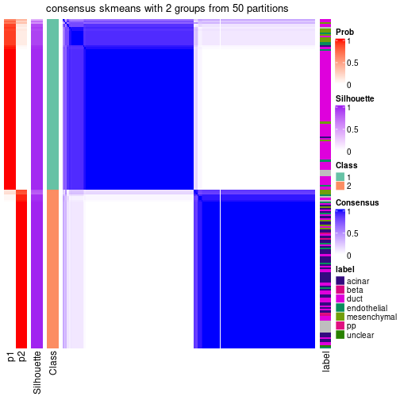</p>

</div>
<div id='tab-node-024-consensus-heatmap-2'>
<pre><code class="r">consensus_heatmap(res, k = 3)
</code></pre>

<p></p>

</div>
<div id='tab-node-024-consensus-heatmap-3'>
<pre><code class="r">consensus_heatmap(res, k = 4)
</code></pre>

<p>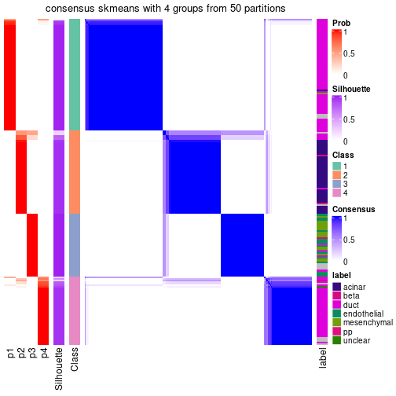</p>

</div>
</div>

Heatmaps for the membership of samples in all partitions to see how consistent they are:


<script>
$( function() {
	$( '#tabs-node-024-membership-heatmap' ).tabs();
} );
</script>
<div id='tabs-node-024-membership-heatmap'>
<ul>
<li><a href='#tab-node-024-membership-heatmap-1'>k = 2</a></li>
<li><a href='#tab-node-024-membership-heatmap-2'>k = 3</a></li>
<li><a href='#tab-node-024-membership-heatmap-3'>k = 4</a></li>
</ul>
<div id='tab-node-024-membership-heatmap-1'>
<pre><code class="r">membership_heatmap(res, k = 2)
</code></pre>

<p>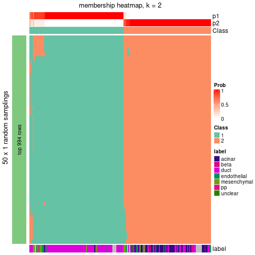</p>

</div>
<div id='tab-node-024-membership-heatmap-2'>
<pre><code class="r">membership_heatmap(res, k = 3)
</code></pre>

<p>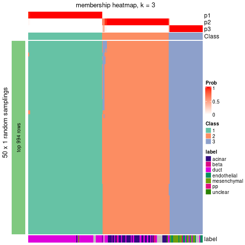</p>

</div>
<div id='tab-node-024-membership-heatmap-3'>
<pre><code class="r">membership_heatmap(res, k = 4)
</code></pre>

<p>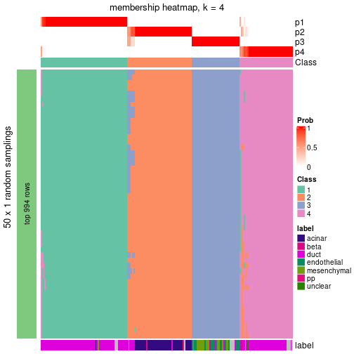</p>

</div>
</div>

As soon as the classes for columns are determined, the signatures
that are significantly different between subgroups can be looked for. 
Following are the heatmaps for signatures.


Signature heatmaps where rows are scaled:


<script>
$( function() {
	$( '#tabs-node-024-get-signatures' ).tabs();
} );
</script>
<div id='tabs-node-024-get-signatures'>
<ul>
<li><a href='#tab-node-024-get-signatures-1'>k = 2</a></li>
<li><a href='#tab-node-024-get-signatures-2'>k = 3</a></li>
<li><a href='#tab-node-024-get-signatures-3'>k = 4</a></li>
</ul>
<div id='tab-node-024-get-signatures-1'>
<pre><code class="r">get_signatures(res, k = 2)
</code></pre>

<p>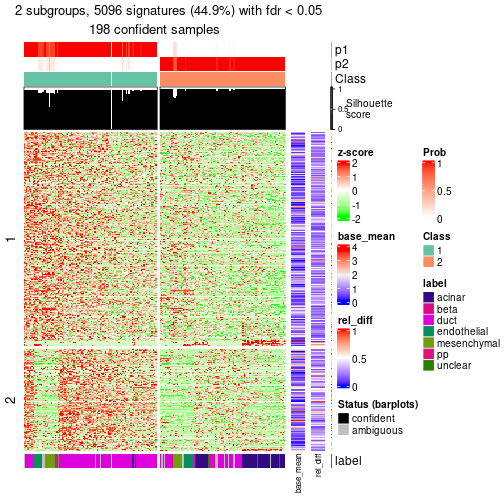</p>

</div>
<div id='tab-node-024-get-signatures-2'>
<pre><code class="r">get_signatures(res, k = 3)
</code></pre>

<p></p>

</div>
<div id='tab-node-024-get-signatures-3'>
<pre><code class="r">get_signatures(res, k = 4)
</code></pre>

<p>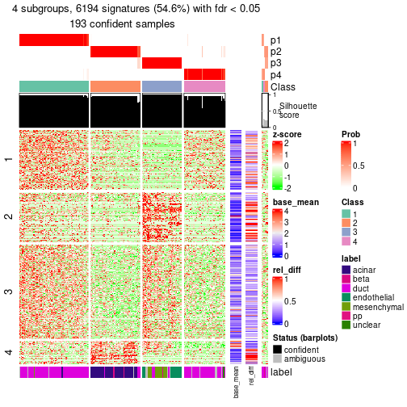</p>

</div>
</div>


Signature heatmaps where rows are not scaled:


<script>
$( function() {
	$( '#tabs-node-024-get-signatures-no-scale' ).tabs();
} );
</script>
<div id='tabs-node-024-get-signatures-no-scale'>
<ul>
<li><a href='#tab-node-024-get-signatures-no-scale-1'>k = 2</a></li>
<li><a href='#tab-node-024-get-signatures-no-scale-2'>k = 3</a></li>
<li><a href='#tab-node-024-get-signatures-no-scale-3'>k = 4</a></li>
</ul>
<div id='tab-node-024-get-signatures-no-scale-1'>
<pre><code class="r">get_signatures(res, k = 2, scale_rows = FALSE)
</code></pre>

<p>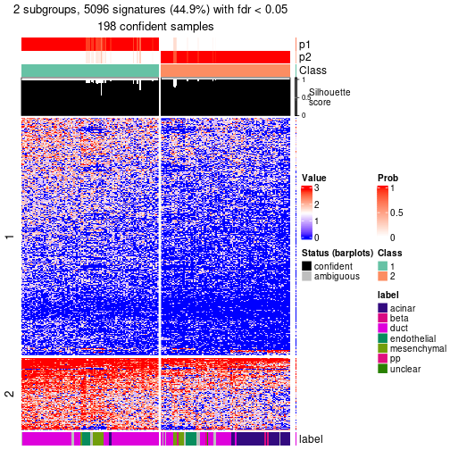</p>

</div>
<div id='tab-node-024-get-signatures-no-scale-2'>
<pre><code class="r">get_signatures(res, k = 3, scale_rows = FALSE)
</code></pre>

<p>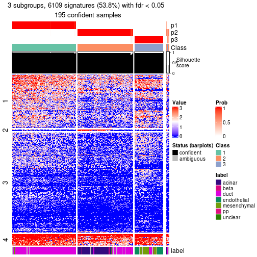</p>

</div>
<div id='tab-node-024-get-signatures-no-scale-3'>
<pre><code class="r">get_signatures(res, k = 4, scale_rows = FALSE)
</code></pre>

<p>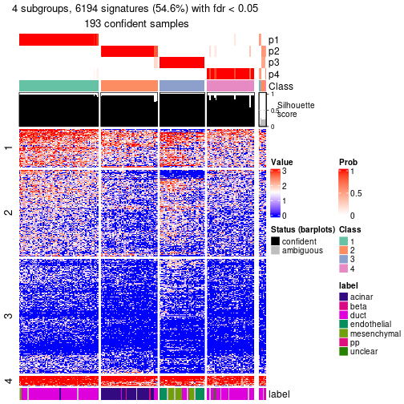</p>

</div>
</div>


Compare the overlap of signatures from different k:

```r
compare_signatures(res)
```

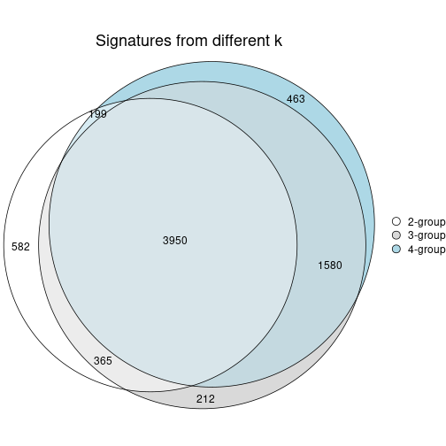

`get_signature()` returns a data frame invisibly. To get the list of signatures, the function
call should be assigned to a variable explicitly. In following code, if `plot` argument is set
to `FALSE`, no heatmap is plotted while only the differential analysis is performed.

```r
# code only for demonstration
tb = get_signature(res, k = ..., plot = FALSE)
```

An example of the output of `tb` is:

```
#>   which_row         fdr    mean_1    mean_2 scaled_mean_1 scaled_mean_2 km
#> 1        38 0.042760348  8.373488  9.131774    -0.5533452     0.5164555  1
#> 2        40 0.018707592  7.106213  8.469186    -0.6173731     0.5762149  1
#> 3        55 0.019134737 10.221463 11.207825    -0.6159697     0.5749050  1
#> 4        59 0.006059896  5.921854  7.869574    -0.6899429     0.6439467  1
#> 5        60 0.018055526  8.928898 10.211722    -0.6204761     0.5791110  1
#> 6        98 0.009384629 15.714769 14.887706     0.6635654    -0.6193277  2
...
```

The columns in `tb` are:

1. `which_row`: row indices corresponding to the input matrix.
2. `fdr`: FDR for the differential test. 
3. `mean_x`: The mean value in group x.
4. `scaled_mean_x`: The mean value in group x after rows are scaled.
5. `km`: Row groups if k-means clustering is applied to rows (which is done by automatically selecting number of clusters).

If there are too many signatures, `top_signatures = ...` can be set to only show the 
signatures with the highest FDRs:

```r
# code only for demonstration
# e.g. to show the top 500 most significant rows
tb = get_signature(res, k = ..., top_signatures = 500)
```

If the signatures are defined as these which are uniquely high in current group, `diff_method` argument
can be set to `"uniquely_high_in_one_group"`:

```r
# code only for demonstration
tb = get_signature(res, k = ..., diff_method = "uniquely_high_in_one_group")
```


UMAP plot which shows how samples are separated.


<script>
$( function() {
	$( '#tabs-node-024-dimension-reduction' ).tabs();
} );
</script>
<div id='tabs-node-024-dimension-reduction'>
<ul>
<li><a href='#tab-node-024-dimension-reduction-1'>k = 2</a></li>
<li><a href='#tab-node-024-dimension-reduction-2'>k = 3</a></li>
<li><a href='#tab-node-024-dimension-reduction-3'>k = 4</a></li>
</ul>
<div id='tab-node-024-dimension-reduction-1'>
<pre><code class="r">dimension_reduction(res, k = 2, method = &quot;UMAP&quot;)
</code></pre>

<p>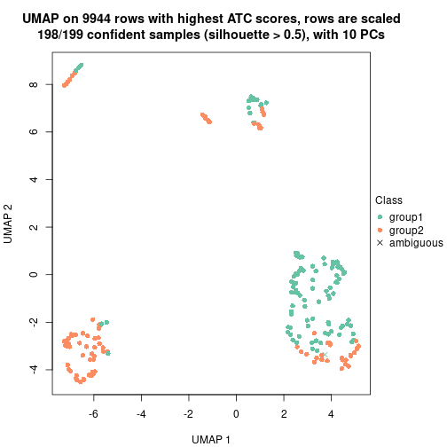</p>

</div>
<div id='tab-node-024-dimension-reduction-2'>
<pre><code class="r">dimension_reduction(res, k = 3, method = &quot;UMAP&quot;)
</code></pre>

<p>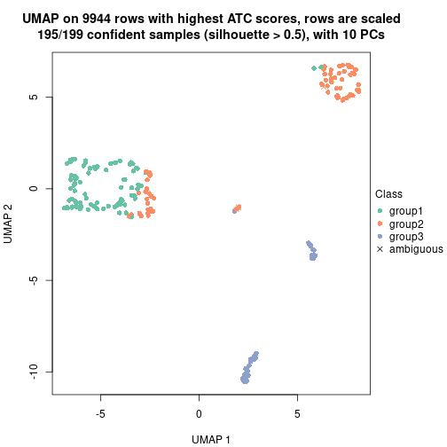</p>

</div>
<div id='tab-node-024-dimension-reduction-3'>
<pre><code class="r">dimension_reduction(res, k = 4, method = &quot;UMAP&quot;)
</code></pre>

<p>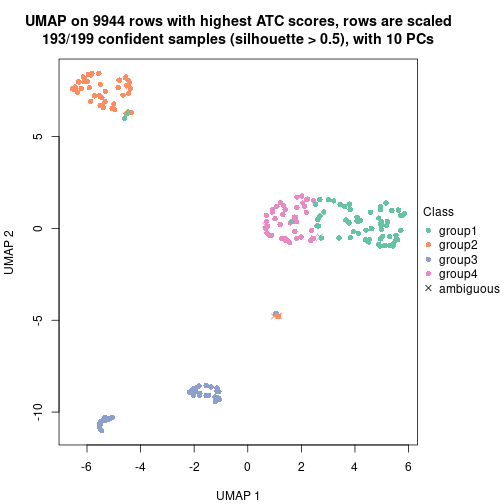</p>

</div>
</div>


Following heatmap shows how subgroups are split when increasing `k`:

```r
collect_classes(res)
```


Test correlation between subgroups and known annotations. If the known
annotation is numeric, one-way ANOVA test is applied, and if the known
annotation is discrete, chi-squared contingency table test is applied.

```r
test_to_known_factors(res)
```

```
#>             n_sample label(p-value) k
#> ATC:skmeans      198       2.93e-12 2
#> ATC:skmeans      195       7.97e-43 3
#> ATC:skmeans      193       1.16e-52 4
```


If matrix rows can be associated to genes, consider to use `functional_enrichment(res,
...)` to perform function enrichment for the signature genes. See [this vignette](https://jokergoo.github.io/cola_vignettes/functional_enrichment.html) for more detailed explanations.


 

---------------------------------------------------


### Node0241


Parent node: [Node024](#Node024).
Child nodes: 
                Node02121-leaf
        ,
                Node02122-leaf
        ,
                Node02123-leaf
        ,
                Node02141-leaf
        ,
                Node02142-leaf
        ,
                Node02143-leaf
        ,
                Node02144-leaf
        ,
                [Node02211](#Node02211)
        ,
                Node02212-leaf
        ,
                Node02213-leaf
        ,
                Node02221-leaf
        ,
                Node02222-leaf
        ,
                Node02223-leaf
        ,
                Node02311-leaf
        ,
                Node02312-leaf
        ,
                Node02321-leaf
        ,
                Node02322-leaf
        ,
                Node02411-leaf
        ,
                Node02412-leaf
        ,
                Node02421-leaf
        ,
                Node02422-leaf
        .


The object with results only for a single top-value method and a single partitioning method 
can be extracted as:

```r
res = res_rh["0241"]
```

A summary of `res` and all the functions that can be applied to it:

```r
res
```

```
#> A 'ConsensusPartition' object with k = 2, 3, 4.
#>   On a matrix with 8296 rows and 84 columns.
#>   Top rows (830) are extracted by 'ATC' method.
#>   Subgroups are detected by 'skmeans' method.
#>   Performed in total 150 partitions by row resampling.
#>   Best k for subgroups seems to be 3.
#> 
#> Following methods can be applied to this 'ConsensusPartition' object:
#>  [1] "cola_report"             "collect_classes"         "collect_plots"          
#>  [4] "collect_stats"           "colnames"                "compare_partitions"     
#>  [7] "compare_signatures"      "consensus_heatmap"       "dimension_reduction"    
#> [10] "functional_enrichment"   "get_anno_col"            "get_anno"               
#> [13] "get_classes"             "get_consensus"           "get_matrix"             
#> [16] "get_membership"          "get_param"               "get_signatures"         
#> [19] "get_stats"               "is_best_k"               "is_stable_k"            
#> [22] "membership_heatmap"      "ncol"                    "nrow"                   
#> [25] "plot_ecdf"               "predict_classes"         "rownames"               
#> [28] "select_partition_number" "show"                    "suggest_best_k"         
#> [31] "test_to_known_factors"   "top_rows_heatmap"
```

`collect_plots()` function collects all the plots made from `res` for all `k` (number of subgroups)
into one single page to provide an easy and fast comparison between different `k`.

```r
collect_plots(res)
```

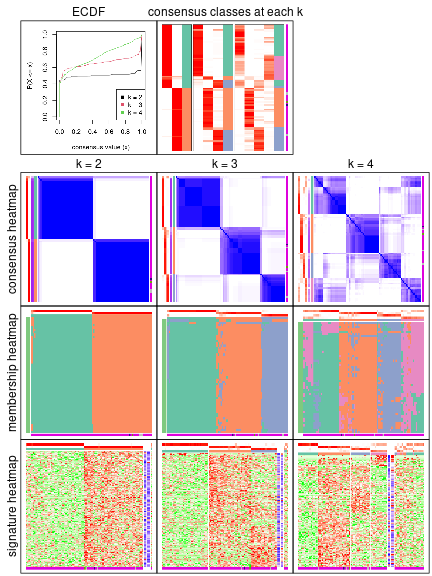

The plots are:

- The first row: a plot of the eCDF (empirical cumulative distribution
  function) curves of the consensus matrix for each `k` and the heatmap of
  predicted classes for each `k`.
- The second row: heatmaps of the consensus matrix for each `k`.
- The third row: heatmaps of the membership matrix for each `k`.
- The fouth row: heatmaps of the signatures for each `k`.

All the plots in panels can be made by individual functions and they are
plotted later in this section.

`select_partition_number()` produces several plots showing different
statistics for choosing "optimized" `k`. There are following statistics:

- eCDF curves of the consensus matrix for each `k`;
- 1-PAC. [The PAC score](https://en.wikipedia.org/wiki/Consensus_clustering#Over-interpretation_potential_of_consensus_clustering)
  measures the proportion of the ambiguous subgrouping.
- Mean silhouette score.
- Concordance. The mean probability of fiting the consensus subgroup labels in all
  partitions.
- Area increased. Denote $A_k$ as the area under the eCDF curve for current
  `k`, the area increased is defined as $A_k - A_{k-1}$.
- Rand index. The percent of pairs of samples that are both in a same cluster
  or both are not in a same cluster in the partition of k and k-1.
- Jaccard index. The ratio of pairs of samples are both in a same cluster in
  the partition of k and k-1 and the pairs of samples are both in a same
  cluster in the partition k or k-1.

The detailed explanations of these statistics can be found in [the _cola_
vignette](https://jokergoo.github.io/cola_vignettes/cola.html#toc_13).

Generally speaking, higher 1-PAC score, higher mean silhouette score or higher
concordance corresponds to better partition. Rand index and Jaccard index
measure how similar the current partition is compared to partition with `k-1`.
If they are too similar, we won't accept `k` is better than `k-1`.

```r
select_partition_number(res)
```


The numeric values for all these statistics can be obtained by `get_stats()`.

```r
get_stats(res)
```

```
#>   k 1-PAC mean_silhouette concordance area_increased  Rand Jaccard
#> 2 2 1.000           0.979       0.991          0.506 0.494   0.494
#> 3 3 0.907           0.901       0.950          0.300 0.761   0.556
#> 4 4 0.594           0.581       0.796          0.123 0.822   0.539
```

`suggest_best_k()` suggests the best $k$ based on these statistics. The rules are as follows:

- All $k$ with Jaccard index larger than 0.95 are removed because increasing
  $k$ does not provide enough extra information. If all $k$ are removed, it is
  marked as no subgroup is detected.
- For all $k$ with 1-PAC score larger than 0.9, the maximal $k$ is taken as
  the best $k$, and other $k$ are marked as optional $k$.
- If it does not fit the second rule. The $k$ with the maximal vote of the
  highest 1-PAC score, highest mean silhouette, and highest concordance is
  taken as the best $k$.

```r
suggest_best_k(res)
```

```
#> [1] 3
#> attr(,"optional")
#> [1] 2
```

There is also optional best $k$ = 2 that is worth to check.

Following is the table of the partitions (You need to click the **show/hide
code output** link to see it). The membership matrix (columns with name `p*`)
is inferred by
[`clue::cl_consensus()`](https://www.rdocumentation.org/link/cl_consensus?package=clue)
function with the `SE` method. Basically the value in the membership matrix
represents the probability to belong to a certain group. The finall subgroup
label for an item is determined with the group with highest probability it
belongs to.

In `get_classes()` function, the entropy is calculated from the membership
matrix and the silhouette score is calculated from the consensus matrix.


<script>
$( function() {
	$( '#tabs-node-0241-get-classes' ).tabs();
} );
</script>
<div id='tabs-node-0241-get-classes'>
<ul>
<li><a href='#tab-node-0241-get-classes-1'>k = 2</a></li>
<li><a href='#tab-node-0241-get-classes-2'>k = 3</a></li>
<li><a href='#tab-node-0241-get-classes-3'>k = 4</a></li>
</ul>

<div id='tab-node-0241-get-classes-1'>
<p><a id='tab-node-0241-get-classes-1-a' style='color:#0366d6' href='#'>show/hide code output</a></p>
<pre><code class="r">cbind(get_classes(res, k = 2), get_membership(res, k = 2))
</code></pre>

<pre><code>#&gt;          class entropy silhouette   p1   p2
#&gt; D28-1_13     2   0.000      0.996 0.00 1.00
#&gt; D28-2_26     2   0.000      0.996 0.00 1.00
#&gt; D28-3_29     2   0.000      0.996 0.00 1.00
#&gt; D28-3_54     2   0.000      0.996 0.00 1.00
#&gt; D28-4_22     2   0.000      0.996 0.00 1.00
#&gt; D28-4_28     2   0.000      0.996 0.00 1.00
#&gt; D28-4_52     1   0.000      0.986 1.00 0.00
#&gt; D28-5_16     2   0.000      0.996 0.00 1.00
#&gt; D28-6_75     2   0.000      0.996 0.00 1.00
#&gt; D28-7_50     2   0.000      0.996 0.00 1.00
#&gt; D29-1_65     1   0.958      0.394 0.62 0.38
#&gt; D29-2_61     1   0.000      0.986 1.00 0.00
#&gt; D29-2_65     2   0.000      0.996 0.00 1.00
#&gt; D29-8_75     2   0.000      0.996 0.00 1.00
#&gt; D29-8_88     1   0.584      0.836 0.86 0.14
#&gt; D31-1_50     1   0.000      0.986 1.00 0.00
#&gt; D31-1_62     2   0.000      0.996 0.00 1.00
#&gt; D31-1_72     1   0.000      0.986 1.00 0.00
#&gt; D31-1_82     1   0.000      0.986 1.00 0.00
#&gt; D31-1_84     1   0.000      0.986 1.00 0.00
#&gt; D31-2_20     1   0.000      0.986 1.00 0.00
#&gt; D31-2_21     2   0.402      0.914 0.08 0.92
#&gt; D31-2_37     1   0.000      0.986 1.00 0.00
#&gt; D31-2_40     1   0.000      0.986 1.00 0.00
#&gt; D31-2_54     2   0.000      0.996 0.00 1.00
#&gt; D31-2_59     1   0.000      0.986 1.00 0.00
#&gt; D31-2_62     2   0.000      0.996 0.00 1.00
#&gt; D31-2_78     2   0.000      0.996 0.00 1.00
#&gt; D31-2_84     1   0.000      0.986 1.00 0.00
#&gt; D31-3_65     1   0.000      0.986 1.00 0.00
#&gt; D31-3_78     2   0.000      0.996 0.00 1.00
#&gt; D31-3_81     1   0.000      0.986 1.00 0.00
#&gt; D31-4_35     1   0.000      0.986 1.00 0.00
#&gt; D31-4_56     2   0.000      0.996 0.00 1.00
#&gt; D31-5_13     1   0.000      0.986 1.00 0.00
#&gt; D31-5_14     1   0.000      0.986 1.00 0.00
#&gt; D31-5_19     1   0.000      0.986 1.00 0.00
#&gt; D31-5_41     1   0.000      0.986 1.00 0.00
#&gt; D31-5_51     1   0.000      0.986 1.00 0.00
#&gt; D31-5_65     2   0.000      0.996 0.00 1.00
#&gt; D31-6_27     2   0.000      0.996 0.00 1.00
#&gt; D31-6_28     2   0.000      0.996 0.00 1.00
#&gt; D31-6_37     1   0.000      0.986 1.00 0.00
#&gt; D31-6_41     2   0.000      0.996 0.00 1.00
#&gt; D31-6_72     2   0.000      0.996 0.00 1.00
#&gt; D31-7_23     2   0.000      0.996 0.00 1.00
#&gt; D31-7_29     1   0.000      0.986 1.00 0.00
#&gt; D31-7_73     2   0.000      0.996 0.00 1.00
#&gt; D31-7_89     2   0.402      0.912 0.08 0.92
#&gt; D31-8_19     1   0.000      0.986 1.00 0.00
#&gt; D31-8_30     1   0.000      0.986 1.00 0.00
#&gt; D31-8_37     1   0.000      0.986 1.00 0.00
#&gt; D31-8_45     2   0.000      0.996 0.00 1.00
#&gt; D31-8_75     1   0.000      0.986 1.00 0.00
#&gt; D31-8_80     1   0.000      0.986 1.00 0.00
#&gt; D31-8_85     2   0.000      0.996 0.00 1.00
#&gt; D31-8_94     2   0.000      0.996 0.00 1.00
#&gt; D30-1_42     1   0.000      0.986 1.00 0.00
#&gt; D30-1_46     1   0.000      0.986 1.00 0.00
#&gt; D30-1_88     1   0.000      0.986 1.00 0.00
#&gt; D30-2_50     1   0.327      0.929 0.94 0.06
#&gt; D30-2_58     2   0.000      0.996 0.00 1.00
#&gt; D30-3_32     1   0.000      0.986 1.00 0.00
#&gt; D30-3_90     1   0.000      0.986 1.00 0.00
#&gt; D30-4_27     1   0.000      0.986 1.00 0.00
#&gt; D30-4_31     1   0.000      0.986 1.00 0.00
#&gt; D30-4_42     2   0.000      0.996 0.00 1.00
#&gt; D30-5_9      1   0.000      0.986 1.00 0.00
#&gt; D30-5_31     2   0.000      0.996 0.00 1.00
#&gt; D30-5_34     2   0.000      0.996 0.00 1.00
#&gt; D30-5_42     2   0.000      0.996 0.00 1.00
#&gt; D30-5_50     2   0.000      0.996 0.00 1.00
#&gt; D30-5_61     1   0.000      0.986 1.00 0.00
#&gt; D30-6_12     2   0.000      0.996 0.00 1.00
#&gt; D30-6_20     1   0.000      0.986 1.00 0.00
#&gt; D30-6_25     1   0.000      0.986 1.00 0.00
#&gt; D30-6_57     2   0.000      0.996 0.00 1.00
#&gt; D30-6_61     2   0.000      0.996 0.00 1.00
#&gt; D30-6_78     2   0.000      0.996 0.00 1.00
#&gt; D30-6_86     2   0.000      0.996 0.00 1.00
#&gt; D30-7_17     1   0.000      0.986 1.00 0.00
#&gt; D30-7_74     2   0.000      0.996 0.00 1.00
#&gt; D30-8_4      1   0.000      0.986 1.00 0.00
#&gt; D30-8_82     2   0.000      0.996 0.00 1.00
</code></pre>

<script>
$('#tab-node-0241-get-classes-1-a').parent().next().next().hide();
$('#tab-node-0241-get-classes-1-a').click(function(){
  $('#tab-node-0241-get-classes-1-a').parent().next().next().toggle();
  return(false);
});
</script>
</div>

<div id='tab-node-0241-get-classes-2'>
<p><a id='tab-node-0241-get-classes-2-a' style='color:#0366d6' href='#'>show/hide code output</a></p>
<pre><code class="r">cbind(get_classes(res, k = 3), get_membership(res, k = 3))
</code></pre>

<pre><code>#&gt;          class entropy silhouette   p1   p2   p3
#&gt; D28-1_13     3  0.0892     0.9462 0.00 0.02 0.98
#&gt; D28-2_26     2  0.1529     0.9180 0.00 0.96 0.04
#&gt; D28-3_29     2  0.5216     0.6804 0.00 0.74 0.26
#&gt; D28-3_54     3  0.0892     0.9462 0.00 0.02 0.98
#&gt; D28-4_22     3  0.0892     0.9462 0.00 0.02 0.98
#&gt; D28-4_28     2  0.0000     0.9194 0.00 1.00 0.00
#&gt; D28-4_52     1  0.0000     0.9707 1.00 0.00 0.00
#&gt; D28-5_16     3  0.0892     0.9462 0.00 0.02 0.98
#&gt; D28-6_75     2  0.0000     0.9194 0.00 1.00 0.00
#&gt; D28-7_50     2  0.0892     0.9266 0.00 0.98 0.02
#&gt; D29-1_65     2  0.6527     0.5213 0.32 0.66 0.02
#&gt; D29-2_61     1  0.3832     0.8594 0.88 0.02 0.10
#&gt; D29-2_65     2  0.0892     0.9266 0.00 0.98 0.02
#&gt; D29-8_75     2  0.3340     0.8581 0.00 0.88 0.12
#&gt; D29-8_88     2  0.2066     0.8775 0.06 0.94 0.00
#&gt; D31-1_50     1  0.0892     0.9604 0.98 0.02 0.00
#&gt; D31-1_62     2  0.0892     0.9266 0.00 0.98 0.02
#&gt; D31-1_72     1  0.0000     0.9707 1.00 0.00 0.00
#&gt; D31-1_82     1  0.0000     0.9707 1.00 0.00 0.00
#&gt; D31-1_84     1  0.0000     0.9707 1.00 0.00 0.00
#&gt; D31-2_20     1  0.0000     0.9707 1.00 0.00 0.00
#&gt; D31-2_21     3  0.0000     0.9388 0.00 0.00 1.00
#&gt; D31-2_37     1  0.0000     0.9707 1.00 0.00 0.00
#&gt; D31-2_40     1  0.0000     0.9707 1.00 0.00 0.00
#&gt; D31-2_54     2  0.0892     0.9266 0.00 0.98 0.02
#&gt; D31-2_59     1  0.6302     0.0861 0.52 0.00 0.48
#&gt; D31-2_62     2  0.0892     0.9266 0.00 0.98 0.02
#&gt; D31-2_78     2  0.0892     0.9266 0.00 0.98 0.02
#&gt; D31-2_84     1  0.0892     0.9684 0.98 0.00 0.02
#&gt; D31-3_65     1  0.0892     0.9684 0.98 0.00 0.02
#&gt; D31-3_78     2  0.0000     0.9194 0.00 1.00 0.00
#&gt; D31-3_81     3  0.0892     0.9274 0.02 0.00 0.98
#&gt; D31-4_35     3  0.2066     0.9024 0.06 0.00 0.94
#&gt; D31-4_56     3  0.0892     0.9462 0.00 0.02 0.98
#&gt; D31-5_13     1  0.0892     0.9684 0.98 0.00 0.02
#&gt; D31-5_14     1  0.0892     0.9684 0.98 0.00 0.02
#&gt; D31-5_19     1  0.0000     0.9707 1.00 0.00 0.00
#&gt; D31-5_41     1  0.0000     0.9707 1.00 0.00 0.00
#&gt; D31-5_51     3  0.3686     0.8220 0.14 0.00 0.86
#&gt; D31-5_65     3  0.0892     0.9462 0.00 0.02 0.98
#&gt; D31-6_27     3  0.6126     0.2756 0.00 0.40 0.60
#&gt; D31-6_28     3  0.0892     0.9462 0.00 0.02 0.98
#&gt; D31-6_37     1  0.0000     0.9707 1.00 0.00 0.00
#&gt; D31-6_41     2  0.0892     0.9266 0.00 0.98 0.02
#&gt; D31-6_72     2  0.0892     0.9266 0.00 0.98 0.02
#&gt; D31-7_23     3  0.0000     0.9388 0.00 0.00 1.00
#&gt; D31-7_29     1  0.0892     0.9604 0.98 0.02 0.00
#&gt; D31-7_73     3  0.0892     0.9462 0.00 0.02 0.98
#&gt; D31-7_89     2  0.0892     0.9071 0.02 0.98 0.00
#&gt; D31-8_19     1  0.0000     0.9707 1.00 0.00 0.00
#&gt; D31-8_30     1  0.0000     0.9707 1.00 0.00 0.00
#&gt; D31-8_37     1  0.0892     0.9684 0.98 0.00 0.02
#&gt; D31-8_45     3  0.0892     0.9462 0.00 0.02 0.98
#&gt; D31-8_75     1  0.0892     0.9604 0.98 0.02 0.00
#&gt; D31-8_80     1  0.0892     0.9604 0.98 0.02 0.00
#&gt; D31-8_85     2  0.3340     0.8596 0.00 0.88 0.12
#&gt; D31-8_94     2  0.0892     0.9266 0.00 0.98 0.02
#&gt; D30-1_42     1  0.0892     0.9684 0.98 0.00 0.02
#&gt; D30-1_46     1  0.0892     0.9684 0.98 0.00 0.02
#&gt; D30-1_88     1  0.0892     0.9684 0.98 0.00 0.02
#&gt; D30-2_50     2  0.5835     0.4948 0.34 0.66 0.00
#&gt; D30-2_58     2  0.0892     0.9266 0.00 0.98 0.02
#&gt; D30-3_32     1  0.0892     0.9684 0.98 0.00 0.02
#&gt; D30-3_90     1  0.0892     0.9684 0.98 0.00 0.02
#&gt; D30-4_27     1  0.0000     0.9707 1.00 0.00 0.00
#&gt; D30-4_31     1  0.0892     0.9684 0.98 0.00 0.02
#&gt; D30-4_42     2  0.0892     0.9266 0.00 0.98 0.02
#&gt; D30-5_9      1  0.0892     0.9604 0.98 0.02 0.00
#&gt; D30-5_31     2  0.1529     0.9180 0.00 0.96 0.04
#&gt; D30-5_34     2  0.0892     0.9266 0.00 0.98 0.02
#&gt; D30-5_42     2  0.1529     0.9180 0.00 0.96 0.04
#&gt; D30-5_50     3  0.0892     0.9462 0.00 0.02 0.98
#&gt; D30-5_61     3  0.2537     0.8864 0.08 0.00 0.92
#&gt; D30-6_12     2  0.5016     0.7034 0.00 0.76 0.24
#&gt; D30-6_20     1  0.0892     0.9684 0.98 0.00 0.02
#&gt; D30-6_25     1  0.0892     0.9684 0.98 0.00 0.02
#&gt; D30-6_57     3  0.0892     0.9462 0.00 0.02 0.98
#&gt; D30-6_61     2  0.0892     0.9071 0.02 0.98 0.00
#&gt; D30-6_78     2  0.0000     0.9194 0.00 1.00 0.00
#&gt; D30-6_86     2  0.0892     0.9266 0.00 0.98 0.02
#&gt; D30-7_17     1  0.0000     0.9707 1.00 0.00 0.00
#&gt; D30-7_74     2  0.0892     0.9266 0.00 0.98 0.02
#&gt; D30-8_4      3  0.1529     0.9160 0.04 0.00 0.96
#&gt; D30-8_82     2  0.5835     0.5240 0.00 0.66 0.34
</code></pre>

<script>
$('#tab-node-0241-get-classes-2-a').parent().next().next().hide();
$('#tab-node-0241-get-classes-2-a').click(function(){
  $('#tab-node-0241-get-classes-2-a').parent().next().next().toggle();
  return(false);
});
</script>
</div>

<div id='tab-node-0241-get-classes-3'>
<p><a id='tab-node-0241-get-classes-3-a' style='color:#0366d6' href='#'>show/hide code output</a></p>
<pre><code class="r">cbind(get_classes(res, k = 4), get_membership(res, k = 4))
</code></pre>

<pre><code>#&gt;          class entropy silhouette   p1   p2   p3   p4
#&gt; D28-1_13     3  0.1637     0.8295 0.00 0.06 0.94 0.00
#&gt; D28-2_26     2  0.2345     0.7940 0.00 0.90 0.10 0.00
#&gt; D28-3_29     2  0.4948     0.0822 0.00 0.56 0.44 0.00
#&gt; D28-3_54     3  0.3335     0.8235 0.00 0.12 0.86 0.02
#&gt; D28-4_22     3  0.4079     0.7901 0.00 0.18 0.80 0.02
#&gt; D28-4_28     2  0.2706     0.8257 0.00 0.90 0.02 0.08
#&gt; D28-4_52     4  0.4713     0.6020 0.36 0.00 0.00 0.64
#&gt; D28-5_16     3  0.3030     0.7999 0.02 0.06 0.90 0.02
#&gt; D28-6_75     2  0.3037     0.8198 0.00 0.88 0.02 0.10
#&gt; D28-7_50     2  0.0000     0.8636 0.00 1.00 0.00 0.00
#&gt; D29-1_65     4  0.5006     0.4608 0.02 0.16 0.04 0.78
#&gt; D29-2_61     4  0.5657     0.4685 0.16 0.00 0.12 0.72
#&gt; D29-2_65     2  0.0707     0.8577 0.00 0.98 0.02 0.00
#&gt; D29-8_75     2  0.6720     0.3589 0.00 0.58 0.30 0.12
#&gt; D29-8_88     4  0.4284     0.4524 0.00 0.20 0.02 0.78
#&gt; D31-1_50     4  0.2921     0.6050 0.14 0.00 0.00 0.86
#&gt; D31-1_62     2  0.2345     0.8341 0.00 0.90 0.00 0.10
#&gt; D31-1_72     4  0.4977     0.5110 0.46 0.00 0.00 0.54
#&gt; D31-1_82     4  0.4977     0.0636 0.46 0.00 0.00 0.54
#&gt; D31-1_84     1  0.4977    -0.3779 0.54 0.00 0.00 0.46
#&gt; D31-2_20     1  0.4522     0.0582 0.68 0.00 0.00 0.32
#&gt; D31-2_21     3  0.1913     0.7843 0.02 0.00 0.94 0.04
#&gt; D31-2_37     1  0.4948    -0.3172 0.56 0.00 0.00 0.44
#&gt; D31-2_40     4  0.4855     0.5854 0.40 0.00 0.00 0.60
#&gt; D31-2_54     2  0.0000     0.8636 0.00 1.00 0.00 0.00
#&gt; D31-2_59     1  0.4088     0.5349 0.82 0.00 0.14 0.04
#&gt; D31-2_62     2  0.2830     0.8320 0.00 0.90 0.04 0.06
#&gt; D31-2_78     2  0.0000     0.8636 0.00 1.00 0.00 0.00
#&gt; D31-2_84     1  0.1211     0.6250 0.96 0.00 0.00 0.04
#&gt; D31-3_65     1  0.0000     0.6520 1.00 0.00 0.00 0.00
#&gt; D31-3_78     2  0.4284     0.7553 0.00 0.78 0.02 0.20
#&gt; D31-3_81     3  0.6370     0.3650 0.28 0.00 0.62 0.10
#&gt; D31-4_35     1  0.6605     0.0988 0.48 0.00 0.44 0.08
#&gt; D31-4_56     3  0.3037     0.8300 0.00 0.10 0.88 0.02
#&gt; D31-5_13     1  0.0000     0.6520 1.00 0.00 0.00 0.00
#&gt; D31-5_14     1  0.0000     0.6520 1.00 0.00 0.00 0.00
#&gt; D31-5_19     4  0.4977     0.5110 0.46 0.00 0.00 0.54
#&gt; D31-5_41     1  0.4994    -0.4219 0.52 0.00 0.00 0.48
#&gt; D31-5_51     1  0.5619     0.4057 0.64 0.00 0.32 0.04
#&gt; D31-5_65     3  0.4284     0.7714 0.00 0.20 0.78 0.02
#&gt; D31-6_27     3  0.5355     0.5540 0.00 0.36 0.62 0.02
#&gt; D31-6_28     3  0.2335     0.8302 0.00 0.06 0.92 0.02
#&gt; D31-6_37     1  0.4134     0.2444 0.74 0.00 0.00 0.26
#&gt; D31-6_41     2  0.0000     0.8636 0.00 1.00 0.00 0.00
#&gt; D31-6_72     2  0.0000     0.8636 0.00 1.00 0.00 0.00
#&gt; D31-7_23     3  0.1411     0.7940 0.02 0.00 0.96 0.02
#&gt; D31-7_29     4  0.4855     0.5836 0.40 0.00 0.00 0.60
#&gt; D31-7_73     3  0.3037     0.8299 0.00 0.10 0.88 0.02
#&gt; D31-7_89     2  0.6574     0.4368 0.04 0.52 0.02 0.42
#&gt; D31-8_19     4  0.4948     0.5385 0.44 0.00 0.00 0.56
#&gt; D31-8_30     4  0.4907     0.5625 0.42 0.00 0.00 0.58
#&gt; D31-8_37     1  0.1913     0.6252 0.94 0.00 0.02 0.04
#&gt; D31-8_45     3  0.2335     0.8287 0.00 0.06 0.92 0.02
#&gt; D31-8_75     4  0.4277     0.6294 0.28 0.00 0.00 0.72
#&gt; D31-8_80     1  0.5594    -0.2183 0.52 0.00 0.02 0.46
#&gt; D31-8_85     2  0.5902     0.6734 0.00 0.70 0.16 0.14
#&gt; D31-8_94     2  0.0000     0.8636 0.00 1.00 0.00 0.00
#&gt; D30-1_42     1  0.0707     0.6429 0.98 0.00 0.00 0.02
#&gt; D30-1_46     1  0.0707     0.6429 0.98 0.00 0.00 0.02
#&gt; D30-1_88     1  0.0000     0.6520 1.00 0.00 0.00 0.00
#&gt; D30-2_50     4  0.6145     0.5009 0.08 0.20 0.02 0.70
#&gt; D30-2_58     2  0.0000     0.8636 0.00 1.00 0.00 0.00
#&gt; D30-3_32     1  0.0000     0.6520 1.00 0.00 0.00 0.00
#&gt; D30-3_90     1  0.0707     0.6460 0.98 0.00 0.02 0.00
#&gt; D30-4_27     4  0.4624     0.6191 0.34 0.00 0.00 0.66
#&gt; D30-4_31     1  0.0000     0.6520 1.00 0.00 0.00 0.00
#&gt; D30-4_42     2  0.0000     0.8636 0.00 1.00 0.00 0.00
#&gt; D30-5_9      4  0.3400     0.6219 0.18 0.00 0.00 0.82
#&gt; D30-5_31     2  0.2647     0.7765 0.00 0.88 0.12 0.00
#&gt; D30-5_34     2  0.0000     0.8636 0.00 1.00 0.00 0.00
#&gt; D30-5_42     2  0.3801     0.6357 0.00 0.78 0.22 0.00
#&gt; D30-5_50     3  0.0707     0.8155 0.00 0.02 0.98 0.00
#&gt; D30-5_61     1  0.5793     0.3417 0.60 0.00 0.36 0.04
#&gt; D30-6_12     3  0.6299     0.3598 0.00 0.42 0.52 0.06
#&gt; D30-6_20     1  0.0707     0.6429 0.98 0.00 0.00 0.02
#&gt; D30-6_25     1  0.0707     0.6460 0.98 0.00 0.02 0.00
#&gt; D30-6_57     3  0.3853     0.8041 0.00 0.16 0.82 0.02
#&gt; D30-6_61     2  0.4472     0.7373 0.00 0.76 0.02 0.22
#&gt; D30-6_78     2  0.3335     0.8082 0.00 0.86 0.02 0.12
#&gt; D30-6_86     2  0.0000     0.8636 0.00 1.00 0.00 0.00
#&gt; D30-7_17     1  0.4977    -0.3671 0.54 0.00 0.00 0.46
#&gt; D30-7_74     2  0.0000     0.8636 0.00 1.00 0.00 0.00
#&gt; D30-8_4      1  0.6299     0.1672 0.52 0.00 0.42 0.06
#&gt; D30-8_82     3  0.4907     0.4222 0.00 0.42 0.58 0.00
</code></pre>

<script>
$('#tab-node-0241-get-classes-3-a').parent().next().next().hide();
$('#tab-node-0241-get-classes-3-a').click(function(){
  $('#tab-node-0241-get-classes-3-a').parent().next().next().toggle();
  return(false);
});
</script>
</div>
</div>

Heatmaps for the consensus matrix. It visualizes the probability of two
samples to be in a same group.


<script>
$( function() {
	$( '#tabs-node-0241-consensus-heatmap' ).tabs();
} );
</script>
<div id='tabs-node-0241-consensus-heatmap'>
<ul>
<li><a href='#tab-node-0241-consensus-heatmap-1'>k = 2</a></li>
<li><a href='#tab-node-0241-consensus-heatmap-2'>k = 3</a></li>
<li><a href='#tab-node-0241-consensus-heatmap-3'>k = 4</a></li>
</ul>
<div id='tab-node-0241-consensus-heatmap-1'>
<pre><code class="r">consensus_heatmap(res, k = 2)
</code></pre>

<p>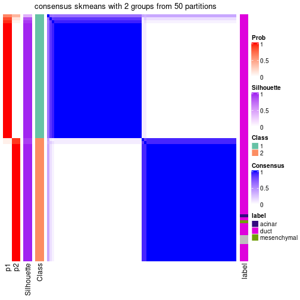</p>

</div>
<div id='tab-node-0241-consensus-heatmap-2'>
<pre><code class="r">consensus_heatmap(res, k = 3)
</code></pre>

<p>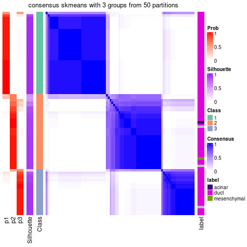</p>

</div>
<div id='tab-node-0241-consensus-heatmap-3'>
<pre><code class="r">consensus_heatmap(res, k = 4)
</code></pre>

<p>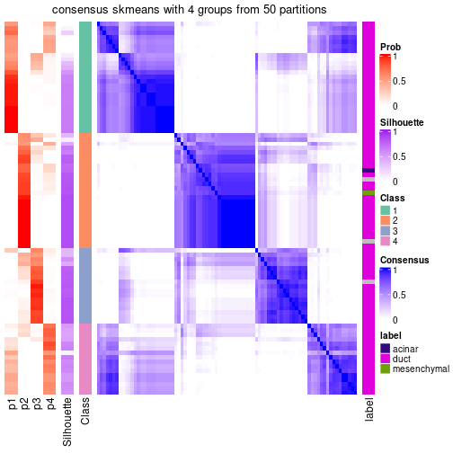</p>

</div>
</div>

Heatmaps for the membership of samples in all partitions to see how consistent they are:


<script>
$( function() {
	$( '#tabs-node-0241-membership-heatmap' ).tabs();
} );
</script>
<div id='tabs-node-0241-membership-heatmap'>
<ul>
<li><a href='#tab-node-0241-membership-heatmap-1'>k = 2</a></li>
<li><a href='#tab-node-0241-membership-heatmap-2'>k = 3</a></li>
<li><a href='#tab-node-0241-membership-heatmap-3'>k = 4</a></li>
</ul>
<div id='tab-node-0241-membership-heatmap-1'>
<pre><code class="r">membership_heatmap(res, k = 2)
</code></pre>

<p>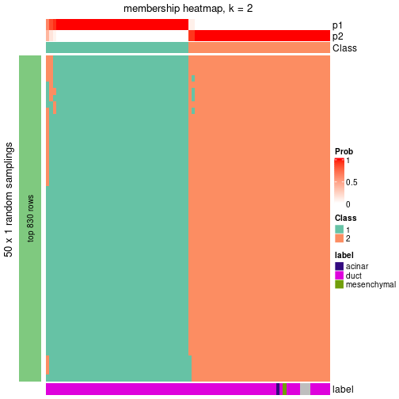</p>

</div>
<div id='tab-node-0241-membership-heatmap-2'>
<pre><code class="r">membership_heatmap(res, k = 3)
</code></pre>

<p>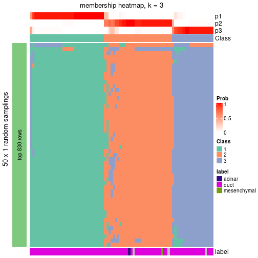</p>

</div>
<div id='tab-node-0241-membership-heatmap-3'>
<pre><code class="r">membership_heatmap(res, k = 4)
</code></pre>

<p>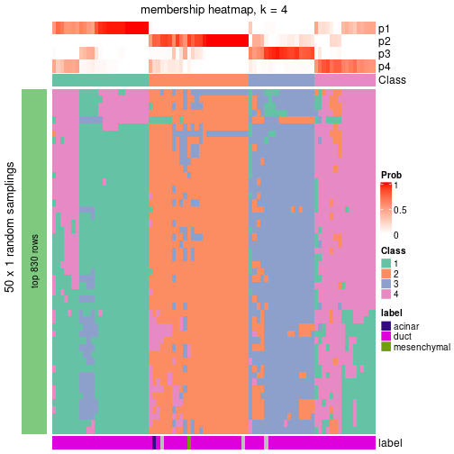</p>

</div>
</div>

As soon as the classes for columns are determined, the signatures
that are significantly different between subgroups can be looked for. 
Following are the heatmaps for signatures.


Signature heatmaps where rows are scaled:


<script>
$( function() {
	$( '#tabs-node-0241-get-signatures' ).tabs();
} );
</script>
<div id='tabs-node-0241-get-signatures'>
<ul>
<li><a href='#tab-node-0241-get-signatures-1'>k = 2</a></li>
<li><a href='#tab-node-0241-get-signatures-2'>k = 3</a></li>
<li><a href='#tab-node-0241-get-signatures-3'>k = 4</a></li>
</ul>
<div id='tab-node-0241-get-signatures-1'>
<pre><code class="r">get_signatures(res, k = 2)
</code></pre>

<p>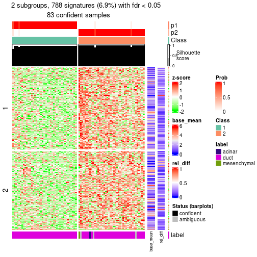</p>

</div>
<div id='tab-node-0241-get-signatures-2'>
<pre><code class="r">get_signatures(res, k = 3)
</code></pre>

<p>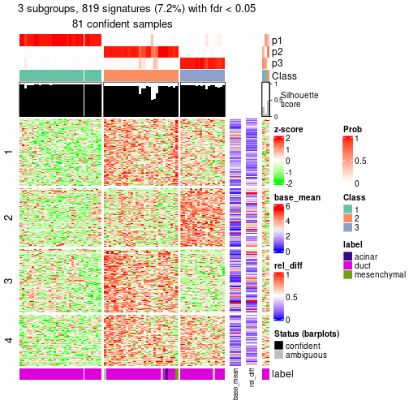</p>

</div>
<div id='tab-node-0241-get-signatures-3'>
<pre><code class="r">get_signatures(res, k = 4)
</code></pre>

<p>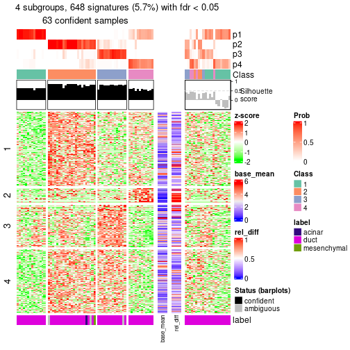</p>

</div>
</div>


Signature heatmaps where rows are not scaled:


<script>
$( function() {
	$( '#tabs-node-0241-get-signatures-no-scale' ).tabs();
} );
</script>
<div id='tabs-node-0241-get-signatures-no-scale'>
<ul>
<li><a href='#tab-node-0241-get-signatures-no-scale-1'>k = 2</a></li>
<li><a href='#tab-node-0241-get-signatures-no-scale-2'>k = 3</a></li>
<li><a href='#tab-node-0241-get-signatures-no-scale-3'>k = 4</a></li>
</ul>
<div id='tab-node-0241-get-signatures-no-scale-1'>
<pre><code class="r">get_signatures(res, k = 2, scale_rows = FALSE)
</code></pre>

<p>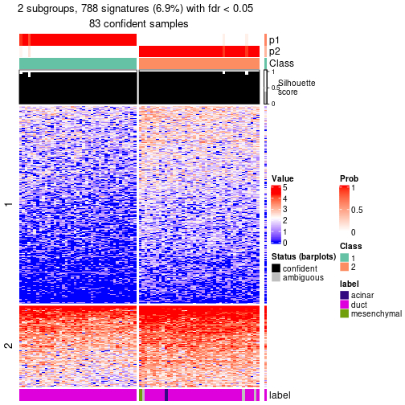</p>

</div>
<div id='tab-node-0241-get-signatures-no-scale-2'>
<pre><code class="r">get_signatures(res, k = 3, scale_rows = FALSE)
</code></pre>

<p>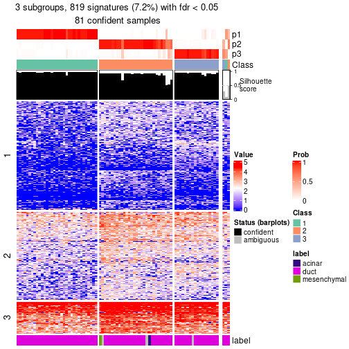</p>

</div>
<div id='tab-node-0241-get-signatures-no-scale-3'>
<pre><code class="r">get_signatures(res, k = 4, scale_rows = FALSE)
</code></pre>

<p>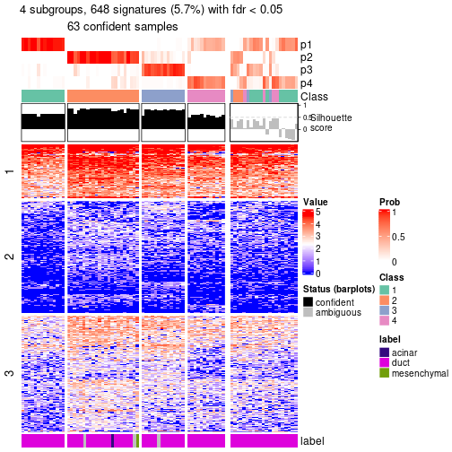</p>

</div>
</div>


Compare the overlap of signatures from different k:

```r
compare_signatures(res)
```

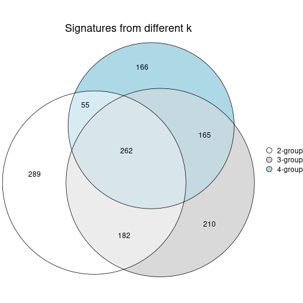

`get_signature()` returns a data frame invisibly. To get the list of signatures, the function
call should be assigned to a variable explicitly. In following code, if `plot` argument is set
to `FALSE`, no heatmap is plotted while only the differential analysis is performed.

```r
# code only for demonstration
tb = get_signature(res, k = ..., plot = FALSE)
```

An example of the output of `tb` is:

```
#>   which_row         fdr    mean_1    mean_2 scaled_mean_1 scaled_mean_2 km
#> 1        38 0.042760348  8.373488  9.131774    -0.5533452     0.5164555  1
#> 2        40 0.018707592  7.106213  8.469186    -0.6173731     0.5762149  1
#> 3        55 0.019134737 10.221463 11.207825    -0.6159697     0.5749050  1
#> 4        59 0.006059896  5.921854  7.869574    -0.6899429     0.6439467  1
#> 5        60 0.018055526  8.928898 10.211722    -0.6204761     0.5791110  1
#> 6        98 0.009384629 15.714769 14.887706     0.6635654    -0.6193277  2
...
```

The columns in `tb` are:

1. `which_row`: row indices corresponding to the input matrix.
2. `fdr`: FDR for the differential test. 
3. `mean_x`: The mean value in group x.
4. `scaled_mean_x`: The mean value in group x after rows are scaled.
5. `km`: Row groups if k-means clustering is applied to rows (which is done by automatically selecting number of clusters).

If there are too many signatures, `top_signatures = ...` can be set to only show the 
signatures with the highest FDRs:

```r
# code only for demonstration
# e.g. to show the top 500 most significant rows
tb = get_signature(res, k = ..., top_signatures = 500)
```

If the signatures are defined as these which are uniquely high in current group, `diff_method` argument
can be set to `"uniquely_high_in_one_group"`:

```r
# code only for demonstration
tb = get_signature(res, k = ..., diff_method = "uniquely_high_in_one_group")
```


UMAP plot which shows how samples are separated.


<script>
$( function() {
	$( '#tabs-node-0241-dimension-reduction' ).tabs();
} );
</script>
<div id='tabs-node-0241-dimension-reduction'>
<ul>
<li><a href='#tab-node-0241-dimension-reduction-1'>k = 2</a></li>
<li><a href='#tab-node-0241-dimension-reduction-2'>k = 3</a></li>
<li><a href='#tab-node-0241-dimension-reduction-3'>k = 4</a></li>
</ul>
<div id='tab-node-0241-dimension-reduction-1'>
<pre><code class="r">dimension_reduction(res, k = 2, method = &quot;UMAP&quot;)
</code></pre>

<p>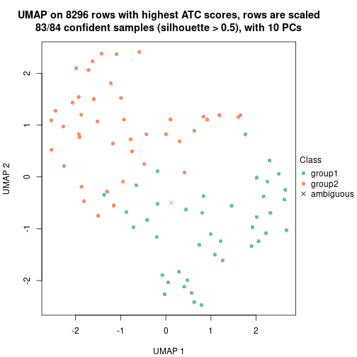</p>

</div>
<div id='tab-node-0241-dimension-reduction-2'>
<pre><code class="r">dimension_reduction(res, k = 3, method = &quot;UMAP&quot;)
</code></pre>

<p></p>

</div>
<div id='tab-node-0241-dimension-reduction-3'>
<pre><code class="r">dimension_reduction(res, k = 4, method = &quot;UMAP&quot;)
</code></pre>

<p>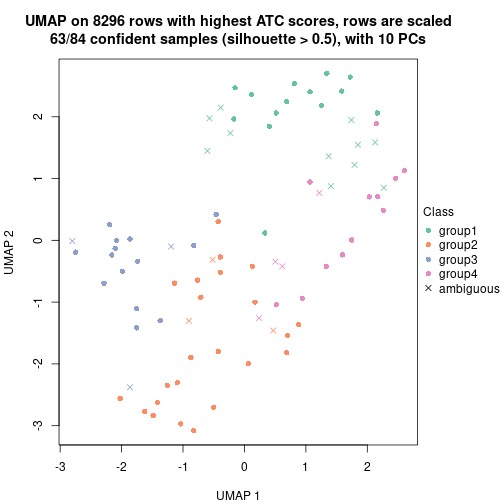</p>

</div>
</div>


Following heatmap shows how subgroups are split when increasing `k`:

```r
collect_classes(res)
```

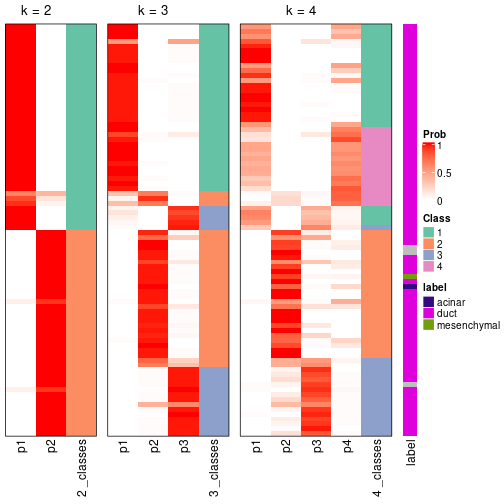


Test correlation between subgroups and known annotations. If the known
annotation is numeric, one-way ANOVA test is applied, and if the known
annotation is discrete, chi-squared contingency table test is applied.

```r
test_to_known_factors(res)
```

```
#>             n_sample label(p-value) k
#> ATC:skmeans       83          0.340 2
#> ATC:skmeans       81          0.453 3
#> ATC:skmeans       63          0.698 4
```


If matrix rows can be associated to genes, consider to use `functional_enrichment(res,
...)` to perform function enrichment for the signature genes. See [this vignette](https://jokergoo.github.io/cola_vignettes/functional_enrichment.html) for more detailed explanations.


 

---------------------------------------------------


### Node0242


Parent node: [Node024](#Node024).
Child nodes: 
                Node02121-leaf
        ,
                Node02122-leaf
        ,
                Node02123-leaf
        ,
                Node02141-leaf
        ,
                Node02142-leaf
        ,
                Node02143-leaf
        ,
                Node02144-leaf
        ,
                [Node02211](#Node02211)
        ,
                Node02212-leaf
        ,
                Node02213-leaf
        ,
                Node02221-leaf
        ,
                Node02222-leaf
        ,
                Node02223-leaf
        ,
                Node02311-leaf
        ,
                Node02312-leaf
        ,
                Node02321-leaf
        ,
                Node02322-leaf
        ,
                Node02411-leaf
        ,
                Node02412-leaf
        ,
                Node02421-leaf
        ,
                Node02422-leaf
        .


The object with results only for a single top-value method and a single partitioning method 
can be extracted as:

```r
res = res_rh["0242"]
```

A summary of `res` and all the functions that can be applied to it:

```r
res
```

```
#> A 'ConsensusPartition' object with k = 2, 3, 4.
#>   On a matrix with 7915 rows and 76 columns.
#>   Top rows (792) are extracted by 'ATC' method.
#>   Subgroups are detected by 'skmeans' method.
#>   Performed in total 150 partitions by row resampling.
#>   Best k for subgroups seems to be 2.
#> 
#> Following methods can be applied to this 'ConsensusPartition' object:
#>  [1] "cola_report"             "collect_classes"         "collect_plots"          
#>  [4] "collect_stats"           "colnames"                "compare_partitions"     
#>  [7] "compare_signatures"      "consensus_heatmap"       "dimension_reduction"    
#> [10] "functional_enrichment"   "get_anno_col"            "get_anno"               
#> [13] "get_classes"             "get_consensus"           "get_matrix"             
#> [16] "get_membership"          "get_param"               "get_signatures"         
#> [19] "get_stats"               "is_best_k"               "is_stable_k"            
#> [22] "membership_heatmap"      "ncol"                    "nrow"                   
#> [25] "plot_ecdf"               "predict_classes"         "rownames"               
#> [28] "select_partition_number" "show"                    "suggest_best_k"         
#> [31] "test_to_known_factors"   "top_rows_heatmap"
```

`collect_plots()` function collects all the plots made from `res` for all `k` (number of subgroups)
into one single page to provide an easy and fast comparison between different `k`.

```r
collect_plots(res)
```

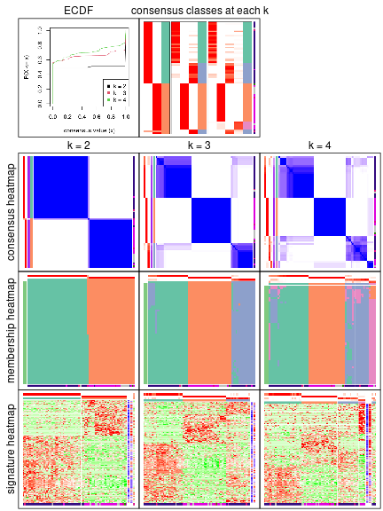

The plots are:

- The first row: a plot of the eCDF (empirical cumulative distribution
  function) curves of the consensus matrix for each `k` and the heatmap of
  predicted classes for each `k`.
- The second row: heatmaps of the consensus matrix for each `k`.
- The third row: heatmaps of the membership matrix for each `k`.
- The fouth row: heatmaps of the signatures for each `k`.

All the plots in panels can be made by individual functions and they are
plotted later in this section.

`select_partition_number()` produces several plots showing different
statistics for choosing "optimized" `k`. There are following statistics:

- eCDF curves of the consensus matrix for each `k`;
- 1-PAC. [The PAC score](https://en.wikipedia.org/wiki/Consensus_clustering#Over-interpretation_potential_of_consensus_clustering)
  measures the proportion of the ambiguous subgrouping.
- Mean silhouette score.
- Concordance. The mean probability of fiting the consensus subgroup labels in all
  partitions.
- Area increased. Denote $A_k$ as the area under the eCDF curve for current
  `k`, the area increased is defined as $A_k - A_{k-1}$.
- Rand index. The percent of pairs of samples that are both in a same cluster
  or both are not in a same cluster in the partition of k and k-1.
- Jaccard index. The ratio of pairs of samples are both in a same cluster in
  the partition of k and k-1 and the pairs of samples are both in a same
  cluster in the partition k or k-1.

The detailed explanations of these statistics can be found in [the _cola_
vignette](https://jokergoo.github.io/cola_vignettes/cola.html#toc_13).

Generally speaking, higher 1-PAC score, higher mean silhouette score or higher
concordance corresponds to better partition. Rand index and Jaccard index
measure how similar the current partition is compared to partition with `k-1`.
If they are too similar, we won't accept `k` is better than `k-1`.

```r
select_partition_number(res)
```

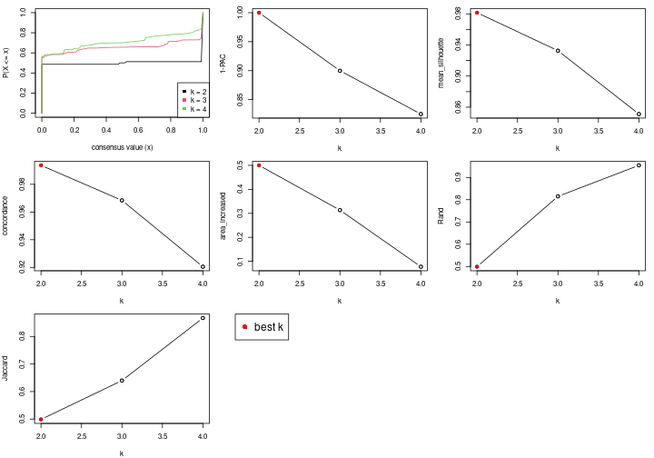

The numeric values for all these statistics can be obtained by `get_stats()`.

```r
get_stats(res)
```

```
#>   k 1-PAC mean_silhouette concordance area_increased  Rand Jaccard
#> 2 2 1.000           0.981       0.994         0.5000 0.499   0.499
#> 3 3 0.900           0.933       0.968         0.3134 0.815   0.640
#> 4 4 0.825           0.851       0.921         0.0773 0.954   0.867
```

`suggest_best_k()` suggests the best $k$ based on these statistics. The rules are as follows:

- All $k$ with Jaccard index larger than 0.95 are removed because increasing
  $k$ does not provide enough extra information. If all $k$ are removed, it is
  marked as no subgroup is detected.
- For all $k$ with 1-PAC score larger than 0.9, the maximal $k$ is taken as
  the best $k$, and other $k$ are marked as optional $k$.
- If it does not fit the second rule. The $k$ with the maximal vote of the
  highest 1-PAC score, highest mean silhouette, and highest concordance is
  taken as the best $k$.

```r
suggest_best_k(res)
```

```
#> [1] 2
```


Following is the table of the partitions (You need to click the **show/hide
code output** link to see it). The membership matrix (columns with name `p*`)
is inferred by
[`clue::cl_consensus()`](https://www.rdocumentation.org/link/cl_consensus?package=clue)
function with the `SE` method. Basically the value in the membership matrix
represents the probability to belong to a certain group. The finall subgroup
label for an item is determined with the group with highest probability it
belongs to.

In `get_classes()` function, the entropy is calculated from the membership
matrix and the silhouette score is calculated from the consensus matrix.


<script>
$( function() {
	$( '#tabs-node-0242-get-classes' ).tabs();
} );
</script>
<div id='tabs-node-0242-get-classes'>
<ul>
<li><a href='#tab-node-0242-get-classes-1'>k = 2</a></li>
<li><a href='#tab-node-0242-get-classes-2'>k = 3</a></li>
<li><a href='#tab-node-0242-get-classes-3'>k = 4</a></li>
</ul>

<div id='tab-node-0242-get-classes-1'>
<p><a id='tab-node-0242-get-classes-1-a' style='color:#0366d6' href='#'>show/hide code output</a></p>
<pre><code class="r">cbind(get_classes(res, k = 2), get_membership(res, k = 2))
</code></pre>

<pre><code>#&gt;          class entropy silhouette   p1   p2
#&gt; D28-1_5      2   0.000     0.9854 0.00 1.00
#&gt; D28-2_13     2   0.000     0.9854 0.00 1.00
#&gt; D28-2_66     2   0.000     0.9854 0.00 1.00
#&gt; D28-3_31     1   0.000     1.0000 1.00 0.00
#&gt; D28-3_85     1   0.000     1.0000 1.00 0.00
#&gt; D28-3_90     1   0.000     1.0000 1.00 0.00
#&gt; D28-4_53     2   0.000     0.9854 0.00 1.00
#&gt; D28-4_85     1   0.000     1.0000 1.00 0.00
#&gt; D28-5_66     2   0.000     0.9854 0.00 1.00
#&gt; D28-6_17     2   0.000     0.9854 0.00 1.00
#&gt; D28-6_39     2   0.000     0.9854 0.00 1.00
#&gt; D28-7_76     2   0.000     0.9854 0.00 1.00
#&gt; D28-8_42     2   0.000     0.9854 0.00 1.00
#&gt; D28-8_49     1   0.000     1.0000 1.00 0.00
#&gt; D28-8_90     2   0.000     0.9854 0.00 1.00
#&gt; D29-2_7      2   0.000     0.9854 0.00 1.00
#&gt; D29-2_49     2   0.000     0.9854 0.00 1.00
#&gt; D29-2_88     2   0.000     0.9854 0.00 1.00
#&gt; D29-3_12     2   0.000     0.9854 0.00 1.00
#&gt; D29-5_78     1   0.000     1.0000 1.00 0.00
#&gt; D29-7_5      1   0.000     1.0000 1.00 0.00
#&gt; D29-7_20     2   0.000     0.9854 0.00 1.00
#&gt; D31-1_7      1   0.000     1.0000 1.00 0.00
#&gt; D31-1_16     2   0.000     0.9854 0.00 1.00
#&gt; D31-1_27     1   0.000     1.0000 1.00 0.00
#&gt; D31-1_51     1   0.000     1.0000 1.00 0.00
#&gt; D31-1_83     2   0.000     0.9854 0.00 1.00
#&gt; D31-1_90     2   0.000     0.9854 0.00 1.00
#&gt; D31-2_18     1   0.000     1.0000 1.00 0.00
#&gt; D31-2_26     1   0.000     1.0000 1.00 0.00
#&gt; D31-2_77     2   0.000     0.9854 0.00 1.00
#&gt; D31-2_94     2   0.000     0.9854 0.00 1.00
#&gt; D31-3_23     1   0.000     1.0000 1.00 0.00
#&gt; D31-4_9      1   0.000     1.0000 1.00 0.00
#&gt; D31-4_76     2   0.000     0.9854 0.00 1.00
#&gt; D31-4_90     1   0.000     1.0000 1.00 0.00
#&gt; D31-4_91     1   0.000     1.0000 1.00 0.00
#&gt; D31-5_4      1   0.000     1.0000 1.00 0.00
#&gt; D31-5_34     1   0.000     1.0000 1.00 0.00
#&gt; D31-5_39     1   0.000     1.0000 1.00 0.00
#&gt; D31-5_57     1   0.000     1.0000 1.00 0.00
#&gt; D31-5_60     1   0.000     1.0000 1.00 0.00
#&gt; D31-5_64     2   0.000     0.9854 0.00 1.00
#&gt; D31-5_73     2   0.000     0.9854 0.00 1.00
#&gt; D31-5_75     1   0.000     1.0000 1.00 0.00
#&gt; D31-5_81     2   0.000     0.9854 0.00 1.00
#&gt; D31-5_89     1   0.000     1.0000 1.00 0.00
#&gt; D31-6_11     1   0.000     1.0000 1.00 0.00
#&gt; D31-6_21     1   0.000     1.0000 1.00 0.00
#&gt; D31-6_24     1   0.000     1.0000 1.00 0.00
#&gt; D31-6_29     1   0.000     1.0000 1.00 0.00
#&gt; D31-6_34     2   0.000     0.9854 0.00 1.00
#&gt; D31-6_40     1   0.000     1.0000 1.00 0.00
#&gt; D31-6_52     1   0.000     1.0000 1.00 0.00
#&gt; D31-6_62     1   0.000     1.0000 1.00 0.00
#&gt; D31-6_75     1   0.000     1.0000 1.00 0.00
#&gt; D31-6_79     2   0.000     0.9854 0.00 1.00
#&gt; D31-7_9      1   0.000     1.0000 1.00 0.00
#&gt; D31-7_11     1   0.000     1.0000 1.00 0.00
#&gt; D31-7_21     1   0.000     1.0000 1.00 0.00
#&gt; D31-7_26     2   0.000     0.9854 0.00 1.00
#&gt; D31-7_58     2   0.999     0.0769 0.48 0.52
#&gt; D31-8_7      1   0.000     1.0000 1.00 0.00
#&gt; D31-8_40     1   0.000     1.0000 1.00 0.00
#&gt; D31-8_90     2   0.000     0.9854 0.00 1.00
#&gt; D30-1_29     1   0.000     1.0000 1.00 0.00
#&gt; D30-1_63     2   0.000     0.9854 0.00 1.00
#&gt; D30-1_78     2   0.000     0.9854 0.00 1.00
#&gt; D30-1_91     1   0.000     1.0000 1.00 0.00
#&gt; D30-3_91     1   0.000     1.0000 1.00 0.00
#&gt; D30-4_81     1   0.000     1.0000 1.00 0.00
#&gt; D30-5_41     2   0.000     0.9854 0.00 1.00
#&gt; D30-6_5      1   0.000     1.0000 1.00 0.00
#&gt; D30-7_24     1   0.000     1.0000 1.00 0.00
#&gt; D30-7_88     2   0.000     0.9854 0.00 1.00
#&gt; D30-8_8      2   0.000     0.9854 0.00 1.00
</code></pre>

<script>
$('#tab-node-0242-get-classes-1-a').parent().next().next().hide();
$('#tab-node-0242-get-classes-1-a').click(function(){
  $('#tab-node-0242-get-classes-1-a').parent().next().next().toggle();
  return(false);
});
</script>
</div>

<div id='tab-node-0242-get-classes-2'>
<p><a id='tab-node-0242-get-classes-2-a' style='color:#0366d6' href='#'>show/hide code output</a></p>
<pre><code class="r">cbind(get_classes(res, k = 3), get_membership(res, k = 3))
</code></pre>

<pre><code>#&gt;          class entropy silhouette   p1   p2   p3
#&gt; D28-1_5      2  0.0000      1.000 0.00 1.00 0.00
#&gt; D28-2_13     2  0.0000      1.000 0.00 1.00 0.00
#&gt; D28-2_66     2  0.0000      1.000 0.00 1.00 0.00
#&gt; D28-3_31     1  0.0000      0.939 1.00 0.00 0.00
#&gt; D28-3_85     1  0.0000      0.939 1.00 0.00 0.00
#&gt; D28-3_90     1  0.0000      0.939 1.00 0.00 0.00
#&gt; D28-4_53     3  0.0892      0.919 0.00 0.02 0.98
#&gt; D28-4_85     1  0.0000      0.939 1.00 0.00 0.00
#&gt; D28-5_66     2  0.0000      1.000 0.00 1.00 0.00
#&gt; D28-6_17     2  0.0000      1.000 0.00 1.00 0.00
#&gt; D28-6_39     2  0.0000      1.000 0.00 1.00 0.00
#&gt; D28-7_76     2  0.0000      1.000 0.00 1.00 0.00
#&gt; D28-8_42     2  0.0000      1.000 0.00 1.00 0.00
#&gt; D28-8_49     1  0.0000      0.939 1.00 0.00 0.00
#&gt; D28-8_90     2  0.0000      1.000 0.00 1.00 0.00
#&gt; D29-2_7      2  0.0000      1.000 0.00 1.00 0.00
#&gt; D29-2_49     2  0.0000      1.000 0.00 1.00 0.00
#&gt; D29-2_88     2  0.0000      1.000 0.00 1.00 0.00
#&gt; D29-3_12     2  0.0000      1.000 0.00 1.00 0.00
#&gt; D29-5_78     1  0.0000      0.939 1.00 0.00 0.00
#&gt; D29-7_5      1  0.0892      0.925 0.98 0.00 0.02
#&gt; D29-7_20     2  0.0000      1.000 0.00 1.00 0.00
#&gt; D31-1_7      3  0.3686      0.835 0.14 0.00 0.86
#&gt; D31-1_16     2  0.0000      1.000 0.00 1.00 0.00
#&gt; D31-1_27     3  0.5397      0.617 0.28 0.00 0.72
#&gt; D31-1_51     3  0.0000      0.934 0.00 0.00 1.00
#&gt; D31-1_83     2  0.0000      1.000 0.00 1.00 0.00
#&gt; D31-1_90     2  0.0000      1.000 0.00 1.00 0.00
#&gt; D31-2_18     1  0.0000      0.939 1.00 0.00 0.00
#&gt; D31-2_26     1  0.0000      0.939 1.00 0.00 0.00
#&gt; D31-2_77     2  0.0000      1.000 0.00 1.00 0.00
#&gt; D31-2_94     2  0.0000      1.000 0.00 1.00 0.00
#&gt; D31-3_23     3  0.0000      0.934 0.00 0.00 1.00
#&gt; D31-4_9      1  0.5016      0.654 0.76 0.00 0.24
#&gt; D31-4_76     2  0.0000      1.000 0.00 1.00 0.00
#&gt; D31-4_90     3  0.0000      0.934 0.00 0.00 1.00
#&gt; D31-4_91     1  0.0000      0.939 1.00 0.00 0.00
#&gt; D31-5_4      3  0.0000      0.934 0.00 0.00 1.00
#&gt; D31-5_34     1  0.0000      0.939 1.00 0.00 0.00
#&gt; D31-5_39     1  0.0000      0.939 1.00 0.00 0.00
#&gt; D31-5_57     1  0.0000      0.939 1.00 0.00 0.00
#&gt; D31-5_60     1  0.0000      0.939 1.00 0.00 0.00
#&gt; D31-5_64     2  0.0000      1.000 0.00 1.00 0.00
#&gt; D31-5_73     2  0.0000      1.000 0.00 1.00 0.00
#&gt; D31-5_75     3  0.0000      0.934 0.00 0.00 1.00
#&gt; D31-5_81     2  0.0000      1.000 0.00 1.00 0.00
#&gt; D31-5_89     1  0.4796      0.731 0.78 0.00 0.22
#&gt; D31-6_11     3  0.4796      0.731 0.22 0.00 0.78
#&gt; D31-6_21     1  0.0000      0.939 1.00 0.00 0.00
#&gt; D31-6_24     1  0.5216      0.670 0.74 0.00 0.26
#&gt; D31-6_29     3  0.4002      0.816 0.16 0.00 0.84
#&gt; D31-6_34     2  0.0000      1.000 0.00 1.00 0.00
#&gt; D31-6_40     1  0.0892      0.925 0.98 0.00 0.02
#&gt; D31-6_52     1  0.0000      0.939 1.00 0.00 0.00
#&gt; D31-6_62     3  0.3686      0.837 0.14 0.00 0.86
#&gt; D31-6_75     1  0.4796      0.731 0.78 0.00 0.22
#&gt; D31-6_79     2  0.0000      1.000 0.00 1.00 0.00
#&gt; D31-7_9      3  0.0000      0.934 0.00 0.00 1.00
#&gt; D31-7_11     1  0.0000      0.939 1.00 0.00 0.00
#&gt; D31-7_21     1  0.0000      0.939 1.00 0.00 0.00
#&gt; D31-7_26     2  0.0000      1.000 0.00 1.00 0.00
#&gt; D31-7_58     3  0.0000      0.934 0.00 0.00 1.00
#&gt; D31-8_7      1  0.0000      0.939 1.00 0.00 0.00
#&gt; D31-8_40     1  0.0000      0.939 1.00 0.00 0.00
#&gt; D31-8_90     2  0.0000      1.000 0.00 1.00 0.00
#&gt; D30-1_29     3  0.0000      0.934 0.00 0.00 1.00
#&gt; D30-1_63     3  0.0000      0.934 0.00 0.00 1.00
#&gt; D30-1_78     2  0.0000      1.000 0.00 1.00 0.00
#&gt; D30-1_91     1  0.4796      0.731 0.78 0.00 0.22
#&gt; D30-3_91     1  0.5016      0.702 0.76 0.00 0.24
#&gt; D30-4_81     1  0.0000      0.939 1.00 0.00 0.00
#&gt; D30-5_41     2  0.0000      1.000 0.00 1.00 0.00
#&gt; D30-6_5      3  0.0000      0.934 0.00 0.00 1.00
#&gt; D30-7_24     3  0.0000      0.934 0.00 0.00 1.00
#&gt; D30-7_88     2  0.0000      1.000 0.00 1.00 0.00
#&gt; D30-8_8      2  0.0000      1.000 0.00 1.00 0.00
</code></pre>

<script>
$('#tab-node-0242-get-classes-2-a').parent().next().next().hide();
$('#tab-node-0242-get-classes-2-a').click(function(){
  $('#tab-node-0242-get-classes-2-a').parent().next().next().toggle();
  return(false);
});
</script>
</div>

<div id='tab-node-0242-get-classes-3'>
<p><a id='tab-node-0242-get-classes-3-a' style='color:#0366d6' href='#'>show/hide code output</a></p>
<pre><code class="r">cbind(get_classes(res, k = 4), get_membership(res, k = 4))
</code></pre>

<pre><code>#&gt;          class entropy silhouette   p1   p2   p3   p4
#&gt; D28-1_5      2  0.0000      1.000 0.00 1.00 0.00 0.00
#&gt; D28-2_13     2  0.0000      1.000 0.00 1.00 0.00 0.00
#&gt; D28-2_66     4  0.2335      0.874 0.02 0.06 0.00 0.92
#&gt; D28-3_31     1  0.0000      0.888 1.00 0.00 0.00 0.00
#&gt; D28-3_85     1  0.1411      0.872 0.96 0.00 0.02 0.02
#&gt; D28-3_90     1  0.0000      0.888 1.00 0.00 0.00 0.00
#&gt; D28-4_53     3  0.4713      0.489 0.00 0.00 0.64 0.36
#&gt; D28-4_85     1  0.0000      0.888 1.00 0.00 0.00 0.00
#&gt; D28-5_66     2  0.0000      1.000 0.00 1.00 0.00 0.00
#&gt; D28-6_17     2  0.0000      1.000 0.00 1.00 0.00 0.00
#&gt; D28-6_39     2  0.0000      1.000 0.00 1.00 0.00 0.00
#&gt; D28-7_76     2  0.0000      1.000 0.00 1.00 0.00 0.00
#&gt; D28-8_42     4  0.2921      0.970 0.00 0.14 0.00 0.86
#&gt; D28-8_49     1  0.0000      0.888 1.00 0.00 0.00 0.00
#&gt; D28-8_90     2  0.0000      1.000 0.00 1.00 0.00 0.00
#&gt; D29-2_7      2  0.0000      1.000 0.00 1.00 0.00 0.00
#&gt; D29-2_49     4  0.2921      0.970 0.00 0.14 0.00 0.86
#&gt; D29-2_88     2  0.0000      1.000 0.00 1.00 0.00 0.00
#&gt; D29-3_12     2  0.0000      1.000 0.00 1.00 0.00 0.00
#&gt; D29-5_78     1  0.0000      0.888 1.00 0.00 0.00 0.00
#&gt; D29-7_5      1  0.4977      0.163 0.54 0.00 0.00 0.46
#&gt; D29-7_20     2  0.0000      1.000 0.00 1.00 0.00 0.00
#&gt; D31-1_7      3  0.5489      0.601 0.24 0.00 0.70 0.06
#&gt; D31-1_16     2  0.0000      1.000 0.00 1.00 0.00 0.00
#&gt; D31-1_27     3  0.6594      0.503 0.24 0.00 0.62 0.14
#&gt; D31-1_51     3  0.0707      0.795 0.00 0.00 0.98 0.02
#&gt; D31-1_83     2  0.0000      1.000 0.00 1.00 0.00 0.00
#&gt; D31-1_90     2  0.0000      1.000 0.00 1.00 0.00 0.00
#&gt; D31-2_18     1  0.0000      0.888 1.00 0.00 0.00 0.00
#&gt; D31-2_26     1  0.0000      0.888 1.00 0.00 0.00 0.00
#&gt; D31-2_77     2  0.0000      1.000 0.00 1.00 0.00 0.00
#&gt; D31-2_94     2  0.0000      1.000 0.00 1.00 0.00 0.00
#&gt; D31-3_23     3  0.0000      0.798 0.00 0.00 1.00 0.00
#&gt; D31-4_9      1  0.4581      0.703 0.80 0.00 0.12 0.08
#&gt; D31-4_76     2  0.0000      1.000 0.00 1.00 0.00 0.00
#&gt; D31-4_90     3  0.0707      0.795 0.00 0.00 0.98 0.02
#&gt; D31-4_91     1  0.0000      0.888 1.00 0.00 0.00 0.00
#&gt; D31-5_4      3  0.2345      0.790 0.00 0.00 0.90 0.10
#&gt; D31-5_34     1  0.0000      0.888 1.00 0.00 0.00 0.00
#&gt; D31-5_39     1  0.0707      0.880 0.98 0.00 0.00 0.02
#&gt; D31-5_57     1  0.0000      0.888 1.00 0.00 0.00 0.00
#&gt; D31-5_60     1  0.0000      0.888 1.00 0.00 0.00 0.00
#&gt; D31-5_64     2  0.0000      1.000 0.00 1.00 0.00 0.00
#&gt; D31-5_73     2  0.0000      1.000 0.00 1.00 0.00 0.00
#&gt; D31-5_75     3  0.1211      0.788 0.00 0.00 0.96 0.04
#&gt; D31-5_81     2  0.0000      1.000 0.00 1.00 0.00 0.00
#&gt; D31-5_89     1  0.5619      0.515 0.64 0.00 0.32 0.04
#&gt; D31-6_11     3  0.5986      0.437 0.32 0.00 0.62 0.06
#&gt; D31-6_21     1  0.0000      0.888 1.00 0.00 0.00 0.00
#&gt; D31-6_24     1  0.5619      0.515 0.64 0.00 0.32 0.04
#&gt; D31-6_29     3  0.5106      0.602 0.24 0.00 0.72 0.04
#&gt; D31-6_34     2  0.0000      1.000 0.00 1.00 0.00 0.00
#&gt; D31-6_40     1  0.2011      0.851 0.92 0.00 0.00 0.08
#&gt; D31-6_52     1  0.0000      0.888 1.00 0.00 0.00 0.00
#&gt; D31-6_62     3  0.4755      0.655 0.20 0.00 0.76 0.04
#&gt; D31-6_75     1  0.5619      0.515 0.64 0.00 0.32 0.04
#&gt; D31-6_79     2  0.0000      1.000 0.00 1.00 0.00 0.00
#&gt; D31-7_9      3  0.2921      0.771 0.00 0.00 0.86 0.14
#&gt; D31-7_11     1  0.1913      0.861 0.94 0.00 0.02 0.04
#&gt; D31-7_21     1  0.0000      0.888 1.00 0.00 0.00 0.00
#&gt; D31-7_26     2  0.0000      1.000 0.00 1.00 0.00 0.00
#&gt; D31-7_58     3  0.2921      0.771 0.00 0.00 0.86 0.14
#&gt; D31-8_7      1  0.0000      0.888 1.00 0.00 0.00 0.00
#&gt; D31-8_40     1  0.1913      0.861 0.94 0.00 0.02 0.04
#&gt; D31-8_90     2  0.0000      1.000 0.00 1.00 0.00 0.00
#&gt; D30-1_29     3  0.0707      0.800 0.00 0.00 0.98 0.02
#&gt; D30-1_63     3  0.2011      0.791 0.00 0.00 0.92 0.08
#&gt; D30-1_78     2  0.0000      1.000 0.00 1.00 0.00 0.00
#&gt; D30-1_91     1  0.5619      0.515 0.64 0.00 0.32 0.04
#&gt; D30-3_91     1  0.5619      0.515 0.64 0.00 0.32 0.04
#&gt; D30-4_81     1  0.0000      0.888 1.00 0.00 0.00 0.00
#&gt; D30-5_41     4  0.2921      0.970 0.00 0.14 0.00 0.86
#&gt; D30-6_5      3  0.1211      0.799 0.00 0.00 0.96 0.04
#&gt; D30-7_24     3  0.2921      0.771 0.00 0.00 0.86 0.14
#&gt; D30-7_88     4  0.2921      0.970 0.00 0.14 0.00 0.86
#&gt; D30-8_8      2  0.0000      1.000 0.00 1.00 0.00 0.00
</code></pre>

<script>
$('#tab-node-0242-get-classes-3-a').parent().next().next().hide();
$('#tab-node-0242-get-classes-3-a').click(function(){
  $('#tab-node-0242-get-classes-3-a').parent().next().next().toggle();
  return(false);
});
</script>
</div>
</div>

Heatmaps for the consensus matrix. It visualizes the probability of two
samples to be in a same group.


<script>
$( function() {
	$( '#tabs-node-0242-consensus-heatmap' ).tabs();
} );
</script>
<div id='tabs-node-0242-consensus-heatmap'>
<ul>
<li><a href='#tab-node-0242-consensus-heatmap-1'>k = 2</a></li>
<li><a href='#tab-node-0242-consensus-heatmap-2'>k = 3</a></li>
<li><a href='#tab-node-0242-consensus-heatmap-3'>k = 4</a></li>
</ul>
<div id='tab-node-0242-consensus-heatmap-1'>
<pre><code class="r">consensus_heatmap(res, k = 2)
</code></pre>

<p>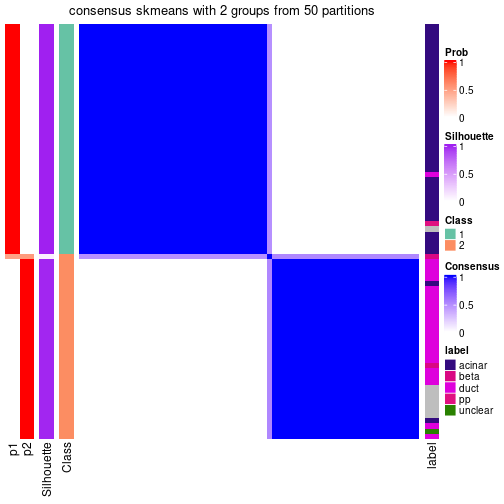</p>

</div>
<div id='tab-node-0242-consensus-heatmap-2'>
<pre><code class="r">consensus_heatmap(res, k = 3)
</code></pre>

<p>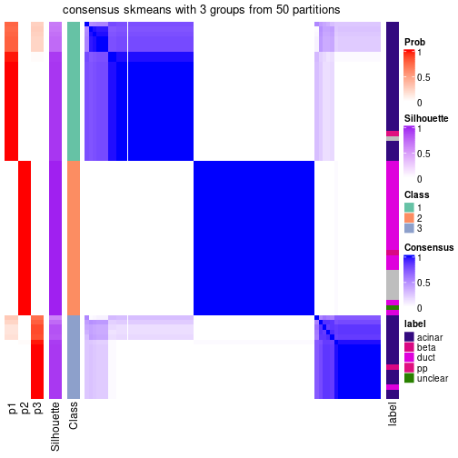</p>

</div>
<div id='tab-node-0242-consensus-heatmap-3'>
<pre><code class="r">consensus_heatmap(res, k = 4)
</code></pre>

<p>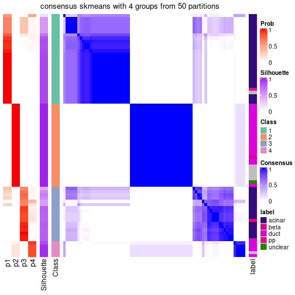</p>

</div>
</div>

Heatmaps for the membership of samples in all partitions to see how consistent they are:


<script>
$( function() {
	$( '#tabs-node-0242-membership-heatmap' ).tabs();
} );
</script>
<div id='tabs-node-0242-membership-heatmap'>
<ul>
<li><a href='#tab-node-0242-membership-heatmap-1'>k = 2</a></li>
<li><a href='#tab-node-0242-membership-heatmap-2'>k = 3</a></li>
<li><a href='#tab-node-0242-membership-heatmap-3'>k = 4</a></li>
</ul>
<div id='tab-node-0242-membership-heatmap-1'>
<pre><code class="r">membership_heatmap(res, k = 2)
</code></pre>

<p></p>

</div>
<div id='tab-node-0242-membership-heatmap-2'>
<pre><code class="r">membership_heatmap(res, k = 3)
</code></pre>

<p></p>

</div>
<div id='tab-node-0242-membership-heatmap-3'>
<pre><code class="r">membership_heatmap(res, k = 4)
</code></pre>

<p>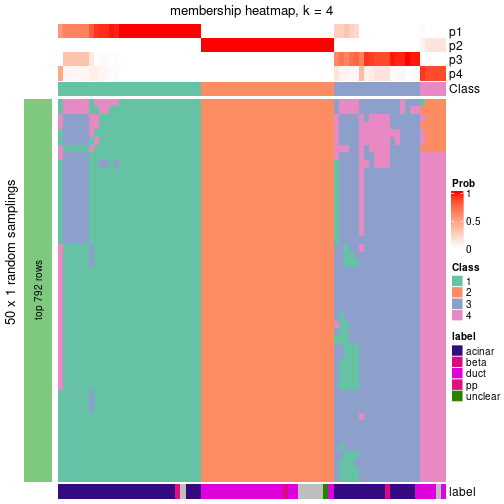</p>

</div>
</div>

As soon as the classes for columns are determined, the signatures
that are significantly different between subgroups can be looked for. 
Following are the heatmaps for signatures.


Signature heatmaps where rows are scaled:


<script>
$( function() {
	$( '#tabs-node-0242-get-signatures' ).tabs();
} );
</script>
<div id='tabs-node-0242-get-signatures'>
<ul>
<li><a href='#tab-node-0242-get-signatures-1'>k = 2</a></li>
<li><a href='#tab-node-0242-get-signatures-2'>k = 3</a></li>
<li><a href='#tab-node-0242-get-signatures-3'>k = 4</a></li>
</ul>
<div id='tab-node-0242-get-signatures-1'>
<pre><code class="r">get_signatures(res, k = 2)
</code></pre>

<p>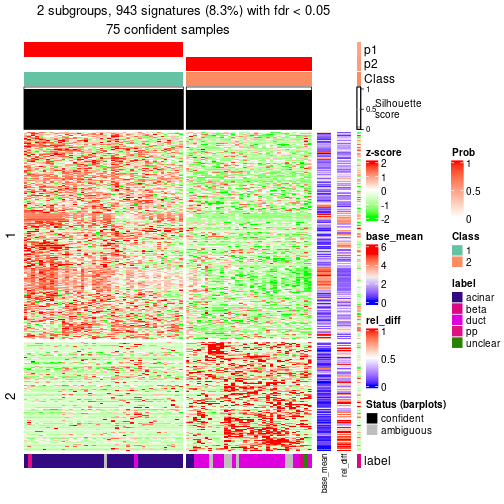</p>

</div>
<div id='tab-node-0242-get-signatures-2'>
<pre><code class="r">get_signatures(res, k = 3)
</code></pre>

<p>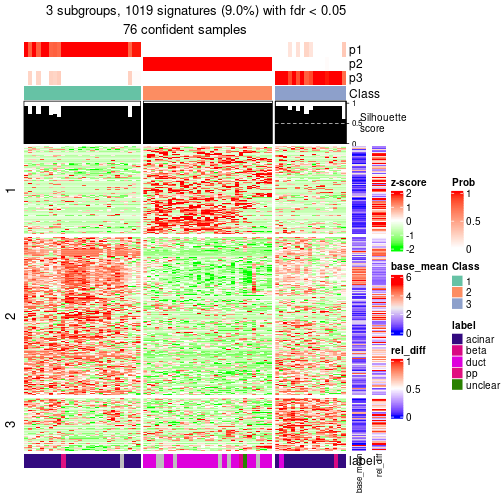</p>

</div>
<div id='tab-node-0242-get-signatures-3'>
<pre><code class="r">get_signatures(res, k = 4)
</code></pre>

<p>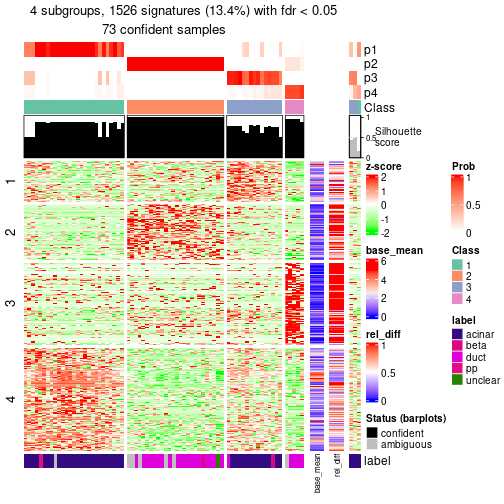</p>

</div>
</div>


Signature heatmaps where rows are not scaled:


<script>
$( function() {
	$( '#tabs-node-0242-get-signatures-no-scale' ).tabs();
} );
</script>
<div id='tabs-node-0242-get-signatures-no-scale'>
<ul>
<li><a href='#tab-node-0242-get-signatures-no-scale-1'>k = 2</a></li>
<li><a href='#tab-node-0242-get-signatures-no-scale-2'>k = 3</a></li>
<li><a href='#tab-node-0242-get-signatures-no-scale-3'>k = 4</a></li>
</ul>
<div id='tab-node-0242-get-signatures-no-scale-1'>
<pre><code class="r">get_signatures(res, k = 2, scale_rows = FALSE)
</code></pre>

<p>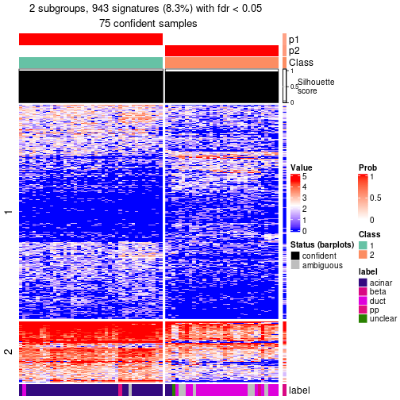</p>

</div>
<div id='tab-node-0242-get-signatures-no-scale-2'>
<pre><code class="r">get_signatures(res, k = 3, scale_rows = FALSE)
</code></pre>

<p>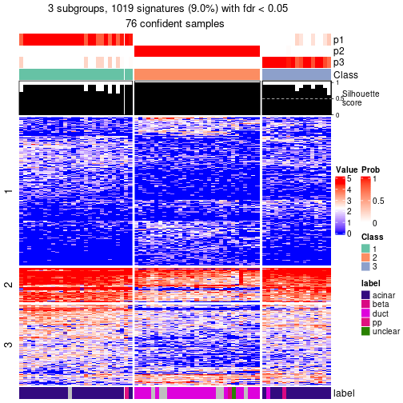</p>

</div>
<div id='tab-node-0242-get-signatures-no-scale-3'>
<pre><code class="r">get_signatures(res, k = 4, scale_rows = FALSE)
</code></pre>

<p>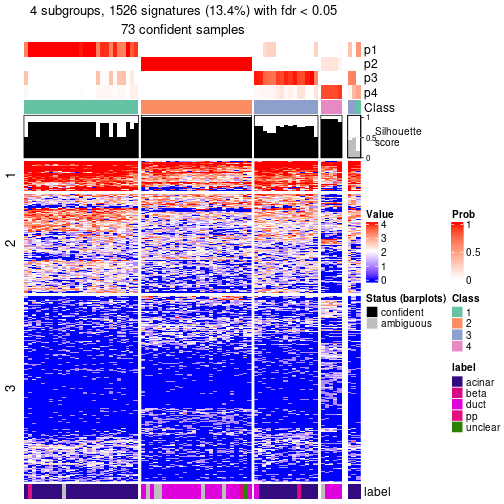</p>

</div>
</div>


Compare the overlap of signatures from different k:

```r
compare_signatures(res)
```

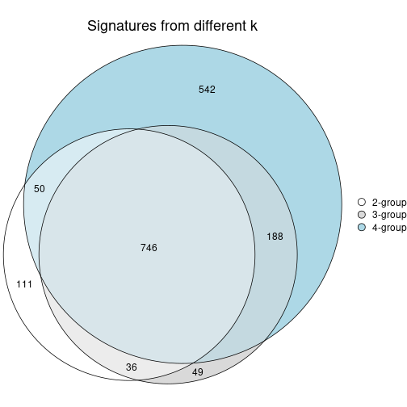

`get_signature()` returns a data frame invisibly. To get the list of signatures, the function
call should be assigned to a variable explicitly. In following code, if `plot` argument is set
to `FALSE`, no heatmap is plotted while only the differential analysis is performed.

```r
# code only for demonstration
tb = get_signature(res, k = ..., plot = FALSE)
```

An example of the output of `tb` is:

```
#>   which_row         fdr    mean_1    mean_2 scaled_mean_1 scaled_mean_2 km
#> 1        38 0.042760348  8.373488  9.131774    -0.5533452     0.5164555  1
#> 2        40 0.018707592  7.106213  8.469186    -0.6173731     0.5762149  1
#> 3        55 0.019134737 10.221463 11.207825    -0.6159697     0.5749050  1
#> 4        59 0.006059896  5.921854  7.869574    -0.6899429     0.6439467  1
#> 5        60 0.018055526  8.928898 10.211722    -0.6204761     0.5791110  1
#> 6        98 0.009384629 15.714769 14.887706     0.6635654    -0.6193277  2
...
```

The columns in `tb` are:

1. `which_row`: row indices corresponding to the input matrix.
2. `fdr`: FDR for the differential test. 
3. `mean_x`: The mean value in group x.
4. `scaled_mean_x`: The mean value in group x after rows are scaled.
5. `km`: Row groups if k-means clustering is applied to rows (which is done by automatically selecting number of clusters).

If there are too many signatures, `top_signatures = ...` can be set to only show the 
signatures with the highest FDRs:

```r
# code only for demonstration
# e.g. to show the top 500 most significant rows
tb = get_signature(res, k = ..., top_signatures = 500)
```

If the signatures are defined as these which are uniquely high in current group, `diff_method` argument
can be set to `"uniquely_high_in_one_group"`:

```r
# code only for demonstration
tb = get_signature(res, k = ..., diff_method = "uniquely_high_in_one_group")
```


UMAP plot which shows how samples are separated.


<script>
$( function() {
	$( '#tabs-node-0242-dimension-reduction' ).tabs();
} );
</script>
<div id='tabs-node-0242-dimension-reduction'>
<ul>
<li><a href='#tab-node-0242-dimension-reduction-1'>k = 2</a></li>
<li><a href='#tab-node-0242-dimension-reduction-2'>k = 3</a></li>
<li><a href='#tab-node-0242-dimension-reduction-3'>k = 4</a></li>
</ul>
<div id='tab-node-0242-dimension-reduction-1'>
<pre><code class="r">dimension_reduction(res, k = 2, method = &quot;UMAP&quot;)
</code></pre>

<p>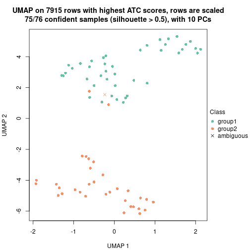</p>

</div>
<div id='tab-node-0242-dimension-reduction-2'>
<pre><code class="r">dimension_reduction(res, k = 3, method = &quot;UMAP&quot;)
</code></pre>

<p>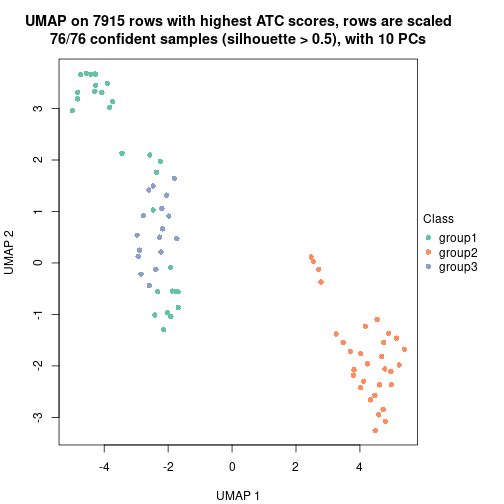</p>

</div>
<div id='tab-node-0242-dimension-reduction-3'>
<pre><code class="r">dimension_reduction(res, k = 4, method = &quot;UMAP&quot;)
</code></pre>

<p>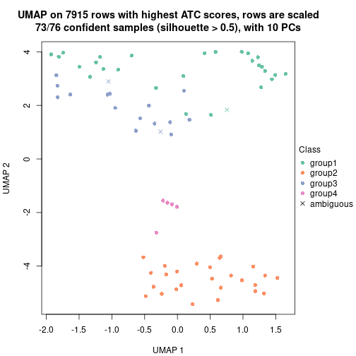</p>

</div>
</div>


Following heatmap shows how subgroups are split when increasing `k`:

```r
collect_classes(res)
```

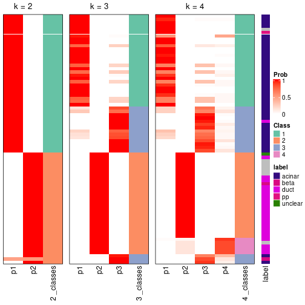


Test correlation between subgroups and known annotations. If the known
annotation is numeric, one-way ANOVA test is applied, and if the known
annotation is discrete, chi-squared contingency table test is applied.

```r
test_to_known_factors(res)
```

```
#>             n_sample label(p-value) k
#> ATC:skmeans       75       1.96e-11 2
#> ATC:skmeans       76       4.53e-11 3
#> ATC:skmeans       73       5.78e-09 4
```


If matrix rows can be associated to genes, consider to use `functional_enrichment(res,
...)` to perform function enrichment for the signature genes. See [this vignette](https://jokergoo.github.io/cola_vignettes/functional_enrichment.html) for more detailed explanations.


 

## Session info


```r
sessionInfo()
```

```
#> R version 4.1.0 (2021-05-18)
#> Platform: x86_64-pc-linux-gnu (64-bit)
#> Running under: CentOS Linux 7 (Core)
#> 
#> Matrix products: default
#> BLAS/LAPACK: /usr/lib64/libopenblas-r0.3.3.so
#> 
#> locale:
#>  [1] LC_CTYPE=en_US.UTF-8       LC_NUMERIC=C               LC_TIME=en_US.UTF-8       
#>  [4] LC_COLLATE=en_US.UTF-8     LC_MONETARY=en_US.UTF-8    LC_MESSAGES=en_US.UTF-8   
#>  [7] LC_PAPER=en_US.UTF-8       LC_NAME=C                  LC_ADDRESS=C              
#> [10] LC_TELEPHONE=C             LC_MEASUREMENT=en_US.UTF-8 LC_IDENTIFICATION=C       
#> 
#> attached base packages:
#>  [1] grid      parallel  stats4    stats     graphics  grDevices utils     datasets  methods  
#> [10] base     
#> 
#> other attached packages:
#>  [1] genefilter_1.74.0           ComplexHeatmap_2.8.0        markdown_1.1               
#>  [4] knitr_1.33                  scRNAseq_2.6.1              SingleCellExperiment_1.14.1
#>  [7] SummarizedExperiment_1.22.0 Biobase_2.52.0              GenomicRanges_1.44.0       
#> [10] GenomeInfoDb_1.28.1         IRanges_2.26.0              S4Vectors_0.30.0           
#> [13] BiocGenerics_0.38.0         MatrixGenerics_1.4.0        matrixStats_0.59.0         
#> [16] cola_1.9.4                 
#> 
#> loaded via a namespace (and not attached):
#>   [1] circlize_0.4.13               AnnotationHub_3.0.1           BiocFileCache_2.0.0          
#>   [4] lazyeval_0.2.2                polylabelr_0.2.0              splines_4.1.0                
#>   [7] Polychrome_1.3.1              BiocParallel_1.26.1           ggplot2_3.3.5                
#>  [10] digest_0.6.27                 foreach_1.5.1                 ensembldb_2.16.3             
#>  [13] htmltools_0.5.1.1             viridis_0.6.1                 fansi_0.5.0                  
#>  [16] magrittr_2.0.1                memoise_2.0.0                 cluster_2.1.2                
#>  [19] doParallel_1.0.16             Biostrings_2.60.1             annotate_1.70.0              
#>  [22] askpass_1.1                   prettyunits_1.1.1             colorspace_2.0-2             
#>  [25] blob_1.2.1                    rappdirs_0.3.3                xfun_0.24                    
#>  [28] dplyr_1.0.7                   crayon_1.4.1                  RCurl_1.98-1.3               
#>  [31] microbenchmark_1.4-7          jsonlite_1.7.2                impute_1.66.0                
#>  [34] brew_1.0-6                    survival_3.2-11               iterators_1.0.13             
#>  [37] glue_1.4.2                    polyclip_1.10-0               gtable_0.3.0                 
#>  [40] zlibbioc_1.38.0               XVector_0.32.0                GetoptLong_1.0.5             
#>  [43] DelayedArray_0.18.0           shape_1.4.6                   scales_1.1.1                 
#>  [46] data.tree_1.0.0               DBI_1.1.1                     Rcpp_1.0.7                   
#>  [49] viridisLite_0.4.0             xtable_1.8-4                  progress_1.2.2               
#>  [52] clue_0.3-59                   reticulate_1.20               bit_4.0.4                    
#>  [55] mclust_5.4.7                  umap_0.2.7.0                  httr_1.4.2                   
#>  [58] RColorBrewer_1.1-2            ellipsis_0.3.2                pkgconfig_2.0.3              
#>  [61] XML_3.99-0.6                  dbplyr_2.1.1                  utf8_1.2.1                   
#>  [64] tidyselect_1.1.1              rlang_0.4.11                  later_1.2.0                  
#>  [67] AnnotationDbi_1.54.1          munsell_0.5.0                 BiocVersion_3.13.1           
#>  [70] tools_4.1.0                   cachem_1.0.5                  generics_0.1.0               
#>  [73] RSQLite_2.2.7                 ExperimentHub_2.0.0           evaluate_0.14                
#>  [76] stringr_1.4.0                 fastmap_1.1.0                 yaml_2.2.1                   
#>  [79] bit64_4.0.5                   purrr_0.3.4                   dendextend_1.15.1            
#>  [82] KEGGREST_1.32.0               AnnotationFilter_1.16.0       mime_0.11                    
#>  [85] slam_0.1-48                   xml2_1.3.2                    biomaRt_2.48.2               
#>  [88] compiler_4.1.0                rstudioapi_0.13               filelock_1.0.2               
#>  [91] curl_4.3.2                    png_0.1-7                     interactiveDisplayBase_1.30.0
#>  [94] tibble_3.1.2                  stringi_1.7.3                 highr_0.9                    
#>  [97] GenomicFeatures_1.44.0        RSpectra_0.16-0               lattice_0.20-44              
#> [100] ProtGenerics_1.24.0           Matrix_1.3-4                  vctrs_0.3.8                  
#> [103] pillar_1.6.1                  lifecycle_1.0.0               BiocManager_1.30.16          
#> [106] eulerr_6.1.0                  GlobalOptions_0.1.2           bitops_1.0-7                 
#> [109] irlba_2.3.3                   httpuv_1.6.1                  rtracklayer_1.52.0           
#> [112] R6_2.5.0                      BiocIO_1.2.0                  promises_1.2.0.1             
#> [115] gridExtra_2.3                 codetools_0.2-18              assertthat_0.2.1             
#> [118] openssl_1.4.4                 rjson_0.2.20                  GenomicAlignments_1.28.0     
#> [121] Rsamtools_2.8.0               GenomeInfoDbData_1.2.6        hms_1.1.0                    
#> [124] skmeans_0.2-13                Cairo_1.5-12.2                scatterplot3d_0.3-41         
#> [127] shiny_1.6.0                   restfulr_0.0.13
```


